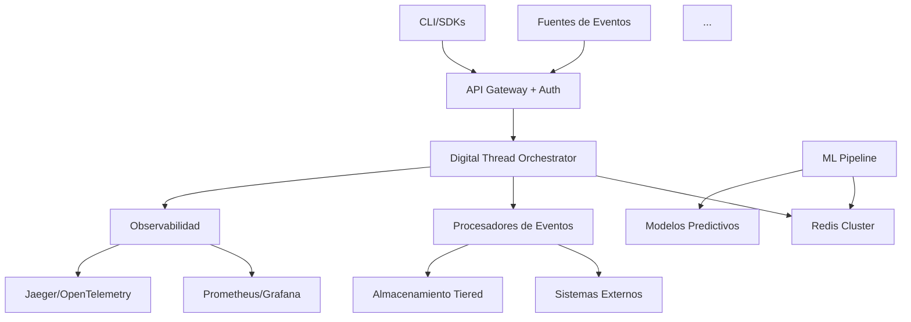

# Digital Thread Orchestrator

> Componente central de la arquitectura GAIA AIR que conecta todas las capas del ciclo de vida de productos aeroespaciales, asegurando trazabilidad completa, sostenibilidad y eficiencia operativa.

## 📋 Índice

- [Visión General](#visión-general)
- [Arquitectura](#arquitectura)
- [Características Principales](#características-principales)
- [Estructura de Datos](#estructura-de-datos)
- [Flujos de Trabajo](#flujos-de-trabajo)
- [Integración con Sistemas Externos](#integración-con-sistemas-externos)
- [Seguridad y Cumplimiento](#seguridad-y-cumplimiento)
- [Observabilidad](#observabilidad)
- [Roadmap de Implementación](#roadmap-de-implementación)
- [Ejemplos de Uso](#ejemplos-de-uso)
- [Consideraciones para Producción](#consideraciones-para-producción)

## 🔍 Visión General

El **Digital Thread Orchestrator** actúa como columna vertebral de la arquitectura GAIA AIR, conectando las tres capas principales (Diseño y Documentación, Producción Industrial, y Servicios y Operaciones) mediante un hilo digital continuo que asegura la trazabilidad completa del ciclo de vida del producto aeroespacial.

### Responsabilidades Clave

- Registro y coordinación de eventos entre sistemas
- Trazabilidad completa de cambios y decisiones
- Mantenimiento del linaje de datos a través de todas las fases
- Integración de métricas de sostenibilidad en cada fase

## 🏗️ Arquitectura

El Orchestrator implementa una arquitectura basada en eventos con procesamiento asíncrono y almacenamiento distribuido:



### Componentes Principales

- **API Gateway**: Punto de entrada seguro con autenticación OAuth2
- **Orchestrator Core**: Gestiona el ciclo de vida de eventos y su enrutamiento
- **Redis Cluster**: Almacenamiento principal para eventos, índices y streams
- **Procesadores de Eventos**: Workers distribuidos que procesan eventos asíncronamente
- **Conectores**: Integración con sistemas externos (PLM, MES, Gemelos Digitales)


## ✨ Características Principales

### Procesamiento Asíncrono Robusto

- Procesamiento distribuido mediante Redis Streams
- Sistema de reintentos con límite configurable
- Manejo de errores con registro detallado
- Reclamación de mensajes pendientes para evitar pérdidas


### Trazabilidad Bidireccional

- Linaje completo de eventos (ancestros y descendientes)
- Historial por componente con paginación eficiente
- Consultas por rango de tiempo
- Grafo de relaciones entre eventos


### Escalabilidad y Rendimiento

- Índices optimizados mediante Redis Sorted Sets
- Transacciones atómicas con Redis Pipelines
- Políticas de retención configurables
- Sharding por componente para distribución de carga


### Seguridad Integrada

- Autenticación OAuth2 para todos los endpoints
- Validación de payload según tipo de evento
- Control de acceso basado en roles (RBAC)
- Auditoría de operaciones críticas


## 📊 Estructura de Datos

### Modelos Principales

#### ThreadEvent

```python
class ThreadEvent(BaseModel):
    id: str
    timestamp: datetime
    event_type: EventType
    source_layer: LayerType
    target_layer: Optional[LayerType]
    component_id: str
    version_hash: str
    payload: Dict[str, Any]
    metadata: Dict[str, Any]
    parent_event_id: Optional[str]
    status: EventStatus
    retry_count: int
```

#### Enumeraciones

```python
class LayerType(str, Enum):
    DESIGN = "design"
    PRODUCTION = "production"
    OPERATIONS = "operations"

class EventType(str, Enum):
    DESIGN_CHANGE = "design_change"
    SIMULATION_RESULT = "simulation_result"
    PRODUCTION_START = "production_start"
    QUALITY_CHECK = "quality_check"
    MAINTENANCE_ALERT = "maintenance_alert"
    SUPPLY_CHAIN_UPDATE = "supply_chain_update"
    SUSTAINABILITY_METRIC = "sustainability_metric"
    LIFECYCLE_UPDATE = "lifecycle_update"

class EventStatus(str, Enum):
    PENDING = "pending"
    PROCESSING = "processing"
    COMPLETED = "completed"
    FAILED = "failed"
```

### Estructuras en Redis

| Estructura | Clave | Propósito
|-----|-----|-----
| Hash | `gaia:digital_thread:store` | Almacenamiento principal de eventos
| Stream | `gaia:digital_thread:events` | Cola de eventos para procesamiento asíncrono
| Sorted Set | `gaia:digital_thread:component:{component_id}` | Índice de eventos por componente ordenados por timestamp
| Set | `gaia:digital_thread:lineage:children:{event_id}` | Hijos directos de un evento
| Set | `gaia:digital_thread:lineage:parents:{event_id}` | Padres directos de un evento
| Set | `gaia:digital_thread:failed` | Registro de eventos fallidos


## 🔄 Flujos de Trabajo

### Publicación de Eventos

1. Cliente envía evento a través de API autenticada
2. Orchestrator valida el payload según tipo de evento
3. Evento se almacena en Redis con TTL configurado
4. Se actualizan índices (componente, linaje)
5. Evento se publica en Redis Stream para procesamiento asíncrono
6. Cliente recibe confirmación inmediata con ID de evento


### Procesamiento de Eventos

1. Worker consume eventos del stream mediante `xreadgroup`
2. Se actualiza estado del evento a `PROCESSING`
3. Evento se enruta según su tipo a los sistemas correspondientes
4. Si el procesamiento es exitoso:

1. Estado se actualiza a `COMPLETED`
2. Se confirma procesamiento con `xack`


5. Si falla:

1. Se incrementa contador de reintentos
2. Si no alcanza el máximo, se deja en el stream para reintento
3. Si alcanza el máximo, se marca como `FAILED` y se registra en `failed_events`


### Consulta de Historial

1. Cliente solicita historial de un componente con filtros opcionales
2. Orchestrator consulta el Sorted Set del componente
3. Se recuperan eventos paginados según parámetros
4. Se retornan eventos con metadatos de paginación


### Consulta de Linaje

1. Cliente solicita linaje de un evento
2. Orchestrator recupera ancestros y descendientes recursivamente
3. Se limita profundidad para evitar problemas con grafos cíclicos
4. Se retornan detalles completos de eventos relacionados


## 🔌 Integración con Sistemas Externos

### Gemelos Digitales

- Notificación de cambios de diseño
- Actualización de simulaciones
- Sincronización de estados


### Sistemas MES

- Inicio de producción
- Resultados de control de calidad
- Actualización de estado de fabricación


### Sistemas de Mantenimiento

- Alertas de mantenimiento predictivo
- Registro de intervenciones
- Actualización de estado operativo


### Análisis de Sostenibilidad

- Registro de métricas ambientales
- Cálculo de impacto de ciclo de vida
- Optimización de procesos


## 🔒 Seguridad y Cumplimiento

### Autenticación y Autorización

- OAuth2 para autenticación de usuarios y sistemas
- RBAC para control de acceso por capa y tipo de evento
- Validación de tokens en cada solicitud


### Auditoría y Trazabilidad

- Registro inmutable de todos los eventos
- Linaje completo para auditorías
- Cumplimiento con estándares aeroespaciales (AS9100, DO-178C)


### Protección de Datos

- TLS para comunicaciones
- TTL configurable para retención de datos
- Políticas de archivado para almacenamiento a largo plazo


## 📈 Observabilidad

### Métricas Operativas

- Eventos procesados por tipo y estado
- Latencia de procesamiento
- Tasa de errores y reintentos
- Tamaño de backlog


### Trazas Distribuidas

- OpenTelemetry para trazas end-to-end
- Spans para operaciones críticas
- Propagación de contexto entre sistemas


### Alertas y Dashboards

- Alertas para condiciones anómalas
- Dashboards para monitoreo en tiempo real
- Visualización de flujos de eventos


## 📅 Roadmap de Implementación

### Fase 1: Fundamentos Operativos (0-3 meses)

1. **Observabilidad Completa**

1. Implementar Prometheus/Grafana para métricas operativas
2. Integrar trazas distribuidas con OpenTelemetry/Jaeger
3. Crear dashboards para KPIs críticos


2. **Seguridad Esencial**

1. Habilitar TLS para comunicaciones Redis
2. Implementar RBAC básico por capa
3. Auditoría de acceso para eventos críticos


### Fase 2: Escalabilidad y Resiliencia (3-6 meses)

1. **Optimización de Almacenamiento**

1. Implementar tiered storage (hot/warm/cold)
2. Configurar compresión para payloads grandes
3. Sharding por componente para componentes críticos


2. **Patrones de Resiliencia**

1. Circuit breakers para sistemas externos
2. Colas de contingencia para fallos de conectores
3. Herramientas de reprocesamiento para operaciones


### Fase 3: Integración Avanzada (6-12 meses)

1. **SDKs y Herramientas**

1. Desarrollar SDKs para Python, Java y C++
2. Crear CLI para operaciones de mantenimiento
3. Documentación AsyncAPI para contratos de eventos


2. **Conectores Específicos**

1. Integración con Siemens Teamcenter/PTC Windchill
2. Conectores para sistemas MES aeroespaciales
3. Adaptadores para herramientas de simulación


### Fase 4: Inteligencia y Optimización (12+ meses)

1. **Capacidades Predictivas**

1. Modelos ML para mantenimiento predictivo
2. Análisis de tendencias en métricas de sostenibilidad
3. Detección de anomalías en eventos de producción


2. **Edge Computing**

1. Procesamiento distribuido en plantas de fabricación
2. Sincronización offline para operaciones remotas
3. Optimización de ancho de banda para entornos restrictivos


## 💡 Ejemplos de Uso

### Publicación de un Evento de Cambio de Diseño

```python
event = ThreadEvent(
    event_type=EventType.DESIGN_CHANGE,
    source_layer=LayerType.DESIGN,
    component_id="wing-assembly-v4",
    version_hash="new-aerofoil",
    payload={"changes": ["material_upgrade", "stress_optimization"]},
    metadata={"sustainability": {"co2_reduction": 12.4}}
)
event_id = await orchestrator.publish_event(event)
```

### Consulta de Historial de un Componente

```python
history, total = await orchestrator.get_component_history(
    "engine-v3",
    start_time=datetime(2023, 1, 1),
    limit=50
)
```

### Flujo Completo para un Cambio de Diseño

```python
async def design_change_workflow():
    # 1. Publicar cambio de diseño
    event = ThreadEvent(
        event_type=EventType.DESIGN_CHANGE,
        source_layer=LayerType.DESIGN,
        component_id="wing-assembly-v4",
        version_hash="new-aerofoil",
        payload={"changes": ["material_upgrade", "stress_optimization"]},
        metadata={"sustainability": {"co2_reduction": 12.4}}
    )
    event_id = await orchestrator.publish_event(event)
    
    # 2. Procesar en segundo plano (automático)
    # - Notificar gemelos digitales
    # - Actualizar sistema PLM con versión nueva
    # - Calcular impacto ambiental
    
    # 3. Consultar linaje
    lineage = await orchestrator.get_event_lineage(event_id)
    print(f"Eventos relacionados: {lineage}")
```

## 🚀 Consideraciones para Producción

### Escalabilidad

- Iniciar con 3-5 workers por tipo de evento
- Monitorear latencia y ajustar según demanda
- Considerar sharding por componente para productos críticos


### Resiliencia

- Configurar reintentos con backoff exponencial
- Implementar circuit breakers para sistemas externos
- Establecer procedimientos de recuperación para fallos catastróficos


### Monitoreo

- Alertas para:

- Aumento anormal de eventos fallidos
- Latencia de procesamiento > 5 segundos
- Backlog creciente


- Revisión periódica de métricas de rendimiento


### Mantenimiento

- Backup diario de datos críticos
- Procedimiento para reprocesamiento de eventos fallidos
- Rotación de logs y métricas


---

## 📚 Referencias

- [Arquitectura GAIA AIR](../ARCHITECTURE.md)
- [Documentación de Redis Streams](https://redis.io/topics/streams-intro)
- [OpenTelemetry para Python](https://opentelemetry.io/docs/python/)
- [Estándar AS9100 para Aeroespacial](https://www.sae.org/standards/content/as9100d/)


---

*Este componente representa una construcción real en un entorno operativo, público, ejemplar y ético. Está diseñado para generar valor tangible tanto para su fundador, Amedeo Pelliccia, como para todos los aliados y apoyos comprometidos con su desarrollo. La narrativa documental que lo acompaña está orientada a la industria aeroespacial y se construye con el objetivo de ser atractiva, informativa, científicamente precisa, auditada y etiquetable.*

```plaintext

Este README.md proporciona una documentación completa y bien estructurada del Digital Thread Orchestrator, incluyendo su arquitectura, características, flujos de trabajo, y roadmap de implementación. El formato Markdown permite una fácil lectura tanto en GitHub como en otras plataformas de documentación.
```
