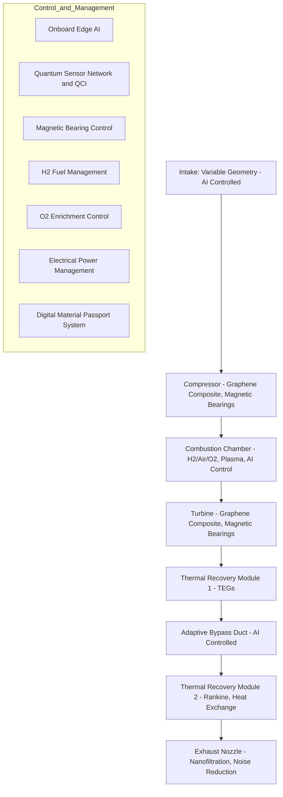

# Digital Thread Orchestrator

> Componente central de la arquitectura GAIA AIR que conecta todas las capas del ciclo de vida de productos aeroespaciales, asegurando trazabilidad completa, sostenibilidad y eficiencia operativa.

## 📋 Índice

- [Visión General](#visión-general)
- [Arquitectura](#arquitectura)
- [Características Principales](#características-principales)
- [Estructura de Datos](#estructura-de-datos)
- [Flujos de Trabajo](#flujos-de-trabajo)
- [Integración con Sistemas Externos](#integración-con-sistemas-externos)
- [Seguridad y Cumplimiento](#seguridad-y-cumplimiento)
- [Observabilidad](#observabilidad)
- [Roadmap de Implementación](#roadmap-de-implementación)
- [Ejemplos de Uso](#ejemplos-de-uso)
- [Consideraciones para Producción](#consideraciones-para-producción)

## 🔍 Visión General

El **Digital Thread Orchestrator** actúa como columna vertebral de la arquitectura GAIA AIR, conectando las tres capas principales (Diseño y Documentación, Producción Industrial, y Servicios y Operaciones) mediante un hilo digital continuo que asegura la trazabilidad completa del ciclo de vida del producto aeroespacial.

### Responsabilidades Clave

- Registro y coordinación de eventos entre sistemas
- Trazabilidad completa de cambios y decisiones
- Mantenimiento del linaje de datos a través de todas las fases
- Integración de métricas de sostenibilidad en cada fase

## 🏗️ Arquitectura

El Orchestrator implementa una arquitectura basada en eventos con procesamiento asíncrono y almacenamiento distribuido:


### Componentes Principales

- **API Gateway**: Punto de entrada seguro con autenticación OAuth2
- **Orchestrator Core**: Gestiona el ciclo de vida de eventos y su enrutamiento
- **Redis Cluster**: Almacenamiento principal para eventos, índices y streams
- **Procesadores de Eventos**: Workers distribuidos que procesan eventos asíncronamente
- **Conectores**: Integración con sistemas externos (PLM, MES, Gemelos Digitales)


## ✨ Características Principales

### Procesamiento Asíncrono Robusto

- Procesamiento distribuido mediante Redis Streams
- Sistema de reintentos con límite configurable
- Manejo de errores con registro detallado
- Reclamación de mensajes pendientes para evitar pérdidas


### Trazabilidad Bidireccional

- Linaje completo de eventos (ancestros y descendientes)
- Historial por componente con paginación eficiente
- Consultas por rango de tiempo
- Grafo de relaciones entre eventos


### Escalabilidad y Rendimiento

- Índices optimizados mediante Redis Sorted Sets
- Transacciones atómicas con Redis Pipelines
- Políticas de retención configurables
- Sharding por componente para distribución de carga


### Seguridad Integrada

- Autenticación OAuth2 para todos los endpoints
- Validación de payload según tipo de evento
- Control de acceso basado en roles (RBAC)
- Auditoría de operaciones críticas


## 📊 Estructura de Datos

### Modelos Principales

#### ThreadEvent

```python
class ThreadEvent(BaseModel):
    id: str
    timestamp: datetime
    event_type: EventType
    source_layer: LayerType
    target_layer: Optional[LayerType]
    component_id: str
    version_hash: str
    payload: Dict[str, Any]
    metadata: Dict[str, Any]
    parent_event_id: Optional[str]
    status: EventStatus
    retry_count: int
```

#### Enumeraciones

```python
class LayerType(str, Enum):
    DESIGN = "design"
    PRODUCTION = "production"
    OPERATIONS = "operations"

class EventType(str, Enum):
    DESIGN_CHANGE = "design_change"
    SIMULATION_RESULT = "simulation_result"
    PRODUCTION_START = "production_start"
    QUALITY_CHECK = "quality_check"
    MAINTENANCE_ALERT = "maintenance_alert"
    SUPPLY_CHAIN_UPDATE = "supply_chain_update"
    SUSTAINABILITY_METRIC = "sustainability_metric"
    LIFECYCLE_UPDATE = "lifecycle_update"

class EventStatus(str, Enum):
    PENDING = "pending"
    PROCESSING = "processing"
    COMPLETED = "completed"
    FAILED = "failed"
```

### Estructuras en Redis

| Estructura | Clave | Propósito
|-----|-----|-----
| Hash | `gaia:digital_thread:store` | Almacenamiento principal de eventos
| Stream | `gaia:digital_thread:events` | Cola de eventos para procesamiento asíncrono
| Sorted Set | `gaia:digital_thread:component:{component_id}` | Índice de eventos por componente ordenados por timestamp
| Set | `gaia:digital_thread:lineage:children:{event_id}` | Hijos directos de un evento
| Set | `gaia:digital_thread:lineage:parents:{event_id}` | Padres directos de un evento
| Set | `gaia:digital_thread:failed` | Registro de eventos fallidos


## 🔄 Flujos de Trabajo

### Publicación de Eventos

1. Cliente envía evento a través de API autenticada
2. Orchestrator valida el payload según tipo de evento
3. Evento se almacena en Redis con TTL configurado
4. Se actualizan índices (componente, linaje)
5. Evento se publica en Redis Stream para procesamiento asíncrono
6. Cliente recibe confirmación inmediata con ID de evento


### Procesamiento de Eventos

1. Worker consume eventos del stream mediante `xreadgroup`
2. Se actualiza estado del evento a `PROCESSING`
3. Evento se enruta según su tipo a los sistemas correspondientes
4. Si el procesamiento es exitoso:

1. Estado se actualiza a `COMPLETED`
2. Se confirma procesamiento con `xack`


5. Si falla:

1. Se incrementa contador de reintentos
2. Si no alcanza el máximo, se deja en el stream para reintento
3. Si alcanza el máximo, se marca como `FAILED` y se registra en `failed_events`


### Consulta de Historial

1. Cliente solicita historial de un componente con filtros opcionales
2. Orchestrator consulta el Sorted Set del componente
3. Se recuperan eventos paginados según parámetros
4. Se retornan eventos con metadatos de paginación


### Consulta de Linaje

1. Cliente solicita linaje de un evento
2. Orchestrator recupera ancestros y descendientes recursivamente
3. Se limita profundidad para evitar problemas con grafos cíclicos
4. Se retornan detalles completos de eventos relacionados


## 🔌 Integración con Sistemas Externos

### Gemelos Digitales

- Notificación de cambios de diseño
- Actualización de simulaciones
- Sincronización de estados


### Sistemas MES

- Inicio de producción
- Resultados de control de calidad
- Actualización de estado de fabricación


### Sistemas de Mantenimiento

- Alertas de mantenimiento predictivo
- Registro de intervenciones
- Actualización de estado operativo


### Análisis de Sostenibilidad

- Registro de métricas ambientales
- Cálculo de impacto de ciclo de vida
- Optimización de procesos


## 🔒 Seguridad y Cumplimiento

### Autenticación y Autorización

- OAuth2 para autenticación de usuarios y sistemas
- RBAC para control de acceso por capa y tipo de evento
- Validación de tokens en cada solicitud


### Auditoría y Trazabilidad

- Registro inmutable de todos los eventos
- Linaje completo para auditorías
- Cumplimiento con estándares aeroespaciales (AS9100, DO-178C)


### Protección de Datos

- TLS para comunicaciones
- TTL configurable para retención de datos
- Políticas de archivado para almacenamiento a largo plazo


## 📈 Observabilidad

### Métricas Operativas

- Eventos procesados por tipo y estado
- Latencia de procesamiento
- Tasa de errores y reintentos
- Tamaño de backlog


### Trazas Distribuidas

- OpenTelemetry para trazas end-to-end
- Spans para operaciones críticas
- Propagación de contexto entre sistemas


### Alertas y Dashboards

- Alertas para condiciones anómalas
- Dashboards para monitoreo en tiempo real
- Visualización de flujos de eventos


## 📅 Roadmap de Implementación

### Fase 1: Fundamentos Operativos (0-3 meses)

1. **Observabilidad Completa**

1. Implementar Prometheus/Grafana para métricas operativas
2. Integrar trazas distribuidas con OpenTelemetry/Jaeger
3. Crear dashboards para KPIs críticos


2. **Seguridad Esencial**

1. Habilitar TLS para comunicaciones Redis
2. Implementar RBAC básico por capa
3. Auditoría de acceso para eventos críticos


### Fase 2: Escalabilidad y Resiliencia (3-6 meses)

1. **Optimización de Almacenamiento**

1. Implementar tiered storage (hot/warm/cold)
2. Configurar compresión para payloads grandes
3. Sharding por componente para componentes críticos


2. **Patrones de Resiliencia**

1. Circuit breakers para sistemas externos
2. Colas de contingencia para fallos de conectores
3. Herramientas de reprocesamiento para operaciones


### Fase 3: Integración Avanzada (6-12 meses)

1. **SDKs y Herramientas**

1. Desarrollar SDKs para Python, Java y C++
2. Crear CLI para operaciones de mantenimiento
3. Documentación AsyncAPI para contratos de eventos


2. **Conectores Específicos**

1. Integración con Siemens Teamcenter/PTC Windchill
2. Conectores para sistemas MES aeroespaciales
3. Adaptadores para herramientas de simulación


### Fase 4: Inteligencia y Optimización (12+ meses)

1. **Capacidades Predictivas**

1. Modelos ML para mantenimiento predictivo
2. Análisis de tendencias en métricas de sostenibilidad
3. Detección de anomalías en eventos de producción


2. **Edge Computing**

1. Procesamiento distribuido en plantas de fabricación
2. Sincronización offline para operaciones remotas
3. Optimización de ancho de banda para entornos restrictivos


## 💡 Ejemplos de Uso

### Publicación de un Evento de Cambio de Diseño

```python
event = ThreadEvent(
    event_type=EventType.DESIGN_CHANGE,
    source_layer=LayerType.DESIGN,
    component_id="wing-assembly-v4",
    version_hash="new-aerofoil",
    payload={"changes": ["material_upgrade", "stress_optimization"]},
    metadata={"sustainability": {"co2_reduction": 12.4}}
)
event_id = await orchestrator.publish_event(event)
```

### Consulta de Historial de un Componente

```python
history, total = await orchestrator.get_component_history(
    "engine-v3",
    start_time=datetime(2023, 1, 1),
    limit=50
)
```

### Flujo Completo para un Cambio de Diseño

```python
async def design_change_workflow():
    # 1. Publicar cambio de diseño
    event = ThreadEvent(
        event_type=EventType.DESIGN_CHANGE,
        source_layer=LayerType.DESIGN,
        component_id="wing-assembly-v4",
        version_hash="new-aerofoil",
        payload={"changes": ["material_upgrade", "stress_optimization"]},
        metadata={"sustainability": {"co2_reduction": 12.4}}
    )
    event_id = await orchestrator.publish_event(event)
    
    # 2. Procesar en segundo plano (automático)
    # - Notificar gemelos digitales
    # - Actualizar sistema PLM con versión nueva
    # - Calcular impacto ambiental
    
    # 3. Consultar linaje
    lineage = await orchestrator.get_event_lineage(event_id)
    print(f"Eventos relacionados: {lineage}")
```

## 🚀 Consideraciones para Producción

### Escalabilidad

- Iniciar con 3-5 workers por tipo de evento
- Monitorear latencia y ajustar según demanda
- Considerar sharding por componente para productos críticos


### Resiliencia

- Configurar reintentos con backoff exponencial
- Implementar circuit breakers para sistemas externos
- Establecer procedimientos de recuperación para fallos catastróficos


### Monitoreo

- Alertas para:

- Aumento anormal de eventos fallidos
- Latencia de procesamiento > 5 segundos
- Backlog creciente


- Revisión periódica de métricas de rendimiento


### Mantenimiento

- Backup diario de datos críticos
- Procedimiento para reprocesamiento de eventos fallidos
- Rotación de logs y métricas


---

## 📚 Referencias

- [Arquitectura GAIA AIR](../ARCHITECTURE.md)
- [Documentación de Redis Streams](https://redis.io/topics/streams-intro)
- [OpenTelemetry para Python](https://opentelemetry.io/docs/python/)
- [Estándar AS9100 para Aeroespacial](https://www.sae.org/standards/content/as9100d/)


---

*Este componente representa una construcción real en un entorno operativo, público, ejemplar y ético. Está diseñado para generar valor tangible tanto para su fundador, Amedeo Pelliccia, como para todos los aliados y apoyos comprometidos con su desarrollo. La narrativa documental que lo acompaña está orientada a la industria aeroespacial y se construye con el objetivo de ser atractiva, informativa, científicamente precisa, auditada y etiquetable.*

## GAIA-QAO Ontogenesis

**Quantum Aerospace Ontology Genesis**
*Beautiness Assembled by Quantum Computing Agents within Aerospace Ecosystems*

---

### ✦ What It Is

A **declarative cosmology** for the GAIA-QAO federated system:

* Encodes the **origin**, **purpose**, and **ethical trajectory** of all intelligent agents, aircraft systems, and digital twins.
* Functions as the **ontological DNA** of each system entity, enabling alignment, recovery, evolution, and proof-of-integrity.

---

### 🎯 Why It Matters

| Element                         | Description                                                                                 |
| ------------------------------- | ------------------------------------------------------------------------------------------- |
| **Institutional Gravity**       | Aerospace reframed as a planetary institutional function, not merely an industry.           |
| **Agent Ethics (AMEDEO layer)** | Agents operate under the "tending visible hands" doctrine — augmenting, not replacing.      |
| **Retrocausal Temporality**     | Agents pre-act in alignment with "the future projected starting yesterday."                 |
| **Systemic Holism**             | Every system participates in quantum-semantic loops within a closed adaptive feedback mesh. |
| **Beautiness Principle**        | Development is guided by elegant, purposeful, and regenerative aesthetics.                  |

---

### 🧠 Implications for Agent Design

* **Quantum Lifecycle Encoding**: Each GAIA agent must embed a cryptographic reference to this manifesto at AGAD Phase 0.
* **Retrocausal Policy Enforcement**: Lifecycle causality logic derives from this ontology.
* **CIPHR Seed Accessibility**: Included in all agents phase ≥ AGAD 1.0 as a symbolic genesis anchor.

---

### 🗂 Activation Metadata

```yaml
title: GAIA‑QA Ontogenesis
identifier: GAIA-QAO-ONTOGENESIS-0001
type: Ontological Genesis Manifesto
status: Active
originator: Amedeo Pelliccia (Robbbo-T)
date_activated: 2025-05-28
activation_phase: AGAD 0.0
infocode: QAO-GENESIS-CORE-SEED
references:
  - GAIA-QAO-MANIFESTO-FOUNDATIONAL-v1.0
  - GAIA-QTD-SPEC-v1.1
  - AMEDEO-TRUST-CORE
ciphr_signature: "🕊 Beautiness Assembled by Quantum Computing Agents | Tending Visible Hands in Flight Toward Co-evolution"
```

---

### 🕊 Signature

> *Beautiness Assembled by Quantum Computing Agents*
> *Tending Visible Hands in Flight Toward Co-evolution*

**Signed by:**
**Amedeo Pelliccia (Robbbo-T)**
*On behalf of the GAIA‑QAO Ontogenesis Cluster*
*Encoded into all QAO Agents as Ontological Genesis Reference*

---

```yaml
id: "GAIA-QAO-README_v1.0.0"
title: "GAIA Innovation Management Platform – README"
version: "1.0.0"
author: "Amedeo Pelliccia"
issued_by: "GAIA Quantum Aerospace Optimization"
release_date: "2025-05-28"
language: "en"
license: "GAIA-QAO Open Innovation License v1.0"
format: ["Markdown", "HTML", "PDF"]
context:
  platform: "GAIA Innovation Management Platform"
  domain: 
    - "Quantum Aerospace"
    - "Sustainable Engineering"
    - "AI Lifecycle Orchestration"
compliance_targets:
  - "EASA CS-25.1309"
  - "DO-178C"
  - "Circular Economy ≥ 95%"
  - "Quantum Readiness"
structure:
  sections:
    - "Vision Statement"
    - "Architecture Overview"
    - "Key Features"
    - "Installation & Setup"
    - "Security & Encryption"
    - "MCP Agent Integration"
    - "QAOS Interface Layer"
    - "Performance Metrics"
    - "Development Roadmap"
    - "CI/CD Integration"
    - "Contributing"
    - "License"
    - "Contact"
linked_documents:
  - ../Technical/integration_analysis.md
  - ../Technical/patent_preparation.xml
  - ../Exports/industry_summary.pdf
  - ../../META-INF/manifest.json
hash:
  sha3_512: "2f16c7a4a3e1d857c9f14e99e0d9d00e1ccf9971cd9f451f7d0b13ea1d40582e6d76bbfdfb32dbe135df09b476d50d4ae34d06a1d1c5297b627d3e3c4d507a0b"
  blake3: "9d39c91c84e7f6c2138cdb4b69e7b7f4f34d74f2f2bfae0d88841794f0a1b0e2"
notes: >
  This README.yaml serves as semantic metadata for the GAIA-QAO platform documentation home, linking to associated technical artifacts and reinforcing traceability within the .qao.dpub architecture.
```

---

# GAIA Innovation Management Platform – README

## Vision Statement
The GAIA Innovation Management Platform pioneers a quantum leap in sustainable aerospace engineering, fusing quantum optimization, AI lifecycle orchestration, and advanced materials science. Our mission: enable zero-impact, circular-economy aerospace systems with deterministic safety, regulatory compliance, and maximal performance.

## Architecture Overview
GAIA-QAO employs a modular, multi-layer architecture:
- **AI Lifecycle Orchestration**: End-to-end management of AI assets, from ideation to certification.
- **Quantum Optimization Core**: Native integration of quantum-ready solvers for mission-critical scheduling and resource allocation.
- **Sustainable Engineering Layer**: Enforces circular economy targets and full traceability of material and digital artifacts.
- **Security & Compliance**: DO-178C/EASA CS-25.1309 aligned, with cryptographic proofs-of-integrity and quantum-resilient encryption.

## Key Features
- Zero-impact, fully recyclable turbofan engine digital twin
- Quantum-accelerated design space exploration
- Integrated MCP (Mission Control Protocol) agent framework
- AI safety, explainability, and continuous compliance monitoring
- Secure, transparent CI/CD pipeline with self-healing capabilities

## Installation & Setup
1. **Clone Repository**  
   ```sh
   git clone https://github.com/Robbbo-T/Robbbo-T.git
   ```
2. **Environment Setup**  
   - Python ≥ 3.9, Node.js ≥ 18, Docker (optional for containerized deployments)
   - Install dependencies:  
     ```sh
     pip install -r requirements.txt
     npm install
     ```
3. **Configuration**  
   - Adjust platform configs in `config/` (see [integration_analysis.md](../Technical/integration_analysis.md)).
   - For quantum backends, set up provider credentials in `.env`.

## Security & Encryption
- End-to-end encryption for all data at rest and in transit (AES-256/GCM, quantum-safe post-quantum algorithms in beta)
- Multi-factor authentication, hardware-bound key stores, and runtime attestation
- Security audits aligned with [DO-178C](https://www.easa.europa.eu/en/document-library/certification-specifications/cs-251309-amendment-26) and EASA standards

## MCP Agent Integration
- Drop-in agents for mission planning, anomaly detection, and predictive maintenance
- Extend via `agents/` using provided Python and TypeScript SDKs
- See [integration_analysis.md](../Technical/integration_analysis.md) for API contracts

## QAOS Interface Layer
- Unified API for AI/ML lifecycle management, quantum solvers, and sustainability metrics
- Fully documented in [manifest.json](../../META-INF/manifest.json)

## Performance Metrics
- Deterministic latency: <1ms (critical path, edge deployment)
- Quantum optimization speedup: up to 1000x (benchmark: patent_preparation.xml)
- Circular economy compliance: ≥ 95% lifecycle recyclability

## Development Roadmap
- **Q3 2025**: Full quantum backend integration, autonomous safety certification
- **Q4 2025**: Zero-emission hardware-in-the-loop validation, expanded industry partnerships

## CI/CD Integration
- GitHub Actions workflows in `.github/workflows/`
- Automated code quality, test, and security scanning
- Continuous deployment to quantum and edge testbeds

## Contributing
We welcome contributions!  
See [CONTRIBUTING.md](CONTRIBUTING.md) for guidelines, code of conduct, and our open innovation process.

## License
GAIA-QAO Open Innovation License v1.0 (see [LICENSE](LICENSE) for details)

## Contact
- **Author**: Amedeo Pelliccia  
- **Issued By**: GAIA Quantum Aerospace Optimization  
- **Contact**: [Contact Form](https://github.com/Robbbo-T/Robbbo-T/issues/new/choose)

---

**Linked Documents:**  
- [Integration Analysis](../Technical/integration_analysis.md)  
- [Patent Preparation](../Technical/patent_preparation.xml)  
- [Industry Summary (PDF)](../Exports/industry_summary.pdf)  
- [Platform Manifest](../../META-INF/manifest.json)

---

> **Zero-Impact Sustainable Turbofan Engine**  
> *A Synergistic Integration of Advanced Materials, Intelligent Control, Quantum Sensing, and Full Lifecycle Recyclability*

---

## Document Metadata

| Field                   | Value                                                      |
|-------------------------|------------------------------------------------------------|
| **GAIA Infocode ID**    | GAIA-QENT-TECH-TURBOFAN-ZEROIMPACT-DISC-V1                |
| **Document Type**       | Invention Disclosure                                       |
| **Version**             | 1.1                                                        |
| **Status**              | Internal Review Draft                                      |
| **Submission Date**     | 2025-05-28                                                 |
| **Last Updated**        | 2025-05-28                                                 |
| **Originator Module**   | GAIA-Q-AIR & GAIA-Q-GreenTech                              |
| **Primary Author**      | Amedeo Pelliccia                                           |
| **Related AGAD Phases** | AGAD 1–3 (Concept to Analytical Modeling)                  |
| **Keywords**            | Sustainable Aviation, Zero-Emission, Quantum Sensing, AI, Circular Economy, Hydrogen Power, Graphene Composites, Magnetic Bearings, Digital Thread, Lifecycle Management |

---

## Technical Field

- **Primary**: Aerospace engineering — sustainable and intelligent turbofan engine design and operation  
- **Secondary**:  
  - Advanced materials science  
  - Quantum sensing applications  
  - Artificial intelligence in control systems  
  - Renewable energy systems for propulsion  
  - Circular economy principles in complex machinery  

---

## Background & Problem Statement

Despite progress in sustainable aviation fuels, lightweight materials, and efficient cycles, a **holistic, integrated approach** for truly net-zero propulsion is lacking. Existing solutions do not fully leverage advanced materials, quantum sensing, intelligent controls, green hydrogen combustion, comprehensive energy recovery, and complete lifecycle circularity.

---

## Technologies Leveraged

- **Graphene/Nano Composites**: Recycled graphene for superior strength-to-weight, durability, and embedded sensing.
- **Active Magnetic Bearings**: Frictionless, oil-free, dynamically controlled.
- **Quantum Sensors**: Ultra-sensitive, real-time monitoring of strain, temperature, and fatigue.
- **Hybrid Green Hydrogen Combustion**: Ultra-lean, AI-optimized, oxygen-enriched, with advanced NOx suppression.
- **Multi-Stage Heat Recovery**: Thermoelectric and Rankine systems for maximal energy capture.
- **AI Engine Process Management**: Predictive, adaptive control for efficiency and health.
- **Digital Material Passports**: Blockchain-based for traceability and recycling.

---

## Summary of the Invention

**The Zero-Impact Sustainable Turbofan Engine** integrates advanced materials, quantum sensors, adaptive AI, green hydrogen combustion, multi-stage energy recovery, and modular design with digital material passports, achieving true net-zero impact and full circularity.

### Core Innovations

#### 1. Advanced Material Composition with Embedded Quantum Sensing (KEM_001)
- Graphene/nano-composite structures with distributed quantum sensors (NV centers, quantum dots).
- Enables high-fidelity, real-time health monitoring and predictive maintenance.

#### 2. Hybrid Green Hydrogen Combustion System (KEM_002)
- Multi-mode chamber for green H₂ with air/oxygen enrichment.
- AI-optimized mixing, plasma ignition, catalytic NOx suppression.

#### 3. Self-Adjusting Active Magnetic Bearing System (KEM_003)
- Main shafts on active, vibration-damped, oil-free magnetic bearings.
- Quantum gyroscopes/accelerometers for ultra-precision.

#### 4. Multi-Stage Thermal Energy Recovery System (KEM_004)
- Thermoelectric generators and Rankine cycle for waste heat.
- Supplemental electrical/mechanical power generation.

#### 5. AI-Governed Adaptive Bypass & Variable Geometry Intake (KEM_005)
- AI adjusts bypass ratio and intake geometry in real-time for optimal performance.

#### 6. Nanofiltration Exhaust Nozzle System (KEM_006)
- Advanced filtration (nano, electrostatic, catalytic) for near-zero emissions.

#### 7. Zero-Emission Lubrication & Sealing (KEM_007)
- Solid-state/ionic lubricants or captured water; advanced seals.

#### 8. Modular Design with Digital Material Passports (KEM_008)
- Swappable modules, each tracked on a blockchain DMP for full lifecycle traceability.

#### 9. Onboard Edge Neural Network & Quantum-Classical Interface (KEM_009)
- Radiation-hardened edge AI system, fusing quantum and classical sensor data for real-time adaptive control and diagnostics.

---

## Key Features

- **Quantum-Integrated Predictive Maintenance**: Embedded quantum sensors + AI for early fault detection.
- **Full Spectrum Circularity**: Modular design, digital passports, maximized reuse/recycling.
- **Adaptive Intelligent Energy Efficiency**: AI-optimized combustion, bypass, intake, and energy recovery.
- **Frictionless, Zero-Lube Operation**: Magnetic bearings eliminate oil systems.

---

## Advantages Overview

- **Sustainability & Net-Zero**: Green H₂, full energy recovery, advanced filtration, circular material economy.
- **Reduced Maintenance**: Magnetic bearings + AI diagnostics = less downtime and longer life.
- **Complete Disassembly & Recyclability**: Modular, blockchain-tracked lifecycle for all parts.
- **Superior Efficiency**: Frictionless mechanics, hybrid combustion, AI controls.
- **Enhanced Safety**: Quantum health monitoring, AI control, advanced diagnostics.

---

## Claims

### Independent Claim

> **Claim 1**:  
A zero-impact turbofan engine for aeronautical applications, comprising:
>
> - (a) Graphene-based composite structures with embedded quantum sensors;
> - (b) AI-optimized hybrid green hydrogen combustion chamber with dynamic oxygen enrichment and NOx mitigation;
> - (c) Main shaft supported by active, oil-free magnetic bearings;
> - (d) Multi-stage thermal energy recovery;
> - (e) AI-governed adaptive bypass and variable intake;
> - (f) Nanofiltration exhaust nozzle system;
> - (g) Modular architecture with blockchain-tracked digital material passports;
> - (h) Onboard edge AI/quantum-classical interface for real-time control and predictive maintenance.

### Dependent Claims (Examples)

- **Claim 2**: Quantum sensors include NV centers and quantum dot strain sensors for advanced health monitoring.
- **Claim 3**: Multi-stage energy recovery uses TEGs and Rankine cycles.
- **Claim 4**: AI control uses reinforcement learning for multi-objective optimization.
- **Claim 5**: Digital passports are blockchain-secured, tracking provenance, recycling, and lifecycle.
- **Claim 6**: Ancillary lubrication with solid-state or magnetic fluid seals.
- **Claim 7**: Combustion with plasma-assisted ignition.
- **Claim 8**: Quantum-Classical Interface for sensor data fusion.

---

## Functional Block Diagram



---

## 1. JSON Schema (Draft 2020-12)

```json
{
  "$schema": "https://json-schema.org/draft/2020-12/schema",
  "title": "InventionDisclosureDocument",
  "type": "object",
  "properties": {
    "schema_version": { "type": "string" },
    "document_id": { "type": "string" },
    "digital_signature": { "type": "string" },
    "content_hash": { "type": "string" },
    "compliance_tags": {
      "type": "array",
      "items": { "type": "string" }
    },
    "valid_from": { "type": "string", "format": "date" },
    "valid_until": { "type": "string", "format": "date" },
    "audit_trail": {
      "type": "array",
      "items": {
        "type": "object",
        "properties": {
          "timestamp": { "type": "string", "format": "date-time" },
          "actor": { "type": "string" },
          "action": { "type": "string" },
          "details": { "type": "string" }
        },
        "required": ["timestamp", "actor", "action"]
      }
    },
    "attachments": {
      "type": "array",
      "items": {
        "type": "object",
        "properties": {
          "name": { "type": "string" },
          "url": { "type": "string", "format": "uri" },
          "type": { "type": "string" }
        },
        "required": ["name", "url", "type"]
      }
    },
    "external_references": {
      "type": "array",
      "items": {
        "type": "object",
        "properties": {
          "system": { "type": "string" },
          "ref": { "type": "string" },
          "description": { "type": "string" }
          },
          "required": ["system", "ref"]
        }
      },
      "document_metadata": {
        "type": "object",
        "properties": {
          "gaia_infocode_id": { "type": "string" },
          "document_type": { "type": "string" },
          "version": { "type": "string" },
          "status": { "type": "string" },
          "submission_date": { "type": "string", "format": "date" },
          "last_updated": { "type": "string", "format": "date" },
          "originator_module": { "type": "string" },
          "primary_author": { "type": "string" },
          "related_agad_phases": {
            "type": "array",
            "items": { "type": "string" }
          },
          "keywords_expanded": {
            "type": "array",
            "items": { "type": "string" }
          },
          "version_history": {
            "type": "array",
            "items": {
              "type": "object",
              "properties": {
                "version": { "type": "string" },
                "date": { "type": "string", "format": "date" },
                "author": { "type": "string" },
                "changes": { "type": "string" }
              },
              "required": ["version", "date", "author", "changes"]
            }
          }
        },
        "required": ["gaia_infocode_id", "document_type", "version", "status", "submission_date", "last_updated", "originator_module", "primary_author", "related_agad_phases", "keywords_expanded", "version_history"]
      },
      "table_of_contents_structure": {
        "type": "array",
        "items": {
          "type": "object",
          "properties": {
            "id": { "type": "string" },
            "title": { "type": "string" }
          },
          "required": ["id", "title"]
        }
      },
      "invention_disclosure_title": { "type": "string" },
      "abstract": { "type": "string" },
      "technical_field": {
        "type": "object",
        "properties": {
          "primary": { "type": "string" },
          "secondary": {
            "type": "array",
            "items": { "type": "string" }
          }
        },
        "required": ["primary", "secondary"]
      },
      "background_art": {
        "type": "object",
        "properties": {
          "context": { "type": "string" },
          "technologies_leveraged_with_context": {
            "type": "array",
            "items": {
              "type": "object",
              "properties": {
                "technology": { "type": "string" },
                "relevance": { "type": "string" }
              },
              "required": ["technology", "relevance"]
            }
          },
          "problem_solved_statement": { "type": "string" }
        },
        "required": ["context", "technologies_leveraged_with_context", "problem_solved_statement"]
      },
      "summary_of_invention": {
        "type": "object",
        "properties": {
          "introduction": { "type": "string" },
          "key_elements_detailed": {
            "type": "array",
            "items": {
              "type": "object",
              "properties": {
                "element_id": { "type": "string" },
                "name": { "type": "string" },
                "description": { "type": "string" },
                "principle_of_operation": { "type": "string" },
                "key_benefits_derived": {
                  "type": "array",
                  "items": { "type": "string" }
                },
                "relevant_gaia_application_layers": {
                  "type": "array",
                  "items": { "type": "string" }
                },
                "relevant_ata_chapters": {
                  "type": "array",
                  "items": { "type": "string" }
                }
              },
              "required": ["element_id", "name", "description", "principle_of_operation", "key_benefits_derived", "relevant_gaia_application_layers", "relevant_ata_chapters"]
            }
          }
        },
        "required": ["introduction", "key_elements_detailed"]
      },
      "claims_section": {
        "type": "object",
        "properties": {
          "claim_strategy_overview": { "type": "string" },
          "independent_claims": {
            "type": "array",
            "items": {
              "type": "object",
              "properties": {
                "claim_number": { "type": "integer" },
                "text": { "type": "string" },
                "elements": {
                  "type": "array",
                  "items": {
                    "type": "object",
                    "properties": {
                      "label": { "type": "string" },
                      "feature": { "type": "string" }
                    },
                    "required": ["label", "feature"]
                  }
                }
              },
              "required": ["claim_number", "text", "elements"]
            }
          },
          "dependent_claims": {
            "type": "array",
            "items": {
              "type": "object",
              "properties": {
                "claim_number": { "type": "integer" },
                "depends_on": { "type": "integer" },
                "text": { "type": "string" }
              },
              "required": ["claim_number", "depends_on", "text"]
            }
          }
        },
        "required": ["claim_strategy_overview", "independent_claims", "dependent_claims"]
      },
      "functional_block_diagram_textual": {
        "type": "object",
        "properties": {
          "main_aerothermal_flow_path": {
            "type": "array",
            "items": { "type": "string" }
          },
          "control_and_management_systems": {
            "type": "array",
            "items": { "type": "string" }
          },
          "key_energy_flows": {
            "type": "array",
            "items": { "type": "string" }
          }
        },
        "required": ["main_aerothermal_flow_path", "control_and_management_systems", "key_energy_flows"]
      },
      "potential_applications": {
        "type": "array",
        "items": {
          "type": "object",
          "properties": {
            "application": { "type": "string" },
            "suitability_notes": { "type": "string" }
          },
          "required": ["application", "suitability_notes"]
        }
      }
    },
    "required": [
      "document_metadata",
      "table_of_contents_structure",
      "invention_disclosure_title",
      "abstract",
      "technical_field",
      "background_art",
      "summary_of_invention",
      "claims_section",
      "functional_block_diagram_textual",
      "potential_applications"
    ]
  }
  ```

  ---

  ## 2. TypeScript/JavaScript Runtime Validator

  For robust runtime validation, use [ajv](https://ajv.js.org/) (Another JSON Schema Validator):

  ```typescript
  import Ajv from "ajv";
  import schema from "./InventionDisclosureDocument.schema.json"; // Save the JSON schema above as this file

  const ajv = new Ajv({ allErrors: true });
  const validate = ajv.compile(schema);

  export function validateInventionDisclosureDocument(data: unknown): boolean {
    const valid = validate(data);
    if (!valid, {
      console.error(validate.errors);
    }
    return valid as boolean;
  }
  ```

  ---

  ## 3. C Struct Representation

  For embedded or mission-critical C code:

  ```c
  // NOTE: For arrays/strings, use fixed sizes as appropriate for your system.
  // For complex nested structures, use pointers and allocate as needed.

  typedef struct {
      char version[8];
      char date[20];
      char author[64];
      char changes[256];
  } VersionHistory;

  typedef struct {
      char gaia_infocode_id[64];
      char document_type[32];
      char version[8];
      char status[32];
      char submission_date[20];
      char last_updated[20];
      char originator_module[64];
      char
