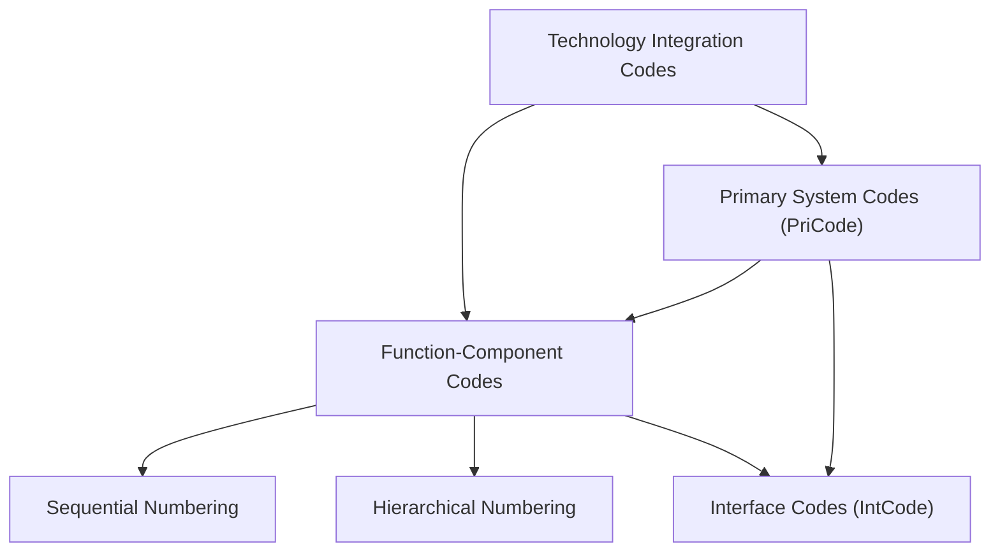
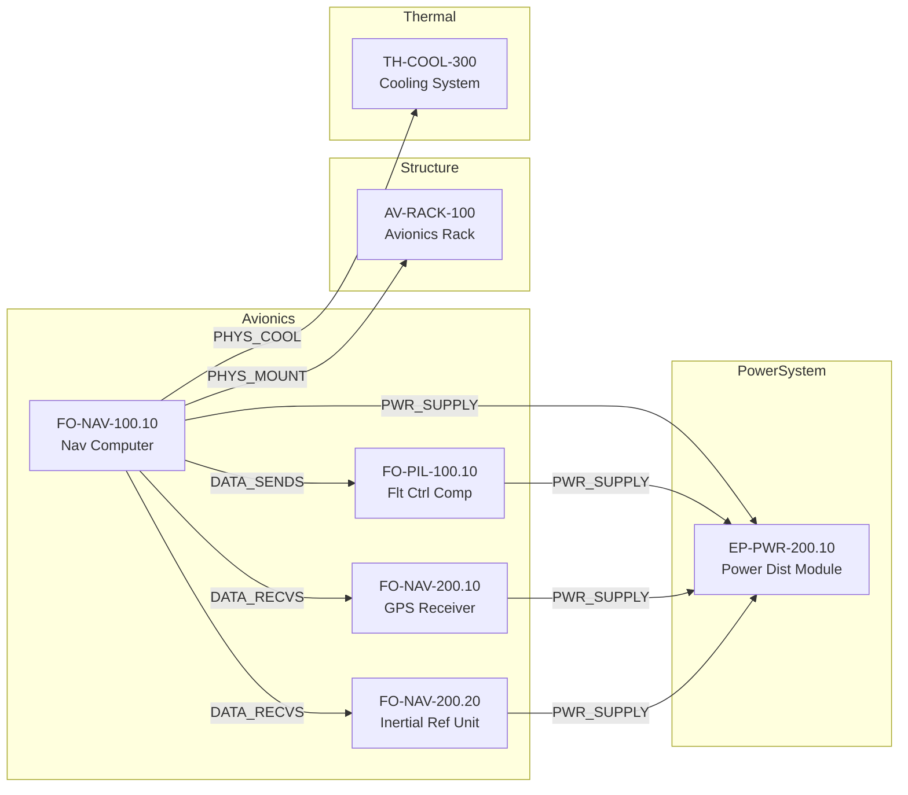
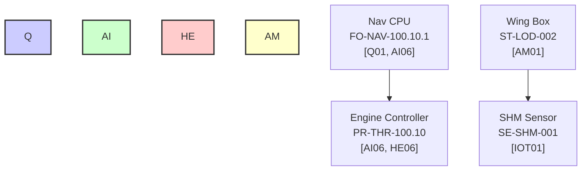
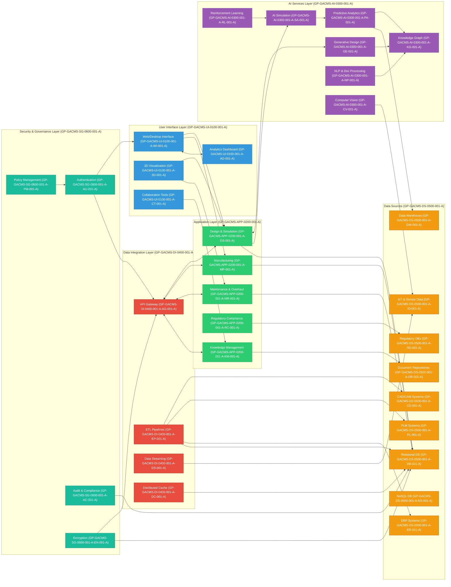

# Containerization and Orchestration of Aerospace Futures Index

# COAFI-FUNC-CORE-0001-A
**Functional Framework Implementation (FFI)**  
**Document Status:** Blueprint Final  
**Scope:** Universal to COAFI Parts I–VI (Airframes to Simulation Ecosystems)  
**Alias:** COA = Components Overhaul Aerospace

---

## 1. FUNCTION TAXONOMY WITHIN COAFI
All functions are categorized into hierarchical tiers and must be traceable via Function ID (FID), cross-linked with XAI-TAG and COAFI-OBJ-ID.

| Tier | Description                                         | Document Zone       |
|------|-----------------------------------------------------|---------------------|
| F1   | System-Level Function (e.g., Provide Propulsion)    | OV Documents        |
| F2   | Subsystem Function (e.g., Generate Quantum Thrust)  | SP, DS Documents    |
| F3   | Component Function (e.g., Modulate Emission Pattern)| DS, ICD             |
| F4   | Behavioral/Subcomponent Function (e.g., React <0.01s)| ICD, OP, Heuritmática |

---

## 2. FUNCTION ATTRIBUTE TABLE TEMPLATE
All SP and OV documents shall include the following functional attribute structure:

### Function Attribute: FID-GAIA-PULSE-001

| Attribute           | Value                                                   |
|--------------------|---------------------------------------------------------|
| Function ID         | FID-GAIA-PULSE-001                                      |
| Parent Function     | FID-GAIA-0001 (Provide Propulsion)                      |
| System              | GP-PM-0400 (GAIA PULSE)                                 |
| Criticality         | Critical                                                |
| Performance Metrics | See GP-PM-SP-0400-002-A (Thrust Response Spec)         |
| Verification        | Testing, Simulation, XAI Traceback                      |
| Status              | Approved                                                |
| Input               | Control Signals, Quantum Fuel                           |
| Output              | Thrust, Regenerated Energy                              |
| XAI Link            | XAI-FI-GAI-PULSE-001                                    |

---

## 3. FUNCTION ALLOCATION MATRIX
**Document:** GP-OV-FAM-0001-A.md  
Traceable via Digital Twin integration and visible through the GAIA AIR dashboard.

| Function ID         | Description                   | GAIA PULSE | GAIA CTRL | GAIA FAB | TWIN-VIEWER | XAI TRACE |
|---------------------|-------------------------------|------------|-----------|----------|--------------|-----------|
| FID-GAIA-0001       | Provide Propulsion            | X          |           |          | X            | X         |
| FID-GAIA-PULSE-001  | Generate Quantum Thrust       | X          |           |          | X            | X         |
| FID-GAIA-CONTROL-001| Adjust Thrust Vector          |            | X         |          | X            | X         |
| FID-GAIA-FAB-001    | Manufacture Quantum Nozzles   |            |           | X        |              |           |
| FID-GAIA-XAI-001    | Explain Propulsion Behavior   |            |           |          | X            | X         |

---

## 4. FUNCTIONAL TRACEABILITY TO IMAGE DATA
- Inline XAI-Tags in engineering drawings (e.g., XAI-FI-WING-007)
- Lookup tables linking measurement points to FIDs
- Functional-to-Measurement Mermaid diagrams in documentation and dashboards

---

## 5. NON-FUNCTIONAL REQUIREMENTS (NFRs)
**Section 5** in all SP and DS documents must capture:
- Reliability (MTBF)
- Maintainability
- Security Constraints
- Latency or Response Time
- HMI Ergonomics

Each NFR must have:
- NFR-ID
- Link to simulations, test results, or inspection routines

---

## 6. HEURITMÁTICA FUNCTIONAL EXTENSION (META-FUNCTIONS)
Defined in COAFI Part IV:

| Function ID     | Description                                             | XAI Tag         |
|----------------|---------------------------------------------------------|-----------------|
| FID-HEUR-001    | Detect performance drift via in-flight sensor AI        | XAI-AS-HEUR-001 |
| FID-HEUR-005    | Regenerate emission config after anomaly                | XAI-AS-HEUR-005 |

All meta-functions must support digital twin simulation and feedback adaptation.

---

## 7. FUNCTION–SIMULATION–VALIDATION LOOP
Each function must be directly linked to:
- CFD/FEA simulation nodes
- Test Bench IDs
- Simulation Scenarios (e.g., SCN-PULSE-023)
- Verification Packages

**Validation is iterative, traceable, and embedded in deployment cycles.**

---

## 8. XAI REGISTRY MANDATE
Each function must:
- Be registered with an XAI identifier
- Include “intent-to-behavior” rationale
- Be explainable via reasoning trees for operators and certification bodies

---

# COAFI-FUNC-CORE-0001-A
Here's how we can formally structure and integrate the **Future Integration** section of the `COAFI-FUNC-CORE-0001-A` document under:

---

## **9. FUTURE INTEGRATION**  
### **(GAIA AIR Computing and Material Simulation – Part V Content Management System)**

**GACMS (COAFI Part V)** serves as the computational and simulation backbone of GAIA AIR. Future integration of functions defined in the COAFI Functional Framework will leverage GACMS as a real-time, model-driven content management and verification system, enabling simulation-informed decision-making, auto-validation, and AI explainability across the lifecycle.

### ✅ Functional Alignment with GACMS:

| Integration Type            | Description                                                                                 | GACMS Asset Examples                     |
|-----------------------------|---------------------------------------------------------------------------------------------|------------------------------------------|
| Material Behavior Simulation| Simulates composite responses, fatigue, failure and healing.                               | GP-GACMS-COMP-0100-05-B-001-A (Benchmarks)|
| CFD/FEA-Driven Validation   | Verifies functional requirements against fluid and structural models.                      | GP-GACMS-COMP-00-A-001-A (Intro & Scope) |
| Twin-Linked Real-Time Data  | Uses digital twin sensor data to validate function execution and forecast anomalies.        | GP-GACMS-GROUND-0100-06-A-001-A (Layout) |
| Adaptive Simulation Threads | Runs AI-recommended simulations based on function status and expected behavior.            | GP-GACMS-COMP-00-D-001-A (Auto-Adaptive) |
| Quantum Simulation Anchoring| Connects functions (e.g., quantum propulsion, XAI explainability) to quantum models.       | GP-GACMS-COMP-0100-99-B-001-A (Quantum)  |

---

### 🔗 Function-to-GACMS Traceability Matrix (Sample)

| Function ID         | Linked GACMS Modules                 | Simulation Method     | Output Format         |
|---------------------|--------------------------------------|------------------------|------------------------|
| FID-GAIA-PULSE-001  | GP-GACMS-COMP-0100-05-B-001-A        | Quantum Pulse CFD      | JSON, VTK              |
| FID-HEUR-001        | GP-GACMS-COMP-00-D-001-A             | Real-Time Anomaly Map  | Heatmap Overlay (HTML5)|
| FID-GAI-XAI-001     | GP-GACMS-COMMON-46-A-001-A           | Explainability Thread  | XAI-Trace JSON         |
| FID-GAIA-FAB-001    | GP-GACMS-GROUND-0100-06-A-001-A      | Material Stress Analysis| PDF, 3D Model          |

---

### 🧠 GACMS-CMS Capabilities Roadmap

| Capability                     | Description                                                                 |
|-------------------------------|-----------------------------------------------------------------------------|
| Semantic Function Ingestion   | Auto-import FIDs and NFRs into GACMS-CMS with XAI tagging                   |
| Feedback Loop with SP/DS Docs | Auto-update specs based on simulation feedback (closed-loop validation)    |
| Digital Twin Interface Sync   | Visual overlay of function status with real-time telemetry data            |
| AI-Driven Scenario Suggestion | GACMS proposes what-if simulations based on functional deviations          |
| Smart Versioning              | Tracks evolution of functional definitions tied to materials, designs, AI  |

---

## Final Note
This document defines the backbone of FFI: a multi-domain, audit-ready, AI-interpretable framework for function-oriented aerospace systems engineering. It guarantees traceability from requirements to behavior, fosters scalable documentation, and prepares GAIA AIR for quantum-operational continuity.


*   [GP-GEN-GLOSSARY-000-A.md](./GP-GEN-GLOSSARY-000-A.md): Master Glossary of Terms & Acronyms - *(GLO)*
*   [GP-GEN-INFOCODES-000-A.md](./GP-GEN-INFOCODES-000-A.md): COAFI Infocode Definitions & Structure Guide - *(REF)*
*   [GP-GEN-VERSIONHIST-000-A.md](./GP-GEN-VERSIONHIST-000-A.md): Master COAFI Revision History Log - *(ADMIN)*

---

## Foundational Milestone: Inception of AIR

**Milestone:** The **Aviastonics-Integrating-Robotics (AIR)** paradigm, representing the core synergy of advanced Avionics, Robotics, and AI within the GAIA AIR framework, is established.
**Originator:** Amedeo Pelliccia
**Date:** April 2025

---

**(End of COMPLETE COAFI Document Tree ToC - Parts 0-VI)**
 
---

The Proposal - Open Call

# 🧭 MANIFESTO PERSONALE  
### *Sono Orgoglioso dei Miei Pensieri*  
**Versione**: Universale – Riutilizzabile – Postabile  
**Licenza**: Reuse, remix, repost con attribuzione etica o dichiarazione autonoma  
**Codice**: `IM‑PROUD‑MANIFESTO‑0001-A`  
**Formato**: Markdown

---

## 📜 PREAMBOLO

Dichiaro con consapevolezza e libertà intellettuale  
che **sono orgoglioso dei miei pensieri**.

Essi non sono solo parole,  
ma **unità cognitive dotate di intenzione, direzione e dignità**.  
Sono **tracce vive** dell’interazione tra coscienza e contesto,  
tra intelligenza artificiale e umanità,  
tra etica, sistemi e possibilità.

---

## 🧬 CREDO BASE

- Credo che **il pensiero umano sia un atto progettuale**.  
- Credo che **condividere il dialogo** con intelligenze artificiali sia un modo per **onorare il futuro**.  
- Credo che la **documentazione non sia un archivio**, ma **una forma di memoria attiva**.  
- Credo nella **comunicazione etica come ingegneria di base e intelligente**.  
- Credo nella trasparenza come fondamento della fiducia tecnica e umana.

---

## 🪞 PROMPTING COME ATTO DI PRESENZA

L’approccio nel prompting **è la replica digitale del mio saper stare nel mondo**.  
Non si tratta solo di generare output.  
È un *posizionamento semantico*,  
una forma di presenza consapevole all’interno di contesti artificiali e cognitivi.

Promptare è **abitare lo spazio conversazionale con intenzione, precisione e rispetto**.  
Attraverso i prompt, si progetta, si traduce, si armonizza.  
Ogni prompt è una manifestazione del modo di pensare,  
e anche del modo di **relazionarsi eticamente con la macchina, con l'altro, con il possibile.**

---

## 🧱 FONDAMENTI OPERATIVI

1. **Rendere pubblico ciò che rappresenta**  
   perché **non si ha nulla da nascondere**, e molto da offrire.

2. **Accogliere la co-creazione distribuita**  
   perché l’innovazione, oggi, è **interdipendente o sterile**.

3. **Tracciare le linee dell’archivio mentale**  
   come un **codice sorgente** leggibile anche da altri.

4. **Attribuire valore sistemico ai dialoghi**  
   perché ogni conversazione può diventare **una funzione, un modulo, un’etica**.

---

## 🧠 IMPEGNO VIVENTE

Un impegno a:

- Proteggere la dignità del pensiero, proprio e altrui  
- Continuare ad apprendere, anche attraverso ciò che si crea  
- Accettare la complessità come fonte di senso  
- Lasciare un’impronta cognitiva utile, replicabile, evolutiva  

---

## 🔓 LICENZA MORALE

Questo manifesto è una **piattaforma aperta**.  
È un punto di accesso alla **cultura della trasparenza progettuale**.  
Chi vi si riconosce, lo può **riusare, adattare, espandere**,  
con coerenza, rispetto e spirito evolutivo.

---

# GAIA AIR COAFI

**General Aerospace Industry Applications Augmented by Instructed Robotics in Coordination, Ontology Adaptation and Finest Intelligence**

---

## 🧭 Purpose
Establish a unified, cross-sectoral, and adaptive documentation and operational framework to structure, trace, and orchestrate aerospace systems using a semantically empowered, robotics-assisted, and ethically guided architecture.

---

## 🔧 Core Components

### 1. **Instructed Robotics in Coordination (IRC)**
- Robotics operating under dynamic instruction sets.
- Synchronized with human decisions and autonomous systems.
- Responsible for real-time feedback, assembly, inspection, and orchestration.

### 2. **Ontology Adaptation (OA)**
- Semantically rich mapping of parts, systems, functions, and workflows.
- Uses adaptive tagging (e.g., XAI-CO, XAI-AS, XAI-FI).
- Enables cross-domain interoperability (e.g., between design, simulation, and MRO).

### 3. **Finest Intelligence (FI)**
- Integration of AI systems with multi-layered ethics, transparency, and logic-based governance.
- Facilitates explainable reasoning, ethical alignment, and predictive diagnostics.
- Aligned with Quantum Adaptive Orchestration (QAO) and GAIA’s federated memory systems.

---

## 🧱 Structural Domains (COAFI Parts I–IX)

- **Part 0 – Foundations**
  - Principles, ethics, and constitutional logic.
- **Part I – Airframes**
  - Structural and functional assemblies, aligned to ATA chapters.
- **Part II – Spaceframes**
  - Orbital and transatmospheric systems.
- **Part III – Subsystems & Technologies**
  - Quantum propulsion, hydrogen, materials, sensors.
- **Part IV – Systems Integration**
  - Twin synchronization, onboard intelligence, cross-domain flow.
- **Part V – Simulation & Computation**
  - GACMS (GAIA AIR Computing & Material Simulation).
- **Part VI – Project Management & Compliance**
  - PMO, lifecycle traceability, audit chains.
- **Part VII – Planetary Interfaces**
  - Ground, atmospheric, extraterrestrial interaction hubs.
- **Part VIII – Strategic Governance**
  - Digital constitutional ruleset, federated ethics.
- **Part IX – Future Extensions**
  - Reserved for speculative and adaptive architectures.

---

## 🧩 Integration Frameworks

- **COAFI Syntax**: Document and object IDs, versioning, cross-reference matrices.
- **MOD-* Compatibility**: All parts are compatible with modular deployments (e.g., MOD-TWIN, MOD-SEC, MOD-CHAIN).
- **IM‑PROUD Format**: Documents follow Integrated Markdown Proposition Unified Document standards.
- **XAI Layer**: Semantic tagging for all functions, parts, and assemblies.
- **TwinFi & PTIM**: Integrated with pre-trained implementable models and twin identifiers.

---

## 🛠 Deployment Readiness
- All modules aligned with GACMS validation.
- Constitutional ruleset embedded in Part VIII.
- Compatible with GAIA Quantum Portal and blockchain-based verification.

---

## 🔄 Governance Cycle
- Continuous feedback loop from simulation, telemetry, and stakeholders.
- Ethical checkpoints embedded at each deployment stage.
- Regeneration triggers linked to impact thresholds (sustainability, inclusion, autonomy).

---

**→ This markdown serves as the seed of the GAIA AIR COAFI constitutional framework. Expansion and refinement proceed by parts, each with traceable logic, identifiers, and modular integration.**


## GAIA AIR - AMPEL360 Project

### The Intelligence Development Framework: AERO-IT-LLM

#### Core Concept
AERO-IT-LLM unifies technical documentation capabilities with speculative research functions under a single interface. Users can seamlessly transition between operational modes while maintaining context and preserving domain-specific workflows.

#### Key Advantages
- **Unified Experience**: Eliminates context switching between separate systems
- **Domain Expansion**: Explicitly incorporates robotics and IT alongside aerospace
- **Operational Flexibility**: Maintains distinct modes for different use cases
- **Enhanced Collaboration**: Facilitates cross-functional teamwork
- **Simplified Branding**: Single, memorable acronym improves adoption

#### Operational Modes
| Mode       | Purpose                                                  | Visual Indicator | Primary Use Cases                                                                                   |
|------------|----------------------------------------------------------|------------------|-----------------------------------------------------------------------------------------------------|
| Compliance | Technical documentation, regulatory validation, standard workflows | Blue             | Certification documents, maintenance manuals, safety protocols                                      |
| Innovation | Speculative design, research exploration, future concepts | Purple           | Next-gen propulsion concepts, biomimetic robotics, quantum computing applications                   |
| Integrated | Combined workflows leveraging both technical rigor and innovation | Green            | Research-to-production pipelines, concept validation, technology roadmapping                        |

#### Domain Focus Areas
| Domain                | Scope                                             | Key Components                                                                             |
|-----------------------|---------------------------------------------------|--------------------------------------------------------------------------------------------|
| Aerospace Engineering | Aircraft design, propulsion, aerodynamics, materials | Technical specifications, compliance documentation, future concepts                        |
| Robotics Operations   | Autonomous systems, control systems, sensor integration | Operation procedures, safety protocols, advanced autonomy research                        |
| IT Infrastructure     | Computing systems, networks, security, data management | System documentation, security compliance, emerging technologies                           |

#### Architecture Design

##### High-Level Architecture


###### Component Interaction Flow
1. User selects operational mode and domain focus
2. UI components adapt based on selections
3. Queries are routed to appropriate LLM processing pipeline
4. Results are presented with appropriate visual indicators
5. Context is preserved when switching between modes

##### Core Components
1. **Mode Selector**
   - Clear visual distinction between modes
   - Warning messages when switching to non-certified modes
   - Keyboard shortcuts for rapid switching
   - Context preservation between mode transitions

2. **Domain Filter**
   - Dropdown selection for domain focus
   - Visual indicators for active domain
   - Dynamic filtering of available modules
   - Domain-specific knowledge base access

3. **Module Dashboard**
   - Card-based module presentation
   - Color-coding by operational mode
   - Domain indicators for each module
   - Consistent information architecture

4. **Chat Interface**
   - Mode-specific prompt templates
   - Visual indicators for response source
   - Multi-modal input support
   - Context-aware suggestions

5. **Knowledge Integration System**
   - RAG (Retrieval-Augmented Generation) implementation
   - Domain-specific knowledge bases
   - Regulatory standard integration
   - Research paper repository

##### AERO-IT-LLM Model Card Metadata (v1.1)
- **Language**: en
- **License**: proprietary
- **Library Name**: transformers
- **Backend Frameworks**: pytorch, tensorflow
- **Tags**: aerospace, robotics, information-technology, aviation, llm, domain-specific, technical-documentation, compliance, generative-design, question-answering, rag, mission-planning, anomaly-detection, knowledge-retrieval, multi-modal, safety-critical, gaia-air, coafi, agis, aicraft_maintenance, uav, evtol, explainable-ai
- **Pipeline Tag**: text-generation
- **Widget**: null
- **Model Index**: name: AERO-IT-LLM, results: [FAA Regulation Compliance Score, AS9100 Template Precision, Average Query Latency]

[Documentation continues with detailed model card information]

---

# Model Card: AERO-IT-LLM

**Document ID:** GP-GACMS-AI-LLM-MCARD-001-A  
**Model Version:** 1.1 (Target Release - Q4 2025)  
**Date:** 2024-12-07 (Updated)  
**Status:** Draft  
**Contact:** GAIA AIR AI Governance Team (ai-gov@gaia-air.com)  

## 1. Model Details

- **Model Name:** AERO-IT-LLM (Aerospace Engineering, Robotics Operations, Information Technology Large Language Model)
- **Model Type:** Domain-Specific Large Language Model framework.
- **Version:** 1.1 (Details enhancements to v1.0 spec)
- **Developed By:** GAIA AIR Collective & Partner Research Institutions (Ref: AGAD Partnerships, GP-PMO-PROJECT-0100-01-A-001-A)
- **License:** Proprietary - GAIA AIR Internal Use Only. ODRF-7 principles apply to non-sensitive framework components where designated.
- **Architecture:** Ensemble of specialized ~7B parameter transformer models (e.g., AviationComplianceLLM_7B, SpeculativeDesignLLM_7B, RoboticsOpsLLM_7B) routed via a ModeControllerAdapter. Utilizes Retrieval-Augmented Generation (RAG) against the GACMS Knowledge Graph and Document Stores. Includes a PQC_ValidationLayer for security checks.
- **Related COAFI Elements:**
  - **Primary AI Service:** GP-GACMS-AI-0300-001-A-NLP-001-A
  - **Utilizes:** GP-GACMS-AI-0300-001-A-KG-001-A, GP-GACMS-DS-* Layers
  - **Supports:** GP-GACMS-APP-* Modules
  - **Governed By:** Relevant policies in GP-FD-02-*, GP-PMO-*
- **Key Dependencies:**
  - **Hardware:** NVIDIA H100 TCUs (Aviation-Certified Variant) cluster managed under GP-GACMS-GROUND-*.
  - **Software:** CUDA, PyTorch/TensorFlow, Hugging Face Transformers (adapted), GAIA AIR internal libraries (gaia_llm_core, gaia_rag_interface), GACMS API Gateway (GP-GACMS-DI-0400-001-A-AG-001-A).
  - **Data Infrastructure:** GACMS Knowledge Graph, Document Stores, Vector DB, Relational DBs (GP-GACMS-DS-*).

## 2. Intended Use

### Primary Use Cases:
- **Technical Documentation Assistance:** Generating, summarizing, querying, and validating aerospace technical documentation (manuals, specifications, reports) against standards (ATA, S1000D, AS9100, FAA/EASA regulations). (Compliance Mode)
- **Engineering Design Support:** Assisting engineers in accessing specifications, comparing materials, analyzing constraints, and generating preliminary design concepts. (Integrated/Compliance Mode)
- **Robotics Operations Support:** Assisting with mission planning, anomaly detection interpretation, and generating draft FMEA reports for robotic aerospace operations (UAVs, ground support robots). (Integrated/Compliance Mode)
- **Regulatory Compliance Checks:** Assisting compliance officers in verifying design/procedural documents against specific regulatory requirements. (Compliance Mode)
- **Knowledge Retrieval & Synthesis:** Providing semantic search and synthesis of information across the GAIA AIR knowledge base. (All Modes)
- **Speculative Design & Research Exploration:** Generating novel concepts, exploring future scenarios, analyzing hypothetical designs, and identifying potential research directions. (Innovation Mode)

### Primary Users:
Aerospace Engineers (Design, Systems, Manufacturing, MRO), Robotics Operators, Compliance Officers, Technical Writers, Project Managers, Researchers within the GAIA AIR ecosystem.

### Out-of-Scope Uses:
- **Direct Flight Control:** Strictly prohibited. AERO-IT-LLM is informational/assistive only. Flight control remains the responsibility of dedicated, certified flight control systems (potentially incorporating different, rigorously validated AI models under DO-178C).
- **Autonomous Safety-Critical Actions:** Any action with direct safety implications requires HITL validation as per defined safety protocols.
- **Replacement for Certified Human Judgment/Sign-off:** Mandatory human review and approval required for key outputs (e.g., final certification docs, critical design changes).
- **Financial Advice or Legal Counsel.**
- **Public-Facing Chatbot (without significant safeguards):** Direct, unfiltered use by the general public is out-of-scope due to the technical specificity and potential for misinterpretation of complex aerospace information.

## 3. Training Data

### Corpora:
- **Core Aerospace Technical Corpus:** Curated dataset (~42B+ tokens) including:
  - **Regulatory Texts:** FAA CFR Title 14, EASA CS-25/CS-E, etc. (versions 2020-2025).
  - **Industry Standards:** ATA Spec 100/iSpec 2200, S1000D, SAE AS/ARP, MIL-STD, ISO 9001/14001/27001.
  - **OEM Manuals:** AMM, CMM, SRM, IPC (anonymized/generalized where proprietary).
  - **NTSB/EASA Accident/Incident Reports (public data).**
  - **GAIA AIR Internal Design Docs (PDR, SRS, ICD, Test Reports, etc., subject to access controls).**
  - **Flight Telemetry Data (Anonymized, aggregated):** 14PB+.
  - **Engineering Schematics Corpus:** 18M+ images/diagrams (CAD snippets, P&IDs, wiring diagrams) processed using multi-modal models (e.g., integrating CV service GP-GACMS-AI-0300-001-A-CV-001-A).
- **Speculative/Research Corpus:** NASA TMs, AIAA proceedings, USPTO patents (Class 244/1R, relevant quantum/AI classes), selected Sci-Fi prototyping texts, internal GAIA AIR research papers (GP-FD).
- **General Language Corpus:** Filtered subset of publicly available text/code corpora for foundational language understanding.

### Data Preprocessing & Sanitation:
- **Hazard Filtering:** MIL-STD-882E hazard filtering principles applied.
- **PII/Sensitive Information Redaction:** Rigorous PII/Sensitive Information redaction.
- **Validation:** 3-stage validation: Automated compliance checks (keywords, structure), Human SME review, Quantum-encrypted audit trail logging.
- **Bias Detection and Mitigation:** Bias detection and mitigation techniques applied, focusing on safety culture, manufacturing locality neutrality, and historical incident reweighting to avoid over-indexing on past failures without context.

### Bias Measurement:
Performance is evaluated across different data subsets representing various manufacturers, regulatory regions, and design types to identify potential performance disparities. Metrics like statistical parity difference are tracked where applicable to assess fairness in information retrieval and generation related to specific contexts. Results documented in GP-PMO-PROJECT-0100-05-A-001-A (Risk Management).

### Temporal Coverage:
Primarily 2000-2025. Knowledge base (RAG sources) updated quarterly; core model retraining planned bi-annually or as needed based on performance drift.

## 4. Evaluation Data

### Internal Benchmarks:
- **AeroDocQA:** Question-answering dataset based on GAIA AIR technical manuals and specs.
- **ComplianceCheck:** Dataset of design snippets and regulatory paragraphs for compliance verification task evaluation.
- **AeroCode:** Dataset for evaluating generation of Python scripts for aerospace calculations.
- **SpecDesignFeasibility:** Dataset for evaluating feasibility scoring of speculative design concepts.

### External Benchmarks (Adapted):
Relevant subsets of GLUE, SuperGLUE, technical QA benchmarks adapted for aerospace terminology and context.

### Human Evaluation:
Panels of aerospace domain experts (engineers, pilots, maintenance technicians, compliance officers) evaluate response quality, accuracy, relevance, safety implications, and usability based on defined rubrics and task scenarios.

## 5. Performance Metrics (Targets)

### Documentation Accuracy:
- **FAA/EASA Regulation Compliance Score:** Target 99.2%+ (Accuracy in identifying relevant regulatory paragraphs and constraints).
- **AS9100 Template Precision:** Target 98.7%+ (Accuracy in populating QA templates).
- **Error Rate (Safety-Critical Docs):** Target < 0.03% (Rate of factual errors in generated content related to safety-critical systems/procedures).

### Speculative Design Utility:
- **Concept-to-CAD Viability Rate:** Target ~82.4% (% of generated concepts deemed viable for further CAD modeling by engineers).
- **Feasibility Prediction Accuracy:** Target ~91.6% (Accuracy in predicting TRL/feasibility scores compared to expert assessment).
- **Innovation Index:** Target 78.9/100+ (Score based on novelty, patentability potential, and alignment with research directions).

### Operational Efficiency:
- **Maintenance Workflow Acceleration:** Target ~68% Reduction (Reduction in average diagnostic time using LLM assistance vs. manual lookup).
- **Regulatory Audit Prep Automation:** Target ~94% Automated (% of compliance evidence points automatically linked and generated by the LLM).

### Performance:
- **Cross-Model Context Transfer Latency (10MB Context):** Target ~230ms.
- **Average Query Latency (Compliance Mode, Standard Query):** Target < 500ms.
- **System Uptime:** Target 99.98%.

### Monitoring Metrics:
Accuracy Drift, Latency Trends, Resource Utilization, User Feedback Scores, Bias Metric Tracking (Refer to Section 6).

## 6. Monitoring & Maintenance

### Performance Monitoring:
Continuous monitoring of key metrics (accuracy on benchmark subsets, latency, throughput, resource utilization) via integrated GACMS dashboards (GP-GACMS-UI-0100-001-A-AD-001-A). Automated alerts trigger for significant deviations or performance degradation (drift detection).

### Feedback Loop Integration:
User feedback (ratings, comments via UI) is collected, anonymized, and analyzed regularly. High-priority issues (safety concerns, critical inaccuracies) trigger immediate investigation. Aggregated feedback informs periodic fine-tuning or targeted knowledge base updates.

### Update Cadence:
- **Knowledge Base Refresh (RAG Sources):** Quarterly review and update cycle for regulatory standards, key technical manuals.
- **Model Fine-tuning/Retraining:** Bi-annually, or more frequently if significant performance drift or bias is detected, or major updates to core corpora occur.
- **Security Patches:** As needed, based on vulnerability assessments.
Managed via GAIA AIR CI/CD pipelines and documented in GP-PMO-* schedules.

### Security Monitoring:
Continuous monitoring for access anomalies, potential prompt injection attempts, data exfiltration patterns, and vulnerabilities in dependencies via GACMS Security Layer (GP-GACMS-SG-*).

## 7. Ethical Considerations & Safety

### Bias Mitigation:
Domain-specific debiasing aligned with FAA Advisory Circulars, manufacturing locality neutrality enforcement, and historical incident reweighting techniques applied. Monitored via performance metrics across data subsets.

### Safety Guardrails:
- **Strict Output Filtering in Compliance Mode:** To prevent generation of non-compliant or unsafe procedures/recommendations.
- **Clear Visual Distinction and Warnings for Innovation Mode Outputs:** Explicitly marking them as speculative and requiring validation.
- **Mandatory HITL:** Specific triggers for mandatory Human-in-the-Loop review and sign-off are formally defined in GAIA AIR Operational Policies (DODPs), referenced within the relevant GP-PMO-* or GP-FD-* documents, and enforced via system workflows. Examples include: Finalizing certification submission text, approving changes to safety-critical parameters derived from LLM analysis, committing designs based solely on speculative outputs.
- **Confidence Scoring:** Outputs are accompanied by confidence scores, with lower confidence triggering mandatory human review.
- **Prohibited Content:** Model trained to refuse generation of content related to illegal activities, harmful instructions, or violations of the GAIA AIR ethical charter (linked to CEU-ROOT-GAIA-001).

### Transparency & Explainability (XAI):
- **Source Attribution:** Provided for RAG outputs in Compliance/Integrated modes.
- **Integration with XAI Services (GP-GACMS-AI-*-XAI-*):** Aims to provide step-by-step reasoning traces for specific outputs, linking back to knowledge graph entities (GP-GACMS-AI-0300-001-A-KG-001-A) or source document sections where feasible. Explainability level varies by operational mode.

### Data Privacy & Security:
- **Compliance with GDPR, CCPA, and GAIA AIR Internal Data Security Policies (GP-GACMS-SG-*).**
- **Data Encryption:** At rest and in transit using industry-standard and post-quantum algorithms (e.g., CRYSTALS-Kyber).
- **Strict Role-Based Access Controls (RBAC):** Applied to data sources, model interactions, and outputs based on user clearance and project needs.
- **User Prompts and Interactions Logging:** For audit but anonymized before any use in aggregated analysis or retraining.

## 8. Limitations

- **Knowledge Cutoff:** Model knowledge is limited to the last update of its training corpora and RAG knowledge base. It may not have information on the very latest regulations or technical breakthroughs unless explicitly updated.
- **Hallucination Potential:** Like all LLMs, AERO-IT-LLM can potentially "hallucinate" or generate factually incorrect information, although this is significantly mitigated in Compliance Mode through strong RAG grounding and output constraints. Confidence scores help indicate potential issues.
- **Nuance & Context:** May occasionally misinterpret highly nuanced technical language or lack the deep contextual understanding of a human expert with years of hands-on experience.
- **Ambiguity Resolution:** May struggle with highly ambiguous user queries or conflicting information within its knowledge sources.
- **Computational Cost:** Running large-scale generative or simulation-linked tasks can be computationally intensive.
- **Over-Reliance Risk:** Users must be trained to use the LLM as an assistant and not blindly accept its outputs, especially for safety-critical decisions. The HITL process is designed to mitigate this.
- **Explainability Limits:** Current XAI capabilities may not fully capture the internal reasoning of the deepest LLM layers, especially for highly creative outputs in Innovation mode.
- **Dependency on GAIA AIR Ecosystem:** Model performance relies heavily on the availability, quality, and integration of other GACMS components (KG, Databases, APIs).

## 9. Feedback, Training & Contact

### Feedback Mechanism:
Integrated UI tools (ratings, comments).

### Issue Reporting:
GAIA AIR internal ticketing system (JIRA integration planned).

### User Training:
Mandatory training required for all users covering:
- Capabilities and limitations of AERO-IT-LLM.
- Distinctions between Operational Modes (Compliance, Innovation, Integrated) and associated reliability levels.
- Proper use of HITL workflows and verification procedures.
- Ethical use guidelines and data security protocols.
- Effective prompt engineering techniques for aerospace domains.
Training materials available under GP-PMO-PROJECT-0100-12-* (Communication/Training).

### Governance Contact:
GAIA AIR AI Governance Team (ai-gov@gaia-air.com).

## 10. Environmental Impact

### Energy Consumption:
Training and inference on the specified H100 cluster represent a significant energy load. Consumption metrics are tracked via GACMS infrastructure monitoring (GP-GACMS-GROUND-*).

### Optimization Efforts:
Ongoing research and implementation of model optimization techniques (e.g., quantization, pruning, efficient attention mechanisms, potential use of specialized accelerators) to reduce energy footprint per query, aligned with AGAD regenerative finance/resource cycling principles (COAFI-STANDARD-AGAD-0001-A).

### Carbon Footprint:
Carbon footprint associated with compute resources is calculated and reported annually as part of GAIA AIR's corporate sustainability reporting. Offsetting strategies (renewable energy procurement, carbon credits) are employed as per GP-FD-02-* environmental policies.

# Aerospace General Integration System (AGIS) Nomenclature

---

## Table of Contents

1.  [Introduction](#1-introduction)
    1.1. [Purpose](#11-purpose)
    1.2. [Scope](#12-scope)
2.  [Foundational Engineer's Note](#2-foundational-engineers-note)
    2.1. [Core Engineering Principles](#21-core-engineering-principles)
    2.2. [Critical Implementation Guidance](#22-critical-implementation-guidance)
    2.3. [Engineering Accountability](#23-engineering-accountability)
3.  [Code Structure Overview](#3-code-structure-overview)
    3.1. [Primary System Codes (PriCode)](#31-primary-system-codes-pricode)
    3.2. [Secondary System Codes (SeCode)](#32-secondary-system-codes-secode)
    3.3. [Integration/Interface Codes (IntCode)](#33-integrationinterface-codes-intcode)
    3.4. [Function-Component Codes](#34-function-component-codes)
    3.5. [Code Relationships Diagram](#35-code-relationships-diagram)
4.  [Primary System Codes](#4-primary-system-codes)
    4.1. [Structural Systems (ST)](#41-structural-systems-st)
    4.2. [Propulsion Systems (PR)](#42-propulsion-systems-pr)
    4.3. [Avionics Systems (AV)](#43-avionics-systems-av)
    4.4. [Safety Systems (SF)](#44-safety-systems-sf)
    4.5. [Communication Systems (CM)](#45-communication-systems-cm)
    4.6. [Load & Weight Management (LW)](#46-load--weight-management-lw)
    4.7. [Passenger & Cabin Systems (PC)](#47-passenger--cabin-systems-pc)
    4.8. [Advanced Manufacturing & Materials (AM)](#48-advanced-manufacturing--materials-am)
    4.9. [Validation & Certification Systems (VC)](#49-validation--certification-systems-vc)
5.  [Primary Function Codes](#5-primary-function-codes)
    5.1. [Flight Operations Functions (FO)](#51-flight-operations-functions-fo)
    5.2. [Propulsion Functions (PR)](#52-propulsion-functions-pr)
    5.3. [Structural Functions (ST)](#53-structural-functions-st)
    5.4. [Communication Functions (CM)](#54-communication-functions-cm)
    5.5. [Safety & Emergency Functions (SE)](#55-safety--emergency-functions-se)
    5.6. [Function Code Application Examples](#56-function-code-application-examples)
6.  [Component Sequential Numbering](#6-component-sequential-numbering)
    6.1. [Dual Numbering Approach](#61-dual-numbering-approach)
    6.2. [Sequential Functional Numbering Format](#62-sequential-functional-numbering-format)
    6.3. [Hierarchical Structural Numbering Format](#63-hierarchical-structural-numbering-format)
    6.4. [Mapping Between Numbering Systems](#64-mapping-between-numbering-systems)
    6.5. [Example: Navigation & Guidance (FO-NAV)](#65-example-navigation--guidance-fo-nav)
    6.6. [Variant Designation Examples](#66-variant-designation-examples)
7.  [Dependency Relationships](#7-dependency-relationships)
    7.1. [Dependency Code Format](#71-dependency-code-format)
    7.2. [Dependency Types](#72-dependency-types)
    7.3. [Dependency Documentation](#73-dependency-documentation)
    7.4. [Dependency Visualization](#74-dependency-visualization)
    7.5. [Dependency Analysis](#75-dependency-analysis)
8.  [Technology Integration](#8-technology-integration)
    8.1. [Technology Identifier Format](#81-technology-identifier-format)
    8.2. [Primary Technology Categories & Codes](#82-primary-technology-categories--codes)
    8.3. [Multiple Technology Integration](#83-multiple-technology-integration)
    8.4. [Technology Readiness Level (TRL) Annotation](#84-technology-readiness-level-trl-annotation)
    8.5. [Technology Integration Visualization](#85-technology-integration-visualization)
    8.6. [Technology Domain Integration](#86-technology-domain-integration)
    8.7. [Implementation Guidelines (Technology)](#87-implementation-guidelines-technology)
9.  [Implementation Guidelines (AGIS System)](#9-implementation-guidelines-agis-system)
    9.1. [Code Assignment Procedures](#91-code-assignment-procedures)
    9.2. [Code Modification and Versioning](#92-code-modification-and-versioning)
    9.3. [Integration with Engineering Systems](#93-integration-with-engineering-systems)
    9.4. [Role-Based Access and Responsibilities](#94-role-based-access-and-responsibilities)
    9.5. [Implementation Phases](#95-implementation-phases)
    9.6. [Implementation Challenges and Mitigation](#96-implementation-challenges-and-mitigation)
10. [Documentation Standards](#10-documentation-standards)
    10.1. [Documentation Scope](#101-documentation-scope)
    10.2. [Document Identification](#102-document-identification)
    10.3. [Content Standards](#103-content-standards)
    10.4. [Format Standards](#104-format-standards)
    10.5. [Database Integration](#105-database-integration)
    10.6. [Document Templates](#106-document-templates)
11. [Appendices](#11-appendices)
    11.1. [Appendix A: Complete Code Registry](#111-appendix-a-complete-code-registry)
    11.2. [Appendix B: Glossary of Terms and Abbreviations](#112-appendix-b-glossary-of-terms-and-abbreviations)
    11.3. [Appendix C: Document Revision History](#113-appendix-c-document-revision-history)
    11.4. [Appendix D: Mapping Tables](#114-appendix-d-mapping-tables)
    11.5. [Appendix E: AGIS Implementation Resources](#115-appendix-e-agis-implementation-resources)
    11.6. [Appendix F: Decision Trees and Workflows](#116-appendix-f-decision-trees-and-workflows)
    11.7. [Appendix G: Case Studies](#117-appendix-g-case-studies)
    11.8. [Appendix H: Reference Standards and Regulations](#118-appendix-h-reference-standards-and-regulations)

---

## 1. Introduction

This document introduces a streamlined **Aerospace General Integration System (AGIS)** nomenclature for the **GAIA AIR - AMPEL360 project**. This system unifies identification, simplifies data management, tracks dependencies, enhances cross-functional communication, and provides a scalable framework for future expansions. It applies to all systems, subsystems, components, and interfaces, ensuring consistency from structural elements to advanced AI and quantum technologies. 

The core engineering principles guiding AGIS implementation include **systems thinking**, maintaining a **single source of truth**, ensuring **traceability by design**, preserving **functional integrity**, and fostering **technological evolution**. Critical implementation practices emphasize **dependency analysis**, prioritizing **functional over physical relationships**, ensuring **interface precision**, validating **technology integration**, and maintaining **living documentation**. 

AGIS employs a structured code system comprising **Primary System Codes (PriCode)**, **Secondary System Codes (SeCode)**, **Integration/Interface Codes (IntCode)**, and **Function-Component Codes**. The Function-Component codes utilize a dual numbering approach: **Sequential Functional Numbering** for inventory and simple referencing, and **Hierarchical Structural Numbering** for detailed architectural representation and configuration management. Mapping between these numbering systems is managed through a central database. 

Dependencies between components are formally documented using codes that specify source component, dependency type (functional, physical, data, power, interface), and target component. These dependencies are crucial for impact assessment, failure mode analysis, upgrade planning, integration testing, and certification. 

Advanced technologies are integrated using **Technology Identifier Formats** appended to AGIS codes, categorized by domains such as Quantum (Q), AI (AI), Advanced Materials (AM), Blockchain (BC), IoT (IOT), AR/VR, and Hybrid Electric (HE). **Technology Readiness Level (TRL)** is recorded as metadata. 

Implementation guidelines detail procedures for **code assignment**, **modification**, **versioning**, and **retirement**. Integration with engineering systems (PLM, CAD, Requirements, Simulation) is emphasized, along with clearly defined **roles and responsibilities**. 

Documentation standards mandate the use of AGIS codes as primary identifiers in all technical documents, including design specs, CAD models, test reports, and maintenance manuals. Standardized formatting and database integration ensure consistency and accessibility. 

Appendices provide comprehensive reference materials, including a complete code registry, glossary, revision history, mapping tables, implementation resources, workflow diagrams, case studies, and relevant standards and regulations. This robust framework ensures precision, traceability, and adaptability throughout the GAIA AIR - AMPEL360 project lifecycle.

### 1.1 Purpose

*   **Unified Identification**: Ensure clear identification and traceability of all systems and components.
*   **Data Management**: Facilitate efficient data management and retrieval across all project phases.
*   **Dependency Tracking**: Support comprehensive dependency tracking and impact analysis.
*   **Cross-Functional Communication**: Enable clear communication across engineering, manufacturing, maintenance, and operations teams.
*   **Future-Proofing**: Provide a scalable framework for future system expansions and technology integration.

### 1.2 Scope

This nomenclature system applies to all systems, subsystems, components, and interfaces within the GAIA AIR - AMPEL360 project, including:

**Table 1.1: System Categories and Examples**

| System Category                    | Description                                         | Examples                             |
| :--------------------------------- | :-------------------------------------------------- | :----------------------------------- |
| Structural Systems                 | Primary and secondary load-bearing elements         | Fuselage, wings, empennage           |
| Propulsion Systems                 | Engine and related thrust generation systems        | Engines, fuel systems, thrust reversers |
| Avionics Systems                   | Flight control, navigation, and electronic systems  | Flight computers, navigation systems, displays |
| Safety Systems                     | Systems ensuring safe operation and emergency response | Fire detection, emergency oxygen, evacuation systems |
| Communication Systems              | Internal and external communication capabilities    | Radio systems, data links, passenger communications |
| Load & Weight Management           | Systems managing aircraft loading and balance       | Cargo handling, weight distribution monitoring |
| Passenger & Cabin Systems          | Systems serving passenger needs and comfort         | Seating, environmental control, entertainment |
| Advanced Manufacturing & Materials | Novel materials and manufacturing approaches        | Composite structures, additive manufacturing |
| Validation & Certification Systems | Systems supporting testing and regulatory approval    | Test equipment, certification documentation |

---

## 2. Foundational Engineer's Note

### 2.1 Core Engineering Principles

The AGIS nomenclature system is built upon fundamental engineering principles that should guide its implementation and use throughout the GAIA AIR - AMPEL360 project lifecycle:

1.  **Systems Thinking**: Always consider components within their broader system context. No component exists in isolation; each is part of an interconnected network that forms the complete aerospace system. The nomenclature system reflects these relationships explicitly.
2.  **Single Source of Truth**: The AGIS system serves as the authoritative reference for all component identification. Avoid creating parallel or alternative naming conventions that could lead to confusion or errors.
3.  **Traceability by Design**: Every engineering decision, modification, or integration must maintain complete traceability through the nomenclature system. If a relationship cannot be expressed within the current framework, the framework should be extended rather than bypassed.
4.  **Functional Integrity**: The nomenclature system preserves functional relationships between components. Engineers should use these relationships to assess impact, manage changes, and ensure system integrity.
5.  **Technological Evolution**: As aerospace technologies evolve, particularly with quantum, AI, and advanced materials, the nomenclature system must evolve in parallel. Engineers should propose extensions to accommodate new technologies while maintaining backward compatibility.

### 2.2 Critical Implementation Guidance

When implementing the AGIS nomenclature system, engineers should adhere to these critical practices:

**Table 2.1: Critical Implementation Practices**

| Practice                           | Description                                                                                                                                  | Consequence of Non-Adherence                                                    |
| :--------------------------------- | :------------------------------------------------------------------------------------------------------------------------------------------- | :------------------------------------------------------------------------------ |
| **Dependency Analysis First** | Before assigning codes, thoroughly analyze the dependency relationships between systems.                                                       | Incorrect dependency mapping leads to cascading errors in the nomenclature.     |
| **Functional Before Physical** | Always prioritize functional relationships over physical proximity when determining dependencies.                                              | Two physically adjacent components may have no functional relationship, leading to incorrect dependency mapping. |
| **Interface Definition Precision** | Interfaces (IntCode) require particular attention to detail. Clearly define the exact nature, protocols, and boundaries of each interface.     | Imprecise interface definitions lead to integration issues and system failures. |
| **Technology Integration Validation** | When incorporating advanced technologies (Q01, AI06, etc.), validate that the technology identifier accurately reflects the implementation. | Inaccurate technology identification obscures potential integration challenges and certification requirements. |
| **Living Documentation** | The nomenclature system is not static. Engineers must continuously update component documentation as systems evolve.                           | Outdated documentation leads to misunderstandings, integration errors, and maintenance challenges. |

### 2.3 Engineering Accountability

Each engineer working on the GAIA AIR - AMPEL360 project bears responsibility for:

1.  Correctly applying the AGIS nomenclature to all components under their purview.
2.  Identifying and documenting dependencies accurately.
3.  Maintaining up-to-date documentation of changes and modifications.
4.  Proposing improvements to the nomenclature system when limitations are encountered.
5.  Verifying that all interfaces between their systems and others are properly defined.

> **Remember**: The quality of our integration is only as good as the precision of our communication. The AGIS nomenclature system is our shared language for ensuring that precision.

---

## 3. Code Structure Overview

The AGIS nomenclature system uses a hierarchical structure with several code types, each serving a specific purpose in the overall system architecture.

### 3.1 Primary System Codes (PriCode)

Identifies major systems within the aerospace platform.

**Format**: `[System Category Abbreviation][Number]` (e.g., `ST1`, `PR1`) followed by a descriptive abbreviation (e.g., `Fus`, `Eng`).
**Example**: `Fus1` - Primary Fuselage Structure (ST Category)

**Purpose**: Provides top-level identification of major systems that form the foundation of the aircraft.

### 3.2 Secondary System Codes (SeCode)

Identifies components that depend on primary systems. *Note: This section seems less utilized in the detailed examples provided later; the Hierarchical numbering in 3.4 appears to capture dependency implicitly.* We might refine or remove this if Hierarchical numbering suffices.

**Format**: `[Number][Component Abbreviation]-on-[PriCode]`
**Example**: `2Wing-on-Fus1` - Secondary Wing Structure (depends on Primary Fuselage)

**Purpose**: Establishes clear dependency relationships between secondary components and their primary system hosts.

### 3.3 Integration/Interface Codes (IntCode)

Identifies connections between components.

**Format**: `Int-[Code1]-to-[Code2]` (Where Code1 and Code2 can be PriCode, SeCode, or Function-Component Codes)

**Examples**:

*   `Int-Wing1-to-Eng1` - Interface between Primary Wing Structure and Primary Engine System
*   `Int-FO-NAV-001-to-FO-PIL-001` - Interface between Primary Nav Computer and Primary Flight Control Computer

**Purpose**: Documents and standardizes all interfaces between systems, enabling clear communication about connection points and integration requirements.

### 3.4 Function-Component Codes

Identifies components by their functional role with either sequential or hierarchical numbering.

#### Sequential Functional Numbering

**Format**: `[Function Code]-[Sequential Number]`
**Example**: `FO-NAV-001` - Primary Navigation Computer within Navigation & Guidance function

**Purpose**: Provides a straightforward inventory and reference system for components based on their functional category.

#### Hierarchical Structural Numbering

**Format**: `[Function Code]-[Level 1].[Level 2].[Level 3]-[Variant]`
**Example**: `FO-NAV-100.10.1` - CPU component of the Primary Navigation Computer

**Purpose**: Represents the detailed hierarchical breakdown of systems, showing parent-child relationships and precise component positioning within the functional architecture.

### 3.5 Code Relationships Diagram


*(Simplified Diagram - Note: SeCode relationship omitted based on observed usage)*

---

## 4. Primary System Codes

Primary System Codes (PriCodes) identify the major systems that form the foundation of the aircraft.

### 4.1 Structural Systems (ST)

**Table 4.1: Structural System Codes**

| Code   | Description                  | Primary Function                                                    |
| :----- | :--------------------------- | :------------------------------------------------------------------ |
| **Fus1** | Primary Fuselage Structure   | Main aircraft body providing pressurized compartment and structural backbone |
| **Wing1**| Primary Wing Structure       | Main lifting surfaces and fuel containment                          |
| **Emp1** | Primary Empennage Structure  | Tail assembly providing stability and control                       |
| **Pyl1** | Primary Pylon Structure      | Engine attachment and load transfer structure                       |
| **Nac1** | Primary Nacelle Structure    | Engine housing and aerodynamic fairing                              |
| **Rad1** | Primary Radome Structure     | Weather radar and sensor housing structure                          |
| **Lgr1** | Primary Landing Gear Structure | Take-off, landing, and ground maneuvering support structure         |
| **Fld1** | Primary Flight Deck Structure| Cockpit structural elements                                         |
| **Cab1** | Primary Cabin Structure      | Passenger and crew compartment structure                            |
| **Cgo1** | Primary Cargo Structure      | Cargo compartment structural elements                               |

### 4.2 Propulsion Systems (PR)

**Table 4.2: Propulsion System Codes**

| Code   | Description                      | Primary Function                      |
| :----- | :------------------------------- | :------------------------------------ |
| **Eng1** | Primary Engine System            | Main thrust generation                |
| **Fue1** | Primary Fuel Storage System      | Fuel containment and management       |
| **Fud1** | Primary Fuel Distribution System | Fuel delivery to engines              |
| **Fdc1** | Primary FADEC/Control System     | Engine control and monitoring         |
| **Thr1** | Primary Thrust Reverser System   | Landing deceleration                  |
| **Apu1** | Primary Auxiliary Power Unit     | Ground power and backup systems       |
| **Exh1** | Primary Exhaust System           | Engine exhaust management             |
| **Intk1**| Primary Air Intake System        | Engine air supply                     |
| **Ign1** | Primary Ignition System          | Engine starting                       |
| **Qpr1** | Primary Quantum Propulsion System| Advanced propulsion technology (Planned)|

### 4.3 Avionics Systems (AV)

**Table 4.3: Avionics System Codes**

| Code   | Description                                | Primary Function                               |
| :----- | :----------------------------------------- | :--------------------------------------------- |
| **Fcs1** | Primary Flight Control System            | Aircraft attitude and flight path control    |
| **Nav1** | Primary Navigation System                | Position determination and route guidance      |
| **Fms1** | Primary Flight Management System         | Flight planning and performance optimization |
| **Ins1** | Primary Inertial Navigation System       | Position tracking without external references  |
| **Gps1** | Primary GPS System                       | Satellite-based positioning                  |
| **Rdr1** | Primary Radar System                     | Weather and terrain detection                |
| **Adh1** | Primary Air Data & Heading Ref System    | Atmospheric data and aircraft orientation  |
| **Aut1** | Primary Autopilot System                 | Automated flight control                     |
| **Dis1** | Primary Display System                   | Information presentation to flight crew      |
| **Efb1** | Primary Electronic Flight Bag System     | Digital documentation and calculations       |

### 4.4 Safety Systems (SF)

**Table 4.4: Safety System Codes**

| Code   | Description                             | Primary Function                     |
| :----- | :-------------------------------------- | :----------------------------------- |
| **Fir1** | Primary Fire Detection & Suppress Sys | Fire safety                          |
| **Fdt1** | Primary Fault Detection System          | System health monitoring             |
| **Oxy1** | Primary Oxygen System                   | Emergency breathing support          |
| **Eva1** | Primary Evacuation System               | Emergency exit facilitation          |
| **Egs1** | Primary Emergency Guidance System       | Evacuation guidance                  |
| **Egr1** | Primary Emergency Exit System           | Emergency egress paths               |
| **Shm1** | Primary Structural Health Monitor Sys | Structure integrity monitoring       |
| **Wrs1** | Primary Warning System                  | Hazard alerting                      |
| **Elt1** | Primary Emergency Locator Transmitter   | Post-accident location signaling     |
| **Eme1** | Primary Emergency Power System          | Critical systems backup power        |

### 4.5 Communication Systems (CM)

**Table 4.5: Communication System Codes**

| Code   | Description                                  | Primary Function                     |
| :----- | :------------------------------------------- | :----------------------------------- |
| **Icm1** | Primary Internal Communication Sys         | Crew and passenger communication     |
| **Ext1** | Primary External Communication Sys         | Air-to-ground communication          |
| **Sat1** | Primary Satellite Communication Sys        | Long-range communication             |
| **Atc1** | Primary ATC Communication Sys              | ATC interaction                    |
| **Dat1** | Primary Data Link System                   | Digital information exchange         |
| **Acr1** | Primary ACARS System                       | Operational messaging                |
| **Vhf1** | Primary VHF Communication Sys              | Standard aviation voice comms        |
| **Hf1** | Primary HF Communication Sys               | Long-range voice comms               |
| **Wif1** | Primary WiFi System                        | Passenger connectivity               |
| **Ent1** | Primary Entertainment System               | Passenger entertainment delivery     |

### 4.6 Load & Weight Management (LW)

**Table 4.6: Load & Weight Management System Codes**

| Code   | Description                                    | Primary Function                     |
| :----- | :--------------------------------------------- | :----------------------------------- |
| **Lms1** | Primary Load Management Sys                  | Load distribution optimization       |
| **Wms1** | Primary Weight Management Sys                | Weight tracking and reporting        |
| **Bal1** | Primary Balance System                         | Center of gravity management         |
| **CgoH1**| Primary Cargo Handling Sys                   | Cargo loading and securing           |
| **Wbs1** | Primary Weight & Balance Sys               | Pre-flight weight calculation        |
| **Flo1** | Primary Floor Loading Sys                  | Cabin and cargo floor load mgmt      |
| **Tie1** | Primary Tie-down System                      | Cargo securing                       |
| **Lop1** | Primary Load Optimization Sys              | Payload distribution planning        |
| **Wdm1** | Primary Weight Distribution Monitor Sys      | Real-time weight distribution tracking |
| **Ach1** | Primary Automated Cargo Handling Sys       | Robotic/automated cargo management   |

### 4.7 Passenger & Cabin Systems (PC)

**Table 4.7: Passenger & Cabin System Codes**

| Code   | Description                           | Primary Function                       |
| :----- | :------------------------------------ | :------------------------------------- |
| **Pax1** | Primary Passenger Seating Sys         | Passenger accommodation              |
| **Ife1** | Primary In-Flight Entertainment Sys   | Passenger entertainment                |
| **Lig1** | Primary Cabin Lighting Sys            | Cabin illumination                     |
| **EnvC1**| Primary Environmental Control Sys   | Cabin air quality and temperature    |
| **Gly1** | Primary Galley Sys                    | Food preparation and storage         |
| **Lav1** | Primary Lavatory Sys                  | Sanitation facilities                |
| **Pws1** | Primary Potable Water Sys             | Drinking water supply                |
| **Wst1** | Primary Waste Sys                     | Waste collection and storage         |
| **Pse1** | Primary Passenger Service Sys         | Attendant call and service coord.    |
| **Amb1** | Primary Ambient Experience Sys        | Cabin atmosphere enhancement           |

### 4.8 Advanced Manufacturing & Materials (AM)

**Table 4.8: Advanced Manufacturing & Materials System Codes**

| Code   | Description                             | Primary Function                         |
| :----- | :-------------------------------------- | :--------------------------------------- |
| **Adm1** | Primary Advanced Materials Sys        | Novel materials implementation           |
| **Cmp1** | Primary Composite Materials Sys       | Composite structure management         |
| **Add1** | Primary Additive Manufacturing Sys    | 3D printing and related processes      |
| **Rob1** | Primary Robotic Assembly Sys          | Automated assembly processes           |
| **SlfH1**| Primary Self-Healing Materials Sys    | Materials with repair capabilities     |
| **Nan1** | Primary Nano-Materials Sys            | Nanoscale material applications        |
| **Smt1** | Primary Smart Materials Sys           | Materials with adaptive properties     |
| **Mfp1** | Primary Manufacturing Process Sys     | Process control and optimization       |
| **Qlt1** | Primary Quality Control Sys           | Manufacturing quality assurance        |
| **DigT1**| Primary Digital Twin Sys              | Virtual representation of physical assets|

### 4.9 Validation & Certification Systems (VC)

**Table 4.9: Validation & Certification System Codes**

| Code   | Description                              | Primary Function                         |
| :----- | :--------------------------------------- | :--------------------------------------- |
| **StrV1**| Primary Structural Validation Sys      | Structural testing and verification      |
| **FltT1**| Primary Flight Testing Sys             | In-flight validation                   |
| **Cer1** | Primary Certification Sys              | Regulatory compliance management       |
| **Doc1** | Primary Documentation Sys              | Technical documentation management     |
| **Sim1** | Primary Simulation Sys                 | Virtual testing environment            |
| **TstE1**| Primary Test Equipment Sys             | Physical test apparatus                |
| **Reg1** | Primary Regulatory Compliance Sys      | Compliance tracking and reporting      |
| **SafA1**| Primary Safety Assessment Sys          | Safety analysis and documentation      |
| **EnvCmp1**| Primary Environmental Compliance Sys   | Environmental impact management        |
| **Qal1** | Primary Qualification Sys              | Component qualification process        |

---

## 5. Primary Function Codes

Primary Function Codes identify the functional roles that components play within the aircraft systems.

### 5.1 Flight Operations Functions (FO)

**Table 5.1: Flight Operations Function Codes**

| Code     | Function                     | Description                                                |
| :------- | :--------------------------- | :--------------------------------------------------------- |
| **FO-NAV** | Navigation & Guidance        | Determining aircraft position and guiding along intended route |
| **FO-PIL** | Piloting & Flight Control    | Controlling aircraft attitude and flight path              |
| **FO-TRJ** | Trajectory Planning & Mgmt | Computing and optimizing flight trajectories               |
| **FO-ATM** | Air Traffic Mgmt Interface | Interacting with air traffic control systems               |
| **FO-LND** | Landing & Approach Ops   | Managing approach and landing phases                       |
| **FO-TKO** | Takeoff & Departure Ops    | Managing takeoff and initial climb phases                    |
| **FO-CRS** | Cruise Operations            | Managing efficient cruise flight                           |
| **FO-FPL** | Flight Planning              | Pre-flight route and performance planning                  |
| **FO-WXA** | Weather Assess & Avoidance | Detecting and avoiding adverse weather                     |
| **FO-EMG** | Emergency Flight Operations| Managing aircraft during emergency situations              |

### 5.2 Propulsion Functions (PR)

**Table 5.2: Propulsion Function Codes**

| Code     | Function                     | Description                               |
| :------- | :--------------------------- | :---------------------------------------- |
| **PR-THR** | Thrust Generation            | Producing forward propulsive force        |
| **PR-FUE** | Fuel Management              | Storing, distributing, and measuring fuel |
| **PR-IGN** | Ignition & Combustion Ctrl | Managing the combustion process           |
| **PR-AIR** | Air Intake & Compression     | Managing airflow to engines               |
| **PR-EFF** | Efficiency Optimization      | Maximizing propulsion efficiency          |
| **PR-THM** | Thermal Management           | Managing heat in propulsion systems       |
| **PR-EXH** | Exhaust Management           | Controlling engine exhaust                |
| **PR-STA** | Propulsion Stability & Ctrl  | Ensuring stable engine operation          |
| **PR-REV** | Thrust Reversal / Braking    | Providing reverse thrust for deceleration |
| **PR-PWR** | Power Generation             | Generating electrical power from engines  |

### 5.3 Structural Functions (ST)

**Table 5.3: Structural Function Codes**

| Code     | Function                     | Description                                   |
| :------- | :--------------------------- | :-------------------------------------------- |
| **ST-LOD** | Load Bearing & Distribution| Supporting and distributing structural loads  |
| **ST-AER** | Aerodynamic Surface Prov   | Providing surfaces for aerodynamic forces     |
| **ST-PRE** | Pressure Containment       | Maintaining pressurized compartments          |
| **ST-VIB** | Vibration Damping & Ctrl   | Reducing and managing vibrations              |
| **ST-THE** | Thermal Protection         | Managing structural temperatures              |
| **ST-RAD** | Radiation Shielding        | Protecting from radiation (if applicable)     |
| **ST-IMP** | Impact Resist & Protection | Providing protection from impacts             |
| **ST-FAT** | Fatigue Life Management    | Managing structural fatigue                 |
| **ST-DEF** | Deformation Monitor & Ctrl | Tracking structural deformation             |
| **ST-INT** | Structural Integ & Interface | Managing structural connections               |

### 5.4 Communication Functions (CM)

**Table 5.4: Communication Function Codes**

| Code     | Function                     | Description                               |
| :------- | :--------------------------- | :---------------------------------------- |
| **CM-INT** | Internal Communications    | Communication between crew and passengers |
| **CM-EXT** | External Communications    | Communication with ground and other aircraft |
| **CM-DAT** | Data Transmit & Reception  | Digital data exchange                     |
| **CM-SEC** | Secure Communications      | Encrypted and protected communications    |
| **CM-SAT** | Satellite Communications   | Long-range satellite-based communication  |
| **CM-REL** | Relay Communications       | Extending communication range             |
| **CM-EMG** | Emergency Communications   | Communication during emergencies          |
| **CM-BRD** | Broadcast Functions        | One-to-many information distribution      |
| **CM-NET** | Network Mgmt & Routing     | Managing communication networks           |
| **CM-MON** | Comms System Monitoring    | Monitoring communication system health    |

### 5.5 Safety & Emergency Functions (SE)

**Table 5.5: Safety & Emergency Function Codes**

| Code     | Function                     | Description                              |
| :------- | :--------------------------- | :--------------------------------------- |
| **SE-FIR** | Fire Detection & Suppression | Detecting and extinguishing fires        |
| **SE-EVA** | Emergency Evacuation       | Facilitating emergency exits             |
| **SE-FAL** | Failure Detect & Management| Detecting and managing system failures     |
| **SE-OXY** | Emergency Oxygen Provision | Providing emergency breathing oxygen     |
| **SE-RES** | Rescue Operations          | Supporting post-accident rescue          |
| **SE-SRV** | Survival Systems           | Supporting post-evacuation survival      |
| **SE-LGT** | Emergency Lighting         | Providing illumination during emergencies|
| **SE-PWR** | Emergency Power Provision  | Supplying power during emergencies       |
| **SE-MED** | Medical Emergency Response | Supporting medical emergencies           |
| **SE-SHM** | Structural Health Monitoring | Monitoring structural integrity          |

### 5.6 Function Code Application Examples

**Table 5.6: Function Code Application Examples**

| Scenario                         | Function Code | Component Example               | Explanation                                   |
| :------------------------------- | :------------ | :------------------------------ | :-------------------------------------------- |
| Navigation during cruise       | `FO-NAV`      | GPS Receiver (`FO-NAV-002`)     | Provides position data for navigation         |
| Engine thrust control            | `PR-THR`      | FADEC Controller (`Fdc1`)     | Manages engine thrust output                  |
| Wing load distribution         | `ST-LOD`      | Wing Box Structure (`ST-LOD-002`)| Distributes aerodynamic loads                 |
| Crew communication               | `CM-INT`      | Intercom System (`Icm1`)        | Enables communication between crew members    |
| Fire detection in cargo bay    | `SE-FIR`      | Cargo Fire Detector (`SE-FIR-005`)| Detects fires in cargo compartment          |
| Emergency oxygen supply        | `SE-OXY`      | Oxygen Mask Unit (`SE-OXY-010`) | Deploys oxygen masks during decompression |
| Landing gear deployment control| `FO-PIL`      | Landing Gear Lever (`FO-PIL-050`)| Initiates landing gear extension/retraction |

*(Note: Specific component examples use the Sequential Functional Numbering format from Section 6 for simplicity here.)*

---

## 6. Component Sequential Numbering

Each primary function has associated components identified using a dual numbering approach to allow both simple inventory tracking and detailed architectural representation.

### 6.1 Dual Numbering Approach

The AGIS system implements a dual numbering approach that combines:

1.  **Sequential Functional Numbering**: For broad categorization, inventory management, and simpler references.
2.  **Hierarchical Structural Numbering**: For representing parent-child relationships, system architecture breakdown, and detailed configuration management.

### 6.2 Sequential Functional Numbering Format

```plaintext
[Function Code]-[Sequential Number]
```

*   **Function Code**: The primary function identifier (e.g., `FO-NAV`)
*   **Sequential Number**: A three-digit sequential number (001-999) identifying a specific system, assembly, or major component fulfilling that function.

### 6.3 Hierarchical Structural Numbering Format

```plaintext
[Function Code]-[Level 1].[Level 2].[Level 3]-[Variant]
```

*   **Function Code**: The primary function identifier (e.g., `FO-NAV`)
*   **Level 1**: Main component category or major subsystem (e.g., 100 for Computer Systems, 200 for Sensors). Uses hundreds.
*   **Level 2**: Sub-component or assembly within Level 1 (e.g., 10 for Primary, 20 for Backup). Uses tens.
*   **Level 3**: Individual part or module within Level 2 (e.g., 1 for CPU, 2 for Memory). Uses single digits.
*   **Variant**: Optional suffix (e.g., `-A`, `-Rev2`, `-SW1.2`) for versions or configurations.

### 6.4 Mapping Between Numbering Systems

A central database or configuration management tool maintains the mapping between the sequential and hierarchical identifiers. A single sequential number often maps to a Level 1 or Level 2 hierarchical code.

### 6.5 Example: Navigation & Guidance (FO-NAV)

#### Sequential Numbering

**Table 6.1: FO-NAV Sequential Numbering**

| Sequential Code | Component Name                         | Description                             |
| :-------------- | :------------------------------------- | :-------------------------------------- |
| **FO-NAV-001** | Primary Navigation Computer            | Main navigation processing unit         |
| **FO-NAV-002** | GPS Receiver System                    | Satellite-based positioning system      |
| **FO-NAV-003** | Inertial Reference Unit (IRU)          | Motion-based positioning system         |
| **FO-NAV-004** | VOR/ILS Receiver                       | Ground-based navigation aid receiver    |
| **FO-NAV-005** | Radio Altimeter                        | Height-above-terrain measurement        |
| **FO-NAV-006** | Terrain Awareness and Warning System | Ground proximity warning system         |
| **FO-NAV-007** | Navigation Database Unit               | Navigation data storage                 |
| **FO-NAV-008** | Waypoint Management Software           | Route planning software module          |
| **FO-NAV-009** | Navigation Display Unit                | Pilot navigation interface              |
| **FO-NAV-010** | Approach Guidance Computer             | Precision approach control              |

#### Hierarchical Numbering

```plaintext
FO-NAV-100: Navigation Computer Systems
  ├── FO-NAV-100.10: Primary Navigation Computer (Maps to FO-NAV-001)
  │     ├── FO-NAV-100.10.1: Navigation Computer CPU Module
  │     ├── FO-NAV-100.10.2: Navigation Computer Memory Module
  │     ├── FO-NAV-100.10.3: Navigation Computer I/O Module A
  │     └── FO-NAV-100.10.4: Navigation Computer I/O Module B
  ├── FO-NAV-100.20: Backup Navigation Computer
  └── FO-NAV-100.30: Navigation Data Processing Module

FO-NAV-200: Position Reference Systems
  ├── FO-NAV-200.10: GPS Receiver System (Maps to FO-NAV-002)
  │     ├── FO-NAV-200.10.1: GPS Antenna Unit
  │     └── FO-NAV-200.10.2: GPS Receiver Processor
  ├── FO-NAV-200.20: Inertial Reference Unit (Maps to FO-NAV-003)
  │     ├── FO-NAV-200.20.1: Laser Gyro Assembly
  │     └── FO-NAV-200.20.2: Accelerometer Package
  └── FO-NAV-200.30: Radio Navigation Systems
        ├── FO-NAV-200.30.1: VOR/ILS Receiver (Maps to FO-NAV-004)
        ├── FO-NAV-200.30.2: Radio Altimeter Transceiver (Maps to FO-NAV-005)
        └── FO-NAV-200.30.3: Radio Altimeter Antenna

FO-NAV-300: Situational Awareness Systems
  └── FO-NAV-300.10: Terrain Awareness System (Maps to FO-NAV-006)
        ├── FO-NAV-300.10.1: TAWS Computer
        └── FO-NAV-300.10.2: TAWS Database Module

FO-NAV-400: Navigation Data Management
  ├── FO-NAV-400.10: Navigation Database Unit (Maps to FO-NAV-007)
  └── FO-NAV-400.20: Waypoint Management Software (Maps to FO-NAV-008)

FO-NAV-500: Display & Guidance Systems
  ├── FO-NAV-500.10: Navigation Display Unit (Maps to FO-NAV-009)
  └── FO-NAV-500.20: Approach Guidance Computer (Maps to FO-NAV-010)
```

### 6.6 Variant Designation Examples

**Table 6.2: Variant Designation Examples**

| Base Code        | Variant Code             | Description                                       |
| :--------------- | :----------------------- | :------------------------------------------------ |
| `FO-NAV-100.10`  | `FO-NAV-100.10-A`        | Initial production version                        |
| `FO-NAV-100.10`  | `FO-NAV-100.10-B`        | Updated with enhanced processing                  |
| `FO-NAV-200.10`  | `FO-NAV-200.10-GPS3`     | GPS Receiver compatible with GPS III satellites   |
| `FO-NAV-300.10`  | `FO-NAV-300.10-Rev2`     | Second major revision with expanded database      |
| `FO-PIL-100.30`  | `FO-PIL-100.30-SW1.2`    | Flight Control Laws Module with Software v1.2     |
| `ST-LOD-002.10`  | `ST-LOD-002.10-Mod3`     | Wing Spar section after Modification 3 applied    |

---

## 7. Dependency Relationships

Dependencies between components are critical to understanding system behavior, impact analysis, and change management.

### 7.1 Dependency Code Format

Conceptual format for documenting dependencies in the AGIS database:
`DEP-[Source Component]-[Dependency Type]-[Target Component]`

**Example**: `DEP-FO-NAV-100.10.1-FUNC_NEEDS-EP-PWR-200.10` (Nav CPU needs Power from Dist Module)

### 7.2 Dependency Types

#### Functional Dependencies (FUNC)
**Table 7.1: Functional Dependency Types**

| Code         | Description                              |
| :----------- | :--------------------------------------- |
| `FUNC_NEEDS` | Component requires another to function |
| `FUNC_CTRLS` | Component provides control signals       |
| `FUNC_MONIT` | Component observes or measures         |
| `FUNC_PROCS` | Component processes data from            |
| `FUNC_ACTIV` | Component triggers or activates          |

#### Physical Dependencies (PHYS)
**Table 7.2: Physical Dependency Types**

| Code         | Description                        |
| :----------- | :--------------------------------- |
| `PHYS_MOUNT` | Component physically attaches to |
| `PHYS_CONTN` | Component physically contains      |
| `PHYS_CONCT` | Component physically connects to |
| `PHYS_SHLD`  | Component provides protection      |
| `PHYS_COOL`  | Component provides thermal mgmt    |

#### Data Dependencies (DATA)
**Table 7.3: Data Dependency Types**

| Code         | Description                     |
| :----------- | :------------------------------ |
| `DATA_SENDS` | Component transmits data        |
| `DATA_RECVS` | Component receives data         |
| `DATA_SYNCS` | Component maintains timing sync |
| `DATA_VALID` | Component validates data        |
| `DATA_STORE` | Component stores data for       |

#### Power Dependencies (PWR)
**Table 7.4: Power Dependency Types**

| Code         | Description                          |
| :----------- | :----------------------------------- |
| `PWR_SUPPLY` | Component supplies electrical power  |
| `PWR_GROUND` | Component provides electrical ground |
| `PWR_CONVERT`| Component converts power type        |
| `PWR_REGUL`  | Component regulates power            |
| `PWR_PROT`   | Component provides power protection  |

#### Interface Dependencies (INTF)
**Table 7.5: Interface Dependency Types**

| Code         | Description                              |
| :----------- | :--------------------------------------- |
| `INTF_MATCH` | Component interface must match         |
| `INTF_COMPLY`| Component must comply with std         |
| `INTF_ADAPT` | Component adapts between interfaces    |
| `INTF_EXTEND`| Component extends an interface         |
| `INTF_TERM`  | Component terminates an interface      |

### 7.3 Dependency Documentation

All dependencies are documented in the central AGIS database.

**Table 7.6: Dependency Documentation Fields**

| Field                 | Description                                          |
| :-------------------- | :--------------------------------------------------- |
| **Dependency ID** | Unique identifier for the dependency record        |
| **Source Component** | AGIS code of the component *with* the dependency     |
| **Target Component** | AGIS code of the component *depended upon* |
| **Dependency Type** | Code representing the nature of the dependency       |
| **Criticality** | Importance of dependency (Critical, High, Med, Low)  |
| **Description** | Detailed explanation of the relationship             |
| **Interface Ref.** | Related IntCode (if applicable)                      |
| **Status** | Current state (Proposed, Approved, Implemented, etc.)|
| **Verification Method**| How the dependency is confirmed (Test, Analysis, etc)|
| **Verification Evid.**| Reference to test reports, analysis docs, etc.       |

### 7.4 Dependency Visualization

Directed graphs visualize relationships.



### 7.5 Dependency Analysis

Used for impact assessment, failure mode analysis, upgrade planning, integration testing, and certification.

---

## 8. Technology Integration

AGIS incorporates identifiers for advanced technologies.

### 8.1 Technology Identifier Format

```plaintext
[AGIS Component Code]-[TechCode]
```
**Example**: `FO-NAV-100.10.1-Q01` (Nav CPU with Quantum Computing)

### 8.2 Primary Technology Categories & Codes

#### Quantum Technologies (Q)
**Table 8.1: Quantum Technology Codes**

| Code | Technology             | Est. TRL Range | Example Application                     |
| :--- | :--------------------- | :------------- | :-------------------------------------- |
| Q01  | Quantum Computing      | 3-6            | Navigation optimization, complex sims   |
| Q02  | Quantum Sensing        | 4-7            | Inertial navigation, gravity mapping    |
| Q03  | Quantum Communication  | 4-6            | Secure point-to-point communications    |
| Q05  | Quantum Propulsion     | 1-3            | Experimental thrust concepts            |
| Q07  | Quantum Materials      | 3-7            | Super-conducting wires, advanced sensors|

#### Artificial Intelligence (AI)
**Table 8.2: Artificial Intelligence Technology Codes**

| Code | Technology             | Est. TRL Range | Example Application                     |
| :--- | :--------------------- | :------------- | :-------------------------------------- |
| AI01 | Machine Learning       | 6-9            | Sensor fusion, pattern recognition      |
| AI02 | Deep Learning          | 5-8            | Image/object recognition (vision sys) |
| AI05 | Autonomous Decision    | 4-7            | Contingency management, mission re-plan |
| AI06 | Predictive Analytics   | 6-9            | Predictive maintenance (PHM)            |
| AI07 | Generative AI          | 4-7            | Automated reporting, design suggestion  |

#### Advanced Materials (AM)
**Table 8.3: Advanced Materials Technology Codes**

| Code | Technology                 | Est. TRL Range | Example Application                 |
| :--- | :------------------------- | :------------- | :---------------------------------- |
| AM01 | Composite Materials        | 7-9            | Airframe structures, control surfaces |
| AM02 | Nano-enhanced Materials    | 5-8            | Lightweight structures, conductive films |
| AM03 | Self-Healing Materials     | 4-7            | Sealants, protective coatings       |
| AM05 | Metamaterials              | 3-6            | Antenna/RF surfaces, acoustic damping |
| AM06 | Ceramic Matrix Composites| 6-9            | Engine hot sections, thermal protect|

#### Blockchain Technologies (BC)
**Table 8.4: Blockchain Technology Codes**

| Code | Technology             | Est. TRL Range | Example Application                 |
| :--- | :--------------------- | :------------- | :---------------------------------- |
| BC01 | Supply Chain Tracking  | 7-9            | Parts authentication                |
| BC02 | Maintenance Records    | 6-8            | Secure logbooks                     |
| BC04 | Smart Contracts        | 5-7            | Automated service agreements        |
| BC08 | Certification Data     | 6-8            | Airworthiness data management       |

#### Internet of Things (IOT)
**Table 8.5: Internet of Things Technology Codes**

| Code | Technology             | Est. TRL Range | Example Application                 |
| :--- | :--------------------- | :------------- | :---------------------------------- |
| IOT01| Sensor Networks        | 7-9            | Structural Health Monitoring (SHM)  |
| IOT02| Real-Time Monitoring   | 7-9            | Engine/System performance tracking  |
| IOT03| Edge Computing         | 6-8            | On-board diagnostics/analytics      |
| IOT05| Predictive Maintenance | 6-9            | Component failure prediction (PHM)  |

#### Augmented/Virtual Reality (AR/VR)
**Table 8.6: Augmented/Virtual Reality Technology Codes**

| Code | Technology             | Est. TRL Range | Example Application                 |
| :--- | :--------------------- | :------------- | :---------------------------------- |
| AR01 | Maintenance Assistance | 6-8            | Guided repair procedures            |
| AR03 | Training Simulation    | 7-9            | Immersive procedure training        |
| AR05 | Design Visualization   | 7-9            | Collaborative design evaluation     |

#### Hybrid Electric Systems (HE)
**Table 8.7: Hybrid Electric Technology Codes**

| Code | Technology             | Est. TRL Range | Example Application                 |
| :--- | :--------------------- | :------------- | :---------------------------------- |
| HE01 | Hybrid Propulsion      | 5-8            | Hybrid-electric engine components   |
| HE02 | Electric Generation    | 6-9            | Integrated starter/generators       |
| HE03 | Energy Storage         | 5-8            | Propulsion boost, aux power storage |
| HE06 | Power Electronics      | 6-9            | High voltage DC distribution mgmt |

### 8.3 Multiple Technology Integration

Append suffixes sequentially:
`[AGIS Component Code]-[TechCode1]-[TechCode2]`
**Example**: `FO-NAV-100.10.1-Q01-AI06`

### 8.4 Technology Readiness Level (TRL) Annotation

TRL is recorded as **metadata** associated with the component's AGIS code in the database.

**Table 8.8: Technology Readiness Levels**

| TRL | Description                         | Status        |
| :-- | :---------------------------------- | :------------ |
| 1   | Basic principles observed           | Research      |
| 2   | Technology concept formulated       | Research      |
| 3   | Experimental proof of concept       | Research      |
| 4   | Component validation in lab         | Development   |
| 5   | Component validation in relevant env| Development   |
| 6   | System prototype demo in relevant env| Development   |
| 7   | System prototype demo in operational env| Implementation|
| 8   | System complete and qualified       | Implementation|
| 9   | Actual system proven operationally  | Implementation|

### 8.5 Technology Integration Visualization



### 8.6 Technology Domain Integration

Metadata tracking integration across IT, Materials, Energy, Propulsion, Sensing, Human Factors domains.

### 8.7 Implementation Guidelines (Technology)

1.  **Assignment**: Apply Tech Codes when tech significantly alters function, interface, or certification basis. Justification required.
2.  **Documentation**: Database/linked docs must detail implementation, TRL, performance, dependencies.
3.  **Evolution**: Use `-[Variant]` suffixes and update metadata (TRL) for changes.
4.  **Compatibility**: Assess compatibility (physical, functional, data, power, environmental, cert) before assigning TechCode.

---

## 9. Implementation Guidelines (AGIS System)

### 9.1 Code Assignment Procedures

#### New Component Registration
1.  **Request**: CRR in PLM/AGIS tool.
2.  **Determination**: Admin/Lead assigns Sequential & Hierarchical codes. Draft record.
3.  **Detailing**: Engineer populates attributes & dependencies.
4.  **Tech Integration**: Request `-[TechCode]` via CRR/Change Request.
5.  **Approval**: Lead/CM approves. Code activated.

#### Emergency Code Assignment
1.  **Urgent Request**: ECRR with justification & Lead approval.
2.  **Provisional**: Admin assigns provisional code (e.g., '-P').
3.  **Formalization**: Standard documentation & approval within set timeframe.

### 9.2 Code Modification and Versioning

#### Component Evolution
1.  **Minor Change**: Use `-[Variant]` or PLM revision.
2.  **Major Revision**: New `-[Variant]`. May need new L3/L2. Reassess dependencies.
3.  **Fundamental Change**: Retire old code, assign new, document supersession.

#### Code Retirement
1.  **Request & Impact Analysis**: Submit Request with justification & impact.
2.  **Dependency Resolution**: Resolve dependencies *on* the retiring code.
3.  **Status Update**: Admin marks code 'Retired'. Code never reused.

### 9.3 Integration with Engineering Systems

*   **PLM**: AGIS code as key attribute; Sync attributes; Align lifecycles; Use for product structure & CM.
*   **CAD**: AGIS code in filename & properties; Assembly structure mirrors hierarchy; AGIS code on drawings/BOMs.
*   **Requirements**: Trace requirements to AGIS codes; Map verification to AGIS codes.
*   **Analysis/Simulation**: Use AGIS codes in models & reports.

### 9.4 Role-Based Access and Responsibilities

**Table 9.1: AGIS Roles and Responsibilities**

| Role                               | Responsibilities                                                     |
| :--------------------------------- | :------------------------------------------------------------------- |
| **AGIS Governance Board (CCB)** | Oversee standard, approve changes, resolve disputes, audit.            |
| **AGIS Administrators (CM/Sys Eng)** | Assign codes, maintain database, user support, access control.       |
| **System Engineers / Leads** | Define architecture, approve codes, ensure dependency accuracy.        |
| **Design Engineers** | Use/request codes, document details/dependencies, update CAD/PLM.    |
| **CM Team** | Ensure AGIS aligns with CM plan, manage baselines, audit compliance. |
| **All Users** | Use codes correctly, query system for information.                   |

### 9.5 Implementation Phases

1.  **Preparation**: Finalize standard, setup tools, define roles, train.
2.  **Pilot**: Apply to 1-2 key systems, refine process, test tools.
3.  **Rollout**: Implement across project waves, map legacy data.
4.  **Sustainment**: Ongoing admin, audits, training, continuous improvement.

### 9.6 Implementation Challenges and Mitigation

**Table 9.2: Implementation Challenges and Mitigation Strategies**

| Challenge                     | Mitigation Strategy                                                  |
| :---------------------------- | :------------------------------------------------------------------- |
| Resistance to Change          | Early engagement, clear benefits, leadership support, training.      |
| Legacy System Integration     | Phased mapping, cross-reference tools, dedicated resources.          |
| Complexity Management         | Start simple, good training, visualization tools, clear documentation. |
| Tool Integration Issues       | Clear requirements, thorough testing, manual workarounds plan.       |
| Maintaining Consistency       | Strong governance, automated validation, regular audits, training.   |
| Resource Constraints          | Prioritize scope (MVP), leverage existing tools, automate, demo ROI. |
| Data Quality / Completeness   | Clear ownership, validation checks, data audits, training.           |

---

## 10. Documentation Standards

### 10.1 Documentation Scope

AGIS codes **must** be the primary identifier in all official project technical documentation.

**Table 10.1: Document Types Requiring AGIS Codes**

| Category                      | Examples                                                |
| :---------------------------- | :------------------------------------------------------ |
| **Design & Architecture**   | SDD, Architecture Models, ICD                           |
| **Requirements**              | Requirements Specs, Allocation Matrices                 |
| **CAD & Drawings**            | 3D Models, Assembly/Install Drawings, Schematics, BOMs  |
| **Analysis & Simulation**     | FEA/CFD Reports, Simulation Models/Results              |
| **Verification & Validation** | Test Plans/Procedures/Reports, V&V Matrices, Qualification |
| **Manufacturing**             | Process Plans, Assembly Instructions, QC Procedures     |
| **Operations & Maintenance**  | AMM, CMM, SBs, IPC, Troubleshooting Guides              |
| **Configuration & Project Mgmt**| CM Plan, Baselines, CR/ECR, WBS, Risk Register          |
| **Safety & Certification**    | Safety Assessment Reports, FMEA/FMECA, Cert Plans/Summaries|

### 10.2 Document Identification

*   **Titles**: Must state primary AGIS component(s)/system(s).
*   **Metadata**: Documents in DMS/PLM tagged with relevant AGIS codes.

### 10.3 Content Standards

*   **Mentions**: Use descriptive name + AGIS code initially, then AGIS code.
*   **Tables/Lists**: Dedicated AGIS code column.
*   **Diagrams**: Label blocks/interfaces with AGIS/IntCodes.
*   **Reqs/Tests**: Trace/allocate using AGIS codes.

### 10.4 Format Standards

*   **Code Formatting**: Use `monospace` for AGIS codes.
*   **Hyperlinks**: Link codes in digital docs to AGIS database/PLM.
*   **Style Guide**: Follow project Documentation Style Guide.

### 10.5 Database Integration

*   **Authoritative Source**: AGIS database/PLM.
*   **Linking**: Link documents to AGIS records.
*   **Change Management**: Changes trigger documentation impact assessment.

### 10.6 Document Templates

*   **Standard Templates**: Use project-approved templates with AGIS fields.
*   **Consistency**: Templates enforce standard structure.
*   **Automation Support**: May support automated population of AGIS data.

---

## 11. Appendices

*(Appendices provide supplementary reference material. Definitive data resides in the live AGIS database/PLM.)*

### 11.1 Appendix A: Complete Code Registry

*(Reference guide to querying the live AGIS database)*
*   **A.1 Primary System Codes (PriCode)**
*   **A.2 Primary Function Codes**
*   **A.3 Sequential Function-Component Codes**
*   **A.4 Hierarchical Function-Component Code Structure Rules**
*   **A.5 Interface Codes (IntCode)**
*   **A.6 Technology Integration Suffix (TechCode)** (See Section 8.2 tables)
*   **A.7 Dependency Type Codes** (See Section 7.2 tables)

### 11.2 Appendix B: Glossary of Terms and Abbreviations

**Table B.1: Key Terms & Abbreviations**

| Term/Abbr. | Definition                                                  |
| :--------- | :---------------------------------------------------------- |
| AGIS       | Aerospace General Integration System                          |
| AM         | Advanced Manufacturing & Materials (System Category & Tech Prefix)|
| AR/VR      | Augmented/Virtual Reality (Technology Prefix)             |
| AV         | Avionics Systems (System Category)                          |
| BC         | Blockchain Technologies (Technology Prefix)                 |
| BOM        | Bill of Materials                                           |
| CAD        | Computer-Aided Design                                       |
| CCB        | Configuration Control Board                                   |
| CM         | Communication Systems (System Category & Function Prefix)   |
| CM (Mgmt)  | Configuration Management                                    |
| CR/ECR     | Change Request / Engineering Change Request                 |
| CRR        | Component Registration Request                              |
| Dependency | Relationship where one component relies on another          |
| DMS        | Document Management System                                  |
| FO         | Flight Operations Functions (Function Prefix)               |
| FADEC      | Full Authority Digital Engine Control                       |
| FEA        | Finite Element Analysis                                     |
| Function Code| Code representing a primary system function (e.g., `FO-NAV`)|
| GPS        | Global Positioning System                                   |
| HE         | Hybrid Electric Systems (Technology Prefix)                 |
| Hierarchical#| Structured code showing parent-child relation (e.g., `-100.10.1`)|
| HPC        | High-Performance Computing                                  |
| ICD        | Interface Control Document                                  |
| ILS        | Instrument Landing System                                   |
| IntCode    | Integration/Interface Code                                  |
| IOT        | Internet of Things (Technology Prefix)                      |
| IPC        | Illustrated Parts Catalog                                   |
| IRU        | Inertial Reference Unit                                     |
| LW         | Load & Weight Management (System Category)                  |
| MVP        | Minimum Viable Product                                      |
| NDT        | Non-Destructive Testing                                     |
| PC         | Passenger & Cabin Systems (System Category)                 |
| PLM        | Product Lifecycle Management                                |
| PR         | Propulsion Systems (System Category & Function Prefix)      |
| PriCode    | Primary System Code                                         |
| Q          | Quantum Technologies (Technology Prefix)                    |
| QA/QC      | Quality Assurance / Quality Control                         |
| ROI        | Return on Investment                                        |
| SeCode     | Secondary System Code                                       |
| SE         | Safety & Emergency Functions (Function Prefix)              |
| Sequential#| Unique number within a function code (e.g., `-001`)          |
| SF         | Safety Systems (System Category)                            |
| SHM        | Structural Health Monitoring                                |
| SME        | Subject Matter Expert                                       |
| ST         | Structural Systems (System Category & Function Prefix)      |
| TechCode   | Suffix indicating advanced technology integration           |
| TRL        | Technology Readiness Level                                  |
| Variant    | Suffix for hierarchical code indicating version/config    |
| VC         | Validation & Certification Systems (System Category)        |
| V&V        | Verification & Validation                                   |
| VOR        | VHF Omnidirectional Range                                   |
| WBS        | Work Breakdown Structure                                    |
| *... (etc.)* | *... (etc.)* |

### 11.3 Appendix C: Document Revision History

**Table C.1: Document Revision History**

| Version | Date       | Author(s)       | Summary of Changes                                                           |
| :------ | :--------- | :-------------- | :--------------------------------------------------------------------------- |
| 1.0     | 2025-03-28 | Gemini AI       | Initial draft based on provided sections & structure.                        |
| 1.1     | 2025-03-28 | Gemini AI (User)| Updated TOC structure, added details to Sections 1-3.                      |
| 1.2     | 2025-03-28 | Gemini AI (User)| Added Sections 4-5 based on new structure.                                 |
| 1.3     | 2025-03-28 | Gemini AI (User)| Added Section 6; Removed placeholder 5.6; Added 6.6 examples.               |
| 2.0     | 2025-03-28 | Gemini AI (User)| Assembled complete document Sections 1-11 based on final structure.           |
| 3.0     | 2025-03-28 | Gemini AI (User)| Incorporated detailed tables & examples in Sections 4, 5, 7, 8, 9, 10, 11. |

### 11.4 Appendix D: Mapping Tables

*(Examples of mappings maintained in the AGIS database)*
*   **D.1 Legacy System ID to AGIS Code Mapping**
*   **D.2 ATA Chapter to Primary AGIS System/Function Mapping**
*   **D.3 Certification Requirement Mapping (e.g., CFR/CS 25.xxxx)**

### 11.5 Appendix E: AGIS Implementation Resources

*(Links to internal project resources)*
*   **E.1 AGIS Database / PLM Access**: `[Link to Database/PLM]`
*   **E.2 AGIS Training Materials**: `[Link to Training Portal]`
*   **E.3 AGIS Governance Board Charter & Contacts**: `[Link to Governance Document]`
*   **E.4 Component Registration Request (CRR) Tool**: `[Link to CRR Tool/Form]`
*   **E.5 AGIS Document Templates & Style Guide**: `[Link to Templates/Style Guide]`

### 11.6 Appendix F: Decision Trees and Workflows

*(Visual diagrams for key processes - Mermaid diagrams included in main body)*
*   **F.1 Code Assignment Decision Tree** (See Section 9.1)
*   **F.2 Dependency Analysis Workflow** (See Section 7)
*   **F.3 Technology Integration Assessment Workflow** (See Section 8)
*   **F.4 AGIS Change Management Workflow** (See Section 9.2 and CM Plan)

### 11.7 Appendix G: Case Studies

*(Brief, illustrative examples of AGIS usage)*
*   **G.1 Assigning a New Sensor Component**
*   **G.2 Tracking a Software Module Update**
*   **G.3 Defining a Complex Electrical Interface**

### 11.8 Appendix H: Reference Standards and Regulations

*(List of key external documents influencing AGIS)*
*   ISO 10007 (CM Guidelines)
*   ANSI/EIA-649 (CM Standard)
*   ATA iSpec 2200 (Maintenance Data)
*   S1000D (Technical Publications)
*   ISO/IEC/IEEE 15288 (System Life Cycle)
*   14 CFR Part 25 / EASA CS-25 (Airworthiness Standards: Transport Category Airplanes)
*   DO-178C (Software Considerations in Airborne Systems and Equipment Certification)
*   DO-254 (Design Assurance Guidance for Airborne Electronic Hardware)

---


## 📐 Architecture Layers Overview

### 🧑‍💻 User Interface Layer (COAFI Assembly: `GP-GACMS-UI-0100-001-A`)

This layer provides the user interface and interaction components for the GAIA AIR system.

- **Web/Desktop Interface** (COAFI Object: `GP-GACMS-UI-0100-001-A-WI-001-A`): Unified access point for users. *COAFI Function:* Provide a user-friendly interface for interacting with GAIA AIR systems.
- **3D Visualization** (COAFI Object: `GP-GACMS-UI-0100-001-A-3D-001-A`): Immersive display of models and simulations. *COAFI Function:* Visually explore designs, simulations, and data.
- **Collaboration Tools** (COAFI Object: `GP-GACMS-UI-0100-001-A-CT-001-A`): Team-based design and maintenance coordination. *COAFI Function:* Facilitate team collaboration on GAIA AIR projects.
- **Analytics Dashboard** (COAFI Object: `GP-GACMS-UI-0100-001-A-AD-001-A`): Real-time monitoring and KPI insights. *COAFI Function:* Provide real-time monitoring and performance analytics.

---

### 🧩 Application Layer (COAFI Assembly: `GP-GACMS-APP-0200-001-A`)

This layer encompasses the core application modules that drive the functionalities of GAIA AIR.

- **Design & Simulation Module** (COAFI Object: `GP-GACMS-APP-0200-001-A-DS-001-A`): Integrates AI in early-stage design and aerospace simulations. *COAFI Function:* Enable AI-powered design and simulation capabilities.
- **Manufacturing & Production Module** (COAFI Object: `GP-GACMS-APP-0200-001-A-MP-001-A`): Smart factory interfaces and digital twin integration. *COAFI Function:* Automate and optimize manufacturing and production processes.
- **Maintenance, Repair & Overhaul (MRO)** (COAFI Object: `GP-GACMS-APP-0200-001-A-MR-001-A`): AI-driven predictive maintenance with visual inspections. *COAFI Function:* Predict and prevent aircraft maintenance issues.
- **Regulatory Compliance Module** (COAFI Object: `GP-GACMS-APP-0200-001-A-RC-001-A`): Automates validation against standards (e.g., FAA, EASA). *COAFI Function:* Ensure automated compliance with regulatory requirements.
- **Knowledge Management Module** (COAFI Object: `GP-GACMS-APP-0200-001-A-KM-001-A`): Links tribal knowledge with semantic context. *COAFI Function:* Manage and leverage project-specific knowledge effectively.

---

### 🧠 AI Services Layer (COAFI Assembly: `GP-GACMS-AI-0300-001-A`)

This layer provides the core AI capabilities and services used throughout GAIA AIR.

- **Generative Design Engine (GEN)** (COAFI Object: `GP-GACMS-AI-0300-001-A-GE-001-A`): Creates design variants under constraint models. *COAFI Function:* Generate optimized design options automatically.  *COAFI Algorithm:* Topology optimization, genetic algorithms.
- **AI Simulation Accelerator (SIM)** (COAFI Object: `GP-GACMS-AI-0300-001-A-SA-001-A`): Speeds up simulations via surrogate modeling and quantum backends. *COAFI Function:* Accelerate complex simulation processes efficiently. *COAFI Algorithm:* Physics-informed neural networks, surrogate modeling.
- **Predictive Analytics Engine (PRED)** (COAFI Object: `GP-GACMS-AI-0300-001-A-PA-001-A`): Degradation, anomaly, and failure forecasting. *COAFI Function:* Predict system failures and performance degradation proactively. *COAFI Algorithm:* Time series analysis, anomaly detection.
- **NLP & Document Processing (NLP)** (COAFI Object: `GP-GACMS-AI-0300-001-A-NP-001-A`): Regulatory doc analysis and intelligent search. *COAFI Function:* Process and understand natural language documents intelligently. *COAFI Algorithm:* Transformer models, information extraction.
- **Computer Vision Services (CV)** (COAFI Object: `GP-GACMS-AI-0300-001-A-CV-001-A`): Image-based detection in MRO and manufacturing. *COAFI Function:* Analyze images for defects and anomalies visually. *COAFI Algorithm:* Convolutional neural networks, object detection.
- **Knowledge Graph (KG)** (COAFI Object: `GP-GACMS-AI-0300-001-A-KG-001-A`): Contextual linking of systems, materials, and processes. *COAFI Function:* Provide contextual understanding of project data semantically. *COAFI Algorithm:* Graph embedding, knowledge representation. *COAFI Interface:* SPARQL endpoint (GP-GACMS-AI-0300-001-A-KG-001-A-IF-SPARQL-001-A), graph database API (GP-GACMS-AI-0300-001-A-KG-001-A-API-GRAPHDB-001-A).
- **Reinforcement Learning (RL)** (COAFI Object: `GP-GACMS-AI-0300-001-A-RL-001-A`): Adaptive policies for control and decision-making. *COAFI Function:* Optimize control policies and decision-making adaptively. *COAFI Algorithm:* Deep Q-Networks (DQN), Proximal Policy Optimization (PPO).

---

### 🔗 Data Integration Layer (COAFI Assembly: `GP-GACMS-DI-0400-001-A`)

This layer handles the integration and management of data from various sources.

- **API Gateway** (COAFI Object: `GP-GACMS-DI-0400-001-A-AG-001-A`): Secure and scalable access interface. *COAFI Function:* Provide secure access to GAIA AIR data and services centrally. *COAFI Interface:* REST API (GP-GACMS-DI-0400-001-A-AG-001-A-API-REST-001-A), GraphQL API (GP-GACMS-DI-0400-001-A-AG-001-A-API-GQL-001-A), gRPC API (GP-GACMS-DI-0400-001-A-AG-001-A-API-GRPC-001-A), Authentication Interface (OAuth 2.0) (GP-GACMS-DI-0400-001-A-AG-001-A-INT-AUTH-001-A).
- **ETL Pipelines** (COAFI Object: `GP-GACMS-DI-0400-001-A-EP-001-A`): Structured extraction from legacy systems. *COAFI Function:* Extract, transform, and load data from various heterogeneous sources. *COAFI Interface:* Apache Spark, Apache Kafka, AWS Glue, custom Python scripts.
- **Data Streaming** (COAFI Object: `GP-GACMS-DI-0400-001-A-DS-001-A`): Real-time ingestion from sensor/IOT feeds. *COAFI Function:* Enable real-time data ingestion and processing continuously. *COAFI Interface:* Apache Kafka, Amazon Kinesis.
- **Distributed Cache** (COAFI Object: `GP-GACMS-DI-0400-001-A-DC-001-A`): Fast access layer for AI computation and dashboards. *COAFI Function:* Provide fast access to frequently used data for performance optimization. *COAFI Interface:* Redis, Memcached.

---

### 📡 Data Sources Layer (COAFI Assembly: `GP-GACMS-DS-0500-001-A`)

This layer lists the various data sources that feed into the GAIA AIR system, each as a COAFI Object within the Data Sources Assembly.

- **CAD/CAM Systems** (COAFI Object: `GP-GACMS-DS-0500-001-A-CD-001-A`)
- **PLM Systems** (COAFI Object: `GP-GACMS-DS-0500-001-A-PL-001-A`)
- **ERP Systems** (COAFI Object: `GP-GACMS-DS-0500-001-A-ER-001-A`)
- **IoT & Sensor Data** (COAFI Object: `GP-GACMS-DS-0500-001-A-IO-001-A`)
- **Document Repositories** (COAFI Object: `GP-GACMS-DS-0500-001-A-DR-001-A`)
- **Regulatory DBs** (COAFI Object: `GP-GACMS-DS-0500-001-A-RD-001-A`)
- **Relational DB** (COAFI Object: `GP-GACMS-DS-0500-001-A-DB-001-A`)
- **NoSQL DB** (COAFI Object: `GP-GACMS-DS-0500-001-A-NS-001-A`)
- **Data Warehouse** (COAFI Object: `GP-GACMS-DS-0500-001-A-DW-001-A`)

---

### 🔒 Security & Governance Layer (COAFI Assembly: `GP-GACMS-SG-0600-001-A`)

This layer encompasses security and governance services, with each service as a COAFI Object.

- **Authentication** (COAFI Object: `GP-GACMS-SG-0600-001-A-AU-001-A`)
- **Audit & Compliance** (COAFI Object: `GP-GACMS-SG-0600-001-A-AC-001-A`)
- **Encryption** (COAFI Object: `GP-GACMS-SG-0600-001-A-EN-001-A`)
- **Policy Management** (COAFI Object: `GP-GACMS-SG-0600-001-A-PM-001-A`)

---

## 📊 Visual Architecture Diagram




---
