# Robbbo-T/GAIA-Platforms/Readme.md

# Green Advanced Intelligent Architectures: GAIA Platforms.

# 🌍 WorldWideWinner Initiative: WWW.RE-GEN-AI.PROJECT

**WorldWideWinner Regenerative AI Engineering Project** (WWW.RE-GEN-AI.PROJECT)  
is the global regenerative intelligence initiative integrated within GAIA Platforms,  
driving sustainable, ethical, and planetary-scale technological innovation.

## Introduction

**GAIA-Platforms** is the unified environment orchestrating civil, atmospheric, interplanetary, and sustainable technology initiatives under the GAIA philosophy.  
It consolidates major frameworks, systems, and innovations into a coherent operational architecture, connecting aerospace, energy, propulsion, and information solutions.

## Core Divisions

- **GAIA AIR** – Sustainable and advanced aerospace transportation systems for atmospheric operations.
- **GAIA SPACE** – Interplanetary exploration and transportation platforms, emphasizing ethical expansion.
- **GAIA GREENTECH** – Clean technologies and energy systems driving environmental stewardship across all domains.

## Mission

- **Advance Civil Transportation:** Develop sustainable, fast, and secure transportation for atmospheric and space travel.
- **Integrate Propulsion and Energy Innovation:** Prioritize high-efficiency, low-impact systems.
- **Champion Ethical Aerospace Expansion:** Ensure that every innovation respects planetary and interplanetary ecosystems.
- **Foster Science and Research:** Build new pathways for exploration through rigorous science and open collaboration.
- **Enable Commercial Spin-Offs:** Translate aerospace innovations into civil and green technology markets.

## Key Frameworks Integrated

- **COAFI (Canonical Orchestrated Architecture File Index):** Master structuring of aerospace documents and processes.
- **CD-COATFI-AERODCP:** Civil-Dedicated, Component-Oriented, Advanced-Technology-First Implementation strategy for civil transport and exploration.

## Documentation

- [COAFI-APP Overview](../COAFI-APP/README.md)
- [CD-COATFI-AERODCP Framework](../COAFI-APP/CD-COATFI-AERODCP.md)
- [GAIA AIR Architecture](../GAIA-AIR/README.md)
- [GAIA SPACE Systems](../GAIA-SPACE/README.md)
- [GAIA GREENTECH Platforms](../GAIA-GREENTECH/README.md)

## Vision

> *“To unite aerospace ambition with ethical purpose, creating sustainable pathways for humanity across Earth and the stars.”*

```mermaid
flowchart TD
  A[GAIA Platforms GP] --> AIR[GAIA AIR – Atmospheric Systems]
  A --> SPACE[GAIA SPACE – Interplanetary Systems]
  A --> GREENTECH[GAIA GREENTECH – Environmental Systems]
  A --> FOUNDATIONS[Foundational Engines and Frameworks]
  A --> CROSS[Cross-Domain Initiatives]
  A --> EXPANSIONS[Upcoming Expansions]

  AIR --> AIR1[General Architecture]
  AIR --> AIR2[Sustainable Propulsion]
  AIR --> AIR3[Ethical Transport Frameworks]
  AIR --> AIR4[Civil Programs]

  SPACE --> SPACE1[Exploration Systems]
  SPACE --> SPACE2[Interplanetary Logistics]
  SPACE --> SPACE3[Ethical Expansion Protocols]
  SPACE --> SPACE4[Habitat Systems]

  GREENTECH --> GREEN1[GreenTech Core Platforms]
  GREENTECH --> GREEN2[Renewable Energy Systems]
  GREENTECH --> GREEN3[Environmental Stewardship]

  FOUNDATIONS --> F1[COAFI – Canonical Index]
  FOUNDATIONS --> F2[CD-COATFI-AERODCP – Civil Framework]
  FOUNDATIONS --> F3[QAO – Quantum Orchestration]
  FOUNDATIONS --> F4[AMEDEO – Ethical Execution]
  FOUNDATIONS --> F5[AMPEL – Semantic Programming]

  CROSS --> C1[Federated Ethics Programs]
  CROSS --> C2[Aerospace-to-Civil Spin-Offs]
  CROSS --> C3[Scientific Research Collaboration]

  EXPANSIONS --> E1[GAIA OCEAN – Sustainable Maritime Coming Soon]
  EXPANSIONS --> E2[GAIA URBAN – Smart Cities Coming Soon]
```

# GP-ToC – GAIA Platforms Canonical Overview

> **Green Advanced Intelligent Architectures (GAIA) Platforms**
>  
> Canonical Table of Contents for the unified GAIA Platforms environment, orchestrating civil, atmospheric, interplanetary, and environmental innovation.

---

## I. Atmospheric Systems – GAIA AIR

- [GAIA AIR – General Architecture](../GAIA-AIR/README.md)
- [Propulsion Systems for Sustainable Flight](../GAIA-AIR/Propulsion/README.md)
- [Atmospheric Ethical Transport Frameworks](../GAIA-AIR/Ethics/README.md)
- [Civil Transport & Exploration Programs](../GAIA-AIR/Programs/README.md)

---

## II. Interplanetary Systems – GAIA SPACE

- [GAIA SPACE – Exploration Systems Architecture](../GAIA-SPACE/README.md)
- [Interplanetary Propulsion and Logistics](../GAIA-SPACE/Propulsion-Logistics/README.md)
- [Ethical Expansion Protocols](../GAIA-SPACE/Ethics/README.md)
- [Habitat Systems and Sustainability](../GAIA-SPACE/Habitats/README.md)

---

## III. Environmental Systems – GAIA GREENTECH

- [GAIA GREENTECH – GreenTech Core Platforms](../GAIA-GREENTECH/README.md)
- [Renewable and Sustainable Energy Systems](../GAIA-GREENTECH/Energy/README.md)
- [Environmental Stewardship Initiatives](../GAIA-GREENTECH/Stewardship/README.md)

---

## IV. Foundational Engines and Frameworks

- [COAFI – Canonical Orchestrated Architecture File Index](../COAFI-APP/README.md)
- [CD-COATFI-AERODCP – Civil Advanced Implementation](../COAFI-APP/CD-COATFI-AERODCP.md)
- [QAO – Quantum Adaptive Orchestration Engine](../GAIA-CORE/QAO/README.md)
- [AMEDEO – Ethical Execution Ontology](../GAIA-CORE/AMEDEO/README.md)
- [AMPEL – Semantic Programming for Federated Systems](../GAIA-CORE/AMPEL/README.md)

---

## V. Cross-Domain Initiatives

- [Federated Ethics and Sustainability Programs](../GAIA-CORE/Ethics/README.md)
- [Aerospace-to-Civil Spin-Off Integration](../GAIA-GREENTECH/SpinOffs/README.md)
- [Scientific Research and Open Collaboration](../GAIA-CORE/Research/README.md)

---

## VI. Upcoming Expansions

- [GAIA OCEAN – Maritime Sustainable Platforms (Coming Soon)](../GAIA-OCEAN/README.md)
- [GAIA URBAN – Smart Cities and Mobility (Coming Soon)](../GAIA-URBAN/README.md)

## VII. Global Initiatives

- [WorldWideWinner – WWW.RE-GEN-AI.PROJECT](../WorldWideWinner/README.md)

---

# 🧭 Navigation Logic

- Expandable by Domain ➔ Atmospheric | Interplanetary | Environmental | Cross-Domain
- Modular linking ➔ Repositories, Programs, Frameworks
- COAFI-aligned ➔ Canonical structuring and document referential system
