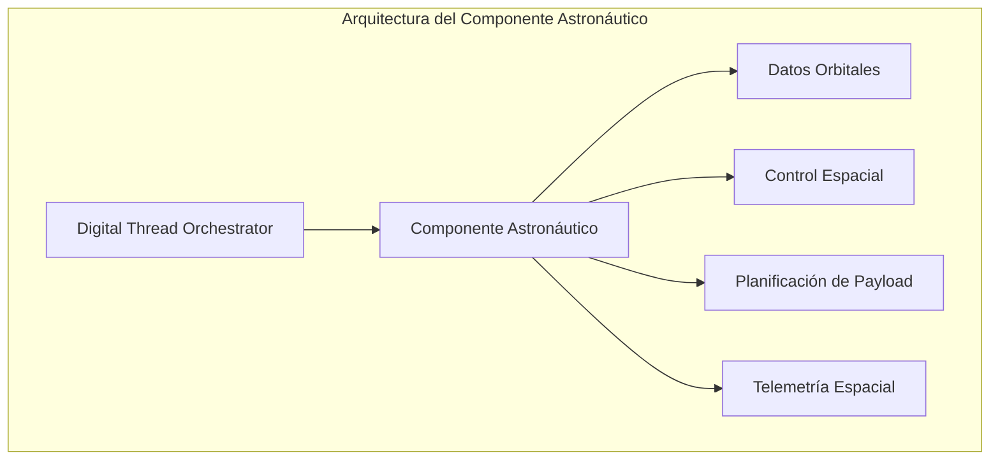

### Integración del Componente Astronáutico en GAIA AIR

## Arquitectura del Componente Astronáutico

El componente astronáutico debe integrarse perfectamente con el Digital Thread Orchestrator existente, ampliando sus capacidades para manejar datos y operaciones específicas del ámbito espacial.



## Estructura de Archivos para el Componente Astronáutico

Vamos a expandir la estructura de archivos existente para incluir el componente astronáutico:

```plaintext
gaia-air/
├── gaia/
│   ├── astronautics/                # Nuevo módulo para componentes astronáuticos
│   │   ├── __init__.py
│   │   ├── orbital_dynamics.py      # Cálculos de dinámica orbital
│   │   ├── space_environment.py     # Modelado del entorno espacial
│   │   ├── payload_management.py    # Gestión de cargas útiles
│   │   ├── mission_planning.py      # Planificación de misiones
│   │   └── space_telemetry.py       # Telemetría específica espacial
│   │
│   ├── connectors/
│   │   ├── space_control_connector.py  # Conector para sistemas de control espacial
│   │   └── ground_station_connector.py # Conector para estaciones terrestres
│   │
│   ├── schemas/
│   │   ├── astronautic_ontology.py  # Ontología específica astronáutica
│   │   └── json_schemas/
│   │       ├── orbital_elements.json # Esquema para elementos orbitales
│   │       └── space_telemetry.json  # Esquema para telemetría espacial
```

## Implementación del Componente Astronáutico

Vamos a implementar los archivos clave para el componente astronáutico:

### 1. Ontología Astronáutica

```python project="GAIA AIR" file="gaia/schemas/astronautic_ontology.py"
...
```

### 2. Dinámica Orbital

```python project="GAIA AIR" file="gaia/astronautics/orbital_dynamics.py"
...
```

### 3. Conector para Control Espacial

```python project="GAIA AIR" file="gaia/connectors/space_control_connector.py"
...
```

### 4. Integración con el Digital Thread Orchestrator

Para integrar el componente astronáutico con el Digital Thread Orchestrator existente, necesitamos actualizar el orquestador para que reconozca y procese los eventos y entidades astronáuticas:

```python project="GAIA AIR" file="gaia/core/digital_thread_orchestrator.py"
...
```

## Conclusión: Integración del Componente Astronáutico en GAIA AIR

La implementación del componente astronáutico que he proporcionado extiende las capacidades de GAIA AIR para manejar datos y operaciones específicas del ámbito espacial, cumpliendo con el hito previsto para el Mes 21 en tu cronograma.

### Características Principales

1. **Ontología Astronáutica**: Define conceptos, relaciones y propiedades específicas para el dominio espacial, permitiendo la representación semántica de naves espaciales, órbitas, misiones y cargas útiles.
2. **Dinámica Orbital**: Proporciona cálculos precisos de parámetros orbitales, propagación de órbitas, planificación de maniobras y trazas terrestres.
3. **Conector para Control Espacial**: Integra GAIA AIR con sistemas de control de misión, seguimiento de satélites y planificación de maniobras.
4. **Extensión del Orquestador**: Amplía el Digital Thread Orchestrator existente para procesar eventos y entidades astronáuticas, manteniendo la coherencia del hilo digital.


### Integración con la Arquitectura Existente

El componente astronáutico se integra perfectamente con la arquitectura existente:

1. **Reutiliza Componentes Core**: Aprovecha el EventBus y StateManager existentes para la comunicación y persistencia.
2. **Extiende el Modelo Semántico**: Amplía la ontología aeroespacial con conceptos astronáuticos.
3. **Mantiene el Patrón Autonomy Chain**: Preserva el flujo de información y la trazabilidad end-to-end.
4. **Implementa Validación Específica**: Añade validadores para garantizar la integridad de los datos astronáuticos.


### Próximos Pasos

Para completar la implementación del componente astronáutico, recomendaría:

1. **Desarrollar Conectores Adicionales**: Para estaciones terrestres, centros de control de misión y sistemas de análisis de datos espaciales.
2. **Implementar Visualizaciones Especializadas**: Para órbitas, trazas terrestres y estado de naves espaciales.
3. **Integrar con Sistemas de Simulación**: Para validar maniobras y planificación de misiones antes de su ejecución.
4. **Expandir la Ontología**: Para incluir conceptos más avanzados como rendez-vous espacial, reentrada atmosférica y operaciones interplanetarias.


Esta implementación proporciona una base sólida para el componente astronáutico de GAIA AIR, permitiendo la gestión integral de activos espaciales dentro del mismo marco de hilo digital que ya utilizas para componentes aeronáuticos.
