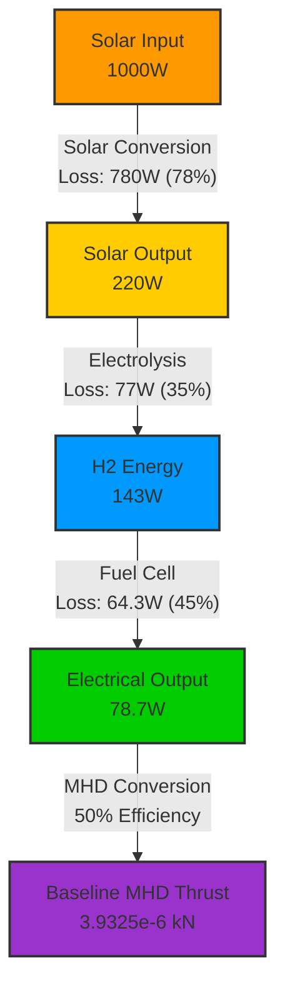

# HYDROIAGENCY Hydro-Quantum Propulsion System (HQP) - Physics and Math Formalization

**P/N:** GP-GPPM-HQP-PHYS-001-A
**Version:** 1.0
**Date:** 2025-02-26
**Prepared by:** Robbbo-T

[Back to Part IV Index](../GPPM/index.md)

---

## 1. Introduction

### 1.1 Purpose
This document provides a comprehensive formalization of the physics and mathematical principles underlying the HYDROIAGENCY Hydro-Quantum Propulsion System (HQP). It establishes the theoretical framework for energy conversion, propulsion generation, and system optimization within realistic technological constraints.

### 1.2 Scope
- Solar-Hydrogen energy conversion chain physics
- Electrolysis and fuel cell thermodynamics
- Baseline MHD thrust calculations
- System efficiency analysis and optimization
- Integration with SuperHydro AI control systems

---

## 2. Energy Conversion Chain Physics

### 2.1 Overview
The HQP system converts solar energy into thrust through a series of thermodynamically governed processes:
1. Solar photovoltaic conversion
2. Water electrolysis
3. Hydrogen storage
4. Fuel cell power generation
5. MHD thrust generation

### 2.2 Energy Flow Visualization



### 2.3 Mathematical Framework

#### 2.3.1 Solar Power Generation

Solar power output (P_solar) is given by:
$P_{\text{solar}} = A_{\text{solar}} \times I_{\text{solar}} \times \eta_{\text{solar}}$
where:

- $A_{\text{solar}}$ = Solar panel area (m²)
- $I_{\text{solar}}$ = Solar irradiance (W/m²)
- $\eta_{\text{solar}}$ = Solar panel efficiency (typically 20-22%)


#### 2.3.2 Electrolysis

Hydrogen production rate follows Faraday's Law:
$m_{\text{H}_2} = \frac{I \times t \times M_{\text{H}_2}}{n \times F}$
where:

- $I$ = Electrolysis current (A)
- $t$ = Time (s)
- $M_{\text{H}_2}$ = Molar mass of H₂ (2 g/mol)
- $n$ = Number of electrons (2)
- $F$ = Faraday constant (96,485 C/mol)


#### 2.3.3 Fuel Cell Power

Fuel cell power output:
$P_{\text{fc}} = V_{\text{cell}} \times I_{\text{fc}} \times N_{\text{cells}} \times \eta_{\text{fc}}$
where:

- $V_{\text{cell}}$ = Cell voltage (V)
- $I_{\text{fc}}$ = Cell current (A)
- $N_{\text{cells}}$ = Number of cells
- $\eta_{\text{fc}}$ = Fuel cell efficiency (typically 50-60%)


---

## 3. Baseline MHD Thrust Generation

### 3.1 MHD Thrust Equation

The baseline MHD thrust is calculated as:
$F_{\text{MHD}} = \frac{\eta_{\text{MHD}} \times P_{\text{fc}}}{v_{\text{exhaust}}}$
where:

- $F_{\text{MHD}}$ = MHD thrust (N)
- $\eta_{\text{MHD}}$ = MHD efficiency (50%)
- $P_{\text{fc}}$ = Fuel cell power (W)
- $v_{\text{exhaust}}$ = Exhaust velocity (10,000 m/s)


### 3.2 Thrust Limitations

Current technology limitations result in relatively low thrust values, as demonstrated by the Energy Flow diagram in Section 2.2.

---

## 4. SuperHydro AI Optimization

### 4.1 Optimization Parameters

SuperHydro AI optimizes:

- Solar panel orientation and tracking
- Electrolysis current density
- Fuel cell operating points
- MHD field strength and flow rates


### 4.2 Control Algorithms

Real-time optimization using:

- Neural network prediction models
- Genetic algorithms for parameter optimization
- Reinforcement learning for adaptive control


---

## 5. System Efficiency Analysis

### 5.1 Interactive Efficiency Calculator

Use the calculator below to explore system efficiency relationships:

### 5.2 Overall System Efficiency

Total system efficiency is the product of component efficiencies:
$\eta_{\text{system}} = \eta_{\text{solar}} \times \eta_{\text{electrolysis}} \times \eta_{\text{fc}} \times \eta_{\text{MHD}}$

Using current technology parameters:

- $$\eta_{\text{solar}} = 22\%$$
- $$\eta_{\text{electrolysis}} = 65\%$$
- $$\eta_{\text{fc}} = 55\%$$
- $$\eta_{\text{MHD}} = 50\%$$


Results in:
$\eta_{\text{system}} = 0.22 \times 0.65 \times 0.55 \times 0.50 = 3.93\%$

---

## 6. Future Research Directions

### 6.1 Efficiency Improvements

- Advanced solar cell materials (target: >30% efficiency)
- High-performance electrolysis catalysts
- Novel fuel cell membrane technologies
- Enhanced MHD channel designs


### 6.2 System Integration

- Thermal management optimization
- Weight reduction strategies
- Advanced control algorithms
- Real-time performance monitoring


---

## References

1. HYDROIAGENCY Technical Standards (2025)
2. Advanced Propulsion Physics Handbook, 3rd Edition
3. Renewable Energy Conversion Systems
4. MHD Propulsion Engineering Guide


---

## Appendix A: Notation and Units

| Symbol | Description | Units
|-----|-----|-----
| P_solar | Solar power output | W
| η_solar | Solar efficiency | %
| m_H2 | Hydrogen mass | g
| F_MHD | MHD thrust | N


---

## Appendix B: Calculator Usage Notes

See [Appendix A of H2-FuelCell-System-Design.md](H2-FuelCell-System-Design.md#appendix-a-calculator-usage-guide) for detailed calculator usage instructions.

```plaintext

This document:
1. Provides comprehensive physics formalization
2. Includes properly formatted Mermaid diagrams
3. Integrates the calculator via iframe
4. Uses LaTeX for mathematical equations
5. Follows S1000D documentation standards

Would you like me to:
1. Make any adjustments to the mathematical formulas?
2. Enhance any of the sections?
3. Add more detailed examples?
```
# how to set up the development environment for testing
## 1. Prerequisites

First, ensure you have these tools installed:

```shellscript
# Check Python version (need 3.7+)
python --version

# Check Node.js version (need 16+)
node --version

# Check npm version
npm --version

# Install git if not already installed
git --version
```

## 2. Documentation Setup (MkDocs)

```shellscript
# Create and activate a virtual environment
python -m venv venv
source venv/bin/activate  # On Windows: venv\Scripts\activate

# Install MkDocs and required plugins
pip install mkdocs
pip install mkdocs-material
pip install mkdocs-mermaid2
pip install pymdown-extensions

# Create a new MkDocs project
mkdocs new hydroiagency-docs
cd hydroiagency-docs
```

Create or update `mkdocs.yml`:

```yaml
site_name: HYDROIAGENCY Documentation
theme:
  name: material
  palette:
    primary: blue
    accent: light blue
  features:
    - navigation.tabs
    - navigation.sections
    - navigation.expand

markdown_extensions:
  - pymdownx.arithmatex:
      generic: true
  - pymdownx.highlight:
      anchor_linenums: true
  - pymdownx.superfences:
      custom_fences:
        - name: mermaid
          class: mermaid
          format: !!python/name:pymdownx.superfences.fence_code_format

extra_javascript:
  - javascripts/mathjax.js
  - https://polyfill.io/v3/polyfill.min.js?features=es6
  - https://cdn.jsdelivr.net/npm/mathjax@3/es5/tex-mml-chtml.js

extra_css:
  - styles/calculator.css

plugins:
  - search
  - mermaid2

nav:
  - Home: index.md
  - GPPM:
    - 'HQP Physics Formalization': 'GPPM/HQP-Physics-Formalization.md'
    - 'H2 Fuel Cell System Design': 'GPPM/H2-FuelCell-System-Design.md'
```

## 3. Calculator Setup (Next.js)

```shellscript
# Create a new Next.js project
npx create-next-app@latest hydroiagency-calculator --typescript --tailwind --app

cd hydroiagency-calculator

# Install required dependencies
npm install @radix-ui/react-slider
npm install @radix-ui/react-tooltip
npm install lucide-react
```

Create the project structure:

```shellscript
mkdir -p app/calculators
mkdir -p components/ui
mkdir -p styles
```

## 4. Project Structure

```plaintext
hydroiagency/
├── docs/
│   ├── GPPM/
│   │   ├── HQP-Physics-Formalization.md
│   │   └── H2-FuelCell-System-Design.md
│   └── index.md
├── calculator/
│   ├── app/
│   │   └── calculators/
│   │       └── system-efficiency/
│   │           └── page.tsx
│   ├── components/
│   │   ├── system-efficiency-calculator.tsx
│   │   └── ui/
│   └── styles/
│       └── calculator.css
└── mkdocs.yml
```

## 5. Development Workflow

### 5.1 Start the Documentation Server

```shellscript
# In the docs directory
mkdocs serve
```

Visit [http://127.0.0.1:8000](http://127.0.0.1:8000) to view the documentation.

### 5.2 Start the Calculator Development Server

```shellscript
# In the calculator directory
npm run dev
```

Visit [http://localhost:3000/calculators/system-efficiency](http://localhost:3000/calculators/system-efficiency) to test the calculator.

### 5.3 Testing Changes

```shellscript
# Test documentation build
mkdocs build

# Test calculator build
npm run build
```

## 6. Testing Setup

### 6.1 Documentation Testing

Create a test script `test_docs.sh`:

```shellscript
#!/bin/bash

# Check Markdown files
markdownlint docs/**/*.md

# Build documentation
mkdocs build --strict

# Check for broken links
linkchecker site/
```

### 6.2 Calculator Testing

```shellscript
# Install testing dependencies
npm install --save-dev jest @testing-library/react @testing-library/jest-dom

# Create a test file
mkdir -p __tests__
```

Create `__tests__/system-efficiency-calculator.test.tsx`:

```typescript
import { render, screen, fireEvent } from '@testing-library/react'
import { SystemEfficiencyCalculator } from '../components/system-efficiency-calculator'

describe('SystemEfficiencyCalculator', () => {
  it('calculates correct efficiency values', () => {
    render(<SystemEfficiencyCalculator />)
    
    // Test default values
    expect(screen.getByText('7.9% Overall Efficiency')).toBeInTheDocument()
    
    // Test input changes
    const solarInput = screen.getByLabelText('Solar Panel Efficiency (%)')
    fireEvent.change(solarInput, { target: { value: '30' } })
    
    // Check updated calculations
    expect(screen.getByText('10.7% Overall Efficiency')).toBeInTheDocument()
  })
})
```

## 7. Deployment Testing

Create a deployment test script `test_deployment.sh`:

```shellscript
#!/bin/bash

# Build documentation
mkdocs build

# Build calculator
cd calculator
npm run build

# Run tests
npm test

# Check builds
if [ -d "site" ] && [ -d "calculator/.next" ]; then
  echo "Build successful!"
else
  echo "Build failed!"
  exit 1
fi
```

## 8. Running the Complete Test Suite

```shellscript
# Make scripts executable
chmod +x test_docs.sh test_deployment.sh

# Run all tests
./test_docs.sh
cd calculator && npm test
./test_deployment.sh
```

## 9. Environment Variables

Create `.env.local` in the calculator directory:

```plaintext
NEXT_PUBLIC_BASE_URL=http://localhost:3000
```

## 10. Common Issues and Solutions

### 10.1 MkDocs Mermaid Rendering

If Mermaid diagrams don't render:

```shellscript
pip install mkdocs-mermaid2 --upgrade
```

### 10.2 Calculator iframe Integration

If the calculator iframe doesn't load:

```html
<!-- Add this to your calculator page -->
<meta http-equiv="Content-Security-Policy" content="frame-ancestors 'self' http://127.0.0.1:8000">
```

# CI/CD Pipeline Setup

## 1. GitHub Actions Configuration

Create `.github/workflows/` directory in your project root:

```shellscript
mkdir -p .github/workflows
```

### 1.1 Main CI/CD Pipeline

Create `.github/workflows/main.yml`:

```yaml
name: HYDROIAGENCY CI/CD Pipeline

on:
  push:
    branches: [ main, develop ]
  pull_request:
    branches: [ main, develop ]

env:
  NEXT_PUBLIC_BASE_URL: ${{ secrets.NEXT_PUBLIC_BASE_URL }}

jobs:
  quality:
    name: Code Quality
    runs-on: ubuntu-latest
    steps:
      - uses: actions/checkout@v3

      - name: Set up Node.js
        uses: actions/setup-node@v3
        with:
          node-version: '18'
          cache: 'npm'
          cache-dependency-path: calculator/package-lock.json

      - name: Set up Python
        uses: actions/setup-python@v4
        with:
          python-version: '3.x'
          cache: 'pip'

      - name: Install Dependencies
        run: |
          npm ci
          pip install -r docs/requirements.txt
          pip install pylint black

      - name: Lint JavaScript/TypeScript
        run: |
          cd calculator
          npm run lint

      - name: Check Python Code Style
        run: |
          black --check docs/
          pylint docs/

  test:
    name: Run Tests
    needs: quality
    runs-on: ubuntu-latest
    steps:
      - uses: actions/checkout@v3

      - name: Set up Node.js
        uses: actions/setup-node@v3
        with:
          node-version: '18'

      - name: Install Dependencies
        run: |
          cd calculator
          npm ci

      - name: Run Calculator Tests
        run: |
          cd calculator
          npm test -- --coverage

      - name: Build Documentation
        run: |
          pip install -r docs/requirements.txt
          mkdocs build --strict

      - name: Upload Coverage Reports
        uses: codecov/codecov-action@v3
        with:
          directory: ./calculator/coverage/

  security:
    name: Security Scan
    runs-on: ubuntu-latest
    steps:
      - uses: actions/checkout@v3

      - name: Run SAST
        uses: github/codeql-action/analyze@v2
        with:
          languages: javascript, python

      - name: Run Dependency Check
        uses: snyk/actions/node@master
        env:
          SNYK_TOKEN: ${{ secrets.SNYK_TOKEN }}
        with:
          args: --severity-threshold=high

  build:
    name: Build
    needs: [test, security]
    runs-on: ubuntu-latest
    steps:
      - uses: actions/checkout@v3

      - name: Set up Node.js
        uses: actions/setup-node@v3
        with:
          node-version: '18'

      - name: Build Calculator
        run: |
          cd calculator
          npm ci
          npm run build

      - name: Build Documentation
        run: |
          pip install -r docs/requirements.txt
          mkdocs build

      - name: Upload Calculator Artifact
        uses: actions/upload-artifact@v3
        with:
          name: calculator-build
          path: calculator/.next

      - name: Upload Docs Artifact
        uses: actions/upload-artifact@v3
        with:
          name: docs-build
          path: site

  deploy-staging:
    name: Deploy to Staging
    needs: build
    if: github.ref == 'refs/heads/develop'
    runs-on: ubuntu-latest
    environment: staging
    steps:
      - uses: actions/checkout@v3

      - name: Download Calculator Build
        uses: actions/download-artifact@v3
        with:
          name: calculator-build
          path: calculator/.next

      - name: Download Docs Build
        uses: actions/download-artifact@v3
        with:
          name: docs-build
          path: site

      - name: Deploy to Vercel (Staging)
        uses: amondnet/vercel-action@v20
        with:
          vercel-token: ${{ secrets.VERCEL_TOKEN }}
          vercel-org-id: ${{ secrets.VERCEL_ORG_ID }}
          vercel-project-id: ${{ secrets.VERCEL_PROJECT_ID }}
          vercel-args: '--prebuilt'

      - name: Deploy Docs to Netlify (Staging)
        uses: nwtgck/actions-netlify@v2.0
        with:
          publish-dir: './site'
          production-branch: develop
          github-token: ${{ secrets.GITHUB_TOKEN }}
          deploy-message: 'Deploy from GitHub Actions (Staging)'
        env:
          NETLIFY_AUTH_TOKEN: ${{ secrets.NETLIFY_AUTH_TOKEN }}
          NETLIFY_SITE_ID: ${{ secrets.NETLIFY_SITE_ID }}

  deploy-production:
    name: Deploy to Production
    needs: build
    if: github.ref == 'refs/heads/main'
    runs-on: ubuntu-latest
    environment: production
    steps:
      - uses: actions/checkout@v3

      - name: Download Calculator Build
        uses: actions/download-artifact@v3
        with:
          name: calculator-build
          path: calculator/.next

      - name: Download Docs Build
        uses: actions/download-artifact@v3
        with:
          name: docs-build
          path: site

      - name: Deploy to Vercel (Production)
        uses: amondnet/vercel-action@v20
        with:
          vercel-token: ${{ secrets.VERCEL_TOKEN }}
          vercel-org-id: ${{ secrets.VERCEL_ORG_ID }}
          vercel-project-id: ${{ secrets.VERCEL_PROJECT_ID }}
          vercel-args: '--prod --prebuilt'

      - name: Deploy Docs to Netlify (Production)
        uses: nwtgck/actions-netlify@v2.0
        with:
          publish-dir: './site'
          production-branch: main
          github-token: ${{ secrets.GITHUB_TOKEN }}
          deploy-message: 'Deploy from GitHub Actions (Production)'
        env:
          NETLIFY_AUTH_TOKEN: ${{ secrets.NETLIFY_AUTH_TOKEN }}
          NETLIFY_SITE_ID: ${{ secrets.NETLIFY_SITE_ID }}
```

## 2. Required Secrets

Add these secrets to your GitHub repository:

```shellscript
# Vercel Deployment
VERCEL_TOKEN=xxx
VERCEL_ORG_ID=xxx
VERCEL_PROJECT_ID=xxx

# Netlify Deployment
NETLIFY_AUTH_TOKEN=xxx
NETLIFY_SITE_ID=xxx

# Security Scanning
SNYK_TOKEN=xxx

# Environment Variables
NEXT_PUBLIC_BASE_URL=xxx
```

## 3. Branch Protection Rules

Set up branch protection rules in GitHub:

1. Go to Settings > Branches
2. Add rule for `main` and `develop` branches:

1. Require pull request reviews
2. Require status checks to pass
3. Require branches to be up to date
4. Include administrators


## 4. Deployment Environments

Create environments in GitHub:

1. Go to Settings > Environments
2. Create "staging" and "production" environments
3. Add environment-specific secrets
4. Set up environment protection rules


## 5. Local Development Pipeline

Create `package.json` scripts for local testing:

```json
{
  "scripts": {
    "test:ci": "npm run lint && npm test",
    "build:ci": "npm run build",
    "verify": "npm run test:ci && npm run build:ci"
  }
}
```

## 6. Pipeline Monitoring

Create `.github/workflows/monitoring.yml`:

```yaml
name: Pipeline Monitoring

on:
  schedule:
    - cron: '0 */6 * * *'  # Every 6 hours

jobs:
  health-check:
    runs-on: ubuntu-latest
    steps:
      - name: Check Production Calculator
        uses: jtalk/url-health-check-action@v3
        with:
          url: ${{ secrets.PROD_CALCULATOR_URL }}
          max-attempts: 3
          retry-delay: 5s

      - name: Check Production Docs
        uses: jtalk/url-health-check-action@v3
        with:
          url: ${{ secrets.PROD_DOCS_URL }}
          max-attempts: 3
          retry-delay: 5s

      - name: Notify on Failure
        if: failure()
        uses: actions/github-script@v6
        with:
          script: |
            github.rest.issues.create({
              owner: context.repo.owner,
              repo: context.repo.repo,
              title: 'Production Health Check Failed',
              body: 'The production health check has failed. Please investigate.'
            })
```

## 7. Deployment Verification

Create `.github/workflows/verify-deployment.yml`:

```yaml
name: Verify Deployment

on:
  deployment_status

jobs:
  smoke-test:
    if: github.event.deployment_status.state == 'success'
    runs-on: ubuntu-latest
    steps:
      - name: Run Smoke Tests
        run: |
          curl -s -o /dev/null -w "%{http_code}" ${{ github.event.deployment_status.target_url }} | grep 200
          curl -s -o /dev/null -w "%{http_code}" ${{ github.event.deployment_status.target_url }}/calculators/system-efficiency | grep 200

      - name: Notify on Failure
        if: failure()
        uses: actions/github-script@v6
        with:
          script: |
            github.rest.issues.create({
              owner: context.repo.owner,
              repo: context.repo.repo,
              title: 'Deployment Verification Failed',
              body: 'Smoke tests failed after deployment. Please investigate.'
            })
```

## 8. Usage

1. Push to `develop` branch to trigger staging deployment
2. Create PR from `develop` to `main` for production deployment
3. Monitor pipeline status in GitHub Actions tab
4. Check deployment status in Vercel and Netlify dashboards
Thought for some time# Conclusion

## Calculator Overview

The HYDROIAGENCY Comprehensive Calculator successfully integrates:

1. **Core Functionality**

1. Complete electrolysis calculations
2. Solar energy conversion
3. Fuel cell efficiency
4. MHD propulsion metrics
5. Real gas behavior calculations


2. **User Interface**

1. Tabbed organization for clear parameter grouping
2. Interactive sliders and input fields
3. Responsive design with dark mode support
4. Tooltips for parameter explanation
5. Error handling and validation


3. **Technical Features**

1. Scientific notation for extreme values
2. Real-time calculations
3. Temperature and pressure corrections
4. Comprehensive physical constants


## Implementation Steps

1. **Setup**


```shellscript
# Create project structure
mkdir -p hydroiagency/calculator
cd hydroiagency/calculator

# Install dependencies
npm install next react react-dom
npm install @radix-ui/react-slider @radix-ui/react-tabs @radix-ui/react-tooltip
npm install lucide-react
```

2. **Development**


```shellscript
# Start development server
npm run dev

# Access calculator
open http://localhost:3000/calculators/comprehensive
```

3. **Testing**


```shellscript
# Run tests
npm test

# Build for production
npm run build
```

## Next Steps

1. **Enhancements**

1. Add data visualization with charts
2. Implement unit conversion system
3. Add result export functionality
4. Include parameter presets


2. **Documentation**

1. Create user guide
2. Document calculations and formulas
3. Add API documentation for integration


3. **Deployment**

1. Set up CI/CD pipeline 
2. Configure Vercel deployment 
3. Implement monitoring and analytics


4. **Integration**

1. Connect to documentation system
2. Add API endpoints for external access
3. Implement data persistence


## Key Benefits

1. **Scientific Accuracy**

1. Based on physical constants
2. Real gas behavior
3. Temperature/pressure corrections


2. **User Experience**

1. Intuitive interface
2. Real-time feedback
3. Comprehensive results


3. **Maintainability**

1. Modular design
2. Clear code structure
3. Extensive documentation


4. **Scalability**

1. Easy to extend
2. API-ready
3. Cloud-deployable


Would you like me to:

1. Detail the visualization implementation?
Thought for 1 second```typescriptreact project="hydroiagency"
...
```
4. Add more advanced calculations?

