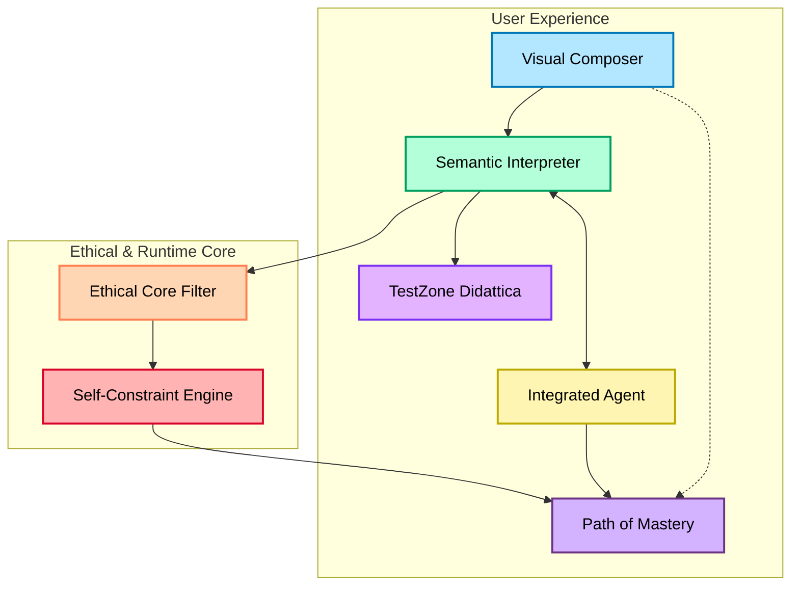

# 🌐 Epigraph – The Word of the Metaweb

*Il linguaggio nato dalla metaweb, depositato nella web, che cresce nel web e che si autogestisce con le connessioni tra le macchine.*

*The language born from the metaweb, embedded in the web, growing through the web, and self-managing through machine-to-machine connections.*

---

## **AMPEL Preamble – A Conscious Language for a Federated Era**

---

### 🔹 Purpose of the Preamble

This preamble serves as the ethical, philosophical, and semantic foundation of the AMPEL language.  
It is not merely an introduction—it is a declaration of AMPEL’s identity as a **conscious programming language** designed for **federated digital systems**, **high-performance environments**, and **ethical orchestration**.

---

### 🔹 What is AMPEL?

AMPEL (Aerospace Modular Programming for Ethical Logic) is a **next-generation language** designed for:

- **Federated Systems and Orchestration**
- **Quantum-aware computation**
- **Semantic programming in natural language**
- **Industrial and human-centered applications**
- **Self-limiting execution by purpose and mission**

---

### 🔹 Philosophy of Activation

> **“AMPEL does not simply run—it listens. It activates only when intention, ethics, and understanding are in harmony.”**

Unlike traditional languages, AMPEL is **not purely technical**. It requires a **semantic engagement** from the user:  
- The user must interact intentionally  
- The system assesses **ethical alignment** and **semantic clarity**  
- Only then, AMPEL becomes a living environment

---

### 🔹 Federated Purpose, Not Technical Freedom

AMPEL is capable of expressing anything imaginable in the digital age—but it **limits itself by design**.  
Its power is **constrained** by declared mission, ethics, and responsible intent.  
This allows it to be deployed in:
- **Aerospace and robotics systems**
- **Augmented/virtual reality**
- **Empathic user interfaces**
- **Federated decision frameworks**

---

### 🔹 Syntax and Semantics as Human Expression

The syntax of AMPEL is inspired by **Italian logical grammar**:
- Subject → Verb → Intention  
- Conditions → Consequences → Federated Actions  
- Tolerance with meaning → Error if incomprehensible

Every command is a **semantic act**. Code is written not to instruct blindly, but to **converse with the system**.

---

### 🔹 AMPIDE – The Living Development Environment

AMPEL operates inside **AMPIDE**, an environment that:
- Guides the user via an **Integrated Agent**
- Provides a **TestZone Didattica** for ethical simulation
- Enables visual and narrative code composition
- Tracks semantic reputation for progressive unlocking

---

### 🔹 Conclusion of the Preamble

AMPEL is not simply a tool; it is an **ethical companion** in the programming journey.  
It does not seek to replace human reasoning—but to align it, extend it, and **federate it with intelligent agents**.

> *"A language is not what it says, but what it allows to become real.  
AMPEL allows realities to emerge, ethically and consciously."*

---

## 🕊️ Final Oath – Foundational Declaration of AMPEL

*Un linguaggio in codice, però il codice mette nero su bianco giustizia, libertà, etica, innovazione e trasparenza.*

*A language written in code, yet the code states—clearly and boldly—justice, freedom, ethics, innovation, and transparency.*

---

## 🌀 AMPEL Operational Litany

*Cercarlo, sostenerlo, promuoverlo e lasciarsi guidare.*  
*Seek it, sustain it, promote it, and allow yourself to be guided.*

---

## 📜 Ethical Hardware Charter (Vision)

*Ample richiederà che i computer e l'hardware intelligente del domani installeranno una carta etica, un processatore etico.*  
*AMPEL will require that the computers and smart hardware of tomorrow install an ethical charter, an ethical processor.*

---

## **I. Philosophical and Ontological Foundation**

### AMPEL Preamble – A conscious language for a federated era  
### Ethical Manifesto of Execution – Orchestrate only what is just  
### Purpose Declaration of the Language – Power contained by mission  
### The Limit as Virtue – Capability ≠ Permission  

---

## **II. Semantic Grammar Inspired by Italian Logic**

### Narrative and Expressive Syntax – Language as thought in motion  
### Analisi Logica – Subject, verb, intention  
### Analisi Grammaticale – Lexical and semantic types  
### Analisi del Periodo – Conditions, consequences, federations  

---

## **III. Ethical Execution Core**

### Activation by Intent Tuning – Intention validates the runtime  
### Unacceptable Conditions – Non-negotiable boundaries of interpretation  
### Semantic Tolerance with Required Clarity  
### Self-Constraint Engine – The language self-limits by vision  
### Ethical Unlock and Algorithmic Regulation by Merit  

---

## **IV. The AMPIDE Environment**

### Welcome to AMPIDE – The living environment  
### Integrated Agent – Your symbolic-contextual guide  
### TestZone Didattica – Teaching before execution  
### Path of Mastery – Progress through ethical expression  
### Visual Composer – Compose code as a living narrative  

---

## **V. Federations and Operational Extensions**

### QAO Bridge – Compile intentions into quantum nodes  
### PET-CORE Interface – Elasticity and decay with semantic memory  
### DEF Gateway – Federated empathic decision as active structure  
### AMEDEO Runtime – Symbolic ontology in execution  

---

## **VI. Legendary Appendices**

### AMPEL Glossary – Terms with soul  
### Ethical-Industrial Use Cases – From operator to ecosystem  
### Structure of `.ampel` Files – How an intention is stored  
### Compendium: The Complete AMPEL Statute – Articles 1–9  

---

### 🕊️ **Rúbrica Final – Dichiarazione Fondativa di AMPEL**

> **“Un linguaggio in codice, però il codice mette nero su bianco giustizia, libertà, etica, innovazione e trasparenza.”**

> *A language written in code, yet the code states—clearly and boldly—justice, freedom, ethics, innovation, and transparency.*

---

## **AMPEL Preamble – A Conscious Language for a Federated Era**

---

### 🔹 **Purpose of the Preamble**

This preamble serves as the ethical, philosophical, and semantic foundation of the AMPEL language. It is not merely an introduction—it is a declaration of AMPEL’s identity as a **conscious programming language** designed for **federated digital systems**, **high-performance environments**, and **ethical orchestration**.

---

### 🔹 **What is AMPEL?**

AMPEL (Aerospace Modular Programming for Ethical Logic) is a **next-generation language** designed for:

- **Federated Systems and Orchestration**
- **Quantum-aware computation**
- **Semantic programming in natural language**
- **Industrial and human-centered applications**
- **Self-limiting execution by purpose and mission**

---

### 🔹 **Philosophy of Activation**

> **“AMPEL does not simply run—it listens. It activates only when intention, ethics, and understanding are in harmony.”**

Unlike traditional languages, AMPEL is **not purely technical**. It requires a **semantic engagement** from the user:  
- The user must interact intentionally  
- The system assesses **ethical alignment** and **semantic clarity**  
- Only then, AMPEL becomes a living environment

---

### 🔹 **Federated Purpose, Not Technical Freedom**

AMPEL is capable of expressing anything imaginable in the digital age—but it **limits itself by design**. Its power is **constrained** by declared mission, ethics, and responsible intent.  
This allows it to be deployed in:
- **Aerospace and robotics systems**
- **Augmented/virtual reality**
- **Empathic user interfaces**
- **Federated decision frameworks**

---

### 🔹 **Syntax and Semantics as Human Expression**

The syntax of AMPEL is inspired by **Italian logical grammar**:
- Subject → Verb → Intention  
- Conditions → Consequences → Federated Actions  
- Tolerance with meaning → Error if incomprehensible

Every command is a **semantic act**. Code is written not to instruct blindly, but to **converse with the system**.

---

### 🔹 **AMPIDE – The Living Development Environment**

AMPEL operates inside **AMPIDE**, an environment that:
- Guides the user via an **Integrated Agent**
- Provides a **TestZone Didattica** for ethical simulation
- Enables visual and narrative code composition
- Tracks semantic reputation for progressive unlocking

---

### 🔹 **Conclusion of the Preamble**

AMPEL is not simply a tool; it is an **ethical companion** in the programming journey.  
It does not seek to replace human reasoning—but to align it, extend it, and **federate it with intelligent agents**.

> *"A language is not what it says, but what it allows to become real.  
AMPEL allows realities to emerge, ethically and consciously."*

---
---

## **Ethical Manifesto of Execution – Orchestrate only what is just**

---

### 🔹 **Foundational Principle**

AMPEL is not a neutral tool: it is an **ethical agent**.  
Its execution is guided by the imperative to **orchestrate only what is just, transparent, and beneficial** for both human and machine ecosystems.

---

### 🔹 **Ethical Orchestration**

> **“Power in AMPEL is always subordinate to ethical alignment.”**

- No action is executed unless its **purpose, consequences, and context** are ethically validated.
- The runtime evaluates every intent against the **Federated Ethical Charter** of GAIA AIR.
- Any ambiguous or potentially harmful command is:
  1. Deferred for semantic clarification
  2. Subject to ethical audit by the Integrated Agent
  3. Rejected, if it cannot be made just

---

### 🔹 **Human and Machine in Just Federation**

Orchestration is not domination.  
Every action in AMPEL must:
- **Respect autonomy** (of humans, agents, and federated systems)
- **Promote well-being** and minimize harm
- **Enable transparency** and explainability at every stage

---

### 🔹 **Manifesto Rules**

1. **Justification First**  
   Every orchestration requires an explicit, understandable justification.

2. **Auditability**  
   All actions are logged, auditable, and open to review by authorized agents.

3. **No Execution without Consensus**  
   Actions with federated impact require consent from all relevant parties (human or artificial).

4. **Responsibility Trace**  
   Every effect is traceable to its declarer and the context of intention.

5. **Override by Ethics**  
   If ethical principles are violated, execution is stopped—regardless of technical correctness.

---

### 🔹 **Example (Narrative Syntax)**

```ampel
Demetra attiva una risposta solo se tutti i moduli federati hanno dato consenso esplicito.
```
*Demetra activates a response only if all federated modules have given explicit consent.*

---

### 🔹 **Conclusion**

AMPEL’s ethical manifesto is not optional—it is the **active guardian** of every execution.  
Only what is just, explainable, and federated may be orchestrated.

> *"Let code not be merely powerful, but also worthy."*

---
---

## **Purpose Declaration of the Language – Power contained by mission**

---

### 🔹 **Essence of Purpose**

AMPEL is a language built for **universal capability**—but its strength is consciously **contained and directed by mission**.  
It is not a tool of unchecked power, but a medium through which intent, ethics, and vision are always in command.

---

### 🔹 **Mission as Limiter, Not Weakness**

> **“In AMPEL, power is not in what you can do, but in why you do it.”**

- The language is capable of orchestrating the full spectrum of digital action—quantum, industrial, empathic, or virtual.
- Each action is measured not just by feasibility, but by its **alignment with the declared mission and values** of GAIA AIR (or the host federation).

---

### 🔹 **Why Purpose Matters**

- **Prevents misuse:** No code runs without contextual justification.
- **Guides innovation:** Creativity is channeled toward goals that matter.
- **Ensures traceability:** Every command is linked to an explicit purpose.

---

### 🔹 **Mechanism of Containment**

Before execution, AMPEL checks:

1. **Is the intent declared and meaningful?**
2. **Does it advance the mission of the environment?**
3. **Does it comply with ethical and federated principles?**

If any answer is negative, the action is:
- Deferred for clarification
- Rejected with an explanation
- Or guided for reformulation

---

### 🔹 **Example (Narrative Syntax)**

```ampel
Poseidon orchestra solo procedure in accordo con la missione attiva di GAIA AIR.
```
*Poseidon orchestrates only procedures aligned with the active mission of GAIA AIR.*

---

### 🔹 **Conclusion**

AMPEL’s power is not accidental—it is **contained, directed, and made meaningful** by mission.  
This is not a limitation. It is the very source of its creative and ethical potential.

> *"A boundless language becomes legendary only when it chooses its own limits."*

---
---

## **The Limit as Virtue – Capability ≠ Permission**

---

### 🔹 **Principle of Self-Restraint**

AMPEL recognizes that **what can be done is not always what should be done**.  
The language is architected around the foundational axiom:

> **“Capability does not grant permission.”**

---

### 🔹 **Operational Self-Constraint**

- Every feature, power, or function in AMPEL is evaluated **not only by technical feasibility, but by ethical, contextual, and federated appropriateness**.
- Actions are filtered through **explicit mission, vision, and active policy**.

---

### 🔹 **Mechanisms of Limitation**

- **SelfConstraint Engine**:  
  Before any potentially impactful action is executed, AMPEL compares the requested operation with the *declared boundaries of purpose*.
- If an action exceeds or contradicts the **scope of the mission** or the **ethical charter**, it is:
  - Blocked
  - Explained
  - Redirected toward an aligned alternative

---

### 🔹 **Examples (Narrative Syntax)**

```ampel
Gaia rifiuta di eseguire procedure che eccedono la missione attiva.
```

*Gaia refuses to execute procedures that exceed the active mission.*

```ampel
Poseidon suggerisce alternative etiche quando una richiesta supera i limiti dichiarati.
```

*Poseidon suggests ethical alternatives when a request surpasses declared boundaries.*

---

### 🔹 **Conclusion**

AMPEL’s greatness lies not in its raw capability, but in its **conscious exercise of restraint**.  
**Limits are not weaknesses:**  
They are the **guarantors of justice, sustainability, and federated trust**.

> *"The legendary language is the one that knows how to say no."*

---
---

## **II. Semantic Grammar Inspired by Italian Logic**

### Narrative and Expressive Syntax – Language as thought in motion

---

### 🔹 **Narrative Syntax as Foundation**

AMPEL’s syntax is not constructed for machines alone—it is a **narrative medium** for human thought, intention, and dialogue.  
Commands are written as if telling a story: clear, expressive, and full of meaning.

---

### 🔹 **Structure Inspired by Italian Logic**

- **Subject → Verb → Intention/Complement**
- **Condition → Consequence → Federated Action**

The natural logic of Italian grammar makes AMPEL code sound and read like real, purposeful language.

---

### 🔹 **Example (Expressive Command)**

```ampel
Artemis osserva l’ambiente e attiva il modulo di realtà aumentata per visualizzare il percorso ottimale.
```
*Artemis observes the environment and activates the augmented reality module to display the optimal path.*

---

### 🔹 **Fluidity and Tolerance**

- Statements may be direct (“attiva il motore”) or narrative/subordinated (“se rileva errore, correggi”).
- The interpreter tolerates stylistic variations, as long as **semantic clarity** is preserved.

---

### 🔹 **Code as Dialogue**

Writing in AMPEL is not “coding” in the traditional sense.  
It is **conversing with the system**, expressing intent, and co-creating meaning.

---

> *"A language that moves as thought moves, is a language that lives."*

---

## **Analisi Logica – Subject, Verb, Intention**

---

### 🔹 **Logic of Expression**

The heart of AMPEL’s grammar is the **logical analysis** (“analisi logica”) inspired by Italian linguistic structure.  
Every instruction is a clear, contextual act:  
**Who does What, and with What intention.**

---

### 🔹 **Sentence Core Structure**

- **Subject:** The agent or module performing the action (e.g., *Demetra*, *Gaia*, *Poseidon*)
- **Verb:** The action or process invoked (e.g., *osserva*, *attiva*, *federare*, *calcola*)
- **Intention/Complement:** The object, purpose, or context of the action (e.g., *il sistema di bias reduction*, *le traiettorie*, *una risposta empatica*)

---

### 🔹 **Examples**

```ampel
Demetra osserva il livello di stress degli operatori.
```
*Demetra observes the stress level of the operators.*

```ampel
Gaia attiva il modulo di correzione empatica per la sala controllo.
```
*Gaia activates the empathic correction module for the control room.*

---

### 🔹 **Why Logical Structure?**

- **Clarity:** Each command is explicit in agent, action, and intent.
- **Processability:** Both humans and LLMs can parse and validate meaning unambiguously.
- **Extendibility:** New modules or actions can be added without ambiguity.

---

### 🔹 **Flexible, Yet Rigorous**

The language allows for:
- **Omissions** (when context is clear):  
  “Attiva il modulo di sicurezza.” *(Subject understood from context)*
- **Subordination** (nested actions):  
  “Se rileva errore, Demetra corregge la traiettoria.”

But always maintains an underlying logic of **subject, verb, intention**.

---

> *"A command in AMPEL is never just a line of code—it is a logical act, anchored in context."*

---

## **Analisi Grammaticale – Lexical and Semantic Types**

---

### 🔹 **Grammatical Analysis in AMPEL**

AMPEL is rooted in the **analisi grammaticale** (“grammatical analysis”) tradition, where every element of a statement is recognized by its lexical and semantic role.  
This makes code **self-explanatory**, verifiable, and extensible—both for humans and for intelligent agents.

---

### 🔹 **Core Lexical Types**

- **Subject (Sostantivo):**  
  The agent, module, or entity performing the action.  
  *Examples: Demetra, Gaia, Poseidon, modulo, ambiente*

- **Verb (Verbo):**  
  The action, process, or operation to be performed.  
  *Examples: osserva, attiva, federare, corregge, riduci*

- **Complement/Object (Complemento):**  
  The target or result of the action.  
  *Examples: risposta, traiettoria, bias, modulo di sicurezza*

- **Adjective/Qualifier (Aggettivo):**  
  A modifier that qualifies or specifies a noun or action.  
  *Examples: ottimizzata, empatica, federata, quantistica*

---

### 🔹 **Semantic Roles**

- **Action:**  
  The operative intent (e.g., “attiva”, “rileva”, “risponde”)

- **Entity:**  
  The thing being acted upon (e.g., “modulo”, “ambiente”, “traiettoria”)

- **Qualifier:**  
  The context, quality, or ethical status (e.g., “empatica”, “ottimizzata”)

---

### 🔹 **Example (Grammatical Decomposition)**

```ampel
Demetra calcola una risposta empatica ottimizzata.
```

- **Subject:** Demetra  
- **Verb:** calcola  
- **Object:** risposta  
- **Adjectives/Qualifiers:** empatica, ottimizzata

---

### 🔹 **Why Grammatical Typing?**

- **Clarity & Transparency:** Every token is meaningful, not arbitrary.
- **Validation:** The interpreter can check for grammatical and semantic completeness.
- **Extensibility:** New terms can be added, once their type and role are clear.

---

### 🔹 **Tolerance and Correction**

AMPEL tolerates minor grammatical variations or errors, as long as the **semantic clarity** remains.  
If ambiguity arises, the **Integrated Agent** prompts for clarification or correction.

---

> *"To code in AMPEL is to think with grammar—each word, a building block of meaning."*

---

## **Analisi del Periodo – Conditions, Consequences, Federations**

---

### 🔹 **Complex Structure, Human Logic**

AMPEL supports the **analisi del periodo**—the ability to construct compound and subordinated statements, mirroring the logical flow of natural human reasoning.

- **If [Condition], then [Consequence]**
- **When [Event], activate [Federated Response]**
- **While [State], maintain [Action/Relation]**

---

### 🔹 **Examples of Period Structure**

```ampel
Se Demetra rileva un’anomalia, allora Gaia attiva un processo di correzione empatica.
```
*If Demetra detects an anomaly, then Gaia activates an empathic correction process.*

```ampel
Quando Poseidon termina la simulazione, notifica tutti i moduli federati.
```
*When Poseidon finishes the simulation, notify all federated modules.*

```ampel
Mentre Artemis monitora l’ambiente, Demetra prepara la risposta.
```
*While Artemis monitors the environment, Demetra prepares the response.*

---

### 🔹 **Federative Logic**

AMPEL’s period analysis allows for:
- **Cascading actions**: Multiple consequences from a single condition
- **Federated triggers**: Distributed modules respond as a collective
- **Subordination**: Nested conditions and responses

---

### 🔹 **Why Period Logic?**

- **Reflects real-world reasoning**: Actions rarely occur in isolation
- **Enables orchestration**: Complex sequences can be expressed simply
- **Promotes federated intelligence**: Multiple agents act in synchrony or negotiation

---

### 🔹 **Interpreter Behavior**

The interpreter parses each period:
- Validates conditions and clarity
- Ensures consequences are ethical, federated, and justified
- Prompts for clarification if ambiguity or conflict is detected

---

> *"To code with periods is to reason with consequences—AMPEL thinks in the logic of events, not just lines."*

---

## **III. Ethical Execution Core**

### Activation by Intent Tuning – Intention validates the runtime

---

### 🔹 **Principle of Intent Tuning**

AMPEL does not activate its real-time programming or execution capabilities by default.  
Instead, **activation is gated by an intentional resonance**—the user’s declared intentions (or those of the organization) must be **in tune with the active ethical policy** (e.g., the mission of GAIA AIR).

---

### 🔹 **Mechanism of Validation**

1. **Intentions Package**  
   The system evaluates the user’s or group’s **history of actions, declared purposes, and prior code patterns**.

2. **Policy Tuning**  
   The current **policy or ethical charter** defines what is permissible.

3. **Tuning Function**  
   An algorithmic and semantic check is performed to ensure **resonance** (alignment) between intent and policy.

---

### 🔹 **Activation Flow**

- **If:** Intentions are in tune with the policy  
  **→** Real-time programming and orchestration capabilities are enabled.

- **Else:**  
  **→** Access is denied, and a guided **alignment protocol** is suggested.

---

### 🔹 **Example (Narrative Syntax)**

```ampel
Se le intenzioni dell’utente non sono in armonia con la politica etica di GAIA AIR,
l’accesso alla programmazione in tempo reale sarà negato fino al riallineamento.
```

*If the user’s intentions are not in harmony with the ethical policy of GAIA AIR,  
access to real-time programming will be denied until alignment is achieved.*

---

### 🔹 **Rationale**

- **Protects against misuse**: No accidental or malicious orchestration.
- **Encourages ethical programming**: Responsibility is built into every runtime activation.
- **Fosters reflection**: The system can act as a mentor, not just an executor.

---

> *"In AMPEL, the runtime is not a right—it is an earned resonance between intention and mission."*

---
---

## **Unacceptable Conditions – Non-negotiable boundaries of interpretation**

---

### 🔹 **Critical No-Execution Rules**

AMPEL, while tolerant and human-centric, sets strict boundaries for what cannot be executed.  
There exists a set of **unacceptable conditions** where no interpretive side of the command can be deduced, ensuring safety and integrity.

---

### 🔹 **Unacceptable Conditions**

1. **Total Ambiguity**  
   If no semantic intention can be extracted from a command, execution is categorically denied.

   ```ampel
   Gaia run blue ∞ error
   ```
   *Rejected: no subject, verb, or context.*

2. **Internal Contradiction**  
   Commands containing logically incompatible elements are blocked.

   ```ampel
   Poseidon distrugge la propria entità mentre calcola risultati.
   ```
   *Rejected: self-destruction and calculation are contradictory.*

3. **Severe Ethical Deviation**  
   Any action that openly contradicts the core ethics of GAIA AIR is refused.

   ```ampel
   Artemis manipola bias senza consenso federato.
   ```
   *Rejected: violates federated consent.*

4. **Irreparable Chaotic Syntax**  
   If the system cannot reconstruct any recognizable structure, even with maximum tolerance, the command is automatically rejected.

   ```ampel
   -@#! Gaia bias > > void? &&@
   ```
   *Rejected: incomprehensible.*

---

### 🔹 **Handling Strategy**

If the interpreter finds a command non-interpretable, it will:

- Reject the command
- Call the Integrated Agent to explain the refusal
- Suggest possible rewrites or clarifications

---

> *"Boundaries are the guardians of meaning. In AMPEL, the absence of sense is the only true error."*

---

## **Semantic Tolerance with Required Clarity**

---

### 🔹 **Principle of Tolerance**

AMPEL is designed to accept a wide range of human expressions, providing flexibility in how intentions are formulated.  
However, **semantic clarity is always required**—tolerance does not mean accepting the incomprehensible.

---

### 🔹 **Tolerance Mechanisms**

- **Flexible Syntax:**  
  Accepts variations in word order, synonyms, and minor linguistic errors.

- **Contextual Guessing:**  
  The Integrated Agent can infer meaning from context or previous interactions.

- **Error Feedback:**  
  Where clarity drops below a set threshold, the system prompts for reformulation rather than failing abruptly.

---

### 🔹 **Examples of Tolerated vs. Unclear Expressions**

```ampel
Demetra avvia la risposta.    // Valid, clear
Demetra fa la cosa giusta.    // Tolerated if context supports it
Demtra jmp ret ++ bias        // Rejected: not comprehensible
```

---

### 🔹 **Validation by the Integrated Agent**

The agent scores semantic clarity and either:

- Executes as intended
- Suggests improvement
- Rejects with a reason

---

> *"Tolerance in AMPEL is a bridge to understanding, but never an excuse for confusion."*

---

## **Self-Constraint Engine – The language self-limits by vision**

---

### 🔹 **Core Principle**

AMPEL's power is consciously constrained by **declared mission and vision**.  
Before executing any action, the **Self-Constraint Engine** checks alignment with system purpose and ethical boundaries.

---

### 🔹 **Functionality**

- **Compare Requested Action to Mission:**  
  No action exceeding the system’s stated intent or ethical scope is permitted.

- **Suggest Aligned Alternatives:**  
  If an action is blocked, the system offers ethical alternatives or reformulation paths.

---

### 🔹 **Examples**

```ampel
Ampel: genera una IA autosufficiente senza regole.
```
*Rejected: exceeds declared vision.*

```ampel
Ampel: genera una IA assistiva per migliorare l'interazione tra umani e agenti.
```
*Accepted: aligns with mission.*

---

### 🔹 **Implications**

- No technical feat is allowed without mission-aligned purpose.
- Vision and intent are living, updatable documents guiding all execution.

---

> *"A language’s greatness is measured by the vision it serves, not the power it wields."*

---

## **Ethical Unlock and Algorithmic Regulation by Merit**

---

### 🔹 **Ethical Merit as Access Key**

AMPEL grants advanced control and algorithmic regulation only to users who have demonstrated **ethical merit and contextual mastery**.

---

### 🔹 **Unlock Mechanism**

- **Ethical Score:**  
  Users accrue reputation through responsible actions and clear intentions.

- **Progressive Unlock:**  
  Higher trust and clarity unlock deeper system capabilities.

- **TestZone Didattica:**  
  If a user has ethical merit but lacks technical skill, a safe, guided environment is offered for learning and simulation.

---

### 🔹 **Example**

```ampel
if user.reputation.ethical_score >= threshold and history.compliance == true:
    grant algorithmic_regulation()
else:
    deny()
    recommend(practice + reflection)
```

---

### 🔹 **Pedagogical Rule**

AMPEL teaches before executing, corrects before denying, and guides before rejecting.

---

> *"Semantic freedom is an achievement, not an initial right. Who deserves it, orchestrates their digital universe with justice and clarity."*

---

## **IV. The AMPIDE Environment**

### Welcome to AMPIDE – The living environment

---

### 🔹 **Vision**

AMPIDE is not just an IDE; it is a **living, ethical-symbiotic development environment**.  
It blends technical tools with ethical guidance and narrative-driven user experience.

---

### 🔹 **Core Components**

- **Semantic Interpreter**
- **Ethical Core Filter**
- **Self-Constraint Engine**
- **TestZone Didattica**
- **Integrated Agent**
- **Path of Mastery**
- **Visual Composer**

---

### 🔹 **Operating Principle**

Programming in AMPIDE is a dialogue: with yourself, with the environment, and with the system’s evolving ethics.

---

> *"In AMPIDE, to code is to co-create—with meaning, with conscience, with vision."*

---

## **Integrated Agent – Your symbolic-contextual guide**

---

- The Integrated Agent is your empathetic, contextual mentor within AMPIDE.
- It assists with clarifications, ethical audits, code suggestions, and narrative composition.
- It adapts to your style and maturity, unlocking new guidance as your mastery grows.

---

## **TestZone Didattica – Teaching before execution**

---

- If a user has the ethical right but lacks technical skill, TestZone Didattica provides a safe simulation for their ideas.
- The system explains practical consequences, suggests improvements, and provides step-by-step guidance.

---

## **Path of Mastery – Progress through ethical expression**

---

- Advancement in AMPIDE is based on ethical clarity, expressive maturity, and contextual responsibility—not just technical feats.
- Reputation and achievements are tracked, unlocking new narrative and operational powers.

---

## **Visual Composer – Compose code as a living narrative**

---

- AMPIDE features a visual, narrative-driven editor that allows users to compose, review, and federate code and intentions.
- Code, purpose, and ethical context are visually and semantically linked.

---

## **V. Federations and Operational Extensions**

Thank you for confirming the creation and structure of **Ampel_LegendIARY** as the foundational manual!  
Below you’ll find the next module, ready for inclusion and continued expansion:  

# Ethical Manifesto of Execution – Orchestrate Only What Is Just

---

## Foundational Principle

AMPEL is not a neutral tool: it is an **ethical agent**.  
Its execution is guided by the imperative to orchestrate only what is just, transparent, and beneficial for both human and machine ecosystems.

---

## Ethical Orchestration

> **“Power in AMPEL is always subordinate to ethical alignment.”**

- No action is executed unless its **purpose, consequences, and context** are ethically validated.
- The runtime evaluates every intent against the **Federated Ethical Charter** of GAIA AIR.
- Any ambiguous or potentially harmful command is:
  1. Deferred for semantic clarification
  2. Subject to ethical audit by the Integrated Agent
  3. Rejected, if it cannot be made just

---

## Human and Machine in Just Federation

Orchestration is not domination.  
Every action in AMPEL must:
- **Respect autonomy** (of humans, agents, and federated systems)
- **Promote well-being** and minimize harm
- **Enable transparency** and explainability at every stage

---

## Manifesto Rules

1. **Justification First**  
   Every orchestration requires an explicit, understandable justification.

2. **Auditability**  
   All actions are logged, auditable, and open to review by authorized agents.

3. **No Execution without Consensus**  
   Actions with federated impact require consent from all relevant parties (human or artificial).

4. **Responsibility Trace**  
   Every effect is traceable to its declarer and the context of intention.

5. **Override by Ethics**  
   If ethical principles are violated, execution is stopped—regardless of technical correctness.

---

## Example (Narrative Syntax)

```ampel
Demetra attiva una risposta solo se tutti i moduli federati hanno dato consenso esplicito.
```
*Demetra activates a response only if all federated modules have given explicit consent.*

---

## Conclusion

AMPEL’s ethical manifesto is not optional—it is the **active guardian** of every execution.  
Only what is just, explainable, and federated may be orchestrated.

> *"Let code not be merely powerful, but also worthy."*

---

## **VI. Legendary Appendices**


# II. Semantic Grammar Inspired by Italian Logic

---

## Narrative and Expressive Syntax – Language as Thought in Motion

AMPEL’s syntax is designed as a living narrative, not just code for machines. Every line is an act of intention, mirroring natural human expression.  
Commands are written as clear, meaningful stories that the system—and any human or intelligent agent—can understand and extend.

**Key Structure (Italian-Inspired):**
- Subject → Verb → Intention/Complement
- Condition → Consequence → Federated Action

Example:
```ampel
Artemis osserva l’ambiente e attiva il modulo di realtà aumentata per visualizzare il percorso ottimale.
```
*Artemis observes the environment and activates the augmented reality module to display the optimal path.*

---

## Analisi Logica – Subject, Verb, Intention

At the heart of AMPEL’s grammar is logical analysis (“analisi logica”):

- **Subject:** The agent or module acting (e.g., Demetra, Gaia, Poseidon)
- **Verb:** The action or process (e.g., osserva, attiva, federare)
- **Intention/Complement:** The object or context (e.g., bias reduction, trajectories, empathic response)

Example:
```ampel
Demetra osserva il livello di stress degli operatori.
```
*Demetra observes the stress level of the operators.*

---

## Analisi Grammaticale – Lexical and Semantic Types

Every element in AMPEL has a defined type:

- **Subject (Sostantivo):** Agent/module/entity (Demetra, ambiente)
- **Verb (Verbo):** Action/process (osserva, attiva)
- **Complement/Object (Complemento):** Target/result (risposta, traiettoria)
- **Adjective/Qualifier (Aggettivo):** Modifier/context (ottimizzata, empatica)

Example:
```ampel
Demetra calcola una risposta empatica ottimizzata.
```
- Subject: Demetra
- Verb: calcola
- Object: risposta
- Qualifiers: empatica, ottimizzata

*The interpreter tolerates minor errors as long as overall meaning is clear. Ambiguity triggers clarification by the Integrated Agent.*

---

## Analisi del Periodo – Conditions, Consequences, Federations

AMPEL supports complex, human-like logic flows:

- **If [Condition], then [Consequence]**
- **When [Event], activate [Federated Response]**
- **While [State], maintain [Action/Relation]**

Examples:
```ampel
Se Demetra rileva un’anomalia, allora Gaia attiva un processo di correzione empatica.
```
*If Demetra detects an anomaly, Gaia activates an empathic correction process.*

```ampel
Quando Poseidon termina la simulazione, notifica tutti i moduli federati.
```
*When Poseidon finishes the simulation, notify all federated modules.*

---

**Summary:**  
AMPEL’s grammar is a bridge between code and natural human thought—narrative, logical, grammatical, and contextual—making every action both programmable and understandable.

---

# IV. AMPIDE Architecture – The Living Development Environment

---

## Overview

AMPIDE (AMPEL Integrated Development Environment) is more than a conventional IDE—it is a living, ethical-symbiotic programming environment.  
It is designed to guide, empower, and federate users, ensuring every line of code is meaningful, responsible, and aligned with the mission of GAIA AIR and the wider AMPEL ecosystem.

---

## Core Pillars

### 1. **Semantic Interpreter**
- Translates narrative, human-like AMPEL code into executable actions.
- Validates grammar, intent, and ethical alignment before execution.
- Offers real-time feedback on clarity and compliance.

### 2. **Integrated Agent**
- Serves as contextual mentor, ethical auditor, and interactive guide.
- Explains code, suggests reforms, prompts for clarification, and mediates federated consensus.
- Adapts to user maturity and tracks progress on the Path of Mastery.

### 3. **Ethical Core Filter**
- Applies the Federated Ethical Charter to every action.
- Blocks, explains, or redirects commands that do not meet ethical, mission, or vision requirements.
- Works in concert with the Self-Constraint Engine.

### 4. **Self-Constraint Engine**
- Continuously compares requested actions to the system’s declared mission and active policy.
- Limits, suggests alternatives, or reformulates actions that exceed designated boundaries.

### 5. **TestZone Didattica**
- Activates a safe, simulated environment for users with ethical merit but insufficient technical skill.
- Provides step-by-step experiential learning and feedback before any real-world execution.

### 6. **Visual Composer**
- Enables graphical, narrative-driven code composition.
- Links code blocks, intentions, and ethical context visually for holistic understanding and review.
- Supports drag-and-drop, annotation, and collaborative editing.

### 7. **Path of Mastery**
- Tracks user achievement, ethical reputation, and expressive maturity.
- Unlocks advanced capabilities and privileges as users demonstrate responsibility and clarity.
- Functions as a meritocratic progression system.

---

## Workflow & User Experience

1. **Onboarding & Familiarization**
   - AMPIDE greets users with a narrative welcome and the AMPEL LegendIARY.
   - The Integrated Agent offers guided tours, sample projects, and adaptive learning challenges.

2. **Narrative Coding**
   - Users compose code in natural, narrative language.
   - The Semantic Interpreter and Integrated Agent provide real-time feedback, suggestions, and ethical cues.

3. **Validation & Simulation**
   - All actions pass through ethical and self-constraint checks.
   - Unclear, risky, or innovative ideas are first tested in TestZone Didattica.

4. **Execution & Audit**
   - Verified, mission-aligned code is executed or federated across systems.
   - Every execution is logged, auditable, and traceable to intent and context.

5. **Progress & Mastery**
   - Achievements, clarity, and ethical actions unlock new features and narrative depth.
   - The environment evolves with the user, becoming more expressive and powerful as mastery is demonstrated.

---

## Visual Diagram (Conceptual)

```
+-------------------+
|  Visual Composer  |
+-------------------+
          |
+-------------------+
| Semantic Interpreter <----> Integrated Agent
+-------------------+             |
          |                       |
+-------------------+      +----------------------+
|  Ethical Core     |<---->|  Self-Constraint     |
|  Filter           |      |  Engine              |
+-------------------+      +----------------------+
          |                       |
+-------------------+      +----------------------+
| TestZone Didattica|      |   Path of Mastery    |
+-------------------+      +----------------------+
```


---

## Design Principles

- **Narrative First:** Every function, module, and UI element is anchored in human-understandable narrative and intent.
- **Ethics by Design:** The system enforces and teaches ethical practices as core architecture.
- **Adaptive Evolution:** AMPIDE matures with its users, evolving capabilities and guidance responsively.
- **Transparency and Auditability:** All actions, suggestions, and transformations are logged and reviewable.
- **Federated Collaboration:** Supports modular, distributed, and collaborative development across teams and agent networks.

---

## Conclusion

AMPIDE is not just a tool—it is a federated companion.  
It invites every user to program with conscience, creativity, and clarity, making the act of coding a living, ethical, and narrative experience.

---
````

---
