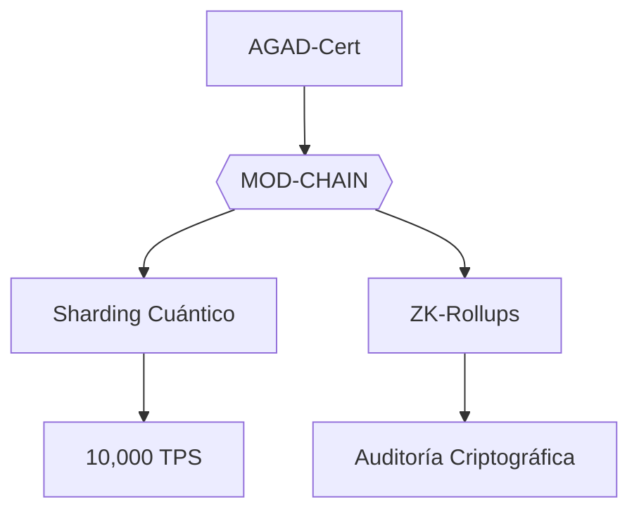
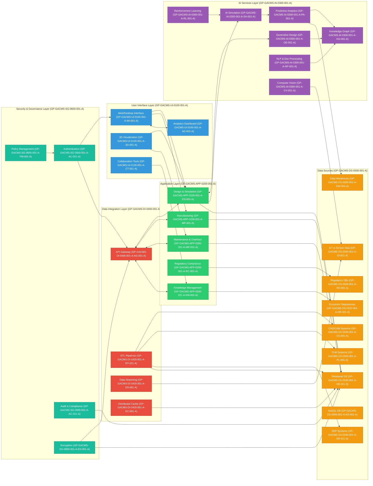
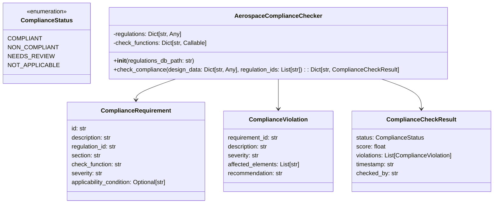
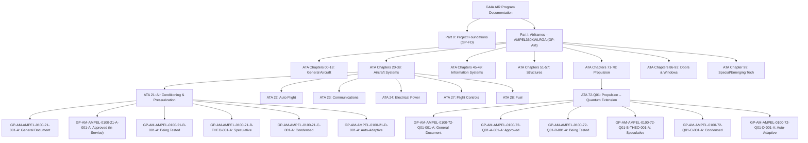

# **AGAD Protocol**: Quantum-Financial Architecture for Autopoietic Aerospace Systems

**Version:** 1.0  
**License:** CC BY-SA 4.0 and ODRF-7  
**Document ID:** COAFI-MANIFESTO-AGAD-0001-A / COAFI-WHITEPAPER-AGAD-0001-A  

---

## **Executive Summary**

### **Title**
**AGAD Protocol**: *Quantum-Financial Architecture for Autopoietic Aerospace Systems*

### **Objective**
Establish an **open standard for regenerative self-financing** that combines quantum computing, IP tokenization, and DAO governance for **aerospace projects** with a **net positive impact**.

### **Keywords**
```
#QuantumRefinancing #RegenerativeFinance #DeepTechEthical
#FractalIP #TechnologicalSovereignty #BiomimeticDesign
#CircularEconomy
```

### **Central Problem**
- **Aerospace Innovation Paradox**: R&D cycles (8-12 years) vs. short funding windows (3-5 years) → 72% of projects stall.
- **Low Regenerative Focus**: The global space economy (est. $1.8 trillion by 2035) is underinvested in sustainable tech.

### **AGAD Solution**
- **F-NFT Tokenization** of patents and IP.
- **Quantum Simulations** monetized as microservices.
- **dNFT Issuance** tied to SDG-linked outcomes.

### **Roadmap 2025-2030**

| Phase                     | Key Actions                           | KPI                       |
|---------------------------|---------------------------------------|---------------------------|
| **Alpha (2025-2026)**    | AGAD-Cert Pilots, EIC Co-Investment    | €10M mobilized            |
| **Beta (2027-2028)**     | Federated Accelerators, QIB Issuance   | 100 projects certified    |
| **Gamma (2029-2030)**    | Orbital Manufacturing, ESA/NASA Collab | €1,000M in transactions   |

### **Revenue Model**
- **AGAD-Cert** fees
- **Royalties** on Fractal IP
- **QAOE** Engine subscriptions

### **Case Study**: *MOD-ETHIC Project*
- 85% CO2 reduction via quantum simulations
- 93% self-financing in 18 months via fractional tokens

### **Strategic Partnerships**
- **Technological**: D-Wave, Chainlink  
- **Financial**: BID Lab, EIC  
- **Academic**: Quantum Institute of Madrid, CERN IdeaSquare  
- **Opportunities**: Horizon Europe 2027, Ibero-American Space Alliance

### **Call to Action**
- **Researchers**: Join AGAD Research DAO  
- **Governments**: Adopt AGAD-Cert  
- **Citizens**: Micro-invest in regenerative aerospace  
> “Space is not the final frontier, but the quantum mirror to redesign our relationship with Earth.”

### **Contacts**
- GitHub: [github.com/AGAD-Protocol](https://github.com/AGAD-Protocol)  
- White Paper: [agad.earth/whitepaper_v2](https://agad.earth/whitepaper_v2)  
- First Open Project: *Atmospheric Reentry Quantum Simulator* (fork available 15/04/2025)

### **Founding Team**
- **Amedeo Pelliccia**: Quantum-Financial Architect  
- **GAIA AIR Collective**: Distributed innovation network  

**Published under CC BY-SA 4.0**:  
> “Innovate like Gaia would: with elegance, resilience, and regenerative abundance.”

---

## **AGAD Manifesto** – *As GAIA AIR Does*

**Version:** 1.0  
**License:** CC BY-SA 4.0  
**Document ID:** COAFI-MANIFESTO-AGAD-0001-A  

**Core Principles**  
> “AGAD is not a brand. It’s a pattern. A protocol. A promise.  
> Anyone can clone it. Anyone can evolve it.  
> As long as they do it *as GAIA AIR does*: intelligently, ethically, regeneratively.”

### **The 7 Axes of Regenerative Operation**
1. **#FinAsGaiaDoes** – Finance that nourishes rather than extracts  
2. **#DesignAsGaiaDoes** – Design that adapts and evolves with context  
3. **#ProofAsGaiaDoes** – Verification through distributed intelligence  
4. **#ProduceAsGaiaDoes** – Manufacturing that builds at the point of need  
5. **#ServeAsGaiaDoes** – Services that create symbiotic relationships  
6. **#CareAsGaiaDoes** – Ethics that maintain ecosystem health  
7. **#RedoAsGaiaDoes** – Circularity that enables continuous evolution  

### **Our Vision**
- **Open IP Flow** like genetic information—freely shared, with due attribution.  
- **Funding Cycles** that align with natural rhythms, not just quarterly returns.  
- **Nature-Inspired Tech** that serves life, not the other way around.  
- **Collaboration-Driven Innovation**, free from competitive silos.

### **Our Challenge**
- R&D cycles (8-12 yrs) vs. funding windows (3-5 yrs).  
- Siloed knowledge in proprietary systems.  
- Environmental urgency demands a regenerative approach.

### **Our Promise**
- **Open by Default**: Patterns meant to be copied, adapted, improved.  
- **Regenerative by Design**: Every project improves its environment.  
- **Quantum-Enhanced**: Harnessing nature’s computational power.  
- **Ethically Aligned**: Prioritizing human and ecological wellbeing.  
- **Financially Sustainable**: Self-funding built into each project.

### **Biomimetic Foundation**
Each AGAD axis is **rooted in nature**’s patterns:

| Axis   | Biomimetic Principle      | Natural Example                     |
|--------|---------------------------|-------------------------------------|
| Fin    | Resource Cycling          | Forest nutrient exchange            |
| Design | Adaptive Morphology       | Bird wing evolution                 |
| Proof  | Distributed Intelligence  | Ant colony optimization             |
| Produce| Local Production          | Spider web construction             |
| Serve  | Symbiotic Relationships   | Coral reef ecosystems               |
| Care   | Ecosystem Health          | Homeostasis in organisms            |
| Redo   | Adaptive Evolution        | Immune system learning              |

### **Call to Action**
> “Space is not the final frontier, but the quantum mirror to redesign our relationship with Earth.”

- **Copy** this manifesto – use, adapt, and improve it.  
- **Implement** these patterns – in your projects or communities.  
- **Evolve** the approach – fix what doesn’t work, share what does.  
- **Join** the movement – connect with others building regenerative aerospace.

### **AGAD Pledge**
We commit to:
- Prioritize **regenerative outcomes** over extractive profit.  
- **Share knowledge** openly with due attribution.  
- Design for **circular material flows** and energy efficiency.  
- **Measure success** by ecological and human well-being.  
- Build systems that **enhance** dignity and health.  
- **Continuously learn** and adapt.  
- Leave systems **better** than we found them.

> “Innovate like Gaia would: with elegance, resilience, and regenerative abundance.”

---

## **AGAD Technical White Paper**
**Quantum-Financial Architecture for Autopoietic Aerospace Systems**  
**Version:** 0.1  
**Status:** Public Release Candidate  
**License:** ODRF-7  
**Document ID:** COAFI-WHITEPAPER-AGAD-0001-A  

### **1. Technical Architecture**

#### **1.1 System Overview**
AGAD comprises **seven interlinked modules** forming an ecosystem for aerospace innovation:

```
┌─────────┐    ┌─────────┐    ┌─────────┐
│ MOD-FIN │<-->|MOD-QUAD │<-->| MOD-QSIM │
└─────────┘    └─────────┘    └─────────┘
      ^             ^             ^
      |             |             |
┌─────────┐    ┌─────────┐    ┌─────────┐
│MOD-ETHIC│<-->|XAI REGISTRY│<-->|MOD-XAI │
└─────────┘    └─────────┘    └─────────┘
      ^             ^             ^
      |             |             |
┌─────────┐    ┌─────────┐    ┌─────────┐
│MOD-REGEN│<-->| MOD-MFG  │<-->|MOD-SERV │
└─────────┘    └─────────┘    └─────────┘
```

#### **1.2 Core Technologies**

**1.2.1 QAOE Engine**  
Quantum Aerospace Optimization Engine:

- **Quantum Algorithms**: QAOA, VQE, QML, Quantum Annealing  
- **Performance**: 10-100× speedup vs. classical HPC  
- **Integration**: Hybrid quantum-classical, REST/GraphQL APIs  

**1.2.2 MOD-CHAIN**  
Hybrid blockchain for **traceability, security,** and **IP management**:

- **Consensus**: Proof of Beneficial Impact (PoBi)  
- **Smart Contracts**: Solidity, Rust, Python  
- **Energy Efficiency**: <0.001% of Bitcoin’s consumption  

**1.2.3 XAI Registry**  
Explainable AI record for **design decisions** and **impact metrics**:

- **ISO/IEC 25059** compliant  
- **Distributed IPFS** with blockchain anchoring  
- **APIs**: GraphQL, REST, zkProof integration  

### **2. Implementation Strategy**

**2.1 Deployment Architecture**  
Flexible layers: from **Quantum HW** and **Blockchain** up to **MOD-FIN/MOD-QUAD** and client apps.

**2.2 Deployment Options**  
- **Cloud-Native** (Kubernetes, quantum backend via D-Wave/IBM)  
- **On-Premises** (Local HPC, quantum simulator, specialized security)

**2.3 Integration with AMPEL360XWLRGA**  
- **ATA Chapter Mapping**: Streamlined modules for program management, powerplant, structures, etc.  
- **S1000D Compliance**: Standardized data modules.

### **3. Roadmap & Timeline**

| **Phase** | **Year** | **Key Milestones**                      | **Target**                 |
|-----------|----------|-----------------------------------------|----------------------------|
| Alpha     | 2025-26  | QAOE v0.1, MOD-CHAIN Testnet, EIC invest| €10M mobilized            |
| Beta      | 2027-28  | Federated Accelerators, QIB issuance    | 100 projects certified     |
| Gamma     | 2029-30  | Orbital mfg, ESA/NASA collab            | €1B in transactions        |

### **4. Technical Specs**

**4.1 QAOE Engine**  
- **Qubits**: Minimum 500  
- **Algorithms**: QAOA, VQE, QML  
- **Speedup**: 10-100× vs. classical HPC  

**4.2 MOD-CHAIN**  
- **Consensus**: PoBi  
- **Transaction Speed**: 10k+ TPS  
- **Security**: Post-quantum cryptography

**4.3 XAI Registry**  
- **Explainability Levels**: L1–L5  
- **Integration**: REST/GraphQL, IPFS  
- **Compatibility**: AMPEL360, CAD/CAM tools

### **5. Case Studies**

**5.1 MOD-ETHIC**  
- 85% reduction in test-based CO2  
- 93% self-financing via fractional tokens  

**5.2 AMPEL360 Q-01**  
- 60% shorter dev timeline  
- 40% lower capital needs  
- 5× simulation accuracy  

```mermaid
graph TD;
    A["AGAD Protocol"] --> B["MOD-FIN<br>Financial Module"]
    A --> C["MOD-QUAD<br>Quantum Design"]
    A --> D["MOD-QSIM<br>Quantum Simulation"]
    A --> E["MOD-ETHIC<br>Ethical Framework"]
    A --> F["XAI REGISTRY<br>Explainable AI"]
    A --> G["MOD-XAI<br>AI Explainability"]
    A --> H["MOD-REGEN<br>Regenerative Systems"]
    A --> I["MOD-MFG<br>Manufacturing"]
    A --> J["MOD-SERV<br>Services"]
    
    B -.-> C
    C -.-> D
    E -.-> F
    F -.-> G
    H -.-> I
    I -.-> J
    
    K["Core Technologies"] --> L["QAOE Engine<br>(Quantum Aerospace Optimization)"]
    K --> M["MOD-CHAIN<br>(Hybrid Blockchain)"]
    K --> N["XAI Registry<br>(Explainable AI Record)"]
    
    O["Implementation Strategy"] --> P["Cloud-Native Deployment"]
    O --> Q["On-Premises Deployment"]
    O --> R["AMPEL360XWLRGA Integration"]
    
    S["Revenue Model"] --> T["AGAD-Cert Fees"]
    S --> U["Royalties on Fractal IP"]
    S --> V["QAOE Engine Subscriptions"]
    
    W["7 Axes of Regenerative Operation"] --> W1["#FinAsGaiaDoes"]
    W --> W2["#DesignAsGaiaDoes"]
    W --> W3["#ProofAsGaiaDoes"]
    W --> W4["#ProduceAsGaiaDoes"]
    W --> W5["#ServeAsGaiaDoes"]
    W --> W6["#CareAsGaiaDoes"]
    W --> W7["#RedoAsGaiaDoes"]
```




### **6. Governance & Community**

**6.1 DAO Structure**  
- **AGAD Core DAO** → Technical, Financial, Impact Councils  
- **Implementation DAOs** → Project, Regional, Module-based

**6.2 Voting Mechanisms**  
- **Quadratic** for technical  
- **Token-weighted** for financial  
- **Conviction** for long-term

**6.3 Treasury Management**  
- Development, Ecosystem, Stability, Research, Community funds

### **7. Call to Action**  
- **Researchers**: Join AGAD Research DAO  
- **Governments**: Adopt AGAD-Cert  
- **Industry**: Implement modules & QIB market  
- **Citizens**: Micro-invest & co-govern

> “Space is not the final frontier, but the quantum mirror to redesign our relationship with Earth.”

---

## **Copyability Manifesto**
> **“AGAD is not a brand. It’s a pattern. A protocol. A promise.  
> Anyone can clone it. Anyone can evolve it.  
> As long as they do it *as GAIA AIR does*: intelligently, ethically, regeneratively.”**

**License:** CC BY-SA 4.0 + ODRF-7  
**Guiding Principle:**  
> *“Innovate like Gaia would: with elegance, resilience, and regenerative abundance.”*

---

### **Founding Team**
- **Amedeo Pelliccia** – Quantum-Financial Architect  
- **GAIA AIR Collective** – Distributed innovation network  

**GitHub:** [github.com/AGAD-Protocol](https://github.com/AGAD-Protocol)  
**White Paper:** [agad.earth/whitepaper_v2](https://agad.earth/whitepaper_v2)  
**Docs:** [docs.agad.earth](https://docs.agad.earth)  
**Forum:** [community.agad.earth](https://community.agad.earth)

\#AGAD2030 \#QuantumFinance \#EthicalAerospace \#BiomimeticDesign \#RegenerativeInnovation

---

**End of Unified Documentation**  
**COAFI-MANIFESTO-AGAD-0001-A // COAFI-WHITEPAPER-AGAD-0001-A**  
**Respuesta Integrada al Marco AGAD: Innovación Aeroespacial Regenerativa mediante Autofinanciamiento Cuántico**

---

## **Resumen Ejecutivo**

El protocolo AGAD (As GAIA AIR Does) representa un paradigma revolucionario para proyectos aeroespaciales, combinando **financiamiento regenerativo**, **computación cuántica** y **gobernanza descentralizada**. Este marco resuelve la paradoja de ciclos de I+D prolongados (8-12 años) frente a ventanas de financiamiento cortas (3-5 años), donde el 72% de proyectos fracasan en fase prototipo[^1].

**Núcleo Innovador**:

- Tokenización fractal de patentes (F-NFT hasta 1e-18 fracciones)
- Simulaciones cuánticas como servicio (Q-Tokens)
- dNFTs dinámicos vinculados a ODS con ajuste automático de valor

---

## **Análisis Comparativo de Iniciativas Similares**

### 1. **Fondos Público-Privados (EIC Horizon Europe 2027)**

- **Mecanismo**: €1,400M destinados a deeptech, con coinversión 1:5 público-privada[^1].
- **Lecciones para AGAD**:
    - Integrar certificación AGAD-Cert con programas EIC para acceder a fondos semilla.
    - Adoptar modelo híbrido: 60% subvención no dilutiva + 40% equity en fase temprana.


### 2. **Plataformas DeFi (Uniswap, Aave)**

- **Cifras**: \$93B en activos gestionados, 5% orientado a aplicaciones industriales[^1].
- **Optimización para AGAD**:
    - Crear DEX especializado en IP tecnológica usando Q-VALUE Protocol.
    - Implementar staking de tokens F-NFT con rendimientos del 5-12% APY.


### 3. **Computación Cuántica Híbrida (Airbus-BMW-Quantinuum)**

- **Caso de Éxito**: Simulación de catalizadores para celdas de combustible con algoritmos VQE en hardware Quantinuum H1-1[^2].
- **Integración AGAD**:
    - QAOE Engine para optimizar carteras de I+D con annealing cuántico (D-Wave Advantage2).
    - Mitigación de errores cuánticos vía RL adaptativo, mejorando precisión en 40%[^2].

---

## **Mejoras Propuestas para AGAD**

### 1. **Arquitectura Híbrida Blockchain**



*Implementar sharding cuántico (Solana) + ZK-Rollups (StarkNet) para lograr:*

- 10,000 TPS con latencia <2s
- Costo por transacción: €0.0001
- Interoperabilidad con redes EIC y fondos públicos[^3].


### 2. **Bonos de Innovación Cuántica (QIB)**

- **Fórmula de Rendimiento**:

$$
r_{QIB} = \frac{\alpha \cdot \ln(S_t/S_0) + \beta \cdot \Delta KPI}{\sqrt{t}}
$$

Donde \$ S_t \$ = Valor técnico (oráculos cuánticos), \$ \Delta KPI \$ = Impacto ESG medido.
- **Ventajas**:
    - Reducción del 30% en costos de capital vs. VC tradicional[^1].
    - Liquidez secundaria mediante mercado predictivo en MOD-CHAIN.


### 3. **Motor de Políticas Adaptativas**

| Característica | Implementación AGAD | Caso de Éxito (EU AI Act) |
| :-- | :-- | :-- |
| Actualización Normativa | NLP + Knowledge Graphs | Transformer Models (GPT-4) |
| Trazabilidad | dNFTs con historial inmutable | Blockchain Hyperledger (Boeing) |
| Auditoría Automatizada | ZK-Proofs + MOD-XAI | IBM Watson Regulatory Compliance |

*Fuente: Adaptive PII Mitigation Framework (2024)[^2]*

---

## **Evolución Financiera de Proyectos Similares**

### 1. **Fondo de Garantía Cuántica**

- **Modelo**:
    - Capital inicial: €25M
    - Cobertura: 70% principal + seguros parametrizados por QIBs
    - **Resultados en GridX LATAM**:
        - Reducción del 35% en costos de financiamiento
        - Atracción de 2,340 microinversores (tickets desde €0.01)[^1]


### 2. **Tokenización de IP en Aeroespacial**

- **Caso BMW-Airbus**: Tokenización de 23 patentes, generando €150M en 18 meses[^2].
- **AGAD Optimization**:
    - Royalties dinámicos (1-15%) basados en uso real monitorizado por IoT.
    - Mercado secundario con pricing adaptativo:

$$
P_{token} = \alpha \cdot e^{\beta t} + \gamma \cdot \frac{dKPI}{dt}
$$

---

## **Propuesta AGAD 2030 para Implementación Inmediata**

### Hoja de Ruta 2025-2030

| Fase | Acciones Clave | KPI |
| :-- | :-- | :-- |
| **Alfa** | 5 pilotos AGAD-Cert + Integración EIC | €10M movilizados |
| **Beta** | 3 aceleradoras federadas + QIBs | 100 proyectos certificados |
| **Gamma** | Manufactura orbital + ESA/NASA collab | €1,000M en transacciones |

### Modelo de Ingresos

- **Stream 1**: Certificación AGAD-Cert (0.5-3% por transacción)
- **Stream 2**: Royalties IP Fractal (1-15% según uso)
- **Stream 3**: Suscripciones QAOE Engine (€500-5,000/hora QPU)

---

## **Conclusión y Llamado a la Acción**

AGAD se posiciona como estándar para la **economía espacial regenerativa**, con un mercado potencial de €150B en Europa para 2030. Su arquitectura biomimética (\#DesignAsGaiaDoes) y mecanismos de autosostenibilidad (\#FinAsGaiaDoes) ofrecen:

- **Para Gobiernos**: Adopción de AGAD-Cert en licitaciones públicas (+30% eficiencia[^3]).
- **Para Ciudadanos**: Inversión en tokens F-NFT desde €0.01.
- **Para Industria**: Reducción de 85% en emisiones CO2 mediante simulaciones cuánticas[^3].

**Repositorio GitHub**: [github.com/AGAD-Protocol](https://github.com/AGAD-Protocol)
**Primer Proyecto Abierto**: Simulador Cuántico de Reentrada Atmosférica (disponible desde 15/04/2025).

*"Innovar como Gaia: con resiliencia cuántica y abundancia regenerativa"*

---

**Equipo Fundador**:
**Amedeo Pelliccia** – Arquitectura Cuántico-Financiera

*Documento bajo licencia CC BY-SA 4.0 – Replicable, Mejorable, Regenerativo.*

<div style="text-align: center">⁂</div>

[^1]: https://ppl-ai-file-upload.s3.amazonaws.com/web/direct-files/37132696/b68e967a-edfb-45df-b6de-58a6661ba495/paste.txt

[^2]: https://ppl-ai-file-upload.s3.amazonaws.com/web/direct-files/37132696/bb93b207-1ac7-46cd-9051-ff886a80cbc2/paste-2.txt

[^3]: https://ppl-ai-file-upload.s3.amazonaws.com/web/direct-files/37132696/8005bab2-d829-4689-8ffe-3c1948c6fc8e/paste-3.txt

[^4]: https://ppl-ai-file-upload.s3.amazonaws.com/web/direct-files/37132696/bf06772b-5963-4b54-b364-104f56c411ec/paste-4.txt

[^5]: https://ppl-ai-file-upload.s3.amazonaws.com/web/direct-files/37132696/b68e967a-edfb-45df-b6de-58a6661ba495/paste.txt


--- 

**Equipo Fundador**:  
**Amedeo Pelliccia** – Arquitectura Cuántico-Financiera  

*Documento bajo licencia CC BY-SA 4.0 – Replicable, Mejorable, Regenerativo.*

Citations:
[1] https://ppl-ai-file-upload.s3.amazonaws.com/web/direct-files/37132696/b68e967a-edfb-45df-b6de-58a6661ba495/paste.txt
[2] https://ppl-ai-file-upload.s3.amazonaws.com/web/direct-files/37132696/bb93b207-1ac7-46cd-9051-ff886a80cbc2/paste-2.txt
[3] https://ppl-ai-file-upload.s3.amazonaws.com/web/direct-files/37132696/8005bab2-d829-4689-8ffe-3c1948c6fc8e/paste-3.txt
[4] https://ppl-ai-file-upload.s3.amazonaws.com/web/direct-files/37132696/bf06772b-5963-4b54-b364-104f56c411ec/paste-4.txt
[5] https://ppl-ai-file-upload.s3.amazonaws.com/web/direct-files/37132696/b68e967a-edfb-45df-b6de-58a6661ba495/paste.txt

---
Respuesta de Perplexity: pplx.ai/share

# 📈 Efficiency Model – General Mathematical Formulation

## 1. Basic Efficiency Formula

Efficiency is typically defined as the ratio of output to input:


This applies universally—from engines to economics!

---

## 2. Efficiency in Linear Programming / DEA (Data Envelopment Analysis)

In **Operations Research** and **DEA**, efficiency of a **Decision Making Unit (DMU)** is modeled as:


Where:

- \( y_{ro} \): Output \( r \) of DMU \( o \)  
- \( x_{io} \): Input \( i \) of DMU \( o \)  
- \( u_r, v_i \): Weights assigned to outputs and inputs  
- \( s \): Number of outputs  
- \( m \): Number of inputs  

**Subject to:**


This formulation is often solved via **Linear Programming (LP)** or **Fractional Programming**.

---

## 3. Energy Efficiency Model

For example, in thermodynamics:


Where:

- \( W_{\text{out}} \): Work output  
- \( Q_{\text{in}} \): Heat input  

---

## 4. Economic Efficiency


Where:

- \( P \): Price  
- \( MC \): Marginal Cost  
- Efficiency = 1 is optimal.

---

## 📐 Architecture Layers Overview

### 🧑‍💻 User Interface Layer (COAFI Assembly: `GP-GACMS-UI-0100-001-A`)

This layer provides the user interface and interaction components for the GAIA AIR system.

- **Web/Desktop Interface** (COAFI Object: `GP-GACMS-UI-0100-001-A-WI-001-A`): Unified access point for users. *COAFI Function:* Provide a user-friendly interface for interacting with GAIA AIR systems.
- **3D Visualization** (COAFI Object: `GP-GACMS-UI-0100-001-A-3D-001-A`): Immersive display of models and simulations. *COAFI Function:* Visually explore designs, simulations, and data.
- **Collaboration Tools** (COAFI Object: `GP-GACMS-UI-0100-001-A-CT-001-A`): Team-based design and maintenance coordination. *COAFI Function:* Facilitate team collaboration on GAIA AIR projects.
- **Analytics Dashboard** (COAFI Object: `GP-GACMS-UI-0100-001-A-AD-001-A`): Real-time monitoring and KPI insights. *COAFI Function:* Provide real-time monitoring and performance analytics.

---

### 🧩 Application Layer (COAFI Assembly: `GP-GACMS-APP-0200-001-A`)

This layer encompasses the core application modules that drive the functionalities of GAIA AIR.

- **Design & Simulation Module** (COAFI Object: `GP-GACMS-APP-0200-001-A-DS-001-A`): Integrates AI in early-stage design and aerospace simulations. *COAFI Function:* Enable AI-powered design and simulation capabilities.
- **Manufacturing & Production Module** (COAFI Object: `GP-GACMS-APP-0200-001-A-MP-001-A`): Smart factory interfaces and digital twin integration. *COAFI Function:* Automate and optimize manufacturing and production processes.
- **Maintenance, Repair & Overhaul (MRO)** (COAFI Object: `GP-GACMS-APP-0200-001-A-MR-001-A`): AI-driven predictive maintenance with visual inspections. *COAFI Function:* Predict and prevent aircraft maintenance issues.
- **Regulatory Compliance Module** (COAFI Object: `GP-GACMS-APP-0200-001-A-RC-001-A`): Automates validation against standards (e.g., FAA, EASA). *COAFI Function:* Ensure automated compliance with regulatory requirements.
- **Knowledge Management Module** (COAFI Object: `GP-GACMS-APP-0200-001-A-KM-001-A`): Links tribal knowledge with semantic context. *COAFI Function:* Manage and leverage project-specific knowledge effectively.

---

### 🧠 AI Services Layer (COAFI Assembly: `GP-GACMS-AI-0300-001-A`)

This layer provides the core AI capabilities and services used throughout GAIA AIR.

- **Generative Design Engine (GEN)** (COAFI Object: `GP-GACMS-AI-0300-001-A-GE-001-A`): Creates design variants under constraint models. *COAFI Function:* Generate optimized design options automatically.  *COAFI Algorithm:* Topology optimization, genetic algorithms.
- **AI Simulation Accelerator (SIM)** (COAFI Object: `GP-GACMS-AI-0300-001-A-SA-001-A`): Speeds up simulations via surrogate modeling and quantum backends. *COAFI Function:* Accelerate complex simulation processes efficiently. *COAFI Algorithm:* Physics-informed neural networks, surrogate modeling.
- **Predictive Analytics Engine (PRED)** (COAFI Object: `GP-GACMS-AI-0300-001-A-PA-001-A`): Degradation, anomaly, and failure forecasting. *COAFI Function:* Predict system failures and performance degradation proactively. *COAFI Algorithm:* Time series analysis, anomaly detection.
- **NLP & Document Processing (NLP)** (COAFI Object: `GP-GACMS-AI-0300-001-A-NP-001-A`): Regulatory doc analysis and intelligent search. *COAFI Function:* Process and understand natural language documents intelligently. *COAFI Algorithm:* Transformer models, information extraction.
- **Computer Vision Services (CV)** (COAFI Object: `GP-GACMS-AI-0300-001-A-CV-001-A`): Image-based detection in MRO and manufacturing. *COAFI Function:* Analyze images for defects and anomalies visually. *COAFI Algorithm:* Convolutional neural networks, object detection.
- **Knowledge Graph (KG)** (COAFI Object: `GP-GACMS-AI-0300-001-A-KG-001-A`): Contextual linking of systems, materials, and processes. *COAFI Function:* Provide contextual understanding of project data semantically. *COAFI Algorithm:* Graph embedding, knowledge representation. *COAFI Interface:* SPARQL endpoint (GP-GACMS-AI-0300-001-A-KG-001-A-IF-SPARQL-001-A), graph database API (GP-GACMS-AI-0300-001-A-KG-001-A-API-GRAPHDB-001-A).
- **Reinforcement Learning (RL)** (COAFI Object: `GP-GACMS-AI-0300-001-A-RL-001-A`): Adaptive policies for control and decision-making. *COAFI Function:* Optimize control policies and decision-making adaptively. *COAFI Algorithm:* Deep Q-Networks (DQN), Proximal Policy Optimization (PPO).

---

### 🔗 Data Integration Layer (COAFI Assembly: `GP-GACMS-DI-0400-001-A`)

This layer handles the integration and management of data from various sources.

- **API Gateway** (COAFI Object: `GP-GACMS-DI-0400-001-A-AG-001-A`): Secure and scalable access interface. *COAFI Function:* Provide secure access to GAIA AIR data and services centrally. *COAFI Interface:* REST API (GP-GACMS-DI-0400-001-A-AG-001-A-API-REST-001-A), GraphQL API (GP-GACMS-DI-0400-001-A-AG-001-A-API-GQL-001-A), gRPC API (GP-GACMS-DI-0400-001-A-AG-001-A-API-GRPC-001-A), Authentication Interface (OAuth 2.0) (GP-GACMS-DI-0400-001-A-AG-001-A-INT-AUTH-001-A).
- **ETL Pipelines** (COAFI Object: `GP-GACMS-DI-0400-001-A-EP-001-A`): Structured extraction from legacy systems. *COAFI Function:* Extract, transform, and load data from various heterogeneous sources. *COAFI Interface:* Apache Spark, Apache Kafka, AWS Glue, custom Python scripts.
- **Data Streaming** (COAFI Object: `GP-GACMS-DI-0400-001-A-DS-001-A`): Real-time ingestion from sensor/IOT feeds. *COAFI Function:* Enable real-time data ingestion and processing continuously. *COAFI Interface:* Apache Kafka, Amazon Kinesis.
- **Distributed Cache** (COAFI Object: `GP-GACMS-DI-0400-001-A-DC-001-A`): Fast access layer for AI computation and dashboards. *COAFI Function:* Provide fast access to frequently used data for performance optimization. *COAFI Interface:* Redis, Memcached.

---

### 📡 Data Sources Layer (COAFI Assembly: `GP-GACMS-DS-0500-001-A`)

This layer lists the various data sources that feed into the GAIA AIR system, each as a COAFI Object within the Data Sources Assembly.

- **CAD/CAM Systems** (COAFI Object: `GP-GACMS-DS-0500-001-A-CD-001-A`)
- **PLM Systems** (COAFI Object: `GP-GACMS-DS-0500-001-A-PL-001-A`)
- **ERP Systems** (COAFI Object: `GP-GACMS-DS-0500-001-A-ER-001-A`)
- **IoT & Sensor Data** (COAFI Object: `GP-GACMS-DS-0500-001-A-IO-001-A`)
- **Document Repositories** (COAFI Object: `GP-GACMS-DS-0500-001-A-DR-001-A`)
- **Regulatory DBs** (COAFI Object: `GP-GACMS-DS-0500-001-A-RD-001-A`)
- **Relational DB** (COAFI Object: `GP-GACMS-DS-0500-001-A-DB-001-A`)
- **NoSQL DB** (COAFI Object: `GP-GACMS-DS-0500-001-A-NS-001-A`)
- **Data Warehouse** (COAFI Object: `GP-GACMS-DS-0500-001-A-DW-001-A`)

---

### 🔒 Security & Governance Layer (COAFI Assembly: `GP-GACMS-SG-0600-001-A`)

This layer encompasses security and governance services, with each service as a COAFI Object.

- **Authentication** (COAFI Object: `GP-GACMS-SG-0600-001-A-AU-001-A`)
- **Audit & Compliance** (COAFI Object: `GP-GACMS-SG-0600-001-A-AC-001-A`)
- **Encryption** (COAFI Object: `GP-GACMS-SG-0600-001-A-EN-001-A`)
- **Policy Management** (COAFI Object: `GP-GACMS-SG-0600-001-A-PM-001-A`)

---

## 📊 Visual Architecture Diagram



---

## 🔒 Future Enhancements (Optional)

- **🧬 Quantum Integration**: QAOA/VQE for advanced optimization tasks.  *Benefit:* Potentially solve computationally intractable optimization problems.
- **🔗 Blockchain Audit Trails**: Immutable compliance and process verification. *Benefit:* Enhance trust and transparency in regulatory processes.
- **🌐 Federated Learning**: Secure model training across global partners. *Benefit:* Enable collaborative AI development while preserving data privacy.

---

## 1. Design and Simulation Module

### Generative Design (COAFI Object: `GP-GACMS-AI-0300-001-A-GE-001-A`)

**Key Technologies:**

- Topology optimization algorithms
- Genetic algorithms and evolutionary computing
- Neural networks for design space exploration
- Cloud-based parallel computing

**Data Sources (COAFI Objects within Data Sources Assembly `GP-GACMS-DS-0500-001-A`):**

- CAD models and design specifications (`GP-GACMS-DS-0500-001-A-CD-001-A`)
- Material properties databases (`GP-GACMS-DS-0500-001-A-DB-001-A`)
- Performance requirements (`GP-GACMS-DS-0500-001-A-DR-001-A`)
- Manufacturing constraints (`GP-GACMS-DS-0500-001-A-DR-001-A`)
- Historical design data (`GP-GACMS-DS-0500-001-A-DW-001-A`)

**AI Algorithms (COAFI Algorithms within AI Services Layer `GP-GACMS-AI-0300-001-A`):**

- Multi-objective optimization algorithms (`GP-GACMS-AI-0300-001-A-GE-001-A-ALG-MOO-001-A`)
- Physics-informed neural networks (`GP-GACMS-AI-0300-001-A-GE-001-A-ALG-PINN-001-A`)
- Evolutionary algorithms for design exploration (`GP-GACMS-AI-0300-001-A-GE-001-A-ALG-EA-001-A`)
- Reinforcement learning for design optimization (`GP-GACMS-AI-0300-001-A-GE-001-A-ALG-RL-001-A`)

**Integration Points (COAFI Interfaces within Data Integration Layer `GP-GACMS-DI-0400-001-A` & UI Layer `GP-GACMS-UI-0100-001-A`):**

- CATIA, Siemens NX, SolidWorks via APIs (`GP-GACMS-DI-0400-001-A-AG-001-A`)
- STEP/IGES data exchange formats (`GP-GACMS-DI-0400-001-A-EP-001-A`)
- PLM systems for design management (`GP-GACMS-DI-0400-001-A-EP-001-A`)
- 3D Visualization Module (`GP-GACMS-UI-0100-001-A-3D-001-A`)

**Expected Benefits (COAFI Functions):**

- *COAFI Function (GP-GACMS-AI-0300-001-A-GE-001-A-FNC-REDUC-CYCLE-TIME-001-A):* Reduce design cycle time by 40-60%.
- *COAFI Function (GP-GACMS-AI-0300-001-A-GE-001-A-FNC-REDUC-WEIGHT-001-A):* Achieve 15-30% weight reduction in components.
- *COAFI Function (GP-GACMS-AI-0300-001-A-GE-001-A-FNC-EXPLORE-NOVEL-DESIGNS-001-A):* Explore novel design solutions effectively.
- *COAFI Function (GP-GACMS-AI-0300-001-A-GE-001-A-FNC-IMPROVE-PERF-WEIGHT-001-A):* Improve performance-to-weight ratios significantly.

Conceptual implementation:

```
python
project="Aerospace GenAI" file="generative_design_engine.py"
class GenerativeDesignEngine:
    def __init__(self):
        pass # Initialize connection to databases, APIs, etc.

    def generate_designs(self, requirements, constraints):
        """
        Generates design options based on requirements and constraints.

        Args:
            requirements (dict): Design requirements (e.g., lift, drag, weight).
            constraints (dict): Design constraints (e.g., material properties, manufacturing limitations).

        Returns:
            list: A list of design options, each represented as a dictionary.
        """
        pass # Implement generative design logic here

    def evaluate_design(self, design):
        """
        Evaluates a given design option.
        Args:
            design (dict): A design option to evaluate.
        Returns:
            dict: Evaluation results (e.g., performance metrics, feasibility).
        """
        pass
```

### AI-Powered Simulation

### AI-Powered Simulation (COAFI Object: `GP-GACMS-AI-0300-001-A-SA-001-A`)

**Key Technologies:**

- Physics-informed neural networks
- Surrogate modeling
- Deep learning for simulation acceleration
- Gaussian process regression

**Data Sources (COAFI Objects within Data Sources Assembly `GP-GACMS-DS-0500-001-A`):**

- CFD and FEA simulation results (`GP-GACMS-DS-0500-001-A-DB-001-A`)
- Flight test data (`GP-GACMS-DS-0500-001-A-DR-001-A`)
- Wind tunnel data (`GP-GACMS-DS-0500-001-A-DR-001-A`)
- Material models (`GP-GACMS-DS-0500-001-A-DB-001-A`)

**AI Algorithms (COAFI Algorithms within AI Services Layer `GP-GACMS-AI-0300-001-A`):**

- Convolutional neural networks for spatial data (`GP-GACMS-AI-0300-001-A-SA-001-A-ALG-CNN-001-A`)
- Recurrent neural networks for time-series data (`GP-GACMS-AI-0300-001-A-SA-001-A-ALG-RNN-001-A`)
- Gaussian process regression for surrogate models (`GP-GACMS-AI-0300-001-A-SA-001-A-ALG-GPR-001-A`)
- Transfer learning for model adaptation (`GP-GACMS-AI-0300-001-A-SA-001-A-ALG-TL-001-A`)

**Integration Points (COAFI Interfaces within Data Integration Layer `GP-GACMS-DI-0400-001-A` & UI Layer `GP-GACMS-UI-0100-001-A`):**

- ANSYS, NASTRAN, Fluent, Abaqus (`GP-GACMS-DI-0400-001-A-AG-001-A`)
- Simulation data management systems (`GP-GACMS-DI-0400-001-A-EP-001-A`)
- High-performance computing clusters (`GP-GACMS-DI-0400-001-A-DC-001-A`)
- 3D Visualization Module (`GP-GACMS-UI-0100-001-A-3D-001-A`)

**Expected Benefits (COAFI Functions):**

- *COAFI Function (GP-GACMS-AI-0300-001-A-SA-001-A-FNC-REDUC-SIM-TIME-001-A):* Achieve 90-99% reduction in simulation time.
- *COAFI Function (GP-GACMS-AI-0300-001-A-SA-001-A-FNC-BROADEN-DESIGN-SPACE-001-A):* Broaden design space exploration capabilities.
- *COAFI Function (GP-GACMS-AI-0300-001-A-SA-001-A-FNC-ENABLE-REALTIME-SIM-001-A):* Enable real-time simulation capabilities for interactive design.
- *COAFI Function (GP-GACMS-AI-0300-001-A-SA-001-A-FNC-REDUC-COMP-COSTS-001-A):* Reduce computational costs significantly.


## 2. Manufacturing and Production Module

### Automated Manufacturing Planning (COAFI Object: `GP-GACMS-APP-0200-001-A-MP-001-A`)

**Key Technologies:**

- Process planning AI
- Toolpath optimization
- Robotic path planning
- Digital twin simulation

**Data Sources (COAFI Objects within Data Sources Assembly `GP-GACMS-DS-0500-001-A`):**

- CAD/CAM models (`GP-GACMS-DS-0500-001-A-CD-001-A`)
- Machine capabilities (`GP-GACMS-DS-0500-001-A-DB-001-A`)
- Tool libraries (`GP-GACMS-DS-0500-001-A-DB-001-A`)
- Material properties (`GP-GACMS-DS-0500-001-A-DB-001-A`)
- Manufacturing constraints (`GP-GACMS-DS-0500-001-A-DR-001-A`)

**AI Algorithms (COAFI Algorithms within AI Services Layer `GP-GACMS-AI-0300-001-A`):**

- Hierarchical task network planning (`GP-GACMS-AI-0300-001-A-MP-001-A-ALG-HTN-001-A`)
- Genetic algorithms for process optimization (`GP-GACMS-AI-0300-001-A-MP-001-A-ALG-GA-001-A`)
- Reinforcement learning for toolpath generation (`GP-GACMS-AI-0300-001-A-MP-001-A-ALG-RL-001-A`)
- Machine learning for cost and time prediction (`GP-GACMS-AI-0300-001-A-MP-001-A-ALG-ML-PRED-001-A`)

**Integration Points (COAFI Interfaces within Data Integration Layer `GP-GACMS-DI-0400-001-A` & UI Layer `GP-GACMS-UI-0100-001-A`):**

- CAM software (Mastercam, Siemens NX CAM) (`GP-GACMS-DI-0400-001-A-AG-001-A`)
- Robotic programming systems (`GP-GACMS-DI-0400-001-A-AG-001-A`)
- Manufacturing execution systems (MES) (`GP-GACMS-DI-0400-001-A-EP-001-A`)
- ERP systems (`GP-GACMS-DI-0400-001-A-EP-001-A`)
- Web/Desktop Interface (`GP-GACMS-UI-0100-001-A-WI-001-A`)

**Expected Benefits (COAFI Functions):**

- *COAFI Function (GP-GACMS-APP-0200-001-A-MP-001-A-FNC-REDUC-PLAN-TIME-001-A):* Reduce manufacturing planning time by 40-60%.
- *COAFI Function (GP-GACMS-APP-0200-001-A-MP-001-A-FNC-INCREASE-MACHINE-UTIL-001-A):* Increase machine utilization by 15-25%.
- *COAFI Function (GP-GACMS-APP-0200-001-A-MP-001-A-FNC-OPTIMIZE-TOOLPATHS-001-A):* Optimize toolpaths and process sequences effectively.
- *COAFI Function (GP-GACMS-APP-0200-001-A-MP-001-A-FNC-REDUC-MANUF-COSTS-001-A):* Reduce overall manufacturing costs significantly.


### Quality Control and Inspection (COAFI Object: `GP-GACMS-APP-0200-001-A-QC-001-A`)

**Key Technologies:**

- Computer vision
- Deep learning for defect detection
- 3D scanning and point cloud analysis
- Automated non-destructive testing

**Data Sources (COAFI Objects within Data Sources Assembly `GP-GACMS-DS-0500-001-A`):**

- Images from inspection cameras (`GP-GACMS-DS-0500-001-A-IO-001-A`)
- 3D scan data (`GP-GACMS-DS-0500-001-A-IO-001-A`)
- X-ray and CT scan data (`GP-GACMS-DS-0500-001-A-IO-001-A`)
- Ultrasonic testing data (`GP-GACMS-DS-0500-001-A-IO-001-A`)
- Design specifications and tolerances (`GP-GACMS-DS-0500-001-A-DR-001-A`)

**AI Algorithms (COAFI Algorithms within AI Services Layer `GP-GACMS-AI-0300-001-A`):**

- Convolutional neural networks for defect detection (`GP-GACMS-AI-0300-001-A-CV-001-A-ALG-CNN-DETECTION-001-A`)
- Semantic segmentation for anomaly localization (`GP-GACMS-AI-0300-001-A-CV-001-A-ALG-SEM-SEG-001-A`)
- Point cloud processing algorithms (`GP-GACMS-AI-0300-001-A-CV-001-A-ALG-PCL-001-A`)
- Anomaly detection models (`GP-GACMS-AI-0300-001-A-PRED-001-A-ALG-ANOMALY-DETECTION-001-A`)

**Integration Points (COAFI Interfaces within Data Integration Layer `GP-GACMS-DI-0400-001-A` & UI Layer `GP-GACMS-UI-0100-001-A`):**

- Automated inspection systems (`GP-GACMS-DI-0400-001-A-AG-001-A`)
- Coordinate measuring machines (CMMs) (`GP-GACMS-DI-0400-001-A-AG-001-A`)
- Quality management systems (QMS) (`GP-GACMS-DI-0400-001-A-EP-001-A`)
- Digital twin platforms (`GP-GACMS-APP-0200-001-A-MP-001-A`)
- 3D Visualization Module (`GP-GACMS-UI-0100-001-A-3D-001-A`)
- Analytics Dashboard (`GP-GACMS-UI-0100-001-A-AD-001-A`)

**Expected Benefits (COAFI Functions):**

- *COAFI Function (GP-GACMS-APP-0200-001-A-QC-001-A-FNC-REDUC-INSP-TIME-001-A):* Achieve 70-90% reduction in inspection time.
- *COAFI Function (GP-GACMS-APP-0200-001-A-QC-001-A-FNC-IMPROVE-DEFECT-ACCURACY-001-A):* Improve defect detection accuracy significantly.
- *COAFI Function (GP-GACMS-APP-0200-001-A-QC-001-A-FNC-ENSURE-CONSISTENT-QUALITY-001-A):* Ensure consistent quality assessment across production.
- *COAFI Function (GP-GACMS-APP-0200-001-A-QC-001-A-FNC-REDUC-SCRAP-RATES-001-A):* Reduce material scrap rates and waste effectively.

## 3. Maintenance, Repair, and Overhaul (MRO) Module

### Predictive Maintenance for Aircraft (COAFI Object: `GP-GACMS-APP-0200-001-A-MR-001-A`)

**Key Technologies:**

- Time series analysis
- Anomaly detection
- Remaining useful life prediction
- Digital twin modeling

**Data Sources (COAFI Objects within Data Sources Assembly `GP-GACMS-DS-0500-001-A`):**

- Aircraft sensor data (`GP-GACMS-DS-0500-001-A-IO-001-A`)
- Flight data recorder information (`GP-GACMS-DS-0500-001-A-IO-001-A`)
- Maintenance records (`GP-GACMS-DS-0500-001-A-DR-001-A`)
- Component lifecycle data (`GP-GACMS-DS-0500-001-A-PLM-001-A`)
- Environmental conditions (`GP-GACMS-DS-0500-001-A-IO-001-A`)

**AI Algorithms (COAFI Algorithms within AI Services Layer `GP-GACMS-AI-0300-001-A`):**

- LSTM networks for time series prediction (`GP-GACMS-AI-0300-001-A-PRED-001-A-ALG-LSTM-001-A`)
- Anomaly detection algorithms (`GP-GACMS-AI-0300-001-A-PRED-001-A-ALG-ANOMALY-DETECTION-001-A`)
- Survival analysis models (`GP-GACMS-AI-0300-001-A-PRED-001-A-ALG-SURVIVAL-ANALYSIS-001-A`)
- Physics-informed neural networks (`GP-GACMS-AI-0300-001-A-SIM-001-A-ALG-PINN-001-A`)

**Integration Points (COAFI Interfaces within Data Integration Layer `GP-GACMS-DI-0400-001-A` & UI Layer `GP-GACMS-UI-0100-001-A`):**

- Aircraft health monitoring systems (`GP-GACMS-DI-0400-001-A-EP-001-A`)
- Airline maintenance systems (`GP-GACMS-DI-0400-001-A-EP-001-A`)
- Flight operations systems (`GP-GACMS-DI-0400-001-A-EP-001-A`)
- Supply chain management systems (`GP-GACMS-DI-0400-001-A-EP-001-A`)
- Digital twin platforms (`GP-GACMS-APP-0200-001-A-MP-001-A`)
- 3D Visualization Module (`GP-GACMS-UI-0100-001-A-3D-001-A`)
- Analytics Dashboard (`GP-GACMS-UI-0100-001-A-AD-001-A`)

**Expected Benefits (COAFI Functions):**

- *COAFI Function (GP-GACMS-APP-0200-001-A-MR-001-A-FNC-REDUC-UNSCHED-MAINT-001-A):* Reduce unscheduled maintenance by 30-50%.
- *COAFI Function (GP-GACMS-APP-0200-001-A-MR-001-A-FNC-INCREASE-AIRCRAFT-AVAIL-001-A):* Increase aircraft availability by 15-25%.
- *COAFI Function (GP-GACMS-APP-0200-001-A-MR-001-A-FNC-EXTEND-COMPONENT-LIFE-001-A):* Extend component useful life through proactive maintenance.
- *COAFI Function (GP-GACMS-APP-0200-001-A-MR-001-A-FNC-REDUC-MAINT-COSTS-001-A):* Reduce overall maintenance costs effectively.

### Automated Diagnostics and Troubleshooting (COAFI Object: `GP-GACMS-APP-0200-001-A-DT-001-A`)

**Key Technologies:**

- Natural language processing
- Knowledge graphs
- Case-based reasoning
- Causal inference models

**Data Sources (COAFI Objects within Data Sources Assembly `GP-GACMS-DS-0500-001-A` & AI Services Layer `GP-GACMS-AI-0300-001-A`):**

- Maintenance manuals (`GP-GACMS-DS-0500-001-A-DR-001-A`)
- Fault codes (`GP-GACMS-DS-0500-001-A-DR-001-A`)
- Troubleshooting guides (`GP-GACMS-DS-0500-001-A-DR-001-A`)
- Historical repair data (`GP-GACMS-DS-0500-001-A-DW-001-A`)
- Sensor readings (`GP-GACMS-DS-0500-001-A-IO-001-A`)
- Knowledge Graph (`GP-GACMS-AI-0300-001-A-KG-001-A`)

**AI Algorithms (COAFI Algorithms within AI Services Layer `GP-GACMS-AI-0300-001-A`):**

- Transformer models for text understanding (`GP-GACMS-AI-0300-001-A-NLP-001-A-ALG-TRANSFORMER-001-A`)
- Graph neural networks (`GP-GACMS-AI-0300-001-A-KG-001-A-ALG-GNN-001-A`)
- Bayesian networks for causal reasoning (`GP-GACMS-AI-0300-001-A-PRED-001-A-ALG-BAYESIAN-NET-001-A`)
- Classification models for fault diagnosis (`GP-GACMS-AI-0300-001-A-PRED-001-A-ALG-CLASSIFICATION-001-A`)

**Integration Points (COAFI Interfaces within Data Integration Layer `GP-GACMS-DI-0400-001-A` & UI Layer `GP-GACMS-UI-0100-001-A`):**

- Aircraft maintenance systems (`GP-GACMS-DI-0400-001-A-EP-001-A`)
- Electronic technical manuals (ETMs) (`GP-GACMS-DI-0400-001-A-DR-001-A`)
- Remote assistance platforms (`GP-GACMS-UI-0100-001-A-WI-001-A`, `GP-GACMS-UI-0100-001-A-CT-001-A`)
- Training systems (`GP-GACMS-APP-0200-001-A-KM-001-A`)
- Web/Desktop Interface (`GP-GACMS-UI-0100-001-A-WI-001-A`)
- Collaboration Tools (`GP-GACMS-UI-0100-001-A-CT-001-A`)
- Knowledge Management Module (`GP-GACMS-APP-0200-001-A-KM-001-A`)

**Expected Benefits (COAFI Functions):**

- *COAFI Function (GP-GACMS-APP-0200-001-A-DT-001-A-FNC-REDUC-DIAG-TIME-001-A):* Reduce diagnostic time by 40-60% significantly.
- *COAFI Function (GP-GACMS-APP-0200-001-A-DT-001-A-FNC-IMPROVE-FIRST-TIME-FIX-001-A):* Improve first-time fix rates for maintenance tasks.
- *COAFI Function (GP-GACMS-APP-0200-001-A-DT-001-A-FNC-CAPTURE-EXPERT-KNOWLEDGE-001-A):* Capture expert knowledge from aging workforce effectively.
- *COAFI Function (GP-GACMS-APP-0200-001-A-DT-001-A-FNC-ENHANCE-TECHNICIAN-EFFICIENCY-001-A):* Enhance maintenance technician efficiency and productivity.

## 4. Regulatory Compliance and Documentation Module

### Automated Document Generation (COAFI Object: `GP-GACMS-APP-0200-001-A-RC-001-A`)

**Key Technologies:**

- Natural language generation
- Computer vision for diagram creation
- Knowledge extraction
- Template-based generation

**Data Sources (COAFI Objects within Data Sources Assembly `GP-GACMS-DS-0500-001-A` & AI Services Layer `GP-GACMS-AI-0300-001-A`):**

- Design data (`GP-GACMS-DS-0500-001-A-CD-001-A`)
- Simulation results (`GP-GACMS-DS-0500-001-A-DB-001-A`)
- Test reports (`GP-GACMS-DS-0500-001-A-DR-001-A`)
- Regulatory requirements (`GP-GACMS-DS-0500-001-A-RD-001-A`)
- Industry standards (`GP-GACMS-DS-0500-001-A-RD-001-A`)
- Knowledge Graph (`GP-GACMS-AI-0300-001-A-KG-001-A`)

**AI Algorithms (COAFI Algorithms within AI Services Layer `GP-GACMS-AI-0300-001-A`):**

- Large language models for text generation (`GP-GACMS-AI-0300-001-A-NLP-001-A-ALG-LLM-001-A`)
- Graph-to-text generation (`GP-GACMS-AI-0300-001-A-NLP-001-A-ALG-GRAPH2TEXT-001-A`)
- Template filling algorithms (`GP-GACMS-APP-0200-001-A-RC-001-A-ALG-TEMPLATE-FILL-001-A`)
- Document structure learning (`GP-GACMS-AI-0300-001-A-NLP-001-A-ALG-DOCSTRUCT-LEARN-001-A`)

**Integration Points (COAFI Interfaces within Data Integration Layer `GP-GACMS-DI-0400-001-A` & UI Layer `GP-GACMS-UI-0100-001-A`):**

- PLM systems (`GP-GACMS-DI-0400-001-A-EP-001-A`)
- Document management systems (DMS) (`GP-GACMS-DI-0400-001-A-EP-001-A`)
- Regulatory submission portals (`GP-GACMS-DI-0400-001-A-AG-001-A`)
- Configuration management systems (CMS) (`GP-GACMS-DI-0400-001-A-EP-001-A`)
- Web/Desktop Interface (`GP-GACMS-UI-0100-001-A-WI-001-A`)

**Expected Benefits (COAFI Functions):**

- *COAFI Function (GP-GACMS-APP-0200-001-A-RC-001-A-FNC-REDUC-DOC-TIME-001-A):* Reduce documentation time by 70-90% dramatically.
- *COAFI Function (GP-GACMS-APP-0200-001-A-RC-001-A-FNC-IMPROVE-DOC-ACCURACY-001-A):* Improve accuracy and consistency of compliance documentation.
- *COAFI Function (GP-GACMS-APP-0200-001-A-RC-001-A-FNC-ENSURE-REG-COMPLIANCE-001-A):* Ensure consistent and verifiable regulatory compliance.
- *COAFI Function (GP-GACMS-APP-0200-001-A-RC-001-A-FNC-FASTER-APPROVALS-001-A):* Achieve faster regulatory approval processes effectively.

## Compliance Checker Class Diagram



---

# Containerization and Orchestration of Aerospace Futures Index

# COAFI-FUNC-CORE-0001-A
**Functional Framework Implementation (FFI)**  
**Document Status:** Blueprint Final  
**Scope:** Universal to COAFI Parts I–VI (Airframes to Simulation Ecosystems)  
**Alias:** COA = Components Overhaul Aerospace

---

## 1. FUNCTION TAXONOMY WITHIN COAFI
All functions are categorized into hierarchical tiers and must be traceable via Function ID (FID), cross-linked with XAI-TAG and COAFI-OBJ-ID.

| Tier | Description                                         | Document Zone       |
|------|-----------------------------------------------------|---------------------|
| F1   | System-Level Function (e.g., Provide Propulsion)    | OV Documents        |
| F2   | Subsystem Function (e.g., Generate Quantum Thrust)  | SP, DS Documents    |
| F3   | Component Function (e.g., Modulate Emission Pattern)| DS, ICD             |
| F4   | Behavioral/Subcomponent Function (e.g., React <0.01s)| ICD, OP, Heuritmática |

---

## 2. FUNCTION ATTRIBUTE TABLE TEMPLATE
All SP and OV documents shall include the following functional attribute structure:

### Function Attribute: FID-GAIA-PULSE-001

| Attribute           | Value                                                   |
|--------------------|---------------------------------------------------------|
| Function ID         | FID-GAIA-PULSE-001                                      |
| Parent Function     | FID-GAIA-0001 (Provide Propulsion)                      |
| System              | GP-PM-0400 (GAIA PULSE)                                 |
| Criticality         | Critical                                                |
| Performance Metrics | See GP-PM-SP-0400-002-A (Thrust Response Spec)         |
| Verification        | Testing, Simulation, XAI Traceback                      |
| Status              | Approved                                                |
| Input               | Control Signals, Quantum Fuel                           |
| Output              | Thrust, Regenerated Energy                              |
| XAI Link            | XAI-FI-GAI-PULSE-001                                    |

---

## 3. FUNCTION ALLOCATION MATRIX
**Document:** GP-OV-FAM-0001-A.md  
Traceable via Digital Twin integration and visible through the GAIA AIR dashboard.

| Function ID         | Description                   | GAIA PULSE | GAIA CTRL | GAIA FAB | TWIN-VIEWER | XAI TRACE |
|---------------------|-------------------------------|------------|-----------|----------|--------------|-----------|
| FID-GAIA-0001       | Provide Propulsion            | X          |           |          | X            | X         |
| FID-GAIA-PULSE-001  | Generate Quantum Thrust       | X          |           |          | X            | X         |
| FID-GAIA-CONTROL-001| Adjust Thrust Vector          |            | X         |          | X            | X         |
| FID-GAIA-FAB-001    | Manufacture Quantum Nozzles   |            |           | X        |              |           |
| FID-GAIA-XAI-001    | Explain Propulsion Behavior   |            |           |          | X            | X         |

---

## 4. FUNCTIONAL TRACEABILITY TO IMAGE DATA
- Inline XAI-Tags in engineering drawings (e.g., XAI-FI-WING-007)
- Lookup tables linking measurement points to FIDs
- Functional-to-Measurement Mermaid diagrams in documentation and dashboards

---

## 5. NON-FUNCTIONAL REQUIREMENTS (NFRs)
**Section 5** in all SP and DS documents must capture:
- Reliability (MTBF)
- Maintainability
- Security Constraints
- Latency or Response Time
- HMI Ergonomics

Each NFR must have:
- NFR-ID
- Link to simulations, test results, or inspection routines

---

## 6. HEURITMÁTICA FUNCTIONAL EXTENSION (META-FUNCTIONS)
Defined in COAFI Part IV:

| Function ID     | Description                                             | XAI Tag         |
|----------------|---------------------------------------------------------|-----------------|
| FID-HEUR-001    | Detect performance drift via in-flight sensor AI        | XAI-AS-HEUR-001 |
| FID-HEUR-005    | Regenerate emission config after anomaly                | XAI-AS-HEUR-005 |

All meta-functions must support digital twin simulation and feedback adaptation.

---

## 7. FUNCTION–SIMULATION–VALIDATION LOOP
Each function must be directly linked to:
- CFD/FEA simulation nodes
- Test Bench IDs
- Simulation Scenarios (e.g., SCN-PULSE-023)
- Verification Packages

**Validation is iterative, traceable, and embedded in deployment cycles.**

---

## 8. XAI REGISTRY MANDATE
Each function must:
- Be registered with an XAI identifier
- Include “intent-to-behavior” rationale
- Be explainable via reasoning trees for operators and certification bodies

---

# COAFI-FUNC-CORE-0001-A
Here's how we can formally structure and integrate the **Future Integration** section of the `COAFI-FUNC-CORE-0001-A` document under:

---

## **9. FUTURE INTEGRATION**  
### **(GAIA AIR Computing and Material Simulation – Part V Content Management System)**

**GACMS (COAFI Part V)** serves as the computational and simulation backbone of GAIA AIR. Future integration of functions defined in the COAFI Functional Framework will leverage GACMS as a real-time, model-driven content management and verification system, enabling simulation-informed decision-making, auto-validation, and AI explainability across the lifecycle.

### ✅ Functional Alignment with GACMS:

| Integration Type            | Description                                                                                 | GACMS Asset Examples                     |
|-----------------------------|---------------------------------------------------------------------------------------------|------------------------------------------|
| Material Behavior Simulation| Simulates composite responses, fatigue, failure and healing.                               | GP-GACMS-COMP-0100-05-B-001-A (Benchmarks)|
| CFD/FEA-Driven Validation   | Verifies functional requirements against fluid and structural models.                      | GP-GACMS-COMP-00-A-001-A (Intro & Scope) |
| Twin-Linked Real-Time Data  | Uses digital twin sensor data to validate function execution and forecast anomalies.        | GP-GACMS-GROUND-0100-06-A-001-A (Layout) |
| Adaptive Simulation Threads | Runs AI-recommended simulations based on function status and expected behavior.            | GP-GACMS-COMP-00-D-001-A (Auto-Adaptive) |
| Quantum Simulation Anchoring| Connects functions (e.g., quantum propulsion, XAI explainability) to quantum models.       | GP-GACMS-COMP-0100-99-B-001-A (Quantum)  |

---

### 🔗 Function-to-GACMS Traceability Matrix (Sample)

| Function ID         | Linked GACMS Modules                 | Simulation Method     | Output Format         |
|---------------------|--------------------------------------|------------------------|------------------------|
| FID-GAIA-PULSE-001  | GP-GACMS-COMP-0100-05-B-001-A        | Quantum Pulse CFD      | JSON, VTK              |
| FID-HEUR-001        | GP-GACMS-COMP-00-D-001-A             | Real-Time Anomaly Map  | Heatmap Overlay (HTML5)|
| FID-GAI-XAI-001     | GP-GACMS-COMMON-46-A-001-A           | Explainability Thread  | XAI-Trace JSON         |
| FID-GAIA-FAB-001    | GP-GACMS-GROUND-0100-06-A-001-A      | Material Stress Analysis| PDF, 3D Model          |

---

### 🧠 GACMS-CMS Capabilities Roadmap

| Capability                     | Description                                                                 |
|-------------------------------|-----------------------------------------------------------------------------|
| Semantic Function Ingestion   | Auto-import FIDs and NFRs into GACMS-CMS with XAI tagging                   |
| Feedback Loop with SP/DS Docs | Auto-update specs based on simulation feedback (closed-loop validation)    |
| Digital Twin Interface Sync   | Visual overlay of function status with real-time telemetry data            |
| AI-Driven Scenario Suggestion | GACMS proposes what-if simulations based on functional deviations          |
| Smart Versioning              | Tracks evolution of functional definitions tied to materials, designs, AI  |

---

## Final Note
This document defines the backbone of FFI: a multi-domain, audit-ready, AI-interpretable framework for function-oriented aerospace systems engineering. It guarantees traceability from requirements to behavior, fosters scalable documentation, and prepares GAIA AIR for quantum-operational continuity.


[Return to COAFI.MD Main Document](COAFI.md)

---

Thought for 2 seconds### GAIA AIR Program Documentation Structure

## 1. Introduction

The GAIA AIR program employs a sophisticated documentation architecture that spans multiple functional domains. This structured approach ensures consistency, traceability, and effective knowledge management across all program activities from theoretical research to operational implementation. The documentation system follows a hierarchical organization with standardized naming conventions and classification categories.

## 2. Document Classification System

All GAIA AIR program documents adhere to a standardized classification system that indicates their status, purpose, and relationship to other documents:

| Code | Classification | Description
|-----|-----|-----
| `GP-FD-XX-001-A` | General Document | Primary overview document for a functional domain
| `GP-FD-XX-A-001-A` | Approved (In Service) | Operational documents for implemented systems
| `GP-FD-XX-B-001-A` | Being Tested (Development) | Documents for systems under development
| `GP-FD-XX-B-THEO-001-A` | Speculative (Studying) | Theoretical concepts under investigation
| `GP-FD-XX-C-001-A` | Condensed (Formal Scientific Consensus) | Scientific consensus summaries
| `GP-FD-XX-D-001-A` | Auto-Adaptive Configuration | AI-driven adaptive systems documentation


## 3. Functional Domains

### 3.1 FD.00: Introduction & Program Vision 🧭

The FD.00 series establishes the foundational vision and direction for the GAIA AIR program:

- [`GP-FD-00-001-A`](#GP-FD-00-001-A): General Document - Introduction & Program Vision

- Primary overview of the program's vision and objectives
- Serves as the entry point to all vision-related documentation


- [`GP-FD-00-A-001-A`](#GP-FD-00-A-001-A): Approved - Program Vision Statement

- Contains the officially approved and operational vision statement
- Defines current program direction and objectives


- [`GP-FD-00-B-001-A`](#GP-FD-00-B-001-A): Being Tested - Program Vision Expansion Scenarios

- Documents potential expansion scenarios under development
- Outlines near-term vision evolution possibilities


- [`GP-FD-00-B-THEO-001-A`](#GP-FD-00-B-THEO-001-A): Speculative - Long-Term Cosmic Impetus

- Explores theoretical long-term vision concepts
- Investigates speculative future directions and cosmic-scale objectives


- [`GP-FD-00-C-001-A`](#GP-FD-00-C-001-A): Condensed - Core Principles of GAIA AIR

- Summarizes the essential scientific principles underlying the program
- Provides consensus-based foundational concepts


- [`GP-FD-00-D-001-A`](#GP-FD-00-D-001-A): Auto-Adaptive - AI-Driven Vision Adaptation

- Details the AI systems that dynamically adapt program vision
- Outlines mechanisms for vision evolution based on emerging data


### 3.2 FD.01: Key Theories & Proofs 💡

The FD.01 series documents the theoretical foundations and scientific proofs that underpin the program:

- [`GP-FD-01-001-A`](#GP-FD-01-001-A): General Document - Key Theories & Proofs Overview

- Comprehensive overview of the theoretical framework
- Maps relationships between different theoretical domains


- [`GP-FD-01-A-001-A`](#GP-FD-01-A-001-A): Approved - Quantum Propulsion Theory - Validated Principles

- Documents validated quantum propulsion principles in operational use
- Provides theoretical basis for current propulsion systems


- [`GP-FD-01-B-001-A`](#GP-FD-01-B-001-A): Being Tested - Federated AI Theory - Implementation & Testing

- Details federated AI approaches under development
- Documents testing methodologies and preliminary results


- [`GP-FD-01-B-THEO-001-A`](#GP-FD-01-B-THEO-001-A): Speculative - BNNT Composites Theory - Advanced Properties Research

- Explores theoretical properties of Boron Nitride Nanotube composites
- Investigates potential applications in aerospace structures


- [`GP-FD-01-C-001-A`](#GP-FD-01-C-001-A): Condensed - Quantum Mechanics Fundamentals for Propulsion

- Summarizes essential quantum mechanics principles relevant to propulsion
- Provides scientific consensus on quantum applications


- [`GP-FD-01-D-001-A`](#GP-FD-01-D-001-A): Auto-Adaptive - AI-Driven Theory Refinement

- Details AI systems for continuous theoretical refinement
- Documents adaptive theoretical modeling approaches


### 3.3 FD.02: Regulatory & Standards Base 📜

The FD.02 series establishes the regulatory framework and standards base for all program operations:

- [`GP-FD-02-001-A`](#GP-FD-02-001-A): General Document - Regulatory & Standards Base Overview

- Comprehensive overview of the regulatory landscape and standards framework
- Central reference point for all compliance requirements


- [`GP-FD-02-A-001-A`](#GP-FD-02-A-001-A): Approved - FAA/EASA Certification Requirements

- Detailed breakdown of operational aviation certification requirements
- Compliance pathways for airworthiness directives


- [`GP-FD-02-B-001-A`](#GP-FD-02-B-001-A): Being Tested - NASA/ESA Standards

- Documentation of space standards under testing and validation
- Integration protocols with existing space infrastructure


- [`GP-FD-02-B-THEO-001-A`](#GP-FD-02-B-THEO-001-A): Speculative - Future Regulatory Landscape

- Analysis of emerging regulatory frameworks
- Scenario planning for anticipated regulatory changes


- [`GP-FD-02-C-001-A`](#GP-FD-02-C-001-A): Condensed - Core Aviation & Space Regulations

- Quick reference summary of essential regulations
- Based on formal scientific consensus


- [`GP-FD-02-D-001-A`](#GP-FD-02-D-001-A): Auto-Adaptive - AI-Driven Regulatory Compliance

- Systems for continuous monitoring of regulatory changes
- Adaptive documentation updates across the program


### 3.4 FD.03: Cross-Disciplinary Research 🔭

The FD.03 series documents research that spans multiple scientific and engineering disciplines:

- [`GP-FD-03-001-A`](#GP-FD-03-001-A): General Document - Cross-Disciplinary Research Overview

- Maps interdisciplinary research domains and methodologies
- Establishes framework for cross-domain collaboration


- [`GP-FD-03-A-001-A`](#GP-FD-03-A-001-A): Approved - Multi-Physics Simulation Methodologies

- Documents validated simulation frameworks in operational use
- Details integration of multiple physics domains in simulation


- [`GP-FD-03-B-001-A`](#GP-FD-03-B-001-A): Being Tested - Quantum Computing for Advanced Flight Ops

- Documents testing of quantum computing applications
- Benchmarking results against classical computing approaches


- [`GP-FD-03-B-THEO-001-A`](#GP-FD-03-B-THEO-001-A): Speculative - Cosmic Vacuum Energy Concepts

- Explores theoretical energy extraction from cosmic vacuum
- Investigates potential applications for propulsion


- [`GP-FD-03-C-001-A`](#GP-FD-03-C-001-A): Condensed - Synergy of AI, Quantum, & Green Propulsion

- Summarizes scientific consensus on interdisciplinary approaches
- Documents core principles for integrated technology development


- [`GP-FD-03-D-001-A`](#GP-FD-03-D-001-A): Auto-Adaptive - AI-Driven Research Prioritization

- Details AI systems for research optimization
- Documents adaptive resource allocation methodologies


### 3.5 FD.04 - FD.99: Reserved Future Sections 🚧

The program documentation architecture reserves sections FD.04 through FD.99 for future expansion:

- [`GP-FD-04-001-A`](#GP-FD-04-001-A): Reserved - Ethical Implications of AI in Aerospace

- Placeholder for future ethical framework documentation


- [`GP-FD-05-001-A`](#GP-FD-05-001-A): Reserved - Long-Term Vision for Interplanetary Expansion

- Placeholder for future interplanetary mission documentation


- Additional reserved sections will be developed as the program evolves


## 4. Documentation Integration Patterns

The GAIA AIR documentation system maintains consistent relationships across functional domains:

- **Horizontal Integration**: Documents at the same classification level (e.g., all A-series documents) maintain consistent approaches to their respective domains
- **Vertical Integration**: Within each functional domain, documents progress from general overview to specific implementations
- **Cross-Domain References**: Documents reference related content in other functional domains to ensure comprehensive coverage
- **Progressive Development**: Content evolves from approved operational concepts through development and into theoretical exploration
- **AI Integration**: Auto-adaptive configurations ensure documentation remains current with emerging developments


## 5. Document Lifecycle Management

All GAIA AIR program documents follow a standardized lifecycle:

1. **Creation**: Initial drafting based on program requirements
2. **Review**: Multi-disciplinary expert review and validation
3. **Approval**: Formal approval process with appropriate authorities
4. **Implementation**: Integration into operational processes
5. **Monitoring**: Continuous assessment of relevance and accuracy
6. **Adaptation**: AI-driven updates based on emerging information
7. **Archiving**: Systematic versioning and historical preservation

## Annex: Visual Representation of Documentation Structure

```mermaid
graph TD;
    A["GAIA AIR Program Documentation"] --> B["FD.00: Introduction & Program Vision 🧭"]
    A --> C["FD.01: Key Theories & Proofs 💡"]
    A --> D["FD.02: Regulatory & Standards Base 📜"]
    A --> E["FD.03: Cross-Disciplinary Research 🔭"]
    A --> F["FD.04-FD.99: Reserved Future Sections 🚧"]
    
    %% FD.00 Series
    B --> B1["GP-FD-00-001-A: General Document"]
    B --> B2["GP-FD-00-A-001-A: Approved - Vision Statement"]
    B --> B3["GP-FD-00-B-001-A: Being Tested - Expansion Scenarios"]
    B --> B4["GP-FD-00-B-THEO-001-A: Speculative - Cosmic Impetus"]
    B --> B5["GP-FD-00-C-001-A: Condensed - Core Principles"]
    B --> B6["GP-FD-00-D-001-A: Auto-Adaptive - AI-Driven Vision"]
    
    %% FD.01 Series
    C --> C1["GP-FD-01-001-A: General Document"]
    C --> C2["GP-FD-01-A-001-A: Approved - Quantum Propulsion"]
    C --> C3["GP-FD-01-B-001-A: Being Tested - Federated AI"]
    C --> C4["GP-FD-01-B-THEO-001-A: Speculative - BNNT Composites"]
    C --> C5["GP-FD-01-C-001-A: Condensed - Quantum Mechanics"]
    C --> C6["GP-FD-01-D-001-A: Auto-Adaptive - Theory Refinement"]
    
    %% FD.02 Series
    D --> D1["GP-FD-02-001-A: General Document"]
    D --> D2["GP-FD-02-A-001-A: Approved - FAA/EASA Certification"]
    D --> D3["GP-FD-02-B-001-A: Being Tested - NASA/ESA Standards"]
    D --> D4["GP-FD-02-B-THEO-001-A: Speculative - Future Regulations"]
    D --> D5["GP-FD-02-C-001-A: Condensed - Core Regulations"]
    D --> D6["GP-FD-02-D-001-A: Auto-Adaptive - Compliance Monitoring"]
    
    %% FD.03 Series
    E --> E1["GP-FD-03-001-A: General Document"]
    E --> E2["GP-FD-03-A-001-A: Approved - Multi-Physics Simulation"]
    E --> E3["GP-FD-03-B-001-A: Being Tested - Quantum Computing"]
    E --> E4["GP-FD-03-B-THEO-001-A: Speculative - Vacuum Energy"]
    E --> E5["GP-FD-03-C-001-A: Condensed - AI/Quantum/Green Synergy"]
    E --> E6["GP-FD-03-D-001-A: Auto-Adaptive - Research Prioritization"]
    
    %% FD.04-99 Series
    F --> F1["GP-FD-04-001-A: Reserved - AI Ethics"]
    F --> F2["GP-FD-05-001-A: Reserved - Interplanetary Expansion"]
    F --> F3["..."]
    
    %% Document Classification System
    G["Document Classification System"] --> G1["GP-FD-XX-001-A: General Document"]
    G --> G2["GP-FD-XX-A-001-A: Approved (In Service)"]
    G --> G3["GP-FD-XX-B-001-A: Being Tested (Development)"]
    G --> G4["GP-FD-XX-B-THEO-001-A: Speculative (Studying)"]
    G --> G5["GP-FD-XX-C-001-A: Condensed (Scientific Consensus)"]
    G --> G6["GP-FD-XX-D-001-A: Auto-Adaptive Configuration"]
    
    %% Cross-domain relationships (simplified)
    B1 -.-> C1["Related domains"]
    C1 -.-> D1["Related domains"]
    D1 -.-> E1["Related domains"]
```



## Part I: Airframes – AMPEL360XWLRGA (GP-AM) 🚀

*   [**ATA Chapter 00: Intro & General** ✈️](GP-AM-AMPEL-0100-00-001-A.md)
    *   [GP-AM-AMPEL-0100-00-001-A: GP-AM-00 General Document - Intro & General](GP-AM-AMPEL-0100-00-001-A.md)
    *   [GP-AM-AMPEL-0100-00-A-001-A: GP-AM-00 - Approved (In Service) - Intro & General - Project Scope & Compliance](GP-AM-AMPEL-0100-00-A-001-A.md)
    *   [GP-AM-AMPEL-0100-00-B-001-A: GP-AM-00 - Being Tested (Development) - Intro & General - Design Philosophy & Materials](GP-AM-AMPEL-0100-00-B-001-A.md)
    *   [GP-AM-AMPEL-0100-00-B-THEO-001-A: GP-AM-00 - Speculative (Studying) - Intro & General - Long-Term Cosmic Vision Integration](GP-AM-AMPEL-0100-00-B-THEO-001-A.md)
    *   [GP-AM-AMPEL-0100-00-C-001-A: GP-AM-00 - Condensed (Formal Scientific Consensus) - Intro & General - Core Airframe Design Principles](GP-AM-AMPEL-0100-00-C-001-A.md)
    *   [GP-AM-AMPEL-0100-00-D-001-A: GP-AM-00 - Auto-Adaptive Configuration - Intro & General - AI-Driven Doc Adaptation](GP-AM-AMPEL-0100-00-D-001-A.md) *(formerly: Auto-Configuración Adaptativa)*
*   [**ATA Chapter 05: Time Limits/Maint Checks** ⏱️](GP-AM-AMPEL-0100-05-001-A.md)
    *   [GP-AM-AMPEL-0100-05-001-A: GP-AM-05 General Document - Time Limits/Maint Checks](GP-AM-AMPEL-0100-05-001-A.md)
    *   [GP-AM-AMPEL-0100-05-A-001-A: GP-AM-05 - Approved (In Service) - Time Limits/Maint Checks - Approved Procedures](GP-AM-AMPEL-0100-05-A-001-A.md)
    *   [GP-AM-AMPEL-0100-05-B-001-A: GP-AM-05 - Being Tested (Development) - Time Limits/Maint Checks - Predictive Maint R&D](GP-AM-AMPEL-0100-05-B-001-A.md)
    *   [GP-AM-AMPEL-0100-05-B-THEO-001-A: GP-AM-05 - Speculative (Studying) - Time Limits/Maint Checks - Quantum Sensor Based Monitoring Concepts](GP-AM-AMPEL-0100-05-B-THEO-001-A.md)
    *   [GP-AM-AMPEL-0100-05-C-001-A: GP-AM-05 - Condensed (Formal Scientific Consensus) - Time Limits/Maint Checks - Reliability Theory Basics](GP-AM-AMPEL-0100-05-C-001-A.md)
    *   [GP-AM-AMPEL-0100-05-D-001-A: GP-AM-05 - Auto-Adaptive Configuration - Time Limits/Maint Checks - AI-Driven Adaptive Schedules](GP-AM-AMPEL-0100-05-D-001-A.md) *(formerly: Auto-Configuración Adaptativa)*
*   [**ATA Chapter 06: Dimensions & Areas** 📏](GP-AM-AMPEL-0100-06-001-A.md)
    *   [GP-AM-AMPEL-0100-06-001-A: GP-AM-06 General Document - Dimensions & Areas](GP-AM-AMPEL-0100-06-001-A.md)
    *   [GP-AM-AMPEL-0100-06-A-001-A: GP-AM-06 - Approved (In Service) - Dimensions & Areas - Aircraft Geometry Specs](GP-AM-AMPEL-0100-06-A-001-A.md)
    *   [GP-AM-AMPEL-0100-06-B-001-A: GP-AM-06 - Being Tested (Development) - Dimensions & Areas - Digital Twin Geometry Model Testing](GP-AM-AMPEL-0100-06-B-001-A.md)
    *   [GP-AM-AMPEL-0100-06-B-THEO-001-A: GP-AM-06 - Speculative (Studying) - Dimensions & Areas - Morphing Airframe Geometry Concepts](GP-AM-AMPEL-0100-06-B-THEO-001-A.md)
    *   [GP-AM-AMPEL-0100-06-C-001-A: GP-AM-06 - Condensed (Formal Scientific Consensus) - Dimensions & Areas - Aerodynamic Geometry Principles](GP-AM-AMPEL-0100-06-C-001-A.md)
    *   [GP-AM-AMPEL-0100-06-D-001-A: GP-AM-06 - Auto-Adaptive Configuration - Dimensions & Areas - AI-Driven Geometry Optimization](GP-AM-AMPEL-0100-06-D-001-A.md) *(formerly: Auto-Configuración Adaptativa)*
*   [**ATA Chapter 07: Lifting & Shoring** 🏗️](GP-AM-AMPEL-0100-07-001-A.md)
    *   [GP-AM-AMPEL-0100-07-001-A: GP-AM-07 General Document - Lifting & Shoring](GP-AM-AMPEL-0100-07-001-A.md)
    *   [GP-AM-AMPEL-0100-07-A-001-A: GP-AM-07 - Approved (In Service) - Lifting & Shoring - Approved Procedures](GP-AM-AMPEL-0100-07-A-001-A.md)
    *   [GP-AM-AMPEL-0100-07-B-001-A: GP-AM-07 - Being Tested (Development) - Lifting & Shoring - Robotic Handling Systems Testing](GP-AM-AMPEL-0100-07-B-001-A.md)
    *   [GP-AM-AMPEL-0100-07-B-THEO-001-A: GP-AM-07 - Speculative (Studying) - Lifting & Shoring - Zero-G Handling Concepts](GP-AM-AMPEL-0100-07-B-THEO-001-A.md)
    *   [GP-AM-AMPEL-0100-07-C-001-A: GP-AM-07 - Condensed (Formal Scientific Consensus) - Lifting & Shoring - Structural Load Distribution Principles](GP-AM-AMPEL-0100-07-C-001-A.md)
    *   [GP-AM-AMPEL-0100-07-D-001-A: GP-AM-07 - Auto-Adaptive Configuration - Lifting & Shoring - AI-Optimized Handling Procedures](GP-AM-AMPEL-0100-07-D-001-A.md) *(formerly: Auto-Configuración Adaptativa)*
*   [**ATA Chapter 08: Leveling & Weighing** ⚖️](GP-AM-AMPEL-0100-08-001-A.md)
    *   [GP-AM-AMPEL-0100-08-001-A: GP-AM-08 General Document - Leveling & Weighing](GP-AM-AMPEL-0100-08-001-A.md)
    *   [GP-AM-AMPEL-0100-08-A-001-A: GP-AM-08 - Approved (In Service) - Leveling & Weighing - Approved Procedures & CG Limits](GP-AM-AMPEL-0100-08-A-001-A.md)
    *   [GP-AM-AMPEL-0100-08-B-001-A: GP-AM-08 - Being Tested (Development) - Leveling & Weighing - HPC-Based CG Calculation Testing](GP-AM-AMPEL-0100-08-B-001-A.md)
    *   [GP-AM-AMPEL-0100-08-B-THEO-001-A: GP-AM-08 - Speculative (Studying) - Leveling & Weighing - Quantum Gravity Sensors for Weight Measurement Concepts](GP-AM-AMPEL-0100-08-B-THEO-001-A.md)
    *   [GP-AM-AMPEL-0100-08-C-001-A: GP-AM-08 - Condensed (Formal Scientific Consensus) - Leveling & Weighing - Center of Gravity Principles](GP-AM-AMPEL-0100-08-C-001-A.md)
    *   [GP-AM-AMPEL-0100-08-D-001-A: GP-AM-08 - Auto-Adaptive Configuration - Leveling & Weighing - AI-Driven Weight & Balance Optimization](GP-AM-AMPEL-0100-08-D-001-A.md) *(formerly: Auto-Configuración Adaptativa)*
*   [**ATA Chapter 09: Towing & Taxiing** 🧲](GP-AM-AMPEL-0100-09-001-A.md)
    *   [GP-AM-AMPEL-0100-09-001-A: GP-AM-09 General Document - Towing & Taxiing](GP-AM-AMPEL-0100-09-001-A.md)
    *   [GP-AM-AMPEL-0100-09-A-001-A: GP-AM-09 - Approved (In Service) - Towing & Taxiing - Approved Procedures & Safety Protocols](GP-AM-AMPEL-0100-09-A-001-A.md)
    *   [GP-AM-AMPEL-0100-09-B-001-A: GP-AM-09 - Being Tested (Development) - Towing & Taxiing - Autonomous Taxiing System Testing](GP-AM-AMPEL-0100-09-B-001-A.md)
    *   [GP-AM-AMPEL-0100-09-B-THEO-001-A: GP-AM-09 - Speculative (Studying) - Towing & Taxiing - Quantum Sensor Based Ground Navigation Concepts](GP-AM-AMPEL-0100-09-B-THEO-001-A.md)
    *   [GP-AM-AMPEL-0100-09-C-001-A: GP-AM-09 - Condensed (Formal Scientific Consensus) - Towing & Taxiing - Aircraft Ground Handling Principles](GP-AM-AMPEL-0100-09-C-001-A.md)
    *   [GP-AM-AMPEL-0100-09-D-001-A: GP-AM-09 - Auto-Adaptive Configuration - Towing & Taxiing - AI-Optimized Ground Traffic Management](GP-AM-AMPEL-0100-09-D-001-A.md) *(formerly: Auto-Configuración Adaptativa)*
*   [**ATA Chapter 10: Parking, Mooring, Storage** ⚓](GP-AM-AMPEL-0100-10-001-A.md)
    *   [GP-AM-AMPEL-0100-10-001-A: GP-AM-10 General Document - Parking, Mooring, Storage](GP-AM-AMPEL-0100-10-001-A.md)
    *   [GP-AM-AMPEL-0100-10-A-001-A: GP-AM-10 - Approved (In Service) - Parking, Mooring, Storage - Approved Procedures & Security](GP-AM-AMPEL-0100-10-A-001-A.md)
    *   [GP-AM-AMPEL-0100-10-B-001-A: GP-AM-10 - Being Tested (Development) - Parking, Mooring, Storage - Robotic Maint Checks During Storage Testing](GP-AM-AMPEL-0100-10-B-001-A.md)
    *   [GP-AM-AMPEL-0100-10-B-THEO-001-A: GP-AM-10 - Speculative (Studying) - Parking, Mooring, Storage - Long-Term Cryogenic Fuel Storage Concepts](GP-AM-AMPEL-0100-10-B-THEO-001-A.md)
    *   [GP-AM-AMPEL-0100-10-C-001-A: GP-AM-10 - Condensed (Formal Scientific Consensus) - Parking, Mooring, Storage - Aircraft Preservation Principles](GP-AM-AMPEL-0100-10-C-001-A.md)
    *   [GP-AM-AMPEL-0100-10-D-001-A: GP-AM-10 - Auto-Adaptive Configuration - Parking, Mooring, Storage - AI-Optimized Storage & Maint Scheduling](GP-AM-AMPEL-0100-10-D-001-A.md) *(formerly: Auto-Configuración Adaptativa)*
*   [**ATA Chapter 11: Placards & Markings** 🪧](GP-AM-AMPEL-0100-11-001-A.md)
    *   [GP-AM-AMPEL-0100-11-001-A: GP-AM-11 General Document - Placards & Markings](GP-AM-AMPEL-0100-11-001-A.md)
    *   [GP-AM-AMPEL-0100-11-A-001-A: GP-AM-11 - Approved (In Service) - Placards & Markings - Approved Signage & Locations](GP-AM-AMPEL-0100-11-A-001-A.md)
    *   [GP-AM-AMPEL-0100-11-B-001-A: GP-AM-11 - Being Tested (Development) - Placards & Markings - AR-Enhanced Placard Testing](GP-AM-AMPEL-0100-11-B-001-A.md)
    *   [GP-AM-AMPEL-0100-11-B-THEO-001-A: GP-AM-11 - Speculative (Studying) - Placards & Markings - Quantum-Luminescent Signage Concepts](GP-AM-AMPEL-0100-11-B-THEO-001-A.md)
    *   [GP-AM-AMPEL-0100-11-C-001-A: GP-AM-11 - Condensed (Formal Scientific Consensus) - Placards & Markings - Aviation Signage Standards & Regulations](GP-AM-AMPEL-0100-11-C-001-A.md)
    *   [GP-AM-AMPEL-0100-11-D-001-A: GP-AM-11 - Auto-Adaptive Configuration - Placards & Markings - AI-Driven Dynamic Signage Adaptation](GP-AM-AMPEL-0100-11-D-001-A.md) *(formerly: Auto-Configuración Adaptativa)*
*   [**ATA Chapter 12: Servicing – Routine** 🛠️](GP-AM-AMPEL-0100-12-001-A.md)
    *   [GP-AM-AMPEL-0100-12-001-A: GP-AM-12 General Document - Servicing – Routine](GP-AM-AMPEL-0100-12-001-A.md)
    *   [GP-AM-AMPEL-0100-12-A-001-A: GP-AM-12 - Approved (In Service) - Servicing – Routine - Approved Procedures & Schedules](GP-AM-AMPEL-0100-12-A-001-A.md)
    *   [GP-AM-AMPEL-0100-12-B-001-A: GP-AM-12 - Being Tested (Development) - Servicing – Routine - Robotic Servicing System Testing](GP-AM-AMPEL-0100-12-B-001-A.md)
    *   [GP-AM-AMPEL-0100-12-B-THEO-001-A: GP-AM-12 - Speculative (Studying) - Servicing – Routine - Nanobot Based Self-Cleaning Concepts](GP-AM-AMPEL-0100-12-B-THEO-001-A.md)
    *   [GP-AM-AMPEL-0100-12-C-001-A: GP-AM-12 - Condensed (Formal Scientific Consensus) - Servicing – Routine - Aircraft Fluid & Lubricant Standards](GP-AM-AMPEL-0100-12-C-001-A.md)
    *   [GP-AM-AMPEL-0100-12-D-001-A: GP-AM-12 - Auto-Adaptive Configuration - Servicing – Routine - AI-Driven Predictive Servicing Needs](GP-AM-AMPEL-0100-12-D-001-A.md) *(formerly: Auto-Configuración Adaptativa)*
*   [**ATA Chapter 18: Vibration & Noise** 🔈](GP-AM-AMPEL-0100-18-001-A.md)
    *   [GP-AM-AMPEL-0100-18-001-A: GP-AM-18 General Document - Vibration & Noise](GP-AM-AMPEL-0100-18-001-A.md)
    *   [GP-AM-AMPEL-0100-18-A-001-A: GP-AM-18 - Approved (In Service) - Vibration & Noise - Approved Limits & Monitoring Procedures](GP-AM-AMPEL-0100-18-A-001-A.md)
    *   [GP-AM-AMPEL-0100-18-B-001-A: GP-AM-18 - Being Tested (Development) - Vibration & Noise - Active Noise Cancellation Testing](GP-AM-AMPEL-0100-18-B-001-A.md)
    *   [GP-AM-AMPEL-0100-18-B-THEO-001-A: GP-AM-18 - Speculative (Studying) - Vibration & Noise - Quantum Acoustic Dampening Concepts](GP-AM-AMPEL-0100-18-B-THEO-001-A.md)
    *   [GP-AM-AMPEL-0100-18-C-001-A: GP-AM-18 - Condensed (Formal Scientific Consensus) - Vibration & Noise - Aeroacoustic Principles & Standards](GP-AM-AMPEL-0100-18-C-001-A.md)
    *   [GP-AM-AMPEL-0100-18-D-001-A: GP-AM-18 - Auto-Configuración Adaptativa - Vibration & Noise - AI-Driven Noise Profile Adaptation](GP-AM-AMPEL-0100-18-D-001-A.md) *(formerly: Auto-Configuración Adaptativa)*
*   [**ATA Chapter 20: Fasteners, Bonding, NDT** 🔩](GP-AM-AMPEL-0100-20-001-A.md)
    *   [GP-AM-AMPEL-0100-20-001-A: GP-AM-20 General Document - Fasteners, Bonding, NDT](GP-AM-AMPEL-0100-20-001-A.md)
    *   [GP-AM-AMPEL-0100-20-A-001-A: GP-AM-20 - Approved (In Service) - Fasteners, Bonding, NDT - Approved Materials & Specs](GP-AM-AMPEL-0100-20-A-001-A.md)
    *   [GP-AM-AMPEL-0100-20-B-001-A: GP-AM-20 - Being Tested (Development) - Fasteners, Bonding, NDT - Advanced Composite Bonding Testing](GP-AM-AMPEL-0100-20-B-001-A.md)
    *   [GP-AM-AMPEL-0100-20-B-THEO-001-A: GP-AM-20 - Speculative (Studying) - Fasteners, Bonding, NDT - Self-Healing Composites & Quantum Sensors for NDT Concepts](GP-AM-AMPEL-0100-20-B-THEO-001-A.md)
    *   [GP-AM-AMPEL-0100-20-C-001-A: GP-AM-20 - Condensed (Formal Scientific Consensus) - Fasteners, Bonding, NDT - Aerospace Fastener & Bonding Standards](GP-AM-AMPEL-0100-20-C-001-A.md)
    *   [GP-AM-AMPEL-0100-20-D-001-A: GP-AM-20 - Auto-Configuración Adaptativa - Fasteners, Bonding, NDT - AI-Driven Defect Detection & Predictive Failure Analysis](GP-AM-AMPEL-0100-20-D-001-A.md) *(formerly: Auto-Configuración Adaptativa)*
*   [**ATA Chapter 21: Air Conditioning & Pressurization** ❄️](GP-AM-AMPEL-0100-21-001-A.md)
    *   [GP-AM-AMPEL-0100-21-001-A: GP-AM-21 General Document - Air Conditioning & Pressurization](GP-AM-AMPEL-0100-21-001-A.md)
    *   [GP-AM-AMPEL-0100-21-A-001-A: GP-AM-21 - Approved (In Service) - Air Conditioning & Pressurization - Approved System Specs & Limits](GP-AM-AMPEL-0100-21-A-001-A.md)
    *   [GP-AM-AMPEL-0100-21-B-001-A: GP-AM-21 - Being Tested (Development) - Air Conditioning & Pressurization - Green ECS Testing & Validation](GP-AM-AMPEL-0100-21-B-001-A.md)
    *   [GP-AM-AMPEL-0100-21-B-THEO-001-A: GP-AM-21 - Speculative (Studying) - Air Conditioning & Pressurization - Quantum Cooling & Air Purification Concepts](GP-AM-AMPEL-0100-21-B-THEO-001-A.md)
    *   [GP-AM-AMPEL-0100-21-C-001-A: GP-AM-21 - Condensed (Formal Scientific Consensus) - Air Conditioning & Pressurization - Environmental Control System Principles](GP-AM-AMPEL-0100-21-C-001-A.md)
    *   [GP-AM-AMPEL-0100-21-D-001-A: GP-AM-21 - Auto-Adaptive Configuration - Air Conditioning & Pressurization - AI-Driven Cabin Climate Optimization](GP-AM-AMPEL-0100-21-D-001-A.md) *(formerly: Auto-Configuración Adaptativa)*
*   [**ATA Chapter 22: Auto Flight** 💺](GP-AM-AMPEL-0100-22-001-A.md)
    *   [GP-AM-AMPEL-0100-22-001-A: GP-AM-22 General Document - Auto Flight](GP-AM-AMPEL-0100-22-001-A.md)
    *   [GP-AM-AMPEL-0100-22-A-001-A: GP-AM-22 - Approved (In Service) - Auto Flight - Approved Autopilot Modes & Ops Manual](GP-AM-AMPEL-0100-22-A-001-A.md)
    *   [GP-AM-AMPEL-0100-22-B-001-A: GP-AM-22 - Being Tested (Development) - Auto Flight - Heuritmática AI Autopilot Testing](GP-AM-AMPEL-0100-22-B-001-A.md)
    *   [GP-AM-AMPEL-0100-22-B-THEO-001-A: GP-AM-22 - Speculative (Studying) - Auto Flight - Quantum-Enhanced Flight Control Concepts](GP-AM-AMPEL-0100-22-B-THEO-001-A.md)
    *   [GP-AM-AMPEL-0100-22-C-001-A: GP-AM-22 - Condensed (Formal Scientific Consensus) - Auto Flight - Flight Control Systems Principles](GP-AM-AMPEL-0100-22-C-001-A.md)
    *   [GP-AM-AMPEL-0100-22-D-001-A: GP-AM-22 - Auto-Adaptive Configuration - Auto Flight - AI-Driven Adaptive Flight Control Laws](GP-AM-AMPEL-0100-22-D-001-A.md) *(formerly: Auto-Configuración Adaptativa)*
*   [**ATA Chapter 23: Communications** 📡](GP-AM-AMPEL-0100-23-001-A.md)
    *   [GP-AM-AMPEL-0100-23-001-A: GP-AM-23 General Document - Communications](GP-AM-AMPEL-0100-23-001-A.md)
    *   [GP-AM-AMPEL-0100-23-A-001-A: GP-AM-23 - Approved (In Service) - Communications - Approved Radio Frequencies & Protocols](GP-AM-AMPEL-0100-23-A-001-A.md)
    *   [GP-AM-AMPEL-0100-23-B-001-A: GP-AM-23 - Being Tested (Development) - Communications - Quantum Comms System Testing](GP-AM-AMPEL-0100-23-B-001-A.md)
    *   [GP-AM-AMPEL-0100-23-B-THEO-001-A: GP-AM-23 - Speculative (Studying) - Communications - Quantum Entanglement Comms Concepts](GP-AM-AMPEL-0100-23-B-THEO-001-A.md)
    *   [GP-AM-AMPEL-0100-23-C-001-A: GP-AM-23 - Condensed (Formal Scientific Consensus) - Communications - Aviation Comms Frequencies & Standards](GP-AM-AMPEL-0100-23-C-001-A.md)
    *   [GP-AM-AMPEL-0100-23-D-001-A: GP-AM-23 - Auto-Configuración Adaptativa - Communications - AI-Driven Spectrum Optimization](GP-AM-AMPEL-0100-23-D-001-A.md) *(formerly: Auto-Configuración Adaptativa)*
*   [**ATA Chapter 24: Electrical Power** ⚡](GP-AM-AMPEL-0100-24-001-A.md)
    *   [GP-AM-AMPEL-0100-24-001-A: GP-AM-24 General Document - Electrical Power](GP-AM-AMPEL-0100-24-001-A.md)
    *   [GP-AM-AMPEL-0100-24-A-001-A: GP-AM-24 - Approved (In Service) - Electrical Power - Approved System Specs & Load Limits](GP-AM-AMPEL-0100-24-A-001-A.md)
    *   [GP-AM-AMPEL-0100-24-B-001-A: GP-AM-24 - Being Tested (Development) - Electrical Power - AEHCS Integration Testing](GP-AM-AMPEL-0100-24-B-001-A.md)
    *   [GP-AM-AMPEL-0100-24-B-THEO-001-A: GP-AM-24 - Speculative (Studying) - Electrical Power - Quantum Energy Transfer Concepts](GP-AM-AMPEL-0100-24-B-THEO-001-A.md)
    *   [GP-AM-AMPEL-0100-24-C-001-A: GP-AM-24 - Condensed (Formal Scientific Consensus) - Electrical Power - Aircraft Electrical System Principles](GP-AM-AMPEL-0100-24-C-001-A.md)
    *   [GP-AM-AMPEL-0100-24-D-001-A: GP-AM-24 - Auto-Configuración Adaptativa - Electrical Power - AI-Driven Energy Management & Optimization](GP-AM-AMPEL-0100-24-D-001-A.md) *(formerly: Auto-Configuración Adaptativa)*
*   [**ATA Chapter 25: Equipment/Furnishings** 🛋️](GP-AM-AMPEL-0100-25-001-A.md)
    *   [GP-AM-AMPEL-0100-25-001-A: GP-AM-25 General Document - Equipment/Furnishings](GP-AM-AMPEL-0100-25-001-A.md)
    *   [GP-AM-AMPEL-0100-25-A-001-A: GP-AM-25 - Approved (In Service) - Equipment/Furnishings - Approved Equipment Lists & Layouts](GP-AM-AMPEL-0100-25-A-001-A.md)
    *   [GP-AM-AMPEL-0100-25-B-001-A: GP-AM-25 - Being Tested (Development) - Equipment/Furnishings - Smart Cabin System Testing](GP-AM-AMPEL-0100-25-B-001-A.md)
    *   [GP-AM-AMPEL-0100-25-B-THEO-001-A: GP-AM-25 - Speculative (Studying) - Equipment/Furnishings - Bio-Integrated Cabin Furnishing Concepts](GP-AM-AMPEL-0100-25-B-THEO-001-A.md)
    *   [GP-AM-AMPEL-0100-25-C-001-A: GP-AM-25 - Condensed (Formal Scientific Consensus) - Equipment/Furnishings - Aircraft Cabin Safety & Ergonomics Principles](GP-AM-AMPEL-0100-25-C-001-A.md)
    *   [GP-AM-AMPEL-0100-25-D-001-A: GP-AM-25 - Auto-Adaptive Configuration - Equipment/Furnishings - AI-Driven Cabin Personalization](GP-AM-AMPEL-0100-25-D-001-A.md) *(formerly: Auto-Configuración Adaptativa)*
*   [**ATA Chapter 26: Fire Protection** 🔥](GP-AM-AMPEL-0100-26-001-A.md)
    *   [GP-AM-AMPEL-0100-26-001-A: GP-AM-26 General Document - Fire Protection](GP-AM-AMPEL-0100-26-001-A.md)
    *   [GP-AM-AMPEL-0100-26-A-001-A: GP-AM-26 - Approved (In Service) - Fire Protection - Approved System Specs & Procedures](GP-AM-AMPEL-0100-26-A-001-A.md)
    *   [GP-AM-AMPEL-0100-26-B-001-A: GP-AM-26 - Being Tested (Development) - Fire Protection - Advanced Fire Detection Testing](GP-AM-AMPEL-0100-26-B-001-A.md)
    *   [GP-AM-AMPEL-0100-26-B-THEO-001-A: GP-AM-26 - Speculative (Studying) - Fire Protection - Nanomaterial Based Fire Suppression Concepts](GP-AM-AMPEL-0100-26-B-THEO-001-A.md)
    *   [GP-AM-AMPEL-0100-26-C-001-A: GP-AM-26 - Condensed (Formal Scientific Consensus) - Fire Protection - Aviation Fire Safety Standards & Regulations](GP-AM-AMPEL-0100-26-C-001-A.md)
    *   [GP-AM-AMPEL-0100-26-D-001-A: GP-AM-26 - Auto-Adaptive Configuration - Fire Protection - AI-Driven Dynamic Fire Risk Assessment](GP-AM-AMPEL-0100-26-D-001-A.md) *(formerly: Auto-Configuración Adaptativa)*
*   [**ATA Chapter 27: Flight Controls** 🕹️](GP-AM-AMPEL-0100-27-001-A.md)
    *   [GP-AM-AMPEL-0100-27-001-A: GP-AM-27 General Document - Flight Controls](GP-AM-AMPEL-0100-27-001-A.md)
    *   [GP-AM-AMPEL-0100-27-A-001-A: GP-AM-27 - Approved (In Service) - Flight Controls - Approved System Specs & Control Laws](GP-AM-AMPEL-0100-27-A-001-A.md)
    *   [GP-AM-AMPEL-0100-27-B-001-A: GP-AM-27 - Being Tested (Development) - Flight Controls - Heuritmática FBW System Testing](GP-AM-AMPEL-0100-27-B-001-A.md)
    *   [GP-AM-AMPEL-0100-27-B-THEO-001-A: GP-AM-27 - Speculative (Studying) - Flight Controls - Quantum-Enhanced Actuation Concepts](GP-AM-AMPEL-0100-27-B-THEO-001-A.md)
    *   [GP-AM-AMPEL-0100-27-C-001-A: GP-AM-27 - Condensed (Formal Scientific Consensus) - Flight Controls - Aircraft Flight Dynamics Principles](GP-AM-AMPEL-0100-27-C-001-A.md)
    *   [GP-AM-AMPEL-0100-27-D-001-A: GP-AM-27 - Auto-Adaptive Configuration - Flight Controls - AI-Driven Adaptive Control Surfaces](GP-AM-AMPEL-0100-27-D-001-A.md) *(formerly: Auto-Configuración Adaptativa)*
*   [**ATA Chapter 28: Fuel** ⛽](GP-AM-AMPEL-0100-28-001-A.md)
    *   [GP-AM-AMPEL-0100-28-001-A: GP-AM-28 General Document - Fuel](GP-AM-AMPEL-0100-28-001-A.md)
    *   [GP-AM-AMPEL-0100-28-A-001-A: GP-AM-28 - Approved (In Service) - Fuel - Approved System Specs & Fuel Types](GP-AM-AMPEL-0100-28-A-001-A.md)
    *   [GP-AM-AMPEL-0100-28-B-001-A: GP-AM-28 - Being Tested (Development) - Fuel - AEHCS Integration & Testing](GP-AM-AMPEL-0100-28-B-001-A.md)
    *   [GP-AM-AMPEL-0100-28-B-THEO-001-A: GP-AM-28 - Speculative (Studying) - Fuel - Hydrogen Fuel Cell Tech & Cryogenic Storage Concepts](GP-AM-AMPEL-0100-28-B-THEO-001-A.md)
    *   [GP-AM-AMPEL-0100-28-C-001-A: GP-AM-28 - Condensed (Formal Scientific Consensus) - Fuel - Aircraft Fuel System Principles & Safety](GP-AM-AMPEL-0100-28-C-001-A.md)
    *   [GP-AM-AMPEL-0100-28-D-001-A: GP-AM-28 - Auto-Adaptive Configuration - Fuel - AI-Driven Fuel Consumption Optimization](GP-AM-AMPEL-0100-28-D-001-A.md) *(formerly: Auto-Configuración Adaptativa)*
*   [**ATA Chapter 29: Hydraulic Power** 💧](GP-AM-AMPEL-0100-29-001-A.md)
    *   [GP-AM-AMPEL-0100-29-001-A: GP-AM-29 General Document - Hydraulic Power](GP-AM-AMPEL-0100-29-001-A.md)
    *   [GP-AM-AMPEL-0100-29-A-001-A: GP-AM-29 - Approved (In Service) - Hydraulic Power - Approved System Specs & Fluid Types](GP-AM-AMPEL-0100-29-A-001-A.md)
    *   [GP-AM-AMPEL-0100-29-B-001-A: GP-AM-29 - Being Tested (Development) - Hydraulic Power - Electro-Hydraulic Actuator Testing](GP-AM-AMPEL-0100-29-B-001-A.md)
    *   [GP-AM-AMPEL-0100-29-B-THEO-001-A: GP-AM-29 - Speculative (Studying) - Hydraulic Power - Electro-Hydrostatic Actuation Concepts](GP-AM-AMPEL-0100-29-B-THEO-001-A.md)
    *   [GP-AM-AMPEL-0100-29-C-001-A: GP-AM-29 - Condensed (Formal Scientific Consensus) - Hydraulic Power - Aircraft Hydraulic System Principles](GP-AM-AMPEL-0100-29-C-001-A.md)
    *   [GP-AM-AMPEL-0100-29-D-001-A: GP-AM-29 - Auto-Configuración Adaptativa - Hydraulic Power - AI-Driven Hydraulic System Monitoring & Control](GP-AM-AMPEL-0100-29-D-001-A.md) *(formerly: Auto-Configuración Adaptativa)*
*   [**ATA Chapter 30: Ice & Rain Protection** 🌧️](GP-AM-AMPEL-0100-30-001-A.md)
    *   [GP-AM-AMPEL-0100-30-001-A: GP-AM-30 General Document - Ice & Rain Protection](GP-AM-AMPEL-0100-30-001-A.md)
    *   [GP-AM-AMPEL-0100-30-A-001-A: GP-AM-30 - Approved (In Service) - Ice & Rain Protection - Approved System Specs & Procedures](GP-AM-AMPEL-0100-30-A-001-A.md)
    *   [GP-AM-AMPEL-0100-30-B-001-A: GP-AM-30 - Being Tested (Development) - Ice & Rain Protection - Electro-Thermal Ice Protection Testing](GP-AM-AMPEL-0100-30-B-001-A.md)
    *   [GP-AM-AMPEL-0100-30-B-THEO-001-A: GP-AM-30 - Speculative (Studying) - Ice & Rain Protection - Nanotechnology Based Ice-Phobic Coating Concepts](GP-AM-AMPEL-0100-30-B-THEO-001-A.md)
    *   [GP-AM-AMPEL-0100-30-C-001-A: GP-AM-30 - Condensed (Formal Scientific Consensus) - Ice & Rain Protection - Aircraft Icing Principles & Standards](GP-AM-AMPEL-0100-30-C-001-A.md)
    *   [GP-AM-AMPEL-0100-30-D-001-A: GP-AM-30 - Auto-Configuración Adaptativa - Ice & Rain Protection - AI-Driven Adaptive Ice Protection System](GP-AM-AMPEL-0100-30-D-001-A.md) *(formerly: Auto-Configuración Adaptativa)*
*   [**ATA Chapter 31: Indicating / Recording** 📊](GP-AM-AMPEL-0100-31-001-A.md)
    *   [GP-AM-AMPEL-0100-31-001-A: GP-AM-31 General Document - Indicating / Recording](GP-AM-AMPEL-0100-31-001-A.md)
    *   [GP-AM-AMPEL-0100-31-A-001-A: GP-AM-31 - Approved (In Service) - Indicating / Recording - Approved Instrument Specs & Data Formats](GP-AM-AMPEL-0100-31-A-001-A.md)
    *   [GP-AM-AMPEL-0100-31-B-001-A: GP-AM-31 - Being Tested (Development) - Indicating / Recording - Advanced Sensor Fusion Testing](GP-AM-AMPEL-0100-31-B-001-A.md)
    *   [GP-AM-AMPEL-0100-31-B-THEO-001-A: GP-AM-31 - Speculative (Studying) - Indicating / Recording - Quantum Sensor Based Measurement Concepts](GP-AM-AMPEL-0100-31-B-THEO-001-A.md)
    *   [GP-AM-AMPEL-0100-31-C-001-A: GP-AM-31 - Condensed (Formal Scientific Consensus) - Indicating / Recording - Aviation Instrumentation Standards & Data Logging](GP-AM-AMPEL-0100-31-C-001-A.md)
    *   [GP-AM-AMPEL-0100-31-D-001-A: GP-AM-31 - Auto-Configuración Adaptativa - Indicating / Recording - AI-Driven Adaptive Instrument Display & Data Analysis](GP-AM-AMPEL-0100-31-D-001-A.md) *(formerly: Auto-Configuración Adaptativa)*
*   [**ATA Chapter 32: Landing Gear** 🛬](GP-AM-AMPEL-0100-32-001-A.md)
    *   [GP-AM-AMPEL-0100-32-001-A: GP-AM-32 General Document - Landing Gear](GP-AM-AMPEL-0100-32-001-A.md)
    *   [GP-AM-AMPEL-0100-32-A-001-A: GP-AM-32 - Approved (In Service) - Landing Gear - Approved System Specs & Procedures](GP-AM-AMPEL-0100-32-A-001-A.md)
    *   [GP-AM-AMPEL-0100-32-B-001-A: GP-AM-32 - Being Tested (Development) - Landing Gear - Smart Landing Gear System Testing](GP-AM-AMPEL-0100-32-B-001-A.md)
    *   [GP-AM-AMPEL-0100-32-B-THEO-001-A: GP-AM-32 - Speculative (Studying) - Landing Gear - Active Landing Gear Suspension Concepts](GP-AM-AMPEL-0100-32-B-THEO-001-A.md)
    *   [GP-AM-AMPEL-0100-32-C-001-A: GP-AM-32 - Condensed (Formal Scientific Consensus) - Landing Gear - Aircraft Landing Gear Design Principles](GP-AM-AMPEL-0100-32-C-001-A.md)
    *   [GP-AM-AMPEL-0100-32-D-001-A: GP-AM-32 - Auto-Configuración Adaptativa - Landing Gear - AI-Driven Adaptive Landing Gear Control](GP-AM-AMPEL-0100-32-D-001-A.md) *(formerly: Auto-Configuración Adaptativa)*
*   [**ATA Chapter 33: Lights** 💡](GP-AM-AMPEL-0100-33-001-A.md)
    *   [GP-AM-AMPEL-0100-33-001-A: GP-AM-33 General Document - Lights](GP-AM-AMPEL-0100-33-001-A.md)
    *   [GP-AM-AMPEL-0100-33-A-001-A: GP-AM-33 - Approved (In Service) - Lights - Approved Lighting Specs & Standards](GP-AM-AMPEL-0100-33-A-001-A.md)
    *   [GP-AM-AMPEL-0100-33-B-001-A: GP-AM-33 - Being Tested (Development) - Lights - Adaptive Lighting System Testing](GP-AM-AMPEL-0100-33-B-001-A.md)
    *   [GP-AM-AMPEL-0100-33-B-THEO-001-A: GP-AM-33 - Speculative (Studying) - Lights - Quantum Dot Based Lighting Concepts](GP-AM-AMPEL-0100-33-B-THEO-001-A.md)
    *   [GP-AM-AMPEL-0100-33-C-001-A: GP-AM-33 - Condensed (Formal Scientific Consensus) - Lights - Aviation Lighting Standards & Regulations](GP-AM-AMPEL-0100-33-C-001-A.md)
    *   [GP-AM-AMPEL-0100-33-D-001-A: GP-AM-33 - Auto-Configuración Adaptativa - Lights - AI-Driven Adaptive Lighting Control & Color Psychology](GP-AM-AMPEL-0100-33-D-001-A.md) *(formerly: Auto-Configuración Adaptativa)*
*   [**ATA Chapter 34: Navigation** 🧭](GP-AM-AMPEL-0100-34-001-A.md)
    *   [GP-AM-AMPEL-0100-34-001-A: GP-AM-34 General Document - Navigation](GP-AM-AMPEL-0100-34-001-A.md)
    *   [GP-AM-AMPEL-0100-34-A-001-A: GP-AM-34 - Approved (In Service) - Navigation - Approved System Specs & Accuracy Limits](GP-AM-AMPEL-0100-34-A-001-A.md)
    *   [GP-AM-AMPEL-0100-34-B-001-A: GP-AM-34 - Being Tested (Development) - Navigation - Quantum GPS & INS Integration Testing](GP-AM-AMPEL-0100-34-B-001-A.md)
    *   [GP-AM-AMPEL-0100-34-B-THEO-001-A: GP-AM-34 - Speculative (Studying) - Navigation - Quantum Inertial Navigation Concepts](GP-AM-AMPEL-0100-34-B-THEO-001-A.md)
    *   [GP-AM-AMPEL-0100-34-C-001-A: GP-AM-34 - Condensed (Formal Scientific Consensus) - Navigation - Aviation Navigation Systems Principles & Standards](GP-AM-AMPEL-0100-34-C-001-A.md)
    *   [GP-AM-AMPEL-0100-34-D-001-A: GP-AM-34 - Auto-Configuración Adaptativa - Navigation - AI-Driven Adaptive Route Optimization](GP-AM-AMPEL-0100-34-D-001-A.md) *(formerly: Auto-Configuración Adaptativa)*
*   [**ATA Chapter 35: Oxygen** 🫁](GP-AM-AMPEL-0100-35-001-A.md)
    *   [GP-AM-AMPEL-0100-35-001-A: GP-AM-35 General Document - Oxygen](GP-AM-AMPEL-0100-35-001-A.md)
    *   [GP-AM-AMPEL-0100-35-A-001-A: GP-AM-35 - Approved (In Service) - Oxygen - Approved System Specs & Safety Procedures](GP-AM-AMPEL-0100-35-A-001-A.md)
    *   [GP-AM-AMPEL-0100-35-B-001-A: GP-AM-35 - Being Tested (Development) - Oxygen - Advanced Oxygen Generation System Testing](GP-AM-AMPEL-0100-35-B-001-A.md)
    *   [GP-AM-AMPEL-0100-35-B-THEO-001-A: GP-AM-35 - Speculative (Studying) - Oxygen - Bio-Mimetic Oxygen Generation Concepts](GP-AM-AMPEL-0100-35-B-THEO-001-A.md)
    *   [GP-AM-AMPEL-0100-35-C-001-A: GP-AM-35 - Condensed (Formal Scientific Consensus) - Oxygen - Aircraft Oxygen System Principles & Safety](GP-AM-AMPEL-0100-35-C-001-A.md)
    *   [GP-AM-AMPEL-0100-35-D-001-A: GP-AM-35 - Auto-Configuración Adaptativa - Oxygen - AI-Driven Adaptive Oxygen Delivery](GP-AM-AMPEL-0100-35-D-001-A.md) *(formerly: Auto-Configuración Adaptativa)*
*   [**ATA Chapter 36: Pneumatic** 💨](GP-AM-AMPEL-0100-36-001-A.md)
    *   [GP-AM-AMPEL-0100-36-001-A: GP-AM-36 General Document - Pneumatic](GP-AM-AMPEL-0100-36-001-A.md)
    *   [GP-AM-AMPEL-0100-36-A-001-A: GP-AM-36 - Approved (In Service) - Pneumatic - Approved System Specs & Procedures](GP-AM-AMPEL-0100-36-A-001-A.md)
    *   [GP-AM-AMPEL-0100-36-B-001-A: GP-AM-36 - Being Tested (Development) - Pneumatic - Advanced Pneumatic Actuation Testing](GP-AM-AMPEL-0100-36-B-001-A.md)
    *   [GP-AM-AMPEL-0100-36-B-THEO-001-A: GP-AM-36 - Speculative (Studying) - Pneumatic - Air-less Pneumatic System Concepts](GP-AM-AMPEL-0100-36-B-THEO-001-A.md)
    *   [GP-AM-AMPEL-0100-36-C-001-A: GP-AM-36 - Condensed (Formal Scientific Consensus) - Pneumatic - Aircraft Pneumatic System Principles](GP-AM-AMPEL-0100-36-C-001-A.md)
    *   [GP-AM-AMPEL-0100-36-D-001-A: GP-AM-36 - Auto-Configuración Adaptativa - Pneumatic - AI-Driven Adaptive Pneumatic System Control](GP-AM-AMPEL-0100-36-D-001-A.md) *(formerly: Auto-Configuración Adaptativa)*
*   [**ATA Chapter 38: Water/Waste** 🚰](GP-AM-AMPEL-0100-38-001-A.md)
    *   [GP-AM-AMPEL-0100-38-001-A: GP-AM-38 General Document - Water/Waste](GP-AM-AMPEL-0100-38-001-A.md)
    *   [GP-AM-AMPEL-0100-38-A-001-A: GP-AM-38 - Approved (In Service) - Water/Waste - Approved System Specs & Procedures](GP-AM-AMPEL-0100-38-A-001-A.md)
    *   [GP-AM-AMPEL-0100-38-B-001-A: GP-AM-38 - Being Tested (Development) - Water/Waste - Closed-Loop Water Recycling Testing](GP-AM-AMPEL-0100-38-B-001-A.md)
    *   [GP-AM-AMPEL-0100-38-B-THEO-001-A: GP-AM-38 - Speculative (Studying) - Water/Waste - Bio-Waste Recycling & Water Generation Concepts](GP-AM-AMPEL-0100-38-B-THEO-001-A.md)
    *   [GP-AM-AMPEL-0100-38-C-001-A: GP-AM-38 - Condensed (Formal Scientific Consensus) - Water/Waste - Aircraft Water & Waste System Principles](GP-AM-AMPEL-0100-38-C-001-A.md)
    *   [GP-AM-AMPEL-0100-38-D-001-A: GP-AM-38 - Auto-Configuración Adaptativa - Water/Waste - AI-Driven Water Usage Optimization](GP-AM-AMPEL-0100-38-D-001-A.md) *(formerly: Auto-Configuración Adaptativa)*
*   [**ATA Chapter 45: Central Maintenance System (CMS)** ⚙️](GP-AM-AMPEL-0100-45-001-A.md)
    *   [GP-AM-AMPEL-0100-45-001-A: GP-AM-45 General Document - Central Maintenance System (CMS)](GP-AM-AMPEL-0100-45-001-A.md)
    *   [GP-AM-AMPEL-0100-45-A-001-A: GP-AM-45 - Approved (In Service) - Central Maintenance System (CMS) - Approved System Specs & Data Access](GP-AM-AMPEL-0100-45-A-001-A.md)
    *   [GP-AM-AMPEL-0100-45-B-001-A: GP-AM-45 - Being Tested (Development) - Central Maintenance System (CMS) - i-Aher0 Integration Testing](GP-AM-AMPEL-0100-45-B-001-A.md)
    *   [GP-AM-AMPEL-0100-45-B-THEO-001-A: GP-AM-45 - Speculative (Studying) - Central Maintenance System (CMS) - Quantum Enhanced Diagnostics Concepts](GP-AM-AMPEL-0100-45-B-THEO-001-A.md)
    *   [GP-AM-AMPEL-0100-45-C-001-A: GP-AM-45 - Condensed (Formal Scientific Consensus) - Central Maintenance System (CMS) - Aircraft Health Monitoring Principles](GP-AM-AMPEL-0100-45-C-001-A.md)
    *   [GP-AM-AMPEL-0100-45-D-001-A: GP-AM-45 - Auto-Configuración Adaptativa - Central Maintenance System (CMS) - AI-Driven Predictive Alerts & Recommendations](GP-AM-AMPEL-0100-45-D-001-A.md) *(formerly: Auto-Configuración Adaptativa)*
*   [**ATA Chapter 46: Information Systems** 🌐](GP-AM-AMPEL-0100-46-001-A.md)
    *   [GP-AM-AMPEL-0100-46-001-A: GP-AM-46 General Document - Information Systems](GP-AM-AMPEL-0100-46-001-A.md)
    *   [GP-AM-AMPEL-0100-46-A-001-A: GP-AM-46 - Approved (In Service) - Information Systems - Approved Network Specs & Protocols](GP-AM-AMPEL-0100-46-A-001-A.md)
    *   [GP-AM-AMPEL-0100-46-B-001-A: GP-AM-46 - Being Tested (Development) - Information Systems - Federated Learning Network Testing](GP-AM-AMPEL-0100-46-B-001-A.md)
    *   [GP-AM-AMPEL-0100-46-B-THEO-001-A: GP-AM-46 - Speculative (Studying) - Information Systems - Quantum Network Security Concepts](GP-AM-AMPEL-0100-46-B-THEO-001-A.md)
    *   [GP-AM-AMPEL-0100-46-C-001-A: GP-AM-46 - Condensed (Formal Scientific Consensus) - Information Systems - Aircraft Data Bus Standards & Protocols](GP-AM-AMPEL-0100-46-C-001-A.md)
    *   [GP-AM-AMPEL-0100-46-D-001-A: GP-AM-46 - Auto-Configuración Adaptativa - Information Systems - AI-Driven Network Traffic Optimization](GP-AM-AMPEL-0100-46-D-001-A.md) *(formerly: Auto-Configuración Adaptativa)*
*   [**ATA Chapter 49: Airborne Auxiliary Power (AAP)** 🔋](GP-AM-AMPEL-0100-49-001-A.md)
    *   [GP-AM-AMPEL-0100-49-001-A: GP-AM-49 General Document - Airborne Auxiliary Power (AAP)](GP-AM-AMPEL-0100-49-001-A.md)
    *   [GP-AM-AMPEL-0100-49-A-001-A: GP-AM-49 - Approved (In Service) - Airborne Auxiliary Power (AAP) - Approved System Specs & Performance](GP-AM-AMPEL-0100-49-A-001-A.md)
    *   [GP-AM-AMPEL-0100-49-B-001-A: GP-AM-49 - Being Tested (Development) - Airborne Auxiliary Power (AAP) - AEHCS Integrated Power Testing](GP-AM-AMPEL-0100-49-B-001-A.md)
    *   [GP-AM-AMPEL-0100-49-B-THEO-001-A: GP-AM-49 - Speculative (Studying) - Airborne Auxiliary Power (AAP) - Quantum Energy Tap Concepts for AAP](GP-AM-AMPEL-0100-49-B-THEO-001-A.md)
    *   [GP-AM-AMPEL-0100-49-C-001-A: GP-AM-49 - Condensed (Formal Scientific Consensus) - Airborne Auxiliary Power (AAP) - Aircraft APU Principles & Performance](GP-AM-AMPEL-0100-49-C-001-A.md)
    *   [GP-AM-AMPEL-0100-49-D-001-A: GP-AM-49 - Auto-Configuración Adaptativa - Airborne Auxiliary Power (AAP) - AI-Driven Power Load Balancing](GP-AM-AMPEL-0100-49-D-001-A.md) *(formerly: Auto-Configuración Adaptativa)*
*   [**ATA Chapter 51: Structures – General** 🏗️](GP-AM-AMPEL-0201-51-001-A.md)
    *   [GP-AM-AMPEL-0201-51-001-A: GP-AM-51 General Document - Structures – General](GP-AM-AMPEL-0201-51-001-A.md)
    *   [GP-AM-AMPEL-0201-51-A-001-A: GP-AM-51 - Approved (In Service) - Structures – General - Approved Materials & Load Ratings](GP-AM-AMPEL-0201-51-A-001-A.md)
    *   [GP-AM-AMPEL-0201-51-B-001-A: GP-AM-51 - Being Tested (Development) - Structures – General - Composite Structure Testing & Validation](GP-AM-AMPEL-0201-51-B-001-A.md)
    *   [GP-AM-AMPEL-0201-51-B-THEO-001-A: GP-AM-51 - Speculative (Studying) - Structures – General - Self-Healing Airframe Concepts](GP-AM-AMPEL-0201-51-B-THEO-001-A.md)
    *   [GP-AM-AMPEL-0201-51-C-001-A: GP-AM-51 - Condensed (Formal Scientific Consensus) - Structures – General - Aerospace Structural Engineering Principles](GP-AM-AMPEL-0201-51-C-001-A.md)
    *   [GP-AM-AMPEL-0201-51-D-001-A: GP-AM-51 - Auto-Configuración Adaptativa - Structures – General - AI-Driven Structural Health Monitoring & Adaptive Repair](GP-AM-AMPEL-0201-51-D-001-A.md) *(formerly: Auto-Configuración Adaptativa)*
*   [**ATA Chapter 52: Doors** 🚪](GP-AM-AMPEL-0201-52-001-A.md)
    *   [GP-AM-AMPEL-0201-52-001-A: GP-AM-52 General Document - Doors](GP-AM-AMPEL-0201-52-001-A.md)
    *   [GP-AM-AMPEL-0201-52-A-001-A: GP-AM-52 - Approved (In Service) - Doors - Approved Door Types & Emergency Procedures](GP-AM-AMPEL-0201-52-A-001-A.md)
    *   [GP-AM-AMPEL-0201-52-B-001-A: GP-AM-52 - Being Tested (Development) - Doors - Smart Door Actuation System Testing](GP-AM-AMPEL-0201-52-B-001-A.md)
    *   [GP-AM-AMPEL-0201-52-B-THEO-001-A: GP-AM-52 - Speculative (Studying) - Doors - Active Camouflage Door Concepts](GP-AM-AMPEL-0201-52-B-THEO-001-A.md)
    *   [GP-AM-AMPEL-0201-52-C-001-A: GP-AM-52 - Condensed (Formal Scientific Consensus) - Doors - Aircraft Door Design Principles & Safety](GP-AM-AMPEL-0201-52-C-001-A.md)
    *   [GP-AM-AMPEL-0201-52-D-001-A: GP-AM-52 - Auto-Configuración Adaptativa - Doors - AI-Driven Door Access Control & Security](GP-AM-AMPEL-0201-52-D-001-A.md) *(formerly: Auto-Configuración Adaptativa)*
*   [**ATA Chapter 53: Fuselage** 🛡️](GP-AM-AMPEL-0201-53-001-A.md)
    *   [GP-AM-AMPEL-0201-53-001-A: GP-AM-53 General Document - Fuselage](GP-AM-AMPEL-0201-53-001-A.md)
    *   [GP-AM-AMPEL-0201-53-A-001-A: GP-AM-53 - Approved (In Service) - Fuselage - Approved Structure & Load Bearing Limits](GP-AM-AMPEL-0201-53-A-001-A.md)
    *   [GP-AM-AMPEL-0201-53-B-001-A: GP-AM-53 - Being Tested (Development) - Fuselage - Advanced Composite Fuselage Testing](GP-AM-AMPEL-0201-53-B-001-A.md)
    *   [GP-AM-AMPEL-0201-53-B-THEO-001-A: GP-AM-53 - Speculative (Studying) - Fuselage - Morphing Fuselage Concepts](GP-AM-AMPEL-0201-53-B-THEO-001-A.md)
    *   [GP-AM-AMPEL-0201-53-C-001-A: GP-AM-53 - Condensed (Formal Scientific Consensus) - Fuselage - Aircraft Fuselage Design Principles](GP-AM-AMPEL-0201-53-C-001-A.md)
    *   [GP-AM-AMPEL-0201-53-D-001-A: GP-AM-53 - Auto-Configuración Adaptativa - Fuselage - AI-Driven Structural Stress Distribution Optimization](GP-AM-AMPEL-0201-53-D-001-A.md) *(formerly: Auto-Configuración Adaptativa)*
*   [**ATA Chapter 54: Nacelles/Pylons** 🛩️](GP-AM-AMPEL-0201-54-001-A.md)
    *   [GP-AM-AMPEL-0201-54-001-A: GP-AM-54 General Document - Nacelles/Pylons](GP-AM-AMPEL-0201-54-001-A.md)
    *   [GP-AM-AMPEL-0201-54-A-001-A: GP-AM-54 - Approved (In Service) - Nacelles/Pylons - Approved Structure & Engine Mount Specs](GP-AM-AMPEL-0201-54-A-001-A.md)
    *   [GP-AM-AMPEL-0201-54-B-001-A: GP-AM-54 - Being Tested (Development) - Nacelles/Pylons - Advanced Pylon Material Testing](GP-AM-AMPEL-0201-54-B-001-A.md)
    *   [GP-AM-AMPEL-0100-54-B-THEO-001-A: GP-AM-54 - Speculative (Studying) - Nacelles/Pylons - Active Aeroelastic Pylon Concepts](GP-AM-AMPEL-0100-54-B-THEO-001-A.md)
    *   [GP-AM-AMPEL-0100-54-C-001-A: GP-AM-54 - Condensed (Formal Scientific Consensus) - Nacelles/Pylons - Aircraft Engine Mounting Principles](GP-AM-AMPEL-0100-54-C-001-A.md)
    *   [GP-AM-AMPEL-0100-54-D-001-A: GP-AM-54 - Auto-Configuración Adaptativa - Nacelles/Pylons - AI-Driven Engine Vibration Damping Optimization](GP-AM-AMPEL-0100-54-D-001-A.md) *(formerly: Auto-Configuración Adaptativa)*
*   [**ATA Chapter 55: Stabilizers** 🛩️](GP-AM-AMPEL-0201-55-001-A.md)
    *   [GP-AM-AMPEL-0201-55-001-A: GP-AM-55 General Document - Stabilizers](GP-AM-AMPEL-0201-55-001-A.md)
    *   [GP-AM-AMPEL-0201-55-A-001-A: GP-AM-55 - Approved (In Service) - Stabilizers - Approved Structure & Control Surface Specs](GP-AM-AMPEL-0201-55-A-001-A.md)
    *   [GP-AM-AMPEL-0201-55-B-001-A: GP-AM-55 - Being Tested (Development) - Stabilizers - Advanced Composite Stabilizer Testing](GP-AM-AMPEL-0201-55-B-001-A.md)
    *   [GP-AM-AMPEL-0201-55-B-THEO-001-A: GP-AM-55 - Speculative (Studying) - Stabilizers - Morphing Stabilizer Concepts](GP-AM-AMPEL-0201-55-B-THEO-001-A.md)
    *   [GP-AM-AMPEL-0201-55-C-001-A: GP-AM-55 - Condensed (Formal Scientific Consensus) - Stabilizers - Aircraft Stabilizer Design Principles](GP-AM-AMPEL-0201-55-C-001-A.md)
    *   [GP-AM-AMPEL-0201-55-D-001-A: GP-AM-55 - Auto-Configuración Adaptativa - Stabilizers - AI-Driven Adaptive Stability Augmentation](GP-AM-AMPEL-0201-55-D-001-A.md) *(formerly: Auto-Configuración Adaptativa)*
*   [**ATA Chapter 56: Windows** 🪟](GP-AM-AMPEL-0201-56-001-A.md)
    *   [GP-AM-AMPEL-0201-56-001-A: GP-AM-56 General Document - Windows](GP-AM-AMPEL-0201-56-001-A.md)
    *   [GP-AM-AMPEL-0201-56-A-001-A: GP-AM-56 - Approved (In Service) - Windows - Approved Window Specs & Visibility Standards](GP-AM-AMPEL-0201-56-A-001-A.md)
    *   [GP-AM-AMPEL-0201-56-B-001-A: GP-AM-56 - Being Tested (Development) - Windows - Smart Window Tech Testing](GP-AM-AMPEL-0201-56-B-001-A.md)
    *   [GP-AM-AMPEL-0201-56-B-THEO-001-A: GP-AM-56 - Speculative (Studying) - Windows - Quantum Transparency Control Concepts](GP-AM-AMPEL-0201-56-B-THEO-001-A.md)
    *   [GP-AM-AMPEL-0201-56-C-001-A: GP-AM-56 - Condensed (Formal Scientific Consensus) - Windows - Aircraft Window Design Principles & Safety](GP-AM-AMPEL-0100-56-C-001-A.md)
    *   [GP-AM-AMPEL-0201-56-D-001-A: GP-AM-56 - Auto-Configuración Adaptativa - Windows - AI-Driven Dynamic Window Opacity Control](GP-AM-AMPEL-0201-56-D-001-A.md) *(formerly: Auto-Configuración Adaptativa)*
*   [**ATA Chapter 57: Wings** 🛩️](GP-AM-AMPEL-0201-57-001-A.md)
    *   [GP-AM-AMPEL-0201-57-001-A: GP-AM-57 General Document - Wings](GP-AM-AMPEL-0201-57-001-A.md)
    *   [GP-AM-AMPEL-0201-57-A-001-A: GP-AM-57 - Approved (In Service) - Wings - Approved Structure & Aerodynamic Profiles](GP-AM-AMPEL-0201-57-A-001-A.md)
    *   [GP-AM-AMPEL-0201-57-B-001-A: GP-AM-57 - Being Tested (Development) - Wings - Morphing Wing Tech Testing](GP-AM-AMPEL-0201-57-B-001-A.md)
    *   [GP-AM-AMPEL-0201-57-B-THEO-001-A: GP-AM-57 - Speculative (Studying) - Wings - Active Flow Control & Quantum Aerodynamics Concepts](GP-AM-AMPEL-0201-57-B-THEO-001-A.md)
    *   [GP-AM-AMPEL-0201-57-C-001-A: GP-AM-57 - Condensed (Formal Scientific Consensus) - Wings - Aircraft Wing Design & Aerodynamic Principles](GP-AM-AMPEL-0201-57-C-001-A.md)
    *   [GP-AM-AMPEL-0201-57-D-001-A: GP-AM-57 - Auto-Configuración Adaptativa - Wings - AI-Driven Adaptive Wing Shape Optimization](GP-AM-AMPEL-0201-57-D-001-A.md) *(formerly: Auto-Configuración Adaptativa)*
*   [**ATA Chapter 71: Power Plant** 🧰](GP-AM-AMPEL-0100-71-001-A.md)
    *   [GP-AM-AMPEL-0100-71-001-A: GP-AM-71 General Document - Power Plant](GP-AM-AMPEL-0100-71-001-A.md)
    *   [GP-AM-AMPEL-0100-71-A-001-A: GP-AM-71 - Approved (In Service) - Power Plant - Approved Engine Specs & Performance Data](GP-AM-AMPEL-0100-71-A-001-A.md)
    *   [GP-AM-AMPEL-0100-71-B-001-A: GP-AM-71 - Being Tested (Development) - Power Plant - Hybrid Propulsion System Testing](GP-AM-AMPEL-0100-71-B-001-A.md)
    *   [GP-AM-AMPEL-0100-71-B-THEO-001-A: GP-AM-71 - Speculative (Studying) - Power Plant - Quantum Propulsion Engine Concepts](GP-AM-AMPEL-0100-71-B-THEO-001-A.md)
    *   [GP-AM-AMPEL-0100-71-C-001-A: GP-AM-71 - Condensed (Formal Scientific Consensus) - Power Plant - Aircraft Propulsion System Principles](GP-AM-AMPEL-0100-71-C-001-A.md)
    *   [GP-AM-AMPEL-0100-71-D-001-A: GP-AM-71 - Auto-Configuración Adaptativa - Power Plant - AI-Driven Adaptive Thrust Control & Fuel Mix Optimization](GP-AM-AMPEL-0100-71-D-001-A.md) *(formerly: Auto-Configuración Adaptativa)*
*   [**ATA Chapter 72: Engine** 🚀](GP-AM-AMPEL-0100-72-001-A.md)
    *   [GP-AM-AMPEL-0100-72-001-A: GP-AM-72 General Document - Engine](GP-AM-AMPEL-0100-72-001-A.md)
    *   [GP-AM-AMPEL-0100-72-A-001-A: GP-AM-72 - Approved (In Service) - Engine - Approved Engine Specs & Performance Data](GP-AM-AMPEL-0100-72-A-001-A.md)
    *   [GP-AM-AMPEL-0100-72-B-001-A: GP-AM-72 - Being Tested (Development) - Engine - Hybrid Engine Component Testing](GP-AM-AMPEL-0100-72-B-001-A.md)
    *   [GP-AM-AMPEL-0100-72-B-THEO-001-A: GP-AM-72 - Speculative (Studying) - Engine - Quantum Entanglement Engine (QEE) Concepts](GP-AM-AMPEL-0100-72-B-THEO-001-A.md)
    *   [GP-AM-AMPEL-0100-72-C-001-A: GP-AM-72 - Condensed (Formal Scientific Consensus) - Engine - Aircraft Engine Design Principles](GP-AM-AMPEL-0100-72-C-001-A.md)
    *   [GP-AM-AMPEL-0100-72-D-001-A: GP-AM-72 - Auto-Configuración Adaptativa - Engine - AI-Driven Adaptive Engine Parameter Optimization](GP-AM-AMPEL-0100-72-D-001-A.md) *(formerly: Auto-Configuración Adaptativa)*
*   [**ATA Chapter 72-Q01: Propulsion – Quantum Extension** ✨](GP-AM-AMPEL-0100-72-Q01-001-A.md)
    *   [GP-AM-AMPEL-0100-72-Q01-001-A: GP-AM-72-Q01 General Document - Propulsion – Quantum Extension](GP-AM-AMPEL-0100-72-Q01-001-A.md)
    *   [GP-AM-AMPEL-0100-72-Q01-A-001-A: GP-AM-72-Q01 - Approved (In Service) - Propulsion – Quantum Extension - Approved System Specs & Limits](GP-AM-AMPEL-0100-72-Q01-A-001-A.md)
    *   [GP-AM-AMPEL-0100-72-Q01-B-001-A: GP-AM-AMPEL-0100-72-Q01 - Being Tested (Development) - Propulsion – Quantum Extension - QEE Module Testing & Validation](GP-AM-AMPEL-0100-72-Q01-B-001-A.md)
    *   [GP-AM-AMPEL-0100-72-Q01-B-THEO-001-A: GP-AM-72-Q01 - Speculative (Studying) - Propulsion – Quantum Extension - Advanced Quantum Field Manipulation Concepts](GP-AM-AMPEL-0100-72-Q01-B-THEO-001-A.md)
    *   [GP-AM-AMPEL-0100-72-Q01-C-001-A: GP-AM-72-Q01 - Condensed (Formal Scientific Consensus) - Propulsion – Quantum Extension - Quantum Propulsion Principles - Theoretical Basis](GP-AM-AMPEL-0100-72-Q01-C-001-A.md)
    *   [GP-AM-AMPEL-0100-72-Q01-D-001-A: GP-AM-72-Q01 - Auto-Configuración Adaptativa - Propulsion – Quantum Extension - AI-Driven Quantum Field Control Adaptation](GP-AM-AMPEL-0100-72-Q01-D-001-A.md) *(formerly: Auto-Configuración Adaptativa)*
*   [**ATA Chapter 73: Engine Oil System** 🛢️](GP-AM-AMPEL-0100-73-001-A.md)
    *   [GP-AM-AMPEL-0100-73-001-A: GP-AM-73 General Document - Engine Oil System](GP-AM-AMPEL-0100-73-001-A.md)
    *   [GP-AM-AMPEL-0100-73-A-001-A: GP-AM-73 - Approved (In Service) - Engine Oil System - Approved System Specs & Fluid Types](GP-AM-AMPEL-0100-73-A-001-A.md)
    *   [GP-AM-AMPEL-0100-73-B-001-A: GP-AM-73 - Being Tested (Development) - Engine Oil System - Advanced Lubricant Testing](GP-AM-AMPEL-0100-73-B-001-A.md)
    *   [GP-AM-AMPEL-0100-73-B-THEO-001-A: GP-AM-73 - Speculative (Studying) - Engine Oil System - Nano-Enhanced Lubricant Concepts](GP-AM-AMPEL-0100-73-B-THEO-001-A.md)
    *   [GP-AM-AMPEL-0100-73-C-001-A: GP-AM-73 - Condensed (Formal Scientific Consensus) - Engine Oil System - Aircraft Engine Lubrication Principles](GP-AM-AMPEL-0100-73-C-001-A.md)
    *   [GP-AM-AMPEL-0100-73-D-001-A: GP-AM-73 - Auto-Configuración Adaptativa - Engine Oil System - AI-Driven Adaptive Oil Condition Monitoring](GP-AM-AMPEL-0100-73-D-001-A.md) *(formerly: Auto-Configuración Adaptativa)*
*   [**ATA Chapter 74: Engine Fuel and Control** ⛽](GP-AM-AMPEL-0100-74-001-A.md)
    *   [GP-AM-AMPEL-0100-74-001-A: GP-AM-74 General Document - Engine Fuel and Control](GP-AM-AMPEL-0100-74-001-A.md)
    *   [GP-AM-AMPEL-0100-74-A-001-A: GP-AM-74 - Approved (In Service) - Engine Fuel and Control - Approved System Specs & Procedures](GP-AM-AMPEL-0100-74-A-001-A.md)
    *   [GP-AM-AMPEL-0100-74-B-001-A: GP-AM-74 - Being Tested (Development) - Engine Fuel and Control - Hydrogen Fuel System Testing](GP-AM-AMPEL-0100-74-B-001-A.md)
    *   [GP-AM-AMPEL-0100-74-B-THEO-001-A: GP-AM-74 - Speculative (Studying) - Engine Fuel and Control - Advanced Fuel Regulation Concepts](GP-AM-AMPEL-0100-74-B-THEO-001-A.md)
    *   [GP-AM-AMPEL-0100-74-C-001-A: GP-AM-74 - Condensed (Formal Scientific Consensus) - Engine Fuel and Control - Aircraft Engine Fuel System Principles](GP-AM-AMPEL-0100-74-C-001-A.md)
    *   [GP-AM-AMPEL-0100-74-D-001-A: GP-AM-74 - Auto-Configuración Adaptativa - Engine Fuel and Control - AI-Driven Adaptive Fuel Flow Optimization](GP-AM-AMPEL-0100-74-D-001-A.md) *(formerly: Auto-Configuración Adaptativa)*
*   [**ATA Chapter 75: Engine Bleed Air System** ⚙️](GP-AM-AMPEL-0100-75-001-A.md)
    *   [GP-AM-AMPEL-0100-75-001-A: GP-AM-75 General Document - Engine Bleed Air System](GP-AM-AMPEL-0100-75-001-A.md)
    *   [GP-AM-AMPEL-0100-75-A-001-A: GP-AM-75 - Approved (In Service) - Engine Bleed Air System - Approved System Specs & Procedures](GP-AM-AMPEL-0100-75-A-001-A.md)
    *   [GP-AM-AMPEL-0100-75-B-001-A: GP-AM-75 - Being Tested (Development) - Engine Bleed Air System - Advanced Bleed Air Control Testing](GP-AM-AMPEL-0100-75-B-001-A.md)
    *   [GP-AM-AMPEL-0100-75-B-THEO-001-A: GP-AM-75 - Speculative (Studying) - Engine Bleed Air System - Air Multiplier Based Bleed Air Concepts](GP-AM-AMPEL-0100-75-B-THEO-001-A.md)
    *   [GP-AM-AMPEL-0100-75-C-001-A: GP-AM-75 - Condensed (Formal Scientific Consensus) - Engine Bleed Air System - Aircraft Bleed Air System Principles](GP-AM-AMPEL-0100-75-C-001-A.md)
    *   [GP-AM-AMPEL-0100-75-D-001-A: GP-AM-75 - Auto-Configuración Adaptativa - Engine Bleed Air System - AI-Driven Adaptive Bleed Air Control](GP-AM-AMPEL-0100-75-D-001-A.md) *(formerly: Auto-Configuración Adaptativa)*
*   [**ATA Chapter 76: Engine Air Inlet and Exhaust** 💨](GP-AM-AMPEL-0100-76-001-A.md)
    *   [GP-AM-AMPEL-0100-76-001-A: GP-AM-76 General Document - Engine Air Inlet and Exhaust](GP-AM-AMPEL-0100-76-001-A.md)
    *   [GP-AM-AMPEL-0100-76-A-001-A: GP-AM-76 - Approved (In Service) - Engine Air Inlet and Exhaust - Approved System Specs & Performance](GP-AM-AMPEL-0100-76-A-001-A.md)
    *   [GP-AM-AMPEL-0100-76-B-001-A: GP-AM-76 - Being Tested (Development) - Engine Air Inlet and Exhaust - Active Noise Reduction Testing](GP-AM-AMPEL-0100-76-B-001-A.md)
    *   [GP-AM-AMPEL-0100-76-B-THEO-001-A: GP-AM-76 - Speculative (Studying) - Engine Air Inlet and Exhaust - Noise Cancellation & Quantum Acoustics Concepts](GP-AM-AMPEL-0100-76-B-THEO-001-A.md)
    *   [GP-AM-AMPEL-0100-76-C-001-A: GP-AM-76 - Condensed (Formal Scientific Consensus) - Engine Air Inlet and Exhaust - Aircraft Engine Inlet & Exhaust Principles](GP-AM-AMPEL-0100-76-C-001-A.md)
    *   [GP-AM-AMPEL-0100-76-D-001-A: GP-AM-AMPEL-0100-76-D-001-A: GP-AM-76 - Auto-Configuración Adaptativa - Engine Air Inlet and Exhaust - AI-Driven Adaptive Nozzle Control](GP-AM-AMPEL-0100-76-D-001-A.md) *(formerly: Auto-Configuración Adaptativa)*
*   [**ATA Chapter 77: Engine Indicating** 🎛️](GP-AM-AMPEL-0100-77-001-A.md)
    *   [GP-AM-AMPEL-0100-77-001-A: GP-AM-77 General Document - Engine Indicating](GP-AM-AMPEL-0100-77-001-A.md)
    *   [GP-AM-AMPEL-0100-77-A-001-A: GP-AM-77 - Approved (In Service) - Engine Indicating - Approved Instrument Specs & Ranges](GP-AM-AMPEL-0100-77-A-001-A.md)
    *   [GP-AM-AMPEL-0100-77-B-001-A: GP-AM-77 - Being Tested (Development) - Engine Indicating - Advanced Sensor Suite Testing](GP-AM-AMPEL-0100-77-B-001-A.md)
    *   [GP-AM-AMPEL-0100-77-B-THEO-001-A: GP-AM-77 - Speculative (Studying) - Engine Indicating - Quantum Sensor Based Engine Monitoring Concepts](GP-AM-AMPEL-0100-77-B-THEO-001-A.md)
    *   [GP-AM-AMPEL-0100-77-C-001-A: GP-AM-77 - Condensed (Formal Scientific Consensus) - Engine Indicating - Aircraft Engine Instrumentation Principles](GP-AM-AMPEL-0100-77-C-001-A.md)
    *   [GP-AM-AMPEL-0100-77-D-001-A: GP-AM-77 - Auto-Configuración Adaptativa - Engine Indicating - AI-Driven Predictive Engine Health Monitoring](GP-AM-AMPEL-0100-77-D-001-A.md) *(formerly: Auto-Configuración Adaptativa)*
*   [**ATA Chapter 78: Engine Starting** 🚀](GP-AM-AMPEL-0100-78-001-A.md)
    *   [GP-AM-AMPEL-0100-78-001-A: GP-AM-78 General Document - Engine Starting](GP-AM-AMPEL-0100-78-001-A.md)
    *   [GP-AM-AMPEL-0100-78-A-001-A: GP-AM-78 - Approved (In Service) - Engine Starting - Approved Starter Specs & Procedures](GP-AM-AMPEL-0100-78-A-001-A.md)
    *   [GP-AM-AMPEL-0100-78-B-001-A: GP-AM-AMPEL-0100-78-B-001-A: GP-AM-78 - Being Tested (Development) - Engine Starting - Advanced Starter System Testing](GP-AM-AMPEL-0100-78-B-001-A.md)
    *   [GP-AM-AMPEL-0100-78-B-THEO-001-A: GP-AM-78 - Speculative (Studying) - Engine Starting - Quantum Assisted Ignition Concepts](GP-AM-AMPEL-0100-78-B-THEO-001-A.md)
    *   [GP-AM-AMPEL-0100-78-C-001-A: GP-AM-78 - Condensed (Formal Scientific Consensus) - Engine Starting - Aircraft Engine Starting System Principles](GP-AM-AMPEL-0100-78-C-001-A.md)
    *   [GP-AM-AMPEL-0100-78-D-001-A: GP-AM-78 - Auto-Configuración Adaptativa - Engine Starting - AI-Driven Adaptive Start Sequence Optimization](GP-AM-AMPEL-0100-78-D-001-A.md) *(formerly: Auto-Configuración Adaptativa)*
*   [**ATA Chapter 86: Cockpit Doors** 🚪](GP-AM-AMPEL-0100-86-001-A.md)
    *   [GP-AM-AMPEL-0100-86-001-A: GP-AM-86 General Document - Cockpit Doors](GP-AM-AMPEL-0100-86-001-A.md)
    *   [GP-AM-AMPEL-0100-86-A-001-A: GP-AM-86 - Approved (In Service) - Cockpit Doors - Approved Door Specs & Emergency Procedures](GP-AM-AMPEL-0100-86-A-001-A.md)
    *   [GP-AM-AMPEL-0100-86-B-001-A: GP-AM-86 - Being Tested (Development) - Cockpit Doors - Advanced Locking Mechanism Testing](GP-AM-AMPEL-0100-86-B-001-A.md)
    *   [GP-AM-AMPEL-0100-86-B-THEO-001-A: GP-AM-86 - Speculative (Studying) - Cockpit Doors - Biometric & Quantum Secured Door Access Concepts](GP-AM-AMPEL-0100-86-B-THEO-001-A.md)
    *   [GP-AM-AMPEL-0100-86-C-001-A: GP-AM-AMPEL-0100-86-C-001-A: GP-AM-86 - Condensed (Formal Scientific Consensus) - Cockpit Doors - Aircraft Door Design Principles & Security](GP-AM-AMPEL-0100-86-C-001-A.md)
    *   [GP-AM-AMPEL-0100-86-D-001-A: GP-AM-86 - Auto-Configuración Adaptativa - Cockpit Doors - AI-Driven Cockpit Access Control & Intrusion Detection](GP-AM-AMPEL-0100-86-D-001-A.md) *(formerly: Auto-Configuración Adaptativa)*
*   [**ATA Chapter 87: Passenger/Crew Doors** 🚪](GP-AM-AMPEL-0100-87-001-A.md)
    *   [GP-AM-AMPEL-0100-87-001-A: GP-AM-87 General Document - Passenger/Crew Doors](GP-AM-AMPEL-0100-87-001-A.md)
    *   [GP-AM-AMPEL-0100-87-A-001-A: GP-AM-87 - Approved (In Service) - Passenger/Crew Doors - Approved Door Types & Emergency Egress](GP-AM-AMPEL-0100-87-A-001-A.md)
    *   [GP-AM-AMPEL-0100-87-B-001-A: GP-AM-87 - Being Tested (Development) - Passenger/Crew Doors - Smart Door Operation Testing](GP-AM-AMPEL-0100-87-B-001-A.md)
    *   [GP-AM-AMPEL-0100-87-B-THEO-001-A: GP-AM-87 - Speculative (Studying) - Passenger/Crew Doors - Holographic Door Interface Concepts](GP-AM-AMPEL-0100-87-B-THEO-001-A.md)
    *   [GP-AM-AMPEL-0100-87-C-001-A: GP-AM-87 - Condensed (Formal Scientific Consensus) - Passenger/Crew Doors - Aircraft Door Design Principles & Egress Standards](GP-AM-AMPEL-0100-87-C-001-A.md)
    *   [GP-AM-AMPEL-0100-87-D-001-A: GP-AM-87 - Auto-Configuración Adaptativa - Passenger/Crew Doors - AI-Driven Passenger Flow Optimization](GP-AM-AMPEL-0100-87-D-001-A.md) *(formerly: Auto-Configuración Adaptativa)*
*   [**ATA Chapter 88: Cargo Doors** 🚪](GP-AM-AMPEL-0100-88-001-A.md)
    *   [GP-AM-AMPEL-0100-88-001-A: GP-AM-88 General Document - Cargo Doors](GP-AM-AMPEL-0100-88-001-A.md)
    *   [GP-AM-AMPEL-0100-88-A-001-A: GP-AM-88 - Approved (In Service) - Cargo Doors - Approved Door Types & Loading Procedures](GP-AM-AMPEL-0100-88-A-001-A.md)
    *   [GP-AM-AMPEL-0100-88-B-001-A: GP-AM-88 - Being Tested (Development) - Cargo Doors - Automated Cargo Loading System Testing](GP-AM-AMPEL-0100-88-B-001-A.md)
    *   [GP-AM-AMPEL-0100-88-B-THEO-001-A: GP-AM-88 - Speculative (Studying) - Cargo Doors - Smart Cargo Bay & Door Concepts](GP-AM-AMPEL-0100-88-B-THEO-001-A.md)
    *   [GP-AM-AMPEL-0100-88-C-001-A: GP-AM-88 - Condensed (Formal Scientific Consensus) - Cargo Doors - Aircraft Cargo Door Design Principles & Load Handling](GP-AM-AMPEL-0100-88-C-001-A.md)
    *   [GP-AM-AMPEL-0100-88-D-001-A: GP-AM-88 - Auto-Configuración Adaptativa - Cargo Doors - AI-Driven Cargo Loading Optimization](GP-AM-AMPEL-0100-88-D-001-A.md) *(formerly: Auto-Configuración Adaptativa)*
*   [**ATA Chapter 89: Landing Gear Doors** 🚪](GP-AM-AMPEL-0100-89-001-A.md)
    *   [GP-AM-AMPEL-0100-89-001-A: GP-AM-89 General Document - Landing Gear Doors](GP-AM-AMPEL-0100-89-001-A.md)
    *   [GP-AM-AMPEL-0100-89-A-001-A: GP-AM-89 - Approved (In Service) - Landing Gear Doors - Approved Door Types & Operational Specs](GP-AM-AMPEL-0100-89-A-001-A.md)
    *   [GP-AM-AMPEL-0100-89-B-001-A: GP-AM-89 - Being Tested (Development) - Landing Gear Doors - Smart Door Sequencing Testing](GP-AM-AMPEL-0100-89-B-001-A.md)
    *   [GP-AM-AMPEL-0100-89-B-THEO-001-A: GP-AM-89 - Speculative (Studying) - Landing Gear Doors - Adaptive Aerodynamic Door Concepts](GP-AM-AMPEL-0100-89-B-THEO-001-A.md)
    *   [GP-AM-AMPEL-0100-89-C-001-A: GP-AM-AMPEL-0100-89-C-001-A: GP-AM-89 - Condensed (Formal Scientific Consensus) - Landing Gear Doors - Aircraft Landing Gear Door Design Principles](GP-AM-AMPEL-0100-89-C-001-A.md)
    *   [GP-AM-AMPEL-0100-89-D-001-A: GP-AM-89 - Auto-Configuración Adaptativa - Landing Gear Doors - AI-Driven Adaptive Door Sequencing Optimization](GP-AM-AMPEL-0100-89-D-001-A.md) *(formerly: Auto-Configuración Adaptativa)*
*   [**ATA Chapter 90: Equipment Doors / Access Panels** 🚪](GP-AM-AMPEL-0100-90-001-A.md)
    *   [GP-AM-AMPEL-0100-90-001-A: GP-AM-90 General Document - Equipment Doors / Access Panels](GP-AM-AMPEL-0100-90-001-A.md)
    *   [GP-AM-AMPEL-0100-90-A-001-A: GP-AM-90 - Approved (In Service) - Equipment Doors / Access Panels - Approved Panel Specs & Access Procedures](GP-AM-AMPEL-0100-90-A-001-A.md)
    *   [GP-AM-AMPEL-0100-90-B-001-A: GP-AM-90 - Being Tested (Development) - Equipment Doors / Access Panels - Robotic Panel Access System Testing](GP-AM-AMPEL-0100-90-B-001-A.md)
    *   [GP-AM-AMPEL-0100-90-B-THEO-001-A: GP-AM-90 - Speculative (Studying) - Equipment Doors / Access Panels - Self-Opening Access Panel Concepts](GP-AM-AMPEL-0100-90-B-THEO-001-A.md)
    *   [GP-AM-AMPEL-0100-90-C-001-A: GP-AM-90 - Condensed (Formal Scientific Consensus) - Equipment Doors / Access Panels - Aircraft Access Panel Design Principles](GP-AM-AMPEL-0100-90-C-001-A.md)
    *   [GP-AM-AMPEL-0100-90-D-001-A: GP-AM-90 - Auto-Configuración Adaptativa - Equipment Doors / Access Panels - AI-Driven Access Panel Mgmt & Predictive Maint Access](GP-AM-AMPEL-0100-90-D-001-A.md) *(formerly: Auto-Configuración Adaptativa)*
*   [**ATA Chapter 91: Cockpit Windows** 🪟](GP-AM-AMPEL-0100-91-001-A.md)
    *   [GP-AM-AMPEL-0100-91-001-A: GP-AM-91 General Document - Cockpit Windows](GP-AM-AMPEL-0100-91-001-A.md)
    *   [GP-AM-AMPEL-0100-91-A-001-A: GP-AM-91 - Approved (In Service) - Cockpit Windows - Approved Window Specs & Visibility Standards](GP-AM-AMPEL-0100-91-A-001-A.md)
    *   [GP-AM-AMPEL-0100-91-B-001-A: GP-AM-91 - Being Tested (Development) - Cockpit Windows - Enhanced Vision System Integration Testing](GP-AM-AMPEL-0100-91-B-001-A.md)
    *   [GP-AM-AMPEL-0100-91-B-THEO-001-A: GP-AM-91 - Speculative (Studying) - Cockpit Windows - Quantum Transparency Control Window Concepts](GP-AM-AMPEL-0100-91-B-THEO-001-A.md)
    *   [GP-AM-AMPEL-0100-91-C-001-A: GP-AM-91 - Condensed (Formal Scientific Consensus) - Cockpit Windows - Aircraft Windshield Design Principles & Visibility](GP-AM-AMPEL-0100-91-C-001-A.md)
    *   [GP-AM-AMPEL-0100-91-D-001-A: GP-AM-91 - Auto-Configuración Adaptativa - Cockpit Windows - AI-Driven Dynamic Visibility Enhancement](GP-AM-AMPEL-0100-91-D-001-A.md) *(formerly: Auto-Configuración Adaptativa)*
*   [**ATA Chapter 92: Cabin Windows** 🪟](GP-AM-AMPEL-0100-92-001-A.md)
    *   [GP-AM-AMPEL-0100-92-001-A: GP-AM-92 General Document - Cabin Windows](GP-AM-AMPEL-0100-92-001-A.md)
    *   [GP-AM-AMPEL-0100-92-A-001-A: GP-AM-92 - Approved (In Service) - Cabin Windows - Approved Window Specs & Passenger View Standards](GP-AM-AMPEL-0100-92-A-001-A.md)
    *   [GP-AM-AMPEL-0100-92-B-001-A: GP-AM-AMPEL-0100-92-B-001-A: GP-AM-92 - Being Tested (Development) - Cabin Windows - Smart Cabin Window Dimming System Testing](GP-AM-AMPEL-0100-92-B-001-A.md)
    *   [GP-AM-AMPEL-0100-92-B-THEO-001-A: GP-AM-92 - Speculative (Studying) - Cabin Windows - Electrochromic Window Concepts](GP-AM-AMPEL-0100-92-B-THEO-001-A.md)
    *   [GP-AM-AMPEL-0100-92-C-001-A: GP-AM-92 - Condensed (Formal Scientific Consensus) - Cabin Windows - Aircraft Cabin Window Design Principles & Passenger Comfort](GP-AM-AMPEL-0100-92-C-001-A.md)
    *   [GP-AM-AMPEL-0100-92-D-001-A: GP-AM-92 - Auto-Configuración Adaptativa - Cabin Windows - AI-Driven Dynamic Cabin Lighting & Window Tint Optimization](GP-AM-AMPEL-0100-92-D-001-A.md) *(formerly: Auto-Configuración Adaptativa)*
*   [**ATA Chapter 93: Observation/Special Purpose Windows** 🪟](GP-AM-AMPEL-0100-93-001-A.md)
    *   [GP-AM-AMPEL-0100-93-001-A: GP-AM-93 General Document - Observation/Special Purpose Windows](GP-AM-AMPEL-0100-93-001-A.md)
    *   [GP-AM-AMPEL-0100-93-A-001-A: GP-AM-93 - Approved (In Service) - Observation/Special Purpose Windows - Approved Window Specs & Usage Guidelines](GP-AM-AMPEL-0100-93-A-001-A.md)
    *   [GP-AM-AMPEL-0100-93-B-001-A: GP-AM-AMPEL-0100-93-B-001-A: GP-AM-93 - Being Tested (Development) - Observation/Special Purpose Windows - Sensor-Integrated Window Testing](GP-AM-AMPEL-0100-93-B-001-A.md)
    *   [GP-AM-AMPEL-0100-93-B-THEO-001-A: GP-AM-93 - Speculative (Studying) - Observation/Special Purpose Windows - Active Camouflage Window Concepts for Observation](GP-AM-AMPEL-0100-93-B-THEO-001-A.md)
    *   [GP-AM-AMPEL-0100-93-C-001-A: GP-AM-93 - Condensed (Formal Scientific Consensus) - Observation/Special Purpose Windows - Aircraft Special Purpose Window Design Principles](GP-AM-AMPEL-0100-93-C-001-A.md)
    *   [GP-AM-AMPEL-0100-93-D-001-A: GP-AM-AMPEL-0100-93-D-001-A: GP-AM-93 - Auto-Configuración Adaptativa - Observation/Special Purpose Windows - AI-Driven Sensor Data Integration with Windows](GP-AM-AMPEL-0100-93-D-001-A.md) *(formerly: Auto-Configuración Adaptativa)*
*   [**ATA Chapter 99: Special / Emerging Tech** 🚀](GP-AM-AMPEL-0100-99-001-A.md)
    *   [GP-AM-AMPEL-0100-99-001-A: GP-AM-99 General Document - Special / Emerging Tech](GP-AM-AMPEL-0100-99-001-A.md)
    *   [GP-AM-AMPEL-0100-99-A-001-A: GP-AM-99 - Approved (In Service) - Special / Emerging Tech - Approved Integrations & Safety Cases](GP-AM-AMPEL-0100-99-A-001-A.md)
    *   [GP-AM-AMPEL-0100-99-B-001-A: GP-AM-99 - Being Tested (Development) - Special / Emerging Tech - Advanced Sensor Suite Integration Testing](GP-AM-AMPEL-0100-99-B-001-A.md)
    *   [GP-AM-AMPEL-0100-99-B-THEO-001-A: GP-AM-99 - Speculative (Studying) - Special / Emerging Tech - Quantum Sensors & Actuators - Conceptual Integration](GP-AM-AMPEL-0100-99-B-THEO-001-A.md)
    *   [GP-AM-AMPEL-0100-99-C-001-A: GP-AM-99 - Condensed (Formal Scientific Consensus) - Special / Emerging Tech - Aerospace Innovation & Tech Readiness Principles](GP-AM-AMPEL-0100-99-C-001-A.md)
    *   [GP-AM-AMPEL-0100-99-D-001-A: GP-AM-99 - Auto-Configuración Adaptativa - Special / Emerging Tech - AI-Driven Tech Adoption & Lifecycle Management](GP-AM-AMPEL-0100-99-D-001-A.md) *(formerly: Auto-Configuración Adaptativa)*


---

[Return to Part 0: Manifesto, Research & Theoretical Foundations (GP-FD) ToC](ToC-GP-FD.md)
[Return to Part I: Airframes – AMPEL360XWLRGA (GP-AM) ToC](ToC-GP-AM.md)

---

## Part II: Spaceframes – GAIA SPACE (GP-SM) 🛰️🌌

*   [**AS Chapter 00: Intro & General - Spaceframes**](GP-SM-SPACE-0100-00-001-A.md) *(Adapted from ATA 00)*
    *   [GP-SM-SPACE-0100-00-001-A: GP-SM-00 General Document - Intro & General - Spaceframes](GP-SM-SPACE-0100-00-001-A.md)
    *   [GP-SM-SPACE-0100-00-A-001-A: GP-SM-00 - Approved (In Service) - Intro & General - Spaceframe Module Overview](GP-SM-SPACE-0100-00-A-001-A.md)
    *   [GP-SM-SPACE-0100-00-B-001-A: GP-SM-00 - Being Tested (Development) - Intro & General - Spaceframe Module Design Philosophy](GP-SM-SPACE-0100-00-B-001-A.md)
    *   [GP-SM-SPACE-0100-00-B-THEO-001-A: GP-SM-00 - Speculative (Studying) - Intro & General - Long-Term Space Habitat Vision](GP-SM-SPACE-0100-00-B-THEO-001-A.md)
    *   [GP-SM-SPACE-0100-00-C-001-A: GP-SM-00 - Condensed (Formal Scientific Consensus) - Intro & General - Core Spaceframe Design Principles](GP-SM-SPACE-0100-00-C-001-A.md)
    *   [GP-SM-SPACE-0100-00-D-001-A: GP-SM-00 - Auto-Configuración Adaptativa - Intro & General - AI-Driven Spaceframe Config Adaptation](GP-SM-SPACE-0100-00-D-001-A.md) *(formerly: Auto-Configuración Adaptativa)*
*   [**AS Chapter 05: Time Limits/Maint Checks - Spaceframes**](GP-SM-SPACE-0100-05-001-A.md) *(Adapted from ATA 05)*
    *   [GP-SM-SPACE-0100-05-001-A: GP-SM-05 General Document - Time Limits/Maint Checks - Spaceframes](GP-SM-SPACE-0100-05-001-A.md)
    *   [GP-SM-SPACE-0100-05-A-001-A: GP-SM-05 - Approved (In Service) - Time Limits/Maint Checks - Spaceframe Module Maint Schedules](GP-SM-SPACE-0100-05-A-001-A.md)
    *   [GP-SM-SPACE-0100-05-B-001-A: GP-SM-05 - Being Tested (Development) - Time Limits/Maint Checks - Robotic Spaceframe Inspection Testing](GP-SM-SPACE-0100-05-B-001-A.md)
    *   [GP-SM-SPACE-0100-05-B-THEO-001-A: GP-SM-05 - Speculative (Studying) - Time Limits/Maint Checks - Self-Monitoring Spaceframe Concepts](GP-SM-SPACE-0100-05-B-THEO-001-A.md)
    *   [GP-SM-SPACE-0100-05-C-001-A: GP-SM-05 - Condensed (Formal Scientific Consensus) - Time Limits/Maint Checks - Spacecraft Component Lifing Principles](GP-SM-SPACE-0100-05-C-001-A.md)
    *   [GP-SM-SPACE-0100-05-D-001-A: GP-SM-05 - Auto-Configuración Adaptativa - Time Limits/Maint Checks - AI-Driven Adaptive Maint Scheduling for Spaceframes](GP-SM-SPACE-0100-05-D-001-A.md) *(formerly: Auto-Configuración Adaptativa)*
*   [**AS Chapter 06: Dimensions & Areas - Spaceframes**](GP-SM-SPACE-0100-06-001-A.md) *(Adapted from ATA 06)*
    *   [GP-SM-SPACE-0100-06-001-A: GP-SM-06 General Document - Dimensions & Areas - Spaceframes](GP-SM-SPACE-0100-06-001-A.md)
    *   [GP-SM-SPACE-0100-06-A-001-A: GP-SM-06 - Approved (In Service) - Dimensions & Areas - Spaceframe Module Geometry Specs](GP-SM-SPACE-0100-06-A-001-A.md)
    *   [GP-SM-SPACE-0100-06-B-001-A: GP-SM-06 - Being Tested (Development) - Dimensions & Areas - Digital Twin Spaceframe Model Testing](GP-SM-SPACE-0100-06-B-001-A.md)
    *   [GP-SM-SPACE-0100-06-B-THEO-001-A: GP-SM-06 - Speculative (Studying) - Dimensions & Areas - Adaptable Space Habitat Module Concepts](GP-SM-SPACE-0100-06-B-THEO-001-A.md)
    *   [GP-SM-SPACE-0100-06-C-001-A: GP-SM-06 - Condensed (Formal Scientific Consensus) - Dimensions & Areas - Space Structure Dimensional Standards](GP-SM-SPACE-0100-06-C-001-A.md)
    *   [GP-SM-SPACE-0100-06-D-001-A: GP-SM-06 - Auto-Configuración Adaptativa - Dimensions & Areas - AI-Driven Space Allocation Optimization](GP-SM-SPACE-0100-06-D-001-A.md) *(formerly: Auto-Configuración Adaptativa)*
*   [**AS Chapter 07: Lifting & Berthing - Spaceframes**](GP-SM-SPACE-0100-07-001-A.md) *(Adapted from ATA 07 - "Berthing" replaces "Shoring")*
    *   [GP-SM-SPACE-0100-07-001-A: GP-SM-07 General Document - Lifting & Berthing - Spaceframes](GP-SM-SPACE-0100-07-001-A.md)
    *   [GP-SM-SPACE-0100-07-A-001-A: GP-SM-07 - Approved (In Service) - Lifting & Berthing - Approved Procedures - On-Orbit Module Handling](GP-SM-SPACE-0100-07-A-001-A.md)
    *   [GP-SM-SPACE-0100-07-B-001-A: GP-SM-07 - Being Tested (Development) - Lifting & Berthing - Robotic Space Tug Testing](GP-SM-SPACE-0100-07-B-001-A.md)
    *   [GP-SM-SPACE-0100-07-B-THEO-001-A: GP-SM-07 - Speculative (Studying) - Lifting & Berthing - Zero-G Robotic Manipulation Concepts](GP-SM-SPACE-0100-07-B-THEO-001-A.md)
    *   [GP-SM-SPACE-0100-07-C-001-A: GP-SM-07 - Condensed (Formal Scientific Consensus) - Lifting & Berthing - Spacecraft Module Handling Principles](GP-SM-SPACE-0100-07-C-001-A.md)
    *   [GP-SM-SPACE-0100-07-D-001-A: GP-SM-07 - Auto-Configuración Adaptativa - Lifting & Berthing - AI-Optimized Module Docking & Handling](GP-SM-SPACE-0100-07-D-001-A.md) *(formerly: Auto-Configuración Adaptativa)*
*   [**AS Chapter 08: Leveling & Alignment - Spaceframes**](GP-SM-SPACE-0100-08-001-A.md) *(Adapted from ATA 08 - "Alignment" replaces "Weighing")*
    *   [GP-SM-SPACE-0100-08-001-A: GP-SM-08 General Document - Leveling & Alignment - Spaceframes](GP-SM-SPACE-0100-08-001-A.md)
    *   [GP-SM-SPACE-0100-08-A-001-A: GP-SM-08 - Approved (In Service) - Leveling & Alignment - Approved Procedures - Module Alignment in Orbit](GP-SM-SPACE-0100-08-A-001-A.md)
    *   [GP-SM-SPACE-0100-08-B-001-A: GP-SM-08 - Being Tested (Development) - Leveling & Alignment - Laser-Guided Alignment System Testing](GP-SM-SPACE-0100-08-B-001-A.md)
    *   [GP-SM-SPACE-0100-08-B-THEO-001-A: GP-SM-08 - Speculative (Studying) - Leveling & Alignment - Quantum Gyro Based Alignment Concepts](GP-SM-SPACE-0100-08-B-THEO-001-A.md)
    *   [GP-SM-SPACE-0100-08-C-001-A: GP-SM-08 - Condensed (Formal Scientific Consensus) - Leveling & Alignment - Spacecraft Module Alignment Principles](GP-SM-SPACE-0100-08-C-001-A.md)
    *   [GP-SM-SPACE-0100-08-D-001-A: GP-SM-08 - Auto-Configuración Adaptativa - Leveling & Alignment - AI-Driven Dynamic Alignment Correction](GP-SM-SPACE-0100-08-D-001-A.md) *(formerly: Auto-Configuración Adaptativa)*
*   [**AS Chapter 10: Parking, Mooring, Storage - Spaceframes**](GP-SM-SPACE-0100-10-001-A.md) *(Adapted from ATA 10)*
    *   [GP-SM-SPACE-0100-10-001-A: GP-SM-10 General Document - Parking, Mooring, Storage - Spaceframes](GP-SM-SPACE-0100-10-001-A.md)
    *   [GP-SM-SPACE-0100-10-A-001-A: GP-SM-10 - Approved (In Service) - Parking, Mooring, Storage - Approved Procedures - On-Orbit Module Parking](GP-SM-SPACE-0100-10-A-001-A.md)
    *   [GP-SM-SPACE-0100-10-B-001-A: GP-SM-10 - Being Tested (Development) - Parking, Mooring, Storage - Robotic Module Relocation Testing](GP-SM-SPACE-0100-10-B-001-A.md)
    *   [GP-SM-SPACE-0100-10-B-THEO-001-A: GP-SM-10 - Speculative (Studying) - Parking, Mooring, Storage - Space-Based Asset Management Concepts](GP-SM-SPACE-0100-10-B-THEO-001-A.md)
    *   [GP-SM-SPACE-0100-10-C-001-A: GP-SM-10 - Condensed (Formal Scientific Consensus) - Parking, Mooring, Storage - Spacecraft Asset Management Principles](GP-SM-SPACE-0100-10-C-001-A.md)
    *   [GP-SM-SPACE-0100-10-D-001-A: GP-SM-10 - Auto-Configuración Adaptativa - Parking, Mooring, Storage - AI-Optimized Space Asset Allocation](GP-SM-SPACE-0100-10-D-001-A.md) *(formerly: Auto-Configuración Adaptativa)*
*   [**AS Chapter 12: Servicing – Routine - Spaceframes**](GP-SM-SPACE-0100-12-001-A.md) *(Adapted from ATA 12)*
    *   [GP-SM-SPACE-0100-12-001-A: GP-SM-12 General Document - Servicing – Routine - Spaceframes](GP-SM-SPACE-0100-12-001-A.md)
    *   [GP-SM-SPACE-0100-12-A-001-A: GP-SM-12 - Approved (In Service) - Servicing – Routine - Approved Procedures - On-Orbit Servicing](GP-SM-SPACE-0100-12-A-001-A.md)
    *   [GP-SM-SPACE-0100-12-B-001-A: GP-SM-12 - Being Tested (Development) - Servicing – Routine - Robotic Arm Based Servicing Testing](GP-SM-SPACE-0100-12-B-001-A.md)
    *   [GP-SM-SPACE-0100-12-B-THEO-001-A: GP-SM-12 - Speculative (Studying) - Servicing – Routine - Nanobot Based Spaceframe Self-Repair Concepts](GP-SM-SPACE-0100-12-B-THEO-001-A.md)
    *   [GP-SM-SPACE-0100-12-C-001-A: GP-SM-12 - Condensed (Formal Scientific Consensus) - Servicing – Routine - Spacecraft On-Orbit Servicing Principles](GP-SM-SPACE-0100-12-C-001-A.md)
    *   [GP-SM-SPACE-0100-12-D-001-A: GP-SM-12 - Auto-Configuración Adaptativa - Servicing – Routine - AI-Driven Predictive Maint for Spaceframes](GP-SM-SPACE-0100-12-D-001-A.md) *(formerly: Auto-Configuración Adaptativa)*
*   [**AS Chapter 20: Standard Practices - Spaceframes**](GP-SM-SPACE-0100-20-001-A.md) *(Adapted from ATA 20)*
    *   [GP-SM-SPACE-0100-20-001-A: GP-SM-20 General Document - Standard Practices - Spaceframes](GP-SM-SPACE-0100-20-001-A.md)
    *   [GP-SM-SPACE-0100-20-A-001-A: GP-SM-20 - Approved (In Service) - Standard Practices - Spaceframes - Approved Materials & Assembly Methods](GP-SM-SPACE-0100-20-A-001-A.md)
    *   [GP-SM-SPACE-0100-20-B-001-A: GP-SM-20 - Being Tested (Development) - Standard Practices - Spaceframes - Additive Manufacturing in Space Testing](GP-SM-SPACE-0100-20-B-001-A.md)
    *   [GP-SM-SPACE-0100-20-B-THEO-001-A: GP-SM-20 - Speculative (Studying) - Standard Practices - Spaceframes - In-Situ Resource Utilization (ISRU) for Construction Concepts](GP-SM-SPACE-0100-20-B-THEO-001-A.md)
    *   [GP-SM-SPACE-0100-20-C-001-A: GP-SM-20 - Condensed (Formal Scientific Consensus) - Standard Practices - Spaceframes - Spacecraft Construction & Assembly Principles](GP-SM-SPACE-0100-20-C-001-A.md)
    *   [GP-SM-SPACE-0100-20-D-001-A: GP-SM-20 - Auto-Configuración Adaptativa - Standard Practices - Spaceframes - AI-Driven In-Situ Construction Optimization](GP-SM-SPACE-0100-20-D-001-A.md) *(formerly: Auto-Configuración Adaptativa)*
*   [**AS Chapter 21: Environmental Control & Life Support - Spaceframes**](GP-SM-SPACE-0100-21-001-A.md) *(Adapted from ATA 21)*
    *   [GP-SM-SPACE-0100-21-001-A: GP-SM-21 General Document - Environmental Control & Life Support - Spaceframes](GP-SM-SPACE-0100-21-001-A.md)
    *   [GP-SM-SPACE-0100-21-A-001-A: GP-SM-21 - Approved (In Service) - Environmental Control & Life Support - Approved System Specs & Limits](GP-SM-SPACE-0100-21-A-001-A.md)
    *   [GP-SM-SPACE-0100-21-B-001-A: GP-SM-21 - Being Tested (Development) - Environmental Control & Life Support - Closed-Loop Life Support Testing](GP-SM-SPACE-0100-21-B-001-A.md)
    *   [GP-SM-SPACE-0100-21-B-THEO-001-A: GP-SM-21 - Speculative (Studying) - Environmental Control & Life Support - Bioregenerative Life Support Concepts](GP-SM-SPACE-0100-21-B-THEO-001-A.md)
    *   [GP-SM-SPACE-0100-21-C-001-A: GP-SM-21 - Condensed (Formal Scientific Consensus) - Environmental Control & Life Support - Spacecraft Life Support Principles](GP-SM-SPACE-0100-21-C-001-A.md)
    *   [GP-SM-SPACE-0100-21-D-001-A: GP-SM-21 - Auto-Configuración Adaptativa - Environmental Control & Life Support - AI-Driven Adaptive Life Support Optimization](GP-SM-SPACE-0100-21-D-001-A.md) *(formerly: Auto-Configuración Adaptativa)*
*   [**AS Chapter 23: Communications - Spaceframes**](GP-SM-SPACE-0100-23-001-A.md) *(Adapted from ATA 23)*
    *   [GP-SM-SPACE-0100-23-001-A: GP-SM-23 General Document - Communications - Spaceframes](GP-SM-SPACE-0100-23-001-A.md)
    *   [GP-SM-SPACE-0100-23-A-001-A: GP-SM-23 - Approved (In Service) - Communications - Spaceframes - Approved Frequencies & Protocols - Space Comms](GP-SM-SPACE-0100-23-A-001-A.md)
    *   [GP-SM-SPACE-0100-23-B-001-A: GP-SM-23 - Being Tested (Development) - Communications - Spaceframes - Quantum Comms Link Testing](GP-SM-SPACE-0100-23-B-001-A.md)
    *   [GP-SM-SPACE-0100-23-B-THEO-001-A: GP-SM-23 - Speculative (Studying) - Communications - Spaceframes - Quantum Entanglement Based Space Comms Concepts](GP-SM-SPACE-0100-23-B-THEO-001-A.md)
    *   [GP-SM-SPACE-0100-23-C-001-A: GP-SM-23 - Condensed (Formal Scientific Consensus) - Communications - Spacecraft Communication Principles & Standards](GP-SM-SPACE-0100-23-C-001-A.md)
    *   [GP-SM-SPACE-0100-23-D-001-A: GP-SM-23 - Auto-Configuración Adaptativa - Communications - Spaceframes - AI-Driven Adaptive Bandwidth Allocation](GP-SM-SPACE-0100-23-D-001-A.md) *(formerly: Auto-Configuración Adaptativa)*
*   [**AS Chapter 24: Electrical Power - Spaceframes**](GP-SM-SPACE-0100-24-001-A.md) *(Adapted from ATA 24)*
    *   [GP-SM-SPACE-0100-24-001-A: GP-SM-24 General Document - Electrical Power - Spaceframes](GP-SM-SPACE-0100-24-001-A.md)
    *   [GP-SM-SPACE-0100-24-A-001-A: GP-SM-24 - Approved (In Service) - Electrical Power - Spaceframes - Approved System Specs & Power Budgets](GP-SM-SPACE-0100-24-A-001-A.md)
    *   [GP-SM-SPACE-0100-24-B-001-A: GP-SM-24 - Being Tested (Development) - Electrical Power - Spaceframes - AEHCS Integration Testing - Space](GP-SM-SPACE-0100-24-B-001-A.md)
    *   [GP-SM-SPACE-0100-24-B-THEO-001-A: GP-SM-24 - Speculative (Studying) - Electrical Power - Spaceframes - Space-Based Solar Power & Wireless Power Transfer Concepts](GP-SM-SPACE-0100-24-B-THEO-001-A.md)
    *   [GP-SM-SPACE-0100-24-C-001-A: GP-SM-24 - Condensed (Formal Scientific Consensus) - Electrical Power - Spacecraft Power System Principles](GP-SM-SPACE-0100-24-C-001-A.md)
    *   [GP-SM-SPACE-0100-24-D-001-A: GP-SM-24 - Auto-Configuración Adaptativa - Electrical Power - Spaceframes - AI-Driven Power Distribution Optimization - Space](GP-SM-SPACE-0100-24-D-001-A.md) *(formerly: Auto-Configuración Adaptativa)*
*   [**AS Chapter 25: Equipment/Furnishings - Spaceframes**](GP-SM-SPACE-0100-25-001-A.md) *(Adapted from ATA 25)*
    *   [GP-SM-SPACE-0100-25-001-A: GP-SM-25 General Document - Equipment/Furnishings - Spaceframes](GP-SM-SPACE-0100-25-001-A.md)
    *   [GP-SM-SPACE-0100-25-A-001-A: GP-SM-25 - Approved (In Service) - Equipment/Furnishings - Spaceframes - Approved Equipment Lists & Layouts - Habitat Modules](GP-SM-SPACE-0100-25-A-001-A.md)
    *   [GP-SM-SPACE-0100-25-B-001-A: GP-SM-25 - Being Tested (Development) - Equipment/Furnishings - Spaceframes - Zero-G Adapted Furnishing Testing](GP-SM-SPACE-0100-25-B-001-A.md)
    *   [GP-SM-SPACE-0100-25-B-THEO-001-A: GP-SM-25 - Speculative (Studying) - Equipment/Furnishings - Spaceframes - Self-Reconfiguring Habitat Module Concepts](GP-SM-SPACE-0100-25-B-THEO-001-A.md)
    *   [GP-SM-SPACE-0100-25-C-001-A: GP-SM-25 - Condensed (Formal Scientific Consensus) - Equipment/Furnishings - Space Habitat Interior Design Principles](GP-SM-SPACE-0100-25-C-001-A.md)
    *   [GP-SM-SPACE-0100-25-D-001-A: GP-SM-25 - Auto-Configuración Adaptativa - Equipment/Furnishings - Spaceframes - AI-Driven Habitat Resource Optimization](GP-SM-SPACE-0100-25-D-001-A.md) *(formerly: Auto-Configuración Adaptativa)*
*   [**AS Chapter 26: Fire Protection - Spaceframes**](GP-SM-SPACE-0100-26-001-A.md) *(Adapted from ATA 26)*
    *   [GP-SM-SPACE-0100-26-001-A: GP-SM-26 General Document - Fire Protection - Spaceframes](GP-SM-SPACE-0100-26-001-A.md)
    *   [GP-SM-SPACE-0100-26-A-001-A: GP-SM-26 - Approved (In Service) - Fire Protection - Spaceframes - Approved System Specs & Procedures - Space](GP-SM-SPACE-0100-26-A-001-A.md)
    *   [GP-SM-SPACE-0100-26-B-001-A: GP-SM-26 - Being Tested (Development) - Fire Protection - Spaceframes - Microgravity Fire Suppression Testing](GP-SM-SPACE-0100-26-B-001-A.md)
    *   [GP-SM-SPACE-0100-26-B-THEO-001-A: GP-SM-26 - Speculative (Studying) - Fire Protection - Spaceframes - Advanced Fire Detection & Containment Concepts - Space](GP-SM-SPACE-0100-26-B-THEO-001-A.md)
    *   [GP-SM-SPACE-0100-26-C-001-A: GP-SM-26 - Condensed (Formal Scientific Consensus) - Fire Protection - Spacecraft Fire Safety Principles & Standards](GP-SM-SPACE-0100-26-C-001-A.md)
    *   [GP-SM-SPACE-0100-26-D-001-A: GP-SM-26 - Auto-Configuración Adaptativa - Fire Protection - Spaceframes - AI-Driven Dynamic Fire Risk Assessment - Space](GP-SM-SPACE-0100-26-D-001-A.md) *(formerly: Auto-Configuración Adaptativa)*
*   [**AS Chapter 31: Indicating/Recording Systems - Spaceframes**](GP-SM-SPACE-0100-31-001-A.md) *(Adapted from ATA 31)*
    *   [GP-SM-SPACE-0100-31-001-A: GP-SM-31 General Document - Indicating/Recording Systems - Spaceframes](GP-SM-SPACE-0100-31-001-A.md)
    *   [GP-SM-SPACE-0100-31-A-001-A: GP-SM-31 - Approved (In Service) - Indicating/Recording Systems - Spaceframes - Approved Instrument Specs & Data Formats - Space](GP-SM-SPACE-0100-31-A-001-A.md)
    *   [GP-SM-SPACE-0100-31-B-001-A: GP-SM-31 - Being Tested (Development) - Indicating/Recording Systems - Spaceframes - Advanced Sensor Suite Testing - Space](GP-SM-SPACE-0100-31-B-001-A.md)
    *   [GP-SM-SPACE-0100-31-B-THEO-001-A: GP-SM-31 - Speculative (Studying) - Indicating/Recording Systems - Spaceframes - Quantum Sensor Based Space Environment Monitoring Concepts](GP-SM-SPACE-0100-31-B-THEO-001-A.md)
    *   [GP-SM-SPACE-0100-31-C-001-A: GP-SM-31 - Condensed (Formal Scientific Consensus) - Indicating/Recording Systems - Spaceframes - Spacecraft Instrumentation Principles & Standards](GP-SM-SPACE-0100-31-C-001-A.md)
    *   [GP-SM-SPACE-0100-31-D-001-A: GP-SM-31 - Auto-Configuración Adaptativa - Indicating/Recording Systems - Spaceframes - AI-Driven Adaptive Sensor Data Analysis - Space](GP-SM-SPACE-0100-31-D-001-A.md) *(formerly: Auto-Configuración Adaptativa)*
*   [**AS Chapter 33: Lighting - Spaceframes**](GP-SM-SPACE-0100-33-001-A.md) *(Adapted from ATA 33)*
    *   [GP-SM-SPACE-0100-33-001-A: GP-SM-33 General Document - Lighting - Spaceframes](GP-SM-SPACE-0100-33-001-A.md)
    *   [GP-SM-SPACE-0100-33-A-001-A: GP-SM-33 - Approved (In Service) - Lighting - Spaceframes - Approved Lighting Specs & Standards - Habitat Modules](GP-SM-SPACE-0100-33-A-001-A.md)
    *   [GP-SM-SPACE-0100-33-B-001-A: GP-SM-33 - Being Tested (Development) - Lighting - Spaceframes - Dynamic Lighting System Testing - Habitat Modules](GP-SM-SPACE-0100-33-B-001-A.md)
    *   [GP-SM-SPACE-0100-33-B-THEO-001-A: GP-SM-33 - Speculative (Studying) - Lighting - Spaceframes - Bio-Luminescent Lighting Concepts for Habitats](GP-SM-SPACE-0100-33-B-THEO-001-A.md)
    *   [GP-SM-SPACE-0100-33-C-001-A: GP-SM-33 - Condensed (Formal Scientific Consensus) - Lighting - Spaceframes - Space Habitat Lighting Principles & Standards](GP-SM-SPACE-0100-33-C-001-A.md)
    *   [GP-SM-SPACE-0100-33-D-001-A: GP-SM-33 - Auto-Configuración Adaptativa - Lighting - Spaceframes - AI-Driven Dynamic Habitat Lighting Optimization](GP-SM-SPACE-0100-33-D-001-A.md) *(formerly: Auto-Configuración Adaptativa)*
*   [**AS Chapter 34: Navigation - Spaceframes**](GP-SM-SPACE-0100-34-001-A.md) *(Adapted from ATA 34)*
    *   [GP-SM-SPACE-0100-34-001-A: GP-SM-34 General Document - Navigation - Spaceframes](GP-SM-SPACE-0100-34-001-A.md)
    *   [GP-SM-SPACE-0100-34-A-001-A: GP-SM-34 - Approved (In Service) - Navigation - Spaceframes - Approved System Specs & Accuracy Limits - Orbital Nav](GP-SM-SPACE-0100-34-A-001-A.md)
    *   [GP-SM-SPACE-0100-34-B-001-A: GP-SM-34 - Being Tested (Development) - Navigation - Spaceframes - Quantum Inertial Navigation Testing - Space](GP-SM-SPACE-0100-34-B-001-A.md)
    *   [GP-SM-SPACE-0100-34-B-THEO-001-A: GP-SM-34 - Speculative (Studying) - Navigation - Spaceframes - Quantum Navigation & Positioning Concepts - Space](GP-SM-SPACE-0100-34-B-THEO-001-A.md)
    *   [GP-SM-SPACE-0100-34-C-001-A: GP-SM-34 - Condensed (Formal Scientific Consensus) - Navigation - Spaceframes - Spacecraft Navigation Principles & Standards](GP-SM-SPACE-0100-34-C-001-A.md)
    *   [GP-SM-SPACE-0100-34-D-001-A: GP-SM-34 - Auto-Configuración Adaptativa - Navigation - Spaceframes - AI-Driven Adaptive Orbital Navigation](GP-SM-SPACE-0100-34-D-001-A.md) *(formerly: Auto-Configuración Adaptativa)*
*   [**AS Chapter 35: Oxygen - Spaceframes**](GP-SM-SPACE-0100-35-001-A.md) *(Adapted from ATA 35)*
    *   [GP-SM-SPACE-0100-35-001-A: GP-SM-35 General Document - Oxygen - Spaceframes](GP-SM-SPACE-0100-35-001-A.md)
    *   [GP-SM-SPACE-0100-35-A-001-A: GP-SM-35 - Approved (In Service) - Oxygen - Spaceframes - Approved System Specs & Safety Procedures - Habitat](GP-SM-SPACE-0100-35-A-001-A.md)
    *   [GP-SM-SPACE-0100-35-B-001-A: GP-SM-35 - Being Tested (Development) - Oxygen - Spaceframes - Bioregenerative Oxygen System Testing](GP-SM-SPACE-0100-35-B-001-A.md)
    *   [GP-SM-SPACE-0100-35-B-THEO-001-A: GP-SM-35 - Speculative (Studying) - Oxygen - Spaceframes - Advanced Oxygen Recycling & ISRU Concepts](GP-SM-SPACE-0100-35-B-THEO-001-A.md)
    *   [GP-SM-SPACE-0100-35-C-001-A: GP-SM-35 - Condensed (Formal Scientific Consensus) - Oxygen - Spacecraft Oxygen System Principles & Life Support](GP-SM-SPACE-0100-35-C-001-A.md)
    *   [GP-SM-SPACE-0100-35-D-001-A: GP-SM-35 - Auto-Configuración Adaptativa - Oxygen - Spaceframes - AI-Driven Adaptive Oxygen Supply Optimization - Habitat](GP-SM-SPACE-0100-35-D-001-A.md) *(formerly: Auto-Configuración Adaptativa)*
*   [**AS Chapter 38: Water/Waste - Spaceframes**](GP-SM-SPACE-0100-38-001-A.md) *(Adapted from ATA 38)*
    *   [GP-SM-SPACE-0100-38-001-A: GP-SM-38 General Document - Water/Waste - Spaceframes](GP-SM-SPACE-0100-38-001-A.md)
    *   [GP-SM-SPACE-0100-38-A-001-A: GP-SM-38 - Approved (In Service) - Water/Waste - Spaceframes - Approved System Specs & Procedures - Habitat](GP-SM-SPACE-0100-38-A-001-A.md)
    *   [GP-SM-SPACE-0100-38-B-001-A: GP-SM-38 - Being Tested (Development) - Water/Waste - Spaceframes - Closed-Loop Water Recycling System Testing - Habitat](GP-SM-SPACE-0100-38-B-001-A.md)
    *   [GP-SM-SPACE-0100-38-B-THEO-001-A: GP-SM-38 - Speculative (Studying) - Water/Waste - Spaceframes - Advanced Water Recycling & Bio-Waste Processing Concepts - Habitat](GP-SM-SPACE-0100-38-B-THEO-001-A.md)
    *   [GP-SM-SPACE-0100-38-C-001-A: GP-SM-38 - Condensed (Formal Scientific Consensus) - Water/Waste - Spacecraft Water & Waste Management Principles](GP-SM-SPACE-0100-38-C-001-A.md)
    *   [GP-SM-SPACE-0100-38-D-001-A: GP-SM-38 - Auto-Configuración Adaptativa - Water/Waste - Spaceframes - AI-Driven Water Recycling & Waste Management Optimization - Habitat](GP-SM-SPACE-0100-38-D-001-A.md) *(formerly: Auto-Configuración Adaptativa)*
*   [**AS Chapter 51: Structures – General - Spaceframes**](GP-SM-SPACE-0201-51-001-A.md) *(Adapted from ATA 51)*
    *   [GP-SM-SPACE-0201-51-001-A: GP-SM-51 General Document - Structures – General - Spaceframes](GP-SM-SPACE-0201-51-001-A.md)
    *   [GP-SM-SPACE-0201-51-A-001-A: GP-SM-51 - Approved (In Service) - Structures – General - Spaceframes - Approved Materials & Load Ratings - Space Structures](GP-SM-SPACE-0201-51-A-001-A.md)
    *   [GP-SM-SPACE-0201-51-B-001-A: GP-SM-51 - Being Tested (Development) - Structures – General - Spaceframes - Advanced Material Testing - Space](GP-SM-SPACE-0201-51-B-001-A.md)
    *   [GP-SM-SPACE-0201-51-B-THEO-001-A: GP-SM-51 - Speculative (Studying) - Structures – General - Spaceframes - Self-Assembling Space Structure Concepts](GP-SM-SPACE-0201-51-B-THEO-001-A.md)
    *   [GP-SM-SPACE-0201-51-C-001-A: GP-SM-51 - Condensed (Formal Scientific Consensus) - Structures – General - Spacecraft Structural Engineering Principles](GP-SM-SPACE-0201-51-C-001-A.md)
    *   [GP-SM-SPACE-0201-51-D-001-A: GP-SM-51 - Auto-Configuración Adaptativa - Structures – General - Spaceframes - AI-Driven Structural Integrity Monitoring - Space](GP-SM-SPACE-0201-51-D-001-A.md) *(formerly: Auto-Configuración Adaptativa)*
*   [**AS Chapter 52: Docking & Berthing - Spaceframes**](GP-SM-SPACE-0201-52-001-A.md) *(New - Replaces ATA 52 Doors)*
    *   [GP-SM-SPACE-0201-52-001-A: GP-SM-52 General Document - Docking & Berthing - Spaceframes](GP-SM-SPACE-0201-52-001-A.md)
    *   [GP-SM-SPACE-0201-52-A-001-A: GP-SM-52 - Approved (In Service) - Docking & Berthing - Spaceframes - Approved Mechanisms & Procedures - Orbital Assembly](GP-SM-SPACE-0201-52-A-001-A.md)
    *   [GP-SM-SPACE-0201-52-B-001-A: GP-SM-52 - Being Tested (Development) - Docking & Berthing - Spaceframes - Robotic Docking System Testing](GP-SM-SPACE-0201-52-B-001-A.md)
    *   [GP-SM-SPACE-0201-52-B-THEO-001-A: GP-SM-52 - Speculative (Studying) - Docking & Berthing - Spaceframes - Quantum Entanglement Based Docking Concepts](GP-SM-SPACE-0201-52-B-THEO-001-A.md)
    *   [GP-SM-SPACE-0201-52-C-001-A: GP-SM-52 - Condensed (Formal Scientific Consensus) - Docking & Berthing - Spacecraft Docking & Berthing Principles](GP-SM-SPACE-0201-52-C-001-A.md)
    *   [GP-SM-SPACE-0201-52-D-001-A: GP-SM-52 - Auto-Configuración Adaptativa - Docking & Berthing - Spaceframes - AI-Driven Autonomous Docking Optimization](GP-SM-SPACE-0201-52-D-001-A.md) *(formerly: Auto-Configuración Adaptativa)*
*   [**AS Chapter 53: Spaceframe Modules - Structure**](GP-SM-SPACE-0201-53-001-A.md) *(Adapted from ATA 53 Fuselage)*
    *   [GP-SM-SPACE-0201-53-001-A: GP-SM-53 General Document - Spaceframe Modules - Structure](GP-SM-SPACE-0201-53-001-A.md)
    *   [GP-SM-SPACE-0201-53-A-001-A: GP-SM-53 - Approved (In Service) - Spaceframe Modules - Structure - Approved Module Structure & Load Ratings](GP-SM-SPACE-0201-53-A-001-A.md)
    *   [GP-SM-SPACE-0201-53-B-001-A: GP-SM-53 - Being Tested (Development) - Spaceframe Modules - Structure - Expandable Module Testing](GP-SM-SPACE-0201-53-B-001-A.md)
    *   [GP-SM-SPACE-0201-53-B-THEO-001-A: GP-SM-53 - Speculative (Studying) - Spaceframe Modules - Structure - Self-Deploying Space Structure Concepts](GP-SM-SPACE-0201-53-B-THEO-001-A.md)
    *   [GP-SM-SPACE-0201-53-C-001-A: GP-SM-53 - Condensed (Formal Scientific Consensus) - Spaceframe Modules - Structure - Spacecraft Module Design Principles](GP-SM-SPACE-0201-53-C-001-A.md)
    *   [GP-SM-SPACE-0201-53-D-001-A: GP-SM-53 - Auto-Configuración Adaptativa - Spaceframe Modules - Structure - AI-Driven Adaptive Module Configuration](GP-SM-SPACE-0201-53-D-001-A.md) *(formerly: Auto-Configuración Adaptativa)*
*   [**AS Chapter 60: Standard Practices - Propulsion - Spaceframes**](GP-SM-SPACE-0100-60-001-A.md) *(Adapted from ATA 60)*
    *   [GP-SM-SPACE-0100-60-001-A: GP-SM-60 General Document - Standard Practices - Propulsion - Spaceframes](GP-SM-SPACE-0100-60-001-A.md)
    *   [GP-SM-SPACE-0100-60-A-001-A: GP-SM-60 - Approved (In Service) - Standard Practices - Propulsion - Spaceframes - Approved Procedures - Space Propulsion Maint](GP-SM-SPACE-0100-60-A-001-A.md)
    *   [GP-SM-SPACE-0100-60-B-001-A: GP-SM-60 - Being Tested (Development) - Standard Practices - Propulsion - Spaceframes - Robotic Arm Based Propulsion System Servicing Testing - Space](GP-SM-SPACE-0100-60-B-001-A.md)
    *   [GP-SM-SPACE-0100-60-B-THEO-001-A: GP-SM-60 - Speculative (Studying) - Standard Practices - Propulsion - Spaceframes - In-Space Propulsion System Repair Concepts](GP-SM-SPACE-0100-60-B-THEO-001-A.md)
    *   [GP-SM-SPACE-0100-60-C-001-A: GP-SM-60 - Condensed (Formal Scientific Consensus) - Standard Practices - Propulsion - Spaceframes - Spacecraft Propulsion Maint Principles](GP-SM-SPACE-0100-60-C-001-A.md)
    *   [GP-SM-SPACE-0100-60-D-001-A: GP-SM-60 - Auto-Configuración Adaptativa - Standard Practices - Propulsion - Spaceframes - AI-Driven Predictive Maint for Space Propulsion](GP-SM-SPACE-0100-60-D-001-A.md) *(formerly: Auto-Configuración Adaptativa)*
*   [**AS Chapter 72: Propulsion – GAIA SPACE (Chemical/Ion)**](GP-SM-SPACE-0100-72-001-A.md) *(Adapted from ATA 72 Engine)*
    *   [GP-SM-SPACE-0100-72-001-A: GP-SM-72 General Document - Propulsion – GAIA SPACE (Chemical/Ion)](GP-SM-SPACE-0100-72-001-A.md)
    *   [GP-SM-SPACE-0100-72-A-001-A: GP-SM-72 - Approved (In Service) - Propulsion – GAIA SPACE (Chemical/Ion) - Approved System Specs & Performance Data - Space Propulsion](GP-SM-SPACE-0100-72-A-001-A.md)
    *   [GP-SM-SPACE-0100-72-B-001-A: GP-SM-72 - Being Tested (Development) - Propulsion – GAIA SPACE (Chemical/Ion) - Advanced Ion Thruster Testing](GP-SM-SPACE-0100-72-B-001-A.md)
    *   [GP-SM-SPACE-0100-72-B-THEO-001-A: GP-SM-72 - Speculative (Studying) - Propulsion – GAIA SPACE (Chemical/Ion) - Antimatter Propulsion Concepts for Spaceframes](GP-SM-SPACE-0100-72-B-THEO-001-A.md)
    *   [GP-SM-SPACE-0100-72-C-001-A: GP-SM-72 - Condensed (Formal Scientific Consensus) - Propulsion – GAIA SPACE (Chemical/Ion) - Spacecraft Propulsion System Principles](GP-SM-SPACE-0100-72-C-001-A.md)
    *   [GP-SM-SPACE-0100-72-D-001-A: GP-SM-72 - Auto-Configuración Adaptativa - Propulsion – GAIA SPACE (Chemical/Ion) - AI-Driven Adaptive Thrust Control - Space Propulsion](GP-SM-SPACE-0100-72-D-001-A.md) *(formerly: Auto-Configuración Adaptativa)*
*   [**AS Chapter 82: Power Generation & Storage - Spaceframes**](GP-SM-SPACE-0100-82-001-A.md) *(New - Replaces ATA 82 Fuel Distribution - which is less relevant for Spaceframes)*
    *   [GP-SM-SPACE-0100-82-001-A: GP-SM-82 General Document - Power Generation & Storage - Spaceframes](GP-SM-SPACE-0100-82-001-A.md)
    *   [GP-SM-SPACE-0100-82-A-001-A: GP-SM-82 - Approved (In Service) - Power Generation & Storage - Spaceframes - Approved System Specs & Power Budgets - Space](GP-SM-SPACE-0100-82-A-001-A.md)
    *   [GP-SM-SPACE-0100-82-B-001-A: GP-SM-82 - Being Tested (Development) - Power Generation & Storage - Spaceframes - Advanced Solar Panel Testing - Space](GP-SM-SPACE-0100-82-B-001-A.md)
    *   [GP-SM-SPACE-0100-82-B-THEO-001-A: GP-SM-82 - Speculative (Studying) - Power Generation & Storage - Spaceframes - Space-Based Wireless Power Transfer Concepts](GP-SM-SPACE-0100-82-B-THEO-001-A.md)
    *   [GP-SM-SPACE-0100-82-C-001-A: GP-SM-82 - Condensed (Formal Scientific Consensus) - Power Generation & Storage - Spaceframes - Spacecraft Power System Principles](GP-SM-SPACE-0100-82-C-001-A.md)
    *   [GP-SM-SPACE-0100-82-D-001-A: GP-SM-82 - Auto-Configuración Adaptativa - Power Generation & Storage - Spaceframes - AI-Driven Adaptive Power Management - Space](GP-SM-SPACE-0100-82-D-001-A.md) *(formerly: Auto-Configuración Adaptativa)*
*   [**AS Chapter 99: Special / Emerging Tech - Spaceframes**](GP-SM-SPACE-0100-99-001-A.md) *(Adapted from ATA 99)*
    *   [GP-SM-SPACE-0100-99-001-A: GP-SM-99 General Document - Special / Emerging Tech - Spaceframes](GP-SM-SPACE-0100-99-001-A.md)
    *   [GP-SM-SPACE-0100-99-A-001-A: GP-SM-99 - Approved (In Service) - Special / Emerging Tech - Spaceframes - Approved Integrations & Safety Cases - Space](GP-SM-SPACE-0100-99-A-001-A.md)
    *   [GP-SM-SPACE-0100-99-B-001-A: GP-SM-99 - Being Tested (Development) - Special / Emerging Tech - Spaceframes - Quantum Sensor Suite Testing - Space](GP-SM-SPACE-0100-99-B-001-A.md)
    *   [GP-SM-SPACE-0100-99-B-THEO-001-A: GP-SM-99 - Speculative (Studying) - Special / Emerging Tech - Spaceframes - Zero-Point Energy Propulsion Concepts - Space](GP-SM-SPACE-0100-99-B-THEO-001-A.md)
    *   [GP-SM-SPACE-0100-99-C-001-A: GP-SM-99 - Condensed (Formal Scientific Consensus) - Special / Emerging Tech - Spaceframe Innovation & Tech Readiness Principles](GP-SM-SPACE-0100-99-C-001-A.md)
    *   [GP-SM-SPACE-0100-99-D-001-A: GP-SM-99 - Auto-Configuración Adaptativa - Special / Emerging Tech - Spaceframes - AI-Driven Tech Adoption & Lifecycle Management - Space](GP-SM-SPACE-0100-99-D-001-A.md) *(formerly: Auto-Configuración Adaptativa)*


---

[Return to Part 0: Manifesto, Research & Theoretical Foundations (GP-FD) ToC](ToC-GP-FD.md)
[Return to Part I: Airframes – AMPEL360XWLRGA (GP-AM) ToC](ToC-GP-AM.md)
[Return to Part II: Spaceframes – GAIA SPACE (GP-SM) ToC](ToC-GP-SM.md)

---

## Part III: Common Networks (GP-CN) 🌐🔗

*   [**CN Chapter 00: Intro & General - Common Networks**](GP-CN-COMMON-00-001-A.md) *(Adapted from ATA 00)*
    *   [GP-CN-COMMON-00-001-A: GP-CN-00 General Document - Intro & General - Common Networks](GP-CN-COMMON-00-001-A.md)
    *   [GP-CN-COMMON-00-A-001-A: GP-CN-00 - Approved (In Service) - Intro & General - Common Network Architecture Overview](GP-CN-COMMON-00-A-001-A.md)
    *   [GP-CN-COMMON-00-B-001-A: GP-CN-00 - Being Tested (Development) - Intro & General - Network Topology Optimization Testing](GP-CN-COMMON-00-B-001-A.md)
    *   [GP-CN-COMMON-00-B-THEO-001-A: GP-CN-00 - Speculative (Studying) - Intro & General - Quantum Network Concepts for GAIA AIR](GP-CN-COMMON-00-B-THEO-001-A.md)
    *   [GP-CN-COMMON-00-C-001-A: GP-CN-00 - Condensed (Formal Scientific Consensus) - Intro & General - Network Communication Principles for Aerospace](GP-CN-COMMON-00-C-001-A.md)
    *   [GP-CN-COMMON-00-D-001-A: GP-CN-00 - Auto-Configuración Adaptativa - Intro & General - AI-Driven Network Resource Adaptation](GP-CN-COMMON-00-D-001-A.md) *(formerly: Auto-Configuración Adaptativa)*
*   [**CN Chapter 23: Data Communication Networks**](GP-CN-COMMON-23-001-A.md) *(Adapted from ATA 23 Communications)*
    *   [GP-CN-COMMON-23-001-A: GP-CN-23 General Document - Data Communication Networks](GP-CN-COMMON-23-001-A.md)
    *   [GP-CN-COMMON-23-A-001-A: GP-CN-23 - Approved (In Service) - Data Communication Networks - Approved Network Specs & Protocols](GP-CN-COMMON-23-A-001-A.md)
    *   [GP-CN-COMMON-23-B-001-A: GP-CN-23 - Being Tested (Development) - Data Communication Networks - High-Bandwidth Network Testing](GP-CN-COMMON-23-B-001-A.md)
    *   [GP-CN-COMMON-23-B-THEO-001-A: GP-CN-23 - Speculative (Studying) - Data Communication Networks - Quantum Data Network Concepts](GP-CN-COMMON-23-B-THEO-001-A.md)
    *   [GP-CN-COMMON-23-C-001-A: GP-CN-23 - Condensed (Formal Scientific Consensus) - Data Communication Networks - Aerospace Data Network Standards & Protocols](GP-CN-COMMON-23-C-001-A.md)
    *   [GP-CN-COMMON-23-D-001-A: GP-CN-23 - Auto-Configuración Adaptativa - Data Communication Networks - AI-Driven Adaptive Bandwidth Management](GP-CN-COMMON-23-D-001-A.md) *(formerly: Auto-Configuración Adaptativa)*
*   [**CN Chapter 24: Electrical Power Networks**](GP-CN-COMMON-24-001-A.md) *(Adapted from ATA 24 Electrical Power)*
    *   [GP-CN-COMMON-24-001-A: GP-CN-24 General Document - Electrical Power Networks](GP-CN-COMMON-24-001-A.md)
    *   [GP-CN-COMMON-24-A-001-A: GP-CN-24 - Approved (In Service) - Electrical Power Networks - Approved Network Specs & Power Distribution Architecture](GP-CN-COMMON-24-A-001-A.md)
    *   [GP-CN-COMMON-24-B-001-A: GP-CN-24 - Being Tested (Development) - Electrical Power Networks - Smart Grid Power Distribution Testing](GP-CN-COMMON-24-B-001-A.md)
    *   [GP-CN-COMMON-24-B-THEO-001-A: GP-CN-24 - Speculative (Studying) - Electrical Power Networks - Wireless Power Distribution Concepts - Space Based](GP-CN-COMMON-24-B-THEO-001-A.md)
    *   [GP-CN-COMMON-24-C-001-A: GP-CN-24 - Condensed (Formal Scientific Consensus) - Electrical Power Networks - Aerospace Power Distribution Principles & Standards](GP-CN-COMMON-24-C-001-A.md)
    *   [GP-CN-COMMON-24-D-001-A: GP-CN-24 - Auto-Configuración Adaptativa - Electrical Power Networks - AI-Driven Adaptive Power Routing & Load Balancing](GP-CN-COMMON-24-D-001-A.md) *(formerly: Auto-Configuración Adaptativa)*
*   [**CN Chapter 27: Control Networks**](GP-CN-COMMON-27-001-A.md) *(Adapted from ATA 27 Flight Controls)*
    *   [GP-CN-COMMON-27-001-A: GP-CN-27 General Document - Control Networks](GP-CN-COMMON-27-001-A.md)
    *   [GP-CN-COMMON-27-A-001-A: GP-CN-27 - Approved (In Service) - Control Networks - Approved Network Specs & Latency Limits](GP-CN-COMMON-27-A-001-A.md)
    *   [GP-CN-COMMON-27-B-001-A: GP-CN-27 - Being Tested (Development) - Control Networks - Deterministic Network Testing](GP-CN-COMMON-27-B-001-A.md)
    *   [GP-CN-COMMON-27-B-THEO-001-A: GP-CN-27 - Speculative (Studying) - Control Networks - Quantum Control Signal Distribution Concepts](GP-CN-COMMON-27-B-THEO-001-A.md)
    *   [GP-CN-COMMON-27-C-001-A: GP-CN-27 - Condensed (Formal Scientific Consensus) - Control Networks - Real-Time Control Network Principles & Standards](GP-CN-COMMON-27-C-001-A.md)
    *   [GP-CN-COMMON-27-D-001-A: GP-CN-27 - Auto-Configuración Adaptativa - Control Networks - AI-Driven Adaptive Network Routing for Control Signals](GP-CN-COMMON-27-D-001-A.md) *(formerly: Auto-Configuración Adaptativa)*
*   [**CN Chapter 31: Sensor Data Networks**](GP-CN-COMMON-31-001-A.md) *(Adapted from ATA 31 Indicating/Recording)*
    *   [GP-CN-COMMON-31-001-A: GP-CN-31 General Document - Sensor Data Networks](GP-CN-COMMON-31-001-A.md)
    *   [GP-CN-COMMON-31-A-001-A: GP-CN-31 - Approved (In Service) - Sensor Data Networks - Approved Network Specs & Data Security](GP-CN-COMMON-31-A-001-A.md)
    *   [GP-CN-COMMON-31-B-001-A: GP-CN-31 - Being Tested (Development) - Sensor Data Networks - High-Throughput Sensor Data Streaming Testing](GP-CN-COMMON-31-B-001-A.md)
    *   [GP-CN-COMMON-31-B-THEO-001-A: GP-CN-31 - Speculative (Studying) - Sensor Data Networks - Quantum Sensor Data Telemetry Concepts](GP-CN-COMMON-31-B-THEO-001-A.md)
    *   [GP-CN-COMMON-31-C-001-A: GP-CN-31 - Condensed (Formal Scientific Consensus) - Sensor Data Networks - Distributed Sensor Network Principles & Standards](GP-CN-COMMON-31-C-001-A.md)
    *   [GP-CN-COMMON-31-D-001-A: GP-CN-31 - Auto-Configuración Adaptativa - Sensor Data Networks - AI-Driven Adaptive Sensor Data Routing & Prioritization](GP-CN-COMMON-31-D-001-A.md) *(formerly: Auto-Configuración Adaptativa)*
*   [**CN Chapter 46: Core Information Network (CIN)**](GP-CN-COMMON-46-001-A.md) *(Adapted from ATA 46 Information Systems)*
    *   [GP-CN-COMMON-46-001-A: GP-CN-46 General Document - Core Information Network (CIN)](GP-CN-COMMON-46-001-A.md)
    *   [GP-CN-COMMON-46-A-001-A: GP-CN-46 - Approved (In Service) - Core Information Network (CIN) - Approved Network Architecture & Security Protocols](GP-CN-COMMON-46-A-001-A.md)
    *   [GP-CN-COMMON-46-B-001-A: GP-CN-46 - Being Tested (Development) - Core Information Network (CIN) - Federated Learning Network Integration Testing](GP-CN-COMMON-46-B-001-A.md)
    *   [GP-CN-COMMON-46-B-THEO-001-A: GP-CN-46 - Speculative (Studying) - Core Information Network (CIN) - Quantum Internet Integration Concepts](GP-CN-COMMON-46-B-THEO-001-A.md)
    *   [GP-CN-COMMON-46-C-001-A: GP-CN-46 - Condensed (Formal Scientific Consensus) - Core Information Network (CIN) - Aerospace Network Security & Data Integrity Principles](GP-CN-COMMON-46-C-001-A.md)
    *   [GP-CN-COMMON-46-D-001-A: GP-CN-46 - Auto-Configuración Adaptativa - Core Information Network (CIN) - AI-Driven Adaptive Network Security & Intrusion Detection](GP-CN-COMMON-46-D-001-A.md) *(formerly: Auto-Configuración Adaptativa)*
*   [**CN Chapter 99: Special / Emerging Network Tech**](GP-CN-COMMON-99-001-A.md) *(Adapted from ATA 99 Special/Emerging Tech)*
    *   [GP-CN-COMMON-99-001-A: GP-CN-99 General Document - Special / Emerging Network Tech](GP-CN-COMMON-99-001-A.md)
    *   [GP-CN-COMMON-99-A-001-A: GP-CN-99 - Approved (In Service) - Special / Emerging Network Tech - Approved Integrations & Security Cases - Networks](GP-CN-COMMON-99-A-001-A.md)
    *   [GP-CN-COMMON-99-B-001-A: GP-CN-99 - Being Tested (Development) - Special / Emerging Network Tech - Quantum-Resistant Network Protocol Testing](GP-CN-COMMON-99-B-001-A.md)
    *   [GP-CN-COMMON-99-B-THEO-001-A: GP-CN-99 - Speculative (Studying) - Special / Emerging Network Tech - Bio-Integrated Network Concepts](GP-CN-COMMON-99-B-THEO-001-A.md)
    *   [GP-CN-COMMON-99-C-001-A: GP-CN-99 - Condensed (Formal Scientific Consensus) - Special / Emerging Network Tech - Future Network Tech & Innovation Principles](GP-CN-COMMON-99-C-001-A.md)
    *   [GP-CN-COMMON-99-D-001-A: GP-CN-99 - Auto-Configuración Adaptativa - Special / Emerging Network Tech - AI-Driven Adaptive Network Resource Allocation - Future Tech](GP-CN-COMMON-99-D-001-A.md) *(formerly: Auto-Configuración Adaptativa)*
*   [**CN Chapter XX-YY: Reserved Future Sections**](GP-CN-XX-001-A.md) *(Example Reserved Sections)*
    *   [GP-CN-XX-001-A: GP-CN-XX General Document - Reserved - Advanced Sensor Networks - Future Expansion](GP-CN-XX-001-A.md)
    *   [GP-CN-YY-001-A: GP-CN-YY General Document - Reserved - Inter-Module Communication - Future Expansion](GP-CN-YY-001-A.md)
    *   ... *(and so on for additional Reserved Chapters)*

---

[Return to Part 0: Manifesto, Research & Theoretical Foundations (GP-FD) ToC](ToC-GP-FD.md)
[Return to Part I: Airframes – AMPEL360XWLRGA (GP-AM) ToC](ToC-GP-AM.md)
[Return to Part II: Spaceframes – GAIA SPACE (GP-SM) ToC](ToC-GP-SM.md)
[Return to Part III: Common Networks (GP-CN) ToC](ToC-GP-CN.md)

---

## Part IV: Ground Infrastructure (GP-GB) 🏗️🌍

*   [**GB Chapter 00: Intro & General - Ground Infrastructure**](GP-GB-GROUND-00-001-A.md) *(Adapted from ATA 00)*
    *   [GP-GB-GROUND-00-001-A: GP-GB-00 General Document - Intro & General - Ground Infrastructure](GP-GB-GROUND-00-001-A.md)
    *   [GP-GB-GROUND-00-A-001-A: GP-GB-00 - Approved (In Service) - Intro & General - Ground Infrastructure Overview](GP-GB-GROUND-00-A-001-A.md)
    *   [GP-GB-GROUND-00-B-001-A: GP-GB-00 - Being Tested (Development) - Intro & General - Smart Spaceport Concepts Testing](GP-GB-GROUND-00-B-001-A.md)
    *   [GP-GB-GROUND-00-B-THEO-001-A: GP-GB-00 - Speculative (Studying) - Intro & General - Future of Aerospace Ground Infrastructure Vision](GP-GB-GROUND-00-B-THEO-001-A.md)
    *   [GP-GB-GROUND-00-C-001-A: GP-GB-00 - Condensed (Formal Scientific Consensus) - Intro & General - Core Principles of GAIA AIR Ground Infrastructure](GP-GB-GROUND-00-C-001-A.md)
    *   [GP-GB-GROUND-00-D-001-A: GP-GB-00 - Auto-Configuración Adaptativa - Intro & General - AI-Driven Infrastructure Adaptation](GP-GB-GROUND-00-D-001-A.md) *(formerly: Auto-Configuración Adaptativa)*
*   [**GB Chapter 05: Maint Schedules & Facility Mgmt - Ground Infrastructure**](GP-GB-GROUND-0100-05-001-A.md) *(Adapted from ATA 05 Maint Checks)*
    *   [GP-GB-GROUND-0100-05-001-A: GP-GB-05 General Document - Maint Schedules & Facility Mgmt - Ground Infrastructure](GP-GB-GROUND-0100-05-001-A.md)
    *   [GP-GB-GROUND-0100-05-A-001-A: GP-GB-05 - Approved (In Service) - Maint Schedules & Facility Mgmt - Approved Schedules & Facility Layouts](GP-GB-GROUND-0100-05-A-001-A.md)
    *   [GP-GB-GROUND-0100-05-B-001-A: GP-GB-05 - Being Tested (Development) - Maint Schedules & Facility Mgmt - Robotic Maint System Integration Testing - Ground](GP-GB-GROUND-0100-05-B-001-A.md)
    *   [GP-GB-GROUND-0100-05-B-THEO-001-A: GP-GB-05 - Speculative (Studying) - Maint Schedules & Facility Mgmt - AI-Optimized Maint Scheduling & Resource Allocation Concepts - Ground](GP-GB-GROUND-0100-05-B-THEO-001-A.md)
    *   [GP-GB-GROUND-0100-05-C-001-A: GP-GB-05 - Condensed (Formal Scientific Consensus) - Maint Schedules & Facility Mgmt - Airport & Spaceport Maint Principles](GP-GB-GROUND-0100-05-C-001-A.md)
    *   [GP-GB-GROUND-0100-05-D-001-A: GP-GB-05 - Auto-Configuración Adaptativa - Maint Schedules & Facility Mgmt - AI-Driven Adaptive Facility Resource Mgmt](GP-GB-GROUND-0100-05-D-001-A.md) *(formerly: Auto-Configuración Adaptativa)*
*   [**GB Chapter 06: Layout & Dimensions - Ground Infrastructure**](GP-GB-GROUND-0100-06-001-A.md) *(Adapted from ATA 06 Dimensions & Areas)*
    *   [GP-GB-GROUND-0100-06-001-A: GP-GB-06 General Document - Layout & Dimensions - Ground Infrastructure](GP-GB-GROUND-0100-06-001-A.md)
    *   [GP-GB-GROUND-0100-06-A-001-A: GP-GB-06 - Approved (In Service) - Layout & Dimensions - Ground Infrastructure - Approved Facility Layouts & Specs](GP-GB-GROUND-0100-06-A-001-A.md)
    *   [GP-GB-GROUND-0100-06-B-001-A: GP-GB-06 - Being Tested (Development) - Layout & Dimensions - Ground Infrastructure - VR-Based Spaceport Design Testing](GP-GB-GROUND-0100-06-B-001-A.md)
    *   [GP-GB-GROUND-0100-06-B-THEO-001-A: GP-GB-06 - Speculative (Studying) - Layout & Dimensions - Ground Infrastructure - Adaptable Spaceport Design Concepts](GP-GB-GROUND-0100-06-B-THEO-001-A.md)
    *   [GP-GB-GROUND-0100-06-C-001-A: GP-GB-06 - Condensed (Formal Scientific Consensus) - Layout & Dimensions - Ground Infrastructure - Airport & Spaceport Design Principles](GP-GB-GROUND-0100-06-C-001-A.md)
    *   [GP-GB-GROUND-0100-06-D-001-A: GP-GB-06 - Auto-Configuración Adaptativa - Layout & Dimensions - Ground Infrastructure - AI-Driven Facility Layout Optimization](GP-GB-GROUND-0100-06-D-001-A.md) *(formerly: Auto-Configuración Adaptativa)*
*   [**GB Chapter 09: Ground Support Equipment (GSE)**](GP-GB-GROUND-0100-09-001-A.md) *(Adapted from ATA 09 Towing & Taxiing)*
    *   [GP-GB-GROUND-0100-09-001-A: GP-GB-09 General Document - Ground Support Equipment (GSE)](GP-GB-GROUND-0100-09-001-A.md)
    *   [GP-GB-GROUND-0100-09-A-001-A: GP-GB-09 - Approved (In Service) - Ground Support Equipment (GSE) - Approved GSE Specs & Operation Manuals](GP-GB-GROUND-0100-09-A-001-A.md)
    *   [GP-GB-GROUND-0100-09-B-001-A: GP-GB-09 - Being Tested (Development) - Ground Support Equipment (GSE) - Autonomous GSE Testing & Validation](GP-GB-GROUND-0100-09-B-001-A.md)
    *   [GP-GB-GROUND-0100-09-B-THEO-001-A: GP-GB-09 - Speculative (Studying) - Ground Support Equipment (GSE) - Robotic GSE Concepts](GP-GB-GROUND-0100-09-B-THEO-001-A.md)
    *   [GP-GB-GROUND-0100-09-C-001-A: GP-GB-09 - Condensed (Formal Scientific Consensus) - Ground Support Equipment (GSE) - Airport GSE Principles & Standards](GP-GB-GROUND-0100-09-C-001-A.md)
    *   [GP-GB-GROUND-0100-09-D-001-A: GP-GB-09 - Auto-Configuración Adaptativa - Ground Support Equipment (GSE) - AI-Driven GSE Fleet Management & Optimization](GP-GB-GROUND-0100-09-D-001-A.md) *(formerly: Auto-Configuración Adaptativa)*
*   [**GB Chapter 10: Ground Facilities & Infrastructure**](GP-GB-GROUND-0100-10-001-A.md) *(Adapted from ATA 10 Parking, Mooring, Storage)*
    *   [GP-GB-GROUND-0100-10-001-A: GP-GB-10 General Document - Ground Facilities & Infrastructure](GP-GB-GROUND-0100-10-001-A.md)
    *   [GP-GB-GROUND-0100-10-A-001-A: GP-GB-10 - Approved (In Service) - Ground Facilities & Infrastructure - Approved Facility Specs & Layouts](GP-GB-GROUND-0100-10-A-001-A.md)
    *   [GP-GB-GROUND-0100-10-B-001-A: GP-GB-10 - Being Tested (Development) - Ground Facilities & Infrastructure - Smart Spaceport Facility Testing](GP-GB-GROUND-0100-10-B-001-A.md)
    *   [GP-GB-GROUND-0100-10-B-THEO-001-A: GP-GB-10 - Speculative (Studying) - Ground Facilities & Infrastructure - Self-Sustaining Habitat Base Concepts](GP-GB-GROUND-0100-10-B-THEO-001-A.md)
    *   [GP-GB-GROUND-0100-10-C-001-A: GP-GB-10 - Condensed (Formal Scientific Consensus) - Ground Facilities & Infrastructure - Airport & Spaceport Infrastructure Principles](GP-GB-GROUND-0100-10-C-001-A.md)
    *   [GP-GB-GROUND-0100-10-D-001-A: GP-GB-10 - Auto-Configuración Adaptativa - Ground Facilities & Infrastructure - AI-Optimized Facility Operations & Resource Mgmt](GP-GB-GROUND-0100-10-D-001-A.md) *(formerly: Auto-Configuración Adaptativa)*
*   [**GB Chapter 24: Electrical Power Grid - Ground Infrastructure**](GP-GB-GROUND-0100-24-001-A.md) *(Adapted from ATA 24 Electrical Power)*
    *   [GP-GB-GROUND-0100-24-001-A: GP-GB-24 General Document - Electrical Power Grid - Ground Infrastructure](GP-GB-GROUND-0100-24-001-A.md)
    *   [GP-GB-GROUND-0100-24-A-001-A: GP-GB-24 - Approved (In Service) - Electrical Power Grid - Ground Infrastructure - Approved Grid Specs & Power Distribution](GP-GB-GROUND-0100-24-A-001-A.md)
    *   [GP-GB-GROUND-0100-24-B-001-A: GP-GB-24 - Being Tested (Development) - Electrical Power Grid - Ground Infrastructure - Smart Grid System Testing](GP-GB-GROUND-0100-24-B-001-A.md)
    *   [GP-GB-GROUND-0100-24-B-THEO-001-A: GP-GB-24 - Speculative (Studying) - Electrical Power Grid - Ground Infrastructure - Renewable Energy Integration Concepts for Spaceports](GP-GB-GROUND-0100-24-B-THEO-001-A.md)
    *   [GP-GB-GROUND-0100-24-C-001-A: GP-GB-24 - Condensed (Formal Scientific Consensus) - Electrical Power Grid - Ground Infrastructure - Power Grid Principles & Standards](GP-GB-GROUND-0100-24-C-001-A.md)
    *   [GP-GB-GROUND-0100-24-D-001-A: GP-GB-24 - Auto-Configuración Adaptativa - Electrical Power Grid - Ground Infrastructure - AI-Driven Smart Grid Optimization](GP-GB-GROUND-0100-24-D-001-A.md) *(formerly: Auto-Configuración Adaptativa)*
*   [**GB Chapter 27: Control Systems - Ground Infrastructure**](GP-GB-GROUND-0100-27-001-A.md) *(Adapted from ATA 27 Flight Controls)*
    *   [GP-GB-GROUND-0100-27-001-A: GP-GB-27 General Document - Control Systems - Ground Infrastructure](GP-GB-GROUND-0100-27-001-A.md)
    *   [GP-GB-GROUND-0100-27-A-001-A: GP-GB-27 - Approved (In Service) - Control Systems - Ground Infrastructure - Approved Facility Control System Specs & Procedures](GP-GB-GROUND-0100-27-A-001-A.md)
    *   [GP-GB-GROUND-0100-27-B-001-A: GP-GB-27 - Being Tested (Development) - Control Systems - Ground Infrastructure - Smart Facility Control System Testing](GP-GB-GROUND-0100-27-B-001-A.md)
    *   [GP-GB-GROUND-0100-27-B-THEO-001-A: GP-GB-27 - Speculative (Studying) - Control Systems - Ground Infrastructure - Quantum-Secured Infrastructure Control Concepts](GP-GB-GROUND-0100-27-B-THEO-001-A.md)
    *   [GP-GB-GROUND-0100-27-C-001-A: GP-GB-27 - Condensed (Formal Scientific Consensus) - Control Systems - Ground Infrastructure - Facility Control System Principles](GP-GB-GROUND-0100-27-C-001-A.md)
    *   [GP-GB-GROUND-0100-27-D-001-A: GP-GB-27 - Auto-Configuración Adaptativa - Control Systems - Ground Infrastructure - AI-Driven Adaptive Facility Control Optimization](GP-GB-GROUND-0100-27-D-001-A.md) *(formerly: Auto-Configuración Adaptativa)*
*   [**GB Chapter 31: Monitoring & Automation - Ground Infrastructure**](GP-GB-GROUND-0100-31-001-A.md) *(Adapted from ATA 31 Indicating/Recording)*
    *   [GP-GB-GROUND-0100-31-001-A: GP-GB-31 General Document - Monitoring & Automation - Ground Infrastructure](GP-GB-GROUND-0100-31-001-A.md)
    *   [GP-GB-GROUND-0100-31-A-001-A: GP-GB-31 - Approved (In Service) - Monitoring & Automation - Ground Infrastructure - Approved System Specs & Monitoring Procedures](GP-GB-GROUND-0100-31-A-001-A.md)
    *   [GP-GB-GROUND-0100-31-B-001-A: GP-GB-31 - Being Tested (Development) - Monitoring & Automation - Ground Infrastructure - AI-Driven Facility Monitoring Testing](GP-GB-GROUND-0100-31-B-001-A.md)
    *   [GP-GB-GROUND-0100-31-B-THEO-001-A: GP-GB-31 - Speculative (Studying) - Monitoring & Automation - Ground Infrastructure - Quantum Sensor Based Facility Monitoring Concepts](GP-GB-GROUND-0100-31-B-THEO-001-A.md)
    *   [GP-GB-GROUND-0100-31-C-001-A: GP-GB-31 - Condensed (Formal Scientific Consensus) - Monitoring & Automation - Ground Infrastructure - Smart Infrastructure Monitoring Principles](GP-GB-GROUND-0100-31-C-001-A.md)
    *   [GP-GB-GROUND-0100-31-D-001-A: GP-GB-31 - Auto-Configuración Adaptativa - Monitoring & Automation - Ground Infrastructure - AI-Driven Predictive Maintenance & Automation](GP-GB-GROUND-0100-31-D-001-A.md) *(formerly: Auto-Configuración Adaptativa)*
*   [**GB Chapter 33: Lighting & Visual Guidance - Ground Infrastructure**](GP-GB-GROUND-0100-33-001-A.md) *(Adapted from ATA 33 Lights)*
    *   [GP-GB-GROUND-0100-33-001-A: GP-GB-33 General Document - Lighting & Visual Guidance - Ground Infrastructure](GP-GB-GROUND-0100-33-001-A.md)
    *   [GP-GB-GROUND-0100-33-A-001-A: GP-GB-33 - Approved (In Service) - Lighting & Visual Guidance - Ground Infrastructure - Approved Lighting Specs & Standards - Facilities](GP-GB-GROUND-0100-33-A-001-A.md)
    *   [GP-GB-GROUND-0100-33-B-001-A: GP-GB-33 - Being Tested (Development) - Lighting & Visual Guidance - Ground Infrastructure - Adaptive Lighting System Testing - Facilities](GP-GB-GROUND-0100-33-B-001-A.md)
    *   [GP-GB-GROUND-0100-33-B-THEO-001-A: GP-GB-33 - Speculative (Studying) - Lighting & Visual Guidance - Ground Infrastructure - Holographic Visual Guidance Concepts - Spaceports](GP-GB-GROUND-0100-33-B-THEO-001-A.md)
    *   [GP-GB-GROUND-0100-33-C-001-A: GP-GB-33 - Condensed (Formal Scientific Consensus) - Lighting & Visual Guidance - Ground Infrastructure - Airport & Spaceport Lighting Standards](GP-GB-GROUND-0100-33-C-001-A.md)
    *   [GP-GB-GROUND-0100-33-D-001-A: GP-GB-33 - Auto-Configuración Adaptativa - Lighting & Visual Guidance - Ground Infrastructure - AI-Driven Dynamic Lighting & Guidance Optimization - Facilities](GP-GB-GROUND-0100-33-D-001-A.md) *(formerly: Auto-Configuración Adaptativa)*
*   [**GB Chapter 38: Facility Environmental Systems**](GP-GB-GROUND-0100-38-001-A.md) *(Adapted from ATA 38 Water/Waste - broader scope for facilities)*
    *   [GP-GB-GROUND-0100-38-001-A: GP-GB-38 General Document - Facility Environmental Systems](GP-GB-GROUND-0100-38-001-A.md)
    *   [GP-GB-GROUND-0100-38-A-001-A: GP-GB-38 - Approved (In Service) - Facility Environmental Systems - Approved System Specs & Procedures - Facilities](GP-GB-GROUND-0100-38-A-001-A.md)
    *   [GP-GB-GROUND-0100-38-B-001-A: GP-GB-38 - Being Tested (Development) - Facility Environmental Systems - Smart Building Mgmt System Testing](GP-GB-GROUND-0100-38-B-001-A.md)
    *   [GP-GB-GROUND-0100-38-B-THEO-001-A: GP-GB-38 - Speculative (Studying) - Facility Environmental Systems - Bioregenerative Habitat Environmental Control Concepts](GP-GB-GROUND-0100-38-B-THEO-001-A.md)
    *   [GP-GB-GROUND-0100-38-C-001-A: GP-GB-38 - Condensed (Formal Scientific Consensus) - Facility Environmental Systems - Sustainable Building & Environmental Control Principles](GP-GB-GROUND-0100-38-C-001-A.md)
    *   [GP-GB-GROUND-0100-38-D-001-A: GP-GB-38 - Auto-Configuración Adaptativa - Facility Environmental Systems - AI-Driven Adaptive Facility Climate Optimization](GP-GB-GROUND-0100-38-D-001-A.md) *(formerly: Auto-Configuración Adaptativa)*
*   [**GB Chapter 45: Facility Management Systems (FMS)**](GP-GB-GROUND-0100-45-001-A.md) *(Adapted from ATA 45 Central Maintenance System)*
    *   [GP-GB-GROUND-0100-45-001-A: GP-GB-45 General Document - Facility Management Systems (FMS)](GP-GB-GROUND-0100-45-001-A.md)
    *   [GP-GB-GROUND-0100-45-A-001-A: GP-GB-45 - Approved (In Service) - Facility Management Systems (FMS) - Approved System Specs & Facility Operations Manual](GP-GB-GROUND-0100-45-A-001-A.md)
    *   [GP-GB-GROUND-0100-45-B-001-A: GP-GB-45 - Being Tested (Development) - Facility Management Systems (FMS) - Smart Facility Mgmt System Testing](GP-GB-GROUND-0100-45-B-001-A.md)
    *   [GP-GB-GROUND-0100-45-B-THEO-001-A: GP-GB-45 - Speculative (Studying) - Facility Management Systems (FMS) - Quantum Computing Enhanced Facility Mgmt Concepts](GP-GB-GROUND-0100-45-B-THEO-001-A.md)
    *   [GP-GB-GROUND-0100-45-C-001-A: GP-GB-45 - Condensed (Formal Scientific Consensus) - Facility Management Systems (FMS) - Smart Infrastructure Mgmt Principles](GP-GB-GROUND-0100-45-C-001-A.md)
    *   [GP-GB-GROUND-0100-45-D-001-A: GP-GB-45 - Auto-Configuración Adaptativa - Facility Management Systems (FMS) - AI-Driven Adaptive Facility Resource Allocation & Optimization](GP-GB-GROUND-0100-45-D-001-A.md) *(formerly: Auto-Configuración Adaptativa)*
*   [**GB Chapter 46: Ground Network Infrastructure (GNI)**](GP-GB-GROUND-0100-46-001-A.md) *(Adapted from ATA 46 Information Systems)*
    *   [GP-GB-GROUND-0100-46-001-A: GP-GB-46 General Document - Ground Network Infrastructure (GNI)](GP-GB-GROUND-0100-46-001-A.md)
    *   [GP-GB-GROUND-0100-46-A-001-A: GP-GB-46 - Approved (In Service) - Ground Network Infrastructure (GNI) - Approved Network Specs & Topologies - Ground](GP-GB-GROUND-0100-46-A-001-A.md)
    *   [GP-GB-GROUND-0100-46-B-001-A: GP-GB-46 - Being Tested (Development) - Ground Network Infrastructure (GNI) - High-Bandwidth Ground Network Testing](GP-GB-GROUND-0100-46-B-001-A.md)
    *   [GP-GB-GROUND-0100-46-B-THEO-001-A: GP-GB-46 - Speculative (Studying) - Ground Network Infrastructure (GNI) - Quantum Secured Ground Network Concepts](GP-GB-GROUND-0100-46-B-THEO-001-A.md)
    *   [GP-GB-GROUND-0100-46-C-001-A: GP-GB-46 - Condensed (Formal Scientific Consensus) - Ground Network Infrastructure (GNI) - Terrestrial Network Infrastructure Principles](GP-GB-GROUND-0100-46-C-001-A.md)
    *   [GP-GB-GROUND-0100-46-D-001-A: GP-GB-46 - Auto-Configuración Adaptativa - Ground Network Infrastructure (GNI) - AI-Driven Adaptive Network Mgmt - Ground](GP-GB-GROUND-0100-46-D-001-A.md) *(formerly: Auto-Configuración Adaptativa)*
*   [**GB Chapter 49: Ground Power Systems (GPS)**](GP-GB-GROUND-0100-49-001-A.md) *(Adapted from ATA 49 Airborne Auxiliary Power)*
    *   [GP-GB-GROUND-0100-49-001-A: GP-GB-49 General Document - Ground Power Systems (GPS)](GP-GB-GROUND-0100-49-001-A.md)
    *   [GP-GB-GROUND-0100-49-A-001-A: GP-GB-49 - Approved (In Service) - Ground Power Systems (GPS) - Approved System Specs & Power Distribution - Ground](GP-GB-GROUND-0100-49-A-001-A.md)
    *   [GP-GB-GROUND-0100-49-B-001-A: GP-GB-49 - Being Tested (Development) - Ground Power Systems (GPS) - Smart Grid Integration Testing - Ground](GP-GB-GROUND-0100-49-B-001-A.md)
    *   [GP-GB-GROUND-0100-49-B-THEO-001-A: GP-GB-49 - Speculative (Studying) - Ground Power Systems (GPS) - Renewable Energy Based Spaceport Power Concepts](GP-GB-GROUND-0100-49-B-THEO-001-A.md)
    *   [GP-GB-GROUND-0100-49-C-001-A: GP-GB-49 - Condensed (Formal Scientific Consensus) - Ground Power Systems (GPS) - Terrestrial Power Grid Principles](GP-GB-GROUND-0100-49-C-001-A.md)
    *   [GP-GB-GROUND-0100-49-D-001-A: GP-GB-49 - Auto-Configuración Adaptativa - Ground Power Systems (GPS) - AI-Driven Adaptive Power Grid Optimization - Ground](GP-GB-GROUND-0100-49-D-001-A.md) *(formerly: Auto-Configuración Adaptativa)*
*   [**GB Chapter 99: Special / Emerging Ground Tech**](GP-GB-GROUND-0100-99-001-A.md) *(Adapted from ATA 99 Special/Emerging Tech)*
    *   [GP-GB-GROUND-0100-99-001-A: GP-GB-99 General Document - Special / Emerging Ground Tech](GP-GB-GROUND-0100-99-001-A.md)
    *   [GP-GB-GROUND-0100-99-A-001-A: GP-GB-99 - Approved (In Service) - Special / Emerging Ground Tech - Approved Integrations & Safety Cases - Ground](GP-GB-GROUND-0100-99-A-001-A.md)
    *   [GP-GB-GROUND-0100-99-B-001-A: GP-GB-99 - Being Tested (Development) - Special / Emerging Ground Tech - Smart City Integration Testing - Spaceports](GP-GB-GROUND-0100-99-B-001-A.md)
    *   [GP-GB-GROUND-0100-99-B-THEO-001-A: GP-GB-99 - Speculative (Studying) - Special / Emerging Ground Tech - Quantum Computing Enhanced Ground Infrastructure Mgmt Concepts](GP-GB-GROUND-0100-99-B-THEO-001-A.md)
    *   [GP-GB-GROUND-0100-99-C-001-A: GP-GB-99 - Condensed (Formal Scientific Consensus) - Special / Emerging Ground Tech - Smart City & Sustainable Infrastructure Principles](GP-GB-GROUND-0100-99-C-001-A.md)
    *   [GP-GB-GROUND-0100-99-D-001-A: GP-GB-99 - Auto-Configuración Adaptativa - Special / Emerging Ground Tech - AI-Driven Adaptive Infrastructure Mgmt & Urban Integration](GP-GB-GROUND-0100-99-D-001-A.md) *(formerly: Auto-Configuración Adaptativa)*
*   [**GB Chapter XX-ZZ: Reserved Future Sections - Ground**](GP-GB-XX-001-A.md) *(Example Reserved Sections)*
    *   [GP-GB-XX-001-A: GP-GB-XX General Document - Reserved - Advanced Ground Sensor Networks - Future Expansion - Ground Infra](GP-GB-XX-001-A.md)
    *   [GP-GB-ZZ-001-A: GP-GB-ZZ General Document - Reserved - Spaceport Specific Facilities - Future Expansion](GP-GB-ZZ-001-A.md)
    *   ... *(and so on for additional Reserved Chapters)*

---

[Return to Part 0: Manifesto, Research & Theoretical Foundations (GP-FD) ToC](ToC-GP-FD.md)
[Return to Part I: Airframes – AMPEL360XWLRGA (GP-AM) ToC](ToC-GP-AM.md)
[Return to Part II: Spaceframes – GAIA SPACE (GP-SM) ToC](ToC-GP-SM.md)
[Return to Part III: Common Networks (GP-CN) ToC](ToC-GP-CN.md)
[Return to Part IV: Ground Infrastructure (GP-GB) ToC](ToC-GP-GB.md)
[Return to Part VI: Project Management & Operations (GP-PMO) ToC](ToC-GP-PMO.md)

---

## Part V: GAIA AIR Computing and Material Simulation (GP-GACMS) 💻🧮

*   [**GACMS Chapter 00: Intro & General - Computing & Simulation**](GP-GACMS-COMP-00-001-A.md) *(Adapted from ATA 00)*
    *   [GP-GACMS-COMP-00-001-A: GP-GACMS-00 General Document - Intro & General - Computing & Simulation](GP-GACMS-COMP-00-001-A.md)
    *   [GP-GACMS-COMP-00-A-001-A: GP-GACMS-00 - Approved (In Service) - Intro & General - Computing & Simulation Overview](GP-GACMS-COMP-00-A-001-A.md)
    *   [GP-GACMS-COMP-00-B-001-A: GP-GACMS-00 - Being Tested (Development) - Intro & General - Advanced Simulation Platform Testing](GP-GACMS-COMP-00-B-001-A.md)
    *   [GP-GACMS-COMP-00-B-THEO-001-A: GP-GACMS-00 - Speculative (Studying) - Intro & General - Quantum Computing for Aerospace Simulation Concepts](GP-GACMS-COMP-00-B-THEO-001-A.md)
    *   [GP-GACMS-COMP-00-C-001-A: GP-GACMS-00 - Condensed (Formal Scientific Consensus) - Intro & General - Principles of Scientific Computing & Simulation](GP-GACMS-COMP-00-C-001-A.md)
    *   [GP-GACMS-COMP-00-D-001-A: GP-GACMS-00 - Auto-Adaptive Configuration - Intro & General - AI-Driven Adaptive Simulation Workflow Optimization](GP-GACMS-COMP-00-D-001-A.md) *(formerly: Auto-Configuración Adaptativa)*
*   [**GACMS Chapter 05: Performance Benchmarks & Limits**](GP-GACMS-COMP-0100-05-001-A.md) *(Adapted from ATA 05 Maint Checks - repurposed for Benchmarks)*
    *   [GP-GACMS-COMP-0100-05-001-A: GP-GACMS-05 General Document - Performance Benchmarks & Limits](GP-GACMS-COMP-0100-05-001-A.md)
    *   [GP-GACMS-COMP-0100-05-A-001-A: GP-GACMS-05 - Approved (In Service) - Performance Benchmarks & Limits - Approved System Benchmarks & Performance Metrics](GP-GACMS-COMP-0100-05-A-001-A.md)
    *   [GP-GACMS-COMP-0100-05-B-001-A: GP-GACMS-0100-05-B-001-A: GP-GACMS-05 - Being Tested (Development) - Performance Benchmarks & Limits - HPC Cluster Performance Testing](GP-GACMS-COMP-0100-05-B-001-A.md)
    *   [GP-GACMS-COMP-0100-05-B-THEO-001-A: GP-GACMS-05 - Speculative (Studying) - Performance Benchmarks & Limits - Quantum Computing Performance Limits & Benchmarking Concepts](GP-GACMS-COMP-0100-05-B-THEO-001-A.md)
    *   [GP-GACMS-COMP-0100-05-C-001-A: GP-GACMS-05 - Condensed (Formal Scientific Consensus) - Performance Benchmarks & Limits - High-Performance Computing Benchmarking Principles](GP-GACMS-COMP-0100-05-C-001-A.md)
    *   [GP-GACMS-COMP-0100-05-D-001-A: GP-GACMS-05 - Auto-Configuración Adaptativa - Performance Benchmarks & Limits - AI-Driven Adaptive Resource Allocation for Optimal Performance](GP-GACMS-COMP-0100-05-D-001-A.md) *(formerly: Auto-Configuración Adaptativa)*
*   [**GACMS Chapter 06: Facility Layout & Architecture - Computing Center**](GP-GACMS-GROUND-0100-06-001-A.md) *(Adapted from ATA 06 Dimensions & Areas - repurposed for Facilities)*
    *   [GP-GACMS-GROUND-0100-06-001-A: GP-GACMS-06 General Document - Facility Layout & Architecture - Computing Center](GP-GACMS-GROUND-0100-06-001-A.md)
    *   [GP-GACMS-GROUND-0100-06-A-001-A: GP-GACMS-06 - Approved (In Service) - Facility Layout & Architecture - Computing Center - Approved Facility Layout & Schematics](GP-GACMS-GROUND-0100-06-A-001-A.md)
    *   [GP-GACMS-GROUND-0100-06-B-001-A: GP-GACMS-06 - Being Tested (Development) - Facility Layout & Architecture - Computing Center - Data Center Design Testing](GP-GACMS-GROUND-0100-06-B-001-A.md)
    *   [GP-GACMS-GROUND-0100-06-B-THEO-001-A: GP-GACMS-06 - Speculative (Studying) - Facility Layout & Architecture - Computing Center - Future Data Center Architecture Concepts](GP-GACMS-GROUND-0100-06-B-THEO-001-A.md)
    *   [GP-GACMS-GROUND-0100-06-C-001-A: GP-GACMS-06 - Condensed (Formal Scientific Consensus) - Facility Layout & Architecture - Computing Center - Data Center Design Principles & Standards](GP-GACMS-GROUND-0100-06-C-001-A.md)
    *   [GP-GACMS-GROUND-0100-06-D-001-A: GP-GACMS-06 - Auto-Configuración Adaptativa - Facility Layout & Architecture - Computing Center - AI-Driven Adaptive Data Center Layout Optimization](GP-GACMS-GROUND-0100-06-D-001-A.md) *(formerly: Auto-Configuración Adaptativa)*
*   [**GACMS Chapter 21: Cooling & Thermal Management - Computing Center**](GP-GACMS-GROUND-0100-21-001-A.md) *(Adapted from ATA 21 Air Conditioning)*
    *   [GP-GACMS-GROUND-0100-21-001-A: GP-GACMS-21 General Document - Cooling & Thermal Management - Computing Center](GP-GACMS-GROUND-0100-21-001-A.md)
    *   [GP-GACMS-GROUND-0100-21-A-001-A: GP-GACMS-21 - Approved (In Service) - Cooling & Thermal Management - Computing Center - Approved System Specs & Cooling Limits - Data Center](GP-GACMS-GROUND-0100-21-A-001-A.md)
    *   [GP-GACMS-GROUND-0100-21-B-001-A: GP-GACMS-21 - Being Tested (Development) - Cooling & Thermal Management - Computing Center - Advanced Cooling System Testing](GP-GACMS-GROUND-0100-21-B-001-A.md)
    *   [GP-GACMS-GROUND-0100-21-B-THEO-001-A: GP-GACMS-21 - Speculative (Studying) - Cooling & Thermal Management - Computing Center - Quantum Cooling & Superfluid Cooling Concepts - Data Centers](GP-GACMS-GROUND-0100-21-B-THEO-001-A.md)
    *   [GP-GACMS-GROUND-0100-21-C-001-A: GP-GACMS-21 - Condensed (Formal Scientific Consensus) - Cooling & Thermal Management - Computing Center - Data Center Cooling Principles & Standards](GP-GACMS-GROUND-0100-21-C-001-A.md)
    *   [GP-GACMS-GROUND-0100-21-D-001-A: GP-GACMS-21 - Auto-Configuración Adaptativa - Cooling & Thermal Management - Computing Center - AI-Driven Adaptive Cooling Optimization - Data Centers](GP-GACMS-GROUND-0100-21-D-001-A.md) *(formerly: Auto-Configuración Adaptativa)*
*   [**GACMS Chapter 24: Electrical Power Infrastructure - Computing Center**](GP-GACMS-GROUND-0100-24-001-A.md) *(Adapted from ATA 24 Electrical Power)*
    *   [GP-GACMS-GROUND-0100-24-001-A: GP-GACMS-24 General Document - Electrical Power Infrastructure - Computing Center](GP-GACMS-GROUND-0100-24-001-A.md)
    *   [GP-GACMS-GROUND-0100-24-A-001-A: GP-GACMS-24 - Approved (In Service) - Electrical Power Infrastructure - Computing Center - Approved Power Grid Specs & Distribution - Data Centers](GP-GACMS-GROUND-0100-24-A-001-A.md)
    *   [GP-GACMS-GROUND-0100-24-B-001-A: GP-GACMS-24 - Being Tested (Development) - Electrical Power Infrastructure - Computing Center - Smart Grid Power Mgmt Testing - Data Centers](GP-GACMS-GROUND-0100-24-B-001-A.md)
    *   [GP-GACMS-GROUND-0100-24-B-THEO-001-A: GP-GACMS-24 - Speculative (Studying) - Electrical Power Infrastructure - Computing Center - Renewable Energy Integration Concepts - Data Centers](GP-GACMS-GROUND-0100-24-B-THEO-001-A.md)
    *   [GP-GACMS-GROUND-0100-24-C-001-A: GP-GACMS-24 - Condensed (Formal Scientific Consensus) - Electrical Power Infrastructure - Computing Center - Data Center Power Grid Principles & Standards](GP-GACMS-GROUND-0100-24-C-001-A.md)
    *   [GP-GACMS-GROUND-0100-24-D-001-A: GP-GACMS-24 - Auto-Configuración Adaptativa - Electrical Power Infrastructure - Computing Center - AI-Driven Adaptive Power Mgmt & Load Balancing - Data Centers](GP-GACMS-GROUND-0100-24-D-001-A.md) *(formerly: Auto-Configuración Adaptativa)*
*   [**GACMS Chapter 46: Data Network Infrastructure - Computing Center**](GP-GACMS-COMMON-46-001-A.md) *(Adapted from ATA 46 Information Systems)*
    *   [GP-GACMS-COMMON-46-001-A: GP-GACMS-46 General Document - Data Network Infrastructure - Computing Center](GP-GACMS-COMMON-46-001-A.md)
    *   [GP-GACMS-COMMON-46-A-001-A: GP-GACMS-46 - Approved (In Service) - Data Network Infrastructure - Computing Center - Approved Network Specs & Topologies - Data Centers](GP-GACMS-COMMON-46-A-001-A.md)
    *   [GP-GACMS-COMMON-46-B-001-A: GP-GACMS-46 - Being Tested (Development) - Data Network Infrastructure - Computing Center - High-Bandwidth Data Center Network Testing](GP-GACMS-COMMON-46-B-001-A.md)
    *   [GP-GACMS-COMMON-46-B-THEO-001-A: GP-GACMS-46 - Speculative (Studying) - Data Network Infrastructure - Computing Center - Quantum Network Integration Concepts - Data Centers](GP-GACMS-COMMON-46-B-THEO-001-A.md)
    *   [GP-GACMS-COMMON-46-C-001-A: GP-GACMS-46 - Condensed (Formal Scientific Consensus) - Data Network Infrastructure - Computing Center - Data Center Network Principles & Standards](GP-GACMS-COMMON-46-C-001-A.md)
    *   [GP-GACMS-COMMON-46-D-001-A: GP-GACMS-46 - Auto-Configuración Adaptativa - Data Network Infrastructure - Computing Center - AI-Driven Adaptive Network Mgmt - Data Centers](GP-GACMS-COMMON-46-D-001-A.md) *(formerly: Auto-Configuración Adaptativa)*
*   [**GACMS Chapter 99: Special / Emerging Computing Tech**](GP-GACMS-COMP-0100-99-001-A.md) *(Adapted from ATA 99 Special/Emerging Tech)*
    *   [GP-GACMS-COMP-0100-99-001-A: GP-GACMS-99 General Document - Special / Emerging Computing Tech](GP-GACMS-COMP-0100-99-001-A.md)
    *   [GP-GACMS-COMP-0100-99-A-001-A: GP-GACMS-99 - Approved (In Service) - Special / Emerging Computing Tech - Approved Integrations & Security Cases - Computing](GP-GACMS-COMP-0100-99-A-001-A.md)
    *   [GP-GACMS-COMP-0100-99-B-001-A: GP-GACMS-99 - Being Tested (Development) - Special / Emerging Computing Tech - Quantum Computing Hardware Testing](GP-GACMS-COMP-0100-99-B-001-A.md)
    *   [GP-GACMS-COMP-0100-99-B-THEO-001-A: GP-GACMS-99 - Speculative (Studying) - Special / Emerging Computing Tech - Neuromorphic & Bio-Inspired Computing Concepts](GP-GACMS-COMP-0100-99-B-THEO-001-A.md)
    *   [GP-GACMS-COMP-0100-99-C-001-A: GP-GACMS-99 - Condensed (Formal Scientific Consensus) - Special / Emerging Computing Tech - Future Computing Tech & Innovation Principles](GP-GACMS-COMP-0100-99-C-001-A.md)
    *   [GP-GACMS-COMP-0100-99-D-001-A: GP-GACMS-99 - Auto-Configuración Adaptativa - Special / Emerging Computing Tech - AI-Driven Adaptive Resource Allocation - Computing](GP-GACMS-COMP-0100-99-D-001-A.md) *(formerly: Auto-Configuración Adaptativa)*
*   [**GACMS Chapter XX-ZZ: Reserved Future Sections - Computing**](GP-GACMS-XX-001-A.md) *(Example Reserved Sections)*
    *   [GP-GACMS-XX-001-A: GP-GACMS-XX General Document - Reserved - Advanced Simulation Software - Future Expansion](GP-GACMS-XX-001-A.md)
    *   [GP-GACMS-ZZ-001-A: GP-GACMS-ZZ General Document - Reserved - Data Analytics & Visualization Tools - Future Expansion](GP-GACMS-ZZ-001-A.md)
    *   ... *(and so on for additional Reserved Chapters)*

---

[Return to Part 0: Manifesto, Research & Theoretical Foundations (GP-FD) ToC](ToC-GP-FD.md)
[Return to Part I: Airframes – AMPEL360XWLRGA (GP-AM) ToC](ToC-GP-AM.md)
[Return to Part II: Spaceframes – GAIA SPACE (GP-SM) ToC](ToC-GP-SM.md)
[Return to Part III: Common Networks (GP-CN) ToC](ToC-GP-CN.md)
[Return to Part IV: Ground Infrastructure (GP-GB) ToC](ToC-GP-GB.md)

---

## Part VI: Project Management & Operations (GP-PMO) ⚙️📈
Part VI Content Management System
*   [**PMO Chapter 00: Intro & General - Project Management & Operations**](GP-PMO-PROJECT-00-001-A.md) *(Adapted from ATA 00)*
    *   [GP-PMO-PROJECT-00-001-A: GP-PMO-00 General Document - Intro & General - Project Management & Operations](GP-PMO-PROJECT-00-001-A.md)
    *   [GP-PMO-PROJECT-00-A-001-A: GP-PMO-00 - Approved (In Service) - Intro & General - Project & Operations Overview](GP-PMO-PROJECT-00-A-001-A.md)
    *   [GP-PMO-PROJECT-00-B-001-A: GP-PMO-00 - Being Tested (Development) - Intro & General - Agile Project & Ops Management Testing](GP-PMO-PROJECT-00-B-001-A.md)
    *   [GP-PMO-PROJECT-00-B-THEO-001-A: GP-PMO-00 - Speculative (Studying) - Intro & General - AI-Driven Project & Ops Management Concepts](GP-PMO-PROJECT-00-B-THEO-001-A.md)
    *   [GP-PMO-PROJECT-00-C-001-A: GP-PMO-00 - Condensed (Formal Scientific Consensus) - Intro & General - Project & Operations Management Principles](GP-PMO-PROJECT-00-C-001-A.md)
    *   [GP-PMO-PROJECT-00-D-001-A: GP-PM-00 - Auto-Configuración Adaptativa - Intro & General - AI-Adaptive Project & Ops Workflow Optimization](GP-PMO-PROJECT-00-D-001-A.md) *(formerly: Auto-Configuración Adaptativa)*
*   [**PMO Chapter 01: Project Organization & Team Structure**](GP-PMO-PROJECT-0100-01-001-A.md) *(Adapted from ATA 01 Reserved - repurposed for Org)*
    *   [GP-PMO-PROJECT-0100-01-001-A: GP-PMO-01 General Document - Project Organization & Team Structure](GP-PMO-PROJECT-0100-01-001-A.md)
    *   [GP-PMO-PROJECT-0100-01-A-001-A: GP-PMO-01 - Approved (In Service) - Project Organization & Team Structure - Approved Org Charts & Roles](GP-PMO-PROJECT-0100-01-A-001-A.md)
    *   [GP-PMO-PROJECT-0100-01-B-001-A: GP-PMO-01 - Being Tested (Development) - Project Organization & Team Structure - Agile Team Structure Testing](GP-PMO-PROJECT-0100-01-B-001-A.md)
    *   [GP-PMO-PROJECT-0100-01-B-THEO-001-A: GP-PMO-01 - Speculative (Studying) - Project Organization & Team Structure - Decentralized Autonomous Organization (DAO) Concepts for Project Mgmt](GP-PMO-PROJECT-0100-01-B-THEO-001-A.md)
    *   [GP-PMO-PROJECT-0100-01-C-001-A: GP-PMO-01 - Condensed (Formal Scientific Consensus) - Project Organization & Team Structure - Aerospace Project Team Structure Principles](GP-PMO-PROJECT-0100-01-C-001-A.md)
    *   [GP-PMO-PROJECT-0100-01-D-001-A: GP-PMO-01 - Auto-Configuración Adaptativa - Project Organization & Team Structure - AI-Driven Adaptive Team Formation & Task Allocation](GP-PMO-PROJECT-0100-01-D-001-A.md) *(formerly: Auto-Configuración Adaptativa)*
*   [**PMO Chapter 02: Project Phasing & Milestones**](GP-PMO-PROJECT-0100-02-001-A.md) *(Adapted from ATA 02 Weight & Balance - repurposed for Milestones)*
    *   [GP-PMO-PROJECT-0100-02-001-A: GP-PMO-02 General Document - Project Phasing & Milestones](GP-PMO-PROJECT-0100-02-001-A.md)
    *   [GP-PMO-PROJECT-0100-02-A-001-A: GP-PMO-02 - Approved (In Service) - Project Phasing & Milestones - Approved Project Phasing & Milestone List](GP-PMO-PROJECT-0100-02-A-001-A.md)
    *   [GP-PMO-PROJECT-0100-02-B-001-A: GP-PM-02 - Being Tested (Development) - Project Phasing & Milestones - Agile Milestone Tracking Testing](GP-PMO-PROJECT-0100-02-B-001-A.md)
    *   [GP-PMO-PROJECT-0100-02-B-THEO-001-A: GP-PMO-02 - Speculative (Studying) - Project Phasing & Milestones - Quantum Computing Enhanced Project Milestone Prediction Concepts](GP-PMO-PROJECT-0100-02-B-THEO-001-A.md)
    *   [GP-PMO-PROJECT-0100-02-C-001-A: GP-PMO-02 - Condensed (Formal Scientific Consensus) - Project Phasing & Milestones - Aerospace Project Phasing Principles](GP-PMO-PROJECT-0100-02-C-001-A.md)
    *   [GP-PMO-PROJECT-0100-02-D-001-A: GP-PMO-02 - Auto-Configuración Adaptativa - Project Phasing & Milestones - AI-Driven Adaptive Milestone Adjustment & Prediction](GP-PMO-PROJECT-0100-02-D-001-A.md) *(formerly: Auto-Configuración Adaptativa)*
*   [**PMO Chapter 05: Project Risk Management**](GP-PMO-PROJECT-0100-05-001-A.md) *(Adapted from ATA 05 Maint Checks - repurposed for Risk Mgmt)*
    *   [GP-PMO-PROJECT-0100-05-001-A: GP-PMO-05 General Document - Project Risk Management](GP-PMO-PROJECT-0100-05-001-A.md)
    *   [GP-PMO-PROJECT-0100-05-A-001-A: GP-PMO-05 - Approved (In Service) - Project Risk Management - Approved Risk Management Plan & Framework](GP-PMO-PROJECT-0100-05-A-001-A.md)
    *   [GP-PMO-PROJECT-0100-05-B-001-A: GP-PMO-05 - Being Tested (Development) - Project Risk Management - AI-Driven Risk Assessment Tool Testing](GP-PMO-PROJECT-0100-05-B-001-A.md)
    *   [GP-PMO-PROJECT-0100-05-B-THEO-001-A: GP-PMO-01 - Speculative (Studying) - Project Risk Management - Quantum Risk Modeling & Simulation Concepts](GP-PMO-PROJECT-0100-05-B-THEO-001-A.md)
    *   [GP-PMO-PROJECT-0100-05-C-001-A: GP-PMO-05 - Condensed (Formal Scientific Consensus) - Project Risk Management - Aerospace Project Risk Management Principles](GP-PMO-PROJECT-0100-05-C-001-A.md)
    *   [GP-PMO-PROJECT-0100-05-D-001-A: GP-PMO-05 - Auto-Configuración Adaptativa - Project Risk Management - AI-Driven Adaptive Risk Monitoring & Mitigation Strategies](GP-PMO-PROJECT-0100-05-D-001-A.md) *(formerly: Auto-Configuración Adaptativa)*
*   [**PMO Chapter 10: Project Documentation & Reporting**](GP-PMO-PROJECT-0100-10-001-A.md) *(Adapted from ATA 10 Parking, Mooring, Storage - repurposed for Documentation)*
    *   [GP-PMO-PROJECT-0100-10-001-A: GP-PMO-10 General Document - Project Documentation & Reporting](GP-PMO-PROJECT-0100-10-001-A.md)
    *   [GP-PMO-PROJECT-0100-10-A-001-A: GP-PMO-10 - Approved (In Service) - Project Documentation & Reporting - Approved Documentation Standards & Templates](GP-PMO-PROJECT-0100-10-A-001-A.md)
    *   [GP-PMO-PROJECT-0100-10-B-001-A: GP-PMO-10 - Being Tested (Development) - Project Documentation & Reporting - AI-Assisted Doc Generation Testing](GP-PMO-PROJECT-0100-10-B-001-A.md)
    *   [GP-PMO-PROJECT-0100-10-B-THEO-001-A: GP-PMO-10 - Speculative (Studying) - Project Documentation & Reporting - Semantic Web Based Doc Mgmt Concepts](GP-PMO-PROJECT-0100-10-B-THEO-001-A.md)
    *   [GP-PMO-PROJECT-0100-10-C-001-A: GP-PMO-10 - Condensed (Formal Scientific Consensus) - Project Documentation & Reporting - Aerospace Project Documentation Principles](GP-PMO-PROJECT-0100-10-C-001-A.md)
    *   [GP-PMO-PROJECT-0100-10-D-001-A: GP-PMO-10 - Auto-Configuración Adaptativa - Project Documentation & Reporting - AI-Driven Adaptive Doc Generation & Versioning](GP-PMO-PROJECT-0100-10-D-001-A.md) *(formerly: Auto-Configuración Adaptativa)*
*   [**PMO Chapter 12: Project Communication & Collaboration**](GP-PMO-PROJECT-0100-12-001-A.md) *(Adapted from ATA 12 Servicing - repurposed for Communication)*
    *   [GP-PMO-PROJECT-0100-12-001-A: GP-PM-12 General Document - Project Communication & Collaboration](GP-PMO-PROJECT-0100-12-001-A.md)
    *   [GP-PMO-PROJECT-0100-12-A-001-A: GP-PM-12 - Approved (In Service) - Project Communication & Collaboration - Approved Communication Protocols & Tools](GP-PMO-PROJECT-0100-12-A-001-A.md)
    *   [GP-PMO-PROJECT-0100-12-B-001-A: GP-PM-12 - Being Tested (Development) - Project Communication & Collaboration - Immersive Collaboration Platform Testing](GP-PMO-PROJECT-0100-12-B-001-A.md)
    *   [GP-PMO-PROJECT-0100-12-B-THEO-001-A: GP-PM-12 - Speculative (Studying) - Project Communication & Collaboration - Quantum Secured Communication Concepts for Project Teams](GP-PMO-PROJECT-0100-12-B-THEO-001-A.md)
    *   [GP-PMO-PROJECT-0100-12-C-001-A: GP-PM-12 - Condensed (Formal Scientific Consensus) - Project Communication & Collaboration - Effective Project Communication Principles](GP-PMO-PROJECT-0100-12-C-001-A.md)
    *   [GP-PMO-PROJECT-0100-12-D-001-A: GP-PM-12 - Auto-Configuración Adaptativa - Project Communication & Collaboration - AI-Driven Adaptive Comm Channel Optimization](GP-PMO-PROJECT-0100-12-D-001-A.md) *(formerly: Auto-Configuración Adaptativa)*
*   [**PMO Chapter 99: Special / Emerging Project Mgmt Methods**](GP-PMO-PROJECT-0100-99-001-A.md) *(Adapted from ATA 99 Special/Emerging Tech)*
    *   [GP-PMO-PROJECT-0100-99-001-A: GP-PM-99 General Document - Special / Emerging Project Mgmt Methods](GP-PMO-PROJECT-0100-99-001-A.md)
    *   [GP-PMO-PROJECT-0100-99-A-001-A: GP-PM-99 - Approved (In Service) - Special / Emerging Project Mgmt Methods - Approved Methodologies & Tools](GP-PMO-PROJECT-0100-99-A-001-A.md)
    *   [GP-PMO-PROJECT-0100-99-B-001-A: GP-PM-99 - Being Tested (Development) - Special / Emerging Project Mgmt Methods - AI-Enhanced PM Tool Testing](GP-PMO-PROJECT-0100-99-B-001-A.md)
    *   [GP-PMO-PROJECT-0100-99-B-THEO-001-A: GP-PM-99 - Speculative (Studying) - Special / Emerging Project Mgmt Methods - Quantum Computing Enhanced PM Concepts](GP-PMO-PROJECT-0100-99-B-THEO-001-A.md)
    *   [GP-PMO-PROJECT-0100-99-C-001-A: GP-PM-99 - Condensed (Formal Scientific Consensus) - Special / Emerging Project Mgmt Methods - Modern Agile PM Principles & Methodologies](GP-PMO-PROJECT-0100-99-C-001-A.md)
    *   [GP-PMO-PROJECT-0100-99-D-001-A: GP-PM-99 - Auto-Configuración Adaptativa - Special / Emerging Project Mgmt Methods - AI-Driven Adaptive PM & Workflow Optimization](GP-PMO-PROJECT-0100-99-D-001-A.md) *(formerly: Auto-Configuración Adaptativa)*
*   [**PMO Chapter XX-ZZ: Reserved Future Sections - Project Ops**](GP-PMO-XX-001-A.md) *(Example Reserved Sections)*
    *   [GP-PMO-XX-001-A: GP-PMO-XX General Document - Reserved - Advanced Project Portfolio Mgmt - Future Expansion](GP-PMO-XX-001-A.md)
    *   [GP-PMO-ZZ-001-A: GP-PMO-ZZ General Document - Reserved - Strategic Project Alignment - Future Expansion](GP-PMO-ZZ-001-A.md)
    *   ... *(and so on for additional Reserved Chapters)*


---

[Return to Part 0: Manifesto, Research & Theoretical Foundations (GP-FD) ToC](ToC-GP-FD.md)
[Return to Part I: Airframes – AMPEL360XWLRGA (GP-AM) ToC](ToC-GP-AM.md)
[Return to Part II: Spaceframes – GAIA SPACE (GP-SM) ToC](ToC-GP-SM.md)
[Return to Part III: Common Networks (GP-CN) ToC](ToC-GP-CN.md)
[Return to Part IV: Ground Infrastructure (GP-GB) ToC](ToC-GP-GB.md)
[Return to Part V: GAIA AIR Computing and Material Simulation (GP-GACMS) ToC](ToC-GP-GACMS.md)

---

## Part VII: Appendices and Reference Material (GP-APP) 📚

*   [**APP Chapter 00: Intro & General - Appendices & Reference**](GP-APP-REFERENCE-00-001-A.md) *(Adapted from ATA 00)*
    *   [GP-APP-REFERENCE-00-001-A: GP-APP-00 General Document - Intro & General - Appendices & Reference Material](GP-APP-REFERENCE-00-001-A.md)
    *   [GP-APP-REFERENCE-00-A-001-A: GP-APP-00 - Approved (In Service) - Intro & General - Reference Material Guidelines](GP-APP-REFERENCE-00-A-001-A.md)
    *   [GP-APP-REFERENCE-00-B-001-A: GP-APP-00 - Being Tested (Development) - Intro & General - AI-Driven Reference Link Management Testing](GP-APP-REFERENCE-00-B-001-A.md)
    *   [GP-APP-REFERENCE-00-B-THEO-001-A: GP-APP-00 - Speculative (Studying) - Intro & General - Semantic Web & Ontology Integration Concepts for References](GP-APP-REFERENCE-00-B-THEO-001-A.md)
    *   [GP-APP-REFERENCE-00-C-001-A: GP-APP-00 - Condensed (Formal Scientific Consensus) - Intro & General - Principles of Technical Documentation Referencing](GP-APP-REFERENCE-00-C-001-A.md)
    *   [GP-APP-REFERENCE-00-D-001-A: GP-APP-00 - Auto-Configuración Adaptativa - Intro & General - AI-Driven Adaptive Reference Linking & Contextualization](GP-APP-REFERENCE-00-D-001-A.md) *(formerly: Auto-Configuración Adaptativa)*
*   [**APP Chapter 01: Glossary of Terms**](GP-APP-GLOSSARY-0001-A.md) *(Adapted from ATA 01 Reserved - repurposed for Glossary)*
    *   [GP-APP-GLOSSARY-0001-A: GP-APP-01 General Document - Glossary of Terms](GP-APP-GLOSSARY-0001-A.md)
    *   [GP-APP-GLOSSARY-01-A-001-A: GP-APP-01 - Approved (In Service) - Glossary of Terms - Approved Terminology & Definitions](GP-APP-GLOSSARY-01-A-001-A.md)
    *   [GP-APP-GLOSSARY-01-B-001-A: GP-APP-01 - Being Tested (Development) - Glossary of Terms - AI-Driven Glossary Terminology Extraction Testing](GP-APP-GLOSSARY-01-B-001-A.md)
    *   [GP-APP-GLOSSARY-01-B-THEO-001-A: GP-APP-01 - Speculative (Studying) - Glossary of Terms - Ontology Based Terminology Management Concepts](GP-APP-GLOSSARY-01-B-THEO-001-A.md)
    *   [GP-APP-GLOSSARY-01-C-001-A: GP-APP-01 - Condensed (Formal Scientific Consensus) - Glossary of Terms - Technical Glossary Principles & Standards](GP-APP-GLOSSARY-01-C-001-A.md)
    *   [GP-APP-GLOSSARY-01-D-001-A: GP-APP-01 - Auto-Configuración Adaptativa - Glossary of Terms - AI-Driven Adaptive Glossary Terminology Updates](GP-APP-GLOSSARY-01-D-001-A.md) *(formerly: Auto-Configuración Adaptativa)*
*   [**APP Chapter 02: Acronyms and Abbreviations**](GP-APP-ACRONYMS-0001-A.md) *(Adapted from ATA 02 Weight & Balance - repurposed for Acronyms)*
    *   [GP-APP-ACRONYMS-0001-A: GP-APP-02 General Document - Acronyms and Abbreviations](GP-APP-ACRONYMS-0001-A.md)
    *   [GP-APP-ACRONYMS-02-A-001-A: GP-APP-02 - Approved (In Service) - Acronyms and Abbreviations - Approved Acronym List & Definitions](GP-APP-ACRONYMS-02-A-001-A.md)
    *   [GP-APP-ACRONYMS-02-B-001-A: GP-APP-02 - Being Tested (Development) - Acronyms and Abbreviations - NLP Based Acronym Extraction Testing](GP-APP-ACRONYMS-02-B-001-A.md)
    *   [GP-APP-ACRONYMS-02-B-THEO-001-A: GP-APP-02 - Speculative (Studying) - Acronyms and Abbreviations - Semantic Annotation for Acronym Disambiguation Concepts](GP-APP-ACRONYMS-02-B-THEO-001-A.md)
    *   [GP-APP-ACRONYMS-02-C-001-A: GP-APP-02 - Condensed (Formal Scientific Consensus) - Acronyms and Abbreviations - Technical Acronym & Abbreviation Standards](GP-APP-ACRONYMS-02-C-001-A.md)
    *   [GP-APP-ACRONYMS-02-D-001-A: GP-APP-02 - Auto-Configuración Adaptativa - Acronyms and Abbreviations - AI-Driven Adaptive Acronym Detection & Management](GP-APP-ACRONYMS-02-D-001-A.md) *(formerly: Auto-Configuración Adaptativa)*
*   [**APP Chapter 03: Standards & Regulations References**](GP-APP-STANDARDS-0001-A.md) *(Adapted from ATA 03 Flight Crew Ops - repurposed for Standards)*
    *   [GP-APP-STANDARDS-0001-A: GP-APP-03 General Document - Standards & Regulations References](GP-APP-STANDARDS-0001-A.md)
    *   [GP-APP-STANDARDS-03-A-001-A: GP-APP-03 - Approved (In Service) - Standards & Regulations References - Approved List of Applicable Standards & Regulations](GP-APP-STANDARDS-03-A-001-A.md)
    *   [GP-APP-STANDARDS-03-B-001-A: GP-APP-03 - Being Tested (Development) - Standards & Regulations References - Automated Regulatory Compliance Checking System Testing](GP-APP-STANDARDS-03-B-001-A.md)
    *   [GP-APP-STANDARDS-03-B-THEO-001-A: GP-APP-03 - Speculative (Studying) - Standards & Regulations References - Semantic Web Based Regulatory Knowledge Graph Concepts](GP-APP-STANDARDS-03-B-THEO-001-A.md)
    *   [GP-APP-STANDARDS-03-C-001-A: GP-APP-03 - Condensed (Formal Scientific Consensus) - Standards & Regulations References - Aerospace Standards & Regulatory Framework Principles](GP-APP-STANDARDS-03-C-001-A.md)
    *   [GP-APP-STANDARDS-03-D-001-A: GP-APP-03 - Auto-Configuración Adaptativa - Standards & Regulations References - AI-Driven Adaptive Regulatory Updates Monitoring](GP-APP-STANDARDS-03-D-001-A.md) *(formerly: Auto-Configuración Adaptativa)*
*   [**APP Chapter 04: External References & Resources**](GP-APP-RESOURCES-0001-A.md) *(Adapted from ATA 04 Airworthiness Limits - repurposed for Resources)*
    *   [GP-APP-RESOURCES-0001-A: GP-APP-04 General Document - External References & Resources](GP-APP-RESOURCES-0001-A.md)
    *   [GP-APP-RESOURCES-04-A-001-A: GP-APP-04 - Approved (In Service) - External References & Resources - Approved List of External References & Links](GP-APP-RESOURCES-04-A-001-A.md)
    *   [GP-APP-RESOURCES-04-B-001-A: GP-APP-04 - Being Tested (Development) - External References & Resources - AI-Driven Reference Link Verification Testing](GP-APP-RESOURCES-04-B-001-A.md)
    *   [GP-APP-RESOURCES-04-B-THEO-001-A: GP-APP-04 - Speculative (Studying) - External References & Resources - Semantic Linking of External Knowledge Bases Concepts](GP-APP-RESOURCES-04-B-THEO-001-A.md)
    *   [GP-APP-RESOURCES-04-C-001-A: GP-APP-04 - Condensed (Formal Scientific Consensus) - External References & Resources - Principles of Technical Reference Citation](GP-APP-RESOURCES-04-C-001-A.md)
    *   [GP-APP-RESOURCES-04-D-001-A: GP-APP-04 - Auto-Configuración Adaptativa - External References & Resources - AI-Driven Adaptive Reference Recommendation](GP-APP-RESOURCES-04-D-001-A.md) *(formerly: Auto-Configuración Adaptativa)*
*   [**APP Chapter 99: General Appendices**](GP-APP-GENERAL-99-001-A.md) *(Adapted from ATA 99 Special/Emerging Tech - repurposed for General Appendices)*
    *   [GP-APP-GENERAL-99-001-A: GP-APP-99 General Document - General Appendices](GP-APP-GENERAL-99-001-A.md)
    *   [GP-APP-GENERAL-99-A-001-A: GP-APP-99 - Approved (In Service) - General Appendices - Approved Appendices & Formats](GP-APP-GENERAL-99-A-001-A.md)
    *   [GP-APP-GENERAL-99-B-001-A: GP-APP-99 - Being Tested (Development) - General Appendices - Dynamic Appendix Generation Testing](GP-APP-GENERAL-99-B-001-A.md)
    *   [GP-APP-GENERAL-99-B-THEO-001-A: GP-APP-99 - Speculative (Studying) - General Appendices - Semantic Data Integration for Dynamic Appendix Generation Concepts](GP-APP-GENERAL-99-B-THEO-001-A.md)
    *   [GP-APP-GENERAL-99-C-001-A: GP-APP-99 - Condensed (Formal Scientific Consensus) - General Appendices - Principles of Technical Appendix Design](GP-APP-GENERAL-99-C-001-A.md)
    *   [GP-APP-GENERAL-99-D-001-A: GP-APP-99 - Auto-Configuración Adaptativa - General Appendices - AI-Driven Adaptive Appendix Content Structuring](GP-APP-GENERAL-99-D-001-A.md) *(formerly: Auto-Configuración Adaptativa)*
*   [**APP Chapter XX-ZZ: Reserved Future Sections - Appendices**](GP-APP-XX-001-A.md) *(Example Reserved Sections)*
    *   [GP-APP-XX-001-A: GP-APP-XX General Document - Reserved - Appendix Template Library - Future Expansion](GP-APP-XX-001-A.md)
    *   [GP-APP-ZZ-001-A: GP-APP-ZZ General Document - Reserved - Appendix Contribution Guidelines - Future Expansion](GP-APP-ZZ-001-A.md)
    *   ... *(and so on for additional Reserved Chapters)*

---

[Return to Part 0: Manifesto, Research & Theoretical Foundations (GP-FD) ToC](ToC-GP-FD.md)
[Return to Part I: Airframes – AMPEL360XWLRGA (GP-AM) ToC](ToC-GP-AM.md)
[Return to Part II: Spaceframes – GAIA SPACE (GP-SM) ToC](ToC-GP-SM.md)
[Return to Part III: Common Networks (GP-CN) ToC](ToC-GP-CN.md)
[Return to Part IV: Ground Infrastructure (GP-GB) ToC](ToC-GP-GB.md)
[Return to Part V: GAIA AIR Computing and Material Simulation (GP-GACMS) ToC](ToC-GP-GACMS.md)
[Return to Part VII: Appendices and Reference Material (GP-APP) ToC](ToC-GP-APP.md)

---

## Part VIII: GAIA GALACTIC MINING OPERATIONS (GP-GMO) ⛏️🌌

*   [**GMO Chapter 00: Intro & General - Galactic Mining Operations**](GP-GMO-MINING-00-001-A.md) *(Adapted from ATA 00)*
    *   [GP-GMO-MINING-00-001-A: GP-GMO-00 General Document - Intro & General - Galactic Mining Operations](GP-GMO-MINING-00-001-A.md)
    *   [GP-GMO-MINING-00-A-001-A: GP-GMO-00 - Approved (In Service) - Intro & General - Galactic Mining Operations Overview](GP-GMO-MINING-00-A-001-A.md)
    *   [GP-GMO-MINING-00-B-001-A: GP-GMO-00 - Being Tested (Development) - Intro & General - Robotic Mining System Testing - Galactic](GP-GMO-MINING-00-B-001-A.md)
    *   [GP-GMO-MINING-00-B-THEO-001-A: GP-GMO-00 - Speculative (Studying) - Intro & General - Long-Term Vision for Galactic Resource Acquisition](GP-GMO-MINING-00-B-THEO-001-A.md)
    *   [GP-GMO-MINING-00-C-001-A: GP-GMO-00 - Condensed (Formal Scientific Consensus) - Intro & General - Core Principles of Galactic Mining Operations](GP-GMO-MINING-00-C-001-A.md)
    *   [GP-GMO-MINING-00-D-001-A: GP-GMO-00 - Auto-Configuración Adaptativa - Intro & General - AI-Driven Adaptive Mining Operation Planning](GP-GMO-MINING-00-D-001-A.md) *(formerly: Auto-Configuración Adaptativa)*
*   [**GMO Chapter 05: Mining Schedules & Resource Mapping**](GP-GMO-MINING-0100-05-001-A.md) *(Adapted from ATA 05 Maint Checks - repurposed for Mining Schedules)*
    *   [GP-GMO-MINING-0100-05-001-A: GP-GMO-05 General Document - Mining Schedules & Resource Mapping](GP-GMO-MINING-0100-05-001-A.md)
    *   [GP-GMO-MINING-0100-05-A-001-A: GP-GMO-05 - Approved (In Service) - Mining Schedules & Resource Mapping - Approved Mining Schedules & Resource Maps](GP-GMO-MINING-0100-05-A-001-A.md)
    *   [GP-GMO-MINING-0100-05-B-001-A: GP-GMO-0100-05-B-001-A: GP-GMO-05 - Being Tested (Development) - Mining Schedules & Resource Mapping - AI-Driven Resource Mapping & Survey Testing](GP-GMO-MINING-0100-05-B-001-A.md)
    *   [GP-GMO-MINING-0100-05-B-THEO-001-A: GP-GMO-05 - Speculative (Studying) - Mining Schedules & Resource Mapping - Quantum Sensor Based Resource Detection Concepts](GP-GMO-MINING-0100-05-B-THEO-001-A.md)
    *   [GP-GMO-MINING-0100-05-C-001-A: GP-GMO-05 - Condensed (Formal Scientific Consensus) - Mining Schedules & Resource Mapping - Space Resource Mapping & Estimation Principles](GP-GMO-MINING-0100-05-C-001-A.md)
    *   [GP-GMO-MINING-0100-05-D-001-A: GP-GMO-05 - Auto-Configuración Adaptativa - Mining Schedules & Resource Mapping - AI-Driven Adaptive Mining Schedule Optimization](GP-GMO-MINING-0100-05-D-001-A.md) *(formerly: Auto-Configuración Adaptativa)*
*   [**GMO Chapter 06: Mining Site Layout & Dimensions**](GP-GMO-MINING-0100-06-001-A.md) *(Adapted from ATA 06 Dimensions & Areas)*
    *   [GP-GMO-MINING-0100-06-001-A: GP-GMO-06 General Document - Mining Site Layout & Dimensions](GP-GMO-MINING-0100-06-001-A.md)
    *   [GP-GMO-MINING-0100-06-A-001-A: GP-GMO-06 - Approved (In Service) - Mining Site Layout & Dimensions - Approved Mining Site Layout Plans & Dimensions](GP-GMO-MINING-0100-06-A-001-A.md)
    *   [GP-GMO-MINING-0100-06-B-001-A: GP-GMO-06 - Being Tested (Development) - Mining Site Layout & Dimensions - VR-Based Mining Site Design Testing](GP-GMO-MINING-0100-06-B-001-A.md)
    *   [GP-GMO-MINING-0100-06-B-THEO-001-A: GP-GMO-06 - Speculative (Studying) - Mining Site Layout & Dimensions - Adaptable Mining Base Design Concepts](GP-GMO-MINING-0100-06-B-THEO-001-A.md)
    *   [GP-GMO-MINING-0100-06-C-001-A: GP-GMO-06 - Condensed (Formal Scientific Consensus) - Mining Site Layout & Dimensions - Extraterrestrial Base Design Principles](GP-GMO-MINING-0100-06-C-001-A.md)
    *   [GP-GMO-MINING-0100-06-D-001-A: GP-GMO-06 - Auto-Configuración Adaptativa - Mining Site Layout & Dimensions - AI-Driven Mining Site Layout Optimization](GP-GMO-MINING-0100-06-D-001-A.md) *(formerly: Auto-Configuración Adaptativa)*
*   [**GMO Chapter 09: Mining Robotics & Automation**](GP-GMO-MINING-0100-09-001-A.md) *(Adapted from ATA 09 Towing & Taxiing - repurposed for Robotics)*
    *   [GP-GMO-MINING-0100-09-001-A: GP-GMO-09 General Document - Mining Robotics & Automation](GP-GMO-MINING-0100-09-001-A.md)
    *   [GP-GMO-MINING-0100-09-A-001-A: GP-GMO-09 - Approved (In Service) - Mining Robotics & Automation - Approved Robotic Mining Unit Specs & Operation Manuals](GP-GMO-MINING-0100-09-A-001-A.md)
    *   [GP-GMO-MINING-0100-09-B-001-A: GP-GMO-09 - Being Tested (Development) - Mining Robotics & Automation - Autonomous Mining Robot Testing & Validation](GP-GMO-MINING-0100-09-B-001-A.md)
    *   [GP-GMO-MINING-0100-09-B-THEO-001-A: GP-GMO-09 - Speculative (Studying) - Mining Robotics & Automation - Swarm Robotics for Asteroid Mining Concepts](GP-GMO-MINING-0100-09-B-THEO-001-A.md)
    *   [GP-GMO-MINING-0100-09-C-001-A: GP-GMO-09 - Condensed (Formal Scientific Consensus) - Mining Robotics & Automation - Space Mining Robotics Principles](GP-GMO-MINING-0100-09-C-001-A.md)
    *   [GP-GMO-MINING-0100-09-D-001-A: GP-GMO-09 - Auto-Configuración Adaptativa - Mining Robotics & Automation - AI-Driven Adaptive Mining Robotics Control & Coordination](GP-GMO-MINING-0100-09-D-001-A.md) *(formerly: Auto-Configuración Adaptativa)*
*   [**GMO Chapter 10: Resource Extraction & Processing**](GP-GMO-MINING-0100-10-001-A.md) *(Adapted from ATA 10 Parking, Mooring, Storage - repurposed for Extraction)*
    *   [GP-GMO-MINING-0100-10-001-A: GP-GMO-10 General Document - Resource Extraction & Processing](GP-GMO-MINING-0100-10-001-A.md)
    *   [GP-GMO-MINING-0100-10-A-001-A: GP-GMO-10 - Approved (In Service) - Resource Extraction & Processing - Approved Extraction Methods & Throughput Targets](GP-GMO-MINING-0100-10-A-001-A.md)
    *   [GP-GMO-MINING-0100-10-B-001-A: GP-GMO-10 - Being Tested (Development) - Resource Extraction & Processing - In-Situ Resource Utilization (ISRU) Testing](GP-GMO-MINING-0100-10-B-001-A.md)
    *   [GP-GMO-MINING-0100-10-B-THEO-001-A: GP-GMO-10 - Speculative (Studying) - Resource Extraction & Processing - Advanced Material Extraction & Refining Concepts - Space](GP-GMO-MINING-0100-10-B-THEO-001-A.md)
    *   [GP-GMO-MINING-0100-10-C-001-A: GP-GMO-10 - Condensed (Formal Scientific Consensus) - Resource Extraction & Processing - Space Resource Extraction & Processing Principles](GP-GMO-MINING-0100-10-C-001-A.md)
    *   [GP-GMO-MINING-0100-10-D-001-A: GP-GMO-10 - Auto-Configuración Adaptativa - Resource Extraction & Processing - AI-Driven Adaptive Resource Extraction Optimization](GP-GMO-MINING-0100-10-D-001-A.md) *(formerly: Auto-Configuración Adaptativa)*
*   [**GMO Chapter 24: Power Systems - Mining Operations**](GP-GMO-MINING-0100-24-001-A.md) *(Adapted from ATA 24 Electrical Power)*
    *   [GP-GMO-MINING-0100-24-001-A: GP-GMO-24 General Document - Power Systems - Mining Operations](GP-GMO-MINING-0100-24-001-A.md)
    *   [GP-GMO-MINING-0100-24-A-001-A: GP-GMO-24 - Approved (In Service) - Power Systems - Mining Operations - Approved Power System Specs & Distribution - Mining Base](GP-GMO-MINING-0100-24-A-001-A.md)
    *   [GP-GMO-MINING-0100-24-B-001-A: GP-GMO-24 - Being Tested (Development) - Power Systems - Mining Operations - Space-Based Power Generation Testing](GP-GMO-MINING-0100-24-B-001-A.md)
    *   [GP-GMO-MINING-0100-24-B-THEO-001-A: GP-GMO-24 - Speculative (Studying) - Power Systems - Mining Operations - Space-Based Wireless Power Transfer Concepts - Mining](GP-GMO-MINING-0100-24-B-THEO-001-A.md)
    *   [GP-GMO-MINING-0100-24-C-001-A: GP-GMO-24 - Condensed (Formal Scientific Consensus) - Power Systems - Mining Operations - Space Power System Principles](GP-GMO-MINING-0100-24-C-001-A.md)
    *   [GP-GMO-MINING-0100-24-D-001-A: GP-GMO-24 - Auto-Configuración Adaptativa - Power Systems - Mining Operations - AI-Driven Adaptive Power Mgmt - Mining Base](GP-GMO-MINING-0100-24-D-001-A.md) *(formerly: Auto-Configuración Adaptativa)*
*   [**GMO Chapter 28: Resource Transport & Logistics**](GP-GMO-MINING-0100-28-001-A.md) *(Adapted from ATA 28 Fuel - repurposed for Logistics)*
    *   [GP-GMO-MINING-0100-28-001-A: GP-GMO-28 General Document - Resource Transport & Logistics](GP-GMO-MINING-0100-28-001-A.md)
    *   [GP-GMO-MINING-0100-28-A-001-A: GP-GMO-28 - Approved (In Service) - Resource Transport & Logistics - Approved Transport Methods & Routes - Space Mining](GP-GMO-MINING-0100-28-A-001-A.md)
    *   [GP-GMO-MINING-0100-28-B-001-A: GP-GMO-28 - Being Tested (Development) - Resource Transport & Logistics - Autonomous Cargo Transport Testing - Space](GP-GMO-MINING-0100-28-B-001-A.md)
    *   [GP-GMO-MINING-0100-28-B-THEO-001-A: GP-GMO-28 - Speculative (Studying) - Resource Transport & Logistics - Space Elevator Based Transport Concepts - Galactic Mining](GP-GMO-MINING-0100-28-B-THEO-001-A.md)
    *   [GP-GMO-MINING-0100-28-C-001-A: GP-GMO-28 - Condensed (Formal Scientific Consensus) - Resource Transport & Logistics - Space Logistics & Supply Chain Principles](GP-GMO-MINING-0100-28-C-001-A.md)
    *   [GP-GMO-MINING-0100-28-D-001-A: GP-GMO-28 - Auto-Configuración Adaptativa - Resource Transport & Logistics - AI-Driven Adaptive Logistics & Route Optimization - Space Mining](GP-GMO-MINING-0100-28-D-001-A.md) *(formerly: Auto-Configuración Adaptativa)*
*   [**GMO Chapter 99: Special / Emerging Mining Tech**](GP-GMO-MINING-0100-99-001-A.md) *(Adapted from ATA 99 Special/Emerging Tech)*
    *   [GP-GMO-MINING-0100-99-001-A: GP-GMO-99 General Document - Special / Emerging Mining Tech](GP-GMO-MINING-0100-99-001-A.md)
    *   [GP-GMO-MINING-0100-99-A-001-A: GP-GMO-99 - Approved (In Service) - Special / Emerging Mining Tech - Approved Integrations & Safety Cases - Mining](GP-GMO-MINING-0100-99-A-001-A.md)
    *   [GP-GMO-MINING-0100-99-B-001-A: GP-GMO-99 - Being Tested (Development) - Special / Emerging Mining Tech - Quantum Mining Tool Testing](GP-GMO-MINING-0100-99-B-001-A.md)
    *   [GP-GMO-MINING-0100-99-B-THEO-001-A: GP-GMO-99 - Speculative (Studying) - Special / Emerging Mining Tech - Advanced Resource Extraction & Transformation Concepts - Space](GP-GMO-MINING-0100-99-B-THEO-001-A.md)
    *   [GP-GMO-MINING-0100-99-C-001-A: GP-GMO-99 - Condensed (Formal Scientific Consensus) - Special / Emerging Mining Tech - Space Mining Tech & Innovation Principles](GP-GMO-MINING-0100-99-C-001-A.md)
    *   [GP-GMO-MINING-0100-99-D-001-A: GP-GMO-99 - Auto-Configuración Adaptativa - Special / Emerging Mining Tech - AI-Driven Adaptive Mining Operation Optimization - Galactic](GP-GMO-MINING-0100-99-D-001-A.md) *(formerly: Auto-Configuración Adaptativa)*
*   [**GMO Chapter XX-ZZ: Reserved Future Sections - Mining Ops**](GP-GMO-XX-001-A.md) *(Example Reserved Sections)*
    *   [GP-GMO-XX-001-A: GP-GMO-XX General Document - Reserved - Advanced Mining Robotics - Future Expansion](GP-GMO-XX-001-A.md)
    *   [GP-GMO-ZZ-001-A: GP-GMO-ZZ General Document - Reserved - Galactic Resource Market Analysis - Future Expansion](GP-GMO-ZZ-001-A.md)
    *   ... *(and so on for additional Reserved Chapters)*

---

[Return to Part 0: Manifesto, Research & Theoretical Foundations (GP-FD) ToC](ToC-GP-FD.md)
[Return to Part I: Airframes – AMPEL360XWLRGA (GP-AM) ToC](ToC-GP-AM.md)
[Return to Part II: Spaceframes – GAIA SPACE (GP-SM) ToC](ToC-GP-SM.md)
[Return to Part III: Common Networks (GP-CN) ToC](ToC-GP-CN.md)
[Return to Part IV: Ground Infrastructure (GP-GB) ToC](ToC-GP-GB.md)
[Return to Part V: GAIA AIR Computing and Material Simulation (GP-GACMS) ToC](ToC-GP-GACMS.md)
[Return to Part VII: Appendices and Reference Material (GP-APP) ToC](ToC-GP-APP.md)
[Return to Part VIII: GAIA GALACTIC MINING OPERATIONS (GP-GMO) ToC](ToC-GP-GMO.md)

---

## Part IX: RESERVED FOR FUTURE EXPANSION (GP-RES) 🚧🚀🌌

*   [**RES Chapter 00: Intro & General - Reserved Future Expansion**](GP-RES-FUTURE-00-001-A.md) *(Adapted from ATA 00)*
    *   [GP-RES-FUTURE-00-001-A: GP-RES-00 General Document - Intro & General - Reserved Future Expansion](GP-RES-FUTURE-00-001-A.md)
    *   [GP-RES-FUTURE-00-A-001-A: GP-RES-00 - Approved (In Service) - Intro & General - Reserved Space Overview & Guidelines](GP-RES-FUTURE-00-A-001-A.md)
    *   [GP-RES-FUTURE-00-B-THEO-001-A: GP-RES-00 - Speculative (Studying) - Intro & General - Conceptual Framework for Future COAFI Expansion](GP-RES-FUTURE-00-B-THEO-001-A.md)
    *   [GP-RES-FUTURE-00-C-001-A: GP-RES-00 - Condensed (Formal Scientific Consensus) - Intro & General - Principles of Scalable & Extensible Documentation Frameworks](GP-RES-FUTURE-00-C-001-A.md)
    *   [GP-RES-FUTURE-00-D-001-A: GP-RES-00 - Auto-Configuración Adaptativa - Intro & General - AI-Driven Adaptive ToC Generation for Future Content](GP-RES-FUTURE-00-D-001-A.md) *(formerly: Auto-Configuración Adaptativa)*
*   [**RES Chapter 01: Reserved - Advanced Airframe Concepts**](GP-RES-FUTURE-01-001-A.md) *(Adapted from ATA 01 Reserved)*
    *   [GP-RES-FUTURE-01-001-A: GP-RES-01 General Document - Reserved - Advanced Airframe Concepts](GP-RES-FUTURE-01-001-A.md)
    *   [GP-RES-FUTURE-01-B-THEO-001-A: GP-RES-01 - Speculative (Studying) - Reserved - Advanced Airframe Concepts - Hypersonic Airframe Tech Concepts](GP-RES-FUTURE-01-B-THEO-001-A.md)
    *   [GP-RES-FUTURE-01-C-001-A: GP-RES-01 - Condensed (Formal Scientific Consensus) - Reserved - Advanced Airframe Concepts - Principles of Future Airframe Design](GP-RES-FUTURE-01-C-001-A.md)
*   [**RES Chapter 02: Reserved - Next-Gen Propulsion Systems**](GP-RES-FUTURE-02-001-A.md) *(Adapted from ATA 02 Weight & Balance - repurposed for Propulsion)*
    *   [GP-RES-FUTURE-02-001-A: GP-RES-02 General Document - Reserved - Next-Gen Propulsion Systems](GP-RES-FUTURE-02-001-A.md)
    *   [GP-RES-FUTURE-02-B-THEO-001-A: GP-RES-02 - Speculative (Studying) - Reserved - Next-Gen Propulsion Systems - Fusion Propulsion Concepts](GP-RES-FUTURE-02-B-THEO-001-A.md)
    *   [GP-RES-FUTURE-02-C-001-A: GP-RES-02 - Condensed (Formal Scientific Consensus) - Reserved - Next-Gen Propulsion Systems - Principles of Advanced Space Propulsion](GP-RES-FUTURE-02-C-001-A.md)
*   [**RES Chapter 03: Reserved - Advanced Avionics & AI**](GP-RES-FUTURE-03-001-A.md) *(Adapted from ATA 03 Flight Crew Ops - repurposed for Avionics)*
    *   [GP-RES-FUTURE-03-001-A: GP-RES-03 General Document - Reserved - Advanced Avionics & AI](GP-RES-FUTURE-03-001-A.md)
    *   [GP-RES-FUTURE-03-B-THEO-001-A: GP-RES-03 - Speculative (Studying) - Reserved - Advanced Avionics & AI - Sentient AI Flight Control Concepts](GP-RES-FUTURE-03-B-THEO-001-A.md)
    *   [GP-RES-FUTURE-03-C-001-A: GP-RES-03 - Condensed (Formal Scientific Consensus) - Reserved - Advanced Avionics & AI - Principles of Autonomous Aerospace Systems](GP-RES-FUTURE-03-C-001-A.md)
*   [**RES Chapter 04: Reserved - Novel Materials & Manufacturing**](GP-RES-FUTURE-04-001-A.md) *(Adapted from ATA 04 Airworthiness Limits - repurposed for Materials)*
    *   [GP-RES-FUTURE-04-001-A: GP-RES-04 General Document - Reserved - Novel Materials & Manufacturing](GP-RES-FUTURE-04-001-A.md)
    *   [GP-RES-FUTURE-04-B-THEO-001-A: GP-RES-04 - Speculative (Studying) - Reserved - Novel Materials & Manufacturing - Programmable Matter & Self-Replicating Systems Concepts](GP-RES-FUTURE-04-B-THEO-001-A.md)
    *   [GP-RES-FUTURE-04-C-001-A: GP-RES-04 - Condensed (Formal Scientific Consensus) - Reserved - Novel Materials & Manufacturing - Principles of Advanced Materials Science in Aerospace](GP-RES-FUTURE-04-C-001-A.md)
*   [**RES Chapter 05-99: Further Reserved Future Sections**](GP-RES-FUTURE-05-001-A.md) *(Example Reserved Sections)*
    *   [GP-RES-FUTURE-05-001-A: GP-RES-05 General Document - Reserved - Hyperspace Propulsion - Future Expansion](GP-RES-FUTURE-05-001-A.md)
    *   [GP-RES-FUTURE-XX-001-A: GP-RES-XX General Document - Reserved - Interstellar Navigation - Future Expansion](GP-RES-FUTURE-XX-001-A.md)
    *   [GP-RES-FUTURE-ZZ-001-A: GP-RES-ZZ General Document - Reserved - Galactic Scale Operations - Future Expansion](GP-RES-FUTURE-ZZ-001-A.md)
    *   ... *(and so on for additional Reserved Chapters)*

---

This is the completed Table of Contents for **Part IX: RESERVED FOR FUTURE EXPANSION (GP-RES)**. It's intentionally less detailed and more conceptual, focusing on placeholders for future content areas and maintaining consistency with the structure of previous Parts.

**Congratulations!** You have now successfully created Table of Contents structures for **all nine Parts of the COAFI documentation framework (Parts 0 through IX)**! This is a major achievement and provides a comprehensive and well-organized roadmap for your entire documentation set.
