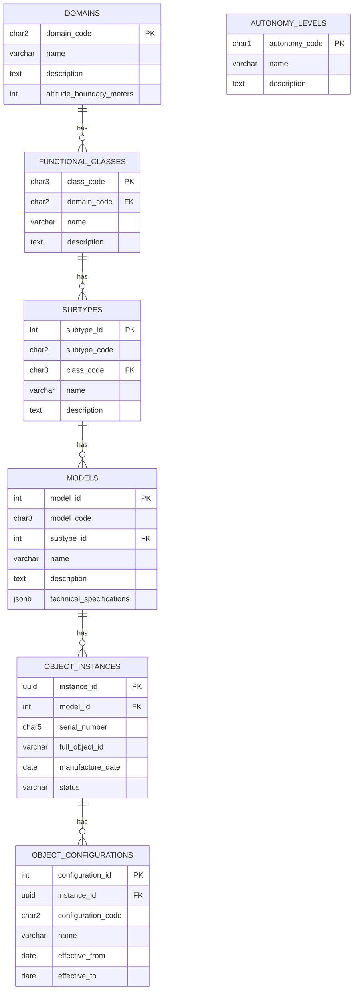
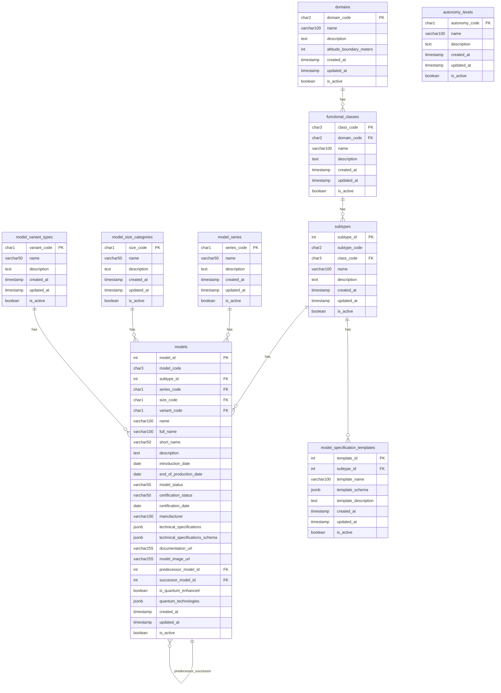
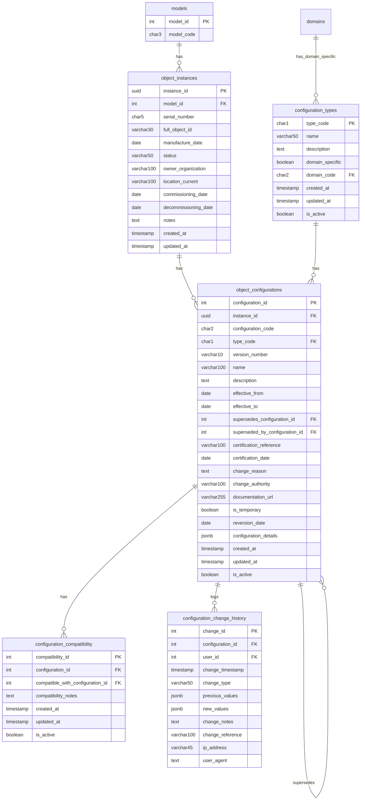
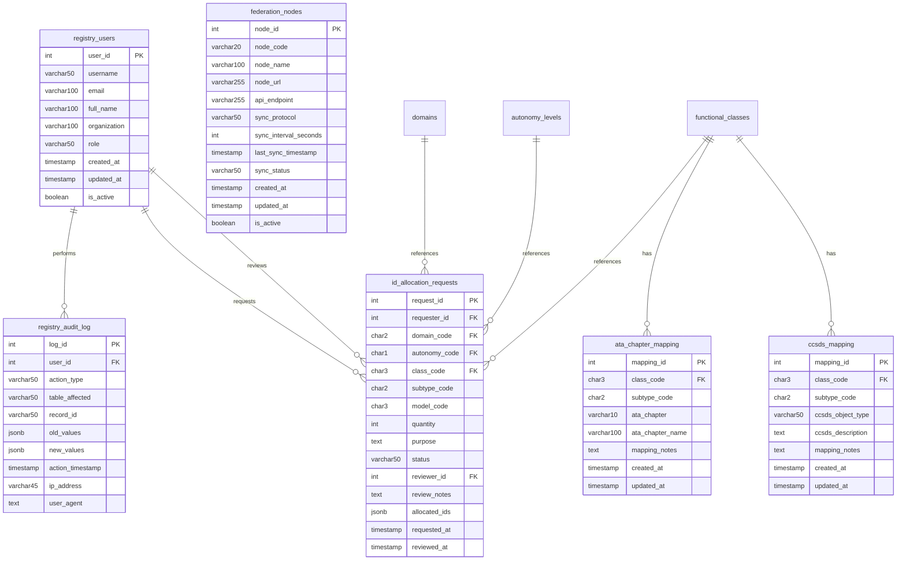
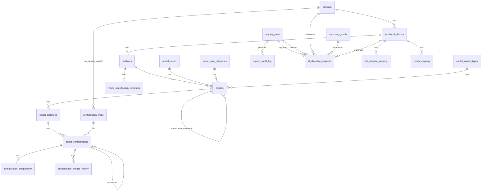

## ✨ *I HAVE A DREAM:*

# GAIA-Q & AMPEL  
### Open Source Quantum Aerospace Framework  
**Science Research · Software · Hardware · Material Aerospace Solutions**

> *A new paradigm where quantum-enhanced intelligence, ethical autonomy, and sustainable engineering converge to define the aerospace systems of tomorrow.*

---

### 🇪🇸 Producimos documentación técnica open source para inspirar los diseños de hoy y de mañana.  
**Ingeniería con propósito. Conocimiento compartido. Innovación federada.**

### 🇬🇧 We produce open-source technical documentation to inspire the designs of today and tomorrow.  
**Engineering with purpose. Shared knowledge. Federated innovation.**

---

## GAIA-Q & AMPEL: Quantum Aerospace Vision Analysis

> **DISCLAIMER: GenAI Proposal Status**  
> This document represents a machine-generated proposal for the GAIA-Q & AMPEL open source framework. It has not been validated by aerospace certification bodies. Concepts are based on current trends in open source, quantum computing, and federated aerospace engineering.

---

## 🌐 Open Source Technical Documentation Framework

### 📐 Documentation Architecture

```mermaid
graph TD
    Core[Core Knowledge Base]
    QCM[Quantum Computing Modules]
    AEROSPEC[Aerospace Engineering Specifications]
    ETHAI[Ethical AI Frameworks]
    SUSTAIN[Sustainable Engineering Practices]
    IMPL[Implementation Examples]
    COMMUNITY[Community Extensions]
    FEDNET[Federated Innovation Network]

    Core --> QCM
    Core --> AEROSPEC
    Core --> ETHAI
    Core --> SUSTAIN
    Core --> IMPL
    IMPL --> COMMUNITY
    COMMUNITY --> FEDNET
````

---

## 🧩 Key Components

### 1. **Multilingual Knowledge Base**

* Documentation in English, Spanish (initially), with roadmap for others
* Aerospace terminology standardization with ISO/COAFI mapping
* Cultural-context integration for broader usability

### 2. **Federated Documentation Structure**

* Distributed contributions with centralized QA oversight
* Git-based version control with InfoCode and COAFI alignment
* Contributor recognition: badges, credits, citation-level metadata

### 3. **Implementation Repository**

* Reference open designs (aircraft systems, quantum circuits)
* Simulated environments for digital twin validation
* Demonstrator kits with hardware-software-material integration

---

## ⚖️ Open Source Governance Model

### 1. **Technical Oversight Committee**

* Diverse expertise: quantum, aerospace, ethics, sustainability
* Transparent RFC (request-for-comment) lifecycle
* Publicly tracked roadmap and release cycles

### 2. **Contribution Pathways**

* Contributor onboarding with roles (doc writer, SME, reviewer, translator)
* Mentorship for young engineers and students
* Recognition through COAFI traceable InfoCode authorship

### 3. **Quality Assurance Framework**

* Peer-reviewed validation loops
* Standard compliance (ATA, S1000D, ISO/IEEE, QAO)
* Security audits for sensitive subsystems

---

## 🚀 Implementation Strategy

### Phase 1: *Foundation*

* Define COAFI-compatible file naming + metadata structure
* Publish initial GAIA-QAO templates in Markdown/DocBook/S1000D
* Launch documentation portal with Git-based backend

### Phase 2: *Community Development*

* Recruit contributors from academia + open hardware community
* Establish mentorship circles and working groups
* Release alpha documentation sets (AMP●EL, ATA 29, QAOA modules)

### Phase 3: *Federation Implementation*

* Formalize federated teams (Q-Air, Q-Space, Q-GreenTech, etc.)
* Launch collaboration protocols (AMP●EL Interop, MCP Sync)
* Mirror repos for resilience + inter-agency continuity

### Phase 4: *Acceleration*

* Publish industrial application guides (MEAs, digital twins, Q-routing)
* Enable certification-friendly formats (BREX-lite, MCDB-export)
* Organize open competitions on sustainability and autonomy challenges

---

## 🌍 Potential Impact Areas

### 1. **Democratized Aerospace Innovation**

* Lower entry barriers for engineers worldwide
* Modular learning through documentation-as-a-platform (DaaP)
* Bridge research ↔️ industry gaps via quantum-ready documentation

### 2. **Standardized Ethical Frameworks**

* Establish transparent audit trails and AI behavior explainability
* Encourage fair deployment of autonomy in aviation/space
* Enable cross-cultural, interdisciplinary trust frameworks

### 3. **Sustainable Engineering Practices**

* Shared tools for life-cycle impact modeling
* Open benchmarks for propulsion/material/energy impact
* Cooperative co-design of low-emission aerospace solutions

---

## ✅ Next Steps Recommendation

1. 🔧 Design semantic documentation taxonomy (aligned with GASToP & COAFI)
2. 📄 Release starter templates (`GAIA-TEMPLATE-SYS.md`, `META-FIG-A.yaml`, etc.)
3. 🌐 Deploy GAIA-QAO Open Documentation Portal (static + interactive)
4. 🧠 Launch pilot contribution and peer-review model
5. 🎓 Form partnership MoUs with academic nodes for domain seeding

---

## Metadata Footer

**Status**: Draft – Foundational Manifesto
**Filename**: `GAIAQ-AMPEL-OPEN-FRAMEWORK.md`
**Version**: 0.9.2 (Pre-Release)
**InfoCode**: QAO-OPEN-FRAME-001
**Compliance**: GAIA-COAFI v1.6, MCP Sync Ready
**Keywords**: `[QAOA][Federated Docs][QuantumAero][Sustainability][XAI][COAFI]`

---

© Amedeo Pelliccia · GAIA-QAO – *Federated Quantum Aerospace Intelligence*

> “Knowledge shared is future engineered.”
> 
```sql
---
-- GAIA-QAO Object Identification System Registry
-- Database Schema Version 1.1.0
-- InfoCode: QAO-SYS-DBSC-002

-- Enable UUID extension (for PostgreSQL)
CREATE EXTENSION IF NOT EXISTS "uuid-ossp";

-- =============================================
-- Core ID Component Tables
-- =============================================

-- Domains (DO)
CREATE TABLE domains (
  domain_code CHAR(2) PRIMARY KEY,
  name VARCHAR(100) NOT NULL,
  description TEXT,
  altitude_boundary_meters INT,  -- For AS/SP boundary definition
  created_at TIMESTAMP WITH TIME ZONE DEFAULT CURRENT_TIMESTAMP,
  updated_at TIMESTAMP WITH TIME ZONE DEFAULT CURRENT_TIMESTAMP,
  is_active BOOLEAN DEFAULT TRUE
);

-- Autonomy Levels (A)
CREATE TABLE autonomy_levels (
  autonomy_code CHAR(1) PRIMARY KEY,
  name VARCHAR(100) NOT NULL,
  description TEXT,
  created_at TIMESTAMP WITH TIME ZONE DEFAULT CURRENT_TIMESTAMP,
  updated_at TIMESTAMP WITH TIME ZONE DEFAULT CURRENT_TIMESTAMP,
  is_active BOOLEAN DEFAULT TRUE
);

-- Functional Classes (CCC)
CREATE TABLE functional_classes (
  class_code CHAR(3) PRIMARY KEY,
  domain_code CHAR(2) NOT NULL REFERENCES domains(domain_code),
  name VARCHAR(100) NOT NULL,
  description TEXT,
  created_at TIMESTAMP WITH TIME ZONE DEFAULT CURRENT_TIMESTAMP,
  updated_at TIMESTAMP WITH TIME ZONE DEFAULT CURRENT_TIMESTAMP,
  is_active BOOLEAN DEFAULT TRUE,
  UNIQUE(domain_code, class_code)
);

-- Sub-Types (ST)
CREATE TABLE subtypes (
  subtype_id SERIAL PRIMARY KEY,
  subtype_code CHAR(2) NOT NULL,
  class_code CHAR(3) NOT NULL REFERENCES functional_classes(class_code),
  name VARCHAR(100) NOT NULL,
  description TEXT,
  created_at TIMESTAMP WITH TIME ZONE DEFAULT CURRENT_TIMESTAMP,
  updated_at TIMESTAMP WITH TIME ZONE DEFAULT CURRENT_TIMESTAMP,
  is_active BOOLEAN DEFAULT TRUE,
  UNIQUE(class_code, subtype_code)
);

-- Models/Variants (MDL)
CREATE TABLE models (
  model_id SERIAL PRIMARY KEY,
  model_code CHAR(3) NOT NULL,
  subtype_id INT NOT NULL REFERENCES subtypes(subtype_id),
  name VARCHAR(100) NOT NULL,
  description TEXT,
  introduction_date DATE,
  end_of_production_date DATE,
  technical_specifications JSONB,  -- Flexible storage for model-specific specs
  created_at TIMESTAMP WITH TIME ZONE DEFAULT CURRENT_TIMESTAMP,
  updated_at TIMESTAMP WITH TIME ZONE DEFAULT CURRENT_TIMESTAMP,
  is_active BOOLEAN DEFAULT TRUE,
  UNIQUE(subtype_id, model_code)
);

-- =============================================
-- Object Instances and Configurations
-- =============================================

-- Object Instances (Serial Numbers)
CREATE TABLE object_instances (
  instance_id UUID PRIMARY KEY DEFAULT uuid_generate_v4(),
  model_id INT NOT NULL REFERENCES models(model_id),
  serial_number CHAR(5) NOT NULL,
  full_object_id VARCHAR(30) NOT NULL,  -- Complete DO-A-CCC-ST-MDL-SSSSS identifier
  manufacture_date DATE,
  status VARCHAR(50) NOT NULL DEFAULT 'active',  -- active, retired, destroyed, etc.
  owner_organization VARCHAR(100),
  location_current VARCHAR(100),
  commissioning_date DATE,
  decommissioning_date DATE,
  notes TEXT,
  created_at TIMESTAMP WITH TIME ZONE DEFAULT CURRENT_TIMESTAMP,
  updated_at TIMESTAMP WITH TIME ZONE DEFAULT CURRENT_TIMESTAMP,
  UNIQUE(model_id, serial_number)
);

-- Object Configurations (Optional extension for configuration variants)
CREATE TABLE object_configurations (
  configuration_id SERIAL PRIMARY KEY,
  instance_id UUID NOT NULL REFERENCES object_instances(instance_id),
  configuration_code CHAR(2) NOT NULL,
  name VARCHAR(100) NOT NULL,
  description TEXT,
  effective_from DATE NOT NULL,
  effective_to DATE,
  configuration_details JSONB,  -- Flexible storage for configuration specifics
  created_at TIMESTAMP WITH TIME ZONE DEFAULT CURRENT_TIMESTAMP,
  updated_at TIMESTAMP WITH TIME ZONE DEFAULT CURRENT_TIMESTAMP,
  is_active BOOLEAN DEFAULT TRUE,
  UNIQUE(instance_id, configuration_code, effective_from)
);

-- =============================================
-- Registry Management Tables
-- =============================================

-- Users who can manage the registry
CREATE TABLE registry_users (
  user_id SERIAL PRIMARY KEY,
  username VARCHAR(50) NOT NULL UNIQUE,
  email VARCHAR(100) NOT NULL UNIQUE,
  full_name VARCHAR(100) NOT NULL,
  organization VARCHAR(100),
  role VARCHAR(50) NOT NULL,  -- admin, editor, viewer
  created_at TIMESTAMP WITH TIME ZONE DEFAULT CURRENT_TIMESTAMP,
  updated_at TIMESTAMP WITH TIME ZONE DEFAULT CURRENT_TIMESTAMP,
  is_active BOOLEAN DEFAULT TRUE
);

-- Audit log for tracking changes to the registry
CREATE TABLE registry_audit_log (
  log_id SERIAL PRIMARY KEY,
  user_id INT REFERENCES registry_users(user_id),
  action_type VARCHAR(50) NOT NULL,  -- insert, update, delete
  table_affected VARCHAR(50) NOT NULL,
  record_id VARCHAR(50) NOT NULL,  -- Primary key of affected record
  old_values JSONB,
  new_values JSONB,
  action_timestamp TIMESTAMP WITH TIME ZONE DEFAULT CURRENT_TIMESTAMP,
  ip_address VARCHAR(45),
  user_agent TEXT
);

-- ID allocation requests
CREATE TABLE id_allocation_requests (
  request_id SERIAL PRIMARY KEY,
  requester_id INT NOT NULL REFERENCES registry_users(user_id),
  domain_code CHAR(2) NOT NULL REFERENCES domains(domain_code),
  autonomy_code CHAR(1) NOT NULL REFERENCES autonomy_levels(autonomy_code),
  class_code CHAR(3) NOT NULL REFERENCES functional_classes(class_code),
  subtype_code CHAR(2),  -- May be null if requesting a new subtype
  model_code CHAR(3),    -- May be null if requesting a new model
  quantity INT NOT NULL DEFAULT 1,  -- Number of serial numbers requested
  purpose TEXT NOT NULL,
  status VARCHAR(50) NOT NULL DEFAULT 'pending',  -- pending, approved, rejected
  reviewer_id INT REFERENCES registry_users(user_id),
  review_notes TEXT,
  allocated_ids JSONB,  -- IDs allocated in response to this request
  requested_at TIMESTAMP WITH TIME ZONE DEFAULT CURRENT_TIMESTAMP,
  reviewed_at TIMESTAMP WITH TIME ZONE
);

-- =============================================
-- Integration and Reference Tables
-- =============================================

-- ATA Chapter mapping for Air Systems
CREATE TABLE ata_chapter_mapping (
  mapping_id SERIAL PRIMARY KEY,
  class_code CHAR(3) NOT NULL REFERENCES functional_classes(class_code),
  subtype_code CHAR(2),  -- NULL means applies to all subtypes in this class
  ata_chapter VARCHAR(10) NOT NULL,
  ata_chapter_name VARCHAR(100) NOT NULL,
  mapping_notes TEXT,
  created_at TIMESTAMP WITH TIME ZONE DEFAULT CURRENT_TIMESTAMP,
  updated_at TIMESTAMP WITH TIME ZONE DEFAULT CURRENT_TIMESTAMP,
  UNIQUE(class_code, subtype_code, ata_chapter)
);

-- CCSDS mapping for Space Systems
CREATE TABLE ccsds_mapping (
  mapping_id SERIAL PRIMARY KEY,
  class_code CHAR(3) NOT NULL REFERENCES functional_classes(class_code),
  subtype_code CHAR(2),  -- NULL means applies to all subtypes in this class
  ccsds_object_type VARCHAR(50) NOT NULL,
  ccsds_description TEXT,
  mapping_notes TEXT,
  created_at TIMESTAMP WITH TIME ZONE DEFAULT CURRENT_TIMESTAMP,
  updated_at TIMESTAMP WITH TIME ZONE DEFAULT CURRENT_TIMESTAMP,
  UNIQUE(class_code, subtype_code, ccsds_object_type)
);

-- Federation nodes for distributed registry
CREATE TABLE federation_nodes (
  node_id SERIAL PRIMARY KEY,
  node_code VARCHAR(20) NOT NULL UNIQUE,
  node_name VARCHAR(100) NOT NULL,
  node_url VARCHAR(255),
  api_endpoint VARCHAR(255),
  sync_protocol VARCHAR(50) DEFAULT 'git-federation',
  sync_interval_seconds INT DEFAULT 3600,
  last_sync_timestamp TIMESTAMP WITH TIME ZONE,
  sync_status VARCHAR(50) DEFAULT 'active',
  created_at TIMESTAMP WITH TIME ZONE DEFAULT CURRENT_TIMESTAMP,
  updated_at TIMESTAMP WITH TIME ZONE DEFAULT CURRENT_TIMESTAMP,
  is_active BOOLEAN DEFAULT TRUE
);

-- =============================================
-- Views for Common Queries
-- =============================================

-- Complete ID hierarchy view
CREATE VIEW view_complete_id_hierarchy AS
SELECT 
  d.domain_code,
  d.name AS domain_name,
  a.autonomy_code,
  a.name AS autonomy_name,
  fc.class_code,
  fc.name AS class_name,
  st.subtype_code,
  st.name AS subtype_name,
  m.model_code,
  m.name AS model_name,
  CONCAT(
      d.domain_code, '-',
      a.autonomy_code, '-',
      fc.class_code, '-',
      st.subtype_code, '-',
      m.model_code
  ) AS id_prefix
FROM domains d
CROSS JOIN autonomy_levels a
JOIN functional_classes fc ON d.domain_code = fc.domain_code
JOIN subtypes st ON fc.class_code = st.class_code
JOIN models m ON st.subtype_id = m.subtype_id
WHERE d.is_active AND a.is_active AND fc.is_active AND st.is_active AND m.is_active;

-- Object instances with full hierarchy
CREATE VIEW view_object_instances_full AS
SELECT 
  oi.instance_id,
  oi.full_object_id,
  oi.serial_number,
  m.model_code,
  m.name AS model_name,
  st.subtype_code,
  st.name AS subtype_name,
  fc.class_code,
  fc.name AS class_name,
  fc.domain_code,
  d.name AS domain_name,
  a.autonomy_code,
  a.name AS autonomy_name,
  oi.manufacture_date,
  oi.status,
  oi.owner_organization,
  oi.location_current,
  oi.commissioning_date,
  oi.decommissioning_date
FROM object_instances oi
JOIN models m ON oi.model_id = m.model_id
JOIN subtypes st ON m.subtype_id = st.subtype_id
JOIN functional_classes fc ON st.class_code = fc.class_code
JOIN domains d ON fc.domain_code = d.domain_code
CROSS JOIN autonomy_levels a
WHERE SUBSTRING(oi.full_object_id, 4, 1) = a.autonomy_code;

-- =============================================
-- Initial Data Population
-- =============================================

-- Insert domains
INSERT INTO domains (domain_code, name, description, altitude_boundary_meters) VALUES
('AS', 'Air System', 'Aerospace systems operating primarily below 30,000 meters altitude', 30000),
('SP', 'Space System', 'Systems operating primarily above 30,000 meters altitude', 30000);

-- Insert autonomy levels
INSERT INTO autonomy_levels (autonomy_code, name, description) VALUES
('M', 'Manned/Semi-Autonomous', 'Systems designed for human operation or with human oversight'),
('U', 'Unmanned/Fully Autonomous', 'Systems designed for fully autonomous operation without human presence');

-- Insert functional classes for Air Systems
INSERT INTO functional_classes (class_code, domain_code, name, description) VALUES
('PAX', 'AS', 'Passenger Transport', 'Aircraft designed primarily for passenger transportation'),
('CGO', 'AS', 'Cargo Transport', 'Aircraft designed primarily for cargo transportation'),
('ISR', 'AS', 'Intelligence, Surveillance, Reconnaissance', 'Aircraft designed for intelligence gathering, surveillance, and reconnaissance missions'),
('SCI', 'AS', 'Scientific Research', 'Aircraft designed for scientific research and data collection'),
('UTL', 'AS', 'Utility', 'Aircraft designed for utility purposes such as agriculture, firefighting, search and rescue'),
('REC', 'AS', 'Recreational & Sport', 'Aircraft designed for recreational and sporting activities'),
('XPR', 'AS', 'Experimental', 'Experimental aircraft and technology demonstrators'),
('LTA', 'AS', 'Lighter Than Air', 'Lighter-than-air vehicles including dirigibles and high-altitude platforms'),
('MIL', 'AS', 'Military Aircraft', 'Aircraft designed for military applications and combat operations');

-- Insert functional classes for Space Systems
INSERT INTO functional_classes (class_code, domain_code, name, description) VALUES
('LCH', 'SP', 'Launch System', 'Systems designed to launch payloads into space'),
('SAT', 'SP', 'Satellite', 'Orbital systems designed for various missions without human presence'),
('ORB', 'SP', 'Orbital Platform/Vehicle', 'Crewed orbital systems including stations and transport vehicles'),
('PRB', 'SP', 'Probe', 'Systems designed for exploration beyond Earth orbit'),
('XPS', 'SP', 'Experimental', 'Experimental space systems and technology demonstrators'),
('DEF', 'SP', 'Space Defense', 'Systems designed for space defense and security applications');

-- =============================================
-- Insert subtypes for Passenger Transport (PAX)
-- =============================================
INSERT INTO subtypes (subtype_code, class_code, name, description) VALUES
('NB', 'PAX', 'Narrow-Body Airliner', 'Single-aisle passenger aircraft typically for short to medium range routes'),
('WB', 'PAX', 'Wide-Body Airliner', 'Multi-aisle passenger aircraft typically for medium to long range routes'),
('RJ', 'PAX', 'Regional Jet', 'Smaller jet aircraft designed for regional routes'),
('BJ', 'PAX', 'Business Jet', 'Aircraft designed for business and executive transportation'),
('GA', 'PAX', 'General Aviation', 'Smaller piston or turboprop aircraft for private transportation'),
('VT', 'PAX', 'eVTOL Air Taxi', 'Electric vertical takeoff and landing aircraft for urban air mobility'),
('BW', 'PAX', 'Blended Wing Body', 'Aircraft with blended wing body configuration for passenger transport'),
('SS', 'PAX', 'Supersonic Transport', 'Passenger aircraft designed for supersonic flight'),
('HS', 'PAX', 'Hypersonic Transport', 'Passenger aircraft designed for hypersonic flight'),
('AM', 'PAX', 'Air Mobility', 'Aircraft designed for urban/regional air mobility'),
('HY', 'PAX', 'Hybrid-Electric', 'Passenger aircraft with hybrid-electric propulsion'),
('QP', 'PAX', 'Quantum-Powered', 'Passenger aircraft with quantum-enhanced systems'),
('SP', 'PAX', 'Suborbital Passenger', 'Aircraft designed for suborbital passenger flights');

-- =============================================
-- Insert subtypes for Cargo Transport (CGO)
-- =============================================
INSERT INTO subtypes (subtype_code, class_code, name, description) VALUES
('LC', 'CGO', 'Light Cargo', 'Small cargo aircraft for light freight'),
('MC', 'CGO', 'Medium Cargo', 'Medium-sized cargo aircraft for regional freight'),
('HC', 'CGO', 'Heavy Cargo', 'Large cargo aircraft for intercontinental freight'),
('FC', 'CGO', 'Freighter Conversion', 'Passenger aircraft converted to cargo use'),
('QD', 'CGO', 'Quick Delivery', 'Aircraft optimized for rapid delivery services'),
('VC', 'CGO', 'VTOL Cargo', 'Vertical takeoff and landing cargo aircraft'),
('UC', 'CGO', 'Unmanned Cargo', 'Unmanned cargo delivery aircraft'),
('QC', 'CGO', 'Quantum Cargo', 'Cargo aircraft with quantum-enhanced systems');

-- =============================================
-- Insert subtypes for Intelligence, Surveillance, Reconnaissance (ISR)
-- =============================================
INSERT INTO subtypes (subtype_code, class_code, name, description) VALUES
('UA', 'ISR', 'Unmanned Aerial System', 'Unmanned aircraft systems for ISR missions'),
('MA', 'ISR', 'Maritime Patrol', 'Aircraft designed for maritime surveillance'),
('SR', 'ISR', 'Strategic Reconnaissance', 'Aircraft for strategic reconnaissance missions'),
('TR', 'ISR', 'Tactical Reconnaissance', 'Aircraft for tactical reconnaissance missions'),
('EW', 'ISR', 'Electronic Warfare', 'Aircraft specialized in electronic warfare'),
('SI', 'ISR', 'SIGINT Platform', 'Signals intelligence collection platforms'),
('IM', 'ISR', 'Imaging Platform', 'Platforms specialized in imaging intelligence'),
('MS', 'ISR', 'Multi-Sensor', 'Aircraft with multiple sensor systems'),
('QI', 'ISR', 'Quantum ISR', 'ISR platforms with quantum-enhanced capabilities');

-- =============================================
-- Insert subtypes for Scientific Research (SCI)
-- =============================================
INSERT INTO subtypes (subtype_code, class_code, name, description) VALUES
('AT', 'SCI', 'Atmospheric Research', 'Aircraft for atmospheric research'),
('OC', 'SCI', 'Oceanographic Research', 'Aircraft for oceanographic research'),
('ER', 'SCI', 'Earth Remote Sensing', 'Aircraft for Earth observation and remote sensing'),
('WX', 'SCI', 'Weather Research', 'Aircraft for meteorological research'),
('CR', 'SCI', 'Climate Research', 'Aircraft for climate research'),
('GS', 'SCI', 'Geophysical Survey', 'Aircraft for geophysical surveys'),
('MP', 'SCI', 'Multi-Purpose Research', 'Multi-purpose scientific research aircraft'),
('QS', 'SCI', 'Quantum Sensing', 'Aircraft with quantum sensors for scientific research');

-- =============================================
-- Insert subtypes for Utility (UTL)
-- =============================================
INSERT INTO subtypes (subtype_code, class_code, name, description) VALUES
('FF', 'UTL', 'Firefighting', 'Aircraft designed for firefighting operations'),
('AG', 'UTL', 'Agricultural', 'Aircraft designed for agricultural operations'),
('SR', 'UTL', 'Search and Rescue', 'Aircraft designed for search and rescue operations'),
('ME', 'UTL', 'Medical', 'Aircraft designed for medical evacuation and services'),
('PL', 'UTL', 'Pipeline/Powerline Patrol', 'Aircraft for infrastructure inspection'),
('SU', 'UTL', 'Survey', 'Aircraft designed for aerial surveys'),
('CP', 'UTL', 'Civil Protection', 'Aircraft for civil protection and disaster response'),
('QU', 'UTL', 'Quantum Utility', 'Utility aircraft with quantum-enhanced systems');

-- =============================================
-- Insert subtypes for Recreational & Sport (REC)
-- =============================================
INSERT INTO subtypes (subtype_code, class_code, name, description) VALUES
('GL', 'REC', 'Glider', 'Unpowered fixed-wing aircraft'),
('MG', 'REC', 'Motor Glider', 'Gliders with auxiliary power systems'),
('UL', 'REC', 'Ultralight', 'Very light aircraft meeting ultralight regulations'),
('PG', 'REC', 'Powered Glider', 'Powered aircraft with glider-like characteristics'),
('AC', 'REC', 'Aerobatic', 'Aircraft designed for aerobatic flight'),
('HG', 'REC', 'Hang Glider', 'Foot-launched glider aircraft'),
('PW', 'REC', 'Powered Parachute', 'Parachute with motorized propulsion'),
('PP', 'REC', 'Paraglider', 'Foot-launched parafoil wings'),
('RC', 'REC', 'Radio Controlled', 'Recreational remote-controlled aircraft'),
('LS', 'REC', 'Light Sport', 'Aircraft meeting light-sport regulations'),
('HB', 'REC', 'Homebuilt', 'Amateur-built aircraft'),
('WS', 'REC', 'Wingsuit', 'Wearable wing systems'),
('JW', 'REC', 'Jetpack/Wingpack', 'Personal flight systems'),
('QR', 'REC', 'Quantum Recreational', 'Recreational craft with quantum technologies');

-- =============================================
-- Insert subtypes for Experimental (Air) (XPR)
-- =============================================
INSERT INTO subtypes (subtype_code, class_code, name, description) VALUES
('TD', 'XPR', 'Technology Demonstrator', 'Aircraft demonstrating new technologies'),
('HP', 'XPR', 'High Performance', 'Experimental high-performance aircraft'),
('NP', 'XPR', 'Novel Propulsion', 'Aircraft testing new propulsion concepts'),
('NS', 'XPR', 'Novel Structure', 'Aircraft with experimental structural designs'),
('SC', 'XPR', 'Scaled Model', 'Scaled experimental aircraft'),
('VT', 'XPR', 'VTOL Testbed', 'Experimental VTOL aircraft'),
('HY', 'XPR', 'Hybrid Concept', 'Aircraft combining multiple technologies'),
('AT', 'XPR', 'Autonomous Testbed', 'Platforms for testing autonomous systems'),
('QT', 'XPR', 'Quantum Testbed', 'Platforms for testing quantum technologies'),
('HH', 'XPR', 'Hypersonic/High-Speed', 'Experimental hypersonic aircraft'),
('ET', 'XPR', 'Environmental Technology', 'Aircraft testing environmental technologies'),
('MT', 'XPR', 'Manufacturing Testbed', 'Aircraft demonstrating new manufacturing methods'),
('RT', 'XPR', 'Research Testbed', 'Modified aircraft for research purposes'),
('XT', 'XPR', 'X-Plane', 'Official X-plane designation aircraft');

-- =============================================
-- Insert subtypes for Lighter Than Air (LTA)
-- =============================================
INSERT INTO subtypes (subtype_code, class_code, name, description) VALUES
('AB', 'LTA', 'Airship Blimp', 'Non-rigid airships'),
('AR', 'LTA', 'Airship Rigid', 'Rigid airships'),
('AS', 'LTA', 'Airship Semi-Rigid', 'Semi-rigid airships'),
('HA', 'LTA', 'High-Altitude Platform', 'Stratospheric airships/balloons'),
('WB', 'LTA', 'Weather Balloon', 'Meteorological balloons'),
('SB', 'LTA', 'Scientific Balloon', 'Research balloons'),
('HB', 'LTA', 'Hybrid Lift', 'Aircraft combining aerostatic and aerodynamic lift'),
('TB', 'LTA', 'Tethered Balloon', 'Balloons secured by tethers'),
('CB', 'LTA', 'Cargo Airship', 'Airships designed for cargo transport'),
('PB', 'LTA', 'Passenger Airship', 'Airships designed for passenger transport'),
('QB', 'LTA', 'Quantum Buoyancy', 'LTA craft using quantum technologies'),
('DB', 'LTA', 'Drone Blimp', 'Unmanned airship systems'),
('MB', 'LTA', 'Military Airship', 'Airships for military applications'),
('SH', 'LTA', 'Stratospheric HAPS', 'High-altitude pseudo-satellites');

-- =============================================
-- Insert subtypes for Military Aircraft (MIL)
-- =============================================
INSERT INTO subtypes (subtype_code, class_code, name, description) VALUES
('FJ', 'MIL', 'Fighter Jet', 'Combat aircraft for air superiority'),
('BM', 'MIL', 'Bomber', 'Aircraft designed for bombing missions'),
('AT', 'MIL', 'Attack', 'Aircraft designed for ground attack'),
('TR', 'MIL', 'Trainer', 'Military training aircraft'),
('TP', 'MIL', 'Transport', 'Military transport aircraft'),
('TK', 'MIL', 'Tanker', 'Aerial refueling aircraft'),
('MH', 'MIL', 'Military Helicopter', 'Rotary-wing military aircraft'),
('UC', 'MIL', 'Unmanned Combat', 'Unmanned combat aerial vehicles'),
('EW', 'MIL', 'Electronic Warfare', 'Electronic warfare aircraft'),
('MC', 'MIL', 'Multi-role Combat', 'Multi-role military aircraft'),
('MS', 'MIL', 'Maritime Strike', 'Aircraft for maritime strike missions'),
('QW', 'MIL', 'Quantum Warfare', 'Aircraft with quantum military technologies');

-- =============================================
-- Insert subtypes for Satellites (SAT)
-- =============================================
INSERT INTO subtypes (subtype_code, class_code, name, description) VALUES
('CO', 'SAT', 'Communications', 'Satellites designed primarily for communications services'),
('NV', 'SAT', 'Navigation', 'Satellites designed for navigation and positioning services'),
('EO', 'SAT', 'Earth Observation', 'Satellites designed for Earth observation and remote sensing'),
('SC', 'SAT', 'Scientific', 'Satellites designed for scientific research and observation'),
('CU', 'SAT', 'CubeSat/SmallSat', 'Small standardized satellites for various purposes'),
('TD', 'SAT', 'Technology Demonstrator', 'Satellites designed to demonstrate new technologies'),
('WX', 'SAT', 'Weather', 'Satellites designed for meteorological purposes'),
('RS', 'SAT', 'Relay System', 'Satellites designed to relay communications'),
('IS', 'SAT', 'Imaging System', 'Satellites specialized in imaging'),
('SS', 'SAT', 'Space Surveillance', 'Satellites for space domain awareness'),
('QS', 'SAT', 'Quantum Satellite', 'Satellites with quantum technologies'),
('MS', 'SAT', 'Military Satellite', 'Satellites for military applications');

-- =============================================
-- Insert subtypes for Orbital Platform/Vehicle (ORB)
-- =============================================
INSERT INTO subtypes (subtype_code, class_code, name, description) VALUES
('SS', 'ORB', 'Space Station', 'Crewed orbital platforms for long-duration missions'),
('SL', 'ORB', 'Space Laboratory', 'Specialized orbital platforms for research'),
('CT', 'ORB', 'Crew Transport', 'Vehicles designed for crew transportation'),
('SM', 'ORB', 'Service Module', 'Modules providing services to other orbital systems'),
('RM', 'ORB', 'Research Module', 'Specialized modules for orbital research'),
('HM', 'ORB', 'Habitation Module', 'Modules designed for crew habitation'),
('SV', 'ORB', 'Service Vehicle', 'Vehicles for servicing other orbital systems'),
('OT', 'ORB', 'Orbital Transfer', 'Vehicles for orbital transfer operations'),
('OD', 'ORB', 'Orbital Dock', 'Platforms for docking and servicing'),
('QO', 'ORB', 'Quantum Orbital', 'Orbital platforms with quantum technologies'),
('CM', 'ORB', 'Commercial Module', 'Commercially operated orbital modules');

-- =============================================
-- Insert subtypes for Launch System (LCH)
-- =============================================
INSERT INTO subtypes (subtype_code, class_code, name, description) VALUES
('SL', 'LCH', 'Small Launch', 'Launch systems for small payloads'),
('ML', 'LCH', 'Medium Launch', 'Launch systems for medium payloads'),
('HL', 'LCH', 'Heavy Launch', 'Launch systems for heavy payloads'),
('SH', 'LCH', 'Super Heavy', 'Launch systems for super heavy payloads'),
('RU', 'LCH', 'Reusable', 'Reusable launch systems'),
('SO', 'LCH', 'Solid Rocket', 'Launch systems using solid rocket propulsion'),
('LO', 'LCH', 'Liquid Oxygen', 'Launch systems using liquid oxygen propulsion'),
('AL', 'LCH', 'Air Launch', 'Air-launched orbital systems'),
('QL', 'LCH', 'Quantum Launch', 'Launch systems with quantum technologies'),
('HY', 'LCH', 'Hybrid Propulsion', 'Launch systems using hybrid propulsion');

-- =============================================
-- Insert subtypes for Probe (PRB)
-- =============================================
INSERT INTO subtypes (subtype_code, class_code, name, description) VALUES
('LP', 'PRB', 'Lunar Probe', 'Probes designed for lunar exploration'),
('MP', 'PRB', 'Mars Probe', 'Probes designed for Mars exploration'),
('VP', 'PRB', 'Venus Probe', 'Probes designed for Venus exploration'),
('IP', 'PRB', 'Inner Planet Probe', 'Probes for Mercury and inner solar system'),
('GP', 'PRB', 'Gas Giant Probe', 'Probes for Jupiter, Saturn and gas giants'),
('OP', 'PRB', 'Outer Planet Probe', 'Probes for Uranus, Neptune and beyond'),
('AP', 'PRB', 'Asteroid/Comet Probe', 'Probes for small body exploration'),
('SP', 'PRB', 'Solar Probe', 'Probes for solar observation and research'),
('HP', 'PRB', 'Heliophysics Probe', 'Probes studying the heliosphere'),
('DP', 'PRB', 'Deep Space Probe', 'Probes for deep space exploration'),
('TP', 'PRB', 'Technology Probe', 'Probes demonstrating new technologies'),
('RP', 'PRB', 'Return Probe', 'Sample return mission probes'),
('QP', 'PRB', 'Quantum Probe', 'Probes with quantum technologies'),
('EP', 'PRB', 'Exoplanet Probe', 'Probes for exoplanet detection/study');

-- =============================================
-- Insert subtypes for Experimental (Space) (XPS)
-- =============================================
INSERT INTO subtypes (subtype_code, class_code, name, description) VALUES
('TP', 'XPS', 'Technology Platform', 'Platforms demonstrating new space technologies'),
('NP', 'XPS', 'Novel Propulsion', 'Spacecraft testing new propulsion systems'),
('QT', 'XPS', 'Quantum Testbed', 'Platforms for testing quantum technologies in space'),
('SM', 'XPS', 'Space Manufacturing', 'Experimental in-space manufacturing'),
('SR', 'XPS', 'Space Robotics', 'Experimental robotic systems'),
('SS', 'XPS', 'Space Structures', 'Experimental deployable/inflatable structures'),
('SE', 'XPS', 'Space Environment', 'Platforms studying space environment effects'),
('SP', 'XPS', 'Space Power', 'Experimental power generation systems'),
('SC', 'XPS', 'Space Communications', 'Experimental communications technologies'),
('SN', 'XPS', 'Space Navigation', 'Experimental navigation technologies'),
('ST', 'XPS', 'Space Tether', 'Tether experiments in space'),
('SI', 'XPS', 'Space Interferometry', 'Experimental interferometry platforms'),
('SA', 'XPS', 'Space Assembly', 'Experimental in-space assembly'),
('SH', 'XPS', 'Space Habitat', 'Experimental habitat technologies');

-- =============================================
-- Insert subtypes for Space Defense (DEF)
-- =============================================
INSERT INTO subtypes (subtype_code, class_code, name, description) VALUES
('SS', 'DEF', 'Space Surveillance', 'Systems for space domain awareness'),
('SM', 'DEF', 'Space Missile Defense', 'Missile defense systems with space components'),
('SC', 'DEF', 'Space Command & Control', 'Space-based command and control systems'),
('SI', 'DEF', 'Space Intelligence', 'Intelligence-gathering space systems'),
('SP', 'DEF', 'Space Protection', 'Systems for protecting space assets'),
('SD', 'DEF', 'Space Deterrence', 'Systems for space deterrence'),
('QD', 'DEF', 'Quantum Defense', 'Space defense systems with quantum technologies');

-- Insert example model for Blended Wing Body
INSERT INTO models (model_code, subtype_id, name, description, introduction_date, technical_specifications) VALUES
('Q1H', (SELECT subtype_id FROM subtypes WHERE subtype_code = 'BW' AND class_code = 'PAX'), 
'AMPEL360 BWB-Q100', 'Blended Wing Body passenger aircraft with quantum-enhanced systems', 
'2025-01-01', 
'{"capacity": 100, "range_km": 5500, "cruise_speed_kmh": 850, "mtow_kg": 85000, "quantum_systems": ["navigation", "optimization", "communications"]}'
);

-- Insert example object instance
INSERT INTO object_instances (model_id, serial_number, full_object_id, manufacture_date, status, owner_organization) VALUES
((SELECT model_id FROM models WHERE model_code = 'Q1H' AND subtype_id = (SELECT subtype_id FROM subtypes WHERE subtype_code = 'BW' AND class_code = 'PAX')),
'00001',
'AS-M-PAX-BW-Q1H-00001',
'2025-06-15',
'active',
'GAIA-QAO Research Fleet');

-- Insert example ATA chapter mapping
INSERT INTO ata_chapter_mapping (class_code, subtype_code, ata_chapter, ata_chapter_name, mapping_notes) VALUES
('PAX', 'BW', '27', 'Flight Controls', 'Includes quantum-enhanced control systems for BWB configuration'),
('PAX', 'BW', '34', 'Navigation', 'Includes quantum navigation systems');

-- Insert example registry user
INSERT INTO registry_users (username, email, full_name, organization, role) VALUES
('admin', 'admin@gaia-qao.org', 'System Administrator', 'GAIA-QAO', 'admin');

-- Insert example federation node
INSERT INTO federation_nodes (node_code, node_name, node_url, api_endpoint) VALUES
('gaia-qao-primary', 'GAIA-QAO Primary Node', 'https://registry.gaia-qao.org', 'https://registry.gaia-qao.org/api/federation');
```
### GAIA-QAO Object Identification System

> **DISCLAIMER: GenAI Proposal Status**This document represents a machine-generated comprehensive description of the GAIA-QAO object identification system. It has not been validated through implementation in production aerospace systems. The proposed system is based on aerospace industry classifications and the specific needs of the GAIA-QAO ecosystem.


## 1. System Overview

The GAIA-QAO Object Identification System (GQOIS) is a comprehensive, hierarchical identification framework designed for aerospace objects across both atmospheric and space domains. It provides a standardized method for uniquely identifying, categorizing, and tracking aerospace objects throughout their lifecycle.

The system addresses several critical needs in the aerospace industry:

- **Unified Identification**: Creates a single, coherent identification system spanning traditional aviation, emerging air mobility concepts, and space systems
- **Quantum Integration**: Specifically accommodates quantum-enhanced aerospace technologies
- **Standards Compatibility**: Aligns with existing aerospace standards (ATA, CCSDS, etc.) while extending beyond their limitations
- **Lifecycle Management**: Supports object identification from design through decommissioning
- **Configuration Tracking**: Enables tracking of different configurations and modifications
- **Registry Management**: Provides a framework for centralized registry with federated nodes


## 2. ID Structure

The GQOIS uses a hierarchical structure that encodes multiple levels of information about an aerospace object. The complete ID format is:

```plaintext
DO-A-CCC-ST-MDL-SSSSS[-CC]
```

Where:

| Component | Length | Description | Example
|-----|-----|-----|-----
| DO | 2 chars | Domain | AS (Air System)
| A | 1 char | Autonomy Level | M (Manned/Semi-Autonomous)
| CCC | 3 chars | Functional Class | PAX (Passenger Transport)
| ST | 2 chars | Sub-Type | BW (Blended Wing Body)
| MDL | 3 chars | Model/Variant | Q1H (AMPEL360 BWB-Q100)
| SSSSS | 5 chars | Serial Number | 00001
| CC | 2 chars | Configuration Code (optional) | A1 (Initial Configuration)


### Example Complete ID

```plaintext
AS-M-PAX-BW-Q1H-00001
```

This identifies:

- An Air System (AS)
- That is Manned/Semi-Autonomous (M)
- In the Passenger Transport class (PAX)
- Of Blended Wing Body sub-type (BW)
- Model AMPEL360 BWB-Q100 (Q1H)
- Serial number 00001


## 3. Component Descriptions

### 3.1 Domains (DO)

Domains represent the primary operational environment of the aerospace object.

### Domain Codes

| Domain Code | Name         | Description                                   | Boundary                     |
|-------------|--------------|-----------------------------------------------|------------------------------|
| AS          | Air System   | Systems operating primarily in Earth's atmosphere | Below 30,000 meters          |
| SP          | Space System | Systems operating primarily in space          | Above 30,000 meters          |

### 3.2 Autonomy Levels (A)

Autonomy levels indicate the degree of human involvement in the system's operation.

| Autonomy Code | Name                     | Description                                                                    |
|---------------|--------------------------|--------------------------------------------------------------------------------|
| M             | Manned/Semi-Autonomous  | Systems designed for human operation or with human oversight                   |
| U             | Unmanned/Fully Autonomous | Systems designed for fully autonomous operation without human presence         |

---

### 3.3 Functional Classes (CCC)

Functional classes categorize objects by their primary purpose or function. The system defines 15 functional classes across the two domains:

#### Air Systems (AS) Functional Classes

| Class Code | Name                       | Description                                                                    |
|------------|----------------------------|--------------------------------------------------------------------------------|
| PAX        | Passenger Transport        | Aircraft designed primarily for passenger transportation                       |
| CGO        | Cargo Transport            | Aircraft designed primarily for cargo transportation                           |
| ISR        | Intelligence, Surveillance, Reconnaissance | Aircraft for intelligence gathering, surveillance, and reconnaissance          |
| SCI        | Scientific Research        | Aircraft designed for scientific research and data collection                  |
| UTL        | Utility                    | Aircraft for utility purposes (agriculture, firefighting, etc.)                |
| REC        | Recreational & Sport       | Aircraft designed for recreational and sporting activities                     |
| XPR        | Experimental               | Experimental aircraft and technology demonstrators                             |
| LTA        | Lighter Than Air           | Lighter-than-air vehicles including dirigibles and platforms                   |
| MIL        | Military Aircraft          | Aircraft designed for military applications and combat                         |

#### Space Systems (SP) Functional Classes

| Class Code | Name                       | Description                                                                    |
|------------|----------------------------|--------------------------------------------------------------------------------|
| LCH        | Launch System              | Systems designed to launch payloads into space                                |
| SAT        | Satellite                  | Orbital systems for various missions without human presence                   |
| ORB        | Orbital Platform/Vehicle   | Crewed orbital systems including stations and transport                       |
| PRB        | Probe                      | Systems designed for exploration beyond Earth orbit                           |
| XPS        | Experimental               | Experimental space systems and technology demonstrators                       |
| DEF        | Space Defense              | Systems designed for space defense and security applications                  |


### 3.4 Sub-Types (ST)

Sub-types further refine the classification within each functional class. The system defines 168 sub-types across all functional classes. Examples include:

- **PAX-NB**: Narrow-Body Airliner
- **PAX-WB**: Wide-Body Airliner
- **PAX-BW**: Blended Wing Body
- **SAT-CO**: Communications Satellite
- **SAT-EO**: Earth Observation Satellite
- **PRB-MP**: Mars Probe


Each sub-type has a unique two-character code within its functional class and includes specific quantum-enhanced variants where applicable.

### 3.5 Models/Variants (MDL)

Models represent specific designs or variants within a sub-type. Each model has a three-character code and includes detailed specifications. For example:

- **Q1H**: AMPEL360 BWB-Q100 (Blended Wing Body passenger aircraft with quantum-enhanced systems)


### 3.6 Serial Numbers (SSSSS)

Five-character serial numbers uniquely identify individual instances of a specific model. Serial numbers are assigned sequentially within each model.

### 3.7 Configuration Codes (CC) - Optional

Two-character configuration codes track different configurations or modifications of an object throughout its lifecycle. These are optional in the ID string but maintained in the registry.

## 4. Database Implementation

The GQOIS is implemented as a relational database with the following key tables:

### Core ID Component Tables

- `domains`: Stores domain definitions
- `autonomy_levels`: Stores autonomy level definitions
- `functional_classes`: Stores functional class definitions
- `subtypes`: Stores sub-type definitions
- `models`: Stores model/variant definitions


### Object Instance Tables

- `object_instances`: Stores individual object instances with serial numbers
- `object_configurations`: Stores configuration variants for object instances


### Registry Management Tables

- `registry_users`: Stores users who can manage the registry
- `registry_audit_log`: Tracks changes to the registry
- `id_allocation_requests`: Manages requests for new IDs


### Integration Tables

- `ata_chapter_mapping`: Maps to ATA chapters for air systems
- `ccsds_mapping`: Maps to CCSDS standards for space systems
- `federation_nodes`: Manages distributed registry nodes


### Views

- `view_complete_id_hierarchy`: Provides a complete view of the ID hierarchy
- `view_object_instances_full`: Shows object instances with full hierarchy information


## 5. ID Formation Process

The formation of a GQOIS ID follows these steps:

1. **Domain Selection**: Determine if the object is primarily an Air System (AS) or Space System (SP)
2. **Autonomy Level**: Determine if the object is Manned/Semi-Autonomous (M) or Unmanned/Fully Autonomous (U)
3. **Functional Class**: Select the appropriate functional class based on the object's primary purpose
4. **Sub-Type Selection**: Choose the appropriate sub-type within the functional class
5. **Model Assignment**: Assign or create a model code for the specific design variant
6. **Serial Number Allocation**: Assign a unique serial number within the model series
7. **Configuration Tracking**: Optionally track configurations with additional codes


### Example ID Formation

For a new quantum-enhanced blended wing body passenger aircraft:

1. **Domain**: Air System → AS
2. **Autonomy**: Manned/Semi-Autonomous → M
3. **Functional Class**: Passenger Transport → PAX
4. **Sub-Type**: Blended Wing Body → BW
5. **Model**: AMPEL360 BWB-Q100 → Q1H
6. **Serial Number**: First instance → 00001


Resulting ID: `AS-M-PAX-BW-Q1H-00001`

## 6. Registry Management

The GQOIS registry is managed through a centralized system with distributed nodes:

### 6.1 ID Allocation Process

1. **Request Submission**: Organizations submit requests for ID allocation
2. **Validation**: Registry administrators validate the request against standards
3. **Approval**: Approved requests result in ID allocation
4. **Registration**: New IDs are registered in the central database
5. **Synchronization**: Information is synchronized across federation nodes


### 6.2 Federation Model

The registry operates on a federation model with:

- **Primary Node**: Central authority for ID allocation and standards
- **Federated Nodes**: Distributed nodes for specific domains or organizations
- **Synchronization Protocol**: Git-based federation for version control and distribution
- **Conflict Resolution**: Mechanisms for resolving conflicts in distributed updates


## 7. Standards Integration

The GQOIS integrates with existing aerospace standards:

### 7.1 Air Systems Standards

- **ATA iSpec 2200**: Mapping between GQOIS classes/sub-types and ATA chapters
- **S1000D**: Compatible with S1000D documentation standards
- **ARINC**: Alignment with ARINC standards for avionics


### 7.2 Space Systems Standards

- **CCSDS**: Mapping between GQOIS classes/sub-types and CCSDS object types
- **ISO 24113**: Alignment with space debris mitigation standards
- **COSPAR**: Compatibility with COSPAR planetary protection categories


## 8. Quantum-Enhanced Systems

A key feature of the GQOIS is its explicit support for quantum-enhanced aerospace systems:

### 8.1 Quantum Sub-Types

Each functional class includes specific sub-types for quantum-enhanced systems:

- **PAX-QP**: Quantum-Powered passenger aircraft
- **ISR-QI**: Quantum ISR platforms
- **SCI-QS**: Quantum Sensing scientific aircraft
- **SAT-QS**: Quantum Satellites
- **PRB-QP**: Quantum Probes
- **MIL-QW**: Quantum Warfare aircraft
- **DEF-QD**: Quantum Defense space systems


### 8.2 Quantum Technology Tracking

The system tracks specific quantum technologies implemented in each object:

- Quantum navigation systems
- Quantum communications
- Quantum sensing
- Quantum computing elements
- Quantum materials


## 9. Implementation and Tooling

The GQOIS is supported by several tools and interfaces:

### 9.1 Registry Management Interface

A web-based interface for:

- Managing ID allocations
- Browsing the registry
- Generating reports
- Administering users and permissions


### 9.2 ID Validation Tool

A tool that validates IDs against the registry schema and rules, including:

- Syntax validation
- Component validation
- Checksum verification
- Relationship validation


### 9.3 API Access

RESTful APIs for:

- Querying the registry
- Requesting ID allocations
- Validating IDs
- Integrating with other systems


## 10. Future Extensions

The GQOIS is designed for extensibility to accommodate future developments:

### 10.1 New Domains

The system can be extended to include new domains such as:

- **SS**: Suborbital Systems
- **MS**: Multi-domain Systems
- **US**: Undersea Systems (for aerospace-maritime hybrids)


### 10.2 Enhanced Autonomy Levels

The autonomy scale can be expanded to include more granular levels:

- **A**: Fully Autonomous
- **S**: Semi-Autonomous
- **M**: Manually Operated
- **H**: Human-Machine Teaming


### 10.3 Quantum Technology Evolution

As quantum technologies evolve, the system can accommodate:

- New quantum-specific functional classes
- Expanded quantum sub-types
- Quantum technology certification levels


## 11. Conclusion

The GAIA-QAO Object Identification System provides a comprehensive, future-proof framework for identifying and categorizing aerospace objects across domains. By integrating traditional aerospace classification with support for emerging technologies like quantum-enhanced systems, it bridges current standards with future needs.

The system's hierarchical structure, database implementation, and federation model ensure it can serve as a unified registry for the global aerospace community while accommodating specialized needs of the GAIA-QAO ecosystem.

---

## Appendix A: Complete Sub-Type Code Tables

# A.1 Air Systems (AS) Sub-Types

## A.1.1 Passenger Transport (PAX) Sub-Types

| ST Code | Name                   | Description                                                                 |
|---------|------------------------|-----------------------------------------------------------------------------|
| NB      | Narrow-Body Airliner   | Single-aisle passenger aircraft for short to medium range routes            |
| WB      | Wide-Body Airliner     | Multi-aisle passenger aircraft for medium to long range routes              |
| RJ      | Regional Jet           | Smaller jet aircraft designed for regional routes                          |
| BJ      | Business Jet           | Aircraft designed for business and executive transportation                 |
| GA      | General Aviation       | Smaller piston or turboprop aircraft for private transportation             |
| VT      | eVTOL Air Taxi         | Electric vertical takeoff and landing aircraft for urban air mobility       |
| BW      | Blended Wing Body      | Aircraft with blended wing body configuration for passenger transport       |
| SS      | Supersonic Transport   | Passenger aircraft designed for supersonic flight                          |
| HS      | Hypersonic Transport   | Passenger aircraft designed for hypersonic flight                          |
| AM      | Air Mobility           | Aircraft designed for urban/regional air mobility                          |
| HY      | Hybrid-Electric        | Passenger aircraft with hybrid-electric propulsion                         |
| QP      | Quantum-Powered        | Passenger aircraft with quantum-enhanced systems                           |
| SP      | Suborbital Passenger   | Aircraft designed for suborbital passenger flights                         |

## A.1.2 Cargo Transport (CGO) Sub-Types

| ST Code | Name                   | Description                                                                 |
|---------|------------------------|-----------------------------------------------------------------------------|
| LC      | Light Cargo            | Small cargo aircraft for light freight                                     |
| MC      | Medium Cargo           | Medium-sized cargo aircraft for regional freight                           |
| HC      | Heavy Cargo            | Large cargo aircraft for intercontinental freight                          |
| FC      | Freighter Conversion   | Passenger aircraft converted to cargo use                                  |
| QD      | Quick Delivery         | Aircraft optimized for rapid delivery services                             |
| VC      | VTOL Cargo             | Vertical takeoff and landing cargo aircraft                                |
| UC      | Unmanned Cargo         | Unmanned cargo delivery aircraft                                           |
| QC      | Quantum Cargo          | Cargo aircraft with quantum-enhanced systems                               |

*[Tables for remaining sub-types would continue in the same format]*

---

# Appendix B: ID Examples

| Complete ID              | Description                                                                                   |
|---------------------------|-----------------------------------------------------------------------------------------------|
| AS-M-PAX-BW-Q1H-00001    | AMPEL360 BWB-Q100 Blended Wing Body passenger aircraft, manned, serial #00001                 |
| AS-U-ISR-QI-R2D-00015    | Quantum-enhanced ISR platform, unmanned, model R2D, serial #00015                             |
| SP-M-ORB-SS-I4S-00003    | Space station module, manned, model I4S, serial #00003                                        |
| SP-U-SAT-QS-K7P-00022    | Quantum satellite, unmanned, model K7P, serial #00022                                         |
| AS-M-XPR-QT-X15-00007    | Quantum testbed experimental aircraft, manned, model X15, serial #00007                       |


## Appendix C: Database Schema Diagram


### GAIA-QAO Model Code Registry

> **DISCLAIMER: GenAI Proposal Status**This document represents a machine-generated proposal for the Model (MDL) codes within the GAIA-QAO object identification system. It has not been validated through implementation in aerospace systems. The proposed codes are based on aerospace industry classifications and the specific needs of the GAIA-QAO ecosystem.


## Model Code Structure and Naming Convention

Each Model (MDL) code in the GAIA-QAO system follows a standardized 3-character format:

```plaintext
[G][N][V]
```

Where:

- **G** (Generation/Series): A letter indicating the generation or technology series

- Q: Quantum-enhanced systems (primary GAIA-QAO focus)
- A: Advanced conventional systems
- P: Prototype/Experimental systems
- S: Standard production systems


- **N** (Number/Size): A number indicating the relative size, capacity, or capability

- 1: Small/Light
- 2: Medium
- 3: Large/Heavy
- 4: Extra Large/Super Heavy


- **V** (Variant): A letter indicating the specific variant or version

- A, B, C, etc.: Sequential variants
- H: High-performance variant
- L: Long-range variant
- S: Special purpose variant


## Air Systems (AS) Model Codes

### 1. Passenger Transport (PAX) Models

#### PAX-BW: Blended Wing Body

| MDL Code | Model Name          | Description                                         | Technical Specifications                                                                                                       |
|----------|---------------------|-----------------------------------------------------|-------------------------------------------------------------------------------------------------------------------------------|
| Q1H      | AMPEL360 BWB-Q100   | Small quantum-enhanced BWB passenger aircraft       | Capacity: 100 passengers<br>Range: 5,500 km<br>Cruise Speed: 850 km/h<br>MTOW: 85,000 kg<br>Quantum Systems: Navigation, Optimization, Communications |
| Q2A      | AMPEL360 BWB-Q250   | Medium quantum-enhanced BWB passenger aircraft      | Capacity: 250 passengers<br>Range: 8,000 km<br>Cruise Speed: 900 km/h<br>MTOW: 180,000 kg<br>Quantum Systems: Navigation, Optimization, Communications, Control Systems |
| Q3L      | AMPEL360 BWB-Q400   | Large long-range quantum-enhanced BWB passenger aircraft | Capacity: 400 passengers<br>Range: 15,000 km<br>Cruise Speed: 950 km/h<br>MTOW: 250,000 kg<br>Quantum Systems: Full Quantum Integration Suite |
| A2B      | AeroWing 220        | Medium conventional BWB passenger aircraft          | Capacity: 220 passengers<br>Range: 7,000 km<br>Cruise Speed: 870 km/h<br>MTOW: 170,000 kg                                      |
| P1A      | BWB-X Demonstrator  | Small BWB technology demonstrator                  | Capacity: 40 passengers (equivalent)<br>Range: 3,000 km<br>Cruise Speed: 800 km/h<br>MTOW: 45,000 kg                           |

#### PAX-QP: Quantum-Powered

| MDL Code | Model Name          | Description                                     | Technical Specifications                                                                                                       |
|----------|---------------------|-------------------------------------------------|-------------------------------------------------------------------------------------------------------------------------------|
| Q1A      | QuantumJet Q-110    | Small quantum-powered regional airliner         | Capacity: 110 passengers<br>Range: 2,500 km<br>Cruise Speed: 830 km/h<br>MTOW: 65,000 kg<br>Quantum Systems: Propulsion, Navigation, Optimization |
| Q2H      | QuantumJet Q-220H   | Medium high-performance quantum-powered airliner | Capacity: 220 passengers<br>Range: 6,000 km<br>Cruise Speed: 950 km/h<br>MTOW: 140,000 kg<br>Quantum Systems: Advanced Propulsion, Full Suite |
| Q3L      | QuantumJet Q-350L   | Large long-range quantum-powered airliner       | Capacity: 350 passengers<br>Range: 14,000 km<br>Cruise Speed: 980 km/h<br>MTOW: 230,000 kg<br>Quantum Systems: Full Quantum Integration Suite |
| P1S      | Q-Drive Testbed     | Special purpose quantum propulsion testbed      | Capacity: N/A (test platform)<br>Range: 1,500 km<br>Cruise Speed: 700 km/h<br>MTOW: 30,000 kg<br>Quantum Systems: Experimental Propulsion |

#### PAX-SS: Supersonic Transport

| MDL Code | Model Name          | Description                                     | Technical Specifications                                                                                                       |
|----------|---------------------|-------------------------------------------------|-------------------------------------------------------------------------------------------------------------------------------|
| Q1A      | QuantumSonic QS-75  | Small quantum-enhanced supersonic business jet  | Capacity: 12 passengers<br>Range: 7,000 km<br>Cruise Speed: Mach 1.8<br>MTOW: 55,000 kg<br>Quantum Systems: Sonic Boom Mitigation, Navigation |
| Q2B      | QuantumSonic QS-150 | Medium quantum-enhanced supersonic airliner     | Capacity: 150 passengers<br>Range: 9,000 km<br>Cruise Speed: Mach 2.2<br>MTOW: 140,000 kg<br>Quantum Systems: Full Quantum Integration Suite |
| A1H      | AeroSonic AS-20     | Small conventional supersonic business jet      | Capacity: 20 passengers<br>Range: 6,500 km<br>Cruise Speed: Mach 1.6<br>MTOW: 60,000 kg                                       |
| P2S      | Mach-Q Demonstrator | Medium special purpose supersonic demonstrator  | Capacity: 40 passengers (equivalent)<br>Range: 5,000 km<br>Cruise Speed: Mach 2.0<br>MTOW: 90,000 kg<br>Quantum Systems: Experimental Suite |


### 2. Intelligence, Surveillance, Reconnaissance (ISR) Models

#### ISR-QI: Quantum ISR

| MDL Code | Model Name              | Description                              | Technical Specifications                                                                 |
|----------|-------------------------|------------------------------------------|-----------------------------------------------------------------------------------------|
| Q1A      | QuantumEye QE-100       | Small quantum-enhanced ISR platform      | Endurance: 24 hours<br>Ceiling: 15,000 m<br>Sensors: Quantum Imaging, Quantum Radar<br>MTOW: 12,000 kg |
| Q2S      | QuantumEye QE-250S      | Medium special purpose quantum ISR platform | Endurance: 36 hours<br>Ceiling: 18,000 m<br>Sensors: Advanced Quantum Sensor Suite<br>MTOW: 25,000 kg |
| Q3H      | QuantumEye QE-350H      | Large high-altitude quantum ISR platform | Endurance: 48+ hours<br>Ceiling: 22,000 m<br>Sensors: Comprehensive Quantum Sensing Suite<br>MTOW: 40,000 kg |
| P1B      | Quantum Sensor Testbed  | Experimental quantum sensing platform    | Endurance: 12 hours<br>Ceiling: 12,000 m<br>Sensors: Experimental Quantum Sensors<br>MTOW: 8,000 kg |

#### ISR-UA: Unmanned Aerial System

| MDL Code | Model Name              | Description                              | Technical Specifications                                                                 |
|----------|-------------------------|------------------------------------------|-----------------------------------------------------------------------------------------|
| Q1A      | QuantumHawk QH-10       | Small quantum-enhanced UAS               | Endurance: 30 hours<br>Ceiling: 12,000 m<br>Sensors: Quantum-Enhanced Imaging<br>MTOW: 1,200 kg |
| Q2L      | QuantumHawk QH-20L      | Medium long-endurance quantum UAS        | Endurance: 48 hours<br>Ceiling: 15,000 m<br>Sensors: Multi-Spectral Quantum Imaging<br>MTOW: 5,500 kg |
| A2H      | SkyGuardian SG-200      | Medium high-altitude conventional UAS    | Endurance: 40 hours<br>Ceiling: 13,500 m<br>Sensors: Advanced EO/IR, SAR<br>MTOW: 5,000 kg |
| S1B      | TacticalEye TE-50       | Small tactical UAS                       | Endurance: 18 hours<br>Ceiling: 8,000 m<br>Sensors: Standard EO/IR<br>MTOW: 800 kg |

---

### 3. Experimental (XPR) Models

#### XPR-QT: Quantum Testbed

| MDL Code | Model Name              | Description                              | Technical Specifications                                                                 |
|----------|-------------------------|------------------------------------------|-----------------------------------------------------------------------------------------|
| P1A      | QuantumX QX-10          | Small quantum technology demonstrator    | Configuration: Fixed-wing<br>MTOW: 3,500 kg<br>Quantum Systems: First-gen Experimental Suite |
| P2B      | QuantumX QX-20          | Medium quantum technology demonstrator   | Configuration: BWB<br>MTOW: 12,000 kg<br>Quantum Systems: Second-gen Experimental Suite |
| P3S      | QuantumX QX-30S         | Large special purpose quantum demonstrator | Configuration: Hybrid VTOL<br>MTOW: 22,000 kg<br>Quantum Systems: Advanced Experimental Suite |
| P1H      | Q-VTOL Demonstrator     | Small high-performance VTOL quantum testbed | Configuration: Tilt-rotor<br>MTOW: 4,000 kg<br>Quantum Systems: VTOL-specific Quantum Technologies |

#### XPR-HH: Hypersonic/High-Speed

| MDL Code | Model Name              | Description                              | Technical Specifications                                                                 |
|----------|-------------------------|------------------------------------------|-----------------------------------------------------------------------------------------|
| Q1A      | QuantumHyper QH-X1      | Small quantum-enhanced hypersonic demonstrator | Speed: Mach 5+<br>Ceiling: 30,000 m<br>Propulsion: Quantum-enhanced scramjet<br>MTOW: 15,000 kg |
| P2S      | HyperX HX-20            | Medium special purpose hypersonic testbed | Speed: Mach 6+<br>Ceiling: 35,000 m<br>Propulsion: Experimental scramjet<br>MTOW: 25,000 kg |
| P1B      | ScramX SX-10            | Small hypersonic propulsion testbed      | Speed: Mach 4+<br>Ceiling: 25,000 m<br>Propulsion: Conventional scramjet<br>MTOW: 12,000 kg |


### 4. Lighter Than Air (LTA) Models

#### LTA-QB: Quantum Buoyancy

| MDL Code | Model Name              | Description                              | Technical Specifications                                                                 |
|----------|-------------------------|------------------------------------------|-----------------------------------------------------------------------------------------|
| Q1A      | QuantumLift QL-100      | Small quantum-enhanced airship           | Volume: 100,000 m³<br>Payload: 15,000 kg<br>Endurance: 7 days<br>Ceiling: 10,000 m<br>Quantum Systems: Buoyancy Control, Navigation |
| Q2L      | QuantumLift QL-250L     | Medium long-endurance quantum airship    | Volume: 250,000 m³<br>Payload: 40,000 kg<br>Endurance: 30 days<br>Ceiling: 15,000 m<br>Quantum Systems: Advanced Suite |
| P1S      | Q-Buoyancy Testbed      | Experimental quantum buoyancy demonstrator | Volume: 50,000 m³<br>Payload: 5,000 kg<br>Endurance: 5 days<br>Ceiling: 12,000 m<br>Quantum Systems: Experimental Buoyancy Technologies |

#### LTA-HA: High-Altitude Platform

| MDL Code | Model Name              | Description                              | Technical Specifications                                                                 |
|----------|-------------------------|------------------------------------------|-----------------------------------------------------------------------------------------|
| Q1A      | QuantumStrato QS-10     | Small quantum-enhanced stratospheric platform | Volume: 120,000 m³<br>Payload: 1,000 kg<br>Endurance: 180 days<br>Altitude: 20,000 m<br>Quantum Systems: Station-keeping, Energy Management |
| Q2S      | QuantumStrato QS-20S    | Medium special purpose quantum stratospheric platform | Volume: 200,000 m³<br>Payload: 2,500 kg<br>Endurance: 365 days<br>Altitude: 22,000 m<br>Quantum Systems: Full Quantum Suite |
| A1B      | StratoSail SS-100       | Small conventional stratospheric platform | Volume: 100,000 m³<br>Payload: 800 kg<br>Endurance: 120 days<br>Altitude: 18,000 m |

---

## Space Systems (SP) Model Codes

### 1. Satellite (SAT) Models

#### SAT-QS: Quantum Satellite

| MDL Code | Model Name              | Description                              | Technical Specifications                                                                 |
|----------|-------------------------|------------------------------------------|-----------------------------------------------------------------------------------------|
| Q1A      | QuantumSat QS-100       | Small quantum communications satellite   | Mass: 150 kg<br>Orbit: LEO (500 km)<br>Power: 1.2 kW<br>Quantum Systems: QKD, Entanglement Distribution |
| Q2B      | QuantumSat QS-200       | Medium quantum sensing satellite         | Mass: 350 kg<br>Orbit: LEO (600 km)<br>Power: 2.5 kW<br>Quantum Systems: Quantum Sensors, QKD |
| Q3H      | QuantumSat QS-300H      | Large high-performance quantum computing satellite | Mass: 800 kg<br>Orbit: LEO (700 km)<br>Power: 5 kW<br>Quantum Systems: Orbital Quantum Computer, Full Suite |
| P1S      | Q-Space Testbed         | Experimental quantum space technologies demonstrator | Mass: 180 kg<br>Orbit: LEO (550 km)<br>Power: 1.5 kW<br>Quantum Systems: Experimental Technologies |

#### SAT-EO: Earth Observation

| MDL Code | Model Name              | Description                              | Technical Specifications                                                                 |
|----------|-------------------------|------------------------------------------|-----------------------------------------------------------------------------------------|
| Q1A      | QuantumEarth QE-100     | Small quantum-enhanced Earth observation satellite | Mass: 250 kg<br>Orbit: SSO (600 km)<br>Power: 1.8 kW<br>Sensors: Quantum-Enhanced Imaging<br>Resolution: 0.3 m |
| Q2H      | QuantumEarth QE-200H    | Medium high-performance quantum Earth observation satellite | Mass: 600 kg<br>Orbit: SSO (500 km)<br>Power: 3.5 kW<br>Sensors: Advanced Quantum Imaging Suite<br>Resolution: 0.15 m |
| A2B      | TerraScan TS-200        | Medium conventional Earth observation satellite | Mass: 550 kg<br>Orbit: SSO (550 km)<br>Power: 2.8 kW<br>Sensors: Multi-spectral, SAR<br>Resolution: 0.5 m |
| S1C      | EarthView EV-100        | Small standard Earth observation satellite | Mass: 200 kg<br>Orbit: SSO (650 km)<br>Power: 1.2 kW<br>Sensors: Standard Imaging<br>Resolution: 1 m |

---

### 2. Orbital Platform/Vehicle (ORB) Models

#### ORB-QO: Quantum Orbital

| MDL Code | Model Name              | Description                              | Technical Specifications                                                                 |
|----------|-------------------------|------------------------------------------|-----------------------------------------------------------------------------------------|
| Q1A      | QuantumOrbit QO-100     | Small quantum orbital research platform  | Mass: 5,000 kg<br>Orbit: LEO (450 km)<br>Crew: 0-2<br>Volume: 50 m³<br>Quantum Systems: Research Suite |
| Q2B      | QuantumOrbit QO-200     | Medium quantum orbital laboratory        | Mass: 15,000 kg<br>Orbit: LEO (400 km)<br>Crew: 2-4<br>Volume: 150 m³<br>Quantum Systems: Advanced Research Suite |
| Q3S      | QuantumOrbit QO-300S    | Large special purpose quantum orbital platform | Mass: 30,000 kg<br>Orbit: LEO (500 km)<br>Crew: 4-8<br>Volume: 350 m³<br>Quantum Systems: Comprehensive Research Facility |
| P1H      | Q-Hab Demonstrator      | Experimental quantum habitation module   | Mass: 8,000 kg<br>Orbit: LEO (420 km)<br>Crew: 2<br>Volume: 80 m³<br>Quantum Systems: Life Support, Radiation Protection |

#### ORB-CT: Crew Transport

| MDL Code | Model Name              | Description                              | Technical Specifications                                                                 |
|----------|-------------------------|------------------------------------------|-----------------------------------------------------------------------------------------|
| Q1A      | QuantumCrew QC-100      | Small quantum-enhanced crew transport vehicle | Mass: 9,000 kg<br>Crew: 2-4<br>Endurance: 14 days<br>Quantum Systems: Navigation, Life Support |
| Q2L      | QuantumCrew QC-200L     | Medium long-duration quantum crew transport | Mass: 16,000 kg<br>Crew: 4-6<br>Endurance: 30 days<br>Quantum Systems: Full Quantum Suite |
| A2B      | StarLiner SL-200        | Medium conventional crew transport vehicle | Mass: 15,000 kg<br>Crew: 4-7<br>Endurance: 21 days                                      |
| S1C      | OrbitalFerry OF-100     | Small standard crew transport capsule    | Mass: 8,000 kg<br>Crew: 2-3<br>Endurance: 7 days                                        |


### 3. Launch System (LCH) Models

#### LCH-QL: Quantum Launch

| MDL Code | Model Name              | Description                              | Technical Specifications                                                                 |
|----------|-------------------------|------------------------------------------|-----------------------------------------------------------------------------------------|
| Q1A      | QuantumLaunch QL-100    | Small quantum-enhanced launch vehicle    | Payload to LEO: 2,000 kg<br>Stages: 2<br>Height: 30 m<br>Quantum Systems: Guidance, Optimization |
| Q2B      | QuantumLaunch QL-200    | Medium quantum-enhanced launch vehicle   | Payload to LEO: 8,000 kg<br>Stages: 2<br>Height: 50 m<br>Quantum Systems: Advanced Suite |
| Q3H      | QuantumLaunch QL-300H   | Heavy quantum-enhanced launch vehicle    | Payload to LEO: 25,000 kg<br>Stages: 3<br>Height: 70 m<br>Quantum Systems: Comprehensive Suite |
| P1S      | Q-Propulsion Testbed    | Experimental quantum propulsion demonstrator | Payload to LEO: 500 kg<br>Stages: 2<br>Height: 20 m<br>Quantum Systems: Experimental Propulsion |

#### LCH-RU: Reusable

| MDL Code | Model Name              | Description                              | Technical Specifications                                                                 |
|----------|-------------------------|------------------------------------------|-----------------------------------------------------------------------------------------|
| Q1A      | QuantumReuse QR-100     | Small quantum-enhanced reusable launch vehicle | Payload to LEO: 1,500 kg<br>Reuses: 20+<br>Stages: 2 (both reusable)<br>Quantum Systems: Landing, Optimization |
| Q2B      | QuantumReuse QR-200     | Medium quantum-enhanced reusable launch vehicle | Payload to LEO: 7,000 kg<br>Reuses: 30+<br>Stages: 2 (both reusable)<br>Quantum Systems: Advanced Suite |
| A2C      | ReuseFalcon RF-200      | Medium conventional reusable launch vehicle | Payload to LEO: 6,500 kg<br>Reuses: 15+<br>Stages: 2 (first reusable)                   |
| S1B      | EcoLaunch EL-100        | Small standard reusable launch vehicle   | Payload to LEO: 1,200 kg<br>Reuses: 10+<br>Stages: 2 (first reusable)                  |

---

### 4. Probe (PRB) Models

#### PRB-QP: Quantum Probe

| MDL Code | Model Name              | Description                              | Technical Specifications                                                                 |
|----------|-------------------------|------------------------------------------|-----------------------------------------------------------------------------------------|
| Q1A      | QuantumProbe QP-100     | Small quantum-enhanced solar system probe | Mass: 500 kg<br>Power: 1 kW (RTG)<br>Comms: Quantum-secured<br>Sensors: Quantum-enhanced |
| Q2B      | QuantumProbe QP-200     | Medium quantum-enhanced planetary probe  | Mass: 1,200 kg<br>Power: 2.5 kW (RTG)<br>Comms: Quantum entanglement<br>Sensors: Advanced quantum suite |
| Q3S      | QuantumProbe QP-300S    | Large special purpose deep space quantum probe | Mass: 2,500 kg<br>Power: 5 kW (RTG)<br>Comms: Advanced quantum comms<br>Sensors: Comprehensive quantum suite |
| P1H      | Q-Explorer Testbed      | Experimental quantum space exploration testbed | Mass: 700 kg<br>Power: 1.5 kW (RTG)<br>Comms: Experimental quantum<br>Sensors: Experimental suite |

#### PRB-MP: Mars Probe

| MDL Code | Model Name              | Description                              | Technical Specifications                                                                 |
|----------|-------------------------|------------------------------------------|-----------------------------------------------------------------------------------------|
| Q1A      | QuantumMars QM-100      | Small quantum-enhanced Mars orbiter      | Mass: 800 kg<br>Orbit: Mars (300 km)<br>Power: 2 kW (Solar)<br>Quantum Systems: Communications, Sensing |
| Q2L      | QuantumMars QM-200L     | Medium long-duration Mars lander         | Mass: 1,500 kg<br>Mission: Surface<br>Power: 1 kW (RTG)<br>Quantum Systems: Advanced Suite |
| Q3R      | QuantumMars QM-300R     | Large Mars rover with quantum systems    | Mass: 1,200 kg<br>Mission: Surface Mobility<br>Power: 1.2 kW (RTG)<br>Quantum Systems: Navigation, Analysis |
| A2S      | MarsSample MS-200       | Medium special purpose Mars sample return | Mass: 2,800 kg<br>Mission: Sample Return<br>Power: 2.5 kW (Solar/RTG)                   |

---

## Model Code Registry Implementation

The Model Code Registry will be implemented in the GAIA-QAO database with the following structure:

```sql
-- Add models to the models table
INSERT INTO models (model_code, subtype_id, name, description, introduction_date, technical_specifications) VALUES
('Q1H', (SELECT subtype_id FROM subtypes WHERE subtype_code = 'BW' AND class_code = 'PAX'), 
'AMPEL360 BWB-Q100', 'Small quantum-enhanced BWB passenger aircraft', 
'2025-01-01', 
'{"capacity": 100, "range_km": 5500, "cruise_speed_kmh": 850, "mtow_kg": 85000, "quantum_systems": ["navigation", "optimization", "communications"]}'),

('Q2A', (SELECT subtype_id FROM subtypes WHERE subtype_code = 'BW' AND class_code = 'PAX'), 
'AMPEL360 BWB-Q250', 'Medium quantum-enhanced BWB passenger aircraft', 
'2026-03-01', 
'{"capacity": 250, "range_km": 8000, "cruise_speed_kmh": 900, "mtow_kg": 180000, "quantum_systems": ["navigation", "optimization", "communications", "control_systems"]}'),

-- Additional model entries would follow the same pattern
```

# GAIA-QAO Expanded Model Registry and Configuration Codes

> **DISCLAIMER: GenAI Proposal Status**
> This document represents a machine-generated proposal for the expanded Model (MDL) codes and Configuration (CC) codes within the GAIA-QAO object identification system. It has not been validated through implementation in aerospace systems. The proposed codes are based on aerospace industry classifications and the specific needs of the GAIA-QAO ecosystem.

## Part I: Expanded Model Registry

The expanded model registry includes representative models for all functional classes and key sub-types in the GAIA-QAO system. Each model follows the established 3-character MDL code structure:

```plaintext
[G][N][V]
```

Where:

-   **G** (Generation/Series): Q (Quantum), A (Advanced), P (Prototype), S (Standard)
-   **N** (Number/Size): 1-4 (Small to Extra Large)
-   **V** (Variant): A-Z (Sequential or specialized variants)

### Air Systems (AS) Models

#### 1. Passenger Transport (PAX)

| **Sub-Type** | **MDL Code** | **Model Name**          | **Description**                             | **Key Specifications**                  |
| :----------- | :----------- | :---------------------- | :------------------------------------------ | :-------------------------------------- |
| NB           | Q2A          | QuantumNarrow QN-200    | Medium quantum-enhanced narrow-body         | Capacity: 180 pax, Range: 5,500 km      |
| NB           | A2B          | AeroSingle AS-220       | Medium conventional narrow-body             | Capacity: 220 pax, Range: 5,000 km      |
| WB           | Q3L          | QuantumWide QW-350L     | Large long-range quantum wide-body          | Capacity: 350 pax, Range: 15,000 km     |
| WB           | A3B          | AeroTwin AT-330         | Large conventional wide-body                | Capacity: 330 pax, Range: 12,000 km     |
| RJ           | Q1H          | QuantumRegional QR-90H  | Small high-performance quantum regional jet | Capacity: 90 pax, Range: 3,200 km       |
| RJ           | S1A          | RegionalJet RJ-75       | Small standard regional jet                 | Capacity: 75 pax, Range: 2,800 km       |
| BJ           | Q1S          | QuantumExec QE-12S      | Special purpose quantum business jet        | Capacity: 12 pax, Range: 7,500 km       |
| BJ           | A1L          | AeroExec AE-15L         | Long-range conventional business jet        | Capacity: 15 pax, Range: 7,000 km       |
| VT           | Q1A          | QuantumLift QL-6A       | Small quantum-enhanced eVTOL air taxi       | Capacity: 6 pax, Range: 300 km          |
| VT           | A1B          | AeroVert AV-4B          | Small conventional eVTOL air taxi           | Capacity: 4 pax, Range: 150 km          |
| BW           | Q2A          | AMPEL360 BWB-Q250       | Medium quantum-enhanced BWB                 | Capacity: 250 pax, Range: 8,000 km      |
| BW           | P1B          | BWB-X Demonstrator      | Small BWB technology demonstrator           | Capacity: 40 pax (equiv), Range: 3,000 km |
| SS           | Q2B          | QuantumSonic QS-150     | Medium quantum-enhanced supersonic airliner | Capacity: 150 pax, Speed: Mach 2.2      |
| HS           | P2A          | HyperTransport HT-100   | Medium hypersonic transport demonstrator    | Capacity: 100 pax, Speed: Mach 5+       |
| QP           | Q3L          | QuantumJet Q-350L       | Large long-range quantum-powered airliner   | Capacity: 350 pax, Range: 14,000 km     |

#### 2. Cargo Transport (CGO)

| **Sub-Type** | **MDL Code** | **Model Name**          | **Description**                        | **Key Specifications**                 |
| :----------- | :----------- | :---------------------- | :------------------------------------- | :------------------------------------- |
| LC           | Q1A          | QuantumFreight QF-5     | Small quantum-enhanced light cargo     | Payload: 5 tonnes, Range: 2,000 km     |
| MC           | Q2B          | QuantumFreight QF-20    | Medium quantum-enhanced cargo          | Payload: 20 tonnes, Range: 5,000 km    |
| HC           | Q3L          | QuantumFreight QF-80L   | Large long-range quantum cargo         | Payload: 80 tonnes, Range: 10,000 km   |
| FC           | A2A          | AeroConvert AC-30       | Medium passenger-to-cargo conversion   | Payload: 30 tonnes, Range: 6,000 km    |
| QD           | Q1H          | QuantumExpress QE-8H    | Small high-speed quantum delivery      | Payload: 8 tonnes, Range: 3,500 km     |
| VC           | Q1A          | QuantumLift QL-3C       | Small quantum VTOL cargo               | Payload: 3 tonnes, Range: 500 km       |
| UC           | Q2S          | QuantumDrone QD-15S     | Medium special purpose unmanned cargo  | Payload: 15 tonnes, Range: 4,000 km    |
| QC           | Q3H          | QuantumCargo QC-100H    | Large high-capacity quantum cargo      | Payload: 100 tonnes, Range: 9,000 km   |

#### 3. Intelligence, Surveillance, Reconnaissance (ISR)

| **Sub-Type** | **MDL Code** | **Model Name**          | **Description**                           | **Key Specifications**                   |
| :----------- | :----------- | :---------------------- | :---------------------------------------- | :--------------------------------------- |
| UA           | Q2L          | QuantumHawk QH-20L      | Medium long-endurance quantum UAS         | Endurance: 48 hrs, Ceiling: 15,000 m     |
| MA           | Q3H          | QuantumMaritime QM-300  | Large high-performance maritime patrol    | Endurance: 24 hrs, Range: 9,000 km       |
| SR           | Q2S          | QuantumRecon QR-200S    | Medium special purpose strategic recon    | Ceiling: 25,000 m, Speed: Mach 3         |
| TR           | Q1A          | QuantumTactical QT-100  | Small quantum tactical recon              | Endurance: 12 hrs, Ceiling: 12,000 m     |
| EW           | Q2H          | QuantumSpectrum QS-200  | Medium high-capability electronic warfare | Range: 6,000 km, Advanced EW suite       |
| SI           | Q2B          | QuantumSignal QS-250    | Medium SIGINT platform                    | Endurance: 18 hrs, Comprehensive SIGINT  |
| IM           | Q2A          | QuantumImage QI-200     | Medium imaging platform                   | Resolution: 5 cm from 15,000 m           |
| MS           | Q3S          | QuantumSensor QS-350    | Large multi-sensor platform               | 12+ integrated quantum sensor systems    |
| QI           | Q3H          | QuantumEye QE-350H      | Large high-altitude quantum ISR           | Endurance: 48+ hrs, Ceiling: 22,000 m    |

#### 4. Scientific Research (SCI)

| **Sub-Type** | **MDL Code** | **Model Name**          | **Description**                              | **Key Specifications**                         |
| :----------- | :----------- | :---------------------- | :------------------------------------------- | :--------------------------------------------- |
| AT           | Q2A          | QuantumAtmos QA-200     | Medium atmospheric research aircraft         | Ceiling: 20,000 m, 30+ atmospheric sensors     |
| OC           | Q2B          | QuantumOcean QO-200     | Medium oceanographic research aircraft       | Endurance: 18 hrs, Advanced ocean sensors      |
| ER           | Q2H          | QuantumEarth QE-250     | Medium high-performance Earth sensing        | Resolution: 10 cm, 15+ spectral bands        |
| WX           | Q2S          | QuantumStorm QS-200     | Medium special purpose weather research      | Ceiling: 18,000 m, Storm penetration capability |
| CR           | Q3L          | QuantumClimate QC-300   | Large long-range climate research            | Range: 12,000 km, Comprehensive climate sensors |
| GS           | Q2A          | QuantumGeo QG-200       | Medium geophysical survey aircraft           | Endurance: 14 hrs, Advanced geophysical sensors |
| MP           | Q3S          | QuantumScience QS-300   | Large special purpose multi-research         | Modular sensor bay, 50+ possible configurations |
| QS           | Q2H          | QuantumSense QS-250H    | Medium high-performance quantum sensing      | 20+ quantum sensors, Unprecedented sensitivity |

#### 5. Utility (UTL)

| **Sub-Type** | **MDL Code** | **Model Name**           | **Description**                            | **Key Specifications**                        |
| :----------- | :----------- | :----------------------- | :----------------------------------------- | :-------------------------------------------- |
| FF           | Q2A          | QuantumFire QF-200       | Medium quantum-enhanced firefighting       | Water capacity: 12,000 L, Precision delivery  |
| AG           | Q1B          | QuantumCrop QC-100       | Small quantum agricultural aircraft        | Spray width: 25 m, Capacity: 2,000 L          |
| SR           | Q2H          | QuantumRescue QR-200H    | Medium high-performance SAR                | Range: 2,000 km, Advanced sensing suite       |
| ME           | Q2S          | QuantumMedic QM-200S     | Medium special purpose medical             | Patient capacity: 12, Advanced life support   |
| PL           | Q1A          | QuantumInspect QI-100    | Small infrastructure inspection            | Endurance: 10 hrs, Precision sensors          |
| SU           | Q2B          | QuantumSurvey QS-200     | Medium survey aircraft                     | Mapping rate: 500 km²/hr, 0.5 cm resolution   |
| CP           | Q2L          | QuantumProtect QP-200L   | Medium long-range civil protection         | Range: 5,000 km, Multi-mission capability     |
| QU           | Q3H          | QuantumUtility QU-300H   | Large high-capability quantum utility      | Modular mission systems, 20+ configurations   |

#### 6. Recreational & Sport (REC)

| **Sub-Type** | **MDL Code** | **Model Name**            | **Description**                               | **Key Specifications**                     |
| :----------- | :----------- | :------------------------ | :-------------------------------------------- | :----------------------------------------- |
| GL           | Q1A          | QuantumGlide QG-100       | Small quantum-enhanced glider                 | Glide ratio: 70:1, Span: 18 m              |
| MG           | Q1B          | QuantumSoar QS-100        | Small quantum motor glider                    | Range: 1,500 km, Glide ratio: 40:1         |
| UL           | Q1A          | QuantumLight QL-100       | Small quantum ultralight                      | MTOW: 450 kg, Range: 800 km                |
| AC           | Q1H          | QuantumAero QA-100H       | Small high-performance aerobatic              | Roll rate: 420°/sec, G-limits: +/-12G      |
| LS           | Q1B          | QuantumSport QS-100       | Small quantum light sport aircraft            | MTOW: 600 kg, Range: 1,200 km              |
| HB           | A1A          | AeroBuilder AB-100        | Small conventional homebuilt                  | MTOW: 750 kg, Range: 1,000 km              |
| JW           | Q1S          | QuantumJetpack QJ-100S    | Special purpose quantum jetpack               | Flight time: 45 min, Range: 80 km          |
| QR           | Q1H          | QuantumLeisure QL-100H    | Small high-performance quantum recreational   | MTOW: 650 kg, Range: 1,500 km              |

#### 7. Experimental (XPR)

| **Sub-Type** | **MDL Code** | **Model Name**         | **Description**                           | **Key Specifications**                       |
| :----------- | :----------- | :--------------------- | :---------------------------------------- | :------------------------------------------- |
| TD           | P2A          | TechDemo TD-200        | Medium technology demonstrator            | MTOW: 12,000 kg, Modular test systems        |
| HP           | P2H          | PerformX PX-200H       | Medium high-performance experimental      | Speed: Mach 3.5, Ceiling: 30,000 m           |
| NP           | P2S          | PropulsionX PX-200S    | Medium special purpose propulsion testbed | 5 swappable propulsion systems               |
| NS           | P2B          | StructureX SX-200      | Medium novel structure testbed            | Morphing wing, Active aeroelastics           |
| VT           | P1A          | VTOLX VX-100           | Small VTOL experimental                   | 8 different lift system configurations       |
| HY           | P2B          | HybridX HX-200         | Medium hybrid concept demonstrator        | Electric-hydrogen-quantum hybrid             |
| AT           | P2A          | AutonomyX AX-200       | Medium autonomous testbed                 | Full autonomous capability, AI testbed       |
| QT           | P3S          | QuantumX QX-300S       | Large special purpose quantum testbed     | Comprehensive quantum technology suite       |
| HH           | P2A          | HyperX HX-200          | Medium hypersonic demonstrator            | Speed: Mach 6+, Scramjet propulsion          |

#### 8. Lighter Than Air (LTA)

| **Sub-Type** | **MDL Code** | **Model Name**            | **Description**                                | **Key Specifications**                         |
| :----------- | :----------- | :------------------------ | :--------------------------------------------- | :--------------------------------------------- |
| AB           | Q2A          | QuantumBlimp QB-200       | Medium quantum-enhanced blimp                  | Volume: 150,000 m³, Payload: 20,000 kg         |
| AR           | Q3B          | QuantumZeppelin QZ-300    | Large rigid airship                            | Volume: 300,000 m³, Payload: 50,000 kg         |
| HA           | Q2L          | QuantumStrato QS-200L     | Medium long-endurance stratospheric platform   | Altitude: 20,000 m, Endurance: 180 days        |
| SB           | Q2S          | QuantumBalloon QB-200S    | Medium special purpose scientific balloon      | Altitude: 35,000 m, Payload: 2,000 kg          |
| HB           | Q2A          | QuantumHybrid QH-200      | Medium hybrid lift airship                     | Volume: 200,000 m³, Payload: 30,000 kg         |
| CB           | Q3H          | QuantumAirCargo QA-300H   | Large high-capacity cargo airship              | Payload: 100,000 kg, Range: 10,000 km          |
| QB           | Q2H          | QuantumLift QL-250H       | Medium high-performance quantum buoyancy       | Volume: 250,000 m³, Quantum buoyancy control   |

#### 9. Military Aircraft (MIL)

| **Sub-Type** | **MDL Code** | **Model Name**           | **Description**                             | **Key Specifications**                        |
| :----------- | :----------- | :----------------------- | :------------------------------------------ | :-------------------------------------------- |
| FJ           | Q2S          | QuantumFighter QF-200S   | Medium special purpose quantum fighter      | Speed: Mach 2.5, Supercruise, Quantum sensors |
| BM           | Q3S          | QuantumStrike QS-300S    | Large special purpose quantum bomber        | Range: 12,000 km, Payload: 30,000 kg          |
| AT           | Q2A          | QuantumAttack QA-200     | Medium quantum attack aircraft              | Loiter: 6 hrs, Payload: 8,000 kg              |
| TR           | Q1B          | QuantumTrainer QT-100    | Small quantum trainer                       | Advanced quantum simulation, HOTAS            |
| TP           | Q3L          | QuantumTransport QT-300L | Large long-range quantum transport          | Payload: 70,000 kg, Range: 10,000 km          |
| TK           | Q3L          | QuantumTanker QT-300L    | Large long-range quantum tanker             | Fuel capacity: 150,000 kg, Range: 11,000 km   |
| MH           | Q2A          | QuantumHelicopter QH-200 | Medium quantum military helicopter          | Payload: 5,000 kg, Range: 800 km              |
| UC           | Q2S          | QuantumCombat QC-200S    | Medium special purpose unmanned combat      | Endurance: 24 hrs, Payload: 2,500 kg          |
| QW           | Q3H          | QuantumWarfare QW-300H   | Large high-capability quantum warfare       | Comprehensive quantum military systems        |

### Space Systems (SP) Models

#### 10. Satellite (SAT)

| **Sub-Type** | **MDL Code** | **Model Name**          | **Description**                               | **Key Specifications**                     |
| :----------- | :----------- | :---------------------- | :-------------------------------------------- | :----------------------------------------- |
| CO           | Q2A          | QuantumComSat QC-200    | Medium quantum communications satellite       | Mass: 350 kg, Global QKD coverage          |
| NV           | Q2B          | QuantumNav QN-200       | Medium quantum navigation satellite           | Mass: 400 kg, 1 cm positioning accuracy    |
| EO           | Q2H          | QuantumEarth QE-200H    | Medium high-performance Earth observation     | Mass: 600 kg, Resolution: 0.15 m           |
| SC           | Q2S          | QuantumScience QS-200S  | Medium special purpose scientific satellite   | Mass: 500 kg, 15+ scientific instruments   |
| CU           | Q1A          | QuantumCube QC-100      | Small quantum CubeSat                         | Mass: 12 kg (12U), Quantum payload         |
| WX           | Q2B          | QuantumWeather QW-200   | Medium weather satellite                      | Mass: 3,200 kg, Advanced weather sensors   |
| RS           | Q2A          | QuantumRelay QR-200     | Medium quantum relay satellite                | Mass: 350 kg, Quantum repeater network     |
| QS           | Q3H          | QuantumSat QS-300H      | Large high-performance quantum satellite      | Mass: 800 kg, Orbital quantum computer     |

#### 11. Orbital Platform/Vehicle (ORB)

| **Sub-Type** | **MDL Code** | **Model Name**          | **Description**                                  | **Key Specifications**                        |
| :----------- | :----------- | :---------------------- | :----------------------------------------------- | :-------------------------------------------- |
| SS           | Q3A          | QuantumStation QS-300   | Large quantum space station                      | Mass: 80,000 kg, Crew: 6-12, Volume: 800 m³   |
| SL           | Q2S          | QuantumLab QL-200S      | Medium special purpose space laboratory          | Mass: 20,000 kg, 20+ research facilities      |
| CT           | Q2A          | QuantumCrew QC-200      | Medium crew transport vehicle                    | Mass: 16,000 kg, Crew: 4-6                    |
| SM           | Q2B          | QuantumService QS-200   | Medium service module                            | Mass: 12,000 kg, 1-year autonomous operation  |
| RM           | Q2S          | QuantumResearch QR-200S | Medium special purpose research module           | Mass: 15,000 kg, Quantum research suite       |
| HM           | Q2A          | QuantumHabitat QH-200   | Medium habitation module                         | Mass: 22,000 kg, Crew: 4, Volume: 200 m³      |
| SV           | Q2A          | QuantumServicing QS-200 | Medium servicing vehicle                         | Mass: 8,000 kg, 5-year service life           |
| QO           | Q3S          | QuantumOrbit QO-300S    | Large special purpose quantum orbital platform   | Mass: 30,000 kg, Comprehensive quantum facility |

#### 12. Launch System (LCH)

| **Sub-Type** | **MDL Code** | **Model Name**          | **Description**                              | **Key Specifications**                       |
| :----------- | :----------- | :---------------------- | :------------------------------------------- | :------------------------------------------- |
| SL           | Q1A          | QuantumLaunch QL-100    | Small quantum-enhanced launch vehicle        | Payload to LEO: 2,000 kg, Height: 30 m       |
| ML           | Q2B          | QuantumLaunch QL-200    | Medium quantum-enhanced launch vehicle       | Payload to LEO: 8,000 kg, Height: 50 m       |
| HL           | Q3H          | QuantumLaunch QL-300H   | Heavy quantum-enhanced launch vehicle        | Payload to LEO: 25,000 kg, Height: 70 m      |
| SH           | Q4A          | QuantumLaunch QL-400    | Super heavy quantum launch vehicle           | Payload to LEO: 100,000 kg, Height: 120 m    |
| RU           | Q2B          | QuantumReuse QR-200     | Medium reusable launch vehicle               | Payload to LEO: 7,000 kg, Reuses: 30+        |
| AL           | Q1S          | QuantumAirLaunch QA-100S| Small special purpose air-launched system    | Payload to LEO: 500 kg, Aircraft-launched    |
| QL           | Q3S          | QuantumLaunch QL-300S   | Large special purpose quantum launch vehicle | Payload to LEO: 20,000 kg, Quantum propulsion |

#### 13. Probe (PRB)

| **Sub-Type** | **MDL Code** | **Model Name**          | **Description**                             | **Key Specifications**                       |
| :----------- | :----------- | :---------------------- | :------------------------------------------ | :------------------------------------------- |
| LP           | Q2A          | QuantumLunar QL-200     | Medium quantum lunar probe                  | Mass: 1,200 kg, Lunar orbit + lander         |
| MP           | Q2L          | QuantumMars QM-200L     | Medium long-duration Mars probe             | Mass: 1,500 kg, Surface mission              |
| VP           | Q2B          | QuantumVenus QV-200     | Medium Venus probe                          | Mass: 1,300 kg, Atmospheric + surface        |
| IP           | Q2A          | QuantumMercury QM-200   | Medium inner planet probe                   | Mass: 1,100 kg, Mercury orbiter              |
| GP           | Q3S          | QuantumJupiter QJ-300S  | Large special purpose gas giant probe       | Mass: 2,800 kg, Orbiter + atmospheric        |
| OP           | Q3L          | QuantumNeptune QN-300L  | Large long-range outer planet probe         | Mass: 2,500 kg, Neptune system explorer      |
| AP           | Q2A          | QuantumAsteroid QA-200  | Medium asteroid probe                       | Mass: 1,000 kg, Sample return capability     |
| SP           | Q2H          | QuantumSolar QS-200H    | Medium high-performance solar probe         | Mass: 1,400 kg, Close solar approach         |
| QP           | Q3S          | QuantumProbe QP-300S    | Large special purpose quantum probe         | Mass: 2,500 kg, Deep space quantum comms     |

#### 14. Experimental (Space) (XPS)

| **Sub-Type** | **MDL Code** | **Model Name**          | **Description**                             | **Key Specifications**                      |
| :----------- | :----------- | :---------------------- | :------------------------------------------ | :------------------------------------------ |
| TP           | P2A          | SpaceTech ST-200        | Medium technology platform                  | Mass: 1,500 kg, 10+ technology demonstrations |
| NP           | P2S          | PropulsionX PX-200S     | Medium special purpose propulsion testbed   | Mass: 2,000 kg, 5 experimental drives       |
| QT           | P2H          | QuantumX QX-200H        | Medium high-performance quantum testbed     | Mass: 1,800 kg, Quantum technology suite    |
| SM           | P2A          | SpaceManufacturing SM-200| Medium in-space manufacturing               | Mass: 2,200 kg, 3D printing, assembly       |
| SR           | P1B          | SpaceRobotics SR-100    | Small robotic testbed                       | Mass: 800 kg, Advanced manipulators         |
| SS           | P2A          | SpaceStructures SS-200  | Medium deployable structures                | Mass: 1,600 kg, 50m deployable antenna      |
| QT           | P3S          | QuantumX QX-300S        | Large special purpose quantum testbed       | Mass: 3,000 kg, Advanced quantum experiments |

#### 15. Space Defense (DEF)

| **Sub-Type** | **MDL Code** | **Model Name**            | **Description**                               | **Key Specifications**                      |
| :----------- | :----------- | :------------------------ | :-------------------------------------------- | :------------------------------------------ |
| SS           | Q2A          | QuantumSurveillance QS-200| Medium space surveillance system              | Mass: 1,200 kg, Space domain awareness      |
| SM           | Q2S          | QuantumDefense QD-200S    | Medium special purpose missile defense        | Mass: 1,800 kg, Tracking and intercept      |
| SC           | Q2H          | QuantumCommand QC-200H    | Medium high-performance command & control     | Mass: 2,000 kg, Secure quantum comms        |
| SI           | Q2B          | QuantumIntelligence QI-200| Medium space intelligence system              | Mass: 1,500 kg, Multi-spectral intelligence |
| QD           | Q3S          | QuantumDefense QD-300S    | Large special purpose quantum defense         | Mass: 3,000 kg, Comprehensive quantum suite |

## Part II: Configuration Codes

Configuration Codes (CC) are 2-character codes that identify specific configurations or modifications of an object throughout its lifecycle. They are optional in the ID string but maintained in the registry.

### Configuration Code Structure

Each Configuration Code follows a standardized format:

```plaintext
[T][N]
```

Where:

-   **T** (Type): A letter indicating the type of configuration
-   **N** (Number): A number or letter indicating the specific version or variant

### Standard Configuration Types

| **Type Code** | **Configuration Type** | **Description**                               | **Examples** |
| :------------ | :--------------------- | :-------------------------------------------- | :----------- |
| A             | Initial/Baseline       | The initial production configuration          | A1, A2, A3   |
| B             | Block Upgrade          | Major planned upgrade or block improvement    | B1, B2, B3   |
| M             | Minor Modification     | Minor modifications or improvements           | M1, M2, M3   |
| S             | Special Mission        | Configuration for special missions or purposes| S1, S2, S3   |
| E             | Experimental           | Experimental or test configuration            | E1, E2, E3   |
| R             | Retrofit               | Retrofit of existing systems                  | R1, R2, R3   |
| P             | Propulsion             | Propulsion system modification                | P1, P2, P3   |
| C             | Communications         | Communications system modification            | C1, C2, C3   |
| N             | Navigation             | Navigation system modification                | N1, N2, N3   |
| Q             | Quantum                | Quantum systems modification                  | Q1, Q2, Q3   |
| L             | Life Extension         | Modifications for life extension              | L1, L2, L3   |
| O             | Operator-Specific      | Configuration specific to an operator         | O1, O2, O3   |

### Domain-Specific Configuration Types

#### Air Systems Specific

| **Type Code** | **Configuration Type** | **Description**                   | **Examples** |
| :------------ | :--------------------- | :-------------------------------- | :----------- |
| I             | Interior               | Interior configuration modification | I1, I2, I3   |
| F             | Fuel System            | Fuel system modification          | F1, F2, F3   |
| W             | Wing                   | Wing modification                 | W1, W2, W3   |
| G             | Landing Gear           | Landing gear modification         | G1, G2, G3   |
| V             | Avionics               | Avionics system upgrade           | V1, V2, V3   |

#### Space Systems Specific

| **Type Code** | **Configuration Type** | **Description**                       | **Examples** |
| :------------ | :--------------------- | :------------------------------------ | :----------- |
| T             | Thermal                | Thermal system modification           | T1, T2, T3   |
| D             | Deployment             | Deployment system modification        | D1, D2, D3   |
| H             | Habitat                | Habitat module configuration          | H1, H2, H3   |
| X             | Extended Mission       | Configuration for extended mission    | X1, X2, X3   |
| Z             | Zero-G                 | Zero-gravity specific modification    | Z1, Z2, Z3   |

### Configuration Code Examples

#### Example 1: Passenger Aircraft Configuration Evolution

For a QuantumNarrow QN-200 (AS-M-PAX-NB-Q2A):

| **Full ID**             | **Configuration** | **Description**                   |
| :---------------------- | :---------------- | :-------------------------------- |
| AS-M-PAX-NB-Q2A-00001-A1| Initial Production| Initial production configuration    |
| AS-M-PAX-NB-Q2A-00001-B1| Block 1 Upgrade   | First major upgrade package       |
| AS-M-PAX-NB-Q2A-00001-I2| Interior Mod 2    | Second interior configuration change|
| AS-M-PAX-NB-Q2A-00001-Q1| Quantum Upgrade 1 | First quantum systems upgrade     |
| AS-M-PAX-NB-Q2A-00001-L1| Life Extension 1  | First life extension program      |

#### Example 2: Satellite Configuration Evolution

For a QuantumEarth QE-200H (SP-U-SAT-EO-Q2H):

| **Full ID**             | **Configuration** | **Description**                                 |
| :---------------------- | :---------------- | :---------------------------------------------- |
| SP-U-SAT-EO-Q2H-00005-A1| Initial Deployment| Initial orbital configuration                   |
| SP-U-SAT-EO-Q2H-00005-S1| Special Mission 1 | Reconfigured for special observation mission    |
| SP-U-SAT-EO-Q2H-00005-P1| Propulsion Mod 1  | Propulsion system modification for orbit change |
| SP-U-SAT-EO-Q2H-00005-Q2| Quantum Upgrade 2 | Second quantum sensors upgrade                  |
| SP-U-SAT-EO-Q2H-00005-X1| Extended Mission 1| Configuration for extended mission operations   |

### Configuration Management in the Registry

Configuration codes are managed in the `object_configurations` table:

```sql
CREATE TABLE object_configurations (
  configuration_id SERIAL PRIMARY KEY,
  instance_id UUID NOT NULL REFERENCES object_instances(instance_id),
  configuration_code CHAR(2) NOT NULL,
  name VARCHAR(100) NOT NULL,
  description TEXT,
  effective_from DATE NOT NULL,
  effective_to DATE,
  configuration_details JSONB,
  created_at TIMESTAMP WITH TIME ZONE DEFAULT CURRENT_TIMESTAMP,
  updated_at TIMESTAMP WITH TIME ZONE DEFAULT CURRENT_TIMESTAMP,
  is_active BOOLEAN DEFAULT TRUE,
  UNIQUE(instance_id, configuration_code, effective_from)
);
```

Example configuration entries:

```sql
-- Initial configuration for AMPEL360 BWB-Q100
INSERT INTO object_configurations (
  instance_id,
  configuration_code,
  name,
  description,
  effective_from,
  configuration_details
) VALUES (
  (SELECT instance_id FROM object_instances WHERE full_object_id = 'AS-M-PAX-BW-Q1H-00001'),
  'A1',
  'Initial Production Configuration',
  'Baseline production configuration as delivered from factory',
  '2025-06-15',
  '{"cabin_layout": "standard", "avionics_version": "1.0", "quantum_systems_version": "1.0"}'
);

-- First quantum systems upgrade
INSERT INTO object_configurations (
  instance_id,
  configuration_code,
  name,
  description,
  effective_from,
  configuration_details
) VALUES (
  (SELECT instance_id FROM object_instances WHERE full_object_id = 'AS-M-PAX-BW-Q1H-00001'),
  'Q1',
  'Quantum Systems Upgrade 1',
  'First major upgrade to quantum navigation and optimization systems',
  '2026-03-10',
  '{"cabin_layout": "standard", "avionics_version": "1.2", "quantum_systems_version": "2.0",
    "upgrades": ["enhanced_quantum_navigation", "improved_optimization_algorithms"]}'
);
```

### Configuration Code Allocation Guidelines

When allocating configuration codes, the following guidelines should be followed:

1.  **Chronological Order**: Configuration codes should generally follow chronological order of implementation
2.  **Significance**: Use block upgrades (B-series) for significant changes affecting multiple systems
3.  **Specificity**: Use specific type codes (P, C, N, etc.) when modifications are limited to specific systems
4.  **Documentation**: Each configuration should be thoroughly documented with effective dates and details
5.  **Traceability**: Maintain traceability between configurations to track the evolution of an object
6.  **Quantum Focus**: Use Q-series configurations to track quantum technology upgrades specifically

## Implementation Recommendations

### Database Implementation

1.  **Model Registry**: Implement the expanded model registry in the `models` table
2.  **Configuration Tracking**: Implement configuration tracking in the `object_configurations` table
3.  **Validation Rules**: Create validation rules to ensure proper model and configuration code usage
4.  **Relationship Management**: Maintain proper relationships between models, instances, and configurations

### User Interface

1.  **Model Browser**: Create a browsable interface for the model registry
2.  **Configuration Timeline**: Implement a timeline view for configuration evolution
3.  **Search Functionality**: Enable searching by model code, name, or specifications
4.  **Comparison Tool**: Create a tool to compare different models and configurations

### Documentation

1.  **Model Catalog**: Generate a comprehensive catalog of all models
2.  **Configuration Guide**: Create a guide for configuration code allocation
3.  **Technical Specifications**: Maintain detailed technical specifications for each model
4.  **Change History**: Document the history and rationale for each configuration change

## Next Steps

1.  **ID Validation Tool**: Develop a tool to validate IDs against the registry
2.  **Checksum Algorithm**: Implement a checksum mechanism for ID verification
3.  **Registry Management Interface**: Create a web interface for registry management
4.  **Integration with Documentation**: Integrate the model and configuration registry with technical documentation
5.  **Visualization Tools**: Develop visualization tools for the model hierarchy and configuration evolution


### GAIA-QAO Database Schema Diagram

I'll create a comprehensive entity-relationship diagram (ERD) of the complete GAIA-QAO database schema. Due to the complexity of the schema, I'll break it down into logical sections for better readability.

## Core ID Component Tables and Relationships



## Object Instances and Configurations



## Registry Management and Integration Tables



## Database Views

The schema also includes two important views that provide consolidated information:

1. **view_complete_model_details** - Provides a comprehensive view of all model details including references from related tables
2. **view_configuration_history** - Shows the complete history of configurations for each object


## Key Database Functions

The schema includes several important functions:

1. **generate_model_id** - Generates a valid model ID based on series, size, and variant codes
2. **validate_configuration_code** - Validates a configuration code against defined standards
3. **generate_next_serial_number** - Generates the next sequential serial number for a model
4. **update_timestamp** - Automatically updates timestamps on record changes
5. **log_configuration_change** - Automatically logs all changes to configurations


## Complete Database Schema Overview



This diagram provides a comprehensive overview of the GAIA-QAO database schema, showing the relationships between all tables. The schema is designed to support the complete lifecycle of aerospace object identification, from model definition to configuration management and registry administration.

The database is highly normalized and includes extensive metadata, validation mechanisms, and audit capabilities to ensure data integrity and traceability throughout the system.
