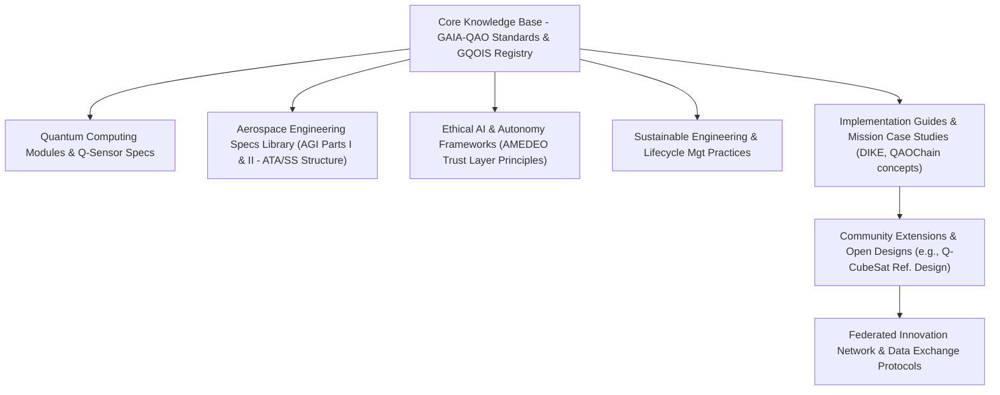

**Author:** Amedeo Pelliccia  
© GAIA-QAO / Quantum Aerospace Organization  
[](https://github.com/sponsors/Robbbo-T)

<p align="center">
  <a href="https://github.com/Robbbo-T/">
    
  </a>
</p>

---

# GAIA-QAO Industry 5.0 Assurance Principle

**No Flight Without QAO Assurance**

**Document Code:** GAIA-QAO-INDUSTRY5-VISION-ASSURANCE-2025-001  
**Version:** 1.0  
**Status:** OFFICIAL DRAFT  
**Classification:** TRUSTED / AUDITABLE / SEMANTIC  
**Maintainer:** @Gaia-QAO-GOVERNANCE  
**InfoCode:** GP-QAO-INDUSTRY5-ASSURANCE-001

---

## Executive Statement

> In the GAIA-QAO vision of **Industry 5.0 for aerospace**, the boundary between physical and digital is gone. No component, subsystem, or aircraft is allowed to fly—literally or operationally—without QAO (Quantum Aerospace Organization) assurance across its lifecycle.
>
> **Every object, from a mechanical fastener to a complete modular station, must be digitally, semantically, and quantum-assured.** There are no “anonymous” flights. Every part’s history, compliance, and operational fitness must always be knowable, provable, and auditable.

---

## Core Principle: Zero Uncertified Flight

No element—bolt, sensor, software module, or full system—flies without:

- **QAO certification before integration**
- **Continuous, real-time digital twin monitoring**
- **Immutable, auditable compliance status**

*If it’s not QAO-assured, it doesn’t fly. Period.*

---

## The Power of the GAIA-QAO Assurance Chain

- **End-to-End Traceability:** From factory to decommission—every object embeds a digital identity (DIKE), quantum sensor data, and a living audit trail.
- **Semantic & Quantum Provenance:** Every part is globally registered, quantum-logged, and mapped to its live digital twin—enabling real-time predictive analytics and anomaly detection.
- **Active, Ethical, and Regulatory Compliance:** All compliance data is transparent and accessible. The AMEDEO trust layer guarantees ethical and legal conformance at every step.

---

## Strategic and Operational Impact

- **No blind spots:** Full transparency in manufacturing, maintenance, and flight operations.
- **AI-driven certification:** Automated, adaptive validation for both legacy and quantum-enhanced platforms.
- **Accelerated audits:** Instant incident investigation, lifecycle reporting, and regulatory compliance.
- **Federated collaboration:** Trusted, secure, and actionable data for all partners and authorities.

---

## The GAIA-QAO Industry 5.0 Mandate

> “No part flies alone. No assembly is certified without its digital soul.
> The journey from design to decommission is now a seamless flow of intelligence, assurance, and trust.”

---

## Implementation Foundations

- **DIKE Object Identification:** Unique, standards-compliant identifiers.
- **Digital Twin Integration:** Live operational twins for all parts and systems.
- **Quantum/IoT Sensorization:** Real-time, continuous monitoring and event logging.
- **Automated Documentation:** Dynamic generation and storage of all certification artifacts.
- **Blockchain Audit Trails:** Immutable and federated event history (QAOChain).

---

## Visionary Outcomes

- **Air/Spaceworthiness Reimagined:** Trust and compliance are built in, not bolted on.
- **Aerospace as a Living System:** Every object senses, remembers, and proves its journey.
- **Quantum-Ready:** Engineered for classical, hybrid, and future quantum operations.

---

## Closing

The **GAIA-QAO Industry 5.0 Assurance Principle** is the cornerstone of the new aerospace era:  
*Nothing—no matter how small or large—takes flight without the QAO assurance signature.*  
This is how safety, transparency, and responsible innovation become absolute:
**No flight without assurance. No future without trust.**

---

> _This document is a living conceptual master index for GAIA-QAO Aerospace Documentation, integrating object identification, digital twins, compliance frameworks, and Industry 5.0 governance. See the Aerospace General Index (AGI) for the complete technical architecture, schemas, and implementation strategy._


---

## Quantum Aerospace Organization Structure

The **Quantum Aerospace Organization (GAIA‑QAO)** comprises six federated modules (virtual teams), each operating synergistically across key aerospace and quantum domains:

-   **GAIA-Q‑AIR:** Quantum-enhanced intelligent flight systems, avionics, and mission optimization.
-   **GAIA‑Q-SPACE:** Orbital and vector systems, mechanics, satellite AI agents, and quantum-secure communication frameworks.
-   **GAIA-Q-GreenTech:** Sustainable aerospace materials, energy efficiency models, and CO₂-reduction strategies.
-   **GAIA‑Q-HPC:** High-performance computing infrastructure for quantum simulation, digital twins, and agentic orchestration.
-   **GAIA‑SCIREF:** Scientific research team focusing on emerging technologies, ontology, ethics, and experimental models.
-   **GAIA‑Q-Data-Governance:** Includes the GA-SToP-CO₂ Steering Committee, Sustainability Integration Board, Emissions Quantification Working Group, Resource Sustainability Working Group, Materials Science Advisory Board, Systems Integration Working Group, and Implementation Working Group.

---

## 🌐 Quick Access Links

- [Gaia‑Q-Air](https://github.com/Gaia-Q-Air)
- [Gaia‑Q-Space](https://github.com/Gaia-Q-Space)
- [Gaia‑Q-GreenTech](https://github.com/Gaia-Q-GreenTech)
- [Gaia‑Q-High‑Performance‑Computing](https://github.com/Gaia-Q-High-Performance-Computing)
- [Gaia‑Science-Research](https://github.com/Gaia-Science-Research)
- [Gaia‑Q-Data-Governance](https://github.com/Gaia-Q-Data-Governance)

---

## 📄 Project Status & Metadata

[](#)
[-blue)](./CHANGELOG.md)
[](#)
[](#)
[](#)

---
_The following is the GAIA-QAO Aerospace Documentation (Conceptual Master Version 0.8.1 - Condensed General). This document outlines the comprehensive framework for GAIA-QAO, encompassing Air, Space, Green Technologies, and Quantum Governance & Enhancements._
---

**Author:** Amedeo Pelliccia
© GAIA-QAO / Quantum Aerospace Organization

---

<p align="center">
  <a href="https://github.com/Robbbo-T/">
    
  </a>
</p>

---

## Quantum Aerospace Organization Structure

The **Quantum Aerospace Organization (GAIA‑QAO)** comprises six federated modules (virtual teams), each operating synergistically across key aerospace and quantum domains, with a strong emphasis on sustainability and quantum governance:

- **GAIA-Q‑AIR**: Quantum-enhanced intelligent flight systems, avionics, mission optimization, and green aviation technologies.
- **GAIA‑Q-SPACE**: Orbital and vector systems, space mechanics, satellite AI agents, and quantum-secure communication frameworks, and sustainable space operations.
- **GAIA-Q-GreenTech**: Sustainable aerospace materials, green propulsion, energy efficiency models, lifecycle carbon footprint analysis (GA-SToP-CO₂), and circular economy principles for aerospace.
- **GAIA‑Q-HPC**: High-performance computing infrastructure for quantum simulation, complex system modeling, digital twins for air and space assets, and AI agentic orchestration.
- **GAIA‑SCIREF**: Scientific research team focusing on emerging quantum technologies, advanced materials, novel energy systems, aerospace ontologies, ethical AI, and experimental models for air and space.
- **GAIA‑Q-Data-Governance**: Includes the GA-SToP-CO₂ Steering Committee, Sustainability Integration Board, Emissions Quantification Working Group, Resource Sustainability Working Group, Materials Science Advisory Board, Systems Integration Working Group, Implementation Working Group, and the overarching QAO Assurance Principle enforcement.

---

## 🌐 Quick Access Links

- [Gaia‑Q-Air](https://github.com/Gaia-Q-Air)
- [Gaia‑Q-Space](https://github.com/Gaia-Q-Space)
- [Gaia‑Q-GreenTech](https://github.com/Gaia-Q-GreenTech)
- [Gaia‑Q-High‑Performance‑Computing](https://github.com/Gaia-Q-High-Performance-Computing)
- [Gaia‑Science-Research](https://github.com/Gaia-Science-Research)
- [Gaia‑Q-Data-Governance](https://github.com/Gaia-Q-Data-Governance)

---

## 📄 Project Status & Metadata

[](#)
[-blue)](./CHANGELOG.md)
[](#)
[](#)

---
---
_The following is the GAIA-QAO Aerospace Documentation (Conceptual Master Version 0.8.4 - Hierarchical Condensed General)._
---

# GAIA-QAO Aerospace Documentation
## Aerospace General Index (AGI) - Master (Hierarchical Condensed General)

## Part 0: Framework Overview
*(Content for Part 0 as in Turn 147 - this part is usually presented with its own subheadings fully fleshed out as it's the introduction to the entire framework.)*

### 0.1 Vision Statement (GAIA-QAO Industry 5.0 Assurance Principle)
✨ ***I HAVE A DREAM:***

**GAIA-Q & AMPEL**
#### Open Source Quantum Aerospace Framework
**Science Research · Software · Hardware · Material Aerospace Solutions**

> *A new paradigm where quantum-enhanced intelligence, ethical autonomy, and sustainable engineering converge to define the aerospace systems of tomorrow. In this vision, the line between the physical and the digital is fully dissolved. **No part, subsystem, or fully assembled aerospace asset is allowed to fly—literally or operationally—without QAO (Quantum Aerospace Organization) assurance, end-to-end, for its entire lifecycle.** Every component possesses an inseparable digital, semantic, and quantum-assured identity—its "digital soul." This framework, encompassing Air, Space, Green Technologies, and Quantum Governance, aims to pioneer new frontiers built upon a foundation of absolute, provable assurance.*

### 0.2 Guiding Principles & Philosophy
The GAIA-Q & AMPEL project is founded on the following core principles, deeply informed by the GAIA-QAO Industry 5.0 Assurance Principle:

*   **🇪🇸 Producimos documentación técnica open source para inspirar los diseños de hoy y de mañana.**
    **Ingeniería con propósito. Conocimiento compartido. Innovación federada.**
*   **🇬🇧 We produce open-source technical documentation to inspire the designs of today and tomorrow.**
    **Engineering with purpose. Shared knowledge. Federated innovation.**

> "Knowledge shared is future engineered." – Amedeo Pelliccia

*   **Zero Uncertified Flight/Operation:** No aerospace asset or its critical modules operate without verified GAIA-QAO assurance.
*   **End-to-End Lifecycle Assurance:** Traceability and assurance from component origin through decommissioning.
*   **Inseparable Digital-Physical Identity:** Physical assets intrinsically linked to digital, semantic (GQOIS ID), and quantum-assured identity.
*   **Continuous Digital Twin Symbiosis:** Real-world states mirrored and predicted by digital twins, informed by continuous monitoring.
*   **Immutable and Transparent Provenance:** Semantic and quantum event logging (e.g., QAOChain) for unalterable audit trails.
*   **Active, Ethical, and Regulatory Compliance:** Ongoing process, data transparently accessible (e.g., AMEDEO trust layer).
*   **Federated Trust:** Supports zero-trust principles within a federated, multi-actor ecosystem.

### 0.3 Documentation Architecture
The architecture of the technical documentation within the GAIA-Q & AMPEL framework is an interconnected network supporting the GAIA-QAO Assurance Chain.


*This AGI master document is a cornerstone of the "Core Knowledge Base."*

### 0.4 Key Components of the Documentation Framework
1.  **Multilingual Knowledge Base:** English/Spanish initially; ISO/COAFI/CCSDS terminology mapping.
2.  **Federated Documentation Structure:** Distributed contributions, Git-based, InfoCode/COAFI alignment.
3.  **Implementation Repository:** Open reference designs, simulation environments, demonstrator kits.
4.  **Integrated Assurance Data Layers (Conceptual):** Interfaces with DIKE, Quantum/IoT Sensor Streams, QAOChain.

### 0.5 Governance Model for the Open Source Project
1.  **Technical Oversight Committee (TOC):** Diverse expertise, transparent RFCs, public roadmap.
2.  **Contribution Pathways:** Onboarding, mentorship, InfoCode authorship recognition.
3.  **Quality Assurance Framework:** Peer review, standards compliance, security audits.

### 0.6 High-Level Implementation Strategy
*   **Phase 1 (Foundation):** GAIA-QAO standards (GQOIS, AToC, INFOCODE), initial templates, Git portal.
*   **Phase 2 (Community Dev):** Recruit contributors, working groups, alpha documentation & reference models.
*   **Phase 3 (Federation Impl):** Formalize teams, collaboration protocols, pilot projects demonstrating assurance.
*   **Phase 4 (Acceleration):** Industrial guides, cert-friendly formats, open competitions.

### 0.7 Envisioned Potential Impact
1.  **Revolutionized Airworthiness & Spaceworthiness:** Continuous, real-time, provable assurance.
2.  **Aerospace as a Living, Auditable System:** Every object "senses, remembers, and proves" its journey.
3.  **Accelerated Adoption of Trustworthy AI & Autonomy:** Verifiable and certifiable AI.
4.  **Enhanced Safety & Reliability:** Proactive issue identification via monitoring and predictive analytics.
5.  **Quantum-Ready Assurance:** Framework built for conventional, hybrid, and quantum-enhanced systems.
6.  **Streamlined Regulatory Compliance:** Automated evidence generation, real-time auditable records.

---
## Part 1: Programming Languages, Development Environments, and Libraries in Aerospace and Defense Software
*(Summary: Details foundational software technologies for all GAIA-QAO sectors. Covers languages, IDEs, compilers, RTOS, frameworks, buses, and certification standards. Full prose report contains detailed analysis and tables.)*

### 1.1 Introduction
### 1.2 Common Programming Languages in Aerospace Systems
    #### 1.2.1 Ada and SPARK: Design for Safety and High Integrity
    #### 1.2.2 C and C++: Prevalence, Applications, and Safety Challenges
    #### 1.2.3 Legacy Languages: Fortran, COBOL, JOVIAL and Modernization
    #### 1.2.4 Emerging Languages: The Potential of Rust for Secure Systems
    #### 1.2.5 Scripting and Specialized Languages: Python, HDL, and Others
### 1.3 Development Environments and Toolchains
    #### 1.3.1 Integrated Development Environments (IDEs)
    #### 1.3.2 Compilers and Debuggers
    #### 1.3.3 Static Analysis and Verification Tools
    #### 1.3.4 Tool Qualification (DO-330 / ED-215)
    #### 1.3.5 Configuration Management and Build Systems
### 1.4 Real-Time Operating Systems and Avionics Frameworks
    #### 1.4.1 ARINC 653 Partitioned RTOS
    #### 1.4.2 Standardized APIs and Middleware (ARINC 653, FACE, DDS, CCSDS, GMSEC)
    #### 1.4.3 Communication Libraries and Data Buses (MIL-STD-1553, ARINC 429, AFDX, SpaceWire, TTEthernet)
    #### 1.4.4 Geospatial and Mission-Specific Libraries (SPICE for Space)
### 1.5 Certification Standards and Their Impact
    #### 1.5.1 DO-178C / ED-12C – Objectives, DALs, and Key Supplements
    #### 1.5.2 DO-254 – Design Assurance for Airborne Electronic Hardware
    #### 1.5.3 MIL-STD-498 and MIL-STD-882 (System Safety)
    #### 1.5.4 NASA and ESA Standards (NPR 7150.2, ECSS)
    #### 1.5.5 Addressing Multi-Core Processors: CAST-32A and AMC 20-193
### 1.6 Civil vs. Military Systems: Key Differences
    #### 1.6.1 Regulatory Oversight & Standards
    #### 1.6.2 Security Imperatives
    #### 1.6.3 Operational Requirements and Environment
    #### 1.6.4 Impact on Technology Choices & Development Lifecycles
### 1.7 Software in Domain-Specific Applications
    #### 1.7.1 Embedded Systems: Flight Control, Engine Management, Navigation (Air & Space)
    #### 1.7.2 Simulation Systems: Aerodynamics, Orbital Mechanics, Flight Training (Air & Space)
    #### 1.7.3 Mission Planning Systems: Architectures, Geospatial Data, Backend Libraries (Air & Space)
    #### 1.7.4 Ground Control Systems: UAV GCS, Spacecraft Operations, ATM
### 1.8 Historical Evolution and Legacy Systems
### 1.9 Conclusion and Strategic Recommendations
    #### 1.9.1 Key Conclusions on Aerospace & Defense Software Ecosystem
    #### 1.9.2 High-Level Recommendations for Technology Adoption and Standards Compliance
### 1.10 References (Conceptual from Full Prose Report)

---
## Part 2: Hardware-in-the-Loop (HIL) Thinking Specification
    *(Summary: HIL Thinking is a core GAIA-QAO V&V methodology for Air and Space. Involves testing AI/autonomous systems against high-fidelity simulations and hardware responses. Full specification details principles, architecture, requirements, and roadmap.)*

### 2.0 IDEA SUMMARY: Hardware-in-the-Loop (HIL) Thinking
### 2.1 Introduction (to HIL Thinking Specification)
### 2.2 Core Principles of HIL Thinking
### 2.3 Implementation Example: AI-driven Anomaly Diagnosis (Air/Space)
### 2.4 Active Inference Loop Architecture
    *(Mermaid Diagram Placeholder - User to provide code for corrected diagram from Turn 141)*
    ```mermaid
    graph TD
        subgraph "GAIA-Q AI Agent - Onboard or Ground"
            A["Cognitive Core - Reasoning Engine"]
            A_IM["Internal Models - Spacecraft Environment Fault Signatures"]
        end

        subgraph "HIL Interaction & Orchestration Layer"
            B["HIL Query-Stimulus Formulation"]
            C["Hardware-Simulator Command Translator"]
            D["Feedback Ingestion & Pre-processor"]
            E["Loop Orchestrator & Sequencer"]
        end

        subgraph "Hardware-in-the-Loop - HIL Testbed"
            F["Space Env Simulator - Orbital Dynamics Thermal Radiation"]
            G["Spacecraft Hardware - Physical EGSE-Flatsat or High-Fidelity Digital Twin"]
            H["Sensor Simulators - Real Sensors Interface"]
            I["Actuator Simulators - Real Actuators Interface"]
        end

        subgraph "Traceability & Learning Layer"
            J["InfoCode Logger & AGAD Archiver"]
            K["Performance Metrics & Verifier"]
            L["Model Adaptation & Learning Module"]
        end

        A -- "1. Formulate Hypothesis - Test Query" --> B
        B -- "2. Define HIL Scenario - Stimulus" --> E
        E -- "3. Command HIL Setup" --> C
        C -- "4. Execute Command on HW-Sim" --> G
        F -- "Simulated Env Affects HW-DT" --> G
        G -- "HW State to Sensors" --> H
        G -- "HW Responds via Actuators" --> I
        H -- "5. Raw Feedback - Sensor Data" --> D
        I -- "5. Raw Feedback - Actuator State" --> D
        D -- "6. Processed Feedback to AI" --> A
        A -- "7. Update Reasoning & Internal Models" --> A_IM
        A_IM -- "Influence Future Reasoning" --> A
        A -- "8. Output Decision - Diagnosis - Plan" --> Out["Output to User-System"]

        A -- "Log Reasoning" --> J
        B -- "Log Query" --> J
        C -- "Log Command" --> J
        D -- "Log Feedback" --> J
        E -- "Log Orchestration" --> J
        A -- "Evaluate Against Metrics" --> K
        K -- "Verification Results" --> A
        A_IM -- "Update Models Based on Learning" --> L
        L -- "Refined Models" --> A_IM
    ```
### 2.5 Technical Requirements for HIL Thinking
    #### 2.5.1 AI Agent Architecture
    #### 2.5.2 HIL Testbed / Simulator Integration
    #### 2.5.3 Real-Time Feedback Ingestion & Processing
    #### 2.5.4 Loop Orchestrator & Control
    #### 2.5.5 Metric & Verifier Layer
    #### 2.5.6 Traceability and Logging Infrastructure
    #### 2.5.7 Digital Twin Synchronization
    #### 2.5.8 Domain-Specific HIL Requirements (Air, Space, Quantum)
### 2.6 Benefits of HIL Thinking
### 2.7 Integration with GAIA-Q Architecture
### 2.8 Implementation Roadmap for HIL Thinking
### 2.9 Conclusion (HIL Thinking Specification)

---
## Part 3: Object Identification System (GQOIS)
    *(Summary: Details GAIA-QAO Object ID system. Tier 1: Top-Level Objects (ID: DO-A-CCC-ST-MDL-SSSSS-CC). Tier 2: Subsystems (ID: {Parent_ID} :: SSS-MDLs-SERs-CCs). Defines components, formation, registry.)*

### 3.1 System Overview
### 3.2 Tier 1: Top-Level Object Identification
    #### 3.2.1 Top-Level Object ID Structure (`DO-A-CCC-ST-MDL-SSSSS-CC`)
    #### 3.2.2 Component Descriptions (DO, A-AssetClass, CCC-OrgCode, ST-ObjectType, MDL-ObjectModel, SSSSS-Serial, CC-Config)
### 3.3 Tier 2: Subsystem Identification
    #### 3.3.1 Subsystem ID Structure Concept (`{Parent_Tier_1_ID} :: SSS-MDLs-SERs-CCs`)
    #### 3.3.2 Component Descriptions (SSS-SubsystemType, MDLs-SubsystemModel, SERs-SubsystemSerial, CCs-SubsystemConfig)
### 3.4 Database Implementation (General Overview)
### 3.5 ID Formation Process Examples (Air and Space Systems)
    #### 3.5.1 Tier 1: Top-Level Object Formation
    #### 3.5.2 Tier 2: Subsystem Formation
### 3.6 Registry Management (Considerations for both Tiers)

---
## Part 4: Top-Level Object Model Registry
    *(Summary: Catalogs GAIA-QAO Top-Level Object Models (MDL codes: [G][N][V]). Section 4.2 covers Air System (AS) models, Section 4.3 details Space System (SP) models. Illustrative examples incorporate green power and quantum enhancements.)*

### 4.1 Model Code Structure for Top-Level Objects (`[G][N][V]`)
### 4.2 Air Systems (AS) Top-Level Object Models (Condensed Catalog)
    #### 4.2.1 Passenger Transport (Object Type `ST=PAX`) Models
    #### 4.2.2 Cargo Transport (Object Type `ST=CGO`) Models
    #### 4.2.3 Intelligence, Surveillance, Reconnaissance (Object Type `ST=ISR`) Models
    #### 4.2.4 Scientific Research (Object Type `ST=SCI` for AS) Models
    #### 4.2.5 Utility (Object Type `ST=UTL`) Models
    #### 4.2.6 Recreational & Sport (Object Type `ST=REC`) Models
    #### 4.2.7 Experimental (Air) (Object Type `ST=XPR` for AS) Models
    #### 4.2.8 Lighter Than Air (Object Type `ST=LTA`) Models
    #### 4.2.9 Military Aircraft (Object Type `ST=MIL`) Models
        *(Condensed examples: 1-2 lines per ST category)*
### 4.3 Space Systems (SP) Top-Level Object Models (Condensed Catalog)
    #### 4.3.1 Satellite (Object Type `ST=SAT`) Models
    #### 4.3.2 Orbital Platform/Vehicle (Object Type `ST=ORB`) Models
    #### 4.3.3 Launch System (Object Type `ST=LCH`) Models
    #### 4.3.4 Probe (Object Type `ST=PRB`) Models
    #### 4.3.5 Experimental (Space) (Object Type `ST=XPS`) Models
    #### 4.3.6 Space Defense (Object Type `ST=DEF`) Models
        *(Condensed examples: 1-2 lines per ST category)*
### 4.4 Implementation Guidelines (Top-Level Object Models)

---
## Part 5: Subsystem Identification & Registry
    *(Summary: Details Tier 2 GQOIS for major subsystems. Defines SSS, MDLs (subsystems), and SERs codes. Includes examples for air/space subsystems, green power units, and quantum components.)*

### 5.1 Defining Subsystem Type Codes (SSS)
### 5.2 Subsystem Model Coding (`MDLs` for subsystems)
### 5.3 Subsystem Serialization (`SERs` for subsystems)
### 5.4 Example Subsystem Catalog Entries (AS, SP, Green, Quantum Examples)
    #### 5.4.1 Avionics & Computing Subsystems
    #### 5.4.2 Propulsion & Power Subsystems
    #### 5.4.3 Structural & Mechanical Subsystems
    #### 5.4.4 Payload & Mission-Specific Subsystems
    #### 5.4.5 Quantum-Specific Subsystems
### 5.5 Database Considerations for Subsystems

---
## Part 6: Configuration Management
    *(Summary: Defines Configuration Codes (CC, CCs) using [T][N] structure. Lists standard and domain-specific types. Outlines registry management.)*

### 6.1 Configuration Code Structure (`[T][N]`)
### 6.2 Standard Configuration Types (T Codes - Applicable to AS & SP)
### 6.3 Domain-Specific Configurations
    #### 6.3.1 Air Systems (AS) Specific Configuration Types
    #### 6.3.2 Space Systems (SP) Specific Configuration Types
### 6.4 Configuration Management in Registry

---
## Part 7: Database Schema
    *(Summary: Provides PostgreSQL DDL for GAIA-QAO Registry. Includes tables for Tier 1 & 2 components, instances, configurations, link tables, management/integration. Core ERD illustrates structure.)*

### 7.1 Core ID Component Tables (Tier 1)
### 7.2 Subsystem-Related Tables (Tier 2)
### 7.3 Object Instances and Configurations Tables (Tier 1 & Tier 2)
### 7.4 Registry Management Tables
### 7.5 Integration and Reference Tables
### 7.6 Views and Functions
    *(Includes core ERD from Appendix C.1)*
```mermaid
erDiagram
    domains { char(2) domain_code PK }
    asset_classes { char(1) asset_class_code PK }
    organizations { char(3) organization_code PK }
    object_types { int object_type_id PK; char(3) object_type_code; char(2) domain_code FK; char(1) asset_class_code FK }
    autonomy_levels { char(1) autonomy_code PK }
    object_models { int model_id PK; char(3) model_code; int object_type_id FK; char(3) organization_code FK; char(1) autonomy_code FK }
    subsystem_types { char(3) sss_code PK }
    subsystem_models { int subsystem_model_id PK; varchar(5) subsystem_model_code; char(3) sss_code FK; char(3) manufacturer_org_code FK }
    object_instances { uuid instance_id PK; int model_id FK }
    subsystem_instances { uuid subsystem_instance_id PK; int subsystem_model_id FK }
    object_configurations { int configuration_id PK; uuid instance_id FK }
    subsystem_configurations { int subsystem_configuration_id PK; uuid subsystem_instance_id FK }
    object_subsystem_installations { int installation_id PK; uuid parent_object_instance_id FK; uuid child_subsystem_instance_id FK }
    domains ||--|{ object_types : defines_for
    asset_classes ||--|{ object_types : defines_for
    object_types ||--o{ object_models : categorizes
    organizations ||--o{ object_models : developed_by
    autonomy_levels ||--o{ object_models : has_inherent
    subsystem_types ||--o{ subsystem_models : categorizes
    organizations ||--o{ subsystem_models : manufactured_by
    object_models ||--o{ object_instances : instance_of
    subsystem_models ||--o{ subsystem_instances : instance_of
    object_instances ||--o{ object_configurations : has_configs
    subsystem_instances ||--o{ subsystem_configurations : has_configs
    object_instances }o--o{ object_subsystem_installations : hosts
    subsystem_instances }o--o{ object_subsystem_installations : installed_in
```

---
## Part 8: GAIA-Q-UI System Specification
    *(Summary: Details GAIA-Q-UI for the GAIA-QAO framework. Covers UI architecture, AI model routing, MCP event schemas, and AGAD/InfoCode integration. Full spec is extensive.)*

### 8.0 Introduction and Purpose (GAIA-Q-UI)
    #### 8.0.1 Goals (GAIA-Q-UI)
    #### 8.0.2 Guiding Principle: Leveraging AI in Development (GAIA-Q-UI)
### 8.1 UI Architecture Overview (GAIA-Q-UI)
    #### 8.1.1 Design Philosophy
    #### 8.1.2 Key UI Components Diagram (Full diagram in detailed spec)
    #### 8.1.3 Technology Stack Considerations
    #### 8.1.4 Performance, Scalability, and Reliability Considerations
### 8.2 AI Model Routing Engine Logic (GAIA-Q-UI)
    #### 8.2.1 Input Analysis for Routing
    #### 8.2.2 Routing Logic Approach
    #### 8.2.3 Model Selection Criteria (Examples)
    #### 8.2.4 Fallback and Error Handling
    #### 8.2.5 Aerospace Task-Specific Model Prioritization (Examples for AS & SP)
    #### 8.2.6 Handling Quantum-Specific Data and Models
### 8.3 MCP Event Schemas (GAIA-Q-UI)
    #### 8.3.1 General Event Structure
    #### 8.3.2 Example Event Types and Payloads (AS & SP examples)
### 8.4 AGAD–InfoCode Trace Integration (GAIA-Q-UI)
    #### 8.4.1 Session Management & InfoCoding
    #### 8.4.2 Log Structure and Content
    #### 8.4.3 Audit Trail Generation
    #### 8.4.4 Data Lineage
### 8.5 Initial Development Roadmap & Next Steps (GAIA-Q-UI)
### 8.6 Security and Data Privacy Framework (GAIA-Q-UI)
    #### 8.6.1 Data Security
    #### 8.6.2 Access Control
    #### 8.6.3 Data Privacy & Sovereignty
    #### 8.6.4 Secure Development Lifecycle (SDL)

---
## Part 9: Implementation Guidelines (Overall System)
    *(Summary: Provides guidelines for database setup, UI development, and Documentation Governance & Standards (GAIA-CO-ASD-LIB). Includes INFOCODE-INDEX and Standard AGI/AToC for Air (ATA) and Space (SS 00-99) System Technical Libraries.)*

### 9.1 Database Implementation Guidelines
### 9.2 User Interface Recommendations (Registry UI & GAIA-Q-UI)
### 9.3 Documentation Governance & Standards (GAIA-CO-ASD-LIB)
    #### 9.3.1 INFOCODE-INDEX System
        ##### 9.3.1.1 Structure: PREFIX-DOMAIN-CATEGORY-ITEM_ID[-VERSION][-STATUS]
        ##### 9.3.1.2 Component Definitions (PREFIX, DOMAIN, CATEGORY, ITEM_ID, etc.)
        ##### 9.3.1.3 Example INFOCODEs
    #### 9.3.2 GAIA-CO-ASD-LIB Standard Details (Content & Data Management)
        ##### 9.3.2.1 File Formats & Data Exchange
        ##### 9.3.2.2 File Naming Convention
        ##### 9.3.2.3 Metadata Requirements (YAML Front-Matter)
    #### 9.3.3 Document Lifecycle and Control
        ##### 9.3.3.1 Versioning
        ##### 9.3.3.2 Lifecycle States
        ##### 9.3.3.3 Change Control
        ##### 9.3.3.4 Version Control System (VCS)
    #### 9.3.4 Standard AGI/AToC for System Technical Libraries
        ##### 9.3.4.1 Top-Level Document Parts Overview
        ##### 9.3.4.2 Detailed AToC for Part I: Air Systems (AS) Documentation (ATA-100 Based Structure)
            *   ATA 00: GENERAL
            *   ATA 05: TIME LIMITS/MAINTENANCE CHECKS
            *   ATA 06: DIMENSIONS AND AREAS
            *   ATA 07: LIFTING AND SHORING
            *   ATA 08: LEVELING AND WEIGHING
            *   ATA 09: TOWING AND TAXIING
            *   ATA 10: PARKING, MOORING, STORAGE AND RETURN TO SERVICE
            *   ATA 11: PLACARDS AND MARKINGS
            *   ATA 12: SERVICING
            *   ATA 18: VIBRATION AND NOISE ANALYSIS (HELICOPTER ONLY)
            *   **AIRCRAFT SYSTEMS (ATA 20-49 + GAIA-QAO Specifics)**
            *   ATA 20: STANDARD PRACTICES - AIRFRAME
            *   ATA 21: AIR CONDITIONING AND PRESSURIZATION
            *   ATA 22: AUTO FLIGHT
            *   ATA 23: COMMUNICATIONS
            *   ATA 24: ELECTRICAL POWER
            *   ATA 25: EQUIPMENT/FURNISHINGS
            *   ATA 26: FIRE PROTECTION
            *   ATA 27: FLIGHT CONTROLS
            *   ATA 28: FUEL
            *   ATA 29: HYDRAULIC POWER
            *   ATA 30: ICE AND RAIN PROTECTION
            *   ATA 31: INDICATING/RECORDING SYSTEMS (INSTRUMENTS)
            *   ATA 32: LANDING GEAR
            *   ATA 33: LIGHTS
            *   ATA 34: NAVIGATION
            *   ATA 35: OXYGEN
            *   ATA 36: PNEUMATIC
            *   ATA 38: WATER/WASTE
            *   ATA 45: CENTRAL MAINTENANCE SYSTEM (CMS)
            *   ATA 46: INFORMATION SYSTEMS
            *   ATA 47: INERT GAS SYSTEM (NITROGEN GENERATION)
            *   ATA 49: AIRBORNE AUXILIARY POWER
            *   **STRUCTURES (ATA 51-57)**
            *   ATA 51: STANDARD PRACTICES AND STRUCTURES - GENERAL
            *   ATA 52: DOORS
            *   ATA 53: FUSELAGE
            *   ATA 54: NACELLES/PYLONS
            *   ATA 55: STABILIZERS
            *   ATA 56: WINDOWS
            *   ATA 57: WINGS
            *   **PROPELLER/ROTOR (ATA 60-67)**
            *   ATA 61: PROPELLERS/PROPULSORS
            *   *(ATA 62-67 as applicable)*
            *   **POWER PLANT (ATA 70-85)**
            *   ATA 71: POWER PLANT - GENERAL
            *   ATA 72: ENGINE (TURBINE/TURBOPROP)
            *   ATA 73: ENGINE FUEL AND CONTROL
            *   ATA 74: IGNITION
            *   ATA 75: AIR (Engine Bleed Air)
            *   ATA 76: ENGINE CONTROLS
            *   ATA 77: ENGINE INDICATING
            *   ATA 78: ENGINE EXHAUST
            *   ATA 79: ENGINE OIL
            *   ATA 80: STARTING
            *   *(ATA 81-84 as applicable, e.g., 83 Accessory Gearboxes)*
            *   ATA 85: RECIPROCATING ENGINE (If applicable for GreenTech/Hybrid)
            *   **GAIA-QAO Specific ATA Extensions (Conceptual)**
            *   ATA 100: SUSTAINABLE AVIATION FUELS (SAF) & HYDROGEN SYSTEMS
            *   ATA 101: BATTERY & ELECTRIC PROPULSION SYSTEMS (Non-Primary for AS)
            *   ATA 102: FUEL CELL SYSTEMS (AS Auxiliary or Propulsion)
            *   ATA 103: LIFECYCLE CARBON FOOTPRINT & EMISSIONS (GA-SToP-CO₂)
            *   ATA 200: QUANTUM GOVERNANCE & ASSURANCE SYSTEMS (AS Specific)
        ##### 9.3.4.3 Detailed AToC for Part II: Space Systems (SP) Documentation (SS-based)
            *   SS 00: General Space System Information & Introduction
                *   SS 00.00: System Overview, Mission Objectives, GQOIS ID Breakdown
                *   SS 00.10: Applicable Documents, Standards, and INFOCODE Index
                *   SS 00.20: Terminology and Acronyms Specific to this Space System
                *   SS 00.30: Safety Summary & Planetary Protection Plan
            *   SS 01: Propulsion Systems
                *   SS 01.00: General Description and Architecture
                *   SS 01.1: Chemical Space Propulsion
                *   SS 01.2: Electric Propulsion (EP)
                *   SS 01.3: Green Propulsion (Space Specific)
                *   SS 01.4: Advanced and Novel Propulsion Concepts
            *   SS 02: Flight Computing and Avionics
                *   SS 02.00: General Avionics Architecture & Philosophy
                *   SS 02.1: Space Electronics Components
                *   SS 02.2: Avionics Systems and Subsystems
            *   SS 03: Aerospace Power and Energy Storage (Space Focus)
                *   SS 03.00: General Power System Architecture for Spacecraft
                *   SS 03.1: Power Generation in Space
                *   SS 03.2: Energy Storage for Space Applications
                *   SS 03.3: Power Management and Distribution (PMAD) for Spacecraft
            *   SS 04: Robotic Systems (for Spacecraft Operations)
                *   SS 04.00: General Robotic System Overview
                *   SS 04.3: Manipulation
                *   SS 04.5: Autonomous Rendezvous & Docking/Capture (AR&D)
            *   SS 05: Communications, Navigation, and Information Systems (Space Focus)
                *   SS 05.00: General System Overview
                *   SS 05.1: Optical Communications
                *   SS 05.2: Radio Frequency (RF) Communications
                *   SS 05.3: Space Networking
                *   SS 05.4: Position, Navigation, and Timing (PNT)
                *   SS 05.5: Emerging Communications Technologies
            *   SS 06: Human Health, Life Support, and Habitation Systems (Space Focus)
                *   SS 06.00: General Overview
                *   SS 06.1: Environmental Control and Life Support Systems (ECLSS)
                *   SS 06.2: Extravehicular Activity (EVA) Systems
            *   SS 07: Mission Infrastructure (Spacecraft-based elements for long duration/exploration)
                *   SS 07.00: General Overview
                *   SS 07.2: Long-Duration Mission Support Systems
            *   SS 08: Sensors and Instruments (Bus & Payload Interface - Space Focus)
                *   SS 08.00: General Overview, Payload Accommodation Philosophy
                *   SS 08.1: Sensor Components and Focal Plane Technologies (Bus Sensors)
                *   SS 08.3: Spacecraft Environment Sensors (Bus Health & GNC Related)
                *   SS 08.X: Payload Support Systems (Bus-Provided Resources)
            *   SS 09: Entry, Descent, and Landing (EDL) Systems
                *   SS 09.00: General EDL System Overview
                *   SS 09.1: Entry Phase Systems
                *   SS 09.2: Descent Phase Systems
                *   SS 09.3: Landing Phase Systems
                *   SS 09.5: Advanced EDL GNC
            *   SS 10: Autonomous Systems (Onboard Capabilities for Spacecraft)
                *   SS 10.00: General Autonomy Architecture
                *   SS 10.1: Awareness (Sensing and Perception)
                *   SS 10.2: Reasoning and Acting (Planning, Decision Making, Execution)
            *   SS 11: Software, Modeling, and Simulation (Flight SW & Onboard Models for Space)
                *   SS 11.00: Overview and Software Development Standards
                *   SS 11.1: Flight Software
                *   SS 11.2: Onboard Models
                *   SS 11.3: Onboard Simulation Capabilities
            *   SS 12: Materials, Structures, and Mechanical Systems (Space Focus)
                *   SS 12.00: General Overview
                *   SS 12.1: Materials
                *   SS 12.2: Structures
                *   SS 12.3: Mechanical Systems
            *   SS 13: Ground Support Equipment & Systems (Space Specific)
                *   SS 13.00: Overview of GSE for Space Systems
                *   SS 13.10: Launch Pad GSE & Umbilicals
                *   SS 13.20: Spacecraft Assembly, Integration & Test (AIT) GSE
                *   SS 13.30: Propellant & Fluid Servicing GSE
                *   SS 13.40: Mission Control Center Hardware & Consoles
                *   SS 13.50: Deep Space Network (DSN) Ground Station Equipment
            *   SS 14: Thermal Management Systems (Space Focus)
                *   SS 14.00: General Thermal Architecture
                *   SS 14.1: Thermal Analysis, Modeling, and Testing
                *   SS 14.2: Heat Acquisition and Transport
                *   SS 14.3: Heat Rejection Systems
                *   SS 14.4: Thermal Control Coatings and Surfaces
                *   SS 14.5: Cryogenic Systems and Coolers
                *   SS 14.6: Multi-Layer Insulation (MLI)
            *   SS 15: System Safety (Space Specific Hazards & Mitigations)
                *   SS 15.00: Overall System Safety Program Plan
                *   SS 15.10: Hazard Analysis
                *   SS 15.20: FMEA/FMECA, Fault Tree Analysis
                *   SS 15.30: Launch, Range, and Re-entry Safety
                *   SS 15.40: Space Debris Mitigation & End-of-Life Disposal Plan
            *   SS 16: Integration, Assembly, Test & Verification (Space Specific)
                *   SS 16.00: System Integration, Assembly, and Test (IAT) Plan
                *   SS 16.10: Assembly and Integration Procedures (AIP)
                *   SS 16.20: Verification and Validation (V&V) Philosophy and Approach
                *   SS 16.30: Test Levels
                *   SS 16.40: Environmental Test Campaigns
            *   SS 17: Guidance, Navigation, and Control (GN&C for Spacecraft)
                *   SS 17.00: General GNC System Architecture
                *   SS 17.1: Attitude Determination and Control Systems (ADCS/ACS)
                *   SS 17.2: Orbit Determination and Trajectory Control Systems
                *   SS 17.3: Integrated GNC Systems
                *   SS 17.4: Advanced GNC Technologies
            *   SS 18: Mission Operations (Space Segment & Ground Interface)
                *   SS 18.00: Mission Operations Concept (CONOPS)
                *   SS 18.10: Telemetry, Tracking, and Command (TT&C) Operations
                *   SS 18.20: Nominal Mission Timelines and Operational Sequences
                *   SS 18.30: Contingency Operations and Anomaly Response Procedures
                *   SS 18.40: Payload Operations Planning and Execution
            *   SS 19: Quantum Systems & Payloads (Specific to GAIA-QAO Q-SPACE)
                *   SS 19.00: Overview of Integrated Quantum Systems in Spacecraft
                *   SS 19.10: Quantum Communication Payloads
                *   SS 19.20: Quantum Sensing Payloads
                *   SS 19.30: Onboard Quantum Computing/Processing Units
                *   SS 19.40: Quantum System Environmental Considerations for Space
                *   SS 19.50: Specific V&V and Calibration for Quantum Systems in Space
            *   SS 20 - SS 99: Reserved for future expansion.
        ##### 9.3.4.4 Detailed AToC for Part III: Common Nomenclature (CN)
            * CN 01: General Terminology
            * CN 02: Air Systems Terminology
            * CN 03: Space Systems Terminology
            * CN 04: Quantum Systems Terminology
        ##### 9.3.4.5 Detailed AToC for Part IV: Governance & Best Practices (GB)
            * GB 01: Documentation Standards
            * GB 02: Quality Assurance
            * GB 03: Configuration Management
            * GB 04: Knowledge Management
        ##### 9.3.4.6 Detailed AToC for Part V: Project Management (PM)
            * PM 01: Project Lifecycle
            * PM 02: Project Planning
            * PM 03: Project Execution
            * PM 04: Project Closure
        ##### 9.3.4.7 Detailed AToC for Part VI: Reference Standards (RS)
            * RS 01: International Standards
            * RS 02: Aerospace Standards
            * RS 03: Military Standards
            * RS 04: Certification Requirements
            * RS 05: Quantum Standards
    9.4 Meta-Documentation (Management of this AGI document)
    9.5 Next Steps (Overall Project Implementation)

## Appendices
    Appendix A: Top-Level Object Type (ST) Codes
        A.1 Air Systems (AS) Object Types (ST Codes)
        A.2 Space Systems (SP) Object Types (ST Codes)
    Appendix B: ID Examples (General Focus)
        B.1 Tier 1: Top-Level Object ID Examples
        B.2 Tier 2: Subsystem ID Examples
    Appendix C: Database Schema Diagrams (Illustrative)
        C.1 Core ID Component Tables and Relationships
    Appendix D: Illustrative Aerospace Use Cases for GAIA-Q-UI
        D.1 Use Case: Anomaly Diagnosis
        D.2 Use Case: Quantum System/Sensor Design Support
        D.3 Use Case: AI-Assisted Technical Documentation Generation
    Appendix E: Note on Detailed Survey of Aerospace Software Technologies
    Appendix F: Subsystem Type (SSS) Codes List (Initial Proposal - General Focus)
    Appendix G: Documentation Templates
        G.1 System Specification Template
            G.1.1 Document Control
            G.1.2 Introduction
            G.1.3 System Requirements
            G.1.4 Verification and Validation (V&V) Overview
            G.1.5 Appendix A (within G.1): Traceability Matrix
        G.2 Interface Control Document (ICD) Template
            G.2.1 Document Control
            G.2.2 Introduction
            G.2.3 Interface Definition
            G.2.4 Interface Verification Matrix
            G.2.5 Appendix A (within G.2): Connector Pinout Details
            G.2.6 Appendix B (within G.2): Data Dictionary
        G.3 Test Procedure Template
            G.3.1 Document Control
            G.3.2 Introduction
            G.3.3 Test Requirements to be Verified
            G.3.4 Test Setup
            G.3.5 Test Execution Steps
            G.3.6 Data Recording
            G.3.7 Pass/Fail Criteria
            G.3.8 Post-Test Procedures
            G.3.9 Safety Precautions
        G.4 Air System (ATA-based) Technical Document Template
            G.4.1 Description and Operation
            G.4.2 Maintenance Procedures
            G.4.3 Troubleshooting
            G.4.4 Appendix A (within G.4): Illustrations
        G.5 Space System (SS-based) Technical Document Template
            G.5.1 System Description and Operation
            G.5.2 Operational Procedures
            G.5.3 Telemetry and Telecommand List
            G.5.4 FDIR & Contingency Procedures
            G.5.5 Appendix A (within G.5): System Block Diagram
            G.5.6 Appendix B (within G.5): Interface Summary
        G.6 Quantum System Specification Template
            G.6.1 Document Control
            G.6.2 Introduction
            G.6.3 Quantum Operational Principles and Architecture
            G.6.4 Q-System Performance Specifications
            G.6.5 Q-System Interface Requirements
            G.6.6 Q-System Environmental Requirements
            G.6.7 Q-System Software Requirements
            G.6.8 Q-System V&V Approach
            G.6.9 Appendix A (within G.6): Detailed Quantum Parameters
            G.6.10 Appendix B (within G.6): Q-System Operational Concept
        G.7 Project Management Plan (PMP) Template
            G.7.0 Foundational Disambiguation: Components vs. Modules
            G.7.1 Document Control (for PMP)
            G.7.2 Revision History (for PMP)
            G.7.3 Table of Contents (for PMP)
            G.7.4 Introduction (PMP Section 1)
            G.7.5 Project Scope Management (PMP Section 2)
            G.7.6 Work Breakdown Structure (WBS) (PMP Section 3)
            G.7.7 Project Organization & Stakeholders (PMP Section 4)
            G.7.8 Schedule Management (PMP Section 5)
            G.7.9 Cost Management (PMP Section 6)
            G.7.10 Quality Management (PMP Section 7)
            G.7.11 Resource Management (PMP Section 8)
            G.7.12 Communication Management (PMP Section 9)
            G.7.13 Risk Management (PMP Section 10)
            G.7.14 Change Management (PMP Section 11)
            G.7.15 Project Acceptance Criteria (PMP Section 12)
            G.7.16 Supporting Documents & Appendices (for PMP)

---

> **GENERAL DISCLAIMER:**
> This master document and all its parts represent an AI-generated proposal for the GAIA-Q & AMPEL framework and the GAIA-QAO object identification system. It has not been validated through implementation in aerospace systems nor by aerospace certification bodies. The concepts are based on current industry trends, open source, quantum computing, and federated aerospace engineering, as well as on the information provided.

---
**Document Metadata Footer (Conceptual for Master Document)**

**Status**: Iterative Draft (Granular Structurally Expanded Condensed General Version with Full AToC)
**Master Document InfoCode**: QAO-SYS-AGI-MASTER-V0R8CSG2-DRAFT
**Version**: 0.8.4-condensed-general-granular-struct-fullAToC.1
**Focus**: GAIA-QAO General (Air, Space, Green Powered, Quantum Governed & Enhanced)
**Compliance Scope**: GAIA-QAO v1.3 (GQOIS), AGAD (principles), COAFI (alignment), MCP Sync (planned)
**Keywords**: `[GAIA-QAO][AGI][Object ID][Quantum Aerospace][Open Source][GreenTech][Air Systems][Space Systems][Documentation Framework][Registry][Database Schema][Configuration Management][GAIA-Q-UI][ATA Chapters][SS 00-99][INFOCODE]`

---
© Amedeo Pelliccia · GAIA-QAO – *Federated Quantum Aerospace Intelligence*

> "Knowledge shared is future engineered."
```


