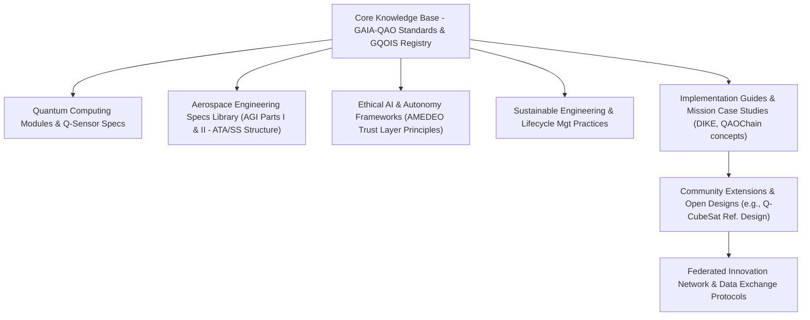

**Author:** Amedeo Pelliccia  
© GAIA-QAO / Quantum Aerospace Organization  
[](https://github.com/sponsors/Robbbo-T)

<p align="center">
  <a href="https://github.com/Robbbo-T/">
    
  </a>
</p>

---

# GAIA-QAO Industry 5.0 Assurance Principle

**No Flight Without QAO Assurance**

**Document Code:** GAIA-QAO-INDUSTRY5-VISION-ASSURANCE-2025-001  
**Version:** 1.0  
**Status:** OFFICIAL DRAFT  
**Classification:** TRUSTED / AUDITABLE / SEMANTIC  
**Maintainer:** @Gaia-QAO-GOVERNANCE  
**InfoCode:** GP-QAO-INDUSTRY5-ASSURANCE-001

---

## Executive Statement

> In the GAIA-QAO vision of **Industry 5.0 for aerospace**, the boundary between physical and digital is gone. No component, subsystem, or aircraft is allowed to fly—literally or operationally—without QAO (Quantum Aerospace Organization) assurance across its lifecycle.
>
> **Every object, from a mechanical fastener to a complete modular station, must be digitally, semantically, and quantum-assured.** There are no “anonymous” flights. Every part’s history, compliance, and operational fitness must always be knowable, provable, and auditable.

---

## Core Principle: Zero Uncertified Flight

No element—bolt, sensor, software module, or full system—flies without:

- **QAO certification before integration**
- **Continuous, real-time digital twin monitoring**
- **Immutable, auditable compliance status**

*If it’s not QAO-assured, it doesn’t fly. Period.*

---

## The Power of the GAIA-QAO Assurance Chain

- **End-to-End Traceability:** From factory to decommission—every object embeds a digital identity (DIKE), quantum sensor data, and a living audit trail.
- **Semantic & Quantum Provenance:** Every part is globally registered, quantum-logged, and mapped to its live digital twin—enabling real-time predictive analytics and anomaly detection.
- **Active, Ethical, and Regulatory Compliance:** All compliance data is transparent and accessible. The AMEDEO trust layer guarantees ethical and legal conformance at every step.

---

## Strategic and Operational Impact

- **No blind spots:** Full transparency in manufacturing, maintenance, and flight operations.
- **AI-driven certification:** Automated, adaptive validation for both legacy and quantum-enhanced platforms.
- **Accelerated audits:** Instant incident investigation, lifecycle reporting, and regulatory compliance.
- **Federated collaboration:** Trusted, secure, and actionable data for all partners and authorities.

---

## The GAIA-QAO Industry 5.0 Mandate

> “No part flies alone. No assembly is certified without its digital soul.
> The journey from design to decommission is now a seamless flow of intelligence, assurance, and trust.”

---

## Implementation Foundations

- **DIKE Object Identification:** Unique, standards-compliant identifiers.
- **Digital Twin Integration:** Live operational twins for all parts and systems.
- **Quantum/IoT Sensorization:** Real-time, continuous monitoring and event logging.
- **Automated Documentation:** Dynamic generation and storage of all certification artifacts.
- **Blockchain Audit Trails:** Immutable and federated event history (QAOChain).

---

## Visionary Outcomes

- **Air/Spaceworthiness Reimagined:** Trust and compliance are built in, not bolted on.
- **Aerospace as a Living System:** Every object senses, remembers, and proves its journey.
- **Quantum-Ready:** Engineered for classical, hybrid, and future quantum operations.

---

## Closing

The **GAIA-QAO Industry 5.0 Assurance Principle** is the cornerstone of the new aerospace era:  
*Nothing—no matter how small or large—takes flight without the QAO assurance signature.*  
This is how safety, transparency, and responsible innovation become absolute:
**No flight without assurance. No future without trust.**

---

> _This document is a living conceptual master index for GAIA-QAO Aerospace Documentation, integrating object identification, digital twins, compliance frameworks, and Industry 5.0 governance. See the Aerospace General Index (AGI) for the complete technical architecture, schemas, and implementation strategy._


---

## Quantum Aerospace Organization Structure

The **Quantum Aerospace Organization (GAIA‑QAO)** comprises six federated modules (virtual teams), each operating synergistically across key aerospace and quantum domains:

-   **GAIA-Q‑AIR:** Quantum-enhanced intelligent flight systems, avionics, and mission optimization.
-   **GAIA‑Q-SPACE:** Orbital and vector systems, mechanics, satellite AI agents, and quantum-secure communication frameworks.
-   **GAIA-Q-GreenTech:** Sustainable aerospace materials, energy efficiency models, and CO₂-reduction strategies.
-   **GAIA‑Q-HPC:** High-performance computing infrastructure for quantum simulation, digital twins, and agentic orchestration.
-   **GAIA‑SCIREF:** Scientific research team focusing on emerging technologies, ontology, ethics, and experimental models.
-   **GAIA‑Q-Data-Governance:** Includes the GA-SToP-CO₂ Steering Committee, Sustainability Integration Board, Emissions Quantification Working Group, Resource Sustainability Working Group, Materials Science Advisory Board, Systems Integration Working Group, and Implementation Working Group.

---

## 🌐 Quick Access Links

- [Gaia‑Q-Air](https://github.com/Gaia-Q-Air)
- [Gaia‑Q-Space](https://github.com/Gaia-Q-Space)
- [Gaia‑Q-GreenTech](https://github.com/Gaia-Q-GreenTech)
- [Gaia‑Q-High‑Performance‑Computing](https://github.com/Gaia-Q-High-Performance-Computing)
- [Gaia‑Science-Research](https://github.com/Gaia-Science-Research)
- [Gaia‑Q-Data-Governance](https://github.com/Gaia-Q-Data-Governance)

---

## 📄 Project Status & Metadata

[](#)
[-blue)](./CHANGELOG.md)
[](#)
[](#)
[](#)

---
_The following is the GAIA-QAO Aerospace Documentation (Conceptual Master Version 0.8.1 - Condensed General). This document outlines the comprehensive framework for GAIA-QAO, encompassing Air, Space, Green Technologies, and Quantum Governance & Enhancements._
---

**Author:** Amedeo Pelliccia
© GAIA-QAO / Quantum Aerospace Organization

---

<p align="center">
  <a href="https://github.com/Robbbo-T/">
    
  </a>
</p>

---

## Quantum Aerospace Organization Structure

The **Quantum Aerospace Organization (GAIA‑QAO)** comprises six federated modules (virtual teams), each operating synergistically across key aerospace and quantum domains, with a strong emphasis on sustainability and quantum governance:

- **GAIA-Q‑AIR**: Quantum-enhanced intelligent flight systems, avionics, mission optimization, and green aviation technologies.
- **GAIA‑Q-SPACE**: Orbital and vector systems, space mechanics, satellite AI agents, and quantum-secure communication frameworks, and sustainable space operations.
- **GAIA-Q-GreenTech**: Sustainable aerospace materials, green propulsion, energy efficiency models, lifecycle carbon footprint analysis (GA-SToP-CO₂), and circular economy principles for aerospace.
- **GAIA‑Q-HPC**: High-performance computing infrastructure for quantum simulation, complex system modeling, digital twins for air and space assets, and AI agentic orchestration.
- **GAIA‑SCIREF**: Scientific research team focusing on emerging quantum technologies, advanced materials, novel energy systems, aerospace ontologies, ethical AI, and experimental models for air and space.
- **GAIA‑Q-Data-Governance**: Includes the GA-SToP-CO₂ Steering Committee, Sustainability Integration Board, Emissions Quantification Working Group, Resource Sustainability Working Group, Materials Science Advisory Board, Systems Integration Working Group, Implementation Working Group, and the overarching QAO Assurance Principle enforcement.

---

## 🌐 Quick Access Links

- [Gaia‑Q-Air](https://github.com/Gaia-Q-Air)
- [Gaia‑Q-Space](https://github.com/Gaia-Q-Space)
- [Gaia‑Q-GreenTech](https://github.com/Gaia-Q-GreenTech)
- [Gaia‑Q-High‑Performance‑Computing](https://github.com/Gaia-Q-High-Performance-Computing)
- [Gaia‑Science-Research](https://github.com/Gaia-Science-Research)
- [Gaia‑Q-Data-Governance](https://github.com/Gaia-Q-Data-Governance)

---

## 📄 Project Status & Metadata

[](#)
[-blue)](./CHANGELOG.md)
[](#)
[](#)

---
---
_The following is the GAIA-QAO Aerospace Documentation (Conceptual Master Version 0.8.4 - Hierarchical Condensed General)._
---

# GAIA-QAO Aerospace Documentation
## Aerospace General Index (AGI) - Master (Hierarchical Condensed General)

## Part 0: Framework Overview
*(Content for Part 0 as in Turn 147 - this part is usually presented with its own subheadings fully fleshed out as it's the introduction to the entire framework.)*

### 0.1 Vision Statement (GAIA-QAO Industry 5.0 Assurance Principle)
✨ ***I HAVE A DREAM:***

**GAIA-Q & AMPEL**
#### Open Source Quantum Aerospace Framework
**Science Research · Software · Hardware · Material Aerospace Solutions**

> *A new paradigm where quantum-enhanced intelligence, ethical autonomy, and sustainable engineering converge to define the aerospace systems of tomorrow. In this vision, the line between the physical and the digital is fully dissolved. **No part, subsystem, or fully assembled aerospace asset is allowed to fly—literally or operationally—without QAO (Quantum Aerospace Organization) assurance, end-to-end, for its entire lifecycle.** Every component possesses an inseparable digital, semantic, and quantum-assured identity—its "digital soul." This framework, encompassing Air, Space, Green Technologies, and Quantum Governance, aims to pioneer new frontiers built upon a foundation of absolute, provable assurance.*

### 0.2 Guiding Principles & Philosophy
The GAIA-Q & AMPEL project is founded on the following core principles, deeply informed by the GAIA-QAO Industry 5.0 Assurance Principle:

*   **🇪🇸 Producimos documentación técnica open source para inspirar los diseños de hoy y de mañana.**
    **Ingeniería con propósito. Conocimiento compartido. Innovación federada.**
*   **🇬🇧 We produce open-source technical documentation to inspire the designs of today and tomorrow.**
    **Engineering with purpose. Shared knowledge. Federated innovation.**

> "Knowledge shared is future engineered." – Amedeo Pelliccia

*   **Zero Uncertified Flight/Operation:** No aerospace asset or its critical modules operate without verified GAIA-QAO assurance.
*   **End-to-End Lifecycle Assurance:** Traceability and assurance from component origin through decommissioning.
*   **Inseparable Digital-Physical Identity:** Physical assets intrinsically linked to digital, semantic (GQOIS ID), and quantum-assured identity.
*   **Continuous Digital Twin Symbiosis:** Real-world states mirrored and predicted by digital twins, informed by continuous monitoring.
*   **Immutable and Transparent Provenance:** Semantic and quantum event logging (e.g., QAOChain) for unalterable audit trails.
*   **Active, Ethical, and Regulatory Compliance:** Ongoing process, data transparently accessible (e.g., AMEDEO trust layer).
*   **Federated Trust:** Supports zero-trust principles within a federated, multi-actor ecosystem.

### 0.3 Documentation Architecture
The architecture of the technical documentation within the GAIA-Q & AMPEL framework is an interconnected network supporting the GAIA-QAO Assurance Chain.


*This AGI master document is a cornerstone of the "Core Knowledge Base."*

### 0.4 Key Components of the Documentation Framework
1.  **Multilingual Knowledge Base:** English/Spanish initially; ISO/COAFI/CCSDS terminology mapping.
2.  **Federated Documentation Structure:** Distributed contributions, Git-based, InfoCode/COAFI alignment.
3.  **Implementation Repository:** Open reference designs, simulation environments, demonstrator kits.
4.  **Integrated Assurance Data Layers (Conceptual):** Interfaces with DIKE, Quantum/IoT Sensor Streams, QAOChain.

### 0.5 Governance Model for the Open Source Project
1.  **Technical Oversight Committee (TOC):** Diverse expertise, transparent RFCs, public roadmap.
2.  **Contribution Pathways:** Onboarding, mentorship, InfoCode authorship recognition.
3.  **Quality Assurance Framework:** Peer review, standards compliance, security audits.

### 0.6 High-Level Implementation Strategy
*   **Phase 1 (Foundation):** GAIA-QAO standards (GQOIS, AToC, INFOCODE), initial templates, Git portal.
*   **Phase 2 (Community Dev):** Recruit contributors, working groups, alpha documentation & reference models.
*   **Phase 3 (Federation Impl):** Formalize teams, collaboration protocols, pilot projects demonstrating assurance.
*   **Phase 4 (Acceleration):** Industrial guides, cert-friendly formats, open competitions.

### 0.7 Envisioned Potential Impact
1.  **Revolutionized Airworthiness & Spaceworthiness:** Continuous, real-time, provable assurance.
2.  **Aerospace as a Living, Auditable System:** Every object "senses, remembers, and proves" its journey.
3.  **Accelerated Adoption of Trustworthy AI & Autonomy:** Verifiable and certifiable AI.
4.  **Enhanced Safety & Reliability:** Proactive issue identification via monitoring and predictive analytics.
5.  **Quantum-Ready Assurance:** Framework built for conventional, hybrid, and quantum-enhanced systems.
6.  **Streamlined Regulatory Compliance:** Automated evidence generation, real-time auditable records.


---
title: "GAIA‑QAO Aerospace General Index (AGI) – Master Index"
version: "1.0" 
status: "DRAFT"
last_updated: 2025-05-21 
---

> **Purpose:** A definitive, hierarchical index that references every managed artifact (documents, datasets, standards, software, etc.) inside the GAIA‑QAO ecosystem. Each entry will ultimately resolve to a GAIA‑QAO `INFOCODE` or Object‑ID for traceability.

## Table of Contents

* [How to Use the AGI](#how-to-use-the-agi)
* [I. GAIA‑QAO Framework & Foundational Principles (`AGI-000`)](#i-gaia-qao-framework--foundational-principles-agi-000)
* [II. Core Engineering & Scientific Disciplines (`AGI-100`)](#ii-core-engineering--scientific-disciplines-agi-100)
* [III. Aerodynamics & Flight Mechanics (`AGI-200`)](#iii-aerodynamics--flight-mechanics-agi-200)
* [IV. Propulsion Systems (`AGI-300`)](#iv-propulsion-systems-agi-300)
* [V. Aerospace Structures & Materials (`AGI-400`)](#v-aerospace-structures--materials-agi-400)
* [VI. Avionics, Guidance, Navigation & Control (`AGI-500`)](#vi-avionics-guidance-navigation--control-agi-500)
* [VII. Systems Design, Integration & Lifecycle Management (`AGI-600`)](#vii-systems-design-integration--lifecycle-management-agi-600)
* [VIII. Aeronautical Systems (Aircraft) (`AGI-700`)](#viii-aeronautical-systems-aircraft-agi-700)
* [IX. Astronautical Systems (Space Systems) (`AGI-800`)](#ix-astronautical-systems-space-systems-agi-800)
* [X. Ground Support, Operations & Infrastructure (`AGI-900`)](#x-ground-support-operations--infrastructure-agi-900)
* [XI. Cross‑Cutting Enablers & Considerations (`AGI-1000`)](#xi-cross-cutting-enablers--considerations-agi-1000)
* [XII. Emerging Technologies & Future Outlook (`AGI-1100`)](#xii-emerging-technologies--future-outlook-agi-1100)
* [XIII. GAIA‑QAO Specific Documentation & Projects (`AGI-1200`)](#xiii-gaia-qao-specific-documentation--projects-agi-1200)
* [XIV. Abbreviations & Glossary (`AGI-1300`)](#xiv-abbreviations--glossary-agi-1300)

---

## How to Use the AGI

1.  **Navigate** using the section codes (e.g., `AGI-210`) to locate domains quickly.
2.  **Link/Resolve** each placeholder (`[INFOCODE: …]`, `[DOC: …]`, `[DATA: …]`, `[CATALOG: …]`, `[STD: …]`, `[LINK: …]`, `[REPOSITORY: …]`) to its concrete resource inside GAIA‑QAO as the content becomes available.
3.  **Extend** by adding deeper Object‑IDs under any node—AGI is intentionally expandable.
4.  **Maintain** consistency: update this file whenever you create or migrate resources so the index never lags behind reality.

---

## I. GAIA‑QAO Framework & Foundational Principles (`AGI-000`)

### A. GAIA‑QAO Vision, Mission, and Governance (`AGI-001`)

1.  Vision Statement (GAIA‑Q & AMPEL) `[INFOCODE: QAO-GEN-VIS-V1R0]`
2.  Guiding Principles & Philosophy `[INFOCODE: QAO-GEN-PHL-V1R0]`
3.  GAIA‑QAO Organizational Structure & Federated Modules `[INFOCODE: QAO-ORG-STR-V1R0]`
4.  Governance Model and Contribution Guidelines `[INFOCODE: QAO-GOV-MDL-V1R0]`

### B. GAIA‑QAO Documentation Architecture (`AGI-002`)

1.  **Aerospace General Index (AGI)** – *this file* `[INFOCODE: QAO-SYS-AGI-MASTER]`
2.  INFOCODE‑INDEX System Standard `[INFOCODE: QAO-SYS-STD-INFOCODE]`
3.  GAIA‑CO‑ASD‑LIB Documentation Standard `[INFOCODE: QAO-SYS-STD-DOCLIB]`
4.  Technical Publication Standard Language (TPSL) & Workflow (TPWD) `[INFOCODE: QAO-STD-PUB-TPSL]`

### C. GAIA‑QAO Object Identification System (GQOIS) (`AGI-003`)

1.  GQOIS Standard Document `[INFOCODE: QAO-SYS-STD-GQOIS]`
2.  Top‑Level Object Model Registry `[LINK: RegistryUI]`
3.  Subsystem Identification & Registry `[LINK: RegistryUI]`

### D. GAIA‑QAO Core Technologies & Methodologies (`AGI-004`)

1.  Hardware‑in‑the‑Loop (HIL) Thinking Specification `[INFOCODE: QAO-MTD-HIL-SPEC]`
2.  Aerospace Generative Algorithm Development (AGAD) Framework `[INFOCODE: QAO-MTD-AGAD-FRM]`
3.  GAIA‑Q‑UI System Specification `[INFOCODE: QAO-AUI-STD-GAIAQUI]`
4.  Model‑Based Systems Engineering (MBSE) Approach `[INFOCODE: QAO-MTD-MBSE-GUIDE]`

### E. Engineering Ethics, Sustainability, & Responsible Innovation (`AGI-005`)

1.  GAIA‑QAO Ethical Charter for AI & Autonomy `[INFOCODE: QAO-ETH-AI-CHARTER]`
2.  Sustainability Goals & Life‑Cycle Assessment Framework `[INFOCODE: QAO-SUS-LCA-FRM]`
3.  Responsible Innovation Practices `[INFOCODE: QAO-GEN-RESINNO-V1R0]`

---

## II. Core Engineering & Scientific Disciplines (`AGI-100`)

### A. Mathematics & Physics (`AGI-110`)

1.  Advanced Calculus & Differential Equations `[REF: Standard Texts, Libraries]`
2.  Linear Algebra, Tensor Analysis & Applications `[REF: Standard Texts, Libraries]`
3.  Numerical Methods & Computational Science `[INFOCODE: QAO-CMP-LIB-NUMERICAL]`
4.  Probability, Statistics & Data Analysis `[INFOCODE: QAO-CMP-LIB-STATS]`
5.  Classical Mechanics `[REF: Standard Texts]`
6.  Thermodynamics & Heat Transfer `[INFOCODE: QAO-PHY-THD-GUIDE]`
7.  Fluid Mechanics `[INFOCODE: QAO-PHY-FLD-GUIDE]`
8.  Electromagnetism & Wave Propagation `[INFOCODE: QAO-PHY-ELM-GUIDE]`
9.  Solid Mechanics `[INFOCODE: QAO-PHY-SLD-GUIDE]`

### B. Computational Science & Engineering (`AGI-120`)

1.  High‑Performance Computing (HPC) Resources `[INFOCODE: QAO-HPC-RES-GUIDE]`
2.  Computational Fluid Dynamics (CFD) – Solvers & Best Practices `[INFOCODE: QAO-CFD-BPG-V1R0]`
3.  Finite Element Analysis (FEA) – Solvers & Best Practices `[INFOCODE: QAO-FEA-BPG-V1R0]`
4.  Simulation & Modeling Frameworks `[INFOCODE: QAO-SIM-FRM-OVERVIEW]`
5.  Data Visualization Techniques & Tools `[INFOCODE: QAO-VIS-TOOL-GUIDE]`

---

## III. Aerodynamics & Flight Mechanics (`AGI-200`)

### A. Fundamental Aerodynamics (`AGI-210`)

1.  Incompressible & Compressible Flow Regimes `[DOC: AERO-FUND-001]`
2.  Airfoil & Wing Theory `[DOC: AERO-WING-001]`
3.  Boundary Layers & Turbulence `[DOC: AERO-BLT-001]`
4.  Vortex Dynamics `[DOC: AERO-VRTX-001]`

### B. High‑Speed Aerodynamics (`AGI-220`)

1.  Transonic `[DOC: AERO-TRANSONIC-001]`
2.  Supersonic `[DOC: AERO-SUPERSONIC-001]`
3.  Hypersonic & Aerothermodynamics `[DOC: AERO-HYPERSONIC-001]`

### C. Aircraft Flight Mechanics & Performance (`AGI-230`)

1.  Equations of Motion & Performance Metrics `[DOC: FLMECH-PERF-001]`
2.  Takeoff, Landing, Climb, Cruise, Descent `[DOC: FLMECH-OPER-001]`
3.  Maneuvering Flight & Flight Envelope `[DOC: FLMECH-MANVR-001]`

### D. Stability & Control (`AGI-240`)

1.  Static Stability `[DOC: STABCON-STATIC-001]`
2.  Dynamic Stability & Modes of Motion `[DOC: STABCON-DYNAMIC-001]`
3.  Handling Qualities & Control Surface Design `[DOC: STABCON-HQ-001]`

### E. Computational & Experimental Aerodynamics (`AGI-250`)

1.  CFD Methodologies & Applications `[REF: AGI-120]`
2.  Wind Tunnel Testing & Techniques `[DOC: AERO-EXP-WT-001]`
3.  Flight Testing Principles & Data Analysis `[DOC: AERO-EXP-FLT-001]`

### F. Specialized Aerodynamics (`AGI-260`)

1.  Rotorcraft `[DOC: AERO-ROTOR-001]`
2.  UAV/Drone `[DOC: AERO-UAV-001]`
3.  Aeroacoustics `[DOC: AERO-ACOUSTIC-001]`
4.  Bio‑Inspired Aerodynamics `[DOC: AERO-BIO-001]`

---

## IV. Propulsion Systems (`AGI-300`)

### A. Fundamentals & Thermodynamic Cycles (`AGI-310`)

1.  Propulsion Principles & Performance Metrics `[DOC: PROP-FUND-001]`
2.  Brayton, Rankine, Otto, Diesel Cycles `[REF: AGI-110]`
3.  Nozzle Theory & Thrust Generation `[DOC: PROP-NOZZLE-001]`

### B. Air‑Breathing Propulsion (`AGI-320`)

1.  Piston Engines & Propellers `[DOC: PROP-PISTON-001]`
2.  Gas Turbine Engines `[DOC: PROP-GTE-001]`
    *   Component Design `[DOC: PROP-GTECOMP-001]`
3.  Ramjets & Scramjets `[DOC: PROP-RAMJET-001]`
4.  Advanced Concepts (PDE, RDE) `[DOC: PROP-ADVAB-001]`

### C. Rocket Propulsion (`AGI-330`)

1.  Chemical Rockets `[DOC: PROP-CHEMROCKET-001]`
2.  Electric Propulsion `[DOC: PROP-ELECROCKET-001]`
3.  Nuclear Propulsion `[DOC: PROP-NUCROCKET-001]`
4.  Advanced & Exotic Concepts `[DOC: PROP-ADVROCKET-001]`

### D. Propellants, Fuels & Combustion (`AGI-340`)

1.  Aviation & Rocket Propellants `[DATA: PROP-FUELDB-V1R0]`
2.  Combustion Processes & Modeling `[DOC: PROP-COMBMODEL-001]`
3.  Sustainable Aviation Fuels (SAF) & Green Propellants `[DOC: PROP-SAF-001]`

### E. Propulsion Integration & Testing (`AGI-350`)

1.  Engine‑Airframe/Spaceframe Integration `[DOC: PROP-INTG-001]`
2.  Propulsion Test Facilities & Methods `[DOC: PROP-TEST-001]`
3.  Thermal Management & Emissions Control `[DOC: PROP-THERMALEMIT-001]`

---

## V. Aerospace Structures & Materials (`AGI-400`)

### A. Structural Mechanics & Analysis (`AGI-410`)

1.  Stress, Strain, Elasticity & Failure `[REF: AGI-110]`
2.  Beams, Plates, Shells `[DOC: STRUCT-ANL-BPS-001]`
3.  FEA for Structures `[REF: AGI-120]`
4.  Stability & Buckling `[DOC: STRUCT-STAB-001]`
5.  Vibration & Aeroelasticity `[DOC: STRUCT-VIBROAERO-001]`
6.  Fatigue & Fracture Mechanics `[DOC: STRUCT-FATFRAC-001]`

### B. Aerospace Materials (`AGI-420`)

1.  Metallic Alloys `[DATA: MATL-METALDB-V1R0]`
2.  Composite Materials & Manufacturing `[DATA: MATL-COMPDB-V1R0]`
3.  Ceramics, Polymers & Advanced Materials `[DATA: MATL-ADVDB-V1R0]`
4.  Material Characterization & Testing Standards `[STD: MATL-TEST-STD-001]`

### C. Structural Design & Manufacturing (`AGI-430`)

1.  Load Analysis & Design Philosophies `[DOC: STRUCT-DESPHIL-001]`
2.  Manufacturing Processes `[DOC: MANUF-PROC-001]`
3.  NDT & Inspection `[DOC: NDT-INSPECT-001]`

### D. Thermal Protection Systems & Extreme Environments (`AGI-440`)

1.  TPS Design & Materials `[DOC: TPS-DESIGN-001]`
2.  Structural Behavior in Extremes `[DOC: STRUCT-EXTREME-001]`

---

## VI. Avionics, Guidance, Navigation & Control (`AGI-500`)

### A. Avionics Systems & Architecture (`AGI-510`)

1.  Communication Systems `[DOC: AV-COMM-001]`
2.  Navigation Systems `[DOC: AV-NAV-001]`
3.  Surveillance Systems `[DOC: AV-SURV-001]`
4.  Flight Management & Autopilot `[DOC: AV-FMSAUTO-001]`
5.  Cockpit Displays & HMI `[DOC: AV-HMI-001]`
6.  Data Buses & Networks `[STD: AV-DATABUS-STD-001]`
7.  Integrated Modular Avionics `[DOC: AV-IMA-001]`

### B. Guidance, Navigation & Control Theory (`AGI-520`)

1.  Control Theory `[DOC: GNC-THEORY-001]`
2.  State Estimation & Filtering `[DOC: GNC-KALMAN-001]`
3.  Trajectory Optimization & Guidance Laws `[DOC: GNC-TRAJOPT-001]`

### C. GNC Implementation & Hardware (`AGI-530`)

1.  Sensors `[DATA: SENSOR-SPECDB-V1R0]`
2.  Actuation Systems `[DOC: ACTUATOR-SYS-001]`
3.  Embedded Systems & RT Software `[DOC: SW-EMBEDDED-001]`

### D. Specialized GNC Applications (`AGI-540`)

1.  UAV/Drone GNC `[DOC: GNC-UAV-001]`
2.  Spacecraft AOCS `[DOC: GNC-AOCS-001]`
3.  Launch Vehicle GNC `[DOC: GNC-LAUNCH-001]`
4.  Autonomous Rendezvous & Docking `[DOC: GNC-ARD-001]`

---

## VII. Systems Design, Integration & Lifecycle Management (`AGI-600`)

### A. Systems Engineering Principles (`AGI-610`)

1.  Requirements Engineering `[DOC: SE-REQ-001]`
2.  System Architecture & MBSE `[DOC: SE-ARCH-MBSE-001]`
3.  Verification & Validation `[DOC: SE-VV-001]`
4.  Risk, Configuration & Interface Management `[DOC: SE-MGMT-001]`

### B. Aerospace Vehicle Design Lifecycle (`AGI-620`)

1.  Conceptual & Preliminary Design `[DOC: DES-CONCEPT-001]`
2.  Detailed Design, Analysis & Optimization `[DOC: DES-DETAIL-001]`
3.  Trade Studies & Decision Analysis `[DOC: DES-TRADE-001]`

### C. Manufacturing, Assembly & Testing (`AGI-630`)

1.  Production Planning & Automation `[DOC: MANUF-PLAN-001]`
2.  System‑Level Integration & Ground Testing `[DOC: TEST-GROUND-001]`
3.  Flight Testing & Qualification `[DOC: TEST-FLIGHT-001]`

### D. Operations, Sustainment & End‑of‑Life (`AGI-640`)

1.  RMS `[DOC: RMS-001]`
2.  Prognostics & Health Management `[DOC: PHM-001]`
3.  MRO Practices `[DOC: MRO-001]`
4.  Decommissioning & Disposal Strategies `[DOC: EOL-STRAT-001]`

---

## VIII. Aeronautical Systems (Aircraft) (`AGI-700`)

### A. Fixed‑Wing Aircraft (`AGI-710`)

1.  Types & Classifications `[CATALOG: AC-TYPE-FIXED]`
2.  Design Features & Performance Characteristics `[DOC: AC-FIXED-DESIGN-001]`

### B. Rotorcraft (`AGI-720`)

1.  Types & Classifications `[CATALOG: AC-TYPE-ROTOR]`
2.  Design Features & Aeromechanics `[DOC: AC-ROTOR-DESIGN-001]`

### C. LTA & V/STOL Systems (`AGI-730`)

1.  Airships, Aerostats `[CATALOG: AC-TYPE-LTA]`
2.  Powered Lift & AAM/eVTOL `[CATALOG: AC-TYPE-VSTOL]`
    *   AAM Concepts `[DOC: AC-AAM-CONCEPT-001]`

### D. Aircraft Subsystems (`AGI-740`)

1.  Landing Gear, ECS, Hydraulic, Electrical, Fuel, Ice/Fire Protection `[DOC: AC-SUBSYS-OVERVIEW-001]`
    *   Example: Landing Gear `[DOC: AC-SUBSYS-LG-001]`

---

## IX. Astronautical Systems (Space Systems) (`AGI-800`)

### A. Orbital Mechanics & Astrodynamics (`AGI-810`)

1.  Two‑Body Problem & Maneuvers `[DOC: SPACE-ORBMECH-001]`
2.  Perturbations & Interplanetary Trajectories `[DOC: SPACE-ASTRODYN-001]`

### B. Spacecraft Design & Subsystems (`AGI-820`)

1.  Mission Types `[CATALOG: SC-TYPE-MISSION]`
2.  Subsystems Overview `[DOC: SC-SUBSYS-OVERVIEW-001]`
    *   Example: ADCS `[DOC: SC-SUBSYS-ADCS-001]`

### C. Launch Systems & Operations (`AGI-830`)

1.  Launch Vehicle Types `[CATALOG: LV-TYPE]`
2.  Launch Site Operations `[DOC: LV-OPS-GROUND-001]`
3.  Ascent Dynamics `[DOC: LV-ASCENT-001]`

### D. Human Spaceflight (`AGI-840`)

1.  ECLSS `[DOC: HUMAN-ECLSS-001]`
2.  EVA Systems `[DOC: HUMAN-EVA-001]`
3.  Habitats & Stations `[DOC: HUMAN-HABITAT-001]`
4.  Crewed Spacecraft Design `[DOC: HUMAN-SC-DESIGN-001]`

### E. Space Environment & Mitigation (`AGI-850`)

1.  Radiation, MMOD, Plasma, AO `[DOC: SPACE-ENV-EFFECTS-001]`
2.  Space Debris & SSA `[DOC: SPACE-DEBRIS-SSA-001]`
3.  Planetary Protection `[STD: PLANPROT-STD-001]`

---

## X. Ground Support, Operations & Infrastructure (`AGI-900`)

### A. Airports & ATM (`AGI-910`)

1.  Airport Design & Ops `[DOC: AIRPORT-DESIGN-OPS-001]`
2.  ATC & ATM Systems `[DOC: ATM-SYS-001]`
3.  UTM `[DOC: UTM-SYS-001]`

### B. Spaceports & Mission Operations (`AGI-920`)

1.  Launch Complex Design `[DOC: SPACEPORT-DESIGN-001]`
2.  Mission Control & Ground Networks `[DOC: MCC-GROUNDNET-001]`
3.  Spacecraft Operations `[DOC: SC-OPS-001]`

### C. Test & Evaluation Infrastructure (`AGI-930`)

1.  Wind Tunnels, Propulsion Stands `[CATALOG: TEST-FACILITIES]`
2.  Environmental Chambers `[CATALOG: ENVTEST-FACILITIES]`
3.  Launch & Flight Test Ranges `[CATALOG: RANGE-FACILITIES]`

---

## XI. Cross‑Cutting Enablers & Considerations (`AGI-1000`)

### A. Environment, Human Factors & Safety (`AGI-1010`)

1.  Atmospheric Science & Space Weather `[DOC: ENVSCI-001]`
2.  Human Factors Engineering `[DOC: HF-ERGONOMICS-001]`
3.  Aerospace Medicine & Physiology `[DOC: AROMED-001]`
4.  Safety Management Systems (SMS) & Risk Assessment `[DOC: SAFETY-SMS-RISK-001]`
5.  Accident Investigation & Prevention `[DOC: ACCIDENT-INVEST-001]`

### B. Regulatory, Policy, Economic & Legal (`AGI-1020`)

1.  Aviation & Space Law, Treaties, Conventions `[DOC: LEGAL-AEROSPACE-001]`
2.  National & International Regulatory Bodies (FAA, EASA, ICAO, UNCOPUOS) `[LINKS: REG-BODIES]`
3.  Certification Standards & Air/Spaceworthiness `[STD: CERT-STD-OVERVIEW]`
4.  Export Control, Intellectual Property & Technology Transfer `[DOC: LEGAL-IP-EXPORT-001]`
5.  Aerospace Economics, Market Analysis & Program Management `[DOC: ECON-PROGRAMMGMT-001]`

### C. Digital Transformation & Cybersecurity (`AGI-1030`)

1.  Digital Twin & Model‑Based Engineering `[DOC: DIGITAL-TWIN-MBE-001]`
2.  Big Data, AI & Machine Learning in Aerospace `[DOC: AI-ML-AEROSPACE-001]`
3.  Cybersecurity for Aerospace Systems & Infrastructure `[DOC: CYBERSEC-AERO-001]`
4.  Internet of Things (IoT) & Connectivity in Aerospace `[DOC: IOT-AERO-001]`

---

## XII. Emerging Technologies & Future Outlook (`AGI-1100`)

### A. Sustainable Aerospace (`AGI-1110`)

1.  Electric & Hybrid‑Electric Propulsion `[DOC: FUTURE-ELECPROP-001]`
2.  Hydrogen Technologies `[DOC: FUTURE-H2-TECH-001]`
3.  Advanced SAF & Green Propellants `[REF: AGI-340]`
4.  Novel Vehicle Configurations `[DOC: FUTURE-CONFIG-001]`
5.  Circular Economy & Lifecycle Sustainability `[REF: AGI-005]`

### B. Advanced Materials & Manufacturing (`AGI-1120`)

1.  Self‑Healing Materials, 4D Printing, Metamaterials `[DOC: FUTURE-MATL-MANUF-001]`
2.  Large‑Scale Additive Manufacturing & In‑Space Manufacturing `[DOC: FUTURE-AM-ISM-001]`

### C. Autonomous Systems & AI Advancement (`AGI-1130`)

1.  Advanced Autonomous Operations `[DOC: FUTURE-AUTONOMY-001]`
2.  Explainable AI (XAI) & Trustworthy AI `[DOC: FUTURE-XAI-TRUST-001]`
3.  Swarm Technologies & Collaborative Robotics `[DOC: FUTURE-SWARM-001]`

### D. Next‑Gen Space Exploration & Utilization (`AGI-1140`)

1.  On‑Orbit Servicing, Assembly & Manufacturing (OSAM) `[DOC: FUTURE-OSAM-001]`
2.  In‑Situ Resource Utilization (ISRU) & Lunar/Martian Economy `[DOC: FUTURE-ISRU-001]`
3.  Advanced Space Transportation `[REF: AGI-330]`

### E. Quantum Technologies in Aerospace (`AGI-1150`)

1.  Quantum Computing Applications `[DOC: FUTURE-QUANTCOMP-001]`
2.  Quantum Sensing & Metrology `[DOC: FUTURE-QUANTSENS-001]`
3.  Quantum Communication & Cryptography `[DOC: FUTURE-QUANTCOMM-001]`

### F. Hypersonic Technologies (`AGI-1160`)

1.  Hypersonic Vehicle Design `[DOC: FUTURE-HYPERSONIC-VEH-001]`
2.  Enabling Technologies for Hypersonics `[DOC: FUTURE-HYPERSONIC-TECH-001]`

---

## XIII. GAIA‑QAO Specific Documentation & Projects (`AGI-1200`)

### A. GAIA‑QAO Internal Standards & Procedures (`AGI-1210`)

1.  Project Management Procedures `[INFOCODE: QAO-PRM-PROCD-00X]`
2.  Data Management & Sharing Protocols `[INFOCODE: QAO-DAT-PROT-00X]`
3.  Approved Tooling & Software `[INFOCODE: QAO-TOOL-STACK-00X]`

### B. Flagship Projects & Initiatives (`AGI-1220`)

1.  **AMPEL360 BWB‑Q100 Project** `[INFOCODE: AMPEL360-INDEX]`
    *   Technical Description Manual `[INFOCODE: AMPEL360-TDM]`
    *   System Architecture `[INFOCODE: AMPEL360-ARCH]`
    *   Ops & Maintenance Manuals `[INFOCODE: AMPEL360-OPS]`
    *   Subsystem Design Docs `[INFOCODE: AMPEL360-SUBSYS-…]`
2.  **AMPEL360plus (Interplanetary) Project** `[INFOCODE: AMPEL360P-INDEX]`
    *   Conceptual Design `[INFOCODE: AMPEL360P-CD]`
    *   Technology Demonstrator `[INFOCODE: AMPEL360P-TECHDEM]`
3.  *[Other GAIA-QAO Projects Placeholder]* `[INFOCODE: QAO-PROJ-OTHER-INDEX]`

### C. Research Outputs & Publications (`AGI-1230`)

1.  Peer‑Reviewed Papers `[REPOSITORY: QAO-PUB-JOURNAL]`
2.  Conference Proceedings `[REPOSITORY: QAO-PUB-CONF]`
3.  Technical Reports & White Papers `[REPOSITORY: QAO-REP-TECH]`

### D. Datasets & Models (`AGI-1240`)

1.  Curated Aerospace Datasets `[REPOSITORY: QAO-DATA-CURATED]`
2.  Validated Simulation Models `[REPOSITORY: QAO-MODEL-VALIDATED]`
3.  Open‑Source Libraries `[REPOSITORY: QAO-CODE-OPEN]`

---

## XIV. Abbreviations & Glossary (`AGI-1300`)

1.  Master List of Abbreviations & Acronyms `[INFOCODE: QAO-GEN-ABBR-MASTER]`
2.  GAIA‑QAO Glossary of Terms `[INFOCODE: QAO-GEN-GLOS-MASTER]`
```


