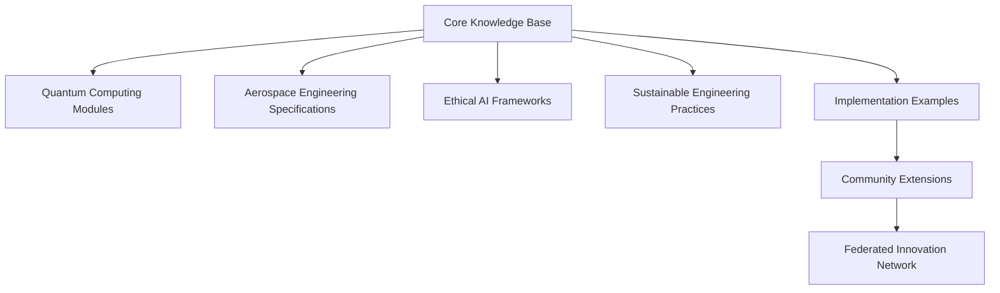
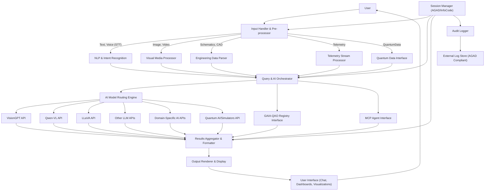
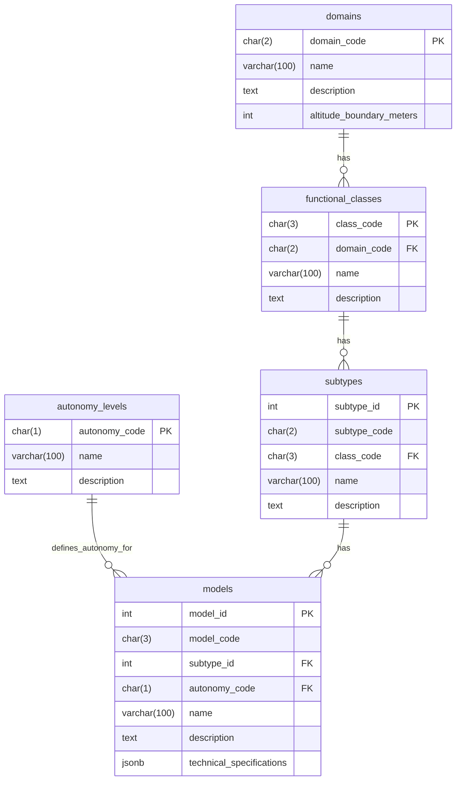
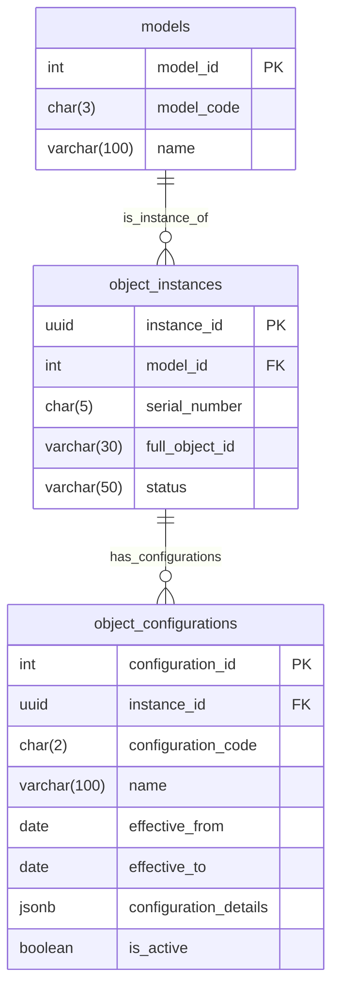
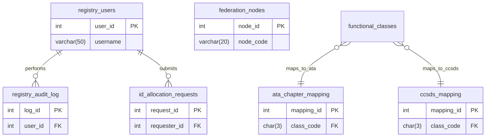

# GAIA-QAO Aerospace General Index (AGI)
© Amedeo Pelliccia · GAIA-QAO – *Federated Quantum Aerospace Intelligence*

## Part 0: Framework Overview
    0.1 Vision Statement
    0.2 Documentation Architecture
    0.3 Key Components of the Documentation Framework
    0.4 Governance Model for the Open Source Project
    0.5 High-Level Implementation Strategy
    0.6 Envisioned Potential Impact

## Part I: Object Identification System
    1.1 System Overview
    1.2 ID Structure
    1.3 Component Descriptions
        1.3.1 Domain (DO)
        1.3.2 Autonomy Level (A)
        1.3.3 Functional Classes (CCC)
        1.3.4 Sub-Types (ST)
        1.3.5 Models/Variants (MDL)
        1.3.6 Serial Numbers (SSSSS)
        1.3.7 Configuration Codes (CC) - Optional
    1.4 Database Implementation (General Overview)
    1.5 ID Formation Process
    1.6 Registry Management
        1.6.1 ID Allocation Process
        1.6.2 Federation Model
        1.6.3 Standards Integration
        1.6.4 Support for Quantum-Enhanced Systems

## Part II: Model Code Registry
    2.1 Model Code Structure and Naming Convention
    2.2 Air Systems (AS) Models
        2.2.1 Passenger Transport (PAX) Models
        2.2.2 Cargo Transport (CGO) Models
        2.2.3 Intelligence, Surveillance, Reconnaissance (ISR) Models
        2.2.4 Scientific Research (SCI) Models
        2.2.5 Utility (UTL) Models
        2.2.6 Recreational & Sport (REC) Models
        2.2.7 Experimental (XPR) Models
        2.2.8 Lighter Than Air (LTA) Models
        2.2.9 Military Aircraft (MIL) Models
    2.3 Space Systems (SP) Models
        2.3.1 Satellite (SAT) Models
        2.3.2 Orbital Platform/Vehicle (ORB) Models
        2.3.3 Launch System (LCH) Models
        2.3.4 Probe (PRB) Models
        2.3.5 Experimental (Space) (XPS) Models
        2.3.6 Space Defense (DEF) Models
    2.4 Implementation Guidelines (Models)

## Part III: Configuration Management
    3.1 Configuration Code Structure
    3.2 Standard Configuration Types
    3.3 Domain-Specific Configuration Types
        3.3.1 Air Systems (AS) Specific Configuration Types
        3.3.2 Space Systems (SP) Specific Configuration Types
    3.4 Configuration Management in Registry
        3.4.1 Configuration Evolution Examples
        3.4.2 Configuration Code Allocation Guidelines

## Part IV: Database Schema
    4.1 Core ID Component Tables
        4.1.1 domains
        4.1.2 autonomy_levels
        4.1.3 functional_classes
        4.1.4 subtypes
        4.1.5 models
    4.2 Object Instances and Configurations Tables
        4.2.1 object_instances
        4.2.2 object_configurations
    4.3 Registry Management Tables
        4.3.1 registry_users
        4.3.2 registry_audit_log
        4.3.3 id_allocation_requests
    4.4 Integration and Reference Tables
        4.4.1 ata_chapter_mapping
        4.4.2 ccsds_mapping
        4.4.3 federation_nodes
    4.5 Views and Functions
        4.5.1 view_model_full_details
        4.5.2 view_object_instance_details
        4.5.3 generate_next_serial_number()
        4.5.4 construct_full_object_id()
        4.5.5 trigger_set_timestamp()

## Part V: Implementation Guidelines
    5.1 Database Implementation
    5.2 User Interface (Recommendations for GAIA-QAO Registry)
    5.3 Documentation (Meta-Documentation for GAIA-QAO System)
    5.4 Next Steps (for GAIA-QAO System Implementation)

## Appendices
    Appendix A: Complete Sub-Type Code Tables
        A.1 Air Systems (AS) Sub-Types
            A.1.1 Passenger Transport (PAX) Sub-Types
            A.1.2 Cargo Transport (CGO) Sub-Types
            A.1.3 Intelligence, Surveillance, Reconnaissance (ISR) Sub-Types
            A.1.4 Scientific Research (SCI) Sub-Types
            A.1.5 Utility (UTL) Sub-Types
            A.1.6 Recreational & Sport (REC) Sub-Types
            A.1.7 Experimental (Air) (XPR) Sub-Types
            A.1.8 Lighter Than Air (LTA) Sub-Types
            A.1.9 Military Aircraft (MIL) Sub-Types
        A.2 Space Systems (SP) Sub-Types
            A.2.1 Satellite (SAT) Sub-Types
            A.2.2 Orbital Platform/Vehicle (ORB) Sub-Types
            A.2.3 Launch System (LCH) Sub-Types
            A.2.4 Probe (PRB) Sub-Types
            A.2.5 Experimental (Space) (XPS) Sub-Types
            A.2.6 Space Defense (DEF) Sub-Types
    Appendix B: ID Examples
    Appendix C: Database Schema Diagrams
        C.1 Core ID Component Tables and Relationships
        C.2 Object Instances and Configurations
        C.3 Registry Management and Integration Tables (Simplified)
        C.4 Overall Database Schema Overview (Simplified)

---
**Document Metadata Footer (Conceptual for Master Document)**

**Status**: Iterative Draft
**Master Document InfoCode**: QAO-DOC-MASTER-001
**Version**: (Reflects current state of GAIA-QAO documentation without GAIA-Q-UI spec integrated)
**Compliance Scope**: GAIA-QAO v1.2, AGAD (principles), COAFI (alignment)
**Keywords**: `[GAIA-QAO][Object ID][Quantum Aerospace][Open Source][Documentation Framework][AGI][Registry][Database Schema][Configuration Management]`

---
© Amedeo Pelliccia · GAIA-QAO – *Federated Quantum Aerospace Intelligence*

> "Knowledge shared is future engineered."
> 
# GAIA-QAO Aerospace Documentation

> **GENERAL DISCLAIMER:**
> This master document and all its parts represent an AI-generated proposal for the GAIA-Q & AMPEL framework and the GAIA-QAO object identification system. It has not been validated through implementation in aerospace systems nor by aerospace certification bodies. The concepts are based on current industry trends, open source, quantum computing, and federated aerospace engineering, as well as on the information provided.

---

## Part 0: Framework Overview

This part describes the overall vision, principles, documentation architecture, and governance of the GAIA-Q & AMPEL project.

### 0.1 Vision Statement

✨ ***I HAVE A DREAM:***

**GAIA-Q & AMPEL**
#### Open Source Quantum Aerospace Framework
**Science Research · Software · Hardware · Material Aerospace Solutions**

> *A new paradigm where quantum-enhanced intelligence, ethical autonomy, and sustainable engineering converge to define the aerospace systems of tomorrow.*

### 0.2 Guiding Principles & Philosophy

The GAIA-Q & AMPEL project is founded on the following principles:

*   **🇪🇸 Producimos documentación técnica open source para inspirar los diseños de hoy y de mañana.**
    **Ingeniería con propósito. Conocimiento compartido. Innovación federada.**

*   **🇬🇧 We produce open-source technical documentation to inspire the designs of today and tomorrow.**
    **Engineering with purpose. Shared knowledge. Federated innovation.**

> "Knowledge shared is future engineered." – Amedeo Pelliccia

### 0.3 Documentation Architecture

The architecture of the technical documentation within the GAIA-Q & AMPEL framework is conceived as an interconnected network of knowledge modules:



### 0.4 Key Components of the Documentation Framework

The key components underpinning this documentation architecture are:

1.  **Multilingual Knowledge Base:**
    *   Documentation in English and Spanish (initially), with a roadmap to include other languages.
    *   Standardization of aerospace terminology with mapping to ISO/COAFI.
    *   Cultural context integration for broader usability.

2.  **Federated Documentation Structure:**
    *   Distributed contributions with centralized quality assurance (QA) oversight.
    *   Git-based version control, aligned with InfoCode and COAFI.
    *   Contributor recognition: badges, credits, citation-level metadata.

3.  **Implementation Repository:**
    *   Open reference designs (aircraft systems, quantum circuits).
    *   Simulated environments for digital twin validation.
    *   Demonstrator kits with hardware, software, and material integration.

### 0.5 Governance Model for the Open Source Project

The project's governance model is established to ensure transparency, quality, and participation:

1.  **Technical Oversight Committee:**
    *   Diverse expertise: quantum, aerospace, ethics, sustainability.
    *   Transparent Request for Comments (RFC) lifecycle.
    *   Publicly tracked roadmap and release cycles.

2.  **Contribution Pathways:**
    *   Contributor onboarding process with defined roles (document writer, subject matter expert (SME), reviewer, translator).
    *   Mentorship for young engineers and students.
    *   Recognition through COAFI-traceable InfoCode authorship.

3.  **Quality Assurance Framework:**
    *   Peer-review validation loops.
    *   Compliance with standards (ATA, S1000D, ISO/IEEE, QAO).
    *   Security audits for sensitive subsystems.

### 0.6 High-Level Implementation Strategy

The implementation strategy is divided into progressive phases:

#### Phase 1: *Foundation*
*   Define a COAFI-compatible file naming and metadata structure.
*   Publish initial GAIA-QAO templates in Markdown/DocBook/S1000D.
*   Launch the documentation portal with a Git-based backend.

#### Phase 2: *Community Development*
*   Recruit contributors from academia and the open hardware community.
*   Establish mentorship circles and working groups.
*   Release alpha documentation sets (AMP●EL, ATA 29, QAOA modules).

#### Phase 3: *Federation Implementation*
*   Formalize federated teams (Q-Air, Q-Space, Q-GreenTech, etc.).
*   Launch collaboration protocols (AMP●EL Interop, MCP Sync).
*   Create mirror repositories for resilience and inter-agency continuity.

#### Phase 4: *Acceleration*
*   Publish industrial application guides (MEAs, digital twins, Q-routing).
*   Enable certification-friendly formats (BREX-lite, MCDB export).
*   Organize open competitions on sustainability and autonomy challenges.

### 0.7 Envisioned Potential Impact

The GAIA-Q & AMPEL project aims to generate significant impact in the following areas:

1.  **Democratized Aerospace Innovation:**
    *   Lower entry barriers for engineers worldwide.
    *   Facilitate modular learning through Documentation as a Platform (DaaP).
    *   Bridge research and industry gaps through quantum-ready documentation.

2.  **Standardized Ethical Frameworks:**
    *   Establish transparent audit trails and AI behavior explainability.
    *   Encourage the fair deployment of autonomy in aviation and space.
    *   Enable cross-cultural and interdisciplinary trust frameworks.

3.  **Sustainable Engineering Practices:**
    *   Provide shared tools for life-cycle impact modeling.
    *   Establish open benchmarks for propulsion, material, and energy impact.
    *   Foster cooperative co-design of low-emission aerospace solutions.

---
## Part I: Object Identification System

This part details the GAIA-QAO Object Identification System (GQOIS), a comprehensive and hierarchical framework for identifying, categorizing, and tracking aerospace objects.

### 1.1 System Overview

The GAIA-QAO Object Identification System (GQOIS) is a comprehensive, hierarchical identification framework designed for aerospace objects operating in both atmospheric and space domains. It provides a standardized method for uniquely identifying, categorizing, and tracking aerospace objects throughout their entire lifecycle.

The system addresses several critical needs in the aerospace industry:

-   **Unified Identification**: Creates a single, coherent identification system spanning traditional aviation, emerging air mobility concepts, and space systems.
-   **Quantum Integration**: Specifically accommodates quantum-enhanced aerospace technologies.
-   **Standards Compatibility**: Aligns with existing aerospace standards (ATA, CCSDS, etc.) while extending beyond their limitations.
-   **Lifecycle Management**: Supports object identification from design through decommissioning.
-   **Configuration Tracking**: Enables tracking of different configurations and modifications.
-   **Registry Management**: Provides a framework for a centralized registry with federated nodes.

### 1.2 ID Structure

The GQOIS uses a hierarchical structure that encodes multiple levels of information about an aerospace object. The complete ID format is:

```plaintext
DO-A-CCC-ST-MDL-SSSSS[-CC]
```

Where:

| **Component**        | **Length** | **Description**                 | **Example**                |
| :------------------- | :--------- | :------------------------------ | :------------------------- |
| DO                   | 2 chars    | Domain                          | AS (Air System)            |
| A                    | 1 char     | Autonomy Level                  | M (Manned/Semi-Autonomous) |
| CCC                  | 3 chars    | Functional Class                | PAX (Passenger Transport)  |
| ST                   | 2 chars    | Sub-Type                        | BW (Blended Wing Body)     |
| MDL                  | 3 chars    | Model/Variant                   | Q1H (AMPEL360 BWB-Q100)    |
| SSSSS                | 5 chars    | Serial Number                   | 00001                      |
| CC                   | 2 chars    | Configuration Code (optional)   | A1 (Initial Configuration) |

#### Example Complete ID

```plaintext
AS-M-PAX-BW-Q1H-00001
```

This identifies:

-   An Air System (AS)
-   That is Manned/Semi-Autonomous (M)
-   In the Passenger Transport class (PAX)
-   Of the Blended Wing Body sub-type (BW)
-   Model AMPEL360 BWB-Q100 (Q1H)
-   Serial number 00001

### 1.3 Component Descriptions

#### 1.3.1 Domain (DO)

Domains represent the primary operational environment of the aerospace object.

| **Domain Code** | **Name**       | **Description**                                         | **Boundary**                 |
| :-------------- | :------------- | :------------------------------------------------------ | :--------------------------- |
| AS              | Air System     | Systems operating primarily in Earth's atmosphere       | Below 30,000 meters          |
| SP              | Space System   | Systems operating primarily in space                    | Above 30,000 meters          |

#### 1.3.2 Autonomy Level (A)

Autonomy levels indicate the degree of human involvement in the system's operation. The autonomy level is inherently associated with the `Model (MDL)`.

| **Autonomy Code** | **Name**                      | **Description**                                                                      |
| :---------------- | :---------------------------- | :----------------------------------------------------------------------------------- |
| M                 | Manned/Semi-Autonomous        | Systems designed for human operation or with human oversight (require crew if transporting humans). |
| U                 | Unmanned/Fully Autonomous     | Systems designed for fully autonomous operation without human presence.              |

#### 1.3.3 Functional Classes (CCC)

Functional classes categorize objects by their primary purpose or function. The system defines functional classes across the two domains:

**Air Systems (AS) Functional Classes:**

| **Class Code** | **Name**                                   | **Description**                                                                      |
| :------------- | :----------------------------------------- | :----------------------------------------------------------------------------------- |
| PAX            | Passenger Transport                        | Aircraft designed primarily for passenger transportation.                            |
| CGO            | Cargo Transport                            | Aircraft designed primarily for cargo transportation.                                |
| ISR            | Intelligence, Surveillance, Reconnaissance | Aircraft for intelligence gathering, surveillance, and reconnaissance.               |
| SCI            | Scientific Research                        | Aircraft designed for scientific research and data collection.                       |
| UTL            | Utility                                    | Aircraft for utility purposes (agriculture, firefighting, etc.).                   |
| REC            | Recreational & Sport                       | Aircraft designed for recreational and sporting activities.                          |
| XPR            | Experimental                               | Experimental aircraft and technology demonstrators.                                  |
| LTA            | Lighter Than Air                           | Lighter-than-air vehicles, including dirigibles and platforms.                     |
| MIL            | Military Aircraft                          | Aircraft designed for military applications and combat operations.                 |

**Space Systems (SP) Functional Classes:**

| **Class Code** | **Name**                       | **Description**                                                                      |
| :------------- | :----------------------------- | :----------------------------------------------------------------------------------- |
| LCH            | Launch System                  | Systems designed to launch payloads into space.                                    |
| SAT            | Satellite                      | Orbital systems for various missions without human presence.                         |
| ORB            | Orbital Platform/Vehicle       | Crewed orbital systems, including stations and transport vehicles.                   |
| PRB            | Probe                          | Systems designed for exploration beyond Earth orbit.                               |
| XPS            | Experimental (Space)           | Experimental space systems and technology demonstrators.                             |
| DEF            | Space Defense                  | Systems designed for space defense and security applications.                        |

#### 1.3.4 Sub-Types (ST)

Sub-types further refine the classification within each functional class. Each sub-type has a unique two-character code within its functional class. The complete sub-type registry is found in Appendix A. Examples include:

-   **AS-PAX-NB**: Narrow-Body Airliner
-   **AS-PAX-BW**: Blended Wing Body Airliner
-   **SP-SAT-CO**: Communications Satellite
-   **SP-PRB-MP**: Mars Probe

#### 1.3.5 Models/Variants (MDL)

Models represent specific designs or variants within a sub-type. Each model has a three-character code and is associated with a specific Autonomy Level (A). Details and examples of models are found in Part II: Model Code Registry.

#### 1.3.6 Serial Numbers (SSSSS)

Five-character serial numbers uniquely identify individual instances of a specific model. Serial numbers are assigned sequentially within each model series.

#### 1.3.7 Configuration Codes (CC) - Optional

Two-character configuration codes track different configurations or modifications of an object throughout its lifecycle. They are optional in the object's full ID string but are maintained in the registry. Details are found in Part III: Configuration Management.

### 1.4 Database Implementation (General Overview)

The GQOIS is implemented as a relational database. Key database components include:

-   Tables for each ID component (Domains, Autonomy Levels, Functional Classes, Sub-Types, Models).
-   Tables for object instances and their configurations.
-   Tables for registry management, auditing, and ID requests.
-   Tables for integration with external standards (ATA, CCSDS).
-   Views and functions to facilitate queries and data integrity.

A detailed description of the database schema is provided in Part IV: Database Schema.

### 1.5 ID Formation Process

The formation of a GQOIS ID follows these steps:

1.  **Model (MDL) Selection**: A specific model is identified or created. This model already has an associated Autonomy Level (A), a Sub-Type (ST), which in turn belongs to a Functional Class (CCC), which is within a Domain (DO).
    *   Example: Model `Q1H` (AMPEL360 BWB-Q100) is selected.
        *   This `Q1H` model is defined with `autonomy_code = 'M'`.
        *   It belongs to sub-type `BW` (Blended Wing Body).
        *   Sub-type `BW` is in functional class `PAX` (Passenger Transport).
        *   Class `PAX` belongs to domain `AS` (Air System).

2.  **Serial Number (SSSSS) Assignment**: A unique serial number is assigned for the specific instance of that model.
    *   Example: First instance → `00001`.

3.  **Base ID Construction**: The components are assembled:
    *   `DO` (from model) → `AS`
    *   `A` (from model) → `M`
    *   `CCC` (from model) → `PAX`
    *   `ST` (from model) → `BW`
    *   `MDL` → `Q1H`
    *   `SSSSS` → `00001`
    *   Resulting ID: `AS-M-PAX-BW-Q1H-00001`

4.  **Configuration Tracking (CC) - Optional**: If applicable, a configuration code is added.
    *   Example: Initial configuration → `A1`.
    *   ID with configuration: `AS-M-PAX-BW-Q1H-00001-A1` (this full ID with CC would be used for specific configuration references, while the base ID identifies the physical instance).

### 1.6 Registry Management

The GQOIS registry is managed through a centralized system with potential for distributed nodes:

#### 1.6.1 ID Allocation Process
1.  **Request for New Model/Instances**: Organizations submit requests for the allocation of new model codes (if they do not exist) or for the assignment of serial number blocks for existing models.
2.  **Validation**: Registry administrators validate the request against standards and availability.
3.  **Approval and Assignment**: Approved requests result in the assignment of model codes and/or serial numbers.
4.  **Registration**: New models and instances are registered in the central database.
5.  **Synchronization**: Information is synchronized across federated nodes, if implemented.

#### 1.6.2 Federation Model
The registry operates on a federation model with:
-   **Primary Node**: Central authority for ID allocation and standards maintenance.
-   **Federated Nodes**: Distributed nodes for specific domains or organizations (future potential).
-   **Synchronization Protocol**: Envisioned to be Git-based for version control and distribution.
-   **Conflict Resolution**: Mechanisms to resolve conflicts in distributed updates.

#### 1.6.3 Standards Integration
The GQOIS integrates or maps with existing aerospace standards:
-   **Air Systems Standards**: Mapping with ATA chapters (see `ata_chapter_mapping` table). Compatibility with S1000D and alignment with ARINC.
-   **Space Systems Standards**: Mapping with CCSDS object types (see `ccsds_mapping` table). Alignment with ISO 24113 (space debris mitigation) and COSPAR (planetary protection).

#### 1.6.4 Support for Quantum-Enhanced Systems
A key feature of the GQOIS is its explicit support for quantum-enhanced aerospace systems:
-   **Quantum Sub-Types and Models**: Definition of specific sub-types and models for quantum technologies (e.g., `PAX-QP`, `SAT-QS`). See Part II.
-   **Quantum Technology Tracking**: The system allows tracking (via `models.technical_specifications` and `object_configurations.configuration_details`) of specific quantum technologies implemented.

---

## Part II: Model Code Registry

This part details the structure and registry of Model Codes (MDL) within the GAIA-QAO system, providing a standardized naming convention and example models for air and space systems.

### 2.1 Model Code Structure and Naming Convention

Each Model (MDL) code in the GAIA-QAO system follows a standardized 3-character format:

```plaintext
[G][N][V]
```

Where:

-   **G** (Generation/Series): A letter indicating the generation or technology series.
    -   `Q`: Quantum-enhanced systems (GAIA-QAO primary focus).
    -   `A`: Advanced conventional systems.
    -   `P`: Prototype/Experimental systems.
    -   `S`: Standard production systems.

-   **N** (Number/Size): A number indicating the relative size, capacity, or capability.
    -   `1`: Small/Light.
    -   `2`: Medium.
    -   `3`: Large/Heavy.
    -   `4`: Extra Large/Super Heavy.

-   **V** (Variant): A letter indicating the specific variant or version.
    -   `A, B, C, etc.`: Sequential variants.
    -   `H`: High-performance variant.
    -   `L`: Long-range variant.
    -   `S`: Special purpose variant.

Each Model (MDL) is also inherently associated with an **Autonomy Level (A)**, which is defined in the `models` table of the database (see Part IV) and forms part of the object's full ID.

### 2.2 Air Systems (AS) Models

The following tables provide representative examples of models for various functional classes and sub-types within Air Systems (AS). Each model includes its MDL code, name, description, and key specifications. The Autonomy Level (M/U) is specified when defining the model in the database.

#### 2.2.1 Passenger Transport (PAX) Models

| **Sub-Type (ST)** | **MDL Code** | **Model Name**          | **Description**                             | **Key Specifications**                  |
| :---------------- | :----------- | :---------------------- | :------------------------------------------ | :-------------------------------------- |
| NB                | Q2A          | QuantumNarrow QN-200    | Medium quantum-enhanced narrow-body         | Capacity: 180 pax, Range: 5,500 km      |
| NB                | A2B          | AeroSingle AS-220       | Medium conventional narrow-body             | Capacity: 220 pax, Range: 5,000 km      |
| WB                | Q3L          | QuantumWide QW-350L     | Large long-range quantum wide-body          | Capacity: 350 pax, Range: 15,000 km     |
| WB                | A3B          | AeroTwin AT-330         | Large conventional wide-body                | Capacity: 330 pax, Range: 12,000 km     |
| RJ                | Q1H          | QuantumRegional QR-90H  | Small high-performance quantum regional jet | Capacity: 90 pax, Range: 3,200 km       |
| RJ                | S1A          | RegionalJet RJ-75       | Small standard regional jet                 | Capacity: 75 pax, Range: 2,800 km       |
| BJ                | Q1S          | QuantumExec QE-12S      | Special purpose quantum business jet        | Capacity: 12 pax, Range: 7,500 km       |
| BJ                | A1L          | AeroExec AE-15L         | Long-range conventional business jet        | Capacity: 15 pax, Range: 7,000 km       |
| VT                | Q1A          | QuantumLift QL-6A       | Small quantum-enhanced eVTOL air taxi       | Capacity: 6 pax, Range: 300 km          |
| VT                | A1B          | AeroVert AV-4B          | Small conventional eVTOL air taxi           | Capacity: 4 pax, Range: 150 km          |
| BW                | Q1H          | AMPEL360 BWB-Q100       | Small quantum-enhanced BWB passenger aircraft | Cap: 100 pax, Range: 5,500 km, Quantum: Nav, Opt, Comms |
| BW                | Q2A          | AMPEL360 BWB-Q250       | Medium quantum-enhanced BWB passenger aircraft| Cap: 250 pax, Range: 8,000 km, Quantum: Nav, Opt, Comms, Ctrl |
| BW                | P1B          | BWB-X Demonstrator      | Small BWB technology demonstrator           | Cap: 40 pax (equiv), Range: 3,000 km    |
| SS                | Q2B          | QuantumSonic QS-150     | Medium quantum-enhanced supersonic airliner | Capacity: 150 pax, Speed: Mach 2.2      |
| HS                | P2A          | HyperTransport HT-100   | Medium hypersonic transport demonstrator    | Capacity: 100 pax, Speed: Mach 5+       |
| QP                | Q3L          | QuantumJet Q-350L       | Large long-range quantum-powered airliner   | Capacity: 350 pax, Range: 14,000 km     |

#### 2.2.2 Cargo Transport (CGO) Models

| **Sub-Type (ST)** | **MDL Code** | **Model Name**          | **Description**                             | **Key Specifications**                 |
| :---------------- | :----------- | :---------------------- | :------------------------------------------ | :------------------------------------- |
| LC                | Q1A          | QuantumFreight QF-5     | Small quantum-enhanced light cargo          | Payload: 5 tonnes, Range: 2,000 km     |
| MC                | Q2B          | QuantumFreight QF-20    | Medium quantum-enhanced cargo               | Payload: 20 tonnes, Range: 5,000 km    |
| HC                | Q3L          | QuantumFreight QF-80L   | Large long-range quantum cargo              | Payload: 80 tonnes, Range: 10,000 km   |
| FC                | A2A          | AeroConvert AC-30       | Medium passenger-to-cargo conversion        | Payload: 30 tonnes, Range: 6,000 km    |
| QD                | Q1H          | QuantumExpress QE-8H    | Small high-speed quantum delivery           | Payload: 8 tonnes, Range: 3,500 km     |
| VC                | Q1A          | QuantumLift QL-3C       | Small quantum VTOL cargo                    | Payload: 3 tonnes, Range: 500 km       |
| UC                | Q2S          | QuantumDrone QD-15S     | Medium special purpose unmanned quantum cargo | Payload: 15 tonnes, Range: 4,000 km    |
| QC                | Q3H          | QuantumCargo QC-100H    | Large high-capacity quantum cargo           | Payload: 100 tonnes, Range: 9,000 km   |

#### 2.2.3 Intelligence, Surveillance, Reconnaissance (ISR) Models

| **Sub-Type (ST)** | **MDL Code** | **Model Name**           | **Description**                               | **Key Specifications**                   |
| :---------------- | :----------- | :----------------------- | :-------------------------------------------- | :--------------------------------------- |
| UA                | Q2L          | QuantumHawk QH-20L       | Medium long-endurance quantum UAS             | Endurance: 48 hrs, Ceiling: 15,000 m     |
| MA                | Q3H          | QuantumMaritime QM-300   | Large high-performance quantum maritime patrol| Endurance: 24 hrs, Range: 9,000 km       |
| SR                | Q2S          | QuantumRecon QR-200S     | Medium special purpose strategic recon        | Ceiling: 25,000 m, Speed: Mach 3         |
| TR                | Q1A          | QuantumTactical QT-100   | Small quantum tactical recon                  | Endurance: 12 hrs, Ceiling: 12,000 m     |
| EW                | Q2H          | QuantumSpectrum QS-200   | Medium high-capability electronic warfare     | Range: 6,000 km, Advanced EW suite       |
| SI                | Q2B          | QuantumSignal QS-250     | Medium SIGINT platform                        | Endurance: 18 hrs, Comprehensive SIGINT  |
| IM                | Q2A          | QuantumImage QI-200      | Medium imaging platform                       | Resolution: 5 cm from 15,000 m           |
| MS                | Q3S          | QuantumSensor QS-350     | Large multi-sensor platform                   | 12+ integrated quantum sensor systems    |
| QI                | Q3H          | QuantumEye QE-350H       | Large high-altitude, high-performance quantum ISR | Endurance: 48+ hrs, Ceiling: 22,000 m    |

#### 2.2.4 Scientific Research (SCI) Models

| **Sub-Type (ST)** | **MDL Code** | **Model Name**           | **Description**                                  | **Key Specifications**                         |
| :---------------- | :----------- | :----------------------- | :----------------------------------------------- | :--------------------------------------------- |
| AT                | Q2A          | QuantumAtmos QA-200      | Medium quantum atmospheric research aircraft     | Ceiling: 20,000 m, 30+ atm. sensors          |
| OC                | Q2B          | QuantumOcean QO-200      | Medium quantum oceanographic research aircraft   | Endurance: 18 hrs, Advanced ocean sensors      |
| ER                | Q2H          | QuantumEarth QE-250      | Medium high-performance quantum Earth sensing    | Resolution: 10 cm, 15+ spectral bands        |
| WX                | Q2S          | QuantumStorm QS-200      | Medium special purpose quantum weather research  | Ceiling: 18,000 m, Storm penetration capability|
| CR                | Q3L          | QuantumClimate QC-300    | Large long-range quantum climate research        | Range: 12,000 km, Comprehensive climate sensors|
| GS                | Q2A          | QuantumGeo QG-200        | Medium quantum geophysical survey aircraft       | Endurance: 14 hrs, Advanced geophysical sensors|
| MP                | Q3S          | QuantumScience QS-300    | Large special purpose quantum multi-research     | Modular sensor bay, 50+ possible configurations|
| QS                | Q2H          | QuantumSense QS-250H     | Medium high-performance quantum sensing platform | 20+ quantum sensors, Unprecedented sensitivity |

#### 2.2.5 Utility (UTL) Models

| **Sub-Type (ST)** | **MDL Code** | **Model Name**            | **Description**                                | **Key Specifications**                        |
| :---------------- | :----------- | :------------------------ | :--------------------------------------------- | :-------------------------------------------- |
| FF                | Q2A          | QuantumFire QF-200        | Medium quantum-enhanced firefighting aircraft  | Water capacity: 12,000 L, Precision delivery  |
| AG                | Q1B          | QuantumCrop QC-100        | Small quantum agricultural aircraft            | Spray width: 25 m, Capacity: 2,000 L          |
| SR                | Q2H          | QuantumRescue QR-200H     | Medium high-performance quantum SAR aircraft   | Range: 2,000 km, Advanced sensing suite       |
| ME                | Q2S          | QuantumMedic QM-200S      | Medium special purpose quantum medical aircraft| Patient capacity: 12, Advanced life support   |
| PL                | Q1A          | QuantumInspect QI-100     | Small quantum infrastructure inspection UAS    | Endurance: 10 hrs, Precision sensors          |
| SU                | Q2B          | QuantumSurvey QS-200      | Medium quantum survey aircraft                 | Mapping rate: 500 km²/hr, 0.5 cm resolution   |
| CP                | Q2L          | QuantumProtect QP-200L    | Medium long-range quantum civil protection     | Range: 5,000 km, Multi-mission capability     |
| QU                | Q3H          | QuantumUtility QU-300H    | Large high-capability quantum utility aircraft | Modular systems, 20+ configurations         |

#### 2.2.6 Recreational & Sport (REC) Models

| **Sub-Type (ST)** | **MDL Code** | **Model Name**             | **Description**                               | **Key Specifications**                     |
| :---------------- | :----------- | :------------------------- | :-------------------------------------------- | :----------------------------------------- |
| GL                | Q1A          | QuantumGlide QG-100        | Small quantum-enhanced glider                 | Glide ratio: 70:1, Span: 18 m              |
| MG                | Q1B          | QuantumSoar QS-100         | Small quantum motor glider                    | Range: 1,500 km, Glide ratio: 40:1         |
| UL                | Q1A          | QuantumLight QL-100        | Small quantum ultralight                      | MTOW: 450 kg, Range: 800 km                |
| AC                | Q1H          | QuantumAero QA-100H        | Small high-performance quantum aerobatic      | Roll rate: 420°/sec, G-limits: +/-12G      |
| LS                | Q1B          | QuantumSport QS-100        | Small quantum light sport aircraft            | MTOW: 600 kg, Range: 1,200 km              |
| HB                | A1A          | AeroBuilder AB-100         | Small conventional homebuilt                  | MTOW: 750 kg, Range: 1,000 km              |
| JW                | Q1S          | QuantumJetpack QJ-100S     | Special purpose quantum jetpack               | Flight time: 45 min, Range: 80 km          |
| QR                | Q1H          | QuantumLeisure QL-100H     | Small high-performance quantum recreational   | MTOW: 650 kg, Range: 1,500 km              |

#### 2.2.7 Experimental (XPR) Models

| **Sub-Type (ST)** | **MDL Code** | **Model Name**          | **Description**                             | **Key Specifications**                       |
| :---------------- | :----------- | :---------------------- | :------------------------------------------ | :------------------------------------------- |
| TD                | P2A          | TechDemo TD-200         | Medium technology demonstrator              | MTOW: 12,000 kg, Modular test systems        |
| HP                | P2H          | PerformX PX-200H        | Medium high-performance experimental        | Speed: Mach 3.5, Ceiling: 30,000 m           |
| NP                | P2S          | PropulsionX PX-200S     | Medium special purpose propulsion testbed   | 5 swappable propulsion systems               |
| NS                | P2B          | StructureX SX-200       | Medium novel structure testbed              | Morphing wing, Active aeroelastics           |
| VT                | P1A          | VTOLX VX-100            | Small VTOL experimental                     | 8 different lift system configurations       |
| HY                | P2B          | HybridX HX-200          | Medium hybrid concept demonstrator          | Electric-hydrogen-quantum hybrid             |
| AT                | P2A          | AutonomyX AX-200        | Medium autonomous testbed                   | Full autonomous capability, AI testbed       |
| QT                | P3S          | QuantumX QX-300S        | Large special purpose quantum testbed       | Comprehensive quantum technology suite       |
| HH                | P2A          | HyperX HX-200           | Medium hypersonic demonstrator              | Speed: Mach 6+, Scramjet propulsion          |

#### 2.2.8 Lighter Than Air (LTA) Models

| **Sub-Type (ST)** | **MDL Code** | **Model Name**            | **Description**                                  | **Key Specifications**                         |
| :---------------- | :----------- | :------------------------ | :----------------------------------------------- | :--------------------------------------------- |
| AB                | Q2A          | QuantumBlimp QB-200       | Medium quantum-enhanced blimp                    | Volume: 150,000 m³, Payload: 20,000 kg         |
| AR                | Q3B          | QuantumZeppelin QZ-300    | Large rigid airship                              | Volume: 300,000 m³, Payload: 50,000 kg         |
| HA                | Q2L          | QuantumStrato QS-200L     | Medium long-endurance stratospheric platform     | Altitude: 20,000 m, Endurance: 180 days        |
| SB                | Q2S          | QuantumBalloon QB-200S    | Medium special purpose scientific balloon        | Altitude: 35,000 m, Payload: 2,000 kg          |
| HB                | Q2A          | QuantumHybrid QH-200      | Medium hybrid lift airship                       | Volume: 200,000 m³, Payload: 30,000 kg         |
| CB                | Q3H          | QuantumAirCargo QA-300H   | Large high-capacity cargo airship                | Payload: 100,000 kg, Range: 10,000 km          |
| QB                | Q2H          | QuantumLift QL-250H       | Medium high-performance quantum buoyancy craft   | Volume: 250,000 m³, Quantum buoyancy control   |

#### 2.2.9 Military Aircraft (MIL) Models

| **Sub-Type (ST)** | **MDL Code** | **Model Name**            | **Description**                               | **Key Specifications**                        |
| :---------------- | :----------- | :------------------------ | :-------------------------------------------- | :-------------------------------------------- |
| FJ                | Q2S          | QuantumFighter QF-200S    | Medium special purpose quantum fighter        | Speed: Mach 2.5, Supercruise, Quantum sensors |
| BM                | Q3S          | QuantumStrike QS-300S     | Large special purpose quantum bomber          | Range: 12,000 km, Payload: 30,000 kg          |
| AT                | Q2A          | QuantumAttack QA-200      | Medium quantum attack aircraft                | Loiter: 6 hrs, Payload: 8,000 kg              |
| TR                | Q1B          | QuantumTrainer QT-100     | Small quantum trainer                         | Advanced quantum simulation, HOTAS            |
| TP                | Q3L          | QuantumTransport QT-300L  | Large long-range quantum transport            | Payload: 70,000 kg, Range: 10,000 km          |
| TK                | Q3L          | QuantumTanker QT-300L     | Large long-range quantum tanker               | Fuel capacity: 150,000 kg, Range: 11,000 km   |
| MH                | Q2A          | QuantumHelicopter QH-200  | Medium quantum military helicopter            | Payload: 5,000 kg, Range: 800 km              |
| UC                | Q2S          | QuantumCombat QC-200S     | Medium special purpose unmanned combat UCAV   | Endurance: 24 hrs, Payload: 2,500 kg          |
| QW                | Q3H          | QuantumWarfare QW-300H    | Large high-capability quantum warfare platform| Comprehensive quantum military systems        |

### 2.3 Space Systems (SP) Models

The following tables provide representative examples of models for various functional classes and sub-types within Space Systems (SP).

#### 2.3.1 Satellite (SAT) Models

| **Sub-Type (ST)** | **MDL Code** | **Model Name**           | **Description**                                  | **Key Specifications**                     |
| :---------------- | :----------- | :----------------------- | :----------------------------------------------- | :----------------------------------------- |
| CO                | Q2A          | QuantumComSat QC-200     | Medium quantum communications satellite          | Mass: 350 kg, Global QKD coverage          |
| NV                | Q2B          | QuantumNav QN-200        | Medium quantum navigation satellite              | Mass: 400 kg, 1 cm positioning accuracy    |
| EO                | Q2H          | QuantumEarth QE-200H     | Medium high-performance quantum Earth observation| Mass: 600 kg, Resolution: 0.15 m           |
| SC                | Q2S          | QuantumScience QS-200S   | Medium special purpose scientific satellite      | Mass: 500 kg, 15+ scientific instruments   |
| CU                | Q1A          | QuantumCube QC-100       | Small quantum CubeSat                            | Mass: 12 kg (12U), Quantum payload         |
| WX                | Q2B          | QuantumWeather QW-200    | Medium weather satellite                         | Mass: 3,200 kg, Advanced weather sensors   |
| RS                | Q2A          | QuantumRelay QR-200      | Medium quantum relay satellite                   | Mass: 350 kg, Quantum repeater network     |
| QS                | Q3H          | QuantumSat QS-300H       | Large high-performance quantum satellite         | Mass: 800 kg, Orbital quantum computer     |

#### 2.3.2 Orbital Platform/Vehicle (ORB) Models

| **Sub-Type (ST)** | **MDL Code** | **Model Name**           | **Description**                                      | **Key Specifications**                        |
| :---------------- | :----------- | :----------------------- | :--------------------------------------------------- | :-------------------------------------------- |
| SS                | Q3A          | QuantumStation QS-300    | Large quantum space station                          | Mass: 80,000 kg, Crew: 6-12, Vol: 800 m³      |
| SL                | Q2S          | QuantumLab QL-200S       | Medium special purpose space laboratory              | Mass: 20,000 kg, 20+ research facilities      |
| CT                | Q2A          | QuantumCrew QC-200       | Medium quantum crew transport vehicle                | Mass: 16,000 kg, Crew: 4-6                    |
| SM                | Q2B          | QuantumService QS-200    | Medium service module                                | Mass: 12,000 kg, 1-year autonomous operation  |
| RM                | Q2S          | QuantumResearch QR-200S  | Medium special purpose research module               | Mass: 15,000 kg, Quantum research suite       |
| HM                | Q2A          | QuantumHabitat QH-200    | Medium habitation module                             | Mass: 22,000 kg, Crew: 4, Volume: 200 m³      |
| SV                | Q2A          | QuantumServicing QS-200  | Medium servicing vehicle                             | Mass: 8,000 kg, 5-year service life           |
| QO                | Q3S          | QuantumOrbit QO-300S     | Large special purpose quantum orbital platform       | Mass: 30,000 kg, Comprehensive quantum facility|

#### 2.3.3 Launch System (LCH) Models

| **Sub-Type (ST)** | **MDL Code** | **Model Name**           | **Description**                                  | **Key Specifications**                       |
| :---------------- | :----------- | :----------------------- | :----------------------------------------------- | :------------------------------------------- |
| SL                | Q1A          | QuantumLaunch QL-100     | Small quantum-enhanced launch vehicle            | Payload to LEO: 2,000 kg, Height: 30 m       |
| ML                | Q2B          | QuantumLaunch QL-200     | Medium quantum-enhanced launch vehicle           | Payload to LEO: 8,000 kg, Height: 50 m       |
| HL                | Q3H          | QuantumLaunch QL-300H    | Heavy quantum-enhanced launch vehicle            | Payload to LEO: 25,000 kg, Height: 70 m      |
| SH                | Q4A          | QuantumLaunch QL-400     | Super heavy quantum launch vehicle               | Payload to LEO: 100,000 kg, Height: 120 m    |
| RU                | Q2B          | QuantumReuse QR-200      | Medium quantum-enhanced reusable launch vehicle  | Payload to LEO: 7,000 kg, Reuses: 30+        |
| AL                | Q1S          | QuantumAirLaunch QA-100S | Small special purpose air-launched system        | Payload to LEO: 500 kg, Aircraft-launched    |
| QL                | Q3S          | QuantumLaunch QL-300S    | Large special purpose quantum launch vehicle     | Payload to LEO: 20,000 kg, Quantum propulsion|

#### 2.3.4 Probe (PRB) Models

| **Sub-Type (ST)** | **MDL Code** | **Model Name**           | **Description**                                      | **Key Specifications**                       |
| :---------------- | :----------- | :----------------------- | :--------------------------------------------------- | :------------------------------------------- |
| LP                | Q2A          | QuantumLunar QL-200      | Medium quantum lunar probe                           | Mass: 1,200 kg, Lunar orbit + lander         |
| MP                | Q2L          | QuantumMars QM-200L      | Medium long-duration quantum Mars probe              | Mass: 1,500 kg, Surface mission              |
| VP                | Q2B          | QuantumVenus QV-200      | Medium quantum Venus probe                           | Mass: 1,300 kg, Atmospheric + surface        |
| IP                | Q2A          | QuantumMercury QM-200    | Medium quantum inner planet probe                    | Mass: 1,100 kg, Mercury orbiter              |
| GP                | Q3S          | QuantumJupiter QJ-300S   | Large special purpose quantum gas giant probe        | Mass: 2,800 kg, Orbiter + atmospheric        |
| OP                | Q3L          | QuantumNeptune QN-300L   | Large long-range quantum outer planet probe          | Mass: 2,500 kg, Neptune system explorer      |
| AP                | Q2A          | QuantumAsteroid QA-200   | Medium quantum asteroid probe                        | Mass: 1,000 kg, Sample return capability     |
| SP                | Q2H          | QuantumSolar QS-200H     | Medium high-performance quantum solar probe          | Mass: 1,400 kg, Close solar approach         |
| QP                | Q3S          | QuantumProbe QP-300S     | Large special purpose deep space quantum probe       | Mass: 2,500 kg, Deep space quantum comms     |

#### 2.3.5 Experimental (Space) (XPS) Models

| **Sub-Type (ST)** | **MDL Code** | **Model Name**           | **Description**                                  | **Key Specifications**                      |
| :---------------- | :----------- | :----------------------- | :----------------------------------------------- | :------------------------------------------ |
| TP                | P2A          | SpaceTech ST-200         | Medium technology platform                       | Mass: 1,500 kg, 10+ tech demonstrations     |
| NP                | P2S          | PropulsionX PX-200S      | Medium special purpose propulsion testbed (space)| Mass: 2,000 kg, 5 experimental drives       |
| QT                | P2H          | QuantumX QX-200H         | Medium high-performance quantum testbed (space)  | Mass: 1,800 kg, Quantum technology suite    |
| SM                | P2A          | SpaceManufacturing SM-200| Medium in-space manufacturing demonstrator       | Mass: 2,200 kg, 3D printing, assembly       |
| SR                | P1B          | SpaceRobotics SR-100     | Small robotic testbed                            | Mass: 800 kg, Advanced manipulators         |
| SS                | P2A          | SpaceStructures SS-200   | Medium deployable structures demonstrator        | Mass: 1,600 kg, 50m deployable antenna      |
| QT                | P3S          | QuantumX QX-300S         | Large special purpose quantum testbed (space)    | Mass: 3,000 kg, Advanced quantum experiments|

#### 2.3.6 Space Defense (DEF) Models

| **Sub-Type (ST)** | **MDL Code** | **Model Name**             | **Description**                                  | **Key Specifications**                      |
| :---------------- | :----------- | :------------------------- | :----------------------------------------------- | :------------------------------------------ |
| SS                | Q2A          | QuantumSurveillance QS-200| Medium quantum space surveillance system         | Mass: 1,200 kg, Space domain awareness      |
| SM                | Q2S          | QuantumDefense QD-200S     | Medium special purpose quantum missile defense   | Mass: 1,800 kg, Tracking and intercept      |
| SC                | Q2H          | QuantumCommand QC-200H     | Medium high-performance quantum command & control| Mass: 2,000 kg, Secure quantum comms        |
| SI                | Q2B          | QuantumIntelligence QI-200 | Medium quantum space intelligence system         | Mass: 1,500 kg, Multi-spectral intelligence |
| QD                | Q3S          | QuantumDefense QD-300S     | Large special purpose quantum defense platform   | Mass: 3,000 kg, Comprehensive quantum suite |

### 2.4 Implementation Guidelines (Models)

The implementation of models in the GAIA-QAO database registry is done through the `models` table. Each entry in this table represents a unique model and must include:

-   `model_code`: The 3-character MDL code (e.g., `Q1H`).
-   `subtype_id`: The ID of the sub-type to which it belongs (FK to `subtypes` table).
-   `autonomy_code`: The Autonomy Level code (`M` or `U`) inherent to this model (FK to `autonomy_levels`).
-   `name`: Descriptive name of the model (e.g., `AMPEL360 BWB-Q100`).
-   `description`: A brief description of the model.
-   `introduction_date` (optional): Date of model introduction.
-   `technical_specifications` (JSONB): A flexible field for storing detailed technical specifications, including quantum capabilities, dimensions, performance, etc.

**Example SQL Insert (adapted to include `autonomy_code`):**
```sql
INSERT INTO models (model_code, subtype_id, autonomy_code, name, description, introduction_date, technical_specifications) VALUES
('Q1H',
  (SELECT subtype_id FROM subtypes WHERE subtype_code = 'BW' AND class_code = 'PAX'),
  'M', -- Autonomy Level for this PAX model
  'AMPEL360 BWB-Q100',
  'Small quantum-enhanced BWB passenger aircraft',
  '2025-01-01',
  '{"capacity": 100, "range_km": 5500, "cruise_speed_kmh": 850, "mtow_kg": 85000, "quantum_systems": ["navigation", "optimization", "communications"]}'
);
```
Strict guidelines must be followed for assigning new MDL codes to ensure uniqueness and consistency within the hierarchical structure.

---

## Part III: Configuration Management

This part describes the Configuration Codes (CC) used to identify specific modifications or configurations of an object throughout its lifecycle.

### 3.1 Configuration Code Structure

Each Configuration Code (CC) follows a standardized 2-character format:

```plaintext
[T][N]
```

Where:

-   **T** (Type): A letter indicating the type of configuration.
-   **N** (Number/Letter): A number or letter indicating the specific version or variant within that type.

Configuration codes are optional in the object's full ID string (`DO-A-CCC-ST-MDL-SSSSS-CC`) but are maintained and managed in the `object_configurations` table of the registry.

### 3.2 Standard Configuration Types

The following standard configuration types are proposed, applicable to most objects:

| **Type Code (T)** | **Configuration Type**   | **Description**                                                  | **Examples** |
| :---------------- | :----------------------- | :--------------------------------------------------------------- | :----------- |
| A                 | Initial/Baseline         | The initial production configuration as delivered.               | A1, A2, A3   |
| B                 | Block Upgrade            | Major planned upgrade or block improvement.                      | B1, B2, B3   |
| M                 | Minor Modification       | Minor modifications or improvements not warranting a block.      | M1, M2, M3   |
| S                 | Special Mission          | Configuration for special missions or purposes.                  | S1, S2, S3   |
| E                 | Experimental             | Experimental or test configuration.                              | E1, E2, E3   |
| R                 | Retrofit                 | Retrofit of existing systems onto an object.                     | R1, R2, R3   |
| P                 | Propulsion               | Propulsion system modification.                                  | P1, P2, P3   |
| C                 | Communications           | Communications system modification.                              | C1, C2, C3   |
| N                 | Navigation               | Navigation system modification.                                  | N1, N2, N3   |
| Q                 | Quantum                  | Quantum systems modification or upgrade.                         | Q1, Q2, Q3   |
| L                 | Life Extension           | Modifications for extending the object's operational life.       | L1, L2, L3   |
| O                 | Operator-Specific        | Configuration specific to a particular operator or user.         | O1, O2, O3   |

### 3.3 Domain-Specific Configuration Types

In addition to standard types, domain-specific types can be defined:

#### 3.3.1 Air Systems (AS) Specific Configuration Types

| **Type Code (T)** | **Configuration Type** | **Description**                                    | **Examples** |
| :---------------- | :--------------------- | :------------------------------------------------- | :----------- |
| I                 | Interior               | Interior configuration modification (cabin, cargo).  | I1, I2, I3   |
| F                 | Fuel System            | Fuel system modification.                          | F1, F2, F3   |
| W                 | Wing                   | Wing modification (winglets, profiles).            | W1, W2, W3   |
| G                 | Landing Gear           | Landing gear modification.                         | G1, G2, G3   |
| V                 | Avionics               | Avionics system upgrade.                           | V1, V2, V3   |

#### 3.3.2 Space Systems (SP) Specific Configuration Types

| **Type Code (T)** | **Configuration Type** | **Description**                                      | **Examples** |
| :---------------- | :--------------------- | :--------------------------------------------------- | :----------- |
| T                 | Thermal                | Thermal control system modification.                 | T1, T2, T3   |
| D                 | Deployment             | Deployment system modification (antennas, panels).   | D1, D2, D3   |
| H                 | Habitat                | Habitat module configuration.                        | H1, H2, H3   |
| X                 | Extended Mission       | Configuration for extended mission operations.       | X1, X2, X3   |
| Z                 | Zero-G                 | Zero-gravity specific modification.                  | Z1, Z2, Z3   |

### 3.4 Configuration Management in Registry

Configuration codes are managed in the `object_configurations` database table. Each entry in this table links a specific configuration to an `instance_id` (a particular object instance).

**Key fields of the `object_configurations` table:**
- `configuration_id` (PK)
- `instance_id` (FK to `object_instances`)
- `configuration_code` (e.g., 'A1', 'Q2')
- `name` (e.g., 'Initial Production', 'Quantum Systems Upgrade 2')
- `description`
- `effective_from` (start date of configuration effectiveness)
- `effective_to` (end date, if configuration is superseded)
- `configuration_details` (JSONB for specific configuration details)

#### Configuration Evolution Examples:

**Example 1: QuantumNarrow QN-200 Passenger Aircraft (AS-M-PAX-NB-Q2A-00001)**

| **Full Instance ID**      | **CC Code** | **Configuration Description**           |
| :------------------------ | :---------- | :------------------------------------ |
| AS-M-PAX-NB-Q2A-00001     | A1          | Initial Production                    |
| AS-M-PAX-NB-Q2A-00001     | B1          | Block 1 Upgrade (Enhanced Avionics)   |
| AS-M-PAX-NB-Q2A-00001     | I2          | Interior Mod 2 (New seat layout)      |
| AS-M-PAX-NB-Q2A-00001     | Q1          | Quantum Systems Upgrade 1 (Navigation)|
| AS-M-PAX-NB-Q2A-00001     | L1          | Life Extension Program 1              |

**Example 2: QuantumEarth QE-200H Satellite (SP-U-SAT-EO-Q2H-00005)**

| **Full Instance ID**      | **CC Code** | **Configuration Description**           |
| :------------------------ | :---------- | :------------------------------------ |
| SP-U-SAT-EO-Q2H-00005     | A1          | Initial Orbital Deployment            |
| SP-U-SAT-EO-Q2H-00005     | S1          | Special Mission 1 (Specific observation)|
| SP-U-SAT-EO-Q2H-00005     | P1          | Propulsion Mod 1 (Orbit change)       |
| SP-U-SAT-EO-Q2H-00005     | Q2          | Quantum Sensors Upgrade 2             |
| SP-U-SAT-EO-Q2H-00005     | X1          | Configuration for Extended Mission 1  |

#### Configuration Code Allocation Guidelines:

1.  **Chronological Order**: Generally, numerical codes within a type (e.g., A1, A2) should follow the chronological order of implementation.
2.  **Significance**: Use block upgrades (B-series) for significant changes affecting multiple systems.
3.  **Specificity**: Use specific type codes (P, C, N, Q, etc.) when modifications are limited to particular systems.
4.  **Documentation**: Each configuration must be thoroughly documented with effective dates and details of changes in the `configuration_details` (JSONB) field.
5.  **Traceability**: Maintain traceability between configurations (e.g., which supersedes which) to track an object's evolution.
6.  **Quantum Focus**: Use Q-series configurations to specifically track quantum technology upgrades.

---

## Part IV: Database Schema

This part details the relational database schema designed for the GAIA-QAO Object Identification System (GQOIS). It includes the definition of tables, relationships, views, and key functions.

> **Note on the Schema:** The following SQL script is designed for PostgreSQL and includes the agreed-upon change where `autonomy_code` is an attribute of the `models` table.

```sql
---
-- GAIA-QAO Object Identification System Registry
-- Database Schema Version 1.2.0 (Reflects autonomy_code in models)
-- InfoCode: QAO-SYS-DBSC-003

-- Enable UUID extension (if not already enabled)
CREATE EXTENSION IF NOT EXISTS "uuid-ossp";

-- =============================================
-- 4.1 Core ID Component Tables
-- =============================================

-- Domains (DO)
CREATE TABLE domains (
  domain_code CHAR(2) PRIMARY KEY,
  name VARCHAR(100) NOT NULL,
  description TEXT,
  altitude_boundary_meters INT,  -- For AS/SP boundary definition
  created_at TIMESTAMP WITH TIME ZONE DEFAULT CURRENT_TIMESTAMP,
  updated_at TIMESTAMP WITH TIME ZONE DEFAULT CURRENT_TIMESTAMP,
  is_active BOOLEAN DEFAULT TRUE
);

-- Autonomy Levels (A)
CREATE TABLE autonomy_levels (
  autonomy_code CHAR(1) PRIMARY KEY,
  name VARCHAR(100) NOT NULL,
  description TEXT,
  created_at TIMESTAMP WITH TIME ZONE DEFAULT CURRENT_TIMESTAMP,
  updated_at TIMESTAMP WITH TIME ZONE DEFAULT CURRENT_TIMESTAMP,
  is_active BOOLEAN DEFAULT TRUE
);

-- Functional Classes (CCC)
CREATE TABLE functional_classes (
  class_code CHAR(3) PRIMARY KEY,
  domain_code CHAR(2) NOT NULL REFERENCES domains(domain_code),
  name VARCHAR(100) NOT NULL,
  description TEXT,
  created_at TIMESTAMP WITH TIME ZONE DEFAULT CURRENT_TIMESTAMP,
  updated_at TIMESTAMP WITH TIME ZONE DEFAULT CURRENT_TIMESTAMP,
  is_active BOOLEAN DEFAULT TRUE,
  UNIQUE(domain_code, class_code)
);

-- Sub-Types (ST)
CREATE TABLE subtypes (
  subtype_id SERIAL PRIMARY KEY,
  subtype_code CHAR(2) NOT NULL,
  class_code CHAR(3) NOT NULL REFERENCES functional_classes(class_code),
  name VARCHAR(100) NOT NULL,
  description TEXT,
  created_at TIMESTAMP WITH TIME ZONE DEFAULT CURRENT_TIMESTAMP,
  updated_at TIMESTAMP WITH TIME ZONE DEFAULT CURRENT_TIMESTAMP,
  is_active BOOLEAN DEFAULT TRUE,
  UNIQUE(class_code, subtype_code)
);

-- Models/Variants (MDL)
CREATE TABLE models (
  model_id SERIAL PRIMARY KEY,
  model_code CHAR(3) NOT NULL,
  subtype_id INT NOT NULL REFERENCES subtypes(subtype_id),
  autonomy_code CHAR(1) NOT NULL REFERENCES autonomy_levels(autonomy_code), -- Autonomy is an attribute of the model
  name VARCHAR(100) NOT NULL,
  description TEXT,
  introduction_date DATE,
  end_of_production_date DATE,
  technical_specifications JSONB,  -- Flexible storage for model-specific specs
  created_at TIMESTAMP WITH TIME ZONE DEFAULT CURRENT_TIMESTAMP,
  updated_at TIMESTAMP WITH TIME ZONE DEFAULT CURRENT_TIMESTAMP,
  is_active BOOLEAN DEFAULT TRUE,
  UNIQUE(subtype_id, model_code) -- A model code should be unique within a subtype
);

-- =============================================
-- 4.2 Object Instances and Configurations
-- =============================================

-- Object Instances (Serial Numbers)
CREATE TABLE object_instances (
  instance_id UUID PRIMARY KEY DEFAULT uuid_generate_v4(),
  model_id INT NOT NULL REFERENCES models(model_id),
  serial_number CHAR(5) NOT NULL,
  full_object_id VARCHAR(30) NOT NULL UNIQUE,  -- Complete DO-A-CCC-ST-MDL-SSSSS identifier
  manufacture_date DATE,
  status VARCHAR(50) NOT NULL DEFAULT 'active',  -- e.g., active, retired, destroyed, experimental
  owner_organization VARCHAR(100),
  location_current VARCHAR(100), -- Could be more structured (e.g., coordinates, airport code, orbital elements)
  commissioning_date DATE,
  decommissioning_date DATE,
  notes TEXT,
  created_at TIMESTAMP WITH TIME ZONE DEFAULT CURRENT_TIMESTAMP,
  updated_at TIMESTAMP WITH TIME ZONE DEFAULT CURRENT_TIMESTAMP,
  UNIQUE(model_id, serial_number) -- Serial number is unique per model
);

-- Object Configurations (Optional extension for configuration variants)
CREATE TABLE object_configurations (
  configuration_id SERIAL PRIMARY KEY,
  instance_id UUID NOT NULL REFERENCES object_instances(instance_id),
  configuration_code CHAR(2) NOT NULL, -- e.g., A1, Q2, IB
  name VARCHAR(100) NOT NULL, -- e.g., "Initial Production", "Quantum Upgrade 1", "Interior Mod B"
  description TEXT,
  effective_from DATE NOT NULL,
  effective_to DATE, -- Null if currently active
  configuration_details JSONB,  -- Flexible storage for configuration specifics
  created_at TIMESTAMP WITH TIME ZONE DEFAULT CURRENT_TIMESTAMP,
  updated_at TIMESTAMP WITH TIME ZONE DEFAULT CURRENT_TIMESTAMP,
  is_active BOOLEAN DEFAULT TRUE, -- Indicates if this is the current configuration for the instance
  UNIQUE(instance_id, configuration_code, effective_from) -- Prevents duplicate config codes for the same instance at the same time
);

-- =============================================
-- 4.3 Registry Management Tables
-- =============================================

-- Users who can manage the registry
CREATE TABLE registry_users (
  user_id SERIAL PRIMARY KEY,
  username VARCHAR(50) NOT NULL UNIQUE,
  email VARCHAR(100) NOT NULL UNIQUE,
  password_hash VARCHAR(255) NOT NULL, -- Store hashed passwords
  full_name VARCHAR(100) NOT NULL,
  organization VARCHAR(100),
  role VARCHAR(50) NOT NULL,  -- e.g., admin, editor, viewer, requester
  created_at TIMESTAMP WITH TIME ZONE DEFAULT CURRENT_TIMESTAMP,
  updated_at TIMESTAMP WITH TIME ZONE DEFAULT CURRENT_TIMESTAMP,
  is_active BOOLEAN DEFAULT TRUE,
  last_login_at TIMESTAMP WITH TIME ZONE
);

-- Audit log for tracking changes to the registry
CREATE TABLE registry_audit_log (
  log_id SERIAL PRIMARY KEY,
  user_id INT REFERENCES registry_users(user_id), -- Can be null for system actions
  action_type VARCHAR(50) NOT NULL,  -- e.g., INSERT, UPDATE, DELETE, LOGIN_SUCCESS, LOGIN_FAIL
  table_affected VARCHAR(50), -- Nullable if action is not DB-specific
  record_id VARCHAR(255),      -- Primary key or relevant ID of affected record (can be UUID or INT)
  old_values JSONB,
  new_values JSONB,
  action_timestamp TIMESTAMP WITH TIME ZONE DEFAULT CURRENT_TIMESTAMP,
  ip_address VARCHAR(45),
  user_agent TEXT,
  details TEXT -- For additional context or error messages
);

-- ID allocation requests (for new models or blocks of serial numbers)
CREATE TABLE id_allocation_requests (
  request_id SERIAL PRIMARY KEY,
  requester_id INT NOT NULL REFERENCES registry_users(user_id),
  request_type VARCHAR(50) NOT NULL, -- e.g., 'NEW_MODEL', 'SERIAL_BLOCK'
  -- Fields for new model definition (if request_type is 'NEW_MODEL')
  domain_code_requested CHAR(2) REFERENCES domains(domain_code),             -- Must exist
  class_code_requested CHAR(3) REFERENCES functional_classes(class_code), -- Must exist
  subtype_code_requested CHAR(2), -- For existing or new subtype within the class
  subtype_name_requested VARCHAR(100), -- If new subtype
  subtype_description_requested TEXT, -- If new subtype
  model_code_requested CHAR(3), -- Proposed model code
  model_name_requested VARCHAR(100),
  model_description_requested TEXT,
  autonomy_code_requested CHAR(1) REFERENCES autonomy_levels(autonomy_code), -- For the new model
  technical_specifications_proposed JSONB,
  -- Fields for serial block (if request_type is 'SERIAL_BLOCK')
  existing_model_id INT REFERENCES models(model_id),
  quantity_requested INT, -- Number of serial numbers requested
  -- Common fields
  purpose TEXT NOT NULL,
  status VARCHAR(50) NOT NULL DEFAULT 'pending',  -- e.g., pending, approved, rejected, partially_approved
  reviewer_id INT REFERENCES registry_users(user_id),
  review_notes TEXT,
  allocated_ids JSONB,  -- Store allocated model codes or serial number ranges
  requested_at TIMESTAMP WITH TIME ZONE DEFAULT CURRENT_TIMESTAMP,
  reviewed_at TIMESTAMP WITH TIME ZONE
);

-- =============================================
-- 4.4 Integration and Reference Tables
-- =============================================

-- ATA Chapter mapping for Air Systems
CREATE TABLE ata_chapter_mapping (
  mapping_id SERIAL PRIMARY KEY,
  class_code CHAR(3), -- Can be null if mapping applies to a subtype directly
  subtype_id INT REFERENCES subtypes(subtype_id), -- More specific mapping
  ata_chapter VARCHAR(10) NOT NULL,
  ata_chapter_name VARCHAR(100) NOT NULL,
  mapping_notes TEXT,
  created_at TIMESTAMP WITH TIME ZONE DEFAULT CURRENT_TIMESTAMP,
  updated_at TIMESTAMP WITH TIME ZONE DEFAULT CURRENT_TIMESTAMP,
  UNIQUE(subtype_id, ata_chapter),
  UNIQUE(class_code, ata_chapter) -- Assuming a class-level mapping is also possible if subtype is null
);

-- CCSDS mapping for Space Systems
CREATE TABLE ccsds_mapping (
  mapping_id SERIAL PRIMARY KEY,
  class_code CHAR(3),
  subtype_id INT REFERENCES subtypes(subtype_id),
  ccsds_object_type VARCHAR(50) NOT NULL,
  ccsds_description TEXT,
  mapping_notes TEXT,
  created_at TIMESTAMP WITH TIME ZONE DEFAULT CURRENT_TIMESTAMP,
  updated_at TIMESTAMP WITH TIME ZONE DEFAULT CURRENT_TIMESTAMP,
  UNIQUE(subtype_id, ccsds_object_type),
  UNIQUE(class_code, ccsds_object_type)
);

-- Federation nodes for distributed registry (Future capability)
CREATE TABLE federation_nodes (
  node_id SERIAL PRIMARY KEY,
  node_code VARCHAR(20) NOT NULL UNIQUE,
  node_name VARCHAR(100) NOT NULL,
  node_url VARCHAR(255),
  api_endpoint VARCHAR(255),
  sync_protocol VARCHAR(50) DEFAULT 'GAIA-QAO-SYNC-V1',
  sync_interval_seconds INT DEFAULT 3600,
  last_sync_attempt_at TIMESTAMP WITH TIME ZONE,
  last_successful_sync_at TIMESTAMP WITH TIME ZONE,
  sync_status VARCHAR(50) DEFAULT 'inactive', -- e.g., active, inactive, error, syncing
  public_key TEXT, -- For secure communication
  created_at TIMESTAMP WITH TIME ZONE DEFAULT CURRENT_TIMESTAMP,
  updated_at TIMESTAMP WITH TIME ZONE DEFAULT CURRENT_TIMESTAMP,
  is_active BOOLEAN DEFAULT TRUE
);

-- =============================================
-- 4.5 Views and Functions
-- =============================================

-- View for complete model details including hierarchy
CREATE OR REPLACE VIEW view_model_full_details AS
SELECT
  m.model_id,
  m.model_code,
  m.name AS model_name,
  m.description AS model_description,
  m.autonomy_code,
  al.name AS autonomy_name,
  al.description AS autonomy_description,
  st.subtype_id,
  st.subtype_code,
  st.name AS subtype_name,
  st.description AS subtype_description,
  fc.class_code AS functional_class_code,
  fc.name AS functional_class_name,
  fc.description AS functional_class_description,
  d.domain_code AS domain_code,
  d.name AS domain_name,
  d.description AS domain_description,
  m.introduction_date,
  m.end_of_production_date,
  m.technical_specifications,
  m.is_active AS model_is_active,
  CONCAT(d.domain_code, '-', m.autonomy_code, '-', fc.class_code, '-', st.subtype_code, '-', m.model_code) AS model_id_prefix
FROM models m
JOIN subtypes st ON m.subtype_id = st.subtype_id
JOIN functional_classes fc ON st.class_code = fc.class_code
JOIN domains d ON fc.domain_code = d.domain_code
JOIN autonomy_levels al ON m.autonomy_code = al.autonomy_code;

-- View for object instances with full hierarchy and current configuration (if any)
CREATE OR REPLACE VIEW view_object_instance_details AS
SELECT
  oi.instance_id,
  oi.full_object_id,
  oi.serial_number,
  m.model_id,
  m.model_code,
  m.name AS model_name,
  m.autonomy_code,
  al.name AS autonomy_name,
  st.subtype_code,
  st.name AS subtype_name,
  fc.class_code AS functional_class_code,
  fc.name AS functional_class_name,
  d.domain_code AS domain_code,
  d.name AS domain_name,
  oi.manufacture_date,
  oi.status AS instance_status,
  oi.owner_organization,
  oi.location_current,
  oi.commissioning_date,
  oi.decommissioning_date,
  oc.configuration_id AS current_configuration_id,
  oc.configuration_code AS current_configuration_code,
  oc.name AS current_configuration_name,
  oc.effective_from AS current_configuration_effective_from,
  oc.configuration_details AS current_configuration_details
FROM object_instances oi
JOIN models m ON oi.model_id = m.model_id
JOIN subtypes st ON m.subtype_id = st.subtype_id
JOIN functional_classes fc ON st.class_code = fc.class_code
JOIN domains d ON fc.domain_code = d.domain_code
JOIN autonomy_levels al ON m.autonomy_code = al.autonomy_code
LEFT JOIN object_configurations oc ON oi.instance_id = oc.instance_id AND oc.is_active = TRUE AND (oc.effective_to IS NULL OR oc.effective_to > CURRENT_DATE);


-- Function to generate the next serial number for a given model
CREATE OR REPLACE FUNCTION generate_next_serial_number(p_model_id INT)
RETURNS CHAR(5) AS $$
DECLARE
    v_last_serial CHAR(5);
    v_next_serial_num INT;
    v_next_serial_char CHAR(5);
BEGIN
    SELECT serial_number INTO v_last_serial
    FROM object_instances
    WHERE model_id = p_model_id
    ORDER BY serial_number DESC
    LIMIT 1;

    IF v_last_serial IS NULL THEN
        v_next_serial_num := 1;
    ELSE
        v_next_serial_num := CAST(v_last_serial AS INT) + 1;
    END IF;

    IF v_next_serial_num > 99999 THEN
        RAISE EXCEPTION 'Serial number limit reached for model_id %', p_model_id;
    END IF;

    v_next_serial_char := LPAD(CAST(v_next_serial_num AS VARCHAR), 5, '0');
    RETURN v_next_serial_char;
END;
$$ LANGUAGE plpgsql;

-- Function to construct full_object_id
CREATE OR REPLACE FUNCTION construct_full_object_id(p_model_id INT, p_serial_number CHAR(5))
RETURNS VARCHAR(30) AS $$
DECLARE
    v_domain_code CHAR(2);
    v_autonomy_code CHAR(1);
    v_class_code CHAR(3);
    v_subtype_code CHAR(2);
    v_model_code CHAR(3);
BEGIN
    SELECT d.domain_code, m.autonomy_code, fc.class_code, st.subtype_code, m.model_code
    INTO v_domain_code, v_autonomy_code, v_class_code, v_subtype_code, v_model_code
    FROM models m
    JOIN subtypes st ON m.subtype_id = st.subtype_id
    JOIN functional_classes fc ON st.class_code = fc.class_code
    JOIN domains d ON fc.domain_code = d.domain_code
    WHERE m.model_id = p_model_id;

    IF NOT FOUND THEN
        RAISE EXCEPTION 'Model with ID % not found.', p_model_id;
    END IF;

    RETURN CONCAT(
        v_domain_code, '-',
        v_autonomy_code, '-',
        v_class_code, '-',
        v_subtype_code, '-',
        v_model_code, '-',
        p_serial_number
    );
END;
$$ LANGUAGE plpgsql;

-- Trigger to auto-update 'updated_at' timestamp
CREATE OR REPLACE FUNCTION trigger_set_timestamp()
RETURNS TRIGGER AS $$
BEGIN
  NEW.updated_at = NOW();
  RETURN NEW;
END;
$$ LANGUAGE plpgsql;

-- Example of how to apply the trigger (repeat for all tables with 'updated_at'):
-- CREATE TRIGGER set_timestamp_models
-- BEFORE UPDATE ON models
-- FOR EACH ROW
-- EXECUTE FUNCTION trigger_set_timestamp();


-- Initial Data Population
INSERT INTO domains (domain_code, name, description) VALUES
('AS', 'Air System', 'Systems operating primarily in Earths atmosphere'),
('SP', 'Space System', 'Systems operating primarily in space');

INSERT INTO autonomy_levels (autonomy_code, name, description) VALUES
('M', 'Manned/Semi-Autonomous', 'Systems designed for human operation or with human oversight (require crew if transporting humans).'),
('U', 'Unmanned/Fully Autonomous', 'Systems designed for fully autonomous operation without human presence.');

INSERT INTO functional_classes (class_code, domain_code, name, description) VALUES
('PAX', 'AS', 'Passenger Transport', 'Aircraft designed primarily for passenger transportation'),
('CGO', 'AS', 'Cargo Transport', 'Aircraft designed primarily for cargo transportation'),
('ISR', 'AS', 'Intelligence, Surveillance, Reconnaissance', 'Aircraft for intelligence gathering, surveillance, and reconnaissance'),
('SCI', 'AS', 'Scientific Research', 'Aircraft designed for scientific research and data collection'),
('UTL', 'AS', 'Utility', 'Aircraft for utility purposes (agriculture, firefighting, etc.)'),
('REC', 'AS', 'Recreational & Sport', 'Aircraft designed for recreational and sporting activities'),
('XPR', 'AS', 'Experimental', 'Experimental aircraft and technology demonstrators'),
('LTA', 'AS', 'Lighter Than Air', 'Lighter-than-air vehicles, including dirigibles and platforms'),
('MIL', 'AS', 'Military Aircraft', 'Aircraft designed for military applications and combat operations'),
('LCH', 'SP', 'Launch System', 'Systems designed to launch payloads into space'),
('SAT', 'SP', 'Satellite', 'Orbital systems for various missions without human presence'),
('ORB', 'SP', 'Orbital Platform/Vehicle', 'Crewed orbital systems, including stations and transport vehicles'),
('PRB', 'SP', 'Probe', 'Systems designed for exploration beyond Earth orbit'),
('XPS', 'SP', 'Experimental (Space)', 'Experimental space systems and technology demonstrators'),
('DEF', 'SP', 'Space Defense', 'Systems designed for space defense and security applications');
-- (Further INSERT statements for subtypes and example models would be extensive and are omitted here for overall document brevity.
-- They would follow the pattern established in previous full lists, ensuring 'autonomy_code' is included in model inserts.)
```

---

## Part V: Implementation Guidelines

This part consolidates recommendations and next steps for the implementation of the GAIA-QAO system.

### 5.1 Database Implementation

1.  **Base Schema**: Utilize the SQL script detailed in Part IV as the foundation for creating the database (preferably PostgreSQL).
2.  **Initial Population**: Populate catalog tables (`domains`, `autonomy_levels`, `functional_classes`, `subtypes`, etc.) with the defined data.
3.  **Model Registry**: Implement the model registry in the `models` table, ensuring each model has its `autonomy_code` defined.
4.  **Configuration Tracking**: Implement configuration tracking in the `object_configurations` table.
5.  **Validation and Constraints**:
    *   Ensure all primary keys, foreign keys, and `UNIQUE` constraints are implemented.
    *   Create additional validation rules at the application or database level (e.g., code formats, value ranges) if necessary.
6.  **Indexes**: While PostgreSQL creates indexes for PKs and UNIQUE constraints, evaluate and add further indexes on columns frequently used in `WHERE`, `JOIN`, or `ORDER BY` clauses to optimize performance, especially for `object_instances`, `object_configurations`, and `registry_audit_log`.
7.  **Functions and Triggers**: Implement the defined functions (`generate_next_serial_number`, `construct_full_object_id`) and triggers (`trigger_set_timestamp`). Consider a `BEFORE INSERT` trigger on `object_instances` to auto-populate `full_object_id` using the `construct_full_object_id` function. Apply `trigger_set_timestamp` to all relevant tables.
8.  **Security**:
    *   Implement password hashing for `registry_users.password_hash`.
    *   Establish appropriate database permissions for user roles.
9.  **Auditing**: Ensure `registry_audit_log` entries are made from the application logic for all relevant CRUD operations and security events.
10. **Relationships**: Maintain and validate the correct relationships between models, instances, and configurations through application logic or triggers.

### 5.2 User Interface (Recommendations)

Development of a user interface (likely web-based) is recommended for interacting with the GAIA-QAO registry. This interface should include:

1.  **Model Browser**:
    *   An interface to browse the model registry (`models`).
    *   Filter and search models by domain, class, sub-type, code, name, specifications.
    *   View complete details for each model, including its technical specifications.
2.  **Object Instance Management**:
    *   Functionality to register new object instances (`object_instances`).
    *   View and edit details of existing instances.
    *   Search and filter instances by `full_object_id`, model, status, owner, etc.
3.  **Configuration Management**:
    *   Visualize the configuration timeline for an object instance.
    *   Add, edit, and deactivate configurations (`object_configurations`).
    *   Compare different configurations of the same object or model.
4.  **Registry Administration**:
    *   Interface for administrators to manage users (`registry_users`).
    *   Process ID allocation requests (`id_allocation_requests`).
    *   Manage catalog tables (domains, classes, etc.).
    *   View audit logs (`registry_audit_log`).
5.  **ID Validation Tool**:
    *   A utility to validate the syntax and existence of GQOIS IDs against the registry.
6.  **Reporting and Export**:
    *   Ability to generate reports on registry content.
    *   Export data in common formats (CSV, JSON, XML).
7.  **Dashboard**:
    *   Summary visualizations of registry status, pending requests, etc.

### 5.3 Documentation (Meta-Documentation)

This section describes how the GAIA-QAO system documentation itself (including this master document) is managed and maintained:

1.  **Primary Format**: Markdown (`.md`) is the primary format for source documentation, allowing for readability and easy version control.
2.  **Version Control**: All documentation will be managed under a version control system (e.g., Git), preferably in a dedicated repository within the GAIA-Q & AMPEL project.
3.  **Structure**: The documentation will follow the structure defined in this Aerospace General Index (AGI). Major changes to the AGI structure must be discussed and approved.
4.  **Tooling**:
    *   Markdown editors.
    *   Tools for rendering Markdown to HTML, PDF (e.g., Pandoc, static site generators like MkDocs, Jekyll, Hugo).
    *   Tools for rendering Mermaid diagrams.
5.  **Contributions**:
    *   Guidelines for contributing to the documentation will be established (style, file naming conventions, Pull Request process).
    *   Contributions will be reviewed by the Technical Oversight Committee or a designated documentation working group.
6.  **Maintenance**:
    *   The documentation will be updated to reflect changes in the GAIA-QAO system, database schema, or framework policies.
    *   Periodic reviews will be conducted to ensure accuracy and relevance.
7.  **Publication**:
    *   Official documentation will be published on the GAIA-Q & AMPEL project documentation portal.
    *   PDF versions may be generated for offline distribution.
8.  **Relation to Documentation Framework (Part 0.3)**: This QAO system documentation is a key component of the "Core Knowledge Base" and "Aerospace Engineering Specifications" within the overall GAIA-Q & AMPEL documentation architecture.

### 5.4 Next Steps (Consolidated)

The following steps are recommended for the continued development and implementation of the GAIA-QAO system and the GAIA-Q & AMPEL framework:

1.  **Finalize and Validate DB Schema**: Conduct thorough testing of the database schema (Part IV) and implement it.
2.  **Develop Registry User Interface**: Begin development of the registry management interface (see 5.2).
3.  **Develop ID Validation Tool**: Create a utility or API to validate IDs against the registry.
4.  **Populate Model Registry**: Continue expanding and detailing the model registry (Part II) in the database with full model examples.
5.  **Implement Checksum Algorithm (Optional but Recommended)**: Consider and implement a checksum mechanism for ID integrity verification.
6.  **Integration with Technical Documentation**: Establish workflows to integrate the model and configuration registry with detailed technical documentation for each object (possibly using InfoCodes and COAFI).
7.  **Develop Visualization Tools**: Create tools to visualize the model hierarchy and configuration evolution.
8.  **Establish Governance Processes (Part 0.5)**: Formalize the Technical Oversight Committee and contribution/RFC processes.
9.  **Launch Documentation Portal (Part 0.6, Phase 1)**: Deploy an initial version of the portal with base documentation.
10. **Foster Community (Part 0.6, Phase 2)**: Recruit contributors and establish working groups.
11. **Form Partnerships (Manifesto)**: Establish MoUs with academic nodes and industry partners for domain seeding and adoption.
12. **Refine Semantic Taxonomy (Manifesto)**: Deepen the documentation taxonomy, aligned with GASToP & COAFI.

---
## Part VI: GAIA-Q-UI System Specification

This part outlines the specification for GAIA-Q-UI, an intelligent user interface and AI orchestration layer for the GAIA-Q & AMPEL framework.

*(This section incorporates GAIAQ-UI-SPEC-001, conceptual Version 0.4.0, reflecting latest feedback.)*

**InfoCode Root:** `QAO-UIF` (Quantum Aerospace Object - User Interface Framework)

### 6.0 Introduction and Purpose (GAIA-Q-UI)

GAIA-Q-UI is envisioned as a specialized, intelligent user interface and AI orchestration layer for the GAIA-Q & AMPEL Open Source Quantum Aerospace Framework. Its primary purpose is to provide a unified and intuitive access point for aerospace professionals to interact with diverse AI models, query the GAIA-QAO Object Registry (see Part I & IV), and leverage other federated services, all while ensuring AGAD-compliant traceability and InfoCode-tagged logging.

This section outlines the specification for GAIA-Q-UI, covering its UI architecture, AI model routing logic, Master Control Program (MCP) event schemas, and AGAD/InfoCode integration.

#### 6.0.1 Goals (GAIA-Q-UI)

*   Democratize access to advanced AI tools for aerospace applications.
*   Streamline workflows by integrating data, AI reasoning, and registry intelligence.
*   Ensure all interactions are traceable, auditable, and compliant with GAIA-QAO standards.
*   Provide a flexible and extensible platform for future AI model and service integrations.

#### 6.0.2 Guiding Principle: Leveraging AI in Development (GAIA-Q-UI)
In alignment with the GAIA-Q & AMPEL project's focus on practical AI implementation, the development of GAIA-Q-UI itself will actively explore and leverage AI/LLMs for tasks such as:
*   Generating boilerplate code and UI component scaffolding (e.g., *using an LLM to generate Python boilerplate for API connectors based on OpenAPI specifications, or creating initial React component skeletons for the chat interface based on user flow descriptions*).
*   Assisting in drafting and refining technical documentation and user guides.
*   Creating synthetic data for testing UI interactions and AI model routing.
*   Validating InfoCode structures and AGAD compliance patterns in logs and outputs (e.g., *employing an LLM to draft initial AGAD-compliant JSON log structures for new event types based on defined schemas*).
*   Automating aspects of unit and integration testing (e.g., *using an LLM to draft initial user stories for new UI features based on high-level functional requirements, which can then inform test case generation*).

### 6.1 UI Architecture Overview (GAIA-Q-UI)

#### 6.1.1 Design Philosophy
*   **Modularity:** Components will be designed modularly to allow for flexibility, scalability, and easier maintenance.
*   **User-Centric:** Focus on aerospace-specific workflows and user needs, aiming for an intuitive and efficient experience. Detailed UX/UI mockups and user flow diagrams are a priority in the development roadmap (see Section 6.5).
    *   *Conceptual UI Layout Example: A multi-panel dashboard is envisioned, potentially featuring a main chat/interaction panel on one side for queries and command input. A context-aware panel could display AI-generated insights, registry query results, or relevant documentation snippets. A dedicated, larger visualization panel could render telemetry data, schematics, 3D models, or quantum data visualizations, with tools for interaction and annotation. A typical interaction might see a user initiate a query in the main chat panel. As results are generated, key findings and data summaries would populate the context panel. The user could then select specific data points (e.g., a telemetry parameter) to be rendered in detail in the visualization panel, or refine their query in the chat panel for a multi-turn dialogue.*
*   **Extensibility:** The architecture must easily accommodate new AI models, data types, and backend services.
*   **Platform:** Initially proposed as a **web-based application** for broad accessibility, with potential for future specialized client applications if needed.
*   **Responsiveness:** The UI should adapt to various screen sizes where practical.

#### 6.1.2 Key UI Components


**Component Descriptions:**
1.  **User Interface (Chat, Dashboards, Visualizations):** Primary interaction layer. Will handle text, voice, file uploads. Includes dashboarding, specialized viewers.
2.  **Input Handler & Pre-processor:** Receives and identifies input type, performs pre-processing.
3.  **Specialized Processors/Parsers:** NLP & Intent Recognition, Visual Media Processor, Engineering DataParser, Telemetry Stream Processor, Quantum Data Interface.
4.  **Query & AI Orchestrator:** Central coordination for user requests.
5.  **AI Model Routing Engine:** Intelligently selects AI model(s).
6.  **AI Model API Interfaces:** Standardized connectors.
7.  **GAIA-QAO Registry Interface:** API client for GAIA-QAO Registry.
8.  **MCP Agent Interface:** Handles communication with MCP-linked agents.
9.  **Results Aggregator & Formatter:** Collects, synthesizes, and formats responses.
10. **Output Renderer & Display:** Renders formatted results in the UI.
11. **Session Manager (AGAD/InfoCode):** Manages traceable user sessions and InfoCodes.
12. **Audit Logger:** Logs significant interactions for AGAD compliance.

#### 6.1.3 Technology Stack Considerations
*   **Frontend:** Modern web framework (e.g., React, Vue, Angular) with robust state management. Libraries for charting, data visualization, and potentially 3D rendering.
*   **Backend/Orchestration:** Python (Flask/Django/FastAPI) or Node.js are common choices for AI orchestration due to library support. Could also explore microservices architecture.
*   **Messaging Queue (Optional but Recommended):** For managing asynchronous tasks and communication between services (e.g., RabbitMQ, Kafka).
*   **Database (for UI state/caching, not the main QAO registry):** A local or session-based database if needed for UI-specific data.

#### 6.1.4 Performance, Scalability, and Reliability Considerations
1.  **Latency Management:**
    *   **Asynchronous Operations:** Employ message queues (e.g., RabbitMQ, Kafka) for long-running AI model inferences or complex orchestrations to avoid blocking the UI.
    *   **Caching:** Implement caching strategies for frequently accessed registry data, common AI model query results (where appropriate and data freshness allows), and pre-processed inputs.
    *   **Optimized Model Calls:** Batching requests to AI models where possible.
2.  **Scalability:**
    *   **Microservices Architecture (Backend):** Consider a microservices architecture for backend components (Orchestrator, Routing Engine, API Interfaces) to allow independent scaling.
    *   **Load Balancing:** Implement load balancing for UI servers and backend AI model interaction services.
    *   **Scalable AI Inference:** Leverage scalable cloud-based AI inference endpoints or ensure on-premise inference infrastructure can scale.
3.  **Reliability & Fault Tolerance:**
    *   **Retry Mechanisms:** Implement retry logic with exponential backoff for transient network issues or temporary AI model unavailability.
    *   **Circuit Breakers:** Use circuit breaker patterns to prevent cascading failures when interacting with external services.
    *   **Graceful Degradation:** Design the system to offer partial functionality if some AI models or services are temporarily down (e.g., registry queries still work even if a specific vision model is offline).
    *   **Robust Error Handling:** Comprehensive error handling and reporting to users and system administrators.
4.  **Real-time Data Processing (Telemetry):**
    *   Utilize stream processing technologies (e.g., Apache Kafka Streams, Flink) if continuous, high-volume telemetry analysis is required.
    *   Optimize data pipelines for low-latency processing.

### 6.2 AI Model Routing Engine Logic (GAIA-Q-UI)

#### 6.2.1 Input Analysis for Routing
1.  **Data Type:** Image (e.g., satellite imagery, component photo, damage assessment), Video, Text (e.g., natural language query, technical document excerpt), Structured Data (e.g., telemetry log, JSON/XML data from sensors), Engineering Schematics/CAD (requires specialized parsing first).
2.  **User Intent (derived from NLP):** Identification (e.g., "What is this component?"), Description (e.g., "Describe the status of..."), Comparison (e.g., "Compare telemetry from flight A and flight B"), Prediction/Forecasting (e.g., "Predict remaining useful life..."), Anomaly Detection, Querying specific knowledge (e.g., "What are the specs for MDL Q1H?").
3.  **Context:** Current session information (previous queries, uploaded data), User role and permissions, Available AI models and their known capabilities/specializations, Metadata associated with uploaded files (e.g., sensor type for an image).
4.  **Explicit Model Request (Optional):** Advanced users might specify a preferred model, which the engine can honor or override with justification.

#### 6.2.2 Routing Logic Approach
A **hybrid approach** is proposed:
1.  **Rule-Based Pre-filtering:** Initial set of rules based on data type.
2.  **Capability-Matching:** Maintain a metadata registry of AI models and their declared capabilities; match intent and data type against these.
3.  **ML-Driven Selection (Future Enhancement):** A meta-learner model could be trained to predict the best model or sequence.
4.  **Multi-Model Orchestration (Fan-out/Chaining):** Route to multiple models or chain outputs.

#### 6.2.3 Model Selection Criteria (Examples)
Accuracy/Performance for specific task types, Cost of inference, Inference speed/latency requirements, Data privacy considerations for the model, Specialization (e.g., a model trained on aerospace schematics).
*Aerospace-specific metric examples:*
*   *Target latency for real-time telemetry analysis feedback: < 200ms for initial alert, < 1s for detailed diagnostic suggestions.*
*   *Minimum confidence threshold for critical system anomaly detection before escalating to human review: >95%.*
*   *Cost per query constraints for routine GAIA-QAO registry lookups versus complex multi-modal analysis.*
*   *Data residency and processing sovereignty requirements for models handling export-controlled technical data.*
*(These aerospace-specific performance targets are initial estimates and will be refined based on specific use-case requirements, available infrastructure, and validated through rigorous benchmarking during system testing using simulated and real-world aerospace datasets.)*

#### 6.2.4 Fallback and Error Handling
If a primary model fails or returns low-confidence results, the engine should have logic to try an alternative model or inform the user.

#### 6.2.5 Aerospace Task-Specific Model Prioritization (Examples)
1.  **Component Identification from Image/Schematic:**
    *   **Input:** Image of a part, P&ID/electrical schematic section.
    *   **Models:** VisionGPT, Qwen-VL, LLaVA, or fine-tuned models.
    *   **Criteria:** Part recognition accuracy, OCR, spatial reasoning.
    *   **Orchestration:** OCR → Object Detection → LLM.
2.  **Anomaly Detection in Telemetry Data:**
    *   **Input:** Time-series telemetry log.
    *   **Models:** Specialized time-series anomaly models (statistical, ML, quantum-inspired via QCM/MCP).
    *   **Criteria:** Sensitivity, low false positives, XAI if available.
3.  **Predictive Maintenance (RUL Estimation):**
    *   **Input:** Historical operational data, maintenance logs, sensor readings.
    *   **Models:** Predictive models (regression, survival analysis), LLMs for log interpretation.
    *   **Criteria:** Prediction accuracy, diverse data handling, confidence intervals.
4.  **Damage Assessment from Visual Data:**
    *   **Input:** Image/video of damage (crack, dent).
    *   **Models:** Vision models for defect detection/classification/quantification.
    *   **Criteria:** Precision/recall for damage types, localization.
5.  **Natural Language Query to GAIA-QAO Registry:** (see Part I for GQOIS ID structure)
    *   **Input:** "Latest config for AS-M-PAX-BW-Q1H-00001?"
    *   **Models:** LLM for intent parsing → structured query to `RegistryInterface`.
    *   **Criteria:** Accuracy in intent recognition, entity extraction.
6.  **Documentation/IPC Generation Support:**
    *   **Input:** Engineering drawings, 3D models, part lists.
    *   **Models:** Vision models, data extraction, LLMs for text.
    *   **Criteria:** Part ID accuracy, consistency with GAIA-QAO registry, text coherence.

#### 6.2.6 Handling Quantum-Specific Data and Models
1.  **Quantum Data Input:** The `QuantumDataInterface` component will handle inputs such as algorithm parameters, quantum sensor data (gravimeters, magnetometers, quantum radar), and quantum simulation results.
2.  **Routing to Quantum Resources:** The Model Routing Engine will identify queries/data for quantum processing, routing to "Quantum AI Models" (QAOA, QML), quantum simulators, or hardware via MCP/QCM.
3.  **Visualization of Quantum Data:** The `OutputRenderer` will visualize quantum info (qubit probabilities, entanglement, energy landscapes). *Visualizations will aim to translate abstract quantum states into actionable insights for aerospace engineers, potentially using comparative dashboards, anomaly highlighting against classical expectations, or simplified state representations. User studies will be key to refining these. Specific strategies might include: using interactive Bloch sphere representations for visualizing qubit states with tooltips explaining superposition and phase; or employing comparative line graphs and heatmaps to show classical sensor output versus quantum sensor output for a given phenomenon, highlighting differences in sensitivity or noise.*
4.  **Use Case Example:** A user uploads a complex logistics optimization problem. NLP identifies it as an optimization task. The Model Routing Engine deems it suitable for a QAOA solver, routes it to a QCM via MCP, receives results (optimal configuration, energy value), and the Output Renderer visualizes the solution and metrics.

### 6.3 MCP Event Schemas (GAIA-Q-UI)

Standardized JSON-based event schemas for interoperability with the Master Control Program (MCP) and linked agents.

#### 6.3.1 General Event Structure
```json
{
  "eventId": "uuid", // Unique event identifier
  "eventTimestamp": "ISO8601_datetime",
  "sourceSystem": "GAIA-Q-UI",
  "sourceInfoCode": "QAO-UIF-SESSION-XXX", // InfoCode of the originating UI session/action
  "targetSystem": "MCP_AGENT_XYZ", // or "MCP_CORE"
  "eventType": "QUERY_REQUEST | DATA_SUBMISSION | STATUS_UPDATE | ...",
  "payloadSchemaVersion": "1.0",
  "payload": {
    // Event-specific data structure
  },
  "securityContext": { // Optional
    "userId": "user_id_from_ui",
    "permissionsToken": "jwt_or_opaque_token"
  },
  "traceability": {
    "correlationId": "uuid", // To correlate request/response pairs
    "parentEventId": "uuid" // If this event is a child of another
  }
}
```

#### 6.3.2 Example Event Types and Payloads
1.  **`QUERY_REQUEST` (UI to MCP Agent):**
    *   `eventType`: "MCP_AGENT_QUERY_REQUEST"
    *   `payload`: `{"queryType": "RETRIEVE_MAINTENANCE_LOGS", "queryParameters": {"objectId": "AS-M-PAX-BW-Q1H-00001", "dateRange": {"start": "...", "end": "..."}}, "responseFormatPreference": "json_summary"}`
2.  **`QUERY_RESPONSE` (MCP Agent to UI):**
    *   `eventType`: "MCP_AGENT_QUERY_RESPONSE"
    *   `payload`: `{"status": "SUCCESS" | "PARTIAL_SUCCESS" | "FAILURE", "results": [ /* array of results */ ], "errorMessage": "...", "metadata": {"dataSourcesConsulted": ["AGENT_A_DB"], "processingTimeMs": 1234}}`
3.  **`DATA_SUBMISSION_FOR_ANALYSIS` (UI to Specialized AI Agent via MCP):**
    *   `eventType`: "MCP_AGENT_DATA_ANALYSIS_REQUEST"
    *   `payload`: `{"dataType": "TELEMETRY_STREAM", "dataReference": "s3://bucket/path/to/telemetry.csv", "analysisType": "ANOMALY_DETECTION_QUANTUM_ALGO_X", "parameters": { /* ... */ }}`

*(Further event schemas for status updates, acknowledgments, errors, etc., will be defined.)*

### 6.4 AGAD–InfoCode Trace Integration (GAIA-Q-UI)

Ensuring traceability and auditability according to AGAD (Aerospace Global Archive & Discovery) principles and GAIA-QAO InfoCodes is a core requirement.

#### 6.4.1 Session Management & InfoCoding
1.  **Session Initiation:** Each user interaction with GAIA-Q-UI will be part of a traceable session. Upon session start, a unique Session InfoCode will be generated/assigned (e.g., `QAO-UIF-SESSION-YYYYMMDD-UUID`). User identity, timestamp, and initial context will be logged.
2.  **Interaction InfoCoding:** Each significant user action (query submission, file upload) and system response (AI model output, registry result) within a session will be assigned a granular Interaction InfoCode, hierarchically linked to the parent Session InfoCode (e.g., `QAO-UIF-SESSION-YYYYMMDD-UUID.ACTION-001`, `QAO-UIF-SESSION-YYYYMMDD-UUID.AI_RESPONSE-001.MODEL-VISIONGPT`).

#### 6.4.2 Log Structure and Content
All logs generated by GAIA-Q-UI components will adhere to a standardized JSON structure:
```json
{
  "logId": "uuid",
  "timestamp": "ISO8601_datetime",
  "sessionInfoCode": "QAO-UIF-SESSION-...",
  "interactionInfoCode": "QAO-UIF-SESSION-...ACTION-...",
  "component": "ModelRoutingEngine | QueryOrchestrator | ...",
  "logLevel": "INFO | WARN | ERROR | DEBUG",
  "userId": "user_id",
  "eventCategory": "USER_QUERY | AI_MODEL_CALL | REGISTRY_ACCESS | MCP_EVENT | SYSTEM_HEALTH",
  "eventDetails": {
    "queryText": "...",
    "modelInvoked": "VisionGPT",
    "requestPayload": { /* ... */ },
    "responsePayload": { /* ... */ },
    "confidenceScore": 0.95,
    "errorMessage": "...",
    "durationMs": 150
  },
  "sourceIp": "user_ip_address",
  "dataReferences": [
    {"type": "UPLOADED_IMAGE", "location": "s3_uri_or_internal_id"},
    {"type": "REGISTRY_QUERY_RESULT_CACHE", "id": "cache_id"}
  ],
  "complianceTags": ["AGAD_LEVEL_X", "COAFI_RELEVANT"]
}
```

#### 6.4.3 Audit Trail Generation
*   The `AuditLogger` component collects structured logs from all GAIA-Q-UI components.
*   Logs are forwarded to a secure, immutable external log store meeting AGAD requirements for long-term archival and tamper-proofing.
*   The system supports querying and retrieving audit trails based on Session InfoCode, User ID, timeframe, etc.

#### 6.4.4 Data Lineage
*   Where possible, InfoCodes and logs should help establish data lineage, tracing input transformation through various models and processes to the final output.

### 6.5 Initial Development Roadmap & Next Steps (GAIA-Q-UI)

The development of GAIA-Q-UI will follow an iterative and agile approach.

0.  **Leveraging AI/LLMs in GAIA-Q-UI Development (Ongoing Principle):**
    *   Actively use LLMs for code scaffolding, documentation drafting, test case generation, and validation of InfoCode/AGAD patterns throughout the development lifecycle (see Section 6.0.2 for examples).
1.  **Phase 1: Foundation & Core MVP (Target: 3-6 Months)**
    *   **6.5.1.1 Detailed UX/UI Mockups & Workflows:** Develop detailed wireframes, user personas, and user flow diagrams for key aerospace use cases (see Appendix D). *Incorporate an iterative feedback loop with target users (aerospace engineers) during this design phase.*
    *   **6.5.1.2 Core Orchestration Backend:** Implement the Query & AI Orchestrator and initial rule-based AI Model Routing Engine.
    *   **6.5.1.3 First AI Model Integration:** Integrate VisionGPT (or a selected alternative like Qwen-VL) for a core visual task (e.g., basic component identification from an image).
    *   **6.5.1.4 GAIA-QAO Registry Interface:** Develop the API client for live registry queries (read-only initially), referencing ID structures from Part I.
    *   **6.5.1.5 Session Management & Basic InfoCode Logging:** Establish the foundational traceability layer (session InfoCodes, basic interaction logging).
    *   **6.5.1.6 Prototype UI Development:** Build an MVP of the chat interface, file upload/input handling, and the conceptual multi-panel layout described in Section 6.1.1.
    *   **6.5.1.7 Security Framework - Initial Implementation:**
        *   Implement strong Multi-Factor Authentication (MFA) and Core User Authentication mechanisms.
        *   Secure all exposed API Endpoints (HTTPS by default, implement basic API key/token authentication).
        *   Conduct an initial Data Encryption Review for data in transit and at rest (for temporary caches/UI state).
        *   Establish basic Role-Based Access Control (RBAC) stubs.
2.  **Phase 2: Expansion & Feature Enhancement (Target: 6-9 Months Post-MVP)**
    *   Integrate additional AI models (LLMs, specialized aerospace models).
    *   Enhance Model Routing Logic (refine rules, explore capability-matching).
    *   Develop Dashboarding & Visualization capabilities for common data types.
    *   Define Detailed MCP Event Schemas & implement initial Agent Integration for a pilot service.
    *   Ensure Full AGAD-Compliant Audit Trail logging to external store.
    *   Conduct Performance and Scalability Testing with initial benchmarks.
    *   Conduct structured User Testing with aerospace professionals on the MVP and incorporate feedback.
3.  **Phase 3: Quantum Integration & Advanced Features (Target: 9-15 Months Post-MVP)**
    *   Implement Quantum Data Interface & Visualization for quantum-specific data.
    *   Integrate Routing to Quantum AI/Simulators via a pilot QCM or quantum service.
    *   Develop Advanced Multi-Model Orchestration (chaining, fan-out).
    *   Begin R&D for ML-Driven Routing Engine component.
    *   Implement Mature Security & Privacy Features based on detailed threat modeling.
4.  **Ongoing:**
    *   Community Review & Feedback.
    *   Documentation updates.
    *   Continuous integration and deployment (CI/CD) practices.

### 6.6 Security and Data Privacy Framework (GAIA-Q-UI)

Ensuring the security of data and the privacy of users and proprietary information is paramount for GAIA-Q-UI, especially within the aerospace domain. (Cross-reference to roadmap item 6.5.1.7 for initial implementation steps).

#### 6.6.1 Data Security
1.  **Data Encryption:**
    *   **In Transit:** All communication (user client, GAIA-Q-UI backend, AI models, Registry, MCP) will use strong encryption (e.g., TLS 1.3+).
    *   **At Rest:** Sensitive data cached or stored by GAIA-Q-UI components and in the AGAD log store will be encrypted.
2.  **API Security:**
    *   Robust authentication for all internal/external APIs (e.g., OAuth 2.0, restricted API keys).
    *   Strict input validation on all endpoints.
3.  **Infrastructure Security:**
    *   Adherence to security best practices (network segmentation, firewalls, IDS/IPS).
    *   Regular security audits and penetration testing.

#### 6.6.2 Access Control
1.  **User Authentication:** Strong multi-factor authentication (MFA).
2.  **Role-Based Access Control (RBAC):**
    *   Defined user roles (engineer, researcher, admin, auditor).
    *   Role-based permissions for UI features, data types, AI models, registry info.
    *   Admin management of roles/permissions.

#### 6.6.3 Data Privacy
1.  **Data Minimization:** Collect/process only necessary data.
2.  **Anonymization/Pseudonymization:** Explored where feasible before sending to less trusted models or for general logging.
3.  **Compliance:** Adherence to relevant data protection regulations (GDPR, CCPA) and aerospace data handling standards (ITAR, EAR – requiring careful scoping and potentially specialized deployments).
4.  **Transparency:** Users informed about data use, model invocation, and interaction traceability.

#### 6.6.4 Secure Development Lifecycle (SDL)
*   Incorporate security throughout the SDLC: threat modeling, secure coding practices, regular security code reviews.

---
## Appendices

### Appendix A: Complete Sub-Type Code Tables

This appendix lists the defined Sub-Types (ST) for each Functional Class (CCC) within the Air Systems (AS) and Space Systems (SP) domains. Each sub-type has a unique two-character code within its functional class.

#### A.1 Air Systems (AS) Sub-Types

##### A.1.1 Passenger Transport (PAX) Sub-Types

| **ST Code** | **Name**                 | **Description**                                                                 |
| :---------- | :----------------------- | :------------------------------------------------------------------------------ |
| NB          | Narrow-Body Airliner   | Single-aisle passenger aircraft typically for short to medium range routes.     |
| WB          | Wide-Body Airliner     | Multi-aisle passenger aircraft typically for medium to long range routes.       |
| RJ          | Regional Jet           | Smaller jet aircraft designed for regional routes.                              |
| BJ          | Business Jet           | Aircraft designed for business and executive transportation.                    |
| GA          | General Aviation       | Smaller piston or turboprop aircraft for private transportation.                |
| VT          | eVTOL Air Taxi         | Electric vertical takeoff and landing aircraft for urban air mobility.          |
| BW          | Blended Wing Body      | Aircraft with blended wing body configuration for passenger transport.          |
| SS          | Supersonic Transport   | Passenger aircraft designed for supersonic flight.                              |
| HS          | Hypersonic Transport   | Passenger aircraft designed for hypersonic flight.                              |
| AM          | Air Mobility           | Aircraft designed for urban/regional air mobility, distinct from eVTOLs.       |
| HY          | Hybrid-Electric        | Passenger aircraft with hybrid-electric propulsion systems.                     |
| QP          | Quantum-Powered        | Passenger aircraft with quantum-enhanced or quantum-derived propulsion/systems. |
| SP          | Suborbital Passenger   | Aircraft designed for suborbital passenger flights.                             |

##### A.1.2 Cargo Transport (CGO) Sub-Types

| **ST Code** | **Name**                 | **Description**                                                                 |
| :---------- | :----------------------- | :------------------------------------------------------------------------------ |
| LC          | Light Cargo            | Small cargo aircraft for light freight.                                         |
| MC          | Medium Cargo           | Medium-sized cargo aircraft for regional freight.                               |
| HC          | Heavy Cargo            | Large cargo aircraft for intercontinental freight.                              |
| FC          | Freighter Conversion   | Passenger aircraft converted to cargo use.                                      |
| QD          | Quick Delivery         | Aircraft optimized for rapid delivery services.                                 |
| VC          | VTOL Cargo             | Vertical takeoff and landing cargo aircraft.                                    |
| UC          | Unmanned Cargo         | Unmanned cargo delivery aircraft/drones.                                        |
| QC          | Quantum Cargo          | Cargo aircraft with quantum-enhanced systems for logistics or performance.    |

##### A.1.3 Intelligence, Surveillance, Reconnaissance (ISR) Sub-Types

| **ST Code** | **Name**                    | **Description**                                                                 |
| :---------- | :-------------------------- | :------------------------------------------------------------------------------ |
| UA          | Unmanned Aerial System    | Unmanned aircraft systems (UAS/drones) for ISR missions.                      |
| MA          | Maritime Patrol           | Aircraft designed for maritime surveillance and reconnaissance.                 |
| SR          | Strategic Reconnaissance  | Aircraft for long-range, high-altitude strategic reconnaissance missions.       |
| TR          | Tactical Reconnaissance   | Aircraft for shorter-range, battlefield tactical reconnaissance missions.       |
| EW          | Electronic Warfare        | Aircraft specialized in electronic warfare (jamming, signals interception).     |
| SI          | SIGINT Platform           | Platforms dedicated to Signals Intelligence collection.                         |
| IM          | Imaging Platform          | Platforms specialized in various forms of imaging intelligence (EO/IR, SAR).    |
| MS          | Multi-Sensor Platform     | Aircraft equipped with a diverse suite of integrated sensor systems.            |
| QI          | Quantum ISR               | ISR platforms leveraging quantum sensors for enhanced detection/analysis.       |

##### A.1.4 Scientific Research (SCI) Sub-Types

| **ST Code** | **Name**                    | **Description**                                                                 |
| :---------- | :-------------------------- | :------------------------------------------------------------------------------ |
| AT          | Atmospheric Research      | Aircraft equipped for studying atmospheric conditions and composition.          |
| OC          | Oceanographic Research    | Aircraft equipped for oceanographic surveys and data collection.                |
| ER          | Earth Remote Sensing      | Aircraft for Earth observation and remote sensing (non-ISR focused).            |
| WX          | Weather Research          | Aircraft specialized in meteorological research, including storm penetration.   |
| CR          | Climate Research          | Aircraft for long-term climate monitoring and research.                         |
| GS          | Geophysical Survey        | Aircraft for conducting geophysical surveys (magnetic, seismic, etc.).          |
| MP          | Multi-Purpose Research    | Versatile aircraft platforms adaptable for various scientific research missions. |
| QS          | Quantum Sensing (Science) | Aircraft utilizing quantum sensors for fundamental scientific research.         |

##### A.1.5 Utility (UTL) Sub-Types

| **ST Code** | **Name**                       | **Description**                                                                 |
| :---------- | :----------------------------- | :------------------------------------------------------------------------------ |
| FF          | Firefighting                   | Aircraft designed or modified for aerial firefighting operations.               |
| AG          | Agricultural                   | Aircraft designed for agricultural operations (crop dusting, seeding).          |
| SR          | Search and Rescue (SAR)        | Aircraft equipped for search and rescue missions.                               |
| ME          | Medical (Air Ambulance)        | Aircraft configured for medical evacuation and patient transport.               |
| PL          | Pipeline/Powerline Patrol    | Aircraft for infrastructure inspection and monitoring.                          |
| SU          | Survey (Non-Scientific)        | Aircraft designed for aerial surveys (mapping, photogrammetry for civil use).   |
| CP          | Civil Protection               | Aircraft for civil protection, disaster response, and humanitarian aid.         |
| QU          | Quantum Utility                | Utility aircraft incorporating quantum-enhanced systems for specific tasks.     |

##### A.1.6 Recreational & Sport (REC) Sub-Types

| **ST Code** | **Name**                    | **Description**                                                                 |
| :---------- | :-------------------------- | :------------------------------------------------------------------------------ |
| GL          | Glider                      | Unpowered fixed-wing aircraft.                                                  |
| MG          | Motor Glider                | Gliders with auxiliary power systems for self-launch or sustained flight.       |
| UL          | Ultralight                  | Very light aircraft meeting specific regulatory ultralight criteria.            |
| AC          | Aerobatic                   | Aircraft designed and stressed for aerobatic maneuvers.                         |
| LS          | Light Sport Aircraft (LSA)| Aircraft meeting light-sport aircraft regulatory definitions.                   |
| HB          | Homebuilt (Experimental Amateur-Built) | Aircraft built by individuals for non-commercial, recreational use.     |
| JW          | Jetpack/Wingpack            | Personal flight systems like jetpacks or powered wingsuits.                   |
| QR          | Quantum Recreational        | Recreational craft employing novel quantum-derived technologies.              |

##### A.1.7 Experimental (Air) (XPR) Sub-Types

| **ST Code** | **Name**                    | **Description**                                                                 |
| :---------- | :-------------------------- | :------------------------------------------------------------------------------ |
| TD          | Technology Demonstrator     | Aircraft primarily built to demonstrate new aerospace technologies.             |
| HP          | High Performance            | Experimental aircraft focused on achieving high speeds, altitudes, or maneuverability. |
| NP          | Novel Propulsion            | Aircraft serving as a testbed for new or unconventional propulsion systems.     |
| NS          | Novel Structure/Materials   | Aircraft testing new structural designs or advanced materials.                  |
| VT          | VTOL/STOL Testbed         | Experimental aircraft for testing vertical or short takeoff/landing concepts.   |
| HY          | Hybrid Concept              | Aircraft demonstrating a hybrid combination of different technologies.          |
| AT          | Autonomous Testbed          | Platforms specifically for testing and developing autonomous flight systems.    |
| QT          | Quantum Testbed (Air)       | Airborne platforms for testing and validating quantum technologies.             |
| HH          | Hypersonic/High-Speed     | Experimental aircraft designed for hypersonic flight research.                  |

##### A.1.8 Lighter Than Air (LTA) Sub-Types

| **ST Code** | **Name**                    | **Description**                                                                 |
| :---------- | :-------------------------- | :------------------------------------------------------------------------------ |
| AB          | Airship Blimp (Non-Rigid) | Non-rigid airships where the envelope shape is maintained by internal gas pressure. |
| AR          | Airship Rigid               | Rigid airships with an internal structural framework.                           |
| HA          | High-Altitude Platform (HAP)| Stratospheric airships or balloons for long-endurance missions (telecom, surveillance). |
| SB          | Scientific Balloon          | Balloons used for scientific research at various altitudes.                     |
| HB          | Hybrid Airship              | Vehicles that derive lift from both buoyant gas and aerodynamic lift.           |
| CB          | Cargo Airship               | Airships designed primarily for transporting heavy or oversized cargo.          |
| QB          | Quantum Buoyancy Craft      | LTA craft utilizing quantum principles for lift or buoyancy control.          |

##### A.1.9 Military Aircraft (MIL) Sub-Types

| **ST Code** | **Name**                    | **Description**                                                                 |
| :---------- | :-------------------------- | :------------------------------------------------------------------------------ |
| FJ          | Fighter Jet                 | Combat aircraft designed primarily for air-to-air combat.                       |
| BM          | Bomber                      | Aircraft designed to attack ground and naval targets by dropping bombs.         |
| AT          | Attack Aircraft             | Aircraft designed for attacking ground targets, often providing close air support. |
| TR          | Trainer                     | Military aircraft used for training pilots and aircrew.                         |
| TP          | Transport (Military)        | Military aircraft for transporting troops, cargo, and equipment.                |
| TK          | Tanker (Aerial Refueling)   | Aircraft designed for in-flight refueling of other aircraft.                    |
| MH          | Military Helicopter         | Rotary-wing aircraft for various military roles (attack, transport, utility).   |
| UC          | Unmanned Combat Aerial Vehicle (UCAV) | Unmanned aircraft designed for combat operations.                       |
| QW          | Quantum Warfare Platform    | Military aircraft incorporating quantum technologies for advanced capabilities. |

#### A.2 Space Systems (SP) Sub-Types

##### A.2.1 Satellite (SAT) Sub-Types

| **ST Code** | **Name**                    | **Description**                                                                 |
| :---------- | :-------------------------- | :------------------------------------------------------------------------------ |
| CO          | Communications              | Satellites designed primarily for telecommunications services.                  |
| NV          | Navigation                  | Satellites providing positioning, navigation, and timing (PNT) services.        |
| EO          | Earth Observation           | Satellites for observing Earth's surface and atmosphere for various purposes.   |
| SC          | Scientific                  | Satellites designed for scientific research and observation of space/Earth.     |
| CU          | CubeSat/SmallSat            | Small, standardized satellites often used for research or constellations.     |
| WX          | Weather                     | Satellites specifically designed for meteorological observation and forecasting. |
| RS          | Relay System                | Satellites designed to relay communications between other space or ground assets. |
| QS          | Quantum Satellite           | Satellites employing quantum technologies (QKD, quantum sensing, computing).    |

##### A.2.2 Orbital Platform/Vehicle (ORB) Sub-Types

| **ST Code** | **Name**                    | **Description**                                                                 |
| :---------- | :-------------------------- | :------------------------------------------------------------------------------ |
| SS          | Space Station               | Crewed orbital platforms for long-duration missions and research.               |
| SL          | Space Laboratory            | Specialized orbital modules or platforms primarily for scientific research.     |
| CT          | Crew Transport Vehicle      | Spacecraft designed for transporting crew to and from orbital destinations.     |
| SM          | Service Module              | Modules providing essential services (power, propulsion, life support) to other orbital systems. |
| RM          | Research Module             | Specialized modules attached to larger platforms for dedicated research.        |
| HM          | Habitation Module           | Modules designed for crew living quarters on long-duration missions.          |
| SV          | Servicing Vehicle           | Spacecraft designed for servicing, repairing, or refueling other satellites/platforms. |
| QO          | Quantum Orbital Platform    | Orbital platforms dedicated to or significantly enhanced by quantum technologies. |

##### A.2.3 Launch System (LCH) Sub-Types

| **ST Code** | **Name**                    | **Description**                                                                 |
| :---------- | :-------------------------- | :------------------------------------------------------------------------------ |
| SL          | Small Launch Vehicle        | Launch systems for small payloads (e.g., < 2,000 kg to LEO).                    |
| ML          | Medium Launch Vehicle       | Launch systems for medium payloads (e.g., 2,000 - 20,000 kg to LEO).            |
| HL          | Heavy Launch Vehicle        | Launch systems for heavy payloads (e.g., > 20,000 kg to LEO).                   |
| SH          | Super Heavy Launch Vehicle  | Launch systems for very large payloads, often for lunar/interplanetary missions. |
| RU          | Reusable Launch System      | Launch systems with reusable stages or components.                              |
| AL          | Air-Launched System         | Systems where the launch vehicle is carried and released from an aircraft.      |
| QL          | Quantum Launch System       | Launch systems utilizing quantum principles for propulsion or guidance.         |

##### A.2.4 Probe (PRB) Sub-Types

| **ST Code** | **Name**                    | **Description**                                                                 |
| :---------- | :-------------------------- | :------------------------------------------------------------------------------ |
| LP          | Lunar Probe                 | Spacecraft designed for lunar exploration (orbiters, landers, rovers).        |
| MP          | Mars Probe                  | Spacecraft designed for Mars exploration.                                       |
| VP          | Venus Probe                 | Spacecraft designed for Venus exploration.                                      |
| IP          | Inner Planet Probe          | Probes for Mercury and exploring the inner solar system.                        |
| GP          | Gas Giant Probe             | Probes for Jupiter, Saturn, and other gas giant planets.                        |
| OP          | Outer Planet Probe          | Probes for Uranus, Neptune, and beyond into the outer solar system.             |
| AP          | Asteroid/Comet Probe        | Spacecraft for studying asteroids, comets, and other small solar system bodies. |
| SP          | Solar Probe                 | Probes designed for close observation of the Sun and solar phenomena.           |
| QP          | Quantum Probe               | Probes utilizing quantum sensors or communication for deep space exploration.   |

##### A.2.5 Experimental (Space) (XPS) Sub-Types

| **ST Code** | **Name**                    | **Description**                                                                 |
| :---------- | :-------------------------- | :------------------------------------------------------------------------------ |
| TP          | Technology Platform (Space) | Orbital platforms primarily for demonstrating new space technologies.           |
| NP          | Novel Propulsion (Space)    | Spacecraft testing new or unconventional in-space propulsion systems.           |
| QT          | Quantum Testbed (Space)     | Platforms for testing and validating quantum technologies in the space environment. |
| SM          | Space Manufacturing         | Experiments or platforms for in-space manufacturing and assembly.               |
| SR          | Space Robotics              | Testbeds for advanced robotic systems and manipulators in space.                |
| SS          | Space Structures            | Experiments with deployable, inflatable, or novel space structures.           |

##### A.2.6 Space Defense (DEF) Sub-Types

| **ST Code** | **Name**                    | **Description**                                                                 |
| :---------- | :-------------------------- | :------------------------------------------------------------------------------ |
| SS          | Space Surveillance System   | Systems for space domain awareness, tracking objects in orbit.                  |
| SM          | Space-Based Missile Defense | Satellites or systems contributing to missile defense architectures.            |
| SC          | Space Command & Control     | Space-based assets for command, control, and communications for defense.      |
| SI          | Space Intelligence System   | Satellites for gathering intelligence from or through space.                  |
| QD          | Quantum Defense (Space)     | Space defense systems incorporating quantum technologies for enhanced capabilities. |

---

### Appendix B: ID Examples

This appendix provides illustrative examples of complete GAIA-QAO Object IDs, demonstrating the hierarchical structure.

| **Complete ID**           | **Domain** | **Autonomy** | **Functional Class** | **Sub-Type** | **Model** | **Serial No.** | **Description**                                                                    |
| :------------------------ | :--------- | :----------- | :------------------- | :----------- | :-------- | :------------- | :--------------------------------------------------------------------------------- |
| `AS-M-PAX-BW-Q1H-00001`   | AS         | M            | PAX                  | BW           | Q1H       | 00001          | AMPEL360 BWB-Q100 Blended Wing Body passenger aircraft, manned, serial #00001      |
| `AS-U-ISR-QI-R2D-00015`   | AS         | U            | ISR                  | QI           | R2D       | 00015          | Quantum-enhanced ISR platform, unmanned, model R2D, serial #00015                  |
| `SP-M-ORB-SS-I4S-00003`   | SP         | M            | ORB                  | SS           | I4S       | 00003          | Space station module, manned, model I4S, serial #00003                             |
| `SP-U-SAT-QS-K7P-00022`   | SP         | U            | SAT                  | QS           | K7P       | 00022          | Quantum satellite, unmanned, model K7P, serial #00022                              |
| `AS-M-XPR-QT-X15-00007`   | AS         | M            | XPR                  | QT           | X15       | 00007          | Quantum testbed experimental aircraft, manned, model X15, serial #00007            |
| `AS-U-CGO-UC-D05-00100`   | AS         | U            | CGO                  | UC           | D05       | 00100          | Unmanned cargo drone, model D05, serial #00100                                     |
| `SP-U-PRB-LP-L2A-00002`   | SP         | U            | PRB                  | LP           | L2A       | 00002          | Lunar probe, unmanned, model L2A (e.g., Lunar Orbiter Rev 2A), serial #00002       |
| `AS-M-PAX-NB-Q2A-00001-B1`| AS         | M            | PAX                  | NB           | Q2A       | 00001          | QuantumNarrow QN-200, serial #00001, with Block 1 Upgrade configuration (B1)     |

---

### Appendix C: Database Schema Diagrams

This appendix contains Entity-Relationship Diagrams (ERDs) illustrating the structure and relationships of the GAIA-QAO database schema. The full SQL DDL is provided in Part IV.

#### C.1 Core ID Component Tables and Relationships



#### C.2 Object Instances and Configurations



#### C.3 Registry Management and Integration Tables (Simplified)



---
### Appendix D: Illustrative Aerospace Use Cases for GAIA-Q-UI

This appendix provides conceptual scenarios to illustrate how GAIA-Q-UI could be used by aerospace professionals.

#### D.1 Use Case: In-Flight Anomaly Diagnosis and Resolution Support

**User:** Flight Operations Engineer / Maintenance Control Center (MCC) Engineer
**Scenario:** An aircraft in flight (e.g., `AS-M-PAX-BW-Q1H-00001`) reports an unexpected engine vibration warning via live telemetry.

**Interaction Flow with GAIA-Q-UI:**

1.  **Input:**
    *   Engineer: "Investigate EGT spike and vibration warning on `AS-M-PAX-BW-Q1H-00001`, Engine #2."
    *   GAIA-Q-UI ingests live telemetry. Engineer uploads cockpit warning screenshot.
2.  **Processing by GAIA-Q-UI:**
    *   Session `QAO-UIF-SESSION-DATE-UUID1` initiated.
    *   NLP parses query. Telemetry/Visual processors handle data.
3.  **AI Model Routing & Data Retrieval:**
    *   Telemetry to `AnomalyDetectionAI`. Screenshot to `VisionGPT`.
    *   GAIA-QAO Registry queried for aircraft config, maintenance history, SBs.
    *   Optional MCP Agent query for similar past incidents.
4.  **Results Aggregation & Output:**
    *   Synthesized summary: "Live telemetry for `AS-M-PAX-BW-Q1H-00001` (Eng #2, Config `Q2`) shows EGT spike correlated with 85Hz vibration. Cockpit: 'ENG2 VIB HI'. AI: potential turbine blade issue (Conf: 85%). Registry: recent sensor recalibration. No critical SBs."
    *   Displayed with telemetry plots and interpreted warning.
5.  **Further Interaction:**
    *   Engineer: "Show AMM troubleshooting for turbine blade vibration."
    *   GAIA-Q-UI routes to LLM with AMM access.

#### D.2 Use Case: Preliminary Design Review Support for a Quantum Sensor

**User:** Aerospace Systems Engineer
**Scenario:** Evaluating integration of quantum gravimeter `MDL: QSX-01A` into UAS `AS-U-ISR-UA-Q2L-00077`.

**Interaction Flow with GAIA-Q-UI:**

1.  **Input:**
    *   Engineer: "Analyze integration feasibility of `MDL: QSX-01A` into `AS-U-ISR-UA-Q2L-00077`. Power, weight, interference?"
    *   Uploads: `QSX-01A_datasheet.pdf`, `UAS_payload_bay_schematic.dxf`, `UAS_power_spec.txt`.
2.  **Processing by GAIA-Q-UI:**
    *   Session `QAO-UIF-SESSION-DATE-UUID2` initiated.
    *   Parsers extract data from PDF, DXF, TXT.
3.  **AI Model Routing & Data Retrieval:**
    *   Extracted parameters to LLM/domain-specific model for power/weight budget.
    *   DXF/dimensions to CAD-aware vision model for physical fit.
    *   Query specialized AI/knowledge base for EMI with UAS avionics (specs from Registry).
4.  **Results Aggregation & Output:**
    *   Structured summary: "Power: OK. Weight: OK. Physical Fit: OK (see diagram). Potential Interference: QSX-01A (X GHz) may need shielding for UAS GPS (Z MHz). EMI Confidence: 0.70."
5.  **Further Interaction:**
    *   Engineer: "Simulate sensitivity improvement with `QSX-01A` for geological survey profile Alpha."
    *   GAIA-Q-UI routes to `QuantumAIModels` or MCP agent for mission modeling.

#### D.3 Use Case: AI-Assisted Illustrated Parts Catalog (IPC) Page Generation

**User:** Technical Publications Author / Maintenance Engineer
**Scenario:** Generating a new IPC page for a recently modified hydraulic pump assembly (`MDL: HYP-Q2B`, Config `M2` - see Part III for config code details) for aircraft `AS-M-UTL-FF-Q2A-00050` (see Part I for full ID structure).

**Interaction Flow with GAIA-Q-UI:**

1.  **Input:**
    *   Author: "Generate IPC page for `MDL: HYP-Q2B`, Config `M2`. Use schematic `SCHEM-HYP-Q2B-M2.svg` and 3D model `MODEL-HYP-Q2B-M2.step`. Cross-reference parts with `AS-M-UTL-FF-Q2A-00050` registry data."
    *   Uploads: `.svg` schematic, `.step` 3D model file.
2.  **Processing by GAIA-Q-UI:**
    *   `SessionManager` starts session `QAO-UIF-SESSION-DATE-IPC1`.
    *   `InputHandler` processes query and files. `EngineeringDataParser` analyzes SVG for text/lines and STEP for part geometry.
3.  **AI Model Routing & Data Retrieval:**
    *   `ModelRoutingEngine`:
        *   SVG schematic to `VisionGPT` or specialized OCR/diagram understanding model to identify part callouts and connection lines.
        *   STEP model to a CAD-aware vision model or geometry analysis tool to segment individual parts and derive an exploded view.
    *   `QueryOrchestrator`:
        *   For each identified part callout/segmented geometry, queries `GAIA-QAO RegistryInterface` using potential part numbers (extracted by OCR) or visual similarity (if models support it) to find matching `MDL` or `instance_id` (if serialized component) and retrieve (from `models` or `object_instances` tables in Part IV): Official Part Name, Part Number (PN), GAIA-QAO ID, ICY code / NSN, Vendor information.
        *   Queries for `MDL: HYP-Q2B` (Config `M2`) specific assembly instructions or notes.
4.  **Results Aggregation & Output:**
    *   `ResultsAggregator` compiles:
        *   Suggested figure number and title.
        *   Generated/proposed exploded view image from STEP model with item numbers.
        *   Parts list table: Item No., Part Number, GAIA-QAO ID, Nomenclature, Units per Assembly (UPA), Usable On Code (UOC).
        *   LLM-generated draft for "Notes" or "Assembly Instructions."
    *   `OutputRenderer` displays this in a structured format, with interactive viewer for exploded view.
    *   **Example Output Snippet (IPC Parts List for HYP-Q2B-M2):**
        ```
        | Item | Part Number       | GAIA-QAO ID (Sub-assy) | Nomenclature        | UPA |
        |------|-------------------|------------------------|---------------------|-----|
        | 1    | XYZ-1001-02       | HYP-Q2B-CAS-001        | Casing, Pump        | 1   |
        | 2    | ABC-5005          |                        | Seal, O-Ring        | 2   |
        | 3    | QNT-SENSOR-V2     | MDL:QSEN-02B           | Quantum Pressure Snsr| 1   |
        ```
    *   **Figure Description Snippet:** "Figure 1 shows an exploded isometric view of the HYP-Q2B-M2 hydraulic pump assembly. Item numbers correspond to the parts list below. Ensure all O-rings (Item 2) are correctly seated before torquing casing bolts."
5.  **Further Interaction & Refinement:**
    *   Author: "Re-number item 5 to 7." "Add note: 'Torque item 3 to 25 Nm'."
    *   GAIA-Q-UI processes edits, updates draft IPC page.
    *   Final IPC page data (XML, SGML, etc.) can be exported, InfoCode-tagged.

---
**Document Metadata Footer (Conceptual for Master Document)**

**Status**: Iterative Draft
**Master Document InfoCode**: QAO-DOC-MASTER-001
**Version**: 0.4.0 (Consolidated Draft with GAIA-Q-UI Spec v0.4.0)
**Compliance Scope**: GAIA-QAO v1.2, AGAD (principles), COAFI (alignment), MCP Sync (planned)
**Keywords**: `[GAIA-QAO][Object ID][Quantum Aerospace][Open Source][Documentation Framework][AGI][Registry][Database Schema][Configuration Management][GAIA-Q-UI][AI Orchestration]`

---
© Amedeo Pelliccia · GAIA-QAO – *Federated Quantum Aerospace Intelligence*

> "Knowledge shared is future engineered."


