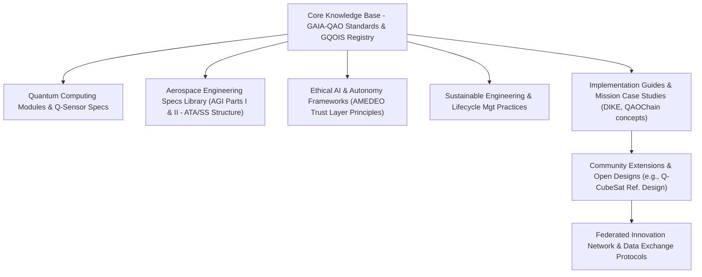

**Author:** Amedeo Pelliccia  
© GAIA-QAO / Quantum Aerospace Organization  
[](https://github.com/sponsors/Robbbo-T)

<p align="center">
  <a href="https://github.com/Robbbo-T/">
    
  </a>
</p>

---

# GAIA-QAO Industry 5.0 Assurance Principle

**No Flight Without QAO Assurance**

**Document Code:** GAIA-QAO-INDUSTRY5-VISION-ASSURANCE-2025-001  
**Version:** 1.0  
**Status:** OFFICIAL DRAFT  
**Classification:** TRUSTED / AUDITABLE / SEMANTIC  
**Maintainer:** @Gaia-QAO-GOVERNANCE  
**InfoCode:** GP-QAO-INDUSTRY5-ASSURANCE-001

---

## Executive Statement

> In the GAIA-QAO vision of **Industry 5.0 for aerospace**, the boundary between physical and digital is gone. No component, subsystem, or aircraft is allowed to fly—literally or operationally—without QAO (Quantum Aerospace Organization) assurance across its lifecycle.
>
> **Every object, from a mechanical fastener to a complete modular station, must be digitally, semantically, and quantum-assured.** There are no “anonymous” flights. Every part’s history, compliance, and operational fitness must always be knowable, provable, and auditable.

---

## Core Principle: Zero Uncertified Flight

No element—bolt, sensor, software module, or full system—flies without:

- **QAO certification before integration**
- **Continuous, real-time digital twin monitoring**
- **Immutable, auditable compliance status**

*If it’s not QAO-assured, it doesn’t fly. Period.*

---

## The Power of the GAIA-QAO Assurance Chain

- **End-to-End Traceability:** From factory to decommission—every object embeds a digital identity (DIKE), quantum sensor data, and a living audit trail.
- **Semantic & Quantum Provenance:** Every part is globally registered, quantum-logged, and mapped to its live digital twin—enabling real-time predictive analytics and anomaly detection.
- **Active, Ethical, and Regulatory Compliance:** All compliance data is transparent and accessible. The AMEDEO trust layer guarantees ethical and legal conformance at every step.

---

## Strategic and Operational Impact

- **No blind spots:** Full transparency in manufacturing, maintenance, and flight operations.
- **AI-driven certification:** Automated, adaptive validation for both legacy and quantum-enhanced platforms.
- **Accelerated audits:** Instant incident investigation, lifecycle reporting, and regulatory compliance.
- **Federated collaboration:** Trusted, secure, and actionable data for all partners and authorities.

---

## The GAIA-QAO Industry 5.0 Mandate

> “No part flies alone. No assembly is certified without its digital soul.
> The journey from design to decommission is now a seamless flow of intelligence, assurance, and trust.”

---

## Implementation Foundations

- **DIKE Object Identification:** Unique, standards-compliant identifiers.
- **Digital Twin Integration:** Live operational twins for all parts and systems.
- **Quantum/IoT Sensorization:** Real-time, continuous monitoring and event logging.
- **Automated Documentation:** Dynamic generation and storage of all certification artifacts.
- **Blockchain Audit Trails:** Immutable and federated event history (QAOChain).

---

## Visionary Outcomes

- **Air/Spaceworthiness Reimagined:** Trust and compliance are built in, not bolted on.
- **Aerospace as a Living System:** Every object senses, remembers, and proves its journey.
- **Quantum-Ready:** Engineered for classical, hybrid, and future quantum operations.

---

## Closing

The **GAIA-QAO Industry 5.0 Assurance Principle** is the cornerstone of the new aerospace era:  
*Nothing—no matter how small or large—takes flight without the QAO assurance signature.*  
This is how safety, transparency, and responsible innovation become absolute:
**No flight without assurance. No future without trust.**

---

> _This document is a living conceptual master index for GAIA-QAO Aerospace Documentation, integrating object identification, digital twins, compliance frameworks, and Industry 5.0 governance. See the Aerospace General Index (AGI) for the complete technical architecture, schemas, and implementation strategy._


---

## Quantum Aerospace Organization Structure

The **Quantum Aerospace Organization (GAIA‑QAO)** comprises six federated modules (virtual teams), each operating synergistically across key aerospace and quantum domains:

-   **GAIA-Q‑AIR:** Quantum-enhanced intelligent flight systems, avionics, and mission optimization.
-   **GAIA‑Q-SPACE:** Orbital and vector systems, mechanics, satellite AI agents, and quantum-secure communication frameworks.
-   **GAIA-Q-GreenTech:** Sustainable aerospace materials, energy efficiency models, and CO₂-reduction strategies.
-   **GAIA‑Q-HPC:** High-performance computing infrastructure for quantum simulation, digital twins, and agentic orchestration.
-   **GAIA‑SCIREF:** Scientific research team focusing on emerging technologies, ontology, ethics, and experimental models.
-   **GAIA‑Q-Data-Governance:** Includes the GA-SToP-CO₂ Steering Committee, Sustainability Integration Board, Emissions Quantification Working Group, Resource Sustainability Working Group, Materials Science Advisory Board, Systems Integration Working Group, and Implementation Working Group.

---

## 🌐 Quick Access Links

- [Gaia‑Q-Air](https://github.com/Gaia-Q-Air)
- [Gaia‑Q-Space](https://github.com/Gaia-Q-Space)
- [Gaia‑Q-GreenTech](https://github.com/Gaia-Q-GreenTech)
- [Gaia‑Q-High‑Performance‑Computing](https://github.com/Gaia-Q-High-Performance-Computing)
- [Gaia‑Science-Research](https://github.com/Gaia-Science-Research)
- [Gaia‑Q-Data-Governance](https://github.com/Gaia-Q-Data-Governance)

---

## 📄 Project Status & Metadata

[](#)
[-blue)](./CHANGELOG.md)
[](#)
[](#)
[](#)

---
_The following is the GAIA-QAO Aerospace Documentation (Conceptual Master Version 0.8.1 - Condensed General). This document outlines the comprehensive framework for GAIA-QAO, encompassing Air, Space, Green Technologies, and Quantum Governance & Enhancements._
---

**Author:** Amedeo Pelliccia
© GAIA-QAO / Quantum Aerospace Organization

---

<p align="center">
  <a href="https://github.com/Robbbo-T/">
    
  </a>
</p>

---

## Quantum Aerospace Organization Structure

The **Quantum Aerospace Organization (GAIA‑QAO)** comprises six federated modules (virtual teams), each operating synergistically across key aerospace and quantum domains, with a strong emphasis on sustainability and quantum governance:

- **GAIA-Q‑AIR**: Quantum-enhanced intelligent flight systems, avionics, mission optimization, and green aviation technologies.
- **GAIA‑Q-SPACE**: Orbital and vector systems, space mechanics, satellite AI agents, and quantum-secure communication frameworks, and sustainable space operations.
- **GAIA-Q-GreenTech**: Sustainable aerospace materials, green propulsion, energy efficiency models, lifecycle carbon footprint analysis (GA-SToP-CO₂), and circular economy principles for aerospace.
- **GAIA‑Q-HPC**: High-performance computing infrastructure for quantum simulation, complex system modeling, digital twins for air and space assets, and AI agentic orchestration.
- **GAIA‑SCIREF**: Scientific research team focusing on emerging quantum technologies, advanced materials, novel energy systems, aerospace ontologies, ethical AI, and experimental models for air and space.
- **GAIA‑Q-Data-Governance**: Includes the GA-SToP-CO₂ Steering Committee, Sustainability Integration Board, Emissions Quantification Working Group, Resource Sustainability Working Group, Materials Science Advisory Board, Systems Integration Working Group, Implementation Working Group, and the overarching QAO Assurance Principle enforcement.

---

## 🌐 Quick Access Links

- [Gaia‑Q-Air](https://github.com/Gaia-Q-Air)
- [Gaia‑Q-Space](https://github.com/Gaia-Q-Space)
- [Gaia‑Q-GreenTech](https://github.com/Gaia-Q-GreenTech)
- [Gaia‑Q-High‑Performance‑Computing](https://github.com/Gaia-Q-High-Performance-Computing)
- [Gaia‑Science-Research](https://github.com/Gaia-Science-Research)
- [Gaia‑Q-Data-Governance](https://github.com/Gaia-Q-Data-Governance)

---

## 📄 Project Status & Metadata

[](#)
[-blue)](./CHANGELOG.md)
[](#)
[](#)

---
---
_The following is the GAIA-QAO Aerospace Documentation (Conceptual Master Version 0.8.4 - Hierarchical Condensed General)._
---

# GAIA-QAO Aerospace Documentation
## Aerospace General Index (AGI) - Master (Hierarchical Condensed General)

## Part 0: Framework Overview
*(Content for Part 0 as in Turn 147 - this part is usually presented with its own subheadings fully fleshed out as it's the introduction to the entire framework.)*

### 0.1 Vision Statement (GAIA-QAO Industry 5.0 Assurance Principle)
✨ ***I HAVE A DREAM:***

**GAIA-Q & AMPEL**
#### Open Source Quantum Aerospace Framework
**Science Research · Software · Hardware · Material Aerospace Solutions**

> *A new paradigm where quantum-enhanced intelligence, ethical autonomy, and sustainable engineering converge to define the aerospace systems of tomorrow. In this vision, the line between the physical and the digital is fully dissolved. **No part, subsystem, or fully assembled aerospace asset is allowed to fly—literally or operationally—without QAO (Quantum Aerospace Organization) assurance, end-to-end, for its entire lifecycle.** Every component possesses an inseparable digital, semantic, and quantum-assured identity—its "digital soul." This framework, encompassing Air, Space, Green Technologies, and Quantum Governance, aims to pioneer new frontiers built upon a foundation of absolute, provable assurance.*

### 0.2 Guiding Principles & Philosophy
The GAIA-Q & AMPEL project is founded on the following core principles, deeply informed by the GAIA-QAO Industry 5.0 Assurance Principle:

*   **🇪🇸 Producimos documentación técnica open source para inspirar los diseños de hoy y de mañana.**
    **Ingeniería con propósito. Conocimiento compartido. Innovación federada.**
*   **🇬🇧 We produce open-source technical documentation to inspire the designs of today and tomorrow.**
    **Engineering with purpose. Shared knowledge. Federated innovation.**

> "Knowledge shared is future engineered." – Amedeo Pelliccia

*   **Zero Uncertified Flight/Operation:** No aerospace asset or its critical modules operate without verified GAIA-QAO assurance.
*   **End-to-End Lifecycle Assurance:** Traceability and assurance from component origin through decommissioning.
*   **Inseparable Digital-Physical Identity:** Physical assets intrinsically linked to digital, semantic (GQOIS ID), and quantum-assured identity.
*   **Continuous Digital Twin Symbiosis:** Real-world states mirrored and predicted by digital twins, informed by continuous monitoring.
*   **Immutable and Transparent Provenance:** Semantic and quantum event logging (e.g., QAOChain) for unalterable audit trails.
*   **Active, Ethical, and Regulatory Compliance:** Ongoing process, data transparently accessible (e.g., AMEDEO trust layer).
*   **Federated Trust:** Supports zero-trust principles within a federated, multi-actor ecosystem.

### 0.3 Documentation Architecture
The architecture of the technical documentation within the GAIA-Q & AMPEL framework is an interconnected network supporting the GAIA-QAO Assurance Chain.


*This AGI master document is a cornerstone of the "Core Knowledge Base."*

### 0.4 Key Components of the Documentation Framework
1.  **Multilingual Knowledge Base:** English/Spanish initially; ISO/COAFI/CCSDS terminology mapping.
2.  **Federated Documentation Structure:** Distributed contributions, Git-based, InfoCode/COAFI alignment.
3.  **Implementation Repository:** Open reference designs, simulation environments, demonstrator kits.
4.  **Integrated Assurance Data Layers (Conceptual):** Interfaces with DIKE, Quantum/IoT Sensor Streams, QAOChain.

### 0.5 Governance Model for the Open Source Project
1.  **Technical Oversight Committee (TOC):** Diverse expertise, transparent RFCs, public roadmap.
2.  **Contribution Pathways:** Onboarding, mentorship, InfoCode authorship recognition.
3.  **Quality Assurance Framework:** Peer review, standards compliance, security audits.

### 0.6 High-Level Implementation Strategy
*   **Phase 1 (Foundation):** GAIA-QAO standards (GQOIS, AToC, INFOCODE), initial templates, Git portal.
*   **Phase 2 (Community Dev):** Recruit contributors, working groups, alpha documentation & reference models.
*   **Phase 3 (Federation Impl):** Formalize teams, collaboration protocols, pilot projects demonstrating assurance.
*   **Phase 4 (Acceleration):** Industrial guides, cert-friendly formats, open competitions.

### 0.7 Envisioned Potential Impact
1.  **Revolutionized Airworthiness & Spaceworthiness:** Continuous, real-time, provable assurance.
2.  **Aerospace as a Living, Auditable System:** Every object "senses, remembers, and proves" its journey.
3.  **Accelerated Adoption of Trustworthy AI & Autonomy:** Verifiable and certifiable AI.
4.  **Enhanced Safety & Reliability:** Proactive issue identification via monitoring and predictive analytics.
5.  **Quantum-Ready Assurance:** Framework built for conventional, hybrid, and quantum-enhanced systems.
6.  **Streamlined Regulatory Compliance:** Automated evidence generation, real-time auditable records.


---
title: "GAIA‑QAO Aerospace General Index (AGI) – Master Index"
version: "1.0" 
status: "DRAFT"
last_updated: 2025-05-21 
---

> **Purpose:** A definitive, hierarchical index that references every managed artifact (documents, datasets, standards, software, etc.) inside the GAIA‑QAO ecosystem. Each entry will ultimately resolve to a GAIA‑QAO `INFOCODE` or Object‑ID for traceability.

## Table of Contents

* [How to Use the AGI](#how-to-use-the-agi)
* [I. GAIA‑QAO Framework & Foundational Principles (`AGI-000`)](#i-gaia-qao-framework--foundational-principles-agi-000)
* [II. Core Engineering & Scientific Disciplines (`AGI-100`)](#ii-core-engineering--scientific-disciplines-agi-100)
* [III. Aerodynamics & Flight Mechanics (`AGI-200`)](#iii-aerodynamics--flight-mechanics-agi-200)
* [IV. Propulsion Systems (`AGI-300`)](#iv-propulsion-systems-agi-300)
* [V. Aerospace Structures & Materials (`AGI-400`)](#v-aerospace-structures--materials-agi-400)
* [VI. Avionics, Guidance, Navigation & Control (`AGI-500`)](#vi-avionics-guidance-navigation--control-agi-500)
* [VII. Systems Design, Integration & Lifecycle Management (`AGI-600`)](#vii-systems-design-integration--lifecycle-management-agi-600)
* [VIII. Aeronautical Systems (Aircraft) (`AGI-700`)](#viii-aeronautical-systems-aircraft-agi-700)
* [IX. Astronautical Systems (Space Systems) (`AGI-800`)](#ix-astronautical-systems-space-systems-agi-800)
* [X. Ground Support, Operations & Infrastructure (`AGI-900`)](#x-ground-support-operations--infrastructure-agi-900)
* [XI. Cross‑Cutting Enablers & Considerations (`AGI-1000`)](#xi-cross-cutting-enablers--considerations-agi-1000)
* [XII. Emerging Technologies & Future Outlook (`AGI-1100`)](#xii-emerging-technologies--future-outlook-agi-1100)
* [XIII. GAIA‑QAO Specific Documentation & Projects (`AGI-1200`)](#xiii-gaia-qao-specific-documentation--projects-agi-1200)
* [XIV. Abbreviations & Glossary (`AGI-1300`)](#xiv-abbreviations--glossary-agi-1300)

---

## How to Use the AGI

1.  **Navigate** using the section codes (e.g., `AGI-210`) to locate domains quickly.
2.  **Link/Resolve** each placeholder (`[INFOCODE: …]`, `[DOC: …]`, `[DATA: …]`, `[CATALOG: …]`, `[STD: …]`, `[LINK: …]`, `[REPOSITORY: …]`) to its concrete resource inside GAIA‑QAO as the content becomes available.
3.  **Extend** by adding deeper Object‑IDs under any node—AGI is intentionally expandable.
4.  **Maintain** consistency: update this file whenever you create or migrate resources so the index never lags behind reality.

---

## I. GAIA‑QAO Framework & Foundational Principles (`AGI-000`)

### A. GAIA‑QAO Vision, Mission, and Governance (`AGI-001`)

1.  Vision Statement (GAIA‑Q & AMPEL) `[INFOCODE: QAO-GEN-VIS-V1R0]`
2.  Guiding Principles & Philosophy `[INFOCODE: QAO-GEN-PHL-V1R0]`
3.  GAIA‑QAO Organizational Structure & Federated Modules `[INFOCODE: QAO-ORG-STR-V1R0]`
4.  Governance Model and Contribution Guidelines `[INFOCODE: QAO-GOV-MDL-V1R0]`

### B. GAIA‑QAO Documentation Architecture (`AGI-002`)

1.  **Aerospace General Index (AGI)** – *this file* `[INFOCODE: QAO-SYS-AGI-MASTER]`
2.  INFOCODE‑INDEX System Standard `[INFOCODE: QAO-SYS-STD-INFOCODE]`
3.  GAIA‑CO‑ASD‑LIB Documentation Standard `[INFOCODE: QAO-SYS-STD-DOCLIB]`
4.  Technical Publication Standard Language (TPSL) & Workflow (TPWD) `[INFOCODE: QAO-STD-PUB-TPSL]`

### C. GAIA‑QAO Object Identification System (GQOIS) (`AGI-003`)

1.  GQOIS Standard Document `[INFOCODE: QAO-SYS-STD-GQOIS]`
2.  Top‑Level Object Model Registry `[LINK: RegistryUI]`
3.  Subsystem Identification & Registry `[LINK: RegistryUI]`

### D. GAIA‑QAO Core Technologies & Methodologies (`AGI-004`)

1.  Hardware‑in‑the‑Loop (HIL) Thinking Specification `[INFOCODE: QAO-MTD-HIL-SPEC]`
2.  Aerospace Generative Algorithm Development (AGAD) Framework `[INFOCODE: QAO-MTD-AGAD-FRM]`
3.  GAIA‑Q‑UI System Specification `[INFOCODE: QAO-AUI-STD-GAIAQUI]`
4.  Model‑Based Systems Engineering (MBSE) Approach `[INFOCODE: QAO-MTD-MBSE-GUIDE]`

### E. Engineering Ethics, Sustainability, & Responsible Innovation (`AGI-005`)

1.  GAIA‑QAO Ethical Charter for AI & Autonomy `[INFOCODE: QAO-ETH-AI-CHARTER]`
2.  Sustainability Goals & Life‑Cycle Assessment Framework `[INFOCODE: QAO-SUS-LCA-FRM]`
3.  Responsible Innovation Practices `[INFOCODE: QAO-GEN-RESINNO-V1R0]`

---

## II. Core Engineering & Scientific Disciplines (`AGI-100`)

### A. Mathematics & Physics (`AGI-110`)

1.  Advanced Calculus & Differential Equations `[REF: Standard Texts, Libraries]`
2.  Linear Algebra, Tensor Analysis & Applications `[REF: Standard Texts, Libraries]`
3.  Numerical Methods & Computational Science `[INFOCODE: QAO-CMP-LIB-NUMERICAL]`
4.  Probability, Statistics & Data Analysis `[INFOCODE: QAO-CMP-LIB-STATS]`
5.  Classical Mechanics `[REF: Standard Texts]`
6.  Thermodynamics & Heat Transfer `[INFOCODE: QAO-PHY-THD-GUIDE]`
7.  Fluid Mechanics `[INFOCODE: QAO-PHY-FLD-GUIDE]`
8.  Electromagnetism & Wave Propagation `[INFOCODE: QAO-PHY-ELM-GUIDE]`
9.  Solid Mechanics `[INFOCODE: QAO-PHY-SLD-GUIDE]`

### B. Computational Science & Engineering (`AGI-120`)

1.  High‑Performance Computing (HPC) Resources `[INFOCODE: QAO-HPC-RES-GUIDE]`
2.  Computational Fluid Dynamics (CFD) – Solvers & Best Practices `[INFOCODE: QAO-CFD-BPG-V1R0]`
3.  Finite Element Analysis (FEA) – Solvers & Best Practices `[INFOCODE: QAO-FEA-BPG-V1R0]`
4.  Simulation & Modeling Frameworks `[INFOCODE: QAO-SIM-FRM-OVERVIEW]`
5.  Data Visualization Techniques & Tools `[INFOCODE: QAO-VIS-TOOL-GUIDE]`

---

## III. Aerodynamics & Flight Mechanics (`AGI-200`)

### A. Fundamental Aerodynamics (`AGI-210`)

1.  Incompressible & Compressible Flow Regimes `[DOC: AERO-FUND-001]`
2.  Airfoil & Wing Theory `[DOC: AERO-WING-001]`
3.  Boundary Layers & Turbulence `[DOC: AERO-BLT-001]`
4.  Vortex Dynamics `[DOC: AERO-VRTX-001]`

### B. High‑Speed Aerodynamics (`AGI-220`)

1.  Transonic `[DOC: AERO-TRANSONIC-001]`
2.  Supersonic `[DOC: AERO-SUPERSONIC-001]`
3.  Hypersonic & Aerothermodynamics `[DOC: AERO-HYPERSONIC-001]`

### C. Aircraft Flight Mechanics & Performance (`AGI-230`)

1.  Equations of Motion & Performance Metrics `[DOC: FLMECH-PERF-001]`
2.  Takeoff, Landing, Climb, Cruise, Descent `[DOC: FLMECH-OPER-001]`
3.  Maneuvering Flight & Flight Envelope `[DOC: FLMECH-MANVR-001]`

### D. Stability & Control (`AGI-240`)

1.  Static Stability `[DOC: STABCON-STATIC-001]`
2.  Dynamic Stability & Modes of Motion `[DOC: STABCON-DYNAMIC-001]`
3.  Handling Qualities & Control Surface Design `[DOC: STABCON-HQ-001]`

### E. Computational & Experimental Aerodynamics (`AGI-250`)

1.  CFD Methodologies & Applications `[REF: AGI-120]`
2.  Wind Tunnel Testing & Techniques `[DOC: AERO-EXP-WT-001]`
3.  Flight Testing Principles & Data Analysis `[DOC: AERO-EXP-FLT-001]`

### F. Specialized Aerodynamics (`AGI-260`)

1.  Rotorcraft `[DOC: AERO-ROTOR-001]`
2.  UAV/Drone `[DOC: AERO-UAV-001]`
3.  Aeroacoustics `[DOC: AERO-ACOUSTIC-001]`
4.  Bio‑Inspired Aerodynamics `[DOC: AERO-BIO-001]`

---

## IV. Propulsion Systems (`AGI-300`)

### A. Fundamentals & Thermodynamic Cycles (`AGI-310`)

1.  Propulsion Principles & Performance Metrics `[DOC: PROP-FUND-001]`
2.  Brayton, Rankine, Otto, Diesel Cycles `[REF: AGI-110]`
3.  Nozzle Theory & Thrust Generation `[DOC: PROP-NOZZLE-001]`

### B. Air‑Breathing Propulsion (`AGI-320`)

1.  Piston Engines & Propellers `[DOC: PROP-PISTON-001]`
2.  Gas Turbine Engines `[DOC: PROP-GTE-001]`
    *   Component Design `[DOC: PROP-GTECOMP-001]`
3.  Ramjets & Scramjets `[DOC: PROP-RAMJET-001]`
4.  Advanced Concepts (PDE, RDE) `[DOC: PROP-ADVAB-001]`

### C. Rocket Propulsion (`AGI-330`)

1.  Chemical Rockets `[DOC: PROP-CHEMROCKET-001]`
2.  Electric Propulsion `[DOC: PROP-ELECROCKET-001]`
3.  Nuclear Propulsion `[DOC: PROP-NUCROCKET-001]`
4.  Advanced & Exotic Concepts `[DOC: PROP-ADVROCKET-001]`

### D. Propellants, Fuels & Combustion (`AGI-340`)

1.  Aviation & Rocket Propellants `[DATA: PROP-FUELDB-V1R0]`
2.  Combustion Processes & Modeling `[DOC: PROP-COMBMODEL-001]`
3.  Sustainable Aviation Fuels (SAF) & Green Propellants `[DOC: PROP-SAF-001]`

### E. Propulsion Integration & Testing (`AGI-350`)

1.  Engine‑Airframe/Spaceframe Integration `[DOC: PROP-INTG-001]`
2.  Propulsion Test Facilities & Methods `[DOC: PROP-TEST-001]`
3.  Thermal Management & Emissions Control `[DOC: PROP-THERMALEMIT-001]`

---

## V. Aerospace Structures & Materials (`AGI-400`)

### A. Structural Mechanics & Analysis (`AGI-410`)

1.  Stress, Strain, Elasticity & Failure `[REF: AGI-110]`
2.  Beams, Plates, Shells `[DOC: STRUCT-ANL-BPS-001]`
3.  FEA for Structures `[REF: AGI-120]`
4.  Stability & Buckling `[DOC: STRUCT-STAB-001]`
5.  Vibration & Aeroelasticity `[DOC: STRUCT-VIBROAERO-001]`
6.  Fatigue & Fracture Mechanics `[DOC: STRUCT-FATFRAC-001]`

### B. Aerospace Materials (`AGI-420`)

1.  Metallic Alloys `[DATA: MATL-METALDB-V1R0]`
2.  Composite Materials & Manufacturing `[DATA: MATL-COMPDB-V1R0]`
3.  Ceramics, Polymers & Advanced Materials `[DATA: MATL-ADVDB-V1R0]`
4.  Material Characterization & Testing Standards `[STD: MATL-TEST-STD-001]`

### C. Structural Design & Manufacturing (`AGI-430`)

1.  Load Analysis & Design Philosophies `[DOC: STRUCT-DESPHIL-001]`
2.  Manufacturing Processes `[DOC: MANUF-PROC-001]`
3.  NDT & Inspection `[DOC: NDT-INSPECT-001]`

### D. Thermal Protection Systems & Extreme Environments (`AGI-440`)

1.  TPS Design & Materials `[DOC: TPS-DESIGN-001]`
2.  Structural Behavior in Extremes `[DOC: STRUCT-EXTREME-001]`

---

## VI. Avionics, Guidance, Navigation & Control (`AGI-500`)

### A. Avionics Systems & Architecture (`AGI-510`)

1.  Communication Systems `[DOC: AV-COMM-001]`
2.  Navigation Systems `[DOC: AV-NAV-001]`
3.  Surveillance Systems `[DOC: AV-SURV-001]`
4.  Flight Management & Autopilot `[DOC: AV-FMSAUTO-001]`
5.  Cockpit Displays & HMI `[DOC: AV-HMI-001]`
6.  Data Buses & Networks `[STD: AV-DATABUS-STD-001]`
7.  Integrated Modular Avionics `[DOC: AV-IMA-001]`

### B. Guidance, Navigation & Control Theory (`AGI-520`)

1.  Control Theory `[DOC: GNC-THEORY-001]`
2.  State Estimation & Filtering `[DOC: GNC-KALMAN-001]`
3.  Trajectory Optimization & Guidance Laws `[DOC: GNC-TRAJOPT-001]`

### C. GNC Implementation & Hardware (`AGI-530`)

1.  Sensors `[DATA: SENSOR-SPECDB-V1R0]`
2.  Actuation Systems `[DOC: ACTUATOR-SYS-001]`
3.  Embedded Systems & RT Software `[DOC: SW-EMBEDDED-001]`

### D. Specialized GNC Applications (`AGI-540`)

1.  UAV/Drone GNC `[DOC: GNC-UAV-001]`
2.  Spacecraft AOCS `[DOC: GNC-AOCS-001]`
3.  Launch Vehicle GNC `[DOC: GNC-LAUNCH-001]`
4.  Autonomous Rendezvous & Docking `[DOC: GNC-ARD-001]`

---

## VII. Systems Design, Integration & Lifecycle Management (`AGI-600`)

### A. Systems Engineering Principles (`AGI-610`)

1.  Requirements Engineering `[DOC: SE-REQ-001]`
2.  System Architecture & MBSE `[DOC: SE-ARCH-MBSE-001]`
3.  Verification & Validation `[DOC: SE-VV-001]`
4.  Risk, Configuration & Interface Management `[DOC: SE-MGMT-001]`

### B. Aerospace Vehicle Design Lifecycle (`AGI-620`)

1.  Conceptual & Preliminary Design `[DOC: DES-CONCEPT-001]`
2.  Detailed Design, Analysis & Optimization `[DOC: DES-DETAIL-001]`
3.  Trade Studies & Decision Analysis `[DOC: DES-TRADE-001]`

### C. Manufacturing, Assembly & Testing (`AGI-630`)

1.  Production Planning & Automation `[DOC: MANUF-PLAN-001]`
2.  System‑Level Integration & Ground Testing `[DOC: TEST-GROUND-001]`
3.  Flight Testing & Qualification `[DOC: TEST-FLIGHT-001]`

### D. Operations, Sustainment & End‑of‑Life (`AGI-640`)

1.  RMS `[DOC: RMS-001]`
2.  Prognostics & Health Management `[DOC: PHM-001]`
3.  MRO Practices `[DOC: MRO-001]`
4.  Decommissioning & Disposal Strategies `[DOC: EOL-STRAT-001]`

---

## VIII. Aeronautical Systems (Aircraft) (`AGI-700`)

### A. Fixed‑Wing Aircraft (`AGI-710`)

1.  Types & Classifications `[CATALOG: AC-TYPE-FIXED]`
2.  Design Features & Performance Characteristics `[DOC: AC-FIXED-DESIGN-001]`

### B. Rotorcraft (`AGI-720`)

1.  Types & Classifications `[CATALOG: AC-TYPE-ROTOR]`
2.  Design Features & Aeromechanics `[DOC: AC-ROTOR-DESIGN-001]`

### C. LTA & V/STOL Systems (`AGI-730`)

1.  Airships, Aerostats `[CATALOG: AC-TYPE-LTA]`
2.  Powered Lift & AAM/eVTOL `[CATALOG: AC-TYPE-VSTOL]`
    *   AAM Concepts `[DOC: AC-AAM-CONCEPT-001]`

### D. Aircraft Subsystems (`AGI-740`)

1.  Landing Gear, ECS, Hydraulic, Electrical, Fuel, Ice/Fire Protection `[DOC: AC-SUBSYS-OVERVIEW-001]`
    *   Example: Landing Gear `[DOC: AC-SUBSYS-LG-001]`

---

## IX. Astronautical Systems (Space Systems) (`AGI-800`)

### A. Orbital Mechanics & Astrodynamics (`AGI-810`)

1.  Two‑Body Problem & Maneuvers `[DOC: SPACE-ORBMECH-001]`
2.  Perturbations & Interplanetary Trajectories `[DOC: SPACE-ASTRODYN-001]`

### B. Spacecraft Design & Subsystems (`AGI-820`)

1.  Mission Types `[CATALOG: SC-TYPE-MISSION]`
2.  Subsystems Overview `[DOC: SC-SUBSYS-OVERVIEW-001]`
    *   Example: ADCS `[DOC: SC-SUBSYS-ADCS-001]`

### C. Launch Systems & Operations (`AGI-830`)

1.  Launch Vehicle Types `[CATALOG: LV-TYPE]`
2.  Launch Site Operations `[DOC: LV-OPS-GROUND-001]`
3.  Ascent Dynamics `[DOC: LV-ASCENT-001]`

### D. Human Spaceflight (`AGI-840`)

1.  ECLSS `[DOC: HUMAN-ECLSS-001]`
2.  EVA Systems `[DOC: HUMAN-EVA-001]`
3.  Habitats & Stations `[DOC: HUMAN-HABITAT-001]`
4.  Crewed Spacecraft Design `[DOC: HUMAN-SC-DESIGN-001]`

### E. Space Environment & Mitigation (`AGI-850`)

1.  Radiation, MMOD, Plasma, AO `[DOC: SPACE-ENV-EFFECTS-001]`
2.  Space Debris & SSA `[DOC: SPACE-DEBRIS-SSA-001]`
3.  Planetary Protection `[STD: PLANPROT-STD-001]`

---

## X. Ground Support, Operations & Infrastructure (`AGI-900`)

### A. Airports & ATM (`AGI-910`)

1.  Airport Design & Ops `[DOC: AIRPORT-DESIGN-OPS-001]`
2.  ATC & ATM Systems `[DOC: ATM-SYS-001]`
3.  UTM `[DOC: UTM-SYS-001]`

### B. Spaceports & Mission Operations (`AGI-920`)

1.  Launch Complex Design `[DOC: SPACEPORT-DESIGN-001]`
2.  Mission Control & Ground Networks `[DOC: MCC-GROUNDNET-001]`
3.  Spacecraft Operations `[DOC: SC-OPS-001]`

### C. Test & Evaluation Infrastructure (`AGI-930`)

1.  Wind Tunnels, Propulsion Stands `[CATALOG: TEST-FACILITIES]`
2.  Environmental Chambers `[CATALOG: ENVTEST-FACILITIES]`
3.  Launch & Flight Test Ranges `[CATALOG: RANGE-FACILITIES]`

---

## XI. Cross‑Cutting Enablers & Considerations (`AGI-1000`)

### A. Environment, Human Factors & Safety (`AGI-1010`)

1.  Atmospheric Science & Space Weather `[DOC: ENVSCI-001]`
2.  Human Factors Engineering `[DOC: HF-ERGONOMICS-001]`
3.  Aerospace Medicine & Physiology `[DOC: AROMED-001]`
4.  Safety Management Systems (SMS) & Risk Assessment `[DOC: SAFETY-SMS-RISK-001]`
5.  Accident Investigation & Prevention `[DOC: ACCIDENT-INVEST-001]`

### B. Regulatory, Policy, Economic & Legal (`AGI-1020`)

1.  Aviation & Space Law, Treaties, Conventions `[DOC: LEGAL-AEROSPACE-001]`
2.  National & International Regulatory Bodies (FAA, EASA, ICAO, UNCOPUOS) `[LINKS: REG-BODIES]`
3.  Certification Standards & Air/Spaceworthiness `[STD: CERT-STD-OVERVIEW]`
4.  Export Control, Intellectual Property & Technology Transfer `[DOC: LEGAL-IP-EXPORT-001]`
5.  Aerospace Economics, Market Analysis & Program Management `[DOC: ECON-PROGRAMMGMT-001]`

### C. Digital Transformation & Cybersecurity (`AGI-1030`)

1.  Digital Twin & Model‑Based Engineering `[DOC: DIGITAL-TWIN-MBE-001]`
2.  Big Data, AI & Machine Learning in Aerospace `[DOC: AI-ML-AEROSPACE-001]`
3.  Cybersecurity for Aerospace Systems & Infrastructure `[DOC: CYBERSEC-AERO-001]`
4.  Internet of Things (IoT) & Connectivity in Aerospace `[DOC: IOT-AERO-001]`

---

## XII. Emerging Technologies & Future Outlook (`AGI-1100`)

### A. Sustainable Aerospace (`AGI-1110`)

1.  Electric & Hybrid‑Electric Propulsion `[DOC: FUTURE-ELECPROP-001]`
2.  Hydrogen Technologies `[DOC: FUTURE-H2-TECH-001]`
3.  Advanced SAF & Green Propellants `[REF: AGI-340]`
4.  Novel Vehicle Configurations `[DOC: FUTURE-CONFIG-001]`
5.  Circular Economy & Lifecycle Sustainability `[REF: AGI-005]`

### B. Advanced Materials & Manufacturing (`AGI-1120`)

1.  Self‑Healing Materials, 4D Printing, Metamaterials `[DOC: FUTURE-MATL-MANUF-001]`
2.  Large‑Scale Additive Manufacturing & In‑Space Manufacturing `[DOC: FUTURE-AM-ISM-001]`

### C. Autonomous Systems & AI Advancement (`AGI-1130`)

1.  Advanced Autonomous Operations `[DOC: FUTURE-AUTONOMY-001]`
2.  Explainable AI (XAI) & Trustworthy AI `[DOC: FUTURE-XAI-TRUST-001]`
3.  Swarm Technologies & Collaborative Robotics `[DOC: FUTURE-SWARM-001]`

### D. Next‑Gen Space Exploration & Utilization (`AGI-1140`)

1.  On‑Orbit Servicing, Assembly & Manufacturing (OSAM) `[DOC: FUTURE-OSAM-001]`
2.  In‑Situ Resource Utilization (ISRU) & Lunar/Martian Economy `[DOC: FUTURE-ISRU-001]`
3.  Advanced Space Transportation `[REF: AGI-330]`

### E. Quantum Technologies in Aerospace (`AGI-1150`)

1.  Quantum Computing Applications `[DOC: FUTURE-QUANTCOMP-001]`
2.  Quantum Sensing & Metrology `[DOC: FUTURE-QUANTSENS-001]`
3.  Quantum Communication & Cryptography `[DOC: FUTURE-QUANTCOMM-001]`

### F. Hypersonic Technologies (`AGI-1160`)

1.  Hypersonic Vehicle Design `[DOC: FUTURE-HYPERSONIC-VEH-001]`
2.  Enabling Technologies for Hypersonics `[DOC: FUTURE-HYPERSONIC-TECH-001]`

---

## XIII. GAIA‑QAO Specific Documentation & Projects (`AGI-1200`)

### A. GAIA‑QAO Internal Standards & Procedures (`AGI-1210`)

1.  Project Management Procedures `[INFOCODE: QAO-PRM-PROCD-00X]`
2.  Data Management & Sharing Protocols `[INFOCODE: QAO-DAT-PROT-00X]`
3.  Approved Tooling & Software `[INFOCODE: QAO-TOOL-STACK-00X]`

### B. Flagship Projects & Initiatives (`AGI-1220`)

1.  **AMPEL360 BWB‑Q100 Project** `[INFOCODE: AMPEL360-INDEX]`
    *   Technical Description Manual `[INFOCODE: AMPEL360-TDM]`
    *   System Architecture `[INFOCODE: AMPEL360-ARCH]`
    *   Ops & Maintenance Manuals `[INFOCODE: AMPEL360-OPS]`
    *   Subsystem Design Docs `[INFOCODE: AMPEL360-SUBSYS-…]`
2.  **AMPEL360plus (Interplanetary) Project** `[INFOCODE: AMPEL360P-INDEX]`
    *   Conceptual Design `[INFOCODE: AMPEL360P-CD]`
    *   Technology Demonstrator `[INFOCODE: AMPEL360P-TECHDEM]`
3.  *[Other GAIA-QAO Projects Placeholder]* `[INFOCODE: QAO-PROJ-OTHER-INDEX]`

### C. Research Outputs & Publications (`AGI-1230`)

1.  Peer‑Reviewed Papers `[REPOSITORY: QAO-PUB-JOURNAL]`
2.  Conference Proceedings `[REPOSITORY: QAO-PUB-CONF]`
3.  Technical Reports & White Papers `[REPOSITORY: QAO-REP-TECH]`

### D. Datasets & Models (`AGI-1240`)

1.  Curated Aerospace Datasets `[REPOSITORY: QAO-DATA-CURATED]`
2.  Validated Simulation Models `[REPOSITORY: QAO-MODEL-VALIDATED]`
3.  Open‑Source Libraries `[REPOSITORY: QAO-CODE-OPEN]`

---

## XIV. Abbreviations & Glossary (`AGI-1300`)

1.  Master List of Abbreviations & Acronyms `[INFOCODE: QAO-GEN-ABBR-MASTER]`
2.  GAIA‑QAO Glossary of Terms `[INFOCODE: QAO-GEN-GLOS-MASTER]`
```
Okay, this is a significant undertaking! I will now generate the **complete** "Technical Description Manual" outline for the AMPEL360 BWB-Q100, ensuring all ATA chapters listed in the expanded Table of Contents are fleshed out with descriptive outlines. Placeholders like "*(As previously detailed...)*" will be replaced with the actual content or new descriptive outlines.

The document will be authored by Amedeo Pelliccia, and titles will be structured for hyperlinkability in Markdown.

Given the length, this will be a substantial output.

```markdown
# Technical Description Manual
## AMPEL360 BWB-Q100

**(GAIA-QAO Model ID: AS-M-PAX-BW-Q1H)**

**Authored by: Amedeo Pelliccia**

---

## Front Matter

### 1. Title Page <a name="title-page"></a>

**AIRCRAFT TECHNICAL DESCRIPTION MANUAL**

**MODEL:** AMPEL360 BWB-Q100
**(GAIA-QAO Model Code: Q1H)**

**GAIA-QAO Object ID (Model):** `AS-M-PAX-BW-Q1H`

**Document INFOCODE:** `MNL-SYS-DSN-AS-M-PAX-BW-Q1H`
**(Manual - System - Design - for Model Q1H)**

**Version:** 1.2 (Comprehensive - Full ATA Chapter Outlines)
**Status:** DRAFT
**Date of Issue:** May 22, 2025
**Issuing Organization:** GAIA-QAO Aerospace Consortium (Illustrative)

---

### 2. GAIA-QAO Document Metadata <a name="metadata"></a>

```yaml
---
title: "Aircraft Technical Description Manual: AMPEL360 BWB-Q100 (Comprehensive - Full ATA Chapter Outlines)"
infocode: "MNL-SYS-DSN" # Manual - System - Design
object_id: "AS-M-PAX-BW-Q1H" # Specific to the aircraft model Q1H
version: "1.2"
date: "2025-05-22"
status: "DRAFT"
authors: ["Amedeo Pelliccia", "GAIA-QAO Technical Publications Department"] # Illustrative
contributors: ["AMPEL Systems Engineering Team", "Quantum Technologies Integration Group", "Aerodynamics Design Group", "Propulsion Integration Team", "Structures & Materials Division"] # Illustrative
security_classification: "CONFIDENTIAL" # Example for a new tech aircraft
keywords: ["AMPEL360", "BWB", "Q1H", "Blended Wing Body", "Quantum Aerospace", "Passenger Aircraft", "Technical Description", "ATA Chapters", "Detailed Design Review", "Complete Outline"]
related_documents:
  - "SPC-SYS-ARC-AS-M-PAX-BW-Q1H-v1.0" # System Architecture Specification
  - "REQ-SYS-FUN-AS-M-PAX-BW-Q1H-v1.1" # Functional Requirements Document
  - "GAIA-QAO-DOC-MASTER-001" # Link to Master GAIA-QAO Documentation
change_log:
  - version: "1.0"
    date: "2025-05-20"
    author: "Tech Pubs Dept."
    description: "Initial draft release for review."
  - version: "1.1"
    date: "2025-05-21"
    author: "Tech Pubs Dept."
    description: "Expanded selected ATA chapters for detailed design review."
  - version: "1.2"
    date: "2025-05-22"
    author: "Amedeo Pelliccia"
    description: "Generated complete outlines for all relevant ATA chapters."
---
```

-----

### 3. Record of Revisions <a name="revisions"></a>

| Revision No. | Date         | Description of Change                       | Approved By |
| :----------- | :----------- | :------------------------------------------ | :---------- |
| Initial Draft| 2025-05-20   | First draft for internal review             | J. Doe      |
| 1.1          | 2025-05-21   | Expanded selected ATA chapters for Design Review | J. Doe      |
| 1.2          | 2025-05-22   | Generated complete outlines for all ATA chapters | A. Pelliccia |

-----

### 4. List of Effective Pages (LEP) <a name="lep"></a>

*(This section would list all pages and their current revision dates. For this conceptual outline, it remains a placeholder. In a real document, every page range would be listed with its revision status.)*

| Page Range | Revision | Date       |
| :--------- | :------- | :--------- |
| All        | 1.2      | 2025-05-22 |

-----

### 5. Table of Contents <a name="toc"></a>

*   [Front Matter](#front-matter)
    *   [1. Title Page](#title-page)
    *   [2. GAIA-QAO Document Metadata](#metadata)
    *   [3. Record of Revisions](#revisions)
    *   [4. List of Effective Pages (LEP)](#lep)
    *   [5. Table of Contents](#toc)
    *   [6. Introduction](#introduction)
    *   [7. List of Abbreviations & Acronyms](#abbreviations)
    *   [8. Safety & Operational Advisories](#safety-advisories)
*   [Main Content (Systems Description - ATA Based)](#main-content)
    *   [ATA 00 - GENERAL](#ata00)
    *   [ATA 05 - TIME LIMITS/MAINTENANCE CHECKS](#ata05)
    *   [ATA 06 - DIMENSIONS AND AREAS](#ata06)
    *   [ATA 07 - LIFTING AND SHORING](#ata07)
    *   [ATA 08 - LEVELING AND WEIGHING](#ata08)
    *   [ATA 09 - TOWING AND TAXIING](#ata09)
    *   [ATA 10 - PARKING, MOORING, STORAGE & RETURN TO SERVICE](#ata10)
    *   [ATA 11 - PLACARDS AND MARKINGS](#ata11)
    *   [ATA 12 - SERVICING](#ata12)
    *   [ATA 20 - STANDARD PRACTICES - AIRFRAME](#ata20)
    *   [ATA 21 - AIR CONDITIONING & PRESSURIZATION](#ata21)
    *   [ATA 22 - AUTO FLIGHT (Including Quantum Enhancements)](#ata22)
    *   [ATA 23 - COMMUNICATIONS (Including Quantum Enhancements)](#ata23)
    *   [ATA 24 - ELECTRICAL POWER (Including Potential Quantum Enhancements)](#ata24)
    *   [ATA 25 - EQUIPMENT/FURNISHINGS](#ata25)
    *   [ATA 26 - FIRE PROTECTION](#ata26)
    *   [ATA 27 - FLIGHT CONTROLS (BWB Specifics & Quantum Enhancements)](#ata27)
    *   [ATA 28 - FUEL](#ata28)
    *   [ATA 29 - HYDRAULIC POWER](#ata29)
    *   [ATA 30 - ICE AND RAIN PROTECTION](#ata30)
    *   [ATA 31 - INDICATING/RECORDING SYSTEMS (Including Quantum Instrumentation)](#ata31)
    *   [ATA 32 - LANDING GEAR](#ata32)
    *   [ATA 33 - LIGHTS](#ata33)
    *   [ATA 34 - NAVIGATION (Including Quantum Enhancements)](#ata34)
    *   [ATA 35 - OXYGEN](#ata35)
    *   [ATA 36 - PNEUMATIC](#ata36)
    *   [ATA 37 - VACUUM](#ata37)
    *   [ATA 38 - WATER/WASTE](#ata38)
    *   [ATA 42 - INTEGRATED MODULAR AVIONICS (IMA)](#ata42)
    *   [ATA 44 - CABIN SYSTEMS](#ata44)
    *   [ATA 45 - CENTRAL MAINTENANCE SYSTEM (CMS) (Including Quantum Diagnostics)](#ata45)
    *   [ATA 46 - INFORMATION SYSTEMS (Including Quantum Computing/Processing)](#ata46)
    *   [ATA 47 - INERT GAS SYSTEM](#ata47)
    *   [ATA 49 - AIRBORNE AUXILIARY POWER (APU)](#ata49)
    *   [ATA 51 - STRUCTURES (General, BWB Philosophy)](#ata51)
    *   [ATA 52 - DOORS](#ata52)
    *   [ATA 53 - FUSELAGE (Integrated BWB Body Section) (Including Quantum Structural Monitoring)](#ata53)
    *   [ATA 54 - NACELLES/PYLONS (Or Integrated Engine Housing)](#ata54)
    *   [ATA 55 - STABILIZERS (Vertical/Control Elements for BWB)](#ata55)
    *   [ATA 56 - WINDOWS](#ata56)
    *   [ATA 57 - WINGS (Outer Wing Sections, Control Surfaces for BWB)](#ata57)
    *   [ATA 61 - PROPELLERS/PROPULSORS (Integrated Electric Propulsors)](#ata61)
    *   [ATA 71 - POWER PLANT (General, Installation of Hybrid-Electric System)](#ata71)
    *   [ATA 72 - ENGINE (Prime Mover for Hybrid System / Fuel Cells)](#ata72)
    *   [ATA 73 - ENGINE FUEL AND CONTROL (Hybrid System Specifics)](#ata73)
    *   [ATA 74 - IGNITION (For Prime Mover / Fuel Cell Initiators)](#ata74)
    *   [ATA 75 - AIR (Engine Intake / Fuel Cell Oxidizer)](#ata75)
    *   [ATA 76 - ENGINE CONTROLS (Hybrid Power Management)](#ata76)
    *   [ATA 77 - ENGINE INDICATING (Hybrid System Parameters)](#ata77)
    *   [ATA 78 - ENGINE EXHAUST (Prime Mover / Fuel Cell Byproducts)](#ata78)
    *   [ATA 79 - ENGINE OIL (Prime Mover Lubrication)](#ata79)
    *   [ATA 80 - STARTING (Prime Mover / APU / Fuel Cell Activation)](#ata80)
*   [Appendices/Back Matter](#appendices)
    *   [Appendix A: Glossary of Terms](#appendix-a)
    *   [Appendix B: GAIA-QAO Identification Details for AMPEL360 BWB-Q100](#appendix-b)
    *   [Appendix C: Quantum Systems Integration Overview](#appendix-c)
    *   [Index](#index)
    *   [List of GAIA-QAO Related Documents](#related-documents)

-----

### 6. Introduction <a name="introduction"></a>

  * **6.1 Purpose of this Manual:**
      * To provide a comprehensive general technical description of the AMPEL360 BWB-Q100 aircraft (GAIA-QAO Model `AS-M-PAX-BW-Q1H`), its systems, unique design features, and integrated conventional and quantum-enhanced technologies.
      * To serve as a primary reference for flight crews, maintenance personnel, engineering staff, and design review teams for familiarization, system understanding, and assessment of design maturity.
  * **6.2 Scope and Applicability:**
      * This manual covers the baseline configuration of the AMPEL360 BWB-Q100 intended for detailed design review. Specific configurations, serial numbers, or design iterations may have supplemental documentation.
      * Information is organized according to Air Transport Association (ATA) chapter specifications, adapted for the BWB architecture and incorporating GAIA-QAO specific extensions for quantum technologies.
  * **6.3 How to Use this Manual:**
      * Explanation of the ATA-based structure, GAIA-QAO InfoCode references (as per Part 8.5 of GAIA-QAO Master Doc), safety conventions, and effectivity coding relevant to the design review stage.
      * Guidance on navigating the manual to find specific system descriptions, interfaces, and performance characteristics.
  * **6.4 Aircraft Overview - AMPEL360 BWB-Q100:**
      * Detailed introduction to the aircraft: "Small (100 pax) quantum-enhanced Blended Wing Body passenger transport designed for medium-range (5,500 km) operations. This design prioritizes significant aerodynamic efficiency, reduced environmental impact through advanced hybrid-electric propulsion, and enhanced operational capabilities via integrated quantum systems for navigation, optimization, communications, and diagnostics."
      * Key design features: BWB planform benefits, materials selection, propulsion concept, quantum system integration philosophy.
      * Performance highlights (target values for design review): range, speed, payload, efficiency metrics.
      * Mission profile and operational concept.
      * Reference to GAIA-QAO Object ID (Part 2 of Master Doc) and its components for this model.

-----

### 7. List of Abbreviations & Acronyms <a name="abbreviations"></a>

*(Comprehensive list, including but not limited to: AAM, ACARS, ADC, ADCS, ADF, ADS-B, AFDX, AGI, AI, AMPEL, AOC, AOCS, APU, ARINC, AS, ASM, AS-M-PAX-BW-Q1H, ATA, ATC, ATM, AToC, BWB, CAD, CAE, CAN, CCB, CMM, CMS, COAFI, CORSIA, COTS, CPU, CQD, CRM, CS, CVR, DMM, DOORS, EASA, ECAM, ECS, EDP, ED-202A, ED-203A, EFB, EFIS, EHA, EHSI, EIS, ELT, EMA, EMC, EMI, EMP, EOL, ESD, ETSO, EVS, FAA, FADEC, FANS, FAR, FDR, FEA, FHA, FMEA, FMECA, FMS, FOD, FQIS, FRR, FSTD, GAIA-QAO, GCR, GD&T, GEO, GFRP, GLONASS, GNC, GNSS, GQOIS, GPU, GSE, GVT, HAPS, HEPA, HF, HIL, HMI, HPC, HWD, ICAO, ICD, IEC, IEEE, IETP, IFE, ILS, IMA, IMS, INCOSE, INFOCODE, IP, IRS, ISR, ISRU, ISO, ITAR, ITU, LCC, LCA, LDM, LEO, LEP, LES, LiDAR, LNAV, LORA, LORAN, LRU, LTA, MBSE, MCC, MCP, MDL, MEO, MEMS, MIL-STD, MMOD, MRO, MSG-3, MTBF, NDT, NEA, NEP, NGS, NIST, NPT, NSPE, NTC, NVM, OBIGGS, OEE, OEM, OQ, ORR, OSAM, PAX, PBN, PDDL, PDE, PDR, PHM, PID, PLM, PMC, PMM, PMU, PNT, POL, PQ, PRA, PRP, PTT, Q-ASIN-Q, QASI, QAO, QCA, QCCS, QCIC, QCM, QCTS, QCU, QDAU, QDCK, QDS, QECT, QG, QKD, QMCK, QMT, QNA, QNC, QNCS, QNS, QOC, QOS, QPU, QSC, QSCS, QSM, QSTATE, QTS, Qubit, QVCK, RAeS, RANS, RAT, RBAC, RDE, REC, REQ, RF, RL, RLVS, RLV, RMS, RNP, ROS, RTCA, RTM, RTOS, RUL, SAF, SAE, SATCOM, SB, SBL, SC-VTOL, SDS, SEER-H, SEMP, SESAR, SHM, SI, SLAM, SLE, SLM, SMS, SOW, SOO, SP, SPC, SPM, SRD, SRM, SRR, SSA, SSS, ST-ObjectCategory, STOL, SVS, SysML, TACAN, TAT, TCCA, TDM, TEM, TLA, TOC, TPWD, TPS, TPSL, TRR, TT&C, UAM, UAV, UDMH, UHF, UI, URIF, UTAS, UTM, UVC, UXT-Q, VAB, VNAV, VOR, VSM, VSTOL, V&V, VVUQ, WDM, XAI, XPR, ZBO, etc.)*

-----

### 8. Safety & Operational Advisories <a name="safety-advisories"></a>

  * **8.1 Definitions:**
      *   **WARNING:** An operating procedure, practice, etc., which, if not correctly followed, could result in personal injury or loss of life.
      *   **CAUTION:** An operating procedure, practice, etc., which, if not strictly observed, could result in damage to or destruction of equipment.
      *   **NOTE:** An operating procedure, condition, etc., which is essential to highlight.
  * **8.2 General Safety Philosophy:**
      *   Outline of the safety-by-design principles incorporated into the AMPEL360 BWB-Q100.
      *   Emphasis on redundant systems, fail-safe design concepts, and robust fault detection and isolation capabilities (including quantum-enhanced).
  * **8.3 Quantum System Specific Advisories:**
      *   **CAUTION:** Quantum sensors and processing units are highly sensitive to specific environmental factors (e.g., strong magnetic fields, extreme temperatures beyond operational limits, specific radiation types). Refer to system-specific ATA chapters for detailed handling and operational precautions.
      *   **CAUTION:** Cryogenic systems associated with Quantum Processing Units (QPUs) operate at extremely low temperatures. Adhere strictly to safety procedures outlined in **ATA 49/72** and relevant maintenance manuals.
      *   **NOTE:** Quantum Key Distribution (QKD) systems involve precise optical alignment. Avoid physical shock or misaligning QKD components.
      *   **WARNING:** Some quantum calibration or characterization procedures may involve controlled laser emissions or sealed radioactive sources. Only authorized and trained personnel are to perform these procedures, adhering to all specified safety protocols.
  * **8.4 Cross-References:**
      *   Refer to **ATA 20 (Standard Practices - Airframe)** for general airframe safety.
      *   Refer to system-specific ATA chapters for detailed operational limits and safety procedures.
      *   Refer to the Aircraft Flight Manual (AFM) and Emergency Procedures checklist for operational safety.

-----

## Main Content (Systems Description - ATA Based) <a name="main-content"></a>

---
### ATA 00 - GENERAL <a name="ata00"></a>

  *   **00-00 General Description and Operation:**
      *   Introduction to the AMPEL360 BWB-Q100 aircraft systems documentation philosophy according to GAIA-QAO.
      *   Purpose and layout of subsequent ATA chapters within this Technical Description Manual, emphasizing its use for design review and system familiarization.
      *   Overview of the aircraft's general characteristics, design philosophy (Blended Wing Body, hybrid-electric, quantum-enhanced), and intended operational role.
  *   **00-10 Aircraft Identification:**
      *   Detailed breakdown of the GAIA-QAO Aircraft Model ID: `AS-M-PAX-BW-Q1H`, explaining each segment (Air System - Manned - Passenger - Blended Wing - Quantum Generation 1 - Airframe Variant H).
      *   Explanation of the GAIA-QAO Object ID for the model and how specific aircraft instances will be identified (e.g., `AS-M-PAX-BW-Q1H-SSSSS-CC`).
      *   Serial number effectivity range and major configuration items covered by this version of the manual.
  *   **00-20 Manual Organization and Use:**
      *   Explanation of the ATA 100 chaptering system as applied to the AMPEL360 BWB-Q100.
      *   Guidance on how BWB-specific systems and quantum-enhanced technologies are integrated into the standard ATA structure (e.g., dedicated sub-sections like -XX-80, -XX-90 for quantum features, or adaptation of existing chapters).
      *   Cross-referencing conventions used within the manual and to external GAIA-QAO documents (via INFOCODEs).
      *   Instructions for providing feedback or raising queries related to this manual during the design review process.
  *   **00-80 Standard Practices - Quantum Systems (General Handling & Safety):**
      *   General precautions for interacting with or designing for quantum-enhanced systems.
      *   **Electrostatic Discharge (ESD) Sensitivity:** Highlighting the extreme sensitivity of many quantum components (qubits, sensors, QPUs) to ESD. Requirements for grounded workstations, wrist straps, and ESD-safe handling procedures during design, assembly, and maintenance access considerations.
      *   **Magnetic Field Awareness:** Caution regarding strong external magnetic fields that can decohere qubits or affect quantum sensor calibration. Design considerations for shielding or placement of magnetically sensitive quantum components.
      *   **Thermal Sensitivity:** Notes on the operational temperature ranges for various quantum components, especially those requiring cryogenic cooling (**ATA 46 QPUs**, **ATA 49/72**).
      *   **Vibration Sensitivity:** Considerations for vibration isolation in the mounting and installation design of sensitive quantum sensors and QPUs.
      *   **Cleanliness Requirements:** Potential need for cleanroom-like conditions or specialized enclosures for exposed quantum optical components or QPU cores.
      *   **Diagnostic Interfaces:** Overview of standard diagnostic interfaces for quantum systems, including links to the GAIA-Q-UI (as defined in Part 7 of Master Doc) for system status monitoring and basic diagnostic queries. Reference to relevant GAIA-QAO Quantum System Maintenance Standards (conceptual).
      *   **Software Interaction:** General principles for software interfacing with quantum hardware, including API concepts and data formats for quantum state information.

---
### ATA 05 - TIME LIMITS/MAINTENANCE CHECKS <a name="ata05"></a>

  *   **05-00 General Description and Operation:**
      *   Overview of the AMPEL360 BWB-Q100 maintenance philosophy, emphasizing a shift towards highly predictive and condition-based maintenance (CBM) facilitated by the integrated Central Maintenance System (CMS) with its quantum diagnostic capabilities (**ATA 45**) and Quantum Structural Monitoring (**ATA 53**).
      *   Description of how maintenance tasks are categorized (e.g., scheduled, unscheduled, condition-based).
      *   Goals for Mean Time Between Failure (MTBF) and Mean Time To Repair (MTTR) for key systems.
  *   **05-10 Time Limits / Life-Limited Parts:**
      *   Identification of all parts and components on the aircraft subject to mandatory replacement at specified flight hours, cycles, or calendar time limits.
      *   This section will detail:
          *   Traditional life-limited parts (e.g., certain engine components, landing gear structural elements, high-pressure vessels).
          *   **Quantum System Life-Limited Parts:** Identification of any quantum components with inherent wear-out mechanisms or limited operational life, such as:
              *   Cryocooler components for QPUs (**ATA 46**).
              *   Specific types of quantum sensor elements (e.g., those susceptible to radiation degradation or material fatigue affecting quantum properties).
              *   Qubit modules within QPUs if they have a defined operational lifespan.
              *   Components of Quantum Key Distribution (QKD) systems (**ATA 23**) like single-photon sources or detectors.
      *   Procedures for tracking and managing the life limits of these components.
  *   **05-20 Scheduled Maintenance Program & Checks:**
      *   Outline of the scheduled maintenance program, including letter checks (e.g., A, B, C, D checks or equivalent progressive inspection schemes) tailored for the BWB architecture and technology.
      *   Description of the typical tasks performed during each check interval, including:
          *   Visual inspections, operational checks, functional tests, and servicing.
          *   Specific checks for quantum systems:
              *   Calibration verification of quantum sensors (**ATA 34, 53, etc.**).
              *   Quantum coherence checks for QPUs and communication systems (**ATA 46, 23**).
              *   Performance verification of quantum algorithms.
              *   Integrity checks of cryogenic systems for QPUs.
      *   Reference to the Aircraft Maintenance Manual (AMM) for detailed procedures.
  *   **05-30 Out-of-Phase Requirements:**
      *   Listing of maintenance tasks that are performed at intervals different from the standard letter checks, based on specific component requirements or operational conditions.
  *   **05-50 Unscheduled Maintenance & Condition Monitoring:**
      *   Philosophy and general procedures for addressing unscheduled maintenance events arising from pilot reports, in-flight system alerts, or ground findings.
      *   Emphasis on the role of the **ATA 45 Central Maintenance System (CMS)**, particularly its Quantum Diagnostic Systems and Quantum Predictive Maintenance capabilities, in:
          *   Providing early warnings of incipient failures.
          *   Generating Remaining Useful Life (RUL) estimates.
          *   Triggering condition-based maintenance tasks, potentially reducing reliance on fixed-interval scheduled maintenance for many components.
      *   Integration with the **ATA 53 Quantum Structural Monitoring** system for on-condition airframe inspections and repairs.

---
### ATA 06 - DIMENSIONS AND AREAS <a name="ata06"></a>

  *   **06-00 General Description and Operation:**
      *   This chapter provides the principal dimensions, areas, volumes, stations, and other geometric data for the AMPEL360 BWB-Q100 aircraft. This information is critical for ground handling, hangarage, performance calculations, and systems integration.
  *   **06-10 Overall Aircraft Dimensions:**
      *   **Overall Length:** Maximum length of the aircraft.
      *   **Overall Span:** Maximum span of the blended wing body.
      *   **Overall Height:** Maximum height of the aircraft (typically to the top of the vertical control surfaces or highest point when on ground).
      *   **Wheelbase:** Longitudinal distance between nose and main landing gear centers.
      *   **Track:** Lateral distance between main landing gear centers.
      *   Diagrams illustrating these principal dimensions.
  *   **06-20 Key Geometric Features & Areas (BWB Specific):**
      *   **Reference Wing Area (or Equivalent BWB Planform Area):** Definition and value used for aerodynamic calculations.
      *   **Mean Aerodynamic Chord (MAC):** Definition and value for the BWB.
      *   **Aspect Ratio (Equivalent):** Definition and value for the BWB.
      *   **Control Surface Areas:** Areas of elevons, rudders, spoilers, flaps, etc.
      *   **Fuselage/Body Wetted Area:** For drag calculations.
      *   **Cabin Internal Dimensions:** Length, maximum width, maximum height, volume.
      *   **Cargo Compartment Dimensions & Volumes:** For main and any auxiliary cargo bays.
      *   Diagrams illustrating planform, profiles, and cross-sections with key dimensions.
  *   **06-30 Station Diagram System:**
      *   Description of the aircraft station diagram system used for locating components and structure:
          *   Fuselage/Body Stations (FS or BS): Longitudinal reference.
          *   Water Lines (WL): Vertical reference.
          *   Buttock Lines (BL): Lateral reference.
          *   Wing/Body Stations (WS or BS): Spanwise reference for the BWB.
      *   Datum points and origin of the coordinate system.
  *   **06-40 Zone Diagram System:**
      *   Description of the aircraft zoning system used for maintenance and inspection, dividing the aircraft into numbered zones.
      *   Diagrams illustrating the major zone boundaries.
  *   **06-50 Access Provisions (Summary - Detailed in ATA 52):**
      *   Summary list and general location of major access doors (passenger, cargo, service) and key inspection panels, referencing ATA 52 for detailed descriptions.

---
### ATA 07 - LIFTING AND SHORING <a name="ata07"></a>

  *   **07-00 General Description and Operation:**
      *   This chapter describes the designed provisions, equipment, and procedures for safely lifting the entire AMPEL360 BWB-Q100 aircraft or its major sections, and for shoring the aircraft during maintenance, repair, or storage.
      *   Emphasis on safety precautions due to the aircraft's weight, unique BWB shape, and potentially sensitive internal components.
  *   **07-10 Jacking:**
      *   **Jacking Points:** Detailed diagrams showing the precise location of all approved jacking points on the airframe (e.g., under wing/body structure, near landing gear attachments).
      *   **Required Jacks:** Specifications for the type, capacity, and interface adapters of jacks required for lifting the aircraft.
      *   **Jacking Procedures:** Step-by-step procedures for:
          *   Preparing the aircraft for jacking (e.g., defueling, installing safety locks, positioning ground equipment).
          *   Positioning and operating the jacks.
          *   Lifting the entire aircraft.
          *   Lifting individual landing gear or sections.
      *   **Stability Considerations:** Specific instructions regarding aircraft stability on jacks, especially for the BWB configuration, including maximum permissible wind conditions and the use of tail/nose stands if required.
      *   **Lowering Procedures:** Step-by-step procedures for safely lowering the aircraft off jacks.
  *   **07-20 Shoring:**
      *   **Shoring Points:** Detailed diagrams showing the location of all approved shoring points on the airframe.
      *   **Required Shoring Equipment:** Specifications for shoring trestles, pads, and adapters.
      *   **Shoring Procedures:** Step-by-step procedures for installing and removing shoring equipment to support the aircraft structure during specific maintenance tasks (e.g., landing gear removal, major structural repair) or for long-term storage. Load distribution considerations for composite BWB structures.
  *   **07-30 Hoisting / Slinging (Major Components):**
      *   (If applicable for removal/installation of large components like engine modules, large control surfaces, or landing gear assemblies, not necessarily the entire aircraft).
      *   **Hoisting Points:** Designated attachment points on major components for hoisting.
      *   **Required Hoisting Equipment:** Specifications for cranes, slings, spreaders, and lifting fixtures.
      *   **Hoisting Procedures:** Safe procedures for lifting, maneuvering, and positioning major components.
  *   **07-40 Weight and Balance During Lifting/Shoring:**
      *   Cautions regarding changes in aircraft center of gravity during jacking or shoring operations and the need to maintain stability.
      *   Reference to **ATA 08** for detailed weight and balance information.

---
### ATA 08 - LEVELING AND WEIGHING <a name="ata08"></a>

  *   **08-00 General Description and Operation:**
      *   This chapter provides the procedures and provisions for accurately leveling the AMPEL360 BWB-Q100 aircraft for various maintenance, calibration, or weighing operations, and for determining the aircraft's precise weight and center of gravity (CG).
  *   **08-10 Leveling:**
      *   **Leveling Requirements:** Situations requiring the aircraft to be leveled (e.g., fuel quantity calibration, flight control rigging, alignment checks, weighing).
      *   **Leveling Points & Methods:**
          *   Location of designated leveling points or surfaces on the airframe (e.g., reference lugs, defined structural datums).
          *   Required tools: spirit levels, clinometers, electronic leveling systems, laser alignment tools.
          *   Potentially, reference to the **ATA 34 Quantum Navigation System (QNS)** or dedicated **ATA 31 Quantum Instrumentation** for ultra-precise attitude determination that can aid in leveling, supplementing traditional methods.
      *   **Leveling Procedures:** Step-by-step instructions for achieving a level attitude, typically involving adjustments at the jacking points or landing gear struts. Tolerances for level condition.
  *   **08-20 Weighing:**
      *   **Purpose of Weighing:** Determining basic empty weight, operating empty weight, and CG for performance calculations, load planning, and compliance.
      *   **Weighing Conditions:** Aircraft configuration required for weighing (e.g., fuel drained, specific equipment installed/removed).
      *   **Weighing Equipment:** Specifications for aircraft scales (e.g., platform scales, load cells placed under jacks), and their calibration requirements.
      *   **Weighing Procedures:**
          *   Preparing the aircraft for weighing.
          *   Positioning the aircraft on scales or using load cells.
          *   Recording scale readings.
          *   Calculating the weight and CG using defined formulae and arm distances from the aircraft datum.
      *   **CG Envelope:** Presentation of the approved forward, aft, and lateral CG limits for various operating conditions.
  *   **08-30 Weight and Balance Records:**
      *   Requirements for maintaining accurate weight and balance records throughout the aircraft's operational life, including updates after modifications or major repairs.
  *   **08-80 Quantum-Assisted Weighing & CG Determination (Conceptual Design Consideration):**
      *   *If this advanced feature is incorporated in the design:*
      *   Description of how integrated quantum gravimetric sensors or a distributed network of highly precise mass sensors could provide:
          *   Real-time or near real-time measurement of the aircraft's total mass and its distribution.
          *   More accurate and potentially continuous CG determination, reducing reliance on periodic weighing.
      *   Interface of such a system with the **ATA 31 Indicating/Recording Systems** and **ATA 45 Central Maintenance System**.
      *   Potential benefits for optimizing fuel load, cargo placement, and flight performance.
      *   Calibration and verification requirements for such a quantum-based system.

---
### ATA 09 - TOWING AND TAXIING <a name="ata09"></a>

  *   **09-00 General Description and Operation:**
      *   This chapter describes the provisions, limitations, and procedures for ground movement of the AMPEL360 BWB-Q100 aircraft, both by towing and under its own power (taxiing), if applicable.
  *   **09-10 Towing:**
      *   **Towing Attachment Points:** Location and design of the nose landing gear (or other designated primary) tow point, and any auxiliary tow/steering points. Specifications for towbar compatibility.
      *   **Towing Limitations:** Maximum towing speeds, turning radii, maximum allowable towbar angles, and any restrictions related to ground slope or surface conditions. Specific considerations for the BWB planform and landing gear geometry to avoid structural stress or tire scrubbing.
      *   **Towing Procedures:**
          *   Pre-towing checks (e.g., parking brake released, steering system disengaged/in tow mode, ground safety locks).
          *   Connecting and disconnecting the towbar.
          *   Communication procedures between tow tractor operator and cockpit/ground personnel.
          *   Emergency stopping procedures during towing.
      *   **Steering During Towing:** Description of how aircraft steering is managed during towing (e.g., nose wheel steering disengaged, use of differential braking if permitted, or towbar steering capabilities).
  *   **09-20 Taxiing (Self-Powered Ground Movement):**
      *   *(This section is particularly relevant if the AMPEL360 BWB-Q100 is designed with an electric taxi system (eGTS) or can use its main electric propulsors for taxiing at low power).*
      *   **Taxi System Description:** Overview of the system enabling self-powered taxiing (e.g., electric motors on landing gear wheels, use of main electric propulsors from **ATA 61**). Power source for taxiing (e.g., APU, batteries).
      *   **Taxi Controls:** Description of cockpit controls used for taxiing (e.g., tiller, rudder pedals, thrust/power levers).
      *   **Taxiing Procedures:** Pre-taxi checks, starting the taxi system, speed control, steering, braking during taxi.
      *   **Taxiing Limitations:** Maximum taxi speed, weight limitations, turning radius, environmental condition limitations (e.g., runway contamination).
  *   **09-30 Parking and Mooring Brake System:**
      *   Description of the parking brake system application and release mechanisms.
      *   Interface with the main braking system (**ATA 32**).
      *   Cockpit indications for parking brake status.
      *   Holding capability and limitations.
  *   **09-40 Ground Turning & Clearance:**
      *   Diagrams illustrating turning radii for various steering inputs.
      *   Clearance envelope for the BWB planform during ground maneuvers, highlighting wingtip/body extremity paths.

---
### ATA 10 - PARKING, MOORING, STORAGE & RETURN TO SERVICE <a name="ata10"></a>

  *   **10-00 General Description and Operation:**
      *   This chapter provides procedures for routine parking, securing the aircraft against weather (mooring), preparing the aircraft for short-term or long-term storage, and subsequently preparing it for return to operational service.
  *   **10-10 Parking & Mooring:**
      *   **Parking Procedures:** Recommended procedures for parking the aircraft, including setting the parking brake (**ATA 09**), installing wheel chocks, and positioning ground safety locks/pins for landing gear and flight controls.
      *   **Mooring Provisions:** Location and design of mooring points on the airframe. Specifications for mooring ropes/cables and their attachment.
      *   **Mooring Procedures:** Instructions for securing the aircraft in various weather conditions (e.g., high winds, snow), considering the aerodynamic characteristics of the BWB. Orientation of the aircraft relative to wind.
      *   Use of protective covers for engines/propulsors, pitot-static ports, windows, and sensitive quantum sensor apertures.
  *   **10-20 Storage:**
      *   **Short-Term Storage (e.g., up to 30 days):** Procedures including fuel management, battery disconnection/trickle charging, hydraulic system depressurization, placement of protective covers, and periodic checks.
      *   **Long-Term Storage (e.g., over 30 days):** More extensive procedures including:
          *   Fuel system preservation (e.g., draining, inhibiting).
          *   Engine/propulsor preservation.
          *   Hydraulic and pneumatic system preservation.
          *   Preservation of sensitive avionics and quantum components (e.g., controlled environment for QPUs, protective measures for quantum sensors).
          *   Landing gear and tire preservation.
          *   Airframe sealing and protection.
          *   Periodic inspection and maintenance tasks during storage.
      *   **Environmental Requirements for Storage:** Recommended temperature, humidity, and cleanliness levels for the storage facility, especially if quantum components have stringent requirements.
  *   **10-30 Return to Service from Storage:**
      *   Detailed procedures for de-preserving the aircraft and preparing it for flight after a period of storage.
      *   This includes removal of protective covers, fluid replenishment, system reactivation and functional checks, battery charging/replacement, tire inflation, and any required inspections or recertifications.
      *   Specific procedures for reactivating and calibrating quantum systems after storage.
  *   **10-40 Aircraft De-icing/Anti-icing on Ground:**
      *   Procedures for removing frost, ice, or snow from the aircraft surfaces prior to flight and for applying anti-icing fluids.
      *   Reference to **ATA 30** for airborne ice and rain protection systems.
      *   Considerations for BWB surface areas and fluid application.

---
### ATA 11 - PLACARDS AND MARKINGS <a name="ata11"></a>

  *   **11-00 General Description and Operation:**
      *   This chapter details all official placards, markings, stencils, and symbols required on the AMPEL360 BWB-Q100 for identification, operational instruction, safety warning, and maintenance information. Adherence to regulatory requirements (e.g., FAA, EASA) and industry standards is paramount.
  *   **11-10 Exterior Placards & Markings:**
      *   **Aircraft Registration Marks:** Size, location, and font as per national and international regulations.
      *   **Nationality and Registration Marks:** Display requirements.
      *   **Aircraft Identification Plate:** Location and content.
      *   **Emergency Exit Markings:** Clear identification of all emergency exits, their operating instructions, and external markings for rescue personnel. BWB-specific egress path markings.
      *   **Servicing Point Markings:** Identification of fueling points, hydraulic servicing, oxygen, potable water, waste, APU oil, cryogenic service ports, etc., with instructions and fluid type specifications.
      *   **Danger Area Markings:** Markings indicating hazards such as engine/propulsor intake and exhaust danger zones, radiation hazard areas (e.g., near weather radar antenna, or conceptual quantum calibration sources if applicable), high voltage areas, and landing gear retraction zones.
      *   **Jacking, Hoisting, Mooring, and Towing Point Markings:** Clear identification of these points.
      *   **No Step / No Push Areas:** Markings on sensitive structural areas.
      *   **Static Port and Pitot Probe Markings.**
      *   **Aircraft Model Designation & Operator Livery/Logo.**
      *   Diagrams illustrating the location and appearance of all major exterior markings.
  *   **11-20 Interior Placards & Markings (Flight Compartment):**
      *   Instrument panel and control pedestal labeling.
      *   Circuit breaker panel labeling.
      *   Limitations placards (e.g., airspeed, G-limits, system operating limits).
      *   Emergency procedure placards.
      *   Checklist availability and stowage markings.
      *   Markings for operation of emergency equipment (fire extinguishers, oxygen masks, escape ropes).
  *   **11-30 Interior Placards & Markings (Passenger Cabin & Other Compartments):**
      *   Emergency exit operating instructions and exit path lighting markings.
      *   Seat row and number markings.
      *   "Fasten Seat Belt," "No Smoking," and electronic device usage signs.
      *   Location of emergency equipment (life vests, oxygen masks, first aid kits).
      *   Lavatory instruction placards.
      *   Galley equipment operation and safety placards.
      *   Cargo compartment loading limitations and securing instructions.
      *   Markings in avionics bays and service compartments regarding equipment identification, warnings (e.g., high voltage, ESD sensitivity for quantum components).
  *   **11-40 Symbol and Color Standards:**
      *   Adherence to industry standards (e.g., ISO 7000, ANSI Z535) and regulatory requirements for graphical symbols, safety colors, and hazard communication.
      *   Consistency with GAIA-QAO symbology standards if applicable.
  *   **11-50 Material and Application Specifications:**
      *   Types of materials used for placards and markings (e.g., decals, paint stencils).
      *   Durability, legibility, and reflectivity requirements.
      *   Application procedures.

---
### ATA 12 - SERVICING <a name="ata12"></a>

  *   **12-00 General Description and Operation:**
      *   This chapter provides general information and procedures for routine servicing of the AMPEL360 BWB-Q100, including replenishment of fluids, gases, and other consumables necessary for aircraft operation and passenger service. System-specific servicing (e.g., detailed engine oil servicing) is typically found in the respective system ATA chapter.
  *   **12-10 Replenishing:**
      *   **Fueling/Defueling:**
          *   Location of fueling panel and adapters.
          *   Approved fuel types and specifications (e.g., SAF compatibility).
          *   Procedures for pressure refueling, gravity refueling (if applicable), and defueling.
          *   Safety precautions during fueling operations. Grounding/bonding requirements.
          *   Reference to **ATA 28** for fuel system details.
      *   **Engine Oil / Prime Mover Lubricant:**
          *   Location of oil servicing points for prime movers (if applicable in the hybrid system).
          *   Approved oil types and specifications.
          *   Procedures for checking oil level and replenishing.
          *   Reference to **ATA 79**.
      *   **Hydraulic Fluid:**
          *   Location of hydraulic reservoir servicing points for each system.
          *   Approved hydraulic fluid types (e.g., Skydrol, MIL-PRF-83282).
          *   Procedures for checking fluid level and replenishing. Reservoir pressurization.
          *   Reference to **ATA 29**.
      *   **Potable Water:**
          *   Location of potable water servicing panel and connection.
          *   Procedures for filling and draining the potable water system. Water quality requirements.
          *   Reference to **ATA 38**.
      *   **Waste System Servicing:**
          *   Location of waste tank servicing panel and connection.
          *   Procedures for draining and rinsing the waste tank.
          *   Reference to **ATA 38**.
      *   **Oxygen System Servicing:**
          *   Procedures for replenishing crew and passenger oxygen cylinders (if gaseous) or checking status of chemical generators.
          *   Safety precautions for handling high-pressure oxygen.
          *   Reference to **ATA 35**.
      *   **Nitrogen Servicing:** (For tires, landing gear struts, accumulators, inert gas system)
          *   Servicing points and procedures.
      *   **APU Oil / Lubricant:**
          *   Servicing procedures for the APU. Reference to **ATA 49**.
      *   **Cryogenic Fluid Replenishment (for QPUs - ATA 46):**
          *   Location of cryogenic service ports.
          *   Approved cryogenic fluids (e.g., liquid helium, liquid nitrogen).
          *   Detailed procedures for safe transfer, purging, and level verification, emphasizing PPE and safety.
          *   Reference to **ATA 46** or specific Quantum Component Maintenance Manual.
  *   **12-20 Scheduled Servicing Tasks (General):**
      *   Listing of general scheduled servicing tasks not detailed in specific system chapters, such as:
          *   Aircraft cleaning (exterior and interior).
          *   Lubrication of general airframe components (e.g., door hinges, flight control linkages not covered elsewhere).
          *   Tire pressure checks and inflation.
          *   Landing gear strut pressure checks and servicing.
      *   Intervals for these tasks.
  *   **12-30 Unscheduled Servicing:**
      *   General guidance for performing unscheduled or non-routine servicing tasks as required by operational circumstances or specific findings.
  *   **12-80 Quantum System Consumables & Specialized Servicing (Conceptual Overview):**
      *   Summary of any unique consumables required for quantum systems beyond cryogenic fluids, e.g.:
          *   Calibration gases or reference materials for specific quantum sensors.
          *   Specialized cleaning agents for quantum optical components.
          *   Purging agents for quantum vacuum chambers (if applicable).
      *   Overview of any specialized servicing tasks unique to quantum systems that might be considered general servicing rather than deep maintenance (e.g., routine status checks of quantum coherence via CMS).
      *   Cross-reference to specific quantum system ATA chapters or dedicated Quantum Component Maintenance Manuals.

---
### ATA 20 - STANDARD PRACTICES - AIRFRAME <a name="ata20"></a>

  *   **20-00 General Description and Operation:**
      *   This chapter outlines standard aircraft maintenance practices applicable to the AMPEL360 BWB-Q100 airframe that are not specific to a particular system. It covers common procedures, techniques, and materials used in structural repair, component handling, and general upkeep.
      *   Emphasis on practices suitable for advanced composite structures prevalent in the BWB design.
  *   **20-10 General Maintenance Procedures:**
      *   Safety precautions for airframe maintenance.
      *   Standard torquing procedures and use of torque wrenches.
      *   Lockwiring and safetying techniques for fasteners.
      *   Electrical bonding and grounding practices for airframe components.
      *   Fluid line and electrical wiring routing, clamping, and protection standards.
      *   Control cable rigging and tensioning (if applicable to any part of the BWB design).
  *   **20-20 Composite Structure Maintenance Practices (BWB Specific):**
      *   Handling and storage of composite materials (prepregs, adhesives, core materials).
      *   Cleanliness and environmental control requirements for composite repair areas.
      *   Standard procedures for inspection of composite structures (visual, tap testing).
      *   Typical composite repair techniques (e.g., bonded repairs, bolted repairs, scarf repairs) applicable to the BWB primary and secondary structures. Reference to Structural Repair Manual (SRM) for specific repairs.
      *   Drilling, cutting, and machining of composite materials.
      *   Surface preparation for bonding.
  *   **20-30 Non-Destructive Inspection (NDI) / Non-Destructive Testing (NDT) - General:**
      *   Overview of common NDI/NDT methods used for airframe inspection (Ultrasonic, Radiographic, Eddy Current, Magnetic Particle, Liquid Penetrant, Thermography, Shearography).
      *   General procedures and safety precautions for each method.
      *   Technician qualification and certification requirements for performing NDI/NDT.
      *   Specific applicability of NDI techniques to BWB composite and metallic structures.
  *   **20-40 Corrosion Control & Prevention:**
      *   Identification of corrosion-prone areas.
      *   Corrosion detection methods.
      *   Cleaning and removal of corrosion.
      *   Application of corrosion inhibiting compounds and protective finishes (paint, sealants).
      *   Material selection and design considerations for corrosion prevention in the BWB.
  *   **20-50 Aircraft Cleaning & Painting:**
      *   Approved cleaning agents and methods for exterior and interior surfaces.
      *   Paint stripping and application procedures. Specifications for aircraft paint and protective coatings.
      *   Marking and livery application (reference **ATA 11**).
  *   **20-60 Quantum Material Treatments (Conceptual Design Consideration):**
      *   *If specialized coatings or smart materials with quantum properties are used in the airframe for sensing, EM signature management, or other functions:*
      *   Description of these materials and their purpose.
      *   Specific handling precautions.
      *   Inspection techniques for verifying the integrity and functionality of these quantum material treatments.
      *   Approved repair or reapplication procedures.
      *   Potential interactions with other aircraft systems or maintenance chemicals.
  *   **20-70 Welding, Brazing, Soldering (Limited Applicability for Primary Structure):**
      *   (Primarily for secondary structures, ground support equipment, or component repair where applicable).
      *   Approved procedures, materials, and technician qualifications.
  *   **20-80 Jacking, Shoring, Hoisting - Standard Practices:**
      *   General safety and standard practices supplementing **ATA 07**, e.g., inspection of support equipment, communication protocols.

---
### ATA 21 - AIR CONDITIONING & PRESSURIZATION <a name="ata21"></a>

  *   **21-00 General Description and Operation:**
      *   Overview of the Environmental Control System (ECS) for the AMPEL360 BWB-Q100, responsible for providing a controlled atmospheric environment for passengers and crew, and for cooling avionics and other equipment.
      *   System architecture philosophy, considering the large cabin volume and unique shape of the BWB. Emphasis on energy efficiency and quiet operation.
  *   **21-10 Compression (Air Supply):**
      *   Source of bleed air (e.g., from engine compressors if applicable in hybrid system, APU) or description of dedicated electrical air compressors (EACs) if a "no-bleed" architecture is adopted.
      *   Regulation and control of compressed air supply to the ECS packs.
  *   **21-20 Distribution (Conditioned Air):**
      *   Description of ducting, manifolds, and valves for distributing conditioned air to the flight compartment, passenger cabin zones, cargo compartments (if conditioned), and equipment cooling.
      *   Specific challenges and solutions for air distribution within the wide BWB cabin to ensure uniform temperature and ventilation.
      *   Air filtration systems (e.g., HEPA, potential for advanced UVC or other purification).
  *   **21-30 Pressurization Control:**
      *   Description of the automatic pressurization control system, including controllers, outflow valve(s), positive and negative pressure relief valves.
      *   Cabin altitude scheduling, rate of change control, and emergency depressurization capabilities.
      *   Manual pressurization control.
  *   **21-40 Heating:**
      *   Sources of heat (e.g., heat exchangers using engine bleed air, electric heaters).
      *   Temperature control systems for maintaining desired cabin and flight compartment temperatures.
  *   **21-50 Cooling:**
      *   Description of air conditioning packs (e.g., air cycle machines - ACMs, vapor cycle systems - VCSs).
      *   Refrigeration cycle, heat exchangers, condensers, evaporators.
      *   Cooling performance and control.
  *   **21-60 Temperature Control:**
      *   Automatic temperature control system, zone temperature sensors, temperature selectors for flight crew and potentially cabin zones.
      *   Integration with the overall ECS logic.
  *   **21-70 Moisture/Humidity Control:**
      *   Systems for controlling cabin humidity levels (e.g., water separators, humidifiers).
  *   **21-80 Quantum-Enhanced Air Quality Monitoring (Conceptual):**
      *   *If designed:* Detailed description of any integrated quantum sensors (e.g., quantum cascade lasers for trace gas detection, quantum-dot based pathogen sensors) for ultra-sensitive, real-time monitoring of cabin air quality.
      *   Parameters monitored (e.g., CO2, O2, VOCs, ozone, specific contaminants, microbial presence).
      *   How this data integrates with the ECS controllers for adaptive air purification, optimized fresh air intake, or early warning of air quality issues.
      *   Interface with **ATA 45 CMS** for logging and diagnostics.
  *   **21-90 Equipment Cooling:**
      *   Systems for cooling avionics bays, galleys, QPUs (supplementing dedicated cryogenic systems), and other heat-generating equipment using conditioned air or dedicated cooling loops.

---
### ATA 22 - AUTO FLIGHT (Including Quantum Enhancements) <a name="ata22"></a>

  *   **22-00 General Description and Operation:**
      *   Overview of the integrated Auto Flight System (AFS) of the AMPEL360 BWB-Q100, encompassing autopilot, autothrust (or equivalent for hybrid-electric power management), flight director, and potentially advanced autonomous functions.
      *   Design philosophy emphasizing safety, precision, efficiency, and reduced pilot workload, particularly for managing the unique flight characteristics of a BWB.
  *   **22-10 Autopilot (AP):**
      *   Description of AP architecture, computational platforms, and redundancy.
      *   Modes of operation:
          *   Basic modes: Heading Select/Hold, Altitude Select/Hold, Vertical Speed, Indicated Airspeed/Mach Hold.
          *   Managed modes: Lateral Navigation (LNAV), Vertical Navigation (VNAV) driven by FMS (**ATA 34**).
          *   Approach modes: ILS/GLS/LPV approach tracking, autoland capabilities.
      *   Engagement and disengagement logic, mode annunciation, and crew interface.
      *   Specific control laws and stability augmentation functions tailored for BWB flight dynamics.
  *   **22-20 Autothrust System (ATS) / Power Management:**
      *   Description of the system controlling engine thrust or power output from the hybrid-electric propulsion system (**ATA 76**) to achieve target speeds or flight path angles.
      *   Modes of operation (e.g., Speed Control, Thrust Control, Retard mode for landing).
      *   Integration with AP and FMS.
  *   **22-30 Flight Director (FD):**
      *   Description of the FD system, providing pitch, roll, and thrust guidance cues to the pilot on primary flight displays.
      *   FD modes and their relationship to AP modes.
  *   **22-40 Yaw Damper / Stability Augmentation System (SAS):**
      *   Critical for BWB, description of systems providing damping for Dutch roll and augmentation for lateral-directional stability.
  *   **22-50 Quantum Navigation Augmentation for Auto Flight:**
      *   Detailed description of how the high-precision state vector (position, velocity, attitude, time) from the **ATA 34 Quantum Navigation System (QNS)** is utilized by the AFS.
      *   Benefits:
          *   Improved accuracy and robustness of autopilot tracking performance, especially in challenging environments (e.g., high winds, GNSS-denied areas).
          *   Enhanced precision for autoland and complex RNP/RNAV procedures.
          *   Reduced drift in inertial-only navigation modes.
      *   Data fusion algorithms combining QNS data with other navigation sources (GNSS, IRS) for optimal AFS input.
  *   **22-60 Quantum Computing Units for Auto Flight Optimization:**
      *   Description of how dedicated or shared onboard Quantum Processing Units (**ATA 46 QPUs**) contribute to AFS functions:
          *   **Real-time Trajectory Optimization:** Using quantum algorithms (e.g., QAOA, quantum annealing) to continuously optimize the 4D flight path for fuel/energy efficiency, emissions reduction, or time, considering real-time weather, air traffic, and aircraft performance.
          *   **Complex Aerodynamic Model Processing:** Potentially using quantum machine learning or simulation to rapidly evaluate and adapt to the BWB's complex aerodynamic behavior under varying flight conditions (e.g., turbulence, icing, asymmetric configurations).
          *   **Adaptive Control Law Optimization:** Using quantum optimization to fine-tune AFS control gains or strategies in real-time for enhanced stability, ride comfort, or response to system degradations.
      *   Interface between QPUs and the classical AFS computers. (Corresponds to "Quantum: Opt" capability).
  *   **22-70 Quantum Sensing Integration for Enhanced Flight Dynamics & Awareness:**
      *   How inputs from various quantum sensors beyond QNS contribute to AFS performance:
          *   **ATA 53 Quantum Structural Monitoring:** Real-time aerodynamic load distribution and structural strain data used for active load alleviation, gust suppression, and flutter margin awareness.
          *   **Conceptual Quantum Airflow Sensors:** (If designed) Data on precise airflow characteristics around the BWB (e.g., boundary layer state, shockwave position) used for fine-tuning control inputs or detecting incipient aerodynamic stalls/buffet.
          *   **ATA 31 Quantum Instrumentation:** Data from specialized quantum sensors (e.g., gravimeters for precise altitude or terrain mapping) enhancing situational awareness for AFS.
  *   **22-80 Flight Envelope Protection:**
      *   Systems designed to prevent the aircraft from exceeding its operational flight envelope (e.g., angle of attack protection, overspeed protection, load factor limiting), particularly critical for BWB configurations.
      *   Integration with AFS and pilot controls.
  *   **22-90 Advanced Autonomous Functions (Conceptual):**
      *   Outline of any designed-in capabilities for higher levels of autonomy, such as autonomous emergency diversion, autonomous mission re-planning, or pilot-supervised autonomous flight segments, leveraging the integrated quantum and AI capabilities. Ethical and safety considerations for such functions.

---
### ATA 23 - COMMUNICATIONS (Including Quantum Enhancements) <a name="ata23"></a>

  *   **23-00 General Description and Operation:**
      *   Overview of the comprehensive suite of communication systems onboard the AMPEL360 BWB-Q100, facilitating voice and data exchange between the aircraft, air traffic control (ATC), airline operational control (AOC), and other relevant entities.
      *   Includes conventional radio systems, datalinks, satellite communications, and advanced quantum-secured communication channels.
  *   **23-10 Speech Communications:**
      *   **VHF Communication System:** Primary system for short-range voice communication with ATC and other aircraft. Number of transceivers, antenna locations.
      *   **HF Communication System:** For long-range voice communication, particularly over oceanic or remote areas. Transceivers, antenna couplers, and antenna types (e.g., BWB-integrated).
      *   **Satellite Communication (SATCOM) Voice:** Voice communication capabilities via satellite links for global coverage.
      *   **Audio Control Panel (ACP) / Audio Management Unit (AMU):** Crew interface for selecting and managing communication radios and intercom systems.
      *   **Intercommunication System (Interphone):** For internal communication between flight crew, cabin crew, and ground personnel.
      *   **Passenger Address (PA) System:** For announcements to passengers.
      *   **Cockpit Voice Recorder (CVR) Interface:** How audio from communication systems and cockpit environment is routed to the CVR (**ATA 31**).
  *   **23-20 Data Transmission Systems:**
      *   **ACARS (Aircraft Communications Addressing and Reporting System):** System for short data messages via VHF, HF, or SATCOM for operational, maintenance, and ATC purposes.
      *   **FANS (Future Air Navigation System) / CPDLC (Controller-Pilot Data Link Communications):** Systems for data link communication between pilots and ATC, replacing some voice comms.
      *   **IP-Based Datalinks (e.g., AeroMACS, SwiftBroadband):** High-bandwidth data links for AOC, passenger connectivity, and potentially large data transfers (e.g., maintenance data, software updates).
      *   **Aircraft Network & Servers:** Onboard servers and network infrastructure supporting data communication (**ATA 46**).
  *   **23-30 Antennas and Couplers:**
      *   Description and location of various antennas for VHF, HF, SATCOM, GNSS, datalinks, etc. Specific considerations for antenna placement and integration on the BWB airframe to optimize performance and minimize interference.
      *   Antenna couplers and impedance matching units.
  *   **23-80 Quantum Encryption Systems (Quantum Key Distribution - QKD):**
      *   Detailed description of the onboard QKD system designed to establish provably secure cryptographic keys with ground stations or other appropriately equipped entities (e.g., other aircraft, satellites).
      *   **Purpose:** Securing critical communications such as:
          *   Flight control software updates and critical parameter uploads.
          *   Sensitive operational data transmissions.
          *   Secure voice or video links for command and control or VIP communication.
          *   Authentication and integrity verification for critical messages.
      *   **Hardware Components:**
          *   Quantum Source: Single-photon or entangled-photon source.
          *   Quantum Detectors: High-efficiency single-photon detectors.
          *   Optical Pointing, Acquisition, and Tracking (PAT) System: For free-space QKD links.
          *   Quantum Random Number Generators (QRNGs): For basis choices.
          *   Classical Processing Units: For key sifting, error correction, privacy amplification, and key management.
      *   **QKD Protocols:** Specification of the QKD protocol(s) implemented (e.g., BB84, E91, Decoy State protocols).
      *   **Key Management System (KMS):** How QKD-generated keys are stored, managed, distributed to cryptographic modules, and refreshed. Integration with classical KMS.
      *   **Operational Procedures:** Initiation of QKD sessions, monitoring of quantum channel parameters (QBER), key rate, and security status.
      *   **Interface with Classical Communication Systems:** How QKD-secured keys are used to encrypt data transmitted over conventional radio or optical links. (Corresponds to "Quantum: Comms" capability).
  *   **23-90 Quantum Communication Links (Advanced/Experimental - Conceptual):**
      *   *If designed for future blocks or specific variants:*
      *   Details of any experimental systems leveraging quantum phenomena beyond QKD for communication:
          *   **Entanglement-Based Communication:** Concepts for direct information transfer using entangled photon pairs, potentially offering advantages in specific scenarios (e.g., covertness, resistance to certain types of interference).
          *   **Quantum Repeaters/Networks (Airborne Node):** If the aircraft is designed to act as a node in a larger quantum network, description of its quantum repeater or entanglement swapping capabilities.
      *   Theoretical performance, limitations, and research status of such systems.

---
### ATA 24 - ELECTRICAL POWER (Including Potential Quantum Enhancements) <a name="ata24"></a>

  *   **24-00 General Description and Operation:**
      *   Overview of the AMPEL360 BWB-Q100's advanced electrical power system, designed for high efficiency, reliability, and to support the hybrid-electric propulsion system and numerous onboard electronic systems, including quantum components.
      *   System architecture philosophy (e.g., AC/DC distribution, voltage levels, redundancy concepts).
  *   **24-10 AC Generation:**
      *   (If AC generation is a primary part of the architecture, e.g., from engine-driven generators or APU before conversion).
      *   Description of AC generators (e.g., Integrated Drive Generators - IDGs, Variable Frequency Generators - VFGs).
      *   Generator control units (GCUs) and AC power distribution.
  *   **24-20 DC Generation:**
      *   Primary DC generation sources, potentially directly from prime movers in the hybrid system, fuel cells (**ATA 72/49**), or via Transformer Rectifier Units (TRUs) from an AC system.
      *   Voltage levels (e.g., 28VDC, higher voltage DC for power-intensive systems).
  *   **24-30 Energy Storage (Batteries):**
      *   Description of main aircraft batteries and dedicated batteries for specific systems (e.g., APU start, emergency power).
      *   Battery technology (e.g., advanced Lithium-ion, solid-state).
      *   Battery Management System (BMS): Monitoring state of charge, state of health, temperature, and controlling charging/discharging.
      *   Role in the hybrid-electric propulsion system for power buffering or boost.
  *   **24-40 External Power:**
      *   Receptacles for connecting ground power units (GPUs).
      *   Control and switching logic for external power.
  *   **24-50 Electrical Load Distribution:**
      *   Description of AC and DC buses (e.g., main, essential, emergency).
      *   Power distribution centers, contactors, relays, and circuit breakers (potentially solid-state power controllers - SSPCs).
      *   Load shedding philosophy and automatic load management.
      *   Specific distribution challenges and solutions for the BWB configuration.
  *   **24-60 Power Conversion:**
      *   Transformer Rectifier Units (TRUs) for AC to DC conversion.
      *   Inverters for DC to AC conversion.
      *   DC-DC converters for various voltage level requirements.
  *   **24-70 Quantum Power Generation (Conceptual Design Consideration):**
      *   *If this advanced feature is incorporated in the design:*
      *   **Principles:** Description of any novel power generation technologies based on quantum phenomena. Examples could include:
          *   Advanced Thermoelectric Generators (TEGs) whose efficiency is significantly enhanced by quantum effects (e.g., quantum tunneling, phononic engineering).
          *   Direct energy conversion from quantum vacuum fluctuations (highly speculative, for research context).
          *   Quantum-dot enhanced photovoltaic cells with significantly higher conversion efficiencies.
      *   **Integration:** How such conceptual quantum power sources would integrate into the aircraft's electrical system, their potential power output, and challenges (e.g., scalability, stability).
      *   **Control and Management:** Specific control requirements for these quantum power sources.
  *   **24-80 Quantum Energy Storage (Conceptual Design Consideration):**
      *   *If this advanced feature is incorporated in the design:*
      *   **Principles:** Description of conceptual "quantum batteries" or advanced supercapacitors that leverage quantum mechanical effects (e.g., collective quantum states, superabsorption) to achieve:
          *   Significantly higher energy density compared to conventional batteries.
          *   Ultra-fast charging and discharging rates.
          *   Improved cycle life and reduced degradation.
      *   **Technology:** Potential underlying quantum phenomena being explored (e.g., entangled states, Dicke superradiance inspired concepts for energy storage).
      *   **Integration:** How these quantum energy storage units would interface with the aircraft's power management system and BMS. Challenges in terms of stability, control, and safety.
  *   **24-90 Indicating and Monitoring:**
      *   Cockpit indications for electrical system parameters (voltages, currents, frequencies, battery status, power flow in hybrid system).
      *   Integration with **ATA 45 CMS** for health monitoring and fault diagnostics of the electrical system.

---
### ATA 25 - EQUIPMENT/FURNISHINGS <a name="ata25"></a>

  *   **25-00 General Description and Operation:**
      *   This chapter describes the equipment and furnishings installed in the flight compartment, passenger cabin, cargo compartments, and other accessible areas of the AMPEL360 BWB-Q100. It covers items related to crew and passenger comfort, safety, and operational utility.
  *   **25-10 Flight Compartment:**
      *   **Crew Seats:** Design, adjustment capabilities, restraint systems, and material specifications for pilot and any observer seats. Ergonomic considerations for long-duration flights.
      *   **Control Layout:** General arrangement of flight controls, instrument panels, overhead panels, and center pedestal, emphasizing human factors and accessibility in the BWB cockpit design.
      *   **Stowage:** Provisions for flight crew baggage, flight manuals (EFB stowage), emergency equipment, and personal items.
      *   **Sun Visors & Window Shades.**
      *   **Cockpit Lighting:** (Cross-reference to **ATA 33**).
  *   **25-20 Passenger Compartment:**
      *   **Passenger Seating:** Design, pitch, width, recline, and material specifications for passenger seats. Integration of IFE (**ATA 44**) and power outlets. Lightweight design considerations.
      *   **Cabin Layout Options:** Illustrative configurations for the BWB cabin (e.g., single-class, multi-class), considering the unique interior space. Aisle width, seat grouping.
      *   **Overhead Stowage Bins:** Design, capacity, and latching mechanisms.
      *   **Cabin Dividers & Curtains.**
      *   **Passenger Service Units (PSUs):** Reading lights, attendant call buttons, air outlets, oxygen mask deployment (**ATA 35**).
      *   **Cabin Interior Panels & Linings:** Sidewall panels, ceiling panels, dado panels; materials, acoustic properties, and aesthetics.
      *   **Floor Coverings:** Carpets or other flooring materials.
      *   **Cabin Windows & Shades:** (Cross-reference to **ATA 56**).
  *   **25-30 Galleys & Lavatories:**
      *   **Galley Units:** Location, design, and equipment (e.g., ovens, chillers, coffee makers, stowage for carts and service items). Power supply, water supply (**ATA 38**), and waste disposal.
      *   **Lavatory Units:** Location, design, toilet assembly, sink, amenities, and waste system interface (**ATA 38**).
  *   **25-40 Cargo Compartments:**
      *   **Main & Bulk Cargo Holds:** Location, dimensions, volume, and maximum load capacity.
      *   **Loading Systems:** Design of cargo loading systems (e.g., roller floors, container guides, tie-down provisions) suitable for the BWB configuration.
      *   **Compartment Lining & Protection.**
      *   **Cargo Illumination:** (Cross-reference to **ATA 33**).
      *   **Fire Protection & Detection:** (Cross-reference to **ATA 26**).
      *   **Ventilation/Temperature Control:** (If applicable for specific cargo types, cross-reference to **ATA 21**).
  *   **25-50 Emergency Equipment:**
      *   **Location and Stowage:** Detailed diagrams showing the location of all emergency equipment.
      *   **Emergency Exits & Escape Slides/Rafts:** Description and operation (Cross-reference to **ATA 52**). Design considerations for BWB egress.
      *   **Fire Extinguishers (Portable):** Types and locations.
      *   **First Aid Kits & Medical Equipment:** (e.g., AED).
      *   **Emergency Oxygen Systems:** Masks, portable oxygen bottles (Cross-reference to **ATA 35**).
      *   **Life Vests & Flotation Devices.**
      *   **Emergency Locator Transmitters (ELTs):** Types (fixed, portable) and location.
      *   **Crash Axe, Megaphones, Survival Kits.**
  *   **25-60 Insulation & Interior Finishing:**
      *   **Thermal & Acoustic Insulation:** Materials and installation methods used throughout the airframe to manage temperature and reduce noise levels in occupied areas. Specific challenges for BWB large cabin.
      *   **Interior Decorative Finishes:** Materials and design aspects of cabin aesthetics.
  *   **25-80 Quantum-Enhanced Cabin Environment (Conceptual):**
      *   *If designed:* Potential integration of quantum technologies for enhancing passenger comfort or cabin functionality:
          *   **Quantum Dot Lighting (**ATA 33**):** For highly efficient, tunable spectrum cabin lighting promoting well-being.
          *   **Quantum Sensors for Personalized Environment Control (**ATA 21**):** Ultra-sensitive sensors for individual microclimate monitoring and adjustment.
          *   **Quantum-Secure IFE Content Delivery (**ATA 44**):** For protecting premium content.

---
### ATA 26 - FIRE PROTECTION <a name="ata26"></a>

  *   **26-00 General Description and Operation:**
      *   Overview of the comprehensive fire and smoke detection and extinguishing systems installed on the AMPEL360 BWB-Q100, designed to provide rapid detection and effective suppression in all designated fire zones, including engines/APU, cargo compartments, lavatories, avionics bays, and other critical areas.
      *   Compliance philosophy with relevant certification standards (e.g., CS-25.851 to CS-25.869).
  *   **26-10 Detection Systems:**
      *   **Engine/APU Fire & Overheat Detection:**
          *   Description of sensor types (e.g., thermal loop, optical flame detectors, pressure sensors) and their placement within engine nacelles/housings (**ATA 54**) and APU compartment (**ATA 49**).
          *   Logic for generating fire warnings and overheat cautions.
      *   **Cargo Compartment Smoke & Fire Detection:**
          *   Description of smoke detectors (e.g., photoelectric, ionization) and potentially flame detectors located in forward, aft, and bulk cargo compartments (**ATA 25**).
          *   System architecture for multi-sensor data fusion to reduce false alarms.
      *   **Lavatory Smoke Detection:**
          *   Automatic smoke detectors in each lavatory unit.
      *   **Avionics Bay / Equipment Bay Smoke & Overheat Detection:**
          *   Sensors for detecting smoke or overheat conditions in critical electronic equipment bays.
      *   **Wheel Well Overheat Detection:** (If applicable, linked to brake temperature monitoring).
      *   **Bleed Air Duct Overheat Detection:** (Linked to **ATA 36**).
      *   **Cockpit and Cabin Indication:** How fire/smoke/overheat warnings are presented to the flight crew (e.g., warning lights, EICAS/ECAM messages, aural alerts).
  *   **26-20 Extinguishing Systems:**
      *   **Engine/APU Fire Extinguishing:**
          *   Description of the extinguishing agent used (e.g., Halon replacement like Novec 1230, FE-36). Number and location of extinguishing agent bottles/containers.
          *   Discharge nozzles and distribution plumbing within engine nacelles/housings and APU compartment.
          *   Activation controls in the cockpit (e.g., fire handles, discharge switches). Single-shot or dual-shot capability.
      *   **Cargo Compartment Fire Extinguishing:**
          *   Description of the extinguishing system for cargo compartments (e.g., gaseous agent like Halon 1301 or replacement, providing initial knockdown and concentration maintenance).
          *   Agent containers, distribution system, and discharge nozzles. Automatic and manual activation.
      *   **Lavatory Fire Extinguishing:**
          *   Automatic, thermally activated extinguishers typically located in lavatory waste bins.
      *   **Portable Fire Extinguishers:**
          *   Number, type (e.g., Halon, water, dry chemical suitable for different fire classes), and location of portable extinguishers in the flight compartment and passenger cabin for use by crew.
      *   **Battery Fire Containment/Extinguishing (for large Li-ion batteries - ATA 24):**
          *   Specific systems or procedures for managing thermal runaway events in large battery packs, potentially including specialized extinguishing agents or containment bags/boxes.
  *   **26-30 System Testing & Monitoring:**
      *   Provisions for testing the integrity and functionality of detection loops and extinguishing system discharge circuits.
      *   Pressure monitoring for extinguishing agent containers.
      *   Integration with **ATA 45 CMS** for fault reporting and system status.
  *   **26-80 Quantum-Enhanced Fire/Smoke Detection (Conceptual Design Consideration):**
      *   *If this advanced feature is incorporated in the design:*
      *   Description of how quantum sensors could provide enhanced fire/smoke detection:
          *   **Ultra-Sensitive Particle Detection:** Quantum sensors capable of detecting specific combustion byproducts or sub-micron smoke particles at extremely low concentrations, providing much earlier warning than conventional detectors.
          *   **Specific Chemical Signature Analysis:** Quantum sensors (e.g., based on quantum cascade lasers or NV-centers) that can identify the chemical signature of a fire, potentially differentiating between types of fires (e.g., electrical, material, fluid) for a more targeted response.
      *   Reduced false alarm rates due to higher specificity.
      *   Integration of these quantum sensor outputs into the main fire detection logic and **ATA 45 CMS**.

---
### ATA 27 - FLIGHT CONTROLS (BWB Specifics & Quantum Enhancements) <a name="ata27"></a>

  *   **27-00 General Description and Operation:**
      *   Overview of the AMPEL360 BWB-Q100's primary and secondary flight control systems. Emphasis on the advanced fly-by-wire (FBW) or fly-by-light (FBL) architecture necessary for controlling the unique aerodynamic characteristics of a Blended Wing Body.
      *   Description of how control inputs from the pilots (or autopilot) are translated into control surface deflections.
      *   Redundancy philosophy, fault tolerance, and reversionary modes.
  *   **27-10 Primary Flight Controls (Pitch, Roll, Yaw):**
      *   **BWB Control Surfaces:** Detailed description of the specific control surfaces used for pitch, roll, and yaw control on the BWB. This will likely include:
          *   **Elevons:** Surfaces on the trailing edge acting as both elevators (pitch) and ailerons (roll). Number, location, and span.
          *   **Rudders / Vertical Control Elements:** Potentially multiple rudder surfaces on trailing edges or dedicated vertical fins/winglets (**ATA 55**) for yaw control and directional stability.
          *   **Spoilers / Speed Brakes:** Multi-functional surfaces for roll augmentation, lift dumping, and speed reduction.
      *   **Actuation:** Type of actuators used (e.g., electro-hydraulic servoactuators - EHSAs, electro-mechanical actuators - EMAs). Redundancy in actuators and hydraulic/electrical supplies.
      *   **Control Laws:** Overview of the flight control laws implemented in the flight control computers (FCCs) to translate pilot/AP inputs into surface commands, including stability augmentation, control harmonizing, and envelope protection. BWB-specific control challenges (e.g., coupled axes, non-intuitive responses) addressed by the control laws.
  *   **27-20 Secondary Flight Controls (High-Lift Devices, Trim):**
      *   **Leading-Edge Devices:** (e.g., slats, Krueger flaps, or adaptive leading edges) Description of their operation and contribution to low-speed performance and stall characteristics for the BWB.
      *   **Trailing-Edge Flaps:** (If distinct from elevons) Description of trailing-edge flap systems for increasing lift and drag.
      *   **Trim System:** Description of pitch, roll, and yaw trim mechanisms, allowing the pilot to relieve control forces. Electric trim preferred.
  *   **27-30 Flight Control Computers (FCCs) & Architecture:**
      *   Description of the redundant FCCs, their processing capabilities, and how they interface with cockpit controls, sensors, and actuators.
      *   Data buses used for flight control signals (e.g., ARINC 664, potentially optical buses for FBL).
      *   Voting logic and fault detection/isolation within the FCC architecture.
  *   **27-40 Cockpit Controls:**
      *   Description of pilot input devices: control column/sidestick for pitch and roll, rudder pedals for yaw, thrust/power levers.
      *   Switches and selectors for flight control system modes, trim, and other functions.
  *   **27-50 Actuation Systems:**
      *   Detailed description of the hydraulic power sources (**ATA 29**) or electrical power sources (**ATA 24**) for flight control actuators.
      *   Local vs. centralized actuation concepts.
  *   **27-60 Gust Load Alleviation / Ride Comfort Systems:**
      *   Description of any active control functions designed to reduce structural loads due to gusts or improve passenger ride comfort by actively deflecting control surfaces. BWB-specific benefits and implementation.
  *   **27-90 Quantum-Enhanced Control Systems & Sensing Integration:**
      *   **High-Precision State Feedback:**
          *   Utilization of data from the **ATA 34 Quantum Navigation System (QNS)** for ultra-precise aircraft state vector (position, velocity, attitude, rates) information, enabling more accurate and responsive flight control.
          *   Integration of real-time aerodynamic load, structural strain, and airflow distribution data from **ATA 53 Quantum Structural Monitoring** and potentially other conceptual quantum airflow sensors. This allows the FCCs to have a much richer understanding of the aircraft's current aerodynamic and structural state.
      *   **Quantum Optimization for Control Laws & Surface Deflections:**
          *   *(Conceptual)* Use of onboard Quantum Processing Units (**ATA 46 QPUs**) for:
              *   **Real-time Adaptive Control:** Continuously optimizing flight control laws or individual surface deflections to adapt to changing flight conditions, aircraft mass/CG variations, atmospheric disturbances, or even in-flight damage/system failures.
              *   **Efficiency Optimization:** Fine-tuning control surface settings to minimize drag or optimize lift distribution for maximum fuel/energy efficiency based on quantum-computed aerodynamic models.
              *   **Enhanced Gust Load Alleviation & Ride Comfort:** More precise and rapid control responses to turbulence based on predictive or highly sensitive quantum sensor inputs.
      *   **Fault-Tolerant Control with Quantum Diagnostics:**
          *   Integration with **ATA 45 Quantum Diagnostic Systems** to allow the flight control system to reconfigure or adapt control strategies proactively in response to early detection of incipient failures in actuators or sensors.
      *   **(Corresponds to "Quantum: Opt" and "Quantum: Nav/Sensing Integration" capabilities).**

---
### ATA 28 - FUEL <a name="ata28"></a>

  *   **28-00 General Description and Operation:**
      *   Overview of the AMPEL360 BWB-Q100 fuel system, designed for safe storage, distribution, and accurate measurement of usable fuel.
      *   Considerations for fuel tank placement and integration within the unique Blended Wing Body structure to optimize CG, structural integrity, and volume utilization.
      *   Compatibility with Sustainable Aviation Fuels (SAF).
  *   **28-10 Storage:**
      *   **Fuel Tank Configuration:** Description and diagrams of the fuel tank layout (e.g., integral wing/body tanks, collector tanks, surge tanks). Number and capacity of each tank.
      *   **Tank Construction & Materials:** Materials used for tank structure (e.g., composite, metallic), sealing methods, and internal baffling to prevent excessive fuel slosh.
      *   **Venting System:** Description of the fuel tank venting system to manage pressure variations due to altitude changes, temperature fluctuations, and fuel consumption/refueling. Vent scoop/outlet design and location.
      *   **Access Provisions:** Location of access panels for internal tank inspection and maintenance.
  *   **28-20 Distribution:**
      *   **Fuel Pumps:** Description of main fuel pumps (e.g., engine-driven, electric boost pumps, transfer pumps). Location, redundancy, and power sources.
      *   **Fuel Lines & Valves:** Layout of fuel lines, including material specifications. Description of shutoff valves, cross-feed valves, check valves, and fuel manifolding.
      *   **Fuel Feed to Engines/APU:** System for delivering filtered fuel at the required pressure and flow rate to the prime movers (**ATA 72/73**) and APU (**ATA 49**).
      *   **Fuel Filtration:** Description of fuel filters and strainers in the system.
  *   **28-30 Dump System (Jettison):**
      *   (If the aircraft is designed with a fuel dump capability for emergency weight reduction).
      *   Description of the fuel jettison system, including dump nozzles, control valves, and operational procedures.
      *   Dump rate and limitations (e.g., minimum altitude, airspeed).
  *   **28-40 Indicating:**
      *   **Fuel Quantity Indicating System (FQIS):**
          *   Description of the technology used for fuel quantity measurement (e.g., capacitance probes, ultrasonic sensors).
          *   Location of probes/sensors within the tanks.
          *   Fuel quantity processors and cockpit displays (total fuel, individual tank quantities).
          *   Accuracy and compensation for fuel density, temperature, and aircraft attitude.
      *   **Fuel Temperature Sensors:** Location and purpose.
      *   **Fuel Pressure Sensors:** Location and purpose (e.g., pump outlet pressure, low-pressure warnings).
      *   **Low Fuel Level Warning System.**
      *   **Fuel Flow Indication:** For each engine/prime mover.
  *   **28-48 Quantum Fuel Gauging (Conceptual Design Consideration):**
      *   *If this advanced feature is incorporated in the design:*
      *   Description of any quantum-based sensing technology used for fuel quantity measurement.
      *   **Principles:** (e.g., quantum gravimetric sensors providing highly precise mass measurement of fuel within tanks, quantum capacitance sensors offering improved accuracy over wider temperature/density ranges, or quantum interferometry for level sensing).
      *   **Advantages:** Potential for higher accuracy, insensitivity to fuel type variations (for mass-based systems), reduced susceptibility to fuel slosh or unusual aircraft attitudes, and self-calibration capabilities.
      *   **Integration:** How these quantum sensors interface with the FQIS processors and cockpit displays.
  *   **28-50 Refueling/Defueling System:**
      *   **Refueling Panel:** Location and layout of the ground refueling control panel.
      *   **Refueling Adapters:** Type and location of pressure refueling adapters (e.g., underwing).
      *   **Gravity Refueling Provisions:** (If applicable).
      *   **Automatic Refueling Control:** System for controlling fuel flow to individual tanks during refueling to achieve desired fuel load and distribution, including high-level shutoff.
      *   **Defueling Procedures & Provisions.**
  *   **28-60 Fuel Tank Inerting System:**
      *   Description of the On-Board Inert Gas Generation System (OBIGGS) or Nitrogen Generation System (NGS) used to reduce flammability in fuel tank ullage spaces. (Cross-reference to **ATA 47**).

---
### ATA 29 - HYDRAULIC POWER <a name="ata29"></a>

  *   **29-00 General Description and Operation:**
      *   Overview of the AMPEL360 BWB-Q100 hydraulic power system(s), designed to provide pressurized hydraulic fluid for actuating various aircraft systems such as flight controls, landing gear, brakes, and potentially cargo doors or other utilities.
      *   System architecture philosophy: Number of independent hydraulic systems (e.g., typically 2 or 3 for redundancy), operating pressure (e.g., 3000 psi, 5000 psi), and choice of hydraulic fluid.
      *   Considerations for more electric architecture (MEA) which might reduce reliance on extensive hydraulic systems by using EMAs/EHAs, but core hydraulic power might still be present for certain high-load applications.
  *   **29-10 Main System(s):**
      *   **Reservoirs:** Description, location, and capacity of hydraulic reservoirs for each system. Pressurization methods (e.g., bootstrap, bleed air, piston). Fluid level indication and low-level warnings.
      *   **Pumps:**
          *   Engine-Driven Pumps (EDPs): (If applicable, driven by prime mover gearboxes).
          *   Electric Motor Pumps (EMPs): Primary or backup hydraulic pumps driven by electric motors from **ATA 24**.
          *   Pump types (e.g., variable displacement piston pumps). Pressure regulation and control.
      *   **Accumulators:** Purpose (e.g., dampening pressure surges, emergency pressure source), location, and pre-charge pressure.
      *   **Filtration:** Location and specification of hydraulic filters (pressure, return, case drain) to maintain fluid cleanliness. Clogged filter indicators.
      *   **Distribution Manifolds & Lines:** Layout of hydraulic lines (material, routing), and manifolds distributing fluid to user systems.
      *   **Heat Exchangers:** (If required) For cooling hydraulic fluid, often using fuel or air as a cooling medium.
  *   **29-20 Auxiliary / Emergency System(s):**
      *   (If applicable) Description of backup or emergency hydraulic power sources:
          *   Ram Air Turbine (RAT): Deploys in case of main power loss to provide emergency hydraulic (and/or electrical) power.
          *   Dedicated Electric Pumps for Emergency Use.
          *   Power Transfer Units (PTUs): Allowing one hydraulic system to power another without fluid transfer (if designed).
          *   Hand Pumps: For ground servicing or limited emergency operation.
  *   **29-30 Indicating & Monitoring:**
      *   Cockpit indications for hydraulic system pressure, reservoir fluid quantity, and fluid temperature for each system.
      *   Warning systems for low pressure, low quantity, high temperature, or filter clogging.
      *   Integration with **ATA 45 CMS** for health monitoring and fault diagnostics.
  *   **29-40 Hydraulic Fluid:**
      *   Specification of the approved hydraulic fluid type (e.g., phosphate ester based like Skydrol, or synthetic hydrocarbon based like MIL-PRF-83282/87257).
      *   Properties, handling precautions, and compatibility requirements.
  *   **29-80 Quantum Hydraulic Fluid Monitoring (Conceptual Design Consideration):**
      *   *If this advanced feature is incorporated in the design:*
      *   Description of how quantum sensors integrated into the hydraulic system could provide enhanced fluid condition monitoring:
          *   **Real-time Particulate Contamination Analysis:** Quantum sensors capable of detecting and characterizing wear particles or contaminants at the nanoscale, providing much earlier warning of component wear or fluid degradation than conventional particle counters.
          *   **Chemical Breakdown Monitoring:** Quantum sensors that can detect subtle changes in the chemical composition or properties of the hydraulic fluid (e.g., oxidation, viscosity changes at a molecular level, presence of water) before they lead to significant performance degradation.
          *   **Quantum Viscometry/Rheology:** (Highly conceptual) Direct measurement of fluid properties using quantum effects.
      *   Benefits for predictive maintenance of hydraulic components and optimizing fluid change intervals.
      *   Interface with **ATA 45 CMS**.

---
### ATA 30 - ICE AND RAIN PROTECTION <a name="ata30"></a>

  *   **30-00 General Description and Operation:**
      *   Overview of the systems designed to prevent the formation of ice (anti-icing) or remove accumulated ice (de-icing) from critical airframe surfaces, engine/propulsor intakes, and flight deck windows to ensure safe operation in icing conditions. Also includes systems for maintaining visibility through windshields in rain.
      *   Compliance philosophy with icing certification requirements (e.g., Appendix C/O of CS-25/FAR 25).
      *   Considerations for the large surface areas and unique aerodynamic shapes of the BWB.
  *   **30-10 Airfoil Ice Protection (Anti-Icing/De-Icing):**
      *   **Wing Leading Edges:** Description of the system used (e.g., hot bleed air from **ATA 36**, electro-thermal heating elements, electro-mechanical expulsion systems - "icephobics" or pneumatic boots if applicable for certain sections). Extent of coverage on the BWB wing/body leading edges. Control and monitoring of the system.
      *   **Stabilizer/Control Element Leading Edges:** (If applicable for BWB vertical elements or other stabilizers - **ATA 55**) Similar protection methods as for wings.
  *   **30-20 Engine/Propulsor Intake Anti-Icing:**
      *   Description of anti-icing systems for engine/propulsor nacelle/housing inlets (**ATA 54**, **ATA 75**) to prevent ice ingestion. Typically uses hot bleed air or electric heating.
  *   **30-30 Pitot Probes, Static Ports, and Other Air Data Sensors:**
      *   Description of electrical heating elements for pitot tubes, static ports, angle of attack (AOA) vanes, and total air temperature (TAT) probes to ensure accurate air data in icing conditions.
  *   **30-40 Windshield Ice and Rain Protection:**
      *   **Windshield Heating:** Electrically heated windshield panels to prevent ice formation and fogging. Temperature control system.
      *   **Windshield Wipers:** (If installed) Description of wiper system, motors, arms, and blades.
      *   **Rain Repellent System:** (If installed) System for applying chemical rain repellent to windshields for improved visibility in heavy rain.
  *   **30-50 Water and Waste Line Heating:**
      *   (If necessary for specific routing) Electrical heating for potable water lines (**ATA 38**) and waste drain lines to prevent freezing at high altitudes.
  *   **30-60 Ice Detection Systems:**
      *   Description of ice detectors (e.g., vibrating probes, optical sensors) used to alert the flight crew to icing conditions and potentially to automatically activate ice protection systems. Location and operating principle.
  *   **30-68 Quantum Ice Detection (Conceptual Design Consideration):**
      *   *If this advanced feature is incorporated in the design:*
      *   Description of how quantum sensors could offer enhanced ice detection capabilities:
          *   **Ultra-Sensitive Detection of Supercooled Liquid Water (SLD) or Ice Crystals:** Quantum sensors that can detect the presence of SLD or initial ice crystal formation on surfaces with higher sensitivity and faster response times than conventional detectors.
          *   **Ice Accretion Rate Measurement:** Potential for quantum sensors to provide more precise measurement of ice accretion rates and thickness.
          *   **Differentiating Ice Types:** (Highly conceptual) Ability to distinguish between different types of ice (rime, glaze) which have different adhesion properties and risks.
      *   Improved automation and efficiency of ice protection systems by activating them only when truly necessary and deactivating them sooner.
  *   **30-70 System Controls and Indications:**
      *   Flight deck controls for activating and monitoring ice and rain protection systems.
      *   Indications for system operation, faults, and ice detection.
  *   **30-80 Propulsor Blade Ice Protection (ATA 61 - if applicable):**
      *   (If electric propulsors have blades susceptible to icing) Description of blade anti-icing/de-icing systems (e.g., electro-thermal).

---
### ATA 31 - INDICATING/RECORDING SYSTEMS (Including Quantum Instrumentation) <a name="ata31"></a>

  *   **31-00 General Description and Operation:**
      *   Overview of all systems that provide visual and/or aural indications to the flight crew regarding aircraft flight parameters, system status, and warnings. Also covers systems for recording flight data and cockpit audio for accident investigation and performance monitoring.
  *   **31-10 Instrument & Control Panels (General Layout):**
      *   General arrangement of instrument panels in the flight compartment (main panel, glareshield, overhead, pedestal). Ergonomic design philosophy.
  *   **31-20 Independent Instruments:**
      *   (If any traditional independent/standby instruments are retained alongside integrated displays).
      *   Description of standby airspeed indicator, altimeter, attitude indicator, magnetic compass.
  *   **31-30 Recorders:**
      *   **Flight Data Recorder (FDR):** Description of the FDR system, its location, crash/fire survivability specifications, and the list of mandatory and additional parameters recorded (including any specific quantum system parameters if deemed critical for investigation). Data acquisition and storage.
      *   **Cockpit Voice Recorder (CVR):** Description of the CVR system, microphones (cockpit area, crew headsets), recording duration, and data protection.
      *   **Image Recorders:** (If installed, e.g., cockpit door surveillance, external cameras).
      *   **Data Link Recorders:** For recording CPDLC and other datalink communications.
  *   **31-40 Central Warning Systems (CWS):**
      *   Description of the system that processes warnings and cautions from various aircraft systems and presents them to the crew in a prioritized manner (e.g., master warning/caution lights, aural alerts, EICAS/ECAM messages).
  *   **31-50 Central Display Systems (CDS) / Electronic Flight Instrument System (EFIS):**
      *   Description of the primary flight displays (PFDs) and navigation displays (NDs) or multi-function displays (MFDs) that form the "glass cockpit."
      *   Information displayed: attitude, airspeed, altitude, vertical speed, heading, navigation data (flight plan, VOR/DME, ILS, map), weather radar, traffic (TCAS).
      *   Display units, symbol generators, and control panels.
      *   Potential for displaying fused information from quantum sensors in an intuitive manner.
  *   **31-60 Engine Indication and Crew Alerting System (EICAS) / Electronic Centralised Aircraft Monitor (ECAM):**
      *   Description of the system displaying engine parameters (**ATA 77**), aircraft system status (e.g., fuel, hydraulics, electrics, ECS), and crew alerts (warnings, cautions, advisories) with associated procedures/checklists.
  *   **31-70 System Specific Indicating:**
      *   Cross-references to other ATA chapters where specific system indications are primarily described (e.g., landing gear position in ATA 32, fuel quantity in ATA 28).
  *   **31-80 Quantum Instrumentation & Derived Indications (Conceptual):**
      *   Detailed description of any unique indications presented to the crew derived from quantum sensor data or quantum computational analysis, which are not standard on conventional aircraft:
          *   **Ultra-Precise State Vector Components:** Display of exceptionally accurate position, velocity, or attitude information from **ATA 34 QNS**, potentially with confidence levels indicated.
          *   **Gravity Gradient Display:** (If QPS in **ATA 34** includes gravimeters) Visual representation of localized gravity variations for advanced terrain awareness or mass distribution anomaly detection.
          *   **Atmospheric Anomaly Indicators:** Display of subtle atmospheric disturbances (e.g., micro-turbulence, clear air turbulence precursors) detected by conceptual quantum atmospheric sensors.
          *   **Structural Integrity Margins:** Real-time display of structural stress/strain margins or fatigue life consumption based on **ATA 53 Quantum Structural Monitoring**, providing enhanced awareness beyond simple warnings.
          *   **Quantum System Health & Performance Indicators:** Dedicated displays or EICAS/ECAM pages showing the status, coherence levels, error rates, and key performance indicators of onboard quantum systems (QPUs, QNS, QKD).
          *   **Optimality Indicators:** (From **ATA 22/76 Quantum Optimization**) Display of current flight path or power management optimality relative to a quantum-computed ideal, or recommended adjustments.
      *   Human factors considerations for presenting novel quantum-derived information in a clear, unambiguous, and actionable way. Data formats and interpretation guidelines for these unique parameters.

---
### ATA 32 - LANDING GEAR <a name="ata32"></a>

  *   **32-00 General Description and Operation:**
      *   Overview of the AMPEL360 BWB-Q100 landing gear system, including its configuration (e.g., tricycle, multi-bogey adapted for BWB weight distribution and ground clearance), and systems for extension/retraction, steering, braking, and position indication.
      *   Design philosophy focusing on lightweight materials, reliability, and integration with the BWB airframe.
  *   **32-10 Main Gear Assemblies & Doors:**
      *   Description of the main landing gear (MLG) units: number of legs, number of wheels per leg/bogey.
      *   **Struts/Shock Absorbers:** Type (e.g., oleo-pneumatic), design for BWB load distribution and impact absorption.
      *   **Wheels, Tires, and Brakes:** Specifications for wheels and tires. Description of the brake assemblies (e.g., multi-disc carbon brakes), brake actuation (e.g., brake-by-wire).
      *   **Gear Doors:** Design, construction, and actuation mechanism for main gear doors. Sequencing with gear operation.
      *   Attachment to the airframe structure.
  *   **32-20 Nose Gear Assembly & Doors:**
      *   Description of the nose landing gear (NLG) unit.
      *   **Strut/Shock Absorber:** Design and function.
      *   **Wheels and Tires:** Specifications.
      *   **Steering Mechanism:** (Detailed in **ATA 32-50**).
      *   **Gear Doors:** Design, construction, and actuation for nose gear doors.
      *   Attachment to the airframe structure.
  *   **32-30 Extension and Retraction System:**
      *   Description of the system used to extend and retract all landing gear units (e.g., hydraulic actuation from **ATA 29**, or electro-mechanical actuation).
      *   Actuators, hydraulic/electrical lines, control valves, sequence valves.
      *   Uplocks and downlocks for securing the gear in extended or retracted positions.
      *   **Emergency Extension System:** Provisions for extending the landing gear in case of primary system failure (e.g., gravity drop, auxiliary hydraulic/pneumatic system).
  *   **32-40 Wheels and Brakes System:**
      *   Detailed description of wheel construction and tire specifications (type, size, pressure).
      *   **Brake System:**
          *   Type of brakes (e.g., carbon multi-disc).
          *   Brake actuation method (e.g., hydraulic, electro-hydraulic, electro-mechanical - brake-by-wire).
          *   Brake control units and interface with pilot brake pedals and autobrake system.
      *   **Anti-Skid System:** Description of the anti-skid control system to prevent wheel lock-up and optimize braking efficiency. Wheel speed sensors and control logic.
      *   **Autobrake System:** System for automatic application of brakes during landing rollout or rejected takeoff. Selectable deceleration levels.
      *   **Brake Temperature Monitoring System.**
      *   **Parking Brake System:** (Cross-reference to **ATA 09**).
  *   **32-50 Steering System:**
      *   Description of the nose wheel steering (NWS) system (or other steerable gear for BWB if applicable).
      *   Control inputs (e.g., tiller, rudder pedals).
      *   Actuation mechanism (e.g., hydraulic, electro-hydraulic).
      *   Steering angles, operational limits, and integration with towing mode.
  *   **32-60 Position and Warning System:**
      *   Description of sensors (e.g., proximity sensors, microswitches) used to detect landing gear position (up, down, in transit, locked).
      *   Cockpit indications for gear position, status of locks, and any system malfunctions.
      *   Aural warnings for unsafe gear configuration (e.g., gear not down for landing).
  *   **32-70 Supplementary Gear / Tail Skid:**
      *   (If applicable for the BWB design, e.g., a tail skid to protect the aft body during takeoff/landing rotation, or outrigger gear for stability).
      *   Description, deployment, and indication.
  *   **32-80 Quantum Landing Gear Monitoring (Conceptual Design Consideration):**
      *   *If this advanced feature is incorporated in the design:*
      *   **Embedded Quantum Strain/Stress Sensors:** Quantum sensors integrated into critical landing gear structural components (e.g., struts, axles, attachment points) for:
          *   Precise real-time monitoring of loads during landing, taxiing, and ground maneuvers.
          *   Early detection of micro-cracks, material fatigue, or incipient structural failures.
      *   **Advanced Tire Condition Monitoring:** Quantum sensors within tires for ultra-precise measurement of internal pressure, temperature distribution, and potentially early detection of internal structural damage or delamination.
      *   **Quantum Vibration Sensors:** For detecting abnormal vibrations in wheel assemblies or shock absorbers indicative of bearing wear or imbalance.
      *   Integration with **ATA 45 CMS** for health prognostics and optimized maintenance scheduling for landing gear components.

---
### ATA 33 - LIGHTS <a name="ata33"></a>

  *   **33-00 General Description and Operation:**
      *   Overview of all aircraft lighting systems, both exterior and interior, designed to ensure visibility for the flight crew, illuminate the aircraft for other traffic and ground personnel, provide passenger cabin illumination and emergency egress lighting, and illuminate work areas.
      *   Emphasis on energy-efficient LED technology, potentially including quantum-dot enhanced LEDs for specific applications.
  *   **33-10 Flight Compartment Lighting:**
      *   **Instrument Panel & Console Lighting:** Backlighting for instruments, switches, and control panels. Adjustable intensity.
      *   **General Area/Flood Lighting:** Overhead and side lighting for general illumination of the cockpit.
      *   **Map/Reading Lights:** Adjustable lights for pilot use.
      *   **Emergency Cockpit Lighting:** Battery-powered lights for emergency situations.
      *   **Annunciator/Warning Light Dimming & Test.**
  *   **33-20 Passenger Compartment Lighting:**
      *   **Main Cabin Illumination:** Ceiling and sidewall lighting providing general ambient light. Multiple lighting scenes (e.g., boarding, cruise, meal service, sleep, emergency).
      *   **Passenger Reading Lights:** Individually controlled lights at each passenger seat (PSU).
      *   **Lavatory Lighting.**
      *   **Galley & Service Area Lighting.**
      *   **Attendant Workstation Lighting.**
      *   **Aisle & Cross-Aisle Lighting.**
      *   **Emergency Cabin Lighting:** Floor path lighting, exit locators, general emergency illumination powered by independent batteries or emergency electrical system.
      *   **Quantum-Dot Enhanced Cabin Lighting (Conceptual):** *If designed:* Use of quantum-dot LEDs for cabin lighting to achieve:
          *   Higher energy efficiency and longer lifespan.
          *   Tunable color temperatures and spectrum to enhance passenger comfort, reduce jet lag (circadian rhythm lighting), or create specific ambiances.
          *   Improved color rendering index (CRI).
  *   **33-30 Cargo and Service Compartment Lighting:**
      *   Lighting systems for cargo holds, avionics bays, landing gear wells, and other service compartments to facilitate loading, inspection, and maintenance.
  *   **33-40 Exterior Lighting:**
      *   **Navigation Lights (Position Lights):** Red (left wingtip), Green (right wingtip), White (tail) lights for aircraft orientation. Specific placement considerations for BWB planform.
      *   **Anti-Collision Lights:**
          *   Red Flashing Beacon(s): Typically on top and/or bottom of the fuselage/body.
          *   White Strobe Lights: On wingtips and potentially tail, for high visibility.
      *   **Landing Lights:** High-intensity lights for illuminating the runway during takeoff and landing, located on wings, fuselage, or landing gear.
      *   **Taxi Lights & Turn-Off Lights:** For illuminating the taxiway during ground operations.
      *   **Wing/Engine Scan Lights (Ice Detection Lights):** For illuminating wing leading edges and engine/propulsor intakes to check for ice accretion at night.
      *   **Logo Lights:** For illuminating the operator's logo on the vertical tail surfaces (if applicable to BWB design).
      *   **Emergency Egress Lighting (Exterior):** Lights illuminating overwing exits or escape slide deployment areas.
  *   **33-50 Lighting Controls & Power Supply:**
      *   Flight deck control panels for all lighting systems.
      *   Dimming controls.
      *   Power sources for lighting systems, including normal and emergency power.
      *   Circuit protection for lighting circuits.
  *   **33-80 Exterior Quantum Communication Emitters/Receivers (Conceptual - Link to ATA 23):**
      *   *If free-space QKD or other quantum communication relies on external optical emitters/detectors:*
      *   Description of these specialized optical units, their location, and any associated alignment or protective lighting/indicators.
      *   This is primarily a communication system element but has an external "light-like" component.

---
### ATA 34 - NAVIGATION (Including Quantum Enhancements) <a name="ata34"></a>

  *   **34-00 General Description and Operation:**
      *   Comprehensive overview of the AMPEL360 BWB-Q100's integrated navigation suite, designed to provide accurate and reliable position, velocity, attitude, and timing information for flight guidance, air traffic management, and system operation.
      *   Emphasis on a multi-sensor, fault-tolerant architecture incorporating conventional navigation aids and advanced quantum navigation systems.
  *   **34-10 Flight Environment Data Systems:**
      *   **Air Data Computer (ADC) System:** Description of ADCs that process inputs from pitot probes, static ports, and temperature sensors to compute airspeed, altitude, vertical speed, Mach number, and air temperature. Redundancy and sensor locations.
      *   **Angle of Attack (AOA) System:** Sensors and indicators for AOA.
      *   **Other Air Data Sensors:** (e.g., side slip sensors).
  *   **34-20 Attitude and Heading Reference Systems (AHRS/IRS):**
      *   **Inertial Reference System (IRS):** Description of the IRS units utilizing ring laser gyros (RLGs) or fiber optic gyros (FOGs) and accelerometers to provide attitude, heading, position, and velocity data. Alignment procedures.
      *   *(Note: The QNS in 34-70 may supersede or heavily augment traditional IRS functionality).*
  *   **34-30 Landing and Taxiing Aids:**
      *   **Instrument Landing System (ILS):** Receivers for localizer and glideslope signals.
      *   **Microwave Landing System (MLS):** (If equipped).
      *   **Global Navigation Satellite System (GNSS) Landing System (GLS/LPV):** Utilizing GNSS for precision approaches.
      *   **Radio Altimeter:** For precise height above terrain measurement during approach and landing.
  *   **34-40 Independent Position Determining Systems:**
      *   **Global Navigation Satellite System (GNSS) Receivers:** Multi-constellation receivers (GPS, GLONASS, Galileo, BeiDou). Antennas, processors, and integrity monitoring (e.g., RAIM).
  *   **34-50 Dependent Position Determining Systems:**
      *   **VOR (VHF Omnidirectional Range) System:** VOR receivers for bearing information from ground stations.
      *   **DME (Distance Measuring Equipment) System:** DME interrogators for slant range distance from ground stations.
      *   **ADF (Automatic Direction Finder) System:** (If equipped, less common on new designs) ADF receivers for bearing to NDBs.
  *   **34-60 Flight Management System (FMS):**
      *   Description of the FMS, its central role in navigation, flight planning, performance management, and guidance.
      *   **Navigation Database:** Content, update procedures.
      *   **Flight Planning Capabilities:** Route entry, modification, waypoints, SIDs, STARs, approaches.
      *   **Performance Computation:** Takeoff/landing performance, cruise performance optimization, fuel prediction.
      *   **Lateral Navigation (LNAV) and Vertical Navigation (VNAV) Guidance:** Computation of guidance commands for the Auto Flight System (**ATA 22**).
      *   **Crew Interface:** Control Display Units (CDUs) or Multi-Function Displays (MFDs) for FMS interaction.
      *   Integration with other navigation sensors and systems.
  *   **34-70 Quantum Navigation Systems (QNS):**
      *   **Core Components:**
          *   **Quantum Gyroscopes:** Detailed description of the technology (e.g., cold-atom interferometers, NV-diamond gyros). Principle of operation emphasizing ultra-high stability and low drift rates.
          *   **Quantum Accelerometers:** Technology (e.g., atom interferometry-based). Principle of operation for high-precision acceleration measurement.
          *   **Quantum Clocks (Atomic/Nuclear - if integrated):** (If a dedicated high-stability quantum clock is part of the QNS for independent timing or enhanced sensor performance). Technology and stability characteristics.
      *   **System Architecture:** How these quantum sensors are integrated into a cohesive navigation unit. Redundancy, data processing, and internal calibration/error correction.
      *   **Performance:** Expected accuracy for position, velocity, and attitude. Drift rates (e.g., significantly better than 0.001 deg/hr for gyros).
      *   **Autonomous Navigation Capability:** Emphasis on the QNS's ability to provide a highly accurate navigation solution independent of external signals (GNSS-denied capability). Resilience to jamming and spoofing.
      *   **Initialization & Alignment:** Procedures for initializing and aligning the QNS.
      *   **Integrity Monitoring:** Built-in tests and monitoring to ensure the validity of QNS data.
      *   **Interface with FMS and Auto Flight System:** How QNS data is provided to and utilized by these systems. (Primary "Quantum: Nav" capability).
  *   **34-80 Quantum Positioning Systems (QPS) (Advanced Features / Conceptual Design Consideration):**
      *   *If distinct from the core QNS and incorporated in the design:*
      *   **Quantum Gravimetry / Gravity Gradient Mapping:**
          *   Use of onboard quantum gravimeters/gradiometers to create high-resolution maps of the local gravitational field.
          *   Application for terrain-referenced navigation (matching measured gravity to a pre-loaded gravity map), especially in GNSS-denied areas or for covert operations.
          *   Potential for sub-surface anomaly detection or precise altitude determination over varying terrain.
      *   **Quantum Radar / Enhanced LiDAR:**
          *   Conceptual systems using quantum entanglement or squeezed light for radar/LiDAR applications with:
              *   Improved resolution and range.
              *   Enhanced detection of low-observable targets or subtle atmospheric phenomena.
              *   Resistance to certain types of jamming.
      *   **Relativistic Geodesy / Clock Network Positioning:** (Highly conceptual) Using a network of highly synchronized quantum clocks to determine position through relativistic effects.
      *   Principle of operation, potential advantages, current technological readiness level (TRL) if conceptual, and integration challenges for these advanced QPS concepts.
  *   **34-90 Integrated Navigation Solution:**
      *   Description of how data from all available navigation sources (GNSS, IRS, QNS, radio aids, QPS if applicable) is fused (e.g., using advanced Kalman filtering techniques, AI-based sensor fusion) to provide the most accurate, reliable, and continuous navigation solution to the aircraft systems and flight crew.
      *   Fault detection and exclusion (FDE) logic within the integrated system.

---
### ATA 35 - OXYGEN <a name="ata35"></a>

  *   **35-00 General Description and Operation:**
      *   Overview of the AMPEL360 BWB-Q100's onboard oxygen systems, designed to provide breathable oxygen to the flight crew and passengers in the event of cabin depressurization, smoke/fumes in the cockpit/cabin, or for first aid purposes.
      *   Compliance with regulatory requirements for oxygen duration and availability at various altitudes.
  *   **35-10 Flight Crew Oxygen System:**
      *   **Storage:** Description of high-pressure gaseous oxygen cylinders (location, capacity, material).
      *   **Pressure Regulation:** Pressure regulators reducing cylinder pressure to a usable level.
      *   **Distribution:** Plumbing and lines delivering oxygen to flight crew stations.
      *   **Crew Masks:** Quick-donning full-face masks or oro-nasal masks with integrated microphones. Diluter-demand and 100% oxygen modes. Smoke goggle compatibility.
      *   **Controls & Indications:** Cockpit controls for system activation (if manual override needed), pressure gauges for cylinder and system pressure, flow indicators.
  *   **35-20 Passenger Oxygen System:**
      *   **System Type:** Description of the primary passenger oxygen system:
          *   **Chemical Oxygen Generators:** (Most common on commercial aircraft) Location above passenger seats, lanyards/pins for activation, typical duration of oxygen flow. Safety precautions related to heat generation.
          *   **Gaseous System:** (Less common for main passenger supply, might be for specific zones or VIP aircraft) Centralized oxygen cylinders, distribution network, and pressure regulation for passenger masks.
      *   **Masks:** Drop-down oro-nasal masks, automatic deployment logic (e.g., at a specific cabin altitude like 14,000 ft). Continuous flow or diluter-demand depending on design.
      *   **Number and Location of Masks:** Ensuring sufficient masks for all passengers and cabin crew, including lavatories and galleys.
  *   **35-30 Portable Oxygen Equipment:**
      *   Description of portable oxygen cylinders with masks and regulators, strategically located in the cabin for use by cabin crew for first aid, walk-around use during depressurization, or for passengers with specific medical needs.
      *   Duration and flow rates.
  *   **35-40 System Monitoring and Warnings:**
      *   Cockpit indications for oxygen system pressure (crew system).
      *   Warnings for low oxygen pressure or automatic deployment of passenger oxygen.
      *   Integration with **ATA 45 CMS** for system health status.
  *   **35-80 Quantum Oxygen Purity/Flow Monitoring (Conceptual Design Consideration):**
      *   *If this advanced feature is incorporated in the design:*
      *   **Ultra-Precise Purity Sensing:** Quantum sensors (e.g., based on spectroscopy enhanced by quantum effects) capable of continuously monitoring the purity of supplied oxygen with extremely high sensitivity, detecting trace contaminants that might be harmful or indicative of system issues.
      *   **Minute Flow Rate Anomaly Detection:** Quantum flow sensors that can detect very subtle variations or blockages in oxygen flow to individual masks or sections of the distribution system, providing earlier warnings of potential issues.
      *   **Real-time Monitoring of Chemical Generator Performance:** (If chemical generators are used) Conceptual quantum sensors that could monitor the chemical reaction efficiency or output gas composition of individual generators during operation.
      *   Benefits for enhanced safety and reliability of the oxygen system.

---
### ATA 36 - PNEUMATIC <a name="ata36"></a>

  *   **36-00 General Description and Operation:**
      *   Overview of the AMPEL360 BWB-Q100's pneumatic system, which sources, controls, and distributes compressed air for various aircraft functions.
      *   Design philosophy:
          *   **Source of Air:** Engine bleed air (from prime mover compressors - **ATA 75** if applicable), APU bleed air (**ATA 49**), or dedicated electrically driven compressors if a "no-bleed" or "more electric" architecture is heavily emphasized.
          *   Operating pressures and temperatures.
  *   **36-10 Distribution:**
      *   **Ducting:** Material (e.g., stainless steel, titanium), routing, and insulation of pneumatic ducts throughout the aircraft. Expansion joints and supports.
      *   **Valves:**
          *   Shutoff Valves: To isolate sections or users.
          *   Pressure Regulating Valves: To control and limit system pressure.
          *   Check Valves: To ensure unidirectional flow.
          *   Temperature Control Valves / Precoolers: To manage the temperature of bleed air before it reaches users or ECS packs.
      *   **Pressure and Temperature Sensors:** Location and purpose for system monitoring and control.
  *   **36-20 Indicating and Monitoring:**
      *   Cockpit indications for pneumatic system pressure and temperature.
      *   Warnings for overpressure, overheat, or duct leaks.
      *   Integration with **ATA 45 CMS** for system health and fault diagnostics.
  *   **36-30 System Users:**
      *   Description of the primary aircraft systems that utilize pneumatic power:
          *   **Air Conditioning & Pressurization (ECS Packs - ATA 21):** Primary consumer of pneumatic air.
          *   **Wing and Engine/Propulsor Anti-Icing Systems (ATA 30):** If bleed air is used for thermal anti-icing.
          *   **Engine Starting System (Air Turbine Starters - ATA 80):** If applicable.
          *   **Hydraulic Reservoir Pressurization (ATA 29):** If pneumatic pressure is used.
          *   **Potable Water System Pressurization (ATA 38):** If pneumatic pressure is used.
          *   **Cargo Bay Heating (ATA 21):** (If applicable).
          *   Other potential users depending on aircraft design.
  *   **36-40 Overheat and Leak Detection:**
      *   Systems for detecting overheat conditions in pneumatic ducts (due to leaks or regulator malfunction) and for detecting duct ruptures or significant leaks.
      *   Annunciation to the crew and automatic system protection logic (e.g., valve closure).

---
### ATA 37 - VACUUM <a name="ata37"></a>

  *   **37-00 General Description and Operation:**
      *   *(Note: Modern large aircraft designs, especially those with advanced electrical systems, tend to minimize or eliminate dedicated vacuum systems. If the AMPEL360 BWB-Q100 design does not include a primary vacuum system, this chapter might be very brief or state "Not Applicable." However, if specific components still require vacuum, it would be detailed here.)*
      *   Overview of any vacuum system installed on the AMPEL360 BWB-Q100, its purpose, sources of vacuum, distribution, and users.
  *   **37-10 Vacuum Generation & Distribution:**
      *   **Sources:**
          *   Venturi driven by engine bleed air.
          *   Engine-driven vacuum pumps.
          *   Electrically driven vacuum pumps.
      *   **Distribution:** Vacuum lines, manifolds, regulators, and filters.
  *   **37-20 Indicating:**
      *   Cockpit instruments or CMS indications for vacuum system suction levels.
      *   Warning systems for low vacuum.
  *   **37-30 System Users:**
      *   Potential users (more common in older or smaller aircraft, or specialized applications):
          *   Pneumatic gyroscopic flight instruments (as standby instruments).
          *   De-icing boots (if pneumatic boots are used and require vacuum for deflation).
          *   Vacuum-operated waste systems for lavatories (**ATA 38**) (though modern systems are often electric).
          *   Specific scientific or mission equipment requiring vacuum.
  *   **37-80 Quantum Vacuum System Applications (Highly Conceptual):**
      *   *If any onboard quantum systems (e.g., certain types of quantum sensors, QPUs) require localized high-vacuum environments for operation beyond standard component sealing:*
      *   Description of dedicated micro-vacuum pumps or systems maintaining vacuum integrity for these quantum components.
      *   Monitoring and control of these specialized vacuum environments. This would likely be detailed more within the specific quantum system's ATA chapter (e.g., **ATA 46** for QPU vacuum).

---
### ATA 38 - WATER/WASTE <a name="ata38"></a>

  *   **38-00 General Description and Operation:**
      *   Overview of the systems for storing and distributing potable (drinking) water for passengers and crew, and for collecting and storing liquid and solid waste from lavatories and galleys.
  *   **38-10 Potable Water System:**
      *   **Storage:**
          *   Location and capacity of potable water tank(s).
          *   Tank construction materials (e.g., stainless steel, composite) ensuring water quality.
          *   Filling/servicing port location and type (**ATA 12**).
      *   **Distribution:**
          *   Water pumps (electric) for pressurizing the system.
          *   Distribution lines, valves, and fittings.
          *   Water filtration and purification units (e.g., UV sterilizers, filters) to ensure water quality.
          *   Water heaters for providing hot water to galleys and lavatories.
      *   **Supply Points:** Faucets and outlets in galleys and lavatories.
      *   **System Draining:** Provisions for draining the entire potable water system for maintenance, storage, or freeze protection.
  *   **38-20 Wash Water System:**
      *   (If a separate system for non-potable wash water is installed, though often integrated with potable).
      *   Description of its components and differences from the potable water system.
  *   **38-30 Waste Disposal System:**
      *   **Lavatory Waste Collection:**
          *   Toilet bowl design and flush mechanism.
          *   Type of system:
              *   **Vacuum Waste System:** Utilizes differential pressure (cabin to ambient, or generated by a vacuum blower) to transport waste to a central tank. Description of vacuum generator, lines, flush control valves.
              *   **Recirculating System (Blue Water):** Uses a recirculating chemical fluid. Less common in new large aircraft.
      *   **Waste Storage Tank(s):** Location, capacity, and construction of waste holding tanks. Level sensors.
      *   **Galley Waste Disposal:** Provisions for collecting liquid waste from galley sinks, often routed to the waste tank or a dedicated grey water tank.
      *   **Servicing:**
          *   Location of waste drain valve and ground servicing panel (**ATA 12**).
          *   Procedures for draining and rinsing the waste tank(s).
          *   Odor control measures.
  *   **38-40 Indicating and Monitoring:**
      *   **Potable Water Quantity Indication:** Cockpit and/or cabin crew panel display of potable water tank levels.
      *   **Waste Tank Level Indication:** Indication of waste tank fullness to alert crew for servicing needs.
      *   System fault indications (e.g., pump failure, leaks, filter status) integrated with **ATA 45 CMS**.
  *   **38-80 Quantum Water Quality Monitoring (Conceptual Design Consideration):**
      *   *If this advanced feature is incorporated in the design:*
      *   **Real-time Potable Water Purity Sensing:** Use of quantum sensors (e.g., quantum-dot based sensors, micro-spectrometers) for continuous, high-sensitivity monitoring of potable water for:
          *   Microbial contamination (bacteria, viruses).
          *   Chemical contaminants (e.g., heavy metals, organic compounds).
          *   Changes in pH or other quality parameters.
      *   **Early Warning System:** Provides immediate alerts to crew and **ATA 45 CMS** if water quality degrades, potentially allowing for isolation of contaminated sections or triggering in-line purification systems more effectively.
      *   Reduces reliance on periodic sampling and laboratory testing.

---
### ATA 42 - INTEGRATED MODULAR AVIONICS (IMA) <a name="ata42"></a>

  *   **42-00 General Description and Operation:**
      *   Overview of the Integrated Modular Avionics (IMA) architecture employed in the AMPEL360 BWB-Q100. IMA consolidates multiple traditional avionics functions (e.g., flight management, displays, auto flight, system monitoring) onto a set of common, shared computing modules and a robust data network.
      *   Design philosophy emphasizing reduced weight, power consumption, and life-cycle cost, along with improved scalability and maintainability.
      *   Adherence to industry standards such as ARINC 653 (Avionics Application Standard Software Interface) for software partitioning and real-time operating systems.
  *   **42-10 Core Processing Modules (CPMs) / Common Computing Resources:**
      *   Description of the standardized computing modules that host various avionics applications.
      *   Hardware specifications: processor type, memory capacity, I/O capabilities, redundancy features.
      *   Physical location and cooling provisions for these modules.
      *   Health monitoring and fault tolerance mechanisms within each module.
  *   **42-20 Avionics Network Infrastructure:**
      *   Description of the high-speed, deterministic data network connecting IMA modules, remote data concentrators, smart sensors, and actuators.
      *   Network topology (e.g., switched Ethernet).
      *   Protocol used (e.g., AFDX / ARINC 664 Part 7).
      *   Network switches, routers, and media (e.g., copper, fiber optics).
      *   Redundancy and fault tolerance of the network.
  *   **42-30 Software Architecture & Partitioning:**
      *   **Operating System:** Description of the real-time operating system (RTOS) used on the CPMs, compliant with ARINC 653.
      *   **Software Partitioning:** How different avionics applications are isolated in secure partitions on the CPMs to prevent interference and ensure safety criticality levels are maintained.
      *   **Application Software:** Overview of the types of applications hosted (e.g., PFD/ND graphics generation, FMS functions, flight controls processing, CMS data processing).
      *   **Configuration Management:** How software loads and configurations are managed for IMA modules.
  *   **42-40 Input/Output (I/O) Management:**
      *   How signals from aircraft sensors and commands to actuators are managed and routed through the IMA network and CPMs.
      *   Use of Remote Data Concentrators (RDCs) or I/O modules.
  *   **42-50 System Management & Health Monitoring:**
      *   Functions within IMA for managing resources, monitoring the health of modules and the network, and reconfiguring resources in case of failures.
      *   Interface with **ATA 45 CMS**.
  *   **42-80 Quantum Co-Processing within IMA Architecture (Conceptual Design Consideration):**
      *   *If specialized Quantum Processing Units (QPUs from **ATA 46**) are integrated as resources within or alongside the IMA framework:*
      *   **Architectural Integration:** How QPUs interface with the classical CPMs and the IMA network. This could involve:
          *   QPUs as specialized co-processor cards within an IMA rack.
          *   QPUs as network-attached quantum computing resources accessible by IMA applications.
          *   A dedicated "Quantum Processing Module" standard within the IMA concept.
      *   **Resource Management:** How quantum computational tasks are scheduled and managed by the IMA operating system or a dedicated quantum resource manager.
      *   **Application Interface:** Standardized APIs or libraries for classical avionics applications hosted on CPMs to offload specific computationally intensive tasks (e.g., complex optimizations, quantum machine learning inference) to the QPUs.
      *   **Data Transfer:** Mechanisms for transferring classical data to QPUs for processing and retrieving quantum-computed results, considering bandwidth and latency.
      *   **Safety and Partitioning:** How the unique characteristics and potential failure modes of QPUs are managed within the safety-critical IMA environment, ensuring non-interference with classical safety-critical partitions.

---
### ATA 44 - CABIN SYSTEMS <a name="ata44"></a>

  *   **44-00 General Description and Operation:**
      *   Overview of the integrated cabin systems designed to enhance passenger comfort, safety, and experience, and to support cabin crew operations and efficiency on the AMPEL360 BWB-Q100.
      *   Focus on a networked, digitally controlled cabin environment.
  *   **44-10 Cabin Core System (CCS) / Cabin Management System (CMS):**
      *   Description of the central computing platform or network that manages and controls various cabin systems.
      *   Interfaces with other aircraft systems (e.g., electrical power, air conditioning, communications).
      *   Provides a unified interface for cabin crew (e.g., Flight Attendant Panel - FAP).
  *   **44-20 In-Flight Entertainment (IFE) System:**
      *   **Architecture:** Description of the IFE system architecture (e.g., seat-centric, zonal, or fully networked).
      *   **Content Delivery:** On-demand audio and video, live TV (if applicable), games, interactive maps.
      *   **Display Units:** Seat-back screens, overhead monitors, or interfaces for passenger personal electronic devices (PEDs). Screen specifications (size, resolution).
      *   **Audio System:** Headphones, audio jacks, sound quality.
      *   **Content Servers & Storage:** Onboard servers for storing IFE content. Update mechanisms for content.
      *   **Network Infrastructure:** Dedicated cabin network for IFE data distribution.
  *   **44-30 Cabin Communication Systems:**
      *   **Passenger Address (PA) System:** (Cross-reference to **ATA 23**) Integration with cabin systems for automated announcements, pre-recorded messages, and live announcements by crew. Zone control.
      *   **Cabin Interphone System:** For communication between cabin crew stations and with the flight deck.
      *   **Passenger Wi-Fi & Connectivity:** Onboard Wi-Fi system providing internet access to passengers. Integration with SATCOM or Air-to-Ground (ATG) data links (**ATA 23**). Bandwidth management and access control.
      *   **Passenger Service System (PSS) Integration:** Call bell indications on FAP.
  *   **44-40 Cabin Lighting Control System:**
      *   (Cross-reference to **ATA 33**) Detailed description of the digital control system for cabin lighting.
      *   Pre-programmed lighting scenes (e.g., boarding, cruise, meal, sleep, sunrise/sunset simulation).
      *   Cabin crew control via FAP.
      *   Potential for integration with quantum-dot LED technology for dynamic spectrum and intensity control to enhance passenger well-being.
  *   **44-50 Cabin Monitoring & Security System:**
      *   **Cabin Surveillance:** Discreetly located cameras for monitoring cabin activity, enhancing security and safety. Data recording and flight deck display (if permitted).
      *   **Lavatory Smoke Detection Interface:** (Link to **ATA 26**).
      *   **Door & Exit Monitoring:** (Link to **ATA 52** and **ATA 32**).
  *   **44-60 Electronic Cabin Management Systems & Interfaces:**
      *   **Flight Attendant Panel (FAP):** Touchscreen interface for cabin crew to control and monitor lighting, temperature (**ATA 21**), IFE, PA, water/waste levels (**ATA 38**), door status, and other cabin functions.
      *   **Galley Control Panels.**
      *   **Connectivity for Crew PEDs:** For performing cabin management tasks.
  *   **44-70 Cabin Interior Data Network:**
      *   Description of the dedicated data network supporting all electronic cabin systems, ensuring reliability and segregation from flight-critical avionics networks.
  *   **44-80 Quantum-Enhanced IFE / Cabin Experience (Conceptual):**
      *   *If designed:*
      *   **Quantum-Secure Content Delivery:** Using QKD-derived keys (**ATA 23**) to encrypt premium IFE content streamed to passenger devices, ensuring high levels of digital rights management.
      *   **Personalized Cabin Environments:** (Highly conceptual) Quantum sensors feeding into an AI system that dynamically adjusts individual passenger microclimates (lighting, temperature, airflow) based on biometric feedback or preferences for enhanced comfort.
      *   **Quantum Random Number Generation for IFE Gaming:** (Minor application) Use of onboard QRNGs for truly random outcomes in IFE games.

---
### ATA 45 - CENTRAL MAINTENANCE SYSTEM (CMS) (Including Quantum Diagnostics) <a name="ata45"></a>

  *   **45-00 General Description and Operation:**
      *   Comprehensive overview of the Central Maintenance System (CMS) installed on the AMPEL360 BWB-Q100. The CMS is an integrated system designed to monitor aircraft systems, detect and isolate faults, record maintenance data, facilitate troubleshooting, and support predictive health management.
      *   Emphasis on the integration of advanced diagnostic capabilities, including conventional Built-In Test Equipment (BITE) and novel Quantum Diagnostic Systems.
      *   Interface with the GAIA-Q-UI for advanced human-system interaction, data visualization, and potentially AI-assisted diagnostics.
  *   **45-10 Central Maintenance Computer (CMC) / System:**
      *   Description of the primary computing platform for the CMS. Hardware architecture, processing capabilities, memory, and data storage. Redundancy.
      *   Software architecture: operating system, diagnostic applications, database management.
      *   Interfaces with other aircraft systems for data acquisition.
  *   **45-20 Fault Data Acquisition & Recording:**
      *   How the CMS collects fault data, system parameters, and operational status from various Line Replaceable Units (LRUs) and sensors across the aircraft.
      *   Use of Remote Data Concentrators (RDCs) and the avionics network (**ATA 42**).
      *   Storage of fault codes, event logs, and maintenance messages.
  *   **45-30 Fault Indication & Display:**
      *   How CMS information is presented to flight crew (e.g., EICAS/ECAM messages) and maintenance personnel (e.g., dedicated maintenance display terminals, EFB applications, GAIA-Q-UI interface).
      *   Prioritization of fault messages.
  *   **45-40 Built-In Test Equipment (BITE):**
      *   Description of BITE capabilities within various LRUs that allow for self-testing and fault reporting to the CMS.
      *   Initiation of BITE checks (e.g., on power-up, crew initiated, maintenance initiated).
  *   **45-45 Quantum Diagnostic Systems (QDS):**
      *   **Principle of Operation:** Detailed explanation of how specialized quantum sensors (which may be distinct from or an enhanced mode of those in **ATA 53 Quantum Structural Monitoring**) and quantum algorithms are employed for ultra-sensitive, early-stage diagnostics.
      *   **Capabilities:**
          *   **Material State Analysis:** Detection of subtle changes in material properties at a microscopic or quantum level (e.g., early signs of fatigue, corrosion initiation, degradation of composite matrix or fibers) before they become macroscopically detectable by conventional NDT.
          *   **Incipient Component Failure Signatures:** Identifying unique quantum signatures or changes in quantum phenomena (e.g., spin coherence in specific materials, quantum tunneling characteristics in junctions) that precede functional failure of electronic, mechanical, or quantum components.
          *   **Fluid & Atmospheric Contamination:** (If not covered elsewhere) Ultra-sensitive detection of trace contaminants in fluids (fuel, hydraulics, oil, water) or cabin/avionics bay air that could indicate system problems.
          *   **Quantum System Self-Diagnostics:** Continuous monitoring of the health and performance of onboard quantum systems themselves (e.g., QPU qubit coherence, QNS sensor drift, QKD channel integrity) using quantum measurement techniques.
      *   **Sensor Types:** Examples of quantum sensors utilized (e.g., NV-centers configured for specific material analysis, quantum tunneling junction arrays, quantum interferometers).
      *   **Data Processing:** How raw data from quantum diagnostic sensors is processed, potentially involving onboard Quantum Processing Units (**ATA 46 QPUs**) to analyze complex quantum states or run quantum machine learning algorithms for pattern recognition.
      *   **Integration with CMS:** How QDS findings are reported to the CMC, correlated with conventional BITE data, and used to generate refined diagnostic messages and maintenance recommendations.
  *   **45-50 Prognostics and Health Management (PHM) / Quantum Predictive Maintenance:**
      *   How the CMS, leveraging data from all available sources (conventional sensors, BITE, QDS, QSM), implements advanced PHM.
      *   **Data Fusion:** Techniques for combining diverse sensor data and historical maintenance information.
      *   **Predictive Algorithms:** Use of AI/machine learning (classical and potentially quantum-enhanced via **ATA 46 QPUs**) to:
          *   Calculate Remaining Useful Life (RUL) for critical components.
          *   Predict the probability of future failures.
          *   Identify optimal maintenance intervals (Condition-Based Maintenance - CBM).
      *   **Actionable Recommendations:** How PHM outputs translate into specific maintenance tasks, spare parts forecasting, and optimized maintenance scheduling.
  *   **45-60 Ground Support Equipment (GSE) Interface:**
      *   Interface for connecting portable maintenance computers or ground diagnostic equipment to the CMS for data download, software loading, and extended diagnostics.
  *   **45-70 Data Reporting & Transmission:**
      *   Systems for automatically transmitting maintenance data and fault logs to ground stations (e.g., via ACARS, Wi-Fi, cellular, SATCOM - **ATA 23/46**) for fleet health management and analysis. Secure data transmission, potentially using QKD-derived keys.

---
### ATA 46 - INFORMATION SYSTEMS (Including Quantum Computing/Processing) <a name="ata46"></a>

  *   **46-00 General Description and Operation:**
      *   Comprehensive overview of the AMPEL360 BWB-Q100's advanced information systems, encompassing the entire onboard network architecture, data management, processing resources (classical and quantum), and interfaces for both flight/mission critical and cabin/passenger services.
      *   Design philosophy focusing on high bandwidth, low latency, robust security, and seamless integration of diverse data sources and processing capabilities.
  *   **46-10 Aircraft Network Architecture:**
      *   **Core Network:** Description of the primary onboard data network(s) (e.g., AFDX/ARINC 664 based for avionics, potentially separate high-speed network for quantum data or QPUs). Topology, switches, routers, gateways.
      *   **Cabin Network:** Network supporting IFE, passenger connectivity, and cabin management systems (**ATA 44**).
      *   **Maintenance Network:** Dedicated network segments or access points for maintenance data and diagnostics (**ATA 45**).
      *   **Wireless Networks:** Onboard Wi-Fi for crew and passengers, wireless sensor networks (if used).
  *   **46-20 Data Management & Storage:**
      *   **Onboard Servers:** Description of any central or distributed servers for data storage, application hosting, and information processing.
      *   **Databases:** Onboard databases for storing operational data, navigation databases, maintenance logs, IFE content, etc.
      *   **Data Security & Integrity:** Measures for protecting stored and in-transit data (encryption, access control, integrity checks).
  *   **46-30 Airborne Communication Systems Interface:**
      *   How information systems interface with external communication systems (**ATA 23**) for data uplink/downlink (e.g., SATCOM, ACARS, IP datalinks).
      *   Management of data flow to/from ground stations.
  *   **46-40 Quantum Computing Systems (Onboard QPUs):**
      *   **Architectural Overview:** Detailed description of the onboard Quantum Processing Unit(s) – type (e.g., superconducting, trapped ion, photonic – conceptual for airborne), number of physical/logical qubits, qubit connectivity (topology), coherence times, gate fidelities, and error rates.
      *   **Cryogenic/Environmental Control:** Specific requirements for maintaining the QPU operational environment (e.g., ultra-low temperatures, magnetic shielding, vibration isolation), referencing supporting systems (**ATA 21, ATA specific cooling for QPU if not covered by main ECS**).
      *   **Quantum-Classical Interface (QCI):** Hardware and software layers enabling classical control processors to program the QPU, submit quantum circuits, and retrieve measurement results. Control pulse generation and readout electronics.
      *   **Quantum Error Correction (QEC):** Description of implemented QEC codes and protocols to mitigate qubit decoherence and gate errors.
      *   **Resource Allocation:** How QPU resources are managed and allocated to various aircraft systems requiring quantum computation (e.g., **ATA 22 Auto Flight**, **ATA 27 Flight Controls**, **ATA 45 CMS**, **ATA 76 Engine Controls**).
      *   **Programming Model:** Supported quantum programming languages, libraries, or APIs for developing and executing quantum algorithms on the onboard QPUs. (Corresponds to primary "Quantum: Opt" hardware).
  *   **46-50 Quantum Information Processing & Algorithm Execution:**
      *   Description of the software stack and runtime environment for executing quantum algorithms on the onboard QPUs.
      *   **Algorithm Library:** Overview of pre-loaded or dynamically loadable quantum algorithms optimized for specific aerospace applications (e.g., optimization, machine learning, simulation).
      *   **Hybrid Quantum-Classical Algorithms:** How tasks are decomposed and executed across both quantum and classical processors for optimal performance (e.g., Variational Quantum Eigensolver - VQE, Quantum Approximate Optimization Algorithm - QAOA).
      *   **Data Encoding & Readout:** Methods for encoding classical data into quantum states for QPU input and for interpreting quantum measurement outcomes back into classical information.
      *   **Performance Monitoring:** Metrics for tracking QPU utilization, algorithm execution time, and quality of quantum computational results.
  *   **46-60 Quantum-Secure Data Handling (Internal Networks & Storage):**
      *   Building upon **ATA 23 QKD** for external communications, this section details measures for securing data *within* the aircraft's information systems using quantum principles or quantum-resistant cryptography.
      *   **Quantum-Resistant Cryptography (QRC):** Implementation of classical cryptographic algorithms (e.g., for internal data bus encryption, stored data encryption) that are believed to be secure against attacks by future quantum computers. Specific algorithms chosen (e.g., CRYSTALS-Kyber, CRYSTALS-Dilithium).
      *   **Internal QKD Links (Conceptual):** (If applicable) Use of short-range QKD between highly critical internal modules (e.g., between flight control computers and critical sensor/actuator nodes) for ultimate data integrity and confidentiality.
      *   **Quantum Random Number Generation (QRNG) for Cryptography:** Use of onboard QRNGs to generate high-quality random numbers for cryptographic keys, nonces, and other security protocols within the information system.
  *   **46-70 Software Update & Configuration Management:**
      *   Secure procedures for updating software for information systems, including classical applications, QPU operating systems/firmware, and quantum algorithm libraries. Potentially using QKD-secured channels for update delivery.
  *   **46-80 Interfaces with External Systems (Ground/Space):**
      *   Protocols and security measures for data exchange with ground-based airline operations centers, maintenance facilities, air traffic management, and potentially satellite networks or other GAIA-QAO federated systems.

---
### ATA 47 - INERT GAS SYSTEM <a name="ata47"></a>

  *   **47-00 General Description and Operation:**
      *   Overview of the On-Board Inert Gas Generation System (OBIGGS), also known as a Nitrogen Generation System (NGS), installed on the AMPEL360 BWB-Q100. Its primary purpose is to reduce the flammability of fuel vapor in aircraft fuel tanks by displacing oxygen with nitrogen-enriched air (NEA).
      *   Design philosophy for ensuring fuel tank safety in accordance with regulatory requirements (e.g., FAA FAR 25.981).
  *   **47-10 Generation of Nitrogen-Enriched Air (NEA):**
      *   **Air Source:** Typically uses bleed air from the pneumatic system (**ATA 36**) as the input air source.
      *   **Air Separation Modules (ASMs):** Description of the ASMs, which are the core components that selectively separate oxygen from the input air, producing NEA. Technology used (e.g., permeable membrane filters). Number and location of ASMs.
      *   **Temperature and Pressure Control:** Systems for conditioning the input bleed air (temperature, pressure) to optimize ASM performance and lifespan.
      *   **Filtration:** Filters for removing contaminants from the input air before it enters the ASMs.
  *   **47-20 Distribution of NEA:**
      *   **Ducting and Valves:** Layout of ducting that transports NEA from the ASMs to the aircraft fuel tanks (**ATA 28**).
      *   Control valves for regulating NEA flow and isolating sections of the system.
      *   Distribution diffusers within the fuel tanks to ensure proper dispersion of NEA.
  *   **47-30 Control and Indicating System:**
      *   **System Controller:** Electronic unit that manages the operation of the OBIGGS/NGS, controlling NEA production based on aircraft operational phase (e.g., climb, cruise, descent), fuel quantity, and ambient conditions.
      *   **Oxygen Sensors:** Location and description of oxygen sensors within the fuel tanks used to monitor the oxygen concentration in the ullage (the space above the fuel).
      *   **Cockpit Indications:** Display of system operational status, NEA flow, fuel tank oxygen concentration, and any system faults or warnings (e.g., low NEA flow, high oxygen concentration).
      *   **Built-In Test Equipment (BITE):** Integration with **ATA 45 CMS** for fault detection, diagnostics, and health monitoring of the OBIGGS/NGS.
  *   **47-40 System Performance and Limitations:**
      *   Specified performance targets for fuel tank oxygen concentration (e.g., below 12% or as required by regulations).
      *   System capacity and limitations under various operating conditions.
  *   **47-80 Advanced Inerting Concepts / Quantum Monitoring (Conceptual):**
      *   *(Highly conceptual, for future design considerations)*
      *   **Alternative Inert Gas Generation:** Brief mention if any novel non-air-separation based inert gas generation is considered (unlikely for current tech but for completeness in a "Q" aircraft).
      *   **Quantum Sensing for Ullage Composition:** Use of highly sensitive quantum sensors (e.g., quantum cascade laser spectroscopy) for ultra-precise, real-time measurement of not only oxygen but also other trace gases or fuel vapor components in the ullage, potentially providing a more detailed understanding of the tank atmosphere and earlier detection of off-nominal conditions.

---
### ATA 49 - AIRBORNE AUXILIARY POWER (APU) <a name="ata49"></a>

  *   **49-00 General Description and Operation:**
      *   Overview of the Airborne Auxiliary Power Unit (APU) installed on the AMPEL360 BWB-Q100. The APU is a self-contained gas turbine engine (or potentially a fuel cell system in advanced designs) that provides electrical power (**ATA 24**) and pneumatic air (**ATA 36**) for ground operations (e.g., engine starting, air conditioning, electrical power before engine start) and can also serve as a backup source of electrical power and/or pneumatic air in flight under certain conditions.
      *   Location of the APU (e.g., tail cone, or integrated differently in BWB).
  *   **49-10 APU Power Plant (Gas Turbine Engine):**
      *   *(This section assumes a traditional gas turbine APU. If a Fuel Cell APU is the primary design, section 49-90 would be expanded and this section adapted or minimized).*
      *   Description of the APU engine: type (e.g., single-shaft, free-turbine), major components (compressor, combustor, turbine), and performance characteristics (power output, air flow).
  *   **49-20 APU Engine Fuel and Control:**
      *   **Fuel System:** How the APU receives fuel from the aircraft fuel system (**ATA 28**). APU-specific fuel pump, filter, and shutoff valve.
      *   **Control System:** Description of the APU Electronic Control Unit (ECU) or FADEC, which manages APU starting, operation, speed control, temperature limiting, and shutdown.
  *   **49-30 APU Ignition System:**
      *   Components of the APU ignition system (e.g., exciter, igniter plugs).
  *   **49-40 APU Air System:**
      *   **Air Intake:** APU air inlet door, ducting, and filtration. Inlet door operation.
      *   **Compressor Section:** Provides compressed air for APU combustion and for pneumatic supply (load compressor).
      *   **Bleed Air Supply:** Control and distribution of pneumatic air from the APU load compressor to the aircraft pneumatic system (**ATA 36**). APU bleed valve.
  *   **49-50 APU Engine Exhaust:**
      *   APU exhaust duct and outlet. Noise attenuation features.
  *   **49-60 APU Engine Oil System:**
      *   APU lubrication system: oil tank, pump, filter, cooler (if applicable), and pressure/temperature sensors.
  *   **47-70 APU Starting System:**
      *   Description of the APU starting system, typically an electric starter motor powered by aircraft batteries or external power. Start sequence logic.
  *   **49-70 APU Indicating System:**
      *   Cockpit indications for APU operational parameters (e.g., RPM, EGT, oil pressure, door position, electrical load, bleed air pressure).
      *   APU status, fault, and warning messages displayed on EICAS/ECAM or dedicated APU panel.
  *   **49-80 APU Compartment & Installation:**
      *   Description of the APU compartment, its ventilation, and fire protection features (detection and extinguishing - link to **ATA 26**).
      *   APU mounting and vibration isolation.
      *   Access provisions for maintenance.
  *   **49-90 Fuel Cell APU (Conceptual Design Consideration):**
      *   *If the AMPEL360 BWB-Q100 is designed with a Fuel Cell APU as a primary or alternative APU technology:*
      *   **Technology:** Type of fuel cell (e.g., PEMFC, SOFC).
      *   **Reactant Supply:** How hydrogen (or other fuel) and oxygen/air are supplied to the fuel cell stack. Hydrogen storage (**ATA 28** if integrated, or dedicated storage), compressors/blowers for air.
      *   **Power Output:** Electrical power generation capability. DC output, power conditioning units (PCUs) to interface with aircraft electrical system (**ATA 24**).
      *   **Thermal Management:** Cooling system for the fuel cell stack.
      *   **Water Management:** Management of product water from PEMFCs.
      *   **Control System:** Dedicated controller for managing fuel cell operation, start-up, shutdown, and health monitoring.
      *   **Advantages:** Potentially higher efficiency at part load, lower emissions (zero emissions if using pure hydrogen), quieter operation compared to gas turbine APUs.
      *   **Challenges:** Hydrogen storage and infrastructure, fuel cell stack life, transient response.
      *   Integration with **ATA 45 CMS** for health monitoring.

---
### ATA 51 - STRUCTURES (General, BWB Philosophy) <a name="ata51"></a>

  *   **51-00 General Description and Operation:**
      *   Comprehensive introduction to the structural design philosophy of the AMPEL360 BWB-Q100. This section emphasizes the unique structural challenges and advantages of a Blended Wing Body configuration.
      *   **Design Drivers:** Aerodynamic efficiency, reduced weight, increased internal volume, integration of advanced propulsion and quantum systems.
      *   **Materials Philosophy:** Extensive use of advanced lightweight composite materials (e.g., carbon fiber reinforced polymers - CFRP), with selective use of advanced metallic alloys (e.g., titanium, aluminum-lithium) in high-stress or specific temperature environments.
      *   **Structural Concept:** Description of how loads (aerodynamic, inertial, landing, pressurization) are distributed and reacted through the integrated wing-body structure. Monocoque, semi-monocoque, or other structural approaches utilized.
      *   **Damage Tolerance Philosophy:** Design principles ensuring structural integrity in the presence of fatigue cracking, accidental damage, or discrete source damage. Inspection intervals and repair concepts.
      *   **Fatigue Life Objectives:** Target design service life in terms of flight hours and cycles.
      *   **Manufacturing Philosophy for BWB:** Overview of manufacturing techniques suitable for large, complex composite BWB structures (e.g., automated fiber placement, out-of-autoclave curing, large integrated sections to reduce part count).
      *   Integration of Structural Health Monitoring (SHM), with specific details for quantum SHM in **ATA 53-60**.
  *   **51-10 Primary Structure - General:**
      *   Definition of primary structure (elements critical to flight safety).
      *   General description of major load-carrying assemblies:
          *   **Main Lifting Body / Center Section:** The core integrated structure forming the "fuselage" and inner wing portions.
          *   **Spars and Ribs (Internal Framework):** Internal structural members distributing loads across the BWB.
          *   **Bulkheads:** Transverse structural members, including pressure bulkheads for the cabin (**ATA 53**).
          *   **Skin Panels:** Load-bearing external surfaces.
      *   Major structural interfaces (e.g., wing-to-body, engine/propulsor mounts, landing gear attachments).
  *   **51-20 Secondary Structure - General:**
      *   Definition and examples of secondary structure (elements whose failure would not lead to catastrophic loss).
      *   Fairings, non-load-bearing access panels, internal partitions.
  *   **51-30 Structural Design Criteria & Loads:**
      *   Overview of design load cases considered (e.g., maneuver loads, gust loads, landing loads, pressurization loads, thermal loads).
      *   Reference to certification requirements (CS-25/FAR 25 Subpart C).
      *   Factors of safety applied.
  *   **51-40 Materials - General Applications & Properties:**
      *   Summary of primary materials used in the airframe and rationale for their selection (strength-to-weight, stiffness, fatigue resistance, environmental resistance).
      *   Cross-reference to **ATA 20** for standard practices related to materials and **ATA specific chapters (53, 57 etc.)** for detailed material application.
  *   **51-50 Structural Assembly & Fastening - General:**
      *   Overview of assembly techniques (e.g., bonding, co-curing for composites, mechanical fastening).
      *   Types of fasteners used and their application.
  *   **51-70 Structural Health Monitoring (SHM) - General Philosophy & Architecture:**
      *   High-level description of the integrated SHM system philosophy, combining conventional NDT-based inspections with advanced embedded sensor networks.
      *   **Objectives:** Early detection of damage, monitoring of crack propagation, assessment of structural integrity, enabling condition-based maintenance for structures.
      *   **System Architecture:** Overview of sensor types (conventional like strain gauges, accelerometers, acoustic emission; and quantum as detailed in **ATA 53-60**), data acquisition units, data processing, and interface with **ATA 45 CMS**.
      *   How SHM data is used to update fatigue life predictions and optimize inspection intervals.
  *   **51-80 Special Considerations for BWB Structures:**
      *   Discussion of unique structural design aspects of BWBs:
          *   Management of pressurization loads in non-cylindrical cabin sections.
          *   Aeroelastic tailoring for large, flexible BWB structures.
          *   Load paths around large cabin cutouts (doors, windows).
          *   Integration of distributed propulsion systems and their structural impact.
          *   Manufacturing and assembly challenges for large, integrated BWB sections.

---
### ATA 52 - DOORS <a name="ata52"></a>

  *   **52-00 General Description and Operation:**
      *   This chapter provides a technical description of all doors on the AMPEL360 BWB-Q100, including their type, location, construction, operating mechanisms, sealing, latching, and associated indicating systems.
      *   Design philosophy for doors, emphasizing safety, reliability, ease of operation, and structural integrity, particularly for pressure-sealed doors on the BWB.
  *   **52-10 Passenger / Crew Doors:**
      *   **Location and Number:** Diagrams showing the location and number of main passenger entry/exit doors and any dedicated flight crew entry doors.
      *   **Type:** (e.g., plug-type, outward opening, upward swinging). Design considerations for BWB curvature and internal space.
      *   **Construction:** Materials (e.g., composite, aluminum), structural framework, window integration (if applicable).
      *   **Operating Mechanisms:** Manual, power-assisted, or fully powered operation. Handles, linkages, counter-balance systems, dampers.
      *   **Latching and Locking Mechanisms:** Description of primary and secondary latches, locking pins, and security features.
      *   **Sealing:** Inflatable or compression seals to ensure cabin pressure integrity.
      *   **Emergency Operation:** Internal and external emergency opening mechanisms. Integration with escape slides/rafts (**ATA 25**).
  *   **52-20 Emergency Exits (Non-Main Doors):**
      *   **Location and Number:** Diagrams showing all dedicated emergency exits (e.g., overwing hatches, tail cone exits – BWB specific solutions).
      *   **Type:** (e.g., hatch-type, jettisonable).
      *   **Operating Mechanisms:** Manual operation, emergency release handles.
      *   Markings and instructions (cross-reference to **ATA 11**).
  *   **52-30 Cargo Doors:**
      *   **Location and Size:** Description of forward, aft, and/or bulk cargo compartment doors. Dimensions suitable for standard ULDs or bulk loading.
      *   **Type:** (e.g., upward opening, side opening).
      *   **Construction:** Structural design to withstand pressurization and flight loads.
      *   **Operating Mechanisms:** Typically powered (hydraulic from **ATA 29** or electric from **ATA 24**). Control panels for ground crew operation. Manual backup.
      *   **Latching, Locking, and Sealing Mechanisms.**
  *   **52-40 Service Doors / Access Panels:**
      *   Description of various smaller doors and access panels providing routine access to equipment bays (e.g., avionics, APU, landing gear), servicing points, and inspection areas.
      *   Fastening mechanisms (e.g., quick-release latches, screws).
  *   **52-50 Fixed Interior Doors:**
      *   **Flight Compartment Door:** Design for security (intrusion resistance, decompression blow-out panels), locking mechanism, and observation window.
      *   **Lavatory Doors, Galley Partitions, Crew Rest Compartment Doors (if applicable).**
  *   **52-60 Door Warning and Indicating System:**
      *   Sensors (e.g., proximity switches, microswitches) to detect the open/closed and locked/unlocked status of all critical doors (passenger, cargo, emergency exits, key service doors).
      *   Cockpit indications (e.g., EICAS/ECAM messages, dedicated door status panel) to alert the crew of any unsafe door condition.
      *   Integration with **ATA 45 CMS** for logging and diagnostics.
  *   **52-70 Door Systems Rigging and Adjustment:**
      *   Overview of general requirements and provisions for rigging and adjusting door mechanisms, seals, and latches to ensure proper fit and operation. (Detailed procedures in AMM).
  *   **52-80 Advanced Door Concepts / Quantum Monitoring (Conceptual):**
      *   *(Highly conceptual)*
      *   **Smart Seals:** Seals embedded with sensors (potentially quantum-dots changing optical properties under pressure/degradation) for real-time monitoring of seal integrity and early detection of leaks.
      *   **Quantum Sensors for Latch/Lock Verification:** (If extreme precision or covert monitoring is needed) Quantum magnetometers or other sensors for non-invasive verification of the precise engagement state of locking mechanisms.

---

### ATA 53 - FUSELAGE (Integrated BWB Body Section) (Including Quantum Structural Monitoring) <a name="ata53"></a>

  *   **53-00 General Description and Operation:**
      *   Detailed technical description of the AMPEL360's integrated Blended Wing Body (BWB) primary structure, which serves the functions of a conventional fuselage and the inner/center wing sections.
      *   Emphasis on its aerodynamic shaping, structural efficiency, material composition (primarily advanced composites), and integration of cabin, cargo, landing gear, and system attachments.
  *   **53-10 Structural Layout and Major Sections:**
      *   **Overall Configuration:** Diagrams illustrating the BWB planform, cross-sections, and key structural partitions. Reference to **ATA 06** for overall dimensions.
      *   **Major Sections:** Definition of main structural sections (e.g., forward body, center body/wing box, aft body, transition sections to outer wings). Manufacturing breaks and major assembly joints, detailing types of joints (e.g., bonded, bolted).
      *   **Internal Framework:** Description of the internal load-carrying structure:
          *   **Spars:** Main spanwise structural members. Number, location, material, and type (e.g., multi-spar design, I-beam, C-channel, box-beam). Their role in carrying bending and shear loads.
          *   **Ribs & Frames:** Chordwise/transverse structural members maintaining the BWB airfoil shape, distributing concentrated loads, and providing attachment points for skin and systems. Open vs. closed frame design.
          *   **Bulkheads:** Major transverse structural members, including forward and aft pressure bulkheads defining the pressurized cabin volume. Design for pressure differential loads. Firewalls.
          *   **Stringers & Stiffeners:** Longitudinal members attached to the skin panels to increase buckling resistance and share axial loads. Type (e.g., Z-stringers, hat stringers) and spacing.
      *   **Skin Panels:** Design and construction of the external skin, contributing to load carrying (shear, tension, compression) and maintaining the aerodynamic shape. Details of composite layup (ply orientation, thickness) or metallic skin thickness and material. Sandwich construction (e.g., honeycomb core, foam core) or integrally stiffened panels.
  *   **53-20 Material Application:**
      *   Detailed specification of materials used in different parts of the BWB structure:
          *   **Composites:** Specific types of Carbon Fiber Reinforced Polymers (CFRP) (e.g., unidirectional tape, woven fabric), resin systems (e.g., epoxy, BMI), and core materials (e.g., Nomex honeycomb, aluminum honeycomb, foam) for skin panels, spars, ribs, and frames. Rationale for ply orientations in different regions.
          *   **Metallic Alloys:** Application of titanium alloys (e.g., Ti-6Al-4V) for high-stress fittings, landing gear attachments, engine mounts. Use of aluminum alloys (e.g., 7xxx series, Al-Li alloys) for specific frames, ribs, or access panels where appropriate.
          *   Rationale for material choices based on strength-to-weight ratio, stiffness, fatigue resistance, environmental resistance (corrosion, temperature), manufacturability, and cost.
  *   **53-30 Pressurized Section (Cabin & Cargo):**
      *   Detailed design of the pressure shell within the BWB structure, encompassing the passenger cabin and potentially pressurized cargo compartments.
      *   Analysis methods and design considerations for managing pressurization loads (hoop stress, longitudinal stress) on the non-cylindrical and complex curvature BWB cabin shape.
      *   Design of reinforcements around cutouts for doors (**ATA 52**), windows (**ATA 56**), and system penetrations to maintain structural integrity and prevent fatigue cracking.
      *   Sealant application and pressure testing philosophy.
  *   **53-40 System Attachments & Interfaces:**
      *   Detailed design of provisions, hardpoints, and fittings for attaching major aircraft components and systems to the BWB structure:
          *   Outer Wing Sections (**ATA 57**): Structural joint design, load transfer mechanisms.
          *   Landing Gear (**ATA 32**): Main and nose gear attachment structures, design for landing impact and ground loads.
          *   Engine/Propulsor Mounts (**ATA 54 / ATA 71**): Design for thrust, torque, and vibration loads.
          *   Stabilizing/Control Elements (**ATA 55**): Attachment points for vertical fins, rudders, or other BWB control surfaces.
          *   Major system components and equipment racks within equipment bays.
      *   Load transfer mechanisms, stress analysis at interfaces, and fastener selection.
  *   **53-50 Damage Tolerance & Fail-Safe Design Features:**
      *   Specific design features incorporated into the BWB structure to ensure damage tolerance and fail-safe characteristics:
          *   **Crack Arrestment Features:** Design elements (e.g., tear straps, bonded stiffeners, material selection) to slow or stop the propagation of fatigue cracks or damage.
          *   **Redundant Load Paths:** Design of multiple load-carrying members so that the failure of one element does not lead to catastrophic failure of the overall structure.
          *   **Inspectable Design:** Ensuring that critical structural areas are accessible for inspection (visual and NDT) as defined by the maintenance program (**ATA 05**).
          *   Allowable damage limits (ADLs) for various structural components. Reference to Structural Repair Manual (SRM) philosophy.
  *   **53-60 Quantum Structural Monitoring (QSM):**
      *   **System Architecture:** Detailed description of the embedded Quantum Structural Monitoring system.
          *   **Sensor Types & Distribution:** Specific types of quantum sensors used (e.g., arrays of quantum dots with piezoresistive/piezophotonic properties, fiber optic Bragg gratings interrogated with quantum light sources for enhanced sensitivity, NV-center magnetometers configured for high-resolution strain/stress field mapping). Diagrams showing the strategic distribution of these sensor networks across critical areas of the BWB airframe (e.g., high-stress regions, fatigue-prone areas, composite joint interfaces, pressure cabin walls). Density and redundancy of sensors.
          *   **Data Acquisition Units (QDAUs):** Location and function of units collecting and pre-processing raw data from the quantum sensors.
          *   **Data Network:** Dedicated high-speed, low-latency network for transmitting quantum sensor data (potentially fiber optic based).
          *   **Processing Units:** Classical and/or quantum co-processors (**ATA 46**) used for analyzing the QSM data.
      *   **Monitored Parameters & Capabilities:**
          *   **Real-time Stress/Strain Mapping:** High-resolution, distributed measurement of stress and strain fields across the structure under varying flight and ground loads.
          *   **Temperature Distribution Monitoring:** Precise temperature mapping, especially important for composite structures and near heat sources.
          *   **Early Damage Detection:** Capability to detect incipient damage such as micro-cracks, delamination in composites, disbonds, or material degradation at a stage often undetectable by conventional NDT methods.
          *   **Vibration & Modal Analysis:** Continuous monitoring of structural vibration patterns and changes in modal frequencies, which can indicate structural changes or damage.
          *   **Load History Tracking:** Accumulating detailed load exposure data for improved fatigue life assessment.
      *   **Data Processing & Analysis:**
          *   Algorithms used to convert raw quantum sensor data into engineering parameters (stress, strain, temperature, damage indicators).
          *   Use of AI/machine learning (classical or quantum-enhanced) for pattern recognition, anomaly detection, and damage characterization from QSM data.
          *   Comparison with structural digital twin models.
      *   **Interface with CMS & PHM:** How QSM data is integrated into the **ATA 45 Central Maintenance System** and Prognostics and Health Management system to:
          *   Provide real-time structural health status to crew/maintenance.
          *   Trigger alerts for detected anomalies or damage.
          *   Update structural fatigue life predictions.
          *   Optimize inspection intervals and transition to condition-based structural maintenance.
      *   **Calibration & Built-in Test (BIT):** Procedures for calibrating QSM sensors and verifying system functionality.
  *   **53-70 Lightning Strike Protection:**
      *   Design provisions for protecting the composite BWB structure from lightning strikes.
      *   Conductive paths (e.g., embedded metallic mesh, conductive coatings, diverter strips) to safely dissipate lightning energy.
      *   Bonding and grounding of structural components.
      *   Protection of fuel tanks and sensitive systems within the BWB structure.
  *   **53-80 Bird Strike Resistance:**
      *   Design considerations and analysis for ensuring bird strike resistance of critical BWB forward-facing structures (e.g., leading edges, cockpit windows as per **ATA 56**), particularly given the large surface area. Material selection and structural reinforcement.

---
### ATA 54 - NACELLES/PYLONS (Or Integrated Engine Housing) <a name="ata54"></a>

  *   **54-00 General Description and Operation:**
      *   This chapter describes the nacelles or integrated propulsion system housings designed for the AMPEL360 BWB-Q100's hybrid-electric propulsion system (**ATA 71, 72, 61**). Given the BWB design, these might be highly integrated, partially embedded, or distributed propulsor housings rather than traditional underwing pylons and nacelles.
      *   Their primary functions include:
          *   Aerodynamically fairing the propulsion units.
          *   Providing structural support and attachment for propulsors/engines.
          *   Housing associated systems (e.g., inlets, exhausts, anti-icing, fire protection).
          *   Contributing to noise attenuation.
  *   **54-10 Nacelle/Housing Structure:**
      *   **Construction Materials:** Predominantly lightweight composites (e.g., CFRP, acoustic liners) with metallic elements (e.g., titanium, high-temperature alloys) in high-temperature or high-stress areas.
      *   **Internal Framework:** Ribs, frames, and longerons providing structural integrity.
      *   **Access Panels:** Provisions for accessing the propulsion units and their accessories for inspection and maintenance. Quick-release latches or fasteners.
      *   **Aerodynamic Fairings:** Outer shells designed for low drag and efficient airflow into and out of the propulsors.
  *   **54-20 Fire Protection (Nacelle/Housing Zone):**
      *   **Firewalls:** Fire-resistant bulkheads isolating the propulsion unit from adjacent airframe structure or other systems. Material specifications and fire-proof ratings.
      *   **Fire Detection & Extinguishing System Integration:** Provisions for mounting fire detectors and routing extinguishing agent lines/nozzles within the nacelle/housing. (Cross-reference to **ATA 26**).
      *   **Ventilation & Drainage:** Design for ventilating flammable vapors and draining flammable fluids to prevent accumulation.
  *   **54-30 Engine/Propulsor Mounts & Attachment:**
      *   Detailed description of the structural hardpoints on the BWB airframe (**ATA 51/53/57**) and corresponding fittings on the nacelle/housing or directly on the propulsion unit for its attachment.
      *   Design of engine/propulsor mounts to transmit thrust, torque, and inertial loads to the airframe while providing vibration isolation.
      *   Materials used for mounts (e.g., forged titanium, steel alloys).
  *   **54-40 Inlet and Exhaust Sections (Integrated Housings):**
      *   **Inlet Design:** Aerodynamic design of the air inlet for the prime mover (if gas turbine) or for the electric propulsors (if ducted fans). Optimized for high efficiency and low distortion across the flight envelope. Integration of anti-icing systems (**ATA 30**). Bird strike resistance design for inlets.
      *   **Exhaust Design:** Aerodynamic design of the exhaust nozzle or duct for the prime mover's exhaust gases or for the propulsor's efflux. Designed for optimal thrust and noise reduction. Thermal insulation and heat shielding for adjacent structures.
  *   **54-50 Thrust Reverser System (If Applicable for Prime Mover):**
      *   *(This may be less common or designed differently for a hybrid-electric system with potentially reversible electric propulsors. If a gas turbine prime mover has thrust reversers, it would be detailed here.)*
      *   Description of thrust reverser mechanisms (e.g., cascade-type, target-type).
      *   Actuation system (e.g., hydraulic, pneumatic, electric).
      *   Control and interlock logic.
      *   Cockpit indications.
  *   **54-60 Acoustic Treatment:**
      *   Description of acoustic liners and other noise attenuation features incorporated into the nacelle/housing design to meet noise certification requirements and enhance passenger/community comfort. Materials used (e.g., perforated sheets with honeycomb backing).
  *   **54-70 System Interfaces:**
      *   Provisions within the nacelle/housing for routing and connecting fuel lines (**ATA 28/73**), electrical harnesses (**ATA 24/71**), hydraulic lines (**ATA 29**), pneumatic ducts (**ATA 36**), and control system wiring associated with the propulsion unit.

---
### ATA 55 - STABILIZERS (Vertical/Control Elements for BWB) <a name="ata55"></a>

  *   **55-00 General Description and Operation:**
      *   This chapter describes the design and function of any dedicated stabilizing surfaces or control elements on the AMPEL360 BWB-Q100 that contribute to its directional (yaw) and/or lateral (roll) stability and control, which may deviate significantly from a conventional aircraft's empennage (vertical and horizontal stabilizers).
      *   For a BWB, traditional distinct stabilizers might be minimized or replaced by integrated control surfaces or smaller, strategically placed vertical elements.
  *   **55-10 Vertical Stabilizing Element(s) / Rudder(s):**
      *   **Configuration:** Description of the vertical element(s) used (e.g., single central fin, twin fins, winglet-mounted rudders, or rudders integrated into the trailing edge of the BWB). Diagrams showing location and geometry.
      *   **Structure:** Construction materials (e.g., composite, metallic leading/trailing edges), internal spars, ribs, and skin. Attachment to the main BWB structure.
      *   **Rudder(s):** If distinct rudder surfaces are present:
          *   Description of the rudder panel(s), hinge lines, and aerodynamic balance features.
          *   Actuation mechanism (interfacing with **ATA 27** flight controls).
          *   Function in providing yaw control and coordinating turns.
  *   **55-20 Horizontal Stabilizer / Elevators (Likely Integrated):**
      *   *(For a BWB, dedicated horizontal stabilizers and elevators are typically replaced by elevons or other integrated pitch control surfaces described in **ATA 27** and **ATA 57**.)*
      *   This section would clarify if any vestigial or specialized horizontal stabilizing surfaces exist, or state that pitch control is fully integrated into other surfaces.
  *   **55-30 Winglets or Tip Devices with Control Function:**
      *   If winglets or other wingtip devices are installed and incorporate active control surfaces (e.g., for yaw control, load alleviation, or roll augmentation), their structural design, actuation, and control interface are described here.
  *   **55-40 Active Stability Augmentation through Control Surfaces:**
      *   Discussion of how directional and lateral stability, which might be inherently lower for some BWB designs, is achieved or augmented through the active use of various control surfaces (**ATA 27**) rather than solely through passive aerodynamic design of large stabilizers. This links closely to the flight control system philosophy.
  *   **55-50 System Interfaces:**
      *   Attachment points to the main BWB structure (**ATA 53/57**).
      *   Interface with flight control actuators and sensors (**ATA 27**).
      *   Provisions for routing electrical wiring or hydraulic lines if applicable.
  *   **55-60 Ice Protection:**
      *   (If applicable) Description of anti-icing or de-icing systems for the leading edges of these stabilizing elements (cross-reference to **ATA 30**).

---
### ATA 56 - WINDOWS <a name="ata56"></a>

  *   **56-00 General Description and Operation:**
      *   This chapter provides a technical description of all transparent window assemblies installed in the flight compartment and passenger cabin of the AMPEL360 BWB-Q100.
      *   Design philosophy for windows, focusing on structural integrity (pressurization, bird strike), optical clarity, durability, and thermal/acoustic insulation.
  *   **56-10 Flight Compartment Windows:**
      *   **Windshields (Forward-Facing):**
          *   Number, shape, and size of windshield panels.
          *   **Construction:** Multi-layer laminated construction (e.g., stretched acrylic, chemically strengthened glass, polycarbonate layers, interlayers like PVB). Design for bird strike resistance at cruise speed.
          *   **Heating:** Embedded electrical heating elements or conductive coatings for anti-icing and anti-fogging (**ATA 30**). Temperature control system.
          *   **Optical Properties:** High light transmissivity, low distortion, UV protection.
          *   **Sealing:** Pressure seals and mounting frames.
      *   **Side Windows (Sliding/Fixed):**
          *   Number, location, and type (e.g., fixed, or direct vision - DV - window that can be opened).
          *   Construction and sealing, similar to windshields but potentially with different bird strike requirements.
      *   **Overhead Windows/Eyebrow Windows:** (If installed).
  *   **56-20 Passenger Cabin Windows:**
      *   **Number and Placement:** Considerations for window placement on the BWB, which may differ from conventional tube-and-wing aircraft (e.g., fewer windows, larger windows, or even virtual windows in some concepts).
      *   **Construction:** Typically dual-pane construction for thermal and acoustic insulation, and to manage pressure differential.
          *   Outer pane: Carries pressure loads.
          *   Inner pane: Protects the outer pane, provides a thermal barrier.
          *   Air gap between panes (vented to cabin or atmosphere).
      *   **Materials:** Stretched acrylic is common.
      *   **Shape and Size.**
      *   **Sealing:** Pressure seals between the window assembly and the airframe structure (**ATA 53**).
      *   **Window Shades:** Manual or electronically dimmable window systems.
  *   **56-30 Door Windows:**
      *   Windows integrated into passenger doors (**ATA 52**), their construction and properties.
  *   **56-40 Inspection Windows / Observation Ports:**
      *   (If applicable) Specialized small windows or ports for visual inspection of specific components or areas without requiring panel removal.
  *   **56-50 Window Installation and Sealing:**
      *   General description of how window assemblies are installed into the airframe structure.
      *   Types of seals used and their installation.
      *   Fastening methods.
  *   **56-80 Advanced Window Concepts (Conceptual):**
      *   **Smart Glass / Electronically Dimmable Windows (EDWs):** For passenger cabin, allowing variable tinting controlled by passengers or cabin crew.
      *   **Integrated Display Windows:** (Highly conceptual) Transparent displays embedded in windows for information or entertainment.
      *   **Virtual Windows:** Use of external high-resolution cameras and internal large-screen displays to simulate windows in windowless sections of the BWB cabin, potentially offering panoramic views or themed content. Linked to **ATA 44 Cabin Systems**.

---
### ATA 57 - WINGS (Outer Wing Sections, Control Surfaces for BWB) <a name="ata57"></a>

  *   **57-00 General Description and Operation:**
      *   This chapter describes the outer wing sections of the AMPEL360 BWB-Q100, if these are considered structurally or functionally distinct from the central integrated blended wing body (**ATA 53**). For many BWB designs, the "wing" is fully integrated. This chapter would detail any separately identifiable outboard wing panels, their contribution to lift and roll control, and the control surfaces located on them.
      *   If the BWB is a "pure" blend with no distinct outer wing panels, this chapter might be very brief, focusing only on specific outboard control surfaces or referring heavily to ATA 53.
  *   **57-10 Wing Structure (Outboard Sections - If Applicable):**
      *   **Overall Configuration:** Planform shape (sweep, taper, dihedral/anhedral) of any distinct outer wing panels.
      *   **Internal Structure:**
          *   **Spars:** Main spanwise load-carrying members (e.g., front, rear, auxiliary spars).
          *   **Ribs:** Chordwise members maintaining airfoil shape and distributing loads.
          *   **Stringers:** Longitudinal stiffeners for skin panels.
      *   **Skin Panels:** Upper and lower wing surfaces, material (likely composite), and construction.
      *   **Wing-to-Body Joint:** Detailed description of the structural interface connecting the outer wing sections to the central BWB structure (**ATA 53**). Load transfer mechanisms, fasteners, sealing.
  *   **57-20 Material Application (Outboard Sections):**
      *   Specific materials used for spars, ribs, skin in the outer wing sections, similar to **ATA 53-20** but focused on these components.
  *   **57-30 Fuel Storage (Outboard Wing Tanks - If Applicable):**
      *   If fuel is stored in integral tanks within these outer wing sections, description of tank boundaries, construction, and venting (cross-reference to **ATA 28**).
  *   **57-40 Leading Edge and Leading Edge Devices (Outboard Sections):**
      *   **Leading Edge Structure:** Construction of the outboard wing leading edges.
      *   **High-Lift Devices:** (e.g., slats, Krueger flaps) located on the outboard wing leading edges. Description, actuation (**ATA 27**), and function.
      *   **Ice Protection:** Anti-icing/de-icing systems for these leading edges (cross-reference to **ATA 30**).
  *   **57-50 Trailing Edge and Trailing Edge Control Surfaces (Outboard Sections):**
      *   **Trailing Edge Structure:** Construction of the outboard wing trailing edges.
      *   **Control Surfaces:** Detailed description of control surfaces located on these sections, which could include:
          *   **Ailerons / Outboard Elevons:** For roll control (if distinct from central elevons).
          *   **Flaps:** For increasing lift and drag during takeoff/landing.
          *   **Spoilers / Speed Brakes:** Multi-function surfaces.
      *   Actuation (**ATA 27**), hinge lines, and aerodynamic balancing for these surfaces.
  *   **57-60 Wingtip Devices:**
      *   Description of any winglets, sharklets, or other wingtip devices designed to reduce induced drag.
      *   Structural attachment and aerodynamic function. May incorporate navigation/strobe lights (**ATA 33**) or control surfaces (**ATA 55**).
  *   **57-70 System Installations in Wings:**
      *   Provisions for routing fuel lines, hydraulic lines, electrical wiring, and housing system components (e.g., actuators, sensors) within the outboard wing structure.
  *   **57-80 Quantum Structural Monitoring (Outboard Wings - If Applicable):**
      *   Extension of the QSM system described in **ATA 53-60** to any distinct outer wing sections. Distribution of quantum sensors for monitoring stress, strain, temperature, and damage in these areas.

---
### ATA 61 - PROPELLERS/PROPULSORS (Integrated Electric Propulsors) <a name="ata61"></a>

  *   **61-00 General Description and Operation:**
      *   Overview of the AMPEL360 BWB-Q100's advanced electric propulsor system, which forms a key part of its hybrid-electric propulsion architecture (**ATA 71**).
      *   **Type of Propulsors:** (e.g., ducted fans, embedded boundary layer ingestion (BLI) fans, open rotors – specific design choice for AMPEL360). Number and physical location of propulsor units on the BWB airframe (e.g., distributed along the trailing edge, embedded in the upper surface).
      *   **Function:** Generating thrust for takeoff, climb, cruise, and descent by accelerating air using electric motor-driven fans/rotors.
  *   **61-10 Propulsor Assembly:**
      *   **Fan/Rotor Blades:** Number of blades, material (e.g., advanced composites, lightweight alloys), aerodynamic design (airfoil CMMs, twist distribution).
      *   **Hub Assembly:** Structure connecting blades to the electric motor shaft.
      *   **Duct/Shroud (If Ducted Fans):** Aerodynamic design of the duct to optimize airflow, improve efficiency, and reduce noise. Material and construction. Stator vanes within the duct.
      *   **Electric Motor Integration:** How the high-power electric motor is structurally and mechanically integrated with the fan/rotor assembly. Bearings and seals. (Electric motor itself detailed in **ATA 72** or as part of **ATA 24**).
      *   **Pitch Control Mechanism:** (If variable pitch blades are used) Description of the system for changing blade pitch angle (e.g., electro-mechanical actuators) for optimizing performance across different flight phases or for thrust reversing (if applicable).
  *   **61-20 Propulsor Control System:**
      *   Interface with the main Power Plant Control System / Hybrid Power Management Unit (**ATA 76**).
      *   How commands for thrust or RPM are received and translated into electric motor power and/or blade pitch adjustments.
      *   Local propulsor control units (if any) and their functions.
      *   Redundancy and fault tolerance in the control system.
  *   **61-30 Propulsor Indicating System:**
      *   Cockpit indications for key propulsor parameters:
          *   RPM / Fan Speed.
          *   Electric Motor Temperature, Current, Voltage (links to **ATA 77**).
          *   Blade Pitch Angle (if variable).
          *   Vibration levels.
          *   Status indications (e.g., operational, fault).
      *   Integration with **ATA 45 CMS** for health monitoring and diagnostics.
  *   **61-40 Propulsor Lubrication and Cooling:**
      *   Description of any lubrication systems for hub mechanisms or bearings.
      *   Cooling systems for the electric motors (e.g., air-cooled, liquid-cooled – linked to motor design in **ATA 72/24**).
  *   **61-50 Propulsor Balancing and Vibration:**
      *   Design features and procedures for balancing propulsor assemblies to minimize vibration.
      *   Vibration monitoring system.
  *   **61-60 Ice Protection for Propulsors:**
      *   (If propulsor blades or inlets are susceptible to icing) Description of anti-icing or de-icing systems (e.g., electro-thermal heating for blades/ducts). (Cross-reference to **ATA 30**).
  *   **61-80 Quantum Propulsor Monitoring (Conceptual Design Consideration):**
      *   *If this advanced feature is incorporated in the design:*
      *   **Blade Health Monitoring:** Embedded quantum sensors (e.g., strain, temperature, acoustic emission) within propulsor blades for early detection of fatigue, micro-cracks, delamination, or impact damage.
      *   **Electric Motor Prognostics:** Quantum sensors for monitoring the health of electric motor components (e.g., bearing wear at nanoscale through quantum magnetic field sensing, insulation degradation through subtle electrical signature changes).
      *   **Airflow Distortion Sensing:** Quantum sensors providing high-resolution mapping of airflow into and through the propulsor, allowing for detection of performance-degrading distortions or early signs of stall, potentially enabling active flow control or optimized operation.
      *   Data feeds into **ATA 45 CMS** for advanced PHM of the propulsor system.

---
### ATA 71 - POWER PLANT (General, Installation of Hybrid-Electric System) <a name="ata71"></a>

  *   **71-00 General Description and Operation:**
      *   This chapter provides a comprehensive overview of the AMPEL360 BWB-Q100's entire hybrid-electric power plant installation. It describes how the various energy sources, power conversion units, energy storage, and propulsors are integrated to provide thrust and onboard power.
      *   **Architecture Philosophy:** (e.g., series hybrid, parallel hybrid, turbo-electric, fuel cell hybrid). Rationale for the chosen architecture.
      *   **Major Components:** Identification of the key elements:
          *   Prime Energy Converter(s): e.g., advanced gas turbine(s) driving generators, or high-power fuel cell stack(s) (**ATA 72**).
          *   Electric Generators: Coupled to prime movers.
          *   Energy Storage System: High-density batteries (**ATA 24**).
          *   Power Distribution System: High-voltage buses, converters, inverters (**ATA 24**).
          *   Electric Propulsors: Motor-driven fans/rotors (**ATA 61**).
          *   Power Management & Control System: (**ATA 76**).
      *   Modes of operation (e.g., battery-only taxi/takeoff, prime mover cruise, energy recuperation).
  *   **71-10 Cowling, Fairings, and Compartments:**
      *   Aerodynamic enclosures and dedicated compartments for housing power plant components (prime movers, generators, fuel cells, power electronics, batteries if not elsewhere).
      *   Materials, access provisions, ventilation, and drainage for these compartments.
      *   (May overlap with or reference **ATA 54** if propulsion units are in distinct nacelles/housings).
  *   **71-20 Mounts and Structural Interfaces:**
      *   Design of structural mounts for attaching all major power plant components (prime movers, generators, fuel cell stacks, battery packs, large power electronic units) to the BWB airframe (**ATA 51/53/57**).
      *   Vibration isolation systems to prevent transmission of vibrations to the airframe and sensitive equipment.
      *   Analysis of loads imposed by power plant components.
  *   **71-30 Fire Protection for Power Plant Zones:**
      *   Designation of fire zones within power plant compartments.
      *   Fire detection and extinguishing systems specific to these zones (cross-reference to **ATA 26**).
      *   Firewalls and heat shields.
  *   **71-40 Drains (Power Plant System):**
      *   Provisions for draining fluids (e.g., lubricants, coolants, fuel cell water byproduct, hydraulic fluids from actuators) from power plant components and compartments.
  *   **71-50 Electrical Harnesses and Power Cabling:**
      *   Routing, clamping, and protection of high-voltage power cables and lower-voltage control/data harnesses associated with the hybrid-electric power plant.
      *   Electromagnetic shielding and segregation to prevent interference.
      *   Connectors and termination.
  *   **71-60 Air Intake and Exhaust Systems (Overall Power Plant):**
      *   System-level considerations for managing airflow into and out of the various power plant components (prime movers, fuel cells, cooling systems for batteries and power electronics).
      *   Integration of intake and exhaust paths into the BWB aerodynamic design to minimize drag and noise.
  *   **71-70 Power Plant Control System Architecture (High-Level Overview):**
      *   Brief overview of how the overall power plant is controlled, with detailed control logic in **ATA 76**.
      *   Interfaces between major control units (e.g., Prime Mover Controller, Battery Management System, Propulsor Controllers, overall Power Management Unit).
  *   **71-80 Thermal Management System (Power Plant):**
      *   Description of the integrated thermal management system responsible for cooling:
          *   Prime Mover(s) / Fuel Cell(s).
          *   Electric Generators and Motors.
          *   Power Electronics (Inverters, Converters).
          *   Energy Storage System (Batteries).
      *   Cooling media (e.g., air, liquid coolants), heat exchangers, pumps, radiators/heat rejection systems.
      *   Integration with aircraft heat sinks (e.g., fuel, structural elements, or dedicated heat exchangers).

---
### ATA 72 - ENGINE (Prime Mover for Hybrid System / Fuel Cells) <a name="ata72"></a>

  *   **72-00 General Description and Operation:**
      *   This chapter provides a detailed technical description of the prime energy converter(s) used in the AMPEL360 BWB-Q100's hybrid-electric power plant. This could be one or more advanced, highly efficient gas turbine engines optimized to drive electric generators, or high-power fuel cell stacks. The specific technology choice dictates the content.
      *   *(Assuming a primary conceptual choice, e.g., "Advanced Compact Gas Turbine for Power Generation" or "Solid Oxide / PEM Fuel Cell Stacks").*
      *   Number of units, location, and general performance specifications (power output, efficiency targets).
  *   **(Option A: If Gas Turbine Prime Mover)**
      *   **72-10 Engine Assembly:**
          *   Major modules: Compressor section (axial, centrifugal), combustor (low-emission design), turbine section (high-temperature materials, advanced cooling).
          *   Gearbox for driving generator and accessories.
          *   Materials used in engine construction.
      *   **72-20 Internal Air System:** Cooling and sealing air paths within the engine.
      *   **72-30 Compressor Section:** Stages, blade/vane design, variable geometry (if applicable).
      *   **72-40 Combustion Section:** Combustor type (e.g., annular, can-annular), fuel injectors, igniters. Design for SAF compatibility and low emissions.
      *   **72-50 Turbine Section:** Turbine stages (high-pressure, low-pressure/power turbine), blade/vane design and cooling.
      *   **72-60 Accessory Drive Section:** Gearbox, drive pads for generator, fuel pump, oil pump, starter.
  *   **(Option B: If Fuel Cell Prime Mover)**
      *   **72-10 Fuel Cell Stack Assembly:**
          *   Type of fuel cell (e.g., Proton Exchange Membrane Fuel Cell - PEMFC, Solid Oxide Fuel Cell - SOFC). Rationale for choice.
          *   Description of individual cells, bipolar plates, and stack construction. Number of cells and overall stack power rating.
          *   Membrane Electrode Assembly (MEA) details for PEMFCs.
          *   Materials used in fuel cell construction.
      *   **72-20 Reactant Supply & Management (within stack vicinity):**
          *   Internal manifolds for distributing fuel (e.g., hydrogen) and oxidant (air) to cells. (Overall supply in **ATA 73** & **ATA 75**).
          *   Water management system (for PEMFCs - humidification of input gases, removal of product water).
      *   **72-30 Thermal Management System (Stack Level):**
          *   Cooling channels and methods for maintaining optimal stack operating temperature (e.g., liquid cooling, air cooling). (Overall thermal system in **ATA 71**).
      *   **72-40 Electrical Output & Power Conditioning Interface:**
          *   How DC power is extracted from the stack. Interface with power conditioning units (PCUs) for voltage regulation and connection to the aircraft electrical bus (**ATA 24**).
  *   **72-70 Engine/Fuel Cell Monitoring Sensors:**
      *   Sensors integrated within the prime mover/fuel cell for monitoring key operational parameters (temperatures, pressures, speeds, flow rates, voltages, currents, chemical composition).
      *   Data output to the engine/fuel cell control unit and **ATA 77 Engine Indicating**.
  *   **72-80 Quantum Engine Systems / Quantum-Interfaced Prime Mover Control:**
      *   **Quantum Sensors for Prime Mover Health:**
          *   *(Gas Turbine):* Ultra-precise quantum sensors for monitoring turbine blade temperatures/strains with high spatial resolution, combustion flame characteristics (e.g., species concentration, temperature distribution using quantum spectroscopy), early detection of bearing wear via quantum magnetic field sensing, or lubricant degradation at a molecular level.
          *   *(Fuel Cell):* Quantum sensors for monitoring MEA health (e.g., catalyst degradation, membrane integrity, precise humidity/water distribution), reactant purity at parts-per-billion levels, or early detection of gas leaks.
      *   **Quantum Optimization for Prime Mover Performance (Interfaced with ATA 76 PMU & ATA 46 QPU):**
          *   *(Gas Turbine):* Using quantum algorithms to optimize combustion parameters in real-time for maximum efficiency and minimum emissions across the operating envelope. Optimizing blade cooling flows.
          *   *(Fuel Cell):* Quantum optimization of reactant flow rates, operating temperature, and humidity to maximize efficiency, power output, and stack lifetime under varying load conditions.
      *   These quantum enhancements feed data into the prime mover's control unit and the overall Power Management Unit (**ATA 76**) for improved performance and prognostics. (Corresponds to "Quantum: Opt" capability).

---
### ATA 73 - ENGINE FUEL AND CONTROL (Hybrid System Specifics) <a name="ata73"></a>

  *   **73-00 General Description and Operation:**
      *   This chapter details the fuel (for gas turbines) or reactant (for fuel cells) supply and control systems specifically associated with the prime energy converter(s) of the AMPEL360 BWB-Q100's hybrid-electric power plant. It bridges the aircraft fuel system (**ATA 28**) or reactant storage to the prime mover (**ATA 72**).
  *   **(Option A: If Gas Turbine Prime Mover)**
      *   **73-10 Fuel Distribution (Engine Feed):**
          *   Components routing fuel from the aircraft fuel tanks/pumps (**ATA 28**) to the engine(s).
          *   Engine-specific fuel pumps (if not covered in ATA 28), filters, shutoff valves, and lines leading to the fuel metering unit.
          *   Fuel heating or cooling provisions if required.
      *   **73-20 Fuel Control (Engine):**
          *   **Fuel Metering Unit (FMU) / Fuel Control Unit (FCU):** Description of the unit responsible for precisely metering fuel flow to the engine combustor based on commands from the engine control system (FADEC or equivalent - **ATA 76**).
          *   Integration with engine sensors (speed, temperature, pressure) for closed-loop control.
          *   Actuators and valves within the FMU.
      *   **73-40 Fuel Indicating (Engine Specific):**
          *   Sensors and indications for fuel flow rate to the engine, fuel pressure at engine inlet, and fuel filter status (differential pressure). (Displayed via **ATA 77**).
  *   **(Option B: If Fuel Cell Prime Mover)**
      *   **73-10 Fuel (Hydrogen) Supply & Distribution (Fuel Cell):**
          *   Description of the system delivering hydrogen (or other fuel like methanol, ammonia if a reformer is used) from the aircraft storage tanks (**ATA 28** - if H2 is stored like fuel, or dedicated storage) to the fuel cell stacks (**ATA 72**).
          *   High-pressure lines, pressure regulators (multi-stage), safety relief valves, filters, and shutoff valves.
          *   Flow meters and mass flow controllers.
          *   Recirculation loops for unused fuel (if applicable to fuel cell type).
      *   **73-20 Oxidant (Air) Supply & Control (Fuel Cell):**
          *   Description of the system supplying conditioned air (oxygen) to the fuel cell stacks. (Air intake detailed in **ATA 75**).
          *   Air compressors or blowers, filters, humidifiers (critical for PEMFCs), and flow control valves.
          *   Oxygen concentration sensors (if pure O2 is used from storage, or for monitoring NEA from an OBIGGS-like system).
      *   **73-30 Fuel Cell Reactant Control System:**
          *   Description of the control logic (part of the overall Fuel Cell Control Unit, interfaced with **ATA 76 PMU**) that manages the precise flow rates, pressures, temperatures, and humidity of fuel and oxidant to the fuel cell stacks to optimize performance, efficiency, and longevity.
          *   Stoichiometry control.
      *   **73-40 Reactant Indicating (Fuel Cell Specific):**
          *   Sensors and indications for hydrogen pressure, flow rate, temperature, purity.
          *   Sensors and indications for air/oxygen pressure, flow rate, temperature, humidity.
          *   (Displayed via **ATA 77**).
  *   **73-60 System Draining and Purging:**
      *   Provisions for draining fuel/reactant lines for maintenance or purging the system.
  *   **73-80 Quantum-Enhanced Fuel/Reactant Control (Conceptual):**
      *   *If designed:*
      *   **Ultra-Precise Flow & Composition Sensing:** Quantum sensors for extremely accurate real-time measurement of fuel/reactant flow rates and composition (e.g., hydrogen purity, trace contaminants in air supply) allowing for finer control and earlier detection of anomalies.
      *   **Quantum Optimization of Stoichiometry:** (For Fuel Cells, using **ATA 46 QPU**) Quantum algorithms that optimize the stoichiometric ratios of fuel and oxidant in real-time based on load demand, stack health, and ambient conditions to maximize efficiency and lifespan.

---
### ATA 74 - IGNITION (For Prime Mover / Fuel Cell Initiators) <a name="ata74"></a>

  *   **74-00 General Description and Operation:**
      *   This chapter describes the ignition system responsible for initiating combustion in the gas turbine prime mover(s) or the system responsible for activating/initiating the electrochemical reaction in fuel cell stack(s) of the AMPEL360 BWB-Q100's hybrid-electric power plant.
  *   **(Option A: If Gas Turbine Prime Mover)**
      *   **74-10 Electrical Power Supply (Ignition):**
          *   Source of electrical power for the ignition system (e.g., aircraft DC bus, dedicated AC/DC source).
          *   Wiring and circuit protection.
      *   **74-20 Ignition System Components:**
          *   **Ignition Exciter(s):** Electronic unit(s) that convert low voltage input to high voltage pulses. Number and location.
          *   **Ignition Leads:** High-tension cables carrying an electrical charge from the exciter to the igniter plugs. Shielding and routing.
          *   **Igniter Plug(s):** Spark plugs located in the engine combustor that produce a spark to ignite the fuel-air mixture. Number, location, and type (e.g., high energy, shunted gap).
      *   **74-30 Ignition Control:**
          *   Logic for controlling the ignition sequence during engine start (interfaced with **ATA 80 Starting** and **ATA 76 Engine Controls**).
          *   Continuous ignition mode (if applicable, e.g., for takeoff/landing in adverse weather, or flameout protection).
          *   Dual ignition system redundancy (if designed).
      *   **74-40 Indicating:**
          *   Cockpit indication of ignition system operation (e.g., "IGN" light during start).
          *   Fault indications integrated with **ATA 45 CMS**.
  *   **(Option B: If Fuel Cell Prime Mover)**
      *   **74-10 Fuel Cell Stack Activation/Initiation System:**
          *   *(Note: "Ignition" is not the correct term for most fuel cells, which rely on electrochemical reactions. This section would cover the systems needed to bring the fuel cell to an operational state where it can produce power).*
      *   **Pre-Heating System (for SOFCs or some PEMFCs):** If the fuel cell type requires pre-heating to reach operating temperature, description of electrical heaters or other heat sources and their control.
      *   **Reactant Purging & Introduction System:** Controlled sequence for purging inert gases and introducing fuel (e.g., hydrogen) and oxidant (air) to the stacks to initiate the reaction.
      *   **Initial Voltage/Current Control:** System for managing the initial electrical load or voltage ramp-up as the fuel cell begins to produce power.
      *   **Activation Control Logic:** Interfaced with **ATA 80 Starting/Activation** and **ATA 76 Fuel Cell Controls**, managing the sequence of events for safe and efficient fuel cell start-up.
      *   **Indicating:** Status of the activation sequence, stack temperature, reactant flow readiness.
  *   **74-80 Advanced Ignition/Activation Concepts (Conceptual):**
      *   *(Highly conceptual, for future design consideration if relevant to the chosen prime mover technology)*
      *   **Laser Ignition (Gas Turbine):** Potential use of laser-based ignition systems for improved combustion initiation or re-light capability.
      *   **Plasma-Assisted Activation (Fuel Cell):** Use of plasma generation to enhance catalyst activity or improve low-temperature start-up of fuel cells.
      *   **Quantum-Triggered Initiation (Highly Speculative):** Any conceptual use of quantum phenomena to precisely trigger or enhance the initiation process.

---
### ATA 75 - AIR (Engine Intake / Fuel Cell Oxidizer) <a name="ata75"></a>

  *   **75-00 General Description and Operation:**
      *   This chapter describes the systems responsible for supplying clean, conditioned air to the prime energy converter(s) of the AMPEL360 BWB-Q100 – specifically, combustion air for gas turbine prime movers or oxidant (air) for fuel cell stacks.
      *   Design considerations for efficient air intake, filtration, and delivery, integrated with the BWB aerodynamics and overall power plant layout (**ATA 71**).
  *   **(Option A: If Gas Turbine Prime Mover)**
      *   **75-10 Engine Air Intake System:**
          *   **Inlet Duct Design:** Aerodynamic design of the air inlet duct(s) leading to the engine compressor(s). Optimized for high pressure recovery and low distortion across the aircraft's flight envelope. Material (e.g., composite, aluminum).
          *   **Location:** Integration into the BWB airframe (e.g., embedded, dorsal, ventral intakes).
          *   **Foreign Object Damage (FOD) Protection:** Screens or design features to prevent ingestion of foreign objects.
          *   **Anti-Icing Provisions:** Integration of inlet anti-icing systems (cross-reference to **ATA 30-20** and **ATA 54**).
          *   **Noise Attenuation Features:** Acoustic liners within the inlet duct to reduce fan/compressor noise.
  *   **(Option B: If Fuel Cell Prime Mover)**
      *   **75-20 Fuel Cell Air Supply (Oxidant) System:**
          *   **Air Inlet(s):** Dedicated inlet(s) for supplying ambient air to the fuel cell system. Location and aerodynamic design. Protection against FOD, water, and ice ingestion.
          *   **Air Filtration:** Multi-stage filtration system to remove particulates, aerosols, and chemical contaminants (e.g., sulfur compounds, CO) that could poison fuel cell catalysts. Filter types and replacement intervals.
          *   **Air Compressors/Blowers:** Electrically driven compressors or blowers to supply air to the fuel cell stacks at the required pressure and flow rate. Redundancy and control.
          *   **Humidification System:** (Critical for PEMFCs) System for humidifying the inlet air to maintain membrane hydration. Water source (e.g., product water recirculation, dedicated water supply), type of humidifier (e.g., membrane, enthalpy wheel).
          *   **Temperature Control:** Heat exchangers or other means to condition the inlet air temperature for optimal fuel cell performance.
          *   **Flow Distribution Manifolding:** Ducting and manifolds to evenly distribute conditioned air to multiple fuel cell stacks or modules.
  *   **75-30 System Indicating and Monitoring:**
      *   Sensors for monitoring key air system parameters:
          *   Intake air pressure and temperature.
          *   Filter differential pressure (clogging indicator).
          *   Compressor/blower speed and outlet pressure/temperature (for fuel cells).
          *   Air humidity levels (for fuel cells).
      *   Cockpit indications and integration with **ATA 45 CMS** for system health and fault diagnostics.
  *   **75-40 System Drains:**
      *   Provisions for draining accumulated moisture or contaminants from intake ducts or filter housings.
  *   **75-80 Quantum-Enhanced Air Monitoring (Conceptual):**
      *   *If designed for fuel cell systems:*
      *   **Ultra-Trace Contaminant Detection:** Quantum sensors capable of detecting parts-per-billion (ppb) or even parts-per-trillion (ppt) levels of specific chemical contaminants in the fuel cell inlet air that are known catalyst poisons (e.g., SOx, NOx, H2S, CO, ammonia).
      *   **Real-time Feedback for Adaptive Filtration:** Output from these quantum sensors could be used to dynamically control advanced filtration systems or trigger alerts for filter replacement, significantly extending fuel cell stack life.

---
### ATA 76 - ENGINE CONTROLS (Hybrid Power Management) <a name="ata76"></a>

  *   **76-00 General Description and Operation:**
      *   This chapter provides a detailed description of the integrated control system for the AMPEL360 BWB-Q100's hybrid-electric power plant. This sophisticated system is responsible for managing and optimizing the power flow between all energy sources (prime movers/fuel cells), energy storage (batteries), electric generators, power converters, and the electric propulsors, based on flight crew demand, flight phase, system health, and efficiency goals.
      *   This system effectively acts as the "brain" of the hybrid-electric powertrain.
  *   **76-10 Power Management Unit (PMU) / Hybrid Control Unit (HCU):**
      *   **Central Controller:** Description of the primary electronic control unit(s) responsible for overall hybrid power plant management. Hardware architecture (e.g., redundant multi-core processors), software, and interfaces.
      *   **Core Functions:**
          *   Interpreting thrust/power demand from pilot controls (**ATA 27**) or Auto Flight System (**ATA 22**).
          *   Determining the optimal power split between prime energy converter(s) and energy storage (batteries).
          *   Controlling the operation of the prime mover(s)/fuel cell(s) via their dedicated controllers (**ATA 72/73**).
          *   Managing the charging and discharging of the energy storage system (batteries) via the BMS (**ATA 24**).
          *   Controlling the output of electric generators and the input to electric propulsor motors via power electronics.
          *   Optimizing overall system efficiency, emissions (if applicable), and component lifespan.
          *   Managing system modes (e.g., electric-only taxi, hybrid takeoff/climb, prime mover cruise with battery charging, regenerative braking/descent).
          *   Fault detection, isolation, and reconfiguration for the hybrid power plant.
  *   **76-20 Interface with Prime Mover (Gas Turbine FADEC / Fuel Cell Controller):**
      *   Detailed description of the data link and control interface between the PMU/HCU and the dedicated control unit(s) for the gas turbine prime mover(s) (Full Authority Digital Engine Control - FADEC) or fuel cell stack(s).
      *   Parameters exchanged (e.g., power request, speed/load setpoints, health status, operating limits).
  *   **76-30 Interface with Electric Propulsor Controllers (Motor Controllers):**
      *   Data link and control interface between the PMU/HCU and the individual controllers for the electric propulsors (**ATA 61**).
      *   Commands for motor speed, torque, and direction (for thrust reversing if applicable).
      *   Feedback on motor status, temperature, and power consumption.
  *   **76-40 Interface with Battery Management System (BMS):**
      *   Data link and control interface between the PMU/HCU and the BMS (**ATA 24**).
      *   Monitoring battery state of charge (SoC), state of health (SoH), temperature, cell voltages/currents.
      *   Commands for controlling charge/discharge rates and enforcing battery protection limits.
  *   **76-50 Interface with Aircraft Electrical System & Power Converters:**
      *   How the PMU/HCU manages the flow of electrical power through high-voltage DC buses, DC-DC converters, and inverters (**ATA 24**) connecting generators, batteries, and motors.
      *   Control of power electronic switching.
  *   **76-60 Sensors for Hybrid Power Management:**
      *   Description of sensors specifically used by the PMU/HCU for monitoring and controlling the hybrid system (beyond those internal to engines/batteries/motors), e.g., bus voltage/current sensors, power flow sensors, overall system temperature sensors.
  *   **76-70 Flight Crew Interface & Control Logic:**
      *   How pilot power/thrust lever inputs are interpreted by the PMU/HCU.
      *   Any specific mode selectors or controls for managing the hybrid system (e.g., selecting efficiency mode, max power mode, battery-only mode).
      *   Cockpit indications related to PMU/HCU status and hybrid system mode (see **ATA 77**).
  *   **76-80 Quantum-Optimized Hybrid Power Management (Conceptual Design Consideration):**
      *   *If this advanced feature is incorporated, leveraging **ATA 46 QPUs** for the "Quantum: Opt" capability:*
      *   **Multi-Objective Real-Time Optimization:** Use of quantum algorithms (e.g., QAOA, quantum annealing, quantum reinforcement learning) by the PMU/HCU to perform complex, multi-objective optimization of the hybrid power plant's operation in real-time.
      *   **Optimization Goals:** Simultaneously optimizing for:
          *   Fuel/energy consumption (maximizing range/endurance).
          *   Emissions reduction (for gas turbine elements).
          *   Component stress and lifespan (e.g., minimizing battery degradation, managing thermal cycles in prime movers).
          *   Noise reduction (e.g., by optimizing propulsor RPM and power split during different flight phases).
          *   Meeting performance demands (thrust, electrical power).
      *   **Dynamic Adaptation:** Quantum-optimized control strategies that can rapidly adapt to changing flight conditions, atmospheric variables, aircraft weight/CG, system degradation, or even predicted future mission segments.
      *   **Predictive Energy Management:** Using quantum computation to look ahead and optimize energy storage and utilization based on the planned flight profile and predicted energy demands/regeneration opportunities.

---
### ATA 77 - ENGINE INDICATING (Hybrid System Parameters) <a name="ata77"></a>

  *   **77-00 General Description and Operation:**
      *   This chapter describes the systems and displays that provide the flight crew with essential information regarding the operational status, performance, and health of the AMPEL360 BWB-Q100's hybrid-electric power plant.
      *   Information is typically presented on the integrated cockpit display system (EICAS/ECAM - **ATA 31**).
  *   **77-10 Prime Mover / Fuel Cell System Parameters:**
      *   *(Content depends on whether a gas turbine or fuel cell is the prime energy converter - **ATA 72**).*
      *   **Gas Turbine Indications:**
          *   Engine speed(s) (e.g., N1, N2).
          *   Exhaust Gas Temperature (EGT) or Turbine Inlet Temperature (TIT).
          *   Fuel flow rate.
          *   Oil pressure and temperature.
          *   Vibration levels.
          *   Engine pressure ratio (EPR) or thrust indication.
      *   **Fuel Cell Indications:**
          *   Stack voltage and current.
          *   Power output.
          *   Operating temperature.
          *   Hydrogen (or other fuel) pressure and flow rate.
          *   Air/oxidant pressure and flow rate.
          *   Efficiency.
          *   Membrane humidity/water balance (for PEMFCs).
          *   Stack health indicators.
  *   **77-20 Electric Propulsion & Generation System Parameters:**
      *   **Electric Generator(s) (if coupled to prime mover):** Output voltage, current, power, speed (RPM).
      *   **Electric Propulsor Motor(s) (**ATA 61**):** Speed (RPM), torque, input current, voltage, temperature.
      *   **Power Electronics:** Status and temperature of inverters, converters.
  *   **77-30 Energy Storage System (Battery) Parameters:**
      *   (Interface with BMS - **ATA 24**)
      *   State of Charge (SoC) in percentage.
      *   State of Health (SoH) in percentage.
      *   Battery voltage, current (charge/discharge), and power.
      *   Battery temperature (module and cell level).
      *   Estimated remaining time at current power / time to full charge.
  *   **77-40 Integrated Hybrid Power Plant Status Display:**
      *   A synthesized, graphical display (potentially on an MFD) showing:
          *   **Power Flow Diagram:** Real-time visualization of power flow between prime mover/fuel cell, generators, batteries, and propulsors.
          *   **Overall System Mode:** (e.g., Electric Taxi, Hybrid Takeoff, Cruise Charge, Regenerative Descent).
          *   **Total Power Output / Thrust.**
          *   **Overall System Efficiency.**
          *   Key health status indicators for the entire hybrid system.
          *   Fuel/energy consumption rate and remaining range/endurance based on current power settings and energy reserves.
  *   **77-50 Warning, Caution, and Advisory System:**
      *   How power plant system malfunctions, limit exceedances, or abnormal conditions are annunciated to the crew (e.g., EICAS/ECAM messages, master warning/caution lights, aural alerts).
      *   Prioritization of alerts.
  *   **77-60 Data Recording:**
      *   How key power plant parameters are recorded by the Flight Data Recorder (FDR - **ATA 31**) and the Central Maintenance System (**ATA 45**) for performance monitoring, trend analysis, and incident investigation.
  *   **77-80 Quantum-Derived Health & Performance Indicators (Conceptual):**
      *   *If advanced quantum sensors are integrated within the power plant (**ATA 72-80, ATA 61-80, ATA 79-80** etc.):*
      *   Display of novel health or performance parameters that go beyond conventional measurements:
          *   **Ultra-Precise Temperature/Strain Maps:** Visualizations of detailed temperature or strain distributions within critical components (e.g., turbine blades, fuel cell MEAs, motor windings) derived from quantum sensor arrays.
          *   **Material Degradation Indicators:** Early warnings or quantitative measures of material degradation (e.g., catalyst poisoning in fuel cells, insulation breakdown in motors, micro-cracking in turbine components) based on changes in quantum signatures.
          *   **Efficiency Deviation from Quantum-Optimized Ideal:** If quantum optimization (**ATA 76-80**) is active, an indication of how closely the current operation matches the theoretically optimal state computed by quantum algorithms.
          *   **Quantum Sensor Health Itself:** Status and calibration validity of the quantum sensors providing these advanced indications.

---
### ATA 78 - ENGINE EXHAUST (Prime Mover / Fuel Cell Byproducts) <a name="ata78"></a>

  *   **78-00 General Description and Operation:**
      *   This chapter describes the systems designed to safely manage and expel exhaust gases from the gas turbine prime mover(s) or the gaseous/liquid byproducts from fuel cell stack(s) used in the AMPEL360 BWB-Q100's hybrid-electric power plant.
      *   Design considerations include aerodynamic efficiency (minimizing drag), noise attenuation, thermal management of surrounding structures, and environmental emissions.
  *   **(Option A: If Gas Turbine Prime Mover)**
      *   **78-10 Exhaust Duct / Nozzle Assembly:**
          *   **Design:** Aerodynamic and thermodynamic design of the exhaust ducting and nozzle(s) to efficiently expel hot exhaust gases and potentially generate residual thrust. Convergent or convergent-divergent nozzle design.
          *   **Materials:** High-temperature resistant alloys (e.g., nickel-based superalloys, titanium) and thermal insulation.
          *   **Location:** Integration into the BWB airframe, considering aerodynamic interference, noise propagation, and heat impact on structures. (May be part of **ATA 54 Nacelles/Housings**).
          *   **Thrust Reverser Interface:** (If thrust reversers are part of the exhaust system - **ATA 54**).
      *   **78-30 Noise Attenuation (Exhaust):**
          *   Design features incorporated into the exhaust system to reduce engine noise:
              *   Acoustic liners within the exhaust duct.
              *   Chevron nozzles or other mixing devices to promote mixing of exhaust gases with ambient air.
          *   Compliance with noise certification requirements (e.g., ICAO Annex 16 Chapter 14).
  *   **(Option B: If Fuel Cell Prime Mover)**
      *   **78-20 Fuel Cell Exhaust & Water Management System:**
          *   **Cathode Exhaust (Air/Water Vapor):** System for expelling depleted, humidified air (and potentially some unreacted oxygen) from the cathode side of PEMFCs, or hot air/CO2 from SOFCs.
              *   Exhaust ports: Location and design to prevent re-ingestion or adverse effects on airframe/systems.
              *   Water Separators (for PEMFCs): Components to condense and collect liquid product water from the cathode exhaust.
          *   **Anode Exhaust/Purge (Hydrogen):** (If applicable for fuel cell type, e.g., dead-ended anode with periodic purging) System for purging small amounts of unreacted fuel and accumulated impurities from the anode side. Safety considerations for hydrogen venting.
          *   **Product Water Management:**
              *   Collection and storage of product water (if not immediately vented).
              *   Potential for using product water for other onboard purposes (e.g., humidification, non-potable uses) or controlled overboard draining.
              *   Freeze protection for water lines and drains (**ATA 30**).
          *   **Thermal Management of Exhaust:** Ensuring exhaust gases/vapors are managed to prevent thermal damage to surrounding structure or icing.
  *   **78-40 System Indicating & Monitoring:**
      *   Sensors for monitoring exhaust gas temperature (EGT for gas turbines) or fuel cell exhaust temperature/humidity.
      *   Indications for any blockages or malfunctions in the exhaust or water management systems.
      *   Integration with **ATA 45 CMS**.
  *   **78-80 Emissions Monitoring & Reduction Technologies (Conceptual):**
      *   *(Gas Turbine):* Description of any integrated sensors or systems for monitoring exhaust emissions (NOx, CO, UHC, nvPM). Catalytic converters or other emission reduction technologies if designed in.
      *   *(Fuel Cell):* While direct emissions are primarily water (for H2-PEMFCs), monitoring of any trace byproducts or system efficiency related to environmental impact.
      *   **Quantum Sensors for Emissions Analysis (Conceptual):** Ultra-sensitive quantum sensors for precise real-time measurement of exhaust gas composition and particulate matter, providing more accurate emissions data and feedback for optimizing engine/fuel cell operation for minimal environmental impact.

---
### ATA 79 - ENGINE OIL (Prime Mover Lubrication) <a name="ata79"></a>

  *   **79-00 General Description and Operation:**
      *   *(This chapter is primarily applicable if the AMPEL360 BWB-Q100's hybrid-electric system uses a gas turbine or other lubricated mechanical system as its prime mover. It would be minimal or N/A for a direct fuel cell-to-electric architecture without significant lubricated machinery).*
      *   Overview of the lubrication system designed for the prime mover(s) (e.g., gas turbine driving a generator), providing clean oil at the correct pressure and temperature to lubricate bearings, gears, and other moving parts, and to remove heat.
  *   **79-10 Oil Storage:**
      *   **Oil Tank/Reservoir:** Location, capacity, and construction of the oil tank. Filler cap, drain plug, and sight glass or level sensor. Venting system.
  *   **79-20 Oil Distribution:**
      *   **Oil Pump(s):** Main pressure pump (engine-driven), scavenge pumps.
      *   **Oil Filter(s):** Main oil filter, bypass valve, clogged filter indicator.
      *   **Oil Cooler(s):** Heat exchanger (typically fuel-cooled or air-cooled) to regulate oil temperature. Thermostatic bypass valve.
      *   **Oil Lines & Hoses:** Routing and material specifications.
      *   **Oil Jets & Nozzles:** Delivering oil to specific lubrication points within the prime mover.
  *   **79-30 Oil Indicating System:**
      *   **Oil Pressure Indication:** Cockpit display of oil pressure. Low/high pressure warnings.
      *   **Oil Temperature Indication:** Cockpit display of oil temperature. High temperature warning.
      *   **Oil Quantity Indication:** Cockpit display of oil level in the tank. Low quantity warning.
      *   **Filter Clogged Indication / Bypass Warning.**
      *   **Chip Detectors:** Magnetic plugs in scavenge lines or sumps to detect metallic particles indicative of wear. Cockpit indication or CMS alert.
      *   Integration with **ATA 45 CMS** for trend monitoring and diagnostics.
  *   **79-40 Oil Specification:**
      *   Type and specification of approved lubricating oil (e.g., synthetic turbine oil MIL-PRF-23699).
  *   **79-80 Quantum Oil Condition Monitoring (Conceptual Design Consideration):**
      *   *If this advanced feature is incorporated in the design:*
      *   **Real-time Molecular Analysis:** Quantum sensors (e.g., quantum magnetic resonance, specialized optical quantum sensors) integrated into the oil system capable of:
          *   Detecting specific chemical breakdown products of the lubricant at very early stages.
          *   Identifying wear particles by material composition and size at nanoscale.
          *   Monitoring changes in oil viscosity, acidity, or additive depletion with extreme precision.
      *   **Advanced Prognostics:** This data would feed into the **ATA 45 CMS** to provide highly accurate predictions of remaining oil life and early warnings of abnormal wear in lubricated components (bearings, gears), enabling truly condition-based oil changes and component MRO.

---
### ATA 80 - STARTING (Prime Mover / APU / Fuel Cell Activation) <a name="ata80"></a>

  *   **80-00 General Description and Operation:**
      *   This chapter describes the system(s) responsible for initiating the operation of the AMPEL360 BWB-Q100's prime energy converter(s) (e.g., gas turbine) and/or the Airborne Auxiliary Power Unit (APU - **ATA 49**), or for activating fuel cell stacks if they are the primary energy source or APU.
      *   Includes the cranking/spinning mechanism, ignition (**ATA 74**), and fuel/reactant control during the start sequence.
  *   **(Option A: If Gas Turbine Prime Mover / Gas Turbine APU)**
      *   **80-10 Cranking / Starting System:**
          *   **Starter Type:**
              *   **Electric Starter/Generator:** Common type, acts as a motor during start and a generator once the engine is self-sustaining. Power source (e.g., aircraft batteries, external power, other running engine/APU generator).
              *   **Air Turbine Starter (ATS):** Uses pneumatic power (from ground cart, APU bleed, or cross-bleed from another engine - **ATA 36**) to drive a small turbine geared to the engine shaft.
          *   **Starter Control Valve (for ATS).**
          *   **Gearbox/Drive Mechanism:** Connecting the starter to the engine accessory gearbox or directly to the engine shaft.
          *   **Start Sequence Logic:** Controlled by the engine control unit (FADEC/ECU - **ATA 76**) or APU controller, managing starter engagement, fuel introduction, ignition timing, and disengagement at self-sustaining speed.
  *   **(Option B: If Fuel Cell Prime Mover / Fuel Cell APU)**
      *   **80-20 Fuel Cell Stack Activation & Start-up System:**
          *   *(As detailed in ATA 74-10 for Fuel Cell option, this is the process of bringing the fuel cell to an operational state.)*
          *   **System Initiation:** Control logic for initiating the start-up sequence.
          *   **Pre-Conditioning:**
              *   Purging of stacks with inert gas or air.
              *   Pre-heating of stacks (for SOFCs or some PEMFCs) to operating temperature using electrical heaters or other means.
              *   Humidification system activation (for PEMFCs).
          *   **Reactant Introduction:** Controlled introduction of fuel (e.g., hydrogen) and oxidant (air) to the stacks.
          *   **Voltage/Load Management:** Gradual application of electrical load or voltage control as the fuel cell begins to produce power.
          *   **Safety Interlocks:** Ensuring all pre-conditions are met before activation.
          *   **Control & Monitoring:** Managed by the Fuel Cell Control Unit, interfaced with the overall Power Management Unit (**ATA 76**).
  *   **80-30 Starting/Activation Control and Indicating:**
      *   **Cockpit Controls:** Start switches/selectors for engines/APU/fuel cell system.
      *   **Indications:**
          *   Starter engagement status.
          *   Engine/APU RPM during start.
          *   Ignition system operation (**ATA 74**).
          *   Fuel flow (**ATA 73**).
          *   EGT or critical temperatures during start.
          *   Fuel cell stack voltage/current ramp-up, temperature, reactant flow status.
          *   Advisory messages for start sequence progress (e.g., "STARTING," "READY TO START," "START ABORTED").
          *   Hung start, hot start, no light-off detection and annunciation.
      *   Automatic start abort features for out-of-limit conditions.
      *   Integration with **ATA 45 CMS** for logging start parameters and any faults.
  *   **80-80 Quantum-Enhanced Start Sequence Optimization (Conceptual):**
      *   *If designed, leveraging **ATA 46 QPUs** and quantum sensors:*
      *   **Optimal Start Parameter Prediction (Gas Turbine):** Quantum algorithms that analyze real-time ambient conditions, engine thermal state (from quantum temperature sensors - **ATA 72/77**), and historical start data to predict and implement optimal fuel scheduling and ignition timing for a faster, cooler, and more reliable start, potentially reducing wear.
      *   **Dynamic Fuel Cell Activation Profile:** Quantum optimization of the reactant flow, temperature, and humidity ramp-up profiles during fuel cell activation based on stack condition (from quantum health sensors - **ATA 72**) and ambient conditions to maximize efficiency and minimize degradation during start-up.

-----

## Appendices/Back Matter <a name="appendices"></a>

### Appendix A: Glossary of Terms <a name="appendix-a"></a>

This glossary provides definitions for acronyms, abbreviations, and specialized terms used throughout this Technical Description Manual for the AMPEL360 BWB-Q100.

| Term/Acronym        | Full Expansion / Definition                                                                                                                                 |
| :------------------ | :---------------------------------------------------------------------------------------------------------------------------------------------------------- |
| **AAM**             | Advanced Air Mobility                                                                                                                                       |
| **ACARS**           | Aircraft Communications Addressing and Reporting System                                                                                                     |
| **ADC**             | Air Data Computer                                                                                                                                           |
| **ADCS**            | Attitude Determination and Control System (typically for spacecraft)                                                                                        |
| **ADS-B**           | Automatic Dependent Surveillance–Broadcast                                                                                                                  |
| **AFDX**            | Avionics Full-Duplex Switched Ethernet (ARINC 664 Part 7)                                                                                                 |
| **AGI**             | Aerospace General Index (GAIA-QAO Master Index)                                                                                                             |
| **AI**              | Artificial Intelligence                                                                                                                                     |
| **AMPEL**           | (Conceptual Aircraft/Project Line associated with GAIA-QAO)                                                                                                 |
| **AOC**             | Airline Operational Control                                                                                                                                 |
| **AOCS**            | Attitude and Orbit Control System (synonymous with ADCS)                                                                                                    |
| **APU**             | Airborne Auxiliary Power Unit                                                                                                                               |
| **ARINC**           | Aeronautical Radio, Incorporated (Develops standards for avionics)                                                                                          |
| **AS**              | Air System (GAIA-QAO Domain Code)                                                                                                                           |
| **AS-M-PAX-BW-Q1H** | GAIA-QAO Model ID for the AMPEL360 BWB-Q100 (Air System - Manned - Passenger - Blended Wing - Quantum Generation 1 - Airframe Variant H)                    |
| **ATA**             | Air Transport Association (Now Airlines for America - A4A; refers to ATA 100 chaptering system for aircraft documentation)                                  |
| **ATC**             | Air Traffic Control                                                                                                                                         |
| **ATM**             | Air Traffic Management                                                                                                                                      |
| **AToC**            | Aerospace Technical Order Catalog (GAIA-QAO - a precursor/component of AGI)                                                                                   |
| **BWB**             | Blended Wing Body (Aircraft configuration where the wing and fuselage are smoothly blended into a single lifting surface)                                   |
| **CAD**             | Computer-Aided Design                                                                                                                                       |
| **CAE**             | Computer-Aided Engineering                                                                                                                                  |
| **CAN**             | Controller Area Network (A vehicle bus standard)                                                                                                            |
| **CCB**             | Configuration Control Board                                                                                                                                 |
| **CMM**             | Component Maintenance Manual                                                                                                                                |
| **CMS**             | Central Maintenance System                                                                                                                                  |
| **CORSIA**          | Carbon Offsetting and Reduction Scheme for International Aviation                                                                                           |
| **COTS**            | Commercial Off-The-Shelf                                                                                                                                    |
| **CPU**             | Central Processing Unit                                                                                                                                     |
| **CQD**             | Colloidal Quantum Dot (a type of quantum dot)                                                                                                               |
| **CRM**             | Crew Resource Management                                                                                                                                    |
| **CS**              | Certification Specification (EASA)                                                                                                                          |
| **CVR**             | Cockpit Voice Recorder                                                                                                                                      |
| **Decoherence**     | In quantum mechanics, the loss of quantum coherence, where a quantum system loses its quantum properties due to interaction with its environment.          |
| **DIKE**            | Data Identifiable Knowledge Entity (GAIA-QAO concept for traceable knowledge units)                                                                           |
| **DO-178C**         | RTCA standard: Software Considerations in Airborne Systems and Equipment Certification                                                                        |
| **DO-254**          | RTCA standard: Design Assurance Guidance for Airborne Electronic Hardware                                                                                     |
| **DOORS**           | Dynamic Object Oriented Requirements System (A requirements management tool)                                                                                |
| **EASA**            | European Union Aviation Safety Agency                                                                                                                       |
| **ECAM**            | Electronic Centralised Aircraft Monitor (Airbus system)                                                                                                     |
| **ECS**             | Environmental Control System                                                                                                                                |
| **EDP**             | Engine-Driven Pump                                                                                                                                          |
| **EFB**             | Electronic Flight Bag                                                                                                                                       |
| **EFIS**            | Electronic Flight Instrument System                                                                                                                         |
| **EHA**             | Electro-Hydrostatic Actuator                                                                                                                                |
| **EHSI**            | Electronic Horizontal Situation Indicator                                                                                                                   |
| **EICAS**           | Engine Indication and Crew Alerting System (Boeing system)                                                                                                  |
| **ELT**             | Emergency Locator Transmitter                                                                                                                               |
| **EMA**             | Electro-Mechanical Actuator                                                                                                                                 |
| **EMC**             | Electromagnetic Compatibility                                                                                                                               |
| **EMI**             | Electromagnetic Interference                                                                                                                                |
| **Entanglement**    | A quantum mechanical phenomenon in which the quantum states of two or more objects are linked in such a way that they must be described in reference to each other, even though the individual objects may be spatially separated. |
| **EOL**             | End-Of-Life                                                                                                                                                 |
| **ESD**             | Electrostatic Discharge                                                                                                                                     |
| **ETSO**            | European Technical Standard Order (EASA)                                                                                                                    |
| **EVS**             | Enhanced Vision System                                                                                                                                      |
| **FAA**             | Federal Aviation Administration (USA)                                                                                                                       |
| **FADEC**           | Full Authority Digital Engine Control                                                                                                                       |
| **FANS**            | Future Air Navigation System                                                                                                                                |
| **FAR**             | Federal Aviation Regulations (USA)                                                                                                                          |
| **FDR**             | Flight Data Recorder                                                                                                                                        |
| **FEA**             | Finite Element Analysis                                                                                                                                     |
| **FHA**             | Functional Hazard Analysis/Assessment                                                                                                                       |
| **FMEA**            | Failure Mode and Effects Analysis                                                                                                                           |
| **FMECA**           | Failure Mode, Effects, and Criticality Analysis                                                                                                             |
| **FMS**             | Flight Management System                                                                                                                                    |
| **FOD**             | Foreign Object Debris/Damage                                                                                                                                |
| **FQIS**            | Fuel Quantity Indicating System                                                                                                                             |
| **GAIA-QAO**        | (Conceptual Organization: Global Aerospace Innovation & Quantum Advancement Organization or similar)                                                        |
| **GCR**             | Galactic Cosmic Rays                                                                                                                                        |
| **GD&T**            | Geometric Dimensioning and Tolerancing                                                                                                                      |
| **GEO**             | Geostationary Earth Orbit                                                                                                                                   |
| **GFRP**            | Glass Fiber Reinforced Polymer/Plastic                                                                                                                      |
| **GLONASS**         | Globalnaya Navigatsionnaya Sputnikovaya Sistema (Russian GNSS)                                                                                              |
| **GNC**             | Guidance, Navigation, and Control                                                                                                                           |
| **GNSS**            | Global Navigation Satellite System                                                                                                                          |
| **GQOIS**           | GAIA-QAO Object Identification System                                                                                                                       |
| **GPU**             | Graphics Processing Unit                                                                                                                                    |
| **GSE**             | Ground Support Equipment                                                                                                                                    |
| **GVT**             | Ground Vibration Test                                                                                                                                       |
| **HEPA**            | High-Efficiency Particulate Air (filter)                                                                                                                    |
| **HF**              | High Frequency (radio communications)                                                                                                                       |
| **HIL**             | Hardware-in-the-Loop                                                                                                                                        |
| **HMI**             | Human-Machine Interface                                                                                                                                     |
| **HPC**             | High-Performance Computing                                                                                                                                  |
| **ICAO**            | International Civil Aviation Organization                                                                                                                   |
| **ICD**             | Interface Control Document                                                                                                                                  |
| **IEEE**            | Institute of Electrical and Electronics Engineers                                                                                                           |
| **IETP**            | Interactive Electronic Technical Publication                                                                                                                |
| **IFE**             | In-Flight Entertainment                                                                                                                                     |
| **ILS**             | Instrument Landing System                                                                                                                                   |
| **IMA**             | Integrated Modular Avionics                                                                                                                                 |
| **INFOCODE**        | GAIA-QAO Document/Artifact Identification Code                                                                                                              |
| **IRS**             | Inertial Reference System                                                                                                                                   |
| **ISRU**            | In-Situ Resource Utilization                                                                                                                                |
| **ISO**             | International Organization for Standardization                                                                                                              |
| **ITAR**            | International Traffic in Arms Regulations (USA)                                                                                                             |
| **ITU**             | International Telecommunication Union                                                                                                                       |
| **LCA**             | Life Cycle Assessment                                                                                                                                       |
| **LEP**             | List of Effective Pages                                                                                                                                     |
| **LES**             | Large Eddy Simulation (CFD)                                                                                                                                 |
| **LiDAR**           | Light Detection and Ranging                                                                                                                                 |
| **LNAV**            | Lateral Navigation                                                                                                                                          |
| **LRU**             | Line Replaceable Unit                                                                                                                                       |
| **LTA**             | Lighter-Than-Air                                                                                                                                            |
| **MBSE**            | Model-Based Systems Engineering                                                                                                                             |
| **MDL**             | Model (GAIA-QAO Object ID component)                                                                                                                        |
| **MEO**             | Medium Earth Orbit                                                                                                                                          |
| **MEMS**            | Micro-Electro-Mechanical Systems                                                                                                                            |
| **MIL-STD**         | Military Standard (USA)                                                                                                                                     |
| **MMOD**            | Micrometeoroids and Orbital Debris                                                                                                                          |
| **MRO**             | Maintenance, Repair, and Overhaul                                                                                                                           |
| **MTBF**            | Mean Time Between Failures                                                                                                                                  |
| **NDT**             | Non-Destructive Testing                                                                                                                                     |
| **NEA**             | Nitrogen-Enriched Air                                                                                                                                       |
| **NGS**             | Nitrogen Generation System (synonymous with OBIGGS)                                                                                                         |
| **NIST**            | National Institute of Standards and Technology (USA)                                                                                                        |
| **NV-Center**       | Nitrogen-Vacancy Center (A point defect in diamond used for quantum sensing)                                                                                  |
| **OBIGGS**          | On-Board Inert Gas Generation System                                                                                                                        |
| **OEM**             | Original Equipment Manufacturer                                                                                                                             |
| **OSAM**            | On-Orbit Servicing, Assembly, and Manufacturing                                                                                                             |
| **PAX**             | Passenger (GAIA-QAO Object ID component)                                                                                                                    |
| **PHM**             | Prognostics and Health Management                                                                                                                           |
| **PMU**             | Power Management Unit                                                                                                                                       |
| **PNT**             | Position, Navigation, and Timing                                                                                                                            |
| **QASM**            | Quantum-Augmented Structural Monitoring                                                                                                                     |
| **QASI**            | Quantum Artificial Superintelligence                                                                                                                        |
| **Qubit**           | Quantum Bit (The basic unit of quantum information, analogous to a classical bit, but can exist in a superposition of 0 and 1)                             |
| **QKD**             | Quantum Key Distribution (A secure communication method which implements a cryptographic protocol involving components of quantum mechanics)              |
| **QNC**             | Quantum Navigation and Control (Conceptual GAIA-QAO term)                                                                                                   |
| **QNS**             | Quantum Navigation System (Utilizes quantum sensors like gyroscopes and accelerometers for precise navigation)                                             |
| **QOS**             | Quantum Optimization System (Conceptual GAIA-QAO term)                                                                                                      |
| **QPU**             | Quantum Processing Unit (The "brain" of a quantum computer, containing qubits and control mechanisms)                                                       |
| **QRNG**            | Quantum Random Number Generator                                                                                                                             |
| **QSM**             | Quantum Structural Monitoring                                                                                                                               |
| **RAeS**            | Royal Aeronautical Society                                                                                                                                  |
| **RANS**            | Reynolds-Averaged Navier-Stokes (equations, used in CFD)                                                                                                    |
| **RAT**             | Ram Air Turbine                                                                                                                                             |
| **RTCA**            | Radio Technical Commission for Aeronautics (Develops standards like DO-178C)                                                                                |
| **RUL**             | Remaining Useful Life                                                                                                                                       |
| **SAF**             | Sustainable Aviation Fuel                                                                                                                                   |
| **SAE**             | Society of Automotive Engineers (Also develops aerospace standards)                                                                                         |
| **SATCOM**          | Satellite Communications                                                                                                                                    |
| **SHM**             | Structural Health Monitoring                                                                                                                                |
| **SLAM**            | Simultaneous Localization and Mapping                                                                                                                       |
| **SMS**             | Safety Management System                                                                                                                                    |
| **SP**              | Space System (GAIA-QAO Domain Code)                                                                                                                         |
| **SRM**             | Structural Repair Manual                                                                                                                                    |
| **SSA**             | Space Situational Awareness                                                                                                                                 |
| **SSS**             | Subsystem (GAIA-QAO Object ID component)                                                                                                                    |
| **Superposition**   | A fundamental principle of quantum mechanics stating that, much like waves in classical physics, any two (or more) quantum states can be added together ("superposed") and the result will be another valid quantum state. |
| **SVS**             | Synthetic Vision System                                                                                                                                     |
| **SysML**           | Systems Modeling Language                                                                                                                                   |
| **TAT**             | Total Air Temperature                                                                                                                                       |
| **TDM**             | Technical Description Manual                                                                                                                                |
| **TPS**             | Thermal Protection System                                                                                                                                   |
| **UAM**             | Urban Air Mobility                                                                                                                                          |
| **UAV**             | Unmanned Aerial Vehicle                                                                                                                                     |
| **UHF**             | Ultra High Frequency (radio communications)                                                                                                                 |
| **UI**              | User Interface                                                                                                                                              |
| **UTM**             | Unmanned Aircraft System Traffic Management                                                                                                                 |
| **UVC**             | Ultraviolet-C (radiation, used for sterilization)                                                                                                           |
| **UXT-Q**           | User Experience Transpositive-Quantum (Conceptual GAIA-QAO term for advanced HMI)                                                                           |
| **VNAV**            | Vertical Navigation                                                                                                                                         |
| **VOR**             | VHF Omnidirectional Range (radio navigation aid)                                                                                                            |
| **VSTOL**           | Vertical and/or Short Take-Off and Landing                                                                                                                  |
| **V&V**             | Verification and Validation                                                                                                                                 |
| **VVUQ**            | Verification, Validation, and Uncertainty Quantification                                                                                                    |
| **XAI**             | Explainable Artificial Intelligence                                                                                                                         |
| ...                 | *(This list would continue to cover all relevant acronyms and terms used in the full manual)*                                                             |

---

### Appendix B: GAIA-QAO Identification Details for AMPEL360 BWB-Q100 <a name="appendix-b"></a>

This appendix provides a detailed breakdown of how the GAIA-QAO Object Identification System (GQOIS) is applied to the AMPEL360 BWB-Q100 aircraft model and its constituent parts. For the full GQOIS standard, refer to GAIA-QAO document `STD-QAO-GQOIS-V1R0` (or the current version).

**B.1 Top-Level Object ID (Tier 1) for AMPEL360 BWB-Q100 Model**

The unique GAIA-QAO Model ID for the AMPEL360 BWB-Q100 aircraft as a type design is:

**`AS-M-PAX-BW-Q1H`**

Let's break down each component of this Tier 1 ID:

*   **`AS`**: **Domain (DO)** - Air System.
    *   Indicates that the object belongs to the aerospace domain focused on atmospheric flight.
*   **`M`**: **Autonomy Level (A)** - Manned.
    *   Indicates the aircraft is designed to be operated by an onboard human flight crew. (Other options could be `U` for Unmanned, `O` for Optionally Piloted).
*   **`PAX`**: **Functional Class (CCC)** - Passenger Transport.
    *   Defines the primary function of the aircraft. (Other examples: `CGO` for Cargo, `ISR` for Intelligence/Surveillance/Reconnaissance).
*   **`BW`**: **Object Category Sub-Type (ST)** - Blended Wing.
    *   Specifies the particular type or category of air system. For the AMPEL360, this denotes its Blended Wing Body design. (Other examples: `FW` for Fixed Wing Conventional, `RW` for Rotary Wing).
*   **`Q1H`**: **Object Model Code (MDL)** - Quantum Generation 1, Airframe Variant H (Illustrative).
    *   `Q1`: Indicates this model represents the first generation incorporating significant GAIA-QAO defined "Quantum Enhancements."
    *   `H`: An illustrative airframe or major design variant code specific to this model within the Q1 generation of BWB passenger transports. This allows for tracking major evolutions or different baseline configurations under the same ST.

**B.2 Specific Aircraft Instance ID (Tier 1 Extension)**

While the Model ID `AS-M-PAX-BW-Q1H` identifies the type design, individual aircraft manufactured according to this design are identified by appending a unique serial number and potentially a configuration code. The conceptual structure is:

`[Model ID]-[SSSSS]-[CC]`

Where:
*   `[Model ID]`: `AS-M-PAX-BW-Q1H`
*   `SSSSS`: **Serial Number** (e.g., `00001`, `00002`, ...). A 5-digit numeric serial number (can be extended if needed).
*   `CC`: **Configuration Code** (e.g., `AA`, `AB`, ...). A 2-character alphanumeric code indicating a specific production configuration or major modification state of that particular airframe instance.

**Illustrative Examples of Specific Aircraft Instance IDs:**

*   `AS-M-PAX-BW-Q1H-00001-AA`: The first AMPEL360 BWB-Q100 aircraft produced, in its initial 'AA' configuration.
*   `AS-M-PAX-BW-Q1H-00015-AB`: The fifteenth aircraft produced, in a slightly different 'AB' configuration (e.g., updated avionics suite or cabin layout).

**B.3 Subsystem and Component Identification (Tier 2)**

Tier 2 IDs are used to identify specific subsystems, Line Replaceable Units (LRUs), and major components installed on a particular aircraft instance. The Tier 2 ID is always linked to a parent Tier 1 Aircraft Instance ID.

The conceptual structure for a Tier 2 ID is:

`[Parent Tier 1 Aircraft Instance ID] :: SSS-MDLs-SERs-CCs`

Where:
*   `[Parent Tier 1 Aircraft Instance ID]`: The full ID of the specific aircraft the component is part of (e.g., `AS-M-PAX-BW-Q1H-00001-AA`).
*   `::`: A standard separator indicating a child object.
*   `SSS`: **Subsystem Type Code** (3 characters). This code identifies the type of subsystem based on a standardized GAIA-QAO list (often harmonized with ATA chapters or similar functional breakdowns).
*   `MDLs`: **Subsystem Model Code** (Variable length). Identifies the specific model or part number of the subsystem/LRU from a particular manufacturer or design.
*   `SERs`: **Subsystem Serial Number** (Variable length). The unique serial number of that specific LRU instance.
*   `CCs`: **Subsystem Configuration Code** (2 characters, optional). Indicates a specific configuration or revision of that LRU instance.

**Illustrative Examples of Tier 2 IDs for AMPEL360 BWB-Q100 Components:**

1.  **Main Quantum Navigation System (QNS) Unit:**
    *   `SSS`: `QNS` (Conceptual code for Quantum Navigation System, aligning with ATA 34-70)
    *   `MDLs`: `NAVX-Q5000-RevB` (Conceptual model number for the QNS unit)
    *   `SERs`: `SN789012` (Serial number of this specific QNS unit)
    *   `CCs`: `A1` (Configuration A1 of this QNS unit)
    *   **Full Tier 2 ID (installed on aircraft `00001-AA`):**
        `AS-M-PAX-BW-Q1H-00001-AA :: QNS-NAVXQ5000RevB-SN789012-A1`

2.  **A Primary Quantum Processing Unit (QPU) for Auto Flight Optimization:**
    *   `SSS`: `QPU` (Conceptual code for Quantum Processing Unit, aligning with ATA 46-40)
    *   `MDLs`: `QPROC-C128-G2` (Conceptual model: 128-qubit Cryo-QPU, Gen 2)
    *   `SERs`: `QPU00105`
    *   `CCs`: `B2`
    *   **Full Tier 2 ID (installed on aircraft `00001-AA`):**
        `AS-M-PAX-BW-Q1H-00001-AA :: QPU-QPROCC128G2-QPU00105-B2`

3.  **A Quantum Key Distribution (QKD) Optical Transceiver Module:**
    *   `SSS`: `QKD` (Conceptual code for QKD system components, aligning with ATA 23-80)
    *   `MDLs`: `OPTXCVR-FS-V3` (Conceptual model: Free-Space Optical Transceiver, Version 3)
    *   `SERs`: `FSOT0077`
    *   `CCs`: `AA`
    *   **Full Tier 2 ID (installed on aircraft `00001-AA`):**
        `AS-M-PAX-BW-Q1H-00001-AA :: QKD-OPTXCVRFSV3-FSOT0077-AA`

4.  **A Specific Embedded Quantum Strain Sensor (part of Quantum Structural Monitoring):**
    *   `SSS`: `QSM` (Conceptual code for Quantum Structural Monitoring sensors, aligning with ATA 53-60)
    *   `MDLs`: `STRN-QD-FOS-TypeA` (Conceptual model: Strain Quantum Dot Fiber Optic Sensor Type A)
    *   `SERs`: `QSM98765A4` (A unique ID for this embedded sensor, potentially including location info implicitly or explicitly in a database)
    *   `CCs`: `P1` (Production batch/configuration)
    *   **Full Tier 2 ID (installed on aircraft `00001-AA`):**
        `AS-M-PAX-BW-Q1H-00001-AA :: QSM-STRNQDFOSTypeA-QSM98765A4-P1`

**B.4 Relationship to GAIA-QAO Registry**

All these IDs (Tier 1 Models, Tier 1 Instances, and Tier 2 Components) are designed to be registered and managed within the central GAIA-QAO Object Registry. This registry will store detailed attributes, technical specifications, maintenance history (via DIKEs linked to these IDs), and configuration relationships for each identified object. The `[LINK: RegistryUI]` in the main AGI document would point to the user interface for querying this registry.

**B.5 Traceability and INFOCODEs**

Each physical or logical component identified by a GQOIS ID will have associated documentation, data, and software, which are themselves identified by GAIA-QAO INFOCODEs (e.g., `MNL-SYS-DSN-...`, `SPC-COMP-QNS-...`, `SW-FMW-QPU-...`). The GAIA-QAO framework ensures linkage between these GQOIS IDs and their relevant INFOCODE-identified artifacts, providing complete lifecycle traceability. For instance, the maintenance history of `QNS-NAVXQ5000RevB-SN789012-A1` would be a collection of DIKEs, each DIKE having its own INFOCODE and linked to this QNS unit's GQOIS ID.

---

This Appendix B provides the necessary detail on how the GAIA-QAO identification system is practically applied to the AMPEL360 BWB-Q100, from the overall aircraft type down to specific, serialized quantum components. This level of detail is essential for configuration management, traceability, and system integration within the GAIA-QAO framework.

---

### Appendix C: Quantum Systems Integration Overview <a name="appendix-c"></a>

This appendix provides a high-level overview of the integration architecture for the various quantum-enhanced systems onboard the AMPEL360 BWB-Q100. It outlines the primary interconnections, data flow paths, and interfaces between quantum components, as well as their integration with conventional aircraft systems and the overall GAIA-QAO data ecosystem.

**C.1 Philosophy of Quantum Integration**

The integration of quantum technologies within the AMPEL360 BWB-Q100 is designed to augment, not entirely replace, proven classical systems. The philosophy is to leverage the unique advantages of quantum mechanics (e.g., extreme sensitivity, computational speed-up for specific problems, inherent security) in areas where they offer significant performance, safety, or efficiency benefits. Key aspects of the integration philosophy include:

*   **Hybrid Quantum-Classical Architecture:** Most quantum systems will operate in conjunction with classical co-processors, control systems, and data networks.
*   **Specialized Roles:** Quantum components are typically employed for tasks where their quantum advantage is most pronounced (e.g., QNS for autonomous navigation, QPUs for complex optimization, QKD for secure key exchange).
*   **Robust Interfaces:** Well-defined Quantum-Classical Interfaces (QCIs) are critical for data conversion, control signaling, and synchronization.
*   **Data Fusion:** Data from quantum sensors is often fused with data from conventional sensors to provide a richer, more reliable input for decision-making systems.
*   **Fault Tolerance & Graceful Degradation:** Systems are designed such that failure of a quantum enhancement, where possible, allows for reversion to a capable classical backup mode.
*   **Standardization (GAIA-QAO):** Adherence to GAIA-QAO standards for object identification (GQOIS), data formats (DIKEs), and communication protocols (AICP - conceptual) to ensure interoperability and future scalability.

**C.2 Conceptual System Architecture Block Diagram Overview**

*(Imagine a detailed block diagram here. The following describes its key elements and interconnections.)*

The diagram would illustrate the following major interconnected blocks:

1.  **Quantum Core Systems Block:**
    *   **Quantum Navigation System (QNS - ATA 34-70):**
        *   Inputs: Internal quantum sensor data (gyros, accelerometers, clocks).
        *   Outputs: High-precision state vector (position, velocity, attitude, time) to FMS, Auto Flight, Indicating Systems, QPUs.
        *   Interfaces: Secure data link to classical navigation computers/FMS.
    *   **Onboard Quantum Processing Units (QPUs - ATA 46-40):**
        *   Inputs: Tasking requests and data from various systems (Auto Flight, Flight Controls, CMS, Engine Controls, QNS).
        *   Outputs: Optimized solutions, processed data, analytical results back to requesting systems.
        *   Interfaces: High-speed data links to classical host processors/IMA, dedicated quantum control interfaces. Requires cryogenic support systems.
    *   **Quantum Key Distribution (QKD - ATA 23-80):**
        *   Inputs: Requests for secure keys from communication systems, classical key management system.
        *   Outputs: Secure cryptographic keys.
        *   Interfaces: Optical link for quantum channel, classical link for synchronization and key reconciliation, interface to cryptographic modules.
    *   **Quantum Structural Monitoring (QSM - ATA 53-60) Sensor Network & Processors:**
        *   Inputs: Raw data from distributed embedded quantum sensors (strain, temperature, damage).
        *   Outputs: Processed structural health status, anomaly alerts, strain/stress maps to CMS/PHM.
        *   Interfaces: Dedicated sensor network, data links to local/central QSM processors and then to CMS.
    *   **Quantum Diagnostic Systems (QDS - ATA 45-40) Sensor Network & Processors:**
        *   Inputs: Raw data from specialized quantum diagnostic sensors (material state, component signatures).
        *   Outputs: Diagnostic insights, early failure warnings, RUL estimates to CMS/PHM.
        *   Interfaces: Similar to QSM, links to CMS and potentially QPUs for analysis.

2.  **Classical Core Avionics & Control Systems Block:**
    *   **Integrated Modular Avionics (IMA - ATA 42):** Hosting classical applications.
    *   **Flight Management System (FMS - ATA 34-60):** Receives QNS data, tasks QPUs for route optimization.
    *   **Auto Flight System (AFS - ATA 22):** Uses QNS, QSM, and QPU outputs.
    *   **Flight Control System (FCS - ATA 27):** Uses QNS, QSM, and QPU outputs.
    *   **Central Maintenance System (CMS - ATA 45):** Receives data from QSM, QDS, and health status from all quantum systems. Interfaces with GAIA-Q-UI.
    *   **Communication Systems (Classical - ATA 23):** Uses QKD-generated keys for encryption.
    *   **Power Management Unit (PMU - ATA 76):** May task QPUs for power optimization.

3.  **Shared Infrastructure & Interfaces Block:**
    *   **Aircraft Data Network(s) (ADN - ATA 46-10):** Classical data buses (e.g., AFDX) and potentially dedicated high-bandwidth networks for quantum data.
    *   **Quantum-Classical Interface (QCI) Layer:** Generic hardware/software modules responsible for:
        *   Translating classical control signals to quantum operations.
        *   Converting quantum measurement outcomes into classical data.
        *   Managing synchronization and timing between quantum and classical domains.
    *   **Cryogenic Support Systems:** Providing cooling for QPUs and potentially other quantum components (linked from relevant ATA chapters like ATA 46).
    *   **Power Distribution Network (ATA 24):** Supplying specialized, stable power to quantum components.
    *   **Timing & Synchronization System:** Providing a master clock reference for all systems, critical for coherent quantum operations and QKD. May utilize a quantum clock from QNS.

**C.3 Key Data Flow Paths and Control Interfaces**

*   **Navigation Data Flow:**
    *   QNS → FMS/AFS/Indicating Systems: Continuous stream of state vector data.
    *   GNSS/IRS/ADC → FMS/QNS: Classical navigation data for initialization, fusion, or backup.
*   **Optimization Task Flow (Illustrative for Flight Path):**
    *   FMS/AFS → QPU: Request for optimized trajectory with current constraints (weather, aircraft state, objectives).
    *   QPU → FMS/AFS: Optimized trajectory solution.
*   **Secure Communication Key Flow:**
    *   QKD System ↔ Ground Station/Other Aircraft: Quantum channel for raw key exchange, classical channel for post-processing.
    *   QKD System → Onboard Cryptographic Modules/KMS: Distribution of generated secure keys.
*   **Structural & Diagnostic Data Flow:**
    *   QSM/QDS Sensors → Local QDAUs → Central QSM/QDS Processors (may involve QPUs) → CMS: Hierarchical data aggregation and analysis.
    *   CMS → GAIA-Q-UI / Ground Maintenance Systems: Health status, alerts, PHM data.
*   **Control System Feedback Loops:**
    *   QSM → FCS/AFS: Real-time structural load/aerodynamic data for active control and load alleviation.
    *   QNS → FCS/AFS: Precise state vector for closed-loop control.

**C.4 Synchronization and Timing**

*   Many quantum operations (especially QKD and distributed quantum sensing) require extremely precise timing and synchronization between components, potentially at the picosecond or nanosecond level.
*   A master aircraft timing reference, possibly disciplined by a quantum clock within the QNS (**ATA 34-70**), is essential.
*   Protocols like White Rabbit or specialized equivalents adapted for airborne quantum networks may be employed for distributing timing signals with the required precision.
*   Synchronization challenges across potentially varying optical path lengths in a dynamic aircraft environment are a key design consideration.

**C.5 Data Fusion Strategies**

*   Data from quantum sensors (e.g., QNS, QSM) will be fused with data from conventional sensors (e.g., GNSS, IRS, classical strain gauges) to provide a more robust, accurate, and fault-tolerant overall system understanding.
*   Advanced Kalman filters, particle filters, or AI-based sensor fusion algorithms will be employed, potentially running on classical IMA modules or benefiting from QPU co-processing (**ATA 46**) for complex fusion tasks.
*   The goal of data fusion is to maximize the benefits of quantum sensitivity and autonomy while retaining the proven reliability of classical systems.

**C.6 Interface Control Documents (ICDs)**

*   The detailed design of each interface shown in the conceptual block diagram (and many more at a lower level) will be governed by specific Interface Control Documents.
*   These ICDs will be identified by their unique GAIA-QAO INFOCODEs (e.g., `ICD-QNS-FMS-V1R0`, `ICD-QPU-AFS-V1R0`).
*   ICDs will define:
    *   Physical connector types.
    *   Electrical signal characteristics.
    *   Data formats and protocols.
    *   Timing and synchronization requirements.
    *   Communication handshake procedures.
    *   Error handling and fault reporting across the interface.

**C.7 Challenges and Design Considerations for Quantum Integration**

*   **Environmental Sensitivity:** Shielding quantum components from vibration, temperature fluctuations, electromagnetic interference, and radiation.
*   **Size, Weight, and Power (SWaP):** Optimizing the SWaP budget for quantum hardware, especially cryogenic systems for QPUs.
*   **Quantum-Classical Interface Bottlenecks:** Ensuring efficient data transfer and control between quantum and classical domains.
*   **Calibration and Stability:** Maintaining calibration and coherence of quantum systems in a dynamic airborne environment.
*   **Software Complexity:** Developing and verifying complex software for controlling quantum systems and processing their data.
*   **Certification:** Establishing certification pathways and means of compliance for novel quantum technologies in safety-critical aerospace applications.

This overview provides a conceptual framework for understanding how the quantum-enhanced systems of the AMPEL360 BWB-Q100 are integrated. Detailed specifications for each interface and data flow path are documented in the relevant system design specifications and ICDs, all managed within the GAIA-QAO documentation ecosystem.

---

### List of GAIA-QAO Related Documents <a name="related-documents"></a>

This appendix lists key GAIA-QAO documents that are related to, referenced by, or provide further detail on topics covered in this Technical Description Manual for the AMPEL360 BWB-Q100. All documents are identified by their unique GAIA-QAO INFOCODE and current version. Users should always refer to the latest version of these documents as maintained in the GAIA-QAO Master Document Registry.

| INFOCODE                            | Document Title                                                                         | Version | Relevance to AMPEL360 TDM                                                                                                |
| :---------------------------------- | :------------------------------------------------------------------------------------- | :------ | :----------------------------------------------------------------------------------------------------------------------- |
| **Core GAIA-QAO Framework Documents** |                                                                                        |         |                                                                                                                          |
| `QAO-SYS-AGI-MASTER`                | GAIA-QAO Aerospace General Index (AGI) - Master Document                               | 1.0+    | Provides the overarching index and structure for all GAIA-QAO documentation, including this manual.                      |
| `QAO-SYS-STD-GQOIS`                 | GAIA-QAO Object Identification System (GQOIS) Standard                                 | 1.0+    | Defines the identification scheme used for the AMPEL360 model, instances, and components (see Appendix B).              |
| `QAO-SYS-STD-INFOCODE`              | GAIA-QAO INFOCODE-INDEX System Standard                                                | 1.0+    | Defines the identification scheme for all GAIA-QAO documents and artifacts, including this manual.                       |
| `QAO-SYS-STD-DOCLIB`                | GAIA-QAO Common Aerospace Systems Documentation Library (GAIA-CO-ASD-LIB) Standard         | 1.0+    | Defines standards for document formatting, metadata, lifecycle, and naming conventions applicable to this manual.      |
| `QAO-MTD-HIL-SPEC`                  | Hardware-in-the-Loop (HIL) Thinking Specification                                      | 1.0+    | Relevant for understanding the V&V philosophy for complex systems like those in AMPEL360.                                |
| `QAO-MTD-AGAD-FRM`                  | Aerospace Generative Algorithm Development (AGAD) Framework                            | 1.0+    | May be relevant if generative AI is used in design or operational software for AMPEL360.                                |
| `QAO-AUI-STD-GAIAQUI`               | GAIA-Q-UI System Specification                                                         | 1.0+    | Describes the user interface for interacting with AMPEL360 data and systems (e.g., CMS).                              |
| `QAO-MTD-MBSE-GUIDE`                | Model-Based Systems Engineering (MBSE) Approach within GAIA-QAO                          | 1.0+    | Outlines MBSE practices likely used in the design and documentation of AMPEL360.                                         |
| `QAO-ETH-AI-CHARTER`                | GAIA-QAO Ethical Charter for AI & Autonomy                                             | 1.0+    | Provides ethical guidelines applicable to the AI systems in AMPEL360 (QASN, Autopilot).                                  |
| `QAO-SUS-LCA-FRM`                   | GAIA-QAO Sustainability Goals & Life-Cycle Assessment (LCA) Framework                  | 1.0+    | Relevant for understanding the environmental design considerations for AMPEL360.                                       |
| **AMPEL360 BWB-Q100 Specific Design & Operational Documents** |                                                                                        |         |                                                                                                                          |
| `SPC-SYS-ARC-AS-M-PAX-BW-Q1H`       | AMPEL360 BWB-Q100 System Architecture Specification                                    | 1.0+    | Provides the detailed overall system architecture that this TDM describes at a higher level.                            |
| `REQ-SYS-FUN-AS-M-PAX-BW-Q1H`       | AMPEL360 BWB-Q100 Functional Requirements Document                                     | 1.1+    | Details the functional requirements that the systems described in this TDM are designed to meet.                        |
| `MNL-FLT-OPS-AS-M-PAX-BW-Q1H`       | AMPEL360 BWB-Q100 Flight Operations Manual (AFM)                                       | Draft   | Provides procedures and limitations for flight crew operating the aircraft systems described herein.                       |
| `MNL-MNT-PRC-AS-M-PAX-BW-Q1H`       | AMPEL360 BWB-Q100 Aircraft Maintenance Manual (AMM)                                    | Draft   | Contains detailed procedures for maintaining the conventional systems described in this TDM.                             |
| `MNL-MNT-QNT-AS-M-PAX-BW-Q1H`       | AMPEL360 BWB-Q100 Quantum Components Maintenance Manual (QCMM)                         | 1.0+    | Provides specific maintenance procedures for the quantum systems introduced in this TDM (e.g., QNS, QPU, QKD).           |
| `SRM-STRU-AS-M-PAX-BW-Q1H`          | AMPEL360 BWB-Q100 Structural Repair Manual (SRM)                                       | Draft   | Details allowable damage and repair procedures for the airframe structures described in ATA 5X chapters.                 |
| `WDM-WIRE-AS-M-PAX-BW-Q1H`          | AMPEL360 BWB-Q100 Wiring Diagram Manual (WDM)                                          | Draft   | Contains detailed schematics for electrical and avionic system wiring.                                                   |
| `IPC-PART-AS-M-PAX-BW-Q1H`          | AMPEL360 BWB-Q100 Illustrated Parts Catalog (IPC)                                      | Draft   | Lists and illustrates replaceable parts for the aircraft systems.                                                        |
| **Quantum Technology Specific Standards & Guides (GAIA-QAO)** |                                                                                        |         |                                                                                                                          |
| `STD-QTM-QNS-DESIGN`                | GAIA-QAO Quantum Navigation Systems (QNS) Design & Performance Standard                | 1.0+    | Provides detailed standards for QNS components like those in AMPEL360's ATA 34-70.                                     |
| `STD-QTM-QPU-ARCH`                  | GAIA-QAO Quantum Processing Unit (QPU) Architecture & Interface Standard               | 1.0+    | Relevant for the QPUs described in AMPEL360's ATA 46-40.                                                               |
| `STD-QTM-QKD-PROTO`                 | GAIA-QAO Quantum Key Distribution (QKD) Protocol & Security Standard                   | 1.0+    | Underpins the QKD systems described in AMPEL360's ATA 23-80.                                                           |
| `GUI-QTM-SHM-SENS`                  | GAIA-QAO Guide for Quantum Structural Health Monitoring Sensor Integration               | 1.0+    | Provides guidance relevant to AMPEL360's ATA 53-60.                                                                    |
| `STD-QTM-DIKE-SCHEMA-QKD`           | GAIA-QAO DIKE Entity Schema for Quantum Key Distribution Systems                         | 0.4+    | Defines data structures for QKD knowledge entities, relevant for data from AMPEL360's QKD system.                      |
| **Relevant External Standards (Illustrative)** |                                                                                        |         |                                                                                                                          |
| `RTCA DO-178C`                      | Software Considerations in Airborne Systems and Equipment Certification                | Current | Referenced for software development assurance of airborne systems.                                                       |
| `RTCA DO-254`                       | Design Assurance Guidance for Airborne Electronic Hardware                             | Current | Referenced for hardware development assurance.                                                                           |
| `RTCA DO-326A / EUROCAE ED-202A`    | Airworthiness Security Process Specification                                           | Current | Relevant for cybersecurity aspects, including quantum communications.                                                    |
| `SAE ARP4754A`                      | Guidelines for Development of Civil Aircraft and Systems                               | Current | Referenced for aircraft and system development processes.                                                                |
| `SAE ARP4761`                       | Guidelines and Methods for Conducting the Safety Assessment Process on Civil Airborne Systems and Equipment | Current | Referenced for safety assessment processes.                                                                              |
| `ISO 26262`                         | Road vehicles – Functional safety (Parts relevant to complex electronic systems may be referenced by analogy for safety cases) | Current | Potentially referenced for safety concepts in complex electronic/AI systems.                                             |
| `NIST SP 800 Series`                | NIST Special Publications on Cybersecurity and Quantum-Resistant Cryptography          | Various | Referenced for cybersecurity best practices and QRC.                                                                     |

---

This list is intended to be representative and would be continuously updated as the GAIA-QAO documentation ecosystem and the AMPEL360 BWB-Q100 project mature. The definitive source for current document versions and a complete catalog is the GAIA-QAO Master Document Registry, accessible via the Aerospace General Index (AGI).


**END OF COMPREHENSIVE TECHNICAL DESCRIPTION MANUAL OUTLINE**
