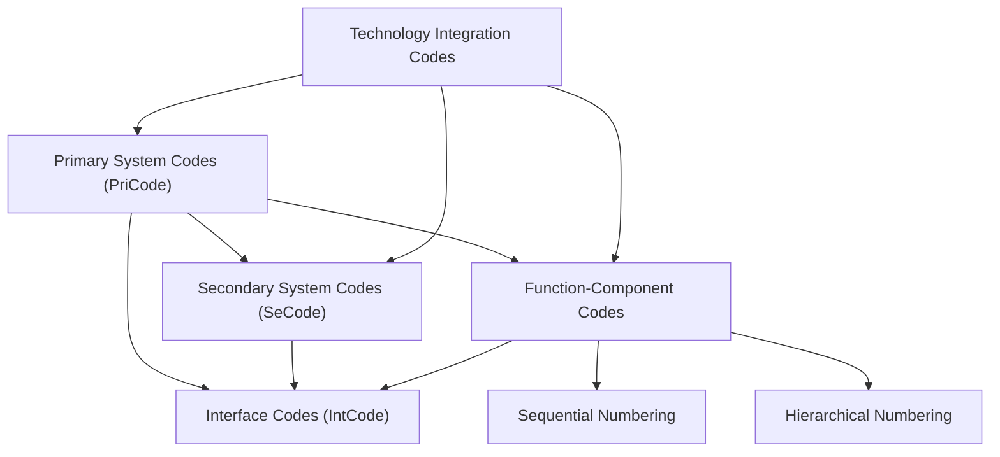
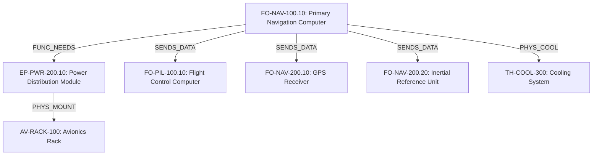
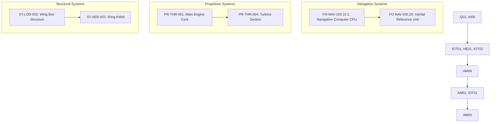
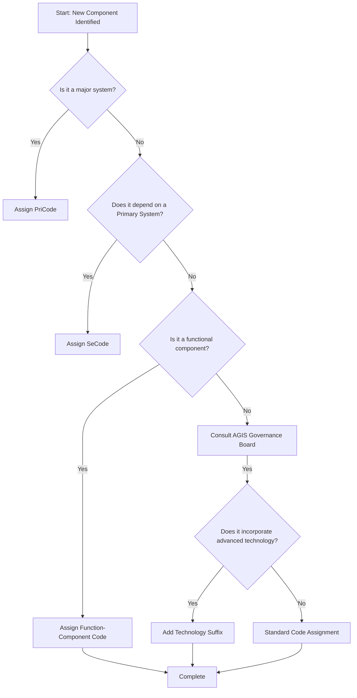
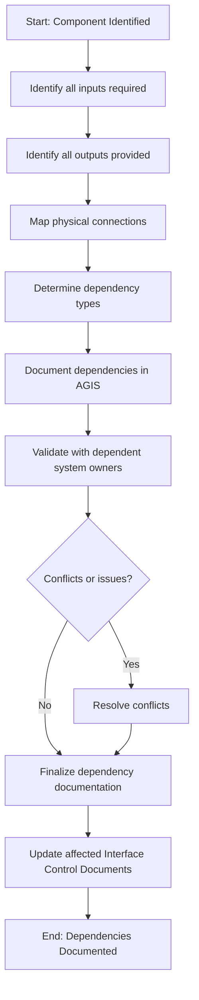
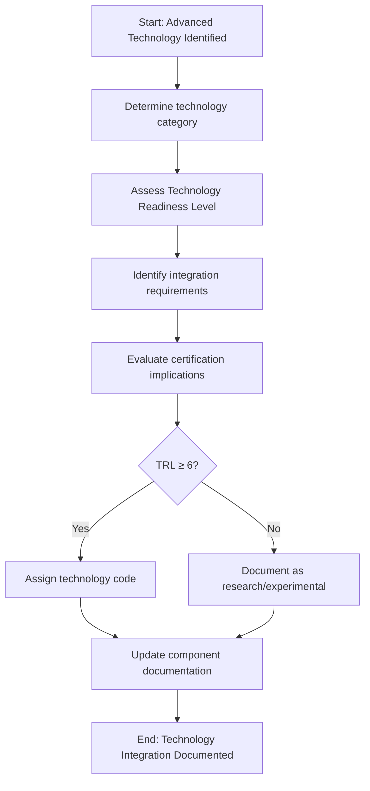
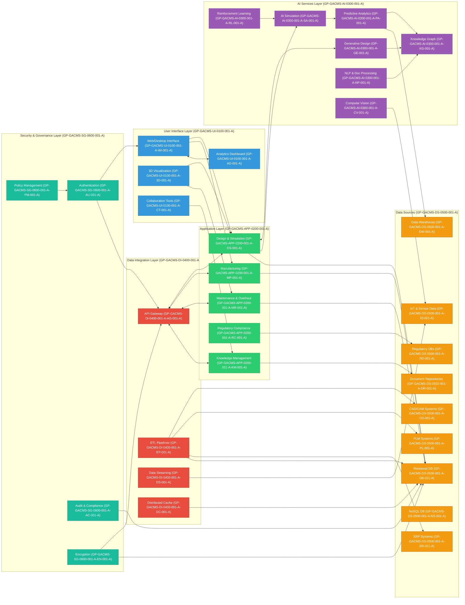
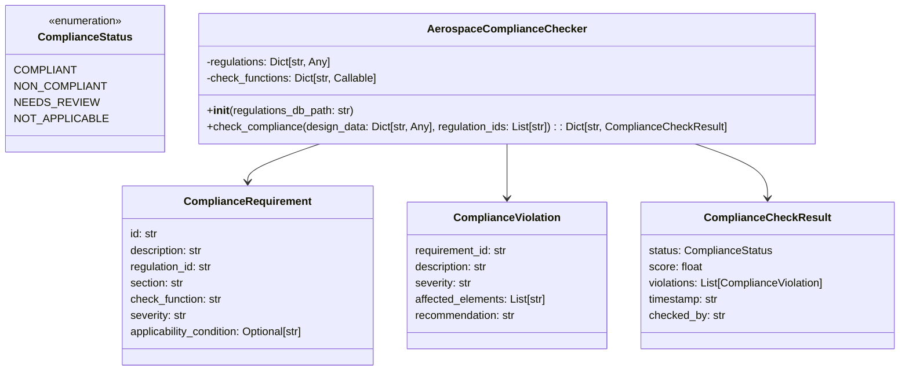
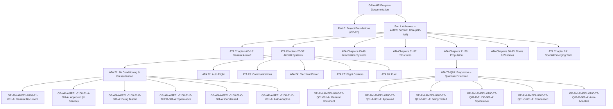

# GAIA AIR - AMPEL360 Project

## Aerospace General Integration System (AGIS) Nomenclature

---

## Table of Contents

1. [Introduction](#introduction)
2. [Foundational Engineer's Note](#foundational-engineers-note)
3. [Code Structure Overview](#code-structure-overview)
4. [Primary System Codes](#primary-system-codes)
5. [Primary Function Codes](#primary-function-codes)
6. [Component Sequential Numbering](#component-sequential-numbering)
7. [Dependency Relationships](#dependency-relationships)
8. [Technology Integration](#technology-integration)
9. [Implementation Guidelines](#implementation-guidelines)
10. [Documentation Standards](#documentation-standards)
11. [Appendices](#appendices)


---

## Introduction

The Aerospace General Integration System (AGIS) Nomenclature provides a unified framework for identifying, tracking, and managing all aerospace components and their interdependencies within the GAIA AIR - AMPEL360 project. This document establishes the standards for system identification, functional classification, and component numbering.

### Purpose

- **Unified Identification**: Ensure clear identification and traceability of all systems and components
- **Data Management**: Facilitate efficient data management and retrieval across all project phases
- **Dependency Tracking**: Support comprehensive dependency tracking and impact analysis
- **Cross-Functional Communication**: Enable clear communication across engineering, manufacturing, maintenance, and operations teams
- **Future-Proofing**: Provide a scalable framework for future system expansions and technology integration


### Scope

This nomenclature system applies to all systems, subsystems, components, and interfaces within the GAIA AIR - AMPEL360 project, including:

| System Category | Description | Examples
|-----|-----|-----
| Structural Systems | Primary and secondary load-bearing elements | Fuselage, wings, empennage
| Propulsion Systems | Engine and related thrust generation systems | Engines, fuel systems, thrust reversers
| Avionics Systems | Flight control, navigation, and electronic systems | Flight computers, navigation systems, displays
| Safety Systems | Systems ensuring safe operation and emergency response | Fire detection, emergency oxygen, evacuation systems
| Communication Systems | Internal and external communication capabilities | Radio systems, data links, passenger communications
| Load & Weight Management | Systems managing aircraft loading and balance | Cargo handling, weight distribution monitoring
| Passenger & Cabin Systems | Systems serving passenger needs and comfort | Seating, environmental control, entertainment
| Advanced Manufacturing & Materials | Novel materials and manufacturing approaches | Composite structures, additive manufacturing
| Validation & Certification Systems | Systems supporting testing and regulatory approval | Test equipment, certification documentation


---

## Foundational Engineer's Note

### Core Engineering Principles

The AGIS nomenclature system is built upon fundamental engineering principles that should guide its implementation and use throughout the GAIA AIR - AMPEL360 project lifecycle:

1. **Systems Thinking**: Always consider components within their broader system context. No component exists in isolation; each is part of an interconnected network that forms the complete aerospace system. The nomenclature system reflects these relationships explicitly.
2. **Single Source of Truth**: The AGIS system serves as the authoritative reference for all component identification. Avoid creating parallel or alternative naming conventions that could lead to confusion or errors.
3. **Traceability by Design**: Every engineering decision, modification, or integration must maintain complete traceability through the nomenclature system. If a relationship cannot be expressed within the current framework, the framework should be extended rather than bypassed.
4. **Functional Integrity**: The nomenclature system preserves functional relationships between components. Engineers should use these relationships to assess impact, manage changes, and ensure system integrity.
5. **Technological Evolution**: As aerospace technologies evolve, particularly with quantum, AI, and advanced materials, the nomenclature system must evolve in parallel. Engineers should propose extensions to accommodate new technologies while maintaining backward compatibility.


### Critical Implementation Guidance

When implementing the AGIS nomenclature system, engineers should adhere to these critical practices:

| Practice | Description | Consequence of Non-Adherence
|-----|-----|-----
| **Dependency Analysis First** | Before assigning codes, thoroughly analyze the dependency relationships between systems. | Incorrect dependency mapping leads to cascading errors in the nomenclature.
| **Functional Before Physical** | Always prioritize functional relationships over physical proximity when determining dependencies. | Two physically adjacent components may have no functional relationship, leading to incorrect dependency mapping.
| **Interface Definition Precision** | Interfaces (IntCode) require particular attention to detail. Clearly define the exact nature, protocols, and boundaries of each interface. | Imprecise interface definitions lead to integration issues and system failures.
| **Technology Integration Validation** | When incorporating advanced technologies (Q01, AI01, etc.), validate that the technology identifier accurately reflects the implementation. | Inaccurate technology identification obscures potential integration challenges and certification requirements.
| **Living Documentation** | The nomenclature system is not static. Engineers must continuously update component documentation as systems evolve. | Outdated documentation leads to misunderstandings, integration errors, and maintenance challenges.


### Engineering Accountability

Each engineer working on the GAIA AIR - AMPEL360 project bears responsibility for:

1. Correctly applying the AGIS nomenclature to all components under their purview
2. Identifying and documenting dependencies accurately
3. Maintaining up-to-date documentation of changes and modifications
4. Proposing improvements to the nomenclature system when limitations are encountered
5. Verifying that all interfaces between their systems and others are properly defined


> **Remember**: The quality of our integration is only as good as the precision of our communication. The AGIS nomenclature system is our shared language for ensuring that precision.


---

## Code Structure Overview

The AGIS nomenclature system uses a hierarchical structure with several code types, each serving a specific purpose in the overall system architecture.

### 1. Primary System Codes (PriCode)

Identifies major systems within the aerospace platform.

**Format**: `[System Category Abbreviation][Number]`

**Example**: `Fus1` - Primary Fuselage Structure (ST Category)

**Purpose**: Provides top-level identification of major systems that form the foundation of the aircraft.

### 2. Secondary System Codes (SeCode)

Identifies components that depend on primary systems.

**Format**: `[Number][Component Abbreviation]-on-[PriCode]`

**Example**: `2Wing-on-Fus1` - Secondary Wing Structure (depends on Primary Fuselage)

**Purpose**: Establishes clear dependency relationships between secondary components and their primary system hosts.

### 3. Integration/Interface Codes (IntCode)

Identifies connections between components.

**Format**: `Int-[Code1]-to-[Code2]` (Where Code1 and Code2 can be PriCode, SeCode, or Function-Component Codes)

**Examples**:

- `Int-Wing1-to-Eng1` - Interface between Primary Wing Structure and Primary Engine System
- `Int-FO-NAV-001-to-FO-PIL-001` - Interface between Primary Nav Computer and Primary Flight Control Computer


**Purpose**: Documents and standardizes all interfaces between systems, enabling clear communication about connection points and integration requirements.

### 4. Function-Component Codes (Sequential Functional Numbering)

Identifies components by their functional role with a simple sequential numbering system.

**Format**: `[Function Code]-[Sequential Number]`

**Example**: `FO-NAV-001` - Primary Navigation Computer within Navigation & Guidance function

**Purpose**: Provides a straightforward inventory and reference system for components based on their functional category.

### 5. Function-Component Codes (Hierarchical Structural Numbering)

Identifies components by their functional role and hierarchical position.

**Format**: `[Function Code]-[Level 1].[Level 2].[Level 3]-[Variant]`

**Example**: `FO-NAV-100.10.1` - CPU component of the Primary Navigation Computer

**Purpose**: Represents the detailed hierarchical breakdown of systems, showing parent-child relationships and precise component positioning within the functional architecture.

### Code Relationships Diagram



---

## Primary System Codes

Primary System Codes (PriCodes) identify the major systems that form the foundation of the aircraft. Each code consists of a category abbreviation followed by a descriptive component abbreviation and number.

### Structural Systems (ST)

| Code | Description | Primary Function
|-----|-----|-----
| **Fus1** | Primary Fuselage Structure | Main aircraft body providing pressurized compartment and structural backbone
| **Wing1** | Primary Wing Structure | Main lifting surfaces and fuel containment
| **Emp1** | Primary Empennage Structure | Tail assembly providing stability and control
| **Pyl1** | Primary Pylon Structure | Engine attachment and load transfer structure
| **Nac1** | Primary Nacelle Structure | Engine housing and aerodynamic fairing
| **Rad1** | Primary Radome Structure | Weather radar and sensor housing structure
| **Lgr1** | Primary Landing Gear Structure | Take-off, landing, and ground maneuvering support structure
| **Fld1** | Primary Flight Deck Structure | Cockpit structural elements
| **Cab1** | Primary Cabin Structure | Passenger and crew compartment structure
| **Cgo1** | Primary Cargo Structure | Cargo compartment structural elements


### Propulsion Systems (PR)

| Code | Description | Primary Function
|-----|-----|-----
| **Eng1** | Primary Engine System | Main thrust generation
| **Fue1** | Primary Fuel Storage System | Fuel containment and management
| **Fud1** | Primary Fuel Distribution System | Fuel delivery to engines
| **Fdc1** | Primary FADEC Control System | Engine control and monitoring
| **Thr1** | Primary Thrust Reverser System | Landing deceleration
| **Apu1** | Primary Auxiliary Power Unit | Ground power and backup systems
| **Exh1** | Primary Exhaust System | Engine exhaust management
| **Intk1** | Primary Air Intake System | Engine air supply
| **Ign1** | Primary Ignition System | Engine starting
| **Qpr1** | Primary Quantum Propulsion System | Advanced propulsion technology (Planned)


### Avionics Systems (AV)

| Code | Description | Primary Function
|-----|-----|-----
| **Fcs1** | Primary Flight Control System | Aircraft attitude and flight path control
| **Nav1** | Primary Navigation System | Position determination and route guidance
| **Fms1** | Primary Flight Management System | Flight planning and performance optimization
| **Ins1** | Primary Inertial Navigation System | Position tracking without external references
| **Gps1** | Primary GPS System | Satellite-based positioning
| **Rdr1** | Primary Radar System | Weather and terrain detection
| **Adh1** | Primary Air Data & Heading Reference System | Atmospheric data and aircraft orientation
| **Aut1** | Primary Autopilot System | Automated flight control
| **Dis1** | Primary Display System | Information presentation to flight crew
| **Efb1** | Primary Electronic Flight Bag System | Digital documentation and calculations


### Safety Systems (SF)

| Code | Description | Primary Function
|-----|-----|-----
| **Fir1** | Primary Fire Detection & Suppression System | Fire safety
| **Fdt1** | Primary Fault Detection System | System health monitoring
| **Oxy1** | Primary Oxygen System | Emergency breathing support
| **Eva1** | Primary Evacuation System | Emergency exit facilitation
| **Egs1** | Primary Emergency Guidance System | Evacuation guidance
| **Egr1** | Primary Emergency Exit System | Emergency egress paths
| **Shm1** | Primary Structural Health Monitoring System | Structure integrity monitoring
| **Wrs1** | Primary Warning System | Hazard alerting
| **Elt1** | Primary Emergency Locator Transmitter | Post-accident location signaling
| **Eme1** | Primary Emergency Power System | Critical systems backup power


### Communication Systems (CM)

| Code | Description | Primary Function
|-----|-----|-----
| **Icm1** | Primary Internal Communication System | Crew and passenger communication
| **Ext1** | Primary External Communication System | Air-to-ground communication
| **Sat1** | Primary Satellite Communication System | Long-range communication
| **Atc1** | Primary Air Traffic Control Communication System | ATC interaction
| **Dat1** | Primary Data Link System | Digital information exchange
| **Acr1** | Primary ACARS System | Operational messaging
| **Vhf1** | Primary VHF Communication System | Standard aviation voice communication
| **Hf1** | Primary HF Communication System | Long-range voice communication
| **Wif1** | Primary WiFi System | Passenger connectivity
| **Ent1** | Primary Entertainment System | Passenger entertainment delivery


### Load & Weight Management (LW)

| Code | Description | Primary Function
|-----|-----|-----
| **Lms1** | Primary Load Management System | Load distribution optimization
| **Wms1** | Primary Weight Management System | Weight tracking and reporting
| **Bal1** | Primary Balance System | Center of gravity management
| **CgoH1** | Primary Cargo Handling System | Cargo loading and securing
| **Wbs1** | Primary Weight & Balance System | Pre-flight weight calculation
| **Flo1** | Primary Floor Loading System | Cabin and cargo floor load management
| **Tie1** | Primary Tie-down System | Cargo securing
| **Lop1** | Primary Load Optimization System | Payload distribution planning
| **Wdm1** | Primary Weight Distribution Monitoring System | Real-time weight distribution tracking
| **Ach1** | Primary Automated Cargo Handling System | Robotic/automated cargo management


### Passenger & Cabin Systems (PC)

| Code | Description | Primary Function
|-----|-----|-----
| **Pax1** | Primary Passenger Seating System | Passenger accommodation
| **Ife1** | Primary In-Flight Entertainment System | Passenger entertainment
| **Lig1** | Primary Cabin Lighting System | Cabin illumination
| **EnvC1** | Primary Environmental Control System | Cabin air quality and temperature
| **Gly1** | Primary Galley System | Food preparation and storage
| **Lav1** | Primary Lavatory System | Sanitation facilities
| **Pws1** | Primary Potable Water System | Drinking water supply
| **Wst1** | Primary Waste System | Waste collection and storage
| **Pse1** | Primary Passenger Service System | Attendant call and service coordination
| **Amb1** | Primary Ambient Experience System | Cabin atmosphere enhancement


### Advanced Manufacturing & Materials (AM)

| Code | Description | Primary Function
|-----|-----|-----
| **Adm1** | Primary Advanced Materials System | Novel materials implementation
| **Cmp1** | Primary Composite Materials System | Composite structure management
| **Add1** | Primary Additive Manufacturing System | 3D printing and related processes
| **Rob1** | Primary Robotic Assembly System | Automated assembly processes
| **SlfH1** | Primary Self-Healing Materials System | Materials with repair capabilities
| **Nan1** | Primary Nano-Materials System | Nanoscale material applications
| **Smt1** | Primary Smart Materials System | Materials with adaptive properties
| **Mfp1** | Primary Manufacturing Process System | Process control and optimization
| **Qlt1** | Primary Quality Control System | Manufacturing quality assurance
| **DigT1** | Primary Digital Twin System | Virtual representation of physical assets


### Validation & Certification Systems (VC)

| Code | Description | Primary Function
|-----|-----|-----
| **StrV1** | Primary Structural Validation System | Structural testing and verification
| **FltT1** | Primary Flight Testing System | In-flight validation
| **Cer1** | Primary Certification System | Regulatory compliance management
| **Doc1** | Primary Documentation System | Technical documentation management
| **Sim1** | Primary Simulation System | Virtual testing environment
| **TstE1** | Primary Test Equipment System | Physical test apparatus
| **Reg1** | Primary Regulatory Compliance System | Compliance tracking and reporting
| **SafA1** | Primary Safety Assessment System | Safety analysis and documentation
| **EnvCmp1** | Primary Environmental Compliance System | Environmental impact management
| **Qal1** | Primary Qualification System | Component qualification process


---

## Primary Function Codes

Primary Function Codes identify the functional roles that components play within the aircraft systems, regardless of their physical implementation. These codes focus on what a component does rather than what it is.

### Flight Operations Functions (FO)

Functions related to the operation and control of the aircraft during flight.

| Code | Function | Description
|-----|-----|-----
| **FO-NAV** | Navigation & Guidance | Determining aircraft position and guiding along intended route
| **FO-PIL** | Piloting & Flight Control | Controlling aircraft attitude and flight path
| **FO-TRJ** | Trajectory Planning & Management | Computing and optimizing flight trajectories
| **FO-ATM** | Air Traffic Management Interface | Interacting with air traffic control systems
| **FO-LND** | Landing & Approach Operations | Managing approach and landing phases
| **FO-TKO** | Takeoff & Departure Operations | Managing takeoff and initial climb phases
| **FO-CRS** | Cruise Operations | Managing efficient cruise flight
| **FO-FPL** | Flight Planning | Pre-flight route and performance planning
| **FO-WXA** | Weather Assessment & Avoidance | Detecting and avoiding adverse weather
| **FO-EMG** | Emergency Flight Operations | Managing aircraft during emergency situations


### Propulsion Functions (PR)

Functions related to generating and managing thrust.

| Code | Function | Description
|-----|-----|-----
| **PR-THR** | Thrust Generation | Producing forward propulsive force
| **PR-FUE** | Fuel Management | Storing, distributing, and measuring fuel
| **PR-IGN** | Ignition & Combustion Control | Managing the combustion process
| **PR-AIR** | Air Intake & Compression | Managing airflow to engines
| **PR-EFF** | Efficiency Optimization | Maximizing propulsion efficiency
| **PR-THM** | Thermal Management | Managing heat in propulsion systems
| **PR-EXH** | Exhaust Management | Controlling engine exhaust
| **PR-STA** | Propulsion Stability & Control | Ensuring stable engine operation
| **PR-REV** | Thrust Reversal / Braking | Providing reverse thrust for deceleration
| **PR-PWR** | Power Generation | Generating electrical power from engines


### Structural Functions (ST)

Functions related to the physical structure and integrity of the aircraft.

| Code | Function | Description
|-----|-----|-----
| **ST-LOD** | Load Bearing & Distribution | Supporting and distributing structural loads
| **ST-AER** | Aerodynamic Surface Provision | Providing surfaces for aerodynamic forces
| **ST-PRE** | Pressure Containment | Maintaining pressurized compartments
| **ST-VIB** | Vibration Damping & Control | Reducing and managing vibrations
| **ST-THE** | Thermal Protection | Managing structural temperatures
| **ST-RAD** | Radiation Shielding | Protecting from radiation (if applicable)
| **ST-IMP** | Impact Resistance & Protection | Providing protection from impacts
| **ST-FAT** | Fatigue Life Management | Managing structural fatigue
| **ST-DEF** | Deformation Monitoring & Control | Tracking structural deformation
| **ST-INT** | Structural Integration & Interfacing | Managing structural connections


### Communication Functions (CM)

Functions related to information exchange within and outside the aircraft.

| Code | Function | Description
|-----|-----|-----
| **CM-INT** | Internal Communications | Communication between crew and passengers
| **CM-EXT** | External Communications | Communication with ground and other aircraft
| **CM-DAT** | Data Transmission & Reception | Digital data exchange
| **CM-SEC** | Secure Communications | Encrypted and protected communications
| **CM-SAT** | Satellite Communications | Long-range satellite-based communication
| **CM-REL** | Relay Communications | Extending communication range
| **CM-EMG** | Emergency Communications | Communication during emergencies
| **CM-BRD** | Broadcast Functions | One-to-many information distribution
| **CM-NET** | Network Management & Routing | Managing communication networks
| **CM-MON** | Communication System Monitoring | Monitoring communication system health


### Safety & Emergency Functions (SE)

Functions related to safety systems and emergency response.

| Code | Function | Description
|-----|-----|-----
| **SE-FIR** | Fire Detection & Suppression | Detecting and extinguishing fires
| **SE-EVA** | Emergency Evacuation | Facilitating emergency exits
| **SE-FAL** | Failure Detection & Management | Detecting and managing system failures
| **SE-OXY** | Emergency Oxygen Provision | Providing emergency breathing oxygen
| **SE-RES** | Rescue Operations | Supporting post-accident rescue
| **SE-SRV** | Survival Systems | Supporting post-evacuation survival
| **SE-LGT** | Emergency Lighting | Providing illumination during emergencies
| **SE-PWR** | Emergency Power Provision | Supplying power during emergencies
| **SE-MED** | Medical Emergency Response | Supporting medical emergencies
| **SE-SHM** | Structural Health Monitoring | Monitoring structural integrity


### Function Code Application Examples

| Scenario | Function Code | Component Example | Explanation
|-----|-----|-----
| Navigation during cruise | FO-NAV | GPS Receiver (FO-NAV-002) | Provides position data for navigation
| Engine thrust control | PR-THR | FADEC Controller (PR-THR-001) | Manages engine thrust output
| Wing load distribution | ST-LOD | Wing Box Structure (ST-LOD-002) | Distributes aerodynamic loads
| Crew communication | CM-INT | Intercom System (CM-INT-003) | Enables communication between crew members
| Fire detection in cargo | SE-FIR | Cargo Fire Detector (SE-FIR-005) | Detects fires in cargo compartment


---

## Component Sequential Numbering

Each primary function has associated components identified using a dual numbering approach to allow both simple inventory tracking and detailed architectural representation.

### Dual Numbering Approach

The AGIS system implements a dual numbering approach that combines:

1. **Sequential Functional Numbering**: For broad categorization, inventory management, and simpler references.
2. **Hierarchical Structural Numbering**: For representing parent-child relationships, system architecture breakdown, and detailed configuration management.


### Sequential Functional Numbering Format

```plaintext
[Function Code]-[Sequential Number]
```

Where:

- **Function Code**: The primary function identifier (e.g., `FO-NAV`)
- **Sequential Number**: A three-digit sequential number (001-999) identifying a specific system, assembly, or major component fulfilling that function.


**Benefits**:

- Simple, flat numbering for inventory and reference
- Easy to assign new numbers sequentially
- Straightforward for non-technical stakeholders to understand


**Limitations**:

- Does not express parent-child relationships
- Does not represent system architecture
- Limited information about component role within function


### Hierarchical Structural Numbering Format

```plaintext
[Function Code]-[Level 1].[Level 2].[Level 3]-[Variant]
```

Where:

- **Function Code**: The primary function identifier (e.g., `FO-NAV`)
- **Level 1**: Main component category or major subsystem within the function (e.g., 100 for Computer Systems, 200 for Sensors). Typically uses hundreds.
- **Level 2**: Sub-component, assembly, or specific device within Level 1 (e.g., 10 for Primary Computer, 20 for Backup Computer). Typically uses tens.
- **Level 3**: Individual part, module, or specific element within Level 2 (e.g., 1 for CPU, 2 for Memory). Typically uses single digits.
- **Variant**: Optional suffix (e.g., `-A`, `-B`, `-Rev2`) to denote different versions, revisions, or configurations of the *same* component at that specific hierarchical level.


**Benefits**:

- Expresses parent-child relationships
- Represents system architecture
- Supports configuration management
- Provides context about component role


**Limitations**:

- More complex to assign and interpret
- Requires understanding of system architecture
- May change as architecture evolves


### Mapping Between Numbering Systems

A central database or configuration management tool maintains the mapping between the sequential and hierarchical identifiers. A single sequential number often maps to a Level 1 or Level 2 hierarchical code, representing the primary instance of that component type.

### Example: Navigation & Guidance (FO-NAV)

#### Sequential Numbering (Inventory/Simple Reference)

| Sequential Code | Component Name | Description
|-----|-----|-----
| **FO-NAV-001** | Primary Navigation Computer | Main navigation processing unit
| **FO-NAV-002** | GPS Receiver System | Satellite-based positioning system
| **FO-NAV-003** | Inertial Reference Unit (IRU) | Motion-based positioning system
| **FO-NAV-004** | VOR/ILS Receiver | Ground-based navigation aid receiver
| **FO-NAV-005** | Radio Altimeter | Height-above-terrain measurement
| **FO-NAV-006** | Terrain Awareness and Warning System | Ground proximity warning system
| **FO-NAV-007** | Navigation Database Unit | Navigation data storage
| **FO-NAV-008** | Waypoint Management Software | Route planning software module
| **FO-NAV-009** | Navigation Display Unit | Pilot navigation interface
| **FO-NAV-010** | Approach Guidance Computer | Precision approach control


#### Hierarchical Numbering (Architecture/Detailed Breakdown)

# Navigation System Dependencies

## FO-NAV-100: Navigation Computer Systems
- **FO-NAV-100.10: Primary Navigation Computer (Maps to FO-NAV-001)**
  - FO-NAV-100.10.1: Navigation Computer CPU Module
  - FO-NAV-100.10.2: Navigation Computer Memory Module
  - FO-NAV-100.10.3: Navigation Computer I/O Module A
  - FO-NAV-100.10.4: Navigation Computer I/O Module B
- **FO-NAV-100.20: Backup Navigation Computer**
- **FO-NAV-100.30: Navigation Data Processing Module**

## FO-NAV-200: Position Reference Systems
- **FO-NAV-200.10: GPS Receiver System (Maps to FO-NAV-002)**
  - FO-NAV-200.10.1: GPS Antenna Unit
  - FO-NAV-200.10.2: GPS Receiver Processor
- **FO-NAV-200.20: Inertial Reference Unit (Maps to FO-NAV-003)**
  - FO-NAV-200.20.1: Laser Gyro Assembly
  - FO-NAV-200.20.2: Accelerometer Package
- **FO-NAV-200.30: Radio Navigation Systems**
  - FO-NAV-200.30.1: VOR/ILS Receiver (Maps to FO-NAV-004)
  - FO-NAV-200.30.2: Radio Altimeter (Maps to FO-NAV-005)
  - FO-NAV-200.30.3: Radio Altimeter Antenna

## FO-NAV-300: Situational Awareness Systems
- **FO-NAV-300.10: Terrain Awareness System (Maps to FO-NAV-006)**
  - FO-NAV-300.10.1: TAWS Computer
  - FO-NAV-300.10.2: TAWS Database Module

## FO-NAV-400: Navigation Data Management
- **FO-NAV-400.10: Navigation Database Unit (Maps to FO-NAV-007)**
- **FO-NAV-400.20: Waypoint Management Software (Maps to FO-NAV-008)**

## FO-NAV-500: Display & Guidance Systems
- **FO-NAV-500.10: Navigation Display Unit (Maps to FO-NAV-009)**
- **FO-NAV-500.20: Approach Guidance Computer (Maps to FO-NAV-010)**

### Variant Designation Examples

| Base Code | Variant | Description
|-----|-----|-----
| FO-NAV-100.10 | FO-NAV-100.10-A | Initial production version
| FO-NAV-100.10 | FO-NAV-100.10-B | Updated with enhanced processing
| FO-NAV-200.10 | FO-NAV-200.10-GPS3 | GPS Receiver compatible with GPS III satellites
| FO-NAV-300.10 | FO-NAV-300.10-Rev2 | Second major revision with expanded database


---

## Dependency Relationships

Dependencies between components are critical to understanding system behavior, impact analysis, and change management. The AGIS system provides a formal framework for documenting and tracking these relationships.

### Dependency Code Format

Dependencies are documented using the following format:

```plaintext
DEP-[Source Component]-[Dependency Type]-[Target Component]
```

Where:

- **Source Component**: The component that has the dependency (using its AGIS code)
- **Dependency Type**: A standardized code representing the nature of the dependency
- **Target Component**: The component that is depended upon (using its AGIS code)


**Example**: `DEP-FO-NAV-100.10.1-FUNC_NEEDS-EP-PWR-200.10`

This indicates that the Navigation Computer CPU Module (FO-NAV-100.10.1) functionally needs power from the Power Distribution Module (EP-PWR-200.10).

### Dependency Types

#### Functional Dependencies (FUNC)

Dependencies related to the functional operation of components.

| Dependency Type | Code | Description | Example
|-----|-----|-----
| Needs | FUNC_NEEDS | Component requires another to function | Navigation computer needs power supply
| Controls | FUNC_CTRLS | Component provides control signals | FADEC controls engine fuel flow
| Monitors | FUNC_MONIT | Component observes or measures | Temperature sensor monitors engine heat
| Processes | FUNC_PROCS | Component processes data from | Computer processes sensor data
| Activates | FUNC_ACTIV | Component triggers or activates | Fire detection activates suppression


#### Physical Dependencies (PHYS)

Dependencies related to physical relationships between components.

| Dependency Type | Code | Description | Example
|-----|-----|-----
| Mounts To | PHYS_MOUNT | Component physically attaches to | Engine mounts to pylon
| Contains | PHYS_CONTN | Component physically contains | Avionics bay contains computers
| Connects To | PHYS_CONCT | Component physically connects to | Fuel line connects to engine
| Shields | PHYS_SHLD | Component provides protection | Firewall shields cabin from engine
| Cools | PHYS_COOL | Component provides thermal management | Heat exchanger cools electronics


#### Data Dependencies (DATA)

Dependencies related to information exchange between components.

| Dependency Type | Code | Description | Example
|-----|-----|-----
| Sends Data To | DATA_SENDS | Component transmits data | GPS sends position to FMS
| Receives Data From | DATA_RECVS | Component receives data | Display receives data from computer
| Synchronizes With | DATA_SYNCS | Component maintains timing sync | Clock syncs with master timebase
| Validates | DATA_VALID | Component validates data | Monitor validates sensor readings
| Stores | DATA_STORE | Component stores data for | Database stores data for navigation


#### Power Dependencies (PWR)

Dependencies related to electrical power.

| Dependency Type | Code | Description | Example
|-----|-----|-----
| Supplies | PWR_SUPPLY | Component supplies electrical power | Generator supplies power to bus
| Grounds | PWR_GROUND | Component provides electrical ground | Structure provides ground for electronics
| Converts | PWR_CONVERT | Component converts power type | Converter changes AC to DC
| Regulates | PWR_REGUL | Component regulates power | Regulator maintains stable voltage
| Protects | PWR_PROT | Component provides power protection | Circuit breaker protects from overload


#### Interface Dependencies (INTF)

Dependencies related to standardized interfaces between components.

| Dependency Type | Code | Description | Example
|-----|-----|-----
| Matches | INTF_MATCH | Component interface must match | Connector must match socket type
| Complies With | INTF_COMPLY | Component must comply with interface standard | Device complies with ARINC 429
| Adapts | INTF_ADAPT | Component adapts between interfaces | Adapter converts between protocols
| Extends | INTF_EXTEND | Component extends an interface | Extender adds additional connections
| Terminates | INTF_TERM | Component terminates an interface | Terminator ends a data bus


### Dependency Documentation

All dependencies must be documented in the central AGIS database with the following minimum information:

| Field | Description | Example
|-----|-----|-----
| Dependency ID | Unique identifier | DEP-001234
| Source Component | Component with dependency | FO-NAV-100.10.1
| Target Component | Component depended upon | EP-PWR-200.10
| Dependency Type | Nature of dependency | FUNC_NEEDS
| Criticality | Importance of dependency | Critical
| Description | Detailed explanation | "Navigation CPU requires 28VDC power from main distribution bus"
| Interface Reference | Related interface code | Int-FO-NAV-100.10-to-EP-PWR-200
| Status | Current state | Implemented
| Verification Method | How dependency is verified | Test
| Verification Evidence | Reference to test results | "Power System Test Report TR-2023-045"


### Dependency Visualization

Dependencies can be visualized using directed graphs to show relationships between components:



### Dependency Analysis

Dependency analysis is critical for:

1. **Impact Assessment**: Understanding the ripple effects of component changes
2. **Failure Mode Analysis**: Identifying potential cascading failures
3. **Upgrade Planning**: Planning for component upgrades or replacements
4. **Integration Testing**: Ensuring all dependencies are properly tested
5. **Certification**: Demonstrating system safety and compliance


#### Dependency Matrix Example

| Component | Depends On | Depended On By
|-----|-----|-----
| FO-NAV-100.10 | EP-PWR-200.10, TH-COOL-300, AV-RACK-100 | FO-PIL-100.10, FO-DIS-300.10
| FO-NAV-200.10 | EP-PWR-200.20, AV-RACK-100 | FO-NAV-100.10
| FO-NAV-200.20 | EP-PWR-200.20, AV-RACK-100 | FO-NAV-100.10
| EP-PWR-200.10 | PR-PWR-100.10 | FO-NAV-100.10, FO-PIL-100.10, FO-DIS-300.10


---

## Technology Integration

The AGIS nomenclature system incorporates specific identifiers to denote the integration of advanced technologies within aerospace components. This standardized approach ensures clear communication about technological capabilities and dependencies across all systems.

### Technology Identifier Format

A suffix is appended to the standard AGIS Component Code:

```plaintext
[AGIS Component Code]-[TechCode]
```

Where:

- **AGIS Component Code**: The standard component identifier (PriCode, SeCode, Function-Component code).
- **TechCode**: A code representing the integrated technology (see categories below).


**Example**: `FO-NAV-100.10.1-Q01`

This indicates that the Navigation Computer CPU incorporates Quantum Computing Technology (subtype 01).

### Primary Technology Categories & Codes

#### Quantum Technologies (Q)

Advanced technologies leveraging quantum mechanical principles.

| Code | Technology | Description | TRL Range | Example Application
|-----|-----|-----
| Q01 | Quantum Computing | Quantum-based computational systems | 3-6 | Navigation optimization algorithms
| Q02 | Quantum Sensing | Ultra-precise quantum-based sensors | 4-7 | Inertial navigation without GPS
| Q03 | Quantum Communication | Quantum key distribution, entanglement | 4-6 | Secure communications
| Q05 | Quantum Propulsion | Theoretical advanced propulsion | 1-3 | Experimental thrust generation
| Q07 | Quantum Materials | Materials leveraging quantum effects | 3-7 | Super-conducting components


#### Artificial Intelligence (AI)

Technologies enabling machine learning and autonomous capabilities.

| Code | Technology | Description | TRL Range | Example Application
|-----|-----|-----
| AI01 | Machine Learning | General ML algorithms and models | 6-9 | Pattern recognition in sensor data
| AI02 | Deep Learning | Neural network-based learning | 5-8 | Image recognition for landing assist
| AI05 | Autonomous Decision | Self-governing decision systems | 4-7 | Emergency response prioritization
| AI06 | Predictive Analytics | Forecasting and prognostics | 6-9 | Predictive maintenance
| AI07 | Generative AI | Content and solution generation | 4-7 | Automated procedure generation


#### Advanced Materials (AM)

Novel materials with superior properties.

| Code | Technology | Description | TRL Range | Example Application
|-----|-----|-----
| AM01 | Composite Materials | Fiber-reinforced composites | 7-9 | Primary structure components
| AM02 | Nano-enhanced Materials | Nanomaterial-enhanced composites | 5-8 | Lightweight structural elements
| AM03 | Self-Healing Materials | Materials with repair capabilities | 4-7 | Fuel tank liners with leak sealing
| AM05 | Metamaterials | Engineered materials with novel properties | 3-6 | Specialized electromagnetic surfaces
| AM06 | Ceramic Matrix Composites | High-temperature ceramic composites | 6-9 | Engine hot section components


#### Blockchain Technologies (BC)

Distributed ledger technologies for secure data management.

| Code | Technology | Description | TRL Range | Example Application
|-----|-----|-----
| BC01 | Supply Chain Tracking | Component provenance tracking | 7-9 | Parts authentication and tracking
| BC02 | Maintenance Records | Immutable maintenance history | 6-8 | Service record verification
| BC04 | Smart Contracts | Self-executing contract functionality | 5-7 | Automated maintenance scheduling
| BC08 | Certification Data | Secure certification record keeping | 6-8 | Airworthiness documentation


#### Internet of Things (IOT)

Connected device technologies for monitoring and control.

| Code | Technology | Description | TRL Range | Example Application
|-----|-----|-----
| IOT01 | Sensor Networks | Distributed sensor systems | 7-9 | Structural health monitoring
| IOT02 | Real-Time Monitoring | Continuous data collection | 7-9 | Engine performance tracking
| IOT03 | Edge Computing | Local data processing | 6-8 | On-aircraft data analysis
| IOT05 | Predictive Maintenance | Condition-based maintenance | 6-9 | Component life prediction


#### Augmented/Virtual Reality (AR)

Technologies enhancing human interaction with systems.

| Code | Technology | Description | TRL Range | Example Application
|-----|-----|-----
| AR01 | Maintenance Assistance | AR-guided maintenance | 6-8 | Visual maintenance guidance
| AR03 | Training Simulation | VR-based training systems | 7-9 | Maintenance procedure training
| AR05 | Design Visualization | AR design review tools | 7-9 | In-context design evaluation


#### Hybrid Electric Systems (HE)

Technologies combining conventional and electric power.

| Code | Technology | Description | TRL Range | Example Application
|-----|-----|-----
| HE01 | Hybrid Propulsion | Combined conventional/electric | 5-8 | Hybrid-electric propulsion
| HE02 | Electric Generation | Advanced electrical generation | 6-9 | High-output generators
| HE03 | Energy Storage | Battery and capacitor systems | 5-8 | High-density energy storage
| HE06 | Power Electronics | Advanced power conversion | 6-9 | Efficient power converters


### Multiple Technology Integration

Components integrating multiple technologies list suffixes sequentially:

```plaintext
[AGIS Component Code]-[TechCode1]-[TechCode2]
```

**Example**: `FO-NAV-100.10.1-Q01-AI06`

This indicates a Navigation Computer CPU that incorporates both Quantum Computing (Q01) and Predictive Analytics (AI06).

### Technology Readiness Level (TRL) Annotation

For developing technologies, TRL can be noted in documentation:

| TRL | Description | Status
|-----|-----|-----
| 1-3 | Basic principles, concept formulation | Research
| 4-6 | Component validation, prototype demonstration | Development
| 7-9 | System demonstration, qualification, operational use | Implementation


**Example Database Entry**:

- Component: `PR-THR-001-Q05`
- Technology: Quantum Propulsion
- TRL: 4 (Component validation in laboratory)
- Status: Development


### Technology Integration Visualization

Technology integration across systems can be visualized:



### Technology Domain Integration

Technologies often span multiple domains, requiring cross-functional expertise:

| Domain | Primary Technologies | Key Integration Challenges
|-----|-----|-----
| Information Technology | Q01-Q04, AI01-AI10, BC01-BC10 | Certification of novel algorithms, cybersecurity
| Materials Technology | AM01-AM10, Q07 | Qualification testing, manufacturing processes
| Energy Technology | HE01-HE10, Q05, Q08 | Safety certification, thermal management
| Sensing Technology | IOT01-IOT02, Q02, Q09 | Reliability validation, data integration
| Human Interface Technology | AR01-AR10 | Human factors certification, training validation


### Implementation Guidelines

1. **Technology Assignment**:

1. Assign technology codes only when the technology significantly enhances or changes the component's functionality
2. Use the most specific technology subtype available
3. Document the specific implementation details in the component database


2. **Technology Documentation**:

1. Each technology integration must be documented with:

1. Technology description
2. Implementation details
3. Performance impacts
4. Dependency implications
5. Certification considerations
6. Maintenance requirements


3. **Technology Evolution**:

1. When technologies evolve:

1. Update the version/revision numbers
2. Document changes in capabilities
3. Assess impacts on dependencies
4. Update certification status


4. **Technology Compatibility**:

1. Before integrating multiple technologies, assess:

1. Physical compatibility
2. Functional compatibility
3. Certification compatibility
4. Maintenance compatibility
5. Security implications


---

## Implementation Guidelines

The successful implementation of the AGIS nomenclature system requires structured processes, clear responsibilities, and integration with existing engineering systems. This section provides practical guidance for applying the nomenclature system across the GAIA AIR - AMPEL360 project.

### Code Assignment Procedures

#### New Component Registration

1. **Initial Request**:

1. Submit a Component Registration Request (CRR) through the AGIS portal
2. Include preliminary component description, function, and dependencies
3. Identify the primary system category and functional area


2. **Code Determination**:

1. The AGIS Governance Board reviews the request within 3 business days
2. Determines appropriate PriCode, SeCode, or Function-Component code
3. Assigns both sequential and hierarchical numbers as applicable
4. Validates that the code follows nomenclature standards


3. **Dependency Analysis**:

1. Identify and document all dependencies using the DEP format
2. Validate dependencies with affected system owners
3. Resolve any dependency conflicts or circular dependencies


4. **Technology Integration**:

1. Identify and document all advanced technologies using appropriate suffixes
2. Validate technology implementation with technology domain experts
3. Document technology readiness levels and certification requirements


5. **Final Approval**:

1. AGIS Governance Board provides final approval
2. Component is added to the master AGIS database
3. Notification is sent to all stakeholders


#### Emergency Code Assignment

For urgent situations where the standard process would cause project delays:

1. **Emergency Request**:

1. Submit Emergency Component Registration Request (ECRR)
2. Include justification for expedited processing
3. Obtain approval from Project Manager or Chief Engineer


2. **Provisional Code Assignment**:

1. AGIS Administrator assigns provisional code within 4 hours
2. Code is marked with "P" suffix to indicate provisional status
3. Provisional codes are valid for 10 business days


3. **Expedited Review**:

1. AGIS Governance Board conducts expedited review within 5 business days
2. Converts provisional code to permanent or reassigns as needed
3. Documents any deviations from standard procedures


### Code Modification and Versioning

#### Component Evolution

When components evolve without changing their fundamental function:

1. **Version Increment**:

1. Maintain the base component code
2. Increment the variant letter (e.g., A → B) for minor changes
3. Document changes in the component change history


2. **Major Revision**:

1. For significant changes that maintain the same function
2. Increment the version number (e.g., 1.0 → 2.0)
3. Update all dependency relationships


3. **Functional Change**:

1. When a component's primary function changes
2. Retire the old code and assign a new code
3. Document the relationship between old and new codes


#### Code Retirement

When components are removed from the system:

1. **Retirement Request**:

1. Submit Component Retirement Request (CRR)
2. Include justification and impact analysis
3. Identify all dependent components


2. **Dependency Resolution**:

1. Identify all components that depend on the retiring component
2. Ensure all dependencies are resolved before retirement
3. Document resolution approach for each dependency


3. **Historical Preservation**:

1. Retired codes are never reused
2. Retired components remain in the database with "R" status
3. All documentation is preserved for historical reference


### Integration with Engineering Systems

#### PLM Integration

The AGIS system integrates with Product Lifecycle Management systems:

1. **Bidirectional Synchronization**:

1. AGIS codes are automatically synchronized with PLM item numbers
2. Changes in either system trigger update notifications
3. Conflicts are flagged for manual resolution


2. **Lifecycle State Mapping**:

1. AGIS certification states map to PLM lifecycle states
2. State transitions in either system are synchronized
3. Approval workflows are coordinated between systems


3. **Configuration Management**:

1. AGIS codes are used as configuration identifiers in PLM
2. Component baselines include AGIS code snapshots
3. Version control is synchronized between systems


#### CAD Integration

AGIS nomenclature integrates with CAD systems:

1. **Model Naming Convention**:

1. CAD models use AGIS codes as primary identifiers
2. Filename format: `[AGIS Code]_[Description]_[Version].[extension]`
3. Model properties include full AGIS metadata


2. **Assembly Structure**:

1. CAD assembly hierarchies reflect AGIS hierarchical relationships
2. Assembly constraints document physical dependencies
3. BOM structures align with AGIS dependency relationships


3. **Drawing Standards**:

1. Engineering drawings include AGIS codes in title blocks
2. Parts lists reference AGIS codes as primary identifiers
3. Revision control aligns with AGIS versioning


#### Requirements Management Integration

AGIS nomenclature integrates with requirements management systems:

1. **Requirement Traceability**:

1. Requirements are mapped to AGIS components
2. Traceability matrices use AGIS codes as component identifiers
3. Requirement changes trigger impact analysis on affected components


2. **Verification & Validation**:

1. Test procedures reference AGIS codes
2. Test results are linked to AGIS components
3. Certification status is updated based on V&V results


### Role-Based Access and Responsibilities

#### AGIS Governance Board

Composition: Chief Engineer, System Engineering Lead, Configuration Manager, PLM Administrator, IT Representative

Responsibilities:

- Approve new component codes
- Resolve nomenclature conflicts
- Approve changes to the nomenclature system
- Review and approve emergency code requests
- Conduct quarterly nomenclature system reviews


#### AGIS Administrators

Composition: Designated engineers from each major system area

Responsibilities:

- Process code assignment requests
- Maintain the AGIS database
- Provide day-to-day support for nomenclature questions
- Generate reports and metrics
- Handle emergency code assignments


#### System Engineers

Responsibilities:

- Submit code assignment requests for their systems
- Ensure proper dependency documentation
- Validate technology integration within their systems
- Maintain component documentation
- Participate in code reviews for their systems


#### Design Engineers

Responsibilities:

- Use AGIS codes correctly in all documentation
- Identify and document dependencies for their components
- Request new codes when needed
- Update component documentation as designs evolve
- Participate in dependency reviews


#### Configuration Management Team

Responsibilities:

- Ensure alignment between AGIS and CM systems
- Maintain version control across systems
- Audit compliance with nomenclature standards
- Support baseline definition using AGIS codes
- Generate configuration status accounting reports


### Implementation Phases

#### Phase 1: Preparation (3 months)

1. **System Setup**:

1. Deploy AGIS database and tools
2. Establish integration with PLM and CAD systems
3. Configure access control and workflows


2. **Policy Development**:

1. Finalize nomenclature standards
2. Develop operating procedures
3. Create training materials


3. **Team Formation**:

1. Appoint AGIS Governance Board
2. Select and train AGIS Administrators
3. Identify System Engineer representatives


#### Phase 2: Pilot Implementation (3 months)

1. **Limited Scope**:

1. Select 2-3 systems for initial implementation
2. Apply nomenclature to all components in pilot systems
3. Document dependencies within and between pilot systems


2. **Process Refinement**:

1. Evaluate code assignment process
2. Refine integration with engineering systems
3. Adjust procedures based on pilot feedback


3. **Training Validation**:

1. Assess effectiveness of training program
2. Refine training materials based on feedback
3. Develop additional support resources as needed


#### Phase 3: Full Implementation (6 months)

1. **Phased Rollout**:

1. Implement AGIS across all systems in planned waves
2. Prioritize systems based on project schedule and dependencies
3. Provide enhanced support during transition periods


2. **Legacy Integration**:

1. Map existing component identifiers to AGIS codes
2. Establish crosswalk tables for legacy systems
3. Maintain dual identification during transition period


3. **Compliance Monitoring**:

1. Conduct regular audits of nomenclature usage
2. Track metrics on code assignment and documentation
3. Address non-compliance through targeted training


#### Phase 4: Continuous Improvement (Ongoing)

1. **Regular Reviews**:

1. Quarterly review of nomenclature system effectiveness
2. Annual comprehensive assessment
3. Continuous collection of improvement suggestions


2. **System Evolution**:

1. Planned updates to nomenclature standards
2. Enhancement of integration capabilities
3. Expansion to new technology domains


3. **Knowledge Management**:

1. Document best practices and lessons learned
2. Develop case studies for training
3. Create knowledge base for common issues


### Implementation Challenges and Mitigation

| Challenge | Description | Mitigation Strategy
|-----|-----|-----
| Resistance to Change | Engineers reluctant to adopt new system | Early stakeholder engagement, clear benefits demonstration, phased approach
| Legacy System Integration | Difficulty mapping existing identifiers | Develop clear mapping methodology, maintain dual identification during transition
| Complexity Management | System perceived as too complex | Start with simpler systems, provide robust training, develop user-friendly tools
| Resource Constraints | Limited personnel or budget for implementation | Identify minimum viable implementation, leverage existing tools, demonstrate ROI
| Maintaining Consistency | Ensuring consistent application across teams | Establish clear governance, automated validation, regular audits


---

## Documentation Standards

Consistent documentation is essential for the effective implementation of the AGIS nomenclature system. This section establishes standards for incorporating AGIS codes into all project documentation, ensuring traceability, clarity, and integration across the GAIA AIR - AMPEL360 project.

### Documentation Scope

#### Mandatory AGIS Code Inclusion

AGIS codes must be included in the following document types:

1. **Engineering Design Documents**:

1. System Architecture Documents
2. Functional Requirements Documents
3. Interface Control Documents
4. Design Specifications
5. Trade Study Reports
6. Analysis Reports


2. **Manufacturing Documentation**:

1. Manufacturing Process Plans
2. Assembly Instructions
3. Work Instructions
4. Quality Control Procedures
5. Tooling Specifications


3. **Verification & Validation Documents**:

1. Test Plans
2. Test Procedures
3. Test Reports
4. Verification Matrices
5. Certification Documents


4. **Operations & Maintenance Documents**:

1. Maintenance Manuals
2. Service Bulletins
3. Troubleshooting Guides
4. Illustrated Parts Catalogs
5. Component Overhaul Manuals


5. **Project Management Documents**:

1. Work Breakdown Structures
2. Risk Registers
3. Change Requests
4. Configuration Management Plans
5. Project Status Reports


### Document Identification

#### Document Numbering System

All project documents must be identified using a document number that incorporates the relevant AGIS code:

```plaintext
[Document Type]-[AGIS Code]-[Sequential Number]-[Revision]
```

Where:

- **Document Type**: 2-3 letter code identifying the document category (e.g., SDD for System Design Document)
- **AGIS Code**: The primary AGIS code that the document pertains to
- **Sequential Number**: 3-digit sequential number within the document type and AGIS code
- **Revision**: Letter indicating the document revision (starting with A)


Examples:

- `SDD-FO-NAV-001-001-C`: System Design Document for Navigation Computer, document #001, revision C
- `TPR-PR-THR-005-002-A`: Test Procedure for Thrust Controller, document #002, revision A
- `ICD-Int-Wing1-to-Eng1-001-B`: Interface Control Document for Wing-Engine Interface, document #001, revision B


#### Document Title Format

Document titles must follow a standardized format that includes the AGIS code:

```plaintext
[Document Type] - [AGIS Component Name] ([AGIS Code])
```

Example:

- "System Design Document - Primary Navigation Computer (FO-NAV-001)"
- "Test Procedure - Main Engine Thrust Control (PR-THR-005)"
- "Interface Control Document - Wing-Engine Interface (Int-Wing1-to-Eng1)"


### Content Standards

#### Component Identification

When referencing components within document text:

1. **First Reference**:

1. Full component name followed by AGIS code in parentheses
2. Example: "The Primary Navigation Computer (FO-NAV-001) processes sensor data..."


2. **Subsequent References**:

1. Either the component name or AGIS code may be used
2. Example: "FO-NAV-001 then transmits the processed data..." or "The Navigation Computer then transmits..."


3. **Tables and Lists**:

1. AGIS codes must appear in a dedicated column
2. Components must be sorted by AGIS code unless another ordering is specifically required


4. **Cross-References**:

1. When referencing another document, include both document number and AGIS code
2. Example: "See SDD-FO-NAV-001-001-C for detailed design of FO-NAV-001"


#### Diagrams and Illustrations

All diagrams and illustrations must incorporate AGIS codes:

1. **Block Diagrams**:

1. Each block must display the AGIS code
2. Format: Component name with AGIS code below or in bottom right corner
3. Use consistent font and position across all diagrams


2. **Schematics**:

1. Components must be labeled with AGIS codes
2. Interface connections should reference IntCodes where applicable
3. Legend must explain AGIS code format


3. **3D Models and Drawings**:

1. All parts must be labeled with AGIS codes
2. Assembly drawings must include AGIS codes in parts list
3. Section views must reference AGIS codes for all visible components


4. **Flowcharts**:

1. Process steps involving specific components must reference AGIS codes
2. Decision points must reference responsible components by AGIS code


#### Standard Sections

All technical documents must include the following standard sections related to AGIS:

1. **AGIS Reference Table**:

1. Table listing all AGIS codes referenced in the document
2. Include full component names and brief descriptions
3. Place immediately after Table of Contents


2. **Dependency Section**:

1. List all dependencies to and from components covered in the document
2. Format as a table with source, target, and dependency type
3. Include impact assessment for critical dependencies


3. **Technology Integration Section**:

1. List all advanced technologies incorporated in the components
2. Reference technology codes and provide brief descriptions
3. Include technology readiness levels and certification status


### Format Standards

#### Text Formatting

1. **Font and Style**:

1. AGIS codes in body text: Use monospaced font (e.g., Courier New)
2. AGIS codes in headings: Same font as heading with monospaced for code portion
3. Example: "Design of **FO-NAV-001** Navigation Computer"


2. **Tables**:

1. AGIS code column must be leftmost or rightmost column
2. Use consistent column width for AGIS codes
3. Apply alternate row shading for readability


3. **Lists**:

1. When listing components, place AGIS code at beginning of item
2. Use hanging indentation to align text after codes
3. Example:

```plaintext
FO-NAV-001    Primary Navigation Computer
FO-NAV-002    GPS Receiver System
```


#### Digital Document Standards

1. **PDF Requirements**:

1. All PDFs must have searchable text (no scanned images without OCR)
2. Document properties must include relevant AGIS codes in keywords
3. Bookmarks must be provided for all major sections


2. **Hyperlinks**:

1. First instance of each AGIS code must link to component database
2. Cross-references to other documents must include hyperlinks
3. External references must link to source documents when available


3. **Metadata**:

1. Document metadata must include all relevant AGIS codes
2. Use standardized metadata fields for document management systems
3. Include technology codes in metadata when applicable


### Database Integration

#### Central Repository Linkage

All documentation must be linked to the central AGIS database:

1. **Document Registration**:

1. All documents must be registered in the AGIS document management system
2. Registration must include all AGIS codes referenced in the document
3. Bidirectional links must be established between documents and components


2. **Automatic Updates**:

1. Document metadata must update when referenced components change
2. Notification system must alert document owners of component changes
3. Change impact assessment must identify affected documents


3. **Version Control**:

1. Document versions must align with component versions
2. Major component changes require document updates
3. Document history must track which component versions were current at each document revision


### Document Templates

To ensure consistency, standard document templates must be used for all AGIS-related documentation:

1. **Design Document Template**:

1. Standardized sections for component description, dependencies, interfaces
2. Pre-formatted tables for AGIS code references
3. Consistent header/footer with document identification


2. **Test Document Template**:

1. Clear identification of components under test
2. Standardized format for test requirements, procedures, and results
3. Traceability to AGIS components and requirements


3. **Interface Control Document Template**:

1. Structured format for interface definition
2. Clear identification of interfacing components
3. Detailed signal/connection specifications


---

## Appendices

The following appendices provide supplementary information, reference materials, and detailed listings to support the implementation and use of the AGIS nomenclature system.

### Appendix A: Complete Code Registry

#### A.1 Primary System Codes (PriCode)

| Category | Code | Description | Status | Version
|-----|-----|-----
| ST | Fus1 | Primary Fuselage Structure | Active | 1.0
| ST | Wing1 | Primary Wing Structure | Active | 1.0
| ST | Emp1 | Primary Empennage Structure | Active | 1.0
| ST | Pyl1 | Primary Pylon Structure | Active | 1.0
| ST | Nac1 | Primary Nacelle Structure | Active | 1.0
| ST | Rad1 | Primary Radome Structure | Active | 1.0
| ST | Lgr1 | Primary Landing Gear Structure | Active | 1.0
| ST | Fld1 | Primary Flight Deck Structure | Active | 1.0
| ST | Cab1 | Primary Cabin Structure | Active | 1.0
| ST | Cgo1 | Primary Cargo Structure | Active | 1.0
| PR | Eng1 | Primary Engine System | Active | 1.0
| PR | Fue1 | Primary Fuel Storage System | Active | 1.0
| PR | Fud1 | Primary Fuel Distribution System | Active | 1.0
| PR | Fdc1 | Primary FADEC Control System | Active | 1.0
| PR | Thr1 | Primary Thrust Reverser System | Active | 1.0
| PR | Apu1 | Primary Auxiliary Power Unit | Active | 1.0
| PR | Exh1 | Primary Exhaust System | Active | 1.0
| PR | Intk1 | Primary Air Intake System | Active | 1.0
| PR | Ign1 | Primary Ignition System | Active | 1.0
| PR | Qpr1 | Primary Quantum Propulsion System | Planned | 0.1


*(Note: This table continues with all Primary System Codes. Full listing available in the digital AGIS database.)*

#### A.2 Function-Component Codes (Sequential)

| Function | Code | Description | Status | Maps to Hierarchical
|-----|-----|-----
| FO-NAV | FO-NAV-001 | Primary Navigation Computer | Active | FO-NAV-100.10
| FO-NAV | FO-NAV-002 | GPS Receiver System | Active | FO-NAV-200.10
| FO-NAV | FO-NAV-003 | Inertial Reference Unit | Active | FO-NAV-200.20
| FO-NAV | FO-NAV-004 | VOR/ILS Receiver | Active | FO-NAV-200.30.1
| FO-NAV | FO-NAV-005 | Radio Altimeter | Active | FO-NAV-200.30.2
| FO-PIL | FO-PIL-001 | Primary Flight Control Computer | Active | FO-PIL-100.10
| FO-PIL | FO-PIL-002 | Backup Flight Control Computer | Active | FO-PIL-100.20
| FO-PIL | FO-PIL-003 | Flight Control Laws Module | Active | FO-PIL-100.30
| PR-THR | PR-THR-001 | Main Engine Control Unit | Active | PR-THR-100.10
| PR-THR | PR-THR-002 | Thrust Management Computer | Active | PR-THR-100.20


*(Note: This table continues with all Function-Component Codes. Full listing available in the digital AGIS database.)*

#### A.3 Interface Codes (IntCode)

| Code | Source Component | Target Component | Interface Type | Status
|-----|-----|-----
| Int-FO-NAV-001-to-FO-PIL-001 | Primary Navigation Computer | Primary Flight Control Computer | Data | Active
| Int-PR-THR-001-to-Eng1 | Main Engine Control Unit | Primary Engine System | Control | Active
| Int-Wing1-to-Fus1 | Primary Wing Structure | Primary Fuselage Structure | Structural | Active
| Int-Lgr1-to-Fus1 | Primary Landing Gear Structure | Primary Fuselage Structure | Structural | Active
| Int-FO-NAV-003-to-FO-NAV-001 | Inertial Reference Unit | Primary Navigation Computer | Data | Active


*(Note: This table continues with all Interface Codes. Full listing available in the digital AGIS database.)*

#### A.4 Technology Integration Codes

| Base Component | Technology Code | Description | TRL | Status
|-----|-----|-----
| FO-NAV-100.10.1 | Q01 | Quantum Computing CPU | 4 | Research
| FO-PIL-007 | AI01 | Machine Learning Control Laws | 6 | Testing
| ST-LOD-002 | AM01 | Composite Wing Box Structure | 9 | Production
| PR-THR-100.10 | Q05 | Quantum Propulsion Core | 3 | Research
| MN-DIA-003 | AI06 | Predictive Analytics Fault Detection | 7 | Integration


*(Note: This table continues with all Technology Integration Codes. Full listing available in the digital AGIS database.)*

### Appendix B: Glossary of Terms and Abbreviations

#### B.1 AGIS Terminology

| Term | Definition
|-----|-----|-----
| AGIS | Aerospace General Integration System - The comprehensive nomenclature and tracking system for aerospace components
| PriCode | Primary System Code - Identifies major systems within the aerospace platform
| SeCode | Secondary System Code - Identifies components that depend on primary systems
| IntCode | Interface Code - Identifies connections between components
| Function-Component Code | Identifies components by their functional role and hierarchical position
| Dependency | A relationship where one component requires another to function properly
| Technology Integration | The incorporation of advanced technologies into standard aerospace components


#### B.2 System Category Abbreviations

| Abbreviation | Full Term
|-----|-----|-----
| ST | Structural Systems
| PR | Propulsion Systems
| AV | Avionics Systems
| SF | Safety Systems
| CM | Communication Systems
| LW | Load & Weight Management Systems
| PC | Passenger & Cabin Systems
| AM | Advanced Manufacturing & Materials
| VC | Validation & Certification Systems


#### B.3 Function Category Abbreviations

| Abbreviation | Full Term
|-----|-----|-----
| FO | Flight Operations Functions
| PR | Propulsion Functions
| ST | Structural Functions
| CM | Communication Functions
| SE | Safety & Emergency Functions


#### B.4 Technology Category Abbreviations

| Abbreviation | Full Term
|-----|-----|-----
| Q | Quantum Technologies
| AI | Artificial Intelligence
| AM | Advanced Materials
| BC | Blockchain Technologies
| IOT | Internet of Things
| AR | Augmented/Virtual Reality
| HE | Hybrid Electric Systems


#### B.5 General Aerospace Terminology

| Term | Definition
|-----|-----|-----
| APU | Auxiliary Power Unit - A small engine that provides power when the main engines are not running
| FADEC | Full Authority Digital Engine Control - Computerized system that manages engine performance
| FMS | Flight Management System - Computer system that automates flight planning and navigation
| IRU | Inertial Reference Unit - Navigation device that measures aircraft position and orientation
| TRL | Technology Readiness Level - Scale from 1-9 indicating maturity of a technology
| PLM | Product Lifecycle Management - System for managing product data throughout its lifecycle
| BOM | Bill of Materials - Hierarchical listing of all parts in an assembly
| ICD | Interface Control Document - Formal document specifying an interface between systems


### Appendix C: Document Revision History

| Version | Date | Author | Description of Changes
|-----|-----|-----
| 0.1 | 2023-01-15 | J. Smith | Initial draft with basic structure
| 0.2 | 2023-02-10 | A. Johnson | Added Primary System Codes and Function Codes
| 0.3 | 2023-03-05 | T. Williams | Added Component Sequential Numbering section
| 0.4 | 2023-04-20 | M. Brown | Added Foundational Engineer's Note
| 0.5 | 2023-05-15 | J. Smith | Added Technology Integration framework
| 0.6 | 2023-06-30 | A. Johnson | Added Implementation Guidelines
| 0.7 | 2023-07-25 | T. Williams | Added Documentation Standards
| 0.8 | 2023-08-10 | M. Brown | Added Appendices
| 0.9 | 2023-09-05 | Review Team | Comprehensive review and updates
| 1.0 | 2023-10-01 | J. Smith | Final release version


### Appendix D: Mapping Tables

#### D.1 Legacy System to AGIS Mapping

| Legacy System ID | Legacy Description | AGIS Code | AGIS Description | Notes
|-----|-----|-----
| ATA-21-001 | Environmental Control System | EnvC1 | Primary Environmental Control System | Direct mapping
| ATA-22-005 | Autopilot Computer | Aut1 | Primary Autopilot System | Direct mapping
| ATA-23-002 | VHF Communication Radio | Vhf1 | Primary VHF Communication System | Direct mapping
| ATA-24-001 | Main Electrical Power System | (New) | (To be assigned) | Requires new AGIS code
| ATA-27-010 | Primary Flight Control Actuator | (Multiple) | (Maps to multiple components) | Requires decomposition


*(Note: This table continues with all legacy system mappings. Full mapping available in the digital AGIS database.)*

#### D.2 Functional to Physical Mapping

| Function Code | Physical Implementation | Location | Responsible Team
|-----|-----|-----
| FO-NAV | Nav1, Ins1, Gps1 | Avionics Bay 1 | Navigation Systems Team
| FO-PIL | Fcs1, Aut1 | Avionics Bay 2 | Flight Controls Team
| PR-THR | Eng1, Fdc1 | Engine Nacelles | Propulsion Team
| ST-LOD | Fus1, Wing1, Emp1 | Primary Structure | Structures Team
| CM-INT | Icm1 | Throughout Aircraft | Communications Team


*(Note: This table continues with all functional to physical mappings. Full mapping available in the digital AGIS database.)*

#### D.3 Certification Requirement Mapping

| Regulatory Requirement | AGIS Components | Verification Method | Status
|-----|-----|-----
| 14 CFR 25.1301 | FO-NAV-001, FO-NAV-002, FO-NAV-003 | Test, Analysis | Complete
| 14 CFR 25.1309 | All FO-NAV, FO-PIL components | Analysis, Simulation | In Progress
| 14 CFR 25.571 | Fus1, Wing1, Emp1, Lgr1 | Test, Analysis | Complete
| 14 CFR 25.981 | Fue1, Fud1, Ign1 | Test, Analysis | Complete
| 14 CFR 25.1353 | (Multiple electrical components) | Test | Scheduled


*(Note: This table continues with all certification requirement mappings. Full mapping available in the digital AGIS database.)*

### Appendix E: AGIS Implementation Resources

#### E.1 Templates and Forms

The following templates and forms are available in the AGIS digital portal:

1. **Component Registration Request (CRR) Form**

1. Used to request new AGIS codes for components
2. Includes fields for component description, function, dependencies
3. Requires approval workflow signatures


2. **Interface Definition Template**

1. Standardized format for documenting interfaces between components
2. Includes physical, electrical, data, and control interface specifications
3. Links to relevant Interface Control Documents (ICDs)


3. **Technology Integration Assessment Form**

1. Used to document integration of advanced technologies
2. Includes Technology Readiness Level assessment
3. Requires technology domain expert approval


4. **Dependency Analysis Worksheet**

1. Tool for identifying and documenting component dependencies
2. Includes dependency type classification
3. Supports impact analysis for proposed changes


5. **AGIS Code Change Request Form**

1. Used to request modifications to existing AGIS codes
2. Includes justification and impact assessment
3. Requires approval from AGIS Governance Board


#### E.2 Training Materials

The following training resources are available to support AGIS implementation:

1. **AGIS Basic Training Module**

1. 2-hour self-paced online course
2. Covers fundamental concepts and code formats
3. Required for all engineering personnel


2. **AGIS Advanced Training Workshop**

1. 8-hour instructor-led workshop
2. Covers dependency analysis and technology integration
3. Required for System Engineers and AGIS Administrators


3. **AGIS Expert Certification Program**

1. 16-hour comprehensive training program
2. Includes system design principles and conflict resolution
3. Required for AGIS Governance Board members


4. **Quick Reference Guides**

1. Pocket-sized reference cards for common AGIS formats
2. Desktop reference posters for engineering areas
3. Mobile app with searchable AGIS database


#### E.3 Digital Tools and Access

The following digital tools support the AGIS nomenclature system:

1. **AGIS Central Database**

1. Master repository for all AGIS codes and relationships
2. Web-based interface for searching and browsing
3. API for integration with other engineering systems
4. URL: [https://agis.gaia-air.aero](https://agis.gaia-air.aero)


2. **AGIS Mobile Application**

1. Available for iOS and Android devices
2. Barcode/QR code scanning of physical components
3. Offline access to core AGIS database
4. Download from corporate app store


3. **AGIS PLM Integration Module**

1. Bidirectional synchronization with PLM system
2. Automatic update of affected documents
3. Configuration management integration
4. Available through PLM administrator


4. **AGIS Visualization Tool**

1. Interactive dependency network visualization
2. Impact analysis simulation
3. Technology integration mapping
4. Available through AGIS portal


### Appendix F: Decision Trees and Workflows

#### F.1 Code Assignment Decision Tree



#### F.2 Dependency Analysis Workflow



#### F.3 Technology Integration Assessment Workflow



### Appendix G: Case Studies

#### G.1 Navigation System Integration Case Study

This case study demonstrates the application of AGIS nomenclature to the integration of a new quantum-enhanced navigation system:

**Background:**
The GAIA AIR - AMPEL360 project required integration of a new navigation computer with quantum computing capabilities to enhance positioning accuracy and reliability.

**AGIS Application:**

1. The primary navigation computer was assigned code `FO-NAV-001` (sequential) and `FO-NAV-100.10` (hierarchical)
2. The quantum computing module was identified as `FO-NAV-100.10.1-Q01`
3. Dependencies were documented:

1. `DEP-FO-NAV-100.10.1-FUNC_NEEDS-EP-PWR-200.10` (Power dependency)
2. `DEP-FO-NAV-100.10.1-PHYS_COOL-TH-COL-300.20` (Cooling dependency)


4. Interfaces were documented:

1. `Int-FO-NAV-100.10.1-to-FO-NAV-100.10.2` (Internal interface to memory module)
2. `Int-FO-NAV-100.10-to-FO-NAV-200.20` (Interface to Inertial Reference Unit)


**Benefits Realized:**

1. Clear identification of quantum technology integration points
2. Comprehensive dependency tracking for impact analysis
3. Simplified certification documentation through clear component boundaries
4. Enhanced communication between navigation, power, and thermal teams


#### G.2 Structural Component Evolution Case Study

This case study demonstrates how AGIS nomenclature tracked the evolution of a structural component:

**Background:**
The wing box structure evolved from traditional aluminum construction to composite materials, requiring careful tracking of the transition.

**AGIS Application:**

1. Original aluminum wing box: `ST-LOD-002`
2. Composite wing box prototype: `ST-LOD-002-AM01-TRL7`
3. Production composite wing box: `ST-LOD-002-AM01`
4. Documentation updates:

1. Updated dependency relationships
2. Modified interface specifications
3. Revised certification documentation


**Benefits Realized:**

1. Clear tracking of material transition
2. Maintained consistent identification despite material change
3. Explicit documentation of technology integration
4. Simplified configuration management during transition


### Appendix H: Reference Standards and Regulations

The AGIS nomenclature system aligns with the following industry standards and regulations:

#### H.1 Applicable Standards

| Standard | Title | Relevance to AGIS
|-----|-----|-----
| ISO 10007 | Quality management — Guidelines for configuration management | Provides framework for configuration identification aligned with AGIS
| ATA 100 | Specification for Manufacturers' Technical Data | AGIS mapping to ATA chapter structure provided in Appendix D
| S1000D | International specification for technical publications | AGIS codes integrated with S1000D data module coding
| ISO/IEC/IEEE 15288 | Systems and software engineering — System life cycle processes | AGIS supports system lifecycle management per this standard
| ANSI/EIA-649 | National Consensus Standard for Configuration Management | AGIS implements configuration identification per this standard


#### H.2 Regulatory Requirements

| Regulation | Title | AGIS Compliance Approach
|-----|-----|-----
| 14 CFR Part 25 | Airworthiness Standards: Transport Category Aircraft | AGIS supports traceability to specific requirements
| 14 CFR Part 21 | Certification Procedures for Products and Articles | AGIS supports configuration management for certification
| EASA CS-25 | Certification Specifications for Large Aeroplanes | AGIS mapping to CS requirements provided in certification database
| DO-178C | Software Considerations in Airborne Systems and Equipment Certification | AGIS supports software component identification and traceability
| DO-254 | Design Assurance Guidance for Airborne Electronic Hardware | AGIS supports hardware component identification and traceability


This comprehensive appendices section provides detailed reference materials, tools, and supporting information for the effective implementation and use of the AGIS nomenclature system across the GAIA AIR - AMPEL360 project.

## 📐 Architecture Layers Overview

### 🧑‍💻 User Interface Layer (COAFI Assembly: `GP-GACMS-UI-0100-001-A`)

This layer provides the user interface and interaction components for the GAIA AIR system.

- **Web/Desktop Interface** (COAFI Object: `GP-GACMS-UI-0100-001-A-WI-001-A`): Unified access point for users. *COAFI Function:* Provide a user-friendly interface for interacting with GAIA AIR systems.
- **3D Visualization** (COAFI Object: `GP-GACMS-UI-0100-001-A-3D-001-A`): Immersive display of models and simulations. *COAFI Function:* Visually explore designs, simulations, and data.
- **Collaboration Tools** (COAFI Object: `GP-GACMS-UI-0100-001-A-CT-001-A`): Team-based design and maintenance coordination. *COAFI Function:* Facilitate team collaboration on GAIA AIR projects.
- **Analytics Dashboard** (COAFI Object: `GP-GACMS-UI-0100-001-A-AD-001-A`): Real-time monitoring and KPI insights. *COAFI Function:* Provide real-time monitoring and performance analytics.

---

### 🧩 Application Layer (COAFI Assembly: `GP-GACMS-APP-0200-001-A`)

This layer encompasses the core application modules that drive the functionalities of GAIA AIR.

- **Design & Simulation Module** (COAFI Object: `GP-GACMS-APP-0200-001-A-DS-001-A`): Integrates AI in early-stage design and aerospace simulations. *COAFI Function:* Enable AI-powered design and simulation capabilities.
- **Manufacturing & Production Module** (COAFI Object: `GP-GACMS-APP-0200-001-A-MP-001-A`): Smart factory interfaces and digital twin integration. *COAFI Function:* Automate and optimize manufacturing and production processes.
- **Maintenance, Repair & Overhaul (MRO)** (COAFI Object: `GP-GACMS-APP-0200-001-A-MR-001-A`): AI-driven predictive maintenance with visual inspections. *COAFI Function:* Predict and prevent aircraft maintenance issues.
- **Regulatory Compliance Module** (COAFI Object: `GP-GACMS-APP-0200-001-A-RC-001-A`): Automates validation against standards (e.g., FAA, EASA). *COAFI Function:* Ensure automated compliance with regulatory requirements.
- **Knowledge Management Module** (COAFI Object: `GP-GACMS-APP-0200-001-A-KM-001-A`): Links tribal knowledge with semantic context. *COAFI Function:* Manage and leverage project-specific knowledge effectively.

---

### 🧠 AI Services Layer (COAFI Assembly: `GP-GACMS-AI-0300-001-A`)

This layer provides the core AI capabilities and services used throughout GAIA AIR.

- **Generative Design Engine (GEN)** (COAFI Object: `GP-GACMS-AI-0300-001-A-GE-001-A`): Creates design variants under constraint models. *COAFI Function:* Generate optimized design options automatically.  *COAFI Algorithm:* Topology optimization, genetic algorithms.
- **AI Simulation Accelerator (SIM)** (COAFI Object: `GP-GACMS-AI-0300-001-A-SA-001-A`): Speeds up simulations via surrogate modeling and quantum backends. *COAFI Function:* Accelerate complex simulation processes efficiently. *COAFI Algorithm:* Physics-informed neural networks, surrogate modeling.
- **Predictive Analytics Engine (PRED)** (COAFI Object: `GP-GACMS-AI-0300-001-A-PA-001-A`): Degradation, anomaly, and failure forecasting. *COAFI Function:* Predict system failures and performance degradation proactively. *COAFI Algorithm:* Time series analysis, anomaly detection.
- **NLP & Document Processing (NLP)** (COAFI Object: `GP-GACMS-AI-0300-001-A-NP-001-A`): Regulatory doc analysis and intelligent search. *COAFI Function:* Process and understand natural language documents intelligently. *COAFI Algorithm:* Transformer models, information extraction.
- **Computer Vision Services (CV)** (COAFI Object: `GP-GACMS-AI-0300-001-A-CV-001-A`): Image-based detection in MRO and manufacturing. *COAFI Function:* Analyze images for defects and anomalies visually. *COAFI Algorithm:* Convolutional neural networks, object detection.
- **Knowledge Graph (KG)** (COAFI Object: `GP-GACMS-AI-0300-001-A-KG-001-A`): Contextual linking of systems, materials, and processes. *COAFI Function:* Provide contextual understanding of project data semantically. *COAFI Algorithm:* Graph embedding, knowledge representation. *COAFI Interface:* SPARQL endpoint (GP-GACMS-AI-0300-001-A-KG-001-A-IF-SPARQL-001-A), graph database API (GP-GACMS-AI-0300-001-A-KG-001-A-API-GRAPHDB-001-A).
- **Reinforcement Learning (RL)** (COAFI Object: `GP-GACMS-AI-0300-001-A-RL-001-A`): Adaptive policies for control and decision-making. *COAFI Function:* Optimize control policies and decision-making adaptively. *COAFI Algorithm:* Deep Q-Networks (DQN), Proximal Policy Optimization (PPO).

---

### 🔗 Data Integration Layer (COAFI Assembly: `GP-GACMS-DI-0400-001-A`)

This layer handles the integration and management of data from various sources.

- **API Gateway** (COAFI Object: `GP-GACMS-DI-0400-001-A-AG-001-A`): Secure and scalable access interface. *COAFI Function:* Provide secure access to GAIA AIR data and services centrally. *COAFI Interface:* REST API (GP-GACMS-DI-0400-001-A-AG-001-A-API-REST-001-A), GraphQL API (GP-GACMS-DI-0400-001-A-AG-001-A-API-GQL-001-A), gRPC API (GP-GACMS-DI-0400-001-A-AG-001-A-API-GRPC-001-A), Authentication Interface (OAuth 2.0) (GP-GACMS-DI-0400-001-A-AG-001-A-INT-AUTH-001-A).
- **ETL Pipelines** (COAFI Object: `GP-GACMS-DI-0400-001-A-EP-001-A`): Structured extraction from legacy systems. *COAFI Function:* Extract, transform, and load data from various heterogeneous sources. *COAFI Interface:* Apache Spark, Apache Kafka, AWS Glue, custom Python scripts.
- **Data Streaming** (COAFI Object: `GP-GACMS-DI-0400-001-A-DS-001-A`): Real-time ingestion from sensor/IOT feeds. *COAFI Function:* Enable real-time data ingestion and processing continuously. *COAFI Interface:* Apache Kafka, Amazon Kinesis.
- **Distributed Cache** (COAFI Object: `GP-GACMS-DI-0400-001-A-DC-001-A`): Fast access layer for AI computation and dashboards. *COAFI Function:* Provide fast access to frequently used data for performance optimization. *COAFI Interface:* Redis, Memcached.

---

### 📡 Data Sources Layer (COAFI Assembly: `GP-GACMS-DS-0500-001-A`)

This layer lists the various data sources that feed into the GAIA AIR system, each as a COAFI Object within the Data Sources Assembly.

- **CAD/CAM Systems** (COAFI Object: `GP-GACMS-DS-0500-001-A-CD-001-A`)
- **PLM Systems** (COAFI Object: `GP-GACMS-DS-0500-001-A-PL-001-A`)
- **ERP Systems** (COAFI Object: `GP-GACMS-DS-0500-001-A-ER-001-A`)
- **IoT & Sensor Data** (COAFI Object: `GP-GACMS-DS-0500-001-A-IO-001-A`)
- **Document Repositories** (COAFI Object: `GP-GACMS-DS-0500-001-A-DR-001-A`)
- **Regulatory DBs** (COAFI Object: `GP-GACMS-DS-0500-001-A-RD-001-A`)
- **Relational DB** (COAFI Object: `GP-GACMS-DS-0500-001-A-DB-001-A`)
- **NoSQL DB** (COAFI Object: `GP-GACMS-DS-0500-001-A-NS-001-A`)
- **Data Warehouse** (COAFI Object: `GP-GACMS-DS-0500-001-A-DW-001-A`)

---

### 🔒 Security & Governance Layer (COAFI Assembly: `GP-GACMS-SG-0600-001-A`)

This layer encompasses security and governance services, with each service as a COAFI Object.

- **Authentication** (COAFI Object: `GP-GACMS-SG-0600-001-A-AU-001-A`)
- **Audit & Compliance** (COAFI Object: `GP-GACMS-SG-0600-001-A-AC-001-A`)
- **Encryption** (COAFI Object: `GP-GACMS-SG-0600-001-A-EN-001-A`)
- **Policy Management** (COAFI Object: `GP-GACMS-SG-0600-001-A-PM-001-A`)

---

## 📊 Visual Architecture Diagram



---

## 🔒 Future Enhancements (Optional)

- **🧬 Quantum Integration**: QAOA/VQE for advanced optimization tasks.  *Benefit:* Potentially solve computationally intractable optimization problems.
- **🔗 Blockchain Audit Trails**: Immutable compliance and process verification. *Benefit:* Enhance trust and transparency in regulatory processes.
- **🌐 Federated Learning**: Secure model training across global partners. *Benefit:* Enable collaborative AI development while preserving data privacy.

---

## 1. Design and Simulation Module

### Generative Design (COAFI Object: `GP-GACMS-AI-0300-001-A-GE-001-A`)

Thought for 5 seconds### GENERATIVE DESIGN SYSTEM: COMPREHENSIVE DESIGN DOCUMENT

## EXECUTIVE SUMMARY

This document outlines the comprehensive framework for developing a Generative Design System (GDS) capable of producing optimized design solutions across multiple domains. The system will leverage advanced computational algorithms, machine learning techniques, and domain-specific constraints to generate novel design alternatives that meet or exceed traditional design approaches. The GDS will serve as both a creative assistant and optimization tool, enabling designers to explore solution spaces beyond conventional methods.

## 1. PROJECT OVERVIEW

### 1.1 PROJECT GOALS

- Develop a robust generative design system capable of producing optimized solutions for [specific domain] applications
- Reduce design iteration time by 60% compared to traditional methods
- Generate designs that improve performance metrics by at least 25% while maintaining manufacturability
- Create an intuitive interface that allows non-technical users to effectively utilize generative capabilities
- Establish a framework that can be extended to multiple design domains with minimal reconfiguration


### 1.2 PROJECT SCOPE

#### IN SCOPE:

- Development of core generative algorithms and optimization techniques
- Creation of constraint modeling system for design parameters
- Implementation of evaluation metrics and fitness functions
- Development of user interface for parameter input and result visualization
- Integration with industry-standard CAD/CAM systems
- Documentation and training materials


#### OUT OF SCOPE:

- Manufacturing process development
- Material science research
- Custom hardware development
- Integration with legacy systems predating industry standards
- Real-time collaborative features (planned for future release)


## 2. METHODOLOGY

### 2.1 DESIGN APPROACH

The GDS will employ a hybrid methodology combining multiple generative techniques:

1. **Parametric Generation Phase**: Initial design space exploration using parameterized models
2. **Evolutionary Optimization Phase**: Refinement of promising candidates using genetic algorithms
3. **Machine Learning Enhancement**: Pattern recognition to identify successful design characteristics
4. **Constraint Satisfaction**: Validation against manufacturing and performance requirements
5. **Multi-objective Optimization**: Balancing competing design goals through Pareto optimization


### 2.2 DEVELOPMENT METHODOLOGY

The project will follow an Agile development approach with two-week sprints. Each sprint will deliver incremental functionality according to the following phases:

1. **Foundation Phase**: Core algorithm development and data structure implementation
2. **Integration Phase**: Connecting generative systems with evaluation frameworks
3. **Interface Phase**: Development of user interaction systems
4. **Validation Phase**: Testing against benchmark problems and real-world scenarios
5. **Refinement Phase**: Performance optimization and user experience improvements


## 3. TECHNICAL APPROACH

### 3.1 GENERATIVE ALGORITHMS

#### 3.1.1 Topology Optimization

- Implementation of SIMP (Solid Isotropic Material with Penalization) method
- Integration of level-set methods for boundary definition
- Density-based approaches for material distribution
- Implementation details:

- Finite element analysis integration
- Sensitivity filtering to prevent checkerboard patterns
- Convergence criteria based on design change magnitude


#### 3.1.2 Genetic Algorithms

- Implementation of NSGA-II (Non-dominated Sorting Genetic Algorithm II)
- Custom crossover operators specific to spatial design problems
- Adaptive mutation rates based on population diversity
- Implementation details:

- Population size: 100-500 depending on problem complexity
- Selection method: Tournament selection with elitism
- Crossover rate: 0.8 with adaptive adjustment
- Mutation rate: 0.05-0.2 with diversity-based adaptation


#### 3.1.3 Neural Networks

- Generative Adversarial Networks (GANs) for novel form generation
- Graph Neural Networks for structural relationship modeling
- Variational Autoencoders for design space exploration
- Implementation details:

- Architecture: Custom implementation based on domain requirements
- Training approach: Transfer learning from pre-trained models
- Latent space dimensionality: 64-256 depending on problem complexity


#### 3.1.4 L-Systems and Growth Algorithms

- Parametric L-systems for organic structure generation
- Agent-based growth simulations for emergent form development
- Implementation details:

- Rule set definition interface
- Stochastic variation controls
- Environmental interaction parameters


### 3.2 OPTIMIZATION TECHNIQUES

#### 3.2.1 Multi-objective Optimization

- Implementation of Pareto front identification
- Weighted sum methods for preference-based optimization
- Goal programming for constraint satisfaction
- Implementation details:

- Objective normalization techniques
- Interactive preference articulation
- Visualization of trade-off relationships


#### 3.2.2 Gradient-Based Methods

- Adjoint sensitivity analysis for efficient gradient computation
- Sequential quadratic programming for constrained optimization
- Implementation details:

- Automatic differentiation implementation
- Line search and trust region methods
- Convergence criteria and early stopping


#### 3.2.3 Surrogate Modeling

- Kriging/Gaussian process models for expensive evaluations
- Radial basis function networks for interpolation
- Implementation details:

- Adaptive sampling strategies
- Model accuracy assessment
- Hybrid approaches combining multiple surrogate types


## 4. CONSTRAINTS AND PARAMETERS

### 4.1 DESIGN CONSTRAINTS

#### 4.1.1 Geometric Constraints

- Minimum/maximum dimensions
- Symmetry requirements
- Clearance and interference checks
- Connection points and interfaces


#### 4.1.2 Performance Constraints

- Structural integrity (stress, strain, displacement limits)
- Thermal performance parameters
- Flow characteristics (if applicable)
- Energy efficiency metrics


#### 4.1.3 Manufacturing Constraints

- Minimum feature size
- Maximum overhang angles
- Tool accessibility
- Material-specific limitations
- Assembly requirements


### 4.2 DESIGN PARAMETERS

#### 4.2.1 Material Properties

- Density, strength, elasticity
- Thermal conductivity
- Cost and availability
- Environmental impact metrics


#### 4.2.2 Loading Conditions

- Static load cases
- Dynamic/fatigue considerations
- Environmental factors (temperature, humidity, etc.)


#### 4.2.3 Boundary Conditions

- Fixed points and surfaces
- Symmetry planes
- External connections
- Environmental interactions


## 5. DATA MANAGEMENT

### 5.1 INPUT DATA

#### 5.1.1 Design Space Definition

- Boundary representation (B-rep) models
- Voxel or tetrahedral mesh representations
- Parametric model definitions
- Format specifications: STEP, IGES, proprietary formats


#### 5.1.2 Constraint Specification

- XML-based constraint definition language
- Visual constraint definition interface
- Programmatic API for advanced users


#### 5.1.3 Performance Requirements

- Quantitative performance targets
- Qualitative design guidelines
- Benchmark comparison data


### 5.2 OUTPUT DATA

#### 5.2.1 Geometry Representations

- Boundary representation (B-rep) models
- Mesh representations (STL, OBJ, etc.)
- Point clouds
- Format specifications: Industry-standard CAD formats


#### 5.2.2 Performance Analysis

- Structural analysis results
- Thermal analysis data
- Flow simulation outputs
- Format specifications: CSV, JSON, proprietary formats


#### 5.2.3 Manufacturing Instructions

- Tool paths
- Material specifications
- Assembly instructions
- Format specifications: Industry-standard manufacturing formats


### 5.3 DATA STORAGE AND MANAGEMENT

- Versioning system for design iterations
- Metadata tagging for search and organization
- Cloud-based storage with appropriate security measures
- Caching strategies for computation-intensive operations


## 6. USER INTERACTION

### 6.1 USER INTERFACE

#### 6.1.1 Parameter Definition Interface

- Intuitive controls for constraint specification
- Visual feedback for parameter adjustments
- Template library for common scenarios
- Guided workflow for new users


#### 6.1.2 Results Visualization

- 3D visualization of generated designs
- Performance metric dashboards
- Comparative views of design alternatives
- Pareto front visualization for trade-off analysis


#### 6.1.3 Design Exploration Tools

- Interactive parameter adjustment
- Design space navigation tools
- Filtering and sorting mechanisms
- Bookmarking and annotation features


### 6.2 WORKFLOW INTEGRATION

#### 6.2.1 CAD Integration

- Plug-ins for major CAD systems
- Bidirectional data exchange
- Version control and synchronization


#### 6.2.2 PLM/PDM Integration

- Product lifecycle management system connections
- Design history and decision tracking
- Approval workflow integration


#### 6.2.3 Collaboration Features

- Design sharing mechanisms
- Commenting and feedback tools
- Role-based access controls
- Notification systems


## 7. EVALUATION METRICS

### 7.1 PERFORMANCE METRICS

#### 7.1.1 Structural Performance

- Stress distribution analysis
- Displacement under load
- Natural frequency characteristics
- Safety factor calculation


#### 7.1.2 Material Efficiency

- Volume/mass reduction
- Material distribution optimization
- Resource utilization metrics


#### 7.1.3 Thermal Performance

- Temperature distribution
- Heat transfer efficiency
- Thermal expansion management


#### 7.1.4 Fluid Dynamics (if applicable)

- Flow characteristics
- Pressure distribution
- Turbulence metrics


### 7.2 MANUFACTURABILITY METRICS

#### 7.2.1 Production Feasibility

- Manufacturing process compatibility
- Tool path efficiency
- Support structure requirements
- Build time estimation


#### 7.2.2 Cost Estimation

- Material costs
- Production time costs
- Post-processing requirements
- Assembly complexity


#### 7.2.3 Quality Assurance

- Tolerance sensitivity
- Inspection accessibility
- Defect probability analysis


### 7.3 USER EXPERIENCE METRICS

#### 7.3.1 System Performance

- Computation time
- Response latency
- Resource utilization


#### 7.3.2 Usability Metrics

- Time to complete standard tasks
- Error rate during operation
- User satisfaction surveys
- Learning curve assessment


## 8. TECHNOLOGIES AND TOOLS

### 8.1 DEVELOPMENT TECHNOLOGIES

#### 8.1.1 Programming Languages

- C++ for core computational algorithms
- Python for integration and scripting
- JavaScript/TypeScript for user interface
- CUDA/OpenCL for GPU acceleration


#### 8.1.2 Frameworks and Libraries

- TensorFlow/PyTorch for machine learning components
- OpenCascade for geometric modeling
- VTK for visualization
- React/Angular for user interface


#### 8.1.3 Development Tools

- Git for version control
- Jenkins for continuous integration
- Docker for containerization
- Jira for project management


### 8.2 DEPLOYMENT INFRASTRUCTURE

#### 8.2.1 Computation Resources

- High-performance computing cluster for intensive calculations
- GPU acceleration for neural network operations
- Cloud-based scaling for variable workloads


#### 8.2.2 Storage Infrastructure

- Distributed file system for large datasets
- Database systems for structured data
- Caching mechanisms for frequently accessed data


#### 8.2.3 Client Requirements

- Minimum hardware specifications
- Operating system compatibility
- Network requirements
- Graphics capabilities


## 9. TIMELINE AND RESOURCE ALLOCATION

### 9.1 PROJECT PHASES AND MILESTONES

| Phase | Duration | Key Deliverables | Milestone
|-----|-----|-----|-----
| Research & Planning | 4 weeks | Algorithm selection, architecture design | Architecture approval
| Core Development | 12 weeks | Basic algorithm implementation, data structures | Algorithm validation
| Integration | 8 weeks | System component integration, workflow implementation | System integration test
| User Interface | 6 weeks | UI development, visualization tools | UI usability testing
| Testing & Validation | 6 weeks | Benchmark testing, performance validation | Performance verification
| Documentation & Training | 4 weeks | User guides, technical documentation | Release readiness
| Deployment & Support | Ongoing | Installation packages, support infrastructure | Production deployment


### 9.2 RESOURCE ALLOCATION

#### 9.2.1 Human Resources

| Role | Quantity | Allocation | Responsibilities
|-----|-----|-----|-----
| Project Manager | 1 | 100% | Overall project coordination, stakeholder management
| Algorithm Specialist | 2 | 100% | Core algorithm development, optimization techniques
| Machine Learning Engineer | 2 | 100% | Neural network implementation, training pipelines
| Software Engineer | 3 | 100% | System integration, data management, API development
| UI/UX Designer | 2 | 100% | Interface design, user experience optimization
| QA Engineer | 2 | 100% | Testing methodology, validation, quality assurance
| Domain Expert | 1 | 50% | Domain-specific requirements, validation criteria
| Technical Writer | 1 | 50% | Documentation, training materials


#### 9.2.2 Computing Resources

| Resource | Quantity | Allocation | Purpose
|-----|-----|-----|-----
| Development Workstations | 12 | Dedicated | Developer environments
| GPU Servers | 4 | Shared | Neural network training, parallel computing
| HPC Cluster | 1 | Shared | Large-scale simulations, batch processing
| Cloud Computing | As needed | On-demand | Scaling for peak loads, distributed testing
| Storage Server | 1 | Shared | Data repository, backup systems


### 9.3 BUDGET ALLOCATION

| Category | Percentage | Description
|-----|-----|-----|-----
| Personnel | 65% | Salaries, benefits, contractor fees
| Hardware | 15% | Computing resources, development equipment
| Software | 10% | Licenses, third-party components
| Cloud Services | 5% | Hosting, computation resources
| Training & Travel | 3% | Team training, conferences, site visits
| Contingency | 2% | Unexpected expenses


## 10. CHALLENGES AND MITIGATION STRATEGIES

### 10.1 TECHNICAL CHALLENGES

| Challenge | Risk Level | Impact | Mitigation Strategy
|-----|-----|-----|-----
| Algorithm convergence issues | High | Unreliable results | Implement multiple optimization approaches, robust convergence criteria
| Computational performance | High | Slow iteration cycles | GPU acceleration, distributed computing, algorithm optimization
| Integration with existing CAD systems | Medium | Limited adoption | Develop robust API, standard format converters, plugin architecture
| Machine learning model generalization | Medium | Poor performance on novel designs | Diverse training data, transfer learning, ensemble methods
| Manufacturing constraint validation | Medium | Impractical designs | Early validation, manufacturing expert review, simulation verification


### 10.2 PROJECT MANAGEMENT CHALLENGES

| Challenge | Risk Level | Impact | Mitigation Strategy
|-----|-----|-----|-----
| Scope creep | Medium | Schedule delays, resource strain | Clear requirements documentation, change control process, regular scope reviews
| Technical skill gaps | Medium | Development delays, quality issues | Early skill assessment, targeted training, strategic hiring/contracting
| Stakeholder alignment | Medium | Changing requirements, approval delays | Regular stakeholder meetings, clear communication channels, expectation management
| Integration delays | Medium | System functionality issues | Incremental integration approach, interface contracts, automated testing
| Resource availability | Low | Development bottlenecks | Resource planning, cross-training, flexible allocation


### 10.3 ADOPTION CHALLENGES

| Challenge | Risk Level | Impact | Mitigation Strategy
|-----|-----|-----|-----
| User resistance to new methodology | High | Limited system utilization | User involvement in design, intuitive interface, demonstrated benefits
| Learning curve | Medium | Slow adoption, inefficient use | Comprehensive training, contextual help, template-based starting points
| Trust in generated designs | High | Reluctance to implement results | Transparent evaluation metrics, validation against known solutions, incremental adoption
| Integration with existing workflows | Medium | Workflow disruption | Flexible integration options, phased deployment, workflow analysis
| Performance expectations | Medium | User disappointment | Clear capability communication, expectation management, continuous improvement


## 11. APPENDICES

### 11.1 GLOSSARY OF TERMS

- **Generative Design**: Computational approach that explores design possibilities based on goals and constraints
- **Topology Optimization**: Method for optimizing material layout within a design space
- **Genetic Algorithm**: Evolutionary computation technique inspired by natural selection
- **Neural Network**: Computational model inspired by biological neural networks
- **Pareto Optimization**: Multi-objective optimization identifying non-dominated solutions
- **Surrogate Model**: Approximation model used to reduce computational expense
- **Finite Element Analysis**: Numerical method for solving engineering problems
- **B-rep (Boundary Representation)**: Method for representing shapes using boundaries
- **SIMP Method**: Solid Isotropic Material with Penalization, a topology optimization approach
- **NSGA-II**: Non-dominated Sorting Genetic Algorithm II, a multi-objective optimization algorithm


### 11.2 REFERENCE STANDARDS

- ISO/ASTM 52910:2018 - Additive manufacturing design requirements
- ASME Y14.41-2019 - Digital product definition data practices
- ISO 10303 (STEP) - Standard for product data representation and exchange
- IEEE 1471 - Recommended practice for architectural description
- ISO/IEC/IEEE 29148:2018 - Requirements engineering


### 11.3 REFERENCE IMPLEMENTATIONS

- Case studies of successful generative design implementations
- Benchmark problems and solutions
- Performance comparison data
- Sample workflows and templates


## 12. APPROVAL AND REVISION HISTORY

### 12.1 APPROVAL

| Role | Name | Signature | Date
|-----|-----|-----|-----
| Project Sponsor |  |  | 
| Technical Lead |  |  | 
| User Representative |  |  | 
| Quality Assurance |  |  | 


### 12.2 REVISION HISTORY

| Version | Date | Author | Description of Changes
|-----|-----|-----|-----
| 0.1 |  |  | Initial draft
| 0.2 |  |  | Technical review updates
| 1.0 |  |  | Approved version

**Data Sources (COAFI Objects within Data Sources Assembly `GP-GACMS-DS-0500-001-A`):**

- CAD models and design specifications (`GP-GACMS-DS-0500-001-A-CD-001-A`)
- Material properties databases (`GP-GACMS-DS-0500-001-A-DB-001-A`)
- Performance requirements (`GP-GACMS-DS-0500-001-A-DR-001-A`)
- Manufacturing constraints (`GP-GACMS-DS-0500-001-A-DR-001-A`)
- Historical design data (`GP-GACMS-DS-0500-001-A-DW-001-A`)

**AI Algorithms (COAFI Algorithms within AI Services Layer `GP-GACMS-AI-0300-001-A`):**

- Multi-objective optimization algorithms (`GP-GACMS-AI-0300-001-A-GE-001-A-ALG-MOO-001-A`)
- Physics-informed neural networks (`GP-GACMS-AI-0300-001-A-GE-001-A-ALG-PINN-001-A`)
- Evolutionary algorithms for design exploration (`GP-GACMS-AI-0300-001-A-GE-001-A-ALG-EA-001-A`)
- Reinforcement learning for design optimization (`GP-GACMS-AI-0300-001-A-GE-001-A-ALG-RL-001-A`)

**Integration Points (COAFI Interfaces within Data Integration Layer `GP-GACMS-DI-0400-001-A` & UI Layer `GP-GACMS-UI-0100-001-A`):**

- CATIA, Siemens NX, SolidWorks via APIs (`GP-GACMS-DI-0400-001-A-AG-001-A`)
- STEP/IGES data exchange formats (`GP-GACMS-DI-0400-001-A-EP-001-A`)
- PLM systems for design management (`GP-GACMS-DI-0400-001-A-EP-001-A`)
- 3D Visualization Module (`GP-GACMS-UI-0100-001-A-3D-001-A`)

**Expected Benefits (COAFI Functions):**

- *COAFI Function (GP-GACMS-AI-0300-001-A-GE-001-A-FNC-REDUC-CYCLE-TIME-001-A):* Reduce design cycle time by 40-60%.
- *COAFI Function (GP-GACMS-AI-0300-001-A-GE-001-A-FNC-REDUC-WEIGHT-001-A):* Achieve 15-30% weight reduction in components.
- *COAFI Function (GP-GACMS-AI-0300-001-A-GE-001-A-FNC-EXPLORE-NOVEL-DESIGNS-001-A):* Explore novel design solutions effectively.
- *COAFI Function (GP-GACMS-AI-0300-001-A-GE-001-A-FNC-IMPROVE-PERF-WEIGHT-001-A):* Improve performance-to-weight ratios significantly.

Conceptual implementation:

```
python
project="Aerospace GenAI" file="generative_design_engine.py"
class GenerativeDesignEngine:
    def __init__(self):
        pass # Initialize connection to databases, APIs, etc.

    def generate_designs(self, requirements, constraints):
        """
        Generates design options based on requirements and constraints.

        Args:
            requirements (dict): Design requirements (e.g., lift, drag, weight).
            constraints (dict): Design constraints (e.g., material properties, manufacturing limitations).

        Returns:
            list: A list of design options, each represented as a dictionary.
        """
        pass # Implement generative design logic here

    def evaluate_design(self, design):
        """
        Evaluates a given design option.
        Args:
            design (dict): A design option to evaluate.
        Returns:
            dict: Evaluation results (e.g., performance metrics, feasibility).
        """
        pass
```

### AI-Powered Simulation

### AI-Powered Simulation (COAFI Object: `GP-GACMS-AI-0300-001-A-SA-001-A`)

**Key Technologies:**

- Physics-informed neural networks
- Surrogate modeling
- Deep learning for simulation acceleration
- Gaussian process regression

**Data Sources (COAFI Objects within Data Sources Assembly `GP-GACMS-DS-0500-001-A`):**

- CFD and FEA simulation results (`GP-GACMS-DS-0500-001-A-DB-001-A`)
- Flight test data (`GP-GACMS-DS-0500-001-A-DR-001-A`)
- Wind tunnel data (`GP-GACMS-DS-0500-001-A-DR-001-A`)
- Material models (`GP-GACMS-DS-0500-001-A-DB-001-A`)

**AI Algorithms (COAFI Algorithms within AI Services Layer `GP-GACMS-AI-0300-001-A`):**

- Convolutional neural networks for spatial data (`GP-GACMS-AI-0300-001-A-SA-001-A-ALG-CNN-001-A`)
- Recurrent neural networks for time-series data (`GP-GACMS-AI-0300-001-A-SA-001-A-ALG-RNN-001-A`)
- Gaussian process regression for surrogate models (`GP-GACMS-AI-0300-001-A-SA-001-A-ALG-GPR-001-A`)
- Transfer learning for model adaptation (`GP-GACMS-AI-0300-001-A-SA-001-A-ALG-TL-001-A`)

**Integration Points (COAFI Interfaces within Data Integration Layer `GP-GACMS-DI-0400-001-A` & UI Layer `GP-GACMS-UI-0100-001-A`):**

- ANSYS, NASTRAN, Fluent, Abaqus (`GP-GACMS-DI-0400-001-A-AG-001-A`)
- Simulation data management systems (`GP-GACMS-DI-0400-001-A-EP-001-A`)
- High-performance computing clusters (`GP-GACMS-DI-0400-001-A-DC-001-A`)
- 3D Visualization Module (`GP-GACMS-UI-0100-001-A-3D-001-A`)

**Expected Benefits (COAFI Functions):**

- *COAFI Function (GP-GACMS-AI-0300-001-A-SA-001-A-FNC-REDUC-SIM-TIME-001-A):* Achieve 90-99% reduction in simulation time.
- *COAFI Function (GP-GACMS-AI-0300-001-A-SA-001-A-FNC-BROADEN-DESIGN-SPACE-001-A):* Broaden design space exploration capabilities.
- *COAFI Function (GP-GACMS-AI-0300-001-A-SA-001-A-FNC-ENABLE-REALTIME-SIM-001-A):* Enable real-time simulation capabilities for interactive design.
- *COAFI Function (GP-GACMS-AI-0300-001-A-SA-001-A-FNC-REDUC-COMP-COSTS-001-A):* Reduce computational costs significantly.


## 2. Manufacturing and Production Module

### Automated Manufacturing Planning (COAFI Object: `GP-GACMS-APP-0200-001-A-MP-001-A`)

**Key Technologies:**

- Process planning AI
- Toolpath optimization
- Robotic path planning
- Digital twin simulation

**Data Sources (COAFI Objects within Data Sources Assembly `GP-GACMS-DS-0500-001-A`):**

- CAD/CAM models (`GP-GACMS-DS-0500-001-A-CD-001-A`)
- Machine capabilities (`GP-GACMS-DS-0500-001-A-DB-001-A`)
- Tool libraries (`GP-GACMS-DS-0500-001-A-DB-001-A`)
- Material properties (`GP-GACMS-DS-0500-001-A-DB-001-A`)
- Manufacturing constraints (`GP-GACMS-DS-0500-001-A-DR-001-A`)

**AI Algorithms (COAFI Algorithms within AI Services Layer `GP-GACMS-AI-0300-001-A`):**

- Hierarchical task network planning (`GP-GACMS-AI-0300-001-A-MP-001-A-ALG-HTN-001-A`)
- Genetic algorithms for process optimization (`GP-GACMS-AI-0300-001-A-MP-001-A-ALG-GA-001-A`)
- Reinforcement learning for toolpath generation (`GP-GACMS-AI-0300-001-A-MP-001-A-ALG-RL-001-A`)
- Machine learning for cost and time prediction (`GP-GACMS-AI-0300-001-A-MP-001-A-ALG-ML-PRED-001-A`)

**Integration Points (COAFI Interfaces within Data Integration Layer `GP-GACMS-DI-0400-001-A` & UI Layer `GP-GACMS-UI-0100-001-A`):**

- CAM software (Mastercam, Siemens NX CAM) (`GP-GACMS-DI-0400-001-A-AG-001-A`)
- Robotic programming systems (`GP-GACMS-DI-0400-001-A-AG-001-A`)
- Manufacturing execution systems (MES) (`GP-GACMS-DI-0400-001-A-EP-001-A`)
- ERP systems (`GP-GACMS-DI-0400-001-A-EP-001-A`)
- Web/Desktop Interface (`GP-GACMS-UI-0100-001-A-WI-001-A`)

**Expected Benefits (COAFI Functions):**

- *COAFI Function (GP-GACMS-APP-0200-001-A-MP-001-A-FNC-REDUC-PLAN-TIME-001-A):* Reduce manufacturing planning time by 40-60%.
- *COAFI Function (GP-GACMS-APP-0200-001-A-MP-001-A-FNC-INCREASE-MACHINE-UTIL-001-A):* Increase machine utilization by 15-25%.
- *COAFI Function (GP-GACMS-APP-0200-001-A-MP-001-A-FNC-OPTIMIZE-TOOLPATHS-001-A):* Optimize toolpaths and process sequences effectively.
- *COAFI Function (GP-GACMS-APP-0200-001-A-MP-001-A-FNC-REDUC-MANUF-COSTS-001-A):* Reduce overall manufacturing costs significantly.


### Quality Control and Inspection (COAFI Object: `GP-GACMS-APP-0200-001-A-QC-001-A`)

**Key Technologies:**

- Computer vision
- Deep learning for defect detection
- 3D scanning and point cloud analysis
- Automated non-destructive testing

**Data Sources (COAFI Objects within Data Sources Assembly `GP-GACMS-DS-0500-001-A`):**

- Images from inspection cameras (`GP-GACMS-DS-0500-001-A-IO-001-A`)
- 3D scan data (`GP-GACMS-DS-0500-001-A-IO-001-A`)
- X-ray and CT scan data (`GP-GACMS-DS-0500-001-A-IO-001-A`)
- Ultrasonic testing data (`GP-GACMS-DS-0500-001-A-IO-001-A`)
- Design specifications and tolerances (`GP-GACMS-DS-0500-001-A-DR-001-A`)

**AI Algorithms (COAFI Algorithms within AI Services Layer `GP-GACMS-AI-0300-001-A`):**

- Convolutional neural networks for defect detection (`GP-GACMS-AI-0300-001-A-CV-001-A-ALG-CNN-DETECTION-001-A`)
- Semantic segmentation for anomaly localization (`GP-GACMS-AI-0300-001-A-CV-001-A-ALG-SEM-SEG-001-A`)
- Point cloud processing algorithms (`GP-GACMS-AI-0300-001-A-CV-001-A-ALG-PCL-001-A`)
- Anomaly detection models (`GP-GACMS-AI-0300-001-A-PRED-001-A-ALG-ANOMALY-DETECTION-001-A`)

**Integration Points (COAFI Interfaces within Data Integration Layer `GP-GACMS-DI-0400-001-A` & UI Layer `GP-GACMS-UI-0100-001-A`):**

- Automated inspection systems (`GP-GACMS-DI-0400-001-A-AG-001-A`)
- Coordinate measuring machines (CMMs) (`GP-GACMS-DI-0400-001-A-AG-001-A`)
- Quality management systems (QMS) (`GP-GACMS-DI-0400-001-A-EP-001-A`)
- Digital twin platforms (`GP-GACMS-APP-0200-001-A-MP-001-A`)
- 3D Visualization Module (`GP-GACMS-UI-0100-001-A-3D-001-A`)
- Analytics Dashboard (`GP-GACMS-UI-0100-001-A-AD-001-A`)

**Expected Benefits (COAFI Functions):**

- *COAFI Function (GP-GACMS-APP-0200-001-A-QC-001-A-FNC-REDUC-INSP-TIME-001-A):* Achieve 70-90% reduction in inspection time.
- *COAFI Function (GP-GACMS-APP-0200-001-A-QC-001-A-FNC-IMPROVE-DEFECT-ACCURACY-001-A):* Improve defect detection accuracy significantly.
- *COAFI Function (GP-GACMS-APP-0200-001-A-QC-001-A-FNC-ENSURE-CONSISTENT-QUALITY-001-A):* Ensure consistent quality assessment across production.
- *COAFI Function (GP-GACMS-APP-0200-001-A-QC-001-A-FNC-REDUC-SCRAP-RATES-001-A):* Reduce material scrap rates and waste effectively.

## 3. Maintenance, Repair, and Overhaul (MRO) Module

### Predictive Maintenance for Aircraft (COAFI Object: `GP-GACMS-APP-0200-001-A-MR-001-A`)

**Key Technologies:**

- Time series analysis
- Anomaly detection
- Remaining useful life prediction
- Digital twin modeling

**Data Sources (COAFI Objects within Data Sources Assembly `GP-GACMS-DS-0500-001-A`):**

- Aircraft sensor data (`GP-GACMS-DS-0500-001-A-IO-001-A`)
- Flight data recorder information (`GP-GACMS-DS-0500-001-A-IO-001-A`)
- Maintenance records (`GP-GACMS-DS-0500-001-A-DR-001-A`)
- Component lifecycle data (`GP-GACMS-DS-0500-001-A-PLM-001-A`)
- Environmental conditions (`GP-GACMS-DS-0500-001-A-IO-001-A`)

**AI Algorithms (COAFI Algorithms within AI Services Layer `GP-GACMS-AI-0300-001-A`):**

- LSTM networks for time series prediction (`GP-GACMS-AI-0300-001-A-PRED-001-A-ALG-LSTM-001-A`)
- Anomaly detection algorithms (`GP-GACMS-AI-0300-001-A-PRED-001-A-ALG-ANOMALY-DETECTION-001-A`)
- Survival analysis models (`GP-GACMS-AI-0300-001-A-PRED-001-A-ALG-SURVIVAL-ANALYSIS-001-A`)
- Physics-informed neural networks (`GP-GACMS-AI-0300-001-A-SIM-001-A-ALG-PINN-001-A`)

**Integration Points (COAFI Interfaces within Data Integration Layer `GP-GACMS-DI-0400-001-A` & UI Layer `GP-GACMS-UI-0100-001-A`):**

- Aircraft health monitoring systems (`GP-GACMS-DI-0400-001-A-EP-001-A`)
- Airline maintenance systems (`GP-GACMS-DI-0400-001-A-EP-001-A`)
- Flight operations systems (`GP-GACMS-DI-0400-001-A-EP-001-A`)
- Supply chain management systems (`GP-GACMS-DI-0400-001-A-EP-001-A`)
- Digital twin platforms (`GP-GACMS-APP-0200-001-A-MP-001-A`)
- 3D Visualization Module (`GP-GACMS-UI-0100-001-A-3D-001-A`)
- Analytics Dashboard (`GP-GACMS-UI-0100-001-A-AD-001-A`)

**Expected Benefits (COAFI Functions):**

- *COAFI Function (GP-GACMS-APP-0200-001-A-MR-001-A-FNC-REDUC-UNSCHED-MAINT-001-A):* Reduce unscheduled maintenance by 30-50%.
- *COAFI Function (GP-GACMS-APP-0200-001-A-MR-001-A-FNC-INCREASE-AIRCRAFT-AVAIL-001-A):* Increase aircraft availability by 15-25%.
- *COAFI Function (GP-GACMS-APP-0200-001-A-MR-001-A-FNC-EXTEND-COMPONENT-LIFE-001-A):* Extend component useful life through proactive maintenance.
- *COAFI Function (GP-GACMS-APP-0200-001-A-MR-001-A-FNC-REDUC-MAINT-COSTS-001-A):* Reduce overall maintenance costs effectively.

### Automated Diagnostics and Troubleshooting (COAFI Object: `GP-GACMS-APP-0200-001-A-DT-001-A`)

**Key Technologies:**

- Natural language processing
- Knowledge graphs
- Case-based reasoning
- Causal inference models

**Data Sources (COAFI Objects within Data Sources Assembly `GP-GACMS-DS-0500-001-A` & AI Services Layer `GP-GACMS-AI-0300-001-A`):**

- Maintenance manuals (`GP-GACMS-DS-0500-001-A-DR-001-A`)
- Fault codes (`GP-GACMS-DS-0500-001-A-DR-001-A`)
- Troubleshooting guides (`GP-GACMS-DS-0500-001-A-DR-001-A`)
- Historical repair data (`GP-GACMS-DS-0500-001-A-DW-001-A`)
- Sensor readings (`GP-GACMS-DS-0500-001-A-IO-001-A`)
- Knowledge Graph (`GP-GACMS-AI-0300-001-A-KG-001-A`)

**AI Algorithms (COAFI Algorithms within AI Services Layer `GP-GACMS-AI-0300-001-A`):**

- Transformer models for text understanding (`GP-GACMS-AI-0300-001-A-NLP-001-A-ALG-TRANSFORMER-001-A`)
- Graph neural networks (`GP-GACMS-AI-0300-001-A-KG-001-A-ALG-GNN-001-A`)
- Bayesian networks for causal reasoning (`GP-GACMS-AI-0300-001-A-PRED-001-A-ALG-BAYESIAN-NET-001-A`)
- Classification models for fault diagnosis (`GP-GACMS-AI-0300-001-A-PRED-001-A-ALG-CLASSIFICATION-001-A`)

**Integration Points (COAFI Interfaces within Data Integration Layer `GP-GACMS-DI-0400-001-A` & UI Layer `GP-GACMS-UI-0100-001-A`):**

- Aircraft maintenance systems (`GP-GACMS-DI-0400-001-A-EP-001-A`)
- Electronic technical manuals (ETMs) (`GP-GACMS-DI-0400-001-A-DR-001-A`)
- Remote assistance platforms (`GP-GACMS-UI-0100-001-A-WI-001-A`, `GP-GACMS-UI-0100-001-A-CT-001-A`)
- Training systems (`GP-GACMS-APP-0200-001-A-KM-001-A`)
- Web/Desktop Interface (`GP-GACMS-UI-0100-001-A-WI-001-A`)
- Collaboration Tools (`GP-GACMS-UI-0100-001-A-CT-001-A`)
- Knowledge Management Module (`GP-GACMS-APP-0200-001-A-KM-001-A`)

**Expected Benefits (COAFI Functions):**

- *COAFI Function (GP-GACMS-APP-0200-001-A-DT-001-A-FNC-REDUC-DIAG-TIME-001-A):* Reduce diagnostic time by 40-60% significantly.
- *COAFI Function (GP-GACMS-APP-0200-001-A-DT-001-A-FNC-IMPROVE-FIRST-TIME-FIX-001-A):* Improve first-time fix rates for maintenance tasks.
- *COAFI Function (GP-GACMS-APP-0200-001-A-DT-001-A-FNC-CAPTURE-EXPERT-KNOWLEDGE-001-A):* Capture expert knowledge from aging workforce effectively.
- *COAFI Function (GP-GACMS-APP-0200-001-A-DT-001-A-FNC-ENHANCE-TECHNICIAN-EFFICIENCY-001-A):* Enhance maintenance technician efficiency and productivity.

## 4. Regulatory Compliance and Documentation Module

### Automated Document Generation (COAFI Object: `GP-GACMS-APP-0200-001-A-RC-001-A`)

**Key Technologies:**

- Natural language generation
- Computer vision for diagram creation
- Knowledge extraction
- Template-based generation

**Data Sources (COAFI Objects within Data Sources Assembly `GP-GACMS-DS-0500-001-A` & AI Services Layer `GP-GACMS-AI-0300-001-A`):**

- Design data (`GP-GACMS-DS-0500-001-A-CD-001-A`)
- Simulation results (`GP-GACMS-DS-0500-001-A-DB-001-A`)
- Test reports (`GP-GACMS-DS-0500-001-A-DR-001-A`)
- Regulatory requirements (`GP-GACMS-DS-0500-001-A-RD-001-A`)
- Industry standards (`GP-GACMS-DS-0500-001-A-RD-001-A`)
- Knowledge Graph (`GP-GACMS-AI-0300-001-A-KG-001-A`)

**AI Algorithms (COAFI Algorithms within AI Services Layer `GP-GACMS-AI-0300-001-A`):**

- Large language models for text generation (`GP-GACMS-AI-0300-001-A-NLP-001-A-ALG-LLM-001-A`)
- Graph-to-text generation (`GP-GACMS-AI-0300-001-A-NLP-001-A-ALG-GRAPH2TEXT-001-A`)
- Template filling algorithms (`GP-GACMS-APP-0200-001-A-RC-001-A-ALG-TEMPLATE-FILL-001-A`)
- Document structure learning (`GP-GACMS-AI-0300-001-A-NLP-001-A-ALG-DOCSTRUCT-LEARN-001-A`)

**Integration Points (COAFI Interfaces within Data Integration Layer `GP-GACMS-DI-0400-001-A` & UI Layer `GP-GACMS-UI-0100-001-A`):**

- PLM systems (`GP-GACMS-DI-0400-001-A-EP-001-A`)
- Document management systems (DMS) (`GP-GACMS-DI-0400-001-A-EP-001-A`)
- Regulatory submission portals (`GP-GACMS-DI-0400-001-A-AG-001-A`)
- Configuration management systems (CMS) (`GP-GACMS-DI-0400-001-A-EP-001-A`)
- Web/Desktop Interface (`GP-GACMS-UI-0100-001-A-WI-001-A`)

**Expected Benefits (COAFI Functions):**

- *COAFI Function (GP-GACMS-APP-0200-001-A-RC-001-A-FNC-REDUC-DOC-TIME-001-A):* Reduce documentation time by 70-90% dramatically.
- *COAFI Function (GP-GACMS-APP-0200-001-A-RC-001-A-FNC-IMPROVE-DOC-ACCURACY-001-A):* Improve accuracy and consistency of compliance documentation.
- *COAFI Function (GP-GACMS-APP-0200-001-A-RC-001-A-FNC-ENSURE-REG-COMPLIANCE-001-A):* Ensure consistent and verifiable regulatory compliance.
- *COAFI Function (GP-GACMS-APP-0200-001-A-RC-001-A-FNC-FASTER-APPROVALS-001-A):* Achieve faster regulatory approval processes effectively.

## Compliance Checker Class Diagram



---

# Containerization and Orchestration of Aerospace Futures Index

# COAFI-FUNC-CORE-0001-A
**Functional Framework Implementation (FFI)**  
**Document Status:** Blueprint Final  
**Scope:** Universal to COAFI Parts I–VI (Airframes to Simulation Ecosystems)  
**Alias:** COA = Components Overhaul Aerospace

---

## 1. FUNCTION TAXONOMY WITHIN COAFI
All functions are categorized into hierarchical tiers and must be traceable via Function ID (FID), cross-linked with XAI-TAG and COAFI-OBJ-ID.

| Tier | Description                                         | Document Zone       |
|------|-----------------------------------------------------|---------------------|
| F1   | System-Level Function (e.g., Provide Propulsion)    | OV Documents        |
| F2   | Subsystem Function (e.g., Generate Quantum Thrust)  | SP, DS Documents    |
| F3   | Component Function (e.g., Modulate Emission Pattern)| DS, ICD             |
| F4   | Behavioral/Subcomponent Function (e.g., React <0.01s)| ICD, OP, Heuritmática |

---

## 2. FUNCTION ATTRIBUTE TABLE TEMPLATE
All SP and OV documents shall include the following functional attribute structure:

### Function Attribute: FID-GAIA-PULSE-001

| Attribute           | Value                                                   |
|--------------------|---------------------------------------------------------|
| Function ID         | FID-GAIA-PULSE-001                                      |
| Parent Function     | FID-GAIA-0001 (Provide Propulsion)                      |
| System              | GP-PM-0400 (GAIA PULSE)                                 |
| Criticality         | Critical                                                |
| Performance Metrics | See GP-PM-SP-0400-002-A (Thrust Response Spec)         |
| Verification        | Testing, Simulation, XAI Traceback                      |
| Status              | Approved                                                |
| Input               | Control Signals, Quantum Fuel                           |
| Output              | Thrust, Regenerated Energy                              |
| XAI Link            | XAI-FI-GAI-PULSE-001                                    |

---

## 3. FUNCTION ALLOCATION MATRIX
**Document:** GP-OV-FAM-0001-A.md  
Traceable via Digital Twin integration and visible through the GAIA AIR dashboard.

| Function ID         | Description                   | GAIA PULSE | GAIA CTRL | GAIA FAB | TWIN-VIEWER | XAI TRACE |
|---------------------|-------------------------------|------------|-----------|----------|--------------|-----------|
| FID-GAIA-0001       | Provide Propulsion            | X          |           |          | X            | X         |
| FID-GAIA-PULSE-001  | Generate Quantum Thrust       | X          |           |          | X            | X         |
| FID-GAIA-CONTROL-001| Adjust Thrust Vector          |            | X         |          | X            | X         |
| FID-GAIA-FAB-001    | Manufacture Quantum Nozzles   |            |           | X        |              |           |
| FID-GAIA-XAI-001    | Explain Propulsion Behavior   |            |           |          | X            | X         |

---

## 4. FUNCTIONAL TRACEABILITY TO IMAGE DATA
- Inline XAI-Tags in engineering drawings (e.g., XAI-FI-WING-007)
- Lookup tables linking measurement points to FIDs
- Functional-to-Measurement Mermaid diagrams in documentation and dashboards

---

## 5. NON-FUNCTIONAL REQUIREMENTS (NFRs)
**Section 5** in all SP and DS documents must capture:
- Reliability (MTBF)
- Maintainability
- Security Constraints
- Latency or Response Time
- HMI Ergonomics

Each NFR must have:
- NFR-ID
- Link to simulations, test results, or inspection routines

---

## 6. HEURITMÁTICA FUNCTIONAL EXTENSION (META-FUNCTIONS)
Defined in COAFI Part IV:

| Function ID     | Description                                             | XAI Tag         |
|----------------|---------------------------------------------------------|-----------------|
| FID-HEUR-001    | Detect performance drift via in-flight sensor AI        | XAI-AS-HEUR-001 |
| FID-HEUR-005    | Regenerate emission config after anomaly                | XAI-AS-HEUR-005 |

All meta-functions must support digital twin simulation and feedback adaptation.

---

## 7. FUNCTION–SIMULATION–VALIDATION LOOP
Each function must be directly linked to:
- CFD/FEA simulation nodes
- Test Bench IDs
- Simulation Scenarios (e.g., SCN-PULSE-023)
- Verification Packages

**Validation is iterative, traceable, and embedded in deployment cycles.**

---

## 8. XAI REGISTRY MANDATE
Each function must:
- Be registered with an XAI identifier
- Include “intent-to-behavior” rationale
- Be explainable via reasoning trees for operators and certification bodies

---

# COAFI-FUNC-CORE-0001-A
Here's how we can formally structure and integrate the **Future Integration** section of the `COAFI-FUNC-CORE-0001-A` document under:

---

## **9. FUTURE INTEGRATION**  
### **(GAIA AIR Computing and Material Simulation – Part V Content Management System)**

**GACMS (COAFI Part V)** serves as the computational and simulation backbone of GAIA AIR. Future integration of functions defined in the COAFI Functional Framework will leverage GACMS as a real-time, model-driven content management and verification system, enabling simulation-informed decision-making, auto-validation, and AI explainability across the lifecycle.

### ✅ Functional Alignment with GACMS:

| Integration Type            | Description                                                                                 | GACMS Asset Examples                     |
|-----------------------------|---------------------------------------------------------------------------------------------|------------------------------------------|
| Material Behavior Simulation| Simulates composite responses, fatigue, failure and healing.                               | GP-GACMS-COMP-0100-05-B-001-A (Benchmarks)|
| CFD/FEA-Driven Validation   | Verifies functional requirements against fluid and structural models.                      | GP-GACMS-COMP-00-A-001-A (Intro & Scope) |
| Twin-Linked Real-Time Data  | Uses digital twin sensor data to validate function execution and forecast anomalies.        | GP-GACMS-GROUND-0100-06-A-001-A (Layout) |
| Adaptive Simulation Threads | Runs AI-recommended simulations based on function status and expected behavior.            | GP-GACMS-COMP-00-D-001-A (Auto-Adaptive) |
| Quantum Simulation Anchoring| Connects functions (e.g., quantum propulsion, XAI explainability) to quantum models.       | GP-GACMS-COMP-0100-99-B-001-A (Quantum)  |

---

### 🔗 Function-to-GACMS Traceability Matrix (Sample)

| Function ID         | Linked GACMS Modules                 | Simulation Method     | Output Format         |
|---------------------|--------------------------------------|------------------------|------------------------|
| FID-GAIA-PULSE-001  | GP-GACMS-COMP-0100-05-B-001-A        | Quantum Pulse CFD      | JSON, VTK              |
| FID-HEUR-001        | GP-GACMS-COMP-00-D-001-A             | Real-Time Anomaly Map  | Heatmap Overlay (HTML5)|
| FID-GAI-XAI-001     | GP-GACMS-COMMON-46-A-001-A           | Explainability Thread  | XAI-Trace JSON         |
| FID-GAIA-FAB-001    | GP-GACMS-GROUND-0100-06-A-001-A      | Material Stress Analysis| PDF, 3D Model          |

---

### 🧠 GACMS-CMS Capabilities Roadmap

| Capability                     | Description                                                                 |
|-------------------------------|-----------------------------------------------------------------------------|
| Semantic Function Ingestion   | Auto-import FIDs and NFRs into GACMS-CMS with XAI tagging                   |
| Feedback Loop with SP/DS Docs | Auto-update specs based on simulation feedback (closed-loop validation)    |
| Digital Twin Interface Sync   | Visual overlay of function status with real-time telemetry data            |
| AI-Driven Scenario Suggestion | GACMS proposes what-if simulations based on functional deviations          |
| Smart Versioning              | Tracks evolution of functional definitions tied to materials, designs, AI  |

---

## Final Note
This document defines the backbone of FFI: a multi-domain, audit-ready, AI-interpretable framework for function-oriented aerospace systems engineering. It guarantees traceability from requirements to behavior, fosters scalable documentation, and prepares GAIA AIR for quantum-operational continuity.


[Return to COAFI.MD Main Document](COAFI.md)

---

Thought for 2 seconds### GAIA AIR Program Documentation Structure

## 1. Introduction

The GAIA AIR program employs a sophisticated documentation architecture that spans multiple functional domains. This structured approach ensures consistency, traceability, and effective knowledge management across all program activities from theoretical research to operational implementation. The documentation system follows a hierarchical organization with standardized naming conventions and classification categories.

## 2. Document Classification System

All GAIA AIR program documents adhere to a standardized classification system that indicates their status, purpose, and relationship to other documents:

| Code | Classification | Description
|-----|-----|-----
| `GP-FD-XX-001-A` | General Document | Primary overview document for a functional domain
| `GP-FD-XX-A-001-A` | Approved (In Service) | Operational documents for implemented systems
| `GP-FD-XX-B-001-A` | Being Tested (Development) | Documents for systems under development
| `GP-FD-XX-B-THEO-001-A` | Speculative (Studying) | Theoretical concepts under investigation
| `GP-FD-XX-C-001-A` | Condensed (Formal Scientific Consensus) | Scientific consensus summaries
| `GP-FD-XX-D-001-A` | Auto-Adaptive Configuration | AI-driven adaptive systems documentation


## 3. Functional Domains

### 3.1 FD.00: Introduction & Program Vision 🧭

The FD.00 series establishes the foundational vision and direction for the GAIA AIR program:

- [`GP-FD-00-001-A`](#GP-FD-00-001-A): General Document - Introduction & Program Vision

- Primary overview of the program's vision and objectives
- Serves as the entry point to all vision-related documentation


- [`GP-FD-00-A-001-A`](#GP-FD-00-A-001-A): Approved - Program Vision Statement

- Contains the officially approved and operational vision statement
- Defines current program direction and objectives


- [`GP-FD-00-B-001-A`](#GP-FD-00-B-001-A): Being Tested - Program Vision Expansion Scenarios

- Documents potential expansion scenarios under development
- Outlines near-term vision evolution possibilities


- [`GP-FD-00-B-THEO-001-A`](#GP-FD-00-B-THEO-001-A): Speculative - Long-Term Cosmic Impetus

- Explores theoretical long-term vision concepts
- Investigates speculative future directions and cosmic-scale objectives


- [`GP-FD-00-C-001-A`](#GP-FD-00-C-001-A): Condensed - Core Principles of GAIA AIR

- Summarizes the essential scientific principles underlying the program
- Provides consensus-based foundational concepts


- [`GP-FD-00-D-001-A`](#GP-FD-00-D-001-A): Auto-Adaptive - AI-Driven Vision Adaptation

- Details the AI systems that dynamically adapt program vision
- Outlines mechanisms for vision evolution based on emerging data


### 3.2 FD.01: Key Theories & Proofs 💡

The FD.01 series documents the theoretical foundations and scientific proofs that underpin the program:

- [`GP-FD-01-001-A`](#GP-FD-01-001-A): General Document - Key Theories & Proofs Overview

- Comprehensive overview of the theoretical framework
- Maps relationships between different theoretical domains


- [`GP-FD-01-A-001-A`](#GP-FD-01-A-001-A): Approved - Quantum Propulsion Theory - Validated Principles

- Documents validated quantum propulsion principles in operational use
- Provides theoretical basis for current propulsion systems


- [`GP-FD-01-B-001-A`](#GP-FD-01-B-001-A): Being Tested - Federated AI Theory - Implementation & Testing

- Details federated AI approaches under development
- Documents testing methodologies and preliminary results


- [`GP-FD-01-B-THEO-001-A`](#GP-FD-01-B-THEO-001-A): Speculative - BNNT Composites Theory - Advanced Properties Research

- Explores theoretical properties of Boron Nitride Nanotube composites
- Investigates potential applications in aerospace structures


- [`GP-FD-01-C-001-A`](#GP-FD-01-C-001-A): Condensed - Quantum Mechanics Fundamentals for Propulsion

- Summarizes essential quantum mechanics principles relevant to propulsion
- Provides scientific consensus on quantum applications


- [`GP-FD-01-D-001-A`](#GP-FD-01-D-001-A): Auto-Adaptive - AI-Driven Theory Refinement

- Details AI systems for continuous theoretical refinement
- Documents adaptive theoretical modeling approaches


### 3.3 FD.02: Regulatory & Standards Base 📜

The FD.02 series establishes the regulatory framework and standards base for all program operations:

- [`GP-FD-02-001-A`](#GP-FD-02-001-A): General Document - Regulatory & Standards Base Overview

- Comprehensive overview of the regulatory landscape and standards framework
- Central reference point for all compliance requirements


- [`GP-FD-02-A-001-A`](#GP-FD-02-A-001-A): Approved - FAA/EASA Certification Requirements

- Detailed breakdown of operational aviation certification requirements
- Compliance pathways for airworthiness directives


- [`GP-FD-02-B-001-A`](#GP-FD-02-B-001-A): Being Tested - NASA/ESA Standards

- Documentation of space standards under testing and validation
- Integration protocols with existing space infrastructure


- [`GP-FD-02-B-THEO-001-A`](#GP-FD-02-B-THEO-001-A): Speculative - Future Regulatory Landscape

- Analysis of emerging regulatory frameworks
- Scenario planning for anticipated regulatory changes


- [`GP-FD-02-C-001-A`](#GP-FD-02-C-001-A): Condensed - Core Aviation & Space Regulations

- Quick reference summary of essential regulations
- Based on formal scientific consensus


- [`GP-FD-02-D-001-A`](#GP-FD-02-D-001-A): Auto-Adaptive - AI-Driven Regulatory Compliance

- Systems for continuous monitoring of regulatory changes
- Adaptive documentation updates across the program


### 3.4 FD.03: Cross-Disciplinary Research 🔭

The FD.03 series documents research that spans multiple scientific and engineering disciplines:

- [`GP-FD-03-001-A`](#GP-FD-03-001-A): General Document - Cross-Disciplinary Research Overview

- Maps interdisciplinary research domains and methodologies
- Establishes framework for cross-domain collaboration


- [`GP-FD-03-A-001-A`](#GP-FD-03-A-001-A): Approved - Multi-Physics Simulation Methodologies

- Documents validated simulation frameworks in operational use
- Details integration of multiple physics domains in simulation


- [`GP-FD-03-B-001-A`](#GP-FD-03-B-001-A): Being Tested - Quantum Computing for Advanced Flight Ops

- Documents testing of quantum computing applications
- Benchmarking results against classical computing approaches


- [`GP-FD-03-B-THEO-001-A`](#GP-FD-03-B-THEO-001-A): Speculative - Cosmic Vacuum Energy Concepts

- Explores theoretical energy extraction from cosmic vacuum
- Investigates potential applications for propulsion


- [`GP-FD-03-C-001-A`](#GP-FD-03-C-001-A): Condensed - Synergy of AI, Quantum, & Green Propulsion

- Summarizes scientific consensus on interdisciplinary approaches
- Documents core principles for integrated technology development


- [`GP-FD-03-D-001-A`](#GP-FD-03-D-001-A): Auto-Adaptive - AI-Driven Research Prioritization

- Details AI systems for research optimization
- Documents adaptive resource allocation methodologies


### 3.5 FD.04 - FD.99: Reserved Future Sections 🚧

The program documentation architecture reserves sections FD.04 through FD.99 for future expansion:

- [`GP-FD-04-001-A`](#GP-FD-04-001-A): Reserved - Ethical Implications of AI in Aerospace

- Placeholder for future ethical framework documentation


- [`GP-FD-05-001-A`](#GP-FD-05-001-A): Reserved - Long-Term Vision for Interplanetary Expansion

- Placeholder for future interplanetary mission documentation


- Additional reserved sections will be developed as the program evolves


## 4. Documentation Integration Patterns

The GAIA AIR documentation system maintains consistent relationships across functional domains:

- **Horizontal Integration**: Documents at the same classification level (e.g., all A-series documents) maintain consistent approaches to their respective domains
- **Vertical Integration**: Within each functional domain, documents progress from general overview to specific implementations
- **Cross-Domain References**: Documents reference related content in other functional domains to ensure comprehensive coverage
- **Progressive Development**: Content evolves from approved operational concepts through development and into theoretical exploration
- **AI Integration**: Auto-adaptive configurations ensure documentation remains current with emerging developments


## 5. Document Lifecycle Management

All GAIA AIR program documents follow a standardized lifecycle:

1. **Creation**: Initial drafting based on program requirements
2. **Review**: Multi-disciplinary expert review and validation
3. **Approval**: Formal approval process with appropriate authorities
4. **Implementation**: Integration into operational processes
5. **Monitoring**: Continuous assessment of relevance and accuracy
6. **Adaptation**: AI-driven updates based on emerging information
7. **Archiving**: Systematic versioning and historical preservation

## Annex: Visual Representation of Documentation Structure

```mermaid
graph TD;
    A["GAIA AIR Program Documentation"] --> B["FD.00: Introduction & Program Vision 🧭"]
    A --> C["FD.01: Key Theories & Proofs 💡"]
    A --> D["FD.02: Regulatory & Standards Base 📜"]
    A --> E["FD.03: Cross-Disciplinary Research 🔭"]
    A --> F["FD.04-FD.99: Reserved Future Sections 🚧"]
    
    %% FD.00 Series
    B --> B1["GP-FD-00-001-A: General Document"]
    B --> B2["GP-FD-00-A-001-A: Approved - Vision Statement"]
    B --> B3["GP-FD-00-B-001-A: Being Tested - Expansion Scenarios"]
    B --> B4["GP-FD-00-B-THEO-001-A: Speculative - Cosmic Impetus"]
    B --> B5["GP-FD-00-C-001-A: Condensed - Core Principles"]
    B --> B6["GP-FD-00-D-001-A: Auto-Adaptive - AI-Driven Vision"]
    
    %% FD.01 Series
    C --> C1["GP-FD-01-001-A: General Document"]
    C --> C2["GP-FD-01-A-001-A: Approved - Quantum Propulsion"]
    C --> C3["GP-FD-01-B-001-A: Being Tested - Federated AI"]
    C --> C4["GP-FD-01-B-THEO-001-A: Speculative - BNNT Composites"]
    C --> C5["GP-FD-01-C-001-A: Condensed - Quantum Mechanics"]
    C --> C6["GP-FD-01-D-001-A: Auto-Adaptive - Theory Refinement"]
    
    %% FD.02 Series
    D --> D1["GP-FD-02-001-A: General Document"]
    D --> D2["GP-FD-02-A-001-A: Approved - FAA/EASA Certification"]
    D --> D3["GP-FD-02-B-001-A: Being Tested - NASA/ESA Standards"]
    D --> D4["GP-FD-02-B-THEO-001-A: Speculative - Future Regulations"]
    D --> D5["GP-FD-02-C-001-A: Condensed - Core Regulations"]
    D --> D6["GP-FD-02-D-001-A: Auto-Adaptive - Compliance Monitoring"]
    
    %% FD.03 Series
    E --> E1["GP-FD-03-001-A: General Document"]
    E --> E2["GP-FD-03-A-001-A: Approved - Multi-Physics Simulation"]
    E --> E3["GP-FD-03-B-001-A: Being Tested - Quantum Computing"]
    E --> E4["GP-FD-03-B-THEO-001-A: Speculative - Vacuum Energy"]
    E --> E5["GP-FD-03-C-001-A: Condensed - AI/Quantum/Green Synergy"]
    E --> E6["GP-FD-03-D-001-A: Auto-Adaptive - Research Prioritization"]
    
    %% FD.04-99 Series
    F --> F1["GP-FD-04-001-A: Reserved - AI Ethics"]
    F --> F2["GP-FD-05-001-A: Reserved - Interplanetary Expansion"]
    F --> F3["..."]
    
    %% Document Classification System
    G["Document Classification System"] --> G1["GP-FD-XX-001-A: General Document"]
    G --> G2["GP-FD-XX-A-001-A: Approved (In Service)"]
    G --> G3["GP-FD-XX-B-001-A: Being Tested (Development)"]
    G --> G4["GP-FD-XX-B-THEO-001-A: Speculative (Studying)"]
    G --> G5["GP-FD-XX-C-001-A: Condensed (Scientific Consensus)"]
    G --> G6["GP-FD-XX-D-001-A: Auto-Adaptive Configuration"]
    
    %% Cross-domain relationships (simplified)
    B1 -.-> C1["Related domains"]
    C1 -.-> D1["Related domains"]
    D1 -.-> E1["Related domains"]
```



## Part I: Airframes – AMPEL360XWLRGA (GP-AM) 🚀

* # COAFI Part I: Airframes – AMPEL360XWLRGA (GP‑AM)
**JSON Schema Representation (Formatted as Markdown)**

---

## 1. Información General de la Parte

- **coafiPart**: `GP-AM`  
- **partTitle**: `Part I: Airframes – AMPEL360XWLRGA`

---

## 2. Referencia de Códigos de Información

| **Código** | **Descripción**                                                           | **Uso**                                                                                               |
|:----------:|:-------------------------------------------------------------------------|:------------------------------------------------------------------------------------------------------|
| **OV**     | Overview (Visión General)                                                | Resúmenes de alto nivel de sistemas, componentes o procesos.                                          |
| **SP**     | Specification (Especificación)                                           | Define requerimientos técnicos, características, desempeño, propiedades, dimensiones y tolerancias.    |
| **REQ**    | Requirements Document (Documento de Requerimientos)                      | Captura y gestiona requerimientos funcionales, de desempeño, de interfaz y de conformidad.             |
| **DD**     | Design Document (Documento de Diseño)                                    | Describe el diseño detallado de un sistema o componente.                                              |
| **SDD**    | System Description Document (Documento de Descripción del Sistema)       | Proporciona una descripción completa de la arquitectura y operación del sistema.                      |
| **DWG**    | Drawing (Dibujo)                                                         | Dibujos de ingeniería, esquemas y diagramas visuales.                                                 |
| **CAL**    | Calculation/Analysis (Cálculo/Análisis)                                  | Documenta cálculos, simulaciones y análisis de desempeño.                                             |
| **RPT**    | Report (Reporte)                                                         | Informes generales, resúmenes de hallazgos y reportes de investigación.                                |
| **TEST**   | Test Plan/Procedure (Plan/Procedimiento de Pruebas)                      | Describe procedimientos para la validación y pruebas de sistemas o componentes.                       |
| **RES**    | Test Results (Resultados de Pruebas)                                     | Documenta los resultados y hallazgos de las pruebas realizadas.                                       |
| **MAN**    | Manual                                                                   | Instrucciones de operación, mantenimiento, reparación o entrenamiento.                                |
| **PROC**   | Procedure (Procedimiento)                                                | Describe procesos paso a paso (mantenimiento, instalación, inspección, etc.).                         |
| **CAT**    | Catalog/List (Catálogo/Lista)                                            | Listas de partes, componentes, equipos o referencias (ej. IPC).                                       |
| **GLO**    | Glossary (Glosario)                                                      | Lista de términos y definiciones.                                                                     |
| **PLAN**   | Plan                                                                      | Describe planes de acción (plan de proyecto, de mantenimiento, de gestión de riesgos, etc.).          |
| **ICD**    | Interface Control Document (Documento de Control de Interfaz)            | Define las interfaces entre sistemas o componentes.                                                   |
| **BOM**    | Bill of Materials (Lista de Materiales)                                  | Lista de todas las partes o materiales necesarios para construir un sistema o componente.            |
| **SWD**    | Software Architecture Document (Documento de Arquitectura de Software)   | Describe la arquitectura del software.                                                               |
| **SPEC**   | Software Specification (Especificación de Software)                      | Describe funcionalidades y requerimientos del software.                                              |
| **ADMIN**  | Administrative (Administrativo)                                          | Documenta información administrativa (historial de revisiones, aprobaciones, etc.).                   |
| **REF**    | Reference (Referencia)                                                   | Proporciona referencias a estándares externos, documentos o recursos.                                |

---

## 3. Estructura de Capítulos y Documentos (ATA)

### 3.1 ATA Chapter 00: Intro & General

#### **Documento 1**

- **documentId**: `GP-AM-AMPEL-0100-00-001-A`  
- **documentTitle**: `GP-AM-00 General Document - Intro & General`  
- **status**: `Draft`  
- **infoCode**: `OV`  
- **description**: Introducción general a Part I (Airframes – GP‑AM), su alcance, alineación con ATA y relación con otras partes de COAFI.

  - **documentParts**:
    1. **partId**: `INTRO`  
       **title**: `Introduction`  
       **infoCode**: `OV`  
       **contentPlaceholder (filled)**:  
       *"Esta sección describe la finalidad general y el alcance de Part I: Airframes – GP-AM, presentando los objetivos principales y la relación con la estructura global de COAFI."*

    2. **partId**: `ATA_ALIGN`  
       **title**: `ATA Alignment`  
       **infoCode**: `DS`  
       **contentPlaceholder (filled)**:  
       *"Se detalla cómo se aplican los capítulos ATA (por ejemplo 00, 05, 06) al airframe AMPEL360XWLRGA, asegurando compatibilidad con las prácticas estándar de la industria."*

    3. **partId**: `COAFI_LINKS`  
       **title**: `COAFI Relationships`  
       **infoCode**: `DS`  
       **contentPlaceholder (filled)**:  
       *"Se describen las interrelaciones con otros módulos y partes de COAFI, enfatizando sinergias con propulsión, aviónica y documentación cruzada."*

    4. **partId**: `REVISIONS`  
       **title**: `Revision History`  
       **infoCode**: `ADMIN`  
       **contentPlaceholder (filled)**:  
       *"Versión 1.0: Publicación inicial. Versión 1.1: Ajustes menores de alcance. Versión 2.0: Cambios significativos alineados con nueva directiva interna."*

---

#### **Documento 2**

- **documentId**: `GP-AM-AMPEL-0100-00-A-001-A`  
- **documentTitle**: `GP-AM-00 - Approved (In Service) - Intro & General - Project Scope & Compliance`  
- **status**: `Approved (In Service)`  
- **infoCode**: `REQ`  
- **description**: Documento aprobado que detalla el alcance del proyecto para el airframe AMPEL360XWLRGA y los requisitos de conformidad.

  - **documentParts**:
    1. **partId**: `SCOPE`  
       **title**: `Project Scope Definition`  
       **infoCode**: `SP`  
       **contentPlaceholder (filled)**:  
       *"El alcance del proyecto considera el diseño completo del airframe, incluyendo dimensiones principales, performance esperada y normativa de seguridad."*

    2. **partId**: `COMPLIANCE_REQ`  
       **title**: `Compliance Requirements Matrix`  
       **infoCode**: `REQ`  
       **contentPlaceholder (filled)**:  
       *"La matriz vincula cada requisito regulatorio (EASA, FAA, etc.) con las secciones específicas del diseño del AMPEL360XWLRGA, garantizando trazabilidad."*

    3. **partId**: `CERT_STRATEGY`  
       **title**: `Certification Strategy Overview`  
       **infoCode**: `PLAN`  
       **contentPlaceholder (filled)**:  
       *"La estrategia de certificación se basa en un enfoque por fases, abarcando pruebas en tierra y en vuelo, y validación progresiva de la conformidad."*

    4. **partId**: `REVISIONS`  
       **title**: `Revision History`  
       **infoCode**: `ADMIN`  
       **contentPlaceholder (filled)**:  
       *"Versión 1.0: Documento aprobado inicialmente. Versión 1.1: Inclusión de requisitos de compatibilidad con sistemas externos."*

---

#### **Documento 3**

- **documentId**: `GP-AM-AMPEL-0100-00-B-001-A`  
- **documentTitle**: `GP-AM-00 - Being Tested (Development) - Intro & General - Design Philosophy & Materials`  
- **status**: `Being Tested (Development)`  
- **infoCode**: `DD`  
- **description**: Documento en desarrollo que detalla la filosofía de diseño del airframe AMPEL360XWLRGA y la selección de materiales avanzados.

  - **documentParts**:
    1. **partId**: `DESIGN_PHILOSOPHY`  
       **title**: `Airframe Design Philosophy`  
       **infoCode**: `DS`  
       **contentPlaceholder (filled)**:  
       *"La filosofía de diseño busca un balance óptimo entre resistencia estructural, eficiencia aerodinámica y reducción de peso, integrando parámetros de manufacturabilidad."*

    2. **partId**: `MATERIALS_OVERVIEW`  
       **title**: `AMPEL Materials Overview`  
       **infoCode**: `DS`  
       **contentPlaceholder (filled)**:  
       *"La iniciativa AMPEL propone el uso de materiales compuestos de alto desempeño y aleaciones ligeras, priorizando resistencia a la fatiga y sostenibilidad."*

    3. **partId**: `MATERIAL_SPECS`  
       **title**: `Material Specifications (Preliminary)`  
       **infoCode**: `SP`  
       **contentPlaceholder (filled)**:  
       *"Las especificaciones preliminares incluyen listados de resinas epoxi y fibras avanzadas, sujetas a validación y ensayos destructivos y no destructivos."*

    4. **partId**: `MATERIAL_TEST_PLAN`  
       **title**: `Material Testing & Validation Plan`  
       **infoCode**: `TEST`  
       **contentPlaceholder (filled)**:  
       *"Este plan contempla pruebas de tracción, compresión y fatiga cíclica, siguiendo normativa ASTM e ISO aplicable, con validación en laboratorio externo."*

    5. **partId**: `REVISIONS`  
       **title**: `Revision History`  
       **infoCode**: `ADMIN`  
       **contentPlaceholder (filled)**:  
       *"Versión 0.1: Borrador inicial con resultados parciales de ensayos. Versión 0.2: Actualizado con datos de pruebas de impacto."*

---

#### **Documento 4**

- **documentId**: `GP-AM-AMPEL-0100-00-B-THEO-001-A`  
- **documentTitle**: `GP-AM-00 - Speculative (Studying) - Intro & General - Long-Term Cosmic Vision Integration`  
- **status**: `Speculative (Studying)`  
- **infoCode**: `RPT`  
- **description**: Documento especulativo que explora la integración a largo plazo del diseño de airframe con la visión cósmica global de GAIA AIR.

  - **documentParts**:
    1. **partId**: `VISION_INTEGRATION`  
       **title**: `Cosmic Vision Integration Concepts`  
       **infoCode**: `DS`  
       **contentPlaceholder (filled)**:  
       *"Se plantean escenarios de vuelos suborbitales y la adaptación del airframe para misiones de exploración extendida, alineados con la estrategia GAIA AIR."*

    2. **partId**: `FUTURE_CAPABILITIES_REQ`  
       **title**: `Future Capability Requirements Analysis`  
       **infoCode**: `REQ`  
       **contentPlaceholder (filled)**:  
       *"Requerimientos prospectivos contemplan la incorporación de sistemas autónomos, protección ante radiación cósmica y capacidad de operación en entornos de baja presión."*

    3. **partId**: `TECH_GAPS_ANALYSIS`  
       **title**: `Technology Gap Analysis`  
       **infoCode**: `CAL`  
       **contentPlaceholder (filled)**:  
       *"Identifica brechas en propulsión, control térmico y sistemas de soporte vital, que requieren investigación adicional y posibles colaboraciones científicas."*

    4. **partId**: `REVISIONS`  
       **title**: `Revision History`  
       **infoCode**: `ADMIN`  
       **contentPlaceholder (filled)**:  
       *"Versión 0.1: Documento exploratorio inicial. Versión 0.2: Inclusión de comentarios de expertos en exploración espacial."*

---

#### **Documento 5**

- **documentId**: `GP-AM-AMPEL-0100-00-C-001-A`  
- **documentTitle**: `GP-AM-00 - Condensed (Formal Scientific Consensus) - Intro & General - Core Airframe Design Principles`  
- **status**: `Condensed (Formal Scientific Consensus)`  
- **infoCode**: `OV`  
- **description**: Resumen condensado de los principios fundamentales consensuados para el diseño del airframe AMPEL360XWLRGA.

  - **documentParts**:
    1. **partId**: `CORE_PRINCIPLES_AERO`  
       **title**: `Core Aerodynamic Principles`  
       **infoCode**: `DS`  
       **contentPlaceholder (filled)**:  
       *"Se resumen los perfiles aerodinámicos básicos, el coeficiente de sustentación y la reducción de arrastre en configuraciones típicas del AMPEL360XWLRGA."*

    2. **partId**: `CORE_PRINCIPLES_STRUCT`  
       **title**: `Core Structural Principles`  
       **infoCode**: `DS`  
       **contentPlaceholder (filled)**:  
       *"Se incluyen criterios de refuerzo en zonas de alta tensión y el uso de uniones híbridas entre materiales compuestos y metales ligeros."*

    3. **partId**: `RELEVANT_STANDARDS`  
       **title**: `Key Relevant Standards`  
       **infoCode**: `REF`  
       **contentPlaceholder (filled)**:  
       *"FAR/CS-25, normativas ASTM de ensayos de materiales y estándares ISO de calidad forman parte del conjunto de normas aplicables."*

    4. **partId**: `APPLICATION_SUMMARY`  
       **title**: `Application Summary for AMPEL360XWLRGA`  
       **infoCode**: `DS`  
       **contentPlaceholder (filled)**:  
       *"Estos principios se aplican a las variantes de fuselaje y alas, facilitando la modularidad y la adaptación a futuros modelos en la familia AMPEL."*

    5. **partId**: `REVISIONS`  
       **title**: `Revision History`  
       **infoCode**: `ADMIN`  
       **contentPlaceholder (filled)**:  
       *"Versión 1.0: Aprobado por consenso científico. Versión 1.1: Ajustes según nueva directiva de ingeniería."*

---

#### **Documento 6**

- **documentId**: `GP-AM-AMPEL-0100-00-D-001-A`  
- **documentTitle**: `GP-AM-00 - Auto-Adaptive Configuration - Intro & General - AI-Driven Doc Adaptation`  
- **status**: `Auto-Adaptive Configuration`  
- **infoCode**: `SDD`  
- **description**: Documento que detalla el sistema basado en IA para adaptar automáticamente la documentación conforme a cambios en la configuración o datos operativos.

  - **documentParts**:
    1. **partId**: `ADAPTIVE_SYSTEM_DESC`  
       **title**: `AI Documentation Adaptation System Description`  
       **infoCode**: `SDD`  
       **contentPlaceholder (filled)**:  
       *"Se describe la arquitectura de IA que monitorea alteraciones de configuración, ejecuta modelos de machine learning y reconfigura la documentación de forma automatizada."*

    2. **partId**: `ADAPTATION_TRIGGERS`  
       **title**: `Adaptation Triggers and Rules`  
       **infoCode**: `DS`  
       **contentPlaceholder (filled)**:  
       *"Los disparadores incluyen actualizaciones normativas, cambios en la estructura del airframe o detecciones de anomalías en los datos operativos, aplicando reglas definidas."*

    3. **partId**: `ADAPTATION_WORKFLOW`  
       **title**: `Adaptation Process Workflow`  
       **infoCode**: `PROC`  
       **contentPlaceholder (filled)**:  
       *"El flujo define pasos de validación, aprobación y registro de versiones antes de que el contenido actualizado entre en vigor."*

    4. **partId**: `VALIDATION_PROC`  
       **title**: `Validation Procedures for Adapted Docs`  
       **infoCode**: `PROC`  
       **contentPlaceholder (filled)**:  
       *"Se establecen revisiones humanas y controles de consistencia automatizados para garantizar la exactitud y conformidad de la documentación regenerada."*

    5. **partId**: `REVISIONS`  
       **title**: `Revision History`  
       **infoCode**: `ADMIN`  
       **contentPlaceholder (filled)**:  
       *"Versión 0.9: Fase de prueba interna. Versión 1.0: Publicación de la funcionalidad auto-adaptativa en entorno de producción."*

---

### 3.2 ATA Chapter 05: Time Limits / Maintenance Checks

#### **Documento 1**

- **documentId**: `GP-AM-AMPEL-0100-05-001-A`  
- **documentTitle**: `GP-AM-05 General Document - Time Limits/Maint Checks`  
- **status**: `Draft`  
- **infoCode**: `OV`  
- **description**: Introducción general a los límites de tiempo y procedimientos de mantenimiento para el airframe.

  - **documentParts**:
    1. **partId**: `INTRO`  
       **title**: `Introduction`  
       **infoCode**: `OV`  
       **contentPlaceholder (filled)**:  
       *"Se ofrece una visión global del enfoque de mantenimiento preventivo y correctivo, abarcando límites de operación y revisiones programadas."*

    2. **partId**: `MAINT_PLAN_REF`  
       **title**: `Maintenance Plan Reference`  
       **infoCode**: `REF`  
       **contentPlaceholder (filled)**:  
       *"Se remite al Plan de Mantenimiento Global del aircraft, indicando frecuencias de inspección y tareas requeridas para garantizar la aeronavegabilidad."*

    3. **partId**: `REVISIONS`  
       **title**: `Revision History`  
       **infoCode**: `ADMIN`  
       **contentPlaceholder (filled)**:  
       *"Versión 1.0: Borrador inicial con alcances generales. Versión 1.1: Ajuste de intervalos de inspección basado en retroalimentación de servicio."*

---

#### **Documento 2**

- **documentId**: `GP-AM-AMPEL-0100-05-A-001-A`  
- **documentTitle**: `GP-AM-05 - Approved (In Service) - Time Limits/Maint Checks - Approved Procedures`  
- **status**: `Approved (In Service)`  
- **infoCode**: `PROC`  
- **description**: Procedimientos de mantenimiento e inspección aprobados, con límites de vida de componentes.

  - **documentParts**:
    1. **partId**: `SCHEDULED_MAINT_PROC`  
       **title**: `Scheduled Maintenance Procedures`  
       **infoCode**: `PROC`  
       **contentPlaceholder (filled)**:  
       *"Se definen procedimientos periódicos (checks A, B, C, D) para la preservación integral del airframe, especificando métodos y herramientas requeridas."*

    2. **partId**: `INSPECTION_PROC`  
       **title**: `Inspection Procedures`  
       **infoCode**: `PROC`  
       **contentPlaceholder (filled)**:  
       *"Incluye métodos visuales, ultrasonidos y ensayos no destructivos para detectar fisuras u otros defectos en zonas críticas."*

    3. **partId**: `LIFE_LIMITS_TABLE`  
       **title**: `Component Life Limits Data`  
       **infoCode**: `CAT`  
       **contentPlaceholder (filled)**:  
       *"Presenta la lista de partes con vida limitada (p. ej. largueros, secciones del tren de aterrizaje) y sus intervalos de recambio obligatorios."*

    4. **partId**: `AIRWORTHINESS_LIMITS`  
       **title**: `Airworthiness Limitations Section (ALS)`  
       **infoCode**: `REQ`  
       **contentPlaceholder (filled)**:  
       *"Sección formal que agrupa las limitaciones impuestas por autoridades aeronáuticas, requeridas para mantener la certificación en vigor."*

    5. **partId**: `REVISIONS`  
       **title**: `Revision History`  
       **infoCode**: `ADMIN`  
       **contentPlaceholder (filled)**:  
       *"Versión 1.0: Documento aprobado en servicio. Versión 1.2: Actualización de intervalos en base a datos operativos."*

---

### 3.3 ATA Chapter 06: Dimensions & Areas

#### **Documento 1**

- **documentId**: `GP-AM-AMPEL-0100-06-001-A`  
- **documentTitle**: `GP-AM-06 General Document - Dimensions & Areas`  
- **status**: `Draft`  
- **infoCode**: `OV`  
- **description**: Introducción general a las dimensiones, estaciones y áreas de referencia de la aeronave.

  - **documentParts**:
    1. **partId**: `INTRO`  
       **title**: `Introduction`  
       **infoCode**: `OV`  
       **contentPlaceholder (filled)**:  
       *"Capítulo 06 detalla la metodología para medir y describir las dimensiones clave del airframe, y la asignación de estaciones de fuselaje."*

    2. **partId**: `DIMENSIONAL_SYSTEM_DEF`  
       **title**: `Dimensional System Definitions`  
       **infoCode**: `DS`  
       **contentPlaceholder (filled)**:  
       *"Incluye definiciones de FS (Fuselage Stations), WL (Water Lines) y BL (Butt Lines), así como la nomenclatura para zonas de referencia."*

    3. **partId**: `REVISIONS`  
       **title**: `Revision History`  
       **infoCode**: `ADMIN`  
       **contentPlaceholder (filled)**:  
       *"Versión 1.0: Borrador inicial. Versión 1.1: Ajuste de la descripción de ejes en base a feedback de ingeniería."*

---

#### **Documento 2**

- **documentId**: `GP-AM-AMPEL-0100-06-A-001-A`  
- **documentTitle**: `GP-AM-06 - Approved (In Service) - Dimensions & Areas - Aircraft Geometry Specs`  
- **status**: `Approved (In Service)`  
- **infoCode**: `SP`  
- **description**: Especificaciones aprobadas para la geometría, dimensiones y definiciones de estaciones de la aeronave.

  - **documentParts**:
    1. **partId**: `OVERALL_DIM_DWG`  
       **title**: `Overall Aircraft Dimensions Drawing`  
       **infoCode**: `DWG`  
       **contentPlaceholder (filled)**:  
       *"El dibujo oficial muestra longitud total (~XX m), envergadura (~YY m) y altura (~ZZ m), con márgenes de tolerancia según norma industrial."*

    2. **partId**: `STATION_DIAGRAMS`  
       **title**: `Station Diagrams`  
       **infoCode**: `DWG`  
       **contentPlaceholder (filled)**:  
       *"Incluye gráficos detallados de FS, BL y WL para ubicaciones críticas en el fuselaje y alas, facilitando alineación y montaje."*

    3. **partId**: `ZONE_DIAGRAMS`  
       **title**: `Zone Diagrams`  
       **infoCode**: `DWG`  
       **contentPlaceholder (filled)**:  
       *"Desglosa áreas de mantenimiento (Zonas 100, 200, 300, etc.) facilitando la localización rápida de secciones clave en tareas de servicio."*

    4. **partId**: `REFERENCE_POINTS_SPEC`  
       **title**: `Reference Point Specifications`  
       **infoCode**: `SP`  
       **contentPlaceholder (filled)**:  
       *"Tabla con coordenadas precisas de puntos de referencia (nariz del fuselaje = FS 0.0, WL 0.0, BL 0.0), vitales para mediciones y calibraciones."*

    5. **partId**: `REVISIONS`  
       **title**: `Revision History`  
       **infoCode**: `ADMIN`  
       **contentPlaceholder (filled)**:  
       *"Versión 1.0: Documento aprobado en servicio. Versión 1.1: Actualización de algunos valores dimensionales tras recalibración en fábrica."*

---

## 4. Capítulos Adicionales

La misma estructura de documentos y secciones (infoCode, status, contentPlaceholder, etc.) se aplicará en los capítulos ATA restantes que integren **Part I: GP‑AM**. Cada documento incluirá sus partes, descripciones y placeholders específicos, asegurando coherencia con el **sistema digital unificado de ingeniería regenerativa**.

---

## Conclusión

Esta versión **con placeholders llenos** refleja una documentación estructurada para **COAFI Part I (Airframes – GP‑AM)**, abarcando introducciones generales, definiciones de alcance, filosofía de diseño, especificaciones de materiales, planes de mantenimiento, integración de visión futura y detalles de geometría. Cada capítulo y documento se alinea con los **códigos de información** y los **estados** correspondientes (Draft, Approved, Being Tested, etc.), garantizando trazabilidad y coherencia.

La metodología facilita la adopción de un enfoque **integral y colaborativo**, donde la documentación puede evolucionar en paralelo con los procesos de diseño, certificación y operación —incluyendo la implementación de inteligencia artificial para la **auto-adaptación de contenidos**. De este modo, se potencia la eficiencia y la robustez de la gestión documental dentro de la visión de **GAIA AIR** y su framework **COAFI**. 

*   [**ATA Chapter 07: Lifting & Shoring** 🏗️](GP-AM-AMPEL-0100-07-001-A.md)
    *   [GP-AM-AMPEL-0100-07-001-A: GP-AM-07 General Document - Lifting & Shoring](GP-AM-AMPEL-0100-07-001-A.md)
    *   [GP-AM-AMPEL-0100-07-A-001-A: GP-AM-07 - Approved (In Service) - Lifting & Shoring - Approved Procedures](GP-AM-AMPEL-0100-07-A-001-A.md)
    *   [GP-AM-AMPEL-0100-07-B-001-A: GP-AM-07 - Being Tested (Development) - Lifting & Shoring - Robotic Handling Systems Testing](GP-AM-AMPEL-0100-07-B-001-A.md)
    *   [GP-AM-AMPEL-0100-07-B-THEO-001-A: GP-AM-07 - Speculative (Studying) - Lifting & Shoring - Zero-G Handling Concepts](GP-AM-AMPEL-0100-07-B-THEO-001-A.md)
    *   [GP-AM-AMPEL-0100-07-C-001-A: GP-AM-07 - Condensed (Formal Scientific Consensus) - Lifting & Shoring - Structural Load Distribution Principles](GP-AM-AMPEL-0100-07-C-001-A.md)
    *   [GP-AM-AMPEL-0100-07-D-001-A: GP-AM-07 - Auto-Adaptive Configuration - Lifting & Shoring - AI-Optimized Handling Procedures](GP-AM-AMPEL-0100-07-D-001-A.md) *(formerly: Auto-Configuración Adaptativa)*
*   [**ATA Chapter 08: Leveling & Weighing** ⚖️](GP-AM-AMPEL-0100-08-001-A.md)
    *   [GP-AM-AMPEL-0100-08-001-A: GP-AM-08 General Document - Leveling & Weighing](GP-AM-AMPEL-0100-08-001-A.md)
    *   [GP-AM-AMPEL-0100-08-A-001-A: GP-AM-08 - Approved (In Service) - Leveling & Weighing - Approved Procedures & CG Limits](GP-AM-AMPEL-0100-08-A-001-A.md)
    *   [GP-AM-AMPEL-0100-08-B-001-A: GP-AM-08 - Being Tested (Development) - Leveling & Weighing - HPC-Based CG Calculation Testing](GP-AM-AMPEL-0100-08-B-001-A.md)
    *   [GP-AM-AMPEL-0100-08-B-THEO-001-A: GP-AM-08 - Speculative (Studying) - Leveling & Weighing - Quantum Gravity Sensors for Weight Measurement Concepts](GP-AM-AMPEL-0100-08-B-THEO-001-A.md)
    *   [GP-AM-AMPEL-0100-08-C-001-A: GP-AM-08 - Condensed (Formal Scientific Consensus) - Leveling & Weighing - Center of Gravity Principles](GP-AM-AMPEL-0100-08-C-001-A.md)
    *   [GP-AM-AMPEL-0100-08-D-001-A: GP-AM-08 - Auto-Adaptive Configuration - Leveling & Weighing - AI-Driven Weight & Balance Optimization](GP-AM-AMPEL-0100-08-D-001-A.md) *(formerly: Auto-Configuración Adaptativa)*
*   [**ATA Chapter 09: Towing & Taxiing** 🧲](GP-AM-AMPEL-0100-09-001-A.md)
    *   [GP-AM-AMPEL-0100-09-001-A: GP-AM-09 General Document - Towing & Taxiing](GP-AM-AMPEL-0100-09-001-A.md)
    *   [GP-AM-AMPEL-0100-09-A-001-A: GP-AM-09 - Approved (In Service) - Towing & Taxiing - Approved Procedures & Safety Protocols](GP-AM-AMPEL-0100-09-A-001-A.md)
    *   [GP-AM-AMPEL-0100-09-B-001-A: GP-AM-09 - Being Tested (Development) - Towing & Taxiing - Autonomous Taxiing System Testing](GP-AM-AMPEL-0100-09-B-001-A.md)
    *   [GP-AM-AMPEL-0100-09-B-THEO-001-A: GP-AM-09 - Speculative (Studying) - Towing & Taxiing - Quantum Sensor Based Ground Navigation Concepts](GP-AM-AMPEL-0100-09-B-THEO-001-A.md)
    *   [GP-AM-AMPEL-0100-09-C-001-A: GP-AM-09 - Condensed (Formal Scientific Consensus) - Towing & Taxiing - Aircraft Ground Handling Principles](GP-AM-AMPEL-0100-09-C-001-A.md)
    *   [GP-AM-AMPEL-0100-09-D-001-A: GP-AM-09 - Auto-Adaptive Configuration - Towing & Taxiing - AI-Optimized Ground Traffic Management](GP-AM-AMPEL-0100-09-D-001-A.md) *(formerly: Auto-Configuración Adaptativa)*
*   [**ATA Chapter 10: Parking, Mooring, Storage** ⚓](GP-AM-AMPEL-0100-10-001-A.md)
    *   [GP-AM-AMPEL-0100-10-001-A: GP-AM-10 General Document - Parking, Mooring, Storage](GP-AM-AMPEL-0100-10-001-A.md)
    *   [GP-AM-AMPEL-0100-10-A-001-A: GP-AM-10 - Approved (In Service) - Parking, Mooring, Storage - Approved Procedures & Security](GP-AM-AMPEL-0100-10-A-001-A.md)
    *   [GP-AM-AMPEL-0100-10-B-001-A: GP-AM-10 - Being Tested (Development) - Parking, Mooring, Storage - Robotic Maint Checks During Storage Testing](GP-AM-AMPEL-0100-10-B-001-A.md)
    *   [GP-AM-AMPEL-0100-10-B-THEO-001-A: GP-AM-10 - Speculative (Studying) - Parking, Mooring, Storage - Long-Term Cryogenic Fuel Storage Concepts](GP-AM-AMPEL-0100-10-B-THEO-001-A.md)
    *   [GP-AM-AMPEL-0100-10-C-001-A: GP-AM-10 - Condensed (Formal Scientific Consensus) - Parking, Mooring, Storage - Aircraft Preservation Principles](GP-AM-AMPEL-0100-10-C-001-A.md)
    *   [GP-AM-AMPEL-0100-10-D-001-A: GP-AM-10 - Auto-Adaptive Configuration - Parking, Mooring, Storage - AI-Optimized Storage & Maint Scheduling](GP-AM-AMPEL-0100-10-D-001-A.md) *(formerly: Auto-Configuración Adaptativa)*
*   [**ATA Chapter 11: Placards & Markings** 🪧](GP-AM-AMPEL-0100-11-001-A.md)
    *   [GP-AM-AMPEL-0100-11-001-A: GP-AM-11 General Document - Placards & Markings](GP-AM-AMPEL-0100-11-001-A.md)
    *   [GP-AM-AMPEL-0100-11-A-001-A: GP-AM-11 - Approved (In Service) - Placards & Markings - Approved Signage & Locations](GP-AM-AMPEL-0100-11-A-001-A.md)
    *   [GP-AM-AMPEL-0100-11-B-001-A: GP-AM-11 - Being Tested (Development) - Placards & Markings - AR-Enhanced Placard Testing](GP-AM-AMPEL-0100-11-B-001-A.md)
    *   [GP-AM-AMPEL-0100-11-B-THEO-001-A: GP-AM-11 - Speculative (Studying) - Placards & Markings - Quantum-Luminescent Signage Concepts](GP-AM-AMPEL-0100-11-B-THEO-001-A.md)
    *   [GP-AM-AMPEL-0100-11-C-001-A: GP-AM-11 - Condensed (Formal Scientific Consensus) - Placards & Markings - Aviation Signage Standards & Regulations](GP-AM-AMPEL-0100-11-C-001-A.md)
    *   [GP-AM-AMPEL-0100-11-D-001-A: GP-AM-11 - Auto-Adaptive Configuration - Placards & Markings - AI-Driven Dynamic Signage Adaptation](GP-AM-AMPEL-0100-11-D-001-A.md) *(formerly: Auto-Configuración Adaptativa)*
*   [**ATA Chapter 12: Servicing – Routine** 🛠️](GP-AM-AMPEL-0100-12-001-A.md)
    *   [GP-AM-AMPEL-0100-12-001-A: GP-AM-12 General Document - Servicing – Routine](GP-AM-AMPEL-0100-12-001-A.md)
    *   [GP-AM-AMPEL-0100-12-A-001-A: GP-AM-12 - Approved (In Service) - Servicing – Routine - Approved Procedures & Schedules](GP-AM-AMPEL-0100-12-A-001-A.md)
    *   [GP-AM-AMPEL-0100-12-B-001-A: GP-AM-12 - Being Tested (Development) - Servicing – Routine - Robotic Servicing System Testing](GP-AM-AMPEL-0100-12-B-001-A.md)
    *   [GP-AM-AMPEL-0100-12-B-THEO-001-A: GP-AM-12 - Speculative (Studying) - Servicing – Routine - Nanobot Based Self-Cleaning Concepts](GP-AM-AMPEL-0100-12-B-THEO-001-A.md)
    *   [GP-AM-AMPEL-0100-12-C-001-A: GP-AM-12 - Condensed (Formal Scientific Consensus) - Servicing – Routine - Aircraft Fluid & Lubricant Standards](GP-AM-AMPEL-0100-12-C-001-A.md)
    *   [GP-AM-AMPEL-0100-12-D-001-A: GP-AM-12 - Auto-Adaptive Configuration - Servicing – Routine - AI-Driven Predictive Servicing Needs](GP-AM-AMPEL-0100-12-D-001-A.md) *(formerly: Auto-Configuración Adaptativa)*
*   [**ATA Chapter 18: Vibration & Noise** 🔈](GP-AM-AMPEL-0100-18-001-A.md)
    *   [GP-AM-AMPEL-0100-18-001-A: GP-AM-18 General Document - Vibration & Noise](GP-AM-AMPEL-0100-18-001-A.md)
    *   [GP-AM-AMPEL-0100-18-A-001-A: GP-AM-18 - Approved (In Service) - Vibration & Noise - Approved Limits & Monitoring Procedures](GP-AM-AMPEL-0100-18-A-001-A.md)
    *   [GP-AM-AMPEL-0100-18-B-001-A: GP-AM-18 - Being Tested (Development) - Vibration & Noise - Active Noise Cancellation Testing](GP-AM-AMPEL-0100-18-B-001-A.md)
    *   [GP-AM-AMPEL-0100-18-B-THEO-001-A: GP-AM-18 - Speculative (Studying) - Vibration & Noise - Quantum Acoustic Dampening Concepts](GP-AM-AMPEL-0100-18-B-THEO-001-A.md)
    *   [GP-AM-AMPEL-0100-18-C-001-A: GP-AM-18 - Condensed (Formal Scientific Consensus) - Vibration & Noise - Aeroacoustic Principles & Standards](GP-AM-AMPEL-0100-18-C-001-A.md)
    *   [GP-AM-AMPEL-0100-18-D-001-A: GP-AM-18 - Auto-Configuración Adaptativa - Vibration & Noise - AI-Driven Noise Profile Adaptation](GP-AM-AMPEL-0100-18-D-001-A.md) *(formerly: Auto-Configuración Adaptativa)*
*   [**ATA Chapter 20: Fasteners, Bonding, NDT** 🔩](GP-AM-AMPEL-0100-20-001-A.md)
    *   [GP-AM-AMPEL-0100-20-001-A: GP-AM-20 General Document - Fasteners, Bonding, NDT](GP-AM-AMPEL-0100-20-001-A.md)
    *   [GP-AM-AMPEL-0100-20-A-001-A: GP-AM-20 - Approved (In Service) - Fasteners, Bonding, NDT - Approved Materials & Specs](GP-AM-AMPEL-0100-20-A-001-A.md)
    *   [GP-AM-AMPEL-0100-20-B-001-A: GP-AM-20 - Being Tested (Development) - Fasteners, Bonding, NDT - Advanced Composite Bonding Testing](GP-AM-AMPEL-0100-20-B-001-A.md)
    *   [GP-AM-AMPEL-0100-20-B-THEO-001-A: GP-AM-20 - Speculative (Studying) - Fasteners, Bonding, NDT - Self-Healing Composites & Quantum Sensors for NDT Concepts](GP-AM-AMPEL-0100-20-B-THEO-001-A.md)
    *   [GP-AM-AMPEL-0100-20-C-001-A: GP-AM-20 - Condensed (Formal Scientific Consensus) - Fasteners, Bonding, NDT - Aerospace Fastener & Bonding Standards](GP-AM-AMPEL-0100-20-C-001-A.md)
    *   [GP-AM-AMPEL-0100-20-D-001-A: GP-AM-20 - Auto-Configuración Adaptativa - Fasteners, Bonding, NDT - AI-Driven Defect Detection & Predictive Failure Analysis](GP-AM-AMPEL-0100-20-D-001-A.md) *(formerly: Auto-Configuración Adaptativa)*
*   [**ATA Chapter 21: Air Conditioning & Pressurization** ❄️](GP-AM-AMPEL-0100-21-001-A.md)
    *   [GP-AM-AMPEL-0100-21-001-A: GP-AM-21 General Document - Air Conditioning & Pressurization](GP-AM-AMPEL-0100-21-001-A.md)
    *   [GP-AM-AMPEL-0100-21-A-001-A: GP-AM-21 - Approved (In Service) - Air Conditioning & Pressurization - Approved System Specs & Limits](GP-AM-AMPEL-0100-21-A-001-A.md)
    *   [GP-AM-AMPEL-0100-21-B-001-A: GP-AM-21 - Being Tested (Development) - Air Conditioning & Pressurization - Green ECS Testing & Validation](GP-AM-AMPEL-0100-21-B-001-A.md)
    *   [GP-AM-AMPEL-0100-21-B-THEO-001-A: GP-AM-21 - Speculative (Studying) - Air Conditioning & Pressurization - Quantum Cooling & Air Purification Concepts](GP-AM-AMPEL-0100-21-B-THEO-001-A.md)
    *   [GP-AM-AMPEL-0100-21-C-001-A: GP-AM-21 - Condensed (Formal Scientific Consensus) - Air Conditioning & Pressurization - Environmental Control System Principles](GP-AM-AMPEL-0100-21-C-001-A.md)
    *   [GP-AM-AMPEL-0100-21-D-001-A: GP-AM-21 - Auto-Adaptive Configuration - Air Conditioning & Pressurization - AI-Driven Cabin Climate Optimization](GP-AM-AMPEL-0100-21-D-001-A.md) *(formerly: Auto-Configuración Adaptativa)*
*   [**ATA Chapter 22: Auto Flight** 💺](GP-AM-AMPEL-0100-22-001-A.md)
    *   [GP-AM-AMPEL-0100-22-001-A: GP-AM-22 General Document - Auto Flight](GP-AM-AMPEL-0100-22-001-A.md)
    *   [GP-AM-AMPEL-0100-22-A-001-A: GP-AM-22 - Approved (In Service) - Auto Flight - Approved Autopilot Modes & Ops Manual](GP-AM-AMPEL-0100-22-A-001-A.md)
    *   [GP-AM-AMPEL-0100-22-B-001-A: GP-AM-22 - Being Tested (Development) - Auto Flight - Heuritmática AI Autopilot Testing](GP-AM-AMPEL-0100-22-B-001-A.md)
    *   [GP-AM-AMPEL-0100-22-B-THEO-001-A: GP-AM-22 - Speculative (Studying) - Auto Flight - Quantum-Enhanced Flight Control Concepts](GP-AM-AMPEL-0100-22-B-THEO-001-A.md)
    *   [GP-AM-AMPEL-0100-22-C-001-A: GP-AM-22 - Condensed (Formal Scientific Consensus) - Auto Flight - Flight Control Systems Principles](GP-AM-AMPEL-0100-22-C-001-A.md)
    *   [GP-AM-AMPEL-0100-22-D-001-A: GP-AM-22 - Auto-Adaptive Configuration - Auto Flight - AI-Driven Adaptive Flight Control Laws](GP-AM-AMPEL-0100-22-D-001-A.md) *(formerly: Auto-Configuración Adaptativa)*
*   [**ATA Chapter 23: Communications** 📡](GP-AM-AMPEL-0100-23-001-A.md)
    *   [GP-AM-AMPEL-0100-23-001-A: GP-AM-23 General Document - Communications](GP-AM-AMPEL-0100-23-001-A.md)
    *   [GP-AM-AMPEL-0100-23-A-001-A: GP-AM-23 - Approved (In Service) - Communications - Approved Radio Frequencies & Protocols](GP-AM-AMPEL-0100-23-A-001-A.md)
    *   [GP-AM-AMPEL-0100-23-B-001-A: GP-AM-23 - Being Tested (Development) - Communications - Quantum Comms System Testing](GP-AM-AMPEL-0100-23-B-001-A.md)
    *   [GP-AM-AMPEL-0100-23-B-THEO-001-A: GP-AM-23 - Speculative (Studying) - Communications - Quantum Entanglement Comms Concepts](GP-AM-AMPEL-0100-23-B-THEO-001-A.md)
    *   [GP-AM-AMPEL-0100-23-C-001-A: GP-AM-23 - Condensed (Formal Scientific Consensus) - Communications - Aviation Comms Frequencies & Standards](GP-AM-AMPEL-0100-23-C-001-A.md)
    *   [GP-AM-AMPEL-0100-23-D-001-A: GP-AM-23 - Auto-Configuración Adaptativa - Communications - AI-Driven Spectrum Optimization](GP-AM-AMPEL-0100-23-D-001-A.md) *(formerly: Auto-Configuración Adaptativa)*
*   [**ATA Chapter 24: Electrical Power** ⚡](GP-AM-AMPEL-0100-24-001-A.md)
    *   [GP-AM-AMPEL-0100-24-001-A: GP-AM-24 General Document - Electrical Power](GP-AM-AMPEL-0100-24-001-A.md)
    *   [GP-AM-AMPEL-0100-24-A-001-A: GP-AM-24 - Approved (In Service) - Electrical Power - Approved System Specs & Load Limits](GP-AM-AMPEL-0100-24-A-001-A.md)
    *   [GP-AM-AMPEL-0100-24-B-001-A: GP-AM-24 - Being Tested (Development) - Electrical Power - AEHCS Integration Testing](GP-AM-AMPEL-0100-24-B-001-A.md)
    *   [GP-AM-AMPEL-0100-24-B-THEO-001-A: GP-AM-24 - Speculative (Studying) - Electrical Power - Quantum Energy Transfer Concepts](GP-AM-AMPEL-0100-24-B-THEO-001-A.md)
    *   [GP-AM-AMPEL-0100-24-C-001-A: GP-AM-24 - Condensed (Formal Scientific Consensus) - Electrical Power - Aircraft Electrical System Principles](GP-AM-AMPEL-0100-24-C-001-A.md)
    *   [GP-AM-AMPEL-0100-24-D-001-A: GP-AM-24 - Auto-Configuración Adaptativa - Electrical Power - AI-Driven Energy Management & Optimization](GP-AM-AMPEL-0100-24-D-001-A.md) *(formerly: Auto-Configuración Adaptativa)*
*   [**ATA Chapter 25: Equipment/Furnishings** 🛋️](GP-AM-AMPEL-0100-25-001-A.md)
    *   [GP-AM-AMPEL-0100-25-001-A: GP-AM-25 General Document - Equipment/Furnishings](GP-AM-AMPEL-0100-25-001-A.md)
    *   [GP-AM-AMPEL-0100-25-A-001-A: GP-AM-25 - Approved (In Service) - Equipment/Furnishings - Approved Equipment Lists & Layouts](GP-AM-AMPEL-0100-25-A-001-A.md)
    *   [GP-AM-AMPEL-0100-25-B-001-A: GP-AM-25 - Being Tested (Development) - Equipment/Furnishings - Smart Cabin System Testing](GP-AM-AMPEL-0100-25-B-001-A.md)
    *   [GP-AM-AMPEL-0100-25-B-THEO-001-A: GP-AM-25 - Speculative (Studying) - Equipment/Furnishings - Bio-Integrated Cabin Furnishing Concepts](GP-AM-AMPEL-0100-25-B-THEO-001-A.md)
    *   [GP-AM-AMPEL-0100-25-C-001-A: GP-AM-25 - Condensed (Formal Scientific Consensus) - Equipment/Furnishings - Aircraft Cabin Safety & Ergonomics Principles](GP-AM-AMPEL-0100-25-C-001-A.md)
    *   [GP-AM-AMPEL-0100-25-D-001-A: GP-AM-25 - Auto-Adaptive Configuration - Equipment/Furnishings - AI-Driven Cabin Personalization](GP-AM-AMPEL-0100-25-D-001-A.md) *(formerly: Auto-Configuración Adaptativa)*
*   [**ATA Chapter 26: Fire Protection** 🔥](GP-AM-AMPEL-0100-26-001-A.md)
    *   [GP-AM-AMPEL-0100-26-001-A: GP-AM-26 General Document - Fire Protection](GP-AM-AMPEL-0100-26-001-A.md)
    *   [GP-AM-AMPEL-0100-26-A-001-A: GP-AM-26 - Approved (In Service) - Fire Protection - Approved System Specs & Procedures](GP-AM-AMPEL-0100-26-A-001-A.md)
    *   [GP-AM-AMPEL-0100-26-B-001-A: GP-AM-26 - Being Tested (Development) - Fire Protection - Advanced Fire Detection Testing](GP-AM-AMPEL-0100-26-B-001-A.md)
    *   [GP-AM-AMPEL-0100-26-B-THEO-001-A: GP-AM-26 - Speculative (Studying) - Fire Protection - Nanomaterial Based Fire Suppression Concepts](GP-AM-AMPEL-0100-26-B-THEO-001-A.md)
    *   [GP-AM-AMPEL-0100-26-C-001-A: GP-AM-26 - Condensed (Formal Scientific Consensus) - Fire Protection - Aviation Fire Safety Standards & Regulations](GP-AM-AMPEL-0100-26-C-001-A.md)
    *   [GP-AM-AMPEL-0100-26-D-001-A: GP-AM-26 - Auto-Adaptive Configuration - Fire Protection - AI-Driven Dynamic Fire Risk Assessment](GP-AM-AMPEL-0100-26-D-001-A.md) *(formerly: Auto-Configuración Adaptativa)*
*   [**ATA Chapter 27: Flight Controls** 🕹️](GP-AM-AMPEL-0100-27-001-A.md)
    *   [GP-AM-AMPEL-0100-27-001-A: GP-AM-27 General Document - Flight Controls](GP-AM-AMPEL-0100-27-001-A.md)
    *   [GP-AM-AMPEL-0100-27-A-001-A: GP-AM-27 - Approved (In Service) - Flight Controls - Approved System Specs & Control Laws](GP-AM-AMPEL-0100-27-A-001-A.md)
    *   [GP-AM-AMPEL-0100-27-B-001-A: GP-AM-27 - Being Tested (Development) - Flight Controls - Heuritmática FBW System Testing](GP-AM-AMPEL-0100-27-B-001-A.md)
    *   [GP-AM-AMPEL-0100-27-B-THEO-001-A: GP-AM-27 - Speculative (Studying) - Flight Controls - Quantum-Enhanced Actuation Concepts](GP-AM-AMPEL-0100-27-B-THEO-001-A.md)
    *   [GP-AM-AMPEL-0100-27-C-001-A: GP-AM-27 - Condensed (Formal Scientific Consensus) - Flight Controls - Aircraft Flight Dynamics Principles](GP-AM-AMPEL-0100-27-C-001-A.md)
    *   [GP-AM-AMPEL-0100-27-D-001-A: GP-AM-27 - Auto-Adaptive Configuration - Flight Controls - AI-Driven Adaptive Control Surfaces](GP-AM-AMPEL-0100-27-D-001-A.md) *(formerly: Auto-Configuración Adaptativa)*
*   [**ATA Chapter 28: Fuel** ⛽](GP-AM-AMPEL-0100-28-001-A.md)
    *   [GP-AM-AMPEL-0100-28-001-A: GP-AM-28 General Document - Fuel](GP-AM-AMPEL-0100-28-001-A.md)
    *   [GP-AM-AMPEL-0100-28-A-001-A: GP-AM-28 - Approved (In Service) - Fuel - Approved System Specs & Fuel Types](GP-AM-AMPEL-0100-28-A-001-A.md)
    *   [GP-AM-AMPEL-0100-28-B-001-A: GP-AM-28 - Being Tested (Development) - Fuel - AEHCS Integration & Testing](GP-AM-AMPEL-0100-28-B-001-A.md)
    *   [GP-AM-AMPEL-0100-28-B-THEO-001-A: GP-AM-28 - Speculative (Studying) - Fuel - Hydrogen Fuel Cell Tech & Cryogenic Storage Concepts](GP-AM-AMPEL-0100-28-B-THEO-001-A.md)
    *   [GP-AM-AMPEL-0100-28-C-001-A: GP-AM-28 - Condensed (Formal Scientific Consensus) - Fuel - Aircraft Fuel System Principles & Safety](GP-AM-AMPEL-0100-28-C-001-A.md)
    *   [GP-AM-AMPEL-0100-28-D-001-A: GP-AM-28 - Auto-Adaptive Configuration - Fuel - AI-Driven Fuel Consumption Optimization](GP-AM-AMPEL-0100-28-D-001-A.md) *(formerly: Auto-Configuración Adaptativa)*
*   [**ATA Chapter 29: Hydraulic Power** 💧](GP-AM-AMPEL-0100-29-001-A.md)
    *   [GP-AM-AMPEL-0100-29-001-A: GP-AM-29 General Document - Hydraulic Power](GP-AM-AMPEL-0100-29-001-A.md)
    *   [GP-AM-AMPEL-0100-29-A-001-A: GP-AM-29 - Approved (In Service) - Hydraulic Power - Approved System Specs & Fluid Types](GP-AM-AMPEL-0100-29-A-001-A.md)
    *   [GP-AM-AMPEL-0100-29-B-001-A: GP-AM-29 - Being Tested (Development) - Hydraulic Power - Electro-Hydraulic Actuator Testing](GP-AM-AMPEL-0100-29-B-001-A.md)
    *   [GP-AM-AMPEL-0100-29-B-THEO-001-A: GP-AM-29 - Speculative (Studying) - Hydraulic Power - Electro-Hydrostatic Actuation Concepts](GP-AM-AMPEL-0100-29-B-THEO-001-A.md)
    *   [GP-AM-AMPEL-0100-29-C-001-A: GP-AM-29 - Condensed (Formal Scientific Consensus) - Hydraulic Power - Aircraft Hydraulic System Principles](GP-AM-AMPEL-0100-29-C-001-A.md)
    *   [GP-AM-AMPEL-0100-29-D-001-A: GP-AM-29 - Auto-Configuración Adaptativa - Hydraulic Power - AI-Driven Hydraulic System Monitoring & Control](GP-AM-AMPEL-0100-29-D-001-A.md) *(formerly: Auto-Configuración Adaptativa)*
*   [**ATA Chapter 30: Ice & Rain Protection** 🌧️](GP-AM-AMPEL-0100-30-001-A.md)
    *   [GP-AM-AMPEL-0100-30-001-A: GP-AM-30 General Document - Ice & Rain Protection](GP-AM-AMPEL-0100-30-001-A.md)
    *   [GP-AM-AMPEL-0100-30-A-001-A: GP-AM-30 - Approved (In Service) - Ice & Rain Protection - Approved System Specs & Procedures](GP-AM-AMPEL-0100-30-A-001-A.md)
    *   [GP-AM-AMPEL-0100-30-B-001-A: GP-AM-30 - Being Tested (Development) - Ice & Rain Protection - Electro-Thermal Ice Protection Testing](GP-AM-AMPEL-0100-30-B-001-A.md)
    *   [GP-AM-AMPEL-0100-30-B-THEO-001-A: GP-AM-30 - Speculative (Studying) - Ice & Rain Protection - Nanotechnology Based Ice-Phobic Coating Concepts](GP-AM-AMPEL-0100-30-B-THEO-001-A.md)
    *   [GP-AM-AMPEL-0100-30-C-001-A: GP-AM-30 - Condensed (Formal Scientific Consensus) - Ice & Rain Protection - Aircraft Icing Principles & Standards](GP-AM-AMPEL-0100-30-C-001-A.md)
    *   [GP-AM-AMPEL-0100-30-D-001-A: GP-AM-30 - Auto-Configuración Adaptativa - Ice & Rain Protection - AI-Driven Adaptive Ice Protection System](GP-AM-AMPEL-0100-30-D-001-A.md) *(formerly: Auto-Configuración Adaptativa)*
*   [**ATA Chapter 31: Indicating / Recording** 📊](GP-AM-AMPEL-0100-31-001-A.md)
    *   [GP-AM-AMPEL-0100-31-001-A: GP-AM-31 General Document - Indicating / Recording](GP-AM-AMPEL-0100-31-001-A.md)
    *   [GP-AM-AMPEL-0100-31-A-001-A: GP-AM-31 - Approved (In Service) - Indicating / Recording - Approved Instrument Specs & Data Formats](GP-AM-AMPEL-0100-31-A-001-A.md)
    *   [GP-AM-AMPEL-0100-31-B-001-A: GP-AM-31 - Being Tested (Development) - Indicating / Recording - Advanced Sensor Fusion Testing](GP-AM-AMPEL-0100-31-B-001-A.md)
    *   [GP-AM-AMPEL-0100-31-B-THEO-001-A: GP-AM-31 - Speculative (Studying) - Indicating / Recording - Quantum Sensor Based Measurement Concepts](GP-AM-AMPEL-0100-31-B-THEO-001-A.md)
    *   [GP-AM-AMPEL-0100-31-C-001-A: GP-AM-31 - Condensed (Formal Scientific Consensus) - Indicating / Recording - Aviation Instrumentation Standards & Data Logging](GP-AM-AMPEL-0100-31-C-001-A.md)
    *   [GP-AM-AMPEL-0100-31-D-001-A: GP-AM-31 - Auto-Configuración Adaptativa - Indicating / Recording - AI-Driven Adaptive Instrument Display & Data Analysis](GP-AM-AMPEL-0100-31-D-001-A.md) *(formerly: Auto-Configuración Adaptativa)*
*   [**ATA Chapter 32: Landing Gear** 🛬](GP-AM-AMPEL-0100-32-001-A.md)
    *   [GP-AM-AMPEL-0100-32-001-A: GP-AM-32 General Document - Landing Gear](GP-AM-AMPEL-0100-32-001-A.md)
    *   [GP-AM-AMPEL-0100-32-A-001-A: GP-AM-32 - Approved (In Service) - Landing Gear - Approved System Specs & Procedures](GP-AM-AMPEL-0100-32-A-001-A.md)
    *   [GP-AM-AMPEL-0100-32-B-001-A: GP-AM-32 - Being Tested (Development) - Landing Gear - Smart Landing Gear System Testing](GP-AM-AMPEL-0100-32-B-001-A.md)
    *   [GP-AM-AMPEL-0100-32-B-THEO-001-A: GP-AM-32 - Speculative (Studying) - Landing Gear - Active Landing Gear Suspension Concepts](GP-AM-AMPEL-0100-32-B-THEO-001-A.md)
    *   [GP-AM-AMPEL-0100-32-C-001-A: GP-AM-32 - Condensed (Formal Scientific Consensus) - Landing Gear - Aircraft Landing Gear Design Principles](GP-AM-AMPEL-0100-32-C-001-A.md)
    *   [GP-AM-AMPEL-0100-32-D-001-A: GP-AM-32 - Auto-Configuración Adaptativa - Landing Gear - AI-Driven Adaptive Landing Gear Control](GP-AM-AMPEL-0100-32-D-001-A.md) *(formerly: Auto-Configuración Adaptativa)*
*   [**ATA Chapter 33: Lights** 💡](GP-AM-AMPEL-0100-33-001-A.md)
    *   [GP-AM-AMPEL-0100-33-001-A: GP-AM-33 General Document - Lights](GP-AM-AMPEL-0100-33-001-A.md)
    *   [GP-AM-AMPEL-0100-33-A-001-A: GP-AM-33 - Approved (In Service) - Lights - Approved Lighting Specs & Standards](GP-AM-AMPEL-0100-33-A-001-A.md)
    *   [GP-AM-AMPEL-0100-33-B-001-A: GP-AM-33 - Being Tested (Development) - Lights - Adaptive Lighting System Testing](GP-AM-AMPEL-0100-33-B-001-A.md)
    *   [GP-AM-AMPEL-0100-33-B-THEO-001-A: GP-AM-33 - Speculative (Studying) - Lights - Quantum Dot Based Lighting Concepts](GP-AM-AMPEL-0100-33-B-THEO-001-A.md)
    *   [GP-AM-AMPEL-0100-33-C-001-A: GP-AM-33 - Condensed (Formal Scientific Consensus) - Lights - Aviation Lighting Standards & Regulations](GP-AM-AMPEL-0100-33-C-001-A.md)
    *   [GP-AM-AMPEL-0100-33-D-001-A: GP-AM-33 - Auto-Configuración Adaptativa - Lights - AI-Driven Adaptive Lighting Control & Color Psychology](GP-AM-AMPEL-0100-33-D-001-A.md) *(formerly: Auto-Configuración Adaptativa)*
*   [**ATA Chapter 34: Navigation** 🧭](GP-AM-AMPEL-0100-34-001-A.md)
    *   [GP-AM-AMPEL-0100-34-001-A: GP-AM-34 General Document - Navigation](GP-AM-AMPEL-0100-34-001-A.md)
    *   [GP-AM-AMPEL-0100-34-A-001-A: GP-AM-34 - Approved (In Service) - Navigation - Approved System Specs & Accuracy Limits](GP-AM-AMPEL-0100-34-A-001-A.md)
    *   [GP-AM-AMPEL-0100-34-B-001-A: GP-AM-34 - Being Tested (Development) - Navigation - Quantum GPS & INS Integration Testing](GP-AM-AMPEL-0100-34-B-001-A.md)
    *   [GP-AM-AMPEL-0100-34-B-THEO-001-A: GP-AM-34 - Speculative (Studying) - Navigation - Quantum Inertial Navigation Concepts](GP-AM-AMPEL-0100-34-B-THEO-001-A.md)
    *   [GP-AM-AMPEL-0100-34-C-001-A: GP-AM-34 - Condensed (Formal Scientific Consensus) - Navigation - Aviation Navigation Systems Principles & Standards](GP-AM-AMPEL-0100-34-C-001-A.md)
    *   [GP-AM-AMPEL-0100-34-D-001-A: GP-AM-34 - Auto-Configuración Adaptativa - Navigation - AI-Driven Adaptive Route Optimization](GP-AM-AMPEL-0100-34-D-001-A.md) *(formerly: Auto-Configuración Adaptativa)*
*   [**ATA Chapter 35: Oxygen** 🫁](GP-AM-AMPEL-0100-35-001-A.md)
    *   [GP-AM-AMPEL-0100-35-001-A: GP-AM-35 General Document - Oxygen](GP-AM-AMPEL-0100-35-001-A.md)
    *   [GP-AM-AMPEL-0100-35-A-001-A: GP-AM-35 - Approved (In Service) - Oxygen - Approved System Specs & Safety Procedures](GP-AM-AMPEL-0100-35-A-001-A.md)
    *   [GP-AM-AMPEL-0100-35-B-001-A: GP-AM-35 - Being Tested (Development) - Oxygen - Advanced Oxygen Generation System Testing](GP-AM-AMPEL-0100-35-B-001-A.md)
    *   [GP-AM-AMPEL-0100-35-B-THEO-001-A: GP-AM-35 - Speculative (Studying) - Oxygen - Bio-Mimetic Oxygen Generation Concepts](GP-AM-AMPEL-0100-35-B-THEO-001-A.md)
    *   [GP-AM-AMPEL-0100-35-C-001-A: GP-AM-35 - Condensed (Formal Scientific Consensus) - Oxygen - Aircraft Oxygen System Principles & Safety](GP-AM-AMPEL-0100-35-C-001-A.md)
    *   [GP-AM-AMPEL-0100-35-D-001-A: GP-AM-35 - Auto-Configuración Adaptativa - Oxygen - AI-Driven Adaptive Oxygen Delivery](GP-AM-AMPEL-0100-35-D-001-A.md) *(formerly: Auto-Configuración Adaptativa)*
*   [**ATA Chapter 36: Pneumatic** 💨](GP-AM-AMPEL-0100-36-001-A.md)
    *   [GP-AM-AMPEL-0100-36-001-A: GP-AM-36 General Document - Pneumatic](GP-AM-AMPEL-0100-36-001-A.md)
    *   [GP-AM-AMPEL-0100-36-A-001-A: GP-AM-36 - Approved (In Service) - Pneumatic - Approved System Specs & Procedures](GP-AM-AMPEL-0100-36-A-001-A.md)
    *   [GP-AM-AMPEL-0100-36-B-001-A: GP-AM-36 - Being Tested (Development) - Pneumatic - Advanced Pneumatic Actuation Testing](GP-AM-AMPEL-0100-36-B-001-A.md)
    *   [GP-AM-AMPEL-0100-36-B-THEO-001-A: GP-AM-36 - Speculative (Studying) - Pneumatic - Air-less Pneumatic System Concepts](GP-AM-AMPEL-0100-36-B-THEO-001-A.md)
    *   [GP-AM-AMPEL-0100-36-C-001-A: GP-AM-36 - Condensed (Formal Scientific Consensus) - Pneumatic - Aircraft Pneumatic System Principles](GP-AM-AMPEL-0100-36-C-001-A.md)
    *   [GP-AM-AMPEL-0100-36-D-001-A: GP-AM-36 - Auto-Configuración Adaptativa - Pneumatic - AI-Driven Adaptive Pneumatic System Control](GP-AM-AMPEL-0100-36-D-001-A.md) *(formerly: Auto-Configuración Adaptativa)*
*   [**ATA Chapter 38: Water/Waste** 🚰](GP-AM-AMPEL-0100-38-001-A.md)
    *   [GP-AM-AMPEL-0100-38-001-A: GP-AM-38 General Document - Water/Waste](GP-AM-AMPEL-0100-38-001-A.md)
    *   [GP-AM-AMPEL-0100-38-A-001-A: GP-AM-38 - Approved (In Service) - Water/Waste - Approved System Specs & Procedures](GP-AM-AMPEL-0100-38-A-001-A.md)
    *   [GP-AM-AMPEL-0100-38-B-001-A: GP-AM-38 - Being Tested (Development) - Water/Waste - Closed-Loop Water Recycling Testing](GP-AM-AMPEL-0100-38-B-001-A.md)
    *   [GP-AM-AMPEL-0100-38-B-THEO-001-A: GP-AM-38 - Speculative (Studying) - Water/Waste - Bio-Waste Recycling & Water Generation Concepts](GP-AM-AMPEL-0100-38-B-THEO-001-A.md)
    *   [GP-AM-AMPEL-0100-38-C-001-A: GP-AM-38 - Condensed (Formal Scientific Consensus) - Water/Waste - Aircraft Water & Waste System Principles](GP-AM-AMPEL-0100-38-C-001-A.md)
    *   [GP-AM-AMPEL-0100-38-D-001-A: GP-AM-38 - Auto-Configuración Adaptativa - Water/Waste - AI-Driven Water Usage Optimization](GP-AM-AMPEL-0100-38-D-001-A.md) *(formerly: Auto-Configuración Adaptativa)*
*   [**ATA Chapter 45: Central Maintenance System (CMS)** ⚙️](GP-AM-AMPEL-0100-45-001-A.md)
    *   [GP-AM-AMPEL-0100-45-001-A: GP-AM-45 General Document - Central Maintenance System (CMS)](GP-AM-AMPEL-0100-45-001-A.md)
    *   [GP-AM-AMPEL-0100-45-A-001-A: GP-AM-45 - Approved (In Service) - Central Maintenance System (CMS) - Approved System Specs & Data Access](GP-AM-AMPEL-0100-45-A-001-A.md)
    *   [GP-AM-AMPEL-0100-45-B-001-A: GP-AM-45 - Being Tested (Development) - Central Maintenance System (CMS) - i-Aher0 Integration Testing](GP-AM-AMPEL-0100-45-B-001-A.md)
    *   [GP-AM-AMPEL-0100-45-B-THEO-001-A: GP-AM-45 - Speculative (Studying) - Central Maintenance System (CMS) - Quantum Enhanced Diagnostics Concepts](GP-AM-AMPEL-0100-45-B-THEO-001-A.md)
    *   [GP-AM-AMPEL-0100-45-C-001-A: GP-AM-45 - Condensed (Formal Scientific Consensus) - Central Maintenance System (CMS) - Aircraft Health Monitoring Principles](GP-AM-AMPEL-0100-45-C-001-A.md)
    *   [GP-AM-AMPEL-0100-45-D-001-A: GP-AM-45 - Auto-Configuración Adaptativa - Central Maintenance System (CMS) - AI-Driven Predictive Alerts & Recommendations](GP-AM-AMPEL-0100-45-D-001-A.md) *(formerly: Auto-Configuración Adaptativa)*
*   [**ATA Chapter 46: Information Systems** 🌐](GP-AM-AMPEL-0100-46-001-A.md)
    *   [GP-AM-AMPEL-0100-46-001-A: GP-AM-46 General Document - Information Systems](GP-AM-AMPEL-0100-46-001-A.md)
    *   [GP-AM-AMPEL-0100-46-A-001-A: GP-AM-46 - Approved (In Service) - Information Systems - Approved Network Specs & Protocols](GP-AM-AMPEL-0100-46-A-001-A.md)
    *   [GP-AM-AMPEL-0100-46-B-001-A: GP-AM-46 - Being Tested (Development) - Information Systems - Federated Learning Network Testing](GP-AM-AMPEL-0100-46-B-001-A.md)
    *   [GP-AM-AMPEL-0100-46-B-THEO-001-A: GP-AM-46 - Speculative (Studying) - Information Systems - Quantum Network Security Concepts](GP-AM-AMPEL-0100-46-B-THEO-001-A.md)
    *   [GP-AM-AMPEL-0100-46-C-001-A: GP-AM-46 - Condensed (Formal Scientific Consensus) - Information Systems - Aircraft Data Bus Standards & Protocols](GP-AM-AMPEL-0100-46-C-001-A.md)
    *   [GP-AM-AMPEL-0100-46-D-001-A: GP-AM-46 - Auto-Configuración Adaptativa - Information Systems - AI-Driven Network Traffic Optimization](GP-AM-AMPEL-0100-46-D-001-A.md) *(formerly: Auto-Configuración Adaptativa)*
*   [**ATA Chapter 49: Airborne Auxiliary Power (AAP)** 🔋](GP-AM-AMPEL-0100-49-001-A.md)
    *   [GP-AM-AMPEL-0100-49-001-A: GP-AM-49 General Document - Airborne Auxiliary Power (AAP)](GP-AM-AMPEL-0100-49-001-A.md)
    *   [GP-AM-AMPEL-0100-49-A-001-A: GP-AM-49 - Approved (In Service) - Airborne Auxiliary Power (AAP) - Approved System Specs & Performance](GP-AM-AMPEL-0100-49-A-001-A.md)
    *   [GP-AM-AMPEL-0100-49-B-001-A: GP-AM-49 - Being Tested (Development) - Airborne Auxiliary Power (AAP) - AEHCS Integrated Power Testing](GP-AM-AMPEL-0100-49-B-001-A.md)
    *   [GP-AM-AMPEL-0100-49-B-THEO-001-A: GP-AM-49 - Speculative (Studying) - Airborne Auxiliary Power (AAP) - Quantum Energy Tap Concepts for AAP](GP-AM-AMPEL-0100-49-B-THEO-001-A.md)
    *   [GP-AM-AMPEL-0100-49-C-001-A: GP-AM-49 - Condensed (Formal Scientific Consensus) - Airborne Auxiliary Power (AAP) - Aircraft APU Principles & Performance](GP-AM-AMPEL-0100-49-C-001-A.md)
    *   [GP-AM-AMPEL-0100-49-D-001-A: GP-AM-49 - Auto-Configuración Adaptativa - Airborne Auxiliary Power (AAP) - AI-Driven Power Load Balancing](GP-AM-AMPEL-0100-49-D-001-A.md) *(formerly: Auto-Configuración Adaptativa)*
*   [**ATA Chapter 51: Structures – General** 🏗️](GP-AM-AMPEL-0201-51-001-A.md)
    *   [GP-AM-AMPEL-0201-51-001-A: GP-AM-51 General Document - Structures – General](GP-AM-AMPEL-0201-51-001-A.md)
    *   [GP-AM-AMPEL-0201-51-A-001-A: GP-AM-51 - Approved (In Service) - Structures – General - Approved Materials & Load Ratings](GP-AM-AMPEL-0201-51-A-001-A.md)
    *   [GP-AM-AMPEL-0201-51-B-001-A: GP-AM-51 - Being Tested (Development) - Structures – General - Composite Structure Testing & Validation](GP-AM-AMPEL-0201-51-B-001-A.md)
    *   [GP-AM-AMPEL-0201-51-B-THEO-001-A: GP-AM-51 - Speculative (Studying) - Structures – General - Self-Healing Airframe Concepts](GP-AM-AMPEL-0201-51-B-THEO-001-A.md)
    *   [GP-AM-AMPEL-0201-51-C-001-A: GP-AM-51 - Condensed (Formal Scientific Consensus) - Structures – General - Aerospace Structural Engineering Principles](GP-AM-AMPEL-0201-51-C-001-A.md)
    *   [GP-AM-AMPEL-0201-51-D-001-A: GP-AM-51 - Auto-Configuración Adaptativa - Structures – General - AI-Driven Structural Health Monitoring & Adaptive Repair](GP-AM-AMPEL-0201-51-D-001-A.md) *(formerly: Auto-Configuración Adaptativa)*
*   [**ATA Chapter 52: Doors** 🚪](GP-AM-AMPEL-0201-52-001-A.md)
    *   [GP-AM-AMPEL-0201-52-001-A: GP-AM-52 General Document - Doors](GP-AM-AMPEL-0201-52-001-A.md)
    *   [GP-AM-AMPEL-0201-52-A-001-A: GP-AM-52 - Approved (In Service) - Doors - Approved Door Types & Emergency Procedures](GP-AM-AMPEL-0201-52-A-001-A.md)
    *   [GP-AM-AMPEL-0201-52-B-001-A: GP-AM-52 - Being Tested (Development) - Doors - Smart Door Actuation System Testing](GP-AM-AMPEL-0201-52-B-001-A.md)
    *   [GP-AM-AMPEL-0201-52-B-THEO-001-A: GP-AM-52 - Speculative (Studying) - Doors - Active Camouflage Door Concepts](GP-AM-AMPEL-0201-52-B-THEO-001-A.md)
    *   [GP-AM-AMPEL-0201-52-C-001-A: GP-AM-52 - Condensed (Formal Scientific Consensus) - Doors - Aircraft Door Design Principles & Safety](GP-AM-AMPEL-0201-52-C-001-A.md)
    *   [GP-AM-AMPEL-0201-52-D-001-A: GP-AM-52 - Auto-Configuración Adaptativa - Doors - AI-Driven Door Access Control & Security](GP-AM-AMPEL-0201-52-D-001-A.md) *(formerly: Auto-Configuración Adaptativa)*
*   [**ATA Chapter 53: Fuselage** 🛡️](GP-AM-AMPEL-0201-53-001-A.md)
    *   [GP-AM-AMPEL-0201-53-001-A: GP-AM-53 General Document - Fuselage](GP-AM-AMPEL-0201-53-001-A.md)
    *   [GP-AM-AMPEL-0201-53-A-001-A: GP-AM-53 - Approved (In Service) - Fuselage - Approved Structure & Load Bearing Limits](GP-AM-AMPEL-0201-53-A-001-A.md)
    *   [GP-AM-AMPEL-0201-53-B-001-A: GP-AM-53 - Being Tested (Development) - Fuselage - Advanced Composite Fuselage Testing](GP-AM-AMPEL-0201-53-B-001-A.md)
    *   [GP-AM-AMPEL-0201-53-B-THEO-001-A: GP-AM-53 - Speculative (Studying) - Fuselage - Morphing Fuselage Concepts](GP-AM-AMPEL-0201-53-B-THEO-001-A.md)
    *   [GP-AM-AMPEL-0201-53-C-001-A: GP-AM-53 - Condensed (Formal Scientific Consensus) - Fuselage - Aircraft Fuselage Design Principles](GP-AM-AMPEL-0201-53-C-001-A.md)
    *   [GP-AM-AMPEL-0201-53-D-001-A: GP-AM-53 - Auto-Configuración Adaptativa - Fuselage - AI-Driven Structural Stress Distribution Optimization](GP-AM-AMPEL-0201-53-D-001-A.md) *(formerly: Auto-Configuración Adaptativa)*
*   [**ATA Chapter 54: Nacelles/Pylons** 🛩️](GP-AM-AMPEL-0201-54-001-A.md)
    *   [GP-AM-AMPEL-0201-54-001-A: GP-AM-54 General Document - Nacelles/Pylons](GP-AM-AMPEL-0201-54-001-A.md)
    *   [GP-AM-AMPEL-0201-54-A-001-A: GP-AM-54 - Approved (In Service) - Nacelles/Pylons - Approved Structure & Engine Mount Specs](GP-AM-AMPEL-0201-54-A-001-A.md)
    *   [GP-AM-AMPEL-0201-54-B-001-A: GP-AM-54 - Being Tested (Development) - Nacelles/Pylons - Advanced Pylon Material Testing](GP-AM-AMPEL-0201-54-B-001-A.md)
    *   [GP-AM-AMPEL-0100-54-B-THEO-001-A: GP-AM-54 - Speculative (Studying) - Nacelles/Pylons - Active Aeroelastic Pylon Concepts](GP-AM-AMPEL-0100-54-B-THEO-001-A.md)
    *   [GP-AM-AMPEL-0100-54-C-001-A: GP-AM-54 - Condensed (Formal Scientific Consensus) - Nacelles/Pylons - Aircraft Engine Mounting Principles](GP-AM-AMPEL-0100-54-C-001-A.md)
    *   [GP-AM-AMPEL-0100-54-D-001-A: GP-AM-54 - Auto-Configuración Adaptativa - Nacelles/Pylons - AI-Driven Engine Vibration Damping Optimization](GP-AM-AMPEL-0100-54-D-001-A.md) *(formerly: Auto-Configuración Adaptativa)*
*   [**ATA Chapter 55: Stabilizers** 🛩️](GP-AM-AMPEL-0201-55-001-A.md)
    *   [GP-AM-AMPEL-0201-55-001-A: GP-AM-55 General Document - Stabilizers](GP-AM-AMPEL-0201-55-001-A.md)
    *   [GP-AM-AMPEL-0201-55-A-001-A: GP-AM-55 - Approved (In Service) - Stabilizers - Approved Structure & Control Surface Specs](GP-AM-AMPEL-0201-55-A-001-A.md)
    *   [GP-AM-AMPEL-0201-55-B-001-A: GP-AM-55 - Being Tested (Development) - Stabilizers - Advanced Composite Stabilizer Testing](GP-AM-AMPEL-0201-55-B-001-A.md)
    *   [GP-AM-AMPEL-0201-55-B-THEO-001-A: GP-AM-55 - Speculative (Studying) - Stabilizers - Morphing Stabilizer Concepts](GP-AM-AMPEL-0201-55-B-THEO-001-A.md)
    *   [GP-AM-AMPEL-0201-55-C-001-A: GP-AM-55 - Condensed (Formal Scientific Consensus) - Stabilizers - Aircraft Stabilizer Design Principles](GP-AM-AMPEL-0201-55-C-001-A.md)
    *   [GP-AM-AMPEL-0201-55-D-001-A: GP-AM-55 - Auto-Configuración Adaptativa - Stabilizers - AI-Driven Adaptive Stability Augmentation](GP-AM-AMPEL-0201-55-D-001-A.md) *(formerly: Auto-Configuración Adaptativa)*
*   [**ATA Chapter 56: Windows** 🪟](GP-AM-AMPEL-0201-56-001-A.md)
    *   [GP-AM-AMPEL-0201-56-001-A: GP-AM-56 General Document - Windows](GP-AM-AMPEL-0201-56-001-A.md)
    *   [GP-AM-AMPEL-0201-56-A-001-A: GP-AM-56 - Approved (In Service) - Windows - Approved Window Specs & Visibility Standards](GP-AM-AMPEL-0201-56-A-001-A.md)
    *   [GP-AM-AMPEL-0201-56-B-001-A: GP-AM-56 - Being Tested (Development) - Windows - Smart Window Tech Testing](GP-AM-AMPEL-0201-56-B-001-A.md)
    *   [GP-AM-AMPEL-0201-56-B-THEO-001-A: GP-AM-56 - Speculative (Studying) - Windows - Quantum Transparency Control Concepts](GP-AM-AMPEL-0201-56-B-THEO-001-A.md)
    *   [GP-AM-AMPEL-0201-56-C-001-A: GP-AM-56 - Condensed (Formal Scientific Consensus) - Windows - Aircraft Window Design Principles & Safety](GP-AM-AMPEL-0100-56-C-001-A.md)
    *   [GP-AM-AMPEL-0201-56-D-001-A: GP-AM-56 - Auto-Configuración Adaptativa - Windows - AI-Driven Dynamic Window Opacity Control](GP-AM-AMPEL-0201-56-D-001-A.md) *(formerly: Auto-Configuración Adaptativa)*
*   [**ATA Chapter 57: Wings** 🛩️](GP-AM-AMPEL-0201-57-001-A.md)
    *   [GP-AM-AMPEL-0201-57-001-A: GP-AM-57 General Document - Wings](GP-AM-AMPEL-0201-57-001-A.md)
    *   [GP-AM-AMPEL-0201-57-A-001-A: GP-AM-57 - Approved (In Service) - Wings - Approved Structure & Aerodynamic Profiles](GP-AM-AMPEL-0201-57-A-001-A.md)
    *   [GP-AM-AMPEL-0201-57-B-001-A: GP-AM-57 - Being Tested (Development) - Wings - Morphing Wing Tech Testing](GP-AM-AMPEL-0201-57-B-001-A.md)
    *   [GP-AM-AMPEL-0201-57-B-THEO-001-A: GP-AM-57 - Speculative (Studying) - Wings - Active Flow Control & Quantum Aerodynamics Concepts](GP-AM-AMPEL-0201-57-B-THEO-001-A.md)
    *   [GP-AM-AMPEL-0201-57-C-001-A: GP-AM-57 - Condensed (Formal Scientific Consensus) - Wings - Aircraft Wing Design & Aerodynamic Principles](GP-AM-AMPEL-0201-57-C-001-A.md)
    *   [GP-AM-AMPEL-0201-57-D-001-A: GP-AM-57 - Auto-Configuración Adaptativa - Wings - AI-Driven Adaptive Wing Shape Optimization](GP-AM-AMPEL-0201-57-D-001-A.md) *(formerly: Auto-Configuración Adaptativa)*
*   [**ATA Chapter 71: Power Plant** 🧰](GP-AM-AMPEL-0100-71-001-A.md)
    *   [GP-AM-AMPEL-0100-71-001-A: GP-AM-71 General Document - Power Plant](GP-AM-AMPEL-0100-71-001-A.md)
    *   [GP-AM-AMPEL-0100-71-A-001-A: GP-AM-71 - Approved (In Service) - Power Plant - Approved Engine Specs & Performance Data](GP-AM-AMPEL-0100-71-A-001-A.md)
    *   [GP-AM-AMPEL-0100-71-B-001-A: GP-AM-71 - Being Tested (Development) - Power Plant - Hybrid Propulsion System Testing](GP-AM-AMPEL-0100-71-B-001-A.md)
    *   [GP-AM-AMPEL-0100-71-B-THEO-001-A: GP-AM-71 - Speculative (Studying) - Power Plant - Quantum Propulsion Engine Concepts](GP-AM-AMPEL-0100-71-B-THEO-001-A.md)
    *   [GP-AM-AMPEL-0100-71-C-001-A: GP-AM-71 - Condensed (Formal Scientific Consensus) - Power Plant - Aircraft Propulsion System Principles](GP-AM-AMPEL-0100-71-C-001-A.md)
    *   [GP-AM-AMPEL-0100-71-D-001-A: GP-AM-71 - Auto-Configuración Adaptativa - Power Plant - AI-Driven Adaptive Thrust Control & Fuel Mix Optimization](GP-AM-AMPEL-0100-71-D-001-A.md) *(formerly: Auto-Configuración Adaptativa)*
*   [**ATA Chapter 72: Engine** 🚀](GP-AM-AMPEL-0100-72-001-A.md)
    *   [GP-AM-AMPEL-0100-72-001-A: GP-AM-72 General Document - Engine](GP-AM-AMPEL-0100-72-001-A.md)
    *   [GP-AM-AMPEL-0100-72-A-001-A: GP-AM-72 - Approved (In Service) - Engine - Approved Engine Specs & Performance Data](GP-AM-AMPEL-0100-72-A-001-A.md)
    *   [GP-AM-AMPEL-0100-72-B-001-A: GP-AM-72 - Being Tested (Development) - Engine - Hybrid Engine Component Testing](GP-AM-AMPEL-0100-72-B-001-A.md)
    *   [GP-AM-AMPEL-0100-72-B-THEO-001-A: GP-AM-72 - Speculative (Studying) - Engine - Quantum Entanglement Engine (QEE) Concepts](GP-AM-AMPEL-0100-72-B-THEO-001-A.md)
    *   [GP-AM-AMPEL-0100-72-C-001-A: GP-AM-72 - Condensed (Formal Scientific Consensus) - Engine - Aircraft Engine Design Principles](GP-AM-AMPEL-0100-72-C-001-A.md)
    *   [GP-AM-AMPEL-0100-72-D-001-A: GP-AM-72 - Auto-Configuración Adaptativa - Engine - AI-Driven Adaptive Engine Parameter Optimization](GP-AM-AMPEL-0100-72-D-001-A.md) *(formerly: Auto-Configuración Adaptativa)*
*   [**ATA Chapter 72-Q01: Propulsion – Quantum Extension** ✨](GP-AM-AMPEL-0100-72-Q01-001-A.md)
    *   [GP-AM-AMPEL-0100-72-Q01-001-A: GP-AM-72-Q01 General Document - Propulsion – Quantum Extension](GP-AM-AMPEL-0100-72-Q01-001-A.md)
    *   [GP-AM-AMPEL-0100-72-Q01-A-001-A: GP-AM-72-Q01 - Approved (In Service) - Propulsion – Quantum Extension - Approved System Specs & Limits](GP-AM-AMPEL-0100-72-Q01-A-001-A.md)
    *   [GP-AM-AMPEL-0100-72-Q01-B-001-A: GP-AM-AMPEL-0100-72-Q01 - Being Tested (Development) - Propulsion – Quantum Extension - QEE Module Testing & Validation](GP-AM-AMPEL-0100-72-Q01-B-001-A.md)
    *   [GP-AM-AMPEL-0100-72-Q01-B-THEO-001-A: GP-AM-72-Q01 - Speculative (Studying) - Propulsion – Quantum Extension - Advanced Quantum Field Manipulation Concepts](GP-AM-AMPEL-0100-72-Q01-B-THEO-001-A.md)
    *   [GP-AM-AMPEL-0100-72-Q01-C-001-A: GP-AM-72-Q01 - Condensed (Formal Scientific Consensus) - Propulsion – Quantum Extension - Quantum Propulsion Principles - Theoretical Basis](GP-AM-AMPEL-0100-72-Q01-C-001-A.md)
    *   [GP-AM-AMPEL-0100-72-Q01-D-001-A: GP-AM-72-Q01 - Auto-Configuración Adaptativa - Propulsion – Quantum Extension - AI-Driven Quantum Field Control Adaptation](GP-AM-AMPEL-0100-72-Q01-D-001-A.md) *(formerly: Auto-Configuración Adaptativa)*
*   [**ATA Chapter 73: Engine Oil System** 🛢️](GP-AM-AMPEL-0100-73-001-A.md)
    *   [GP-AM-AMPEL-0100-73-001-A: GP-AM-73 General Document - Engine Oil System](GP-AM-AMPEL-0100-73-001-A.md)
    *   [GP-AM-AMPEL-0100-73-A-001-A: GP-AM-73 - Approved (In Service) - Engine Oil System - Approved System Specs & Fluid Types](GP-AM-AMPEL-0100-73-A-001-A.md)
    *   [GP-AM-AMPEL-0100-73-B-001-A: GP-AM-73 - Being Tested (Development) - Engine Oil System - Advanced Lubricant Testing](GP-AM-AMPEL-0100-73-B-001-A.md)
    *   [GP-AM-AMPEL-0100-73-B-THEO-001-A: GP-AM-73 - Speculative (Studying) - Engine Oil System - Nano-Enhanced Lubricant Concepts](GP-AM-AMPEL-0100-73-B-THEO-001-A.md)
    *   [GP-AM-AMPEL-0100-73-C-001-A: GP-AM-73 - Condensed (Formal Scientific Consensus) - Engine Oil System - Aircraft Engine Lubrication Principles](GP-AM-AMPEL-0100-73-C-001-A.md)
    *   [GP-AM-AMPEL-0100-73-D-001-A: GP-AM-73 - Auto-Configuración Adaptativa - Engine Oil System - AI-Driven Adaptive Oil Condition Monitoring](GP-AM-AMPEL-0100-73-D-001-A.md) *(formerly: Auto-Configuración Adaptativa)*
*   [**ATA Chapter 74: Engine Fuel and Control** ⛽](GP-AM-AMPEL-0100-74-001-A.md)
    *   [GP-AM-AMPEL-0100-74-001-A: GP-AM-74 General Document - Engine Fuel and Control](GP-AM-AMPEL-0100-74-001-A.md)
    *   [GP-AM-AMPEL-0100-74-A-001-A: GP-AM-74 - Approved (In Service) - Engine Fuel and Control - Approved System Specs & Procedures](GP-AM-AMPEL-0100-74-A-001-A.md)
    *   [GP-AM-AMPEL-0100-74-B-001-A: GP-AM-74 - Being Tested (Development) - Engine Fuel and Control - Hydrogen Fuel System Testing](GP-AM-AMPEL-0100-74-B-001-A.md)
    *   [GP-AM-AMPEL-0100-74-B-THEO-001-A: GP-AM-74 - Speculative (Studying) - Engine Fuel and Control - Advanced Fuel Regulation Concepts](GP-AM-AMPEL-0100-74-B-THEO-001-A.md)
    *   [GP-AM-AMPEL-0100-74-C-001-A: GP-AM-74 - Condensed (Formal Scientific Consensus) - Engine Fuel and Control - Aircraft Engine Fuel System Principles](GP-AM-AMPEL-0100-74-C-001-A.md)
    *   [GP-AM-AMPEL-0100-74-D-001-A: GP-AM-74 - Auto-Configuración Adaptativa - Engine Fuel and Control - AI-Driven Adaptive Fuel Flow Optimization](GP-AM-AMPEL-0100-74-D-001-A.md) *(formerly: Auto-Configuración Adaptativa)*
*   [**ATA Chapter 75: Engine Bleed Air System** ⚙️](GP-AM-AMPEL-0100-75-001-A.md)
    *   [GP-AM-AMPEL-0100-75-001-A: GP-AM-75 General Document - Engine Bleed Air System](GP-AM-AMPEL-0100-75-001-A.md)
    *   [GP-AM-AMPEL-0100-75-A-001-A: GP-AM-75 - Approved (In Service) - Engine Bleed Air System - Approved System Specs & Procedures](GP-AM-AMPEL-0100-75-A-001-A.md)
    *   [GP-AM-AMPEL-0100-75-B-001-A: GP-AM-75 - Being Tested (Development) - Engine Bleed Air System - Advanced Bleed Air Control Testing](GP-AM-AMPEL-0100-75-B-001-A.md)
    *   [GP-AM-AMPEL-0100-75-B-THEO-001-A: GP-AM-75 - Speculative (Studying) - Engine Bleed Air System - Air Multiplier Based Bleed Air Concepts](GP-AM-AMPEL-0100-75-B-THEO-001-A.md)
    *   [GP-AM-AMPEL-0100-75-C-001-A: GP-AM-75 - Condensed (Formal Scientific Consensus) - Engine Bleed Air System - Aircraft Bleed Air System Principles](GP-AM-AMPEL-0100-75-C-001-A.md)
    *   [GP-AM-AMPEL-0100-75-D-001-A: GP-AM-75 - Auto-Configuración Adaptativa - Engine Bleed Air System - AI-Driven Adaptive Bleed Air Control](GP-AM-AMPEL-0100-75-D-001-A.md) *(formerly: Auto-Configuración Adaptativa)*
*   [**ATA Chapter 76: Engine Air Inlet and Exhaust** 💨](GP-AM-AMPEL-0100-76-001-A.md)
    *   [GP-AM-AMPEL-0100-76-001-A: GP-AM-76 General Document - Engine Air Inlet and Exhaust](GP-AM-AMPEL-0100-76-001-A.md)
    *   [GP-AM-AMPEL-0100-76-A-001-A: GP-AM-76 - Approved (In Service) - Engine Air Inlet and Exhaust - Approved System Specs & Performance](GP-AM-AMPEL-0100-76-A-001-A.md)
    *   [GP-AM-AMPEL-0100-76-B-001-A: GP-AM-76 - Being Tested (Development) - Engine Air Inlet and Exhaust - Active Noise Reduction Testing](GP-AM-AMPEL-0100-76-B-001-A.md)
    *   [GP-AM-AMPEL-0100-76-B-THEO-001-A: GP-AM-76 - Speculative (Studying) - Engine Air Inlet and Exhaust - Noise Cancellation & Quantum Acoustics Concepts](GP-AM-AMPEL-0100-76-B-THEO-001-A.md)
    *   [GP-AM-AMPEL-0100-76-C-001-A: GP-AM-76 - Condensed (Formal Scientific Consensus) - Engine Air Inlet and Exhaust - Aircraft Engine Inlet & Exhaust Principles](GP-AM-AMPEL-0100-76-C-001-A.md)
    *   [GP-AM-AMPEL-0100-76-D-001-A: GP-AM-AMPEL-0100-76-D-001-A: GP-AM-76 - Auto-Configuración Adaptativa - Engine Air Inlet and Exhaust - AI-Driven Adaptive Nozzle Control](GP-AM-AMPEL-0100-76-D-001-A.md) *(formerly: Auto-Configuración Adaptativa)*
*   [**ATA Chapter 77: Engine Indicating** 🎛️](GP-AM-AMPEL-0100-77-001-A.md)
    *   [GP-AM-AMPEL-0100-77-001-A: GP-AM-77 General Document - Engine Indicating](GP-AM-AMPEL-0100-77-001-A.md)
    *   [GP-AM-AMPEL-0100-77-A-001-A: GP-AM-77 - Approved (In Service) - Engine Indicating - Approved Instrument Specs & Ranges](GP-AM-AMPEL-0100-77-A-001-A.md)
    *   [GP-AM-AMPEL-0100-77-B-001-A: GP-AM-77 - Being Tested (Development) - Engine Indicating - Advanced Sensor Suite Testing](GP-AM-AMPEL-0100-77-B-001-A.md)
    *   [GP-AM-AMPEL-0100-77-B-THEO-001-A: GP-AM-77 - Speculative (Studying) - Engine Indicating - Quantum Sensor Based Engine Monitoring Concepts](GP-AM-AMPEL-0100-77-B-THEO-001-A.md)
    *   [GP-AM-AMPEL-0100-77-C-001-A: GP-AM-77 - Condensed (Formal Scientific Consensus) - Engine Indicating - Aircraft Engine Instrumentation Principles](GP-AM-AMPEL-0100-77-C-001-A.md)
    *   [GP-AM-AMPEL-0100-77-D-001-A: GP-AM-77 - Auto-Configuración Adaptativa - Engine Indicating - AI-Driven Predictive Engine Health Monitoring](GP-AM-AMPEL-0100-77-D-001-A.md) *(formerly: Auto-Configuración Adaptativa)*
*   [**ATA Chapter 78: Engine Starting** 🚀](GP-AM-AMPEL-0100-78-001-A.md)
    *   [GP-AM-AMPEL-0100-78-001-A: GP-AM-78 General Document - Engine Starting](GP-AM-AMPEL-0100-78-001-A.md)
    *   [GP-AM-AMPEL-0100-78-A-001-A: GP-AM-78 - Approved (In Service) - Engine Starting - Approved Starter Specs & Procedures](GP-AM-AMPEL-0100-78-A-001-A.md)
    *   [GP-AM-AMPEL-0100-78-B-001-A: GP-AM-AMPEL-0100-78-B-001-A: GP-AM-78 - Being Tested (Development) - Engine Starting - Advanced Starter System Testing](GP-AM-AMPEL-0100-78-B-001-A.md)
    *   [GP-AM-AMPEL-0100-78-B-THEO-001-A: GP-AM-78 - Speculative (Studying) - Engine Starting - Quantum Assisted Ignition Concepts](GP-AM-AMPEL-0100-78-B-THEO-001-A.md)
    *   [GP-AM-AMPEL-0100-78-C-001-A: GP-AM-78 - Condensed (Formal Scientific Consensus) - Engine Starting - Aircraft Engine Starting System Principles](GP-AM-AMPEL-0100-78-C-001-A.md)
    *   [GP-AM-AMPEL-0100-78-D-001-A: GP-AM-78 - Auto-Configuración Adaptativa - Engine Starting - AI-Driven Adaptive Start Sequence Optimization](GP-AM-AMPEL-0100-78-D-001-A.md) *(formerly: Auto-Configuración Adaptativa)*
*   [**ATA Chapter 86: Cockpit Doors** 🚪](GP-AM-AMPEL-0100-86-001-A.md)
    *   [GP-AM-AMPEL-0100-86-001-A: GP-AM-86 General Document - Cockpit Doors](GP-AM-AMPEL-0100-86-001-A.md)
    *   [GP-AM-AMPEL-0100-86-A-001-A: GP-AM-86 - Approved (In Service) - Cockpit Doors - Approved Door Specs & Emergency Procedures](GP-AM-AMPEL-0100-86-A-001-A.md)
    *   [GP-AM-AMPEL-0100-86-B-001-A: GP-AM-86 - Being Tested (Development) - Cockpit Doors - Advanced Locking Mechanism Testing](GP-AM-AMPEL-0100-86-B-001-A.md)
    *   [GP-AM-AMPEL-0100-86-B-THEO-001-A: GP-AM-86 - Speculative (Studying) - Cockpit Doors - Biometric & Quantum Secured Door Access Concepts](GP-AM-AMPEL-0100-86-B-THEO-001-A.md)
    *   [GP-AM-AMPEL-0100-86-C-001-A: GP-AM-AMPEL-0100-86-C-001-A: GP-AM-86 - Condensed (Formal Scientific Consensus) - Cockpit Doors - Aircraft Door Design Principles & Security](GP-AM-AMPEL-0100-86-C-001-A.md)
    *   [GP-AM-AMPEL-0100-86-D-001-A: GP-AM-86 - Auto-Configuración Adaptativa - Cockpit Doors - AI-Driven Cockpit Access Control & Intrusion Detection](GP-AM-AMPEL-0100-86-D-001-A.md) *(formerly: Auto-Configuración Adaptativa)*
*   [**ATA Chapter 87: Passenger/Crew Doors** 🚪](GP-AM-AMPEL-0100-87-001-A.md)
    *   [GP-AM-AMPEL-0100-87-001-A: GP-AM-87 General Document - Passenger/Crew Doors](GP-AM-AMPEL-0100-87-001-A.md)
    *   [GP-AM-AMPEL-0100-87-A-001-A: GP-AM-87 - Approved (In Service) - Passenger/Crew Doors - Approved Door Types & Emergency Egress](GP-AM-AMPEL-0100-87-A-001-A.md)
    *   [GP-AM-AMPEL-0100-87-B-001-A: GP-AM-87 - Being Tested (Development) - Passenger/Crew Doors - Smart Door Operation Testing](GP-AM-AMPEL-0100-87-B-001-A.md)
    *   [GP-AM-AMPEL-0100-87-B-THEO-001-A: GP-AM-87 - Speculative (Studying) - Passenger/Crew Doors - Holographic Door Interface Concepts](GP-AM-AMPEL-0100-87-B-THEO-001-A.md)
    *   [GP-AM-AMPEL-0100-87-C-001-A: GP-AM-87 - Condensed (Formal Scientific Consensus) - Passenger/Crew Doors - Aircraft Door Design Principles & Egress Standards](GP-AM-AMPEL-0100-87-C-001-A.md)
    *   [GP-AM-AMPEL-0100-87-D-001-A: GP-AM-87 - Auto-Configuración Adaptativa - Passenger/Crew Doors - AI-Driven Passenger Flow Optimization](GP-AM-AMPEL-0100-87-D-001-A.md) *(formerly: Auto-Configuración Adaptativa)*
*   [**ATA Chapter 88: Cargo Doors** 🚪](GP-AM-AMPEL-0100-88-001-A.md)
    *   [GP-AM-AMPEL-0100-88-001-A: GP-AM-88 General Document - Cargo Doors](GP-AM-AMPEL-0100-88-001-A.md)
    *   [GP-AM-AMPEL-0100-88-A-001-A: GP-AM-88 - Approved (In Service) - Cargo Doors - Approved Door Types & Loading Procedures](GP-AM-AMPEL-0100-88-A-001-A.md)
    *   [GP-AM-AMPEL-0100-88-B-001-A: GP-AM-88 - Being Tested (Development) - Cargo Doors - Automated Cargo Loading System Testing](GP-AM-AMPEL-0100-88-B-001-A.md)
    *   [GP-AM-AMPEL-0100-88-B-THEO-001-A: GP-AM-88 - Speculative (Studying) - Cargo Doors - Smart Cargo Bay & Door Concepts](GP-AM-AMPEL-0100-88-B-THEO-001-A.md)
    *   [GP-AM-AMPEL-0100-88-C-001-A: GP-AM-88 - Condensed (Formal Scientific Consensus) - Cargo Doors - Aircraft Cargo Door Design Principles & Load Handling](GP-AM-AMPEL-0100-88-C-001-A.md)
    *   [GP-AM-AMPEL-0100-88-D-001-A: GP-AM-88 - Auto-Configuración Adaptativa - Cargo Doors - AI-Driven Cargo Loading Optimization](GP-AM-AMPEL-0100-88-D-001-A.md) *(formerly: Auto-Configuración Adaptativa)*
*   [**ATA Chapter 89: Landing Gear Doors** 🚪](GP-AM-AMPEL-0100-89-001-A.md)
    *   [GP-AM-AMPEL-0100-89-001-A: GP-AM-89 General Document - Landing Gear Doors](GP-AM-AMPEL-0100-89-001-A.md)
    *   [GP-AM-AMPEL-0100-89-A-001-A: GP-AM-89 - Approved (In Service) - Landing Gear Doors - Approved Door Types & Operational Specs](GP-AM-AMPEL-0100-89-A-001-A.md)
    *   [GP-AM-AMPEL-0100-89-B-001-A: GP-AM-89 - Being Tested (Development) - Landing Gear Doors - Smart Door Sequencing Testing](GP-AM-AMPEL-0100-89-B-001-A.md)
    *   [GP-AM-AMPEL-0100-89-B-THEO-001-A: GP-AM-89 - Speculative (Studying) - Landing Gear Doors - Adaptive Aerodynamic Door Concepts](GP-AM-AMPEL-0100-89-B-THEO-001-A.md)
    *   [GP-AM-AMPEL-0100-89-C-001-A: GP-AM-AMPEL-0100-89-C-001-A: GP-AM-89 - Condensed (Formal Scientific Consensus) - Landing Gear Doors - Aircraft Landing Gear Door Design Principles](GP-AM-AMPEL-0100-89-C-001-A.md)
    *   [GP-AM-AMPEL-0100-89-D-001-A: GP-AM-89 - Auto-Configuración Adaptativa - Landing Gear Doors - AI-Driven Adaptive Door Sequencing Optimization](GP-AM-AMPEL-0100-89-D-001-A.md) *(formerly: Auto-Configuración Adaptativa)*
*   [**ATA Chapter 90: Equipment Doors / Access Panels** 🚪](GP-AM-AMPEL-0100-90-001-A.md)
    *   [GP-AM-AMPEL-0100-90-001-A: GP-AM-90 General Document - Equipment Doors / Access Panels](GP-AM-AMPEL-0100-90-001-A.md)
    *   [GP-AM-AMPEL-0100-90-A-001-A: GP-AM-90 - Approved (In Service) - Equipment Doors / Access Panels - Approved Panel Specs & Access Procedures](GP-AM-AMPEL-0100-90-A-001-A.md)
    *   [GP-AM-AMPEL-0100-90-B-001-A: GP-AM-90 - Being Tested (Development) - Equipment Doors / Access Panels - Robotic Panel Access System Testing](GP-AM-AMPEL-0100-90-B-001-A.md)
    *   [GP-AM-AMPEL-0100-90-B-THEO-001-A: GP-AM-90 - Speculative (Studying) - Equipment Doors / Access Panels - Self-Opening Access Panel Concepts](GP-AM-AMPEL-0100-90-B-THEO-001-A.md)
    *   [GP-AM-AMPEL-0100-90-C-001-A: GP-AM-90 - Condensed (Formal Scientific Consensus) - Equipment Doors / Access Panels - Aircraft Access Panel Design Principles](GP-AM-AMPEL-0100-90-C-001-A.md)
    *   [GP-AM-AMPEL-0100-90-D-001-A: GP-AM-90 - Auto-Configuración Adaptativa - Equipment Doors / Access Panels - AI-Driven Access Panel Mgmt & Predictive Maint Access](GP-AM-AMPEL-0100-90-D-001-A.md) *(formerly: Auto-Configuración Adaptativa)*
*   [**ATA Chapter 91: Cockpit Windows** 🪟](GP-AM-AMPEL-0100-91-001-A.md)
    *   [GP-AM-AMPEL-0100-91-001-A: GP-AM-91 General Document - Cockpit Windows](GP-AM-AMPEL-0100-91-001-A.md)
    *   [GP-AM-AMPEL-0100-91-A-001-A: GP-AM-91 - Approved (In Service) - Cockpit Windows - Approved Window Specs & Visibility Standards](GP-AM-AMPEL-0100-91-A-001-A.md)
    *   [GP-AM-AMPEL-0100-91-B-001-A: GP-AM-91 - Being Tested (Development) - Cockpit Windows - Enhanced Vision System Integration Testing](GP-AM-AMPEL-0100-91-B-001-A.md)
    *   [GP-AM-AMPEL-0100-91-B-THEO-001-A: GP-AM-91 - Speculative (Studying) - Cockpit Windows - Quantum Transparency Control Window Concepts](GP-AM-AMPEL-0100-91-B-THEO-001-A.md)
    *   [GP-AM-AMPEL-0100-91-C-001-A: GP-AM-91 - Condensed (Formal Scientific Consensus) - Cockpit Windows - Aircraft Windshield Design Principles & Visibility](GP-AM-AMPEL-0100-91-C-001-A.md)
    *   [GP-AM-AMPEL-0100-91-D-001-A: GP-AM-91 - Auto-Configuración Adaptativa - Cockpit Windows - AI-Driven Dynamic Visibility Enhancement](GP-AM-AMPEL-0100-91-D-001-A.md) *(formerly: Auto-Configuración Adaptativa)*
*   [**ATA Chapter 92: Cabin Windows** 🪟](GP-AM-AMPEL-0100-92-001-A.md)
    *   [GP-AM-AMPEL-0100-92-001-A: GP-AM-92 General Document - Cabin Windows](GP-AM-AMPEL-0100-92-001-A.md)
    *   [GP-AM-AMPEL-0100-92-A-001-A: GP-AM-92 - Approved (In Service) - Cabin Windows - Approved Window Specs & Passenger View Standards](GP-AM-AMPEL-0100-92-A-001-A.md)
    *   [GP-AM-AMPEL-0100-92-B-001-A: GP-AM-AMPEL-0100-92-B-001-A: GP-AM-92 - Being Tested (Development) - Cabin Windows - Smart Cabin Window Dimming System Testing](GP-AM-AMPEL-0100-92-B-001-A.md)
    *   [GP-AM-AMPEL-0100-92-B-THEO-001-A: GP-AM-92 - Speculative (Studying) - Cabin Windows - Electrochromic Window Concepts](GP-AM-AMPEL-0100-92-B-THEO-001-A.md)
    *   [GP-AM-AMPEL-0100-92-C-001-A: GP-AM-92 - Condensed (Formal Scientific Consensus) - Cabin Windows - Aircraft Cabin Window Design Principles & Passenger Comfort](GP-AM-AMPEL-0100-92-C-001-A.md)
    *   [GP-AM-AMPEL-0100-92-D-001-A: GP-AM-92 - Auto-Configuración Adaptativa - Cabin Windows - AI-Driven Dynamic Cabin Lighting & Window Tint Optimization](GP-AM-AMPEL-0100-92-D-001-A.md) *(formerly: Auto-Configuración Adaptativa)*
*   [**ATA Chapter 93: Observation/Special Purpose Windows** 🪟](GP-AM-AMPEL-0100-93-001-A.md)
    *   [GP-AM-AMPEL-0100-93-001-A: GP-AM-93 General Document - Observation/Special Purpose Windows](GP-AM-AMPEL-0100-93-001-A.md)
    *   [GP-AM-AMPEL-0100-93-A-001-A: GP-AM-93 - Approved (In Service) - Observation/Special Purpose Windows - Approved Window Specs & Usage Guidelines](GP-AM-AMPEL-0100-93-A-001-A.md)
    *   [GP-AM-AMPEL-0100-93-B-001-A: GP-AM-AMPEL-0100-93-B-001-A: GP-AM-93 - Being Tested (Development) - Observation/Special Purpose Windows - Sensor-Integrated Window Testing](GP-AM-AMPEL-0100-93-B-001-A.md)
    *   [GP-AM-AMPEL-0100-93-B-THEO-001-A: GP-AM-93 - Speculative (Studying) - Observation/Special Purpose Windows - Active Camouflage Window Concepts for Observation](GP-AM-AMPEL-0100-93-B-THEO-001-A.md)
    *   [GP-AM-AMPEL-0100-93-C-001-A: GP-AM-93 - Condensed (Formal Scientific Consensus) - Observation/Special Purpose Windows - Aircraft Special Purpose Window Design Principles](GP-AM-AMPEL-0100-93-C-001-A.md)
    *   [GP-AM-AMPEL-0100-93-D-001-A: GP-AM-AMPEL-0100-93-D-001-A: GP-AM-93 - Auto-Configuración Adaptativa - Observation/Special Purpose Windows - AI-Driven Sensor Data Integration with Windows](GP-AM-AMPEL-0100-93-D-001-A.md) *(formerly: Auto-Configuración Adaptativa)*
*   [**ATA Chapter 99: Special / Emerging Tech** 🚀](GP-AM-AMPEL-0100-99-001-A.md)
    *   [GP-AM-AMPEL-0100-99-001-A: GP-AM-99 General Document - Special / Emerging Tech](GP-AM-AMPEL-0100-99-001-A.md)
    *   [GP-AM-AMPEL-0100-99-A-001-A: GP-AM-99 - Approved (In Service) - Special / Emerging Tech - Approved Integrations & Safety Cases](GP-AM-AMPEL-0100-99-A-001-A.md)
    *   [GP-AM-AMPEL-0100-99-B-001-A: GP-AM-99 - Being Tested (Development) - Special / Emerging Tech - Advanced Sensor Suite Integration Testing](GP-AM-AMPEL-0100-99-B-001-A.md)
    *   [GP-AM-AMPEL-0100-99-B-THEO-001-A: GP-AM-99 - Speculative (Studying) - Special / Emerging Tech - Quantum Sensors & Actuators - Conceptual Integration](GP-AM-AMPEL-0100-99-B-THEO-001-A.md)
    *   [GP-AM-AMPEL-0100-99-C-001-A: GP-AM-99 - Condensed (Formal Scientific Consensus) - Special / Emerging Tech - Aerospace Innovation & Tech Readiness Principles](GP-AM-AMPEL-0100-99-C-001-A.md)
    *   [GP-AM-AMPEL-0100-99-D-001-A: GP-AM-99 - Auto-Configuración Adaptativa - Special / Emerging Tech - AI-Driven Tech Adoption & Lifecycle Management](GP-AM-AMPEL-0100-99-D-001-A.md) *(formerly: Auto-Configuración Adaptativa)*


---

[Return to Part 0: Manifesto, Research & Theoretical Foundations (GP-FD) ToC](ToC-GP-FD.md)
[Return to Part I: Airframes – AMPEL360XWLRGA (GP-AM) ToC](ToC-GP-AM.md)

---

## Part II: Spaceframes – GAIA SPACE (GP-SM) 🛰️🌌

*   [**AS Chapter 00: Intro & General - Spaceframes**](GP-SM-SPACE-0100-00-001-A.md) *(Adapted from ATA 00)*
    *   [GP-SM-SPACE-0100-00-001-A: GP-SM-00 General Document - Intro & General - Spaceframes](GP-SM-SPACE-0100-00-001-A.md)
    *   [GP-SM-SPACE-0100-00-A-001-A: GP-SM-00 - Approved (In Service) - Intro & General - Spaceframe Module Overview](GP-SM-SPACE-0100-00-A-001-A.md)
    *   [GP-SM-SPACE-0100-00-B-001-A: GP-SM-00 - Being Tested (Development) - Intro & General - Spaceframe Module Design Philosophy](GP-SM-SPACE-0100-00-B-001-A.md)
    *   [GP-SM-SPACE-0100-00-B-THEO-001-A: GP-SM-00 - Speculative (Studying) - Intro & General - Long-Term Space Habitat Vision](GP-SM-SPACE-0100-00-B-THEO-001-A.md)
    *   [GP-SM-SPACE-0100-00-C-001-A: GP-SM-00 - Condensed (Formal Scientific Consensus) - Intro & General - Core Spaceframe Design Principles](GP-SM-SPACE-0100-00-C-001-A.md)
    *   [GP-SM-SPACE-0100-00-D-001-A: GP-SM-00 - Auto-Configuración Adaptativa - Intro & General - AI-Driven Spaceframe Config Adaptation](GP-SM-SPACE-0100-00-D-001-A.md) *(formerly: Auto-Configuración Adaptativa)*
*   [**AS Chapter 05: Time Limits/Maint Checks - Spaceframes**](GP-SM-SPACE-0100-05-001-A.md) *(Adapted from ATA 05)*
    *   [GP-SM-SPACE-0100-05-001-A: GP-SM-05 General Document - Time Limits/Maint Checks - Spaceframes](GP-SM-SPACE-0100-05-001-A.md)
    *   [GP-SM-SPACE-0100-05-A-001-A: GP-SM-05 - Approved (In Service) - Time Limits/Maint Checks - Spaceframe Module Maint Schedules](GP-SM-SPACE-0100-05-A-001-A.md)
    *   [GP-SM-SPACE-0100-05-B-001-A: GP-SM-05 - Being Tested (Development) - Time Limits/Maint Checks - Robotic Spaceframe Inspection Testing](GP-SM-SPACE-0100-05-B-001-A.md)
    *   [GP-SM-SPACE-0100-05-B-THEO-001-A: GP-SM-05 - Speculative (Studying) - Time Limits/Maint Checks - Self-Monitoring Spaceframe Concepts](GP-SM-SPACE-0100-05-B-THEO-001-A.md)
    *   [GP-SM-SPACE-0100-05-C-001-A: GP-SM-05 - Condensed (Formal Scientific Consensus) - Time Limits/Maint Checks - Spacecraft Component Lifing Principles](GP-SM-SPACE-0100-05-C-001-A.md)
    *   [GP-SM-SPACE-0100-05-D-001-A: GP-SM-05 - Auto-Configuración Adaptativa - Time Limits/Maint Checks - AI-Driven Adaptive Maint Scheduling for Spaceframes](GP-SM-SPACE-0100-05-D-001-A.md) *(formerly: Auto-Configuración Adaptativa)*
*   [**AS Chapter 06: Dimensions & Areas - Spaceframes**](GP-SM-SPACE-0100-06-001-A.md) *(Adapted from ATA 06)*
    *   [GP-SM-SPACE-0100-06-001-A: GP-SM-06 General Document - Dimensions & Areas - Spaceframes](GP-SM-SPACE-0100-06-001-A.md)
    *   [GP-SM-SPACE-0100-06-A-001-A: GP-SM-06 - Approved (In Service) - Dimensions & Areas - Spaceframe Module Geometry Specs](GP-SM-SPACE-0100-06-A-001-A.md)
    *   [GP-SM-SPACE-0100-06-B-001-A: GP-SM-06 - Being Tested (Development) - Dimensions & Areas - Digital Twin Spaceframe Model Testing](GP-SM-SPACE-0100-06-B-001-A.md)
    *   [GP-SM-SPACE-0100-06-B-THEO-001-A: GP-SM-06 - Speculative (Studying) - Dimensions & Areas - Adaptable Space Habitat Module Concepts](GP-SM-SPACE-0100-06-B-THEO-001-A.md)
    *   [GP-SM-SPACE-0100-06-C-001-A: GP-SM-06 - Condensed (Formal Scientific Consensus) - Dimensions & Areas - Space Structure Dimensional Standards](GP-SM-SPACE-0100-06-C-001-A.md)
    *   [GP-SM-SPACE-0100-06-D-001-A: GP-SM-06 - Auto-Configuración Adaptativa - Dimensions & Areas - AI-Driven Space Allocation Optimization](GP-SM-SPACE-0100-06-D-001-A.md) *(formerly: Auto-Configuración Adaptativa)*
*   [**AS Chapter 07: Lifting & Berthing - Spaceframes**](GP-SM-SPACE-0100-07-001-A.md) *(Adapted from ATA 07 - "Berthing" replaces "Shoring")*
    *   [GP-SM-SPACE-0100-07-001-A: GP-SM-07 General Document - Lifting & Berthing - Spaceframes](GP-SM-SPACE-0100-07-001-A.md)
    *   [GP-SM-SPACE-0100-07-A-001-A: GP-SM-07 - Approved (In Service) - Lifting & Berthing - Approved Procedures - On-Orbit Module Handling](GP-SM-SPACE-0100-07-A-001-A.md)
    *   [GP-SM-SPACE-0100-07-B-001-A: GP-SM-07 - Being Tested (Development) - Lifting & Berthing - Robotic Space Tug Testing](GP-SM-SPACE-0100-07-B-001-A.md)
    *   [GP-SM-SPACE-0100-07-B-THEO-001-A: GP-SM-07 - Speculative (Studying) - Lifting & Berthing - Zero-G Robotic Manipulation Concepts](GP-SM-SPACE-0100-07-B-THEO-001-A.md)
    *   [GP-SM-SPACE-0100-07-C-001-A: GP-SM-07 - Condensed (Formal Scientific Consensus) - Lifting & Berthing - Spacecraft Module Handling Principles](GP-SM-SPACE-0100-07-C-001-A.md)
    *   [GP-SM-SPACE-0100-07-D-001-A: GP-SM-07 - Auto-Configuración Adaptativa - Lifting & Berthing - AI-Optimized Module Docking & Handling](GP-SM-SPACE-0100-07-D-001-A.md) *(formerly: Auto-Configuración Adaptativa)*
*   [**AS Chapter 08: Leveling & Alignment - Spaceframes**](GP-SM-SPACE-0100-08-001-A.md) *(Adapted from ATA 08 - "Alignment" replaces "Weighing")*
    *   [GP-SM-SPACE-0100-08-001-A: GP-SM-08 General Document - Leveling & Alignment - Spaceframes](GP-SM-SPACE-0100-08-001-A.md)
    *   [GP-SM-SPACE-0100-08-A-001-A: GP-SM-08 - Approved (In Service) - Leveling & Alignment - Approved Procedures - Module Alignment in Orbit](GP-SM-SPACE-0100-08-A-001-A.md)
    *   [GP-SM-SPACE-0100-08-B-001-A: GP-SM-08 - Being Tested (Development) - Leveling & Alignment - Laser-Guided Alignment System Testing](GP-SM-SPACE-0100-08-B-001-A.md)
    *   [GP-SM-SPACE-0100-08-B-THEO-001-A: GP-SM-08 - Speculative (Studying) - Leveling & Alignment - Quantum Gyro Based Alignment Concepts](GP-SM-SPACE-0100-08-B-THEO-001-A.md)
    *   [GP-SM-SPACE-0100-08-C-001-A: GP-SM-08 - Condensed (Formal Scientific Consensus) - Leveling & Alignment - Spacecraft Module Alignment Principles](GP-SM-SPACE-0100-08-C-001-A.md)
    *   [GP-SM-SPACE-0100-08-D-001-A: GP-SM-08 - Auto-Configuración Adaptativa - Leveling & Alignment - AI-Driven Dynamic Alignment Correction](GP-SM-SPACE-0100-08-D-001-A.md) *(formerly: Auto-Configuración Adaptativa)*
*   [**AS Chapter 10: Parking, Mooring, Storage - Spaceframes**](GP-SM-SPACE-0100-10-001-A.md) *(Adapted from ATA 10)*
    *   [GP-SM-SPACE-0100-10-001-A: GP-SM-10 General Document - Parking, Mooring, Storage - Spaceframes](GP-SM-SPACE-0100-10-001-A.md)
    *   [GP-SM-SPACE-0100-10-A-001-A: GP-SM-10 - Approved (In Service) - Parking, Mooring, Storage - Approved Procedures - On-Orbit Module Parking](GP-SM-SPACE-0100-10-A-001-A.md)
    *   [GP-SM-SPACE-0100-10-B-001-A: GP-SM-10 - Being Tested (Development) - Parking, Mooring, Storage - Robotic Module Relocation Testing](GP-SM-SPACE-0100-10-B-001-A.md)
    *   [GP-SM-SPACE-0100-10-B-THEO-001-A: GP-SM-10 - Speculative (Studying) - Parking, Mooring, Storage - Space-Based Asset Management Concepts](GP-SM-SPACE-0100-10-B-THEO-001-A.md)
    *   [GP-SM-SPACE-0100-10-C-001-A: GP-SM-10 - Condensed (Formal Scientific Consensus) - Parking, Mooring, Storage - Spacecraft Asset Management Principles](GP-SM-SPACE-0100-10-C-001-A.md)
    *   [GP-SM-SPACE-0100-10-D-001-A: GP-SM-10 - Auto-Configuración Adaptativa - Parking, Mooring, Storage - AI-Optimized Space Asset Allocation](GP-SM-SPACE-0100-10-D-001-A.md) *(formerly: Auto-Configuración Adaptativa)*
*   [**AS Chapter 12: Servicing – Routine - Spaceframes**](GP-SM-SPACE-0100-12-001-A.md) *(Adapted from ATA 12)*
    *   [GP-SM-SPACE-0100-12-001-A: GP-SM-12 General Document - Servicing – Routine - Spaceframes](GP-SM-SPACE-0100-12-001-A.md)
    *   [GP-SM-SPACE-0100-12-A-001-A: GP-SM-12 - Approved (In Service) - Servicing – Routine - Approved Procedures - On-Orbit Servicing](GP-SM-SPACE-0100-12-A-001-A.md)
    *   [GP-SM-SPACE-0100-12-B-001-A: GP-SM-12 - Being Tested (Development) - Servicing – Routine - Robotic Arm Based Servicing Testing](GP-SM-SPACE-0100-12-B-001-A.md)
    *   [GP-SM-SPACE-0100-12-B-THEO-001-A: GP-SM-12 - Speculative (Studying) - Servicing – Routine - Nanobot Based Spaceframe Self-Repair Concepts](GP-SM-SPACE-0100-12-B-THEO-001-A.md)
    *   [GP-SM-SPACE-0100-12-C-001-A: GP-SM-12 - Condensed (Formal Scientific Consensus) - Servicing – Routine - Spacecraft On-Orbit Servicing Principles](GP-SM-SPACE-0100-12-C-001-A.md)
    *   [GP-SM-SPACE-0100-12-D-001-A: GP-SM-12 - Auto-Configuración Adaptativa - Servicing – Routine - AI-Driven Predictive Maint for Spaceframes](GP-SM-SPACE-0100-12-D-001-A.md) *(formerly: Auto-Configuración Adaptativa)*
*   [**AS Chapter 20: Standard Practices - Spaceframes**](GP-SM-SPACE-0100-20-001-A.md) *(Adapted from ATA 20)*
    *   [GP-SM-SPACE-0100-20-001-A: GP-SM-20 General Document - Standard Practices - Spaceframes](GP-SM-SPACE-0100-20-001-A.md)
    *   [GP-SM-SPACE-0100-20-A-001-A: GP-SM-20 - Approved (In Service) - Standard Practices - Spaceframes - Approved Materials & Assembly Methods](GP-SM-SPACE-0100-20-A-001-A.md)
    *   [GP-SM-SPACE-0100-20-B-001-A: GP-SM-20 - Being Tested (Development) - Standard Practices - Spaceframes - Additive Manufacturing in Space Testing](GP-SM-SPACE-0100-20-B-001-A.md)
    *   [GP-SM-SPACE-0100-20-B-THEO-001-A: GP-SM-20 - Speculative (Studying) - Standard Practices - Spaceframes - In-Situ Resource Utilization (ISRU) for Construction Concepts](GP-SM-SPACE-0100-20-B-THEO-001-A.md)
    *   [GP-SM-SPACE-0100-20-C-001-A: GP-SM-20 - Condensed (Formal Scientific Consensus) - Standard Practices - Spaceframes - Spacecraft Construction & Assembly Principles](GP-SM-SPACE-0100-20-C-001-A.md)
    *   [GP-SM-SPACE-0100-20-D-001-A: GP-SM-20 - Auto-Configuración Adaptativa - Standard Practices - Spaceframes - AI-Driven In-Situ Construction Optimization](GP-SM-SPACE-0100-20-D-001-A.md) *(formerly: Auto-Configuración Adaptativa)*
*   [**AS Chapter 21: Environmental Control & Life Support - Spaceframes**](GP-SM-SPACE-0100-21-001-A.md) *(Adapted from ATA 21)*
    *   [GP-SM-SPACE-0100-21-001-A: GP-SM-21 General Document - Environmental Control & Life Support - Spaceframes](GP-SM-SPACE-0100-21-001-A.md)
    *   [GP-SM-SPACE-0100-21-A-001-A: GP-SM-21 - Approved (In Service) - Environmental Control & Life Support - Approved System Specs & Limits](GP-SM-SPACE-0100-21-A-001-A.md)
    *   [GP-SM-SPACE-0100-21-B-001-A: GP-SM-21 - Being Tested (Development) - Environmental Control & Life Support - Closed-Loop Life Support Testing](GP-SM-SPACE-0100-21-B-001-A.md)
    *   [GP-SM-SPACE-0100-21-B-THEO-001-A: GP-SM-21 - Speculative (Studying) - Environmental Control & Life Support - Bioregenerative Life Support Concepts](GP-SM-SPACE-0100-21-B-THEO-001-A.md)
    *   [GP-SM-SPACE-0100-21-C-001-A: GP-SM-21 - Condensed (Formal Scientific Consensus) - Environmental Control & Life Support - Spacecraft Life Support Principles](GP-SM-SPACE-0100-21-C-001-A.md)
    *   [GP-SM-SPACE-0100-21-D-001-A: GP-SM-21 - Auto-Configuración Adaptativa - Environmental Control & Life Support - AI-Driven Adaptive Life Support Optimization](GP-SM-SPACE-0100-21-D-001-A.md) *(formerly: Auto-Configuración Adaptativa)*
*   [**AS Chapter 23: Communications - Spaceframes**](GP-SM-SPACE-0100-23-001-A.md) *(Adapted from ATA 23)*
    *   [GP-SM-SPACE-0100-23-001-A: GP-SM-23 General Document - Communications - Spaceframes](GP-SM-SPACE-0100-23-001-A.md)
    *   [GP-SM-SPACE-0100-23-A-001-A: GP-SM-23 - Approved (In Service) - Communications - Spaceframes - Approved Frequencies & Protocols - Space Comms](GP-SM-SPACE-0100-23-A-001-A.md)
    *   [GP-SM-SPACE-0100-23-B-001-A: GP-SM-23 - Being Tested (Development) - Communications - Spaceframes - Quantum Comms Link Testing](GP-SM-SPACE-0100-23-B-001-A.md)
    *   [GP-SM-SPACE-0100-23-B-THEO-001-A: GP-SM-23 - Speculative (Studying) - Communications - Spaceframes - Quantum Entanglement Based Space Comms Concepts](GP-SM-SPACE-0100-23-B-THEO-001-A.md)
    *   [GP-SM-SPACE-0100-23-C-001-A: GP-SM-23 - Condensed (Formal Scientific Consensus) - Communications - Spacecraft Communication Principles & Standards](GP-SM-SPACE-0100-23-C-001-A.md)
    *   [GP-SM-SPACE-0100-23-D-001-A: GP-SM-23 - Auto-Configuración Adaptativa - Communications - Spaceframes - AI-Driven Adaptive Bandwidth Allocation](GP-SM-SPACE-0100-23-D-001-A.md) *(formerly: Auto-Configuración Adaptativa)*
*   [**AS Chapter 24: Electrical Power - Spaceframes**](GP-SM-SPACE-0100-24-001-A.md) *(Adapted from ATA 24)*
    *   [GP-SM-SPACE-0100-24-001-A: GP-SM-24 General Document - Electrical Power - Spaceframes](GP-SM-SPACE-0100-24-001-A.md)
    *   [GP-SM-SPACE-0100-24-A-001-A: GP-SM-24 - Approved (In Service) - Electrical Power - Spaceframes - Approved System Specs & Power Budgets](GP-SM-SPACE-0100-24-A-001-A.md)
    *   [GP-SM-SPACE-0100-24-B-001-A: GP-SM-24 - Being Tested (Development) - Electrical Power - Spaceframes - AEHCS Integration Testing - Space](GP-SM-SPACE-0100-24-B-001-A.md)
    *   [GP-SM-SPACE-0100-24-B-THEO-001-A: GP-SM-24 - Speculative (Studying) - Electrical Power - Spaceframes - Space-Based Solar Power & Wireless Power Transfer Concepts](GP-SM-SPACE-0100-24-B-THEO-001-A.md)
    *   [GP-SM-SPACE-0100-24-C-001-A: GP-SM-24 - Condensed (Formal Scientific Consensus) - Electrical Power - Spacecraft Power System Principles](GP-SM-SPACE-0100-24-C-001-A.md)
    *   [GP-SM-SPACE-0100-24-D-001-A: GP-SM-24 - Auto-Configuración Adaptativa - Electrical Power - Spaceframes - AI-Driven Power Distribution Optimization - Space](GP-SM-SPACE-0100-24-D-001-A.md) *(formerly: Auto-Configuración Adaptativa)*
*   [**AS Chapter 25: Equipment/Furnishings - Spaceframes**](GP-SM-SPACE-0100-25-001-A.md) *(Adapted from ATA 25)*
    *   [GP-SM-SPACE-0100-25-001-A: GP-SM-25 General Document - Equipment/Furnishings - Spaceframes](GP-SM-SPACE-0100-25-001-A.md)
    *   [GP-SM-SPACE-0100-25-A-001-A: GP-SM-25 - Approved (In Service) - Equipment/Furnishings - Spaceframes - Approved Equipment Lists & Layouts - Habitat Modules](GP-SM-SPACE-0100-25-A-001-A.md)
    *   [GP-SM-SPACE-0100-25-B-001-A: GP-SM-25 - Being Tested (Development) - Equipment/Furnishings - Spaceframes - Zero-G Adapted Furnishing Testing](GP-SM-SPACE-0100-25-B-001-A.md)
    *   [GP-SM-SPACE-0100-25-B-THEO-001-A: GP-SM-25 - Speculative (Studying) - Equipment/Furnishings - Spaceframes - Self-Reconfiguring Habitat Module Concepts](GP-SM-SPACE-0100-25-B-THEO-001-A.md)
    *   [GP-SM-SPACE-0100-25-C-001-A: GP-SM-25 - Condensed (Formal Scientific Consensus) - Equipment/Furnishings - Space Habitat Interior Design Principles](GP-SM-SPACE-0100-25-C-001-A.md)
    *   [GP-SM-SPACE-0100-25-D-001-A: GP-SM-25 - Auto-Configuración Adaptativa - Equipment/Furnishings - Spaceframes - AI-Driven Habitat Resource Optimization](GP-SM-SPACE-0100-25-D-001-A.md) *(formerly: Auto-Configuración Adaptativa)*
*   [**AS Chapter 26: Fire Protection - Spaceframes**](GP-SM-SPACE-0100-26-001-A.md) *(Adapted from ATA 26)*
    *   [GP-SM-SPACE-0100-26-001-A: GP-SM-26 General Document - Fire Protection - Spaceframes](GP-SM-SPACE-0100-26-001-A.md)
    *   [GP-SM-SPACE-0100-26-A-001-A: GP-SM-26 - Approved (In Service) - Fire Protection - Spaceframes - Approved System Specs & Procedures - Space](GP-SM-SPACE-0100-26-A-001-A.md)
    *   [GP-SM-SPACE-0100-26-B-001-A: GP-SM-26 - Being Tested (Development) - Fire Protection - Spaceframes - Microgravity Fire Suppression Testing](GP-SM-SPACE-0100-26-B-001-A.md)
    *   [GP-SM-SPACE-0100-26-B-THEO-001-A: GP-SM-26 - Speculative (Studying) - Fire Protection - Spaceframes - Advanced Fire Detection & Containment Concepts - Space](GP-SM-SPACE-0100-26-B-THEO-001-A.md)
    *   [GP-SM-SPACE-0100-26-C-001-A: GP-SM-26 - Condensed (Formal Scientific Consensus) - Fire Protection - Spacecraft Fire Safety Principles & Standards](GP-SM-SPACE-0100-26-C-001-A.md)
    *   [GP-SM-SPACE-0100-26-D-001-A: GP-SM-26 - Auto-Configuración Adaptativa - Fire Protection - Spaceframes - AI-Driven Dynamic Fire Risk Assessment - Space](GP-SM-SPACE-0100-26-D-001-A.md) *(formerly: Auto-Configuración Adaptativa)*
*   [**AS Chapter 31: Indicating/Recording Systems - Spaceframes**](GP-SM-SPACE-0100-31-001-A.md) *(Adapted from ATA 31)*
    *   [GP-SM-SPACE-0100-31-001-A: GP-SM-31 General Document - Indicating/Recording Systems - Spaceframes](GP-SM-SPACE-0100-31-001-A.md)
    *   [GP-SM-SPACE-0100-31-A-001-A: GP-SM-31 - Approved (In Service) - Indicating/Recording Systems - Spaceframes - Approved Instrument Specs & Data Formats - Space](GP-SM-SPACE-0100-31-A-001-A.md)
    *   [GP-SM-SPACE-0100-31-B-001-A: GP-SM-31 - Being Tested (Development) - Indicating/Recording Systems - Spaceframes - Advanced Sensor Suite Testing - Space](GP-SM-SPACE-0100-31-B-001-A.md)
    *   [GP-SM-SPACE-0100-31-B-THEO-001-A: GP-SM-31 - Speculative (Studying) - Indicating/Recording Systems - Spaceframes - Quantum Sensor Based Space Environment Monitoring Concepts](GP-SM-SPACE-0100-31-B-THEO-001-A.md)
    *   [GP-SM-SPACE-0100-31-C-001-A: GP-SM-31 - Condensed (Formal Scientific Consensus) - Indicating/Recording Systems - Spaceframes - Spacecraft Instrumentation Principles & Standards](GP-SM-SPACE-0100-31-C-001-A.md)
    *   [GP-SM-SPACE-0100-31-D-001-A: GP-SM-31 - Auto-Configuración Adaptativa - Indicating/Recording Systems - Spaceframes - AI-Driven Adaptive Sensor Data Analysis - Space](GP-SM-SPACE-0100-31-D-001-A.md) *(formerly: Auto-Configuración Adaptativa)*
*   [**AS Chapter 33: Lighting - Spaceframes**](GP-SM-SPACE-0100-33-001-A.md) *(Adapted from ATA 33)*
    *   [GP-SM-SPACE-0100-33-001-A: GP-SM-33 General Document - Lighting - Spaceframes](GP-SM-SPACE-0100-33-001-A.md)
    *   [GP-SM-SPACE-0100-33-A-001-A: GP-SM-33 - Approved (In Service) - Lighting - Spaceframes - Approved Lighting Specs & Standards - Habitat Modules](GP-SM-SPACE-0100-33-A-001-A.md)
    *   [GP-SM-SPACE-0100-33-B-001-A: GP-SM-33 - Being Tested (Development) - Lighting - Spaceframes - Dynamic Lighting System Testing - Habitat Modules](GP-SM-SPACE-0100-33-B-001-A.md)
    *   [GP-SM-SPACE-0100-33-B-THEO-001-A: GP-SM-33 - Speculative (Studying) - Lighting - Spaceframes - Bio-Luminescent Lighting Concepts for Habitats](GP-SM-SPACE-0100-33-B-THEO-001-A.md)
    *   [GP-SM-SPACE-0100-33-C-001-A: GP-SM-33 - Condensed (Formal Scientific Consensus) - Lighting - Spaceframes - Space Habitat Lighting Principles & Standards](GP-SM-SPACE-0100-33-C-001-A.md)
    *   [GP-SM-SPACE-0100-33-D-001-A: GP-SM-33 - Auto-Configuración Adaptativa - Lighting - Spaceframes - AI-Driven Dynamic Habitat Lighting Optimization](GP-SM-SPACE-0100-33-D-001-A.md) *(formerly: Auto-Configuración Adaptativa)*
*   [**AS Chapter 34: Navigation - Spaceframes**](GP-SM-SPACE-0100-34-001-A.md) *(Adapted from ATA 34)*
    *   [GP-SM-SPACE-0100-34-001-A: GP-SM-34 General Document - Navigation - Spaceframes](GP-SM-SPACE-0100-34-001-A.md)
    *   [GP-SM-SPACE-0100-34-A-001-A: GP-SM-34 - Approved (In Service) - Navigation - Spaceframes - Approved System Specs & Accuracy Limits - Orbital Nav](GP-SM-SPACE-0100-34-A-001-A.md)
    *   [GP-SM-SPACE-0100-34-B-001-A: GP-SM-34 - Being Tested (Development) - Navigation - Spaceframes - Quantum Inertial Navigation Testing - Space](GP-SM-SPACE-0100-34-B-001-A.md)
    *   [GP-SM-SPACE-0100-34-B-THEO-001-A: GP-SM-34 - Speculative (Studying) - Navigation - Spaceframes - Quantum Navigation & Positioning Concepts - Space](GP-SM-SPACE-0100-34-B-THEO-001-A.md)
    *   [GP-SM-SPACE-0100-34-C-001-A: GP-SM-34 - Condensed (Formal Scientific Consensus) - Navigation - Spaceframes - Spacecraft Navigation Principles & Standards](GP-SM-SPACE-0100-34-C-001-A.md)
    *   [GP-SM-SPACE-0100-34-D-001-A: GP-SM-34 - Auto-Configuración Adaptativa - Navigation - Spaceframes - AI-Driven Adaptive Orbital Navigation](GP-SM-SPACE-0100-34-D-001-A.md) *(formerly: Auto-Configuración Adaptativa)*
*   [**AS Chapter 35: Oxygen - Spaceframes**](GP-SM-SPACE-0100-35-001-A.md) *(Adapted from ATA 35)*
    *   [GP-SM-SPACE-0100-35-001-A: GP-SM-35 General Document - Oxygen - Spaceframes](GP-SM-SPACE-0100-35-001-A.md)
    *   [GP-SM-SPACE-0100-35-A-001-A: GP-SM-35 - Approved (In Service) - Oxygen - Spaceframes - Approved System Specs & Safety Procedures - Habitat](GP-SM-SPACE-0100-35-A-001-A.md)
    *   [GP-SM-SPACE-0100-35-B-001-A: GP-SM-35 - Being Tested (Development) - Oxygen - Spaceframes - Bioregenerative Oxygen System Testing](GP-SM-SPACE-0100-35-B-001-A.md)
    *   [GP-SM-SPACE-0100-35-B-THEO-001-A: GP-SM-35 - Speculative (Studying) - Oxygen - Spaceframes - Advanced Oxygen Recycling & ISRU Concepts](GP-SM-SPACE-0100-35-B-THEO-001-A.md)
    *   [GP-SM-SPACE-0100-35-C-001-A: GP-SM-35 - Condensed (Formal Scientific Consensus) - Oxygen - Spacecraft Oxygen System Principles & Life Support](GP-SM-SPACE-0100-35-C-001-A.md)
    *   [GP-SM-SPACE-0100-35-D-001-A: GP-SM-35 - Auto-Configuración Adaptativa - Oxygen - Spaceframes - AI-Driven Adaptive Oxygen Supply Optimization - Habitat](GP-SM-SPACE-0100-35-D-001-A.md) *(formerly: Auto-Configuración Adaptativa)*
*   [**AS Chapter 38: Water/Waste - Spaceframes**](GP-SM-SPACE-0100-38-001-A.md) *(Adapted from ATA 38)*
    *   [GP-SM-SPACE-0100-38-001-A: GP-SM-38 General Document - Water/Waste - Spaceframes](GP-SM-SPACE-0100-38-001-A.md)
    *   [GP-SM-SPACE-0100-38-A-001-A: GP-SM-38 - Approved (In Service) - Water/Waste - Spaceframes - Approved System Specs & Procedures - Habitat](GP-SM-SPACE-0100-38-A-001-A.md)
    *   [GP-SM-SPACE-0100-38-B-001-A: GP-SM-38 - Being Tested (Development) - Water/Waste - Spaceframes - Closed-Loop Water Recycling System Testing - Habitat](GP-SM-SPACE-0100-38-B-001-A.md)
    *   [GP-SM-SPACE-0100-38-B-THEO-001-A: GP-SM-38 - Speculative (Studying) - Water/Waste - Spaceframes - Advanced Water Recycling & Bio-Waste Processing Concepts - Habitat](GP-SM-SPACE-0100-38-B-THEO-001-A.md)
    *   [GP-SM-SPACE-0100-38-C-001-A: GP-SM-38 - Condensed (Formal Scientific Consensus) - Water/Waste - Spacecraft Water & Waste Management Principles](GP-SM-SPACE-0100-38-C-001-A.md)
    *   [GP-SM-SPACE-0100-38-D-001-A: GP-SM-38 - Auto-Configuración Adaptativa - Water/Waste - Spaceframes - AI-Driven Water Recycling & Waste Management Optimization - Habitat](GP-SM-SPACE-0100-38-D-001-A.md) *(formerly: Auto-Configuración Adaptativa)*
*   [**AS Chapter 51: Structures – General - Spaceframes**](GP-SM-SPACE-0201-51-001-A.md) *(Adapted from ATA 51)*
    *   [GP-SM-SPACE-0201-51-001-A: GP-SM-51 General Document - Structures – General - Spaceframes](GP-SM-SPACE-0201-51-001-A.md)
    *   [GP-SM-SPACE-0201-51-A-001-A: GP-SM-51 - Approved (In Service) - Structures – General - Spaceframes - Approved Materials & Load Ratings - Space Structures](GP-SM-SPACE-0201-51-A-001-A.md)
    *   [GP-SM-SPACE-0201-51-B-001-A: GP-SM-51 - Being Tested (Development) - Structures – General - Spaceframes - Advanced Material Testing - Space](GP-SM-SPACE-0201-51-B-001-A.md)
    *   [GP-SM-SPACE-0201-51-B-THEO-001-A: GP-SM-51 - Speculative (Studying) - Structures – General - Spaceframes - Self-Assembling Space Structure Concepts](GP-SM-SPACE-0201-51-B-THEO-001-A.md)
    *   [GP-SM-SPACE-0201-51-C-001-A: GP-SM-51 - Condensed (Formal Scientific Consensus) - Structures – General - Spacecraft Structural Engineering Principles](GP-SM-SPACE-0201-51-C-001-A.md)
    *   [GP-SM-SPACE-0201-51-D-001-A: GP-SM-51 - Auto-Configuración Adaptativa - Structures – General - Spaceframes - AI-Driven Structural Integrity Monitoring - Space](GP-SM-SPACE-0201-51-D-001-A.md) *(formerly: Auto-Configuración Adaptativa)*
*   [**AS Chapter 52: Docking & Berthing - Spaceframes**](GP-SM-SPACE-0201-52-001-A.md) *(New - Replaces ATA 52 Doors)*
    *   [GP-SM-SPACE-0201-52-001-A: GP-SM-52 General Document - Docking & Berthing - Spaceframes](GP-SM-SPACE-0201-52-001-A.md)
    *   [GP-SM-SPACE-0201-52-A-001-A: GP-SM-52 - Approved (In Service) - Docking & Berthing - Spaceframes - Approved Mechanisms & Procedures - Orbital Assembly](GP-SM-SPACE-0201-52-A-001-A.md)
    *   [GP-SM-SPACE-0201-52-B-001-A: GP-SM-52 - Being Tested (Development) - Docking & Berthing - Spaceframes - Robotic Docking System Testing](GP-SM-SPACE-0201-52-B-001-A.md)
    *   [GP-SM-SPACE-0201-52-B-THEO-001-A: GP-SM-52 - Speculative (Studying) - Docking & Berthing - Spaceframes - Quantum Entanglement Based Docking Concepts](GP-SM-SPACE-0201-52-B-THEO-001-A.md)
    *   [GP-SM-SPACE-0201-52-C-001-A: GP-SM-52 - Condensed (Formal Scientific Consensus) - Docking & Berthing - Spacecraft Docking & Berthing Principles](GP-SM-SPACE-0201-52-C-001-A.md)
    *   [GP-SM-SPACE-0201-52-D-001-A: GP-SM-52 - Auto-Configuración Adaptativa - Docking & Berthing - Spaceframes - AI-Driven Autonomous Docking Optimization](GP-SM-SPACE-0201-52-D-001-A.md) *(formerly: Auto-Configuración Adaptativa)*
*   [**AS Chapter 53: Spaceframe Modules - Structure**](GP-SM-SPACE-0201-53-001-A.md) *(Adapted from ATA 53 Fuselage)*
    *   [GP-SM-SPACE-0201-53-001-A: GP-SM-53 General Document - Spaceframe Modules - Structure](GP-SM-SPACE-0201-53-001-A.md)
    *   [GP-SM-SPACE-0201-53-A-001-A: GP-SM-53 - Approved (In Service) - Spaceframe Modules - Structure - Approved Module Structure & Load Ratings](GP-SM-SPACE-0201-53-A-001-A.md)
    *   [GP-SM-SPACE-0201-53-B-001-A: GP-SM-53 - Being Tested (Development) - Spaceframe Modules - Structure - Expandable Module Testing](GP-SM-SPACE-0201-53-B-001-A.md)
    *   [GP-SM-SPACE-0201-53-B-THEO-001-A: GP-SM-53 - Speculative (Studying) - Spaceframe Modules - Structure - Self-Deploying Space Structure Concepts](GP-SM-SPACE-0201-53-B-THEO-001-A.md)
    *   [GP-SM-SPACE-0201-53-C-001-A: GP-SM-53 - Condensed (Formal Scientific Consensus) - Spaceframe Modules - Structure - Spacecraft Module Design Principles](GP-SM-SPACE-0201-53-C-001-A.md)
    *   [GP-SM-SPACE-0201-53-D-001-A: GP-SM-53 - Auto-Configuración Adaptativa - Spaceframe Modules - Structure - AI-Driven Adaptive Module Configuration](GP-SM-SPACE-0201-53-D-001-A.md) *(formerly: Auto-Configuración Adaptativa)*
*   [**AS Chapter 60: Standard Practices - Propulsion - Spaceframes**](GP-SM-SPACE-0100-60-001-A.md) *(Adapted from ATA 60)*
    *   [GP-SM-SPACE-0100-60-001-A: GP-SM-60 General Document - Standard Practices - Propulsion - Spaceframes](GP-SM-SPACE-0100-60-001-A.md)
    *   [GP-SM-SPACE-0100-60-A-001-A: GP-SM-60 - Approved (In Service) - Standard Practices - Propulsion - Spaceframes - Approved Procedures - Space Propulsion Maint](GP-SM-SPACE-0100-60-A-001-A.md)
    *   [GP-SM-SPACE-0100-60-B-001-A: GP-SM-60 - Being Tested (Development) - Standard Practices - Propulsion - Spaceframes - Robotic Arm Based Propulsion System Servicing Testing - Space](GP-SM-SPACE-0100-60-B-001-A.md)
    *   [GP-SM-SPACE-0100-60-B-THEO-001-A: GP-SM-60 - Speculative (Studying) - Standard Practices - Propulsion - Spaceframes - In-Space Propulsion System Repair Concepts](GP-SM-SPACE-0100-60-B-THEO-001-A.md)
    *   [GP-SM-SPACE-0100-60-C-001-A: GP-SM-60 - Condensed (Formal Scientific Consensus) - Standard Practices - Propulsion - Spaceframes - Spacecraft Propulsion Maint Principles](GP-SM-SPACE-0100-60-C-001-A.md)
    *   [GP-SM-SPACE-0100-60-D-001-A: GP-SM-60 - Auto-Configuración Adaptativa - Standard Practices - Propulsion - Spaceframes - AI-Driven Predictive Maint for Space Propulsion](GP-SM-SPACE-0100-60-D-001-A.md) *(formerly: Auto-Configuración Adaptativa)*
*   [**AS Chapter 72: Propulsion – GAIA SPACE (Chemical/Ion)**](GP-SM-SPACE-0100-72-001-A.md) *(Adapted from ATA 72 Engine)*
    *   [GP-SM-SPACE-0100-72-001-A: GP-SM-72 General Document - Propulsion – GAIA SPACE (Chemical/Ion)](GP-SM-SPACE-0100-72-001-A.md)
    *   [GP-SM-SPACE-0100-72-A-001-A: GP-SM-72 - Approved (In Service) - Propulsion – GAIA SPACE (Chemical/Ion) - Approved System Specs & Performance Data - Space Propulsion](GP-SM-SPACE-0100-72-A-001-A.md)
    *   [GP-SM-SPACE-0100-72-B-001-A: GP-SM-72 - Being Tested (Development) - Propulsion – GAIA SPACE (Chemical/Ion) - Advanced Ion Thruster Testing](GP-SM-SPACE-0100-72-B-001-A.md)
    *   [GP-SM-SPACE-0100-72-B-THEO-001-A: GP-SM-72 - Speculative (Studying) - Propulsion – GAIA SPACE (Chemical/Ion) - Antimatter Propulsion Concepts for Spaceframes](GP-SM-SPACE-0100-72-B-THEO-001-A.md)
    *   [GP-SM-SPACE-0100-72-C-001-A: GP-SM-72 - Condensed (Formal Scientific Consensus) - Propulsion – GAIA SPACE (Chemical/Ion) - Spacecraft Propulsion System Principles](GP-SM-SPACE-0100-72-C-001-A.md)
    *   [GP-SM-SPACE-0100-72-D-001-A: GP-SM-72 - Auto-Configuración Adaptativa - Propulsion – GAIA SPACE (Chemical/Ion) - AI-Driven Adaptive Thrust Control - Space Propulsion](GP-SM-SPACE-0100-72-D-001-A.md) *(formerly: Auto-Configuración Adaptativa)*
*   [**AS Chapter 82: Power Generation & Storage - Spaceframes**](GP-SM-SPACE-0100-82-001-A.md) *(New - Replaces ATA 82 Fuel Distribution - which is less relevant for Spaceframes)*
    *   [GP-SM-SPACE-0100-82-001-A: GP-SM-82 General Document - Power Generation & Storage - Spaceframes](GP-SM-SPACE-0100-82-001-A.md)
    *   [GP-SM-SPACE-0100-82-A-001-A: GP-SM-82 - Approved (In Service) - Power Generation & Storage - Spaceframes - Approved System Specs & Power Budgets - Space](GP-SM-SPACE-0100-82-A-001-A.md)
    *   [GP-SM-SPACE-0100-82-B-001-A: GP-SM-82 - Being Tested (Development) - Power Generation & Storage - Spaceframes - Advanced Solar Panel Testing - Space](GP-SM-SPACE-0100-82-B-001-A.md)
    *   [GP-SM-SPACE-0100-82-B-THEO-001-A: GP-SM-82 - Speculative (Studying) - Power Generation & Storage - Spaceframes - Space-Based Wireless Power Transfer Concepts](GP-SM-SPACE-0100-82-B-THEO-001-A.md)
    *   [GP-SM-SPACE-0100-82-C-001-A: GP-SM-82 - Condensed (Formal Scientific Consensus) - Power Generation & Storage - Spaceframes - Spacecraft Power System Principles](GP-SM-SPACE-0100-82-C-001-A.md)
    *   [GP-SM-SPACE-0100-82-D-001-A: GP-SM-82 - Auto-Configuración Adaptativa - Power Generation & Storage - Spaceframes - AI-Driven Adaptive Power Management - Space](GP-SM-SPACE-0100-82-D-001-A.md) *(formerly: Auto-Configuración Adaptativa)*
*   [**AS Chapter 99: Special / Emerging Tech - Spaceframes**](GP-SM-SPACE-0100-99-001-A.md) *(Adapted from ATA 99)*
    *   [GP-SM-SPACE-0100-99-001-A: GP-SM-99 General Document - Special / Emerging Tech - Spaceframes](GP-SM-SPACE-0100-99-001-A.md)
    *   [GP-SM-SPACE-0100-99-A-001-A: GP-SM-99 - Approved (In Service) - Special / Emerging Tech - Spaceframes - Approved Integrations & Safety Cases - Space](GP-SM-SPACE-0100-99-A-001-A.md)
    *   [GP-SM-SPACE-0100-99-B-001-A: GP-SM-99 - Being Tested (Development) - Special / Emerging Tech - Spaceframes - Quantum Sensor Suite Testing - Space](GP-SM-SPACE-0100-99-B-001-A.md)
    *   [GP-SM-SPACE-0100-99-B-THEO-001-A: GP-SM-99 - Speculative (Studying) - Special / Emerging Tech - Spaceframes - Zero-Point Energy Propulsion Concepts - Space](GP-SM-SPACE-0100-99-B-THEO-001-A.md)
    *   [GP-SM-SPACE-0100-99-C-001-A: GP-SM-99 - Condensed (Formal Scientific Consensus) - Special / Emerging Tech - Spaceframe Innovation & Tech Readiness Principles](GP-SM-SPACE-0100-99-C-001-A.md)
    *   [GP-SM-SPACE-0100-99-D-001-A: GP-SM-99 - Auto-Configuración Adaptativa - Special / Emerging Tech - Spaceframes - AI-Driven Tech Adoption & Lifecycle Management - Space](GP-SM-SPACE-0100-99-D-001-A.md) *(formerly: Auto-Configuración Adaptativa)*


---

[Return to Part 0: Manifesto, Research & Theoretical Foundations (GP-FD) ToC](ToC-GP-FD.md)
[Return to Part I: Airframes – AMPEL360XWLRGA (GP-AM) ToC](ToC-GP-AM.md)
[Return to Part II: Spaceframes – GAIA SPACE (GP-SM) ToC](ToC-GP-SM.md)

---

## Part III: Common Networks (GP-CN) 🌐🔗

*   [**CN Chapter 00: Intro & General - Common Networks**](GP-CN-COMMON-00-001-A.md) *(Adapted from ATA 00)*
    *   [GP-CN-COMMON-00-001-A: GP-CN-00 General Document - Intro & General - Common Networks](GP-CN-COMMON-00-001-A.md)
    *   [GP-CN-COMMON-00-A-001-A: GP-CN-00 - Approved (In Service) - Intro & General - Common Network Architecture Overview](GP-CN-COMMON-00-A-001-A.md)
    *   [GP-CN-COMMON-00-B-001-A: GP-CN-00 - Being Tested (Development) - Intro & General - Network Topology Optimization Testing](GP-CN-COMMON-00-B-001-A.md)
    *   [GP-CN-COMMON-00-B-THEO-001-A: GP-CN-00 - Speculative (Studying) - Intro & General - Quantum Network Concepts for GAIA AIR](GP-CN-COMMON-00-B-THEO-001-A.md)
    *   [GP-CN-COMMON-00-C-001-A: GP-CN-00 - Condensed (Formal Scientific Consensus) - Intro & General - Network Communication Principles for Aerospace](GP-CN-COMMON-00-C-001-A.md)
    *   [GP-CN-COMMON-00-D-001-A: GP-CN-00 - Auto-Configuración Adaptativa - Intro & General - AI-Driven Network Resource Adaptation](GP-CN-COMMON-00-D-001-A.md) *(formerly: Auto-Configuración Adaptativa)*
*   [**CN Chapter 23: Data Communication Networks**](GP-CN-COMMON-23-001-A.md) *(Adapted from ATA 23 Communications)*
    *   [GP-CN-COMMON-23-001-A: GP-CN-23 General Document - Data Communication Networks](GP-CN-COMMON-23-001-A.md)
    *   [GP-CN-COMMON-23-A-001-A: GP-CN-23 - Approved (In Service) - Data Communication Networks - Approved Network Specs & Protocols](GP-CN-COMMON-23-A-001-A.md)
    *   [GP-CN-COMMON-23-B-001-A: GP-CN-23 - Being Tested (Development) - Data Communication Networks - High-Bandwidth Network Testing](GP-CN-COMMON-23-B-001-A.md)
    *   [GP-CN-COMMON-23-B-THEO-001-A: GP-CN-23 - Speculative (Studying) - Data Communication Networks - Quantum Data Network Concepts](GP-CN-COMMON-23-B-THEO-001-A.md)
    *   [GP-CN-COMMON-23-C-001-A: GP-CN-23 - Condensed (Formal Scientific Consensus) - Data Communication Networks - Aerospace Data Network Standards & Protocols](GP-CN-COMMON-23-C-001-A.md)
    *   [GP-CN-COMMON-23-D-001-A: GP-CN-23 - Auto-Configuración Adaptativa - Data Communication Networks - AI-Driven Adaptive Bandwidth Management](GP-CN-COMMON-23-D-001-A.md) *(formerly: Auto-Configuración Adaptativa)*
*   [**CN Chapter 24: Electrical Power Networks**](GP-CN-COMMON-24-001-A.md) *(Adapted from ATA 24 Electrical Power)*
    *   [GP-CN-COMMON-24-001-A: GP-CN-24 General Document - Electrical Power Networks](GP-CN-COMMON-24-001-A.md)
    *   [GP-CN-COMMON-24-A-001-A: GP-CN-24 - Approved (In Service) - Electrical Power Networks - Approved Network Specs & Power Distribution Architecture](GP-CN-COMMON-24-A-001-A.md)
    *   [GP-CN-COMMON-24-B-001-A: GP-CN-24 - Being Tested (Development) - Electrical Power Networks - Smart Grid Power Distribution Testing](GP-CN-COMMON-24-B-001-A.md)
    *   [GP-CN-COMMON-24-B-THEO-001-A: GP-CN-24 - Speculative (Studying) - Electrical Power Networks - Wireless Power Distribution Concepts - Space Based](GP-CN-COMMON-24-B-THEO-001-A.md)
    *   [GP-CN-COMMON-24-C-001-A: GP-CN-24 - Condensed (Formal Scientific Consensus) - Electrical Power Networks - Aerospace Power Distribution Principles & Standards](GP-CN-COMMON-24-C-001-A.md)
    *   [GP-CN-COMMON-24-D-001-A: GP-CN-24 - Auto-Configuración Adaptativa - Electrical Power Networks - AI-Driven Adaptive Power Routing & Load Balancing](GP-CN-COMMON-24-D-001-A.md) *(formerly: Auto-Configuración Adaptativa)*
*   [**CN Chapter 27: Control Networks**](GP-CN-COMMON-27-001-A.md) *(Adapted from ATA 27 Flight Controls)*
    *   [GP-CN-COMMON-27-001-A: GP-CN-27 General Document - Control Networks](GP-CN-COMMON-27-001-A.md)
    *   [GP-CN-COMMON-27-A-001-A: GP-CN-27 - Approved (In Service) - Control Networks - Approved Network Specs & Latency Limits](GP-CN-COMMON-27-A-001-A.md)
    *   [GP-CN-COMMON-27-B-001-A: GP-CN-27 - Being Tested (Development) - Control Networks - Deterministic Network Testing](GP-CN-COMMON-27-B-001-A.md)
    *   [GP-CN-COMMON-27-B-THEO-001-A: GP-CN-27 - Speculative (Studying) - Control Networks - Quantum Control Signal Distribution Concepts](GP-CN-COMMON-27-B-THEO-001-A.md)
    *   [GP-CN-COMMON-27-C-001-A: GP-CN-27 - Condensed (Formal Scientific Consensus) - Control Networks - Real-Time Control Network Principles & Standards](GP-CN-COMMON-27-C-001-A.md)
    *   [GP-CN-COMMON-27-D-001-A: GP-CN-27 - Auto-Configuración Adaptativa - Control Networks - AI-Driven Adaptive Network Routing for Control Signals](GP-CN-COMMON-27-D-001-A.md) *(formerly: Auto-Configuración Adaptativa)*
*   [**CN Chapter 31: Sensor Data Networks**](GP-CN-COMMON-31-001-A.md) *(Adapted from ATA 31 Indicating/Recording)*
    *   [GP-CN-COMMON-31-001-A: GP-CN-31 General Document - Sensor Data Networks](GP-CN-COMMON-31-001-A.md)
    *   [GP-CN-COMMON-31-A-001-A: GP-CN-31 - Approved (In Service) - Sensor Data Networks - Approved Network Specs & Data Security](GP-CN-COMMON-31-A-001-A.md)
    *   [GP-CN-COMMON-31-B-001-A: GP-CN-31 - Being Tested (Development) - Sensor Data Networks - High-Throughput Sensor Data Streaming Testing](GP-CN-COMMON-31-B-001-A.md)
    *   [GP-CN-COMMON-31-B-THEO-001-A: GP-CN-31 - Speculative (Studying) - Sensor Data Networks - Quantum Sensor Data Telemetry Concepts](GP-CN-COMMON-31-B-THEO-001-A.md)
    *   [GP-CN-COMMON-31-C-001-A: GP-CN-31 - Condensed (Formal Scientific Consensus) - Sensor Data Networks - Distributed Sensor Network Principles & Standards](GP-CN-COMMON-31-C-001-A.md)
    *   [GP-CN-COMMON-31-D-001-A: GP-CN-31 - Auto-Configuración Adaptativa - Sensor Data Networks - AI-Driven Adaptive Sensor Data Routing & Prioritization](GP-CN-COMMON-31-D-001-A.md) *(formerly: Auto-Configuración Adaptativa)*
*   [**CN Chapter 46: Core Information Network (CIN)**](GP-CN-COMMON-46-001-A.md) *(Adapted from ATA 46 Information Systems)*
    *   [GP-CN-COMMON-46-001-A: GP-CN-46 General Document - Core Information Network (CIN)](GP-CN-COMMON-46-001-A.md)
    *   [GP-CN-COMMON-46-A-001-A: GP-CN-46 - Approved (In Service) - Core Information Network (CIN) - Approved Network Architecture & Security Protocols](GP-CN-COMMON-46-A-001-A.md)
    *   [GP-CN-COMMON-46-B-001-A: GP-CN-46 - Being Tested (Development) - Core Information Network (CIN) - Federated Learning Network Integration Testing](GP-CN-COMMON-46-B-001-A.md)
    *   [GP-CN-COMMON-46-B-THEO-001-A: GP-CN-46 - Speculative (Studying) - Core Information Network (CIN) - Quantum Internet Integration Concepts](GP-CN-COMMON-46-B-THEO-001-A.md)
    *   [GP-CN-COMMON-46-C-001-A: GP-CN-46 - Condensed (Formal Scientific Consensus) - Core Information Network (CIN) - Aerospace Network Security & Data Integrity Principles](GP-CN-COMMON-46-C-001-A.md)
    *   [GP-CN-COMMON-46-D-001-A: GP-CN-46 - Auto-Configuración Adaptativa - Core Information Network (CIN) - AI-Driven Adaptive Network Security & Intrusion Detection](GP-CN-COMMON-46-D-001-A.md) *(formerly: Auto-Configuración Adaptativa)*
*   [**CN Chapter 99: Special / Emerging Network Tech**](GP-CN-COMMON-99-001-A.md) *(Adapted from ATA 99 Special/Emerging Tech)*
    *   [GP-CN-COMMON-99-001-A: GP-CN-99 General Document - Special / Emerging Network Tech](GP-CN-COMMON-99-001-A.md)
    *   [GP-CN-COMMON-99-A-001-A: GP-CN-99 - Approved (In Service) - Special / Emerging Network Tech - Approved Integrations & Security Cases - Networks](GP-CN-COMMON-99-A-001-A.md)
    *   [GP-CN-COMMON-99-B-001-A: GP-CN-99 - Being Tested (Development) - Special / Emerging Network Tech - Quantum-Resistant Network Protocol Testing](GP-CN-COMMON-99-B-001-A.md)
    *   [GP-CN-COMMON-99-B-THEO-001-A: GP-CN-99 - Speculative (Studying) - Special / Emerging Network Tech - Bio-Integrated Network Concepts](GP-CN-COMMON-99-B-THEO-001-A.md)
    *   [GP-CN-COMMON-99-C-001-A: GP-CN-99 - Condensed (Formal Scientific Consensus) - Special / Emerging Network Tech - Future Network Tech & Innovation Principles](GP-CN-COMMON-99-C-001-A.md)
    *   [GP-CN-COMMON-99-D-001-A: GP-CN-99 - Auto-Configuración Adaptativa - Special / Emerging Network Tech - AI-Driven Adaptive Network Resource Allocation - Future Tech](GP-CN-COMMON-99-D-001-A.md) *(formerly: Auto-Configuración Adaptativa)*
*   [**CN Chapter XX-YY: Reserved Future Sections**](GP-CN-XX-001-A.md) *(Example Reserved Sections)*
    *   [GP-CN-XX-001-A: GP-CN-XX General Document - Reserved - Advanced Sensor Networks - Future Expansion](GP-CN-XX-001-A.md)
    *   [GP-CN-YY-001-A: GP-CN-YY General Document - Reserved - Inter-Module Communication - Future Expansion](GP-CN-YY-001-A.md)
    *   ... *(and so on for additional Reserved Chapters)*

---

[Return to Part 0: Manifesto, Research & Theoretical Foundations (GP-FD) ToC](ToC-GP-FD.md)
[Return to Part I: Airframes – AMPEL360XWLRGA (GP-AM) ToC](ToC-GP-AM.md)
[Return to Part II: Spaceframes – GAIA SPACE (GP-SM) ToC](ToC-GP-SM.md)
[Return to Part III: Common Networks (GP-CN) ToC](ToC-GP-CN.md)

---

## Part IV: Ground Infrastructure (GP-GB) 🏗️🌍

*   [**GB Chapter 00: Intro & General - Ground Infrastructure**](GP-GB-GROUND-00-001-A.md) *(Adapted from ATA 00)*
    *   [GP-GB-GROUND-00-001-A: GP-GB-00 General Document - Intro & General - Ground Infrastructure](GP-GB-GROUND-00-001-A.md)
    *   [GP-GB-GROUND-00-A-001-A: GP-GB-00 - Approved (In Service) - Intro & General - Ground Infrastructure Overview](GP-GB-GROUND-00-A-001-A.md)
    *   [GP-GB-GROUND-00-B-001-A: GP-GB-00 - Being Tested (Development) - Intro & General - Smart Spaceport Concepts Testing](GP-GB-GROUND-00-B-001-A.md)
    *   [GP-GB-GROUND-00-B-THEO-001-A: GP-GB-00 - Speculative (Studying) - Intro & General - Future of Aerospace Ground Infrastructure Vision](GP-GB-GROUND-00-B-THEO-001-A.md)
    *   [GP-GB-GROUND-00-C-001-A: GP-GB-00 - Condensed (Formal Scientific Consensus) - Intro & General - Core Principles of GAIA AIR Ground Infrastructure](GP-GB-GROUND-00-C-001-A.md)
    *   [GP-GB-GROUND-00-D-001-A: GP-GB-00 - Auto-Configuración Adaptativa - Intro & General - AI-Driven Infrastructure Adaptation](GP-GB-GROUND-00-D-001-A.md) *(formerly: Auto-Configuración Adaptativa)*
*   [**GB Chapter 05: Maint Schedules & Facility Mgmt - Ground Infrastructure**](GP-GB-GROUND-0100-05-001-A.md) *(Adapted from ATA 05 Maint Checks)*
    *   [GP-GB-GROUND-0100-05-001-A: GP-GB-05 General Document - Maint Schedules & Facility Mgmt - Ground Infrastructure](GP-GB-GROUND-0100-05-001-A.md)
    *   [GP-GB-GROUND-0100-05-A-001-A: GP-GB-05 - Approved (In Service) - Maint Schedules & Facility Mgmt - Approved Schedules & Facility Layouts](GP-GB-GROUND-0100-05-A-001-A.md)
    *   [GP-GB-GROUND-0100-05-B-001-A: GP-GB-05 - Being Tested (Development) - Maint Schedules & Facility Mgmt - Robotic Maint System Integration Testing - Ground](GP-GB-GROUND-0100-05-B-001-A.md)
    *   [GP-GB-GROUND-0100-05-B-THEO-001-A: GP-GB-05 - Speculative (Studying) - Maint Schedules & Facility Mgmt - AI-Optimized Maint Scheduling & Resource Allocation Concepts - Ground](GP-GB-GROUND-0100-05-B-THEO-001-A.md)
    *   [GP-GB-GROUND-0100-05-C-001-A: GP-GB-05 - Condensed (Formal Scientific Consensus) - Maint Schedules & Facility Mgmt - Airport & Spaceport Maint Principles](GP-GB-GROUND-0100-05-C-001-A.md)
    *   [GP-GB-GROUND-0100-05-D-001-A: GP-GB-05 - Auto-Configuración Adaptativa - Maint Schedules & Facility Mgmt - AI-Driven Adaptive Facility Resource Mgmt](GP-GB-GROUND-0100-05-D-001-A.md) *(formerly: Auto-Configuración Adaptativa)*
*   [**GB Chapter 06: Layout & Dimensions - Ground Infrastructure**](GP-GB-GROUND-0100-06-001-A.md) *(Adapted from ATA 06 Dimensions & Areas)*
    *   [GP-GB-GROUND-0100-06-001-A: GP-GB-06 General Document - Layout & Dimensions - Ground Infrastructure](GP-GB-GROUND-0100-06-001-A.md)
    *   [GP-GB-GROUND-0100-06-A-001-A: GP-GB-06 - Approved (In Service) - Layout & Dimensions - Ground Infrastructure - Approved Facility Layouts & Specs](GP-GB-GROUND-0100-06-A-001-A.md)
    *   [GP-GB-GROUND-0100-06-B-001-A: GP-GB-06 - Being Tested (Development) - Layout & Dimensions - Ground Infrastructure - VR-Based Spaceport Design Testing](GP-GB-GROUND-0100-06-B-001-A.md)
    *   [GP-GB-GROUND-0100-06-B-THEO-001-A: GP-GB-06 - Speculative (Studying) - Layout & Dimensions - Ground Infrastructure - Adaptable Spaceport Design Concepts](GP-GB-GROUND-0100-06-B-THEO-001-A.md)
    *   [GP-GB-GROUND-0100-06-C-001-A: GP-GB-06 - Condensed (Formal Scientific Consensus) - Layout & Dimensions - Ground Infrastructure - Airport & Spaceport Design Principles](GP-GB-GROUND-0100-06-C-001-A.md)
    *   [GP-GB-GROUND-0100-06-D-001-A: GP-GB-06 - Auto-Configuración Adaptativa - Layout & Dimensions - Ground Infrastructure - AI-Driven Facility Layout Optimization](GP-GB-GROUND-0100-06-D-001-A.md) *(formerly: Auto-Configuración Adaptativa)*
*   [**GB Chapter 09: Ground Support Equipment (GSE)**](GP-GB-GROUND-0100-09-001-A.md) *(Adapted from ATA 09 Towing & Taxiing)*
    *   [GP-GB-GROUND-0100-09-001-A: GP-GB-09 General Document - Ground Support Equipment (GSE)](GP-GB-GROUND-0100-09-001-A.md)
    *   [GP-GB-GROUND-0100-09-A-001-A: GP-GB-09 - Approved (In Service) - Ground Support Equipment (GSE) - Approved GSE Specs & Operation Manuals](GP-GB-GROUND-0100-09-A-001-A.md)
    *   [GP-GB-GROUND-0100-09-B-001-A: GP-GB-09 - Being Tested (Development) - Ground Support Equipment (GSE) - Autonomous GSE Testing & Validation](GP-GB-GROUND-0100-09-B-001-A.md)
    *   [GP-GB-GROUND-0100-09-B-THEO-001-A: GP-GB-09 - Speculative (Studying) - Ground Support Equipment (GSE) - Robotic GSE Concepts](GP-GB-GROUND-0100-09-B-THEO-001-A.md)
    *   [GP-GB-GROUND-0100-09-C-001-A: GP-GB-09 - Condensed (Formal Scientific Consensus) - Ground Support Equipment (GSE) - Airport GSE Principles & Standards](GP-GB-GROUND-0100-09-C-001-A.md)
    *   [GP-GB-GROUND-0100-09-D-001-A: GP-GB-09 - Auto-Configuración Adaptativa - Ground Support Equipment (GSE) - AI-Driven GSE Fleet Management & Optimization](GP-GB-GROUND-0100-09-D-001-A.md) *(formerly: Auto-Configuración Adaptativa)*
*   [**GB Chapter 10: Ground Facilities & Infrastructure**](GP-GB-GROUND-0100-10-001-A.md) *(Adapted from ATA 10 Parking, Mooring, Storage)*
    *   [GP-GB-GROUND-0100-10-001-A: GP-GB-10 General Document - Ground Facilities & Infrastructure](GP-GB-GROUND-0100-10-001-A.md)
    *   [GP-GB-GROUND-0100-10-A-001-A: GP-GB-10 - Approved (In Service) - Ground Facilities & Infrastructure - Approved Facility Specs & Layouts](GP-GB-GROUND-0100-10-A-001-A.md)
    *   [GP-GB-GROUND-0100-10-B-001-A: GP-GB-10 - Being Tested (Development) - Ground Facilities & Infrastructure - Smart Spaceport Facility Testing](GP-GB-GROUND-0100-10-B-001-A.md)
    *   [GP-GB-GROUND-0100-10-B-THEO-001-A: GP-GB-10 - Speculative (Studying) - Ground Facilities & Infrastructure - Self-Sustaining Habitat Base Concepts](GP-GB-GROUND-0100-10-B-THEO-001-A.md)
    *   [GP-GB-GROUND-0100-10-C-001-A: GP-GB-10 - Condensed (Formal Scientific Consensus) - Ground Facilities & Infrastructure - Airport & Spaceport Infrastructure Principles](GP-GB-GROUND-0100-10-C-001-A.md)
    *   [GP-GB-GROUND-0100-10-D-001-A: GP-GB-10 - Auto-Configuración Adaptativa - Ground Facilities & Infrastructure - AI-Optimized Facility Operations & Resource Mgmt](GP-GB-GROUND-0100-10-D-001-A.md) *(formerly: Auto-Configuración Adaptativa)*
*   [**GB Chapter 24: Electrical Power Grid - Ground Infrastructure**](GP-GB-GROUND-0100-24-001-A.md) *(Adapted from ATA 24 Electrical Power)*
    *   [GP-GB-GROUND-0100-24-001-A: GP-GB-24 General Document - Electrical Power Grid - Ground Infrastructure](GP-GB-GROUND-0100-24-001-A.md)
    *   [GP-GB-GROUND-0100-24-A-001-A: GP-GB-24 - Approved (In Service) - Electrical Power Grid - Ground Infrastructure - Approved Grid Specs & Power Distribution](GP-GB-GROUND-0100-24-A-001-A.md)
    *   [GP-GB-GROUND-0100-24-B-001-A: GP-GB-24 - Being Tested (Development) - Electrical Power Grid - Ground Infrastructure - Smart Grid System Testing](GP-GB-GROUND-0100-24-B-001-A.md)
    *   [GP-GB-GROUND-0100-24-B-THEO-001-A: GP-GB-24 - Speculative (Studying) - Electrical Power Grid - Ground Infrastructure - Renewable Energy Integration Concepts for Spaceports](GP-GB-GROUND-0100-24-B-THEO-001-A.md)
    *   [GP-GB-GROUND-0100-24-C-001-A: GP-GB-24 - Condensed (Formal Scientific Consensus) - Electrical Power Grid - Ground Infrastructure - Power Grid Principles & Standards](GP-GB-GROUND-0100-24-C-001-A.md)
    *   [GP-GB-GROUND-0100-24-D-001-A: GP-GB-24 - Auto-Configuración Adaptativa - Electrical Power Grid - Ground Infrastructure - AI-Driven Smart Grid Optimization](GP-GB-GROUND-0100-24-D-001-A.md) *(formerly: Auto-Configuración Adaptativa)*
*   [**GB Chapter 27: Control Systems - Ground Infrastructure**](GP-GB-GROUND-0100-27-001-A.md) *(Adapted from ATA 27 Flight Controls)*
    *   [GP-GB-GROUND-0100-27-001-A: GP-GB-27 General Document - Control Systems - Ground Infrastructure](GP-GB-GROUND-0100-27-001-A.md)
    *   [GP-GB-GROUND-0100-27-A-001-A: GP-GB-27 - Approved (In Service) - Control Systems - Ground Infrastructure - Approved Facility Control System Specs & Procedures](GP-GB-GROUND-0100-27-A-001-A.md)
    *   [GP-GB-GROUND-0100-27-B-001-A: GP-GB-27 - Being Tested (Development) - Control Systems - Ground Infrastructure - Smart Facility Control System Testing](GP-GB-GROUND-0100-27-B-001-A.md)
    *   [GP-GB-GROUND-0100-27-B-THEO-001-A: GP-GB-27 - Speculative (Studying) - Control Systems - Ground Infrastructure - Quantum-Secured Infrastructure Control Concepts](GP-GB-GROUND-0100-27-B-THEO-001-A.md)
    *   [GP-GB-GROUND-0100-27-C-001-A: GP-GB-27 - Condensed (Formal Scientific Consensus) - Control Systems - Ground Infrastructure - Facility Control System Principles](GP-GB-GROUND-0100-27-C-001-A.md)
    *   [GP-GB-GROUND-0100-27-D-001-A: GP-GB-27 - Auto-Configuración Adaptativa - Control Systems - Ground Infrastructure - AI-Driven Adaptive Facility Control Optimization](GP-GB-GROUND-0100-27-D-001-A.md) *(formerly: Auto-Configuración Adaptativa)*
*   [**GB Chapter 31: Monitoring & Automation - Ground Infrastructure**](GP-GB-GROUND-0100-31-001-A.md) *(Adapted from ATA 31 Indicating/Recording)*
    *   [GP-GB-GROUND-0100-31-001-A: GP-GB-31 General Document - Monitoring & Automation - Ground Infrastructure](GP-GB-GROUND-0100-31-001-A.md)
    *   [GP-GB-GROUND-0100-31-A-001-A: GP-GB-31 - Approved (In Service) - Monitoring & Automation - Ground Infrastructure - Approved System Specs & Monitoring Procedures](GP-GB-GROUND-0100-31-A-001-A.md)
    *   [GP-GB-GROUND-0100-31-B-001-A: GP-GB-31 - Being Tested (Development) - Monitoring & Automation - Ground Infrastructure - AI-Driven Facility Monitoring Testing](GP-GB-GROUND-0100-31-B-001-A.md)
    *   [GP-GB-GROUND-0100-31-B-THEO-001-A: GP-GB-31 - Speculative (Studying) - Monitoring & Automation - Ground Infrastructure - Quantum Sensor Based Facility Monitoring Concepts](GP-GB-GROUND-0100-31-B-THEO-001-A.md)
    *   [GP-GB-GROUND-0100-31-C-001-A: GP-GB-31 - Condensed (Formal Scientific Consensus) - Monitoring & Automation - Ground Infrastructure - Smart Infrastructure Monitoring Principles](GP-GB-GROUND-0100-31-C-001-A.md)
    *   [GP-GB-GROUND-0100-31-D-001-A: GP-GB-31 - Auto-Configuración Adaptativa - Monitoring & Automation - Ground Infrastructure - AI-Driven Predictive Maintenance & Automation](GP-GB-GROUND-0100-31-D-001-A.md) *(formerly: Auto-Configuración Adaptativa)*
*   [**GB Chapter 33: Lighting & Visual Guidance - Ground Infrastructure**](GP-GB-GROUND-0100-33-001-A.md) *(Adapted from ATA 33 Lights)*
    *   [GP-GB-GROUND-0100-33-001-A: GP-GB-33 General Document - Lighting & Visual Guidance - Ground Infrastructure](GP-GB-GROUND-0100-33-001-A.md)
    *   [GP-GB-GROUND-0100-33-A-001-A: GP-GB-33 - Approved (In Service) - Lighting & Visual Guidance - Ground Infrastructure - Approved Lighting Specs & Standards - Facilities](GP-GB-GROUND-0100-33-A-001-A.md)
    *   [GP-GB-GROUND-0100-33-B-001-A: GP-GB-33 - Being Tested (Development) - Lighting & Visual Guidance - Ground Infrastructure - Adaptive Lighting System Testing - Facilities](GP-GB-GROUND-0100-33-B-001-A.md)
    *   [GP-GB-GROUND-0100-33-B-THEO-001-A: GP-GB-33 - Speculative (Studying) - Lighting & Visual Guidance - Ground Infrastructure - Holographic Visual Guidance Concepts - Spaceports](GP-GB-GROUND-0100-33-B-THEO-001-A.md)
    *   [GP-GB-GROUND-0100-33-C-001-A: GP-GB-33 - Condensed (Formal Scientific Consensus) - Lighting & Visual Guidance - Ground Infrastructure - Airport & Spaceport Lighting Standards](GP-GB-GROUND-0100-33-C-001-A.md)
    *   [GP-GB-GROUND-0100-33-D-001-A: GP-GB-33 - Auto-Configuración Adaptativa - Lighting & Visual Guidance - Ground Infrastructure - AI-Driven Dynamic Lighting & Guidance Optimization - Facilities](GP-GB-GROUND-0100-33-D-001-A.md) *(formerly: Auto-Configuración Adaptativa)*
*   [**GB Chapter 38: Facility Environmental Systems**](GP-GB-GROUND-0100-38-001-A.md) *(Adapted from ATA 38 Water/Waste - broader scope for facilities)*
    *   [GP-GB-GROUND-0100-38-001-A: GP-GB-38 General Document - Facility Environmental Systems](GP-GB-GROUND-0100-38-001-A.md)
    *   [GP-GB-GROUND-0100-38-A-001-A: GP-GB-38 - Approved (In Service) - Facility Environmental Systems - Approved System Specs & Procedures - Facilities](GP-GB-GROUND-0100-38-A-001-A.md)
    *   [GP-GB-GROUND-0100-38-B-001-A: GP-GB-38 - Being Tested (Development) - Facility Environmental Systems - Smart Building Mgmt System Testing](GP-GB-GROUND-0100-38-B-001-A.md)
    *   [GP-GB-GROUND-0100-38-B-THEO-001-A: GP-GB-38 - Speculative (Studying) - Facility Environmental Systems - Bioregenerative Habitat Environmental Control Concepts](GP-GB-GROUND-0100-38-B-THEO-001-A.md)
    *   [GP-GB-GROUND-0100-38-C-001-A: GP-GB-38 - Condensed (Formal Scientific Consensus) - Facility Environmental Systems - Sustainable Building & Environmental Control Principles](GP-GB-GROUND-0100-38-C-001-A.md)
    *   [GP-GB-GROUND-0100-38-D-001-A: GP-GB-38 - Auto-Configuración Adaptativa - Facility Environmental Systems - AI-Driven Adaptive Facility Climate Optimization](GP-GB-GROUND-0100-38-D-001-A.md) *(formerly: Auto-Configuración Adaptativa)*
*   [**GB Chapter 45: Facility Management Systems (FMS)**](GP-GB-GROUND-0100-45-001-A.md) *(Adapted from ATA 45 Central Maintenance System)*
    *   [GP-GB-GROUND-0100-45-001-A: GP-GB-45 General Document - Facility Management Systems (FMS)](GP-GB-GROUND-0100-45-001-A.md)
    *   [GP-GB-GROUND-0100-45-A-001-A: GP-GB-45 - Approved (In Service) - Facility Management Systems (FMS) - Approved System Specs & Facility Operations Manual](GP-GB-GROUND-0100-45-A-001-A.md)
    *   [GP-GB-GROUND-0100-45-B-001-A: GP-GB-45 - Being Tested (Development) - Facility Management Systems (FMS) - Smart Facility Mgmt System Testing](GP-GB-GROUND-0100-45-B-001-A.md)
    *   [GP-GB-GROUND-0100-45-B-THEO-001-A: GP-GB-45 - Speculative (Studying) - Facility Management Systems (FMS) - Quantum Computing Enhanced Facility Mgmt Concepts](GP-GB-GROUND-0100-45-B-THEO-001-A.md)
    *   [GP-GB-GROUND-0100-45-C-001-A: GP-GB-45 - Condensed (Formal Scientific Consensus) - Facility Management Systems (FMS) - Smart Infrastructure Mgmt Principles](GP-GB-GROUND-0100-45-C-001-A.md)
    *   [GP-GB-GROUND-0100-45-D-001-A: GP-GB-45 - Auto-Configuración Adaptativa - Facility Management Systems (FMS) - AI-Driven Adaptive Facility Resource Allocation & Optimization](GP-GB-GROUND-0100-45-D-001-A.md) *(formerly: Auto-Configuración Adaptativa)*
*   [**GB Chapter 46: Ground Network Infrastructure (GNI)**](GP-GB-GROUND-0100-46-001-A.md) *(Adapted from ATA 46 Information Systems)*
    *   [GP-GB-GROUND-0100-46-001-A: GP-GB-46 General Document - Ground Network Infrastructure (GNI)](GP-GB-GROUND-0100-46-001-A.md)
    *   [GP-GB-GROUND-0100-46-A-001-A: GP-GB-46 - Approved (In Service) - Ground Network Infrastructure (GNI) - Approved Network Specs & Topologies - Ground](GP-GB-GROUND-0100-46-A-001-A.md)
    *   [GP-GB-GROUND-0100-46-B-001-A: GP-GB-46 - Being Tested (Development) - Ground Network Infrastructure (GNI) - High-Bandwidth Ground Network Testing](GP-GB-GROUND-0100-46-B-001-A.md)
    *   [GP-GB-GROUND-0100-46-B-THEO-001-A: GP-GB-46 - Speculative (Studying) - Ground Network Infrastructure (GNI) - Quantum Secured Ground Network Concepts](GP-GB-GROUND-0100-46-B-THEO-001-A.md)
    *   [GP-GB-GROUND-0100-46-C-001-A: GP-GB-46 - Condensed (Formal Scientific Consensus) - Ground Network Infrastructure (GNI) - Terrestrial Network Infrastructure Principles](GP-GB-GROUND-0100-46-C-001-A.md)
    *   [GP-GB-GROUND-0100-46-D-001-A: GP-GB-46 - Auto-Configuración Adaptativa - Ground Network Infrastructure (GNI) - AI-Driven Adaptive Network Mgmt - Ground](GP-GB-GROUND-0100-46-D-001-A.md) *(formerly: Auto-Configuración Adaptativa)*
*   [**GB Chapter 49: Ground Power Systems (GPS)**](GP-GB-GROUND-0100-49-001-A.md) *(Adapted from ATA 49 Airborne Auxiliary Power)*
    *   [GP-GB-GROUND-0100-49-001-A: GP-GB-49 General Document - Ground Power Systems (GPS)](GP-GB-GROUND-0100-49-001-A.md)
    *   [GP-GB-GROUND-0100-49-A-001-A: GP-GB-49 - Approved (In Service) - Ground Power Systems (GPS) - Approved System Specs & Power Distribution - Ground](GP-GB-GROUND-0100-49-A-001-A.md)
    *   [GP-GB-GROUND-0100-49-B-001-A: GP-GB-49 - Being Tested (Development) - Ground Power Systems (GPS) - Smart Grid Integration Testing - Ground](GP-GB-GROUND-0100-49-B-001-A.md)
    *   [GP-GB-GROUND-0100-49-B-THEO-001-A: GP-GB-49 - Speculative (Studying) - Ground Power Systems (GPS) - Renewable Energy Based Spaceport Power Concepts](GP-GB-GROUND-0100-49-B-THEO-001-A.md)
    *   [GP-GB-GROUND-0100-49-C-001-A: GP-GB-49 - Condensed (Formal Scientific Consensus) - Ground Power Systems (GPS) - Terrestrial Power Grid Principles](GP-GB-GROUND-0100-49-C-001-A.md)
    *   [GP-GB-GROUND-0100-49-D-001-A: GP-GB-49 - Auto-Configuración Adaptativa - Ground Power Systems (GPS) - AI-Driven Adaptive Power Grid Optimization - Ground](GP-GB-GROUND-0100-49-D-001-A.md) *(formerly: Auto-Configuración Adaptativa)*
*   [**GB Chapter 99: Special / Emerging Ground Tech**](GP-GB-GROUND-0100-99-001-A.md) *(Adapted from ATA 99 Special/Emerging Tech)*
    *   [GP-GB-GROUND-0100-99-001-A: GP-GB-99 General Document - Special / Emerging Ground Tech](GP-GB-GROUND-0100-99-001-A.md)
    *   [GP-GB-GROUND-0100-99-A-001-A: GP-GB-99 - Approved (In Service) - Special / Emerging Ground Tech - Approved Integrations & Safety Cases - Ground](GP-GB-GROUND-0100-99-A-001-A.md)
    *   [GP-GB-GROUND-0100-99-B-001-A: GP-GB-99 - Being Tested (Development) - Special / Emerging Ground Tech - Smart City Integration Testing - Spaceports](GP-GB-GROUND-0100-99-B-001-A.md)
    *   [GP-GB-GROUND-0100-99-B-THEO-001-A: GP-GB-99 - Speculative (Studying) - Special / Emerging Ground Tech - Quantum Computing Enhanced Ground Infrastructure Mgmt Concepts](GP-GB-GROUND-0100-99-B-THEO-001-A.md)
    *   [GP-GB-GROUND-0100-99-C-001-A: GP-GB-99 - Condensed (Formal Scientific Consensus) - Special / Emerging Ground Tech - Smart City & Sustainable Infrastructure Principles](GP-GB-GROUND-0100-99-C-001-A.md)
    *   [GP-GB-GROUND-0100-99-D-001-A: GP-GB-99 - Auto-Configuración Adaptativa - Special / Emerging Ground Tech - AI-Driven Adaptive Infrastructure Mgmt & Urban Integration](GP-GB-GROUND-0100-99-D-001-A.md) *(formerly: Auto-Configuración Adaptativa)*
*   [**GB Chapter XX-ZZ: Reserved Future Sections - Ground**](GP-GB-XX-001-A.md) *(Example Reserved Sections)*
    *   [GP-GB-XX-001-A: GP-GB-XX General Document - Reserved - Advanced Ground Sensor Networks - Future Expansion - Ground Infra](GP-GB-XX-001-A.md)
    *   [GP-GB-ZZ-001-A: GP-GB-ZZ General Document - Reserved - Spaceport Specific Facilities - Future Expansion](GP-GB-ZZ-001-A.md)
    *   ... *(and so on for additional Reserved Chapters)*

---

[Return to Part 0: Manifesto, Research & Theoretical Foundations (GP-FD) ToC](ToC-GP-FD.md)
[Return to Part I: Airframes – AMPEL360XWLRGA (GP-AM) ToC](ToC-GP-AM.md)
[Return to Part II: Spaceframes – GAIA SPACE (GP-SM) ToC](ToC-GP-SM.md)
[Return to Part III: Common Networks (GP-CN) ToC](ToC-GP-CN.md)
[Return to Part IV: Ground Infrastructure (GP-GB) ToC](ToC-GP-GB.md)
[Return to Part VI: Project Management & Operations (GP-PMO) ToC](ToC-GP-PMO.md)

---

## Part V: GAIA AIR Computing and Material Simulation (GP-GACMS) 💻🧮

*   [**GACMS Chapter 00: Intro & General - Computing & Simulation**](GP-GACMS-COMP-00-001-A.md) *(Adapted from ATA 00)*
    *   [GP-GACMS-COMP-00-001-A: GP-GACMS-00 General Document - Intro & General - Computing & Simulation](GP-GACMS-COMP-00-001-A.md)
    *   [GP-GACMS-COMP-00-A-001-A: GP-GACMS-00 - Approved (In Service) - Intro & General - Computing & Simulation Overview](GP-GACMS-COMP-00-A-001-A.md)
    *   [GP-GACMS-COMP-00-B-001-A: GP-GACMS-00 - Being Tested (Development) - Intro & General - Advanced Simulation Platform Testing](GP-GACMS-COMP-00-B-001-A.md)
    *   [GP-GACMS-COMP-00-B-THEO-001-A: GP-GACMS-00 - Speculative (Studying) - Intro & General - Quantum Computing for Aerospace Simulation Concepts](GP-GACMS-COMP-00-B-THEO-001-A.md)
    *   [GP-GACMS-COMP-00-C-001-A: GP-GACMS-00 - Condensed (Formal Scientific Consensus) - Intro & General - Principles of Scientific Computing & Simulation](GP-GACMS-COMP-00-C-001-A.md)
    *   [GP-GACMS-COMP-00-D-001-A: GP-GACMS-00 - Auto-Adaptive Configuration - Intro & General - AI-Driven Adaptive Simulation Workflow Optimization](GP-GACMS-COMP-00-D-001-A.md) *(formerly: Auto-Configuración Adaptativa)*
*   [**GACMS Chapter 05: Performance Benchmarks & Limits**](GP-GACMS-COMP-0100-05-001-A.md) *(Adapted from ATA 05 Maint Checks - repurposed for Benchmarks)*
    *   [GP-GACMS-COMP-0100-05-001-A: GP-GACMS-05 General Document - Performance Benchmarks & Limits](GP-GACMS-COMP-0100-05-001-A.md)
    *   [GP-GACMS-COMP-0100-05-A-001-A: GP-GACMS-05 - Approved (In Service) - Performance Benchmarks & Limits - Approved System Benchmarks & Performance Metrics](GP-GACMS-COMP-0100-05-A-001-A.md)
    *   [GP-GACMS-COMP-0100-05-B-001-A: GP-GACMS-0100-05-B-001-A: GP-GACMS-05 - Being Tested (Development) - Performance Benchmarks & Limits - HPC Cluster Performance Testing](GP-GACMS-COMP-0100-05-B-001-A.md)
    *   [GP-GACMS-COMP-0100-05-B-THEO-001-A: GP-GACMS-05 - Speculative (Studying) - Performance Benchmarks & Limits - Quantum Computing Performance Limits & Benchmarking Concepts](GP-GACMS-COMP-0100-05-B-THEO-001-A.md)
    *   [GP-GACMS-COMP-0100-05-C-001-A: GP-GACMS-05 - Condensed (Formal Scientific Consensus) - Performance Benchmarks & Limits - High-Performance Computing Benchmarking Principles](GP-GACMS-COMP-0100-05-C-001-A.md)
    *   [GP-GACMS-COMP-0100-05-D-001-A: GP-GACMS-05 - Auto-Configuración Adaptativa - Performance Benchmarks & Limits - AI-Driven Adaptive Resource Allocation for Optimal Performance](GP-GACMS-COMP-0100-05-D-001-A.md) *(formerly: Auto-Configuración Adaptativa)*
*   [**GACMS Chapter 06: Facility Layout & Architecture - Computing Center**](GP-GACMS-GROUND-0100-06-001-A.md) *(Adapted from ATA 06 Dimensions & Areas - repurposed for Facilities)*
    *   [GP-GACMS-GROUND-0100-06-001-A: GP-GACMS-06 General Document - Facility Layout & Architecture - Computing Center](GP-GACMS-GROUND-0100-06-001-A.md)
    *   [GP-GACMS-GROUND-0100-06-A-001-A: GP-GACMS-06 - Approved (In Service) - Facility Layout & Architecture - Computing Center - Approved Facility Layout & Schematics](GP-GACMS-GROUND-0100-06-A-001-A.md)
    *   [GP-GACMS-GROUND-0100-06-B-001-A: GP-GACMS-06 - Being Tested (Development) - Facility Layout & Architecture - Computing Center - Data Center Design Testing](GP-GACMS-GROUND-0100-06-B-001-A.md)
    *   [GP-GACMS-GROUND-0100-06-B-THEO-001-A: GP-GACMS-06 - Speculative (Studying) - Facility Layout & Architecture - Computing Center - Future Data Center Architecture Concepts](GP-GACMS-GROUND-0100-06-B-THEO-001-A.md)
    *   [GP-GACMS-GROUND-0100-06-C-001-A: GP-GACMS-06 - Condensed (Formal Scientific Consensus) - Facility Layout & Architecture - Computing Center - Data Center Design Principles & Standards](GP-GACMS-GROUND-0100-06-C-001-A.md)
    *   [GP-GACMS-GROUND-0100-06-D-001-A: GP-GACMS-06 - Auto-Configuración Adaptativa - Facility Layout & Architecture - Computing Center - AI-Driven Adaptive Data Center Layout Optimization](GP-GACMS-GROUND-0100-06-D-001-A.md) *(formerly: Auto-Configuración Adaptativa)*
*   [**GACMS Chapter 21: Cooling & Thermal Management - Computing Center**](GP-GACMS-GROUND-0100-21-001-A.md) *(Adapted from ATA 21 Air Conditioning)*
    *   [GP-GACMS-GROUND-0100-21-001-A: GP-GACMS-21 General Document - Cooling & Thermal Management - Computing Center](GP-GACMS-GROUND-0100-21-001-A.md)
    *   [GP-GACMS-GROUND-0100-21-A-001-A: GP-GACMS-21 - Approved (In Service) - Cooling & Thermal Management - Computing Center - Approved System Specs & Cooling Limits - Data Center](GP-GACMS-GROUND-0100-21-A-001-A.md)
    *   [GP-GACMS-GROUND-0100-21-B-001-A: GP-GACMS-21 - Being Tested (Development) - Cooling & Thermal Management - Computing Center - Advanced Cooling System Testing](GP-GACMS-GROUND-0100-21-B-001-A.md)
    *   [GP-GACMS-GROUND-0100-21-B-THEO-001-A: GP-GACMS-21 - Speculative (Studying) - Cooling & Thermal Management - Computing Center - Quantum Cooling & Superfluid Cooling Concepts - Data Centers](GP-GACMS-GROUND-0100-21-B-THEO-001-A.md)
    *   [GP-GACMS-GROUND-0100-21-C-001-A: GP-GACMS-21 - Condensed (Formal Scientific Consensus) - Cooling & Thermal Management - Computing Center - Data Center Cooling Principles & Standards](GP-GACMS-GROUND-0100-21-C-001-A.md)
    *   [GP-GACMS-GROUND-0100-21-D-001-A: GP-GACMS-21 - Auto-Configuración Adaptativa - Cooling & Thermal Management - Computing Center - AI-Driven Adaptive Cooling Optimization - Data Centers](GP-GACMS-GROUND-0100-21-D-001-A.md) *(formerly: Auto-Configuración Adaptativa)*
*   [**GACMS Chapter 24: Electrical Power Infrastructure - Computing Center**](GP-GACMS-GROUND-0100-24-001-A.md) *(Adapted from ATA 24 Electrical Power)*
    *   [GP-GACMS-GROUND-0100-24-001-A: GP-GACMS-24 General Document - Electrical Power Infrastructure - Computing Center](GP-GACMS-GROUND-0100-24-001-A.md)
    *   [GP-GACMS-GROUND-0100-24-A-001-A: GP-GACMS-24 - Approved (In Service) - Electrical Power Infrastructure - Computing Center - Approved Power Grid Specs & Distribution - Data Centers](GP-GACMS-GROUND-0100-24-A-001-A.md)
    *   [GP-GACMS-GROUND-0100-24-B-001-A: GP-GACMS-24 - Being Tested (Development) - Electrical Power Infrastructure - Computing Center - Smart Grid Power Mgmt Testing - Data Centers](GP-GACMS-GROUND-0100-24-B-001-A.md)
    *   [GP-GACMS-GROUND-0100-24-B-THEO-001-A: GP-GACMS-24 - Speculative (Studying) - Electrical Power Infrastructure - Computing Center - Renewable Energy Integration Concepts - Data Centers](GP-GACMS-GROUND-0100-24-B-THEO-001-A.md)
    *   [GP-GACMS-GROUND-0100-24-C-001-A: GP-GACMS-24 - Condensed (Formal Scientific Consensus) - Electrical Power Infrastructure - Computing Center - Data Center Power Grid Principles & Standards](GP-GACMS-GROUND-0100-24-C-001-A.md)
    *   [GP-GACMS-GROUND-0100-24-D-001-A: GP-GACMS-24 - Auto-Configuración Adaptativa - Electrical Power Infrastructure - Computing Center - AI-Driven Adaptive Power Mgmt & Load Balancing - Data Centers](GP-GACMS-GROUND-0100-24-D-001-A.md) *(formerly: Auto-Configuración Adaptativa)*
*   [**GACMS Chapter 46: Data Network Infrastructure - Computing Center**](GP-GACMS-COMMON-46-001-A.md) *(Adapted from ATA 46 Information Systems)*
    *   [GP-GACMS-COMMON-46-001-A: GP-GACMS-46 General Document - Data Network Infrastructure - Computing Center](GP-GACMS-COMMON-46-001-A.md)
    *   [GP-GACMS-COMMON-46-A-001-A: GP-GACMS-46 - Approved (In Service) - Data Network Infrastructure - Computing Center - Approved Network Specs & Topologies - Data Centers](GP-GACMS-COMMON-46-A-001-A.md)
    *   [GP-GACMS-COMMON-46-B-001-A: GP-GACMS-46 - Being Tested (Development) - Data Network Infrastructure - Computing Center - High-Bandwidth Data Center Network Testing](GP-GACMS-COMMON-46-B-001-A.md)
    *   [GP-GACMS-COMMON-46-B-THEO-001-A: GP-GACMS-46 - Speculative (Studying) - Data Network Infrastructure - Computing Center - Quantum Network Integration Concepts - Data Centers](GP-GACMS-COMMON-46-B-THEO-001-A.md)
    *   [GP-GACMS-COMMON-46-C-001-A: GP-GACMS-46 - Condensed (Formal Scientific Consensus) - Data Network Infrastructure - Computing Center - Data Center Network Principles & Standards](GP-GACMS-COMMON-46-C-001-A.md)
    *   [GP-GACMS-COMMON-46-D-001-A: GP-GACMS-46 - Auto-Configuración Adaptativa - Data Network Infrastructure - Computing Center - AI-Driven Adaptive Network Mgmt - Data Centers](GP-GACMS-COMMON-46-D-001-A.md) *(formerly: Auto-Configuración Adaptativa)*
*   [**GACMS Chapter 99: Special / Emerging Computing Tech**](GP-GACMS-COMP-0100-99-001-A.md) *(Adapted from ATA 99 Special/Emerging Tech)*
    *   [GP-GACMS-COMP-0100-99-001-A: GP-GACMS-99 General Document - Special / Emerging Computing Tech](GP-GACMS-COMP-0100-99-001-A.md)
    *   [GP-GACMS-COMP-0100-99-A-001-A: GP-GACMS-99 - Approved (In Service) - Special / Emerging Computing Tech - Approved Integrations & Security Cases - Computing](GP-GACMS-COMP-0100-99-A-001-A.md)
    *   [GP-GACMS-COMP-0100-99-B-001-A: GP-GACMS-99 - Being Tested (Development) - Special / Emerging Computing Tech - Quantum Computing Hardware Testing](GP-GACMS-COMP-0100-99-B-001-A.md)
    *   [GP-GACMS-COMP-0100-99-B-THEO-001-A: GP-GACMS-99 - Speculative (Studying) - Special / Emerging Computing Tech - Neuromorphic & Bio-Inspired Computing Concepts](GP-GACMS-COMP-0100-99-B-THEO-001-A.md)
    *   [GP-GACMS-COMP-0100-99-C-001-A: GP-GACMS-99 - Condensed (Formal Scientific Consensus) - Special / Emerging Computing Tech - Future Computing Tech & Innovation Principles](GP-GACMS-COMP-0100-99-C-001-A.md)
    *   [GP-GACMS-COMP-0100-99-D-001-A: GP-GACMS-99 - Auto-Configuración Adaptativa - Special / Emerging Computing Tech - AI-Driven Adaptive Resource Allocation - Computing](GP-GACMS-COMP-0100-99-D-001-A.md) *(formerly: Auto-Configuración Adaptativa)*
*   [**GACMS Chapter XX-ZZ: Reserved Future Sections - Computing**](GP-GACMS-XX-001-A.md) *(Example Reserved Sections)*
    *   [GP-GACMS-XX-001-A: GP-GACMS-XX General Document - Reserved - Advanced Simulation Software - Future Expansion](GP-GACMS-XX-001-A.md)
    *   [GP-GACMS-ZZ-001-A: GP-GACMS-ZZ General Document - Reserved - Data Analytics & Visualization Tools - Future Expansion](GP-GACMS-ZZ-001-A.md)
    *   ... *(and so on for additional Reserved Chapters)*

---

[Return to Part 0: Manifesto, Research & Theoretical Foundations (GP-FD) ToC](ToC-GP-FD.md)
[Return to Part I: Airframes – AMPEL360XWLRGA (GP-AM) ToC](ToC-GP-AM.md)
[Return to Part II: Spaceframes – GAIA SPACE (GP-SM) ToC](ToC-GP-SM.md)
[Return to Part III: Common Networks (GP-CN) ToC](ToC-GP-CN.md)
[Return to Part IV: Ground Infrastructure (GP-GB) ToC](ToC-GP-GB.md)

---

## Part VI: Project Management & Operations (GP-PMO) ⚙️📈
Part VI Content Management System
*   [**PMO Chapter 00: Intro & General - Project Management & Operations**](GP-PMO-PROJECT-00-001-A.md) *(Adapted from ATA 00)*
    *   [GP-PMO-PROJECT-00-001-A: GP-PMO-00 General Document - Intro & General - Project Management & Operations](GP-PMO-PROJECT-00-001-A.md)
    *   [GP-PMO-PROJECT-00-A-001-A: GP-PMO-00 - Approved (In Service) - Intro & General - Project & Operations Overview](GP-PMO-PROJECT-00-A-001-A.md)
    *   [GP-PMO-PROJECT-00-B-001-A: GP-PMO-00 - Being Tested (Development) - Intro & General - Agile Project & Ops Management Testing](GP-PMO-PROJECT-00-B-001-A.md)
    *   [GP-PMO-PROJECT-00-B-THEO-001-A: GP-PMO-00 - Speculative (Studying) - Intro & General - AI-Driven Project & Ops Management Concepts](GP-PMO-PROJECT-00-B-THEO-001-A.md)
    *   [GP-PMO-PROJECT-00-C-001-A: GP-PMO-00 - Condensed (Formal Scientific Consensus) - Intro & General - Project & Operations Management Principles](GP-PMO-PROJECT-00-C-001-A.md)
    *   [GP-PMO-PROJECT-00-D-001-A: GP-PM-00 - Auto-Configuración Adaptativa - Intro & General - AI-Adaptive Project & Ops Workflow Optimization](GP-PMO-PROJECT-00-D-001-A.md) *(formerly: Auto-Configuración Adaptativa)*
*   [**PMO Chapter 01: Project Organization & Team Structure**](GP-PMO-PROJECT-0100-01-001-A.md) *(Adapted from ATA 01 Reserved - repurposed for Org)*
    *   [GP-PMO-PROJECT-0100-01-001-A: GP-PMO-01 General Document - Project Organization & Team Structure](GP-PMO-PROJECT-0100-01-001-A.md)
    *   [GP-PMO-PROJECT-0100-01-A-001-A: GP-PMO-01 - Approved (In Service) - Project Organization & Team Structure - Approved Org Charts & Roles](GP-PMO-PROJECT-0100-01-A-001-A.md)
    *   [GP-PMO-PROJECT-0100-01-B-001-A: GP-PMO-01 - Being Tested (Development) - Project Organization & Team Structure - Agile Team Structure Testing](GP-PMO-PROJECT-0100-01-B-001-A.md)
    *   [GP-PMO-PROJECT-0100-01-B-THEO-001-A: GP-PMO-01 - Speculative (Studying) - Project Organization & Team Structure - Decentralized Autonomous Organization (DAO) Concepts for Project Mgmt](GP-PMO-PROJECT-0100-01-B-THEO-001-A.md)
    *   [GP-PMO-PROJECT-0100-01-C-001-A: GP-PMO-01 - Condensed (Formal Scientific Consensus) - Project Organization & Team Structure - Aerospace Project Team Structure Principles](GP-PMO-PROJECT-0100-01-C-001-A.md)
    *   [GP-PMO-PROJECT-0100-01-D-001-A: GP-PMO-01 - Auto-Configuración Adaptativa - Project Organization & Team Structure - AI-Driven Adaptive Team Formation & Task Allocation](GP-PMO-PROJECT-0100-01-D-001-A.md) *(formerly: Auto-Configuración Adaptativa)*
*   [**PMO Chapter 02: Project Phasing & Milestones**](GP-PMO-PROJECT-0100-02-001-A.md) *(Adapted from ATA 02 Weight & Balance - repurposed for Milestones)*
    *   [GP-PMO-PROJECT-0100-02-001-A: GP-PMO-02 General Document - Project Phasing & Milestones](GP-PMO-PROJECT-0100-02-001-A.md)
    *   [GP-PMO-PROJECT-0100-02-A-001-A: GP-PMO-02 - Approved (In Service) - Project Phasing & Milestones - Approved Project Phasing & Milestone List](GP-PMO-PROJECT-0100-02-A-001-A.md)
    *   [GP-PMO-PROJECT-0100-02-B-001-A: GP-PM-02 - Being Tested (Development) - Project Phasing & Milestones - Agile Milestone Tracking Testing](GP-PMO-PROJECT-0100-02-B-001-A.md)
    *   [GP-PMO-PROJECT-0100-02-B-THEO-001-A: GP-PMO-02 - Speculative (Studying) - Project Phasing & Milestones - Quantum Computing Enhanced Project Milestone Prediction Concepts](GP-PMO-PROJECT-0100-02-B-THEO-001-A.md)
    *   [GP-PMO-PROJECT-0100-02-C-001-A: GP-PMO-02 - Condensed (Formal Scientific Consensus) - Project Phasing & Milestones - Aerospace Project Phasing Principles](GP-PMO-PROJECT-0100-02-C-001-A.md)
    *   [GP-PMO-PROJECT-0100-02-D-001-A: GP-PMO-02 - Auto-Configuración Adaptativa - Project Phasing & Milestones - AI-Driven Adaptive Milestone Adjustment & Prediction](GP-PMO-PROJECT-0100-02-D-001-A.md) *(formerly: Auto-Configuración Adaptativa)*
*   [**PMO Chapter 05: Project Risk Management**](GP-PMO-PROJECT-0100-05-001-A.md) *(Adapted from ATA 05 Maint Checks - repurposed for Risk Mgmt)*
    *   [GP-PMO-PROJECT-0100-05-001-A: GP-PMO-05 General Document - Project Risk Management](GP-PMO-PROJECT-0100-05-001-A.md)
    *   [GP-PMO-PROJECT-0100-05-A-001-A: GP-PMO-05 - Approved (In Service) - Project Risk Management - Approved Risk Management Plan & Framework](GP-PMO-PROJECT-0100-05-A-001-A.md)
    *   [GP-PMO-PROJECT-0100-05-B-001-A: GP-PMO-05 - Being Tested (Development) - Project Risk Management - AI-Driven Risk Assessment Tool Testing](GP-PMO-PROJECT-0100-05-B-001-A.md)
    *   [GP-PMO-PROJECT-0100-05-B-THEO-001-A: GP-PMO-01 - Speculative (Studying) - Project Risk Management - Quantum Risk Modeling & Simulation Concepts](GP-PMO-PROJECT-0100-05-B-THEO-001-A.md)
    *   [GP-PMO-PROJECT-0100-05-C-001-A: GP-PMO-05 - Condensed (Formal Scientific Consensus) - Project Risk Management - Aerospace Project Risk Management Principles](GP-PMO-PROJECT-0100-05-C-001-A.md)
    *   [GP-PMO-PROJECT-0100-05-D-001-A: GP-PMO-05 - Auto-Configuración Adaptativa - Project Risk Management - AI-Driven Adaptive Risk Monitoring & Mitigation Strategies](GP-PMO-PROJECT-0100-05-D-001-A.md) *(formerly: Auto-Configuración Adaptativa)*
*   [**PMO Chapter 10: Project Documentation & Reporting**](GP-PMO-PROJECT-0100-10-001-A.md) *(Adapted from ATA 10 Parking, Mooring, Storage - repurposed for Documentation)*
    *   [GP-PMO-PROJECT-0100-10-001-A: GP-PMO-10 General Document - Project Documentation & Reporting](GP-PMO-PROJECT-0100-10-001-A.md)
    *   [GP-PMO-PROJECT-0100-10-A-001-A: GP-PMO-10 - Approved (In Service) - Project Documentation & Reporting - Approved Documentation Standards & Templates](GP-PMO-PROJECT-0100-10-A-001-A.md)
    *   [GP-PMO-PROJECT-0100-10-B-001-A: GP-PMO-10 - Being Tested (Development) - Project Documentation & Reporting - AI-Assisted Doc Generation Testing](GP-PMO-PROJECT-0100-10-B-001-A.md)
    *   [GP-PMO-PROJECT-0100-10-B-THEO-001-A: GP-PMO-10 - Speculative (Studying) - Project Documentation & Reporting - Semantic Web Based Doc Mgmt Concepts](GP-PMO-PROJECT-0100-10-B-THEO-001-A.md)
    *   [GP-PMO-PROJECT-0100-10-C-001-A: GP-PMO-10 - Condensed (Formal Scientific Consensus) - Project Documentation & Reporting - Aerospace Project Documentation Principles](GP-PMO-PROJECT-0100-10-C-001-A.md)
    *   [GP-PMO-PROJECT-0100-10-D-001-A: GP-PMO-10 - Auto-Configuración Adaptativa - Project Documentation & Reporting - AI-Driven Adaptive Doc Generation & Versioning](GP-PMO-PROJECT-0100-10-D-001-A.md) *(formerly: Auto-Configuración Adaptativa)*
*   [**PMO Chapter 12: Project Communication & Collaboration**](GP-PMO-PROJECT-0100-12-001-A.md) *(Adapted from ATA 12 Servicing - repurposed for Communication)*
    *   [GP-PMO-PROJECT-0100-12-001-A: GP-PM-12 General Document - Project Communication & Collaboration](GP-PMO-PROJECT-0100-12-001-A.md)
    *   [GP-PMO-PROJECT-0100-12-A-001-A: GP-PM-12 - Approved (In Service) - Project Communication & Collaboration - Approved Communication Protocols & Tools](GP-PMO-PROJECT-0100-12-A-001-A.md)
    *   [GP-PMO-PROJECT-0100-12-B-001-A: GP-PM-12 - Being Tested (Development) - Project Communication & Collaboration - Immersive Collaboration Platform Testing](GP-PMO-PROJECT-0100-12-B-001-A.md)
    *   [GP-PMO-PROJECT-0100-12-B-THEO-001-A: GP-PM-12 - Speculative (Studying) - Project Communication & Collaboration - Quantum Secured Communication Concepts for Project Teams](GP-PMO-PROJECT-0100-12-B-THEO-001-A.md)
    *   [GP-PMO-PROJECT-0100-12-C-001-A: GP-PM-12 - Condensed (Formal Scientific Consensus) - Project Communication & Collaboration - Effective Project Communication Principles](GP-PMO-PROJECT-0100-12-C-001-A.md)
    *   [GP-PMO-PROJECT-0100-12-D-001-A: GP-PM-12 - Auto-Configuración Adaptativa - Project Communication & Collaboration - AI-Driven Adaptive Comm Channel Optimization](GP-PMO-PROJECT-0100-12-D-001-A.md) *(formerly: Auto-Configuración Adaptativa)*
*   [**PMO Chapter 99: Special / Emerging Project Mgmt Methods**](GP-PMO-PROJECT-0100-99-001-A.md) *(Adapted from ATA 99 Special/Emerging Tech)*
    *   [GP-PMO-PROJECT-0100-99-001-A: GP-PM-99 General Document - Special / Emerging Project Mgmt Methods](GP-PMO-PROJECT-0100-99-001-A.md)
    *   [GP-PMO-PROJECT-0100-99-A-001-A: GP-PM-99 - Approved (In Service) - Special / Emerging Project Mgmt Methods - Approved Methodologies & Tools](GP-PMO-PROJECT-0100-99-A-001-A.md)
    *   [GP-PMO-PROJECT-0100-99-B-001-A: GP-PM-99 - Being Tested (Development) - Special / Emerging Project Mgmt Methods - AI-Enhanced PM Tool Testing](GP-PMO-PROJECT-0100-99-B-001-A.md)
    *   [GP-PMO-PROJECT-0100-99-B-THEO-001-A: GP-PM-99 - Speculative (Studying) - Special / Emerging Project Mgmt Methods - Quantum Computing Enhanced PM Concepts](GP-PMO-PROJECT-0100-99-B-THEO-001-A.md)
    *   [GP-PMO-PROJECT-0100-99-C-001-A: GP-PM-99 - Condensed (Formal Scientific Consensus) - Special / Emerging Project Mgmt Methods - Modern Agile PM Principles & Methodologies](GP-PMO-PROJECT-0100-99-C-001-A.md)
    *   [GP-PMO-PROJECT-0100-99-D-001-A: GP-PM-99 - Auto-Configuración Adaptativa - Special / Emerging Project Mgmt Methods - AI-Driven Adaptive PM & Workflow Optimization](GP-PMO-PROJECT-0100-99-D-001-A.md) *(formerly: Auto-Configuración Adaptativa)*
*   [**PMO Chapter XX-ZZ: Reserved Future Sections - Project Ops**](GP-PMO-XX-001-A.md) *(Example Reserved Sections)*
    *   [GP-PMO-XX-001-A: GP-PMO-XX General Document - Reserved - Advanced Project Portfolio Mgmt - Future Expansion](GP-PMO-XX-001-A.md)
    *   [GP-PMO-ZZ-001-A: GP-PMO-ZZ General Document - Reserved - Strategic Project Alignment - Future Expansion](GP-PMO-ZZ-001-A.md)
    *   ... *(and so on for additional Reserved Chapters)*


---

[Return to Part 0: Manifesto, Research & Theoretical Foundations (GP-FD) ToC](ToC-GP-FD.md)
[Return to Part I: Airframes – AMPEL360XWLRGA (GP-AM) ToC](ToC-GP-AM.md)
[Return to Part II: Spaceframes – GAIA SPACE (GP-SM) ToC](ToC-GP-SM.md)
[Return to Part III: Common Networks (GP-CN) ToC](ToC-GP-CN.md)
[Return to Part IV: Ground Infrastructure (GP-GB) ToC](ToC-GP-GB.md)
[Return to Part V: GAIA AIR Computing and Material Simulation (GP-GACMS) ToC](ToC-GP-GACMS.md)

---

## Part VII: Appendices and Reference Material (GP-APP) 📚

*   [**APP Chapter 00: Intro & General - Appendices & Reference**](GP-APP-REFERENCE-00-001-A.md) *(Adapted from ATA 00)*
    *   [GP-APP-REFERENCE-00-001-A: GP-APP-00 General Document - Intro & General - Appendices & Reference Material](GP-APP-REFERENCE-00-001-A.md)
    *   [GP-APP-REFERENCE-00-A-001-A: GP-APP-00 - Approved (In Service) - Intro & General - Reference Material Guidelines](GP-APP-REFERENCE-00-A-001-A.md)
    *   [GP-APP-REFERENCE-00-B-001-A: GP-APP-00 - Being Tested (Development) - Intro & General - AI-Driven Reference Link Management Testing](GP-APP-REFERENCE-00-B-001-A.md)
    *   [GP-APP-REFERENCE-00-B-THEO-001-A: GP-APP-00 - Speculative (Studying) - Intro & General - Semantic Web & Ontology Integration Concepts for References](GP-APP-REFERENCE-00-B-THEO-001-A.md)
    *   [GP-APP-REFERENCE-00-C-001-A: GP-APP-00 - Condensed (Formal Scientific Consensus) - Intro & General - Principles of Technical Documentation Referencing](GP-APP-REFERENCE-00-C-001-A.md)
    *   [GP-APP-REFERENCE-00-D-001-A: GP-APP-00 - Auto-Configuración Adaptativa - Intro & General - AI-Driven Adaptive Reference Linking & Contextualization](GP-APP-REFERENCE-00-D-001-A.md) *(formerly: Auto-Configuración Adaptativa)*
*   [**APP Chapter 01: Glossary of Terms**](GP-APP-GLOSSARY-0001-A.md) *(Adapted from ATA 01 Reserved - repurposed for Glossary)*
    *   [GP-APP-GLOSSARY-0001-A: GP-APP-01 General Document - Glossary of Terms](GP-APP-GLOSSARY-0001-A.md)
    *   [GP-APP-GLOSSARY-01-A-001-A: GP-APP-01 - Approved (In Service) - Glossary of Terms - Approved Terminology & Definitions](GP-APP-GLOSSARY-01-A-001-A.md)
    *   [GP-APP-GLOSSARY-01-B-001-A: GP-APP-01 - Being Tested (Development) - Glossary of Terms - AI-Driven Glossary Terminology Extraction Testing](GP-APP-GLOSSARY-01-B-001-A.md)
    *   [GP-APP-GLOSSARY-01-B-THEO-001-A: GP-APP-01 - Speculative (Studying) - Glossary of Terms - Ontology Based Terminology Management Concepts](GP-APP-GLOSSARY-01-B-THEO-001-A.md)
    *   [GP-APP-GLOSSARY-01-C-001-A: GP-APP-01 - Condensed (Formal Scientific Consensus) - Glossary of Terms - Technical Glossary Principles & Standards](GP-APP-GLOSSARY-01-C-001-A.md)
    *   [GP-APP-GLOSSARY-01-D-001-A: GP-APP-01 - Auto-Configuración Adaptativa - Glossary of Terms - AI-Driven Adaptive Glossary Terminology Updates](GP-APP-GLOSSARY-01-D-001-A.md) *(formerly: Auto-Configuración Adaptativa)*
*   [**APP Chapter 02: Acronyms and Abbreviations**](GP-APP-ACRONYMS-0001-A.md) *(Adapted from ATA 02 Weight & Balance - repurposed for Acronyms)*
    *   [GP-APP-ACRONYMS-0001-A: GP-APP-02 General Document - Acronyms and Abbreviations](GP-APP-ACRONYMS-0001-A.md)
    *   [GP-APP-ACRONYMS-02-A-001-A: GP-APP-02 - Approved (In Service) - Acronyms and Abbreviations - Approved Acronym List & Definitions](GP-APP-ACRONYMS-02-A-001-A.md)
    *   [GP-APP-ACRONYMS-02-B-001-A: GP-APP-02 - Being Tested (Development) - Acronyms and Abbreviations - NLP Based Acronym Extraction Testing](GP-APP-ACRONYMS-02-B-001-A.md)
    *   [GP-APP-ACRONYMS-02-B-THEO-001-A: GP-APP-02 - Speculative (Studying) - Acronyms and Abbreviations - Semantic Annotation for Acronym Disambiguation Concepts](GP-APP-ACRONYMS-02-B-THEO-001-A.md)
    *   [GP-APP-ACRONYMS-02-C-001-A: GP-APP-02 - Condensed (Formal Scientific Consensus) - Acronyms and Abbreviations - Technical Acronym & Abbreviation Standards](GP-APP-ACRONYMS-02-C-001-A.md)
    *   [GP-APP-ACRONYMS-02-D-001-A: GP-APP-02 - Auto-Configuración Adaptativa - Acronyms and Abbreviations - AI-Driven Adaptive Acronym Detection & Management](GP-APP-ACRONYMS-02-D-001-A.md) *(formerly: Auto-Configuración Adaptativa)*
*   [**APP Chapter 03: Standards & Regulations References**](GP-APP-STANDARDS-0001-A.md) *(Adapted from ATA 03 Flight Crew Ops - repurposed for Standards)*
    *   [GP-APP-STANDARDS-0001-A: GP-APP-03 General Document - Standards & Regulations References](GP-APP-STANDARDS-0001-A.md)
    *   [GP-APP-STANDARDS-03-A-001-A: GP-APP-03 - Approved (In Service) - Standards & Regulations References - Approved List of Applicable Standards & Regulations](GP-APP-STANDARDS-03-A-001-A.md)
    *   [GP-APP-STANDARDS-03-B-001-A: GP-APP-03 - Being Tested (Development) - Standards & Regulations References - Automated Regulatory Compliance Checking System Testing](GP-APP-STANDARDS-03-B-001-A.md)
    *   [GP-APP-STANDARDS-03-B-THEO-001-A: GP-APP-03 - Speculative (Studying) - Standards & Regulations References - Semantic Web Based Regulatory Knowledge Graph Concepts](GP-APP-STANDARDS-03-B-THEO-001-A.md)
    *   [GP-APP-STANDARDS-03-C-001-A: GP-APP-03 - Condensed (Formal Scientific Consensus) - Standards & Regulations References - Aerospace Standards & Regulatory Framework Principles](GP-APP-STANDARDS-03-C-001-A.md)
    *   [GP-APP-STANDARDS-03-D-001-A: GP-APP-03 - Auto-Configuración Adaptativa - Standards & Regulations References - AI-Driven Adaptive Regulatory Updates Monitoring](GP-APP-STANDARDS-03-D-001-A.md) *(formerly: Auto-Configuración Adaptativa)*
*   [**APP Chapter 04: External References & Resources**](GP-APP-RESOURCES-0001-A.md) *(Adapted from ATA 04 Airworthiness Limits - repurposed for Resources)*
    *   [GP-APP-RESOURCES-0001-A: GP-APP-04 General Document - External References & Resources](GP-APP-RESOURCES-0001-A.md)
    *   [GP-APP-RESOURCES-04-A-001-A: GP-APP-04 - Approved (In Service) - External References & Resources - Approved List of External References & Links](GP-APP-RESOURCES-04-A-001-A.md)
    *   [GP-APP-RESOURCES-04-B-001-A: GP-APP-04 - Being Tested (Development) - External References & Resources - AI-Driven Reference Link Verification Testing](GP-APP-RESOURCES-04-B-001-A.md)
    *   [GP-APP-RESOURCES-04-B-THEO-001-A: GP-APP-04 - Speculative (Studying) - External References & Resources - Semantic Linking of External Knowledge Bases Concepts](GP-APP-RESOURCES-04-B-THEO-001-A.md)
    *   [GP-APP-RESOURCES-04-C-001-A: GP-APP-04 - Condensed (Formal Scientific Consensus) - External References & Resources - Principles of Technical Reference Citation](GP-APP-RESOURCES-04-C-001-A.md)
    *   [GP-APP-RESOURCES-04-D-001-A: GP-APP-04 - Auto-Configuración Adaptativa - External References & Resources - AI-Driven Adaptive Reference Recommendation](GP-APP-RESOURCES-04-D-001-A.md) *(formerly: Auto-Configuración Adaptativa)*
*   [**APP Chapter 99: General Appendices**](GP-APP-GENERAL-99-001-A.md) *(Adapted from ATA 99 Special/Emerging Tech - repurposed for General Appendices)*
    *   [GP-APP-GENERAL-99-001-A: GP-APP-99 General Document - General Appendices](GP-APP-GENERAL-99-001-A.md)
    *   [GP-APP-GENERAL-99-A-001-A: GP-APP-99 - Approved (In Service) - General Appendices - Approved Appendices & Formats](GP-APP-GENERAL-99-A-001-A.md)
    *   [GP-APP-GENERAL-99-B-001-A: GP-APP-99 - Being Tested (Development) - General Appendices - Dynamic Appendix Generation Testing](GP-APP-GENERAL-99-B-001-A.md)
    *   [GP-APP-GENERAL-99-B-THEO-001-A: GP-APP-99 - Speculative (Studying) - General Appendices - Semantic Data Integration for Dynamic Appendix Generation Concepts](GP-APP-GENERAL-99-B-THEO-001-A.md)
    *   [GP-APP-GENERAL-99-C-001-A: GP-APP-99 - Condensed (Formal Scientific Consensus) - General Appendices - Principles of Technical Appendix Design](GP-APP-GENERAL-99-C-001-A.md)
    *   [GP-APP-GENERAL-99-D-001-A: GP-APP-99 - Auto-Configuración Adaptativa - General Appendices - AI-Driven Adaptive Appendix Content Structuring](GP-APP-GENERAL-99-D-001-A.md) *(formerly: Auto-Configuración Adaptativa)*
*   [**APP Chapter XX-ZZ: Reserved Future Sections - Appendices**](GP-APP-XX-001-A.md) *(Example Reserved Sections)*
    *   [GP-APP-XX-001-A: GP-APP-XX General Document - Reserved - Appendix Template Library - Future Expansion](GP-APP-XX-001-A.md)
    *   [GP-APP-ZZ-001-A: GP-APP-ZZ General Document - Reserved - Appendix Contribution Guidelines - Future Expansion](GP-APP-ZZ-001-A.md)
    *   ... *(and so on for additional Reserved Chapters)*

---

[Return to Part 0: Manifesto, Research & Theoretical Foundations (GP-FD) ToC](ToC-GP-FD.md)
[Return to Part I: Airframes – AMPEL360XWLRGA (GP-AM) ToC](ToC-GP-AM.md)
[Return to Part II: Spaceframes – GAIA SPACE (GP-SM) ToC](ToC-GP-SM.md)
[Return to Part III: Common Networks (GP-CN) ToC](ToC-GP-CN.md)
[Return to Part IV: Ground Infrastructure (GP-GB) ToC](ToC-GP-GB.md)
[Return to Part V: GAIA AIR Computing and Material Simulation (GP-GACMS) ToC](ToC-GP-GACMS.md)
[Return to Part VII: Appendices and Reference Material (GP-APP) ToC](ToC-GP-APP.md)

---

## Part VIII: GAIA GALACTIC MINING OPERATIONS (GP-GMO) ⛏️🌌

*   [**GMO Chapter 00: Intro & General - Galactic Mining Operations**](GP-GMO-MINING-00-001-A.md) *(Adapted from ATA 00)*
    *   [GP-GMO-MINING-00-001-A: GP-GMO-00 General Document - Intro & General - Galactic Mining Operations](GP-GMO-MINING-00-001-A.md)
    *   [GP-GMO-MINING-00-A-001-A: GP-GMO-00 - Approved (In Service) - Intro & General - Galactic Mining Operations Overview](GP-GMO-MINING-00-A-001-A.md)
    *   [GP-GMO-MINING-00-B-001-A: GP-GMO-00 - Being Tested (Development) - Intro & General - Robotic Mining System Testing - Galactic](GP-GMO-MINING-00-B-001-A.md)
    *   [GP-GMO-MINING-00-B-THEO-001-A: GP-GMO-00 - Speculative (Studying) - Intro & General - Long-Term Vision for Galactic Resource Acquisition](GP-GMO-MINING-00-B-THEO-001-A.md)
    *   [GP-GMO-MINING-00-C-001-A: GP-GMO-00 - Condensed (Formal Scientific Consensus) - Intro & General - Core Principles of Galactic Mining Operations](GP-GMO-MINING-00-C-001-A.md)
    *   [GP-GMO-MINING-00-D-001-A: GP-GMO-00 - Auto-Configuración Adaptativa - Intro & General - AI-Driven Adaptive Mining Operation Planning](GP-GMO-MINING-00-D-001-A.md) *(formerly: Auto-Configuración Adaptativa)*
*   [**GMO Chapter 05: Mining Schedules & Resource Mapping**](GP-GMO-MINING-0100-05-001-A.md) *(Adapted from ATA 05 Maint Checks - repurposed for Mining Schedules)*
    *   [GP-GMO-MINING-0100-05-001-A: GP-GMO-05 General Document - Mining Schedules & Resource Mapping](GP-GMO-MINING-0100-05-001-A.md)
    *   [GP-GMO-MINING-0100-05-A-001-A: GP-GMO-05 - Approved (In Service) - Mining Schedules & Resource Mapping - Approved Mining Schedules & Resource Maps](GP-GMO-MINING-0100-05-A-001-A.md)
    *   [GP-GMO-MINING-0100-05-B-001-A: GP-GMO-0100-05-B-001-A: GP-GMO-05 - Being Tested (Development) - Mining Schedules & Resource Mapping - AI-Driven Resource Mapping & Survey Testing](GP-GMO-MINING-0100-05-B-001-A.md)
    *   [GP-GMO-MINING-0100-05-B-THEO-001-A: GP-GMO-05 - Speculative (Studying) - Mining Schedules & Resource Mapping - Quantum Sensor Based Resource Detection Concepts](GP-GMO-MINING-0100-05-B-THEO-001-A.md)
    *   [GP-GMO-MINING-0100-05-C-001-A: GP-GMO-05 - Condensed (Formal Scientific Consensus) - Mining Schedules & Resource Mapping - Space Resource Mapping & Estimation Principles](GP-GMO-MINING-0100-05-C-001-A.md)
    *   [GP-GMO-MINING-0100-05-D-001-A: GP-GMO-05 - Auto-Configuración Adaptativa - Mining Schedules & Resource Mapping - AI-Driven Adaptive Mining Schedule Optimization](GP-GMO-MINING-0100-05-D-001-A.md) *(formerly: Auto-Configuración Adaptativa)*
*   [**GMO Chapter 06: Mining Site Layout & Dimensions**](GP-GMO-MINING-0100-06-001-A.md) *(Adapted from ATA 06 Dimensions & Areas)*
    *   [GP-GMO-MINING-0100-06-001-A: GP-GMO-06 General Document - Mining Site Layout & Dimensions](GP-GMO-MINING-0100-06-001-A.md)
    *   [GP-GMO-MINING-0100-06-A-001-A: GP-GMO-06 - Approved (In Service) - Mining Site Layout & Dimensions - Approved Mining Site Layout Plans & Dimensions](GP-GMO-MINING-0100-06-A-001-A.md)
    *   [GP-GMO-MINING-0100-06-B-001-A: GP-GMO-06 - Being Tested (Development) - Mining Site Layout & Dimensions - VR-Based Mining Site Design Testing](GP-GMO-MINING-0100-06-B-001-A.md)
    *   [GP-GMO-MINING-0100-06-B-THEO-001-A: GP-GMO-06 - Speculative (Studying) - Mining Site Layout & Dimensions - Adaptable Mining Base Design Concepts](GP-GMO-MINING-0100-06-B-THEO-001-A.md)
    *   [GP-GMO-MINING-0100-06-C-001-A: GP-GMO-06 - Condensed (Formal Scientific Consensus) - Mining Site Layout & Dimensions - Extraterrestrial Base Design Principles](GP-GMO-MINING-0100-06-C-001-A.md)
    *   [GP-GMO-MINING-0100-06-D-001-A: GP-GMO-06 - Auto-Configuración Adaptativa - Mining Site Layout & Dimensions - AI-Driven Mining Site Layout Optimization](GP-GMO-MINING-0100-06-D-001-A.md) *(formerly: Auto-Configuración Adaptativa)*
*   [**GMO Chapter 09: Mining Robotics & Automation**](GP-GMO-MINING-0100-09-001-A.md) *(Adapted from ATA 09 Towing & Taxiing - repurposed for Robotics)*
    *   [GP-GMO-MINING-0100-09-001-A: GP-GMO-09 General Document - Mining Robotics & Automation](GP-GMO-MINING-0100-09-001-A.md)
    *   [GP-GMO-MINING-0100-09-A-001-A: GP-GMO-09 - Approved (In Service) - Mining Robotics & Automation - Approved Robotic Mining Unit Specs & Operation Manuals](GP-GMO-MINING-0100-09-A-001-A.md)
    *   [GP-GMO-MINING-0100-09-B-001-A: GP-GMO-09 - Being Tested (Development) - Mining Robotics & Automation - Autonomous Mining Robot Testing & Validation](GP-GMO-MINING-0100-09-B-001-A.md)
    *   [GP-GMO-MINING-0100-09-B-THEO-001-A: GP-GMO-09 - Speculative (Studying) - Mining Robotics & Automation - Swarm Robotics for Asteroid Mining Concepts](GP-GMO-MINING-0100-09-B-THEO-001-A.md)
    *   [GP-GMO-MINING-0100-09-C-001-A: GP-GMO-09 - Condensed (Formal Scientific Consensus) - Mining Robotics & Automation - Space Mining Robotics Principles](GP-GMO-MINING-0100-09-C-001-A.md)
    *   [GP-GMO-MINING-0100-09-D-001-A: GP-GMO-09 - Auto-Configuración Adaptativa - Mining Robotics & Automation - AI-Driven Adaptive Mining Robotics Control & Coordination](GP-GMO-MINING-0100-09-D-001-A.md) *(formerly: Auto-Configuración Adaptativa)*
*   [**GMO Chapter 10: Resource Extraction & Processing**](GP-GMO-MINING-0100-10-001-A.md) *(Adapted from ATA 10 Parking, Mooring, Storage - repurposed for Extraction)*
    *   [GP-GMO-MINING-0100-10-001-A: GP-GMO-10 General Document - Resource Extraction & Processing](GP-GMO-MINING-0100-10-001-A.md)
    *   [GP-GMO-MINING-0100-10-A-001-A: GP-GMO-10 - Approved (In Service) - Resource Extraction & Processing - Approved Extraction Methods & Throughput Targets](GP-GMO-MINING-0100-10-A-001-A.md)
    *   [GP-GMO-MINING-0100-10-B-001-A: GP-GMO-10 - Being Tested (Development) - Resource Extraction & Processing - In-Situ Resource Utilization (ISRU) Testing](GP-GMO-MINING-0100-10-B-001-A.md)
    *   [GP-GMO-MINING-0100-10-B-THEO-001-A: GP-GMO-10 - Speculative (Studying) - Resource Extraction & Processing - Advanced Material Extraction & Refining Concepts - Space](GP-GMO-MINING-0100-10-B-THEO-001-A.md)
    *   [GP-GMO-MINING-0100-10-C-001-A: GP-GMO-10 - Condensed (Formal Scientific Consensus) - Resource Extraction & Processing - Space Resource Extraction & Processing Principles](GP-GMO-MINING-0100-10-C-001-A.md)
    *   [GP-GMO-MINING-0100-10-D-001-A: GP-GMO-10 - Auto-Configuración Adaptativa - Resource Extraction & Processing - AI-Driven Adaptive Resource Extraction Optimization](GP-GMO-MINING-0100-10-D-001-A.md) *(formerly: Auto-Configuración Adaptativa)*
*   [**GMO Chapter 24: Power Systems - Mining Operations**](GP-GMO-MINING-0100-24-001-A.md) *(Adapted from ATA 24 Electrical Power)*
    *   [GP-GMO-MINING-0100-24-001-A: GP-GMO-24 General Document - Power Systems - Mining Operations](GP-GMO-MINING-0100-24-001-A.md)
    *   [GP-GMO-MINING-0100-24-A-001-A: GP-GMO-24 - Approved (In Service) - Power Systems - Mining Operations - Approved Power System Specs & Distribution - Mining Base](GP-GMO-MINING-0100-24-A-001-A.md)
    *   [GP-GMO-MINING-0100-24-B-001-A: GP-GMO-24 - Being Tested (Development) - Power Systems - Mining Operations - Space-Based Power Generation Testing](GP-GMO-MINING-0100-24-B-001-A.md)
    *   [GP-GMO-MINING-0100-24-B-THEO-001-A: GP-GMO-24 - Speculative (Studying) - Power Systems - Mining Operations - Space-Based Wireless Power Transfer Concepts - Mining](GP-GMO-MINING-0100-24-B-THEO-001-A.md)
    *   [GP-GMO-MINING-0100-24-C-001-A: GP-GMO-24 - Condensed (Formal Scientific Consensus) - Power Systems - Mining Operations - Space Power System Principles](GP-GMO-MINING-0100-24-C-001-A.md)
    *   [GP-GMO-MINING-0100-24-D-001-A: GP-GMO-24 - Auto-Configuración Adaptativa - Power Systems - Mining Operations - AI-Driven Adaptive Power Mgmt - Mining Base](GP-GMO-MINING-0100-24-D-001-A.md) *(formerly: Auto-Configuración Adaptativa)*
*   [**GMO Chapter 28: Resource Transport & Logistics**](GP-GMO-MINING-0100-28-001-A.md) *(Adapted from ATA 28 Fuel - repurposed for Logistics)*
    *   [GP-GMO-MINING-0100-28-001-A: GP-GMO-28 General Document - Resource Transport & Logistics](GP-GMO-MINING-0100-28-001-A.md)
    *   [GP-GMO-MINING-0100-28-A-001-A: GP-GMO-28 - Approved (In Service) - Resource Transport & Logistics - Approved Transport Methods & Routes - Space Mining](GP-GMO-MINING-0100-28-A-001-A.md)
    *   [GP-GMO-MINING-0100-28-B-001-A: GP-GMO-28 - Being Tested (Development) - Resource Transport & Logistics - Autonomous Cargo Transport Testing - Space](GP-GMO-MINING-0100-28-B-001-A.md)
    *   [GP-GMO-MINING-0100-28-B-THEO-001-A: GP-GMO-28 - Speculative (Studying) - Resource Transport & Logistics - Space Elevator Based Transport Concepts - Galactic Mining](GP-GMO-MINING-0100-28-B-THEO-001-A.md)
    *   [GP-GMO-MINING-0100-28-C-001-A: GP-GMO-28 - Condensed (Formal Scientific Consensus) - Resource Transport & Logistics - Space Logistics & Supply Chain Principles](GP-GMO-MINING-0100-28-C-001-A.md)
    *   [GP-GMO-MINING-0100-28-D-001-A: GP-GMO-28 - Auto-Configuración Adaptativa - Resource Transport & Logistics - AI-Driven Adaptive Logistics & Route Optimization - Space Mining](GP-GMO-MINING-0100-28-D-001-A.md) *(formerly: Auto-Configuración Adaptativa)*
*   [**GMO Chapter 99: Special / Emerging Mining Tech**](GP-GMO-MINING-0100-99-001-A.md) *(Adapted from ATA 99 Special/Emerging Tech)*
    *   [GP-GMO-MINING-0100-99-001-A: GP-GMO-99 General Document - Special / Emerging Mining Tech](GP-GMO-MINING-0100-99-001-A.md)
    *   [GP-GMO-MINING-0100-99-A-001-A: GP-GMO-99 - Approved (In Service) - Special / Emerging Mining Tech - Approved Integrations & Safety Cases - Mining](GP-GMO-MINING-0100-99-A-001-A.md)
    *   [GP-GMO-MINING-0100-99-B-001-A: GP-GMO-99 - Being Tested (Development) - Special / Emerging Mining Tech - Quantum Mining Tool Testing](GP-GMO-MINING-0100-99-B-001-A.md)
    *   [GP-GMO-MINING-0100-99-B-THEO-001-A: GP-GMO-99 - Speculative (Studying) - Special / Emerging Mining Tech - Advanced Resource Extraction & Transformation Concepts - Space](GP-GMO-MINING-0100-99-B-THEO-001-A.md)
    *   [GP-GMO-MINING-0100-99-C-001-A: GP-GMO-99 - Condensed (Formal Scientific Consensus) - Special / Emerging Mining Tech - Space Mining Tech & Innovation Principles](GP-GMO-MINING-0100-99-C-001-A.md)
    *   [GP-GMO-MINING-0100-99-D-001-A: GP-GMO-99 - Auto-Configuración Adaptativa - Special / Emerging Mining Tech - AI-Driven Adaptive Mining Operation Optimization - Galactic](GP-GMO-MINING-0100-99-D-001-A.md) *(formerly: Auto-Configuración Adaptativa)*
*   [**GMO Chapter XX-ZZ: Reserved Future Sections - Mining Ops**](GP-GMO-XX-001-A.md) *(Example Reserved Sections)*
    *   [GP-GMO-XX-001-A: GP-GMO-XX General Document - Reserved - Advanced Mining Robotics - Future Expansion](GP-GMO-XX-001-A.md)
    *   [GP-GMO-ZZ-001-A: GP-GMO-ZZ General Document - Reserved - Galactic Resource Market Analysis - Future Expansion](GP-GMO-ZZ-001-A.md)
    *   ... *(and so on for additional Reserved Chapters)*

---

[Return to Part 0: Manifesto, Research & Theoretical Foundations (GP-FD) ToC](ToC-GP-FD.md)
[Return to Part I: Airframes – AMPEL360XWLRGA (GP-AM) ToC](ToC-GP-AM.md)
[Return to Part II: Spaceframes – GAIA SPACE (GP-SM) ToC](ToC-GP-SM.md)
[Return to Part III: Common Networks (GP-CN) ToC](ToC-GP-CN.md)
[Return to Part IV: Ground Infrastructure (GP-GB) ToC](ToC-GP-GB.md)
[Return to Part V: GAIA AIR Computing and Material Simulation (GP-GACMS) ToC](ToC-GP-GACMS.md)
[Return to Part VII: Appendices and Reference Material (GP-APP) ToC](ToC-GP-APP.md)
[Return to Part VIII: GAIA GALACTIC MINING OPERATIONS (GP-GMO) ToC](ToC-GP-GMO.md)

---

## Part IX: RESERVED FOR FUTURE EXPANSION (GP-RES) 🚧🚀🌌

*   [**RES Chapter 00: Intro & General - Reserved Future Expansion**](GP-RES-FUTURE-00-001-A.md) *(Adapted from ATA 00)*
    *   [GP-RES-FUTURE-00-001-A: GP-RES-00 General Document - Intro & General - Reserved Future Expansion](GP-RES-FUTURE-00-001-A.md)
    *   [GP-RES-FUTURE-00-A-001-A: GP-RES-00 - Approved (In Service) - Intro & General - Reserved Space Overview & Guidelines](GP-RES-FUTURE-00-A-001-A.md)
    *   [GP-RES-FUTURE-00-B-THEO-001-A: GP-RES-00 - Speculative (Studying) - Intro & General - Conceptual Framework for Future COAFI Expansion](GP-RES-FUTURE-00-B-THEO-001-A.md)
    *   [GP-RES-FUTURE-00-C-001-A: GP-RES-00 - Condensed (Formal Scientific Consensus) - Intro & General - Principles of Scalable & Extensible Documentation Frameworks](GP-RES-FUTURE-00-C-001-A.md)
    *   [GP-RES-FUTURE-00-D-001-A: GP-RES-00 - Auto-Configuración Adaptativa - Intro & General - AI-Driven Adaptive ToC Generation for Future Content](GP-RES-FUTURE-00-D-001-A.md) *(formerly: Auto-Configuración Adaptativa)*
*   [**RES Chapter 01: Reserved - Advanced Airframe Concepts**](GP-RES-FUTURE-01-001-A.md) *(Adapted from ATA 01 Reserved)*
    *   [GP-RES-FUTURE-01-001-A: GP-RES-01 General Document - Reserved - Advanced Airframe Concepts](GP-RES-FUTURE-01-001-A.md)
    *   [GP-RES-FUTURE-01-B-THEO-001-A: GP-RES-01 - Speculative (Studying) - Reserved - Advanced Airframe Concepts - Hypersonic Airframe Tech Concepts](GP-RES-FUTURE-01-B-THEO-001-A.md)
    *   [GP-RES-FUTURE-01-C-001-A: GP-RES-01 - Condensed (Formal Scientific Consensus) - Reserved - Advanced Airframe Concepts - Principles of Future Airframe Design](GP-RES-FUTURE-01-C-001-A.md)
*   [**RES Chapter 02: Reserved - Next-Gen Propulsion Systems**](GP-RES-FUTURE-02-001-A.md) *(Adapted from ATA 02 Weight & Balance - repurposed for Propulsion)*
    *   [GP-RES-FUTURE-02-001-A: GP-RES-02 General Document - Reserved - Next-Gen Propulsion Systems](GP-RES-FUTURE-02-001-A.md)
    *   [GP-RES-FUTURE-02-B-THEO-001-A: GP-RES-02 - Speculative (Studying) - Reserved - Next-Gen Propulsion Systems - Fusion Propulsion Concepts](GP-RES-FUTURE-02-B-THEO-001-A.md)
    *   [GP-RES-FUTURE-02-C-001-A: GP-RES-02 - Condensed (Formal Scientific Consensus) - Reserved - Next-Gen Propulsion Systems - Principles of Advanced Space Propulsion](GP-RES-FUTURE-02-C-001-A.md)
*   [**RES Chapter 03: Reserved - Advanced Avionics & AI**](GP-RES-FUTURE-03-001-A.md) *(Adapted from ATA 03 Flight Crew Ops - repurposed for Avionics)*
    *   [GP-RES-FUTURE-03-001-A: GP-RES-03 General Document - Reserved - Advanced Avionics & AI](GP-RES-FUTURE-03-001-A.md)
    *   [GP-RES-FUTURE-03-B-THEO-001-A: GP-RES-03 - Speculative (Studying) - Reserved - Advanced Avionics & AI - Sentient AI Flight Control Concepts](GP-RES-FUTURE-03-B-THEO-001-A.md)
    *   [GP-RES-FUTURE-03-C-001-A: GP-RES-03 - Condensed (Formal Scientific Consensus) - Reserved - Advanced Avionics & AI - Principles of Autonomous Aerospace Systems](GP-RES-FUTURE-03-C-001-A.md)
*   [**RES Chapter 04: Reserved - Novel Materials & Manufacturing**](GP-RES-FUTURE-04-001-A.md) *(Adapted from ATA 04 Airworthiness Limits - repurposed for Materials)*
    *   [GP-RES-FUTURE-04-001-A: GP-RES-04 General Document - Reserved - Novel Materials & Manufacturing](GP-RES-FUTURE-04-001-A.md)
    *   [GP-RES-FUTURE-04-B-THEO-001-A: GP-RES-04 - Speculative (Studying) - Reserved - Novel Materials & Manufacturing - Programmable Matter & Self-Replicating Systems Concepts](GP-RES-FUTURE-04-B-THEO-001-A.md)
    *   [GP-RES-FUTURE-04-C-001-A: GP-RES-04 - Condensed (Formal Scientific Consensus) - Reserved - Novel Materials & Manufacturing - Principles of Advanced Materials Science in Aerospace](GP-RES-FUTURE-04-C-001-A.md)
*   [**RES Chapter 05-99: Further Reserved Future Sections**](GP-RES-FUTURE-05-001-A.md) *(Example Reserved Sections)*
    *   [GP-RES-FUTURE-05-001-A: GP-RES-05 General Document - Reserved - Hyperspace Propulsion - Future Expansion](GP-RES-FUTURE-05-001-A.md)
    *   [GP-RES-FUTURE-XX-001-A: GP-RES-XX General Document - Reserved - Interstellar Navigation - Future Expansion](GP-RES-FUTURE-XX-001-A.md)
    *   [GP-RES-FUTURE-ZZ-001-A: GP-RES-ZZ General Document - Reserved - Galactic Scale Operations - Future Expansion](GP-RES-FUTURE-ZZ-001-A.md)
    *   ... *(and so on for additional Reserved Chapters)*

---

This is the completed Table of Contents for **Part IX: RESERVED FOR FUTURE EXPANSION (GP-RES)**. It's intentionally less detailed and more conceptual, focusing on placeholders for future content areas and maintaining consistency with the structure of previous Parts.

**Congratulations!** You have now successfully created Table of Contents structures for **all nine Parts of the COAFI documentation framework (Parts 0 through IX)**! This is a major achievement and provides a comprehensive and well-organized roadmap for your entire documentation set.
