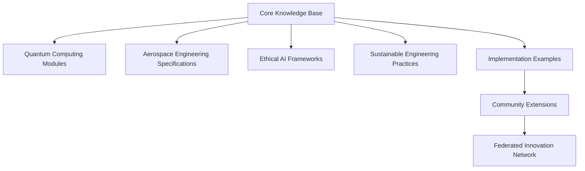
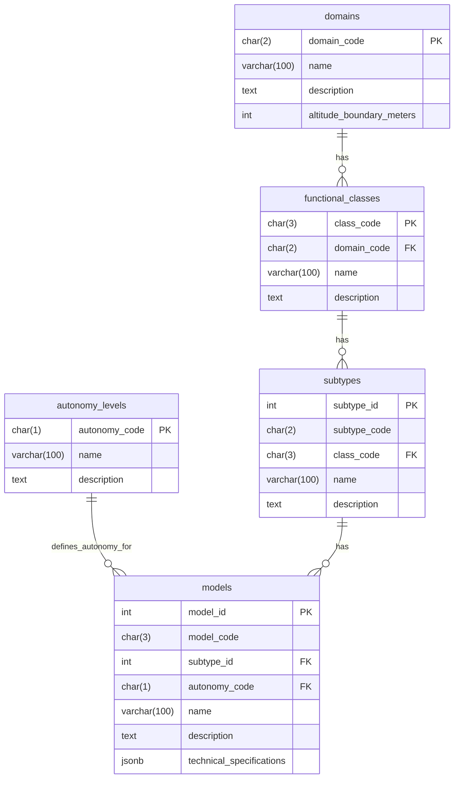
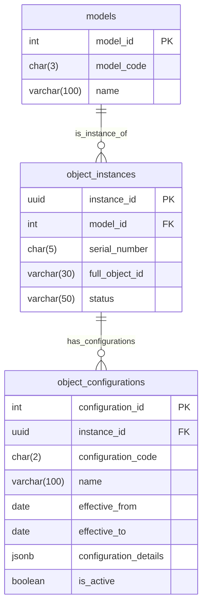
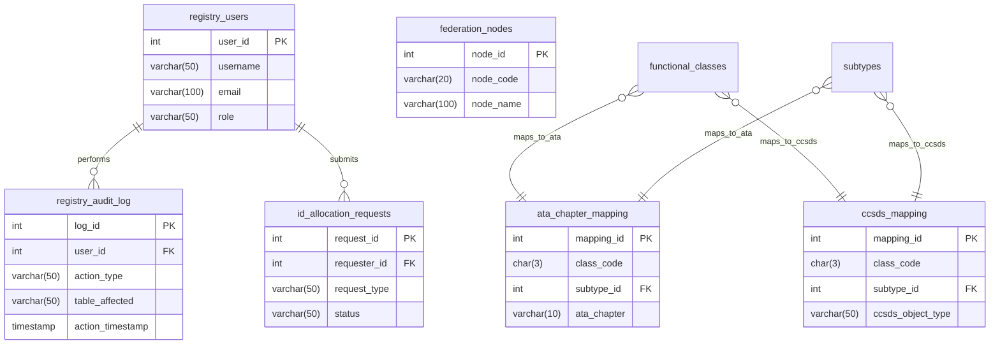
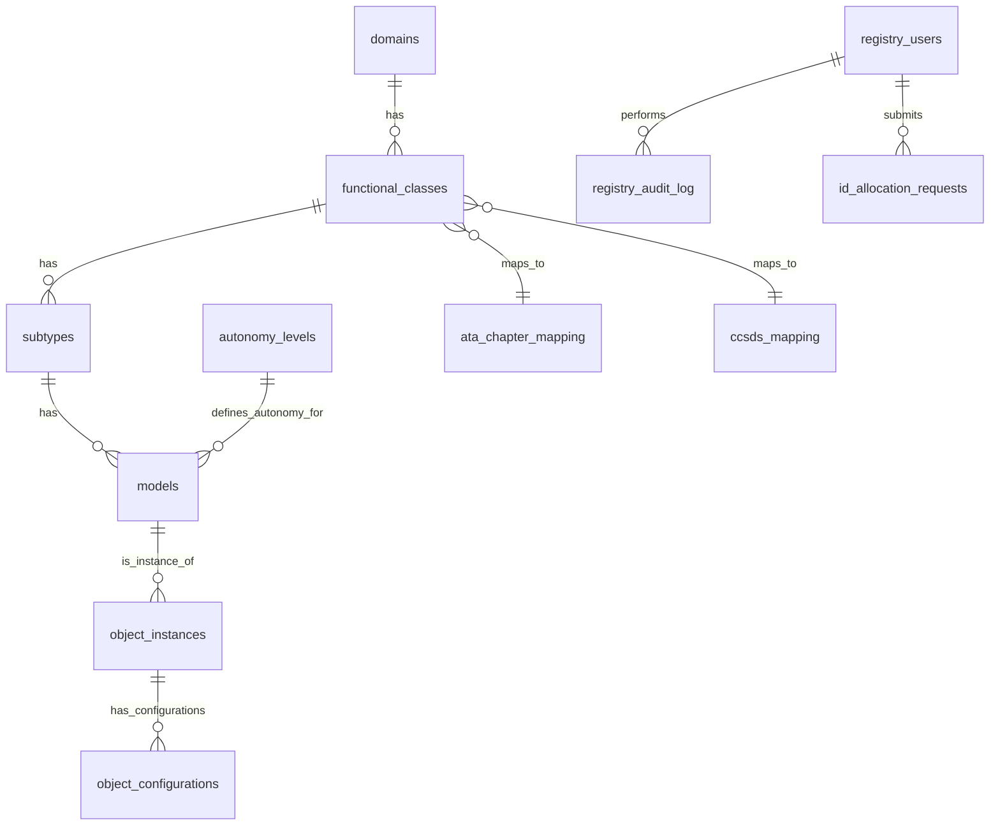

© Amedeo Pelliccia · GAIA-QAO – *Federated Quantum Aerospace Intelligence*

# Part 0: Framework Overview
## 0.1 Vision Statement
## 0.2 Documentation Architecture
## 0.3 Key Components
## 0.4 Governance Model

# Part I: Object Identification System
## 1.1 System Overview
## 1.2 ID Structure
## 1.3 Component Descriptions
## 1.4 Database Implementation
## 1.5 ID Formation Process
## 1.6 Registry Management

# Part II: Model Code Registry
## 2.1 Model Code Structure
## 2.2 Air Systems Models
## 2.3 Space Systems Models
## 2.4 Implementation Guidelines

# Part III: Configuration Management
## 3.1 Configuration Code Structure
## 3.2 Standard Configuration Types
## 3.3 Domain-Specific Configurations
## 3.4 Configuration Management in Registry

# Part IV: Database Schema
## 4.1 Core ID Component Tables
## 4.2 Object Instances and Configurations
## 4.3 Registry Management Tables
## 4.4 Integration and Reference Tables
## 4.5 Views and Functions

# Part V: Implementation Guidelines
## 5.1 Database Implementation
## 5.2 User Interface
## 5.3 Documentation
## 5.4 Next Steps

# Appendices
## A: Complete Sub-Type Code Tables
## B: ID Examples
## C: Database Schema Diagrams

# GAIA-QAO Aerospace Documentation

> **GENERAL DISCLAIMER:**
> This master document and all its parts represent an AI-generated proposal for the GAIA-Q & AMPEL framework and the GAIA-QAO object identification system. It has not been validated through implementation in aerospace systems nor by aerospace certification bodies. The concepts are based on current industry trends, open source, quantum computing, and federated aerospace engineering, as well as on the information provided.

---

## Part 0: Framework Overview

This part describes the overall vision, principles, documentation architecture, and governance of the GAIA-Q & AMPEL project.

### 0.1 Vision Statement

✨ ***I HAVE A DREAM:***

**GAIA-Q & AMPEL**
#### Open Source Quantum Aerospace Framework
**Science Research · Software · Hardware · Material Aerospace Solutions**

> *A new paradigm where quantum-enhanced intelligence, ethical autonomy, and sustainable engineering converge to define the aerospace systems of tomorrow.*

### 0.2 Guiding Principles & Philosophy

The GAIA-Q & AMPEL project is founded on the following principles:

*   **🇪🇸 Producimos documentación técnica open source para inspirar los diseños de hoy y de mañana.**
    **Ingeniería con propósito. Conocimiento compartido. Innovación federada.**

*   **🇬🇧 We produce open-source technical documentation to inspire the designs of today and tomorrow.**
    **Engineering with purpose. Shared knowledge. Federated innovation.**

> “Knowledge shared is future engineered.” – Amedeo Pelliccia

### 0.3 Documentation Architecture

The architecture of the technical documentation within the GAIA-Q & AMPEL framework is conceived as an interconnected network of knowledge modules:



### 0.4 Key Components of the Documentation Framework

The key components underpinning this documentation architecture are:

1.  **Multilingual Knowledge Base:**
    *   Documentation in English and Spanish (initially), with a roadmap to include other languages.
    *   Standardization of aerospace terminology with mapping to ISO/COAFI.
    *   Cultural context integration for broader usability.

2.  **Federated Documentation Structure:**
    *   Distributed contributions with centralized quality assurance (QA) oversight.
    *   Git-based version control, aligned with InfoCode and COAFI.
    *   Contributor recognition: badges, credits, citation-level metadata.

3.  **Implementation Repository:**
    *   Open reference designs (aircraft systems, quantum circuits).
    *   Simulated environments for digital twin validation.
    *   Demonstrator kits with hardware, software, and material integration.

### 0.5 Governance Model for the Open Source Project

The project's governance model is established to ensure transparency, quality, and participation:

1.  **Technical Oversight Committee:**
    *   Diverse expertise: quantum, aerospace, ethics, sustainability.
    *   Transparent Request for Comments (RFC) lifecycle.
    *   Publicly tracked roadmap and release cycles.

2.  **Contribution Pathways:**
    *   Contributor onboarding process with defined roles (document writer, subject matter expert (SME), reviewer, translator).
    *   Mentorship for young engineers and students.
    *   Recognition through COAFI-traceable InfoCode authorship.

3.  **Quality Assurance Framework:**
    *   Peer-review validation loops.
    *   Compliance with standards (ATA, S1000D, ISO/IEEE, QAO).
    *   Security audits for sensitive subsystems.

### 0.6 High-Level Implementation Strategy

The implementation strategy is divided into progressive phases:

#### Phase 1: *Foundation*
*   Define a COAFI-compatible file naming and metadata structure.
*   Publish initial GAIA-QAO templates in Markdown/DocBook/S1000D.
*   Launch the documentation portal with a Git-based backend.

#### Phase 2: *Community Development*
*   Recruit contributors from academia and the open hardware community.
*   Establish mentorship circles and working groups.
*   Release alpha documentation sets (AMP●EL, ATA 29, QAOA modules).

#### Phase 3: *Federation Implementation*
*   Formalize federated teams (Q-Air, Q-Space, Q-GreenTech, etc.).
*   Launch collaboration protocols (AMP●EL Interop, MCP Sync).
*   Create mirror repositories for resilience and inter-agency continuity.

#### Phase 4: *Acceleration*
*   Publish industrial application guides (MEAs, digital twins, Q-routing).
*   Enable certification-friendly formats (BREX-lite, MCDB export).
*   Organize open competitions on sustainability and autonomy challenges.

### 0.7 Envisioned Potential Impact

The GAIA-Q & AMPEL project aims to generate significant impact in the following areas:

1.  **Democratized Aerospace Innovation:**
    *   Lower entry barriers for engineers worldwide.
    *   Facilitate modular learning through Documentation as a Platform (DaaP).
    *   Bridge research and industry gaps through quantum-ready documentation.

2.  **Standardized Ethical Frameworks:**
    *   Establish transparent audit trails and AI behavior explainability.
    *   Encourage the fair deployment of autonomy in aviation and space.
    *   Enable cross-cultural and interdisciplinary trust frameworks.

3.  **Sustainable Engineering Practices:**
    *   Provide shared tools for life-cycle impact modeling.
    *   Establish open benchmarks for propulsion, material, and energy impact.
    *   Foster cooperative co-design of low-emission aerospace solutions.

---
## Part I: Object Identification System

This part details the GAIA-QAO Object Identification System (GQOIS), a comprehensive and hierarchical framework for identifying, categorizing, and tracking aerospace objects.

### 1.1 System Overview

The GAIA-QAO Object Identification System (GQOIS) is a comprehensive, hierarchical identification framework designed for aerospace objects operating in both atmospheric and space domains. It provides a standardized method for uniquely identifying, categorizing, and tracking aerospace objects throughout their entire lifecycle.

The system addresses several critical needs in the aerospace industry:

-   **Unified Identification**: Creates a single, coherent identification system spanning traditional aviation, emerging air mobility concepts, and space systems.
-   **Quantum Integration**: Specifically accommodates quantum-enhanced aerospace technologies.
-   **Standards Compatibility**: Aligns with existing aerospace standards (ATA, CCSDS, etc.) while extending beyond their limitations.
-   **Lifecycle Management**: Supports object identification from design through decommissioning.
-   **Configuration Tracking**: Enables tracking of different configurations and modifications.
-   **Registry Management**: Provides a framework for a centralized registry with federated nodes.

### 1.2 ID Structure

The GQOIS uses a hierarchical structure that encodes multiple levels of information about an aerospace object. The complete ID format is:

```plaintext
DO-A-CCC-ST-MDL-SSSSS[-CC]
```

Where:

| **Component**        | **Length** | **Description**                 | **Example**                |
| :------------------- | :--------- | :------------------------------ | :------------------------- |
| DO                   | 2 chars    | Domain                          | AS (Air System)            |
| A                    | 1 char     | Autonomy Level                  | M (Manned/Semi-Autonomous) |
| CCC                  | 3 chars    | Functional Class                | PAX (Passenger Transport)  |
| ST                   | 2 chars    | Sub-Type                        | BW (Blended Wing Body)     |
| MDL                  | 3 chars    | Model/Variant                   | Q1H (AMPEL360 BWB-Q100)    |
| SSSSS                | 5 chars    | Serial Number                   | 00001                      |
| CC                   | 2 chars    | Configuration Code (optional)   | A1 (Initial Configuration) |

#### Example Complete ID

```plaintext
AS-M-PAX-BW-Q1H-00001
```

This identifies:

-   An Air System (AS)
-   That is Manned/Semi-Autonomous (M)
-   In the Passenger Transport class (PAX)
-   Of the Blended Wing Body sub-type (BW)
-   Model AMPEL360 BWB-Q100 (Q1H)
-   Serial number 00001

### 1.3 Component Descriptions

#### 1.3.1 Domain (DO)

Domains represent the primary operational environment of the aerospace object.

| **Domain Code** | **Name**       | **Description**                                         | **Boundary**                 |
| :-------------- | :------------- | :------------------------------------------------------ | :--------------------------- |
| AS              | Air System     | Systems operating primarily in Earth's atmosphere       | Below 30,000 meters          |
| SP              | Space System   | Systems operating primarily in space                    | Above 30,000 meters          |

#### 1.3.2 Autonomy Level (A)

Autonomy levels indicate the degree of human involvement in the system's operation. The autonomy level is inherently associated with the `Model (MDL)`.

| **Autonomy Code** | **Name**                      | **Description**                                                                      |
| :---------------- | :---------------------------- | :----------------------------------------------------------------------------------- |
| M                 | Manned/Semi-Autonomous        | Systems designed for human operation or with human oversight (require crew if transporting humans). |
| U                 | Unmanned/Fully Autonomous     | Systems designed for fully autonomous operation without human presence.              |

#### 1.3.3 Functional Classes (CCC)

Functional classes categorize objects by their primary purpose or function. The system defines functional classes across the two domains:

**Air Systems (AS) Functional Classes:**

| **Class Code** | **Name**                                   | **Description**                                                                      |
| :------------- | :----------------------------------------- | :----------------------------------------------------------------------------------- |
| PAX            | Passenger Transport                        | Aircraft designed primarily for passenger transportation.                            |
| CGO            | Cargo Transport                            | Aircraft designed primarily for cargo transportation.                                |
| ISR            | Intelligence, Surveillance, Reconnaissance | Aircraft for intelligence gathering, surveillance, and reconnaissance.               |
| SCI            | Scientific Research                        | Aircraft designed for scientific research and data collection.                       |
| UTL            | Utility                                    | Aircraft for utility purposes (agriculture, firefighting, etc.).                   |
| REC            | Recreational & Sport                       | Aircraft designed for recreational and sporting activities.                          |
| XPR            | Experimental                               | Experimental aircraft and technology demonstrators.                                  |
| LTA            | Lighter Than Air                           | Lighter-than-air vehicles, including dirigibles and platforms.                     |
| MIL            | Military Aircraft                          | Aircraft designed for military applications and combat operations.                 |

**Space Systems (SP) Functional Classes:**

| **Class Code** | **Name**                       | **Description**                                                                      |
| :------------- | :----------------------------- | :----------------------------------------------------------------------------------- |
| LCH            | Launch System                  | Systems designed to launch payloads into space.                                    |
| SAT            | Satellite                      | Orbital systems for various missions without human presence.                         |
| ORB            | Orbital Platform/Vehicle       | Crewed orbital systems, including stations and transport vehicles.                   |
| PRB            | Probe                          | Systems designed for exploration beyond Earth orbit.                               |
| XPS            | Experimental (Space)           | Experimental space systems and technology demonstrators.                             |
| DEF            | Space Defense                  | Systems designed for space defense and security applications.                        |

#### 1.3.4 Sub-Types (ST)

Sub-types further refine the classification within each functional class. Each sub-type has a unique two-character code within its functional class. The complete sub-type registry is found in Appendix A. Examples include:

-   **AS-PAX-NB**: Narrow-Body Airliner
-   **AS-PAX-BW**: Blended Wing Body Airliner
-   **SP-SAT-CO**: Communications Satellite
-   **SP-PRB-MP**: Mars Probe

#### 1.3.5 Models/Variants (MDL)

Models represent specific designs or variants within a sub-type. Each model has a three-character code and is associated with a specific Autonomy Level (A). Details and examples of models are found in Part II: Model Code Registry.

#### 1.3.6 Serial Numbers (SSSSS)

Five-character serial numbers uniquely identify individual instances of a specific model. Serial numbers are assigned sequentially within each model series.

#### 1.3.7 Configuration Codes (CC) - Optional

Two-character configuration codes track different configurations or modifications of an object throughout its lifecycle. They are optional in the object's full ID string but are maintained in the registry. Details are found in Part III: Configuration Management.

### 1.4 Database Implementation (General Overview)

The GQOIS is implemented as a relational database. Key database components include:

-   Tables for each ID component (Domains, Autonomy Levels, Functional Classes, Sub-Types, Models).
-   Tables for object instances and their configurations.
-   Tables for registry management, auditing, and ID requests.
-   Tables for integration with external standards (ATA, CCSDS).
-   Views and functions to facilitate queries and data integrity.

A detailed description of the database schema is provided in Part IV: Database Schema.

### 1.5 ID Formation Process

The formation of a GQOIS ID follows these steps:

1.  **Model (MDL) Selection**: A specific model is identified or created. This model already has an associated Autonomy Level (A), a Sub-Type (ST), which in turn belongs to a Functional Class (CCC), which is within a Domain (DO).
    *   Example: Model `Q1H` (AMPEL360 BWB-Q100) is selected.
        *   This `Q1H` model is defined with `autonomy_code = 'M'`.
        *   It belongs to sub-type `BW` (Blended Wing Body).
        *   Sub-type `BW` is in functional class `PAX` (Passenger Transport).
        *   Class `PAX` belongs to domain `AS` (Air System).

2.  **Serial Number (SSSSS) Assignment**: A unique serial number is assigned for the specific instance of that model.
    *   Example: First instance → `00001`.

3.  **Base ID Construction**: The components are assembled:
    *   `DO` (from model) → `AS`
    *   `A` (from model) → `M`
    *   `CCC` (from model) → `PAX`
    *   `ST` (from model) → `BW`
    *   `MDL` → `Q1H`
    *   `SSSSS` → `00001`
    *   Resulting ID: `AS-M-PAX-BW-Q1H-00001`

4.  **Configuration Tracking (CC) - Optional**: If applicable, a configuration code is added.
    *   Example: Initial configuration → `A1`.
    *   ID with configuration: `AS-M-PAX-BW-Q1H-00001-A1` (this full ID with CC would be used for specific configuration references, while the base ID identifies the physical instance).

### 1.6 Registry Management

The GQOIS registry is managed through a centralized system with potential for distributed nodes:

#### 1.6.1 ID Allocation Process
1.  **Request for New Model/Instances**: Organizations submit requests for the allocation of new model codes (if they do not exist) or for the assignment of serial number blocks for existing models.
2.  **Validation**: Registry administrators validate the request against standards and availability.
3.  **Approval and Assignment**: Approved requests result in the assignment of model codes and/or serial numbers.
4.  **Registration**: New models and instances are registered in the central database.
5.  **Synchronization**: Information is synchronized across federated nodes, if implemented.

#### 1.6.2 Federation Model
The registry operates on a federation model with:
-   **Primary Node**: Central authority for ID allocation and standards maintenance.
-   **Federated Nodes**: Distributed nodes for specific domains or organizations (future potential).
-   **Synchronization Protocol**: Envisioned to be Git-based for version control and distribution.
-   **Conflict Resolution**: Mechanisms to resolve conflicts in distributed updates.

#### 1.6.3 Standards Integration
The GQOIS integrates or maps with existing aerospace standards:
-   **Air Systems Standards**: Mapping with ATA chapters (see `ata_chapter_mapping` table). Compatibility with S1000D and alignment with ARINC.
-   **Space Systems Standards**: Mapping with CCSDS object types (see `ccsds_mapping` table). Alignment with ISO 24113 (space debris mitigation) and COSPAR (planetary protection).

#### 1.6.4 Support for Quantum-Enhanced Systems
A key feature of the GQOIS is its explicit support for quantum-enhanced aerospace systems:
-   **Quantum Sub-Types and Models**: Definition of specific sub-types and models for quantum technologies (e.g., `PAX-QP`, `SAT-QS`). See Part II.
-   **Quantum Technology Tracking**: The system allows tracking (via `models.technical_specifications` and `object_configurations.configuration_details`) of specific quantum technologies implemented.

---

## Part II: Model Code Registry

This part details the structure and registry of Model Codes (MDL) within the GAIA-QAO system, providing a standardized naming convention and example models for air and space systems.

### 2.1 Model Code Structure and Naming Convention

Each Model (MDL) code in the GAIA-QAO system follows a standardized 3-character format:

```plaintext
[G][N][V]
```

Where:

-   **G** (Generation/Series): A letter indicating the generation or technology series.
    -   `Q`: Quantum-enhanced systems (GAIA-QAO primary focus).
    -   `A`: Advanced conventional systems.
    -   `P`: Prototype/Experimental systems.
    -   `S`: Standard production systems.

-   **N** (Number/Size): A number indicating the relative size, capacity, or capability.
    -   `1`: Small/Light.
    -   `2`: Medium.
    -   `3`: Large/Heavy.
    -   `4`: Extra Large/Super Heavy.

-   **V** (Variant): A letter indicating the specific variant or version.
    -   `A, B, C, etc.`: Sequential variants.
    -   `H`: High-performance variant.
    -   `L`: Long-range variant.
    -   `S`: Special purpose variant.

Each Model (MDL) is also inherently associated with an **Autonomy Level (A)**, which is defined in the `models` table of the database (see Part IV) and forms part of the object's full ID.

### 2.2 Air Systems (AS) Models

The following are representative examples of models for various functional classes and sub-types within Air Systems (AS). Each model includes its MDL code, name, description, and key specifications. The Autonomy Level (M/U) would be specified when defining the model in the database.

*(Note: The model tables presented below are excerpts from the original "Expanded Model Registry" and "GAIA-QAO Model Code Registry," adapted to this structure. It is assumed that the Autonomy Level 'A' is defined for each model upon entry into the database and will be used to construct the full ID.)*

#### 2.2.1 Passenger Transport (PAX) Models

*(Selected examples from "Expanded Model Registry" and "Model Code Registry" documents)*

| **Sub-Type (ST)** | **MDL Code** | **Model Name**          | **Description**                             | **Key Specifications**                  |
| :---------------- | :----------- | :---------------------- | :------------------------------------------ | :-------------------------------------- |
| NB                | Q2A          | QuantumNarrow QN-200    | Medium quantum-enhanced narrow-body         | Capacity: 180 pax, Range: 5,500 km      |
| NB                | A2B          | AeroSingle AS-220       | Medium conventional narrow-body             | Capacity: 220 pax, Range: 5,000 km      |
| WB                | Q3L          | QuantumWide QW-350L     | Large long-range quantum wide-body          | Capacity: 350 pax, Range: 15,000 km     |
| BW                | Q1H          | AMPEL360 BWB-Q100       | Small quantum-enhanced BWB passenger aircraft | Cap: 100 pax, Range: 5,500 km, Quantum: Nav, Opt, Comms |
| BW                | Q2A          | AMPEL360 BWB-Q250       | Medium quantum-enhanced BWB passenger aircraft| Cap: 250 pax, Range: 8,000 km, Quantum: Nav, Opt, Comms, Ctrl |
| BW                | P1B          | BWB-X Demonstrator      | Small BWB technology demonstrator           | Cap: 40 pax (equiv), Range: 3,000 km    |
| SS                | Q2B          | QuantumSonic QS-150     | Medium quantum-enhanced supersonic airliner | Capacity: 150 pax, Speed: Mach 2.2      |
| HS                | P2A          | HyperTransport HT-100   | Medium hypersonic transport demonstrator    | Capacity: 100 pax, Speed: Mach 5+       |
| QP                | Q3L          | QuantumJet Q-350L       | Large long-range quantum-powered airliner   | Capacity: 350 pax, Range: 14,000 km     |

#### 2.2.2 Cargo Transport (CGO) Models

| **Sub-Type (ST)** | **MDL Code** | **Model Name**          | **Description**                             | **Key Specifications**                 |
| :---------------- | :----------- | :---------------------- | :------------------------------------------ | :------------------------------------- |
| LC                | Q1A          | QuantumFreight QF-5     | Small quantum-enhanced light cargo          | Payload: 5 tonnes, Range: 2,000 km     |
| MC                | Q2B          | QuantumFreight QF-20    | Medium quantum-enhanced cargo               | Payload: 20 tonnes, Range: 5,000 km    |
| HC                | Q3L          | QuantumFreight QF-80L   | Large long-range quantum cargo              | Payload: 80 tonnes, Range: 10,000 km   |
| UC                | Q2S          | QuantumDrone QD-15S     | Medium special purpose unmanned quantum cargo | Payload: 15 tonnes, Range: 4,000 km    |

#### 2.2.3 Intelligence, Surveillance, Reconnaissance (ISR) Models

| **Sub-Type (ST)** | **MDL Code** | **Model Name**           | **Description**                               | **Key Specifications**                   |
| :---------------- | :----------- | :----------------------- | :-------------------------------------------- | :--------------------------------------- |
| UA                | Q2L          | QuantumHawk QH-20L       | Medium long-endurance quantum UAS             | Endurance: 48 hrs, Ceiling: 15,000 m     |
| QI                | Q3H          | QuantumEye QE-350H       | Large high-altitude, high-performance quantum ISR | Endurance: 48+ hrs, Ceiling: 22,000 m, Full Quantum Sensors |
| MA                | Q3H          | QuantumMaritime QM-300   | Large high-performance quantum maritime patrol| Endurance: 24 hrs, Range: 9,000 km       |

#### 2.2.4 Scientific Research (SCI) Models

| **Sub-Type (ST)** | **MDL Code** | **Model Name**           | **Description**                                  | **Key Specifications**                         |
| :---------------- | :----------- | :----------------------- | :----------------------------------------------- | :--------------------------------------------- |
| AT                | Q2A          | QuantumAtmos QA-200      | Medium quantum atmospheric research aircraft     | Ceiling: 20,000 m, 30+ atm. sensors          |
| QS                | Q2H          | QuantumSense QS-250H     | Medium high-performance quantum sensing platform | 20+ quantum sensors, Unprecedented sensitivity |

#### 2.2.5 Utility (UTL) Models

| **Sub-Type (ST)** | **MDL Code** | **Model Name**            | **Description**                                | **Key Specifications**                        |
| :---------------- | :----------- | :------------------------ | :--------------------------------------------- | :-------------------------------------------- |
| FF                | Q2A          | QuantumFire QF-200        | Medium quantum-enhanced firefighting aircraft  | Water capacity: 12,000 L, Precision delivery  |
| QU                | Q3H          | QuantumUtility QU-300H    | Large high-capability quantum utility aircraft | Modular systems, 20+ configurations         |

#### 2.2.6 Recreational & Sport (REC) Models

| **Sub-Type (ST)** | **MDL Code** | **Model Name**             | **Description**                               | **Key Specifications**                     |
| :---------------- | :----------- | :------------------------- | :-------------------------------------------- | :----------------------------------------- |
| GL                | Q1A          | QuantumGlide QG-100        | Small quantum-enhanced glider                 | Glide ratio: 70:1, Span: 18 m              |
| JW                | Q1S          | QuantumJetpack QJ-100S     | Special purpose quantum jetpack               | Flight time: 45 min, Range: 80 km          |

#### 2.2.7 Experimental (XPR) Models

| **Sub-Type (ST)** | **MDL Code** | **Model Name**          | **Description**                             | **Key Specifications**                       |
| :---------------- | :----------- | :---------------------- | :------------------------------------------ | :------------------------------------------- |
| TD                | P2A          | TechDemo TD-200         | Medium technology demonstrator              | MTOW: 12,000 kg, Modular test systems        |
| QT                | P3S          | QuantumX QX-300S        | Large special purpose quantum testbed       | Comprehensive quantum technology suite       |
| HH                | P2A          | HyperX HX-200           | Medium hypersonic demonstrator              | Speed: Mach 6+, Scramjet propulsion          |

#### 2.2.8 Lighter Than Air (LTA) Models

| **Sub-Type (ST)** | **MDL Code** | **Model Name**            | **Description**                                  | **Key Specifications**                         |
| :---------------- | :----------- | :------------------------ | :----------------------------------------------- | :--------------------------------------------- |
| AB                | Q2A          | QuantumBlimp QB-200       | Medium quantum-enhanced blimp                    | Volume: 150,000 m³, Payload: 20,000 kg         |
| QB                | Q2H          | QuantumLift QL-250H       | Medium high-performance quantum buoyancy craft   | Volume: 250,000 m³, Quantum buoyancy control   |

#### 2.2.9 Military Aircraft (MIL) Models

| **Sub-Type (ST)** | **MDL Code** | **Model Name**            | **Description**                               | **Key Specifications**                        |
| :---------------- | :----------- | :------------------------ | :-------------------------------------------- | :-------------------------------------------- |
| FJ                | Q2S          | QuantumFighter QF-200S    | Medium special purpose quantum fighter        | Speed: Mach 2.5, Supercruise, Quantum sensors |
| QW                | Q3H          | QuantumWarfare QW-300H    | Large high-capability quantum warfare platform| Comprehensive quantum military systems        |

### 2.3 Space Systems (SP) Models

The following are representative examples of models for various functional classes and sub-types within Space Systems (SP).

#### 2.3.1 Satellite (SAT) Models

| **Sub-Type (ST)** | **MDL Code** | **Model Name**           | **Description**                                  | **Key Specifications**                     |
| :---------------- | :----------- | :----------------------- | :----------------------------------------------- | :----------------------------------------- |
| CO                | Q2A          | QuantumComSat QC-200     | Medium quantum communications satellite          | Mass: 350 kg, Global QKD coverage          |
| QS                | Q3H          | QuantumSat QS-300H       | Large high-performance quantum satellite         | Mass: 800 kg, Orbital quantum computer     |
| EO                | Q2H          | QuantumEarth QE-200H     | Medium high-performance quantum Earth observation| Mass: 600 kg, Resolution: 0.15 m           |

#### 2.3.2 Orbital Platform/Vehicle (ORB) Models

| **Sub-Type (ST)** | **MDL Code** | **Model Name**           | **Description**                                      | **Key Specifications**                        |
| :---------------- | :----------- | :----------------------- | :--------------------------------------------------- | :-------------------------------------------- |
| SS                | Q3A          | QuantumStation QS-300    | Large quantum space station                          | Mass: 80,000 kg, Crew: 6-12, Vol: 800 m³      |
| QO                | Q3S          | QuantumOrbit QO-300S     | Large special purpose quantum orbital platform       | Mass: 30,000 kg, Comprehensive quantum facility|
| CT                | Q2A          | QuantumCrew QC-200       | Medium quantum crew transport vehicle                | Mass: 16,000 kg, Crew: 4-6                    |

#### 2.3.3 Launch System (LCH) Models

| **Sub-Type (ST)** | **MDL Code** | **Model Name**           | **Description**                                  | **Key Specifications**                       |
| :---------------- | :----------- | :----------------------- | :----------------------------------------------- | :------------------------------------------- |
| SL                | Q1A          | QuantumLaunch QL-100     | Small quantum-enhanced launch vehicle            | Payload to LEO: 2,000 kg, Height: 30 m       |
| QL                | Q3S          | QuantumLaunch QL-300S    | Large special purpose quantum launch vehicle     | Payload to LEO: 20,000 kg, Quantum propulsion|
| RU                | Q2B          | QuantumReuse QR-200      | Medium quantum-enhanced reusable launch vehicle  | Payload to LEO: 7,000 kg, Reuses: 30+        |

#### 2.3.4 Probe (PRB) Models

| **Sub-Type (ST)** | **MDL Code** | **Model Name**           | **Description**                                      | **Key Specifications**                       |
| :---------------- | :----------- | :----------------------- | :--------------------------------------------------- | :------------------------------------------- |
| LP                | Q2A          | QuantumLunar QL-200      | Medium quantum lunar probe                           | Mass: 1,200 kg, Lunar orbit + lander         |
| QP                | Q3S          | QuantumProbe QP-300S     | Large special purpose deep space quantum probe       | Mass: 2,500 kg, Deep space quantum comms     |
| MP                | Q2L          | QuantumMars QM-200L      | Medium long-duration quantum Mars probe              | Mass: 1,500 kg, Surface mission              |

#### 2.3.5 Experimental (Space) (XPS) Models

| **Sub-Type (ST)** | **MDL Code** | **Model Name**           | **Description**                                  | **Key Specifications**                      |
| :---------------- | :----------- | :----------------------- | :----------------------------------------------- | :------------------------------------------ |
| TP                | P2A          | SpaceTech ST-200         | Medium technology platform                       | Mass: 1,500 kg, 10+ tech demonstrations     |
| QT                | P3S          | QuantumX QX-300S         | Large special purpose quantum testbed (space)    | Mass: 3,000 kg, Advanced quantum experiments|

#### 2.3.6 Space Defense (DEF) Models

| **Sub-Type (ST)** | **MDL Code** | **Model Name**             | **Description**                                  | **Key Specifications**                      |
| :---------------- | :----------- | :------------------------- | :----------------------------------------------- | :------------------------------------------ |
| SS                | Q2A          | QuantumSurveillance QS-200| Medium quantum space surveillance system         | Mass: 1,200 kg, Space domain awareness      |
| QD                | Q3S          | QuantumDefense QD-300S     | Large special purpose quantum defense platform   | Mass: 3,000 kg, Comprehensive quantum suite |

### 2.4 Implementation Guidelines (Models)

The implementation of models in the GAIA-QAO database registry is done through the `models` table. Each entry in this table represents a unique model and must include:

-   `model_code`: The 3-character MDL code (e.g., `Q1H`).
-   `subtype_id`: The ID of the sub-type to which it belongs (FK to `subtypes` table).
-   `autonomy_code`: The Autonomy Level code (`M` or `U`) inherent to this model (FK to `autonomy_levels`).
-   `name`: Descriptive name of the model (e.g., `AMPEL360 BWB-Q100`).
-   `description`: A brief description of the model.
-   `introduction_date` (optional): Date of model introduction.
-   `technical_specifications` (JSONB): A flexible field for storing detailed technical specifications, including quantum capabilities, dimensions, performance, etc.

**Example SQL Insert (adapted to include `autonomy_code`):**
```sql
INSERT INTO models (model_code, subtype_id, autonomy_code, name, description, introduction_date, technical_specifications) VALUES
('Q1H',
  (SELECT subtype_id FROM subtypes WHERE subtype_code = 'BW' AND class_code = 'PAX'),
  'M', -- Autonomy Level for this PAX model
  'AMPEL360 BWB-Q100',
  'Small quantum-enhanced BWB passenger aircraft',
  '2025-01-01',
  '{"capacity": 100, "range_km": 5500, "cruise_speed_kmh": 850, "mtow_kg": 85000, "quantum_systems": ["navigation", "optimization", "communications"]}'
);
```
Strict guidelines must be followed for assigning new MDL codes to ensure uniqueness and consistency within the hierarchical structure.

---

## Part III: Configuration Management

This part describes the Configuration Codes (CC) used to identify specific modifications or configurations of an object throughout its lifecycle.

### 3.1 Configuration Code Structure

Each Configuration Code (CC) follows a standardized 2-character format:

```plaintext
[T][N]
```

Where:

-   **T** (Type): A letter indicating the type of configuration.
-   **N** (Number/Letter): A number or letter indicating the specific version or variant within that type.

Configuration codes are optional in the object's full ID string (`DO-A-CCC-ST-MDL-SSSSS-CC`) but are maintained and managed in the `object_configurations` table of the registry.

### 3.2 Standard Configuration Types

The following standard configuration types are proposed, applicable to most objects:

| **Type Code (T)** | **Configuration Type**   | **Description**                                                  | **Examples** |
| :---------------- | :----------------------- | :--------------------------------------------------------------- | :----------- |
| A                 | Initial/Baseline         | The initial production configuration as delivered.               | A1, A2, A3   |
| B                 | Block Upgrade            | Major planned upgrade or block improvement.                      | B1, B2, B3   |
| M                 | Minor Modification       | Minor modifications or improvements not warranting a block.      | M1, M2, M3   |
| S                 | Special Mission          | Configuration for special missions or purposes.                  | S1, S2, S3   |
| E                 | Experimental             | Experimental or test configuration.                              | E1, E2, E3   |
| R                 | Retrofit                 | Retrofit of existing systems onto an object.                     | R1, R2, R3   |
| P                 | Propulsion               | Propulsion system modification.                                  | P1, P2, P3   |
| C                 | Communications           | Communications system modification.                              | C1, C2, C3   |
| N                 | Navigation               | Navigation system modification.                                  | N1, N2, N3   |
| Q                 | Quantum                  | Quantum systems modification or upgrade.                         | Q1, Q2, Q3   |
| L                 | Life Extension           | Modifications for extending the object's operational life.       | L1, L2, L3   |
| O                 | Operator-Specific        | Configuration specific to a particular operator or user.         | O1, O2, O3   |

### 3.3 Domain-Specific Configuration Types

In addition to standard types, domain-specific types can be defined:

#### 3.3.1 Air Systems (AS) Specific Configuration Types

| **Type Code (T)** | **Configuration Type** | **Description**                                    | **Examples** |
| :---------------- | :--------------------- | :------------------------------------------------- | :----------- |
| I                 | Interior               | Interior configuration modification (cabin, cargo).  | I1, I2, I3   |
| F                 | Fuel System            | Fuel system modification.                          | F1, F2, F3   |
| W                 | Wing                   | Wing modification (winglets, profiles).            | W1, W2, W3   |
| G                 | Landing Gear           | Landing gear modification.                         | G1, G2, G3   |
| V                 | Avionics               | Avionics system upgrade.                           | V1, V2, V3   |

#### 3.3.2 Space Systems (SP) Specific Configuration Types

| **Type Code (T)** | **Configuration Type** | **Description**                                      | **Examples** |
| :---------------- | :--------------------- | :--------------------------------------------------- | :----------- |
| T                 | Thermal                | Thermal control system modification.                 | T1, T2, T3   |
| D                 | Deployment             | Deployment system modification (antennas, panels).   | D1, D2, D3   |
| H                 | Habitat                | Habitat module configuration.                        | H1, H2, H3   |
| X                 | Extended Mission       | Configuration for extended mission operations.       | X1, X2, X3   |
| Z                 | Zero-G                 | Zero-gravity specific modification.                  | Z1, Z2, Z3   |

### 3.4 Configuration Management in Registry

Configuration codes are managed in the `object_configurations` database table. Each entry in this table links a specific configuration to an `instance_id` (a particular object instance).

**Key fields of the `object_configurations` table:**
- `configuration_id` (PK)
- `instance_id` (FK to `object_instances`)
- `configuration_code` (e.g., 'A1', 'Q2')
- `name` (e.g., 'Initial Production', 'Quantum Systems Upgrade 2')
- `description`
- `effective_from` (start date of configuration effectiveness)
- `effective_to` (end date, if configuration is superseded)
- `configuration_details` (JSONB for specific configuration details)

#### Configuration Evolution Examples:

**Example 1: QuantumNarrow QN-200 Passenger Aircraft (AS-M-PAX-NB-Q2A-00001)**

| **Full Instance ID**      | **CC Code** | **Configuration Description**           |
| :------------------------ | :---------- | :------------------------------------ |
| AS-M-PAX-NB-Q2A-00001     | A1          | Initial Production                    |
| AS-M-PAX-NB-Q2A-00001     | B1          | Block 1 Upgrade (Enhanced Avionics)   |
| AS-M-PAX-NB-Q2A-00001     | I2          | Interior Mod 2 (New seat layout)      |
| AS-M-PAX-NB-Q2A-00001     | Q1          | Quantum Systems Upgrade 1 (Navigation)|
| AS-M-PAX-NB-Q2A-00001     | L1          | Life Extension Program 1              |

**Example 2: QuantumEarth QE-200H Satellite (SP-U-SAT-EO-Q2H-00005)**

| **Full Instance ID**      | **CC Code** | **Configuration Description**           |
| :------------------------ | :---------- | :------------------------------------ |
| SP-U-SAT-EO-Q2H-00005     | A1          | Initial Orbital Deployment            |
| SP-U-SAT-EO-Q2H-00005     | S1          | Special Mission 1 (Specific observation)|
| SP-U-SAT-EO-Q2H-00005     | P1          | Propulsion Mod 1 (Orbit change)       |
| SP-U-SAT-EO-Q2H-00005     | Q2          | Quantum Sensors Upgrade 2             |
| SP-U-SAT-EO-Q2H-00005     | X1          | Configuration for Extended Mission 1  |

#### Configuration Code Allocation Guidelines:

1.  **Chronological Order**: Generally, numerical codes within a type (e.g., A1, A2) should follow the chronological order of implementation.
2.  **Significance**: Use block upgrades (B-series) for significant changes affecting multiple systems.
3.  **Specificity**: Use specific type codes (P, C, N, Q, etc.) when modifications are limited to particular systems.
4.  **Documentation**: Each configuration must be thoroughly documented with effective dates and details of changes in the `configuration_details` (JSONB) field.
5.  **Traceability**: Maintain traceability between configurations (e.g., which supersedes which) to track an object's evolution.
6.  **Quantum Focus**: Use Q-series configurations to specifically track quantum technology upgrades.

---

## Part IV: Database Schema

This part details the relational database schema designed for the GAIA-QAO Object Identification System (GQOIS). It includes the definition of tables, relationships, views, and key functions.

> **Note on the Schema:** The following SQL script is designed for PostgreSQL and includes the agreed-upon change where `autonomy_code` is an attribute of the `models` table.

```sql
---
-- GAIA-QAO Object Identification System Registry
-- Database Schema Version 1.2.0 (Reflects autonomy_code in models)
-- InfoCode: QAO-SYS-DBSC-003

-- Enable UUID extension (if not already enabled)
CREATE EXTENSION IF NOT EXISTS "uuid-ossp";

-- =============================================
-- 4.1 Core ID Component Tables
-- =============================================

-- Domains (DO)
CREATE TABLE domains (
  domain_code CHAR(2) PRIMARY KEY,
  name VARCHAR(100) NOT NULL,
  description TEXT,
  altitude_boundary_meters INT,  -- For AS/SP boundary definition
  created_at TIMESTAMP WITH TIME ZONE DEFAULT CURRENT_TIMESTAMP,
  updated_at TIMESTAMP WITH TIME ZONE DEFAULT CURRENT_TIMESTAMP,
  is_active BOOLEAN DEFAULT TRUE
);

-- Autonomy Levels (A)
CREATE TABLE autonomy_levels (
  autonomy_code CHAR(1) PRIMARY KEY,
  name VARCHAR(100) NOT NULL,
  description TEXT,
  created_at TIMESTAMP WITH TIME ZONE DEFAULT CURRENT_TIMESTAMP,
  updated_at TIMESTAMP WITH TIME ZONE DEFAULT CURRENT_TIMESTAMP,
  is_active BOOLEAN DEFAULT TRUE
);

-- Functional Classes (CCC)
CREATE TABLE functional_classes (
  class_code CHAR(3) PRIMARY KEY,
  domain_code CHAR(2) NOT NULL REFERENCES domains(domain_code),
  name VARCHAR(100) NOT NULL,
  description TEXT,
  created_at TIMESTAMP WITH TIME ZONE DEFAULT CURRENT_TIMESTAMP,
  updated_at TIMESTAMP WITH TIME ZONE DEFAULT CURRENT_TIMESTAMP,
  is_active BOOLEAN DEFAULT TRUE,
  UNIQUE(domain_code, class_code)
);

-- Sub-Types (ST)
CREATE TABLE subtypes (
  subtype_id SERIAL PRIMARY KEY,
  subtype_code CHAR(2) NOT NULL,
  class_code CHAR(3) NOT NULL REFERENCES functional_classes(class_code),
  name VARCHAR(100) NOT NULL,
  description TEXT,
  created_at TIMESTAMP WITH TIME ZONE DEFAULT CURRENT_TIMESTAMP,
  updated_at TIMESTAMP WITH TIME ZONE DEFAULT CURRENT_TIMESTAMP,
  is_active BOOLEAN DEFAULT TRUE,
  UNIQUE(class_code, subtype_code)
);

-- Models/Variants (MDL)
CREATE TABLE models (
  model_id SERIAL PRIMARY KEY,
  model_code CHAR(3) NOT NULL,
  subtype_id INT NOT NULL REFERENCES subtypes(subtype_id),
  autonomy_code CHAR(1) NOT NULL REFERENCES autonomy_levels(autonomy_code), -- Autonomy is an attribute of the model
  name VARCHAR(100) NOT NULL,
  description TEXT,
  introduction_date DATE,
  end_of_production_date DATE,
  technical_specifications JSONB,  -- Flexible storage for model-specific specs
  created_at TIMESTAMP WITH TIME ZONE DEFAULT CURRENT_TIMESTAMP,
  updated_at TIMESTAMP WITH TIME ZONE DEFAULT CURRENT_TIMESTAMP,
  is_active BOOLEAN DEFAULT TRUE,
  UNIQUE(subtype_id, model_code) -- A model code should be unique within a subtype
);

-- =============================================
-- 4.2 Object Instances and Configurations
-- =============================================

-- Object Instances (Serial Numbers)
CREATE TABLE object_instances (
  instance_id UUID PRIMARY KEY DEFAULT uuid_generate_v4(),
  model_id INT NOT NULL REFERENCES models(model_id),
  serial_number CHAR(5) NOT NULL,
  full_object_id VARCHAR(30) NOT NULL UNIQUE,  -- Complete DO-A-CCC-ST-MDL-SSSSS identifier
  manufacture_date DATE,
  status VARCHAR(50) NOT NULL DEFAULT 'active',  -- e.g., active, retired, destroyed, experimental
  owner_organization VARCHAR(100),
  location_current VARCHAR(100), -- Could be more structured (e.g., coordinates, airport code, orbital elements)
  commissioning_date DATE,
  decommissioning_date DATE,
  notes TEXT,
  created_at TIMESTAMP WITH TIME ZONE DEFAULT CURRENT_TIMESTAMP,
  updated_at TIMESTAMP WITH TIME ZONE DEFAULT CURRENT_TIMESTAMP,
  UNIQUE(model_id, serial_number) -- Serial number is unique per model
);

-- Object Configurations (Optional extension for configuration variants)
CREATE TABLE object_configurations (
  configuration_id SERIAL PRIMARY KEY,
  instance_id UUID NOT NULL REFERENCES object_instances(instance_id),
  configuration_code CHAR(2) NOT NULL, -- e.g., A1, Q2, IB
  name VARCHAR(100) NOT NULL, -- e.g., "Initial Production", "Quantum Upgrade 1", "Interior Mod B"
  description TEXT,
  effective_from DATE NOT NULL,
  effective_to DATE, -- Null if currently active
  configuration_details JSONB,  -- Flexible storage for configuration specifics
  created_at TIMESTAMP WITH TIME ZONE DEFAULT CURRENT_TIMESTAMP,
  updated_at TIMESTAMP WITH TIME ZONE DEFAULT CURRENT_TIMESTAMP,
  is_active BOOLEAN DEFAULT TRUE, -- Indicates if this is the current configuration for the instance
  UNIQUE(instance_id, configuration_code, effective_from) -- Prevents duplicate config codes for the same instance at the same time
);

-- =============================================
-- 4.3 Registry Management Tables
-- =============================================

-- Users who can manage the registry
CREATE TABLE registry_users (
  user_id SERIAL PRIMARY KEY,
  username VARCHAR(50) NOT NULL UNIQUE,
  email VARCHAR(100) NOT NULL UNIQUE,
  password_hash VARCHAR(255) NOT NULL, -- Store hashed passwords
  full_name VARCHAR(100) NOT NULL,
  organization VARCHAR(100),
  role VARCHAR(50) NOT NULL,  -- e.g., admin, editor, viewer, requester
  created_at TIMESTAMP WITH TIME ZONE DEFAULT CURRENT_TIMESTAMP,
  updated_at TIMESTAMP WITH TIME ZONE DEFAULT CURRENT_TIMESTAMP,
  is_active BOOLEAN DEFAULT TRUE,
  last_login_at TIMESTAMP WITH TIME ZONE
);

-- Audit log for tracking changes to the registry
CREATE TABLE registry_audit_log (
  log_id SERIAL PRIMARY KEY,
  user_id INT REFERENCES registry_users(user_id), -- Can be null for system actions
  action_type VARCHAR(50) NOT NULL,  -- e.g., INSERT, UPDATE, DELETE, LOGIN_SUCCESS, LOGIN_FAIL
  table_affected VARCHAR(50), -- Nullable if action is not DB-specific
  record_id VARCHAR(255),      -- Primary key or relevant ID of affected record (can be UUID or INT)
  old_values JSONB,
  new_values JSONB,
  action_timestamp TIMESTAMP WITH TIME ZONE DEFAULT CURRENT_TIMESTAMP,
  ip_address VARCHAR(45),
  user_agent TEXT,
  details TEXT -- For additional context or error messages
);

-- ID allocation requests (for new models or blocks of serial numbers)
CREATE TABLE id_allocation_requests (
  request_id SERIAL PRIMARY KEY,
  requester_id INT NOT NULL REFERENCES registry_users(user_id),
  request_type VARCHAR(50) NOT NULL, -- e.g., 'NEW_MODEL', 'SERIAL_BLOCK'
  -- Fields for new model definition (if request_type is 'NEW_MODEL')
  domain_code_requested CHAR(2) REFERENCES domains(domain_code),             -- Must exist
  class_code_requested CHAR(3) REFERENCES functional_classes(class_code), -- Must exist
  subtype_code_requested CHAR(2), -- For existing or new subtype within the class
  subtype_name_requested VARCHAR(100), -- If new subtype
  subtype_description_requested TEXT, -- If new subtype
  model_code_requested CHAR(3), -- Proposed model code
  model_name_requested VARCHAR(100),
  model_description_requested TEXT,
  autonomy_code_requested CHAR(1) REFERENCES autonomy_levels(autonomy_code), -- For the new model
  technical_specifications_proposed JSONB,
  -- Fields for serial block (if request_type is 'SERIAL_BLOCK')
  existing_model_id INT REFERENCES models(model_id),
  quantity_requested INT, -- Number of serial numbers requested
  -- Common fields
  purpose TEXT NOT NULL,
  status VARCHAR(50) NOT NULL DEFAULT 'pending',  -- e.g., pending, approved, rejected, partially_approved
  reviewer_id INT REFERENCES registry_users(user_id),
  review_notes TEXT,
  allocated_ids JSONB,  -- Store allocated model codes or serial number ranges
  requested_at TIMESTAMP WITH TIME ZONE DEFAULT CURRENT_TIMESTAMP,
  reviewed_at TIMESTAMP WITH TIME ZONE
);

-- =============================================
-- 4.4 Integration and Reference Tables
-- =============================================

-- ATA Chapter mapping for Air Systems
CREATE TABLE ata_chapter_mapping (
  mapping_id SERIAL PRIMARY KEY,
  class_code CHAR(3), -- Can be null if mapping applies to a subtype directly
  subtype_id INT REFERENCES subtypes(subtype_id), -- More specific mapping
  ata_chapter VARCHAR(10) NOT NULL,
  ata_chapter_name VARCHAR(100) NOT NULL,
  mapping_notes TEXT,
  created_at TIMESTAMP WITH TIME ZONE DEFAULT CURRENT_TIMESTAMP,
  updated_at TIMESTAMP WITH TIME ZONE DEFAULT CURRENT_TIMESTAMP,
  UNIQUE(subtype_id, ata_chapter),
  UNIQUE(class_code, ata_chapter) -- Assuming a class-level mapping is also possible if subtype is null
);

-- CCSDS mapping for Space Systems
CREATE TABLE ccsds_mapping (
  mapping_id SERIAL PRIMARY KEY,
  class_code CHAR(3),
  subtype_id INT REFERENCES subtypes(subtype_id),
  ccsds_object_type VARCHAR(50) NOT NULL,
  ccsds_description TEXT,
  mapping_notes TEXT,
  created_at TIMESTAMP WITH TIME ZONE DEFAULT CURRENT_TIMESTAMP,
  updated_at TIMESTAMP WITH TIME ZONE DEFAULT CURRENT_TIMESTAMP,
  UNIQUE(subtype_id, ccsds_object_type),
  UNIQUE(class_code, ccsds_object_type)
);

-- Federation nodes for distributed registry (Future capability)
CREATE TABLE federation_nodes (
  node_id SERIAL PRIMARY KEY,
  node_code VARCHAR(20) NOT NULL UNIQUE,
  node_name VARCHAR(100) NOT NULL,
  node_url VARCHAR(255),
  api_endpoint VARCHAR(255),
  sync_protocol VARCHAR(50) DEFAULT 'GAIA-QAO-SYNC-V1',
  sync_interval_seconds INT DEFAULT 3600,
  last_sync_attempt_at TIMESTAMP WITH TIME ZONE,
  last_successful_sync_at TIMESTAMP WITH TIME ZONE,
  sync_status VARCHAR(50) DEFAULT 'inactive', -- e.g., active, inactive, error, syncing
  public_key TEXT, -- For secure communication
  created_at TIMESTAMP WITH TIME ZONE DEFAULT CURRENT_TIMESTAMP,
  updated_at TIMESTAMP WITH TIME ZONE DEFAULT CURRENT_TIMESTAMP,
  is_active BOOLEAN DEFAULT TRUE
);

-- =============================================
-- 4.5 Views and Functions
-- =============================================

-- View for complete model details including hierarchy
CREATE OR REPLACE VIEW view_model_full_details AS
SELECT
  m.model_id,
  m.model_code,
  m.name AS model_name,
  m.description AS model_description,
  m.autonomy_code,
  al.name AS autonomy_name,
  al.description AS autonomy_description,
  st.subtype_id,
  st.subtype_code,
  st.name AS subtype_name,
  st.description AS subtype_description,
  fc.class_code AS functional_class_code,
  fc.name AS functional_class_name,
  fc.description AS functional_class_description,
  d.domain_code AS domain_code,
  d.name AS domain_name,
  d.description AS domain_description,
  m.introduction_date,
  m.end_of_production_date,
  m.technical_specifications,
  m.is_active AS model_is_active,
  CONCAT(d.domain_code, '-', m.autonomy_code, '-', fc.class_code, '-', st.subtype_code, '-', m.model_code) AS model_id_prefix
FROM models m
JOIN subtypes st ON m.subtype_id = st.subtype_id
JOIN functional_classes fc ON st.class_code = fc.class_code
JOIN domains d ON fc.domain_code = d.domain_code
JOIN autonomy_levels al ON m.autonomy_code = al.autonomy_code;

-- View for object instances with full hierarchy and current configuration (if any)
CREATE OR REPLACE VIEW view_object_instance_details AS
SELECT
  oi.instance_id,
  oi.full_object_id,
  oi.serial_number,
  m.model_id,
  m.model_code,
  m.name AS model_name,
  m.autonomy_code,
  al.name AS autonomy_name,
  st.subtype_code,
  st.name AS subtype_name,
  fc.class_code AS functional_class_code,
  fc.name AS functional_class_name,
  d.domain_code AS domain_code,
  d.name AS domain_name,
  oi.manufacture_date,
  oi.status AS instance_status,
  oi.owner_organization,
  oi.location_current,
  oi.commissioning_date,
  oi.decommissioning_date,
  oc.configuration_id AS current_configuration_id,
  oc.configuration_code AS current_configuration_code,
  oc.name AS current_configuration_name,
  oc.effective_from AS current_configuration_effective_from,
  oc.configuration_details AS current_configuration_details
FROM object_instances oi
JOIN models m ON oi.model_id = m.model_id
JOIN subtypes st ON m.subtype_id = st.subtype_id
JOIN functional_classes fc ON st.class_code = fc.class_code
JOIN domains d ON fc.domain_code = d.domain_code
JOIN autonomy_levels al ON m.autonomy_code = al.autonomy_code
LEFT JOIN object_configurations oc ON oi.instance_id = oc.instance_id AND oc.is_active = TRUE AND (oc.effective_to IS NULL OR oc.effective_to > CURRENT_DATE);


-- Function to generate the next serial number for a given model
CREATE OR REPLACE FUNCTION generate_next_serial_number(p_model_id INT)
RETURNS CHAR(5) AS $$
DECLARE
    v_last_serial CHAR(5);
    v_next_serial_num INT;
    v_next_serial_char CHAR(5);
BEGIN
    SELECT serial_number INTO v_last_serial
    FROM object_instances
    WHERE model_id = p_model_id
    ORDER BY serial_number DESC
    LIMIT 1;

    IF v_last_serial IS NULL THEN
        v_next_serial_num := 1;
    ELSE
        v_next_serial_num := CAST(v_last_serial AS INT) + 1;
    END IF;

    IF v_next_serial_num > 99999 THEN
        RAISE EXCEPTION 'Serial number limit reached for model_id %', p_model_id;
    END IF;

    v_next_serial_char := LPAD(CAST(v_next_serial_num AS VARCHAR), 5, '0');
    RETURN v_next_serial_char;
END;
$$ LANGUAGE plpgsql;

-- Function to construct full_object_id
CREATE OR REPLACE FUNCTION construct_full_object_id(p_model_id INT, p_serial_number CHAR(5))
RETURNS VARCHAR(30) AS $$
DECLARE
    v_domain_code CHAR(2);
    v_autonomy_code CHAR(1);
    v_class_code CHAR(3);
    v_subtype_code CHAR(2);
    v_model_code CHAR(3);
BEGIN
    SELECT d.domain_code, m.autonomy_code, fc.class_code, st.subtype_code, m.model_code
    INTO v_domain_code, v_autonomy_code, v_class_code, v_subtype_code, v_model_code
    FROM models m
    JOIN subtypes st ON m.subtype_id = st.subtype_id
    JOIN functional_classes fc ON st.class_code = fc.class_code
    JOIN domains d ON fc.domain_code = d.domain_code
    WHERE m.model_id = p_model_id;

    IF NOT FOUND THEN
        RAISE EXCEPTION 'Model with ID % not found.', p_model_id;
    END IF;

    RETURN CONCAT(
        v_domain_code, '-',
        v_autonomy_code, '-',
        v_class_code, '-',
        v_subtype_code, '-',
        v_model_code, '-',
        p_serial_number
    );
END;
$$ LANGUAGE plpgsql;

-- Trigger to auto-update 'updated_at' timestamp
CREATE OR REPLACE FUNCTION trigger_set_timestamp()
RETURNS TRIGGER AS $$
BEGIN
  NEW.updated_at = NOW();
  RETURN NEW;
END;
$$ LANGUAGE plpgsql;

-- Apply the trigger to tables that have 'updated_at'
-- Example for 'models' table:
-- CREATE TRIGGER set_timestamp_models
-- BEFORE UPDATE ON models
-- FOR EACH ROW
-- EXECUTE FUNCTION trigger_set_timestamp();
-- (Repeat for other tables: domains, autonomy_levels, functional_classes, subtypes, object_instances, object_configurations, registry_users, federation_nodes)


-- Initial Data Population (Example - truncated for brevity, full list in original SQL)
INSERT INTO domains (domain_code, name, description) VALUES
('AS', 'Air System', 'Systems operating primarily in Earths atmosphere'),
('SP', 'Space System', 'Systems operating primarily in space');

INSERT INTO autonomy_levels (autonomy_code, name, description) VALUES
('M', 'Manned/Semi-Autonomous', 'Systems designed for human operation or with human oversight (require crew if transporting humans).'),
('U', 'Unmanned/Fully Autonomous', 'Systems designed for fully autonomous operation without human presence.');

-- Further INSERT statements for functional_classes, subtypes, example models (including autonomy_code), etc., would follow.
-- Example:
-- INSERT INTO functional_classes (class_code, domain_code, name, description) VALUES
-- ('PAX', 'AS', 'Passenger Transport', 'Aircraft designed primarily for passenger transportation');
-- INSERT INTO subtypes (subtype_code, class_code, name, description) VALUES
-- ('NB', 'PAX', 'Narrow-Body Airliner', 'Single-aisle passenger aircraft');
-- INSERT INTO models (model_code, subtype_id, autonomy_code, name, description, technical_specifications) VALUES
-- ('Q2A', (SELECT subtype_id FROM subtypes WHERE subtype_code = 'NB' AND class_code = 'PAX'), 'M', 'QuantumNarrow QN-200', 'Medium quantum-enhanced narrow-body', '{"capacity": 180, "range_km": 5500}');
```
**Notes on Part IV:**
-   The `autonomy_code` field is now part of the `models` table and is `NOT NULL`.
-   The views (`view_model_full_details`, `view_object_instance_details`) have been updated to reflect this change and pull autonomy information through the `models` table.
-   The `construct_full_object_id` function now retrieves `autonomy_code` from the `models` table.
-   Comments within the SQL script have been translated to English.
-   Minor refinements were made to table definitions (e.g., `password_hash` for users, structure of `id_allocation_requests`, `is_active` in `object_configurations` to denote the current config).
-   The example `INSERT` statements for initial data reflect the English descriptions.
-   The trigger application examples are commented out but show the intent.

---

## Part V: Implementation Guidelines

This part consolidates recommendations and next steps for the implementation of the GAIA-QAO system.

### 5.1 Database Implementation

1.  **Base Schema**: Utilize the SQL script detailed in Part IV as the foundation for creating the database (preferably PostgreSQL).
2.  **Initial Population**: Populate catalog tables (`domains`, `autonomy_levels`, `functional_classes`, `subtypes`, etc.) with the defined data.
3.  **Model Registry**: Implement the model registry in the `models` table, ensuring each model has its `autonomy_code` defined.
4.  **Configuration Tracking**: Implement configuration tracking in the `object_configurations` table.
5.  **Validation and Constraints**:
    *   Ensure all primary keys, foreign keys, and `UNIQUE` constraints are implemented.
    *   Create additional validation rules at the application or database level (e.g., code formats, value ranges) if necessary.
6.  **Indexes**: While PostgreSQL creates indexes for PKs and UNIQUE constraints, evaluate and add further indexes on columns frequently used in `WHERE`, `JOIN`, or `ORDER BY` clauses to optimize performance, especially for `object_instances`, `object_configurations`, and `registry_audit_log`.
7.  **Functions and Triggers**: Implement the defined functions (`generate_next_serial_number`, `construct_full_object_id`) and triggers (`trigger_set_timestamp`). Consider a `BEFORE INSERT` trigger on `object_instances` to auto-populate `full_object_id` using the `construct_full_object_id` function.
8.  **Security**:
    *   Implement password hashing for `registry_users.password_hash`.
    *   Establish appropriate database permissions for user roles.
9.  **Auditing**: Ensure `registry_audit_log` entries are made from the application logic for all relevant CRUD operations and security events.
10. **Relationships**: Maintain and validate the correct relationships between models, instances, and configurations through application logic or triggers.

### 5.2 User Interface (Recommendations)

Development of a user interface (likely web-based) is recommended for interacting with the GAIA-QAO registry. This interface should include:

1.  **Model Browser**:
    *   An interface to browse the model registry (`models`).
    *   Filter and search models by domain, class, sub-type, code, name, specifications.
    *   View complete details for each model, including its technical specifications.
2.  **Object Instance Management**:
    *   Functionality to register new object instances (`object_instances`).
    *   View and edit details of existing instances.
    *   Search and filter instances by `full_object_id`, model, status, owner, etc.
3.  **Configuration Management**:
    *   Visualize the configuration timeline for an object instance.
    *   Add, edit, and deactivate configurations (`object_configurations`).
    *   Compare different configurations of the same object or model.
4.  **Registry Administration**:
    *   Interface for administrators to manage users (`registry_users`).
    *   Process ID allocation requests (`id_allocation_requests`).
    *   Manage catalog tables (domains, classes, etc.).
    *   View audit logs (`registry_audit_log`).
5.  **ID Validation Tool**:
    *   A utility to validate the syntax and existence of GQOIS IDs against the registry.
6.  **Reporting and Export**:
    *   Ability to generate reports on registry content.
    *   Export data in common formats (CSV, JSON, XML).
7.  **Dashboard**:
    *   Summary visualizations of registry status, pending requests, etc.

### 5.3 Documentation (Meta-Documentation)

This section describes how the GAIA-QAO system documentation itself (including this master document) is managed and maintained:

1.  **Primary Format**: Markdown (`.md`) is the primary format for source documentation, allowing for readability and easy version control.
2.  **Version Control**: All documentation will be managed under a version control system (e.g., Git), preferably in a dedicated repository within the GAIA-Q & AMPEL project.
3.  **Structure**: The documentation will follow the structure defined in this Aerospace Table of Contents (AToC). Major changes to the AToC structure must be discussed and approved.
4.  **Tooling**:
    *   Markdown editors.
    *   Tools for rendering Markdown to HTML, PDF (e.g., Pandoc, static site generators like MkDocs, Jekyll, Hugo).
    *   Tools for rendering Mermaid diagrams.
5.  **Contributions**:
    *   Guidelines for contributing to the documentation will be established (style, file naming conventions, Pull Request process).
    *   Contributions will be reviewed by the Technical Oversight Committee or a designated documentation working group.
6.  **Maintenance**:
    *   The documentation will be updated to reflect changes in the GAIA-QAO system, database schema, or framework policies.
    *   Periodic reviews will be conducted to ensure accuracy and relevance.
7.  **Publication**:
    *   Official documentation will be published on the GAIA-Q & AMPEL project documentation portal.
    *   PDF versions may be generated for offline distribution.
8.  **Relation to Documentation Framework (Part 0.3)**: This QAO system documentation is a key component of the "Core Knowledge Base" and "Aerospace Engineering Specifications" within the overall GAIA-Q & AMPEL documentation architecture.

### 5.4 Next Steps (Consolidated)

The following steps are recommended for the continued development and implementation of the GAIA-QAO system and the GAIA-Q & AMPEL framework:

1.  **Finalize and Validate DB Schema**: Conduct thorough testing of the database schema (Part IV) and implement it.
2.  **Develop Registry User Interface**: Begin development of the registry management interface (see 5.2).
3.  **Develop ID Validation Tool**: Create a utility or API to validate IDs against the registry.
4.  **Populate Model Registry**: Continue expanding and detailing the model registry (Part II) in the database.
5.  **Implement Checksum Algorithm (Optional but Recommended)**: Consider and implement a checksum mechanism for ID integrity verification.
6.  **Integration with Technical Documentation**: Establish workflows to integrate the model and configuration registry with detailed technical documentation for each object (possibly using InfoCodes and COAFI).
7.  **Develop Visualization Tools**: Create tools to visualize the model hierarchy and configuration evolution.
8.  **Establish Governance Processes (Part 0.5)**: Formalize the Technical Oversight Committee and contribution/RFC processes.
9.  **Launch Documentation Portal (Part 0.6, Phase 1)**: Deploy an initial version of the portal with base documentation.
10. **Foster Community (Part 0.6, Phase 2)**: Recruit contributors and establish working groups.
11. **Form Partnerships (Manifesto)**: Establish MoUs with academic nodes and industry partners for domain seeding and adoption.
12. **Refine Semantic Taxonomy (Manifesto)**: Deepen the documentation taxonomy, aligned with GASToP & COAFI.

---

## Appendices

This section provides supplementary material, detailed listings, and reference diagrams for the GAIA-QAO Object Identification System.

### Appendix A: Complete Sub-Type Code Tables

This appendix lists the defined Sub-Types (ST) for each Functional Class (CCC) within the Air Systems (AS) and Space Systems (SP) domains. Each sub-type has a unique two-character code within its functional class.

*(Note: This is an illustrative list. The full, authoritative list of sub-types would be maintained within the GAIA-QAO registry database, specifically in the `subtypes` table. New sub-types can be added as the system evolves.)*

#### A.1 Air Systems (AS) Sub-Types

##### A.1.1 Passenger Transport (PAX) Sub-Types

| **ST Code** | **Name**                 | **Description**                                                                 |
| :---------- | :----------------------- | :------------------------------------------------------------------------------ |
| NB          | Narrow-Body Airliner   | Single-aisle passenger aircraft typically for short to medium range routes.     |
| WB          | Wide-Body Airliner     | Multi-aisle passenger aircraft typically for medium to long range routes.       |
| RJ          | Regional Jet           | Smaller jet aircraft designed for regional routes.                              |
| BJ          | Business Jet           | Aircraft designed for business and executive transportation.                    |
| GA          | General Aviation       | Smaller piston or turboprop aircraft for private transportation.                |
| VT          | eVTOL Air Taxi         | Electric vertical takeoff and landing aircraft for urban air mobility.          |
| BW          | Blended Wing Body      | Aircraft with blended wing body configuration for passenger transport.          |
| SS          | Supersonic Transport   | Passenger aircraft designed for supersonic flight.                              |
| HS          | Hypersonic Transport   | Passenger aircraft designed for hypersonic flight.                              |
| AM          | Air Mobility           | Aircraft designed for urban/regional air mobility, distinct from eVTOLs.       |
| HY          | Hybrid-Electric        | Passenger aircraft with hybrid-electric propulsion systems.                     |
| QP          | Quantum-Powered        | Passenger aircraft with quantum-enhanced or quantum-derived propulsion/systems. |
| SP          | Suborbital Passenger   | Aircraft designed for suborbital passenger flights.                             |

##### A.1.2 Cargo Transport (CGO) Sub-Types

| **ST Code** | **Name**                 | **Description**                                                                 |
| :---------- | :----------------------- | :------------------------------------------------------------------------------ |
| LC          | Light Cargo            | Small cargo aircraft for light freight.                                         |
| MC          | Medium Cargo           | Medium-sized cargo aircraft for regional freight.                               |
| HC          | Heavy Cargo            | Large cargo aircraft for intercontinental freight.                              |
| FC          | Freighter Conversion   | Passenger aircraft converted to cargo use.                                      |
| QD          | Quick Delivery         | Aircraft optimized for rapid delivery services.                                 |
| VC          | VTOL Cargo             | Vertical takeoff and landing cargo aircraft.                                    |
| UC          | Unmanned Cargo         | Unmanned cargo delivery aircraft/drones.                                        |
| QC          | Quantum Cargo          | Cargo aircraft with quantum-enhanced systems for logistics or performance.    |

##### A.1.3 Intelligence, Surveillance, Reconnaissance (ISR) Sub-Types

| **ST Code** | **Name**                    | **Description**                                                                 |
| :---------- | :-------------------------- | :------------------------------------------------------------------------------ |
| UA          | Unmanned Aerial System    | Unmanned aircraft systems (UAS/drones) for ISR missions.                      |
| MA          | Maritime Patrol           | Aircraft designed for maritime surveillance and reconnaissance.                 |
| SR          | Strategic Reconnaissance  | Aircraft for long-range, high-altitude strategic reconnaissance missions.       |
| TR          | Tactical Reconnaissance   | Aircraft for shorter-range, battlefield tactical reconnaissance missions.       |
| EW          | Electronic Warfare        | Aircraft specialized in electronic warfare (jamming, signals interception).     |
| SI          | SIGINT Platform           | Platforms dedicated to Signals Intelligence collection.                         |
| IM          | Imaging Platform          | Platforms specialized in various forms of imaging intelligence (EO/IR, SAR).    |
| MS          | Multi-Sensor Platform     | Aircraft equipped with a diverse suite of integrated sensor systems.            |
| QI          | Quantum ISR               | ISR platforms leveraging quantum sensors for enhanced detection/analysis.       |

##### A.1.4 Scientific Research (SCI) Sub-Types

| **ST Code** | **Name**                    | **Description**                                                                 |
| :---------- | :-------------------------- | :------------------------------------------------------------------------------ |
| AT          | Atmospheric Research      | Aircraft equipped for studying atmospheric conditions and composition.          |
| OC          | Oceanographic Research    | Aircraft equipped for oceanographic surveys and data collection.                |
| ER          | Earth Remote Sensing      | Aircraft for Earth observation and remote sensing (non-ISR focused).            |
| WX          | Weather Research          | Aircraft specialized in meteorological research, including storm penetration.   |
| CR          | Climate Research          | Aircraft for long-term climate monitoring and research.                         |
| GS          | Geophysical Survey        | Aircraft for conducting geophysical surveys (magnetic, seismic, etc.).          |
| MP          | Multi-Purpose Research    | Versatile aircraft platforms adaptable for various scientific research missions. |
| QS          | Quantum Sensing (Science) | Aircraft utilizing quantum sensors for fundamental scientific research.         |

##### A.1.5 Utility (UTL) Sub-Types

| **ST Code** | **Name**                       | **Description**                                                                 |
| :---------- | :----------------------------- | :------------------------------------------------------------------------------ |
| FF          | Firefighting                   | Aircraft designed or modified for aerial firefighting operations.               |
| AG          | Agricultural                   | Aircraft designed for agricultural operations (crop dusting, seeding).          |
| SR          | Search and Rescue (SAR)        | Aircraft equipped for search and rescue missions.                               |
| ME          | Medical (Air Ambulance)        | Aircraft configured for medical evacuation and patient transport.               |
| PL          | Pipeline/Powerline Patrol    | Aircraft for infrastructure inspection and monitoring.                          |
| SU          | Survey (Non-Scientific)        | Aircraft designed for aerial surveys (mapping, photogrammetry for civil use).   |
| CP          | Civil Protection               | Aircraft for civil protection, disaster response, and humanitarian aid.         |
| QU          | Quantum Utility                | Utility aircraft incorporating quantum-enhanced systems for specific tasks.     |

##### A.1.6 Recreational & Sport (REC) Sub-Types

| **ST Code** | **Name**                    | **Description**                                                                 |
| :---------- | :-------------------------- | :------------------------------------------------------------------------------ |
| GL          | Glider                      | Unpowered fixed-wing aircraft.                                                  |
| MG          | Motor Glider                | Gliders with auxiliary power systems for self-launch or sustained flight.       |
| UL          | Ultralight                  | Very light aircraft meeting specific regulatory ultralight criteria.            |
| AC          | Aerobatic                   | Aircraft designed and stressed for aerobatic maneuvers.                         |
| LS          | Light Sport Aircraft (LSA)| Aircraft meeting light-sport aircraft regulatory definitions.                   |
| HB          | Homebuilt (Experimental Amateur-Built) | Aircraft built by individuals for non-commercial, recreational use.     |
| JW          | Jetpack/Wingpack            | Personal flight systems like jetpacks or powered wingsuits.                   |
| QR          | Quantum Recreational        | Recreational craft employing novel quantum-derived technologies.              |

##### A.1.7 Experimental (Air) (XPR) Sub-Types

| **ST Code** | **Name**                    | **Description**                                                                 |
| :---------- | :-------------------------- | :------------------------------------------------------------------------------ |
| TD          | Technology Demonstrator     | Aircraft primarily built to demonstrate new aerospace technologies.             |
| HP          | High Performance            | Experimental aircraft focused on achieving high speeds, altitudes, or maneuverability. |
| NP          | Novel Propulsion            | Aircraft serving as a testbed for new or unconventional propulsion systems.     |
| NS          | Novel Structure/Materials   | Aircraft testing new structural designs or advanced materials.                  |
| VT          | VTOL/STOL Testbed         | Experimental aircraft for testing vertical or short takeoff/landing concepts.   |
| HY          | Hybrid Concept              | Aircraft demonstrating a hybrid combination of different technologies.          |
| AT          | Autonomous Testbed          | Platforms specifically for testing and developing autonomous flight systems.    |
| QT          | Quantum Testbed (Air)       | Airborne platforms for testing and validating quantum technologies.             |
| HH          | Hypersonic/High-Speed     | Experimental aircraft designed for hypersonic flight research.                  |

##### A.1.8 Lighter Than Air (LTA) Sub-Types

| **ST Code** | **Name**                    | **Description**                                                                 |
| :---------- | :-------------------------- | :------------------------------------------------------------------------------ |
| AB          | Airship Blimp (Non-Rigid) | Non-rigid airships where the envelope shape is maintained by internal gas pressure. |
| AR          | Airship Rigid               | Rigid airships with an internal structural framework.                           |
| HA          | High-Altitude Platform (HAP)| Stratospheric airships or balloons for long-endurance missions (telecom, surveillance). |
| SB          | Scientific Balloon          | Balloons used for scientific research at various altitudes.                     |
| HB          | Hybrid Airship              | Vehicles that derive lift from both buoyant gas and aerodynamic lift.           |
| CB          | Cargo Airship               | Airships designed primarily for transporting heavy or oversized cargo.          |
| QB          | Quantum Buoyancy Craft      | LTA craft utilizing quantum principles for lift or buoyancy control.          |

##### A.1.9 Military Aircraft (MIL) Sub-Types

| **ST Code** | **Name**                    | **Description**                                                                 |
| :---------- | :-------------------------- | :------------------------------------------------------------------------------ |
| FJ          | Fighter Jet                 | Combat aircraft designed primarily for air-to-air combat.                       |
| BM          | Bomber                      | Aircraft designed to attack ground and naval targets by dropping bombs.         |
| AT          | Attack Aircraft             | Aircraft designed for attacking ground targets, often providing close air support. |
| TR          | Trainer                     | Military aircraft used for training pilots and aircrew.                         |
| TP          | Transport (Military)        | Military aircraft for transporting troops, cargo, and equipment.                |
| TK          | Tanker (Aerial Refueling)   | Aircraft designed for in-flight refueling of other aircraft.                    |
| MH          | Military Helicopter         | Rotary-wing aircraft for various military roles (attack, transport, utility).   |
| UC          | Unmanned Combat Aerial Vehicle (UCAV) | Unmanned aircraft designed for combat operations.                       |
| QW          | Quantum Warfare Platform    | Military aircraft incorporating quantum technologies for advanced capabilities. |

#### A.2 Space Systems (SP) Sub-Types

##### A.2.1 Satellite (SAT) Sub-Types

| **ST Code** | **Name**                    | **Description**                                                                 |
| :---------- | :-------------------------- | :------------------------------------------------------------------------------ |
| CO          | Communications              | Satellites designed primarily for telecommunications services.                  |
| NV          | Navigation                  | Satellites providing positioning, navigation, and timing (PNT) services.        |
| EO          | Earth Observation           | Satellites for observing Earth's surface and atmosphere for various purposes.   |
| SC          | Scientific                  | Satellites designed for scientific research and observation of space/Earth.     |
| CU          | CubeSat/SmallSat            | Small, standardized satellites often used for research or constellations.     |
| WX          | Weather                     | Satellites specifically designed for meteorological observation and forecasting. |
| RS          | Relay System                | Satellites designed to relay communications between other space or ground assets. |
| QS          | Quantum Satellite           | Satellites employing quantum technologies (QKD, quantum sensing, computing).    |

##### A.2.2 Orbital Platform/Vehicle (ORB) Sub-Types

| **ST Code** | **Name**                    | **Description**                                                                 |
| :---------- | :-------------------------- | :------------------------------------------------------------------------------ |
| SS          | Space Station               | Crewed orbital platforms for long-duration missions and research.               |
| SL          | Space Laboratory            | Specialized orbital modules or platforms primarily for scientific research.     |
| CT          | Crew Transport Vehicle      | Spacecraft designed for transporting crew to and from orbital destinations.     |
| SM          | Service Module              | Modules providing essential services (power, propulsion, life support) to other orbital systems. |
| RM          | Research Module             | Specialized modules attached to larger platforms for dedicated research.        |
| HM          | Habitation Module           | Modules designed for crew living quarters on long-duration missions.          |
| SV          | Servicing Vehicle           | Spacecraft designed for servicing, repairing, or refueling other satellites/platforms. |
| QO          | Quantum Orbital Platform    | Orbital platforms dedicated to or significantly enhanced by quantum technologies. |

##### A.2.3 Launch System (LCH) Sub-Types

| **ST Code** | **Name**                    | **Description**                                                                 |
| :---------- | :-------------------------- | :------------------------------------------------------------------------------ |
| SL          | Small Launch Vehicle        | Launch systems for small payloads (e.g., < 2,000 kg to LEO).                    |
| ML          | Medium Launch Vehicle       | Launch systems for medium payloads (e.g., 2,000 - 20,000 kg to LEO).            |
| HL          | Heavy Launch Vehicle        | Launch systems for heavy payloads (e.g., > 20,000 kg to LEO).                   |
| SH          | Super Heavy Launch Vehicle  | Launch systems for very large payloads, often for lunar/interplanetary missions. |
| RU          | Reusable Launch System      | Launch systems with reusable stages or components.                              |
| AL          | Air-Launched System         | Systems where the launch vehicle is carried and released from an aircraft.      |
| QL          | Quantum Launch System       | Launch systems utilizing quantum principles for propulsion or guidance.         |

##### A.2.4 Probe (PRB) Sub-Types

| **ST Code** | **Name**                    | **Description**                                                                 |
| :---------- | :-------------------------- | :------------------------------------------------------------------------------ |
| LP          | Lunar Probe                 | Spacecraft designed for lunar exploration (orbiters, landers, rovers).        |
| MP          | Mars Probe                  | Spacecraft designed for Mars exploration.                                       |
| VP          | Venus Probe                 | Spacecraft designed for Venus exploration.                                      |
| IP          | Inner Planet Probe          | Probes for Mercury and exploring the inner solar system.                        |
| GP          | Gas Giant Probe             | Probes for Jupiter, Saturn, and other gas giant planets.                        |
| OP          | Outer Planet Probe          | Probes for Uranus, Neptune, and beyond into the outer solar system.             |
| AP          | Asteroid/Comet Probe        | Spacecraft for studying asteroids, comets, and other small solar system bodies. |
| SP          | Solar Probe                 | Probes designed for close observation of the Sun and solar phenomena.           |
| QP          | Quantum Probe               | Probes utilizing quantum sensors or communication for deep space exploration.   |

##### A.2.5 Experimental (Space) (XPS) Sub-Types

| **ST Code** | **Name**                    | **Description**                                                                 |
| :---------- | :-------------------------- | :------------------------------------------------------------------------------ |
| TP          | Technology Platform (Space) | Orbital platforms primarily for demonstrating new space technologies.           |
| NP          | Novel Propulsion (Space)    | Spacecraft testing new or unconventional in-space propulsion systems.           |
| QT          | Quantum Testbed (Space)     | Platforms for testing and validating quantum technologies in the space environment. |
| SM          | Space Manufacturing         | Experiments or platforms for in-space manufacturing and assembly.               |
| SR          | Space Robotics              | Testbeds for advanced robotic systems and manipulators in space.                |
| SS          | Space Structures            | Experiments with deployable, inflatable, or novel space structures.           |

##### A.2.6 Space Defense (DEF) Sub-Types

| **ST Code** | **Name**                    | **Description**                                                                 |
| :---------- | :-------------------------- | :------------------------------------------------------------------------------ |
| SS          | Space Surveillance System   | Systems for space domain awareness, tracking objects in orbit.                  |
| SM          | Space-Based Missile Defense | Satellites or systems contributing to missile defense architectures.            |
| SC          | Space Command & Control     | Space-based assets for command, control, and communications for defense.      |
| SI          | Space Intelligence System   | Satellites for gathering intelligence from or through space.                  |
| QD          | Quantum Defense (Space)     | Space defense systems incorporating quantum technologies for enhanced capabilities. |

---

### Appendix B: ID Examples

This appendix provides illustrative examples of complete GAIA-QAO Object IDs, demonstrating the hierarchical structure.

| **Complete ID**           | **Domain** | **Autonomy** | **Functional Class** | **Sub-Type** | **Model** | **Serial No.** | **Description**                                                                    |
| :------------------------ | :--------- | :----------- | :------------------- | :----------- | :-------- | :------------- | :--------------------------------------------------------------------------------- |
| `AS-M-PAX-BW-Q1H-00001`   | AS         | M            | PAX                  | BW           | Q1H       | 00001          | AMPEL360 BWB-Q100 Blended Wing Body passenger aircraft, manned, serial #00001      |
| `AS-U-ISR-QI-R2D-00015`   | AS         | U            | ISR                  | QI           | R2D       | 00015          | Quantum-enhanced ISR platform, unmanned, model R2D, serial #00015                  |
| `SP-M-ORB-SS-I4S-00003`   | SP         | M            | ORB                  | SS           | I4S       | 00003          | Space station module, manned, model I4S, serial #00003                             |
| `SP-U-SAT-QS-K7P-00022`   | SP         | U            | SAT                  | QS           | K7P       | 00022          | Quantum satellite, unmanned, model K7P, serial #00022                              |
| `AS-M-XPR-QT-X15-00007`   | AS         | M            | XPR                  | QT           | X15       | 00007          | Quantum testbed experimental aircraft, manned, model X15, serial #00007            |
| `AS-U-CGO-UC-D05-00100`   | AS         | U            | CGO                  | UC           | D05       | 00100          | Unmanned cargo drone, model D05, serial #00100                                     |
| `SP-U-PRB-LP-L2A-00002`   | SP         | U            | PRB                  | LP           | L2A       | 00002          | Lunar probe, unmanned, model L2A (e.g., Lunar Orbiter Rev 2A), serial #00002       |
| `AS-M-PAX-NB-Q2A-00001-B1`| AS         | M            | PAX                  | NB           | Q2A       | 00001          | QuantumNarrow QN-200, serial #00001, with Block 1 Upgrade configuration (B1)     |

---

### Appendix C: Database Schema Diagrams

This appendix contains Entity-Relationship Diagrams (ERDs) illustrating the structure and relationships of the GAIA-QAO database schema.

*(Note: These diagrams represent the schema detailed in Part IV, including `autonomy_code` as an attribute of the `models` table.)*

#### C.1 Core ID Component Tables and Relationships



#### C.2 Object Instances and Configurations



#### C.3 Registry Management and Integration Tables



#### C.4 Overall Database Schema Overview (Simplified)



*(End of Appendices)*


