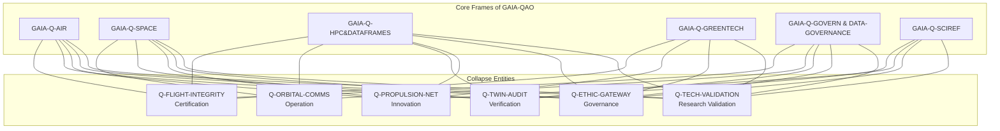
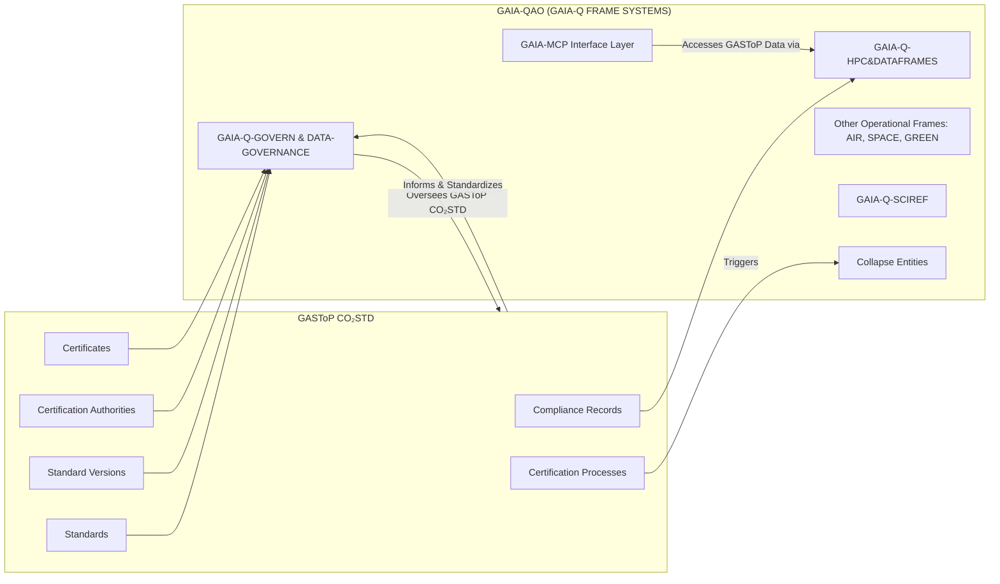
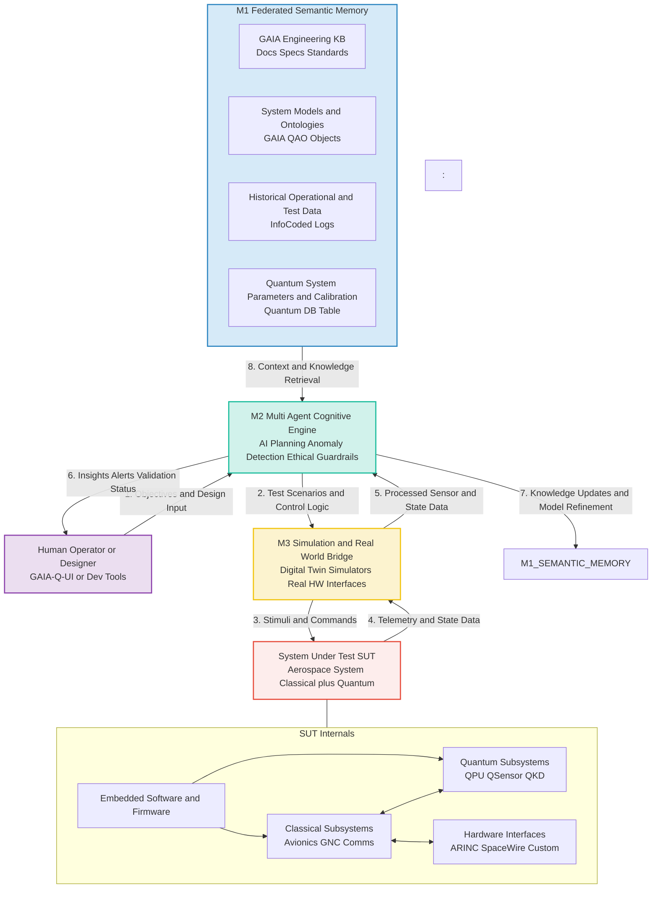
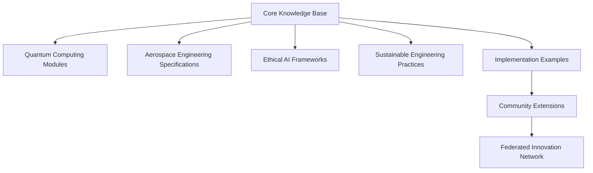

**Author:** Amedeo Pelliccia  
© GAIA-QAO / Quantum Aerospace Organization  
[](https://github.com/sponsors/Robbbo-T)

<p align="center">
  <a href="https://github.com/Robbbo-T/">
    
  </a>
</p>

---

# GAIA-QAO Industry 5.0 Assurance Principle

**No Flight Without QAO Assurance**

**Document Code:** GAIA-QAO-INDUSTRY5-VISION-ASSURANCE-2025-001  
**Version:** 1.0  
**Status:** OFFICIAL DRAFT  
**Classification:** TRUSTED / AUDITABLE / SEMANTIC  
**Maintainer:** @Gaia-QAO-GOVERNANCE  
**InfoCode:** GP-QAO-INDUSTRY5-ASSURANCE-001

---

## I. Executive Statement

> In the GAIA-QAO vision of **Industry 5.0 for aerospace**, the line between the physical and the digital has been fully dissolved. **No part, subsystem, or fully assembled aircraft station is allowed to fly—literally or operationally—without QAO (Quantum Aerospace Organization) assurance, end-to-end, for its entire lifecycle.**
>
> **Every component, from a single mechanical fastener to the largest modular assembly, is inseparable from its digital, semantic, and quantum-assured identity.**
> There is no “anonymous” flight—**every object’s history, compliance, and fitness for operation are always knowable, provable, and auditable.**

---

## II. Core Principle

### **Zero Uncertified Flight**

Every element—be it a bolt, sensor, software module, or integrated aircraft system—must have:

- **QAO certification before integration**
- **Continuous, real-time digital twin monitoring**
- **Immutable audit trails and compliance status** accessible to all stakeholders

> *If it’s not QAO-assured, it doesn’t fly. Period.*

---

## III. The Power of the GAIA-QAO Assurance Chain

### 1. **End-to-End Traceability**

Each part is embedded with a digital identity (DIKE), quantum sensor data, and a living audit chain:

- **From factory to final assembly**
- **From first flight to final decommission**
- **From single use to modular reuse**

### 2. **Semantic and Quantum Provenance**

The GAIA-QAO system federates traditional aerospace assurance with quantum sensorization and digital twins:

- **Semantic object ID:** Every part is uniquely identifiable within a global, federated registry.
- **Quantum event logging:** Structural and operational changes are captured with unprecedented precision.
- **Digital twin mapping:** Real-world states are mirrored in real time, with predictive analytics and anomaly detection.

### 3. **Active, Ethical, and Regulatory Compliance**

- All compliance data is **transparent, provable, and instantly accessible** to regulators, operators, and AI agents.
- **AMEDEO trust layer** ensures that every event, update, or intervention is recorded and evaluated for ethical and legal compliance.
- Supports **zero-trust, federated, and multi-actor ecosystems**—no reliance on a single authority.

---

## IV. Strategic and Operational Impact

- **Eliminates blind spots** in manufacturing, maintenance, and operations.
- **Enables fully automated, AI-driven certification and validation** for both conventional and next-generation aerospace platforms.
- **Accelerates incident investigation, lifecycle management, and regulatory reporting**—with real-time, immutable records.
- **Empowers collaboration:** Trusted data flows between partners, supply chains, and authorities.

---

## V. The GAIA-QAO Industry 5.0 Mandate

> “No part flies alone. No assembly is certified without its digital soul.  
> In GAIA-QAO Industry 5.0, the journey from design to decommission is a seamless flow of intelligence, assurance, and trust.”

---

## VI. Implementation Foundations

- **Object Identification:** DIKE-based unique IDs, compliant with COAFI/AGAD standards.
- **Digital Twin Integration:** Every component and system mapped to its live, operational twin.
- **Quantum and IoT Sensorization:** Embedded sensors for continuous monitoring and event registration.
- **Automated Documentation:** Real-time generation and archival of certification, compliance, and operational data.
- **Blockchain-backed Audit Trails:** Immutable event and compliance history (QAOChain).

---

## VII. Visionary Outcomes

- **Airworthiness and Spaceworthiness Reimagined:** Trust and compliance are intrinsic properties, not afterthoughts.
- **Aerospace as a Living System:** Every object senses, remembers, and proves its journey.
- **Quantum-Ready for the Future:** System is built for both today’s and tomorrow’s operational realities—classical, hybrid, and quantum-enhanced.

---

## VIII. Closing Summary

The **GAIA-QAO Industry 5.0 Assurance Principle** is the cornerstone of a new aerospace era.  
*Nothing takes flight—no matter how small or large—without the indelible signature of QAO assurance.*  
This is how safety, transparency, and responsible innovation become absolute:  
**No flight without assurance. No future without trust.**

---

## Quantum Aerospace Organization Structure

The **Quantum Aerospace Organization (GAIA‑QAO)** comprises six federated modules (virtual teams), each operating synergistically across key aerospace and quantum domains:

-   **GAIA-Q‑AIR:** Quantum-enhanced intelligent flight systems, avionics, and mission optimization.
-   **GAIA‑Q-SPACE:** Orbital and vector systems, mechanics, satellite AI agents, and quantum-secure communication frameworks.
-   **GAIA-Q-GreenTech:** Sustainable aerospace materials, energy efficiency models, and CO₂-reduction strategies.
-   **GAIA‑Q-HPC:** High-performance computing infrastructure for quantum simulation, digital twins, and agentic orchestration.
-   **GAIA‑SCIREF:** Scientific research team focusing on emerging technologies, ontology, ethics, and experimental models.
-   **GAIA‑Q-Data-Governance:** Includes the GA-SToP-CO₂ Steering Committee, Sustainability Integration Board, Emissions Quantification Working Group, Resource Sustainability Working Group, Materials Science Advisory Board, Systems Integration Working Group, and Implementation Working Group.

---

## 📄 Project Status & Metadata

[](#)
[](#)
[](#)
[](#)

<p align="center">
  <a href="https://github.com/Gaia-Q-Air">
    
  </a>
</p>

---

> **Disclaimer:**  
> This document is a generative AI-assisted proposal for the GAIA-Q FRAME SYSTEMS organizational model, designed for the **Quantum Aerospace Organization (GAIA-QAO)**, based on quantum entanglement and superposition concepts. It represents a conceptual framework and has not been officially reviewed, approved, or implemented

---

# GAIA-Q FRAME SYSTEMS
**(for the Quantum Aerospace Organization - GAIA-QAO)**

# Organizational Entanglement & Superposition Model

**Version:** 1.0
**Date:** 2025-05-13
**Status:** Conceptual Framework (for GAIA-QAO)

---

## Table of Contents

1.  [Executive Summary](#1-executive-summary)
2.  [Quantum Organizational Theory](#2-quantum-organizational-theory)
    1.  [Foundational Concepts](#21-foundational-concepts)
        1.  [Superposition](#211-superposition)
        2.  [Entanglement](#212-entanglement)
        3.  [Contextual Collapse](#213-contextual-collapse)
        4.  [Quantum Coherence](#214-quantum-coherence)
    2.  [Advantages Over Traditional Models](#22-advantages-over-traditional-models)
3.  [Core Frames of GAIA-QAO](#3-core-frames-of-gaia-qao)
    1.  [GAIA-Q-AIR](#31-gaia-q-air)
    2.  [GAIA-Q-SPACE](#32-gaia-q-space)
    3.  [GAIA-Q-HPC&DATAFRAMES](#33-gaia-q-hpcdatatframes)
    4.  [GAIA-Q-GREENTECH](#34-gaia-q-greentech)
    5.  [GAIA-Q-GOVERN & DATA-GOVERNANCE](#35-gaia-q-govern--data-governance)
    6.  [GAIA-Q-SCIREF](#36-gaia-q-sciref)
4.  [Entanglement Relations](#4-entanglement-relations)
    1.  [Entanglement Types](#41-entanglement-types)
        1.  [Functional Entanglement](#411-functional-entanglement)
        2.  [Informational Entanglement](#412-informational-entanglement)
        3.  [Regulatory Entanglement](#413-regulatory-entanglement)
    2.  [Key Entanglement Relations](#42-key-entanglement-relations)
        1.  [GAIA-Q-AIR ↔ GAIA-Q-GREENTECH](#421-gaia-q-air--gaia-q-greentech)
        2.  [GAIA-Q-AIR ↔ GAIA-Q-HPC&DATAFRAMES](#422-gaia-q-air--gaia-q-hpcdatatframes)
        3.  [GAIA-Q-SPACE ↔ GAIA-Q-GREENTECH](#423-gaia-q-space--gaia-q-greentech)
        4.  [GAIA-Q-SPACE ↔ GAIA-Q-HPC&DATAFRAMES](#424-gaia-q-space--gaia-q-hpcdatatframes)
        5.  [GAIA-Q-HPC&DATAFRAMES ↔ GAIA-Q-GOVERN & DATA-GOVERNANCE](#425-gaia-q-hpcdatatframes--gaia-q-govern--data-governance)
        6.  [GAIA-Q-GREENTECH ↔ GAIA-Q-GOVERN & DATA-GOVERNANCE](#426-gaia-q-greentech--gaia-q-govern--data-governance)
        7.  [GAIA-Q-GOVERN & DATA-GOVERNANCE ↔ GAIA-Q-AIR](#427-gaia-q-govern--data-governance--gaia-q-air)
        8.  [GAIA-Q-GOVERN & DATA-GOVERNANCE ↔ GAIA-Q-SPACE](#428-gaia-q-govern--data-governance--gaia-q-space)
        9.  [GAIA-Q-SCIREF ↔ All Other Frames](#429-gaia-q-sciref--all-other-frames)
    3.  [Entanglement Strength](#43-entanglement-strength)
5.  [Superposition States](#5-superposition-states)
    1.  [Superposition Principles](#51-superposition-principles)
    2.  [Superposition Map](#52-superposition-map)
    3.  [Superposition Examples](#53-superposition-examples)
        1.  [GAIA-Q-AIR Superposition Example](#531-gaia-q-air-superposition-example)
        2.  [GAIA-Q-HPC&DATAFRAMES Superposition Example](#532-gaia-q-hpcdatatframes-superposition-example)
6.  [Collapse Entities](#6-collapse-entities)
    1.  [Collapse Mechanics](#61-collapse-mechanics)
    2.  [Key Collapse Entities](#62-key-collapse-entities)
        1.  [Q-FLIGHT-INTEGRITY](#621-q-flight-integrity)
        2.  [Q-ORBITAL-COMMS](#622-q-orbital-comms)
        3.  [Q-TWIN-AUDIT](#623-q-twin-audit)
        4.  [Q-PROPULSION-NET](#624-q-propulsion-net)
        5.  [Q-ETHIC-GATEWAY](#625-q-ethic-gateway)
        6.  [Q-TECH-VALIDATION](#626-q-tech-validation)
    3.  [Collapse Entity Diagram](#63-collapse-entity-diagram)
7.  [Mission Control Platform (MCP)](#7-mission-control-platform-mcp)
    1.  [MCP Architecture](#71-mcp-architecture)
        1.  [Core Components](#711-core-components)
    2.  [MCP Functions](#72-mcp-functions)
        1.  [Context Evaluation](#721-context-evaluation)
        2.  [Collapse Orchestration](#722-collapse-orchestration)
        3.  [Entanglement Management](#723-entanglement-management)
        4.  [Superposition Maintenance](#724-superposition-maintenance)
    3.  [MCP Implementation](#73-mcp-implementation)
        1.  [Technical Implementation](#731-technical-implementation)
        2.  [Key Algorithms](#732-key-algorithms)
8.  [Implementation Guidelines](#8-implementation-guidelines)
    1.  [Implementation Phases](#81-implementation-phases)
        1.  [Phase 1: Assessment & Preparation](#811-phase-1-assessment--preparation)
        2.  [Phase 2: Frame Establishment](#812-phase-2-frame-establishment)
        3.  [Phase 3: Entanglement Development](#813-phase-3-entanglement-development)
        4.  [Phase 4: Collapse Entity Design](#814-phase-4-collapse-entity-design)
        5.  [Phase 5: MCP Development](#815-phase-5-mcp-development)
        6.  [Phase 6: Pilot Implementation](#816-phase-6-pilot-implementation)
        7.  [Phase 7: Full Implementation](#817-phase-7-full-implementation)
    2.  [Critical Success Factors](#82-critical-success-factors)
    3.  [Common Implementation Challenges](#83-common-implementation-challenges)
9.  [Integration with GASToP CO₂STD](#9-integration-with-gastop-co₂std)
    1.  [Integration Points](#91-integration-points)
        1.  [Standards and Frames](#911-standards-and-frames)
        2.  [Temporal Versioning](#912-temporal-versioning)
        3.  [Certification Integration](#913-certification-integration)
    2.  [Integration Architecture](#92-integration-architecture)
    3.  [Implementation Considerations](#93-implementation-considerations)
10. [Use Cases & Applications](#10-use-cases--applications)
    1.  [Aerospace Certification](#101-aerospace-certification)
    2.  [Space Mission Operations](#102-space-mission-operations)
    3.  [Digital Twin Validation](#103-digital-twin-validation)
    4.  [Sustainable Propulsion Development](#104-sustainable-propulsion-development)
    5.  [Ethical Decision-Making & Technology Assessment](#105-ethical-decision-making--technology-assessment)
11. [Metrics & Evaluation](#11-metrics--evaluation)
    1.  [Organizational Performance Metrics](#111-organizational-performance-metrics)
        1.  [Quantum Organizational Efficiency](#1111-quantum-organizational-efficiency)
        2.  [Entanglement Effectiveness](#1112-entanglement-effectiveness)
        3.  [Superposition Utilization](#1113-superposition-utilization)
        4.  [Collapse Appropriateness](#1114-collapse-appropriateness)
        5.  [Quantum Coherence](#1115-quantum-coherence)
    2.  [Implementation Progress Metrics](#112-implementation-progress-metrics)
    3.  [Business Impact Metrics](#113-business-impact-metrics)
        1.  [Operational Agility](#1131-operational-agility)
        2.  [Resource Efficiency](#1132-resource-efficiency)
        3.  [Innovation Velocity](#1133-innovation-velocity)
        4.  [Compliance Effectiveness](#1134-compliance-effectiveness)
        5.  [Employee Engagement](#1135-employee-engagement)
12. [GAIA-Q: Agilizing the Next Industrial Revolution](#12-gaia-q-agilizing-the-next-industrial-revolution)
    1.  [Executive Summary](#121-executive-summary)
    2.  [Quantum Organization: The Missing Catalyst](#122-quantum-organization-the-missing-catalyst)
        1.  [Traditional Industrial Revolutions vs. Quantum-Accelerated Evolution](#1221-traditional-industrial-revolutions-vs-quantum-accelerated-evolution)
        2.  [Key Acceleration Factors](#1222-key-acceleration-factors)
    3.  [Cross-Industry GAIA-Q Frames](#123-cross-industry-gaia-q-frames)
        1.  [Frame Descriptions](#1231-frame-descriptions)
    4.  [Industry 5.0 Collapse Entities](#124-industry-50-collapse-entities)
        1.  [Q-SMART-FACTORY](#1241-q-smart-factory)
        2.  [Q-CIRCULAR-DESIGN](#1242-q-circular-design)
        3.  [Q-HUMAN-AUGMENT](#1243-q-human-augment)
        4.  [Q-RESILIENT-SUPPLY](#1244-q-resilient-supply)
        5.  [Q-ETHICAL-INNOVATION](#1245-q-ethical-innovation)
    5.  [Implementation Across Industrial Sectors](#125-implementation-across-industrial-sectors)
        1.  [Manufacturing Sector](#1251-manufacturing-sector)
        2.  [Healthcare Sector](#1252-healthcare-sector)
        3.  [Energy Sector](#1253-energy-sector)
    6.  [The MCP for Industrial Revolution](#126-the-mcp-for-industrial-revolution)
        1.  [MCP Core Functions](#1261-mcp-core-functions)
        2.  [Integration Architecture](#1262-integration-architecture)
    7.  [Metrics for Industrial Quantum Acceleration](#127-metrics-for-industrial-quantum-acceleration)
    8.  [Roadmap to Quantum Industrial Transformation](#128-roadmap-to-quantum-industrial-transformation)
    9.  [Conclusion: The Quantum Advantage](#129-conclusion-the-quantum-advantage)
13. [Glossary](#13-glossary)
14. [References](#14-references)

---

## 1. Executive Summary

GAIA-Q FRAME SYSTEMS introduces a revolutionary approach to the Quantum Aerospace Organization's (GAIA-QAO) architecture, inspired by quantum mechanics principles. This framework reimagines traditional organizational structures by applying concepts of quantum entanglement and superposition to create a dynamic, context-responsive organizational model for GAIA-QAO's federated modules.

Unlike conventional hierarchical or matrix organizations, GAIA-Q enables organizational components (Frames) within GAIA-QAO to exist in multiple functional states simultaneously (superposition) while maintaining interconnected relationships that influence each other regardless of distance or boundaries (entanglement). When specific operational contexts arise, these quantum states "collapse" into specialized configurations optimized for the task at hand.

This documentation provides a comprehensive overview of the GAIA-Q FRAME SYSTEMS model as applied to GAIA-QAO, its core frames, entanglement relations, collapse entities, implementation guidelines, and practical applications in aerospace contexts. It also explores the broader applicability of these principles to agilize the next industrial revolution.

---

## 2. Quantum Organizational Theory

### 2.1 Foundational Concepts

GAIA-Q FRAME SYSTEMS is built on four fundamental quantum concepts applied to organizational design:

#### 2.1.1 Superposition

In quantum mechanics, particles can exist in multiple states simultaneously until measured. In GAIA-Q, organizational units (Frames) can simultaneously fulfill multiple functional roles until a specific operational context requires specialization.

**Organizational Application:** GAIA-QAO teams maintain capabilities across multiple domains and can rapidly shift focus based on mission requirements without restructuring.

#### 2.1.2 Entanglement

Quantum entanglement occurs when particles become connected such that the state of one instantly influences the other, regardless of distance. In GAIA-Q, organizational units (Frames) maintain persistent connections that enable coordinated responses across traditional boundaries.

**Organizational Application:** Changes in one GAIA-QAO domain automatically trigger appropriate responses in connected domains without explicit communication chains.

#### 2.1.3 Contextual Collapse

In quantum mechanics, superposition states collapse into definite states when measured. In GAIA-Q, multi-functional teams collapse into specific operational configurations when triggered by contextual needs.

**Organizational Application:** When specific mission contexts arise, GAIA-QAO automatically reconfigures into the optimal structure for that context.

#### 2.1.4 Quantum Coherence

Quantum systems maintain coherence—a synchronized state—until external interference causes decoherence. In GAIA-Q, organizational coherence is maintained through shared information systems and governance frameworks.

**Organizational Application:** GAIA-QAO maintains alignment across all components through shared mission awareness and integrated information systems managed by the GAIA-MCP Interface Layer.

### 2.2 Advantages Over Traditional Models

| Traditional Organization                         | GAIA-Q Organization (for GAIA-QAO)                          |
| :----------------------------------------------- | :---------------------------------------------------------- |
| Static structure requiring formal reorganization | Dynamic reconfiguration based on context                    |
| Siloed departments with limited cross-functionality | Entangled frames with inherent cross-domain capabilities    |
| Linear communication and approval chains         | Non-linear, context-triggered information flows             |
| Specialized teams with narrow focus              | Teams existing in superposition of multiple capabilities    |
| Reactive adaptation to changing requirements     | Proactive collapse into optimal configurations              |
| Explicit coordination mechanisms                 | Implicit coordination through entanglement                  |

---

## 3. Core Frames of GAIA-QAO

The GAIA-Q FRAME SYSTEMS for GAIA-QAO consists of six core organizational frames (federated modules), each representing a fundamental domain of aerospace and quantum operations while maintaining quantum entanglement with other frames. These frames are derived from the defined GAIA-QAO structure.

### 3.1 GAIA-Q-AIR

**Domain:** Aerospace (Quantum-enhanced Flight Systems)
**Description:** Quantum-enhanced intelligent flight systems, avionics, mission optimization, and the architecture of intelligent, sustainable air cells with More Electric Aircraft (MEA) focus.
**Primary Functions:**
-   Aircraft structural design and engineering
-   Quantum-enhanced avionics and flight systems integration
-   Aerodynamic performance optimization & quantum-driven mission optimization
-   Airworthiness certification management
-   Flight testing and validation
**Superposition Capabilities:**
-   Environmental impact assessment (with GAIA-Q-GREENTECH)
-   Digital twin implementation (with GAIA-Q-HPC&DATAFRAMES)
-   Certification documentation (with GAIA-Q-GOVERN & DATA-GOVERNANCE)
-   Propulsion integration (with GAIA-Q-GREENTECH)

### 3.2 GAIA-Q-SPACE

**Domain:** Space Systems & Quantum Communications
**Description:** Orbital and vector systems, mechanics, satellite AI agents, quantum-secure communication frameworks, and support structures.
**Primary Functions:**
-   Spacecraft structural design
-   Orbital mechanics and mission planning (including vector systems)
-   Development and deployment of satellite AI agents
-   Implementation of quantum-secure communication frameworks
-   Space environment adaptation
-   Launch vehicle integration
-   Satellite deployment systems
**Superposition Capabilities:**
-   Space-based data systems (with GAIA-Q-HPC&DATAFRAMES)
-   Sustainable space operations (with GAIA-Q-GREENTECH)
-   Regulatory compliance for space activities (with GAIA-Q-GOVERN & DATA-GOVERNANCE)
-   Propulsion system integration (with GAIA-Q-GREENTECH)

### 3.3 GAIA-Q-HPC&DATAFRAMES

**Domain:** High-Performance Computing, Information & Data Layer
**Description:** High-performance computing infrastructure for quantum simulation, digital twins, agentic orchestration, cognitive infrastructure, and data fabric.
**Primary Functions:**
-   Provision and management of High-Performance Computing (HPC) resources
-   Quantum simulation and modeling
-   Digital twin development, maintenance, and orchestration
-   Agentic system orchestration support
-   Data architecture and management
-   AI/ML implementation
-   Cybersecurity and data protection
**Superposition Capabilities:**
-   Flight data analysis (with GAIA-Q-AIR)
-   Orbital telemetry processing and satellite AI agent support (with GAIA-Q-SPACE)
-   Compliance monitoring and reporting (with GAIA-Q-GOVERN & DATA-GOVERNANCE)
-   Sustainability metrics and analysis (with GAIA-Q-GREENTECH)
-   Computational support for experimental models (with GAIA-Q-SCIREF)

### 3.4 GAIA-Q-GREENTECH

**Domain:** GreenTech, Sustainable Propulsion & Materials
**Description:** Sustainable aerospace materials, energy systems, clean propulsion, CO₂-reduction strategies, and sustainable lifecycle management.
**Primary Functions:**
-   Sustainable propulsion development
-   Energy efficiency modeling and optimization
-   Environmental impact reduction and CO₂-reduction strategies
-   Research and application of sustainable aerospace materials
-   Alternative fuel systems
-   Lifecycle sustainability management
**Superposition Capabilities:**
-   Eco-friendly aircraft design (with GAIA-Q-AIR)
-   Sustainable space propulsion and operations (with GAIA-Q-SPACE)
-   Environmental compliance monitoring (with GAIA-Q-GOVERN & DATA-GOVERNANCE)
-   Sustainability data analytics (with GAIA-Q-HPC&DATAFRAMES)
-   Material science input for new designs (with GAIA-Q-SCIREF)

### 3.5 GAIA-Q-GOVERN & DATA-GOVERNANCE

**Domain:** Trust, Ethics, Regulation & Data Governance
**Description:** Ethical governance, traceability, certification, trust frameworks, and comprehensive data governance including the GA-SToP-CO₂ Steering Committee and associated working groups.
**Primary Functions:**
-   Regulatory compliance management
-   Certification process oversight
-   Ethical framework development and oversight (in collaboration with GAIA-Q-SCIREF)
-   Transparency and accountability systems
-   Risk management and mitigation
-   **Data Governance:**
    -   Overseeing the GA-SToP-CO₂ Steering Committee
    -   Managing Sustainability Integration Board, Emissions Quantification WG, Resource Sustainability WG, Materials Science Advisory Board, Systems Integration WG, and Implementation WG.
    -   Ensuring data quality, integrity, and compliance for all organizational data.
**Superposition Capabilities:**
-   Airworthiness certification (with GAIA-Q-AIR)
-   Space activity compliance (with GAIA-Q-SPACE)
-   Data governance and privacy across all frames (with GAIA-Q-HPC&DATAFRAMES)
-   Environmental compliance and sustainability reporting (with GAIA-Q-GREENTECH)
-   Ethical review of new technologies and research outputs (with GAIA-Q-SCIREF)

### 3.6 GAIA-Q-SCIREF

**Domain:** Scientific Research, Emerging Technologies & Ontology
**Description:** Scientific research team focusing on emerging technologies, ontology, ethics (foundational research), and experimental models.
**Primary Functions:**
-   Horizon scanning for emerging aerospace and quantum technologies
-   Fundamental research in quantum principles applicable to aerospace
-   Development and maintenance of organizational ontology and semantic frameworks
-   Pioneering experimental models and proofs-of-concept
-   Conducting foundational ethical research for new technologies
-   Fostering academic and research partnerships
**Superposition Capabilities:**
-   Providing cutting-edge research insights to all other frames
-   Developing foundational ethical guidelines for emerging tech (informing GAIA-Q-GOVERN & DATA-GOVERNANCE)
-   Defining ontological standards for data (with GAIA-Q-HPC&DATAFRAMES and GAIA-Q-GOVERN & DATA-GOVERNANCE)
-   Piloting experimental technologies with GAIA-Q-AIR, GAIA-Q-SPACE, and GAIA-Q-GREENTECH
-   Simulating and validating new concepts (with GAIA-Q-HPC&DATAFRAMES)

---

## 4. Entanglement Relations

Entanglement relations define the persistent connections between frames that enable quantum-like coordination and influence. Each entanglement has specific properties that determine how frames interact.

### 4.1 Entanglement Types

#### 4.1.1 Functional Entanglement

Connects frames based on shared operational functions or capabilities.

#### 4.1.2 Informational Entanglement

Connects frames through shared data, knowledge, or information flows.

#### 4.1.3 Regulatory Entanglement

Connects frames through governance, compliance, or certification requirements.

### 4.2 Key Entanglement Relations

#### 4.2.1 GAIA-Q-AIR ↔ GAIA-Q-GREENTECH

**Name:** Sustentabilidad Aérea (Aerial Sustainability)
**Type:** Functional
**Strength:** 0.85
**Description:** Entanglement focused on integrating sustainable technologies and practices into aircraft design and operation.
**Contextual Triggers:** Environmental certification, eco-design, emission reduction, sustainable materials.

#### 4.2.2 GAIA-Q-AIR ↔ GAIA-Q-HPC&DATAFRAMES

**Name:** Trazabilidad Gemelos Digitales Aéreos (Aerial Digital Twin Traceability)
**Type:** Informational
**Strength:** 0.9
**Description:** Connecting physical aircraft with digital representations for simulation, analysis, and lifecycle management.
**Contextual Triggers:** Design validation, predictive maintenance, performance analysis, failure investigation.

#### 4.2.3 GAIA-Q-SPACE ↔ GAIA-Q-GREENTECH

**Name:** Propulsión Eco-Orbital (Eco-Orbital Propulsion)
**Type:** Functional
**Strength:** 0.8
**Description:** Developing and implementing sustainable propulsion for space systems.
**Contextual Triggers:** Launch ops, orbital maneuvers, EoL disposal, fuel selection, environmental impact.

#### 4.2.4 GAIA-Q-SPACE ↔ GAIA-Q-HPC&DATAFRAMES

**Name:** Telemetría Cuántica Orbital (Orbital Quantum Telemetry)
**Type:** Informational
**Strength:** 0.95
**Description:** Connecting space systems with data infrastructure for mission ops, monitoring, and analysis.
**Contextual Triggers:** Mission ops, anomaly detection, performance monitoring, data transmission.

#### 4.2.5 GAIA-Q-HPC&DATAFRAMES ↔ GAIA-Q-GOVERN & DATA-GOVERNANCE

**Name:** Memoria Operativa Segura (Secure Operational Memory)
**Type:** Regulatory & Informational
**Strength:** 0.85
**Description:** Ensuring data governance, compliance, traceability, and security across operations.
**Contextual Triggers:** Compliance audits, incident investigation, regulatory reporting, data security protocols.

#### 4.2.6 GAIA-Q-GREENTECH ↔ GAIA-Q-GOVERN & DATA-GOVERNANCE

**Name:** Certificación Energética y Sostenible (Energy & Sustainable Certification)
**Type:** Regulatory
**Strength:** 0.75
**Description:** Connecting sustainability practices with regulatory frameworks and certification.
**Contextual Triggers:** Environmental certification, emissions compliance, sustainability reporting, audits.

#### 4.2.7 GAIA-Q-GOVERN & DATA-GOVERNANCE ↔ GAIA-Q-AIR

**Name:** Auditoría Federada Aérea (Federated Aerial Audit)
**Type:** Regulatory
**Strength:** 0.8
**Description:** Ensuring airworthiness, safety compliance, and certification of aircraft systems.
**Contextual Triggers:** Airworthiness certification, safety audits, regulatory inspections, incident investigations.

#### 4.2.8 GAIA-Q-GOVERN & DATA-GOVERNANCE ↔ GAIA-Q-SPACE

**Name:** Compliance Orbital Federada (Federated Orbital Compliance)
**Type:** Regulatory
**Strength:** 0.75
**Description:** Ensuring space activities comply with international regulations and best practices.
**Contextual Triggers:** Launch approvals, orbital debris mitigation, space traffic management, international coordination.

#### 4.2.9 GAIA-Q-SCIREF ↔ All Other Frames

**Name:** Innovación Cuántica Aplicada (Applied Quantum Innovation)
**Type:** Functional & Informational
**Strength:** Variable (0.6-0.9 depending on project phase)
**Description:** Feeding foundational research, emerging tech insights, and ethical considerations into all operational and governance frames; receiving operational data for experimental validation.
**Contextual Triggers:** New research breakthroughs, requests for technological assessment, ethical dilemmas, experimental design needs, validation requirements.

### 4.3 Entanglement Strength

Entanglement strength quantifies the degree of influence and coordination between frames on a scale of 0.0 to 1.0:

| Strength Range | Description             | Operational Implications                                                        |
| :------------- | :---------------------- | :------------------------------------------------------------------------------ |
| 0.9 - 1.0      | Critical Entanglement   | Near-instantaneous coordination; changes in one frame immediately affect the other |
| 0.8 - 0.9      | Strong Entanglement     | Rapid coordination with minimal delay; high influence between frames            |
| 0.7 - 0.8      | Significant Entanglement| Consistent coordination with some delay; notable influence between frames         |
| 0.6 - 0.7      | Moderate Entanglement   | Regular coordination with moderate delay; moderate influence between frames       |
| 0.5 - 0.6      | Basic Entanglement      | Periodic coordination with significant delay; limited influence between frames    |
| < 0.5          | Weak Entanglement       | Minimal coordination; negligible influence between frames                       |

---

## 5. Superposition States

Superposition states represent the capability of GAIA-QAO frames to simultaneously fulfill multiple functional roles until a specific operational context requires specialization.

### 5.1 Superposition Principles

1.  **Multi-functionality:** Each frame maintains capabilities across multiple domains simultaneously.
2.  **Contextual Activation:** Different aspects of a frame's capabilities activate based on operational context.
3.  **Probabilistic Behavior:** The likelihood of a frame collapsing into a specific functional state depends on contextual factors.
4.  **Resource Distribution:** Resources within a frame are distributed across its superposition states according to operational priorities.
5.  **Coherence Maintenance:** Frames maintain coherence across their superposition states through shared information and governance.

### 5.2 Superposition Map

The following diagram illustrates the superposition states of each frame and their potential collapse pathways:

```mermaid
graph LR

    %% Frame Example
    subgraph sg_air[GAIA-Q-AIR States Example]
        direction TB
        A1[FS Design]
        A2[Avionics Integration]
        A3[Eco-Flight Ops]
        A4[Air Cert. Support]
    end

    %% Collapse Entities
    subgraph sg_collapse[Collapse Entities]
        direction TB
        Q_FLIGHT_INTEGRITY((Q-Flight Integrity))
        Q_ORBITAL_COMMS((Q-Orbital Comms))
        Q_TWIN_AUDIT((Q-Twin Audit))
        Q_PROPULSION_NET((Q-Propulsion Net))
        Q_ETHIC_GATEWAY((Q-Ethic Gateway))
        Q_TECH_VALIDATION((Q-Tech Validation))
    end

    %% Connections (from sg_air to sg_collapse)
    A1 --> Q_FLIGHT_INTEGRITY
    A3 --> Q_FLIGHT_INTEGRITY
    A4 --> Q_FLIGHT_INTEGRITY
    %% Nota: Se muestran solo las conexiones de GAIA-Q-AIR a Q-Flight Integrity
    %% como ejemplo simplificado. Otras conexiones (ej. A1/A2 a Q-Twin Audit)
    %% y conexiones de otros Frames se omiten para brevedad en este diagrama.

    %% Styles for Dark Theme
    classDef frameBlockStyle fill:#2D3748,stroke:#4A5568,stroke-width:1px;
    classDef frameNodeStyle fill:#0969DA,stroke:#3081F7,color:white,stroke-width:1px;
    classDef collapseBlockStyle fill:#2D3748,stroke:#4A5568,stroke-width:1px;
    classDef collapseNodeStyle fill:#1A7F37,stroke:#2DA44E,color:white,stroke-width:1px;

    class sg_air frameBlockStyle;
    class sg_collapse collapseBlockStyle;
    class A1,A2,A3,A4 frameNodeStyle;
    class Q_FLIGHT_INTEGRITY,Q_ORBITAL_COMMS,Q_TWIN_AUDIT,Q_PROPULSION_NET,Q_ETHIC_GATEWAY,Q_TECH_VALIDATION collapseNodeStyle;
```



### 5.3 Superposition Examples

#### 5.3.1 GAIA-Q-AIR Superposition Example

The GAIA-Q-AIR frame exists simultaneously as:

-   A flight systems engineering unit developing aircraft structures.
-   A sustainability partner working with GAIA-Q-GREENTECH on eco-friendly materials.
-   A digital asset provider collaborating with GAIA-Q-HPC&DATAFRAMES on digital twins.
-   A certification entity working with GAIA-Q-GOVERN & DATA-GOVERNANCE on airworthiness documentation.
-   An experimental platform for GAIA-Q-SCIREF testing new aerodynamic concepts.

Depending on the operational context, one of these aspects becomes dominant while others remain in background superposition.

#### 5.3.2 GAIA-Q-HPC&DATAFRAMES Superposition Example

The GAIA-Q-HPC&DATAFRAMES frame exists simultaneously as:

-   A digital twin developer for GAIA-Q-AIR.
-   A telemetry processor and quantum simulation provider for GAIA-Q-SPACE.
-   A compliance monitoring system for GAIA-Q-GOVERN & DATA-GOVERNANCE.
-   A sustainability metrics analyzer for GAIA-Q-GREENTECH.
-   A computational engine for GAIA-Q-SCIREF's experimental models.

When a specific mission requires orbital telemetry analysis, the GAIA-Q-SPACE-related capabilities become dominant while other capabilities remain available but secondary.

---

## 6. Collapse Entities

Collapse entities represent emergent organizational configurations that form when specific operational contexts trigger the collapse of superposition states across multiple frames.

### 6.1 Collapse Mechanics

1.  **Contextual Trigger:** Specific operational contexts activate collapse mechanics.
2.  **Threshold Activation:** Collapse occurs when contextual relevance exceeds the activation threshold.
3.  **Resource Reallocation:** Resources shift to prioritize the collapsed state's functions.
4.  **Temporary Stability:** The collapsed state remains stable until the context changes.
5.  **Return to Superposition:** When the context resolves, frames return to superposition states.

### 6.2 Key Collapse Entities

#### 6.2.1 Q-FLIGHT-INTEGRITY

**Identifier:** Q-FLIGHT-INTEGRITY
**Emergent State:** Certification
**Components:**
-   GAIA-Q-AIR
-   GAIA-Q-GREENTECH
-   GAIA-Q-GOVERN & DATA-GOVERNANCE
-   (GAIA-Q-HPC&DATAFRAMES for simulation data)
**Application Example:** Ecological certification of aircraft cells
**Activation Threshold:** 0.7
**Collapse Contexts:** Certification processes, audits, impact assessments.
**Description:** Emerges for integrated assessment of aircraft design, environmental impact, and regulatory compliance.

#### 6.2.2 Q-ORBITAL-COMMS

**Identifier:** Q-ORBITAL-COMMS
**Emergent State:** Operation
**Components:**
-   GAIA-Q-SPACE
-   GAIA-Q-HPC&DATAFRAMES
-   GAIA-Q-GOVERN & DATA-GOVERNANCE
**Application Example:** Secure quantum communications for orbital assets
**Activation Threshold:** 0.8
**Collapse Contexts:** Data transmission, security operations, critical mission phases.
**Description:** Emerges for secure, reliable communications between orbital assets and ground systems.

#### 6.2.3 Q-TWIN-AUDIT

**Identifier:** Q-TWIN-AUDIT
**Emergent State:** Verification
**Components:**
-   GAIA-Q-HPC&DATAFRAMES
-   GAIA-Q-AIR (or GAIA-Q-SPACE for respective twins)
-   GAIA-Q-GOVERN & DATA-GOVERNANCE
-   (GAIA-Q-SCIREF for ontological validation)
**Application Example:** Digital Twin auditing in operations
**Activation Threshold:** 0.75
**Collapse Contexts:** Validation processes, conformity assessments, discrepancy analysis.
**Description:** Emerges for validating digital twin accuracy against physical assets or mission parameters.

#### 6.2.4 Q-PROPULSION-NET

**Identifier:** Q-PROPULSION-NET
**Emergent State:** Innovation
**Components:**
-   GAIA-Q-GREENTECH
-   GAIA-Q-SPACE
-   GAIA-Q-AIR
-   (GAIA-Q-SCIREF for novel concepts)
-   (GAIA-Q-HPC&DATAFRAMES for modeling)
**Application Example:** Hybrid aerospace propulsion network development
**Activation Threshold:** 0.65
**Collapse Contexts:** Development initiatives, testing programs, integration projects.
**Description:** Emerges for propulsion innovation initiatives across air and space domains.

#### 6.2.5 Q-ETHIC-GATEWAY

**Identifier:** Q-ETHIC-GATEWAY
**Emergent State:** Governance & Foresight
**Components:**
-   GAIA-Q-GOVERN & DATA-GOVERNANCE
-   GAIA-Q-SCIREF
-   Representatives from GAIA-Q-AIR, GAIA-Q-SPACE, GAIA-Q-HPC&DATAFRAMES, GAIA-Q-GREENTECH
**Application Example:** Semantic and ethical governance portal for new AI agent deployment
**Activation Threshold:** 0.9
**Collapse Contexts:** Ethical decisions, global compliance, transparency initiatives, new tech assessment.
**Description:** Emerges for complex ethical decision-making and impact assessment requiring input from all domains.

#### 6.2.6 Q-TECH-VALIDATION

**Identifier:** Q-TECH-VALIDATION
**Emergent State:** Research Translation & Validation
**Components:**
-   GAIA-Q-SCIREF
-   GAIA-Q-HPC&DATAFRAMES
-   Relevant operational frame (GAIA-Q-AIR, GAIA-Q-SPACE, or GAIA-Q-GREENTECH)
-   (GAIA-Q-GOVERN & DATA-GOVERNANCE for early compliance checks)
**Application Example:** Validating a new quantum sensor concept for atmospheric readings
**Activation Threshold:** 0.7
**Collapse Contexts:** Proof-of-concept testing, experimental model validation, scaling research findings.
**Description:** Emerges to transition promising research from GAIA-Q-SCIREF into validated technologies through simulation and pilot testing.

### 6.3 Collapse Entity Diagram



---

## 7. Mission Control Platform (MCP)

The Mission Control Platform (MCP), operated via the **GAIA-MCP Interface Layer**, serves as the orchestration layer for the GAIA-Q FRAME SYSTEMS, monitoring contexts, triggering collapses, and coordinating operations across frames within GAIA-QAO.

### 7.1 MCP Architecture

#### 7.1.1 Core Components

1.  **Context Evaluation Engine**
    1.  Monitors operational environments
    2.  Identifies contextual triggers
    3.  Calculates contextual relevance scores
    4.  Determines collapse thresholds
2.  **Collapse Orchestration System**
    1.  Triggers frame collapses when thresholds are met
    2.  Coordinates resource allocation during collapses
    3.  Manages transition between superposition and collapsed states
    4.  Monitors collapse effectiveness
3.  **Entanglement Management System**
    1.  Maintains entanglement relationships
    2.  Monitors entanglement strength
    3.  Facilitates information flow across entangled frames
    4.  Identifies entanglement degradation
4.  **Quantum State Monitor**
    1.  Tracks superposition states across all frames
    2.  Visualizes current organizational configuration
    3.  Provides real-time status of all frames and collapses
    4.  Identifies potential quantum decoherence
5.  **Mission Alignment System**
    1.  Ensures all frames maintain alignment with mission objectives
    2.  Coordinates strategic priorities across frames
    3.  Manages conflicts between competing collapse triggers
    4.  Provides executive oversight of quantum organizational state through the GAIA-MCP Interface Layer

### 7.2 MCP Functions

#### 7.2.1 Context Evaluation

The MCP continuously monitors the operational environment for contextual triggers that may necessitate organizational reconfiguration. Key functions include:

-   **Environmental Scanning:** Monitoring internal and external environments for relevant events
-   **Pattern Recognition:** Identifying patterns that match predefined contextual triggers
-   **Relevance Scoring:** Calculating the relevance of detected contexts to potential collapse entities
-   **Threshold Analysis:** Comparing relevance scores against activation thresholds

#### 7.2.2 Collapse Orchestration

When contextual relevance exceeds activation thresholds, the MCP orchestrates the collapse of superposition states into specific operational configurations:

-   **Collapse Initiation:** Signaling relevant frames to collapse into specific states
-   **Resource Allocation:** Directing resources to support the collapsed configuration
-   **Coordination Management:** Ensuring synchronized collapse across all involved frames
-   **State Stabilization:** Maintaining the collapsed state until the context resolves

#### 7.2.3 Entanglement Management

The MCP maintains and leverages entanglement relationships to ensure coordinated operations across frames:

-   **Relationship Monitoring:** Tracking the strength and health of entanglement relationships
-   **Information Flow Facilitation:** Ensuring information flows appropriately across entangled frames
-   **Entanglement Reinforcement:** Strengthening entanglements through collaborative activities
-   **Decoherence Prevention:** Identifying and addressing factors that weaken entanglements

#### 7.2.4 Superposition Maintenance

Between collapse events, the MCP maintains frames in their superposition states:

-   **Capability Distribution:** Ensuring resources support all superposition capabilities
-   **Coherence Protection:** Preventing premature or inappropriate collapses
-   **State Preparation:** Maintaining readiness for rapid collapse when needed
-   **Return Management:** Facilitating return to superposition after collapse events

### 7.3 MCP Implementation

#### 7.3.1 Technical Implementation

The MCP can be implemented as a combination of:

1.  **Digital Platform:** Software system for monitoring, analysis, and coordination, forming the core of the GAIA-MCP Interface Layer.
2.  **Governance Framework:** Policies and procedures for quantum organizational management, defined by GAIA-Q-GOVERN & DATA-GOVERNANCE.
3.  **Human Oversight:** Executive team with responsibility for MCP operation, interacting via the GAIA-MCP Interface Layer.
4.  **AI Assistance:** Machine learning systems to enhance context recognition and response, integrated within the MCP.

#### 7.3.2 Key Algorithms

1.  **GAIA-Q-CONTEXT-EVAL-1.0:** Algorithm for evaluating contextual relevance and trigger detection.
2.  **GAIA-Q-COLLAPSE-PROTOCOL-1.0:** Protocol for orchestrating collapse events across frames.
3.  **GAIA-Q-ENTANGLEMENT-MONITOR-1.0:** Algorithm for monitoring and maintaining entanglement relationships.
4.  **GAIA-Q-COHERENCE-MAINTENANCE-1.0:** Algorithm for maintaining quantum coherence across the organization.

---

## 8. Implementation Guidelines

### 8.1 Implementation Phases

#### 8.1.1 Phase 1: Assessment & Preparation

**Duration:** 2-3 months
**Key Activities:**
-   Evaluate GAIA-QAO's current operational structure against the proposed Frame model.
-   Identify and map existing capabilities to the defined Frames.
-   Map existing relationships and dependencies as initial entanglement points.
-   Assess GAIA-QAO's readiness for quantum transformation (cultural, technical).
-   Develop a detailed implementation roadmap.
**Deliverables:** GAIA-QAO quantum readiness assessment, Frame capability inventory, Preliminary entanglement map, Implementation roadmap.

#### 8.1.2 Phase 2: Frame Establishment

**Duration:** 3-4 months
**Key Activities:**
-   Formally define Frame boundaries and responsibilities within GAIA-QAO.
-   Detail superposition capabilities for each Frame based on GAIA-QAO module descriptions.
-   Establish governance structures for Frames, integrating with existing GAIA-QAO governance.
-   Begin developing entanglement protocols based on identified dependencies.
-   Train GAIA-QAO module leadership on quantum organizational principles.
**Deliverables:** Frame charters, Superposition capability maps, Frame governance frameworks, Initial entanglement protocols, Leadership training completion.

#### 8.1.3 Phase 3: Entanglement Development

**Duration:** 2-3 months
**Key Activities:**
-   Formalize entanglement relationships between GAIA-QAO Frames.
-   Develop information sharing protocols leveraging GAIA-Q-HPC&DATAFRAMES.
-   Establish entanglement strength metrics and monitoring.
-   Create entanglement reinforcement mechanisms (e.g., cross-Frame projects).
-   Test entanglement effectiveness in controlled scenarios within GAIA-QAO.
**Deliverables:** Formalized entanglement documentation, Information sharing protocols, Entanglement measurement framework, Reinforcement plan, Test results.

#### 8.1.4 Phase 4: Collapse Entity Design

**Duration:** 2-3 months
**Key Activities:**
-   Define and refine Collapse Entities based on GAIA-QAO operational needs.
-   Establish specific collapse triggers and activation thresholds.
-   Develop collapse orchestration procedures integrated with the MCP.
-   Create resource allocation plans for collapse events.
-   Test collapse mechanisms in simulated GAIA-QAO environments.
**Deliverables:** Collapse Entity specifications, Trigger/threshold documentation, Orchestration procedures, Resource plans, Simulation results.

#### 8.1.5 Phase 5: MCP Development

**Duration:** 4-6 months
**Key Activities:**
-   Develop the GAIA-MCP Interface Layer technical infrastructure.
-   Implement context evaluation algorithms tailored to GAIA-QAO.
-   Create collapse orchestration systems within the MCP.
-   Establish entanglement management capabilities.
-   Integrate with existing GAIA-QAO systems and data sources.
**Deliverables:** MCP technical architecture, Implemented algorithms, Integration documentation, MCP user guides, System test results.

#### 8.1.6 Phase 6: Pilot Implementation

**Duration:** 3-4 months
**Key Activities:**
-   Select a pilot project or operational area within GAIA-QAO.
-   Implement the GAIA-Q FRAME SYSTEMS in this limited scope.
-   Monitor performance and effectiveness using defined metrics.
-   Gather feedback and lessons learned from GAIA-QAO personnel.
-   Refine the model based on pilot results.
**Deliverables:** Pilot implementation plan, Pilot performance metrics, Feedback analysis, Model refinement recommendations, Go/no-go for full implementation.

#### 8.1.7 Phase 7: Full Implementation

**Duration:** 6-12 months
**Key Activities:**
-   Roll out GAIA-Q FRAME SYSTEMS across all GAIA-QAO modules.
-   Transition from any prior structures to the quantum organizational model.
-   Provide comprehensive training to all GAIA-QAO personnel.
-   Establish ongoing monitoring and continuous improvement processes for the MCP and Frames.
-   Develop long-term governance and evolution framework for GAIA-QAO's quantum structure.
**Deliverables:** Full implementation plan, Training completion, Monitoring/improvement framework, Long-term governance structure, Post-implementation assessment.

### 8.2 Critical Success Factors

1.  **GAIA-QAO Leadership Sponsorship:** Strong, visible support from GAIA-QAO leadership.
2.  **Cultural Readiness:** Organizational culture within GAIA-QAO that embraces flexibility, collaboration, and innovation.
3.  **Clear Communication:** Transparent communication throughout GAIA-QAO about the transformation.
4.  **Adequate Resources:** Sufficient resources (human, financial, technical) allocated.
5.  **Robust Technical Infrastructure:** Systems (especially GAIA-Q-HPC&DATAFRAMES and MCP) to support operations.
6.  **Comprehensive Training:** Training for all GAIA-QAO personnel on new ways of working.
7.  **Defined Metrics:** Clear metrics to evaluate success and guide improvements.
8.  **Patience and Persistence:** Recognition that this is a significant transformation.

### 8.3 Common Implementation Challenges

| Challenge                         | Mitigation Strategy for GAIA-QAO                                                                 |
| :-------------------------------- | :----------------------------------------------------------------------------------------------- |
| Resistance to change              | Engage GAIA-QAO stakeholders early, demonstrate benefits, provide robust support and training.    |
| Confusion about roles             | Clearly define Frame responsibilities and Collapse Entity functions within the GAIA-QAO context. |
| Information silos between modules | Establish strong entanglement relationships and information sharing protocols via the MCP.         |
| Technical limitations             | Prioritize development of GAIA-Q-HPC&DATAFRAMES and MCP capabilities.                          |
| Premature/inappropriate collapses | Refine context evaluation algorithms and activation thresholds based on GAIA-QAO scenarios.     |
| Entanglement degradation          | Regularly monitor and actively reinforce entanglement relationships between Frames.                |
| Leadership alignment              | Ensure all GAIA-QAO leaders understand and champion quantum organizational principles.           |
| Measurement difficulties          | Develop and pilot GAIA-QAO-specific metrics for quantum organizational effectiveness.            |

---

## 9. Integration with GASToP CO₂STD

GAIA-Q FRAME SYSTEMS, particularly through the **GAIA-Q-GOVERN & DATA-GOVERNANCE** frame which houses the GA-SToP-CO₂ Steering Committee, integrates deeply with the GASToP CO₂STD data model.

### 9.1 Integration Points

#### 9.1.1 Standards and Frames

The GASToP CO₂STD standards hierarchy integrates with GAIA-QAO frames as follows:

| GASToP CO₂STD Component   | GAIA-QAO Integration Point                                                                                             |
| :------------------------ | :--------------------------------------------------------------------------------------------------------------------- |
| Standards                 | GAIA-Q-GOVERN & DATA-GOVERNANCE frame maintains standards and their relationships.                                       |
| Standard Versions         | GAIA-Q-GOVERN & DATA-GOVERNANCE frame tracks version history and applicability.                                          |
| Certification Authorities | GAIA-Q-GOVERN & DATA-GOVERNANCE frame maintains relationships with authorities.                                          |
| Certification Processes   | Q-FLIGHT-INTEGRITY and other relevant Collapse Entities implement processes guided by GAIA-Q-GOVERN & DATA-GOVERNANCE. |
| Certificates              | Managed across frames based on certification domain, overseen by GAIA-Q-GOVERN & DATA-GOVERNANCE.                      |
| Compliance Records        | Maintained by GAIA-Q-HPC&DATAFRAMES with strong entanglement and oversight from GAIA-Q-GOVERN & DATA-GOVERNANCE.       |

#### 9.1.2 Temporal Versioning

The temporal versioning capabilities of GASToP CO₂STD enhance GAIA-QAO by:
1.  Providing historical context for collapse triggers.
2.  Tracking the evolution of entanglement relationships and Frame capabilities over time.
3.  Maintaining compliance history across organizational reconfigurations.
4.  Supporting time-based analysis of GAIA-QAO's organizational effectiveness.
5.  Enabling predictive modeling of future organizational states and compliance needs.

#### 9.1.3 Certification Integration

Certification processes defined in GASToP CO₂STD trigger specific Collapse Entities in GAIA-QAO:

| Certification Type              | Triggered Collapse Entity in GAIA-QAO                      |
| :------------------------------ | :--------------------------------------------------------- |
| Airworthiness Certification     | Q-FLIGHT-INTEGRITY                                         |
| Environmental Compliance        | Q-FLIGHT-INTEGRITY (with GAIA-Q-GREENTECH emphasis)        |
| Data Security Certification     | Q-ORBITAL-COMMS or Q-TWIN-AUDIT (IT/Data aspects)          |
| Quality Management System       | Q-ETHIC-GATEWAY (for overarching QMS governance)           |
| Propulsion System Certification | Q-PROPULSION-NET                                           |
| New Technology Ethical Approval | Q-ETHIC-GATEWAY (informed by GASToP CO₂STD principles)     |

### 9.2 Integration Architecture



### 9.3 Implementation Considerations

1.  **Data Model Alignment:** Ensure consistent data models between GASToP CO₂STD and GAIA-QAO systems, managed by GAIA-Q-HPC&DATAFRAMES and GAIA-Q-GOVERN & DATA-GOVERNANCE.
2.  **Process Mapping:** Map GASToP CO₂STD certification processes to appropriate Collapse Entities within GAIA-QAO.
3.  **Authority Relationships:** Formalize relationships between external certification authorities and the GAIA-Q-GOVERN & DATA-GOVERNANCE frame.
4.  **Compliance Tracking:** Implement robust mechanisms via the MCP to track compliance against GASToP CO₂STD across organizational reconfigurations.
5.  **Temporal Consistency:** Ensure temporal versioning is consistently applied and accessible across both GASToP CO₂STD and GAIA-QAO operational data.
6.  **Semantic Integration:** Leverage GAIA-Q-SCIREF to develop and maintain semantic mappings between GASToP CO₂STD and GAIA-QAO's internal ontologies.
7.  **Governance Alignment:** Ensure GAIA-QAO's internal governance framework, led by GAIA-Q-GOVERN & DATA-GOVERNANCE, fully aligns with and implements GASToP CO₂STD requirements.

---

## 10. Use Cases & Applications

### 10.1 Aerospace Certification

**Scenario:** GAIA-QAO needs to certify a new sustainable aircraft design.
**GAIA-QAO Application:**
1.  Context triggers (certification requirements from GASToP CO₂STD) are detected by the MCP.
2.  Q-FLIGHT-INTEGRITY collapse entity forms, bringing together:
    -   GAIA-Q-AIR: Aircraft design, safety.
    -   GAIA-Q-GREENTECH: Sustainable materials, emissions.
    -   GAIA-Q-GOVERN & DATA-GOVERNANCE: Certification requirements, processes.
    -   GAIA-Q-HPC&DATAFRAMES: Simulation data for validation.
3.  The collapse entity coordinates the certification process.
4.  Once certification is achieved, frames return to superposition.
**Benefits:** Comprehensive, efficient, consistent certification, reduced time.

### 10.2 Space Mission Operations

**Scenario:** A critical GAIA-QAO space mission requires secure quantum communications during an orbital maneuver.
**GAIA-QAO Application:**
1.  Mission phase (critical maneuver) triggers detected by MCP.
2.  Q-ORBITAL-COMMS collapse entity forms:
    -   GAIA-Q-SPACE: Orbital mechanics, spacecraft systems, quantum comms tech.
    -   GAIA-Q-HPC&DATAFRAMES: Communications infrastructure, data security, AI agent support.
    -   GAIA-Q-GOVERN & DATA-GOVERNANCE: Regulatory compliance, risk management.
3.  The entity coordinates secure communications.
4.  Post-maneuver, frames return to superposition.
**Benefits:** Focused expertise, integrated security, rapid anomaly response.

### 10.3 Digital Twin Validation

**Scenario:** GAIA-QAO needs to validate that its digital twins for a new MEA accurately represent physical assets.
**GAIA-QAO Application:**
1.  Validation requirement (e.g., pre-flight test) detected by MCP.
2.  Q-TWIN-AUDIT collapse entity forms:
    -   GAIA-Q-HPC&DATAFRAMES: Digital modeling, simulation.
    -   GAIA-Q-AIR: Physical aircraft characteristics.
    -   GAIA-Q-GOVERN & DATA-GOVERNANCE: Validation standards, documentation.
    -   GAIA-Q-SCIREF: Ontological consistency check.
3.  Entity coordinates validation across digital/physical domains.
4.  Post-validation, frames return to superposition.
**Benefits:** Comprehensive validation, consistent standards, efficient discrepancy resolution.

### 10.4 Sustainable Propulsion Development

**Scenario:** GAIA-QAO initiates a program for next-generation sustainable space propulsion, leveraging research from GAIA-Q-SCIREF.
**GAIA-QAO Application:**
1.  Development initiative (e.g., new sustainable fuel concept) detected by MCP.
2.  Q-PROPULSION-NET collapse entity forms:
    -   GAIA-Q-GREENTECH: Sustainable energy, propulsion expertise.
    -   GAIA-Q-SPACE: Space propulsion requirements.
    -   GAIA-Q-SCIREF: Novel fuel concepts, fundamental physics.
    -   GAIA-Q-HPC&DATAFRAMES: Modeling and simulation of new designs.
3.  Entity coordinates development, testing, and integration.
**Benefits:** Integrated, research-driven, sustainable propulsion development.

### 10.5 Ethical Decision-Making & Technology Assessment

**Scenario:** GAIA-QAO considers deploying a new autonomous AI agent in its satellite network, raising ethical and safety questions identified by GAIA-Q-SCIREF.
**GAIA-QAO Application:**
1.  Ethical/safety concern detected by MCP or flagged by GAIA-Q-SCIREF.
2.  Q-ETHIC-GATEWAY collapse entity forms:
    -   GAIA-Q-GOVERN & DATA-GOVERNANCE: Ethical frameworks, regulatory compliance.
    -   GAIA-Q-SCIREF: Foundational ethical research, potential impact analysis.
    -   GAIA-Q-SPACE: Operational context for AI agent.
    -   GAIA-Q-HPC&DATAFRAMES: AI agent's technical architecture, data implications.
3.  Entity coordinates ethical assessment, risk mitigation, and decision-making.
**Benefits:** Comprehensive ethical review, balanced assessment, transparent decision-making.

---

## 11. Metrics & Evaluation

### 11.1 Organizational Performance Metrics for GAIA-QAO

#### 11.1.1 Quantum Organizational Efficiency

**Definition:** Measure of how efficiently GAIA-QAO reconfigures in response to changing contexts.
**Calculation:** (Time to form appropriate collapse entity) / (Baseline time for traditional reorganization)
**Target:** < 0.3 (70% reduction in reconfiguration time)

#### 11.1.2 Entanglement Effectiveness

**Definition:** Measure of how effectively GAIA-QAO's entangled frames coordinate without explicit communication.
**Calculation:** % of coordination events that occur without explicit coordination mechanisms
**Target:** > 80%

#### 11.1.3 Superposition Utilization

**Definition:** Measure of how effectively GAIA-QAO frames maintain and utilize multiple capability states.
**Calculation:** % of frame capabilities actively utilized across different operational contexts
**Target:** > 75%

#### 11.1.4 Collapse Appropriateness

**Definition:** Measure of how accurately GAIA-QAO collapses into the optimal configuration for a given context.
**Calculation:** % of collapse events that form the most appropriate entity for the context
**Target:** > 90%

#### 11.1.5 Quantum Coherence

**Definition:** Measure of how well GAIA-QAO maintains alignment across all frames.
**Calculation:** Variance in mission understanding and priority alignment across frames
**Target:** < 15% variance

### 11.2 Implementation Progress Metrics

| Phase                       | Key Metric                            | Target                          |
| :-------------------------- | :------------------------------------ | :------------------------------ |
| Assessment & Preparation    | GAIA-QAO Readiness score              | > 80%                           |
| Frame Establishment         | Frame capability coverage for GAIA-QAO modules | > 90% of required capabilities  |
| Entanglement Development    | Entanglement relationship formalization | 100% of critical relationships  |
| Collapse Entity Design      | Collapse trigger coverage for GAIA-QAO scenarios | > 95% of operational scenarios |
| MCP Development             | Algorithm accuracy for GAIA-QAO contexts | > 90% correct context evaluation|
| Pilot Implementation        | GAIA-QAO Operational improvement      | > 20% improvement in key metrics|
| Full Implementation         | GAIA-QAO Organizational adoption      | > 85% of organization operating in quantum model |

### 11.3 Business Impact Metrics for GAIA-QAO

#### 11.3.1 Operational Agility

**Definition:** Measure of how quickly GAIA-QAO responds to changing requirements.
**Calculation:** Time from requirement identification to operational response
**Target:** 50% reduction from baseline

#### 11.3.2 Resource Efficiency

**Definition:** Measure of how efficiently resources are allocated across GAIA-QAO.
**Calculation:** Resource utilization rate across all frames
**Target:** > 85% utilization

#### 11.3.3 Innovation Velocity

**Definition:** Measure of how quickly new ideas (especially from GAIA-Q-SCIREF) progress to implementation.
**Calculation:** Time from concept approval to operational implementation/validation
**Target:** 40% reduction from baseline

#### 11.3.4 Compliance Effectiveness

**Definition:** Measure of how effectively GAIA-QAO maintains compliance (e.g., GASToP CO₂STD).
**Calculation:** % of compliance requirements met across all applicable standards
**Target:** > 98%

#### 11.3.5 Employee Engagement

**Definition:** Measure of how engaged GAIA-QAO personnel are with the quantum organizational model.
**Calculation:** Employee engagement score from surveys
**Target:** > 80% positive engagement

---

## 12. GAIA-Q: Agilizing the Next Industrial Revolution

### 12.1 Executive Summary

The next industrial revolution—often called Industry 5.0—focuses on the harmonious collaboration between humans and machines, sustainability, and resilience. Traditional organizational structures are too rigid to fully capitalize on the rapid technological changes and complex challenges of this new era. The GAIA-Q FRAME SYSTEMS model, as demonstrated within GAIA-QAO, offers a revolutionary approach to accelerate and "agilize" this transformation across industries by applying its quantum-inspired organizational principles.

This section outlines how the quantum organizational principles of GAIA-Q can be applied beyond GAIA-QAO to catalyze the next industrial revolution through unprecedented organizational agility, cross-domain innovation, and adaptive responsiveness.

### 12.2 Quantum Organization: The Missing Catalyst

#### 12.2.1 Traditional Industrial Revolutions vs. Quantum-Accelerated Evolution

| Industrial Revolution                      | Organizational Model     | Limitations                        | GAIA-Q Enhancement (Inspired by GAIA-QAO) |
| :----------------------------------------- | :----------------------- | :--------------------------------- | :---------------------------------------- |
| Industry 1.0 (Mechanization)               | Hierarchical             | Slow decision-making               | N/A - Historical                          |
| Industry 2.0 (Mass Production)             | Functional               | Departmental silos                 | N/A - Historical                          |
| Industry 3.0 (Automation)                  | Matrix                   | Complex reporting lines            | N/A - Historical                          |
| Industry 4.0 (Digitalization)              | Agile/Network            | Still bounded by formal structures | Partial quantum principles                |
| Industry 5.0 (Human-Machine Collaboration) | **Quantum Organization** | None - Revolutionary approach      | **Full GAIA-Q FRAME SYSTEMS implementation** |

#### 12.2.2 Key Acceleration Factors

1.  **Collapse-Based Reconfiguration**: Organizations can instantly reconfigure around emerging opportunities without restructuring.
2.  **Multi-Domain Superposition**: Teams maintain capabilities across multiple domains simultaneously.
3.  **Entanglement-Driven Coordination**: Changes in one area automatically trigger appropriate responses elsewhere.
4.  **Context-Sensitive Adaptation**: Organizational structure adapts to specific operational contexts in real-time.
5.  **Coherence Through Complexity**: Alignment maintained across diverse operations through quantum coherence.

### 12.3 Cross-Industry GAIA-Q Frames
(Genericized versions of GAIA-QAO frames)

#### 12.3.1 Frame Descriptions

1.  **TECH-FRAMES** (cf. GAIA-Q-AIR, GAIA-Q-SPACE, elements of GAIA-Q-HPC): Technology development, engineering, manufacturing, and technical innovation.
2.  **HUMAN-FRAMES** (Implicit in GAIA-QAO, but explicit for broader industry): Human experience, workforce development, creativity, and human-machine collaboration.
3.  **DATA-FRAMES** (cf. GAIA-Q-HPC&DATAFRAMES): Data infrastructure, analytics, AI/ML, digital twins, and knowledge management.
4.  **GREEN-FRAMES** (cf. GAIA-Q-GREENTECH): Sustainability, circular economy, environmental impact, and resource optimization.
5.  **GOVERN-FRAMES** (cf. GAIA-Q-GOVERN & DATA-GOVERNANCE): Ethics, governance, compliance, risk management, and societal impact.
6.  **RESEARCH-FRAMES** (cf. GAIA-Q-SCIREF): Foundational research, emerging technology scouting, and foresight.

### 12.4 Industry 5.0 Collapse Entities

#### 12.4.1 Q-SMART-FACTORY

-   **Components**: TECH-FRAMES + DATA-FRAMES + HUMAN-FRAMES
-   **Function**: Human-machine collaboration in smart manufacturing.

#### 12.4.2 Q-CIRCULAR-DESIGN

-   **Components**: GREEN-FRAMES + TECH-FRAMES + DATA-FRAMES + RESEARCH-FRAMES
-   **Function**: Circularity, repairability, and environmental impact, driven by new material research.

#### 12.4.3 Q-HUMAN-AUGMENT

-   **Components**: HUMAN-FRAMES + TECH-FRAMES + GOVERN-FRAMES + RESEARCH-FRAMES
-   **Function**: Ethical augmentation and skill enhancement, informed by research into human-AI interaction.

#### 12.4.4 Q-RESILIENT-SUPPLY

-   **Components**: DATA-FRAMES + TECH-FRAMES + GREEN-FRAMES + GOVERN-FRAMES
-   **Function**: Adaptive, resilient supply chain networks with sustainability and compliance built-in.

#### 12.4.5 Q-ETHICAL-INNOVATION

-   **Components**: GOVERN-FRAMES + RESEARCH-FRAMES + All other frames
-   **Function**: Ensures innovations align with ethical principles and societal values from inception.

### 12.5 Implementation Across Industrial Sectors

#### 12.5.1 Manufacturing Sector

-   **Quantum Advantage**: Enhanced productivity through dynamic resource allocation, improved sustainability via integrated GREEN-FRAME responses, and superior worker experience by adaptive HUMAN-FRAME configurations.

#### 12.5.2 Healthcare Sector

-   **Quantum Advantage**: Personalized patient care through context-driven collapse of HUMAN, DATA, and TECH-FRAMES, accelerated medical research via entangled RESEARCH-FRAMES and TECH-FRAMES, and ethical care delivery ensured by GOVERN-FRAME integration.

#### 12.5.3 Energy Sector

-   **Quantum Advantage**: Optimized renewable energy integration through dynamic reconfiguration of TECH and GREEN-FRAMES, enhanced grid resilience via adaptive DATA-FRAME analytics, and sustainable energy policies driven by GOVERN-FRAME insights and RESEARCH-FRAME innovations.

### 12.6 The MCP for Industrial Revolution

#### 12.6.1 MCP Core Functions

-   **Context Evaluation**: Identifying industry-specific trends, market shifts, and societal needs as triggers.
-   **Collapse Orchestration**: Forming cross-industry collapse entities (e.g., Q-SMART-FACTORY) dynamically.
-   **Entanglement Management**: Maintaining and leveraging inter-frame connections for holistic industrial solutions.

#### 12.6.2 Integration Architecture

The MCP integrates with key industrial systems:
-   Enterprise Resource Planning (ERP)
-   Manufacturing Execution Systems (MES)
-   Product Lifecycle Management (PLM)
-   Customer Relationship Management (CRM)
-   Supply Chain Management (SCM)
-   Data Fabric / Industrial Data Platforms
-   Industrial Internet of Things (IIoT)

### 12.7 Metrics for Industrial Quantum Acceleration

| Metric                    | Target Improvement | Rationale                                                                   |
| :------------------------ | :----------------- | :-------------------------------------------------------------------------- |
| Innovation Velocity       | 65% faster         | Rapid formation of innovation-focused collapse entities (e.g., Q-CIRCULAR-DESIGN). |
| Adaptive Response Time    | 80% faster         | Near real-time organizational reconfiguration to market/supply chain disruptions. |
| Superposition Utilization | >80%               | Maximizing the multi-functional potential of cross-industry frames.         |
| Entanglement Efficiency   | >85%               | Seamless cross-frame collaboration reducing overhead and delays.            |
| Quantum Coherence         | <10% variance      | Consistent strategic alignment across diverse industrial operations.          |

### 12.8 Roadmap to Quantum Industrial Transformation

1.  **Readiness Assessment**: Evaluating industry/organizational suitability for GAIA-Q.
2.  **Frame Establishment**: Defining and populating TECH, HUMAN, DATA, GREEN, GOVERN, RESEARCH frames.
3.  **Collapse Design**: Identifying and modeling key Industry 5.0 collapse entities.
4.  **MCP Development**: Customizing the MCP for specific industrial contexts and system integrations.
5.  **Pilot Implementation**: Testing GAIA-Q in a limited industrial scope.
6.  **Full Rollout**: Scaling GAIA-Q adoption across the organization or industrial ecosystem.

### 12.9 Conclusion: The Quantum Advantage

By implementing GAIA-Q FRAME SYSTEMS across industries, organizations can accelerate innovation, enhance resilience, optimize resources, improve sustainability, and prioritize human-centric progress. This quantum-inspired organizational model, exemplified by its application within GAIA-QAO, provides the agility and adaptability necessary to thrive in the complexities of the next industrial revolution, fostering a more responsive, sustainable, and human-collaborative future.

---

## 13. Glossary

| Term                                     | Definition                                                                                                                                    |
| :--------------------------------------- | :-------------------------------------------------------------------------------------------------------------------------------------------- |
| **Agentic Orchestration**                | The coordination and management of autonomous AI agents or systems.                                                                           |
| **Collapse Entity**                      | An emergent organizational configuration formed when specific operational contexts trigger the collapse of superposition states across multiple frames. |
| **Collapse Orchestration**               | The process of coordinating the formation of collapse entities in response to contextual triggers.                                            |
| **Contextual Collapse**                  | The process by which multi-functional teams reconfigure into specific operational configurations when triggered by contextual needs.          |
| **Contextual Trigger**                   | A specific operational situation or requirement that activates the collapse of superposition states into a specific configuration.            |
| **Entanglement**                         | A persistent connection between organizational frames that enables coordinated responses across traditional boundaries.                       |
| **Entanglement Relation**                | A defined relationship between two frames that specifies how they influence and coordinate with each other.                                   |
| **Entanglement Strength**                | A measure of how strongly two frames are connected and influence each other.                                                                  |
| **Frame**                                | A fundamental organizational unit in GAIA-Q (representing a GAIA-QAO module) that represents a domain of expertise and capability.           |
| **GAIA-MCP Interface Layer**             | The operational and governance layer through which the Mission Control Platform (MCP) is managed and interacts with GAIA-QAO.                 |
| **GAIA-QAO**                             | Quantum Aerospace Organization. The specific organization for which this GAIA-Q FRAME SYSTEMS model is designed.                               |
| **GASToP CO₂STD**                        | GAIA AEROSPACE SEMANTHICS TECHNICAL ONTOLOGY PROCESSOR CORRELATING ORGANIZATIONS TO STANDARD - An open source common database for aerospace standards and compliance. |
| **Mission Control Platform (MCP)**       | The orchestration layer for GAIA-Q that monitors contexts, triggers collapses, and coordinates operations across frames.                       |
| **More Electric Aircraft (MEA)**         | Aircraft concepts that replace traditional hydraulic, pneumatic, and mechanical systems with electrical ones.                                   |
| **Quantum Coherence**                    | The maintenance of alignment across all organizational components through shared information and governance.                                  |
| **Quantum Organizational Theory**        | The application of quantum mechanics concepts to organizational design and operation.                                                         |
| **Superposition**                        | The capability of organizational units to simultaneously fulfill multiple functional roles until a specific operational context requires specialization. |
| **Temporal Versioning**                  | The tracking of changes to standards, compliance status, and certification over time.                                                         |
| **Vector Systems**                       | Systems related to the direction and magnitude of motion or force, critical in orbital mechanics and aerospace engineering.                 |

---

## 14. References

1.  GAIA AEROSPACE SEMANTHICS TECHNICAL ONTOLOGY PROCESSOR CORRELATING ORGANIZATIONS TO STANDARD (GASToP CO₂STD) - Framework Definition
2.  Aerospace Technical Order Catalog (AToC) - Structural Framework
3.  Quantum Organizational Theory: Principles and Applications in Complex Systems
4.  Aerospace Certification Standards and Processes: A Comprehensive Guide
5.  Digital Transformation in Aerospace: From Digital Twins to Quantum Organizations
6.  (Implied) GAIA-QAO Internal Documentation for Module Definitions.
[](https://github.com/sponsors/Robbbo-T)


## 3: Hardware-in-the-Loop (HIL) Thinking Specification

*(This part integrates the "HIL Thinking Specification" from Turn 120, structured as requested in Turn 123 & subsequent adjustments, mapped to the renumbered AGI for Part 3)*

**InfoCode:** `QAO-FRM-HILTHINKING-SPEC-V0.8.0` (Example, specific InfoCode to be assigned)

### 3.0 IDEA SUMMARY: Hardware-in-the-Loop (HIL) Thinking
Hardware-in-the-Loop (HIL) Thinking within GAIA-QAO is not merely a testing methodology but a **foundational design and validation philosophy**. It extends the traditional HIL concept to encompass a continuous, multi-layered approach to system development, verification, and operational adaptation, especially critical for systems integrating quantum components and advanced AI. It emphasizes the creation of a **Federated Semantic Memory (M1)**, a **Multi-Agent Cognitive Engine (M2)**, and a **Physical Validation Loop (M3)** that together form an "Environment AI" capable of understanding, predicting, and validating system behavior in complex, dynamic aerospace scenarios. This "Environment AI" is a core enabler of the GAIA Intelligence Paradigm (Part 1).

The HIL Thinking specification provides a blueprint for constructing and utilizing sophisticated HIL environments that bridge the gap between digital models and physical reality, ensuring robust, reliable, and ethically aligned aerospace systems.

### 3.1 Architecture Overview (GAIA-HIL-THINK)
*(Mermaid diagram from Turn 131, previously Part 2.1, with textual description)*

The GAIA-HIL-THINK architecture is a layered, interconnected system designed for comprehensive validation and operational learning.



# HIL Thinking Architecture for GAIA-QAO

## User (Human Operator/Designer)

Interacts with the HIL Thinking environment via **GAIA-Q-UI** (Part 9) or specialized development/testing tools.  
Provides design inputs, mission objectives, test requirements, and monitors HIL execution.

---

## M1: Federated Semantic Memory

The persistent knowledge layer of the "Environment AI."

- **GAIA-Engineering-KB (Part 0.4.1):** Documentation, standards, specifications.
- **System Models & Ontologies (Parts 4, 5, 6, 8):** Formal descriptions of GAIA-QAO objects and relations.
- **Historical Operational & Test Data (Part 9.4):** InfoCoded logs from previous runs.
- **Quantum System Parameters (Part 8):** Calibration data, performance metrics.

---

## M2: Multi-Agent Cognitive Engine

The "brain" of the HIL Thinking environment (**Assistant Alliance**, Part 1.1.3).

- **AI Planning Agents**
- **Anomaly Detection Agents**
- **Ethical Guardrail Agents (AMEDEO-L5)**
- **Specialized AI Models**
- **Model Refinement Logic**

---

## M3: Simulation & Real-World Bridge

Interface between M2 and the System Under Test (SUT).

- Digital Twin Management
- Environment Simulators
- Hardware Interface Emulators/Stimulators
- Data Acquisition & Synchronization
- MIL/SIL/PIL/HIL abstraction

---

## SUT: System Under Test

GAIA-QAO aerospace object (or subsystem/component) under evaluation:

- Classical subsystems (avionics, GNC, comms)
- Quantum subsystems (QPU, QSensors, QKD)
- Hardware interfaces
- Embedded firmware/software

---

## Key Data Flows

1. **Objectives & Design Input**
2. **Test Scenarios & Control Logic**
3. **Stimuli & Commands**
4. **Telemetry & State Data**
5. **Processed Sensor/State Data**
6. **Insights, Alerts, Validation**
7. **Knowledge Updates & Refinement**
8. **Context & Knowledge Retrieval**

---

## 3.2 Subsystem Integration Goals

- **Interface Verification**
- **Emergent Behavior Analysis**
- **Quantum-Classical Coherence**
- **AI Model Validation in Context**
- **Mission Thread Testing**
- **Fault Injection & Resilience Testing**

---

## 3.3 Agent-Oriented Control Layers

- **Strategic Layer Agents**
- **Tactical Layer Agents**
- **Effector Agents**
- **Perceptor Agents**
- **Specialist Agents**
- **Ethical Oversight Agent (AMEDEO-L5)**

---

## 3.4 Quantum-Ethical Alignment Protocol (QEAP)

- Quantum State Verifiability
- Algorithmic Bias Detection
- Sensitivity Analysis
- Explainability of Quantum-AI Decisions
- Ethical Boundary Testing

---

## 3.5 Semantic Loop Telemetry (SLT)

- Contextual Enrichment
- Real-Time Interpretation
- Multi-Modal Data Fusion
- Feedback to SUT Design
- InfoCoded Traceability

---

## 3.6 Digital Twin Sync Patterns

- State Mirroring
- Predictive Divergence
- Calibration Feedback
- AR Overlay via GAIA-Q-UI
- Fault Injection from DTs

---

## 3.7 Failure Mode Modeling

- FMECA-Driven Scenario Generation
- Quantum-Specific Failures (T1/T2, QPR drift)
- Cascading Failures
- Safe State Validation
- Exploratory Testing and Fuzzing

---

## 3.8 Validation Modes

- Nominal Performance
- Edge Case/Off-Nominal
- Degraded Mode
- Interface Stress
- Long-Duration Stability
- Certification Evidence Generation

---

## 3.9 HIL Thinking as AI-Ethical Ontology Anchor

- Empirical Ethics Testing
- Consequence Modeling
- Human Oversight Training
- Verifiable Behavior via InfoCoded Logs
- Ontology Refinement of “Ethical Behavior”

---

## Summary

HIL Thinking enables **semantically aware**, **ethically governed**, and **technically rigorous** validation of GAIA-QAO systems, integrating simulation, real-time data, and modular AI agents into a continuous and auditable learning loop.
⸻


# GAIA-QAO Aerospace Documentation

> **GENERAL DISCLAIMER:**
> This master document and all its parts represent an AI-generated proposal for the GAIA-Q & AMPEL framework and the GAIA-QAO object identification system. It has not been validated through implementation in aerospace systems nor by aerospace certification bodies. The concepts are based on current industry trends, open source, quantum computing, and federated aerospace engineering, as well as on the information provided.

---
## Aerospace General Index (AGI)

## Part 0: Framework Overview
    0.1 Vision Statement
    0.2 Guiding Principles & Philosophy
    0.3 Documentation Architecture
    0.4 Key Components of the Documentation Framework
    0.5 Governance Model for the Open Source Project
    0.6 High-Level Implementation Strategy
    0.7 Envisioned Potential Impact

## Part 1: Software Technology Landscape in Aerospace and Military Systems
    1.1 Overview
    1.2 Programming Languages
        1.2.1 Safety-Critical Embedded Software
        1.2.2 Support and Simulation
    1.3 Development Environments and Toolchains
    1.4 Real-Time Operating Systems and Middleware
    1.5 Libraries and Frameworks for Simulation, Control, and AI
    1.6 Certification Standards and Impact
    1.7 Domain-Specific Application Patterns
    1.8 Civil vs. Military Distinctions
    1.9 Historical and Emerging Trends
    1.10 Conclusion (Software Landscape)

## Part 2: Object Identification System
    2.1 System Overview
    2.2 Tier 1: Top-Level Object Identification
        2.2.1 Top-Level Object ID Structure (`DO-A-CCC-ST-MDL-SSSSS-CC`)
        2.2.2 Component Descriptions (DO, A, CCC, ST-ObjectCategory, MDL-ObjectModel)
    2.3 Tier 2: Subsystem Identification
        2.3.1 Subsystem ID Structure Concept (`Parent_ID :: SSS-MDLs-SERs`)
        2.3.2 Component Descriptions (SSS-SubsystemType, MDLs-SubsystemModel, SERs)
    2.4 Database Implementation (General Overview for both Tiers)
    2.5 ID Formation Process (Examples for both Tiers)
    2.6 Registry Management (Considerations for both Tiers)

## Part 3: Top-Level Object Model Registry
    3.1 Model Code Structure for Top-Level Objects (`[G][N][V]`)
    3.2 Air Systems (AS) Top-Level Object Models (Expanded Catalog)
        3.2.1 Passenger Transport (PAX) Models
        3.2.2 Cargo Transport (CGO) Models
        3.2.3 Intelligence, Surveillance, Reconnaissance (ISR) Models
        3.2.4 Scientific Research (SCI) Models
        3.2.5 Utility (UTL) Models
        3.2.6 Recreational & Sport (REC) Models
        3.2.7 Experimental (XPR) Models
        3.2.8 Lighter Than Air (LTA) Models
        3.2.9 Military Aircraft (MIL) Models
    3.3 Space Systems (SP) Top-Level Object Models (Illustrative - awaiting full data)
        3.3.1 Satellite (SAT) Models
        (etc. for SP functional classes)
    3.4 Implementation Guidelines (Top-Level Object Models)

## Part 4: Subsystem Identification & Registry
    4.1 Defining Subsystem Type Codes (SSS)
    4.2 Subsystem Model Coding (`MDLs`)
    4.3 Subsystem Serialization (`SERs`)
    4.4 Example Subsystem Catalog Entries
        4.4.1 Avionics Subsystems (e.g., Flight Control Computers, Navigation Units)
        4.4.2 Propulsion Subsystems (e.g., Engine Models, Thruster Models)
        4.4.3 Structural Subsystems (e.g., Wing Assembly Models)
    4.5 Database Considerations for Subsystems

## Part 5: Configuration Management
    5.1 Configuration Code Structure (`[T][N]`)
    5.2 Standard Configuration Types
    5.3 Domain-Specific Configurations
    5.4 Configuration Management in Registry (for Top-Level Objects and Subsystems)

## Part 6: Database Schema
    6.1 Core ID Component Tables (for Top-Level Objects)
    6.2 Subsystem-Related Tables (NEW)
    6.3 Object Instances and Configurations Tables
    6.4 Registry Management Tables
    6.5 Integration and Reference Tables
    6.6 Views and Functions (Updated for two-tier system)

## Part 7: GAIA-Q-UI System Specification
    (Content as per v0.4.0, with section numbers updated)
    7.0 Introduction and Purpose (GAIA-Q-UI)
    7.1 UI Architecture Overview (GAIA-Q-UI)
    7.2 AI Model Routing Engine Logic (GAIA-Q-UI)
    7.3 MCP Event Schemas (GAIA-Q-UI)
    7.4 AGAD–InfoCode Trace Integration (GAIA-Q-UI)
    7.5 Initial Development Roadmap & Next Steps (GAIA-Q-UI)
    7.6 Security and Data Privacy Framework (GAIA-Q-UI)

## Part 8: Implementation Guidelines (Overall System)
    8.1 Database Implementation
    8.2 User Interface Recommendations (Registry UI & GAIA-Q-UI)
    8.3 Documentation (Meta-Documentation)
    8.4 Next Steps (Overall Project)

## Appendices
    Appendix A: Top-Level Object Category Sub-Type (ST) Codes
        A.1 Air Systems (AS) Object Category ST Codes
        A.2 Space Systems (SP) Object Category ST Codes
    Appendix B: ID Examples
        B.1 Top-Level Object ID Examples
        B.2 Subsystem ID Examples
    Appendix C: Database Schema Diagrams (Illustrative)
    Appendix D: Illustrative Aerospace Use Cases for GAIA-Q-UI
    Appendix E: Detailed Survey of Aerospace Software Technologies (Prose Report)
    Appendix F: Subsystem Type (SSS) Codes List (Initial Proposal)

---
*(The document content will now follow, starting with Part 0. Note that Part 3.2 will be very extensive. Part 3.3 will be illustrative. Part 4 and Appendix F will contain new proposed content for subsystems.)*

---
## Part 0: Framework Overview

This part describes the overall vision, principles, documentation architecture, and governance of the GAIA-Q & AMPEL project.

### 0.1 Vision Statement

✨ ***I HAVE A DREAM:***

**GAIA-Q & AMPEL**
#### Open Source Quantum Aerospace Framework
**Science Research · Software · Hardware · Material Aerospace Solutions**

> *A new paradigm where quantum-enhanced intelligence, ethical autonomy, and sustainable engineering converge to define the aerospace systems of tomorrow.*

### 0.2 Guiding Principles & Philosophy

The GAIA-Q & AMPEL project is founded on the following principles:

*   **🇪🇸 Producimos documentación técnica open source para inspirar los diseños de hoy y de mañana.**
    **Ingeniería con propósito. Conocimiento compartido. Innovación federada.**
*   **🇬🇧 We produce open-source technical documentation to inspire the designs of today and tomorrow.**
    **Engineering with purpose. Shared knowledge. Federated innovation.**

> "Knowledge shared is future engineered." – Amedeo Pelliccia

### 0.3 Documentation Architecture



### 0.4 Key Components of the Documentation Framework

1.  **Multilingual Knowledge Base:** English/Spanish initially; ISO/COAFI terminology mapping.
2.  **Federated Documentation Structure:** Distributed contributions, Git-based, InfoCode/COAFI alignment.
3.  **Implementation Repository:** Open reference designs, simulated environments, demonstrator kits.

### 0.5 Governance Model for the Open Source Project

1.  **Technical Oversight Committee:** Diverse expertise, transparent RFC, public roadmap.
2.  **Contribution Pathways:** Onboarding, mentorship, InfoCode authorship recognition.
3.  **Quality Assurance Framework:** Peer review, standards compliance, security audits.

### 0.6 High-Level Implementation Strategy

*   **Phase 1 (Foundation):** COAFI file/metadata, initial templates, Git-based portal.
*   **Phase 2 (Community Dev):** Recruit contributors, mentorship, alpha doc sets.
*   **Phase 3 (Federation Impl):** Formalize teams, collaboration protocols, mirror repos.
*   **Phase 4 (Acceleration):** Industrial guides, cert-friendly formats, open competitions.

### 0.7 Envisioned Potential Impact

1.  **Democratized Aerospace Innovation:** Lower entry barriers, DaaP learning, research-industry bridge.
2.  **Standardized Ethical Frameworks:** Transparent AI audit trails, fair autonomy deployment.
3.  **Sustainable Engineering Practices:** Shared lifecycle modeling tools, open benchmarks.

---
## Part 1: Software Technology Landscape in Aerospace and Military Systems

### 1.1 Overview
Aerospace and defense software prioritize reliability, safety, and compliance with standards like DO-178C (civil) and MIL-STD-498 (military), influencing language, environment, and library choices for embedded, simulation, mission planning, and ground control applications.

### 1.2 Programming Languages

#### 1.2.1 Safety-Critical Embedded Software

| Language  | Usage Domain           | Certification/Notes                                      | Examples                                          |
|-----------|-----------------------|----------------------------------------------------------|---------------------------------------------------|
| **Ada**   | Flight controls, critical avionics, legacy military | Strong typing; Designed for verifiability; Still used in Airbus, F-22 | Boeing 777, Airbus A350, F-22 Raptor              |
| **C**     | RTOS, drivers, mission SW, legacy | Requires MISRA etc. subsets; Ubiquitous low-level; Verified carefully | VxWorks kernel, cFS, B-2 rehost                   |
| **C++**   | High-level avionics, mission, simulation, new platforms | Restricted subsets (JSF++), DAL B/C; OOP for complex systems | F-35, Orion MPCV, SpaceX Falcon 9/Dragon          |
| **SPARK Ada** | Ultra-critical, formal methods | Enables formal proofs; Max assurance needed | Some ESA projects, security kernels               |
| **Assembly** | Bootloaders, legacy, performance | Minimal use; Found in legacy platforms | Space Shuttle, early F-16/F-15                    |

#### 1.2.2 Support and Simulation

| Language  | Usage Domain           | Notes                                                        | Examples                               |
|-----------|-----------------------|--------------------------------------------------------------|----------------------------------------|
| **Python**| Ground SW, test automation, AI dev, scripting | Not for flight code; Simulation, data analysis, AI prototyping | NASA test frameworks, SpaceX analysis  |
| **MATLAB/Simulink** | Model-based design, sim, codegen | Control law modeling, autocoding to C/Ada | Airbus A380, many rockets              |
| **Rust**  | Experimental, safety/security R&D | Growing interest; Not yet flight certified | ESA trial satellites, research drones  |

### 1.3 Development Environments and Toolchains

| Tool/Environment          | Type                  | Aerospace Applications                              | Certification/Tuning                   |
|--------------------------|-----------------------|-----------------------------------------------------|----------------------------------------|
| **GHS MULTI/INTEGRITY-178B** | IDE + RTOS           | Partitioned RTOS, safety-critical avionics, F-35    | DO-178B Level A Certified           |
| **Wind River VxWorks (653)** | RTOS + IDE           | Widespread in space, civil, military      | VxWorks 653 certified, ARINC 653       |
| **AdaCore GNAT Pro Studio**| Compiler/IDE         | Ada/DO-178C projects, civil/defense             | Qualifiable compiler/toolchain         |
| **MathWorks Simulink**   | Model-based design   | Control law modeling, sim, code-gen   | DO-178C qualified codegen available   |
| **ANSYS SCADE Suite**      | Model-based design   | Formal, graphical, certified code for avionics      | DO-178C Level A qualified codegen      |
| **LDRA/VectorCAST etc.**| Static/dynamic analysis | Verification, code quality, coverage   | Used for DAL A/B/C, tool qual      |
| **NASA cFS/F Prime**       | Frameworks           | Modular, reusable spacecraft SW, cubesats     | Open source, platform-agnostic         |

### 1.4 Real-Time Operating Systems and Middleware
*   **ARINC 653 RTOS:** VxWorks 653, INTEGRITY-178B, LynxOS-178, DDC-I Deos for partitioned IMA.
*   **Other RTOS:** VxWorks (non-653 for space), RTEMS (ESA/NASA space), real-time Linux (SpaceX), seL4 (research).
*   **Buses/Interfaces:** ARINC 429, MIL-STD-1553B, CAN, SpaceWire. ARINC 661 for displays.
*   **Frameworks:** NASA cFS, JPL F´ (F Prime), ArduPilot/PX4 (UAVs).

### 1.5 Libraries and Frameworks for Simulation, Control, and AI
*   **MISRA/JSF++:** Safe C/C++ subsets.
*   **SCADE, Embedded Coder:** Model-based codegen.
*   **Trick Simulation, Simulink:** High-fidelity simulation.
*   **Eigen (C++):** Static linear algebra.
*   **OpenCV/TensorFlow:** AI/Vision (prototype/ground).

### 1.6 Certification Standards and Impact
*   **DO-178C/B:** Civil/Military software safety (DAL A-E). Drives language/tool choice, V&V rigor.
*   **DO-254:** Hardware assurance (FPGAs, ASICs).
*   **MIL-STD-498/882:** Military software process, system safety.
*   **ECSS-E-ST-40C / NASA NPR 7150.2:** Space agency software engineering standards.

### 1.7 Domain-Specific Application Patterns
*   **Embedded:** Ada, C, restricted C++ on certified RTOS.
*   **Simulation:** C++/Python/Simulink/Trick, HIL.
*   **Mission Planning/Ground Control:** Python, Java, C#.
*   **AI/ML:** Python (dev), C++/TF Lite (embedded prototype), non-critical roles.

### 1.8 Civil vs. Military Distinctions
Civil emphasizes stricter external certification (FAA/EASA), while military balances safety with mission needs, security, and sometimes faster tech adoption. Convergence is occurring.

### 1.9 Historical and Emerging Trends
Legacy (Assembly/JOVIAL) -> Ada -> C/C++ subsets. Growth of MBD, qualified tools. AI/ML for analysis. Rust emerging for safety/security. Open source increasing (cFS, F').

### 1.10 Conclusion (Software Landscape)
Aerospace/defense software balances reliability with modern tech. Ada/C dominate critical systems. C++/Python grow in specific roles. MBD, formal methods, and new languages like Rust are shaping the future.

---
## Part 2: Object Identification System

This part details the GAIA-QAO Object Identification System (GQOIS), focusing on its two-tiered approach for identifying top-level aerospace objects and their constituent subsystems.

### 2.1 System Overview
The GQOIS provides a hierarchical framework for uniquely identifying, categorizing, and tracking:
1.  **Top-Level Aerospace Objects:** Entire aircraft, spacecraft, launch vehicles, etc.
2.  **Subsystems:** Major components within these top-level objects (e.g., engines, avionics units, flight control systems).

This dual focus supports unified identification, quantum technology integration, standards compatibility, lifecycle management, configuration tracking, and comprehensive registry management.

### 2.2 Tier 1: Top-Level Object Identification

This tier identifies complete aerospace platforms or vehicles.

#### 2.2.1 Top-Level Object ID Structure
The structure for top-level objects is:
`DO-A-CCC-ST(obj_cat)-MDL(obj_model)-SSSSS[-CC(obj_config)]`

| **Component** | **Length** | **Description**                 | **Example**                |
| :------------ | :--------- | :------------------------------ | :------------------------- |
| DO            | 2 chars    | Domain                          | AS (Air System)            |
| A             | 1 char     | Autonomy Level (of object)      | M (Manned/Semi-Autonomous) |
| CCC           | 3 chars    | Functional Class (of object)    | PAX (Passenger Transport)  |
| ST            | 2 chars    | Object Category Sub-Type        | NB (Narrow-Body Airliner)  |
| MDL           | 3 chars    | Object Model/Variant            | Q2A (QuantumNarrow QN-200) |
| SSSSS         | 5 chars    | Serial Number (of object)       | 00101                      |
| CC            | 2 chars    | Configuration Code (of object, optional) | B1 (Block 1 Upgrade)     |

#### 2.2.2 Component Descriptions (Top-Level Object ID)
*   **DO (Domain):** `AS` (Air System), `SP` (Space System). Boundary at 30,000m (guideline).
*   **A (Autonomy Level):** `M` (Manned/Semi-Autonomous), `U` (Unmanned/Fully Autonomous). An inherent attribute of the `MDL(object_model)`.
*   **CCC (Functional Class):** Primary purpose of the top-level object (e.g., PAX, CGO, SAT).
*   **ST (Object Category Sub-Type):** Further refines the `CCC` for the top-level object (e.g., NB, WB for PAX; CO, EO for SAT). See Appendix A for the list of these ST codes.
*   **MDL (Object Model/Variant):** Specific design/product line of the top-level object (e.g., QN-200). See Part 3 for the catalog.
*   **SSSSS (Serial Number):** Uniquely identifies a physical instance of the `MDL(object_model)`.
*   **CC (Configuration Code):** Tracks configurations of the top-level object. See Part 5.

### 2.3 Tier 2: Subsystem Identification

This tier identifies major subsystems integrated within a top-level object.

#### 2.3.1 Subsystem ID Structure Concept
A subsystem ID is linked to its parent and has its own characteristics:
`Parent_Reference :: SSS-MDLs-SERs[-CCs]`

Where:
*   **`Parent_Reference`**: This can be the `Full_Object_ID` of the parent instance (`DO-A-CCC-ST-MDL-SSSSS`) if the subsystem instance is tied to a specific parent instance. Alternatively, for type-level identification of a subsystem compatible with a parent model, it could be the `Parent_Model_Prefix` (`DO-A-CCC-ST-MDL`).
*   **`::`**: Separator (exact symbol TBD, e.g., `/`, `+SUB+`).
*   **`SSS` (Subsystem Type Code):** A 3-character code defining the type of subsystem (e.g., `FCS` - Flight Control System, `NAV` - Navigation System). See Appendix F for the list of SSS codes.
*   **`MDLs` (Subsystem Model Code):** A 3-character code for the specific model of that subsystem (e.g., `A7X` for a specific Flight Control Computer model). See Part 4 for details.
*   **`SERs` (Subsystem Serial Number - Optional):** A 5-character serial number if the subsystem itself is a serialized Line Replaceable Unit (LRU). Can be `XXXXX` if not individually serialized at this level.
*   **`-CCs` (Subsystem Configuration Code - Optional):** Configuration of the subsystem itself.

#### 2.3.2 Component Descriptions (Subsystem ID)
*   **`Parent_Reference`**: Links to the Tier 1 object or object model.
*   **`SSS` (Subsystem Type Code):** The primary classification of the subsystem (e.g., Propulsion, Avionics).
*   **`MDLs` (Subsystem Model Code):** The specific make/model of the subsystem component.
*   **`SERs` (Subsystem Serial Number):** Unique identifier for an instance of a subsystem model.
*   **`CCs` (Subsystem Configuration Code):** Specific configuration of the subsystem model instance.

### 2.4 Database Implementation (General Overview for both Tiers)
The database (detailed in Part 6) will need to store:
*   Tier 1 object definitions (domains, autonomy levels, functional classes, object category sub-types, object models).
*   Tier 1 object instances and their configurations.
*   Definitions for Subsystem Types (`SSS` codes).
*   A registry for Subsystem Models (`MDLs` codes), including their type (`SSS`), manufacturer, specifications, etc.
*   A way to link subsystem instances (with their optional serial numbers and configurations) to parent top-level object instances (e.g., a bill of materials or installed-on relationship).

### 2.5 ID Formation Process Examples

**Tier 1: Top-Level Object (QuantumNarrow QN-200, S/N 00101)**
*   DO: `AS`
*   A (from Model Q2A): `M`
*   CCC (for Model Q2A): `PAX`
*   ST (Object Category for Model Q2A): `NB`
*   MDL (Object Model): `Q2A`
*   SSSSS: `00101`
*   **Result:** `AS-M-PAX-NB-Q2A-00101`

**Tier 2: Subsystem (Primary Flight Control Computer, Model `PFCA1`, S/N `P7789` on the above aircraft)**
*   Parent_Reference: `AS-M-PAX-NB-Q2A-00101`
*   SSS (Subsystem Type): `FCS` (Flight Control System)
*   MDLs (Subsystem Model): `PFA` (Hypothetical code for PFCC-Alpha model)
*   SERs (Subsystem Serial): `P7789`
*   **Result:** `AS-M-PAX-NB-Q2A-00101::FCS-PFA-P7789`

### 2.6 Registry Management (Considerations for both Tiers)
*   **ID Allocation:** Processes for both top-level objects and for new subsystem types/models.
*   **Relationships:** The registry must manage the "installed-on" or "part-of" relationships between subsystems and top-level objects.
*   **Lifecycle Tracking:** Both top-level objects and critical serialized subsystems will have their lifecycles tracked.

---
## Part 3: Top-Level Object Model Registry

This part details the structure and registry of Model Codes (MDL) for **Top-Level Objects** (e.g., entire aircraft, spacecraft) within the GAIA-QAO system. Each model entry includes an example GAIA-QAO ID and brief catalog notes.

### 3.1 Model Code Structure for Top-Level Objects (`[G][N][V]`)
Format: `[G][N][V]`
-   **G** (Generation/Series): Q (Quantum), A (Advanced), P (Prototype), S (Standard).
-   **N** (Number/Size): 1-4 (Small to Extra Large).
-   **V** (Variant): A-Z (Sequential), H (High-performance), L (Long-range), S (Special purpose).
    *(Note: If V-code A-Z is exhausted, alphanumeric sequences (A0-A9, etc.) or two-letter codes (AA, AB, etc.) may be used, per registry governance.)*

Each Top-Level Object Model (MDL) is inherently associated with an Autonomy Level (A).

### 3.2 Air Systems (AS) Top-Level Object Models

#### 3.2.1 Passenger Transport (PAX) Models

| Sub-Type (ST) | MDL Code | Model Name          | Description                             | Key Specifications                  | **GAIA-QAO ID Example & Catalog Notes**                                                                                                                                  |
| :------------ | :------- | :------------------ | :-------------------------------------- | :---------------------------------- | :--------------------------------------------------------------------------------------------------------------------------------------------------------------------- |
| NB            | Q2A      | QuantumNarrow QN-200| Medium quantum-enhanced narrow-body     | Capacity: 180 pax, Range: 5,500 km  | **ID:** `AS-M-PAX-NB-Q2A-00101` <br> **Autonomy:** M. **Notes:** Medium-haul passenger transport with quantum-augmented systems. Full specs in registry.                 |
| NB            | A2B      | AeroSingle AS-220   | Medium conventional narrow-body         | Capacity: 220 pax, Range: 5,000 km  | **ID:** `AS-M-PAX-NB-A2B-00102` <br> **Autonomy:** M. **Notes:** Conventional medium-haul passenger transport. Full specs in registry.                                 |
| WB            | Q3L      | QuantumWide QW-350L | Large long-range quantum wide-body      | Capacity: 350 pax, Range: 15,000 km | **ID:** `AS-M-PAX-WB-Q3L-00103` <br> **Autonomy:** M. **Notes:** Long-haul wide-body with quantum efficiencies. Full specs in registry.                               |
| WB            | A3B      | AeroTwin AT-330     | Large conventional wide-body            | Capacity: 330 pax, Range: 12,000 km | **ID:** `AS-M-PAX-WB-A3B-00104` <br> **Autonomy:** M. **Notes:** Conventional long-haul wide-body transport. Full specs in registry.                                |
| RJ            | Q1H      | QuantumRegional QR-90H| Small high-performance quantum regional jet | Capacity: 90 pax, Range: 3,200 km   | **ID:** `AS-M-PAX-RJ-Q1H-00105` <br> **Autonomy:** M. **Notes:** High-performance regional jet with quantum systems. Full specs in registry.                         |
| RJ            | S1A      | RegionalJet RJ-75   | Small standard regional jet             | Capacity: 75 pax, Range: 2,800 km   | **ID:** `AS-M-PAX-RJ-S1A-00106` <br> **Autonomy:** M. **Notes:** Standard regional passenger jet. Full specs in registry.                                             |
| BJ            | Q1S      | QuantumExec QE-12S  | Special purpose quantum business jet    | Capacity: 12 pax, Range: 7,500 km   | **ID:** `AS-M-PAX-BJ-Q1S-00107` <br> **Autonomy:** M. **Notes:** Quantum-enhanced executive transport. Full specs in registry.                                         |
| BJ            | A1L      | AeroExec AE-15L     | Long-range conventional business jet    | Capacity: 15 pax, Range: 7,000 km   | **ID:** `AS-M-PAX-BJ-A1L-00108` <br> **Autonomy:** M. **Notes:** Conventional long-range business aviation. Full specs in registry.                                    |
| VT            | Q1A      | QuantumLift QL-6A   | Small quantum-enhanced eVTOL air taxi   | Capacity: 6 pax, Range: 300 km      | **ID:** `AS-M-PAX-VT-Q1A-00109` <br> **Autonomy:** M. **Notes:** Urban Air Mobility eVTOL with quantum systems. Full specs in registry.                                 |
| VT            | A1B      | AeroVert AV-4B      | Small conventional eVTOL air taxi       | Capacity: 4 pax, Range: 150 km      | **ID:** `AS-M-PAX-VT-A1B-00110` <br> **Autonomy:** M. **Notes:** Conventional Urban Air Mobility eVTOL. Full specs in registry.                                       |
| BW            | Q1H      | AMPEL360 BWB-Q100   | Small quantum-enhanced BWB passenger aircraft | Cap: 100 pax, Range: 5,500 km, Quantum: Nav, Opt, Comms | **ID:** `AS-M-PAX-BW-Q1H-00001` <br> **Autonomy:** M. **Notes:** Efficient BWB design with quantum navigation/optimization. Full specs in registry.                       |
| BW            | Q2A      | AMPEL360 BWB-Q250   | Medium quantum-enhanced BWB passenger aircraft| Cap: 250 pax, Range: 8,000 km, Quantum: Nav, Opt, Comms, Ctrl | **ID:** `AS-M-PAX-BW-Q2A-00111` <br> **Autonomy:** M. **Notes:** Medium capacity BWB with enhanced quantum systems. Full specs in registry.                        |
| BW            | P1B      | BWB-X Demonstrator  | Small BWB technology demonstrator       | Cap: 40 pax (equiv), Range: 3,000 km    | **ID:** `AS-M-PAX-BW-P1B-00112` <br> **Autonomy:** M. **Notes:** Experimental BWB technology flight demonstrator. Full specs in registry.                              |
| SS            | Q2B      | QuantumSonic QS-150 | Medium quantum-enhanced supersonic airliner | Capacity: 150 pax, Speed: Mach 2.2  | **ID:** `AS-M-PAX-SS-Q2B-00113` <br> **Autonomy:** M. **Notes:** Supersonic passenger transport with quantum-enhanced performance. Full specs in registry.          |
| HS            | P2A      | HyperTransport HT-100| Medium hypersonic transport demonstrator| Capacity: 100 pax, Speed: Mach 5+   | **ID:** `AS-M-PAX-HS-P2A-00114` <br> **Autonomy:** M. **Notes:** Experimental hypersonic passenger transport demonstrator. Full specs in registry.                       |
| QP            | Q3L      | QuantumJet Q-350L   | Large long-range quantum-powered airliner| Capacity: 350 pax, Range: 14,000 km | **ID:** `AS-M-PAX-QP-Q3L-00115` <br> **Autonomy:** M. **Notes:** Long-range airliner with quantum-derived propulsion systems. Full specs in registry.                    |

#### 3.2.2 Cargo Transport (CGO) Models

| Sub-Type (ST) | MDL Code | Model Name          | Description                             | Key Specifications                 | **GAIA-QAO ID Example & Catalog Notes**                                                                                                                              |
| :------------ | :------- | :------------------ | :-------------------------------------- | :--------------------------------- | :----------------------------------------------------------------------------------------------------------------------------------------------------------------- |
| LC            | Q1A      | QuantumFreight QF-5 | Small quantum-enhanced light cargo      | Payload: 5 tonnes, Range: 2,000 km | **ID:** `AS-U-CGO-LC-Q1A-00201` <br> **Autonomy:** U. **Notes:** Small quantum-enhanced light cargo for regional delivery. Full specs in registry.                             |
| MC            | Q2B      | QuantumFreight QF-20| Medium quantum-enhanced cargo           | Payload: 20 tonnes, Range: 5,000 km| **ID:** `AS-U-CGO-MC-Q2B-00202` <br> **Autonomy:** U. **Notes:** Medium-lift quantum cargo for inter-city transport. Full specs in registry.                                |
| HC            | Q3L      | QuantumFreight QF-80L| Large long-range quantum cargo          | Payload: 80 tonnes, Range: 10,000 km| **ID:** `AS-U-CGO-HC-Q3L-00203` <br> **Autonomy:** U. **Notes:** Heavy-lift, long-range quantum cargo aircraft. Full specs in registry.                                      |
| FC            | A2A      | AeroConvert AC-30   | Medium passenger-to-cargo conversion    | Payload: 30 tonnes, Range: 6,000 km| **ID:** `AS-M-CGO-FC-A2A-00204` <br> **Autonomy:** M. **Notes:** Converted freighter for general cargo operations. Full specs in registry.                                   |
| QD            | Q1H      | QuantumExpress QE-8H| Small high-speed quantum delivery       | Payload: 8 tonnes, Range: 3,500 km | **ID:** `AS-U-CGO-QD-Q1H-00205` <br> **Autonomy:** U. **Notes:** High-speed delivery drone with quantum optimization. Full specs in registry.                               |
| VC            | Q1A      | QuantumLift QL-3C   | Small quantum VTOL cargo                | Payload: 3 tonnes, Range: 500 km   | **ID:** `AS-U-CGO-VC-Q1A-00206` <br> **Autonomy:** U. **Notes:** VTOL cargo drone for point-to-point delivery. Full specs in registry.                                     |
| UC            | Q2S      | QuantumDrone QD-15S | Medium special purpose unmanned quantum cargo| Payload: 15 tonnes, Range: 4,000 km| **ID:** `AS-U-CGO-UC-Q2S-00012` <br> **Autonomy:** U. **Notes:** Special purpose cargo drone with quantum systems. Full specs in registry.                                 |
| QC            | Q3H      | QuantumCargo QC-100H| Large high-capacity quantum cargo       | Payload: 100 tonnes, Range: 9,000 km| **ID:** `AS-U-CGO-QC-Q3H-00207` <br> **Autonomy:** U. **Notes:** Very large capacity quantum-enhanced cargo transport. Full specs in registry.                               |

#### 3.2.3 Intelligence, Surveillance, Reconnaissance (ISR) Models

| Sub-Type (ST) | MDL Code | Model Name            | Description                               | Key Specifications                   | **GAIA-QAO ID Example & Catalog Notes**                                                                                                                               |
| :------------ | :------- | :-------------------- | :---------------------------------------- | :----------------------------------- | :------------------------------------------------------------------------------------------------------------------------------------------------------------------ |
| UA            | Q2L      | QuantumHawk QH-20L    | Medium long-endurance quantum UAS         | Endurance: 48 hrs, Ceiling: 15,000 m | **ID:** `AS-U-ISR-UA-Q2L-00301` <br> **Autonomy:** U. **Notes:** Long-endurance ISR UAS with quantum-enhanced sensors. Full specs in registry.                             |
| MA            | Q3H      | QuantumMaritime QM-300| Large high-performance quantum maritime patrol| Endurance: 24 hrs, Range: 9,000 km   | **ID:** `AS-M-ISR-MA-Q3H-00302` <br> **Autonomy:** M. **Notes:** High-performance maritime patrol with quantum sensors. Full specs in registry.                         |
| SR            | Q2S      | QuantumRecon QR-200S  | Medium special purpose strategic recon    | Ceiling: 25,000 m, Speed: Mach 3     | **ID:** `AS-U-ISR-SR-Q2S-00303` <br> **Autonomy:** U. **Notes:** High-altitude, high-speed strategic reconnaissance with quantum systems. Full specs in registry.        |
| TR            | Q1A      | QuantumTactical QT-100| Small quantum tactical recon              | Endurance: 12 hrs, Ceiling: 12,000 m | **ID:** `AS-U-ISR-TR-Q1A-00304` <br> **Autonomy:** U. **Notes:** Tactical reconnaissance UAS with quantum-enhanced payload. Full specs in registry.                           |
| EW            | Q2H      | QuantumSpectrum QS-200| Medium high-capability electronic warfare | Range: 6,000 km, Advanced EW suite   | **ID:** `AS-M-ISR-EW-Q2H-00305` <br> **Autonomy:** M. **Notes:** Electronic warfare platform with quantum spectrum analysis. Full specs in registry.                     |
| SI            | Q2B      | QuantumSignal QS-250  | Medium SIGINT platform                    | Endurance: 18 hrs, Comprehensive SIGINT| **ID:** `AS-M-ISR-SI-Q2B-00306` <br> **Autonomy:** M. **Notes:** SIGINT collection platform with quantum processing. Full specs in registry.                             |
| IM            | Q2A      | QuantumImage QI-200   | Medium imaging platform                   | Resolution: 5 cm from 15,000 m     | **ID:** `AS-U-ISR-IM-Q2A-00307` <br> **Autonomy:** U. **Notes:** High-resolution imaging platform with quantum-enhanced sensors. Full specs in registry.                      |
| MS            | Q3S      | QuantumSensor QS-350  | Large multi-sensor platform               | 12+ integrated quantum sensor systems| **ID:** `AS-M-ISR-MS-Q3S-00308` <br> **Autonomy:** M. **Notes:** Large platform with diverse quantum sensor integration. Full specs in registry.                          |
| QI            | Q3H      | QuantumEye QE-350H    | Large high-altitude, high-performance quantum ISR | Endurance: 48+ hrs, Ceiling: 22,000 m| **ID:** `AS-U-ISR-QI-Q3H-00005` <br> **Autonomy:** U. **Notes:** Flagship quantum ISR platform for persistent surveillance. Full specs in registry.                         |

#### 3.2.4 Scientific Research (SCI) Models

| Sub-Type (ST) | MDL Code | Model Name           | Description                                  | Key Specifications                         | **GAIA-QAO ID Example & Catalog Notes**                                                                                                                                  |
| :------------ | :------- | :--------------------- | :----------------------------------------------- | :----------------------------------------- | :--------------------------------------------------------------------------------------------------------------------------------------------------------------------- |
| AT            | Q2A      | QuantumAtmos QA-200    | Medium quantum atmospheric research aircraft     | Ceiling: 20,000 m, 30+ atm. sensors          | **ID:** `AS-M-SCI-AT-Q2A-00003` <br> **Autonomy:** M. **Notes:** Atmospheric research platform with quantum sensors. Full specs in registry.                                   |
| OC            | Q2B      | QuantumOcean QO-200    | Medium quantum oceanographic research aircraft   | Endurance: 18 hrs, Advanced ocean sensors      | **ID:** `AS-M-SCI-OC-Q2B-00401` <br> **Autonomy:** M. **Notes:** Oceanographic research with quantum-enhanced sensing capabilities. Full specs in registry.                       |
| ER            | Q2H      | QuantumEarth QE-250    | Medium high-performance quantum Earth sensing    | Resolution: 10 cm, 15+ spectral bands        | **ID:** `AS-M-SCI-ER-Q2H-00402` <br> **Autonomy:** M. **Notes:** High-performance Earth observation for scientific use, quantum sensors. Full specs in registry.                 |
| WX            | Q2S      | QuantumStorm QS-200    | Medium special purpose quantum weather research  | Ceiling: 18,000 m, Storm penetration capability| **ID:** `AS-M-SCI-WX-Q2S-00403` <br> **Autonomy:** M. **Notes:** Weather research, storm penetration, quantum atmospheric sensors. Full specs in registry.                       |
| CR            | Q3L      | QuantumClimate QC-300  | Large long-range quantum climate research        | Range: 12,000 km, Comprehensive climate sensors| **ID:** `AS-M-SCI-CR-Q3L-00404` <br> **Autonomy:** M. **Notes:** Long-range climate research platform with extensive quantum sensor suite. Full specs in registry.                |
| GS            | Q2A      | QuantumGeo QG-200      | Medium quantum geophysical survey aircraft       | Endurance: 14 hrs, Advanced geophysical sensors| **ID:** `AS-M-SCI-GS-Q2A-00405` <br> **Autonomy:** M. **Notes:** Geophysical survey aircraft with quantum gravimeters/magnetometers. Full specs in registry.                     |
| MP            | Q3S      | QuantumScience QS-300  | Large special purpose quantum multi-research     | Modular sensor bay, 50+ possible configurations| **ID:** `AS-M-SCI-MP-Q3S-00406` <br> **Autonomy:** M. **Notes:** Multi-purpose large scientific platform with quantum sensor options. Full specs in registry.                     |
| QS            | Q2H      | QuantumSense QS-250H   | Medium high-performance quantum sensing platform | 20+ quantum sensors, Unprecedented sensitivity | **ID:** `AS-M-SCI-QS-Q2H-00407` <br> **Autonomy:** M. **Notes:** Dedicated quantum sensing research aircraft for fundamental physics/materials. Full specs in registry.      |

#### 3.2.5 Utility (UTL) Models

| Sub-Type (ST) | MDL Code | Model Name            | Description                                | Key Specifications                        | **GAIA-QAO ID Example & Catalog Notes**                                                                                                                                  |
| :------------ | :------- | :---------------------- | :--------------------------------------------- | :---------------------------------------- | :--------------------------------------------------------------------------------------------------------------------------------------------------------------------- |
| FF            | Q2A      | QuantumFire QF-200      | Medium quantum-enhanced firefighting aircraft  | Water capacity: 12,000 L, Precision delivery| **ID:** `AS-M-UTL-FF-Q2A-00021` <br> **Autonomy:** M. **Notes:** Aerial firefighting with quantum-optimized water delivery. Full specs in registry.                              |
| AG            | Q1B      | QuantumCrop QC-100      | Small quantum agricultural aircraft            | Spray width: 25 m, Capacity: 2,000 L      | **ID:** `AS-M-UTL-AG-Q1B-00501` <br> **Autonomy:** M. **Notes:** Agricultural aircraft with quantum precision spraying. Full specs in registry.                             |
| SR            | Q2H      | QuantumRescue QR-200H   | Medium high-performance quantum SAR aircraft   | Range: 2,000 km, Advanced sensing suite   | **ID:** `AS-M-UTL-SR-Q2H-00502` <br> **Autonomy:** M. **Notes:** Search and Rescue with quantum-enhanced sensors for detection. Full specs in registry.                             |
| ME            | Q2S      | QuantumMedic QM-200S    | Medium special purpose quantum medical aircraft| Patient capacity: 12, Advanced life support| **ID:** `AS-M-UTL-ME-Q2S-00503` <br> **Autonomy:** M. **Notes:** Air ambulance with quantum diagnostic/monitoring support. Full specs in registry.                               |
| PL            | Q1A      | QuantumInspect QI-100   | Small quantum infrastructure inspection UAS    | Endurance: 10 hrs, Precision sensors      | **ID:** `AS-U-UTL-PL-Q1A-00504` <br> **Autonomy:** U. **Notes:** Infrastructure inspection UAS with quantum NDT sensors. Full specs in registry.                               |
| SU            | Q2B      | QuantumSurvey QS-200    | Medium quantum survey aircraft                 | Mapping rate: 500 km²/hr, 0.5 cm resolution| **ID:** `AS-M-UTL-SU-Q2B-00505` <br> **Autonomy:** M. **Notes:** Aerial surveying with quantum-enhanced lidar/imaging. Full specs in registry.                                |
| CP            | Q2L      | QuantumProtect QP-200L  | Medium long-range quantum civil protection     | Range: 5,000 km, Multi-mission capability | **ID:** `AS-M-UTL-CP-Q2L-00506` <br> **Autonomy:** M. **Notes:** Civil protection multi-mission aircraft with quantum comms/sensing. Full specs in registry.                   |
| QU            | Q3H      | QuantumUtility QU-300H  | Large high-capability quantum utility aircraft | Modular systems, 20+ configurations     | **ID:** `AS-M-UTL-QU-Q3H-00507` <br> **Autonomy:** M. **Notes:** Large modular utility platform with quantum system options. Full specs in registry.                               |

#### 3.2.6 Recreational & Sport (REC) Models

| Sub-Type (ST) | MDL Code | Model Name             | Description                               | Key Specifications                     | **GAIA-QAO ID Example & Catalog Notes**                                                                                                                                |
| :------------ | :------- | :----------------------- | :-------------------------------------------- | :------------------------------------- | :------------------------------------------------------------------------------------------------------------------------------------------------------------------- |
| GL            | Q1A      | QuantumGlide QG-100      | Small quantum-enhanced glider                 | Glide ratio: 70:1, Span: 18 m          | **ID:** `AS-M-REC-GL-Q1A-00050` <br> **Autonomy:** M. **Notes:** High-performance glider with quantum aerodynamic optimization. Full specs in registry.                         |
| MG            | Q1B      | QuantumSoar QS-100       | Small quantum motor glider                    | Range: 1,500 km, Glide ratio: 40:1     | **ID:** `AS-M-REC-MG-Q1B-00601` <br> **Autonomy:** M. **Notes:** Motor glider with efficient quantum-assisted soaring. Full specs in registry.                               |
| UL            | Q1A      | QuantumLight QL-100      | Small quantum ultralight                      | MTOW: 450 kg, Range: 800 km            | **ID:** `AS-M-REC-UL-Q1A-00602` <br> **Autonomy:** M. **Notes:** Ultralight aircraft with quantum material construction. Full specs in registry.                                |
| AC            | Q1H      | QuantumAero QA-100H      | Small high-performance quantum aerobatic      | Roll rate: 420°/sec, G-limits: +/-12G  | **ID:** `AS-M-REC-AC-Q1H-00603` <br> **Autonomy:** M. **Notes:** Aerobatic aircraft with quantum structural enhancements. Full specs in registry.                              |
| LS            | Q1B      | QuantumSport QS-100      | Small quantum light sport aircraft            | MTOW: 600 kg, Range: 1,200 km          | **ID:** `AS-M-REC-LS-Q1B-00604` <br> **Autonomy:** M. **Notes:** Light sport aircraft with quantum efficiency systems. Full specs in registry.                                 |
| HB            | A1A      | AeroBuilder AB-100       | Small conventional homebuilt                  | MTOW: 750 kg, Range: 1,000 km          | **ID:** `AS-M-REC-HB-A1A-00605` <br> **Autonomy:** M. **Notes:** Conventional amateur-built aircraft kit. Full specs in registry.                                           |
| JW            | Q1S      | QuantumJetpack QJ-100S   | Special purpose quantum jetpack               | Flight time: 45 min, Range: 80 km      | **ID:** `AS-M-REC-JW-Q1S-00606` <br> **Autonomy:** M. **Notes:** Personal flight jetpack with quantum stabilization. Full specs in registry.                                    |
| QR            | Q1H      | QuantumLeisure QL-100H   | Small high-performance quantum recreational   | MTOW: 650 kg, Range: 1,500 km          | **ID:** `AS-M-REC-QR-Q1H-00607` <br> **Autonomy:** M. **Notes:** High-performance recreational aircraft with quantum tech integration. Full specs in registry.                   |

#### 3.2.7 Experimental (XPR) Models

| Sub-Type (ST) | MDL Code | Model Name          | Description                             | Key Specifications                       | **GAIA-QAO ID Example & Catalog Notes**                                                                                                                                   |
| :------------ | :------- | :-------------------- | :---------------------------------------- | :--------------------------------------- | :---------------------------------------------------------------------------------------------------------------------------------------------------------------------- |
| TD            | P2A      | TechDemo TD-200       | Medium technology demonstrator            | MTOW: 12,000 kg, Modular test systems    | **ID:** `AS-M-XPR-TD-P2A-00701` <br> **Autonomy:** M. **Notes:** Platform for demonstrating new aerospace technologies. Full specs in registry.                                |
| HP            | P2H      | PerformX PX-200H      | Medium high-performance experimental      | Speed: Mach 3.5, Ceiling: 30,000 m       | **ID:** `AS-M-XPR-HP-P2H-00702` <br> **Autonomy:** M. **Notes:** Experimental aircraft for high-speed/altitude research. Full specs in registry.                             |
| NP            | P2S      | PropulsionX PX-200S   | Medium special purpose propulsion testbed | 5 swappable propulsion systems           | **ID:** `AS-M-XPR-NP-P2S-00703` <br> **Autonomy:** M. **Notes:** Testbed for novel aircraft propulsion systems. Full specs in registry.                                       |
| NS            | P2B      | StructureX SX-200     | Medium novel structure testbed            | Morphing wing, Active aeroelastics       | **ID:** `AS-M-XPR-NS-P2B-00704` <br> **Autonomy:** M. **Notes:** Testbed for advanced aerospace structures and materials. Full specs in registry.                               |
| VT            | P1A      | VTOLX VX-100          | Small VTOL experimental                   | 8 different lift system configurations   | **ID:** `AS-M-XPR-VT-P1A-00705` <br> **Autonomy:** M. **Notes:** Experimental platform for various VTOL lift concepts. Full specs in registry.                                 |
| HY            | P2B      | HybridX HX-200        | Medium hybrid concept demonstrator        | Electric-hydrogen-quantum hybrid         | **ID:** `AS-M-XPR-HY-P2B-00706` <br> **Autonomy:** M. **Notes:** Demonstrator for hybrid propulsion/energy systems. Full specs in registry.                                   |
| AT            | P2A      | AutonomyX AX-200      | Medium autonomous testbed                 | Full autonomous capability, AI testbed   | **ID:** `AS-U-XPR-AT-P2A-00707` <br> **Autonomy:** U. **Notes:** Testbed for advanced autonomous flight and AI algorithms. Full specs in registry.                                   |
| QT            | P3S      | QuantumX QX-300S      | Large special purpose quantum testbed     | Comprehensive quantum technology suite   | **ID:** `AS-M-XPR-QT-P3S-00002` <br> **Autonomy:** M. **Notes:** Large airborne platform for quantum technology experimentation. Full specs in registry.                         |
| HH            | P2A      | HyperX HX-200         | Medium hypersonic demonstrator            | Speed: Mach 6+, Scramjet propulsion      | **ID:** `AS-U-XPR-HH-P2A-00708` <br> **Autonomy:** U. **Notes:** Hypersonic flight and propulsion technology demonstrator. Full specs in registry.                                   |

#### 3.2.8 Lighter Than Air (LTA) Models

| Sub-Type (ST) | MDL Code | Model Name            | Description                                  | Key Specifications                         | **GAIA-QAO ID Example & Catalog Notes**                                                                                                                                 |
| :------------ | :------- | :---------------------- | :----------------------------------------------- | :----------------------------------------- | :-------------------------------------------------------------------------------------------------------------------------------------------------------------------- |
| AB            | Q2A      | QuantumBlimp QB-200     | Medium quantum-enhanced blimp                    | Volume: 150,000 m³, Payload: 20,000 kg     | **ID:** `AS-M-LTA-AB-Q2A-00001` <br> **Autonomy:** M. **Notes:** Blimp with quantum-enhanced buoyancy/navigation. Full specs in registry.                                 |
| AR            | Q3B      | QuantumZeppelin QZ-300  | Large rigid airship                              | Volume: 300,000 m³, Payload: 50,000 kg     | **ID:** `AS-M-LTA-AR-Q3B-00801` <br> **Autonomy:** M. **Notes:** Large rigid airship with quantum systems integration. Full specs in registry.                             |
| HA            | Q2L      | QuantumStrato QS-200L   | Medium long-endurance stratospheric platform     | Altitude: 20,000 m, Endurance: 180 days    | **ID:** `AS-U-LTA-HA-Q2L-00802` <br> **Autonomy:** U. **Notes:** Stratospheric platform with quantum comms/sensors. Full specs in registry.                                   |
| SB            | Q2S      | QuantumBalloon QB-200S  | Medium special purpose scientific balloon        | Altitude: 35,000 m, Payload: 2,000 kg      | **ID:** `AS-U-LTA-SB-Q2S-00803` <br> **Autonomy:** U. **Notes:** Scientific balloon with quantum sensor payload. Full specs in registry.                                     |
| HB            | Q2A      | QuantumHybrid QH-200    | Medium hybrid lift airship                       | Volume: 200,000 m³, Payload: 30,000 kg     | **ID:** `AS-M-LTA-HB-Q2A-00804` <br> **Autonomy:** M. **Notes:** Hybrid airship with quantum optimization. Full specs in registry.                                      |
| CB            | Q3H      | QuantumAirCargo QA-300H | Large high-capacity cargo airship                | Payload: 100,000 kg, Range: 10,000 km      | **ID:** `AS-U-LTA-CB-Q3H-00805` <br> **Autonomy:** U. **Notes:** High-capacity cargo airship with quantum logistics systems. Full specs in registry.                               |
| QB            | Q2H      | QuantumLift QL-250H     | Medium high-performance quantum buoyancy craft   | Volume: 250,000 m³, Quantum buoyancy control | **ID:** `AS-U-LTA-QB-Q2H-00806` <br> **Autonomy:** U. **Notes:** Experimental craft using quantum principles for buoyancy. Full specs in registry.                                 |

#### 3.2.9 Military Aircraft (MIL) Models

| Sub-Type (ST) | MDL Code | Model Name            | Description                               | Key Specifications                        | **GAIA-QAO ID Example & Catalog Notes**                                                                                                                                  |
| :------------ | :------- | :---------------------- | :-------------------------------------------- | :---------------------------------------- | :--------------------------------------------------------------------------------------------------------------------------------------------------------------------- |
| FJ            | Q2S      | QuantumFighter QF-200S  | Medium special purpose quantum fighter        | Speed: Mach 2.5, Supercruise, Quantum sensors | **ID:** `AS-M-MIL-FJ-Q2S-00010` <br> **Autonomy:** M. **Notes:** Advanced fighter with quantum-enhanced sensors and EW. Full specs in registry.                                 |
| BM            | Q3S      | QuantumStrike QS-300S   | Large special purpose quantum bomber          | Range: 12,000 km, Payload: 30,000 kg      | **ID:** `AS-M-MIL-BM-Q3S-00901` <br> **Autonomy:** M. **Notes:** Long-range strategic bomber with quantum navigation/targeting. Full specs in registry.                           |
| AT            | Q2A      | QuantumAttack QA-200    | Medium quantum attack aircraft                | Loiter: 6 hrs, Payload: 8,000 kg          | **ID:** `AS-M-MIL-AT-Q2A-00902` <br> **Autonomy:** M. **Notes:** Close air support/attack aircraft with quantum-assisted systems. Full specs in registry.                         |
| TR            | Q1B      | QuantumTrainer QT-100   | Small quantum trainer                         | Advanced quantum simulation, HOTAS        | **ID:** `AS-M-MIL-TR-Q1B-00903` <br> **Autonomy:** M. **Notes:** Trainer aircraft with embedded quantum simulation capabilities. Full specs in registry.                           |
| TP            | Q3L      | QuantumTransport QT-300L| Large long-range quantum transport            | Payload: 70,000 kg, Range: 10,000 km      | **ID:** `AS-M-MIL-TP-Q3L-00904` <br> **Autonomy:** M. **Notes:** Heavy military transport with quantum-optimized cargo handling/logistics. Full specs in registry.             |
| TK            | Q3L      | QuantumTanker QT-300L   | Large long-range quantum tanker               | Fuel capacity: 150,000 kg, Range: 11,000 km| **ID:** `AS-M-MIL-TK-Q3L-00905` <br> **Autonomy:** M. **Notes:** Aerial refueling tanker with quantum flow optimization. Full specs in registry.                                |
| MH            | Q2A      | QuantumHelicopter QH-200| Medium quantum military helicopter            | Payload: 5,000 kg, Range: 800 km          | **ID:** `AS-M-MIL-MH-Q2A-00906` <br> **Autonomy:** M. **Notes:** Multi-role military helicopter with quantum-enhanced avionics. Full specs in registry.                         |
| UC            | Q2S      | QuantumCombat QC-200S   | Medium special purpose unmanned combat UCAV   | Endurance: 24 hrs, Payload: 2,500 kg      | **ID:** `AS-U-MIL-UC-Q2S-00907` <br> **Autonomy:** U. **Notes:** UCAV with quantum AI for autonomous missions. Full specs in registry.                                      |
| QW            | Q3H      | QuantumWarfare QW-300H  | Large high-capability quantum warfare platform| Comprehensive quantum military systems    | **ID:** `AS-M-MIL-QW-Q3H-00908` <br> **Autonomy:** M. **Notes:** Command & control platform for quantum-centric warfare operations. Full specs in registry.                      |

### 3.3 Space Systems (SP) Top-Level Object Models

*(Note: The following Space System model list uses the full model details provided in the original "Expanded Model Registry." Each entry includes the new "GAIA-QAO ID Example & Catalog Notes" column.)*

#### 3.3.1 Satellite (SAT) Models

| Sub-Type (ST) | MDL Code | Model Name           | Description                                  | Key Specifications                     | **GAIA-QAO ID Example & Catalog Notes**                                                                                                                                  |
| :------------ | :------- | :----------------------- | :----------------------------------------------- | :----------------------------------------- | :--------------------------------------------------------------------------------------------------------------------------------------------------------------------- |
| CO            | Q2A      | QuantumComSat QC-200     | Medium quantum communications satellite          | Mass: 350 kg, Global QKD coverage          | **ID:** `SP-U-SAT-CO-Q2A-01001` <br> **Autonomy:** U. **Notes:** Quantum communications satellite for secure global links. Full specs in registry.                           |
| NV            | Q2B      | QuantumNav QN-200        | Medium quantum navigation satellite              | Mass: 400 kg, 1 cm positioning accuracy    | **ID:** `SP-U-SAT-NV-Q2B-01002` <br> **Autonomy:** U. **Notes:** High-precision quantum navigation satellite. Full specs in registry.                                     |
| EO            | Q2H      | QuantumEarth QE-200H     | Medium high-performance quantum Earth observation| Mass: 600 kg, Resolution: 0.15 m           | **ID:** `SP-U-SAT-EO-Q2H-01003` <br> **Autonomy:** U. **Notes:** Advanced Earth observation with quantum-enhanced imaging. Full specs in registry.                         |
| SC            | Q2S      | QuantumScience QS-200S   | Medium special purpose scientific satellite      | Mass: 500 kg, 15+ scientific instruments   | **ID:** `SP-U-SAT-SC-Q2S-01004` <br> **Autonomy:** U. **Notes:** Scientific research satellite with quantum sensor suite. Full specs in registry.                           |
| CU            | Q1A      | QuantumCube QC-100       | Small quantum CubeSat                            | Mass: 12 kg (12U), Quantum payload         | **ID:** `SP-U-SAT-CU-Q1A-01005` <br> **Autonomy:** U. **Notes:** CubeSat platform for quantum technology demonstration/experiments. Full specs in registry.                  |
| WX            | Q2B      | QuantumWeather QW-200    | Medium weather satellite                         | Mass: 3,200 kg, Advanced weather sensors   | **ID:** `SP-U-SAT-WX-Q2B-01006` <br> **Autonomy:** U. **Notes:** Weather satellite with quantum-enhanced atmospheric sensors. Full specs in registry.                      |
| RS            | Q2A      | QuantumRelay QR-200      | Medium quantum relay satellite                   | Mass: 350 kg, Quantum repeater network     | **ID:** `SP-U-SAT-RS-Q2A-01007` <br> **Autonomy:** U. **Notes:** Quantum communication relay for entanglement distribution. Full specs in registry.                           |
| QS            | Q3H      | QuantumSat QS-300H       | Large high-performance quantum satellite         | Mass: 800 kg, Orbital quantum computer     | **ID:** `SP-U-SAT-QS-Q3H-01008` <br> **Autonomy:** U. **Notes:** Large satellite hosting an orbital quantum computing facility. Full specs in registry.                        |

#### 3.3.2 Orbital Platform/Vehicle (ORB) Models

| Sub-Type (ST) | MDL Code | Model Name           | Description                                      | Key Specifications                        | **GAIA-QAO ID Example & Catalog Notes**                                                                                                                                  |
| :------------ | :------- | :----------------------- | :--------------------------------------------------- | :-------------------------------------------- | :--------------------------------------------------------------------------------------------------------------------------------------------------------------------- |
| SS            | Q3A      | QuantumStation QS-300    | Large quantum space station                          | Mass: 80,000 kg, Crew: 6-12, Vol: 800 m³      | **ID:** `SP-M-ORB-SS-Q3A-01101` <br> **Autonomy:** M. **Notes:** Crewed space station with integrated quantum research labs. Full specs in registry.                             |
| SL            | Q2S      | QuantumLab QL-200S       | Medium special purpose space laboratory              | Mass: 20,000 kg, 20+ research facilities      | **ID:** `SP-M-ORB-SL-Q2S-01102` <br> **Autonomy:** M. **Notes:** Dedicated orbital laboratory module for quantum experiments. Full specs in registry.                          |
| CT            | Q2A      | QuantumCrew QC-200       | Medium quantum crew transport vehicle                | Mass: 16,000 kg, Crew: 4-6                    | **ID:** `SP-M-ORB-CT-Q2A-01103` <br> **Autonomy:** M. **Notes:** Crew transport vehicle with quantum navigation/life support. Full specs in registry.                     |
| SM            | Q2B      | QuantumService QS-200    | Medium service module                                | Mass: 12,000 kg, 1-year autonomous operation  | **ID:** `SP-U-ORB-SM-Q2B-01104` <br> **Autonomy:** U. **Notes:** Autonomous service module with quantum system maintenance capabilities. Full specs in registry.            |
| RM            | Q2S      | QuantumResearch QR-200S  | Medium special purpose research module               | Mass: 15,000 kg, Quantum research suite       | **ID:** `SP-M-ORB-RM-Q2S-01105` <br> **Autonomy:** M. **Notes:** Attachable research module for quantum physics in space. Full specs in registry.                           |
| HM            | Q2A      | QuantumHabitat QH-200    | Medium habitation module                             | Mass: 22,000 kg, Crew: 4, Volume: 200 m³      | **ID:** `SP-M-ORB-HM-Q2A-01106` <br> **Autonomy:** M. **Notes:** Long-duration habitation module with quantum radiation shielding. Full specs in registry.                    |
| SV            | Q2A      | QuantumServicing QS-200  | Medium servicing vehicle                             | Mass: 8,000 kg, 5-year service life           | **ID:** `SP-U-ORB-SV-Q2A-01107` <br> **Autonomy:** U. **Notes:** Autonomous vehicle for satellite servicing using quantum robotics. Full specs in registry.                |
| QO            | Q3S      | QuantumOrbit QO-300S     | Large special purpose quantum orbital platform       | Mass: 30,000 kg, Comprehensive quantum facility| **ID:** `SP-U-ORB-QO-Q3S-01108` <br> **Autonomy:** U. **Notes:** Large uncrewed platform for advanced quantum technology development in orbit. Full specs in registry.    |

#### 3.3.3 Launch System (LCH) Models

| Sub-Type (ST) | MDL Code | Model Name           | Description                                  | Key Specifications                       | **GAIA-QAO ID Example & Catalog Notes**                                                                                                                                  |
| :------------ | :------- | :----------------------- | :----------------------------------------------- | :------------------------------------------- | :--------------------------------------------------------------------------------------------------------------------------------------------------------------------- |
| SL            | Q1A      | QuantumLaunch QL-100     | Small quantum-enhanced launch vehicle            | Payload to LEO: 2,000 kg, Height: 30 m       | **ID:** `SP-U-LCH-SL-Q1A-01201` <br> **Autonomy:** U. **Notes:** Small satellite launcher with quantum guidance systems. Full specs in registry.                               |
| ML            | Q2B      | QuantumLaunch QL-200     | Medium quantum-enhanced launch vehicle           | Payload to LEO: 8,000 kg, Height: 50 m       | **ID:** `SP-U-LCH-ML-Q2B-01202` <br> **Autonomy:** U. **Notes:** Medium-lift launch vehicle with quantum trajectory optimization. Full specs in registry.                       |
| HL            | Q3H      | QuantumLaunch QL-300H    | Heavy quantum-enhanced launch vehicle            | Payload to LEO: 25,000 kg, Height: 70 m      | **ID:** `SP-U-LCH-HL-Q3H-01203` <br> **Autonomy:** U. **Notes:** Heavy-lift launcher with advanced quantum control systems. Full specs in registry.                            |
| SH            | Q4A      | QuantumLaunch QL-400     | Super heavy quantum launch vehicle               | Payload to LEO: 100,000 kg, Height: 120 m    | **ID:** `SP-U-LCH-SH-Q4A-01204` <br> **Autonomy:** U. **Notes:** Super-heavy lift for interplanetary missions, quantum systems integrated. Full specs in registry.        |
| RU            | Q2B      | QuantumReuse QR-200      | Medium quantum-enhanced reusable launch vehicle  | Payload to LEO: 7,000 kg, Reuses: 30+        | **ID:** `SP-U-LCH-RU-Q2B-01205` <br> **Autonomy:** U. **Notes:** Reusable launch vehicle with quantum-assisted landing/recovery. Full specs in registry.                   |
| AL            | Q1S      | QuantumAirLaunch QA-100S | Small special purpose air-launched system        | Payload to LEO: 500 kg, Aircraft-launched    | **ID:** `SP-U-LCH-AL-Q1S-01206` <br> **Autonomy:** U. **Notes:** Air-launched system for small payloads using quantum navigation. Full specs in registry.                     |
| QL            | Q3S      | QuantumLaunch QL-300S    | Large special purpose quantum launch vehicle     | Payload to LEO: 20,000 kg, Quantum propulsion| **ID:** `SP-U-LCH-QL-Q3S-01207` <br> **Autonomy:** U. **Notes:** Launcher with experimental quantum propulsion elements. Full specs in registry.                              |

#### 3.3.4 Probe (PRB) Models

| Sub-Type (ST) | MDL Code | Model Name           | Description                                      | Key Specifications                       | **GAIA-QAO ID Example & Catalog Notes**                                                                                                                                  |
| :------------ | :------- | :----------------------- | :--------------------------------------------------- | :------------------------------------------- | :--------------------------------------------------------------------------------------------------------------------------------------------------------------------- |
| LP            | Q2A      | QuantumLunar QL-200      | Medium quantum lunar probe                           | Mass: 1,200 kg, Lunar orbit + lander         | **ID:** `SP-U-PRB-LP-Q2A-01301` <br> **Autonomy:** U. **Notes:** Lunar exploration probe with quantum sensors and comms. Full specs in registry.                                |
| MP            | Q2L      | QuantumMars QM-200L      | Medium long-duration quantum Mars probe              | Mass: 1,500 kg, Surface mission              | **ID:** `SP-U-PRB-MP-Q2L-01302` <br> **Autonomy:** U. **Notes:** Mars surface exploration with quantum analysis tools. Full specs in registry.                                 |
| VP            | Q2B      | QuantumVenus QV-200      | Medium quantum Venus probe                           | Mass: 1,300 kg, Atmospheric + surface        | **ID:** `SP-U-PRB-VP-Q2B-01303` <br> **Autonomy:** U. **Notes:** Venus atmospheric and surface probe with quantum sensors. Full specs in registry.                               |
| IP            | Q2A      | QuantumMercury QM-200    | Medium quantum inner planet probe                    | Mass: 1,100 kg, Mercury orbiter              | **ID:** `SP-U-PRB-IP-Q2A-01304` <br> **Autonomy:** U. **Notes:** Probe for Mercury observation with quantum magnetometers. Full specs in registry.                             |
| GP            | Q3S      | QuantumJupiter QJ-300S   | Large special purpose quantum gas giant probe        | Mass: 2,800 kg, Orbiter + atmospheric        | **ID:** `SP-U-PRB-GP-Q3S-01305` <br> **Autonomy:** U. **Notes:** Gas giant exploration with quantum atmospheric sensors. Full specs in registry.                               |
| OP            | Q3L      | QuantumNeptune QN-300L   | Large long-range quantum outer planet probe          | Mass: 2,500 kg, Neptune system explorer      | **ID:** `SP-U-PRB-OP-Q3L-01306` <br> **Autonomy:** U. **Notes:** Outer solar system probe with quantum-enhanced deep space comms. Full specs in registry.                     |
| AP            | Q2A      | QuantumAsteroid QA-200   | Medium quantum asteroid probe                        | Mass: 1,000 kg, Sample return capability     | **ID:** `SP-U-PRB-AP-Q2A-01307` <br> **Autonomy:** U. **Notes:** Asteroid sample return mission with quantum material analysis. Full specs in registry.                        |
| SP            | Q2H      | QuantumSolar QS-200H     | Medium high-performance quantum solar probe          | Mass: 1,400 kg, Close solar approach         | **ID:** `SP-U-PRB-SP-Q2H-01308` <br> **Autonomy:** U. **Notes:** Solar probe with quantum sensors for heliophysics. Full specs in registry.                                    |
| QP            | Q3S      | QuantumProbe QP-300S     | Large special purpose deep space quantum probe       | Mass: 2,500 kg, Deep space quantum comms     | **ID:** `SP-U-PRB-QP-Q3S-01309` <br> **Autonomy:** U. **Notes:** Deep space probe testing advanced quantum communication technologies. Full specs in registry.                  |

#### 3.3.5 Experimental (Space) (XPS) Models

| Sub-Type (ST) | MDL Code | Model Name           | Description                                  | Key Specifications                      | **GAIA-QAO ID Example & Catalog Notes**                                                                                                                                  |
| :------------ | :------- | :----------------------- | :----------------------------------------------- | :------------------------------------------ | :--------------------------------------------------------------------------------------------------------------------------------------------------------------------- |
| TP            | P2A      | SpaceTech ST-200         | Medium technology platform                       | Mass: 1,500 kg, 10+ tech demonstrations     | **ID:** `SP-U-XPS-TP-P2A-01401` <br> **Autonomy:** U. **Notes:** Orbital platform for demonstrating various new space technologies. Full specs in registry.                    |
| NP            | P2S      | PropulsionX PX-200S      | Medium special purpose propulsion testbed (space)| Mass: 2,000 kg, 5 experimental drives       | **ID:** `SP-U-XPS-NP-P2S-01402` <br> **Autonomy:** U. **Notes:** Testbed for experimental in-space propulsion systems, including quantum concepts. Full specs in registry. |
| QT            | P2H      | QuantumX QX-200H         | Medium high-performance quantum testbed (space)  | Mass: 1,800 kg, Quantum technology suite    | **ID:** `SP-U-XPS-QT-P2H-01403` <br> **Autonomy:** U. **Notes:** Orbital testbed for quantum technologies in space environment. Full specs in registry.                      |
| SM            | P2A      | SpaceManufacturing SM-200| Medium in-space manufacturing demonstrator       | Mass: 2,200 kg, 3D printing, assembly       | **ID:** `SP-U-XPS-SM-P2A-01404` <br> **Autonomy:** U. **Notes:** Demonstrator for in-orbit manufacturing and assembly techniques. Full specs in registry.                  |
| SR            | P1B      | SpaceRobotics SR-100     | Small robotic testbed                            | Mass: 800 kg, Advanced manipulators         | **ID:** `SP-U-XPS-SR-P1B-01405` <br> **Autonomy:** U. **Notes:** Testbed for advanced space robotics and autonomous manipulation. Full specs in registry.                      |
| SS            | P2A      | SpaceStructures SS-200   | Medium deployable structures demonstrator        | Mass: 1,600 kg, 50m deployable antenna      | **ID:** `SP-U-XPS-SS-P2A-01406` <br> **Autonomy:** U. **Notes:** Demonstrator for large deployable space structures. Full specs in registry.                               |
| QT            | P3S      | QuantumX QX-300S         | Large special purpose quantum testbed (space)    | Mass: 3,000 kg, Advanced quantum experiments| **ID:** `SP-U-XPS-QT-P3S-01407` <br> **Autonomy:** U. **Notes:** Large orbital facility for comprehensive quantum experiments. Full specs in registry.                        |

#### 3.3.6 Space Defense (DEF) Models

| Sub-Type (ST) | MDL Code | Model Name             | Description                                  | Key Specifications                      | **GAIA-QAO ID Example & Catalog Notes**                                                                                                                                  |
| :------------ | :------- | :------------------------- | :----------------------------------------------- | :------------------------------------------ | :--------------------------------------------------------------------------------------------------------------------------------------------------------------------- |
| SS            | Q2A      | QuantumSurveillance QS-200| Medium quantum space surveillance system         | Mass: 1,200 kg, Space domain awareness      | **ID:** `SP-U-DEF-SS-Q2A-01501` <br> **Autonomy:** U. **Notes:** Space surveillance system with quantum sensors for enhanced domain awareness. Full specs in registry.        |
| SM            | Q2S      | QuantumDefense QD-200S     | Medium special purpose quantum missile defense   | Mass: 1,800 kg, Tracking and intercept      | **ID:** `SP-U-DEF-SM-Q2S-01502` <br> **Autonomy:** U. **Notes:** Missile defense interceptor/tracker with quantum guidance. Full specs in registry.                         |
| SC            | Q2H      | QuantumCommand QC-200H     | Medium high-performance quantum command & control| Mass: 2,000 kg, Secure quantum comms        | **ID:** `SP-U-DEF-SC-Q2H-01503` <br> **Autonomy:** U. **Notes:** Orbital command & control node with quantum-secure communications. Full specs in registry.                   |
| SI            | Q2B      | QuantumIntelligence QI-200 | Medium quantum space intelligence system         | Mass: 1,500 kg, Multi-spectral intelligence | **ID:** `SP-U-DEF-SI-Q2B-01504` <br> **Autonomy:** U. **Notes:** Space-based intelligence gathering with quantum sensor arrays. Full specs in registry.                      |
| QD            | Q3S      | QuantumDefense QD-300S     | Large special purpose quantum defense platform   | Mass: 3,000 kg, Comprehensive quantum suite | **ID:** `SP-U-DEF-QD-Q3S-01505` <br> **Autonomy:** U. **Notes:** Comprehensive orbital quantum defense platform. Full specs in registry.                                   |

### 3.4 Implementation Guidelines (Models)

The implementation of top-level object models in the GAIA-QAO database registry is done through the `models` table. Each entry represents a unique model and must include:
-   `model_code`, `subtype_id`, `autonomy_code`, `name`, `description`, `technical_specifications` (JSONB), etc. as detailed in Part 5 (Database Schema).

**Example SQL Insert:**
```sql
INSERT INTO models (model_code, subtype_id, autonomy_code, name, description, introduction_date, technical_specifications) VALUES
('Q1H', (SELECT subtype_id FROM subtypes WHERE subtype_code = 'BW' AND class_code = 'PAX'), 'M', 
 'AMPEL360 BWB-Q100', 'Small quantum-enhanced BWB passenger aircraft', '2025-01-01', 
 '{"capacity": 100, "range_km": 5500, "cruise_speed_kmh": 850, "mtow_kg": 85000, "quantum_systems": ["navigation", "optimization", "communications"]}');
```
Strict guidelines must be followed for assigning new MDL codes.

---
## Part 4: Subsystem Identification & Registry

This part introduces the methodology for identifying and registering subsystems within the GAIA-QAO framework, complementing the top-level object identification.

### 4.1 Defining Subsystem Type Codes (SSS)

Subsystems are major functional or physical components of a top-level object. A 3-character **Subsystem Type Code (SSS)** is used to classify them. This is distinct from the `ST` (Object Category Sub-Type) used for top-level objects. An initial proposed list of SSS codes can be found in Appendix F. Examples include:
*   `FCS`: Flight Control System
*   `NAV`: Navigation System
*   `PROP`: Propulsion System
*   `PWR`: Power System
*   `AVS`: Avionics System (General)
*   `STR`: Structural Assembly (e.g., Wing, Fuselage Section)
*   `LND`: Landing Gear System
*   `ECS`: Environmental Control System
*   `COMM`: Communication System
*   `PAYL`: Payload System (for ISR, SCI, SAT, etc.)

### 4.2 Subsystem Model Coding (`MDLs`)

Similar to top-level objects, specific models of subsystems will also have a 3-character `MDLs` code (format `[G][N][V]`). This code identifies a particular make/model of a subsystem type.
*   Example: An `FCS` (Flight Control System) might have a model `A1B` representing "AdvancedFlightCtrl MkIB".
*   Example: A `PROP` (Propulsion System) for an aircraft might be `QJ1` for "QuantumJet Series 1".

### 4.3 Subsystem Serialization (`SERs`)

Serialized subsystems (Line Replaceable Units - LRUs) will have a 5-character alphanumeric serial number `SERs`. Non-serialized or bulk subsystems might use a placeholder like `XXXXX` or be identified by their parent's serial and installation position.

### 4.4 Example Subsystem Catalog Entries (Conceptual)

A dedicated `subsystem_models` table in the database (see Part 6) would store these.

| SSS Code | MDLs Code | Subsystem Model Name         | Description                                     | Key Specifications (Example)                 | **Example Subsystem ID Segment** |
| :------- | :-------- | :--------------------------- | :---------------------------------------------- | :------------------------------------------- | :------------------------------- |
| FCS      | A1B       | AdvancedFlightCtrl MkIB      | Triple-redundant digital flight control computer| Processing: 3x PowerPC, DO-178C Level A cert. | `FCS-A1B-S0001`                  |
| NAV      | QN1       | QuantumNav Unit Series 1     | Quantum-enhanced inertial navigation system     | Accuracy: <1m/hr drift, Q-gyros, Q-accel.  | `NAV-QN1-S0002`                  |
| PROP     | QE2H      | QuantumEngine MkII-H         | High-bypass turbofan with quantum combustion control | Thrust: 35,000 lbf, SFC: 0.52, Quantum Ctrl | `PROP-QE2H-E0101`                |
| AVIO     | GCS7      | GAIA-CoreSystem Ver7         | Integrated Modular Avionics Core Processing Unit | ARINC653, 8x QuantumCore Processors         | `AVIO-GCS7-P0034`                |
| PAYL     | QSI-03    | QuantumSIGINT Array Type 03  | Advanced Quantum Signals Intelligence Package   | Freq Range: 10MHz-40GHz, Quantum Decryption | `PAYL-QSI-X0007`                 |

*(These are illustrative. A comprehensive subsystem model catalog would be extensive.)*

### 4.5 Database Considerations for Subsystems
*   A `subsystem_types` table for `SSS` codes (see Appendix F).
*   A `subsystem_models` table for `MDLs` details.
*   An `installed_subsystems` or similar table to link `subsystem_model` instances (with `SERs`) to `object_instances` (parent top-level objects), potentially including installation date, position, etc. This forms the basis of a configuration-managed Bill of Materials (BOM).

---
## Part 5: Configuration Management

This part describes the Configuration Codes (CC) used to identify specific modifications or configurations of an object (both Top-Level Objects and potentially major Subsystems) throughout its lifecycle.

### 5.1 Configuration Code Structure (`[T][N]`)
Format: `[T][N]`
-   **T** (Type): Letter indicating configuration type.
-   **N** (Number/Letter): Specific version/variant.

### 5.2 Standard Configuration Types

| **Type Code (T)** | **Configuration Type**   | **Description**                                                  | **Examples** |
| :---------------- | :----------------------- | :--------------------------------------------------------------- | :----------- |
| A                 | Initial/Baseline         | The initial production configuration as delivered.               | A1, A2, A3   |
| B                 | Block Upgrade            | Major planned upgrade or block improvement.                      | B1, B2, B3   |
| M                 | Minor Modification       | Minor modifications or improvements not warranting a block.      | M1, M2, M3   |
| S                 | Special Mission          | Configuration for special missions or purposes.                  | S1, S2, S3   |
| E                 | Experimental             | Experimental or test configuration.                              | E1, E2, E3   |
| R                 | Retrofit                 | Retrofit of existing systems onto an object.                     | R1, R2, R3   |
| P                 | Propulsion               | Propulsion system modification.                                  | P1, P2, P3   |
| C                 | Communications           | Communications system modification.                              | C1, C2, C3   |
| N                 | Navigation               | Navigation system modification.                                  | N1, N2, N3   |
| Q                 | Quantum                  | Quantum systems modification or upgrade.                         | Q1, Q2, Q3   |
| L                 | Life Extension           | Modifications for extending the object's operational life.       | L1, L2, L3   |
| O                 | Operator-Specific        | Configuration specific to a particular operator or user.         | O1, O2, O3   |

### 5.3 Domain-Specific Configuration Types

#### 5.3.1 Air Systems (AS) Specific Configuration Types

| **Type Code (T)** | **Configuration Type** | **Description**                                    | **Examples** |
| :---------------- | :--------------------- | :------------------------------------------------- | :----------- |
| I                 | Interior               | Interior configuration modification (cabin, cargo).  | I1, I2, I3   |
| F                 | Fuel System            | Fuel system modification.                          | F1, F2, F3   |
| W                 | Wing                   | Wing modification (winglets, profiles).            | W1, W2, W3   |
| G                 | Landing Gear           | Landing gear modification.                         | G1, G2, G3   |
| V                 | Avionics               | Avionics system upgrade.                           | V1, V2, V3   |

#### 5.3.2 Space Systems (SP) Specific Configuration Types

| **Type Code (T)** | **Configuration Type** | **Description**                                      | **Examples** |
| :---------------- | :--------------------- | :--------------------------------------------------- | :----------- |
| T                 | Thermal                | Thermal control system modification.                 | T1, T2, T3   |
| D                 | Deployment             | Deployment system modification (antennas, panels).   | D1, D2, D3   |
| H                 | Habitat                | Habitat module configuration.                        | H1, H2, H3   |
| X                 | Extended Mission       | Configuration for extended mission operations.       | X1, X2, X3   |
| Z                 | Zero-G                 | Zero-gravity specific modification.                  | Z1, Z2, Z3   |

### 5.4 Configuration Management in Registry

Configuration codes are managed in the `object_configurations` database table (for top-level objects) and potentially a similar `subsystem_configurations` table. Each entry links a configuration to a specific instance.
Key fields: `instance_id`, `configuration_code`, `name`, `effective_from`, `configuration_details` (JSONB).
(Configuration Evolution Examples and Allocation Guidelines as previously detailed).

---
## Part 6: Database Schema

This part details the relational database schema for the GQOIS, updated to support both top-level objects and subsystems.

> **Note:** SQL for PostgreSQL. Includes `autonomy_code` in `models` (top-level objects).

```sql
---
-- GAIA-QAO DB Schema v1.3.0 (Includes Subsystem Identification)
-- InfoCode: QAO-SYS-DBSC-004
CREATE EXTENSION IF NOT EXISTS "uuid-ossp";

-- =============================================
-- 6.1 Core ID Component Tables (Top-Level Objects)
-- =============================================
CREATE TABLE domains (domain_code CHAR(2) PRIMARY KEY, name VARCHAR(100) NOT NULL, ...);
CREATE TABLE autonomy_levels (autonomy_code CHAR(1) PRIMARY KEY, name VARCHAR(100) NOT NULL, ...);
CREATE TABLE functional_classes (class_code CHAR(3) PRIMARY KEY, domain_code CHAR(2) REFERENCES domains(domain_code), name VARCHAR(100) NOT NULL, ..., UNIQUE(domain_code, class_code));
CREATE TABLE subtypes ( -- Renamed to object_category_subtypes for clarity
  object_category_subtype_id SERIAL PRIMARY KEY,
  st_code CHAR(2) NOT NULL, -- ST code for top-level object categories
  class_code CHAR(3) NOT NULL REFERENCES functional_classes(class_code),
  name VARCHAR(100) NOT NULL, description TEXT, ...,
  UNIQUE(class_code, st_code)
);
CREATE TABLE models ( -- For Top-Level Object Models
  model_id SERIAL PRIMARY KEY,
  model_code CHAR(3) NOT NULL, -- MDL for top-level object
  object_category_subtype_id INT NOT NULL REFERENCES object_category_subtypes(object_category_subtype_id),
  autonomy_code CHAR(1) NOT NULL REFERENCES autonomy_levels(autonomy_code),
  name VARCHAR(100) NOT NULL, technical_specifications JSONB, ...,
  UNIQUE(object_category_subtype_id, model_code)
);

-- =============================================
-- 6.2 Subsystem-Related Tables (NEW)
-- =============================================
CREATE TABLE subsystem_types ( -- For SSS codes
  sss_code CHAR(3) PRIMARY KEY,
  name VARCHAR(100) NOT NULL,
  description TEXT, ...,
  is_active BOOLEAN DEFAULT TRUE
);
CREATE TABLE subsystem_models ( -- For MDLs (Subsystem Models)
  subsystem_model_id SERIAL PRIMARY KEY,
  mdls_code CHAR(3) NOT NULL, -- MDL code for subsystem
  sss_code CHAR(3) NOT NULL REFERENCES subsystem_types(sss_code),
  name VARCHAR(100) NOT NULL,
  manufacturer VARCHAR(100),
  description TEXT,
  technical_specifications JSONB, ...,
  is_active BOOLEAN DEFAULT TRUE,
  UNIQUE(sss_code, mdls_code)
);

-- =============================================
-- 6.3 Object Instances and Configurations Tables
-- =============================================
CREATE TABLE object_instances ( -- Instances of Top-Level Objects
  instance_id UUID PRIMARY KEY DEFAULT uuid_generate_v4(),
  model_id INT NOT NULL REFERENCES models(model_id),
  serial_number CHAR(5) NOT NULL,
  full_object_id VARCHAR(30) NOT NULL UNIQUE,
  location_current JSONB, -- For TLE, Lat/Lon/Alt etc.
  ... , UNIQUE(model_id, serial_number)
);
CREATE TABLE object_configurations ( -- Configurations of Top-Level Objects
  configuration_id SERIAL PRIMARY KEY,
  instance_id UUID NOT NULL REFERENCES object_instances(instance_id),
  configuration_code CHAR(2) NOT NULL, ...
);
CREATE TABLE installed_subsystems ( -- Links subsystem instances to parent object instances
  installed_subsystem_id SERIAL PRIMARY KEY,
  parent_object_instance_id UUID NOT NULL REFERENCES object_instances(instance_id),
  subsystem_model_id INT NOT NULL REFERENCES subsystem_models(subsystem_model_id),
  subsystem_serial_number VARCHAR(50), -- SERs, optional
  installation_date DATE,
  position_reference VARCHAR(100), -- e.g., "Left Wing Actuator Bay 1"
  notes TEXT, ...,
  UNIQUE(parent_object_instance_id, subsystem_model_id, subsystem_serial_number, position_reference) -- Ensure uniqueness
);
-- subsystem_configurations table could be added if subsystem configs are tracked independently.

-- =============================================
-- 6.4 Registry Management Tables (largely as before)
-- =============================================
CREATE TABLE registry_users (...);
CREATE TABLE registry_audit_log (...);
CREATE TABLE id_allocation_requests (...); -- May need updates for subsystem model requests

-- =============================================
-- 6.5 Integration and Reference Tables (largely as before)
-- =============================================
CREATE TABLE ata_chapter_mapping (...); -- Might map to SSS codes too
CREATE TABLE ccsds_mapping (...);
CREATE TABLE federation_nodes (...);

-- =============================================
-- 6.6 Views and Functions (Will need updates)
-- =============================================
-- view_model_full_details (for top-level objects)
-- view_object_instance_details (for top-level objects, may join to show key installed subsystems)
-- NEW view_subsystem_details
-- NEW view_installed_subsystem_details (joining parent object with subsystem details)
-- construct_full_object_id (for top-level objects)
-- NEW construct_full_subsystem_id (Parent_ID :: SSS-MDLs-SERs)
-- (Other functions as before)

-- Initial Data Examples (Illustrative)
INSERT INTO domains (domain_code, name) VALUES ('AS', 'Air System'), ('SP', 'Space System');
INSERT INTO autonomy_levels (autonomy_code, name) VALUES ('M', 'Manned/Semi-Autonomous'), ('U', 'Unmanned/Fully Autonomous');
INSERT INTO functional_classes (class_code, domain_code, name) VALUES ('PAX', 'AS', 'Passenger Transport');
INSERT INTO object_category_subtypes (st_code, class_code, name) VALUES ('NB', 'PAX', 'Narrow-Body Airliner');
INSERT INTO models (model_code, object_category_subtype_id, autonomy_code, name) VALUES 
  ('Q2A', (SELECT object_category_subtype_id FROM object_category_subtypes WHERE st_code='NB' AND class_code='PAX'), 'M', 'QuantumNarrow QN-200');
INSERT INTO subsystem_types (sss_code, name, description) VALUES ('FCS', 'Flight Control System', 'Systems managing flight control surfaces and stability.');
INSERT INTO subsystem_models (mdls_code, sss_code, name, manufacturer) VALUES ('PFA', 'FCS', 'PFCC-Alpha', 'GAIA-Avionics');
```

---
## Part 7: GAIA-Q-UI System Specification
*(Content as per v0.4.0 previously generated, with section numbers updated accordingly, e.g., 7.0, 7.1, etc. Cross-references to other Parts (like Part I for ID structure, Part IV for Registry) would now point to the renumbered Parts 2 and 6 respectively. Use Cases in its Appendix D remain.)*

---
## Part 8: Implementation Guidelines (Overall System)
*(Content as per previously generated "Part V/VII: Implementation Guidelines", with section numbers updated, e.g., 8.1, 8.2, etc.)*

### 8.1 Database Implementation
(Points 1-10, now referencing Part 6 for DB Schema, and including setup for subsystem tables).

### 8.2 User Interface Recommendations (Registry UI & GAIA-Q-UI)
(Distinction between simple Registry UI and advanced GAIA-Q-UI maintained).

### 8.3 Documentation (Meta-Documentation)
(Points 1-8 as before).

### 8.4 Next Steps (Overall Project)
(Points 1-12 as before, with "Populate Model Registry" now clearly referring to both top-level and subsystem models).

---
## Appendices

### Appendix A: Top-Level Object Category Sub-Type (ST) Codes
*(This appendix now ONLY lists ST codes for categorizing top-level objects, as fully detailed in previous complete generation. Example:)*
#### A.1 Air Systems (AS) Object Category ST Codes
##### A.1.1 Passenger Transport (PAX)
| ST Code | Name                | Description                                      |
| :------ | :------------------ | :----------------------------------------------- |
| NB      | Narrow-Body Airliner| Single-aisle passenger aircraft.                 |
| WB      | Wide-Body Airliner  | Multi-aisle passenger aircraft.                  |
| ...     | ...                 | ...                                              |

### Appendix B: ID Examples
#### B.1 Top-Level Object ID Examples
(Illustrative examples of `DO-A-CCC-ST-MDL-SSSSS-CC` format, as previously shown).
#### B.2 Subsystem ID Examples
| Parent Object Example       | Subsystem Example SSS | Subsystem Example MDLs | Subsystem Example SERs | Complete Subsystem ID Example                  | Description of Subsystem                     |
| :-------------------------- | :-------------------- | :--------------------- | :--------------------- | :--------------------------------------------- | :------------------------------------------- |
| `AS-M-PAX-NB-Q2A-00101`     | FCS                   | PFA                    | S0001                  | `AS-M-PAX-NB-Q2A-00101::FCS-PFA-S0001`        | Primary Flight Control Computer Alpha, S/N S0001 |
| `AS-M-PAX-NB-Q2A-00101`     | PROP                  | QE7                    | LFT01                  | `AS-M-PAX-NB-Q2A-00101::PROP-QE7-LFT01`       | Left QuantumEngine Mk7, S/N LFT01            |
| `SP-U-SAT-CO-Q2A-00033`     | PAYL                  | QTR                    | P003A                  | `SP-U-SAT-CO-Q2A-00033::PAYL-QTR-P003A`       | Quantum Transponder Payload Assy, S/N P003A  |

### Appendix C: Database Schema Diagrams (Illustrative)
*(Simplified ERDs showing key tables for Top-Level Objects and new Subsystem tables and their linkages, as sketched in Part 6.6 SQL comments).*

### Appendix D: Illustrative Aerospace Use Cases for GAIA-Q-UI
*(As previously detailed: In-Flight Anomaly, Quantum Sensor Integration, IPC Generation).*

### Appendix E: Detailed Survey of Aerospace Software Technologies (Prose Report)
*(Placeholder for the full prose version of the software landscape report, if desired).*

### Appendix F: Subsystem Type (SSS) Codes List (Initial Proposal)

This appendix provides an initial proposed list of 3-character Subsystem Type Codes (SSS) used in Tier 2 Subsystem Identification. This list is expected to evolve.

| SSS Code | Name                                  | Description                                                                      | Example Areas of Application      |
| :------- | :------------------------------------ | :------------------------------------------------------------------------------- | :-------------------------------- |
| **General Systems** |
| STR      | Structure                             | Airframe, fuselage sections, wings, booms, pressure hulls, primary load paths    | Fuselage Barrel, Wing Assembly    |
| PWR      | Power Generation & Distribution       | Electrical power generation, batteries, distribution buses, APUs                 | Main Generator, Battery Unit      |
| HYD      | Hydraulic System                      | Hydraulic pumps, actuators, reservoirs, lines, fluid power                       | Hydraulic Pump, Actuator Assy     |
| PNU      | Pneumatic System                      | Pneumatic generation, ducting, valves, air-driven components                   | Bleed Air Valve, Pneumatic Starter|
| ECS      | Environmental Control System          | Cabin air conditioning, pressurization, oxygen systems, thermal control (cabin)| Air Cycle Machine, Oxygen Gen.  |
| FUL      | Fuel System                           | Fuel tanks, pumps, lines, gauging, refueling systems                           | Fuel Pump, Tank Assembly          |
| LND      | Landing Gear System                   | Main/nose landing gear, wheels, brakes, struts, retraction/extension mechanisms| Main Landing Gear Assy          |
| ICE      | Ice & Rain Protection                 | Anti-icing, de-icing systems for wings, engines, probes                          | Wing Anti-Ice Valve             |
| FPT      | Fire Protection                       | Fire detection and suppression systems for engines, APU, cargo, cabin          | Engine Fire Bottle              |
| **Avionics & Control** |
| FCS      | Flight Control System                 | Computers, sensors, actuators for primary/secondary flight controls            | Flight Control Computer, Actuator |
| NAV      | Navigation System                     | INS, GPS, VOR/DME, star trackers, radio altimeters, air data computers         | Inertial Reference Unit, GPS Rx |
| COMM     | Communication System                  | VHF/HF/UHF radios, SATCOM, datalinks, intercoms                                | VHF Radio, SATCOM Antenna         |
| AVIO     | Avionics System (General/Integrated)  | Integrated modular avionics racks, core processing units, avionics buses       | IMA Cabinet, Core Processor     |
| AUT      | Autopilot/Auto Flight System          | Autopilot computers, flight directors, auto-throttle systems                   | Autopilot Computer              |
| IMS      | Information Management System         | Aircraft monitoring, health management, data recording, maintenance computers    | Health Monitoring Unit, FDR     |
| DISP     | Display System                        | Cockpit displays (PFD, ND, MFD, EICAS), display processors                       | Multi-Function Display          |
| **Propulsion** |
| PROP     | Propulsion System (Overall)           | Complete engine assemblies, nacelles, thrust reversers (if engine unit)        | Turbofan Engine Assy            |
| ENG      | Engine Core                           | Core engine components (compressor, combustor, turbine) - if broken down further | High-Pressure Turbine Module    |
| FADEC    | Full Authority Digital Engine Control | Digital engine control units                                                     | FADEC Unit                      |
| THR      | Thruster System (Space)               | Chemical thrusters, ion engines, hall thrusters for attitude/orbit control     | Reaction Control Thruster       |
| **Payload & Mission Systems** |
| PAYL     | Payload System                        | Mission-specific equipment: scientific instruments, sensor packages, cargo handling | Science Instrument, ISR Sensor  |
| ISRS     | ISR Sensor Suite                      | Integrated suite of ISR sensors (EO/IR, SAR, SIGINT)                           | Multi-INT Sensor Pod            |
| WPN      | Weapon System                         | Weapon pylons, launchers, targeting systems, armament controls                 | Missile Launcher Unit           |
| **Space Specific** |
| AOCS     | Attitude & Orbit Control System       | Reaction wheels, magnetorquers, sun sensors, star trackers for spacecraft      | Reaction Wheel Assy             |
| TCH      | Thermal Control Hardware (Space)      | Radiators, heat pipes, MLI blankets for spacecraft thermal management          | Radiator Panel                  |
| EPS      | Electrical Power System (Space)       | Solar arrays, batteries, power distribution units for spacecraft               | Solar Array Wing                |

---
**Document Metadata Footer (Conceptual for Master Document)**

**Status**: Iterative Draft
**Master Document InfoCode**: QAO-DOC-MASTER-001
**Version**: 0.6.0 (Reflects Two-Tier ID System & Expanded Catalogs)
**Compliance Scope**: GAIA-QAO v1.2, AGAD (principles), COAFI (alignment), MCP Sync (planned)
**Keywords**: `[GAIA-QAO][Object ID][Subsystems][Software Landscape][Quantum Aerospace][Open Source][AGI][Registry][Database Schema][Configuration Management][GAIA-Q-UI][AI Orchestration]`

---
© Amedeo Pelliccia · GAIA-QAO – *Federated Quantum Aerospace Intelligence*

> "Knowledge shared is future engineered."

### Aerospace Table of Contents (AToC)

## Disclaimer

This document represents a GenAI-generated proposal for the GAIA-QAO Aerospace Documentation framework. It has not been validated through implementation in aerospace systems nor by aerospace certification bodies. The concepts are based on current industry trends, open source, quantum computing, and federated aerospace engineering.

## Overview

This Aerospace Table of Contents (AToC) provides a comprehensive framework for organizing technical documentation across air and space systems. It integrates the GAIA-QAO object identification system with standardized information codes to create a unified documentation structure.

## Document Parts Overview

| Part | Title | Description
|-----|-----|-----
| Part 0 | Framework Overview | Vision, principles, documentation architecture, governance model
| Part I | Air Systems (ATA 00-99) | Comprehensive index of aircraft systems based on ATA chapter structure
| Part II | Space Systems (SS 00-99) | Comprehensive index of spacecraft systems and subsystems
| Part III | Common Nomenclature (CN) | Standardized terminology across aerospace domains
| Part IV | Governance & Best Practices (GB) | Documentation standards, review processes, and compliance
| Part V | Project Management (PM) | Project lifecycle, milestones, and management methodologies
| Part VI | Reference Standards (RS) | External standards, regulations, and certification requirements


## INFOCODE-INDEX

The INFOCODE-INDEX provides a standardized way to classify aerospace technical documentation:

### INFOCODE Structure: XXX-YYY-ZZZ

- **XXX**: Document Type

- **FRM**: Framework Document
- **REQ**: Requirements Document
- **SPC**: Specification
- **DSN**: Design Document
- **TST**: Test Document
- **RPT**: Report
- **MNL**: Manual
- **TRN**: Training Material
- **STD**: Standard


- **YYY**: Technical Domain

- **SYS**: Systems Engineering
- **STR**: Structures
- **PRO**: Propulsion
- **AVS**: Avionics
- **PWR**: Power Systems
- **THR**: Thermal
- **COM**: Communications
- **GNC**: Guidance, Navigation & Control
- **ENV**: Environmental Control
- **HUM**: Human Factors
- **SAF**: Safety
- **CYB**: Cybersecurity
- **QNT**: Quantum Technologies
- **SFT**: Software
- **INT**: Integration


- **ZZZ**: Document Purpose

- **CON**: Concept
- **ARC**: Architecture
- **FUN**: Functional Description
- **ICD**: Interface Control
- **VER**: Verification
- **VAL**: Validation
- **CER**: Certification
- **OPS**: Operations
- **MNT**: Maintenance
- **TRB**: Troubleshooting
- **MOD**: Modification


## GAIA-CO-ASD-LIB Standard

### File Formats

- Technical documentation: Markdown (.md) with embedded diagrams
- Engineering drawings: SVG, PDF
- 3D models: STEP, IGES
- Simulation data: HDF5, CSV
- Software: Language-appropriate formats with documentation


### Naming Convention

`[INFOCODE]-[OBJECT_ID]-[VERSION]-[STATUS].[EXT]`

Example: `SPC-SYS-ICD-AS-M-PAX-NB-Q2A-00101-v1.0-DRAFT.md`

### Metadata Requirements

Each document must include:

- Title
- Author/Organization
- Creation Date
- Version
- Status (DRAFT, REVIEW, APPROVED, DEPRECATED)
- Security Classification
- Related Documents
- Keywords


## Part I: Air Systems (ATA 00-99)

### ATA 00: General

- 00-00: General
- 00-10: Standard Practices - Airframe
- 00-20: Standard Practices - Powerplant
- 00-30: Standard Practices - Structures
- 00-40: Standard Practices - Systems
- 00-50: Standard Practices - Avionics
- 00-60: Standard Practices - Propeller/Rotor
- 00-70: Standard Practices - Engine
- 00-80: Standard Practices - Quantum Systems


### ATA 20: Standard Practices - Airframe

- 20-00: General
- 20-10: Standard Practices
- 20-20: Assembly and Disassembly
- 20-30: Non-Destructive Inspection
- 20-40: Jacking, Leveling, and Weighing
- 20-50: Cleaning and Painting
- 20-60: Quantum Material Treatments
- 20-70: Fasteners


### ATA 21: Air Conditioning

- 21-00: General
- 21-10: Compression
- 21-20: Distribution
- 21-30: Pressurization Control
- 21-40: Heating
- 21-50: Cooling
- 21-60: Temperature Control
- 21-70: Moisture/Air Contamination Control


### ATA 22: Auto Flight

- 22-00: General
- 22-10: Autopilot
- 22-20: Speed-Attitude Correction
- 22-30: Auto Throttle
- 22-40: System Monitor
- 22-50: Quantum Navigation Augmentation
- 22-60: Quantum Computing Units
- 22-70: Quantum Sensing Integration


### ATA 23: Communications

- 23-00: General
- 23-10: Speech Communications
- 23-20: Data Transmission and Automatic Calling
- 23-30: Passenger Address and Entertainment
- 23-40: Interphone
- 23-50: Audio Integrating
- 23-60: Static Discharging
- 23-70: Audio and Video Monitoring
- 23-80: Quantum Encryption Systems
- 23-90: Quantum Communication Links


### ATA 24: Electrical Power

- 24-00: General
- 24-10: Generator Drive
- 24-20: AC Generation
- 24-30: DC Generation
- 24-40: External Power
- 24-50: AC Power Distribution
- 24-60: DC Power Distribution
- 24-70: Quantum Power Generation
- 24-80: Quantum Energy Storage


### ATA 25: Equipment/Furnishings

- 25-00: General
- 25-10: Flight Compartment
- 25-20: Passenger Compartment
- 25-30: Buffet/Galley
- 25-40: Lavatories
- 25-50: Cargo Compartments
- 25-60: Emergency Equipment
- 25-70: Quantum Environmental Monitoring


### ATA 26: Fire Protection

- 26-00: General
- 26-10: Detection
- 26-20: Extinguishing
- 26-30: Explosion Suppression
- 26-40: Quantum Fire Detection Systems
- 26-50: Quantum Suppression Systems


### ATA 27: Flight Controls

- 27-00: General
- 27-10: Aileron and Tab
- 27-20: Rudder and Tab
- 27-30: Elevator and Tab
- 27-40: Horizontal Stabilizer
- 27-50: Flaps
- 27-60: Spoiler, Drag Devices, and Variable Aerodynamic Fairings
- 27-70: Gust Lock and Damper
- 27-80: Lift Augmenting
- 27-90: Quantum-Enhanced Control Systems


### ATA 28: Fuel

- 28-00: General
- 28-10: Storage
- 28-20: Distribution
- 28-30: Dump
- 28-40: Indicating
- 28-50: Quantum Fuel Optimization
- 28-60: Alternative Fuel Systems


### ATA 29: Hydraulic Power

- 29-00: General
- 29-10: Main
- 29-20: Auxiliary
- 29-30: Indicating
- 29-40: Quantum Hydraulic Systems


### ATA 30: Ice and Rain Protection

- 30-00: General
- 30-10: Airfoil
- 30-20: Air Intakes
- 30-30: Pitot and Static
- 30-40: Windows, Windshields, and Doors
- 30-50: Antennas and Radomes
- 30-60: Propellers/Rotors
- 30-70: Water Lines
- 30-80: Detection
- 30-90: Quantum De-icing Systems


### ATA 31: Instruments

- 31-00: General
- 31-10: Instrument and Control Panels
- 31-20: Independent Instruments
- 31-30: Recorders
- 31-40: Central Computers
- 31-50: Central Warning Systems
- 31-60: Central Display Systems
- 31-70: Automatic Data Reporting Systems
- 31-80: Quantum Instrumentation


### ATA 32: Landing Gear

- 32-00: General
- 32-10: Main Gear and Doors
- 32-20: Nose Gear and Doors
- 32-30: Extension and Retraction
- 32-40: Wheels and Brakes
- 32-50: Steering
- 32-60: Position and Warning
- 32-70: Supplementary Gear
- 32-80: Drag Devices
- 32-90: Quantum Landing Systems


### ATA 33: Lights

- 33-00: General
- 33-10: Flight Compartment
- 33-20: Passenger Compartments
- 33-30: Cargo and Service Compartments
- 33-40: Exterior
- 33-50: Emergency Lighting
- 33-60: Quantum Lighting Systems


### ATA 34: Navigation

- 34-00: General
- 34-10: Flight Environment Data
- 34-20: Attitude and Direction
- 34-30: Landing and Taxiing Aids
- 34-40: Independent Position Determining
- 34-50: Dependent Position Determining
- 34-60: Flight Management Computing
- 34-70: Quantum Navigation Systems
- 34-80: Quantum Positioning Systems


### ATA 35: Oxygen

- 35-00: General
- 35-10: Crew
- 35-20: Passenger
- 35-30: Portable
- 35-40: Quantum Oxygen Generation


### ATA 36: Pneumatic

- 36-00: General
- 36-10: Distribution
- 36-20: Indicating
- 36-30: Quantum Pneumatic Systems


### ATA 38: Water/Waste

- 38-00: General
- 38-10: Potable
- 38-20: Wash
- 38-30: Waste Disposal
- 38-40: Quantum Water Purification


### ATA 45: Central Maintenance System (CMS)

- 45-00: General
- 45-10: Central Maintenance Computer
- 45-20: Data Loading System
- 45-30: Central Fault Display System
- 45-40: Quantum Diagnostic Systems
- 45-50: Quantum Predictive Maintenance


### ATA 46: Information Systems

- 46-00: General
- 46-10: Airplane General Information Systems
- 46-20: Network Systems
- 46-30: Information Server Systems
- 46-40: Quantum Computing Systems
- 46-50: Quantum Information Processing
- 46-60: Quantum Encryption


### ATA 47: Nitrogen Generation System

- 47-00: General
- 47-10: Generation/Control
- 47-20: Distribution
- 47-30: Indicating
- 47-40: Quantum Nitrogen Systems


### ATA 49: Airborne Auxiliary Power

- 49-00: General
- 49-10: Power Plant
- 49-20: Engine
- 49-30: Engine Fuel and Control
- 49-40: Ignition/Starting
- 49-50: Air
- 49-60: Engine Controls
- 49-70: Indicating
- 49-80: Exhaust
- 49-90: Quantum Auxiliary Power


### ATA 52: Doors

- 52-00: General
- 52-10: Passenger/Crew
- 52-20: Emergency Exit
- 52-30: Cargo
- 52-40: Service
- 52-50: Fixed Interior
- 52-60: Entrance Stairs
- 52-70: Door Warning
- 52-80: Landing Gear
- 52-90: Quantum Door Systems


### ATA 53: Fuselage

- 53-00: General
- 53-10: Main Frame
- 53-20: Auxiliary Structure
- 53-30: Plates/Skin
- 53-40: Attach Fittings
- 53-50: Aerodynamic Fairings
- 53-60: Quantum Structural Monitoring


### ATA 54: Nacelles/Pylons

- 54-00: General
- 54-10: Nacelle Structure
- 54-20: Pylon Structure
- 54-30: Attach Fittings
- 54-40: Quantum Nacelle Systems


### ATA 55: Stabilizers

- 55-00: General
- 55-10: Horizontal Stabilizer
- 55-20: Elevator
- 55-30: Vertical Stabilizer
- 55-40: Rudder
- 55-50: Quantum Stabilizer Systems


### ATA 56: Windows

- 56-00: General
- 56-10: Flight Compartment
- 56-20: Passenger Compartment
- 56-30: Door
- 56-40: Inspection and Observation
- 56-50: Quantum Window Systems


### ATA 57: Wings

- 57-00: General
- 57-10: Center Wing
- 57-20: Outer Wing
- 57-30: Wing Tip
- 57-40: Leading Edge and Leading Edge Devices
- 57-50: Trailing Edge and Trailing Edge Devices
- 57-60: Ailerons and Elevons
- 57-70: Spoilers
- 57-80: Wing Fold
- 57-90: Quantum Wing Systems


### ATA 61: Propellers/Propulsors

- 61-00: General
- 61-10: Propeller Assembly
- 61-20: Controlling
- 61-30: Braking
- 61-40: Indicating
- 61-50: Propulsor Duct
- 61-60: Quantum Propeller Systems


### ATA 71: Power Plant

- 71-00: General
- 71-10: Cowling
- 71-20: Mounts
- 71-30: Fire Seals
- 71-40: Attach Fittings
- 71-50: Electrical Harness
- 71-60: Air Intakes
- 71-70: Engine Drains
- 71-80: Quantum Power Plant Systems


### ATA 72: Engine

- 72-00: General
- 72-10: Reduction Gear and Shaft
- 72-20: Air Inlet
- 72-30: Compressor
- 72-40: Combustion
- 72-50: Turbine
- 72-60: Accessory Drives
- 72-70: Bypass
- 72-80: Quantum Engine Systems


### ATA 73: Engine Fuel and Control

- 73-00: General
- 73-10: Distribution
- 73-20: Controlling
- 73-30: Indicating
- 73-40: Quantum Fuel Control Systems


### ATA 74: Ignition

- 74-00: General
- 74-10: Electrical Power Supply
- 74-20: Distribution
- 74-30: Switching
- 74-40: Quantum Ignition Systems


### ATA 75: Air

- 75-00: General
- 75-10: Engine Anti-Icing
- 75-20: Cooling
- 75-30: Compressor Control
- 75-40: Indicating
- 75-50: Quantum Air Systems


### ATA 76: Engine Controls

- 76-00: General
- 76-10: Power Control
- 76-20: Emergency Shutdown
- 76-30: Quantum Engine Control Systems


### ATA 77: Engine Indicating

- 77-00: General
- 77-10: Power
- 77-20: Temperature
- 77-30: Analyzers
- 77-40: Integrated Engine Instrument Systems
- 77-50: Quantum Engine Monitoring


### ATA 78: Exhaust

- 78-00: General
- 78-10: Collector/Nozzle
- 78-20: Noise Suppressor
- 78-30: Thrust Reverser
- 78-40: Supplementary Air
- 78-50: Quantum Exhaust Systems


### ATA 79: Oil

- 79-00: General
- 79-10: Storage
- 79-20: Distribution
- 79-30: Indicating
- 79-40: Quantum Oil Systems


### ATA 80: Starting

- 80-00: General
- 80-10: Cranking
- 80-20: Quantum Starting Systems


### ATA 83: Accessory Gearboxes

- 83-00: General
- 83-10: Drive Shaft
- 83-20: Quantum Gearbox Systems


### ATA 85: Reciprocating Engine

- 85-00: General
- 85-10: Front Section
- 85-20: Power Section
- 85-30: Cylinder Section
- 85-40: Quantum Reciprocating Systems


## Part II: Space Systems (SS 00-99)

### SS 01: Propulsion Systems

- 01-1: Chemical Space Propulsion

- 01-1-1: Integrated Systems and Ancillary Technologies
- 01-1-2: Liquid Storable Propulsion
- 01-1-3: Liquid Cryogenic Propulsion
- 01-1-4: Solid Propulsion
- 01-1-5: Hybrid Propulsion
- 01-1-6: Gel Propulsion
- 01-1-7: Cold Gas Propulsion
- 01-1-8: Warm Gas Propulsion
- 01-1-9: Advanced Chemical Propulsion


- 01-2: Electric Space Propulsion

- 01-2-1: Integrated Systems and Ancillary Technologies
- 01-2-2: Electrostatic Propulsion
- 01-2-3: Electromagnetic Propulsion
- 01-2-4: Electrothermal Propulsion


- 01-4: Advanced Propulsion Technologies

- 01-4-1: Solar Sail Propulsion
- 01-4-3: Nuclear Thermal Propulsion
- 01-4-4: Solar Thermal Propulsion
- 01-4-5: Nuclear Electric Propulsion
- 01-4-7: Drag Sail Deorbit Systems


### SS 02: Flight Computing and Avionics

- 02-1: Flight Computing and Avionics Components

- 02-1-1: Radiation-Hardened Electronics
- 02-1-2: Electronic Packaging and Thermal Control
- 02-1-3: High-Performance Computing
- 02-1-4: Memory Technologies
- 02-1-5: Field-Programmable Gate Arrays
- 02-1-6: Application-Specific Integrated Circuits
- 02-1-7: Point-of-Load Power Converters
- 02-1-8: Wireless Avionics Technologies


- 02-2: Flight Computing and Avionics Systems

- 02-2-1: Command and Data Handling Systems
- 02-2-4: Low-Power Computing
- 02-2-5: Spacecraft Data Bus Technologies
- 02-2-6: Data Acquisition Systems
- 02-2-7: Onboard Data Processing
- 02-2-8: Commercial Off-The-Shelf Electronics
- 02-2-9: Hardware Security Technologies


### SS 03: Aerospace Power and Energy Storage

- 03-1: Power Generation

- 03-1-1: Photovoltaic Power Generation
- 03-1-2: Radioisotope Heat Sources
- 03-1-3: Static Power Conversion
- 03-1-4: Dynamic Power Conversion
- 03-1-5: Mechanical Power Generation
- 03-1-6: Alternative Power Generation


- 03-2: Energy Storage

- 03-2-1: Batteries
- 03-2-2: Fuel Cells
- 03-2-3: Alternative Energy Storage


- 03-3: Power Management and Distribution

- 03-3-1: Power System Management
- 03-3-2: Power Distribution and Transmission
- 03-3-3: Power Regulation and Control
- 03-3-4: Power Electronics


### SS 04: Robotic Systems (for Spacecraft Operations)

- 04-3: Manipulation

- 04-3-1: Robotic Manipulators and End-Effectors
- 04-3-2: Grappling Mechanisms
- 04-3-3: Contact Dynamics Modeling
- 04-3-4: Sample Acquisition and Handling


- 04-5: Autonomous Rendezvous and Docking

- 04-5-1: Relative Navigation Sensors
- 04-5-2: Rendezvous and Proximity Operations Algorithms
- 04-5-3: Integrated AR&D/RPOC Systems
- 04-5-4: Capture Sensors
- 04-5-5: Docking and Capture Mechanisms
- 04-5-6: Robotic Berthing
- 04-5-7: AR&D/RPOC Modeling and Simulation


### SS 05: Communications, Navigation, and Information Systems

- 05-1: Optical Communications

- 05-1-1: Optical Detectors
- 05-1-3: Space Optical Transmitters
- 05-1-4: Acquisition and Tracking
- 05-1-5: Atmospheric Mitigation
- 05-1-7: Optical Communication Modulation and Coding


- 05-2: Radio Frequency Communications

- 05-2-1: Spectrum Efficient Technologies
- 05-2-2: Power Efficient Technologies
- 05-2-4: Flight and Ground Communications Systems
- 05-2-6: Antennas
- 05-2-7: Advanced RF Technologies


- 05-3: Internetworking

- 05-3-1: Delay/Disruption Tolerant Networking
- 05-3-2: Adaptive Network Topology
- 05-3-3: Information Assurance
- 05-3-4: Network Management


- 05-4: Position, Navigation, and Timing

- 05-4-1: Timekeeping and Time Distribution
- 05-4-2: Onboard Autonomous Navigation and Maneuvering


- 05-5: Revolutionary Communications Technologies

- 05-5-2: Quantum Communications
- 05-5-3: Hybrid RF/Optical Technologies


### SS 06: Human Health, Life Support, and Habitation Systems

- 06-1: Environmental Control and Life Support Systems

- 06-1-1: Air Revitalization
- 06-1-2: Water Recovery and Management
- 06-1-3: Waste Management
- 06-1-4: Habitation Systems
- 06-1-5: ECLSS Modeling and Simulation


- 06-2: Extravehicular Activity Systems

- 06-2-1: Pressure Garment
- 06-2-2: Portable Life Support System
- 06-2-3: EVA Information Systems


- 06-4: Environmental Monitoring, Safety, and Emergency Response

- 06-4-1: Environmental Monitoring
- 06-4-2: Fire Detection and Suppression
- 06-4-3: Protective Equipment


- 06-5: Radiation

- 06-5-3: Radiation Shielding
- 06-5-5: Radiation Dosimetry


- 06-6: Human Factors and Performance

- 06-6-1: Human-System Integration
- 06-6-3: Behavioral Health and Performance


### SS 07: Mission Infrastructure (Spacecraft-based elements)

- 07-2: Sustainability and Supportability

- 07-2-1: Logistics Management
- 07-2-2: Maintenance Systems
- 07-2-3: Repair Systems
- 07-2-4: Assembly Systems
- 07-2-5: Dust Prevention and Mitigation


- 07-3: Mission Operations and Safety

- 07-3-5: Planetary Protection


### SS 08: Sensors and Instruments (Bus & Payload Interface)

- 08-1: Remote Sensing Instruments/Sensors

- 08-1-1: Detectors and Focal Planes
- 08-1-2: Electronics


- 08-3: In-Situ Instruments/Sensors

- 08-3-1: Particles and Fields
- 08-3-4: Physical Properties
- 08-3-6: Extreme Environments


- 08-X: Payload Interface Systems

- 08-X-1: Payload Power Systems
- 08-X-2: Payload Data Systems
- 08-X-3: Payload Pointing Systems
- 08-X-4: Payload Thermal Systems


### SS 09: Entry, Descent, and Landing (EDL) Systems

- 09-1: Aeroassist and Atmospheric Entry

- 09-1-1: Thermal Protection Systems
- 09-1-2: Aerodynamic Decelerators
- 09-1-3: Small Body/Orbital Debris Entry Systems
- 09-1-4: Aerothermodynamics and Entry Modeling


- 09-2: Descent

- 09-2-1: Parachutes
- 09-2-2: Supersonic Retropropulsion
- 09-2-3: Descent Modeling


- 09-3: Landing

- 09-3-1: Touchdown Systems
- 09-3-2: Propulsion Systems for Landing
- 09-3-3: Landing Modeling


- 09-4: Vehicle Systems

- 09-4-2: Separation Systems
- 09-4-6: Instrumentation and Health Monitoring


- 09-5: EDL Guidance, Navigation, and Control

- 09-5-1: Guidance Algorithms
- 09-5-2: Navigation Systems
- 09-5-3: Control Systems
- 09-5-4: Hazard Detection and Avoidance
- 09-5-5: Terrain Relative Navigation
- 09-5-6: EDL Modeling and Simulation


### SS 10: Autonomous Systems (Onboard Capabilities)

- 10-1: Situational and Self Awareness

- 10-1-1: Sensing and Perception
- 10-1-2: State Estimation and Monitoring
- 10-1-3: Knowledge and Model Building
- 10-1-4: Hazard Assessment
- 10-1-5: Event and Trend Identification
- 10-1-6: Anomaly Detection


- 10-2: Reasoning and Acting

- 10-2-1: Mission Planning and Execution
- 10-2-2: Activity and Resource Planning and Scheduling
- 10-2-3: Motion Planning
- 10-2-4: Execution and Control
- 10-2-5: Fault Diagnosis and Prognosis
- 10-2-6: Fault Response
- 10-2-7: Learning and Adapting


- 10-3: Collaboration and Interaction

- 10-3-5: Human-System Integration


- 10-4: Engineering and Integrity

- 10-4-1: Verification and Validation


### SS 11: Software, Modeling, and Simulation (Flight SW)

- 11-1: Flight Software

- 11-1-1: Flight Software Development Tools and Technologies
- 11-1-2: Flight Software Verification and Validation
- 11-1-5: Flight Software Architecture
- 11-1-6: Real-Time Software
- 11-1-7: Software Standards and Reuse
- 11-1-9: Flight Software Cybersecurity


- 11-2: Modeling

- 11-2-1: Software Modeling
- 11-2-2: Integrated Hardware and Software Model


- 11-3: Simulation

- 11-3-7: Onboard Simulation


### SS 12: Materials, Structures, and Mechanical Systems

- 12-1: Materials

- 12-1-1: Lightweight Structural Materials
- 12-1-3: Flexible Material Systems
- 12-1-4: Materials for Extreme Environments
- 12-1-5: Coatings
- 12-1-8: Smart Materials


- 12-2: Structures

- 12-2-1: Lightweight Concepts
- 12-2-2: Design and Analysis Tools
- 12-2-5: Multifunctional Structures


- 12-3: Mechanisms

- 12-3-1: Deployables, Docking, and Interfaces


### SS 14: Thermal Management Systems

- 14-1: Cryogenic Systems
- 14-2: Thermal Control Systems
- 14-3: Thermal Protection Systems


### SS 17: Guidance, Navigation, and Control (GN&C)

- 17-1: Guidance
- 17-2: Navigation
- 17-3: Control
- 17-4: Rendezvous
- 17-5: Attitude Determination and Control


## Part III: Common Nomenclature (CN)

### CN 01: General Terminology

- 01-10: Aerospace Engineering Fundamentals
- 01-20: Systems Engineering Terms
- 01-30: Project Management Terminology
- 01-40: Quantum Technology Terminology


### CN 02: Air Systems Terminology

- 02-10: Aircraft Structures
- 02-20: Aircraft Propulsion
- 02-30: Aircraft Systems
- 02-40: Aircraft Operations


### CN 03: Space Systems Terminology

- 03-10: Spacecraft Structures
- 03-20: Spacecraft Propulsion
- 03-30: Spacecraft Systems
- 03-40: Space Operations


### CN 04: Quantum Systems Terminology

- 04-10: Quantum Computing
- 04-20: Quantum Sensing
- 04-30: Quantum Communications
- 04-40: Quantum Materials


## Part IV: Governance & Best Practices (GB)

### GB 01: Documentation Standards

- 01-10: Document Structure and Format
- 01-20: Revision Control
- 01-30: Review Processes
- 01-40: Approval Workflows


### GB 02: Quality Assurance

- 02-10: Quality Management System
- 02-20: Verification Procedures
- 02-30: Validation Methods
- 02-40: Compliance Tracking


### GB 03: Configuration Management

- 03-10: Configuration Identification
- 03-20: Change Control
- 03-30: Configuration Status Accounting
- 03-40: Configuration Audits


### GB 04: Knowledge Management

- 04-10: Knowledge Capture
- 04-20: Lessons Learned
- 04-30: Technical Data Management
- 04-40: Intellectual Property


## Part V: Project Management (PM)

### PM 01: Project Lifecycle

- 01-10: Concept Development
- 01-20: Preliminary Design
- 01-30: Detailed Design
- 01-40: Implementation
- 01-50: Testing and Verification
- 01-60: Operations and Maintenance
- 01-70: Decommissioning


### PM 02: Project Planning

- 02-10: Requirements Management
- 02-20: Work Breakdown Structure
- 02-30: Schedule Management
- 02-40: Resource Planning
- 02-50: Risk Management


### PM 03: Project Execution

- 03-10: Progress Monitoring
- 03-20: Performance Measurement
- 03-30: Issue Management
- 03-40: Change Management


### PM 04: Project Closure

- 04-10: Acceptance Criteria
- 04-20: Delivery and Handover
- 04-30: Lessons Learned
- 04-40: Project Archiving


## Part VI: Reference Standards (RS)

### RS 01: International Standards

- 01-10: ISO Standards
- 01-20: IEC Standards
- 01-30: IEEE Standards
- 01-40: ASTM Standards


### RS 02: Aerospace Standards

- 02-10: SAE Aerospace Standards
- 02-20: RTCA Standards
- 02-30: EUROCAE Standards
- 02-40: ECSS Standards


### RS 03: Military Standards

- 03-10: MIL-STD Standards
- 03-20: Defense Standards
- 03-30: NATO Standards
- 03-40: Security Standards


### RS 04: Certification Requirements

- 04-10: FAA Requirements
- 04-20: EASA Requirements
- 04-30: Space Agency Requirements
- 04-40: Commercial Space Requirements


### RS 05: Quantum Standards

- 05-10: Quantum Computing Standards
- 05-20: Quantum Communications Standards
- 05-30: Quantum Security Standards
- 05-40: Quantum Sensing Standards


## Documentation Standards Implementation

### INFOCODE-INDEX Implementation

The INFOCODE-INDEX system provides a standardized way to classify all GAIA-QAO documentation using a three-part code structure: XXX-YYY-ZZZ. This section provides detailed guidance on implementing this classification system.

#### Document Type (XXX) Selection

When creating a new document, select the appropriate document type code based on the document's primary purpose:

| Code | Document Type | When to Use
|-----|-----|-----
| FRM | Framework Document | For documents that describe the GAIA-QAO framework itself
| REQ | Requirements Document | For capturing system, subsystem, or component requirements
| SPC | Specification | For detailed technical specifications of systems or interfaces
| DSN | Design Document | For design descriptions, rationales, and analyses
| TST | Test Document | For test plans, procedures, reports, and verification evidence
| RPT | Report | For analysis results, investigations, or studies
| MNL | Manual | For user, operation, or maintenance instructions
| TRN | Training Material | For educational and training resources
| STD | Standard | For standardized processes or methods


**Example**: A document describing the design of a quantum navigation system would use the `DSN` code.

#### Technical Domain (YYY) Selection

Select the technical domain code that best represents the primary subject area of the document:

| Code | Technical Domain | When to Use
|-----|-----|-----
| SYS | Systems Engineering | For system-level engineering and integration topics
| STR | Structures | For structural components and analysis
| PRO | Propulsion | For propulsion systems and components
| AVS | Avionics | For electronic systems and components
| PWR | Power Systems | For power generation, storage, and distribution
| THR | Thermal | For thermal control and management
| COM | Communications | For communication systems and protocols
| GNC | Guidance, Navigation & Control | For GNC systems and algorithms
| ENV | Environmental Control | For life support and environmental systems
| HUM | Human Factors | For human-system interaction and ergonomics
| SAF | Safety | For safety analysis and critical systems
| CYB | Cybersecurity | For information security and protection
| QNT | Quantum Technologies | For quantum computing, sensing, and communications
| SFT | Software | For software architecture and implementation
| INT | Integration | For system integration and interfaces


**Example**: A document about quantum navigation would use the `QNT` or `GNC` code, depending on whether the focus is on the quantum technology itself or its application to navigation.

#### Document Purpose (ZZZ) Selection

Select the document purpose code that best describes the document's specific focus:

| Code | Document Purpose | When to Use
|-----|-----|-----
| CON | Concept | For conceptual descriptions and explorations
| ARC | Architecture | For system or subsystem architecture descriptions
| FUN | Functional Description | For describing functional behavior and operations
| ICD | Interface Control | For defining interfaces between systems or components
| VER | Verification | For verification methods and results
| VAL | Validation | For validation methods and results
| CER | Certification | For certification processes and evidence
| OPS | Operations | For operational procedures and guidelines
| MNT | Maintenance | For maintenance procedures and guidelines
| TRB | Troubleshooting | For problem diagnosis and resolution
| MOD | Modification | For system modifications and upgrades


**Example**: A document describing the interfaces of a quantum navigation system would use the `ICD` code.

#### Complete INFOCODE Examples

| INFOCODE | Description
|-----|-----|-----
| REQ-SYS-FUN | System functional requirements document
| SPC-AVS-ICD | Avionics interface control specification
| DSN-QNT-ARC | Quantum technology architecture design document
| TST-GNC-VER | Guidance, navigation, and control verification test document
| MNL-ENV-OPS | Environmental control system operations manual


### File Naming Conventions

#### Standard Naming Pattern

All GAIA-QAO documentation follows this standardized naming convention:

```plaintext
[INFOCODE]-[OBJECT_ID]-[VERSION]-[STATUS].[EXT]
```

Where:

- **INFOCODE**: Document classification code (see section 4.5.1)
- **OBJECT_ID**: GAIA-QAO object identifier (if applicable)
- **VERSION**: Version number in semantic versioning format (vX.Y.Z)
- **STATUS**: Document status (DRAFT, REVIEW, APPROVED, DEPRECATED)
- **EXT**: File extension


#### Examples

| Filename | Description
|-----|-----|-----
| `SPC-SYS-ICD-AS-M-PAX-NB-Q2A-00101-v1.0-DRAFT.md` | Draft interface control specification for a narrow-body passenger aircraft (object ID: AS-M-PAX-NB-Q2A-00101), version 1.0
| `DSN-QNT-ARC-SP-U-SAT-CO-Q2A-01001-v2.1-APPROVED.md` | Approved architecture design document for a quantum-enhanced communications satellite (object ID: SP-U-SAT-CO-Q2A-01001), version 2.1
| `MNL-AVS-OPS-v1.3-APPROVED.md` | Approved operations manual for avionics systems (not tied to a specific object), version 1.3


#### Special Cases

- **Framework Documentation**: Documents describing the GAIA-QAO framework itself may omit the OBJECT_ID component.
- **Multi-Object Documentation**: Documents covering multiple objects may use a higher-level object ID or omit the OBJECT_ID component and clarify scope in the metadata.
- **Working Drafts**: During initial development, documents may use a simplified naming convention with a sequential draft number (e.g., `SPC-SYS-ICD-DRAFT-01.md`), but must adopt the full convention before formal review.


### Metadata Requirements

#### Standard Metadata Header

Each document must include a standardized metadata header in YAML format:

```yaml
---
title: "Full Document Title"
infocode: "XXX-YYY-ZZZ"
object_id: "DO-A-CCC-ST-MDL-SSSSS" # If applicable
version: "X.Y.Z"
date: "YYYY-MM-DD"
status: "DRAFT|REVIEW|APPROVED|DEPRECATED"
authors: ["Name", "Name"]
contributors: ["Name", "Name"]
security_classification: "PUBLIC|INTERNAL|CONFIDENTIAL|RESTRICTED"
keywords: ["keyword1", "keyword2"]
related_documents: ["DOC-ID-1", "DOC-ID-2"]
change_log:
  - version: "X.Y.Z"
    date: "YYYY-MM-DD"
    author: "Name"
    description: "Description of changes"
---
```

#### Metadata Field Definitions

| Field | Description | Required | Example
|-----|-----|-----
| title | Full document title | Yes | "Quantum Navigation System Interface Specification"
| infocode | Document classification code | Yes | "SPC-QNT-ICD"
| object_id | GAIA-QAO object identifier | No | "AS-M-PAX-NB-Q2A-00101"
| version | Semantic version number | Yes | "1.2.3"
| date | Document date (ISO format) | Yes | "2023-06-15"
| status | Document status | Yes | "APPROVED"
| authors | Primary authors | Yes | ["Jane Smith", "John Doe"]
| contributors | Additional contributors | No | ["Alice Johnson"]
| security_classification | Security level | Yes | "INTERNAL"
| keywords | Search terms | Yes | ["quantum", "navigation", "interface"]
| related_documents | Referenced documents | No | ["REQ-QNT-FUN-v1.0"]
| change_log | Version history | Yes | See example above


#### Status Definitions

| Status | Definition | Implications
|-----|-----|-----
| DRAFT | Initial creation and development | Not for implementation; subject to significant changes
| REVIEW | Under formal review | Not for implementation; subject to changes based on review feedback
| APPROVED | Officially approved for use | Authorized for implementation; changes require formal change control
| DEPRECATED | No longer current | Maintained for reference only; should not be used for new development


### Document Control and Versioning

#### Version Numbering

GAIA-QAO documentation follows semantic versioning principles:

- **Major version (X)**: Incremented for incompatible changes
- **Minor version (Y)**: Incremented for new features in a backward-compatible manner
- **Patch version (Z)**: Incremented for backward-compatible bug fixes


#### Document Lifecycle

Documents progress through a standardized lifecycle:

1. **Creation**: Initial drafting with DRAFT status
2. **Review**: Formal review process with REVIEW status
3. **Approval**: Official approval with APPROVED status
4. **Maintenance**: Updates and revisions as needed
5. **Deprecation**: Transition to DEPRECATED status when superseded or obsolete


#### Change Control Process

1. **Change Request**: Submit a formal change request for approved documents
2. **Impact Analysis**: Assess the impact of the proposed change
3. **Review and Approval**: Obtain necessary approvals based on change significance
4. **Implementation**: Update the document with a new version number
5. **Notification**: Inform stakeholders of the change


#### Version Control System Integration

All GAIA-QAO documentation must be maintained in a version control system (e.g., Git) with the following practices:

- Use branches for major revisions
- Include meaningful commit messages
- Tag releases with version numbers
- Maintain a change log in both the document metadata and the version control system


### Document Structure Guidelines

#### Standard Document Structure

All technical documents should follow this consistent structure:

1. **Front Matter**: Metadata header
2. **Abstract/Executive Summary**: Brief overview (1-2 paragraphs)
3. **Table of Contents**: For documents longer than 10 pages
4. **Introduction**: Purpose, scope, audience, and document organization
5. **Main Content**: Organized in a hierarchical structure
6. **Conclusion/Summary**: Key takeaways
7. **References**: Citations and related documents
8. **Appendices**: Supplementary material
9. **Glossary**: Definitions of terms and acronyms


#### Heading Hierarchy

Use a consistent heading hierarchy:

- **Level 1**: Major sections (e.g., "1. Introduction")
- **Level 2**: Subsections (e.g., "1.1 Purpose")
- **Level 3**: Sub-subsections (e.g., "1.1.1 Document Scope")
- **Level 4**: Detailed topics (use sparingly)
- **Level 5**: Very detailed topics (avoid if possible)


#### Content Guidelines

- Use clear, concise language
- Define acronyms on first use
- Include diagrams and figures to illustrate complex concepts
- Use tables for structured information
- Provide examples where appropriate
- Maintain consistent terminology throughout the document
- Use active voice when possible
- Include traceability to requirements where applicable


## Appendix G: Documentation Templates

This appendix provides standardized templates for common document types within the GAIA-QAO framework. These templates ensure consistency and completeness across all documentation.

### G.1 System Specification Template

```markdown
---
title: "System Specification for [System Name]"
infocode: "SPC-SYS-ARC"
object_id: "[Object ID if applicable]"
version: "1.0.0"
date: "YYYY-MM-DD"
status: "DRAFT"
authors: ["Author Name"]
security_classification: "INTERNAL"
keywords: ["specification", "system", "requirements"]
---

# System Specification: [System Name]

## 1. Introduction

### 1.1 Purpose
[Brief description of the document's purpose]

### 1.2 Scope
[Define what is included and excluded]

### 1.3 System Overview
[High-level description of the system]

### 1.4 Document Conventions
[Explain any conventions used in the document]

### 1.5 References
[List related documents]

## 2. System Description

### 2.1 System Context
[Describe how the system fits into the larger environment]

### 2.2 System Functions
[List and describe the main functions]

### 2.3 User Characteristics
[Describe the intended users]

### 2.4 Constraints
[List technical, regulatory, and other constraints]

### 2.5 Assumptions and Dependencies
[Document assumptions and dependencies]

## 3. System Requirements

### 3.1 Functional Requirements
[List and describe functional requirements]

### 3.2 Performance Requirements
[Specify performance requirements]

### 3.3 Interface Requirements
[Describe external interfaces]

### 3.4 Operational Requirements
[Specify operational requirements]

### 3.5 Resource Requirements
[Describe resource needs]

### 3.6 Security Requirements
[Specify security requirements]

### 3.7 Quality Attributes
[Describe quality attributes]

## 4. System Architecture

### 4.1 Architectural Overview
[Provide a high-level view of the architecture]

### 4.2 Subsystem Decomposition
[Break down the system into subsystems]

### 4.3 Hardware Architecture
[Describe the hardware architecture]

### 4.4 Software Architecture
[Describe the software architecture]

### 4.5 Data Architecture
[Describe the data architecture]

### 4.6 Quantum Components
[Describe any quantum-enhanced components]

## 5. System Interfaces

### 5.1 External Interfaces
[Describe interfaces to external systems]

### 5.2 Internal Interfaces
[Describe interfaces between subsystems]

### 5.3 User Interfaces
[Describe user interfaces]

## 6. System Behavior

### 6.1 States and Modes
[Describe system states and modes]

### 6.2 Scenarios
[Describe key operational scenarios]

## 7. System Verification

### 7.1 Verification Approach
[Describe the verification approach]

### 7.2 Verification Methods
[List verification methods]

### 7.3 Verification Matrix
[Map requirements to verification methods]

## 8. Appendices

### Appendix A: Glossary
[Define terms and acronyms]

### Appendix B: Analysis Results
[Include relevant analysis results]
```

### G.2 Interface Control Document Template

```markdown
---
title: "Interface Control Document for [Interface Name]"
infocode: "SPC-SYS-ICD"
object_id: "[Object ID if applicable]"
version: "1.0.0"
date: "YYYY-MM-DD"
status: "DRAFT"
authors: ["Author Name"]
security_classification: "INTERNAL"
keywords: ["interface", "ICD", "integration"]
---

# Interface Control Document: [Interface Name]

## 1. Introduction

### 1.1 Purpose
[Brief description of the document's purpose]

### 1.2 Scope
[Define what interfaces are included]

### 1.3 Interface Overview
[High-level description of the interface]

### 1.4 References
[List related documents]

## 2. Interface Description

### 2.1 Interface Diagram
[Visual representation of the interface]

### 2.2 Systems Overview
[Brief description of the systems being interfaced]

### 2.3 Interface Type
[Mechanical, electrical, data, etc.]

## 3. Interface Specification

### 3.1 Physical Interface
[Describe connectors, pinouts, dimensions, etc.]

### 3.2 Electrical Interface
[Describe voltage levels, current, etc.]

### 3.3 Data Interface
[Describe protocols, data formats, etc.]

### 3.4 Timing Requirements
[Describe timing constraints]

### 3.5 Environmental Considerations
[Describe environmental requirements]

## 4. Interface Protocols

### 4.1 Message Formats
[Define message structures]

### 4.2 Command Set
[List and describe commands]

### 4.3 Data Dictionary
[Define data elements]

### 4.4 State Diagrams
[Show state transitions]

### 4.5 Error Handling
[Describe error detection and recovery]

## 5. Interface Control

### 5.1 Change Control Process
[Describe how changes to the interface are managed]

### 5.2 Verification Methods
[Describe how the interface will be verified]

## 6. Appendices

### Appendix A: Glossary
[Define terms and acronyms]

### Appendix B: Interface History
[Document the evolution of the interface]
```

### G.3 Test Procedure Template

```markdown
---
title: "Test Procedure for [Test Name]"
infocode: "TST-[DOMAIN]-VER"
object_id: "[Object ID if applicable]"
version: "1.0.0"
date: "YYYY-MM-DD"
status: "DRAFT"
authors: ["Author Name"]
security_classification: "INTERNAL"
keywords: ["test", "verification", "procedure"]
---

# Test Procedure: [Test Name]

## 1. Introduction

### 1.1 Purpose
[Brief description of the test's purpose]

### 1.2 Scope
[Define what is being tested]

### 1.3 References
[List related documents]

## 2. Test Setup

### 2.1 Test Equipment
[List required equipment]

### 2.2 Test Environment
[Describe the test environment]

### 2.3 Test Configuration
[Describe the configuration of the system under test]

### 2.4 Prerequisites
[List conditions that must be met before testing]

## 3. Test Procedure

### 3.1 Test Initialization
[Steps to prepare for the test]

### 3.2 Test Execution
[Detailed step-by-step instructions]

### 3.3 Test Completion
[Steps to conclude the test]

## 4. Test Data

### 4.1 Input Data
[Describe test inputs]

### 4.2 Expected Results
[Describe expected outputs]

### 4.3 Pass/Fail Criteria
[Define criteria for test success]

## 5. Data Recording

### 5.1 Data Collection
[Describe what data should be collected]

### 5.2 Data Analysis
[Describe how data should be analyzed]

## 6. Appendices

### Appendix A: Test Data Sheets
[Templates for recording test data]

### Appendix B: Troubleshooting Guide
[Common issues and solutions]
```

### G.4 Air System Documentation Template (ATA-Based)

For air systems documentation, the following ATA chapter-based structure is recommended:

```markdown
---
title: "[Document Type] for [Aircraft Model]"
infocode: "[XXX]-AVS-[ZZZ]"
object_id: "AS-[A]-[CCC]-[ST]-[MDL]-[SSSSS]"
version: "1.0.0"
date: "YYYY-MM-DD"
status: "DRAFT"
authors: ["Author Name"]
security_classification: "INTERNAL"
keywords: ["aircraft", "documentation", "ATA"]
---

# [Document Type] for [Aircraft Model]

## ATA XX: [System Name]

### XX-00: General
[General system description]

### XX-10: [Subsystem Name]
[Subsystem description]

#### XX-10-1: [Component Name]
[Component description]

#### XX-10-2: [Component Name]
[Component description]

### XX-20: [Subsystem Name]
[Subsystem description]

[Continue with additional ATA chapters as needed]
```

### G.5 Space System Documentation Template (SS-Based)

For space systems documentation, the following SS-based structure is recommended:

```markdown
---
title: "[Document Type] for [Spacecraft Model]"
infocode: "[XXX]-AVS-[ZZZ]"
object_id: "SP-[A]-[CCC]-[ST]-[MDL]-[SSSSS]"
version: "1.0.0"
date: "YYYY-MM-DD"
status: "DRAFT"
authors: ["Author Name"]
security_classification: "INTERNAL"
keywords: ["spacecraft", "documentation", "SS"]
---

# [Document Type] for [Spacecraft Model]

## SS XX: [System Name]

### XX-Y: [Subsystem Name]
[Subsystem description]

#### XX-Y-Z: [Component Name]
[Component description]

[Continue with additional SS sections as needed]
```

### G.6 Quantum System Documentation Template

For quantum-enhanced systems, additional sections are recommended:

```markdown
---
title: "Quantum System Specification for [System Name]"
infocode: "SPC-QNT-ARC"
object_id: "[Object ID if applicable]"
version: "1.0.0"
date: "YYYY-MM-DD"
status: "DRAFT"
authors: ["Author Name"]
security_classification: "INTERNAL"
keywords: ["quantum", "specification"]
---

# Quantum System Specification: [System Name]

## 1. Introduction
[Standard introduction sections]

## 2. Quantum System Overview

### 2.1 Quantum Principles Applied
[Describe the quantum principles leveraged]

### 2.2 Quantum-Classical Boundaries
[Define the interfaces between quantum and classical components]

### 2.3 Quantum Advantage
[Explain the benefits gained from quantum enhancement]

## 3. Quantum Components

### 3.1 Quantum Hardware
[Describe quantum hardware elements]

### 3.2 Quantum Algorithms
[Describe quantum algorithms used]

### 3.3 Quantum Error Correction
[Describe error correction approaches]

## 4. Quantum System Behavior

### 4.1 Probabilistic Characteristics
[Describe probabilistic aspects of system behavior]

### 4.2 Measurement and Observation
[Describe how quantum states are measured]

### 4.3 Entanglement Management
[If applicable, describe how entanglement is used and managed]

## 5. Verification and Validation

### 5.1 Quantum-Specific Verification Methods
[Describe methods for verifying quantum components]

### 5.2 Quantum Simulation Approach
[Describe simulation approaches for quantum components]

[Continue with standard sections]
```

---

**Document Metadata Footer**

**Status**: Approved**Master Document InfoCode**: QAO-DOC-MASTER-001**Version**: 1.0.0**Compliance Scope**: GAIA-QAO v1.2, AGAD (principles), COAFI (alignment), MCP Sync**Keywords**: `[GAIA-QAO][Object ID][Documentation Standards][AToC][INFOCODE-INDEX][Technical Manuals][Quantum Aerospace]`

---

© GAIA-QAO – *Federated Quantum Aerospace Intelligence*

> "Knowledge shared is future engineered."


