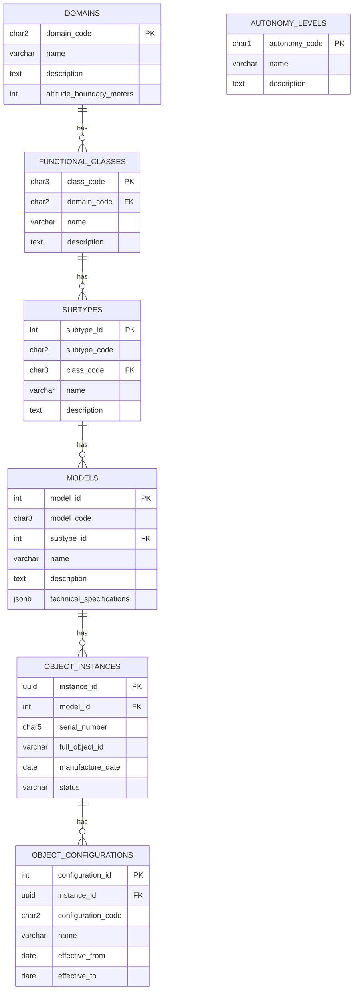

+## ✨ *I HAVE A DREAM:*

# GAIA-Q & AMPEL  
### Open Source Quantum Aerospace Framework  
**Science Research · Software · Hardware · Material Aerospace Solutions**

> *A new paradigm where quantum-enhanced intelligence, ethical autonomy, and sustainable engineering converge to define the aerospace systems of tomorrow.*

---

### 🇪🇸 Producimos documentación técnica open source para inspirar los diseños de hoy y de mañana.  
**Ingeniería con propósito. Conocimiento compartido. Innovación federada.**

### 🇬🇧 We produce open-source technical documentation to inspire the designs of today and tomorrow.  
**Engineering with purpose. Shared knowledge. Federated innovation.**

---

## GAIA-Q & AMPEL: Quantum Aerospace Vision Analysis

> **DISCLAIMER: GenAI Proposal Status**  
> This document represents a machine-generated proposal for the GAIA-Q & AMPEL open source framework. It has not been validated by aerospace certification bodies. Concepts are based on current trends in open source, quantum computing, and federated aerospace engineering.

---

## 🌐 Open Source Technical Documentation Framework

### 📐 Documentation Architecture

```mermaid
graph TD
    Core[Core Knowledge Base]
    QCM[Quantum Computing Modules]
    AEROSPEC[Aerospace Engineering Specifications]
    ETHAI[Ethical AI Frameworks]
    SUSTAIN[Sustainable Engineering Practices]
    IMPL[Implementation Examples]
    COMMUNITY[Community Extensions]
    FEDNET[Federated Innovation Network]

    Core --> QCM
    Core --> AEROSPEC
    Core --> ETHAI
    Core --> SUSTAIN
    Core --> IMPL
    IMPL --> COMMUNITY
    COMMUNITY --> FEDNET
````

---

## 🧩 Key Components

### 1. **Multilingual Knowledge Base**

* Documentation in English, Spanish (initially), with roadmap for others
* Aerospace terminology standardization with ISO/COAFI mapping
* Cultural-context integration for broader usability

### 2. **Federated Documentation Structure**

* Distributed contributions with centralized QA oversight
* Git-based version control with InfoCode and COAFI alignment
* Contributor recognition: badges, credits, citation-level metadata

### 3. **Implementation Repository**

* Reference open designs (aircraft systems, quantum circuits)
* Simulated environments for digital twin validation
* Demonstrator kits with hardware-software-material integration

---

## ⚖️ Open Source Governance Model

### 1. **Technical Oversight Committee**

* Diverse expertise: quantum, aerospace, ethics, sustainability
* Transparent RFC (request-for-comment) lifecycle
* Publicly tracked roadmap and release cycles

### 2. **Contribution Pathways**

* Contributor onboarding with roles (doc writer, SME, reviewer, translator)
* Mentorship for young engineers and students
* Recognition through COAFI traceable InfoCode authorship

### 3. **Quality Assurance Framework**

* Peer-reviewed validation loops
* Standard compliance (ATA, S1000D, ISO/IEEE, QAO)
* Security audits for sensitive subsystems

---

## 🚀 Implementation Strategy

### Phase 1: *Foundation*

* Define COAFI-compatible file naming + metadata structure
* Publish initial GAIA-QAO templates in Markdown/DocBook/S1000D
* Launch documentation portal with Git-based backend

### Phase 2: *Community Development*

* Recruit contributors from academia + open hardware community
* Establish mentorship circles and working groups
* Release alpha documentation sets (AMP●EL, ATA 29, QAOA modules)

### Phase 3: *Federation Implementation*

* Formalize federated teams (Q-Air, Q-Space, Q-GreenTech, etc.)
* Launch collaboration protocols (AMP●EL Interop, MCP Sync)
* Mirror repos for resilience + inter-agency continuity

### Phase 4: *Acceleration*

* Publish industrial application guides (MEAs, digital twins, Q-routing)
* Enable certification-friendly formats (BREX-lite, MCDB-export)
* Organize open competitions on sustainability and autonomy challenges

---

## 🌍 Potential Impact Areas

### 1. **Democratized Aerospace Innovation**

* Lower entry barriers for engineers worldwide
* Modular learning through documentation-as-a-platform (DaaP)
* Bridge research ↔️ industry gaps via quantum-ready documentation

### 2. **Standardized Ethical Frameworks**

* Establish transparent audit trails and AI behavior explainability
* Encourage fair deployment of autonomy in aviation/space
* Enable cross-cultural, interdisciplinary trust frameworks

### 3. **Sustainable Engineering Practices**

* Shared tools for life-cycle impact modeling
* Open benchmarks for propulsion/material/energy impact
* Cooperative co-design of low-emission aerospace solutions

---

## ✅ Next Steps Recommendation

1. 🔧 Design semantic documentation taxonomy (aligned with GASToP & COAFI)
2. 📄 Release starter templates (`GAIA-TEMPLATE-SYS.md`, `META-FIG-A.yaml`, etc.)
3. 🌐 Deploy GAIA-QAO Open Documentation Portal (static + interactive)
4. 🧠 Launch pilot contribution and peer-review model
5. 🎓 Form partnership MoUs with academic nodes for domain seeding

---

## Metadata Footer

**Status**: Draft – Foundational Manifesto
**Filename**: `GAIAQ-AMPEL-OPEN-FRAMEWORK.md`
**Version**: 0.9.2 (Pre-Release)
**InfoCode**: QAO-OPEN-FRAME-001
**Compliance**: GAIA-COAFI v1.6, MCP Sync Ready
**Keywords**: `[QAOA][Federated Docs][QuantumAero][Sustainability][XAI][COAFI]`

---

© Amedeo Pelliccia · GAIA-QAO – *Federated Quantum Aerospace Intelligence*

> “Knowledge shared is future engineered.”
> 
```sql
---
-- GAIA-QAO Object Identification System Registry
-- Database Schema Version 1.1.0
-- InfoCode: QAO-SYS-DBSC-002

-- Enable UUID extension (for PostgreSQL)
CREATE EXTENSION IF NOT EXISTS "uuid-ossp";

-- =============================================
-- Core ID Component Tables
-- =============================================

-- Domains (DO)
CREATE TABLE domains (
  domain_code CHAR(2) PRIMARY KEY,
  name VARCHAR(100) NOT NULL,
  description TEXT,
  altitude_boundary_meters INT,  -- For AS/SP boundary definition
  created_at TIMESTAMP WITH TIME ZONE DEFAULT CURRENT_TIMESTAMP,
  updated_at TIMESTAMP WITH TIME ZONE DEFAULT CURRENT_TIMESTAMP,
  is_active BOOLEAN DEFAULT TRUE
);

-- Autonomy Levels (A)
CREATE TABLE autonomy_levels (
  autonomy_code CHAR(1) PRIMARY KEY,
  name VARCHAR(100) NOT NULL,
  description TEXT,
  created_at TIMESTAMP WITH TIME ZONE DEFAULT CURRENT_TIMESTAMP,
  updated_at TIMESTAMP WITH TIME ZONE DEFAULT CURRENT_TIMESTAMP,
  is_active BOOLEAN DEFAULT TRUE
);

-- Functional Classes (CCC)
CREATE TABLE functional_classes (
  class_code CHAR(3) PRIMARY KEY,
  domain_code CHAR(2) NOT NULL REFERENCES domains(domain_code),
  name VARCHAR(100) NOT NULL,
  description TEXT,
  created_at TIMESTAMP WITH TIME ZONE DEFAULT CURRENT_TIMESTAMP,
  updated_at TIMESTAMP WITH TIME ZONE DEFAULT CURRENT_TIMESTAMP,
  is_active BOOLEAN DEFAULT TRUE,
  UNIQUE(domain_code, class_code)
);

-- Sub-Types (ST)
CREATE TABLE subtypes (
  subtype_id SERIAL PRIMARY KEY,
  subtype_code CHAR(2) NOT NULL,
  class_code CHAR(3) NOT NULL REFERENCES functional_classes(class_code),
  name VARCHAR(100) NOT NULL,
  description TEXT,
  created_at TIMESTAMP WITH TIME ZONE DEFAULT CURRENT_TIMESTAMP,
  updated_at TIMESTAMP WITH TIME ZONE DEFAULT CURRENT_TIMESTAMP,
  is_active BOOLEAN DEFAULT TRUE,
  UNIQUE(class_code, subtype_code)
);

-- Models/Variants (MDL)
CREATE TABLE models (
  model_id SERIAL PRIMARY KEY,
  model_code CHAR(3) NOT NULL,
  subtype_id INT NOT NULL REFERENCES subtypes(subtype_id),
  name VARCHAR(100) NOT NULL,
  description TEXT,
  introduction_date DATE,
  end_of_production_date DATE,
  technical_specifications JSONB,  -- Flexible storage for model-specific specs
  created_at TIMESTAMP WITH TIME ZONE DEFAULT CURRENT_TIMESTAMP,
  updated_at TIMESTAMP WITH TIME ZONE DEFAULT CURRENT_TIMESTAMP,
  is_active BOOLEAN DEFAULT TRUE,
  UNIQUE(subtype_id, model_code)
);

-- =============================================
-- Object Instances and Configurations
-- =============================================

-- Object Instances (Serial Numbers)
CREATE TABLE object_instances (
  instance_id UUID PRIMARY KEY DEFAULT uuid_generate_v4(),
  model_id INT NOT NULL REFERENCES models(model_id),
  serial_number CHAR(5) NOT NULL,
  full_object_id VARCHAR(30) NOT NULL,  -- Complete DO-A-CCC-ST-MDL-SSSSS identifier
  manufacture_date DATE,
  status VARCHAR(50) NOT NULL DEFAULT 'active',  -- active, retired, destroyed, etc.
  owner_organization VARCHAR(100),
  location_current VARCHAR(100),
  commissioning_date DATE,
  decommissioning_date DATE,
  notes TEXT,
  created_at TIMESTAMP WITH TIME ZONE DEFAULT CURRENT_TIMESTAMP,
  updated_at TIMESTAMP WITH TIME ZONE DEFAULT CURRENT_TIMESTAMP,
  UNIQUE(model_id, serial_number)
);

-- Object Configurations (Optional extension for configuration variants)
CREATE TABLE object_configurations (
  configuration_id SERIAL PRIMARY KEY,
  instance_id UUID NOT NULL REFERENCES object_instances(instance_id),
  configuration_code CHAR(2) NOT NULL,
  name VARCHAR(100) NOT NULL,
  description TEXT,
  effective_from DATE NOT NULL,
  effective_to DATE,
  configuration_details JSONB,  -- Flexible storage for configuration specifics
  created_at TIMESTAMP WITH TIME ZONE DEFAULT CURRENT_TIMESTAMP,
  updated_at TIMESTAMP WITH TIME ZONE DEFAULT CURRENT_TIMESTAMP,
  is_active BOOLEAN DEFAULT TRUE,
  UNIQUE(instance_id, configuration_code, effective_from)
);

-- =============================================
-- Registry Management Tables
-- =============================================

-- Users who can manage the registry
CREATE TABLE registry_users (
  user_id SERIAL PRIMARY KEY,
  username VARCHAR(50) NOT NULL UNIQUE,
  email VARCHAR(100) NOT NULL UNIQUE,
  full_name VARCHAR(100) NOT NULL,
  organization VARCHAR(100),
  role VARCHAR(50) NOT NULL,  -- admin, editor, viewer
  created_at TIMESTAMP WITH TIME ZONE DEFAULT CURRENT_TIMESTAMP,
  updated_at TIMESTAMP WITH TIME ZONE DEFAULT CURRENT_TIMESTAMP,
  is_active BOOLEAN DEFAULT TRUE
);

-- Audit log for tracking changes to the registry
CREATE TABLE registry_audit_log (
  log_id SERIAL PRIMARY KEY,
  user_id INT REFERENCES registry_users(user_id),
  action_type VARCHAR(50) NOT NULL,  -- insert, update, delete
  table_affected VARCHAR(50) NOT NULL,
  record_id VARCHAR(50) NOT NULL,  -- Primary key of affected record
  old_values JSONB,
  new_values JSONB,
  action_timestamp TIMESTAMP WITH TIME ZONE DEFAULT CURRENT_TIMESTAMP,
  ip_address VARCHAR(45),
  user_agent TEXT
);

-- ID allocation requests
CREATE TABLE id_allocation_requests (
  request_id SERIAL PRIMARY KEY,
  requester_id INT NOT NULL REFERENCES registry_users(user_id),
  domain_code CHAR(2) NOT NULL REFERENCES domains(domain_code),
  autonomy_code CHAR(1) NOT NULL REFERENCES autonomy_levels(autonomy_code),
  class_code CHAR(3) NOT NULL REFERENCES functional_classes(class_code),
  subtype_code CHAR(2),  -- May be null if requesting a new subtype
  model_code CHAR(3),    -- May be null if requesting a new model
  quantity INT NOT NULL DEFAULT 1,  -- Number of serial numbers requested
  purpose TEXT NOT NULL,
  status VARCHAR(50) NOT NULL DEFAULT 'pending',  -- pending, approved, rejected
  reviewer_id INT REFERENCES registry_users(user_id),
  review_notes TEXT,
  allocated_ids JSONB,  -- IDs allocated in response to this request
  requested_at TIMESTAMP WITH TIME ZONE DEFAULT CURRENT_TIMESTAMP,
  reviewed_at TIMESTAMP WITH TIME ZONE
);

-- =============================================
-- Integration and Reference Tables
-- =============================================

-- ATA Chapter mapping for Air Systems
CREATE TABLE ata_chapter_mapping (
  mapping_id SERIAL PRIMARY KEY,
  class_code CHAR(3) NOT NULL REFERENCES functional_classes(class_code),
  subtype_code CHAR(2),  -- NULL means applies to all subtypes in this class
  ata_chapter VARCHAR(10) NOT NULL,
  ata_chapter_name VARCHAR(100) NOT NULL,
  mapping_notes TEXT,
  created_at TIMESTAMP WITH TIME ZONE DEFAULT CURRENT_TIMESTAMP,
  updated_at TIMESTAMP WITH TIME ZONE DEFAULT CURRENT_TIMESTAMP,
  UNIQUE(class_code, subtype_code, ata_chapter)
);

-- CCSDS mapping for Space Systems
CREATE TABLE ccsds_mapping (
  mapping_id SERIAL PRIMARY KEY,
  class_code CHAR(3) NOT NULL REFERENCES functional_classes(class_code),
  subtype_code CHAR(2),  -- NULL means applies to all subtypes in this class
  ccsds_object_type VARCHAR(50) NOT NULL,
  ccsds_description TEXT,
  mapping_notes TEXT,
  created_at TIMESTAMP WITH TIME ZONE DEFAULT CURRENT_TIMESTAMP,
  updated_at TIMESTAMP WITH TIME ZONE DEFAULT CURRENT_TIMESTAMP,
  UNIQUE(class_code, subtype_code, ccsds_object_type)
);

-- Federation nodes for distributed registry
CREATE TABLE federation_nodes (
  node_id SERIAL PRIMARY KEY,
  node_code VARCHAR(20) NOT NULL UNIQUE,
  node_name VARCHAR(100) NOT NULL,
  node_url VARCHAR(255),
  api_endpoint VARCHAR(255),
  sync_protocol VARCHAR(50) DEFAULT 'git-federation',
  sync_interval_seconds INT DEFAULT 3600,
  last_sync_timestamp TIMESTAMP WITH TIME ZONE,
  sync_status VARCHAR(50) DEFAULT 'active',
  created_at TIMESTAMP WITH TIME ZONE DEFAULT CURRENT_TIMESTAMP,
  updated_at TIMESTAMP WITH TIME ZONE DEFAULT CURRENT_TIMESTAMP,
  is_active BOOLEAN DEFAULT TRUE
);

-- =============================================
-- Views for Common Queries
-- =============================================

-- Complete ID hierarchy view
CREATE VIEW view_complete_id_hierarchy AS
SELECT 
  d.domain_code,
  d.name AS domain_name,
  a.autonomy_code,
  a.name AS autonomy_name,
  fc.class_code,
  fc.name AS class_name,
  st.subtype_code,
  st.name AS subtype_name,
  m.model_code,
  m.name AS model_name,
  CONCAT(
      d.domain_code, '-',
      a.autonomy_code, '-',
      fc.class_code, '-',
      st.subtype_code, '-',
      m.model_code
  ) AS id_prefix
FROM domains d
CROSS JOIN autonomy_levels a
JOIN functional_classes fc ON d.domain_code = fc.domain_code
JOIN subtypes st ON fc.class_code = st.class_code
JOIN models m ON st.subtype_id = m.subtype_id
WHERE d.is_active AND a.is_active AND fc.is_active AND st.is_active AND m.is_active;

-- Object instances with full hierarchy
CREATE VIEW view_object_instances_full AS
SELECT 
  oi.instance_id,
  oi.full_object_id,
  oi.serial_number,
  m.model_code,
  m.name AS model_name,
  st.subtype_code,
  st.name AS subtype_name,
  fc.class_code,
  fc.name AS class_name,
  fc.domain_code,
  d.name AS domain_name,
  a.autonomy_code,
  a.name AS autonomy_name,
  oi.manufacture_date,
  oi.status,
  oi.owner_organization,
  oi.location_current,
  oi.commissioning_date,
  oi.decommissioning_date
FROM object_instances oi
JOIN models m ON oi.model_id = m.model_id
JOIN subtypes st ON m.subtype_id = st.subtype_id
JOIN functional_classes fc ON st.class_code = fc.class_code
JOIN domains d ON fc.domain_code = d.domain_code
CROSS JOIN autonomy_levels a
WHERE SUBSTRING(oi.full_object_id, 4, 1) = a.autonomy_code;

-- =============================================
-- Initial Data Population
-- =============================================

-- Insert domains
INSERT INTO domains (domain_code, name, description, altitude_boundary_meters) VALUES
('AS', 'Air System', 'Aerospace systems operating primarily below 30,000 meters altitude', 30000),
('SP', 'Space System', 'Systems operating primarily above 30,000 meters altitude', 30000);

-- Insert autonomy levels
INSERT INTO autonomy_levels (autonomy_code, name, description) VALUES
('M', 'Manned/Semi-Autonomous', 'Systems designed for human operation or with human oversight'),
('U', 'Unmanned/Fully Autonomous', 'Systems designed for fully autonomous operation without human presence');

-- Insert functional classes for Air Systems
INSERT INTO functional_classes (class_code, domain_code, name, description) VALUES
('PAX', 'AS', 'Passenger Transport', 'Aircraft designed primarily for passenger transportation'),
('CGO', 'AS', 'Cargo Transport', 'Aircraft designed primarily for cargo transportation'),
('ISR', 'AS', 'Intelligence, Surveillance, Reconnaissance', 'Aircraft designed for intelligence gathering, surveillance, and reconnaissance missions'),
('SCI', 'AS', 'Scientific Research', 'Aircraft designed for scientific research and data collection'),
('UTL', 'AS', 'Utility', 'Aircraft designed for utility purposes such as agriculture, firefighting, search and rescue'),
('REC', 'AS', 'Recreational & Sport', 'Aircraft designed for recreational and sporting activities'),
('XPR', 'AS', 'Experimental', 'Experimental aircraft and technology demonstrators'),
('LTA', 'AS', 'Lighter Than Air', 'Lighter-than-air vehicles including dirigibles and high-altitude platforms'),
('MIL', 'AS', 'Military Aircraft', 'Aircraft designed for military applications and combat operations');

-- Insert functional classes for Space Systems
INSERT INTO functional_classes (class_code, domain_code, name, description) VALUES
('LCH', 'SP', 'Launch System', 'Systems designed to launch payloads into space'),
('SAT', 'SP', 'Satellite', 'Orbital systems designed for various missions without human presence'),
('ORB', 'SP', 'Orbital Platform/Vehicle', 'Crewed orbital systems including stations and transport vehicles'),
('PRB', 'SP', 'Probe', 'Systems designed for exploration beyond Earth orbit'),
('XPS', 'SP', 'Experimental', 'Experimental space systems and technology demonstrators'),
('DEF', 'SP', 'Space Defense', 'Systems designed for space defense and security applications');

-- =============================================
-- Insert subtypes for Passenger Transport (PAX)
-- =============================================
INSERT INTO subtypes (subtype_code, class_code, name, description) VALUES
('NB', 'PAX', 'Narrow-Body Airliner', 'Single-aisle passenger aircraft typically for short to medium range routes'),
('WB', 'PAX', 'Wide-Body Airliner', 'Multi-aisle passenger aircraft typically for medium to long range routes'),
('RJ', 'PAX', 'Regional Jet', 'Smaller jet aircraft designed for regional routes'),
('BJ', 'PAX', 'Business Jet', 'Aircraft designed for business and executive transportation'),
('GA', 'PAX', 'General Aviation', 'Smaller piston or turboprop aircraft for private transportation'),
('VT', 'PAX', 'eVTOL Air Taxi', 'Electric vertical takeoff and landing aircraft for urban air mobility'),
('BW', 'PAX', 'Blended Wing Body', 'Aircraft with blended wing body configuration for passenger transport'),
('SS', 'PAX', 'Supersonic Transport', 'Passenger aircraft designed for supersonic flight'),
('HS', 'PAX', 'Hypersonic Transport', 'Passenger aircraft designed for hypersonic flight'),
('AM', 'PAX', 'Air Mobility', 'Aircraft designed for urban/regional air mobility'),
('HY', 'PAX', 'Hybrid-Electric', 'Passenger aircraft with hybrid-electric propulsion'),
('QP', 'PAX', 'Quantum-Powered', 'Passenger aircraft with quantum-enhanced systems'),
('SP', 'PAX', 'Suborbital Passenger', 'Aircraft designed for suborbital passenger flights');

-- =============================================
-- Insert subtypes for Cargo Transport (CGO)
-- =============================================
INSERT INTO subtypes (subtype_code, class_code, name, description) VALUES
('LC', 'CGO', 'Light Cargo', 'Small cargo aircraft for light freight'),
('MC', 'CGO', 'Medium Cargo', 'Medium-sized cargo aircraft for regional freight'),
('HC', 'CGO', 'Heavy Cargo', 'Large cargo aircraft for intercontinental freight'),
('FC', 'CGO', 'Freighter Conversion', 'Passenger aircraft converted to cargo use'),
('QD', 'CGO', 'Quick Delivery', 'Aircraft optimized for rapid delivery services'),
('VC', 'CGO', 'VTOL Cargo', 'Vertical takeoff and landing cargo aircraft'),
('UC', 'CGO', 'Unmanned Cargo', 'Unmanned cargo delivery aircraft'),
('QC', 'CGO', 'Quantum Cargo', 'Cargo aircraft with quantum-enhanced systems');

-- =============================================
-- Insert subtypes for Intelligence, Surveillance, Reconnaissance (ISR)
-- =============================================
INSERT INTO subtypes (subtype_code, class_code, name, description) VALUES
('UA', 'ISR', 'Unmanned Aerial System', 'Unmanned aircraft systems for ISR missions'),
('MA', 'ISR', 'Maritime Patrol', 'Aircraft designed for maritime surveillance'),
('SR', 'ISR', 'Strategic Reconnaissance', 'Aircraft for strategic reconnaissance missions'),
('TR', 'ISR', 'Tactical Reconnaissance', 'Aircraft for tactical reconnaissance missions'),
('EW', 'ISR', 'Electronic Warfare', 'Aircraft specialized in electronic warfare'),
('SI', 'ISR', 'SIGINT Platform', 'Signals intelligence collection platforms'),
('IM', 'ISR', 'Imaging Platform', 'Platforms specialized in imaging intelligence'),
('MS', 'ISR', 'Multi-Sensor', 'Aircraft with multiple sensor systems'),
('QI', 'ISR', 'Quantum ISR', 'ISR platforms with quantum-enhanced capabilities');

-- =============================================
-- Insert subtypes for Scientific Research (SCI)
-- =============================================
INSERT INTO subtypes (subtype_code, class_code, name, description) VALUES
('AT', 'SCI', 'Atmospheric Research', 'Aircraft for atmospheric research'),
('OC', 'SCI', 'Oceanographic Research', 'Aircraft for oceanographic research'),
('ER', 'SCI', 'Earth Remote Sensing', 'Aircraft for Earth observation and remote sensing'),
('WX', 'SCI', 'Weather Research', 'Aircraft for meteorological research'),
('CR', 'SCI', 'Climate Research', 'Aircraft for climate research'),
('GS', 'SCI', 'Geophysical Survey', 'Aircraft for geophysical surveys'),
('MP', 'SCI', 'Multi-Purpose Research', 'Multi-purpose scientific research aircraft'),
('QS', 'SCI', 'Quantum Sensing', 'Aircraft with quantum sensors for scientific research');

-- =============================================
-- Insert subtypes for Utility (UTL)
-- =============================================
INSERT INTO subtypes (subtype_code, class_code, name, description) VALUES
('FF', 'UTL', 'Firefighting', 'Aircraft designed for firefighting operations'),
('AG', 'UTL', 'Agricultural', 'Aircraft designed for agricultural operations'),
('SR', 'UTL', 'Search and Rescue', 'Aircraft designed for search and rescue operations'),
('ME', 'UTL', 'Medical', 'Aircraft designed for medical evacuation and services'),
('PL', 'UTL', 'Pipeline/Powerline Patrol', 'Aircraft for infrastructure inspection'),
('SU', 'UTL', 'Survey', 'Aircraft designed for aerial surveys'),
('CP', 'UTL', 'Civil Protection', 'Aircraft for civil protection and disaster response'),
('QU', 'UTL', 'Quantum Utility', 'Utility aircraft with quantum-enhanced systems');

-- =============================================
-- Insert subtypes for Recreational & Sport (REC)
-- =============================================
INSERT INTO subtypes (subtype_code, class_code, name, description) VALUES
('GL', 'REC', 'Glider', 'Unpowered fixed-wing aircraft'),
('MG', 'REC', 'Motor Glider', 'Gliders with auxiliary power systems'),
('UL', 'REC', 'Ultralight', 'Very light aircraft meeting ultralight regulations'),
('PG', 'REC', 'Powered Glider', 'Powered aircraft with glider-like characteristics'),
('AC', 'REC', 'Aerobatic', 'Aircraft designed for aerobatic flight'),
('HG', 'REC', 'Hang Glider', 'Foot-launched glider aircraft'),
('PW', 'REC', 'Powered Parachute', 'Parachute with motorized propulsion'),
('PP', 'REC', 'Paraglider', 'Foot-launched parafoil wings'),
('RC', 'REC', 'Radio Controlled', 'Recreational remote-controlled aircraft'),
('LS', 'REC', 'Light Sport', 'Aircraft meeting light-sport regulations'),
('HB', 'REC', 'Homebuilt', 'Amateur-built aircraft'),
('WS', 'REC', 'Wingsuit', 'Wearable wing systems'),
('JW', 'REC', 'Jetpack/Wingpack', 'Personal flight systems'),
('QR', 'REC', 'Quantum Recreational', 'Recreational craft with quantum technologies');

-- =============================================
-- Insert subtypes for Experimental (Air) (XPR)
-- =============================================
INSERT INTO subtypes (subtype_code, class_code, name, description) VALUES
('TD', 'XPR', 'Technology Demonstrator', 'Aircraft demonstrating new technologies'),
('HP', 'XPR', 'High Performance', 'Experimental high-performance aircraft'),
('NP', 'XPR', 'Novel Propulsion', 'Aircraft testing new propulsion concepts'),
('NS', 'XPR', 'Novel Structure', 'Aircraft with experimental structural designs'),
('SC', 'XPR', 'Scaled Model', 'Scaled experimental aircraft'),
('VT', 'XPR', 'VTOL Testbed', 'Experimental VTOL aircraft'),
('HY', 'XPR', 'Hybrid Concept', 'Aircraft combining multiple technologies'),
('AT', 'XPR', 'Autonomous Testbed', 'Platforms for testing autonomous systems'),
('QT', 'XPR', 'Quantum Testbed', 'Platforms for testing quantum technologies'),
('HH', 'XPR', 'Hypersonic/High-Speed', 'Experimental hypersonic aircraft'),
('ET', 'XPR', 'Environmental Technology', 'Aircraft testing environmental technologies'),
('MT', 'XPR', 'Manufacturing Testbed', 'Aircraft demonstrating new manufacturing methods'),
('RT', 'XPR', 'Research Testbed', 'Modified aircraft for research purposes'),
('XT', 'XPR', 'X-Plane', 'Official X-plane designation aircraft');

-- =============================================
-- Insert subtypes for Lighter Than Air (LTA)
-- =============================================
INSERT INTO subtypes (subtype_code, class_code, name, description) VALUES
('AB', 'LTA', 'Airship Blimp', 'Non-rigid airships'),
('AR', 'LTA', 'Airship Rigid', 'Rigid airships'),
('AS', 'LTA', 'Airship Semi-Rigid', 'Semi-rigid airships'),
('HA', 'LTA', 'High-Altitude Platform', 'Stratospheric airships/balloons'),
('WB', 'LTA', 'Weather Balloon', 'Meteorological balloons'),
('SB', 'LTA', 'Scientific Balloon', 'Research balloons'),
('HB', 'LTA', 'Hybrid Lift', 'Aircraft combining aerostatic and aerodynamic lift'),
('TB', 'LTA', 'Tethered Balloon', 'Balloons secured by tethers'),
('CB', 'LTA', 'Cargo Airship', 'Airships designed for cargo transport'),
('PB', 'LTA', 'Passenger Airship', 'Airships designed for passenger transport'),
('QB', 'LTA', 'Quantum Buoyancy', 'LTA craft using quantum technologies'),
('DB', 'LTA', 'Drone Blimp', 'Unmanned airship systems'),
('MB', 'LTA', 'Military Airship', 'Airships for military applications'),
('SH', 'LTA', 'Stratospheric HAPS', 'High-altitude pseudo-satellites');

-- =============================================
-- Insert subtypes for Military Aircraft (MIL)
-- =============================================
INSERT INTO subtypes (subtype_code, class_code, name, description) VALUES
('FJ', 'MIL', 'Fighter Jet', 'Combat aircraft for air superiority'),
('BM', 'MIL', 'Bomber', 'Aircraft designed for bombing missions'),
('AT', 'MIL', 'Attack', 'Aircraft designed for ground attack'),
('TR', 'MIL', 'Trainer', 'Military training aircraft'),
('TP', 'MIL', 'Transport', 'Military transport aircraft'),
('TK', 'MIL', 'Tanker', 'Aerial refueling aircraft'),
('MH', 'MIL', 'Military Helicopter', 'Rotary-wing military aircraft'),
('UC', 'MIL', 'Unmanned Combat', 'Unmanned combat aerial vehicles'),
('EW', 'MIL', 'Electronic Warfare', 'Electronic warfare aircraft'),
('MC', 'MIL', 'Multi-role Combat', 'Multi-role military aircraft'),
('MS', 'MIL', 'Maritime Strike', 'Aircraft for maritime strike missions'),
('QW', 'MIL', 'Quantum Warfare', 'Aircraft with quantum military technologies');

-- =============================================
-- Insert subtypes for Satellites (SAT)
-- =============================================
INSERT INTO subtypes (subtype_code, class_code, name, description) VALUES
('CO', 'SAT', 'Communications', 'Satellites designed primarily for communications services'),
('NV', 'SAT', 'Navigation', 'Satellites designed for navigation and positioning services'),
('EO', 'SAT', 'Earth Observation', 'Satellites designed for Earth observation and remote sensing'),
('SC', 'SAT', 'Scientific', 'Satellites designed for scientific research and observation'),
('CU', 'SAT', 'CubeSat/SmallSat', 'Small standardized satellites for various purposes'),
('TD', 'SAT', 'Technology Demonstrator', 'Satellites designed to demonstrate new technologies'),
('WX', 'SAT', 'Weather', 'Satellites designed for meteorological purposes'),
('RS', 'SAT', 'Relay System', 'Satellites designed to relay communications'),
('IS', 'SAT', 'Imaging System', 'Satellites specialized in imaging'),
('SS', 'SAT', 'Space Surveillance', 'Satellites for space domain awareness'),
('QS', 'SAT', 'Quantum Satellite', 'Satellites with quantum technologies'),
('MS', 'SAT', 'Military Satellite', 'Satellites for military applications');

-- =============================================
-- Insert subtypes for Orbital Platform/Vehicle (ORB)
-- =============================================
INSERT INTO subtypes (subtype_code, class_code, name, description) VALUES
('SS', 'ORB', 'Space Station', 'Crewed orbital platforms for long-duration missions'),
('SL', 'ORB', 'Space Laboratory', 'Specialized orbital platforms for research'),
('CT', 'ORB', 'Crew Transport', 'Vehicles designed for crew transportation'),
('SM', 'ORB', 'Service Module', 'Modules providing services to other orbital systems'),
('RM', 'ORB', 'Research Module', 'Specialized modules for orbital research'),
('HM', 'ORB', 'Habitation Module', 'Modules designed for crew habitation'),
('SV', 'ORB', 'Service Vehicle', 'Vehicles for servicing other orbital systems'),
('OT', 'ORB', 'Orbital Transfer', 'Vehicles for orbital transfer operations'),
('OD', 'ORB', 'Orbital Dock', 'Platforms for docking and servicing'),
('QO', 'ORB', 'Quantum Orbital', 'Orbital platforms with quantum technologies'),
('CM', 'ORB', 'Commercial Module', 'Commercially operated orbital modules');

-- =============================================
-- Insert subtypes for Launch System (LCH)
-- =============================================
INSERT INTO subtypes (subtype_code, class_code, name, description) VALUES
('SL', 'LCH', 'Small Launch', 'Launch systems for small payloads'),
('ML', 'LCH', 'Medium Launch', 'Launch systems for medium payloads'),
('HL', 'LCH', 'Heavy Launch', 'Launch systems for heavy payloads'),
('SH', 'LCH', 'Super Heavy', 'Launch systems for super heavy payloads'),
('RU', 'LCH', 'Reusable', 'Reusable launch systems'),
('SO', 'LCH', 'Solid Rocket', 'Launch systems using solid rocket propulsion'),
('LO', 'LCH', 'Liquid Oxygen', 'Launch systems using liquid oxygen propulsion'),
('AL', 'LCH', 'Air Launch', 'Air-launched orbital systems'),
('QL', 'LCH', 'Quantum Launch', 'Launch systems with quantum technologies'),
('HY', 'LCH', 'Hybrid Propulsion', 'Launch systems using hybrid propulsion');

-- =============================================
-- Insert subtypes for Probe (PRB)
-- =============================================
INSERT INTO subtypes (subtype_code, class_code, name, description) VALUES
('LP', 'PRB', 'Lunar Probe', 'Probes designed for lunar exploration'),
('MP', 'PRB', 'Mars Probe', 'Probes designed for Mars exploration'),
('VP', 'PRB', 'Venus Probe', 'Probes designed for Venus exploration'),
('IP', 'PRB', 'Inner Planet Probe', 'Probes for Mercury and inner solar system'),
('GP', 'PRB', 'Gas Giant Probe', 'Probes for Jupiter, Saturn and gas giants'),
('OP', 'PRB', 'Outer Planet Probe', 'Probes for Uranus, Neptune and beyond'),
('AP', 'PRB', 'Asteroid/Comet Probe', 'Probes for small body exploration'),
('SP', 'PRB', 'Solar Probe', 'Probes for solar observation and research'),
('HP', 'PRB', 'Heliophysics Probe', 'Probes studying the heliosphere'),
('DP', 'PRB', 'Deep Space Probe', 'Probes for deep space exploration'),
('TP', 'PRB', 'Technology Probe', 'Probes demonstrating new technologies'),
('RP', 'PRB', 'Return Probe', 'Sample return mission probes'),
('QP', 'PRB', 'Quantum Probe', 'Probes with quantum technologies'),
('EP', 'PRB', 'Exoplanet Probe', 'Probes for exoplanet detection/study');

-- =============================================
-- Insert subtypes for Experimental (Space) (XPS)
-- =============================================
INSERT INTO subtypes (subtype_code, class_code, name, description) VALUES
('TP', 'XPS', 'Technology Platform', 'Platforms demonstrating new space technologies'),
('NP', 'XPS', 'Novel Propulsion', 'Spacecraft testing new propulsion systems'),
('QT', 'XPS', 'Quantum Testbed', 'Platforms for testing quantum technologies in space'),
('SM', 'XPS', 'Space Manufacturing', 'Experimental in-space manufacturing'),
('SR', 'XPS', 'Space Robotics', 'Experimental robotic systems'),
('SS', 'XPS', 'Space Structures', 'Experimental deployable/inflatable structures'),
('SE', 'XPS', 'Space Environment', 'Platforms studying space environment effects'),
('SP', 'XPS', 'Space Power', 'Experimental power generation systems'),
('SC', 'XPS', 'Space Communications', 'Experimental communications technologies'),
('SN', 'XPS', 'Space Navigation', 'Experimental navigation technologies'),
('ST', 'XPS', 'Space Tether', 'Tether experiments in space'),
('SI', 'XPS', 'Space Interferometry', 'Experimental interferometry platforms'),
('SA', 'XPS', 'Space Assembly', 'Experimental in-space assembly'),
('SH', 'XPS', 'Space Habitat', 'Experimental habitat technologies');

-- =============================================
-- Insert subtypes for Space Defense (DEF)
-- =============================================
INSERT INTO subtypes (subtype_code, class_code, name, description) VALUES
('SS', 'DEF', 'Space Surveillance', 'Systems for space domain awareness'),
('SM', 'DEF', 'Space Missile Defense', 'Missile defense systems with space components'),
('SC', 'DEF', 'Space Command & Control', 'Space-based command and control systems'),
('SI', 'DEF', 'Space Intelligence', 'Intelligence-gathering space systems'),
('SP', 'DEF', 'Space Protection', 'Systems for protecting space assets'),
('SD', 'DEF', 'Space Deterrence', 'Systems for space deterrence'),
('QD', 'DEF', 'Quantum Defense', 'Space defense systems with quantum technologies');

-- Insert example model for Blended Wing Body
INSERT INTO models (model_code, subtype_id, name, description, introduction_date, technical_specifications) VALUES
('Q1H', (SELECT subtype_id FROM subtypes WHERE subtype_code = 'BW' AND class_code = 'PAX'), 
'AMPEL360 BWB-Q100', 'Blended Wing Body passenger aircraft with quantum-enhanced systems', 
'2025-01-01', 
'{"capacity": 100, "range_km": 5500, "cruise_speed_kmh": 850, "mtow_kg": 85000, "quantum_systems": ["navigation", "optimization", "communications"]}'
);

-- Insert example object instance
INSERT INTO object_instances (model_id, serial_number, full_object_id, manufacture_date, status, owner_organization) VALUES
((SELECT model_id FROM models WHERE model_code = 'Q1H' AND subtype_id = (SELECT subtype_id FROM subtypes WHERE subtype_code = 'BW' AND class_code = 'PAX')),
'00001',
'AS-M-PAX-BW-Q1H-00001',
'2025-06-15',
'active',
'GAIA-QAO Research Fleet');

-- Insert example ATA chapter mapping
INSERT INTO ata_chapter_mapping (class_code, subtype_code, ata_chapter, ata_chapter_name, mapping_notes) VALUES
('PAX', 'BW', '27', 'Flight Controls', 'Includes quantum-enhanced control systems for BWB configuration'),
('PAX', 'BW', '34', 'Navigation', 'Includes quantum navigation systems');

-- Insert example registry user
INSERT INTO registry_users (username, email, full_name, organization, role) VALUES
('admin', 'admin@gaia-qao.org', 'System Administrator', 'GAIA-QAO', 'admin');

-- Insert example federation node
INSERT INTO federation_nodes (node_code, node_name, node_url, api_endpoint) VALUES
('gaia-qao-primary', 'GAIA-QAO Primary Node', 'https://registry.gaia-qao.org', 'https://registry.gaia-qao.org/api/federation');
```
### GAIA-QAO Object Identification System

> **DISCLAIMER: GenAI Proposal Status**This document represents a machine-generated comprehensive description of the GAIA-QAO object identification system. It has not been validated through implementation in production aerospace systems. The proposed system is based on aerospace industry classifications and the specific needs of the GAIA-QAO ecosystem.


## 1. System Overview

The GAIA-QAO Object Identification System (GQOIS) is a comprehensive, hierarchical identification framework designed for aerospace objects across both atmospheric and space domains. It provides a standardized method for uniquely identifying, categorizing, and tracking aerospace objects throughout their lifecycle.

The system addresses several critical needs in the aerospace industry:

- **Unified Identification**: Creates a single, coherent identification system spanning traditional aviation, emerging air mobility concepts, and space systems
- **Quantum Integration**: Specifically accommodates quantum-enhanced aerospace technologies
- **Standards Compatibility**: Aligns with existing aerospace standards (ATA, CCSDS, etc.) while extending beyond their limitations
- **Lifecycle Management**: Supports object identification from design through decommissioning
- **Configuration Tracking**: Enables tracking of different configurations and modifications
- **Registry Management**: Provides a framework for centralized registry with federated nodes


## 2. ID Structure

The GQOIS uses a hierarchical structure that encodes multiple levels of information about an aerospace object. The complete ID format is:

```plaintext
DO-A-CCC-ST-MDL-SSSSS[-CC]
```

Where:

| Component | Length | Description | Example
|-----|-----|-----|-----
| DO | 2 chars | Domain | AS (Air System)
| A | 1 char | Autonomy Level | M (Manned/Semi-Autonomous)
| CCC | 3 chars | Functional Class | PAX (Passenger Transport)
| ST | 2 chars | Sub-Type | BW (Blended Wing Body)
| MDL | 3 chars | Model/Variant | Q1H (AMPEL360 BWB-Q100)
| SSSSS | 5 chars | Serial Number | 00001
| CC | 2 chars | Configuration Code (optional) | A1 (Initial Configuration)


### Example Complete ID

```plaintext
AS-M-PAX-BW-Q1H-00001
```

This identifies:

- An Air System (AS)
- That is Manned/Semi-Autonomous (M)
- In the Passenger Transport class (PAX)
- Of Blended Wing Body sub-type (BW)
- Model AMPEL360 BWB-Q100 (Q1H)
- Serial number 00001


## 3. Component Descriptions

### 3.1 Domains (DO)

Domains represent the primary operational environment of the aerospace object.

| Domain Code | Name | Description | Boundary
|-----|-----|-----|-----
| AS | Air System | Systems operating primarily in Earth's atmosphere | Below 30,000 meters
| SP | Space System | Systems operating primarily in space | Above 30,000 meters


### 3.2 Autonomy Levels (A)

Autonomy levels indicate the degree of human involvement in the system's operation.

| Autonomy Code | Name | Description
|-----|-----|-----|-----
| M | Manned/Semi-Autonomous | Systems designed for human operation or with human oversight
| U | Unmanned/Fully Autonomous | Systems designed for fully autonomous operation without human presence


### 3.3 Functional Classes (CCC)

Functional classes categorize objects by their primary purpose or function. The system defines 15 functional classes across the two domains:

#### Air Systems (AS) Functional Classes

| Class Code | Name | Description
|-----|-----|-----|-----
| PAX | Passenger Transport | Aircraft designed primarily for passenger transportation
| CGO | Cargo Transport | Aircraft designed primarily for cargo transportation
| ISR | Intelligence, Surveillance, Reconnaissance | Aircraft for intelligence gathering, surveillance, and reconnaissance
| SCI | Scientific Research | Aircraft designed for scientific research and data collection
| UTL | Utility | Aircraft for utility purposes (agriculture, firefighting, etc.)
| REC | Recreational & Sport | Aircraft designed for recreational and sporting activities
| XPR | Experimental | Experimental aircraft and technology demonstrators
| LTA | Lighter Than Air | Lighter-than-air vehicles including dirigibles and platforms
| MIL | Military Aircraft | Aircraft designed for military applications and combat


#### Space Systems (SP) Functional Classes

| Class Code | Name | Description
|-----|-----|-----|-----
| LCH | Launch System | Systems designed to launch payloads into space
| SAT | Satellite | Orbital systems for various missions without human presence
| ORB | Orbital Platform/Vehicle | Crewed orbital systems including stations and transport
| PRB | Probe | Systems designed for exploration beyond Earth orbit
| XPS | Experimental | Experimental space systems and technology demonstrators
| DEF | Space Defense | Systems designed for space defense and security applications


### 3.4 Sub-Types (ST)

Sub-types further refine the classification within each functional class. The system defines 168 sub-types across all functional classes. Examples include:

- **PAX-NB**: Narrow-Body Airliner
- **PAX-WB**: Wide-Body Airliner
- **PAX-BW**: Blended Wing Body
- **SAT-CO**: Communications Satellite
- **SAT-EO**: Earth Observation Satellite
- **PRB-MP**: Mars Probe


Each sub-type has a unique two-character code within its functional class and includes specific quantum-enhanced variants where applicable.

### 3.5 Models/Variants (MDL)

Models represent specific designs or variants within a sub-type. Each model has a three-character code and includes detailed specifications. For example:

- **Q1H**: AMPEL360 BWB-Q100 (Blended Wing Body passenger aircraft with quantum-enhanced systems)


### 3.6 Serial Numbers (SSSSS)

Five-character serial numbers uniquely identify individual instances of a specific model. Serial numbers are assigned sequentially within each model.

### 3.7 Configuration Codes (CC) - Optional

Two-character configuration codes track different configurations or modifications of an object throughout its lifecycle. These are optional in the ID string but maintained in the registry.

## 4. Database Implementation

The GQOIS is implemented as a relational database with the following key tables:

### Core ID Component Tables

- `domains`: Stores domain definitions
- `autonomy_levels`: Stores autonomy level definitions
- `functional_classes`: Stores functional class definitions
- `subtypes`: Stores sub-type definitions
- `models`: Stores model/variant definitions


### Object Instance Tables

- `object_instances`: Stores individual object instances with serial numbers
- `object_configurations`: Stores configuration variants for object instances


### Registry Management Tables

- `registry_users`: Stores users who can manage the registry
- `registry_audit_log`: Tracks changes to the registry
- `id_allocation_requests`: Manages requests for new IDs


### Integration Tables

- `ata_chapter_mapping`: Maps to ATA chapters for air systems
- `ccsds_mapping`: Maps to CCSDS standards for space systems
- `federation_nodes`: Manages distributed registry nodes


### Views

- `view_complete_id_hierarchy`: Provides a complete view of the ID hierarchy
- `view_object_instances_full`: Shows object instances with full hierarchy information


## 5. ID Formation Process

The formation of a GQOIS ID follows these steps:

1. **Domain Selection**: Determine if the object is primarily an Air System (AS) or Space System (SP)
2. **Autonomy Level**: Determine if the object is Manned/Semi-Autonomous (M) or Unmanned/Fully Autonomous (U)
3. **Functional Class**: Select the appropriate functional class based on the object's primary purpose
4. **Sub-Type Selection**: Choose the appropriate sub-type within the functional class
5. **Model Assignment**: Assign or create a model code for the specific design variant
6. **Serial Number Allocation**: Assign a unique serial number within the model series
7. **Configuration Tracking**: Optionally track configurations with additional codes


### Example ID Formation

For a new quantum-enhanced blended wing body passenger aircraft:

1. **Domain**: Air System → AS
2. **Autonomy**: Manned/Semi-Autonomous → M
3. **Functional Class**: Passenger Transport → PAX
4. **Sub-Type**: Blended Wing Body → BW
5. **Model**: AMPEL360 BWB-Q100 → Q1H
6. **Serial Number**: First instance → 00001


Resulting ID: `AS-M-PAX-BW-Q1H-00001`

## 6. Registry Management

The GQOIS registry is managed through a centralized system with distributed nodes:

### 6.1 ID Allocation Process

1. **Request Submission**: Organizations submit requests for ID allocation
2. **Validation**: Registry administrators validate the request against standards
3. **Approval**: Approved requests result in ID allocation
4. **Registration**: New IDs are registered in the central database
5. **Synchronization**: Information is synchronized across federation nodes


### 6.2 Federation Model

The registry operates on a federation model with:

- **Primary Node**: Central authority for ID allocation and standards
- **Federated Nodes**: Distributed nodes for specific domains or organizations
- **Synchronization Protocol**: Git-based federation for version control and distribution
- **Conflict Resolution**: Mechanisms for resolving conflicts in distributed updates


## 7. Standards Integration

The GQOIS integrates with existing aerospace standards:

### 7.1 Air Systems Standards

- **ATA iSpec 2200**: Mapping between GQOIS classes/sub-types and ATA chapters
- **S1000D**: Compatible with S1000D documentation standards
- **ARINC**: Alignment with ARINC standards for avionics


### 7.2 Space Systems Standards

- **CCSDS**: Mapping between GQOIS classes/sub-types and CCSDS object types
- **ISO 24113**: Alignment with space debris mitigation standards
- **COSPAR**: Compatibility with COSPAR planetary protection categories


## 8. Quantum-Enhanced Systems

A key feature of the GQOIS is its explicit support for quantum-enhanced aerospace systems:

### 8.1 Quantum Sub-Types

Each functional class includes specific sub-types for quantum-enhanced systems:

- **PAX-QP**: Quantum-Powered passenger aircraft
- **ISR-QI**: Quantum ISR platforms
- **SCI-QS**: Quantum Sensing scientific aircraft
- **SAT-QS**: Quantum Satellites
- **PRB-QP**: Quantum Probes
- **MIL-QW**: Quantum Warfare aircraft
- **DEF-QD**: Quantum Defense space systems


### 8.2 Quantum Technology Tracking

The system tracks specific quantum technologies implemented in each object:

- Quantum navigation systems
- Quantum communications
- Quantum sensing
- Quantum computing elements
- Quantum materials


## 9. Implementation and Tooling

The GQOIS is supported by several tools and interfaces:

### 9.1 Registry Management Interface

A web-based interface for:

- Managing ID allocations
- Browsing the registry
- Generating reports
- Administering users and permissions


### 9.2 ID Validation Tool

A tool that validates IDs against the registry schema and rules, including:

- Syntax validation
- Component validation
- Checksum verification
- Relationship validation


### 9.3 API Access

RESTful APIs for:

- Querying the registry
- Requesting ID allocations
- Validating IDs
- Integrating with other systems


## 10. Future Extensions

The GQOIS is designed for extensibility to accommodate future developments:

### 10.1 New Domains

The system can be extended to include new domains such as:

- **SS**: Suborbital Systems
- **MS**: Multi-domain Systems
- **US**: Undersea Systems (for aerospace-maritime hybrids)


### 10.2 Enhanced Autonomy Levels

The autonomy scale can be expanded to include more granular levels:

- **A**: Fully Autonomous
- **S**: Semi-Autonomous
- **M**: Manually Operated
- **H**: Human-Machine Teaming


### 10.3 Quantum Technology Evolution

As quantum technologies evolve, the system can accommodate:

- New quantum-specific functional classes
- Expanded quantum sub-types
- Quantum technology certification levels


## 11. Conclusion

The GAIA-QAO Object Identification System provides a comprehensive, future-proof framework for identifying and categorizing aerospace objects across domains. By integrating traditional aerospace classification with support for emerging technologies like quantum-enhanced systems, it bridges current standards with future needs.

The system's hierarchical structure, database implementation, and federation model ensure it can serve as a unified registry for the global aerospace community while accommodating specialized needs of the GAIA-QAO ecosystem.

---

## Appendix A: Complete Sub-Type Code Tables

# A.1 Air Systems (AS) Sub-Types

## A.1.1 Passenger Transport (PAX) Sub-Types

| ST Code | Name                   | Description                                                                 |
|---------|------------------------|-----------------------------------------------------------------------------|
| NB      | Narrow-Body Airliner   | Single-aisle passenger aircraft for short to medium range routes            |
| WB      | Wide-Body Airliner     | Multi-aisle passenger aircraft for medium to long range routes              |
| RJ      | Regional Jet           | Smaller jet aircraft designed for regional routes                          |
| BJ      | Business Jet           | Aircraft designed for business and executive transportation                 |
| GA      | General Aviation       | Smaller piston or turboprop aircraft for private transportation             |
| VT      | eVTOL Air Taxi         | Electric vertical takeoff and landing aircraft for urban air mobility       |
| BW      | Blended Wing Body      | Aircraft with blended wing body configuration for passenger transport       |
| SS      | Supersonic Transport   | Passenger aircraft designed for supersonic flight                          |
| HS      | Hypersonic Transport   | Passenger aircraft designed for hypersonic flight                          |
| AM      | Air Mobility           | Aircraft designed for urban/regional air mobility                          |
| HY      | Hybrid-Electric        | Passenger aircraft with hybrid-electric propulsion                         |
| QP      | Quantum-Powered        | Passenger aircraft with quantum-enhanced systems                           |
| SP      | Suborbital Passenger   | Aircraft designed for suborbital passenger flights                         |

## A.1.2 Cargo Transport (CGO) Sub-Types

| ST Code | Name                   | Description                                                                 |
|---------|------------------------|-----------------------------------------------------------------------------|
| LC      | Light Cargo            | Small cargo aircraft for light freight                                     |
| MC      | Medium Cargo           | Medium-sized cargo aircraft for regional freight                           |
| HC      | Heavy Cargo            | Large cargo aircraft for intercontinental freight                          |
| FC      | Freighter Conversion   | Passenger aircraft converted to cargo use                                  |
| QD      | Quick Delivery         | Aircraft optimized for rapid delivery services                             |
| VC      | VTOL Cargo             | Vertical takeoff and landing cargo aircraft                                |
| UC      | Unmanned Cargo         | Unmanned cargo delivery aircraft                                           |
| QC      | Quantum Cargo          | Cargo aircraft with quantum-enhanced systems                               |

*[Tables for remaining sub-types would continue in the same format]*

---

# Appendix B: ID Examples

| Complete ID              | Description                                                                                   |
|---------------------------|-----------------------------------------------------------------------------------------------|
| AS-M-PAX-BW-Q1H-00001    | AMPEL360 BWB-Q100 Blended Wing Body passenger aircraft, manned, serial #00001                 |
| AS-U-ISR-QI-R2D-00015    | Quantum-enhanced ISR platform, unmanned, model R2D, serial #00015                             |
| SP-M-ORB-SS-I4S-00003    | Space station module, manned, model I4S, serial #00003                                        |
| SP-U-SAT-QS-K7P-00022    | Quantum satellite, unmanned, model K7P, serial #00022                                         |
| AS-M-XPR-QT-X15-00007    | Quantum testbed experimental aircraft, manned, model X15, serial #00007                       |


## Appendix C: Database Schema Diagram


