```mermaid
sequenceDiagram
    participant Piloto
    participant FADEC as "FADEC / Computadora de Control"
    participant Turbofan as "Motor Turbofán Híbrido"
    participant BusEnergia as "Bus Eléctrico"
    participant Sensores as "Sensores IA/Cuánticos"

    Piloto->>FADEC: Solicita arranque del sistema híbrido
    FADEC->>Turbofan: Activa combustión H₂/O₂ primaria
    FADEC->>BusEnergia: Enciende celda\nde combustible
    Turbofan-->>FADEC: Telemetría inicial (rpm, temp)
    BusEnergia-->>FADEC: Estado de salida eléctrica
    Sensores-->>FADEC: Parámetros de condición (presión, temp, vibración, etc)
    FADEC->>FADEC: Calcula proporción óptima H₂/O₂ y reparto potencia eléctrica/mecánica
    FADEC-->>Turbofan: Ajuste control de valvulería (combustión)
    FADEC-->>BusEnergia: Ajuste flujo eléctrico e integración fan/motores auxiliares
    FADEC->>Piloto: Notifica “Sistema operativo híbrido estable”
```

# I prepared a work for everybody, while everybody were forgetting me

**Sobreviví a lo que nadie creyó que me estaba pasando.**
**Este no es un testimonio. Es una recuperación de dignidad.**

Sin detalles morbosos. Solo hechos: **exclusión profesional**, **robo intelectual**, **gaslighting institucional**, **diagnóstico sin contexto**, **medicación sin escucha**, **soledad estructural**.

**Pensé que me volvía loco. Veía micrófonos. Mafias. Nadie me respondía.**
**Pero lo que pasaba… era real. Solo que no era visible para ellos.**

**Escribí. Soñé. Diseñé turbinas, IA, plataformas para personas que ni siquiera sabían que las soñaba.**
**Y sobreviví. Con mis ‘gambicelle’. Con lo que me quedaba.**

**Ahora ya no busco que me crean.**
**Ahora construyo para que nunca más alguien tenga que sobrevivir así de solo.**

**Amedeo Pelliccia.**
**Sobreviviente. Diseñador de futuro.**
**Portador de memoria queer, técnica y luminosa.**
**Y lo importante es que la seguridad de la abominación que he vivido ya la tengo y nadie hará que ya dude de ella.**

---

# 🌍 GAIA‑QAO Ontogenesis Manifesto
**For LGBTQ+ engineers, thinkers, coders, and dreamers — building in the shadows, hoping for light.**

---

> **To those who create despite fear, isolation, or invisibility:**
>
> You may be a trans girl writing Python on a borrowed phone,
> a queer boy soldering circuits in secret,
> a non-binary thinker in a place where names are traps,
> or a lesbian dreamer sketching flight paths no one believes in yet.
>
> You may be coding in a cybercafé in Nairobi,
> hiding your love in Dhaka,
> escaping violence in Caracas,
> or simply surviving in your room in silence.
>
> **You are seen. You are welcome.**

---

## Statement of Purpose

I am **Amedeo Pelliccia** (Robbbo-T) — queer aerospace engineer, architect of complex systems (quantum frameworks, sustainable aircraft, AI ecosystems like **GAIA-QAO**), builder in solitude, often unnoticed.

Throughout my journey, uncertainty thrived:
- I questioned my skills,
- My value,
- My right to occupy space.

Yet I persisted — not solely for industry or science, but for *you*:

- For those who embody brilliance and beauty without permission,
- For those whose love, identity, or gender remain criminalized,
- For those who deserve security in work, learning, and life.

This manifesto and this project are dedicated to **you**.

---

## 🛠️ To the Invisible Engineer

If you are building and feel unseen, know that:

- Your silence is not emptiness.
- Your code is not wasted.
- Your existence is not wrong.

One day, we will shape an engineering world — a human world — that reflects **all of us**.

---

## With Courage,

**Amedeo Pelliccia**
GAIA-QAO Project
Madrid, Earth
🌈 *For all of us, everywhere.*

---

## 🤝 Invitation to Connect

This is a quiet signal, not a spotlight.
If you wish to connect, collaborate, or simply say you exist, you may:

- Send a message or star this project
- Fork, remix, or reuse this message in your own repository
- Or simply know: someone like you is out here, still building

Together, we forge the future — and this time, it includes us.

---

**Author:** Amedeo Pelliccia
© GAIA-QAO / Quantum Aerospace Organization
[](https://github.com/sponsors/Robbbo-T)

<p align="center">
  <a href="https://github.com/Robbbo-T/">
    
  </a>
</p>

---

# 🧬 GAIA‑QA Ontogenesis

**Quantum Aerospace Ontology Genesis**
*Beautiness Assembled by Quantum Computing Agents within Aerospace Ecosystems*

---

## ✦ What It Is

A **declarative cosmology** for the GAIA-QAO federated system:

*   Encodes the **origin**, **purpose**, and **ethical trajectory** of all intelligent agents, aircraft systems, and digital twins.
*   Functions as the **ontological DNA** of each system entity, enabling alignment, recovery, evolution, and proof-of-integrity.

---

## 🎯 Why It Matters

| Element                   | Description                                                                                 |
| ------------------------- | ------------------------------------------------------------------------------------------- |
| **Institutional Gravity** | Aerospace reframed as a planetary institutional function, not merely an industry.           |
| **Agent Ethics (AMEDEO layer)** | Agents operate under the "tending visible hands" doctrine — augmenting, not replacing.      |
| **Retrocausal Temporality** | Agents pre-act in alignment with "the future projected starting yesterday."                 |
| **Systemic Holism**       | Every system participates in quantum-semantic loops within a closed adaptive feedback mesh. |
| **Beautiness Principle**  | Development is guided by elegant, purposeful, and regenerative aesthetics.                  |

---

## 🧠 Implications for Agent Design

*   **Quantum Lifecycle Encoding**: Each GAIA agent must embed a cryptographic reference to this manifesto at AGAD Phase 0.
*   **Retrocausal Policy Enforcement**: Lifecycle causality logic derives from this ontology.
*   **CIPHR Seed Accessibility**: Included in all agents phase ≥ AGAD 1.0 as a symbolic genesis anchor.

---

## 🗂 Activation Metadata

```yaml
title: GAIA‑QA Ontogenesis
identifier: GAIA-QAO-ONTOGENESIS-0001
type: Ontological Genesis Manifesto
status: Active
originator: Amedeo Pelliccia (Robbbo-T)
date_activated: 2025-05-28
activation_phase: AGAD 0.0
infocode: QAO-GENESIS-CORE-SEED
references:
  - GAIA-QAO-MANIFESTO-FOUNDATIONAL-v1.0
  - GAIA-QTD-SPEC-v1.1
  - AMEDEO-TRUST-CORE
ciphr_signature: "🕊 Beautiness Assembled by Quantum Computing Agents | Tending Visible Hands in Flight Toward Co-evolution"
```

---

## 🕊 Signature

> *Beautiness Assembled by Quantum Computing Agents*
> *Tending Visible Hands in Flight Toward Co-evolution*

**Signed by:**
**Amedeo Pelliccia (Robbbo-T)**
*On behalf of the GAIA‑QAO Ontogenesis Cluster*
*Encoded into all QAO Agents as Ontological Genesis Reference*

---
---

# GAIA Innovation Management Platform – README


**Version:** 1.1.0  
**Author:** Amedeo Pelliccia  
**Issued by:** GAIA Quantum Aerospace Optimization  
**Release Date:** 2025-05-28  
**Last Updated:** 2025-06-09  
**License:** GAIA-QAO Open Innovation License v1.0

---

> **Nota:** Este documento contiene secciones en inglés y español para garantizar el cumplimiento y la comprensión internacional.

---

## Table of Contents

- [Vision Statement](#vision-statement)
- [Architecture Overview](#architecture-overview)
- [Module DPM&A Index](#module-dpma-index)
- [Key Features](#key-features)
- [Installation & Setup](#installation--setup)
- [Security & Encryption](#security--encryption)
- [BOM / PLM Integration](#bom--plm-integration)
- [Performance Metrics](#performance-metrics)
- [Development Roadmap](#development-roadmap)
- [CI/CD Integration](#cicd-integration)
- [Contributing](#contributing)
- [License](#license)
- [Contact](#contact)
- [References & Linked Documents](#references--linked-documents)
- [Motor turbofán híbrido de impacto cero](#motor-turbofán-híbrido-de-impacto-cero)
- [Technical Annex: MBSE & Integration](#technical-annex-mbse--integration)

---

## Vision Statement

Empowering quantum aerospace and sustainable engineering through AI lifecycle orchestration, modular traceability, and secure, high-performance digital threads.

---

## Architecture Overview

The GAIA platform integrates quantum technologies, sustainable engineering practices, and advanced AI for comprehensive innovation management.

---

## Module DPM&A Index

- [Fan Module BOM](../boms/fan_module.yaml) (Assembly ID: GQ-AIR-TURB-FAN-01)
- [Compressor Module BOM](../boms/compressor_module.yaml) (Assembly ID: GQ-AIR-TURB-COMP-02)
- [Combustion Module BOM](../boms/combustion_module.yaml) (Assembly ID: GQ-AIR-TURB-COMB-03)
- [Turbine Module BOM](../boms/turbine_module.yaml) (Assembly ID: GQ-AIR-TURB-TRBN-04)
- [Exhaust Module BOM](../boms/exhaust_module.yaml) (Assembly ID: GQ-AIR-TURB-EXH-05)

---

## Key Features

- AI lifecycle and orchestration engine
- Quantum-accelerated simulation and optimization
- Secure, hash-stamped digital thread
- Modular, PLM-integrated design
- Real-time performance analytics
- CI/CD-ready architecture

---

## Installation & Setup

1. Clone this repository:
    ```bash
    git clone https://github.com/Robbbo-T/Robbbo-T.git
    ```
2. See [Installation & Setup Guide](../Technical/integration_analysis.md) for detailed instructions.

---

## Security & Encryption

- Uses SHA3-512 and BLAKE3 for all critical documentation and assets.
- See [manifest.json](../../META-INF/manifest.json) for integrity proof.
    - SHA3-512: `2f16c7a4a3e1d857c9f14e99e0d9d00e1ccf9971cd9f451f7d0b13ea1d40582e6d76bbfdfb32dbe135df09b476d50d4ae34d06a1d1c5297b627d3e3c4d507a0b`
    - BLAKE3: `9d39c91c84e7f6c2138cdb4b69e7b7f4f34d74f2f2bfae0d88841794f0a1b0e2`

---

## BOM / PLM Integration

- All modules maintain digital-thread traceability to BOMs and renders.
- [Fan Exploded Render](../Figures/fan_exploded_turn13.png)
- [Compressor Exploded Render](../Figures/compressor_exploded_turn14.png)
- [Combustion Exploded Render](../Figures/combustion_exploded_turn15.png)
- [Turbine Exploded Render](../Figures/turbine_exploded_turn15.png)
- [Exhaust Exploded Render](../Figures/exhaust_exploded_turn16.png)

---

## Performance Metrics

Performance data and analytics are documented in the [industry summary](../Exports/industry_summary.pdf).

---

## Development Roadmap

See [integration analysis](../Technical/integration_analysis.md) and [patent preparation](../Technical/patent_preparation.xml) for upcoming features and R&D directions.

---

## CI/CD Integration

- Manifest for automated validation: [manifest.json](../../META-INF/manifest.json)
- CI/CD best practices and pipeline integration are outlined in the [Technical documentation](../Technical/integration_analysis.md).

---

## Contributing

We welcome contributions! Please see [CONTRIBUTING.md](CONTRIBUTING.md) for guidelines.

---

## License

This project is licensed under the [GAIA-QAO Open Innovation License v1.0](LICENSE).

---

## Contact

For any questions, please contact Amedeo Pelliccia or the GAIA-QAO team.

---

## References & Linked Documents

- [Integration Analysis](../Technical/integration_analysis.md)
- [Patent Preparation](../Technical/patent_preparation.xml)
- [Industry Summary (PDF)](../Exports/industry_summary.pdf)

---

> **Note:**  
> This README provides a structured metadata and hyperlinked documentation trail for GAIA-QAO’s innovation management platform. All paths are relative to the monorepo structure for traceability and compliance.

---
---

# Motor turbofán híbrido de impacto cero  
### Resumen técnico para solicitud de patente

---

## 🔧 1. Funcionamiento

1. **Arquitectura híbrida de propulsión**  
   - Combina **combustión de hidrógeno** y sistema **eléctrico mediante pila de combustible (fuel cell)**.  
   - **Configuración dual:**  
     - *Combustor*: quema hidrógeno + oxígeno, impulsando la turbina.  
     - *Fuel cell (SOFC/PEM)*: transforma hidrógeno en electricidad para motores eléctricos del fan o ejes. Inspirado en [NASA Hy2PASS][1], [Airbus][2], y [GE Aerospace][4] reduce notablemente emisiones.

2. **Materiales avanzados y estructura ligera**  
   - Composites de grafeno y nanotubos para palas/rotativos.  
   - Rodamientos **magnéticos** sin contacto (menos fricción y desgaste).

3. **Recuperación adaptativa de calor**  
   - Sistemas termoeléctricos y ciclos Rankine, sensores de temperatura, máxima recuperación de calor residual.  
   - En línea con tecnologías de intercooling e inlet cooling para eficiencia exergética.

4. **Control inteligente IA/Cuántico**  
   - Algoritmos en tiempo real para proporciones H₂/O₂, potencia de fuel cell y ciclos térmicos.  
   - Sensores cuánticos mejoran precisión y respuesta dinámica.

---

## 🌐 2. Aplicaciones

- **Aviación comercial y ejecutiva**: Motores listos para regulaciones cero emisiones, previstos entre 2035–2045 ([aeroreport.de][3]).
- **Drones/UAVs de larga duración**: Sistemas ligeros y autónomos a base de hidrógeno.
- **Transporte aéreo regional**: Aeronaves 10–80 pax, prototipos como [ZeroAvia HyFlyer][6] y [Universal Hydrogen][5].
- **Misiones experimentales/aeroespaciales**: Para entornos extremos/híbridos.

---

## ⚙️ 3. Ventajas

| Ventaja                      | Detalles                                                                                                          |
|------------------------------|-------------------------------------------------------------------------------------------------------------------|
| **Emisiones cero directas**  | Sólo agua como subproducto, sin CO₂/partículas ([Embraer Sustainability Concepts][7])                 |
| **Alta eficiencia energética** | Fuel cell 2–3× más eficientes, p/recuperación térmica y optimización exergética                                   |
| **Menor desgaste y peso**    | Materiales avanzados y rodamientos magnéticos amplían vida útil y reducen mantenimiento                           |
| **Flexibilidad operacional** | IA adapta potencia y modos según demanda/altitud                                                                 |
| **Regulatorio ágil**        | Cumple ROE-1/2, NOₓ bajísimo, alineado con CORSIA+                                                                |
| **Compatibilidad escalable** | Retrofit en motores existentes (GE, CFM, P&W) o nuevas familias narrow‑body                                       |

---

## 📄 4. Elementos clave de la patente

1. **Arquitectura dual (combustor híbrido + fuel cell)**, gestión total del flujo energético.
2. **Recuperación térmica adaptativa** autocalibrada, maximiza eficiencia.
3. **Rodamientos magnéticos** y **sensores cuánticos** para máxima estabilidad.
4. Algoritmos híbridos **IA/cuánticos** para control dinámico.
5. Diseño **modular** (retrofit o nueva aeronave).

---

## ✅ Conclusión

El motor se presenta como una evolución disruptiva del turbofan:
- Emisiones cero reales.
- Eficiencia y fiabilidad superiores.
- Máxima adaptabilidad y facilidad de certificación futura.

---

> ¿Deseas un documento formal con diagramas (SysML/MBSE), ciclo térmico, criterios de certificación y mapas de flujo energético para adjuntar a tu solicitud de patente?  
> Es posible generarlo con diagramas Mermaid, tablas de ciclo e integración técnica.

---

**Referencias**:  
[1]: https://www.nasa.gov/directorates/stmd/niac/niac-studies/hydrogen-hybrid-power-for-aviation-sustainable-systems-hy2pass/?utm_source=chatgpt.com  
[2]: https://www.aerospacemanufacturinganddesign.com/news/airbus-reveals-hydrogen-powered-zero-emission-engine/?utm_source=chatgpt.com  
[3]: https://aeroreport.de/en/innovation/integrating-hydrogen-propulsion-into-aircraft?utm_source=chatgpt.com  
[4]: https://www.reuters.com/business/aerospace-defense/ge-aerospace-developing-hybrid-engines-single-aisle-jets-2024-06-19/?utm_source=chatgpt.com  
[5]: https://www.airbus.com/en/innovation/energy-transition/hydrogen/zeroe-our-hydrogen-powered-aircraft?utm_source=chatgpt.com  
[6]: https://en.wikipedia.org/wiki/ZeroAvia?utm_source=chatgpt.com  
[7]: https://embraercommercialaviationsustainability.com/concepts/?utm_source=chatgpt.com  

---



---

## Technical Annex: MBSE & Integration

### MBSE Overview

This platform leverages Model-Based Systems Engineering (MBSE) principles for the entire lifecycle:

- **SysML v2 Models**: System requirements, architecture, and traceability from concept to test.
- **Digital Twin**: Real-time, bidirectional connection between physical assets and their digital representations.
- **Simulation Integration**: Multiphysics, quantum-accelerated, and AI-driven co-simulation.

#### Example: SysML Block Definition Diagram


### Integration with PLM/ALM

- Full digital thread from BOM to compliance/certification
- Automated traceability matrix generation
- Secure, hash-based artifact verification

### Compliance References

- **Aerospace**: DO-178C, DO-254, ARP4754A, ISO 21434
- **AI/Software**: ISO/IEC 25010, EN 50128, SAE ARP6316

---

## 🤝 Colaboración

¿Interesado en colaborar, integrar nuevas tecnologías o co-desarrollar soluciones? Contáctanos: [Amedeo Pelliccia](mailto:your-email@domain.com) o vía issues/pull requests.

---

Ready to enable a functional, real AI in an aerospace context!

---
---

# Zero-Impact Sustainable Turbofan Engine – Detailed Specifications

<details>
<summary><strong>Click to expand: Module DPM&A (Design, Process, Manufacturing, Assembly & Maintenance)</strong></summary>

### 1. Fan Module — DPM&A (ASD‑STE100 Compliant)

*Assembly ID:* **GQ-AIR-TURB-FAN-01**&emsp;*Call-outs 1 → 11 (refer to image)*&emsp;*FSC:* **2840**


| Call-out | Item ID (BOM) | Part name (NATO designation)                       | Typical Qty. / engine | Notes                                                            |
| :------: | :------------ | -------------------------------------------------- | :-------------------: | ---------------------------------------------------------------- |
|   **1**  | **1.1**       | **Main Hub / Fan-Rotor (HUB, FAN-ROTOR)**          |           1           | Ti-6Al-4V forging with dovetail slots                            |
|   **2**  | **—** (1.1a)  | **Hub Sleeve / Spacer**                            |           1           | Collar that locks the hub on the shaft (belongs to hub assembly) |
|   **3**  | **1.2**       | **Graphene-CFRP Fan Blade set (BLADE, FAN)**       |        24 typ.        | Inserted individually; show as one “stack” in the render         |
|   **4**  | **1.3**       | **Retainer Ring (RETAINER, FAN BLADE)**            |           1           | Holds all blades in the dovetail slots                           |
|   **5**  | **1.4**       | **Spinner Assembly (SPINNER, AERO NOSE)**          |           1           | Continuous-fibre composite + ceramic coat                        |
|   **6**  | **1.6**       | **Tip Rub Strip (STRIP, TIP-RUB)**                 |         1 ring        | PEEK/CF abradable; pressed onto casing liner                     |
|   **7**  | **1.7**       | **Anti-ice Grid (GRID, HEATER, ANTI-ICE)**         |           1           | Graphene heater mesh bonded to casing liner                      |
|   **8**  | **1.8**       | **Sensor Harness – FBG (HARNESS, FIBER-OPTIC)**    |         1 set         | Optical cable with Bragg sensors                                 |
|   **9**  | **1.9**       | **AFMD Vibration Damper (DAMPER, VIBRATION, FAN)** |           1           | Tungsten/NBR tuned-mass device                                   |
|  **10**  | **1.10**      | **Fastener Kit (FASTENER KIT, CRITICAL)**          |         1 kit         | Inconel bolts, nuts, washers for items 1-7                       |
|  **11**  | **1.11**      | **DMP RFID Tag (TAG, IDENTIFICATION, RFID)**       |           1           | Digital Material Passport node                                   |


| Item ID                       | Critical Tolerances†                                                              | Manufacturing Process → Quality Checks                                                                                                         | Assembly Instructions / Torque                                                                                                   | Predictive Maintenance Tips                                                                 |
| :---------------------------- | :-------------------------------------------------------------------------------- | :--------------------------------------------------------------------------------------------------------------------------------------------- | :--------------------------------------------------------------------------------------------------------------------------------- | :------------------------------------------------------------------------------------------ |
| **1.1 Main Hub (Shaft)**      | Bearing seat Ø ±0.015 mm<br>Axial run-out < 0.05 mm<br>Dovetail slot parallelism ±0.02 mm | 1. Closed-die forging Ti-6Al-4V → normalized<br>2. CNC 5-axis machining (lathe-mill)<br>3. Shot-peening (intensity 6–8 A)<br>4. Nital etch + FPI inspection<br>QC: CMM 100%, hardness 36–40 HRC | - Apply aerospace-grade MoS₂ grease to journals.<br>- Main flange torque: 680 N·m (lubricated).                                       | - FPI bath every 1000 h.<br>- Measure run-out; discrepancy > 0.02 mm ⇒ regrind.            |
| **1.2 Graphene-CFRP Fan Blade** | Unit weight ±5 g<br>Neutral axis ±0.2 mm<br>Root angle ±0.15°                       | 1. Automatic Fiber Placement (unidirectional tape + ±45° layers).<br>2. Embedded FBG sensor.<br>3. Autoclave 180°C / 6 bar / 120 min.<br>4. 5-axis laser trimming.<br>5. Phased-array ultrasonic testing.<br>QC: couple balancing ≤ 3 g•cm | - Insert blade into dovetail with dry grease.<br>- Install retainer ring (1.3), torque per bolt 35 N·m.<br>- Radial gap with liner: 0.50 ± 0.15 mm. | - Verify weight and FBG at C-check.<br>- Leading edge wear > 0.4 mm ⇒ re-tip.               |
| **1.3 Retainer Ring**         | Flatness ≤0.03 mm                                                                 | CNC turning + hard anodizing 25 µm                                                                                                           | M10 bolts torque → 45 N·m in a star pattern                                                                                        | Replace every 4 blade removal cycles.                                                       |
| **1.4 Spinner**               | Tip concentricity ≤0.1 mm                                                         | Continuous fiber 3D printing → UV curing → ceramic clear-coat                                                                                | 8 Inconel M6 bolts, 9 N·m                                                                                                          | Check for UV cracks every 600 h.                                                            |
| **1.5 Casing & Liner**        | Inner Ø +0.10/-0.05 mm<br>Ovality < 0.08 mm                                        | Al-Li FSW cylinder → honing → 2 mm abradable Kevlar spray                                                                                        | Assemble with feeler gauge; clearance 0.5 mm                                                                                       | Reapply liner when wear > 1 mm.                                                             |
| **1.6 Tip Rub Strip**         | Thickness 2.00 ± 0.10 mm                                                          | PEEK/CF compression molding → contour machining                                                                                              | Press-fit; no torque                                                                                                               | Check elongation > 8% ⇒ replace.                                                            |
| **1.7 Anti-icing Mesh**       | Resistance/meter 18 ± 1 Ω                                                         | Nano-ink screen printing → 120°C curing                                                                                                      | AMP M83513 connector 20 N·cm                                                                                                       | Test resistance every 800 h.                                                                |
| **1.8 Sensor Harness**        | FBG attenuation < 0.4 dB                                                          | Aerospace-grade epoxy encapsulation                                                                                                            | Route with 5 mm standoff from hot surfaces                                                                                         | Check FBG map at each A-check.                                                              |
| **1.9 AFMD Damper**           | Natural freq. 280 ± 10 Hz                                                         | W micro-casting → NBR vulcanization                                                                                                            | Clip-on without torque                                                                                                             | Replace if Δmass > 5%.                                                                      |
| **1.10 Fasteners**            | Thread 6H<br>Coaxiality ≤ 0.03 mm                                                  | CNC turning → shot-peening → MoS₂ coat                                                                                                         | See NAS-A torque table                                                                                                             | Apply MoS₂ paste at 35% for each reuse.                                                     |
| **1.11 DMP Tag (RFID)**       | Read distance ≥ 30 mm                                                             | RT-95 grade epoxy encapsulation                                                                                                                | Bond with F900 adhesive -40→120°C                                                                                                  | Scan at every GQOIS event.                                                                  |

### 2. Compressor Module — DPM&A

*Assembly ID: GQ-AIR-TURB-COMP-02*

<details>
<summary><strong>Click to expand details for Compressor Module</strong></summary>


| Call-out | Item ID (table) | NATO designation (ACodP-1)     | Typical qty./engine | Notes                                      |
| :------: | :-------------- | ------------------------------ | :-----------------: | ------------------------------------------ |
|   **1**  | **2.1**         | SHAFT, COMPRESSOR/ROTOR        |          1          | Inconel 718 forged, carries both impellers |
|   **2**  | **2.2**         | DISK, COMPRESSOR               |          1          | Ti-6Al-4V hub-disk, stage interface        |
|   **3**  | **2.3**         | IMPELLER, COMPRESSOR STAGE 1   |          1          | Al-Li SLM + HIP single piece               |
|   **4**  | **2.4**         | FASTENER, RETAINING (set of 8) |        8 pcs        | Inconel bolts with MoS₂ coat               |
|   **5**  | **2.5**         | IMPELLER, COMPRESSOR STAGE 2   |          1          | Same spec as item 3, different nut size    |
|   **6**  | **2.6**         | CLIP, ANTI-RELEASE             |          1          | Inconel X750 spring clip                   |
|   **7**  | **2.7**         | RING, SPACER-STATOR            |          1          | Anodised Al-Li floating ring               |
|   **8**  | **2.8**         | BEARING, MAGNETIC-ACTIVE       |          1          | Cu-Ag windings, epoxy-impregnated          |
|   **9**  | **2.9**         | BUSHING, THRUST (BRONZE)       |          1          | Axial thrust sleeve Cu-Sn 12               |
|  **10**  | **2.10**        | CASE, COMPRESSOR FRONT         |          1          | FSW Al-Li half-casing with mounts          |
|  **11**  | **2.11**        | SENSOR, PRESSURE-TEMP (ACLS)   |          1          | SiC MEMS probe with Ti enclosure           |


| Item ID                            | Critical Tolerances†                                                                   | Manufacturing Process → Quality Checks                                                                                                 | Assembly Instructions / Torque                                                                    | Predictive Maintenance Tips                                                             |
| :--------------------------------- | :------------------------------------------------------------------------------------- | :--------------------------------------------------------------------------------------------------------------------------------------------- | :-------------------------------------------------------------------------------------------------- | :------------------------------------------------------------------------------------------ |
| **2.1 Rotor Shaft**                | Bearing journal Ø ±0.010 mm<br>Run-out < 0.03 mm<br>Spline concentricity ±0.015 mm      | Inconel 718 forging → Solution + precipitation<br>CNC 5-axis / Ø grinding<br>Shot-peening (7–9 A)<br>QC: CMM 100%, Barkhausen, FPI           | Apply MoS₂ paste; insert into magnetic bearing; M24 nut torque 720 N·m                           | Measure run-out every 1200 h; Δ>0.015 mm ⇒ regrind                                          |
| **2.2 Compressor Disc (Hub-Disk)** | Disc thickness ±0.05 mm<br>Face parallelism 0.02 mm                                     | 5-axis milling Ti-6Al-4V → honing<br>Dynamic balancing G≤0.4<br>QC: phased-array ultrasound                                                 | Fasten to shaft with 6 M12 bolts: 110 N·m + Loctite 271                                            | Online balancing every C-check                                                              |
| **2.3 Impeller A (Stage 1)**       | Weight ±3 g<br>Blade angle ±0.2°                                                         | SLM 3D printing Al-Li → HIP + finish machining<br>Light shot-peening<br>QC: CT scan 100%                                                      | Morse taper fit + key; M16 nut torque 140 N·m                                                     | Blade wear >0.3 mm ⇒ polish or replace                                                      |
| **2.4 Retaining Fasteners (8 pcs)**| Thread 6H<br>Coaxiality ≤0.02 mm                                                         | Inconel 718 turning → MoS₂ coating                                                                                                         | Torque 42 N·m in a cross-pattern                                                                  | Replace on 5th reuse                                                                        |
| **2.5 Impeller B (Stage 2)**       | Same as 2.3                                                                            | Same process route as 2.3                                                                                                                    | Same fastening but M14 nut 120 N·m                                                                | Ditto impeller A                                                                            |
| **2.6 Anti-Release Clip**          | Elasticity 85 ± 5 N                                                                    | Inconel X750 laser cutting → heat treatment 700°C/8 h                                                                                        | Insert into groove; no torque                                                                     | Replace if elasticity loss >10%                                                             |
| **2.7 Stator Spacer Ring**         | Flatness ≤0.04 mm                                                                      | Al-Li turning → hard anodizing 30 µm                                                                                                         | Floating fit; 4 M8 studs 26 N·m                                                                   | Check for corrosion every 2 years                                                           |
| **2.8 Magnetic Bearing**           | Radial clearance 0.04 ± 0.01 mm                                                          | 99.9% Cu-Ag winding → epoxy impregnation<br>Pole shoe face grinding<br>QC: HV hipot test 1 kV                                               | Hot press fit into housing at 120°C                                                               | Monitor vibration signal; Δ>4 µm ⇒ recalibrate                                              |
| **2.9 Bronze Bushing (Axial Thrust)**| Inner diameter ±0.02 mm                                                                  | Centrifugal casting Cu-Sn 12 → CNC turning → honing                                                                                            | Press fit; no screws                                                                              | Measure wear; ΔØ>0.05 mm ⇒ replace                                                          |
| **2.10 Front Casing**              | Inner Ø +0.06/-0.02 mm<br>Ovality < 0.05 mm                                               | Monolithic Al-Li FSW → shot-peen treatment → anodizing                                                                                       | Join to rear casing with 16 M10 bolts 60 N·m                                                      | FPI inspection of joints every 4000 h                                                       |
| **2.11 ACLS Sensor (Pressure/Temp)**| Calibration ±0.2% FS                                                                    | SiC MEMS assembly → Ti-grade-2 encapsulation                                                                                                 | Hermetic connector ¼-28 UNEF, torque 8 N·m                                                        | Self-diagnostics every 500 h; replace cycle 6000 h                                        |

</details>

### 3. Combustion Chamber Module — DPM&A

*Assembly ID: GQ-AIR-TURB-COMB-03*

<details>
<summary><strong>Click to expand details for Combustion Module</strong></summary>


| Call-out | Item ID (table) | NATO designation                 | Typical qty./engine | Notes                                        |
| :------: | :-------------- | -------------------------------- | :-----------------: | -------------------------------------------- |
|   **1**  | **3.5**         | CASE, COMBUSTOR / DIFFUSER       |          1          | Inconel-718 outer shell with diffuser flange |
|   **2**  | **3.1**         | LINER, COMBUSTOR (INNER + OUTER) |    1 set (2 pcs)    | CMC double-wall; delivered as matched pair   |
|   **3**  | **3.2**         | NOZZLE, FUEL INJECTOR            |          6          | High-temp alloy; swirl vane type             |
|   **4**  | **3.4**         | SWIRLER, PRIMARY AIR             |          1          | Integral dome swirler ring                   |
|   **5**  | **3.3**         | PLUG, IGNITER                    |          2          | High-energy spark plugs                      |
|   **6**  | **3.6**         | ASSEMBLY, PLASMA IGNITION (H₂)   |          1          | Tungsten electrode + HV lead                 |
|   **7**  | **3.7**         | CATALYST, NOx SUPPRESSION        |          1          | Honeycomb cartridge with PGM wash-coat       |
|   **8**  | **3.8**         | SENSOR SET, QUANTUM TEMP/STRAIN  |          2          | NV-diamond probes embedded in liner wall     |


| Item ID                                  | Critical Tolerances†                                                              | Manufacturing Process → Quality Checks                                                                                                                               | Assembly Instructions / Torque                                                                                                | Predictive Maintenance Tips                                                                                                |
| :--------------------------------------- | :-------------------------------------------------------------------------------- | :------------------------------------------------------------------------------------------------------------------------------------------------------------------- | :---------------------------------------------------------------------------------------------------------------------------- | :------------------------------------------------------------------------------------------------------------------------- |
| **3.1 Combustion Liner (Inner/Outer)** | Wall thickness ±0.05 mm<br>Cooling hole Ø & angle ±0.02 mm / ±0.1°<br>Concentricity ±0.1 mm | CMC (Ceramic Matrix Composite) filament winding or SLM of high-temp alloy (e.g., Haynes 282/Inconel 625)<br>Laser drilling of cooling holes<br>Thermal Barrier Coating (TBC) application (e.g., YSZ)<br>QC: CT scan for internal geometry, NDT for TBC bond, airflow test for cooling holes | - Carefully align inner and outer liners.<br>- Secure with high-temp fasteners (e.g., Waspaloy bolts) to casing, torque 25 N·m.<br>- Ensure proper sealing with diffuser case. | - Borescope inspection every 500 cycles for cracks, TBC spallation, or coking.<br>- Monitor liner temperature via embedded quantum sensors for hotspots. Replace if degradation exceeds limits. |
| **3.2 Fuel Injector Nozzles (Set of X)** | Orifice Ø ±0.005 mm<br>Spray angle ±1°<br>Flow rate ±1% at test pressure             | Micro-machining of high-temp alloy<br>Swirl vane assembly (if applicable)<br>Flow testing and spray pattern analysis for each nozzle<br>QC: Laser doppler anemometry for spray characteristics, CMM for geometry | - Install injectors into designated ports on combustor casing.<br>- Torque to 15 N·m using calibrated wrench.<br>- Connect fuel lines and ensure leak-proof connections.       | - Monitor fuel flow and spray patterns (indirectly via combustion stability sensors).<br>- Clean or replace injectors every 2000 cycles or if performance degrades (e.g., uneven EGT). |
| **3.3 Igniter Plugs (Set of 2)**         | Electrode gap ±0.05 mm<br>Insulation resistance >1 GΩ at 500°C                    | Ceramic insulator manufacturing<br>High-temp alloy electrode assembly<br>QC: Spark test, insulation resistance test at temperature                                         | - Screw igniters into ports, torque to 18 N·m.<br>- Connect ignition leads securely.                                               | - Check spark energy and electrode wear every 1000 cycles.<br>- Replace igniters every 4000 cycles or if misfires occur.       |
| **3.4 Swirler Assembly**                 | Vane angle ±0.2°<br>Airflow passage consistency ±2%                                 | SLM of high-temp alloy or precision casting<br>QC: Airflow testing, CMM for vane geometry                                                                            | - Integrate with fuel nozzle assembly or mount directly to combustor dome.<br>- Ensure proper alignment for optimal air-fuel mixing. | - Inspect for erosion or distortion during major overhauls.                                                                |
| **3.5 Combustor Casing/Diffuser**      | Flange flatness ±0.05 mm<br>Mounting hole positions ±0.05 mm                        | Forging or casting of high-strength, heat-resistant alloy (e.g., Inconel 718)<br>Precision machining of interfaces<br>QC: CMM for dimensions, FPI for surface defects         | - Mount to compressor discharge casing and turbine inlet casing using specified bolt patterns and torque values (e.g., M8 bolts, 40 N·m).<br>- Ensure proper gasket/seal installation. | - Inspect for cracks or distortion at interfaces during major overhauls.<br>- Monitor casing temperature with external sensors. |
| **3.6 Plasma Ignition System (H₂)**    | Electrode integrity<br>Power supply output (kV, freq.) ±5%                         | Specialized electrode material (e.g., Tungsten-based)<br>High-voltage power electronics assembly<br>QC: Output waveform analysis, dielectric strength test                | - Mount electrodes within combustor ensuring proper gap and insulation.<br>- Connect HV leads with appropriate shielding and grounding. | - Monitor ignition success rate and energy output.<br>- Inspect electrodes for wear/erosion every 1000 cycles.              |
| **3.7 NOx Suppression Catalyst (if applicable)** | Cell density ±5%<br>Coating uniformity                                          | Ceramic or metallic substrate fabrication<br>Washcoat application with catalytic materials (e.g., Platinum group metals on zeolites)<br>QC: SEM for coating, activity test | - Integrate into exhaust path section of the combustor or immediately downstream.<br>- Ensure proper sealing to prevent bypass.      | - Monitor NOx emissions continuously.<br>- Perform regeneration or replacement based on performance degradation or poisoning. |
| **3.8 Quantum Temperature/Strain Sensors (Embedded)** | Sensor response calibration ±0.1% FS                                         | Micro-fabrication of NV-diamond or quantum dot sensors<br>Integration into CMC liner or coating<br>QC: Calibration against reference standards across temperature range | - Integrated during liner manufacturing.<br>- Ensure robust electrical/optical connections for data retrieval.                   | - Continuous self-diagnostics.<br>- Recalibrate sensor network during major overhauls if drift is detected.                   |

</details>

### 4. Turbine Module — DPM&A

*Assembly ID: GQ-AIR-TURB-TRBN-04*

<details>
<summary><strong>Click to expand details for Turbine Module</strong></summary>


| Call-out | Item ID (DPM\&A table) | NATO designation (ACodP-1)          | Typical qty./engine | Notes                                         |
| :------: | :--------------------- | ----------------------------------- | :-----------------: | --------------------------------------------- |
|   **1**  | **4.4**                | SHAFT, TURBINE → COMPRESSOR (DRIVE) |          1          | Inconel 718 forged; carries HPT/LPT rotors    |
|   **2**  | **4.1**                | DISC, TURBINE ROTOR (HPT)           |          1          | PM super-alloy; fir-tree slots for HPT blades |
|   **3**  | **4.2**                | BLADE SET, TURBINE HPT              |       42 typ.       | SX cast; shown as single “stack”              |
|   **4**  | **4.3**                | VANE SEGMENT, NOZZLE GUIDE (NGV)    |       20 segm.      | MAR-M247 cast stator ring                     |
|   **5**  | **4.5**                | CASING, TURBINE (HPT/LPT)           |          1          | Inconel 625 half-casing with ACC hardware     |
|   **6**  | **4.6**                | SEAL / HEAT-SHIELD SET              |        1 set        | Honeycomb + brush seals & sheet shields       |
|   **7**  | **4.7**                | NOZZLE, VARIABLE GEOMETRY TURBINE   |        1 ring       | Pivoting VGT assembly with linkage            |
|   **8**  | **4.8**                | SENSOR KIT, QUANTUM CREEP/TEMP      |       4 probes      | NV-diamond or Q-dot sensors on disc & blades  |


| Item ID                               | Critical Tolerances†                                                                             | Manufacturing Process → Quality Checks                                                                                                                                                           | Assembly Instructions / Torque                                                                                                                                  | Predictive Maintenance Tips                                                                                                                                         |
| :------------------------------------ | :----------------------------------------------------------------------------------------------- | :----------------------------------------------------------------------------------------------------------------------------------------------------------------------------------------------- | :-------------------------------------------------------------------------------------------------------------------------------------------------------------- | :------------------------------------------------------------------------------------------------------------------------------------------------------------------ |
| **4.1 Turbine Rotor Disc (HPT/LPT)**  | Bore Ø ±0.005 mm<br>Blade slot (fir-tree) profile ±0.01 mm<br>Dynamic balance G≤0.25                 | Powder metallurgy (PM) superalloy (e.g., Rene N5, Udimet 720LI) → HIP → Isothermal forging → Machining (EDM for fir-trees)<br>QC: CMM, FPI, Ultrasonic testing (UT), X-Ray for internal defects       | - Mount disc onto turbine shaft with interference fit (cryogenic or thermal shrink).<br>- Secure with locknut, torque to 1200 N·m (HPT), 900 N·m (LPT).               | - Monitor disc for creep and low-cycle fatigue (LCF) via embedded quantum strain sensors.<br>- Eddy current inspection of fir-trees every 3000 cycles. Replace at life limit. |
| **4.2 Turbine Blades (HPT/LPT - Set)**| Airfoil profile ±0.02 mm<br>Cooling passage geometry ±0.03 mm<br>Weight per set ±2g                   | Single-crystal (SX) casting for HPT blades (e.g., CMSX-4/PWA1484) or Directionally solidified (DS) for LPT.<br>Laser drilling of film cooling holes.<br>TBC & Bond Coat application.<br>QC: X-Ray for grain structure, Airflow test for cooling, CMM for profile, FPI for cracks. | - Insert blades into fir-tree slots on the disc.<br>- Secure with retaining plates/rivets if applicable.<br>- Ensure even spacing and freedom of movement (tip clearance). | - Visually inspect for cracking, burning, TBC spallation, and tip rub every 500 cycles.<br>- Quantum sensor data for blade temperature and creep. Replace damaged blades or full set. |
| **4.3 Nozzle Guide Vanes (NGV - Stator Set)** | Airfoil profile ±0.03 mm<br>Throat area ±1%<br>Cooling passage geometry (if cooled) ±0.03 mm     | Investment casting of superalloys (e.g., MAR-M247 for HPT NGV).<br>Machining of platforms and attachment points.<br>TBC application if needed.<br>QC: Airflow testing for throat area, CMM, FPI.       | - Assemble NGV segments into turbine casing.<br>- Ensure correct orientation and sealing between segments and with casing.<br>- Torque retaining bolts to 30 N·m.      | - Inspect for cracking, erosion, and bowing every 1000 cycles.<br>- Monitor for cooling effectiveness if applicable. Replace damaged segments.                                |
| **4.4 Turbine Shaft (connects to Compressor/Fan)** | Bearing journal Ø ±0.005 mm<br>Concentricity end-to-end < 0.02 mm<br>Spline profile ±0.01 mm | High-strength steel or Ni-based superalloy forging (e.g. Inconel 718).<br>Precision grinding of journals and splines.<br>Dynamic balancing.<br>QC: CMM, Magnetic Particle Inspection (MPI), UT. | - Couple to compressor/fan shaft via spline or bolted flange.<br>- Torque coupling bolts to specified values (e.g., 250 N·m).<br>- Install magnetic bearing components.      | - Monitor shaft for vibration and run-out using proximity probes linked to magnetic bearing control.<br>- Inspect splines for wear during major overhauls.                      |
| **4.5 Turbine Casing (HPT/LPT)**      | Inner Ø (shroud path) ±0.05 mm<br>Flange flatness ±0.03 mm<br>Active clearance control response time | Casting or fabrication from high-temp alloys (e.g., Inconel 625).<br>Machining of internal paths and flanges.<br>Integration of abradable seals and active clearance control (ACC) actuators.<br>QC: CMM, FPI. | - Assemble casing halves around rotor assembly.<br>- Torque casing bolts in sequence to 60 N·m.<br>- Connect ACC system and calibrate.                                    | - Monitor turbine tip clearances via ACC system and embedded sensors.<br>- Inspect casing for distortion, cracks, and seal wear during overhauls.                               |
| **4.6 Heat Shields / Seals**          | Gap control ±0.1 mm<br>Material integrity at temp.                                                   | Sheet metal forming (e.g., Haynes 188) or CMC components.<br>Honeycomb or brush seals.<br>QC: Dimensional checks, material certs.                                                    | - Install heat shields and seals at designated inter-stage and casing locations.<br>- Ensure proper fit and sealing effectiveness.                                   | - Inspect for thermal distortion, cracking, and wear of seals.<br>- Replace seals if leakage exceeds limits.                                                              |
| **4.7 Variable Geometry Turbine Nozzles (VGTN - if applicable)** | Vane angle control ±0.1°<br>Actuator response time <50ms                                | Similar to NGV but with pivoting mechanism and actuators.<br>Precision linkage and bearings.<br>QC: Actuation tests, position feedback accuracy.                                            | - Assemble VGTN assembly into turbine casing.<br>- Connect actuators to FADEC control system.<br>- Calibrate vane angles across operational range.                 | - Monitor VGTN actuator performance and vane position accuracy.<br>- Inspect linkage for wear and sticking during C-checks. Lubricate or replace components as needed.      |
| **4.8 Quantum Creep/Fatigue/Temp Sensors (Blades/Discs)** | Calibration ±0.1% FS                                                                 | Integrated during blade/disc manufacturing (e.g., embedded NV-diamond fibers or surface-deposited QDs).<br>Robust high-temp optical/electrical connections.<br>QC: Sensor response verification at temp. | - Connections made during rotor assembly.<br>- Data lines routed through shaft or wirelessly transmitted.                                                                | - Continuous monitoring and data logging for AI-based prognostic health management (PHM).<br>- Recalibrate during major overhauls.                                      |

</details>

### 5. Exhaust Nozzle / Filtration & Heat Recovery Module — DPM&A

*Assembly ID: GQ-AIR-TURB-EXH-05*

<details>
<summary><strong>Click to expand details for Exhaust Module</strong></summary>


| Call-out | Item ID (table) | NATO designation (ACodP-1)          | Typical qty./engine | Notes                                               |
| :------: | :-------------- | ----------------------------------- | :-----------------: | --------------------------------------------------- |
|   **1**  | **5.1**         | CONE, EXHAUST (CENTER BODY)         |          1          | Ti-alloy or CMC; bolted to turbine rear frame       |
|   **2**  | **5.2**         | MECHANISM, NOZZLE – VARIABLE AREA   |        1 set        | Flaps/petals + actuator & linkages                  |
|   **3**  | **5.3**         | FILTER, NANOPARTICULATE EXHAUST     |     3 cartridges    | 99.9 % PM2.5 removal; modular swap                  |
|   **4**  | **5.4**         | CONVERTER, CATALYTIC EXHAUST GAS    |     1 honeycomb     | Pt-Pd-Rh coated; upstream of final nozzle           |
|   **5**  | **5.5**         | ARRAY, THERMOELECTRIC GENERATOR     |      8 modules      | Mounted on hot duct zones; wired in series/parallel |
|   **6**  | **5.6**         | EXCHANGER, HEAT – RANKINE CYCLE     |      1 assembly     | Micro-channel HX + pump, turbine & condenser        |
|   **7**  | **5.7**         | LINER SET, ACOUSTIC NOISE REDUCTION |       4 panels      | Perforated skin + honeycomb core                    |
|   **8**  | **5.8**         | DUCTING, EXHAUST / STRUCTURE        |      1 assembly     | Segmented Ti/Ni-alloy duct with flanges             |


| Item ID                                        | Critical Tolerances†                                                                       | Manufacturing Process → Quality Checks                                                                                                                                                              | Assembly Instructions / Torque                                                                                                                               | Predictive Maintenance Tips                                                                                                                                    |
| :--------------------------------------------- | :----------------------------------------------------------------------------------------- | :-------------------------------------------------------------------------------------------------------------------------------------------------------------------------------------------------- | :----------------------------------------------------------------------------------------------------------------------------------------------------------- | :------------------------------------------------------------------------------------------------------------------------------------------------------------- |
| **5.1 Exhaust Cone / Center Body**             | Profile accuracy ±0.5 mm<br>Surface finish Ra < 1.6 µm                                      | Lightweight, heat-resistant alloy (e.g., Titanium alloy or CMC) fabrication.<br>Spin forming or multi-piece welded assembly.<br>QC: CMM for profile, surface roughness check.                             | - Bolt to turbine rear frame or casing.<br>- Ensure aerodynamic sealing.<br>- Torque M10 bolts to 50 N·m.                                                      | - Inspect for cracks, distortion, or erosion every 1000 cycles.<br>- Monitor for abnormal vibration signatures.                                                   |
| **5.2 Variable Area Nozzle (VAN) Mechanism (if applicable)** | Throat area control ±0.5%<br>Actuator response time <100ms<br>Sealing effectiveness | High-temp alloy flaps/petals.<br>Robust actuation system (hydraulic/electric) with position feedback.<br>High-temp bearings and linkages.<br>QC: Actuation range and speed test, leakage test.             | - Assemble flaps and linkage to exhaust casing.<br>- Connect actuators to FADEC.<br>- Calibrate nozzle area vs. command.                                       | - Monitor actuator performance and position accuracy.<br>- Inspect seals, bearings, and linkages for wear and smooth operation during C-checks. Lubricate as required. |
| **5.3 Nanofiltration Unit (Particulate)**      | Filtration efficiency >99.9% for PM2.5<br>Pressure drop < X kPa at max flow<br>Structural integrity at temp. | Ceramic or metallic foam/fiber substrate with nano-porous coating.<br>Modular cartridge design.<br>QC: Porosity analysis, filtration efficiency test (DOP test), flow vs. pressure drop test. | - Install filter cartridges into designated housing within the exhaust duct.<br>- Ensure airtight sealing of cartridges.<br>- Torque access panel bolts to 20 N·m. | - Monitor pressure drop across filter unit; high ΔP indicates clogging.<br>- Perform backflush/regeneration cycle as prompted by AI or replace cartridges every 500-1000 cycles. |
| **5.4 Catalytic Converter (Gaseous Emissions - e.g., CO, UHC)** | Conversion efficiency >95% for target pollutants<br>Light-off temperature < Y °C       | Honeycomb or plate-type ceramic/metallic substrate.<br>Washcoat with precious metal catalysts (e.g., Pt, Pd, Rh).<br>QC: Catalyst loading verification, activity test, thermal shock resistance.      | - Integrate into exhaust duct, typically upstream of final nozzle.<br>- Ensure proper sealing to prevent exhaust bypass.<br>- Support structure to manage thermal expansion. | - Monitor downstream emissions for catalyst effectiveness.<br>- Inspect for physical damage or catalyst poisoning/sintering during major inspections. Replace if performance degrades significantly. |
| **5.5 Thermoelectric Generator (TEG) Arrays**  | Power output per module ±5% at ΔT<br>Hot/cold side interface thermal resistance < Z K/W    | Bi₂Te₃, Skutterudite, or other advanced TEG material modules.<br>High-conductivity ceramic plates for electrical insulation and thermal conduction.<br>Robust electrical interconnections.<br>QC: Seebeck coefficient, ZT value, power output test. | - Mount TEG modules onto designated hot surfaces of exhaust duct/casing.<br>- Ensure good thermal contact with heat transfer medium (e.g., thermal paste, graphite sheet).<br>- Connect cooling system (e.g., bypass air, liquid cooling loop) to cold side.<br>- Wire modules in series/parallel to power management unit. | - Monitor power output and efficiency.<br>- Check for degradation of thermal interfaces or TEG material (e.g., increased internal resistance).<br>- Clean heat exchanger surfaces as needed. |
| **5.6 Rankine Cycle Heat Exchanger (Waste Heat Recovery)** | Heat transfer effectiveness >85%<br>Pressure containment (working fluid)                    | Compact plate-fin or microchannel heat exchanger design from high-temp alloys.<br>Working fluid (e.g., organic fluid) loop components (pump, turbine, condenser).<br>QC: Pressure test, leak test, heat transfer performance test. | - Integrate heat exchanger into a high-temperature section of the exhaust flow.<br>- Connect working fluid lines, ensuring leak-tight fittings.<br>- Install micro-turbine and generator for power conversion. | - Monitor working fluid parameters (pressure, temperature, flow rate).<br>- Inspect heat exchanger for fouling or leaks.<br>- Service Rankine cycle pump and turbine as per manufacturer's schedule. |
| **5.7 Acoustic Liners / Noise Reduction Elements** | Noise attenuation target (dB) per octave band                                            | Perforated face sheets with honeycomb or bulk absorber core (e.g., Kevlar, fiberglass).<br>Optimized for target frequencies.<br>QC: Acoustic impedance test, material property verification.              | - Install acoustic liners within exhaust duct walls.<br>- Ensure secure attachment and no loose parts.                                                       | - Visually inspect for damage, delamination, or contamination (e.g., oil soaking) which can degrade acoustic performance. Replace damaged sections.                     |
| **5.8 Exhaust Ducting & Structure**            | Dimensional stability at high temp.<br>Flange connections leak-proof                         | Lightweight, heat-resistant alloys (e.g., Ti-alloys, Ni-superalloys) or CMCs.<br>Welded or bolted segmented construction.<br>QC: Dimensional CMM, weld NDT (X-ray, FPI).                        | - Assemble duct sections, ensuring alignment and proper gasket usage.<br>- Torque flange bolts to specified values (e.g., M8, 35 N·m).                              | - Inspect for cracks, distortion, and leaks at joints during every A-check and C-check.<br>- Monitor for signs of fretting or wear at mounting points.                    |

</details>

### 6. Accessory Gearbox & Power Systems Module — DPM&A

*Assembly ID: GQ-AIR-TURB-AGPS-06*

<details>
<summary><strong>Click to expand details for Accessory Gearbox & Power Systems Module</strong></summary>


### Accessory Gearbox & Power Systems Module — Part List

*(matches “option 2” render – Assembly ID **GQ-AIR-TURB-AGB-06**)*

| Call-out | Item ID (DPM\&A table) | NATO designation (ACodP-1)          | Typical qty./engine | Notes                                          |
| :------: | :--------------------- | ----------------------------------- | :-----------------: | ---------------------------------------------- |
|   **1**  | **6.1**                | HOUSING, GEARBOX – ACCESSORY DRIVE  |          1          | Mg/Al alloy casting; carries all shafts & pads |
|   **2**  | **6.2**                | SHAFT & GEAR, MAIN PTO              |          1          | Splined input gear driven from engine core     |
|   **3**  | **6.3**                | GEAR SET, ACCESSORY DRIVEN          |         4–6         | One per accessory pad (shown as group)         |
|   **4**  | **6.4**                | STARTER-GENERATOR, INTEGRATED (ISG) |          1          | 400 kW PMM; direct-coupled                     |
|   **5**  | **6.5**                | PUMP, FUEL – HYDROGEN               |          1          | Cryo-compatible or gaseous H₂ version          |
|   **6**  | **6.6**                | COMPRESSOR/PUMP, O₂ ENRICHMENT      |          1          | Oil-free, Monel internals                      |
|   **7**  | **6.7**                | UNIT, POWER MANAGEMENT / GCU        |          1          | Solid-state power & fault protection           |
|   **8**  | **6.8**                | BATTERY PACK, HIGH-DENSITY          |       1 module      | Solid-state Li-S (starter boost / fallback)    |
|   **9**  | **6.9**                | SYSTEM, SOLID-STATE LUBRICATION     |        1 kit        | MoS₂ / graphene micro-dispenser set            |

> *Quantities are standard for a single-spool gearbox; ajusta tu EBOM si cambias el número de accesorios.*

---


| Item ID                                       | Critical Tolerances†                                                                                             | Manufacturing Process → Quality Checks                                                                                                                                                             | Assembly Instructions / Torque                                                                                                                                                                  | Predictive Maintenance Tips                                                                                                                                                            |
| :-------------------------------------------- | :--------------------------------------------------------------------------------------------------------------- | :------------------------------------------------------------------------------------------------------------------------------------------------------------------------------------------------- | :---------------------------------------------------------------------------------------------------------------------------------------------------------------------------------------------- | :------------------------------------------------------------------------------------------------------------------------------------------------------------------------------------- |
| **6.1 Gearbox Housing**                       | Mounting face flatness ±0.02 mm<br>Bearing bore Ø & position ±0.01 mm                                              | Lightweight alloy casting (e.g., Magnesium or Aluminum alloy).<br>Precision machining of bores and faces.<br>QC: CMM for dimensions, FPI for cracks, pressure test for leaks.                         | - Mount to engine core interface pad.<br>- Torque mounting bolts (e.g., M10) to 55 N·m in sequence.<br>- Ensure proper alignment with power takeoff shaft.                                             | - Inspect for leaks and cracks during A-checks.<br>- Monitor vibration levels using dedicated sensors.<br>- Check mounting bolt torque during C-checks.                                          |
| **6.2 Main Drive Gear & Shaft (PTO from Engine Core)** | Gear tooth profile (AGMA Class 10-12)<br>Shaft run-out < 0.015 mm                                             | High-strength steel (e.g., AMS 6414/9310) forging.<br>Gear cutting, grinding, and surface hardening (carburizing/nitriding).<br>Spline machining.<br>QC: Gear metrology, NDT (MPI), hardness testing. | - Couple to engine core PTO shaft (e.g., via spline).<br>- Ensure proper lubrication of splines if required (though aiming for oil-free).<br>- Verify backlash and contact pattern with driven gears. | - Monitor gear health via vibration analysis and debris monitoring (if any lubrication system exists, even sealed-for-life).<br>- Inspect splines for wear during major overhauls.           |
| **6.3 Accessory Drive Gears (Set)**           | Gear tooth profile (AGMA Class 10-12)<br>Bore Ø for bearings ±0.005 mm                                             | Similar to main drive gear: high-strength steel, precision forming and finishing.<br>QC: Gear metrology, NDT.                                                                                      | - Mount gears onto their respective shafts.<br>- Install bearings (potentially magnetic or specialized solid-lube for oil-free).<br>- Verify backlash and gear mesh.                                  | - Similar to main drive gear: vibration analysis for wear/damage.<br>- No oil to check, but bearing condition monitoring is crucial (temperature, vibration via quantum sensors if possible). |
| **6.4 Integrated Starter-Generator (ISG)**    | Output voltage/current regulation ±1%<br>Shaft alignment to drive gear < 0.02 mm                                   | High-efficiency permanent magnet motor/generator design.<br>Power electronics for AC/DC conversion and control.<br>Composite or lightweight alloy housing.<br>QC: Performance test (power, efficiency, regulation), insulation test, vibration test. | - Mount ISG to designated AGB pad.<br>- Align shaft and couple to drive gear.<br>- Connect power cables and control wiring to PMU and FADEC.<br>- Torque mounting bolts to 40 N·m.            | - Monitor electrical performance (voltage, current, temperature).<br>- Check bearing condition (if not fully magnetic) via vibration/temp.<br>- Inspect connectors for integrity.                 |
| **6.5 Hydrogen Fuel Pump (if AGB driven)**    | Flow rate & pressure output ±2%<br>Seal integrity (cryogenic if liquid H₂)                                       | Specialized materials for cryogenic H₂ compatibility (if LH₂).<br>High-precision pump elements (e.g., centrifugal, positive displacement).<br>Seal technology for H₂.<br>QC: Flow/pressure test across operating range, leak test, material certs. | - Mount to AGB pad.<br>- Couple to drive gear.<br>- Connect H₂ fuel lines with appropriate high-pressure, H₂-compatible fittings.<br>- Torque mounting bolts to 30 N·m.                     | - Monitor pump performance (flow, pressure, power consumption).<br>- Check for H₂ leaks using dedicated sensors.<br>- Inspect seals and bearings (if applicable) per schedule.              |
| **6.6 Oxygen Enrichment System Pump/Compressor (if AGB driven)** | Flow rate & pressure output ±2%<br>Oxygen compatibility of materials                                            | Oil-free design with oxygen-compatible materials (e.g., Monel, specialized polymers).<br>QC: Performance test, material cleanliness for O₂ service, leak test.                                  | - Mount to AGB pad.<br>- Couple to drive gear.<br>- Connect O₂ lines (ensure cleanliness).<br>- Torque mounting bolts to 30 N·m.                                                            | - Monitor system performance.<br>- Check for O₂ leaks.<br>- Adhere to strict cleanliness protocols during maintenance.                                                                |
| **6.7 Power Management Unit (PMU) / Generator Control Unit (GCU)** | Electrical protection trip times ±5ms<br>Output power quality (harmonics, stability) | Radiation-hardened electronics.<br>Advanced control algorithms for power distribution and fault protection.<br>Sealed enclosure with EMI shielding.<br>QC: Full functional test, environmental stress screening (ESS). | - Mount in a vibration-damped, environmentally controlled location (may be separate from AGB).<br>- Connect to ISG, batteries, TEGs, Rankine system, and aircraft electrical bus.                 | - Continuous BITE (Built-In Test Equipment) monitoring.<br>- Check software updates.<br>- Inspect connectors and wiring for integrity.                                              |
| **6.8 High-Density Battery Pack (for transient power/starting)** | Capacity degradation < X% per Y cycles<br>Charge/discharge rate capability                                   | Advanced Li-S, Solid-State, or other high energy density cells.<br>Battery Management System (BMS) with cell balancing and thermal control.<br>Lightweight composite casing.<br>QC: Capacity test, cycle life test, safety tests (nail penetration, overcharge). | - Mount in a dedicated, ventilated, and fire-protected bay.<br>- Connect to PMU via high-current connectors.<br>- Integrate with thermal management system.                           | - Monitor State of Health (SOH) and State of Charge (SOC) via BMS.<br>- Perform capacity checks periodically.<br>- Inspect for cell swelling or leaks.                                 |
| **6.9 Solid-State Lubrication System Components (if localized use)** | Lubricant delivery consistency                                                                 | Micro-dispensers for solid lubricants (e.g., MoS₂, WS₂, graphene platelets) or ionic liquids if used for specific components (e.g., non-magnetic bearings in accessories).<br>QC: Dispenser calibration, lubricant quality. | - Integrate where absolutely necessary if fully magnetic bearings are not feasible for all AGB components.<br>- Ensure precise delivery to target areas.                       | - Monitor lubricant reservoir levels (if any).<br>- Inspect target components for evidence of proper lubrication and wear.                                                         |

</details>

### 7. Control Systems & Quantum Interface Module — DPM&A

*Assembly ID: GQ-AIR-TURB-CTRL-07*

<details>
<summary><strong>Click to expand details for Control Systems & Quantum Interface Module</strong></summary>


| Item ID                                                 | Critical Tolerances† / Key Specs                                                                           | Manufacturing Process → Quality Checks                                                                                                                                                                                            | Assembly Instructions / Torque                                                                                                                                                           | Predictive Maintenance Tips                                                                                                                                                           |
| :------------------------------------------------------ | :--------------------------------------------------------------------------------------------------------- | :-------------------------------------------------------------------------------------------------------------------------------------------------------------------------------------------------------------------------------- | :--------------------------------------------------------------------------------------------------------------------------------------------------------------------------------------- | :------------------------------------------------------------------------------------------------------------------------------------------------------------------------------------ |
| **7.1 Full Authority Digital Engine Control (FADEC) Unit(s)** | Processing speed > X MIPS<br>Memory capacity > Y GB<br>I/O channel count & type<br>Redundancy architecture (e.g., dual/triple channel) | Radiation-hardened multi-core processors.<br>High-reliability memory (ECC).<br>ARINC standard communication interfaces (e.g., 429, 664).<br>DO-178C/ED-12C Level A software development.<br>Sealed, passively or actively cooled enclosure with EMI shielding.<br>QC: Full functional test, HASS/HALT, software V&V. | - Mount in environmentally controlled avionics bay or engine-mounted vibration-isolated enclosure.<br>- Connect to all engine sensors, actuators, fuel system, ignition, ISG, PMU, QCI, and aircraft systems.<br>- Ensure proper grounding and shielding of all connections. | - Continuous BITE and health monitoring.<br>- Monitor for error codes and performance anomalies.<br>- Regular software updates as per service bulletins.<br>- Inspect connectors and harnesses. |
| **7.2 Edge AI Processing Unit (for adaptive control/PHM)** | TOPS > Z<br>Power consumption < W Watts<br>Latency for inference < L ms                                     | Specialized AI accelerator hardware (GPU, TPU, Neuromorphic).<br>Radiation-tolerant design.<br>Optimized software stack for AI models.<br>Secure boot and encrypted model storage.<br>QC: Performance benchmarking, thermal testing, software validation. | - Typically co-located or integrated with FADEC or QCI.<br>- High-bandwidth, low-latency connection to FADEC and QCI.<br>- Ensure adequate cooling.                                                 | - Monitor AI model performance and accuracy.<br>- Update AI models as improved versions become available or as new data is gathered.<br>- Monitor hardware health (temp, power).           |
| **7.3 Quantum Sensor Interface (QSI) / Quantum-Classical Interface (QCI)** | Data acquisition rate > R Samples/sec per channel<br>Signal-to-noise ratio (SNR) for quantum sensor signals<br>Synchronization accuracy with classical sensors < S ns | Specialized analog front-end for quantum sensor signals (e.g., NV centers, QDs).<br>High-speed ADCs/TDCs.<br>FPGA/ASIC for real-time signal processing and data fusion pre-processing.<br>Optical fiber interfaces for quantum sensor data.<br>QC: Signal integrity tests, calibration against reference quantum sources, timing accuracy tests. | - Mount close to quantum sensor clusters or use robust optical fiber routing.<br>- Connect to quantum sensors and classical sensor network.<br>- High-bandwidth data link to Edge AI unit and/or FADEC. | - Monitor signal quality from quantum sensors.<br>- Perform periodic recalibration of sensor interfaces.<br>- Inspect optical fiber connections for integrity and cleanliness.                  |
| **7.4 Engine Sensor Suite (Classical: Pressure, Temp, Speed, Vibration)** | Accuracy ±A% FS<br>Response time < T ms<br>Environmental survivability (temp, vibration)                    | MEMS, thermocouple, RTD, optical, eddy current technologies.<br>Harsh environment packaging.<br>QC: Calibration against traceable standards, environmental testing (DO-160).                                            | - Install sensors at designated locations on engine modules.<br>- Torque fittings/bolts to specified values.<br>- Route harnesses carefully, ensuring strain relief and EMI protection.<br>- Connect to FADEC/QCI data acquisition units. | - Continuous monitoring by FADEC.<br>- Perform sensor health checks and plausibility checks.<br>- Replace sensors that are out of calibration, failed, or show erratic behavior.        |
| **7.5 Actuator Suite (Fuel Metering, VGV, VSV, ACC, VAN, etc.)** | Positional accuracy ±P%<br>Slew rate > V deg/sec or mm/sec<br>Force/torque output                                 | Electro-mechanical, electro-hydraulic, or direct-drive electric actuators.<br>High-reliability motors, gearboxes, position sensors (LVDT, RVDT, encoders).<br>QC: Functional test (stroke, speed, force), endurance testing. | - Mount actuators to their respective components.<br>- Connect mechanical linkages.<br>- Connect electrical power and control signals to FADEC.<br>- Perform rigging and calibration procedures.         | - Monitor actuator performance (position feedback, current draw, response time).<br>- Inspect for wear, leaks (if hydraulic), and backlash in linkages.<br>- Lubricate or replace as needed. |
| **7.6 Engine Health Monitoring Unit (EHMU) Data Storage & Transmission** | Storage capacity > C TB<br>Data download speed > D Gbps                                                     | Solid-state, radiation-tolerant, high-capacity non-volatile memory.<br>Secure data encryption.<br>Wireless or wired data offload interface (e.g., ARINC 615A, Wi-Fi, 5G).<br>QC: Data integrity tests, read/write speed tests, environmental tests. | - Typically integrated with FADEC or as a separate LRU.<br>- Connect to FADEC/QCI for data logging.                                                                                       | - Monitor storage health and available capacity.<br>- Perform regular data downloads for ground-based analysis and fleet monitoring.<br>- Ensure data security protocols are maintained.     |
| **7.7 Fiber Optic Network (for Quantum & High-Speed Data)** | Bandwidth > B Gbps per link<br>Attenuation < α dB/km<br>Connector loss < β dB                                   | Radiation-hardened, vibration-resistant fiber optic cables and connectors (e.g., ARINC 801, MIL-PRF-29504).<br>WDM components if used.<br>QC: Optical Time Domain Reflectometer (OTDR) tests, insertion loss tests. | - Route fiber optic cables with care, respecting bend radius limits and providing protection from chafing and high temperatures.<br>- Clean connectors meticulously before mating.                 | - Periodically inspect fiber optic cables and connectors for damage or contamination.<br>- Perform OTDR checks if signal degradation is suspected.                                  |

</details>

</details>

---
---

# GAIA-QAO Organizational and Documentation Framework

<details>
<summary><strong>Click to expand: GAIA-QAO Organizational Structure, Documentation Framework, and Aerospace General Index (AGI)</strong></summary>

## Quantum Aerospace Organization Structure

The **Quantum Aerospace Organization (GAIA‑QAO)** comprises six federated modules (virtual teams), each operating synergistically across key aerospace and quantum domains, with a strong emphasis on sustainability and quantum governance:

-   **GAIA-Q‑AIR**: Quantum-enhanced intelligent flight systems, avionics, mission optimization, and green aviation technologies.
-   **GAIA‑Q-SPACE**: Orbital and vector systems, space mechanics, satellite AI agents, and quantum-secure communication frameworks, and sustainable space operations.
-   **GAIA-Q-GreenTech**: Sustainable aerospace materials, green propulsion, energy efficiency models, lifecycle carbon footprint analysis (GA-SToP-CO₂), and circular economy principles for aerospace.
-   **GAIA‑Q-HPC**: High-performance computing infrastructure for quantum simulation, complex system modeling, digital twins for air and space assets, and AI agentic orchestration.
-   **GAIA‑SCIREF**: Scientific research team focusing on emerging quantum technologies, advanced materials, novel energy systems, aerospace ontologies, ethical AI, and experimental models for air and space.
-   **GAIA‑Q-Data-Governance**: Includes the GA-SToP-CO₂ Steering Committee, Sustainability Integration Board, Emissions Quantification Working Group, Resource Sustainability Working Group, Materials Science Advisory Board, Systems Integration Working Group, Implementation Working Group, and the overarching QAO Assurance Principle enforcement.

---

## 🌐 Quick Access Links

-   [Gaia‑Q-Air](https://github.com/Gaia-Q-Air)
-   [Gaia‑Q-Space](https://github.com/Gaia-Q-Space)
-   [Gaia‑Q-GreenTech](https://github.com/Gaia-Q-GreenTech)
-   [Gaia‑Q-High‑Performance‑Computing](https://github.com/Gaia-Q-High-Performance-Computing)
-   [Gaia‑Science-Research](https://github.com/Gaia-Science-Research)
-   [Gaia‑Q-Data-Governance](https://github.com/Gaia-Q-Data-Governance)

---

## 📄 Project Status & Metadata

[](#)
[-blue)](#)
[](#)
[](#)

---

# GAIA-QAO Aerospace Documentation
## Aerospace General Index (AGI) - Master (Hierarchical Condensed General)

## Part 0: Framework Overview

### 0.1 Vision Statement (GAIA-QAO Industry 5.0 Assurance Principle)
✨ ***I HAVE A DREAM:***

**GAIA-Q & AMPEL**
#### Open Source Quantum Aerospace Framework
**Science Research · Software · Hardware · Material Aerospace Solutions**

> *A new paradigm where quantum-enhanced intelligence, ethical autonomy, and sustainable engineering converge to define the aerospace systems of tomorrow. In this vision, the line between the physical and the digital is fully dissolved. **No part, subsystem, or fully assembled aerospace asset is allowed to fly—literally or operationally—without QAO (Quantum Aerospace Organization) assurance, end-to-end, for its entire lifecycle.** Every component possesses an inseparable digital, semantic, and quantum-assured identity—its "digital soul." This framework, encompassing Air, Space, Green Technologies, and Quantum Governance, aims to pioneer new frontiers built upon a foundation of absolute, provable assurance.*

### 0.2 Guiding Principles & Philosophy
The GAIA-Q & AMPEL project is founded on the following core principles, deeply informed by the GAIA-QAO Industry 5.0 Assurance Principle:

*   **🇪🇸 Producimos documentación técnica open source para inspirar los diseños de hoy y de mañana.**
    **Ingeniería con propósito. Conocimiento compartido. Innovación federada.**
*   **🇬🇧 We produce open-source technical documentation to inspire the designs of today and tomorrow.**
    **Engineering with purpose. Shared knowledge. Federated innovation.**

> "Knowledge shared is future engineered." – Amedeo Pelliccia

*   **Zero Uncertified Flight/Operation:** No aerospace asset or its critical modules operate without verified GAIA-QAO assurance.
*   **End-to-End Lifecycle Assurance:** Traceability and assurance from component origin through decommissioning.
*   **Inseparable Digital-Physical Identity:** Physical assets intrinsically linked to digital, semantic (GQOIS ID), and quantum-assured identity.
*   **Continuous Digital Twin Symbiosis:** Real-world states mirrored and predicted by digital twins, informed by continuous monitoring.
*   **Immutable and Transparent Provenance:** Semantic and quantum event logging (e.g., QAOChain) for unalterable audit trails.
*   **Active, Ethical, and Regulatory Compliance:** Ongoing process, data transparently accessible (e.g., AMEDEO trust layer).
*   **Federated Trust:** Supports zero-trust principles within a federated, multi-actor ecosystem.

### 0.3 Documentation Architecture
The architecture of the technical documentation within the GAIA-Q & AMPEL framework is an interconnected network supporting the GAIA-QAO Assurance Chain.


*This AGI master document is a cornerstone of the "Core Knowledge Base."*

### 0.4 Key Components of the Documentation Framework
1.  **Multilingual Knowledge Base:** English/Spanish initially; ISO/COAFI/CCSDS terminology mapping.
2.  **Federated Documentation Structure:** Distributed contributions, Git-based, InfoCode/COAFI alignment.
3.  **Implementation Repository:** Open reference designs, simulation environments, demonstrator kits.
4.  **Integrated Assurance Data Layers (Conceptual):** Interfaces with DIKE, Quantum/IoT Sensor Streams, QAOChain.

### 0.5 Governance Model for the Open Source Project
1.  **Technical Oversight Committee (TOC):** Diverse expertise, transparent RFCs, public roadmap.
2.  **Contribution Pathways:** Onboarding, mentorship, InfoCode authorship recognition.
3.  **Quality Assurance Framework:** Peer review, standards compliance, security audits.

### 0.6 High-Level Implementation Strategy
*   **Phase 1 (Foundation):** GAIA-QAO standards (GQOIS, AToC, INFOCODE), initial templates, Git portal.
*   **Phase 2 (Community Dev):** Recruit contributors, working groups, alpha documentation & reference models.
*   **Phase 3 (Federation Impl):** Formalize teams, collaboration protocols, pilot projects demonstrating assurance.
*   **Phase 4 (Acceleration):** Industrial guides, cert-friendly formats, open competitions.

### 0.7 Envisioned Potential Impact
1.  **Revolutionized Airworthiness & Spaceworthiness:** Continuous, real-time, provable assurance.
2.  **Aerospace as a Living, Auditable System:** Every object "senses, remembers, and proves" its journey.
3.  **Accelerated Adoption of Trustworthy AI & Autonomy:** Verifiable and certifiable AI.
4.  **Enhanced Safety & Reliability:** Proactive issue identification via monitoring and predictive analytics.
5.  **Quantum-Ready Assurance:** Framework built for conventional, hybrid, and quantum-enhanced systems.
6.  **Streamlined Regulatory Compliance:** Automated evidence generation, real-time auditable records.

---
---

# GAIA‑QAO Aerospace General Index (AGI) – Master Index

> **Purpose:** A definitive, hierarchical index that references every managed artifact (documents, datasets, standards, software, etc.) inside the GAIA‑QAO ecosystem. Each entry will ultimately resolve to a GAIA‑QAO `INFOCODE` or Object‑ID for traceability.

## Table of Contents

* [How to Use the AGI](#how-to-use-the-agi)
* [I. GAIA‑QAO Framework & Foundational Principles (`AGI-000`)](#i-gaia-qao-framework--foundational-principles-agi-000)
* [II. Core Engineering & Scientific Disciplines (`AGI-100`)](#ii-core-engineering--scientific-disciplines-agi-100)
* [III. Aerodynamics & Flight Mechanics (`AGI-200`)](#iii-aerodynamics--flight-mechanics-agi-200)
* [IV. Propulsion Systems (`AGI-300`)](#iv-propulsion-systems-agi-300)
* [V. Aerospace Structures & Materials (`AGI-400`)](#v-aerospace-structures--materials-agi-400)
* [VI. Avionics, Guidance, Navigation & Control (`AGI-500`)](#vi-avionics-guidance-navigation--control-agi-500)
* [VII. Systems Design, Integration & Lifecycle Management (`AGI-600`)](#vii-systems-design-integration--lifecycle-management-agi-600)
* [VIII. Aeronautical Systems (Aircraft) (`AGI-700`)](#viii-aeronautical-systems-aircraft-agi-700)
* [IX. Astronautical Systems (Space Systems) (`AGI-800`)](#ix-astronautical-systems-space-systems-agi-800)
* [X. Ground Support, Operations & Infrastructure (`AGI-900`)](#x-ground-support-operations--infrastructure-agi-900)
* [XI. Cross‑Cutting Enablers & Considerations (`AGI-1000`)](#xi-cross-cutting-enablers--considerations-agi-1000)
* [XII. Emerging Technologies & Future Outlook (`AGI-1100`)](#xii-emerging-technologies--future-outlook-agi-1100)
* [XIII. GAIA‑QAO Specific Documentation & Projects (`AGI-1200`)](#xiii-gaia-qao-specific-documentation--projects-agi-1200)
* [XIV. Abbreviations & Glossary (`AGI-1300`)](#xiv-abbreviations--glossary-agi-1300)

*(The full AGI index content as provided in the prompt would follow here.)*

</details>

---
---

# Technical Description Manual: AMPEL360 BWB-Q100

<details>
<summary><strong>Click to expand: Comprehensive Outline for AMPEL360 BWB-Q100 Technical Manual</strong></summary>

## Front Matter

### 1. Title Page <a name="title-page"></a>

**AIRCRAFT TECHNICAL DESCRIPTION MANUAL**

**MODEL:** AMPEL360 BWB-Q100
**(GAIA-QAO Model Code: Q1H)**

**GAIA-QAO Object ID (Model):** `AS-M-PAX-BW-Q1H`

**Document INFOCODE:** `MNL-SYS-DSN-AS-M-PAX-BW-Q1H-V1R2`

### 2. GAIA-QAO Document Metadata <a name="metadata"></a>

```yaml
---
title: "Aircraft Technical Description Manual: AMPEL360 BWB-Q100 (Comprehensive - Full ATA Chapter Outlines)"
infocode: "MNL-SYS-DSN-AS-M-PAX-BW-Q1H-V1R2" # Manual - System - Design - for Model Q1H - Version 1.2
object_id: "AS-M-PAX-BW-Q1H" # Specific to the aircraft model Q1H
version: "1.2"
date: "2025-05-22"
# ... (rest of metadata)
---
```

### 3. Record of Revisions <a name="revisions"></a>
...
### 4. List of Effective Pages (LEP) <a name="lep"></a>
...
### 5. Table of Contents <a name="toc"></a>
*(Full TOC as provided in the prompt would be listed here)*

---

### ATA 00 - GENERAL <a name="ata00"></a>
*(Full content for ATA 00 as provided in the prompt would be here)*
...

### ATA 05 - TIME LIMITS/MAINTENANCE CHECKS <a name="ata05"></a>
...

*(This pattern would continue for all ATA chapters, providing the detailed outlines as supplied in the prompt. For brevity in this final combined file, only the structure is shown.)*

---

### Appendices/Back Matter <a name="appendices"></a>
*   [Appendix A: Glossary of Terms](#appendix-a)
*   [Appendix B: GAIA-QAO Identification Details](#appendix-b)
*   [Appendix C: Quantum Systems Integration Overview](#appendix-c)
*   [Appendix D: DES-ID to ATA Chapter Crosswalk](#appendix-d)
*   [Appendix E: AI and Quantum Systems Interaction Overview](#appendix-e)
*   [Appendix F: Illustrative DIKE Lineage Trace Example](#appendix-f)
*   [Appendix G: Quantum-Enhanced Systems Technology & Certification Readiness Levels](#appendix-g)
*   [List of GAIA-QAO Related Documents](#related-documents-list)

*(The full content for each appendix as provided in the prompt would be placed here.)*

</details>

---
---

# Technical Specifications and Test Procedures for Quantum Systems

<details>
<summary><strong>Click to expand: Quantitative Test Procedures and Acceptance Criteria for Quantum Systems</strong></summary>

This comprehensive report synthesizes technical specifications, test procedures, and acceptance criteria for both superconducting and trapped-ion quantum systems targeted for aerospace integration.

### Superconducting Quantum Systems: Operational Parameters
**Operating Temperature**: 10-15 millikelvin (mK)  
**Coherence Times**: T1 up to 400+ μs; T2 up to 150 μs  
**Gate Fidelities**: 99.9% single-qubit, 99.5% two-qubit  
...

### Trapped-Ion Quantum Systems: Enhanced Mobility Potential
**Vacuum Requirements**: 10^-11 Torr ultra-high vacuum  
**Gate Fidelities**: >99.9% single-qubit, >99.8% two-qubit  
**Coherence Times**: T2 ~1000 milliseconds (1 second)  
...

### Aerospace Integration: Proven Test Results
**Boeing Quantum IMU Flight Tests**: 4-hour flight, navigation precision improved from tens of kilometers drift to tens of meters.
...

### Quantitative Test Procedures and Acceptance Criteria
#### ESD Testing Standards (IEC 61000-4-2, MIL-STD-883)
...
#### Vacuum System Qualification (ASTM E595)
...
#### Cryogenic Testing Specifications
...
#### Vibration Testing (MIL-STD-810)
...
#### Magnetic Shielding Effectiveness
...
#### EMI Testing (MIL-STD-461)
Reference: **[DO160_EMI_Test_Matrix.md](DO160_EMI_Test_Matrix.md)** for detailed EMI/EMC test procedures and acceptance criteria per RTCA DO-160G.
...

*(The full content of the technical specifications and test procedures document as provided in the prompt would be included here.)*

</details>

---
```

#### Medium-Term (5-10 years)
- Demonstrate space-qualified dilution refrigerator systems  
- Develop closed-loop helium recycling for extended operation  
- Target 2-3 orders of magnitude size/weight reduction  

#### Long-Term (10+ years)
- Achieve kelvin-temperature operation reducing cooling requirements 1000×  
- Develop space-deployable quantum communication systems  
- Integrate quantum processors with existing aerospace infrastructure  

### Key Findings and Recommendations

**Technical Feasibility**: Quantum navigation systems proven viable with 50× positioning accuracy improvement  
**Integration Success**: 15-month development timeline demonstrates practical progression  
**Performance Validation**: 99.97% uptime achieved in real flight conditions  
**International Progress**: Multiple nations advancing quantum aerospace capabilities simultaneously  

The convergence of quantum physics with aerospace engineering has created practical solutions for GPS-denied navigation, secure communications, and enhanced sensing. Current systems require significant engineering advances in cooling, miniaturization, and environmental hardening, but the technical foundations for aerospace deployment are established and progressing rapidly toward commercial viability within this decade.

---
```
# 00-00 General Description and Operation

## Introduction to Documentation Methodology

The **AMPEL360 BWB-Q100** Technical Description Manual is structured according to industry standards, aligning with the GAIA-QAO documentation philosophy. This philosophy emphasizes rigorous **Quality Assurance and Operations** principles in technical authoring, ensuring consistency, clarity, and traceability throughout the aircraft’s documentation. In practice, the manual follows a modular S1000D-compliant format, organized by ATA chapters for each system, with the 00-00 section serving as the general introduction. The documentation approach is built around the **AGAD lifecycle** – a framework that views the aircraft’s design and documentation holistically from initial **Analysis** and concept **Generation** through **Assembly** (integration/testing) to final **Deployment** and operation. By adhering to the AGAD lifecycle, each portion of the manual provides context across the aircraft’s development stages, helping stakeholders trace requirements and design decisions from early concepts through to in-service operation. In parallel, the manual incorporates the **AMEDEO trust principles** (Accountability, Maintainability, Efficiency, Dependability, Ethics, and Openness) to ensure that all information presented is accurate, reliable, and transparent. In essence, every system description and operational procedure is documented with an emphasis on **accountability** (clearly defined sources and change control), **maintainability** (structured content for easy updates), and **dependability** (technical accuracy and safety considerations), reflecting a commitment to trustworthy documentation. This formal and methodical approach to content development provides a high level of confidence in the technical information, aligning with both regulatory requirements and the AMEDEO principles for system trustworthiness.

## Purpose and Scope of ATA 00-00 Section

The **00-00 (General Description and Operation)** section establishes the foundational context for the AMPEL360 BWB-Q100 aircraft and frames the content of all subsequent ATA chapters. Its primary purpose is to provide a comprehensive overview of the aircraft’s design, systems, and intended operation before delving into subsystem details. This section acquaints engineers, reviewers, and maintenance personnel with the overall aircraft architecture and design philosophy, thereby serving as a **baseline reference** for design reviews and systems engineering analyses. During early design and **conceptual reviews**, the 00-00 section is used to verify that high-level aircraft characteristics (such as overall configuration, performance targets, and new technologies) align with project requirements and stakeholder expectations. Systems engineers utilize this general description to understand how individual subsystems (detailed in later ATA chapters) interrelate within the whole aircraft, supporting interface analyses and top-level trade studies. In addition, the 00-00 section aids in **familiarization** – it is often the first point of introduction for new engineers, pilots, or maintenance crews to the BWB-Q100, giving them a broad understanding of the aircraft’s layout and capabilities before they consult specialized chapters. By outlining the aircraft’s general characteristics, innovative features, and operational role, this section ensures that readers have a cohesive picture of the AMPEL360 BWB-Q100. It sets the stage for deeper technical material in subsequent sections, which include ATA chapters on specific systems (e.g., flight controls, propulsion, electrical, avionics, etc.). Each of those chapters will refer back to the concepts introduced here, such as the aircraft’s blended-wing-body design or hybrid propulsion architecture, providing continuity and a clear **mental model** as one navigates the technical manual. In summary, ATA 00-00 defines the scope and context for all detailed descriptions that follow, and it is written to be thorough yet accessible – enabling effective use of the manual for everything from design validation to training and operations preparation.

## General Aircraft Characteristics Overview

&#x20;*Figure: AMPEL360 BWB-Q100 blended wing body configuration (artist’s concept), illustrating the wide, integrated airframe for improved aerodynamics and internal volume.*

**Aircraft Configuration:** The AMPEL360 BWB-Q100 is a **blended wing body** (BWB) aircraft, a novel configuration in which the fuselage and wings are merged into a single lifting surface. Unlike a traditional “tube-and-wing” airframe, the BWB-Q100’s body itself provides lift, resulting in a highly efficient aerodynamic profile. The entire aircraft has a smooth, continuous curvature – there is no distinct cylindrical fuselage or separate tail; instead, the wings blend seamlessly into a broad central body. This design yields a significantly higher **lift-to-drag ratio** compared to conventional aircraft, which in turn greatly improves fuel efficiency and cruise performance. Indeed, BWB designs promise dramatic reductions in fuel burn: on the order of 30–50% less fuel consumption than comparable conventional airliners. (For example, recent BWB concepts have reported up to a 50% improvement in fuel efficiency and markedly lower noise emissions than standard tube-and-wing aircraft.) The AMPEL360’s smooth BWB shape also eliminates the abrupt separation of wings and fuselage that causes turbulent drag, thereby reducing aerodynamic resistance. In addition, the wide, integrated airframe allows for engines to be mounted high on the back or even embedded, shielding much of their noise from reaching the ground – **quieter operation** is a key benefit of the BWB layout. The lack of a conventional tail and the distribution of lift across the broad wingspan require a sophisticated flight control system (advanced elevons and split drag-rudders) to maintain stability, but this is managed by the BWB-Q100’s digital fly-by-wire controls. Overall, the blended wing body configuration of the AMPEL360 is a central pillar of its design philosophy: it maximizes aerodynamic efficiency, increases internal volume for passengers and fuel, and minimizes environmental footprint. For instance, the AMPEL360’s airframe shape provides ample room within the wing-body for fuel storage or alternative energy systems (batteries or hydrogen tanks), leveraging the **exceptionally wide fuselage** to explore options like hydrogen propulsion in future variants. This synergy between form and function – an integrated lifting body enabling both better performance and new technology integration – exemplifies the aircraft’s cutting-edge design.

**Hybrid-Electric Propulsion System:** The AMPEL360 BWB-Q100 is equipped with an advanced **hybrid-electric propulsion** system designed to deliver high efficiency and low emissions. The propulsion architecture combines traditional gas turbine engines with electric drives in a complementary arrangement. In the current design, two mid-size **turbine generators** (integrated within the wing body) provide thrust and concurrently drive multiple electric propulsors. These turbine cores generate electrical power which is distributed to a series of electrically driven fans positioned along the rear upper surface of the wing body. By using a **distributed propulsion** layout – i.e. several smaller electric fans instead of only two large engines – the aircraft achieves improved aerodynamic synergy: the distributed fans ingest the boundary-layer airflow over the wing and augment lift via the Coandă effect, enhancing the overall lift-to-drag ratio by an estimated 8–16%. This means the hybrid-electric BWB-Q100 not only uses less fuel through electrical supplementation, but also gains aerodynamic efficiency by propulsive airflow shaping. During critical flight phases such as takeoff, the electric motors can provide additional boost power, allowing the gas turbines to operate in an optimal regime or even at reduced output, thereby lowering fuel burn and engine emissions. In cruise, the hybrid system can dynamically balance power sources for maximum efficiency – for example, running turbogenerators at peak efficiency to supply the fans and charge batteries, then possibly using stored electrical energy to offload the turbines during certain segments. This **series-hybrid** approach (turbines mainly generating electricity, rather than directly providing all thrust) permits the gas turbines to be smaller and optimized for steady power generation. The result is a substantial reduction in fuel consumption and greenhouse gas emissions relative to conventional propulsion. Studies of 100-seat hybrid regional aircraft indicate that such systems could cut emissions by anywhere from about 5% (in near-term implementations) up to 50% in more advanced future designs. In line with these findings, the AMPEL360 aims for the upper end of that improvement range, leveraging its efficient BWB airframe and state-of-the-art power management. **Energy storage** (in the form of next-generation battery packs) is integrated to capture excess energy and provide instantaneous power when needed, while **power electronics** units governed by the GAIA-QAO quality guidelines ensure safe and reliable distribution of electrical power across the propulsion network. The propulsion system is also designed with flexibility for **sustainable fuels** – the turbogenerators can operate on Sustainable Aviation Fuel (SAF) or hydrogen-rich fuel blends, and the overall system architecture is being developed with a potential transition to hydrogen-electric operation in mind. (Notably, the BWB’s internal volume could accommodate hydrogen fuel tanks more readily than a conventional fuselage, offering a path to zero-carbon operation in the future.) By combining a blended-wing aerodynamic platform with hybrid-electric distributed propulsion, the AMPEL360 BWB-Q100’s design epitomizes a next-generation **sustainable aircraft** philosophy: reduced fuel burn, lower emissions, and quieter, more efficient performance for regional air travel.

**Quantum-Enhanced Avionics and Sensors:** A distinguishing high-technology feature of the AMPEL360 BWB-Q100 is its **quantum-enhanced avionics suite**, which incorporates cutting-edge quantum sensor and computing technology to improve navigation, sensing, and system optimization. Foremost among these are the aircraft’s quantum-enhanced **inertial navigation sensors**. Traditional inertial measurement units (IMUs) are prone to drift that accumulates over time, but the BWB-Q100’s quantum IMU leverages atomic interferometry and ultra-cold atom technology to achieve unprecedented precision. In recent industry demonstrations, quantum inertial sensors have shown the ability to reduce navigation errors from on the order of tens of kilometers to mere **tens of meters** over long-duration flights. The BWB-Q100’s avionics apply this technology to allow extremely accurate dead-reckoning navigation independent of GPS. In a GPS-denied scenario (for example, if satellite signals are lost or jammed), the aircraft can rely on its onboard quantum sensors for precise positioning and attitude reference. (Notably, Boeing’s 2024 flight test of a quantum sensor-based navigation system demonstrated an aircraft navigating without GPS for four hours with high accuracy, underscoring the viability of this approach for future aircraft.) In addition to navigation, **quantum sensors** are employed in the aircraft’s flight control and health monitoring systems: quantum magnetometers and gravimeters provide sensitive measurements of the Earth’s magnetic/gravitational fields for attitude aiding and anomaly detection, and quantum-enhanced LIDAR could improve weather and turbulence detection range. These advanced sensors operate in tandem with conventional avionics, forming **hybrid quantum-classical systems** where classical sensors provide high-bandwidth data and quantum sensors offer ultra-stable references. The flight management system uses quantum computing algorithms for complex optimizations – for instance, quantum algorithms assist in real-time route optimization and traffic scheduling to minimize fuel use and avoid turbulence. All these novel technologies are integrated following the AMEDEO trust principles to ensure they meet aviation safety and reliability standards. **Dependability** is paramount: each quantum sensor channel has redundant classical backups, and extensive testing (in line with AGAD lifecycle stages) has been conducted to validate performance under all operating conditions. The avionics architecture includes secure quantum communication links for encrypted data exchange, reflecting the **Openness and Ethics** aspect of AMEDEO by protecting data integrity and privacy. Maintenance diagnostics also benefit from quantum-enhanced sensors, as extremely precise measurements can detect minute changes in system behavior, aligning with the **Maintainability** principle. In summary, the BWB-Q100’s avionics suite represents a leap forward in aircraft sensor capability – by harnessing quantum technology, it provides navigation and sensing precision beyond traditional limits, all within a robust, fail-safe framework that upholds the trust and safety expected in aerospace operations.

**Operational Role and Sustainability:** The AMPEL360 BWB-Q100 is designed as a **100-passenger class** transport aimed at regional and short-to-medium haul routes, with a strong emphasis on sustainability and efficiency. Its typical operational profile would include flights of up to roughly 800–1000 nautical miles, serving city pairs that demand high frequency and lower environmental impact. By seating around 100 passengers, the BWB-Q100 fills the niche between smaller commuter aircraft and single-aisle mainline jets, making it ideal for point-to-point services and as a complement to hub-and-spoke operations. The aircraft’s blended wing body design not only contributes to performance but also enhances passenger experience and airport operations in its role: the wide-body geometry yields a spacious cabin with a unique layout (potentially allowing innovative seating arrangements or more aisle access for faster boarding). From an airline and operational perspective, the BWB-Q100 promises significantly lower operating costs per seat and per flight. Owing to its **fuel burn reduction (up to 50%)** and the hybrid-electric propulsion, airlines can expect substantially lower fuel expenses and carbon emissions – a critical factor as the industry aims to meet aggressive **carbon-neutral growth** targets. The reduced noise footprint of the aircraft (thanks to shielded engines and distributed electric fans) means it can better meet community noise regulations, allowing more flexibility for night or early-morning operations near airports with strict noise limits. The aircraft is also being developed to be **fully compatible with sustainable aviation fuels** from day one, and its design anticipates future **zero-emission** energy sources. For instance, the hybrid system could be adapted to incorporate hydrogen fuel cells or advanced batteries as those technologies mature, reflecting a long-term commitment to environmental stewardship. The operational concept of the BWB-Q100 aligns with global initiatives for greener aviation: it can serve routes traditionally flown by older regional jets or turboprops, offering operators a way to markedly reduce their fleet emissions without sacrificing capacity or range. In terms of performance, preliminary specifications indicate competitive cruise speeds and turn-around times. The aircraft will operate at typical jet altitudes and speeds (with a service ceiling and cruise Mach comparable to narrow-body jets), ensuring it can integrate smoothly into existing air traffic flows and scheduling. However, due to its novel shape, pilot training and ground handling procedures are being tailored – simulators incorporate the BWB aerodynamics for training crews on its flight characteristics (which are benign and computer-augmented for stability). From a system engineering standpoint, the 00-00 general description underlines that every aspect of the BWB-Q100’s design and operation was conceived with **sustainable performance and safety** in mind. This aircraft is not just a incremental evolution, but a transformative platform meant to demonstrate that commercial aviation’s goals of **100+ passenger capacity**, **significantly lower emissions**, and **cutting-edge technology integration** can be achieved together in one design. The AMPEL360 BWB-Q100 will thus play a pioneering role in the next generation of air travel, offering efficient, quiet, and clean operations for regional routes while maintaining the high reliability and safety standards that underpin all modern aircraft systems. Its General Description and Operation, as detailed in this section, provides the essential understanding needed to appreciate how the aircraft’s innovative features coalesce to fulfill its intended mission. Each subsystem and subsequent ATA chapter will build upon this picture, detailing how the aircraft’s general characteristics – the blended wing body, hybrid-electric propulsion, and quantum avionics – are implemented and operated to achieve the AMPEL360’s design objectives in service.

  *   **00-10 Aircraft Identification:** <a name="ata00-10"></a>
      *   Detailed breakdown of the GAIA-QAO Aircraft Model ID: `AS-M-PAX-BW-Q1H`, explaining each segment (Air System - Manned - Passenger - Blended Wing - Quantum Generation 1 - Airframe Variant H).
      *   Explanation of the GAIA-QAO Object ID for the model and how specific aircraft instances will be identified (e.g., `AS-M-PAX-BW-Q1H-SSSSS-CC`).
      *   Serial number effectivity range and major configuration items covered by this version of the manual.
     
# ATA 00-10 – Aircraft Identification (GAIA-QAO Prototype AS-M-PAX-BW-Q1H)

&#x20;*Figure 00-10-1: An artistic rendering of the GAIA-QAO prototype (Model **AS-M-PAX-BW-Q1H**) illustrating its blended wing body design.*

This section provides the specific identification details for the AMPEL360 BWB-Q100 aircraft, adhering to the GAIA-QAO Object Identification System (GQOIS). This prototype serves as the baseline model for the GAIA-QAO program’s internal flight testing, systems development, and initial certification efforts. It is a **house prototype variant H** airframe, signifying its primary use for internal research, development, and validation within the GAIA-QAO consortium.

## Aircraft Model Code Breakdown (AS-M-PAX-BW-Q1H)

The GAIA-QAO prototype aircraft is uniquely identified by the model code **`AS-M-PAX-BW-Q1H`**. Each segment of this code has a specific meaning as defined by the GQOIS standard (`INFOCODE: QAO-SYS-STD-GQOIS`):

*   **`AS`** – **Domain:** Air System. This designates the object as an aerospace vehicle primarily designed for atmospheric flight.
*   **`M`** – **Autonomy Level:** Manned. This indicates that the aircraft is designed to be operated by an onboard human flight crew.
*   **`PAX`** – **Functional Class:** Passenger. This defines the primary intended role of the aircraft as passenger transport.
*   **`BW`** – **Object Category Sub-Type:** Blended Wing. This specifies the airframe configuration, indicating a Blended Wing Body design where the wing and fuselage are integrated into a single lifting structure.
*   **`Q1`** – **Generation/Technology Level:** Quantum-enhanced, Generation 1. This signifies that the aircraft model incorporates first-generation GAIA-QAO defined quantum technologies (e.g., quantum sensors, quantum computing interfaces, quantum communication systems).
*   **`H`** – **Model Variant/Version:** Airframe Variant H. This character identifies a specific design iteration or baseline configuration within the `Q1` generation of this BWB passenger aircraft. For this document, `H` designates the "House Prototype" configuration.

## GAIA-QAO Object Identification Structure for Instances

While `AS-M-PAX-BW-Q1H` defines the model type, individual aircraft instances manufactured or brought into the GAIA-QAO program utilize an extended identification code based on the Tier 1 GQOIS structure:

**`AS-M-PAX-BW-Q1H-[SSSSS]-[CC]`**

Where:
*   `AS-M-PAX-BW-Q1H`: The base model code as defined above.
*   `[SSSSS]`: A 5-digit **Serial Number** that uniquely identifies each physical airframe (e.g., `00001`, `00002`).
*   `[CC]`: A 2-character **Configuration Code** that denotes a specific build standard, major modification state, or experimental setup of that particular aircraft instance (e.g., `AA` for baseline prototype, `AB` for a subsequent test configuration).

**Example Instance ID:**
The first house prototype aircraft, which is the primary subject of the initial design and testing phase, could be identified as:
**`AS-M-PAX-BW-Q1H-00001-AA`**
(Serial Number `00001`, Configuration `AA` - Baseline Prototype).

This structured code is used across all GAIA-QAO documentation, databases (DIKE repository, QAOChain), and lifecycle management systems to ensure unambiguous identification and traceability of each aircraft instance.

## Applicability and Effectivity (Baseline Prototype Focus)

Unless otherwise specified, the technical descriptions within this manual (Version 1.2) apply primarily to the **baseline GAIA-QAO house prototype configuration of the AMPEL360 BWB-Q100**, specifically identified as:

*   **Model:** `AS-M-PAX-BW-Q1H`
*   **Applicable Instance (for initial detailed design review context):** `AS-M-PAX-BW-Q1H-00001-AA`

This prototype is owned and operated by the GAIA-QAO consortium for internal research, development, technology demonstration, and to support initial certification activities. It is not intended for commercial airline service in its current prototype configuration. Future production variants or significantly modified experimental configurations will be identified with different configuration codes (`CC`) or potentially new model variant codes (`H` suffix changed) and may be covered by revisions or supplements to this manual.

## Major Configuration Inclusions (Baseline Prototype - Variant H, Config AA)

The baseline prototype (`AS-M-PAX-BW-Q1H-00001-AA`) includes the following key systems and features which are central to its design and are described throughout this manual:

*   **Blended Wing Body (BWB-H) Airframe:** The specific structural design, material composition, and aerodynamic configuration of the "House Prototype" variant.
*   **Hybrid-Electric Distributed Propulsion System:** Comprising turbine generators and electrically driven distributed propulsors as detailed in ATA 61 and ATA 70-series chapters.
*   **Quantum Navigation System (QNS):** As detailed in ATA 34-70, featuring quantum gyroscopes and accelerometers for GPS-independent navigation.
*   **Onboard Quantum Processing Units (QPUs):** As detailed in ATA 46-40, for optimization and advanced computational tasks.
*   **Quantum Key Distribution (QKD) System:** As detailed in ATA 23-80, for secure communications.
*   **Quantum Structural Monitoring (QSM) System:** As detailed in ATA 53-60, with embedded quantum sensors for airframe health monitoring.
*   **Quantum Diagnostic Systems (QDS):** As detailed in ATA 45-40, for advanced predictive maintenance.
*   **Advanced Fly-By-Wire (FBW) Flight Control System:** Tailored for BWB stability and control, with interfaces for quantum sensor data integration (ATA 27).
*   **Integrated Modular Avionics (IMA) Architecture:** Hosting classical and interfacing with quantum avionic functions (ATA 42).
*   **Full Telemetry & Digital Twin Synchronization Capability:** Enabling real-time monitoring and data collection for analysis and digital twin alignment.
*   **QAOA v1.0 Flight Control Augmentation Software:** (If applicable as a distinct software load) Leveraging quantum-inspired optimization algorithms.
*   **AMEDEO Ethical AI Governance Layer (Conceptual):** Software and protocol layer ensuring AI decision-making (especially in autonomous modes or PHM) adheres to predefined ethical and safety principles.

This ATA 00-10 section, therefore, establishes the precise identity and baseline configuration scope for the AMPEL360 BWB-Q100 as described in this Technical Description Manual. All subsequent chapters refer to this baseline unless specific effectivity for a different configuration is explicitly stated.


  *   **00-20 Manual Organization and Use:** <a name="ata00-20"></a>
      *   Explanation of the ATA 100 chaptering system as applied to the AMPEL360 BWB-Q100.
      *   Guidance on how BWB-specific systems and quantum-enhanced technologies are integrated into the standard ATA structure (e.g., dedicated sub-sections like -XX-80, -XX-90 for quantum features, or adaptation of existing chapters).
      *   Cross-referencing conventions used within the manual and to external GAIA-QAO documents (via INFOCODEs).
      *   Instructions for providing feedback or raising queries related to this manual during the design review process.

# 00-20 Manual Organization and Use

This section describes how the AMPEL360 BWB-Q100 Technical Manual is structured and how to use it effectively. The manual follows the classic **ATA 100 chaptering system**, adapted to accommodate the aircraft’s **Blended Wing Body (BWB)** architecture and its **quantum-enhanced systems**. It explains the logical chapter numbering scheme, introduces new quantum-specific sections, and outlines conventions for cross-referencing and feedback. By adhering to industry-standard organization (with GAIA-QAO compliance), the manual ensures information is easy to navigate for pilots, technicians, and engineers. The following subsections detail the chapter structure, provide an example of a quantum-related chapter, explain reference conventions (e.g. INFOCODE tags), and guide users on submitting feedback or queries about the manual.

## ATA 100 Chaptering System Overview

The manual is organized according to the ATA 100 numbering system – a common industry standard for aircraft documentation. Under ATA 100, all content is divided into chapters numbered by two-digit **ATA codes**, each representing a major system or category of the aircraft. For example, *Electrical Power* is Chapter 24 and *Oxygen* is Chapter 35 in any aircraft manual, regardless of make or model. This standardized scheme makes it easy to find information and cross-reference topics across different aircraft, since the same ATA chapter numbers have the same meaning universally.

Each chapter is further divided into **sections** and sometimes subsections, also numbered for consistency. The general format is **CC-SS** (Chapter-Section) – for instance, “24-10” would denote Chapter 24, Section 10. (In some cases a third tier may be used for subjects or sub-sections, e.g. 24-10-00, but for this manual the two-tier scheme covers most needs.) Chapter 00 of this manual contains introductory and explanatory material (such as this **00-20** section). Chapters 05–12 cover general information and servicing, 20–49 cover **airframe systems**, 51–57 cover **structures**, 61–71 cover **powerplant**, etc., following the standard ATA categorization. The unique benefit of this system is that a given ATA number has relevance across all aircraft – for instance, *Doors* are always Chapter 52, whether on a Boeing or Airbus. This commonality simplifies learning and navigating the documentation.

*Adaptation to Modern Standards:* Although ATA 100 is a legacy system (originally published in 1956) and was later superseded by ATA iSpec 2200 and newer specs, its chapter numbering format remains widely used due to its familiarity and clarity. The AMPEL360 manual continues to use ATA-style numbering, integrated within a modern **GAIA-QAO** framework. In practice, this means the numbering convention is preserved (to leverage industry-wide understanding), while the content is managed in a contemporary, Markdown-based format compliant with GAIA-QAO guidelines. Each chapter and section in this manual is a Markdown file or header, but labeled with the ATA number and title for consistency.

## Adaptation for AMPEL360 BWB-Q100 Architecture

The AMPEL360 BWB-Q100 is a futuristic Blended Wing Body aircraft with advanced systems, which necessitated some adaptations to the standard ATA chapter structure:

* **Blended Wing Body Structure:** In a BWB design, the wings and fuselage form a single integrated airframe, eliminating the traditional wing-fuselage junction. Consequently, the manual’s **structure chapters** (ATA 51–57) are tailored to reflect this integration. For example, what would traditionally be separate **Fuselage (Chap. 53)** and **Wings (Chap. 57)** sections are closely coordinated. The manual clarifies overlapping structural areas and uses cross-references between Chapter 53 and 57 to address the continuous wing-body shell. Annotations in these chapters indicate the **“centerbody”** structure that serves as both wing and fuselage in the BWB configuration. This ensures that maintenance technicians can find all structural information without confusion over whether a part is “fuselage” or “wing.”

* **Unique Systems and Equipment:** The AMPEL360 includes systems that do not have direct equivalents in older aircraft. Where possible, these are incorporated into existing ATA chapters for similar systems. For instance, an advanced *Distributed Electric Propulsion* system might be documented under **ATA 24 (Electrical Power)** and **ATA 71 (Power Plant)** as applicable, even if the implementation is novel (the manual would explain the new technology within the familiar chapter). If a truly new category was required, the GAIA-QAO standard allows using an otherwise reserved ATA number or an extension of an existing one, but in this manual we’ve managed to map all features into the standard chapters for simplicity. Each chapter’s introduction explains any **scope adjustments** for the AMPEL360. For example, Chapter 27 (Flight Controls) notes the presence of morphing wing control surfaces specific to the BWB design, even though ATA 27 is a standard chapter.

* **Quantum-Enhanced Systems:** A key adaptation is how the manual handles the aircraft’s **quantum technologies**. The AMPEL360 BWB-Q100 features quantum-based subsystems (for communication, computation, sensing, etc.). The traditional ATA chapters did not account for quantum avionics, so we’ve extended the chapter numbering by introducing dedicated sections **“-80” and “-90”** in relevant chapters to cover quantum-specific content. These *quantum-specific sections* are appended to the normal sequence of sections in a chapter. For instance, Chapter 42 (Integrated Modular Avionics) now includes sections 42-80 and 42-90 to document the quantum components integrated into the avionics. This approach allows us to maintain the familiar structure of each chapter while cleanly segregating the quantum-related material at the end of the chapter.

## Chapter Structure and Quantum-Integrated Sections

Within each chapter, information is organized from general to specific topics using the section numbering. Typically, lower section numbers (e.g., -10, -20, ... -70) cover conventional systems and topics, whereas the **-80 and -90 sections are reserved for quantum technologies** introduced in the AMPEL360. This convention keeps quantum content identifiable and separate from the baseline systems, but still logically part of the same chapter. For example, if Chapter 34 covers Navigation, then **34-80** might detail a *quantum-enhanced inertial navigation unit* and **34-90** could describe *quantum GNSS security features*, if those existed, following the same pattern.

&#x20;*Figure: Diagram illustrating how a standard ATA chapter (Chapter 42 in this example) is structured to include dedicated quantum sections. The chapter’s conventional content (sections 00–70) covers standard systems, while sections **42-80** and **42-90** integrate quantum-specific systems.* In the example shown above, Chapter 42 (Integrated Modular Avionics) includes all the usual avionics content in its earlier sections, and then adds **42-80** for *Quantum Avionics Systems* and **42-90** for *Quantum Secure Communications*. Only chapters that have quantum technology will use the -80/-90 sections; chapters dealing purely with mechanical or non-quantum systems simply omit these sections. By structuring the manual this way, a reader can immediately recognize if a given system involves quantum components (by the presence of an -80/-90 section) and can find detailed info on those components in a predictable place. Each quantum section is written to mirror the style of the standard sections, ensuring consistency in layout and level of detail.

**Purpose of -80 and -90 Sections:** Generally, the **“-80” section** in a chapter covers **quantum system integration** – the hardware, software, or interface by which quantum technology is embedded into that broader system. The **“-90” section** usually focuses on **quantum-specific operations or functionalities** that are above and beyond the normal system operation. This separation can be seen as analogous to how some manuals use a “Miscellaneous” or “Supplemental” section – here it’s specifically for quantum content. For instance, in Chapter 42, 42-80 describes the quantum co-processor and qubit-based avionics modules (how they integrate with the standard flight computers), while 42-90 describes the operational aspects like quantum key distribution for communications and any unique maintenance considerations for quantum devices. Keeping these sections at the end avoids disrupting the flow of conventional system documentation, and they are clearly labeled as quantum-related. All such sections are fully integrated into the table of contents and indexing, with a “\[Q]” marker in the digital version’s sidebar for quick identification (the Markdown is configured to add a Quantum tag icon next to -80/-90 section headers for visual cue).

## Example: ATA 42-90 **Quantum Secure Communications**

One notable quantum-related addition is **ATA Chapter 42-90, “Quantum Secure Communications” (QSC)**. This section is part of Chapter 42 (Avionics) and details the aircraft’s encrypted communication system which leverages quantum technology for security. To illustrate the format and content, the outline below shows the typical subsections of 42-90 as they appear in the manual:

* **42-90-00 (General):** Provides an overview of the Quantum Secure Communications system, its purpose, and scope. It introduces the principles of quantum encryption employed and lists related documents and certifications (for example, it cites the QSC certification basis \[INFOCODE: QAO-CERT-DOC-004] for compliance requirements). This subsection also defines terminology and acronyms specific to quantum communications used later in the section.

* **42-90-10 (System Description):** Describes how the QSC system works and how it is architected. It covers the hardware (e.g., quantum key distribution module, entangled photon transmitters) and software components, and explains the underlying theory in accessible terms. For instance, it explains that the system uses **Quantum Key Distribution (QKD)** for generating encryption keys that cannot be intercepted without detection. Diagrams in this part illustrate the integration of QSC with the conventional communication buses (with references to the standard Comm chapter for the radio interface, *see ATA 23-50* for classical datalink integration).

* **42-90-20 (Operation):** Explains how flight crew and maintenance personnel interact with the QSC system. It details the user interfaces, controls, and indicators related to quantum comm (for example, any cockpit indication that quantum link is active). This subsection also covers *operational protocols* unique to QSC – e.g., how to initiate a quantum-secure link, system self-tests, and what fallback occurs if the quantum link is lost. It ensures that the **semantic links** between this system and others are clear (e.g., if QSC relies on the standard satcom antenna in Chapter 23, the text here cross-references that).

* **42-90-30 (Maintenance Practices):** Outlines any maintenance tasks, inspections, or precautions specific to the QSC hardware. Since quantum devices can be sensitive, this part includes handling guidelines (like environmental controls for the quantum key unit), troubleshooting tips, and references to the general avionics maintenance procedures (Chapter 42’s earlier sections) as needed. Any test equipment or BITE (Built-In Test Equipment) functions for QSC are described here. It also references applicable **GAIA-QAO guidelines** for maintenance of quantum avionics \[INFOCODE: QAO-GUIDE-002] (for example, a guideline document on handling quantum optical components safely).

*(Note: The above is a representative template – actual subsections in 42-90 may be adjusted based on the AMPEL360’s design. But the format remains consistent: a **General** intro, a **Description/Operation** part, and specific parts for **Operation** procedures and **Maintenance**.)* Each of these subsections is formatted in the manual with clear headings and paragraph numbering per GAIA-QAO standards. Within the text, important concepts might be hyperlinked – for example, the term “QKD” could link to an appendix or glossary entry defining Quantum Key Distribution, and references like “ATA 23-50” are actual hyperlinks in the digital manual that jump to the Communications chapter section 23-50. This ensures that the **semantic links** between related content are easily navigable for the reader, preventing the quantum sections from becoming isolated from the rest of the manual’s knowledge network.

## Cross-Referencing Conventions (Internal and External)

Consistency in cross-referencing is crucial in a technical manual of this scope. The AMPEL360 manual uses a systematic approach for both **internal references** (within this manual) and **external references** (to other documents or standards), with special emphasis on GAIA-QAO document integration.

**Internal References:** Whenever the text refers to another part of this manual, it does so by **ATA chapter-section numbering** and name. For example, a procedure in Chapter 32 might instruct “(Refer to **34-80** for quantum-enhanced navigation sensor alignment)” if needed, or a note in the Structures chapter might say “(see **57-10** for wing structure details)” etc. In the Markdown version of the manual, such references are hyperlinked – clicking “34-80” would navigate to that section. In the printed/PDF version, the referenced section’s full title is usually given at first mention for clarity (e.g., *“…refer to 34-80 (Quantum Inertial Reference) for calibration instructions”*). This numbering-centric reference keeps the manual navigable without relying on page numbers, and it leverages the fact that readers familiar with ATA standards immediately know the broad topic from the number alone. Cross-references also include figure and table references (e.g., “see **Figure 42-90-1** for the QSC system diagram”), which are numbered within their sections.

**External References (GAIA-QAO INFOCODE system):** To manage references to external documents such as regulatory standards, certification documents, or technical specifications, the manual follows the GAIA-QAO **INFOCODE** tagging system. An INFOCODE is a unique identifier for an external information resource, presented in square brackets. For example, **\[INFOCODE: QAO-CERT-DOC-004]** might appear at the end of a sentence that relies on information from an external certification document. The format of these codes is **Organization–Type–Number**, where:

* **QAO** – denotes the issuing body, here the *Quantum Avionics Office* under GAIA (Global Aerospace Information Alliance). All GAIA-QAO endorsed documents relevant to quantum systems carry this prefix.
* **CERT-DOC** – indicates the document category. In this case it stands for a **Certification Document** (such as a compliance or airworthiness certification for a quantum system). Other examples of type codes might include **TECH-SPC** (technical specification), **GUIDE** (guidelines or recommended practices), **RPT** (report), etc., depending on the nature of the document.
* **004** – the specific document number or code. This is a unique ID within the category to pinpoint the exact document.

Using the INFOCODE in the manual text allows readers to look up the full reference in the manual’s reference section or database. In a GAIA-QAO-compliant Markdown manual, these INFOCODE tags are hyperlinked to either an appendix entry or directly to an online resource if available. For instance, clicking \[INFOCODE: QAO-CERT-DOC-004] in the digital manual might bring up the title and summary of that certification document (e.g., “Quantum Communication System Certification Basis, Rev.4”) along with a link to the GAIA repository or website where it’s published. This method ensures the text remains clean (no long footnotes or URLs cluttering the instructions) and that external references remain up-to-date (since the INFOCODE points to a living reference entry that can be updated if the external doc is revised).

When referencing general industry regulations or non-QAO materials, a similar bracketed code or a standard citation format is used. For example, a reference to an FAA regulation might appear as **\[FAA AC 20-XX]** or a standard ARINC spec as **\[ARINC 818]**. All such references are listed in the **References** appendix of the manual with full titles and sources, but the main text sticks to the concise code format per GAIA style. In summary, **internal cross-references** use the ATA chapter-section numbering, and **external references** use GAIA-QAO INFOCODE tags, both in brackets, to maintain clarity and uniformity throughout the documentation.

## Feedback and Queries Submission

To maintain the highest quality of this technical manual, we encourage readers and users to submit feedback, report errors, or seek clarifications through the established channels. The AMPEL360 BWB-Q100 manual is managed under GAIA’s collaborative maintenance program, meaning updates and improvements are regularly integrated. Below are the approved methods for submitting feedback or queries regarding the manual:

* **GAIA Manual Change Proposal (MCP):** The primary avenue for formal feedback is the GAIA MCP process. Users can submit a **Manual Change Proposal** via the GAIA online portal. Each MCP should reference “BWB-Q100 Manual 00-20” (or the relevant section number) in its title, and provide a clear description of the suggested change or question. The MCP system is tracked by the GAIA-QAO documentation team. It ensures that any proposed change is logged, reviewed, and if approved, incorporated in the next manual revision. (For internal employees, this may be accessible through the GAIA internal network; for external operators, a public GAIA-QAO interface is available to file MCPs with appropriate credentials.)

* **GitHub Issue Tracker:** In the spirit of open collaboration, the AMPEL360 manual is also hosted in a version-controlled repository (GAIA’s documentation GitHub). Users with access can submit an issue on the repository for any documentation problem or suggestion. Please use the designated labels – for example, tag the issue with **`documentation`** and **`AMPEL360`** (and a more specific tag like `quantum-systems` if applicable) to ensure it is routed correctly. In your issue, mention the exact chapter and section (e.g., “Issue in 42-90 Quantum Secure Communications – typo in QKD description”) and describe the feedback. The maintainers will triage these issues similarly to MCPs. Minor fixes (typos, formatting) might be corrected immediately, whereas larger content changes will go through the formal review process before adoption.

* **Email Support:** We understand not everyone can access the MCP portal or GitHub. Therefore, a dedicated email contact is available for manual feedback: **[manual\_support@ampel360-gaia.org](mailto:manual_support@ampel360-gaia.org)** (for example). You can send your queries or suggestions to this address. Please include in the email subject the manual section number and a brief summary (e.g., “Question on 42-80 Quantum Avionics Core section”). This email channel is monitored by the GAIA-QAO documentation team and the AMPEL360 support engineers. They will respond with clarifications or forward the feedback into the MCP system on your behalf if a change is warranted.

**Feedback Guidelines:** Whichever channel you use, kindly provide as much detail as possible: the exact location (chapter, section, paragraph) of the issue or question, a description of the problem or suggestion, and if applicable, your proposed correction or specific question. For example, instead of saying “there’s an error in the quantum section,” you might say “in 42-90-10, the description of QKD protocol might need updating to reflect the latest standard \[INFOCODE: QAO-TECH-SPC-010].” This level of detail helps the team address the issue more efficiently. Also, if you are reporting what you believe is a technical error, please cite any source or evidence (experience, external document) that supports your feedback.

All feedback is valuable. The GAIA-QAO compliance process requires that every MCP or submitted issue is documented and resolved in a transparent manner. Changes to the manual undergo review by subject matter experts and are version-controlled. The **Revision History** (at the end of the manual) will log any section updates made as a result of feedback, crediting the MCP or issue number. By following the above procedures, users can help keep the AMPEL360 BWB-Q100 Technical Manual accurate, up-to-date, and as user-friendly as possible, truly making it a collaborative document in the spirit of GAIA’s open aviation knowledge base.


---

## ATA 00-80 Standard Practices — Quantum Systems (General Handling & Safety) <a name="ata00-80"></a>

### General Precautions
- **Electrostatic Discharge (ESD) Sensitivity:**  
  Quantum components (qubits, QPUs, sensors) are extremely ESD-sensitive. Use grounded workstations, wrist straps, ESD-safe tools and handling at all times.
- **Magnetic Field Awareness:**  
  Avoid strong magnetic fields near quantum systems. Use shielding/strategic placement for magnetically sensitive components.
- **Thermal Sensitivity:**  
  Respect strict operational temperature ranges, especially for cryogenic components (see ATA 46 QPUs, ATA 49/72).
- **Vibration Sensitivity:**  
  Employ vibration isolation in all quantum sensor/QPU mounting and installation.
- **Cleanliness Requirements:**  
  Cleanroom or specialized enclosures may be required for exposed quantum optical or processor components.
- **Diagnostic Interfaces:**  
  Follow GAIA-Q-UI interface protocols (see GAIA-QAO Master Documentation) for system status and diagnostics; adhere to GAIA-QAO Quantum System Maintenance Standards.
- **Software Interaction:**  
  Interface with quantum systems via standardized APIs and data formats for quantum state information.

---

<details>
<summary>✨ Full expanded guidance, references, integration, and lifecycle linkage (click to expand)</summary>

### Reference Metadata

```yaml
infoCode: "QAO-MNT-STD-QUANTUM-HNDL-ATA00-80-V1"
object_id: "QSYS-HNDL-AS-QM-SC-TRP"
dpub_format: "1.0.4"
gaia_module: "QAO-QTECH-MODULE"
qao_generated: "2025-05-28T16:29:08Z"
platform_scope:
  - superconducting_qpu
  - trapped_ion_system
  - photonic (modular)
  - neutral_atom (modular)
semantic_tags:
  - DIKE-ID
  - QAOChain
  - INFOCODE
audit_hashing:
  digest_algorithm: "SHA3-256 + BLAKE3"
  integrity_scope: "environment_breach, calibration, asset_transfer"
validation_anchor_mode: "AGAD-PHASE-6"
```

---

### Handling & Safety Protocols

**Superconducting QPUs**
- Store in Class 0 ESD-safe containers.
- Monitor cryogenic chain (IBM Bluefors protocols).
- Transport in vibration-damped pods.

**Trapped-Ion Systems**
- Maintain ISO 14644-1 Class 7 vacuum.
- Use Class 3B eye protection for laser alignment.
- Avoid >80 dB acoustic resonance near chamber.

**Photonic/Neutral Atom Modules**
- Activate with flags in `QAO-QTECH-MODULE.yaml` as per mission profile.

---

### GAIA-QAO Interface Integration

- Tag every maintenance session via `QAOChain`.
- Sync environmental logs with real-time telemetry.
- Enforce Object-ID traceability on all component swaps.

---

### AGAD Phase 6 Validation Checklist

| Area               | Test                          | Reference/Procedure                 | Threshold/Result                      |
|--------------------|-------------------------------|-------------------------------------|---------------------------------------|
| ESD Protection     | STM5.1 Discharge Test         | ANSI/ESD STM5.1, IEC 61340-5-1      | ✅ < ±100 V                            |
| Cleanroom/Vacuum   | Leak Rate Benchmark           | ASTM E498, ISO 14644-1              | ✅ < 1×10⁻⁶ mbar·L/s                   |
| Magnetic Isolation | 3-Axis Magnetic Probe Mapping | RTCA DO-160G, Sect. 15.5            | ✅ ≤ 2 mG RMS                          |
| Thermal Control    | Cooldown Ramp Audit           | IBM Bluefors, MIL-STD-810H          | ✅ ≤ 2 K/min                           |
| Vibration          | QPU Isolation Performance     | MIL-STD-810H + QPU shaker           | ✅ ≥ 90% attenuation @ 10–30 Hz        |
| Cryogenic Shock    | Thermal Stress Profiling      | ISO 20473 + GAIA-QAO model          | ✅ < 1°C/min deviation mid-cycle       |
| Radiation Exposure | Cosmic Fault Injection        | GEANT4 sim + error log              | ✅ ≤ 1 FIT @ 10⁴ ft altitude           |
| Laser Safety       | Beam Compliance               | IEC 60825-1, GAIA-QAO override      | ✅ Shutters/goggles/5-sec delay        |

---

### Introduction and Scope

Defines general precautions and standard practices for quantum hardware handling on aerospace platforms. Covers QPUs, quantum sensors (e.g., magnetometers, atomic clocks), and cryogenic qubit hardware. Aligns with ATA 46, 49, and 72 for seamless integration and mandates GAIA-Q-UI protocols and GAIA-QAO maintenance standards.

---

### Key Practice Highlights

**ESD Control**  
- Use ANSI/ESD S20.20 compliant programs.  
- Only ESD-safe tools and certified workstations.  
- Maintain 40–60% RH (Class 0 devices: tight control/monitoring).

**Cleanliness & Contamination**  
- Minimum ISO 14644-1 Class 8 for install sites.  
- HEPA (MERV 11–13) filtration.  
- Only low-outgassing materials.  
- Cleanroom protocols during assembly.

**Thermal & Cryogenic Safety**  
- Never open/vent cryostats without proper warm-up/purge.  
- Use vibration-damping supports and thermal shielding.  
- For laser/atom/ion systems: ultra-high vacuum and optical isolation.

**Magnetic & Electromagnetic Environment**  
- Use mu-metal/multi-layer shielding.  
- No strong magnets or magnetized tools near hardware.  
- Survey and mitigate stray fields.  
- Shielded, properly grounded cabling.

**Radiation & Altitude**  
- Additional shielding for high altitude/space.  
- Use error correction/redundancy.  
- Altitude/radiation qualification and vent checks.

**Mechanical Handling**  
- Shock-absorbing mounts, two-person carry for LRU.  
- No board/module flex or drop.  
- Torque all fasteners to spec.

**Connector Handling**  
- Specialized cables/torque tools.  
- No over-tightening; thermalize cables.  
- Label, document, and leak-check after openings.

**Personnel Safety**  
- Laser: Class 3B/4 protocols, PPE, signage.  
- Magnetics: 5 Gauss exclusion; label zones.  
- Cryogens: PPE, vent protocols.

**Maintenance Sequencing**  
- Strict power-down, warm-up, service, cooldown, recalibration.  
- Document all actions and anomalies; cross-reference InfoCodes.

**Integration (ATA46/49/72)**  
- Only GAIA-Q-UI/cybersecure interfaces.  
- Stable, surge-protected power; isolated signal routing.  
- Fallback/redundancy for quantum sensor outputs.

**Diagnostics & Agent Safety**  
- All actions through GAIA-Q-UI portal.  
- ETH-Assurance agent layer for AI/autonomy.  
- All maintenance digitally logged and validated.

---

#### References
- GAIA-QAO-MANIFESTO-FOUNDATIONAL-v1.0
- ANSI/ESD S20.20, ISO 14644, MIL-STD-810H, IEC 61326-1, RTCA DO-160G, MIL-STD-704F, NIST 800-series, etc.

</details>

---

**Tip:** For maximum integration, split “General Precautions” and “Expanded Guidance” as above. Place the brief checklist at the top of your README, and the full expandable section below for maintainers, auditors, and systems integrators.


</details>

# Technical Specifications and Test Procedures for Quantum Systems in Aerospace Applications

## Executive Summary

This comprehensive report synthesizes technical specifications, test procedures, and acceptance criteria for both superconducting and trapped-ion quantum systems targeted for aerospace integration. Based on extensive research from leading quantum computing companies, aerospace integration projects, and validation facilities, this document provides concrete parameters and procedures directly applicable to aerospace standard practices.

## Superconducting Quantum Systems: Operational Parameters

### IBM Quantum Systems lead specifications
**Operating Temperature**: 10-15 millikelvin (mK)  
**Coherence Times**: T1 (relaxation) 50-100 μs typical, up to 400+ μs; T2 (dephasing) 80-150 μs  
**Gate Fidelities**: 99.9% single-qubit gates, 99.5% two-qubit gates  
**Quantum Volume**: Up to 512 for latest Heron processors  
**Power Consumption**: 10-20 kW for cryogenic systems, additional 5-10 kW for control electronics  
**Physical Dimensions**: Standard systems 6-8 feet tall, 3-4 feet wide; "Goldeneye" super-fridge 10 feet tall, 6.7 metric tons  

### Google Quantum AI systems demonstrate scalability
**Willow Processor (2024)**: 105 superconducting qubits with ~100 μs coherence times (5× improvement over Sycamore)  
**Operating Requirements**: ~10-15 millikelvin, comparable cooling power to IBM systems  
**Error Correction**: Achieving surface code thresholds with exponential error reduction  

### Rigetti Computing Novera QPU targets modularity
**Architecture**: 9-qubit main processor with Ankaa-class square lattice  
**Cooling Requirements**: Minimum 14 μW cooling power at 20mK (12 μW in latest specs)  
**Control Frequencies**: Readout 7-8 GHz, control 4-5 GHz  
**Physical Integration**: Compatible with standard dilution refrigerators  

## Trapped-Ion Quantum Systems: Enhanced Mobility Potential

### IonQ specifications show aerospace promise
**Vacuum Requirements**: 10^-11 Torr ultra-high vacuum, with XHV packages achieving 10^-12 Torr  
**Gate Fidelities**: >99.9% single-qubit, >99.8% two-qubit (Forte system)  
**Coherence Times**: T2 ~1000 milliseconds (1 second) for Aria systems  
**Power Consumption**: Current 5-10 kW, targeting <2 kW for next-generation  
**Temperature**: Room temperature to cryogenic (10K) operation depending on model  

### Quantinuum (Honeywell) achieves highest performance
**Quantum Volume**: 1,048,576 (2^20) - industry's highest  
**Gate Fidelities**: ≥99.97% single-qubit, approaching 99.9% two-qubit  
**Measurement Crosstalk**: 0.2% - lowest in industry  
**Unique Capabilities**: Mid-circuit measurement and qubit reuse  

### Alpine Quantum Technologies emphasizes compactness
**Form Factor**: Table-top size, 19-inch rack compatible  
**Power Consumption**: <2 kW per complete system  
**Operating Temperature**: Room temperature operation  
**Vacuum Requirements**: <0.02 collisions/s background gas rate  

## Aerospace Integration: Proven Test Results

### Boeing Quantum IMU Flight Tests demonstrate feasibility
**Test Parameters**: 4-hour flight test, Beechcraft 1900D aircraft, May 2024  
**Performance**: Navigation precision improved from tens of kilometers drift to tens of meters  
**Integration Success**: 15 months from laboratory to flight-ready system  
**System Uptime**: AQNav quantum magnetometer achieved 99.97% uptime during flights  

### UK Q-INS Program validates military applications
**Core Technology**: Infleqtion's Tiqker optical atomic clock with ultra-cold atoms  
**Test Platform**: QinetiQ's RJ100 at MoD Boscombe Down  
**Performance**: Successful operation in GPS-denied environments  
**Future Plans**: Royal Navy sea trials on XV Patrick Blackett vessel (early 2025)  

### NASA QuAIL demonstrates computational applications
**Infrastructure**: 2,048-qubit D-Wave 2000Q at Ames Research Center  
**Applications**: Mission planning optimization, trajectory calculations, anomaly detection  
**Space Communications**: SEAQUE ISS quantum key distribution demonstration  

## Quantitative Test Procedures and Acceptance Criteria

### ESD Testing Standards
**IEC 61000-4-2 Compliance**:  
- Contact discharge: 2kV, 4kV, 6kV, 8kV  
- Air discharge: up to 15kV  
- Acceptance criteria: Minimum 2kV HBM without functional degradation  
- Critical systems: 4kV minimum pass threshold  

**MIL-STD-883 Method 3015**:  
- Human Body Model: 100 pF through 1.5MΩ resistor  
- Test voltages: 500V to 15kV  
- Rise time: 2-10 ns  

### Vacuum System Qualification
**ASTM E595 Outgassing**:  
- Total Mass Loss (TML): <1.0%  
- Collected Volatile Condensable Materials (CVCM): <0.1%  
- Test conditions: 125°C ± 1°C, <7 × 10^-3 Pa, 24 hours  

**Helium Leak Detection**:  
- Standard acceptance: ≤1 × 10^-9 atm·cc/sec  
- Critical quantum systems: ≤1 × 10^-10 atm·cc/sec  
- Ultra-high vacuum: ≤1 × 10^-11 atm·cc/sec  

### Cryogenic Testing Specifications
**Cooldown Profiles**:  
- Standard rate: 1-5 K/min (300K to 77K)  
- Critical transition: 0.1-0.5 K/min (4K region)  
- Final approach: <0.1 K/min to base temperature  

**Temperature Stability**:  
- Operating range: 10-50 mK typical  
- Short-term stability: ±1 mK (1 hour)  
- Long-term drift: <5 mK (24 hours)  
- Spatial uniformity: ±2 mK across 100mm  

### Vibration Testing (MIL-STD-810)
**Random Vibration Profile**:  
- 5-50 Hz: +6 dB/octave slope  
- 50-200 Hz: 0.1 g²/Hz plateau  
- 200-500 Hz: -6 dB/octave rolloff  
- Overall RMS: 3-8 grms per application  

**Isolation Requirements**:  
- Transmissibility: <-20 dB at frequencies >2× natural frequency  
- Natural frequency: <5 Hz for quantum systems  
- Residual vibration: <1 μm RMS displacement above 1 Hz  

### Magnetic Shielding Effectiveness
**Field Level Requirements**:  
- Ultra-sensitive systems: <1 nT ambient field  
- Standard quantum devices: <100 nT ambient field  
- Gradient requirements: <10 nT/cm spatial variation  

**Shielding Performance**:  
- DC magnetic fields: >60 dB attenuation  
- AC magnetic fields (50/60 Hz): >80 dB attenuation  
- High frequency (1 kHz-1 MHz): >100 dB attenuation  

### EMI Testing (MIL-STD-461)
**Conducted Emissions (CE102)**:  
- Frequency: 10 kHz to 10 MHz  
- Limits: 120 dBμA decreasing to 40 dBμA  

**Radiated Susceptibility (RS103)**:  
- Frequency: 2 MHz-18 GHz  
- Field strength: 1-200 V/m  
- Modulation: 1 kHz, 80% AM depth  

## Validation Methodologies from Testing Facilities

### NIST Boulder Cryogenic Quantum Testbed protocols
- Asymmetric resonance fitting for materials loss investigation  
- Two-level systems probing methodologies  
- Reproducible coherence characterization at millikelvin temperatures  
- High-throughput measurement techniques for industry scalability  

### Industry Benchmarking Standards
**Quantum Volume**: Square circuit validation with >2/3 success threshold  
**CLOPS**: >1400 circuit layer operations per second for utility-scale systems  
**Gate Fidelity Targets**: >99.9% single-qubit, >99% two-qubit gates  
**Coherence Requirements**: T1 >50μs, T2 >30μs for practical applications  

### Process Validation Methods
**Randomized Benchmarking**: Clifford group sampling for average gate fidelity  
**Process Tomography**: Complete gate characterization through spanning basis states  
**Cross-Entropy Benchmarking**: Random circuit sampling validation  
**T1/T2 Measurements**: Exponential decay fitting with statistical confidence intervals  

## Maintenance Procedures and Intervals

### Preventive Maintenance Schedule
**Dilution Refrigerators**: Annual to tri-annual service intervals (1-3 years)  
**Annual Costs**: $1,000-$5,000 for routine service checks  
**Component Replacement**: Major components (pumps) every 5-10 years at $10,000+  
**Calibration Frequency**: Daily to weekly for qubits, monthly for control electronics  

### Failure Mode Analysis
**Environmental Stress Factors**:  
- Vibration causing decoherence (RPN: 160)  
- Temperature fluctuations affecting stability  
- EMI impacting control fidelity  
- Vacuum degradation reducing performance  

**Component Lifetime Estimates**:  
- Superconducting qubits: 5-10 years with environmental control  
- Dilution refrigerators: 15-20 years with maintenance  
- Control electronics: 7-10 years with calibration  

## Documentation and Certification Requirements

### AS9100 Aerospace Quality Standards
**Configuration Management**: Hardware/software version control  
**Process Control**: Documented procedures for all operations  
**Risk Management**: Integrated assessment and mitigation  
**Traceability**: Component serial numbers to primary standards  

### Performance Tracking
**Quantum Metrics**: Coherence times, gate fidelities, error rates  
**System Metrics**: Temperature stability, vacuum levels, cooling power  
**Reliability Metrics**: MTBF, availability >95% target  
**Trending Analysis**: Statistical process control for predictive maintenance  

## Implementation Roadmap for Aerospace

### Near-Term (2-5 years)
- Develop ruggedized control electronics meeting aerospace EMI standards  
- Design vibration-isolated quantum processors for aircraft testing  
- Achieve TRL 6-7 for laboratory systems, TRL 4-5 for aerospace variants  

### Medium-Term (5-10 years)
- Demonstrate space-qualified dilution refrigerator systems  
- Develop closed-loop helium recycling for extended operation  
- Target 2-3 orders of magnitude size/weight reduction  

### Long-Term (10+ years)
- Achieve kelvin-temperature operation reducing cooling requirements 1000×  
- Develop space-deployable quantum communication systems  
- Integrate quantum processors with existing aerospace infrastructure  

## Key Findings and Recommendations

**Technical Feasibility**: Quantum navigation systems proven viable with 50× positioning accuracy improvement  
**Integration Success**: 15-month development timeline demonstrates practical progression  
**Performance Validation**: 99.97% uptime achieved in real flight conditions  
**International Progress**: Multiple nations advancing quantum aerospace capabilities simultaneously  

The convergence of quantum physics with aerospace engineering has created practical solutions for GPS-denied navigation, secure communications, and enhanced sensing. Current systems require significant engineering advances in cooling, miniaturization, and environmental hardening, but the technical foundations for aerospace deployment are established and progressing rapidly toward commercial viability within this decade.

```yaml
MCP-Ref-ID: ATA-00-80-QuantumSystems
Revision-ID: 1.0
SME-Reviewer: Quantum Systems SME Team
ValidationStatus: Validated
CrossReference-InfoCodes: ATA46; ATA49; ATA72; GAIA-Q-UI; QAO-MNT-STD-QUANTUM-HNDL; AMEDEO-ETH-Assurance
INFOCODE: QAO-MNT-STD-QUANTUM-HNDL-00-80
DIKE-Schema-Version: 1.0
QAOChain-Enabled: True
```

# ATA 00-80 Standard Practices – Quantum Systems

## Table of Contents
1. [Introduction and Scope](#introduction-and-scope)
2. [General Precautions for Quantum Hardware](#general-precautions-for-quantum-hardware)
3. [Quantitative Acceptance Criteria](#quantitative-acceptance-criteria)
4. [Handling and Installation Guidelines](#handling-and-installation-guidelines)
5. [Integration with Avionics Systems](#integration-with-avionics-systems)
6. [Monitoring, Diagnostics, and Agent Safety](#monitoring-diagnostics-and-agent-safety)
7. [Maintenance Procedures and Intervals](#maintenance-procedures-and-intervals)
8. [Validation and Certification](#validation-and-certification)

## Introduction and Scope

`INFOCODE: QAO-MNT-STD-QUANTUM-HNDL-00-80-001`

This section defines aerospace-grade standard practices for handling, installing, and interfacing with quantum-enhanced systems, with primary focus on **superconducting** and **trapped-ion** platforms. It covers quantum processing units (QPUs), quantum sensors, and cryogenic hardware, with expandable provisions for photonic and neutral atom systems.

**DIKE Tag Requirements**: All quantum components must be tagged with DIKE identifiers conforming to:
```
DIKE-QS-[PLATFORM]-[SERIAL]-[DATE]
Platform codes: SC (Superconducting), TI (Trapped-Ion), PH (Photonic), NA (Neutral Atom)
```

**QAOChain Audit Mandate**: Every maintenance action, calibration, or parameter adjustment requires blockchain-anchored logging per the "No Flight Without QAO Assurance" principle.

**Validated Parameters Source**: Specifications herein are derived from operational data at IBM Quantum Network facilities, Google Quantum AI laboratories, IonQ production systems, Quantinuum H-Series, Rigetti QPUs, Alpine Quantum Technologies, Boeing quantum IMU flight tests, UK Q-INS program, and NASA QuAIL operations.

## General Precautions for Quantum Hardware

### Electrostatic Discharge (ESD) Control

`INFOCODE: QAO-MNT-STD-QUANTUM-HNDL-00-80-002`

Quantum devices exhibit **Class 0Z sensitivity** (<50V threshold), with some components vulnerable at 10-50V. Implementation requires:

**Quantitative Thresholds**:
| Parameter | Requirement | Test Standard | Acceptance Criteria |
|-----------|-------------|---------------|---------------------|
| Personnel Grounding | 1×10⁶ to 1×10⁹ Ω | ANSI/ESD STM97.2 | Pass/Fail |
| Work Surface Resistance | 1×10⁶ to 1×10⁹ Ω | ANSI/ESD STM4.1 | <100V charge generation |
| Floor System Resistance | 2.5×10⁴ to 1×10⁹ Ω | ANSI/ESD STM97.1 | <100V body voltage |
| Relative Humidity | 40-60% ±5% | IEC 61340-5-1 | Continuous monitoring |

**Test Procedures**:
- Human Body Model (HBM): Test at 2kV per MIL-STD-883 Method 3015
- Machine Model (MM): Test at 200V per ANSI/ESD STM5.2
- Charged Device Model (CDM): Test at 500V per ANSI/ESD STM5.3.1

**DIKE Tag Update**: Log all ESD test results to component DIKE tag with timestamp and operator ID.

### Cleanliness and Contamination Control

`INFOCODE: QAO-MNT-STD-QUANTUM-HNDL-00-80-003`

**Quantitative Requirements**:
| Environment | ISO Class | Particle Count (0.1μm) | Validation Method |
|-------------|-----------|------------------------|-------------------|
| Assembly Area | ISO 5 | ≤100,000/m³ | Quarterly certification |
| QPU Interior | ISO 4 | ≤10,000/m³ | Pre-seal inspection |
| Optical Components | ISO 3 | ≤1,000/m³ | Real-time monitoring |

**Outgassing Specifications** (ASTM E595):
- Total Mass Loss (TML): <1.0%
- Collected Volatile Condensable Materials (CVCM): <0.1%
- Test conditions: 125°C ± 1°C, <7×10⁻³ Pa, 24 hours

**QAOChain Entry**: Record material certifications and cleanliness validation in immutable audit trail.

### Thermal and Cryogenic Safety

`INFOCODE: QAO-MNT-STD-QUANTUM-HNDL-00-80-004`

**Operating Parameters by Platform**:

| Platform | Base Temperature | Stability | Cooldown Rate | Power |
|----------|-----------------|-----------|---------------|--------|
| Superconducting (IBM/Google) | 10-15 mK | ±1 mK/hr | 2 K/min (300-77K), 0.1 K/min (4K region) | 10-20 kW |
| Superconducting (Rigetti) | 14-20 mK | ±2 mK/hr | Per manufacturer spec | 12-14 μW @ 20mK |
| Trapped-Ion (IonQ) | 10K or 300K | ±0.1 K/hr | N/A for room temp | 5-10 kW |
| Trapped-Ion (Quantinuum) | 10-50K | ±0.05 K/hr | 5 K/min max | <5 kW |

**Vibration Isolation Requirements**:
- Natural frequency: <5 Hz (target 0.5 Hz)
- Transmissibility: >90% reduction above 20 Hz
- Residual motion: <10 nm RMS (validated per Boeing flight tests)

**Safety Protocol**: 
1. Pre-cooldown: Verify vacuum <1×10⁻⁶ mbar
2. Monitor helium expansion ratio (851:1)
3. Log all thermal cycles to QAOChain with DIKE reference

### Magnetic and Electromagnetic Environment

`INFOCODE: QAO-MNT-STD-QUANTUM-HNDL-00-80-005`

**Field Specifications**:
| Parameter | Superconducting | Trapped-Ion | Test Method |
|-----------|-----------------|-------------|-------------|
| DC Field | <5 nT (target 1 nT) | <100 nT | Fluxgate magnetometer |
| AC Field (60 Hz) | <1 nT | <10 nT | Spectrum analyzer |
| Field Gradient | <10 nT/cm | <50 nT/cm | 3-axis mapping |
| Shielding Effectiveness | >80 dB @ 1 kHz | >60 dB @ 1 kHz | MIL-STD-285 |

**EMI/EMC Compliance** (RTCA DO-160G):
- Conducted Emissions: Section 21, Category M
- Radiated Emissions: Section 21, Category M
- Susceptibility: 200 V/m, 10 kHz - 18 GHz per Section 20

**DIKE Integration**: Magnetic survey data linked to installation location DIKE tag.

### Radiation and Altitude Considerations

`INFOCODE: QAO-MNT-STD-QUANTUM-HNDL-00-80-006`

**Environmental Factors**:
- Sea level cosmic ray flux: 1 event/10 seconds causing catastrophic errors
- Aviation altitude (FL400): 3-5× higher flux
- Shielding requirement: >50 mm lead equivalent or active veto detectors

**Pressure Specifications**:
| System Type | Operating Pressure | Altitude Limit | Venting Required |
|-------------|-------------------|----------------|------------------|
| Superconducting | <1×10⁻¹⁰ mbar | Sealed system | Yes, differential >0.1 bar |
| Trapped-Ion (UHV) | <1×10⁻¹¹ Torr | Sealed system | Yes, with ion pump backup |
| Control Electronics | Ambient | FL510 | Per DO-160G |

## Quantitative Acceptance Criteria

`INFOCODE: QAO-MNT-STD-QUANTUM-HNDL-00-80-007`

### System Performance Benchmarks

**Superconducting Systems**:
| Metric | Minimum | Target | Elite | Validation |
|--------|---------|--------|-------|------------|
| T1 Coherence | 50 μs | 100 μs | >400 μs | Exponential fit, R²>0.99 |
| T2 Coherence | 30 μs | 80 μs | >150 μs | Ramsey sequence |
| 1Q Gate Fidelity | 99.5% | 99.9% | >99.95% | Randomized benchmarking |
| 2Q Gate Fidelity | 99.0% | 99.5% | >99.8% | Process tomography |
| Quantum Volume | 32 | 128 | >512 | Full protocol validation |

**Trapped-Ion Systems**:
| Metric | Minimum | Target | Elite | Validation |
|--------|---------|--------|-------|------------|
| T2 Coherence | 100 ms | 500 ms | >1000 ms | Spin echo sequence |
| 1Q Gate Fidelity | 99.8% | 99.95% | >99.99% | State tomography |
| 2Q Gate Fidelity | 99.5% | 99.8% | >99.9% | Bell state analysis |
| SPAM Fidelity | 99.5% | 99.8% | >99.95% | Repeated preparation |
| Crosstalk | <1% | <0.5% | <0.2% | Simultaneous operation |

### Environmental Test Criteria

**Vibration Testing** (MIL-STD-810H Method 514.8):
```
Random Profile:
5-50 Hz: +6 dB/octave
50-200 Hz: 0.1 g²/Hz
200-500 Hz: -6 dB/octave
Overall: 3.17 grms
Duration: 30 min/axis
```

**Thermal Cycling** (DO-160G Section 5):
- Operating: -55°C to +85°C (electronics)
- Non-operating: -65°C to +95°C
- Altitude: Sea level to 51,000 ft
- Cycles: 500 minimum

**QAOChain Validation**: All test results must be cryptographically signed and linked to component DIKE tags.

## Handling and Installation Guidelines

`INFOCODE: QAO-MNT-STD-QUANTUM-HNDL-00-80-008`

### Mechanical Handling and Shock Prevention

**Shock Limits**:
| Component | Operational | Non-operational | Test Method |
|-----------|-------------|-----------------|-------------|
| QPU Assembly | 3g, 11ms | 15g, 11ms | MIL-STD-810H |
| Dilution Refrigerator | 2g, 11ms | 10g, 11ms | Half-sine pulse |
| Control Electronics | 6g, 11ms | 20g, 11ms | DO-160G |

**Mounting Requirements**:
- Torque specifications: M6 bolts at 5.5 ± 0.5 Nm
- Vibration isolators: Sub-Hz performance validated
- Thermal interface: >1 W/K conductance at cold stage

**DIKE Protocol**: Scan component DIKE tag before and after installation, log GPS coordinates and orientation.

### Connector and Interconnect Specifications

`INFOCODE: QAO-MNT-STD-QUANTUM-HNDL-00-80-009`

**RF/Microwave Connections**:
| Type | Frequency | Torque | Inspection |
|------|-----------|--------|------------|
| SMA | DC-18 GHz | 5 in-lb | Visual + network analyzer |
| 2.92mm | DC-40 GHz | 8 in-lb | Gauge + return loss |
| MMCX | DC-6 GHz | 2.5 in-lb | Continuity + phase |

**Cryogenic Wiring**:
- Material: BeCu, NbTi, or stainless coax
- Thermal anchoring: Every temperature stage
- Attenuation: 20 dB at 4K, 40 dB at base

**Vacuum Integrity**:
- Leak rate: <1×10⁻¹⁰ atm·cc/sec helium
- Seal replacement: Every opening
- Validation: Mass spectrometer leak detection

### Personnel Safety Protocols

`INFOCODE: QAO-MNT-STD-QUANTUM-HNDL-00-80-010`

**Laser Safety** (trapped-ion systems):
- Classification: Class 3B/4 assumed
- PPE: Wavelength-specific goggles (OD > 5)
- Interlocks: Redundant shutters on all beams

**Magnetic Safety**:
- 5 Gauss line: Marked and enforced
- Pacemaker exclusion: 10 Gauss boundary
- Ferromagnetic tool prohibition within 2m

**Cryogenic Hazards**:
- PPE: Face shield, insulated gloves, closed shoes
- Oxygen monitors: <19.5% alarm threshold
- Emergency procedures: Posted and drilled quarterly

**QAOChain Safety Log**: All safety incidents logged with severity classification.

## Integration with Avionics Systems

### Data and Control Interfaces (ATA 46)

`INFOCODE: QAO-MNT-STD-QUANTUM-HNDL-00-80-011`

**GAIA-Q-UI Implementation**:
```yaml
Interface_Spec:
  Protocol: GAIA-Q-UI v2.0
  Physical_Layer: ARINC 664P7 or MIL-STD-1553B
  Data_Rate: 100 Mbps minimum
  Latency: <1 ms control loop
  Security: NIST PQC compliant (FIPS 203-205)
```

**API Endpoints Required**:
- `/quantum/status` - System health telemetry
- `/quantum/calibrate` - Initiate calibration sequence
- `/quantum/execute` - Submit quantum circuits
- `/quantum/results` - Retrieve measurement data

**DIKE Integration**: All API calls logged with originating system DIKE ID.

### Power and Electrical Integration (ATA 49)

`INFOCODE: QAO-MNT-STD-QUANTUM-HNDL-00-80-012`

**Power Requirements**:
| System | Steady State | Peak | Quality |
|--------|--------------|------|---------|
| Superconducting QPU | 15-20 kW | 25 kW | THD <5%, PF >0.95 |
| Trapped-Ion QPU | 5-10 kW | 12 kW | Voltage ±5%, Freq ±0.5 Hz |
| Emergency Backup | 2 kW min | N/A | 4-hour runtime |

**Power Quality** (MIL-STD-704F):
- Transients: Category A equipment
- Harmonics: <3% individual, <5% total
- Grounding: Single-point, <0.1Ω

**Thermal Management**:
- Heat rejection: Up to 25 kW
- Coolant: EGW or approved equivalent
- Temperature: 15-25°C supply

### Engine and Flight Applications (ATA 72)

`INFOCODE: QAO-MNT-STD-QUANTUM-HNDL-00-80-013`

**Quantum Sensor Integration**:
- Location: Vibration-isolated bay
- Data fusion: Kalman filter with classical INS
- Failure mode: Automatic classical fallback

**Validated Performance** (Boeing/UK trials):
- Position drift: <50m over 4 hours
- Heading accuracy: 0.1° RMS
- Update rate: 100 Hz minimum

**Environmental Qualification**:
- DO-160G compliance required
- Additional quantum-specific tests per this standard

## Monitoring, Diagnostics, and Agent Safety

### Quantum Diagnostic Portals

`INFOCODE: QAO-MNT-STD-QUANTUM-HNDL-00-80-014`

**Real-Time Monitoring Parameters**:
| Parameter | Sampling Rate | Alarm Threshold | Action |
|-----------|---------------|-----------------|--------|
| Base Temperature | 1 Hz | ±5 mK | Automated correction |
| Vacuum Pressure | 0.1 Hz | >1×10⁻⁸ mbar | Isolation valve closure |
| Qubit Frequency | 10 Hz | ±1 MHz drift | Recalibration trigger |
| Gate Fidelity | Per operation | <98% | Circuit abort |
| Coherence T1/T2 | Hourly | <80% baseline | Maintenance alert |

**Diagnostic Sequences**:
1. **System Health Check**: 5-minute automated validation
2. **Qubit Spectroscopy**: Frequency and coupling verification
3. **Gate Calibration**: Pulse amplitude and phase optimization
4. **Benchmarking Suite**: RB, QPT, QST protocols

**QAOChain Diagnostics**: All diagnostic results timestamped and blockchain-anchored.

### AMEDEO ETH-Assurance Layer

`INFOCODE: QAO-MNT-STD-QUANTUM-HNDL-00-80-015`

**Agent Safety Constraints**:
```yaml
AMEDEO_Policies:
  Temperature_Ramp_Limit: 2 K/min max
  Vacuum_Vent_Prohibition: Requires dual authorization
  Calibration_Bounds: ±20% from baseline
  Human_Override: Always available
  Audit_Trail: Cryptographically signed
```

**Prohibited Autonomous Actions**:
- Cryostat warmup without 24-hour notice
- Magnetic field changes >10 nT
- Power cycling during quantum operations
- Calibration outside validated parameter space

**Agent Transparency Requirements**:
- Decision rationale logged in natural language
- Confidence intervals provided for all recommendations
- Human approval required for critical operations

## Maintenance Procedures and Intervals

`INFOCODE: QAO-MNT-STD-QUANTUM-HNDL-00-80-016`

### Preventive Maintenance Schedule

**Superconducting Systems**:
| Component | Interval | Duration | QAOChain Log |
|-----------|----------|----------|--------------|
| Dilution Refrigerator Service | Annual | 3-5 days | Full system history |
| Pulse Tube Maintenance | 6 months | 4 hours | Vibration spectrum |
| RF Cable Inspection | Quarterly | 2 hours | S-parameter data |
| Qubit Recalibration | Weekly | 1 hour | Fidelity trends |

**Trapped-Ion Systems**:
| Component | Interval | Duration | QAOChain Log |
|-----------|----------|----------|--------------|
| Vacuum System Check | Monthly | 30 min | Pressure history |
| Laser Alignment | Weekly | 2 hours | Beam profiles |
| Trap Voltage Verification | Daily | 15 min | Stability metrics |
| Full System Calibration | Monthly | 4 hours | All parameters |

### Failure Recovery Procedures

**Emergency Response Matrix**:
| Failure Mode | Immediate Action | Recovery Time | Severity |
|--------------|------------------|---------------|----------|
| Quench Event | Isolate system | 24-48 hours | High |
| Vacuum Loss | Close valves | 2-7 days | Critical |
| Power Failure | UPS activation | <1 second | Medium |
| Coherence Degradation | Recalibrate | 1-4 hours | Low |

**DIKE Failure Tracking**: All failures logged with root cause analysis linked to component history.

## Validation and Certification

`INFOCODE: QAO-MNT-STD-QUANTUM-HNDL-00-80-017`

### Certification Requirements

**Aerospace Compliance Matrix**:
| Standard | Applicability | Quantum Modifications |
|----------|--------------|----------------------|
| DO-160G | Environmental | Add quantum-specific tests |
| DO-178C | Software | Probabilistic verification |
| DO-254 | Hardware | Quantum state validation |
| AS9100D | Quality | Quantum metrology integration |

### Validation Test Campaigns

**Type Certification Tests**:
1. **Environmental Qualification**: Full DO-160G plus quantum supplements
2. **Performance Validation**: 1000-hour reliability demonstration
3. **Integration Testing**: Aircraft-level EMI/EMC validation
4. **Flight Testing**: Minimum 50 flight hours

**Ongoing Airworthiness**:
- Continuous monitoring via GAIA-Q-UI
- Monthly performance reports to QAOChain
- Annual recertification testing

### Documentation Requirements

**Required Records** (10-year retention):
- Component DIKE genealogy
- QAOChain audit trail
- Calibration certificates
- Maintenance logs
- Performance trending
- Incident reports

**No Flight Without QAO Assurance**: Final airworthiness certificate requires complete DIKE registry and QAOChain validation of all quantum components.

---

**Document Control**:
- Last Updated: 2025-05-28
- Next Review: 2025-11-28
- Authority: GAIA-QAO Technical Standards Committee
- Distribution: Controlled per GAIA-QAO-DOC-CTRL-001
---
### ATA 05 - TIME LIMITS/MAINTENANCE CHECKS <a name="ata05"></a>

  *   **05-00 General Description and Operation:** <a name="ata05-00"></a>
      *   Overview of the AMPEL360 BWB-Q100 maintenance philosophy, emphasizing a shift towards highly predictive and condition-based maintenance (CBM) facilitated by the integrated Central Maintenance System (CMS) with its quantum diagnostic capabilities (**ATA 45**) and Quantum Structural Monitoring (**ATA 53**).
      *   Description of how maintenance tasks are categorized (e.g., scheduled hard-time, on-condition, condition-monitored/predictive).
      *   Goals for system reliability (MTBF), maintainability (MTTR), and availability for key systems, including quantum components.

# ATA 05-00 General Description and Operation – Maintenance Philosophy (AMPEL360 BWB-Q100)

## Introduction

The AMPEL360 BWB-Q100 is designed with a **highly predictive, condition-based maintenance (CBM)** philosophy, marking a shift from traditional scheduled maintenance towards a more proactive approach. This section provides a general description of the maintenance concept (ATA Chapter 05-00) for the BWB-Q100, outlining how advanced diagnostics – including **quantum-enhanced** systems – are integrated into the maintenance framework. Emphasis is placed on minimizing unplanned downtime and optimizing lifecycle costs through intelligent monitoring and predictive analytics, all within the guidelines of industry standards for documentation and reliability. The maintenance philosophy described here aligns with ATA iSpec 2200 documentation structure and the MSG-3 task-oriented methodology, ensuring consistency with modern aviation practices.

## Maintenance Task Categories and Philosophy

Modern aircraft maintenance tasks are categorized by how and when they are performed. The BWB-Q100’s program defines and utilizes all major task types, with an increasing emphasis on condition-based and predictive tasks:

* **Hard-Time (HT):** A scheduled preventive action that **enforces a fixed maximum interval** for removing or overhauling a component, regardless of its apparent condition. This life-limit approach ensures critical items are replaced *before* a wear-out failure can occur. For example, certain lifed parts (like escape slide cartridges or engine rotor disks) may be assigned a hard-time interval in hours or cycles. Hard-time tasks do not evaluate the item’s condition at removal – every unit is generalized to the same life limit, providing simplicity at the cost of potentially discarding useful life.

* **On-Condition (OC):** A scheduled **inspection or test regime** to assess an item’s **actual condition** and determine if it can safely remain in service until the next check. Unlike hard-time, on-condition tasks allow individual components to achieve their full useful life by **intervening only when measured wear or performance indicates a need**. For example, a brake assembly may be inspected at regular intervals for wear – only when the brake’s wear indicator reaches a defined limit would it be removed for refurbishment. This approach requires the design to include access or sensors for assessing health (e.g. borescope ports in engines), enabling maintenance “on condition” rather than by fixed schedule.

* **Condition Monitoring (CM):** A maintenance process in which an item is **run to failure** under watch, with **no periodic preventive action** scheduled. This strategy is reserved for components whose failures do not compromise safety or operations. The system’s performance or failure data are tracked statistically (for example, through reliability reports) but no specific inspections or overhauls are mandated – the part is simply **allowed to operate until it fails**, at which point it is replaced or repaired. *Condition-monitored* items are typically non-critical or have redundant backups, so that an unexpected failure does not pose a safety risk. The philosophy behind CM is to eliminate unnecessary maintenance on items with no adverse failure consequences, thereby saving cost. (Notably, MSG-3 largely eliminated formal “condition monitoring” as a task type, folding those items into reliability monitoring programs. Under MSG-3, if a failure has any safety or economic impact, a proactive task must be assigned; true CM is only for no-impact items.)

* **Predictive/Condition-Based Maintenance (CBM):** An advanced evolution of on-condition maintenance, **leveraging real-time data and analytics to predict failures** before they occur. In the BWB-Q100, myriad sensors and smart algorithms continuously monitor system health, allowing maintenance actions to be scheduled **only when needed** and *just before* a potential failure or performance degradation. This predictive approach bridges the gap between scheduled and reactive maintenance. For example, vibration signatures or quantum sensor readings might forecast an incipient motor bearing fault well in advance, prompting a component swap during a planned stop rather than a costly in-service failure. CBM thus minimizes unnecessary inspections while also avoiding in-flight issues, by **addressing problems at the optimal time**. Industry trends and goals support this shift – the Advisory Council for Aeronautics Research in Europe (ACARE) projects that by 2050 *all new aircraft will be designed for CBM*, potentially cutting Maintenance, Repair, and Overhaul (MRO) costs by 40% and markedly increasing aircraft availability. The BWB-Q100’s maintenance philosophy is built around such predictive capability, using continuous health monitoring as the backbone for scheduling tasks.

**MSG-3 Methodology Integration:** The maintenance program for the BWB-Q100 is developed per the **MSG-3 (Maintenance Steering Group-3)** process, which is the industry-standard logic for creating maintenance tasks. MSG-3’s **task-oriented strategy** recognizes the inherent reliability of modern systems and focuses on only performing maintenance that is *applicable and effective* for a given failure consequence. In practice, this means each system underwent an MSG-3 analysis to identify failure modes and their safety or economic outcomes; tasks (whether HT, OC, or predictive) were then assigned only if they measurably mitigate those failure consequences. This ensures an efficient program with **no unnecessary tasks**, unlike early approaches that often resulted in over-maintenance. The adoption of CBM fits within MSG-3’s framework as an extension of on-condition logic – in fact, **industry regulators have recently begun updating MSG-3 guidelines to incorporate predictive health monitoring**. Notably, in 2023 a revision to the Boeing 787’s maintenance program was approved, allowing certain scheduled inspections to be replaced with continuous Aircraft Health Monitoring data. This was heralded as the biggest change in maintenance philosophy since the 1980s, and the BWB-Q100 is at the forefront of this evolution by design. In summary, the aircraft’s maintenance plan aligns with MSG-3 and regulatory policies while fully embracing advanced on-condition and predictive maintenance to enhance safety and economy.

## Central Maintenance System (ATA 45) with Quantum Diagnostics

At the heart of the BWB-Q100’s condition-based maintenance capability is the **Central Maintenance System (CMS)**, classified under ATA Chapter 45. The CMS serves as the aircraft’s **“nerve center” for maintenance data**, continuously monitoring all onboard systems and recording faults or exceedances. Its architecture includes a **Central Maintenance Computer (CMC)** which aggregates built-in test (BITE) results and sensor inputs from equipment across the aircraft. The CMS processes this data to generate maintenance messages and fault reports, which are available to flight crews in real time and to ground crews upon landing. Traditional CMS functions are present: for instance, the system classifies and reports failures (warnings, cautions, advisories) and stores a fault history database to aid in troubleshooting. Interfaces such as onboard maintenance displays and printers, as well as data links (ACARS or similar), allow the CMS to communicate aircraft health status to engineers on the ground even before the aircraft arrives. In essence, the CMS provides the infrastructure for *integrated aircraft health management*, enabling a shift from labor-intensive manual inspections to automated, data-driven diagnostics.

**Quantum Diagnostic Integration:** The AMPEL360 BWB-Q100 introduces **quantum-enhanced diagnostic capabilities** into the CMS, a cutting-edge feature that leverages quantum computing and sensing to improve maintenance outcomes. In practical terms, the CMS is augmented with a **Quantum Analytics Module** – a specialized processing unit utilizing quantum machine learning algorithms to analyze sensor data from the aircraft’s systems with unprecedented speed and precision. Quantum Machine Learning (QML) has demonstrated the ability to **solve complex pattern recognition problems faster and more accurately** than classical methods, which is highly applicable to fault diagnostics and prognostics. For example, detecting subtle anomalies in engine vibration spectra or minute changes in system performance (which might indicate an emerging fault) can be computationally intensive; QML algorithms can evaluate such high-dimensional data sets more efficiently, improving early fault detection rates. The CMS’s quantum diagnostic module works in tandem with conventional electronics (a **hybrid quantum-classical architecture**), where critical real-time monitoring is done by classical processors, and bulk data analytics or predictive modeling can be offloaded to the quantum co-processor during cruise or post-flight data review.

The integration of quantum diagnostics also extends to **structural health monitoring** data (discussed below in ATA 53) and other subsystems. For instance, the vast amount of strain and vibration data from embedded sensors is fed into the CMS; the quantum module can rapidly sift through this data to highlight any anomalies (like a nascent crack or material degradation) that would be difficult to discern otherwise. This capability effectively elevates the CMS from a passive fault logger to an **intelligent prognostic system**. It is capable of recommending maintenance actions or further inspections based on predictive analytics – essentially an AI-driven advisor for maintenance crews. In line with ATA Chapter 45 design, the CMS retains dual-redundant CMC hardware for reliability (e.g., two interconnected maintenance computers that cross-monitor each other’s health), and the quantum module itself is designed with fail-safes: if the quantum processor is unavailable, the CMS defaults to its classical diagnostic routines to ensure no loss of core maintenance functionality. From an operational perspective, maintenance engineers can access the CMS via the cockpit Maintenance Control Display Unit (MCDU) or dedicated maintenance laptops to run system tests, download fault data, and upload software or parameter updates. The presence of quantum diagnostics is largely transparent to the end-user; what they experience is a more responsive system that flags issues earlier and with greater confidence. This aligns with the industry’s trajectory toward **Integrated Aircraft Health Management**, where onboard intelligence continuously analyzes data and can even obtain **regulatory credit** for certain checks – meaning some scheduled inspections can be extended or foregone thanks to the continuous monitoring by systems like the BWB-Q100’s CMS.

## Quantum Structural Monitoring (ATA 53) – Structural Health Management

In addition to systems and engines, the BWB-Q100 features an integrated **Quantum Structural Monitoring** system as part of ATA 53 (Fuselage/Structure). The blended-wing-body design of this aircraft incorporates a network of **embedded sensors throughout the airframe** – including strain gauges, acoustic emission sensors, and fiber-optic Bragg grating sensors – to continuously monitor the structural integrity of the wing and fuselage structures. These sensors provide real-time data on parameters such as stress, vibration, and temperature across critical structural elements. What makes the structural monitoring “quantum” is the use of **next-generation sensor and computing technology** to vastly improve sensitivity and data processing. For example, *fiber-optic sensors* are employed for their high resolution and immunity to electromagnetic interference, capable of detecting micro-strain changes; in the BWB-Q100, some of these may use quantum-enhanced interrogation techniques (e.g. laser interferometry approaching quantum noise limits) to detect minute signals that would otherwise be lost in noise. Additionally, research-grade **quantum sensors** (such as ultra-sensitive atomic accelerometers or quantum magnetometers embedded at key locations) are being trialed in development phases of the aircraft to evaluate their potential for detecting tiny shifts in structural alignment or material degradation at the molecular level.

All structural health data feeds into the Central Maintenance System, where the quantum analytics module can apply pattern recognition to identify signs of fatigue cracks or impact damage. The **goal is to transition from schedule-driven structural inspections (e.g. heavy checks that require manual Non-Destructive Testing) to a continuous condition-based surveillance of the airframe**. For instance, the aircraft’s structure can essentially “report on itself” after each flight – comparing strain measurements and dynamic responses to baseline models. If an abnormal trend is detected in a wing spar’s strain distribution or a new vibration mode suggests a loose structural member, the CMS will generate a maintenance message prompting further investigation. This quantum structural monitoring approach supports *Damage Tolerance* and *fail-safe design* principles by adding an active layer of defense: rather than relying solely on mandated inspection intervals, the structure is under constant watch, allowing truly **on-condition structural maintenance**. Notably, this capability is in line with future industry expectations: embedded Structural Health Monitoring (SHM) systems are seen as **essential enablers of condition-based maintenance** for airframes, and they contribute directly to higher fleet availability by reducing the need for lengthy scheduled inspections. During operational service, the structural monitoring data will be accumulated and trended. Over time (and with machine learning refinement), the system is expected to not only detect damage but also **predict the remaining useful life of structural components**, enabling optimized scheduling of structural repairs or part replacements just before they become limiting. This is especially valuable for a composite-intensive blended wing body, where traditional inspection techniques can be challenging – the quantum-enhanced SHM offers a way to “see inside” the structure continuously. In summary, ATA 53’s Quantum Structural Monitoring system works hand-in-hand with ATA 45’s CMS to realize **a fully integrated aircraft health management strategy** covering both systems and structures.

## Documentation Standards and Methodologies

The maintenance philosophy and program of the BWB-Q100 are documented and implemented in compliance with key aerospace standards and methodologies, ensuring clarity, consistency, and regulatory acceptance:

* **ATA iSpec 2200 Compliance:** All maintenance documentation (including this General Description) adheres to **ATA iSpec 2200**, the industry standard for the content, structure, and formatting of aviation maintenance information. By using iSpec 2200 conventions, the BWB-Q100’s manuals and digital data are structured in a standardized ATA chapter format with consistent numbering of systems and subjects. This facilitates easy navigation and data exchange, as operators and maintainers can seamlessly integrate BWB-Q100 maintenance data into their existing systems. The use of iSpec 2200 also enforces quality and completeness of information – for example, ensuring every task has the necessary prerequisites, references, and standard definitions included. The ultimate goal of applying iSpec 2200 is to **minimize the cost and effort** for both the manufacturer and the airline operator in accessing and using maintenance data. In practice, this means the Time Limits/Maintenance Checks (ATA 05) documentation for the BWB-Q100 is organized in the familiar format common to all modern aircraft, making it intuitive for maintenance planners to incorporate the new predictive maintenance tasks into their maintenance programs.

* **MSG-3 Task Development:** The maintenance tasks for the BWB-Q100 were derived using the **MSG-3 methodology** (Maintenance Steering Group-3), as mentioned earlier. This methodology provided a structured, top-down process to identify necessary maintenance actions based on the consequences of failure for each system or component. Using MSG-3 decision logic and analysis, every potential failure mode was evaluated for safety impact, operational impact, and economic impact. Tasks were then selected (or not selected) according to MSG-3 rules: only those tasks that are both applicable to the failure mode and effective in preventing or mitigating it were adopted. This results in a lean but safe maintenance program. For example, where older maintenance programs might schedule a hard-time replacement “just in case,” MSG-3 analysis might instead identify a condition-monitoring sensor that adequately manages the risk, thus avoiding an unnecessary removal. The **MSG-3 process ensures compliance with regulatory expectations** via the Maintenance Review Board (MRB) process – the BWB-Q100’s MRB Report is the formal outcome of this analysis, listing all required maintenance tasks and intervals. Furthermore, the BWB-Q100’s incorporation of health monitoring aligns with recent enhancements to MSG-3 guidelines (as regulators now permit integrating automated health data into the program). In summary, MSG-3 provides the logic underpinning “what” maintenance is done and “why”, forming the backbone of the BWB-Q100’s maintenance plan.

* **MIL-STD-217F Reliability Modeling:** To support the innovative technologies on the BWB-Q100 (especially **quantum-based components**), rigorous reliability modeling was conducted following **MIL-HDBK-217F** (Military Handbook 217F) and related reliability engineering practices. MIL-HDBK-217F is a well-established standard for predicting electronic component failure rates and Mean Time Between Failures (MTBF) in the design phase. By inputting part stress data, environmental factors, and quality levels for each new component (for example, the quantum processor in the CMS or any novel quantum sensor units), the engineering team predicted their failure rates to ensure that they meet the overall system reliability requirements. The use of MIL-217F models allowed comparison of different design options and guided the selection of high-reliability components and necessary redundancies early in development. For instance, if a particular quantum sensor had a predicted failure rate higher than desired, engineers could decide to derate it, add a redundant sensor, or improve its environment (e.g. better thermal control) to boost reliability. The reliability predictions were also used to **set quantitative reliability goals** (e.g. MTBF targets) for systems and to plan reliability testing (such as accelerated life tests) to validate those predictions. It should be noted that MIL-HDBK-217F (last updated with Notice 2 in 1995) provides a conservative, rigorous baseline – the BWB-Q100 program supplemented this with modern techniques (like physics-of-failure simulations and actual lab testing) to account for the unique nature of quantum electronics. Nonetheless, the **MIL-STD-217F modeling ensured that even new technology elements adhere to the proven reliability standards of aerospace electronics**, by quantitatively demonstrating their ability to achieve the required MTBF before the aircraft ever entered service.

* **Maintainability (MIL-STD-472) and Human Factors:** Alongside reliability, **maintainability** standards were applied to the design of the BWB-Q100. Using guidance from MIL-HDBK-472 and industry best practices, the aircraft’s systems were configured to achieve short Mean Time To Repair (MTTR) and easy access for maintenance. This means line-replaceable units are strategically located and mounted for quick removal/installation, fault isolation is aided by the CMS’s detailed troubleshooting messages, and ground support equipment needed for repairs is minimized or standardized. The maintainability analysis included **task time predictions**, ensuring that most scheduled tasks (and common unscheduled ones) can be accomplished within line maintenance windows. For example, the design aim is that no routine component replacement on the BWB-Q100 should require more than 1 hour on the ramp, and critical items can be swapped in 30 minutes or less in optimal conditions. This is in line with commercial aviation best practices where minimal **aircraft downtime** is crucial. As a point of reference, one design trade study indicates that to achieve about **99% availability**, a system should have on the order of **300 hours MTBF and under 5 hours MTTR**. Thanks to high inherent reliability and low repair times by design, the BWB-Q100’s maintainability goals support its availability targets (as detailed next). All maintenance procedures were also vetted for human factors – clear documentation (supported by iSpec 2200 formatting), accessible inspection points (aided by built-in sensors removing guesswork), and training via the CMS test interfaces ensure that maintenance personnel can carry out tasks **right-first-time** with minimal error. This human-centered approach to maintainability further contributes to safety and efficiency in the operational maintenance of the aircraft.

## Reliability, Maintainability, and Availability Goals

A core objective of the BWB-Q100 maintenance philosophy is to achieve **high reliability and availability** of the aircraft while minimizing maintenance burden. By combining advanced design, predictive monitoring, and rigorous standards, the following quantitative goals and benchmarks are targeted:

* **System Reliability (MTBF):** The BWB-Q100’s systems are engineered for exceptionally high Mean Time Between Failures. Major avionics and electronic systems (including the Central Maintenance System and its quantum diagnostic module) have target MTBFs on the order of tens of thousands of hours, comparable to or better than current state-of-the-art commercial avionics which often exceed 50,000 hours MTBF. For example, the reliability goal for the CMS (and each quantum computing hardware element within it) is set so that its failure rate does *not* become a significant driver of aircraft dispatch delays. In industry terms, the aircraft is expected to meet or surpass a **99% dispatch reliability** in service, meaning over 99% of scheduled flights depart on-time without maintenance issues. Top-performing airlines typically achieve about 99–99.5% dispatch reliability with current aircraft, and the BWB-Q100 is designed to enable operators to reach the upper end of that range. Notably, certain critical components like engines and APUs already boast extremely high reliability (e.g. one modern turbofan engine model enjoys 99.96% dispatch reliability for engine-related issues); the goal for the BWB-Q100 is to ensure **new quantum-based systems do not lag behind these benchmarks**. Thus, through reliability modeling and testing, the quantum diagnostics and sensors are qualified to the same reliability levels as conventional avionics. Redundancy is provided where needed (for instance, dual maintenance computers, multiple sensors for important measurements) so that no single failure in a quantum component will cause a mission cancellation. The result is an overall system reliability that supports long, **unscheduled-failure-free operating intervals** for the aircraft, maximizing time on wing and time in service.

* **Maintainability (MTTR and Repair Processes):** Hand-in-hand with reliability is the goal of quick recoveries when failures do occur. The maintenance philosophy establishes a **Mean Time To Repair (MTTR)** target for all replaceable units, typically measured in hours or minutes, depending on the item. For line-replaceable units (LRUs) on the BWB-Q100, the average MTTR target is **under 1.5 hours**, with many critical LRUs designed for replacement in under 30 minutes. These targets are aggressive but achievable through modular design and easy access. For example, the quantum diagnostic module in the avionics bay is rack-mounted with quick-release connectors, allowing an engineer to swap it out rapidly if needed (followed by automated reconfiguration by the CMS). Similarly, engine health sensors or structural sensor hubs are placed in accessible locations to facilitate replacement without major disassembly. By keeping MTTR low, the aircraft minimizes maintenance downtime. This is crucial for availability: even with very high MTBFs, occasional faults must be resolved quickly to avoid long AOG (Aircraft on Ground) situations. The maintenance documentation provides step-by-step procedures that are validated to meet these time goals, and the CMS’s built-in troubleshooting aids help maintainers pinpoint issues without wasted time. In addition, **preventive maintenance tasks are optimized** to coincide with natural ground time (layovers) where possible – for instance, data downloads and diagnostics can be performed automatically right after engine shutdown, and any emerging issue can be identified and addressed by the time the aircraft is readied for the next flight. Overall, the BWB-Q100 maintainability design supports a low MTTR, meaning when a fault occurs, the aircraft can be restored to service rapidly, keeping operational interruptions to a minimum.

* **Availability and Operational Readiness:** **Aircraft availability** is the end result of high reliability and maintainability. The combined design goals translate to an operational availability (the fraction of time the aircraft is mission-capable) well above **99%**. In airline terms, this is reflected in dispatch reliability (as mentioned, >99% of flights leaving as scheduled) and minimal time spent out of service for maintenance. For a new aircraft type, initial service may see slightly lower availability as issues are ironed out, but the maintenance philosophy of the BWB-Q100 is aimed at a rapid maturity curve to reach top-tier availability. Key benchmarks include matching or exceeding the dispatch reliability of the latest generation aircraft like the Boeing 777-300ER (\~99.3%) or Airbus A350 once matured. The **quantum-enhanced health monitoring** is a major contributor to availability: by predicting and preventing failures, it reduces occurrences of in-service disruptions. In addition, when unscheduled events do happen, the advanced diagnostics often allow them to be resolved *between flights* rather than causing cancellations. For example, the CMS might detect a degrading sensor and alert maintenance to replace it at the next airport stop – a 20-minute task – rather than the sensor outright failing in flight later and causing an air turn-back or extensive troubleshooting. The aircraft’s design also supports **extended maintenance intervals** on the scheduled side: thanks to the CBM approach and robust engineering, checks can be spaced out further (pending regulatory approval). Structural inspections, which historically could ground an aircraft for days, are now anticipated to be partially accomplished via the SHM system in real time, potentially deferring or tailoring heavy checks based on actual usage and condition data. All these factors contribute to high availability. The end goal is an aircraft that **spends more time in the air and less time in the maintenance hangar**, without compromising safety. This goal is quantitatively monitored through reliability programs – the operator will track metrics like MTBF, delay rates, and availability, and these are expected to align with or surpass industry norms for a new design. The maintenance program is continuously improved via these metrics (in a feedback loop, per MSG-3 and reliability control processes), especially as real-world data on the novel quantum components accumulates. Any shortfall in targets can thus be addressed through design tweaks, maintenance procedure changes, or updated task intervals in cooperation with regulators.

## Conclusion

The ATA 05-00 General Description outlined above highlights how the AMPEL360 BWB-Q100’s maintenance philosophy is **rooted in advanced predictive maintenance concepts** while remaining anchored to proven industry standards. By clearly defining maintenance task categories (from hard-time to predictive) and by leveraging the Central Maintenance System with quantum diagnostic and structural monitoring innovations, the aircraft achieves a new level of smart maintainability. The use of ATA iSpec 2200 ensures this information is systematically organized, and methodologies like MSG-3 and MIL-STD-217F provide the analytical backbone to justify and quantify the program. Together, these elements result in a maintenance approach that not only meets regulatory and safety requirements but also offers operators superior reliability, lower costs, and maximum aircraft availability in service. The BWB-Q100 exemplifies the future of aircraft maintenance – **highly data-driven, condition-based, and remarkably efficient** – fulfilling the vision of aviation’s move toward predictive maintenance as a standard by mid-century.

---

**Document ID:** GP-AM-AMPEL-0100-05-001-A (ATA 05-00 General Description & Operation)
**Revision:** A    **Issue Date:** 30 May 2025

      
  *   **05-10 Time Limits / Life-Limited Parts:** <a name="ata05-10"></a>
      *   Identification of all parts and components on the aircraft subject to mandatory replacement at specified flight hours, cycles, or calendar time limits (Hard Time components).
      *   This section will detail:
          *   Traditional life-limited parts (e.g., critical rotating components in prime movers if gas turbine, landing gear structural elements subject to fatigue, high-pressure vessels).
          *   **Quantum System Life-Limited Parts:** Identification of any quantum components with inherent wear-out mechanisms or limited operational life, such as:
              *   Cryocooler components (e.g., cold heads, compressors) for QPUs (**ATA 46**).
              *   Specific types of quantum sensor elements if they experience degradation due to operational environment (e.g., radiation exposure affecting NV-centers, optical component degradation in QKD systems).
              *   Qubit modules within QPUs if they have a defined operational lifespan or a limit on quantum gate operations before recalibration/replacement is needed.
              *   Components of Quantum Key Distribution (QKD) systems (**ATA 23**) like single-photon sources or detectors which may have limited operational hours.
      *   Procedures for tracking and managing the life limits of these components via the CMS and GAIA-QAO lifecycle data management.
   

# 05-10-00 Time Limits – Life-Limited Parts and Mandatory Replacement Intervals (AMPEL360 BWB-Q100)

## Introduction and Scope

This section defines all components of the AMPEL360 BWB-Q100 subject to mandatory replacement (“hard time” life-limited parts) at defined intervals. It encompasses traditional aerospace Life-Limited Parts (LLPs) – such as engine rotating components, structural safe-life elements, and pressurized vessels – as well as novel quantum-based systems unique to the BWB-Q100. In accordance with regulatory requirements, any part with a mandated life limit must be permanently removed from service on or before reaching its limit. All life limits, intervals, and tasks herein are structured per ATA iSpec 2200 conventions and the GAIA-PLATFORMS data protocol, ensuring traceable headers, metadata, and integration with the aircraft’s predictive maintenance system.

**Effectivity:** Model AMPEL360 BWB-Q100, all serial numbers – Time Limits/Maintenance Checks (ATA 05). The GAIA-QAO framework (Quality Assurance & Operations) and Central Maintenance System (ATA 45) monitor compliance with these limits throughout the aircraft lifecycle.

## 05-10-10 Life-Limited Parts (LLPs) – Categories and Identification

Life-Limited Parts are those critical components with defined service life limits (by hours, cycles, or calendar time) for safety or reliability reasons. Once an LLP reaches its limit, it **must** be replaced or overhauled as specified. Categories of BWB-Q100 LLPs include:

* **High-Cycle Rotating Components (Engines & Propulsion):** These endure severe stress and have finite cycle lives. Examples include engine fan disks, high-pressure compressor and turbine disks, and shafts. The engine OEM publishes specific life limits for each critical part in the Engine Time Limits Manual (ATA 05). Typical safe-life limits for modern turbofan disks are on the order of 15,000–30,000 cycles (each cycle being one takeoff/landing), after which the risk of fatigue cracking rises unacceptably. For instance, a disk certified to \~15,000 cycles ensures a minimal probability of crack initiation before that point. These rotating LLPs are tracked in flight cycles; the CMS records each engine cycle and the remaining life for each disk/blade, prompting removal when the limit is reached. Replacement intervals are defined per part number – e.g., *Fan Disk P/N XYZ*: **20,000 cycles** max, *HP Turbine Disk P/N ABC*: **15,000 cycles** max (values for illustration). OEM service bulletins may extend or adjust these limits, but only with regulatory approval of this Airworthiness Limitations section.

* **Structural Fatigue-Critical Elements:** While the BWB-Q100’s blended-wing airframe is designed for damage tolerance, certain primary structure locations may be designated safe-life if they lack redundancy. These include specific wing-spar attachment fittings, major joiner bolts, or landing gear trunnions that experience repeated high stress. Such parts have defined life limits in flight hours or cycles to prevent fatigue failure. For example, a wing root splice fitting might carry a limit of **60,000 flight hours** or **20,000 pressurization cycles**, after which it must be replaced or undergo an approved life-extension program. Landing gear main cylinders and other *Landing Gear (ATA 32)* safe-life parts are similarly controlled – e.g. a main gear shock strut may have a limit around **20,000 landings** before overhaul/replacement, per the OEM’s certification. All structural LLPs and inspection thresholds are listed in the Airworthiness Limitations (05-10-xx) to ensure the airframe maintains its certified fatigue integrity. These limits are based on fatigue testing and analysis; exceeding them without replacement would compromise structural safety. The CMS tracks airframe flight cycles and signals when these structural items approach their life limit.

* **High-Pressure Vessels:** All pressurized containers that are fatigue-life-limited or regulated by pressure vessel codes are included. This includes crew/passenger **Oxygen cylinders**, emergency pneumatic reservoirs (for landing gear or braking backup), and any cryogenic or gaseous storage unique to the quantum systems. For example, composite-wrapped oxygen bottles are mandated to retire after **15 years** in service (with periodic hydrostatic tests every 3–5 years). In the BWB-Q100, the crew and pax O2 cylinders follow this rule – **Hydrostatic test** every 3 years, **replace at 15 years** regardless of condition. Metal pressure vessels (e.g., hydraulic accumulators or fire-extinguisher bottles) may not have an absolute calendar life but do require periodic inspections and test, and many operators choose to refit them after \~20 years for safety. Any **cryogenic dewars or helium tanks** used in the quantum processing unit’s cooling system are also treated as pressure vessels – they must meet relevant standards (e.g., ASME or DOT specifications) and have scheduled pressure integrity inspections. If the QPU uses a sealed helium circuit, the **cryocooler compressor** is effectively a pressure vessel; while not normally opened in service, its internal pressure boundaries are life assessed. All high-pressure containers are identified by part/serial number and tracked in CMS for age and number of refill or discharge cycles.

## 05-10-20 Quantum System Life-Limited Parts – Overview

In addition to conventional LLPs, the BWB-Q100 introduces **quantum-based systems** whose critical components have defined replacement intervals. These include hardware in the Quantum Processing Units (QPUs, classified under ATA 46 – Information Systems) and the Quantum Communication and sensing systems (e.g., QKD under ATA 23 – Communications, quantum sensors under appropriate ATA chapters). Although novel, these systems are maintained with the same rigor as traditional avionics, with hard-time replacements to assure reliability and performance. Key quantum LLP categories are:

* **Cryogenic Cooling Components (QPU Cryostat Systems):** The QPU’s superconducting quantum processors (and certain quantum sensors) require cryogenic cooling. The cooling is provided by closed-cycle cryocoolers (such as Stirling or pulse-tube refrigerators) with **cold heads** and **helium compressors**. These units experience mechanical wear (moving pistons or turbines, valves) and thermal cycling stresses. They are thus life-limited items, much like an engine in miniature. Modern cryocoolers have mean-time-to-failure on the order of tens of thousands of hours – e.g., linear Stirling cryocoolers can exceed **20,000–30,000 hours** MTTF. In this aircraft, the cryocooler cold head is scheduled for **replacement every 10,000 hours** of operation (approximately to coincide with heavy maintenance checks), or earlier if performance degrades. The helium compressor unit is overhauled or replaced at around **20,000–30,000 hours** as recommended by the manufacturer. These intervals are based on industry benchmarks (e.g., a Teledyne FLIR FL-100 cryocooler demonstrated \~27,000 hours MTTF in testing). The CMS records cumulative cryocooler run-hours (the QPU reports when the cryo system is active), ensuring timely maintenance. If cooling performance metrics (temperatures, cooldown time) drift beyond limits, the GAIA-QAO system may trigger a pre-emptive replacement as well. Cryogenic component life management is critical, as a failure in service could render the quantum systems inoperative until repair.

* **Qubit Module and Quantum Processor Life Limits:** The **Quantum Processing Unit (ATA 46)** consists of qubit modules (e.g., superconducting qubit chips, photonic qubit boards, or NV-diamond processors) which, while not “rotating”, have finite useful lives due to physical degradation mechanisms. **Superconducting qubit chips** can suffer reduced coherence times over years of operation, partly due to cumulative radiation damage and material aging. Research by NIST has shown cosmic and ambient radiation can disrupt superconducting qubits, depositing energy in the qubit substrate and causing decoherence events. At cruise altitudes, radiation flux is higher than on the ground, accelerating this effect. To maintain quantum computer reliability, the QPU modules are treated as LLPs: for example, a superconducting qubit module may be **replaced after 5 years or 10,000 hours** of active operation (whichever comes first), or if self-monitoring software detects error rates above threshold. Each module’s operational “gate count” or cycle count is logged – e.g., a **topological qubit module** might have a switch-out criterion after **10^12 gate operations**. Similarly, **NV-center diamond sensors** (used for quantum magnetometers or gyros) are sensitive to radiation: over time, high-energy particles create additional lattice defects in the diamond, degrading sensor sensitivity. Thus an NV sensor assembly could have a life limit (for instance, **8 years** or a certain total dose in Gy) beyond which its baseline noise may exceed spec, warranting replacement. These limits are set based on testing and analysis of performance degradation. Optical quantum processors (e.g., photonic circuits) can experience **laser-induced optic damage or component drift**; key optical components (electro-optic modulators, nonlinear crystals) might be life-limited to **15,000 hours** of operation or a number of switching cycles. In absence of extensive field data, reliability models (e.g. MIL-HDBK-217 for electronic parts) and accelerated life testing are used to establish conservative life limits for these quantum modules. All such parts are serialized and their usage (hours, cycles, and environmental exposure) is tracked via GAIA-QAO.

* **Quantum Sensors and Photonic Devices:** The BWB-Q100 employs advanced quantum sensors (ATA 34/46, depending on function) – for example, **NV-center magnetometers**, cold-atom interferometric accelerometers, or quantum optical gyroscopes. These sensors often use lasers, vacuum cells, and sensitive detectors, each with finite life. **Lasers** used in quantum sensing (e.g. pump lasers for atomic sensors or NV center excitation) typically have operational lifespans of \~20,000 to 50,000 hours under nominal conditions. We therefore schedule laser module replacement at **20,000 hours** or **7 years** (whichever first) to preempt failures or output decline. **Single-photon detectors** in sensor readouts (such as avalanche photodiodes) are prone to gradual performance loss: radiation and cumulative use increase their dark count rate and noise. Studies for space-based single-photon detectors showed that after an equivalent of \~1–2 years in low Earth orbit, APDs experienced orders-of-magnitude dark count increases without mitigation. While our airborne environment is less intense, over a long period at altitude the detectors’ noise will rise. Thus, each **SPAD detector module** is life-limited (for example, **replace every 3 years** or earlier if dark count exceeds the allowable limit). Some degradation can be reset by reconditioning (thermal annealing or deep cooling), which is incorporated into maintenance procedures, but ultimately the part is replaced at its hard limit to ensure detection fidelity. **Vacuum cell assemblies** (for cold-atom sensors) are maintained on condition – they are replaced if their vacuum degrades or after a defined period (say **10 years**) as a precaution. All quantum sensor LLPs are listed with their part numbers and intervals, integrated into this Chapter.

* **Quantum Communication (QKD) Components (ATA 23):** The aircraft’s Quantum Key Distribution system has unique hardware with life limits to ensure secure communication performance. **Entangled-photon source units** typically consist of pump lasers and nonlinear crystals (e.g. PPLN or BRAGG crystals) generating entangled photon pairs. The pump laser, as noted, has a finite life (\~30,000 hours typical); additionally, photonic crystal performance can degrade due to photobleaching or thermal cycling. We impose a conservative replacement interval (e.g., **every 5 years or 15,000 hours** of QKD system use) for the entangled-photon source module. **Single-Photon Detectors (SPAD or SNSPD)** in the QKD receiver are essentially the same type discussed above for sensors – their sensitivity and noise must be kept within spec to avoid security loopholes. Thus QKD detector arrays are likewise life-limited (e.g., **replace at 3 years** service). **Quantum channel optics** (fiber connectors, filters) are inspected regularly and replaced as needed (often condition-based rather than fixed interval, unless an OEM bulletin defines a calendar limit due to coatings degradation). In all cases, the QKD system components’ maintenance schedule aligns with maintaining low error rates and high confidence in the cryptographic key exchange. Any component reaching its life limit is removed and quarantined (to prevent reuse without re-certification), per standard handling of life-limited avionics.

## 05-10-30 Lifespan Data and Benchmark References

For each life-limited item, the chosen interval is based on either regulatory requirements, OEM data, or industry benchmarks, whichever is most restrictive. Some representative lifespan data supporting these limits:

* **Engine LLP Benchmarks:** Engine manufacturers qualify critical rotating parts via extensive testing; e.g., an engine disk might be certified for \~15,000 cycles with a probabilistic crack occurrence of 1 in 1000 at that life. Many modern turbofan LLPs now target even higher lives (\~20k cycles) through improved materials and design, but the approved limit in this manual is per the latest **Type Certificate Airworthiness Limitations** (see Engine TLM Chapter 05-10-01 for specific part numbers and lives). Operators must adhere to these limits strictly.

* **Cryocooler Reliability:** The cryogenic coolers in the QPU leverage tech from aerospace IR sensors and satellites. Published reliability data shows **MTTF \~20–30k hours** is expected for state-of-the-art linear cryocoolers. For instance, Teledyne FLIR’s FL-100 Stirling cooler demonstrated \~27,000 hours MTTF in tests. Our maintenance limit (10k hours for cold head, 20k for compressor) incorporates a safety factor (\~0.5–0.7 of MTTF) to ensure high reliability. This is in line with cryocooler overhaul practices in military and satellite applications (where 5+ year continuous operation is required).

* **Quantum Detector Radiation Tolerance:** Research on single-photon APDs for space QKD indicated that efficiency, timing, and afterpulse performance remained largely intact after irradiation equivalent to up to 2 years in orbit, but dark count rate rose significantly without mitigations. Cooling the detectors to -86 °C and periodic thermal annealing restored dark counts to acceptable levels over a 24-month test. We apply those findings in our maintenance approach: the QKD and sensor APDs are kept at low temperatures during operation to slow degradation, and we schedule warm-up/annealing cycles during heavy maintenance. Nonetheless, by year 3 the accumulated radiation and usage effects warrant replacement to maintain “like-new” low noise performance.

* **Laser Life (Photonic Devices):** The pump and utility lasers in the quantum systems follow standard photonics industry lifetimes. Diode laser modules are typically rated for **25,000–50,000 hours** mean life under nominal conditions. However, continuous operation at high power or elevated temperature can shorten this. By providing adequate cooling (thermal management is built-in, as QPU and QKD lasers are in stabilized mounts) we approach the upper end of that range. The chosen 15,000–20,000 hour replacement interval is therefore conservative, at roughly 50% of expected life, reflecting the critical nature of maintaining stable laser output in quantum applications.

* **Standards and Methodologies:** Where specific data is lacking (as some quantum components are cutting-edge), we rely on established reliability engineering standards. **MIL-HDBK-217F** (Reliability Prediction of Electronic Equipment) is used as a guideline to predict failure rates of electronic modules in the quantum systems, adjusted for the airborne environment (e.g. an environment factor for high-altitude radiation). Similarly, structural life calculations follow **FAA AC 25.571-1** damage tolerance and **MIL-HDBK-1530** (Airframe Structural Integrity Program) principles to ensure safe-life limits are justified. For sensors, relevant ISO standards (e.g., we reference **ISO 23875** for environmental control in operator enclosures as an analogy for sensor lifecycle management) and IEC standards on laser and detector lifetime are consulted. All life limits in this document have been reviewed against OEM requirements and any Airworthiness Limitations Set by certification authorities.

## 05-10-40 Tracking, Scheduling, and Data Integrity (CMS & GAIA-QAO)

All life-limited components are tracked by the aircraft’s **Central Maintenance System (CMS, ATA 45)** and the GAIA-QAO digital framework from installation to removal. The CMS onboard monitors usage parameters – engine cycles, flight hours, pressure cycles, QPU operating time, laser shot counts, etc. – and updates the remaining life of each tracked part in real-time. Modern CMS architectures integrate data across systems (ATA 21, 24, 71–80, etc.) to correlate conditions and predict component degradation. For example, the CMS can correlate a rise in cryocooler power draw with hours run to predict when performance will hit the maintenance threshold, or link an increase in QPU error-correcting code rates with possible qubit decoherence issues. This cross-chapter data integration, analyzed by predictive algorithms, allows maintenance to be **forecasted** rather than reactive. The GAIA-QAO (an AI-driven Quality Assurance & Analytics module) extends this by applying machine learning and quantum analytics to maintenance data: it continuously verifies that no life limit is exceeded, optimizes scheduling of replacements, and ensures data integrity for compliance.

**Lifecycle Tracking:** Each LLP is identified in a **digital twin** within GAIA-QAO’s database. The part’s serial number, installation date, and life limit are recorded, and all increments (flight hours, cycles, or other usage metrics) are logged immutably. GAIA-QAO uses secure ledger techniques (e.g., blockchain-backed records) to maintain an **auditable “back-to-birth” history** of every life-limited part. This means that for any given component, one can trace every flight cycle, every removal/installation event, and any work performed, with cryptographic assurance that the data has not been tampered. (Such blockchain-based part tracking has been shown to greatly improve trust and even residual value of used parts.) The data integrity is vital: it prevents any possibility of resetting a part’s usage counter or misrepresenting its remaining life. GAIA-QAO’s ledger of LLP status is synchronized with the cloud-based maintenance system and can be shared securely with regulators or MRO facilities as needed for verification.

**Scheduling and Alerts:** The system automatically issues alerts and work orders when a part is approaching its limit. For instance, when an engine disk reaches 90% of its life, CMS will flag it in the cockpit maintenance messages and in the maintenance planning system. GAIA-QAO will also evaluate upcoming flight schedules and recommend an optimal replacement opportunity *before* the limit is reached, minimizing downtime. The integration of predictive analytics means we can often coordinate replacements to occur just-in-time. In cases where trending data (vibrations, sensor noise, etc.) indicate an LLP might fail or go out of tolerance early, GAIA-QAO will create a **proactive maintenance task** (with OEM approval) rather than waiting for the hard limit. This hybrid approach of hard-time limits and condition monitoring aligns with evolving maintenance practices that balance MSG-3 scheduled tasks with real-time health data.

**CMS & GAIA-QAO Data Integrity:** All CMS logged data is periodically uploaded to the GAIA platform for long-term storage and analysis. GAIA-QAO cross-checks the consistency of onboard counts with ground calculations, ensuring no discrepancy (for example, it will validate that the number of QPU hours since last replacement matches the expected count from flight logs and mission profiles). If any data conflict or potential tampering (e.g., a suddenly “lower” cycle count) is detected, GAIA-QAO flags it for investigation, preserving the integrity of the maintenance records. The system also implements **electronic sign-offs** for LLP changes: when a life-limited part is replaced, the maintenance technician scans the part’s ID into the system, which updates the part status to “removed at X hours/cycles” and starts the installed part’s count at zero. This transaction is cryptographically signed and added to the blockchain record, creating an indelible maintenance log.

**Operational Lifelong Support:** Throughout the aircraft’s service life, this Chapter 05-10 data is kept current via the GAIA-PLATFORMS protocol. Updates to life limits (from OEM revisions or regulatory changes) are promulgated as digital amendments that GAIA-QAO ingests and cross-references with the fleet’s records. Maintenance engineers can generate **Life Status Reports** at any time, showing each LLP’s total usage and time remaining (“Last Done/Next Due” style reports). The GAIA system ensures these reports are always up-to-date and consistent across all platforms (aircraft CMS, maintenance laptops, etc.). By leveraging advanced tracking and AI analytics, the BWB-Q100’s maintenance program achieves both strict compliance with airworthiness limitations and optimized scheduling that reduces operational disruptions. In summary, every component listed in this 05-10 section is continuously monitored from installation to removal, and the combination of CMS and GAIA-QAO guarantees that mandatory replacement intervals are respected with high confidence and full traceability, as required for safe and efficient operation.

## References

* BAE Systems J41 AMM Chapter 05 *Airworthiness Limitations* (life limits for structural items and compliance requirements).
* IALTA A330 Maintenance Programme, *Life-Limited Parts* section (definition of LLPs and regulatory basis).
* Rolls-Royce Trent 700 Time Limits Manual (ATA 05) – life limits for engine critical parts.
* NASA / AIAA Journal on Turbine Disk Life (example of 15,000 cycle disk certification).
* Teledyne FLIR Cryocooler reliability announcement (27,000-hour MTTF for FL-100 cryocooler).
* NIST study on cosmic radiation effects on quantum qubits (fragility of qubit circuits to ionizing radiation).
* Anisimova et al. 2017, *EPJ Quantum Tech.* – Radiation damage in single-photon APDs and mitigation by deep cooling.
* World Star Tech – Laser diode module lifetime FAQ (typical 25k–50k hours lifetime under proper thermal management).
* GE Aviation Digital, Blockchain “Back-to-Birth” records for LLP tracking (usage of blockchain to secure LLP history).
* Juan Garavito (LinkedIn post) on ATA45 CMS and predictive maintenance integration (CMS correlating data across systems to predict component degradation).

  
  *   **05-20 Scheduled Maintenance Program & Checks:** <a name="ata05-20"></a>
      *   Outline of the scheduled maintenance program, including letter checks (e.g., A, B, C, D checks or equivalent progressive inspection schemes) tailored for the BWB architecture and technology. Interval targets.
      *   Description of the typical tasks performed during each check interval, including:
          *   Visual inspections (general and detailed), operational checks, functional tests, and servicing.
          *   Lubrication schedules.
          *   Specific checks for quantum systems:
              *   Calibration verification and drift checks for quantum sensors (**ATA 34, 53, etc.**).
              *   Quantum coherence and entanglement quality checks for QPUs and communication systems (**ATA 46, 23**).
              *   Performance verification tests for key quantum algorithms.
              *   Integrity checks and servicing of cryogenic systems for QPUs.
              *   Verification of QKD system key generation rate and QBER.
      *   Reference to the Aircraft Maintenance Manual (AMM) (e.g., `MNL-MNT-PRC-AS-M-PAX-BW-Q1H`) for detailed procedures.
   

# 05-20-00 Scheduled Maintenance Program – *AMPEL360 BWB-Q100*

**Purpose:** This section defines the scheduled maintenance program for the AMPEL360 BWB-Q100 Blended Wing Body aircraft, integrating conventional airframe checks with tasks for the quantum-enabled systems. It outlines check intervals (flight hours, calendar time, and cycles) and the scope of work at each interval, in compliance with ATA Chapter 05-20 and MSG-3 methodology. The program is tailored to the BWB architecture and the aircraft’s quantum avionics, while leveraging the Central Maintenance System (CMS) and GAIA-QAO analytics for optimization.

&#x20;*Blended Wing Body aircraft like the NASA/Boeing X-48B provide insights into maintenance needs of integrated wing-fuselage designs (e.g. extensive composite structure inspections). The AMPEL360 BWB-Q100 applies such insights along with advanced quantum system maintenance tasks.*

## Maintenance Check Framework and Interval Targets

The BWB-Q100’s maintenance program follows a **block-check system** (classic A, C, D checks) with an **equalized progressive schedule** for certain tasks. Traditional “B-Check” items are distributed into frequent A-checks to minimize downtime. Table 1 summarizes the scheduled checks and intervals, benchmarked against contemporary standards and adaptable via condition-based extensions:

* **A-Check (Light Routine Check):** \~**500–800 flight hours** or \~**3–4 months** (≈200–300 cycles), whichever occurs first. This frequent line check aligns with modern practice (typically every 400–600 FH). For the BWB-Q100, initial target is 600 FH or 120 days. *(Note: Some operators may label equivalent phased checks as “Phase 1–Phase 4” inspections in a progressive program.)*

* **B-Check (Intermediate):** \~**every 6 months** (occasionally defined \~3 months or at specific cycle counts). **B-check tasks are incorporated into alternating A-checks**, eliminating the need for a distinct B-check event. For planning, the full set of B tasks is completed after a series of A-checks (e.g. A1 through A6 include all B items). This approach suits the BWB’s operational profile by avoiding separate downtime while still accomplishing a deeper inspection set periodically.

* **C-Check (Comprehensive Maintenance Check):** \~**12–18 months** or \~**4,000–6,000 FH** (whichever comes first). The BWB-Q100’s C-check interval is set at **18 months** initially, with potential escalation to 24–36 months based on service data and reliability analysis. (Modern composite aircraft like the 787 have extended C-check to 36 months with structural health monitoring.) A C-check requires hangar space and puts the aircraft out of service for \~1–2 weeks for a thorough inspection of systems and structure.

* **D-Check (Heavy Maintenance Visit):** \~**5–8 years** or \~**20,000+ FH** (typical range; nominally set at 6 years for the BWB-Q100). This **heavy check** is the complete overhaul, often termed HMV. It involves extensive disassembly, structural inspections, and renovation of the entire aircraft. Given the BWB’s composite airframe, special non-destructive inspection (NDI) techniques (e.g. ultrasonic and thermographic scans) are applied during D-check. The baseline interval of 6 years may be adjusted to 8+ years if allowed by in-service data and regulatory approval, leveraging the integrated health-monitoring sensors on the BWB (see §*CMS & Predictive Maintenance*).

**Note:** All intervals are given in flight hours (FH), calendar time, and/or flight cycles, and are *“whichever occurs first”* limits. The maintenance program is established per the Maintenance Planning Document (MPD) and Maintenance Review Board Report (MRBR), and can evolve with operator experience. An operator’s Reliability Program and GAIA-QAO analytics will continuously monitor performance to adjust task frequencies as needed (escalation or de-escalation).

## Scheduled Maintenance Tasks by Check Interval

Each scheduled check includes a set of **routine inspections, functional tests, and servicing tasks** covering airframe, mechanical systems, avionics, and the unique quantum technologies. The scope expands with higher-order checks. Below is an overview of typical tasks at each interval:

### A-Check – Routine Service Inspection (ATA 05-20-01)

**Frequency:** \~600 FH / 4 months (light check)

**Scope:** The A-Check is a general inspection and servicing performed at regular short intervals to ensure continued airworthiness between major checks. It is often accomplished overnight at a line station or gate. Key tasks in an A-Check include:

* **General Visual Inspections:** Perform a walk-around and internal **visual inspection** of primary structures and surfaces (ATA 52 Doors, ATA 53 Fuselage/Wing) for obvious damage, leaks, or wear. This includes inspecting the BWB’s extensive wing-body fairings and control surfaces for skin damage, loose fasteners, or sealant integrity. Technicians conduct zonal inspections of passenger cabin areas integrated in the wing (unique to BWB), checking for cracks or signs of stress on interior panels that double as load-bearing structure.

* **Lubrication and Servicing:** Carry out scheduled **lubrication** of moving components per the lubrication chart. This typically involves greasing door hinges, control surface hinges and actuators (ATA 27 flight controls), landing gear shock struts and uplocks (ATA 32), and any electromechanical actuator fittings. Check fluid levels and service as needed: engine oil, hydraulic reservoirs, cooling fluids, potable water, and fuel system additives (ATA 12 Servicing). Replace or clean air filters and strainers if due. These actions prevent wear and ensure smooth operation of mechanisms between heavier checks.

* **Operational and Functional Tests:** Perform functional checks of critical systems:

  * Run built-in test routines for avionics and **flight control systems** (ATA 27) via the CMS maintenance panel. Verify that all primary and redundant control channels pass self-test and calibrations are within limits.
  * Functionally test **landing gear extension/retraction** and braking (ATA 32) either via maintenance swing test or BITE (Built-In Test Equipment) readouts, if practical on ground.
  * Verify **communications and nav** equipment operation (ATA 23, 34), including radios, antenna health, and basic navigation sensor alignment. For example, perform a quick alignment of the INS or confirm GPS reception quality.
  * Exercise and test **emergency systems**: deploy a few passenger oxygen masks (ATA 35) and a slide or emergency light on a rotating basis to ensure readiness.
  * Check **environmental control** basics (ATA 21): temperature control and pressurization system bite checks, and **electrical power** (ATA 24): verify IDG (Integrated Drive Generator) output and battery health.

* **Data Retrieval & CMS Review:** Download and review the **Central Maintenance System (ATA 45)** fault logs for the last flight sectors. Address any recorded faults or advisory messages: reset any transient fault codes, and troubleshoot items per the Fault Isolation Manual if needed. The CMS’s built-in test (BITE) results guide the engineer to perform specific tasks (e.g., if a sensor shows intermittent failure, a closer inspection or replacement can be done during this A-check). Minor **deferred defects** from the logbook (MEL items) are also corrected if parts and time allow.

* **Routine Resets and Updates:** Perform any required system resets or software updates. For instance, **avionics software** or database updates (navigation database, terrain data) may be loaded during an A-check. The **quantum flight control computer** (if applicable) may be power-cycled to clear memory caches and ensure optimal performance for the next operational cycle.

* **Quantum Subsystem Quick-Checks:** *\[Unique to BWB-Q100]* Even at this light check, certain **quantum system** verifications are done to catch issues early:

  * **Quantum Sensor Drift Check (ATA 34):** Verify that the quantum inertial sensors (e.g. quantum IMU used for navigation) have not drifted beyond allowable bias since last calibration. This may involve comparing sensor output against known references or the conventional INS. If drift is approaching limits, a recalibration task is initiated (the full calibration is scheduled at C-Check; here we do a quick verification). For example, maintenance personnel run a short ground test where the quantum IMU output is compared to a precise ground gyro or GPS to ensure alignment.
  * **QKD Link Health Test (ATA 23):** The Quantum Key Distribution system is briefly tested by establishing a link with a ground station or a loop-back optical test. In the A-check, this is a **functional check** to ensure the QKD transceiver and detectors are working. Technicians look at the **key generation rate and QBER** (Quantum Bit Error Rate) from the last flights. If the QBER is trending high or key rates low, it flags a need for cleaning or alignment at a higher-level check.
  * **Quantum Processor Built-In Test (ATA 46):** Initiate an automated self-test on the onboard quantum processor (if installed for mission computing or encryption). This **coherence quick-check** runs diagnostic algorithms to measure qubit error rates and coherence time in a short cycle. The CMS will report if the quantum processing unit (QPU) passes the self-test. A **warm reboot** of the quantum computer is performed to clear any latent faults (ensuring the quantum computer starts the next operations with fresh initialization).
  * **Cryogenic System Status:** Check **cryocooler** operation logs: verify that the cryogenic cooling system (which maintains the quantum devices at required low temperatures) reached and maintained temperature within specs during recent operations. The maintenance crew inspects the cryocooler compressors for any anomalies (e.g. abnormal vibrations or longer-than-normal cool-down time). Basic servicing like cleaning air intake filters of the cooling system might be done. No deep intervention is expected at A-check unless a warning was indicated by the system (e.g., a helium pressure low alarm).

*Documentation:* All findings and actions are recorded in the logbook and CMS. Tasks are performed per the AMM task cards (e.g., **quantum sensor drift check procedure is detailed in MNL-MNT-PRC-AS-M-PAX-BW-Q1H** for the BWB-Q100). Any discrepancies found are either corrected or deferred in accordance with the Minimum Equipment List (MEL) and addressed at the next appropriate check.

### C-Check – Comprehensive Intermediate Check (ATA 05-20-02)

**Frequency:** \~18 months / 5000 FH (heavy interim check)

**Scope:** The C-Check is a thorough inspection covering the entire aircraft, typically taking 1–3 weeks of downtime. For the BWB-Q100, this check addresses deeper maintenance tasks on airframe and systems, including extensive checks of the BWB’s unique structure and a full suite of quantum system maintenance. Major tasks include:

* **Structural Inspections (Detailed):** Perform **detailed inspections** of the airframe structure. Given the blended wing body design (ATA 53), special attention is paid to joint lines between wing and body, the center wingbox (which in a BWB spans the passenger cabin area), and load paths through the fuselage-wing blend. Technicians remove select interior panels to inspect internal frames, spars, and skin for cracks, corrosion, or delamination on composite areas. Non-Destructive Testing (NDT) methods are used extensively: e.g., ultrasonic or thermographic scanning of large composite surfaces, X-ray or shearography for hidden structures, and dye penetrant for metal fittings. Zonal inspections per the Structural Inspection Program are carried out at this interval. Any **Service Bulletins** or Airworthiness Directives affecting structure (e.g. reinforcement of BWB-specific joints) are complied with at this time.

* **Landing Gear and Systems Overhaul:** The nose and main landing gear (ATA 32) receive detailed checks. Wheels and brakes are removed for **overhaul or replacement** if wear limits are reached. Landing gear struts are checked for leakage; shock strut servicing (fluid and nitrogen recharge) is done. All retraction actuators, uplocks and linkages are inspected and lubricated or replaced as needed. Similarly, the **flight control actuators** (ATA 27) distributed across the wide BWB trailing edge (elevons, flaperons) are inspected, and control cables or electrical signal routings are checked for tension, wear or damage. At a C-check, some actuators may be removed for bench testing or overhaul per the component time limits.

* **Systems Functional Checks (In-Depth):** A full **operational test** of all major systems is conducted:

  * **Engines/APU:** Perform borescope inspections on engines (ATA 72) for internal condition. Check engine performance trends; change engine oil and filters. The Auxiliary Power Unit (ATA 49) is test-run and its fuel and oil filters replaced. Engine mounts and BWB top-mounted engine inlets are inspected (unique engine positioning on BWB can complicate maintenance).
  * **Hydraulics & Pneumatics (ATA 29, 36):** Check all hydraulic pumps, lines, and actuators for leaks. Replace hydraulic fluid if due, and change system filters. Inspect pneumatic ducts and valves.
  * **Electrical & Avionics:** Conduct an avionics/electrical **bay inspection** (ATA 24, 31). All LRUs (Line Replaceable Units) are accessed for security of mounting and connectors. Perform comprehensive tests of the avionics, including FMS, autopilot (ATA 22), radar and comm (ATA 23) – often using specialized test equipment on the ground. Update software or firmware as needed. The Information System network (ATA 46) health is verified, including databases and any server systems on board.
  * **Cabin Systems:** Overhaul or deep clean environmental control system components (ATA 21): air conditioning packs tested, cabin recirculation fans replaced if needed, HEPA filters changed. Inspect oxygen system (ATA 35) and recharge bottles. Test emergency equipment (slides, beacons, ELT). The BWB’s extensive cabin (spread through wing) has multiple emergency exits and escape slide systems to inspect.

* **Lubrication and Component Replacement:** Many time-controlled components are due at C-check. This includes replacing **filters** (fuel, oil, air) across systems, updating fire extinguisher squibs, checking the expiration on escape slides, etc. A full lubrication of the airframe is performed: all joints, spline shafts, gearboxes (e.g. flap screwjacks or drive gears in BWB flaperon systems) are lubed with specified greases. **Life-limited parts** that come due (e.g., certain fasteners or pins in the controls, perhaps ram air turbine blades if equipped) are replaced according to the MPD task requirements.

* **Quantum Systems – Calibration and Overhaul:** The C-Check includes **comprehensive maintenance of quantum subsystems** that goes beyond the quick A-check verifications:

  * **Quantum Sensor Calibration (ATA 34, 53):** All **quantum sensors** (such as the quantum inertial measurement unit and any quantum air-data or structural sensors) undergo **full calibration and drift compensation**. Using specialized ground calibration equipment, technicians recalibrate the quantum IMU against precision references. This ensures the quantum navigation system retains its exceptional accuracy (notably, a quantum IMU can reduce long-flight drift from kilometers to meters when properly calibrated). Structural quantum sensors (if embedded for health monitoring in the wing) are also recalibrated or their baselines reset – for example, zeroing any accumulated bias in quantum strain gauges distributed in the composite structure (ATA 53). Calibration procedures are carried out per the AMM (ref. task procedure MNL-MNT-PRC-AS-M-PAX-BW-Q1H) with strict environmental controls (often in a controlled hangar temperature) to achieve valid results. Any sensor that fails to meet calibration tolerance is replaced.
  * **Quantum Processor Maintenance (ATA 46):** The onboard quantum computing unit is given a thorough **coherence and performance test**. Maintenance runs a battery of diagnostic algorithms to test qubit coherence times, gate fidelities, and entanglement quality. This may involve taking the quantum computer offline for an extended period during the check and connecting specialized test interface equipment. If any qubit channels show degradation (e.g., consistently short coherence or high error rates), technicians may **re-tune** those qubits or swap out modular qubit cards if the design allows. The system’s firmware/software for quantum control is also updated to the latest version, and a full **entropy purge** and re-initialization is performed to ensure the quantum processor operates optimally post-maintenance.
  * **QKD System Validation (ATA 23):** At C-check, the Quantum Key Distribution communication system undergoes an **end-to-end performance validation**. Using dedicated test gear (or a collaboration with ground station equipment), maintainers test the QKD transmitter/receiver under controlled conditions. They measure the key generation rate, QBER, and photon detection efficiency thoroughly. Optical components (lenses, fiber optic channels, detectors) are cleaned and aligned if the QBER was trending high. For instance, the telescopic QKD transceiver on the aircraft’s dorsal surface might be realigned and its apertures cleaned of any contaminants. The software that manages QKD protocols is checked for updates. By the end of C-check, the QKD system should demonstrate nominal key exchange rates at nominal error levels, ensuring secure communications capability until the next heavy check.
  * **Cryogenic System Service:** The quantum systems likely rely on cryogenic cooling (for superconducting qubits or sensors). During C-check, the **cryogenic refrigeration unit** is given a mid-life service. This can include replacing the cryocooler’s compression unit oil (if oil-based), checking the vacuum integrity of cryostats, and verifying insulation performance. Pressure gauges and relief valves on the cryogenic plumbing are tested. The cool-down time is measured to see if it has increased (a sign of potential wear or loss of efficiency). If the cryo system contains consumable cryogens (liquid helium or nitrogen backups), those are refilled and any related filters or driers replaced. Vibration dampers for the cryocooler are inspected since excessive vibration can disturb quantum hardware; they are renewed if needed. Ensuring the cryogenic system’s health is critical for the quantum devices to function correctly – the C-check service resets the baseline for its performance.
  * **Quantum Algorithm Performance Tests:** The maintenance team runs **algorithmic test routines** on the quantum computing platform to verify that its real-world performance remains within specifications. For example, they might execute a known optimization problem or sensor fusion algorithm on the quantum hardware and compare the output and timing against previous benchmarks. This helps detect any subtle performance degradation in the quantum system (hardware or software) that might not trigger a fault but could affect mission efficiency. If discrepancies are found, further investigation or recalibration of the algorithms (or even qubit replacement) is done. These tests ensure that deployed quantum routines (for navigation, communications encryption, or other avionics functions) will perform reliably in operation.

* **CMS Fault Trending and Component Condition Review:** At the C-check, engineers leverage the accumulated data in the **Central Maintenance System (ATA 45)** and GAIA-QAO analytics to perform a deep review of the aircraft’s condition. They analyze fault history and trend graphs (e.g., increasing frequency of a certain sensor fault or gradual performance shifts in systems). This condition-based analysis may lead to additional discretionary tasks: for instance, if the flap actuator BITE data shows a slight increase in cycle time, they may choose to replace or overhaul it now rather than waiting for failure. The maintenance program’s flexibility allows incorporating these **condition-based tasks** during C-check to prevent unscheduled failures. The GAIA-QAO system might have recommended certain inspections in advance, which are executed here (e.g., inspecting a generator showing anomalous vibration data from CMS). All such actions are documented and fed back into the analytics for future optimization.

**Note:** The C-check also entails implementing any outstanding service bulletins (SBs) or modifications, as well as extensive corrosion prevention & control program (CPCP) tasks (inspection/treatment of any corrosion prone areas, especially in a composite/metal hybrid structure of the BWB). By the end of the C-check, the aircraft is restored to a fully operational and airworthy condition, with both classical and quantum systems verified for continued service.

### D-Check – Major Overhaul (Heavy Maintenance Visit, ATA 05-20-03)

**Frequency:** \~6–8 years / \~25,000+ FH (full overhaul)

**Scope:** The D-check or Heavy Maintenance Visit is the most extensive inspection, essentially a rebuild of the aircraft. It can last **several weeks (4–8+ weeks)** and involves teardown to inspect virtually every part. For the AMPEL360 BWB-Q100, a D-check addresses the entire integrated airframe and all systems at the deepest level:

* **Complete Airframe Overhaul:** The aircraft is partially disassembled. Given the BWB design, this means removal of large wing/body fairings, opening of inspection ports across the blended wing, and possibly separating any modular sections (if designed for maintenance). All interior furnishings (seats, galleys, cargo liners) are removed to expose the airframe. Technicians perform **detailed NDI** on critical structural areas identified by the Structural Repair Manual and service history: e.g., wing root junctions, engine pylon attachments on the BWB’s upper surface, pressure cabin frames, landing gear beams, etc. Any **fuselage or wing skin** with fatigue cracks or delamination is repaired or replaced. The entire aircraft may be stripped of paint for detailed skin inspection and then repainted after repairs. The **structure** is restored to as-new condition; often D-check involves **major structural modifications or upgrades** if mandated (for instance, incorporation of a new reinforcement if the fleet experience showed an issue). For a composite-heavy BWB, this check might involve re-applying or curing new composite patches and re-weaving any structural bonds as needed under factory-level supervision.

* **Systems Deep Inspection and Restoration:** All major systems components are removed, overhauled, or replaced:

  * **Landing Gear:** The landing gear assemblies are usually completely overhauled at D-check. This involves disassembling the struts, replacing bushings and bearings, overhaul of wheel well mechanicals, and NDI of the gear legs for cracks. Landing gear and actuators are rebuilt and function-tested before reinstallation.
  * **Flight Controls:** All control surface hinges and actuators across the BWB’s trailing edge are removed and bench-tested or overhauled. Cables are replaced. The fly-by-wire actuators and servo valves are tested to OEM specs or replaced. Control surfaces themselves (elevons, flaps) are removed for inspection of their internal structure and attachment points.
  * **Engines and APU:** While engines typically have their own overhaul schedule (by hours/cycles), at a D-check it’s common to coordinate an **engine change or heavy maintenance** if due. Engine mounts and support structure on the BWB are thoroughly inspected with NDT (since engine placement on top of the wing imposes unique stress distributions). The APU is removed and overhauled or replaced.
  * **Electrical Wiring & Plumbing:** A D-check often involves inspecting a significant portion of the wiring harnesses (ATA 92 Wiring Practices). Any wiring showing wear (chafing, insulation breakdown) is replaced. Given the novel layout of a BWB, wire runs through the wings and cabin require careful examination. The same for hydraulic lines, fuel lines (ATA 28) – they are checked for chafing or corrosion and replaced as needed. All flex hoses are likely replaced due to service life limits.
  * **Cabin Interior:** The entire cabin, which in a BWB spans much of the wing area, is refurbished. Panels are removed to inspect underlying structure; insulation blankets may be replaced to maintain thermal/acoustic performance. All seats, monuments, and systems (IFE, etc.) are checked. This is also an opportunity for cabin upgrades or reconfigurations if the airline desires.

* **Quantum and Avionics Full Verification:** The D-check includes a **complete validation of the quantum systems** and replacement of life-limited components in those systems:

  * **Quantum Sensors:** If the quantum IMU or other sensors have a finite life or drift limit, they may be fully **replaced or factory refurbished** at D-check. Even if not, they are re-calibrated to the highest standard possible (potentially sending units back to the OEM’s lab for calibration on quantum standard equipment). The aircraft might receive upgraded sensor models if available, improving performance. All quantum sensor mounts and environmental isolation systems (e.g. shock mounts, vacuum enclosures) are inspected or renewed to ensure the sensors remain optimally situated.
  * **Quantum Computing Hardware:** The quantum processor unit is often upgraded at this interval. Quantum technology advances quickly, so a D-check is an opportunity to install a next-generation quantum processing module with higher qubit counts or better error rates, if the certification allows. At minimum, the existing QPU is thoroughly overhauled: vacuum chambers re-evacuated, shielding and wiring within the quantum computer checked, and any qubits or control electronics approaching end-of-life replaced. A top-to-bottom **re-qualification test** is performed after reinstallation: the QPU must pass the same battery of acceptance tests as it did new, ensuring it can maintain coherence and entanglement within spec.
  * **Communication Systems:** The QKD system optics might be replaced or significantly realigned if performance had degraded. Detectors (e.g. SPAD detectors for single photons) often have limited lifetimes; these are replaced at D-check to ensure the QKD system returns to as-new sensitivity. New cryptographic algorithm firmware may be loaded to the QKD system’s controllers per the latest security standards. All other comm/nav systems are similarly upgraded or exchanged if due (e.g., new transponders, radar units as per technology updates).
  * **Cryogenic Units:** The cryocoolers or cryogenic pumps that support the quantum devices likely have a finite service life. At D-check, these are **removed and overhauled or replaced** entirely. Compressors might be sent to the OEM for rebuild. The thermal interface materials (like cold head interfaces) are renewed. After reinstalling, a full cooldown test is done to verify the cooldown time and stability meets the original specifications with adequate margin. Essentially, the cryogenic system is reset to “zero hours” condition to support the next cycle of operation.
  * **Software Upgrades:** All software, both classical avionics and quantum control software, are updated to the latest approved versions. This includes flight control laws, which might be tweaked to account for any aerodynamic changes or structural mods done, and quantum algorithm software improvements from the manufacturer (for example, improved error correction algorithms in the quantum computer). After hardware overhaul, these software updates ensure the integrated system functions harmoniously. A **full regression test** of integrated avionics and quantum functions is performed on ground power, often with support from the aircraft manufacturer’s field service reps due to the complexity.

* **Re-testing and Re-certification:** Upon completing the D-check tasks, the aircraft undergoes extensive ground tests and a test flight. All systems (flight controls, engines, sensor systems) are tested on ground. A dedicated **maintenance test flight** is performed where pilots and engineers verify normal and emergency operations, including performance of the quantum-augmented navigation and comm systems in flight. Any anomalies are rectified before the aircraft is released back to service. This test flight ensures the aircraft is truly *“zero-timed”* in terms of maintenance status, and the results are documented in the aircraft records.

Given the scope, D-checks are often when major **upgrades** are embodied – the BWB-Q100 might receive structural modifications or the latest quantum hardware improvements at this stage. It is also a point where the operator decides whether the aircraft’s continued operation is economical (as D-check costs are significant, older aircraft might be retired at this point).

Throughout the D-check, **quality inspections** (independent checks) are performed to certify that all maintenance actions meet the regulatory standards. The aircraft’s Airworthiness Release is signed after verifying that all required D-check tasks (from the MPD and any additional instructions) are completed and the aircraft conforms to its type design and is in a condition for safe operation.

## Quantum Systems Scheduled Maintenance Details

*(This section provides additional context on the specific quantum technology maintenance tasks integrated into the program, per GAIA-Platforms protocol for advanced systems.)* The AMPEL360 BWB-Q100 incorporates several quantum-based subsystems that require specialized maintenance. Below we summarize these tasks (with ATA chapter references) and how they are scheduled within the maintenance checks:

* **Quantum Navigation Sensors (Quantum IMU) – ATA 34 (Navigation) / ATA 53 (Structures):** The aircraft’s quantum Inertial Measurement Unit provides extremely accurate navigation by leveraging quantum effects (e.g., atom interferometry). To maintain this precision, **quantum sensor calibration** and **drift verification** are scheduled at regular intervals. **Interval:** A quick drift check is done at every A-Check (comparing the quantum IMU output to known references, as noted) and a full calibration at each C-Check. The full calibration uses ground calibration tools to reset the sensor bias and scale factors to nominal. If the BWB-Q100 also employs quantum sensors for structural health monitoring (e.g., quantum fiber-optic strain sensors embedded in wing structures, ATA 53), those are inspected and recalibrated at C- and D-Check intervals as well. *References:* AMM calibration procedure (e.g., *MNL-MNT-PRC-AS-M-PAX-BW-Q1H*) provides step-by-step instructions for quantum IMU calibration, including environmental requirements (hangar temperature stability, aircraft level attitude) and use of external laser gyros as reference standards.

* **Quantum Processor & Computing Systems – ATA 46 (Information Systems):** A quantum processor onboard (sometimes referred to as the Quantum Processing Module) handles advanced computations (for secure communications, complex optimizations, etc.). Maintenance focuses on verifying **qubit coherence and entanglement performance**. **Interval:** At each A-Check, a built-in self-test runs to ensure no qubits have hard failures. At C-Check, a thorough **coherence time test** is conducted: the maintenance crew measures how long the qubits maintain entanglement and coherence compared to factory specs. This involves running test algorithms and might require connecting a laptop with quantum diagnostic software to gather detailed metrics. If metrics are below spec, a deeper maintenance action (like re-tuning control pulses or replacing qubit control units) is done. At D-Check, the expectation is to either overhaul or upgrade the quantum processor (as described). *Outcome:* These checks ensure the quantum computer’s error rates remain within limits so that its **algorithmic outputs are reliable** between heavy maintenance visits.

* **Quantum Communication (QKD) System – ATA 23 (Communications):** The aircraft is equipped with a Quantum Key Distribution system for ultra-secure communication links. Key metrics like **key generation rate** and **Quantum Bit Error Rate (QBER)** must be kept within optimal range. **Interval:** Basic health checks of the QKD link occur at A-Checks (ensuring the system is operational and reviewing logs for QBER spikes). A comprehensive test is performed at C-Check, where the system is connected to test equipment or a controlled ground station to measure actual QKD performance. Alignment of optics and synchronization of the quantum cryptographic protocols are verified. Any adjustments (e.g., aligning a free-space QKD transceiver or replacing a degraded detector) are made during C or D checks. The QKD source (often a highly specialized laser or entangled photon source) is also inspected for component aging. This ensures the secure communication system remains robust – a critical factor for connectivity in this advanced aircraft.

* **Cryogenic Cooling System – *Supports Quantum Devices*:** Many quantum components (processors, some sensors) require cryogenic temperatures (e.g., 4 K or 77 K depending on technology). The maintenance program treats the **cryocooler and cryogenic support equipment** almost like an engine or APU subsystem. **Interval:** At every A-Check, the operating parameters (coolant pressure, compressor temperature, number of hours on the cryo) are checked via CMS. Small issues (like filter clogs or minor leaks) might be addressed on-condition. A scheduled **cryogenic system service** is done at C-Check (see above) roughly every 18–24 months, involving partial teardown, replenishment of any consumables, and performance verification. At D-Check, a full overhaul or replacement is done. This schedule prevents a cooling failure that could incapacitate the quantum systems. Additionally, because cryocoolers run continuously, the GAIA-QAO predictive maintenance might flag trending deterioration (e.g., longer cool-down times indicating loss of efficiency) and recommend pre-emptive maintenance of the cryo system, potentially advancing a task to a lighter check if needed to avoid in-service faults.

* **Algorithmic Performance Verification – (ATA 46/45):** The BWB-Q100 likely uses quantum algorithms for tasks like route optimization, fuel efficiency enhancement, or advanced diagnostics. These algorithms run on the quantum-classical avionics platform. Maintenance includes verifying that these **quantum algorithm routines** are producing correct and efficient outputs. **Interval:** At C-Check (or any major software update), maintenance runs test cases through these algorithms (either in a simulation mode or on the actual hardware) and compares results to baseline. If an algorithm’s performance has regressed (which could happen if the quantum hardware has subtle issues or if external factors changed), engineers will troubleshoot – possibly updating the algorithm’s parameters or flagging an issue with the quantum hardware. This task is often done in collaboration with the avionics software team. It ensures that the **integration of quantum computation in flight operations remains beneficial and safe**. Results of these tests are logged into the CMS database and reviewed by GAIA-QAO, contributing to system-wide learning on how quantum algorithms perform over time in an operational environment.

Overall, the scheduled maintenance program for the quantum subsystems is designed to be **integrated with the conventional maintenance checks** – meaning the aircraft is serviced as one holistic system. By scheduling quantum-specific tasks at logical intervals (A or C checks), the program ensures that these cutting-edge systems do not become single-point failures. This integrated approach is aligned with the certified maintenance documentation philosophy: even novel technologies are covered by scheduled tasks, with references in the MPD/AMM so that mechanics can perform them with standard procedures.

## Integration with CMS (ATA 45) and GAIA-QAO Predictive Analytics

The AMPEL360 BWB-Q100’s maintenance program is **dynamic**, leveraging onboard monitoring and advanced analytics to optimize scheduling. The Central Maintenance System (CMS, ATA 45) continuously monitors aircraft systems (both conventional and quantum) for faults and performance data. The GAIA-QAO platform (an AI-driven **Quantum Analytics & Optimization** system) uses this data to enable **condition-based maintenance** decisions. Here is how they integrate:

* **Central Maintenance System (CMS):** The CMS acts as the aircraft’s “health nerve center.” It consolidates Built-In Test Equipment (BITE) outputs, sensor readings, and fault codes from all systems. For example, the CMS records if a quantum sensor’s bias exceeds a threshold or if a cryocooler took 5 minutes longer than normal to reach temperature. It classifies faults by severity (warnings, cautions, advisories) and provides maintenance crews with detailed readouts. After each flight or during maintenance, technicians interface with the CMS to retrieve this data. The maintenance program instructs that certain CMS reports are reviewed at every A-check (as described) and more thoroughly at C-check. The CMS also stores maintenance procedures and troubleshooting steps (per ATA 45 design, it can host digital manuals, wiring diagrams, etc., to assist engineers).

* **Predictive Maintenance via GAIA-QAO:** GAIA-QAO is an advanced analytics platform (likely cloud-based, interfacing with the aircraft’s data) that applies machine learning and possibly quantum algorithms to predict component failures and optimize task intervals. All the data that the CMS collects is fed (either in real-time via ACARS or after flights) to GAIA-QAO’s predictive maintenance system. **Function:** The analytics look for patterns and trends that a human might miss, especially in the complex data from quantum systems. For instance, GAIA-QAO might detect that the QKD system’s QBER is gradually rising over several months in a way that correlates with temperature or vibration data; it would flag this as an early warning that alignment might need adjustment before the next scheduled check. Predictive models can forecast remaining useful life of components. According to studies, such data-driven maintenance can systematically schedule tasks to **avoid unscheduled groundings** by performing maintenance slightly earlier when indicators show risk.

* **Condition-Based Scheduling Optimization:** Armed with GAIA’s recommendations, the maintenance program can be adjusted. ATA 05 allows for escalation or de-escalation of task intervals with proper analysis and approval. In practice, this means:

  * **Escalation (Interval Extension):** If GAIA-QAO analytics show that a certain system is in excellent health with large margins (e.g., the quantum IMU drift is near-zero well past its expected calibration due time, or the structural sensors show no signs of stress after many cycles), the operator can seek approval to extend the interval of related tasks. For example, a calibration task due every 18 months might be extended to 24 months for a particular tail number based on evidence, optimizing aircraft availability. This was the case in modern aircraft like Boeing’s 787, where data justified longer check intervals. Any such changes are done within the compliance of authorities, often via a reliability program report.
  * **De-escalation (Interval Shortening / Early Maintenance):** Conversely, if predictive data indicates an issue might occur before the next scheduled check, maintenance can be pulled forward. GAIA-QAO might recommend performing an out-of-schedule inspection or including an additional task in the upcoming A-check. For instance, if a cryocooler’s vibration levels are increasing abnormally, the system might prompt maintenance to replace it at the next A-check rather than waiting for the C-check, thus preventing a potential in-service failure. This **on-condition maintenance** ability is a key benefit of predictive analytics – maintenance is done when needed, not just when scheduled.

* **Integration Workflow:** During each maintenance visit, engineers consult the GAIA-QAO dashboard in parallel with the MPD task list. The platform might show a “watch list” of components with their health status (green/yellow/red). The maintenance supervisor can then adjust the work scope: adding any **condition-based tasks** GAIA recommends, or confidently deferring certain non-critical tasks if GAIA confirms the condition is stable. All adjustments are made in accordance with approved procedures – for example, the Continuous Airworthiness Maintenance Program (CAMP) would be updated if a task interval is officially escalated. The CMS facilitates this by providing the raw data needed for analysis, and GAIA-QAO provides the decision support; together they form a **feedback loop** that refines the maintenance program over time.

* **Examples:** If the GAIA-QAO analysis of CMS data finds that a particular valve in the environmental control system has been cycling more frequently than usual (suggesting wear), it will predict the valve’s failure risk. Maintenance personnel will then replace that valve at a convenient upcoming schedule (maybe at an A-check) rather than waiting for it to fail (unscheduled). Similarly, if a quantum sensor’s noise level remains exceptionally low over time, GAIA might suggest that the interval for its calibration could be safely extended, pending regulatory approval, thus saving downtime. By 2025, manufacturers like Airbus have projected eliminating unscheduled groundings through such analytics – the BWB-Q100’s program is on the cutting edge of this trend, using GAIA-QAO to move towards **zero unexpected failures**.

* **Centralized Records and Continuous Improvement:** All maintenance actions, whether scheduled or condition-based, are fed back into the GAIA-QAO database. This allows the system to learn – e.g., after replacing that ECS valve, did the predicted trend reset? Did the QBER improve after the alignment tweak at last C-check as predicted? This continuous improvement loop means the **maintenance program is continuously refined**. Tasks that prove unnecessary can be spaced out more; tasks that catch emerging issues confirm the predictive model’s value. Over the lifespan of the BWB-Q100 fleet, this results in a highly optimized maintenance schedule: safer (because potential issues are caught early) and more efficient (because no component is over-maintained without cause).

In summary, the ATA 05-20 Scheduled Maintenance for the AMPEL360 BWB-Q100 is not a static document but an **evolving, intelligent program**. It adheres to proven interval-based checks (A, C, D) as a baseline to meet regulatory requirements for safety, while embracing advanced condition-based strategies via CMS and GAIA-QAO to optimize those intervals. The program ensures that even novel technologies like quantum avionics are maintained with the same rigor as traditional aircraft systems, achieving high reliability and availability for this state-of-the-art blended wing body aircraft.

**References:** The tasks and intervals in this program are established per the BWB-Q100 Maintenance Planning Document and comply with ATA iSpec 2200 format. Specific maintenance procedures are detailed in the Aircraft Maintenance Manual (AMM) under Chapter 05-20 and relevant system chapters (ATA 34, 46, 23, etc.), e.g., quantum sensor calibration (Ref. MNL-MNT-PRC-AS-M-PAX-BW-Q1H), and quantum computer test (Ref. MNL-MNT-PRC-AS-M-PAX-BW-Q1J). For further guidance, refer to the AMM and Task Cards for each check package, and consult the Illustrated Parts Catalog (IPC) for any component replacements. All maintenance must be performed by authorized personnel and signed off in the aircraft’s logbook and maintenance tracking system, in accordance with the approved continuous airworthiness maintenance program.


  *   **05-30 Out-of-Phase Requirements:** <a name="ata05-30"></a>
      *   Listing of maintenance tasks that are performed at intervals different from the standard letter checks, based on specific component requirements (e.g., battery capacity checks, specific sensor calibrations) or operational conditions.
  *   **05-50 Unscheduled Maintenance & Condition Monitoring:** <a name="ata05-50"></a>


# ATA 05-30 – Maintenance Interval Requirements and Out-of-Phase Items

## Overview

ATA Chapter 05-30 covers the **maintenance interval requirements** and procedures for tasks that do not align with regular scheduled checks. In compliance with ATA iSpec 2200 standards, this section is structured to provide a clear framework for organizing maintenance data and interval criteria. It ensures all time-driven and condition-driven tasks are identified for proper scheduling and regulatory compliance. Key elements addressed in this document include:

* An explanation of **interval categories** (usage-based, calendar-based, and condition-based maintenance intervals).
* Identification of **quantum-specific out-of-phase items**, i.e. tasks for advanced systems that fall outside normal schedules.
* The role of the **Central Maintenance System (CMS)** and **GAIA-QAO** platform in monitoring, managing, and adjusting maintenance requirements.
* A **summary table** providing examples of maintenance tasks (ATA 23, 24, 34, 46, 53) with their intervals and classifications for easy reference.

## Interval Categories

Maintenance tasks are grouped by interval categories defining how often or under what conditions they must be performed. These intervals are established per Chapter 05 guidelines to maintain airworthiness through timely checks and replacements. **Scheduled inspections** (e.g. A-checks, B-checks, C-checks) are carried out at predetermined usage or calendar intervals, bundling various system tasks for efficiency. Additionally, many components have **hard time limits** or life limits – for example, parts that must be overhauled or retired after a specific number of flight hours, flight cycles, or years in service. Below are the primary interval categories used in maintenance planning:

* **Flight Hour (FH) Intervals:** Tasks due at specified operating hours. *Example:* an engine oil filter inspection every 500 FH.
* **Flight Cycle (FC) Intervals:** Tasks due every set number of takeoff/landing cycles. *Example:* landing gear lubrication every 300 FC.
* **Calendar Time Intervals:** Tasks due after a calendar period (days, months, years) regardless of usage. *Example:* battery replacement every 24 months.
* **On-Condition Intervals:** Tasks performed when indicated by condition or performance criteria instead of a fixed schedule. *Example:* replacing a pump **only** when wear metrics or sensor readings exceed limits.
* **Event-Driven Inspections:** Unscheduled checks triggered by specific events or findings. *Example:* a one-time airframe inspection after a hard landing or turbulence event.

Most routine tasks are incorporated into regular scheduled checks (per ATA 05-20) or service inspections. Any **required task that cannot align** with the above intervals or check packages is managed separately as an out-of-phase item, as described next.

## Quantum-Specific Out-of-Phase Items

“**Out-of-phase**” items are maintenance tasks that **do not fall within** the normal scheduled check cycle or interval grouping. These items are listed individually in the maintenance program to ensure they are tracked and accomplished at the correct due time. Common examples include special inspections mandated by Airworthiness Directives or component replacements with unique intervals that differ from standard A or C check frequencies. All out-of-phase tasks are documented in the approved maintenance schedule so they are not overlooked, even though they are **outside the regular interval packages**.

**Quantum-specific out-of-phase items** refer to maintenance requirements for advanced **quantum-based systems or equipment** that an operator’s maintenance program must accommodate separately. Such systems (e.g. quantum inertial navigation units or secure quantum communication modules) may require periodic calibration or servicing on schedules independent of traditional aircraft systems. For instance, a **quantum sensor** might need recalibration after a certain number of operating hours or thermal cycles, regardless of the aircraft’s standard check intervals. These tasks are added as out-of-phase items with their own interval criteria (or condition triggers) to ensure timely compliance. Due to the sensitive and novel nature of quantum hardware, their maintenance is often **condition-based** – triggered by diagnostic indicators (for example, a loss of calibration accuracy or a drift beyond allowable limits) – rather than purely hard-timed. GAIA’s maintenance platform recognizes these quantum-specific requirements and flags them for scheduling as soon as their criteria are met, ensuring no quantum system maintenance is deferred inappropriately. All quantum-related out-of-phase tasks are integrated into the maintenance program with equal visibility, and must be carried out by qualified personnel following approved procedures to maintain system integrity and certification standards.

## CMS and GAIA-QAO Management

Modern aircraft employ an onboard **Central Maintenance System (CMS)** (ref. ATA 45/46) to continuously monitor system health and facilitate maintenance troubleshooting. The CMS includes the built-in test equipment (BITE) of all major electronic systems and two redundant Central Maintenance Computers (CMCs) for data processing. It centralizes fault warnings and failure messages from various aircraft subsystems, storing them for review. Using the cockpit maintenance control display unit (MCDU) or other interfaces, maintenance crews can perform system diagnostics, retrieve BITE fault codes, and initiate operational tests via the CMS. This capability ensures that any anomalies or exceedances are captured in real time and can trigger maintenance actions outside of scheduled intervals if necessary. The CMS effectively links each ATA chapter’s systems (electrical, avionics, airframe, etc.) into a unified fault reporting network, forming the backbone of **condition monitoring** on the aircraft.

The **GAIA-QAO** (Quantum Analytics & Operations) platform is an advanced maintenance management system that integrates with the CMS data to enhance **condition-based maintenance** and analytics. GAIA-QAO continuously aggregates aircraft health data (including CMS fault reports, sensor trends, and performance metrics) and uses predictive algorithms to determine when intervention will be required. **AI-assisted predictive maintenance** models within GAIA-QAO analyze historical and real-time data to detect patterns or anomalies that precede component degradation. By identifying subtle trends (e.g. a gradual increase in vibration on an ATA 24 electrical generator or drift in an ATA 34 navigation sensor), the system can alert maintenance planners to schedule a corrective action **before a failure occurs**, effectively creating a new out-of-phase task optimized to “the right time” for maintenance. This approach complements the regular scheduled program – it does **not** replace mandated intervals but refines them, potentially avoiding unnecessary tasks and preventing unscheduled downtimes. Notably, FAA guidance such as AC 43-218 supports integrating health management systems in this way to ensure data-driven maintenance aligns with airworthiness requirements.

All maintenance actions initiated via condition monitoring or GAIA-QAO analytics are **fully documented and controlled**. The CMS/GAIA-QAO workflow ensures that when an out-of-phase or predictive task is generated, it is logged into the maintenance tracking system with an assigned ATA chapter reference, due date/interval, and necessary procedures. These items are managed with the same rigor as routine tasks: they require engineering approval (if outside the existing program), proper execution, and sign-off in the aircraft’s records. GAIA-QAO supports maintenance managers by automatically updating the schedule and notifying personnel of upcoming **condition-triggered tasks**, while maintaining an audit trail. This level of integration guarantees that the maintenance program remains **accurate and up-to-date** – a critical aspect for regulatory compliance and quality assurance. In summary, the CMS provides the raw diagnostic information and immediate fault indications, whereas GAIA-QAO transforms this data into actionable maintenance intelligence, ensuring both **scheduled and unscheduled** (out-of-phase) requirements are optimized and adhered to in a timely manner.

## Summary Table

The following table summarizes representative maintenance tasks across select ATA chapters, their interval or triggering condition, and their classification as **Scheduled** or **Out-of-Phase**. These examples illustrate how Chapter 05-30’s interval management principles apply in practice, including the integration of condition-based strategies for advanced systems:

| **ATA / Task**                                        | **Interval or Trigger**                                  | **Category**                      |
| ----------------------------------------------------- | -------------------------------------------------------- | --------------------------------- |
| **ATA 23 – Quantum Communication Module Calibration** | Every 6 months (independent of standard checks)          | Out-of-Phase (Quantum system)     |
| **ATA 24 – Main Battery Replacement**                 | 24 months (fixed calendar time)                          | Scheduled (Hard-Time)             |
| **ATA 34 – Quantum INS Gyroscope Alignment**          | Every 1000 FH (approximately at each C-Check)            | Scheduled (Usage-Based)           |
| **ATA 46 – GAIA-QAO Data Analysis Review**            | After each flight (continuous monitoring)                | Condition-Based (Monitoring)      |
| **ATA 53 – Fuselage Hard Landing Inspection**         | *Event-driven:* perform **after any hard landing** event | Out-of-Phase (Special Inspection) |

**Notes:** The above tasks demonstrate a mix of interval types. ATA 24 battery replacement is a purely calendar-based **scheduled** task. In contrast, the ATA 23 and ATA 53 examples are **out-of-phase** tasks—one driven by a unique technology requirement (quantum comm module) and the other by an unexpected event. ATA 34 shows a usage-based interval that aligns with a heavy maintenance visit, while ATA 46 represents ongoing **predictive** monitoring by the GAIA-QAO system rather than a discrete interval task. All such tasks, whether scheduled or out-of-phase, are included in the maintenance program documentation to ensure no requirement is missed and to facilitate oversight during audits or inspections. By organizing tasks in this manner, Chapter 05-30 provides a structured and **traceable** approach to maintenance planning, consistent with both industry standards and the evolving needs of modern, technology-integrated aircraft.

---

**Status**: Approved
**Filename**: ATA-05-30\_Intervals\_Out-of-Phase.md
**Version**: 1.0
**InfoCode**: GAIA-QAO-0530

```
 *   **05-50 Unscheduled Maintenance & Condition Monitoring:** <a name="ata05-50"></a>
      *   Philosophy and general procedures for addressing unscheduled maintenance events arising from pilot reports, in-flight system alerts (including those from quantum systems), or ground findings.
      *   Emphasis on the role of the **ATA 45 Central Maintenance System (CMS)**, particularly its Quantum Diagnostic Systems (QDS) and Quantum Predictive Maintenance (PHM) capabilities, in:
          *   Providing early warnings of incipient failures based on subtle quantum signature changes.
          *   Generating Remaining Useful Life (RUL) estimates for both conventional and quantum components.
          *   Triggering condition-based maintenance tasks, aiming to significantly reduce reliance on fixed-interval scheduled maintenance for many components.
      *   Integration with the **ATA 53 Quantum Structural Monitoring (QSM)** system for on-condition airframe inspections and data-driven repair decisions.
      *   Troubleshooting philosophy leveraging CMS diagnostics, BITE, and specialized test equipment for quantum systems.

```
# ATA 05-50 – Unscheduled Maintenance (AMPEL360 BWB-Q100)

## Philosophy of Unscheduled Maintenance

Unscheduled maintenance (ATA 05-50) encompasses all **conditional inspections and corrective actions** that are performed in response to unplanned events or exceedances, rather than at predetermined intervals. The philosophy behind unscheduled maintenance on the AMPEL360 BWB-Q100 is to **ensure continued airworthiness and safety** whenever unexpected conditions occur. This approach is aligned with aerospace certification requirements, meaning any event that might have **compromised structural integrity or system performance must be addressed before next flight**. Unscheduled maintenance tasks are formally documented and standardized (per ATA iSpec 2200 format) so that engineers can quickly identify the required actions for each scenario. For the BWB-Q100 platform, these tasks are categorized by event type (with sub-sections such as *05-51 for abnormal load inspections, 05-52 for environmental event inspections*, etc.), ensuring each unscheduled event has a clear, traceable procedure in the Aircraft Maintenance Manual (AMM).

In practice, the unscheduled maintenance philosophy emphasizes **prompt detection, thorough inspection, and accurate restoration**. The AMPEL360’s advanced monitoring systems (CMS, PHM, QSM, etc.) play a critical role in this philosophy by automatically detecting anomalies and guiding maintenance crews to potential issues. The goal is to minimize aircraft downtime and prevent minor damage from escalating, all while maintaining compliance with GAIA’s quality and safety standards. In summary, unscheduled maintenance is treated with the same rigor as scheduled maintenance: every unexpected event triggers a defined response to keep the aircraft’s condition within certified limits and to uphold the safety of operations.

## Sources of Unscheduled Events

Unscheduled maintenance events on the BWB-Q100 can arise from a variety of **operational and environmental causes**. Key sources of unscheduled events include:

* **Hard or Overweight Landing** – If the aircraft experiences a landing with excessive descent rate or above maximum landing weight, a detailed structural integrity inspection is required *before further flight* (ref. AMM 05-51 Hard Landing Inspection). This includes checking landing gear, wing root attachments, and fuselage support structure for any signs of overstress or deformation.

* **Severe Turbulence or Over-G** – Exceeding the design load factors (such as during extreme turbulence or abrupt maneuvering) triggers an airframe inspection per the conditional tasks in AMM 05-52 (Structural Over-G Inspection). Critical areas like wing spars, joints, and control surfaces are examined for stress damage. Flight data and **Quantum Structural Monitoring (QSM)** sensor logs are reviewed to pinpoint any overstrain events.

* **Lightning Strike** – Any suspected or confirmed lightning strike requires immediate inspection of the aircraft’s lightning protection features and sensitive systems (ref. AMM 05-53 Lightning Strike Inspection). Maintenance crews must check for scorch marks or damage at entry/exit points, verify the continuity of grounding straps and diverter strips on the composite skin, and test affected avionics/antennas for proper function.

* **Bird Strike or Foreign Object Impact** – Impacts from birds or debris (especially on leading edges, radome, or engine inlets) necessitate an unscheduled check. Technicians will inspect the impacted area for cracks, dents, or penetration and, if an engine ingestion is suspected, perform borescope inspections as per **engine maintenance manual** procedures. Any structural damage is addressed following the relevant AMM task (e.g., 05-54 for Wing/Empennage impact inspections).

* **Engine or System Exceedance** – If a critical system exceeds its normal operating limits (for example, an engine overtemp or overspeed, loss of cabin pressurization, or hydraulic system over-pressure), unscheduled maintenance is required. This may involve both engine OEM-prescribed inspections (ATA 72 for engine, etc.) and airframe checks under ATA 05-50 to ensure no ancillary damage. For instance, after an engine **surge or stall**, maintenance might inspect engine mounts and surrounding structure for vibration damage, and use CMS fault data to replace any affected sensors or components.

* **Unusual Vibration or Structural Anomaly** – Any abnormal vibration detected in flight (such as flutter or buffet outside expected envelopes) or warnings from the QSM about potential structural micro-cracks will prompt conditional inspections. Components like control surfaces, flaps, or fuselage frames in the area of concern are examined using non-destructive testing. This ensures that any emerging structural issue is caught early, even if it did not stem from a single evident event.

Each of these scenarios corresponds to specific **conditional inspection procedures** in the maintenance documentation. The BWB-Q100’s AMM provides step-by-step tasks for each event type, and they are performed *only when the triggering event has occurred*. This “on-condition” approach means the aircraft is only taken out of service for these checks when truly necessary, while still upholding strict safety margins. All unscheduled events and the maintenance responses to them are logged for traceability, and many of these events are also automatically captured by onboard systems (for example, a hard landing is recorded by the **Central Maintenance System (CMS)** accelerometers). By identifying the source of each unscheduled event and applying the correct inspection routine, the operator ensures that the aircraft continues to meet all airworthiness criteria after an unexpected occurrence.

## Role of CMS and PHM in Unscheduled Maintenance

Advanced diagnostic technology on the AMPEL360 BWB-Q100 is central to managing unscheduled maintenance. The aircraft employs both a **Central Maintenance System (CMS)** and a **Prognostics and Health Management (PHM)** framework, which work in tandem to detect issues early and streamline the maintenance response.

**Central Maintenance System (CMS)** – The CMS is the integrated onboard system responsible for continuously monitoring the health of aircraft systems and recording any faults or exceedances. Whenever a sensor or subsystem goes out of its normal range, the CMS immediately logs a fault code or warning message. For example, if an avionics unit or flight control experiences an error, the CMS captures the fault data and may display an alert to the flight crew. In the context of unscheduled maintenance, the CMS provides the first line of detection: it flags abnormal conditions (like pressure losses, overheat warnings, structural load exceedances from accelerometers, etc.) in real-time. Maintenance crews can retrieve these fault codes and detailed timestamps through the CMS interface or post-flight reports. The CMS often includes **Built-In Test Equipment (BITE)** diagnostics and isolation tools, which help engineers quickly pinpoint the component or system that needs attention. By having a centralized repository of all abnormal events and failures, the CMS ensures that no potential issue goes unnoticed when the aircraft is being serviced. It essentially acts as the aircraft’s “diagnostic memory,” streamlining troubleshooting by indicating where to focus inspections.

**Prognostics and Health Management (PHM)** – Working alongside the reactive capabilities of the CMS, the PHM system takes a predictive approach. PHM on the BWB-Q100 uses a combination of sensor trend analysis, machine learning algorithms, and even **quantum-enhanced predictive models** to assess the remaining useful life of components and the probability of future failures. Instead of waiting for something to fail outright, PHM continuously evaluates data (from engines, systems, and structural sensors like QSM) to detect subtle patterns that precede faults. For instance, PHM might track vibration signatures of a fuel pump or the fatigue accumulation on a wing spar. If trends indicate an anomaly developing – even if it’s still within normal limits – the PHM system will flag it for maintenance attention. This can lead to **preemptive unscheduled maintenance**, where a component is repaired or replaced at a convenient time *before* it would cause an in-service failure. The role of PHM is critical in reducing unplanned downtime: by predicting issues early, it converts many truly unexpected failures into scheduled actions or at least allows combination with other maintenance events. Additionally, the PHM provides decision support by recommending whether an immediate grounding is warranted or if the aircraft can safely continue until a scheduled maintenance stop. All PHM predictions are grounded in validated models and adhere to safety margins defined by engineering and certification standards, and they are regularly updated with feedback from GAIA’s fleet-wide data (making the models increasingly accurate over time).

In summary, the CMS and PHM collectively enable a **comprehensive health monitoring strategy**. The CMS catches real-time faults and guides technicians to existing issues, while the PHM looks ahead to foresee and mitigate future issues. When an unscheduled event does occur, these systems drastically improve traceability and response: the CMS provides the factual record of what happened, and the PHM helps assess the likely scope and root cause of the problem. This synergy ensures that unscheduled maintenance on the AMPEL360 is performed efficiently and effectively, minimizing operational impact and maintaining the highest safety levels.

## CMS and GAIA-QAO Coordination

The **GAIA Quality Assurance & Operations (QAO)** platform works closely with the aircraft’s onboard systems to enhance unscheduled maintenance processes. Coordination between the BWB-Q100’s CMS/PHM and GAIA-QAO ensures that data from any incident or fault is not only addressed at the airline maintenance level but also fed back into a broader knowledge base for continuous improvement and compliance. This real-time collaboration with the manufacturer’s support network is a cornerstone of the GAIA-Platforms response protocol, ensuring **traceability** and quality control beyond the individual aircraft.

When an unscheduled event occurs, the following coordination actions take place between the CMS/PHM and GAIA-QAO:

* **Automated Data Upload & Analysis**: The moment a significant fault or exceedance is recorded by the CMS (for example, a sudden cabin depressurization or a QSM-detected structural anomaly), the data is securely transmitted to GAIA’s QAO servers (often via satcom or wireless link after landing). This dataset can include fault codes, flight parameters at the time of event, QSM sensor readings, and crew reports. GAIA-QAO’s analytical engines (utilizing advanced AI and quantum computing resources) immediately analyze the event data for severity and compare it against fleet trends.

* **Event Severity Assessment**: GAIA-QAO helps determine how critical the event is in the context of the entire fleet’s experience. For instance, if one BWB-Q100 experiences a novel fault code, QAO experts (and automated algorithms) assess whether this is an isolated case or potentially indicative of a broader issue. They cross-reference similar occurrences in the global fleet database. This **fleet-wide perspective** ensures that maintenance teams have the correct level of urgency and scope for the inspections – e.g. confirming if an event is within expected bounds or if it exceeds design assumptions.

* **Maintenance Guidance & Support**: In coordination with the operator’s maintenance control center, GAIA-QAO can provide additional guidance or technical instructions. This might take the form of Service Bulletins, technical dispatch advisories, or direct communication from GAIA engineers. For example, if QAO’s analysis of a lightning strike event shows higher-than-usual energy levels, they may recommend extra inspection steps (such as checking specific composite joints or performing an additional bench test on an affected avionics unit) beyond the standard AMM procedure. The CMS fault information combined with QAO’s insight can also help in troubleshooting complex issues – GAIA can suggest diagnostic steps or provide software patches if a systemic issue is identified. All such guidance is documented and must be incorporated into the maintenance records for traceability.

* **Regulatory Compliance & Reporting**: GAIA-QAO coordination also ensures that any **mandatory reporting** to aviation authorities (EASA/FAA) is completed. Certain unscheduled events (e.g. overweight landings, emergency evacuations, etc.) require reports to be filed. The QAO platform assists by generating standardized report data from the CMS/PHM logs. It also tracks that the operator has carried out the required inspections and that the aircraft is cleared for return to service in accordance with regulations. This creates a closed-loop of accountability: the aircraft’s CMS records the event, maintenance performs the corrective actions, and GAIA-QAO verifies and archives the evidence that all necessary steps were taken.

* **Continuous Improvement Feedback**: All data captured and lessons learned from unscheduled events are fed back into GAIA’s design and maintenance program development. If patterns emerge (for instance, multiple operators reporting similar unscheduled hydraulic pump failures), the GAIA-QAO team may initiate a deeper engineering review. This could lead to improvements such as updated maintenance tasks, revised component designs, or changes to PHM algorithms. The next revision of the AMM or Maintenance Planning Document will reflect these enhancements. In this way, the CMS-QAO data loop directly contributes to improving the reliability of the BWB-Q100 and keeps the documentation **current and responsive** to real-world operations.

Through this coordination, the operator benefits from the **manufacturer’s expertise and big-data analytics** whenever an unscheduled issue arises, and GAIA ensures a high level of quality assurance across the fleet. The partnership between on-board CMS/PHM systems and the GAIA-QAO support infrastructure is a key aspect of the AMPEL360 platform’s maintainability, combining immediate, aircraft-specific actions with global oversight and continuous optimization.

## Integration with Quantum Structural Monitoring (QSM)

One of the innovative features of the AMPEL360 BWB-Q100 is its **Quantum Structural Monitoring (QSM)** system. QSM is an advanced structural health monitoring network embedded throughout the aircraft’s airframe, utilizing quantum-enhanced sensors and analytical algorithms to detect minute changes in structural conditions in real time. The integration of QSM into unscheduled maintenance activities allows for a much more precise and proactive approach to maintaining the structural integrity of the aircraft, especially after events that could induce damage.

**QSM Capabilities:** The QSM system consists of an array of high-sensitivity sensors (for example, fiber-optic strain gauges, quantum tunneling composite sensors, or other quantum effect-based devices) distributed in critical load-bearing areas of the blended-wing body structure. These sensors continuously measure strain, stress, vibration frequencies, and other structural health indicators at a level of detail far beyond conventional sensors. QSM’s quantum-based sensing can detect microscopic crack initiation, delamination in composite materials, or unusual stress propagation almost as soon as they occur. The data from these sensors is fed into an onboard quantum-optimized computing module that can analyze patterns instantaneously, distinguishing between normal load variations and true anomalies.

**Routine Integration:** Under normal operations, QSM data is constantly monitored by the PHM system and the avionics. Any readings outside of normal envelope (even if not yet at a level requiring maintenance) are noted. Over time, QSM builds up a **digital twin** of the aircraft’s structural condition, against which any new event is measured. This means that when a potential unscheduled event occurs (like a heavy turbulence encounter), the QSM immediately reports how the actual stresses compared to the aircraft’s historical norms and design limits. This integration gives engineers a **quantitative, immediate assessment** of whether the airframe likely sustained any damage.

**Event Response:** In an unscheduled event scenario, QSM plays a crucial role in scoping the maintenance action:

* If QSM indicates that all measured stress values remained below critical thresholds and no abnormal signals (like strain spikes or acoustic emission from cracking) were detected, maintenance personnel can focus on **verification checks**. They might perform a reduced scope inspection (per AMM guidelines) to confirm QSM’s assessment, thus possibly avoiding unnecessary extensive teardown inspections. The QSM data, in this case, provides confidence that the structure is intact, saving time while still ensuring safety.
* If QSM detects that certain areas experienced high stress or a sensor indicates a potential fault (e.g., a sudden strain relaxation that could indicate a crack), it will flag those specific locations. Maintenance teams will then perform targeted inspections at those locations – for example, using NDI techniques like ultrasonic or eddy current testing on a particular wing spar or joint. This **pinpoint accuracy** means even if an unscheduled event didn’t obviously damage the aircraft, any hidden damage is more likely to be found and repaired. Conversely, it also prevents spending time inspecting areas that QSM confirms were unaffected.

**Data Fusion:** The QSM is fully integrated with the aircraft’s CMS and PHM systems. CMS will record any QSM threshold exceedance as a maintenance message, just like it would for an engine or systems fault. The flight crew might see a caution on their display if QSM registers an abnormal reading (for critical structural issues). Meanwhile, PHM algorithms use QSM continuous data to update fatigue and usage models. For instance, if the aircraft routinely operates in harsh environments, QSM might show higher cumulative stress in certain areas; PHM could then adjust inspection intervals or suggest preventive reinforcement during heavy maintenance. All of this data is also shared with GAIA-QAO, which aggregates structural health information across the fleet (allowing the manufacturer to validate the structural design and refine QSM calibration over time).

**Certification and Safety:** Integration of QSM is done in accordance with certification standards for Structural Health Monitoring. The data from QSM does not replace mandatory inspections unless validated, but it greatly **augments decision-making**. For example, regulatory authorities may allow extension of inspection intervals if QSM data consistently shows healthy conditions, but any exceedance will mandate immediate inspection as per ATA 05-50 tasks. QSM has built-in redundancies and periodic self-tests to ensure its readings are accurate. The unscheduled maintenance documentation provides instructions for comparing QSM outputs with physical inspection findings, to continually calibrate the system’s predictive accuracy. Over the life of the aircraft, this quantum-enhanced monitoring is expected to improve safety (by catching issues earlier) and reduce maintenance burden (by avoiding intrusive checks when not needed), striking an optimal balance.

In essence, the QSM’s integration means the BWB-Q100’s structure is under watch at the quantum level at all times. This transforms the unscheduled maintenance paradigm from one that is purely reactive to one that is **data-driven and predictive**. Maintenance crews are empowered with precise information on where to look and what to look for after an unusual event, and they have real-time confirmation when the structure is unharmed. The result is a platform that can better **withstand unexpected events** with confidence, knowing that any sign of trouble will be promptly detected and addressed.

## Troubleshooting & Maintenance Workflow

When an unscheduled maintenance event occurs on the AMPEL360 BWB-Q100, a structured workflow is followed to ensure nothing is overlooked and the aircraft is safely restored to service. The typical troubleshooting and maintenance process is outlined below, combining onboard system inputs with maintenance personnel actions:

1. **Event Detection & Reporting:** The process begins with recognizing that an unusual event has occurred. This could be automatic – for example, the CMS triggers an alert (ECAM/EICAS message or maintenance alert) for a system fault, or QSM flags a structural stress event – and/or manual, such as a pilot reporting a hard landing or bird strike. The flight crew communicates any abnormal occurrences to ground engineers via the technical log or ACARS message. At this stage, the aircraft’s systems have already logged preliminary data about the event (time, parameters exceeded, affected systems).

2. **Data Retrieval & Assessment:** Once the aircraft is on ground, maintenance engineers retrieve a comprehensive report of the event from the CMS and PHM systems. This includes fault codes, QSM sensor logs, flight data recordings, and crew debrief information. The engineers, possibly with assistance from GAIA-QAO’s remote diagnostic team, assess the **severity of the event**. For example, they will check peak load values against limits, review which systems faulted and in what sequence, and consult any **built-in troubleshooting aids**. At this point, a decision is made on the scope of inspections required (per the AMM’s unscheduled event guidelines). If the data indicates only a minor anomaly (well within safe limits), they might perform a focused inspection; if the data shows a major exceedance, a broad inspection plan is initiated.

3. **Maintenance Planning & Task Identification:** The specific AMM tasks or conditional inspection procedures are identified and set up. The maintenance team will reference ATA 05-50 and related chapters to pull out all required task cards. For instance, after a severe turbulence encounter, tasks from section 05-52 covering structural inspection of wings and tail will be prepared. If multiple effects occurred (say a lightning strike plus an engine surge in the same flight), the team ensures that **all applicable unscheduled tasks** are included. They also gather needed equipment (e.g., access platforms for visual inspections, NDI tools, spare parts anticipated, etc.) and personnel with appropriate skills (structures specialist, avionics tech, etc.). A toolbox meeting may be held to brief all technicians on the event and plan, emphasizing safety precautions (like making sure the aircraft is de-powered if working on electrical systems, or adherence to relevant **AMM warnings and notes** in the procedures).

4. **Execution of Inspections & Repairs:** Technicians carry out the inspections as directed by the task procedures. They follow the step-by-step instructions in the AMM for each conditional inspection. For example, if executing a lightning strike inspection: they methodically check all designated zones (radome, wing tips, tail, etc.) for burn marks or damage, test systems as required, and record findings. During this phase, troubleshooting is also performed if the cause of a fault isn’t obvious; mechanics might use CMS’s interactive troubleshooting (BITE) to run system tests, or consult system schematics to trace an electrical fault. Any damage or discrepancies found are addressed—this could range from minor repairs (replacing a singed static wick or tightening a hydraulic fitting) to major ones (repairing composite delamination or changing out a failed electronic unit). All replaced parts and rectifications are documented in the work orders. The maintenance team also continuously cross-checks QSM and PHM data if available, for instance comparing actual inspection findings with what the sensors indicated, to ensure nothing is missed. If something unexpected is discovered (say a crack that wasn’t indicated by sensors), additional actions are taken and GAIA-QAO is notified for further analysis.

5. **Verification and Testing:** After completing the necessary repairs or replacements, the team performs verification steps. This may include operational tests of systems (per AMM functional test procedures) and repeat inspections. For structural issues, Non-Destructive Inspection (NDI) techniques like ultrasound or X-ray might be used to verify that repairs were successful and no hidden damage remains. If an engine or APU was involved, a ground run might be carried out to ensure parameters are normal. In some cases, a **maintenance test flight** could be required (for example, after extensive structural repairs or multiple system failures) to fully verify the aircraft’s performance. The CMS is used here as well to confirm that no new fault messages appear during these tests. All test results are recorded, and any anomalies would necessitate further action before clearance.

6. **Documentation & Clearance:** Once satisfied that the issue is resolved, maintenance personnel complete all required documentation. They update the aircraft’s logbook with details of the event, inspections performed, parts replaced, and tests conducted. Each task card (including all ATA 05-50 conditional tasks executed) is signed off by a certified engineer, indicating airworthiness compliance. If mandated, an **occurrence report** is filed with authorities and a copy sent to GAIA-QAO. The CMS fault memory is cleared or reset as appropriate (e.g., clearing latched fault codes after component replacement). If the unscheduled maintenance was due to a regulatory reportable event (like overweight landing), the documentation will be particularly thorough to demonstrate compliance with all directives. Finally, the maintenance supervisor reviews everything to ensure no required action was overlooked. When all is in order, the aircraft is released back to service with an authorization that it is airworthy.

7. **Follow-Up and Preventive Actions:** After the aircraft is returned to service, there may be follow-up actions recommended. GAIA-QAO might debrief the operator if the event has fleet-wide implications or if data from this incident can help refine maintenance practices. For example, they could suggest increased monitoring of a certain component for the next few flights, or expedite an upcoming service bulletin if the issue encountered matches a known pattern. The PHM system on the aircraft is also updated with the latest findings – for instance, if a part failed without prior PHM prediction, that data is used to improve the predictive model. The operator’s maintenance program might be adjusted if necessary (e.g., adding a periodic check or changing an interval) in coordination with GAIA’s guidance. All these steps ensure that each unscheduled maintenance event contributes to a learning cycle, improving reliability and reducing the chance of recurrence.

Through this structured workflow, unscheduled maintenance events are handled systematically and efficiently. Every stage – from initial detection to final documentation – is executed with clarity and according to established protocols (both ATA standards and GAIA’s internal procedures). This ensures repairs are done right the first time and that the **aircraft’s safety is never compromised**. Moreover, the integration of advanced tools like CMS, PHM, and QSM into this workflow means that troubleshooting is more accurate and data-driven than traditional methods. Ultimately, the BWB-Q100’s maintenance team, supported by GAIA’s oversight, can confidently manage the unexpected, keeping the aircraft flying with minimal disruption while upholding the highest standards of airworthiness.

---

**Status**: Draft
**Filename**: 05-50\_Unscheduled\_Maintenance.md
**Version**: 1.0
**InfoCode**: ATA-05-50

---

### ATA 06 - DIMENSIONS AND AREAS <a name="ata06"></a>

  *   **06-00 General Description and Operation:** <a name="ata06-00"></a>
      *   This chapter provides the definitive principal dimensions, geometric properties, areas, volumes, and station diagram system for the AMPEL360 BWB-Q100 aircraft. This information is critical for aircraft performance analysis, ground handling, hangarage requirements, weight and balance calculations, systems installation design, and regulatory compliance.


# ATA 06-00 – Dimensions and Surfaces (AMPEL360 BWB-Q100)

**Introduction:** This section provides the principal dimensions, geometric data, and station references for the AMPEL360 BWB-Q100 blended-wing body aircraft. All measurements are given in SI units. It includes the aircraft’s overall length, wingspan, height, wheelbase, and gear track, as well as wing area, internal volume metrics (cabin and cargo), and fuel capacity. A description of the aircraft station diagram system is provided (fuselage stations, waterlines, and buttock lines) with an illustrative diagram. A tabulated summary of key dimensions and volumes is given for quick reference. Finally, a comparative analysis highlights how the BWB-Q100’s size and shape relate to similar blended-wing body designs (e.g. NASA’s X-48, the Flying-V concept, and recent industry concepts), using diagrams and tables to contextualize the BWB-Q100’s configuration.

## Aircraft General Dimensions

&#x20;*Blended-wing body concept aircraft (NASA N3-X) illustrating an ultra-wide flying wing design similar in spirit to the AMPEL360 BWB-Q100. The BWB-Q100’s entire airframe contributes to lift, enabling a shorter length but much greater wingspan and wing area than conventional transports.*

* **Wingspan:** \~75.0 m – The BWB-Q100 has an **extra-wide span** on the order of 75 meters, leveraging nearly the maximum feasible wingspan for airport operations (comparable to the largest wide-body airliners). This very large wingspan is a hallmark of the blended-wing design, employed to improve aerodynamic efficiency and offset the aircraft’s large lifting fuselage. (Studies indicate a BWB airliner can achieve over 20% fuel burn reduction with spans significantly wider than equivalent tube-and-wing aircraft.)

* **Length:** \~60.0 m – The overall nose-to-tail length is much shorter than a conventional aircraft of similar capacity. Lacking a distinct tail section, the BWB-Q100’s length is primarily the spanwise centerbody. For context, a 314-passenger Flying-V concept is about 55 m long; the BWB-Q100, designed for a high-capacity and hydrogen fuel integration, is slightly longer (\~60 m) to accommodate systems in the nose and tail fairings.

* **Height:** \~16.0 m – The height from ground to the highest point of the aircraft (likely the rear upper surface or small vertical fins) is approximately 16 m. This is lower than the tail height of a conventional large jet (e.g. 17 m for a 314-seat Flying-V, or 24 m for the A380) because the BWB has no tall vertical tail. The height is driven by the thickness of the central wing body and the landing gear length needed to provide ground clearance.

* **Wheelbase:** \~30.0 m – The distance from the nose landing gear to the main landing gear (fore-aft spacing) is on the order of 30 m. The nose gear is located just behind the aircraft’s nose, and the main gear are situated well aft, near the center of lift of the broad wing body. This long wheelbase contributes to stable ground handling.

* **Main Gear Track:** \~16.0 m – The lateral spacing between left and right main landing gear is approximately 16 m. The BWB-Q100’s main gear are widely spaced under the broad wing body to support its weight. This track is comparable to or slightly larger than that of a large wide-body jet (for example, the A380’s main gear track is 14.3 m). The wide gear track and multiple wheel bogies ensure stability during ground operations despite the aircraft’s wide span.

These principal dimensions define the **external envelope** of the BWB-Q100. In comparison to a conventional aircraft of similar passenger capacity, the BWB-Q100 is much wider in span but shorter in length. The result is a unique planform optimized for lift and fuel efficiency. Its wingspan approaches the upper limit of existing airport infrastructure, while the integrated airframe enables a very spacious internal volume relative to its length.

## Key Geometric Data and Capacities

Beyond basic external dimensions, the BWB-Q100’s design is characterized by its expansive lifting surface and large internal volume:

* **Wing Area:** \~1,100 m² (approximate) – The total planform area of the blended wing (including the central body) is on the order of 1,100 square meters. This is **extremely large** – for context, a 79.8 m span A380 has 845 m² of wing area. The BWB-Q100’s wing area is larger due to its wide centerbody that contributes to lift. The extensive wing area allows lower wing loading, enabling slower takeoff and landing speeds and improved efficiency.

* **Cabin Volume (Usable Passenger Volume):** \~800 m³ – The pressurized cabin volume available for passenger seating and amenities is enormous, thanks to the broad, thick wing body. The passenger cabin is housed within the central portion of the wing. For comparison, a Flying-V design (314 passengers) has a total internal volume (including cargo) of about 160 m³, while the much larger double-deck A380 has \~1,570 m³ across all decks including cargo. The BWB-Q100’s cabin volume is estimated around half the A380’s, reflecting a high seating capacity (potentially on multiple decks across the wide body) and spacious passenger arrangements. The blended-wing layout yields a **very wide cabin** (potentially over 15 seats abreast in a single deck, or dual decks in portions of the wing) and opens possibilities for novel passenger layouts.

* **Cargo Bay Dimensions:** The BWB-Q100’s cargo holds span the broad wing centersection beneath the passenger deck. The cargo bay volume is on the order of **200–300 m³**, accommodating LD3 containers and bulk cargo in a continuous hold. For reference, the Flying-V was designed to carry the same volume of cargo (160 m³) as a reference Airbus A350. The BWB-Q100, being larger, can exceed this – its cargo deck runs across much of the wingspan, providing volumetric capacity comparable to a Boeing 747 freighter in a more space-efficient layout. The bay can be accessed via large ventral doors, and the absence of a narrow tube fuselage means cargo height and width clearances are generous. *(Exact cargo bay dimensions (length × width × height) will depend on structural layout; however, the nearly rectangular cross-section of the center body yields very efficient cargo space usage.)*

* **Fuel Tank Capacity:** \~250,000 **L** (Jet A **equivalent**) – **Note:** The BWB-Q100 is envisioned as a hydrogen-fueled aircraft with hydrogen-electric propulsion. In terms of energy equivalent, its fuel system is roughly comparable to 250,000 liters of Jet A kerosene. In practice, this equates to on the order of **60–80 tons** of liquid hydrogen (LH₂) fuel stored cryogenically in multiple tanks within the wing. *(For context, the Flying-V would carry \~140,000 L of jet fuel, and the A380 carries 320,000 L. Although hydrogen has about 3× the energy per weight of Jet A, its low density requires roughly 4× the volume for the same energy content. Thus, the BWB-Q100’s large internal volume is crucial for accommodating hydrogen fuel.)* The fuel is housed in integrated tanks spread through non-pressurized sections of the wing. The immense volume of the BWB allows fuel storage without encroaching on passenger or cargo areas. This capacity is sufficient for long-range missions on hydrogen power. The use of a blended wing for hydrogen storage also helps distribute weight efficiently and maintain aircraft balance.

* **Structural Materials:** (Geometric note) The expansive wing and fuselage structure is constructed with advanced composites, enabling the complex curvature of the BWB and helping to minimize structural weight while accommodating pressurization loads over a wide cabin. The smooth blending of wing and body yields a very high lift-to-drag ratio. The BWB-Q100’s entire surface acts as lifting area, a key geometric advantage.

All these geometric characteristics – very high wing area, large internal volume, and integrated fuel capacity – underscore that the BWB-Q100’s design is fundamentally different from a traditional aircraft. Its geometry is driven by efficiency: the shape reduces wetted area and form drag at the wing-body junction, and provides ample space for fuel and payload. According to NASA’s research, such a configuration can offer **30% or more reduction in fuel burn and emissions per passenger** compared to today’s best conventional designs. The AMPEL360 BWB-Q100 is designed to capitalize on these advantages for sustainable long-range flight.

## Station Diagram and Coordinate System

To aid in locating components and performing measurements, the BWB-Q100 uses a station numbering system consistent with ATA standards. Figure 1 below illustrates a typical aircraft station diagram (for a conventional aircraft), which is analogous to the system used on the BWB-Q100:

&#x20;*Figure 1: **Typical fuselage station diagram.** Station lines (Fuselage Stations, FS) are vertical planes along the length of the aircraft, measured from a reference datum (FS 0 at or near the nose). Buttock Lines (BL) are vertical planes parallel to the aircraft centerline, measuring left/right positions from the center (BL 0 at centerline). Water Lines (WL) are horizontal planes, measuring vertical positions from a reference horizontal plane (such as a baseline beneath the fuselage).*

* **Fuselage Station (FS):** On the BWB-Q100, “fuselage” stations (or body stations, BS) are measured along the longitudinal axis of the aircraft. Station 0 is defined at the nose tip of the aircraft (the reference datum is a vertical plane through the nose). All points aft of that are given increasing FS numbers. For example, major internal frames or wing spars might be located at FS 1000, FS 2000, etc., corresponding to their distance (in millimeters) behind the nose datum. Despite the blended wing shape, this stationing system provides a linear reference front-to-back. (Note: Some manufacturers use the nose as FS 0; others may choose a point slightly ahead of the nose as datum. In our case, FS 0 is at the nose for simplicity.)

* **Buttock Line (BL):** The aircraft’s lateral (side-to-side) coordinates are referenced by Buttock Lines. BL 0 is the vertical plane down the symmetric centerline of the BWB-Q100. Locations to the right (starboard) are positive BL numbers (e.g., an equipment rack might be at BL +5000 mm), and to the left (port) are negative (BL –5000). The BWB’s wide full-span planform means BL coordinates extend to a large value at the wing tips. For instance, the wing tip might be around BL ±35000 (i.e., \~35 m off centerline) given \~75 m span. Buttock line references help in identifying positions of engines (e.g., embedded engines might be at certain BL offsets) and landing gear, etc., relative to center.

* **Water Line (WL):** Vertical positions (height) are indicated by Water Lines. The reference **WL 0** is a horizontal plane typically located a fixed distance below the aircraft, often aligned with the ground or a convenient baseline (such as the ground line when the aircraft is level). On the BWB-Q100, WL 0 is defined a bit below the lowest point of the aircraft when on level ground (for example, at ground level under the tires). Values increase upward: e.g., the cabin floor might be around WL +3000 mm, the wing upper surface peak around WL +8000 mm, etc. This provides a standardized way to specify vertical placement of components (antennas, doors, cabin floors, etc.). Water Lines are parallel to the aircraft’s longitudinal and lateral plane, effectively measuring an item’s height above the baseline.

Using this FS/BL/WL coordinate system, any point in the aircraft can be precisely located. For example, a maintenance manual might specify an access panel at “FS 21000, BL 3000L, WL 2500” (i.e., 21.0 m behind the nose, 3.0 m left of centerline, and 2.5 m above the baseline). Figure 1 shows a generic illustration where fuselage station distances are marked along the side view and waterlines on the left. The BWB-Q100’s station diagram is conceptually similar, though its “fuselage” is spread across the wing; thus, station 0 to tail station (approximately FS \~60000 mm at the extreme aft trailing edge, given \~60 m length) covers the entire wing/body length. The station diagrams for the BWB-Q100 are provided in the engineering drawings and follow this numbering convention (in millimeters for precision, per GAIA standards).

**Note:** Because the BWB-Q100 does not have a distinct cylindrical fuselage, the term “Body Station (BS)” may be used interchangeably with FS, and “Butt Line (BL)” may be referred to as “Wing Station (WS)” outboard of the centerbody. The numbering methodology, however, remains the same as in conventional aircraft coordinate systems. This ensures consistency with ATA iSpec 2200 documentation practices and allows engineers and maintenance crews to easily locate structural members or equipment using standardized station references.

## Dimensional and Volumetric Data Summary

For convenient reference, **Table 1** summarizes the BWB-Q100’s principal dimensions and volumes:

| **Parameter**                           | **BWB-Q100 Value**               |
| --------------------------------------- | -------------------------------- |
| Wingspan (max)                          | \~75.0 m                         |
| Length (nose to tail)                   | \~60.0 m                         |
| Height (ground to top)                  | \~16.0 m                         |
| Wheelbase (nose gear to main gear)      | \~30.0 m                         |
| Main Gear Track (spanwise gear spacing) | \~16.0 m                         |
| Wing Area (total planform)              | \~1,100 m²                       |
| Cabin Usable Volume (pressurized)       | \~800 m³                         |
| Cargo Hold Volume                       | \~250 m³ (estimate)              |
| Fuel Capacity (energy equivalent)       | \~250,000 L Jet A (\~60–80 t H₂) |
| Passenger Capacity (design target)      | \~300–360 passengers (2-class)   |

**Table 1 – Principal Dimensions and Capacities of AMPEL360 BWB-Q100.** *Values are approximate design targets. Passenger capacity is an estimate; exact seating depends on configuration. Fuel capacity is given as equivalent volume of Jet A for comparison; actual fuel is liquid hydrogen (mass \~65 tonnes) stored in cryogenic tanks. The BWB-Q100’s extraordinary wingspan and wing area, relative to its length, highlight the blended-wing body’s design trade-offs (span-driven efficiency vs. airport size limits).*

## Comparative Analysis with Similar BWB Aircraft

To put the BWB-Q100’s size and shape into context, we compare it with several other blended-wing body and flying-wing projects:

&#x20;*Figure 2: **Example of a mid-size BWB concept (Natilus “Horizon” 200-passenger design)**. This top-view diagram highlights key metrics of a comparable BWB airliner: \~200 passengers, \~3,500 nm range, and a very wide cabin layout. The AMPEL360 BWB-Q100 is larger, targeting \~300+ passengers and longer range, but shares the same fundamental layout: a wide lifting fuselage and distributed propulsion. (Natilus concept image used for illustration; BWB-Q100 is of similar configuration.)*

* **NASA/Boeing X-48B (Scale Demonstrator):** The X-48B was an 8.5%-scale test aircraft with a 6.4 m wingspan, used to validate BWB aerodynamics and handling. Scaled to full size, it corresponds to roughly a 75 m span – very close to the BWB-Q100’s span. The X-48B proved that a blended wing could be flown safely and efficiently at low speeds, demonstrating good handling qualities such as stall characteristics and engine-out control. However, the X-48B’s planform was equivalent to a medium transport (its full-scale would have been a multi-role military transport concept). In comparison, the BWB-Q100 is a civilian airliner design with more refined aerodynamics for cruise efficiency and hydrogen propulsion integration. The lessons from X-48B’s flight tests (e.g., the need for advanced flight controls for stability) directly feed into the BWB-Q100’s design philosophy.

* **Flying-V (TU Delft/KLM concept):** The Flying-V is a flying wing airliner concept designed to carry 314 passengers in a novel V-shaped wing planform. Its proposed dimensions – **65 m wingspan, 55 m length, 17 m height** – make it somewhat smaller in span and length than the BWB-Q100. The Flying-V integrates passenger cabins, cargo, and fuel into the wing, similar to the BWB-Q100’s approach. Notably, the Flying-V’s wing area and volume are lower; it was designed to be more efficient than an Airbus A350-900 by about 20% fuel reduction. The BWB-Q100, being larger and aiming for zero-emission hydrogen fuel, builds on these efficiencies with even greater wingspan and volume. Where the Flying-V planned to carry 140,000 L of kerosene, the BWB-Q100 carries hydrogen equivalent to \~250,000 L of Jet A. In essence, the BWB-Q100 can be seen as a next-generation extrapolation of concepts like Flying-V – larger in scale and using hydrogen to achieve an even bigger leap in sustainability.

* **Airbus MAVERIC / “ZeroE” BWB concept:** Airbus’s MAVERIC was a subscale (small model \~3 m span) technology demonstrator for a blended-wing body, flown in 2019. Building on that, Airbus announced a future hydrogen-fueled BWB airliner concept (part of the “ZeroE” program) targeted for \~200 passengers and \~3,700 km range. This is very similar in capacity to the Natilus Horizon concept shown in Figure 2. The BWB-Q100, by contrast, targets a higher capacity (300+ passengers) and longer range. However, all these projects share common challenges and solutions: integrating liquid hydrogen tanks into the airframe, maintaining cabin pressurization in a non-cylindrical shape, and ensuring airport compatibility. The BWB-Q100’s design has benefitted from studies by Airbus and others indicating that a hydrogen BWB could be feasible for short-haul operations (\~2,000 nmi) with 200 passengers. Our design extends this to long-haul by scaling up the aircraft and fuel capacity accordingly. The extra-wide, long-range scope of the BWB-Q100 is at the frontier of what BWB concepts envision for commercial service.

* **JetZero Z4 and Natilus Passenger BWB:** In the United States, startups like JetZero (with Air Force backing) and Natilus are developing blended-wing transports. JetZero’s proposed **Z4** is a \~250-seat blended-wing airliner that United Airlines is exploring – it claims up to **50% less fuel burn** than a traditional design of similar size. It features a very wide cabin (“like a living room in the sky”) with over a dozen seats per row, enabled by the wide body. This is directly comparable to the BWB-Q100’s envisioned cabin layout. The BWB-Q100’s passenger count is in the same class (likely 300 or fewer, depending on seating density). Natilus, originally focused on unmanned BWB freighters, has unveiled the **Horizon** concept (Figure 2) for \~200 passengers, emphasizing 40% more capacity and 25% fuel savings on similar missions. The AMPEL360 BWB-Q100 aligns with these trends but on a larger scale – it seeks to combine the ultra-efficient aerodynamics of a BWB with zero-emission propulsion. It stands out by integrating hydrogen fuel from the outset, whereas concepts like JetZero’s initially consider conventional or SAF fuel. Size-wise, the BWB-Q100 is a bit larger than JetZero’s design and significantly larger than the 200-seat Natilus, positioning it closer to the wide-body replacement range (think of replacing A350/787 class aircraft in the 2035+ timeframe with a hydrogen BWB).

**In summary,** the AMPEL360 BWB-Q100 is among the most ambitious blended-wing body aircraft designs proposed. Its wingspan and wing area exceed those of most current concepts, providing unmatched aerodynamic efficiency and internal volume. Compared to a conventional airliner of similar payload, the BWB-Q100 is wider and flatter – distributing its structure and contents across a broad wing. This yields major gains in fuel economy and emissions: NASA and industry studies consistently show **20–50% fuel burn reduction** for BWB configurations, and the BWB-Q100 is designed to capitalize on that, on top of using hydrogen which eliminates in-flight carbon emissions. The trade-off is an aircraft that pushes the limits of airport size and demands innovative solutions in structural design (e.g., non-cylindrical pressurized cabins, load distribution, and control without a tail). The comparative aircraft – from the experimental X-48 to the Flying-V and JetZero – validate the BWB-Q100’s design approach, each contributing lessons in aerodynamics, efficiency, and practicality. By combining those lessons with cutting-edge technology (composites, hydrogen propulsion, and AI-assisted flight control), the BWB-Q100 aims to set new standards in sustainable aviation, fulfilling the AMPEL360 project’s goals of an extra-wide, long-range green aircraft of the future.

---

**Status:** Draft | **Filename:** FTC\_06-00-00-00-000\_ATA\_06-Dimensions\_and\_Surfaces.md | **Version:** 1.0 | **InfoCode:** GAIA-AIR-Ampel360XWLRGA

  
  *   **06-10 Overall Aircraft Dimensions:** <a name="ata06-10"></a>
      *   **Overall Length:** Maximum longitudinal dimension of the aircraft from the foremost point to the rearmost point.
      *   **Overall Span:** Maximum lateral dimension of the blended wing body, from tip to tip.
      *   **Overall Height:** Maximum vertical dimension from the ground to the highest point of the aircraft (e.g., top of vertical control elements or highest point on the body) with landing gear extended.
      *   **Wheelbase:** Longitudinal distance between the centerlines of the nose landing gear and the main landing gear.
      *   **Main Gear Track:** Lateral distance between the centerlines of the left and right main landing gear struts.
      *   **Minimum Turning Radius:** (Ground operations) Smallest radius the aircraft can turn, defined by outermost point.
      *   Orthographic projection diagrams (top, front, side views) illustrating these principal dimensions with tolerances.
  *   **06-20 Key Geometric Features & Areas (BWB Specific):** <a name="ata06-20"></a>
      *   **Reference Planform Area (S_ref):** Definition and value of the reference area used for aerodynamic coefficient calculations. For a BWB, this requires careful definition (e.g., projected area of the blended lifting surface).
      *   **Mean Aerodynamic Chord (MAC_ref):** Definition, length, and longitudinal location of the MAC for the BWB.
      *   **Equivalent Aspect Ratio (AR_eq):** Definition and value for the BWB, calculated as (Span)^2 / S_ref.
      *   **Body Maximum Width and Height:** Maximum cross-sectional dimensions of the main blended body.
      *   **Control Surface Areas:** Tabulated areas for all primary and secondary flight control surfaces (elevons, rudders, spoilers, flaps, etc. - see **ATA 27, 55, 57**).
      *   **Wetted Area (S_wet):** Total exposed surface area of the aircraft, critical for parasite drag estimation.
      *   **Cabin Internal Dimensions:** Usable length, maximum width, average height, and total volume of the passenger cabin (**ATA 25**).
      *   **Cargo Compartment Dimensions & Volumes:** For main and any auxiliary cargo bays (**ATA 25**).
      *   Diagrams illustrating planform geometry, airfoil CMMs at key sections of the BWB, and cross-sectional profiles with key dimensions.
  *   **06-30 Station Diagram System:** <a name="ata06-30"></a>
      *   Detailed description of the aircraft's three-dimensional Cartesian coordinate system and station nomenclature used for precise location of structures, components, and equipment.
      *   **Datum Definition:** Location of the aircraft's origin point (X=0, Y=0, Z=0).
      *   **Longitudinal Stations (e.g., X-stations, Fuselage Stations - FS, Body Stations - BS):** Measured from the datum along the aircraft's longitudinal axis.
      *   **Lateral Stations (e.g., Y-stations, Buttock Lines - BL):** Measured from the aircraft centerline, positive to the right.
      *   **Vertical Stations (e.g., Z-stations, Water Lines - WL):** Measured from the datum along the aircraft's vertical axis.
      *   **Wing/Body Spanwise Stations (e.g., Wing Stations - WS, Spanwise Body Stations - SBS):** Measured from the aircraft centerline along the span of the BWB.
      *   Illustrative diagrams showing the station lines superimposed on aircraft views.
  *   **06-40 Zone Diagram System:** <a name="ata06-40"></a>
      *   Description of the aircraft zoning system, dividing the aircraft into standardized numbered zones (e.g., Major Zones 100-800, Sub-Major Zones, Zones) for maintenance, inspection, and location referencing.
      *   Diagrams illustrating the major zone boundaries on the BWB configuration. Adherence to ATA 100 principles for zoning.
  *   **06-50 Access Provisions (Summary - Detailed in ATA 52):** <a name="ata06-50"></a>
      *   A summary list and general location diagram(s) of major external and internal access provisions, including:
          *   Passenger and crew doors.
          *   Emergency exits.
          *   Cargo doors.
          *   Major servicing panels (e.g., for fuel, hydraulics, APU, cryogenics).
          *   Key equipment bay access doors/panels.
      *   Cross-references to **ATA 52 (Doors)** and specific system ATA chapters for detailed descriptions of access points.

# ATA 06 – Dimensions & Areas – AMPEL360 BWB-Q100

## 06-20 Fuselage Station Definitions

&#x20;*Example of fuselage station lines along an aircraft fuselage (FS 0 at nose). Stations are measured from a nose datum aft along the body.*
The **AMPEL360 BWB-Q100** uses a longitudinal station system to locate features along its blended wing body. **Fuselage Station (FS)** 0 is defined at the nose tip, with station values increasing towards the aft end of the aircraft. Stationing is measured in millimeters for precision (e.g. FS 1000 = 1000 mm). Stations are placed at regular intervals (commonly every 1000 mm or 1 m) to simplify locating structural frames and components. This uniform spacing allows for consistent reference of subsystems along the length of the aircraft.

Key **fuselage break zones** correspond to major structural sections or bulkheads. These are reference points where the airframe may be conceptually split for manufacturing or structural analysis. Notable fuselage station reference points include:

* **FS 0 (0 m)** – Nose tip datum (forward extremity of the aircraft).
* **FS 3000 (\~3.0 m)** – Forward pressure bulkhead / cockpit aft wall.
* **FS 15000 (\~15.0 m)** – Aft pressure bulkhead (end of passenger cabin).
* **FS 26000 (\~26.0 m)** – Aft end of aircraft structure (tail trailing edge extremity).

In this BWB configuration, the nose section (FS 0–\~5000) contains the cockpit and avionics, the centerbody section (FS 5000–\~18000) contains the passenger cabin and wing blend, and the aft section (FS 18000–26000) includes engine integration and rear spar structure. These station definitions and break zones facilitate clear reference in design documents and comply with ATA iSpec 2200 conventions for nonnegative station numbering.

## 06-30 Wing Geometry & Wing Stations

The **wing geometry** of the BWB-Q100 is defined by a smoothly blended centerbody and outboard wing sections. The aircraft’s total wingspan is approximately **42 m** tip-to-tip. The wing planform features moderate sweep and taper, transitioning from a thick inner section (which houses the cabin) to a thinner outer section. Table 1 summarizes the key wing geometric parameters:

| **Wing Parameter**           | **Value**            | **Notes**                                                                                                                                                |
| ---------------------------- | -------------------- | -------------------------------------------------------------------------------------------------------------------------------------------------------- |
| Span (overall width)         | \~42 m               | Tip-to-tip distance (full wingspan)                                                                                                                      |
| Mean Aerodynamic Chord (MAC) | \~8 m                | Approx. average chord; MAC ≈ 8 m, located near BL 10000 (10 m from center) with its leading edge around FS 7000–8000 (7–8 m aft of nose) for this design |
| Sweep (quarter-chord)        | \~30°                | Wing sweep angle at 25% chord (moderate sweep for transonic cruise)                                                                                      |
| Dihedral                     | \~5°                 | Wing upward angle for roll stability (outer wing rises \~5°)                                                                                             |
| Taper Ratio (tip/root chord) | \~0.15               | Strong taper; tip chord is \~15% of inner wing chord (low taper typical for BWB designs)                                                                 |
| Wing Reference Plane Angle   | \~0° (at centerbody) | Wing datum relative to horizontal; centerbody aligned horizontally, dihedral applied outboard                                                            |

**Wing Stations (WS)** are used to locate positions along the half-span (from aircraft centerline outward). Wing station 0 is at the aircraft centerline (BL 0), and wing station values increase outward along the right/left wing. Key wing station references include:

* **WS 0** – Wing root at centerline (plane of symmetry).
* **WS 8000 (\~8.0 m)** – *Kink Station*: semi-span location where the passenger cabin/centerbody ends and the outboard wing begins. The front and rear wing spars originate here. This divide marks the **inner wing** (blended centerbody) vs. **outer wing** sections.
* **WS 21000 (21.0 m)** – Wing tip reference (half-span of 21 m). This is the outermost wing station, terminating at the tip chord.

The wing’s planform is highly blended: the inner wing has a large root chord integrated with the fuselage, providing lift and volume for the cabin, while the outer wing is more slender. The quarter-chord sweep of \~30° and mild dihedral (\~5°) give the BWB-Q100 stable cruise performance and ground clearance at the tips. **Mean Aerodynamic Chord (MAC)** is used for performance and weight reference; for this aircraft the MAC is on the order of 8 m and is located significantly inboard (around the wing kink region). The MAC spans a substantial portion of the centerbody, reflecting the large chord of the blended wing. (By comparison, larger BWB designs often feature even greater sweep \~35° and very low taper ratios \~0.1, underlining the BWB-Q100’s moderate design values.) All wing stations and geometry adhere to GAIA-PLATFORMS conventions for documenting wing layouts in ATA 06.

## 06-40 Landing Gear Geometry

The **AMPEL360 BWB-Q100** employs a tricycle landing gear configuration, consisting of two main gear units and one nose gear. The landing gear geometry is defined by the **track**, **wheelbase**, and the positioning of gear attachment points:

* **Main Gear Track:** \~**10 m** – the lateral distance between left and right main gear wheel contact points (track gauge). This wide track provides lateral stability against tipping. The main gear struts are mounted in the lower centerbody/inner wing region, roughly around Butt Line ±5000 (±5.0 m from centerline).
* **Wheelbase:** \~**12 m** – the longitudinal distance from the nose gear to the main gear axle line. The nose gear is positioned toward the front of the fuselage (around FS 3000–4000), while the main gear are aft near the wing spar (around FS 15000). This \~12 m wheelbase ensures adequate longitudinal stability and prevents premature nose drop during landing.

The three gear contact points form a broad triangular **gear footprint** on the ground. The geometric **center-of-gear** (centroid of the triangle) lies near FS 11000 (≈11.0 m aft of nose) on the aircraft centerline. This point is the nominal ground reference for weight and balance – the aircraft’s center of gravity (CG) is designed to fall slightly forward of this centroid for stability. The nose gear, at BL 0, carries a smaller load and primarily provides steering, whereas the main gears at BL ±5000 support the majority of aircraft weight.

Internally, the **gear layout** is integrated into reinforced structural zones. The main gear attach to a robust **center-wing gearbox** structure spanning the lower centerbody. This **main gear bay** (around FS 14000–16000, BL ≈ ±5000) is a strengthened zone that distributes landing loads into the wing spars and center fuselage structure. Similarly, the **nose gear bay** (around FS 3000, BL 0) is built into the nose section with structural reinforcements tying into frames and longerons in the forward fuselage. These **gear load zones** are designed to absorb high impact forces from landing and taxi operations. The result is a landing gear geometry that provides stable ground handling and meets certification requirements for tipping angles and load factors. All dimensional parameters (track, wheelbase, gear span) conform to the ATA 06 documentation standards for landing gear layout, ensuring clarity in ground footprint and structural interfaces.

## 06-50 Volume and Surface Area Distribution

This section breaks down the BWB-Q100’s internal volumes and external surface areas by major category, reflecting the aircraft’s blended-wing design and usage of space.

**Volume Distribution:** The BWB’s airframe provides a broad internal volume within the centerbody. Major compartment volumes are summarized in Table 2.

**Table 2 – Major Internal Volumes** (approximate values, based on geometry and layout)

| **Compartment**            | **Volume (m³)** | **Description / Location**                                                                                                                                                                                                                                                                                         |
| -------------------------- | --------------- | ------------------------------------------------------------------------------------------------------------------------------------------------------------------------------------------------------------------------------------------------------------------------------------------------------------------ |
| Passenger Cabin            | \~**240**       | Pressurized volume for passengers and crew. Encompasses the broad centerbody from approx. FS 3000 to FS 15000. The BWB wide-body cabin spans the inner wing section, providing space for seating in a single large deck.                                                                                           |
| Cargo Hold                 | \~**50**        | Unpressurized (or semi-pressurized) volume for cargo and baggage. Located aft of the passenger cabin and in outboard wing roots. The cargo space is distributed in available cavities (e.g. in the aft centerbody, and potentially below the cabin floor if structural depth allows).                              |
| Fuel Tanks (Wing Integral) | \~**60**        | Fuel storage volume within wing structure. Integral tanks span much of the outer wing and portions of the centerbody wing volume. The BWB design’s thick wing sections allow significant fuel volume in multiple cells. Total fuel capacity volume is on the order of 60 m³, sufficient for the design range.      |
| Avionics & Systems Bays    | \~**5**         | Volume for avionics and systems equipment. Primarily in the nose (avionics bay below cockpit floor) and scattered equipment bays in the centerbody (e.g. electronics racks, environmental control systems). While small in total (a few cubic meters), these bays are strategically placed for maintenance access. |

*Notes:* Cabin volume is comparatively large due to the BWB’s extensive width, enabling a spacious layout for a \~100-passenger capacity. Cargo volume is somewhat limited by the shallow depth of outboard wing areas, but the design still allocates dedicated cargo bays. Fuel volume benefits from the blended wing’s thick profile, which allows more fuel storage than a conventional tube-and-wing of similar size. Avionics volume is concentrated in the nose for short wiring runs to the cockpit.

**Surface Area Distribution:** The external **wetted area** of the aircraft is primarily the wing-body outer surface. Internally, major structural panels include the cabin floor and pressure bulkheads. Table 3 details the approximate areas of key structural surfaces.

**Table 3 – Surface Areas of Major Structural Panels** (approximate)

| **Surface/Panel**              | **Area (m²)** | **Description**                                                                                                                                                                                                                                                          |
| ------------------------------ | ------------: | ------------------------------------------------------------------------------------------------------------------------------------------------------------------------------------------------------------------------------------------------------------------------ |
| Wing-Body Outer Skin – *Upper* |     \~**640** | External upper surface of the blended wing body (wetted area). This stretches from the nose leading edge over the crown of the aircraft to the trailing edge. The large area reflects the broad wingspan and centerbody (reducing wetted area vs. conventional designs). |
| Wing-Body Outer Skin – *Lower* |     \~**620** | External lower surface of the aircraft. Slightly smaller than the upper surface (flatter belly and cutouts for wheel wells). Extends from the nose underside to the trailing edge. Both upper and lower surfaces constitute the primary aerodynamic wetted area.         |
| Cabin Main Deck Floor          |     \~**120** | Internal floor area of the passenger cabin. Spans the width of the centerbody and the length of the cabin. This floor panel separates the cabin from below-floor systems/cargo space. It is a primary structural panel supporting seating and payload.                   |
| Forward Pressure Bulkhead      |      \~**20** | Curved structural partition at the front of the pressurized cabin (around FS 3000). Often nearly circular/elliptical in shape due to the nose contour. Seals the cabin and carries pressure loads.                                                                       |
| Aft Pressure Bulkhead          |      \~**40** | Structural partition at the aft end of the cabin (around FS 15000). Typically larger and more oval in shape due to the wider cross-section at the cabin rear. Closes off the pressurized volume and bears pressure and structural loads from the rear.                   |

In total, the external surface area (upper + lower \~1260 m²) is significantly less than a comparable tube-and-wing aircraft of similar capacity, highlighting a drag-reducing benefit of the BWB shape. The distribution of surface area also affects maintenance (inspection areas) and weight (skin thickness varies by area class). The cabin floor and pressure bulkheads are key internal structures – their areas indicate the size of these components which must withstand cabin pressure and support loads. All values above are derived from the aircraft’s 3D geometry and scaled assumptions (span, length, thickness), appropriate for preliminary design documentation in the GAIA system.

## 06-60 Aircraft Coordinate System

&#x20;*Aircraft coordinate system illustrating waterline (vertical) references. WL 0 is a baseline (ground line), with WL values increasing upward.*
All aircraft geometry is defined within a consistent **Cartesian coordinate system**. The AMPEL360 BWB-Q100 uses the standard aviation axes: longitudinal *X*-axis (fuselage station), lateral *Y*-axis (buttline), and vertical *Z*-axis (waterline). The coordinate origin and orientation follow ATA 06 conventions for a blended wing body:

* **X-Axis (Longitudinal, FS):** Origin at the nose datum. The X-axis runs along the length of the aircraft, with *FS 0 at the nose tip* and X values increasing toward the rear (aft) of the aircraft. Thus, a higher FS number denotes a location farther aft. (Note: This direction is opposite the usual *flight* X-axis direction; here positive X points rearward along the fuselage for station numbering convenience.)
* **Y-Axis (Lateral, Butt Line):** Origin at the aircraft centerline. The Y-axis runs horizontally to left/right. *BL 0* is on the center plane; values increase positively to the right (starboard) side and negatively to the left (port) side. For example, BL +5000 indicates 5.0 m to the right of center, and BL –5000 is the corresponding point to the left. This symmetry is used for wing stations and any lateral measurements.
* **Z-Axis (Vertical, Water Line):** Origin at a reference horizontal plane (the **baseline**). For the BWB-Q100, *WL 0 is defined at ground level* when the aircraft is on level ground (landing gear extended). Vertical coordinates (waterlines) increase upward from this baseline. All major structural and system elevations are given as WL values above this reference plane. (Using ground as WL 0 ensures most aircraft points have positive WL values, simplifying documentation.)

All coordinate values are typically recorded in millimeters (mm) in the format (FS, BL, WL). For instance, using this system:

* **Nose Tip:** *FS 0, BL 0, WL 2500* – The nose tip is the reference origin in X and Y, and sits about 2.5 m above ground.
* **Nose Gear Contact:** *FS 3000, BL 0, WL 0* – The nose landing gear touches the ground \~3.0 m behind the nose, on the centerline, at the baseline (ground).
* **Main Gear Contact (Left/Right):** *FS 15000, BL ±5000, WL 0* – The main wheels contact the ground \~15.0 m aft of the nose, \~5.0 m to each side of center, at ground level.
* **Wing Tip:** *FS 18000, BL 21000, WL 2000* – The wing tip (approximate trailing edge corner) is located \~18.0 m aft of the nose, at the outer half-span of 21.0 m, and about 2.0 m above the baseline (due to wing dihedral and static ground attitude).

These examples demonstrate the mapping of physical points to the coordinate system. Engineers and maintenance personnel use this coordinate scheme to precisely locate components and reference design drawings. It is a right-handed system when considering +X aft, +Y to starboard, +Z up. The axes and station definitions here align with global aviation standards and the GAIA-PLATFORMS documentation requirements, ensuring unambiguous communication of geometry in the AMPEL360 BWB-Q100 program.

---

**Status:** Draft • **Filename:** AMPEL360\_BWB-Q100\_ATA06.md • **Version:** 0.1 • **InfoCode:** AMP360-06


---
### ATA 07 - LIFTING AND SHORING <a name="ata07"></a>

  *   **07-00 General Description and Operation:** <a name="ata07-00"></a>
      *   This chapter describes the designed provisions, specific equipment requirements, and approved procedures for safely lifting the entire AMPEL360 BWB-Q100 aircraft (or its major sections for assembly/disassembly) and for shoring (supporting) the aircraft during prolonged maintenance, repair, storage, or when landing gear is removed.
      *   Emphasis is placed on adhering to strict safety precautions due to the aircraft's weight, potentially complex weight distribution of the BWB, structural material sensitivities (composites), and the presence of sensitive internal components, including quantum systems.
  *   **07-10 Jacking:** <a name="ata07-10"></a>
      *   **Jacking Philosophy:** Overview of scenarios requiring jacking (e.g., landing gear maintenance, weighing, specific structural inspections/repairs).
      *   **Jacking Points:**
          *   Detailed diagrams illustrating the precise location, type (e.g., pad, cup, pin), and load capacity of all approved jacking points on the BWB airframe. Typically includes main jacking points (e.g., under the main blended body structure near landing gear attachments) and nose/tail jacking points for three-point or multi-point lifting.
          *   Design considerations for distributing jacking loads into the BWB composite structure to prevent damage.
      *   **Required Jacks & Adapters:**
          *   Specifications for the type of jacks required (e.g., tripod hydraulic jacks, axle jacks).
          *   Minimum and maximum lift capacity, stroke length, and stability requirements for jacks.
          *   Design of specific interface adapters or pads required between the jacks and the aircraft jacking points.
      *   **Jacking Procedures:**
          *   **Pre-Jacking Preparations:** Aircraft configuration (e.g., fuel load, control surfaces), installation of safety locks, ground area preparation, positioning of ground equipment, personnel requirements.
          *   **Positioning Jacks:** Correct placement and alignment of jacks under designated points.
          *   **Lifting Sequence:** Step-by-step instructions for coordinated lifting of the aircraft to ensure even load distribution and prevent structural overstress. Monitoring of aircraft attitude during lift.
          *   **Lowering Sequence:** Controlled and coordinated lowering procedures.
      *   **Stability on Jacks:** Critical instructions regarding aircraft stability when on jacks, including maximum permissible wind conditions, use of auxiliary stabilizing stands (e.g., tail or body stands for BWB), and restrictions on work performed while the aircraft is jacked.
  *   **07-20 Shoring:** <a name="ata07-20"></a>
      *   **Shoring Philosophy:** Situations requiring shoring (e.g., removal of landing gear, major structural component replacement, long-term inactive periods).
      *   **Shoring Points:** Detailed diagrams showing the location, type, and load capacity of all approved shoring points on the BWB airframe.
      *   **Required Shoring Equipment:** Specifications for shoring trestles, cradles, columns, adjustable supports, and interface pads.
      *   **Shoring Procedures:**
          *   Step-by-step instructions for installing shoring equipment, including load application sequences and monitoring.
          *   Ensuring proper load distribution into the shoring points and underlying ground surface.
          *   Procedures for removing shoring equipment.
      *   **Considerations for Composite Structures:** Special care to avoid point loads or crushing damage to composite BWB structures during shoring.
  *   **07-30 Hoisting / Slinging (Major Components or Sections):** <a name="ata07-30"></a>
      *   *(This section would detail procedures if major airframe sections are designed to be hoisted for manufacturing assembly/disassembly, or if large components like integrated propulsion modules require specialized hoisting.)*
      *   **Hoisting Points:** Designated, structurally certified attachment points on airframe sections or major components for hoisting.
      *   **Required Hoisting Equipment:** Specifications for cranes, specialized lifting beams, slings, spreaders, and lifting fixtures. Load capacities and safety factors.
      *   **Hoisting Procedures:** Detailed, step-by-step safe procedures for lifting, maneuvering, aligning, and positioning large/heavy sections or components. CG considerations for the item being lifted.
      *   Personnel requirements and safety zones during hoisting operations.
  *   **07-40 Weight and Balance During Lifting/Shoring:** <a name="ata07-40"></a>
      *   **WARNING:** LIFTING OR SHORING THE AIRCRAFT, OR REMOVING/INSTALLING MAJOR COMPONENTS WHILE THE AIRCRAFT IS SUPPORTED, CAN SIGNIFICANTLY ALTER ITS CENTER OF GRAVITY AND STABILITY. STRICT ADHERENCE TO APPROVED PROCEDURES AND WEIGHT/BALANCE LIMITS IS CRITICAL TO PREVENT TIPPING OR STRUCTURAL DAMAGE.
      *   Requirements for calculating or verifying the aircraft's CG before and during any operation that might affect its stability on jacks or shoring.
      *   Reference to **ATA 08 (Leveling and Weighing)** for detailed weight and balance information and calculation methods.
      *   Use of ballast if required to maintain stability.

---
### ATA 08 - LEVELING AND WEIGHING <a name="ata08"></a>

  *   **08-00 General Description and Operation:** <a name="ata08-00"></a>
      *   This chapter provides the definitive procedures and technical specifications for accurately leveling the AMPEL360 BWB-Q100 aircraft and for determining its precise weight and center of gravity (CG). Accurate leveling is essential for various maintenance tasks, system calibrations, and for obtaining correct weighing results. Precise weight and CG data are critical for flight performance calculations, load planning, and ensuring the aircraft operates within its certified limits.
  *   **08-10 Leveling:** <a name="ata08-10"></a>
      *   **Leveling Requirements & Purpose:** Identification of specific maintenance tasks, system calibrations (e.g., QNS alignment, fuel quantity system calibration, flight control rigging), or pre-weighing conditions that necessitate leveling the aircraft to a precise reference attitude.
      *   **Reference Datums & Leveling Points:**
          *   Definition of the aircraft's longitudinal (pitch) and lateral (roll) reference datums.
          *   Detailed diagrams showing the location of designated leveling points or surfaces on the BWB airframe (e.g., precision machined pads, reference lugs, specific structural datums).
      *   **Required Leveling Equipment:**
          *   Specifications for approved leveling tools: precision spirit levels, inclinometers (manual or digital), electronic leveling systems, laser alignment tools.
          *   Calibration requirements for leveling equipment.
      *   **Leveling Procedures:**
          *   Step-by-step instructions for achieving and verifying the level attitude. This typically involves:
              *   Positioning the aircraft on jacks (**ATA 07**).
              *   Placing leveling tools at the designated points.
              *   Making coordinated adjustments to jack heights to bring the aircraft into the specified level condition (within defined tolerances for pitch and roll).
      *   **Tolerances:** Permissible deviations from the perfectly level condition for different operations.
      *   **Quantum-Assisted Leveling (Conceptual Application of ATA 34 QNS or ATA 31 Quantum Instrumentation):**
          *   *If designed:* Discussion of how the high-precision attitude data from the onboard Quantum Navigation System (QNS) or other dedicated quantum inclinometers/gravimeters could be utilized as a primary or supplementary method for achieving ultra-precise leveling, potentially offering greater accuracy or real-time feedback compared to traditional methods. Interface requirements for using such systems for ground leveling.
  *   **08-20 Weighing:** <a name="ata08-20"></a>
      *   **Purpose of Weighing:** To determine:
          *   Basic Empty Weight (BEW) and CG: Weight of the standard aircraft including unusable fuel, full operating fluids (oil, hydraulics), and standard equipment.
          *   Operating Empty Weight (OEW) and CG: BEW plus operator-specific items like crew, crew baggage, galley supplies.
          *   Actual aircraft weight and CG for specific loading conditions.
      *   **Weighing Conditions & Preparation:**
          *   Aircraft configuration for weighing (e.g., fuel drained to unusable, specific equipment installed/removed as per type design).
          *   Environmental conditions (e.g., in a closed hangar, minimal wind).
          *   Ensuring the aircraft is clean and dry.
      *   **Weighing Equipment:**
          *   Specifications for approved aircraft weighing systems: electronic platform scales (for each landing gear position), or calibrated load cells integrated with aircraft jacks.
          *   Calibration certification requirements for weighing equipment.
      *   **Weighing Procedures:**
          *   Step-by-step instructions: preparing the aircraft, leveling the aircraft prior to weighing (if required by the method), positioning the aircraft on scales or applying load cells, recording individual scale/load cell readings, and accounting for any tare weight.
          *   Calculations for determining total weight and CG position (longitudinal and lateral) using recorded weights and the known arm distances of weighing points from the aircraft reference datum (**ATA 06-30**).
      *   **CG Envelope:** Presentation of the certified forward, aft, and lateral CG limits as a function of aircraft weight. Diagrams of the operational CG envelope.
  *   **08-30 Weight and Balance Records & Control:** <a name="ata08-30"></a>
      *   Requirements for establishing and maintaining a continuous and accurate history of the aircraft's weight and balance.
      *   Procedures for updating weight and balance records after any modification, major repair, equipment change, or repainting that could affect weight or CG.
      *   Role of the **ATA 45 CMS** in potentially tracking weight changes or integrating with onboard CG determination systems.
  *   **08-80 Onboard Weight and Balance System (OBWBS) with Quantum Enhancements (Conceptual):** <a name="ata08-80"></a>
      *   *If the AMPEL360 BWB-Q100 is designed with an advanced OBWBS:*
      *   **System Description:** Overview of an onboard system designed to provide real-time or near real-time calculation of aircraft weight and CG.
      *   **Sensing Technology:**
          *   Conventional: Strain gauges on landing gear struts, pressure sensors.
          *   **Quantum-Enhanced:** Integration of highly sensitive quantum gravimetric sensors distributed within the airframe, or quantum mass sensors. These could provide a more direct and precise measurement of mass distribution, less susceptible to strut friction or uneven loading than traditional OBWBS sensors.
      *   **Data Processing:** How sensor data is processed to calculate weight and CG. Algorithms used.
      *   **Cockpit Display:** Presentation of real-time weight and CG information to the flight crew, potentially integrated with the FMS for performance calculations and takeoff trim settings.
      *   **Accuracy and Limitations.**
      *   Calibration requirements for the OBWBS.
      *   Benefits for optimized load planning, fuel efficiency, and enhanced safety.

---
### ATA 09 - TOWING AND TAXIING <a name="ata09"></a>

  *   **09-00 General Description and Operation:** <a name="ata09-00"></a>
      *   This chapter provides the technical descriptions, limitations, and procedures for all ground movement operations of the AMPEL360 BWB-Q100, including towing by a ground vehicle and taxiing under its own power. Safe and efficient ground maneuvering is critical, especially considering the potentially unique footprint and handling characteristics of a BWB.
  *   **09-10 Towing:** <a name="ata09-10"></a>
      *   **Towing Philosophy:** Conditions under which towing is required (e.g., hangar movement, gate positioning, dispatch without engine start).
      *   **Towing Attachment Points:**
          *   **Nose Landing Gear (NLG) Tow Point:** Detailed description and diagram of the primary towbar attachment fitting on the NLG. Design load capabilities.
          *   **Auxiliary Tow/Steering Points:** (If applicable for BWB, e.g., for tight maneuvering or specific recovery scenarios).
      *   **Towbar Specifications:** Requirements for towbar type, length, shear pin ratings, and compatibility with the aircraft tow fitting.
      *   **Towing Limitations:**
          *   Maximum allowable towing speeds (straight and turning).
          *   Maximum NLG turning angles permissible during towing.
          *   Maximum allowable towbar shear forces/angles.
          *   Restrictions based on aircraft weight, CG, ground slope, and surface conditions (e.g., contaminated taxiways).
          *   Specific precautions for the BWB planform to avoid collisions with ground obstacles or other aircraft due to its wider body/wingspan.
      *   **Towing Procedures:**
          *   **Pre-Towing Checks:** Aircraft configuration (parking brake released - **ATA 09-30**, NLG steering disengaged or in tow mode, flight control surface locks if required, area clear).
          *   **Towbar Connection/Disconnection:** Safe procedures for attaching and detaching the towbar.
          *   **Communication:** Standard phraseology and signals between tow tractor operator, cockpit personnel (if present for brake operation), and wing walkers/ground marshallers.
          *   **Movement and Steering:** How the aircraft is steered during towing (typically by the tow tractor via the NLG).
          *   **Emergency Stop Procedures:** During towing.
  *   **09-20 Taxiing (Self-Powered Ground Movement):** <a name="ata09-20"></a>
      *   *(This section details how the AMPEL360 BWB-Q100 taxis under its own power, which for a hybrid-electric aircraft, could involve its main electric propulsors or a dedicated electric taxi system (eGTS).)*
      *   **Taxi System Description:**
          *   **Propulsion Source for Taxi:**
              *   Use of main electric propulsors (**ATA 61**) at low power settings.
              *   Dedicated electric motors integrated into one or more landing gear wheels (eGTS).
          *   **Power Source for Taxi:** APU (**ATA 49**), main aircraft batteries (**ATA 24**), or ground electrical power (if equipped for "gate-to-gate" electric taxi).
      *   **Taxi Controls (Cockpit):**
          *   **Steering:** Nose Wheel Steering (NWS) tiller, rudder pedal steering authority during taxi (**ATA 32-50**).
          *   **Power/Thrust Control:** How pilots control forward/reverse (if applicable) movement and speed (e.g., dedicated taxi power levers, or using main thrust levers with specific taxi mode logic).
          *   **Braking:** Main brake system (**ATA 32-40**).
      *   **Taxiing Procedures:**
          *   Pre-taxi checks (systems armed, area clear).
          *   Starting the taxi system.
          *   Speed control, adherence to airport speed limits.
          *   Steering techniques and turn coordination.
          *   Braking techniques.
          *   Shutdown of the taxi system.
      *   **Taxiing Limitations:**
          *   Maximum taxi speed (straight, turning).
          *   Maximum aircraft weight for taxiing.
          *   Turning radius and clearance requirements (**ATA 09-40**).
          *   Environmental limitations (e.g., runway/taxiway contamination, visibility).
          *   Operational limitations of the eGTS or propulsor taxi mode (e.g., duration, cooling requirements).
  *   **09-30 Parking and Mooring Brake System:** <a name="ata09-30"></a>
      *   **Parking Brake Control:** Location and operation of the parking brake control lever/switch in the cockpit.
      *   **Mechanism:** How the parking brake is applied (e.g., traps hydraulic pressure in main brakes, dedicated mechanical lock). Interface with **ATA 32-40**.
      *   **Indications:** Cockpit indication of parking brake application status (e.g., "PARK BRAKE SET" light/message).
      *   **Holding Capability:** Maximum slope and aircraft weight for which the parking brake is certified to hold the aircraft.
      *   Emergency release provisions (if any).
  *   **09-40 Ground Turning & Clearance Envelope:** <a name="ata09-40"></a>
      *   Detailed diagrams illustrating the aircraft's minimum turning radii for various NLG steering angles.
      *   Plan view diagrams showing the swept path of the aircraft's extremities (e.g., wingtips, tail elements if any, forward body) during turns on the ground. This is critical for airport compatibility and preventing ground collisions, especially for the wide BWB shape.
      *   Ground clearance dimensions (e.g., underbody, propulsor tips to ground).

---
### ATA 10 - PARKING, MOORING, STORAGE & RETURN TO SERVICE <a name="ata10"></a>

  *   **10-00 General Description and Operation:** <a name="ata10-00"></a>
      *   This chapter details the approved procedures for parking the AMPEL360 BWB-Q100 under normal and adverse weather conditions, securing it through mooring, preparing it for various durations of storage (short-term and long-term), and subsequently performing all necessary actions to safely return the aircraft to operational service.
  *   **10-10 Parking & Mooring:** <a name="ata10-10"></a>
      *   **Standard Parking Procedures:**
          *   Recommended aircraft orientation relative to prevailing winds or jet blast from other aircraft.
          *   Application of parking brake (**ATA 09-30**).
          *   Installation of wheel chocks (number, type, and placement for NLG and MLG).
          *   Installation of landing gear ground safety locks/pins (**ATA 32**).
          *   Installation of flight control surface ground locks/gust locks (if required for BWB control surfaces - **ATA 27**).
          *   Engine/propulsor intake and exhaust covers.
          *   Pitot-static port covers.
          *   Window covers (if prolonged outdoor parking).
          *   Grounding/bonding cable connection.
      *   **Mooring Provisions & Procedures:**
          *   **Mooring Points:** Location and certified load capacity of all designated mooring points on the BWB airframe. Diagrams required.
          *   **Mooring Equipment:** Specifications for mooring ropes, cables, chains, and ground anchors.
          *   **Mooring Configurations:** Recommended patterns for securing the aircraft against various wind speeds and directions, considering the BWB's large surface area and aerodynamic profile. Calculation of mooring loads.
  *   **10-20 Storage:** <a name="ata10-20"></a>
      *   **Short-Term Storage (e.g., up to 7 days, or as defined):**
          *   Procedures including standard parking, plus additional measures like battery state management (e.g., disconnection or trickle charging - **ATA 24**), covering sensitive external sensors (including quantum sensor apertures), and basic fluid level checks.
          *   Periodic visual inspections during short-term storage.
      *   **Long-Term Storage (e.g., over 7 days, or as defined):**
          *   More comprehensive procedures designed to preserve the aircraft and its systems in a non-operational state for extended periods.
          *   **Fuel System Preservation:** Draining fuel tanks or filling with inhibited fuel; preservation of fuel system components (**ATA 28**).
          *   **Engine/Propulsor/Prime Mover Preservation:** Procedures specific to the hybrid-electric power plant components (**ATA 70s group, ATA 61**), e.g., inhibiting gas turbines, preserving fuel cells, protecting electric motors/generators.
          *   **Hydraulic & Pneumatic System Preservation:** Depressurization, fluid draining/sampling, application of preservation fluids (**ATA 29, 36**).
          *   **Avionics & Electrical System Preservation:** Battery removal or deep storage procedures, protection of electronic units from humidity and temperature extremes. Specific considerations for quantum components:
              *   **Quantum Systems (QNS, QPU, QKD, QSM, QDS):** Procedures for powering down, stabilizing (e.g., ensuring cryogenic systems for QPUs are safely managed or inerted), protecting sensitive optical interfaces, and maintaining controlled environments if required (e.g., low humidity, specific temperature range for unpowered quantum elements). Data backup from quantum system memory.
          *   **Landing Gear & Tire Preservation:** Supporting aircraft on jacks to relieve tire load, tire rotation, strut pressure management (**ATA 32**).
          *   **Airframe Sealing & Protection:** Sealing of all openings, application of protective coatings or covers.
          *   **Interior Preservation:** Cabin and cockpit protection (e.g., humidity control, covering furnishings).
          *   **Periodic Inspection & Maintenance Schedule During Storage:** Tasks to be performed at defined intervals (e.g., weekly, monthly) during long-term storage to maintain aircraft condition (e.g., system rotation, battery checks, corrosion inspection).
      *   **Storage Environment:** Recommended environmental conditions for the storage facility (temperature, humidity, shelter from elements).
  *   **10-30 Return to Service from Storage:** <a name="ata10-30"></a>
      *   Detailed, step-by-step checklist and procedures for de-preserving the aircraft and preparing it for a safe return to flight operations after a period of storage.
      *   Sequence includes: removal of all protective covers and seals, replenishment of all fluids and gases to operating levels, battery charging/installation and system power-up, comprehensive system functional tests (including all conventional and quantum systems), landing gear and flight control checks, engine/propulsor runs, and any required recertification inspections or airworthiness releases.
      *   Specific procedures for reactivating, calibrating (if necessary), and verifying the operational status of all quantum systems (QNS, QPU, QKD, QSM, QDS) after storage, ensuring they meet performance specifications.
  *   **10-40 Aircraft De-icing/Anti-icing on Ground:** <a name="ata10-40"></a>
      *   Procedures for removing frost, ice, or snow from the aircraft surfaces (wings, body, control surfaces, stabilizers) using approved de-icing fluids and/or mechanical methods prior to flight.
      *   Procedures for applying anti-icing fluids to prevent ice formation before takeoff in icing conditions.
      *   Types of approved de-icing/anti-icing fluids and their application concentrations/temperatures.
      *   Holdover times for anti-icing fluids.
      *   Areas of the BWB requiring particular attention for de/anti-icing. "No-spray" zones for sensitive sensors or intakes.
      *   Safety precautions for personnel and environment during de/anti-icing operations.
      *   (Cross-reference to **ATA 30** for airborne ice and rain protection systems).

---
### ATA 11 - PLACARDS AND MARKINGS <a name="ata11"></a>

  *   **11-00 General Description and Operation:** <a name="ata11-00"></a>
      *   This chapter provides a comprehensive catalog and specification for all official placards, markings, stencils, symbols, and color schemes required on the AMPEL360 BWB-Q100. These elements are essential for aircraft identification, operational guidance, safety warnings, emergency instructions, and maintenance information.
      *   All placards and markings must comply with applicable airworthiness regulations (e.g., FAA, EASA), industry standards (e.g., ISO, SAE), and GAIA-QAO specific requirements.
  *   **11-10 Exterior Placards & Markings:** <a name="ata11-10"></a>
      *   **Aircraft Registration Marks:** Specific requirements for size, font, color, and location on the BWB airframe as dictated by the State of Registry.
      *   **Nationality Mark:** If different from registration mark.
      *   **Aircraft Identification Plate (Data Plate):** Location (e.g., near main entry door) and required content (manufacturer, model, serial number, certification data).
      *   **Emergency Exit Markings:** Clear, conspicuous external markings identifying the location and method of opening all emergency exits (**ATA 52**) for rescue personnel. May include cutting-in points for BWB if applicable.
      *   **Servicing Point Markings (**ATA 12**):** Standardized labels identifying all ground servicing points (fuel, oil, hydraulic, oxygen, water, waste, cryogenics, external power, etc.) with instructions, fluid/gas type, and pressure information.
      *   **Danger Area Markings:** Prominent warnings for:
          *   Engine/Propulsor Intake and Exhaust Danger Zones (**ATA 61, 71, 78**).
          *   Radiation Hazard Areas (e.g., weather radar antenna - **ATA 34**, SATCOM antennas - **ATA 23**, potential quantum calibration sources if they emit radiation).
          *   High Voltage Areas (associated with hybrid-electric system - **ATA 24**, QPUs - **ATA 46**).
          *   Landing Gear Retraction Zones and Door Swing Areas (**ATA 32**).
          *   Areas sensitive to magnetic fields (near quantum sensors/QPUs).
      *   **Jacking, Hoisting, Mooring, and Towing Point Markings (**ATA 07, 09**):** Clear identification and load limits for these points.
      *   **"No Step," "No Push," "No Lift" Areas:** Markings on structurally sensitive or easily damaged external surfaces.
      *   **Static Port and Pitot Probe Markings:** Including "Do Not Paint" areas.
      *   **Aircraft Model Designation (AMPEL360 BWB-Q100) & Operator Livery/Logo:** Application specifications.
      *   **Walkway Demarcations:** (If applicable on upper BWB surfaces for maintenance access).
      *   Diagrams illustrating the precise location, dimensions, color, and wording/symbology of all major exterior markings.
  *   **11-20 Interior Placards & Markings (Flight Compartment):** <a name="ata11-20"></a>
      *   **Instrument Panel & Control Labeling:** Clear and legible labels for all instruments, displays, switches, knobs, and controls.
      *   **Circuit Breaker Panel Labeling:** Identification of all circuit breakers.
      *   **Limitations Placards:** Display of critical aircraft operating limitations (airspeeds, G-limits, system operating limits, weight & CG limits).
      *   **Emergency Procedure Placards:** Quick-reference instructions for critical emergency actions.
      *   **Checklist Availability & Stowage Markings.**
      *   **Markings for Operation of Emergency Equipment:** Fire extinguishers, oxygen masks, escape ropes/hatches, first aid kit.
      *   **"No Smoking" and "Fasten Seat Belt" Signs (if separate from passenger cabin system).**
  *   **11-30 Interior Placards & Markings (Passenger Cabin & Other Compartments):** <a name="ata11-30"></a>
      *   **Emergency Exit Operating Instructions & Exit Path Markings:** Bilingual or universally understood symbols. Photoluminescent path lighting elements (**ATA 33**).
      *   **Seat Row and Number Markings.**
      *   **"Fasten Seat Belt," "No Smoking," and PED Usage Signs:** Illuminated and/or placarded.
      *   **Location of Emergency Equipment:** Clearly marked stowage for life vests, oxygen masks, first aid kits, portable fire extinguishers, ELTs.
      *   **Lavatory Instruction Placards:** Use of toilet, smoke detector warnings.
      *   **Galley Equipment Operation & Safety Placards.**
      *   **Cargo Compartment Loading Limitations, Tie-Down Point Markings, and Hazard Labels.**
      *   **Markings in Avionics Bays & Service Compartments:** Equipment identification, warnings (e.g., "High Voltage," "ESD Sensitive Area - Quantum Components," "Laser Hazard"), and safety instructions.
  *   **11-40 Symbol and Color Standards:** <a name="ata11-40"></a>
      *   Adherence to industry-standard graphical symbols (e.g., ISO 7000, SAE AS1339) and safety color codes (e.g., ANSI Z535.1, ISO 3864) for warnings, cautions, and mandatory actions.
      *   Consistency with GAIA-QAO specific symbology standards if developed.
  *   **11-50 Material and Application Specifications:** <a name="ata11-50"></a>
      *   Specification of materials used for placards and markings (e.g., engraved plates, screen-printed decals, adhesive films, direct paint stencils).
      *   Requirements for durability (resistance to fluids, abrasion, UV exposure), legibility under various lighting conditions, and reflectivity.
      *   Approved application methods and surface preparation.
      *   Specifications for photoluminescent materials used in emergency markings.

---
### ATA 12 - SERVICING <a name="ata12"></a>

  *   **12-00 General Description and Operation:** <a name="ata12-00"></a>
      *   This chapter provides an overview and general procedures for the routine ground servicing of the AMPEL360 BWB-Q100. It covers the replenishment of fluids, gases, and other essential consumables required for aircraft operation, passenger service, and system upkeep.
      *   Detailed system-specific servicing procedures (e.g., comprehensive engine oil servicing, QPU cryogenic system details) are typically found in the respective system ATA chapters (e.g., ATA 79 for Engine Oil, ATA 46 for QPU cryogenics) but are summarized here for accessibility.
      *   Safety precautions associated with each servicing task are emphasized.
  *   **12-10 Replenishing:** <a name="ata12-10"></a>
      *   **12-11 Fueling/Defueling (Ref ATA 28):**
          *   **Location:** Fueling panel(s) and adapter locations on the BWB.
          *   **Approved Fuel Grades:** Specification of approved Sustainable Aviation Fuels (SAF) and conventional Jet A/A-1, including any specific requirements for the hybrid-electric system's prime mover.
          *   **Procedures:** Pressure refueling, defueling. Gravity refueling if applicable. Pre-checks, grounding/bonding, safety zones, spill prevention.
          *   **Quantity Verification:** Cross-check with FQIS (**ATA 28-40**).
      *   **12-12 Engine Oil / Prime Mover Lubricant (Ref ATA 79):**
          *   **Location:** Oil servicing points for each prime mover (if gas turbine or other lubricated type).
          *   **Approved Oil Types:** Specification as per engine manufacturer.
          *   **Procedures:** Checking oil level (e.g., sight glass, dipstick, CMS indication), replenishment procedures, safety precautions for handling hot oil.
      *   **12-13 Hydraulic Fluid (Ref ATA 29):**
          *   **Location:** Hydraulic reservoir servicing points for each independent system.
          *   **Approved Fluid Types:** (e.g., Skydrol LD-4, HyJet V – specific to design).
          *   **Procedures:** Checking fluid levels, replenishment methods (e.g., hand pump, servicing cart), reservoir pressurization (if required), safety precautions (PPE for corrosive fluids).
      *   **12-14 Potable Water (Ref ATA 38):**
          *   **Location:** Potable water system servicing panel and fill/drain connections.
          *   **Procedures:** Filling the potable water tank(s), water quality requirements, system disinfection/sterilization procedures, draining procedures.
      *   **12-15 Waste System Servicing (Ref ATA 38):**
          *   **Location:** Waste tank servicing panel, drain valve, and rinse connection.
          *   **Procedures:** Draining the waste tank, rinsing, replenishing pre-charge/chemical (if applicable). Safety precautions (PPE).
      *   **12-16 Air Conditioning / Pneumatic System Moisture Drains (Ref ATA 21, 36):**
          *   Location of moisture drains for ECS packs, pneumatic system water separators. Draining procedures.
      *   **12-17 Oxygen System Servicing (Ref ATA 35):**
          *   **Crew Oxygen:** Procedures for replenishing high-pressure gaseous oxygen cylinders. Leak checks.
          *   **Passenger Oxygen:** Checking serviceability of chemical oxygen generators or replenishing gaseous passenger systems.
          *   Safety precautions for handling high-pressure oxygen.
      *   **12-18 Nitrogen Servicing (General):**
          *   Tire inflation (**ATA 32**).
          *   Landing gear shock strut servicing (**ATA 32**).
          *   Hydraulic accumulator pre-charge (**ATA 29**).
          *   Fuel Tank Inerting System (OBIGGS/NGS) ground checks (**ATA 47**).
          *   Approved nitrogen grade.
      *   **12-19 Airborne Auxiliary Power (APU) Servicing (Ref ATA 49):**
          *   Oil level check and replenishment for APU (if gas turbine).
          *   Fuel Cell APU reactant checks/replenishment (if applicable, e.g., hydrogen top-off from ground source).
      *   **12-20 Cryogenic Fluid Replenishment (for QPUs - Ref ATA 46):**
          *   **Location:** Cryogenic service ports for QPU cooling systems.
          *   **Approved Cryogenic Fluids:** (e.g., Liquid Helium - LHe, Liquid Nitrogen - LN2). Purity specifications.
          *   **Procedures:** Detailed, safety-critical procedures for connecting cryogenic transfer lines, purging, cool-down, fill level verification (e.g., via CMS or direct sensor readout), and safe disconnect.
          *   **Required PPE:** Cryogenic gloves, face shield, apron. Area ventilation and oxygen monitoring.
          *   Reference to specialized Quantum Component Maintenance Manual (QCMM) for full details.
  *   **12-20 Scheduled Servicing Tasks (General - not detailed in other ATAs):** <a name="ata12-20"></a>
      *   **Aircraft Cleaning:**
          *   Exterior washing procedures and approved cleaning agents, considering BWB composite surfaces and sensitive sensor areas.
          *   Interior cabin, cockpit, galley, and lavatory cleaning.
      *   **General Lubrication:**
          *   Lubrication points for general airframe components (e.g., door hinges and mechanisms, non-flight control linkages, landing gear mechanisms not covered in ATA 32 detailed servicing).
          *   Approved lubricant types and application methods. Lubrication chart/diagrams.
      *   **Tire Pressure Checks and Inflation:** (Summary, detailed in ATA 32).
      *   **Landing Gear Strut Pressure Checks and Servicing:** (Summary, detailed in ATA 32).
      *   **Battery Servicing (General):** (e.g., cleaning terminals, checking electrolyte levels for certain battery types if not sealed, capacity checks - detailed in ATA 24).
  *   **12-30 Unscheduled Servicing:** <a name="ata12-30"></a>
      *   General guidance for performing non-routine servicing tasks that may arise from operational circumstances, pilot reports, or specific findings (e.g., fluid leaks, component damage requiring cleaning/minor servicing before repair/replacement).
  *   **12-80 Quantum System Consumables & Specialized Servicing (Conceptual Overview):** <a name="ata12-80"></a>
      *   Summary of unique consumables or routine checks specifically for quantum systems beyond cryogenic fluid replenishment:
          *   **Calibration Gases/Reference Materials:** For specific quantum sensors requiring periodic exposure to known references for calibration verification (e.g., specific gas concentrations for quantum air quality sensors - **ATA 21-80**).
          *   **Specialized Cleaning Agents/Kits:** For quantum optical components (e.g., QKD interfaces - **ATA 23-80**, optical fiber connections for QSM - **ATA 53-60**).
          *   **Purging Agents:** For quantum vacuum chambers or controlled atmosphere enclosures associated with QPUs or certain quantum sensors (if applicable).
          *   **Quantum Cryptographic Key Material Loading/Verification:** Procedures for securely loading or verifying seed keys or initial parameters for QKD systems, if not fully automated.
      *   Overview of routine status checks for quantum systems accessible via the CMS (**ATA 45**) or GAIA-Q-UI that might be considered part of general aircraft servicing readiness (e.g., QPU coherence status, QNS alignment health, QKD link availability).
      *   Cross-reference to specific quantum system ATA chapters (e.g., 23, 34, 45, 46, 53) or the dedicated Quantum Component Maintenance Manual (`MNL-MNT-QNT-AS-M-PAX-BW-Q1H`) for detailed procedures.

---
### ATA 20 - STANDARD PRACTICES - AIRFRAME <a name="ata20"></a>

  *   **20-00 General Description and Operation:** <a name="ata20-00"></a>
      *   This chapter outlines standard aircraft maintenance practices, repair techniques, and material handling procedures applicable to the AMPEL360 BWB-Q100 airframe structure and general components. These practices are intended to be used when specific procedures are not provided in other system-specific ATA chapters or the Structural Repair Manual (SRM).
      *   Emphasis is placed on practices suitable for the advanced composite materials extensively used in the BWB design, as well as any metallic structural elements. Adherence to GAIA-QAO quality and safety standards is mandatory.
  *   **20-10 General Maintenance Procedures & Safety:** <a name="ata20-10"></a>
      *   **Safety Precautions:** Standard safety practices for airframe maintenance (e.g., use of PPE, aircraft grounding, fire safety, lockout/tagout procedures for systems).
      *   **Tooling and Equipment:** Proper use and calibration of standard and specialized airframe tools.
      *   **Fastener Installation & Removal:**
          *   Standard torquing procedures, use of calibrated torque wrenches, torque striping.
          *   Installation and removal of various fastener types (bolts, screws, rivets, blind fasteners, specialized composite fasteners).
          *   Lockwiring, cotter pins, and other safetying techniques for fasteners.
      *   **Electrical Bonding & Grounding:** Procedures for ensuring proper electrical bonding between structural components and systems to prevent static discharge, EMI, and ensure lightning protection paths. Grounding checks.
      *   **Fluid Line & Electrical Wiring Practices:** Standard procedures for routing, clamping, chafing protection, and securing fluid lines and electrical wiring harnesses throughout the airframe. Bend radii, connector care.
      *   **Control Cable Systems:** (If any conventional control cables are used in any system, though less likely in a full FBW BWB design). Rigging, tensioning, and inspection of control cables and pulleys.
      *   **Jacking, Shoring, Hoisting - Standard Practices:** General safety rules and standard operating practices supplementing the specific procedures in **ATA 07**. Includes inspection of ground support equipment, clear communication protocols, and maintaining aircraft stability.
  *   **20-20 Composite Structure Maintenance Practices (BWB Specific):** <a name="ata20-20"></a>
      *   **Handling & Storage of Composite Materials:** Procedures for receiving, storing (e.g., refrigeration for prepregs), and handling uncured composite materials (prepregs, adhesives, core materials) and cured composite parts to prevent contamination or damage. Shelf-life tracking.
      *   **Cleanliness & Environmental Control:** Requirements for cleanroom or controlled environments for performing composite repairs (temperature, humidity, particulate control).
      *   **Inspection of Composite Structures:**
          *   Detailed visual inspection techniques for detecting surface defects (e.g., scratches, dents, delamination, discoloration).
          *   Tap testing procedures for detecting delamination or disbonds in sandwich structures or laminates.
          *   Reference to **ATA 20-30** for NDI methods specific to composites.
      *   **Composite Repair Techniques - Overview:**
          *   General philosophy for composite repair (e.g., restoring structural integrity, aerodynamic smoothness, environmental protection). Classification of damage (cosmetic, repairable, non-repairable).
          *   Overview of typical repair methods: bonded patch repairs (external, internal, flush), bolted repairs (for specific applications), scarf repairs, core repairs for sandwich structures.
          *   *(Specific, detailed repair procedures would be in the Structural Repair Manual - SRM: `SRM-STRU-AS-M-PAX-BW-Q1H`)*
      *   **Composite Machining & Preparation:** Standard practices for drilling, cutting, sanding, and machining cured composite laminates. Dust control and PPE. Surface preparation techniques for bonding (e.g., abrasion, solvent wipe, plasma treatment if applicable).
      *   **Bonding Procedures:** General principles for adhesive bonding of composite and metallic structures, including surface preparation, adhesive application, curing processes (heat, pressure), and quality control.
  *   **20-30 Non-Destructive Inspection (NDI) / Non-Destructive Testing (NDT) - General Application:** <a name="ata20-30"></a>
      *   Overview and general application principles for common NDI/NDT methods used for airframe inspection:
          *   **Ultrasonic Testing (UT):** For detecting internal delaminations, disbonds, voids, and porosity in composite structures. A-scan, B-scan, C-scan techniques. Phased array UT.
          *   **Radiographic Testing (RT - X-ray, Gamma-ray):** For detecting internal flaws, water ingress in honeycomb, or verifying internal assembly.
          *   **Eddy Current Testing (ET):** For detecting surface and near-surface cracks in conductive materials (metals), and for inspecting composite structures with embedded conductive elements.
          *   **Magnetic Particle Inspection (MPI):** For detecting surface and near-surface flaws in ferromagnetic materials.
          *   **Liquid Penetrant Inspection (LPI/DPI):** For detecting surface-breaking flaws in non-porous materials.
          *   **Thermography (Infrared NDT):** For detecting delaminations, disbonds, water ingress, or variations in thermal properties.
          *   **Shearography & Holography:** Optical methods for detecting subsurface defects by measuring surface deformation under load.
      *   General procedures, safety precautions, and surface preparation for each method.
      *   Technician qualification and certification standards (e.g., NAS 410 / EN 4179).
      *   Selection criteria for choosing the appropriate NDI method based on material, defect type, and accessibility.
  *   **20-40 Corrosion Control & Prevention - General:** <a name="ata20-40"></a>
      *   General principles of corrosion formation, types of corrosion (e.g., galvanic, pitting, crevice, stress corrosion cracking).
      *   Identification of corrosion-prone areas on the airframe, considering dissimilar material interfaces, moisture traps, and environmental exposure.
      *   Corrosion detection methods (visual, NDI).
      *   Standard procedures for cleaning and removing corrosion from metallic surfaces.
      *   Application of corrosion inhibiting compounds (CICs), primers, and protective topcoats.
      *   Use of sealants to prevent moisture ingress.
      *   Material selection and design strategies incorporated into the BWB to minimize corrosion.
  *   **20-50 Aircraft Cleaning & Painting - General:** <a name="ata20-50"></a>
      *   Approved cleaning agents, materials, and methods for routine and heavy-duty cleaning of aircraft exterior and interior surfaces, including composite and metallic areas.
      *   Procedures for washing, polishing, and waxing.
      *   Paint stripping methods (chemical, mechanical) and safety precautions.
      *   Surface preparation for painting.
      *   Application procedures for primers and topcoats. Specifications for aircraft paint systems (e.g., polyurethane, epoxy) and their durability requirements.
      *   Application of aircraft markings and livery (cross-reference to **ATA 11**).
      *   Environmental regulations related to cleaning and painting operations.
  *   **20-60 Quantum Material Treatments & Handling (Conceptual Design Consideration):** <a name="ata20-60"></a>
      *   *If the AMPEL360 BWB-Q100 utilizes specialized coatings, films, or embedded materials with specific quantum properties (e.g., for advanced sensing, electromagnetic signature management, enhanced thermal properties):*
      *   **Description of Materials:** Overview of the quantum material type and its function.
      *   **Handling Precautions:** Any specific sensitivities (e.g., to certain chemicals, temperatures, mechanical stress, specific EM radiation) beyond standard airframe materials.
      *   **Inspection Techniques:** Methods for verifying the integrity and functionality of these quantum material treatments (e.g., specialized optical inspection, specific NDI techniques, functional tests).
      *   **Repair/Reapplication:** Overview of approved repair concepts or reapplication procedures if these treatments are damaged or degrade. This would likely involve highly specialized techniques.
      *   Potential interactions with other aircraft systems or standard maintenance chemicals/procedures.
  *   **20-70 Welding, Brazing, Soldering (Limited Airframe Applicability):** <a name="ata20-70"></a>
      *   *(Primarily for repair of specific metallic secondary structures, ground support equipment, or component-level repair where explicitly permitted by the SRM or CMM. Not typically used for primary composite BWB structure.)*
      *   Approved procedures, materials (filler metals, fluxes), and specialized technician qualifications for these joining methods.
      *   Post-joining inspection and NDT requirements.
  *   **20-80 Sealing and Adhesives - General Practices:** <a name="ata20-80"></a>
      *   Standard practices for the application of aerospace sealants (e.g., aerodynamic smoothing, pressure sealing, corrosion prevention, fuel tank sealing). Types of sealants (e.g., polysulfide, polyurethane, silicone).
      *   Surface preparation, sealant mixing and application techniques (e.g., fillet, faying surface, injection sealing), curing requirements (time, temperature, humidity).
      *   General practices for structural adhesive bonding (if not covered in 20-20 or SRM), focusing on quality control, process validation, and NDT of bonded joints.

---
### ATA 21 - AIR CONDITIONING & PRESSURIZATION <a name="ata21"></a>

  *   **21-00 General Description and Operation:** <a name="ata21-00"></a>
      *   Overview of the Environmental Control System (ECS) for the AMPEL360 BWB-Q100, responsible for providing a controlled atmospheric environment (temperature, pressure, ventilation, humidity) for passengers and crew, and for cooling or heating designated avionics and equipment compartments.
      *   System architecture philosophy, considering the large cabin volume and unique shape of the BWB, and prioritizing energy efficiency, low noise, and high air quality.
      *   Major modes of operation (e.g., ground, flight, smoke removal).
  *   **21-10 Compression (Air Supply):** <a name="ata21-10"></a>
      *   **Air Source:**
          *   Primary: Description of dedicated, electrically driven compressors (EACs) if a "no-bleed" or "more electric" architecture is adopted. Number, type, and location of EACs. Power source (**ATA 24**).
          *   Alternative/Backup: Engine bleed air (from prime mover compressors - **ATA 75** if applicable in hybrid system for ECS) or APU bleed air (**ATA 49**). Description of bleed air control valves, pressure regulators, and precoolers.
      *   **Regulation and Control:** System for controlling the flow and pressure of compressed air supplied to the ECS packs.
  *   **21-20 Distribution (Conditioned Air):** <a name="ata21-20"></a>
      *   **Ducting System:** Layout, materials (e.g., lightweight composites, insulated aluminum), and sizing of ducting for distributing conditioned air from the ECS packs to:
          *   Flight Compartment (individual crewmember outlets, windshield defogging).
          *   Passenger Cabin Zones (e.g., multiple temperature control zones within the wide BWB cabin, overhead gaspers, sidewall diffusers, floor-level distribution).
          *   Galleys and Lavatories.
          *   Cargo Compartments (if conditioned - **ATA 25**).
          *   Equipment Cooling Ducts (**ATA 21-90**).
      *   **Airflow Control Valves:** Modulating valves, shutoff valves, check valves within the distribution network.
      *   **Recirculation System:** Fans and filters for recirculating a portion of cabin air to improve energy efficiency. Ratio of fresh to recirculated air.
      *   **Air Filtration:** High-Efficiency Particulate Air (HEPA) filters. Potential for advanced UVC (Ultraviolet-C) sterilization units or other air purification technologies (e.g., PCO - Photocatalytic Oxidation) to enhance cabin air quality.
  *   **21-30 Pressurization Control:** <a name="ata21-30"></a>
      *   **Automatic Pressurization Control System:** Description of the redundant digital controllers managing cabin pressure.
      *   **Outflow Valve(s):** Location, design, and actuation (typically electric motor driven) of the primary outflow valve(s) used to regulate cabin air discharge and thus control cabin pressure. BWB may require multiple or specially designed outflow valves.
      *   **Cabin Altitude Scheduling:** Programmed schedule for cabin altitude relative to aircraft altitude (e.g., maintaining an 8,000 ft equivalent cabin, or lower for improved comfort).
      *   **Rate of Change Control:** Limiting the rate of cabin pressure change during climb and descent for passenger comfort.
      *   **Safety Valves:** Positive pressure relief valves (to prevent overpressure) and negative pressure relief valves (to prevent excessive negative differential pressure).
      *   **Manual Pressurization Control:** Backup system for flight crew to manually control the outflow valve(s).
      *   **Ditching/Emergency Depressurization Mode:** Rapid depressurization capability.
  *   **21-40 Heating:** <a name="ata21-40"></a>
      *   **Heat Sources:**
          *   Heat from the compression stage of ECS packs (Air Cycle Machines).
          *   Electric heaters (if a "no-bleed" system or for supplemental heating).
          *   Potentially, waste heat recovery from other systems (e.g., power electronics, fuel cells - **ATA 71**).
      *   **Temperature Control System:** Integration with **ATA 21-60**.
  *   **21-50 Cooling:** <a name="ata21-50"></a>
      *   **Air Conditioning Packs (ACPs):**
          *   Number and location of ACPs.
          *   Type: Advanced Air Cycle Machines (ACMs) (e.g., multi-stage compressors and turbines, high-efficiency heat exchangers) or Vapor Cycle Systems (VCSs) for ground cooling or supplemental cooling.
          *   Refrigeration cycle components: compressors, turbines, heat exchangers (primary, secondary, reheaters, condensers, evaporators), water extractors.
      *   **Cooling Performance and Control:** Capacity to meet cooling demands under various ambient conditions and internal heat loads.
  *   **21-60 Temperature Control:** <a name="ata21-60"></a>
      *   **Automatic Temperature Control System:** Digital controllers managing cabin and flight compartment temperatures.
      *   **Zone Control:** Capability for multiple independent temperature control zones within the BWB passenger cabin.
      *   **Temperature Sensors:** Location in cockpit, cabin zones, and ECS ducts.
      *   **Temperature Selectors:** Flight crew and potentially cabin crew interfaces for selecting desired temperatures.
      *   **Mixing Valves/Trim Air System:** System for mixing hot and cold air to achieve precise temperature control in different zones.
  *   **21-70 Moisture/Humidity Control:** <a name="ata21-70"></a>
      *   **Water Separators:** Components in the ACPs to remove condensed moisture from the conditioned air, preventing fogging and maintaining comfortable humidity.
      *   **Humidification System:** (If installed, for long flights or dry environments) System to add moisture to cabin air. Water source and humidification technology.
      *   Cabin humidity sensors and control logic.
  *   **21-80 Quantum-Enhanced Air Quality Monitoring (Conceptual Design Consideration):** <a name="ata21-80"></a>
      *   *If this advanced feature is incorporated:*
      *   **Sensor Technology:** Detailed description of the integrated quantum sensors:
          *   Quantum Cascade Laser (QCL) based spectrometers for real-time detection and quantification of trace gases (e.g., CO, CO2, O3, NOx, VOCs, specific fuel/hydraulic vapors).
          *   Quantum-dot based fluorescent sensors or other nanophotonic sensors for detection of airborne particulates, allergens, bacteria, or viruses with high sensitivity and specificity.
      *   **Monitored Parameters & Performance:** Target detection limits (ppb, ppt levels for certain contaminants).
      *   **Integration & Adaptive Control:** How this ultra-sensitive air quality data is fed into the ECS control logic to:
          *   Dynamically adjust fresh air ratio and filtration/purification levels.
          *   Provide early warnings of contamination events or air quality degradation to crew and **ATA 45 CMS**.
          *   Potentially identify the source of internal air contamination.
      *   Calibration and maintenance requirements for these quantum air quality sensors.
  *   **21-90 Equipment Cooling:** <a name="ata21-90"></a>
      *   Dedicated provisions for cooling heat-generating electronic equipment in avionics bays, instrument panels, and potentially IFE servers or power electronics for hybrid systems.
      *   Methods: Forced air cooling using conditioned air from the ECS, dedicated cooling fans, or liquid cooling loops for very high heat load components (e.g., QPUs - primary cooling detailed in **ATA 46**, but ECS might provide ambient conditioning for the QPU compartment).
      *   Temperature monitoring and overheat protection for equipment bays.
---
### ATA 22 - AUTO FLIGHT (Including Quantum Enhancements) <a name="ata22"></a>

  *   **22-00 General Description and Operation:**
      *   Overview of the integrated Auto Flight System (AFS) of the AMPEL360 BWB-Q100, encompassing autopilot, autothrust (or equivalent for hybrid-electric power management), flight director, and potentially advanced autonomous functions.
      *   Design philosophy emphasizing safety, precision, efficiency, and reduced pilot workload, particularly for managing the unique flight characteristics of a BWB.
  *   **22-10 Autopilot (AP):**
      *   Description of AP architecture, computational platforms, and redundancy.
      *   Modes of operation:
          *   Basic modes: Heading Select/Hold, Altitude Select/Hold, Vertical Speed, Indicated Airspeed/Mach Hold.
          *   Managed modes: Lateral Navigation (LNAV), Vertical Navigation (VNAV) driven by FMS (**ATA 34**).
          *   Approach modes: ILS/GLS/LPV approach tracking, autoland capabilities.
      *   Engagement and disengagement logic, mode annunciation, and crew interface.
      *   Specific control laws and stability augmentation functions tailored for BWB flight dynamics.
  *   **22-20 Autothrust System (ATS) / Power Management:**
      *   Description of the system controlling engine thrust or power output from the hybrid-electric propulsion system (**ATA 76**) to achieve target speeds or flight path angles.
      *   Modes of operation (e.g., Speed Control, Thrust Control, Retard mode for landing).
      *   Integration with AP and FMS.
  *   **22-30 Flight Director (FD):**
      *   Description of the FD system, providing pitch, roll, and thrust guidance cues to the pilot on primary flight displays.
      *   FD modes and their relationship to AP modes.
  *   **22-40 Yaw Damper / Stability Augmentation System (SAS):**
      *   Critical for BWB, description of systems providing damping for Dutch roll and augmentation for lateral-directional stability.
  *   **22-50 Quantum Navigation Augmentation for Auto Flight:**
      *   Detailed description of how the high-precision state vector (position, velocity, attitude, time) from the **ATA 34 Quantum Navigation System (QNS)** is utilized by the AFS.
      *   Benefits:
          *   Improved accuracy and robustness of autopilot tracking performance, especially in challenging environments (e.g., high winds, GNSS-denied areas).
          *   Enhanced precision for autoland and complex RNP/RNAV procedures.
          *   Reduced drift in inertial-only navigation modes.
      *   Data fusion algorithms combining QNS data with other navigation sources (GNSS, IRS) for optimal AFS input.
  *   **22-60 Quantum Computing Units for Auto Flight Optimization:**
      *   Description of how dedicated or shared onboard Quantum Processing Units (**ATA 46 QPUs**) contribute to AFS functions:
          *   **Real-time Trajectory Optimization:** Using quantum algorithms (e.g., QAOA, quantum annealing) to continuously optimize the 4D flight path for fuel/energy efficiency, emissions reduction, or time, considering real-time weather, air traffic, and aircraft performance.
          *   **Complex Aerodynamic Model Processing:** Potentially using quantum machine learning or simulation to rapidly evaluate and adapt to the BWB's complex aerodynamic behavior under varying flight conditions (e.g., turbulence, icing, asymmetric configurations).
          *   **Adaptive Control Law Optimization:** Using quantum optimization to fine-tune AFS control gains or strategies in real-time for enhanced stability, ride comfort, or response to system degradations.
      *   Interface between QPUs and the classical AFS computers. (Corresponds to "Quantum: Opt" capability).
  *   **22-70 Quantum Sensing Integration for Enhanced Flight Dynamics & Awareness:**
      *   How inputs from various quantum sensors beyond QNS contribute to AFS performance:
          *   **ATA 53 Quantum Structural Monitoring:** Real-time aerodynamic load distribution and structural strain data used for active load alleviation, gust suppression, and flutter margin awareness.
          *   **Conceptual Quantum Airflow Sensors:** (If designed) Data on precise airflow characteristics around the BWB (e.g., boundary layer state, shockwave position) used for fine-tuning control inputs or detecting incipient aerodynamic stalls/buffet.
          *   **ATA 31 Quantum Instrumentation:** Data from specialized quantum sensors (e.g., gravimeters for precise altitude or terrain mapping) enhancing situational awareness for AFS.
  *   **22-80 Flight Envelope Protection:**
      *   Systems designed to prevent the aircraft from exceeding its operational flight envelope (e.g., angle of attack protection, overspeed protection, load factor limiting), particularly critical for BWB configurations.
      *   Integration with AFS and pilot controls.
  *   **22-90 Advanced Autonomous Functions (Conceptual):**
      *   Outline of any designed-in capabilities for higher levels of autonomy, such as autonomous emergency diversion, autonomous mission re-planning, or pilot-supervised autonomous flight segments, leveraging the integrated quantum and AI capabilities. Ethical and safety considerations for such functions.

---
### ATA 23 - COMMUNICATIONS (Including Quantum Enhancements) <a name="ata23"></a>

  *   **23-00 General Description and Operation:**
      *   Overview of the comprehensive suite of communication systems onboard the AMPEL360 BWB-Q100, facilitating voice and data exchange between the aircraft, air traffic control (ATC), airline operational control (AOC), and other relevant entities.
      *   Includes conventional radio systems, datalinks, satellite communications, and advanced quantum-secured communication channels.
  *   **23-10 Speech Communications:**
      *   **VHF Communication System:** Primary system for short-range voice communication with ATC and other aircraft. Number of transceivers, antenna locations.
      *   **HF Communication System:** For long-range voice communication, particularly over oceanic or remote areas. Transceivers, antenna couplers, and antenna types (e.g., BWB-integrated).
      *   **Satellite Communication (SATCOM) Voice:** Voice communication capabilities via satellite links for global coverage.
      *   **Audio Control Panel (ACP) / Audio Management Unit (AMU):** Crew interface for selecting and managing communication radios and intercom systems.
      *   **Intercommunication System (Interphone):** For internal communication between flight crew, cabin crew, and ground personnel.
      *   **Passenger Address (PA) System:** For announcements to passengers.
      *   **Cockpit Voice Recorder (CVR) Interface:** How audio from communication systems and cockpit environment is routed to the CVR (**ATA 31**).
  *   **23-20 Data Transmission Systems:**
      *   **ACARS (Aircraft Communications Addressing and Reporting System):** System for short data messages via VHF, HF, or SATCOM for operational, maintenance, and ATC purposes.
      *   **FANS (Future Air Navigation System) / CPDLC (Controller-Pilot Data Link Communications):** Systems for data link communication between pilots and ATC, replacing some voice comms.
      *   **IP-Based Datalinks (e.g., AeroMACS, SwiftBroadband):** High-bandwidth data links for AOC, passenger connectivity, and potentially large data transfers (e.g., maintenance data, software updates).
      *   **Aircraft Network & Servers:** Onboard servers and network infrastructure supporting data communication (**ATA 46**).
  *   **23-30 Antennas and Couplers:**
      *   Description and location of various antennas for VHF, HF, SATCOM, GNSS, datalinks, etc. Specific considerations for antenna placement and integration on the BWB airframe to optimize performance and minimize interference.
      *   Antenna couplers and impedance matching units.
  *   **23-80 Quantum Encryption Systems (Quantum Key Distribution - QKD):**
      *   Detailed description of the onboard QKD system designed to establish provably secure cryptographic keys with ground stations or other appropriately equipped entities (e.g., other aircraft, satellites).
      *   **Purpose:** Securing critical communications such as:
          *   Flight control software updates and critical parameter uploads.
          *   Sensitive operational data transmissions.
          *   Secure voice or video links for command and control or VIP communication.
          *   Authentication and integrity verification for critical messages.
      *   **Hardware Components:**
          *   Quantum Source: Single-photon or entangled-photon source.
          *   Quantum Detectors: High-efficiency single-photon detectors.
          *   Optical Pointing, Acquisition, and Tracking (PAT) System: For free-space QKD links.
          *   Quantum Random Number Generators (QRNGs): For basis choices.
          *   Classical Processing Units: For key sifting, error correction, privacy amplification, and key management.
      *   **QKD Protocols:** Specification of the QKD protocol(s) implemented (e.g., BB84, E91, Decoy State protocols).
      *   **Key Management System (KMS):** How QKD-generated keys are stored, managed, distributed to cryptographic modules, and refreshed. Integration with classical KMS.
      *   **Operational Procedures:** Initiation of QKD sessions, monitoring of quantum channel parameters (QBER), key rate, and security status.
      *   **Interface with Classical Communication Systems:** How QKD-secured keys are used to encrypt data transmitted over conventional radio or optical links. (Corresponds to "Quantum: Comms" capability).
  *   **23-90 Quantum Communication Links (Advanced/Experimental - Conceptual):**
      *   *If designed for future blocks or specific variants:*
      *   Details of any experimental systems leveraging quantum phenomena beyond QKD for communication:
          *   **Entanglement-Based Communication:** Concepts for direct information transfer using entangled photon pairs, potentially offering advantages in specific scenarios (e.g., covertness, resistance to certain types of interference).
          *   **Quantum Repeaters/Networks (Airborne Node):** If the aircraft is designed to act as a node in a larger quantum network, description of its quantum repeater or entanglement swapping capabilities.
      *   Theoretical performance, limitations, and research status of such systems.

---
### ATA 24 - ELECTRICAL POWER (Including Potential Quantum Enhancements) <a name="ata24"></a>

  *   **24-00 General Description and Operation:**
      *   Overview of the AMPEL360 BWB-Q100's advanced electrical power system, designed for high efficiency, reliability, and to support the hybrid-electric propulsion system and numerous onboard electronic systems, including quantum components.
      *   System architecture philosophy (e.g., AC/DC distribution, voltage levels, redundancy concepts).
  *   **24-10 AC Generation:**
      *   (If AC generation is a primary part of the architecture, e.g., from engine-driven generators or APU before conversion).
      *   Description of AC generators (e.g., Integrated Drive Generators - IDGs, Variable Frequency Generators - VFGs).
      *   Generator control units (GCUs) and AC power distribution.
  *   **24-20 DC Generation:**
      *   Primary DC generation sources, potentially directly from prime movers in the hybrid system, fuel cells (**ATA 72/49**), or via Transformer Rectifier Units (TRUs) from an AC system.
      *   Voltage levels (e.g., 28VDC, higher voltage DC for power-intensive systems).
  *   **24-30 Energy Storage (Batteries):**
      *   Description of main aircraft batteries and dedicated batteries for specific systems (e.g., APU start, emergency power).
      *   Battery technology (e.g., advanced Lithium-ion, solid-state).
      *   Battery Management System (BMS): Monitoring state of charge, state of health, temperature, and controlling charging/discharging.
      *   Role in the hybrid-electric propulsion system for power buffering or boost.
  *   **24-40 External Power:**
      *   Receptacles for connecting ground power units (GPUs).
      *   Control and switching logic for external power.
  *   **24-50 Electrical Load Distribution:**
      *   Description of AC and DC buses (e.g., main, essential, emergency).
      *   Power distribution centers, contactors, relays, and circuit breakers (potentially solid-state power controllers - SSPCs).
      *   Load shedding philosophy and automatic load management.
      *   Specific distribution challenges and solutions for the BWB configuration.
  *   **24-60 Power Conversion:**
      *   Transformer Rectifier Units (TRUs) for AC to DC conversion.
      *   Inverters for DC to AC conversion.
      *   DC-DC converters for various voltage level requirements.
  *   **24-70 Quantum Power Generation (Conceptual Design Consideration):**
      *   *If this advanced feature is incorporated in the design:*
      *   **Principles:** Description of any novel power generation technologies based on quantum phenomena. Examples could include:
          *   Advanced Thermoelectric Generators (TEGs) whose efficiency is significantly enhanced by quantum effects (e.g., quantum tunneling, phononic engineering).
          *   Direct energy conversion from quantum vacuum fluctuations (highly speculative, for research context).
          *   Quantum-dot enhanced photovoltaic cells with significantly higher conversion efficiencies.
      *   **Integration:** How such conceptual quantum power sources would integrate into the aircraft's electrical system, their potential power output, and challenges (e.g., scalability, stability).
      *   **Control and Management:** Specific control requirements for these quantum power sources.
  *   **24-80 Quantum Energy Storage (Conceptual Design Consideration):**
      *   *If this advanced feature is incorporated in the design:*
      *   **Principles:** Description of conceptual "quantum batteries" or advanced supercapacitors that leverage quantum mechanical effects (e.g., collective quantum states, superabsorption) to achieve:
          *   Significantly higher energy density compared to conventional batteries.
          *   Ultra-fast charging and discharging rates.
          *   Improved cycle life and reduced degradation.
      *   **Technology:** Potential underlying quantum phenomena being explored (e.g., entangled states, Dicke superradiance inspired concepts for energy storage).
      *   **Integration:** How these quantum energy storage units would interface with the aircraft's power management system and BMS. Challenges in terms of stability, control, and safety.
  *   **24-90 Indicating and Monitoring:**
      *   Cockpit indications for electrical system parameters (voltages, currents, frequencies, battery status, power flow in hybrid system).
      *   Integration with **ATA 45 CMS** for health monitoring and fault diagnostics of the electrical system.

---
### ATA 25 - EQUIPMENT/FURNISHINGS <a name="ata25"></a>

  *   **25-00 General Description and Operation:**
      *   This chapter describes the equipment and furnishings installed in the flight compartment, passenger cabin, cargo compartments, and other accessible areas of the AMPEL360 BWB-Q100. It covers items related to crew and passenger comfort, safety, and operational utility.
  *   **25-10 Flight Compartment:**
      *   **Crew Seats:** Design, adjustment capabilities, restraint systems, and material specifications for pilot and any observer seats. Ergonomic considerations for long-duration flights.
      *   **Control Layout:** General arrangement of flight controls, instrument panels, overhead panels, and center pedestal, emphasizing human factors and accessibility in the BWB cockpit design.
      *   **Stowage:** Provisions for flight crew baggage, flight manuals (EFB stowage), emergency equipment, and personal items.
      *   **Sun Visors & Window Shades.**
      *   **Cockpit Lighting:** (Cross-reference to **ATA 33**).
  *   **25-20 Passenger Compartment:**
      *   **Passenger Seating:** Design, pitch, width, recline, and material specifications for passenger seats. Integration of IFE (**ATA 44**) and power outlets. Lightweight design considerations.
      *   **Cabin Layout Options:** Illustrative configurations for the BWB cabin (e.g., single-class, multi-class), considering the unique interior space. Aisle width, seat grouping.
      *   **Overhead Stowage Bins:** Design, capacity, and latching mechanisms.
      *   **Cabin Dividers & Curtains.**
      *   **Passenger Service Units (PSUs):** Reading lights, attendant call buttons, air outlets, oxygen mask deployment (**ATA 35**).
      *   **Cabin Interior Panels & Linings:** Sidewall panels, ceiling panels, dado panels; materials, acoustic properties, and aesthetics.
      *   **Floor Coverings:** Carpets or other flooring materials.
      *   **Cabin Windows & Shades:** (Cross-reference to **ATA 56**).
  *   **25-30 Galleys & Lavatories:**
      *   **Galley Units:** Location, design, and equipment (e.g., ovens, chillers, coffee makers, stowage for carts and service items). Power supply, water supply (**ATA 38**), and waste disposal.
      *   **Lavatory Units:** Location, design, toilet assembly, sink, amenities, and waste system interface (**ATA 38**).
  *   **25-40 Cargo Compartments:**
      *   **Main & Bulk Cargo Holds:** Location, dimensions, volume, and maximum load capacity.
      *   **Loading Systems:** Design of cargo loading systems (e.g., roller floors, container guides, tie-down provisions) suitable for the BWB configuration.
      *   **Compartment Lining & Protection.**
      *   **Cargo Illumination:** (Cross-reference to **ATA 33**).
      *   **Fire Protection & Detection:** (Cross-reference to **ATA 26**).
      *   **Ventilation/Temperature Control:** (If applicable for specific cargo types, cross-reference to **ATA 21**).
  *   **25-50 Emergency Equipment:**
      *   **Location and Stowage:** Detailed diagrams showing the location of all emergency equipment.
      *   **Emergency Exits & Escape Slides/Rafts:** Description and operation (Cross-reference to **ATA 52**). Design considerations for BWB egress.
      *   **Fire Extinguishers (Portable):** Types and locations.
      *   **First Aid Kits & Medical Equipment:** (e.g., AED).
      *   **Emergency Oxygen Systems:** Masks, portable oxygen bottles (Cross-reference to **ATA 35**).
      *   **Life Vests & Flotation Devices.**
      *   **Emergency Locator Transmitters (ELTs):** Types (fixed, portable) and location.
      *   **Crash Axe, Megaphones, Survival Kits.**
  *   **25-60 Insulation & Interior Finishing:**
      *   **Thermal & Acoustic Insulation:** Materials and installation methods used throughout the airframe to manage temperature and reduce noise levels in occupied areas. Specific challenges for BWB large cabin.
      *   **Interior Decorative Finishes:** Materials and design aspects of cabin aesthetics.
  *   **25-80 Quantum-Enhanced Cabin Environment (Conceptual):**
      *   *If designed:* Potential integration of quantum technologies for enhancing passenger comfort or cabin functionality:
          *   **Quantum Dot Lighting (**ATA 33**):** For highly efficient, tunable spectrum cabin lighting promoting well-being.
          *   **Quantum Sensors for Personalized Environment Control (**ATA 21**):** Ultra-sensitive sensors for individual microclimate monitoring and adjustment.
          *   **Quantum-Secure IFE Content Delivery (**ATA 44**):** For protecting premium content.

---
### ATA 26 - FIRE PROTECTION <a name="ata26"></a>

  *   **26-00 General Description and Operation:**
      *   Overview of the comprehensive fire and smoke detection and extinguishing systems installed on the AMPEL360 BWB-Q100, designed to provide rapid detection and effective suppression in all designated fire zones, including engines/APU, cargo compartments, lavatories, avionics bays, and other critical areas.
      *   Compliance philosophy with relevant certification standards (e.g., CS-25.851 to CS-25.869).
  *   **26-10 Detection Systems:**
      *   **Engine/APU Fire & Overheat Detection:**
          *   Description of sensor types (e.g., thermal loop, optical flame detectors, pressure sensors) and their placement within engine nacelles/housings (**ATA 54**) and APU compartment (**ATA 49**).
          *   Logic for generating fire warnings and overheat cautions.
      *   **Cargo Compartment Smoke & Fire Detection:**
          *   Description of smoke detectors (e.g., photoelectric, ionization) and potentially flame detectors located in forward, aft, and bulk cargo compartments (**ATA 25**).
          *   System architecture for multi-sensor data fusion to reduce false alarms.
      *   **Lavatory Smoke Detection:**
          *   Automatic smoke detectors in each lavatory unit.
      *   **Avionics Bay / Equipment Bay Smoke & Overheat Detection:**
          *   Sensors for detecting smoke or overheat conditions in critical electronic equipment bays.
      *   **Wheel Well Overheat Detection:** (If applicable, linked to brake temperature monitoring).
      *   **Bleed Air Duct Overheat Detection:** (Linked to **ATA 36**).
      *   **Cockpit and Cabin Indication:** How fire/smoke/overheat warnings are presented to the flight crew (e.g., warning lights, EICAS/ECAM messages, aural alerts).
  *   **26-20 Extinguishing Systems:**
      *   **Engine/APU Fire Extinguishing:**
          *   Description of the extinguishing agent used (e.g., Halon replacement like Novec 1230, FE-36). Number and location of extinguishing agent bottles/containers.
          *   Discharge nozzles and distribution plumbing within engine nacelles/housings and APU compartment.
          *   Activation controls in the cockpit (e.g., fire handles, discharge switches). Single-shot or dual-shot capability.
      *   **Cargo Compartment Fire Extinguishing:**
          *   Description of the extinguishing system for cargo compartments (e.g., gaseous agent like Halon 1301 or replacement, providing initial knockdown and concentration maintenance).
          *   Agent containers, distribution system, and discharge nozzles. Automatic and manual activation.
      *   **Lavatory Fire Extinguishing:**
          *   Automatic, thermally activated extinguishers typically located in lavatory waste bins.
      *   **Portable Fire Extinguishers:**
          *   Number, type (e.g., Halon, water, dry chemical suitable for different fire classes), and location of portable extinguishers in the flight compartment and passenger cabin for use by crew.
      *   **Battery Fire Containment/Extinguishing (for large Li-ion batteries - ATA 24):**
          *   Specific systems or procedures for managing thermal runaway events in large battery packs, potentially including specialized extinguishing agents or containment bags/boxes.
  *   **26-30 System Testing & Monitoring:**
      *   Provisions for testing the integrity and functionality of detection loops and extinguishing system discharge circuits.
      *   Pressure monitoring for extinguishing agent containers.
      *   Integration with **ATA 45 CMS** for fault reporting and system status.
  *   **26-80 Quantum-Enhanced Fire/Smoke Detection (Conceptual Design Consideration):**
      *   *If this advanced feature is incorporated in the design:*
      *   Description of how quantum sensors could provide enhanced fire/smoke detection:
          *   **Ultra-Sensitive Particle Detection:** Quantum sensors capable of detecting specific combustion byproducts or sub-micron smoke particles at extremely low concentrations, providing much earlier warning than conventional detectors.
          *   **Specific Chemical Signature Analysis:** Quantum sensors (e.g., based on quantum cascade lasers or NV-centers) that can identify the chemical signature of a fire, potentially differentiating between types of fires (e.g., electrical, material, fluid) for a more targeted response.
      *   Reduced false alarm rates due to higher specificity.
      *   Integration of these quantum sensor outputs into the main fire detection logic and **ATA 45 CMS**.

---
### ATA 27 - FLIGHT CONTROLS (BWB Specifics & Quantum Enhancements) <a name="ata27"></a>

  *   **27-00 General Description and Operation:**
      *   Overview of the AMPEL360 BWB-Q100's primary and secondary flight control systems. Emphasis on the advanced fly-by-wire (FBW) or fly-by-light (FBL) architecture necessary for controlling the unique aerodynamic characteristics of a Blended Wing Body.
      *   Description of how control inputs from the pilots (or autopilot) are translated into control surface deflections.
      *   Redundancy philosophy, fault tolerance, and reversionary modes.
  *   **27-10 Primary Flight Controls (Pitch, Roll, Yaw):**
      *   **BWB Control Surfaces:** Detailed description of the specific control surfaces used for pitch, roll, and yaw control on the BWB. This will likely include:
          *   **Elevons:** Surfaces on the trailing edge acting as both elevators (pitch) and ailerons (roll). Number, location, and span.
          *   **Rudders / Vertical Control Elements:** Potentially multiple rudder surfaces on trailing edges or dedicated vertical fins/winglets (**ATA 55**) for yaw control and directional stability.
          *   **Spoilers / Speed Brakes:** Multi-functional surfaces for roll augmentation, lift dumping, and speed reduction.
      *   **Actuation:** Type of actuators used (e.g., electro-hydraulic servoactuators - EHSAs, electro-mechanical actuators - EMAs). Redundancy in actuators and hydraulic/electrical supplies.
      *   **Control Laws:** Overview of the flight control laws implemented in the flight control computers (FCCs) to translate pilot/AP inputs into surface commands, including stability augmentation, control harmonizing, and envelope protection. BWB-specific control challenges (e.g., coupled axes, non-intuitive responses) addressed by the control laws.
  *   **27-20 Secondary Flight Controls (High-Lift Devices, Trim):**
      *   **Leading-Edge Devices:** (e.g., slats, Krueger flaps, or adaptive leading edges) Description of their operation and contribution to low-speed performance and stall characteristics for the BWB.
      *   **Trailing-Edge Flaps:** (If distinct from elevons) Description of trailing-edge flap systems for increasing lift and drag.
      *   **Trim System:** Description of pitch, roll, and yaw trim mechanisms, allowing the pilot to relieve control forces. Electric trim preferred.
  *   **27-30 Flight Control Computers (FCCs) & Architecture:**
      *   Description of the redundant FCCs, their processing capabilities, and how they interface with cockpit controls, sensors, and actuators.
      *   Data buses used for flight control signals (e.g., ARINC 664, potentially optical buses for FBL).
      *   Voting logic and fault detection/isolation within the FCC architecture.
  *   **27-40 Cockpit Controls:**
      *   Description of pilot input devices: control column/sidestick for pitch and roll, rudder pedals for yaw, thrust/power levers.
      *   Switches and selectors for flight control system modes, trim, and other functions.
  *   **27-50 Actuation Systems:**
      *   Detailed description of the hydraulic power sources (**ATA 29**) or electrical power sources (**ATA 24**) for flight control actuators.
      *   Local vs. centralized actuation concepts.
  *   **27-60 Gust Load Alleviation / Ride Comfort Systems:**
      *   Description of any active control functions designed to reduce structural loads due to gusts or improve passenger ride comfort by actively deflecting control surfaces. BWB-specific benefits and implementation.
  *   **27-90 Quantum-Enhanced Control Systems & Sensing Integration:**
      *   **High-Precision State Feedback:**
          *   Utilization of data from the **ATA 34 Quantum Navigation System (QNS)** for ultra-precise aircraft state vector (position, velocity, attitude, rates) information, enabling more accurate and responsive flight control.
          *   Integration of real-time aerodynamic load, structural strain, and airflow distribution data from **ATA 53 Quantum Structural Monitoring** and potentially other conceptual quantum airflow sensors. This allows the FCCs to have a much richer understanding of the aircraft's current aerodynamic and structural state.
      *   **Quantum Optimization for Control Laws & Surface Deflections:**
          *   *(Conceptual)* Use of onboard Quantum Processing Units (**ATA 46 QPUs**) for:
              *   **Real-time Adaptive Control:** Continuously optimizing flight control laws or individual surface deflections to adapt to changing flight conditions, aircraft mass/CG variations, atmospheric disturbances, or even in-flight damage/system failures.
              *   **Efficiency Optimization:** Fine-tuning control surface settings to minimize drag or optimize lift distribution for maximum fuel/energy efficiency based on quantum-computed aerodynamic models.
              *   **Enhanced Gust Load Alleviation & Ride Comfort:** More precise and rapid control responses to turbulence based on predictive or highly sensitive quantum sensor inputs.
      *   **Fault-Tolerant Control with Quantum Diagnostics:**
          *   Integration with **ATA 45 Quantum Diagnostic Systems** to allow the flight control system to reconfigure or adapt control strategies proactively in response to early detection of incipient failures in actuators or sensors.
      *   **(Corresponds to "Quantum: Opt" and "Quantum: Nav/Sensing Integration" capabilities).**

---
### ATA 28 - FUEL <a name="ata28"></a>

  *   **28-00 General Description and Operation:**
      *   Overview of the AMPEL360 BWB-Q100 fuel system, designed for safe storage, distribution, and accurate measurement of usable fuel.
      *   Considerations for fuel tank placement and integration within the unique Blended Wing Body structure to optimize CG, structural integrity, and volume utilization.
      *   Compatibility with Sustainable Aviation Fuels (SAF).
  *   **28-10 Storage:**
      *   **Fuel Tank Configuration:** Description and diagrams of the fuel tank layout (e.g., integral wing/body tanks, collector tanks, surge tanks). Number and capacity of each tank.
      *   **Tank Construction & Materials:** Materials used for tank structure (e.g., composite, metallic), sealing methods, and internal baffling to prevent excessive fuel slosh.
      *   **Venting System:** Description of the fuel tank venting system to manage pressure variations due to altitude changes, temperature fluctuations, and fuel consumption/refueling. Vent scoop/outlet design and location.
      *   **Access Provisions:** Location of access panels for internal tank inspection and maintenance.
  *   **28-20 Distribution:**
      *   **Fuel Pumps:** Description of main fuel pumps (e.g., engine-driven, electric boost pumps, transfer pumps). Location, redundancy, and power sources.
      *   **Fuel Lines & Valves:** Layout of fuel lines, including material specifications. Description of shutoff valves, cross-feed valves, check valves, and fuel manifolding.
      *   **Fuel Feed to Engines/APU:** System for delivering filtered fuel at the required pressure and flow rate to the prime movers (**ATA 72/73**) and APU (**ATA 49**).
      *   **Fuel Filtration:** Description of fuel filters and strainers in the system.
  *   **28-30 Dump System (Jettison):**
      *   (If the aircraft is designed with a fuel dump capability for emergency weight reduction).
      *   Description of the fuel jettison system, including dump nozzles, control valves, and operational procedures.
      *   Dump rate and limitations (e.g., minimum altitude, airspeed).
  *   **28-40 Indicating:**
      *   **Fuel Quantity Indicating System (FQIS):**
          *   Description of the technology used for fuel quantity measurement (e.g., capacitance probes, ultrasonic sensors).
          *   Location of probes/sensors within the tanks.
          *   Fuel quantity processors and cockpit displays (total fuel, individual tank quantities).
          *   Accuracy and compensation for fuel density, temperature, and aircraft attitude.
      *   **Fuel Temperature Sensors:** Location and purpose.
      *   **Fuel Pressure Sensors:** Location and purpose (e.g., pump outlet pressure, low-pressure warnings).
      *   **Low Fuel Level Warning System.**
      *   **Fuel Flow Indication:** For each engine/prime mover.
  *   **28-48 Quantum Fuel Gauging (Conceptual Design Consideration):**
      *   *If this advanced feature is incorporated in the design:*
      *   Description of any quantum-based sensing technology used for fuel quantity measurement.
      *   **Principles:** (e.g., quantum gravimetric sensors providing highly precise mass measurement of fuel within tanks, quantum capacitance sensors offering improved accuracy over wider temperature/density ranges, or quantum interferometry for level sensing).
      *   **Advantages:** Potential for higher accuracy, insensitivity to fuel type variations (for mass-based systems), reduced susceptibility to fuel slosh or unusual aircraft attitudes, and self-calibration capabilities.
      *   **Integration:** How these quantum sensors interface with the FQIS processors and cockpit displays.
  *   **28-50 Refueling/Defueling System:**
      *   **Refueling Panel:** Location and layout of the ground refueling control panel.
      *   **Refueling Adapters:** Type and location of pressure refueling adapters (e.g., underwing).
      *   **Gravity Refueling Provisions:** (If applicable).
      *   **Automatic Refueling Control:** System for controlling fuel flow to individual tanks during refueling to achieve desired fuel load and distribution, including high-level shutoff.
      *   **Defueling Procedures & Provisions.**
  *   **28-60 Fuel Tank Inerting System:**
      *   Description of the On-Board Inert Gas Generation System (OBIGGS) or Nitrogen Generation System (NGS) used to reduce flammability in fuel tank ullage spaces. (Cross-reference to **ATA 47**).

---
### ATA 29 - HYDRAULIC POWER <a name="ata29"></a>

  *   **29-00 General Description and Operation:**
      *   Overview of the AMPEL360 BWB-Q100 hydraulic power system(s), designed to provide pressurized hydraulic fluid for actuating various aircraft systems such as flight controls, landing gear, brakes, and potentially cargo doors or other utilities.
      *   System architecture philosophy: Number of independent hydraulic systems (e.g., typically 2 or 3 for redundancy), operating pressure (e.g., 3000 psi, 5000 psi), and choice of hydraulic fluid.
      *   Considerations for more electric architecture (MEA) which might reduce reliance on extensive hydraulic systems by using EMAs/EHAs, but core hydraulic power might still be present for certain high-load applications.
  *   **29-10 Main System(s):**
      *   **Reservoirs:** Description, location, and capacity of hydraulic reservoirs for each system. Pressurization methods (e.g., bootstrap, bleed air, piston). Fluid level indication and low-level warnings.
      *   **Pumps:**
          *   Engine-Driven Pumps (EDPs): (If applicable, driven by prime mover gearboxes).
          *   Electric Motor Pumps (EMPs): Primary or backup hydraulic pumps driven by electric motors from **ATA 24**.
          *   Pump types (e.g., variable displacement piston pumps). Pressure regulation and control.
      *   **Accumulators:** Purpose (e.g., dampening pressure surges, emergency pressure source), location, and pre-charge pressure.
      *   **Filtration:** Location and specification of hydraulic filters (pressure, return, case drain) to maintain fluid cleanliness. Clogged filter indicators.
      *   **Distribution Manifolds & Lines:** Layout of hydraulic lines (material, routing), and manifolds distributing fluid to user systems.
      *   **Heat Exchangers:** (If required) For cooling hydraulic fluid, often using fuel or air as a cooling medium.
  *   **29-20 Auxiliary / Emergency System(s):**
      *   (If applicable) Description of backup or emergency hydraulic power sources:
          *   Ram Air Turbine (RAT): Deploys in case of main power loss to provide emergency hydraulic (and/or electrical) power.
          *   Dedicated Electric Pumps for Emergency Use.
          *   Power Transfer Units (PTUs): Allowing one hydraulic system to power another without fluid transfer (if designed).
          *   Hand Pumps: For ground servicing or limited emergency operation.
  *   **29-30 Indicating & Monitoring:**
      *   Cockpit indications for hydraulic system pressure, reservoir fluid quantity, and fluid temperature for each system.
      *   Warning systems for low pressure, low quantity, high temperature, or filter clogging.
      *   Integration with **ATA 45 CMS** for health monitoring and fault diagnostics.
  *   **29-40 Hydraulic Fluid:**
      *   Specification of the approved hydraulic fluid type (e.g., phosphate ester based like Skydrol, or synthetic hydrocarbon based like MIL-PRF-83282/87257).
      *   Properties, handling precautions, and compatibility requirements.
  *   **29-80 Quantum Hydraulic Fluid Monitoring (Conceptual Design Consideration):**
      *   *If this advanced feature is incorporated in the design:*
      *   Description of how quantum sensors integrated into the hydraulic system could provide enhanced fluid condition monitoring:
          *   **Real-time Particulate Contamination Analysis:** Quantum sensors capable of detecting and characterizing wear particles or contaminants at the nanoscale, providing much earlier warning of component wear or fluid degradation than conventional particle counters.
          *   **Chemical Breakdown Monitoring:** Quantum sensors that can detect subtle changes in the chemical composition or properties of the hydraulic fluid (e.g., oxidation, viscosity changes at a molecular level, presence of water) before they lead to significant performance degradation.
          *   **Quantum Viscometry/Rheology:** (Highly conceptual) Direct measurement of fluid properties using quantum effects.
      *   Benefits for predictive maintenance of hydraulic components and optimizing fluid change intervals.
      *   Interface with **ATA 45 CMS**.

---
### ATA 30 - ICE AND RAIN PROTECTION <a name="ata30"></a>

  *   **30-00 General Description and Operation:**
      *   Overview of the systems designed to prevent the formation of ice (anti-icing) or remove accumulated ice (de-icing) from critical airframe surfaces, engine/propulsor intakes, and flight deck windows to ensure safe operation in icing conditions. Also includes systems for maintaining visibility through windshields in rain.
      *   Compliance philosophy with icing certification requirements (e.g., Appendix C/O of CS-25/FAR 25).
      *   Considerations for the large surface areas and unique aerodynamic shapes of the BWB.
  *   **30-10 Airfoil Ice Protection (Anti-Icing/De-Icing):**
      *   **Wing Leading Edges:** Description of the system used (e.g., hot bleed air from **ATA 36**, electro-thermal heating elements, electro-mechanical expulsion systems - "icephobics" or pneumatic boots if applicable for certain sections). Extent of coverage on the BWB wing/body leading edges. Control and monitoring of the system.
      *   **Stabilizer/Control Element Leading Edges:** (If applicable for BWB vertical elements or other stabilizers - **ATA 55**) Similar protection methods as for wings.
  *   **30-20 Engine/Propulsor Intake Anti-Icing:**
      *   Description of anti-icing systems for engine/propulsor nacelle/housing inlets (**ATA 54**, **ATA 75**) to prevent ice ingestion. Typically uses hot bleed air or electric heating.
  *   **30-30 Pitot Probes, Static Ports, and Other Air Data Sensors:**
      *   Description of electrical heating elements for pitot tubes, static ports, angle of attack (AOA) vanes, and total air temperature (TAT) probes to ensure accurate air data in icing conditions.
  *   **30-40 Windshield Ice and Rain Protection:**
      *   **Windshield Heating:** Electrically heated windshield panels to prevent ice formation and fogging. Temperature control system.
      *   **Windshield Wipers:** (If installed) Description of wiper system, motors, arms, and blades.
      *   **Rain Repellent System:** (If installed) System for applying chemical rain repellent to windshields for improved visibility in heavy rain.
  *   **30-50 Water and Waste Line Heating:**
      *   (If necessary for specific routing) Electrical heating for potable water lines (**ATA 38**) and waste drain lines to prevent freezing at high altitudes.
  *   **30-60 Ice Detection Systems:**
      *   Description of ice detectors (e.g., vibrating probes, optical sensors) used to alert the flight crew to icing conditions and potentially to automatically activate ice protection systems. Location and operating principle.
  *   **30-68 Quantum Ice Detection (Conceptual Design Consideration):**
      *   *If this advanced feature is incorporated in the design:*
      *   Description of how quantum sensors could offer enhanced ice detection capabilities:
          *   **Ultra-Sensitive Detection of Supercooled Liquid Water (SLD) or Ice Crystals:** Quantum sensors that can detect the presence of SLD or initial ice crystal formation on surfaces with higher sensitivity and faster response times than conventional detectors.
          *   **Ice Accretion Rate Measurement:** Potential for quantum sensors to provide more precise measurement of ice accretion rates and thickness.
          *   **Differentiating Ice Types:** (Highly conceptual) Ability to distinguish between different types of ice (rime, glaze) which have different adhesion properties and risks.
      *   Improved automation and efficiency of ice protection systems by activating them only when truly necessary and deactivating them sooner.
  *   **30-70 System Controls and Indications:**
      *   Flight deck controls for activating and monitoring ice and rain protection systems.
      *   Indications for system operation, faults, and ice detection.
  *   **30-80 Propulsor Blade Ice Protection (ATA 61 - if applicable):**
      *   (If electric propulsors have blades susceptible to icing) Description of blade anti-icing/de-icing systems (e.g., electro-thermal).

---
### ATA 31 - INDICATING/RECORDING SYSTEMS (Including Quantum Instrumentation) <a name="ata31"></a>

  *   **31-00 General Description and Operation:**
      *   Overview of all systems that provide visual and/or aural indications to the flight crew regarding aircraft flight parameters, system status, and warnings. Also covers systems for recording flight data and cockpit audio for accident investigation and performance monitoring.
  *   **31-10 Instrument & Control Panels (General Layout):**
      *   General arrangement of instrument panels in the flight compartment (main panel, glareshield, overhead, pedestal). Ergonomic design philosophy.
  *   **31-20 Independent Instruments:**
      *   (If any traditional independent/standby instruments are retained alongside integrated displays).
      *   Description of standby airspeed indicator, altimeter, attitude indicator, magnetic compass.
  *   **31-30 Recorders:**
      *   **Flight Data Recorder (FDR):** Description of the FDR system, its location, crash/fire survivability specifications, and the list of mandatory and additional parameters recorded (including any specific quantum system parameters if deemed critical for investigation). Data acquisition and storage.
      *   **Cockpit Voice Recorder (CVR):** Description of the CVR system, microphones (cockpit area, crew headsets), recording duration, and data protection.
      *   **Image Recorders:** (If installed, e.g., cockpit door surveillance, external cameras).
      *   **Data Link Recorders:** For recording CPDLC and other datalink communications.
  *   **31-40 Central Warning Systems (CWS):**
      *   Description of the system that processes warnings and cautions from various aircraft systems and presents them to the crew in a prioritized manner (e.g., master warning/caution lights, aural alerts, EICAS/ECAM messages).
  *   **31-50 Central Display Systems (CDS) / Electronic Flight Instrument System (EFIS):**
      *   Description of the primary flight displays (PFDs) and navigation displays (NDs) or multi-function displays (MFDs) that form the "glass cockpit."
      *   Information displayed: attitude, airspeed, altitude, vertical speed, heading, navigation data (flight plan, VOR/DME, ILS, map), weather radar, traffic (TCAS).
      *   Display units, symbol generators, and control panels.
      *   Potential for displaying fused information from quantum sensors in an intuitive manner.
  *   **31-60 Engine Indication and Crew Alerting System (EICAS) / Electronic Centralised Aircraft Monitor (ECAM):**
      *   Description of the system displaying engine parameters (**ATA 77**), aircraft system status (e.g., fuel, hydraulics, electrics, ECS), and crew alerts (warnings, cautions, advisories) with associated procedures/checklists.
  *   **31-70 System Specific Indicating:**
      *   Cross-references to other ATA chapters where specific system indications are primarily described (e.g., landing gear position in ATA 32, fuel quantity in ATA 28).
  *   **31-80 Quantum Instrumentation & Derived Indications (Conceptual):**
      *   Detailed description of any unique indications presented to the crew derived from quantum sensor data or quantum computational analysis, which are not standard on conventional aircraft:
          *   **Ultra-Precise State Vector Components:** Display of exceptionally accurate position, velocity, or attitude information from **ATA 34 QNS**, potentially with confidence levels indicated.
          *   **Gravity Gradient Display:** (If QPS in **ATA 34** includes gravimeters) Visual representation of localized gravity variations for advanced terrain awareness or mass distribution anomaly detection.
          *   **Atmospheric Anomaly Indicators:** Display of subtle atmospheric disturbances (e.g., micro-turbulence, clear air turbulence precursors) detected by conceptual quantum atmospheric sensors.
          *   **Structural Integrity Margins:** Real-time display of structural stress/strain margins or fatigue life consumption based on **ATA 53 Quantum Structural Monitoring**, providing enhanced awareness beyond simple warnings.
          *   **Quantum System Health & Performance Indicators:** Dedicated displays or EICAS/ECAM pages showing the status, coherence levels, error rates, and key performance indicators of onboard quantum systems (QPUs, QNS, QKD).
          *   **Optimality Indicators:** (From **ATA 22/76 Quantum Optimization**) Display of current flight path or power management optimality relative to a quantum-computed ideal, or recommended adjustments.
      *   Human factors considerations for presenting novel quantum-derived information in a clear, unambiguous, and actionable way. Data formats and interpretation guidelines for these unique parameters.

---
### ATA 32 - LANDING GEAR <a name="ata32"></a>

  *   **32-00 General Description and Operation:**
      *   Overview of the AMPEL360 BWB-Q100 landing gear system, including its configuration (e.g., tricycle, multi-bogey adapted for BWB weight distribution and ground clearance), and systems for extension/retraction, steering, braking, and position indication.
      *   Design philosophy focusing on lightweight materials, reliability, and integration with the BWB airframe.
  *   **32-10 Main Gear Assemblies & Doors:**
      *   Description of the main landing gear (MLG) units: number of legs, number of wheels per leg/bogey.
      *   **Struts/Shock Absorbers:** Type (e.g., oleo-pneumatic), design for BWB load distribution and impact absorption.
      *   **Wheels, Tires, and Brakes:** Specifications for wheels and tires. Description of the brake assemblies (e.g., multi-disc carbon brakes), brake actuation (e.g., brake-by-wire).
      *   **Gear Doors:** Design, construction, and actuation mechanism for main gear doors. Sequencing with gear operation.
      *   Attachment to the airframe structure.
  *   **32-20 Nose Gear Assembly & Doors:**
      *   Description of the nose landing gear (NLG) unit.
      *   **Strut/Shock Absorber:** Design and function.
      *   **Wheels and Tires:** Specifications.
      *   **Steering Mechanism:** (Detailed in **ATA 32-50**).
      *   **Gear Doors:** Design, construction, and actuation for nose gear doors.
      *   Attachment to the airframe structure.
  *   **32-30 Extension and Retraction System:**
      *   Description of the system used to extend and retract all landing gear units (e.g., hydraulic actuation from **ATA 29**, or electro-mechanical actuation).
      *   Actuators, hydraulic/electrical lines, control valves, sequence valves.
      *   Uplocks and downlocks for securing the gear in extended or retracted positions.
      *   **Emergency Extension System:** Provisions for extending the landing gear in case of primary system failure (e.g., gravity drop, auxiliary hydraulic/pneumatic system).
  *   **32-40 Wheels and Brakes System:**
      *   Detailed description of wheel construction and tire specifications (type, size, pressure).
      *   **Brake System:**
          *   Type of brakes (e.g., carbon multi-disc).
          *   Brake actuation method (e.g., hydraulic, electro-hydraulic, electro-mechanical - brake-by-wire).
          *   Brake control units and interface with pilot brake pedals and autobrake system.
      *   **Anti-Skid System:** Description of the anti-skid control system to prevent wheel lock-up and optimize braking efficiency. Wheel speed sensors and control logic.
      *   **Autobrake System:** System for automatic application of brakes during landing rollout or rejected takeoff. Selectable deceleration levels.
      *   **Brake Temperature Monitoring System.**
      *   **Parking Brake System:** (Cross-reference to **ATA 09**).
  *   **32-50 Steering System:**
      *   Description of the nose wheel steering (NWS) system (or other steerable gear for BWB if applicable).
      *   Control inputs (e.g., tiller, rudder pedals).
      *   Actuation mechanism (e.g., hydraulic, electro-hydraulic).
      *   Steering angles, operational limits, and integration with towing mode.
  *   **32-60 Position and Warning System:**
      *   Description of sensors (e.g., proximity sensors, microswitches) used to detect landing gear position (up, down, in transit, locked).
      *   Cockpit indications for gear position, status of locks, and any system malfunctions.
      *   Aural warnings for unsafe gear configuration (e.g., gear not down for landing).
  *   **32-70 Supplementary Gear / Tail Skid:**
      *   (If applicable for the BWB design, e.g., a tail skid to protect the aft body during takeoff/landing rotation, or outrigger gear for stability).
      *   Description, deployment, and indication.
  *   **32-80 Quantum Landing Gear Monitoring (Conceptual Design Consideration):**
      *   *If this advanced feature is incorporated in the design:*
      *   **Embedded Quantum Strain/Stress Sensors:** Quantum sensors integrated into critical landing gear structural components (e.g., struts, axles, attachment points) for:
          *   Precise real-time monitoring of loads during landing, taxiing, and ground maneuvers.
          *   Early detection of micro-cracks, material fatigue, or incipient structural failures.
      *   **Advanced Tire Condition Monitoring:** Quantum sensors within tires for ultra-precise measurement of internal pressure, temperature distribution, and potentially early detection of internal structural damage or delamination.
      *   **Quantum Vibration Sensors:** For detecting abnormal vibrations in wheel assemblies or shock absorbers indicative of bearing wear or imbalance.
      *   Integration with **ATA 45 CMS** for health prognostics and optimized maintenance scheduling for landing gear components.

---
### ATA 33 - LIGHTS <a name="ata33"></a>

  *   **33-00 General Description and Operation:**
      *   Overview of all aircraft lighting systems, both exterior and interior, designed to ensure visibility for the flight crew, illuminate the aircraft for other traffic and ground personnel, provide passenger cabin illumination and emergency egress lighting, and illuminate work areas.
      *   Emphasis on energy-efficient LED technology, potentially including quantum-dot enhanced LEDs for specific applications.
  *   **33-10 Flight Compartment Lighting:**
      *   **Instrument Panel & Console Lighting:** Backlighting for instruments, switches, and control panels. Adjustable intensity.
      *   **General Area/Flood Lighting:** Overhead and side lighting for general illumination of the cockpit.
      *   **Map/Reading Lights:** Adjustable lights for pilot use.
      *   **Emergency Cockpit Lighting:** Battery-powered lights for emergency situations.
      *   **Annunciator/Warning Light Dimming & Test.**
  *   **33-20 Passenger Compartment Lighting:**
      *   **Main Cabin Illumination:** Ceiling and sidewall lighting providing general ambient light. Multiple lighting scenes (e.g., boarding, cruise, meal service, sleep, emergency).
      *   **Passenger Reading Lights:** Individually controlled lights at each passenger seat (PSU).
      *   **Lavatory Lighting.**
      *   **Galley & Service Area Lighting.**
      *   **Attendant Workstation Lighting.**
      *   **Aisle & Cross-Aisle Lighting.**
      *   **Emergency Cabin Lighting:** Floor path lighting, exit locators, general emergency illumination powered by independent batteries or emergency electrical system.
      *   **Quantum-Dot Enhanced Cabin Lighting (Conceptual):** *If designed:* Use of quantum-dot LEDs for cabin lighting to achieve:
          *   Higher energy efficiency and longer lifespan.
          *   Tunable color temperatures and spectrum to enhance passenger comfort, reduce jet lag (circadian rhythm lighting), or create specific ambiances.
          *   Improved color rendering index (CRI).
  *   **33-30 Cargo and Service Compartment Lighting:**
      *   Lighting systems for cargo holds, avionics bays, landing gear wells, and other service compartments to facilitate loading, inspection, and maintenance.
  *   **33-40 Exterior Lighting:**
      *   **Navigation Lights (Position Lights):** Red (left wingtip), Green (right wingtip), White (tail) lights for aircraft orientation. Specific placement considerations for BWB planform.
      *   **Anti-Collision Lights:**
          *   Red Flashing Beacon(s): Typically on top and/or bottom of the fuselage/body.
          *   White Strobe Lights: On wingtips and potentially tail, for high visibility.
      *   **Landing Lights:** High-intensity lights for illuminating the runway during takeoff and landing, located on wings, fuselage, or landing gear.
      *   **Taxi Lights & Turn-Off Lights:** For illuminating the taxiway during ground operations.
      *   **Wing/Engine Scan Lights (Ice Detection Lights):** For illuminating wing leading edges and engine/propulsor intakes to check for ice accretion at night.
      *   **Logo Lights:** For illuminating the operator's logo on the vertical tail surfaces (if applicable to BWB design).
      *   **Emergency Egress Lighting (Exterior):** Lights illuminating overwing exits or escape slide deployment areas.
  *   **33-50 Lighting Controls & Power Supply:**
      *   Flight deck control panels for all lighting systems.
      *   Dimming controls.
      *   Power sources for lighting systems, including normal and emergency power.
      *   Circuit protection for lighting circuits.
  *   **33-80 Exterior Quantum Communication Emitters/Receivers (Conceptual - Link to ATA 23):**
      *   *If free-space QKD or other quantum communication relies on external optical emitters/detectors:*
      *   Description of these specialized optical units, their location, and any associated alignment or protective lighting/indicators.
      *   This is primarily a communication system element but has an external "light-like" component.

---
### ATA 34 - NAVIGATION (Including Quantum Enhancements) <a name="ata34"></a>

  *   **34-00 General Description and Operation:**
      *   Comprehensive overview of the AMPEL360 BWB-Q100's integrated navigation suite, designed to provide accurate and reliable position, velocity, attitude, and timing information for flight guidance, air traffic management, and system operation.
      *   Emphasis on a multi-sensor, fault-tolerant architecture incorporating conventional navigation aids and advanced quantum navigation systems.
  *   **34-10 Flight Environment Data Systems:**
      *   **Air Data Computer (ADC) System:** Description of ADCs that process inputs from pitot probes, static ports, and temperature sensors to compute airspeed, altitude, vertical speed, Mach number, and air temperature. Redundancy and sensor locations.
      *   **Angle of Attack (AOA) System:** Sensors and indicators for AOA.
      *   **Other Air Data Sensors:** (e.g., side slip sensors).
  *   **34-20 Attitude and Heading Reference Systems (AHRS/IRS):**
      *   **Inertial Reference System (IRS):** Description of the IRS units utilizing ring laser gyros (RLGs) or fiber optic gyros (FOGs) and accelerometers to provide attitude, heading, position, and velocity data. Alignment procedures.
      *   *(Note: The QNS in 34-70 may supersede or heavily augment traditional IRS functionality).*
  *   **34-30 Landing and Taxiing Aids:**
      *   **Instrument Landing System (ILS):** Receivers for localizer and glideslope signals.
      *   **Microwave Landing System (MLS):** (If equipped).
      *   **Global Navigation Satellite System (GNSS) Landing System (GLS/LPV):** Utilizing GNSS for precision approaches.
      *   **Radio Altimeter:** For precise height above terrain measurement during approach and landing.
  *   **34-40 Independent Position Determining Systems:**
      *   **Global Navigation Satellite System (GNSS) Receivers:** Multi-constellation receivers (GPS, GLONASS, Galileo, BeiDou). Antennas, processors, and integrity monitoring (e.g., RAIM).
  *   **34-50 Dependent Position Determining Systems:**
      *   **VOR (VHF Omnidirectional Range) System:** VOR receivers for bearing information from ground stations.
      *   **DME (Distance Measuring Equipment) System:** DME interrogators for slant range distance from ground stations.
      *   **ADF (Automatic Direction Finder) System:** (If equipped, less common on new designs) ADF receivers for bearing to NDBs.
  *   **34-60 Flight Management System (FMS):**
      *   Description of the FMS, its central role in navigation, flight planning, performance management, and guidance.
      *   **Navigation Database:** Content, update procedures.
      *   **Flight Planning Capabilities:** Route entry, modification, waypoints, SIDs, STARs, approaches.
      *   **Performance Computation:** Takeoff/landing performance, cruise performance optimization, fuel prediction.
      *   **Lateral Navigation (LNAV) and Vertical Navigation (VNAV) Guidance:** Computation of guidance commands for the Auto Flight System (**ATA 22**).
      *   **Crew Interface:** Control Display Units (CDUs) or Multi-Function Displays (MFDs) for FMS interaction.
      *   Integration with other navigation sensors and systems.
  *   **34-70 Quantum Navigation Systems (QNS):**
      *   **Core Components:**
          *   **Quantum Gyroscopes:** Detailed description of the technology (e.g., cold-atom interferometers, NV-diamond gyros). Principle of operation emphasizing ultra-high stability and low drift rates.
          *   **Quantum Accelerometers:** Technology (e.g., atom interferometry-based). Principle of operation for high-precision acceleration measurement.
          *   **Quantum Clocks (Atomic/Nuclear - if integrated):** (If a dedicated high-stability quantum clock is part of the QNS for independent timing or enhanced sensor performance). Technology and stability characteristics.
      *   **System Architecture:** How these quantum sensors are integrated into a cohesive navigation unit. Redundancy, data processing, and internal calibration/error correction.
      *   **Performance:** Expected accuracy for position, velocity, and attitude. Drift rates (e.g., significantly better than 0.001 deg/hr for gyros).
      *   **Autonomous Navigation Capability:** Emphasis on the QNS's ability to provide a highly accurate navigation solution independent of external signals (GNSS-denied capability). Resilience to jamming and spoofing.
      *   **Initialization & Alignment:** Procedures for initializing and aligning the QNS.
      *   **Integrity Monitoring:** Built-in tests and monitoring to ensure the validity of QNS data.
      *   **Interface with FMS and Auto Flight System:** How QNS data is provided to and utilized by these systems. (Primary "Quantum: Nav" capability).
  *   **34-80 Quantum Positioning Systems (QPS) (Advanced Features / Conceptual Design Consideration):**
      *   *If distinct from the core QNS and incorporated in the design:*
      *   **Quantum Gravimetry / Gravity Gradient Mapping:**
          *   Use of onboard quantum gravimeters/gradiometers to create high-resolution maps of the local gravitational field.
          *   Application for terrain-referenced navigation (matching measured gravity to a pre-loaded gravity map), especially in GNSS-denied areas or for covert operations.
          *   Potential for sub-surface anomaly detection or precise altitude determination over varying terrain.
      *   **Quantum Radar / Enhanced LiDAR:**
          *   Conceptual systems using quantum entanglement or squeezed light for radar/LiDAR applications with:
              *   Improved resolution and range.
              *   Enhanced detection of low-observable targets or subtle atmospheric phenomena.
              *   Resistance to certain types of jamming.
      *   **Relativistic Geodesy / Clock Network Positioning:** (Highly conceptual) Using a network of highly synchronized quantum clocks to determine position through relativistic effects.
      *   Principle of operation, potential advantages, current technological readiness level (TRL) if conceptual, and integration challenges for these advanced QPS concepts.
  *   **34-90 Integrated Navigation Solution:**
      *   Description of how data from all available navigation sources (GNSS, IRS, QNS, radio aids, QPS if applicable) is fused (e.g., using advanced Kalman filtering techniques, AI-based sensor fusion) to provide the most accurate, reliable, and continuous navigation solution to the aircraft systems and flight crew.
      *   Fault detection and exclusion (FDE) logic within the integrated system.

---
### ATA 35 - OXYGEN <a name="ata35"></a>

  *   **35-00 General Description and Operation:**
      *   Overview of the AMPEL360 BWB-Q100's onboard oxygen systems, designed to provide breathable oxygen to the flight crew and passengers in the event of cabin depressurization, smoke/fumes in the cockpit/cabin, or for first aid purposes.
      *   Compliance with regulatory requirements for oxygen duration and availability at various altitudes.
  *   **35-10 Flight Crew Oxygen System:**
      *   **Storage:** Description of high-pressure gaseous oxygen cylinders (location, capacity, material).
      *   **Pressure Regulation:** Pressure regulators reducing cylinder pressure to a usable level.
      *   **Distribution:** Plumbing and lines delivering oxygen to flight crew stations.
      *   **Crew Masks:** Quick-donning full-face masks or oro-nasal masks with integrated microphones. Diluter-demand and 100% oxygen modes. Smoke goggle compatibility.
      *   **Controls & Indications:** Cockpit controls for system activation (if manual override needed), pressure gauges for cylinder and system pressure, flow indicators.
  *   **35-20 Passenger Oxygen System:**
      *   **System Type:** Description of the primary passenger oxygen system:
          *   **Chemical Oxygen Generators:** (Most common on commercial aircraft) Location above passenger seats, lanyards/pins for activation, typical duration of oxygen flow. Safety precautions related to heat generation.
          *   **Gaseous System:** (Less common for main passenger supply, might be for specific zones or VIP aircraft) Centralized oxygen cylinders, distribution network, and pressure regulation for passenger masks.
      *   **Masks:** Drop-down oro-nasal masks, automatic deployment logic (e.g., at a specific cabin altitude like 14,000 ft). Continuous flow or diluter-demand depending on design.
      *   **Number and Location of Masks:** Ensuring sufficient masks for all passengers and cabin crew, including lavatories and galleys.
  *   **35-30 Portable Oxygen Equipment:**
      *   Description of portable oxygen cylinders with masks and regulators, strategically located in the cabin for use by cabin crew for first aid, walk-around use during depressurization, or for passengers with specific medical needs.
      *   Duration and flow rates.
  *   **35-40 System Monitoring and Warnings:**
      *   Cockpit indications for oxygen system pressure (crew system).
      *   Warnings for low oxygen pressure or automatic deployment of passenger oxygen.
      *   Integration with **ATA 45 CMS** for system health status.
  *   **35-80 Quantum Oxygen Purity/Flow Monitoring (Conceptual Design Consideration):**
      *   *If this advanced feature is incorporated in the design:*
      *   **Ultra-Precise Purity Sensing:** Quantum sensors (e.g., based on spectroscopy enhanced by quantum effects) capable of continuously monitoring the purity of supplied oxygen with extremely high sensitivity, detecting trace contaminants that might be harmful or indicative of system issues.
      *   **Minute Flow Rate Anomaly Detection:** Quantum flow sensors that can detect very subtle variations or blockages in oxygen flow to individual masks or sections of the distribution system, providing earlier warnings of potential issues.
      *   **Real-time Monitoring of Chemical Generator Performance:** (If chemical generators are used) Conceptual quantum sensors that could monitor the chemical reaction efficiency or output gas composition of individual generators during operation.
      *   Benefits for enhanced safety and reliability of the oxygen system.

---
### ATA 36 - PNEUMATIC <a name="ata36"></a>

  *   **36-00 General Description and Operation:**
      *   Overview of the AMPEL360 BWB-Q100's pneumatic system, which sources, controls, and distributes compressed air for various aircraft functions.
      *   Design philosophy:
          *   **Source of Air:** Engine bleed air (from prime mover compressors - **ATA 75** if applicable), APU bleed air (**ATA 49**), or dedicated electrically driven compressors if a "no-bleed" or "more electric" architecture is heavily emphasized.
          *   Operating pressures and temperatures.
  *   **36-10 Distribution:**
      *   **Ducting:** Material (e.g., stainless steel, titanium), routing, and insulation of pneumatic ducts throughout the aircraft. Expansion joints and supports.
      *   **Valves:**
          *   Shutoff Valves: To isolate sections or users.
          *   Pressure Regulating Valves: To control and limit system pressure.
          *   Check Valves: To ensure unidirectional flow.
          *   Temperature Control Valves / Precoolers: To manage the temperature of bleed air before it reaches users or ECS packs.
      *   **Pressure and Temperature Sensors:** Location and purpose for system monitoring and control.
  *   **36-20 Indicating and Monitoring:**
      *   Cockpit indications for pneumatic system pressure and temperature.
      *   Warnings for overpressure, overheat, or duct leaks.
      *   Integration with **ATA 45 CMS** for system health and fault diagnostics.
  *   **36-30 System Users:**
      *   Description of the primary aircraft systems that utilize pneumatic power:
          *   **Air Conditioning & Pressurization (ECS Packs - ATA 21):** Primary consumer of pneumatic air.
          *   **Wing and Engine/Propulsor Anti-Icing Systems (ATA 30):** If bleed air is used for thermal anti-icing.
          *   **Engine Starting System (Air Turbine Starters - ATA 80):** If applicable.
          *   **Hydraulic Reservoir Pressurization (ATA 29):** If pneumatic pressure is used.
          *   **Potable Water System Pressurization (ATA 38):** If pneumatic pressure is used.
          *   **Cargo Bay Heating (ATA 21):** (If applicable).
          *   Other potential users depending on aircraft design.
  *   **36-40 Overheat and Leak Detection:**
      *   Systems for detecting overheat conditions in pneumatic ducts (due to leaks or regulator malfunction) and for detecting duct ruptures or significant leaks.
      *   Annunciation to the crew and automatic system protection logic (e.g., valve closure).

---
### ATA 37 - VACUUM <a name="ata37"></a>

  *   **37-00 General Description and Operation:**
      *   *(Note: Modern large aircraft designs, especially those with advanced electrical systems, tend to minimize or eliminate dedicated vacuum systems. If the AMPEL360 BWB-Q100 design does not include a primary vacuum system, this chapter might be very brief or state "Not Applicable." However, if specific components still require vacuum, it would be detailed here.)*
      *   Overview of any vacuum system installed on the AMPEL360 BWB-Q100, its purpose, sources of vacuum, distribution, and users.
  *   **37-10 Vacuum Generation & Distribution:**
      *   **Sources:**
          *   Venturi driven by engine bleed air.
          *   Engine-driven vacuum pumps.
          *   Electrically driven vacuum pumps.
      *   **Distribution:** Vacuum lines, manifolds, regulators, and filters.
  *   **37-20 Indicating:**
      *   Cockpit instruments or CMS indications for vacuum system suction levels.
      *   Warning systems for low vacuum.
  *   **37-30 System Users:**
      *   Potential users (more common in older or smaller aircraft, or specialized applications):
          *   Pneumatic gyroscopic flight instruments (as standby instruments).
          *   De-icing boots (if pneumatic boots are used and require vacuum for deflation).
          *   Vacuum-operated waste systems for lavatories (**ATA 38**) (though modern systems are often electric).
          *   Specific scientific or mission equipment requiring vacuum.
  *   **37-80 Quantum Vacuum System Applications (Highly Conceptual):**
      *   *If any onboard quantum systems (e.g., certain types of quantum sensors, QPUs) require localized high-vacuum environments for operation beyond standard component sealing:*
      *   Description of dedicated micro-vacuum pumps or systems maintaining vacuum integrity for these quantum components.
      *   Monitoring and control of these specialized vacuum environments. This would likely be detailed more within the specific quantum system's ATA chapter (e.g., **ATA 46** for QPU vacuum).

---
### ATA 38 - WATER/WASTE <a name="ata38"></a>

  *   **38-00 General Description and Operation:**
      *   Overview of the systems for storing and distributing potable (drinking) water for passengers and crew, and for collecting and storing liquid and solid waste from lavatories and galleys.
  *   **38-10 Potable Water System:**
      *   **Storage:**
          *   Location and capacity of potable water tank(s).
          *   Tank construction materials (e.g., stainless steel, composite) ensuring water quality.
          *   Filling/servicing port location and type (**ATA 12**).
      *   **Distribution:**
          *   Water pumps (electric) for pressurizing the system.
          *   Distribution lines, valves, and fittings.
          *   Water filtration and purification units (e.g., UV sterilizers, filters) to ensure water quality.
          *   Water heaters for providing hot water to galleys and lavatories.
      *   **Supply Points:** Faucets and outlets in galleys and lavatories.
      *   **System Draining:** Provisions for draining the entire potable water system for maintenance, storage, or freeze protection.
  *   **38-20 Wash Water System:**
      *   (If a separate system for non-potable wash water is installed, though often integrated with potable).
      *   Description of its components and differences from the potable water system.
  *   **38-30 Waste Disposal System:**
      *   **Lavatory Waste Collection:**
          *   Toilet bowl design and flush mechanism.
          *   Type of system:
              *   **Vacuum Waste System:** Utilizes differential pressure (cabin to ambient, or generated by a vacuum blower) to transport waste to a central tank. Description of vacuum generator, lines, flush control valves.
              *   **Recirculating System (Blue Water):** Uses a recirculating chemical fluid. Less common in new large aircraft.
      *   **Waste Storage Tank(s):** Location, capacity, and construction of waste holding tanks. Level sensors.
      *   **Galley Waste Disposal:** Provisions for collecting liquid waste from galley sinks, often routed to the waste tank or a dedicated grey water tank.
      *   **Servicing:**
          *   Location of waste drain valve and ground servicing panel (**ATA 12**).
          *   Procedures for draining and rinsing the waste tank(s).
          *   Odor control measures.
  *   **38-40 Indicating and Monitoring:**
      *   **Potable Water Quantity Indication:** Cockpit and/or cabin crew panel display of potable water tank levels.
      *   **Waste Tank Level Indication:** Indication of waste tank fullness to alert crew for servicing needs.
      *   System fault indications (e.g., pump failure, leaks, filter status) integrated with **ATA 45 CMS**.
  *   **38-80 Quantum Water Quality Monitoring (Conceptual Design Consideration):**
      *   *If this advanced feature is incorporated in the design:*
      *   **Real-time Potable Water Purity Sensing:** Use of quantum sensors (e.g., quantum-dot based sensors, micro-spectrometers) for continuous, high-sensitivity monitoring of potable water for:
          *   Microbial contamination (bacteria, viruses).
          *   Chemical contaminants (e.g., heavy metals, organic compounds).
          *   Changes in pH or other quality parameters.
      *   **Early Warning System:** Provides immediate alerts to crew and **ATA 45 CMS** if water quality degrades, potentially allowing for isolation of contaminated sections or triggering in-line purification systems more effectively.
      *   Reduces reliance on periodic sampling and laboratory testing.

---
### ATA 42 - INTEGRATED MODULAR AVIONICS (IMA) <a name="ata42"></a>

  *   **42-00 General Description and Operation:**
      *   Overview of the Integrated Modular Avionics (IMA) architecture employed in the AMPEL360 BWB-Q100. IMA consolidates multiple traditional avionics functions (e.g., flight management, displays, auto flight, system monitoring) onto a set of common, shared computing modules and a robust data network.
      *   Design philosophy emphasizing reduced weight, power consumption, and life-cycle cost, along with improved scalability and maintainability.
      *   Adherence to industry standards such as ARINC 653 (Avionics Application Standard Software Interface) for software partitioning and real-time operating systems.
  *   **42-10 Core Processing Modules (CPMs) / Common Computing Resources:**
      *   Description of the standardized computing modules that host various avionics applications.
      *   Hardware specifications: processor type, memory capacity, I/O capabilities, redundancy features.
      *   Physical location and cooling provisions for these modules.
      *   Health monitoring and fault tolerance mechanisms within each module.
  *   **42-20 Avionics Network Infrastructure:**
      *   Description of the high-speed, deterministic data network connecting IMA modules, remote data concentrators, smart sensors, and actuators.
      *   Network topology (e.g., switched Ethernet).
      *   Protocol used (e.g., AFDX / ARINC 664 Part 7).
      *   Network switches, routers, and media (e.g., copper, fiber optics).
      *   Redundancy and fault tolerance of the network.
  *   **42-30 Software Architecture & Partitioning:**
      *   **Operating System:** Description of the real-time operating system (RTOS) used on the CPMs, compliant with ARINC 653.
      *   **Software Partitioning:** How different avionics applications are isolated in secure partitions on the CPMs to prevent interference and ensure safety criticality levels are maintained.
      *   **Application Software:** Overview of the types of applications hosted (e.g., PFD/ND graphics generation, FMS functions, flight controls processing, CMS data processing).
      *   **Configuration Management:** How software loads and configurations are managed for IMA modules.
  *   **42-40 Input/Output (I/O) Management:**
      *   How signals from aircraft sensors and commands to actuators are managed and routed through the IMA network and CPMs.
      *   Use of Remote Data Concentrators (RDCs) or I/O modules.
  *   **42-50 System Management & Health Monitoring:**
      *   Functions within IMA for managing resources, monitoring the health of modules and the network, and reconfiguring resources in case of failures.
      *   Interface with **ATA 45 CMS**.
  *   **42-80 Quantum Co-Processing within IMA Architecture (Conceptual Design Consideration):**
      *   *If specialized Quantum Processing Units (QPUs from **ATA 46**) are integrated as resources within or alongside the IMA framework:*
      *   **Architectural Integration:** How QPUs interface with the classical CPMs and the IMA network. This could involve:
          *   QPUs as specialized co-processor cards within an IMA rack.
          *   QPUs as network-attached quantum computing resources accessible by IMA applications.
          *   A dedicated "Quantum Processing Module" standard within the IMA concept.
      *   **Resource Management:** How quantum computational tasks are scheduled and managed by the IMA operating system or a dedicated quantum resource manager.
      *   **Application Interface:** Standardized APIs or libraries for classical avionics applications hosted on CPMs to offload specific computationally intensive tasks (e.g., complex optimizations, quantum machine learning inference) to the QPUs.
      *   **Data Transfer:** Mechanisms for transferring classical data to QPUs for processing and retrieving quantum-computed results, considering bandwidth and latency.
      *   **Safety and Partitioning:** How the unique characteristics and potential failure modes of QPUs are managed within the safety-critical IMA environment, ensuring non-interference with classical safety-critical partitions.

---
### ATA 44 - CABIN SYSTEMS <a name="ata44"></a>

  *   **44-00 General Description and Operation:**
      *   Overview of the integrated cabin systems designed to enhance passenger comfort, safety, and experience, and to support cabin crew operations and efficiency on the AMPEL360 BWB-Q100.
      *   Focus on a networked, digitally controlled cabin environment.
  *   **44-10 Cabin Core System (CCS) / Cabin Management System (CMS):**
      *   Description of the central computing platform or network that manages and controls various cabin systems.
      *   Interfaces with other aircraft systems (e.g., electrical power, air conditioning, communications).
      *   Provides a unified interface for cabin crew (e.g., Flight Attendant Panel - FAP).
  *   **44-20 In-Flight Entertainment (IFE) System:**
      *   **Architecture:** Description of the IFE system architecture (e.g., seat-centric, zonal, or fully networked).
      *   **Content Delivery:** On-demand audio and video, live TV (if applicable), games, interactive maps.
      *   **Display Units:** Seat-back screens, overhead monitors, or interfaces for passenger personal electronic devices (PEDs). Screen specifications (size, resolution).
      *   **Audio System:** Headphones, audio jacks, sound quality.
      *   **Content Servers & Storage:** Onboard servers for storing IFE content. Update mechanisms for content.
      *   **Network Infrastructure:** Dedicated cabin network for IFE data distribution.
  *   **44-30 Cabin Communication Systems:**
      *   **Passenger Address (PA) System:** (Cross-reference to **ATA 23**) Integration with cabin systems for automated announcements, pre-recorded messages, and live announcements by crew. Zone control.
      *   **Cabin Interphone System:** For communication between cabin crew stations and with the flight deck.
      *   **Passenger Wi-Fi & Connectivity:** Onboard Wi-Fi system providing internet access to passengers. Integration with SATCOM or Air-to-Ground (ATG) data links (**ATA 23**). Bandwidth management and access control.
      *   **Passenger Service System (PSS) Integration:** Call bell indications on FAP.
  *   **44-40 Cabin Lighting Control System:**
      *   (Cross-reference to **ATA 33**) Detailed description of the digital control system for cabin lighting.
      *   Pre-programmed lighting scenes (e.g., boarding, cruise, meal, sleep, sunrise/sunset simulation).
      *   Cabin crew control via FAP.
      *   Potential for integration with quantum-dot LED technology for dynamic spectrum and intensity control to enhance passenger well-being.
  *   **44-50 Cabin Monitoring & Security System:**
      *   **Cabin Surveillance:** Discreetly located cameras for monitoring cabin activity, enhancing security and safety. Data recording and flight deck display (if permitted).
      *   **Lavatory Smoke Detection Interface:** (Link to **ATA 26**).
      *   **Door & Exit Monitoring:** (Link to **ATA 52** and **ATA 32**).
  *   **44-60 Electronic Cabin Management Systems & Interfaces:**
      *   **Flight Attendant Panel (FAP):** Touchscreen interface for cabin crew to control and monitor lighting, temperature (**ATA 21**), IFE, PA, water/waste levels (**ATA 38**), door status, and other cabin functions.
      *   **Galley Control Panels.**
      *   **Connectivity for Crew PEDs:** For performing cabin management tasks.
  *   **44-70 Cabin Interior Data Network:**
      *   Description of the dedicated data network supporting all electronic cabin systems, ensuring reliability and segregation from flight-critical avionics networks.
  *   **44-80 Quantum-Enhanced IFE / Cabin Experience (Conceptual):**
      *   *If designed:*
      *   **Quantum-Secure Content Delivery:** Using QKD-derived keys (**ATA 23**) to encrypt premium IFE content streamed to passenger devices, ensuring high levels of digital rights management.
      *   **Personalized Cabin Environments:** (Highly conceptual) Quantum sensors feeding into an AI system that dynamically adjusts individual passenger microclimates (lighting, temperature, airflow) based on biometric feedback or preferences for enhanced comfort.
      *   **Quantum Random Number Generation for IFE Gaming:** (Minor application) Use of onboard QRNGs for truly random outcomes in IFE games.

---
### ATA 45 - CENTRAL MAINTENANCE SYSTEM (CMS) (Including Quantum Diagnostics) <a name="ata45"></a>

  *   **45-00 General Description and Operation:**
      *   Comprehensive overview of the Central Maintenance System (CMS) installed on the AMPEL360 BWB-Q100. The CMS is an integrated system designed to monitor aircraft systems, detect and isolate faults, record maintenance data, facilitate troubleshooting, and support predictive health management.
      *   Emphasis on the integration of advanced diagnostic capabilities, including conventional Built-In Test Equipment (BITE) and novel Quantum Diagnostic Systems.
      *   Interface with the GAIA-Q-UI for advanced human-system interaction, data visualization, and potentially AI-assisted diagnostics.
  *   **45-10 Central Maintenance Computer (CMC) / System:**
      *   Description of the primary computing platform for the CMS. Hardware architecture, processing capabilities, memory, and data storage. Redundancy.
      *   Software architecture: operating system, diagnostic applications, database management.
      *   Interfaces with other aircraft systems for data acquisition.
  *   **45-20 Fault Data Acquisition & Recording:**
      *   How the CMS collects fault data, system parameters, and operational status from various Line Replaceable Units (LRUs) and sensors across the aircraft.
      *   Use of Remote Data Concentrators (RDCs) and the avionics network (**ATA 42**).
      *   Storage of fault codes, event logs, and maintenance messages.
  *   **45-30 Fault Indication & Display:**
      *   How CMS information is presented to flight crew (e.g., EICAS/ECAM messages) and maintenance personnel (e.g., dedicated maintenance display terminals, EFB applications, GAIA-Q-UI interface).
      *   Prioritization of fault messages.
  *   **45-40 Built-In Test Equipment (BITE):**
      *   Description of BITE capabilities within various LRUs that allow for self-testing and fault reporting to the CMS.
      *   Initiation of BITE checks (e.g., on power-up, crew initiated, maintenance initiated).
  *   **45-45 Quantum Diagnostic Systems (QDS):**
      *   **Principle of Operation:** Detailed explanation of how specialized quantum sensors (which may be distinct from or an enhanced mode of those in **ATA 53 Quantum Structural Monitoring**) and quantum algorithms are employed for ultra-sensitive, early-stage diagnostics.
      *   **Capabilities:**
          *   **Material State Analysis:** Detection of subtle changes in material properties at a microscopic or quantum level (e.g., early signs of fatigue, corrosion initiation, degradation of composite matrix or fibers) before they become macroscopically detectable by conventional NDT.
          *   **Incipient Component Failure Signatures:** Identifying unique quantum signatures or changes in quantum phenomena (e.g., spin coherence in specific materials, quantum tunneling characteristics in junctions) that precede functional failure of electronic, mechanical, or quantum components.
          *   **Fluid & Atmospheric Contamination:** (If not covered elsewhere) Ultra-sensitive detection of trace contaminants in fluids (fuel, hydraulics, oil, water) or cabin/avionics bay air that could indicate system problems.
          *   **Quantum System Self-Diagnostics:** Continuous monitoring of the health and performance of onboard quantum systems themselves (e.g., QPU qubit coherence, QNS sensor drift, QKD channel integrity) using quantum measurement techniques.
      *   **Sensor Types:** Examples of quantum sensors utilized (e.g., NV-centers configured for specific material analysis, quantum tunneling junction arrays, quantum interferometers).
      *   **Data Processing:** How raw data from quantum diagnostic sensors is processed, potentially involving onboard Quantum Processing Units (**ATA 46 QPUs**) to analyze complex quantum states or run quantum machine learning algorithms for pattern recognition.
      *   **Integration with CMS:** How QDS findings are reported to the CMC, correlated with conventional BITE data, and used to generate refined diagnostic messages and maintenance recommendations.
  *   **45-50 Prognostics and Health Management (PHM) / Quantum Predictive Maintenance:**
      *   How the CMS, leveraging data from all available sources (conventional sensors, BITE, QDS, QSM), implements advanced PHM.
      *   **Data Fusion:** Techniques for combining diverse sensor data and historical maintenance information.
      *   **Predictive Algorithms:** Use of AI/machine learning (classical and potentially quantum-enhanced via **ATA 46 QPUs**) to:
          *   Calculate Remaining Useful Life (RUL) for critical components.
          *   Predict the probability of future failures.
          *   Identify optimal maintenance intervals (Condition-Based Maintenance - CBM).
      *   **Actionable Recommendations:** How PHM outputs translate into specific maintenance tasks, spare parts forecasting, and optimized maintenance scheduling.
  *   **45-60 Ground Support Equipment (GSE) Interface:**
      *   Interface for connecting portable maintenance computers or ground diagnostic equipment to the CMS for data download, software loading, and extended diagnostics.
  *   **45-70 Data Reporting & Transmission:**
      *   Systems for automatically transmitting maintenance data and fault logs to ground stations (e.g., via ACARS, Wi-Fi, cellular, SATCOM - **ATA 23/46**) for fleet health management and analysis. Secure data transmission, potentially using QKD-derived keys.

---
### ATA 46 - INFORMATION SYSTEMS (Including Quantum Computing/Processing) <a name="ata46"></a>

  *   **46-00 General Description and Operation:**
      *   Comprehensive overview of the AMPEL360 BWB-Q100's advanced information systems, encompassing the entire onboard network architecture, data management, processing resources (classical and quantum), and interfaces for both flight/mission critical and cabin/passenger services.
      *   Design philosophy focusing on high bandwidth, low latency, robust security, and seamless integration of diverse data sources and processing capabilities.
  *   **46-10 Aircraft Network Architecture:**
      *   **Core Network:** Description of the primary onboard data network(s) (e.g., AFDX/ARINC 664 based for avionics, potentially separate high-speed network for quantum data or QPUs). Topology, switches, routers, gateways.
      *   **Cabin Network:** Network supporting IFE, passenger connectivity, and cabin management systems (**ATA 44**).
      *   **Maintenance Network:** Dedicated network segments or access points for maintenance data and diagnostics (**ATA 45**).
      *   **Wireless Networks:** Onboard Wi-Fi for crew and passengers, wireless sensor networks (if used).
  *   **46-20 Data Management & Storage:**
      *   **Onboard Servers:** Description of any central or distributed servers for data storage, application hosting, and information processing.
      *   **Databases:** Onboard databases for storing operational data, navigation databases, maintenance logs, IFE content, etc.
      *   **Data Security & Integrity:** Measures for protecting stored and in-transit data (encryption, access control, integrity checks).
  *   **46-30 Airborne Communication Systems Interface:**
      *   How information systems interface with external communication systems (**ATA 23**) for data uplink/downlink (e.g., SATCOM, ACARS, IP datalinks).
      *   Management of data flow to/from ground stations.
  *   **46-40 Quantum Computing Systems (Onboard QPUs):**
      *   **Architectural Overview:** Detailed description of the onboard Quantum Processing Unit(s) – type (e.g., superconducting, trapped ion, photonic – conceptual for airborne), number of physical/logical qubits, qubit connectivity (topology), coherence times, gate fidelities, and error rates.
      *   **Cryogenic/Environmental Control:** Specific requirements for maintaining the QPU operational environment (e.g., ultra-low temperatures, magnetic shielding, vibration isolation), referencing supporting systems (**ATA 21, ATA specific cooling for QPU if not covered by main ECS**).
      *   **Quantum-Classical Interface (QCI):** Hardware and software layers enabling classical control processors to program the QPU, submit quantum circuits, and retrieve measurement results. Control pulse generation and readout electronics.
      *   **Quantum Error Correction (QEC):** Description of implemented QEC codes and protocols to mitigate qubit decoherence and gate errors.
      *   **Resource Allocation:** How QPU resources are managed and allocated to various aircraft systems requiring quantum computation (e.g., **ATA 22 Auto Flight**, **ATA 27 Flight Controls**, **ATA 45 CMS**, **ATA 76 Engine Controls**).
      *   **Programming Model:** Supported quantum programming languages, libraries, or APIs for developing and executing quantum algorithms on the onboard QPUs. (Corresponds to primary "Quantum: Opt" hardware).
  *   **46-50 Quantum Information Processing & Algorithm Execution:**
      *   Description of the software stack and runtime environment for executing quantum algorithms on the onboard QPUs.
      *   **Algorithm Library:** Overview of pre-loaded or dynamically loadable quantum algorithms optimized for specific aerospace applications (e.g., optimization, machine learning, simulation).
      *   **Hybrid Quantum-Classical Algorithms:** How tasks are decomposed and executed across both quantum and classical processors for optimal performance (e.g., Variational Quantum Eigensolver - VQE, Quantum Approximate Optimization Algorithm - QAOA).
      *   **Data Encoding & Readout:** Methods for encoding classical data into quantum states for QPU input and for interpreting quantum measurement outcomes back into classical information.
      *   **Performance Monitoring:** Metrics for tracking QPU utilization, algorithm execution time, and quality of quantum computational results.
  *   **46-60 Quantum-Secure Data Handling (Internal Networks & Storage):**
      *   Building upon **ATA 23 QKD** for external communications, this section details measures for securing data *within* the aircraft's information systems using quantum principles or quantum-resistant cryptography.
      *   **Quantum-Resistant Cryptography (QRC):** Implementation of classical cryptographic algorithms (e.g., for internal data bus encryption, stored data encryption) that are believed to be secure against attacks by future quantum computers. Specific algorithms chosen (e.g., CRYSTALS-Kyber, CRYSTALS-Dilithium).
      *   **Internal QKD Links (Conceptual):** (If applicable) Use of short-range QKD between highly critical internal modules (e.g., between flight control computers and critical sensor/actuator nodes) for ultimate data integrity and confidentiality.
      *   **Quantum Random Number Generation (QRNG) for Cryptography:** Use of onboard QRNGs to generate high-quality random numbers for cryptographic keys, nonces, and other security protocols within the information system.
  *   **46-70 Software Update & Configuration Management:**
      *   Secure procedures for updating software for information systems, including classical applications, QPU operating systems/firmware, and quantum algorithm libraries. Potentially using QKD-secured channels for update delivery.
  *   **46-80 Interfaces with External Systems (Ground/Space):**
      *   Protocols and security measures for data exchange with ground-based airline operations centers, maintenance facilities, air traffic management, and potentially satellite networks or other GAIA-QAO federated systems.

---
### ATA 47 - INERT GAS SYSTEM <a name="ata47"></a>

  *   **47-00 General Description and Operation:**
      *   Overview of the On-Board Inert Gas Generation System (OBIGGS), also known as a Nitrogen Generation System (NGS), installed on the AMPEL360 BWB-Q100. Its primary purpose is to reduce the flammability of fuel vapor in aircraft fuel tanks by displacing oxygen with nitrogen-enriched air (NEA).
      *   Design philosophy for ensuring fuel tank safety in accordance with regulatory requirements (e.g., FAA FAR 25.981).
  *   **47-10 Generation of Nitrogen-Enriched Air (NEA):**
      *   **Air Source:** Typically uses bleed air from the pneumatic system (**ATA 36**) as the input air source.
      *   **Air Separation Modules (ASMs):** Description of the ASMs, which are the core components that selectively separate oxygen from the input air, producing NEA. Technology used (e.g., permeable membrane filters). Number and location of ASMs.
      *   **Temperature and Pressure Control:** Systems for conditioning the input bleed air (temperature, pressure) to optimize ASM performance and lifespan.
      *   **Filtration:** Filters for removing contaminants from the input air before it enters the ASMs.
  *   **47-20 Distribution of NEA:**
      *   **Ducting and Valves:** Layout of ducting that transports NEA from the ASMs to the aircraft fuel tanks (**ATA 28**).
      *   Control valves for regulating NEA flow and isolating sections of the system.
      *   Distribution diffusers within the fuel tanks to ensure proper dispersion of NEA.
  *   **47-30 Control and Indicating System:**
      *   **System Controller:** Electronic unit that manages the operation of the OBIGGS/NGS, controlling NEA production based on aircraft operational phase (e.g., climb, cruise, descent), fuel quantity, and ambient conditions.
      *   **Oxygen Sensors:** Location and description of oxygen sensors within the fuel tanks used to monitor the oxygen concentration in the ullage (the space above the fuel).
      *   **Cockpit Indications:** Display of system operational status, NEA flow, fuel tank oxygen concentration, and any system faults or warnings (e.g., low NEA flow, high oxygen concentration).
      *   **Built-In Test Equipment (BITE):** Integration with **ATA 45 CMS** for fault detection, diagnostics, and health monitoring of the OBIGGS/NGS.
  *   **47-40 System Performance and Limitations:**
      *   Specified performance targets for fuel tank oxygen concentration (e.g., below 12% or as required by regulations).
      *   System capacity and limitations under various operating conditions.
  *   **47-80 Advanced Inerting Concepts / Quantum Monitoring (Conceptual):**
      *   *(Highly conceptual, for future design considerations)*
      *   **Alternative Inert Gas Generation:** Brief mention if any novel non-air-separation based inert gas generation is considered (unlikely for current tech but for completeness in a "Q" aircraft).
      *   **Quantum Sensing for Ullage Composition:** Use of highly sensitive quantum sensors (e.g., quantum cascade laser spectroscopy) for ultra-precise, real-time measurement of not only oxygen but also other trace gases or fuel vapor components in the ullage, potentially providing a more detailed understanding of the tank atmosphere and earlier detection of off-nominal conditions.

---
### ATA 49 - AIRBORNE AUXILIARY POWER (APU) <a name="ata49"></a>

  *   **49-00 General Description and Operation:**
      *   Overview of the Airborne Auxiliary Power Unit (APU) installed on the AMPEL360 BWB-Q100. The APU is a self-contained gas turbine engine (or potentially a fuel cell system in advanced designs) that provides electrical power (**ATA 24**) and pneumatic air (**ATA 36**) for ground operations (e.g., engine starting, air conditioning, electrical power before engine start) and can also serve as a backup source of electrical power and/or pneumatic air in flight under certain conditions.
      *   Location of the APU (e.g., tail cone, or integrated differently in BWB).
  *   **49-10 APU Power Plant (Gas Turbine Engine):**
      *   *(This section assumes a traditional gas turbine APU. If a Fuel Cell APU is the primary design, section 49-90 would be expanded and this section adapted or minimized).*
      *   Description of the APU engine: type (e.g., single-shaft, free-turbine), major components (compressor, combustor, turbine), and performance characteristics (power output, air flow).
  *   **49-20 APU Engine Fuel and Control:**
      *   **Fuel System:** How the APU receives fuel from the aircraft fuel system (**ATA 28**). APU-specific fuel pump, filter, and shutoff valve.
      *   **Control System:** Description of the APU Electronic Control Unit (ECU) or FADEC, which manages APU starting, operation, speed control, temperature limiting, and shutdown.
  *   **49-30 APU Ignition System:**
      *   Components of the APU ignition system (e.g., exciter, igniter plugs).
  *   **49-40 APU Air System:**
      *   **Air Intake:** APU air inlet door, ducting, and filtration. Inlet door operation.
      *   **Compressor Section:** Provides compressed air for APU combustion and for pneumatic supply (load compressor).
      *   **Bleed Air Supply:** Control and distribution of pneumatic air from the APU load compressor to the aircraft pneumatic system (**ATA 36**). APU bleed valve.
  *   **49-50 APU Engine Exhaust:**
      *   APU exhaust duct and outlet. Noise attenuation features.
  *   **49-60 APU Engine Oil System:**
      *   APU lubrication system: oil tank, pump, filter, cooler (if applicable), and pressure/temperature sensors.
  *   **47-70 APU Starting System:**
      *   Description of the APU starting system, typically an electric starter motor powered by aircraft batteries or external power. Start sequence logic.
  *   **49-70 APU Indicating System:**
      *   Cockpit indications for APU operational parameters (e.g., RPM, EGT, oil pressure, door position, electrical load, bleed air pressure).
      *   APU status, fault, and warning messages displayed on EICAS/ECAM or dedicated APU panel.
  *   **49-80 APU Compartment & Installation:**
      *   Description of the APU compartment, its ventilation, and fire protection features (detection and extinguishing - link to **ATA 26**).
      *   APU mounting and vibration isolation.
      *   Access provisions for maintenance.
  *   **49-90 Fuel Cell APU (Conceptual Design Consideration):**
      *   *If the AMPEL360 BWB-Q100 is designed with a Fuel Cell APU as a primary or alternative APU technology:*
      *   **Technology:** Type of fuel cell (e.g., PEMFC, SOFC).
      *   **Reactant Supply:** How hydrogen (or other fuel) and oxygen/air are supplied to the fuel cell stack. Hydrogen storage (**ATA 28** if integrated, or dedicated storage), compressors/blowers for air.
      *   **Power Output:** Electrical power generation capability. DC output, power conditioning units (PCUs) to interface with aircraft electrical system (**ATA 24**).
      *   **Thermal Management:** Cooling system for the fuel cell stack.
      *   **Water Management:** Management of product water from PEMFCs.
      *   **Control System:** Dedicated controller for managing fuel cell operation, start-up, shutdown, and health monitoring.
      *   **Advantages:** Potentially higher efficiency at part load, lower emissions (zero emissions if using pure hydrogen), quieter operation compared to gas turbine APUs.
      *   **Challenges:** Hydrogen storage and infrastructure, fuel cell stack life, transient response.
      *   Integration with **ATA 45 CMS** for health monitoring.

---
### ATA 51 - STRUCTURES (General, BWB Philosophy) <a name="ata51"></a>

  *   **51-00 General Description and Operation:**
      *   Comprehensive introduction to the structural design philosophy of the AMPEL360 BWB-Q100. This section emphasizes the unique structural challenges and advantages of a Blended Wing Body configuration.
      *   **Design Drivers:** Aerodynamic efficiency, reduced weight, increased internal volume, integration of advanced propulsion and quantum systems.
      *   **Materials Philosophy:** Extensive use of advanced lightweight composite materials (e.g., carbon fiber reinforced polymers - CFRP), with selective use of advanced metallic alloys (e.g., titanium, aluminum-lithium) in high-stress or specific temperature environments.
      *   **Structural Concept:** Description of how loads (aerodynamic, inertial, landing, pressurization) are distributed and reacted through the integrated wing-body structure. Monocoque, semi-monocoque, or other structural approaches utilized.
      *   **Damage Tolerance Philosophy:** Design principles ensuring structural integrity in the presence of fatigue cracking, accidental damage, or discrete source damage. Inspection intervals and repair concepts.
      *   **Fatigue Life Objectives:** Target design service life in terms of flight hours and cycles.
      *   **Manufacturing Philosophy for BWB:** Overview of manufacturing techniques suitable for large, complex composite BWB structures (e.g., automated fiber placement, out-of-autoclave curing, large integrated sections to reduce part count).
      *   Integration of Structural Health Monitoring (SHM), with specific details for quantum SHM in **ATA 53-60**.
  *   **51-10 Primary Structure - General:**
      *   Definition of primary structure (elements critical to flight safety).
      *   General description of major load-carrying assemblies:
          *   **Main Lifting Body / Center Section:** The core integrated structure forming the "fuselage" and inner wing portions.
          *   **Spars and Ribs (Internal Framework):** Internal structural members distributing loads across the BWB.
          *   **Bulkheads:** Transverse structural members, including pressure bulkheads for the cabin (**ATA 53**).
          *   **Skin Panels:** Load-bearing external surfaces.
      *   Major structural interfaces (e.g., wing-to-body, engine/propulsor mounts, landing gear attachments).
  *   **51-20 Secondary Structure - General:**
      *   Definition and examples of secondary structure (elements whose failure would not lead to catastrophic loss).
      *   Fairings, non-load-bearing access panels, internal partitions.
  *   **51-30 Structural Design Criteria & Loads:**
      *   Overview of design load cases considered (e.g., maneuver loads, gust loads, landing loads, pressurization loads, thermal loads).
      *   Reference to certification requirements (CS-25/FAR 25 Subpart C).
      *   Factors of safety applied.
  *   **51-40 Materials - General Applications & Properties:**
      *   Summary of primary materials used in the airframe and rationale for their selection (strength-to-weight, stiffness, fatigue resistance, environmental resistance).
      *   Cross-reference to **ATA 20** for standard practices related to materials and **ATA specific chapters (53, 57 etc.)** for detailed material application.
  *   **51-50 Structural Assembly & Fastening - General:**
      *   Overview of assembly techniques (e.g., bonding, co-curing for composites, mechanical fastening).
      *   Types of fasteners used and their application.
  *   **51-70 Structural Health Monitoring (SHM) - General Philosophy & Architecture:**
      *   High-level description of the integrated SHM system philosophy, combining conventional NDT-based inspections with advanced embedded sensor networks.
      *   **Objectives:** Early detection of damage, monitoring of crack propagation, assessment of structural integrity, enabling condition-based maintenance for structures.
      *   **System Architecture:** Overview of sensor types (conventional like strain gauges, accelerometers, acoustic emission; and quantum as detailed in **ATA 53-60**), data acquisition units, data processing, and interface with **ATA 45 CMS**.
      *   How SHM data is used to update fatigue life predictions and optimize inspection intervals.
  *   **51-80 Special Considerations for BWB Structures:**
      *   Discussion of unique structural design aspects of BWBs:
          *   Management of pressurization loads in non-cylindrical cabin sections.
          *   Aeroelastic tailoring for large, flexible BWB structures.
          *   Load paths around large cabin cutouts (doors, windows).
          *   Integration of distributed propulsion systems and their structural impact.
          *   Manufacturing and assembly challenges for large, integrated BWB sections.

---
### ATA 52 - DOORS <a name="ata52"></a>

  *   **52-00 General Description and Operation:**
      *   This chapter provides a technical description of all doors on the AMPEL360 BWB-Q100, including their type, location, construction, operating mechanisms, sealing, latching, and associated indicating systems.
      *   Design philosophy for doors, emphasizing safety, reliability, ease of operation, and structural integrity, particularly for pressure-sealed doors on the BWB.
  *   **52-10 Passenger / Crew Doors:**
      *   **Location and Number:** Diagrams showing the location and number of main passenger entry/exit doors and any dedicated flight crew entry doors.
      *   **Type:** (e.g., plug-type, outward opening, upward swinging). Design considerations for BWB curvature and internal space.
      *   **Construction:** Materials (e.g., composite, aluminum), structural framework, window integration (if applicable).
      *   **Operating Mechanisms:** Manual, power-assisted, or fully powered operation. Handles, linkages, counter-balance systems, dampers.
      *   **Latching and Locking Mechanisms:** Description of primary and secondary latches, locking pins, and security features.
      *   **Sealing:** Inflatable or compression seals to ensure cabin pressure integrity.
      *   **Emergency Operation:** Internal and external emergency opening mechanisms. Integration with escape slides/rafts (**ATA 25**).
  *   **52-20 Emergency Exits (Non-Main Doors):**
      *   **Location and Number:** Diagrams showing all dedicated emergency exits (e.g., overwing hatches, tail cone exits – BWB specific solutions).
      *   **Type:** (e.g., hatch-type, jettisonable).
      *   **Operating Mechanisms:** Manual operation, emergency release handles.
      *   Markings and instructions (cross-reference to **ATA 11**).
  *   **52-30 Cargo Doors:**
      *   **Location and Size:** Description of forward, aft, and/or bulk cargo compartment doors. Dimensions suitable for standard ULDs or bulk loading.
      *   **Type:** (e.g., upward opening, side opening).
      *   **Construction:** Structural design to withstand pressurization and flight loads.
      *   **Operating Mechanisms:** Typically powered (hydraulic from **ATA 29** or electric from **ATA 24**). Control panels for ground crew operation. Manual backup.
      *   **Latching, Locking, and Sealing Mechanisms.**
  *   **52-40 Service Doors / Access Panels:**
      *   Description of various smaller doors and access panels providing routine access to equipment bays (e.g., avionics, APU, landing gear), servicing points, and inspection areas.
      *   Fastening mechanisms (e.g., quick-release latches, screws).
  *   **52-50 Fixed Interior Doors:**
      *   **Flight Compartment Door:** Design for security (intrusion resistance, decompression blow-out panels), locking mechanism, and observation window.
      *   **Lavatory Doors, Galley Partitions, Crew Rest Compartment Doors (if applicable).**
  *   **52-60 Door Warning and Indicating System:**
      *   Sensors (e.g., proximity switches, microswitches) to detect the open/closed and locked/unlocked status of all critical doors (passenger, cargo, emergency exits, key service doors).
      *   Cockpit indications (e.g., EICAS/ECAM messages, dedicated door status panel) to alert the crew of any unsafe door condition.
      *   Integration with **ATA 45 CMS** for logging and diagnostics.
  *   **52-70 Door Systems Rigging and Adjustment:**
      *   Overview of general requirements and provisions for rigging and adjusting door mechanisms, seals, and latches to ensure proper fit and operation. (Detailed procedures in AMM).
  *   **52-80 Advanced Door Concepts / Quantum Monitoring (Conceptual):**
      *   *(Highly conceptual)*
      *   **Smart Seals:** Seals embedded with sensors (potentially quantum-dots changing optical properties under pressure/degradation) for real-time monitoring of seal integrity and early detection of leaks.
      *   **Quantum Sensors for Latch/Lock Verification:** (If extreme precision or covert monitoring is needed) Quantum magnetometers or other sensors for non-invasive verification of the precise engagement state of locking mechanisms.

---

### ATA 53 - FUSELAGE (Integrated BWB Body Section) (Including Quantum Structural Monitoring) <a name="ata53"></a>

  *   **53-00 General Description and Operation:**
      *   Detailed technical description of the AMPEL360's integrated Blended Wing Body (BWB) primary structure, which serves the functions of a conventional fuselage and the inner/center wing sections.
      *   Emphasis on its aerodynamic shaping, structural efficiency, material composition (primarily advanced composites), and integration of cabin, cargo, landing gear, and system attachments.
  *   **53-10 Structural Layout and Major Sections:**
      *   **Overall Configuration:** Diagrams illustrating the BWB planform, cross-sections, and key structural partitions. Reference to **ATA 06** for overall dimensions.
      *   **Major Sections:** Definition of main structural sections (e.g., forward body, center body/wing box, aft body, transition sections to outer wings). Manufacturing breaks and major assembly joints, detailing types of joints (e.g., bonded, bolted).
      *   **Internal Framework:** Description of the internal load-carrying structure:
          *   **Spars:** Main spanwise structural members. Number, location, material, and type (e.g., multi-spar design, I-beam, C-channel, box-beam). Their role in carrying bending and shear loads.
          *   **Ribs & Frames:** Chordwise/transverse structural members maintaining the BWB airfoil shape, distributing concentrated loads, and providing attachment points for skin and systems. Open vs. closed frame design.
          *   **Bulkheads:** Major transverse structural members, including forward and aft pressure bulkheads defining the pressurized cabin volume. Design for pressure differential loads. Firewalls.
          *   **Stringers & Stiffeners:** Longitudinal members attached to the skin panels to increase buckling resistance and share axial loads. Type (e.g., Z-stringers, hat stringers) and spacing.
      *   **Skin Panels:** Design and construction of the external skin, contributing to load carrying (shear, tension, compression) and maintaining the aerodynamic shape. Details of composite layup (ply orientation, thickness) or metallic skin thickness and material. Sandwich construction (e.g., honeycomb core, foam core) or integrally stiffened panels.
  *   **53-20 Material Application:**
      *   Detailed specification of materials used in different parts of the BWB structure:
          *   **Composites:** Specific types of Carbon Fiber Reinforced Polymers (CFRP) (e.g., unidirectional tape, woven fabric), resin systems (e.g., epoxy, BMI), and core materials (e.g., Nomex honeycomb, aluminum honeycomb, foam) for skin panels, spars, ribs, and frames. Rationale for ply orientations in different regions.
          *   **Metallic Alloys:** Application of titanium alloys (e.g., Ti-6Al-4V) for high-stress fittings, landing gear attachments, engine mounts. Use of aluminum alloys (e.g., 7xxx series, Al-Li alloys) for specific frames, ribs, or access panels where appropriate.
          *   Rationale for material choices based on strength-to-weight ratio, stiffness, fatigue resistance, environmental resistance (corrosion, temperature), manufacturability, and cost.
  *   **53-30 Pressurized Section (Cabin & Cargo):**
      *   Detailed design of the pressure shell within the BWB structure, encompassing the passenger cabin and potentially pressurized cargo compartments.
      *   Analysis methods and design considerations for managing pressurization loads (hoop stress, longitudinal stress) on the non-cylindrical and complex curvature BWB cabin shape.
      *   Design of reinforcements around cutouts for doors (**ATA 52**), windows (**ATA 56**), and system penetrations to maintain structural integrity and prevent fatigue cracking.
      *   Sealant application and pressure testing philosophy.
  *   **53-40 System Attachments & Interfaces:**
      *   Detailed design of provisions, hardpoints, and fittings for attaching major aircraft components and systems to the BWB structure:
          *   Outer Wing Sections (**ATA 57**): Structural joint design, load transfer mechanisms.
          *   Landing Gear (**ATA 32**): Main and nose gear attachment structures, design for landing impact and ground loads.
          *   Engine/Propulsor Mounts (**ATA 54 / ATA 71**): Design for thrust, torque, and vibration loads.
          *   Stabilizing/Control Elements (**ATA 55**): Attachment points for vertical fins, rudders, or other BWB control surfaces.
          *   Major system components and equipment racks within equipment bays.
      *   Load transfer mechanisms, stress analysis at interfaces, and fastener selection.
  *   **53-50 Damage Tolerance & Fail-Safe Design Features:**
      *   Specific design features incorporated into the BWB structure to ensure damage tolerance and fail-safe characteristics:
          *   **Crack Arrestment Features:** Design elements (e.g., tear straps, bonded stiffeners, material selection) to slow or stop the propagation of fatigue cracks or damage.
          *   **Redundant Load Paths:** Design of multiple load-carrying members so that the failure of one element does not lead to catastrophic failure of the overall structure.
          *   **Inspectable Design:** Ensuring that critical structural areas are accessible for inspection (visual and NDT) as defined by the maintenance program (**ATA 05**).
          *   Allowable damage limits (ADLs) for various structural components. Reference to Structural Repair Manual (SRM) philosophy.
  *   **53-60 Quantum Structural Monitoring (QSM):**
      *   **System Architecture:** Detailed description of the embedded Quantum Structural Monitoring system.
          *   **Sensor Types & Distribution:** Specific types of quantum sensors used (e.g., arrays of quantum dots with piezoresistive/piezophotonic properties, fiber optic Bragg gratings interrogated with quantum light sources for enhanced sensitivity, NV-center magnetometers configured for high-resolution strain/stress field mapping). Diagrams showing the strategic distribution of these sensor networks across critical areas of the BWB airframe (e.g., high-stress regions, fatigue-prone areas, composite joint interfaces, pressure cabin walls). Density and redundancy of sensors.
          *   **Data Acquisition Units (QDAUs):** Location and function of units collecting and pre-processing raw data from the quantum sensors.
          *   **Data Network:** Dedicated high-speed, low-latency network for transmitting quantum sensor data (potentially fiber optic based).
          *   **Processing Units:** Classical and/or quantum co-processors (**ATA 46**) used for analyzing the QSM data.
      *   **Monitored Parameters & Capabilities:**
          *   **Real-time Stress/Strain Mapping:** High-resolution, distributed measurement of stress and strain fields across the structure under varying flight and ground loads.
          *   **Temperature Distribution Monitoring:** Precise temperature mapping, especially important for composite structures and near heat sources.
          *   **Early Damage Detection:** Capability to detect incipient damage such as micro-cracks, delamination in composites, disbonds, or material degradation at a stage often undetectable by conventional NDT methods.
          *   **Vibration & Modal Analysis:** Continuous monitoring of structural vibration patterns and changes in modal frequencies, which can indicate structural changes or damage.
          *   **Load History Tracking:** Accumulating detailed load exposure data for improved fatigue life assessment.
      *   **Data Processing & Analysis:**
          *   Algorithms used to convert raw quantum sensor data into engineering parameters (stress, strain, temperature, damage indicators).
          *   Use of AI/machine learning (classical or quantum-enhanced) for pattern recognition, anomaly detection, and damage characterization from QSM data.
          *   Comparison with structural digital twin models.
      *   **Interface with CMS & PHM:** How QSM data is integrated into the **ATA 45 Central Maintenance System** and Prognostics and Health Management system to:
          *   Provide real-time structural health status to crew/maintenance.
          *   Trigger alerts for detected anomalies or damage.
          *   Update structural fatigue life predictions.
          *   Optimize inspection intervals and transition to condition-based structural maintenance.
      *   **Calibration & Built-in Test (BIT):** Procedures for calibrating QSM sensors and verifying system functionality.
  *   **53-70 Lightning Strike Protection:**
      *   Design provisions for protecting the composite BWB structure from lightning strikes.
      *   Conductive paths (e.g., embedded metallic mesh, conductive coatings, diverter strips) to safely dissipate lightning energy.
      *   Bonding and grounding of structural components.
      *   Protection of fuel tanks and sensitive systems within the BWB structure.
  *   **53-80 Bird Strike Resistance:**
      *   Design considerations and analysis for ensuring bird strike resistance of critical BWB forward-facing structures (e.g., leading edges, cockpit windows as per **ATA 56**), particularly given the large surface area. Material selection and structural reinforcement.

---
### ATA 54 - NACELLES/PYLONS (Or Integrated Engine Housing) <a name="ata54"></a>

  *   **54-00 General Description and Operation:**
      *   This chapter describes the nacelles or integrated propulsion system housings designed for the AMPEL360 BWB-Q100's hybrid-electric propulsion system (**ATA 71, 72, 61**). Given the BWB design, these might be highly integrated, partially embedded, or distributed propulsor housings rather than traditional underwing pylons and nacelles.
      *   Their primary functions include:
          *   Aerodynamically fairing the propulsion units.
          *   Providing structural support and attachment for propulsors/engines.
          *   Housing associated systems (e.g., inlets, exhausts, anti-icing, fire protection).
          *   Contributing to noise attenuation.
  *   **54-10 Nacelle/Housing Structure:**
      *   **Construction Materials:** Predominantly lightweight composites (e.g., CFRP, acoustic liners) with metallic elements (e.g., titanium, high-temperature alloys) in high-temperature or high-stress areas.
      *   **Internal Framework:** Ribs, frames, and longerons providing structural integrity.
      *   **Access Panels:** Provisions for accessing the propulsion units and their accessories for inspection and maintenance. Quick-release latches or fasteners.
      *   **Aerodynamic Fairings:** Outer shells designed for low drag and efficient airflow into and out of the propulsors.
  *   **54-20 Fire Protection (Nacelle/Housing Zone):**
      *   **Firewalls:** Fire-resistant bulkheads isolating the propulsion unit from adjacent airframe structure or other systems. Material specifications and fire-proof ratings.
      *   **Fire Detection & Extinguishing System Integration:** Provisions for mounting fire detectors and routing extinguishing agent lines/nozzles within the nacelle/housing. (Cross-reference to **ATA 26**).
      *   **Ventilation & Drainage:** Design for ventilating flammable vapors and draining flammable fluids to prevent accumulation.
  *   **54-30 Engine/Propulsor Mounts & Attachment:**
      *   Detailed description of the structural hardpoints on the BWB airframe (**ATA 51/53/57**) and corresponding fittings on the nacelle/housing or directly on the propulsion unit for its attachment.
      *   Design of engine/propulsor mounts to transmit thrust, torque, and inertial loads to the airframe while providing vibration isolation.
      *   Materials used for mounts (e.g., forged titanium, steel alloys).
  *   **54-40 Inlet and Exhaust Sections (Integrated Housings):**
      *   **Inlet Design:** Aerodynamic design of the air inlet for the prime mover (if gas turbine) or for the electric propulsors (if ducted fans). Optimized for high efficiency and low distortion across the flight envelope. Integration of anti-icing systems (**ATA 30**). Bird strike resistance design for inlets.
      *   **Exhaust Design:** Aerodynamic design of the exhaust nozzle or duct for the prime mover's exhaust gases or for the propulsor's efflux. Designed for optimal thrust and noise reduction. Thermal insulation and heat shielding for adjacent structures.
  *   **54-50 Thrust Reverser System (If Applicable for Prime Mover):**
      *   *(This may be less common or designed differently for a hybrid-electric system with potentially reversible electric propulsors. If a gas turbine prime mover has thrust reversers, it would be detailed here.)*
      *   Description of thrust reverser mechanisms (e.g., cascade-type, target-type).
      *   Actuation system (e.g., hydraulic, pneumatic, electric).
      *   Control and interlock logic.
      *   Cockpit indications.
  *   **54-60 Acoustic Treatment:**
      *   Description of acoustic liners and other noise attenuation features incorporated into the nacelle/housing design to meet noise certification requirements and enhance passenger/community comfort. Materials used (e.g., perforated sheets with honeycomb backing).
  *   **54-70 System Interfaces:**
      *   Provisions within the nacelle/housing for routing and connecting fuel lines (**ATA 28/73**), electrical harnesses (**ATA 24/71**), hydraulic lines (**ATA 29**), pneumatic ducts (**ATA 36**), and control system wiring associated with the propulsion unit.

---
### ATA 55 - STABILIZERS (Vertical/Control Elements for BWB) <a name="ata55"></a>

  *   **55-00 General Description and Operation:**
      *   This chapter describes the design and function of any dedicated stabilizing surfaces or control elements on the AMPEL360 BWB-Q100 that contribute to its directional (yaw) and/or lateral (roll) stability and control, which may deviate significantly from a conventional aircraft's empennage (vertical and horizontal stabilizers).
      *   For a BWB, traditional distinct stabilizers might be minimized or replaced by integrated control surfaces or smaller, strategically placed vertical elements.
  *   **55-10 Vertical Stabilizing Element(s) / Rudder(s):**
      *   **Configuration:** Description of the vertical element(s) used (e.g., single central fin, twin fins, winglet-mounted rudders, or rudders integrated into the trailing edge of the BWB). Diagrams showing location and geometry.
      *   **Structure:** Construction materials (e.g., composite, metallic leading/trailing edges), internal spars, ribs, and skin. Attachment to the main BWB structure.
      *   **Rudder(s):** If distinct rudder surfaces are present:
          *   Description of the rudder panel(s), hinge lines, and aerodynamic balance features.
          *   Actuation mechanism (interfacing with **ATA 27** flight controls).
          *   Function in providing yaw control and coordinating turns.
  *   **55-20 Horizontal Stabilizer / Elevators (Likely Integrated):**
      *   *(For a BWB, dedicated horizontal stabilizers and elevators are typically replaced by elevons or other integrated pitch control surfaces described in **ATA 27** and **ATA 57**.)*
      *   This section would clarify if any vestigial or specialized horizontal stabilizing surfaces exist, or state that pitch control is fully integrated into other surfaces.
  *   **55-30 Winglets or Tip Devices with Control Function:**
      *   If winglets or other wingtip devices are installed and incorporate active control surfaces (e.g., for yaw control, load alleviation, or roll augmentation), their structural design, actuation, and control interface are described here.
  *   **55-40 Active Stability Augmentation through Control Surfaces:**
      *   Discussion of how directional and lateral stability, which might be inherently lower for some BWB designs, is achieved or augmented through the active use of various control surfaces (**ATA 27**) rather than solely through passive aerodynamic design of large stabilizers. This links closely to the flight control system philosophy.
  *   **55-50 System Interfaces:**
      *   Attachment points to the main BWB structure (**ATA 53/57**).
      *   Interface with flight control actuators and sensors (**ATA 27**).
      *   Provisions for routing electrical wiring or hydraulic lines if applicable.
  *   **55-60 Ice Protection:**
      *   (If applicable) Description of anti-icing or de-icing systems for the leading edges of these stabilizing elements (cross-reference to **ATA 30**).

---
### ATA 56 - WINDOWS <a name="ata56"></a>

  *   **56-00 General Description and Operation:**
      *   This chapter provides a technical description of all transparent window assemblies installed in the flight compartment and passenger cabin of the AMPEL360 BWB-Q100.
      *   Design philosophy for windows, focusing on structural integrity (pressurization, bird strike), optical clarity, durability, and thermal/acoustic insulation.
  *   **56-10 Flight Compartment Windows:**
      *   **Windshields (Forward-Facing):**
          *   Number, shape, and size of windshield panels.
          *   **Construction:** Multi-layer laminated construction (e.g., stretched acrylic, chemically strengthened glass, polycarbonate layers, interlayers like PVB). Design for bird strike resistance at cruise speed.
          *   **Heating:** Embedded electrical heating elements or conductive coatings for anti-icing and anti-fogging (**ATA 30**). Temperature control system.
          *   **Optical Properties:** High light transmissivity, low distortion, UV protection.
          *   **Sealing:** Pressure seals and mounting frames.
      *   **Side Windows (Sliding/Fixed):**
          *   Number, location, and type (e.g., fixed, or direct vision - DV - window that can be opened).
          *   Construction and sealing, similar to windshields but potentially with different bird strike requirements.
      *   **Overhead Windows/Eyebrow Windows:** (If installed).
  *   **56-20 Passenger Cabin Windows:**
      *   **Number and Placement:** Considerations for window placement on the BWB, which may differ from conventional tube-and-wing aircraft (e.g., fewer windows, larger windows, or even virtual windows in some concepts).
      *   **Construction:** Typically dual-pane construction for thermal and acoustic insulation, and to manage pressure differential.
          *   Outer pane: Carries pressure loads.
          *   Inner pane: Protects the outer pane, provides a thermal barrier.
          *   Air gap between panes (vented to cabin or atmosphere).
      *   **Materials:** Stretched acrylic is common.
      *   **Shape and Size.**
      *   **Sealing:** Pressure seals between the window assembly and the airframe structure (**ATA 53**).
      *   **Window Shades:** Manual or electronically dimmable window systems.
  *   **56-30 Door Windows:**
      *   Windows integrated into passenger doors (**ATA 52**), their construction and properties.
  *   **56-40 Inspection Windows / Observation Ports:**
      *   (If applicable) Specialized small windows or ports for visual inspection of specific components or areas without requiring panel removal.
  *   **56-50 Window Installation and Sealing:**
      *   General description of how window assemblies are installed into the airframe structure.
      *   Types of seals used and their installation.
      *   Fastening methods.
  *   **56-80 Advanced Window Concepts (Conceptual):**
      *   **Smart Glass / Electronically Dimmable Windows (EDWs):** For passenger cabin, allowing variable tinting controlled by passengers or cabin crew.
      *   **Integrated Display Windows:** (Highly conceptual) Transparent displays embedded in windows for information or entertainment.
      *   **Virtual Windows:** Use of external high-resolution cameras and internal large-screen displays to simulate windows in windowless sections of the BWB cabin, potentially offering panoramic views or themed content. Linked to **ATA 44 Cabin Systems**.

---
### ATA 57 - WINGS (Outer Wing Sections, Control Surfaces for BWB) <a name="ata57"></a>

  *   **57-00 General Description and Operation:**
      *   This chapter describes the outer wing sections of the AMPEL360 BWB-Q100, if these are considered structurally or functionally distinct from the central integrated blended wing body (**ATA 53**). For many BWB designs, the "wing" is fully integrated. This chapter would detail any separately identifiable outboard wing panels, their contribution to lift and roll control, and the control surfaces located on them.
      *   If the BWB is a "pure" blend with no distinct outer wing panels, this chapter might be very brief, focusing only on specific outboard control surfaces or referring heavily to ATA 53.
  *   **57-10 Wing Structure (Outboard Sections - If Applicable):**
      *   **Overall Configuration:** Planform shape (sweep, taper, dihedral/anhedral) of any distinct outer wing panels.
      *   **Internal Structure:**
          *   **Spars:** Main spanwise load-carrying members (e.g., front, rear, auxiliary spars).
          *   **Ribs:** Chordwise members maintaining airfoil shape and distributing loads.
          *   **Stringers:** Longitudinal stiffeners for skin panels.
      *   **Skin Panels:** Upper and lower wing surfaces, material (likely composite), and construction.
      *   **Wing-to-Body Joint:** Detailed description of the structural interface connecting the outer wing sections to the central BWB structure (**ATA 53**). Load transfer mechanisms, fasteners, sealing.
  *   **57-20 Material Application (Outboard Sections):**
      *   Specific materials used for spars, ribs, skin in the outer wing sections, similar to **ATA 53-20** but focused on these components.
  *   **57-30 Fuel Storage (Outboard Wing Tanks - If Applicable):**
      *   If fuel is stored in integral tanks within these outer wing sections, description of tank boundaries, construction, and venting (cross-reference to **ATA 28**).
  *   **57-40 Leading Edge and Leading Edge Devices (Outboard Sections):**
      *   **Leading Edge Structure:** Construction of the outboard wing leading edges.
      *   **High-Lift Devices:** (e.g., slats, Krueger flaps) located on the outboard wing leading edges. Description, actuation (**ATA 27**), and function.
      *   **Ice Protection:** Anti-icing/de-icing systems for these leading edges (cross-reference to **ATA 30**).
  *   **57-50 Trailing Edge and Trailing Edge Control Surfaces (Outboard Sections):**
      *   **Trailing Edge Structure:** Construction of the outboard wing trailing edges.
      *   **Control Surfaces:** Detailed description of control surfaces located on these sections, which could include:
          *   **Ailerons / Outboard Elevons:** For roll control (if distinct from central elevons).
          *   **Flaps:** For increasing lift and drag during takeoff/landing.
          *   **Spoilers / Speed Brakes:** Multi-function surfaces.
      *   Actuation (**ATA 27**), hinge lines, and aerodynamic balancing for these surfaces.
  *   **57-60 Wingtip Devices:**
      *   Description of any winglets, sharklets, or other wingtip devices designed to reduce induced drag.
      *   Structural attachment and aerodynamic function. May incorporate navigation/strobe lights (**ATA 33**) or control surfaces (**ATA 55**).
  *   **57-70 System Installations in Wings:**
      *   Provisions for routing fuel lines, hydraulic lines, electrical wiring, and housing system components (e.g., actuators, sensors) within the outboard wing structure.
  *   **57-80 Quantum Structural Monitoring (Outboard Wings - If Applicable):**
      *   Extension of the QSM system described in **ATA 53-60** to any distinct outer wing sections. Distribution of quantum sensors for monitoring stress, strain, temperature, and damage in these areas.

---
### ATA 61 - PROPELLERS/PROPULSORS (Integrated Electric Propulsors) <a name="ata61"></a>

  *   **61-00 General Description and Operation:**
      *   Overview of the AMPEL360 BWB-Q100's advanced electric propulsor system, which forms a key part of its hybrid-electric propulsion architecture (**ATA 71**).
      *   **Type of Propulsors:** (e.g., ducted fans, embedded boundary layer ingestion (BLI) fans, open rotors – specific design choice for AMPEL360). Number and physical location of propulsor units on the BWB airframe (e.g., distributed along the trailing edge, embedded in the upper surface).
      *   **Function:** Generating thrust for takeoff, climb, cruise, and descent by accelerating air using electric motor-driven fans/rotors.
  *   **61-10 Propulsor Assembly:**
      *   **Fan/Rotor Blades:** Number of blades, material (e.g., advanced composites, lightweight alloys), aerodynamic design (airfoil CMMs, twist distribution).
      *   **Hub Assembly:** Structure connecting blades to the electric motor shaft.
      *   **Duct/Shroud (If Ducted Fans):** Aerodynamic design of the duct to optimize airflow, improve efficiency, and reduce noise. Material and construction. Stator vanes within the duct.
      *   **Electric Motor Integration:** How the high-power electric motor is structurally and mechanically integrated with the fan/rotor assembly. Bearings and seals. (Electric motor itself detailed in **ATA 72** or as part of **ATA 24**).
      *   **Pitch Control Mechanism:** (If variable pitch blades are used) Description of the system for changing blade pitch angle (e.g., electro-mechanical actuators) for optimizing performance across different flight phases or for thrust reversing (if applicable).
  *   **61-20 Propulsor Control System:**
      *   Interface with the main Power Plant Control System / Hybrid Power Management Unit (**ATA 76**).
      *   How commands for thrust or RPM are received and translated into electric motor power and/or blade pitch adjustments.
      *   Local propulsor control units (if any) and their functions.
      *   Redundancy and fault tolerance in the control system.
  *   **61-30 Propulsor Indicating System:**
      *   Cockpit indications for key propulsor parameters:
          *   RPM / Fan Speed.
          *   Electric Motor Temperature, Current, Voltage (links to **ATA 77**).
          *   Blade Pitch Angle (if variable).
          *   Vibration levels.
          *   Status indications (e.g., operational, fault).
      *   Integration with **ATA 45 CMS** for health monitoring and diagnostics.
  *   **61-40 Propulsor Lubrication and Cooling:**
      *   Description of any lubrication systems for hub mechanisms or bearings.
      *   Cooling systems for the electric motors (e.g., air-cooled, liquid-cooled – linked to motor design in **ATA 72/24**).
  *   **61-50 Propulsor Balancing and Vibration:**
      *   Design features and procedures for balancing propulsor assemblies to minimize vibration.
      *   Vibration monitoring system.
  *   **61-60 Ice Protection for Propulsors:**
      *   (If propulsor blades or inlets are susceptible to icing) Description of anti-icing or de-icing systems (e.g., electro-thermal heating for blades/ducts). (Cross-reference to **ATA 30**).
  *   **61-80 Quantum Propulsor Monitoring (Conceptual Design Consideration):**
      *   *If this advanced feature is incorporated in the design:*
      *   **Blade Health Monitoring:** Embedded quantum sensors (e.g., strain, temperature, acoustic emission) within propulsor blades for early detection of fatigue, micro-cracks, delamination, or impact damage.
      *   **Electric Motor Prognostics:** Quantum sensors for monitoring the health of electric motor components (e.g., bearing wear at nanoscale through quantum magnetic field sensing, insulation degradation through subtle electrical signature changes).
      *   **Airflow Distortion Sensing:** Quantum sensors providing high-resolution mapping of airflow into and through the propulsor, allowing for detection of performance-degrading distortions or early signs of stall, potentially enabling active flow control or optimized operation.
      *   Data feeds into **ATA 45 CMS** for advanced PHM of the propulsor system.

---
### ATA 71 - POWER PLANT (General, Installation of Hybrid-Electric System) <a name="ata71"></a>

  *   **71-00 General Description and Operation:**
      *   This chapter provides a comprehensive overview of the AMPEL360 BWB-Q100's entire hybrid-electric power plant installation. It describes how the various energy sources, power conversion units, energy storage, and propulsors are integrated to provide thrust and onboard power.
      *   **Architecture Philosophy:** (e.g., series hybrid, parallel hybrid, turbo-electric, fuel cell hybrid). Rationale for the chosen architecture.
      *   **Major Components:** Identification of the key elements:
          *   Prime Energy Converter(s): e.g., advanced gas turbine(s) driving generators, or high-power fuel cell stack(s) (**ATA 72**).
          *   Electric Generators: Coupled to prime movers.
          *   Energy Storage System: High-density batteries (**ATA 24**).
          *   Power Distribution System: High-voltage buses, converters, inverters (**ATA 24**).
          *   Electric Propulsors: Motor-driven fans/rotors (**ATA 61**).
          *   Power Management & Control System: (**ATA 76**).
      *   Modes of operation (e.g., battery-only taxi/takeoff, prime mover cruise, energy recuperation).
  *   **71-10 Cowling, Fairings, and Compartments:**
      *   Aerodynamic enclosures and dedicated compartments for housing power plant components (prime movers, generators, fuel cells, power electronics, batteries if not elsewhere).
      *   Materials, access provisions, ventilation, and drainage for these compartments.
      *   (May overlap with or reference **ATA 54** if propulsion units are in distinct nacelles/housings).
  *   **71-20 Mounts and Structural Interfaces:**
      *   Design of structural mounts for attaching all major power plant components (prime movers, generators, fuel cell stacks, battery packs, large power electronic units) to the BWB airframe (**ATA 51/53/57**).
      *   Vibration isolation systems to prevent transmission of vibrations to the airframe and sensitive equipment.
      *   Analysis of loads imposed by power plant components.
  *   **71-30 Fire Protection for Power Plant Zones:**
      *   Designation of fire zones within power plant compartments.
      *   Fire detection and extinguishing systems specific to these zones (cross-reference to **ATA 26**).
      *   Firewalls and heat shields.
  *   **71-40 Drains (Power Plant System):**
      *   Provisions for draining fluids (e.g., lubricants, coolants, fuel cell water byproduct, hydraulic fluids from actuators) from power plant components and compartments.
  *   **71-50 Electrical Harnesses and Power Cabling:**
      *   Routing, clamping, and protection of high-voltage power cables and lower-voltage control/data harnesses associated with the hybrid-electric power plant.
      *   Electromagnetic shielding and segregation to prevent interference.
      *   Connectors and termination.
  *   **71-60 Air Intake and Exhaust Systems (Overall Power Plant):**
      *   System-level considerations for managing airflow into and out of the various power plant components (prime movers, fuel cells, cooling systems for batteries and power electronics).
      *   Integration of intake and exhaust paths into the BWB aerodynamic design to minimize drag and noise.
  *   **71-70 Power Plant Control System Architecture (High-Level Overview):**
      *   Brief overview of how the overall power plant is controlled, with detailed control logic in **ATA 76**.
      *   Interfaces between major control units (e.g., Prime Mover Controller, Battery Management System, Propulsor Controllers, overall Power Management Unit).
  *   **71-80 Thermal Management System (Power Plant):**
      *   Description of the integrated thermal management system responsible for cooling:
          *   Prime Mover(s) / Fuel Cell(s).
          *   Electric Generators and Motors.
          *   Power Electronics (Inverters, Converters).
          *   Energy Storage System (Batteries).
      *   Cooling media (e.g., air, liquid coolants), heat exchangers, pumps, radiators/heat rejection systems.
      *   Integration with aircraft heat sinks (e.g., fuel, structural elements, or dedicated heat exchangers).

---
### ATA 72 - ENGINE (Prime Mover for Hybrid System / Fuel Cells) <a name="ata72"></a>

  *   **72-00 General Description and Operation:**
      *   This chapter provides a detailed technical description of the prime energy converter(s) used in the AMPEL360 BWB-Q100's hybrid-electric power plant. This could be one or more advanced, highly efficient gas turbine engines optimized to drive electric generators, or high-power fuel cell stacks. The specific technology choice dictates the content.
      *   *(Assuming a primary conceptual choice, e.g., "Advanced Compact Gas Turbine for Power Generation" or "Solid Oxide / PEM Fuel Cell Stacks").*
      *   Number of units, location, and general performance specifications (power output, efficiency targets).
  *   **(Option A: If Gas Turbine Prime Mover)**
      *   **72-10 Engine Assembly:**
          *   Major modules: Compressor section (axial, centrifugal), combustor (low-emission design), turbine section (high-temperature materials, advanced cooling).
          *   Gearbox for driving generator and accessories.
          *   Materials used in engine construction.
      *   **72-20 Internal Air System:** Cooling and sealing air paths within the engine.
      *   **72-30 Compressor Section:** Stages, blade/vane design, variable geometry (if applicable).
      *   **72-40 Combustion Section:** Combustor type (e.g., annular, can-annular), fuel injectors, igniters. Design for SAF compatibility and low emissions.
      *   **72-50 Turbine Section:** Turbine stages (high-pressure, low-pressure/power turbine), blade/vane design and cooling.
      *   **72-60 Accessory Drive Section:** Gearbox, drive pads for generator, fuel pump, oil pump, starter.
  *   **(Option B: If Fuel Cell Prime Mover)**
      *   **72-10 Fuel Cell Stack Assembly:**
          *   Type of fuel cell (e.g., Proton Exchange Membrane Fuel Cell - PEMFC, Solid Oxide Fuel Cell - SOFC). Rationale for choice.
          *   Description of individual cells, bipolar plates, and stack construction. Number of cells and overall stack power rating.
          *   Membrane Electrode Assembly (MEA) details for PEMFCs.
          *   Materials used in fuel cell construction.
      *   **72-20 Reactant Supply & Management (within stack vicinity):**
          *   Internal manifolds for distributing fuel (e.g., hydrogen) and oxidant (air) to cells. (Overall supply in **ATA 73** & **ATA 75**).
          *   Water management system (for PEMFCs - humidification of input gases, removal of product water).
      *   **72-30 Thermal Management System (Stack Level):**
          *   Cooling channels and methods for maintaining optimal stack operating temperature (e.g., liquid cooling, air cooling). (Overall thermal system in **ATA 71**).
      *   **72-40 Electrical Output & Power Conditioning Interface:**
          *   How DC power is extracted from the stack. Interface with power conditioning units (PCUs) for voltage regulation and connection to the aircraft electrical bus (**ATA 24**).
  *   **72-70 Engine/Fuel Cell Monitoring Sensors:**
      *   Sensors integrated within the prime mover/fuel cell for monitoring key operational parameters (temperatures, pressures, speeds, flow rates, voltages, currents, chemical composition).
      *   Data output to the engine/fuel cell control unit and **ATA 77 Engine Indicating**.
  *   **72-80 Quantum Engine Systems / Quantum-Interfaced Prime Mover Control:**
      *   **Quantum Sensors for Prime Mover Health:**
          *   *(Gas Turbine):* Ultra-precise quantum sensors for monitoring turbine blade temperatures/strains with high spatial resolution, combustion flame characteristics (e.g., species concentration, temperature distribution using quantum spectroscopy), early detection of bearing wear via quantum magnetic field sensing, or lubricant degradation at a molecular level.
          *   *(Fuel Cell):* Quantum sensors for monitoring MEA health (e.g., catalyst degradation, membrane integrity, precise humidity/water distribution), reactant purity at parts-per-billion levels, or early detection of gas leaks.
      *   **Quantum Optimization for Prime Mover Performance (Interfaced with ATA 76 PMU & ATA 46 QPU):**
          *   *(Gas Turbine):* Using quantum algorithms to optimize combustion parameters in real-time for maximum efficiency and minimum emissions across the operating envelope. Optimizing blade cooling flows.
          *   *(Fuel Cell):* Quantum optimization of reactant flow rates, operating temperature, and humidity to maximize efficiency, power output, and stack lifetime under varying load conditions.
      *   These quantum enhancements feed data into the prime mover's control unit and the overall Power Management Unit (**ATA 76**) for improved performance and prognostics. (Corresponds to "Quantum: Opt" capability).

---
### ATA 73 - ENGINE FUEL AND CONTROL (Hybrid System Specifics) <a name="ata73"></a>

  *   **73-00 General Description and Operation:**
      *   This chapter details the fuel (for gas turbines) or reactant (for fuel cells) supply and control systems specifically associated with the prime energy converter(s) of the AMPEL360 BWB-Q100's hybrid-electric power plant. It bridges the aircraft fuel system (**ATA 28**) or reactant storage to the prime mover (**ATA 72**).
  *   **(Option A: If Gas Turbine Prime Mover)**
      *   **73-10 Fuel Distribution (Engine Feed):**
          *   Components routing fuel from the aircraft fuel tanks/pumps (**ATA 28**) to the engine(s).
          *   Engine-specific fuel pumps (if not covered in ATA 28), filters, shutoff valves, and lines leading to the fuel metering unit.
          *   Fuel heating or cooling provisions if required.
      *   **73-20 Fuel Control (Engine):**
          *   **Fuel Metering Unit (FMU) / Fuel Control Unit (FCU):** Description of the unit responsible for precisely metering fuel flow to the engine combustor based on commands from the engine control system (FADEC or equivalent - **ATA 76**).
          *   Integration with engine sensors (speed, temperature, pressure) for closed-loop control.
          *   Actuators and valves within the FMU.
      *   **73-40 Fuel Indicating (Engine Specific):**
          *   Sensors and indications for fuel flow rate to the engine, fuel pressure at engine inlet, and fuel filter status (differential pressure). (Displayed via **ATA 77**).
  *   **(Option B: If Fuel Cell Prime Mover)**
      *   **73-10 Fuel (Hydrogen) Supply & Distribution (Fuel Cell):**
          *   Description of the system delivering hydrogen (or other fuel like methanol, ammonia if a reformer is used) from the aircraft storage tanks (**ATA 28** - if H2 is stored like fuel, or dedicated storage) to the fuel cell stacks (**ATA 72**).
          *   High-pressure lines, pressure regulators (multi-stage), safety relief valves, filters, and shutoff valves.
          *   Flow meters and mass flow controllers.
          *   Recirculation loops for unused fuel (if applicable to fuel cell type).
      *   **73-20 Oxidant (Air) Supply & Control (Fuel Cell):**
          *   Description of the system supplying conditioned air (oxygen) to the fuel cell stacks. (Air intake detailed in **ATA 75**).
          *   Air compressors or blowers, filters, humidifiers (critical for PEMFCs), and flow control valves.
          *   Oxygen concentration sensors (if pure O2 is used from storage, or for monitoring NEA from an OBIGGS-like system).
      *   **73-30 Fuel Cell Reactant Control System:**
          *   Description of the control logic (part of the overall Fuel Cell Control Unit, interfaced with **ATA 76 PMU**) that manages the precise flow rates, pressures, temperatures, and humidity of fuel and oxidant to the fuel cell stacks to optimize performance, efficiency, and longevity.
          *   Stoichiometry control.
      *   **73-40 Reactant Indicating (Fuel Cell Specific):**
          *   Sensors and indications for hydrogen pressure, flow rate, temperature, purity.
          *   Sensors and indications for air/oxygen pressure, flow rate, temperature, humidity.
          *   (Displayed via **ATA 77**).
  *   **73-60 System Draining and Purging:**
      *   Provisions for draining fuel/reactant lines for maintenance or purging the system.
  *   **73-80 Quantum-Enhanced Fuel/Reactant Control (Conceptual):**
      *   *If designed:*
      *   **Ultra-Precise Flow & Composition Sensing:** Quantum sensors for extremely accurate real-time measurement of fuel/reactant flow rates and composition (e.g., hydrogen purity, trace contaminants in air supply) allowing for finer control and earlier detection of anomalies.
      *   **Quantum Optimization of Stoichiometry:** (For Fuel Cells, using **ATA 46 QPU**) Quantum algorithms that optimize the stoichiometric ratios of fuel and oxidant in real-time based on load demand, stack health, and ambient conditions to maximize efficiency and lifespan.

---
### ATA 74 - IGNITION (For Prime Mover / Fuel Cell Initiators) <a name="ata74"></a>

  *   **74-00 General Description and Operation:**
      *   This chapter describes the ignition system responsible for initiating combustion in the gas turbine prime mover(s) or the system responsible for activating/initiating the electrochemical reaction in fuel cell stack(s) of the AMPEL360 BWB-Q100's hybrid-electric power plant.
  *   **(Option A: If Gas Turbine Prime Mover)**
      *   **74-10 Electrical Power Supply (Ignition):**
          *   Source of electrical power for the ignition system (e.g., aircraft DC bus, dedicated AC/DC source).
          *   Wiring and circuit protection.
      *   **74-20 Ignition System Components:**
          *   **Ignition Exciter(s):** Electronic unit(s) that convert low voltage input to high voltage pulses. Number and location.
          *   **Ignition Leads:** High-tension cables carrying an electrical charge from the exciter to the igniter plugs. Shielding and routing.
          *   **Igniter Plug(s):** Spark plugs located in the engine combustor that produce a spark to ignite the fuel-air mixture. Number, location, and type (e.g., high energy, shunted gap).
      *   **74-30 Ignition Control:**
          *   Logic for controlling the ignition sequence during engine start (interfaced with **ATA 80 Starting** and **ATA 76 Engine Controls**).
          *   Continuous ignition mode (if applicable, e.g., for takeoff/landing in adverse weather, or flameout protection).
          *   Dual ignition system redundancy (if designed).
      *   **74-40 Indicating:**
          *   Cockpit indication of ignition system operation (e.g., "IGN" light during start).
          *   Fault indications integrated with **ATA 45 CMS**.
  *   **(Option B: If Fuel Cell Prime Mover)**
      *   **74-10 Fuel Cell Stack Activation/Initiation System:**
          *   *(Note: "Ignition" is not the correct term for most fuel cells, which rely on electrochemical reactions. This section would cover the systems needed to bring the fuel cell to an operational state where it can produce power).*
      *   **Pre-Heating System (for SOFCs or some PEMFCs):** If the fuel cell type requires pre-heating to reach operating temperature, description of electrical heaters or other heat sources and their control.
      *   **Reactant Purging & Introduction System:** Controlled sequence for purging inert gases and introducing fuel (e.g., hydrogen) and oxidant (air) to the stacks to initiate the reaction.
      *   **Initial Voltage/Current Control:** System for managing the initial electrical load or voltage ramp-up as the fuel cell begins to produce power.
      *   **Activation Control Logic:** Interfaced with **ATA 80 Starting/Activation** and **ATA 76 Fuel Cell Controls**, managing the sequence of events for safe and efficient fuel cell start-up.
      *   **Indicating:** Status of the activation sequence, stack temperature, reactant flow readiness.
  *   **74-80 Advanced Ignition/Activation Concepts (Conceptual):**
      *   *(Highly conceptual, for future design consideration if relevant to the chosen prime mover technology)*
      *   **Laser Ignition (Gas Turbine):** Potential use of laser-based ignition systems for improved combustion initiation or re-light capability.
      *   **Plasma-Assisted Activation (Fuel Cell):** Use of plasma generation to enhance catalyst activity or improve low-temperature start-up of fuel cells.
      *   **Quantum-Triggered Initiation (Highly Speculative):** Any conceptual use of quantum phenomena to precisely trigger or enhance the initiation process.

---
### ATA 75 - AIR (Engine Intake / Fuel Cell Oxidizer) <a name="ata75"></a>

  *   **75-00 General Description and Operation:**
      *   This chapter describes the systems responsible for supplying clean, conditioned air to the prime energy converter(s) of the AMPEL360 BWB-Q100 – specifically, combustion air for gas turbine prime movers or oxidant (air) for fuel cell stacks.
      *   Design considerations for efficient air intake, filtration, and delivery, integrated with the BWB aerodynamics and overall power plant layout (**ATA 71**).
  *   **(Option A: If Gas Turbine Prime Mover)**
      *   **75-10 Engine Air Intake System:**
          *   **Inlet Duct Design:** Aerodynamic design of the air inlet duct(s) leading to the engine compressor(s). Optimized for high pressure recovery and low distortion across the aircraft's flight envelope. Material (e.g., composite, aluminum).
          *   **Location:** Integration into the BWB airframe (e.g., embedded, dorsal, ventral intakes).
          *   **Foreign Object Damage (FOD) Protection:** Screens or design features to prevent ingestion of foreign objects.
          *   **Anti-Icing Provisions:** Integration of inlet anti-icing systems (cross-reference to **ATA 30-20** and **ATA 54**).
          *   **Noise Attenuation Features:** Acoustic liners within the inlet duct to reduce fan/compressor noise.
  *   **(Option B: If Fuel Cell Prime Mover)**
      *   **75-20 Fuel Cell Air Supply (Oxidant) System:**
          *   **Air Inlet(s):** Dedicated inlet(s) for supplying ambient air to the fuel cell system. Location and aerodynamic design. Protection against FOD, water, and ice ingestion.
          *   **Air Filtration:** Multi-stage filtration system to remove particulates, aerosols, and chemical contaminants (e.g., sulfur compounds, CO) that could poison fuel cell catalysts. Filter types and replacement intervals.
          *   **Air Compressors/Blowers:** Electrically driven compressors or blowers to supply air to the fuel cell stacks at the required pressure and flow rate. Redundancy and control.
          *   **Humidification System:** (Critical for PEMFCs) System for humidifying the inlet air to maintain membrane hydration. Water source (e.g., product water recirculation, dedicated water supply), type of humidifier (e.g., membrane, enthalpy wheel).
          *   **Temperature Control:** Heat exchangers or other means to condition the inlet air temperature for optimal fuel cell performance.
          *   **Flow Distribution Manifolding:** Ducting and manifolds to evenly distribute conditioned air to multiple fuel cell stacks or modules.
  *   **75-30 System Indicating and Monitoring:**
      *   Sensors for monitoring key air system parameters:
          *   Intake air pressure and temperature.
          *   Filter differential pressure (clogging indicator).
          *   Compressor/blower speed and outlet pressure/temperature (for fuel cells).
          *   Air humidity levels (for fuel cells).
      *   Cockpit indications and integration with **ATA 45 CMS** for system health and fault diagnostics.
  *   **75-40 System Drains:**
      *   Provisions for draining accumulated moisture or contaminants from intake ducts or filter housings.
  *   **75-80 Quantum-Enhanced Air Monitoring (Conceptual):**
      *   *If designed for fuel cell systems:*
      *   **Ultra-Trace Contaminant Detection:** Quantum sensors capable of detecting parts-per-billion (ppb) or even parts-per-trillion (ppt) levels of specific chemical contaminants in the fuel cell inlet air that are known catalyst poisons (e.g., SOx, NOx, H2S, CO, ammonia).
      *   **Real-time Feedback for Adaptive Filtration:** Output from these quantum sensors could be used to dynamically control advanced filtration systems or trigger alerts for filter replacement, significantly extending fuel cell stack life.

---
### ATA 76 - ENGINE CONTROLS (Hybrid Power Management) <a name="ata76"></a>

  *   **76-00 General Description and Operation:**
      *   This chapter provides a detailed description of the integrated control system for the AMPEL360 BWB-Q100's hybrid-electric power plant. This sophisticated system is responsible for managing and optimizing the power flow between all energy sources (prime movers/fuel cells), energy storage (batteries), electric generators, power converters, and the electric propulsors, based on flight crew demand, flight phase, system health, and efficiency goals.
      *   This system effectively acts as the "brain" of the hybrid-electric powertrain.
  *   **76-10 Power Management Unit (PMU) / Hybrid Control Unit (HCU):**
      *   **Central Controller:** Description of the primary electronic control unit(s) responsible for overall hybrid power plant management. Hardware architecture (e.g., redundant multi-core processors), software, and interfaces.
      *   **Core Functions:**
          *   Interpreting thrust/power demand from pilot controls (**ATA 27**) or Auto Flight System (**ATA 22**).
          *   Determining the optimal power split between prime energy converter(s) and energy storage (batteries).
          *   Controlling the operation of the prime mover(s)/fuel cell(s) via their dedicated controllers (**ATA 72/73**).
          *   Managing the charging and discharging of the energy storage system (batteries) via the BMS (**ATA 24**).
          *   Controlling the output of electric generators and the input to electric propulsor motors via power electronics.
          *   Optimizing overall system efficiency, emissions (if applicable), and component lifespan.
          *   Managing system modes (e.g., electric-only taxi, hybrid takeoff/climb, prime mover cruise with battery charging, regenerative braking/descent).
          *   Fault detection, isolation, and reconfiguration for the hybrid power plant.
  *   **76-20 Interface with Prime Mover (Gas Turbine FADEC / Fuel Cell Controller):**
      *   Detailed description of the data link and control interface between the PMU/HCU and the dedicated control unit(s) for the gas turbine prime mover(s) (Full Authority Digital Engine Control - FADEC) or fuel cell stack(s).
      *   Parameters exchanged (e.g., power request, speed/load setpoints, health status, operating limits).
  *   **76-30 Interface with Electric Propulsor Controllers (Motor Controllers):**
      *   Data link and control interface between the PMU/HCU and the individual controllers for the electric propulsors (**ATA 61**).
      *   Commands for motor speed, torque, and direction (for thrust reversing if applicable).
      *   Feedback on motor status, temperature, and power consumption.
  *   **76-40 Interface with Battery Management System (BMS):**
      *   Data link and control interface between the PMU/HCU and the BMS (**ATA 24**).
      *   Monitoring battery state of charge (SoC), state of health (SoH), temperature, cell voltages/currents.
      *   Commands for controlling charge/discharge rates and enforcing battery protection limits.
  *   **76-50 Interface with Aircraft Electrical System & Power Converters:**
      *   How the PMU/HCU manages the flow of electrical power through high-voltage DC buses, DC-DC converters, and inverters (**ATA 24**) connecting generators, batteries, and motors.
      *   Control of power electronic switching.
  *   **76-60 Sensors for Hybrid Power Management:**
      *   Description of sensors specifically used by the PMU/HCU for monitoring and controlling the hybrid system (beyond those internal to engines/batteries/motors), e.g., bus voltage/current sensors, power flow sensors, overall system temperature sensors.
  *   **76-70 Flight Crew Interface & Control Logic:**
      *   How pilot power/thrust lever inputs are interpreted by the PMU/HCU.
      *   Any specific mode selectors or controls for managing the hybrid system (e.g., selecting efficiency mode, max power mode, battery-only mode).
      *   Cockpit indications related to PMU/HCU status and hybrid system mode (see **ATA 77**).
  *   **76-80 Quantum-Optimized Hybrid Power Management (Conceptual Design Consideration):**
      *   *If this advanced feature is incorporated, leveraging **ATA 46 QPUs** for the "Quantum: Opt" capability:*
      *   **Multi-Objective Real-Time Optimization:** Use of quantum algorithms (e.g., QAOA, quantum annealing, quantum reinforcement learning) by the PMU/HCU to perform complex, multi-objective optimization of the hybrid power plant's operation in real-time.
      *   **Optimization Goals:** Simultaneously optimizing for:
          *   Fuel/energy consumption (maximizing range/endurance).
          *   Emissions reduction (for gas turbine elements).
          *   Component stress and lifespan (e.g., minimizing battery degradation, managing thermal cycles in prime movers).
          *   Noise reduction (e.g., by optimizing propulsor RPM and power split during different flight phases).
          *   Meeting performance demands (thrust, electrical power).
      *   **Dynamic Adaptation:** Quantum-optimized control strategies that can rapidly adapt to changing flight conditions, atmospheric variables, aircraft weight/CG, system degradation, or even predicted future mission segments.
      *   **Predictive Energy Management:** Using quantum computation to look ahead and optimize energy storage and utilization based on the planned flight profile and predicted energy demands/regeneration opportunities.

---
### ATA 77 - ENGINE INDICATING (Hybrid System Parameters) <a name="ata77"></a>

  *   **77-00 General Description and Operation:**
      *   This chapter describes the systems and displays that provide the flight crew with essential information regarding the operational status, performance, and health of the AMPEL360 BWB-Q100's hybrid-electric power plant.
      *   Information is typically presented on the integrated cockpit display system (EICAS/ECAM - **ATA 31**).
  *   **77-10 Prime Mover / Fuel Cell System Parameters:**
      *   *(Content depends on whether a gas turbine or fuel cell is the prime energy converter - **ATA 72**).*
      *   **Gas Turbine Indications:**
          *   Engine speed(s) (e.g., N1, N2).
          *   Exhaust Gas Temperature (EGT) or Turbine Inlet Temperature (TIT).
          *   Fuel flow rate.
          *   Oil pressure and temperature.
          *   Vibration levels.
          *   Engine pressure ratio (EPR) or thrust indication.
      *   **Fuel Cell Indications:**
          *   Stack voltage and current.
          *   Power output.
          *   Operating temperature.
          *   Hydrogen (or other fuel) pressure and flow rate.
          *   Air/oxidant pressure and flow rate.
          *   Efficiency.
          *   Membrane humidity/water balance (for PEMFCs).
          *   Stack health indicators.
  *   **77-20 Electric Propulsion & Generation System Parameters:**
      *   **Electric Generator(s) (if coupled to prime mover):** Output voltage, current, power, speed (RPM).
      *   **Electric Propulsor Motor(s) (**ATA 61**):** Speed (RPM), torque, input current, voltage, temperature.
      *   **Power Electronics:** Status and temperature of inverters, converters.
  *   **77-30 Energy Storage System (Battery) Parameters:**
      *   (Interface with BMS - **ATA 24**)
      *   State of Charge (SoC) in percentage.
      *   State of Health (SoH) in percentage.
      *   Battery voltage, current (charge/discharge), and power.
      *   Battery temperature (module and cell level).
      *   Estimated remaining time at current power / time to full charge.
  *   **77-40 Integrated Hybrid Power Plant Status Display:**
      *   A synthesized, graphical display (potentially on an MFD) showing:
          *   **Power Flow Diagram:** Real-time visualization of power flow between prime mover/fuel cell, generators, batteries, and propulsors.
          *   **Overall System Mode:** (e.g., Electric Taxi, Hybrid Takeoff, Cruise Charge, Regenerative Descent).
          *   **Total Power Output / Thrust.**
          *   **Overall System Efficiency.**
          *   Key health status indicators for the entire hybrid system.
          *   Fuel/energy consumption rate and remaining range/endurance based on current power settings and energy reserves.
  *   **77-50 Warning, Caution, and Advisory System:**
      *   How power plant system malfunctions, limit exceedances, or abnormal conditions are annunciated to the crew (e.g., EICAS/ECAM messages, master warning/caution lights, aural alerts).
      *   Prioritization of alerts.
  *   **77-60 Data Recording:**
      *   How key power plant parameters are recorded by the Flight Data Recorder (FDR - **ATA 31**) and the Central Maintenance System (**ATA 45**) for performance monitoring, trend analysis, and incident investigation.
  *   **77-80 Quantum-Derived Health & Performance Indicators (Conceptual):**
      *   *If advanced quantum sensors are integrated within the power plant (**ATA 72-80, ATA 61-80, ATA 79-80** etc.):*
      *   Display of novel health or performance parameters that go beyond conventional measurements:
          *   **Ultra-Precise Temperature/Strain Maps:** Visualizations of detailed temperature or strain distributions within critical components (e.g., turbine blades, fuel cell MEAs, motor windings) derived from quantum sensor arrays.
          *   **Material Degradation Indicators:** Early warnings or quantitative measures of material degradation (e.g., catalyst poisoning in fuel cells, insulation breakdown in motors, micro-cracking in turbine components) based on changes in quantum signatures.
          *   **Efficiency Deviation from Quantum-Optimized Ideal:** If quantum optimization (**ATA 76-80**) is active, an indication of how closely the current operation matches the theoretically optimal state computed by quantum algorithms.
          *   **Quantum Sensor Health Itself:** Status and calibration validity of the quantum sensors providing these advanced indications.

---
### ATA 78 - ENGINE EXHAUST (Prime Mover / Fuel Cell Byproducts) <a name="ata78"></a>

  *   **78-00 General Description and Operation:**
      *   This chapter describes the systems designed to safely manage and expel exhaust gases from the gas turbine prime mover(s) or the gaseous/liquid byproducts from fuel cell stack(s) used in the AMPEL360 BWB-Q100's hybrid-electric power plant.
      *   Design considerations include aerodynamic efficiency (minimizing drag), noise attenuation, thermal management of surrounding structures, and environmental emissions.
  *   **(Option A: If Gas Turbine Prime Mover)**
      *   **78-10 Exhaust Duct / Nozzle Assembly:**
          *   **Design:** Aerodynamic and thermodynamic design of the exhaust ducting and nozzle(s) to efficiently expel hot exhaust gases and potentially generate residual thrust. Convergent or convergent-divergent nozzle design.
          *   **Materials:** High-temperature resistant alloys (e.g., nickel-based superalloys, titanium) and thermal insulation.
          *   **Location:** Integration into the BWB airframe, considering aerodynamic interference, noise propagation, and heat impact on structures. (May be part of **ATA 54 Nacelles/Housings**).
          *   **Thrust Reverser Interface:** (If thrust reversers are part of the exhaust system - **ATA 54**).
      *   **78-30 Noise Attenuation (Exhaust):**
          *   Design features incorporated into the exhaust system to reduce engine noise:
              *   Acoustic liners within the exhaust duct.
              *   Chevron nozzles or other mixing devices to promote mixing of exhaust gases with ambient air.
          *   Compliance with noise certification requirements (e.g., ICAO Annex 16 Chapter 14).
  *   **(Option B: If Fuel Cell Prime Mover)**
      *   **78-20 Fuel Cell Exhaust & Water Management System:**
          *   **Cathode Exhaust (Air/Water Vapor):** System for expelling depleted, humidified air (and potentially some unreacted oxygen) from the cathode side of PEMFCs, or hot air/CO2 from SOFCs.
              *   Exhaust ports: Location and design to prevent re-ingestion or adverse effects on airframe/systems.
              *   Water Separators (for PEMFCs): Components to condense and collect liquid product water from the cathode exhaust.
          *   **Anode Exhaust/Purge (Hydrogen):** (If applicable for fuel cell type, e.g., dead-ended anode with periodic purging) System for purging small amounts of unreacted fuel and accumulated impurities from the anode side. Safety considerations for hydrogen venting.
          *   **Product Water Management:**
              *   Collection and storage of product water (if not immediately vented).
              *   Potential for using product water for other onboard purposes (e.g., humidification, non-potable uses) or controlled overboard draining.
              *   Freeze protection for water lines and drains (**ATA 30**).
          *   **Thermal Management of Exhaust:** Ensuring exhaust gases/vapors are managed to prevent thermal damage to surrounding structure or icing.
  *   **78-40 System Indicating & Monitoring:**
      *   Sensors for monitoring exhaust gas temperature (EGT for gas turbines) or fuel cell exhaust temperature/humidity.
      *   Indications for any blockages or malfunctions in the exhaust or water management systems.
      *   Integration with **ATA 45 CMS**.
  *   **78-80 Emissions Monitoring & Reduction Technologies (Conceptual):**
      *   *(Gas Turbine):* Description of any integrated sensors or systems for monitoring exhaust emissions (NOx, CO, UHC, nvPM). Catalytic converters or other emission reduction technologies if designed in.
      *   *(Fuel Cell):* While direct emissions are primarily water (for H2-PEMFCs), monitoring of any trace byproducts or system efficiency related to environmental impact.
      *   **Quantum Sensors for Emissions Analysis (Conceptual):** Ultra-sensitive quantum sensors for precise real-time measurement of exhaust gas composition and particulate matter, providing more accurate emissions data and feedback for optimizing engine/fuel cell operation for minimal environmental impact.

---
### ATA 79 - ENGINE OIL (Prime Mover Lubrication) <a name="ata79"></a>

  *   **79-00 General Description and Operation:**
      *   *(This chapter is primarily applicable if the AMPEL360 BWB-Q100's hybrid-electric system uses a gas turbine or other lubricated mechanical system as its prime mover. It would be minimal or N/A for a direct fuel cell-to-electric architecture without significant lubricated machinery).*
      *   Overview of the lubrication system designed for the prime mover(s) (e.g., gas turbine driving a generator), providing clean oil at the correct pressure and temperature to lubricate bearings, gears, and other moving parts, and to remove heat.
  *   **79-10 Oil Storage:**
      *   **Oil Tank/Reservoir:** Location, capacity, and construction of the oil tank. Filler cap, drain plug, and sight glass or level sensor. Venting system.
  *   **79-20 Oil Distribution:**
      *   **Oil Pump(s):** Main pressure pump (engine-driven), scavenge pumps.
      *   **Oil Filter(s):** Main oil filter, bypass valve, clogged filter indicator.
      *   **Oil Cooler(s):** Heat exchanger (typically fuel-cooled or air-cooled) to regulate oil temperature. Thermostatic bypass valve.
      *   **Oil Lines & Hoses:** Routing and material specifications.
      *   **Oil Jets & Nozzles:** Delivering oil to specific lubrication points within the prime mover.
  *   **79-30 Oil Indicating System:**
      *   **Oil Pressure Indication:** Cockpit display of oil pressure. Low/high pressure warnings.
      *   **Oil Temperature Indication:** Cockpit display of oil temperature. High temperature warning.
      *   **Oil Quantity Indication:** Cockpit display of oil level in the tank. Low quantity warning.
      *   **Filter Clogged Indication / Bypass Warning.**
      *   **Chip Detectors:** Magnetic plugs in scavenge lines or sumps to detect metallic particles indicative of wear. Cockpit indication or CMS alert.
      *   Integration with **ATA 45 CMS** for trend monitoring and diagnostics.
  *   **79-40 Oil Specification:**
      *   Type and specification of approved lubricating oil (e.g., synthetic turbine oil MIL-PRF-23699).
  *   **79-80 Quantum Oil Condition Monitoring (Conceptual Design Consideration):**
      *   *If this advanced feature is incorporated in the design:*
      *   **Real-time Molecular Analysis:** Quantum sensors (e.g., quantum magnetic resonance, specialized optical quantum sensors) integrated into the oil system capable of:
          *   Detecting specific chemical breakdown products of the lubricant at very early stages.
          *   Identifying wear particles by material composition and size at nanoscale.
          *   Monitoring changes in oil viscosity, acidity, or additive depletion with extreme precision.
      *   **Advanced Prognostics:** This data would feed into the **ATA 45 CMS** to provide highly accurate predictions of remaining oil life and early warnings of abnormal wear in lubricated components (bearings, gears), enabling truly condition-based oil changes and component MRO.

---
### ATA 80 - STARTING (Prime Mover / APU / Fuel Cell Activation) <a name="ata80"></a>

  *   **80-00 General Description and Operation:**
      *   This chapter describes the system(s) responsible for initiating the operation of the AMPEL360 BWB-Q100's prime energy converter(s) (e.g., gas turbine) and/or the Airborne Auxiliary Power Unit (APU - **ATA 49**), or for activating fuel cell stacks if they are the primary energy source or APU.
      *   Includes the cranking/spinning mechanism, ignition (**ATA 74**), and fuel/reactant control during the start sequence.
  *   **(Option A: If Gas Turbine Prime Mover / Gas Turbine APU)**
      *   **80-10 Cranking / Starting System:**
          *   **Starter Type:**
              *   **Electric Starter/Generator:** Common type, acts as a motor during start and a generator once the engine is self-sustaining. Power source (e.g., aircraft batteries, external power, other running engine/APU generator).
              *   **Air Turbine Starter (ATS):** Uses pneumatic power (from ground cart, APU bleed, or cross-bleed from another engine - **ATA 36**) to drive a small turbine geared to the engine shaft.
          *   **Starter Control Valve (for ATS).**
          *   **Gearbox/Drive Mechanism:** Connecting the starter to the engine accessory gearbox or directly to the engine shaft.
          *   **Start Sequence Logic:** Controlled by the engine control unit (FADEC/ECU - **ATA 76**) or APU controller, managing starter engagement, fuel introduction, ignition timing, and disengagement at self-sustaining speed.
  *   **(Option B: If Fuel Cell Prime Mover / Fuel Cell APU)**
      *   **80-20 Fuel Cell Stack Activation & Start-up System:**
          *   *(As detailed in ATA 74-10 for Fuel Cell option, this is the process of bringing the fuel cell to an operational state.)*
          *   **System Initiation:** Control logic for initiating the start-up sequence.
          *   **Pre-Conditioning:**
              *   Purging of stacks with inert gas or air.
              *   Pre-heating of stacks (for SOFCs or some PEMFCs) to operating temperature using electrical heaters or other means.
              *   Humidification system activation (for PEMFCs).
          *   **Reactant Introduction:** Controlled introduction of fuel (e.g., hydrogen) and oxidant (air) to the stacks.
          *   **Voltage/Load Management:** Gradual application of electrical load or voltage control as the fuel cell begins to produce power.
          *   **Safety Interlocks:** Ensuring all pre-conditions are met before activation.
          *   **Control & Monitoring:** Managed by the Fuel Cell Control Unit, interfaced with the overall Power Management Unit (**ATA 76**).
  *   **80-30 Starting/Activation Control and Indicating:**
      *   **Cockpit Controls:** Start switches/selectors for engines/APU/fuel cell system.
      *   **Indications:**
          *   Starter engagement status.
          *   Engine/APU RPM during start.
          *   Ignition system operation (**ATA 74**).
          *   Fuel flow (**ATA 73**).
          *   EGT or critical temperatures during start.
          *   Fuel cell stack voltage/current ramp-up, temperature, reactant flow status.
          *   Advisory messages for start sequence progress (e.g., "STARTING," "READY TO START," "START ABORTED").
          *   Hung start, hot start, no light-off detection and annunciation.
      *   Automatic start abort features for out-of-limit conditions.
      *   Integration with **ATA 45 CMS** for logging start parameters and any faults.
  *   **80-80 Quantum-Enhanced Start Sequence Optimization (Conceptual):**
      *   *If designed, leveraging **ATA 46 QPUs** and quantum sensors:*
      *   **Optimal Start Parameter Prediction (Gas Turbine):** Quantum algorithms that analyze real-time ambient conditions, engine thermal state (from quantum temperature sensors - **ATA 72/77**), and historical start data to predict and implement optimal fuel scheduling and ignition timing for a faster, cooler, and more reliable start, potentially reducing wear.
      *   **Dynamic Fuel Cell Activation Profile:** Quantum optimization of the reactant flow, temperature, and humidity ramp-up profiles during fuel cell activation based on stack condition (from quantum health sensors - **ATA 72**) and ambient conditions to maximize efficiency and minimize degradation during start-up.

-----

## Appendices/Back Matter <a name="appendices"></a>

### Appendix A: Glossary of Terms <a name="appendix-a"></a>

This glossary provides definitions for acronyms, abbreviations, and specialized terms used throughout this Technical Description Manual for the AMPEL360 BWB-Q100.

| Term/Acronym        | Full Expansion / Definition                                                                                                                                 |
| :------------------ | :---------------------------------------------------------------------------------------------------------------------------------------------------------- |
| **AAM**             | Advanced Air Mobility                                                                                                                                       |
| **ACARS**           | Aircraft Communications Addressing and Reporting System                                                                                                     |
| **ADC**             | Air Data Computer                                                                                                                                           |
| **ADCS**            | Attitude Determination and Control System (typically for spacecraft)                                                                                        |
| **ADS-B**           | Automatic Dependent Surveillance–Broadcast                                                                                                                  |
| **AFDX**            | Avionics Full-Duplex Switched Ethernet (ARINC 664 Part 7)                                                                                                 |
| **AGI**             | Aerospace General Index (GAIA-QAO Master Index)                                                                                                             |
| **AI**              | Artificial Intelligence                                                                                                                                     |
| **AMPEL**           | (Conceptual Aircraft/Project Line associated with GAIA-QAO)                                                                                                 |
| **AOC**             | Airline Operational Control                                                                                                                                 |
| **AOCS**            | Attitude and Orbit Control System (synonymous with ADCS)                                                                                                    |
| **APU**             | Airborne Auxiliary Power Unit                                                                                                                               |
| **ARINC**           | Aeronautical Radio, Incorporated (Develops standards for avionics)                                                                                          |
| **AS**              | Air System (GAIA-QAO Domain Code)                                                                                                                           |
| **AS-M-PAX-BW-Q1H** | GAIA-QAO Model ID for the AMPEL360 BWB-Q100 (Air System - Manned - Passenger - Blended Wing - Quantum Generation 1 - Airframe Variant H)                    |
| **ATA**             | Air Transport Association (Now Airlines for America - A4A; refers to ATA 100 chaptering system for aircraft documentation)                                  |
| **ATC**             | Air Traffic Control                                                                                                                                         |
| **ATM**             | Air Traffic Management                                                                                                                                      |
| **AToC**            | Aerospace Technical Order Catalog (GAIA-QAO - a precursor/component of AGI)                                                                                   |
| **BWB**             | Blended Wing Body (Aircraft configuration where the wing and fuselage are smoothly blended into a single lifting surface)                                   |
| **CAD**             | Computer-Aided Design                                                                                                                                       |
| **CAE**             | Computer-Aided Engineering                                                                                                                                  |
| **CAN**             | Controller Area Network (A vehicle bus standard)                                                                                                            |
| **CCB**             | Configuration Control Board                                                                                                                                 |
| **CMM**             | Component Maintenance Manual                                                                                                                                |
| **CMS**             | Central Maintenance System                                                                                                                                  |
| **CORSIA**          | Carbon Offsetting and Reduction Scheme for International Aviation                                                                                           |
| **COTS**            | Commercial Off-The-Shelf                                                                                                                                    |
| **CPU**             | Central Processing Unit                                                                                                                                     |
| **CQD**             | Colloidal Quantum Dot (a type of quantum dot)                                                                                                               |
| **CRM**             | Crew Resource Management                                                                                                                                    |
| **CS**              | Certification Specification (EASA)                                                                                                                          |
| **CVR**             | Cockpit Voice Recorder                                                                                                                                      |
| **Decoherence**     | In quantum mechanics, the loss of quantum coherence, where a quantum system loses its quantum properties due to interaction with its environment.          |
| **DIKE**            | Data Identifiable Knowledge Entity (GAIA-QAO concept for traceable knowledge units)                                                                           |
| **DO-178C**         | RTCA standard: Software Considerations in Airborne Systems and Equipment Certification                                                                        |
| **DO-254**          | RTCA standard: Design Assurance Guidance for Airborne Electronic Hardware                                                                                     |
| **DOORS**           | Dynamic Object Oriented Requirements System (A requirements management tool)                                                                                |
| **EASA**            | European Union Aviation Safety Agency                                                                                                                       |
| **ECAM**            | Electronic Centralised Aircraft Monitor (Airbus system)                                                                                                     |
| **ECS**             | Environmental Control System                                                                                                                                |
| **EDP**             | Engine-Driven Pump                                                                                                                                          |
| **EFB**             | Electronic Flight Bag                                                                                                                                       |
| **EFIS**            | Electronic Flight Instrument System                                                                                                                         |
| **EHA**             | Electro-Hydrostatic Actuator                                                                                                                                |
| **EHSI**            | Electronic Horizontal Situation Indicator                                                                                                                   |
| **EICAS**           | Engine Indication and Crew Alerting System (Boeing system)                                                                                                  |
| **ELT**             | Emergency Locator Transmitter                                                                                                                               |
| **EMA**             | Electro-Mechanical Actuator                                                                                                                                 |
| **EMC**             | Electromagnetic Compatibility                                                                                                                               |
| **EMI**             | Electromagnetic Interference                                                                                                                                |
| **Entanglement**    | A quantum mechanical phenomenon in which the quantum states of two or more objects are linked in such a way that they must be described in reference to each other, even though the individual objects may be spatially separated. |
| **EOL**             | End-Of-Life                                                                                                                                                 |
| **ESD**             | Electrostatic Discharge                                                                                                                                     |
| **ETSO**            | European Technical Standard Order (EASA)                                                                                                                    |
| **EVS**             | Enhanced Vision System                                                                                                                                      |
| **FAA**             | Federal Aviation Administration (USA)                                                                                                                       |
| **FADEC**           | Full Authority Digital Engine Control                                                                                                                       |
| **FANS**            | Future Air Navigation System                                                                                                                                |
| **FAR**             | Federal Aviation Regulations (USA)                                                                                                                          |
| **FDR**             | Flight Data Recorder                                                                                                                                        |
| **FEA**             | Finite Element Analysis                                                                                                                                     |
| **FHA**             | Functional Hazard Analysis/Assessment                                                                                                                       |
| **FMEA**            | Failure Mode and Effects Analysis                                                                                                                           |
| **FMECA**           | Failure Mode, Effects, and Criticality Analysis                                                                                                             |
| **FMS**             | Flight Management System                                                                                                                                    |
| **FOD**             | Foreign Object Debris/Damage                                                                                                                                |
| **FQIS**            | Fuel Quantity Indicating System                                                                                                                             |
| **GAIA-QAO**        | (Conceptual Organization: Global Aerospace Innovation & Quantum Advancement Organization or similar)                                                        |
| **GCR**             | Galactic Cosmic Rays                                                                                                                                        |
| **GD&T**            | Geometric Dimensioning and Tolerancing                                                                                                                      |
| **GEO**             | Geostationary Earth Orbit                                                                                                                                   |
| **GFRP**            | Glass Fiber Reinforced Polymer/Plastic                                                                                                                      |
| **GLONASS**         | Globalnaya Navigatsionnaya Sputnikovaya Sistema (Russian GNSS)                                                                                              |
| **GNC**             | Guidance, Navigation, and Control                                                                                                                           |
| **GNSS**            | Global Navigation Satellite System                                                                                                                          |
| **GQOIS**           | GAIA-QAO Object Identification System                                                                                                                       |
| **GPU**             | Graphics Processing Unit                                                                                                                                    |
| **GSE**             | Ground Support Equipment                                                                                                                                    |
| **GVT**             | Ground Vibration Test                                                                                                                                       |
| **HEPA**            | High-Efficiency Particulate Air (filter)                                                                                                                    |
| **HF**              | High Frequency (radio communications)                                                                                                                       |
| **HIL**             | Hardware-in-the-Loop                                                                                                                                        |
| **HMI**             | Human-Machine Interface                                                                                                                                     |
| **HPC**             | High-Performance Computing                                                                                                                                  |
| **ICAO**            | International Civil Aviation Organization                                                                                                                   |
| **ICD**             | Interface Control Document                                                                                                                                  |
| **IEEE**            | Institute of Electrical and Electronics Engineers                                                                                                           |
| **IETP**            | Interactive Electronic Technical Publication                                                                                                                |
| **IFE**             | In-Flight Entertainment                                                                                                                                     |
| **ILS**             | Instrument Landing System                                                                                                                                   |
| **IMA**             | Integrated Modular Avionics                                                                                                                                 |
| **INFOCODE**        | GAIA-QAO Document/Artifact Identification Code                                                                                                              |
| **IRS**             | Inertial Reference System                                                                                                                                   |
| **ISRU**            | In-Situ Resource Utilization                                                                                                                                |
| **ISO**             | International Organization for Standardization                                                                                                              |
| **ITAR**            | International Traffic in Arms Regulations (USA)                                                                                                             |
| **ITU**             | International Telecommunication Union                                                                                                                       |
| **LCA**             | Life Cycle Assessment                                                                                                                                       |
| **LEP**             | List of Effective Pages                                                                                                                                     |
| **LES**             | Large Eddy Simulation (CFD)                                                                                                                                 |
| **LiDAR**           | Light Detection and Ranging                                                                                                                                 |
| **LNAV**            | Lateral Navigation                                                                                                                                          |
| **LRU**             | Line Replaceable Unit                                                                                                                                       |
| **LTA**             | Lighter-Than-Air                                                                                                                                            |
| **MBSE**            | Model-Based Systems Engineering                                                                                                                             |
| **MDL**             | Model (GAIA-QAO Object ID component)                                                                                                                        |
| **MEO**             | Medium Earth Orbit                                                                                                                                          |
| **MEMS**            | Micro-Electro-Mechanical Systems                                                                                                                            |
| **MIL-STD**         | Military Standard (USA)                                                                                                                                     |
| **MMOD**            | Micrometeoroids and Orbital Debris                                                                                                                          |
| **MRO**             | Maintenance, Repair, and Overhaul                                                                                                                           |
| **MTBF**            | Mean Time Between Failures                                                                                                                                  |
| **NDT**             | Non-Destructive Testing                                                                                                                                     |
| **NEA**             | Nitrogen-Enriched Air                                                                                                                                       |
| **NGS**             | Nitrogen Generation System (synonymous with OBIGGS)                                                                                                         |
| **NIST**            | National Institute of Standards and Technology (USA)                                                                                                        |
| **NV-Center**       | Nitrogen-Vacancy Center (A point defect in diamond used for quantum sensing)                                                                                  |
| **OBIGGS**          | On-Board Inert Gas Generation System                                                                                                                        |
| **OEM**             | Original Equipment Manufacturer                                                                                                                             |
| **OSAM**            | On-Orbit Servicing, Assembly, and Manufacturing                                                                                                             |
| **PAX**             | Passenger (GAIA-QAO Object ID component)                                                                                                                    |
| **PHM**             | Prognostics and Health Management                                                                                                                           |
| **PMU**             | Power Management Unit                                                                                                                                       |
| **PNT**             | Position, Navigation, and Timing                                                                                                                            |
| **QASM**            | Quantum-Augmented Structural Monitoring                                                                                                                     |
| **QASI**            | Quantum Artificial Superintelligence                                                                                                                        |
| **Qubit**           | Quantum Bit (The basic unit of quantum information, analogous to a classical bit, but can exist in a superposition of 0 and 1)                             |
| **QKD**             | Quantum Key Distribution (A secure communication method which implements a cryptographic protocol involving components of quantum mechanics)              |
| **QNC**             | Quantum Navigation and Control (Conceptual GAIA-QAO term)                                                                                                   |
| **QNS**             | Quantum Navigation System (Utilizes quantum sensors like gyroscopes and accelerometers for precise navigation)                                             |
| **QOS**             | Quantum Optimization System (Conceptual GAIA-QAO term)                                                                                                      |
| **QPU**             | Quantum Processing Unit (The "brain" of a quantum computer, containing qubits and control mechanisms)                                                       |
| **QRNG**            | Quantum Random Number Generator                                                                                                                             |
| **QSM**             | Quantum Structural Monitoring                                                                                                                               |
| **RAeS**            | Royal Aeronautical Society                                                                                                                                  |
| **RANS**            | Reynolds-Averaged Navier-Stokes (equations, used in CFD)                                                                                                    |
| **RAT**             | Ram Air Turbine                                                                                                                                             |
| **RTCA**            | Radio Technical Commission for Aeronautics (Develops standards like DO-178C)                                                                                |
| **RUL**             | Remaining Useful Life                                                                                                                                       |
| **SAF**             | Sustainable Aviation Fuel                                                                                                                                   |
| **SAE**             | Society of Automotive Engineers (Also develops aerospace standards)                                                                                         |
| **SATCOM**          | Satellite Communications                                                                                                                                    |
| **SHM**             | Structural Health Monitoring                                                                                                                                |
| **SLAM**            | Simultaneous Localization and Mapping                                                                                                                       |
| **SMS**             | Safety Management System                                                                                                                                    |
| **SP**              | Space System (GAIA-QAO Domain Code)                                                                                                                         |
| **SRM**             | Structural Repair Manual                                                                                                                                    |
| **SSA**             | Space Situational Awareness                                                                                                                                 |
| **SSS**             | Subsystem (GAIA-QAO Object ID component)                                                                                                                    |
| **Superposition**   | A fundamental principle of quantum mechanics stating that, much like waves in classical physics, any two (or more) quantum states can be added together ("superposed") and the result will be another valid quantum state. |
| **SVS**             | Synthetic Vision System                                                                                                                                     |
| **SysML**           | Systems Modeling Language                                                                                                                                   |
| **TAT**             | Total Air Temperature                                                                                                                                       |
| **TDM**             | Technical Description Manual                                                                                                                                |
| **TPS**             | Thermal Protection System                                                                                                                                   |
| **UAM**             | Urban Air Mobility                                                                                                                                          |
| **UAV**             | Unmanned Aerial Vehicle                                                                                                                                     |
| **UHF**             | Ultra High Frequency (radio communications)                                                                                                                 |
| **UI**              | User Interface                                                                                                                                              |
| **UTM**             | Unmanned Aircraft System Traffic Management                                                                                                                 |
| **UVC**             | Ultraviolet-C (radiation, used for sterilization)                                                                                                           |
| **UXT-Q**           | User Experience Transpositive-Quantum (Conceptual GAIA-QAO term for advanced HMI)                                                                           |
| **VNAV**            | Vertical Navigation                                                                                                                                         |
| **VOR**             | VHF Omnidirectional Range (radio navigation aid)                                                                                                            |
| **VSTOL**           | Vertical and/or Short Take-Off and Landing                                                                                                                  |
| **V&V**             | Verification and Validation                                                                                                                                 |
| **VVUQ**            | Verification, Validation, and Uncertainty Quantification                                                                                                    |
| **XAI**             | Explainable Artificial Intelligence                                                                                                                         |
| ...                 | *(This list would continue to cover all relevant acronyms and terms used in the full manual)*                                                             |

---

### Appendix B: GAIA-QAO Identification Details for AMPEL360 BWB-Q100 <a name="appendix-b"></a>

This appendix provides a detailed breakdown of how the GAIA-QAO Object Identification System (GQOIS) is applied to the AMPEL360 BWB-Q100 aircraft model and its constituent parts. For the full GQOIS standard, refer to GAIA-QAO document `STD-QAO-GQOIS-V1R0` (or the current version).

**B.1 Top-Level Object ID (Tier 1) for AMPEL360 BWB-Q100 Model**

The unique GAIA-QAO Model ID for the AMPEL360 BWB-Q100 aircraft as a type design is:

**`AS-M-PAX-BW-Q1H`**

Let's break down each component of this Tier 1 ID:

*   **`AS`**: **Domain (DO)** - Air System.
    *   Indicates that the object belongs to the aerospace domain focused on atmospheric flight.
*   **`M`**: **Autonomy Level (A)** - Manned.
    *   Indicates the aircraft is designed to be operated by an onboard human flight crew. (Other options could be `U` for Unmanned, `O` for Optionally Piloted).
*   **`PAX`**: **Functional Class (CCC)** - Passenger Transport.
    *   Defines the primary function of the aircraft. (Other examples: `CGO` for Cargo, `ISR` for Intelligence/Surveillance/Reconnaissance).
*   **`BW`**: **Object Category Sub-Type (ST)** - Blended Wing.
    *   Specifies the particular type or category of air system. For the AMPEL360, this denotes its Blended Wing Body design. (Other examples: `FW` for Fixed Wing Conventional, `RW` for Rotary Wing).
*   **`Q1H`**: **Object Model Code (MDL)** - Quantum Generation 1, Airframe Variant H (Illustrative).
    *   `Q1`: Indicates this model represents the first generation incorporating significant GAIA-QAO defined "Quantum Enhancements."
    *   `H`: An illustrative airframe or major design variant code specific to this model within the Q1 generation of BWB passenger transports. This allows for tracking major evolutions or different baseline configurations under the same ST.

**B.2 Specific Aircraft Instance ID (Tier 1 Extension)**

While the Model ID `AS-M-PAX-BW-Q1H` identifies the type design, individual aircraft manufactured according to this design are identified by appending a unique serial number and potentially a configuration code. The conceptual structure is:

`[Model ID]-[SSSSS]-[CC]`

Where:
*   `[Model ID]`: `AS-M-PAX-BW-Q1H`
*   `SSSSS`: **Serial Number** (e.g., `00001`, `00002`, ...). A 5-digit numeric serial number (can be extended if needed).
*   `CC`: **Configuration Code** (e.g., `AA`, `AB`, ...). A 2-character alphanumeric code indicating a specific production configuration or major modification state of that particular airframe instance.

**Illustrative Examples of Specific Aircraft Instance IDs:**

*   `AS-M-PAX-BW-Q1H-00001-AA`: The first AMPEL360 BWB-Q100 aircraft produced, in its initial 'AA' configuration.
*   `AS-M-PAX-BW-Q1H-00015-AB`: The fifteenth aircraft produced, in a slightly different 'AB' configuration (e.g., updated avionics suite or cabin layout).

**B.3 Subsystem and Component Identification (Tier 2)**

Tier 2 IDs are used to identify specific subsystems, Line Replaceable Units (LRUs), and major components installed on a particular aircraft instance. The Tier 2 ID is always linked to a parent Tier 1 Aircraft Instance ID.

The conceptual structure for a Tier 2 ID is:

`[Parent Tier 1 Aircraft Instance ID] :: SSS-MDLs-SERs-CCs`

Where:
*   `[Parent Tier 1 Aircraft Instance ID]`: The full ID of the specific aircraft the component is part of (e.g., `AS-M-PAX-BW-Q1H-00001-AA`).
*   `::`: A standard separator indicating a child object.
*   `SSS`: **Subsystem Type Code** (3 characters). This code identifies the type of subsystem based on a standardized GAIA-QAO list (often harmonized with ATA chapters or similar functional breakdowns).
*   `MDLs`: **Subsystem Model Code** (Variable length). Identifies the specific model or part number of the subsystem/LRU from a particular manufacturer or design.
*   `SERs`: **Subsystem Serial Number** (Variable length). The unique serial number of that specific LRU instance.
*   `CCs`: **Subsystem Configuration Code** (2 characters, optional). Indicates a specific configuration or revision of that LRU instance.

**Illustrative Examples of Tier 2 IDs for AMPEL360 BWB-Q100 Components:**

1.  **Main Quantum Navigation System (QNS) Unit:**
    *   `SSS`: `QNS` (Conceptual code for Quantum Navigation System, aligning with ATA 34-70)
    *   `MDLs`: `NAVX-Q5000-RevB` (Conceptual model number for the QNS unit)
    *   `SERs`: `SN789012` (Serial number of this specific QNS unit)
    *   `CCs`: `A1` (Configuration A1 of this QNS unit)
    *   **Full Tier 2 ID (installed on aircraft `00001-AA`):**
        `AS-M-PAX-BW-Q1H-00001-AA :: QNS-NAVXQ5000RevB-SN789012-A1`

2.  **A Primary Quantum Processing Unit (QPU) for Auto Flight Optimization:**
    *   `SSS`: `QPU` (Conceptual code for Quantum Processing Unit, aligning with ATA 46-40)
    *   `MDLs`: `QPROC-C128-G2` (Conceptual model: 128-qubit Cryo-QPU, Gen 2)
    *   `SERs`: `QPU00105`
    *   `CCs`: `B2`
    *   **Full Tier 2 ID (installed on aircraft `00001-AA`):**
        `AS-M-PAX-BW-Q1H-00001-AA :: QPU-QPROCC128G2-QPU00105-B2`

3.  **A Quantum Key Distribution (QKD) Optical Transceiver Module:**
    *   `SSS`: `QKD` (Conceptual code for QKD system components, aligning with ATA 23-80)
    *   `MDLs`: `OPTXCVR-FS-V3` (Conceptual model: Free-Space Optical Transceiver, Version 3)
    *   `SERs`: `FSOT0077`
    *   `CCs`: `AA`
    *   **Full Tier 2 ID (installed on aircraft `00001-AA`):**
        `AS-M-PAX-BW-Q1H-00001-AA :: QKD-OPTXCVRFSV3-FSOT0077-AA`

4.  **A Specific Embedded Quantum Strain Sensor (part of Quantum Structural Monitoring):**
    *   `SSS`: `QSM` (Conceptual code for Quantum Structural Monitoring sensors, aligning with ATA 53-60)
    *   `MDLs`: `STRN-QD-FOS-TypeA` (Conceptual model: Strain Quantum Dot Fiber Optic Sensor Type A)
    *   `SERs`: `QSM98765A4` (A unique ID for this embedded sensor, potentially including location info implicitly or explicitly in a database)
    *   `CCs`: `P1` (Production batch/configuration)
    *   **Full Tier 2 ID (installed on aircraft `00001-AA`):**
        `AS-M-PAX-BW-Q1H-00001-AA :: QSM-STRNQDFOSTypeA-QSM98765A4-P1`

**B.4 Relationship to GAIA-QAO Registry**

All these IDs (Tier 1 Models, Tier 1 Instances, and Tier 2 Components) are designed to be registered and managed within the central GAIA-QAO Object Registry. This registry will store detailed attributes, technical specifications, maintenance history (via DIKEs linked to these IDs), and configuration relationships for each identified object. The `[LINK: RegistryUI]` in the main AGI document would point to the user interface for querying this registry.

**B.5 Traceability and INFOCODEs**

Each physical or logical component identified by a GQOIS ID will have associated documentation, data, and software, which are themselves identified by GAIA-QAO INFOCODEs (e.g., `MNL-SYS-DSN-...`, `SPC-COMP-QNS-...`, `SW-FMW-QPU-...`). The GAIA-QAO framework ensures linkage between these GQOIS IDs and their relevant INFOCODE-identified artifacts, providing complete lifecycle traceability. For instance, the maintenance history of `QNS-NAVXQ5000RevB-SN789012-A1` would be a collection of DIKEs, each DIKE having its own INFOCODE and linked to this QNS unit's GQOIS ID.

---

This Appendix B provides the necessary detail on how the GAIA-QAO identification system is practically applied to the AMPEL360 BWB-Q100, from the overall aircraft type down to specific, serialized quantum components. This level of detail is essential for configuration management, traceability, and system integration within the GAIA-QAO framework.

---

### Appendix C: Quantum Systems Integration Overview <a name="appendix-c"></a>

This appendix provides a high-level overview of the integration architecture for the various quantum-enhanced systems onboard the AMPEL360 BWB-Q100. It outlines the primary interconnections, data flow paths, and interfaces between quantum components, as well as their integration with conventional aircraft systems and the overall GAIA-QAO data ecosystem.

**C.1 Philosophy of Quantum Integration**

The integration of quantum technologies within the AMPEL360 BWB-Q100 is designed to augment, not entirely replace, proven classical systems. The philosophy is to leverage the unique advantages of quantum mechanics (e.g., extreme sensitivity, computational speed-up for specific problems, inherent security) in areas where they offer significant performance, safety, or efficiency benefits. Key aspects of the integration philosophy include:

*   **Hybrid Quantum-Classical Architecture:** Most quantum systems will operate in conjunction with classical co-processors, control systems, and data networks.
*   **Specialized Roles:** Quantum components are typically employed for tasks where their quantum advantage is most pronounced (e.g., QNS for autonomous navigation, QPUs for complex optimization, QKD for secure key exchange).
*   **Robust Interfaces:** Well-defined Quantum-Classical Interfaces (QCIs) are critical for data conversion, control signaling, and synchronization.
*   **Data Fusion:** Data from quantum sensors is often fused with data from conventional sensors to provide a richer, more reliable input for decision-making systems.
*   **Fault Tolerance & Graceful Degradation:** Systems are designed such that failure of a quantum enhancement, where possible, allows for reversion to a capable classical backup mode.
*   **Standardization (GAIA-QAO):** Adherence to GAIA-QAO standards for object identification (GQOIS), data formats (DIKEs), and communication protocols (AICP - conceptual) to ensure interoperability and future scalability.

**C.2 Conceptual System Architecture Block Diagram Overview**

*(Imagine a detailed block diagram here. The following describes its key elements and interconnections.)*

The diagram would illustrate the following major interconnected blocks:

1.  **Quantum Core Systems Block:**
    *   **Quantum Navigation System (QNS - ATA 34-70):**
        *   Inputs: Internal quantum sensor data (gyros, accelerometers, clocks).
        *   Outputs: High-precision state vector (position, velocity, attitude, time) to FMS, Auto Flight, Indicating Systems, QPUs.
        *   Interfaces: Secure data link to classical navigation computers/FMS.
    *   **Onboard Quantum Processing Units (QPUs - ATA 46-40):**
        *   Inputs: Tasking requests and data from various systems (Auto Flight, Flight Controls, CMS, Engine Controls, QNS).
        *   Outputs: Optimized solutions, processed data, analytical results back to requesting systems.
        *   Interfaces: High-speed data links to classical host processors/IMA, dedicated quantum control interfaces. Requires cryogenic support systems.
    *   **Quantum Key Distribution (QKD - ATA 23-80):**
        *   Inputs: Requests for secure keys from communication systems, classical key management system.
        *   Outputs: Secure cryptographic keys.
        *   Interfaces: Optical link for quantum channel, classical link for synchronization and key reconciliation, interface to cryptographic modules.
    *   **Quantum Structural Monitoring (QSM - ATA 53-60) Sensor Network & Processors:**
        *   Inputs: Raw data from distributed embedded quantum sensors (strain, temperature, damage).
        *   Outputs: Processed structural health status, anomaly alerts, strain/stress maps to CMS/PHM.
        *   Interfaces: Dedicated sensor network, data links to local/central QSM processors and then to CMS.
    *   **Quantum Diagnostic Systems (QDS - ATA 45-40) Sensor Network & Processors:**
        *   Inputs: Raw data from specialized quantum diagnostic sensors (material state, component signatures).
        *   Outputs: Diagnostic insights, early failure warnings, RUL estimates to CMS/PHM.
        *   Interfaces: Similar to QSM, links to CMS and potentially QPUs for analysis.

2.  **Classical Core Avionics & Control Systems Block:**
    *   **Integrated Modular Avionics (IMA - ATA 42):** Hosting classical applications.
    *   **Flight Management System (FMS - ATA 34-60):** Receives QNS data, tasks QPUs for route optimization.
    *   **Auto Flight System (AFS - ATA 22):** Uses QNS, QSM, and QPU outputs.
    *   **Flight Control System (FCS - ATA 27):** Uses QNS, QSM, and QPU outputs.
    *   **Central Maintenance System (CMS - ATA 45):** Receives data from QSM, QDS, and health status from all quantum systems. Interfaces with GAIA-Q-UI.
    *   **Communication Systems (Classical - ATA 23):** Uses QKD-generated keys for encryption.
    *   **Power Management Unit (PMU - ATA 76):** May task QPUs for power optimization.

3.  **Shared Infrastructure & Interfaces Block:**
    *   **Aircraft Data Network(s) (ADN - ATA 46-10):** Classical data buses (e.g., AFDX) and potentially dedicated high-bandwidth networks for quantum data.
    *   **Quantum-Classical Interface (QCI) Layer:** Generic hardware/software modules responsible for:
        *   Translating classical control signals to quantum operations.
        *   Converting quantum measurement outcomes into classical data.
        *   Managing synchronization and timing between quantum and classical domains.
    *   **Cryogenic Support Systems:** Providing cooling for QPUs and potentially other quantum components (linked from relevant ATA chapters like ATA 46).
    *   **Power Distribution Network (ATA 24):** Supplying specialized, stable power to quantum components.
    *   **Timing & Synchronization System:** Providing a master clock reference for all systems, critical for coherent quantum operations and QKD. May utilize a quantum clock from QNS.

**C.3 Key Data Flow Paths and Control Interfaces**

*   **Navigation Data Flow:**
    *   QNS → FMS/AFS/Indicating Systems: Continuous stream of state vector data.
    *   GNSS/IRS/ADC → FMS/QNS: Classical navigation data for initialization, fusion, or backup.
*   **Optimization Task Flow (Illustrative for Flight Path):**
    *   FMS/AFS → QPU: Request for optimized trajectory with current constraints (weather, aircraft state, objectives).
    *   QPU → FMS/AFS: Optimized trajectory solution.
*   **Secure Communication Key Flow:**
    *   QKD System ↔ Ground Station/Other Aircraft: Quantum channel for raw key exchange, classical channel for post-processing.
    *   QKD System → Onboard Cryptographic Modules/KMS: Distribution of generated secure keys.
*   **Structural & Diagnostic Data Flow:**
    *   QSM/QDS Sensors → Local QDAUs → Central QSM/QDS Processors (may involve QPUs) → CMS: Hierarchical data aggregation and analysis.
    *   CMS → GAIA-Q-UI / Ground Maintenance Systems: Health status, alerts, PHM data.
*   **Control System Feedback Loops:**
    *   QSM → FCS/AFS: Real-time structural load/aerodynamic data for active control and load alleviation.
    *   QNS → FCS/AFS: Precise state vector for closed-loop control.

**C.4 Synchronization and Timing**

*   Many quantum operations (especially QKD and distributed quantum sensing) require extremely precise timing and synchronization between components, potentially at the picosecond or nanosecond level.
*   A master aircraft timing reference, possibly disciplined by a quantum clock within the QNS (**ATA 34-70**), is essential.
*   Protocols like White Rabbit or specialized equivalents adapted for airborne quantum networks may be employed for distributing timing signals with the required precision.
*   Synchronization challenges across potentially varying optical path lengths in a dynamic aircraft environment are a key design consideration.

**C.5 Data Fusion Strategies**

*   Data from quantum sensors (e.g., QNS, QSM) will be fused with data from conventional sensors (e.g., GNSS, IRS, classical strain gauges) to provide a more robust, accurate, and fault-tolerant overall system understanding.
*   Advanced Kalman filters, particle filters, or AI-based sensor fusion algorithms will be employed, potentially running on classical IMA modules or benefiting from QPU co-processing (**ATA 46**) for complex fusion tasks.
*   The goal of data fusion is to maximize the benefits of quantum sensitivity and autonomy while retaining the proven reliability of classical systems.

**C.6 Interface Control Documents (ICDs)**

*   The detailed design of each interface shown in the conceptual block diagram (and many more at a lower level) will be governed by specific Interface Control Documents.
*   These ICDs will be identified by their unique GAIA-QAO INFOCODEs (e.g., `ICD-QNS-FMS-V1R0`, `ICD-QPU-AFS-V1R0`).
*   ICDs will define:
    *   Physical connector types.
    *   Electrical signal characteristics.
    *   Data formats and protocols.
    *   Timing and synchronization requirements.
    *   Communication handshake procedures.
    *   Error handling and fault reporting across the interface.

**C.7 Challenges and Design Considerations for Quantum Integration**

*   **Environmental Sensitivity:** Shielding quantum components from vibration, temperature fluctuations, electromagnetic interference, and radiation.
*   **Size, Weight, and Power (SWaP):** Optimizing the SWaP budget for quantum hardware, especially cryogenic systems for QPUs.
*   **Quantum-Classical Interface Bottlenecks:** Ensuring efficient data transfer and control between quantum and classical domains.
*   **Calibration and Stability:** Maintaining calibration and coherence of quantum systems in a dynamic airborne environment.
*   **Software Complexity:** Developing and verifying complex software for controlling quantum systems and processing their data.
*   **Certification:** Establishing certification pathways and means of compliance for novel quantum technologies in safety-critical aerospace applications.

This overview provides a conceptual framework for understanding how the quantum-enhanced systems of the AMPEL360 BWB-Q100 are integrated. Detailed specifications for each interface and data flow path are documented in the relevant system design specifications and ICDs, all managed within the GAIA-QAO documentation ecosystem.

---

### Appendix D: DES-ID to ATA Chapter Crosswalk <a name="appendix-d"></a>

**D.1 Purpose**

This appendix serves as a crucial bridge between the GAIA-QAO Design Identification (DES-ID) system used for detailed engineering design artifacts and the functional system breakdown presented in this ATA-chapter-based Technical Description Manual (TDM). Its primary purpose is to enhance traceability for design reviews, configuration management, verification and validation (V&V) activities, and certification efforts by providing a clear mapping from specific design entities to their broader system descriptions.

**D.2 Introduction to DES-ID Nomenclature (Brief Overview)**

The GAIA-QAO DES-ID system provides unique identifiers for every significant design artifact, including system specifications, component design documents, software modules, hardware schematics, test plans, and analysis reports. A typical DES-ID might follow a structure like:

`DES-[DOMAIN]-[SYSTEM_ACRONYM]-[ARTIFACT_TYPE]-[UNIQUE_ID]-[VERSION]`

*   `DES`: Prefix indicating a Design ID.
*   `DOMAIN`: e.g., `AERO` (Aerodynamics), `STRU` (Structures), `AVNC` (Avionics), `QNTM` (Quantum Systems), `PROP` (Propulsion), `SYSE` (Systems Engineering).
*   `SYSTEM_ACRONYM`: e.g., `QNS`, `AFS`, `ECS`, `BWBSTRC` (BWB Structure), `LG` (Landing Gear).
*   `ARTIFACT_TYPE`: e.g., `SPEC` (Specification), `DSGN` (Design Document), `SWMOD` (Software Module), `HWDRW` (Hardware Drawing), `ANLRPT` (Analysis Report), `TSTPLN` (Test Plan), `ICD` (Interface Control Document).
*   `UNIQUE_ID`: A sequential or meaningful identifier.
*   `VERSION`: Version control for the artifact.

*(This section would refer to the full GAIA-QAO DES-ID Standard document: `INFOCODE: QAO-SYS-STD-DESID-V1R0` for complete details).*

**D.3 Crosswalk Table: DES-ID to TDM ATA Chapter/Section**

The following table maps key AMPEL360 BWB-Q100 DES-IDs to the primary ATA chapter(s) and relevant sub-section(s) in this Technical Description Manual where their overarching system or function is described.

| DES-ID (Illustrative GAIA-QAO)           | System/Component Name                                       | Primary TDM ATA Chapter/Section(s)                                  | Key Interfaces / Notes                                                                                                 |
| :--------------------------------------- | :---------------------------------------------------------- | :------------------------------------------------------------------ | :--------------------------------------------------------------------------------------------------------------------- |
| **Overall Aircraft & Systems Engineering** |                                                             |                                                                     |                                                                                                                        |
| `DES-SYSE-ACFT-TOPSPEC-001-V1R0`         | AMPEL360 BWB-Q100 Top-Level Aircraft Specification          | ATA 00 (General), ATA 06 (Dimensions)                               | Defines overall performance, characteristics, and mission.                                                           |
| `DES-SYSE-ACFT-ARCH-001-V1R0`            | AMPEL360 BWB-Q100 System Architecture Document              | ATA 00 (General), Appendix C (Quantum Integration)                  | High-level system breakdown and major interfaces. (Corresponds to `SPC-SYS-ARC-AS-M-PAX-BW-Q1H`)                    |
| `DES-SYSE-ACFT-REQMGMT-PLAN-001-V1R0`    | Aircraft Requirements Management Plan                       | ATA 00 (General)                                                    | Outlines requirements traceability. (Corresponds to `REQ-SYS-FUN-AS-M-PAX-BW-Q1H`)                                 |
| `DES-SYSE-ACFT-SAFANL-001-V1R0`          | Aircraft Level Safety Analysis Report                       | ATA 00 (Safety Advisories), ATA specific safety sections            | System safety assessment (FHA, PSSA).                                                                                  |
| `DES-SYSE-ACFT-WEIGHT-REP-001-V1R0`      | Aircraft Weight & Balance Report (Design Stage)             | ATA 08 (Leveling & Weighing)                                        | Detailed mass properties and CG calculations.                                                                        |
| **Aerodynamics & Flight Controls (ATA 22, 27, 55, 57)** |                                                             |                                                                     |                                                                                                                        |
| `DES-AERO-BWB-AEROSPEC-001-V1R0`         | BWB Aerodynamic Design Specification                        | ATA 22 (AFS Perf.), ATA 27 (Control Surf.), ATA 51/53/57 (Aero Shapes) | Defines aerodynamic coefficients, stability derivatives.                                                             |
| `DES-AERO-BWB-CFDRPT-LDIST-001-V1R0`     | BWB CFD Analysis - Load Distribution Report                 | ATA 27, ATA 51/53/57                                                | Provides aerodynamic loads for structural design.                                                                    |
| `DES-AERO-BWB-WTREP-STABCTRL-001-V1R0`   | BWB Wind Tunnel Test Report - Stability & Control           | ATA 22, ATA 27                                                      | Experimental validation of aerodynamic model.                                                                        |
| `DES-FCS-BWB-ARCH-SPEC-001-V1R0`         | BWB Flight Control System Architecture Specification        | ATA 27-00, ATA 27-30                                                | Defines FCCs, actuators, sensors, redundancy.                                                                        |
| `DES-FCS-BWB-CLAW-SPEC-001-V1R0`         | BWB Flight Control Laws Specification                       | ATA 27-10, ATA 27-90                                                | Software logic for BWB control.                                                                                        |
| `DES-FCS-ACT-ELEVON-DSGN-001-V1R0`       | Elevon Actuator Design Specification (e.g., EMA/EHA)        | ATA 27-10, ATA 27-50                                                | Detailed design of a primary flight control actuator.                                                                |
| `DES-AVNC-AFS-SYS-SPEC-001-V1R0`         | Auto Flight System (AFS) - System Specification             | ATA 22-00                                                           | Defines AFS functions, modes, and interfaces.                                                                        |
| `DES-AVNC-AFS-SWMOD-APMODE-001-V1R0`     | AFS Autopilot Mode Logic - Software Module                  | ATA 22-10                                                           | Specific software component for AP.                                                                                    |
| `DES-QNTM-AFS-QPU-ICD-001-V1R0`          | AFS to QPU Interface Control Document                       | ATA 22-60, ATA 46-40                                                | Defines data exchange for quantum optimization.                                                                      |
| **Quantum Navigation & Core Quantum Systems (ATA 23, 34, 46)** |                                                             |                                                                     |                                                                                                                        |
| `DES-QNTM-QNS-SYS-SPEC-001-V1R0`         | Quantum Navigation System (QNS) - System Specification      | ATA 34-70 (QNS), ATA 34-90 (Integrated Nav)                         | Performance, interfaces, environmental reqs. for QNS.                                                                |
| `DES-QNTM-QGYRO-CMP-DSGN-001-V1R0`       | QNS Quantum Gyroscope - Component Design                    | ATA 34-70                                                           | Detailed design of the quantum gyroscope sensor.                                                                     |
| `DES-QNTM-QACCEL-CMP-DSGN-001-V1R0`      | QNS Quantum Accelerometer - Component Design                | ATA 34-70                                                           | Detailed design of the quantum accelerometer sensor.                                                                 |
| `DES-QNTM-QCLOCK-CMP-DSGN-001-V1R0`      | QNS Quantum Clock - Component Design (If applicable)        | ATA 34-70                                                           | Detailed design of the integrated quantum clock.                                                                     |
| `DES-QNTM-QNS-CALIB-PROC-001-V1R0`       | QNS Calibration Procedures Document                         | ATA 34-70                                                           | Procedures for initial and periodic calibration.                                                                     |
| `DES-QNTM-QPU-ARCH-SPEC-001-V1R0`        | Onboard Quantum Processing Unit (QPU) - Architecture Spec   | ATA 46-40 (QPU Systems)                                             | Qubit count, coherence, gate set, cooling reqs.                                                                      |
| `DES-QNTM-QPU-HWDRW-CORE-001-V1R0`       | QPU Core Hardware Layout Drawing                            | ATA 46-40                                                           | Physical layout of the quantum processor.                                                                            |
| `DES-QNTM-QPU-CRYO-ICD-001-V1R0`         | QPU Cryogenic System Interface Control Document             | ATA 46-40, (Ref ATA 21 or dedicated cooling system ATA)             | Defines interface to cooling system.                                                                                 |
| `DES-QNTM-QKD-SYS-SPEC-001-V1R0`         | Quantum Key Distribution (QKD) System - System Specification| ATA 23-80 (QKD Systems)                                             | Defines performance, protocols, interfaces for QKD.                                                                  |
| `DES-QNTM-QKD-OPTXCVR-DSGN-001-V1R0`     | QKD Optical Transceiver Module Design                       | ATA 23-80                                                           | Hardware design for the QKD optical frontend.                                                                        |
| `DES-QNTM-QKD-KEYMGT-SWMOD-001-V1R0`     | QKD Key Management Software Module                          | ATA 23-80                                                           | Software for sifting, error correction, privacy amplification.                                                       |
| **Structures & Materials (ATA 20, 51, 53, 54, 56, 57)** |                                                             |                                                                     |                                                                                                                        |
| `DES-STRU-BWB-LOADS-ANLRPT-001-V1R0`     | BWB Design Loads Analysis Report                            | ATA 51-30                                                           | Defines flight and ground load cases.                                                                                |
| `DES-STRU-BWB-MATL-SPEC-001-V1R0`        | BWB Airframe Materials Specification                        | ATA 51-40, ATA 53-20, ATA 57-20                                     | Selection and properties of composites and metals.                                                                 |
| `DES-STRU-BWB-CENTERBODY-DSGN-001-V1R0`  | BWB Center Body Structural Design                           | ATA 53-10                                                           | Detailed design of the main integrated body section.                                                               |
| `DES-STRU-BWB-PRESSCAB-ANLRPT-001-V1R0`  | BWB Pressurized Cabin Structural Analysis                   | ATA 53-30                                                           | Stress analysis for pressure loads on BWB shape.                                                                     |
| `DES-STRU-BWB-OUTWING-DSGN-001-V1R0`     | BWB Outer Wing Section Structural Design (If applicable)    | ATA 57-10                                                           | Detailed design of distinct outer wing panels.                                                                     |
| `DES-STRU-BWB-SHM-PLAN-001-V1R0`         | BWB Quantum Structural Monitoring (QSM) - Integration Plan  | ATA 53-60 (QSM), ATA 51-70 (SHM Overview)                           | Sensor layout, DAQ strategy, data processing plan.                                                                 |
| `DES-QNTM-QSMSENS-STRAIN-DSGN-001-V1R0`  | QSM Quantum Strain Sensor - Component Design                | ATA 53-60                                                           | Detailed design of a specific QSM sensor.                                                                            |
| `DES-STRU-BWB-DOOR-CUTOUT-DSGN-001-V1R0` | Passenger Door Cutout Reinforcement Design                  | ATA 52-10, ATA 53-30                                                | Structural design for door interface.                                                                                |
| `DES-STRU-BWB-LGMOUNT-DSGN-001-V1R0`     | Landing Gear Mount Structural Design                        | ATA 32-10, ATA 32-20, ATA 53-40                                     | Design of hardpoints for LG attachment.                                                                              |
| `DES-STRU-BWB-ENGMOUNT-DSGN-001-V1R0`    | Engine/Propulsor Mount Structural Design                    | ATA 54-30, ATA 71-20                                                | Design of hardpoints for propulsion system.                                                                          |
| **Propulsion & Power Systems (ATA 24, 28, 49, 61, 71-80)** |                                                             |                                                                     |                                                                                                                        |
| `DES-PROP-HEPS-ARCH-SPEC-001-V1R0`       | Hybrid-Electric Propulsion System (HEPS) Architecture Spec  | ATA 71-00                                                           | Overall HEPS layout, components, and performance targets.                                                            |
| `DES-PROP-PRIMEMOVER-SPEC-001-V1R0`      | HEPS Prime Mover (Turbine/Fuel Cell) Specification          | ATA 72-00                                                           | Detailed spec for the chosen prime energy converter.                                                               |
| `DES-PROP-ELECPROP-DSGN-001-V1R0`        | Electric Propulsor Assembly Design                          | ATA 61-10                                                           | Design of ducted fans/rotors and integrated motors.                                                                  |
| `DES-ELEC-BATTSYS-SPEC-001-V1R0`         | Main Energy Storage Battery System Specification            | ATA 24-30                                                           | Capacity, chemistry, BMS requirements.                                                                               |
| `DES-ELEC-PWRDIST-ARCH-001-V1R0`         | Electrical Power Distribution Architecture                  | ATA 24-50                                                           | Bus layout, protection scheme, voltage levels.                                                                       |
| `DES-CTRL-PMU-HWDSGN-001-V1R0`           | Power Management Unit (PMU) Hardware Design                 | ATA 76-10                                                           | Electronics for HEPS control.                                                                                        |
| `DES-CTRL-PMU-SWMOD-MAIN-001-V1R0`       | PMU Main Control Software Module                            | ATA 76-10                                                           | Core software for managing hybrid power flow.                                                                        |
| `DES-FUEL-BWB-TANK-DSGN-001-V1R0`        | BWB Fuel Tank System Design                                 | ATA 28-10                                                           | Design of integral fuel tanks within BWB structure.                                                                  |
| `DES-APU-SYS-SPEC-001-V1R0`              | Airborne Auxiliary Power Unit (APU) System Specification    | ATA 49-00                                                           | Specification for the APU (turbine or fuel cell based).                                                              |
| **Aircraft Systems (ATA 21, 25, 26, 29, 30, 32, 33, 35, 36, 38, 42, 44, 45, 47)** |                                                     |                                                                     |                                                                                                                        |
| `DES-ENV-ECS-SYS-SPEC-001-V1R0`          | Environmental Control System (ECS) Specification            | ATA 21-00                                                           | Defines performance for BWB cabin conditioning.                                                                    |
| `DES-ENV-PRESSCTRL-DSGN-001-V1R0`        | Pressurization Control System Design                        | ATA 21-30                                                           | Outflow valve and controller design.                                                                                 |
| `DES-AVNC-IMA-ARCH-SPEC-001-V1R0`        | Integrated Modular Avionics (IMA) Architecture Spec         | ATA 42-00                                                           | Defines CPMs, network, partitioning.                                                                                 |
| `DES-AVNC-PFD-SWMOD-MAIN-001-V1R0`       | Primary Flight Display (PFD) Software Module                | ATA 31-50, ATA 42                                                   | Software for generating PFD symbology.                                                                               |
| `DES-CMS-SYS-SPEC-001-V1R0`              | Central Maintenance System (CMS) Specification              | ATA 45-00                                                           | Defines CMS functions, interfaces, BITE requirements.                                                                |
| `DES-QNTM-CMS-QDIAG-PLAN-001-V1R0`       | CMS Quantum Diagnostics Implementation Plan                 | ATA 45-40, ATA 45-50                                                | Strategy for integrating quantum diagnostic sensors and PHM.                                                         |
| `DES-SAFE-FIREPROT-PLAN-001-V1R0`        | Aircraft Fire Protection Plan                               | ATA 26-00                                                           | Overall strategy for fire detection and suppression.                                                               |
| `DES-LG-MAINGEAR-DSGN-001-V1R0`          | Main Landing Gear Assembly Design                           | ATA 32-10                                                           | Structural and mechanical design of MLG.                                                                             |
| `DES-LG-BRAKESYS-DSGN-001-V1R0`          | Brake System Design (Brake-by-Wire)                         | ATA 32-40                                                           | Design of brake units, actuators, control system.                                                                    |
| `DES-LITE-EXTNNAV-DSGN-001-V1R0`         | Exterior Navigation Lighting Design                         | ATA 33-40                                                           | LED nav lights, placement on BWB.                                                                                    |
| `DES-LITE-CABQDOT-SPEC-001-V1R0`         | Cabin Quantum-Dot Lighting System Specification (Conceptual)| ATA 33-20                                                           | If designed, specifies tunable QD-LED system.                                                                        |
| `DES-OXY-CREW-SYS-DSGN-001-V1R0`         | Crew Oxygen System Design                                   | ATA 35-10                                                           | Cylinders, regulators, masks for flight crew.                                                                        |
| `DES-PNEU-SYS-ARCH-001-V1R0`             | Pneumatic System Architecture (If Bleed-Air Based)          | ATA 36-00                                                           | Ducting, valves, users of pneumatic power.                                                                           |
| `DES-WATER-POTABLE-SYS-DSGN-001-V1R0`    | Potable Water System Design                                 | ATA 38-10                                                           | Tanks, pumps, distribution for potable water.                                                                        |
| `DES-CABIN-IFE-SYS-SPEC-001-V1R0`        | In-Flight Entertainment System Specification                | ATA 44-20                                                           | Defines IFE hardware, software, content delivery.                                                                    |
| `DES-GAS-OBIGGS-SYS-DSGN-001-V1R0`       | On-Board Inert Gas Generation System (OBIGGS) Design        | ATA 47-00                                                           | ASMs, distribution for fuel tank inerting.                                                                           |
| *(This table would continue to be extensively populated, aiming for comprehensive coverage of all significant systems and components described in the TDM and their primary design artifacts.)* |                                                             |                                                                     |                                                                                                                        |

**D.4 Usage for Traceability**

During design reviews, certification activities, or impact analysis for changes, this crosswalk allows stakeholders to quickly navigate from a specific design artifact (identified by its DES-ID) to the relevant high-level system description in this TDM, and vice-versa. This ensures that design details are consistent with the overall system functionality and requirements described herein. It also aids in demonstrating compliance by linking specific design evidence (DES-IDs) to the certified functions and systems (described by ATA chapters). For example, a query on `DES-QNTM-QNS-SYS-SPEC-001-V1R0` can be linked to its description in ATA 34-70 and its requirements in `REQ-SYS-FUN-AS-M-PAX-BW-Q1H`.

---

### Appendix E: AI and Quantum Systems Interaction Overview & Specialized Glossary <a name="appendix-e"></a>

**E.1 Purpose**

This appendix aims to provide a clear, high-level understanding of the specific interactions and dependencies between classical Artificial Intelligence (AI), Explainable AI (XAI) elements, and the various quantum systems (sensors, computing, communications) integrated into the AMPEL360 BWB-Q100. It also includes a specialized glossary for terms that are at the intersection of these advanced technologies, supplementing the general glossary in Appendix A. This is crucial for designers, reviewers, and future operators to grasp the synergistic and potentially complex interplay of these cutting-edge systems.

**E.2 Conceptual Interaction Map: AI & Quantum Systems**

*(This section would ideally contain a block diagram. The description below outlines the conceptual content of such a diagram.)*

**Diagram Title:** AMPEL360 BWB-Q100 - AI & Quantum Systems High-Level Interaction Diagram

**Key Blocks and Flows:**

1.  **Quantum Sensor Data Ingestion & Pre-processing:**
    *   **Quantum Sensors (QNS - ATA 34, QSM - ATA 53, QDS - ATA 45, Other Conceptual Quantum Sensors - ATA 21, 28, 29, 30, 32, 35, 61, 72, 75, 79, 80):** Generate raw quantum state data or highly sensitive classical data derived from quantum measurements.
    *   **Quantum-Classical Interface (QCI) / Local Processors:** Convert raw quantum data into classical data streams suitable for further processing (e.g., state vector components, strain maps, diagnostic signatures). Perform initial filtering, calibration corrections, and feature extraction.
    *   **Data Flow:** To Classical AI/ML Models, QPUs (for QML or further quantum processing), and CMS.

2.  **Classical AI / Machine Learning (ML) Systems:**
    *   **Location:** Hosted on IMA Core Processing Modules (**ATA 42**) or dedicated AI processing hardware.
    *   **Inputs:** Fused data from classical sensors, pre-processed quantum sensor data, operational parameters, historical data.
    *   **Functions (Examples):**
        *   **CMS PHM (ATA 45):** Anomaly detection, RUL prediction, diagnostic reasoning.
        *   **AFS Adaptive Learning (ATA 22):** Adapting control laws based on observed performance or environmental conditions.
        *   **PMU Optimization (ATA 76):** Optimizing hybrid power plant performance based on classical algorithms.
        *   **XAI Modules:** Generating explanations for AI decisions.
    *   **Outputs:** Diagnostic alerts, predictive maintenance recommendations, optimized control parameters, decision explanations.
    *   **Interfaces:** With quantum systems via QCI, with classical aircraft systems, with QPUs for offloading tasks.

3.  **Quantum Processing Units (QPUs - ATA 46-40) - "Quantum: Opt" & QML:**
    *   **Inputs:**
        *   Specific, complex computational tasks offloaded from classical AI/ML systems (e.g., large-scale optimization problems, specific QML training/inference).
        *   Directly pre-processed quantum sensor data for certain QML applications.
        *   Problem Hamiltonians or quantum circuit descriptions.
    *   **Functions:**
        *   Solving optimization problems (e.g., for AFS trajectory - **ATA 22**, HEPS power management - **ATA 76**, FCS adaptive control - **ATA 27**).
        *   Running QML algorithms for advanced pattern recognition or simulation.
        *   Complex diagnostic analysis for CMS (**ATA 45**).
    *   **Outputs:** Optimized parameters, solutions to computational problems, enhanced feature sets, classified data.
    *   **Interfaces:** High-speed, low-latency QCI with classical host processors/AI systems.

4.  **Quantum Key Distribution (QKD - ATA 23-80) - "Quantum: Comms":**
    *   **Function:** Generates and distributes secure cryptographic keys.
    *   **Interfaces:**
        *   With classical communication systems (encryptors/decryptors) to provide keys.
        *   With Key Management System (KMS).
        *   No direct computational interaction with AI/QPUs for its primary function, but AI might monitor QKD performance or optimize QKD network parameters (if part of a larger network).

5.  **Ethical AI Boundary System & XAI Oversight:**
    *   **Inputs:** Monitors decisions and outputs from both classical AI/ML systems and AI functionalities leveraging QPUs. Accesses operational context and predefined ethical/safety rules.
    *   **Functions:**
        *   Real-time checking of AI-driven actions against safety and ethical constraints.
        *   Flagging or overriding decisions that violate boundaries.
        *   Triggering XAI modules to provide justifications for complex or critical AI decisions.
    *   **Outputs:** Compliance status, alerts, explanations.
    *   **Interfaces:** With all AI-driven decision points, CMS, and potentially flight crew displays.

**Key Interaction Patterns Shown in Diagram:**

*   Quantum sensors providing enhanced input data to classical AI.
*   Classical AI offloading specific hard computational problems to QPUs.
*   QPUs providing optimized solutions or enhanced analysis back to classical AI or control systems.
*   QKD providing a secure foundation for data exchange between AI components or with external entities.
*   Continuous monitoring and oversight by the Ethical AI Boundary System.

**E.3 Specialized Glossary: AI, XAI, and Quantum System Interaction**

This glossary defines terms specific to the interplay of Artificial Intelligence (classical and quantum-enhanced) and quantum systems within the AMPEL360 BWB-Q100 context. It supplements the general aerospace and quantum glossaries in Appendix A.

| Term                          | Definition in AMPEL360 BWB-Q100 Context                                                                                                                                                             | Relevant ATA Chapters |
| :---------------------------- | :-------------------------------------------------------------------------------------------------------------------------------------------------------------------------------------------------- | :-------------------- |
| **AI-Quantum Synergy**        | The combined capability arising from the interaction of AI algorithms and quantum systems (sensors, computing, communication) to achieve performance beyond what either could achieve alone.              | Multiple              |
| **Classical AI/ML**           | Artificial Intelligence / Machine Learning algorithms running on conventional (classical) computing hardware. Used for tasks like PHM, adaptive control, pattern recognition.                               | ATA 22, 45, 76        |
| **Explainable AI (XAI)**      | A subset of AI designed such that its decision-making processes and outputs can be understood by humans. Crucial for safety-critical applications and building trust in AI systems.                       | ATA 22, 45, 76        |
| **Ethical AI Boundary System**| A dedicated system or framework of rules and AI monitors designed to ensure that all AI-driven decisions and actions onboard remain within predefined ethical, safety, and operational constraints.         | ATA 00, 22, 45, 76    |
| **Quantum Annealing**         | A metaheuristic for finding the global minimum of a given objective function over a given set of candidate solutions by a process using quantum fluctuations. Potentially used on QPUs for optimization. | ATA 46, 22, 76        |
| **Quantum Approximate Optimization Algorithm (QAOA)** | A hybrid quantum-classical variational algorithm used to find approximate solutions to combinatorial optimization problems. Potentially run on QPUs.                                  | ATA 46, 22, 76        |
| **Quantum Artificial Superintelligence (QASI)** | (Conceptual term from Q-ASIN-Q CMM) Refers to the advanced AI capabilities emerging from the deep integration of quantum processing and sensing with sophisticated AI algorithms.           | ATA 45                |
| **Quantum-Classical Interface (QCI)** | The hardware and software layers that enable communication and data transfer between quantum processing units (QPUs) and classical computers/processors.                                          | ATA 46                |
| **Quantum Data Featurization**| The process of transforming raw data from quantum sensors (which may be quantum states or high-dimensional classical data) into a set of informative features suitable for input into AI/ML models.        | ATA 31, 34, 45, 53    |
| **Quantum-Enhanced Optimization** | The use of QPUs to solve complex optimization problems significantly faster or to find better solutions than classical optimizers for applications like trajectory planning or resource allocation.     | ATA 22, 46, 76        |
| **Quantum Machine Learning (QML)** | A field that explores the use of quantum algorithms and quantum computers to perform machine learning tasks. This could involve quantum neural networks or quantum support vector machines.          | ATA 45, 46            |
| **Quantum Neural Network (QNN)**| A neural network model that leverages principles of quantum mechanics, potentially implemented on a QPU, for tasks like pattern recognition or function approximation.                               | ATA 45, 46            |
| **Sensor Fusion (Quantum-Classical)** | The process of combining data from quantum sensors with data from classical sensors to produce a more accurate, complete, and robust understanding of the aircraft's state or environment.          | ATA 34, 22, 45        |
| **Variational Quantum Algorithm (VQA)** | A class of hybrid quantum-classical algorithms where a quantum computer is used to prepare and measure a parameterized quantum state, and a classical computer optimizes these parameters.     | ATA 46                |
| *(...other relevant terms related to AI/Quantum interaction, specific algorithms used, or unique GAIA-QAO AI concepts would be added here.)* |                                                                                                                                                                     |                       |

**E.4 Key Interaction Scenarios (Examples)**

1.  **Predictive Maintenance Enhancement (ATA 45, 53, 46):**
    *   QSM sensors (ATA 53) provide high-resolution structural strain data.
    *   QDS sensors (ATA 45) provide early material degradation signatures.
    *   This quantum sensor data is featurized by local QCIs.
    *   Classical AI/ML models in the CMS (ATA 45) ingest this fused data to perform advanced PHM.
    *   For extremely complex multi-parameter correlation or rapid RUL calculation under new conditions, specific sub-problems might be offloaded to an onboard QPU (ATA 46) running a QML or quantum optimization algorithm.
    *   The Ethical AI Boundary System ensures PHM recommendations (e.g., grounding an aircraft) are cross-validated and consider operational impact. XAI provides reasons for critical maintenance flags.

2.  **Optimized Flight Path Recalculation (ATA 22, 34, 46):**
    *   QNS (ATA 34) provides ultra-precise real-time aircraft state.
    *   AFS (ATA 22) detects a need for flight path re-optimization (e.g., due to weather, traffic, system degradation).
    *   The complex, multi-variable optimization problem (considering fuel, time, safety, emissions) is formulated and sent to an onboard QPU (ATA 46).
    *   The QPU solves the optimization problem using an algorithm like QAOA.
    *   The optimized trajectory is returned to the AFS for implementation.
    *   The Ethical AI Boundary System ensures the new path adheres to all safety and regulatory flight rules. XAI can explain why this path was chosen over alternatives.

3.  **Secure Software Update via QKD (ATA 23, 46):**
    *   A critical software update for a flight system is prepared on the ground.
    *   A QKD link (ATA 23) establishes a provably secure key between the ground station and the aircraft.
    *   The software update is encrypted using this QKD-derived key and transmitted.
    *   Onboard, the software is decrypted using the corresponding key. The integrity and authenticity might be further verified using quantum-resistant digital signatures whose keys were also exchanged via QKD.
    *   Classical AI/ML systems might monitor the QKD channel performance and suggest parameter adjustments to the QKD system for optimal key rates under current atmospheric conditions.

---

This Appendix E aims to demystify the complex yet powerful synergy between AI and Quantum systems on the AMPEL360 BWB-Q100, providing a crucial reference for understanding these advanced interactions.

### List of GAIA-QAO Related Documents <a name="related-documents"></a>

This appendix lists key GAIA-QAO documents that are related to, referenced by, or provide further detail on topics covered in this Technical Description Manual for the AMPEL360 BWB-Q100. All documents are identified by their unique GAIA-QAO INFOCODE and current version. Users should always refer to the latest version of these documents as maintained in the GAIA-QAO Master Document Registry.

| INFOCODE                            | Document Title                                                                         | Version | Relevance to AMPEL360 TDM                                                                                                |
| :---------------------------------- | :------------------------------------------------------------------------------------- | :------ | :----------------------------------------------------------------------------------------------------------------------- |
| **Core GAIA-QAO Framework Documents** |                                                                                        |         |                                                                                                                          |
| `QAO-SYS-AGI-MASTER`                | GAIA-QAO Aerospace General Index (AGI) - Master Document                               | 1.0+    | Provides the overarching index and structure for all GAIA-QAO documentation, including this manual.                      |
| `QAO-SYS-STD-GQOIS`                 | GAIA-QAO Object Identification System (GQOIS) Standard                                 | 1.0+    | Defines the identification scheme used for the AMPEL360 model, instances, and components (see Appendix B).              |
| `QAO-SYS-STD-INFOCODE`              | GAIA-QAO INFOCODE-INDEX System Standard                                                | 1.0+    | Defines the identification scheme for all GAIA-QAO documents and artifacts, including this manual.                       |
| `QAO-SYS-STD-DOCLIB`                | GAIA-QAO Common Aerospace Systems Documentation Library (GAIA-CO-ASD-LIB) Standard         | 1.0+    | Defines standards for document formatting, metadata, lifecycle, and naming conventions applicable to this manual.      |
| `QAO-MTD-HIL-SPEC`                  | Hardware-in-the-Loop (HIL) Thinking Specification                                      | 1.0+    | Relevant for understanding the V&V philosophy for complex systems like those in AMPEL360.                                |
| `QAO-MTD-AGAD-FRM`                  | Aerospace Generative Algorithm Development (AGAD) Framework                            | 1.0+    | May be relevant if generative AI is used in design or operational software for AMPEL360.                                |
| `QAO-AUI-STD-GAIAQUI`               | GAIA-Q-UI System Specification                                                         | 1.0+    | Describes the user interface for interacting with AMPEL360 data and systems (e.g., CMS).                              |
| `QAO-MTD-MBSE-GUIDE`                | Model-Based Systems Engineering (MBSE) Approach within GAIA-QAO                          | 1.0+    | Outlines MBSE practices likely used in the design and documentation of AMPEL360.                                         |
| `QAO-ETH-AI-CHARTER`                | GAIA-QAO Ethical Charter for AI & Autonomy                                             | 1.0+    | Provides ethical guidelines applicable to the AI systems in AMPEL360 (QASN, Autopilot).                                  |
| `QAO-SUS-LCA-FRM`                   | GAIA-QAO Sustainability Goals & Life-Cycle Assessment (LCA) Framework                  | 1.0+    | Relevant for understanding the environmental design considerations for AMPEL360.                                       |
| **AMPEL360 BWB-Q100 Specific Design & Operational Documents** |                                                                                        |         |                                                                                                                          |
| `SPC-SYS-ARC-AS-M-PAX-BW-Q1H`       | AMPEL360 BWB-Q100 System Architecture Specification                                    | 1.0+    | Provides the detailed overall system architecture that this TDM describes at a higher level.                            |
| `REQ-SYS-FUN-AS-M-PAX-BW-Q1H`       | AMPEL360 BWB-Q100 Functional Requirements Document                                     | 1.1+    | Details the functional requirements that the systems described in this TDM are designed to meet.                        |
| `MNL-FLT-OPS-AS-M-PAX-BW-Q1H`       | AMPEL360 BWB-Q100 Flight Operations Manual (AFM)                                       | Draft   | Provides procedures and limitations for flight crew operating the aircraft systems described herein.                       |
| `MNL-MNT-PRC-AS-M-PAX-BW-Q1H`       | AMPEL360 BWB-Q100 Aircraft Maintenance Manual (AMM)                                    | Draft   | Contains detailed procedures for maintaining the conventional systems described in this TDM.                             |
| `MNL-MNT-QNT-AS-M-PAX-BW-Q1H`       | AMPEL360 BWB-Q100 Quantum Components Maintenance Manual (QCMM)                         | 1.0+    | Provides specific maintenance procedures for the quantum systems introduced in this TDM (e.g., QNS, QPU, QKD).           |
| `SRM-STRU-AS-M-PAX-BW-Q1H`          | AMPEL360 BWB-Q100 Structural Repair Manual (SRM)                                       | Draft   | Details allowable damage and repair procedures for the airframe structures described in ATA 5X chapters.                 |
| `WDM-WIRE-AS-M-PAX-BW-Q1H`          | AMPEL360 BWB-Q100 Wiring Diagram Manual (WDM)                                          | Draft   | Contains detailed schematics for electrical and avionic system wiring.                                                   |
| `IPC-PART-AS-M-PAX-BW-Q1H`          | AMPEL360 BWB-Q100 Illustrated Parts Catalog (IPC)                                      | Draft   | Lists and illustrates replaceable parts for the aircraft systems.                                                        |
| **Quantum Technology Specific Standards & Guides (GAIA-QAO)** |                                                                                        |         |                                                                                                                          |
| `STD-QTM-QNS-DESIGN`                | GAIA-QAO Quantum Navigation Systems (QNS) Design & Performance Standard                | 1.0+    | Provides detailed standards for QNS components like those in AMPEL360's ATA 34-70.                                     |
| `STD-QTM-QPU-ARCH`                  | GAIA-QAO Quantum Processing Unit (QPU) Architecture & Interface Standard               | 1.0+    | Relevant for the QPUs described in AMPEL360's ATA 46-40.                                                               |
| `STD-QTM-QKD-PROTO`                 | GAIA-QAO Quantum Key Distribution (QKD) Protocol & Security Standard                   | 1.0+    | Underpins the QKD systems described in AMPEL360's ATA 23-80.                                                           |
| `GUI-QTM-SHM-SENS`                  | GAIA-QAO Guide for Quantum Structural Health Monitoring Sensor Integration               | 1.0+    | Provides guidance relevant to AMPEL360's ATA 53-60.                                                                    |
| `STD-QTM-DIKE-SCHEMA-QKD`           | GAIA-QAO DIKE Entity Schema for Quantum Key Distribution Systems                         | 0.4+    | Defines data structures for QKD knowledge entities, relevant for data from AMPEL360's QKD system.                      |
| **Relevant External Standards (Illustrative)** |                                                                                        |         |                                                                                                                          |
| `RTCA DO-178C`                      | Software Considerations in Airborne Systems and Equipment Certification                | Current | Referenced for software development assurance of airborne systems.                                                       |
| `RTCA DO-254`                       | Design Assurance Guidance for Airborne Electronic Hardware                             | Current | Referenced for hardware development assurance.                                                                           |
| `RTCA DO-326A / EUROCAE ED-202A`    | Airworthiness Security Process Specification                                           | Current | Relevant for cybersecurity aspects, including quantum communications.                                                    |
| `SAE ARP4754A`                      | Guidelines for Development of Civil Aircraft and Systems                               | Current | Referenced for aircraft and system development processes.                                                                |
| `SAE ARP4761`                       | Guidelines and Methods for Conducting the Safety Assessment Process on Civil Airborne Systems and Equipment | Current | Referenced for safety assessment processes.                                                                              |
| `ISO 26262`                         | Road vehicles – Functional safety (Parts relevant to complex electronic systems may be referenced by analogy for safety cases) | Current | Potentially referenced for safety concepts in complex electronic/AI systems.                                             |
| `NIST SP 800 Series`                | NIST Special Publications on Cybersecurity and Quantum-Resistant Cryptography          | Various | Referenced for cybersecurity best practices and QRC.                                                                     |


---

### Appendix F: Illustrative DIKE Lineage Trace Example with GAIA-QUAChain Anchoring <a name="appendix-f"></a>

**F.1 Purpose**

This appendix provides a conceptual, illustrative example of a Data Identifiable Knowledge Entity (DIKE) lineage trace for a critical component within the AMPEL360 BWB-Q100. Its purpose is to demonstrate how the GAIA-QAO DIKE system, augmented with **GAIA-QUAChain (a conceptual distributed ledger technology - DLT - or blockchain tailored for aerospace assurance)**, creates an immutable, auditable, and traceable record throughout a component's lifecycle. This exemplifies the "No Flight Without Assurance" principle by showing how design, manufacturing, operational, and maintenance knowledge is linked, time-stamped, and verifiably anchored.

**F.2 Introduction to DIKEs, Lineage, and GAIA-QUAChain Anchoring**

A Data Identifiable Knowledge Entity (DIKE) is a fundamental GAIA-QAO concept representing an atomic, identifiable, and verifiable unit of knowledge or data. Each DIKE has a unique ID, metadata, content, security attributes, and digital signatures. DIKEs are interconnected through defined relationships forming a knowledge graph.

**GAIA-QUAChain Anchoring:**
To enhance the immutability and verifiability of critical DIKEs, their cryptographic hashes (and potentially a summary of their metadata or key signatures) are periodically "anchored" to the GAIA-QUAChain. This means:

1.  **Hashing:** A cryptographic hash (e.g., SHA-256, SHA3-256) of the complete DIKE (or its critical signed content) is computed. This hash is a unique digital fingerprint.
2.  **Transaction Creation:** This hash, along with essential metadata (e.g., DIKE ID, timestamp, type of event), is included in a transaction submitted to the GAIA-QUAChain.
3.  **Block Inclusion:** The transaction is validated by the network and included in a new block, which is then cryptographically linked to the previous block, forming an immutable chain.
4.  **Verification:** Anyone with access to the DIKE and the GAIA-QUAChain can independently verify:
    *   **Existence:** That a DIKE with that specific hash existed at a certain point in time (when the block was created).
    *   **Integrity:** That the DIKE has not been altered since it was anchored (by re-hashing the DIKE and comparing it to the anchored hash).
    *   **Sequence (Potentially):** The order in which critical DIKEs were anchored.

This process does *not* store the full DIKE content on the blockchain (which would be inefficient and raise privacy concerns), but rather its verifiable fingerprint.

*(This section would refer to the full GAIA-QAO DIKE System Standard: `INFOCODE: QAO-SYS-STD-DIKE-V1R0` and the GAIA-QUAChain Specification: `INFOCODE: QAO-SYS-STD-QUACHAIN-V1R0`)*

**F.3 Example Scenario: Lineage Trace for a Specific Quantum Processing Unit (QPU) with GAIA-QUAChain Anchors**

Let's consider the lineage for QPU S/N: `QPU00105` (GQOIS ID: `AS-M-PAX-BW-Q1H-00001-AA :: QPU-QPROCC128G2-QPU00105-B2`).

**F.4 Conceptual DIKE Lineage Trace with Anchoring Points**

*(Visualized as a flow with GAIA-QUAChain interactions)*

1.  **DIKE_DESIGN_SPEC:** `[INFOCODE: DIKE-SPEC-QPU-QPROCC128G2-V1R0]`
    *   ... (content as before) ...
    *   **`digital_signatures`**: Signed by Lead QPU Designer, Systems Engineering Lead.
    *   **`gaia_quachain_anchor`**: *(Optional for initial design specs, but could be used for major baseline versions)*
        *   `transaction_id`: `[QUAChain_TX_ID_SPEC_QPU_MODEL_XYZ]`
        *   `block_number`: `[QUAChain_Block_Num]`
        *   `timestamp_anchored`: `YYYY-MM-DDTHH:MM:SSZ`
        *   `anchored_hash`: `[SHA256_hash_of_DIKE_DESIGN_SPEC_content_and_signatures]`

2.  **DIKE_MFG_BOM:** `[INFOCODE: DIKE-BOM-QPU-QPROCC128G2-SNQPU00105-V1R0]`
    *   ... (content as before) ...
    *   **`gaia_quachain_anchor`**: *(Typically not anchored unless specific BOM items are critical traceability points)*

3.  **DIKE_MFG_QA_TEST (End-of-Line Test Record - CRITICAL):** `[INFOCODE: DIKE-QATST-QPU-QPROCC128G2-SNQPU00105-V1R0]`
    *   ... (content as before, including pass/fail status) ...
    *   **`digital_signatures`**: Signed by Test Engineer, QA Manager.
    *   **`gaia_quachain_anchor`**: **(CRITICAL ANCHORING POINT)**
        *   `transaction_id`: `QUAChain_TX_ID_MFGQA_QPU00105`
        *   `block_number`: `[QUAChain_Block_Num]`
        *   `timestamp_anchored`: `YYYY-MM-DDTHH:MM:SSZ` (Timestamp of anchoring)
        *   `anchored_hash`: `[SHA256_hash_of_DIKE_MFG_QA_TEST_content_and_signatures]`
        *   `event_type`: `MANUFACTURING_QA_PASSED`

4.  **DIKE_SHIP_CERT (Certificate of Conformity - CRITICAL):** `[INFOCODE: DIKE-SHPCERT-QPU-QPROCC128G2-SNQPU00105-V1R0]`
    *   ... (content as before) ...
    *   **`digital_signatures`**: Signed by Authorized Release Agent.
    *   **`gaia_quachain_anchor`**: **(CRITICAL ANCHORING POINT)**
        *   `transaction_id`: `QUAChain_TX_ID_CoC_QPU00105`
        *   `block_number`: `[QUAChain_Block_Num]`
        *   `timestamp_anchored`: `YYYY-MM-DDTHH:MM:SSZ`
        *   `anchored_hash`: `[SHA256_hash_of_DIKE_SHIP_CERT_content_and_signatures]`
        *   `event_type`: `COMPONENT_CERTIFICATE_OF_CONFORMITY_ISSUED`

5.  **DIKE_AIRCRAFT_INSTALL (Installation Record - CRITICAL):** `[INFOCODE: DIKE-INSTALL-QPU-QPU00105-AC00001AA-V1R0]`
    *   ... (content as before) ...
    *   **`digital_signatures`**: Signed by Installation Technician, Inspector/Certifying Staff.
    *   **`gaia_quachain_anchor`**: **(CRITICAL ANCHORING POINT)**
        *   `transaction_id`: `QUAChain_TX_ID_INSTALL_QPU00105_ON_AC00001AA`
        *   `block_number`: `[QUAChain_Block_Num]`
        *   `timestamp_anchored`: `YYYY-MM-DDTHH:MM:SSZ`
        *   `anchored_hash`: `[SHA256_hash_of_DIKE_AIRCRAFT_INSTALL_content_and_signatures]`
        *   `event_type`: `COMPONENT_INSTALLATION_AIRCRAFT`
        *   `related_objects_anchored`: [`GQOIS_ID_Aircraft_Instance`, `GQOIS_ID_QPU_Instance`]

6.  **DIKE_FLIGHT_OP_CYCLE (Operational Log Summary - Periodic Anchoring):** `[INFOCODE: DIKE-OPLOGSUM-QPU-QPU00105-PERIOD_ENDING_YYYYMMDD-V1R0]`
    *   *(Instead of anchoring every flight cycle, a summary DIKE might be created and anchored periodically, e.g., daily or weekly, containing hashes of individual flight log DIKEs for that period.)*
    *   **`entity_type`**: `OPERATIONAL_LOG_SUMMARY`
    *   **`content`**: Summary of operational hours, key performance indicators, number of computations, error rates for QPU S/N: `QPU00105` over a defined period. Includes a list of `DIKE_FLIGHT_OP_CYCLE` IDs or their hashes for that period.
    *   **`gaia_quachain_anchor`**:
        *   `transaction_id`: `[QUAChain_TX_ID_OPLOGSUM_QPU00105_YYYYMMDD]`
        *   `block_number`: `[QUAChain_Block_Num]`
        *   `timestamp_anchored`: `YYYY-MM-DDTHH:MM:SSZ`
        *   `anchored_hash`: `[SHA256_hash_of_this_summary_DIKE]`
        *   `event_type`: `OPERATIONAL_PERIOD_LOG_SUMMARY`

7.  **DIKE_CMS_ALERT_QPU (Critical Alert - POTENTIAL ANCHORING):** `[INFOCODE: DIKE-ALERT-QPU-QPU00105-ERRX01-V1R0]`
    *   ... (content as before) ...
    *   **`gaia_quachain_anchor`**: *(Optional, depending on criticality rules. Anchoring significant alerts provides an immutable record of their occurrence.)*
        *   `transaction_id`: `[QUAChain_TX_ID_ALERT_QPU00105_ERRX01]`
        *   `block_number`: `[QUAChain_Block_Num]`
        *   `timestamp_anchored`: `YYYY-MM-DDTHH:MM:SSZ`
        *   `anchored_hash`: `[SHA256_hash_of_DIKE_CMS_ALERT]`
        *   `event_type`: `CRITICAL_SYSTEM_ALERT`

8.  **DIKE_MNT_ACTION_QPU (Significant Maintenance Action - CRITICAL):** `[INFOCODE: DIKE-ACTION-QPU-QPU00105-WRKORD001-V1R0]`
    *   ... (content as before, including details of recalibration or part replacement) ...
    *   **`digital_signatures`**: Signed by Maintenance Technician, Supervisor/Certifying Staff.
    *   **`gaia_quachain_anchor`**: **(CRITICAL ANCHORING POINT)**
        *   `transaction_id`: `QUAChain_TX_ID_MNT_ACTION_QPU00105_WRK001`
        *   `block_number`: `[QUAChain_Block_Num]`
        *   `timestamp_anchored`: `YYYY-MM-DDTHH:MM:SSZ`
        *   `anchored_hash`: `[SHA256_hash_of_DIKE_MNT_ACTION_content_and_signatures]`
        *   `event_type`: `MAINTENANCE_ACTION_COMPLETED`
        *   `related_objects_anchored`: [`GQOIS_ID_QPU_Instance`, `Work_Order_ID`]

9.  **DIKE_COMPONENT_RETIREMENT (End-of-Life Disposition - CRITICAL):** `[INFOCODE: DIKE-EOL-QPU-QPU00105-YYYYMMDD-V1R0]`
    *   **`entity_type`**: `COMPONENT_DISPOSITION_RECORD`
    *   **`content`**: Record of retirement for QPU S/N: `QPU00105`. Reason for retirement (e.g., reached life limit, unserviceable). Date of removal. Method of disposal or storage.
    *   **`digital_signatures`**: Signed by Maintenance Manager, Logistics Officer.
    *   **`gaia_quachain_anchor`**: **(CRITICAL ANCHORING POINT)**
        *   `transaction_id`: `QUAChain_TX_ID_EOL_QPU00105`
        *   `block_number`: `[QUAChain_Block_Num]`
        *   `timestamp_anchored`: `YYYY-MM-DDTHH:MM:SSZ`
        *   `anchored_hash`: `[SHA256_hash_of_this_DIKE]`
        *   `event_type`: `COMPONENT_END_OF_LIFE`

**F.5 Assurance Benefits of GAIA-QUAChain Anchoring**

*   **Immutability of Critical Records:** Once a DIKE's hash is anchored on GAIA-QUAChain, it becomes computationally infeasible to alter the DIKE without detection, as the re-hashed DIKE would not match the anchored hash. This is particularly important for QA test results, certificates of conformity, critical maintenance actions, and EOL records.
*   **Timestamping by Consensus:** The block timestamp provides a decentralized and difficult-to-tamper-with record of *when* a DIKE (or its state) was known and anchored.
*   **Enhanced Auditability:** Auditors (including regulatory bodies) can independently verify the integrity and existence of critical DIKEs at specific points in their lifecycle by querying GAIA-QUAChain and comparing anchored hashes with DIKEs stored in the GAIA-QAO DIKE repository.
*   **Increased Trust Among Stakeholders:** Manufacturers, operators, MROs, and regulators can have higher confidence in the authenticity and integrity of shared data that is verifiably anchored.
*   **Lifecycle Integrity:** Provides a verifiable "golden thread" for critical components, from design intent through manufacturing, operation, maintenance, and final disposition.

This detailed example illustrates how GAIA-QUAChain anchoring can be strategically applied to key DIKEs in a component's lifecycle, adding a robust layer of trust, immutability, and verifiability to the GAIA-QAO assurance framework. The selection of which DIKEs to anchor would be based on criticality, regulatory requirements, and the need for indisputable records.

Okay, let's detail the last new appendix.

---

### Appendix G: Quantum-Enhanced Systems Technology & Certification Readiness Levels <a name="appendix-g"></a>

**G.1 Purpose**

This appendix provides a high-level, conceptual assessment of the estimated Technology Readiness Level (TRL), Manufacturing Readiness Level (MRL), and a proposed Certification Path Readiness Level (CRL) for the key quantum-enhanced systems integral to the AMPEL360 BWB-Q100. Its purpose is to offer a transparent snapshot of the maturity of these novel technologies, aid in program planning, facilitate risk assessment, and provide a basis for discussions with regulatory authorities regarding certification pathways and potential challenges. This is a living assessment and will be updated as the technologies mature.

**G.2 Definitions of Readiness Levels (as adopted by GAIA-QAO)**

*   **Technology Readiness Level (TRL):** A systematic metric/measurement system that supports assessments of the maturity of a particular technology and the consistent comparison of maturity between different types of technology. Typically uses a 1-9 scale (e.g., NASA or DoD definitions).
    *   *TRL 1: Basic principles observed.*
    *   *TRL 3: Analytical & experimental critical function proof-of-concept.*
    *   *TRL 6: System/subsystem model or prototype demonstration in a relevant environment.*
    *   *TRL 9: Actual system "flight proven" through successful mission operations.*
*   **Manufacturing Readiness Level (MRL):** A measure used to assess the maturity of manufacturing readiness, analogous to TRLs for technology. Also typically on a 1-10 scale.
    *   *MRL 1: Basic manufacturing implications identified.*
    *   *MRL 4: Capability to produce prototype components in a laboratory environment.*
    *   *MRL 8: Pilot line capability demonstrated; ready for Low Rate Initial Production (LRIP).*
    *   *MRL 10: Full Rate Production demonstrated and lean production practices in place.*
*   **Certification Path Readiness Level (CRL) (GAIA-QAO Conceptual):** A proposed GAIA-QAO metric to assess the readiness of a novel technology or system for formal aerospace certification. This considers not just technical maturity but also the availability of applicable standards, defined means of compliance (MoC), regulatory understanding/acceptance, and V&V methodologies. (Conceptual 1-7 scale).
    *   *CRL 1: Initial exploration of certification implications; no clear path identified.*
    *   *CRL 3: Preliminary certification basis proposed; key challenges identified; initial discussions with authorities started.*
    *   *CRL 5: Draft Means of Compliance developed; specific test/analysis methods for certification agreed in principle.*
    *   *CRL 7: Full certification package submitted/approved; precedents established.*

*(This section would refer to a GAIA-QAO standard document defining these readiness levels in detail for the GAIA-QAO context: `INFOCODE: QAO-STD-READYLEVEL-V1R0`)*

**G.3 Readiness Assessment Table for AMPEL360 BWB-Q100 Quantum-Enhanced Systems**

The following table provides an *illustrative and conceptual* assessment of the readiness levels for the key quantum-enhanced systems as of the current design stage. These are estimates and subject to change based on development progress, research breakthroughs, and regulatory evolution.

| Quantum System (Primary TDM ATA Ref)                       | Key Enabling Quantum Technologies                                                                 | TRL (Est.) | MRL (Est.) | CRL (Est.) | Key Certification Challenges / Standards Gaps Identified / Mitigation Approach                                                                                                                                                                                                                           |
| :--------------------------------------------------------- | :------------------------------------------------------------------------------------------------ | :--------- | :--------- | :--------- | :------------------------------------------------------------------------------------------------------------------------------------------------------------------------------------------------------------------------------------------------------------------------------------------------------- |
| **1. Quantum Navigation System (QNS)** (ATA 34-70)           | Quantum Gyroscopes (e.g., Cold-Atom Interferometry), Quantum Accelerometers, Quantum Clocks (Atomic) | 6-7        | 5-6        | 4-5        | **Challenges:** Long-term stability & drift characterization in dynamic flight environments; integrity monitoring for novel sensor principles; defining MoC for autonomous navigation reliance. <br> **Standards Gaps:** Specific performance standards for airborne quantum inertial sensors. <br> **Mitigation:** Extensive ground & flight testing, development of robust built-in integrity checks, collaboration with RTCA/EUROCAE for new standards. |
| **2. Onboard Quantum Processing Units (QPUs)** (ATA 46-40)    | Airborne-compatible Qubit Architectures (e.g., trapped-ion, photonic - conceptual), Cryogenic Systems, Quantum Error Correction (QEC), Quantum-Classical Interface (QCI) | 4-5        | 3-4        | 2-3        | **Challenges:** Environmental robustness (vibration, G-loads, EMI) of QPUs; SWaP of cryogenic systems; V&V of complex quantum algorithms for safety-implicated functions; certification of QPU OS & control software. <br> **Standards Gaps:** Design assurance for quantum computing hardware/software in avionics. <br> **Mitigation:** Ruggedized design, advanced thermal/EMI shielding, focus on verifiable/explainable quantum algorithms for initial applications, phased introduction. |
| **3. Quantum Key Distribution (QKD)** (ATA 23-80)            | Airborne Single-Photon Sources & Detectors, Pointing/Acquisition/Tracking (PAT) for free-space links, Secure Key Management Protocols | 5-6        | 4-5        | 3-4        | **Challenges:** Maintaining optical alignment in flight; atmospheric effects on free-space links; security proofs for practical airborne QKD implementations; integration with classical cryptographic infrastructure; interoperability. <br> **Standards Gaps:** Airborne QKD performance & security standards. <br> **Mitigation:** Robust PAT systems, adaptive optics, hybrid QKD/QRC approaches, engagement with NIST/ETSI QKD groups. |
| **4. Quantum Structural Monitoring (QSM)** (ATA 53-60)       | Embedded Quantum Sensors (e.g., QD-based strain/temp, quantum fiber optics), QSM Data Acquisition & Processing Algorithms           | 5-7        | 5-6        | 4-5        | **Challenges:** Long-term durability & calibration stability of embedded sensors; reliable correlation of quantum sensor data to specific structural damage states; managing large data volumes; V&V of PHM algorithms using QSM data. <br> **Standards Gaps:** Standards for qualifying embedded quantum SHM sensors. <br> **Mitigation:** Accelerated aging tests, development of physics-based models correlating quantum outputs to damage, data fusion with conventional SHM. |
| **5. Quantum Diagnostic Systems (QDS)** (ATA 45-40)          | Specialized Quantum Sensors for material state/component signatures, Quantum Diagnostic Algorithms (e.g., QML for anomaly detection) | 4-6        | 4-5        | 3-4        | **Challenges:** Establishing definitive quantum signatures for various incipient failure modes; V&V of diagnostic accuracy and RUL prediction (avoiding false positives/negatives); integration into existing MRO workflows. <br> **Standards Gaps:** Methodologies for validating quantum-based diagnostic systems. <br> **Mitigation:** Extensive lab testing on representative components, development of digital twins for simulating failure progression, phased deployment with human-in-the-loop validation. |
| **6. Quantum-Enhanced Auto Flight/FCS/PMU Optimization** (ATA 22, 27, 76 via ATA 46 QPU) | Application of Quantum Optimization Algorithms (e.g., QAOA) on onboard QPUs                                  | 3-4 (for integrated airborne system) | 2-3        | 1-2        | **Challenges:** Real-time execution constraints for complex quantum algorithms; V&V of solutions from heuristic quantum optimizers for safety-critical control; robustness of quantum advantage in noisy airborne QPUs. <br> **Standards Gaps:** Certification of AI/Optimization using quantum computation in flight systems. <br> **Mitigation:** Hybrid quantum-classical algorithms, focus on advisory or less critical optimization tasks initially, extensive HIL simulation. |

*(Note: TRL, MRL, and CRL values are highly illustrative, conceptual, and would be the result of detailed ongoing assessment within a real GAIA-QAO program. "Est." denotes "Estimated.")*

**G.4 GAIA-QAO Strategy for Advancing Readiness Levels**

GAIA-QAO employs a multi-faceted strategy to mature these quantum-enhanced systems and pave their way towards certification and operational deployment:

1.  **Focused Research & Development:** Investing in targeted R&D to address specific technology gaps identified in the TRL assessments (e.g., improving qubit coherence in airborne environments, developing more robust quantum sensors).
2.  **Prototyping & Demonstration:** Building and testing prototypes in increasingly relevant environments (from lab to ground test rigs to flight test beds). Pilot projects like the AMPEL360 BWB-Q100 serve as key demonstrators.
3.  **Manufacturing Process Development:** Collaborating with industry partners to advance MRLs for quantum components, focusing on scalable, reliable, and cost-effective manufacturing techniques.
4.  **Standards Development Contribution:** Actively participating in and contributing to industry consortia (e.g., QCIC, SAE, RTCA/EUROCAE working groups) to help develop the necessary standards for quantum technologies in aerospace.
5.  **Regulatory Engagement:** Proactive and continuous dialogue with aviation safety authorities (EASA, FAA, etc.) to discuss novel technologies, propose certification approaches, and collaboratively develop acceptable means of compliance.
6.  **Verification & Validation Methodology Development:** Investing in new V&V techniques suitable for quantum systems and AI-driven functionalities, including advanced simulation, formal methods, and HIL testing incorporating quantum elements.
7.  **Open Collaboration & Knowledge Sharing:** Leveraging the GAIA-QAO open framework to share non-proprietary research, best practices, and lessons learned to accelerate collective progress.

This appendix will be periodically reviewed and updated by the GAIA-QAO Quantum Technologies Integration Group and the AMPEL360 Program Office to reflect the evolving maturity and certification landscape for these transformative systems.

---

This Appendix G provides a crucial strategic overview. It acknowledges the current state (even if conceptual) and outlines a path forward, which is essential for any project incorporating such novel technologies, especially in a safety-critical domain like aerospace.

**END OF COMPREHENSIVE TECHNICAL DESCRIPTION MANUAL OUTLINE**
