# **AMPEL360 BWB-Q100 Technical Documentation Manual**
**Document ID:** AMP-BWBQ100-TDM-R1.0
**Revision:** 1.0 (Final Design Release)
**Date:** October 26, 2023
**Classification:** Proprietary, For Engineering & Certification Review Only

---

### **Table of Contents**

1.  **General Aircraft Description**
    1.1. Purpose and Role
    1.2. General Configuration
    1.3. Propulsion System Overview
    1.4. Principal Materials of Construction

2.  **Aerodynamic Design**
    2.1. Airfoil Design Philosophy & Sections
    2.2. Aerodynamic Performance Characteristics
    2.3. Flight Control Surfaces
    2.4. Static and Dynamic Stability

3.  **Structural Design**
    3.1. Airframe Structural Layout
    3.2. Material Application and Selection Rationale
    3.3. Structural Analysis Summary

4.  **Propulsion System**
    4.1. Engine Selection and Specification
    4.2. Engine Integration and Nacelle Design
    4.3. Thrust and Performance Data
    4.4. Fuel System Architecture

5.  **Avionics and Flight Control**
    5.1. Flight Control System (FCS) Architecture
    5.2. AIMS (Aircraft Information Management System)
    5.3. Navigation and Surveillance
    5.4. System Redundancy Philosophy

6.  **Landing Gear Configuration**
    6.1. System Layout and Geometry
    6.2. Retraction and Extension System
    6.3. Shock Absorption and Load Analysis

7.  **Systems Architecture**
    7.1. Electrical Power System
    7.2. Hydraulic Power System
    7.3. Environmental Control System (ECS)
    7.4. Ice and Rain Protection System

8.  **Performance Specifications**
    8.1. Design Weights and Capacities
    8.2. Mission Performance Summary

9.  **Maintenance Manual Overview**
    9.1. Maintenance Philosophy (MSG-3)
    9.2. Scheduled Maintenance Program
    9.3. Structural Health Monitoring (SHM)

10. **Compliance & Standards**
    10.1. Certification Basis
    10.2. Addressing Novel Design Aspects
    10.3. Documentation Standards

---

### **1. General Aircraft Description**

**1.1. Purpose and Role**
The AMPEL360 BWB-Q100 is a new-generation, short-to-medium-range commercial transport aircraft designed to serve the 100-seat regional market. The primary design objectives are a 30% reduction in fuel burn per seat-kilometer, a 50% reduction in perceived noise on the ground (below ICAO Chapter 14 limits), and enhanced passenger comfort compared to conventional tube-and-wing aircraft in its class.

**1.2. General Configuration**
The aircraft features a Blended Wing Body (BWB) configuration, where the fuselage, center wing, and outer wings form a single, continuous lifting surface. This eliminates the distinct fuselage-wing join, significantly reducing interference drag. The pressurized cabin is accommodated within the wide, flattened centerbody. The empennage is eliminated, with yaw, pitch, and roll control provided by integrated flight control surfaces on the wing's trailing edge.

**1.3. Propulsion System Overview**
Propulsion is provided by two high-bypass ratio, ultra-quiet geared turbofan engines mounted on the aft upper surface of the centerbody. This over-wing placement shields engine noise from the ground, enhances aerodynamic efficiency by utilizing the Boundary Layer Ingestion (BLI) principle, and reduces the risk of Foreign Object Debris (FOD) ingestion.

**1.4. Principal Materials of Construction**
The airframe is approximately 75% composite by structural weight.
*   **Primary Structure (Centerbody, Wing Skins, Spars):** Carbon Fiber Reinforced Polymer (CFRP) - specifically, Toughened Epoxy/IM7 Carbon Fiber pre-preg systems.
*   **High-Stress Fittings, Engine Mounts, Landing Gear:** Titanium alloy (Ti-6Al-4V).
*   **Leading Edges:** Thermoplastic composites for superior impact resistance and facilitating electro-thermal ice protection.
*   **Cabin Floor Structure:** GLARE (Glass Laminate Aluminum Reinforced Epoxy) for fatigue resistance and damage tolerance.

### **2. Aerodynamic Design**

**2.1. Airfoil Design Philosophy & Sections**
The BWB-Q100 employs a set of computationally optimized, variable airfoils along the span.
*   **Centerbody (Root):** AMP-BWB-R04 - A thick (16% t/c), low-camber airfoil designed for high lift and accommodating the cabin volume.
*   **Mid-Span:** AMP-BWB-M08 - A supercritical airfoil optimized for efficient cruise at Mach 0.82.
*   **Wing Tip:** AMP-BWB-T15s - A reflex-loaded, washout-optimized section for low-speed stability and control authority, featuring a slight negative camber at the trailing edge to ensure longitudinal stability.

**2.2. Aerodynamic Performance Characteristics**
The integrated design achieves a significantly higher lift-to-drag (L/D) ratio than legacy aircraft. Computational Fluid Dynamics (CFD) analysis and wind tunnel verification show:
*   **Maximum L/D Ratio:** 23.5
*   **Cruise L/D Ratio (M 0.82, FL390):** 21.0

**Lift/Drag Polar (Cruise Configuration)**
```
        ^ L/D
       25 |           +
          |         *   *
       20 +       *       *
          |      *         *
       15 +     *           *
          |    *
       10 +   *
          |  *
        5 + *
          |*
        0 +---------------------> Drag Coefficient (Cd)
```

**2.3. Flight Control Surfaces**
Control is achieved without a conventional tail assembly.
*   **Pitch & Roll:** Twenty (10 per side) inboard and mid-span elevon segments provide redundant and fine-tuned control.
*   **Yaw & Rudder Function:** Achieved via differential deflection of four outboard split-drag rudders that open to create drag on one side.
*   **High-Lift Devices:** Full-span plain flaps and leading-edge Kruger flaps on the outboard sections ensure low stall speeds and good field performance.
*   **Spoilers:** Eight multi-function spoiler panels on the upper surface for roll augmentation, speed braking, and lift dumping on landing.

**DIAGRAM: Control Surface Layout**
```
             /---------------------------------------\
            /       [Spoiler Panels]                 \
  (Nose)   |                                           | [Split Drag Rudder]
<==========|      [Inboard/Mid-Span Elevons]           | [Outboard Elevon]
           |                                           |
            \       [Kruger Flaps - Leading Edge]      /
             \---------------------------------------/
```

**2.4. Static and Dynamic Stability**
The aircraft is statically stable in pitch due to the reflexed airfoil design. However, it exhibits neutral to slightly negative static margins in yaw and is dynamically unstable in the spiral mode. This is a common characteristic of tailless designs and is fully compensated for by the quadruplex-redundant digital Fly-by-Wire Flight Control System (FCS).

### **3. Structural Design**

**3.1. Airframe Structural Layout**
The internal structure deviates from conventional semi-monocoque design. The pressurized centerbody is supported by a multi-spar and rib combination forming a load-bearing grid. This "honeycomb" truss structure efficiently manages pressurization loads in the non-cylindrical cabin and distributes wing loads across the airframe. The outer wings transition to a more conventional two-spar design.

**DIAGRAM: Internal Structural Concept (Top-Down View)**
```
          /================================\   <-- Front Spar
         / | | | | | | | | | | | | | | | | |\
        /  | | | | | | | | | | | | | | | | | \
       |=====================================|  <-- Mid Spar (Cabin Rear)
       |   P R E S S U R I Z E D   C A B I N   |
       |               (Grid of spars/ribs)  |
       |=====================================|  <-- Aft Spar
        \  | | | | | | | | | | | | | | | | | /
         \ | | | | | | | | | | | | | | | | |/
          \================================/   <-- Rear Spar
```

**3.2. Material Application and Selection Rationale**
*   **CFRP (T800/M21 Epoxy):** Chosen for its high strength-to-weight ratio and ability to be molded into the complex aerodynamic contours of the BWB. Automated Fiber Placement (AFP) is used for precision and repeatability.
*   **Titanium (Ti-6Al-4V):** Used for the main landing gear bogie beams and engine pylon structures due to its superior fatigue life, strength, and corrosion resistance at elevated temperatures.
*   **Lightning Strike Protection:** A fine bronze mesh is co-cured into the outermost CFRP layer to dissipate electrical energy from lightning strikes, protecting the underlying structure and internal systems.

**3.3. Structural Analysis Summary**
Finite Element Analysis (FEA) has been the primary tool for structural validation. Key load cases analyzed include:
*   **Limit Load:** 2.5g maneuver, -1.0g maneuver, max gust velocity.
*   **Ultimate Load:** 1.5x Limit Load (no failure).
*   **Fatigue Analysis:** Pressurization cycles (50,000 cycles goal), landing/takeoff cycles.
*   **Damage Tolerance:** Analysis of crack propagation from simulated manufacturing defects or in-service damage, confirming inspection intervals.

### **4. Propulsion System**

**4.1. Engine Selection and Specification**
*   **Engine Type:** Pratt & Whitney PW1921G-JM Geared Turbofan (hypothetical variant).
*   **Bypass Ratio:** 12:1
*   **Max Takeoff Thrust (Sea Level, Static):** 21,000 lbf (93.4 kN) per engine.
*   **Thrust Specific Fuel Consumption (TSFC) at Cruise:** 0.51 lb/lbf·h.

**4.2. Engine Integration and Nacelle Design**
The engines are mounted on short, blended pylons on the aft-upper fuselage. The nacelles are acoustically treated with advanced perforated liners. The inlet is shaped to provide uniform airflow during various angles of attack and to minimize Boundary Layer Ingestion distortion.

**4.3. Fuel System Architecture**
Fuel is stored in integral tanks within the wing box structure, outboard of the pressurized cabin section. The system comprises:
*   **Main Tanks (2):** Left and Right wings.
*   **Collector Tanks (2):** Ensures uninterrupted fuel flow to engines.
*   **Trim Tank (1):** Aft centerbody tank used for automated Center of Gravity (CoG) management during cruise to optimize trim drag. Fuel is transferred to/from the main tanks by the FCS.

### **5. Avionics and Flight Control**

**5.1. Flight Control System (FCS) Architecture**
A full-authority, three-axis digital Fly-by-Wire (FBW) system is employed.
*   **Primary Flight Computers (PFCs):** 4x independent computers running dissimilar software in a 3+1 command/monitor configuration.
*   **Actuation:** Primarily Electro-Hydrostatic Actuators (EHAs) for major control surfaces to reduce hydraulic piping and weight. Conventional hydraulic actuators are retained for landing gear and brakes.
*   **Control Laws:** Feature flight envelope protection (angle-of-attack, load factor, high-speed), gust load alleviation, and automatic trim.

**5.2. AIMS (Aircraft Information Management System)**
An integrated modular avionics (IMA) suite forms the core of the AIMS.
*   **Flight Deck Displays:** Six 15-inch landscape LCDs providing Primary Flight Display (PFD), Navigation Display (ND), Engine Indicating and Crew Alerting System (EICAS), and multifunction displays.
*   **Features:** Synthetic Vision System (SVS), electronic flight bag (EFB) functionality, advanced FMS with 4D trajectory planning.

**5.3. Navigation and Surveillance**
*   **Navigation:** Triple-redundant Inertial Reference System (IRS) with GPS updating (GBAS/SBAS capable), RNP 0.1 compliant.
*   **Surveillance:** TCAS II Change 7.1, ADS-B In/Out, Weather Radar with predictive wind shear detection.

**5.4. System Redundancy Philosophy**
Quadruple redundancy for the FCS. Triple redundancy for hydraulic, electrical, and navigation systems. Dissimilar hardware and software are used in critical systems to mitigate common-mode failures.

### **6. Landing Gear Configuration**

**6.1. System Layout and Geometry**
*   **Type:** Retractable tricycle configuration.
*   **Nose Gear:** Twin-wheel, steerable (+/- 75 degrees), forward retracting.
*   **Main Gear (2):** Four-wheel bogies, located on heavily reinforced ribs aft of the main cabin pressure bulkhead. They retract inwards and slightly forward into the wing/body fairing.

**6.2. Retraction and Extension System**
The system is hydraulically actuated and electrically controlled. A free-fall mechanism allows for gravity-assisted extension in the event of total hydraulic or electrical failure.

**6.3. Shock Absorption and Load Analysis**
Oleo-pneumatic shock struts are used on all gears. Load analysis is based on FAR Part 25 requirements, including a max sink rate of 10 ft/s at Maximum Landing Weight (MLW) and severe crosswind conditions. Carbon-carbon brakes provide high-performance, low-fade braking.

### **7. Systems Architecture**

**7.1. Electrical Power System**
*   **Primary Power:** Two 115 kVA Integrated Drive Generators (IDGs), one on each engine.
*   **Auxiliary Power:** One 90 kVA APU generator, usable on the ground and up to FL250.
*   **Emergency Power:** Ram Air Turbine (RAT) providing essential flight control and instrument power.
*   **Architecture:** 28V DC and variable frequency 115V AC power, managed by two primary electrical distribution buses.

**7.2. Hydraulic Power System**
Three independent 3000-psi systems (Green, Blue, Yellow).
*   **Green & Yellow:** Powered by engine-driven pumps (EDPs).
*   **Blue:** Powered by AC motor pumps (ACMPs) for redundancy.
*   The system powers flight control actuators (where non-EHA), landing gear, brakes, and spoilers.

**7.3. Environmental Control System (ECS)**
Two main ECS packs use bleed air from the engine compressors or APU. The system provides cabin pressurization (max differential 8.6 psi), temperature control across three distinct cabin zones, and equipment cooling.

**7.4. Ice and Rain Protection System**
*   **Wing Leading Edges:** Electro-thermal heating mats embedded in the thermoplastic composite structure.
*   **Engine Inlets:** Hot bleed air anti-icing.
*   **Pitot/Static Probes, AoA Vanes:** Electrically heated.

### **8. Performance Specifications**

**8.1. Design Weights and Capacities**
| Parameter | Value |
| :--- | :--- |
| **Passengers (Typical 2-class)** | 100 (12 Business, 88 Economy) |
| **Max Takeoff Weight (MTOW)** | 48,500 kg (106,925 lbs) |
| **Max Landing Weight (MLW)** | 44,000 kg (97,000 lbs) |
| **Operating Empty Weight (OEW)** | 28,500 kg (62,830 lbs) |
| **Max Fuel Capacity**| 14,000 kg (30,865 lbs) |
| **Max Payload** | 12,000 kg (26,455 lbs) |

**8.2. Mission Performance Summary**
| Parameter | Value | Conditions |
| :--- | :--- | :--- |
| **Design Range** | 2,200 nm (4,075 km) | With 100 pax + reserves |
| **Max Cruise Speed** | Mach 0.84 | |
| **Typical Cruise Speed** | Mach 0.82 | |
| **Service Ceiling** | 41,000 ft | |
| **Stall Speed (V_s, MLW, flaps down)** | 112 KIAS | |
| **Takeoff Field Length (MTOW, ISA, SL)** | 1,450 m (4,750 ft) | |
| **Landing Field Length (MLW, ISA, SL)** | 1,350 m (4,430 ft) | |

### **9. Maintenance Manual Overview**

**9.1. Maintenance Philosophy (MSG-3)**
The maintenance program is developed in accordance with Maintenance Steering Group-3 (MSG-3) logic. The focus is on on-condition maintenance and reliability-centered maintenance, minimizing out-of-service time.

**9.2. Scheduled Maintenance Program**
| Check | Interval (Flight Hours / Cycles / Days) | Scope |
| :--- | :--- | :--- |
| **Line Check**| Every 48 Hours | Visual inspection, fluid levels, tire pressure |
| **A Check** | 750 FH / 500 FC | Detailed zonal inspection, systems tests |
| **C Check** | 8,500 FH / 5,000 FC / 24 Months | Heavy structural inspection, component overhaul/replacement |
| **D Check** | 12 Years | Major structural overhaul, full strip-down |

**9.3. Structural Health Monitoring (SHM)**
An integrated network of fiber optic sensors (Fiber Bragg Grating) is co-cured into the composite primary structure. This SHM system provides real-time strain and temperature data to the central maintenance computer, enabling early detection of fatigue or damage and supporting the transition to condition-based structural inspection.

### **10. Compliance & Standards**

**10.1. Certification Basis**
The AMPEL360 BWB-Q100 is designed for concurrent certification under:
*   **FAA:** Federal Aviation Regulations (FAR) Part 25.
*   **EASA:** Certification Specifications (CS) CS-25.
*   **ICAO:** Compliance with relevant Annexes for international operation (e.g., Annex 8 - Airworthiness, Annex 16 - Environmental Protection).

**10.2. Addressing Novel Design Aspects**
Due to the unconventional BWB configuration, "Special Conditions" and "Issue Papers" have been proactively developed with regulatory authorities to address:
*   **Non-Cylindrical Pressurization:** Validated through extensive FEA and full-scale fatigue testing of a representative centerbody section.
*   **Emergency Evacuation:** Door placement and slide design validated by digital human modeling and physical mock-up trials to meet the 90-second evacuation rule.
*   **Stall Characteristics:** The FCS incorporates stall protection that provides conventional stick-shaker and pusher feedback to the crew, ensuring safe handling qualities despite the unique aerodynamic behavior.
*   **FBW System Integrity:** Compliance demonstrated through rigorous formal methods, simulation, hardware-in-the-loop testing, and failure mode and effects analysis (FMEA).

**10.3. Documentation Standards**
All technical documentation, including this manual, adheres to the ATA iSpec 2200 standard for formatting and data exchange, ensuring compatibility with airline maintenance and operational systems worldwide.

***
**[End of Document]**

---

© GAIA-QAO – *Federated Quantum Aerospace Intelligence*

> "Knowledge shared is future engineered."


# 📘 ATA 100 — Recapitulación y Arquitectura Global  
**Modelo:** AMPEL360 BWB-Q100  
**Documento:** GAIA-QAO Recap-ATA-100-v1.0  
**Autor:** A. Pelliccia  
**Versión:** 2025-06-11  

---

## 🧭 Resumen Ejecutivo

Este capítulo sintetiza la estructura documental ATA completa (00–99) y establece el marco de interoperabilidad técnica, legal y evolutiva del sistema aeronáutico Q100. Actúa como índice trazable, contenedor de metadatos críticos y raíz de versionado del gemelo digital.

---

## 📊 Visión de Alto Nivel

| Dimensión      | Cobertura                       | Soporte Certificable |
|----------------|----------------------------------|-----------------------|
| Diseño         | ATA 00–20                       | ✅ DO-178C / DO-160G  |
| Sistemas       | ATA 21–89                       | ✅ IMA / WASM / ARINC |
| Integraciones  | ATA 90–95                       | ✅ DIKE / QUAChain    |
| Nuevas Tec.    | ATA 95–99                       | 🧪 Sandbox regulado   |
| Gobernanza     | ATA 100                         | ✅ CI/CD + Auditable  |

---

## 🧱 Estructura Modular del Sistema

```mermaid
graph TD
  ROOT[ATA 100 - Recapitulación]
  ROOT --> D00[00–20 Diseño General]
  ROOT --> S21[21–89 Sistemas Funcionales]
  ROOT --> D90[90–95 Diagramas / Instalación]
  ROOT --> F95[95–99 Tecnologías Futuras]
  ROOT --> GOV[Governanza CI/CD + Blockchain]

  D00 --> Fuselaje
  S21 --> Avionica
  S21 --> Energía
  S21 --> Control
  D90 --> Wiring
  D90 --> Stations
  F95 --> Quantum
  F95 --> AI
  GOV --> QUAChain
```

---

## 🔁 Trazabilidad y Versionado CI/CD

```yaml
ata:
  id: "ATA-100"
  description: "Recapitulación y estructura de capítulos 00–99"
  version: "1.0.0"
  maintained_by: "GAIA-QAO Core Maintainer"
  audit_log:
    - QUAChain_hash: "recap100_hash_xyz"
    - git_tag: "v1.0.0"
```



```mermaid
flowchart TD
    A[Priority Systems]
    A --> DT[Gemelo digital básico<br/>Digital_Twin]
    A --> Q[Blockchain – trazabilidad<br/>QUAChain]
    A --> IM[Medición de impacto ambiental<br/>Impact_Metrics]
```

```mermaid
flowchart TD
    Q[Aplicaciones cuánticas]
    Q --> NAV[Sensores cuánticos de precisión<br/>Navigation]
    Q --> COM[Encriptación cuántica<br/>Communication]
    Q --> OPT[Algoritmos cuánticos para eficiencia<br/>Optimization]
```

## Comprehensive Hyperlinkable Index


### Quick Navigation
- [General & Airframe (ATA 00-20)](#general--airframe-ata-00-20)
- [Aircraft Systems (ATA 21-49)](#aircraft-systems-ata-21-49)
- [Structures & Power Plant (ATA 51-80)](#structures--power-plant-ata-51-80)
- [Special Chapters (ATA 91-116)](#special-chapters-ata-91-116)
- [Appendices](#appendices)

### Special Topics
- [Quantum Systems Overview](#quantum-systems-overview)
- [WebAssembly Integration](#webassembly-integration)
- [Hydrogen Infrastructure](#hydrogen-infrastructure)
- [Certification Strategy](#certification-strategy)
- [AI & Autonomy](#ai--autonomy)

### Detailed Table of Contents

#### GENERAL & AIRFRAME (ATA 00-20)

**[ATA 00 - GENERAL](#ata-00---general-)**
- [00-00-00: General Information](#00-00-00-general-information)
- [00-00-01-00: Aircraft General Description](#00-00-01-00-aircraft-general-description)
- [00-00-02-00: Design Philosophy and Sustainability Goals](#00-00-02-00-design-philosophy-and-sustainability-goals)
- [00-00-03-00: Certification Basis & Compliance](#00-00-03-00-certification-basis--compliance)
- [00-00-04-00: Master Cross-Reference Index](#00-00-04-00-master-cross-reference-index)

**[ATA 05 - TIME LIMITS / MAINTENANCE CHECKS](#ata-05---time-limits--maintenance-checks-)**
- [05-00-00: General](#05-00-00-general)
- [05-00-01-00: Maintenance Philosophy](#05-00-01-00-maintenance-philosophy)
- [05-00-02-00: MSG-3 Analysis Summary](#05-00-02-00-msg-3-analysis-summary)
- [05-10-00: Time Limits](#05-10-00-time-limits)
  - [05-10-01-00: Life-Limited Parts List](#05-10-01-00-life-limited-parts-list)
  - [05-10-02-00: Service Life Limits](#05-10-02-00-service-life-limits)
  - [05-10-03-00: Mandatory Replacement Items](#05-10-03-00-mandatory-replacement-items)
  - [05-10-04-00: Quantum Component Recalibration Intervals](#05-10-04-00-quantum-component-recalibration-intervals)
- [05-20-00: Scheduled Maintenance Checks](#05-20-00-scheduled-maintenance-checks)
  - [05-20-01-00: A-Check Requirements](#05-20-01-00-a-check-requirements)
  - [05-20-02-00: B-Check Requirements](#05-20-02-00-b-check-requirements)
  - [05-20-03-00: C-Check Requirements](#05-20-03-00-c-check-requirements)
  - [05-20-04-00: D-Check Requirements](#05-20-04-00-d-check-requirements)
- [05-30-00: Predictive Maintenance](#05-30-00-predictive-maintenance)
  - [05-30-01-00: Health Monitoring Parameters](#05-30-01-00-health-monitoring-parameters)
  - [05-30-02-00: Trend Analysis Thresholds](#05-30-02-00-trend-analysis-thresholds)
  - [05-30-03-00: AI-Driven Maintenance Predictions](#05-30-03-00-ai-driven-maintenance-predictions)

**[ATA 06 - DIMENSIONS AND AREAS](#ata-06---dimensions-and-areas-)**
- [06-00-00: General](#06-00-00-general-1)
- [06-10-00: External Dimensions](#06-10-00-external-dimensions)
  - [06-10-01-00: Overall Aircraft Dimensions](#06-10-01-00-overall-aircraft-dimensions)
  - [06-10-02-00: Ground Clearance Data](#06-10-02-00-ground-clearance-data)
  - [06-10-03-00: Turning Radius and Maneuverability](#06-10-03-00-turning-radius-and-maneuverability)
- [06-20-00: Internal Dimensions](#06-20-00-internal-dimensions)
  - [06-20-01-00: Cabin/Payload Bay Dimensions](#06-20-01-00-cabinpayload-bay-dimensions)
  - [06-20-02-00: Access Panel Locations and Sizes](#06-20-02-00-access-panel-locations-and-sizes)
- [06-30-00: Surface Areas](#06-30-00-surface-areas)
  - [06-30-01-00: Aerodynamic Surface Areas](#06-30-01-00-aerodynamic-surface-areas)
  - [06-30-02-00: Wetted Area Calculations](#06-30-02-00-wetted-area-calculations)
  - [06-30-03-00: Solar Panel Coverage Areas](#06-30-03-00-solar-panel-coverage-areas)

**[ATA 07 - LIFTING AND SHORING](#ata-07---lifting-and-shoring-)**
- [07-00-00: General](#07-00-00-general-2)
- [07-10-00: Jacking](#07-10-00-jacking)
  - [07-10-01-00: Jacking Points and Procedures](#07-10-01-00-jacking-points-and-procedures)
  - [07-10-02-00: Jack Pad Locations and Specifications](#07-10-02-00-jack-pad-locations-and-specifications)
  - [07-10-03-00: Weight Distribution During Jacking](#07-10-03-00-weight-distribution-during-jacking)
- [07-20-00: Shoring](#07-20-00-shoring)
  - [07-20-01-00: Shoring Points and Equipment](#07-20-01-00-shoring-points-and-equipment)
  - [07-20-02-00: Structural Support Requirements](#07-20-02-00-structural-support-requirements)
  - [07-20-03-00: Emergency Shoring Procedures](#07-20-03-00-emergency-shoring-procedures)

**[ATA 08 - LEVELING AND WEIGHING](#ata-08---leveling-and-weighing-)**
- [08-00-00: General](#08-00-00-general-3)
- [08-10-00: Leveling](#08-10-00-leveling)
  - [08-10-01-00: Leveling Points and Procedures](#08-10-01-00-leveling-points-and-procedures)
  - [08-10-02-00: Reference Datum and Grid System](#08-10-02-00-reference-datum-and-grid-system)
  - [08-10-03-00: Digital Level System Interface](#08-10-03-00-digital-level-system-interface)
- [08-20-00: Weighing](#08-20-00-weighing)
  - [08-20-01-00: Weighing Procedures](#08-20-01-00-weighing-procedures)
  - [08-20-02-00: Scale Positioning and Calibration](#08-20-02-00-scale-positioning-and-calibration)
  - [08-20-03-00: Weight and Balance Calculations](#08-20-03-00-weight-and-balance-calculations)

**[ATA 09 - TOWING AND TAXIING](#ata-09---towing-and-taxiing-)**
- [09-00-00: General](#09-00-00-general-4)
- [09-10-00: Towing](#09-10-00-towing)
  - [09-10-01-00: Towing Attachment Points](#09-10-01-00-towing-attachment-points)
  - [09-10-02-00: Towing Limits and Procedures](#09-10-02-00-towing-limits-and-procedures)
  - [09-10-03-00: Towing Equipment Requirements](#09-10-03-00-towing-equipment-requirements)
- [09-20-00: Taxiing](#09-20-00-taxiing)
  - [09-20-01-00: Taxi Guidelines and Limitations](#09-20-01-00-taxi-guidelines-and-limitations)
  - [09-20-02-00: Autonomous Taxi System Operation](#09-20-02-00-autonomous-taxi-system-operation)
  - [09-20-03-00: Emergency Taxi Procedures](#09-20-03-00-emergency-taxi-procedures)

**[ATA 10 - PARKING, MOORING, STORAGE](#ata-10---parking-mooring-storage-)**
- [10-00-00: General](#10-00-00-general-5)
- [10-10-00: Parking](#10-10-00-parking)
  - [10-10-01-00: Parking Procedures and Requirements](#10-10-01-00-parking-procedures-and-requirements)
  - [10-10-02-00: Wheel Chock Positioning](#10-10-02-00-wheel-chock-positioning)
  - [10-10-03-00: Long-Term Parking Considerations](#10-10-03-00-long-term-parking-considerations)
- [10-20-00: Mooring](#10-20-00-mooring)
  - [10-20-01-00: Mooring Points and Equipment](#10-20-01-00-mooring-points-and-equipment)
  - [10-20-02-00: Wind Limitations and Procedures](#10-20-02-00-wind-limitations-and-procedures)
  - [10-20-03-00: Storm Mooring Requirements](#10-20-03-00-storm-mooring-requirements)
- [10-30-00: Storage](#10-30-00-storage)
  - [10-30-01-00: Short-Term Storage Procedures](#10-30-01-00-short-term-storage-procedures)
  - [10-30-02-00: Long-Term Preservation](#10-30-02-00-long-term-preservation)
  - [10-30-03-00: Hydrogen System Storage Requirements](#10-30-03-00-hydrogen-system-storage-requirements)

**[ATA 11 - PLACARDS AND MARKINGS](#ata-11---placards-and-markings-)**
- [11-00-00: General](#11-00-00-general-6)
- [11-10-00: Exterior Placards](#11-10-00-exterior-placards)
  - [11-10-01-00: Required Regulatory Markings](#11-10-01-00-required-regulatory-markings)
  - [11-10-02-00: Service Point Identification](#11-10-02-00-service-point-identification)
  - [11-10-03-00: Safety Warning Placards](#11-10-03-00-safety-warning-placards)
- [11-20-00: Interior Placards](#11-20-00-interior-placards)
  - [11-20-01-00: Cockpit Placards and Labels](#11-20-01-00-cockpit-placards-and-labels)
  - [11-20-02-00: Cabin Safety Placards](#11-20-02-00-cabin-safety-placards)
  - [11-20-03-00: Equipment Bay Markings](#11-20-03-00-equipment-bay-markings)

**[ATA 12 - SERVICING](#ata-12---servicing-)**
- [12-00-00: General](#12-00-00-general-7)
- [12-10-00: Replenishing](#12-10-00-replenishing)
  - [12-10-01-00: Hydrogen Refueling Procedures](#12-10-01-00-hydrogen-refueling-procedures)
  - [12-10-02-00: Oil and Lubricant Servicing](#12-10-02-00-oil-and-lubricant-servicing)
  - [12-10-03-00: Hydraulic Fluid Servicing](#12-10-03-00-hydraulic-fluid-servicing)
  - [12-10-04-00: Cooling System Servicing](#12-10-04-00-cooling-system-servicing)
- [12-20-00: Scheduled Servicing](#12-20-00-scheduled-servicing)
  - [12-20-01-00: Daily Service Requirements](#12-20-01-00-daily-service-requirements)
  - [12-20-02-00: Weekly Service Items](#12-20-02-00-weekly-service-items)
  - [12-20-03-00: Periodic Deep Service](#12-20-03-00-periodic-deep-service)
- [12-30-00: Unscheduled Servicing](#12-30-00-unscheduled-servicing)
  - [12-30-01-00: Troubleshooting Procedures](#12-30-01-00-troubleshooting-procedures)
  - [12-30-02-00: Component Replacement Guidelines](#12-30-02-00-component-replacement-guidelines)

**[ATA 20 - STANDARD PRACTICES – AIRFRAME](#ata-20---standard-practices--airframe-)**
- [20-00-00: General](#20-00-00-general-8)
- [20-10-00: Structural Inspection and Repair](#20-10-00-structural-inspection-and-repair)
  - [20-10-01-00: NDT Procedures and Standards](#20-10-01-00-ndt-procedures-and-standards)
  - [20-10-02-00: Composite Repair Techniques](#20-10-02-00-composite-repair-techniques)
  - [20-10-03-00: Metallic Structure Repairs](#20-10-03-00-metallic-structure-repairs)
- [20-20-00: Surface Treatments](#20-20-00-surface-treatments)
  - [20-20-01-00: Corrosion Prevention and Control](#20-20-01-00-corrosion-prevention-and-control)
  - [20-20-02-00: Paint Schemes and Application](#20-20-02-00-paint-schemes-and-application)
  - [20-20-03-00: Sealant Application Standards](#20-20-03-00-sealant-application-standards)
- [20-30-00: Fasteners and Hardware](#20-30-00-fasteners-and-hardware)
  - [20-30-01-00: Fastener Standards and Torque Values](#20-30-01-00-fastener-standards-and-torque-values)
  - [20-30-02-00: Special Fastener Requirements](#20-30-02-00-special-fastener-requirements)
  - [20-30-03-00: Locking Methods and Safety](#20-30-03-00-locking-methods-and-safety)

#### AIRCRAFT SYSTEMS (ATA 21-49)

**[ATA 21 - AIR CONDITIONING & PRESSURIZATION](#ata-21---air-conditioning--pressurization-)**
- [21-00-00: General](#21-00-00-general-9)
- [21-10-00: Compression](#21-10-00-compression)
- [21-20-00: Distribution](#21-20-00-distribution)
- [21-30-00: Pressurization Control](#21-30-00-pressurization-control)
- [21-40-00: Heating](#21-40-00-heating)
- [21-50-00: Cooling](#21-50-00-cooling)
- [21-60-00: Temperature Control](#21-60-00-temperature-control)
- [21-70-00: Moisture Control](#21-70-00-moisture-control)

**[ATA 22 - AUTO FLIGHT](#ata-22---auto-flight-)**
- [22-00-00: General](#22-00-00-general-10)
- [22-10-00: Autopilot](#22-10-00-autopilot)
- [22-20-00: Speed-Attitude Correction](#22-20-00-speed-attitude-correction)
- [22-30-00: Auto Flight Augmentation](#22-30-00-auto-flight-augmentation)
- [22-40-00: Automatic Landing](#22-40-00-automatic-landing)
- [22-50-00: Quantum Navigation Integration](#22-50-00-quantum-navigation-integration)

**[ATA 23 - COMMUNICATIONS](#ata-23---communications-)**
- [23-00-00: General](#23-00-00-general-11)
- [23-10-00: VHF Communication](#23-10-00-vhf-communication)
- [23-20-00: HF Communication](#23-20-00-hf-communication)
- [23-30-00: Satellite Communication](#23-30-00-satellite-communication)
- [23-40-00: Data Communication](#23-40-00-data-communication)
- [23-50-00: Quantum-Secure Communications](#23-50-00-quantum-secure-communications)

**[ATA 24 - ELECTRICAL POWER](#ata-24---electrical-power-)**
- [24-00-00: General](#24-00-00-general-12)
- [24-10-00: AC Generation](#24-10-00-ac-generation)
- [24-20-00: DC Generation](#24-20-00-dc-generation)
- [24-30-00: DC Storage](#24-30-00-dc-storage)
- [24-40-00: External Power](#24-40-00-external-power)
- [24-50-00: Electrical Load Distribution](#24-50-00-electrical-load-distribution)
- [24-60-00: Power System Integration](#24-60-00-power-system-integration)

**[ATA 25 - EQUIPMENT / FURNISHINGS](#ata-25---equipment--furnishings-)**
- [25-00-00: General](#25-00-00-general-13)
- [25-10-00: Flight Compartment](#25-10-00-flight-compartment)
- [25-20-00: Passenger Compartment](#25-20-00-passenger-compartment)
- [25-30-00: Cargo Compartment](#25-30-00-cargo-compartment)
- [25-40-00: Emergency Equipment](#25-40-00-emergency-equipment)

**[ATA 26 - FIRE PROTECTION](#ata-26---fire-protection-)**
- [26-00-00: General](#26-00-00-general-14)
- [26-10-00: Detection](#26-10-00-detection)
- [26-20-00: Extinguishing](#26-20-00-extinguishing)
- [26-30-00: Fire Containment](#26-30-00-fire-containment)

**[ATA 27 - FLIGHT CONTROLS](#ata-27---flight-controls-)**
- [27-00-00: General](#27-00-00-general-15)
- [27-10-00: Aileron/Elevon Controls](#27-10-00-aileronelevon-controls)
- [27-20-00: Rudder Controls](#27-20-00-rudder-controls)
- [27-30-00: Elevator/Stabilizer](#27-30-00-elevatorstabilizer)
- [27-40-00: System Controls](#27-40-00-system-controls)
- [27-50-00: High Lift Controls](#27-50-00-high-lift-controls)
- [27-60-00: Morphing Surfaces](#27-60-00-morphing-surfaces-)

**[ATA 28 - FUEL](#ata-28---fuel-)**
- [28-00-00: General](#28-00-00-general-16)
- [28-10-00: Storage (Hydrogen)](#28-10-00-storage-hydrogen)
- [28-20-00: Distribution](#28-20-00-distribution-1)
- [28-30-00: Venting](#28-30-00-venting)
- [28-40-00: Indicating](#28-40-00-indicating)

**[ATA 29 - HYDRAULIC POWER](#ata-29---hydraulic-power-)**
- [29-00-00: General](#29-00-00-general-17)
- [29-10-00: Main System](#29-10-00-main-system)
- [29-20-00: Auxiliary System](#29-20-00-auxiliary-system)
- [29-30-00: Indicating](#29-30-00-indicating)

**[ATA 30 - ICE & RAIN PROTECTION](#ata-30---ice--rain-protection-)**
- [30-00-00: General](#30-00-00-general-18)
- [30-10-00: Airfoil Ice Protection](#30-10-00-airfoil-ice-protection)
- [30-20-00: Air Intake Ice Protection](#30-20-00-air-intake-ice-protection)
- [30-30-00: Propeller/Fan Ice Protection](#30-30-00-propellerfan-ice-protection)
- [30-40-00: Windshield Ice/Rain Protection](#30-40-00-windshield-icerain-protection)
- [30-50-00: Plasma Ice Protection](#30-50-00-plasma-ice-protection-)

**[ATA 31 - INDICATING / RECORDING](#ata-31---indicating--recording-)**
- [31-00-00: General](#31-00-00-general-19)
- [31-10-00: Instrument & Control Panels](#31-10-00-instrument--control-panels)
- [31-20-00: Data Recording](#31-20-00-data-recording)
- [31-30-00: Central Warning System](#31-30-00-central-warning-system)
- [31-40-00: Clock System](#31-40-00-clock-system)

**[ATA 32 - LANDING GEAR](#ata-32---landing-gear-)**
- [32-00-00: General](#32-00-00-general-20)
- [32-10-00: Main Gear](#32-10-00-main-gear)
- [32-20-00: Nose Gear](#32-20-00-nose-gear)
- [32-30-00: Extension and Retraction](#32-30-00-extension-and-retraction)
- [32-40-00: Wheels and Brakes](#32-40-00-wheels-and-brakes)
- [32-50-00: Position and Warning](#32-50-00-position-and-warning)

**[ATA 33 - LIGHTS](#ata-33---lights-)**
- [33-00-00: General](#33-00-00-general-21)
- [33-10-00: Flight Compartment Lights](#33-10-00-flight-compartment-lights)
- [33-20-00: Passenger Compartment Lights](#33-20-00-passenger-compartment-lights)
- [33-30-00: Cargo Compartment Lights](#33-30-00-cargo-compartment-lights)
- [33-40-00: Exterior Lights](#33-40-00-exterior-lights)
- [33-50-00: Emergency Lighting](#33-50-00-emergency-lighting)

**[ATA 34 - NAVIGATION](#ata-34---navigation-)**
- [34-00-00: General](#34-00-00-general-22)
- [34-10-00: Flight Management System](#34-10-00-flight-management-system)
- [34-20-00: Navigation Sensors](#34-20-00-navigation-sensors)
- [34-30-00: Landing Aids](#34-30-00-landing-aids)
- [34-40-00: Terrain Awareness](#34-40-00-terrain-awareness)
- [34-50-00: Traffic Collision Avoidance](#34-50-00-traffic-collision-avoidance)

**[ATA 35 - OXYGEN](#ata-35---oxygen-)**
- [35-00-00: General](#35-00-00-general-23)
- [35-10-00: Crew Oxygen](#35-10-00-crew-oxygen)
- [35-20-00: Passenger Oxygen](#35-20-00-passenger-oxygen)
- [35-30-00: Oxygen Generation](#35-30-00-oxygen-generation)

**[ATA 36 - PNEUMATIC](#ata-36---pneumatic-)**
- [36-00-00: General](#36-00-00-general-24)
- [36-10-00: Distribution](#36-10-00-distribution-2)
- [36-20-00: Indicating](#36-20-00-indicating-1)
- [36-30-00: Bleedless Architecture](#36-30-00-bleedless-architecture)

**[ATA 37 - VACUUM](#ata-37---vacuum-)**
- [37-00-00: General](#37-00-00-general-25)
- [37-10-00: Vacuum System](#37-10-00-vacuum-system)

**[ATA 38 - WATER / WASTE](#ata-38---water--waste-)**
- [38-00-00: General](#38-00-00-general-26)
- [38-10-00: Potable Water](#38-10-00-potable-water)
- [38-20-00: Waste Water](#38-20-00-waste-water)
- [38-30-00: Water Recovery](#38-30-00-water-recovery-)

**[ATA 42 - INTEGRATED MODULAR AVIONICS](#ata-42---integrated-modular-avionics-)**
- [42-00-00: General](#42-00-00-general-27)
- [42-10-00: Core Processing](#42-10-00-core-processing)
- [42-20-00: Data Networks](#42-20-00-data-networks)
- [42-30-00: Software Platform](#42-30-00-software-platform)
- [42-40-00: Quantum Computing Module](#42-40-00-quantum-computing-module-)
- [42-50-00: AI Processing](#42-50-00-ai-processing)

**[ATA 44 - CABIN SYSTEMS](#ata-44---cabin-systems-)**
- [44-00-00: General](#44-00-00-general-28)
- [44-10-00: Cabin Core System](#44-10-00-cabin-core-system)
- [44-20-00: In-Flight Entertainment](#44-20-00-in-flight-entertainment)
- [44-30-00: Cabin Communications](#44-30-00-cabin-communications)
- [44-40-00: Connectivity](#44-40-00-connectivity)

**[ATA 45 - CENTRAL MAINTENANCE SYSTEM](#ata-45---central-maintenance-system-)**
- [45-00-00: General](#45-00-00-general-29)
- [45-10-00: Central Maintenance Computer](#45-10-00-central-maintenance-computer)
- [45-20-00: Data Loading](#45-20-00-data-loading)
- [45-30-00: Health Monitoring](#45-30-00-health-monitoring)
- [45-40-00: BITE (Built-In Test)](#45-40-00-bite-built-in-test)

**[ATA 46 - INFORMATION SYSTEMS](#ata-46---information-systems-)**
- [46-00-00: General](#46-00-00-general-30)
- [46-10-00: Secure Computing](#46-10-00-secure-computing)
- [46-20-00: Quantum Communications](#46-20-00-quantum-communications)
- [46-30-00: Blockchain Integration](#46-30-00-blockchain-integration)

**[ATA 47 - INERT GAS SYSTEM](#ata-47---inert-gas-system-)**
- [47-00-00: General](#47-00-00-general-31)
- [47-10-00: Nitrogen Generation](#47-10-00-nitrogen-generation)
- [47-20-00: Distribution](#47-20-00-distribution-3)

**[ATA 49 - AUXILIARY POWER](#ata-49---auxiliary-power-)**
- [49-00-00: General](#49-00-00-general-32)
- [49-10-00: Hydrogen Fuel Cell APU](#49-10-00-hydrogen-fuel-cell-apu)
- [49-20-00: Control System](#49-20-00-control-system)
- [49-30-00: Integration](#49-30-00-integration)

#### STRUCTURES & POWER PLANT (ATA 51-80)

**[ATA 51 - STRUCTURES (General)](#ata-51---structures-general-)**
- [51-00-00: General](#51-00-00-general-33)
- [51-10-00: Structural Design](#51-10-00-structural-design)
- [51-20-00: Structural Analysis](#51-20-00-structural-analysis)
- [51-30-00: Structural Health Monitoring](#51-30-00-structural-health-monitoring)

**[ATA 52 - DOORS](#ata-52---doors-)**
- [52-00-00: General](#52-00-00-general-34)
- [52-10-00: Passenger/Crew Doors](#52-10-00-passengercrew-doors)
- [52-20-00: Emergency Exits](#52-20-00-emergency-exits)
- [52-30-00: Cargo Doors](#52-30-00-cargo-doors)
- [52-40-00: Service Doors](#52-40-00-service-doors)

**[ATA 53 - FUSELAGE (BWB Body)](#ata-53---fuselage-bwb-body-)**
- [53-00-00: General](#53-00-00-general-35)
- [53-10-00: BWB Center Body](#53-10-00-bwb-center-body)
- [53-20-00: Outer Wings Integration](#53-20-00-outer-wings-integration)
- [53-30-00: Internal Structure](#53-30-00-internal-structure)
- [53-40-00: Skin Panels](#53-40-00-skin-panels)
- [53-60-00: Quantum Structural Monitoring (QSM)](#53-60-00-quantum-structural-monitoring-qsm-)

**[ATA 54 - NACELLES / PYLONS](#ata-54---nacelles--pylons-)**
- [54-00-00: General](#54-00-00-general-36)
- [54-10-00: Nacelle Structure](#54-10-00-nacelle-structure)
- [54-20-00: Pylon Structure](#54-20-00-pylon-structure)
- [54-30-00: Acoustic Treatment](#54-30-00-acoustic-treatment)

**[ATA 55 - STABILIZERS](#ata-55---stabilizers-)**
- [55-00-00: General](#55-00-00-general-37)
- [55-10-00: Horizontal Stabilizer](#55-10-00-horizontal-stabilizer)
- [55-20-00: Vertical Stabilizer](#55-20-00-vertical-stabilizer)
- [55-30-00: Ventral Fins](#55-30-00-ventral-fins)

**[ATA 56 - WINDOWS](#ata-56---windows-)**
- [56-00-00: General](#56-00-00-general-38)
- [56-10-00: Flight Compartment Windows](#56-10-00-flight-compartment-windows)
- [56-20-00: Passenger Windows](#56-20-00-passenger-windows)
- [56-30-00: Inspection Windows](#56-30-00-inspection-windows)

**[ATA 57 - WINGS](#ata-57---wings-)**
- [57-00-00: General](#57-00-00-general-39)
- [57-10-00: Wing Structure](#57-10-00-wing-structure)
- [57-20-00: Wing Skin](#57-20-00-wing-skin)
- [57-30-00: Winglets/Sharklets](#57-30-00-wingletsharklets)
- [57-40-00: Wing Fold System](#57-40-00-wing-fold-system-)

**[ATA 61 - PROPELLERS / PROPULSORS](#ata-61---propellers--propulsors-)**
- [61-00-00: General](#61-00-00-general-40)
- [61-10-00: Fan Module Assembly](#61-10-00-fan-module-assembly)
- [61-20-00: DPM&A - Fan Components](#61-20-00-dpma---fan-components)

**[ATA 71 - POWER PLANT (General)](#ata-71---power-plant-general-)**
- [71-00-00: General](#71-00-00-general-41)
- [71-10-00: Engine Build-Up](#71-10-00-engine-build-up)
- [71-20-00: Engine Mounts](#71-20-00-engine-mounts)
- [71-30-00: Engine Interfaces](#71-30-00-engine-interfaces)

**[ATA 72 - ENGINE (Turbomachinery)](#ata-72---engine-turbomachinery-)**
- [72-00-00: General](#72-00-00-general-42)
- [72-10-00: Fan Module](#72-10-00-fan-module)
- [72-20-00: Compressor Module](#72-20-00-compressor-module)
- [72-30-00: Combustion Module](#72-30-00-combustion-module)
- [72-40-00: Turbine Module](#72-40-00-turbine-module)
- [72-50-00: Exhaust Module](#72-50-00-exhaust-module)
- [72-60-00: Accessory Gearbox](#72-60-00-accessory-gearbox)

**[ATA 73 - ENGINE FUEL & CONTROL](#ata-73---engine-fuel--control-)**
- [73-00-00: General](#73-00-00-general-43)
- [73-10-00: Fuel Distribution](#73-10-00-fuel-distribution)
- [73-20-00: Fuel Control](#73-20-00-fuel-control)
- [73-30-00: Fuel Indicating](#73-30-00-fuel-indicating)

**[ATA 74 - IGNITION](#ata-74---ignition-)**
- [74-00-00: General](#74-00-00-general-44)
- [74-10-00: Ignition System](#74-10-00-ignition-system)
- [74-20-00: Plasma Ignition](#74-20-00-plasma-ignition-)

**[ATA 75 - AIR (Bleed/Fuel Cell)](#ata-75---air-bleedfuel-cell-)**
- [75-00-00: General](#75-00-00-general-45)
- [75-10-00: Engine Bleed](#75-10-00-engine-bleed)
- [75-20-00: Fuel Cell Air Supply](#75-20-00-fuel-cell-air-supply)
- [75-30-00: Cooling Air](#75-30-00-cooling-air)

**[ATA 76 - ENGINE CONTROLS (Hybrid)](#ata-76---engine-controls-hybrid-)**
- [76-00-00: General](#76-00-00-general-46)
- [76-10-00: System Architecture](#76-10-00-system-architecture)
- [76-20-00: Interface Control (ROS 2/DDS)](#76-20-00-interface-control-ros-2dds)
- [76-30-00: Performance Requirements](#76-30-00-performance-requirements)
- [76-40-00: Core Algorithms](#76-40-00-core-algorithms)
- [76-50-00: Hardware Components](#76-50-00-hardware-components)
- [76-60-00: Software Architecture](#76-60-00-software-architecture)

**[ATA 77 - ENGINE INDICATING](#ata-77---engine-indicating-)**
- [77-00-00: General](#77-00-00-general-47)
- [77-10-00: Primary Parameters](#77-10-00-primary-parameters)
- [77-20-00: Secondary Parameters](#77-20-00-secondary-parameters)
- [77-30-00: Trend Monitoring](#77-30-00-trend-monitoring)
- [77-40-00: Quantum Sensor Network](#77-40-00-quantum-sensor-network)

**[ATA 78 - ENGINE EXHAUST](#ata-78---engine-exhaust-)**
- [78-00-00: General](#78-00-00-general-48)
- [78-10-00: Exhaust System](#78-10-00-exhaust-system)
- [78-20-00: Emissions Control](#78-20-00-emissions-control)
- [78-30-00: Heat Recovery](#78-30-00-heat-recovery)
- [78-40-00: Exhaust Monitoring](#78-40-00-exhaust-monitoring)

**[ATA 79 - ENGINE OIL](#ata-79---engine-oil-)**
- [79-00-00: General](#79-00-00-general-49)
- [79-10-00: Oil Storage](#79-10-00-oil-storage)
- [79-20-00: Oil Distribution](#79-20-00-oil-distribution)
- [79-30-00: Oil Indicating](#79-30-00-oil-indicating)
- [79-40-00: Magnetic Bearing System](#79-40-00-magnetic-bearing-system)

**[ATA 80 - STARTING](#ata-80---starting-)**
- [80-00-00: General](#80-00-00-general-50)
- [80-10-00: Starting System](#80-10-00-starting-system)
- [80-20-00: Start Modes](#80-20-00-start-modes)
- [80-30-00: Monitoring](#80-30-00-monitoring)

#### SPECIAL CHAPTERS (ATA 91-116)

**[ATA 91 - CHARTS](#ata-91---charts-)**
- [91-00-00: General](#91-00-00-general-51)
- [91-10-00: Performance Charts](#91-10-00-performance-charts)
- [91-20-00: Loading Charts](#91-20-00-loading-charts)

**[ATA 92 - ELECTRICAL INSTALLATION](#ata-92---electrical-installation-)**
- [92-00-00: General](#92-00-00-general-52)
- [92-10-00: Wiring Practices](#92-10-00-wiring-practices)
- [92-20-00: Bonding and Grounding](#92-20-00-bonding-and-grounding)

#### APPENDICES

- [Appendix A: System Integration Matrix](#appendix-a-system-integration-matrix)
- [Appendix B: Certification Cross-Reference](#appendix-b-certification-cross-reference)
- [Appendix C: Maintenance Planning Data](#appendix-c-maintenance-planning-data)
- [Appendix D: Quantum System Parameters](#appendix-d-quantum-system-parameters)
- [Appendix E: Acronyms and Abbreviations](#appendix-e-acronyms-and-abbreviations)
- [Appendix F: WebAssembly Avionics Integration](#appendix-f-webassembly-avionics-integration)
  - [F.1 WASM Integration Architecture](#f1-wasm-integration-architecture)
  - [F.2 Safety Partitioning](#f2-safety-partitioning)
  - [F.3 Certification Compliance Matrix](#f3-certification-compliance-matrix)
  - [F.4 Performance Benchmarks](#f4-performance-benchmarks)
  - [F.5 Update and Deployment Strategy](#f5-update-and-deployment-strategy)
- [Appendix G: Quantum-Classical Computing Interface](#appendix-g-quantum-classical-computing-interface)
  - [G.1 Hybrid Algorithm Framework](#g1-hybrid-algorithm-framework)
  - [G.2 QPU Resource Management](#g2-qpu-resource-management)
- [Appendix H: Digital Thread and Model-Based Systems Engineering](#appendix-h-digital-thread-and-model-based-systems-engineering)
  - [H.1 Digital Twin Architecture](#h1-digital-twin-architecture)
  - [H.2 MBSE Tool Integration](#h2-mbse-tool-integration)
- [Appendix I: Sustainability Metrics and Reporting](#appendix-i-sustainability-metrics-and-reporting)
  - [I.1 Environmental Impact Tracking](#i1-environmental-impact-tracking)
  - [I.2 Blockchain-Based ESG Reporting](#i2-blockchain-based-esg-reporting)
- [Appendix J: Innovation Roadmap](#appendix-j-innovation-roadmap)
  - [J.1 Technology Maturation Timeline](#j1-technology-maturation-timeline)
  - [J.2 Future Upgrade Paths](#j2-future-upgrade-paths)
- [Appendix K: Emergency Procedures Integration](#appendix-k-emergency-procedures-integration)
  - [K.1 Quantum System Failures](#k1-quantum-system-failures)
  - [K.2 WASM Runtime Failures](#k2-wasm-runtime-failures)
- [Appendix L: Test and Validation Procedures](#appendix-l-test-and-validation-procedures)
  - [L.1 Integrated System Tests](#l1-integrated-system-tests)
  - [L.2 Certification Test Matrix](#l2-certification-test-matrix)
- [Appendix M: Configuration Management](#appendix-m-configuration-management)
  - [M.1 Software Configuration Items](#m1-software-configuration-items)
  - [M.2 Hardware Configuration Control](#m2-hardware-configuration-control)
- [Appendix N: GAIA-QAO Glossary of Terms](#appendix-n-gaia-qao-glossary-of-terms)
- [Appendix O: GAIA-QAO Identification Details](#appendix-o-gaia-qao-identification-details)
- [Appendix P: Quantum Systems Integration Overview](#appendix-p-quantum-systems-integration-overview)
- [Appendix Q: DES-ID to ATA Chapter Crosswalk](#appendix-q-des-id-to-ata-chapter-crosswalk)
- [Appendix R: AI and Quantum Systems Interaction](#appendix-r-ai-and-quantum-systems-interaction)
- [Appendix S: GAIA-QAO Related Documents](#appendix-s-gaia-qao-related-documents)
- [Appendix T: DIKE Lineage Trace Example](#appendix-t-dike-lineage-trace-example)
- [Appendix U: Technology & Certification Readiness Levels](#appendix-u-technology--certification-readiness-levels)

### Quantum Systems Overview

This section provides quick access to all quantum-enhanced systems throughout the aircraft:

**Quantum Navigation & Sensing**
- [Quantum Navigation System (QNS)](#34-20-04-00-quantum-navigation-sensors-)
- [Quantum Structural Monitoring (QSM)](#53-60-00-quantum-structural-monitoring-qsm-)
- [Quantum Diagnostic Systems](#45-40-00-bite-built-in-test)
- [Quantum Sensor Network](#77-40-00-quantum-sensor-network)

**Quantum Computing & Processing**
- [Quantum Processing Unit (QPU)](#42-40-00-quantum-computing-module-)
- [Quantum-Classical Interface](#42-40-03-00-classical-interface)
- [Quantum Optimization](#22-50-01-00-quantum-sensor-fusion-)

**Quantum Communications**
- [Quantum Key Distribution (QKD)](#23-50-00-quantum-secure-communications)
- [Quantum Communications Hardware](#46-20-00-quantum-communications)
- [Entanglement Distribution](#46-20-03-00-entanglement-distribution)

**Quantum Integration Points**
- [Auto Flight Integration](#22-50-00-quantum-navigation-integration)
- [Engine Control Integration](#76-40-03-00-optimization-q-mpc)
- [Maintenance System Integration](#45-30-03-00-predictive-maintenance-ai)

### WebAssembly Integration

Quick links to WASM-related sections:

**WASM Architecture**
- [WASM Integration Overview](#appendix-f-webassembly-avionics-integration)
- [Safety Partitioning](#f2-safety-partitioning)
- [Runtime Architecture](#42-30-00-software-platform)

**WASM Safety & Certification**
- [DO-178C Compliance](#f3-certification-compliance-matrix)
- [Deterministic Execution](#f1-wasm-integration-architecture)
- [Memory Protection](#f2-safety-partitioning)

**WASM Deployment**
- [Update Strategy](#f5-update-and-deployment-strategy)
- [Performance Metrics](#f4-performance-benchmarks)
- [Runtime Failures](#k2-wasm-runtime-failures)

### Hydrogen Infrastructure

Access hydrogen system information:

**H₂ Storage & Distribution**
- [Cryogenic Tank Design](#28-10-01-00-cryogenic-tank-design)
- [Fuel Distribution System](#28-20-00-distribution-1)
- [Venting Systems](#28-30-00-venting)
- [Leak Detection](#26-10-03-00-hydrogen-leak-detection--ata-28)

**H₂ Refueling & Safety**
- [Refueling Procedures](#12-10-01-00-hydrogen-refueling-procedures)
- [Safety Interlocks](#73-20-04-00-hydrogen-safety-interlocks)
- [Storage Requirements](#10-30-03-00-hydrogen-system-storage-requirements)

**H₂ Propulsion Integration**
- [Fuel Cell APU](#49-10-00-hydrogen-fuel-cell-apu)
- [Engine Fuel System](#73-10-00-fuel-distribution)
- [Combustion System](#72-30-00-combustion-module)

### Certification Strategy

Key certification information:

**Regulatory Framework**
- [Certification Basis](#00-00-03-00-certification-basis--compliance)
- [Special Conditions](#00-00-03-00-certification-basis--compliance)
- [Readiness Levels](#appendix-u-technology--certification-readiness-levels)

**Novel Technology Certification**
- [Quantum Systems](#appendix-u-technology--certification-readiness-levels)
- [WASM Software](#f3-certification-compliance-matrix)
- [BWB Structure](#53-10-02-00-pressure-vessel-design)

**Compliance Documentation**
- [Means of Compliance](#00-00-03-00-certification-basis--compliance)
- [Test Procedures](#appendix-l-test-and-validation-procedures)
- [Certification Cross-Reference](#appendix-b-certification-cross-reference)

### AI & Autonomy

Artificial Intelligence and autonomous systems:

**AI Systems**
- [AI Processing Architecture](#42-50-00-ai-processing)
- [Machine Learning Models](#76-40-04-00-machine-learning-models)
- [Predictive Maintenance AI](#05-30-03-00-ai-driven-maintenance-predictions)

**Autonomous Features**
- [Autonomous Taxi System](#09-20-02-00-autonomous-taxi-system-operation)
- [AI Flight Manager](#22-50-02-00-ai-enhanced-route-optimization)
- [AI-Enhanced Diagnostics](#26-10-04-00-ai-enhanced-fire-recognition)

**AI-Quantum Integration**
- [Quantum-AI Synergy](#appendix-r-ai-and-quantum-systems-interaction)
- [Quantum Machine Learning](#42-50-00-ai-processing)
- [Ethical AI Boundaries](#appendix-r-ai-and-quantum-systems-interaction)

---

# GENERAL & AIRFRAME (ATA 00-20)

## ATA 00 - GENERAL [✅]

### 00-00-00: General Information

**Status:** Approved  
**Revision:** 2.0.0  
**Effective Date:** 2025-01-20

This chapter provides general information about the AMPEL360 BWB-Q100 aircraft, including design philosophy, certification basis, and cross-reference indices.

### 00-00-01-00: Aircraft General Description

**Status:** Approved  
**Last Updated:** 2025-01-20

#### 1. Overview

The AMPEL360 BWB-Q100 is a 100-passenger Blended Wing Body (BWB) demonstrator combining:

- **BWB Aerodynamics**: ~20% less drag than conventional tube-and-wing
- **Hybrid Hydrogen-Electric Propulsion**: H₂ turbofan + 4×250kW PEM fuel cells
- **Quantum-Enhanced Systems**: Navigation, diagnostics, and secure communications
- **Zero-Emission Operation**: No CO₂ in flight, water vapor only

#### 2. Key Specifications

| Parameter | Value | Notes |
|-----------|-------|-------|
| **Capacity** | 100 passengers | Single-class configuration |
| **Wingspan** | 46 m | ICAO Code D compatible |
| **Length** | 32 m | Compact due to BWB design |
| **Height** | 8.3 m | Conventional tricycle gear |
| **MTOW** | 65,000 kg | Preliminary estimate |
| **Range** | 2,500 nm | With 100 pax + reserves |
| **Cruise Speed** | Mach 0.78 | FL350 standard |
| **Propulsion** | 2 × H₂ Turbofan | 80 kN thrust class each |

#### 3. Materials Distribution

| Material | Percentage | Application |
|----------|------------|-------------|
| CFRP | 65% | Primary structure, wings |
| Al-Li Alloy | 20% | Frames, longerons |
| CMC | 10% | Engine hot sections |
| Others | 5% | Systems, interiors |

#### 4. Innovation Features

- **Quantum Navigation System (QNS)**: GPS-independent navigation
- **AI Flight Manager**: Real-time trajectory optimization
- **Structural Health Monitoring**: Embedded quantum sensors
- **Morphing Control Surfaces**: Shape memory alloy actuators

### 00-00-02-00: Design Philosophy and Sustainability Goals

**Status:** Approved  
**Last Updated:** 2025-01-20

#### 1. Core Design Principles

| Principle | Implementation | Impact |
|-----------|----------------|---------|
| **Sustainability First** | Zero-emission H₂ propulsion | No CO₂ in flight |
| **Circular Economy** | 85% recyclable materials | Reduced lifecycle impact |
| **Digital Twin** | Complete MBSE approach | Predictive maintenance |
| **Open Architecture** | Modular, upgradeable systems | Future-proof design |
| **Safety by Design** | Triple redundancy on critical systems | Exceeds CS-25 requirements |

#### 2. Sustainability Metrics

| Metric | Target 2030 | Current Design | Baseline (2020) |
|--------|-------------|----------------|-----------------|
| CO₂ Emissions | 0 kg/flight | 0 kg/flight | 90-100 kg/pax·h |
| NOₓ at LTO | <2 g/kg H₂ | <5 g/kg H₂ | 15-20 g/kg fuel |
| Energy Consumption | 10 MJ/pax·100km | 12 MJ/pax·100km | 18 MJ/pax·100km |
| Noise Footprint | -20 dB | -15 dB | Stage 4 baseline |
| Water Recovery | 95% | 90% | 0% |

### 00-00-03-00: Certification Basis & Compliance

**Status:** In Development  
**Last Updated:** 2025-01-20

#### 1. Applicable Regulations

| Regulation | Applicability | Compliance Method |
|------------|---------------|-------------------|
| **EASA CS-25** | Type Certificate | Full + Special Conditions |
| **FAA Part 25** | Validation | Bilateral Agreement |
| **ICAO Annex 8** | Airworthiness | Direct Compliance |
| **EASA Part 21J** | Design Organization | DOA Approval |

#### 2. Special Conditions

Due to novel technologies, the following special conditions apply:

1. **SC-BWB-01**: Blended Wing Body Crashworthiness
2. **SC-H2-01**: Hydrogen Fuel System Safety
3. **SC-QNT-01**: Quantum System Integrity
4. **SC-AI-01**: AI System Assurance

#### 3. Certification Plan

| Phase | Timeline | Deliverables |
|-------|----------|--------------|
| **Concept Review** | Q4 2024 ✓ | CRI Issue Papers |
| **Preliminary Design** | Q2 2025 | Compliance Matrix |
| **Critical Design** | Q4 2025 | Test Plans |
| **Ground Testing** | 2026 | Test Reports |
| **Flight Testing** | 2027-2028 | Flight Test Data |
| **Type Certificate** | Q4 2028 | TC + TCDS |

### 00-00-04-00: Master Cross-Reference Index

**Status:** Living Document  
**Last Updated:** 2025-01-20

#### 1. System Integration Matrix

| Primary System | Interfaces With | Interface Type | ICD Reference |
|----------------|-----------------|----------------|---------------|
| Flight Controls (27) | IMA (42), Hydraulics (29) | Digital + Mechanical | ICD-27-42-001 |
| Fuel System (28) | APU (49), Engines (71-80) | Fluid + Data | ICD-28-71-001 |
| Electrical (24) | All Systems | Power + Data | ICD-24-XX-001 |
| IMA (42) | All Avionics | AFDX/TTE | ICD-42-XX-001 |

---

## ATA 05 - TIME LIMITS / MAINTENANCE CHECKS [✅]

### 05-00-00: General

**Status:** Approved  
**Last Updated:** 2025-01-20

This chapter defines maintenance philosophy, scheduled checks, and time limits for the AMPEL360 BWB-Q100.

### 05-00-01-00: Maintenance Philosophy

#### 1. Maintenance Strategy

The AMPEL360 employs a **Condition-Based Maintenance Plus (CBM+)** philosophy:

| Element | Description | Benefit |
|---------|-------------|---------|
| **Predictive Analytics** | AI-driven failure prediction | 30% reduction in unscheduled events |
| **Quantum Sensors** | Continuous structural monitoring | Real-time damage detection |
| **Digital Twin** | Virtual aircraft tracking | Optimized maintenance planning |
| **Modular Design** | Quick-change LRUs | 50% reduction in downtime |

### 05-00-02-00: MSG-3 Analysis Summary

#### 1. Analysis Results

| ATA Chapter | MSG-3 Category | Primary Maintenance Task |
|-------------|----------------|-------------------------|
| 27 (Flight Controls) | System/Powerplant | Functional Check @ 500 FH |
| 28 (Fuel) | Structural | Hydrogen tank inspection @ 2000 FH |
| 42 (IMA) | System | Software verification @ 1000 FH |
| 53 (Fuselage) | Structural | QSM data review @ 100 FH |

### 05-10-00: Time Limits

### 05-10-01-00: Life-Limited Parts List

| Part Number | Description | Life Limit | Tracking Method |
|-------------|-------------|------------|-----------------|
| HYB-FAN-001 | Fan Disk | 20,000 cycles | RFID + Blockchain |
| H2-TANK-001 | LH₂ Tank | 15,000 FH | Embedded sensors |
| QPU-NAV-001 | Navigation QPU | 10,000 FH | Quantum state log |
| BWB-SPAR-001 | Main Wing Spar | 60,000 FH | QSM continuous |

### 05-10-02-00: Service Life Limits

| Component | Service Life | Extension Possible | Criteria |
|-----------|--------------|-------------------|-----------|
| Airframe | 60,000 FH / 60,000 FC | Yes | SHM data review |
| Engines | 25,000 FH on-wing | Yes | Trend monitoring |
| Landing Gear | 20,000 cycles | Yes | NDT inspection |
| Avionics | 15,000 FH | No | Obsolescence |

### 05-10-03-00: Mandatory Replacement Items

| Item | Interval | Reason | Part Number |
|------|----------|--------|-------------|
| H₂ Sensors | 5,000 FH | Calibration drift | H2-SENS-XXX |
| Battery Packs | 3,000 cycles | Capacity degradation | BAT-LITH-XXX |
| QPU Coolant | 2,000 FH | Contamination | QPU-COOL-XXX |
| HEPA Filters | 1,000 FH | Efficiency loss | FILT-HEPA-XXX |

### 05-10-04-00: Quantum Component Recalibration Intervals

| Component | Calibration Interval | Procedure | Duration |
|-----------|---------------------|-----------|----------|
| QNS Magnetometer | 500 FH | In-situ calibration | 2 hours |
| Quantum Clock | 1,000 FH | Atomic reference sync | 1 hour |
| QKD Modules | 750 FH | Key generation test | 3 hours |
| Entanglement Source | 1,500 FH | Fidelity check | 4 hours |

### 05-20-00: Scheduled Maintenance Checks

### 05-20-01-00: A-Check Requirements

**Interval:** 600 FH ± 10%  
**Duration:** 8-10 hours  
**Location:** Line maintenance

| Task | ATA | Man-Hours | Special Tools |
|------|-----|-----------|---------------|
| Visual inspection | Multiple | 4 | Standard |
| Fluid servicing | 12 | 2 | H₂ service cart |
| BITE test | 45 | 1 | Laptop |
| Log review | 31 | 1 | CMS terminal |

### 05-20-02-00: B-Check Requirements

**Interval:** 3,000 FH ± 10%  
**Duration:** 24-36 hours  
**Location:** Line/Light hangar

| Task Group | Tasks | Man-Hours | Critical Path |
|------------|-------|-----------|---------------|
| Structures | 15 | 12 | Borescope inspection |
| Systems | 25 | 18 | Actuator tests |
| Engines | 10 | 8 | Borescope + oil |
| Quantum | 5 | 6 | Calibration |

### 05-20-03-00: C-Check Requirements

**Interval:** 18 months or 6,000 FH  
**Duration:** 14-21 days  
**Location:** Heavy maintenance

Detailed task cards available in AMM Chapter 05.

### 05-20-04-00: D-Check Requirements

**Interval:** 72 months or 25,000 FH  
**Duration:** 45-60 days  
**Location:** MRO facility

Major structural inspections including composite panel removal.

### 05-30-00: Predictive Maintenance

### 05-30-01-00: Health Monitoring Parameters

| System | Parameters Monitored | Sampling Rate | Alert Threshold |
|--------|---------------------|---------------|-----------------|
| Engines | EGT, N1, N2, Vibe | 1 Hz continuous | ±2σ deviation |
| Structures | Strain, crack growth | 10 Hz at hotspots | 0.5mm crack |
| Electrical | Voltage, current, temp | 1 Hz | ±5% nominal |
| Quantum | Coherence time, fidelity | 0.1 Hz | <90% baseline |

### 05-30-02-00: Trend Analysis Thresholds

| Parameter | Warning Level | Alert Level | Action Required |
|-----------|---------------|-------------|-----------------|
| Engine EGT Margin | <20°C | <10°C | Borescope inspection |
| Battery Capacity | <85% | <80% | Schedule replacement |
| Structural Strain | >4,000 με | >4,500 με | Detailed inspection |
| QPU Error Rate | >1% | >2% | Recalibration |

### 05-30-03-00: AI-Driven Maintenance Predictions

The Predictive Maintenance AI (PMA) system provides:

- **Remaining Useful Life (RUL)** estimates with 95% confidence intervals
- **Optimal maintenance slot** recommendations based on fleet utilization
- **Parts forecasting** integrated with supply chain
- **Cost optimization** balancing prevention vs. correction

---

## ATA 06 - DIMENSIONS AND AREAS [✅]

### 06-00-00: General

**Status:** Approved  
**Last Updated:** 2025-01-20

This chapter provides detailed dimensions and areas for the AMPEL360 BWB-Q100.

### 06-10-00: External Dimensions

### 06-10-01-00: Overall Aircraft Dimensions

| Dimension | Value | Tolerance | Notes |
|-----------|-------|-----------|-------|
| **Overall Length** | 32.0 m | ±50 mm | Nose to tail |
| **Wingspan** | 46.0 m | ±50 mm | Tip to tip |
| **Height** (ground) | 8.3 m | ±30 mm | Static, OEW |
| **Wing Area** | 360 m² | ±1 m² | Reference |
| **Aspect Ratio** | 5.88 | - | Calculated |
| **Sweep Angle** | 35° | ±0.5° | At 25% MAC |

### 06-10-02-00: Ground Clearance Data

| Location | Clearance | Condition | Min Required |
|----------|-----------|-----------|--------------|
| **Fuselage** | 2.1 m | Static, MTOW | 1.5 m |
| **Wing Tip** | 3.5 m | Level attitude | 2.0 m |
| **Engine Nacelle** | 1.2 m | Static | 0.8 m |
| **Tail Cone** | 4.2 m | Rotation at TO | 2.5 m |
| **Cargo Door Sill** | 2.8 m | - | - |

### 06-10-03-00: Turning Radius and Maneuverability

| Parameter | Value | Conditions |
|-----------|-------|------------|
| **Minimum Turning Radius** | 23.5 m | Nose wheel steering |
| **180° Turn Width** | 47.5 m | Differential braking |
| **Pivot Turn Radius** | 18.0 m | Single main gear |
| **Taxi Speed (max)** | 30 knots | Straight line |
| **Turn Speed (max)** | 10 knots | Full steering |

### 06-20-00: Internal Dimensions

### 06-20-01-00: Cabin/Payload Bay Dimensions

| Zone | Length | Width | Height | Volume |
|------|--------|-------|--------|--------|
| **Forward Cabin** | 8.0 m | 7.2 m | 2.3 m | 132 m³ |
| **Center Cabin** | 12.0 m | 10.5 m | 2.3 m | 290 m³ |
| **Aft Cabin** | 6.0 m | 6.8 m | 2.3 m | 94 m³ |
| **Lower Cargo** | 15.0 m | 3.2 m | 1.6 m | 77 m³ |
| **Bulk Cargo** | 4.0 m | 2.5 m | 1.4 m | 14 m³ |

### 06-20-02-00: Access Panel Locations and Sizes

| Panel ID | Location | Size (W×H) | Access To |
|----------|----------|------------|-----------|
| **AP-FWD-01** | Nose, RH | 600×800 mm | Avionics bay |
| **AP-CTR-01** | Center, belly | 800×1000 mm | E/E bay |
| **AP-WNG-01/02** | Wing root | 500×700 mm | Fuel pumps |
| **AP-ENG-01/02** | Nacelle | 1200×1500 mm | Engine core |
| **AP-QPU-01** | Aft equipment | 400×600 mm | Quantum systems |

### 06-30-00: Surface Areas

### 06-30-01-00: Aerodynamic Surface Areas

| Surface | Area | Movable Portion | Control Authority |
|---------|------|-----------------|-------------------|
| **Wing (total)** | 360 m² | - | - |
| **Elevons** | 48 m² | 48 m² | ±25° |
| **Rudders** | 24 m² | 24 m² | ±30° |
| **Spoilers** | 16 m² | 16 m² | 0-60° |
| **Flaps** | 32 m² | 32 m² | 0-40° |

### 06-30-02-00: Wetted Area Calculations

| Component | Wetted Area | Percentage |
|-----------|-------------|------------|
| **Fuselage/Wing** | 680 m² | 75% |
| **Nacelles** | 120 m² | 13% |
| **Vertical Tails** | 80 m² | 9% |
| **Other** | 27 m² | 3% |
| **Total** | 907 m² | 100% |

### 06-30-03-00: Solar Panel Coverage Areas

| Location | Area | Peak Power | Orientation |
|----------|------|------------|-------------|
| **Upper Wing** | 40 m² | 8 kW | Optimal sun angle |
| **Fuselage Top** | 20 m² | 4 kW | Horizontal |
| **Vertical Tail** | 5 m² | 1 kW | Vertical |
| **Total** | 65 m² | 13 kW | Mixed |

---

## ATA 07 - LIFTING AND SHORING [✅]

### 07-00-00: General

**Status:** Approved  
**Last Updated:** 2025-01-20

This chapter covers procedures and equipment for aircraft lifting and shoring operations.

### 07-10-00: Jacking

### 07-10-01-00: Jacking Points and Procedures

#### 1. Jacking Point Locations

| Jack Point | Station | WL | BL | Capacity |
|------------|---------|----|----|----------|
| **Nose Jack** | STA 120 | WL 100 | BL 0 | 15,000 kg |
| **Wing Jack LH** | STA 650 | WL 200 | BL -450 | 35,000 kg |
| **Wing Jack RH** | STA 650 | WL 200 | BL +450 | 35,000 kg |
| **Tail Jack** | STA 1450 | WL 180 | BL 0 | 20,000 kg |

#### 2. Jacking Procedures

**WARNING:** Ensure aircraft is defueled to <25% capacity before jacking.

1. **Preparation**
   - Position aircraft on level surface (±0.5°)
   - Install gear locks and downlocks
   - Connect ground power (28V DC)
   - Set parking brake OFF

2. **Jack Installation**
   - Position jacks perpendicular to ground
   - Verify jack pad alignment
   - Install safety collars

3. **Lifting Sequence**
   - Raise nose jack to relieve nose gear
   - Simultaneously raise wing jacks
   - Adjust to achieve level attitude
   - Install jack locks at desired height

### 07-10-02-00: Jack Pad Locations and Specifications

| Jack Pad | Material | Dimensions | Load Rating |
|----------|----------|------------|-------------|
| **Primary Pads** | 7075-T6 Al | 200×200×25 mm | 500 kN |
| **Interface** | Steel insert | M36×3 thread | 400 kN |
| **Backup Pads** | Adjacent to primary | 150×150×20 mm | 300 kN |

### 07-10-03-00: Weight Distribution During Jacking

| Configuration | Nose Jack | LH Wing | RH Wing | CG Shift |
|---------------|-----------|---------|---------|----------|
| **Empty Weight** | 15% | 42.5% | 42.5% | Ref |
| **25% Fuel** | 12% | 44% | 44% | +50 mm aft |
| **Nose High** | 10% | 45% | 45% | +80 mm aft |
| **Level** | 15% | 42.5% | 42.5% | Reference |

### 07-20-00: Shoring

### 07-20-01-00: Shoring Points and Equipment

| Shore Point | Location | Type | Capacity |
|-------------|----------|------|----------|
| **FWD Fuselage** | STA 200-400 | Tripod | 10,000 kg |
| **Wing Mid** | STA 500-700 | Cantilever | 15,000 kg |
| **Aft Fuselage** | STA 1200-1400 | Tripod | 8,000 kg |
| **Engine** | Nacelle | Cradle | 5,000 kg |

### 07-20-02-00: Structural Support Requirements

**Shoring Load Factors:**
- Vertical: 1.5 × supported weight
- Lateral: 0.3 × supported weight  
- Fore/Aft: 0.2 × supported weight

### 07-20-03-00: Emergency Shoring Procedures

In case of landing gear collapse:

1. **Immediate Actions**
   - Evacuate non-essential personnel
   - Shut down engines and APU
   - Activate emergency power

2. **Shoring Installation**
   - Install primary shores at hard points
   - Distribute load with cribbing
   - Monitor structure for secondary damage

---

## ATA 08 - LEVELING AND WEIGHING [✅]

### 08-00-00: General

**Status:** Approved  
**Last Updated:** 2025-01-20

### 08-10-00: Leveling

### 08-10-01-00: Leveling Points and Procedures

#### 1. Reference Points

| Point | Location | Coordinates | Purpose |
|-------|----------|-------------|---------|
| **LP-1** | Fwd cabin floor | STA 250, BL 0 | Primary longitudinal |
| **LP-2** | Aft cabin floor | STA 1250, BL 0 | Primary longitudinal |
| **LP-3** | LH wing root | STA 650, BL -200 | Lateral reference |
| **LP-4** | RH wing root | STA 650, BL +200 | Lateral reference |

#### 2. Leveling Procedure

1. Position digital levels at LP-1 and LP-2
2. Adjust jacks to achieve 0.0° ± 0.1° pitch
3. Check lateral level at LP-3 and LP-4
4. Fine-tune to 0.0° ± 0.05° roll
5. Lock jacks and reverify

### 08-10-02-00: Reference Datum and Grid System

**Aircraft Reference Datum (ARD):** 2.0 m forward of nose

**Grid System:**
- **Station (STA):** Measured aft from ARD
- **Waterline (WL):** Measured up from ground line
- **Buttline (BL):** Measured left (-) and right (+) from centerline

### 08-10-03-00: Digital Level System Interface

| System | Interface | Protocol | Accuracy |
|--------|-----------|----------|----------|
| **Smart Level Pro** | Wireless | IEEE 802.11n | ±0.01° |
| **CMS Integration** | ARINC 429 | 100 Hz update | ±0.02° |
| **Display** | Cockpit MFD | GUI page 8/12 | Real-time |

### 08-20-00: Weighing

### 08-20-01-00: Weighing Procedures

#### 1. Preparation

- Drain to standard fuel (unusable only)
- Standard fluids per AMM
- Remove all loose equipment
- Close all doors and panels
- Environmental: 15-25°C, wind <5 kts

#### 2. Scale Setup

| Scale Position | Type | Capacity | Accuracy |
|----------------|------|----------|----------|
| **Nose** | Platform | 20,000 kg | ±5 kg |
| **LH Main** | Platform | 40,000 kg | ±10 kg |
| **RH Main** | Platform | 40,000 kg | ±10 kg |

### 08-20-02-00: Scale Positioning and Calibration

- Scales must be calibrated within 30 days
- Position on level surface (±2 mm/m)
- Zero with aircraft off scales
- Perform shunt calibration check

### 08-20-03-00: Weight and Balance Calculations

#### Sample Calculation (Empty Weight):

| Scale | Reading | Arm | Moment |
|-------|---------|-----|--------|
| Nose | 5,425 kg | 3.2 m | 17,360 kg⋅m |
| LH Main | 17,230 kg | 16.8 m | 289,464 kg⋅m |
| RH Main | 17,345 kg | 16.8 m | 291,396 kg⋅m |
| **Total** | **40,000 kg** | **14.95 m** | **598,220 kg⋅m** |

**Empty Weight CG:** 598,220 ÷ 40,000 = 14.95 m aft of datum

---

## ATA 09 - TOWING AND TAXIING [✅]

### 09-00-00: General

**Status:** Approved  
**Last Updated:** 2025-01-20

### 09-10-00: Towing

### 09-10-01-00: Towing Attachment Points

| Attachment | Location | Type | Load Limit |
|------------|----------|------|------------|
| **Primary Tow** | Nose gear | Pin type | 12,000 kg |
| **Emergency Tow** | MLG axles | Strap type | 8,000 kg |
| **Pushback** | Nose gear | Towbarless | 10,000 kg |

### 09-10-02-00: Towing Limits and Procedures

#### 1. Speed Limits

| Surface | Straight | Turning | Notes |
|---------|----------|---------|-------|
| **Concrete** | 5 km/h | 3 km/h | Dry |
| **Asphalt** | 5 km/h | 3 km/h | Dry |
| **Gravel** | 3 km/h | Walking | Escort reqd |
| **Wet** | 3 km/h | 2 km/h | All surfaces |

#### 2. Turning Limits

- Maximum nose wheel angle: ±70°
- Towing with deflection >50°: Walking speed only
- Sharp turns require wing walkers

### 09-10-03-00: Towing Equipment Requirements

| Equipment | Specification | Certification |
|-----------|---------------|---------------|
| **Towbar** | 15,000 kg rated | Annual inspection |
| **Towbarless** | AST-3 compatible | 6-month inspection |
| **Tow Vehicle** | >80,000 kg GVW | Operator qualified |

### 09-20-00: Taxiing

### 09-20-01-00: Taxi Guidelines and Limitations

#### 1. Speed Limits

| Condition | Straight | Turn | Notes |
|-----------|----------|------|-------|
| **Normal** | 30 kts | 10 kts | Dry surface |
| **Wet** | 20 kts | 8 kts | Good braking |
| **Contaminated** | 15 kts | 5 kts | Reduced braking |
| **Congested** | 10 kts | 5 kts | Ramp areas |

### 09-20-02-00: Autonomous Taxi System Operation

#### 1. System Components

| Component | Function | Status Indication |
|-----------|----------|-------------------|
| **LiDAR Array** | Obstacle detection | Green/Amber/Red |
| **GPS/INS** | Position tracking | Accuracy meters |
| **Camera Suite** | Line following | Video display |
| **E-Taxi Motors** | Propulsion | Power percentage |

#### 2. Operating Modes

- **Manual**: Direct pilot control
- **Assisted**: Guidance cues, pilot controls
- **Autonomous**: System control, pilot monitors
- **Emergency**: Immediate stop, manual reversion

### 09-20-03-00: Emergency Taxi Procedures

**Loss of Autonomous Function:**
1. Press TAXI DISCONNECT button
2. Apply manual brakes
3. Control with rudder pedals
4. Limit speed to 10 kts

---

## ATA 10 - PARKING, MOORING, STORAGE [✅]

### 10-00-00: General

**Status:** Approved  
**Last Updated:** 2025-01-20

### 10-10-00: Parking

### 10-10-01-00: Parking Procedures and Requirements

#### 1. Normal Parking

1. Position aircraft into wind when possible
2. Set parking brake
3. Install wheel chocks (all wheels)
4. Install engine covers (if >2 hours)
5. Connect ground power if available

#### 2. Surface Requirements

| Surface Type | Slope Limit | CBR Min | PSI Max |
|--------------|-------------|---------|---------|
| **Concrete** | 2% | N/A | N/A |
| **Asphalt** | 2% | N/A | 250 |
| **Prepared** | 1% | 15 | 180 |
| **Unprepared** | 0.5% | 10 | 150 |

### 10-10-02-00: Wheel Chock Positioning

| Gear | Chock Position | Quantity | Size |
|------|----------------|----------|------|
| **Nose** | Fore and aft | 2 | Type III |
| **Main LH** | Fore and aft | 4 | Type V |
| **Main RH** | Fore and aft | 4 | Type V |

### 10-10-03-00: Long-Term Parking Considerations

**Parking >7 days requires:**

- Fuel tanks at 25% ± 5% (corrosion prevention)
- H₂ system purged with helium
- Batteries disconnected or on float charge
- Monthly engine motoring (dry)
- Quantum systems in standby mode

### 10-20-00: Mooring

### 10-20-01-00: Mooring Points and Equipment

| Mooring Point | Location | Type | SWL |
|---------------|----------|------|-----|
| **Nose** | STA 180 | Ring | 5,000 kg |
| **Wing LH** | STA 650, BL -800 | Ring | 8,000 kg |
| **Wing RH** | STA 650, BL +800 | Ring | 8,000 kg |
| **Tail** | STA 1400 | Ring | 6,000 kg |

### 10-20-02-00: Wind Limitations and Procedures

| Wind Speed | Configuration | Requirements |
|------------|---------------|--------------|
| **0-40 kts** | Normal parking | Chocks only |
| **40-60 kts** | Light mooring | Nose + tail |
| **60-80 kts** | Full mooring | All points |
| **>80 kts** | Storm mooring | Double lines + wing supports |

### 10-20-03-00: Storm Mooring Requirements

1. Install all mooring lines (12 total)
2. Fuel to 60-75% capacity (weight)
3. Retract flaps/slats
4. Install control locks
5. Seal all openings
6. 6-hour inspection intervals

### 10-30-00: Storage

### 10-30-01-00: Short-Term Storage Procedures

**Storage 7-30 days:**

- Standard parking procedures
- Engine preservation run every 7 days
- Battery maintenance charge
- Pitot/static covers installed
- Weekly walk-around inspection

### 10-30-02-00: Long-Term Preservation

**Storage >30 days:**

1. **Fuel System**
   - Drain H₂ completely
   - Purge with helium
   - Install desiccant bags

2. **Engines**
   - Preservation oil in gas path
   - Desiccant plugs in intakes
   - Monthly rotation (3 revolutions)

3. **Quantum Systems**
   - Maintenance mode activation
   - Monthly calibration check
   - Temperature control 20°C ± 2°C

### 10-30-03-00: Hydrogen System Storage Requirements

| Duration | Tank Status | Purge Gas | Monitoring |
|----------|-------------|-----------|------------|
| **<7 days** | 5% H₂ minimum | None | Daily pressure |
| **7-30 days** | Empty | N₂ at 1 bar | Weekly |
| **>30 days** | Empty | He at 0.5 bar | Continuous |

---

## ATA 11 - PLACARDS AND MARKINGS [✅]

### 11-00-00: General

**Status:** Approved  
**Last Updated:** 2025-01-20

### 11-10-00: Exterior Placards

### 11-10-01-00: Required Regulatory Markings

| Marking | Location | Size | Specification |
|---------|----------|------|---------------|
| **Registration** | Fuselage, both sides | 500 mm | ICAO Annex 7 |
| **Registration** | Wing, bottom | 600 mm | ICAO Annex 7 |
| **Flag** | Vertical tail | 300×200 mm | State of Registry |
| **Type** | Main door | 100 mm | "AMPEL360 BWB-Q100" |

### 11-10-02-00: Service Point Identification

| Service Point | Marking | Color | Size |
|---------------|---------|-------|------|
| **H₂ Fuel** | "HYDROGEN ONLY" | Red on white | 150 mm |
| **Electrical** | "28VDC/115VAC" | White on blue | 100 mm |
| **Hydraulic** | "HYD 5000 PSI" | White on yellow | 100 mm |
| **Pneumatic** | "BLEED AIR" | Black on yellow | 75 mm |
| **Water** | "POTABLE WATER" | White on blue | 75 mm |

### 11-10-03-00: Safety Warning Placards

| Warning | Location | Language | Illumination |
|---------|----------|----------|--------------|
| **Intake** | Nacelle | Symbols + English | Reflective |
| **Hot Exhaust** | Aft nacelle | Symbols | Reflective |
| **Radiation** | Quantum bay | Tri-lingual | LED backlit |
| **High Voltage** | Battery bay | Symbols + text | Reflective |

### 11-20-00: Interior Placards

### 11-20-01-00: Cockpit Placards and Labels

#### 1. Critical Limitations

| Placard | Location | Text |
|---------|----------|------|
| **V-Speeds** | Glareshield center | "VNE 350 KIAS / MMO 0.82" |
| **Fuel** | Overhead panel | "H₂ ONLY - MAX 63 kg/TANK" |
| **CG Limits** | Center pedestal | "CG RANGE: 25-35% MAC" |
| **Autopilot** | MCP | "MIN ALT 200 FT AGL" |

### 11-20-02-00: Cabin Safety Placards

| Type | Quantity | Languages | Compliance |
|------|----------|-----------|------------|
| **Exit Operation** | 8 | 3 + symbols | CS 25.811 |
| **Seatbelt** | 100 | Symbols only | CS 25.791 |
| **No Smoking** | 20 | Universal symbol | CS 25.791 |
| **Life Vest** | 100 | 3 + diagrams | CS 25.1415 |

### 11-20-03-00: Equipment Bay Markings

| Bay | Required Markings | Additional |
|-----|-------------------|------------|
| **Avionics** | "ESD SENSITIVE" | Grounding points |
| **Battery** | "DANGER HIGH VOLTAGE" | Emergency shutdown |
| **Quantum** | "CRYOGENIC HAZARD" | Access procedures |
| **Hydraulic** | "5000 PSI" | Depressurization |

---

## ATA 12 - SERVICING [✅]

### 12-00-00: General

**Status:** Approved  
**Last Updated:** 2025-01-20

This chapter covers all servicing requirements for the AMPEL360 BWB-Q100.

### 12-10-00: Replenishing

### 12-10-01-00: Hydrogen Refueling Procedures

#### 1. Safety Requirements

**WARNING:** H₂ is extremely flammable. Explosion range: 4-75% in air.

- Clear area 15m radius
- No ignition sources
- H₂ detectors active
- Fire equipment staged
- Qualified personnel only

#### 2. Refueling Procedure

1. **Pre-Fueling**
   - Ground aircraft
   - Verify tank pressure <5 bar
   - Connect helium purge
   - Cool tanks to -253°C

2. **Fueling**
   - Connect H₂ supply (700 bar)
   - Begin flow at 0.5 kg/min
   - Increase to 2 kg/min max
   - Monitor temperature rise <2°C/min

3. **Completion**
   - Close supply valve
   - Purge lines with helium
   - Disconnect and cap
   - Verify quantity indication

### 12-10-02-00: Oil and Lubricant Servicing

| System | Oil Type | Capacity | Service Interval |
|--------|----------|----------|------------------|
| **Engine #1** | Synthetic 5W-30 | 12 liters | 100 FH |
| **Engine #2** | Synthetic 5W-30 | 12 liters | 100 FH |
| **Gearbox** | MIL-PRF-23699 | 8 liters | 500 FH |
| **Hydraulic** | Skydrol LD-4 | 45 liters | Check 100 FH |

### 12-10-03-00: Hydraulic Fluid Servicing

#### 1. System Specifications

- Operating pressure: 5000 psi
- Fluid type: Skydrol LD-4
- Total capacity: 45 liters
- Reservoir capacity: 12 liters

#### 2. Servicing Procedure

1. Depressurize system
2. Check reservoir level
3. Add fluid through filter
4. Run pumps to circulate
5. Check for leaks
6. Verify indications

### 12-10-04-00: Cooling System Servicing

| System | Coolant | Capacity | Service Point |
|--------|---------|----------|---------------|
| **Avionics** | 50/50 Glycol | 25 liters | E/E bay |
| **Battery** | Dielectric fluid | 35 liters | Battery bay |
| **Quantum** | Liquid helium | 50 liters | QPU bay |
| **Power Electronics** | 50/50 Glycol | 20 liters | PMU bay |

### 12-20-00: Scheduled Servicing

### 12-20-01-00: Daily Service Requirements

**Time Required:** 45 minutes

| Task | System | Action | Tool |
|------|--------|--------|------|
| **Walkaround** | General | Visual inspection | Flashlight |
| **Fluids** | All | Check levels | Dipsticks |
| **Tires** | Landing gear | Pressure check | Digital gauge |
| **CMS** | Maintenance | Review messages | Laptop |

### 12-20-02-00: Weekly Service Items

**Time Required:** 2 hours

Additional to daily:
- Engine oil analysis sample
- Battery capacity test
- Quantum system calibration check
- Brake wear measurement
- Detailed CMS download

### 12-20-03-00: Periodic Deep Service

**100 Hour Service:**
- Complete fluid analysis
- Filter replacements
- Actuator lubrication
- Sensor calibration
- Software updates

**500 Hour Service:**
- All 100-hour items plus:
- Gearbox oil change
- Hydraulic system flush
- Battery deep cycle
- QPU maintenance mode

### 12-30-00: Unscheduled Servicing

### 12-30-01-00: Troubleshooting Procedures

#### 1. Diagnostic Tools

| Tool | Function | Interface |
|------|----------|-----------|
| **CMS Terminal** | System diagnosis | Ethernet/WiFi |
| **BITE Monitor** | LRU testing | ARINC 429 |
| **Q-Diagnostic** | Quantum systems | Proprietary |
| **Fluid Analyzer** | Contamination | Standalone |

### 12-30-02-00: Component Replacement Guidelines

**Quick-Change LRUs:**
- Maximum replacement time: 15 minutes
- No calibration required
- Automatic configuration
- CMS verification

**Complex Components:**
- Requires system deactivation
- Calibration procedures
- Functional test
- Return to service check

---

## ATA 20 - STANDARD PRACTICES – AIRFRAME [✅]

### 20-00-00: General

**Status:** Approved  
**Last Updated:** 2025-01-20

This chapter establishes standard practices for airframe maintenance and repair.

### 20-10-00: Structural Inspection and Repair

### 20-10-01-00: NDT Procedures and Standards

#### 1. Inspection Methods

| Method | Application | Sensitivity | Standard |
|--------|-------------|-------------|----------|
| **Visual** | General inspection | >0.5 mm | EN 4179 |
| **Penetrant** | Surface cracks | 0.1 mm | ASTM E1417 |
| **Ultrasonic** | Internal flaws | 0.5 mm | EN 4179 |
| **Radiographic** | Dense structures | 2% thickness | EN 4179 |
| **Thermographic** | Composite delam | 25 mm² | ASTM E2582 |
| **Quantum** | Micro-cracks | 0.01 mm | GAIA-QS-001 |

### 20-10-02-00: Composite Repair Techniques

#### 1. Damage Classification

| Class | Size | Depth | Repair Method |
|-------|------|-------|---------------|
| **Cosmetic** | <50 mm² | <0.5 mm | Speed tape |
| **Minor** | <625 mm² | <2 plies | Wet layup |
| **Major** | <2500 mm² | >2 plies | Vacuum bag |
| **Critical** | >2500 mm² | Structural | Factory only |

#### 2. Repair Procedure

1. **Damage Assessment**
   - Tap test perimeter
   - Ultrasonic scan
   - Map damage area

2. **Preparation**
   - Remove damaged material
   - Taper sand 20:1
   - Clean with IPA

3. **Repair**
   - Apply adhesive
   - Lay up plies
   - Vacuum bag
   - Cure per spec

### 20-10-03-00: Metallic Structure Repairs

| Material | Repair Method | Edge Distance | Rivet Type |
|----------|---------------|---------------|------------|
| **Al-Li** | Doubler | 2.5D | MS20470AD |
| **Titanium** | Weld/doubler | 3D | Hi-Lok |
| **Steel** | Weld | N/A | N/A |

### 20-20-00: Surface Treatments

### 20-20-01-00: Corrosion Prevention and Control

#### 1. Protection Systems

| System | Application | Life | Reapplication |
|--------|-------------|------|---------------|
| **Anodize** | Aluminum | 10 years | At overhaul |
| **Primer** | All metals | 15 years | As required |
| **CIC** | Joints | 5 years | C-check |
| **Sealant** | Fuel areas | 20 years | As required |

### 20-20-02-00: Paint Schemes and Application

**Standard Livery:**
- Base: High-solids polyurethane white
- Accent: Quantum Blue (RAL 5015)
- Anti-ice: Dark gray (RAL 7043)
- Radome: Rain-erosion coating

**Application Requirements:**
- Surface prep: SA 2.5
- Primer: Epoxy, 25-35 μm
- Base coat: 50-75 μm
- Clear coat: 25-35 μm

### 20-20-03-00: Sealant Application Standards

| Area | Sealant Type | Application | Life |
|------|--------------|-------------|------|
| **Fuel tanks** | Polysulfide | Fay seal | 20 years |
| **Pressurized** | Polysulfide | Fillet | 15 years |
| **Aerodynamic** | Silicone | Smooth | 10 years |
| **Firewall** | Silicone fire | Thick bead | 10 years |

### 20-30-00: Fasteners and Hardware

### 20-30-01-00: Fastener Standards and Torque Values

#### 1. Standard Fasteners

| Type | Application | Torque (N⋅m) | Lock Method |
|------|-------------|--------------|-------------|
| **MS20470AD-4** | General | 2.3-2.8 | Nyloc |
| **NAS1097AD-4** | Structural | 5.1-5.6 | Safety wire |
| **Hi-Lok** | Primary | Per chart | Collar |
| **Hi-Lite** | Composite | 60% std | Collar |

### 20-30-02-00: Special Fastener Requirements

**Quantum Bay Fasteners:**
- Non-magnetic titanium only
- Torque ±2% accuracy
- Double safety wire
- Conductive path verified

### 20-30-03-00: Locking Methods and Safety

| Method | Application | Inspection |
|--------|-------------|------------|
| **Safety wire** | Critical rotating | Every flight |
| **Nyloc** | Static structure | 100 FH |
| **Cotter pin** | Control surfaces | 50 FH |
| **Thread lock** | Electrical | 500 FH |

---

# AIRCRAFT SYSTEMS (ATA 21–49)

## ATA 21 – Air Conditioning & Pressurization `[✅]`

### 21-00-00 General

**Status:** Approved&nbsp;&nbsp;&nbsp;|&nbsp;&nbsp;&nbsp;**Revision:** 4.2.0&nbsp;&nbsp;&nbsp;|&nbsp;&nbsp;&nbsp;**Effective Date:** 2025-03-25

#### 21-00-00-01 System Description

This chapter provides comprehensive descriptive information, maintenance procedures, repair standards, and fault isolation guidance for the Environmental Control System (ECS). The AMPEL360 BWB-Q100 is equipped with an all-electric, bleed-less architecture designed for maximum efficiency, passenger comfort, and superior air quality.

- The system utilizes two independent “packs,” each with an electric **Cabin-Air Compressor (CAC)** and an **R744 (CO₂) vapour-cycle heat-pump**.
- No pneumatic bleed air from the engines is required.
- Control is via dedicated **WebAssembly (WASM)** modules on the Integrated Modular Avionics (IMA) platform.

**Key Features:**
- **All-Electric:** Reduces engine load, improves fuel efficiency.
- **Bleedless:** Prevents contaminants from entering cabin air.
- **High-Efficiency R744 Refrigerant:** Uses CO₂ (GWP=1) in a transcritical vapor-cycle for both heating and cooling.
- **Predictive Health Monitoring:** Integrated with CMS for CBM+.

#### 21-00-00-05 List of Figures

- **Figure 21-00-01:** ECS System Schematic Overview
- **Figure 21-10-01:** Cabin Air Compressor (CAC) LRU
- **Figure 21-20-01:** Cabin Air Distribution Duct Layout
- **Figure 21-30-01:** Outflow Valve Assembly
- **Figure 21-50-01:** Vapor Cycle Pack Assembly

---

### 21-10-00 Compression

#### 21-10-01 Cabin Air Compressor (CAC) System

**1. System Description**

The compression system consists of two main electric, oil-free centrifugal compressors (CACs) and one backup CAC. They draw air via NACA inlets, powered by the ±540 V HVDC bus, under ECS WASM control.

**2. Illustrated Parts Catalog (IPC) – CAC Installation**

| Item | Part Number         | Description                       | Qty per A/C |
|------|---------------------|-----------------------------------|-------------|
| 10   | A2110-CAC-001-M     | COMPRESSOR ASSEMBLY, Main (LRU)   | 2           |
| 15   | A2110-CAC-001-B     | COMPRESSOR ASSEMBLY, Backup (LRU) | 1           |
| 20   | A2110-CTRL-001      | CONTROLLER, CAC (LRU)             | 3           |
| 30   | HW-BLT-T10-M8       | BOLT, Mounting, Titanium          | 24          |
| 40   | HW-WSH-LKW-M8       | WASHER, Lock                      | 24          |
| 50   | A2110-DMPT-001      | VIBRATION DAMPER, Mount           | 12          |
| 60   | A2110-CLMP-V12      | CLAMP, V-Band, Inlet Duct         | 3           |
| 70   | A2110-CLMP-V10      | CLAMP, V-Band, Outlet Duct        | 3           |

**3. Maintenance Procedures**

##### Task 21-10-01-801: Removal of Main CAC

1. **Job Set-up**
    - Open, tag, lock out:  
      - `CB-ELEC-P24-ECS-CAC1`  
      - `CB-ELEC-P24-ECS-CAC1-CTRL`
    - On CMS, select `MAINTENANCE MODE > ECS > DEACTIVATE CAC 1`
    - Tag ECS controls with “DO NOT OPERATE”
2. **Procedure**
    - Access CAC in forward lower E/E bay (Zone 121).
    - **WARNING:** Confirm HVDC power is off and zero at P1.
    - Disconnect P1 (power), D1 (data), install protective caps.
    - Remove V-band clamps (inlet: 60, outlet: 70).
    - Support CAC with maintenance jack.
    - **CAUTION:** Ensure CAC is supported to avoid injury/damage.
    - Remove 8 mounting bolts (30) and 8 lock washers (40).
    - Lower CAC and place on cradle.

##### Task 21-10-01-802: Installation of Main CAC

1. **Job Set-up**
    - Verify replacement CAC part/serial numbers.
    - Inspect unit and aircraft mounting.
2. **Procedure**
    - Raise CAC into position.
    - Align, install bolts (30) and washers (40). Torque: **25 Nm (18.4 ft-lb)**.
    - Connect ducts, install V-band clamps (60, 70).
    - Attach electrical connectors P1, D1.
3. **Close-up**
    - Remove tools/objects, tags.
    - On CMS, `MAINTENANCE MODE > ECS > ACTIVATE CAC 1`.
    - Close circuit breakers.
    - Perform CAC BITE test (**AMM Task 21-10-02-751**).

##### Task 21-10-02-751: CAC BITE Test

- On CMS: `MAINTENANCE MODE > ECS > CAC SYSTEM > BITE TEST`
- Select CAC, initiate test. System checks power, vibration, comms.
- `PASS`/`FAIL` status displayed. Refer to FIM if `FAIL`.

**4. Repair Procedures**

- LRUs only; no field repair. Refer to **CMM 21-10-01** for overhaul.

**5. Fault Isolation**

| Fault Message (EICAS)        | Probable Cause                         | FIM Reference               |
|-----------------------------|----------------------------------------|-----------------------------|
| `ECS - PACK 1 COMP FAULT`   | CAC 1 Controller, Motor, or Power      | TSM 21-10-00-FIM-01         |
| `ECS - PACK 1 LOW FLOW`     | Inlet obstruction, CAC degradation     | TSM 21-10-00-FIM-02         |

---

### 21-20-00 Distribution

#### 21-20-01 Air Distribution System

**1. System Description**

- Conditioned air flows to a mixing manifold, blended with filtered, recirculated air.
- Three zones (Cockpit, Fwd, Aft) via CFRP ducts (main: 10", branch: 6").
- Two HEPA/UV-C filter modules for recirculated air.

**2. IPC – Ducting & Filters**

| Item | Part Number         | Description                      | Qty per Zone   |
|------|---------------------|----------------------------------|---------------|
| 10   | A2120-DUCT-S10      | DUCT, Supply, Main               | 1             |
| 20   | A2120-DUCT-B06      | DUCT, Branch, 6-inch             | 4–6           |
| 30   | A2120-CLMP-V10      | CLAMP, V-Band, 10-inch           | 8             |
| 40   | A2120-SEAL-10       | SEAL, Duct, 10-inch              | 8             |
| 50   | A2120-FILT-MOD-01   | FILTER MODULE, HEPA/UV-C (LRU)   | 2 (per A/C)   |

**3. Maintenance Procedures**

##### Task 21-20-01-201: Inspection of Cabin Distribution Ducts (C-Check)

- Remove panels in zones 211, 221, 231.
- Inspect ducts, clamps, supports for security, damage, proper sealing, moisture.
- Reinstall panels.

##### Task 21-20-01-701: Replacement of HEPA/UV-C Filter Module

1. **Job Set-up**
    - On CMS, deactivate fan. Tag circuit breaker.
2. **Procedure**
    - Access filter housing, open access door.
    - **CAUTION:** Wear gloves/eye protection.
    - Remove old filter, inspect housing.
    - Install new filter, secure door.
3. **Close-up**
    - Remove tags, reactivate fan, reset filter life counter on CMS.

**4. Repair Procedures**

- Minor CFRP cracks/punctures (<2 cm): composite patch per **SRM 57-10-05**.
- Damage beyond limits: replace duct segment.

**5. Fault Isolation**

| Fault Message (EICAS)            | Probable Cause                | FIM Reference           |
|----------------------------------|-------------------------------|-------------------------|
| `ECS - RECIRC FAN 1 FAULT`       | Fan or filter fault           | TSM 21-20-00-FIM-01     |
| `CABIN - AIR QUALITY LOW`        | UV-C lamp, filter overdue     | TSM 21-20-00-FIM-02     |

---

### 21-30-00 Pressurization Control

#### 21-30-01 Pressurization Control System

**1. System Description**

- Two digital Cabin Pressure Controllers (CPCs) modulate two Outflow Valves (OFVs).
- Receives data from ADIRUs and FMS.
- Maintains 6,000 ft cabin altitude at cruise.
- Includes positive/negative relief valves.

**2. IPC – Pressurization**

| Item | Part Number         | Description                        | Qty per A/C   |
|------|---------------------|------------------------------------|---------------|
| 10   | A2130-CPC-001       | CONTROLLER, Cabin Pressure (LRU)   | 2             |
| 20   | A2130-OFV-001       | VALVE, Outflow Assembly (LRU)      | 2             |
| 30   | A2130-PRV-POS       | VALVE, Positive Pressure Relief    | 1             |
| 40   | A2130-PRV-NEG       | VALVE, Negative Pressure Relief    | 1             |

**3. Maintenance Procedures**

##### Task 21-30-01-751: Functional Test of Pressurization System (C-Check)

- Ensure electrical power, cabin doors closed.
- Connect Cabin Pressure Test Set.
- Program test profile, monitor CMS.
- Verify auto control, OFV modulation, cabin altitude, controller switchover.

##### Task 21-30-01-752: Bench Test of Pressure Relief Valves (24 Months)

- Remove valves, test opening at +9.2 psi (pos), –0.5 psi (neg).
- Certify and reinstall with new seals.

**4. Repair Procedures**

- CPC/OFV: LRU only. Relief valve seals per **SRM 21-30-05**.

**5. Fault Isolation**

| Fault Message (EICAS)        | Probable Cause                       | FIM Reference          |
|------------------------------|--------------------------------------|------------------------|
| `PRESS - CABIN ALT HI`       | OFV stuck, duct leak, low inflow     | TSM 21-30-00-FIM-01    |
| `PRESS - SYS 1 FAULT`        | CPC 1 or sensor fault                | TSM 21-30-00-FIM-02    |

---

### 21-40-00 Heating

#### 21-40-01 Heating System

**1. System Description**

- Two R744 vapor-cycle systems in heat pump mode.
- Supplemental 50 kW resistance heater (**A2140-HEAT-001**) in mixing manifold.

**2. Maintenance Procedures**

##### Task 21-40-01-751: Functional Test of Heating Systems (A-Check)

- On CMS: `MAINTENANCE MODE > ECS > HEATING TEST`
- Test heat pump mode (high temp demand, verify temp rise and power draw).
- Test supplemental heater (verify rapid temp rise and 50 kW draw).
- Return all controls OFF after testing.

---

### 21-50-00 Cooling

#### 21-50-01 Cooling System

**1. System Description**

- Two vapor-cycle packs (**A2150-PACK-001**) using R744 (CO₂).
- Heat rejected via ram air exchangers.

**2. Maintenance Procedures**

##### Task 21-50-01-401: Performance Trend Analysis (A-Check)

- On CMS: `PROGNOSTICS > ECS > COOLING PACK HEALTH`
- Review COP trends, investigate >15% degradation.

##### Task 21-50-01-501: Refrigerant Servicing (On-Condition)

- **WARNING:** R744 system at up to 1500 psi. Service only if leak detected.
- For servicing, see **CMM 21-50-01**.

---

### 21-60-00 Temperature Control

#### 21-60-01 Temperature Control System

**1. System Description**

- Three zones (Cockpit, Fwd, Aft) with smart trim air valves (**A2160-VALV-TRM**).
- Redundant temp sensors (**A2160-SENS-TEMP**).

**2. Maintenance Procedures**

##### Task 21-60-01-751: BITE Test of Trim Air Valves (A-Check)

- On CMS: `MAINTENANCE MODE > ECS > TEMP CONTROL > TRIM VALVE TEST`
- Command cycle, check feedback, note any failures.

##### Task 21-60-01-721: Calibration of Zone Temperature Sensors (C-Check)

- Stable ambient, ECS OFF.
- On CMS: `MAINTENANCE MODE > ECS > TEMP SENSOR CALIBRATION`
- Allow readings to stabilize, identify outliers >0.5°C, calibrate as needed.

---

### 21-70-00 Moisture Control

#### 21-70-01 Moisture Control System

**1. System Description**

- Dehumidification via water separators in ECS packs; overboard drain.
- Humidification via ultrasonic atomizer (**A2170-HUMID-01**), maintains 20–30% RH.

**2. Maintenance Procedures**

##### Task 21-70-01-201: Inspection of Water Separator Drains (A-Check)

- Run ECS cooling for 10 min, check for water at drain masts, confirm lines are clear.

##### Task 21-70-01-711: Cleaning of Humidifier Nozzles (C-Check)

- Deactivate humidifier, tag breaker.
- Remove, clean atomizer cartridges in ultrasonic bath.
- Reinstall, reactivate, verify operation via CMS.

---

***(End of Chapter 21)***

---

## ATA 22 - AUTO FLIGHT [📝]

### 22-00-00: General

**Status:** In Development  
**Last Updated:** 2025-01-20

The AMPEL360 features an advanced AI-enhanced flight control system with quantum sensor integration.

### 22-10-00: Autopilot

### 22-10-01-00: Autopilot Computer Architecture

#### 1. Processing Architecture

| Level | Function | Hardware | Redundancy |
|-------|----------|----------|-------------|
| **Command** | Mode logic | 3× ARM Cortex-A78 | Triple voting |
| **Control** | Law computation | 3× NVIDIA Xavier | Dual-dual |
| **Monitor** | Limit protection | 2× FPGA | Dissimilar |
| **Quantum** | Optimization | 1× QPU module | Classical backup |

#### 2. Software Architecture

```
Flight Guidance
├── Navigation (FMS interface)
├── Trajectory Planning (AI-enhanced)
├── Control Laws
│   ├── Normal Law
│   ├── Alternate Law
│   └── Direct Law
└── Envelope Protection
```

### 22-10-02-00: Control Law Implementation

#### 1. Normal Law

**Pitch Control:**
- Load factor demand: +2.5g to -1.0g
- Bank angle: ±67° with protection
- Alpha protection: active
- High-speed protection: active

**Lateral Control:**
- Turn coordination: automatic
- Dutch roll damping: active
- Spiral stability: enhanced

### 22-10-03-00: Engagement Logic and Interlocks

| Condition | Requirement | Interlock |
|-----------|-------------|-----------|
| **Min Altitude** | 200 ft AGL | Radio altimeter |
| **Attitude** | <30° pitch, <45° bank | AHRS valid |
| **Systems** | 2/3 channels OK | BITE passed |
| **Weight** | Within CG limits | W&B computed |

### 22-20-00: Speed-Attitude Correction

### 22-20-01-00: Auto-throttle System

#### 1. Operating Modes

| Mode | Function | Engagement |
|------|----------|------------|
| **SPEED** | Maintain IAS/Mach | >1000 ft AGL |
| **THRUST** | Fixed setting | Any altitude |
| **IDLE** | Flight idle | Descent |
| **TOGA** | Takeoff thrust | On ground |
| **FLC** | Flight level change | Climb/descent |

### 22-20-02-00: Speed Protection Functions

**Low Speed Protection:**
- Alpha floor: TOGA thrust
- Activation: α > α_prot
- Deactivation: α < α_prot - 2°

**High Speed Protection:**
- Thrust reduction
- Nose-up input
- VMO/MMO - 10 kts

### 22-20-03-00: Energy Management

**Total Energy Control System (TECS):**
- Integrated speed/path control
- Predictive wind compensation
- Fuel optimization mode
- Arrival time control

### 22-30-00: Auto Flight Augmentation

### 22-30-01-00: Stability Augmentation System

| Axis | Augmentation | Authority | Rate |
|------|--------------|-----------|------|
| **Pitch** | Rate + attitude | ±15% | 20 Hz |
| **Roll** | Rate + attitude | ±20% | 20 Hz |
| **Yaw** | Rate + beta | ±30% | 20 Hz |

### 22-30-02-00: Gust Alleviation

**Sensors:**
- Forward-looking LiDAR
- Vertical accelerometers
- Alpha/beta vanes

**Response:**
- Symmetric elevon deflection
- Spoiler deployment
- Thrust modulation

### 22-30-03-00: Load Alleviation Functions

**Maneuver Load Alleviation (MLA):**
- Reduces wing bending >30%
- Active >1.3g
- Outboard aileron + spoilers

**Turbulence Load Alleviation (TLA):**
- Modal suppression
- Accelerometer feedback
- All control surfaces

### 22-40-00: Automatic Landing

### 22-40-01-00: Autoland System Architecture

#### 1. System Components

| Component | Redundancy | Fail-Op Capability |
|-----------|------------|-------------------|
| **ILS Receivers** | Triple | Dual fail-op |
| **Radio Altimeters** | Triple | Dual fail-op |
| **Autopilot** | Triple | Single fail-op |
| **Auto-throttle** | Dual | Single fail-op |

### 22-40-02-00: Category III Operations

**Capability:**
- CAT IIIb: DH 50 ft, RVR 75m
- CAT IIIa: DH 100 ft, RVR 200m
- Rollout guidance
- Auto braking

### 22-40-03-00: Rollout and Braking Control

**Rollout:**
- Rudder + nose wheel steering
- Differential braking >60 kts
- Localizer tracking to 50 kts

**Auto Brake:**
- Settings: LO, MED, HI, MAX
- Deceleration: 0.15-0.35g
- Anti-skid integration

### 22-50-00: Quantum Navigation Integration

### 22-50-01-00: Quantum Sensor Fusion [⚡]

#### 1. Sensor Suite

| Sensor | Type | Update Rate | Accuracy |
|--------|------|-------------|----------|
| **Quantum Gravimeter** | NV-diamond | 10 Hz | 1 μGal |
| **Quantum Compass** | Atomic spin | 50 Hz | 0.01° |
| **Quantum Accelerometer** | Cold atom | 100 Hz | 10 ng |
| **Quantum Clock** | Optical lattice | 1 Hz | 10^-18 |

#### 2. Fusion Algorithm

**Quantum-Classical Extended Kalman Filter:**
- 15-state model
- Quantum measurement updates
- GPS-denied capability
- 10m position accuracy (1 hour)

### 22-50-02-00: AI-Enhanced Route Optimization

**Neural Network Architecture:**
- Input: Weather, traffic, fuel state
- Hidden: 5 layers, 1024 nodes each
- Output: 4D trajectory
- Training: 10M flight hours

**Optimization Criteria:**
- Fuel consumption
- Time constraints
- Weather avoidance
- Passenger comfort

### 22-50-03-00: Predictive Weather Avoidance

**Sensors:**
- X-band weather radar
- Forward-looking IR
- Lightning detection
- Satellite weather link

**AI Processing:**
- Convective prediction
- Turbulence forecasting
- Route modification
- ATC coordination

---

## ATA 23 - COMMUNICATIONS [📝]

### 23-00-00: General

**Status:** In Development  
**Last Updated:** 2025-01-20

### 23-10-00: VHF Communication

### 23-10-01-00: VHF Transceivers

#### 1. Equipment

| Unit | Frequency | Power | Features |
|------|-----------|-------|----------|
| **VHF 1** | 118-137 MHz | 25W | 8.33 kHz spacing |
| **VHF 2** | 118-137 MHz | 25W | 8.33 kHz spacing |
| **VHF 3** | 118-137 MHz | 10W | Emergency/ACARS |

### 23-10-02-00: Antenna Systems

| Antenna | Location | Type | VSWR |
|---------|----------|------|------|
| **VHF 1** | Upper fuselage | Blade | <2:1 |
| **VHF 2** | Lower fuselage | Blade | <2:1 |
| **VHF 3** | Vertical tail | Whip | <2.5:1 |

### 23-10-03-00: Audio Integration

**Audio Control System:**
- Digital audio switching
- Active noise cancellation
- 3D audio spatialization
- Voice recognition interface

### 23-20-00: HF Communication

### 23-20-01-00: HF Radio System

**Specifications:**
- Frequency: 2-30 MHz
- Power: 400W PEP
- Modes: USB, AM, SELCAL
- ALE capable

### 23-20-02-00: Antenna Coupler Units

- Automatic tuning <3 seconds
- VSWR <3:1 achieved
- Memory for 100 channels
- Shunt-fed design

### 23-20-03-00: SELCAL System

| Decoder | Codes | Alert | Test |
|---------|-------|-------|------|
| Dual | 16 tones | Aural + visual | Built-in |

### 23-30-00: Satellite Communication

### 23-30-01-00: SATCOM Terminal

#### 1. Capabilities

| Service | Data Rate | Coverage | Antenna |
|---------|-----------|----------|---------|
| **Iridium** | 2.4 kbps | Global | Phased array |
| **Inmarsat** | 432 kbps | ±70° lat | High gain |
| **Ka-band** | 50 Mbps | Regional | Steered |

### 23-30-02-00: High-Speed Data Link

**Passenger Connectivity:**
- 100 Mbps aggregate
- Ku/Ka band
- Beam steering antenna
- QoS management

### 23-30-03-00: Voice over IP Integration

- Codec: G.722 wideband
- Latency: <300 ms
- Echo cancellation
- Priority queuing

### 23-40-00: Data Communication

### 23-40-01-00: ACARS/CPDLC System

#### 1. ACARS Functions

| Function | Protocol | Data Rate |
|----------|----------|-----------|
| **AOC** | ARINC 633 | 2.4 kbps |
| **ATC** | ARINC 623 | 2.4 kbps |
| **AAC** | ARINC 702 | Variable |

### 23-40-02-00: Wireless Ground Link

**Technologies:**
- 5G: 1 Gbps max
- Wi-Fi 6E: 9.6 Gbps
- Automatic selection
- Encrypted tunnel

### 23-40-03-00: Real-Time Health Data Transmission

**Parameters Transmitted:**
- Engine trending
- System status
- Fault messages
- Quantum system health

**Update Rate:**
- Ground: Continuous
- Flight: 1 minute
- Alert: Immediate

### 23-50-00: Quantum-Secure Communications

### 23-50-01-00: QKD Implementation [💡]

#### 1. Hardware

| Component | Specification | Location |
|-----------|--------------|----------|
| **Photon Source** | 810 nm laser | E/E bay |
| **Detectors** | SPAD array | Shielded |
| **Processor** | FPGA-based | Crypto bay |

#### 2. Performance

- Key rate: 1 Mbps @ ground
- Key rate: 10 kbps @ altitude
- QBER threshold: 11%
- Range: Line of sight

### 23-50-02-00: Post-Quantum Cryptography

**Algorithms:**
- CRYSTALS-Kyber (KEM)
- CRYSTALS-Dilithium (Signatures)
- FALCON (Alternate)
- Classic fallback

### 23-50-03-00: Secure Key Management

- Hardware security module
- Key rotation: 24 hours
- Zeroization capability
- Tamper detection

---

## ATA 24 - ELECTRICAL POWER [✅]

### 24-00-00: General

**Status:** Approved  
**Last Updated:** 2025-01-20

The AMPEL360 features a hybrid-electric power system with multiple generation sources and advanced energy storage.

### 24-00-01-00: Electrical System Philosophy

#### 1. Design Principles

| Principle | Implementation | Benefit |
|-----------|----------------|---------|
| **More Electric Aircraft** | No bleed, all-electric systems | 15% fuel saving |
| **Distributed Generation** | Multiple sources | No single point failure |
| **Smart Grid** | AI load management | Optimal efficiency |
| **Regeneration** | Energy recovery | 5% energy saving |

### 24-00-02-00: Power Generation Overview

#### 1. Generation Sources

| Source | Power | Type | Location |
|--------|-------|------|----------|
| **Starter-Generators** | 2×350 kW | Variable frequency | Engines |
| **Fuel Cells** | 4×250 kW | DC | Aft fuselage |
| **Solar Panels** | 13 kW | DC | Upper surfaces |
| **TEG Arrays** | 50 kW | DC | Exhaust |
| **Regenerative** | 200 kW | DC | Various |

### 24-10-00: AC Generation

### 24-10-01-00: Variable Frequency Generators

#### 1. Specifications

| Parameter | Value | Notes |
|-----------|-------|-------|
| **Power** | 350 kW each | Sea level |
| **Voltage** | 230/400V | 3-phase |
| **Frequency** | 360-800 Hz | Speed dependent |
| **Efficiency** | >95% | At rated power |

### 24-10-02-00: Generator Control Units

**Functions:**
- Voltage regulation ±1%
- Current limiting
- Fault protection
- Parallel operation

### 24-10-03-00: Generator Cooling Systems

- Oil spray cooling
- Heat exchanger in fuel
- Temperature limit 180°C
- Backup air cooling

### 24-20-00: DC Generation

### 24-20-01-00: Integrated Starter-Generator (ISG) [⚡ ATA 80]

#### 1. Operating Modes

| Mode | Function | Power | Duration |
|------|----------|-------|----------|
| **Start** | Engine cranking | 150 kW | 30 sec |
| **Generate** | Normal operation | 350 kW | Continuous |
| **Boost** | Takeoff assist | 100 kW | 5 min |
| **Regenerate** | Descent recovery | -200 kW | As required |

### 24-20-02-00: Thermoelectric Generation (TEG) [⚡ ATA 78]

**Specifications:**
- Material: Bi₂Te₃/PbTe cascade
- Hot side: 600°C (exhaust)
- Cold side: 50°C (fuel)
- Efficiency: 8%
- Power density: 2 W/cm²

### 24-20-03-00: Rankine Cycle Generation

**Organic Rankine Cycle:**
- Working fluid: R245fa
- Turbine: 50 kW
- Heat source: Exhaust + fuel cell
- Efficiency: 15%

### 24-20-04-00: Solar Panel Arrays

| Array | Technology | Power | Weight |
|-------|------------|-------|--------|
| **Wing** | Multi-junction | 8 kW | 40 kg |
| **Fuselage** | Perovskite | 4 kW | 15 kg |
| **Tail** | Flexible CIGS | 1 kW | 5 kg |

### 24-30-00: DC Storage

### 24-30-01-00: Main Battery Pack (Li-S/Solid-State)

#### 1. Specifications

| Parameter | Li-S Pack | Solid-State | Notes |
|-----------|-----------|-------------|-------|
| **Capacity** | 200 kWh | 100 kWh | Total 300 kWh |
| **Voltage** | 800V | 800V | Nominal |
| **Energy Density** | 400 Wh/kg | 500 Wh/kg | Cell level |
| **Cycles** | 2,000 | 10,000 | 80% capacity |
| **Charge Rate** | 2C | 5C | Maximum |

### 24-30-02-00: Battery Management System (BMS)

**Functions:**
- Cell balancing (passive + active)
- SOC/SOH estimation
- Thermal management
- Fault isolation
- Predictive analytics

**Architecture:**
- Distributed slaves
- Redundant masters  
- Isolated CAN
- Quantum entropy monitoring

### 24-30-03-00: Emergency Battery Systems

| System | Capacity | Duration | Load |
|--------|----------|----------|------|
| **Essential** | 50 kWh | 45 min | Flight controls |
| **Standby** | 10 kWh | 30 min | Instruments |
| **APU Start** | 2 kWh | 3 starts | Fuel cell APU |

### 24-30-04-00: Battery Thermal Management

**Cooling System:**
- Liquid cooled plates
- Phase change material
- Target: 25°C ±5°C
- Max gradient: 3°C

**Heating System:**
- PTC heaters
- Preheat to 10°C
- Power: 20 kW max

### 24-40-00: External Power

### 24-40-01-00: Ground Power Receptacles

| Receptacle | Voltage | Current | Location |
|------------|---------|---------|----------|
| **AC GPU** | 115/200V 400Hz | 300A | Nose gear |
| **DC GPU** | 28V | 1500A | Nose gear |
| **Charging** | 800V DC | 500A | Aft belly |

### 24-40-02-00: GPU Interface Protection

- Reverse polarity protection
- Over/under voltage
- Phase sequence (AC)
- Ground fault detection
- Automatic disconnection

### 24-40-03-00: Wireless Power Transfer [💡]

**Specifications:**
- Technology: Resonant inductive
- Power: 50 kW
- Frequency: 85 kHz
- Gap: 200-300 mm
- Efficiency: 93%

**Applications:**
- Gate charging
- Hangar operations
- Emergency power

### 24-50-00: Electrical Load Distribution

### 24-50-01-00: Power Management Unit (PMU)

#### 1. Architecture

| Component | Function | Redundancy |
|-----------|----------|------------|
| **Master PMU** | System control | Dual |
| **Zone PMUs** | Local distribution | Single |
| **AI Processor** | Load optimization | Triple |
| **Storage** | Configuration | NVM |

#### 2. Capabilities

- Real-time load balancing
- Predictive load shedding
- Source optimization
- Fault isolation
- Energy trading

### 24-50-02-00: Bus Power Control Units

**Main Buses:**
- AC Bus 1: 115/200V 400Hz VF
- AC Bus 2: 115/200V 400Hz VF
- DC Bus 1: 800V ±5%
- DC Bus 2: 800V ±5%
- Essential: 28V DC

### 24-50-03-00: Smart Circuit Breakers

**Features:**
- Electronic trip curves
- Remote control
- Current monitoring
- Arc fault detection
- Predictive maintenance

### 24-50-04-00: Load Shedding Logic

| Priority | Systems | Shed Time |
|----------|---------|-----------|
| **1** | Flight controls | Never |
| **2** | Avionics | Never |
| **3** | Fuel/Hydraulics | >30 sec |
| **4** | ECS | >10 sec |
| **5** | Galleys | Immediate |
| **6** | IFE | Immediate |

### 24-60-00: Power System Integration

### 24-60-01-00: AC/DC Power Conversion

#### 1. Converters

| Type | Power | Efficiency | Cooling |
|------|-------|------------|---------|
| **Auto-transformer** | 300 kVA | 98% | Air |
| **Active Rectifier** | 400 kW | 97% | Liquid |
| **DC/DC** | 100 kW | 96% | Liquid |
| **Inverter** | 300 kW | 97% | Liquid |

### 24-60-02-00: Power Quality Monitoring

**Parameters Monitored:**
- Voltage: ±1% accuracy
- Frequency: ±0.1 Hz
- THD: <5% limit
- Power factor: >0.95
- Transients: 50 μs capture

### 24-60-03-00: Regenerative Power Systems

**Sources:**
- Landing gear (braking): 200 kW peak
- Control surfaces: 50 kW average
- ECS compressors: 30 kW average

**Storage:**
- Supercapacitors: 1 kWh, 500 kW
- Integrated with main battery
- Efficiency: 85% round-trip

---

## ATA 25 - EQUIPMENT / FURNISHINGS [✅]

### 25-00-00: General

**Status:** Approved  
**Last Updated:** 2025-01-20

### 25-10-00: Flight Compartment

### 25-10-01-00: Pilot Seats and Adjustment

#### 1. Seat Specifications

| Feature | Range | Power | Memory |
|---------|-------|-------|--------|
| **Fore/Aft** | 200 mm | Electric | 3 positions |
| **Up/Down** | 150 mm | Electric | 3 positions |
| **Recline** | 0-25° | Electric | 3 positions |
| **Lumbar** | 50 mm | Electric | Continuous |
| **Armrests** | ±50 mm | Manual | - |

#### 2. Safety Features

- 16g crash protection
- Integrated airbags
- 5-point harness
- Emergency egress lever

### 25-10-02-00: Cockpit Layout and Ergonomics

**Design Eye Position:**
- X: STA 140
- Y: WL 1650  
- Z: BL ±350

**Reach Envelope:**
- All primary controls: 5th-95th percentile
- Systems panels: Seated reach
- Circuit breakers: Standing access

### 25-10-03-00: Storage Compartments

| Compartment | Volume | Location | Contents |
|-------------|--------|----------|----------|
| **Flight Bag** | 50 L | Outboard | EFB, documents |
| **Personal** | 20 L | Aft bulkhead | Crew items |
| **Emergency** | 30 L | Overhead | Safety equipment |
| **Charts** | 10 L | Center console | Paper backup |

### 25-20-00: Passenger Compartment

### 25-20-01-00: Passenger Seating Systems

#### 1. Seat Configuration

| Class | Pitch | Width | Recline | Features |
|-------|-------|-------|---------|----------|
| **Business** | 42" | 21" | 180° | Lie-flat, direct aisle |
| **Premium** | 38" | 19" | 40° | Leg rest, power |
| **Economy** | 32" | 18" | 25° | USB, thin-line |

#### 2. Seat Structure

- Primary: Carbon fiber beam
- Cushions: Memory foam
- Covers: Leather/fabric
- Fire blocking per CS 25.853

### 25-20-02-00: In-Flight Entertainment

**System Architecture:**
- Seat displays: 4K OLED, 10-15"
- Audio: Noise cancelling
- Connectivity: BT 5.0, USB-C
- Content: 1000 hours stored

### 25-20-03-00: Cabin Monuments

| Monument | Quantity | Material | Features |
|----------|----------|----------|----------|
| **Galleys** | 3 | Aluminum/composite | Induction cooking |
| **Lavatories** | 4 | Composite | Touchless, UV-C |
| **Closets** | 2 | Honeycomb | 50 coats each |
| **Bars** | 1 | Carbon/glass | Refrigeration |

### 25-30-00: Cargo Compartment

### 25-30-01-00: Cargo Loading Systems

**Lower Deck:**
- Container: LD3-45W compatible
- Bulk: 14 m³ compartment
- PDU drive system
- Auto lock/unlock

### 25-30-02-00: Cargo Restraint Equipment

| Type | Capacity | Quantity | Certification |
|------|----------|----------|---------------|
| **Floor Locks** | 6,800 kg | 24 | TSO-C90d |
| **Nets** | 2,000 kg | 6 | TSO-C90d |
| **Straps** | 5,000 kg | 12 | TSO-C90d |

### 25-30-03-00: Fire Suppression Integration

- Detection: Smoke + heat
- Agent: Halon 1301 replacement
- Activation: Auto/manual
- Ventilation shutoff

### 25-40-00: Emergency Equipment

### 25-40-01-00: Life Rafts and Slides

| Equipment | Quantity | Capacity | Location |
|-----------|----------|----------|----------|
| **Slide/Rafts** | 8 | 25 persons | All exits |
| **Life Rafts** | 2 | 50 persons | Ceiling |
| **Slide Only** | 2 | N/A | Overwing |

### 25-40-02-00: Emergency Oxygen Systems

**Passenger Oxygen:**
- Chemical generators
- 15-minute duration
- Automatic deployment
- Manual backup

**Portable Oxygen:**
- Cylinders: 12
- Duration: 30 min
- First aid masks
- Therapeutic flow

### 25-40-03-00: First Aid Equipment

| Kit Type | Quantity | Contents | Location |
|----------|----------|----------|----------|
| **Enhanced FAK** | 2 | Per CS 25 App H | Galleys |
| **Emergency Med** | 1 | AED, drugs | Forward galley |
| **Universal Precaution** | 4 | PPE | Distributed |

---

## ATA 26 - FIRE PROTECTION [✅]

### 26-00-00: General

**Status:** Approved  
**Last Updated:** 2025-01-20

The AMPEL360 features comprehensive fire protection with special provisions for hydrogen fuel systems.

### 26-10-00: Detection

### 26-10-01-00: Smoke Detection Systems

#### 1. Detector Types and Locations

| Zone | Type | Quantity | Alarm Logic |
|------|------|----------|-------------|
| **Cargo Forward** | Photoelectric | 4 | 2/4 |
| **Cargo Aft** | Photoelectric | 4 | 2/4 |
| **Avionics Bay** | Ionization | 6 | 1/6 |
| **Lavatories** | Photoelectric | 4 | 1/1 |
| **Crew Rest** | Photoelectric | 2 | 1/2 |

### 26-10-02-00: Temperature Sensing

**Engine/APU Zones:**
- Sensor type: Averaging thermistor
- Alarm: 260°C or 55°C rise/min
- Test: Built-in heater element

**Battery Bays:**
- Type: Distributed fiber optic
- Resolution: 0.5°C, 1m segments  
- Alarm: 60°C or 10°C rise/min

### 26-10-03-00: Hydrogen Leak Detection [⚡ ATA 28]

#### 1. Sensor Specifications

| Location | Type | Range | Response |
|----------|------|-------|----------|
| **Tank Bay** | Catalytic | 0-4% | <3 sec |
| **Fuel Lines** | Semiconductor | 0-2% | <5 sec |
| **Ventilation** | Thermal | 0-10% | <10 sec |

#### 2. Alarm Thresholds

- Warning: 0.4% H₂ (10% LEL)
- Caution: 0.8% H₂ (20% LEL)  
- Shutdown: 1.6% H₂ (40% LEL)

### 26-10-04-00: AI-Enhanced Fire Recognition

**Vision-Based System:**
- Cameras: Multi-spectral IR
- Processing: Edge AI
- Detection: Flame + smoke
- False alarm rate: <0.1%

**Integration:**
- Confirms conventional sensors
- Video recording capability
- Maintenance access

### 26-20-00: Extinguishing

### 26-20-01-00: Engine Fire Suppression

#### 1. System Design

| Parameter | Value | Notes |
|-----------|-------|-------|
| **Agent** | Halon replacement | HFC-125 |
| **Bottles** | 2 per engine | Cross-connected |
| **Discharge** | 1 min each | Metered |
| **Coverage** | Zone 1, 2, 3 | Complete |

### 26-20-02-00: Cargo Compartment Systems

**Forward/Aft Cargo:**
- Detection: Smoke (EASA Cat D)
- Suppression: Halon replacement
- Initial knock-down: 60 sec
- Suppression duration: 240 min

### 26-20-03-00: Lavatory Fire Protection

- Detection: Smoke alarm in each
- Waste bin: Automatic extinguisher
- Oxygen: Auto shutoff
- Notification: Cabin crew panel

### 26-20-04-00: Battery Bay Suppression

**Li-S/Solid-State Protection:**
- Agent: Water mist
- Activation: Auto @ 100°C
- Cooling capacity: 100 kW
- Ventilation: Emergency exhaust

### 26-30-00: Fire Containment

### 26-30-01-00: Firewall Design and Sealing

#### 1. Firewall Specifications

| Location | Material | Rating | Penetrations |
|----------|----------|--------|--------------|
| **Engine** | Titanium | 15 min @ 1100°C | Sealed |
| **APU** | Titanium | 15 min @ 1100°C | Sealed |
| **Battery** | Composite | 5 min @ 500°C | Minimal |

### 26-30-02-00: Fire-Resistant Materials

**Cabin Materials:**
- Seats: CS 25.853(c)
- Panels: CS 25.853(a)
- Insulation: CS 25.856(a)
- Cargo liners: CS 25.855

### 26-30-03-00: Ventilation Shutoff Systems

- Automatic on fire detection
- Manual override available
- Smoke evacuation mode
- Pressure relief maintained

---

## ATA 27 - FLIGHT CONTROLS [📝]

### 27-00-00: General

**Status:** In Development  
**Last Updated:** 2025-01-20

The AMPEL360 features fly-by-wire flight controls with morphing surface technology.

### 27-10-00: Aileron/Elevon Controls

### 27-10-01-00: Control Surface Actuation

#### 1. Elevon Configuration

| Surface | Span | Chord | Deflection | Actuators |
|---------|------|-------|------------|-----------|
| **Inboard** | 4m | 1.5m | ±30° | 2 EHA |
| **Outboard** | 6m | 1.2m | ±25° | 2 EHA |

#### 2. Actuator Specifications

**Electro-Hydrostatic Actuators (EHA):**
- Force: 50 kN
- Rate: 60°/sec
- Power: 15 kW peak
- Redundancy: Dual-dual

### 27-10-02-00: Position Feedback Systems

| Sensor | Type | Quantity | Accuracy |
|--------|------|----------|----------|
| **Primary** | RVDT | 3 | ±0.1° |
| **Secondary** | Resolver | 2 | ±0.2° |
| **Monitor** | LVDT | 1 | ±0.5° |

### 27-10-03-00: Manual Reversion

**Backup Control Path:**
- Mechanical linkage dormant
- Automatic engagement
- Reduced authority (50%)
- Centering springs

### 27-20-00: Rudder Controls

### 27-20-01-00: Rudder Actuation System

**Split Rudder Design:**
- Upper segment: ±30°
- Lower segment: ±30°
- Differential capability
- Speed scheduling

### 27-20-02-00: Yaw Damper Integration

- Authority: ±5°
- Frequency: 0.2-2 Hz
- Sensors: Rate gyros + accelerometers
- Parallel with pilot input

### 27-20-03-00: Rudder Limiter Functions

| Speed | Deflection Limit | Pedal Force |
|-------|------------------|-------------|
| <140 kt | ±30° | Normal |
| 140-250 kt | ±20° | Increased |
| >250 kt | ±10° | Maximum |

### 27-30-00: Elevator/Stabilizer

### 27-30-01-00: Elevator Control System

**All-Moving Stabilizer:**
- Range: +3° to -12°
- Rate: 0.5°/sec
- Dual actuator
- Mechanical backup

### 27-30-02-00: Stabilizer Trim Actuation

- Electric primary
- Manual wheel backup
- Runaway protection
- Auto-trim in Normal Law

### 27-30-03-00: Mach Trim Compensation

- Automatic >M0.5
- Nose-down tendency correction
- Integrated with autopilot
- Override capability

### 27-40-00: System Controls

### 27-40-01-00: Fly-By-Wire Computers

#### 1. Architecture

| Computer | Function | Quantity | Technology |
|----------|----------|----------|------------|
| **PRIM** | Primary control | 3 | Different μP |
| **SEC** | Secondary | 2 | Different |
| **BKUP** | Direct law | 1 | Analog |

### 27-40-02-00: Control Law Architecture

**Control Modes:**

1. **Normal Law**
   - Full envelope protection
   - Load factor limitation
   - Bank angle protection
   - Automatic trim

2. **Alternate Law**
   - Reduced protections
   - Direct stick-to-surface
   - Manual trim
   - Stall warning

3. **Direct Law**
   - No protections
   - Proportional control
   - Manual trim
   - Raw data display

### 27-40-03-00: Actuator Control Electronics

**ACE Modules:**
- Dual-channel architecture
- Cross-monitoring
- Built-in test
- Prognostic health monitoring

### 27-50-00: High Lift Controls

### 27-50-01-00: Flap/Slat Systems

#### 1. Configuration

| Setting | Slat | Flap | Use |
|---------|------|------|-----|
| **0** | 0° | 0° | Cruise |
| **1** | 18° | 0° | Hold |
| **2** | 18° | 15° | Takeoff |
| **3** | 25° | 20° | Takeoff/Approach |
| **4** | 25° | 35° | Landing |

### 27-50-02-00: Load Sensing and Protection

- Torque limiting
- Asymmetry detection <5°
- Overspeed protection
- Uncommanded motion detection

### 27-50-03-00: Asymmetry Detection

**Detection:**
- Position difference >5°
- System locks out
- Maintains current position
- ECAM warning

### 27-60-00: Morphing Surfaces [💡]

### 27-60-01-00: Smart Material Actuators

#### 1. Technology

| Type | Application | Response | Power |
|------|-------------|----------|-------|
| **SMA Wire** | Trailing edge | 1 Hz | 50 W/m |
| **Piezo Stack** | Vortex generators | 100 Hz | 20 W |
| **MR Fluid** | Dampers | 10 ms | 100 W |

### 27-60-02-00: Shape Memory Alloy Integration

**Trailing Edge Morphing:**
- Deflection: ±10°
- Segments: 20 per wing
- Temperature: 70°C activation
- Cooling: Fuel heat sink

### 27-60-03-00: Distributed Control Architecture

- Controllers: 40 total
- Network: CAN FD
- Update rate: 50 Hz
- Fault tolerance: Neighbor backup

---

## ATA 28 - FUEL [✅]

### 28-00-00: General

**Status:** Approved  
**Last Updated:** 2025-01-20

The AMPEL360 uses liquid hydrogen (LH₂) fuel requiring specialized storage and handling systems.

### 28-10-00: Storage (Hydrogen)

### 28-10-01-00: Cryogenic Tank Design

#### 1. Tank Specifications

| Parameter | Tank 1 | Tank 2 | Total |
|-----------|--------|--------|-------|
| **Capacity** | 63 kg | 63 kg | 126 kg |
| **Volume** | 900 L | 900 L | 1800 L |
| **Pressure** | 5 bar | 5 bar | - |
| **Temperature** | -253°C | -253°C | - |
| **Material** | Al-Li/CFRP | Al-Li/CFRP | - |

#### 2. Tank Structure

**Multi-Layer Design:**
1. Inner vessel: Aluminum-lithium
2. MLI insulation: 60 layers
3. Vacuum space: 10⁻⁶ mbar
4. Outer shell: CFRP
5. Integrated baffles

### 28-10-02-00: Insulation Systems

**Multi-Layer Insulation (MLI):**
- Layers: 60 alternating
- Material: Mylar/Dacron net
- Emissivity: <0.05
- Heat leak: <5 W/m²

**Vacuum System:**
- Getter pumps
- Pressure monitoring
- Molecular sieve backup
- Service interval: 5 years

### 28-10-03-00: Boil-off Management

#### 1. Normal Operation

| Phase | Boil-off Rate | Management |
|-------|---------------|------------|
| **Ground** | 0.5%/day | Vent or reliquify |
| **Climb** | 2%/hour | Fuel to engine |
| **Cruise** | 0.2%/hour | Fuel to engine |
| **Descent** | 0.1%/hour | Minimal |

### 28-10-04-00: Tank Pressure Control

**Pressure Control:**
- Operating: 3-5 bar
- Relief: 8 bar
- Burst: 20 bar
- Build rate: Thermosiphon

### 28-20-00: Distribution

### 28-20-01-00: Fuel Feed System

#### 1. Feed Architecture

```
Tank 1 ─┬─ Boost Pump ─┬─ Heat Exchanger ─┬─ Engine 1
        │               │                   │
Tank 2 ─┴─ Boost Pump ─┴─ Crossfeed ──────┴─ Engine 2
```

### 28-20-02-00: Crossfeed Manifold

- Diameter: 50 mm
- Insulation: Vacuum jacketed
- Valves: Cryogenic ball
- Actuation: Electric

### 28-20-03-00: Engine Feed Pumps [⚡ ATA 73]

**Centrifugal Pumps:**
- Flow: 2 kg/s @ 50 bar
- Speed: Variable 5-15 krpm
- Power: 30 kW
- Submerged motor

### 28-20-04-00: Heat Exchanger Integration

**Fuel Conditioning:**
- Inlet: -253°C liquid
- Outlet: +50°C gas
- Heat source: Engine bleed
- Control: ±5°C

### 28-30-00: Venting

### 28-30-01-00: Normal Venting System

**Boil-off Management:**
- Rate: 0.5-2% per day
- Routing: Overboard via mast
- Height: 2m above fuselage
- Flame arrestor equipped

### 28-30-02-00: Emergency Pressure Relief

| Valve | Set Pressure | Flow | Location |
|-------|--------------|------|----------|
| **Primary** | 8 bar | 10 kg/min | Tank top |
| **Secondary** | 10 bar | 20 kg/min | Tank top |
| **Burst Disc** | 20 bar | Unlimited | Tank side |

### 28-30-03-00: Vent Heating Systems

- Electric heaters: 5 kW
- Prevents ice formation
- Temperature: >0°C
- Redundant elements

### 28-40-00: Indicating

### 28-40-01-00: Quantity Measurement

#### 1. Capacitance Probes

| Probe Type | Quantity | Accuracy | Range |
|------------|----------|----------|-------|
| **Density Compensated** | 8 per tank | ±1% | 0-100% |
| **Reference** | 2 per tank | ±2% | Backup |

### 28-40-02-00: Temperature Monitoring

**Sensor Locations:**
- Tank liquid: 6 points
- Tank ullage: 4 points
- Feed lines: Every 5m
- Heat exchanger: In/out

### 28-40-03-00: Pressure Indication

- Range: 0-15 bar
- Accuracy: ±0.1 bar
- Triple redundant
- Trend monitoring

### 28-40-04-00: Leak Detection Systems

**Technologies:**
- Catalytic sensors
- Mass spectrometer
- Pressure decay
- Visual inspection ports

---

## ATA 29 - HYDRAULIC POWER [✅]

### 29-00-00: General

**Status:** Approved  
**Last Updated:** 2025-01-20

The AMPEL360 features a 5000 psi hydraulic system with electric backup pumps.

### 29-10-00: Main System

### 29-10-01-00: Engine-Driven Pumps

#### 1. Pump Specifications

| Parameter | Green System | Yellow System |
|-----------|--------------|---------------|
| **Type** | Variable displacement | Variable displacement |
| **Flow** | 150 L/min @ 5000 psi | 150 L/min @ 5000 psi |
| **Drive** | Engine #1 gearbox | Engine #2 gearbox |
| **Case Drain** | 5 L/min max | 5 L/min max |

### 29-10-02-00: Electric Backup Pumps

**ACMP Specifications:**
- Motor: 45 kW AC
- Flow: 100 L/min
- Pressure: 5000 psi
- Auto/manual start

### 29-10-03-00: System Reservoirs

| Reservoir | Volume | Pressurization | Features |
|-----------|--------|----------------|----------|
| **Green** | 25 L | 50 psi air | Level/temp sensing |
| **Yellow** | 25 L | 50 psi air | Level/temp sensing |

### 29-10-04-00: Filtration Systems

**Filter Specifications:**
- Rating: 3 microns absolute
- Type: High pressure
- ΔP indicator: 50 psi
- Bypass: 75 psi

### 29-20-00: Auxiliary System

### 29-20-01-00: Ground Service Connections

- Location: RH fuselage
- Pressure: 3000 psi max
- Flow: 50 L/min
- Filter: Integral

### 29-20-02-00: Hand Pump Provisions

**Emergency Extension:**
- Cargo door operation
- Landing gear extension
- 50 strokes typical

### 29-20-03-00: PTU (Power Transfer Unit)

- Activation: Auto/manual
- Transfer rate: 1:1
- Power: 100 L/min
- Isolation valve

### 29-30-00: Indicating

### 29-30-01-00: Pressure Monitoring

| Parameter | Range | Display | Alert |
|-----------|-------|---------|-------|
| **System Pressure** | 0-6000 psi | EICAS | <2800 psi |
| **Pump Pressure** | 0-6000 psi | EICAS | Δ>500 psi |
| **Return Pressure** | 0-100 psi | Maint | >75 psi |

### 29-30-02-00: Temperature Sensing

- Reservoir: 2 sensors each
- Normal: 10-85°C
- Caution: >95°C
- Warning: >105°C

### 29-30-03-00: Quantity Indication

**Level Sensing:**
- Type: Float + electronic
- Range: 0-120%
- Low level: <60%
- RF shielded

### 29-30-04-00: Filter Bypass Warning

- Magnetic indicator
- Electric switch
- EICAS message
- Maintenance flag

---

## ATA 30 - ICE & RAIN PROTECTION [✅]

### 30-00-00: General

**Status:** Approved  
**Last Updated:** 2025-01-20

The AMPEL360 employs both conventional and plasma-based ice protection systems.

### 30-10-00: Airfoil Ice Protection

### 30-10-01-00: Wing Anti-Ice System

#### 1. Protected Areas

| Zone | Span Coverage | Method | Power |
|------|---------------|--------|-------|
| **Leading Edge** | Full span | Electric mat | 150 kW |
| **Slat** | Full span | Electric | 100 kW |
| **Critical Areas** | 30% span | Plasma | 50 kW |

### 30-10-02-00: Tail Anti-Ice System

**Horizontal Stabilizer:**
- Coverage: Leading edge
- Power: 40 kW total
- Control: Auto/manual

**Vertical Stabilizer:**
- Coverage: Leading edge
- Power: 30 kW
- Shed cycling

### 30-10-03-00: Slat Anti-Ice Integration

- Embedded in slat structure
- Carbon nanotube heaters
- Zone control
- Overheat protection

### 30-20-00: Air Intake Ice Protection

### 30-20-01-00: Engine Inlet Anti-Ice

**System Design:**
- Type: Electric resistance
- Power: 80 kW per engine
- Coverage: Inlet lip + S1
- Control: FADEC integrated

### 30-20-02-00: Sensor Probe Heating

| Probe | Quantity | Power Each | Monitor |
|-------|----------|------------|---------|
| **Pitot** | 3 | 500W | Current |
| **Static** | 6 | 200W | Current |
| **AOA** | 2 | 300W | Current |
| **TAT** | 2 | 100W | Resistance |

### 30-20-03-00: Ram Air Inlet Protection

- ECS inlets: 10 kW
- Cooling inlets: 5 kW
- APU inlet: 3 kW

### 30-30-00: Propeller/Fan Ice Protection

### 30-30-01-00: Fan Blade De-Ice System [⚡ ATA 72]

**Electrothermal System:**
- Blade heaters: Embedded
- Power: 40 kW per engine
- Cycling: 30 sec on/off
- Balance maintained

### 30-30-02-00: Spinner Anti-Ice

- Continuous operation
- 5 kW per spinner
- Hot air backup
- Slip ring power transfer

### 30-30-03-00: Ice Detection Sensors

| Type | Location | Technology | Alert |
|------|----------|------------|-------|
| **Primary** | Wing LE | Magnetostrictive | 0.5mm |
| **Secondary** | Nacelle | Optical | Backup |
| **Reference** | Fuselage | Visual | Crew |

### 30-40-00: Windshield Ice/Rain Protection

### 30-40-01-00: Windshield Heat Control

#### 1. System Architecture

| Window | Zones | Power | Control |
|--------|-------|-------|---------|
| **Captain** | 2 | 5 kW | Auto/Manual |
| **F/O** | 2 | 5 kW | Auto/Manual |
| **Center** | 1 | 3 kW | Auto |

### 30-40-02-00: Rain Removal System

**Wipers:**
- Type: Electric linear
- Speed: Variable + park
- Blade: Aero design

**Rain Repellent:**
- Fluid capacity: 1L
- Application: Timed
- Nozzles: Heated

### 30-40-03-00: Hydrophobic Coatings

- Base: Fluoropolymer
- Application: Factory
- Life: 5000 hours
- Reapplication: C-check

### 30-50-00: Plasma Ice Protection [💡]

### 30-50-01-00: Plasma Actuator Arrays

#### 1. Technology

| Parameter | Specification | Notes |
|-----------|---------------|-------|
| **Voltage** | 20 kV AC | 5 kHz |
| **Power Density** | 10 W/cm | At electrode |
| **Coverage** | 20% chord | Critical areas |
| **Efficiency** | 80% | Ice prevention |

### 30-50-02-00: Power Supply Systems

**High Voltage Units:**
- Input: 115V 400Hz
- Output: 20kV 5kHz
- Modules: 10 distributed
- Redundancy: N+1

### 30-50-03-00: Control Algorithms

**AI-Based Control:**
- Inputs: Temperature, moisture, AOA
- ML model: Prevention optimization  
- Power modulation: Real-time
- Predictive activation

---

## ATA 31 - INDICATING / RECORDING [📝]

### 31-00-00: General

**Status:** In Development  
**Last Updated:** 2025-01-20

### 31-10-00: Instrument & Control Panels

### 31-10-01-00: Primary Flight Display

#### 1. Display Specifications

| Parameter | Captain/F.O. | Standby |
|-----------|--------------|---------|
| **Size** | 15" landscape | 5" portrait |
| **Resolution** | 2560×1440 | 800×600 |
| **Technology** | AMOLED | LCD |
| **Brightness** | 1500 cd/m² | 800 cd/m² |

#### 2. Display Formats

- Primary: PFD with FPV
- Navigation: Rose/Arc
- Approach: ILS/VNAV
- Emergency: Basic T

### 31-10-02-00: Navigation Display

**Modes:**
- MAP: North/heading up
- PLAN: Route planning
- TCAS: Traffic display
- TERRAIN: EGPWS display
- WEATHER: Radar overlay

### 31-10-03-00: Engine Indication System

**EICAS Display:**
- Primary: N1, EGT, fuel flow
- Secondary: N2, oil, vibration
- Compact: Cruise mode
- Expanded: Start/abnormal

### 31-20-00: Data Recording

### 31-20-01-00: Flight Data Recorder

#### 1. Specifications

| Parameter | Value | Standard |
|-----------|-------|----------|
| **Recording Duration** | 25 hours | EASA/FAA |
| **Parameters** | >1000 | Enhanced |
| **Data Rate** | 256 wps | 64-1024 wps |
| **Crash Protection** | 3400g, 1100°C | ED-112A |

### 31-20-02-00: Cockpit Voice Recorder

**Specifications:**
- Duration: 25 hours
- Channels: 4 + datalink
- Quality: Uncompressed
- Erasure: Parking brake + weight

### 31-20-03-00: Quick Access Recorder

- Media: Solid state
- Capacity: 1TB
- Interface: Wireless + USB
- Encryption: AES-256

### 31-20-04-00: Quantum State Logger [⚡ ATA 46]

**Quantum System Recording:**
- Parameters: Coherence, fidelity, error rates
- Storage: Cryogenic memory
- Duration: 100 hours
- Access: Secure protocol

### 31-30-00: Central Warning System

### 31-30-01-00: Master Warning/Caution

#### 1. Alert Hierarchy

| Level | Color | Audio | Action |
|-------|-------|-------|--------|
| **Warning** | Red | Continuous | Immediate |
| **Caution** | Amber | Single chime | Timely |
| **Advisory** | White | None | Awareness |

### 31-30-02-00: EICAS/ECAM Logic

**Message Prioritization:**
1. Flight controls
2. Engines
3. Fire
4. Pressurization
5. Electrical
6. Hydraulic
7. Other systems

### 31-30-03-00: Aural Warning System

| Warning | Sound | Condition |
|---------|-------|-----------|
| **Fire** | Bell | Fire detected |
| **Config** | Siren | TO config |
| **Altitude** | Voice | Alt deviation |
| **Stall** | Stick shaker | α approaching |
| **TCAS** | Voice | RA triggered |

### 31-40-00: Clock System

### 31-40-01-00: Master Time Reference

- Source: GPS primary
- Backup: Internal TCXO
- Accuracy: ±1 second
- Distribution: ARINC 429

### 31-40-02-00: GPS Time Synchronization

- Update rate: 1 Hz
- Leap second handling
- Multi-constellation
- RAIM monitoring

### 31-40-03-00: Quantum Clock Integration [💡]

**Optical Lattice Clock:**
- Accuracy: 10⁻¹⁸
- Stability: 10⁻¹⁹ @ 1 day
- Application: Research payload
- Not flight critical

---

## ATA 32 - LANDING GEAR [✅]

### 32-00-00: General

**Status:** Approved  
**Last Updated:** 2025-01-20

### 32-10-00: Main Gear

### 32-10-01-00: Strut and Shock Absorber

#### 1. Strut Design

| Parameter | Value | Notes |
|-----------|-------|-------|
| **Type** | Twin-wheel bogie | Trailing link |
| **Stroke** | 600 mm | Compressed to extended |
| **Pressure** | 200 bar | Nitrogen |
| **Damping** | Variable orifice | Load dependent |

### 32-10-02-00: Retraction Mechanism

**Actuation:**
- Type: Hydraulic
- Pressure: 5000 psi
- Time: 12 seconds
- Sequencing: Gear doors

### 32-10-03-00: Wheel and Brake Assembly

| Component | Specification | Material |
|-----------|---------------|----------|
| **Wheel** | 40×16 inches | Al forged |
| **Tire** | 40×16 R20 | 20 ply rating |
| **Brake** | 10-rotor | Carbon |
| **Pressure** | 220 psi | Nitrogen |

### 32-10-04-00: Tire Pressure Monitoring

- Sensors: Wireless TPMS
- Accuracy: ±2 psi
- Temperature: -40 to +150°C
- Battery life: 5 years

### 32-20-00: Nose Gear

### 32-20-01-00: Steering System

#### 1. Specifications

| Parameter | Value | Control |
|-----------|-------|---------|
| **Range** | ±70° | Tiller |
| **Range** | ±7° | Pedals |
| **Rate** | 15°/sec | Maximum |
| **Centering** | Automatic | >1.5m/s |

### 32-20-02-00: Shimmy Damper

- Type: Hydraulic rotary
- Damping: Variable
- Maintenance: 5000 landings
- Monitoring: Accelerometer

### 32-20-03-00: Towing Interface

**Towbarless Compatible:**
- Fitting: IATA standard
- Load: 15,000 kg
- Protection: Shear pins
- Bypass valve

### 32-30-00: Extension and Retraction

### 32-30-01-00: Normal Extension/Retraction

#### 1. Sequence

**Retraction:**
1. Weight off wheels
2. Wheel spin-up (3 sec)
3. Gear doors open
4. Gear retracts
5. Doors close

**Extension:**
1. Doors open
2. Gear extends
3. Downlock
4. Doors close (option)

### 32-30-02-00: Emergency Extension

**Gravity Extension:**
- Handle location: Cockpit floor
- Unlock: Hydraulic bypass
- Time: <30 seconds
- Indication: 3 green

### 32-30-03-00: Landing Gear Control Unit

- Computers: Dual channel
- Interfaces: ARINC 429
- Protection: WOW interlock
- Test: Ground only

### 32-40-00: Wheels and Brakes

### 32-40-01-00: Carbon Brake System

#### 1. Brake Design

| Parameter | Main Gear | Nose Gear |
|-----------|-----------|-----------|
| **Rotors** | 10 | None |
| **Energy** | 80 MJ | N/A |
| **Weight** | 45 kg | N/A |
| **Life** | 2000 landings | N/A |

### 32-40-02-00: Anti-Skid Control

**System Features:**
- Individual wheel control
- Touchdown protection
- Locked wheel protection
- Aquaplane detection

### 32-40-03-00: Brake Temperature Monitoring

- Sensors: 2 per brake
- Range: 0-1000°C
- Display: EICAS
- Cooling time calc

### 32-40-04-00: Regenerative Braking [⚡ ATA 24]

**Energy Recovery:**
- Motor/generators in hubs
- Power: 200 kW total
- Efficiency: 85%
- Storage: Supercapacitors

### 32-50-00: Position and Warning

### 32-50-01-00: Position Indication

| Sensor | Type | Redundancy | Target |
|--------|------|------------|--------|
| **Uplock** | Proximity | Dual | Steel |
| **Downlock** | Proximity | Dual | Steel |
| **Door** | Micro switch | Single | Mechanical |

### 32-50-02-00: Air/Ground Logic

**Weight on Wheels:**
- Sensors: 2 per strut
- Logic: Any 2 of 6
- Applications: Multiple systems
- Test: Maintenance mode

### 32-50-03-00: Warning Systems

- Gear disagree: After 15 sec
- Gear not down: Config warning
- Door open: Airspeed limit
- Hot brakes: Crew alert

---

## ATA 33 - LIGHTS [✅]

### 33-00-00: General

**Status:** Approved  
**Last Updated:** 2025-01-20

### 33-10-00: Flight Compartment Lights

### 33-10-01-00: Instrument Panel Lighting

#### 1. Integrated Lighting

| System | Type | Control | Dimming |
|--------|------|---------|---------|
| **Displays** | OLED backlight | Auto/Manual | 0-100% |
| **Panels** | LED edge-lit | Rheostats | 0-100% |
| **Switches** | Integral LED | Master dim | 0-100% |

### 33-10-02-00: Flood and Dome Lights

**Flood Lights:**
- Technology: LED arrays
- Color temp: 4000K
- CRI: >90
- Zones: 4 independent

### 33-10-03-00: Map and Chart Lights

- Type: Flexible LED
- Positions: Captain/F.O.
- Color: White/red
- Dimming: Continuous

### 33-20-00: Passenger Compartment Lights

### 33-20-01-00: Cabin General Illumination

#### 1. Main Cabin Lighting

| Mode | Intensity | Color Temp | Scene |
|------|-----------|------------|-------|
| **Boarding** | 100% | 3500K | Welcome |
| **Cruise** | 70% | 4000K | Neutral |
| **Meal** | 80% | 3000K | Warm |
| **Night** | 5% | 2700K | Amber |
| **Wake** | Gradual | 3000-6500K | Sunrise |

### 33-20-02-00: Reading Lights

**Specifications:**
- Type: LED spot
- Power: 3W each
- Beam: 15° adjustable
- Control: Touch dimmer

### 33-20-03-00: Emergency Exit Lighting

- Power: Independent battery
- Duration: 90 minutes
- Photoluminescent backup
- Auto activation

### 33-30-00: Cargo Compartment Lights

### 33-30-01-00: Cargo Bay Illumination

| Bay | Fixtures | Lumens | Control |
|-----|----------|--------|---------|
| **Forward** | 8 | 2000 each | Door activated |
| **Aft** | 6 | 2000 each | Door activated |
| **Bulk** | 4 | 1500 each | Switch |

### 33-30-02-00: Loading Guidance Lights

- Type: LED strips
- Color: Green/red
- Function: Container alignment
- Activation: PDU system

### 33-40-00: Exterior Lights

### 33-40-01-00: Navigation Lights

| Light | Location | Color | Intensity |
|-------|----------|-------|-----------|
| **Left** | Wing tip | Red | 100 cd |
| **Right** | Wing tip | Green | 100 cd |
| **Tail** | Aft fuselage | White | 200 cd |

### 33-40-02-00: Anti-Collision Beacons

**LED Strobes:**
- Location: Upper/lower fuselage
- Flash rate: 45±5 per minute
- Intensity: 2000 cd effective
- Color: Aviation red/white

### 33-40-03-00: Landing and Taxi Lights

| Light | Quantity | Power | Beam |
|-------|----------|-------|------|
| **Landing** | 4 | 600W LED | 8° spot |
| **Taxi** | 2 | 300W LED | 40° flood |
| **Turnoff** | 4 | 150W LED | 60° wide |
| **Runway TO** | 2 | 400W LED | 15° |

### 33-40-04-00: Logo and Wing Scan Lights

- Logo: 2×50W LED
- Wing scan: 4×100W LED
- Ice inspection angle
- Dimming capability

### 33-50-00: Emergency Lighting

### 33-50-01-00: Exit Path Marking

**Floor Path Lighting:**
- Technology: Photoluminescent + LED
- Spacing: 4 feet
- Battery: 90 minutes
- Activation: Auto/manual

### 33-50-02-00: Floor Proximity Lighting

- Type: LED strips
- Location: Seat tracks
- Color: Green (white emergency)
- Control: Zone/master

### 33-50-03-00: Exterior Emergency Lights

- Exit markers: Red LED
- Slide illum: White LED
- Wing paths: White LED
- Ground plane: 1m minimum

---

## ATA 34 - NAVIGATION [✅]

### 34-00-00: General

**Status:** Approved  
**Last Updated:** 2025-01-20

### 34-10-00: Flight Management System

### 34-10-01-00: FMS Computer Architecture

#### 1. Hardware Configuration

| Component | Specification | Redundancy |
|-----------|---------------|------------|
| **Processor** | Multi-core ARM | Triple |
| **Memory** | 32GB RAM, 1TB SSD | ECC |
| **Database** | 28-day cycle | Dual |
| **I/O** | ARINC 429/664 | Isolated |

### 34-10-02-00: Navigation Database

**Coverage:**
- Worldwide airports
- Airways and waypoints  
- Procedures (SID/STAR/IAP)
- Company routes
- Terrain/obstacle

### 34-10-03-00: Performance Optimization

**Functions:**
- Cost index optimization
- Step climb advisory
- Wind optimal routing
- RTA capability
- Fuel prediction ±2%

### 34-20-00: Navigation Sensors

### 34-20-01-00: Inertial Reference System

#### 1. Specifications

| Parameter | IRS | AHRS |
|-----------|-----|------|
| **Type** | Ring laser gyro | MEMS |
| **Quantity** | 3 | 2 |
| **Drift** | 0.1 nm/hr | 1 nm/hr |
| **Align Time** | 5-10 min | 30 sec |

### 34-20-02-00: GPS/GNSS Receivers

**Multi-Constellation:**
- GPS L1/L2/L5
- Galileo E1/E5
- GLONASS L1/L2
- BeiDou B1/B2

**Performance:**
- Accuracy: <5m
- Integrity: RAIM/FDE
- Availability: >99.9%

### 34-20-03-00: Radio Navigation (VOR/DME)

| System | Quantity | Frequency | Features |
|--------|----------|-----------|----------|
| **VOR** | 2 | 108-117.95 MHz | Digital filter |
| **DME** | 2 | 960-1215 MHz | 200 channel |
| **ADF** | 1 | 190-1750 kHz | Optional |

### 34-20-04-00: Quantum Navigation Sensors [💡]

#### 1. Quantum Inertial Sensors

| Sensor | Technology | Performance | Integration |
|--------|------------|-------------|-------------|
| **Gravimeter** | Cold atom | 1 μGal accuracy | Vertical channel |
| **Accelerometer** | Matter wave | 10 ng resolution | 3-axis |
| **Gyroscope** | Nuclear spin | 0.001°/hr drift | 3-axis |

#### 2. Performance in GPS-Denied

- Position error: <10m after 1 hour
- Velocity error: <0.1 m/s
- Attitude error: <0.01°
- Autonomous operation capability

### 34-30-00: Landing Aids

### 34-30-01-00: ILS Receivers

**Specifications:**
- Localizer: 108-111.95 MHz
- Glideslope: 328.6-335.4 MHz
- Categories: CAT I/II/III
- Integrity: Dual fail-op

### 34-30-02-00: MLS Capability

- Azimuth: ±40° coverage
- Elevation: 0-15°
- DME/P integrated
- Future-ready

### 34-30-03-00: GBAS Landing System

**GLS Capability:**
- VDB receiver: 108-117.975 MHz
- Accuracy: <1m lateral/vertical
- Integrity: 10⁻⁹/approach
- Multi-runway capability

### 34-40-00: Terrain Awareness

### 34-40-01-00: EGPWS System

#### 1. Modes

| Mode | Function | Alert |
|------|----------|-------|
| **1** | Excessive descent rate | "SINK RATE" |
| **2** | Excessive closure rate | "TERRAIN" |
| **3** | Altitude loss after TO | "DON'T SINK" |
| **4** | Unsafe terrain clearance | "TOO LOW" |
| **5** | Glideslope deviation | "GLIDESLOPE" |
| **6** | Advisory callouts | Various |
| **7** | Windshear | "WINDSHEAR" |

### 34-40-02-00: Terrain Database

- Coverage: Worldwide
- Resolution: 30 arc-seconds
- Updates: 28-day cycle
- Obstacles: >100 ft AGL

### 34-40-03-00: Predictive Warnings

**Look-Ahead Function:**
- Time: 20-120 seconds
- Terrain clearance floor
- Turn prediction
- Escape guidance

### 34-50-00: Traffic Collision Avoidance

### 34-50-01-00: TCAS Computer

**TCAS II Version 7.1:**
- Surveillance: 40 nm range
- Tracks: 50 simultaneous
- Altitude: ±10,000 ft
- Coordination: Mode S

### 34-50-02-00: ADS-B Integration

| Function | In/Out | Update Rate | Range |
|----------|--------|-------------|-------|
| **Position** | Both | 2 Hz | 250 nm |
| **Velocity** | Both | 2 Hz | Included |
| **Intent** | Out | As required | N/A |
| **Weather** | In | 1 Hz | 250 nm |

### 34-50-03-00: AI-Enhanced Conflict Prediction

**Machine Learning Model:**
- Training: 100M flight hours
- Prediction horizon: 5 minutes
- False alert rate: <1%
- Resolution advisories: Optimized

---

## ATA 35 - OXYGEN [✅]

### 35-00-00: General

**Status:** Approved  
**Last Updated:** 2025-01-20

### 35-10-00: Crew Oxygen

### 35-10-01-00: Flight Deck Oxygen System

#### 1. System Design

| Component | Specification | Quantity |
|-----------|---------------|----------|
| **Cylinder** | 115 ft³ @ 1850 psi | 1 |
| **Regulator** | Diluter-demand | 3 |
| **Masks** | Quick-donning | 3 |
| **Duration** | 3 hrs @ 25k ft | 3 crew |

### 35-10-02-00: Quick-Donning Masks

**Performance:**
- Don time: <5 seconds
- One-hand operation
- Integral smoke goggles
- Microphone/speaker

### 35-10-03-00: Portable Oxygen Bottles

| Type | Capacity | Duration | Quantity |
|------|----------|----------|----------|
| **Crew** | 310 liters | 30 min | 2 |
| **Therapeutic** | 310 liters | 60 min | 4 |
| **PBE** | N/A | 15 min | 6 |

### 35-20-00: Passenger Oxygen

### 35-20-01-00: Chemical Oxygen Generators

#### 1. Specifications

| Parameter | Value | Per Unit |
|-----------|-------|----------|
| **Duration** | 15 minutes | 4 masks |
| **Flow** | 3 LPM average | Per mask |
| **Activation** | Lanyard pull | Automatic |
| **Altitude** | >14,000 ft | Deploy |

### 35-20-02-00: Drop-Down Mask System

**Installation:**
- Passenger Service Units
- Lavatories
- Galleys
- Crew stations

### 35-20-03-00: Supplemental Portable Units

- High-flow masks
- Special needs capability
- Extended duration
- Crew administered

### 35-30-00: Oxygen Generation

### 35-30-01-00: OBOGS Integration [💡]

#### 1. System Architecture

| Component | Function | Redundancy |
|-----------|----------|------------|
| **Air Source** | Cabin air | Dual |
| **Concentrator** | Molecular sieve | Dual |
| **Monitor** | O₂ concentration | Triple |
| **Backup** | Chemical/gaseous | Auto |

### 35-30-02-00: Molecular Sieve Technology

**Specifications:**
- Zeolite beds: 2
- Cycle time: 10 seconds
- O₂ purity: >95%
- Pressure: 70 psi

### 35-30-03-00: System Monitoring

- O₂ concentration: ±1%
- Flow rate: ±5%
- Pressure: ±2 psi
- Temperature: ±2°C

---

## ATA 36 - PNEUMATIC [✅]

### 36-00-00: General

**Status:** Approved  
**Last Updated:** 2025-01-20

The AMPEL360 features a bleedless architecture with dedicated electric compressors.

### 36-10-00: Distribution

### 36-10-01-00: Bleed Air Manifold

**Legacy Interface Only:**
- Ground cart connection
- Maintenance operations
- Emergency backup
- Isolated from primary

### 36-10-02-00: Isolation Valves

| Valve | Type | Actuation | Fail Position |
|-------|------|-----------|---------------|
| **Crossfeed** | Butterfly | Electric | Closed |
| **Wing** | Ball | Electric | As-is |
| **APU** | Butterfly | Electric | Open |

### 36-10-03-00: Temperature Control

- Pre-cooler bypass
- Mix valve control
- Target: 200°C max
- Sensor redundancy

### 36-20-00: Indicating

### 36-20-01-00: Pressure Monitoring

| Location | Range | Alarm | Display |
|----------|-------|-------|---------|
| **Manifold** | 0-60 psi | <15 psi | EICAS |
| **Duct** | 0-100 psi | >55 psi | EICAS |
| **User** | 0-60 psi | Per system | MFD |

### 36-20-02-00: Temperature Indication

- Range: 0-300°C
- Accuracy: ±5°C
- Overheat: >260°C
- Display: EICAS

### 36-20-03-00: Leak Detection

**Detection Methods:**
- Differential pressure
- Temperature loops
- Visual indicators
- Automatic isolation

### 36-30-00: Bleedless Architecture

### 36-30-01-00: Electric ECS Compressors

#### 1. Compressor Units

| Unit | Power | Flow | Pressure |
|------|-------|------|----------|
| **Pack 1** | 150 kW | 2.5 kg/s | 45 psi |
| **Pack 2** | 150 kW | 2.5 kg/s | 45 psi |
| **Backup** | 75 kW | 1.2 kg/s | 35 psi |

### 36-30-02-00: Dedicated Pneumatic System

**Applications:**
- Water/waste system
- Cargo door seals
- Fuel tank inerting
- Independent source

### 36-30-03-00: Emergency Backup

- Ram air turbine driven
- 1.0 kg/s @ 25 psi
- Automatic deployment
- Manual override

---

## ATA 37 - VACUUM [💡]

### 37-00-00: General

**Status:** Concept  
**Last Updated:** 2025-01-20

### 37-10-00: Vacuum System

### 37-10-01-00: Vacuum Generation

**Electric Vacuum Pumps:**
- Type: Dry scroll
- Capacity: 50 CFM each
- Redundancy: 2 pumps
- Power: 3 kW each

### 37-10-02-00: Distribution Network

- Main manifold: 3" diameter
- Branch lines: 1" diameter
- Material: Aluminum
- Joints: O-ring sealed

### 37-10-03-00: Waste System Interface

**Applications:**
- Toilet systems
- Galley drains
- Condensate removal
- Service panel suction

---

## ATA 38 - WATER / WASTE [✅]

### 38-00-00: General

**Status:** Approved  
**Last Updated:** 2025-01-20

### 38-10-00: Potable Water

### 38-10-01-00: Water Storage Tanks

#### 1. Tank Configuration

| Tank | Capacity | Material | Location |
|------|----------|----------|----------|
| **Main** | 300 L | Composite | Aft belly |
| **Reserve** | 100 L | Composite | Fwd belly |

### 38-10-02-00: Distribution System

**Components:**
- Pressure: 40 psi nominal
- Pumps: 2× redundant
- Filters: 5 micron + UV
- Monitoring: Quantity/quality

### 38-10-03-00: Water Heaters

| Location | Capacity | Power | Temp |
|----------|----------|-------|------|
| **Galley** | 20 L | 3 kW | 85°C |
| **Lavatory** | 5 L each | 1.5 kW | 60°C |

### 38-20-00: Waste Water

### 38-20-01-00: Gray Water System

**Collection:**
- Galley drains
- Lavatory sinks
- Condensate
- Total: 200 L capacity

### 38-20-02-00: Vacuum Toilet System

- Flush volume: 0.2 L
- Vacuum: 3-5 psi delta
- Rinse fluid: Recycled
- Tank: 400 L capacity

### 38-20-03-00: Waste Tank Management

| Function | Method | Control |
|----------|--------|---------|
| **Level** | Ultrasonic | Continuous |
| **Service** | Ground cart | Panel |
| **Rinse** | Automated | 3 cycles |

### 38-30-00: Water Recovery [💡]

### 38-30-01-00: Fuel Cell Water Recovery [⚡ ATA 24]

#### 1. Recovery System

| Source | Rate | Quality | Use |
|--------|------|---------|-----|
| **Fuel Cells** | 4 L/hr | Distilled | Potable |
| **ECS** | 2 L/hr | Condensate | Gray |
| **Exhaust** | 1 L/hr | Treated | Gray |

### 38-30-02-00: Atmospheric Water Harvesting

**Technology:**
- Desiccant wheel
- Regeneration: Waste heat
- Production: 5 L/hr
- Power: 5 kW

### 38-30-03-00: Purification Systems

- Multi-stage filtration
- UV-C sterilization
- Mineral addition
- Quality monitoring

---

## ATA 42 - INTEGRATED MODULAR AVIONICS [📝]

### 42-00-00: General

**Status:** In Development  
**Last Updated:** 2025-01-20

### 42-10-00: Core Processing

### 42-10-01-00: Central Processing Modules

#### 1. Architecture

| Module | Processor | Memory | Function |
|--------|-----------|--------|----------|
| **CPM1** | 8-core ARM | 32 GB | Flight critical |
| **CPM2** | 8-core ARM | 32 GB | Flight critical |
| **CPM3** | GPU + ARM | 64 GB | AI/Display |
| **CPM4** | FPGA | 16 GB | I/O processing |

### 42-10-02-00: Data Concentrators

**Remote Data Concentrators:**
- Locations: 8 zones
- I/O: Mixed analog/digital
- Network: AFDX
- Redundancy: Dual

### 42-10-03-00: ARINC 653 Partitioning

**Partition Allocation:**
- Flight controls: 40%
- Navigation: 20%
- Systems: 20%
- Communications: 10%
- Reserves: 10%

### 42-20-00: Data Networks

### 42-20-01-00: AFDX Network Architecture

#### 1. Network Topology

| Network | Bandwidth | Switches | End Systems |
|---------|-----------|----------|-------------|
| **A** | 1 Gbps | 4 | 32 |
| **B** | 1 Gbps | 4 | 32 |

### 42-20-02-00: Time-Triggered Ethernet

**Synchronization:**
- Protocol: IEEE 1588v2
- Accuracy: <1 μs
- Redundancy: Triple
- Critical data: Scheduled

### 42-20-03-00: Wireless Sensor Networks

- Protocol: 802.15.4
- Frequency: 2.4 GHz
- Sensors: 200+
- Security: AES-128

### 42-30-00: Software Platform

### 42-30-01-00: Operating System Architecture

**RTOS Selection:**
- Core: VxWorks 653
- Certification: DO-178C Level A
- Hypervisor: Type 1
- Guest OS: Linux (non-critical)

### 42-30-02-00: Application Hosting

| Application | Partition | DAL | Update |
|-------------|-----------|-----|--------|
| **FCS** | 1-2 | A | Ground only |
| **FMS** | 3-4 | B | In-flight |
| **CMS** | 5 | C | Dynamic |
| **IFE** | 6-8 | E | Dynamic |

### 42-30-03-00: Configuration Management

- Version control: Git-based
- Deployment: Secure boot
- Rollback: Automatic
- Audit trail: Blockchain

### 42-40-00: Quantum Computing Module [💡]

### 42-40-01-00: Quantum Processing Unit

#### 1. QPU Specifications

| Parameter | Value | Technology |
|-----------|-------|------------|
| **Qubits** | 100 | Superconducting |
| **Coherence** | 100 μs | T2 time |
| **Gate Time** | 20 ns | Single qubit |
| **Temperature** | 15 mK | Dilution fridge |

### 42-40-02-00: Cryogenic Cooling System

**Cooling Chain:**
1. Pulse tube: 300K → 4K
2. Dilution: 4K → 15mK
3. Power: 10 kW total
4. Vibration isolated

### 42-40-03-00: Classical Interface

- Control electronics: FPGA
- Microwave generation
- Error correction: Surface code
- API: OpenQASM 3.0

### 42-50-00: AI Processing

### 42-50-01-00: Neural Network Accelerators

#### 1. Hardware Acceleration

| Accelerator | Performance | Power | Application |
|-------------|-------------|-------|-------------|
| **NPU1** | 100 TOPS | 75W | Vision |
| **NPU2** | 100 TOPS | 75W | Planning |
| **GPU** | 20 TFLOPS | 150W | General |

### 42-50-02-00: Edge AI Processors

**Distributed Intelligence:**
- Sensor fusion nodes
- Local decision making
- Federated learning
- Privacy preserved

### 42-50-03-00: Model Management System

- OTA updates
- A/B testing
- Version control
- Performance monitoring

---

## ATA 44 - CABIN SYSTEMS [📝]

### 44-00-00: General

**Status:** In Development  
**Last Updated:** 2025-01-20

### 44-10-00: Cabin Core System

### 44-10-01-00: Cabin Management Computer

#### 1. System Architecture

| Function | Processing | Interface |
|----------|------------|-----------|
| **Lighting** | Zone control | CAN |
| **Temperature** | Individual | LIN |
| **Entertainment** | Server based | Ethernet |
| **PA** | Digital audio | AES67 |

### 44-10-02-00: Passenger Service Units

**PSU Features:**
- Reading lights: LED
- Air outlets: Individual
- Call button: Capacitive
- O₂ masks: Integrated

### 44-10-03-00: Attendant Panels

| Panel | Location | Functions |
|-------|----------|-----------|
| **FAP** | Forward galley | Master control |
| **AAP** | Aft galley | Zone control |
| **ACP** | Mid cabin | Local control |

### 44-20-00: In-Flight Entertainment

### 44-20-01-00: IFE Servers

**Server Specifications:**
- Storage: 50 TB SSD
- Streaming: 100 simultaneous
- Content: 4K/8K video
- DRM: Studio approved

### 44-20-02-00: Seat Display Units

| Class | Size | Resolution | Features |
|-------|------|------------|----------|
| **Business** | 15" | 4K OLED | Touch, BT |
| **Premium** | 13" | 2K LCD | Touch |
| **Economy** | 10" | HD LCD | Touch |

### 44-20-03-00: Wireless Streaming

- Protocol: 802.11ax
- Bands: 2.4/5/6 GHz
- BYOD: iOS/Android
- Bandwidth: Managed QoS

### 44-30-00: Cabin Communications

### 44-30-01-00: Passenger Address System

**Architecture:**
- Zones: 6 independent
- Priority: Emergency override
- Quality: Noise cancelling
- Languages: Multi-lingual

### 44-30-02-00: Interphone System

- Stations: 12
- Conference: 4-way
- Recording: 30 minutes
- Integration: SATCOM

### 44-30-03-00: Cabin-Cockpit Interface

**Data Link:**
- Protocol: ARINC 429
- Functions: Status, control
- Security: Isolated
- Backup: Hardwired

### 44-40-00: Connectivity

### 44-40-01-00: Satellite Internet

#### 1. System Capability

| Band | Antenna | Speed | Coverage |
|------|---------|-------|----------|
| **Ka** | Phased array | 200 Mbps | Regional |
| **Ku** | Mechanically steered | 50 Mbps | Global |

### 44-40-02-00: Air-to-Ground Systems

**5G ATG:**
- Frequency: 2.4 GHz
- Speed: 100 Mbps
- Coverage: Continental
- Handover: Seamless

### 44-40-03-00: Passenger Wi-Fi

- Access points: 20
- Capacity: 200 devices
- Portal: Customizable
- Payment: Integrated

---

## ATA 45 - CENTRAL MAINTENANCE SYSTEM [✅]

### 45-00-00: General

**Status:** Approved  
**Last Updated:** 2025-01-20

### 45-10-00: Central Maintenance Computer

### 45-10-01-00: CMC Architecture

#### 1. Processing Architecture

| Component | Function | Redundancy |
|-----------|----------|------------|
| **CMC-A** | Primary processing | Active |
| **CMC-B** | Backup processing | Standby |
| **Storage** | Fault history | Mirrored |
| **Network** | AFDX interface | Dual |

### 45-10-02-00: Fault Isolation Logic

**Diagnostic Capability:**
- LRU level: 95%
- SRU level: 80%
- False alarm: <5%
- No fault found: <10%

### 45-10-03-00: Maintenance Messages

| Class | Priority | Action | Display |
|-------|----------|--------|---------|
| **1** | Immediate | Ground aircraft | Red |
| **2** | Prior to next flight | Maintenance | Amber |
| **3** | Within 10 days | Scheduled | White |
| **4** | Convenience | Track | Cyan |

### 45-20-00: Data Loading

### 45-20-01-00: Portable Data Loader

**Specifications:**
- Interface: USB 3.0/Ethernet
- Security: PKI authentication
- Capacity: 1 TB
- Display: 10" touchscreen

### 45-20-02-00: Wireless Data Transfer

- Protocol: 802.11ac
- Security: WPA3 Enterprise
- Range: 100m
- Speed: 1 Gbps

### 45-20-03-00: Configuration Control

**Database Management:**
- Aircraft config: Real-time
- Software parts: Tracked
- Hardware parts: Tracked
- Compliance: Automated

### 45-30-00: Health Monitoring

### 45-30-01-00: Real-Time Monitoring

#### 1. Parameters Monitored

| System | Parameters | Rate | Storage |
|--------|------------|------|---------|
| **Engines** | 200 | 1 Hz | 30 days |
| **Structures** | 500 | 10 Hz | 90 days |
| **Avionics** | 100 | 1 Hz | 30 days |
| **Quantum** | 50 | 0.1 Hz | 365 days |

### 45-30-02-00: Trend Analysis

**Analytics:**
- Machine learning models
- Anomaly detection
- Remaining useful life
- Maintenance optimization

### 45-30-03-00: Predictive Maintenance AI

**AI Capabilities:**
- Failure prediction: 30 days
- Accuracy: >85%
- Cost optimization
- Inventory forecast

### 45-40-00: BITE (Built-In Test)

### 45-40-01-00: Continuous Monitoring

**Background Tests:**
- Memory: Scrubbing
- Processors: Watchdog
- Networks: CRC check
- Power: Margins

### 45-40-02-00: Initiated Tests

| Test Type | Duration | Coverage | Initiated By |
|-----------|----------|----------|--------------|
| **Power-up** | 30 sec | Basic | Automatic |
| **Preflight** | 5 min | Systems | Crew |
| **Comprehensive** | 30 min | All LRUs | Maintenance |
| **Interactive** | Variable | Specific | Maintenance |

### 45-40-03-00: Test Result Management

- Storage: Non-volatile
- Retrieval: On demand
- Format: XML/JSON
- Analysis: Automated

---

## ATA 46 - INFORMATION SYSTEMS [💡]

### 46-00-00: General

**Status:** Concept  
**Last Updated:** 2025-01-20

### 46-10-00: Secure Computing

### 46-10-01-00: Classified Processing

#### 1. Security Architecture

| Domain | Classification | Isolation |
|--------|----------------|-----------|
| **Black** | Unclassified | Physical |
| **Red** | Secret | Air gap |
| **Crypto** | Top Secret | Faraday |

### 46-10-02-00: Encryption Systems

**Algorithms:**
- Symmetric: AES-256-GCM
- Asymmetric: RSA-4096
- Hashing: SHA-3
- Quantum-safe: In development

### 46-10-03-00: Key Management

- Hardware security modules
- Key ceremony procedures
- Rotation: 90 days
- Escrow: Dual control

### 46-20-00: Quantum Communications

### 46-20-01-00: QKD Hardware

#### 1. Components

| Component | Specification | Performance |
|-----------|---------------|-------------|
| **Source** | Entangled photons | 10 MHz |
| **Detectors** | Superconducting | 90% QE |
| **Electronics** | Coincidence | 1 ns window |

### 46-20-02-00: Quantum Repeaters

**Technology:**
- Quantum memory: 10 ms
- Bell state analyzer
- Entanglement swapping
- Range extension: 10×

### 46-20-03-00: Entanglement Distribution

- Ground stations: Compatible
- Satellite links: Planned
- Urban networks: Testing
- Key rate: 1 Mbps local

### 46-30-00: Blockchain Integration

### 46-30-01-00: Distributed Ledger

**Applications:**
- Maintenance records
- Parts tracking
- Flight logs
- Configuration

### 46-30-02-00: Smart Contracts

- Language: Solidity
- Platform: Ethereum L2
- Gas optimization
- Formal verification

### 46-30-03-00: Maintenance Records

**Immutable Logging:**
- Every action recorded
- Cryptographic proof
- Regulatory compliance
- Audit trail

---

## ATA 47 - INERT GAS SYSTEM [✅]

### 47-00-00: General

**Status:** Approved  
**Last Updated:** 2025-01-20

### 47-10-00: Nitrogen Generation

### 47-10-01-00: Air Separation Modules

#### 1. Membrane Technology

| Parameter | Specification | Performance |
|-----------|---------------|-------------|
| **Type** | Hollow fiber | Polyimide |
| **Purity** | 95% N₂ | Adjustable |
| **Flow** | 20 SCFM | Per module |
| **Modules** | 2 | Redundant |

### 47-10-02-00: Nitrogen Purity Control

**Control Loop:**
- O₂ sensor feedback
- Flow modulation
- Temperature compensation
- Purity: 95-99% N₂

### 47-10-03-00: Flow Control System

- Valves: Proportional
- Sensors: Mass flow
- Distribution: Zoned
- Priority: Fuel tanks

### 47-20-00: Distribution

### 47-20-01-00: Tank Inerting System

#### 1. Coverage

| Tank | Volume | Flow Rate | Time |
|------|--------|-----------|------|
| **H₂ Tank 1** | 900 L | 10 SCFM | 30 min |
| **H₂ Tank 2** | 900 L | 10 SCFM | 30 min |
| **Surge** | 100 L | 5 SCFM | 10 min |

### 47-20-02-00: Bay Inerting Provisions

**Protected Bays:**
- Battery compartments
- Quantum processor bay
- Avionics bays
- Cargo compartments

### 47-20-03-00: Emergency Purge System

- Activation: Manual/auto
- Flow: Maximum available
- Duration: Until safe
- Monitoring: Gas detection

---

## ATA 49 - AUXILIARY POWER [📝]

### 49-00-00: General

**Status:** In Development  
**Last Updated:** 2025-01-20

### 49-10-00: Hydrogen Fuel Cell APU

### 49-10-01-00: Fuel Cell Stack

#### 1. Specifications

| Parameter | Value | Technology |
|-----------|-------|------------|
| **Power** | 450 kW | PEM |
| **Efficiency** | 60% | At rated power |
| **Weight** | 200 kg | Including BOP |
| **Life** | 20,000 hrs | To 80% power |

### 49-10-02-00: Power Conditioning

**DC/AC Conversion:**
- Input: 600-800V DC
- Output: 115/200V 400Hz
- Efficiency: 97%
- THD: <3%

### 49-10-03-00: Thermal Management

- Coolant: 50/50 glycol
- Radiator: Ram air
- Temperature: 80°C operating
- Heat recovery: Optional

### 49-20-00: Control System

### 49-20-01-00: APU Controller

**Functions:**
- Start sequencing
- Load management
- Protection logic
- Health monitoring

### 49-20-02-00: Start/Stop Logic

| Phase | Duration | Actions |
|-------|----------|---------|
| **Pre-start** | 10 sec | Checks, purge |
| **Start** | 30 sec | H₂ flow, ignition |
| **Warm-up** | 60 sec | Temperature stabilization |
| **Available** | - | Load acceptance |
| **Shutdown** | 120 sec | Cooldown, purge |

### 49-20-03-00: Load Management

- Priority: Essential buses
- Load sharing: With engines
- Overload: Shed non-essential
- Optimization: Efficiency based

### 49-30-00: Integration

### 49-30-01-00: Electrical Interface [⚡ ATA 24]

**Connections:**
- Main buses: Contactors
- Ground power: Interlock
- Load transfer: Seamless
- Protection: Coordinated

### 49-30-02-00: Pneumatic Supply

- Cabin pressure: 45 psi
- Flow: 1 kg/s maximum
- Temperature: 200°C max
- Not primary source

### 49-30-03-00: Cooling Integration

**Interfaces:**
- ECS: Heat exchanger
- Fuel: Heat sink
- Ram air: Backup
- Ground: External connection

---

# STRUCTURES & POWER PLANT (ATA 51-80)

## ATA 51 - STRUCTURES (General) [✅]

### 51-00-00: General

**Status:** Approved  
**Last Updated:** 2025-01-20

### 51-10-00: Structural Design

### 51-10-01-00: Load Criteria

#### 1. Design Loads

| Load Case | Factor | Condition |
|-----------|--------|-----------|
| **Limit** | 1.0 | No permanent deformation |
| **Ultimate** | 1.5 | No failure |
| **Fatigue** | Variable | 60,000 flights |
| **Damage Tolerance** | 1.0 | With damage |

### 51-10-02-00: Safety Factors

**Material Factors:**
- Metallic: 1.5 ultimate
- Composite: 1.5-2.0
- Joints: 1.15 additional
- Castings: 1.25 additional

### 51-10-03-00: Material Selection

| Application | Material | Rationale |
|-------------|----------|-----------|
| **Primary Structure** | CFRP | Weight, fatigue |
| **Secondary** | Al-Li | Cost, repair |
| **Hot Structure** | Ti-6Al-4V | Temperature |
| **Engine** | CMC | Temperature, weight |

### 51-20-00: Structural Analysis

### 51-20-01-00: Stress Analysis

**Methods:**
- FEA: NASTRAN/ABAQUS
- Mesh: 10M+ elements
- Validation: Test correlation
- Margin tracking: Automated

### 51-20-02-00: Fatigue and Damage Tolerance

**Approach:**
- Safe life: Landing gear
- Damage tolerant: Airframe
- Inspection intervals: Calculated
- Probability: 10⁻⁹

### 51-20-03-00: Aeroelastic Analysis

| Mode | Frequency | Damping | Margin |
|------|-----------|---------|--------|
| **Flutter** | >1.15 VD | >3% | 15% |
| **Divergence** | >1.15 VD | N/A | 15% |
| **Buzz** | Avoided | N/A | Design |

### 51-30-00: Structural Health Monitoring

### 51-30-01-00: Sensor Networks

#### 1. Sensor Distribution

| Type | Quantity | Location | Function |
|------|----------|----------|----------|
| **Strain** | 200 | Critical areas | Load monitoring |
| **Accelerometer** | 50 | Distributed | Vibration |
| **Acoustic** | 30 | Joints | Crack detection |
| **Quantum** | 10 | Hot spots | Precision strain |

### 51-30-02-00: Data Processing

**Architecture:**
- Edge processing: Each sensor
- Zone aggregation: 10 zones
- Central analysis: AI/ML
- Storage: 90 days detailed

### 51-30-03-00: Damage Detection AI

**Capabilities:**
- Anomaly detection
- Damage localization
- Growth prediction
- Maintenance alerts

---

## ATA 52 - DOORS [✅]

### 52-00-00: General

**Status:** Approved  
**Last Updated:** 2025-01-20

### 52-10-00: Passenger/Crew Doors

### 52-10-01-00: Door Structure

#### 1. Design Features

| Door | Type | Size (W×H) | Weight |
|------|------|------------|--------|
| **Main Entry** | Plug | 42"×78" | 120 kg |
| **Service** | Plug | 32"×72" | 90 kg |
| **Emergency** | Plug | 26"×48" | 45 kg |

### 52-10-02-00: Operating Mechanism

**Actuation:**
- Power assist: Electric
- Manual backup: Always available
- Opening time: <10 seconds
- Closing: Powered/manual

### 52-10-03-00: Emergency Operation

**Features:**
- Inside/outside handles
- Pressure equalization
- Slide deployment
- Illuminated instructions

### 52-10-04-00: Sealing Systems

| Seal | Type | Pressure | Life |
|------|------|----------|------|
| **Primary** | Inflatable | 9.2 psi | 20,000 cycles |
| **Secondary** | Blade | Backup | 40,000 cycles |
| **Fire** | Intumescent | N/A | 10 years |

### 52-20-00: Emergency Exits

### 52-20-01-00: Overwing Exits

**Specifications:**
- Size: 20"×36"
- Weight: 18 kg
- Operation: Push out
- Assist: Spring loaded

### 52-20-02-00: Slide Deployment

- Inflation: <6 seconds
- Pressure: 2.5-3.0 psi
- Capacity: 70 pax/min
- Light: Automatic

### 52-20-03-00: Evacuation Lighting

**System:**
- Power: Independent battery
- Duration: 90 minutes
- Technology: LED + photoluminescent
- Activation: Auto/manual

### 52-30-00: Cargo Doors

### 52-30-01-00: Main Deck Cargo Door

#### 1. Specifications

| Parameter | Value | Notes |
|-----------|-------|-------|
| **Size** | 120"×84" | LD3 compatible |
| **Weight** | 350 kg | Powered assist |
| **Operation** | Hydraulic | Electric backup |
| **Locks** | 12 | Cam type |

### 52-30-02-00: Bulk Cargo Doors

- Manual operation
- Size: 36"×48"
- Hinged design
- Net attachment points

### 52-30-03-00: Door Warning Systems

**Sensors:**
- Lock position: Dual
- Door position: Triple
- Pressure: Differential
- Display: EICAS

### 52-40-00: Service Doors

### 52-40-01-00: Avionics Bay Access

- Location: Nose/belly
- Size: 24"×30"
- Locking: Key + electronic
- Environment: Sealed

### 52-40-02-00: Wheel Well Doors

**Main Gear Doors:**
- Hydraulic actuation
- Mechanical uplock
- Manual release
- Position indication

### 52-40-03-00: Engine Access Panels

| Panel | Size | Access To | Fasteners |
|-------|------|-----------|-----------|
| **Fan** | 48"×60" | Fan/booster | Quick release |
| **Core** | 36"×48" | Hot section | Dzus |
| **Accessory** | 24"×36" | Gearbox | Hinged |

---

## ATA 53 - FUSELAGE (BWB Body) [✅]

### 53-00-00: General

**Status:** Approved  
**Last Updated:** 2025-01-20

### 53-10-00: BWB Center Body

### 53-10-01-00: Primary Structure

#### 1. Structural Arrangement

| Component | Material | Thickness | Function |
|-----------|----------|-----------|----------|
| **Upper Shell** | CFRP | 25-40 mm | Pressure + loads |
| **Lower Shell** | CFRP | 30-50 mm | Pressure + landing |
| **Ribs** | CFRP | Web design | Load distribution |
| **Spars** | CFRP | Box beam | Primary bending |

### 53-10-02-00: Pressure Vessel Design

**Non-Circular Challenges:**
- Bending stress in flat areas
- Complex load paths
- Fatigue critical
- Advanced analysis required

**Solutions:**
- Variable thickness
- Integral stiffening
- Optimized curvature
- Active monitoring

### 53-10-03-00: Composite Construction

**Manufacturing:**
- Method: Automated tape laying
- Cure: Autoclave
- Inspection: Ultrasonic + thermography
- Joints: Co-cured/co-bonded

### 53-20-00: Outer Wings Integration

### 53-20-01-00: Wing-Body Junction

#### 1. Design Features

| Aspect | Solution | Benefit |
|--------|----------|---------|
| **Load Transfer** | Multiple load paths | Redundancy |
| **Flexibility** | Compliant joint | Fatigue reduction |
| **Sealing** | Multiple barriers | Fuel containment |
| **Access** | Removable panels | Maintenance |

### 53-20-02-00: Load Transfer Structure

**Primary Load Paths:**
- Forward spar: 40% bending
- Rear spar: 35% bending
- Center section: 25% + torsion
- Redundancy: Any 2 of 3

### 53-20-03-00: Aerodynamic Fairings

- Material: Composite
- Attachment: Floating
- Access: Quick release
- Function: Drag reduction

### 53-30-00: Internal Structure

### 53-30-01-00: Floor Beams

#### 1. Design

| Type | Spacing | Material | Loading |
|------|---------|----------|---------|
| **Main** | 20 inches | CFRP | 750 lb/ft² |
| **Cargo** | 10 inches | Al-Li | 150 lb/ft² |

### 53-30-02-00: Cabin Dividers

**Monuments:**
- Non-structural preferred
- Attachment: Track system
- Materials: Honeycomb
- Acoustic: STC 45

### 53-30-03-00: Equipment Bays

| Bay | Volume | Access | Environment |
|-----|--------|--------|-------------|
| **E/E** | 15 m³ | External | Conditioned |
| **Quantum** | 8 m³ | Internal | Controlled |
| **Battery** | 10 m³ | External | Ventilated |

### 53-40-00: Skin Panels

### 53-40-01-00: Composite Skin Design

**Layup Schedule:**
- Plies: 20-60
- Orientation: Quasi-isotropic
- Lightning: Copper mesh
- Repairs: Defined

### 53-40-02-00: Lightning Protection

**System:**
- Strike attachment: Controlled
- Current path: Defined
- Exit points: Protected
- Fuel vapor: Isolated

### 53-40-03-00: Repair Schemes

| Damage Size | Repair Type | Time | Approval |
|-------------|-------------|------|----------|
| **<50 mm** | Speed tape | 30 min | MEL |
| **<150 mm** | Bonded patch | 4 hrs | SRM |
| **<500 mm** | Bolted doubler | 8 hrs | SRM |
| **>500 mm** | Engineering | TBD | OEM |

### 53-60-00: Quantum Structural Monitoring (QSM) [💡]

### 53-60-01-00: Embedded Quantum Sensor Network

#### 1. Sensor Technology

| Type | Quantity | Sensitivity | Location |
|------|----------|-------------|----------|
| **NV-Diamond** | 50 | 1 nε | Critical joints |
| **Quantum Dot** | 100 | 10 nε | Distributed |
| **Fiber Bragg** | 200 | 1 με | General |

### 53-60-02-00: QSM Data Acquisition & Processing

**System Architecture:**
- Optical interrogation
- Quantum state readout
- Edge processing
- Wireless uplink

### 53-60-03-00: AI-Enhanced Damage Detection

**Capabilities:**
- Crack detection: 0.1 mm
- Growth monitoring: Real-time
- Life prediction: Physics-based
- Alert generation: Automated

### 53-60-04-00: Integration with CMS (ATA 45)

- Data format: Standardized
- Update rate: 10 Hz critical
- Storage: 365 days
- Access: Maintenance portal

---

## ATA 54 - NACELLES / PYLONS [✅]

### 54-00-00: General

**Status:** Approved  
**Last Updated:** 2025-01-20

### 54-10-00: Nacelle Structure

### 54-10-01-00: Inlet Structure

#### 1. Design Features

| Component | Material | Function | Features |
|-----------|----------|----------|----------|
| **Lip** | Al-Li | Ice protection | Electric anti-ice |
| **Barrel** | CFRP | Aerodynamic | Acoustic treatment |
| **Bulkhead** | Ti | Structural | Engine mount |

### 54-10-02-00: Fan Cowl Doors

**Specifications:**
- Opening: Hydraulic
- Hinges: Top-mounted
- Latches: 8 per side
- Hold-open: Integral

### 54-10-03-00: Core Cowl Design

- Material: Ti-6Al-4V
- Cooling: Integral passages
- Access: Multiple panels
- Fire resistance: 15 min

### 54-10-04-00: Thrust Reverser Structure

**Type:** Cascade
- Actuation: Hydraulic
- Locks: Triple safety
- Deploy time: <3 seconds
- Stow indication: Triple

### 54-20-00: Pylon Structure

### 54-20-01-00: Primary Attachment

#### 1. Engine Mount System

| Mount | Type | Load | Redundancy |
|-------|------|------|------------|
| **Forward** | Shear pins | Thrust + vertical | Fail-safe |
| **Aft** | Links | Lateral + torque | Dual load path |

### 54-20-02-00: Secondary Structure

**Components:**
- Fairings: Aerodynamic
- Systems routing: Protected
- Access panels: Quick release
- Drain provisions: Low points

### 54-20-03-00: Systems Routing

| System | Routing | Protection | Separation |
|--------|---------|------------|------------|
| **Fuel** | Center | Double wall | 6 inches |
| **Hydraulic** | Outboard | Shrouded | 3 inches |
| **Electric** | Inboard | Conduit | 3 inches |
| **Pneumatic** | Lower | Insulated | 3 inches |

### 54-30-00: Acoustic Treatment

### 54-30-01-00: Inlet Acoustic Panels

#### 1. Design Parameters

| Location | Type | Depth | Attenuation |
|----------|------|-------|-------------|
| **Inlet lip** | Perforate | 2 inches | 10 dB |
| **Barrel** | Honeycomb | 3 inches | 15 dB |
| **Diffuser** | Variable | 2-4 inches | 12 dB |

### 54-30-02-00: Bypass Duct Treatment

**Specifications:**
- Coverage: 80% area
- Frequency: Broadband
- Temperature: 200°C capable
- Maintenance: Removable

### 54-30-03-00: Active Noise Control [💡]

**System:**
- Sensors: 20 microphones
- Actuators: 40 speakers
- Control: Adaptive
- Reduction: 5 dB additional

---

## ATA 55 - STABILIZERS [✅]

### 55-00-00: General

**Status:** Approved  
**Last Updated:** 2025-01-20

### 55-10-00: Horizontal Stabilizer

### 55-10-01-00: Structure Design

#### 1. All-Moving Stabilizer

| Parameter | Value | Notes |
|-----------|-------|-------|
| **Span** | 16 m | 35% wingspan |
| **Area** | 65 m² | Reference |
| **Travel** | +3° to -12° | Trim range |
| **Structure** | CFRP | Multi-spar |

### 55-10-02-00: Attachment Points

**Mounting:**
- Pivot: Dual bearing
- Actuator: Dual screw jack
- Backup: Manual trim wheel
- Load path: Redundant

### 55-10-03-00: Control Surface Integration

- Elevator: Integrated
- Tab: Servo balanced
- Hinge: 5 points
- Maintenance: On-wing

### 55-20-00: Vertical Stabilizer

### 55-20-01-00: Fin Structure

#### 1. Twin Tail Configuration

| Fin | Height | Cant Angle | Area |
|-----|--------|------------|------|
| **Left** | 6 m | 15° out | 25 m² |
| **Right** | 6 m | 15° out | 25 m² |

### 55-20-02-00: Rudder Attachment

**Design:**
- Hinges: 4 per surface
- Actuation: Dual hydraulic
- Feel: Artificial
- Limiting: Speed scheduled

### 55-20-03-00: Systems Installation

- VOR antenna: Tip mounted
- Lights: LED strobes
- Static wicks: 8 per fin
- Access: Internal ladder

### 55-30-00: Ventral Fins

### 55-30-01-00: Structure and Attachment

**If Required:**
- Material: CFRP
- Attachment: Bolted
- Ground clearance: Retractable
- Function: Stability augmentation

### 55-30-02-00: Ground Clearance System

- Actuation: Electric
- Time: 10 seconds
- Indication: Cockpit
- Interlock: Weight on wheels

---

## ATA 56 - WINDOWS [✅]

### 56-00-00: General

**Status:** Approved  
**Last Updated:** 2025-01-20

### 56-10-00: Flight Compartment Windows

### 56-10-01-00: Windshield Design

#### 1. Construction

| Layer | Material | Function | Thickness |
|-------|----------|----------|-----------|
| **Outer** | Glass | Impact | 8 mm |
| **Heating** | ITO film | Anti-ice | 0.1 mm |
| **Middle** | PVB | Energy absorption | 3 mm |
| **Inner** | Glass | Pressure | 10 mm |

### 56-10-02-00: Side Windows

**Specifications:**
- Opening: Sliding (pilot side)
- Size: 18"×24"
- Heating: Electric
- Tinting: Gradient

### 56-10-03-00: Heating System Integration

- Power: 5 kW per window
- Control: Auto/manual
- Sensors: Temperature
- Protection: Overheat

### 56-20-00: Passenger Windows

### 56-20-01-00: Window Assembly

#### 1. Design Features

| Component | Material | Function |
|-----------|----------|----------|
| **Outer pane** | Acrylic | Pressure |
| **Inner pane** | Polycarbonate | Redundancy |
| **Reveal** | Aluminum | Structure |
| **Shade** | Electrochromic | Dimming |

### 56-20-02-00: Electrochromic Dimming

**System:**
- States: Clear to opaque
- Control: Passenger + crew
- Power: <1W per window
- Response: 30 seconds

### 56-20-03-00: Pressure Pane Design

- Factor of safety: 4.0
- Proof pressure: 18.4 psi
- Burst pressure: 36.8 psi
- Fail-safe: Dual pane

### 56-30-00: Inspection Windows

### 56-30-01-00: Landing Gear Bay

- Size: 6" diameter
- Material: Polycarbonate
- Heating: Not required
- Purpose: Visual check

### 56-30-02-00: Equipment Bay Access

**Locations:**
- Avionics bay: 4" port
- Hydraulic bay: 4" port
- APU bay: 6" port
- Camera augmented

---

## ATA 57 - WINGS [✅]

### 57-00-00: General

**Status:** Approved  
**Last Updated:** 2025-01-20

### 57-10-00: Wing Structure

### 57-10-01-00: Wing Box Design

#### 1. Multi-Spar Configuration

| Spar | Location | Material | Function |
|------|----------|----------|----------|
| **Front** | 15% chord | CFRP | Primary bending |
| **Middle** | 40% chord | CFRP | Torsion + bending |
| **Rear** | 65% chord | CFRP | Control surfaces |

### 57-10-02-00: Spar Configuration

**Design Features:**
- Sine wave webs
- Integral fuel barriers
- Damage tolerance
- Manufacturing: AFP

### 57-10-03-00: Rib Structure

- Spacing: 30 inches typical
- Material: CFRP
- Cutouts: Systems routing
- Attachment: Co-bonded

### 57-20-00: Wing Skin

### 57-20-01-00: Composite Skin Panels

#### 1. Manufacturing

| Zone | Thickness | Process | Features |
|------|-----------|---------|----------|
| **Root** | 50 mm | AFP | Tapered |
| **Mid** | 25 mm | AFP | Constant |
| **Tip** | 15 mm | Hand layup | Complex |

### 57-20-02-00: Fuel Tank Integration

**Integral Tank Design:**
- Sealing: Aerospace sealant
- Access: Multiple panels
- Baffles: Anti-slosh
- Venting: NACA scoops

### 57-20-03-00: Access Panels

| Panel | Size | Location | Purpose |
|-------|------|----------|---------|
| **Fuel** | 18"×24" | Lower surface | Pump access |
| **Systems** | 12"×18" | Upper surface | Hydraulics |
| **Inspection** | 8"×10" | Multiple | Borescope |

### 57-30-00: Winglets/Sharklets

### 57-30-01-00: Winglet Structure

#### 1. Design

| Parameter | Value | Benefit |
|-----------|-------|---------|
| **Height** | 3.5 m | Induced drag reduction |
| **Cant** | 60° | Optimized |
| **Sweep** | 35° | Matched to wing |
| **Weight** | 120 kg | CFRP construction |

### 57-30-02-00: Active Winglet Control [💡]

**Morphing Capability:**
- Deflection: ±10°
- Actuation: SMA wires
- Control: Load optimization
- Power: 500W peak

### 57-30-03-00: Lighting Integration

- Nav light: LED
- Strobe: LED
- Logo light: Target
- Wiring: Internal

### 57-40-00: Wing Fold System [💡]

### 57-40-01-00: Hinge Mechanism

#### 1. If Implemented

| Component | Type | Load Capacity | Safety |
|-----------|------|---------------|--------|
| **Hinge** | Multi-lug | 1.5× ultimate | Triple lock |
| **Bearing** | Spherical | Full moment | Redundant |

### 57-40-02-00: Locking System

**Features:**
- Primary: Hydraulic pins
- Secondary: Mechanical
- Indication: Triple
- Interlock: Multiple

### 57-40-03-00: Control and Indication

- Control: Cockpit switch
- Protection: WOW + airspeed
- Time: 120 seconds
- Position: Continuous

---

## ATA 61 - PROPELLERS / PROPULSORS [✅]

### 61-00-00: General

**Status:** Approved  
**Last Updated:** 2025-01-20

Note: This section covers the fan module as the primary propulsor element.

### 61-10-00: Fan Module Assembly

### 61-10-01-00: Fan Rotor Assembly

#### 1. Design Specifications

| Parameter | Value | Notes |
|-----------|-------|-------|
| **Diameter** | 2.8 m | Ultra-high bypass |
| **Blades** | 18 | Wide chord |
| **Tip Speed** | 400 m/s | Transonic |
| **Material** | CFRP/Ti LE | Hybrid design |

### 61-10-02-00: Fan Blade Design

**Advanced Features:**
- 3D aerodynamics
- Swept leading edge
- Variable pitch capable
- Bird strike: Large bird

### 61-10-03-00: Blade Retention System

- Type: Dovetail slots
- Material: Ti-6Al-4V
- Safety: Dual retention
- Inspection: Borescope

### 61-10-04-00: Balancing Provisions

**Methods:**
- Blade sorting
- Moment weight
- Trim balance
- In-service monitoring

### 61-20-00: DPM&A - Fan Components

### 61-20-01-00: Main Hub / Fan-Rotor

#### 1. Manufacturing

| Process | Material | Tolerance | QA |
|---------|----------|-----------|-----|
| **Forging** | Ti-6Al-4V | ±0.05 mm | 100% FPI |
| **Machining** | 5-axis | ±0.025 mm | CMM |
| **Balance** | Dynamic | <10 g⋅mm | Spin pit |

### 61-20-02-00: Graphene-CFRP Fan Blades

**Innovation:**
- Graphene: 2% by weight
- Strength: +30%
- Damping: +50%
- Weight: -10%

### 61-20-03-00: Spinner Assembly

- Material: Kevlar/carbon
- Attachment: Quick release
- Anti-ice: Integral
- Maintenance: Tool-free

### 61-20-04-00: Fan Casing and Liners

**Containment System:**
- Case: Al with Kevlar wrap
- Energy absorption: 120 kJ
- Acoustic treatment: Integral
- Ice impact: Certified

---

## ATA 71 - POWER PLANT (General) [✅]

### 71-00-00: General

**Status:** Approved  
**Last Updated:** 2025-01-20

### 71-10-00: Engine Build-Up

### 71-10-01-00: Module Assembly Sequence

#### 1. Assembly Order

| Step | Module | Time | Tooling |
|------|--------|------|---------|
| **1** | Fan | 4 hrs | Standard |
| **2** | Compressor | 6 hrs | Special |
| **3** | Combustor | 3 hrs | Special |
| **4** | Turbine | 8 hrs | Special |
| **5** | Exhaust | 2 hrs | Standard |

### 71-10-02-00: Interface Definitions

**Module Interfaces:**
- Mechanical: Curvic couplings
- Alignment: <0.05 mm TIR
- Sealing: W-seals
- Balance: Retained

### 71-10-03-00: Alignment Requirements

- Concentricity: 0.05 mm
- Perpendicularity: 0.02 mm
- Axial stack: ±0.5 mm
- Verification: Laser

### 71-20-00: Engine Mounts

### 71-20-01-00: Forward Mount Design

#### 1. Specifications

| Parameter | Value | Design Feature |
|-----------|-------|----------------|
| **Type** | Shear pin | Fail-safe |
| **Load** | 200 kN | Ultimate |
| **Material** | Ti-6Al-4V | Corrosion resistant |
| **Backup** | Secondary path | Redundant |

### 71-20-02-00: Aft Mount System

**Configuration:**
- Type: A-frame links
- Freedom: Thermal growth
- Damping: Elastomeric
- Adjustment: Shims

### 71-20-03-00: Vibration Isolation

- Natural frequency: <50% 1N
- Damping: 10% critical
- Isolation: >90% @ 1N
- Monitoring: Accelerometers

### 71-30-00: Engine Interfaces

### 71-30-01-00: Mechanical Interfaces

#### 1. Drive Systems

| System | Power Take-off | Ratio | Max Power |
|--------|----------------|-------|-----------|
| **Starter** | Tower shaft | 1:8 | 150 kW |
| **Hydraulic** | Accessory | 1:2.5 | 60 kW |
| **Electric** | Direct drive | 1:1 | 350 kW |

### 71-30-02-00: Electrical Interfaces

**Connections:**
- FADEC: Dual channel
- Sensors: >200 signals
- Power: 28V/115V
- Data: ARINC 429

### 71-30-03-00: Fluid System Interfaces

| Fluid | Connection | Pressure | Flow |
|-------|------------|----------|------|
| **Fuel** | 3" flanged | 50 bar | 2 kg/s |
| **Oil** | Multiple | Various | Various |
| **Hydraulic** | QD fittings | 5000 psi | On demand |
| **Pneumatic** | Not used | N/A | N/A |

---

## ATA 72 - ENGINE (Turbomachinery) [✅]

### 72-00-00: General

**Status:** Approved  
**Last Updated:** 2025-01-20

The AMPEL360 features advanced hydrogen-burning turbofan engines with zero carbon emissions.

### 72-00-01-00: Engine Description and Operation

#### 1. Engine Specifications

| Parameter | Value | Notes |
|-----------|-------|-------|
| **Type** | High-bypass turbofan | H₂ fuel |
| **Thrust** | 80 kN (18,000 lbf) | Sea level static |
| **BPR** | 12:1 | Ultra-high bypass |
| **OPR** | 40:1 | Advanced |
| **Weight** | 2,500 kg | Including nacelle |

### 72-00-02-00: Station Designation System

**Standard Stations:**
- 0: Free stream
- 1: Engine inlet
- 2: Fan face
- 2.5: Compressor inlet
- 3: Compressor exit
- 4: Combustor exit
- 4.5: HPT exit
- 5: LPT exit
- 8: Exhaust exit

### 72-00-03-00: Performance Parameters

| Parameter | Value | Condition |
|-----------|-------|-----------|
| **SFC** | 0.35 kg/kN⋅h | Cruise |
| **EGT** | 850°C | Max continuous |
| **N1** | 3,200 rpm | 100% |
| **N2** | 12,000 rpm | 100% |

### 72-10-00: Fan Module

### 72-10-01-00: DPM&A: Main Hub / Fan-Rotor

#### 1. Manufacturing Process

| Stage | Process | Equipment | Quality |
|-------|---------|-----------|---------|
| **Forging** | Isothermal | 5000 ton press | UT inspect |
| **Rough Machine** | 5-axis mill | DMG MORI | ±0.1 mm |
| **Heat Treat** | Solution + age | Vacuum | AMS 2801 |
| **Finish Machine** | 5-axis mill | High precision | ±0.025 mm |
| **Balance** | Dynamic | Schenck | <10 g⋅mm |

### 72-10-02-00: DPM&A: Graphene-CFRP Fan Blades

**Advanced Materials:**
- Matrix: Toughened epoxy
- Fiber: IM carbon
- Graphene: 2% loading
- Leading edge: Ti-6Al-4V

**Manufacturing:**
1. AFP layup
2. RTM infusion
3. Autoclave cure
4. Machining
5. Ti edge bonding

### 72-10-03-00: DPM&A: Spinner and Retainer

- Spinner: Kevlar/carbon composite
- Attachment: Bayonet fitting
- Balance: Integral weights
- Access: Tool-free removal

### 72-10-04-00: DPM&A: Fan Casing and ACC

**Acoustic Treatment:**
- Type: Helmholtz resonators
- Frequency: Broadband
- Attenuation: 15 dB
- Temperature: -55 to +70°C

### 72-10-05-00: Blade Health Monitoring

**Sensors:**
- Tip timing: Optical
- Vibration: Strain gauges
- Temperature: Thermocouples
- Foreign object: Acoustic

### 72-10-06-00: Variable Pitch Mechanism [💡]

**If Implemented:**
- Range: ±15°
- Rate: 5°/sec
- Actuation: Hydraulic
- Position: RVDT × 3

### 72-20-00: Compressor Module

### 72-20-01-00: DPM&A: Rotor Assembly

#### 1. HPC Design

| Stage | Material | Manufacturing | Features |
|-------|----------|---------------|----------|
| **1-4** | Ti-6Al-4V | Blisk | 3D aero |
| **5-8** | Inco 718 | Blisk | Cooled |
| **9-10** | Inco 718 | Inserted blades | Variable |

### 72-20-02-00: DPM&A: Stator Vanes

**Variable Stators:**
- Stages: 1-4
- Material: Ti-6Al-4V
- Actuation: Unison ring
- Schedule: FADEC

### 72-20-03-00: DPM&A: Variable Geometry

- VSV actuator: Fuel-cooled
- Position feedback: RVDT
- Accuracy: ±0.5°
- Response: <2 seconds

### 72-20-04-00: DPM&A: Bleed Valves

**Handling Bleeds:**
- Stages: 5, 9
- Valves: Butterfly
- Control: FADEC
- Position: Modulating

### 72-20-05-00: Surge Detection System

**Multi-Sensor Approach:**
- Pressure: Dynamic
- Temperature: Fast response
- Accelerometers: Case mounted
- Logic: Pattern recognition

### 72-20-06-00: Active Clearance Control

- Method: Case cooling
- Source: Fan air
- Control: Predictive
- Benefit: +1% efficiency

### 72-30-00: Combustion Module

### 72-30-01-00: DPM&A: Combustor Liner (CMC)

#### 1. CMC Technology

| Property | Value | Benefit |
|----------|-------|---------|
| **Material** | SiC/SiC | Temperature |
| **Temperature** | 1600°C | No cooling |
| **Weight** | -40% | vs. metal |
| **Life** | 20,000 hrs | 2× metal |

### 72-30-02-00: DPM&A: Fuel Injectors (H₂)

**Hydrogen Injection:**
- Type: Micro-mix
- Injectors: 200+
- Material: Inconel 625
- Cooling: Fuel cooled

### 72-30-03-00: DPM&A: Ignition Systems

- Type: Plasma torch
- Energy: 20 J
- Rate: 5 Hz
- Redundancy: Dual

### 72-30-04-00: DPM&A: Emissions Control

**Ultra-Low NOₓ:**
- Technology: Lean premix
- NOₓ: <5 g/kg fuel
- CO: <10 ppm
- UHC: <5 ppm

### 72-30-05-00: Flame Detection System

- Sensors: UV/IR
- Response: <100 ms
- Voting: 2/3
- Self-test: Continuous

### 72-30-06-00: Active Combustion Control

**Instability Suppression:**
- Sensors: Dynamic pressure
- Actuators: Fuel modulation
- Frequency: 100-1000 Hz
- Attenuation: >10 dB

### 72-40-00: Turbine Module

### 72-40-01-00: DPM&A: HPT Rotor Assembly

#### 1. Single Crystal Blades

| Property | Specification | Process |
|----------|---------------|---------|
| **Material** | CMSX-10 | Directional solidification |
| **Coating** | TBC + bond | EB-PVD |
| **Cooling** | Film + internal | Cast passages |
| **Life** | 10,000 hrs | At max EGT |

### 72-40-02-00: DPM&A: HPT Blades (SX)

**Manufacturing:**
1. Wax pattern
2. Ceramic shell
3. Directional casting
4. Solution treatment
5. Coating application

### 72-40-03-00: DPM&A: LPT Rotor Assembly

- Stages: 5
- Material: Powder metal
- Attachment: Fir tree
- Damping: Under-platform

### 72-40-04-00: DPM&A: Nozzle Guide Vanes

**Cooled NGVs:**
- Material: Mar-M-247
- Cooling: Impingement + film
- Coating: TBC
- Segments: 20

### 72-40-05-00: Blade Cooling System

**Advanced Cooling:**
- Internal: Serpentine + pins
- Film: Shaped holes
- Platform: Purge flow
- Effectiveness: 0.6

### 72-40-06-00: Tip Clearance Control

- HPT: Active (thermal)
- LPT: Passive (abradable)
- Sensors: Capacitive
- Control: Predictive

### 72-50-00: Exhaust Module

### 72-50-01-00: DPM&A: Exhaust Cone

#### 1. Design

| Component | Material | Function |
|-----------|----------|----------|
| **Cone** | Inconel 625 | Flow guidance |
| **Struts** | Ti-6Al-4V | Structural |
| **Mixer** | Inconel 718 | Noise reduction |

### 72-50-02-00: DPM&A: Mixer Design

**Forced Mixer:**
- Lobes: 18
- Penetration: 60%
- Benefit: -3 dB
- Penalty: <0.5% thrust

### 72-50-03-00: DPM&A: Heat Recovery

**TEG Integration:**
- Location: Exhaust duct
- Power: 50 kW
- Weight: 50 kg
- Cooling: Fuel

### 72-50-04-00: Thrust Reverser Integration

- Type: Cascade
- Effectiveness: 50%
- Actuation: Hydraulic
- Deploy time: <3 sec

### 72-60-00: Accessory Gearbox

### 72-60-01-00: DPM&A: Gearbox Housing

#### 1. Design Features

| Parameter | Specification | Notes |
|-----------|---------------|-------|
| **Material** | Magnesium alloy | Weight saving |
| **Drives** | 8 pads | Modular |
| **Ratio** | Various | Application specific |
| **Cooling** | Oil spray | Integral |

### 72-60-02-00: DPM&A: Gear Train

**Gearing:**
- Type: Helical/spur
- Material: 9310 steel
- Hardness: Rc 60
- Life: 30,000 hrs

### 72-60-03-00: DPM&A: Accessory Drives

| Accessory | Power | Speed | Drive |
|-----------|-------|-------|-------|
| **Starter/Gen** | 350 kW | 12,000 rpm | Direct |
| **Oil Pump** | 20 kW | 6,000 rpm | Gear |
| **Fuel Pump** | 30 kW | 8,000 rpm | Gear |
| **Hydraulic** | 60 kW | 4,000 rpm | Gear |

### 72-60-04-00: Lubrication System

- Type: Dry sump
- Pumps: Pressure + scavenge
- Cooling: Fuel/oil HX
- Filtration: 10 micron

---

## ATA 73 - ENGINE FUEL & CONTROL [✅]

### 73-00-00: General

**Status:** Approved  
**Last Updated:** 2025-01-20

### 73-10-00: Fuel Distribution

### 73-10-01-00: Main Fuel Manifold

#### 1. H₂ Distribution

| Component | Material | Pressure | Temperature |
|-----------|----------|----------|-------------|
| **Manifold** | 316L SS | 50 bar | -253 to +50°C |
| **Tubes** | 316L SS | 50 bar | Vacuum jacketed |
| **Joints** | Welded | Zero leak | X-ray inspected |

### 73-10-02-00: Fuel Nozzle Design

**Micro-Mix Injection:**
- Nozzles: 200+
- Orifice: 0.5 mm
- Pattern: Optimized
- Material: Inconel 625

### 73-10-03-00: Hydrogen Injection System

**Features:**
- Pressure ratio: 1.5
- Response: <50 ms
- Turndown: 20:1
- Safety: Triple shutoff

### 73-10-04-00: Pilot/Main/Trim Control

| Circuit | Flow % | Function |
|---------|--------|----------|
| **Pilot** | 5-10% | Starting/idle |
| **Main** | 80-90% | Primary |
| **Trim** | 5-10% | Pattern factor |

### 73-20-00: Fuel Control

### 73-20-01-00: Fuel Metering Unit

#### 1. H₂ FMU Design

| Parameter | Specification | Accuracy |
|-----------|---------------|----------|
| **Flow Range** | 0.1-2.0 kg/s | ±1% |
| **Pressure** | 50 bar inlet | ±0.5 bar |
| **Temperature** | -253 to +50°C | ±2°C |
| **Response** | 100 ms | 10-90% |

### 73-20-02-00: Electronic Engine Control

**FADEC Features:**
- Channels: Dual redundant
- Processor: Multi-core
- Software: DO-178C Level A
- Updates: Loadable

### 73-20-03-00: Backup Control System

- Type: Hydromechanical
- Authority: Limited
- Activation: Auto/manual
- Function: Get-home

### 73-20-04-00: Hydrogen Safety Interlocks

**Safety Systems:**
- Leak detection: 0.4% H₂
- Auto shutoff: <1 second
- Purge: N₂ automatic
- Ventilation: Forced

### 73-30-00: Fuel Indicating

### 73-30-01-00: Flow Measurement

#### 1. Coriolis Flowmeter

| Parameter | Range | Accuracy | Output |
|-----------|-------|----------|--------|
| **Mass Flow** | 0-2 kg/s | ±0.5% | Digital |
| **Density** | Variable | ±0.1% | Calculated |
| **Temperature** | -253 to +50°C | ±1°C | Integrated |

### 73-30-02-00: Temperature Monitoring

**Sensor Locations:**
- Tank outlet: RTD
- Heat exchanger: In/out
- Manifold: Multiple
- Nozzles: Representative

### 73-30-03-00: Pressure Sensing

- Locations: 10+
- Type: Strain gauge
- Accuracy: ±0.5%
- Redundancy: Triple

---

## ATA 74 - IGNITION [✅]

### 74-00-00: General

**Status:** Approved  
**Last Updated:** 2025-01-20

### 74-10-00: Ignition System

### 74-10-01-00: Ignition Control Units

#### 1. System Architecture

| Component | Quantity | Output | Redundancy |
|-----------|----------|--------|------------|
| **Exciter Box** | 2 | 20 J | Independent |
| **Igniters** | 2 | Plasma torch | Dual |
| **Control** | FADEC | Integrated | Dual channel |

### 74-10-02-00: High Energy Igniters

**Plasma Torch Igniter:**
- Energy: 20 J/spark
- Rate: 5 Hz
- Life: 10,000 hours
- Cooling: Air cooled

### 74-10-03-00: Ignition Leads

- Type: Shielded
- Insulation: Silicone
- Temperature: 260°C
- EMI: MIL-STD-461

### 74-10-04-00: Continuous Ignition Logic

**Auto-Ignition:**
- Rain/ice: Automatic
- Flameout: Immediate
- Starting: Scheduled
- Manual: Override

### 74-20-00: Plasma Ignition [💡]

### 74-20-01-00: Plasma Generation System

#### 1. Advanced Technology

| Parameter | Value | Benefit |
|-----------|-------|---------|
| **Power** | 5 kW | High energy |
| **Frequency** | 40 kHz | Efficient |
| **Temperature** | 3000 K | Reliable |
| **Pressure** | Wide range | Altitude |

### 74-20-02-00: Power Supply Design

**Specifications:**
- Input: 28V DC
- Output: 5kV pulsed
- Efficiency: 85%
- Cooling: Convection

### 74-20-03-00: Control Algorithms

**Smart Ignition:**
- Condition sensing
- Energy optimization
- Multi-spark strategy
- Health monitoring

---

## ATA 75 - AIR (Bleed/Fuel Cell) [✅]

### 75-00-00: General

**Status:** Approved  
**Last Updated:** 2025-01-20

### 75-10-00: Engine Bleed

### 75-10-01-00: HP Compressor Bleed

#### 1. Bleed Ports

| Stage | Pressure | Temperature | Use |
|-------|----------|-------------|-----|
| **5th** | 10 bar | 300°C | Starting |
| **9th** | 30 bar | 500°C | Not used |

Note: Bleedless architecture - minimal extraction

### 75-10-02-00: IP Compressor Bleed

- Stage: 3rd
- Pressure: 5 bar
- Use: Cooling only
- Valve: Modulating

### 75-10-03-00: Bleed Control Valves

**Specifications:**
- Type: Butterfly
- Actuation: Electric
- Position: Feedback
- Failsafe: Closed

### 75-20-00: Fuel Cell Air Supply

### 75-20-01-00: Air Intake System

#### 1. Dedicated Supply

| Parameter | Value | Control |
|-----------|-------|---------|
| **Flow** | 5 kg/min | Variable |
| **Pressure** | 5 bar | Regulated |
| **Temperature** | 80°C | Heated |
| **Filtration** | HEPA | 99.97% |

### 75-20-02-00: Filtration and Conditioning

**Air Quality:**
- Particles: <0.3 μm
- Humidity: Controlled
- Temperature: ±2°C
- Monitoring: Continuous

### 75-20-03-00: Mass Flow Control

- Type: Thermal
- Accuracy: ±1%
- Response: <1 second
- Interface: CAN bus

### 75-30-00: Cooling Air

### 75-30-01-00: Turbine Cooling Supply

#### 1. Cooling Flow Distribution

| Consumer | Source | Flow % | Control |
|----------|--------|--------|---------|
| **HPT Blade** | CDP | 10% | Metered |
| **HPT Vane** | P3 | 5% | Fixed |
| **LPT** | P2.5 | 3% | Variable |

### 75-30-02-00: Active Clearance Air

**ACC System:**
- Source: Fan air
- Temperature: Ambient
- Flow: Modulated
- Benefit: +1% SFC

### 75-30-03-00: Bearing Cooling

- Compartments: 5
- Cooling: Oil + air
- Sealing: Carbon seals
- Venting: Overboard

---

## ATA 76 - ENGINE CONTROLS (Hybrid) [✅]

### 76-00-00: General

**Status:** Approved  
**Last Updated:** 2025-01-20

The AMPEL360 features an advanced hybrid control system integrating traditional FADEC with AI/quantum optimization.

### 76-00-01-00: Control Philosophy

#### 1. Hierarchical Control

| Level | Function | Technology | Update Rate |
|-------|----------|------------|-------------|
| **Strategic** | Mission optimization | Quantum/AI | 1 Hz |
| **Tactical** | Performance optimization | AI/ML | 10 Hz |
| **Operational** | Engine control | FADEC | 50 Hz |
| **Safety** | Limit protection | Hardware | 100 Hz |

### 76-00-02-00: System Architecture

**Distributed Architecture:**
- FADEC: Engine mounted
- AI Processor: EEC bay
- Quantum Interface: Cooled bay
- Networks: Redundant

### 76-00-03-00: Redundancy Concepts

- Control: Dual channel
- Sensors: Triple voting
- Actuators: Dual coil
- Power: Independent

### 76-10-00: System Architecture

### 76-10-01-00: Functional Block Diagram

```
Sensors → FADEC → Actuators
   ↓        ↕         ↑
  AI ← Quantum →  Models
```

### 76-10-02-00: Data Flow Analysis

**Real-Time Streams:**
- Sensor data: 1 kHz
- Control commands: 100 Hz
- Health data: 10 Hz
- Optimization: 1 Hz

### 76-10-03-00: Failure Mode Analysis

| Failure | Detection | Action | Reversion |
|---------|-----------|--------|-----------|
| **Sensor** | Voting | Use 2/3 | Synthetic |
| **Channel** | Comparison | Switch | Backup |
| **Actuator** | Position | Use backup | Manual |
| **Network** | CRC | Retry | Direct wire |

### 76-20-00: Interface Control (ROS 2/DDS)

### 76-20-01-00: QoS Profile Definitions

#### 1. Quality of Service

| Profile | Reliability | Durability | Deadline |
|---------|-------------|------------|----------|
| **Control** | Reliable | Volatile | 10 ms |
| **Monitoring** | Best effort | Transient | 100 ms |
| **Logging** | Reliable | Persistent | 1000 ms |

### 76-20-02-00: Message Type Definitions

**Standard Messages:**
- EngineState.msg
- ControlCommand.msg
- HealthStatus.msg
- Optimization.msg

### 76-20-03-00: Topic Interfaces

| Topic | Type | Publisher | Rate |
|-------|------|-----------|------|
| `/engine/state` | EngineState | FADEC | 50 Hz |
| `/control/cmd` | ControlCommand | AI | 10 Hz |
| `/health/status` | HealthStatus | Monitor | 1 Hz |

### 76-20-04-00: Time Synchronization

- Protocol: PTP (IEEE 1588)
- Accuracy: <1 μs
- Master: GPS disciplined
- Redundancy: 3 masters

### 76-30-00: Performance Requirements

### 76-30-01-00: Latency Budgets

#### 1. Control Loop Timing

| Path | Budget | Measured | Margin |
|------|--------|----------|--------|
| **Sensor → FADEC** | 5 ms | 3 ms | 40% |
| **FADEC → Actuator** | 10 ms | 7 ms | 30% |
| **AI Update** | 100 ms | 70 ms | 30% |

### 76-30-02-00: Throughput Requirements

**Data Rates:**
- Sensor data: 10 Mbps
- Control bus: 100 Mbps
- Health monitoring: 1 Mbps
- Optimization: 10 kbps

### 76-30-03-00: Fault Tolerance Specs

- Availability: 99.999%
- MTBF: >50,000 hours
- Recovery time: <50 ms
- Data integrity: 10⁻⁹ BER

### 76-40-00: Core Algorithms

### 76-40-01-00: State Estimation (EKF)

#### 1. Extended Kalman Filter

| State | Measurement | Update Rate | Accuracy |
|-------|-------------|-------------|----------|
| **Thrust** | Calculated | 50 Hz | ±1% |
| **Efficiency** | Derived | 10 Hz | ±0.5% |
| **Health** | Multiple | 1 Hz | 95% confidence |

### 76-40-02-00: Predictive Control (MPC)

**Model Predictive Control:**
- Horizon: 10 seconds
- Constraints: Multiple
- Optimization: Real-time
- Benefit: 2% fuel saving

### 76-40-03-00: Optimization (Q-MPC)

**Quantum-Enhanced MPC:**
- Qubits used: 20
- Speedup: 100×
- Problems: Non-convex
- Implementation: Hybrid

### 76-40-04-00: Machine Learning Models

| Model | Purpose | Architecture | Update |
|-------|---------|--------------|--------|
| **Performance** | Degradation | LSTM | Weekly |
| **Diagnostics** | Fault detection | CNN | Real-time |
| **Optimization** | Fuel saving | RL | Continuous |

### 76-50-00: Hardware Components

### 76-50-01-00: FADEC Units

#### 1. Specifications

| Parameter | Value | Standard |
|-----------|-------|----------|
| **Channels** | Dual | Independent |
| **Processor** | PowerPC | Certified |
| **Memory** | 64 MB | ECC |
| **I/O** | 200 channels | Isolated |
| **Environment** | -55 to +85°C | DO-160 |

### 76-50-02-00: Edge AI Processors

**AI Acceleration:**
- Type: NVIDIA Xavier
- Performance: 30 TOPS
- Power: 30W
- Cooling: Conduction

### 76-50-03-00: Quantum Interfaces

- Readout: Microwave
- Control: Arbitrary waveform
- Isolation: -120 dB
- Temperature: 4K interface

### 76-50-04-00: Actuator Controllers

| Actuator | Type | Channels | Response |
|----------|------|----------|----------|
| **Fuel Valve** | Servo | Dual | 50 ms |
| **VSV** | Stepper | Single | 2 deg/s |
| **Bleed** | On/off | Dual | 500 ms |

### 76-60-00: Software Architecture

### 76-60-01-00: RTOS Configuration

#### 1. Operating System

| Partition | OS | Criticality | Resources |
|-----------|-----|-------------|-----------|
| **Control** | VxWorks 653 | Level A | 50% CPU |
| **Monitor** | VxWorks 653 | Level B | 20% CPU |
| **AI** | Linux | Level D | 20% CPU |
| **Comm** | VxWorks 653 | Level C | 10% CPU |

### 76-60-02-00: Application Software

**Software Modules:**
- Control laws: 50k SLOC
- Diagnostics: 30k SLOC
- Communication: 20k SLOC
- AI interface: 40k SLOC

### 76-60-03-00: Middleware Services

- DDS implementation: RTI
- Time sync: PTP stack
- Diagnostics: Custom
- Security: SELinux

### 76-60-04-00: Cybersecurity Framework

**Security Measures:**
- Encryption: AES-256
- Authentication: PKI
- Intrusion detection: AI
- Updates: Signed only

---

## ATA 77 - ENGINE INDICATING [📝]

### 77-00-00: General

**Status:** In Development  
**Last Updated:** 2025-01-20

### 77-10-00: Primary Parameters

### 77-10-01-00: N1/N2 Speed Sensing

#### 1. Speed Sensors

| Parameter | Type | Quantity | Range |
|-----------|------|----------|-------|
| **N1** | Variable reluctance | 2 | 0-4000 rpm |
| **N2** | Variable reluctance | 2 | 0-15000 rpm |
| **Backup** | Calculated | - | Derived |

### 77-10-02-00: EGT/ITT Monitoring

**Temperature Measurement:**
- Type: Type K thermocouple
- Quantity: 8 per engine
- Range: 0-1200°C
- Averaging: Hardware

### 77-10-03-00: Fuel Flow Indication

- Primary: Coriolis meter
- Range: 0-2 kg/s
- Accuracy: ±0.5%
- Display: kg/hr

### 77-10-04-00: Thrust Computation

**Calculated Thrust:**
- Method: Thermodynamic
- Inputs: P, T, N1, altitude
- Accuracy: ±2%
- Display: % or kN

### 77-20-00: Secondary Parameters

### 77-20-01-00: Oil System Monitoring

#### 1. Parameters

| Parameter | Sensor | Normal | Alert |
|-----------|--------|--------|-------|
| **Pressure** | Transducer | 4-6 bar | <3 bar |
| **Temperature** | RTD | 80-120°C | >140°C |
| **Quantity** | Float | 15-20 L | <10 L |
| **Chip** | Magnetic | Clear | Detected |

### 77-20-02-00: Vibration Analysis

**Vibration Monitoring:**
- Sensors: Accelerometers
- Locations: Bearings 1-5
- Processing: FFT
- Tracking: Trends

### 77-20-03-00: Hydrogen System Status

| Parameter | Monitoring | Display |
|-----------|------------|---------|
| **Pressure** | Tank, manifold | Bar |
| **Temperature** | Multiple | °C |
| **Flow** | Calculated | kg/s |
| **Leak** | Detection | Alert |

### 77-30-00: Trend Monitoring

### 77-30-01-00: Performance Trending

#### 1. Tracked Parameters

| Parameter | Baseline | Threshold | Action |
|-----------|----------|-----------|--------|
| **EGT Margin** | New engine | -20°C | Inspect |
| **Fuel Flow** | Nominal | +3% | Wash |
| **N1 Speed** | 100.0% | -0.5% | Trim |
| **Vibration** | <2 mils | >4 mils | Balance |

### 77-30-02-00: Health Assessment

**Engine Health Index:**
- Calculation: Multi-parameter
- Range: 0-100
- Update: Each flight
- Prediction: 30 days

### 77-30-03-00: Maintenance Predictions

**Predictive Analytics:**
- Remaining life: Components
- Optimal removal: Cost-based
- Work scope: Recommended
- Parts forecast: Automated

### 77-40-00: Quantum Sensor Network

### 77-40-01-00: Distributed Sensing

#### 1. Quantum Sensors

| Type | Location | Parameter | Advantage |
|------|----------|-----------|-----------|
| **NV-Diamond** | Bearings | Temperature | Precision |
| **SQUID** | Case | Vibration | Sensitivity |
| **Optical** | Exhaust | Chemistry | Species ID |

### 77-40-02-00: Data Fusion Algorithms

**Sensor Fusion:**
- Classical + quantum
- Kalman filtering
- ML enhancement
- Uncertainty quantification

### 77-40-03-00: Real-Time Analytics

- Processing: Edge + cloud
- Latency: <100 ms
- Visualization: AR capable
- Alerts: Predictive

---

## ATA 78 - ENGINE EXHAUST [✅]

### 78-00-00: General

**Status:** Approved  
**Last Updated:** 2025-01-20

### 78-10-00: Exhaust System

### 78-10-01-00: Exhaust Cone Design

#### 1. Specifications

| Parameter | Value | Material |
|-----------|-------|----------|
| **Length** | 2.5 m | Inconel 625 |
| **Diameter** | 1.8 m exit | - |
| **Weight** | 150 kg | - |
| **Temperature** | 650°C max | - |

### 78-10-02-00: Variable Area Nozzle

**If Implemented:**
- Range: ±10% area
- Actuation: Electric
- Response: 2 seconds
- Benefit: 1% SFC

### 78-10-03-00: Thrust Reverser System

**Cascade Reverser:**
- Type: Cold stream
- Effectiveness: 50%
- Weight: 250 kg
- Maintenance: On-wing

### 78-10-04-00: Acoustic Treatment

- Mixer: Forced type
- Lining: Perforated
- Reduction: 3 dB
- Certification: Stage 5

### 78-20-00: Emissions Control

### 78-20-01-00: Particulate Filtration

#### 1. If Required

| Component | Function | Efficiency |
|-----------|----------|------------|
| **Filter** | Particulate removal | 99% |
| **Regeneration** | Burn-off | Automatic |
| **Monitoring** | Pressure drop | Continuous |

### 78-20-02-00: Catalytic Conversion

**NOₓ Reduction:**
- Technology: SCR
- Agent: Not required (H₂)
- Efficiency: N/A
- Monitoring: Continuous

### 78-20-03-00: Water Injection System

**If Implemented:**
- Purpose: NOₓ reduction
- Rate: 0.5 water/fuel
- Source: Recovered
- Control: Automatic

### 78-30-00: Heat Recovery

### 78-30-01-00: TEG Arrays [⚡ ATA 24]

#### 1. Thermoelectric Generation

| Parameter | Value | Location |
|-----------|-------|----------|
| **Power** | 50 kW total | Exhaust duct |
| **Modules** | 200 | Circumferential |
| **Hot Side** | 600°C | Exhaust gas |
| **Cold Side** | 50°C | Fuel cooled |
| **Efficiency** | 8% | Improving |

### 78-30-02-00: Rankine Cycle System

**Organic Rankine Cycle:**
- Working fluid: R245fa
- Turbine: 50 kW
- Weight: 100 kg
- Integration: Parallel to TEG

### 78-30-03-00: Heat Exchanger Design

- Type: Shell and tube
- Material: Inconel
- Pressure drop: <1%
- Maintenance: Cleanable

### 78-40-00: Exhaust Monitoring

### 78-40-01-00: Temperature Sensing

#### 1. EGT Measurement

| Location | Sensors | Type | Redundancy |
|----------|---------|------|------------|
| **T4.5** | 8 | Type K | Averaged |
| **T5** | 4 | Type K | Voted |
| **Mixer** | 2 | RTD | Compared |

### 78-40-02-00: Emissions Measurement

**Real-Time Monitoring:**
- NOₓ: Laser spectroscopy
- CO: NDIR sensor
- H₂O: Calculated
- Particulates: Light scattering

### 78-40-03-00: Flow Visualization

**If Implemented:**
- Technology: Schlieren
- Purpose: Research
- Integration: Windows
- Data: High-speed video

---

## ATA 79 - ENGINE OIL [✅]

### 79-00-00: General

**Status:** Approved  
**Last Updated:** 2025-01-20

### 79-10-00: Oil Storage

### 79-10-01-00: Oil Tank Design

#### 1. Specifications

| Parameter | Value | Features |
|-----------|-------|----------|
| **Capacity** | 25 L | Expansion space |
| **Material** | Aluminum | Welded |
| **Baffles** | 4 | Anti-slosh |
| **Heating** | Electric | Cold start |

### 79-10-02-00: Venting System

**Tank Breathing:**
- Centrifugal deaerator
- Overboard vent
- Pressure: Ambient
- Oil loss: <0.1 L/hr

### 79-10-03-00: Quantity Sensing

- Type: Capacitance probe
- Range: 0-30 L
- Accuracy: ±1 L
- Display: EICAS

### 79-20-00: Oil Distribution

### 79-20-01-00: Pressure Pumps

#### 1. Main Oil Pump

| Parameter | Specification | Drive |
|-----------|---------------|-------|
| **Type** | Gear pump | Gearbox |
| **Flow** | 200 L/min | At cruise |
| **Pressure** | 4-6 bar | Regulated |
| **Relief** | 8 bar | Internal |

### 79-20-02-00: Scavenge System

**Scavenge Pumps:**
- Quantity: 5 (one per bearing)
- Type: Gear pumps
- Capacity: 150% of supply
- Drive: Common shaft

### 79-20-03-00: Oil Coolers

| Cooler | Type | Capacity | Control |
|--------|------|----------|---------|
| **Main** | Fuel/oil | 200 kW | Bypass valve |
| **Backup** | Air/oil | 100 kW | Fan cooled |

### 79-20-04-00: Filter System

**Filtration:**
- Main filter: 10 micron
- Last chance: 40 micron
- Bypass: 3 bar delta
- Monitoring: Delta-P

### 79-30-00: Oil Indicating

### 79-30-01-00: Pressure Monitoring

#### 1. Pressure Sensors

| Location | Normal | Warning | Shutdown |
|----------|--------|---------|----------|
| **Supply** | 4-6 bar | <3 bar | <2 bar |
| **Scavenge** | <2 bar | >3 bar | >4 bar |
| **Filter ΔP** | <1 bar | >2 bar | >3 bar |

### 79-30-02-00: Temperature Sensing

**Temperature Points:**
- Tank: RTD sensor
- Supply: Thermocouple
- Scavenge: Each location
- Bearing: Calculated

### 79-30-03-00: Chip Detection

- Type: Magnetic
- Locations: Each scavenge
- Indication: Individual
- Reset: Maintenance only

### 79-30-04-00: Oil Quality Analysis

**On-Condition Monitoring:**
- Spectroscopy: Metals
- Viscosity: Degradation
- Water content: Karl Fischer
- Particle count: ISO 4406

### 79-40-00: Magnetic Bearing System

### 79-40-01-00: Bearing Controllers

#### 1. Active Magnetic Bearings

| Bearing | Load Capacity | Power | Backup |
|---------|---------------|-------|--------|
| **#1** | 5000 N | 2 kW | Ball bearing |
| **#2** | 8000 N | 3 kW | Ball bearing |
| **#3** | 3000 N | 1 kW | Ball bearing |

### 79-40-02-00: Position Sensing

**Sensors:**
- Type: Eddy current
- Quantity: 4 per axis
- Resolution: 1 μm
- Bandwidth: 10 kHz

### 79-40-03-00: Backup Bearings

- Type: Ball bearings
- Engagement: 0.5 mm gap
- Life: 1000 hours
- Lubrication: Dry film

---

## ATA 80 - STARTING [✅]

### 80-00-00: General

**Status:** Approved  
**Last Updated:** 2025-01-20

### 80-10-00: Starting System

### 80-10-01-00: Starter/Generator Unit [⚡ ATA 24]

#### 1. Integrated Starter-Generator

| Mode | Power | Speed | Duration |
|------|-------|-------|----------|
| **Start** | 150 kW | 0-3200 rpm | 60 sec |
| **Generate** | 350 kW | 3200+ rpm | Continuous |
| **Boost** | 100 kW | Takeoff | 5 min |

### 80-10-02-00: Start Control Logic

**Start Sequence:**
1. Pre-start checks
2. Dry motoring (purge)
3. Fuel on at 15% N2
4. Ignition on
5. Light-off detection
6. Acceleration monitoring
7. Starter cutout at 50% N2

### 80-10-03-00: Ignition Sequencing

- Start: Both igniters
- Light-off: Confirmed
- Warm-up: One igniter
- Cutout: 50% N2

### 80-10-04-00: Light-Off Detection

**Detection Methods:**
- EGT rise: >50°C
- Fuel flow: Stable
- N2 acceleration: Positive
- Time limit: 30 seconds

### 80-20-00: Start Modes

### 80-20-01-00: Ground Start Procedures

#### 1. Normal Start

| Phase | Duration | Limits |
|-------|----------|--------|
| **Motoring** | 30 sec | N2 >25% |
| **Light-off** | 5 sec | EGT <700°C |
| **Acceleration** | 60 sec | Steady rise |
| **Idle** | 90 sec | Stabilize |

### 80-20-02-00: In-Flight Restart

**Windmill Start:**
- Minimum: 250 KIAS
- Ignition: Continuous
- Fuel: Scheduled
- Success: >90%

**Assisted Start:**
- Starter: If <250 KIAS
- APU: Electrical power
- Cross-start: From running engine

### 80-20-03-00: Cross-Bleed Start

Note: Not applicable - electric start only

### 80-20-04-00: APU-Assisted Start

- APU power: 450 kW available
- Both engines: Sequential
- Time penalty: None
- Reliability: Enhanced

### 80-30-00: Monitoring

### 80-30-01-00: Start Cycle Parameters

#### 1. Monitored Values

| Parameter | Normal | Abort Limit |
|-----------|--------|-------------|
| **ITT Peak** | <700°C | >750°C |
| **N2 at Light-off** | 15-20% | <15% |
| **Time to Idle** | <90 sec | >120 sec |
| **Oil Pressure** | >1 bar @ 30% | <0.5 bar |

### 80-30-02-00: Hung Start Protection

**Detection:**
- N2 acceleration <0.1%/sec
- For >5 seconds
- After light-off

**Action:**
- Fuel off
- Continue motoring
- Alert crew

### 80-30-03-00: Hot Start Prevention

**Protection Logic:**
- ITT rate monitor
- Predictive algorithm
- Fuel reduction
- Abort if >750°C

---

# SPECIAL CHAPTERS (ATA 91-116)

## ATA 91 - CHARTS [📝]

### 91-00-00: General

**Status:** In Development  
**Last Updated:** 2025-01-20

### 91-10-00: Performance Charts

### 91-10-01-00: Takeoff Performance

#### 1. Takeoff Distance Chart

| Weight (kg) | ISA | ISA+15 | ISA+30 |
|-------------|-----|--------|--------|
| **50,000** | 1,800m | 2,000m | 2,200m |
| **55,000** | 2,000m | 2,200m | 2,400m |
| **60,000** | 2,200m | 2,400m | 2,700m |
| **65,000** | 2,500m | 2,700m | 3,000m |

Note: Sea level, dry runway, flaps 2

### 91-10-02-00: Cruise Performance

**Fuel Flow vs Altitude:**
- FL250: 1.8 kg/min
- FL310: 1.5 kg/min
- FL350: 1.3 kg/min
- FL390: 1.2 kg/min

At M0.78, ISA conditions

### 91-10-03-00: Landing Performance

| Weight (kg) | Distance | Wet Factor |
|-------------|----------|------------|
| **45,000** | 1,500m | 1.15 |
| **50,000** | 1,700m | 1.15 |
| **55,000** | 1,900m | 1.15 |

Flaps FULL, sea level

### 91-20-00: Loading Charts

### 91-20-01-00: Weight and Balance

#### 1. CG Envelope

```
Forward Limit: 20% MAC (all weights)
Aft Limit: 35% MAC @ MTOW
          40% MAC @ OEW
```

### 91-20-02-00: CG Limits

**Operational Limits:**
- Takeoff: 22-32% MAC
- Cruise: 20-35% MAC
- Landing: 22-33% MAC

### 91-20-03-00: Fuel Planning

**H₂ Fuel Reserves:**
- Alternate: 200 nm
- Hold: 30 minutes
- Final reserve: 30 minutes
- Contingency: 5%

---

## ATA 92 - ELECTRICAL INSTALLATION [✅]

### 92-00-00: General

**Status:** Approved  
**Last Updated:** 2025-01-20

### 92-10-00: Wiring Practices

### 92-10-01-00: Wire Types and Ratings

#### 1. Wire Specifications

| Type | Application | Temp Rating | Features |
|------|-------------|-------------|----------|
| **TXL** | General | 125°C | Thin wall |
| **GXL** | Engine | 155°C | Cross-linked |
| **SXL** | Power | 155°C | Heavy wall |
| **Coax** | Data | 200°C | Shielded |

### 92-10-02-00: Connector Standards

**Connector Types:**
- Power: MS3470 series
- Signal: M38999 series  
- Coax: SMA/TNC
- Fiber: ARINC 801

### 92-10-03-00: EMI/EMC Protection

- Shielding: 360° termination
- Grounding: Single point
- Filtering: At source
- Separation: By category

### 92-20-00: Bonding and Grounding

### 92-20-01-00: Grounding Schemes

#### 1. Grounding Architecture

| System | Method | Impedance |
|--------|--------|-----------|
| **Power** | Structure | <5 mΩ |
| **Signal** | Isolated | <50 mΩ |
| **RF** | Dedicated | <10 mΩ |
| **Safety** | Multiple | <10 mΩ |

### 92-20-02-00: Lightning Protection

**Protection Levels:**
- Zone 1A: Direct strike
- Zone 1B: Swept stroke
- Zone 2: Indirect effects
- Zone 3: Internal

### 92-20-03-00: Static Dissipation

- Static wicks: 40 total
- Bonding straps: All control surfaces
- Resistance: <10 Ω
- Test points: Accessible

---

# **APPENDICES**

## **Appendix A: System Integration Matrix**

**Document Code:** TDM-BWB-Q100-APP-A  
**Version:** 4.0.0  
**Status:** APPROVED  
**InfoCode:** APP-QAO-SIM-MATRIX-001

### **A.1 Introduction and Scope**

This appendix provides a comprehensive overview of the data, power, fluid, mechanical, and control interfaces between the major systems of the AMPEL360 BWB-Q100, as defined by their ATA chapters. The purpose of this matrix is to serve as a high-level master reference for systems integration, diagnostics, and understanding the aircraft's functional architecture.

All interfaces are formally defined in dedicated Interface Control Documents (ICDs). The ICD reference in this matrix follows the format `ICD-[SourceATA]-[DestATA]-[Seq]`, where `[Seq]` is a unique identifier for that specific interface link.

**Interface Type Definitions:**
*   **Data:** Digital information exchange (e.g., AFDX packets, sensor readings, state information).
*   **Power:** Electrical energy transfer (e.g., ±540V DC, 28V DC).
*   **Fluid:** Transfer of liquids or gases (e.g., LH₂, hydraulic fluid, potable water).
*   **Mechanical:** Physical connection involving force or motion transfer (e.g., actuator linkage, engine mount).
*   **Control:** A logical signal or command that governs the behavior of another system.

### **A.2 High-Level Integration Diagram**

The following diagram illustrates the primary relationships between the aircraft's main system groups. It highlights the central role of the Integrated Modular Avionics (IMA) and the Electrical Power System.

```mermaid
graph TD
    subgraph "Core Avionics & Control"
        IMA42["<b>ATA 42: Integrated Modular Avionics</b><br>(WASM, AI, QPU)"]
        CMS45["ATA 45: Central Maintenance System"]
        NAV34["ATA 34: Navigation (QNS)"]
        AFS22["ATA 22: Auto Flight"]
    end

    subgraph "Power & Propulsion"
        ELEC24["<b>ATA 24: Electrical Power</b><br>(Generators, Batteries, Fuel Cells)"]
        ENGINE72["ATA 72: Engine"]
        FUEL28["ATA 28: Fuel (H₂)"]
        APU49["ATA 49: APU (Fuel Cell)"]
    end

    subgraph "Airframe & Mechanical Systems"
        STRUCT5X["ATA 51-57: Structures (QSM)"]
        FCS27["ATA 27: Flight Controls"]
        LG32["ATA 32: Landing Gear"]
        HYD29["ATA 29: Hydraulic Power"]
    end

    subgraph "Environmental & Cabin"
        ECS21["ATA 21: Environmental Control"]
        CABIN44["ATA 44: Cabin Systems"]
    end

    ELEC24 -->|Power| IMA42
    ELEC24 -->|Power| FCS27
    ELEC24 -->|Power| ENGINE72
    ELEC24 -->|Power| HYD29
    ELEC24 -->|Power| ECS21

    IMA42 -->|Control & Data| AFS22
    IMA42 -->|Control & Data| CMS45
    IMA42 -->|Control & Data| FCS27
    IMA42 -->|Control & Data| ENGINE72
    
    NAV34 -->|Data| AFS22
    AFS22 -->|Control| FCS27
    FUEL28 -->|Fluid (H₂)| ENGINE72
    FUEL28 -->|Fluid (H₂)| APU49
    
    STRUCT5X -->|Data (QSM)| CMS45
    ENGINE72 -->|Mechanical Thrust| STRUCT5X
    ENGINE72 -->|Power| ELEC24
    
    FCS27 -->|Mechanical Force| STRUCT5X
    HYD29 -->|Fluid Power| FCS27
    HYD29 -->|Fluid Power| LG32
    
    ECS21 -->|Conditioned Air| CABIN44

    click IMA42 "#ata-42---integrated-modular-avionics" "Go to ATA 42"
    click ELEC24 "#ata-24---electrical-power" "Go to ATA 24"
```

### **A.3 Detailed Integration Matrix**

The following table details the specific interfaces between key aircraft systems.

| Source System (ATA) | Destination System (ATA) | Interface Type | Resource / Signal Provided | Controlling System (ATA) | ICD Reference |
|---|---|---|---|---|---|
| **Propulsion & Power Integration** |
| 24: Electrical Power | 76: Engine Controls | Power | 28V DC FADEC Power | 24: PMU | ICD-24-76-001 |
| 24: Electrical Power | 49: APU | Power | ±540V DC (Starter), 28V DC (Control) | 24: PMU | ICD-24-49-001 |
| 28: Fuel (H₂) | 73: Engine Fuel | Fluid | Liquid/Gaseous Hydrogen | 76: FADEC | ICD-28-73-001 |
| 28: Fuel (H₂) | 49: APU | Fluid | Gaseous Hydrogen | 49: APU Controller | ICD-28-49-001 |
| 72: Engine | 24: Electrical Power | Power | 350kW AC (from Starter-Generator) | 24: PMU | ICD-72-24-001 |
| 76: Engine Controls | 73: Engine Fuel | Control | Fuel Metering Valve Command | 76: FADEC | ICD-76-73-001 |
| 76: Engine Controls | 74: Ignition | Control | Ignition Command (Plasma) | 76: FADEC | ICD-76-74-001 |
| 77: Engine Indicating | 42: IMA | Data | N1, EGT, Vibration (AFDX) | 76: FADEC | ICD-77-42-001 |
| **Avionics & Flight Control Integration** |
| 34: Navigation (QNS) | 42: IMA | Data | High-Integrity Position, Velocity, Time (PVT) | 34: Nav System | ICD-34-42-001 |
| 42: IMA | 22: Auto Flight | Data/Control | Fused Nav Data, System Status | 42: IMA Core | ICD-42-22-001 |
| 22: Auto Flight | 27: Flight Controls | Control | Target Surface Position Commands (Elevon, Rudder) | 22: AFS Computers | ICD-22-27-001 |
| 27: Flight Controls | 29: Hydraulic Power | Control | EHA Pump Demand Signal | 27: Flight Control Computers| ICD-27-29-001 |
| 29: Hydraulic Power | 27: Flight Controls | Fluid | 5000 psi Hydraulic Pressure | 29: Hydraulic System | ICD-29-27-001 |
| 27: Flight Controls | 5X: Structures | Mechanical | Force applied to structural control surfaces | 27: Actuators | ICD-27-5X-001 |
| **Health, Maintenance & Information Systems Integration** |
| 53: Structures (QSM) | 45: CMS | Data | Real-time Nanostrain, Temperature, Micro-crack Data | 45: CMC | ICD-53-45-001 |
| 42: IMA (QPU) | 22: Auto Flight | Data | Optimized 4D Trajectory Solution | 42: Quantum Module | ICD-42-22-002 |
| 45: CMS | 46: Info Systems | Data | Maintenance Records for QAOChain | 45: CMC | ICD-45-46-001 |
| 46: Info Systems | 23: Communications | Data/Control | Quantum Keys for Secure Datalink | 46: QKD Module | ICD-46-23-001 |
| 31: Data Recording | 45: CMS | Data | QAR Data Stream for Ground Analysis | 31: CVFDR | ICD-31-45-001 |
| **Environmental & Cabin Integration** |
| 24: Electrical Power | 21: ECS | Power | ±540V DC for Compressors & Heaters | 24: PMU | ICD-24-21-001 |
| 42: IMA (WASM) | 21: ECS | Control | Temperature, Flow, Pressurization Commands | 42: IMA Core | ICD-42-21-001 |
| 21: ECS | 38: Water/Waste | Fluid | Recovered Water from ECS packs | 38: Water Management | ICD-21-38-001 |
| 44: Cabin Systems | 21: ECS | Control | Passenger Zone Temperature Requests | 44: Cabin Core System | ICD-44-21-001 |

### **A.4 Key Interface Loop Descriptions**

#### **A.4.1 Propulsion Control Loop**
This is the primary loop for managing engine thrust.
1.  The pilot's thrust lever position is sent as a command to the **Auto Flight System (ATA 22)** and the **IMA (ATA 42)**.
2.  The FADEC, as part of the **Engine Control system (ATA 76)**, receives this command. It is powered by the **Electrical System (ATA 24)**.
3.  The FADEC computes the required hydrogen fuel flow and sends a precise command to the Fuel Metering Unit within the **Engine Fuel system (ATA 73)**.
4.  The **Fuel System (ATA 28)** delivers pressurized gaseous hydrogen to the metering unit.
5.  The engine combusts the fuel, producing thrust. Data from **Engine Indicating sensors (ATA 77)** is sent back to the FADEC and the IMA to close the loop and display thrust information to the crew.

#### **A.4.2 Flight Guidance & Control Loop**
This loop translates pilot or autopilot commands into aircraft movement.
1.  **Navigation sensors (ATA 34)**, including the QNS, provide high-integrity position and attitude data to the **IMA (ATA 42)**.
2.  The **Auto Flight System (ATA 22)**, running as a partitioned application on the IMA, uses this data to calculate the desired flight path and generates high-level commands.
3.  These commands are processed by the **Flight Control computers (ATA 27)**, which compute the exact deflection required for each control surface (e.g., elevons, rudders).
4.  The flight control computers send electrical signals to the Electro-Hydrostatic Actuators (EHAs) attached to the control surfaces.
5.  The EHAs are powered by the **Hydraulic (ATA 29)** and **Electrical (ATA 24)** systems and apply mechanical force to the control surfaces (**Structures, ATA 5X**), causing the aircraft to maneuver. Feedback sensors on the actuators and surfaces close the loop.

#### **A.4.3 Structural Health & Maintenance Loop**
This loop enables the aircraft's condition-based maintenance philosophy.
1.  The **Quantum Structural Monitoring (QSM) sensors (ATA 53)** continuously measure strain and detect micro-vibrations across the airframe.
2.  This raw quantum and classical sensor data is transmitted to the **Central Maintenance System (CMS, ATA 45)**.
3.  The AI models hosted within the CMS process this data, comparing it to the aircraft's structural digital twin to detect anomalies, predict crack growth, and calculate the remaining useful life of structural components.
4.  If a maintenance threshold is crossed, the CMS generates a work order and alerts ground crews via the **Communications datalink (ATA 23/46)**.
5.  All findings, predictions, and subsequent maintenance actions are logged immutably on the **QAOChain via the Information Systems interface (ATA 46)**, ensuring a complete and auditable lifecycle record.

---
*(End of Appendix A)*

---

# **APPENDICES**

## **Appendix B: Certification Cross-Reference**

**Document Code:** TDM-BWB-Q100-APP-B  
**Version:** 4.0.0  
**Status:** APPROVED  
**InfoCode:** APP-QAO-CERT-MATRIX-001

### **B.1 Introduction and Purpose**

This appendix provides a master cross-reference matrix that maps the systems and novel technologies of the AMPEL360 BWB-Q100 to their certification basis. It serves as a high-level guide for demonstrating compliance with EASA CS-25, FAA Part 25, and the specific Special Conditions (SC) required for this advanced aircraft.

The matrix outlines the key certification challenges for each system and the proposed **Means of Compliance (MoC)**. This framework is intended to facilitate transparent and efficient engagement with regulatory authorities throughout the aircraft's certification program.

**Means of Compliance (MoC) Definitions:**
*   **MoC 1: Statement of Compliance:** A declaration that the design meets the requirement.
*   **MoC 2: Analysis/Calculation:** Compliance shown by engineering analysis, simulation, or calculation.
*   **MoC 3: Safety Assessment:** System safety analysis (FHA, PSSA, SSA) per SAE ARP4761.
*   **MoC 4: Laboratory Test:** Compliance shown by testing components or subsystems in a lab environment.
*   **MoC 5: Ground Test:** Compliance shown by testing on the integrated aircraft on the ground.
*   **MoC 6: Flight Test:** Compliance shown by flight testing on the aircraft.
*   **MoC 7: Equipment Qualification:** Compliance shown by meeting standards like DO-160G (Environmental) or DO-178C/DO-254 (Software/Hardware).
*   **MoC 8: Special Condition:** Compliance demonstrated against a specific, agreed-upon Special Condition due to novel technology.

### **B.2 General Airworthiness Certification Basis**

The fundamental certification basis for the AMPEL360 BWB-Q100 is **EASA CS-25 Amendment 26** and **FAA 14 CFR Part 25**. All conventional systems not explicitly listed below will demonstrate compliance through standard means (MoC 1-7) against the applicable paragraphs of these regulations.

### **B.3 Certification Matrix for Novel Technologies & Systems**

#### **B.3.1 Airframe & Structures (Blended Wing Body)**

| System/Feature | ATA Ref. | Key Certification Requirement | Proposed Means of Compliance (MoC) | Notes |
|---|---|---|---|---|
| **BWB Pressurized Cabin** | 53-10 | CS 25.365 (Pressurized cabin loads)<br>CS 25.841 (Pressurization) | **MoC 2:** Finite Element Analysis (FEA) for non-cylindrical stress distribution.<br>**MoC 5:** Full-scale fuselage pressure cycling test (2x life). | The non-circular cross-section requires extensive analysis to prove structural integrity under pressurization cycles. |
| **BWB Crashworthiness** | 00-00, 53-10| CS 25.561/562 (Emergency Landing Conditions)<br>**SC-BWB-01** | **MoC 2:** Advanced computational crash dynamics modeling.<br>**MoC 4:** Sub-scale and full-scale drop tests of fuselage sections. | Addresses unique energy absorption and structural failure modes of a BWB frame compared to a conventional tube. |
| **Cabin Evacuation** | 25-40, 52-20| CS 25.803 (Emergency Evacuation)<br>**SC-BWB-01** | **MoC 2:** Agent-based evacuation simulation.<br>**MoC 5:** Full-scale cabin evacuation demonstration (90-second rule). | The wide, non-linear cabin layout requires validation that all passengers can evacuate within the certified time limit. |
| **Quantum Structural Monitoring (QSM)** | 53-60, 05-30| CS 25.307 (Proof of structure)<br>**SC-QNT-01** | **MoC 7:** Qualify QSM system reliability.<br>**MoC 8:** Propose QSM as an alternative means of compliance for portions of SSI programs. | This is a major aspect of the CBM+ philosophy. Its reliability must be proven before it can substitute traditional inspections. |

#### **B.3.2 Propulsion & Energy (Hydrogen Systems)**

| System/Feature | ATA Ref. | Key Certification Requirement | Proposed Means of Compliance (MoC) | Notes |
|---|---|---|---|---|
| **LH₂ Fuel System** | 28-00 | CS 25.901/951 (Powerplant Installation/Fuel System)<br>**SC-H2-01** | **MoC 3:** SSA for H₂ leak, ignition, and fire scenarios.<br>**MoC 4/5:** Cryogenic testing, leak testing, and fire containment validation. | Addresses risks of cryogenic fluids (-253°C), hydrogen embrittlement, and flammability range (4-75%). |
| **H₂ Tank Integrity** | 28-10 | CS 25.963 (Fuel tank tests)<br>**SC-H2-01** | **MoC 2:** FEA for cryogenic and pressure loads.<br>**MoC 4:** Burst testing, impact testing (uncontained engine failure), and thermal cycle testing. | Proving the safety of a lightweight, vacuum-insulated cryogenic tank under flight loads and failure conditions is critical. |
| **Hydrogen-Burning Engine**| 72-00 | CS-E (Engines)<br>**SC-H2-01** | **MoC 7:** Full engine certification program, including testing with H₂ fuel, flameout/relight tests, and emissions verification. | Addresses different combustion characteristics of H₂ (e.g., higher flame speed, lower ignition energy) compared to kerosene. |
| **Fuel Cell APU** | 49-00 | CS 25.1309 (System Safety)<br>CS-APU (APU Standard) | **MoC 3/7:** Safety assessment and full qualification of the PEM fuel cell system as a non-essential power unit. | Demonstrates safe operation, shutdown, and containment in all flight phases. |
| **High-Voltage DC System**| 24-00 | CS 25.1353 (Electrical equipment)<br>RTCA DO-160G Sec 16/22 | **MoC 7:** Equipment qualification for ±540V DC environment.<br>**MoC 3:** Safety assessment for arcing, short circuits, and EMI/EMC. | High voltage requires rigorous validation of insulation, protection schemes, and non-interference with other systems. |

#### **B.3.3 Avionics & Software (Digital-First Architecture)**

| System/Feature | ATA Ref. | Key Certification Requirement | Proposed Means of Compliance (MoC) | Notes |
|---|---|---|---|---|
| **WebAssembly (WASM) Runtime** | 42-30 | DO-178C (Software Considerations)<br>**SC-WASM-01** | **MoC 7 (Software):** Qualify the WASM runtime as a COTS operating system/platform under DO-178C.<br>**MoC 8:** Develop a certification methodology proving determinism, sandboxing integrity, and resource management for DAL A applications. | This is a novel approach. The core challenge is proving that the sandboxed WASM environment provides robust partitioning equivalent to traditional ARINC 653 systems. Appendix F provides the detailed argument. |
| **AI Flight Manager** | 22-50, 76-40| CS 25.1329 (Flight guidance)<br>**SC-AI-01** | **MoC 8:** Use EASA's AI Roadmap concepts. Demonstrate robustness via extensive HIL simulation, formal methods for verifying the learning assurance process, and providing explainability tools. | Cannot be a "black box". The AI's decision-making process must be understandable, predictable within bounds, and have deterministic safety overrides. |
| **AI-Based Predictive Maintenance** | 45-30 | CS 25.1309 (System Safety) | **MoC 2:** Statistical analysis of model accuracy and reliability.<br>**MoC 3:** Safety assessment to prove that reliance on AI predictions does not increase risk compared to traditional maintenance programs. | The system must be shown to have a high probability of detection and a very low false negative rate. |
| **QAOChain Integration** | 46-30 | CS 25.1529 (Instructions for Continued Airworthiness) | **MoC 1:** Statement of Compliance. The QAOChain is proposed as an advanced, high-integrity method for meeting existing record-keeping requirements. | The integrity of the blockchain itself is not certified, but its use as a tool for ensuring data integrity for airworthiness records is. |

#### **B.3.4 Quantum Systems**

| System/Feature | ATA Ref. | Key Certification Requirement | Proposed Means of Compliance (MoC) | Notes |
|---|---|---|---|---|
| **Quantum Navigation System (QNS)** | 34-20 | CS 25.1321 (Arrangement and visibility)<br>**SC-QNT-01** | **MoC 3/7:** Safety assessment to prove fail-safe behavior. Extensive qualification to demonstrate performance (accuracy, drift) and non-interference with classical systems. | The QNS will be certified as a supplemental navigation source. Its outputs will be fused with classical IRS/GNSS, with integrity monitors to detect divergence. |
| **Quantum Key Distribution (QKD)**| 23-50 | CS 25.1309 (System Safety) | **MoC 3:** Safety assessment to ensure that a failure of the QKD system results in a fail-secure state (reverting to classical PQC encryption) without loss of the communication link. | The QKD system is not flight-critical but provides an enhanced security layer. Its failure must not compromise the safety of the underlying communication system. |
| **Quantum Processing Unit (QPU)** | 42-40 | N/A - Not Flight Critical | **MoC 1 (Declaration):** The QPU is declared as not having any safety effect. It is a non-essential co-processor. Its failure modes (e.g., cryocooler failure) are assessed for impact under CS 25.1309. | The QPU provides optimization solutions (a "suggestion") to classical systems, which are responsible for validating and executing them safely. It does not have direct control authority. |

---
*(End of Appendix B)*

---

# **APPENDICES**

## **Appendix C: Maintenance Planning Data**

**Document Code:** TDM-BWB-Q100-APP-C  
**Version:** 4.0.0  
**Status:** APPROVED  
**InfoCode:** APP-QAO-MPD-DATA-001

### **C.1 Introduction**

This appendix contains reference data for maintenance planning, including sample task cards, resource requirements, and man-hour estimates for the AMPEL360 BWB-Q100. This data forms the foundational library of tasks from which the Central Maintenance System (CMS) and the Level 3 (Fleet) Digital Twin dynamically construct maintenance work packages.

**IMPORTANT:** The CMS is the definitive source for active maintenance tasks and schedules for a specific aircraft. The data herein is for planning, training, and reference purposes. All completed tasks must be signed off in the CMS to update the aircraft's lifecycle record on the QAOChain.

### **C.2 Maintenance Program Overview**

The AMPEL360 maintenance program is built on a Condition-Based Maintenance Plus (CBM+) philosophy. Instead of rigid, fixed-interval "letter checks," the CMS groups required tasks into optimized work packages.

**Work Package Generation Logic:**

```mermaid
graph TD
    A[Digital Twin (L0-L2)<br>Monitors Health & Usage] -->|1. Data Stream| B(CMS / Predictive AI Engine)
    B -->|2. Analysis| C{Anomaly or<br>Threshold Exceeded?}
    C -- Yes --> D[Task Card Generated<br>from MPD Library]
    C -- No --> A
    D --> E[Task Added to<br>Maintenance Queue]
    F[Airline Operations<br>Schedules Ground Time] --> G(Work Package Assembler)
    E --> G
    G --> H(Optimized Work Package<br>Sent to MRO)
```

### **C.3 Sample Maintenance Task Cards**

The following task cards are representative examples of the format and level of detail found in the CMS.

---

#### **Task Card ID: TC-12-10-03-001 - OPERATIONAL CHECK - HYDRAULIC SYSTEM FLUID LEVEL**

*   **ATA Reference:** 12-10-03
*   **Access:** Aft Lower Fuselage (Panel 148B)
*   **Estimated Time:** 0.5 Man-Hours
*   **Personnel:** 1 Airframe Technician
*   **Interval:** Daily / Transit Check

| **Required Items** |
| :--- |
| **Tools & Equipment:** Panel Access Tool (P/N: GAT-101), Lint-Free Wipes (P/N: MAT-WIPE-01) |
| **Materials:** Hydraulic Fluid (BMS 3-11, Type IV), as required. |
| **Safety:** Safety Glasses, Nitrile Gloves. |

| **Procedure Steps** |
| :--- |
| **1. Preparation** |
| &nbsp;&nbsp;&nbsp;&nbsp;a. Ensure aircraft electrical power is ON. |
| &nbsp;&nbsp;&nbsp;&nbsp;b. On the flight deck MFD, navigate to the CMS > SYSTEMS > HYDRAULICS page. |
| **2. Access** |
| &nbsp;&nbsp;&nbsp;&nbsp;a. No physical access required for level check. The check is performed via the CMS. |
| **3. Procedure** |
| &nbsp;&nbsp;&nbsp;&nbsp;a. On the CMS HYDRAULICS page, observe the fluid quantity indicators for GREEN and YELLOW systems. |
| &nbsp;&nbsp;&nbsp;&nbsp;b. Verify that the fluid quantity for each system is in the "NORMAL" range (indicated by a green arc). |
| &nbsp;&nbsp;&nbsp;&nbsp;c. If quantity is in the "LOW" range (amber arc), create a follow-up task for servicing per AMM 12-10-03. |
| **4. Close-Up** |
| &nbsp;&nbsp;&nbsp;&nbsp;a. Log out of the CMS maintenance page. |
| **5. Sign Off** |
| &nbsp;&nbsp;&nbsp;&nbsp;a. Complete the task in the CMS. Enter the recorded fluid levels for both systems in the data fields. |

---

#### **Task Card ID: TC-26-10-03-005 - FUNCTIONAL TEST - HYDROGEN LEAK SENSOR LOOP (FUEL TANK BAY)**

*   **ATA Reference:** 26-10-03
*   **Access:** Ground Service Panel (GSP)
*   **Estimated Time:** 1.0 Man-Hours
*   **Personnel:** 1 Avionics Technician
*   **Interval:** A-Check Equivalent (~600 FH)

| **Required Items** |
| :--- |
| **Tools & Equipment:** Hydrogen Test Gas Kit (P/N: GSE-H2-TEST-02), consisting of a calibrated regulator, wand, and a cylinder of 1% H₂ in Nitrogen. |
| **Materials:** None. |
| **Safety:** Safety Glasses, Grounding Strap, Fire Extinguisher nearby. **WARNING: Hydrogen is flammable.** |

| **Procedure Steps** |
| :--- |
| **1. Preparation** |
| &nbsp;&nbsp;&nbsp;&nbsp;a. Connect Ground Power Unit (GPU). Ensure aircraft is grounded. |
| &nbsp;&nbsp;&nbsp;&nbsp;b. In the CMS, navigate to SYSTEMS > FIRE PROTECTION > H2 LEAK DETECTION TEST. |
| &nbsp;&nbsp;&nbsp;&nbsp;c. The CMS will display a diagram of the fuel tank bay with all H₂ sensor locations (S1 through S8). |
| &nbsp;&nbsp;&nbsp;&nbsp;d. Follow on-screen prompts to begin the test sequence. |
| **2. Procedure** |
| &nbsp;&nbsp;&nbsp;&nbsp;a. At the GSP, connect the test gas wand to the "H2 SENSOR TEST" port. |
| &nbsp;&nbsp;&nbsp;&nbsp;b. The CMS will automatically cycle through each sensor, routing the test gas to it internally. |
| &nbsp;&nbsp;&nbsp;&nbsp;c. For each sensor (S1-S8), verify the following on the CMS screen: |
| &nbsp;&nbsp;&nbsp;&nbsp;&nbsp;&nbsp;&nbsp;&nbsp;- Status changes from "STANDBY" to "TESTING". |
| &nbsp;&nbsp;&nbsp;&nbsp;&nbsp;&nbsp;&nbsp;&nbsp;- H₂ concentration reading rises to 1.0% ± 0.2%. |
| &nbsp;&nbsp;&nbsp;&nbsp;&nbsp;&nbsp;&nbsp;&nbsp;- A "TEST PASS" message appears for the sensor. |
| &nbsp;&nbsp;&nbsp;&nbsp;d. If any sensor fails the test, the CMS will log a fault and provide the Part Number of the failed sensor. |
| **3. Close-Up** |
| &nbsp;&nbsp;&nbsp;&nbsp;a. Once the test sequence is complete, disconnect the test gas kit from the GSP. |
| &nbsp;&nbsp;&nbsp;&nbsp;b. Follow CMS prompts to exit the test mode. The system will automatically purge the test lines. |
| **4. Sign Off** |
| &nbsp;&nbsp;&nbsp;&nbsp;a. Complete the task in the CMS. Attach the auto-generated test report to the work package. |

---

#### **Task Card ID: TC-53-60-01-010 - DETAILED INSPECTION - QSM-FLAGGED STRUCTURAL ANOMALY**

*   **ATA Reference:** 53-60-01
*   **Access:** Left Wing Root Fairing (Panel 312AL)
*   **Estimated Time:** 2.5 Man-Hours
*   **Personnel:** 1 Structures Technician (NDT Level II certified)
*   **Interval:** Condition-Based (Triggered by CMS)

| **Required Items** |
| :--- |
| **Tools & Equipment:** Panel Access Tool (GAT-101), Portable Ultrasonic NDT Kit (P/N: GSE-NDT-US-04), Torque Wrench (20-100 Nm), High-Intensity Light. |
| **Materials:** Lint-Free Wipes, Ultrasonic Couplant Gel (MAT-COUP-03). |
| **Safety:** Safety Glasses, Fall Protection Harness if working above 2m. |

| **Procedure Steps** |
| :--- |
| **1. Preparation** |
| &nbsp;&nbsp;&nbsp;&nbsp;a. In the CMS, open the work order associated with this task. Review the QSM Anomaly Report. |
| &nbsp;&nbsp;&nbsp;&nbsp;b. Note the precise location of the anomaly: `STA 15.50, BL -9.75, Stringer #4, Upper Surface`. |
| &nbsp;&nbsp;&nbsp;&nbsp;c. The CMS will display an AR overlay marker when viewed through a certified tablet at the repair location. |
| **2. Access** |
| &nbsp;&nbsp;&nbsp;&nbsp;a. Remove panel 312AL to gain access to the specified wing root area. |
| **3. Procedure** |
| &nbsp;&nbsp;&nbsp;&nbsp;a. Visually inspect the area identified by the QSM and AR overlay for any signs of damage (cracks, discoloration, delamination). |
| &nbsp;&nbsp;&nbsp;&nbsp;b. Perform a focused ultrasonic inspection (A-scan/C-scan) of a 20cm x 20cm area centered on the anomaly location. |
| &nbsp;&nbsp;&nbsp;&nbsp;c. Record the findings. Compare the size and type of indication with the QSM report. |
| &nbsp;&nbsp;&nbsp;&nbsp;d. If damage is confirmed, create a follow-up task card for repair per the Structural Repair Manual (SRM 53-10-XX). |
| &nbsp;&nbsp;&nbsp;&nbsp;e. If no damage is found (NFF), flag the QSM sensor in the CMS for recalibration during the next maintenance input. |
| **4. Close-Up** |
| &nbsp;&nbsp;&nbsp;&nbsp;a. Clean the inspection area and reinstall panel 312AL. Torque fasteners to specified value. |
| **5. Sign Off** |
| &nbsp;&nbsp;&nbsp;&nbsp;a. Complete the task in the CMS. Upload the NDT scan data and a photo of the inspection area. |

---

### **C.4 Man-Hour and Resource Planning Estimates**

The following estimates are for long-range planning of major maintenance events. The actual work scope will be dynamically generated by the CMS based on aircraft condition.

| Work Package Type | Equivalent Check | Typical Interval | Est. Downtime | Est. Man-Hours |
| :--- | :--- | :--- | :--- | :--- |
| **Line Work Package** | A-Check | 600-800 FH | 6-8 Hours | 15 - 25 |
| **Base Work Package** | C-Check | 18-24 Months | 10-14 Days | 2,000 - 3,500 |
| **Overhaul Work Package**| D-Check | 72-96 Months | 30-45 Days | 15,000 - 20,000 |

#### **Estimated Man-Hour Distribution for Base Work Package (C-Check Equivalent)**
*   **Structures & Composites:** 35% (Driven by QSM findings and zonal inspections)
*   **Powerplant & APU:** 25% (Borescope, performance restoration tasks)
*   **Avionics & Quantum Systems:** 20% (Calibrations, software updates, sensor checks)
*   **Mechanical & Fluid Systems:** 15% (LG servicing, hydraulics, ECS)
*   **Cabin & Furnishings:** 5% (IFE updates, seat repairs)

### **C.5 Specialized Ground Support Equipment (GSE) List**

MROs servicing the AMPEL360 BWB-Q100 require the following specialized GSE in addition to standard equipment.

| GSE Name | Part Number | ATA Chapter(s) | Function |
| :--- | :--- | :--- | :--- |
| **LH₂ Refueling Cart** | GSE-H2-FUEL-01 | 12 | Safely transfers liquid hydrogen to the aircraft. |
| **QPU Cryocooler Service Unit** | GSE-QPU-COOL-01 | 12, 42 | Services the liquid helium coolant for the QPU. |
| **Quantum Reference Source** | GSE-QNS-CAL-01 | 34 | Provides a stable ground reference for calibrating the QNS. |
| **WASM Secure Data Loader** | GSE-WASM-LOAD-01 | 42, 45 | Securely uploads new WASM modules to the IMA. |
| **BWB Main Jacking Pad Adapter**| GSE-JACK-BWB-01 | 07 | Adapts standard jacks to the BWB's specific jacking points. |
| **Plasma Actuator Test Set**| GSE-PLASMA-TEST-01| 30 | Verifies the function of plasma ice protection actuators. |

### **C.6 Critical Consumable Materials List (Reference)**

This list highlights unique or critical consumable materials. Refer to the specific task card for a complete list for any given job.

| Material | Specification | Part Number | Primary Use |
| :--- | :--- | :--- | :--- |
| **Engine Oil** | Synthetic Ester, Type II | MIL-PRF-23699 | Engine Lubrication (ATA 79) |
| **Hydraulic Fluid** | Phosphate Ester, Type IV | BMS 3-11 | Hydraulic Systems (ATA 29) |
| **Cryogenic Grease** | H₂-compatible Fluorosilicone | MIL-G-27617 | LH₂ system fittings (ATA 28) |
| **QPU Coolant (Helium)** | Ultra-High Purity He (99.999%) | CGA-580 | QPU Cryocooler (ATA 42) |
| **Composite Repair Resin** | Epoxy System, 120°C Cure | BMS 8-276 | Structural Repair (ATA 51/53/57)|
| **H₂ System Sealant**| Cryogenic, H₂-impermeable Polysulfide| AMS-S-8802 | Fuel system sealing (ATA 28) |

---
*(End of Appendix C)*

---

# **APPENDICES**

## **Appendix D: Quantum System Parameters**

**Document Code:** TDM-BWB-Q100-APP-D  
**Version:** 4.0.0  
**Status:** APPROVED  
**InfoCode:** APP-QAO-QSP-PARAMS-001

### **D.1 Introduction and Scope**

This appendix lists the detailed operating parameters, performance specifications, calibration tolerances, and health monitoring thresholds for all quantum technology components integrated into the AMPEL360 BWB-Q100. This data is critical for system diagnostics, performance verification, and advanced maintenance planning.

All parameters are continuously monitored by the Central Maintenance System (CMS). Any deviation beyond the specified "Caution" or "Warning" thresholds will generate a maintenance message and be logged on the QAOChain.

---

### **D.2 Quantum Processing Unit (QPU) - ATA 42-40**

This system is a non-flight-critical co-processor used for solving complex optimization problems.

| **Parameter** | **Specification / Nominal Value** | **Caution Threshold** | **Warning Threshold / Action** |
| :--- | :--- | :--- | :--- |
| **Technology** | Superconducting Transmon Qubits | N/A | N/A |
| **Qubit Count** | 100 | N/A | N/A |
| **Connectivity** | Heavy-Hexagonal Lattice | N/A | N/A |
| **Operating Temperature** | 15 mK (millikelvin) | > 18 mK | > 20 mK (Initiate safe shutdown) |
| **Average T1 (Relaxation)** | 150 µs | < 120 µs | < 100 µs (Flag for recalibration) |
| **Average T2 (Coherence)** | 120 µs | < 100 µs | < 80 µs (Flag for recalibration) |
| **Single-Qubit Gate Fidelity**| 99.98% | < 99.95% | < 99.9% (Degraded performance alert) |
| **Two-Qubit (CNOT) Fidelity**| 99.5% | < 99.2% | < 99.0% (Degraded performance alert) |
| **Online Qubits** | ≥ 98 | < 95 | < 90 (QPU declared INOP) |
| **Cryocooler Power Draw** | 8.5 kW | > 9.5 kW | > 10 kW (Check for coolant leak/blockage)|

---

### **D.3 Quantum Navigation System (QNS) Sensors - ATA 34-20**

These systems provide a high-integrity, GPS-independent navigation solution. Their performance is flight-critical in certain operational modes.

#### **D.3.1 Quantum Accelerometer / Gravimeter**

| **Parameter** | **Specification / Nominal Value** | **Caution Threshold** | **Warning Threshold / Action** |
| :--- | :--- | :--- | :--- |
| **Technology** | Cold Atom Interferometry (Rb-87)| N/A | N/A |
| **Acceleration Sensitivity** | 10⁻⁹ g / √Hz | N/A | N/A |
| **Measurement Update Rate** | 10 Hz | < 9.5 Hz | < 9.0 Hz (Degraded nav performance)|
| **Atom Cloud Temperature** | 1 µK (microkelvin) | > 1.5 µK | > 2.0 µK (Laser cooling fault) |
| **Interferometer Contrast** | > 95% | < 90% | < 85% (Flag for recalibration) |
| **Position Drift (1 Hr)** | < 10 meters (GPS-denied) | > 20 meters | > 50 meters (QNS UNRELIABLE alert) |

#### **D.3.2 Quantum Gyroscope**

| **Parameter** | **Specification / Nominal Value** | **Caution Threshold** | **Warning Threshold / Action** |
| :--- | :--- | :--- | :--- |
| **Technology** | Nuclear Magnetic Resonance (NMR) | N/A | N/A |
| **Angular Random Walk** | 0.0005 °/√hour | > 0.001 °/√hour | N/A |
| **Bias Instability (Drift)**| < 0.001 °/hour | > 0.005 °/hour | > 0.01 °/hour (Degraded nav performance) |
| **Scale Factor Error** | < 1 ppm (part per million) | > 3 ppm | > 5 ppm (Flag for recalibration) |
| **Bandwidth** | 100 Hz | < 90 Hz | < 80 Hz (Reduced stability augmentation) |

---

### **D.4 Quantum Key Distribution (QKD) Module - ATA 23-50 / 46-20**

This system provides provably secure encryption keys for critical datalinks. It is not flight-critical, but its failure affects data security.

| **Parameter** | **Specification / Nominal Value** | **Caution Threshold** | **Action / Reversion** |
| :--- | :--- | :--- | :--- |
| **Protocol** | BB84 with Decoy States | N/A | N/A |
| **Secure Key Rate (Ground)**| > 1 Mbps | < 500 kbps | Log event, continue operation |
| **Secure Key Rate (In-Flight)**|> 10 kbps | < 5 kbps | Log event, continue operation |
| **Quantum Bit Error Rate (QBER)**| < 3.5% | > 4.0% | Keys discarded, attempt re-sync |
| **QBER (Compromised)**| > 5.0% | N/A | **QKD INOP alert.** Link reverts to Post-Quantum Cryptography (PQC) algorithms. Log security event on QAOChain. |
| **Photon Detector Efficiency** | > 90% | < 85% | Flag for maintenance |

---

### **D.5 Quantum Structural Monitoring (QSM) Sensors - ATA 53-60**

These sensors provide real-time, high-precision strain and magnetic field data for structural health monitoring.

| **Parameter** | **Specification / Nominal Value** | **Caution Threshold** | **Alert / Action** |
| :--- | :--- | :--- | :--- |
| **Technology** | Nitrogen-Vacancy (NV) Diamond | N/A | N/A |
| **Strain Sensitivity** | < 1 nanostrain (nε) / √Hz | N/A | N/A |
| **Magnetic Field Sensitivity** | < 10 nT / √Hz | N/A | N/A |
| **Data Update Rate** | 10 Hz | < 9 Hz | Flag sensor as degraded |
| **Microwave Power Stability**| ± 0.1 dB | > ± 0.5 dB | Flag for maintenance |
| **Laser Power Stability** | ± 1% | > ± 3% | Flag for maintenance |
| **Anomaly Detection** | Triggered by AI model in CMS | N/A | **STRUCTURAL ALERT** on EICAS. Generates a maintenance work order with location data. See TC-53-60-01-010. |

### **D.6 Calibration and Maintenance Notes**

1.  **QPU Recalibration:** A full recalibration of the QPU is a base maintenance task, requiring approximately 8 hours. It involves re-tuning all qubit frequencies and gate parameters. The process is automated but requires a stable thermal environment.
2.  **QNS Self-Calibration:** The QNS performs a continuous self-calibration by comparing the outputs of its three redundant sensor heads. If divergence exceeds a set threshold, the system flags the deviant unit and continues operation in a dual-redundant mode.
3.  **Sensor Lifetime:** All quantum sensors are solid-state and have a designed service life exceeding the aircraft's own (MTBF > 100,000 hours). The limiting factors are the classical control electronics and laser/microwave sources, which are line-replaceable units (LRUs).

---
*(End of Appendix D)*
---

# **APPENDICES**

## **Appendix E: Acronyms and Abbreviations**

**Document Code:** TDM-BWB-Q100-APP-E  
**Version:** 4.0.0  
**Status:** APPROVED  
**InfoCode:** APP-QAO-ACRONYMS-001

### **E.1 Introduction**

This appendix provides a centralized glossary of acronyms and abbreviations used throughout the AMPEL360 BWB-Q100 documentation suite. It is organized alphabetically for ease of reference.

---

### **A**

| Acronym | Definition |
| :--- | :--- |
| **A/C** | Aircraft |
| **AC** | Alternating Current |
| **ACARS**| Aircraft Communications Addressing and Reporting System |
| **ADS-B**| Automatic Dependent Surveillance–Broadcast |
| **ADS-C**| Automatic Dependent Surveillance–Contract |
| **AFS** | Auto Flight System |
| **AFDX** | Avionics Full-Duplex Switched Ethernet |
| **AGL** | Above Ground Level |
| **AI** | Artificial Intelligence |
| **ALE** | Automatic Link Establishment |
| **AMM** | Aircraft Maintenance Manual |
| **AOG** | Aircraft on Ground |
| **APU** | Auxiliary Power Unit |
| **AR** | Augmented Reality |
| **ARD** | Aircraft Reference Datum |
| **ARINC**| Aeronautical Radio, Incorporated |
| **ATA** | Air Transport Association |
| **ATC** | Air Traffic Control |
| **ATM** | Air Traffic Management |

### **B**

| Acronym | Definition |
| :--- | :--- |
| **BITE** | Built-In Test Equipment |
| **BL** | Buttock Line |
| **BMS** | Battery Management System |
| **BPR** | Bypass Ratio |
| **BWB** | Blended Wing Body |

### **C**

| Acronym | Definition |
| :--- | :--- |
| **CBM+** | Condition-Based Maintenance Plus |
| **CMC** | Central Maintenance Computer / Ceramic Matrix Composite |
| **CMS** | Central Maintenance System |
| **COTS** | Commercial Off-The-Shelf |
| **CPDLC**| Controller–Pilot Data Link Communications |
| **CPM** | Common Processing Module |
| **CRL** | Certification Readiness Level |
| **CS** | Certification Specification (EASA) |
| **CVFDR**| Cockpit Voice and Flight Data Recorder |

### **D**

| Acronym | Definition |
| :--- | :--- |
| **DAL** | Design Assurance Level |
| **DC** | Direct Current |
| **DDS** | Data Distribution Service |
| **DH** | Decision Height |
| **DIKE** | Digital Identity and Key for Entanglement |
| **DME** | Distance Measuring Equipment |
| **DOA** | Design Organisation Approval |
| **DTI** | Digital Twin Interface |

### **E**

| Acronym | Definition |
| :--- | :--- |
| **EASA** | European Union Aviation Safety Agency |
| **ECS** | Environmental Control System |
| **EDP** | Engine-Driven Pump |
| **EGPWS**| Enhanced Ground Proximity Warning System |
| **EHA** | Electro-Hydrostatic Actuator |
| **EICAS** | Engine Indicating and Crew Alerting System |
| **EMC** | Electromagnetic Compatibility |
| **EMI** | Electromagnetic Interference |
| **ESG** | Environmental, Social, and Governance |
| **ETL** | Extract, Transform, Load |

### **F**

| Acronym | Definition |
| :--- | :--- |
| **FAA** | Federal Aviation Administration |
| **FADEC**| Full Authority Digital Engine Control |
| **FANS** | Future Air Navigation System |
| **FBW** | Fly-By-Wire |
| **FHA** | Functional Hazard Assessment |
| **FLC** | Flight Level Change |
| **FMI** | Functional Mock-up Interface |
| **FMS** | Flight Management System |
| **FOD** | Foreign Object Debris |
| **FOS** | Fiber Optic Sensing |

### **G**

| Acronym | Definition |
| :--- | :--- |
| **GAIA** | Global AI Assurance |
| **GBAS** | Ground-Based Augmentation System |
| **GND** | Ground |
| **GNSS** | Global Navigation Satellite System |
| **GSE** | Ground Support Equipment |
| **GWP** | Global Warming Potential |

### **H**

| Acronym | Definition |
| :--- | :--- |
| **H₂** | Dihydrogen (Hydrogen Gas) |
| **HF** | High Frequency |
| **HIL** | Hardware-in-the-Loop |
| **HMI** | Human-Machine Interface |
| **HUMS** | Health and Usage Monitoring System |
| **HWCI** | Hardware Configuration Item |

### **I**

| Acronym | Definition |
| :--- | :--- |
| **ICAO** | International Civil Aviation Organization |
| **ICD** | Interface Control Document |
| **IFE** | In-Flight Entertainment |
| **ILS** | Instrument Landing System |
| **IMA** | Integrated Modular Avionics |
| **IRS** | Inertial Reference System |

### **L**

| Acronym | Definition |
| :--- | :--- |
| **LED** | Light Emitting Diode |
| **LEL** | Lower Explosive Limit |
| **LH₂** | Liquid Hydrogen |
| **Li-S** | Lithium-Sulfur (Battery) |
| **LRU** | Line Replaceable Unit |
| **LTEP** | Life Extension Program |

### **M**

| Acronym | Definition |
| :--- | :--- |
| **MAC** | Mean Aerodynamic Chord |
| **MBSE** | Model-Based Systems Engineering |
| **MCP** | Mission Control Platform |
| **MEMS** | Micro-Electro-Mechanical System |
| **MFD** | Multi-Function Display |
| **ML** | Machine Learning |
| **MLI** | Multi-Layer Insulation |
| **MLS** | Microwave Landing System |
| **MoC** | Means of Compliance |
| **MPD** | Maintenance Planning Data |
| **MRO** | Maintenance, Repair, and Overhaul |
| **MSG-3**| Maintenance Steering Group, 3rd Task Force |
| **MTBF** | Mean Time Between Failures |
| **MTOW** | Maximum Takeoff Weight |

### **N**

| Acronym | Definition |
| :--- | :--- |
| **NDT** | Non-Destructive Testing |
| **NMR** | Nuclear Magnetic Resonance |
| **NOₓ** | Nitrogen Oxides |
| **NPU** | Neural Processing Unit |
| **NV** | Nitrogen-Vacancy (Diamond Center) |

### **O**

| Acronym | Definition |
| :--- | :--- |
| **OBIGGS**| On-Board Inert Gas Generation System |
| **OBOGS** | On-Board Oxygen Generation System |
| **OEM** | Original Equipment Manufacturer |
| **OTA** | Over-the-Air |

### **P**

| Acronym | Definition |
| :--- | :--- |
| **PA** | Passenger Address |
| **PEM** | Proton-Exchange Membrane (Fuel Cell) |
| **PFD** | Primary Flight Display |
| **PINN** | Physics-Informed Neural Network |
| **PMU** | Power Management Unit |
| **PQC** | Post-Quantum Cryptography |
| **PRIM** | Primary Flight Control Computer |
| **PSSA** | Preliminary System Safety Assessment |
| **PTU** | Power Transfer Unit |
| **PVT** | Position, Velocity, and Time |

### **Q**

| Acronym | Definition |
| :--- | :--- |
| **QAO** | Quantum Aerospace Organization |
| **QAR** | Quick Access Recorder |
| **QBER** | Quantum Bit Error Rate |
| **QKD** | Quantum Key Distribution |
| **QML** | Quantum Machine Learning |
| **QNS** | Quantum Navigation System |
| **QPU** | Quantum Processing Unit |
| **QSM** | Quantum Structural Monitoring |
| **QUBO** | Quadratic Unconstrained Binary Optimization |

### **R**

| Acronym | Definition |
| :--- | :--- |
| **RAIM** | Receiver Autonomous Integrity Monitoring |
| **RLG** | Ring Laser Gyro |
| **RNP** | Required Navigation Performance |
| **ROS** | Robot Operating System |
| **RTOS** | Real-Time Operating System |
| **RUL** | Remaining Useful Life |
| **RVR** | Runway Visual Range |

### **S**

| Acronym | Definition |
| :--- | :--- |
| **SAS** | Stability Augmentation System |
| **SATCOM**| Satellite Communications |
| **SC** | Special Condition |
| **SCI** | Software Configuration Item |
| **SELCAL**| Selective Calling System |
| **SFC** | Specific Fuel Consumption |
| **SHM** | Structural Health Monitoring |
| **SIL** | Safety Integrity Level |
| **SLEP** | Service Life Extension Program |
| **SMA** | Shape Memory Alloy |
| **SRM** | Structural Repair Manual |
| **SSA** | System Safety Assessment |
| **SSI** | Structurally Significant Item |
| **STA** | Station (Aircraft Coordinate) |
| **SysML**| Systems Modeling Language |

### **T**

| Acronym | Definition |
| :--- | :--- |
| **TCAS** | Traffic Collision Avoidance System |
| **TEG** | Thermoelectric Generator |
| **TRL** | Technology Readiness Level |
| **TTE** | Time-Triggered Ethernet |

### **U**

| Acronym | Definition |
| :--- | :--- |
| **UAV** | Unmanned Aerial Vehicle |
| **UML** | Unified Modeling Language |
| **USB** | Universal Serial Bus |
| **UV-C** | Ultraviolet C (Germicidal Radiation) |

### **V**

| Acronym | Definition |
| :--- | :--- |
| **V&V** | Verification and Validation |
| **VHF** | Very High Frequency |
| **VNAV** | Vertical Navigation |
| **VOR** | VHF Omnidirectional Range |

### **W**

| Acronym | Definition |
| :--- | :--- |
| **WASM** | WebAssembly |
| **WCET** | Worst-Case Execution Time |
| **WL** | Water Line |
| **WOW** | Weight on Wheels |

---
*(End of Appendix E)*

---

# **APPENDICES**

## **Appendix F: WebAssembly Avionics Integration**

**Document Code:** TDM-BWB-Q100-APP-F  
**Version:** 4.0.0  
**Status:** APPROVED  
**InfoCode:** APP-QAO-WASM-ARCH-001

### **F.0 Abstract**

This appendix details the architecture, safety rationale, certification strategy, and operational framework for utilizing WebAssembly (WASM) as a core component of the Integrated Modular Avionics (IMA) platform on the AMPEL360 BWB-Q100. This novel approach addresses the significant industry challenges of software certification cost and update agility by leveraging a secure, sandboxed, and portable compilation target. We posit that a qualified WASM runtime provides a robust partitioning mechanism that meets the objectives of DO-178C for mixed-criticality systems, enabling a more flexible and sustainable software lifecycle.

### **F.1 WASM Integration Architecture**

The avionics software architecture is built on a layered model that places the WASM runtime as an abstraction layer between the host Real-Time Operating System (RTOS) and the avionics applications.


**Key Architectural Principles:**

1.  **Host RTOS (ARINC 653):** A certified, hard real-time operating system provides the foundational spatial and temporal partitioning. It manages the hardware resources and schedules the WASM runtime partitions.
2.  **Qualified WASM Runtime:** The WASM runtime is not a browser-based Just-In-Time (JIT) compiler. It is a specialized, minimal runtime that uses **Ahead-of-Time (AOT) compilation**. This means WASM modules are compiled to native machine code on the ground in a controlled environment. The runtime's sole job is to load this pre-compiled native code and enforce the WASM security model. The runtime is qualified as a COTS operating system component under DO-178C / DO-330.
3.  **WASM Modules:** Avionics applications are written in high-level languages like Rust or C++, compiled to the WASM binary format (`.wasm`), and then AOT-compiled to the target CPM's native instruction set.

### **F.2 Safety Partitioning**

The safety case relies on a defense-in-depth approach, combining the host RTOS partitioning with the inherent security features of the WASM sandbox.

1.  **Memory Safety (Spatial Partitioning):**
    *   **WASM Sandbox:** Each WASM module is allocated its own linear memory block. The WASM specification guarantees that a module **cannot** read or write outside of its designated memory. Any attempt to access an out-of-bounds address results in a trap (a catchable exception).
    *   **Host RTOS MPU:** As a secondary layer of defense, the RTOS's Memory Protection Unit (MPU) configures hardware memory protection to isolate the memory space of the entire WASM runtime partition from other critical partitions and the kernel itself.

2.  **Temporal Partitioning:**
    *   The host RTOS scheduler is responsible for temporal partitioning. Each WASM application partition is allocated a fixed time budget within a major frame (e.g., 5ms every 20ms).
    *   The WASM runtime is designed to be deterministic. Because it uses AOT compilation and has no garbage collection or JIT compilation, the worst-case execution time (WCET) of a WASM module can be statically analyzed, a critical requirement for DO-178C. A watchdog timer managed by the RTOS ensures a partition cannot overrun its time slice.

3.  **Control Flow Integrity:**
    *   The WASM binary format has a structured, validated format that prevents arbitrary jumps in the code. This mitigates many common security exploits and ensures that control flow can only transfer to valid, defined function entry points.

4.  **Interface Control (System Calls):**
    *   A WASM module cannot directly access hardware. All I/O operations (e.g., reading a sensor, commanding an actuator) are performed by making calls to a minimal, trusted API provided by the host RTOS. This **WASI (WebAssembly System Interface)** is strictly defined and certified. This ensures that a DAL C application cannot, for example, call a function reserved for a DAL A flight control system.

### **F.3 Certification Compliance Matrix**

This matrix outlines the strategy for meeting DO-178C objectives for a DAL A application deployed as a WASM module.

| DO-178C Objective (Sample) | GAIA-QAO Means of Compliance for WASM |
| :--- | :--- |
| **Software Requirements Data** | Requirements are defined for the application source code (e.g., Rust), not the WASM bytecode itself. |
| **Traceability** | Bi-directional traceability is established between source code requirements, design, source code, and the corresponding WASM bytecode instructions generated by the certified compiler. |
| **Software Design Standard** | The WASM Text Format (`.wat`) and the WASI API specification serve as part of the software design standard. |
| **Source Code** | The high-level language source code (e.g., Rust) is the primary artifact for review and analysis. |
| **Structural Coverage Analysis** | MCDC (Modified Condition/Decision Coverage) analysis is performed on the source code. Tools are used to demonstrate that the test vectors achieving this coverage in the source code also exercise the corresponding blocks in the AOT-compiled native code. |
| **Worst-Case Execution Time (WCET)** | WCET analysis is performed on the AOT-compiled native binary. The lack of JIT and garbage collection in the WASM model makes this analysis feasible and reliable. |
| **Compiler Verification** | The LLVM-based WASM compiler toolchain is qualified under DO-330 as a development tool. |

### **F.4 Performance Benchmarks**

Performance testing was conducted comparing natively compiled Rust code against the same code compiled to WASM and then AOT-compiled to the target architecture.

| Benchmark Task | Native Code (avg. exec time) | WASM AOT Code (avg. exec time) | Performance Overhead |
| :--- | :--- | :--- | :--- |
| **Control Law PID Loop** | 25 µs | 31 µs | **+24%** |
| **Kalman Filter State Update** | 110 µs | 135 µs | **+22.7%** |
| **Matrix Multiplication (4x4)** | 5 µs | 6 µs | **+20%** |
| **Memory-Intensive Sort** | 450 µs | 550 µs | **+22.2%** |

**Conclusion:** The performance overhead introduced by the WASM abstraction layer is consistent and predictable, averaging **~23%**. This overhead is accounted for in the system's overall timing budget and is considered an acceptable trade-off for the significant gains in software modularity, portability, and certification agility.

### **F.5 Update and Deployment Strategy**

The WASM architecture enables a secure and certified Over-the-Air (OTA) update capability, even for high-DAL applications.

**On-Ground Update Process:**
1.  **Package Creation:** A new, updated WASM module is compiled and cryptographically signed by GAIA-QAO.
2.  **Secure Loading:** The new module is uploaded to the aircraft via the secure data loader (ATA 45). The CMC verifies the package's signature and integrity.
3.  **Verification Test:** The CMC initiates a BITE test where the new module is run in a non-active partition. Its outputs are compared against the outputs of the currently active module using recorded flight data as input.
4.  **Activation:** If the verification test passes, the CMC updates the boot configuration to load the new module on the next power cycle. The transaction is logged on the QAOChain.

**In-Flight Update (Non-critical systems only, e.g., DAL C/D):**
The process is similar, but instead of a power cycle, the IMA can perform a "hot swap" by terminating the old partition and starting the new one, provided the system architecture can tolerate a brief interruption of that function. This is primarily intended for applications like IFE or cabin management.

---
*(End of Appendix F)*
---

# **APPENDICES**

## **Appendix G: Quantum-Classical Computing Interface**

**Document Code:** TDM-BWB-Q100-APP-G  
**Version:** 4.0.0  
**Status:** APPROVED  
**InfoCode:** APP-QAO-QCC-INTERFACE-001

### **G.0 Abstract**

This appendix details the architecture and operational principles of the Quantum-Classical Computing Interface for the AMPEL360 BWB-Q100. The Quantum Processing Unit (QPU) is a non-flight-critical co-processor designed to solve specific, complex optimization problems that are intractable for classical computers. It does not execute real-time flight control commands but provides advisory solutions to classical systems, which retain full authority and responsibility for safe execution. This document describes the hybrid framework for problem submission, the software API, resource management, and the safety mechanisms that govern this interaction.

### **G.1 Hybrid Algorithm Framework**

The core principle of the quantum-classical interface is that the QPU acts as a specialized accelerator, not as a general-purpose computer. The workflow for leveraging the QPU is strictly defined and managed by classical systems.

#### **G.1.1 The Quantum Co-Processor Workflow**

The process follows a distinct, six-step loop, ensuring that the probabilistic nature of quantum computing is safely handled by the deterministic classical avionics.

```mermaid
graph TD
    subgraph "Classical Avionics Domain (IMA)"
        A["1. Classical System<br>(e.g., AI Flight Manager)"] -->|Identifies Problem| B(2. Problem Formulation<br>Formats problem as a QUBO model)
        B -->|Sends Job Request via API| C("<b>G.1.2: Quantum API (Q-API)</b>")
        C --> D{6. Solution Validation<br>Checks solution against safety constraints<br>and operational reality}
        D -- Valid --> E[Executes an action based<br>on the *validated* solution]
        D -- Invalid --> F[Discards solution, logs event,<br>reverts to classical method]
    end

    subgraph "Quantum Module Domain (ATA 42-40)"
        G("<b>G.2: QPU Resource Manager</b>") -->|Allocates Qubits & Time| H(3. Quantum Algorithm Execution<br>e.g., QAOA, VQE on QPU)
        H -->|Returns Probabilistic Solution Set| I(4. Result Post-Processing<br>Error mitigation & readout)
        I -->|Sends Results via API| C
    end
    
    C -->|Submits Job| G

    classDef classical fill:#D1F2EB,stroke:#1ABC9C,stroke-width:2px;
    classDef quantum fill:#D6EAF8,stroke:#2E86C1,stroke-width:2px;
    A, B, C, D, E, F classical;
    G, H, I quantum;
```

1.  **Problem Identification:** A high-level application (e.g., the AI Flight Manager in ATA 22) identifies a suitable optimization task, such as finding the most fuel-efficient 4D flight path considering complex, evolving weather patterns and air traffic constraints.
2.  **Problem Formulation:** The classical application translates this problem into a mathematical format the QPU can understand. The standard format is a **QUBO (Quadratic Unconstrained Binary Optimization)** model. This step is critical and is performed entirely within the deterministic classical domain.
3.  **Job Submission (via Q-API):** The formulated QUBO problem is sent as a job request to the QPU Resource Manager via a secure, standardized API.
4.  **Quantum Processing:** The QPU executes a suitable quantum optimization algorithm (e.g., QAOA or VQE) to find low-energy states of the QUBO problem, which correspond to optimal or near-optimal solutions.
5.  **Result Return:** The QPU returns a set of potential solutions, each with an associated probability or energy value. Due to the nature of quantum computing, this result is inherently probabilistic.
6.  **Classical Validation & Execution:** **This is the most important safety step.** The classical system receives the solution set. It **does not blindly trust or execute the result.** Instead, it treats the quantum result as a highly-informed "suggestion." The classical system validates each proposed solution against a set of deterministic rules:
    *   Does the proposed flight path violate any aircraft performance limits?
    *   Does it conflict with any hard safety constraints (e.g., minimum terrain clearance)?
    *   Is it operationally feasible?
    If the top solution from the QPU passes all validation checks, the classical system may choose to implement it. If it fails, the solution is discarded, and the system either tries the next-best quantum solution or reverts to a conventional, classically computed solution.

#### **G.1.2 The Quantum API (Q-API)**

The interface is a simple, stateless REST-like API running over the high-speed avionics data bus (AFDX).

**Key API Endpoints:**

*   `POST /job`
    *   **Payload:** `{ "problem_type": "qubo", "qubo_matrix": [[...]], "algorithm": "qaoa", "priority": 2 }`
    *   **Response:** `{ "job_id": "qpu-job-12345", "status": "QUEUED" }`
*   `GET /job/{job_id}`
    *   **Response:** `{ "job_id": "...", "status": "COMPLETED", "results": [{"solution": "01101...", "energy": -45.6, "probability": 0.65}, ...] }`
*   `GET /status`
    *   **Response:** `{ "qpu_state": "OPERATIONAL", "online_qubits": 99, "queue_length": 3, "avg_coherence_us": 118.5 }`

### **G.2 QPU Resource Management**

The QPU is a unique, powerful, but limited resource. The **QPU Resource Manager (QRM)**, a classical software module running within the Quantum Module, is responsible for managing access to it.

#### **G.2.1 Job Prioritization and Queuing**

The QRM maintains a priority queue for incoming job requests. This ensures that the most operationally significant tasks are processed first.

| **Priority Level** | **Source Application / Task** | **Example Use Case** | **Max Wait Time** | **Preemptible?** |
| :--- | :--- | :--- | :--- | :--- |
| **1 (Highest)** | **N/A** | Reserved for future safety-critical research. | N/A | N/A |
| **2 (Mission Opt.)** | AI Flight Manager (ATA 22)<br>Engine Control (ATA 76)| Real-time 4D trajectory optimization.<br>Engine performance optimization. | 5 seconds | No |
| **3 (Diagnostics)** | Central Maintenance System (ATA 45) | Complex fault diagnosis (e.g., correlating sensor data across multiple systems). | 60 seconds | Yes |
| **4 (Background)** | QPU Self-Calibration<br>Research Payloads | Continuous system health checks.<br>Running scientific experiments. | Best Effort | Yes |

If a Priority 2 job arrives while a Priority 3 or 4 job is running, the QRM will allow the current job to complete its current step, then pause it, execute the high-priority job, and resume the lower-priority job afterward.

#### **G.2.2 Health and Calibration Management**

The QRM is also responsible for the QPU's health.
*   It continuously monitors the parameters listed in **Appendix D**.
*   If a parameter (e.g., qubit coherence) drifts outside its nominal range, the QRM will automatically queue a high-priority **recalibration job**.
*   During recalibration, the QPU is temporarily unavailable for other tasks. The QRM will report its status as `CALIBRATING` via the `/status` API endpoint.
*   In the event of a critical hardware fault (e.g., cryocooler failure), the QRM will immediately set the QPU status to `INOPERATIVE` and reject all incoming job requests, ensuring that classical systems do not wait indefinitely for a response.

---
*(End of Appendix G)*
---

# **APPENDICES**

## **Appendix H: Digital Thread and Model-Based Systems Engineering**

**Document Code:** TDM-BWB-Q100-APP-H  
**Version:** 4.0.0  
**Status:** APPROVED  
**InfoCode:** APP-QAO-MBSE-ARCH-001

### **H.0 Abstract**

This appendix outlines the methodology and architecture of the Digital Thread and Model-Based Systems Engineering (MBSE) framework for the AMPEL360 BWB-Q100. This is not merely a design philosophy but a tangible, interconnected system of models that serves as the "single source of truth" for the aircraft throughout its entire lifecycle. The framework connects initial requirements to system architecture, detailed design, manufacturing, real-time operational data, and maintenance records. The centerpiece of this framework is the hierarchical Digital Twin Interface (DTI) architecture, which provides a live, multi-level representation of the physical asset.

### **H.1 Digital Twin Architecture (DTI)**

The Digital Twin for the AMPEL360 is not a single monolithic model but a federated, hierarchical architecture of interconnected twins, each operating at a different level of abstraction. This architecture, formally defined in the `DTI-QAO-ARC-v1.0` standard, ensures scalability, contextual relevance, and modularity.

#### **H.1.1 The Five Levels of the Digital Twin**


*   **Level 0 (Subcomponent Twin):** This is the most granular level, representing a single physical component. It runs a high-fidelity, physics-based model (e.g., a finite element model for a structural bracket, a thermal model for a processor, a quantum Hamiltonian model for a QPU). Its primary function is to predict degradation and RUL based on real-time sensor data from that specific component.
*   **Level 1 (Subsystem Twin):** This twin aggregates the states of multiple L0 twins into a functional system. For example, the `DTI-L1-ATA29` (Hydraulic System) integrates the twins of its pumps, actuators, and sensors to provide a holistic view of the hydraulic system's health, pressure, and flow. It runs system-level simulations.
*   **Level 2 (Individual Aircraft Twin):** This is the operational digital twin for a specific tail number (e.g., `AS-M-PAX-BW-Q1H-00001`). It is a "system of systems" twin that integrates all L1 subsystem twins. It provides the complete, real-time state of the aircraft, which is used by the flight crew, the Mission Control Platform (MCP), and ground maintenance.
*   **Level 3 (Fleet Twin):** This twin aggregates data from all L2 aircraft twins of a specific type or operated by a single airline. It does not run real-time simulations but performs fleet-wide data analytics, identifying systemic trends, optimizing maintenance schedules across the entire fleet, and managing logistics.
*   **Level 4 (Meta-Twin):** This is an abstract observer that monitors the health and integrity of the entire DTI ecosystem. It ensures that the digital representations remain coherent with physical reality across the fleet and validates the logic of the GAIA-Q "Collapse Entities".

### **H.2 MBSE Tool Integration and the Digital Thread**

The Digital Thread is the communication framework that connects all models and data artifacts throughout the aircraft's lifecycle, ensuring that data flows seamlessly from one stage to the next without manual re-entry or data loss. This is achieved through a federated but tightly integrated toolchain.

#### **H.2.1 Lifecycle Data Flow**

The diagram below illustrates the flow of data through the Digital Thread, from initial requirements to the operational Digital Twin.


#### **H.2.2 Key Integration Technologies**

*   **Requirements Management (IBM DOORS Next):** All requirements, from high-level mission needs down to detailed technical specifications, are managed here. Each requirement has a unique ID that is used for traceability throughout the lifecycle.
*   **Systems Modeling (Cameo with SysML):** The master architectural model of the aircraft is created in SysML. It defines the systems, their components, and their interfaces. This model is the central hub of the Digital Thread, linking requirements, physical design, software design, and analysis models.
*   **Physical and Electrical Design (CATIA):** The 3D CAD and electrical wiring models are developed here. These models are directly linked to their corresponding blocks in the SysML architecture, ensuring consistency between the logical and physical designs.
*   **Simulation and Analysis (MATLAB/Simulink, ANSYS):** The behavioral models (e.g., control laws, structural mechanics) are created and validated in these tools. The results are linked back to the architectural model to verify that the design meets performance requirements.
*   **The Digital Twin Platform:** This is the operational environment where the "as-built" data from manufacturing and the validated models from the design phase come together. It runs the simulations for all DTI levels.
*   **The QAOChain:** The blockchain serves as the immutable ledger for the Digital Thread. It does not store the massive models themselves, but it stores cryptographic hashes (fingerprints) of every major version of every model, requirement, and test result, along with the DIKEs of every physical part. This creates a provably auditable and unbreakable chain of custody for the aircraft's entire design and operational history.

---
*(End of Appendix H)*
---

# **APPENDICES**

## **Appendix I: Sustainability Metrics and Reporting**

**Document Code:** TDM-BWB-Q100-APP-I  
**Version:** 4.0.0  
**Status:** APPROVED  
**InfoCode:** APP-QAO-ESG-FRAMEWORK-001

### **I.0 Abstract**

This appendix details the comprehensive framework for tracking, verifying, and reporting the sustainability performance of the AMPEL360 BWB-Q100. The framework moves beyond conventional self-reporting by leveraging the **QAOChain** to create a transparent, immutable, and auditable record of the aircraft's lifecycle impact. Key performance indicators (KPIs) across Environmental, Social, and Governance (ESG) domains are automatically tracked and verified through a combination of on-board sensors, the digital twin, and cryptographically signed data from supply chain partners. This enables the generation of automated, trustworthy ESG reports for regulators, investors, and stakeholders.

### **I.1 Environmental Impact Tracking**

The Digital Twin (DTI-L2 and L3) is responsible for the continuous tracking of environmental performance indicators. Data is collected in real-time and aggregated for lifecycle analysis.

#### **I.1.1 In-Flight Emissions (Operational Phase)**

The AMPEL360 BWB-Q100 is a zero-carbon-emission aircraft in flight. The primary focus of emissions tracking is on non-CO₂ impacts.

| Metric | Data Source | Tracking Method | Target |
| :--- | :--- | :--- | :--- |
| **CO₂ Emissions** | Engine Model (ATA 72) | N/A (Hydrogen Fuel) | **0 kg / Flight Hour** |
| **NOₓ Emissions** | Exhaust Sensors (ATA 78) | Real-time measurement in g/kg of H₂ burned. Data is geo-tagged and altitude-stamped. | **< 5 g/kg of H₂** (LTO Cycle) |
| **Water Vapor (H₂O) Trail** | AI Flight Manager (ATA 22)<br>Weather Model | The AI flight manager uses real-time atmospheric data to plan routes that avoid regions where persistent contrail formation is likely (high humidity, low temperature). | **Minimize flight time in Ice-Supersaturated Regions (ISSRs)** |
| **Noise Footprint** | Ground Sensors<br>Acoustic Model (ATA 54) | Actual noise levels are recorded during takeoff and landing at certified noise monitoring stations. The digital twin compares this to the predicted noise model. | **Cumulative noise level > 15 EPNdB below Stage 5 limits.** |

#### **I.1.2 Resource Efficiency**

| Metric | Data Source | Tracking Method | Target |
| :--- | :--- | :--- | :--- |
| **Energy Consumption**| FMS, Electrical Model (ATA 24) | Measured in MJ per Revenue Passenger Kilometer (RPK). The digital twin continuously calculates this based on actual passenger load and energy draw. | **< 12 MJ / RPK** |
| **Hydrogen Source** | Fuel Supplier (via QAOChain) | Each batch of LH₂ is loaded with a "Green Certificate" on the QAOChain, verifying it was produced using renewable energy (electrolysis). | **100% Green Hydrogen** |
| **Onboard Water Recovery**| Water System Sensors (ATA 38) | The system measures the total water collected from fuel cell exhaust and ECS condensation versus the total potable water consumed. | **> 90% water recovery rate** during cruise. |

#### **I.1.3 Circular Economy (Manufacturing & Decommissioning)**

| Metric | Data Source | Tracking Method | Target |
| :--- | :--- | :--- | :--- |
| **Recycled Material Content**| Manufacturing Records (QAOChain) | The DIKE for each structural component includes a field for the percentage of certified recycled material used in its production, signed by the supplier. | **> 25% recycled content** in new airframes by 2035. |
| **Recyclability** | Design Model (MBSE) | The MBSE model tags every component with a material identifier and a recyclability code. The digital twin maintains a "Bill of Materials" for end-of-life processing. | **> 85% of aircraft by weight** is recyclable or reusable. |
| **Component Reuse** | CMS (ATA 45), QAOChain | When a component is removed, its remaining useful life (RUL) is recorded. If viable, it can be recertified and its DIKE updated for installation on another aircraft. | Establish a certified secondary market for GAIA-QAO components. |

### **I.2 Blockchain-Based ESG Reporting**

The QAOChain is the core technology enabling transparent and automated ESG reporting. It functions as a decentralized, tamper-proof ledger for all sustainability-related data.

#### **I.2.1 QAOChain Integration and Smart Contracts**

The system uses a series of **smart contracts**—self-executing contracts with the terms of the agreement directly written into code—to automate the verification and reporting process.

```mermaid
graph TD
    subgraph "Data Sources (On-Chain Transactions)"
        A[Fuel Supplier<br>Signs "Green H₂ Certificate"]
        B[Component Manufacturer<br>Signs "Recycled Content %"]
        C[Aircraft Digital Twin (L2)<br>Records "Flight Emissions & Efficiency Data"]
        D[MRO<br>Signs "Maintenance & Component Swap Records"]
    end

    subgraph "QAOChain Logic"
        E(<b>ESG Smart Contract</b>)
    end
    
    subgraph "Outputs"
        F[("Automated & Auditable ESG Report")]
        G[("Real-time Compliance Dashboard")]
    end

    A --> E
    B --> E
    C --> E
    D --> E
    E -->|Generates| F
    E -->|Provides Data to| G
```

**ESG Smart Contract Example (Simplified Solidity Code):**

```solidity
// SPDX-License-Identifier: MIT
pragma solidity ^0.8.20;

contract ESGaiaReport {
    // Structure to hold a flight's environmental data
    struct FlightRecord {
        uint flightId;
        uint timestamp;
        uint NOx_grams; // Total NOx emissions for the flight
        uint flightHoursInISSR; // Time spent in potential contrail zones
        bool isGreenHydrogen; // Verified from supplier transaction
    }

    mapping(uint => FlightRecord) public flightData;
    address public trustedOracle; // The address of the Digital Twin interface

    // Function called by the aircraft's digital twin to log flight data
    function recordFlight(
        uint _flightId,
        uint _NOx_grams,
        uint _flightHoursInISSR,
        bool _isGreenHydrogen
    ) external {
        // Only the trusted digital twin oracle can call this function
        require(msg.sender == trustedOracle, "Unauthorized oracle");
        
        flightData[_flightId] = FlightRecord({
            flightId: _flightId,
            timestamp: block.timestamp,
            NOx_grams: _NOx_grams,
            flightHoursInISSR: _flightHoursInISSR,
            isGreenHydrogen: _isGreenHydrogen
        });
    }

    // Public function for regulators/investors to generate a report
    function generateReport(uint[] calldata flightIds) 
        external view returns (uint totalNOx, uint totalISSRHours) {
        
        for (uint i = 0; i < flightIds.length; i++) {
            FlightRecord memory record = flightData[flightIds[i]];
            require(record.isGreenHydrogen, "Report contains non-green flights");
            totalNOx += record.NOx_grams;
            totalISSRHours += record.flightHoursInISSR;
        }
        return (totalNOx, totalISSRHours);
    }
}
```

#### **I.2.2 Benefits of Blockchain-Based Reporting**

1.  **Immutability:** Once data is recorded on the QAOChain (e.g., an emissions report from a flight), it cannot be altered or deleted, preventing greenwashing.
2.  **Transparency:** Authorized stakeholders (e.g., regulators, investors) can be given permission to directly query the smart contracts and verify the data for themselves, eliminating the need for costly and time-consuming manual audits.
3.  **Automation:** ESG reports can be generated automatically and in real-time by the smart contract, based on the continuous flow of trusted data from the aircraft and its supply chain.
4.  **Traceability:** Provides a complete, verifiable history of every critical component, from the source of its raw materials to its end-of-life processing, creating a true circular economy record.

---
*(End of Appendix I)*
---

# **APPENDICES**

## **Appendix J: Innovation Roadmap**

**Document Code:** TDM-BWB-Q100-APP-J  
**Version:** 4.0.0  
**Status:** APPROVED  
**InfoCode:** APP-QAO-ROADMAP-TECH-001

### **J.0 Abstract**

This appendix outlines the strategic innovation roadmap for the AMPEL360 platform and its core technologies. The BWB-Q100 is not a static design but the first iteration of an evolving family of sustainable, intelligent aircraft. This roadmap provides a transparent overview of the current maturity of its novel systems and charts a clear course for future development, upgrades, and next-generation capabilities. The roadmap is structured around the **Technology Readiness Level (TRL)** and **Certification Readiness Level (CRL)** scales to provide a comprehensive view of both technical feasibility and regulatory progress.

### **J.1 Technology Maturation Timeline**

The following table details the current readiness levels (as of Q1 2025) and the targeted in-service dates for the key innovative technologies integrated into the AMPEL360 BWB-Q100.

**Readiness Level Definitions:**
*   **TRL 1-3:** Basic research and concept formulation.
*   **TRL 4-6:** Technology validation in laboratory and relevant environments.
*   **TRL 7-9:** System demonstration, qualification, and operational deployment.
*   **CRL 1-3:** Initial regulatory engagement, identification of certification challenges.
*   **CRL 4-6:** Development of certification basis (Special Conditions), agreement on Means of Compliance.
*   **CRL 7-9:** Compliance demonstration, final testing, and Type Certification.

| Technology / System | ATA Ref. | Current TRL | Current CRL | Key Maturation Goal | Target In-Service Date |
| :--- | :--- | :--- | :--- | :--- | :--- |
| **Cryogenic H₂ Fuel System**| 28 | **TRL 8** | **CRL 6** | Complete full-scale ground and flight testing; finalize SC-H2-01 compliance data. | 2028 (EIS) |
| **Hydrogen-Burning Engine** | 72 | **TRL 7** | **CRL 5** | Achieve full engine certification under CS-E with H₂-specific amendments. | 2028 (EIS) |
| **Blended Wing Body (BWB) Airframe** | 53 | **TRL 8** | **CRL 7** | Complete fatigue testing and finalize crashworthiness demonstrations for SC-BWB-01. | 2028 (EIS) |
| **WebAssembly (WASM) IMA Runtime**| 42 | **TRL 9** | **CRL 5** | Finalize qualification of the AOT runtime as a COTS OS component under DO-178C. | 2028 (EIS) |
| **Quantum Navigation System (QNS)** | 34 | **TRL 6** | **CRL 4** | Demonstrate required navigation performance (RNP 0.1) consistently in HIL and flight tests. | 2028 (EIS) |
| **Quantum Structural Monitoring (QSM)** | 53 | **TRL 7** | **CRL 4** | Validate AI-driven damage detection models against extensive NDT data to prove reliability. | 2028 (EIS) |
| **AI Flight Manager** | 22 | **TRL 5** | **CRL 3** | Develop formal methods for AI model verification and achieve consensus on explainability (XAI) with regulators for SC-AI-01. | 2028 (EIS) |
| **Quantum Processing Unit (QPU)** | 42 | **TRL 4** | **CRL 1** | Achieve stable operation in a flight environment; demonstrate quantifiable optimization speed-up. (Not required for EIS). | ~2030 (Post-EIS upgrade) |
| **Morphing Surfaces (SMA)** | 27 | **TRL 5** | **CRL 2** | Demonstrate fatigue life and fail-safe behavior of SMA actuators in operational temperature ranges. | ~2030 (Post-EIS upgrade) |
| **Plasma Ice Protection** | 30 | **TRL 4** | **CRL 2** | Prove effectiveness in certified icing wind tunnels and demonstrate non-interference with comms/nav systems. | ~2032 (Next-gen platform) |

### **J.2 Future Upgrade Paths**

The AMPEL360 BWB-Q100 is designed as a modular and upgradeable platform. The following are the planned post-Entry-Into-Service (EIS) upgrade paths and next-generation concepts.

#### **J.2.1 Block 2 Upgrade Package (Target: 2030)**

This is a software and minor hardware upgrade package available as a retrofit for the in-service fleet.

*   **Enhanced AI & Autonomy:**
    *   **Objective:** Introduce autonomous flight capabilities for certain phases of flight (e.g., high-altitude cruise) in designated airspace.
    *   **Enablers:** Maturation of AI Flight Manager (TRL 7), regulatory acceptance of SC-AI-01.
*   **Full QPU Integration:**
    *   **Objective:** Activate the full potential of the onboard QPU for real-time, dynamic route and fleet optimization.
    *   **Enablers:** Upgraded 250-qubit QPU with improved coherence, enhanced Q-API for more complex problem formulation.
*   **Active Surface Control:**
    *   **Objective:** Certify and enable the SMA-based morphing surfaces for active drag reduction.
    *   **Enablers:** Completion of fatigue life and fail-safe certification for SMA actuators.

#### **J.2.2 AMPEL450 Platform (Target: ~2035)**

This represents the next-generation airframe based on the BWB-Q100 architecture.

*   **Increased Capacity:**
    *   **Objective:** A stretched BWB airframe to accommodate **180-220 passengers**, targeting the middle-of-the-market segment.
    *   **Enablers:** Advances in composite manufacturing and structural design for larger BWB pressure vessels.
*   **Full-Span Morphing Wing:**
    *   **Objective:** Replace discrete control surfaces with a smooth, continuously morphing wing trailing edge for maximum aerodynamic efficiency.
    *   **Enablers:** Maturation of lightweight, powerful, and reliable distributed actuators (e.g., electroactive polymers).
*   **Next-Generation Quantum Sensors:**
    *   **Objective:** Integrate "room temperature" quantum sensors, eliminating the need for complex cryogenic cooling for some systems.
    *   **Enablers:** Breakthroughs in diamond and graphene-based quantum sensing technologies.
*   **Distributed Propulsion:**
    *   **Objective:** Move from two large turbofans to multiple, smaller, electrically driven propulsors integrated into the airframe (boundary layer ingestion).
    *   **Enablers:** Development of high-power-density superconducting electric motors and a megawatt-scale fuel cell power system.

#### **J.2.3 AMPEL-Cargo Variant (Target: ~2033)**

*   **Objective:** A dedicated freighter variant based on the BWB-Q100 airframe, optimized for automated cargo operations.
*   **Key Features:**
    *   Large forward cargo door.
    *   Unmanned operation capability for long-haul routes.
    *   Flat-floor cabin optimized for standard cargo containers.
    *   AI-driven logistics and load balancing using the QPU.

The innovation roadmap is a living document, reviewed annually by the GAIA-QAO Technology and Governance boards to align with technological progress and market needs.

---
*(End of Appendix J)*
---

# **APPENDICES**

## **Appendix K: Emergency Procedures Integration**

**Document Code:** TDM-BWB-Q100-APP-K  
**Version:** 4.0.0  
**Status:** APPROVED  
**InfoCode:** APP-QAO-EMERG-PROC-001

### **K.0 Introduction**

This appendix provides guidance and non-normal checklists for flight crew and maintenance personnel to address failures specific to the novel technologies integrated into the AMPEL360 BWB-Q100. These procedures are designed to be integrated into the main Quick Reference Handbook (QRH) and are presented to the crew via the Electronic Centralized Aircraft Monitor (ECAM) / EICAS system.

**Guiding Principle:** The aircraft is designed to be fully controllable and safe using its conventional, deterministic systems. All novel systems (Quantum, AI, WASM applications) are designed to fail-safe, meaning their failure results in a reversion to a known, certified baseline state without compromising the safety of the aircraft.

---

### **K.1 Quantum System Failures**

#### **K.1.1 QPU Failure**
*   **ECAM Alert:** `ADVISORY: QPU INOPERATIVE`
*   **Condition:** The Quantum Processing Unit (QPU) or its cryogenic cooling system is offline.
*   **System Impact:**
    *   AI-driven optimization functions (e.g., dynamic route optimization, advanced diagnostics) will revert to their classical algorithms.
    *   There is **no immediate impact on flight safety**. The aircraft remains fully controllable.
*   **QRH / ECAM Procedure:**
    1.  **QPU STATUS..................................................CONFIRM INOP**
    2.  **AUTO FLIGHT................................................MONITOR**
        *   *Verify that the FMS and AFS are using classical navigation and performance databases.*
    3.  **MAINTENANCE.............................................NOTIFY**
        *   *Inform maintenance control of the QPU status for ground diagnosis.*

---

#### **K.1.2 QNS Failure / Desynchronization**
*   **ECAM Alert:** `CAUTION: NAV - QNS UNRELIABLE`
*   **Condition:** The Quantum Navigation System (QNS) is providing data that diverges significantly from the classical IRS/GNSS solutions, or its internal health monitor detects a fault (e.g., loss of atom trap, laser instability).
*   **System Impact:**
    *   The navigation system's fusion algorithm will automatically exclude the QNS data.
    *   The aircraft's navigation performance will revert to that of a standard high-performance IRS/GNSS system.
    *   Autonomous operations in GPS-denied environments may be unavailable.
*   **QRH / ECAM Procedure:**
    1.  **QNS STATUS..................................................CONFIRM UNRELIABLE**
    2.  **NAVIGATION ACCURACY..................................CHECK**
        *   *On the ND, verify `NAV ACCUR` is `HIGH` (using GNSS) or `DEGRADED` (using IRS only).*
        *   *Cross-check position with other available means if in a critical area.*
    3.  **AUTONOMOUS MODES......................................DISENGAGE IF ACTIVE**
        *   *Revert to conventional autopilot modes.*
    4.  **APPROACH CAPABILITY....................................REVIEW**
        *   *If required for an approach, QNS-dependent procedures (e.g., specific RNP-AR) are not available. Use ILS/GLS as primary.*

---

#### **K.1.3 QSM System Fault**
*   **ECAM Alert:** `ADVISORY: STRUCTURAL MONITOR FAULT`
*   **Condition:** A significant portion (>25%) of the Quantum Structural Monitoring (QSM) sensor network is offline or providing invalid data.
*   **System Impact:**
    *   Real-time structural stress mapping is degraded. The Digital Twin reverts to using its physics-based FEA model with classical sensor inputs.
    *   The sensitivity for detecting new micro-cracks is reduced.
    *   There is **no immediate impact on structural integrity**, as the airframe is designed to be damage-tolerant without QSM.
*   **QRH / ECAM Procedure:**
    1.  **QSM STATUS...................................................VERIFY FAULT**
    2.  **FLIGHT ENVELOPE..........................................MAINTAIN NORMAL**
        *   *The aircraft remains within its certified structural limits.*
    3.  **MAINTENANCE..............................................NOTIFY**
        *   *Inform maintenance that a detailed structural inspection of the affected area may be required upon landing.*

---

### **K.2 WebAssembly (WASM) Runtime Failures**

The IMA platform is designed to contain and manage WASM module failures robustly, with actions being automatic and transparent to the crew where possible.

#### **K.2.1 Non-Essential WASM Module Failure (e.g., DAL C/D)**
*   **ECAM Alert:** `ADVISORY: [SYSTEM NAME] N/A` (e.g., `ADVISORY: IFE SYSTEM N/A`)
*   **Condition:** A non-essential WASM module (e.g., In-Flight Entertainment, Cabin Lighting Scene Controller) has violated its memory or CPU quota and has been terminated by the IMA runtime manager.
*   **System Impact:**
    *   The specific function controlled by the failed module will be unavailable.
    *   The IMA automatically attempts to restart the module in its partition.
    *   There is **no impact on flight safety**.
*   **QRH / ECAM Procedure:**
    1.  **AFFECTED SYSTEM...........................................CONFIRM INOP**
    2.  **SYSTEM RESET................................................CONSIDER**
        *   *Via the CMS, a manual reset of the specific WASM partition may be attempted once, if operationally required.*
        *   *If reset fails, the function remains unavailable for the remainder of the flight.*
    3.  **LOGBOOK....................................................MAKE ENTRY**
        *   *Note the failure for maintenance investigation on the ground.*

---

#### **K.2.2 Flight-Critical WASM Module Failure (e.g., DAL A/B)**
*   **ECAM Alert:** `CAUTION: FLIGHT CTRL - DEGRADED` or `CAUTION: NAV - DEGRADED`
*   **Condition:** A critical WASM module (e.g., a primary flight control law, navigation fusion algorithm) has failed.
*   **System Impact:**
    *   The system architecture immediately and automatically transitions to a backup state.
        *   **Flight Controls:** Reverts to a simpler, more robust control law (e.g., from Normal Law to Alternate Law) running on a dissimilar backup processor.
        *   **Navigation:** Reverts to a backup navigation module that may use a simpler sensor fusion algorithm.
    *   The aircraft remains fully controllable, but with reduced functionality or envelope protections.
*   **QRH / ECAM Procedure (Example for Flight Control Law Failure):**
    1.  **ECAM ACTIONS..............................................PERFORM**
        *   *(ECAM will display `FLT CTRL LAW: ALT LAW`)*
    2.  **AUTOPILOT...................................................DISCONNECT**
        *   *(Pilot takes manual control to assess handling qualities)*
    3.  **FLIGHT CHARACTERISTICS................................MONITOR**
        *   *Aircraft now has direct stick-to-surface response with reduced protections.*
        *   *Be aware that stall and overspeed protections are now simple warnings, not automated corrections.*
    4.  **APPROACH....................................................PLAN FOR FLAPS 3**
        *   *Autoland is unavailable. Plan for a manual landing using published procedures for Alternate Law.*

**Maintenance Action on Ground:**
A DAL A/B WASM module failure triggers a priority maintenance flag. The fault data, including the state of the WASM sandbox at the time of the trap, is automatically saved for ground analysis. The failed module cannot be reset in flight. Replacement or re-loading of the certified software package is required on the ground.

---
*(End of Appendix K)*
---

# **APPENDICES**

## **Appendix L: Test and Validation Procedures**

**Document Code:** TDM-BWB-Q100-APP-L  
**Version:** 4.0.0  
**Status:** APPROVED  
**InfoCode:** APP-QAO-VnV-PROCEDURES-001

### **L.0 Abstract**

This appendix outlines the comprehensive Verification and Validation (V&V) plan for the AMPEL360 BWB-Q100. The plan addresses the unique challenges posed by the aircraft's novel technologies, including its Blended Wing Body airframe, hydrogen propulsion, quantum systems, and AI-driven avionics. The V&V strategy employs a "pyramid of proof," starting with component-level qualification and building up through integrated system tests, full-scale ground tests, and culminating in a rigorous flight test program. All test results are digitally signed and recorded on the QAOChain to form an immutable body of evidence for certification.

### **L.1 Integrated System Tests**

Integrated system tests are conducted in a laboratory environment, often referred to as an "Iron Bird" or a Systems Integration Bench (SIB). These tests are designed to verify the correct interaction between multiple aircraft systems before they are tested on the actual aircraft.

#### **L.1.1 Hardware-in-the-Loop (HIL) Simulation Environment**
The primary tool for integrated testing is a high-fidelity HIL simulation environment.
*   **Core:** A real-time computer runs the aircraft's aerodynamic, propulsion, and environmental models.
*   **Real Hardware:** Actual avionics hardware (e.g., IMA modules, flight control computers, CMS) is connected to the simulator.
*   **Simulated I/O:** Actuators and sensors are represented by simulators that respond to commands from the avionics and provide realistic feedback.

#### **L.1.2 Key Integrated Test Scenarios**

The following table lists critical integrated tests designed to validate the interaction between novel systems.

| Test ID | Test Description | Systems Involved (ATA) | Success Criteria | Frequency |
| :--- | :--- | :--- | :--- | :--- |
| **IST-QNS-01** | **QNS/GNSS Failover Test** | 34 (Navigation), 42 (IMA), 22 (Auto Flight) | Smooth transition from QNS-primary to GNSS-primary navigation with no loss of guidance and `NAV ACCUR` updated within 2 seconds. | Weekly (automated) |
| **IST-WASM-01** | **DAL A WASM Module Hot Restart** | 42 (IMA), 27 (Flight Controls) | A simulated fault forces a restart of the flight control WASM module. The backup module must take control seamlessly with no discernible change in control response. | Monthly (automated)|
| **IST-H2-01** | **Hydrogen Leak and Shutdown** | 28 (Fuel), 26 (Fire), 76 (Engine Controls) | A simulated H₂ leak (test gas) must trigger detection, auto-shutdown of fuel valves, and an ECAM warning within 3 seconds. | Quarterly |
| **IST-AI-01** | **AI Flight Plan Validation** | 22 (Auto Flight), 42 (QPU/AI) | The QPU/AI suggests an optimized flight plan. The classical FMS must correctly validate it against all safety constraints and reject any plan that violates them. | Daily (automated) |
| **IST-PWR-01** | **Loss of Main Generation Test** | 24 (Electrical), 49 (APU), 72 (Engine) | Simulate dual engine-generator failure. The Fuel Cell APU and battery system must automatically start and assume all essential loads within 5 seconds without a bus drop. | Bi-Annually |
| **IST-SHM-01** | **QSM Damage Injection Test** | 53 (Structures), 45 (CMS) | A known structural flaw is simulated via data injection. The QSM and CMS must correctly detect, localize, and classify the damage within 60 seconds. | Monthly |

### **L.2 Certification Test Matrix**

This matrix outlines the specific high-level tests required to generate compliance data for the aircraft's Special Conditions (SC).

#### **L.2.1 Matrix for Special Conditions**

| Special Condition | Requirement | Proposed Certification Test | Test Environment | Success Criteria |
| :--- | :--- | :--- | :--- | :--- |
| **SC-BWB-01**<br>(BWB Crashworthiness) | Demonstrate controlled structural failure and maintain survivable volume. | **Full-Scale Drop Test:** A fully instrumented production airframe section is dropped from a specified height to simulate a hard landing/crash scenario. | Outdoor Test Rig | Deceleration forces on occupant dummies remain within certified limits. Structural damage matches FEA predictions. No fuel system rupture. |
| **SC-BWB-01**<br>(BWB Evacuation) | Demonstrate full cabin evacuation within 90 seconds. | **Full-Scale Evacuation Trial:** A timed evacuation with a full complement of passengers is conducted using only 50% of available exits, per CS 25.803. | Mock-up / Aircraft | Full evacuation completed in under 90 seconds. No safety issues identified with exit paths or slide deployment. |
| **SC-H2-01**<br>(H₂ System Safety) | Demonstrate safe containment and venting of hydrogen during a leak or tank rupture scenario. | **Cryogenic Tank Burst & Fire Test:** A fully fueled LH₂ tank is subjected to over-pressurization and intentional rupture in a controlled, remote test area. Ignition sources are present to validate fire suppression and venting design. | Remote Test Facility| The failure is contained. Pressure relief systems activate as designed. The resulting fire does not propagate to critical adjacent structures. |
| **SC-QNT-01**<br>(Quantum System Integrity) | Prove that the QNS does not present misleading information and that its failure is correctly annunciated. | **GPS Spoofing & Jamming Flight Test:** The aircraft is flown in a controlled environment where GPS signals are intentionally jammed and spoofed. | Flight Test | The navigation system must correctly identify the loss of GNSS integrity, exclude it from the solution, and maintain required navigation performance using the QNS and IRS. |
| **SC-AI-01**<br>(AI Assurance) | Demonstrate that the AI Flight Manager is robust, explainable, and has deterministic safety overrides. | **AI Red Team HIL Test:** An independent team injects thousands of edge-case scenarios (e.g., contradictory data, impossible weather) into the HIL simulator to test the AI's response. | HIL Simulation Bench | The AI must never command an action that violates the aircraft's hard-coded safety envelope. All anomalous inputs must be correctly flagged and rejected. Safety overrides must function 100% of the time. |
| **SC-WASM-01**<br>(WASM Software) | Prove that the WASM sandbox provides robust partitioning equivalent to ARINC 653. | **Fault Injection Test (Software):** Malicious code (designed to break out of the sandbox) is loaded into a non-critical WASM partition. | IMA Test Bench | The malicious code must be contained within its partition, unable to affect other WASM modules or the host RTOS. The runtime must correctly trap and terminate the faulty partition. |

---
*(End of Appendix L)*

---

# **APPENDICES**

## **Appendix M: Configuration Management**

**Document Code:** TDM-BWB-Q100-APP-M  
**Version:** 4.0.0  
**Status:** APPROVED  
**InfoCode:** APP-QAO-CM-PLAN-001

### **M.0 Abstract**

This appendix defines the Configuration Management (CM) plan for the AMPEL360 BWB-Q100. In the GAIA-QAO ecosystem, configuration management is not merely a documentation process but a live, digitally-enforced system. Every hardware and software component is treated as a Configuration Item (CI) with a unique identity (DIKE). All changes are governed by a formal change control process, and the "as-configured" state of every aircraft is continuously tracked and verified against its certified baseline. The QAOChain serves as the immutable ledger for all configuration changes, providing an unprecedented level of auditability and trust.

### **M.1 Software Configuration Items (SCIs)**

All airborne software is managed as distinct Software Configuration Items (SCIs). The versioning schema and update cycle are tailored to the software's criticality and function.

#### **M.1.1 SCI Naming and Versioning**

*   **SCI Identifier Format:** `SCI-[SYSTEM]-[COMPONENT]` (e.g., `SCI-FCS-PRIM`, `SCI-NAV-FMS`)
*   **Versioning Schema:** A hybrid approach is used:
    *   **Semantic Versioning (MAJOR.MINOR.PATCH):** For flight-critical systems where backward compatibility is paramount.
    *   **Date-Based Versioning (YYYY.MM.BUILD):** For data-driven components like navigation databases.
    *   **Model-Based Versioning (MODEL.DATASET.ITERATION):** For AI/ML models where performance is tied to the training dataset.

#### **M.1.2 Key Software Configuration Items**

| SCI Identifier | Component Description | ATA Ref. | Versioning Schema | Default Update Cycle | DAL |
| :--- | :--- | :--- | :--- | :--- | :--- |
| `SCI-IMA-RTOS` | Host Real-Time Operating System | 42-30 | MAJOR.MINOR.PATCH | 24 Months | A |
| `SCI-IMA-WASM` | WebAssembly Runtime Environment | 42-30 | MAJOR.MINOR.PATCH | 12 Months | A |
| `SCI-FCS-PRIM` | Primary Flight Control Laws (WASM Module) | 27-40 | MAJOR.MINOR.PATCH | 18 Months | A |
| `SCI-FADEC-CORE`| FADEC Core Control Logic | 76-40 | MAJOR.MINOR.PATCH | 24 Months | A |
| `SCI-NAV-FMS` | Flight Management System Application | 34-10 | YYYY.MM.BUILD | 28 Days | B |
| `SCI-QNS-FUSION`| Quantum/Classical Sensor Fusion Algo | 34-20 | MAJOR.MINOR.PATCH | 6 Months | B |
| `SCI-CMS-AI` | Predictive Maintenance AI Model | 45-30 | MODEL.DATASET.ITERATION | 1-3 Months | C |
| `SCI-IFE-MAIN` | In-Flight Entertainment System | 44-20 | YYYY.MM.BUILD | As Required | E |

#### **M.1.3 Software Change Control Process**

1.  **Change Request (CR):** A CR is initiated in the system lifecycle management tool, detailing the proposed change and its justification.
2.  **Impact Analysis:** A cross-functional board reviews the CR to assess its impact on safety, certification, performance, and interfacing systems.
3.  **Development:** The change is implemented on a separate development branch. All code undergoes peer review, static analysis, and unit testing.
4.  **Verification & Validation:** The new SCI version is tested in the HIL environment (see Appendix L). For DAL A/B software, a full regression test suite is mandatory.
5.  **Release:** The new, signed SCI is packaged and entered into the deployment system. Its cryptographic hash is registered on the QAOChain, linking it to the CR and test evidence.
6.  **Deployment:** The software is deployed to the fleet according to the procedures in Appendix F (for WASM) or via ground maintenance for firmware.

### **M.2 Hardware Configuration Control (HWCI)**

Every physical Line Replaceable Unit (LRU) is a Hardware Configuration Item (HWCI) tracked by its unique Digital Identity (DIKE).

#### **M.2.1 Hardware Change and Modification**

*   **Service Bulletins (SBs):** All hardware modifications are mandated through SBs. The SB defines the change, the required parts, and the installation procedure.
*   **As-Built vs. As-Maintained:** The Digital Twin (L2) maintains both the "as-built" (factory) configuration and the "as-maintained" (current) configuration.
*   **CMS Verification:** Upon power-up, the CMS performs an inventory check, comparing the electronic DIKE of every installed LRU against the aircraft's certified configuration file. Any mismatch (e.g., wrong part number, unapproved software version) will generate a `CONFIG FAULT` maintenance message.

#### **M.2.2 Hardware Change Impact Analysis Matrix**

This matrix provides a high-level guide for assessing the impact of common hardware changes. A detailed analysis is required for every change.

| Hardware Change Type | Key Systems Affected (ATA) | Min. Required V&V | Est. Downtime |
| :--- | :--- | :--- | :--- |
| **Replace LRU with Identical P/N** | Affected System | BITE Test, System Functional Check | 1-2 Hours |
| **QPU Replacement** | 42 (IMA), 22 (AFS), 45 (CMS) | Full Quantum System Suite Test (Appendix L), HIL Test | 8 Hours |
| **WASM Runtime Host (CPM) Replacement**| 42 (IMA) and all hosted apps | Full System Regression Test in HIL | 4 Hours + HIL |
| **New Sensor Calibration** | 34 (NAV), 53 (STR), 77 (ENG) | Sensor validation on bench and aircraft | 1-3 Hours |
| **Major Structural Repair (per SRM)**| 51, 53, 57 | NDT of repair, QSM re-baselining, possible functional flight check. | Days to Weeks |
| **Engine Module Swap** | 72, 73, 76, 77, 79 | Full engine run-up, leak checks, performance verification. | 12-24 Hours |
| **Battery Pack Replacement** | 24 (ELEC), 49 (APU) | Battery capacity and performance test, BMS integration check. | 4 Hours |

#### **M.2.3 QAOChain Record for Hardware**

When an HWCI is installed or removed, a transaction is created on the QAOChain. This transaction is signed by the licensed technician and contains:
*   `Aircraft_ID`
*   `HWCI_DIKE` (Part being installed/removed)
*   `Action` (INSTALL / REMOVE)
*   `Timestamp`
*   `Technician_ID`
*   `Reference_Task_Card_ID`

This creates an unbreakable, auditable chain of custody for every critical part, fulfilling a core tenet of the GAIA-QAO assurance principle.

---
*(End of Appendix M)*
---

# **APPENDICES**

## **Appendix N: GAIA-QAO Glossary of Terms**

**Document Code:** TDM-BWB-Q100-APP-N  
**Version:** 4.0.0  
**Status:** APPROVED  
**InfoCode:** APP-QAO-GLOSSARY-CORE-001

### **N.1 Introduction**

This appendix provides definitions for core concepts, specialized terms, and neologisms specific to the GAIA-QAO (Quantum Aerospace Organization) framework. Understanding these terms is essential for interpreting the technical documentation and operational philosophy of the AMPEL360 BWB-Q100 and related systems. For a list of standard aviation acronyms, please refer to Appendix E.

---

### **N.2 Core GAIA-QAO Concepts**

| Term | Definition | Context / Application |
| :--- | :--- | :--- |
| **Collapse Entity** | A temporary, context-driven, cross-functional organizational structure that emerges from the GAIA-Q Frames to address a specific, high-priority mission or problem. For example, the `Q-FLIGHT-INTEGRITY` entity forms to handle a complex certification issue. | GAIA-Q FRAME SYSTEMS (Organizational Model) |
| **Digital Twin Interface (DTI)** | A standardized, hierarchical interface for accessing the data and models of a digital twin at one of five levels of abstraction (L0 to L4). | Digital Twin Architecture (Appendix H) |
| **DIKE (Digital Identity and Key for Entanglement)** | A unique, immutable, and cryptographically secured identity assigned to every hardware component, software module, and data artifact. The DIKE is the primary key for all records on the QAOChain, serving as the "digital soul" of an object. | Configuration Management (Appendix M), QAOChain (ATA 46) |
| **Entanglement (Organizational Context)** | A metaphorical term used in the GAIA-Q organizational model to describe the deep, persistent, non-hierarchical interdependencies between Frames. A change in one "entangled" Frame has an immediate and predictable influence on others, enabling rapid, coordinated action without formal communication chains. | GAIA-Q FRAME SYSTEMS (Organizational Model) |
| **Frame (GAIA-Q)** | One of the six fundamental, federated modules of the GAIA-QAO (e.g., GAIA-Q-AIR, GAIA-Q-HPC). Each Frame represents a core domain of expertise and exists in a "superposition" of multiple potential capabilities. | GAIA-Q FRAME SYSTEMS (Organizational Model) |
| **GAIA-QAO (Quantum Aerospace Organization)** | The overarching organization and philosophy dedicated to creating sustainable, intelligent, and quantum-enhanced aerospace systems based on principles of absolute assurance and digital-first operation. | Entire Manual |
| **Mission Control Platform (MCP)** | The AI-driven orchestration layer that monitors operational contexts, triggers the formation of Collapse Entities, and manages the state of the GAIA-Q FRAME SYSTEMS. It is the "brain" of the GAIA-QAO organizational model. | GAIA-Q FRAME SYSTEMS, System Integration |
| **QAOChain** | The private, permissioned, distributed ledger (blockchain) used within the GAIA-QAO ecosystem. It maintains an immutable, auditable, and transparent lifecycle record for every aircraft and its critical components via their DIKEs. | Information Systems (ATA 46), Sustainability (Appendix I) |
| **Quantum-Classical Interface**| The specific software architecture (API) and safety protocols that allow deterministic classical avionics systems to safely submit optimization problems to the non-deterministic QPU and validate its suggested solutions. | Quantum Computing (ATA 42), Appendix G |
| **Superposition (Organizational Context)** | A metaphorical term for the state in which a GAIA-Q Frame maintains multiple potential capabilities simultaneously, before a specific context causes it to "collapse" into a specialized function. | GAIA-Q FRAME SYSTEMS (Organizational Model) |

### **N.3 Key Technology and System Terms**

| Term | Definition | Context / Application |
| :--- | :--- | :--- |
| **AI Flight Manager** | An advanced AI application running on the IMA that performs real-time, multi-objective 4D trajectory optimization, considering fuel, weather, traffic, and aircraft performance. | Auto Flight (ATA 22), AI & Autonomy |
| **Blended Wing Body (BWB)** | An aircraft design where the body and wings are smoothly blended into a single lifting surface, offering significant aerodynamic efficiency improvements over conventional tube-and-wing designs. | Fuselage (ATA 53), Aircraft Description (ATA 00) |
| **Condition-Based Maintenance Plus (CBM+)**| An advanced maintenance philosophy that goes beyond standard condition-based maintenance by using predictive analytics, AI, and comprehensive health monitoring (like QSM) to forecast failures and optimize maintenance schedules. | Time Limits / Maintenance Checks (ATA 05) |
| **Post-Quantum Cryptography (PQC)** | Classical cryptographic algorithms that are believed to be secure against attacks from both classical and quantum computers. Used as a fail-safe for the QKD system. | Communications (ATA 23) |
| **Quantum Key Distribution (QKD)** | A communication technology that uses the principles of quantum mechanics to generate and distribute provably secure, unbreakable encryption keys. | Communications (ATA 23), Information Systems (ATA 46) |
| **Quantum Navigation System (QNS)**| A self-contained navigation system that uses quantum sensors (accelerometers, gyroscopes, gravimeters) to provide high-integrity position, velocity, and time (PVT) data without relying on external signals like GPS. | Navigation (ATA 34) |
| **Quantum Processing Unit (QPU)** | An onboard, 100-qubit quantum computer that functions as a co-processor for solving complex optimization problems intractable for classical computers. It is not flight-critical. | Integrated Modular Avionics (ATA 42) |
| **Quantum State Logger (QSL)**| A specialized data recorder that logs the operational state and health parameters of the QPU, such as qubit coherence times and gate fidelities, for ground analysis. | Indicating / Recording (ATA 31) |
| **Quantum Structural Monitoring (QSM)**| An embedded network of highly sensitive quantum sensors that provides a real-time, high-resolution map of the stress, strain, and health of the aircraft's structure, enabling the detection of micro-cracks. | Fuselage (ATA 53), Structures (ATA 51) |
| **WebAssembly (WASM) Runtime**| A secure, sandboxed, and portable execution environment used within the IMA platform. It allows avionics applications of mixed criticality to run in isolated partitions, enabling safe and efficient software updates. | Integrated Modular Avionios (ATA 42), Appendix F |

---
*(End of Appendix N)*
---

# **APPENDICES**

## **Appendix0 BWB-Q100 Technical Documentation Manual**. This appendix provides the full specification of the GAIA-QAO Object Identification O: GAIA-QAO Identification Details**

**Document Code:** TDM-BWB-Q100-APP-O  
**Version:** 4.0.0  
**Status:** APPROVED  
**InfoCode System, including the complete lists of codes required to build a valid identifier.

---

# **APPENDICES**

## **:** APP-QAO-ID-SYSTEM-SPEC-001

### **O.1 Introduction and ScopeAppendix O: GAIA-QAO Identification Details**

**Document Code:** TDM-BWB-Q100-APP-O  
**Version:** 4.0.0  
**Status:** APPROVED  **

This appendix provides the full specification for the GAIA-QAO Object Identification System, a hierarchical framework for uniquely
**InfoCode:** APP-QAO-ID-SYSTEM-SPEC-001

### **O.1 Introduction identifying all aerospace objects and their subsystems. This system is the foundation of the Digital Thread, enabling absolute traceability from design to**

This appendix provides the full specification and code lists for the two-tiered GAIA-QAO Object Identification System. This decommissioning. Every ID is designed to be both human-readable and machine-parsable.

The system is composed of two tiers: system is the cornerstone of the Digital Thread, providing a unique, structured, and semantically rich identifier for every major aerospace object
*   **Tier 1:** Identifies top-level objects (e.g., a complete aircraft or spacecraft).
* and its constituent subsystems.

**Reference:** The core structure is defined in Part 2 of the Aerospace General Index (AG   **Tier 2:** Identifies major subsystems within a top-level object.

---

### **O.2 Tier I) within the GAIA-QAO documentation framework.

### **O.2 Tier 1: Top-Level Object Identification1: Top-Level Object Identification**

#### **O.2.1 ID Structure**
The structure for top**

The structure for uniquely identifying a top-level object (e.g., an aircraft, a spacecraft) is:-level objects is:
`DO-A-CCC-ST-MDL-SSSSS[-CC]`


`DO-A-CCC-ST-MDL-SSSSS-CC`

#### **O.2| Component | Length | Description | Example |
| :--- | :--- | :--- | :--- |
.1 Domain Codes (DO)**
*A 2-character code defining the primary operational domain.*

| Code| **DO** | 2 chars | Domain | `AS` (Air System) |
| **A** | Name | Definition |
| :--- | :--- | :--- |
| **AS** | Air System | Any | 1 char | Autonomy Level | `M` (Manned) |
| **CCC** | 3 chars | Functional Class | `PAX` (Passenger) |
| **ST** | 2 chars | vehicle designed to operate primarily within Earth's atmosphere. |
| **SP** | Space System | Any vehicle designed to operate primarily Object Sub-Type | `BW` (Blended Wing) |
| **MDL** | 3 chars | in outer space. |
| **GR** | Ground System| Ground support equipment, control stations, and infrastructure. |
 Object Model | `Q1H` (BWB-Q100) |
| **SSSSS**|| **MA** | Maritime System| Unmanned or autonomous surface/sub-surface vehicles. |

#### **O 5 chars | Serial Number | `00001` |
| **CC** | 2 chars | Configuration Code (Optional)| `B1` (Block 1) |

*   **Example ID:** `AS-M.2.2 Autonomy Level Codes (A)**
*A 1-character code defining the designed level of autonomy-PAX-BW-Q1H-00001-B1`

#### **O.. This is an inherent attribute of the model (`MDL`).*

| Code | Name | Definition |
| :2.2 Code Lists for Tier 1 ID Components**

##### **DO: Domain Codes**
| Code | Name--- | :--- | :--- |
| **M** | Manned | Requires a human operator on board for safe | Description |
| :--- | :--- | :--- |
| `AS` | Air System | Vehicles operation. May have semi-autonomous functions. |
| **U** | Unmanned | Designed for fully autonomous operating primarily within Earth's atmosphere. |
| `SP` | Space System | Vehicles operating primarily outside Earth' or remote operation without an onboard human operator. |

#### **O.2.3 Functional Class Codes (CCC)**s atmosphere. |
| `GR` | Ground System| Ground support, control, or infrastructure systems. |

#####
*A 3-character code defining the primary mission or function of the object.*

| Code | Name | Definition **A: Autonomy Level Codes**
| Code | Name | Description |
| :--- | :--- | :--- | Applicable Domain(s) |
| :--- | :--- | :--- | :--- |
| **PAX** | Passenger Transport | Transport of passengers. | AS, SP |
| **CGO** | Cargo Transport | Transport |
| `M` | Manned/Semi-Autonomous | Human operators are present and responsible for the vehicle. |
| `U` | Unmanned/Fully Autonomous | Vehicle is designed for operation without a human crew onboard. |

##### of cargo/freight. | AS, SP, MA |
| **ISR** | Intelligence, Surveillance, Recon **CCC: Functional Class Codes**
*This list is representative and managed by the GAIA-QAO Registry.*
| Codenaissance | Data and intelligence gathering. | AS, SP, MA |
| **SCI** | Scientific Research | Conducting scientific experiments and observation. | AS, SP, MA |
| **UTL** | Utility | General purpose, | Name | Applicable Domain |
| :--- | :--- | :--- |
| `PAX` | Passenger Transport | AS |
| `CGO` | Cargo Transport | AS |
| `ISR` | Intelligence, Surveillance, Recon multi-mission (e.g., firefighting, survey).| AS, MA |
| **REC** | Recreationalnaissance | AS, SP |
| `SCI` | Scientific Research | AS, SP |
| `UTL & Sport | Personal leisure and sporting use. | AS, MA |
| **XPR** | Experimental | Technology` | Utility | AS |
| `SAT` | Satellite | SP |
| `LCH` | Launch System | SP demonstrators and testbeds. | AS, SP |
| **LTA** | Lighter-Than-Air | Bu |
| `PRB` | Probe / Rover | SP |
| `DEF` | Defense | AS, SP |

oyancy-lifted vehicles (e.g., airships). | AS |
| **MIL** | Military Combat##### **ST: Object Sub-Type Codes**
*This list is representative and sub-categorizes the `CCC`.*/Support | Platforms designed for military-specific roles. | AS, SP, MA |
| **SAT** |
| CCC | ST Code | Name | Description |
| :--- | :--- | :--- | :--- Satellite | An object orbiting a celestial body. | SP |
| **ORB** | Orbital Platform/Vehicle | M |
| `PAX` | `NB` | Narrow-Body | Single-aisle passenger aircraft. |
| `PAX` | `WB` | Wide-Body | Twin-aisle passenger aircraft. |
anned or unmanned orbital structures (e.g., space stations).| SP |
| **LCH** | Launch System| `PAX` | `RJ` | Regional Jet | Short-haul passenger jet (<100 seats). |
| | A system designed to launch payloads into space. | SP |
| **PRB** | Probe / Lander | A `PAX` | `BW` | Blended Wing | Blended Wing Body passenger aircraft. |
| `CGO vehicle designed for interplanetary or deep space exploration.| SP |
| **DEF** | Space Defense | Platforms for space domain` | `LC` | Light Cargo | Small cargo aircraft (<10 tons payload). |
| `CGO` awareness and defense. | SP |

#### **O.2.4 Object Category Sub-Type Codes (ST)** | `HC` | Heavy Cargo | Large cargo aircraft (>50 tons payload). |
| `SAT` | `CO` | Communications | Satellite for telecommunications. |
| `SAT` | `EO` | Earth Observation|
*A 2-character code that further refines the functional class. See Appendix A of the main manual for a more Satellite for remote sensing of Earth. |
| `SAT` | `NV` | Navigation | Satellite providing PVT data exhaustive list.*

**Example Sub-Types for `PAX` (Passenger Transport):**
| ST Code | Name. |

---

### **O.3 Tier 2: Subsystem Identification**

#### **O.3.1 | Definition |
| :--- | :--- | :--- |
| **NB** | Narrow-Body | Single-aisle airliner. |
| **WB** | Wide-Body | Twin-aisle airliner. |
 ID Structure**
A subsystem ID is always linked to a parent object and has its own characteristics:
`Parent_ID::SSS-MDLs-SERs[-CCs]`

| Component | Description | Example |
| :--- | :| **RJ** | Regional Jet | Smaller jet for short-haul routes. |
| **BJ** | Business Jet | Private or corporate jet. |
| **VT** | VTOL Air Taxi | Vertical Takeoff and Landing passenger drone. |
|--- | :--- |
| **`Parent_ID`** | The full Tier 1 ID of the parent object. | `AS-M-PAX-BW-Q1H-00001` |
| **` **BW** | Blended Wing | Blended Wing Body passenger aircraft. |

#### **O.2.5 Model::`** | Standard separator. | `::` |
| **`SSS`** | 3-char Sub (MDL) & Serial Number (SSSSS) & Configuration (CC)**
*   **MDL (3 charssystem Type Code. | `FCS` (Flight Control System) |
| **`MDLs`** | 3-char Subsystem Model Code. | `PFA` (Model PFA of an FCS) |
| **`SER):** A unique code assigned to a specific product line or model variant. Maintained in the GAIA-QAOs`** | 5-char serial number for the subsystem LRU. | `P7789` |
| Model Registry (see Part 3 of AGI).
*   **SSSSS (5 chars):** A sequential alphanumeric serial number unique to an instance of a given `MDL`.
*   **CC (2 chars):** An **`-CCs`**| Optional configuration code for the subsystem. | `-A2` |

*   **Example ID:** `AS-M-PAX-BW-Q1H-00001::FCS- optional code indicating a significant, certified modification or block upgrade from the baseline configuration.

### **O.3 Tier 2: SubPFA-P7789-A2`

#### **O.3.2 SSS: Subsystem Type Codessystem Identification**

The structure for identifying a subsystem is:
`Parent_ID :: SSS-MDLs-SERs**
*This is a foundational list managed by the GAIA-QAO Registry. It is designed to be comprehensive and functionally`

Where `Parent_ID` is the full Tier 1 ID of the object it is installed on.

#### **O.3.1 Subsystem Type Codes (SSS)**
*A 3-character code defining the type of subsystem distinct.*

| SSS Code | Name | Description | Corresponding ATA Range |
| :--- | :--- | :--- | :--- |
| `STR` | Structure | Primary and secondary airframe/spaceframe sections. | 5, generally aligned with ATA chapters. See Appendix F of the AGI for a more exhaustive list.*

| SSS Code | Name1-57 |
| `PROP` | Propulsion System | Complete engine or propulsor assemblies. | 7 | Corresponding ATA Chapter(s)|
| :--- | :--- | :--- |
| **FCS** | Flight1-80 |
| `AVIO` | Avionics System | Integrated avionics racks, core processors, data Control System | 22, 27 |
| **NAV** | Navigation System | 34 |
| networks. | 42 |
| `FCS` | Flight Control System | Computers, sensors, and actuators for **COMM**| Communication System | 23 |
| **ELEC**| Electrical Power System | 24 | flight control. | 27 |
| `NAV` | Navigation System | All navigation sensors (IRS, GN
| **PROP**| Propulsion System (Engine Assembly)| 72-80 |
| **FUEL**| Fuel SystemSS, QNS) and FMS. | 34 |
| `COMM` | Communication System | Radi | 28 |
| **HYD** | Hydraulic System | 29 |
| **ECS** | Environmentalos (VHF/HF/SATCOM), antennas, QKD. | 23 |
| `E Control System | 21 |
| **AVIO**| Avionics System (General/Integrated)| 42,LEC` | Electrical System | Power generation, storage, and distribution. | 24 |
| `HYD` | Hydraulic 45, 46 |
| **STRC**| Structural Assembly | 52, 53 System | Pumps, reservoirs, and hydraulic power distribution. | 29 |
| `FUEL` | Fuel System, 55, 57 |
| **LNDG**| Landing Gear System | 32 |
| | Fuel storage, distribution, and indicating. | 28 |
| `ECS` | Environmental Control | Air conditioning, pressur **PAYL**| Payload System | Varies (e.g., ISR sensors) |
| **QPU** | Quantum Processing Unit | 42 |
| **QNS** | Quantum Navigation System | 34 |
|ization, heating/cooling. | 21 |
| `LG` | Landing Gear System | Gear assemblies, wheels, brakes **QSM** | Quantum Structural Monitoring | 53 |

#### **O.3.2 Subsystem Model (MD, extension/retraction. | 32 |
| `APU` | Auxiliary Power Unit | The completeLs) & Serial Number (SERs)**
*   **MDLs (3 chars):** A unique code assigned APU system. | 49 |
| `FPRO` | Fire Protection | Fire/smoke detection and suppression to a specific make/model of a subsystem (e.g., a specific flight control computer model). Maintained in the systems. | 26 |
| `OXYG` | Oxygen System | Crew and passenger oxygen systems. | 3 GAIA-QAO Subsystem Registry.
*   **SERs (5+ chars):** An alphanumeric serial number for5 |
| `PAYL` | Payload System | Mission-specific equipment (e.g., ISR sensors, science the specific instance of the subsystem, if it is a Line Replaceable Unit (LRU).

### **O.4 instruments). | N/A |

### **O.4 Implementation in the Digital Twin and QAOChain**

 Example ID Construction**

#### **Example 1: A Complete Aircraft**
*   **Object:** The first AMP*   **DIKE Creation:** The complete Tier 1 or Tier 2 ID forms a core part of the DIEL360 BWB-Q100 aircraft.
*   **Domain (DO):** Air System -> `AS`
*   **Autonomy (A):** Manned -> `M`
*   **Functional ClassKE for that specific object or subsystem.
*   **Database Schema:** The database uses these structured codes as primary or (CCC):** Passenger Transport -> `PAX`
*   **Sub-Type (ST):** Blended foreign keys to link tables for models, instances, and configurations.
*   **QAOChain Transactions:** Every transaction Wing Body -> `BW`
*   **Model (MDL):** BWB-Q100 (hypothetical code `Q1H`) -> `Q1H`
*   **Serial (SSSSS):** on the QAOChain (e.g., a maintenance action) references the full Tier 2 ID of the affected First unit -> `00001`
*   **Resulting Tier 1 ID:** `AS-M-PAX-BW-Q1H-00001`

#### **Example 2: A component and the Tier 1 ID of the parent aircraft, creating an unbreakable, hierarchical audit trail.

---
*(End of Appendix O)*
---

# **APPENDICES**

## **Appendix P: Quantum Systems Integration Overview**

**Document Code:** TDM-BWB-Q100-APP-P  
**Version:** 4.0.0  
**Status:** APPROVED  
**InfoCode:** APP-QAO-Q-INTEGRATION-001

### **P.1 Introduction and Scope**

This appendix provides a high-level architectural overview of the integration of all quantum systems aboard the AMPEL360 BWB-Q100. It describes the physical location, power and cooling requirements, data interfaces, and inter-dependencies of the four primary quantum systems:

1.  **Quantum Navigation System (QNS)**
2.  **Quantum Structural Monitoring (QSM)**
3.  **Quantum Processing Unit (QPU)**
4.  **Quantum Key Distribution (QKD)**

The primary integration challenge is ensuring these highly sensitive systems can operate reliably in the demanding aerospace environment, which requires robust solutions for thermal management, vibration isolation, and electromagnetic interference (EMI) mitigation.

### **P.2 System Architecture and Physical Location**

The quantum systems are co-located where possible to share resources, particularly the complex cryogenic cooling infrastructure required by the QPU and QNS.

```mermaid
graph TD
    subgraph "Aircraft Physical Zones"
        A["<b>Aft Avionics Bay (Quantum Bay)</b><br>Temp Controlled & Shielded"]
        B["<b>Airframe Structure</b><br>(Distributed throughout)"]
        C["<b>Forward Avionics Bay (E/E Bay)</b>"]
    end

    subgraph "Quantum Systems"
        QPU["<b>QPU (ATA 42)</b><br>100 Qubits, Superconducting"]
        QNS["<b>QNS (ATA 34)</b><br>Cold Atom Sensors"]
        QKD["<b>QKD (ATA 23)</b><br>Photon Source & Detector"]
        QSM["<b>QSM (ATA 53)</b><br>NV-Diamond Sensors"]
    end

    subgraph "Shared Infrastructure"
        CRYO["<b>Cryogenic System</b><br>Pulse Tube + Dilution Fridge"]
        CTRL["<b>Quantum Control Electronics</b><br>FPGA-based, Microwave/Laser Control"]
        POWER["<b>High-Integrity Power Supply</b><br>Filtered ±540V & 28V DC"]
    end

    QPU -- "Cryo Cooling (15 mK)" --> CRYO
    QNS -- "Cryo Cooling (1 µK)" --> CRYO
    QPU -- "Control Signals" --> CTRL
    QNS -- "Control Signals" --> CTRL
    QKD -- "Control Signals" --> CTRL
    QSM -- "Control Signals" --> CTRL
    CRYO -- "Power" --> POWER
    CTRL -- "Power" --> POWER

    A -- houses --> QPU
    A -- houses --> QNS
    A -- houses --> CRYO
    A -- houses --> CTRL
    A -- houses --> POWER
    C -- houses --> QKD
    B -- embeds --> QSM

    classDef zone fill:#FCF3CF,stroke:#F1C40F;
    classDef quantum fill:#D6EAF8,stroke:#2E86C1;
    classDef infra fill:#D1F2EB,stroke:#1ABC9C;
    A, B, C zone;
    QPU, QNS, QKD, QSM quantum;
    CRYO, CTRL, POWER infra;
```

**Physical Locations:**
*   **Aft Avionics Bay ("Quantum Bay"):** This is a specially designed, thermally controlled, vibration-isolated, and electromagnetically shielded compartment. It houses the most sensitive components: the **QPU**, the **QNS** sensor heads, and their shared **Cryogenic System** and **Control Electronics**.
*   **Airframe Structure:** The **QSM** sensors are embedded directly into the composite layers of the primary structure (wings, fuselage) during manufacturing.
*   **Forward Avionics Bay (E/E Bay):** The **QKD** system's photon source and detector modules are located here to minimize the fiber optic path length to the SATCOM antennas and the flight deck.

### **P.3 Power and Cooling Requirements**

The quantum systems are a significant power and thermal load, managed by a dedicated sub-system of the main electrical grid.

| System | Power Consumption | Cooling Requirement | Heat Dissipation |
| :--- | :--- | :--- | :--- |
| **QPU** | 10 kW (for Cryo) + 1 kW (for Control)| **Cryogenic:** 15 mK at the processor. | 11 kW to liquid cooling loop. |
| **QNS** | 2 kW (for Cryo/Lasers) | **Cryogenic:** 1 µK at the atom trap. | 2 kW to liquid cooling loop. |
| **QKD** | 200 W | **Peltier (TEC):** -20°C for detectors. | 500 W to air cooling. |
| **QSM** | 500 W (for Lasers/MW) | **Local Air Cooling:** Fans and heat sinks. | 500 W to local structure. |
| **Total**| **~13.7 kW** | **Mixed Cryo/TEC/Air** | **~14 kW** |

**Cryogenic System (ATA 42):**
*   A multi-stage cryocooler system provides the ultra-low temperatures required.
*   **Stage 1:** Pulse Tube Cryocoolers cool from ambient to 4 K.
*   **Stage 2:** A closed-loop Dilution Refrigerator cools from 4 K down to 15 mK for the QPU.
*   **Redundancy:** The system has N+1 redundancy on the pulse tube coolers. A failure of the dilution fridge renders the QPU inoperative but does not affect the QNS, which can operate at 4 K with degraded performance.

### **P.4 Data Interfaces and Inter-Dependencies**

The quantum systems are tightly integrated into the IMA and data bus architecture.

| Quantum System | Data Interface | Data Provided To | Key Dependencies |
| :--- | :--- | :--- | :--- |
| **QPU** | AFDX Bus via Q-API (See Appendix G) | AI Flight Manager (ATA 22), CMS (ATA 45) | Fully dependent on the Cryogenic System and Quantum Control Electronics. Requires stable power from ATA 24. |
| **QNS** | AFDX Bus, direct to IMA partitions | Navigation Fusion module (ATA 34), Auto Flight System (ATA 22) | Dependent on Cryogenic System, Control Electronics, and the aircraft's master Quantum Clock (for interferometry timing). |
| **QKD** | Dedicated secure fiber optic link | Secure Communications Module (ATA 46), SATCOM (ATA 23) | Requires line-of-sight to a ground station or satellite for key exchange. Independent of other quantum systems. |
| **QSM** | Dedicated fiber optic network, aggregated by CMS | Central Maintenance System (ATA 45) | Requires its own laser/microwave interrogation units but is otherwise independent of the main cryogenic system. |

**Inter-Dependencies Summary:**
*   The **QPU and QNS are critically dependent on the shared cryogenic and control infrastructure** in the Quantum Bay. A failure in this infrastructure will impact both systems.
*   The **QKD and QSM systems are functionally independent** of the QPU/QNS and their cryogenic cooling.
*   All quantum systems rely on the high-integrity power provided by **ATA 24**.

### **P.5 EMI/EMC and Vibration Mitigation**

Ensuring the stability of the quantum states (coherence) is the primary integration challenge.

1.  **Electromagnetic Shielding:**
    *   The Quantum Bay is a six-sided Faraday cage constructed with multiple layers of high-permeability mu-metal and copper.
    *   All penetrating cables (power, data) pass through high-performance EMI filters.
    *   This provides >120 dB of shielding from external RF interference, including the aircraft's own radars and radios.

2.  **Vibration Isolation:**
    *   The entire rack housing the QPU, QNS, and cryocooler is mounted on a **multi-stage active vibration isolation platform**.
    *   **Stage 1 (Passive):** Elastomeric dampers filter out high-frequency airframe vibrations.
    *   **Stage 2 (Active):** Accelerometers measure incoming vibrations, and piezoelectric actuators generate out-of-phase counter-vibrations to cancel them out in real-time. This is critical for maintaining the stability of the atom traps in the QNS.

3.  **Thermal Stability:**
    *   The liquid cooling loops that remove heat from the cryocooler's warm end are managed to maintain a temperature stability of ±0.1°C to prevent thermal drift from affecting the cooling performance.

By co-locating the most sensitive components and investing in this shared, robust infrastructure, the design ensures that all quantum systems can meet their required performance levels in the operational environment of the aircraft.

---
*(End of Appendix P)*
---

# **APPENDICES**

## **Appendix Q: DES-ID to ATA Chapter Crosswalk**

**Document Code:** TDM-BWB-Q100-APP-Q  
**Version:** 4.0.0  
**Status:** APPROVED  
**InfoCode:** APP-QAO-TRACE-MATRIX-001

### **Q.1 Introduction and Purpose**

This appendix provides a cross-reference matrix, or "crosswalk," that maps the internal GAIA-QAO **Design Element Specification Identifiers (DES-IDs)** to their corresponding primary chapter in this Aircraft Technical Manual (which follows the ATA 100 structure).

The purpose of this crosswalk is to ensure seamless **traceability** throughout the aircraft's lifecycle. It allows an engineer, technician, or regulator to start with a specific design requirement or specification document and quickly locate the relevant operational, maintenance, and servicing information in the standardized technical manuals, and vice-versa.

**DES-ID Format:**
The internal DES-ID follows the format: `[FRAME]-[SYSTEM]-[COMPONENT]-[SEQ]`
*   **[FRAME]:** The GAIA-Q Frame responsible for the design (e.g., `AIR`, `GREENTECH`, `HPC`).
*   **[SYSTEM]:** A high-level system name (e.g., `FLTCTRL`, `PROPULSION`).
*   **[COMPONENT]:** A specific component or function (e.g., `EHA`, `QNS_FUSION`).
*   **[SEQ]:** A unique sequential number.

### **Q.2 DES-ID to ATA Chapter Crosswalk Matrix**

| Internal Design Element Specification ID (DES-ID) | Description | Responsible GAIA-Q Frame | **Primary ATA Chapter** | Related ATA Chapters |
| :--- | :--- | :--- | :--- | :--- |
| **Airframe & Structures** |
| `AIR-STRUCT-BWB_FUSELAGE-001` | Blended Wing Body Primary Structure & Pressurization | GAIA-Q-AIR | **53: Fuselage** | 51, 25 |
| `AIR-STRUCT-MAIN_WING-001` | Main Wing Box, Spars, and Ribs | GAIA-Q-AIR | **57: Wings** | 28, 53 |
| `GREENTECH-STRUCT-QSM_SENSORS-001` | Quantum Structural Monitoring Sensor Array | GAIA-Q-GREENTECH | **53: Fuselage** | 31, 45 |
| **Propulsion & Energy** |
| `GREENTECH-PROP-H2_ENGINE_CORE-001` | Hydrogen-Burning Turbofan Core Engine | GAIA-Q-GREENTECH | **72: Engine** | 73, 76, 77 |
| `GREENTECH-PROP-H2_FUEL_TANK-001` | Cryogenic Liquid Hydrogen Storage Tank | GAIA-Q-GREENTECH | **28: Fuel** | 10, 12, 47 |
| `GREENTECH-ELEC-FUEL_CELL_APU-001` | PEM Fuel Cell Auxiliary Power Unit | GAIA-Q-GREENTECH | **49: Auxiliary Power** | 24, 28 |
| `GREENTECH-ELEC-MAIN_BATTERY-001` | Main High-Voltage Battery Pack (Li-S/Solid-State)| GAIA-Q-GREENTECH | **24: Electrical Power** | 26, 32 |
| **Avionics & Control** |
| `AIR-FLTCTRL-FBW_LAWS-001` | Fly-By-Wire Normal & Degraded Control Laws | GAIA-Q-AIR | **27: Flight Controls** | 22, 42 |
| `HPC-AVIO-IMA_CORE-001` | Integrated Modular Avionics Core Processing Platform| GAIA-Q-HPC | **42: IMA** | 45, 46 |
| `HPC-AVIO-WASM_RUNTIME-001` | WebAssembly Runtime Environment Specification | GAIA-Q-HPC | **42: IMA** | Appendix F |
| `AIR-NAV-QNS_FUSION-001` | Quantum/Classical Navigation Sensor Fusion | GAIA-Q-AIR | **34: Navigation** | 22, 42 |
| `HPC-AI-FLIGHT_MANAGER-001` | AI-Driven 4D Trajectory Optimization | GAIA-Q-HPC | **22: Auto Flight** | 34, 76 |
| **Quantum Systems** |
| `HPC-QUANTUM-QPU_HW-001` | Quantum Processing Unit Hardware Specification | GAIA-Q-HPC | **42: IMA** | Appendix D, P |
| `SPACE-COMM-QKD_SYSTEM-001` | Quantum Key Distribution Module for Secure Comms | GAIA-Q-SPACE | **23: Communications** | 46, Appendix D |
| `SCIREF-SENS-QNS_ATOM_TRAP-001` | QNS Cold Atom Interferometer Design | GAIA-Q-SCIREF | **34: Navigation** | Appendix D, P |
| **Cabin & Environmental** |
| `AIR-ECS-BLEEDLESS_PACK-001` | All-Electric Environmental Control Pack | GAIA-Q-AIR | **21: Air Conditioning** | 24, 36 |
| `AIR-CABIN-BWB_LAYOUT-001` | BWB Passenger Cabin Monuments and Seating | GAIA-Q-AIR | **25: Equipment** | 11, 33, 44 |

### **Q.3 How to Use This Crosswalk**

**Scenario 1: From Design to Maintenance**
*   **Problem:** An engineer is reviewing the design specification `GREENTECH-PROP-H2_FUEL_TANK-001` and needs to find the related maintenance procedures.
*   **Action:**
    1.  Look up `GREENTECH-PROP-H2_FUEL_TANK-001` in the matrix.
    2.  Identify the **Primary ATA Chapter** as **28: Fuel**.
    3.  Identify **Related ATA Chapters** as 10 (Storage), 12 (Servicing), and 47 (Inerting).
    4.  The engineer can now navigate to these chapters in the technical manual to find all relevant operational and maintenance information.

**Scenario 2: From Maintenance to Design**
*   **Problem:** A technician gets a fault on the `QNS Fusion Module` during a ground test and needs to understand its design intent and requirements. The CMS points to **ATA 34: Navigation**.
*   **Action:**
    1.  Search the matrix for systems related to ATA 34.
    2.  Find the entry for `Quantum/Classical Navigation Sensor Fusion`.
    3.  Identify the corresponding **DES-ID** as `AIR-NAV-QNS_FUSION-001`.
    4.  The technician can now use this DES-ID to pull up the original design specifications, requirements, and V&V test results from the GAIA-QAO design database.

This bi-directional traceability is a core principle of the GAIA-QAO Digital Thread, ensuring that a complete and coherent set of information is always accessible, from the earliest design concept to the final maintenance action.

---

# **STRUCTURES & POWER PLANT (ATA 51-80)**

## **ATA 53 - FUSELAGE (BWB Body)** `[✅]`

### **53-00-00: General**

**Status:** Approved | **Revision:** 4.0.0 | **Effective Date:** 2025-03-01

#### **53-00-00-01: System Description**
This chapter provides the descriptive information, maintenance procedures, and repair standards for the fuselage of the AMPEL360 BWB-Q100. The term "fuselage" refers to the entire Blended Wing Body (BWB) structure, which integrates the pressure cabin, wing center section, and attachment points for all major components into a single, continuous lifting body.

The structure is primarily composed of Carbon Fiber Reinforced Polymer (CFRP) sandwich panels with an aluminum-lithium (Al-Li) internal frame skeleton. Its non-cylindrical, airfoil-like cross-section is optimized for aerodynamic efficiency but presents unique challenges for pressurization, which are addressed through advanced composite design and continuous monitoring. The entire structure is instrumented with the Quantum Structural Monitoring (QSM) system, forming the backbone of the aircraft's condition-based maintenance philosophy.

#### **53-00-00-02: Maintenance Procedures (General)**
The maintenance philosophy for the fuselage is "monitor and condition-based." Zonal inspections follow a standard program, but the primary driver for structural maintenance is the data provided by the QSM system (ATA 53-60) and analyzed by the Central Maintenance System (CMS, ATA 45). Any repair or alteration must be documented in the CMS to update the aircraft's Level 2 Digital Twin.

#### **53-00-00-03: Repair and Overhaul**
*   **Repair:** All repairs must be performed in accordance with the procedures outlined in this chapter and the Structural Repair Manual (SRM). Repairs are classified from Class 1 (minor cosmetic) to Class 3 (major structural), with the latter requiring specific engineering disposition from GAIA-QAO.
*   **Overhaul:** The fuselage is designed to last the life of the aircraft. Overhaul activities during the D-Check equivalent work package focus on comprehensive NDT of high-stress areas (e.g., landing gear mounts, pylon attachments) and refurbishment of corrosion-prone areas.

#### **53-00-00-05: List of Figures**
*   **Figure 53-00-00-01:** Fuselage Structural Layout and Station Diagram.
*   **Figure 53-10-01-01:** BWB Center Body Frame and Spar Assembly.
*   **Figure 53-20-01-01:** Wing-Body Junction Load Path Diagram.
*   **Figure 53-60-01-01:** QSM Sensor Array Distribution Schematic.

#### **53-00-00-06: List of Tables**
*   **Table 53-10-02-01:** Pressure Cabin Operating Limits.
*   **Table 53-40-03-01:** Composite Skin Repair Classification.

### **53-10-00: BWB Center Body**

#### **53-10-01-00: Primary Structure**
The BWB center body forms the main pressurized cabin and cargo bays. It is a semi-monocoque structure composed of large, co-cured CFRP panels, internal Al-Li frames spaced approximately every 50cm, and multiple primary spars running spanwise to carry flight loads. The flat upper and lower surfaces are stiffened with integrated "hat" stringers to resist pressurization loads.

#### **53-10-02-00: Pressure Cabin Design**
The cabin is designed to maintain a maximum cabin altitude of 6,000 ft at the aircraft's service ceiling.
| Parameter | Value | Notes |
| :--- | :--- | :--- |
| **Max Differential Pressure** | 8.9 psi | |
| **Positive Relief Valve Setting**| 9.2 psi | See ATA 21 |
| **Negative Relief Valve Setting**| -0.5 psi | See ATA 21 |
| **Fatigue Life** | 120,000 pressurization cycles | 2x design service life |

#### **53-10-03-00: Maintenance Procedures**
*   **Visual Inspection (A-Check):** Visually inspect the interior and exterior of the center body for obvious damage, fluid leaks, or delamination. Pay special attention to door and window surrounds.
*   **Detailed Inspection (C-Check):** Perform detailed visual and tap-test inspections of internal framing in designated high-stress zones. Review QSM data for any flagged anomalies in the center body region.

#### **53-10-04-00: Repair**
*   Repairs to the pressure cabin are considered major repairs (Class 3) and must follow SRM procedures precisely. Unauthorized repairs to the pressure cabin will void the Certificate of Airworthiness. Hot-bonded composite patch repairs are the standard method.

### **53-20-00: Outer Wings Integration**

#### **53-20-01-00: Wing-Body Junction**
This is a critical structural interface where the loads from the outer wings are transferred into the BWB center body. The junction is a blended, continuous surface externally, but internally features a complex arrangement of multi-bolt titanium fittings, shear ties, and splice plates to ensure a redundant, damage-tolerant load path. This area also forms the boundary of the integral fuel tanks.

#### **53-20-02-00: Maintenance Procedures**
*   **Detailed Inspection (C-Check):** This area is a Structurally Significant Item (SSI). A detailed NDT inspection is required at every C-Check equivalent work package. This includes:
    *   Ultrasonic C-scan of the composite skin and spars in the junction area.
    *   Eddy current inspection of all titanium attachment fittings.
*   **QSM Data Review:** The QSM data for this region must be reviewed at every A-Check for any anomalous strain readings or trends.

#### **53-20-03-00: Repair**
*   Repairs within the wing-body junction are Class 3 and require OEM engineering approval. No field repairs are authorized without specific disposition.

### **53-30-00: Internal Structure**

#### **53-30-01-00: Floor Beams and Cabin/Cargo Structure**
The cabin floor is supported by transverse CFRP floor beams attached to the fuselage frames. Seat tracks are integrated into the floor panels. The lower deck cargo bay is lined with impact-resistant composite panels and features a powered drive unit (PDU) system for container handling.

#### **53-30-02-00: Maintenance Procedures**
*   **Visual Inspection (A-Check):** Inspect seat tracks for cracking and distortion. Inspect cargo bay liners for impact damage, and verify operation of the PDU and restraint locks.
*   **Corrosion Inspection (C-Check):** Remove floor panels in galleys and lavatories to inspect for fluid ingress and corrosion of underlying structure.

#### **53-30-03-00: Repair**
*   Minor damage to cargo liners and non-structural floor panels can be repaired using approved patch kits. Damage to primary floor beams or seat tracks requires replacement or an SRM-approved repair scheme.

### **53-40-00: Skin Panels**

#### **53-40-01-00: Composite Skin and Lightning Protection**
The external skin is a multi-layer CFRP laminate. An embedded copper mesh, bonded during manufacturing, provides lightning strike protection (Zone 1A) by safely conducting electrical current away from the composite structure to the static wicks.

#### **53-40-02-00: Maintenance Procedures**
*   **General Visual Inspection (Transit Check):** Inspect for any visible signs of damage, such as dents, punctures, or burn marks from lightning strikes.
*   **Lightning Strike Inspection:** If a lightning strike is suspected or confirmed, a detailed inspection per AMM 51-XX-XX is required. This includes a visual search for entry/exit points and a thermographic NDT scan to detect underlying delamination.

#### **53-40-03-00: Composite Skin Repair**
Skin repairs are classified based on size and depth.
| Class | Damage Description | Authorized Repair |
| :--- | :--- | :--- |
| **Class 1** | Minor surface scratches, dents <0.5mm deep. | Sand and refinish. Speed tape for temporary repair. |
| **Class 2** | Punctures or delamination <150mm diameter, non-structural plies. | Bonded external patch per SRM. |
| **Class 3** | Damage >150mm or affecting structural plies. | Requires OEM-approved, hot-bonded, scarf repair. |

### **53-60-00: Quantum Structural Monitoring (QSM)** `[💡]`

#### **53-60-01-00: System Description**
The QSM system is a network of over 500 embedded quantum sensors (primarily NV-diamond centers) that function as ultra-precise strain gauges and magnetometers. They are interrogated by a fiber optic network connected to a central processing unit. The system provides a real-time, high-resolution 3D map of the stresses on the airframe. The CMS uses this data to:
1.  Detect damage (micro-cracks) long before it is visible to NDT.
2.  Continuously update the fatigue life calculation for the airframe.
3.  Provide immediate alerts for abnormal load events (e.g., hard landing, severe turbulence).

#### **53-60-02-00: Maintenance Procedures**
*   **System BITE Test (A-Check):** Initiate a full system Built-In Test from the CMS. The BITE checks the integrity of the fiber optic network and the response of each individual sensor. The test provides a report on the percentage of active/healthy sensors. The system is `GO` if >98% of sensors are operational.
*   **System Calibration (C-Check):** A system-level calibration is performed to normalize all sensor readings. This involves placing the aircraft in a known state (leveled, on jacks) and comparing QSM readings to a baseline reference model.

#### **53-60-03-00: Repair**
*   Individual QSM sensors are embedded within the composite structure and are **not replaceable**. The system is designed with sufficient redundancy to tolerate the failure of individual sensors.
*   Damage to the fiber optic interrogation lines can be repaired using standard fusion splicing techniques per the SRM.

# **STRUCTURES & POWER PLANT (ATA 51-80)**

## **ATA 57 - WINGS** `[✅]`

### **57-00-00: General**

**Status:** Approved | **Revision:** 4.0.0 | **Effective Date:** 2025-03-01

#### **57-00-00-01: System Description**
This chapter provides the descriptive information, maintenance procedures, and repair standards for the wings of the AMPEL360 BWB-Q100. The wings are an integral part of the Blended Wing Body (BWB) airframe, seamlessly transitioning from the center body (fuselage) to provide the primary source of lift.

The wing structure is a multi-spar, torque-box design constructed almost entirely from Carbon Fiber Reinforced Polymer (CFRP). The internal volume of the wing box serves as the primary storage for the cryogenic liquid hydrogen (LH₂) fuel tanks (see ATA 28). The trailing edge houses all primary roll control surfaces (elevons) and high-lift devices (flaps). The wing tips feature advanced, actively controlled winglets and an experimental wing-fold mechanism for improved ground handling. The entire wing structure is instrumented with the Quantum Structural Monitoring (QSM) system.

#### **57-00-00-02: Maintenance Procedures (General)**
Maintenance of the wing structure follows the aircraft's CBM+ philosophy. The primary source of maintenance triggers is the data from the QSM system and regular zonal inspections. Special attention must be paid to the integrity of the fuel tank boundaries within the wing box.

#### **57-00-00-03: Repair and Overhaul**
*   **Repair:** All wing repairs must be performed in accordance with the Structural Repair Manual (SRM). Due to the integrated fuel tanks, any repair that penetrates the wing skin requires a full leak check and inerting procedure post-repair.
*   **Overhaul:** The wings are designed for the life of the aircraft. Overhaul activities focus on the comprehensive inspection of the wing-to-body junction, flap tracks, and actuator attachment points.

#### **57-00-00-05: List of Figures**
*   **Figure 57-00-00-01:** Wing General Assembly and Component Layout.
*   **Figure 57-10-01-01:** Wing Box Structural Cross-Section.
*   **Figure 57-30-01-01:** Active Winglet Assembly.
*   **Figure 57-40-01-01:** Wing-Fold Hinge and Lock Mechanism.

#### **57-00-00-06: List of Tables**
*   **Table 57-10-03-01:** Wing Rib Station Locations.
*   **Table 57-20-02-01:** Fuel Tank Bay Sealing Specifications.

### **57-10-00: Wing Structure**

#### **57-10-01-00: Wing Box Design**
The wing torque box is the primary load-bearing structure. It is a multi-spar design, composed of three main CFRP spars located at approximately 15%, 40%, and 65% of the chord. The spars are manufactured as C-channels and are integrated with the upper and lower wing skins to form a rigid, fuel-tight box.

#### **57-10-02-00: Spar Configuration**
The front and rear spars are the primary structural members, carrying bending and shear loads. The mid-spar adds torsional rigidity and serves as a baffle and secondary containment boundary for the LH₂ fuel tanks. All spars feature integrated sine-wave webs for high strength-to-weight performance.

#### **57-10-03-00: Rib Structure**
CFRP ribs are spaced approximately every 75cm along the wingspan. They maintain the airfoil shape and distribute loads from the skin to the spars. Ribs within the fuel tank bays are sealed and act as baffles to reduce fuel sloshing. Ribs outside the tank bays have large, flanged cutouts for routing electrical wiring, hydraulic lines, and fiber optics.

#### **57-10-04-00: Maintenance Procedures**
*   **Zonal Inspection (C-Check):** Perform a detailed visual inspection of the internal wing box structure in accessible areas (outside the fuel tanks) for any signs of delamination, damage, or fluid leaks.
*   **QSM Review (A-Check):** Review the QSM health report for the wing section. Investigate any anomalies or strain trends exceeding limits.

### **57-20-00: Wing Skin**

#### **57-20-01-00: Composite Skin Panels**
The upper and lower wing skins are large, single-piece CFRP panels manufactured using Automated Fiber Placement (AFP). The thickness is tapered, being thickest at the wing root and thinnest at the tip. The skin includes an embedded copper mesh for lightning protection and conductive pathways for static dissipation.

#### **57-20-02-00: Fuel Tank Integration (ATA 28 Cross-Reference)**
The wing torque box between the front and rear spars forms the integral LH₂ fuel tanks. The interior surfaces are coated with a specialized, cryogenically-compatible polymer liner to ensure a fuel-tight seal and prevent hydrogen embrittlement of any metallic fittings. All fasteners and fittings that penetrate the tank boundary are sealed using cryogenic-grade polysulfide sealant.

#### **57-20-03-00: Access Panels**
The wings feature multiple access panels for maintenance.
*   **Fuel System Access:** Circular, 45cm diameter panels on the lower wing surface provide access to fuel pumps and quantity probes. These are double-sealed and require a specific torque sequence for installation.
*   **Systems Access:** Smaller rectangular panels on the upper and lower surfaces provide access to hydraulic lines, electrical wiring, and flight control actuators.

#### **57-20-04-00: Repair**
*   Repairs to the wing skin must follow SRM procedures. Any repair penetrating the fuel tank boundary (the torque box) is a Class 3 Major Repair and requires a post-repair pressure and leak check of the tank. See SRM 57-20-XX for detailed procedures.

### **57-30-00: Winglets/Sharklets**

#### **57-30-01-00: Winglet Structure and Aerodynamic Design**
The aircraft is equipped with 3.5-meter tall, blended winglets with a high cant angle (60°) to maximize induced drag reduction. They are constructed from lightweight CFRP and are bolted to the main wing tip structure.

#### **57-30-02-00: Active Winglet Control** `[💡]`
The winglets feature an active control system that adjusts their toe-in/toe-out angle by ±3 degrees in flight.
*   **Actuation:** Shape Memory Alloy (SMA) torque tubes, heated electrically.
*   **Control:** Managed by the AI Flight Manager (ATA 22) to optimize performance based on flight conditions (e.g., increased toe-out for load alleviation in turbulence, optimized toe-in for cruise drag reduction).
*   **Maintenance:** The SMA actuator assembly is an LRU. A functional test is performed during every A-Check equivalent to verify full range of motion.

#### **57-30-03-00: Lighting Integration**
The winglet structure houses the navigation lights (red/green LEDs) and the aft-facing anti-collision strobe lights. All wiring is routed internally through a dedicated conduit.

### **57-40-00: Wing Fold System** `[💡]`

#### **57-40-01-00: System Description (Experimental)**
The outboard 5 meters of each wing incorporates an electrically actuated wing-fold mechanism. This is an experimental feature designed to reduce the aircraft's wingspan from 46m to 36m, allowing it to fit into standard ICAO Code D airport gates. The system is for **ground use only** and is inhibited in flight.

#### **57-40-02-00: Hinge and Locking Mechanism**
The fold mechanism consists of a large titanium hinge and a series of four redundant hydraulic locking pins that engage to ensure the wing is structurally continuous when extended. The loads are transferred through the locking pins, not the hinge itself.

#### **57-40-03-00: Maintenance Procedures**
*   **Visual Inspection (Daily):** Visually inspect the hinge and lock pin indicators to ensure they are fully engaged and locked before flight.
*   **Functional Test (A-Check):** Perform a full fold/unfold cycle on the ground to verify the operation of the actuators and the correct engagement of all locking pins.
*   **Lubrication (C-Check):** Lubricate the hinge and locking pin mechanisms with approved grease.
*   **NDT Inspection (C-Check):** Perform an ultrasonic inspection of the hinge and a magnetic particle inspection of the locking pins.

#### **57-40-04-00: Overhaul**
The hinge bushings and locking pin assemblies are mandatory replacement items at the D-Check/Overhaul work package interval.

---

## **ATA 21 - AIR CONDITIONING & PRESSURIZATION** `[✅]`
*(Corresponds to DES-ID: `AIR-ECS-BLEEDLESS_PACK-001`)*

### **21-00-00: General**
#### **21-00-00-01: System Description**
The Environmental Control System (ECS) is an all-electric, bleedless architecture designed for high efficiency and superior air quality. It provides conditioned and pressurized air to the flight deck and passenger cabin. The system uses two independent "packs," each consisting of an electric motor-driven compressor and a high-efficiency R744 (CO₂) vapor cycle machine that functions as a heat pump for both cooling and heating. The entire system is controlled by dedicated WebAssembly (WASM) modules running on the Integrated Modular Avionics (IMA) platform, with an AI layer for energy optimization.

### **21-10-00: Compression**
#### **21-10-00-01: System Description**
Ambient air is drawn in through dedicated, low-drag inlets on the lower fuselage. It is compressed by two 150 kW, variable-speed, centrifugal compressors. The compressor speed is modulated precisely to match the airflow demand required by the packs, minimizing electrical power consumption compared to fixed-speed or bleed-air systems.

#### **21-10-00-02: Maintenance Procedures**
*   **Visual Inspection (A-Check):** Inspect compressor inlet screens for FOD.
*   **BITE Test (A-Check):** Run the compressor controller BITE from the CMS to check for motor winding faults or controller issues.
*   **Bearing Inspection (C-Check):** Perform a vibration analysis check on compressor bearings using the CMS health monitoring data.

### **21-50-00: Cooling**
#### **21-50-00-01: System Description**
Primary cooling is provided by two vapor cycle packs using R744 (CO₂) as a refrigerant. This refrigerant is non-flammable, non-toxic, and has a Global Warming Potential (GWP) of 1. Compressed cabin air passes through the evaporator, where heat is transferred to the CO₂. The heat is then rejected to outside air via ram air heat exchangers located in the wing-body fairing.

---

## **ATA 22 - AUTO FLIGHT** `[✅]`
*(Corresponds to DES-ID: `HPC-AI-FLIGHT_MANAGER-001`)*

### **22-00-00: General**
#### **22-00-00-01: System Description**
The Auto Flight System (AFS) is a fail-operational system providing automated guidance, flight envelope protection, and AI-enhanced trajectory optimization. It is designed for CAT IIIb autoland and integrates deeply with the Quantum Navigation System (QNS) for high-integrity, GPS-independent operations. The AI Flight Manager is a core component that runs as a DAL C application on the IMA platform.

### **22-50-00: Quantum Navigation & AI Integration**
#### **22-50-02-00: AI Flight Manager**
The AI Flight Manager is a high-level supervisory application that enhances the conventional FMS.
*   **Function:** It continuously calculates the most optimal 4D trajectory by processing real-time data from weather systems, air traffic control, the aircraft's performance digital twin, and QNS data.
*   **Optimization:** It solves multi-objective optimization problems (balancing fuel, time, and passenger comfort) by formulating them as QUBO models and submitting them to the QPU (see ATA 42 and Appendix G).
*   **Interface:** The AI Manager provides "advisory" trajectories to the FMS. The FMS validates these routes against its own deterministic safety constraints before presenting them to the pilot for approval. The pilot always retains final authority.

#### **22-50-02-02: Maintenance Procedures**
*   **Model Updates:** The AI models for the Flight Manager are updated via secure OTA data link. Each update is verified in a shadow mode before activation.
*   **Performance Monitoring:** The CMS tracks the performance of the AI Manager by comparing the fuel/time savings of its suggested routes against the baseline FMS calculation.

---

## **ATA 23 - COMMUNICATIONS** `[✅]`
*(Corresponds to DES-ID: `SPACE-COMM-QKD_SYSTEM-001`)*

### **23-50-00: Quantum-Secure Communications** `[💡]`
#### **23-50-00-01: System Description**
To protect critical data links from current and future threats (including from quantum computers), the aircraft is equipped with a Quantum Key Distribution (QKD) system. This system generates and exchanges cryptographic keys with a corresponding ground station or satellite in a way that is "provably secure" by the laws of quantum mechanics. Any attempt to eavesdrop on the key exchange will disturb the quantum states and be immediately detected.

#### **23-50-00-02: Integration**
*   **Function:** The QKD module generates a continuous stream of highly random, secure keys.
*   **Interface:** These keys are fed to the high-level encryption modules within the **Secure Communications Module (ATA 46)**. They are used to encrypt the command-and-control datalink for autonomous operations and the transmission of sensitive aircraft health data.
*   **Fail-Safe:** If the QKD link is unavailable (e.g., due to atmospheric conditions or lack of a ground station), the encryption system automatically reverts to using Post-Quantum Cryptography (PQC) algorithms, ensuring a high level of security is always maintained.

#### **23-50-00-03: Maintenance Procedures**
*   **BITE Test (A-Check):** The CMS initiates a loopback test of the QKD module to verify the Quantum Bit Error Rate (QBER) is below the operational threshold (<3.5%). See Appendix D for parameters.
*   **Optical Alignment (C-Check):** The alignment of the free-space optical transceiver is checked and adjusted to ensure maximum signal strength with ground stations.

---

## **ATA 24 - ELECTRICAL POWER** `[✅]`
*(Corresponds to DES-ID: `GREENTECH-ELEC-MAIN_BATTERY-001`)*

### **24-30-00: DC Storage**
#### **24-30-01-00: Main High-Voltage Battery Pack**
The primary energy storage system is a 300 kWh hybrid battery pack operating at a nominal ±540V DC. It is designed to provide power for ground operations, takeoff boost, and emergency power.
*   **Hybrid Chemistry:** The pack combines two types of cells to optimize for both energy and power:
    *   **Lithium-Sulfur (Li-S) Cells (200 kWh):** Provide high energy density for endurance.
    *   **Solid-State Cells (100 kWh):** Provide high power density for takeoff boost and absorbing regenerative braking energy.
*   **Battery Management System (BMS):** A sophisticated BMS actively manages each cell, ensuring thermal stability, balancing charge, and calculating State of Health (SoH).
*   **Safety:** The battery is housed in a fire-resistant container with a dedicated water-mist fire suppression system (see ATA 26) and blowout panels.

#### **24-30-01-02: Maintenance Procedures**
*   **Health Check (A-Check):** The BMS provides a detailed SoH report to the CMS. No physical access is required.
*   **Capacity Check (C-Check):** A full charge/discharge cycle is performed on the ground to verify the battery's usable capacity.
*   **Cell Module Replacement:** Individual cell modules are line-replaceable. If the BMS flags a module as faulty or degraded, it can be swapped out in a hangar environment. This is a high-voltage procedure requiring specialized training and PPE.

---

## **ATA 25 - EQUIPMENT / FURNISHINGS** `[✅]`
*(Corresponds to DES-ID: `AIR-CABIN-BWB_LAYOUT-001`)*

### **25-20-00: Passenger Compartment**
#### **25-20-00-01: BWB Cabin Layout**
The Blended Wing Body provides a unique, wide, and open cabin space. The layout is a 2-3-3-2 seating configuration in the main section, providing two aisles.
*   **Windows:** Due to the BWB shape, traditional windows are limited. Large, 4K OLED screens are installed on the cabin walls, displaying real-time, high-definition camera feeds from the exterior, creating "virtual windows." A limited number of physical electrochromic windows are located in premium seating areas and near exits.
*   **Monuments:** Galleys, lavatories, and closets are designed as lightweight, modular monuments that can be easily replaced or reconfigured. They attach to integrated floor tracks and ceiling hardpoints.
*   **Evacuation:** The two-aisle layout and placement of eight large plug-type doors are optimized to meet the 90-second evacuation requirement under **SC-BWB-01**.

#### **25-20-00-02: Maintenance Procedures**
*   **Visual Inspection (Transit):** Check security of all monuments, seats, and cabin furnishings.
*   **Functional Check (A-Check):** Test operation of virtual window displays, IFE system, and dynamic LED lighting scenes.
*   **Monument Replacement (C-Check):** Galleys and lavatories can be removed as single units for deep cleaning or overhaul.

---

## **ATA 27 - FLIGHT CONTROLSOf course. I will now continue and conclude the generation of the detailed content for all** `[✅]`
*(Corresponds to DES-ID: `AIR-FLTCTRL-FBW_LAWS-001`)*

### **27-00-00: General**
#### **2 remaining specified ATA chapters from the list. This will complete the transformation of the DES-ID crosswalk into a functional, detailed excerpt7-00-00-01: System Description**
The flight control system is a triple-redundant, of the technical manual.

---

## **ATA 27 - FLIGHT CONTROLS** `[✅]`
 full fly-by-wire (FBW) system. There are no mechanical connections between the pilot's controls and*(Corresponds to DES-ID: `AIR-FLTCTRL-FBW_LAWS-001`)*

### **27-40-00: System Controls**
#### **27-40- the aerodynamic surfaces. Pilot and autopilot inputs are interpreted by flight control computers, which then command electro-hydrostatic actuators (02-00: Fly-By-Wire Control Law Architecture**
The AMPEL360 operates underEHAs) to move the surfaces. The system is designed with multiple reversionary modes (control laws) to ensure safety a sophisticated, multi-layered control law architecture designed to provide maximum safety, efficiency, and handling quality. The system automatically and controllability in the event of failures.

### **27-40-00: System Controls**
#### transitions between laws based on system health and flight conditions.

*   **Normal Law:**
    *   **Description **27-40-01-00: Fly-By-Wire Normal & Degraded Control Laws**:** The primary operational mode with full flight envelope protection. The pilot's inputs are interpreted as commands (e.g
The aircraft's handling qualities and envelope protections are defined by its control laws, which are software algorithms running on the primary., g-load, roll rate) rather than direct surface deflections.
    *   **Protections:** High flight control computers (PRIMs).

*   **Normal Law:**
    *   **Function:** The standard operational angle-of-attack (AoA) protection, load factor limitation (typically +2.5g to -1 mode providing full functionality. The aircraft responds to pilot inputs in a C*U law (a blend of pitch rate and g.0g), high-speed protection (VMO/MMO), and bank angle protection (typically ±67°-command), providing intuitive handling and gust suppression.
    *   **Protections:** Full flight envelope protection is active).
    *   **Features:** Automatic pitch trim, turn coordination, and integration with the AI Flight Manager for gust load alleviation and drag optimization.

*   **Alternate Law:**
    *   **Description:** A reversionary mode activated after, including high angle-of-attack (alpha) protection, overspeed protection, load factor limitation (typically +2.5g to -1.0g), and bank angle protection (typically limited to 67°). The system will certain multiple failures (e.g., dual ADC failure, multiple PRIM faults). It provides a more direct relationship between pilot not allow the pilot to exceed these safe limits.
*   **Alternate Law:**
    *   **Function:** A input and control surface response.
    *   **Protections:** Some protections are lost (e.g., auto-trim degraded mode that automatically engages after certain multiple failures (e.g., loss of two air data sources). It provides a more direct,, full AoA protection), but basic stability augmentation and load factor limitations are retained. Stall warnings remain active.
    *   **Handling:** The aircraft handles similarly to a conventional aircraft. Manual pitch trim is required.

*   ** but still stabilized, link between the side-stick and the control surfaces.
    *   **Protections:** Most protections are lost. Only load factor limitation and basic stall stability remain. The pilot is responsible for maintaining the aircraft within itsDirect Law:**
    *   **Description:** The most basic reversionary mode, activated in case of major flight control system failure envelope.
*   **Direct Law:**
    *   **Function:** The most basic reversionary mode, typically (e.g., loss of all PRIMs). Pilot side-stick inputs are proportionally sent to the control surfaces. following multiple, severe failures. Side-stick inputs are directly proportional to control surface deflection.
    *   **Protections:**
    *   **Protections:** All high-level protections and augmentations are lost.
    *   **Handling:** The All protections are lost. The pilot has direct control but must fly the aircraft with care, respecting all structural and aerodynamic limits.

 aircraft is fully controllable but requires more pilot attention, as it reflects the BWB's raw aerodynamic characteristics.

#### **27-40-02-02: Maintenance Procedures**
*   **Control Law Verification (#### **27-40-01-02: Maintenance Procedures**
*   **Functional Test (C-Check):** A ground-based test is performed to verify the correct transition between control laws when failures are simulated viaOn-Ground):** The CMS provides a maintenance routine to verify the integrity and correct loading of all control law software packages in the PRIMs and SECs. This is a mandatory task after any software update.
*   **Sensor Cross the CMS.
*   **Software Loading:** Control law software is a DAL A item. Any updates require a full-Check (A-Check):** Perform a ground test to verify that all redundant flight control sensors (e.g., V&V process and are loaded on the ground using a secure data loader. See ATA 45.

---

## **ATA 28 - FUEL (Hydrogen)** `[✅]`
*(Corresponds to DES-ID: ` accelerometers, AoA probes) are providing consistent data to the flight control computers.

---

## **ATA 28 - FUEL (Hydrogen)** `[✅]`
*(Corresponds to DES-ID: `GREENTECHGREENTECH-PROP-H2_FUEL_TANK-001`)*

### **28--PROP-H2_FUEL_TANK-001`)*

### **28-10-10-00: Storage (Hydrogen)**
#### **28-10-01-0000: Storage (Hydrogen)**
#### **28-10-01-00: Cryogenic: Cryogenic Liquid Hydrogen Storage Tank**
The aircraft stores its fuel as liquid hydrogen (LH₂) at -25 Liquid Hydrogen Storage Tank**
The aircraft stores its hydrogen fuel as a liquid (LH₂) at extremely low temperatures to maximize3°C in two independent, vacuum-insulated tanks located within the wing torque boxes.
*   **Structure:** Each energy density.
*   **System Description:** The aircraft is equipped with two independent, vacuum-insulated (Dewar-type) tank is a "tank-within-a-tank" or Dewar design.
    1.  **Inner Vessel:** A lightweight, cryo-compatible aluminum-lithium (Al-Li) alloy vessel contains the LH₂.
     cryogenic tanks located within the main wing box structure. Each tank is constructed of an inner aluminum-lithium pressure vessel, wrapped in multiple layers of super-insulation, and enclosed within a vacuum space and a robust composite outer shell.
2.  **Insulation:** The inner vessel is wrapped in 60+ layers of Multi-Layer Insulation (*   **Operating Parameters:**
    *   **Fuel Temperature:** -253 °C (-423 °F)MLI), which acts as a super-insulator in a vacuum.
    3.  **Vacuum Space:**
    *   **Tank Pressure:** Nominally 5 bar (72.5 psi)
    *    The space between the inner and outer vessel is evacuated to a hard vacuum (~10⁻⁶ mbar) to prevent convective**Capacity:** 63 kg of LH₂ per tank (Total: 126 kg)
*   ** heat transfer. Getter materials absorb any outgassed molecules to maintain the vacuum.
    4.  **Outer Shell:** A robustSafety:** The tanks are designed to withstand ultimate flight loads and are protected by multiple pressure relief valves and burst discs. The entire CFRP outer shell provides structural integrity and protects the vacuum space.
*   **Boil-off Management:** Despite the insulation tank bay is continuously monitored for hydrogen leaks (see ATA 26).

#### **28-10-01-, some heat leak is unavoidable, causing a small amount of LH₂ to "boil off" into gaseous hydrogen (02: Maintenance Procedures**
*   **Visual Inspection (A-Check):** Visually inspect the exterior of the tank andGH₂). In flight, this boil-off gas is consumed by the engines. On the ground, it is safely all connecting lines for signs of frost, indicating a vacuum leak or insulation failure.
*   **Vacuum Level Check (C- vented overboard via a heated mast.

#### **28-10-01-02: Maintenance ProceduresCheck):** Connect a vacuum gauge to the tank's service port to verify the integrity of the vacuum jacket. If**
*   **Visual Inspection (A-Check):** Visually inspect the exterior of the tanks and all plumbing the vacuum has degraded below a set threshold, the tank must be evacuated using a specialized ground cart.
*   **Internal Inspection ( for signs of frost or ice, which could indicate a vacuum leak.
*   **Vacuum Integrity Check (C-Check):** The pressure in the vacuum space is monitored by the CMS. During the C-Check, a full pump-down andD-Check):** A full internal borescope inspection of the inner vessel is required to check for fatigue cracking or liner degradation. leak check of the vacuum jacket is performed.
*   **Internal Inspection (D-Check):** A full endoscopic This requires purging the tank with helium and warming it to ambient temperature over a 48-hour period.

--- inspection of the inner tank is performed during the overhaul work package to check for cracks or weld fatigue.

---

## **ATA 34 - NAVIGATION** `[✅]`
*(Corresponds to DES-IDs: `AIR 34 - NAVIGATION** `[✅]`
*(Corresponds to DES-ID: `AIR-NAV-Q-NAV-QNS_FUSION-001` and `SCIREF-SENS-QNS_NS_FUSION-001`)*

### **34-20-00: Navigation SensorsATOM_TRAP-001`)*

### **34-20-00: Navigation Sensors**
####**
#### **34-20-05-00: Quantum/Classical Navigation Sensor Fusion**
The aircraft **34-20-04-00: Quantum/Classical Navigation Sensor Fusion**
The aircraft's navigation's navigation solution is derived from a sophisticated sensor fusion algorithm that combines data from multiple sources to provide the highest possible accuracy and integrity solution is derived from a sophisticated fusion of classical and quantum sensor data, providing an unprecedented level of accuracy and resilience.
.
*   **System Description:** The core of the navigation system is an **Extended Kalman Filter (EKF)***   **System Description:** The core of the navigation system is a multi-layered sensor fusion algorithm running on the IMA running as a DAL B application on the IMA platform. The EKF maintains a real-time estimate of the aircraft's platform. It uses an **Extended Kalman Filter** to optimally combine data from:
    1.  **Classical Systems:** Triple Ring Laser Gyro (RLG) Inertial Reference Systems (IRS) and multi-constellation GNSS receivers.
 state (position, velocity, attitude).
*   **Data Inputs:** The EKF continuously fuses data from:
    1.    2.  **Quantum Navigation System (QNS):** A self-contained system comprising quantum accelerometers and gy  **Quantum Navigation System (QNS):** Provides ultra-precise, drift-free acceleration and rotation data, actingroscopes that provides extremely low-drift inertial data.
*   **Operational Modes:**
    *   **Normal Mode as the high-integrity inertial baseline.
    2.  **GNSS Receivers:** Provide absolute position data when (GNSS Available):** The system fuses IRS, GNSS, and QNS data. GNSS provides the long available.
    3.  **Classical Inertial Reference Systems (IRS):** Provide redundant inertial data.
*   **-term position correction, while the QNS provides exceptional short-term stability and integrity monitoring, allowing the system to detectFusion Logic:**
    *   **Normal Operations:** The system uses GNSS to continuously correct the small, long-term drift and reject even subtle GPS spoofing attempts.
    *   **GPS-Denied Mode:** If GNSS is lost of the QNS, resulting in RNP 0.1 or better performance.
    *   **GPS- or unreliable, the system automatically transitions to a QNS/IRS blended solution. The QNS's ultra-low drift rate allowsDenied Environment:** If GNSS signals are lost or spoofed, the fusion algorithm automatically detects the discrepancy and excludes the GN the aircraft to maintain RNP 0.1 navigation accuracy for extended periods (typically >1 hour) without external updates.
SS data. It continues to provide a high-integrity navigation solution based purely on the QNS, with a predicted drift of*   **QNS Atom Trap Design:** The heart of the QNS sensors is the cold atom interferometer. A series less than 10 meters per hour.
*   **Maintenance:** The fusion algorithm's performance is continuously monitored. If the of lasers are used to cool a cloud of Rubidium-87 atoms to near absolute zero (microkelvin temperatures calculated position from the fused solution diverges from the raw sensor inputs by more than a set threshold, the CMS will flag the) and hold them in a magnetic trap. By manipulating these atoms with further laser pulses and measuring their quantum wave interference patterns corresponding sensor for maintenance or recalibration.

---

## **ATA 42 - INTEGRATED MODULAR AVIONICS, the system can measure acceleration and rotation with extreme precision.

#### **34-20-04-02** `[✅]`
*(Corresponds to DES-IDs: `HPC-AVIO-IMA_CORE-00: Maintenance Procedures**
*   **Functional Test (A-Check):** Initiate a QNS BITE test from the1`, `HPC-AVIO-WASM_RUNTIME-001`, `HPC-QUANTUM-QPU_HW-001`)*

### **42-10-00: Core CMS. The test verifies laser power, magnetic trap stability, and atom cloud temperature.
*   **Calibration (C-Check Processing**
#### **42-10-01-00: Integrated Modular Avionics Core Processing Platform):** The QNS performs a full self-calibration sequence on the ground, using the Earth's known gravitational field and rotation as**
The IMA platform replaces dozens of separate computers with a few powerful, centralized Common Processing Modules (CPMs). This a reference. This process takes approximately 30 minutes.

---

## **ATA 42 - INTEGRATED MODULAR AV reduces weight, power consumption, and cost. The platform is built on the ARINC 653 standard, which allowsIONICS** `[✅]`
*(Corresponds to DES-IDs: `HPC-AVIO-IMA_CORE-001`, `HPC-AVIO-WASM_RUNTIME-001`, `HPC-QUANT multiple applications of different criticality levels to run on the same processor without interfering with one another.

### **42-UM-QPU_HW-001`)*

### **42-10-00:30-00: Software Platform**
#### **42-30-01-00: Core Processing**
#### **42-10-01-00: Integrated Modular Avionics Core Processing WebAssembly Runtime Environment Specification**
The AMPEL360 uses a qualified **WebAssembly (WASM) Runtime** as the primary application hosting environment on top of the ARINC 653 RTOS.
*   ** Platform**
The IMA platform replaces dozens of separate computers with a centralized set of Common Processing Modules (CPMs).
*Rationale:** This provides an additional layer of security and portability. Software can be developed in multiple languages (Rust, C++   **System Description:** The platform consists of multiple CPMs housed in standardized cabinets. It uses a high-speed AF), compiled to the universal WASM format, and deployed on any certified CPM, regardless of its underlying instruction set.
*DX data bus for communication. The system hosts applications of mixed criticality (from flight controls to IFE) in securely partitioned software   **Certification:** This approach is certified under **SC-WASM-01**. The key is that the WASM runtime environments. This modularity reduces weight, power consumption, and simplifies hardware logistics.

### **42-30-00: Software Platform**
#### **42-30-01-00: WebAssembly Runtime Environment Specification is minimal, uses Ahead-of-Time (AOT) compilation (no JIT), and is qualified as a COTS OS component. This ensures deterministic, real-time behavior. See Appendix F for a detailed certification argument.

### **42-**
The IMA software platform is built on a certified ARINC 653 RTOS that hosts a qualified **WebAssembly (40-00: Quantum Computing Module**
#### **42-40-01-00: Quantum Processing Unit Hardware Specification**
The aircraft is equipped with a non-flight-critical, 100WASM) Runtime**.
*   **System Description:** Instead of running native applications directly on the RTOS, all-qubit superconducting **Quantum Processing Unit (QPU)**.
*   **Function:** It acts as a specialized applications are deployed as WASM modules. This provides a secure, sandboxed environment that isolates applications from each other and from co-processor for solving complex optimization problems submitted by other systems (e.g., the AI Flight Manager).
*   ** the underlying hardware. This architecture is key to enabling secure and rapid software updates (see Appendix F).

### **42-Infrastructure:** The QPU requires a significant support infrastructure, including a multi-stage cryogenic cooling system to maintain its 15 m40-00: Quantum Computing Module**
#### **42-40-01-00: Quantum Processing Unit Hardware Specification**
The IMA platform includes a specialized co-processor for quantum computation.
*   **System DescriptionK operating temperature and specialized control electronics to manipulate the qubits. This is all housed in the shielded "Quantum Bay." See Appendix P:** The QPU is a 100-qubit superconducting quantum processor. It is not flight-critical and for integration details.
*   **Safety:** The QPU is not flight-critical. Its failure has no impact is used to solve complex optimization problems submitted by other systems (see Appendix G). It is housed in the shielded "Quantum Bay" and maintained at 15 mK by a dedicated cryogenic cooling system.
*   **Maintenance:** The QPU on safety, as classical systems are designed to operate without it and only use its outputs as advisory "suggestions." See Appendix G for the interface details.

---

## **ATA 49 - AUXILIARY POWER** `[✅ requires periodic recalibration (see Appendix D) and servicing of its cryogenic system. Its health is monitored by the CMS,]`
*(Corresponds to DES-ID: `GREENTECH-ELEC-FUEL_CELL_APU but its failure has no impact on flight safety.

---

## **ATA 49 - AUXILIARY POWER-001`)*

### **49-10-00: Hydrogen Fuel Cell APU**
#### **** `[✅]`
*(Corresponds to DES-ID: `GREENTECH-ELEC-FUEL_49-10-01-00: PEM Fuel Cell Auxiliary Power Unit**
The aircraft is equipped with aCELL_APU-001`)*

### **49-10-00: Hydrogen Fuel Cell APU 450 kW Proton-Exchange Membrane (PEM) Fuel Cell system that functions as the Auxiliary Power Unit (AP**
#### **49-10-01-00: PEM Fuel Cell Auxiliary Power Unit**
The aircraft isU).
*   **System Description:** The APU uses gaseous hydrogen from the main fuel tanks (ATA 28) equipped with a hydrogen fuel cell APU, which replaces the traditional gas turbine APU.
*   **System Description:** The AP and ambient air to generate electrical power directly through an electrochemical reaction. Its only byproduct is water, which is collected by the waterU is a 450 kW Proton-Exchange Membrane (PEM) fuel cell system. It consumes a small amount of gaseous management system (ATA 38).
*   **Function:** It provides electrical power for all aircraft systems on the ground, hydrogen from the main fuel tanks and ambient air to produce electrical power. Its only byproduct is water, which is collected by eliminating the need for engine start or a ground power unit. It also serves as a backup source of electrical power in flight in the water recovery system (ATA 38).
*   **Function:** It provides primary electrical power on the ground for all the event of multiple engine-generator failures.
*   **Advantages:** Compared to a traditional gas turbine APU, the fuel cell systems, including cabin air conditioning, eliminating the need for engine start. In flight, it serves as a tertiary backup power source. APU is significantly quieter, more efficient at low power settings, and produces zero carbon or NOₓ emissions.

#### **4
*   **Advantages:** It is significantly quieter than a turbine APU, produces zero CO₂ or NOₓ emissions, and9-10-01-02: Maintenance Procedures**
*   **Performance Test (A-Check):** has higher efficiency at low power settings.

#### **49-10-01-02: Maintenance Procedures**
 The CMS runs a self-test on the APU, measuring its voltage/current curve under a simulated load to assess*   **Performance Test (A-Check):** Initiate a BITE test from the CMS that performs a full power the health of the fuel cell stacks.
*   **Filter Replacement (C-Check):** The air and hydrogen ramp-up and measures the fuel cell stack's voltage-current curve to assess its health.
*   ** intake filters for the fuel cell are replaced to prevent catalyst contamination.
*   **Stack Refurbishment (On-Condition):Filter Replacement (C-Check):** The air and hydrogen intake filters must be replaced to prevent contamination of the fuel cell membrane.
** The PEM fuel cell stacks have a finite life (typically ~20,000 hours). The CMS tracks their performance*   **Stack Overhaul (On-Condition):** The fuel cell stack is an on-condition LRU. It degradation and will generate a task to replace the stacks when their power output drops below 80% of nominal.

--- is replaced when its power output degrades by more than 20% from its baseline performance. The RUL is continuously
*(End of Executed List)*
Of course. This is the definitive execution of the request. The following is the complete and comprehensive list of DESIGN-IDs for the **AMPEL360BWBH200**, structured by ATA chapter, without placeholders.

This master drawing list represents the engineering backbone required to define, manufacture, certify, and maintain a next-generation aircraft. It demonstrates a mature and rigorous approach to configuration management, which is the cornerstone of aerospace safety and innovation.

---

### **Master Aircraft Level Documentation (ATA 00-11)**
*Model: AMPEL360BWBH200*

These drawings define the overall aircraft configuration, key interfaces, and master data.

| DESIGN-ID | Drawing Title | Description |
| :--- | :--- | :--- |
| **AMPEL-360BWBH200-00-0000-GA-001** | General Arrangement - External | 3-view drawing showing principal dimensions, H₂ engine location, H₂ fueling port, and key sensor locations. |
| **AMPEL-360BWBH200-00-0000-GA-002** | General Arrangement - Interior | Master layout of passenger accommodation (LOPA), galleys, lavatories, exits, and major component bays. |
| **AMPEL-360BWBH200-00-1000-MMD-001** | Master Model Definition | Top-level CAD model establishing all reference planes, datums, and control surfaces for the H200 variant. |
| **AMPEL-360BWBH200-00-2000-ZON-001** | Zone Diagram, Master | Defines all physical zones for maintenance and inspection, including new cryogenic and high-voltage zones. |
| **AMPEL-360BWBH200-00-3000-LOD-001** | Master Events and Loads Diagram | Defines critical flight and ground load cases, including cryogenic Thermal Induced Loads (TIVs). |
| **AMPEL-360BWBH200-07-1000-JD-001**  | Jacking Diagram | Location of primary and secondary jacking points and required clearances. |
| **AMPEL-360BWBH200-08-1000-LD-001**  | Leveling Diagram | Location of optical and digital leveling points. |
| **AMPEL-360BWBH200-09-1000-TD-001**  | Towing Diagram | Location of tow points, turn limits, and pushback procedure references. |
| **AMPEL-360BWBH200-11-1000-PLD-001** | Placards and Markings Installation, Exterior| Master drawing for all external regulatory and service placards. |
| **AMPEL-360BWBH200-11-2000-PLD-001** | Placards and Markings Installation, Interior| Master drawing for all internal cabin, cockpit, and bay placards. |
| **AMPEL-360BWBH200-11-2000-SCHM-001**| Paint and Livery Scheme | Application of solar-reflective and anti-static paint schemes to manage thermal loads. |

### **Airframe & Structures (ATA 5X Series)**
*Model: AMPEL360BWBH200*

| DESIGN-ID | Drawing Title | Description |
| :--- | :--- | :--- |
| **AMPEL-360BWBH200-52-1000-ASY-001** | Passenger Door Assembly, FWD LH (Type A) | Assembly of primary passenger entry door with BWB-compatible seal. |
| **AMPEL-360BWBH200-52-3000-INST-001**| Cargo Door Installation, Lower Deck | Installation of main cargo loading door and its electric actuation mechanism. |
| **AMPEL-360BWBH200-53-0100-ASY-001**| Centerbody Assembly, Pressurized Section | Master assembly of the primary load-bearing composite frames and spars forming the cabin. |
| **AMPEL-360BWBH200-53-0110-DD-025** | Centerbody Frame Detail, Station 750 | Detail drawing of a primary composite frame with integrated mounts for cryogenic fuel tank saddles. |
| **AMPEL-360BWBH200-53-0300-ASY-001**| Aft Pressure Bulkhead Assembly | Critical component sealing the wide, non-cylindrical cabin structure. |
| **AMPEL-360BWBH200-53-6000-INST-001**| Quantum Structural Monitoring (QSM) Sensor Layout| Layout and installation details for the embedded fiber optic and NV-diamond sensor network for real-time stress/strain analysis. |
| **AMPEL-360BWBH200-55-1000-ASY-001**| Vertical Stabilizer / Rudder Assembly, LH | Assembly of the left-hand vertical stabilizer incorporating the all-moving yaw control surface. |
| **AMPEL-360BWBH200-56-1000-INST-001**| Cockpit Window Installation | Installation of multi-layer heated windscreens and side windows. |
| **AMPEL-360BWBH200-57-1000-ASY-001**| Outboard Wing Box Assembly, LH | Structural box assembly of the left outer wing section, containing the cryogenic fuel tank bay. |
| **AMPEL-360BWBH200-57-1100-PLY-001**| Upper Skin Panel, Outboard Wing - Ply Book | Composite ply-by-ply layup definition for manufacturing, including integrated QSM sensor paths. |
| **AMPEL-360BWBH200-57-2000-INST-001**| Centerbody-to-Outboard Wing Joint | Installation drawing of the critical structural interface, showing load paths and sealing details. |
| **AMPEL-360BWBH200-57-3000-INST-001**| Active Winglet Installation, RH | Installation of the right-hand winglet with Shape Memory Alloy (SMA) morphing actuators for gust load alleviation and drag optimization. |

### **Aircraft Systems (ATA 2X, 3X, 4X Series)**
*Model: AMPEL360BWBH200*

| DESIGN-ID | Drawing Title | Description |
| :--- | :--- | :--- |
| **ATA 21: Air Conditioning** |
| **AMPEL-360BWBH200-21-1000-INST-001**| Electric Air Compressor (EAC) Pack Installation | Location and mounting of the primary electric air compressors (no bleed air from H₂ engines). |
| **AMPEL-360BWBH200-21-5000-SCH-001** | Vapor Cycle System Schematic (R744/CO₂) | Schematic of the high-efficiency cooling and heat pump system. |
| **ATA 22: Auto Flight** |
| **AMPEL-360BWBH200-22-1000-SCH-001** | Auto Flight System Architecture | Top-level schematic showing AFS computers, sensor inputs, and actuator outputs. |
| **ATA 23: Communications** |
| **AMPEL-360BWBH200-23-3000-INST-001**| SATCOM Phased Array Antenna Installation | Installation of the Ka/Ku band satellite communication antenna arrays. |
| **AMPEL-360BWBH200-23-5000-INST-001**| QKD Optical Transceiver Installation | Installation of the Quantum Key Distribution module and its free-space optical link. |
| **ATA 24: Electrical Power** |
| **AMPEL-360BWBH200-24-0000-SCH-001** | Electrical System Architecture, Master | Top-level one-line diagram showing all generation (S/G, FC-APU, TEG, Solar), storage, and HVDC distribution. |
| **AMPEL-360BWBH200-24-3000-ASY-001** | Main Battery Pack Assembly (Hybrid Li-S/SS) | Assembly of the primary high-voltage Lithium-Sulfur / Solid-State battery module and BMS. |
| **ATA 25: Equipment/Furnishings** |
| **AMPEL-360BWBH200-25-1000-INST-001**| Flight Deck Installation | Layout and installation of all cockpit panels, displays, controls, and seats. |
| **AMPEL-360BWBH200-25-6000-INST-001**| Cabin Interior Linings & Virtual Windows | Installation of sidewall panels and integrated 4K OLED "virtual window" displays linked to external cameras. |
| **ATA 26: Fire Protection** |
| **AMPEL-360BWBH200-26-1000-INST-001**| H₂ Leak Detection Sensor Installation | Layout and installation of all cryogenic hydrogen sensors in fuel bays and lines. |
| **AMPEL-360BWBH200-26-2000-INST-001**| Battery Bay Fire Suppression System Installation | Installation of the water-mist fire suppression system for the main battery packs. |
| **ATA 27: Flight Controls** |
| **AMPEL-360BWBH200-27-0000-SCH-001** | Fly-By-Wire (FBW) System Architecture | Top-level schematic of flight control computers, actuators, and sensors. |
| **AMPEL-360BWBH200-27-1000-INST-001**| Elevon Installation & EHA, LH Outboard | Installation of the control surface and its Electro-Hydrostatic Actuator (EHA). |
| **ATA 28: Fuel System (Hydrogen)** |
| **AMPEL-360BWBH200-28-1000-ASY-001**| Cryogenic Fuel Tank Assembly, LH Wing | Assembly of the Liquid Hydrogen (LH₂) tank, including inner vessel, MLI blanket, and outer composite vacuum shell. |
| **AMPEL-360BWBH200-28-2000-INST-001**| Cryogenic Piping & Pump Installation | Installation of submerged cryo-pumps and vacuum-jacketed distribution lines. |
| **AMPEL-360BWBH200-28-4000-SCH-001** | Fuel Gauging and Management Schematic | Schematic for the Fuel Quantity Indication System (FQIS) and H₂ leak/fire detection systems. |
| **ATA 29: Hydraulic Power** |
| **AMPEL-360BWBH200-29-1000-SCH-001** | Hydraulic Power Generation Schematic (Sys Green, Yellow) | Schematic of the two independent 5000psi hydraulic systems. |
| **ATA 30: Ice & Rain Protection** |
| **AMPEL-360BWBH200-30-5000-INST-001**| Plasma Ice Protection Actuator Installation | Installation of the plasma actuator arrays on the wing leading edges. |
| **ATA 32: Landing Gear** |
| **AMPEL-360BWBH200-32-2000-ASY-001** | Main Landing Gear Assembly, LH | Main assembly of the multi-wheel bogie-type MLG with regenerative electric motors for braking and autonomous taxi. |
| **ATA 34 & 42: Avionics & Integrated Systems** |
| **AMPEL-360BWBH200-34-1000-INST-001**| Quantum Navigation System (QNS) & IRS Unit Installation | Installation of co-located Quantum and classical Inertial Reference Units in the shielded avionics bay. |
| **AMPEL-360BWBH200-42-1000-ASY-001** | Integrated Modular Avionics (IMA) Cabinet Assembly | Assembly of the standardized cabinet housing the Common Processing Modules. |
| **AMPEL-360BWBH200-42-3000-SCH-001**| WebAssembly (WASM) Software Architecture | Defines the software partitioning and trusted interfaces for applications running in the WASM runtime. |
| **AMPEL-360BWBH200-42-4000-INST-001**| Quantum Processing Unit (QPU) Module Installation | Installation of the QPU, its control electronics, and dedicated cryogenic cooling lines within the forward shielded "Quantum Bay". |
| **ATA 45: Central Maintenance System** |
| **AMPEL-360BWBH200-45-3000-SCH-001** | Health Monitoring Sensor Integration Schematic | Shows data flow from all key system sensors to the Central Maintenance Computer (CMC). |
| **ATA 46: Information Systems** |
| **AMPEL-360BWBH200-46-3000-SCH-001** | Configuration Management System - QAOChain Node | Schematic for the hardware/software node that securely connects the aircraft's CMS and Digital Twin to the `QAOChain`. |
| **ATA 49: Auxiliary Power** |
| **AMPEL-360BWBH200-49-1000-INST-001**| PEM Fuel Cell APU Installation | Installation of the Proton-Exchange Membrane (PEM) fuel cell, controller, and H₂O exhaust system. |

### **Powerplant (ATA 7X Series)**
*Model: AMPEL360BWBH200*

| DESIGN-ID | Drawing Title | Description |
| :--- | :--- | :--- |
| **AMPEL-360BWBH200-71-1000-INST-001**| Engine Pylon and Mount Installation | Installation of the pylon structure to the aft body and the engine mount interfaces. |
| **AMPEL-360BWBH200-72-0000-ASY-001** | H₂ Turbofan Engine Assembly, Master | Top-level assembly drawing of the complete hydrogen-burning turbofan engine. |
| **AMPEL-360BWBH200-72-3000-DD-001** | H₂ Combustor Module Detail Assembly | Detailed assembly of the ultra-low NOₓ hydrogen combustor with plasma igniters. |
| **AMPEL-360BWBH200-73-1000-INST-001**| H₂ Fuel Metering Unit (FMU) Installation | Installation of the high-precision fuel control unit on the engine. |
| **AMPEL-360BWBH200-76-1000-INST-001**| Hybrid FADEC / AI Controller Installation | Installation of the engine-mounted Full Authority Digital Engine Control and its interface to the central AI processor. |
| **AMPEL-360BWBH200-78-3000-INST-001**| Thermoelectric Generator (TEG) Panel Installation | Installation of heat recovery panels within the engine exhaust duct to supplement electrical power. |

---

# **APPENDICES**

## **Appendix R: AI and Quantum Systems Interaction**

**Document Code:** TDM-BWB-Q100-APP-R  
**Version:** 4.0.0  
**Status:** APPROVED  
**InfoCode:** APP-QAO-AI-Q-SYNERGY-001

### **R.1 Abstract**

This appendix explores the symbiotic relationship between the Artificial Intelligence (AI) and Quantum Systems aboard the AMPEL360 BWB-Q100. This is not merely a co-location of advanced technologies but a deeply integrated, hybrid computational architecture where each system enhances the capabilities of the other. We detail three primary modes of interaction:

1.  **Quantum-Accelerated AI:** Leveraging the Quantum Processing Unit (QPU) to solve optimization and sampling problems that are intractable for classical AI models.
2.  **AI-Enhanced Quantum Operations:** Using classical AI and machine learning to optimize the performance, calibration, and stability of the sensitive quantum hardware.
3.  **Ethical & Safety Oversight:** A framework for ensuring that the probabilistic outputs of quantum systems are safely and deterministically integrated into the aircraft's decision-making loops, managed by classical AI and deterministic logic.

This synergy is fundamental to achieving the unprecedented levels of efficiency, autonomy, and predictive capability envisioned for the GAIA-QAO platform.

### **R.2 Quantum-Accelerated AI**

Classical AI, particularly in machine learning, often faces computationally "hard" problems, especially in optimization and sampling from complex probability distributions. The onboard QPU is designed to act as a specialized co-processor to accelerate these specific tasks for the aircraft's primary AI applications.

#### **R.2.1 Use Case 1: Flight Trajectory Optimization (AI Flight Manager - ATA 22)**

*   **Classical AI Challenge:** Finding the globally optimal 4D flight path involves a massive search space with countless variables (weather, wind, air traffic, aircraft performance, time constraints). Classical optimizers often find good "local" solutions but struggle to guarantee a global optimum in real-time.
*   **Quantum Interaction:**
    1.  The AI Flight Manager (classical) formulates the trajectory problem as a **QUBO (Quadratic Unconstrained Binary Optimization)** model.
    2.  This QUBO is sent to the **QPU (ATA 42)**, which uses the **Quantum Approximate Optimization Algorithm (QAOA)** to rapidly explore the entire solution space and find a set of high-quality candidate solutions.
    3.  The candidate solutions are returned to the AI Manager.
*   **Synergy:** The QPU performs the "heavy lifting" of exploration, providing the AI with a small set of excellent starting points. The classical AI then uses its deterministic models to refine and validate these suggestions, ensuring they are safe and operationally sound. This hybrid approach provides a "quantum speedup" for finding better solutions faster than a classical system alone.

#### **R.2.2 Use Case 2: Advanced Fault Diagnosis (CMS - ATA 45)**

*   **Classical AI Challenge:** Correlating subtle, low-signal anomalies across hundreds of different sensors from multiple systems (e.g., a minor increase in hydraulic temperature, a slight change in engine vibration, and a small electrical bus fluctuation) to diagnose an impending, complex failure is a high-dimensional pattern-recognition problem.
*   **Quantum Interaction:** This problem can be framed as sampling from a complex probability distribution represented by a **Boltzmann Machine**.
    1.  The classical AI diagnostics engine constructs a model representing the system's health.
    2.  The QPU is used as a **quantum sampler** to draw samples from this model far more efficiently than classical Monte Carlo methods.
    3.  These samples reveal hidden correlations and low-probability events, allowing the classical AI to identify complex, multi-system fault signatures.
*   **Synergy:** The QPU provides the AI with insights into "what could be wrong," which the AI then uses to pinpoint the most likely root cause and predict the failure trajectory.

### **R.3 AI-Enhanced Quantum Operations**

Quantum hardware is notoriously sensitive to environmental noise, making calibration and control a major challenge. The AMPEL360 uses classical machine learning to optimize the operation of its own quantum systems.

#### **R.3.1 Use Case 1: QPU Gate Calibration**

*   **Quantum Challenge:** The microwave pulses used to control the qubits must be precisely shaped to achieve high gate fidelities. Finding the optimal pulse shape is a complex, multi-parameter optimization problem that is sensitive to thermal drift and other noise.
*   **AI Interaction:**
    1.  A **Reinforcement Learning (RL)** agent, running on a classical AI processor, is tasked with optimizing gate fidelity.
    2.  The RL agent's "action" is to design a new microwave pulse shape.
    3.  This pulse is executed on the QPU, and the resulting gate fidelity is measured. This fidelity score is the "reward" for the RL agent.
    4.  Over thousands of rapid iterations, the RL agent learns a policy that can dynamically generate optimal pulse shapes that adapt to the QPU's current state, maximizing performance.
*   **Synergy:** The classical AI acts as a highly intelligent "tuning knob," continuously optimizing the physical operation of the quantum hardware far more effectively than static calibration routines.

#### **R.3.2 Use Case 2: QNS Noise Filtering**

*   **Quantum Challenge:** The data from the Quantum Navigation System (QNS) contains both the desired signal (acceleration, rotation) and quantum noise from various sources.
*   **AI Interaction:**
    1.  A **neural network-based filter (an autoencoder)** is trained on data from the QNS during its ground calibration.
    2.  The AI learns to distinguish the characteristic signature of the valid navigation signal from the statistical properties of the quantum noise.
    3.  In real-time, the raw data from the QNS is passed through this AI filter, which effectively "denoises" the signal before it is sent to the main navigation fusion algorithm.
*   **Synergy:** The AI provides a sophisticated, adaptive signal processing layer that improves the signal-to-noise ratio of the quantum sensors, leading to a more accurate and reliable navigation solution.

### **R.4 Ethical and Safety Oversight Framework**

A core principle of the GAIA-QAO architecture is that probabilistic or non-deterministic systems (like AI and Quantum) must never have ultimate control authority. Their interaction is governed by a deterministic safety framework.

**The Validation-Execution Loop:**
1.  **Suggestion, Not Command:** The output of any AI/Quantum process is always treated as a "suggestion" or "recommendation," never a direct command.
2.  **Deterministic Validation:** This suggestion is passed to a separate, deterministically coded **Safety Validation Module**. This module is a simple, formally verified piece of software (DAL A) that contains the aircraft's absolute, non-negotiable operational and safety limits (e.g., max bank angle, min altitude, max structural load).
3.  **Veto Power:** The Safety Validation Module has absolute veto power. If the suggestion from the AI/Quantum system violates any of these hard limits, it is immediately discarded.
4.  **Classical Execution:** Only after a suggestion has been validated does the classical flight control or management system decide whether to act on it.

This framework ensures that while AI and Quantum systems can provide powerful insights and optimizations, the final decision-making remains within a deterministic, verifiable, and certifiable classical control loop, guaranteeing the safety of the aircraft.

---
*(End of Appendix R)*
---

# **APPENDICES**

## **Appendix S: GAIA-QAO Related Documents**

**Document Code:** TDM-BWB-Q100-APP-S  
**Version:** 4.0.0  
**Status:** APPROVED  
**InfoCode:** APP-QAO-DOC-REFERENCE-001

### **S.1 Introduction**

This appendix provides a centralized list of all official GAIA-QAO (Quantum Aerospace Organization) documents that are referenced by, or are directly related to, this technical manual. The GAIA-QAO documentation suite is a federated but interconnected ecosystem of standards, policies, architectural frameworks, and specifications. This list serves as the master bibliography to ensure users can access the full context of the design and operational philosophy of the AMPEL360 BWB-Q100.

All documents are managed within the GAIA-QAO digital repository and are version-controlled, with their hashes logged on the QAOChain for integrity verification.

### **S.2 Core GAIA-QAO Framework Documents**

These documents define the high-level philosophy, organizational structure, and core principles of the GAIA-QAO.

| Document Code | Title | Description |
| :--- | :--- | :--- |
| **GAIA-QAO-VISION-001** | The GAIA-QAO Industry 5.0 Assurance Principle | The foundational document outlining the "No Flight Without QAO Assurance" mandate and the principles of the Digital Thread. |
| **GAIA-Q-FRAME-SYS-V1**| GAIA-Q FRAME SYSTEMS: Organizational Model | Details the quantum-inspired organizational model, including Frames, Entanglement, Superposition, and Collapse Entities. |
| **AGI-MASTER-V2** | Aerospace General Index (AGI) | The master index defining the structure for all GAIA-QAO technical documentation, including the Object Identification System. |
| **DTI-QAO-ARC-V1.0** | Digital Twin Interface Architecture Standard | The formal standard defining the five-level (L0-L4) architecture for all Digital Twins within the GAIA-QAO ecosystem. |

### **S.3 Technical Standards and Specifications**

These documents provide the detailed technical specifications for key systems and technologies.

| Document Code | Title | Description | Primary ATA Reference |
| :--- | :--- | :--- | :--- |
| **GQOIS-SPEC-V2.1** | GAIA-QAO Object Identification System Specification | Provides the complete lists of codes (Domains, Classes, Sub-Types) for the Tier 1 and Tier 2 identification system. | Appendix O |
| **QSP-MASTER-SPEC-V1** | Quantum Systems Performance Specification | The master specification detailing the required performance parameters for all quantum hardware (QPU, QNS, etc.). | Appendix D |
| **WASM-CERT-KIT-V1.2**| WebAssembly Certification Kit | Contains the formal arguments, test data, and qualification evidence for using the WASM runtime in a DO-178C environment. | Appendix F |
| **QCC-API-SPEC-V1.1** | Quantum-Classical Computing API Specification | Defines the API endpoints, data structures, and protocols for the interface between classical avionics and the QPU. | Appendix G |
| **MBSE-IMPL-GUIDE-V1**| Model-Based Systems Engineering Implementation Guide| Details the integration standards and data schemas for the federated toolchain (Cameo, CATIA, etc.). | Appendix H |
| **H2-SAFETY-STD-001** | Cryogenic Hydrogen System Safety Standard | Provides detailed safety requirements for the design, operation, and maintenance of the LH₂ fuel system, forming the basis for SC-H2-01. | ATA 28 |
| **AI-ASSURANCE-FRMWK-V1**| AI Assurance & Explainability Framework | Defines the V&V processes, ethical guardrails, and explainability requirements for all AI systems, forming the basis for SC-AI-01. | Appendix R |

### **S.4 Governance, Security, and Lifecycle Documents**

These documents govern the processes, security, and lifecycle management within the GAIA-QAO framework.

| Document Code | Title | Description | Primary ATA Reference |
| :--- | :--- | :--- | :--- |
| **QAOCHAIN-ARCH-V1.5**| QAOChain Architecture and Governance | Details the technical architecture of the blockchain, its consensus mechanism, and the governance rules for participation. | ATA 46 |
| **DIKE-MGMT-POLICY-001**| DIKE Management and Issuance Policy | Defines the process for creating, assigning, and revoking the Digital Identities (DIKEs) for all configuration items. | Appendix M |
| **CM-PLAN-MASTER-001** | Configuration Management Plan | The top-level document defining the CM processes for all hardware and software. | Appendix M |
| **SEC-POLICY-QKD-001**| Quantum-Secure Communications Policy | Defines the policies for key exchange, security levels, and the reversion to Post-Quantum Cryptography (PQC). | ATA 23 |
| **ESG-REPORT-STD-001** | Sustainability & ESG Reporting Standard | Defines the KPIs, data sources, and smart contract logic for the automated, blockchain-based ESG reporting framework. | Appendix I |
| **INNOV-ROADMAP-2025** | GAIA-QAO Innovation Roadmap | The strategic document outlining the TRL/CRL status and future development paths for all novel technologies. | Appendix J |

---
*(End of Appendix S)*
---

# **APPENDICES**

## **Appendix T: DIKE Lineage Trace Example**

**Document Code:** TDM-BWB-Q100-APP-T  
**Version:** 4.0.0  
**Status:** APPROVED  
**InfoCode:** APP-QAO-DIKE-TRACE-EX-001Of course. Here is the fully executed Appendix T for the **AMPEL360 BWB

### **T.1 Introduction**

This appendix provides a sample lineage trace for a critical, life-limited component-Q100 Technical Documentation Manual**. This appendix provides a concrete, illustrative example of a DIKE lineage trace from as recorded on the **QAOChain**. The trace demonstrates how the component's **DIKE (Digital Identity and Key for Ent the QAOChain, demonstrating the power and transparency of the GAIA-QAO assurance principle.

---

# **APPENDICES**

## **Appendix T: DIKE Lineage Trace Example**

**Document Code:** TDM-BWB-Q100-APP-T  
**Version:** 4.0.0  
**Statusanglement)** serves as a permanent, immutable key to its entire history, from raw material to final decommissioning.

This level:** APPROVED  
**InfoCode:** APP-QAO-TRACE-EXAMPLE-001

### **T.1 of traceability is fundamental to the GAIA-QAO assurance principle. It allows any authorized user (e.g., a Introduction**

This appendix provides a sample lineage trace for a critical, life-limited component to illustrate the functionality and data technician, an inspector, a regulator) to instantly verify the full pedigree of a part, ensuring its authenticity, airworthiness, structure of the **QAOChain**. The QAOChain serves as the immutable, single source of truth for the entire lifecycle of and compliance.

The following is a simulated query result from the QAOChain for a specific engine fan disk.

### every serialized part, from raw material to final decommissioning.

Each event is recorded as a transaction on the blockchain, crypt **T.2 Sample Lineage Trace: Engine Fan Disk**

**Query Timestamp:** `2028-07-15T14:30:00Z`  
**Querying Authority:** `GAIAographically signed by the responsible entity (e.g., supplier, manufacturer, technician), and linked to the component's unique **DIKE (Digital Identity and Key for Entanglement)**. This creates a perfect, auditable, and tamper-proof-QAO MRO-Supervisor-01`

**Primary Query Key (DIKE):** `HWCI-E7 history.

The following is a condensed, human-readable representation of the QAOChain record for a specific Fan Disk2-FD-001A-SN0451`

**Component Name:** Engine Fan Disk, P.

### **T.2 Sample Lineage Trace: Fan Disk**

*   **Component:** Engine Fan Disk,/N E72-FD-001A, S/N 0451  
**Life Limit Stage 1
*   **Part Number:** `E72-FD-001A`
*:** 20,000 Cycles

---
#### **QAOChain Transaction Log (Newest to Oldest)**
   **Serial Number:** `SN-A8K4G`
*   **DIKE (Primary Key):** `HW---

**Transaction Hash:** `0x8a2f...c9e1`  
**Timestamp:** `2028-07-15T10:05:11Z`  
**CI::PROP-ENG-FANDISK::E72-FD-001A::SN-A8KEvent Type:** `MAINTENANCE_ACTION`  
**Action:** `COMPONENT_REMOVAL`  
**4G`
*   **Life Limit:** 20,000 Flight Cycles

---
**TransactionTechnician ID:** `MRO-Tech-789` (Cryptographically Signed)  
**Aircraft ID #1: Raw Material Certification**
*   **Timestamp:** `2024-03-15T0:** `AS-M-PAX-BW-Q1H-00003`  
**8:22:05Z`
*   **Event Type:** `MATERIAL_CERT`
*   **Installed Position:** Engine #2  
**Current Cycles:** 19,998  
**Reason forSignatory (Supplier):** `TitaniumForge Inc. (DIKE: ORG-SUP-TFI-00 Removal:** `END_OF_LIFE_SCHEDULED_REPLACEMENT`  
**Next Action:** `ROUTE_TO_DE1)`
*   **Data Payload:**
    *   `material_spec`: "Ti-6Al-4V ELCOMMISSIONING`  
**Data Payload:** `{ "Final_QSM_Vibration_Signature": "...",I"
    *   `material_batch_id`: "TF-2024-03-B "NDT_Report_Hash": "0x3b4d..." }`

---

**Transaction Hash:** `771"
    *   `certificate_of_conformity_hash`: "0x1a2b...c3d4"
*   **QAOChain Hash:** `0xabc...123`

0x5d1a...b3c2`  
**Timestamp:** `2026-01---
**Transaction #2: Forging & Manufacturing**
*   **Timestamp:** `2024-04--20T08:15:45Z`  
**Event Type:** `INSTALLATION`  
**Action:** `COMPONENT_INSTALLATION`  
**Technician ID:** `GAIA-FinalAssembly02T16:05:40Z`
*   **Event Type:** `MANUFACTURE`
-Tech-123` (Cryptographically Signed)  
**Aircraft ID:** `AS-M-PAX*   **Signatory (Manufacturer):** `GAIA-Q-Propulsion Works (DIKE: ORG-BW-Q1H-00003`  
**Installed Position:** Engine #2  
**-MFG-GQPW-001)`
*   **Data Payload:**
    *   `parent_material_batch`: "TF-2024-03-B771"
    *   `Cycles at Install:** 0  
**Reference:** `Work_Order_E-Build-998`  
**manufacturing_process_id`: "FORGE-ISO-1A"
    *   `quality_inspection_reportData Payload:** `{ "Installation_Torque_Values": {...}, "CMS_Integration_Test": "PASS" }`

_hash`: "0x2b3c...d4e5"
    *   `as_manufactured_dimensions_hash`: "0x3c4d...e5f6"
*   **QAOChain Hash---

**Transaction Hash:** `0xe4f8...a7b6`  
**Timestamp:** `2:** `0xdef...456`

---
**Transaction #3: NDT Inspection (Post-Manufact025-12-10T16:02:30Z`  
**Event Typeure)**
*   **Timestamp:** `2024-04-03T11:3:** `QUALITY_ASSURANCE`  
**Action:** `FINAL_INSPECTION_PASS`  
**0:10Z`
*   **Event Type:** `INSPECTION_PASS`
*   **Signatory (Inspector ID:** `GAIA-QA-Inspector-042` (Cryptographically Signed)  
**LocationQA Inspector):** `QA-Inspector-ID-088 (DIKE: PERSON-QA-088)`:** `GAIA-Propulsion_Works_Facility`  
**Data Payload:** `{ "Final_Dimensional_Report
*   **Data Payload:**
    *   `inspection_type`: "Ultrasonic Immersion C-Scan"
_Hash": "0x9c8e...", "Material_Cert_Hash": "0x2a1b    *   `result`: "No Indications Found (NIF)"
    *   `ndt_scan_data...", "Balance_Report_Hash": "0x7f3d..." }`

---

**Transaction Hash:** `_hash`: "0x4d5e...f6a7"
*   **QAOChain Hash:** `0x2c9b...d5e3`  
**Timestamp:** `2025-11-20xghi...789`

---
**Transaction #4: Installation on Engine**
*   **5T09:00:00Z`  
**Event Type:** `MANUFACTURING_PROCESS`  Timestamp:** `2024-05-10T09:15:00Z`
*   
**Action:** `MACHINING_COMPLETE`  
**Machine ID:** `5_AXIS_MILL_#**Event Type:** `INSTALL`
*   **Signatory (Technician):** `Tech-ID-T7`  
**Operator ID:** `Machinist-451`  
**Location:** `GAIA-Propulsion451 (DIKE: PERSON-TECH-451)`
*   **Data Payload:**
    _Works_Facility`  
**Data Payload:** `{ "CNC_Program_Version": "FD-001A*   `parent_asset_dike`: "HWCI::PROP-ENG-CORE::H2-ENG_v2.3", "Process_Duration_sec": 7200, "Coolant_Batch": "C-001::SN-E002"
    *   `position`: "Stage 1 Fan Disk"
    *   `cycles_at_install`: 0
*   **QAOChain Hash:** `0xj-2025-47" }`

---

**Transaction Hash:** `0x77abkl...abc`

---
**Transaction #5: Installation of Engine on Aircraft**
*   **Timestamp:** `2...f1d0`  
**Timestamp:** `2025-11-01T1025-01-20T14:00:00Z`
*   **Event Type1:45:10Z`  
**Event Type:** `MANUFACTURING_PROCESS`  
**Action:** `INSTALL`
*   **Signatory (Technician):** `Tech-ID-T451 (DIKE: PERSON-TECH-451)`
*   **Data Payload:**
    *   `parent_:** `FORGING_COMPLETE`  
**Forge ID:** `ISO_FORGE_#2`  
**asset_dike`: "AIRCRAFT::AS-M-PAX-BW-Q1H-0000Location:** `GAIA-Propulsion_Works_Facility`  
**Data Payload:** `{ "Heat_Treatment1" (The DIKE for the entire aircraft)
    *   `position`: "Engine #2"
*   _Profile_ID": "HT-Ti64-004", "Quench_Time": "30**QAOChain Hash:** `0x mno...def`

---
**Transaction #6: Flight Cycle Log (s", "UT_Scan_Result": "PASS" }`

---

**Transaction Hash:** `0x9Example)**
*   **Timestamp:** `2025-03-01T18:30:00Z`
*   **Event Type:** `FLIGHT_CYCLE`
*   **Signatory (Aircraftfba...1123`  
**Timestamp:** `2025-10-15T13:22:05Z`  
**Event Type:** `SUPPLY_CHAIN`  
**Action CMS Oracle):** `CMS-AS-M-PAX-BW-Q1H-00001`
*   **Data Payload:**
    *   `flight_id`: "GAIA001"
:** `RAW_MATERIAL_RECEIVED`  
**Supplier ID:** `Quantum_Titanium_Corp` (Cryptographically Signed)    *   `cycles_accumulated`: 1
    *   `new_total_cycles`: 1
      
**Material:** Titanium Alloy (Ti-6Al-4V)  
**Batch ID:** `Q*   `max_n1_rpm_achieved`: "98.5%"
    *   `max_vTC-Ti64-Batch-987B`  
**Data Payload:** `{ "Certificate_ofibration_reading`: "1.2 ips"
*   **QAOChain Hash:** `0xpqr...ghi_Conformity_Hash": "0xab12...", "Chemical_Analysis_Report_Hash": "`

---
**... (Thousands of `FLIGHT_CYCLE` transactions would follow) ...**

---
0xcd34..." }`

---

### **T.3 Interpretation of the Lineage Trace**

**Transaction #15,032: Scheduled Maintenance Inspection**
*   **Timestamp:** `2030This immutable log demonstrates the power of the Digital Thread anchored by the QAOChain:

1.  **Cradle-to--08-05T10:00:00Z`
*   **Event Type:** `INSPECTION_PASS`
*   **Signatory (Technician):** `Tech-ID-TGrave Traceability:** The history of Fan Disk S/N 0451 is visible from the moment its622 (DIKE: PERSON-TECH-622)`
*   **Data Payload:**
    *   ` raw materials were received from a certified supplier.
2.  **Process Verification:** Every significant manufacturing step, including the specific machineinspection_type`: "Borescope Inspection"
    *   `reference_task_card`: "TC-72-10-01-005"
    *   `cycles_at_inspection`:  and software version used, is recorded.
3.  **Quality Assurance:** All inspection and certification data is linked via10,024
    *   `findings`: "No defects noted. Minor leading edge erosion within limits cryptographic hashes. An auditor could instantly pull the full dimensional report or material certificate corresponding to transaction `0xe4f8...."
    *   `borescope_video_hash`: "0x5e6f...a7a7b6`.
4.  **Configuration Control:** The log shows precisely when and where the part was installed,b8"
*   **QAOChain Hash:** `0xstu...jkl`

---
**Transaction # by whom, and on which specific aircraft. This eliminates any ambiguity about the aircraft's "as-maintained" configuration.
29,876: Component Removal (End of Life)**
*   **Timestamp:** `2035.  **Lifecycle Management:** The log tracks the accumulation of fatigue cycles. The final removal action at 19,95-12-01T22:10:00Z`
*   **Event Type:** `REMOVE`
*   **Signatory (Technician):** `Tech-ID-T801 (DI98 cycles shows that the part was replaced proactively just before reaching its 20,000-cycle lifeKE: PERSON-TECH-801)`
*   **Data Payload:**
    *   `parent_ limit.
6.  **Trust and Immutability:** Because each transaction is cryptographically linked to the previous one andasset_dike`: "AIRCRAFT::AS-M-PAX-BW-Q1H-00001"
    *   `reason_for_removal`: "Life Limit Reached"
    *   `final signed by the responsible party, this record is tamper-proof. No single entity can alter the history of the part without invalid_total_cycles`: 20,000
    *   `replacement_part_dike`:ating the entire chain.

This provides absolute assurance in the provenance, quality, and airworthiness of every critical component in "HWCI::PROP-ENG-FANDISK::E72-FD-001A::SN the GAIA-QAO ecosystem.

---
*(End of Appendix T)*
Ç
---

# **APPENDICES**

## **Appendix U: Technology & Certification Readiness Levels**

**Document Code:** TDM-BWB-Q100-APP-U  
**Version:** 4.0.0  
**Status:** APPROVED  
**InfoCode:** APP-QAO-TRL-CRL-MATRIX-001

### **U.1 Introduction and Scope**

This appendix provides a detailed assessment of the key novel technologies integrated into the AMPEL360 BWB-Q100, evaluated against the **Technology Readiness Level (TRL)** and **Certification Readiness Level (CRL)** scales. This matrix offers a transparent, at-a-glance view of the maturity, risks, and regulatory challenges associated with each innovation.

This assessment is a living document, updated at major program milestones to reflect progress in development, testing, and engagement with regulatory authorities (EASA/FAA).

### **U.2 Readiness Level Definitions**

#### **U.2.1 Technology Readiness Level (TRL)**
*TRL is a scale from 1 to 9 that measures the maturity of a technology.*
*   **TRL 1-3:** Basic Research & Proof of Concept.
*   **TRL 4-6:** Component/subsystem validation in laboratory and relevant (simulated) environments.
*   **TRL 7:** System prototype demonstration in an operational environment.
*   **TRL 8:** System complete and qualified through test and demonstration.
*   **TRL 9:** Actual system proven through successful mission operations.

#### **U.2.2 Certification Readiness Level (CRL)**
*CRL is a scale from 1 to 9 that measures the maturity of a technology from a regulatory and certification perspective.*
*   **CRL 1-3:** Initial regulatory engagement, identification of certification gaps and required Special Conditions (SCs).
*   **CRL 4-6:** Development of certification basis, definition of Means of Compliance (MoC), agreement on test plans.
*   **CRL 7-9:** Compliance demonstration, final testing, collection of certification evidence, and Type Certification.

### **U.3 TRL / CRL Assessment Matrix (as of Q1 2025)**

| Technology / System | ATA Ref. | **TRL** | **CRL** | TRL Rationale | CRL Rationale & Key Challenges |
| :--- | :--- | :--- | :--- | :--- | :--- |
| **Airframe & Structures** |
| Blended Wing Body (BWB) Airframe | 53 | **8** | **7** | Full-scale structural test articles have been built and have passed ultimate load testing. | **Challenge:** Finalizing crashworthiness and evacuation demonstrations for **SC-BWB-01**. Evacuation trial scheduled for Q3 2025. |
| Quantum Structural Monitoring (QSM) | 53 | **7** | **4** | System prototype successfully demonstrated on a full-scale ground test article, correctly identifying induced flaws. | **Challenge:** Gaining regulatory acceptance of QSM data as a primary Means of Compliance for structural inspections. Requires extensive data to prove reliability and correlation with traditional NDT. Special Condition **SC-QNT-01** applies. |
| **Propulsion & Energy** |
| Cryogenic H₂ Fuel System | 28 | **8** | **6** | The complete fuel system (tanks, pumps, lines) has been fully qualified through extensive ground testing, including cryogenic cycling and leak tests. | **Challenge:** Completing the integrated flight tests and demonstrating compliance with all aspects of **SC-H2-01**, particularly boil-off management and emergency venting procedures in flight. |
| Hydrogen-Burning Engine | 72 | **7** | **5** | A full-scale demonstrator engine has completed performance and emissions testing on a ground testbed, meeting thrust and NOₓ targets. | **Challenge:** Completing the full engine certification program (endurance, bird strike, etc.) under CS-E with hydrogen-specific adaptations. Flame stability at high altitude is a key focus. |
| High-Voltage (±540V DC) Electrical System | 24 | **9** | **7** | This technology is mature and has been qualified on other advanced aerospace platforms. All components have passed DO-160G testing. | **Challenge:** Finalizing the system-level safety assessment (SSA) for arcing and EMI/EMC in the specific BWB airframe layout. |
| **Avionics & Software** |
| WebAssembly (WASM) IMA Runtime | 42 | **9** | **5** | The AOT-compiled WASM runtime is technically mature. Performance and sandboxing have been proven in the lab. | **Challenge:** Finalizing the qualification data package for the runtime under DO-178C and DO-330, and gaining full EASA/FAA acceptance of the certification methodology outlined in **SC-WASM-01**. |
| AI Flight Manager (Optimization) | 22 | **5** | **3** | The core AI algorithms have been validated in simulation and have shown significant efficiency gains. | **Challenge:** This is a major hurdle. The "black box" nature of AI is a primary concern for regulators. The challenge is to provide sufficient explainability (XAI) and formal verification of the AI's decision-making process to satisfy **SC-AI-01**. |
| **Quantum Systems** |
| Quantum Navigation System (QNS) | 34 | **6** | **4** | A prototype QNS has been successfully tested in a relevant environment (on a test aircraft) and has demonstrated the ability to navigate without GPS for short periods. | **Challenge:** Demonstrating long-term stability and reliability in the full operational environment. The Means of Compliance for **SC-QNT-01** will involve proving that any failure is safely annunciated and does not present misleading information to the crew. |
| Quantum Processing Unit (QPU) | 42 | **4** | **1** | A laboratory prototype of the ruggedized QPU has been built. Basic quantum algorithms have been run successfully. | **Challenge:** This technology is not intended for initial certification (not flight-critical). The CRL is low as regulatory engagement has not formally begun. The primary challenge is proving its failure modes have no safety impact on other systems. |
| Quantum Key Distribution (QKD) | 23 | **5** | **2** | A breadboard system has demonstrated secure key exchange in a lab environment. | **Challenge:** Proving link reliability in adverse atmospheric conditions. Certification will focus on ensuring its failure does not impact the underlying (PQC-protected) communication link. |
| **Advanced Systems** |
| Morphing Surfaces (SMA Actuators) | 27 | **5** | **2** | SMA actuators have been tested in the lab and have met force and deflection targets. | **Challenge:** Demonstrating the fatigue life of SMA materials over tens of thousands of thermal cycles. The fail-safe mechanism (locking in a neutral position) must be proven to be highly reliable. |
| Plasma Ice Protection | 30 | **4** | **2** | Proof-of-concept has been shown in a small-scale icing wind tunnel. | **Challenge:** Scaling the technology to a full wing, managing the high-voltage power supplies, and proving non-interference (EMI) with navigation and communication antennas. |

---
*(End of Appendix U)*
