# 📘 ATA 100 — Recapitulación y Arquitectura Global  
**Modelo:** AMPEL360 BWB-Q100  
**Documento:** GAIA-QAO Recap-ATA-100-v1.0  
**Autor:** A. Pelliccia  
**Versión:** 2025-06-11  

---

## 🧭 Resumen Ejecutivo

Este capítulo sintetiza la estructura documental ATA completa (00–99) y establece el marco de interoperabilidad técnica, legal y evolutiva del sistema aeronáutico Q100. Actúa como índice trazable, contenedor de metadatos críticos y raíz de versionado del gemelo digital.

---

## 📊 Visión de Alto Nivel

| Dimensión      | Cobertura                       | Soporte Certificable |
|----------------|----------------------------------|-----------------------|
| Diseño         | ATA 00–20                       | ✅ DO-178C / DO-160G  |
| Sistemas       | ATA 21–89                       | ✅ IMA / WASM / ARINC |
| Integraciones  | ATA 90–95                       | ✅ DIKE / QUAChain    |
| Nuevas Tec.    | ATA 95–99                       | 🧪 Sandbox regulado   |
| Gobernanza     | ATA 100                         | ✅ CI/CD + Auditable  |

---

## 🧱 Estructura Modular del Sistema

```mermaid
graph TD
  ROOT[ATA 100 - Recapitulación]
  ROOT --> D00[00–20 Diseño General]
  ROOT --> S21[21–89 Sistemas Funcionales]
  ROOT --> D90[90–95 Diagramas / Instalación]
  ROOT --> F95[95–99 Tecnologías Futuras]
  ROOT --> GOV[Governanza CI/CD + Blockchain]

  D00 --> Fuselaje
  S21 --> Avionica
  S21 --> Energía
  S21 --> Control
  D90 --> Wiring
  D90 --> Stations
  F95 --> Quantum
  F95 --> AI
  GOV --> QUAChain
```

---

## 🔁 Trazabilidad y Versionado CI/CD

```yaml
ata:
  id: "ATA-100"
  description: "Recapitulación y estructura de capítulos 00–99"
  version: "1.0.0"
  maintained_by: "GAIA-QAO Core Maintainer"
  audit_log:
    - QUAChain_hash: "recap100_hash_xyz"
    - git_tag: "v1.0.0"
```



```mermaid
flowchart TD
    Q[Aplicaciones cuánticas]
    Q --> NAV[Sensores cuánticos de precisión<br/>Navigation]
    Q --> COM[Encriptación cuántica<br/>Communication]
    Q --> OPT[Algoritmos cuánticos para eficiencia<br/>Optimization]
```

## Comprehensive Hyperlinkable Index


### Quick Navigation
- [General & Airframe (ATA 00-20)](#general--airframe-ata-00-20)
- [Aircraft Systems (ATA 21-49)](#aircraft-systems-ata-21-49)
- [Structures & Power Plant (ATA 51-80)](#structures--power-plant-ata-51-80)
- [Special Chapters (ATA 91-116)](#special-chapters-ata-91-116)
- [Appendices](#appendices)

### Special Topics
- [Quantum Systems Overview](#quantum-systems-overview)
- [WebAssembly Integration](#webassembly-integration)
- [Hydrogen Infrastructure](#hydrogen-infrastructure)
- [Certification Strategy](#certification-strategy)
- [AI & Autonomy](#ai--autonomy)

### Detailed Table of Contents

#### GENERAL & AIRFRAME (ATA 00-20)

**[ATA 00 - GENERAL](#ata-00---general-)**
- [00-00-00: General Information](#00-00-00-general-information)
- [00-00-01-00: Aircraft General Description](#00-00-01-00-aircraft-general-description)
- [00-00-02-00: Design Philosophy and Sustainability Goals](#00-00-02-00-design-philosophy-and-sustainability-goals)
- [00-00-03-00: Certification Basis & Compliance](#00-00-03-00-certification-basis--compliance)
- [00-00-04-00: Master Cross-Reference Index](#00-00-04-00-master-cross-reference-index)

**[ATA 05 - TIME LIMITS / MAINTENANCE CHECKS](#ata-05---time-limits--maintenance-checks-)**
- [05-00-00: General](#05-00-00-general)
- [05-00-01-00: Maintenance Philosophy](#05-00-01-00-maintenance-philosophy)
- [05-00-02-00: MSG-3 Analysis Summary](#05-00-02-00-msg-3-analysis-summary)
- [05-10-00: Time Limits](#05-10-00-time-limits)
  - [05-10-01-00: Life-Limited Parts List](#05-10-01-00-life-limited-parts-list)
  - [05-10-02-00: Service Life Limits](#05-10-02-00-service-life-limits)
  - [05-10-03-00: Mandatory Replacement Items](#05-10-03-00-mandatory-replacement-items)
  - [05-10-04-00: Quantum Component Recalibration Intervals](#05-10-04-00-quantum-component-recalibration-intervals)
- [05-20-00: Scheduled Maintenance Checks](#05-20-00-scheduled-maintenance-checks)
  - [05-20-01-00: A-Check Requirements](#05-20-01-00-a-check-requirements)
  - [05-20-02-00: B-Check Requirements](#05-20-02-00-b-check-requirements)
  - [05-20-03-00: C-Check Requirements](#05-20-03-00-c-check-requirements)
  - [05-20-04-00: D-Check Requirements](#05-20-04-00-d-check-requirements)
- [05-30-00: Predictive Maintenance](#05-30-00-predictive-maintenance)
  - [05-30-01-00: Health Monitoring Parameters](#05-30-01-00-health-monitoring-parameters)
  - [05-30-02-00: Trend Analysis Thresholds](#05-30-02-00-trend-analysis-thresholds)
  - [05-30-03-00: AI-Driven Maintenance Predictions](#05-30-03-00-ai-driven-maintenance-predictions)

**[ATA 06 - DIMENSIONS AND AREAS](#ata-06---dimensions-and-areas-)**
- [06-00-00: General](#06-00-00-general-1)
- [06-10-00: External Dimensions](#06-10-00-external-dimensions)
  - [06-10-01-00: Overall Aircraft Dimensions](#06-10-01-00-overall-aircraft-dimensions)
  - [06-10-02-00: Ground Clearance Data](#06-10-02-00-ground-clearance-data)
  - [06-10-03-00: Turning Radius and Maneuverability](#06-10-03-00-turning-radius-and-maneuverability)
- [06-20-00: Internal Dimensions](#06-20-00-internal-dimensions)
  - [06-20-01-00: Cabin/Payload Bay Dimensions](#06-20-01-00-cabinpayload-bay-dimensions)
  - [06-20-02-00: Access Panel Locations and Sizes](#06-20-02-00-access-panel-locations-and-sizes)
- [06-30-00: Surface Areas](#06-30-00-surface-areas)
  - [06-30-01-00: Aerodynamic Surface Areas](#06-30-01-00-aerodynamic-surface-areas)
  - [06-30-02-00: Wetted Area Calculations](#06-30-02-00-wetted-area-calculations)
  - [06-30-03-00: Solar Panel Coverage Areas](#06-30-03-00-solar-panel-coverage-areas)

**[ATA 07 - LIFTING AND SHORING](#ata-07---lifting-and-shoring-)**
- [07-00-00: General](#07-00-00-general-2)
- [07-10-00: Jacking](#07-10-00-jacking)
  - [07-10-01-00: Jacking Points and Procedures](#07-10-01-00-jacking-points-and-procedures)
  - [07-10-02-00: Jack Pad Locations and Specifications](#07-10-02-00-jack-pad-locations-and-specifications)
  - [07-10-03-00: Weight Distribution During Jacking](#07-10-03-00-weight-distribution-during-jacking)
- [07-20-00: Shoring](#07-20-00-shoring)
  - [07-20-01-00: Shoring Points and Equipment](#07-20-01-00-shoring-points-and-equipment)
  - [07-20-02-00: Structural Support Requirements](#07-20-02-00-structural-support-requirements)
  - [07-20-03-00: Emergency Shoring Procedures](#07-20-03-00-emergency-shoring-procedures)

**[ATA 08 - LEVELING AND WEIGHING](#ata-08---leveling-and-weighing-)**
- [08-00-00: General](#08-00-00-general-3)
- [08-10-00: Leveling](#08-10-00-leveling)
  - [08-10-01-00: Leveling Points and Procedures](#08-10-01-00-leveling-points-and-procedures)
  - [08-10-02-00: Reference Datum and Grid System](#08-10-02-00-reference-datum-and-grid-system)
  - [08-10-03-00: Digital Level System Interface](#08-10-03-00-digital-level-system-interface)
- [08-20-00: Weighing](#08-20-00-weighing)
  - [08-20-01-00: Weighing Procedures](#08-20-01-00-weighing-procedures)
  - [08-20-02-00: Scale Positioning and Calibration](#08-20-02-00-scale-positioning-and-calibration)
  - [08-20-03-00: Weight and Balance Calculations](#08-20-03-00-weight-and-balance-calculations)

**[ATA 09 - TOWING AND TAXIING](#ata-09---towing-and-taxiing-)**
- [09-00-00: General](#09-00-00-general-4)
- [09-10-00: Towing](#09-10-00-towing)
  - [09-10-01-00: Towing Attachment Points](#09-10-01-00-towing-attachment-points)
  - [09-10-02-00: Towing Limits and Procedures](#09-10-02-00-towing-limits-and-procedures)
  - [09-10-03-00: Towing Equipment Requirements](#09-10-03-00-towing-equipment-requirements)
- [09-20-00: Taxiing](#09-20-00-taxiing)
  - [09-20-01-00: Taxi Guidelines and Limitations](#09-20-01-00-taxi-guidelines-and-limitations)
  - [09-20-02-00: Autonomous Taxi System Operation](#09-20-02-00-autonomous-taxi-system-operation)
  - [09-20-03-00: Emergency Taxi Procedures](#09-20-03-00-emergency-taxi-procedures)

**[ATA 10 - PARKING, MOORING, STORAGE](#ata-10---parking-mooring-storage-)**
- [10-00-00: General](#10-00-00-general-5)
- [10-10-00: Parking](#10-10-00-parking)
  - [10-10-01-00: Parking Procedures and Requirements](#10-10-01-00-parking-procedures-and-requirements)
  - [10-10-02-00: Wheel Chock Positioning](#10-10-02-00-wheel-chock-positioning)
  - [10-10-03-00: Long-Term Parking Considerations](#10-10-03-00-long-term-parking-considerations)
- [10-20-00: Mooring](#10-20-00-mooring)
  - [10-20-01-00: Mooring Points and Equipment](#10-20-01-00-mooring-points-and-equipment)
  - [10-20-02-00: Wind Limitations and Procedures](#10-20-02-00-wind-limitations-and-procedures)
  - [10-20-03-00: Storm Mooring Requirements](#10-20-03-00-storm-mooring-requirements)
- [10-30-00: Storage](#10-30-00-storage)
  - [10-30-01-00: Short-Term Storage Procedures](#10-30-01-00-short-term-storage-procedures)
  - [10-30-02-00: Long-Term Preservation](#10-30-02-00-long-term-preservation)
  - [10-30-03-00: Hydrogen System Storage Requirements](#10-30-03-00-hydrogen-system-storage-requirements)

**[ATA 11 - PLACARDS AND MARKINGS](#ata-11---placards-and-markings-)**
- [11-00-00: General](#11-00-00-general-6)
- [11-10-00: Exterior Placards](#11-10-00-exterior-placards)
  - [11-10-01-00: Required Regulatory Markings](#11-10-01-00-required-regulatory-markings)
  - [11-10-02-00: Service Point Identification](#11-10-02-00-service-point-identification)
  - [11-10-03-00: Safety Warning Placards](#11-10-03-00-safety-warning-placards)
- [11-20-00: Interior Placards](#11-20-00-interior-placards)
  - [11-20-01-00: Cockpit Placards and Labels](#11-20-01-00-cockpit-placards-and-labels)
  - [11-20-02-00: Cabin Safety Placards](#11-20-02-00-cabin-safety-placards)
  - [11-20-03-00: Equipment Bay Markings](#11-20-03-00-equipment-bay-markings)

**[ATA 12 - SERVICING](#ata-12---servicing-)**
- [12-00-00: General](#12-00-00-general-7)
- [12-10-00: Replenishing](#12-10-00-replenishing)
  - [12-10-01-00: Hydrogen Refueling Procedures](#12-10-01-00-hydrogen-refueling-procedures)
  - [12-10-02-00: Oil and Lubricant Servicing](#12-10-02-00-oil-and-lubricant-servicing)
  - [12-10-03-00: Hydraulic Fluid Servicing](#12-10-03-00-hydraulic-fluid-servicing)
  - [12-10-04-00: Cooling System Servicing](#12-10-04-00-cooling-system-servicing)
- [12-20-00: Scheduled Servicing](#12-20-00-scheduled-servicing)
  - [12-20-01-00: Daily Service Requirements](#12-20-01-00-daily-service-requirements)
  - [12-20-02-00: Weekly Service Items](#12-20-02-00-weekly-service-items)
  - [12-20-03-00: Periodic Deep Service](#12-20-03-00-periodic-deep-service)
- [12-30-00: Unscheduled Servicing](#12-30-00-unscheduled-servicing)
  - [12-30-01-00: Troubleshooting Procedures](#12-30-01-00-troubleshooting-procedures)
  - [12-30-02-00: Component Replacement Guidelines](#12-30-02-00-component-replacement-guidelines)

**[ATA 20 - STANDARD PRACTICES – AIRFRAME](#ata-20---standard-practices--airframe-)**
- [20-00-00: General](#20-00-00-general-8)
- [20-10-00: Structural Inspection and Repair](#20-10-00-structural-inspection-and-repair)
  - [20-10-01-00: NDT Procedures and Standards](#20-10-01-00-ndt-procedures-and-standards)
  - [20-10-02-00: Composite Repair Techniques](#20-10-02-00-composite-repair-techniques)
  - [20-10-03-00: Metallic Structure Repairs](#20-10-03-00-metallic-structure-repairs)
- [20-20-00: Surface Treatments](#20-20-00-surface-treatments)
  - [20-20-01-00: Corrosion Prevention and Control](#20-20-01-00-corrosion-prevention-and-control)
  - [20-20-02-00: Paint Schemes and Application](#20-20-02-00-paint-schemes-and-application)
  - [20-20-03-00: Sealant Application Standards](#20-20-03-00-sealant-application-standards)
- [20-30-00: Fasteners and Hardware](#20-30-00-fasteners-and-hardware)
  - [20-30-01-00: Fastener Standards and Torque Values](#20-30-01-00-fastener-standards-and-torque-values)
  - [20-30-02-00: Special Fastener Requirements](#20-30-02-00-special-fastener-requirements)
  - [20-30-03-00: Locking Methods and Safety](#20-30-03-00-locking-methods-and-safety)

#### AIRCRAFT SYSTEMS (ATA 21-49)

**[ATA 21 - AIR CONDITIONING & PRESSURIZATION](#ata-21---air-conditioning--pressurization-)**
- [21-00-00: General](#21-00-00-general-9)
- [21-10-00: Compression](#21-10-00-compression)
- [21-20-00: Distribution](#21-20-00-distribution)
- [21-30-00: Pressurization Control](#21-30-00-pressurization-control)
- [21-40-00: Heating](#21-40-00-heating)
- [21-50-00: Cooling](#21-50-00-cooling)
- [21-60-00: Temperature Control](#21-60-00-temperature-control)
- [21-70-00: Moisture Control](#21-70-00-moisture-control)

**[ATA 22 - AUTO FLIGHT](#ata-22---auto-flight-)**
- [22-00-00: General](#22-00-00-general-10)
- [22-10-00: Autopilot](#22-10-00-autopilot)
- [22-20-00: Speed-Attitude Correction](#22-20-00-speed-attitude-correction)
- [22-30-00: Auto Flight Augmentation](#22-30-00-auto-flight-augmentation)
- [22-40-00: Automatic Landing](#22-40-00-automatic-landing)
- [22-50-00: Quantum Navigation Integration](#22-50-00-quantum-navigation-integration)

**[ATA 23 - COMMUNICATIONS](#ata-23---communications-)**
- [23-00-00: General](#23-00-00-general-11)
- [23-10-00: VHF Communication](#23-10-00-vhf-communication)
- [23-20-00: HF Communication](#23-20-00-hf-communication)
- [23-30-00: Satellite Communication](#23-30-00-satellite-communication)
- [23-40-00: Data Communication](#23-40-00-data-communication)
- [23-50-00: Quantum-Secure Communications](#23-50-00-quantum-secure-communications)

**[ATA 24 - ELECTRICAL POWER](#ata-24---electrical-power-)**
- [24-00-00: General](#24-00-00-general-12)
- [24-10-00: AC Generation](#24-10-00-ac-generation)
- [24-20-00: DC Generation](#24-20-00-dc-generation)
- [24-30-00: DC Storage](#24-30-00-dc-storage)
- [24-40-00: External Power](#24-40-00-external-power)
- [24-50-00: Electrical Load Distribution](#24-50-00-electrical-load-distribution)
- [24-60-00: Power System Integration](#24-60-00-power-system-integration)

**[ATA 25 - EQUIPMENT / FURNISHINGS](#ata-25---equipment--furnishings-)**
- [25-00-00: General](#25-00-00-general-13)
- [25-10-00: Flight Compartment](#25-10-00-flight-compartment)
- [25-20-00: Passenger Compartment](#25-20-00-passenger-compartment)
- [25-30-00: Cargo Compartment](#25-30-00-cargo-compartment)
- [25-40-00: Emergency Equipment](#25-40-00-emergency-equipment)

**[ATA 26 - FIRE PROTECTION](#ata-26---fire-protection-)**
- [26-00-00: General](#26-00-00-general-14)
- [26-10-00: Detection](#26-10-00-detection)
- [26-20-00: Extinguishing](#26-20-00-extinguishing)
- [26-30-00: Fire Containment](#26-30-00-fire-containment)

**[ATA 27 - FLIGHT CONTROLS](#ata-27---flight-controls-)**
- [27-00-00: General](#27-00-00-general-15)
- [27-10-00: Aileron/Elevon Controls](#27-10-00-aileronelevon-controls)
- [27-20-00: Rudder Controls](#27-20-00-rudder-controls)
- [27-30-00: Elevator/Stabilizer](#27-30-00-elevatorstabilizer)
- [27-40-00: System Controls](#27-40-00-system-controls)
- [27-50-00: High Lift Controls](#27-50-00-high-lift-controls)
- [27-60-00: Morphing Surfaces](#27-60-00-morphing-surfaces-)

**[ATA 28 - FUEL](#ata-28---fuel-)**
- [28-00-00: General](#28-00-00-general-16)
- [28-10-00: Storage (Hydrogen)](#28-10-00-storage-hydrogen)
- [28-20-00: Distribution](#28-20-00-distribution-1)
- [28-30-00: Venting](#28-30-00-venting)
- [28-40-00: Indicating](#28-40-00-indicating)

**[ATA 29 - HYDRAULIC POWER](#ata-29---hydraulic-power-)**
- [29-00-00: General](#29-00-00-general-17)
- [29-10-00: Main System](#29-10-00-main-system)
- [29-20-00: Auxiliary System](#29-20-00-auxiliary-system)
- [29-30-00: Indicating](#29-30-00-indicating)

**[ATA 30 - ICE & RAIN PROTECTION](#ata-30---ice--rain-protection-)**
- [30-00-00: General](#30-00-00-general-18)
- [30-10-00: Airfoil Ice Protection](#30-10-00-airfoil-ice-protection)
- [30-20-00: Air Intake Ice Protection](#30-20-00-air-intake-ice-protection)
- [30-30-00: Propeller/Fan Ice Protection](#30-30-00-propellerfan-ice-protection)
- [30-40-00: Windshield Ice/Rain Protection](#30-40-00-windshield-icerain-protection)
- [30-50-00: Plasma Ice Protection](#30-50-00-plasma-ice-protection-)

**[ATA 31 - INDICATING / RECORDING](#ata-31---indicating--recording-)**
- [31-00-00: General](#31-00-00-general-19)
- [31-10-00: Instrument & Control Panels](#31-10-00-instrument--control-panels)
- [31-20-00: Data Recording](#31-20-00-data-recording)
- [31-30-00: Central Warning System](#31-30-00-central-warning-system)
- [31-40-00: Clock System](#31-40-00-clock-system)

**[ATA 32 - LANDING GEAR](#ata-32---landing-gear-)**
- [32-00-00: General](#32-00-00-general-20)
- [32-10-00: Main Gear](#32-10-00-main-gear)
- [32-20-00: Nose Gear](#32-20-00-nose-gear)
- [32-30-00: Extension and Retraction](#32-30-00-extension-and-retraction)
- [32-40-00: Wheels and Brakes](#32-40-00-wheels-and-brakes)
- [32-50-00: Position and Warning](#32-50-00-position-and-warning)

**[ATA 33 - LIGHTS](#ata-33---lights-)**
- [33-00-00: General](#33-00-00-general-21)
- [33-10-00: Flight Compartment Lights](#33-10-00-flight-compartment-lights)
- [33-20-00: Passenger Compartment Lights](#33-20-00-passenger-compartment-lights)
- [33-30-00: Cargo Compartment Lights](#33-30-00-cargo-compartment-lights)
- [33-40-00: Exterior Lights](#33-40-00-exterior-lights)
- [33-50-00: Emergency Lighting](#33-50-00-emergency-lighting)

**[ATA 34 - NAVIGATION](#ata-34---navigation-)**
- [34-00-00: General](#34-00-00-general-22)
- [34-10-00: Flight Management System](#34-10-00-flight-management-system)
- [34-20-00: Navigation Sensors](#34-20-00-navigation-sensors)
- [34-30-00: Landing Aids](#34-30-00-landing-aids)
- [34-40-00: Terrain Awareness](#34-40-00-terrain-awareness)
- [34-50-00: Traffic Collision Avoidance](#34-50-00-traffic-collision-avoidance)

**[ATA 35 - OXYGEN](#ata-35---oxygen-)**
- [35-00-00: General](#35-00-00-general-23)
- [35-10-00: Crew Oxygen](#35-10-00-crew-oxygen)
- [35-20-00: Passenger Oxygen](#35-20-00-passenger-oxygen)
- [35-30-00: Oxygen Generation](#35-30-00-oxygen-generation)

**[ATA 36 - PNEUMATIC](#ata-36---pneumatic-)**
- [36-00-00: General](#36-00-00-general-24)
- [36-10-00: Distribution](#36-10-00-distribution-2)
- [36-20-00: Indicating](#36-20-00-indicating-1)
- [36-30-00: Bleedless Architecture](#36-30-00-bleedless-architecture)

**[ATA 37 - VACUUM](#ata-37---vacuum-)**
- [37-00-00: General](#37-00-00-general-25)
- [37-10-00: Vacuum System](#37-10-00-vacuum-system)

**[ATA 38 - WATER / WASTE](#ata-38---water--waste-)**
- [38-00-00: General](#38-00-00-general-26)
- [38-10-00: Potable Water](#38-10-00-potable-water)
- [38-20-00: Waste Water](#38-20-00-waste-water)
- [38-30-00: Water Recovery](#38-30-00-water-recovery-)

**[ATA 42 - INTEGRATED MODULAR AVIONICS](#ata-42---integrated-modular-avionics-)**
- [42-00-00: General](#42-00-00-general-27)
- [42-10-00: Core Processing](#42-10-00-core-processing)
- [42-20-00: Data Networks](#42-20-00-data-networks)
- [42-30-00: Software Platform](#42-30-00-software-platform)
- [42-40-00: Quantum Computing Module](#42-40-00-quantum-computing-module-)
- [42-50-00: AI Processing](#42-50-00-ai-processing)

**[ATA 44 - CABIN SYSTEMS](#ata-44---cabin-systems-)**
- [44-00-00: General](#44-00-00-general-28)
- [44-10-00: Cabin Core System](#44-10-00-cabin-core-system)
- [44-20-00: In-Flight Entertainment](#44-20-00-in-flight-entertainment)
- [44-30-00: Cabin Communications](#44-30-00-cabin-communications)
- [44-40-00: Connectivity](#44-40-00-connectivity)

**[ATA 45 - CENTRAL MAINTENANCE SYSTEM](#ata-45---central-maintenance-system-)**
- [45-00-00: General](#45-00-00-general-29)
- [45-10-00: Central Maintenance Computer](#45-10-00-central-maintenance-computer)
- [45-20-00: Data Loading](#45-20-00-data-loading)
- [45-30-00: Health Monitoring](#45-30-00-health-monitoring)
- [45-40-00: BITE (Built-In Test)](#45-40-00-bite-built-in-test)

**[ATA 46 - INFORMATION SYSTEMS](#ata-46---information-systems-)**
- [46-00-00: General](#46-00-00-general-30)
- [46-10-00: Secure Computing](#46-10-00-secure-computing)
- [46-20-00: Quantum Communications](#46-20-00-quantum-communications)
- [46-30-00: Blockchain Integration](#46-30-00-blockchain-integration)

**[ATA 47 - INERT GAS SYSTEM](#ata-47---inert-gas-system-)**
- [47-00-00: General](#47-00-00-general-31)
- [47-10-00: Nitrogen Generation](#47-10-00-nitrogen-generation)
- [47-20-00: Distribution](#47-20-00-distribution-3)

**[ATA 49 - AUXILIARY POWER](#ata-49---auxiliary-power-)**
- [49-00-00: General](#49-00-00-general-32)
- [49-10-00: Hydrogen Fuel Cell APU](#49-10-00-hydrogen-fuel-cell-apu)
- [49-20-00: Control System](#49-20-00-control-system)
- [49-30-00: Integration](#49-30-00-integration)

#### STRUCTURES & POWER PLANT (ATA 51-80)

**[ATA 51 - STRUCTURES (General)](#ata-51---structures-general-)**
- [51-00-00: General](#51-00-00-general-33)
- [51-10-00: Structural Design](#51-10-00-structural-design)
- [51-20-00: Structural Analysis](#51-20-00-structural-analysis)
- [51-30-00: Structural Health Monitoring](#51-30-00-structural-health-monitoring)

**[ATA 52 - DOORS](#ata-52---doors-)**
- [52-00-00: General](#52-00-00-general-34)
- [52-10-00: Passenger/Crew Doors](#52-10-00-passengercrew-doors)
- [52-20-00: Emergency Exits](#52-20-00-emergency-exits)
- [52-30-00: Cargo Doors](#52-30-00-cargo-doors)
- [52-40-00: Service Doors](#52-40-00-service-doors)

**[ATA 53 - FUSELAGE (BWB Body)](#ata-53---fuselage-bwb-body-)**
- [53-00-00: General](#53-00-00-general-35)
- [53-10-00: BWB Center Body](#53-10-00-bwb-center-body)
- [53-20-00: Outer Wings Integration](#53-20-00-outer-wings-integration)
- [53-30-00: Internal Structure](#53-30-00-internal-structure)
- [53-40-00: Skin Panels](#53-40-00-skin-panels)
- [53-60-00: Quantum Structural Monitoring (QSM)](#53-60-00-quantum-structural-monitoring-qsm-)

**[ATA 54 - NACELLES / PYLONS](#ata-54---nacelles--pylons-)**
- [54-00-00: General](#54-00-00-general-36)
- [54-10-00: Nacelle Structure](#54-10-00-nacelle-structure)
- [54-20-00: Pylon Structure](#54-20-00-pylon-structure)
- [54-30-00: Acoustic Treatment](#54-30-00-acoustic-treatment)

**[ATA 55 - STABILIZERS](#ata-55---stabilizers-)**
- [55-00-00: General](#55-00-00-general-37)
- [55-10-00: Horizontal Stabilizer](#55-10-00-horizontal-stabilizer)
- [55-20-00: Vertical Stabilizer](#55-20-00-vertical-stabilizer)
- [55-30-00: Ventral Fins](#55-30-00-ventral-fins)

**[ATA 56 - WINDOWS](#ata-56---windows-)**
- [56-00-00: General](#56-00-00-general-38)
- [56-10-00: Flight Compartment Windows](#56-10-00-flight-compartment-windows)
- [56-20-00: Passenger Windows](#56-20-00-passenger-windows)
- [56-30-00: Inspection Windows](#56-30-00-inspection-windows)

**[ATA 57 - WINGS](#ata-57---wings-)**
- [57-00-00: General](#57-00-00-general-39)
- [57-10-00: Wing Structure](#57-10-00-wing-structure)
- [57-20-00: Wing Skin](#57-20-00-wing-skin)
- [57-30-00: Winglets/Sharklets](#57-30-00-wingletsharklets)
- [57-40-00: Wing Fold System](#57-40-00-wing-fold-system-)

**[ATA 61 - PROPELLERS / PROPULSORS](#ata-61---propellers--propulsors-)**
- [61-00-00: General](#61-00-00-general-40)
- [61-10-00: Fan Module Assembly](#61-10-00-fan-module-assembly)
- [61-20-00: DPM&A - Fan Components](#61-20-00-dpma---fan-components)

**[ATA 71 - POWER PLANT (General)](#ata-71---power-plant-general-)**
- [71-00-00: General](#71-00-00-general-41)
- [71-10-00: Engine Build-Up](#71-10-00-engine-build-up)
- [71-20-00: Engine Mounts](#71-20-00-engine-mounts)
- [71-30-00: Engine Interfaces](#71-30-00-engine-interfaces)

**[ATA 72 - ENGINE (Turbomachinery)](#ata-72---engine-turbomachinery-)**
- [72-00-00: General](#72-00-00-general-42)
- [72-10-00: Fan Module](#72-10-00-fan-module)
- [72-20-00: Compressor Module](#72-20-00-compressor-module)
- [72-30-00: Combustion Module](#72-30-00-combustion-module)
- [72-40-00: Turbine Module](#72-40-00-turbine-module)
- [72-50-00: Exhaust Module](#72-50-00-exhaust-module)
- [72-60-00: Accessory Gearbox](#72-60-00-accessory-gearbox)

**[ATA 73 - ENGINE FUEL & CONTROL](#ata-73---engine-fuel--control-)**
- [73-00-00: General](#73-00-00-general-43)
- [73-10-00: Fuel Distribution](#73-10-00-fuel-distribution)
- [73-20-00: Fuel Control](#73-20-00-fuel-control)
- [73-30-00: Fuel Indicating](#73-30-00-fuel-indicating)

**[ATA 74 - IGNITION](#ata-74---ignition-)**
- [74-00-00: General](#74-00-00-general-44)
- [74-10-00: Ignition System](#74-10-00-ignition-system)
- [74-20-00: Plasma Ignition](#74-20-00-plasma-ignition-)

**[ATA 75 - AIR (Bleed/Fuel Cell)](#ata-75---air-bleedfuel-cell-)**
- [75-00-00: General](#75-00-00-general-45)
- [75-10-00: Engine Bleed](#75-10-00-engine-bleed)
- [75-20-00: Fuel Cell Air Supply](#75-20-00-fuel-cell-air-supply)
- [75-30-00: Cooling Air](#75-30-00-cooling-air)

**[ATA 76 - ENGINE CONTROLS (Hybrid)](#ata-76---engine-controls-hybrid-)**
- [76-00-00: General](#76-00-00-general-46)
- [76-10-00: System Architecture](#76-10-00-system-architecture)
- [76-20-00: Interface Control (ROS 2/DDS)](#76-20-00-interface-control-ros-2dds)
- [76-30-00: Performance Requirements](#76-30-00-performance-requirements)
- [76-40-00: Core Algorithms](#76-40-00-core-algorithms)
- [76-50-00: Hardware Components](#76-50-00-hardware-components)
- [76-60-00: Software Architecture](#76-60-00-software-architecture)

**[ATA 77 - ENGINE INDICATING](#ata-77---engine-indicating-)**
- [77-00-00: General](#77-00-00-general-47)
- [77-10-00: Primary Parameters](#77-10-00-primary-parameters)
- [77-20-00: Secondary Parameters](#77-20-00-secondary-parameters)
- [77-30-00: Trend Monitoring](#77-30-00-trend-monitoring)
- [77-40-00: Quantum Sensor Network](#77-40-00-quantum-sensor-network)

**[ATA 78 - ENGINE EXHAUST](#ata-78---engine-exhaust-)**
- [78-00-00: General](#78-00-00-general-48)
- [78-10-00: Exhaust System](#78-10-00-exhaust-system)
- [78-20-00: Emissions Control](#78-20-00-emissions-control)
- [78-30-00: Heat Recovery](#78-30-00-heat-recovery)
- [78-40-00: Exhaust Monitoring](#78-40-00-exhaust-monitoring)

**[ATA 79 - ENGINE OIL](#ata-79---engine-oil-)**
- [79-00-00: General](#79-00-00-general-49)
- [79-10-00: Oil Storage](#79-10-00-oil-storage)
- [79-20-00: Oil Distribution](#79-20-00-oil-distribution)
- [79-30-00: Oil Indicating](#79-30-00-oil-indicating)
- [79-40-00: Magnetic Bearing System](#79-40-00-magnetic-bearing-system)

**[ATA 80 - STARTING](#ata-80---starting-)**
- [80-00-00: General](#80-00-00-general-50)
- [80-10-00: Starting System](#80-10-00-starting-system)
- [80-20-00: Start Modes](#80-20-00-start-modes)
- [80-30-00: Monitoring](#80-30-00-monitoring)

#### SPECIAL CHAPTERS (ATA 91-116)

**[ATA 91 - CHARTS](#ata-91---charts-)**
- [91-00-00: General](#91-00-00-general-51)
- [91-10-00: Performance Charts](#91-10-00-performance-charts)
- [91-20-00: Loading Charts](#91-20-00-loading-charts)

**[ATA 92 - ELECTRICAL INSTALLATION](#ata-92---electrical-installation-)**
- [92-00-00: General](#92-00-00-general-52)
- [92-10-00: Wiring Practices](#92-10-00-wiring-practices)
- [92-20-00: Bonding and Grounding](#92-20-00-bonding-and-grounding)

#### APPENDICES

- [Appendix A: System Integration Matrix](#appendix-a-system-integration-matrix)
- [Appendix B: Certification Cross-Reference](#appendix-b-certification-cross-reference)
- [Appendix C: Maintenance Planning Data](#appendix-c-maintenance-planning-data)
- [Appendix D: Quantum System Parameters](#appendix-d-quantum-system-parameters)
- [Appendix E: Acronyms and Abbreviations](#appendix-e-acronyms-and-abbreviations)
- [Appendix F: WebAssembly Avionics Integration](#appendix-f-webassembly-avionics-integration)
  - [F.1 WASM Integration Architecture](#f1-wasm-integration-architecture)
  - [F.2 Safety Partitioning](#f2-safety-partitioning)
  - [F.3 Certification Compliance Matrix](#f3-certification-compliance-matrix)
  - [F.4 Performance Benchmarks](#f4-performance-benchmarks)
  - [F.5 Update and Deployment Strategy](#f5-update-and-deployment-strategy)
- [Appendix G: Quantum-Classical Computing Interface](#appendix-g-quantum-classical-computing-interface)
  - [G.1 Hybrid Algorithm Framework](#g1-hybrid-algorithm-framework)
  - [G.2 QPU Resource Management](#g2-qpu-resource-management)
- [Appendix H: Digital Thread and Model-Based Systems Engineering](#appendix-h-digital-thread-and-model-based-systems-engineering)
  - [H.1 Digital Twin Architecture](#h1-digital-twin-architecture)
  - [H.2 MBSE Tool Integration](#h2-mbse-tool-integration)
- [Appendix I: Sustainability Metrics and Reporting](#appendix-i-sustainability-metrics-and-reporting)
  - [I.1 Environmental Impact Tracking](#i1-environmental-impact-tracking)
  - [I.2 Blockchain-Based ESG Reporting](#i2-blockchain-based-esg-reporting)
- [Appendix J: Innovation Roadmap](#appendix-j-innovation-roadmap)
  - [J.1 Technology Maturation Timeline](#j1-technology-maturation-timeline)
  - [J.2 Future Upgrade Paths](#j2-future-upgrade-paths)
- [Appendix K: Emergency Procedures Integration](#appendix-k-emergency-procedures-integration)
  - [K.1 Quantum System Failures](#k1-quantum-system-failures)
  - [K.2 WASM Runtime Failures](#k2-wasm-runtime-failures)
- [Appendix L: Test and Validation Procedures](#appendix-l-test-and-validation-procedures)
  - [L.1 Integrated System Tests](#l1-integrated-system-tests)
  - [L.2 Certification Test Matrix](#l2-certification-test-matrix)
- [Appendix M: Configuration Management](#appendix-m-configuration-management)
  - [M.1 Software Configuration Items](#m1-software-configuration-items)
  - [M.2 Hardware Configuration Control](#m2-hardware-configuration-control)
- [Appendix N: GAIA-QAO Glossary of Terms](#appendix-n-gaia-qao-glossary-of-terms)
- [Appendix O: GAIA-QAO Identification Details](#appendix-o-gaia-qao-identification-details)
- [Appendix P: Quantum Systems Integration Overview](#appendix-p-quantum-systems-integration-overview)
- [Appendix Q: DES-ID to ATA Chapter Crosswalk](#appendix-q-des-id-to-ata-chapter-crosswalk)
- [Appendix R: AI and Quantum Systems Interaction](#appendix-r-ai-and-quantum-systems-interaction)
- [Appendix S: GAIA-QAO Related Documents](#appendix-s-gaia-qao-related-documents)
- [Appendix T: DIKE Lineage Trace Example](#appendix-t-dike-lineage-trace-example)
- [Appendix U: Technology & Certification Readiness Levels](#appendix-u-technology--certification-readiness-levels)

### Quantum Systems Overview

This section provides quick access to all quantum-enhanced systems throughout the aircraft:

**Quantum Navigation & Sensing**
- [Quantum Navigation System (QNS)](#34-20-04-00-quantum-navigation-sensors-)
- [Quantum Structural Monitoring (QSM)](#53-60-00-quantum-structural-monitoring-qsm-)
- [Quantum Diagnostic Systems](#45-40-00-bite-built-in-test)
- [Quantum Sensor Network](#77-40-00-quantum-sensor-network)

**Quantum Computing & Processing**
- [Quantum Processing Unit (QPU)](#42-40-00-quantum-computing-module-)
- [Quantum-Classical Interface](#42-40-03-00-classical-interface)
- [Quantum Optimization](#22-50-01-00-quantum-sensor-fusion-)

**Quantum Communications**
- [Quantum Key Distribution (QKD)](#23-50-00-quantum-secure-communications)
- [Quantum Communications Hardware](#46-20-00-quantum-communications)
- [Entanglement Distribution](#46-20-03-00-entanglement-distribution)

**Quantum Integration Points**
- [Auto Flight Integration](#22-50-00-quantum-navigation-integration)
- [Engine Control Integration](#76-40-03-00-optimization-q-mpc)
- [Maintenance System Integration](#45-30-03-00-predictive-maintenance-ai)

### WebAssembly Integration

Quick links to WASM-related sections:

**WASM Architecture**
- [WASM Integration Overview](#appendix-f-webassembly-avionics-integration)
- [Safety Partitioning](#f2-safety-partitioning)
- [Runtime Architecture](#42-30-00-software-platform)

**WASM Safety & Certification**
- [DO-178C Compliance](#f3-certification-compliance-matrix)
- [Deterministic Execution](#f1-wasm-integration-architecture)
- [Memory Protection](#f2-safety-partitioning)

**WASM Deployment**
- [Update Strategy](#f5-update-and-deployment-strategy)
- [Performance Metrics](#f4-performance-benchmarks)
- [Runtime Failures](#k2-wasm-runtime-failures)

### Hydrogen Infrastructure

Access hydrogen system information:

**H₂ Storage & Distribution**
- [Cryogenic Tank Design](#28-10-01-00-cryogenic-tank-design)
- [Fuel Distribution System](#28-20-00-distribution-1)
- [Venting Systems](#28-30-00-venting)
- [Leak Detection](#26-10-03-00-hydrogen-leak-detection--ata-28)

**H₂ Refueling & Safety**
- [Refueling Procedures](#12-10-01-00-hydrogen-refueling-procedures)
- [Safety Interlocks](#73-20-04-00-hydrogen-safety-interlocks)
- [Storage Requirements](#10-30-03-00-hydrogen-system-storage-requirements)

**H₂ Propulsion Integration**
- [Fuel Cell APU](#49-10-00-hydrogen-fuel-cell-apu)
- [Engine Fuel System](#73-10-00-fuel-distribution)
- [Combustion System](#72-30-00-combustion-module)

### Certification Strategy

Key certification information:

**Regulatory Framework**
- [Certification Basis](#00-00-03-00-certification-basis--compliance)
- [Special Conditions](#00-00-03-00-certification-basis--compliance)
- [Readiness Levels](#appendix-u-technology--certification-readiness-levels)

**Novel Technology Certification**
- [Quantum Systems](#appendix-u-technology--certification-readiness-levels)
- [WASM Software](#f3-certification-compliance-matrix)
- [BWB Structure](#53-10-02-00-pressure-vessel-design)

**Compliance Documentation**
- [Means of Compliance](#00-00-03-00-certification-basis--compliance)
- [Test Procedures](#appendix-l-test-and-validation-procedures)
- [Certification Cross-Reference](#appendix-b-certification-cross-reference)

### AI & Autonomy

Artificial Intelligence and autonomous systems:

**AI Systems**
- [AI Processing Architecture](#42-50-00-ai-processing)
- [Machine Learning Models](#76-40-04-00-machine-learning-models)
- [Predictive Maintenance AI](#05-30-03-00-ai-driven-maintenance-predictions)

**Autonomous Features**
- [Autonomous Taxi System](#09-20-02-00-autonomous-taxi-system-operation)
- [AI Flight Manager](#22-50-02-00-ai-enhanced-route-optimization)
- [AI-Enhanced Diagnostics](#26-10-04-00-ai-enhanced-fire-recognition)

**AI-Quantum Integration**
- [Quantum-AI Synergy](#appendix-r-ai-and-quantum-systems-interaction)
- [Quantum Machine Learning](#42-50-00-ai-processing)
- [Ethical AI Boundaries](#appendix-r-ai-and-quantum-systems-interaction)

---

# GENERAL & AIRFRAME (ATA 00-20)

## ATA 00 - GENERAL [✅]

### 00-00-00: General Information

**Status:** Approved  
**Revision:** 2.0.0  
**Effective Date:** 2025-01-20

This chapter provides general information about the AMPEL360 BWB-Q100 aircraft, including design philosophy, certification basis, and cross-reference indices.

### 00-00-01-00: Aircraft General Description

**Status:** Approved  
**Last Updated:** 2025-01-20

#### 1. Overview

The AMPEL360 BWB-Q100 is a 100-passenger Blended Wing Body (BWB) demonstrator combining:

- **BWB Aerodynamics**: ~20% less drag than conventional tube-and-wing
- **Hybrid Hydrogen-Electric Propulsion**: H₂ turbofan + 4×250kW PEM fuel cells
- **Quantum-Enhanced Systems**: Navigation, diagnostics, and secure communications
- **Zero-Emission Operation**: No CO₂ in flight, water vapor only

#### 2. Key Specifications

| Parameter | Value | Notes |
|-----------|-------|-------|
| **Capacity** | 100 passengers | Single-class configuration |
| **Wingspan** | 46 m | ICAO Code D compatible |
| **Length** | 32 m | Compact due to BWB design |
| **Height** | 8.3 m | Conventional tricycle gear |
| **MTOW** | 65,000 kg | Preliminary estimate |
| **Range** | 2,500 nm | With 100 pax + reserves |
| **Cruise Speed** | Mach 0.78 | FL350 standard |
| **Propulsion** | 2 × H₂ Turbofan | 80 kN thrust class each |

#### 3. Materials Distribution

| Material | Percentage | Application |
|----------|------------|-------------|
| CFRP | 65% | Primary structure, wings |
| Al-Li Alloy | 20% | Frames, longerons |
| CMC | 10% | Engine hot sections |
| Others | 5% | Systems, interiors |

#### 4. Innovation Features

- **Quantum Navigation System (QNS)**: GPS-independent navigation
- **AI Flight Manager**: Real-time trajectory optimization
- **Structural Health Monitoring**: Embedded quantum sensors
- **Morphing Control Surfaces**: Shape memory alloy actuators

### 00-00-02-00: Design Philosophy and Sustainability Goals

**Status:** Approved  
**Last Updated:** 2025-01-20

#### 1. Core Design Principles

| Principle | Implementation | Impact |
|-----------|----------------|---------|
| **Sustainability First** | Zero-emission H₂ propulsion | No CO₂ in flight |
| **Circular Economy** | 85% recyclable materials | Reduced lifecycle impact |
| **Digital Twin** | Complete MBSE approach | Predictive maintenance |
| **Open Architecture** | Modular, upgradeable systems | Future-proof design |
| **Safety by Design** | Triple redundancy on critical systems | Exceeds CS-25 requirements |

#### 2. Sustainability Metrics

| Metric | Target 2030 | Current Design | Baseline (2020) |
|--------|-------------|----------------|-----------------|
| CO₂ Emissions | 0 kg/flight | 0 kg/flight | 90-100 kg/pax·h |
| NOₓ at LTO | <2 g/kg H₂ | <5 g/kg H₂ | 15-20 g/kg fuel |
| Energy Consumption | 10 MJ/pax·100km | 12 MJ/pax·100km | 18 MJ/pax·100km |
| Noise Footprint | -20 dB | -15 dB | Stage 4 baseline |
| Water Recovery | 95% | 90% | 0% |

### 00-00-03-00: Certification Basis & Compliance

**Status:** In Development  
**Last Updated:** 2025-01-20

#### 1. Applicable Regulations

| Regulation | Applicability | Compliance Method |
|------------|---------------|-------------------|
| **EASA CS-25** | Type Certificate | Full + Special Conditions |
| **FAA Part 25** | Validation | Bilateral Agreement |
| **ICAO Annex 8** | Airworthiness | Direct Compliance |
| **EASA Part 21J** | Design Organization | DOA Approval |

#### 2. Special Conditions

Due to novel technologies, the following special conditions apply:

1. **SC-BWB-01**: Blended Wing Body Crashworthiness
2. **SC-H2-01**: Hydrogen Fuel System Safety
3. **SC-QNT-01**: Quantum System Integrity
4. **SC-AI-01**: AI System Assurance

#### 3. Certification Plan

| Phase | Timeline | Deliverables |
|-------|----------|--------------|
| **Concept Review** | Q4 2024 ✓ | CRI Issue Papers |
| **Preliminary Design** | Q2 2025 | Compliance Matrix |
| **Critical Design** | Q4 2025 | Test Plans |
| **Ground Testing** | 2026 | Test Reports |
| **Flight Testing** | 2027-2028 | Flight Test Data |
| **Type Certificate** | Q4 2028 | TC + TCDS |

### 00-00-04-00: Master Cross-Reference Index

**Status:** Living Document  
**Last Updated:** 2025-01-20

#### 1. System Integration Matrix

| Primary System | Interfaces With | Interface Type | ICD Reference |
|----------------|-----------------|----------------|---------------|
| Flight Controls (27) | IMA (42), Hydraulics (29) | Digital + Mechanical | ICD-27-42-001 |
| Fuel System (28) | APU (49), Engines (71-80) | Fluid + Data | ICD-28-71-001 |
| Electrical (24) | All Systems | Power + Data | ICD-24-XX-001 |
| IMA (42) | All Avionics | AFDX/TTE | ICD-42-XX-001 |

---

## ATA 05 - TIME LIMITS / MAINTENANCE CHECKS [✅]

### 05-00-00: General

**Status:** Approved  
**Last Updated:** 2025-01-20

This chapter defines maintenance philosophy, scheduled checks, and time limits for the AMPEL360 BWB-Q100.

### 05-00-01-00: Maintenance Philosophy

#### 1. Maintenance Strategy

The AMPEL360 employs a **Condition-Based Maintenance Plus (CBM+)** philosophy:

| Element | Description | Benefit |
|---------|-------------|---------|
| **Predictive Analytics** | AI-driven failure prediction | 30% reduction in unscheduled events |
| **Quantum Sensors** | Continuous structural monitoring | Real-time damage detection |
| **Digital Twin** | Virtual aircraft tracking | Optimized maintenance planning |
| **Modular Design** | Quick-change LRUs | 50% reduction in downtime |

### 05-00-02-00: MSG-3 Analysis Summary

#### 1. Analysis Results

| ATA Chapter | MSG-3 Category | Primary Maintenance Task |
|-------------|----------------|-------------------------|
| 27 (Flight Controls) | System/Powerplant | Functional Check @ 500 FH |
| 28 (Fuel) | Structural | Hydrogen tank inspection @ 2000 FH |
| 42 (IMA) | System | Software verification @ 1000 FH |
| 53 (Fuselage) | Structural | QSM data review @ 100 FH |

### 05-10-00: Time Limits

### 05-10-01-00: Life-Limited Parts List

| Part Number | Description | Life Limit | Tracking Method |
|-------------|-------------|------------|-----------------|
| HYB-FAN-001 | Fan Disk | 20,000 cycles | RFID + Blockchain |
| H2-TANK-001 | LH₂ Tank | 15,000 FH | Embedded sensors |
| QPU-NAV-001 | Navigation QPU | 10,000 FH | Quantum state log |
| BWB-SPAR-001 | Main Wing Spar | 60,000 FH | QSM continuous |

### 05-10-02-00: Service Life Limits

| Component | Service Life | Extension Possible | Criteria |
|-----------|--------------|-------------------|-----------|
| Airframe | 60,000 FH / 60,000 FC | Yes | SHM data review |
| Engines | 25,000 FH on-wing | Yes | Trend monitoring |
| Landing Gear | 20,000 cycles | Yes | NDT inspection |
| Avionics | 15,000 FH | No | Obsolescence |

### 05-10-03-00: Mandatory Replacement Items

| Item | Interval | Reason | Part Number |
|------|----------|--------|-------------|
| H₂ Sensors | 5,000 FH | Calibration drift | H2-SENS-XXX |
| Battery Packs | 3,000 cycles | Capacity degradation | BAT-LITH-XXX |
| QPU Coolant | 2,000 FH | Contamination | QPU-COOL-XXX |
| HEPA Filters | 1,000 FH | Efficiency loss | FILT-HEPA-XXX |

### 05-10-04-00: Quantum Component Recalibration Intervals

| Component | Calibration Interval | Procedure | Duration |
|-----------|---------------------|-----------|----------|
| QNS Magnetometer | 500 FH | In-situ calibration | 2 hours |
| Quantum Clock | 1,000 FH | Atomic reference sync | 1 hour |
| QKD Modules | 750 FH | Key generation test | 3 hours |
| Entanglement Source | 1,500 FH | Fidelity check | 4 hours |

### 05-20-00: Scheduled Maintenance Checks

### 05-20-01-00: A-Check Requirements

**Interval:** 600 FH ± 10%  
**Duration:** 8-10 hours  
**Location:** Line maintenance

| Task | ATA | Man-Hours | Special Tools |
|------|-----|-----------|---------------|
| Visual inspection | Multiple | 4 | Standard |
| Fluid servicing | 12 | 2 | H₂ service cart |
| BITE test | 45 | 1 | Laptop |
| Log review | 31 | 1 | CMS terminal |

### 05-20-02-00: B-Check Requirements

**Interval:** 3,000 FH ± 10%  
**Duration:** 24-36 hours  
**Location:** Line/Light hangar

| Task Group | Tasks | Man-Hours | Critical Path |
|------------|-------|-----------|---------------|
| Structures | 15 | 12 | Borescope inspection |
| Systems | 25 | 18 | Actuator tests |
| Engines | 10 | 8 | Borescope + oil |
| Quantum | 5 | 6 | Calibration |

### 05-20-03-00: C-Check Requirements

**Interval:** 18 months or 6,000 FH  
**Duration:** 14-21 days  
**Location:** Heavy maintenance

Detailed task cards available in AMM Chapter 05.

### 05-20-04-00: D-Check Requirements

**Interval:** 72 months or 25,000 FH  
**Duration:** 45-60 days  
**Location:** MRO facility

Major structural inspections including composite panel removal.

### 05-30-00: Predictive Maintenance

### 05-30-01-00: Health Monitoring Parameters

| System | Parameters Monitored | Sampling Rate | Alert Threshold |
|--------|---------------------|---------------|-----------------|
| Engines | EGT, N1, N2, Vibe | 1 Hz continuous | ±2σ deviation |
| Structures | Strain, crack growth | 10 Hz at hotspots | 0.5mm crack |
| Electrical | Voltage, current, temp | 1 Hz | ±5% nominal |
| Quantum | Coherence time, fidelity | 0.1 Hz | <90% baseline |

### 05-30-02-00: Trend Analysis Thresholds

| Parameter | Warning Level | Alert Level | Action Required |
|-----------|---------------|-------------|-----------------|
| Engine EGT Margin | <20°C | <10°C | Borescope inspection |
| Battery Capacity | <85% | <80% | Schedule replacement |
| Structural Strain | >4,000 με | >4,500 με | Detailed inspection |
| QPU Error Rate | >1% | >2% | Recalibration |

### 05-30-03-00: AI-Driven Maintenance Predictions

The Predictive Maintenance AI (PMA) system provides:

- **Remaining Useful Life (RUL)** estimates with 95% confidence intervals
- **Optimal maintenance slot** recommendations based on fleet utilization
- **Parts forecasting** integrated with supply chain
- **Cost optimization** balancing prevention vs. correction

---

## ATA 06 - DIMENSIONS AND AREAS [✅]

### 06-00-00: General

**Status:** Approved  
**Last Updated:** 2025-01-20

This chapter provides detailed dimensions and areas for the AMPEL360 BWB-Q100.

### 06-10-00: External Dimensions

### 06-10-01-00: Overall Aircraft Dimensions

| Dimension | Value | Tolerance | Notes |
|-----------|-------|-----------|-------|
| **Overall Length** | 32.0 m | ±50 mm | Nose to tail |
| **Wingspan** | 46.0 m | ±50 mm | Tip to tip |
| **Height** (ground) | 8.3 m | ±30 mm | Static, OEW |
| **Wing Area** | 360 m² | ±1 m² | Reference |
| **Aspect Ratio** | 5.88 | - | Calculated |
| **Sweep Angle** | 35° | ±0.5° | At 25% MAC |

### 06-10-02-00: Ground Clearance Data

| Location | Clearance | Condition | Min Required |
|----------|-----------|-----------|--------------|
| **Fuselage** | 2.1 m | Static, MTOW | 1.5 m |
| **Wing Tip** | 3.5 m | Level attitude | 2.0 m |
| **Engine Nacelle** | 1.2 m | Static | 0.8 m |
| **Tail Cone** | 4.2 m | Rotation at TO | 2.5 m |
| **Cargo Door Sill** | 2.8 m | - | - |

### 06-10-03-00: Turning Radius and Maneuverability

| Parameter | Value | Conditions |
|-----------|-------|------------|
| **Minimum Turning Radius** | 23.5 m | Nose wheel steering |
| **180° Turn Width** | 47.5 m | Differential braking |
| **Pivot Turn Radius** | 18.0 m | Single main gear |
| **Taxi Speed (max)** | 30 knots | Straight line |
| **Turn Speed (max)** | 10 knots | Full steering |

### 06-20-00: Internal Dimensions

### 06-20-01-00: Cabin/Payload Bay Dimensions

| Zone | Length | Width | Height | Volume |
|------|--------|-------|--------|--------|
| **Forward Cabin** | 8.0 m | 7.2 m | 2.3 m | 132 m³ |
| **Center Cabin** | 12.0 m | 10.5 m | 2.3 m | 290 m³ |
| **Aft Cabin** | 6.0 m | 6.8 m | 2.3 m | 94 m³ |
| **Lower Cargo** | 15.0 m | 3.2 m | 1.6 m | 77 m³ |
| **Bulk Cargo** | 4.0 m | 2.5 m | 1.4 m | 14 m³ |

### 06-20-02-00: Access Panel Locations and Sizes

| Panel ID | Location | Size (W×H) | Access To |
|----------|----------|------------|-----------|
| **AP-FWD-01** | Nose, RH | 600×800 mm | Avionics bay |
| **AP-CTR-01** | Center, belly | 800×1000 mm | E/E bay |
| **AP-WNG-01/02** | Wing root | 500×700 mm | Fuel pumps |
| **AP-ENG-01/02** | Nacelle | 1200×1500 mm | Engine core |
| **AP-QPU-01** | Aft equipment | 400×600 mm | Quantum systems |

### 06-30-00: Surface Areas

### 06-30-01-00: Aerodynamic Surface Areas

| Surface | Area | Movable Portion | Control Authority |
|---------|------|-----------------|-------------------|
| **Wing (total)** | 360 m² | - | - |
| **Elevons** | 48 m² | 48 m² | ±25° |
| **Rudders** | 24 m² | 24 m² | ±30° |
| **Spoilers** | 16 m² | 16 m² | 0-60° |
| **Flaps** | 32 m² | 32 m² | 0-40° |

### 06-30-02-00: Wetted Area Calculations

| Component | Wetted Area | Percentage |
|-----------|-------------|------------|
| **Fuselage/Wing** | 680 m² | 75% |
| **Nacelles** | 120 m² | 13% |
| **Vertical Tails** | 80 m² | 9% |
| **Other** | 27 m² | 3% |
| **Total** | 907 m² | 100% |

### 06-30-03-00: Solar Panel Coverage Areas

| Location | Area | Peak Power | Orientation |
|----------|------|------------|-------------|
| **Upper Wing** | 40 m² | 8 kW | Optimal sun angle |
| **Fuselage Top** | 20 m² | 4 kW | Horizontal |
| **Vertical Tail** | 5 m² | 1 kW | Vertical |
| **Total** | 65 m² | 13 kW | Mixed |

---

## ATA 07 - LIFTING AND SHORING [✅]

### 07-00-00: General

**Status:** Approved  
**Last Updated:** 2025-01-20

This chapter covers procedures and equipment for aircraft lifting and shoring operations.

### 07-10-00: Jacking

### 07-10-01-00: Jacking Points and Procedures

#### 1. Jacking Point Locations

| Jack Point | Station | WL | BL | Capacity |
|------------|---------|----|----|----------|
| **Nose Jack** | STA 120 | WL 100 | BL 0 | 15,000 kg |
| **Wing Jack LH** | STA 650 | WL 200 | BL -450 | 35,000 kg |
| **Wing Jack RH** | STA 650 | WL 200 | BL +450 | 35,000 kg |
| **Tail Jack** | STA 1450 | WL 180 | BL 0 | 20,000 kg |

#### 2. Jacking Procedures

**WARNING:** Ensure aircraft is defueled to <25% capacity before jacking.

1. **Preparation**
   - Position aircraft on level surface (±0.5°)
   - Install gear locks and downlocks
   - Connect ground power (28V DC)
   - Set parking brake OFF

2. **Jack Installation**
   - Position jacks perpendicular to ground
   - Verify jack pad alignment
   - Install safety collars

3. **Lifting Sequence**
   - Raise nose jack to relieve nose gear
   - Simultaneously raise wing jacks
   - Adjust to achieve level attitude
   - Install jack locks at desired height

### 07-10-02-00: Jack Pad Locations and Specifications

| Jack Pad | Material | Dimensions | Load Rating |
|----------|----------|------------|-------------|
| **Primary Pads** | 7075-T6 Al | 200×200×25 mm | 500 kN |
| **Interface** | Steel insert | M36×3 thread | 400 kN |
| **Backup Pads** | Adjacent to primary | 150×150×20 mm | 300 kN |

### 07-10-03-00: Weight Distribution During Jacking

| Configuration | Nose Jack | LH Wing | RH Wing | CG Shift |
|---------------|-----------|---------|---------|----------|
| **Empty Weight** | 15% | 42.5% | 42.5% | Ref |
| **25% Fuel** | 12% | 44% | 44% | +50 mm aft |
| **Nose High** | 10% | 45% | 45% | +80 mm aft |
| **Level** | 15% | 42.5% | 42.5% | Reference |

### 07-20-00: Shoring

### 07-20-01-00: Shoring Points and Equipment

| Shore Point | Location | Type | Capacity |
|-------------|----------|------|----------|
| **FWD Fuselage** | STA 200-400 | Tripod | 10,000 kg |
| **Wing Mid** | STA 500-700 | Cantilever | 15,000 kg |
| **Aft Fuselage** | STA 1200-1400 | Tripod | 8,000 kg |
| **Engine** | Nacelle | Cradle | 5,000 kg |

### 07-20-02-00: Structural Support Requirements

**Shoring Load Factors:**
- Vertical: 1.5 × supported weight
- Lateral: 0.3 × supported weight  
- Fore/Aft: 0.2 × supported weight

### 07-20-03-00: Emergency Shoring Procedures

In case of landing gear collapse:

1. **Immediate Actions**
   - Evacuate non-essential personnel
   - Shut down engines and APU
   - Activate emergency power

2. **Shoring Installation**
   - Install primary shores at hard points
   - Distribute load with cribbing
   - Monitor structure for secondary damage

---

## ATA 08 - LEVELING AND WEIGHING [✅]

### 08-00-00: General

**Status:** Approved  
**Last Updated:** 2025-01-20

### 08-10-00: Leveling

### 08-10-01-00: Leveling Points and Procedures

#### 1. Reference Points

| Point | Location | Coordinates | Purpose |
|-------|----------|-------------|---------|
| **LP-1** | Fwd cabin floor | STA 250, BL 0 | Primary longitudinal |
| **LP-2** | Aft cabin floor | STA 1250, BL 0 | Primary longitudinal |
| **LP-3** | LH wing root | STA 650, BL -200 | Lateral reference |
| **LP-4** | RH wing root | STA 650, BL +200 | Lateral reference |

#### 2. Leveling Procedure

1. Position digital levels at LP-1 and LP-2
2. Adjust jacks to achieve 0.0° ± 0.1° pitch
3. Check lateral level at LP-3 and LP-4
4. Fine-tune to 0.0° ± 0.05° roll
5. Lock jacks and reverify

### 08-10-02-00: Reference Datum and Grid System

**Aircraft Reference Datum (ARD):** 2.0 m forward of nose

**Grid System:**
- **Station (STA):** Measured aft from ARD
- **Waterline (WL):** Measured up from ground line
- **Buttline (BL):** Measured left (-) and right (+) from centerline

### 08-10-03-00: Digital Level System Interface

| System | Interface | Protocol | Accuracy |
|--------|-----------|----------|----------|
| **Smart Level Pro** | Wireless | IEEE 802.11n | ±0.01° |
| **CMS Integration** | ARINC 429 | 100 Hz update | ±0.02° |
| **Display** | Cockpit MFD | GUI page 8/12 | Real-time |

### 08-20-00: Weighing

### 08-20-01-00: Weighing Procedures

#### 1. Preparation

- Drain to standard fuel (unusable only)
- Standard fluids per AMM
- Remove all loose equipment
- Close all doors and panels
- Environmental: 15-25°C, wind <5 kts

#### 2. Scale Setup

| Scale Position | Type | Capacity | Accuracy |
|----------------|------|----------|----------|
| **Nose** | Platform | 20,000 kg | ±5 kg |
| **LH Main** | Platform | 40,000 kg | ±10 kg |
| **RH Main** | Platform | 40,000 kg | ±10 kg |

### 08-20-02-00: Scale Positioning and Calibration

- Scales must be calibrated within 30 days
- Position on level surface (±2 mm/m)
- Zero with aircraft off scales
- Perform shunt calibration check

### 08-20-03-00: Weight and Balance Calculations

#### Sample Calculation (Empty Weight):

| Scale | Reading | Arm | Moment |
|-------|---------|-----|--------|
| Nose | 5,425 kg | 3.2 m | 17,360 kg⋅m |
| LH Main | 17,230 kg | 16.8 m | 289,464 kg⋅m |
| RH Main | 17,345 kg | 16.8 m | 291,396 kg⋅m |
| **Total** | **40,000 kg** | **14.95 m** | **598,220 kg⋅m** |

**Empty Weight CG:** 598,220 ÷ 40,000 = 14.95 m aft of datum

---

## ATA 09 - TOWING AND TAXIING [✅]

### 09-00-00: General

**Status:** Approved  
**Last Updated:** 2025-01-20

### 09-10-00: Towing

### 09-10-01-00: Towing Attachment Points

| Attachment | Location | Type | Load Limit |
|------------|----------|------|------------|
| **Primary Tow** | Nose gear | Pin type | 12,000 kg |
| **Emergency Tow** | MLG axles | Strap type | 8,000 kg |
| **Pushback** | Nose gear | Towbarless | 10,000 kg |

### 09-10-02-00: Towing Limits and Procedures

#### 1. Speed Limits

| Surface | Straight | Turning | Notes |
|---------|----------|---------|-------|
| **Concrete** | 5 km/h | 3 km/h | Dry |
| **Asphalt** | 5 km/h | 3 km/h | Dry |
| **Gravel** | 3 km/h | Walking | Escort reqd |
| **Wet** | 3 km/h | 2 km/h | All surfaces |

#### 2. Turning Limits

- Maximum nose wheel angle: ±70°
- Towing with deflection >50°: Walking speed only
- Sharp turns require wing walkers

### 09-10-03-00: Towing Equipment Requirements

| Equipment | Specification | Certification |
|-----------|---------------|---------------|
| **Towbar** | 15,000 kg rated | Annual inspection |
| **Towbarless** | AST-3 compatible | 6-month inspection |
| **Tow Vehicle** | >80,000 kg GVW | Operator qualified |

### 09-20-00: Taxiing

### 09-20-01-00: Taxi Guidelines and Limitations

#### 1. Speed Limits

| Condition | Straight | Turn | Notes |
|-----------|----------|------|-------|
| **Normal** | 30 kts | 10 kts | Dry surface |
| **Wet** | 20 kts | 8 kts | Good braking |
| **Contaminated** | 15 kts | 5 kts | Reduced braking |
| **Congested** | 10 kts | 5 kts | Ramp areas |

### 09-20-02-00: Autonomous Taxi System Operation

#### 1. System Components

| Component | Function | Status Indication |
|-----------|----------|-------------------|
| **LiDAR Array** | Obstacle detection | Green/Amber/Red |
| **GPS/INS** | Position tracking | Accuracy meters |
| **Camera Suite** | Line following | Video display |
| **E-Taxi Motors** | Propulsion | Power percentage |

#### 2. Operating Modes

- **Manual**: Direct pilot control
- **Assisted**: Guidance cues, pilot controls
- **Autonomous**: System control, pilot monitors
- **Emergency**: Immediate stop, manual reversion

### 09-20-03-00: Emergency Taxi Procedures

**Loss of Autonomous Function:**
1. Press TAXI DISCONNECT button
2. Apply manual brakes
3. Control with rudder pedals
4. Limit speed to 10 kts

---

## ATA 10 - PARKING, MOORING, STORAGE [✅]

### 10-00-00: General

**Status:** Approved  
**Last Updated:** 2025-01-20

### 10-10-00: Parking

### 10-10-01-00: Parking Procedures and Requirements

#### 1. Normal Parking

1. Position aircraft into wind when possible
2. Set parking brake
3. Install wheel chocks (all wheels)
4. Install engine covers (if >2 hours)
5. Connect ground power if available

#### 2. Surface Requirements

| Surface Type | Slope Limit | CBR Min | PSI Max |
|--------------|-------------|---------|---------|
| **Concrete** | 2% | N/A | N/A |
| **Asphalt** | 2% | N/A | 250 |
| **Prepared** | 1% | 15 | 180 |
| **Unprepared** | 0.5% | 10 | 150 |

### 10-10-02-00: Wheel Chock Positioning

| Gear | Chock Position | Quantity | Size |
|------|----------------|----------|------|
| **Nose** | Fore and aft | 2 | Type III |
| **Main LH** | Fore and aft | 4 | Type V |
| **Main RH** | Fore and aft | 4 | Type V |

### 10-10-03-00: Long-Term Parking Considerations

**Parking >7 days requires:**

- Fuel tanks at 25% ± 5% (corrosion prevention)
- H₂ system purged with helium
- Batteries disconnected or on float charge
- Monthly engine motoring (dry)
- Quantum systems in standby mode

### 10-20-00: Mooring

### 10-20-01-00: Mooring Points and Equipment

| Mooring Point | Location | Type | SWL |
|---------------|----------|------|-----|
| **Nose** | STA 180 | Ring | 5,000 kg |
| **Wing LH** | STA 650, BL -800 | Ring | 8,000 kg |
| **Wing RH** | STA 650, BL +800 | Ring | 8,000 kg |
| **Tail** | STA 1400 | Ring | 6,000 kg |

### 10-20-02-00: Wind Limitations and Procedures

| Wind Speed | Configuration | Requirements |
|------------|---------------|--------------|
| **0-40 kts** | Normal parking | Chocks only |
| **40-60 kts** | Light mooring | Nose + tail |
| **60-80 kts** | Full mooring | All points |
| **>80 kts** | Storm mooring | Double lines + wing supports |

### 10-20-03-00: Storm Mooring Requirements

1. Install all mooring lines (12 total)
2. Fuel to 60-75% capacity (weight)
3. Retract flaps/slats
4. Install control locks
5. Seal all openings
6. 6-hour inspection intervals

### 10-30-00: Storage

### 10-30-01-00: Short-Term Storage Procedures

**Storage 7-30 days:**

- Standard parking procedures
- Engine preservation run every 7 days
- Battery maintenance charge
- Pitot/static covers installed
- Weekly walk-around inspection

### 10-30-02-00: Long-Term Preservation

**Storage >30 days:**

1. **Fuel System**
   - Drain H₂ completely
   - Purge with helium
   - Install desiccant bags

2. **Engines**
   - Preservation oil in gas path
   - Desiccant plugs in intakes
   - Monthly rotation (3 revolutions)

3. **Quantum Systems**
   - Maintenance mode activation
   - Monthly calibration check
   - Temperature control 20°C ± 2°C

### 10-30-03-00: Hydrogen System Storage Requirements

| Duration | Tank Status | Purge Gas | Monitoring |
|----------|-------------|-----------|------------|
| **<7 days** | 5% H₂ minimum | None | Daily pressure |
| **7-30 days** | Empty | N₂ at 1 bar | Weekly |
| **>30 days** | Empty | He at 0.5 bar | Continuous |

---

## ATA 11 - PLACARDS AND MARKINGS [✅]

### 11-00-00: General

**Status:** Approved  
**Last Updated:** 2025-01-20

### 11-10-00: Exterior Placards

### 11-10-01-00: Required Regulatory Markings

| Marking | Location | Size | Specification |
|---------|----------|------|---------------|
| **Registration** | Fuselage, both sides | 500 mm | ICAO Annex 7 |
| **Registration** | Wing, bottom | 600 mm | ICAO Annex 7 |
| **Flag** | Vertical tail | 300×200 mm | State of Registry |
| **Type** | Main door | 100 mm | "AMPEL360 BWB-Q100" |

### 11-10-02-00: Service Point Identification

| Service Point | Marking | Color | Size |
|---------------|---------|-------|------|
| **H₂ Fuel** | "HYDROGEN ONLY" | Red on white | 150 mm |
| **Electrical** | "28VDC/115VAC" | White on blue | 100 mm |
| **Hydraulic** | "HYD 5000 PSI" | White on yellow | 100 mm |
| **Pneumatic** | "BLEED AIR" | Black on yellow | 75 mm |
| **Water** | "POTABLE WATER" | White on blue | 75 mm |

### 11-10-03-00: Safety Warning Placards

| Warning | Location | Language | Illumination |
|---------|----------|----------|--------------|
| **Intake** | Nacelle | Symbols + English | Reflective |
| **Hot Exhaust** | Aft nacelle | Symbols | Reflective |
| **Radiation** | Quantum bay | Tri-lingual | LED backlit |
| **High Voltage** | Battery bay | Symbols + text | Reflective |

### 11-20-00: Interior Placards

### 11-20-01-00: Cockpit Placards and Labels

#### 1. Critical Limitations

| Placard | Location | Text |
|---------|----------|------|
| **V-Speeds** | Glareshield center | "VNE 350 KIAS / MMO 0.82" |
| **Fuel** | Overhead panel | "H₂ ONLY - MAX 63 kg/TANK" |
| **CG Limits** | Center pedestal | "CG RANGE: 25-35% MAC" |
| **Autopilot** | MCP | "MIN ALT 200 FT AGL" |

### 11-20-02-00: Cabin Safety Placards

| Type | Quantity | Languages | Compliance |
|------|----------|-----------|------------|
| **Exit Operation** | 8 | 3 + symbols | CS 25.811 |
| **Seatbelt** | 100 | Symbols only | CS 25.791 |
| **No Smoking** | 20 | Universal symbol | CS 25.791 |
| **Life Vest** | 100 | 3 + diagrams | CS 25.1415 |

### 11-20-03-00: Equipment Bay Markings

| Bay | Required Markings | Additional |
|-----|-------------------|------------|
| **Avionics** | "ESD SENSITIVE" | Grounding points |
| **Battery** | "DANGER HIGH VOLTAGE" | Emergency shutdown |
| **Quantum** | "CRYOGENIC HAZARD" | Access procedures |
| **Hydraulic** | "5000 PSI" | Depressurization |

---

## ATA 12 - SERVICING [✅]

### 12-00-00: General

**Status:** Approved  
**Last Updated:** 2025-01-20

This chapter covers all servicing requirements for the AMPEL360 BWB-Q100.

### 12-10-00: Replenishing

### 12-10-01-00: Hydrogen Refueling Procedures

#### 1. Safety Requirements

**WARNING:** H₂ is extremely flammable. Explosion range: 4-75% in air.

- Clear area 15m radius
- No ignition sources
- H₂ detectors active
- Fire equipment staged
- Qualified personnel only

#### 2. Refueling Procedure

1. **Pre-Fueling**
   - Ground aircraft
   - Verify tank pressure <5 bar
   - Connect helium purge
   - Cool tanks to -253°C

2. **Fueling**
   - Connect H₂ supply (700 bar)
   - Begin flow at 0.5 kg/min
   - Increase to 2 kg/min max
   - Monitor temperature rise <2°C/min

3. **Completion**
   - Close supply valve
   - Purge lines with helium
   - Disconnect and cap
   - Verify quantity indication

### 12-10-02-00: Oil and Lubricant Servicing

| System | Oil Type | Capacity | Service Interval |
|--------|----------|----------|------------------|
| **Engine #1** | Synthetic 5W-30 | 12 liters | 100 FH |
| **Engine #2** | Synthetic 5W-30 | 12 liters | 100 FH |
| **Gearbox** | MIL-PRF-23699 | 8 liters | 500 FH |
| **Hydraulic** | Skydrol LD-4 | 45 liters | Check 100 FH |

### 12-10-03-00: Hydraulic Fluid Servicing

#### 1. System Specifications

- Operating pressure: 5000 psi
- Fluid type: Skydrol LD-4
- Total capacity: 45 liters
- Reservoir capacity: 12 liters

#### 2. Servicing Procedure

1. Depressurize system
2. Check reservoir level
3. Add fluid through filter
4. Run pumps to circulate
5. Check for leaks
6. Verify indications

### 12-10-04-00: Cooling System Servicing

| System | Coolant | Capacity | Service Point |
|--------|---------|----------|---------------|
| **Avionics** | 50/50 Glycol | 25 liters | E/E bay |
| **Battery** | Dielectric fluid | 35 liters | Battery bay |
| **Quantum** | Liquid helium | 50 liters | QPU bay |
| **Power Electronics** | 50/50 Glycol | 20 liters | PMU bay |

### 12-20-00: Scheduled Servicing

### 12-20-01-00: Daily Service Requirements

**Time Required:** 45 minutes

| Task | System | Action | Tool |
|------|--------|--------|------|
| **Walkaround** | General | Visual inspection | Flashlight |
| **Fluids** | All | Check levels | Dipsticks |
| **Tires** | Landing gear | Pressure check | Digital gauge |
| **CMS** | Maintenance | Review messages | Laptop |

### 12-20-02-00: Weekly Service Items

**Time Required:** 2 hours

Additional to daily:
- Engine oil analysis sample
- Battery capacity test
- Quantum system calibration check
- Brake wear measurement
- Detailed CMS download

### 12-20-03-00: Periodic Deep Service

**100 Hour Service:**
- Complete fluid analysis
- Filter replacements
- Actuator lubrication
- Sensor calibration
- Software updates

**500 Hour Service:**
- All 100-hour items plus:
- Gearbox oil change
- Hydraulic system flush
- Battery deep cycle
- QPU maintenance mode

### 12-30-00: Unscheduled Servicing

### 12-30-01-00: Troubleshooting Procedures

#### 1. Diagnostic Tools

| Tool | Function | Interface |
|------|----------|-----------|
| **CMS Terminal** | System diagnosis | Ethernet/WiFi |
| **BITE Monitor** | LRU testing | ARINC 429 |
| **Q-Diagnostic** | Quantum systems | Proprietary |
| **Fluid Analyzer** | Contamination | Standalone |

### 12-30-02-00: Component Replacement Guidelines

**Quick-Change LRUs:**
- Maximum replacement time: 15 minutes
- No calibration required
- Automatic configuration
- CMS verification

**Complex Components:**
- Requires system deactivation
- Calibration procedures
- Functional test
- Return to service check

---

## ATA 20 - STANDARD PRACTICES – AIRFRAME [✅]

### 20-00-00: General

**Status:** Approved  
**Last Updated:** 2025-01-20

This chapter establishes standard practices for airframe maintenance and repair.

### 20-10-00: Structural Inspection and Repair

### 20-10-01-00: NDT Procedures and Standards

#### 1. Inspection Methods

| Method | Application | Sensitivity | Standard |
|--------|-------------|-------------|----------|
| **Visual** | General inspection | >0.5 mm | EN 4179 |
| **Penetrant** | Surface cracks | 0.1 mm | ASTM E1417 |
| **Ultrasonic** | Internal flaws | 0.5 mm | EN 4179 |
| **Radiographic** | Dense structures | 2% thickness | EN 4179 |
| **Thermographic** | Composite delam | 25 mm² | ASTM E2582 |
| **Quantum** | Micro-cracks | 0.01 mm | GAIA-QS-001 |

### 20-10-02-00: Composite Repair Techniques

#### 1. Damage Classification

| Class | Size | Depth | Repair Method |
|-------|------|-------|---------------|
| **Cosmetic** | <50 mm² | <0.5 mm | Speed tape |
| **Minor** | <625 mm² | <2 plies | Wet layup |
| **Major** | <2500 mm² | >2 plies | Vacuum bag |
| **Critical** | >2500 mm² | Structural | Factory only |

#### 2. Repair Procedure

1. **Damage Assessment**
   - Tap test perimeter
   - Ultrasonic scan
   - Map damage area

2. **Preparation**
   - Remove damaged material
   - Taper sand 20:1
   - Clean with IPA

3. **Repair**
   - Apply adhesive
   - Lay up plies
   - Vacuum bag
   - Cure per spec

### 20-10-03-00: Metallic Structure Repairs

| Material | Repair Method | Edge Distance | Rivet Type |
|----------|---------------|---------------|------------|
| **Al-Li** | Doubler | 2.5D | MS20470AD |
| **Titanium** | Weld/doubler | 3D | Hi-Lok |
| **Steel** | Weld | N/A | N/A |

### 20-20-00: Surface Treatments

### 20-20-01-00: Corrosion Prevention and Control

#### 1. Protection Systems

| System | Application | Life | Reapplication |
|--------|-------------|------|---------------|
| **Anodize** | Aluminum | 10 years | At overhaul |
| **Primer** | All metals | 15 years | As required |
| **CIC** | Joints | 5 years | C-check |
| **Sealant** | Fuel areas | 20 years | As required |

### 20-20-02-00: Paint Schemes and Application

**Standard Livery:**
- Base: High-solids polyurethane white
- Accent: Quantum Blue (RAL 5015)
- Anti-ice: Dark gray (RAL 7043)
- Radome: Rain-erosion coating

**Application Requirements:**
- Surface prep: SA 2.5
- Primer: Epoxy, 25-35 μm
- Base coat: 50-75 μm
- Clear coat: 25-35 μm

### 20-20-03-00: Sealant Application Standards

| Area | Sealant Type | Application | Life |
|------|--------------|-------------|------|
| **Fuel tanks** | Polysulfide | Fay seal | 20 years |
| **Pressurized** | Polysulfide | Fillet | 15 years |
| **Aerodynamic** | Silicone | Smooth | 10 years |
| **Firewall** | Silicone fire | Thick bead | 10 years |

### 20-30-00: Fasteners and Hardware

### 20-30-01-00: Fastener Standards and Torque Values

#### 1. Standard Fasteners

| Type | Application | Torque (N⋅m) | Lock Method |
|------|-------------|--------------|-------------|
| **MS20470AD-4** | General | 2.3-2.8 | Nyloc |
| **NAS1097AD-4** | Structural | 5.1-5.6 | Safety wire |
| **Hi-Lok** | Primary | Per chart | Collar |
| **Hi-Lite** | Composite | 60% std | Collar |

### 20-30-02-00: Special Fastener Requirements

**Quantum Bay Fasteners:**
- Non-magnetic titanium only
- Torque ±2% accuracy
- Double safety wire
- Conductive path verified

### 20-30-03-00: Locking Methods and Safety

| Method | Application | Inspection |
|--------|-------------|------------|
| **Safety wire** | Critical rotating | Every flight |
| **Nyloc** | Static structure | 100 FH |
| **Cotter pin** | Control surfaces | 50 FH |
| **Thread lock** | Electrical | 500 FH |

---

# AIRCRAFT SYSTEMS (ATA 21-49)

## ATA 21 - AIR CONDITIONING & PRESSURIZATION [✅]

### 21-00-00: General

**Status:** Approved  
**Last Updated:** 2025-01-20

The AMPEL360 features an all-electric environmental control system (ECS) with no engine bleed extraction.

### 21-10-00: Compression

### 21-10-01-00: Cabin Air Compressor System

#### 1. System Architecture

| Component | Quantity | Capacity | Location |
|-----------|----------|----------|----------|
| **Main Compressors** | 2 | 2.5 kg/s each | Belly fairing |
| **Backup Compressor** | 1 | 1.5 kg/s | Aft equipment |
| **Motor Drive** | 3 | 150 kW each | Integrated |
| **Controller** | 3 | Triple redundant | E/E bay |

#### 2. Operating Parameters

| Parameter | Normal | Maximum | Warning |
|-----------|--------|---------|---------|
| **Discharge Pressure** | 35 psi | 45 psi | >42 psi |
| **Discharge Temp** | 180°C | 230°C | >210°C |
| **Mass Flow** | 4.5 kg/s | 5.0 kg/s | <3.0 kg/s |
| **Power Draw** | 250 kW | 300 kW | >280 kW |

### 21-10-02-00: Emergency Pressurization

**RAM Air System:**
- Automatic deployment <25,000 ft
- Manual override available
- 0.5 kg/s @ 250 KIAS
- HEPA filtered

### 21-20-00: Distribution

### 21-20-01-00: Air Distribution Ducting

#### 1. Duct Network

| Zone | Supply Ducts | Return Ducts | Material |
|------|--------------|--------------|----------|
| **Cockpit** | 2 × 4" | 1 × 6" | Al alloy |
| **Forward Cabin** | 4 × 6" | 2 × 8" | CFRP |
| **Center Cabin** | 6 × 6" | 3 × 8" | CFRP |
| **Aft Cabin** | 4 × 6" | 2 × 8" | CFRP |

### 21-20-02-00: Zone Temperature Control

**Three-Zone System:**
1. Cockpit: ±10°C from datum
2. Forward/Center: ±5°C from datum
3. Aft cabin: ±5°C from datum

**Mixing Units:**
- Motorized valves
- PID control loops
- Response time <30 sec

### 21-20-03-00: Cabin Air Recirculation

| Parameter | Value | Notes |
|-----------|-------|-------|
| **Recirc Ratio** | 50% | Adjustable |
| **HEPA Efficiency** | 99.97% | 0.3 μm particles |
| **UV-C Sterilization** | 254 nm | 99.9% pathogens |
| **Replacement** | 2000 FH | Or contamination |

### 21-30-00: Pressurization Control

### 21-30-01-00: Pressure Controllers and Sensors

#### 1. Controller Architecture

- Triple redundant channels
- Voting logic 2/3
- Automatic changeover
- Manual backup mode

#### 2. Sensor Suite

| Sensor | Quantity | Range | Accuracy |
|--------|----------|-------|----------|
| **Cabin Altitude** | 6 | 0-45k ft | ±50 ft |
| **Differential** | 4 | 0-12 psi | ±0.1 psi |
| **Rate** | 4 | ±4k fpm | ±50 fpm |

### 21-30-02-00: Outflow Valve Operation

**Main Outflow Valves (2):**
- Butterfly type, 10" diameter
- Electric actuators
- Position feedback ±0.5°
- Full travel 3 seconds

### 21-30-03-00: Safety and Relief Valves

| Valve | Setting | Flow Capacity | Test Interval |
|-------|---------|---------------|---------------|
| **Positive Relief** | 9.2 psi | 3 kg/s | 12 months |
| **Negative Relief** | -0.5 psi | 2 kg/s | 12 months |
| **Dump Valve** | Manual | 5 kg/s | 6 months |

### 21-40-00: Heating

### 21-40-01-00: Electric Heating Elements

| Zone | Heater Power | Control | Protection |
|------|--------------|---------|------------|
| **Supply Ducts** | 50 kW total | Staged | Overheat 120°C |
| **Floor** | 20 kW | Zones | GFCI |
| **Sidewall** | 10 kW | Local | Thermal fuse |

### 21-40-02-00: Waste Heat Recovery Integration

**Heat Sources:**
- Battery cooling loop: 20 kW available
- Power electronics: 30 kW available
- Fuel cell exhaust: 40 kW available

**Integration:**
- Liquid-air heat exchangers
- Automatic source selection
- Temperature optimization

### 21-50-00: Cooling

### 21-50-01-00: Vapor Cycle Cooling System

#### 1. System Components

| Component | Quantity | Capacity | Refrigerant |
|-----------|----------|----------|-------------|
| **Packs** | 2 | 40 kW each | R-1234yf |
| **Compressors** | 4 | Scroll type | Hermetic |
| **Condensers** | 2 | RAM air | Enhanced fins |
| **Evaporators** | 2 | Cabin air | Anti-ice |

### 21-50-02-00: Ram Air Heat Exchangers

- Primary: 1.2 m² frontal area
- Secondary: 0.8 m² frontal area
- Automatic inlet modulation
- Ice protection heating

### 21-60-00: Temperature Control

### 21-60-01-00: Automatic Temperature Control

**Control Logic:**
1. Zone temperature sensing (±0.2°C)
2. Predictive algorithms
3. Occupancy-based adjustment
4. Solar load compensation

### 21-60-02-00: Manual Override Systems

- Cockpit: Full authority ±15°C
- Cabin: FA panel ±5°C
- Maintenance: Direct valve control

### 21-70-00: Moisture Control

### 21-70-01-00: Humidity Control Systems

| Parameter | Range | Control Method |
|-----------|-------|----------------|
| **Cabin RH** | 25-40% | Water injection |
| **Cockpit RH** | 30-50% | Local humidifier |
| **Avionics** | <30% | Desiccant |

### 21-70-02-00: Condensation Management

- Insulation blankets with vapor barriers
- Drain systems at low points
- Heated zones at cold spots
- Automatic purge cycles

---

## ATA 22 - AUTO FLIGHT [📝]

### 22-00-00: General

**Status:** In Development  
**Last Updated:** 2025-01-20

The AMPEL360 features an advanced AI-enhanced flight control system with quantum sensor integration.

### 22-10-00: Autopilot

### 22-10-01-00: Autopilot Computer Architecture

#### 1. Processing Architecture

| Level | Function | Hardware | Redundancy |
|-------|----------|----------|-------------|
| **Command** | Mode logic | 3× ARM Cortex-A78 | Triple voting |
| **Control** | Law computation | 3× NVIDIA Xavier | Dual-dual |
| **Monitor** | Limit protection | 2× FPGA | Dissimilar |
| **Quantum** | Optimization | 1× QPU module | Classical backup |

#### 2. Software Architecture

```
Flight Guidance
├── Navigation (FMS interface)
├── Trajectory Planning (AI-enhanced)
├── Control Laws
│   ├── Normal Law
│   ├── Alternate Law
│   └── Direct Law
└── Envelope Protection
```

### 22-10-02-00: Control Law Implementation

#### 1. Normal Law

**Pitch Control:**
- Load factor demand: +2.5g to -1.0g
- Bank angle: ±67° with protection
- Alpha protection: active
- High-speed protection: active

**Lateral Control:**
- Turn coordination: automatic
- Dutch roll damping: active
- Spiral stability: enhanced

### 22-10-03-00: Engagement Logic and Interlocks

| Condition | Requirement | Interlock |
|-----------|-------------|-----------|
| **Min Altitude** | 200 ft AGL | Radio altimeter |
| **Attitude** | <30° pitch, <45° bank | AHRS valid |
| **Systems** | 2/3 channels OK | BITE passed |
| **Weight** | Within CG limits | W&B computed |

### 22-20-00: Speed-Attitude Correction

### 22-20-01-00: Auto-throttle System

#### 1. Operating Modes

| Mode | Function | Engagement |
|------|----------|------------|
| **SPEED** | Maintain IAS/Mach | >1000 ft AGL |
| **THRUST** | Fixed setting | Any altitude |
| **IDLE** | Flight idle | Descent |
| **TOGA** | Takeoff thrust | On ground |
| **FLC** | Flight level change | Climb/descent |

### 22-20-02-00: Speed Protection Functions

**Low Speed Protection:**
- Alpha floor: TOGA thrust
- Activation: α > α_prot
- Deactivation: α < α_prot - 2°

**High Speed Protection:**
- Thrust reduction
- Nose-up input
- VMO/MMO - 10 kts

### 22-20-03-00: Energy Management

**Total Energy Control System (TECS):**
- Integrated speed/path control
- Predictive wind compensation
- Fuel optimization mode
- Arrival time control

### 22-30-00: Auto Flight Augmentation

### 22-30-01-00: Stability Augmentation System

| Axis | Augmentation | Authority | Rate |
|------|--------------|-----------|------|
| **Pitch** | Rate + attitude | ±15% | 20 Hz |
| **Roll** | Rate + attitude | ±20% | 20 Hz |
| **Yaw** | Rate + beta | ±30% | 20 Hz |

### 22-30-02-00: Gust Alleviation

**Sensors:**
- Forward-looking LiDAR
- Vertical accelerometers
- Alpha/beta vanes

**Response:**
- Symmetric elevon deflection
- Spoiler deployment
- Thrust modulation

### 22-30-03-00: Load Alleviation Functions

**Maneuver Load Alleviation (MLA):**
- Reduces wing bending >30%
- Active >1.3g
- Outboard aileron + spoilers

**Turbulence Load Alleviation (TLA):**
- Modal suppression
- Accelerometer feedback
- All control surfaces

### 22-40-00: Automatic Landing

### 22-40-01-00: Autoland System Architecture

#### 1. System Components

| Component | Redundancy | Fail-Op Capability |
|-----------|------------|-------------------|
| **ILS Receivers** | Triple | Dual fail-op |
| **Radio Altimeters** | Triple | Dual fail-op |
| **Autopilot** | Triple | Single fail-op |
| **Auto-throttle** | Dual | Single fail-op |

### 22-40-02-00: Category III Operations

**Capability:**
- CAT IIIb: DH 50 ft, RVR 75m
- CAT IIIa: DH 100 ft, RVR 200m
- Rollout guidance
- Auto braking

### 22-40-03-00: Rollout and Braking Control

**Rollout:**
- Rudder + nose wheel steering
- Differential braking >60 kts
- Localizer tracking to 50 kts

**Auto Brake:**
- Settings: LO, MED, HI, MAX
- Deceleration: 0.15-0.35g
- Anti-skid integration

### 22-50-00: Quantum Navigation Integration

### 22-50-01-00: Quantum Sensor Fusion [⚡]

#### 1. Sensor Suite

| Sensor | Type | Update Rate | Accuracy |
|--------|------|-------------|----------|
| **Quantum Gravimeter** | NV-diamond | 10 Hz | 1 μGal |
| **Quantum Compass** | Atomic spin | 50 Hz | 0.01° |
| **Quantum Accelerometer** | Cold atom | 100 Hz | 10 ng |
| **Quantum Clock** | Optical lattice | 1 Hz | 10^-18 |

#### 2. Fusion Algorithm

**Quantum-Classical Extended Kalman Filter:**
- 15-state model
- Quantum measurement updates
- GPS-denied capability
- 10m position accuracy (1 hour)

### 22-50-02-00: AI-Enhanced Route Optimization

**Neural Network Architecture:**
- Input: Weather, traffic, fuel state
- Hidden: 5 layers, 1024 nodes each
- Output: 4D trajectory
- Training: 10M flight hours

**Optimization Criteria:**
- Fuel consumption
- Time constraints
- Weather avoidance
- Passenger comfort

### 22-50-03-00: Predictive Weather Avoidance

**Sensors:**
- X-band weather radar
- Forward-looking IR
- Lightning detection
- Satellite weather link

**AI Processing:**
- Convective prediction
- Turbulence forecasting
- Route modification
- ATC coordination

---

## ATA 23 - COMMUNICATIONS [📝]

### 23-00-00: General

**Status:** In Development  
**Last Updated:** 2025-01-20

### 23-10-00: VHF Communication

### 23-10-01-00: VHF Transceivers

#### 1. Equipment

| Unit | Frequency | Power | Features |
|------|-----------|-------|----------|
| **VHF 1** | 118-137 MHz | 25W | 8.33 kHz spacing |
| **VHF 2** | 118-137 MHz | 25W | 8.33 kHz spacing |
| **VHF 3** | 118-137 MHz | 10W | Emergency/ACARS |

### 23-10-02-00: Antenna Systems

| Antenna | Location | Type | VSWR |
|---------|----------|------|------|
| **VHF 1** | Upper fuselage | Blade | <2:1 |
| **VHF 2** | Lower fuselage | Blade | <2:1 |
| **VHF 3** | Vertical tail | Whip | <2.5:1 |

### 23-10-03-00: Audio Integration

**Audio Control System:**
- Digital audio switching
- Active noise cancellation
- 3D audio spatialization
- Voice recognition interface

### 23-20-00: HF Communication

### 23-20-01-00: HF Radio System

**Specifications:**
- Frequency: 2-30 MHz
- Power: 400W PEP
- Modes: USB, AM, SELCAL
- ALE capable

### 23-20-02-00: Antenna Coupler Units

- Automatic tuning <3 seconds
- VSWR <3:1 achieved
- Memory for 100 channels
- Shunt-fed design

### 23-20-03-00: SELCAL System

| Decoder | Codes | Alert | Test |
|---------|-------|-------|------|
| Dual | 16 tones | Aural + visual | Built-in |

### 23-30-00: Satellite Communication

### 23-30-01-00: SATCOM Terminal

#### 1. Capabilities

| Service | Data Rate | Coverage | Antenna |
|---------|-----------|----------|---------|
| **Iridium** | 2.4 kbps | Global | Phased array |
| **Inmarsat** | 432 kbps | ±70° lat | High gain |
| **Ka-band** | 50 Mbps | Regional | Steered |

### 23-30-02-00: High-Speed Data Link

**Passenger Connectivity:**
- 100 Mbps aggregate
- Ku/Ka band
- Beam steering antenna
- QoS management

### 23-30-03-00: Voice over IP Integration

- Codec: G.722 wideband
- Latency: <300 ms
- Echo cancellation
- Priority queuing

### 23-40-00: Data Communication

### 23-40-01-00: ACARS/CPDLC System

#### 1. ACARS Functions

| Function | Protocol | Data Rate |
|----------|----------|-----------|
| **AOC** | ARINC 633 | 2.4 kbps |
| **ATC** | ARINC 623 | 2.4 kbps |
| **AAC** | ARINC 702 | Variable |

### 23-40-02-00: Wireless Ground Link

**Technologies:**
- 5G: 1 Gbps max
- Wi-Fi 6E: 9.6 Gbps
- Automatic selection
- Encrypted tunnel

### 23-40-03-00: Real-Time Health Data Transmission

**Parameters Transmitted:**
- Engine trending
- System status
- Fault messages
- Quantum system health

**Update Rate:**
- Ground: Continuous
- Flight: 1 minute
- Alert: Immediate

### 23-50-00: Quantum-Secure Communications

### 23-50-01-00: QKD Implementation [💡]

#### 1. Hardware

| Component | Specification | Location |
|-----------|--------------|----------|
| **Photon Source** | 810 nm laser | E/E bay |
| **Detectors** | SPAD array | Shielded |
| **Processor** | FPGA-based | Crypto bay |

#### 2. Performance

- Key rate: 1 Mbps @ ground
- Key rate: 10 kbps @ altitude
- QBER threshold: 11%
- Range: Line of sight

### 23-50-02-00: Post-Quantum Cryptography

**Algorithms:**
- CRYSTALS-Kyber (KEM)
- CRYSTALS-Dilithium (Signatures)
- FALCON (Alternate)
- Classic fallback

### 23-50-03-00: Secure Key Management

- Hardware security module
- Key rotation: 24 hours
- Zeroization capability
- Tamper detection

---

## ATA 24 - ELECTRICAL POWER [✅]

### 24-00-00: General

**Status:** Approved  
**Last Updated:** 2025-01-20

The AMPEL360 features a hybrid-electric power system with multiple generation sources and advanced energy storage.

### 24-00-01-00: Electrical System Philosophy

#### 1. Design Principles

| Principle | Implementation | Benefit |
|-----------|----------------|---------|
| **More Electric Aircraft** | No bleed, all-electric systems | 15% fuel saving |
| **Distributed Generation** | Multiple sources | No single point failure |
| **Smart Grid** | AI load management | Optimal efficiency |
| **Regeneration** | Energy recovery | 5% energy saving |

### 24-00-02-00: Power Generation Overview

#### 1. Generation Sources

| Source | Power | Type | Location |
|--------|-------|------|----------|
| **Starter-Generators** | 2×350 kW | Variable frequency | Engines |
| **Fuel Cells** | 4×250 kW | DC | Aft fuselage |
| **Solar Panels** | 13 kW | DC | Upper surfaces |
| **TEG Arrays** | 50 kW | DC | Exhaust |
| **Regenerative** | 200 kW | DC | Various |

### 24-10-00: AC Generation

### 24-10-01-00: Variable Frequency Generators

#### 1. Specifications

| Parameter | Value | Notes |
|-----------|-------|-------|
| **Power** | 350 kW each | Sea level |
| **Voltage** | 230/400V | 3-phase |
| **Frequency** | 360-800 Hz | Speed dependent |
| **Efficiency** | >95% | At rated power |

### 24-10-02-00: Generator Control Units

**Functions:**
- Voltage regulation ±1%
- Current limiting
- Fault protection
- Parallel operation

### 24-10-03-00: Generator Cooling Systems

- Oil spray cooling
- Heat exchanger in fuel
- Temperature limit 180°C
- Backup air cooling

### 24-20-00: DC Generation

### 24-20-01-00: Integrated Starter-Generator (ISG) [⚡ ATA 80]

#### 1. Operating Modes

| Mode | Function | Power | Duration |
|------|----------|-------|----------|
| **Start** | Engine cranking | 150 kW | 30 sec |
| **Generate** | Normal operation | 350 kW | Continuous |
| **Boost** | Takeoff assist | 100 kW | 5 min |
| **Regenerate** | Descent recovery | -200 kW | As required |

### 24-20-02-00: Thermoelectric Generation (TEG) [⚡ ATA 78]

**Specifications:**
- Material: Bi₂Te₃/PbTe cascade
- Hot side: 600°C (exhaust)
- Cold side: 50°C (fuel)
- Efficiency: 8%
- Power density: 2 W/cm²

### 24-20-03-00: Rankine Cycle Generation

**Organic Rankine Cycle:**
- Working fluid: R245fa
- Turbine: 50 kW
- Heat source: Exhaust + fuel cell
- Efficiency: 15%

### 24-20-04-00: Solar Panel Arrays

| Array | Technology | Power | Weight |
|-------|------------|-------|--------|
| **Wing** | Multi-junction | 8 kW | 40 kg |
| **Fuselage** | Perovskite | 4 kW | 15 kg |
| **Tail** | Flexible CIGS | 1 kW | 5 kg |

### 24-30-00: DC Storage

### 24-30-01-00: Main Battery Pack (Li-S/Solid-State)

#### 1. Specifications

| Parameter | Li-S Pack | Solid-State | Notes |
|-----------|-----------|-------------|-------|
| **Capacity** | 200 kWh | 100 kWh | Total 300 kWh |
| **Voltage** | 800V | 800V | Nominal |
| **Energy Density** | 400 Wh/kg | 500 Wh/kg | Cell level |
| **Cycles** | 2,000 | 10,000 | 80% capacity |
| **Charge Rate** | 2C | 5C | Maximum |

### 24-30-02-00: Battery Management System (BMS)

**Functions:**
- Cell balancing (passive + active)
- SOC/SOH estimation
- Thermal management
- Fault isolation
- Predictive analytics

**Architecture:**
- Distributed slaves
- Redundant masters  
- Isolated CAN
- Quantum entropy monitoring

### 24-30-03-00: Emergency Battery Systems

| System | Capacity | Duration | Load |
|--------|----------|----------|------|
| **Essential** | 50 kWh | 45 min | Flight controls |
| **Standby** | 10 kWh | 30 min | Instruments |
| **APU Start** | 2 kWh | 3 starts | Fuel cell APU |

### 24-30-04-00: Battery Thermal Management

**Cooling System:**
- Liquid cooled plates
- Phase change material
- Target: 25°C ±5°C
- Max gradient: 3°C

**Heating System:**
- PTC heaters
- Preheat to 10°C
- Power: 20 kW max

### 24-40-00: External Power

### 24-40-01-00: Ground Power Receptacles

| Receptacle | Voltage | Current | Location |
|------------|---------|---------|----------|
| **AC GPU** | 115/200V 400Hz | 300A | Nose gear |
| **DC GPU** | 28V | 1500A | Nose gear |
| **Charging** | 800V DC | 500A | Aft belly |

### 24-40-02-00: GPU Interface Protection

- Reverse polarity protection
- Over/under voltage
- Phase sequence (AC)
- Ground fault detection
- Automatic disconnection

### 24-40-03-00: Wireless Power Transfer [💡]

**Specifications:**
- Technology: Resonant inductive
- Power: 50 kW
- Frequency: 85 kHz
- Gap: 200-300 mm
- Efficiency: 93%

**Applications:**
- Gate charging
- Hangar operations
- Emergency power

### 24-50-00: Electrical Load Distribution

### 24-50-01-00: Power Management Unit (PMU)

#### 1. Architecture

| Component | Function | Redundancy |
|-----------|----------|------------|
| **Master PMU** | System control | Dual |
| **Zone PMUs** | Local distribution | Single |
| **AI Processor** | Load optimization | Triple |
| **Storage** | Configuration | NVM |

#### 2. Capabilities

- Real-time load balancing
- Predictive load shedding
- Source optimization
- Fault isolation
- Energy trading

### 24-50-02-00: Bus Power Control Units

**Main Buses:**
- AC Bus 1: 115/200V 400Hz VF
- AC Bus 2: 115/200V 400Hz VF
- DC Bus 1: 800V ±5%
- DC Bus 2: 800V ±5%
- Essential: 28V DC

### 24-50-03-00: Smart Circuit Breakers

**Features:**
- Electronic trip curves
- Remote control
- Current monitoring
- Arc fault detection
- Predictive maintenance

### 24-50-04-00: Load Shedding Logic

| Priority | Systems | Shed Time |
|----------|---------|-----------|
| **1** | Flight controls | Never |
| **2** | Avionics | Never |
| **3** | Fuel/Hydraulics | >30 sec |
| **4** | ECS | >10 sec |
| **5** | Galleys | Immediate |
| **6** | IFE | Immediate |

### 24-60-00: Power System Integration

### 24-60-01-00: AC/DC Power Conversion

#### 1. Converters

| Type | Power | Efficiency | Cooling |
|------|-------|------------|---------|
| **Auto-transformer** | 300 kVA | 98% | Air |
| **Active Rectifier** | 400 kW | 97% | Liquid |
| **DC/DC** | 100 kW | 96% | Liquid |
| **Inverter** | 300 kW | 97% | Liquid |

### 24-60-02-00: Power Quality Monitoring

**Parameters Monitored:**
- Voltage: ±1% accuracy
- Frequency: ±0.1 Hz
- THD: <5% limit
- Power factor: >0.95
- Transients: 50 μs capture

### 24-60-03-00: Regenerative Power Systems

**Sources:**
- Landing gear (braking): 200 kW peak
- Control surfaces: 50 kW average
- ECS compressors: 30 kW average

**Storage:**
- Supercapacitors: 1 kWh, 500 kW
- Integrated with main battery
- Efficiency: 85% round-trip

---

## ATA 25 - EQUIPMENT / FURNISHINGS [✅]

### 25-00-00: General

**Status:** Approved  
**Last Updated:** 2025-01-20

### 25-10-00: Flight Compartment

### 25-10-01-00: Pilot Seats and Adjustment

#### 1. Seat Specifications

| Feature | Range | Power | Memory |
|---------|-------|-------|--------|
| **Fore/Aft** | 200 mm | Electric | 3 positions |
| **Up/Down** | 150 mm | Electric | 3 positions |
| **Recline** | 0-25° | Electric | 3 positions |
| **Lumbar** | 50 mm | Electric | Continuous |
| **Armrests** | ±50 mm | Manual | - |

#### 2. Safety Features

- 16g crash protection
- Integrated airbags
- 5-point harness
- Emergency egress lever

### 25-10-02-00: Cockpit Layout and Ergonomics

**Design Eye Position:**
- X: STA 140
- Y: WL 1650  
- Z: BL ±350

**Reach Envelope:**
- All primary controls: 5th-95th percentile
- Systems panels: Seated reach
- Circuit breakers: Standing access

### 25-10-03-00: Storage Compartments

| Compartment | Volume | Location | Contents |
|-------------|--------|----------|----------|
| **Flight Bag** | 50 L | Outboard | EFB, documents |
| **Personal** | 20 L | Aft bulkhead | Crew items |
| **Emergency** | 30 L | Overhead | Safety equipment |
| **Charts** | 10 L | Center console | Paper backup |

### 25-20-00: Passenger Compartment

### 25-20-01-00: Passenger Seating Systems

#### 1. Seat Configuration

| Class | Pitch | Width | Recline | Features |
|-------|-------|-------|---------|----------|
| **Business** | 42" | 21" | 180° | Lie-flat, direct aisle |
| **Premium** | 38" | 19" | 40° | Leg rest, power |
| **Economy** | 32" | 18" | 25° | USB, thin-line |

#### 2. Seat Structure

- Primary: Carbon fiber beam
- Cushions: Memory foam
- Covers: Leather/fabric
- Fire blocking per CS 25.853

### 25-20-02-00: In-Flight Entertainment

**System Architecture:**
- Seat displays: 4K OLED, 10-15"
- Audio: Noise cancelling
- Connectivity: BT 5.0, USB-C
- Content: 1000 hours stored

### 25-20-03-00: Cabin Monuments

| Monument | Quantity | Material | Features |
|----------|----------|----------|----------|
| **Galleys** | 3 | Aluminum/composite | Induction cooking |
| **Lavatories** | 4 | Composite | Touchless, UV-C |
| **Closets** | 2 | Honeycomb | 50 coats each |
| **Bars** | 1 | Carbon/glass | Refrigeration |

### 25-30-00: Cargo Compartment

### 25-30-01-00: Cargo Loading Systems

**Lower Deck:**
- Container: LD3-45W compatible
- Bulk: 14 m³ compartment
- PDU drive system
- Auto lock/unlock

### 25-30-02-00: Cargo Restraint Equipment

| Type | Capacity | Quantity | Certification |
|------|----------|----------|---------------|
| **Floor Locks** | 6,800 kg | 24 | TSO-C90d |
| **Nets** | 2,000 kg | 6 | TSO-C90d |
| **Straps** | 5,000 kg | 12 | TSO-C90d |

### 25-30-03-00: Fire Suppression Integration

- Detection: Smoke + heat
- Agent: Halon 1301 replacement
- Activation: Auto/manual
- Ventilation shutoff

### 25-40-00: Emergency Equipment

### 25-40-01-00: Life Rafts and Slides

| Equipment | Quantity | Capacity | Location |
|-----------|----------|----------|----------|
| **Slide/Rafts** | 8 | 25 persons | All exits |
| **Life Rafts** | 2 | 50 persons | Ceiling |
| **Slide Only** | 2 | N/A | Overwing |

### 25-40-02-00: Emergency Oxygen Systems

**Passenger Oxygen:**
- Chemical generators
- 15-minute duration
- Automatic deployment
- Manual backup

**Portable Oxygen:**
- Cylinders: 12
- Duration: 30 min
- First aid masks
- Therapeutic flow

### 25-40-03-00: First Aid Equipment

| Kit Type | Quantity | Contents | Location |
|----------|----------|----------|----------|
| **Enhanced FAK** | 2 | Per CS 25 App H | Galleys |
| **Emergency Med** | 1 | AED, drugs | Forward galley |
| **Universal Precaution** | 4 | PPE | Distributed |

---

## ATA 26 - FIRE PROTECTION [✅]

### 26-00-00: General

**Status:** Approved  
**Last Updated:** 2025-01-20

The AMPEL360 features comprehensive fire protection with special provisions for hydrogen fuel systems.

### 26-10-00: Detection

### 26-10-01-00: Smoke Detection Systems

#### 1. Detector Types and Locations

| Zone | Type | Quantity | Alarm Logic |
|------|------|----------|-------------|
| **Cargo Forward** | Photoelectric | 4 | 2/4 |
| **Cargo Aft** | Photoelectric | 4 | 2/4 |
| **Avionics Bay** | Ionization | 6 | 1/6 |
| **Lavatories** | Photoelectric | 4 | 1/1 |
| **Crew Rest** | Photoelectric | 2 | 1/2 |

### 26-10-02-00: Temperature Sensing

**Engine/APU Zones:**
- Sensor type: Averaging thermistor
- Alarm: 260°C or 55°C rise/min
- Test: Built-in heater element

**Battery Bays:**
- Type: Distributed fiber optic
- Resolution: 0.5°C, 1m segments  
- Alarm: 60°C or 10°C rise/min

### 26-10-03-00: Hydrogen Leak Detection [⚡ ATA 28]

#### 1. Sensor Specifications

| Location | Type | Range | Response |
|----------|------|-------|----------|
| **Tank Bay** | Catalytic | 0-4% | <3 sec |
| **Fuel Lines** | Semiconductor | 0-2% | <5 sec |
| **Ventilation** | Thermal | 0-10% | <10 sec |

#### 2. Alarm Thresholds

- Warning: 0.4% H₂ (10% LEL)
- Caution: 0.8% H₂ (20% LEL)  
- Shutdown: 1.6% H₂ (40% LEL)

### 26-10-04-00: AI-Enhanced Fire Recognition

**Vision-Based System:**
- Cameras: Multi-spectral IR
- Processing: Edge AI
- Detection: Flame + smoke
- False alarm rate: <0.1%

**Integration:**
- Confirms conventional sensors
- Video recording capability
- Maintenance access

### 26-20-00: Extinguishing

### 26-20-01-00: Engine Fire Suppression

#### 1. System Design

| Parameter | Value | Notes |
|-----------|-------|-------|
| **Agent** | Halon replacement | HFC-125 |
| **Bottles** | 2 per engine | Cross-connected |
| **Discharge** | 1 min each | Metered |
| **Coverage** | Zone 1, 2, 3 | Complete |

### 26-20-02-00: Cargo Compartment Systems

**Forward/Aft Cargo:**
- Detection: Smoke (EASA Cat D)
- Suppression: Halon replacement
- Initial knock-down: 60 sec
- Suppression duration: 240 min

### 26-20-03-00: Lavatory Fire Protection

- Detection: Smoke alarm in each
- Waste bin: Automatic extinguisher
- Oxygen: Auto shutoff
- Notification: Cabin crew panel

### 26-20-04-00: Battery Bay Suppression

**Li-S/Solid-State Protection:**
- Agent: Water mist
- Activation: Auto @ 100°C
- Cooling capacity: 100 kW
- Ventilation: Emergency exhaust

### 26-30-00: Fire Containment

### 26-30-01-00: Firewall Design and Sealing

#### 1. Firewall Specifications

| Location | Material | Rating | Penetrations |
|----------|----------|--------|--------------|
| **Engine** | Titanium | 15 min @ 1100°C | Sealed |
| **APU** | Titanium | 15 min @ 1100°C | Sealed |
| **Battery** | Composite | 5 min @ 500°C | Minimal |

### 26-30-02-00: Fire-Resistant Materials

**Cabin Materials:**
- Seats: CS 25.853(c)
- Panels: CS 25.853(a)
- Insulation: CS 25.856(a)
- Cargo liners: CS 25.855

### 26-30-03-00: Ventilation Shutoff Systems

- Automatic on fire detection
- Manual override available
- Smoke evacuation mode
- Pressure relief maintained

---

## ATA 27 - FLIGHT CONTROLS [📝]

### 27-00-00: General

**Status:** In Development  
**Last Updated:** 2025-01-20

The AMPEL360 features fly-by-wire flight controls with morphing surface technology.

### 27-10-00: Aileron/Elevon Controls

### 27-10-01-00: Control Surface Actuation

#### 1. Elevon Configuration

| Surface | Span | Chord | Deflection | Actuators |
|---------|------|-------|------------|-----------|
| **Inboard** | 4m | 1.5m | ±30° | 2 EHA |
| **Outboard** | 6m | 1.2m | ±25° | 2 EHA |

#### 2. Actuator Specifications

**Electro-Hydrostatic Actuators (EHA):**
- Force: 50 kN
- Rate: 60°/sec
- Power: 15 kW peak
- Redundancy: Dual-dual

### 27-10-02-00: Position Feedback Systems

| Sensor | Type | Quantity | Accuracy |
|--------|------|----------|----------|
| **Primary** | RVDT | 3 | ±0.1° |
| **Secondary** | Resolver | 2 | ±0.2° |
| **Monitor** | LVDT | 1 | ±0.5° |

### 27-10-03-00: Manual Reversion

**Backup Control Path:**
- Mechanical linkage dormant
- Automatic engagement
- Reduced authority (50%)
- Centering springs

### 27-20-00: Rudder Controls

### 27-20-01-00: Rudder Actuation System

**Split Rudder Design:**
- Upper segment: ±30°
- Lower segment: ±30°
- Differential capability
- Speed scheduling

### 27-20-02-00: Yaw Damper Integration

- Authority: ±5°
- Frequency: 0.2-2 Hz
- Sensors: Rate gyros + accelerometers
- Parallel with pilot input

### 27-20-03-00: Rudder Limiter Functions

| Speed | Deflection Limit | Pedal Force |
|-------|------------------|-------------|
| <140 kt | ±30° | Normal |
| 140-250 kt | ±20° | Increased |
| >250 kt | ±10° | Maximum |

### 27-30-00: Elevator/Stabilizer

### 27-30-01-00: Elevator Control System

**All-Moving Stabilizer:**
- Range: +3° to -12°
- Rate: 0.5°/sec
- Dual actuator
- Mechanical backup

### 27-30-02-00: Stabilizer Trim Actuation

- Electric primary
- Manual wheel backup
- Runaway protection
- Auto-trim in Normal Law

### 27-30-03-00: Mach Trim Compensation

- Automatic >M0.5
- Nose-down tendency correction
- Integrated with autopilot
- Override capability

### 27-40-00: System Controls

### 27-40-01-00: Fly-By-Wire Computers

#### 1. Architecture

| Computer | Function | Quantity | Technology |
|----------|----------|----------|------------|
| **PRIM** | Primary control | 3 | Different μP |
| **SEC** | Secondary | 2 | Different |
| **BKUP** | Direct law | 1 | Analog |

### 27-40-02-00: Control Law Architecture

**Control Modes:**

1. **Normal Law**
   - Full envelope protection
   - Load factor limitation
   - Bank angle protection
   - Automatic trim

2. **Alternate Law**
   - Reduced protections
   - Direct stick-to-surface
   - Manual trim
   - Stall warning

3. **Direct Law**
   - No protections
   - Proportional control
   - Manual trim
   - Raw data display

### 27-40-03-00: Actuator Control Electronics

**ACE Modules:**
- Dual-channel architecture
- Cross-monitoring
- Built-in test
- Prognostic health monitoring

### 27-50-00: High Lift Controls

### 27-50-01-00: Flap/Slat Systems

#### 1. Configuration

| Setting | Slat | Flap | Use |
|---------|------|------|-----|
| **0** | 0° | 0° | Cruise |
| **1** | 18° | 0° | Hold |
| **2** | 18° | 15° | Takeoff |
| **3** | 25° | 20° | Takeoff/Approach |
| **4** | 25° | 35° | Landing |

### 27-50-02-00: Load Sensing and Protection

- Torque limiting
- Asymmetry detection <5°
- Overspeed protection
- Uncommanded motion detection

### 27-50-03-00: Asymmetry Detection

**Detection:**
- Position difference >5°
- System locks out
- Maintains current position
- ECAM warning

### 27-60-00: Morphing Surfaces [💡]

### 27-60-01-00: Smart Material Actuators

#### 1. Technology

| Type | Application | Response | Power |
|------|-------------|----------|-------|
| **SMA Wire** | Trailing edge | 1 Hz | 50 W/m |
| **Piezo Stack** | Vortex generators | 100 Hz | 20 W |
| **MR Fluid** | Dampers | 10 ms | 100 W |

### 27-60-02-00: Shape Memory Alloy Integration

**Trailing Edge Morphing:**
- Deflection: ±10°
- Segments: 20 per wing
- Temperature: 70°C activation
- Cooling: Fuel heat sink

### 27-60-03-00: Distributed Control Architecture

- Controllers: 40 total
- Network: CAN FD
- Update rate: 50 Hz
- Fault tolerance: Neighbor backup

---

## ATA 28 - FUEL [✅]

### 28-00-00: General

**Status:** Approved  
**Last Updated:** 2025-01-20

The AMPEL360 uses liquid hydrogen (LH₂) fuel requiring specialized storage and handling systems.

### 28-10-00: Storage (Hydrogen)

### 28-10-01-00: Cryogenic Tank Design

#### 1. Tank Specifications

| Parameter | Tank 1 | Tank 2 | Total |
|-----------|--------|--------|-------|
| **Capacity** | 63 kg | 63 kg | 126 kg |
| **Volume** | 900 L | 900 L | 1800 L |
| **Pressure** | 5 bar | 5 bar | - |
| **Temperature** | -253°C | -253°C | - |
| **Material** | Al-Li/CFRP | Al-Li/CFRP | - |

#### 2. Tank Structure

**Multi-Layer Design:**
1. Inner vessel: Aluminum-lithium
2. MLI insulation: 60 layers
3. Vacuum space: 10⁻⁶ mbar
4. Outer shell: CFRP
5. Integrated baffles

### 28-10-02-00: Insulation Systems

**Multi-Layer Insulation (MLI):**
- Layers: 60 alternating
- Material: Mylar/Dacron net
- Emissivity: <0.05
- Heat leak: <5 W/m²

**Vacuum System:**
- Getter pumps
- Pressure monitoring
- Molecular sieve backup
- Service interval: 5 years

### 28-10-03-00: Boil-off Management

#### 1. Normal Operation

| Phase | Boil-off Rate | Management |
|-------|---------------|------------|
| **Ground** | 0.5%/day | Vent or reliquify |
| **Climb** | 2%/hour | Fuel to engine |
| **Cruise** | 0.2%/hour | Fuel to engine |
| **Descent** | 0.1%/hour | Minimal |

### 28-10-04-00: Tank Pressure Control

**Pressure Control:**
- Operating: 3-5 bar
- Relief: 8 bar
- Burst: 20 bar
- Build rate: Thermosiphon

### 28-20-00: Distribution

### 28-20-01-00: Fuel Feed System

#### 1. Feed Architecture

```
Tank 1 ─┬─ Boost Pump ─┬─ Heat Exchanger ─┬─ Engine 1
        │               │                   │
Tank 2 ─┴─ Boost Pump ─┴─ Crossfeed ──────┴─ Engine 2
```

### 28-20-02-00: Crossfeed Manifold

- Diameter: 50 mm
- Insulation: Vacuum jacketed
- Valves: Cryogenic ball
- Actuation: Electric

### 28-20-03-00: Engine Feed Pumps [⚡ ATA 73]

**Centrifugal Pumps:**
- Flow: 2 kg/s @ 50 bar
- Speed: Variable 5-15 krpm
- Power: 30 kW
- Submerged motor

### 28-20-04-00: Heat Exchanger Integration

**Fuel Conditioning:**
- Inlet: -253°C liquid
- Outlet: +50°C gas
- Heat source: Engine bleed
- Control: ±5°C

### 28-30-00: Venting

### 28-30-01-00: Normal Venting System

**Boil-off Management:**
- Rate: 0.5-2% per day
- Routing: Overboard via mast
- Height: 2m above fuselage
- Flame arrestor equipped

### 28-30-02-00: Emergency Pressure Relief

| Valve | Set Pressure | Flow | Location |
|-------|--------------|------|----------|
| **Primary** | 8 bar | 10 kg/min | Tank top |
| **Secondary** | 10 bar | 20 kg/min | Tank top |
| **Burst Disc** | 20 bar | Unlimited | Tank side |

### 28-30-03-00: Vent Heating Systems

- Electric heaters: 5 kW
- Prevents ice formation
- Temperature: >0°C
- Redundant elements

### 28-40-00: Indicating

### 28-40-01-00: Quantity Measurement

#### 1. Capacitance Probes

| Probe Type | Quantity | Accuracy | Range |
|------------|----------|----------|-------|
| **Density Compensated** | 8 per tank | ±1% | 0-100% |
| **Reference** | 2 per tank | ±2% | Backup |

### 28-40-02-00: Temperature Monitoring

**Sensor Locations:**
- Tank liquid: 6 points
- Tank ullage: 4 points
- Feed lines: Every 5m
- Heat exchanger: In/out

### 28-40-03-00: Pressure Indication

- Range: 0-15 bar
- Accuracy: ±0.1 bar
- Triple redundant
- Trend monitoring

### 28-40-04-00: Leak Detection Systems

**Technologies:**
- Catalytic sensors
- Mass spectrometer
- Pressure decay
- Visual inspection ports

---

## ATA 29 - HYDRAULIC POWER [✅]

### 29-00-00: General

**Status:** Approved  
**Last Updated:** 2025-01-20

The AMPEL360 features a 5000 psi hydraulic system with electric backup pumps.

### 29-10-00: Main System

### 29-10-01-00: Engine-Driven Pumps

#### 1. Pump Specifications

| Parameter | Green System | Yellow System |
|-----------|--------------|---------------|
| **Type** | Variable displacement | Variable displacement |
| **Flow** | 150 L/min @ 5000 psi | 150 L/min @ 5000 psi |
| **Drive** | Engine #1 gearbox | Engine #2 gearbox |
| **Case Drain** | 5 L/min max | 5 L/min max |

### 29-10-02-00: Electric Backup Pumps

**ACMP Specifications:**
- Motor: 45 kW AC
- Flow: 100 L/min
- Pressure: 5000 psi
- Auto/manual start

### 29-10-03-00: System Reservoirs

| Reservoir | Volume | Pressurization | Features |
|-----------|--------|----------------|----------|
| **Green** | 25 L | 50 psi air | Level/temp sensing |
| **Yellow** | 25 L | 50 psi air | Level/temp sensing |

### 29-10-04-00: Filtration Systems

**Filter Specifications:**
- Rating: 3 microns absolute
- Type: High pressure
- ΔP indicator: 50 psi
- Bypass: 75 psi

### 29-20-00: Auxiliary System

### 29-20-01-00: Ground Service Connections

- Location: RH fuselage
- Pressure: 3000 psi max
- Flow: 50 L/min
- Filter: Integral

### 29-20-02-00: Hand Pump Provisions

**Emergency Extension:**
- Cargo door operation
- Landing gear extension
- 50 strokes typical

### 29-20-03-00: PTU (Power Transfer Unit)

- Activation: Auto/manual
- Transfer rate: 1:1
- Power: 100 L/min
- Isolation valve

### 29-30-00: Indicating

### 29-30-01-00: Pressure Monitoring

| Parameter | Range | Display | Alert |
|-----------|-------|---------|-------|
| **System Pressure** | 0-6000 psi | EICAS | <2800 psi |
| **Pump Pressure** | 0-6000 psi | EICAS | Δ>500 psi |
| **Return Pressure** | 0-100 psi | Maint | >75 psi |

### 29-30-02-00: Temperature Sensing

- Reservoir: 2 sensors each
- Normal: 10-85°C
- Caution: >95°C
- Warning: >105°C

### 29-30-03-00: Quantity Indication

**Level Sensing:**
- Type: Float + electronic
- Range: 0-120%
- Low level: <60%
- RF shielded

### 29-30-04-00: Filter Bypass Warning

- Magnetic indicator
- Electric switch
- EICAS message
- Maintenance flag

---

## ATA 30 - ICE & RAIN PROTECTION [✅]

### 30-00-00: General

**Status:** Approved  
**Last Updated:** 2025-01-20

The AMPEL360 employs both conventional and plasma-based ice protection systems.

### 30-10-00: Airfoil Ice Protection

### 30-10-01-00: Wing Anti-Ice System

#### 1. Protected Areas

| Zone | Span Coverage | Method | Power |
|------|---------------|--------|-------|
| **Leading Edge** | Full span | Electric mat | 150 kW |
| **Slat** | Full span | Electric | 100 kW |
| **Critical Areas** | 30% span | Plasma | 50 kW |

### 30-10-02-00: Tail Anti-Ice System

**Horizontal Stabilizer:**
- Coverage: Leading edge
- Power: 40 kW total
- Control: Auto/manual

**Vertical Stabilizer:**
- Coverage: Leading edge
- Power: 30 kW
- Shed cycling

### 30-10-03-00: Slat Anti-Ice Integration

- Embedded in slat structure
- Carbon nanotube heaters
- Zone control
- Overheat protection

### 30-20-00: Air Intake Ice Protection

### 30-20-01-00: Engine Inlet Anti-Ice

**System Design:**
- Type: Electric resistance
- Power: 80 kW per engine
- Coverage: Inlet lip + S1
- Control: FADEC integrated

### 30-20-02-00: Sensor Probe Heating

| Probe | Quantity | Power Each | Monitor |
|-------|----------|------------|---------|
| **Pitot** | 3 | 500W | Current |
| **Static** | 6 | 200W | Current |
| **AOA** | 2 | 300W | Current |
| **TAT** | 2 | 100W | Resistance |

### 30-20-03-00: Ram Air Inlet Protection

- ECS inlets: 10 kW
- Cooling inlets: 5 kW
- APU inlet: 3 kW

### 30-30-00: Propeller/Fan Ice Protection

### 30-30-01-00: Fan Blade De-Ice System [⚡ ATA 72]

**Electrothermal System:**
- Blade heaters: Embedded
- Power: 40 kW per engine
- Cycling: 30 sec on/off
- Balance maintained

### 30-30-02-00: Spinner Anti-Ice

- Continuous operation
- 5 kW per spinner
- Hot air backup
- Slip ring power transfer

### 30-30-03-00: Ice Detection Sensors

| Type | Location | Technology | Alert |
|------|----------|------------|-------|
| **Primary** | Wing LE | Magnetostrictive | 0.5mm |
| **Secondary** | Nacelle | Optical | Backup |
| **Reference** | Fuselage | Visual | Crew |

### 30-40-00: Windshield Ice/Rain Protection

### 30-40-01-00: Windshield Heat Control

#### 1. System Architecture

| Window | Zones | Power | Control |
|--------|-------|-------|---------|
| **Captain** | 2 | 5 kW | Auto/Manual |
| **F/O** | 2 | 5 kW | Auto/Manual |
| **Center** | 1 | 3 kW | Auto |

### 30-40-02-00: Rain Removal System

**Wipers:**
- Type: Electric linear
- Speed: Variable + park
- Blade: Aero design

**Rain Repellent:**
- Fluid capacity: 1L
- Application: Timed
- Nozzles: Heated

### 30-40-03-00: Hydrophobic Coatings

- Base: Fluoropolymer
- Application: Factory
- Life: 5000 hours
- Reapplication: C-check

### 30-50-00: Plasma Ice Protection [💡]

### 30-50-01-00: Plasma Actuator Arrays

#### 1. Technology

| Parameter | Specification | Notes |
|-----------|---------------|-------|
| **Voltage** | 20 kV AC | 5 kHz |
| **Power Density** | 10 W/cm | At electrode |
| **Coverage** | 20% chord | Critical areas |
| **Efficiency** | 80% | Ice prevention |

### 30-50-02-00: Power Supply Systems

**High Voltage Units:**
- Input: 115V 400Hz
- Output: 20kV 5kHz
- Modules: 10 distributed
- Redundancy: N+1

### 30-50-03-00: Control Algorithms

**AI-Based Control:**
- Inputs: Temperature, moisture, AOA
- ML model: Prevention optimization  
- Power modulation: Real-time
- Predictive activation

---

## ATA 31 - INDICATING / RECORDING [📝]

### 31-00-00: General

**Status:** In Development  
**Last Updated:** 2025-01-20

### 31-10-00: Instrument & Control Panels

### 31-10-01-00: Primary Flight Display

#### 1. Display Specifications

| Parameter | Captain/F.O. | Standby |
|-----------|--------------|---------|
| **Size** | 15" landscape | 5" portrait |
| **Resolution** | 2560×1440 | 800×600 |
| **Technology** | AMOLED | LCD |
| **Brightness** | 1500 cd/m² | 800 cd/m² |

#### 2. Display Formats

- Primary: PFD with FPV
- Navigation: Rose/Arc
- Approach: ILS/VNAV
- Emergency: Basic T

### 31-10-02-00: Navigation Display

**Modes:**
- MAP: North/heading up
- PLAN: Route planning
- TCAS: Traffic display
- TERRAIN: EGPWS display
- WEATHER: Radar overlay

### 31-10-03-00: Engine Indication System

**EICAS Display:**
- Primary: N1, EGT, fuel flow
- Secondary: N2, oil, vibration
- Compact: Cruise mode
- Expanded: Start/abnormal

### 31-20-00: Data Recording

### 31-20-01-00: Flight Data Recorder

#### 1. Specifications

| Parameter | Value | Standard |
|-----------|-------|----------|
| **Recording Duration** | 25 hours | EASA/FAA |
| **Parameters** | >1000 | Enhanced |
| **Data Rate** | 256 wps | 64-1024 wps |
| **Crash Protection** | 3400g, 1100°C | ED-112A |

### 31-20-02-00: Cockpit Voice Recorder

**Specifications:**
- Duration: 25 hours
- Channels: 4 + datalink
- Quality: Uncompressed
- Erasure: Parking brake + weight

### 31-20-03-00: Quick Access Recorder

- Media: Solid state
- Capacity: 1TB
- Interface: Wireless + USB
- Encryption: AES-256

### 31-20-04-00: Quantum State Logger [⚡ ATA 46]

**Quantum System Recording:**
- Parameters: Coherence, fidelity, error rates
- Storage: Cryogenic memory
- Duration: 100 hours
- Access: Secure protocol

### 31-30-00: Central Warning System

### 31-30-01-00: Master Warning/Caution

#### 1. Alert Hierarchy

| Level | Color | Audio | Action |
|-------|-------|-------|--------|
| **Warning** | Red | Continuous | Immediate |
| **Caution** | Amber | Single chime | Timely |
| **Advisory** | White | None | Awareness |

### 31-30-02-00: EICAS/ECAM Logic

**Message Prioritization:**
1. Flight controls
2. Engines
3. Fire
4. Pressurization
5. Electrical
6. Hydraulic
7. Other systems

### 31-30-03-00: Aural Warning System

| Warning | Sound | Condition |
|---------|-------|-----------|
| **Fire** | Bell | Fire detected |
| **Config** | Siren | TO config |
| **Altitude** | Voice | Alt deviation |
| **Stall** | Stick shaker | α approaching |
| **TCAS** | Voice | RA triggered |

### 31-40-00: Clock System

### 31-40-01-00: Master Time Reference

- Source: GPS primary
- Backup: Internal TCXO
- Accuracy: ±1 second
- Distribution: ARINC 429

### 31-40-02-00: GPS Time Synchronization

- Update rate: 1 Hz
- Leap second handling
- Multi-constellation
- RAIM monitoring

### 31-40-03-00: Quantum Clock Integration [💡]

**Optical Lattice Clock:**
- Accuracy: 10⁻¹⁸
- Stability: 10⁻¹⁹ @ 1 day
- Application: Research payload
- Not flight critical

---

## ATA 32 - LANDING GEAR [✅]

### 32-00-00: General

**Status:** Approved  
**Last Updated:** 2025-01-20

### 32-10-00: Main Gear

### 32-10-01-00: Strut and Shock Absorber

#### 1. Strut Design

| Parameter | Value | Notes |
|-----------|-------|-------|
| **Type** | Twin-wheel bogie | Trailing link |
| **Stroke** | 600 mm | Compressed to extended |
| **Pressure** | 200 bar | Nitrogen |
| **Damping** | Variable orifice | Load dependent |

### 32-10-02-00: Retraction Mechanism

**Actuation:**
- Type: Hydraulic
- Pressure: 5000 psi
- Time: 12 seconds
- Sequencing: Gear doors

### 32-10-03-00: Wheel and Brake Assembly

| Component | Specification | Material |
|-----------|---------------|----------|
| **Wheel** | 40×16 inches | Al forged |
| **Tire** | 40×16 R20 | 20 ply rating |
| **Brake** | 10-rotor | Carbon |
| **Pressure** | 220 psi | Nitrogen |

### 32-10-04-00: Tire Pressure Monitoring

- Sensors: Wireless TPMS
- Accuracy: ±2 psi
- Temperature: -40 to +150°C
- Battery life: 5 years

### 32-20-00: Nose Gear

### 32-20-01-00: Steering System

#### 1. Specifications

| Parameter | Value | Control |
|-----------|-------|---------|
| **Range** | ±70° | Tiller |
| **Range** | ±7° | Pedals |
| **Rate** | 15°/sec | Maximum |
| **Centering** | Automatic | >1.5m/s |

### 32-20-02-00: Shimmy Damper

- Type: Hydraulic rotary
- Damping: Variable
- Maintenance: 5000 landings
- Monitoring: Accelerometer

### 32-20-03-00: Towing Interface

**Towbarless Compatible:**
- Fitting: IATA standard
- Load: 15,000 kg
- Protection: Shear pins
- Bypass valve

### 32-30-00: Extension and Retraction

### 32-30-01-00: Normal Extension/Retraction

#### 1. Sequence

**Retraction:**
1. Weight off wheels
2. Wheel spin-up (3 sec)
3. Gear doors open
4. Gear retracts
5. Doors close

**Extension:**
1. Doors open
2. Gear extends
3. Downlock
4. Doors close (option)

### 32-30-02-00: Emergency Extension

**Gravity Extension:**
- Handle location: Cockpit floor
- Unlock: Hydraulic bypass
- Time: <30 seconds
- Indication: 3 green

### 32-30-03-00: Landing Gear Control Unit

- Computers: Dual channel
- Interfaces: ARINC 429
- Protection: WOW interlock
- Test: Ground only

### 32-40-00: Wheels and Brakes

### 32-40-01-00: Carbon Brake System

#### 1. Brake Design

| Parameter | Main Gear | Nose Gear |
|-----------|-----------|-----------|
| **Rotors** | 10 | None |
| **Energy** | 80 MJ | N/A |
| **Weight** | 45 kg | N/A |
| **Life** | 2000 landings | N/A |

### 32-40-02-00: Anti-Skid Control

**System Features:**
- Individual wheel control
- Touchdown protection
- Locked wheel protection
- Aquaplane detection

### 32-40-03-00: Brake Temperature Monitoring

- Sensors: 2 per brake
- Range: 0-1000°C
- Display: EICAS
- Cooling time calc

### 32-40-04-00: Regenerative Braking [⚡ ATA 24]

**Energy Recovery:**
- Motor/generators in hubs
- Power: 200 kW total
- Efficiency: 85%
- Storage: Supercapacitors

### 32-50-00: Position and Warning

### 32-50-01-00: Position Indication

| Sensor | Type | Redundancy | Target |
|--------|------|------------|--------|
| **Uplock** | Proximity | Dual | Steel |
| **Downlock** | Proximity | Dual | Steel |
| **Door** | Micro switch | Single | Mechanical |

### 32-50-02-00: Air/Ground Logic

**Weight on Wheels:**
- Sensors: 2 per strut
- Logic: Any 2 of 6
- Applications: Multiple systems
- Test: Maintenance mode

### 32-50-03-00: Warning Systems

- Gear disagree: After 15 sec
- Gear not down: Config warning
- Door open: Airspeed limit
- Hot brakes: Crew alert

---

## ATA 33 - LIGHTS [✅]

### 33-00-00: General

**Status:** Approved  
**Last Updated:** 2025-01-20

### 33-10-00: Flight Compartment Lights

### 33-10-01-00: Instrument Panel Lighting

#### 1. Integrated Lighting

| System | Type | Control | Dimming |
|--------|------|---------|---------|
| **Displays** | OLED backlight | Auto/Manual | 0-100% |
| **Panels** | LED edge-lit | Rheostats | 0-100% |
| **Switches** | Integral LED | Master dim | 0-100% |

### 33-10-02-00: Flood and Dome Lights

**Flood Lights:**
- Technology: LED arrays
- Color temp: 4000K
- CRI: >90
- Zones: 4 independent

### 33-10-03-00: Map and Chart Lights

- Type: Flexible LED
- Positions: Captain/F.O.
- Color: White/red
- Dimming: Continuous

### 33-20-00: Passenger Compartment Lights

### 33-20-01-00: Cabin General Illumination

#### 1. Main Cabin Lighting

| Mode | Intensity | Color Temp | Scene |
|------|-----------|------------|-------|
| **Boarding** | 100% | 3500K | Welcome |
| **Cruise** | 70% | 4000K | Neutral |
| **Meal** | 80% | 3000K | Warm |
| **Night** | 5% | 2700K | Amber |
| **Wake** | Gradual | 3000-6500K | Sunrise |

### 33-20-02-00: Reading Lights

**Specifications:**
- Type: LED spot
- Power: 3W each
- Beam: 15° adjustable
- Control: Touch dimmer

### 33-20-03-00: Emergency Exit Lighting

- Power: Independent battery
- Duration: 90 minutes
- Photoluminescent backup
- Auto activation

### 33-30-00: Cargo Compartment Lights

### 33-30-01-00: Cargo Bay Illumination

| Bay | Fixtures | Lumens | Control |
|-----|----------|--------|---------|
| **Forward** | 8 | 2000 each | Door activated |
| **Aft** | 6 | 2000 each | Door activated |
| **Bulk** | 4 | 1500 each | Switch |

### 33-30-02-00: Loading Guidance Lights

- Type: LED strips
- Color: Green/red
- Function: Container alignment
- Activation: PDU system

### 33-40-00: Exterior Lights

### 33-40-01-00: Navigation Lights

| Light | Location | Color | Intensity |
|-------|----------|-------|-----------|
| **Left** | Wing tip | Red | 100 cd |
| **Right** | Wing tip | Green | 100 cd |
| **Tail** | Aft fuselage | White | 200 cd |

### 33-40-02-00: Anti-Collision Beacons

**LED Strobes:**
- Location: Upper/lower fuselage
- Flash rate: 45±5 per minute
- Intensity: 2000 cd effective
- Color: Aviation red/white

### 33-40-03-00: Landing and Taxi Lights

| Light | Quantity | Power | Beam |
|-------|----------|-------|------|
| **Landing** | 4 | 600W LED | 8° spot |
| **Taxi** | 2 | 300W LED | 40° flood |
| **Turnoff** | 4 | 150W LED | 60° wide |
| **Runway TO** | 2 | 400W LED | 15° |

### 33-40-04-00: Logo and Wing Scan Lights

- Logo: 2×50W LED
- Wing scan: 4×100W LED
- Ice inspection angle
- Dimming capability

### 33-50-00: Emergency Lighting

### 33-50-01-00: Exit Path Marking

**Floor Path Lighting:**
- Technology: Photoluminescent + LED
- Spacing: 4 feet
- Battery: 90 minutes
- Activation: Auto/manual

### 33-50-02-00: Floor Proximity Lighting

- Type: LED strips
- Location: Seat tracks
- Color: Green (white emergency)
- Control: Zone/master

### 33-50-03-00: Exterior Emergency Lights

- Exit markers: Red LED
- Slide illum: White LED
- Wing paths: White LED
- Ground plane: 1m minimum

---

## ATA 34 - NAVIGATION [✅]

### 34-00-00: General

**Status:** Approved  
**Last Updated:** 2025-01-20

### 34-10-00: Flight Management System

### 34-10-01-00: FMS Computer Architecture

#### 1. Hardware Configuration

| Component | Specification | Redundancy |
|-----------|---------------|------------|
| **Processor** | Multi-core ARM | Triple |
| **Memory** | 32GB RAM, 1TB SSD | ECC |
| **Database** | 28-day cycle | Dual |
| **I/O** | ARINC 429/664 | Isolated |

### 34-10-02-00: Navigation Database

**Coverage:**
- Worldwide airports
- Airways and waypoints  
- Procedures (SID/STAR/IAP)
- Company routes
- Terrain/obstacle

### 34-10-03-00: Performance Optimization

**Functions:**
- Cost index optimization
- Step climb advisory
- Wind optimal routing
- RTA capability
- Fuel prediction ±2%

### 34-20-00: Navigation Sensors

### 34-20-01-00: Inertial Reference System

#### 1. Specifications

| Parameter | IRS | AHRS |
|-----------|-----|------|
| **Type** | Ring laser gyro | MEMS |
| **Quantity** | 3 | 2 |
| **Drift** | 0.1 nm/hr | 1 nm/hr |
| **Align Time** | 5-10 min | 30 sec |

### 34-20-02-00: GPS/GNSS Receivers

**Multi-Constellation:**
- GPS L1/L2/L5
- Galileo E1/E5
- GLONASS L1/L2
- BeiDou B1/B2

**Performance:**
- Accuracy: <5m
- Integrity: RAIM/FDE
- Availability: >99.9%

### 34-20-03-00: Radio Navigation (VOR/DME)

| System | Quantity | Frequency | Features |
|--------|----------|-----------|----------|
| **VOR** | 2 | 108-117.95 MHz | Digital filter |
| **DME** | 2 | 960-1215 MHz | 200 channel |
| **ADF** | 1 | 190-1750 kHz | Optional |

### 34-20-04-00: Quantum Navigation Sensors [💡]

#### 1. Quantum Inertial Sensors

| Sensor | Technology | Performance | Integration |
|--------|------------|-------------|-------------|
| **Gravimeter** | Cold atom | 1 μGal accuracy | Vertical channel |
| **Accelerometer** | Matter wave | 10 ng resolution | 3-axis |
| **Gyroscope** | Nuclear spin | 0.001°/hr drift | 3-axis |

#### 2. Performance in GPS-Denied

- Position error: <10m after 1 hour
- Velocity error: <0.1 m/s
- Attitude error: <0.01°
- Autonomous operation capability

### 34-30-00: Landing Aids

### 34-30-01-00: ILS Receivers

**Specifications:**
- Localizer: 108-111.95 MHz
- Glideslope: 328.6-335.4 MHz
- Categories: CAT I/II/III
- Integrity: Dual fail-op

### 34-30-02-00: MLS Capability

- Azimuth: ±40° coverage
- Elevation: 0-15°
- DME/P integrated
- Future-ready

### 34-30-03-00: GBAS Landing System

**GLS Capability:**
- VDB receiver: 108-117.975 MHz
- Accuracy: <1m lateral/vertical
- Integrity: 10⁻⁹/approach
- Multi-runway capability

### 34-40-00: Terrain Awareness

### 34-40-01-00: EGPWS System

#### 1. Modes

| Mode | Function | Alert |
|------|----------|-------|
| **1** | Excessive descent rate | "SINK RATE" |
| **2** | Excessive closure rate | "TERRAIN" |
| **3** | Altitude loss after TO | "DON'T SINK" |
| **4** | Unsafe terrain clearance | "TOO LOW" |
| **5** | Glideslope deviation | "GLIDESLOPE" |
| **6** | Advisory callouts | Various |
| **7** | Windshear | "WINDSHEAR" |

### 34-40-02-00: Terrain Database

- Coverage: Worldwide
- Resolution: 30 arc-seconds
- Updates: 28-day cycle
- Obstacles: >100 ft AGL

### 34-40-03-00: Predictive Warnings

**Look-Ahead Function:**
- Time: 20-120 seconds
- Terrain clearance floor
- Turn prediction
- Escape guidance

### 34-50-00: Traffic Collision Avoidance

### 34-50-01-00: TCAS Computer

**TCAS II Version 7.1:**
- Surveillance: 40 nm range
- Tracks: 50 simultaneous
- Altitude: ±10,000 ft
- Coordination: Mode S

### 34-50-02-00: ADS-B Integration

| Function | In/Out | Update Rate | Range |
|----------|--------|-------------|-------|
| **Position** | Both | 2 Hz | 250 nm |
| **Velocity** | Both | 2 Hz | Included |
| **Intent** | Out | As required | N/A |
| **Weather** | In | 1 Hz | 250 nm |

### 34-50-03-00: AI-Enhanced Conflict Prediction

**Machine Learning Model:**
- Training: 100M flight hours
- Prediction horizon: 5 minutes
- False alert rate: <1%
- Resolution advisories: Optimized

---

## ATA 35 - OXYGEN [✅]

### 35-00-00: General

**Status:** Approved  
**Last Updated:** 2025-01-20

### 35-10-00: Crew Oxygen

### 35-10-01-00: Flight Deck Oxygen System

#### 1. System Design

| Component | Specification | Quantity |
|-----------|---------------|----------|
| **Cylinder** | 115 ft³ @ 1850 psi | 1 |
| **Regulator** | Diluter-demand | 3 |
| **Masks** | Quick-donning | 3 |
| **Duration** | 3 hrs @ 25k ft | 3 crew |

### 35-10-02-00: Quick-Donning Masks

**Performance:**
- Don time: <5 seconds
- One-hand operation
- Integral smoke goggles
- Microphone/speaker

### 35-10-03-00: Portable Oxygen Bottles

| Type | Capacity | Duration | Quantity |
|------|----------|----------|----------|
| **Crew** | 310 liters | 30 min | 2 |
| **Therapeutic** | 310 liters | 60 min | 4 |
| **PBE** | N/A | 15 min | 6 |

### 35-20-00: Passenger Oxygen

### 35-20-01-00: Chemical Oxygen Generators

#### 1. Specifications

| Parameter | Value | Per Unit |
|-----------|-------|----------|
| **Duration** | 15 minutes | 4 masks |
| **Flow** | 3 LPM average | Per mask |
| **Activation** | Lanyard pull | Automatic |
| **Altitude** | >14,000 ft | Deploy |

### 35-20-02-00: Drop-Down Mask System

**Installation:**
- Passenger Service Units
- Lavatories
- Galleys
- Crew stations

### 35-20-03-00: Supplemental Portable Units

- High-flow masks
- Special needs capability
- Extended duration
- Crew administered

### 35-30-00: Oxygen Generation

### 35-30-01-00: OBOGS Integration [💡]

#### 1. System Architecture

| Component | Function | Redundancy |
|-----------|----------|------------|
| **Air Source** | Cabin air | Dual |
| **Concentrator** | Molecular sieve | Dual |
| **Monitor** | O₂ concentration | Triple |
| **Backup** | Chemical/gaseous | Auto |

### 35-30-02-00: Molecular Sieve Technology

**Specifications:**
- Zeolite beds: 2
- Cycle time: 10 seconds
- O₂ purity: >95%
- Pressure: 70 psi

### 35-30-03-00: System Monitoring

- O₂ concentration: ±1%
- Flow rate: ±5%
- Pressure: ±2 psi
- Temperature: ±2°C

---

## ATA 36 - PNEUMATIC [✅]

### 36-00-00: General

**Status:** Approved  
**Last Updated:** 2025-01-20

The AMPEL360 features a bleedless architecture with dedicated electric compressors.

### 36-10-00: Distribution

### 36-10-01-00: Bleed Air Manifold

**Legacy Interface Only:**
- Ground cart connection
- Maintenance operations
- Emergency backup
- Isolated from primary

### 36-10-02-00: Isolation Valves

| Valve | Type | Actuation | Fail Position |
|-------|------|-----------|---------------|
| **Crossfeed** | Butterfly | Electric | Closed |
| **Wing** | Ball | Electric | As-is |
| **APU** | Butterfly | Electric | Open |

### 36-10-03-00: Temperature Control

- Pre-cooler bypass
- Mix valve control
- Target: 200°C max
- Sensor redundancy

### 36-20-00: Indicating

### 36-20-01-00: Pressure Monitoring

| Location | Range | Alarm | Display |
|----------|-------|-------|---------|
| **Manifold** | 0-60 psi | <15 psi | EICAS |
| **Duct** | 0-100 psi | >55 psi | EICAS |
| **User** | 0-60 psi | Per system | MFD |

### 36-20-02-00: Temperature Indication

- Range: 0-300°C
- Accuracy: ±5°C
- Overheat: >260°C
- Display: EICAS

### 36-20-03-00: Leak Detection

**Detection Methods:**
- Differential pressure
- Temperature loops
- Visual indicators
- Automatic isolation

### 36-30-00: Bleedless Architecture

### 36-30-01-00: Electric ECS Compressors

#### 1. Compressor Units

| Unit | Power | Flow | Pressure |
|------|-------|------|----------|
| **Pack 1** | 150 kW | 2.5 kg/s | 45 psi |
| **Pack 2** | 150 kW | 2.5 kg/s | 45 psi |
| **Backup** | 75 kW | 1.2 kg/s | 35 psi |

### 36-30-02-00: Dedicated Pneumatic System

**Applications:**
- Water/waste system
- Cargo door seals
- Fuel tank inerting
- Independent source

### 36-30-03-00: Emergency Backup

- Ram air turbine driven
- 1.0 kg/s @ 25 psi
- Automatic deployment
- Manual override

---

## ATA 37 - VACUUM [💡]

### 37-00-00: General

**Status:** Concept  
**Last Updated:** 2025-01-20

### 37-10-00: Vacuum System

### 37-10-01-00: Vacuum Generation

**Electric Vacuum Pumps:**
- Type: Dry scroll
- Capacity: 50 CFM each
- Redundancy: 2 pumps
- Power: 3 kW each

### 37-10-02-00: Distribution Network

- Main manifold: 3" diameter
- Branch lines: 1" diameter
- Material: Aluminum
- Joints: O-ring sealed

### 37-10-03-00: Waste System Interface

**Applications:**
- Toilet systems
- Galley drains
- Condensate removal
- Service panel suction

---

## ATA 38 - WATER / WASTE [✅]

### 38-00-00: General

**Status:** Approved  
**Last Updated:** 2025-01-20

### 38-10-00: Potable Water

### 38-10-01-00: Water Storage Tanks

#### 1. Tank Configuration

| Tank | Capacity | Material | Location |
|------|----------|----------|----------|
| **Main** | 300 L | Composite | Aft belly |
| **Reserve** | 100 L | Composite | Fwd belly |

### 38-10-02-00: Distribution System

**Components:**
- Pressure: 40 psi nominal
- Pumps: 2× redundant
- Filters: 5 micron + UV
- Monitoring: Quantity/quality

### 38-10-03-00: Water Heaters

| Location | Capacity | Power | Temp |
|----------|----------|-------|------|
| **Galley** | 20 L | 3 kW | 85°C |
| **Lavatory** | 5 L each | 1.5 kW | 60°C |

### 38-20-00: Waste Water

### 38-20-01-00: Gray Water System

**Collection:**
- Galley drains
- Lavatory sinks
- Condensate
- Total: 200 L capacity

### 38-20-02-00: Vacuum Toilet System

- Flush volume: 0.2 L
- Vacuum: 3-5 psi delta
- Rinse fluid: Recycled
- Tank: 400 L capacity

### 38-20-03-00: Waste Tank Management

| Function | Method | Control |
|----------|--------|---------|
| **Level** | Ultrasonic | Continuous |
| **Service** | Ground cart | Panel |
| **Rinse** | Automated | 3 cycles |

### 38-30-00: Water Recovery [💡]

### 38-30-01-00: Fuel Cell Water Recovery [⚡ ATA 24]

#### 1. Recovery System

| Source | Rate | Quality | Use |
|--------|------|---------|-----|
| **Fuel Cells** | 4 L/hr | Distilled | Potable |
| **ECS** | 2 L/hr | Condensate | Gray |
| **Exhaust** | 1 L/hr | Treated | Gray |

### 38-30-02-00: Atmospheric Water Harvesting

**Technology:**
- Desiccant wheel
- Regeneration: Waste heat
- Production: 5 L/hr
- Power: 5 kW

### 38-30-03-00: Purification Systems

- Multi-stage filtration
- UV-C sterilization
- Mineral addition
- Quality monitoring

---

## ATA 42 - INTEGRATED MODULAR AVIONICS [📝]

### 42-00-00: General

**Status:** In Development  
**Last Updated:** 2025-01-20

### 42-10-00: Core Processing

### 42-10-01-00: Central Processing Modules

#### 1. Architecture

| Module | Processor | Memory | Function |
|--------|-----------|--------|----------|
| **CPM1** | 8-core ARM | 32 GB | Flight critical |
| **CPM2** | 8-core ARM | 32 GB | Flight critical |
| **CPM3** | GPU + ARM | 64 GB | AI/Display |
| **CPM4** | FPGA | 16 GB | I/O processing |

### 42-10-02-00: Data Concentrators

**Remote Data Concentrators:**
- Locations: 8 zones
- I/O: Mixed analog/digital
- Network: AFDX
- Redundancy: Dual

### 42-10-03-00: ARINC 653 Partitioning

**Partition Allocation:**
- Flight controls: 40%
- Navigation: 20%
- Systems: 20%
- Communications: 10%
- Reserves: 10%

### 42-20-00: Data Networks

### 42-20-01-00: AFDX Network Architecture

#### 1. Network Topology

| Network | Bandwidth | Switches | End Systems |
|---------|-----------|----------|-------------|
| **A** | 1 Gbps | 4 | 32 |
| **B** | 1 Gbps | 4 | 32 |

### 42-20-02-00: Time-Triggered Ethernet

**Synchronization:**
- Protocol: IEEE 1588v2
- Accuracy: <1 μs
- Redundancy: Triple
- Critical data: Scheduled

### 42-20-03-00: Wireless Sensor Networks

- Protocol: 802.15.4
- Frequency: 2.4 GHz
- Sensors: 200+
- Security: AES-128

### 42-30-00: Software Platform

### 42-30-01-00: Operating System Architecture

**RTOS Selection:**
- Core: VxWorks 653
- Certification: DO-178C Level A
- Hypervisor: Type 1
- Guest OS: Linux (non-critical)

### 42-30-02-00: Application Hosting

| Application | Partition | DAL | Update |
|-------------|-----------|-----|--------|
| **FCS** | 1-2 | A | Ground only |
| **FMS** | 3-4 | B | In-flight |
| **CMS** | 5 | C | Dynamic |
| **IFE** | 6-8 | E | Dynamic |

### 42-30-03-00: Configuration Management

- Version control: Git-based
- Deployment: Secure boot
- Rollback: Automatic
- Audit trail: Blockchain

### 42-40-00: Quantum Computing Module [💡]

### 42-40-01-00: Quantum Processing Unit

#### 1. QPU Specifications

| Parameter | Value | Technology |
|-----------|-------|------------|
| **Qubits** | 100 | Superconducting |
| **Coherence** | 100 μs | T2 time |
| **Gate Time** | 20 ns | Single qubit |
| **Temperature** | 15 mK | Dilution fridge |

### 42-40-02-00: Cryogenic Cooling System

**Cooling Chain:**
1. Pulse tube: 300K → 4K
2. Dilution: 4K → 15mK
3. Power: 10 kW total
4. Vibration isolated

### 42-40-03-00: Classical Interface

- Control electronics: FPGA
- Microwave generation
- Error correction: Surface code
- API: OpenQASM 3.0

### 42-50-00: AI Processing

### 42-50-01-00: Neural Network Accelerators

#### 1. Hardware Acceleration

| Accelerator | Performance | Power | Application |
|-------------|-------------|-------|-------------|
| **NPU1** | 100 TOPS | 75W | Vision |
| **NPU2** | 100 TOPS | 75W | Planning |
| **GPU** | 20 TFLOPS | 150W | General |

### 42-50-02-00: Edge AI Processors

**Distributed Intelligence:**
- Sensor fusion nodes
- Local decision making
- Federated learning
- Privacy preserved

### 42-50-03-00: Model Management System

- OTA updates
- A/B testing
- Version control
- Performance monitoring

---

## ATA 44 - CABIN SYSTEMS [📝]

### 44-00-00: General

**Status:** In Development  
**Last Updated:** 2025-01-20

### 44-10-00: Cabin Core System

### 44-10-01-00: Cabin Management Computer

#### 1. System Architecture

| Function | Processing | Interface |
|----------|------------|-----------|
| **Lighting** | Zone control | CAN |
| **Temperature** | Individual | LIN |
| **Entertainment** | Server based | Ethernet |
| **PA** | Digital audio | AES67 |

### 44-10-02-00: Passenger Service Units

**PSU Features:**
- Reading lights: LED
- Air outlets: Individual
- Call button: Capacitive
- O₂ masks: Integrated

### 44-10-03-00: Attendant Panels

| Panel | Location | Functions |
|-------|----------|-----------|
| **FAP** | Forward galley | Master control |
| **AAP** | Aft galley | Zone control |
| **ACP** | Mid cabin | Local control |

### 44-20-00: In-Flight Entertainment

### 44-20-01-00: IFE Servers

**Server Specifications:**
- Storage: 50 TB SSD
- Streaming: 100 simultaneous
- Content: 4K/8K video
- DRM: Studio approved

### 44-20-02-00: Seat Display Units

| Class | Size | Resolution | Features |
|-------|------|------------|----------|
| **Business** | 15" | 4K OLED | Touch, BT |
| **Premium** | 13" | 2K LCD | Touch |
| **Economy** | 10" | HD LCD | Touch |

### 44-20-03-00: Wireless Streaming

- Protocol: 802.11ax
- Bands: 2.4/5/6 GHz
- BYOD: iOS/Android
- Bandwidth: Managed QoS

### 44-30-00: Cabin Communications

### 44-30-01-00: Passenger Address System

**Architecture:**
- Zones: 6 independent
- Priority: Emergency override
- Quality: Noise cancelling
- Languages: Multi-lingual

### 44-30-02-00: Interphone System

- Stations: 12
- Conference: 4-way
- Recording: 30 minutes
- Integration: SATCOM

### 44-30-03-00: Cabin-Cockpit Interface

**Data Link:**
- Protocol: ARINC 429
- Functions: Status, control
- Security: Isolated
- Backup: Hardwired

### 44-40-00: Connectivity

### 44-40-01-00: Satellite Internet

#### 1. System Capability

| Band | Antenna | Speed | Coverage |
|------|---------|-------|----------|
| **Ka** | Phased array | 200 Mbps | Regional |
| **Ku** | Mechanically steered | 50 Mbps | Global |

### 44-40-02-00: Air-to-Ground Systems

**5G ATG:**
- Frequency: 2.4 GHz
- Speed: 100 Mbps
- Coverage: Continental
- Handover: Seamless

### 44-40-03-00: Passenger Wi-Fi

- Access points: 20
- Capacity: 200 devices
- Portal: Customizable
- Payment: Integrated

---

## ATA 45 - CENTRAL MAINTENANCE SYSTEM [✅]

### 45-00-00: General

**Status:** Approved  
**Last Updated:** 2025-01-20

### 45-10-00: Central Maintenance Computer

### 45-10-01-00: CMC Architecture

#### 1. Processing Architecture

| Component | Function | Redundancy |
|-----------|----------|------------|
| **CMC-A** | Primary processing | Active |
| **CMC-B** | Backup processing | Standby |
| **Storage** | Fault history | Mirrored |
| **Network** | AFDX interface | Dual |

### 45-10-02-00: Fault Isolation Logic

**Diagnostic Capability:**
- LRU level: 95%
- SRU level: 80%
- False alarm: <5%
- No fault found: <10%

### 45-10-03-00: Maintenance Messages

| Class | Priority | Action | Display |
|-------|----------|--------|---------|
| **1** | Immediate | Ground aircraft | Red |
| **2** | Prior to next flight | Maintenance | Amber |
| **3** | Within 10 days | Scheduled | White |
| **4** | Convenience | Track | Cyan |

### 45-20-00: Data Loading

### 45-20-01-00: Portable Data Loader

**Specifications:**
- Interface: USB 3.0/Ethernet
- Security: PKI authentication
- Capacity: 1 TB
- Display: 10" touchscreen

### 45-20-02-00: Wireless Data Transfer

- Protocol: 802.11ac
- Security: WPA3 Enterprise
- Range: 100m
- Speed: 1 Gbps

### 45-20-03-00: Configuration Control

**Database Management:**
- Aircraft config: Real-time
- Software parts: Tracked
- Hardware parts: Tracked
- Compliance: Automated

### 45-30-00: Health Monitoring

### 45-30-01-00: Real-Time Monitoring

#### 1. Parameters Monitored

| System | Parameters | Rate | Storage |
|--------|------------|------|---------|
| **Engines** | 200 | 1 Hz | 30 days |
| **Structures** | 500 | 10 Hz | 90 days |
| **Avionics** | 100 | 1 Hz | 30 days |
| **Quantum** | 50 | 0.1 Hz | 365 days |

### 45-30-02-00: Trend Analysis

**Analytics:**
- Machine learning models
- Anomaly detection
- Remaining useful life
- Maintenance optimization

### 45-30-03-00: Predictive Maintenance AI

**AI Capabilities:**
- Failure prediction: 30 days
- Accuracy: >85%
- Cost optimization
- Inventory forecast

### 45-40-00: BITE (Built-In Test)

### 45-40-01-00: Continuous Monitoring

**Background Tests:**
- Memory: Scrubbing
- Processors: Watchdog
- Networks: CRC check
- Power: Margins

### 45-40-02-00: Initiated Tests

| Test Type | Duration | Coverage | Initiated By |
|-----------|----------|----------|--------------|
| **Power-up** | 30 sec | Basic | Automatic |
| **Preflight** | 5 min | Systems | Crew |
| **Comprehensive** | 30 min | All LRUs | Maintenance |
| **Interactive** | Variable | Specific | Maintenance |

### 45-40-03-00: Test Result Management

- Storage: Non-volatile
- Retrieval: On demand
- Format: XML/JSON
- Analysis: Automated

---

## ATA 46 - INFORMATION SYSTEMS [💡]

### 46-00-00: General

**Status:** Concept  
**Last Updated:** 2025-01-20

### 46-10-00: Secure Computing

### 46-10-01-00: Classified Processing

#### 1. Security Architecture

| Domain | Classification | Isolation |
|--------|----------------|-----------|
| **Black** | Unclassified | Physical |
| **Red** | Secret | Air gap |
| **Crypto** | Top Secret | Faraday |

### 46-10-02-00: Encryption Systems

**Algorithms:**
- Symmetric: AES-256-GCM
- Asymmetric: RSA-4096
- Hashing: SHA-3
- Quantum-safe: In development

### 46-10-03-00: Key Management

- Hardware security modules
- Key ceremony procedures
- Rotation: 90 days
- Escrow: Dual control

### 46-20-00: Quantum Communications

### 46-20-01-00: QKD Hardware

#### 1. Components

| Component | Specification | Performance |
|-----------|---------------|-------------|
| **Source** | Entangled photons | 10 MHz |
| **Detectors** | Superconducting | 90% QE |
| **Electronics** | Coincidence | 1 ns window |

### 46-20-02-00: Quantum Repeaters

**Technology:**
- Quantum memory: 10 ms
- Bell state analyzer
- Entanglement swapping
- Range extension: 10×

### 46-20-03-00: Entanglement Distribution

- Ground stations: Compatible
- Satellite links: Planned
- Urban networks: Testing
- Key rate: 1 Mbps local

### 46-30-00: Blockchain Integration

### 46-30-01-00: Distributed Ledger

**Applications:**
- Maintenance records
- Parts tracking
- Flight logs
- Configuration

### 46-30-02-00: Smart Contracts

- Language: Solidity
- Platform: Ethereum L2
- Gas optimization
- Formal verification

### 46-30-03-00: Maintenance Records

**Immutable Logging:**
- Every action recorded
- Cryptographic proof
- Regulatory compliance
- Audit trail

---

## ATA 47 - INERT GAS SYSTEM [✅]

### 47-00-00: General

**Status:** Approved  
**Last Updated:** 2025-01-20

### 47-10-00: Nitrogen Generation

### 47-10-01-00: Air Separation Modules

#### 1. Membrane Technology

| Parameter | Specification | Performance |
|-----------|---------------|-------------|
| **Type** | Hollow fiber | Polyimide |
| **Purity** | 95% N₂ | Adjustable |
| **Flow** | 20 SCFM | Per module |
| **Modules** | 2 | Redundant |

### 47-10-02-00: Nitrogen Purity Control

**Control Loop:**
- O₂ sensor feedback
- Flow modulation
- Temperature compensation
- Purity: 95-99% N₂

### 47-10-03-00: Flow Control System

- Valves: Proportional
- Sensors: Mass flow
- Distribution: Zoned
- Priority: Fuel tanks

### 47-20-00: Distribution

### 47-20-01-00: Tank Inerting System

#### 1. Coverage

| Tank | Volume | Flow Rate | Time |
|------|--------|-----------|------|
| **H₂ Tank 1** | 900 L | 10 SCFM | 30 min |
| **H₂ Tank 2** | 900 L | 10 SCFM | 30 min |
| **Surge** | 100 L | 5 SCFM | 10 min |

### 47-20-02-00: Bay Inerting Provisions

**Protected Bays:**
- Battery compartments
- Quantum processor bay
- Avionics bays
- Cargo compartments

### 47-20-03-00: Emergency Purge System

- Activation: Manual/auto
- Flow: Maximum available
- Duration: Until safe
- Monitoring: Gas detection

---

## ATA 49 - AUXILIARY POWER [📝]

### 49-00-00: General

**Status:** In Development  
**Last Updated:** 2025-01-20

### 49-10-00: Hydrogen Fuel Cell APU

### 49-10-01-00: Fuel Cell Stack

#### 1. Specifications

| Parameter | Value | Technology |
|-----------|-------|------------|
| **Power** | 450 kW | PEM |
| **Efficiency** | 60% | At rated power |
| **Weight** | 200 kg | Including BOP |
| **Life** | 20,000 hrs | To 80% power |

### 49-10-02-00: Power Conditioning

**DC/AC Conversion:**
- Input: 600-800V DC
- Output: 115/200V 400Hz
- Efficiency: 97%
- THD: <3%

### 49-10-03-00: Thermal Management

- Coolant: 50/50 glycol
- Radiator: Ram air
- Temperature: 80°C operating
- Heat recovery: Optional

### 49-20-00: Control System

### 49-20-01-00: APU Controller

**Functions:**
- Start sequencing
- Load management
- Protection logic
- Health monitoring

### 49-20-02-00: Start/Stop Logic

| Phase | Duration | Actions |
|-------|----------|---------|
| **Pre-start** | 10 sec | Checks, purge |
| **Start** | 30 sec | H₂ flow, ignition |
| **Warm-up** | 60 sec | Temperature stabilization |
| **Available** | - | Load acceptance |
| **Shutdown** | 120 sec | Cooldown, purge |

### 49-20-03-00: Load Management

- Priority: Essential buses
- Load sharing: With engines
- Overload: Shed non-essential
- Optimization: Efficiency based

### 49-30-00: Integration

### 49-30-01-00: Electrical Interface [⚡ ATA 24]

**Connections:**
- Main buses: Contactors
- Ground power: Interlock
- Load transfer: Seamless
- Protection: Coordinated

### 49-30-02-00: Pneumatic Supply

- Cabin pressure: 45 psi
- Flow: 1 kg/s maximum
- Temperature: 200°C max
- Not primary source

### 49-30-03-00: Cooling Integration

**Interfaces:**
- ECS: Heat exchanger
- Fuel: Heat sink
- Ram air: Backup
- Ground: External connection

---

# STRUCTURES & POWER PLANT (ATA 51-80)

## ATA 51 - STRUCTURES (General) [✅]

### 51-00-00: General

**Status:** Approved  
**Last Updated:** 2025-01-20

### 51-10-00: Structural Design

### 51-10-01-00: Load Criteria

#### 1. Design Loads

| Load Case | Factor | Condition |
|-----------|--------|-----------|
| **Limit** | 1.0 | No permanent deformation |
| **Ultimate** | 1.5 | No failure |
| **Fatigue** | Variable | 60,000 flights |
| **Damage Tolerance** | 1.0 | With damage |

### 51-10-02-00: Safety Factors

**Material Factors:**
- Metallic: 1.5 ultimate
- Composite: 1.5-2.0
- Joints: 1.15 additional
- Castings: 1.25 additional

### 51-10-03-00: Material Selection

| Application | Material | Rationale |
|-------------|----------|-----------|
| **Primary Structure** | CFRP | Weight, fatigue |
| **Secondary** | Al-Li | Cost, repair |
| **Hot Structure** | Ti-6Al-4V | Temperature |
| **Engine** | CMC | Temperature, weight |

### 51-20-00: Structural Analysis

### 51-20-01-00: Stress Analysis

**Methods:**
- FEA: NASTRAN/ABAQUS
- Mesh: 10M+ elements
- Validation: Test correlation
- Margin tracking: Automated

### 51-20-02-00: Fatigue and Damage Tolerance

**Approach:**
- Safe life: Landing gear
- Damage tolerant: Airframe
- Inspection intervals: Calculated
- Probability: 10⁻⁹

### 51-20-03-00: Aeroelastic Analysis

| Mode | Frequency | Damping | Margin |
|------|-----------|---------|--------|
| **Flutter** | >1.15 VD | >3% | 15% |
| **Divergence** | >1.15 VD | N/A | 15% |
| **Buzz** | Avoided | N/A | Design |

### 51-30-00: Structural Health Monitoring

### 51-30-01-00: Sensor Networks

#### 1. Sensor Distribution

| Type | Quantity | Location | Function |
|------|----------|----------|----------|
| **Strain** | 200 | Critical areas | Load monitoring |
| **Accelerometer** | 50 | Distributed | Vibration |
| **Acoustic** | 30 | Joints | Crack detection |
| **Quantum** | 10 | Hot spots | Precision strain |

### 51-30-02-00: Data Processing

**Architecture:**
- Edge processing: Each sensor
- Zone aggregation: 10 zones
- Central analysis: AI/ML
- Storage: 90 days detailed

### 51-30-03-00: Damage Detection AI

**Capabilities:**
- Anomaly detection
- Damage localization
- Growth prediction
- Maintenance alerts

---

## ATA 52 - DOORS [✅]

### 52-00-00: General

**Status:** Approved  
**Last Updated:** 2025-01-20

### 52-10-00: Passenger/Crew Doors

### 52-10-01-00: Door Structure

#### 1. Design Features

| Door | Type | Size (W×H) | Weight |
|------|------|------------|--------|
| **Main Entry** | Plug | 42"×78" | 120 kg |
| **Service** | Plug | 32"×72" | 90 kg |
| **Emergency** | Plug | 26"×48" | 45 kg |

### 52-10-02-00: Operating Mechanism

**Actuation:**
- Power assist: Electric
- Manual backup: Always available
- Opening time: <10 seconds
- Closing: Powered/manual

### 52-10-03-00: Emergency Operation

**Features:**
- Inside/outside handles
- Pressure equalization
- Slide deployment
- Illuminated instructions

### 52-10-04-00: Sealing Systems

| Seal | Type | Pressure | Life |
|------|------|----------|------|
| **Primary** | Inflatable | 9.2 psi | 20,000 cycles |
| **Secondary** | Blade | Backup | 40,000 cycles |
| **Fire** | Intumescent | N/A | 10 years |

### 52-20-00: Emergency Exits

### 52-20-01-00: Overwing Exits

**Specifications:**
- Size: 20"×36"
- Weight: 18 kg
- Operation: Push out
- Assist: Spring loaded

### 52-20-02-00: Slide Deployment

- Inflation: <6 seconds
- Pressure: 2.5-3.0 psi
- Capacity: 70 pax/min
- Light: Automatic

### 52-20-03-00: Evacuation Lighting

**System:**
- Power: Independent battery
- Duration: 90 minutes
- Technology: LED + photoluminescent
- Activation: Auto/manual

### 52-30-00: Cargo Doors

### 52-30-01-00: Main Deck Cargo Door

#### 1. Specifications

| Parameter | Value | Notes |
|-----------|-------|-------|
| **Size** | 120"×84" | LD3 compatible |
| **Weight** | 350 kg | Powered assist |
| **Operation** | Hydraulic | Electric backup |
| **Locks** | 12 | Cam type |

### 52-30-02-00: Bulk Cargo Doors

- Manual operation
- Size: 36"×48"
- Hinged design
- Net attachment points

### 52-30-03-00: Door Warning Systems

**Sensors:**
- Lock position: Dual
- Door position: Triple
- Pressure: Differential
- Display: EICAS

### 52-40-00: Service Doors

### 52-40-01-00: Avionics Bay Access

- Location: Nose/belly
- Size: 24"×30"
- Locking: Key + electronic
- Environment: Sealed

### 52-40-02-00: Wheel Well Doors

**Main Gear Doors:**
- Hydraulic actuation
- Mechanical uplock
- Manual release
- Position indication

### 52-40-03-00: Engine Access Panels

| Panel | Size | Access To | Fasteners |
|-------|------|-----------|-----------|
| **Fan** | 48"×60" | Fan/booster | Quick release |
| **Core** | 36"×48" | Hot section | Dzus |
| **Accessory** | 24"×36" | Gearbox | Hinged |

---

## ATA 53 - FUSELAGE (BWB Body) [✅]

### 53-00-00: General

**Status:** Approved  
**Last Updated:** 2025-01-20

### 53-10-00: BWB Center Body

### 53-10-01-00: Primary Structure

#### 1. Structural Arrangement

| Component | Material | Thickness | Function |
|-----------|----------|-----------|----------|
| **Upper Shell** | CFRP | 25-40 mm | Pressure + loads |
| **Lower Shell** | CFRP | 30-50 mm | Pressure + landing |
| **Ribs** | CFRP | Web design | Load distribution |
| **Spars** | CFRP | Box beam | Primary bending |

### 53-10-02-00: Pressure Vessel Design

**Non-Circular Challenges:**
- Bending stress in flat areas
- Complex load paths
- Fatigue critical
- Advanced analysis required

**Solutions:**
- Variable thickness
- Integral stiffening
- Optimized curvature
- Active monitoring

### 53-10-03-00: Composite Construction

**Manufacturing:**
- Method: Automated tape laying
- Cure: Autoclave
- Inspection: Ultrasonic + thermography
- Joints: Co-cured/co-bonded

### 53-20-00: Outer Wings Integration

### 53-20-01-00: Wing-Body Junction

#### 1. Design Features

| Aspect | Solution | Benefit |
|--------|----------|---------|
| **Load Transfer** | Multiple load paths | Redundancy |
| **Flexibility** | Compliant joint | Fatigue reduction |
| **Sealing** | Multiple barriers | Fuel containment |
| **Access** | Removable panels | Maintenance |

### 53-20-02-00: Load Transfer Structure

**Primary Load Paths:**
- Forward spar: 40% bending
- Rear spar: 35% bending
- Center section: 25% + torsion
- Redundancy: Any 2 of 3

### 53-20-03-00: Aerodynamic Fairings

- Material: Composite
- Attachment: Floating
- Access: Quick release
- Function: Drag reduction

### 53-30-00: Internal Structure

### 53-30-01-00: Floor Beams

#### 1. Design

| Type | Spacing | Material | Loading |
|------|---------|----------|---------|
| **Main** | 20 inches | CFRP | 750 lb/ft² |
| **Cargo** | 10 inches | Al-Li | 150 lb/ft² |

### 53-30-02-00: Cabin Dividers

**Monuments:**
- Non-structural preferred
- Attachment: Track system
- Materials: Honeycomb
- Acoustic: STC 45

### 53-30-03-00: Equipment Bays

| Bay | Volume | Access | Environment |
|-----|--------|--------|-------------|
| **E/E** | 15 m³ | External | Conditioned |
| **Quantum** | 8 m³ | Internal | Controlled |
| **Battery** | 10 m³ | External | Ventilated |

### 53-40-00: Skin Panels

### 53-40-01-00: Composite Skin Design

**Layup Schedule:**
- Plies: 20-60
- Orientation: Quasi-isotropic
- Lightning: Copper mesh
- Repairs: Defined

### 53-40-02-00: Lightning Protection

**System:**
- Strike attachment: Controlled
- Current path: Defined
- Exit points: Protected
- Fuel vapor: Isolated

### 53-40-03-00: Repair Schemes

| Damage Size | Repair Type | Time | Approval |
|-------------|-------------|------|----------|
| **<50 mm** | Speed tape | 30 min | MEL |
| **<150 mm** | Bonded patch | 4 hrs | SRM |
| **<500 mm** | Bolted doubler | 8 hrs | SRM |
| **>500 mm** | Engineering | TBD | OEM |

### 53-60-00: Quantum Structural Monitoring (QSM) [💡]

### 53-60-01-00: Embedded Quantum Sensor Network

#### 1. Sensor Technology

| Type | Quantity | Sensitivity | Location |
|------|----------|-------------|----------|
| **NV-Diamond** | 50 | 1 nε | Critical joints |
| **Quantum Dot** | 100 | 10 nε | Distributed |
| **Fiber Bragg** | 200 | 1 με | General |

### 53-60-02-00: QSM Data Acquisition & Processing

**System Architecture:**
- Optical interrogation
- Quantum state readout
- Edge processing
- Wireless uplink

### 53-60-03-00: AI-Enhanced Damage Detection

**Capabilities:**
- Crack detection: 0.1 mm
- Growth monitoring: Real-time
- Life prediction: Physics-based
- Alert generation: Automated

### 53-60-04-00: Integration with CMS (ATA 45)

- Data format: Standardized
- Update rate: 10 Hz critical
- Storage: 365 days
- Access: Maintenance portal

---

## ATA 54 - NACELLES / PYLONS [✅]

### 54-00-00: General

**Status:** Approved  
**Last Updated:** 2025-01-20

### 54-10-00: Nacelle Structure

### 54-10-01-00: Inlet Structure

#### 1. Design Features

| Component | Material | Function | Features |
|-----------|----------|----------|----------|
| **Lip** | Al-Li | Ice protection | Electric anti-ice |
| **Barrel** | CFRP | Aerodynamic | Acoustic treatment |
| **Bulkhead** | Ti | Structural | Engine mount |

### 54-10-02-00: Fan Cowl Doors

**Specifications:**
- Opening: Hydraulic
- Hinges: Top-mounted
- Latches: 8 per side
- Hold-open: Integral

### 54-10-03-00: Core Cowl Design

- Material: Ti-6Al-4V
- Cooling: Integral passages
- Access: Multiple panels
- Fire resistance: 15 min

### 54-10-04-00: Thrust Reverser Structure

**Type:** Cascade
- Actuation: Hydraulic
- Locks: Triple safety
- Deploy time: <3 seconds
- Stow indication: Triple

### 54-20-00: Pylon Structure

### 54-20-01-00: Primary Attachment

#### 1. Engine Mount System

| Mount | Type | Load | Redundancy |
|-------|------|------|------------|
| **Forward** | Shear pins | Thrust + vertical | Fail-safe |
| **Aft** | Links | Lateral + torque | Dual load path |

### 54-20-02-00: Secondary Structure

**Components:**
- Fairings: Aerodynamic
- Systems routing: Protected
- Access panels: Quick release
- Drain provisions: Low points

### 54-20-03-00: Systems Routing

| System | Routing | Protection | Separation |
|--------|---------|------------|------------|
| **Fuel** | Center | Double wall | 6 inches |
| **Hydraulic** | Outboard | Shrouded | 3 inches |
| **Electric** | Inboard | Conduit | 3 inches |
| **Pneumatic** | Lower | Insulated | 3 inches |

### 54-30-00: Acoustic Treatment

### 54-30-01-00: Inlet Acoustic Panels

#### 1. Design Parameters

| Location | Type | Depth | Attenuation |
|----------|------|-------|-------------|
| **Inlet lip** | Perforate | 2 inches | 10 dB |
| **Barrel** | Honeycomb | 3 inches | 15 dB |
| **Diffuser** | Variable | 2-4 inches | 12 dB |

### 54-30-02-00: Bypass Duct Treatment

**Specifications:**
- Coverage: 80% area
- Frequency: Broadband
- Temperature: 200°C capable
- Maintenance: Removable

### 54-30-03-00: Active Noise Control [💡]

**System:**
- Sensors: 20 microphones
- Actuators: 40 speakers
- Control: Adaptive
- Reduction: 5 dB additional

---

## ATA 55 - STABILIZERS [✅]

### 55-00-00: General

**Status:** Approved  
**Last Updated:** 2025-01-20

### 55-10-00: Horizontal Stabilizer

### 55-10-01-00: Structure Design

#### 1. All-Moving Stabilizer

| Parameter | Value | Notes |
|-----------|-------|-------|
| **Span** | 16 m | 35% wingspan |
| **Area** | 65 m² | Reference |
| **Travel** | +3° to -12° | Trim range |
| **Structure** | CFRP | Multi-spar |

### 55-10-02-00: Attachment Points

**Mounting:**
- Pivot: Dual bearing
- Actuator: Dual screw jack
- Backup: Manual trim wheel
- Load path: Redundant

### 55-10-03-00: Control Surface Integration

- Elevator: Integrated
- Tab: Servo balanced
- Hinge: 5 points
- Maintenance: On-wing

### 55-20-00: Vertical Stabilizer

### 55-20-01-00: Fin Structure

#### 1. Twin Tail Configuration

| Fin | Height | Cant Angle | Area |
|-----|--------|------------|------|
| **Left** | 6 m | 15° out | 25 m² |
| **Right** | 6 m | 15° out | 25 m² |

### 55-20-02-00: Rudder Attachment

**Design:**
- Hinges: 4 per surface
- Actuation: Dual hydraulic
- Feel: Artificial
- Limiting: Speed scheduled

### 55-20-03-00: Systems Installation

- VOR antenna: Tip mounted
- Lights: LED strobes
- Static wicks: 8 per fin
- Access: Internal ladder

### 55-30-00: Ventral Fins

### 55-30-01-00: Structure and Attachment

**If Required:**
- Material: CFRP
- Attachment: Bolted
- Ground clearance: Retractable
- Function: Stability augmentation

### 55-30-02-00: Ground Clearance System

- Actuation: Electric
- Time: 10 seconds
- Indication: Cockpit
- Interlock: Weight on wheels

---

## ATA 56 - WINDOWS [✅]

### 56-00-00: General

**Status:** Approved  
**Last Updated:** 2025-01-20

### 56-10-00: Flight Compartment Windows

### 56-10-01-00: Windshield Design

#### 1. Construction

| Layer | Material | Function | Thickness |
|-------|----------|----------|-----------|
| **Outer** | Glass | Impact | 8 mm |
| **Heating** | ITO film | Anti-ice | 0.1 mm |
| **Middle** | PVB | Energy absorption | 3 mm |
| **Inner** | Glass | Pressure | 10 mm |

### 56-10-02-00: Side Windows

**Specifications:**
- Opening: Sliding (pilot side)
- Size: 18"×24"
- Heating: Electric
- Tinting: Gradient

### 56-10-03-00: Heating System Integration

- Power: 5 kW per window
- Control: Auto/manual
- Sensors: Temperature
- Protection: Overheat

### 56-20-00: Passenger Windows

### 56-20-01-00: Window Assembly

#### 1. Design Features

| Component | Material | Function |
|-----------|----------|----------|
| **Outer pane** | Acrylic | Pressure |
| **Inner pane** | Polycarbonate | Redundancy |
| **Reveal** | Aluminum | Structure |
| **Shade** | Electrochromic | Dimming |

### 56-20-02-00: Electrochromic Dimming

**System:**
- States: Clear to opaque
- Control: Passenger + crew
- Power: <1W per window
- Response: 30 seconds

### 56-20-03-00: Pressure Pane Design

- Factor of safety: 4.0
- Proof pressure: 18.4 psi
- Burst pressure: 36.8 psi
- Fail-safe: Dual pane

### 56-30-00: Inspection Windows

### 56-30-01-00: Landing Gear Bay

- Size: 6" diameter
- Material: Polycarbonate
- Heating: Not required
- Purpose: Visual check

### 56-30-02-00: Equipment Bay Access

**Locations:**
- Avionics bay: 4" port
- Hydraulic bay: 4" port
- APU bay: 6" port
- Camera augmented

---

## ATA 57 - WINGS [✅]

### 57-00-00: General

**Status:** Approved  
**Last Updated:** 2025-01-20

### 57-10-00: Wing Structure

### 57-10-01-00: Wing Box Design

#### 1. Multi-Spar Configuration

| Spar | Location | Material | Function |
|------|----------|----------|----------|
| **Front** | 15% chord | CFRP | Primary bending |
| **Middle** | 40% chord | CFRP | Torsion + bending |
| **Rear** | 65% chord | CFRP | Control surfaces |

### 57-10-02-00: Spar Configuration

**Design Features:**
- Sine wave webs
- Integral fuel barriers
- Damage tolerance
- Manufacturing: AFP

### 57-10-03-00: Rib Structure

- Spacing: 30 inches typical
- Material: CFRP
- Cutouts: Systems routing
- Attachment: Co-bonded

### 57-20-00: Wing Skin

### 57-20-01-00: Composite Skin Panels

#### 1. Manufacturing

| Zone | Thickness | Process | Features |
|------|-----------|---------|----------|
| **Root** | 50 mm | AFP | Tapered |
| **Mid** | 25 mm | AFP | Constant |
| **Tip** | 15 mm | Hand layup | Complex |

### 57-20-02-00: Fuel Tank Integration

**Integral Tank Design:**
- Sealing: Aerospace sealant
- Access: Multiple panels
- Baffles: Anti-slosh
- Venting: NACA scoops

### 57-20-03-00: Access Panels

| Panel | Size | Location | Purpose |
|-------|------|----------|---------|
| **Fuel** | 18"×24" | Lower surface | Pump access |
| **Systems** | 12"×18" | Upper surface | Hydraulics |
| **Inspection** | 8"×10" | Multiple | Borescope |

### 57-30-00: Winglets/Sharklets

### 57-30-01-00: Winglet Structure

#### 1. Design

| Parameter | Value | Benefit |
|-----------|-------|---------|
| **Height** | 3.5 m | Induced drag reduction |
| **Cant** | 60° | Optimized |
| **Sweep** | 35° | Matched to wing |
| **Weight** | 120 kg | CFRP construction |

### 57-30-02-00: Active Winglet Control [💡]

**Morphing Capability:**
- Deflection: ±10°
- Actuation: SMA wires
- Control: Load optimization
- Power: 500W peak

### 57-30-03-00: Lighting Integration

- Nav light: LED
- Strobe: LED
- Logo light: Target
- Wiring: Internal

### 57-40-00: Wing Fold System [💡]

### 57-40-01-00: Hinge Mechanism

#### 1. If Implemented

| Component | Type | Load Capacity | Safety |
|-----------|------|---------------|--------|
| **Hinge** | Multi-lug | 1.5× ultimate | Triple lock |
| **Bearing** | Spherical | Full moment | Redundant |

### 57-40-02-00: Locking System

**Features:**
- Primary: Hydraulic pins
- Secondary: Mechanical
- Indication: Triple
- Interlock: Multiple

### 57-40-03-00: Control and Indication

- Control: Cockpit switch
- Protection: WOW + airspeed
- Time: 120 seconds
- Position: Continuous

---

## ATA 61 - PROPELLERS / PROPULSORS [✅]

### 61-00-00: General

**Status:** Approved  
**Last Updated:** 2025-01-20

Note: This section covers the fan module as the primary propulsor element.

### 61-10-00: Fan Module Assembly

### 61-10-01-00: Fan Rotor Assembly

#### 1. Design Specifications

| Parameter | Value | Notes |
|-----------|-------|-------|
| **Diameter** | 2.8 m | Ultra-high bypass |
| **Blades** | 18 | Wide chord |
| **Tip Speed** | 400 m/s | Transonic |
| **Material** | CFRP/Ti LE | Hybrid design |

### 61-10-02-00: Fan Blade Design

**Advanced Features:**
- 3D aerodynamics
- Swept leading edge
- Variable pitch capable
- Bird strike: Large bird

### 61-10-03-00: Blade Retention System

- Type: Dovetail slots
- Material: Ti-6Al-4V
- Safety: Dual retention
- Inspection: Borescope

### 61-10-04-00: Balancing Provisions

**Methods:**
- Blade sorting
- Moment weight
- Trim balance
- In-service monitoring

### 61-20-00: DPM&A - Fan Components

### 61-20-01-00: Main Hub / Fan-Rotor

#### 1. Manufacturing

| Process | Material | Tolerance | QA |
|---------|----------|-----------|-----|
| **Forging** | Ti-6Al-4V | ±0.05 mm | 100% FPI |
| **Machining** | 5-axis | ±0.025 mm | CMM |
| **Balance** | Dynamic | <10 g⋅mm | Spin pit |

### 61-20-02-00: Graphene-CFRP Fan Blades

**Innovation:**
- Graphene: 2% by weight
- Strength: +30%
- Damping: +50%
- Weight: -10%

### 61-20-03-00: Spinner Assembly

- Material: Kevlar/carbon
- Attachment: Quick release
- Anti-ice: Integral
- Maintenance: Tool-free

### 61-20-04-00: Fan Casing and Liners

**Containment System:**
- Case: Al with Kevlar wrap
- Energy absorption: 120 kJ
- Acoustic treatment: Integral
- Ice impact: Certified

---

## ATA 71 - POWER PLANT (General) [✅]

### 71-00-00: General

**Status:** Approved  
**Last Updated:** 2025-01-20

### 71-10-00: Engine Build-Up

### 71-10-01-00: Module Assembly Sequence

#### 1. Assembly Order

| Step | Module | Time | Tooling |
|------|--------|------|---------|
| **1** | Fan | 4 hrs | Standard |
| **2** | Compressor | 6 hrs | Special |
| **3** | Combustor | 3 hrs | Special |
| **4** | Turbine | 8 hrs | Special |
| **5** | Exhaust | 2 hrs | Standard |

### 71-10-02-00: Interface Definitions

**Module Interfaces:**
- Mechanical: Curvic couplings
- Alignment: <0.05 mm TIR
- Sealing: W-seals
- Balance: Retained

### 71-10-03-00: Alignment Requirements

- Concentricity: 0.05 mm
- Perpendicularity: 0.02 mm
- Axial stack: ±0.5 mm
- Verification: Laser

### 71-20-00: Engine Mounts

### 71-20-01-00: Forward Mount Design

#### 1. Specifications

| Parameter | Value | Design Feature |
|-----------|-------|----------------|
| **Type** | Shear pin | Fail-safe |
| **Load** | 200 kN | Ultimate |
| **Material** | Ti-6Al-4V | Corrosion resistant |
| **Backup** | Secondary path | Redundant |

### 71-20-02-00: Aft Mount System

**Configuration:**
- Type: A-frame links
- Freedom: Thermal growth
- Damping: Elastomeric
- Adjustment: Shims

### 71-20-03-00: Vibration Isolation

- Natural frequency: <50% 1N
- Damping: 10% critical
- Isolation: >90% @ 1N
- Monitoring: Accelerometers

### 71-30-00: Engine Interfaces

### 71-30-01-00: Mechanical Interfaces

#### 1. Drive Systems

| System | Power Take-off | Ratio | Max Power |
|--------|----------------|-------|-----------|
| **Starter** | Tower shaft | 1:8 | 150 kW |
| **Hydraulic** | Accessory | 1:2.5 | 60 kW |
| **Electric** | Direct drive | 1:1 | 350 kW |

### 71-30-02-00: Electrical Interfaces

**Connections:**
- FADEC: Dual channel
- Sensors: >200 signals
- Power: 28V/115V
- Data: ARINC 429

### 71-30-03-00: Fluid System Interfaces

| Fluid | Connection | Pressure | Flow |
|-------|------------|----------|------|
| **Fuel** | 3" flanged | 50 bar | 2 kg/s |
| **Oil** | Multiple | Various | Various |
| **Hydraulic** | QD fittings | 5000 psi | On demand |
| **Pneumatic** | Not used | N/A | N/A |

---

## ATA 72 - ENGINE (Turbomachinery) [✅]

### 72-00-00: General

**Status:** Approved  
**Last Updated:** 2025-01-20

The AMPEL360 features advanced hydrogen-burning turbofan engines with zero carbon emissions.

### 72-00-01-00: Engine Description and Operation

#### 1. Engine Specifications

| Parameter | Value | Notes |
|-----------|-------|-------|
| **Type** | High-bypass turbofan | H₂ fuel |
| **Thrust** | 80 kN (18,000 lbf) | Sea level static |
| **BPR** | 12:1 | Ultra-high bypass |
| **OPR** | 40:1 | Advanced |
| **Weight** | 2,500 kg | Including nacelle |

### 72-00-02-00: Station Designation System

**Standard Stations:**
- 0: Free stream
- 1: Engine inlet
- 2: Fan face
- 2.5: Compressor inlet
- 3: Compressor exit
- 4: Combustor exit
- 4.5: HPT exit
- 5: LPT exit
- 8: Exhaust exit

### 72-00-03-00: Performance Parameters

| Parameter | Value | Condition |
|-----------|-------|-----------|
| **SFC** | 0.35 kg/kN⋅h | Cruise |
| **EGT** | 850°C | Max continuous |
| **N1** | 3,200 rpm | 100% |
| **N2** | 12,000 rpm | 100% |

### 72-10-00: Fan Module

### 72-10-01-00: DPM&A: Main Hub / Fan-Rotor

#### 1. Manufacturing Process

| Stage | Process | Equipment | Quality |
|-------|---------|-----------|---------|
| **Forging** | Isothermal | 5000 ton press | UT inspect |
| **Rough Machine** | 5-axis mill | DMG MORI | ±0.1 mm |
| **Heat Treat** | Solution + age | Vacuum | AMS 2801 |
| **Finish Machine** | 5-axis mill | High precision | ±0.025 mm |
| **Balance** | Dynamic | Schenck | <10 g⋅mm |

### 72-10-02-00: DPM&A: Graphene-CFRP Fan Blades

**Advanced Materials:**
- Matrix: Toughened epoxy
- Fiber: IM carbon
- Graphene: 2% loading
- Leading edge: Ti-6Al-4V

**Manufacturing:**
1. AFP layup
2. RTM infusion
3. Autoclave cure
4. Machining
5. Ti edge bonding

### 72-10-03-00: DPM&A: Spinner and Retainer

- Spinner: Kevlar/carbon composite
- Attachment: Bayonet fitting
- Balance: Integral weights
- Access: Tool-free removal

### 72-10-04-00: DPM&A: Fan Casing and ACC

**Acoustic Treatment:**
- Type: Helmholtz resonators
- Frequency: Broadband
- Attenuation: 15 dB
- Temperature: -55 to +70°C

### 72-10-05-00: Blade Health Monitoring

**Sensors:**
- Tip timing: Optical
- Vibration: Strain gauges
- Temperature: Thermocouples
- Foreign object: Acoustic

### 72-10-06-00: Variable Pitch Mechanism [💡]

**If Implemented:**
- Range: ±15°
- Rate: 5°/sec
- Actuation: Hydraulic
- Position: RVDT × 3

### 72-20-00: Compressor Module

### 72-20-01-00: DPM&A: Rotor Assembly

#### 1. HPC Design

| Stage | Material | Manufacturing | Features |
|-------|----------|---------------|----------|
| **1-4** | Ti-6Al-4V | Blisk | 3D aero |
| **5-8** | Inco 718 | Blisk | Cooled |
| **9-10** | Inco 718 | Inserted blades | Variable |

### 72-20-02-00: DPM&A: Stator Vanes

**Variable Stators:**
- Stages: 1-4
- Material: Ti-6Al-4V
- Actuation: Unison ring
- Schedule: FADEC

### 72-20-03-00: DPM&A: Variable Geometry

- VSV actuator: Fuel-cooled
- Position feedback: RVDT
- Accuracy: ±0.5°
- Response: <2 seconds

### 72-20-04-00: DPM&A: Bleed Valves

**Handling Bleeds:**
- Stages: 5, 9
- Valves: Butterfly
- Control: FADEC
- Position: Modulating

### 72-20-05-00: Surge Detection System

**Multi-Sensor Approach:**
- Pressure: Dynamic
- Temperature: Fast response
- Accelerometers: Case mounted
- Logic: Pattern recognition

### 72-20-06-00: Active Clearance Control

- Method: Case cooling
- Source: Fan air
- Control: Predictive
- Benefit: +1% efficiency

### 72-30-00: Combustion Module

### 72-30-01-00: DPM&A: Combustor Liner (CMC)

#### 1. CMC Technology

| Property | Value | Benefit |
|----------|-------|---------|
| **Material** | SiC/SiC | Temperature |
| **Temperature** | 1600°C | No cooling |
| **Weight** | -40% | vs. metal |
| **Life** | 20,000 hrs | 2× metal |

### 72-30-02-00: DPM&A: Fuel Injectors (H₂)

**Hydrogen Injection:**
- Type: Micro-mix
- Injectors: 200+
- Material: Inconel 625
- Cooling: Fuel cooled

### 72-30-03-00: DPM&A: Ignition Systems

- Type: Plasma torch
- Energy: 20 J
- Rate: 5 Hz
- Redundancy: Dual

### 72-30-04-00: DPM&A: Emissions Control

**Ultra-Low NOₓ:**
- Technology: Lean premix
- NOₓ: <5 g/kg fuel
- CO: <10 ppm
- UHC: <5 ppm

### 72-30-05-00: Flame Detection System

- Sensors: UV/IR
- Response: <100 ms
- Voting: 2/3
- Self-test: Continuous

### 72-30-06-00: Active Combustion Control

**Instability Suppression:**
- Sensors: Dynamic pressure
- Actuators: Fuel modulation
- Frequency: 100-1000 Hz
- Attenuation: >10 dB

### 72-40-00: Turbine Module

### 72-40-01-00: DPM&A: HPT Rotor Assembly

#### 1. Single Crystal Blades

| Property | Specification | Process |
|----------|---------------|---------|
| **Material** | CMSX-10 | Directional solidification |
| **Coating** | TBC + bond | EB-PVD |
| **Cooling** | Film + internal | Cast passages |
| **Life** | 10,000 hrs | At max EGT |

### 72-40-02-00: DPM&A: HPT Blades (SX)

**Manufacturing:**
1. Wax pattern
2. Ceramic shell
3. Directional casting
4. Solution treatment
5. Coating application

### 72-40-03-00: DPM&A: LPT Rotor Assembly

- Stages: 5
- Material: Powder metal
- Attachment: Fir tree
- Damping: Under-platform

### 72-40-04-00: DPM&A: Nozzle Guide Vanes

**Cooled NGVs:**
- Material: Mar-M-247
- Cooling: Impingement + film
- Coating: TBC
- Segments: 20

### 72-40-05-00: Blade Cooling System

**Advanced Cooling:**
- Internal: Serpentine + pins
- Film: Shaped holes
- Platform: Purge flow
- Effectiveness: 0.6

### 72-40-06-00: Tip Clearance Control

- HPT: Active (thermal)
- LPT: Passive (abradable)
- Sensors: Capacitive
- Control: Predictive

### 72-50-00: Exhaust Module

### 72-50-01-00: DPM&A: Exhaust Cone

#### 1. Design

| Component | Material | Function |
|-----------|----------|----------|
| **Cone** | Inconel 625 | Flow guidance |
| **Struts** | Ti-6Al-4V | Structural |
| **Mixer** | Inconel 718 | Noise reduction |

### 72-50-02-00: DPM&A: Mixer Design

**Forced Mixer:**
- Lobes: 18
- Penetration: 60%
- Benefit: -3 dB
- Penalty: <0.5% thrust

### 72-50-03-00: DPM&A: Heat Recovery

**TEG Integration:**
- Location: Exhaust duct
- Power: 50 kW
- Weight: 50 kg
- Cooling: Fuel

### 72-50-04-00: Thrust Reverser Integration

- Type: Cascade
- Effectiveness: 50%
- Actuation: Hydraulic
- Deploy time: <3 sec

### 72-60-00: Accessory Gearbox

### 72-60-01-00: DPM&A: Gearbox Housing

#### 1. Design Features

| Parameter | Specification | Notes |
|-----------|---------------|-------|
| **Material** | Magnesium alloy | Weight saving |
| **Drives** | 8 pads | Modular |
| **Ratio** | Various | Application specific |
| **Cooling** | Oil spray | Integral |

### 72-60-02-00: DPM&A: Gear Train

**Gearing:**
- Type: Helical/spur
- Material: 9310 steel
- Hardness: Rc 60
- Life: 30,000 hrs

### 72-60-03-00: DPM&A: Accessory Drives

| Accessory | Power | Speed | Drive |
|-----------|-------|-------|-------|
| **Starter/Gen** | 350 kW | 12,000 rpm | Direct |
| **Oil Pump** | 20 kW | 6,000 rpm | Gear |
| **Fuel Pump** | 30 kW | 8,000 rpm | Gear |
| **Hydraulic** | 60 kW | 4,000 rpm | Gear |

### 72-60-04-00: Lubrication System

- Type: Dry sump
- Pumps: Pressure + scavenge
- Cooling: Fuel/oil HX
- Filtration: 10 micron

---

## ATA 73 - ENGINE FUEL & CONTROL [✅]

### 73-00-00: General

**Status:** Approved  
**Last Updated:** 2025-01-20

### 73-10-00: Fuel Distribution

### 73-10-01-00: Main Fuel Manifold

#### 1. H₂ Distribution

| Component | Material | Pressure | Temperature |
|-----------|----------|----------|-------------|
| **Manifold** | 316L SS | 50 bar | -253 to +50°C |
| **Tubes** | 316L SS | 50 bar | Vacuum jacketed |
| **Joints** | Welded | Zero leak | X-ray inspected |

### 73-10-02-00: Fuel Nozzle Design

**Micro-Mix Injection:**
- Nozzles: 200+
- Orifice: 0.5 mm
- Pattern: Optimized
- Material: Inconel 625

### 73-10-03-00: Hydrogen Injection System

**Features:**
- Pressure ratio: 1.5
- Response: <50 ms
- Turndown: 20:1
- Safety: Triple shutoff

### 73-10-04-00: Pilot/Main/Trim Control

| Circuit | Flow % | Function |
|---------|--------|----------|
| **Pilot** | 5-10% | Starting/idle |
| **Main** | 80-90% | Primary |
| **Trim** | 5-10% | Pattern factor |

### 73-20-00: Fuel Control

### 73-20-01-00: Fuel Metering Unit

#### 1. H₂ FMU Design

| Parameter | Specification | Accuracy |
|-----------|---------------|----------|
| **Flow Range** | 0.1-2.0 kg/s | ±1% |
| **Pressure** | 50 bar inlet | ±0.5 bar |
| **Temperature** | -253 to +50°C | ±2°C |
| **Response** | 100 ms | 10-90% |

### 73-20-02-00: Electronic Engine Control

**FADEC Features:**
- Channels: Dual redundant
- Processor: Multi-core
- Software: DO-178C Level A
- Updates: Loadable

### 73-20-03-00: Backup Control System

- Type: Hydromechanical
- Authority: Limited
- Activation: Auto/manual
- Function: Get-home

### 73-20-04-00: Hydrogen Safety Interlocks

**Safety Systems:**
- Leak detection: 0.4% H₂
- Auto shutoff: <1 second
- Purge: N₂ automatic
- Ventilation: Forced

### 73-30-00: Fuel Indicating

### 73-30-01-00: Flow Measurement

#### 1. Coriolis Flowmeter

| Parameter | Range | Accuracy | Output |
|-----------|-------|----------|--------|
| **Mass Flow** | 0-2 kg/s | ±0.5% | Digital |
| **Density** | Variable | ±0.1% | Calculated |
| **Temperature** | -253 to +50°C | ±1°C | Integrated |

### 73-30-02-00: Temperature Monitoring

**Sensor Locations:**
- Tank outlet: RTD
- Heat exchanger: In/out
- Manifold: Multiple
- Nozzles: Representative

### 73-30-03-00: Pressure Sensing

- Locations: 10+
- Type: Strain gauge
- Accuracy: ±0.5%
- Redundancy: Triple

---

## ATA 74 - IGNITION [✅]

### 74-00-00: General

**Status:** Approved  
**Last Updated:** 2025-01-20

### 74-10-00: Ignition System

### 74-10-01-00: Ignition Control Units

#### 1. System Architecture

| Component | Quantity | Output | Redundancy |
|-----------|----------|--------|------------|
| **Exciter Box** | 2 | 20 J | Independent |
| **Igniters** | 2 | Plasma torch | Dual |
| **Control** | FADEC | Integrated | Dual channel |

### 74-10-02-00: High Energy Igniters

**Plasma Torch Igniter:**
- Energy: 20 J/spark
- Rate: 5 Hz
- Life: 10,000 hours
- Cooling: Air cooled

### 74-10-03-00: Ignition Leads

- Type: Shielded
- Insulation: Silicone
- Temperature: 260°C
- EMI: MIL-STD-461

### 74-10-04-00: Continuous Ignition Logic

**Auto-Ignition:**
- Rain/ice: Automatic
- Flameout: Immediate
- Starting: Scheduled
- Manual: Override

### 74-20-00: Plasma Ignition [💡]

### 74-20-01-00: Plasma Generation System

#### 1. Advanced Technology

| Parameter | Value | Benefit |
|-----------|-------|---------|
| **Power** | 5 kW | High energy |
| **Frequency** | 40 kHz | Efficient |
| **Temperature** | 3000 K | Reliable |
| **Pressure** | Wide range | Altitude |

### 74-20-02-00: Power Supply Design

**Specifications:**
- Input: 28V DC
- Output: 5kV pulsed
- Efficiency: 85%
- Cooling: Convection

### 74-20-03-00: Control Algorithms

**Smart Ignition:**
- Condition sensing
- Energy optimization
- Multi-spark strategy
- Health monitoring

---

## ATA 75 - AIR (Bleed/Fuel Cell) [✅]

### 75-00-00: General

**Status:** Approved  
**Last Updated:** 2025-01-20

### 75-10-00: Engine Bleed

### 75-10-01-00: HP Compressor Bleed

#### 1. Bleed Ports

| Stage | Pressure | Temperature | Use |
|-------|----------|-------------|-----|
| **5th** | 10 bar | 300°C | Starting |
| **9th** | 30 bar | 500°C | Not used |

Note: Bleedless architecture - minimal extraction

### 75-10-02-00: IP Compressor Bleed

- Stage: 3rd
- Pressure: 5 bar
- Use: Cooling only
- Valve: Modulating

### 75-10-03-00: Bleed Control Valves

**Specifications:**
- Type: Butterfly
- Actuation: Electric
- Position: Feedback
- Failsafe: Closed

### 75-20-00: Fuel Cell Air Supply

### 75-20-01-00: Air Intake System

#### 1. Dedicated Supply

| Parameter | Value | Control |
|-----------|-------|---------|
| **Flow** | 5 kg/min | Variable |
| **Pressure** | 5 bar | Regulated |
| **Temperature** | 80°C | Heated |
| **Filtration** | HEPA | 99.97% |

### 75-20-02-00: Filtration and Conditioning

**Air Quality:**
- Particles: <0.3 μm
- Humidity: Controlled
- Temperature: ±2°C
- Monitoring: Continuous

### 75-20-03-00: Mass Flow Control

- Type: Thermal
- Accuracy: ±1%
- Response: <1 second
- Interface: CAN bus

### 75-30-00: Cooling Air

### 75-30-01-00: Turbine Cooling Supply

#### 1. Cooling Flow Distribution

| Consumer | Source | Flow % | Control |
|----------|--------|--------|---------|
| **HPT Blade** | CDP | 10% | Metered |
| **HPT Vane** | P3 | 5% | Fixed |
| **LPT** | P2.5 | 3% | Variable |

### 75-30-02-00: Active Clearance Air

**ACC System:**
- Source: Fan air
- Temperature: Ambient
- Flow: Modulated
- Benefit: +1% SFC

### 75-30-03-00: Bearing Cooling

- Compartments: 5
- Cooling: Oil + air
- Sealing: Carbon seals
- Venting: Overboard

---

## ATA 76 - ENGINE CONTROLS (Hybrid) [✅]

### 76-00-00: General

**Status:** Approved  
**Last Updated:** 2025-01-20

The AMPEL360 features an advanced hybrid control system integrating traditional FADEC with AI/quantum optimization.

### 76-00-01-00: Control Philosophy

#### 1. Hierarchical Control

| Level | Function | Technology | Update Rate |
|-------|----------|------------|-------------|
| **Strategic** | Mission optimization | Quantum/AI | 1 Hz |
| **Tactical** | Performance optimization | AI/ML | 10 Hz |
| **Operational** | Engine control | FADEC | 50 Hz |
| **Safety** | Limit protection | Hardware | 100 Hz |

### 76-00-02-00: System Architecture

**Distributed Architecture:**
- FADEC: Engine mounted
- AI Processor: EEC bay
- Quantum Interface: Cooled bay
- Networks: Redundant

### 76-00-03-00: Redundancy Concepts

- Control: Dual channel
- Sensors: Triple voting
- Actuators: Dual coil
- Power: Independent

### 76-10-00: System Architecture

### 76-10-01-00: Functional Block Diagram

```
Sensors → FADEC → Actuators
   ↓        ↕         ↑
  AI ← Quantum →  Models
```

### 76-10-02-00: Data Flow Analysis

**Real-Time Streams:**
- Sensor data: 1 kHz
- Control commands: 100 Hz
- Health data: 10 Hz
- Optimization: 1 Hz

### 76-10-03-00: Failure Mode Analysis

| Failure | Detection | Action | Reversion |
|---------|-----------|--------|-----------|
| **Sensor** | Voting | Use 2/3 | Synthetic |
| **Channel** | Comparison | Switch | Backup |
| **Actuator** | Position | Use backup | Manual |
| **Network** | CRC | Retry | Direct wire |

### 76-20-00: Interface Control (ROS 2/DDS)

### 76-20-01-00: QoS Profile Definitions

#### 1. Quality of Service

| Profile | Reliability | Durability | Deadline |
|---------|-------------|------------|----------|
| **Control** | Reliable | Volatile | 10 ms |
| **Monitoring** | Best effort | Transient | 100 ms |
| **Logging** | Reliable | Persistent | 1000 ms |

### 76-20-02-00: Message Type Definitions

**Standard Messages:**
- EngineState.msg
- ControlCommand.msg
- HealthStatus.msg
- Optimization.msg

### 76-20-03-00: Topic Interfaces

| Topic | Type | Publisher | Rate |
|-------|------|-----------|------|
| `/engine/state` | EngineState | FADEC | 50 Hz |
| `/control/cmd` | ControlCommand | AI | 10 Hz |
| `/health/status` | HealthStatus | Monitor | 1 Hz |

### 76-20-04-00: Time Synchronization

- Protocol: PTP (IEEE 1588)
- Accuracy: <1 μs
- Master: GPS disciplined
- Redundancy: 3 masters

### 76-30-00: Performance Requirements

### 76-30-01-00: Latency Budgets

#### 1. Control Loop Timing

| Path | Budget | Measured | Margin |
|------|--------|----------|--------|
| **Sensor → FADEC** | 5 ms | 3 ms | 40% |
| **FADEC → Actuator** | 10 ms | 7 ms | 30% |
| **AI Update** | 100 ms | 70 ms | 30% |

### 76-30-02-00: Throughput Requirements

**Data Rates:**
- Sensor data: 10 Mbps
- Control bus: 100 Mbps
- Health monitoring: 1 Mbps
- Optimization: 10 kbps

### 76-30-03-00: Fault Tolerance Specs

- Availability: 99.999%
- MTBF: >50,000 hours
- Recovery time: <50 ms
- Data integrity: 10⁻⁹ BER

### 76-40-00: Core Algorithms

### 76-40-01-00: State Estimation (EKF)

#### 1. Extended Kalman Filter

| State | Measurement | Update Rate | Accuracy |
|-------|-------------|-------------|----------|
| **Thrust** | Calculated | 50 Hz | ±1% |
| **Efficiency** | Derived | 10 Hz | ±0.5% |
| **Health** | Multiple | 1 Hz | 95% confidence |

### 76-40-02-00: Predictive Control (MPC)

**Model Predictive Control:**
- Horizon: 10 seconds
- Constraints: Multiple
- Optimization: Real-time
- Benefit: 2% fuel saving

### 76-40-03-00: Optimization (Q-MPC)

**Quantum-Enhanced MPC:**
- Qubits used: 20
- Speedup: 100×
- Problems: Non-convex
- Implementation: Hybrid

### 76-40-04-00: Machine Learning Models

| Model | Purpose | Architecture | Update |
|-------|---------|--------------|--------|
| **Performance** | Degradation | LSTM | Weekly |
| **Diagnostics** | Fault detection | CNN | Real-time |
| **Optimization** | Fuel saving | RL | Continuous |

### 76-50-00: Hardware Components

### 76-50-01-00: FADEC Units

#### 1. Specifications

| Parameter | Value | Standard |
|-----------|-------|----------|
| **Channels** | Dual | Independent |
| **Processor** | PowerPC | Certified |
| **Memory** | 64 MB | ECC |
| **I/O** | 200 channels | Isolated |
| **Environment** | -55 to +85°C | DO-160 |

### 76-50-02-00: Edge AI Processors

**AI Acceleration:**
- Type: NVIDIA Xavier
- Performance: 30 TOPS
- Power: 30W
- Cooling: Conduction

### 76-50-03-00: Quantum Interfaces

- Readout: Microwave
- Control: Arbitrary waveform
- Isolation: -120 dB
- Temperature: 4K interface

### 76-50-04-00: Actuator Controllers

| Actuator | Type | Channels | Response |
|----------|------|----------|----------|
| **Fuel Valve** | Servo | Dual | 50 ms |
| **VSV** | Stepper | Single | 2 deg/s |
| **Bleed** | On/off | Dual | 500 ms |

### 76-60-00: Software Architecture

### 76-60-01-00: RTOS Configuration

#### 1. Operating System

| Partition | OS | Criticality | Resources |
|-----------|-----|-------------|-----------|
| **Control** | VxWorks 653 | Level A | 50% CPU |
| **Monitor** | VxWorks 653 | Level B | 20% CPU |
| **AI** | Linux | Level D | 20% CPU |
| **Comm** | VxWorks 653 | Level C | 10% CPU |

### 76-60-02-00: Application Software

**Software Modules:**
- Control laws: 50k SLOC
- Diagnostics: 30k SLOC
- Communication: 20k SLOC
- AI interface: 40k SLOC

### 76-60-03-00: Middleware Services

- DDS implementation: RTI
- Time sync: PTP stack
- Diagnostics: Custom
- Security: SELinux

### 76-60-04-00: Cybersecurity Framework

**Security Measures:**
- Encryption: AES-256
- Authentication: PKI
- Intrusion detection: AI
- Updates: Signed only

---

## ATA 77 - ENGINE INDICATING [📝]

### 77-00-00: General

**Status:** In Development  
**Last Updated:** 2025-01-20

### 77-10-00: Primary Parameters

### 77-10-01-00: N1/N2 Speed Sensing

#### 1. Speed Sensors

| Parameter | Type | Quantity | Range |
|-----------|------|----------|-------|
| **N1** | Variable reluctance | 2 | 0-4000 rpm |
| **N2** | Variable reluctance | 2 | 0-15000 rpm |
| **Backup** | Calculated | - | Derived |

### 77-10-02-00: EGT/ITT Monitoring

**Temperature Measurement:**
- Type: Type K thermocouple
- Quantity: 8 per engine
- Range: 0-1200°C
- Averaging: Hardware

### 77-10-03-00: Fuel Flow Indication

- Primary: Coriolis meter
- Range: 0-2 kg/s
- Accuracy: ±0.5%
- Display: kg/hr

### 77-10-04-00: Thrust Computation

**Calculated Thrust:**
- Method: Thermodynamic
- Inputs: P, T, N1, altitude
- Accuracy: ±2%
- Display: % or kN

### 77-20-00: Secondary Parameters

### 77-20-01-00: Oil System Monitoring

#### 1. Parameters

| Parameter | Sensor | Normal | Alert |
|-----------|--------|--------|-------|
| **Pressure** | Transducer | 4-6 bar | <3 bar |
| **Temperature** | RTD | 80-120°C | >140°C |
| **Quantity** | Float | 15-20 L | <10 L |
| **Chip** | Magnetic | Clear | Detected |

### 77-20-02-00: Vibration Analysis

**Vibration Monitoring:**
- Sensors: Accelerometers
- Locations: Bearings 1-5
- Processing: FFT
- Tracking: Trends

### 77-20-03-00: Hydrogen System Status

| Parameter | Monitoring | Display |
|-----------|------------|---------|
| **Pressure** | Tank, manifold | Bar |
| **Temperature** | Multiple | °C |
| **Flow** | Calculated | kg/s |
| **Leak** | Detection | Alert |

### 77-30-00: Trend Monitoring

### 77-30-01-00: Performance Trending

#### 1. Tracked Parameters

| Parameter | Baseline | Threshold | Action |
|-----------|----------|-----------|--------|
| **EGT Margin** | New engine | -20°C | Inspect |
| **Fuel Flow** | Nominal | +3% | Wash |
| **N1 Speed** | 100.0% | -0.5% | Trim |
| **Vibration** | <2 mils | >4 mils | Balance |

### 77-30-02-00: Health Assessment

**Engine Health Index:**
- Calculation: Multi-parameter
- Range: 0-100
- Update: Each flight
- Prediction: 30 days

### 77-30-03-00: Maintenance Predictions

**Predictive Analytics:**
- Remaining life: Components
- Optimal removal: Cost-based
- Work scope: Recommended
- Parts forecast: Automated

### 77-40-00: Quantum Sensor Network

### 77-40-01-00: Distributed Sensing

#### 1. Quantum Sensors

| Type | Location | Parameter | Advantage |
|------|----------|-----------|-----------|
| **NV-Diamond** | Bearings | Temperature | Precision |
| **SQUID** | Case | Vibration | Sensitivity |
| **Optical** | Exhaust | Chemistry | Species ID |

### 77-40-02-00: Data Fusion Algorithms

**Sensor Fusion:**
- Classical + quantum
- Kalman filtering
- ML enhancement
- Uncertainty quantification

### 77-40-03-00: Real-Time Analytics

- Processing: Edge + cloud
- Latency: <100 ms
- Visualization: AR capable
- Alerts: Predictive

---

## ATA 78 - ENGINE EXHAUST [✅]

### 78-00-00: General

**Status:** Approved  
**Last Updated:** 2025-01-20

### 78-10-00: Exhaust System

### 78-10-01-00: Exhaust Cone Design

#### 1. Specifications

| Parameter | Value | Material |
|-----------|-------|----------|
| **Length** | 2.5 m | Inconel 625 |
| **Diameter** | 1.8 m exit | - |
| **Weight** | 150 kg | - |
| **Temperature** | 650°C max | - |

### 78-10-02-00: Variable Area Nozzle

**If Implemented:**
- Range: ±10% area
- Actuation: Electric
- Response: 2 seconds
- Benefit: 1% SFC

### 78-10-03-00: Thrust Reverser System

**Cascade Reverser:**
- Type: Cold stream
- Effectiveness: 50%
- Weight: 250 kg
- Maintenance: On-wing

### 78-10-04-00: Acoustic Treatment

- Mixer: Forced type
- Lining: Perforated
- Reduction: 3 dB
- Certification: Stage 5

### 78-20-00: Emissions Control

### 78-20-01-00: Particulate Filtration

#### 1. If Required

| Component | Function | Efficiency |
|-----------|----------|------------|
| **Filter** | Particulate removal | 99% |
| **Regeneration** | Burn-off | Automatic |
| **Monitoring** | Pressure drop | Continuous |

### 78-20-02-00: Catalytic Conversion

**NOₓ Reduction:**
- Technology: SCR
- Agent: Not required (H₂)
- Efficiency: N/A
- Monitoring: Continuous

### 78-20-03-00: Water Injection System

**If Implemented:**
- Purpose: NOₓ reduction
- Rate: 0.5 water/fuel
- Source: Recovered
- Control: Automatic

### 78-30-00: Heat Recovery

### 78-30-01-00: TEG Arrays [⚡ ATA 24]

#### 1. Thermoelectric Generation

| Parameter | Value | Location |
|-----------|-------|----------|
| **Power** | 50 kW total | Exhaust duct |
| **Modules** | 200 | Circumferential |
| **Hot Side** | 600°C | Exhaust gas |
| **Cold Side** | 50°C | Fuel cooled |
| **Efficiency** | 8% | Improving |

### 78-30-02-00: Rankine Cycle System

**Organic Rankine Cycle:**
- Working fluid: R245fa
- Turbine: 50 kW
- Weight: 100 kg
- Integration: Parallel to TEG

### 78-30-03-00: Heat Exchanger Design

- Type: Shell and tube
- Material: Inconel
- Pressure drop: <1%
- Maintenance: Cleanable

### 78-40-00: Exhaust Monitoring

### 78-40-01-00: Temperature Sensing

#### 1. EGT Measurement

| Location | Sensors | Type | Redundancy |
|----------|---------|------|------------|
| **T4.5** | 8 | Type K | Averaged |
| **T5** | 4 | Type K | Voted |
| **Mixer** | 2 | RTD | Compared |

### 78-40-02-00: Emissions Measurement

**Real-Time Monitoring:**
- NOₓ: Laser spectroscopy
- CO: NDIR sensor
- H₂O: Calculated
- Particulates: Light scattering

### 78-40-03-00: Flow Visualization

**If Implemented:**
- Technology: Schlieren
- Purpose: Research
- Integration: Windows
- Data: High-speed video

---

## ATA 79 - ENGINE OIL [✅]

### 79-00-00: General

**Status:** Approved  
**Last Updated:** 2025-01-20

### 79-10-00: Oil Storage

### 79-10-01-00: Oil Tank Design

#### 1. Specifications

| Parameter | Value | Features |
|-----------|-------|----------|
| **Capacity** | 25 L | Expansion space |
| **Material** | Aluminum | Welded |
| **Baffles** | 4 | Anti-slosh |
| **Heating** | Electric | Cold start |

### 79-10-02-00: Venting System

**Tank Breathing:**
- Centrifugal deaerator
- Overboard vent
- Pressure: Ambient
- Oil loss: <0.1 L/hr

### 79-10-03-00: Quantity Sensing

- Type: Capacitance probe
- Range: 0-30 L
- Accuracy: ±1 L
- Display: EICAS

### 79-20-00: Oil Distribution

### 79-20-01-00: Pressure Pumps

#### 1. Main Oil Pump

| Parameter | Specification | Drive |
|-----------|---------------|-------|
| **Type** | Gear pump | Gearbox |
| **Flow** | 200 L/min | At cruise |
| **Pressure** | 4-6 bar | Regulated |
| **Relief** | 8 bar | Internal |

### 79-20-02-00: Scavenge System

**Scavenge Pumps:**
- Quantity: 5 (one per bearing)
- Type: Gear pumps
- Capacity: 150% of supply
- Drive: Common shaft

### 79-20-03-00: Oil Coolers

| Cooler | Type | Capacity | Control |
|--------|------|----------|---------|
| **Main** | Fuel/oil | 200 kW | Bypass valve |
| **Backup** | Air/oil | 100 kW | Fan cooled |

### 79-20-04-00: Filter System

**Filtration:**
- Main filter: 10 micron
- Last chance: 40 micron
- Bypass: 3 bar delta
- Monitoring: Delta-P

### 79-30-00: Oil Indicating

### 79-30-01-00: Pressure Monitoring

#### 1. Pressure Sensors

| Location | Normal | Warning | Shutdown |
|----------|--------|---------|----------|
| **Supply** | 4-6 bar | <3 bar | <2 bar |
| **Scavenge** | <2 bar | >3 bar | >4 bar |
| **Filter ΔP** | <1 bar | >2 bar | >3 bar |

### 79-30-02-00: Temperature Sensing

**Temperature Points:**
- Tank: RTD sensor
- Supply: Thermocouple
- Scavenge: Each location
- Bearing: Calculated

### 79-30-03-00: Chip Detection

- Type: Magnetic
- Locations: Each scavenge
- Indication: Individual
- Reset: Maintenance only

### 79-30-04-00: Oil Quality Analysis

**On-Condition Monitoring:**
- Spectroscopy: Metals
- Viscosity: Degradation
- Water content: Karl Fischer
- Particle count: ISO 4406

### 79-40-00: Magnetic Bearing System

### 79-40-01-00: Bearing Controllers

#### 1. Active Magnetic Bearings

| Bearing | Load Capacity | Power | Backup |
|---------|---------------|-------|--------|
| **#1** | 5000 N | 2 kW | Ball bearing |
| **#2** | 8000 N | 3 kW | Ball bearing |
| **#3** | 3000 N | 1 kW | Ball bearing |

### 79-40-02-00: Position Sensing

**Sensors:**
- Type: Eddy current
- Quantity: 4 per axis
- Resolution: 1 μm
- Bandwidth: 10 kHz

### 79-40-03-00: Backup Bearings

- Type: Ball bearings
- Engagement: 0.5 mm gap
- Life: 1000 hours
- Lubrication: Dry film

---

## ATA 80 - STARTING [✅]

### 80-00-00: General

**Status:** Approved  
**Last Updated:** 2025-01-20

### 80-10-00: Starting System

### 80-10-01-00: Starter/Generator Unit [⚡ ATA 24]

#### 1. Integrated Starter-Generator

| Mode | Power | Speed | Duration |
|------|-------|-------|----------|
| **Start** | 150 kW | 0-3200 rpm | 60 sec |
| **Generate** | 350 kW | 3200+ rpm | Continuous |
| **Boost** | 100 kW | Takeoff | 5 min |

### 80-10-02-00: Start Control Logic

**Start Sequence:**
1. Pre-start checks
2. Dry motoring (purge)
3. Fuel on at 15% N2
4. Ignition on
5. Light-off detection
6. Acceleration monitoring
7. Starter cutout at 50% N2

### 80-10-03-00: Ignition Sequencing

- Start: Both igniters
- Light-off: Confirmed
- Warm-up: One igniter
- Cutout: 50% N2

### 80-10-04-00: Light-Off Detection

**Detection Methods:**
- EGT rise: >50°C
- Fuel flow: Stable
- N2 acceleration: Positive
- Time limit: 30 seconds

### 80-20-00: Start Modes

### 80-20-01-00: Ground Start Procedures

#### 1. Normal Start

| Phase | Duration | Limits |
|-------|----------|--------|
| **Motoring** | 30 sec | N2 >25% |
| **Light-off** | 5 sec | EGT <700°C |
| **Acceleration** | 60 sec | Steady rise |
| **Idle** | 90 sec | Stabilize |

### 80-20-02-00: In-Flight Restart

**Windmill Start:**
- Minimum: 250 KIAS
- Ignition: Continuous
- Fuel: Scheduled
- Success: >90%

**Assisted Start:**
- Starter: If <250 KIAS
- APU: Electrical power
- Cross-start: From running engine

### 80-20-03-00: Cross-Bleed Start

Note: Not applicable - electric start only

### 80-20-04-00: APU-Assisted Start

- APU power: 450 kW available
- Both engines: Sequential
- Time penalty: None
- Reliability: Enhanced

### 80-30-00: Monitoring

### 80-30-01-00: Start Cycle Parameters

#### 1. Monitored Values

| Parameter | Normal | Abort Limit |
|-----------|--------|-------------|
| **ITT Peak** | <700°C | >750°C |
| **N2 at Light-off** | 15-20% | <15% |
| **Time to Idle** | <90 sec | >120 sec |
| **Oil Pressure** | >1 bar @ 30% | <0.5 bar |

### 80-30-02-00: Hung Start Protection

**Detection:**
- N2 acceleration <0.1%/sec
- For >5 seconds
- After light-off

**Action:**
- Fuel off
- Continue motoring
- Alert crew

### 80-30-03-00: Hot Start Prevention

**Protection Logic:**
- ITT rate monitor
- Predictive algorithm
- Fuel reduction
- Abort if >750°C

---

# SPECIAL CHAPTERS (ATA 91-116)

## ATA 91 - CHARTS [📝]

### 91-00-00: General

**Status:** In Development  
**Last Updated:** 2025-01-20

### 91-10-00: Performance Charts

### 91-10-01-00: Takeoff Performance

#### 1. Takeoff Distance Chart

| Weight (kg) | ISA | ISA+15 | ISA+30 |
|-------------|-----|--------|--------|
| **50,000** | 1,800m | 2,000m | 2,200m |
| **55,000** | 2,000m | 2,200m | 2,400m |
| **60,000** | 2,200m | 2,400m | 2,700m |
| **65,000** | 2,500m | 2,700m | 3,000m |

Note: Sea level, dry runway, flaps 2

### 91-10-02-00: Cruise Performance

**Fuel Flow vs Altitude:**
- FL250: 1.8 kg/min
- FL310: 1.5 kg/min
- FL350: 1.3 kg/min
- FL390: 1.2 kg/min

At M0.78, ISA conditions

### 91-10-03-00: Landing Performance

| Weight (kg) | Distance | Wet Factor |
|-------------|----------|------------|
| **45,000** | 1,500m | 1.15 |
| **50,000** | 1,700m | 1.15 |
| **55,000** | 1,900m | 1.15 |

Flaps FULL, sea level

### 91-20-00: Loading Charts

### 91-20-01-00: Weight and Balance

#### 1. CG Envelope

```
Forward Limit: 20% MAC (all weights)
Aft Limit: 35% MAC @ MTOW
          40% MAC @ OEW
```

### 91-20-02-00: CG Limits

**Operational Limits:**
- Takeoff: 22-32% MAC
- Cruise: 20-35% MAC
- Landing: 22-33% MAC

### 91-20-03-00: Fuel Planning

**H₂ Fuel Reserves:**
- Alternate: 200 nm
- Hold: 30 minutes
- Final reserve: 30 minutes
- Contingency: 5%

---

## ATA 92 - ELECTRICAL INSTALLATION [✅]

### 92-00-00: General

**Status:** Approved  
**Last Updated:** 2025-01-20

### 92-10-00: Wiring Practices

### 92-10-01-00: Wire Types and Ratings

#### 1. Wire Specifications

| Type | Application | Temp Rating | Features |
|------|-------------|-------------|----------|
| **TXL** | General | 125°C | Thin wall |
| **GXL** | Engine | 155°C | Cross-linked |
| **SXL** | Power | 155°C | Heavy wall |
| **Coax** | Data | 200°C | Shielded |

### 92-10-02-00: Connector Standards

**Connector Types:**
- Power: MS3470 series
- Signal: M38999 series  
- Coax: SMA/TNC
- Fiber: ARINC 801

### 92-10-03-00: EMI/EMC Protection

- Shielding: 360° termination
- Grounding: Single point
- Filtering: At source
- Separation: By category

### 92-20-00: Bonding and Grounding

### 92-20-01-00: Grounding Schemes

#### 1. Grounding Architecture

| System | Method | Impedance |
|--------|--------|-----------|
| **Power** | Structure | <5 mΩ |
| **Signal** | Isolated | <50 mΩ |
| **RF** | Dedicated | <10 mΩ |
| **Safety** | Multiple | <10 mΩ |

### 92-20-02-00: Lightning Protection

**Protection Levels:**
- Zone 1A: Direct strike
- Zone 1B: Swept stroke
- Zone 2: Indirect effects
- Zone 3: Internal

### 92-20-03-00: Static Dissipation

- Static wicks: 40 total
- Bonding straps: All control surfaces
- Resistance: <10 Ω
- Test points: Accessible

---

## Appendices

### Appendix A: System Integration Matrix

This matrix shows the key interfaces between major aircraft systems.

| From System | To System | Interface Type | Reference |
|-------------|-----------|----------------|-----------|
| Flight Controls (27) | Hydraulics (29) | Mechanical + Data | ICD-27-29-001 |
| Engines (70-80) | Electrical (24) | Power + Control | ICD-71-24-001 |
| Fuel (28) | Engines (73) | Fluid + Data | ICD-28-73-001 |
| IMA (42) | All Avionics | AFDX Network | ICD-42-XX-001 |
| Navigation (34) | Auto Flight (22) | Digital Data | ICD-34-22-001 |

### Appendix B: Certification Cross-Reference

| System | ATA | Certification Requirement | Compliance |
|--------|-----|--------------------------|------------|
| Structure | 51-57 | CS 25.301-365 | Analysis + Test |
| Systems | 21-49 | CS 25.831-1459 | Test + Similarity |
| Powerplant | 70-80 | CS 25.901-1093 | Test + Analysis |
| Avionics | Various | CS 25.1301-1359 | DO-178C/DO-254 |

### Appendix C: Maintenance Planning Data

| Check Type | Interval | Downtime | Man-Hours |
|------------|----------|----------|-----------|
| Transit | Daily | 45 min | 2 |
| A-Check | 600 FH | 8 hours | 50 |
| B-Check | 3000 FH | 36 hours | 200 |
| C-Check | 18 months | 14 days | 3000 |
| D-Check | 72 months | 45 days | 18000 |

### Appendix D: Quantum System Parameters

| System | Technology | Key Metrics | Integration |
|--------|------------|-------------|-------------|
| Navigation | Cold atom interferometry | 10 ng sensitivity | ATA 34 |
| Computing | Superconducting qubits | 100 qubit, 100 μs T2 | ATA 42 |
| Communication | QKD | 1 Mbps key rate | ATA 23 |
| Sensors | NV diamond | 1 nT magnetic sensitivity | ATA 31 |

### Appendix E: Acronyms and Abbreviations

See Section 00-00-14-00 in the main document for the comprehensive glossary.

---

### Appendix F: WebAssembly Avionics Integration

This appendix provides the integration framework for WebAssembly (WASM) modules within the AMPEL360 avionics architecture.

#### F.1 WASM Integration Architecture

| Component | ATA Reference | WASM Module | DAL Level |
|-----------|---------------|-------------|-----------|
| Flight Control Laws | 27-40 | `fbw_control.wasm` | A |
| Navigation Algorithms | 34-10 | `nav_fusion.wasm` | B |
| Engine Control | 76-40 | `fadec_opt.wasm` | A |
| Maintenance Diagnostics | 45-30 | `diag_ai.wasm` | C |
| Cabin Management | 44-10 | `cabin_ctrl.wasm` | D |

#### F.2 Safety Partitioning

**WASM Runtime Isolation:**

| Partition | Memory Limit | CPU Quota | Restart Policy |
|-----------|--------------|-----------|----------------|
| **Critical** | 256 MB | 40% | Immediate |
| **Essential** | 512 MB | 30% | <100ms |
| **Non-Essential** | 1 GB | 20% | Best effort |
| **Development** | 2 GB | 10% | Manual |

#### F.3 Certification Compliance Matrix

| DO-178C Objective | WASM Implementation | Evidence |
|-------------------|---------------------|----------|
| Deterministic Execution | AOT Compilation Only | Analysis Report |
| Memory Protection | Linear Memory Model | Test Results |
| Timing Analysis | WCET Tools | Timing Report |
| Code Coverage | Source Mapping | Coverage Data |

#### F.4 Performance Benchmarks

| Module | Native (ms) | WASM (ms) | Overhead | Acceptable |
|--------|-------------|-----------|----------|------------|
| Control Law | 2.1 | 2.8 | 33% | Yes (<5ms) |
| Sensor Fusion | 8.3 | 11.2 | 35% | Yes (<20ms) |
| AI Inference | 45.6 | 68.4 | 50% | Yes (<100ms) |

#### F.5 Update and Deployment Strategy

**Over-The-Air Update Process:**

1. **Validation Phase**
   - Cryptographic signature verification
   - Compatibility checking
   - Simulation testing

2. **Staging Phase**
   - Shadow deployment
   - A/B testing capability
   - Rollback preparation

3. **Activation Phase**
   - Coordinated switchover
   - Health monitoring
   - Automatic reversion

### Appendix G: Quantum-Classical Computing Interface

#### G.1 Hybrid Algorithm Framework

| Algorithm | Classical Part | Quantum Part | Speedup |
|-----------|----------------|--------------|---------|
| Route Optimization | Preprocessing | QAOA | 100× |
| Fault Diagnosis | Feature extraction | VQE | 50× |
| Weather Prediction | Data assimilation | QML | 200× |
| Crypto Key Gen | Protocol | QRG | ∞ |

#### G.2 QPU Resource Management

**Quantum Job Scheduling:**

| Priority | Application | Max Qubits | Time Slot |
|----------|-------------|------------|-----------|
| **Critical** | Navigation backup | 20 | Immediate |
| **High** | Route optimization | 50 | <10s wait |
| **Normal** | Maintenance predict | 30 | <60s wait |
| **Low** | Research tasks | 100 | Best effort |

### Appendix H: Digital Thread and Model-Based Systems Engineering

#### H.1 Digital Twin Architecture

| Model Level | Update Rate | Fidelity | Use Case |
|-------------|-------------|----------|----------|
| **Physics-Based** | 1 Hz | High | Real-time monitoring |
| **Reduced Order** | 10 Hz | Medium | Control optimization |
| **Statistical** | 0.1 Hz | Variable | Trend analysis |
| **AI Surrogate** | 100 Hz | Adaptive | Fast prediction |

#### H.2 MBSE Tool Integration

**Tool Chain Mapping:**

| Phase | Tool | Data Format | ATA Integration |
|-------|------|-------------|-----------------|
| Requirements | DOORS | ReqIF | All chapters |
| Architecture | Cameo | SysML | System level |
| Design | CATIA | STEP | 51-57 |
| Analysis | ANSYS | HDF5 | Structural |
| V&V | Simulink | FMU/FMI | Controls |

### Appendix I: Sustainability Metrics and Reporting

#### I.1 Environmental Impact Tracking

| Metric | Measurement | Target | Current |
|--------|-------------|--------|---------|
| **CO₂ per Flight** | kg | 0 | 0 |
| **H₂ Production** | % renewable | 100% | 85% |
| **Noise Footprint** | EPNdB | -20 | -15 |
| **Recycled Content** | % by weight | 85% | 78% |
| **Water Recovery** | % efficiency | 95% | 92% |

#### I.2 Blockchain-Based ESG Reporting

**Smart Contract Functions:**

```solidity
contract AircraftLifecycle {
    mapping(uint => PartHistory) parts;
    mapping(uint => FlightEmissions) flights;
    mapping(uint => MaintenanceRecord) maintenance;
    
    function recordPartManufacture(uint partId, uint carbonFootprint)
    function recordFlight(uint flightId, uint h2Consumed, uint waterRecovered)
    function generateESGReport(uint startDate, uint endDate)
}
```

### Appendix J: Innovation Roadmap

#### J.1 Technology Maturation Timeline

| Technology | Current TRL | Target TRL | Target Date |
|------------|-------------|------------|-------------|
| Quantum Navigation | 6 | 9 | 2027 |
| Morphing Wings | 4 | 7 | 2028 |
| Plasma Ignition | 5 | 8 | 2026 |
| AI Flight Control | 5 | 7 | 2029 |
| Cryogenic H₂ | 7 | 9 | 2026 |

#### J.2 Future Upgrade Paths

**Planned Enhancements:**

1. **Generation 2 (2030)**
   - 1000-qubit QPU
   - Full morphing surfaces
   - Autonomous operation capability
   - 150 passenger variant

2. **Generation 3 (2035)**
   - Room temperature quantum sensors
   - Self-healing structures
   - Zero-emission ground ops
   - Hypersonic derivative studies

### Appendix K: Emergency Procedures Integration

#### K.1 Quantum System Failures

| Failure Mode | Detection | Immediate Action | Reversion |
|--------------|-----------|------------------|-----------|
| QPU Decoherence | Fidelity <70% | Switch classical | Automatic |
| Cooling Loss | Temp >20mK | Controlled shutdown | Manual |
| Entanglement Loss | Bell inequality | Isolate channel | Re-init |

#### K.2 WASM Runtime Failures

**Containment Strategy:**

```yaml
fault_handlers:
  - type: memory_violation
    action: terminate_partition
    restart: immediate
    
  - type: cpu_quota_exceeded  
    action: throttle
    escalation: migrate_partition
    
  - type: infinite_loop
    action: watchdog_reset
    timeout: 100ms
```

### Appendix L: Test and Validation Procedures

#### L.1 Integrated System Tests

| Test ID | Description | Success Criteria | Frequency |
|---------|-------------|------------------|-----------|
| IST-001 | Full WASM reload | <5s all modules | Monthly |
| IST-002 | Quantum/Classical failover | <100ms switch | Weekly |
| IST-003 | Blockchain sync | 100% consistency | Daily |
| IST-004 | AI model update | No degradation | Per update |

#### L.2 Certification Test Matrix

**DO-178C Compliance for WASM:**

| Test Type | Coverage Target | Tool | Automation |
|-----------|-----------------|------|------------|
| Unit Test | 100% statement | pytest | CI/CD |
| Integration | 100% MC/DC | Cantata | Nightly |
| System | Requirements based | HIL | Manual |
| Regression | 100% changes | Jenkins | Every commit |

### Appendix M: Configuration Management

#### M.1 Software Configuration Items

| SCI ID | Component | Version Schema | Update Cycle |
|--------|-----------|----------------|--------------|
| SCI-FBW | Flight Control | MAJOR.MINOR.PATCH | Quarterly |
| SCI-NAV | Navigation | YYYY.MM.BUILD | Monthly |
| SCI-AI | AI Models | MODEL.DATASET.ITERATION | Continuous |
| SCI-QOS | Quantum OS | MAJOR.FEATURE.FIX | Bi-annual |

#### M.2 Hardware Configuration Control

**Change Impact Analysis Matrix:**

| Change Type | Systems Affected | Test Required | Downtime |
|-------------|------------------|---------------|----------|
| QPU Firmware | 42, 46 | Full quantum suite | 4 hours |
| WASM Runtime | All avionics | Regression suite | 2 hours |
| Sensor Calibration | 34, 31 | Sensor validation | 1 hour |
| Network Config | 42, 23 | Communication test | 30 min |

---

**End of Document**

**Document ID:** TDM-BWB-Q100-001  
**Version:** 2.0.0  
**Total Pages:** 500 (estimated)  
**Classification:** GAIA-QAO Internal Use  
**Distribution:** Controlled

**Revision History:**
- v1.0.0 (2024-06-15): Initial release
- v1.1.0 (2024-09-20): Added quantum systems
- v2.0.0 (2025-01-20): Complete ATA structure with WASM integration

**Approval Signatures:**

| Role | Name | Date | Signature |
|------|------|------|-----------|
| Chief Engineer | | | |
| Certification Manager | | | |
| Safety Officer | | | |
| Quality Assurance | | | |

© 2025 GAIA-QAO. All rights reserved. No part of this document may be reproduced without written permission.

**Distribution List:**
- Engineering (Full access)
- Manufacturing (Chapters 51-80)
- Maintenance (Chapters 05, 12, 20, 45)
- Flight Operations (Chapters 00-49, 91)
- Certification Authorities (Read-only)

For questions or clarifications regarding this document, contact:
- Technical Documentation: techdocs@gaia-qao.aero
- Engineering Support: engineering@gaia-qao.aero
- Certification: certification@gaia-qao.aero

