# Análisis Técnico Integral: GAIA-QAO AMPEL360 BWB-Q100  
## Revolución Cuántica en la Aviación Aeroespacial

La organización **GAIA-QAO (Quantum Aerospace Organization)** representa un paradigma revolucionario en la ingeniería aeroespacial, fusionando tecnologías cuánticas avanzadas, inteligencia artificial ética y diseño sostenible en un marco unificado para el desarrollo del **AMPEL360 BWB-Q100**[1]. Este proyecto de vanguardia integra un diseño de ala integrada (Blended Wing Body) con sistemas cuánticos operacionales, estableciendo nuevos estándares para la aviación del futuro[2][5]. El principio fundamental _"No Flight Without Assurance"_ garantiza que cada componente mantenga una identidad digital cuánticamente segura a lo largo de todo su ciclo de vida[1].

---

## Arquitectura de Tecnologías Cuánticas Integradas

### Protocolos de Distribución Cuántica de Claves (QKD)

El AMPEL360 implementa un sistema multi-protocolo de comunicación cuántica que aprovecha los últimos avances en tecnologías QKD, integrándose sin fisuras con las redes cuánticas globales[3][18].  
- **BB84**: Alta madurez tecnológica (TRL 9/10), simplicidad de implementación, amplia adopción comercial en aplicaciones aeroespaciales[10][11].  
- **E91**: Basado en entrelazamiento cuántico, máxima seguridad teórica, mayor complejidad debido a los desafíos en la generación y preservación de estados entrelazados[12][19].  
- **SARG04**: Evolución del BB84, resistencia a ataques de división de número de fotones (PNS), relevante en implementaciones con fuentes láser atenuadas[22].  

La selección adaptativa de protocolos se basa en requisitos operacionales específicos:  
- **BB84**: Operaciones estándar  
- **E91**: Aplicaciones militares críticas  
- **SARG04**: Despliegues comerciales rentables[1][20]

---

### Sistemas de Sensores Cuánticos Avanzados

Los sensores cuánticos ofrecen precisión sin precedentes en medición de campos magnéticos, aceleración y rotación[10][11].  
- **Sensores basados en centros NV de diamante**: Operan a temperatura ambiente, eliminan la necesidad de criogenia, permiten integración directa en plataformas móviles[26][12].  
- **Capacidades**: Navegación mejorada con precisión de δx, 90% eficiencia de almacenamiento-recuperación, duraciones hasta 200 microsegundos[27].

---

## Arquitectura de Sistemas AMPEL360

### Integración Modular Avanzada

El AMPEL360 implementa una arquitectura modular siguiendo capítulos ATA específicos para integración cuántica[1][15]:  
- **Control de vuelo cuántico (ATA 22-90)**: QPU de 50-qubit para control de vuelo mejorado  
- **Navegación cuántica (ATA 34-80)**: Posicionamiento resistente a interferencias  
- **Núcleo de computación cuántica (ATA 42-90)**: Procesamiento cuántico centralizado para subsistemas

El sistema de identificación **GQOIS (GAIA-QAO Object Identification System)** proporciona trazabilidad cuántica completa usando firmas XMSS y hashes BLAKE3[1].  
- Arquitectura de hilo digital: Asegura integridad de componentes desde materias primas hasta reciclaje de fin de vida  
- Sensores de fibra óptica integrados: Monitoreo estructural en tiempo real, mantenimiento basado en condición[40]

---

### Mantenimiento Predictivo Cuántico

Los sistemas cuánticos integrados habilitan mantenimiento predictivo avanzado:  
- Reducción potencial del tiempo de mantenimiento en 30% mediante monitoreo continuo[40]  
- Sensores embebidos: Detectan cambios microscópicos en propiedades estructurales, permiten intervenciones proactivas antes de fallas[10][16]  
- Crítico para operaciones aeroespaciales donde la seguridad y confiabilidad son primordiales[11]

---

## Perspectivas Futuras y Recomendaciones Estratégicas

### Ventana Crítica de Oportunidad 2025-2027

El período 2025-2027 es clave para el liderazgo cuántico aeroespacial, con tecnologías convergiendo hacia madurez operacional[3][34].  
- **JetZero**: Posicionado para el primer vuelo del demostrador BWB en 2027  
- **Redes cuánticas**: Transicionando hacia servicios comerciales iniciales[34][35]  
- **Inversión temprana**: Proporcionará ventajas competitivas sostenibles[18][19]

Las organizaciones que actúen decisivamente estarán mejor posicionadas para beneficiarse de la revolución cuántica.  
- Colaboración público-privada e impulso de aplicaciones duales civil-defensa: Maximizarán el retorno de inversión y establecerán capacidades estratégicas[20][21]

---

## Implicaciones para la Soberanía Digital

El AMPEL360 BWB-Q100 es más que una aeronave:  
- Nodo de comunicación cuántica soberano, capaz de remodelar las comunicaciones seguras globales[1]  
- Integración de protocolos **BB84, E91, SARG04**: Flexibilidad sin precedentes  
- Acceso exclusivo al sistema **GEO-QKD español**: Capacidades únicas[1][3]  
- GAIA-QAO: Pionero en liderazgo cuántico aeroespacial para la próxima década[1]

La evidencia sugiere que las comunicaciones cuánticas representan una revolución fundamental en ciberseguridad aeroespacial, con crecimiento exponencial y avances técnicos significativos en 2025[3][26].  
El **AMPEL360 BWB-Q100** ejemplifica esta transformación, integrando tecnologías cuánticas maduras con diseño aeronáutico innovador para crear una plataforma revolucionaria para la aviación del futuro[1][34].

---

## Referencias

[1] https://claude.ai/public/artifacts/09ee794e-520b-4c3d-a7e2-d62758bc3679  
[2] https://www.gaia-aerospace.com/en/  
[3] https://gaia.es/en/gaia-home  
[4] https://www.gaia-aerospace.com/en/about/  
[5] https://www.linkedin.com/pulse/empowering-blended-wing-body-synergy-quantum-testers-cuneyt-ozturk-rhkke  
[6] https://www.buffalo.edu/news.host.html/content/shared/university/news/ub-reporter-articles/stories/2019/04/france-critical-conversation.detail.html  
[7] https://www.linkedin.com/pulse/bwbsynergy-quantum-enhanced-design-framework-blended-wing-ozturk-q59me  
[8] https://ouci.dntb.gov.ua/en/works/9j5AJRjl/  
[9] https://www.airforce-technology.com/projects/jetzeros-blended-wing-body-aircraft-usa/  
[10] https://www.aerospacetestinginternational.com/features/how-quantum-sensors-will-unlock-aviations-potential.html  
[11] https://quantumzeitgeist.com/quantum-sensors-in-defense-and-aerospace-applications/  
[12] https://www.airbus.com/en/innovation/digital-transformation/quantum-technologies  
[13] https://www.militaryaerospace.com/sensors/article/55266049/quantum-sensors-for-navigation-on-moving-vehicles  
[14] https://en.wikipedia.org/wiki/Hydrogen-powered_aircraft  
[15] https://itlims-zsis.meil.pw.edu.pl/pomoce/ESL/2016/ATA_Chapters.pdf  
[16] https://world-arabia.com/articles/quantum-sensors-to-transform-aerospace-industry/  
[17] https://www.airbus.com/en/innovation/energy-transition/hydrogen/zeroe-our-hydrogen-powered-aircraft  
[18] https://www.nato.int/cps/en/natohq/official_texts_221777.htm  
[19] https://www.nato.int/cps/en/natohq/news_221601.htm  
[20] https://pqshield.com/nato-releases-quantum-strategy/  
[21] https://www.electronicspecifier.com/products/quantum/nato-quantum-strategy-for-defence-and-security-released  
[22] https://www.linkedin.com/pulse/article-post-quantum-cryptography-impact-aviation-industry-lepain-aop0c  
[23] https://eprint.iacr.org/2011/484.pdf  
[24] https://govconexec.com/2024/01/nato-publishes-strategy-to-use-quantum-capabilities-for-defense-security-purposes/  
[25] https://www.insidequantumtechnology.com/news-archive/nist-draft-on-post-quantum-signatures-details-the-use-of-xmss-for-future-encryption/  
[26] https://thequantuminsider.com/2025/03/19/scientists-achieve-telecom-compatible-quantum-entanglement-with-room-temperature-memory/  
[27] https://quantumcomputingreport.com/welinq-introduces-quantum-memory-system-for-scalable-quantum-computing/  
[28] https://www.eetimes.eu/can-a-new-quantum-memory-help-build-the-networks-of-tomorrow/  
[29] https://quantumzeitgeist.com/qunnects-quantum-network-achieves-record-99-84-uptime-transmits-500k-entangled-photons-per-second/  
[30] https://www.viirj.org/vol12issue1/44.pdf  
[31] https://equs.org/news/efficient-ever-ready-memory  
[32] https://postquantum.com/quantum-networks/quantum-repeaters/  
[33] https://jdasolutions.aero/blog/is-the-blended-wing-body-the-green-aircraft-of-the-future/  
[34] https://www.jetzero.aero/united-investment-announcement  
[35] https://www.jetzero.aero/progress  
[36] https://www.safie.hq.af.mil/News/Article-Display/Article/4183729/the-path-to-the-blended-wing-body-demonstrator-is-reaching-new-heights/  
[37] https://www.aerospacetestinginternational.com/news/jetzero-selects-flight-control-suppliers-for-its-blended-wing-aircraft.html  
[38] https://www.fz-juelich.de/en/ias/jsc/about-us/structure/research-groups/qip/technology-readiness-level-of-quantum-computing-technology-qtrl  
[39] https://www.bwb.gv.at/fileadmin/user_upload/PDFs3/MCB_4_-_BWB_final_0912012.pdf  
[40] https://aviationweek.com/shows-events/mro-americas/jetzero-bwb-airliner-could-yield-30-maintenance-improvement  
[41] https://www.themoonlight.io/en/review/quantum-organisational-readiness-levels  
[42] https://v0.dev/community/gaia-wrapper-code-5NDIWMC74aV  
[43] https://ie.linkedin.com/company/gaia-aerospace  
[44] https://www.idquantique.com/quantum-detection-systems/applications/defence-security-aerospace/  
[45] https://www.quantum-mx.com/features.html  
[46] https://www.act.nato.int/article/nato-exploring-quantum-technology-for-future-challenges/  
[47] https://eprint.iacr.org/2024/667  
[48] https://arxiv.org/abs/2503.11564  
[49] https://link.aps.org/doi/10.1103/PhysRevApplied.23.024045  
[50] https://www.jetzero.aero  
[51] https://www.bwb.gv.at/fileadmin/user_upload/Downloads/standpunkte/BWB-Guidance_Fairness_in_business.pdf

---


# Motor turbofán híbrido de impacto cero  
### Resumen técnico para solicitud de patente

---

## 🔧 1. Funcionamiento

1. **Arquitectura híbrida de propulsión**  
   - Combina **combustión de hidrógeno** y sistema **eléctrico mediante pila de combustible (fuel cell)**.  
   - **Configuración dual:**  
     - *Combustor*: quema hidrógeno + oxígeno, impulsando la turbina.  
     - *Fuel cell (SOFC/PEM)*: transforma hidrógeno en electricidad para motores eléctricos del fan o ejes. Inspirado en [NASA Hy2PASS][1], [Airbus][2], y [GE Aerospace][4] reduce notablemente emisiones.

2. **Materiales avanzados y estructura ligera**  
   - Composites de grafeno y nanotubos para palas/rotativos.  
   - Rodamientos **magnéticos** sin contacto (menos fricción y desgaste).

3. **Recuperación adaptativa de calor**  
   - Sistemas termoeléctricos y ciclos Rankine, sensores de temperatura, máxima recuperación de calor residual.  
   - En línea con tecnologías de intercooling e inlet cooling para eficiencia exergética.

4. **Control inteligente IA/Cuántico**  
   - Algoritmos en tiempo real para proporciones H₂/O₂, potencia de fuel cell y ciclos térmicos.  
   - Sensores cuánticos mejoran precisión y respuesta dinámica.

---

## 🌐 2. Aplicaciones

- **Aviación comercial y ejecutiva**: Motores listos para regulaciones cero emisiones, previstos entre 2035–2045 ([aeroreport.de][3]).
- **Drones/UAVs de larga duración**: Sistemas ligeros y autónomos a base de hidrógeno.
- **Transporte aéreo regional**: Aeronaves 10–80 pax, prototipos como [ZeroAvia HyFlyer][6] y [Universal Hydrogen][5].
- **Misiones experimentales/aeroespaciales**: Para entornos extremos/híbridos.

---

## ⚙️ 3. Ventajas

| Ventaja                      | Detalles                                                                                                          |
|------------------------------|-------------------------------------------------------------------------------------------------------------------|
| **Emisiones cero directas**  | Sólo agua como subproducto, sin CO₂/partículas ([Embraer Sustainability Concepts][7])                 |
| **Alta eficiencia energética** | Fuel cell 2–3× más eficientes, p/recuperación térmica y optimización exergética                                   |
| **Menor desgaste y peso**    | Materiales avanzados y rodamientos magnéticos amplían vida útil y reducen mantenimiento                           |
| **Flexibilidad operacional** | IA adapta potencia y modos según demanda/altitud                                                                 |
| **Regulatorio ágil**        | Cumple ROE-1/2, NOₓ bajísimo, alineado con CORSIA+                                                                |
| **Compatibilidad escalable** | Retrofit en motores existentes (GE, CFM, P&W) o nuevas familias narrow‑body                                       |

---

## 📄 4. Elementos clave de la patente

1. **Arquitectura dual (combustor híbrido + fuel cell)**, gestión total del flujo energético.
2. **Recuperación térmica adaptativa** autocalibrada, maximiza eficiencia.
3. **Rodamientos magnéticos** y **sensores cuánticos** para máxima estabilidad.
4. Algoritmos híbridos **IA/cuánticos** para control dinámico.
5. Diseño **modular** (retrofit o nueva aeronave).

---

## ✅ Conclusión

El motor se presenta como una evolución disruptiva del turbofan:
- Emisiones cero reales.
- Eficiencia y fiabilidad superiores.
- Máxima adaptabilidad y facilidad de certificación futura.


**Referencias**:  
[1]: https://www.nasa.gov/directorates/stmd/niac/niac-studies/hydrogen-hybrid-power-for-aviation-sustainable-systems-hy2pass/?utm_source=chatgpt.com  
[2]: https://www.aerospacemanufacturinganddesign.com/news/airbus-reveals-hydrogen-powered-zero-emission-engine/?utm_source=chatgpt.com  
[3]: https://aeroreport.de/en/innovation/integrating-hydrogen-propulsion-into-aircraft?utm_source=chatgpt.com  
[4]: https://www.reuters.com/business/aerospace-defense/ge-aerospace-developing-hybrid-engines-single-aisle-jets-2024-06-19/?utm_source=chatgpt.com  
[5]: https://www.airbus.com/en/innovation/energy-transition/hydrogen/zeroe-our-hydrogen-powered-aircraft?utm_source=chatgpt.com  
[6]: https://en.wikipedia.org/wiki/ZeroAvia?utm_source=chatgpt.com  
[7]: https://embraercommercialaviationsustainability.com/concepts/?utm_source=chatgpt.com  

---


### System Overview

**Actors:**
- **Piloto:** Human-in-the-loop, initiates hybrid system startup.
- **FADEC:** Central embedded controller (likely multicore, real-time OS, possibly RTEMS/VxWorks or bare metal), integrating both combustion and electrical subsystems.
- **Turbofan:** Hybrid engine, H₂/O₂ combustion primary, mechanical and electric drive.
- **BusEnergia:** Power distribution, fuel cell integration, inverter/rectifier management, auxiliary drive controller.
- **Sensores:** High-rate, multi-modal sensor suite (including quantum/AI-augmented for predictive diagnostics).

---

### Technical Flow

1. **Pilot Initiation:**
   - Pilot command triggers FADEC via secure, debounced input (redundant ARINC 429/AFDX or MIL-STD-1553 bus).
2. **FADEC Startup Logic:**
   - State machine initializes primary H₂/O₂ combustion (controls cryogenic valves, spark/ignition, mixture).
   - Parallel start of fuel cell and electrical bus (power relays, soft-start on inverters, BMS checks).
3. **Telemetry & Feedback:**
   - Turbofan provides initial RPM/temperature via high-speed serial or CAN-FD.
   - BusEnergia reports electrical status (voltage, current, isolation faults).
   - Sensors provide environmental and operational data (direct memory-mapped DMA, low-latency interrupt driven).
4. **Real-Time Control Loop:**
   - FADEC executes deterministic algorithm (fixed-cycle, <1 ms jitter) for fuel/air mixture, load balancing, and bus integration.
   - PID/advanced model-predictive algorithms optimize H₂/O₂ ratio, manage dual-source (combustion + electric) thrust.
   - Power split managed dynamically—mechanical vs. electric, depending on load and predictive conditions.
5. **System Feedback:**
   - FADEC adjusts valve positions, electric motor PWM/inverter commands, and auxiliary loads.
   - Reports system status to pilot, ensuring all fault domains are monitored and fail-operational logic is active.

---

### Implementation Suggestions

- **Low-level Code:** Use C/C++/Rust for hard real-time control. Inline assembly for critical timing (e.g., valve actuation, sensor readout).
- **Safety/Certification:** Partition code (DO-178C DAL A/B) for critical control vs. non-critical telemetry. Use formal verification for core logic.
- **AI/Quantum Sensors:** Integrate using DSP coprocessor or FPGA softcores, streaming data to main FADEC for fusion and anomaly detection.
- **Testing:** HIL (Hardware-in-the-Loop) for deterministic loop timing and failure injection.

---

### Extended Mermaid Diagram (with technical clarifications)

```mermaid
sequenceDiagram
    participant Piloto
    participant FADEC as "FADEC (RT Embedded Control)"
    participant Turbofan as "Hybrid Turbofan Engine"
    participant BusEnergia as "Electric Power Bus"
    participant Sensores as "AI/Quantum Sensors"

    Piloto->>FADEC: Start hybrid system (redundant bus)
    FADEC->>Turbofan: Activate H₂/O₂ primary combustion (valves/ignition)
    FADEC->>BusEnergia: Power-on fuel cell & bus (inverter/relay control)
    Turbofan-->>FADEC: Initial telemetry (rpm, temp) (CAN/Serial)
    BusEnergia-->>FADEC: Electrical output status (voltage, BMS)
    Sensores-->>FADEC: Condition parameters (pressure, temp, vibration)
    FADEC->>FADEC: Compute optimal ratios & power split (real-time loop)
    FADEC-->>Turbofan: Adjust combustion control (valve/PWM)
    FADEC-->>BusEnergia: Adjust electric flow, integrate fans/aux motors
    FADEC->>Piloto: Notify: "Hybrid system stable & operational"
```




## Technical Annex: MBSE & Integration

### MBSE Overview

This platform implements Model-Based Systems Engineering (MBSE) across the full development lifecycle, supporting deterministic, safety-critical, and high-performance aerospace systems.

#### Key Elements

- **SysML v2 Models**:  
  - System requirements, architecture, and behavioral representations are defined in SysML v2, enabling rigorous traceability (requirements ↔ design ↔ verification).
  - Example: Block Definition Diagrams (BDD) clarify system decomposition and interfaces.

- **Digital Twin**:  
  - Real-time, bidirectional linkage between physical assets (e.g., Turbofan, FuelCellSystem) and their digital counterparts.
  - Enables predictive maintenance, operational optimization, and in-situ testing/validation.

- **Simulation Integration**:  
  - Multiphysics solvers (CFD, FEA), quantum-accelerated computation (e.g., for optimization, molecular dynamics), and AI-driven co-simulation are orchestrated within the digital thread.
  - Supports scenario-based verification, including HIL/SIL (Hardware-/Software-in-the-Loop) and virtual certification.

#### Example: SysML Block Definition Diagram


- **Interpretation**:  
  - The Turbofan integrates a FuelCellSystem, which itself encapsulates both SOFC (Solid Oxide Fuel Cell) and PEM (Proton Exchange Membrane) modules.
  - Each block can be traced to physical components and control logic, supporting V&V and compliance.

---

### Integration with PLM/ALM

- **Digital Thread**:  
  - End-to-end artifact traceability from BOM (Bill of Materials) to compliance/certification documentation.
  - PLM/ALM platforms interface through secure APIs, maintaining a single source of truth.

- **Automated Traceability Matrix**:  
  - Generation of matrices mapping requirements to implementation and test results, supporting audits and regulatory submissions.
  - Supports change impact analysis and regression management.

- **Secure Artifact Verification**:  
  - All digital artifacts (models, source, binaries, test evidence) are hash-verified (e.g., SHA-256) to ensure authenticity and support chain-of-custody requirements.

---

### Compliance References

- **Aerospace Safety & Certification**:
  - DO-178C (Software), DO-254 (Hardware), ARP4754A (System Development), ISO 21434 (Automotive/Aerospace Cybersecurity)
- **AI & Software Quality**:
  - ISO/IEC 25010 (Software Quality Models), EN 50128 (Railway Software), SAE ARP6316 (AI System Safety)

---

### Engineering Integration Guidance

- **Toolchain**:  
  - Use open standards (SysML v2, FMI, OSLC) for model exchange and tool interoperability.
  - Automate model/code/test synchronization using CI/CD pipelines.

- **Example Workflow**:  
  1. SysML model authored in modeling tool (e.g., Cameo, Capella).
  2. Model artifacts exported and versioned in PLM.
  3. Digital twin runs co-simulations, feeding results to ALM for verification.
  4. Compliance documentation generated automatically, supporting traceability and certification readiness.

---


## 🤝 Colaboración

¿Interesado en colaborar, integrar nuevas tecnologías o co-desarrollar soluciones? Contáctanos: [Amedeo Pelliccia](mailto:your-email@domain.com) o vía issues/pull requests.

---

Ready to enable a functional, real AI in an aerospace context!

---
---

# Zero-Impact Sustainable Turbofan Engine – Detailed Specifications

### Module DPM&A (Design, Process, Manufacturing, Assembly & Maintenance)

### 1. Fan Module — DPM&A (ASD‑STE100 Compliant)

*Assembly ID:* **GQ-AIR-TURB-FAN-01**&emsp;*Call-outs 1 → 11 (refer to image)*&emsp;*FSC:* **2840**


| Call-out | Item ID (BOM) | Part name (NATO designation)                       | Typical Qty. / engine | Notes                                                            |
| :------: | :------------ | -------------------------------------------------- | :-------------------: | ---------------------------------------------------------------- |
|   **1**  | **1.1**       | **Main Hub / Fan-Rotor (HUB, FAN-ROTOR)**          |           1           | Ti-6Al-4V forging with dovetail slots                            |
|   **2**  | **—** (1.1a)  | **Hub Sleeve / Spacer**                            |           1           | Collar that locks the hub on the shaft (belongs to hub assembly) |
|   **3**  | **1.2**       | **Graphene-CFRP Fan Blade set (BLADE, FAN)**       |        24 typ.        | Inserted individually; show as one “stack” in the render         |
|   **4**  | **1.3**       | **Retainer Ring (RETAINER, FAN BLADE)**            |           1           | Holds all blades in the dovetail slots                           |
|   **5**  | **1.4**       | **Spinner Assembly (SPINNER, AERO NOSE)**          |           1           | Continuous-fibre composite + ceramic coat                        |
|   **6**  | **1.6**       | **Tip Rub Strip (STRIP, TIP-RUB)**                 |         1 ring        | PEEK/CF abradable; pressed onto casing liner                     |
|   **7**  | **1.7**       | **Anti-ice Grid (GRID, HEATER, ANTI-ICE)**         |           1           | Graphene heater mesh bonded to casing liner                      |
|   **8**  | **1.8**       | **Sensor Harness – FBG (HARNESS, FIBER-OPTIC)**    |         1 set         | Optical cable with Bragg sensors                                 |
|   **9**  | **1.9**       | **AFMD Vibration Damper (DAMPER, VIBRATION, FAN)** |           1           | Tungsten/NBR tuned-mass device                                   |
|  **10**  | **1.10**      | **Fastener Kit (FASTENER KIT, CRITICAL)**          |         1 kit         | Inconel bolts, nuts, washers for items 1-7                       |
|  **11**  | **1.11**      | **DMP RFID Tag (TAG, IDENTIFICATION, RFID)**       |           1           | Digital Material Passport node                                   |


| Item ID                       | Critical Tolerances†                                                              | Manufacturing Process → Quality Checks                                                                                                         | Assembly Instructions / Torque                                                                                                   | Predictive Maintenance Tips                                                                 |
| :---------------------------- | :-------------------------------------------------------------------------------- | :--------------------------------------------------------------------------------------------------------------------------------------------- | :--------------------------------------------------------------------------------------------------------------------------------- | :------------------------------------------------------------------------------------------ |
| **1.1 Main Hub (Shaft)**      | Bearing seat Ø ±0.015 mm<br>Axial run-out < 0.05 mm<br>Dovetail slot parallelism ±0.02 mm | 1. Closed-die forging Ti-6Al-4V → normalized<br>2. CNC 5-axis machining (lathe-mill)<br>3. Shot-peening (intensity 6–8 A)<br>4. Nital etch + FPI inspection<br>QC: CMM 100%, hardness 36–40 HRC | - Apply aerospace-grade MoS₂ grease to journals.<br>- Main flange torque: 680 N·m (lubricated).                                       | - FPI bath every 1000 h.<br>- Measure run-out; discrepancy > 0.02 mm ⇒ regrind.            |
| **1.2 Graphene-CFRP Fan Blade** | Unit weight ±5 g<br>Neutral axis ±0.2 mm<br>Root angle ±0.15°                       | 1. Automatic Fiber Placement (unidirectional tape + ±45° layers).<br>2. Embedded FBG sensor.<br>3. Autoclave 180°C / 6 bar / 120 min.<br>4. 5-axis laser trimming.<br>5. Phased-array ultrasonic testing.<br>QC: couple balancing ≤ 3 g•cm | - Insert blade into dovetail with dry grease.<br>- Install retainer ring (1.3), torque per bolt 35 N·m.<br>- Radial gap with liner: 0.50 ± 0.15 mm. | - Verify weight and FBG at C-check.<br>- Leading edge wear > 0.4 mm ⇒ re-tip.               |
| **1.3 Retainer Ring**         | Flatness ≤0.03 mm                                                                 | CNC turning + hard anodizing 25 µm                                                                                                           | M10 bolts torque → 45 N·m in a star pattern                                                                                        | Replace every 4 blade removal cycles.                                                       |
| **1.4 Spinner**               | Tip concentricity ≤0.1 mm                                                         | Continuous fiber 3D printing → UV curing → ceramic clear-coat                                                                                | 8 Inconel M6 bolts, 9 N·m                                                                                                          | Check for UV cracks every 600 h.                                                            |
| **1.5 Casing & Liner**        | Inner Ø +0.10/-0.05 mm<br>Ovality < 0.08 mm                                        | Al-Li FSW cylinder → honing → 2 mm abradable Kevlar spray                                                                                        | Assemble with feeler gauge; clearance 0.5 mm                                                                                       | Reapply liner when wear > 1 mm.                                                             |
| **1.6 Tip Rub Strip**         | Thickness 2.00 ± 0.10 mm                                                          | PEEK/CF compression molding → contour machining                                                                                              | Press-fit; no torque                                                                                                               | Check elongation > 8% ⇒ replace.                                                            |
| **1.7 Anti-icing Mesh**       | Resistance/meter 18 ± 1 Ω                                                         | Nano-ink screen printing → 120°C curing                                                                                                      | AMP M83513 connector 20 N·cm                                                                                                       | Test resistance every 800 h.                                                                |
| **1.8 Sensor Harness**        | FBG attenuation < 0.4 dB                                                          | Aerospace-grade epoxy encapsulation                                                                                                            | Route with 5 mm standoff from hot surfaces                                                                                         | Check FBG map at each A-check.                                                              |
| **1.9 AFMD Damper**           | Natural freq. 280 ± 10 Hz                                                         | W micro-casting → NBR vulcanization                                                                                                            | Clip-on without torque                                                                                                             | Replace if Δmass > 5%.                                                                      |
| **1.10 Fasteners**            | Thread 6H<br>Coaxiality ≤ 0.03 mm                                                  | CNC turning → shot-peening → MoS₂ coat                                                                                                         | See NAS-A torque table                                                                                                             | Apply MoS₂ paste at 35% for each reuse.                                                     |
| **1.11 DMP Tag (RFID)**       | Read distance ≥ 30 mm                                                             | RT-95 grade epoxy encapsulation                                                                                                                | Bond with F900 adhesive -40→120°C                                                                                                  | Scan at every GQOIS event.                                                                  |

### 2. Compressor Module — DPM&A

*Assembly ID: GQ-AIR-TURB-COMP-02*


| Call-out | Item ID (table) | NATO designation (ACodP-1)     | Typical qty./engine | Notes                                      |
| :------: | :-------------- | ------------------------------ | :-----------------: | ------------------------------------------ |
|   **1**  | **2.1**         | SHAFT, COMPRESSOR/ROTOR        |          1          | Inconel 718 forged, carries both impellers |
|   **2**  | **2.2**         | DISK, COMPRESSOR               |          1          | Ti-6Al-4V hub-disk, stage interface        |
|   **3**  | **2.3**         | IMPELLER, COMPRESSOR STAGE 1   |          1          | Al-Li SLM + HIP single piece               |
|   **4**  | **2.4**         | FASTENER, RETAINING (set of 8) |        8 pcs        | Inconel bolts with MoS₂ coat               |
|   **5**  | **2.5**         | IMPELLER, COMPRESSOR STAGE 2   |          1          | Same spec as item 3, different nut size    |
|   **6**  | **2.6**         | CLIP, ANTI-RELEASE             |          1          | Inconel X750 spring clip                   |
|   **7**  | **2.7**         | RING, SPACER-STATOR            |          1          | Anodised Al-Li floating ring               |
|   **8**  | **2.8**         | BEARING, MAGNETIC-ACTIVE       |          1          | Cu-Ag windings, epoxy-impregnated          |
|   **9**  | **2.9**         | BUSHING, THRUST (BRONZE)       |          1          | Axial thrust sleeve Cu-Sn 12               |
|  **10**  | **2.10**        | CASE, COMPRESSOR FRONT         |          1          | FSW Al-Li half-casing with mounts          |
|  **11**  | **2.11**        | SENSOR, PRESSURE-TEMP (ACLS)   |          1          | SiC MEMS probe with Ti enclosure           |


| Item ID                            | Critical Tolerances†                                                                   | Manufacturing Process → Quality Checks                                                                                                 | Assembly Instructions / Torque                                                                    | Predictive Maintenance Tips                                                             |
| :--------------------------------- | :------------------------------------------------------------------------------------- | :--------------------------------------------------------------------------------------------------------------------------------------------- | :-------------------------------------------------------------------------------------------------- | :------------------------------------------------------------------------------------------ |
| **2.1 Rotor Shaft**                | Bearing journal Ø ±0.010 mm<br>Run-out < 0.03 mm<br>Spline concentricity ±0.015 mm      | Inconel 718 forging → Solution + precipitation<br>CNC 5-axis / Ø grinding<br>Shot-peening (7–9 A)<br>QC: CMM 100%, Barkhausen, FPI           | Apply MoS₂ paste; insert into magnetic bearing; M24 nut torque 720 N·m                           | Measure run-out every 1200 h; Δ>0.015 mm ⇒ regrind                                          |
| **2.2 Compressor Disc (Hub-Disk)** | Disc thickness ±0.05 mm<br>Face parallelism 0.02 mm                                     | 5-axis milling Ti-6Al-4V → honing<br>Dynamic balancing G≤0.4<br>QC: phased-array ultrasound                                                 | Fasten to shaft with 6 M12 bolts: 110 N·m + Loctite 271                                            | Online balancing every C-check                                                              |
| **2.3 Impeller A (Stage 1)**       | Weight ±3 g<br>Blade angle ±0.2°                                                         | SLM 3D printing Al-Li → HIP + finish machining<br>Light shot-peening<br>QC: CT scan 100%                                                      | Morse taper fit + key; M16 nut torque 140 N·m                                                     | Blade wear >0.3 mm ⇒ polish or replace                                                      |
| **2.4 Retaining Fasteners (8 pcs)**| Thread 6H<br>Coaxiality ≤0.02 mm                                                         | Inconel 718 turning → MoS₂ coating                                                                                                         | Torque 42 N·m in a cross-pattern                                                                  | Replace on 5th reuse                                                                        |
| **2.5 Impeller B (Stage 2)**       | Same as 2.3                                                                            | Same process route as 2.3                                                                                                                    | Same fastening but M14 nut 120 N·m                                                                | Ditto impeller A                                                                            |
| **2.6 Anti-Release Clip**          | Elasticity 85 ± 5 N                                                                    | Inconel X750 laser cutting → heat treatment 700°C/8 h                                                                                        | Insert into groove; no torque                                                                     | Replace if elasticity loss >10%                                                             |
| **2.7 Stator Spacer Ring**         | Flatness ≤0.04 mm                                                                      | Al-Li turning → hard anodizing 30 µm                                                                                                         | Floating fit; 4 M8 studs 26 N·m                                                                   | Check for corrosion every 2 years                                                           |
| **2.8 Magnetic Bearing**           | Radial clearance 0.04 ± 0.01 mm                                                          | 99.9% Cu-Ag winding → epoxy impregnation<br>Pole shoe face grinding<br>QC: HV hipot test 1 kV                                               | Hot press fit into housing at 120°C                                                               | Monitor vibration signal; Δ>4 µm ⇒ recalibrate                                              |
| **2.9 Bronze Bushing (Axial Thrust)**| Inner diameter ±0.02 mm                                                                  | Centrifugal casting Cu-Sn 12 → CNC turning → honing                                                                                            | Press fit; no screws                                                                              | Measure wear; ΔØ>0.05 mm ⇒ replace                                                          |
| **2.10 Front Casing**              | Inner Ø +0.06/-0.02 mm<br>Ovality < 0.05 mm                                               | Monolithic Al-Li FSW → shot-peen treatment → anodizing                                                                                       | Join to rear casing with 16 M10 bolts 60 N·m                                                      | FPI inspection of joints every 4000 h                                                       |
| **2.11 ACLS Sensor (Pressure/Temp)**| Calibration ±0.2% FS                                                                    | SiC MEMS assembly → Ti-grade-2 encapsulation                                                                                                 | Hermetic connector ¼-28 UNEF, torque 8 N·m                                                        | Self-diagnostics every 500 h; replace cycle 6000 h                                        |

### 3. Combustion Chamber Module — DPM&A

*Assembly ID: GQ-AIR-TURB-COMB-03*


| Call-out | Item ID (table) | NATO designation                 | Typical qty./engine | Notes                                        |
| :------: | :-------------- | -------------------------------- | :-----------------: | -------------------------------------------- |
|   **1**  | **3.5**         | CASE, COMBUSTOR / DIFFUSER       |          1          | Inconel-718 outer shell with diffuser flange |
|   **2**  | **3.1**         | LINER, COMBUSTOR (INNER + OUTER) |    1 set (2 pcs)    | CMC double-wall; delivered as matched pair   |
|   **3**  | **3.2**         | NOZZLE, FUEL INJECTOR            |          6          | High-temp alloy; swirl vane type             |
|   **4**  | **3.4**         | SWIRLER, PRIMARY AIR             |          1          | Integral dome swirler ring                   |
|   **5**  | **3.3**         | PLUG, IGNITER                    |          2          | High-energy spark plugs                      |
|   **6**  | **3.6**         | ASSEMBLY, PLASMA IGNITION (H₂)   |          1          | Tungsten electrode + HV lead                 |
|   **7**  | **3.7**         | CATALYST, NOx SUPPRESSION        |          1          | Honeycomb cartridge with PGM wash-coat       |
|   **8**  | **3.8**         | SENSOR SET, QUANTUM TEMP/STRAIN  |          2          | NV-diamond probes embedded in liner wall     |


| Item ID                                  | Critical Tolerances†                                                              | Manufacturing Process → Quality Checks                                                                                                                               | Assembly Instructions / Torque                                                                                                | Predictive Maintenance Tips                                                                                                |
| :--------------------------------------- | :-------------------------------------------------------------------------------- | :------------------------------------------------------------------------------------------------------------------------------------------------------------------- | :---------------------------------------------------------------------------------------------------------------------------- | :------------------------------------------------------------------------------------------------------------------------- |
| **3.1 Combustion Liner (Inner/Outer)** | Wall thickness ±0.05 mm<br>Cooling hole Ø & angle ±0.02 mm / ±0.1°<br>Concentricity ±0.1 mm | CMC (Ceramic Matrix Composite) filament winding or SLM of high-temp alloy (e.g., Haynes 282/Inconel 625)<br>Laser drilling of cooling holes<br>Thermal Barrier Coating (TBC) application (e.g., YSZ)<br>QC: CT scan for internal geometry, NDT for TBC bond, airflow test for cooling holes | - Carefully align inner and outer liners.<br>- Secure with high-temp fasteners (e.g., Waspaloy bolts) to casing, torque 25 N·m.<br>- Ensure proper sealing with diffuser case. | - Borescope inspection every 500 cycles for cracks, TBC spallation, or coking.<br>- Monitor liner temperature via embedded quantum sensors for hotspots. Replace if degradation exceeds limits. |
| **3.2 Fuel Injector Nozzles (Set of X)** | Orifice Ø ±0.005 mm<br>Spray angle ±1°<br>Flow rate ±1% at test pressure             | Micro-machining of high-temp alloy<br>Swirl vane assembly (if applicable)<br>Flow testing and spray pattern analysis for each nozzle<br>QC: Laser doppler anemometry for spray characteristics, CMM for geometry | - Install injectors into designated ports on combustor casing.<br>- Torque to 15 N·m using calibrated wrench.<br>- Connect fuel lines and ensure leak-proof connections.       | - Monitor fuel flow and spray patterns (indirectly via combustion stability sensors).<br>- Clean or replace injectors every 2000 cycles or if performance degrades (e.g., uneven EGT). |
| **3.3 Igniter Plugs (Set of 2)**         | Electrode gap ±0.05 mm<br>Insulation resistance >1 GΩ at 500°C                    | Ceramic insulator manufacturing<br>High-temp alloy electrode assembly<br>QC: Spark test, insulation resistance test at temperature                                         | - Screw igniters into ports, torque to 18 N·m.<br>- Connect ignition leads securely.                                               | - Check spark energy and electrode wear every 1000 cycles.<br>- Replace igniters every 4000 cycles or if misfires occur.       |
| **3.4 Swirler Assembly**                 | Vane angle ±0.2°<br>Airflow passage consistency ±2%                                 | SLM of high-temp alloy or precision casting<br>QC: Airflow testing, CMM for vane geometry                                                                            | - Integrate with fuel nozzle assembly or mount directly to combustor dome.<br>- Ensure proper alignment for optimal air-fuel mixing. | - Inspect for erosion or distortion during major overhauls.                                                                |
| **3.5 Combustor Casing/Diffuser**      | Flange flatness ±0.05 mm<br>Mounting hole positions ±0.05 mm                        | Forging or casting of high-strength, heat-resistant alloy (e.g., Inconel 718)<br>Precision machining of interfaces<br>QC: CMM for dimensions, FPI for surface defects         | - Mount to compressor discharge casing and turbine inlet casing using specified bolt patterns and torque values (e.g., M8 bolts, 40 N·m).<br>- Ensure proper gasket/seal installation. | - Inspect for cracks or distortion at interfaces during major overhauls.<br>- Monitor casing temperature with external sensors. |
| **3.6 Plasma Ignition System (H₂)**    | Electrode integrity<br>Power supply output (kV, freq.) ±5%                         | Specialized electrode material (e.g., Tungsten-based)<br>High-voltage power electronics assembly<br>QC: Output waveform analysis, dielectric strength test                | - Mount electrodes within combustor ensuring proper gap and insulation.<br>- Connect HV leads with appropriate shielding and grounding. | - Monitor ignition success rate and energy output.<br>- Inspect electrodes for wear/erosion every 1000 cycles.              |
| **3.7 NOx Suppression Catalyst (if applicable)** | Cell density ±5%<br>Coating uniformity                                          | Ceramic or metallic substrate fabrication<br>Washcoat application with catalytic materials (e.g., Platinum group metals on zeolites)<br>QC: SEM for coating, activity test | - Integrate into exhaust path section of the combustor or immediately downstream.<br>- Ensure proper sealing to prevent bypass.      | - Monitor NOx emissions continuously.<br>- Perform regeneration or replacement based on performance degradation or poisoning. |
| **3.8 Quantum Temperature/Strain Sensors (Embedded)** | Sensor response calibration ±0.1% FS                                         | Micro-fabrication of NV-diamond or quantum dot sensors<br>Integration into CMC liner or coating<br>QC: Calibration against reference standards across temperature range | - Integrated during liner manufacturing.<br>- Ensure robust electrical/optical connections for data retrieval.                   | - Continuous self-diagnostics.<br>- Recalibrate sensor network during major overhauls if drift is detected.                   |

### 4. Turbine Module — DPM&A

*Assembly ID: GQ-AIR-TURB-TRBN-04*


| Call-out | Item ID (DPM\&A table) | NATO designation (ACodP-1)          | Typical qty./engine | Notes                                         |
| :------: | :--------------------- | ----------------------------------- | :-----------------: | --------------------------------------------- |
|   **1**  | **4.4**                | SHAFT, TURBINE → COMPRESSOR (DRIVE) |          1          | Inconel 718 forged; carries HPT/LPT rotors    |
|   **2**  | **4.1**                | DISC, TURBINE ROTOR (HPT)           |          1          | PM super-alloy; fir-tree slots for HPT blades |
|   **3**  | **4.2**                | BLADE SET, TURBINE HPT              |       42 typ.       | SX cast; shown as single “stack”              |
|   **4**  | **4.3**                | VANE SEGMENT, NOZZLE GUIDE (NGV)    |       20 segm.      | MAR-M247 cast stator ring                     |
|   **5**  | **4.5**                | CASING, TURBINE (HPT/LPT)           |          1          | Inconel 625 half-casing with ACC hardware     |
|   **6**  | **4.6**                | SEAL / HEAT-SHIELD SET              |        1 set        | Honeycomb + brush seals & sheet shields       |
|   **7**  | **4.7**                | NOZZLE, VARIABLE GEOMETRY TURBINE   |        1 ring       | Pivoting VGT assembly with linkage            |
|   **8**  | **4.8**                | SENSOR KIT, QUANTUM CREEP/TEMP      |       4 probes      | NV-diamond or Q-dot sensors on disc & blades  |


| Item ID                               | Critical Tolerances†                                                                             | Manufacturing Process → Quality Checks                                                                                                                                                           | Assembly Instructions / Torque                                                                                                                                  | Predictive Maintenance Tips                                                                                                                                         |
| :------------------------------------ | :----------------------------------------------------------------------------------------------- | :----------------------------------------------------------------------------------------------------------------------------------------------------------------------------------------------- | :-------------------------------------------------------------------------------------------------------------------------------------------------------------- | :------------------------------------------------------------------------------------------------------------------------------------------------------------------ |
| **4.1 Turbine Rotor Disc (HPT/LPT)**  | Bore Ø ±0.005 mm<br>Blade slot (fir-tree) profile ±0.01 mm<br>Dynamic balance G≤0.25                 | Powder metallurgy (PM) superalloy (e.g., Rene N5, Udimet 720LI) → HIP → Isothermal forging → Machining (EDM for fir-trees)<br>QC: CMM, FPI, Ultrasonic testing (UT), X-Ray for internal defects       | - Mount disc onto turbine shaft with interference fit (cryogenic or thermal shrink).<br>- Secure with locknut, torque to 1200 N·m (HPT), 900 N·m (LPT).               | - Monitor disc for creep and low-cycle fatigue (LCF) via embedded quantum strain sensors.<br>- Eddy current inspection of fir-trees every 3000 cycles. Replace at life limit. |
| **4.2 Turbine Blades (HPT/LPT - Set)**| Airfoil profile ±0.02 mm<br>Cooling passage geometry ±0.03 mm<br>Weight per set ±2g                   | Single-crystal (SX) casting for HPT blades (e.g., CMSX-4/PWA1484) or Directionally solidified (DS) for LPT.<br>Laser drilling of film cooling holes.<br>TBC & Bond Coat application.<br>QC: X-Ray for grain structure, Airflow test for cooling, CMM for profile, FPI for cracks. | - Insert blades into fir-tree slots on the disc.<br>- Secure with retaining plates/rivets if applicable.<br>- Ensure even spacing and freedom of movement (tip clearance). | - Visually inspect for cracking, burning, TBC spallation, and tip rub every 500 cycles.<br>- Quantum sensor data for blade temperature and creep. Replace damaged blades or full set. |
| **4.3 Nozzle Guide Vanes (NGV - Stator Set)** | Airfoil profile ±0.03 mm<br>Throat area ±1%<br>Cooling passage geometry (if cooled) ±0.03 mm     | Investment casting of superalloys (e.g., MAR-M247 for HPT NGV).<br>Machining of platforms and attachment points.<br>TBC application if needed.<br>QC: Airflow testing for throat area, CMM, FPI.       | - Assemble NGV segments into turbine casing.<br>- Ensure correct orientation and sealing between segments and with casing.<br>- Torque retaining bolts to 30 N·m.      | - Inspect for cracking, erosion, and bowing every 1000 cycles.<br>- Monitor for cooling effectiveness if applicable. Replace damaged segments.                                |
| **4.4 Turbine Shaft (connects to Compressor/Fan)** | Bearing journal Ø ±0.005 mm<br>Concentricity end-to-end < 0.02 mm<br>Spline profile ±0.01 mm | High-strength steel or Ni-based superalloy forging (e.g. Inconel 718).<br>Precision grinding of journals and splines.<br>Dynamic balancing.<br>QC: CMM, Magnetic Particle Inspection (MPI), UT. | - Couple to compressor/fan shaft via spline or bolted flange.<br>- Torque coupling bolts to specified values (e.g., 250 N·m).<br>- Install magnetic bearing components.      | - Monitor shaft for vibration and run-out using proximity probes linked to magnetic bearing control.<br>- Inspect splines for wear during major overhauls.                      |
| **4.5 Turbine Casing (HPT/LPT)**      | Inner Ø (shroud path) ±0.05 mm<br>Flange flatness ±0.03 mm<br>Active clearance control response time | Casting or fabrication from high-temp alloys (e.g., Inconel 625).<br>Machining of internal paths and flanges.<br>Integration of abradable seals and active clearance control (ACC) actuators.<br>QC: CMM, FPI. | - Assemble casing halves around rotor assembly.<br>- Torque casing bolts in sequence to 60 N·m.<br>- Connect ACC system and calibrate.                                    | - Monitor turbine tip clearances via ACC system and embedded sensors.<br>- Inspect casing for distortion, cracks, and seal wear during overhauls.                               |
| **4.6 Heat Shields / Seals**          | Gap control ±0.1 mm<br>Material integrity at temp.                                                   | Sheet metal forming (e.g., Haynes 188) or CMC components.<br>Honeycomb or brush seals.<br>QC: Dimensional checks, material certs.                                                    | - Install heat shields and seals at designated inter-stage and casing locations.<br>- Ensure proper fit and sealing effectiveness.                                   | - Inspect for thermal distortion, cracking, and wear of seals.<br>- Replace seals if leakage exceeds limits.                                                              |
| **4.7 Variable Geometry Turbine Nozzles (VGTN - if applicable)** | Vane angle control ±0.1°<br>Actuator response time <50ms                                | Similar to NGV but with pivoting mechanism and actuators.<br>Precision linkage and bearings.<br>QC: Actuation tests, position feedback accuracy.                                            | - Assemble VGTN assembly into turbine casing.<br>- Connect actuators to FADEC control system.<br>- Calibrate vane angles across operational range.                 | - Monitor VGTN actuator performance and vane position accuracy.<br>- Inspect linkage for wear and sticking during C-checks. Lubricate or replace components as needed.      |
| **4.8 Quantum Creep/Fatigue/Temp Sensors (Blades/Discs)** | Calibration ±0.1% FS                                                                 | Integrated during blade/disc manufacturing (e.g., embedded NV-diamond fibers or surface-deposited QDs).<br>Robust high-temp optical/electrical connections.<br>QC: Sensor response verification at temp. | - Connections made during rotor assembly.<br>- Data lines routed through shaft or wirelessly transmitted.                                                                | - Continuous monitoring and data logging for AI-based prognostic health management (PHM).<br>- Recalibrate during major overhauls.                                      |

### 5. Exhaust Nozzle / Filtration & Heat Recovery Module — DPM&A

*Assembly ID: GQ-AIR-TURB-EXH-05*


| Call-out | Item ID (table) | NATO designation (ACodP-1)          | Typical qty./engine | Notes                                               |
| :------: | :-------------- | ----------------------------------- | :-----------------: | --------------------------------------------------- |
|   **1**  | **5.1**         | CONE, EXHAUST (CENTER BODY)         |          1          | Ti-alloy or CMC; bolted to turbine rear frame       |
|   **2**  | **5.2**         | MECHANISM, NOZZLE – VARIABLE AREA   |        1 set        | Flaps/petals + actuator & linkages                  |
|   **3**  | **5.3**         | FILTER, NANOPARTICULATE EXHAUST     |     3 cartridges    | 99.9 % PM2.5 removal; modular swap                  |
|   **4**  | **5.4**         | CONVERTER, CATALYTIC EXHAUST GAS    |     1 honeycomb     | Pt-Pd-Rh coated; upstream of final nozzle           |
|   **5**  | **5.5**         | ARRAY, THERMOELECTRIC GENERATOR     |      8 modules      | Mounted on hot duct zones; wired in series/parallel |
|   **6**  | **5.6**         | EXCHANGER, HEAT – RANKINE CYCLE     |      1 assembly     | Micro-channel HX + pump, turbine & condenser        |
|   **7**  | **5.7**         | LINER SET, ACOUSTIC NOISE REDUCTION |       4 panels      | Perforated skin + honeycomb core                    |
|   **8**  | **5.8**         | DUCTING, EXHAUST / STRUCTURE        |      1 assembly     | Segmented Ti/Ni-alloy duct with flanges             |


| Item ID                                        | Critical Tolerances†                                                                       | Manufacturing Process → Quality Checks                                                                                                                                                              | Assembly Instructions / Torque                                                                                                                               | Predictive Maintenance Tips                                                                                                                                    |
| :--------------------------------------------- | :----------------------------------------------------------------------------------------- | :-------------------------------------------------------------------------------------------------------------------------------------------------------------------------------------------------- | :----------------------------------------------------------------------------------------------------------------------------------------------------------- | :------------------------------------------------------------------------------------------------------------------------------------------------------------- |
| **5.1 Exhaust Cone / Center Body**             | Profile accuracy ±0.5 mm<br>Surface finish Ra < 1.6 µm                                      | Lightweight, heat-resistant alloy (e.g., Titanium alloy or CMC) fabrication.<br>Spin forming or multi-piece welded assembly.<br>QC: CMM for profile, surface roughness check.                             | - Bolt to turbine rear frame or casing.<br>- Ensure aerodynamic sealing.<br>- Torque M10 bolts to 50 N·m.                                                      | - Inspect for cracks, distortion, or erosion every 1000 cycles.<br>- Monitor for abnormal vibration signatures.                                                   |
| **5.2 Variable Area Nozzle (VAN) Mechanism (if applicable)** | Throat area control ±0.5%<br>Actuator response time <100ms<br>Sealing effectiveness | High-temp alloy flaps/petals.<br>Robust actuation system (hydraulic/electric) with position feedback.<br>High-temp bearings and linkages.<br>QC: Actuation range and speed test, leakage test.             | - Assemble flaps and linkage to exhaust casing.<br>- Connect actuators to FADEC.<br>- Calibrate nozzle area vs. command.                                       | - Monitor actuator performance and position accuracy.<br>- Inspect seals, bearings, and linkages for wear and smooth operation during C-checks. Lubricate as required. |
| **5.3 Nanofiltration Unit (Particulate)**      | Filtration efficiency >99.9% for PM2.5<br>Pressure drop < X kPa at max flow<br>Structural integrity at temp. | Ceramic or metallic foam/fiber substrate with nano-porous coating.<br>Modular cartridge design.<br>QC: Porosity analysis, filtration efficiency test (DOP test), flow vs. pressure drop test. | - Install filter cartridges into designated housing within the exhaust duct.<br>- Ensure airtight sealing of cartridges.<br>- Torque access panel bolts to 20 N·m. | - Monitor pressure drop across filter unit; high ΔP indicates clogging.<br>- Perform backflush/regeneration cycle as prompted by AI or replace cartridges every 500-1000 cycles. |
| **5.4 Catalytic Converter (Gaseous Emissions - e.g., CO, UHC)** | Conversion efficiency >95% for target pollutants<br>Light-off temperature < Y °C       | Honeycomb or plate-type ceramic/metallic substrate.<br>Washcoat with precious metal catalysts (e.g., Pt, Pd, Rh).<br>QC: Catalyst loading verification, activity test, thermal shock resistance.      | - Integrate into exhaust duct, typically upstream of final nozzle.<br>- Ensure proper sealing to prevent exhaust bypass.<br>- Support structure to manage thermal expansion. | - Monitor downstream emissions for catalyst effectiveness.<br>- Inspect for physical damage or catalyst poisoning/sintering during major inspections. Replace if performance degrades significantly. |
| **5.5 Thermoelectric Generator (TEG) Arrays**  | Power output per module ±5% at ΔT<br>Hot/cold side interface thermal resistance < Z K/W    | Bi₂Te₃, Skutterudite, or other advanced TEG material modules.<br>High-conductivity ceramic plates for electrical insulation and thermal conduction.<br>Robust electrical interconnections.<br>QC: Seebeck coefficient, ZT value, power output test. | - Mount TEG modules onto designated hot surfaces of exhaust duct/casing.<br>- Ensure good thermal contact with heat transfer medium (e.g., thermal paste, graphite sheet).<br>- Connect cooling system (e.g., bypass air, liquid cooling loop) to cold side.<br>- Wire modules in series/parallel to power management unit. | - Monitor power output and efficiency.<br>- Check for degradation of thermal interfaces or TEG material (e.g., increased internal resistance).<br>- Clean heat exchanger surfaces as needed. |
| **5.6 Rankine Cycle Heat Exchanger (Waste Heat Recovery)** | Heat transfer effectiveness >85%<br>Pressure containment (working fluid)                    | Compact plate-fin or microchannel heat exchanger design from high-temp alloys.<br>Working fluid (e.g., organic fluid) loop components (pump, turbine, condenser).<br>QC: Pressure test, leak test, heat transfer performance test. | - Integrate heat exchanger into a high-temperature section of the exhaust flow.<br>- Connect working fluid lines, ensuring leak-tight fittings.<br>- Install micro-turbine and generator for power conversion. | - Monitor working fluid parameters (pressure, temperature, flow rate).<br>- Inspect heat exchanger for fouling or leaks.<br>- Service Rankine cycle pump and turbine as per manufacturer's schedule. |
| **5.7 Acoustic Liners / Noise Reduction Elements** | Noise attenuation target (dB) per octave band                                            | Perforated face sheets with honeycomb or bulk absorber core (e.g., Kevlar, fiberglass).<br>Optimized for target frequencies.<br>QC: Acoustic impedance test, material property verification.              | - Install acoustic liners within exhaust duct walls.<br>- Ensure secure attachment and no loose parts.                                                       | - Visually inspect for damage, delamination, or contamination (e.g., oil soaking) which can degrade acoustic performance. Replace damaged sections.                     |
| **5.8 Exhaust Ducting & Structure**            | Dimensional stability at high temp.<br>Flange connections leak-proof                         | Lightweight, heat-resistant alloys (e.g., Ti-alloys, Ni-superalloys) or CMCs.<br>Welded or bolted segmented construction.<br>QC: Dimensional CMM, weld NDT (X-ray, FPI).                        | - Assemble duct sections, ensuring alignment and proper gasket usage.<br>- Torque flange bolts to specified values (e.g., M8, 35 N·m).                              | - Inspect for cracks, distortion, and leaks at joints during every A-check and C-check.<br>- Monitor for signs of fretting or wear at mounting points.                    |

### 6. Accessory Gearbox & Power Systems Module — DPM&A

*Assembly ID: GQ-AIR-TURB-AGPS-06*


### Accessory Gearbox & Power Systems Module — Part List

*(matches “option 2” render – Assembly ID **GQ-AIR-TURB-AGB-06**)*

| Call-out | Item ID (DPM\&A table) | NATO designation (ACodP-1)          | Typical qty./engine | Notes                                          |
| :------: | :--------------------- | ----------------------------------- | :-----------------: | ---------------------------------------------- |
|   **1**  | **6.1**                | HOUSING, GEARBOX – ACCESSORY DRIVE  |          1          | Mg/Al alloy casting; carries all shafts & pads |
|   **2**  | **6.2**                | SHAFT & GEAR, MAIN PTO              |          1          | Splined input gear driven from engine core     |
|   **3**  | **6.3**                | GEAR SET, ACCESSORY DRIVEN          |         4–6         | One per accessory pad (shown as group)         |
|   **4**  | **6.4**                | STARTER-GENERATOR, INTEGRATED (ISG) |          1          | 400 kW PMM; direct-coupled                     |
|   **5**  | **6.5**                | PUMP, FUEL – HYDROGEN               |          1          | Cryo-compatible or gaseous H₂ version          |
|   **6**  | **6.6**                | COMPRESSOR/PUMP, O₂ ENRICHMENT      |          1          | Oil-free, Monel internals                      |
|   **7**  | **6.7**                | UNIT, POWER MANAGEMENT / GCU        |          1          | Solid-state power & fault protection           |
|   **8**  | **6.8**                | BATTERY PACK, HIGH-DENSITY          |       1 module      | Solid-state Li-S (starter boost / fallback)    |
|   **9**  | **6.9**                | SYSTEM, SOLID-STATE LUBRICATION     |        1 kit        | MoS₂ / graphene micro-dispenser set            |

> *Quantities are standard for a single-spool gearbox; ajusta tu EBOM si cambias el número de accesorios.*

---

| Item ID                                       | Critical Tolerances†                                                                                             | Manufacturing Process → Quality Checks                                                                                                                                                             | Assembly Instructions / Torque                                                                                                                                                                  | Predictive Maintenance Tips                                                                                                                                                            |
| :-------------------------------------------- | :--------------------------------------------------------------------------------------------------------------- | :------------------------------------------------------------------------------------------------------------------------------------------------------------------------------------------------- | :---------------------------------------------------------------------------------------------------------------------------------------------------------------------------------------------- | :------------------------------------------------------------------------------------------------------------------------------------------------------------------------------------- |
| **6.1 Gearbox Housing**                       | Mounting face flatness ±0.02 mm<br>Bearing bore Ø & position ±0.01 mm                                              | Lightweight alloy casting (e.g., Magnesium or Aluminum alloy).<br>Precision machining of bores and faces.<br>QC: CMM for dimensions, FPI for cracks, pressure test for leaks.                         | - Mount to engine core interface pad.<br>- Torque mounting bolts (e.g., M10) to 55 N·m in sequence.<br>- Ensure proper alignment with power takeoff shaft.                                             | - Inspect for leaks and cracks during A-checks.<br>- Monitor vibration levels using dedicated sensors.<br>- Check mounting bolt torque during C-checks.                                          |
| **6.2 Main Drive Gear & Shaft (PTO from Engine Core)** | Gear tooth profile (AGMA Class 10-12)<br>Shaft run-out < 0.015 mm                                             | High-strength steel (e.g., AMS 6414/9310) forging.<br>Gear cutting, grinding, and surface hardening (carburizing/nitriding).<br>Spline machining.<br>QC: Gear metrology, NDT (MPI), hardness testing. | - Couple to engine core PTO shaft (e.g., via spline).<br>- Ensure proper lubrication of splines if required (though aiming for oil-free).<br>- Verify backlash and contact pattern with driven gears. | - Monitor gear health via vibration analysis and debris monitoring (if any lubrication system exists, even sealed-for-life).<br>- Inspect splines for wear during major overhauls.           |
| **6.3 Accessory Drive Gears (Set)**           | Gear tooth profile (AGMA Class 10-12)<br>Bore Ø for bearings ±0.005 mm                                             | Similar to main drive gear: high-strength steel, precision forming and finishing.<br>QC: Gear metrology, NDT.                                                                                      | - Mount gears onto their respective shafts.<br>- Install bearings (potentially magnetic or specialized solid-lube for oil-free).<br>- Verify backlash and gear mesh.                                  | - Similar to main drive gear: vibration analysis for wear/damage.<br>- No oil to check, but bearing condition monitoring is crucial (temperature, vibration via quantum sensors if possible). |
| **6.4 Integrated Starter-Generator (ISG)**    | Output voltage/current regulation ±1%<br>Shaft alignment to drive gear < 0.02 mm                                   | High-efficiency permanent magnet motor/generator design.<br>Power electronics for AC/DC conversion and control.<br>Composite or lightweight alloy housing.<br>QC: Performance test (power, efficiency, regulation), insulation test, vibration test. | - Mount ISG to designated AGB pad.<br>- Align shaft and couple to drive gear.<br>- Connect power cables and control wiring to PMU and FADEC.<br>- Torque mounting bolts to 40 N·m.            | - Monitor electrical performance (voltage, current, temperature).<br>- Check bearing condition (if not fully magnetic) via vibration/temp.<br>- Inspect connectors for integrity.                 |
| **6.5 Hydrogen Fuel Pump (if AGB driven)**    | Flow rate & pressure output ±2%<br>Seal integrity (cryogenic if liquid H₂)                                       | Specialized materials for cryogenic H₂ compatibility (if LH₂).<br>High-precision pump elements (e.g., centrifugal, positive displacement).<br>Seal technology for H₂.<br>QC: Flow/pressure test across operating range, leak test, material certs. | - Mount to AGB pad.<br>- Couple to drive gear.<br>- Connect H₂ fuel lines with appropriate high-pressure, H₂-compatible fittings.<br>- Torque mounting bolts to 30 N·m.                     | - Monitor pump performance (flow, pressure, power consumption).<br>- Check for H₂ leaks using dedicated sensors.<br>- Inspect seals and bearings (if applicable) per schedule.              |
| **6.6 Oxygen Enrichment System Pump/Compressor (if AGB driven)** | Flow rate & pressure output ±2%<br>Oxygen compatibility of materials                                            | Oil-free design with oxygen-compatible materials (e.g., Monel, specialized polymers).<br>QC: Performance test, material cleanliness for O₂ service, leak test.                                  | - Mount to AGB pad.<br>- Couple to drive gear.<br>- Connect O₂ lines (ensure cleanliness).<br>- Torque mounting bolts to 30 N·m.                                                            | - Monitor system performance.<br>- Check for O₂ leaks.<br>- Adhere to strict cleanliness protocols during maintenance.                                                                |
| **6.7 Power Management Unit (PMU) / Generator Control Unit (GCU)** | Electrical protection trip times ±5ms<br>Output power quality (harmonics, stability) | Radiation-hardened electronics.<br>Advanced control algorithms for power distribution and fault protection.<br>Sealed enclosure with EMI shielding.<br>QC: Full functional test, environmental stress screening (ESS). | - Mount in a vibration-damped, environmentally controlled location (may be separate from AGB).<br>- Connect to ISG, batteries, TEGs, Rankine system, and aircraft electrical bus.                 | - Continuous BITE (Built-In Test Equipment) monitoring.<br>- Check software updates.<br>- Inspect connectors and wiring for integrity.                                              |
| **6.8 High-Density Battery Pack (for transient power/starting)** | Capacity degradation < X% per Y cycles<br>Charge/discharge rate capability                                   | Advanced Li-S, Solid-State, or other high energy density cells.<br>Battery Management System (BMS) with cell balancing and thermal control.<br>Lightweight composite casing.<br>QC: Capacity test, cycle life test, safety tests (nail penetration, overcharge). | - Mount in a dedicated, ventilated, and fire-protected bay.<br>- Connect to PMU via high-current connectors.<br>- Integrate with thermal management system.                           | - Monitor State of Health (SOH) and State of Charge (SOC) via BMS.<br>- Perform capacity checks periodically.<br>- Inspect for cell swelling or leaks.                                 |
| **6.9 Solid-State Lubrication System Components (if localized use)** | Lubricant delivery consistency                                                                 | Micro-dispensers for solid lubricants (e.g., MoS₂, WS₂, graphene platelets) or ionic liquids if used for specific components (e.g., non-magnetic bearings in accessories).<br>QC: Dispenser calibration, lubricant quality. | - Integrate where absolutely necessary if fully magnetic bearings are not feasible for all AGB components.<br>- Ensure precise delivery to target areas.                       | - Monitor lubricant reservoir levels (if any).<br>- Inspect target components for evidence of proper lubrication and wear.                                                         |

### 7. Control Systems & Quantum Interface Module — DPM&A

*Assembly ID: GQ-AIR-TURB-CTRL-07*


| Item ID                                                 | Critical Tolerances† / Key Specs                                                                           | Manufacturing Process → Quality Checks                                                                                                                                                                                            | Assembly Instructions / Torque                                                                                                                                                           | Predictive Maintenance Tips                                                                                                                                                           |
| :------------------------------------------------------ | :--------------------------------------------------------------------------------------------------------- | :-------------------------------------------------------------------------------------------------------------------------------------------------------------------------------------------------------------------------------- | :--------------------------------------------------------------------------------------------------------------------------------------------------------------------------------------- | :------------------------------------------------------------------------------------------------------------------------------------------------------------------------------------ |
| **7.1 Full Authority Digital Engine Control (FADEC) Unit(s)** | Processing speed > X MIPS<br>Memory capacity > Y GB<br>I/O channel count & type<br>Redundancy architecture (e.g., dual/triple channel) | Radiation-hardened multi-core processors.<br>High-reliability memory (ECC).<br>ARINC standard communication interfaces (e.g., 429, 664).<br>DO-178C/ED-12C Level A software development.<br>Sealed, passively or actively cooled enclosure with EMI shielding.<br>QC: Full functional test, HASS/HALT, software V&V. | - Mount in environmentally controlled avionics bay or engine-mounted vibration-isolated enclosure.<br>- Connect to all engine sensors, actuators, fuel system, ignition, ISG, PMU, QCI, and aircraft systems.<br>- Ensure proper grounding and shielding of all connections. | - Continuous BITE and health monitoring.<br>- Monitor for error codes and performance anomalies.<br>- Regular software updates as per service bulletins.<br>- Inspect connectors and harnesses. |
| **7.2 Edge AI Processing Unit (for adaptive control/PHM)** | TOPS > Z<br>Power consumption < W Watts<br>Latency for inference < L ms                                     | Specialized AI accelerator hardware (GPU, TPU, Neuromorphic).<br>Radiation-tolerant design.<br>Optimized software stack for AI models.<br>Secure boot and encrypted model storage.<br>QC: Performance benchmarking, thermal testing, software validation. | - Typically co-located or integrated with FADEC or QCI.<br>- High-bandwidth, low-latency connection to FADEC and QCI.<br>- Ensure adequate cooling.                                                 | - Monitor AI model performance and accuracy.<br>- Update AI models as improved versions become available or as new data is gathered.<br>- Monitor hardware health (temp, power).           |
| **7.3 Quantum Sensor Interface (QSI) / Quantum-Classical Interface (QCI)** | Data acquisition rate > R Samples/sec per channel<br>Signal-to-noise ratio (SNR) for quantum sensor signals<br>Synchronization accuracy with classical sensors < S ns | Specialized analog front-end for quantum sensor signals (e.g., NV centers, QDs).<br>High-speed ADCs/TDCs.<br>FPGA/ASIC for real-time signal processing and data fusion pre-processing.<br>Optical fiber interfaces for quantum sensor data.<br>QC: Signal integrity tests, calibration against reference quantum sources, timing accuracy tests. | - Mount close to quantum sensor clusters or use robust optical fiber routing.<br>- Connect to quantum sensors and classical sensor network.<br>- High-bandwidth data link to Edge AI unit and/or FADEC. | - Monitor signal quality from quantum sensors.<br>- Perform periodic recalibration of sensor interfaces.<br>- Inspect optical fiber connections for integrity and cleanliness.                  |
| **7.4 Engine Sensor Suite (Classical: Pressure, Temp, Speed, Vibration)** | Accuracy ±A% FS<br>Response time < T ms<br>Environmental survivability (temp, vibration)                    | MEMS, thermocouple, RTD, optical, eddy current technologies.<br>Harsh environment packaging.<br>QC: Calibration against traceable standards, environmental testing (DO-160).                                            | - Install sensors at designated locations on engine modules.<br>- Torque fittings/bolts to specified values.<br>- Route harnesses carefully, ensuring strain relief and EMI protection.<br>- Connect to FADEC/QCI data acquisition units. | - Continuous monitoring by FADEC.<br>- Perform sensor health checks and plausibility checks.<br>- Replace sensors that are out of calibration, failed, or show erratic behavior.        |
| **7.5 Actuator Suite (Fuel Metering, VGV, VSV, ACC, VAN, etc.)** | Positional accuracy ±P%<br>Slew rate > V deg/sec or mm/sec<br>Force/torque output                                 | Electro-mechanical, electro-hydraulic, or direct-drive electric actuators.<br>High-reliability motors, gearboxes, position sensors (LVDT, RVDT, encoders).<br>QC: Functional test (stroke, speed, force), endurance testing. | - Mount actuators to their respective components.<br>- Connect mechanical linkages.<br>- Connect electrical power and control signals to FADEC.<br>- Perform rigging and calibration procedures.         | - Monitor actuator performance (position feedback, current draw, response time).<br>- Inspect for wear, leaks (if hydraulic), and backlash in linkages.<br>- Lubricate or replace as needed. |
| **7.6 Engine Health Monitoring Unit (EHMU) Data Storage & Transmission** | Storage capacity > C TB<br>Data download speed > D Gbps                                                     | Solid-state, radiation-tolerant, high-capacity non-volatile memory.<br>Secure data encryption.<br>Wireless or wired data offload interface (e.g., ARINC 615A, Wi-Fi, 5G).<br>QC: Data integrity tests, read/write speed tests, environmental tests. | - Typically integrated with FADEC or as a separate LRU.<br>- Connect to FADEC/QCI for data logging.                                                                                       | - Monitor storage health and available capacity.<br>- Perform regular data downloads for ground-based analysis and fleet monitoring.<br>- Ensure data security protocols are maintained.     |
| **7.7 Fiber Optic Network (for Quantum & High-Speed Data)** | Bandwidth > B Gbps per link<br>Attenuation < α dB/km<br>Connector loss < β dB                                   | Radiation-hardened, vibration-resistant fiber optic cables and connectors (e.g., ARINC 801, MIL-PRF-29504).<br>WDM components if used.<br>QC: Optical Time Domain Reflectometer (OTDR) tests, insertion loss tests. | - Route fiber optic cables with care, respecting bend radius limits and providing protection from chafing and high temperatures.<br>- Clean connectors meticulously before mating.                 | - Periodically inspect fiber optic cables and connectors for damage or contamination.<br>- Perform OTDR checks if signal degradation is suspected.                                  |

---


# Plataforma GAIA-QAO: Tecnologías cuánticas + IA en ingeniería aeroespacial

## 1. **Componentes clave del sistema GAIA-QAO**

**Computación cuántica (QPUs) integrada en aeroespacial:** La plataforma GAIA-QAO aprovecha **Quantum Processing Units (QPUs)** para abordar cálculos intensivos en ingeniería aeroespacial. La industria aeroespacial maneja simulaciones complejas de aerodinámica (CFD), análisis de elementos finitos (FEA) y dinámica de vuelo que desafían a las HPC tradicionales. Los **ordenadores cuánticos**, trabajando en tándem con HPC clásicas, pueden resolver tareas de optimización y simulación más rápido y con mayor fidelidad. Por ejemplo, Airbus ha lanzado desafíos cuánticos para optimizar trayectorias de vuelo y carga de mercancías (resolviendo problemas tipo “knapsack”) en ordenadores de IonQ. La computación cuántica promete acelerar el ciclo diseño-certificación, explorando más diseños de aeronaves en menos tiempo. GAIA-QAO integra QPUs tanto en la etapa de diseño (simulaciones aerodinámicas, nuevos materiales) como potencialmente a bordo en sistemas de **aviónica cuántica híbrida**, donde algoritmos cuánticos optimizan decisiones en tiempo real.

**Sensores cuánticos NV y navegación cuántica:** Un pilar de GAIA-QAO son los **sensores cuánticos** ultraprecisos. En particular, sensores basados en centros NV (vacantes de nitrógeno en diamante) se usan como **magnetómetros cuánticos** y potencialmente giroscopios. Estos dispositivos miden campos magnéticos y rotación con enorme sensibilidad y estabilidad, sin el *drift* de sensores clásicos. Por ejemplo, magnetómetros NV pueden detectar variaciones sutiles del campo geomagnético para navegación (*magnetic anomaly navigation*) en entornos sin GPS. Asimismo, **unidades inerciales cuánticas (QIMU)** basadas en átomos fríos utilizan interferometría atómica para medir aceleración y rotación con precisión sin precedentes. GAIA-QAO incorpora un sistema de **navegación cuántica** que combina acelerómetros/giroscopios cuánticos en un INS completo. Un hito fue el vuelo de 4 horas de Boeing en 2024 usando un IMU cuántico de seis ejes (desarrollado con AOSense) que permitió navegar un Beechcraft 1900D sin ninguna señal GPS. Este IMU emplea interferometría atómica para detectar movimiento, logrando precisión de navegación **“sin deriva”** durante despegues, maniobras y aterrizajes. Tales demostraciones validan que los sensores cuánticos pueden proporcionar datos de navegación en tiempo real y fiables en entornos denegados de GPS. GAIA-QAO integra estas **nuevas fuentes de datos cuánticos** en los sistemas de vuelo.

**Integración con IA y algoritmos de control híbrido:** La unión de IA con tecnología cuántica es central en GAIA-QAO. Dado que los sensores cuánticos generan volúmenes de datos complejos, se emplean algoritmos de **Inteligencia Artificial** para filtrado, fusión sensorial y toma de decisiones. Por ejemplo, técnicas de *machine learning* calibran y compensan sesgos en un IMU cuántico, combinando salidas cuánticas con sensores clásicos (fusión **clásico-cuántica**). Los **algoritmos de control de vuelo híbrido** en GAIA-QAO usan esta fusión: controlan la aeronave utilizando tanto datos convencionales (IMU clásica, GPS) como datos cuánticos (IMU atómica, magnetómetro NV) para lograr resiliencia. Esto requiere controladores robustos capaces de conmutar entre fuentes y explotar la alta exactitud cuántica cuando el GPS falla. Se están desarrollando técnicas de **sensor fusion** cuántico-clásico, como demostró Advanced Navigation con un INS que combina giroscopios de fibra óptica tradicionales con hardware cuántico, destinado a misiones NASA “Moon to Mars”. La salida fusionada cuántico-clásica promete inerciales de alta gama sin recalibración externa, ideales para vuelos largos o ambientes hostiles. Además, GAIA-QAO explora algoritmos de **control predictivo híbrido** donde un ordenador cuántico optimiza en tiempo real la trayectoria o la respuesta de control, mientras una IA clásica ejecuta las acciones de control inmediato. Esta sinergia cuántica+IA mejora la **tolerancia a fallos y precisión** en la autopilotación, abriendo camino a operaciones seguras bajo cualquier condición.

## 2. **Quantum Machine Learning (QML) en aplicaciones aeroespaciales**

La **Quantum Machine Learning (QML)** combina la potencia de cómputo cuántico con algoritmos de inteligencia artificial para resolver tareas de aprendizaje automático difíciles de abordar con medios clásicos. En la plataforma GAIA-QAO, el QML se aplica a varios dominios específicos:

* **Mantenimiento predictivo inteligente:** Los modelos de *machine learning* cuántico mejoran la detección temprana de fallos en aeronaves. Tradicionalmente el mantenimiento se basa en inspecciones programadas y datos históricos, con reacciones tardías ante problemas. QML permite analizar volúmenes masivos de datos de sensores de vuelo y telemetría para identificar *patterns* sutiles indicativos de desgaste o anomalías que las técnicas clásicas podrían pasar por alto. Por ejemplo, algoritmos cuánticos de clasificación pueden procesar cientos de parámetros (vibraciones, temperaturas, presiones) para predecir con mayor precisión cuándo una turbina o actuador fallará, optimizando así la planificación de mantenimiento. Un informe destaca que la **ML cuántica vuelve el mantenimiento predictivo más proactivo y eficiente**, permitiendo predecir fallos mecánicos antes de que ocurran. Esto reduce tiempos de inactividad no programados y costos operativos. Empresas aeroespaciales ya exploran QML para analizar históricos de fallos y correlaciones complejas más allá del alcance de la estadística clásica.

* **Optimización estructural y de diseño:** La QML acelera la búsqueda de diseños aeroespaciales óptimos. Problemas como la **optimización topológica** de componentes (p.ej. maximizar resistencia minimizando peso) o la distribución de cargas en una estructura pueden modelarse como problemas combinatorios de alta dimensión. Los algoritmos cuánticos (QAOA, annealing, etc.) son aptos para explorar rápidamente enormes espacios de diseño. IBM señala que la **optimización de estructuras aeronáuticas** podría beneficiarse de la aceleración cuántica, reduciendo ciclos de diseño-fabricación-certificación. Por ejemplo, un algoritmo cuántico podría evaluar miles de configuraciones de refuerzos en alas o fuselajes para encontrar la más ligera que cumpla las tolerancias. Airbus, mediante su reto de computación cuántica, ya investiga si los QPUs pueden acelerar la optimización aerodinámica (forma de alas, perfiles) y de trayectorias de ascenso. A medida que los ordenadores cuánticos escalen, estas optimizaciones estructurales podrán considerar más variables (materiales, aerodinámica, vibraciones) simultáneamente, entregando diseños innovadores en plazos más cortos.

* **Procesamiento de datos de sensores y vuelo:** Los sistemas aeroespaciales generan enormes cantidades de datos en tiempo real (radar, LiDAR, sensores de motor, salud estructural). QML puede ayudar a **filtrar, fusionar y extraer información** de estas señales de manera más eficiente. Por ejemplo, en **vigilancia de integridad estructural**, se han propuesto redes neuronales cuánticas híbridas (HQCNN) para detectar microgrietas o defectos en materiales compuestos a partir de datos de sensores embebidos. Un estudio reportó mejoras de precisión cercanas al 98-99% en detección de defectos usando enfoques cuántico-clásicos, con menores costes computacionales. Asimismo, QML podría clasificar en tiempo real patrones en datos de sensores de motor para anticipar fallas (combinando vibración, sonido, temperatura). En defensa, algoritmos QML se exploran para reconocer anomalías en imágenes satelitales o de drones con mayor rapidez. Estas aplicaciones demuestran que QML puede superar modelos clásicos en velocidad y exactitud al procesar la avalancha de datos de sistemas modernos.

* **Simulaciones aeroespaciales avanzadas:** Otra aplicación de QML es en **simulaciones físicas y entornos virtuales**. Por ejemplo, entrenar modelos para *digital twins* (gemelos digitales) de aviones puede requerir simular millones de escenarios de vuelo o condiciones de fallo. Los algoritmos cuánticos pueden acelerar este *training* al evaluar múltiples escenarios en superposición. Además, existen casos de **simulación directa mediante algoritmos cuánticos**: NASA ha experimentado con simulaciones cuánticas de turbulencia y aerodinámica para mejorar la precisión y rapidez del análisis de flujo de aire. Boeing también emplea computación cuántica para **simular dinámica de fluidos (CFD) y flujos de aire** alrededor de diseños de aeronaves con mayor detalle. El objetivo es acortar drásticamente (de semanas a horas) el tiempo necesario para probar virtualmente nuevas configuraciones aerodinámicas. Igualmente, en **materiales** se utiliza QML/quantum computing para modelar interacciones a nivel molecular, como en catalizadores de celdas de combustible (ver sección Propulsión sostenible), acelerando el descubrimiento de materiales más ligeros y resistentes. En resumen, las simulaciones cuántico-híbridas aportan fidelidad y ahorro de tiempo, permitiendo probar más innovaciones aeroespaciales en entornos virtuales antes de construir prototipos físicos.

## 3. **Normativas y certificación cuántica-aeroespacial**

La introducción de tecnologías cuánticas e IA en aviación plantea **desafíos regulatorios** significativos. Organismos como la **EASA** (Agencia Europea de Seguridad Aérea) y la **FAA** (Federal Aviation Administration, EE.UU.) están comenzando a evaluar cómo certificar sistemas cuánticos y basados en IA a bordo de aeronaves. Si bien hoy no existen reglas específicas “cuánticas”, **los principios generales de seguridad aérea aplican**: cualquier nuevo componente debe demostrar un nivel de fiabilidad y seguridad equivalente o mayor que los tradicionales. Esto implica adaptar estándares existentes y crear guías nuevas para cubrir propiedades únicas de los sistemas cuánticos.

* **Estándares emergentes (EASA, FAA, ETSI):** EASA y FAA trabajan en marcos de certificación de IA (por ejemplo, EASA publicó pautas iniciales para certificar algoritmos de aprendizaje automático en 2023), lo que allana el camino para **IA híbrida con computación cuántica**. Un punto crítico será cómo **aprobar un algoritmo cuántico** dentro de un sistema crítico (p.ej., control de vuelo): se requerirá evidencia de su correctitud, robustez frente a ruido cuántico, y posiblemente métodos formales nuevos. En el frente de **ciberseguridad cuántica**, el estándar **ETSI TS 104 015 (2025)** se enfoca en **criptografía híbrida cuánticamente segura**. Este estándar técnico de ETSI (European Telecommunications Standards Institute) define intercambios de clave híbridos resistentes a ataques de computadores cuánticos, pensando en proteger datos críticos y comunicaciones ante la futura amenaza cuántica. La aviación, que depende de enlaces de comunicación seguros (tierra-aire, satélites), deberá adoptar tales esquemas de **criptografía post-cuántica** para cumplir normativas de ciberseguridad venideras. De hecho, proteger comunicaciones de aviónica y ATC contra la “era cuántica” es prioridad reconocida. Además, organismos como **Eurocae** y **RTCA** probablemente emitirán guías especializadas; por ejemplo, podrían ampliar la DO-326A (seguridad de aviónica) para contemplar requisitos cuántico-resistentes.

* **Protocolos de prueba cuántica y EMC:** Los equipos cuánticos deben pasar por rigurosos **protocolos de ensayo** antes de volar. Esto incluye pruebas ambientales y de compatibilidad electromagnética (EMC) bajo estándares existentes como **RTCA DO-160G**. DO-160G especifica ensayos de temperatura, altitud, vibración, y especialmente **interferencia electromagnética** para equipos electrónicos aeronáuticos. Un sensor cuántico con láseres y componentes sensibles debe demostrar que ni emite interferencias fuera de límite ni es susceptible a radiación de radiofrecuencia a bordo. Dado que algunos sistemas cuánticos (p.ej. interferómetros atómicos) pueden ser sensibles a campos magnéticos o inerciales, habrá que desarrollar **procedimientos de calibración y test en tierra** específicos: por ejemplo, validar que un QIMU mantiene precisión tras choques y vibraciones simulando turbulencia. Asimismo, podrían requerirse **“pruebas cuánticas”** nuevas, como verificar la fidelidad de qubits bajo condiciones de vuelo (vibración podría de-coherenciar qubits). Los reguladores trabajan en cómo certificar **software cuántico**: probablemente aplicando DO-178C (certificación de software) extendido con consideraciones de aleatoriedad y no determinismo cuántico. En resumen, los protocolos de certificación integrarán lo cuántico dentro del marco existente de **airworthiness**: los sistemas GAIA-QAO deberán demostrar en campañas de ensayos que funcionan correctamente en todo el sobre de operación aeronáutico.

* **Marcos de seguridad sistémica (STAMP, “Escala Sierra”):** Para abordar los riesgos de estas tecnologías complejas, se aplican **enfoques holísticos de seguridad**. Uno destacado es **STAMP (System-Theoretic Accident Model and Processes)**, un marco que modela la seguridad como un problema de control de sistemas, no solo de fallos de componentes. Desarrollado por Nancy Leveson (MIT), STAMP incorpora factores de software, humanos, organizacionales y culturales en el análisis de accidentes. En GAIA-QAO, STAMP serviría para identificar nuevos peligros introducidos por la IA cuántica – por ejemplo, un análisis STAMP consideraría qué ocurre si el algoritmo cuántico de navegación entrega datos erróneos, cómo las capas de control deben restringir acciones para mantener seguridad. Este enfoque sistémico captura interacciones no lineales y complejas (ej. un sensor cuántico mal calibrado + decisión automatizada de IA podría crear condiciones inseguras). Igualmente, se mencionan escalas emergentes como la **“Escala Sierra”** para caracterizar la criticidad o madurez de sistemas cuánticos; aunque no es un estándar ampliamente conocido, podría referirse a clasificaciones de riesgo específicas usadas internamente en proyectos (posiblemente análoga a niveles de integridad de seguridad). En ausencia de detalles públicos sobre “Escala Sierra”, GAIA-QAO adoptaría métricas de seguridad existentes (p. ej. DAL – Design Assurance Level A/B/C..., SIL – Safety Integrity Levels) extrapoladas al contexto cuántico. Por último, la metodología **STAMP/STPA** ya se emplea en análisis de gemelos digitales y ciberseguridad industrial, lo que sería relevante para GAIA-QAO al evaluar riesgos tanto del lado físico como del digital. Combinando STAMP con prácticas tradicionales (FTA, FMEA) se lograría un marco robusto para certificar que la incorporación de QPUs, sensores cuánticos e IA no compromete la seguridad de vuelo.

## 4. **Hilo digital y trazabilidad en GAIA-QAO**

Un **hilo digital unificado** conecta todos los datos del ciclo de vida del producto aeroespacial – desde el diseño y fabricación hasta la operación y mantenimiento – permitiendo una trazabilidad completa. GAIA-QAO implementa este concepto intensivamente, apoyándose en gemelos digitales, identificadores únicos y blockchain para asegurar la integridad de la información de cada componente:

* **Gemelos digitales (digital twins):** Cada sistema crítico (motor, aviónica, estructura) tiene su **gemelo digital** que replica en tiempo real el estado del activo físico. Estos gemelos se alimentan de datos de sensores en vuelo y de mantenimiento, reflejando desgaste, condiciones de operación, etc. Por ejemplo, un gemelo digital del motor cuántico-IA de GAIA-QAO simula su comportamiento con los datos reales, permitiendo predecir fallas y optimizar rendimiento sin tocar el motor físico. La trazabilidad se beneficia porque todas las actualizaciones, reparaciones o anomalías registradas en el gemelo quedan vinculadas a la identidad del componente físico correspondiente. Además, los gemelos sirven para **pruebas virtuales**: antes de implementar un parche de software IA-cuántico en vuelo, se prueba en el gemelo bajo múltiples escenarios. Esto crea un registro *digital thread* donde los resultados de diseño (CAD/CAE), los datos de producción (calibraciones), y los datos operativos (vibraciones, temperaturas) están enlazados. En caso de un incidente, se puede recorrer este hilo digital hacia atrás para ver el historial completo del componente, desde su materia prima hasta las condiciones de vuelo en ese momento, facilitando investigaciones rápidas y precisas.

* **Identificadores cuánticos únicos (GQOIS):** GAIA-QAO explora asignar a cada pieza y subsistema un **identificador único** inmutable, potencialmente generado con técnicas cuánticas. Aunque el término *GQOIS* (Global Quantum Object Identification System) no está estandarizado públicamente, conceptualmente implicaría usar propiedades cuánticas para identidades inviolables. Un enfoque posible es emplear **huellas cuánticas** o funciones físicamente inclonables cuánticas: por ejemplo, incorporar nanoestructuras cuánticas en una etiqueta que, al ser estimulada (con láser), responda con una señal cuántica única imposible de clonar. Esto actúa como un “DNA cuántico” de la pieza. Alternativamente, podría involucrar generar IDs aleatorios mediante **QRNG** (Quantum Random Number Generators) asegurando unicidad estadística absoluta. El objetivo es reforzar la trazabilidad y la **autenticidad anti-falsificación**: cada componente de avión tendría un ID cuántico inscrito en fábrica, verificable en cualquier momento con un lector cuántico para confirmar que es legítimo y que su historial en la base de datos es el correcto. Esta técnica complementa a los *Auto-ID* tradicionales (RFID, códigos QR, grabados laser) mencionados en la industria, añadiendo una capa de seguridad cuántica (un clon exacto sería físicamente imposible sin alterar el estado cuántico). Si bien no se hallaron referencias explícitas de “GQOIS” en fuentes abiertas, GAIA-QAO previsiblemente combinará **identificadores digitales seguros** con **métodos cuánticos de autenticación** para garantizar identidad y trazabilidad infalsificables de cada activo.

* **Blockchain institucional para trazabilidad:** La plataforma emplea una **blockchain privada/consorciada** para registrar cada evento del ciclo de vida de componentes: fabricación, inspecciones, reemplazos, actualizaciones de software, etc. La **tecnología blockchain** crea un libro mayor distribuido e inmutable donde cada transacción relativa a una pieza queda sellada criptográficamente. Desde la fabricación hasta la instalación en una aeronave y su mantenimiento, cada bloque contendrá datos clave (origen del componente, lotes de material, certificados, fechas de service). De este modo, aerolíneas, OEMs, MROs y autoridades pueden verificar instantáneamente la historia completa de una pieza sin riesgo de manipulación. Esto combate problemas crónicos como las **piezas falsificadas** en la cadena de suministro: cualquier intento de introducir una parte no autorizada sería evidente al no poseer registros en la blockchain o tener registros alterados (lo cual es prácticamente imposible sin consenso). Además, **smart contracts** en la blockchain automatizan procesos de aprobación: por ejemplo, cuando se registra que un sensor cuántico pasó una prueba X y cumple estándares, un smart contract podría automáticamente marcarlo como “listo para servicio” y notificar a EASA/FAA. Esta automatización reduce errores humanos y agiliza la logística. Varios proyectos apuntan a que blockchain se vuelva estándar en trazabilidad: IATA colabora en estudios con EASA para implementar blockchain en gestión de aeronavegabilidad. Las ventajas incluyen una **integridad de datos garantizada** (registro inmutable) y transparencia para todos los stakeholders autorizados. GAIA-QAO utiliza un blockchain **institucional** (es decir, con nodos en fabricantes, aerolíneas, autoridades) para compartir de forma confiable datos entre organizaciones, manteniendo permisos adecuados. Esto establece una “fuente única de verdad” sobre el estado y historial de cada elemento aeroespacial.

* **Pasaportes digitales de producto (DPP):** Complementando al blockchain, cada componente o producto aeroespacial en GAIA-QAO posee un **Digital Product Passport**, un dossier digital que recopila toda la información relevante de ese ítem. Los DPP están siendo impulsados por regulaciones (especialmente en la UE) para trazabilidad y economía circular, y en aviación contendrían: identificador único de la pieza, especificaciones técnicas, certificaciones obtenidas, resultados de pruebas no destructivas, reparaciones efectuadas, actualizaciones de software/hardware, horas de uso, etc. GAIA-QAO implementa DPPs accesibles a lo largo del *hilo digital*: por ejemplo, cuando un mecánico escanea el código de una unidad de control cuántica, accede a su pasaporte digital actualizado que muestra desde el número de lote de fábrica hasta la última calibración realizada. Esto facilita el **“back-to-birth traceability”** (trazabilidad desde el origen), esencial para asegurar la aeronavegabilidad. Además, en caso de retirarse la pieza, el DPP puede emplearse para reciclarla o eliminarla con la info ambiental correspondiente. Integrados con blockchain, los DPP de GAIA-QAO se alojan en una red distribuida de forma que cada actualización queda reflejada como transacción (evitando discrepancias entre distintos registros). A futuro cercano, se espera que organismos como EASA requieran DPPs para componentes críticos, y GAIA-QAO se adelanta incorporándolos para cumplir **estándares de trazabilidad y sostenibilidad emergentes**.

* **Arquitectura de almacenamiento distribuido:** Toda esta infraestructura digital (gemelos, blockchain, pasaportes) genera un volumen ingente de datos que GAIA-QAO gestiona mediante almacenamiento distribuido y seguro en la nube y *edge*. En vez de depender de un servidor central (riesgo de fallo único), la plataforma emplea una arquitectura distribuida (incluso tecnologías estilo **IPFS** o bases de datos distribuidas) donde los datos de trazabilidad están replicados en múltiples nodos autorizados. Esto asegura **resiliencia** – un nodo puede caerse sin pérdida de información – y **acceso rápido local** – por ejemplo, un taller MRO local tiene una réplica de los datos relevantes para servirlos con baja latencia. La distribución también se diseña para proteger datos sensibles: se puede emplear **almacenamiento federado** donde cada entidad (fabricante, aerolínea) mantiene ciertas porciones del gemelo digital bajo su control, compartiendo solo lo necesario en un consorcio. Los algoritmos cuánticos podrían jugar un rol asegurando este almacenamiento: por ejemplo, usando **distribución cuántica de claves (QKD)** entre centros de datos para cifrado absoluto de los registros más críticos, o **pruebas de conocimiento cero cuánticas** para verificar integridad de datos sin revelarlos. En resumen, GAIA-QAO extiende el concepto de “hilo digital” con una **columna vertebral de datos distribuida**, combinando blockchain para integridad, auto-IDs para vincular físico-digital, gemelos para contexto operacional, y almacenamiento replicado para confiabilidad. Esto garantiza que cualquier parte o proceso es totalmente rastreable a lo largo de su vida, cumpliendo las exigencias de calidad, seguridad y ahora también sostenibilidad (p.ej., demostrar contenido reciclado, huella de carbono, etc., mediante el pasaporte digital).

## 5. **Propulsión sostenible: hidrógeno, nuevas arquitecturas y control cuántico-IA**

&#x20;*Concepto de demostrador Airbus ZEROe con motor de hidrógeno (celda de combustible) instalado en un A380 Flightlab.* La plataforma GAIA-QAO también aborda la **revolución en propulsión sostenible**, integrando tecnologías de hidrógeno con control inteligente asistido por IA/cuántica para maximizar eficiencia y minimizar emisiones. Los ejes clave incluyen:

* **Arquitectura híbrida con hidrógeno y celdas de combustible:** Se exploran sistemas de propulsión que combinan múltiples fuentes energéticas, aprovechando el hidrógeno como combustible limpio. Una configuración es la **propulsión totalmente eléctrica con hidrógeno**: el hidrógeno se convierte en electricidad mediante celdas de combustible a bordo, alimentando motores eléctricos que mueven las hélices o ventiladores. Airbus ha desarrollado un concepto ZEROe de avión regional (\~100 plazas) con seis hélices impulsadas por motores eléctricos, cada uno alimentado por un sistema de celda de combustible de hidrógeno criogénico. Este diseño elimina emisiones de CO₂ y NOx en vuelo (el único subproducto es agua). Otra variante es el **sistema híbrido de combustión + eléctrico**: por ejemplo, usar motores de turbina que quemen hidrógeno en combinación con celdas de combustible para fases específicas. Airbus presentó en 2020 varios conceptos ZEROe, tres con turbinas de hidrógeno y uno totalmente de celda de combustible. En 2023 lograron activar un “**iron bird**” (plataforma de pruebas) con un sistema de celda de combustible de 1.2 MW, suficiente para propulsión, marcando un hito en la hoja de ruta hacia un avión de pasillo único a hidrógeno. El **objetivo 2035** es una aeronave comercial de cero emisiones, aunque recientemente Airbus indicó que la entrada en servicio podría retrasarse algunos años dados los retos tecnológicos. GAIA-QAO incorpora estas arquitecturas híbridas, gestionando la distribución óptima de energía entre fuentes. Por ejemplo, en despegue podría combinar potencia de batería (pico de energía) con la celda de combustible, mientras en crucero operaría solo con hidrógeno. Un control inteligente (ver más abajo) decide la mezcla ideal en cada momento para maximizar eficiencia y confiabilidad.

* **Materiales avanzados y diseño para hidrógeno:** El uso de hidrógeno impone requerimientos de **materiales ligeros y resistentes**. Las celdas de combustible deben ser eficientes pero de baja masa; los tanques de hidrógeno líquido requieren materiales compuestos capaces de mantener -253°C sin fuga. GAIA-QAO aplica innovaciones en materiales: aleaciones ligeras de aluminio-litio, composites de fibra de carbono para tanques criogénicos, y recubrimientos aislantes avanzados. Además, para los **catalizadores** de celdas (que generan electricidad a partir de H₂ y O₂), se investigan alternativas al platino puro, combinando elementos para mejorar rendimiento y costo. Aquí entra la computación cuántica: en 2023, Airbus junto a BMW y Quantinuum mostraron que un computador cuántico puede **modelar reacciones atómicas en celdas de combustible** a nivel de detalle nunca antes logrado. Simularon catalizadores de platino con diferentes aleaciones (Pt-Co, Pt-Ni) para predecir cuál ofrece mejor desempeño, en lugar de ensayos puramente empíricos. Los resultados ayudan a elegir materiales con mayor potencia y menor peso para futuros sistemas de propulsión hidrógeno. También en estructuras, GAIA-QAO adopta materiales compuestos de última generación (fibra de carbono termoplástica, etc.) para aligerar células y compensar el peso de tanques. **Recubrimientos cerámicos avanzados** protegen componentes calientes en motores de hidrógeno (que arden a temperaturas altas). Todos estos materiales se incorporan en los modelos de gemelo digital con su “pasaporte” para asegurar trazabilidad (por ejemplo, saber qué lote de material fue usado en cada tanque, en pro de seguridad y certificación).

* **Recuperación térmica y gestión energética:** Los sistemas híbridos hidrógeno-eléctricos generan y desechan calor de formas distintas a motores convencionales. GAIA-QAO implementa **ciclos de recuperación de calor** para mejorar la eficiencia global. Por ejemplo, una celda de combustible convierte \~50% de la energía del hidrógeno en electricidad, el resto se pierde como calor; ese calor residual puede aprovecharse para, digamos, calentar el aire de admisión o generar vapor para accionar una pequeña turbina auxiliar (concepto de ciclo combinado a escala aeroespacial). Asimismo, el **sistema ambiental del avión** (presurización, anti-hielo) puede alimentarse de ese calor en lugar de drenarlo de los motores principales. GAIA-QAO evalúa soluciones como **intercambiadores de calor ligeros** integrados en las pilas de combustible y turbinas de vapor orgánico (ORC) miniaturizadas para convertir calor en potencia eléctrica adicional. Un beneficio añadido es reducir la carga de refrigeración: en vez de grandes radiadores para disipar calor de celdas, se usa parte útilmente. Todo esto requiere un sofisticado **sistema de gestión de energía (EMS)**, que en GAIA-QAO es supervisado por IA: distribuye flujos de energía entre propulsión, recuperación y sistemas auxiliares en tiempo real para mantener el balance óptimo. Por ejemplo, si hay exceso de calor, el EMS podría derivarlo a climatización de cabina o a precalentar el hidrógeno gaseoso antes de la celda (mejorando su eficiencia). Esta gestión térmica integrada es crucial para alcanzar la **máxima autonomía y seguridad** en aeronaves a hidrógeno.

* **Control inteligente cuántico-IA del sistema de propulsión:** La complejidad de una planta de poder híbrida (múltiples fuentes de energía, subsistemas de recuperación, baterías de respaldo, etc.) excede el control manual o mediante lógicas fijas. GAIA-QAO incorpora un **sistema de control inteligente**, donde algoritmos de IA – apoyados por optimización cuántica – gobiernan la propulsión para lograr objetivos múltiples: eficiencia de combustible, respuesta rápida, vida útil de componentes, y seguridad. Por ejemplo, ante un perfil de vuelo, el controlador debe decidir cuánto output darán las celdas de combustible vs. turbinas (si presentes) vs. baterías para minimizar consumo manteniendo potencia. Este es un problema de optimización dinámico con muchas variables (estado de carga de batería, temperaturas, demanda de empuje, reservas de potencia). Algoritmos **cuántico-inspirados** o ejecutados en QPUs pueden explorar este espacio en busca del óptimo casi en tiempo real, una tarea difícil para métodos tradicionales. Ya se ha aplicado **quantum annealing** a problemas de consumo de combustible en misiones espaciales, encontrando trayectorias y secuencias de quemado óptimas con precisión sin precedentes. De modo semejante, un annealer cuántico en GAIA-QAO podría calcular la estrategia de energía ideal a lo largo de un vuelo completo (cuándo activar regeneración de calor, cómo dosificar el hidrógeno) en minutos, algo inviable clásicamente. La IA, por su parte, manejaría la **implementación en línea**: usando técnicas de aprendizaje por refuerzo entrenadas en simulación, el sistema aprende a ajustar válvulas, corrientes y potencias continuamente según las condiciones (clima, fase de vuelo) para seguir la referencia óptima. Todo con la robustez necesaria para adaptarse a fallos: si una celda de combustible falla, el controlador redistribuye carga a las restantes o a baterías instantáneamente para mantener empuje, alarmando al piloto. En síntesis, es un **cerebro de propulsión** donde la IA proporciona adaptación y la computación cuántica proporciona decisiones globales óptimas. Esto garantiza que la arquitectura híbrida alcance su potencial máximo de reducción de emisiones y consumo, sin comprometer seguridad ni rendimiento.

## 6. **Hoja de ruta tecnológica 2025–2035 (TRLs, hitos y proyecciones)**

**Estado actual (2025):** Las tecnologías cuánticas aplicadas a aeroespacio están saliendo del laboratorio hacia demostraciones en entornos relevantes. Muchas se encuentran en niveles de madurez tecnológica **TRL 3-5** (pruebas de concepto y validaciones en entorno controlado). Por ejemplo, la computación cuántica ha logrado su primera **“utilidad cuántica”** demostrada en 2023 (IBM mostró cálculos fiables más allá de la fuerza bruta clásica), pero en aeroespacial su implementación aún es experimental (optimización de trayectorias, CFD simplificado). Los **sensores cuánticos** han avanzado a TRL intermedios: en 2024 Boeing completó un vuelo totalmente guiado por un QIMU cuántico (TRL \~6, demostración de sistema en entorno relevante). También, startups como Lockheed/AOSense con **QuINS** (Quantum Inertial Navigation System) están en fase de prototipo militar, acercándose a pruebas de campo. En **propulsión sostenible**, se ha alcanzado TRL 5-6 con sistemas de celda de combustible a escala de vuelo: Airbus encendió un prototipo de motor de hidrógeno de 1.2 MW en tierra en 2023 y planeaba ensayarlo en vuelo en un A380 para 2026 (lo que posiciona esa tecnología en TRL 6-7 una vez logrado el vuelo de demostración). Las IA aplicadas a aviónica están en TRL 5+ (demostraciones de piloto automático con IA en simulador, etc.), pero **IA cuántica (QML)** específicamente está en TRL bajo (\~3) ya que son estudios piloto con datos históricos y prototipos sin desplegar aún en un avión real.

**Hitos recientes demostrados:** Además del mencionado vuelo de Boeing sin GPS (primera vez que **múltiples sensores cuánticos** guiaron un avión durante 4 horas), otros hitos incluyen: (a) **Proyecto QuINS (2024-2025):** contrato del Departamento de Defensa de EE.UU. con Lockheed Martin, Q-CTRL y AOSense para prototipar un INS cuántico militar. QuINS validará desempeño y utilidad en escenarios reales, cubriendo sensores de aceleración, rotación, gravímetros y magnetómetros cuánticos en plataformas aéreas. (b) **Colaboración Airbus–Oxford Ionics (2024):** Airbus, junto con Oxford Ionics y Quanscient, está desarrollando **simulaciones cuánticas de fluidos** para reducir drásticamente el tiempo de computación aerodinámica. Esta colaboración, parte del programa UK NQCC SparQ, indica la confianza de la industria en que las QPUs pronto aportarán valor en diseño de aeronaves. (c) **Inversión en ecosistema cuántico:** Airbus Ventures ha invertido en compañías clave (IonQ, Q-CTRL, QC Ware) para acelerar algoritmos cuánticos de optimización y control. (d) **Avances en propulsión H₂:** además del sistema de celda probado, empresas como ZeroAvia y Universal Hydrogen han realizado vuelos de demostración con aviones regionales híbridos-eléctricos a hidrógeno (ej. un Dornier 228 de 19 plazas voló con hidrógeno en 2023, demostrando viabilidad a pequeña escala – TRL \~6). Estos hitos validan componentes críticos e informan los próximos pasos.

**Desarrollos en curso (2025-2030):** En la segunda mitad de la década, esperamos ver **prototipos integrados** de estas tecnologías en entornos operativos. Por el lado cuántico: *QuINS* y otros INS cuánticos buscarán calificación para ciertas aeronaves (posiblemente inicialmente en aviación militar o espacial donde GPS-denied es crítico). También proyectos europeos desarrollan **navegación cuántica**: el Reino Unido, Francia y Alemania tienen iniciativas de sensores atómicos para submarinos y aeronaves. Es probable que hacia 2027-2028 veamos un **primer INS cuántico comercial** certificado para aviones de negocio o regionales, proporcionando navegación autónoma por periodos limitados sin GPS. En computación cuántica, IBM prevé un computador cuántico con corrección de errores para 2029, lo que ampliará enormemente las aplicaciones prácticas. Hasta entonces, GAIA-QAO aprovechará *NISQ* (qubits ruidosos) para problemas específicos de optimización en la nube. Airbus y Boeing seguirán con demostradores: Airbus tiene el **Quantum Mobility Quest** en marcha para resolver problemas paradigmáticos de la industria antes de 2030. En **IA cuántica a bordo**, podríamos ver sistemas de mantenimiento predictivo QML integrados en plataformas de diagnóstico en tierra, anticipando eventual despliegue embarcado. En propulsión sostenible, 2025-2030 verá ensayos de motores a hidrógeno en vuelo: Airbus inicialmente planeaba un *flight test* en A380 hacia 2026 (aunque con la revisión, quizá 2028). Competidores como Rolls-Royce y Safran también investigan turbinas de hidrógeno. Para 2030 es factible un **demostrador de avión regional** (30-50 plazas) propulsado enteramente por hidrógeno (celda o combustión) volando. Todos estos desarrollos estarán acompañados de actividad normativa: se espera que EASA/FAA emitan los primeros **guidance** formales para certificación de sensores cuánticos y algoritmos de IA avanzados antes de 2030, a medida que algún fabricante solicite aprobarlos en un avión real.

**Proyecciones a futuro (2030-2035):** Hacia 2035, el panorama podría cambiar notablemente si se cumplen las promesas tecnológicas. En navegación y sensores, **sistemas cuánticos de navegación inercial** podrían alcanzar TRL 8-9, listos para uso comercial en aeronaves de nueva generación, proporcionando **navegación independiente de GNSS durante todo el vuelo**. Es posible que para 2035 ya haya vuelos comerciales de aerolíneas realizadas con asistencia de INS cuánticos como respaldo al GPS (aumentando seguridad frente a interferencias). En computación cuántica, si la corrección de errores cuánticos está operativa alrededor de 2030, para 2035 podríamos tener **ordenadores cuánticos de miles de qubits lógicos** disponibles. Esto significaría que tareas hoy inimaginables (simular en tiempo real el flujo de aire completo alrededor de un avión en diferentes configuraciones de flaps, por ejemplo) se podrían integrar en el proceso de diseño diario. El desarrollo de **software cuántico aeroespacial** habrá madurado, con bibliotecas estándar para optimizar rutas, cargas, mantenimiento, etc., posiblemente ejecutándose como parte de los sistemas de planificación de vuelos de aerolíneas. Las IA cuánticas podrían empezar a operar en tiempo real a bordo en funciones no críticas (entretenimiento, gestión de cabina) y, dependiendo de la miniaturización, quizá en asistencia al piloto.

En **propulsión**, 2035 es el hito que Airbus fijó para entrar en servicio con un avión de cero emisiones. Aunque existe incertidumbre, supongamos que para entonces un **turbohélice regional** (50-80 plazas) a hidrógeno entra en servicio, probablemente usando combustión directa de hidrógeno (tecnología más cercana a TRL 8-9) o celdas de combustible de alta potencia con respaldo de turbina. En cualquier caso, significaría que todos los bloques tecnológicos (tanques criogénicos, celda MW, distribución H₂) habrán pasado a TRL 9. La integración cuántica-IA en estos sistemas se reflejará en que los controles de motor, sistemas de energía y aviónica vendrán con módulos avanzados de optimización y diagnóstico (muchos entrenados o asistidos cuánticamente). Para 2035 también se proyecta que las **comunicaciones cuánticas seguras** puedan enlazar avión con tierra: podría haber en servicio enlaces de distribución cuántica de claves vía satélite o entre aviones para comunicaciones altamente seguras (evitando hackeos incluso con ordenadores cuánticos en mano de adversarios).

Todas estas proyecciones dependen de la financiación y avances continuos en I+D durante la década. A continuación se presenta una **tabla resumen de TRLs actuales y previstos** para algunas de las tecnologías clave:

| **Tecnología (Aplicación)**                                        |                                 **TRL \~2025** | **Demostraciones clave (2024-2025)**                                                                                                         |                                                  **TRL proyectado 2030** | **Meta 2035**                                                                                                   |
| ------------------------------------------------------------------ | ---------------------------------------------: | -------------------------------------------------------------------------------------------------------------------------------------------- | -----------------------------------------------------------------------: | --------------------------------------------------------------------------------------------------------------- |
| **Computación cuántica para diseño** *(CFD, optimización)*         |              3–4 (PoC en entornos controlados) | Cálculo de carga óptima en bodega con IonQ (Airbus 2022); simulación CFD cuantística inicial (Airbus-Oxford Ionics 2024)                     |                  6–7 (uso pre-operacional en herramientas de ingeniería) | TRL 8 (integración rutinaria en ciclo de diseño); impacto significativo en diseño aeronaves de nueva generación |
| **Sensores inerciales cuánticos (QIMU)**                           |                  5–6 (proto. probado en vuelo) | Vuelo de Boeing 4h con IMU cuántico sin GPS (2024); Prototipo QuINS DoD en desarrollo                                                        |             7–8 (ensayos en entornos operativos, certificación limitada) | TRL 9 (sistemas cuánticos de navegación certificados en aviones comerciales/regionales)                         |
| **Magnetómetros cuánticos (NV)** *(*MagNav*, detección anomalías)* |                     \~4 (demos de laboratorio) | Pruebas de magnetómetro NV para navegación por mapa magnético (en curso, ej. SBQuantum satélites)                                            |                             6 (demostrador integrado en avión de prueba) | 8 (magnetómetros cuánticos como complementos estándar de navegación en entornos GNSS-denied)                    |
| **QML en mantenimiento predictivo**                                |                    2–3 (investigación inicial) | Simulaciones de QML detectando fallos en datos históricos (ej. estudio PatentPC)                                                             |                      5 (pilotos en sistemas de aerolíneas/MRO en tierra) | 7 (QML integrado en plataformas de salud de aeronave, soportando decisiones de mantenimiento en tiempo real)    |
| **Algoritmos de control de vuelo híbrido (cuántico+IA)**           |            3 (conceptos probados en simulador) | Algoritmos cuántico-inspirados optimizando rutas de ascenso (Hamburgo/Lufthansa proyecto 2025) ; Control de colisión con VQA (investigación) | 5–6 (ensayos en simuladores de vuelo certificados, posiblemente en UAVs) | 8 (control de vuelo asistido por optimización cuántica en aeronaves tripuladas de nueva generación)             |
| **Propulsión hidrógeno – celdas de combustible**                   | 5–6 (demostradores en tierra y vuelo limitado) | Celda H₂ 1.2MW encendida (Airbus 2023); Vuelo demostrador Dornier-228 H₂ (2023)                                                              |    7 (vuelos demo de prototipos completos, ej. avión regional H₂ \~2028) | 9 (primer avión comercial de cero emisiones en servicio \~2035, cumpliendo certificación completa)              |
| **Blockchain y trazabilidad digital**                              |             6 (implementaciones piloto en MRO) | Proyectos IATA/EASA de blockchain en trazabilidad (2024); Trials de Airbus, Boeing en cadenas de suministro con DLT                          |             8 (adopción generalizada en nuevas aeronaves y sistemas MRO) | 9 (estándar industrial: toda pieza con pasaporte digital y registros en blockchain interoperable)               |

*Tabla: TRL aproximado de tecnologías cuánticas/colaterales en 2025, con hitos recientes, y nivel esperado hacia 2030-2035. PoC: prueba de concepto; DLT: tecnología de libro distribuido.*

En conclusión, la plataforma GAIA-QAO representa una convergencia ambiciosa de **tecnología cuántica e inteligencia artificial** para transformar la industria aeroespacial. Sus componentes – desde computación cuántica hasta sensores NV, IA de control, navegación cuántica, motores de hidrógeno y trazabilidad digital – están progresando rápidamente. Los próximos 10 años serán críticos: se escalarán los demostradores a sistemas certificados, se refinarán normativas ad hoc y se alcanzarán hitos como el primer avión comercial sin emisiones y con sistemas cuánticos a bordo. Los avances reportados (vuelos sin GPS, simulaciones cuánticas de ingeniería, celdas de combustible megawatt) sugieren que la visión de GAIA-QAO de aeronaves más seguras, eficientes y sostenibles está cada vez más cerca de materializarse en la aviación real. Las **proyecciones tecnológicas para 2035** apuntan a una nueva generación de aeronaves: navegando con sensores cuánticos de precisión, optimizadas por algoritmos cuántico-IA, y propulsadas sin emisiones – todo ello con trazabilidad total y seguridad garantizada desde el bit más pequeño hasta el átomo. Las piezas ya están en juego, y GAIA-QAO busca ensamblarlas para revolucionar la ingeniería aeroespacial tal como la conocemos.


---

### 1 · Presentation & Interaction (client side)

| Layer | Truth-based role | Typical tech choices | Notes for GAIA QAO |
| --------------------- | ---------------------------- | -------------------------------------------- | ---------------------------------------------------------------------------- |
| **Markup** | Semantic structure | **HTML 5**, Web Components | ARIA rigor for scientific diagrams, math (MathML + KaTeX). |
| **Styling** | Look & responsiveness | **CSS 3** (+ Tailwind/Vanilla-Extract) | Dark-mode, high-contrast palettes for labs. |
| **Behavior** | Rich UI logic | **TypeScript/JavaScript**, Web Workers | Keep heavy sims off main thread. |
| **High-perf compute** | Near-native speed in browser | **WebAssembly** | Run circuit visualisers or simulators client-side when privacy matters. |
| **Graphics** | 2D/3D rendering | **WebGL 2 / WebGPU** | Real-time Bloch-sphere, state-vector animations. |
| **Data-binding** | UI ↔ backend sync | React, Svelte, Solid, or custom GAIA widgets | Choose framework whose reactivity model maps cleanly to quantum-state diffs. |

---

### 2 · Application & Service Orchestration (server/edge)

| Capability | Truth (what it does) | Typical implementation choices |
| --------------------------- | ---------------------------------------- | ---------------------------------------------------------------------------------------- |
| **API Gateway** | Single entry, throttling, auth | GraphQL (/Apollo Router) + REST fall-backs; JWT + OAuth 2 |
| **Quantum Job Router** | Schedules real jobs vs. simulators | Microservice in Go/Rust; adapters for **Qiskit Runtime, Amazon Braket, IonQ, Rigetti** |
| **Quantum Simulation Farm** | CPU/GPU/WASM fallback when hardware busy | Kubernetes pod-autoscaled Python (Qiskit/Cirq) & Rust (qsim, qdk) workers |
| **State & Metadata Store** | Persist circuits, provenance, ontologies | Postgres + Timescale (numeric), Neo4j/RDF (ontologies), object storage for large tensors |
| **Real-time Collaboration** | Multi-user editing, comments | CRDT service (Automerge/Y-js) over WebSocket or gRPC |
| **Identity & Compliance** | Fine-grained roles, audit | GAIA-IAM micro-service; append-only logs (WORM S3 / IPFS) |

---

### 3 · DevOps, Observability, Governance

* **CI/CD** GitHub Actions → Terraform + Helm charts.
* **Runtime** Kubernetes (cluster-autoscaler tuned for GPU/TPU pools).
* **Observability** OpenTelemetry traces → Prometheus / Grafana dashboards; link job-IDs to quantum-hardware provider run-IDs.
* **Security** Zero-trust meshes (Istio + SPIFFE), CSP/Strict-Transport-Security, quantum-safe handshake experiments (e.g., CRYSTALS-Kyber via TLS 1.3 draft).
* **Sustainability telemetry** Carbon-intensity plugin (measures CO₂ eq per shot), surfaces in UI and feeds scheduling decisions.

---

### How this differs from a “regular” web stack

1. **Quantum-Resource Abstraction** You multiplex between physical QPUs, high-fidelity simulators, and lightweight client-side kernels—balancing cost, queue length, export-control rules, and carbon budget.
2. **Domain-specific visualisation** Native 3-D / time-evolution plots (Bloch spheres, circuit timelines, heat-maps). Latency constraints often push these to WASM/WebGPU to hit 60 fps.
3. **Regulatory & provenance hooks** Because quantum experiments can feed patents or regulated research, every circuit, seed, noise-model, and calibration snapshot must be hash-stamped and audit-ready (GAIA-PLATFORMS “anti-contamination” rule).
4. **Ethical sandboxing** Scheduling layer can enforce “green-first” or “open-science-first” routing rules, annotated as metadata for later disclosure.

---

#### Minimal walking skeleton you could ship next sprint

1. **Static front-end** (React + TypeScript) served via CloudFront; circuit canvas rendered in WASM (rust-wasm + rapier for dragging).
2. **GraphQL gateway** (Apollo Router) → micro-service “quantum-scheduler” (Python FastAPI or Rust Actix).
3. **Sim back-end** (1 node Kubernetes) running `qiskit-aer` for up to 20 qubits; pods auto-scale on CPU load.
4. **Auth** (Auth0 free tier) + **PostgreSQL** for users & circuit JSON.
5. **CI** (GitHub Actions) → automatic preview deploy to a test namespace.

That delivers: design canvas, run-job button, JSON result viewer—ready for user feedback while you integrate real QPU access in phase 2.

---

**Truth vs. opinion notes**

* *Truth:* The web standards and quantum SDKs listed exist and interoperate as described.
* *Opinion:* Choosing WebGPU now is a forward-leaning bet; fallback to WebGL 2 is safer if browser support for compute shaders remains uneven.
* *Belief/ethics:* Prioritising low-carbon hardware routing is an ethical stance aligned with GAIA’s sustainability charter.

Let me know which slice you’d like fleshed out—code scaffold, CI pipelines, or the ontology layer—and I’ll dive deeper.
Mostrar más
Below is a concise “stack anatomy” for a **quantum-portal**—something like the GAIA QAO gateway you have in mind—broken into the same three broad planes every serious web system needs, plus the quantum-specific integrations that make it more than “just another site.” --- ### 1 · Presentation & Interaction (client side) | Layer | Truth-based role | Typical tech choices | Notes for GAIA QAO | | --------------------- | ---------------------------- | -------------------------------------------- | ---------------------------------------------------------------------------- | | **Markup** | Semantic structure | **HTML 5**, Web Components | ARIA rigor for scientific diagrams, math (MathML + KaTeX). | | **Styling** | Look & responsiveness | **CSS 3** (+ Tailwind/Vanilla-Extract) | Dark-mode, high-contrast palettes for labs. | | **Behavior** | Rich UI logic | **TypeScript/JavaScript**, Web Workers | Keep heavy sims off main thread. | | **High-perf compute** | Near-native speed in browser | **WebAssembly** | Run circuit visualisers or simulators client-side when privacy matters. | | **Graphics** | 2D/3D rendering | **WebGL 2 / WebGPU** | Real-time Bloch-sphere, state-vector animations. | | **Data-binding** | UI ↔ backend sync | React, Svelte, Solid, or custom GAIA widgets | Choose framework whose reactivity model maps cleanly to quantum-state diffs. | --- ### 2 · Application & Service Orchestration (server/edge) | Capability | Truth (what it does) | Typical implementation choices | | --------------------------- | ---------------------------------------- | ---------------------------------------------------------------------------------------- | | **API Gateway** | Single entry, throttling, auth | GraphQL (/Apollo Router) + REST fall-backs; JWT + OAuth 2 | | **Quantum Job Router** | Schedules real jobs vs. simulators | Microservice in Go/Rust; adapters for **Qiskit Runtime, Amazon Braket, IonQ, Rigetti** | | **Quantum Simulation Farm** | CPU/GPU/WASM fallback when hardware busy | Kubernetes pod-autoscaled Python (Qiskit/Cirq) & Rust (qsim, qdk) workers | | **State & Metadata Store** | Persist circuits, provenance, ontologies | Postgres + Timescale (numeric), Neo4j/RDF (ontologies), object storage for large tensors | | **Real-time Collaboration** | Multi-user editing, comments | CRDT service (Automerge/Y-js) over WebSocket or gRPC | | **Identity & Compliance** | Fine-grained roles, audit | GAIA-IAM micro-service; append-only logs (WORM S3 / IPFS) | --- ### 3 · DevOps, Observability, Governance * **CI/CD** GitHub Actions → Terraform + Helm charts. * **Runtime** Kubernetes (cluster-autoscaler tuned for GPU/TPU pools). * **Observability** OpenTelemetry traces → Prometheus / Grafana dashboards; link job-IDs to quantum-hardware provider run-IDs. * **Security** Zero-trust meshes (Istio + SPIFFE), CSP/Strict-Transport-Security, quantum-safe handshake experiments (e.g., CRYSTALS-Kyber via TLS 1.3 draft). * **Sustainability telemetry** Carbon-intensity plugin (measures CO₂ eq per shot), surfaces in UI and feeds scheduling decisions. --- ### How this differs from a “regular” web stack 1. **Quantum-Resource Abstraction** You multiplex between physical QPUs, high-fidelity simulators, and lightweight client-side kernels—balancing cost, queue length, export-control rules, and carbon budget. 2. **Domain-specific visualisation** Native 3-D / time-evolution plots (Bloch spheres, circuit timelines, heat-maps). Latency constraints often push these to WASM/WebGPU to hit 60 fps. 3. **Regulatory & provenance hooks** Because quantum experiments can feed patents or regulated research, every circuit, seed, noise-model, and calibration snapshot must be hash-stamped and audit-ready (GAIA-PLATFORMS “anti-contamination” rule). 4. **Ethical sandboxing** Scheduling layer can enforce “green-first” or “open-science-first” routing rules, annotated as metadata for later disclosure. --- #### Minimal walking skeleton you could ship next sprint 1. **Static front-end** (React + TypeScript) served via CloudFront; circuit canvas rendered in WASM (rust-wasm + rapier for dragging). 2. **GraphQL gateway** (Apollo Router) → micro-service “quantum-scheduler” (Python FastAPI or Rust Actix). 3. **Sim back-end** (1 node Kubernetes) running `qiskit-aer` for up to 20 qubits; pods auto-scale on CPU load. 4. **Auth** (Auth0 free tier) + **PostgreSQL** for users & circuit JSON. 5. **CI** (GitHub Actions) → automatic preview deploy to a test namespace. That delivers: design canvas, run-job button, JSON result viewer—ready for user feedback while you integrate real QPU access in phase 2. --- **Truth vs. opinion notes** * *Truth:* The web standards and quantum SDKs listed exist and interoperate as described. * *Opinion:* Choosing WebGPU now is a forward-leaning bet; fallback to WebGL 2 is safer if browser support for compute shaders remains uneven. * *Belief/ethics:* Prioritising low-carbon hardware routing is an ethical stance aligned with GAIA’s sustainability charter. Let me know which slice you’d like fleshed out—code scaffold, CI pipelines, or the ontology layer—and I’ll dive deeper.
[{"step_type":"INITIAL_QUERY","content":{"query":""},"uuid":""}]
GAIA QAO Quantum Portal Stack: Comprehensive Implementation Analysis
Executive Summary
The quantum portal stack represents a paradigmatic shift in web architecture, extending traditional three-tier systems with quantum-specific orchestration capabilities that bridge classical computing with quantum hardware resources . This analysis examines the proposed architecture for the GAIA QAO gateway, evaluating its technical feasibility, implementation challenges, and the quantum-specific adaptations that distinguish it from conventional web platforms . The stack leverages cutting-edge technologies including WebAssembly quantum simulators, post-quantum cryptography, and carbon-aware scheduling to create a production-ready quantum computing platform .

GAIA QAO Quantum Portal Stack Architecture - Three-layer design showing client-side presentation, server-side orchestration, and infrastructure governance layers
GAIA QAO Quantum Portal Stack Architecture - Three-layer design showing client-side presentation, server-side orchestration, and infrastructure governance layers
Architecture Foundation and Design Principles
The proposed quantum portal architecture follows a proven three-layer design pattern while incorporating quantum-specific enhancements at each tier . The presentation layer utilizes WebAssembly for near-native quantum simulation performance, achieving up to 20-qubit simulations directly in browsers without server dependencies . Modern reactive frameworks like Svelte provide fine-grained reactivity that maps naturally to quantum state changes, with $state and $derived primitives enabling real-time quantum visualization updates .

Quantum Portal Stack Architecture - Layered view showing client presentation, service orchestration, and infrastructure components
Quantum Portal Stack Architecture - Layered view showing client presentation, service orchestration, and infrastructure components
The service orchestration layer implements sophisticated quantum resource abstraction through microservices written in Go and Rust, providing adapters for major quantum cloud providers including IBM Qiskit Runtime, Amazon Braket, IonQ, and Rigetti . This abstraction layer balances multiple optimization criteria including cost, queue length, export control compliance, and carbon footprint considerations .

Quantum Platform Integration and Capabilities
The quantum job router intelligently selects optimal backends based on real-time performance metrics and sustainability considerations . IBM's Qiskit Runtime leads in enterprise readiness with 50+ qubit systems achieving 99.5% gate fidelity, while Amazon Braket offers multi-vendor access across superconducting, trapped-ion, and neutral atom technologies . IonQ's trapped-ion systems demonstrate superior coherence with >99.9% single-qubit fidelities, and Rigetti provides cost-effective superconducting solutions with integrated classical control .

Quantum Computing Platform Comparison - Key metrics for major quantum cloud services
Quantum Computing Platform Comparison - Key metrics for major quantum cloud services
The platform's quantum simulation farm leverages Kubernetes auto-scaling with specialized pod configurations for GPU-accelerated quantum workloads . Python-based simulators using Qiskit and Cirq handle high-fidelity simulations, while Rust implementations provide performance-critical components for real-time quantum circuit execution .

Security and Post-Quantum Cryptography Integration
Security architecture incorporates quantum-safe cryptographic protocols, implementing CRYSTALS-Kyber key encapsulation mechanisms within TLS 1.3 handshakes . The system employs hybrid cryptographic approaches that combine quantum-resistant algorithms with classical methods, providing security against both current and future quantum computing threats . Zero-trust mesh architectures using Istio and SPIFFE ensure comprehensive security across distributed quantum workloads .

Digital provenance and audit capabilities utilize XMSS post-quantum signatures for immutable record keeping, with BLAKE3 and SHA3-512 hash functions providing integrity verification across the system . This approach addresses regulatory requirements for quantum research and export control compliance in quantum technology transfer .

Client-Side Quantum Visualization and WebAssembly Integration
The presentation layer implements sophisticated quantum visualization capabilities using WebGL 2 and emerging WebGPU technologies for real-time Bloch sphere animations and state vector evolution . WebAssembly quantum simulators compiled from Rust provide near-native performance for privacy-sensitive quantum algorithms, eliminating the need for server-side processing of confidential quantum circuits .

Quantum Portal Dashboard UI mockup
Quantum Portal Dashboard UI mockup
Quantum state visualization leverages specialized libraries including qulacs-wasm for high-performance quantum simulation in JavaScript environments . The implementation supports real-time collaborative quantum circuit editing through CRDT synchronization, enabling multi-user quantum algorithm development with sub-millisecond state updates .

Sustainability and Carbon-Aware Computing
The platform implements comprehensive carbon tracking and green-first scheduling policies that prioritize low-emission quantum resources . Carbon intensity measurements in gCO₂ equivalents per quantum shot inform intelligent scheduling decisions, with the system automatically routing jobs to renewable energy-powered quantum facilities when available . OpenTelemetry integration provides detailed observability into quantum job execution, linking classical computation metrics with quantum hardware utilization across distributed providers .

Implementation Strategy and Technical Architecture
quantum-portal-implementation.md
Archivo generado
The implementation follows a phased approach beginning with foundational infrastructure and progressing through quantum integration, advanced features, and production scaling. Phase 1 establishes core Kubernetes infrastructure with quantum resource abstractions, WebAssembly quantum simulators, and GraphQL API gateways with comprehensive authentication. Subsequent phases integrate major quantum cloud providers, implement carbon-aware scheduling, and deploy advanced visualization features with WebGPU acceleration.

Code Architecture and Development Framework
The technical implementation leverages TypeScript interfaces for WebAssembly quantum module integration, providing type-safe access to quantum state manipulation and measurement operations.

quantum_wasm_interface.ts
Archivo generado
The quantum simulator class encapsulates state management with automatic resource cleanup and Bloch sphere coordinate calculation for real-time visualization updates.

Backend services implement sophisticated quantum job routing through Rust microservices that evaluate multiple optimization criteria including backend availability, queue length, cost per shot, and carbon intensity.

quantum_job_router.rs
Archivo generado
The router employs weighted scoring algorithms that balance performance, cost, and sustainability considerations while maintaining compliance with export control regulations.

Graph

<p align="center">
  <!-- Core Badges -->
  <a href="https://github.com/SQA-org">
    
  </a>
  <a href="https://github.com/SQA-org/sq-aia">
    
  </a>
  <a href="https://sqa-org.github.io/milestones/super-intelligence">
    
  </a>
  <a href="https://github.com/SQA-org/sq-aia/actions">
    
  </a>
  <a href="https://github.com/SQA-org/sq-aia/releases">
    
  </a>
</p>

<div align="center">


**Version 2.0.0** | **Author:** Amedeo Pelliccia | **Updated:** 2025-01-20 | **Q1 2025 Quantum Update**

[](#)
[](#)
[](#)
[](#quantum-update-q1-2025)
</div>

---

## 📑 Quick Navigation

<details>
<summary><strong>🔍 Master Document Index (Click to expand)</strong></summary>

### **Core Sections**
- [📋 Executive Summary](#executive-summary)
- [🎯 Project Dashboard](#project-dashboard)
- [👤 About Amedeo Pelliccia](#about-amedeo-pelliccia)
- [🌍 GAIA-QAO Manifesto](#gaia-qao-manifesto)
- [🏗️ Platform Architecture](#platform-architecture)

### **Technical Documentation**
- [📊 Technical Frameworks](#technical-frameworks)
- [🔧 MBSE-ATA Integration](#mbse-ata-integration)
- [⚡ Digital Thread & Traceability](#digital-thread-traceability)
- [🤖 AGAD Integration](#agad-integration)
- [📖 ATA Manual Structure](#ata-manual-structure)

### **Quantum Systems**
- [🔐 Q1 2025 Quantum Update](#quantum-update-q1-2025)
- [⚛️ Quantum-Enhanced Systems](#quantum-enhanced-systems)
- [🔬 Technical Specifications](#technical-specifications)

### **Implementation & Maintenance**
- [⚙️ Advanced Turbofan Propulsion](#advanced-turbofan-propulsion)
- [🛡️ NATO/Military Compliance](#nato-military-compliance)
- [🔧 Service Bulletin Structure](#service-bulletin-structure)
- [📈 Performance Metrics](#performance-metrics)

### **Appendices & References**
- [📚 Glossary & Acronyms](#glossary-acronyms)
- [✅ V&V Strategy](#verification-validation-strategy)
- [📋 Interface Control Documents](#interface-control-documents)
- [⚠️ Risk Register](#risk-register)

</details>

---

## 📋 Executive Summary {#executive-summary}

The GAIA-QAO (Quantum Aerospace Organization) represents a paradigm shift in aerospace engineering, merging quantum technologies, ethical AI, and sustainable design into a unified framework. This documentation portal provides comprehensive technical specifications for the AMPEL360 BWB-Q100, a next-generation Blended Wing Body aircraft featuring:

- **Hybrid-Electric Propulsion**: Zero-emission hydrogen combustion with fuel cell integration
- **Quantum-Enhanced Systems**: Navigation accuracy <3m/hour, quantum-secured communications
- **AI-Driven Operations**: Predictive maintenance, adaptive control systems
- **Sustainable Design**: 50% weight reduction through generative design, net-zero emissions target

**Core Principle**: *"No Flight Without Assurance"* - Every component maintains quantum-secured digital identity throughout its lifecycle.

---

## 🎯 Project Dashboard {#project-dashboard}

| Key Area | Status | Details |
|----------|--------|---------|
| 📄 **Program Phase** | Conceptual Design | [See Roadmap](#development-roadmap) |
| ✈️ **Aircraft Model** | TRL 4 - Component Validation | AMPEL360 BWB-Q100 |
| ⚛️ **Quantum Systems** | TRL 3-6 (Varies) | [See Readiness Levels](#technology-readiness) |
| 🛡️ **Certification** | CRL 2 - Path Explored | [See Certification Strategy](#certification-path) |
| 📜 **Version** | v2.0.0 Active | [See Change Log](#change-log) |
| ⚠️ **Risk Register** | 5 Active Risks | [See Risk Analysis](#risk-register) |

### Propulsion Technology Status

| Technology | TRL | Status |
|------------|-----|--------|
| **H₂ Turbo-electric** | 4 | Demonstrator phase |
| **Zero-Impact Core** | 5 | Component testing |
| **Quantum Sensors** | 6 | Integration testing |
| **Open-Fan Integration** | 5-6 | Wind tunnel validation |
| **Ultra-High BPR (≥15)** | 7-8 | Full-scale testing |

---

## 👤 About Amedeo Pelliccia {#about-amedeo-pelliccia}

**Aerospace Engineer & Quantum Innovation Pioneer**

<div style="background: linear-gradient(135deg, #667eea 0%, #764ba2 100%); padding: 20px; border-radius: 10px; color: white; margin: 20px 0;">

**🎯 Mission Statement**
*Transforming aerospace through ethical AI, quantum computing, and sustainable engineering practices*

</div>

### Professional Profile

| **Domain** | **Expertise** | **Innovation Focus** |
|------------|---------------|---------------------|
| 🛩️ **Aeronautics** | Complex project management, international leadership | Predictive systems for autonomous aviation |
| ⚛️ **Quantum Computing** | Advanced algorithms, optimization processes | Quantum-enhanced navigation systems |
| 🔗 **Blockchain** | Distributed systems, smart contracts | Immutable certification protocols |
| 🌱 **Sustainability** | Environmental governance, regenerative manufacturing | Net-positive impact aviation |

### Key Contributions
- Founded GAIA AIR Ecosystem integrating AI + Blockchain + Quantum Computing
- Developed Hyperbolic Universe Theory (HUT) for space-time curvature models
- Pioneer in human-AI symbiosis for global aviation systems

---

## 🌍 GAIA-QAO Manifesto {#gaia-qao-manifesto}

### For LGBTQ+ Engineers & Innovators

> **To those who create despite fear, isolation, or invisibility:**
>
> You may be coding in secret, building in shadows, or dreaming without permission.
> Whether you're in Nairobi, Dhaka, Caracas, or anywhere else—
> **You are seen. You are welcome. You belong here.**

### Statement of Purpose

This project is dedicated to creating an inclusive aerospace future where:
- Brilliance thrives without permission
- Identity is celebrated, not criminalized
- Security extends to work, learning, and life
- Innovation includes everyone

**"Knowledge shared is future engineered."** – Amedeo Pelliccia

---

## 🏗️ Platform Architecture {#platform-architecture}

### Core Domains & Technologies

| **Domain** | **Technology Stack** | **Key Features** |
|------------|---------------------|------------------|
| ⚛️ **Quantum Aerospace** | 50-qubit QPUs, superconducting systems | Room-temp memories (90% fidelity) |
| 🌱 **Sustainable Engineering** | Bio-inspired materials, circular economy | Net-zero emissions, 465k tons CO₂/year reduction |
| 🤖 **AI Orchestration** | Neural networks, ML pipelines | Autonomous system management |
| 🔗 **Digital Thread** | SHA3-512, BLAKE3, XMSS | Quantum-secured traceability |

### GAIA-QAO Organizational Structure


---

## 📊 Technical Frameworks {#technical-frameworks}

### Documentation Framework

<details>
<summary><strong>📁 Structured Documentation System</strong></summary>

#### 1. **Integration Analysis**
- Executive summaries
- Architecture diagrams
- Compatibility matrices
- Test results

#### 2. **Patent Preparation**
- Innovation abstracts
- Prior art analysis
- Technical descriptions
- Industrial applications

#### 3. **Industrial Summaries**
- Vision statements
- Innovation highlights
- Impact metrics
- Development roadmaps

</details>

### Security & Integrity Framework

| **Level** | **Technology** | **Purpose** | **Implementation** |
|-----------|----------------|-------------|-------------------|
| 📄 **Document** | BLAKE3 | Render/BOM integrity | Hash verification |
| 🔧 **System** | SHA3-512 | Assembly validation | Cryptographic proof |
| ⚛️ **Quantum** | XMSS | Post-quantum security | Quantum-resistant signatures |

---

## 🔧 MBSE-ATA Integration {#mbse-ata-integration}

### Model-to-Documentation Pipeline


### Transformation Benefits

- **📉 38%** reduction in documentation errors
- **⚡ 60%** faster manual generation
- **🔄 Real-time** model-to-doc synchronization
- **✅ Automated** compliance verification

---

## ⚡ Digital Thread & Traceability {#digital-thread-traceability}

### Quantum Digital Thread Architecture

```yaml
gqois_id_system:
  format: "[DOMAIN]-[TYPE]-[FUNCTION]-[VARIANT]-[INSTANCE]"
  example: "AS-M-PAX-BW-Q1H-001"
  
integrity:
  document_hash: "BLAKE3"
  system_hash: "SHA3-512"
  quantum_signature: "XMSS-SHA3_10_192"
  
traceability:
  from: "raw_material_certificate"
  through: ["manufacturing", "assembly", "testing", "operation"]
  to: "end_of_life_recycling"
```

---

## 🤖 AGAD Integration {#agad-integration}

### Aerospace Generative Algorithm Development

**Key Capabilities:**
- 🧠 **Topology Optimization**: Up to 50% weight reduction
- ♻️ **Sustainability**: 465,000 tons CO₂ reduction/year
- ⚛️ **Quantum Integration**: Multi-physics simulations
- 📊 **Auto-Documentation**: ATA/S1000D compliance

---

## 📖 ATA Manual Structure {#ata-manual-structure}

### AMPEL360 BWB-Q100 System Index

<details>
<summary><strong>📋 ATA Chapter Overview (Click to expand)</strong></summary>

#### General & Airframe (ATA 00-20)
| **ATA** | **Chapter** | **Status** | **Key Features** |
|---------|-------------|------------|------------------|
| **00** | GENERAL | ✅ | BWB configuration |
| **05** | TIME LIMITS | ✅ | AI predictive maintenance |
| **06** | DIMENSIONS | ✅ | Aerodynamic envelope |

#### Aircraft Systems (ATA 21-49)
| **ATA** | **Chapter** | **Status** | **Key Features** |
|---------|-------------|------------|------------------|
| **22** | AUTO FLIGHT | 📝 | Quantum flight control |
| **34** | NAVIGATION | ✅ | Quantum-enhanced GPS |
| **42** | IMA | 📝 | Quantum computing core |

#### Quantum-Enhanced Systems
| **ATA** | **Enhancement** | **Technology** | **Status** |
|---------|----------------|----------------|-----------|
| **22-90** | Quantum Flight Control | 50-qubit QPU | 🔵 Research |
| **34-80** | Quantum Navigation | δx < 3m/hour | 🔵 Research |
| **42-90** | Quantum Computing | Room-temp processors | 🔵 Research |

</details>

---

## 🔐 Q1 2025 Quantum Update {#quantum-update-q1-2025}

### Executive Summary

**Critical Q1 2025 Developments:**
- **$33B** global quantum investment in 2024
- **BB84 protocol** commercially mature since 2007
- **Room temperature** quantum memories operational (90% fidelity)
- **6kg** miniaturization achieved (Japan SOCRATES)

### QKD Protocol Maturity Matrix

| **Protocol** | **Maturity** | **Security** | **AMPEL360 Use** | **Status** |
|--------------|--------------|--------------|------------------|------------|
| **BB84** | 🟢 10/10 | High | Terrestrial links ≤150km | Production |
| **E91** | 🟡 6/10 | Maximum | Critical satellite links | Pilot |
| **SARG04** | 🟡 7/10 | Very High | Attenuated laser links | Limited |

### Global Investment Landscape

<div style="display: grid; grid-template-columns: repeat(auto-fit, minmax(250px, 1fr)); gap: 15px;">

<div style="border: 2px solid #FF6B6B; padding: 15px; border-radius: 8px;">
<h4>🇨🇳 China</h4>
<strong>$15B through 2027</strong><br/>
12,800km link record<br/>
23kg satellite payload
</div>

<div style="border: 2px solid #4ECDC4; padding: 15px; border-radius: 8px;">
<h4>🇪🇺 Europe</h4>
<strong>€90M EuroQCI</strong><br/>
Spain QKD-GEO: €103.5M<br/>
First civil geostationary
</div>

<div style="border: 2px solid #45B7D1; padding: 15px; border-radius: 8px;">
<h4>🇺🇸 United States</h4>
<strong>Decentralized model</strong><br/>
GothamQ: 99.84% uptime<br/>
Chicago Loop operational
</div>

</div>

### AMPEL360 Integration Priorities

1. **Immediate (Q1 2025)**
   - Integrate Qu-Memory room-temp systems
   - Certify QKD-GEO interface
   - Validate ETSI protocols

2. **Near-term (Q2-Q3 2025)**
   - Stratospheric test flights
   - EuroQCI integration demo
   - Quantum team expansion

3. **Medium-term (2026)**
   - Operational certification
   - First customer contracts
   - Production scaling

---

## ⚙️ Advanced Turbofan Propulsion Systems {#advanced-turbofan-propulsion}

### Turbofan Fundamentals

A turbofan is a **Brayton cycle** thermal engine where an internal gas turbine core drives a large-diameter fan. The bypass air (secondary flow) provides most thrust, with **Bypass Ratio (BPR)** defining the flow split. Modern high-bypass designs (BPR > 10-12) offer:

- **Superior propulsive efficiency** through lower exhaust velocity
- **Reduced noise** emissions
- **Lower specific fuel consumption**

### Current Technology State (2025)

| Engine Family | Key Features | TRL | Applications |
|---------------|--------------|-----|--------------|
| **High-bypass 2-spool** (GE90, Trent XWB) | Fan 2.8-3.3m, BPR ≈10 | 9 | Wide-body aircraft |
| **Three-spool** (Rolls-Royce) | Independent IP stage | 9 | Optimized RPM control |
| **Geared Turbofan** (P&W GTF) | Planetary reduction gear | 8 | +20% efficiency gain |
| **UltraFan** (Rolls-Royce) | Carbon fan 3.5m, BPR ≈15 | 7→8 | Next-gen efficiency |
| **Open-fan/RISE** (CFM) | Unducted fan, +20% SFC | 5→6 | Under development |
| **H₂ Turbo-electric** (Airbus ZEROe) | Hybrid H₂ fuel cells | 4 | Demonstrator phase |

### Technology Trends & Innovations

1. **Ultra-High Bypass (≥15)**: Fans exceeding 3m diameter with composite blades
2. **Gear Reduction**: Decoupling fan/compressor speeds for optimal efficiency
3. **Open-Fan Architecture**: Eliminating nacelle for weight/drag reduction
4. **4th-Gen Materials**: Single-crystal alloys, CMCs >1500°C capability
5. **Thermo-Electric Recovery**: TEG systems harvesting waste heat
6. **Sustainable Fuels**: SAF compatibility >50%, H₂ combustion development
7. **Additive Manufacturing**: 60% reduction in repair time (P&W GTF)

### GAIA-QAO Zero-Impact Turbofan

> **Note**: For detailed NATO-compliant specifications with NSN codes and ASD-STE100 documentation, see the [NATO/Military Compliance section](#nato-military-compliance).

<details>
<summary><strong>📋 Complete Module Specifications</strong></summary>

### Core Architecture

| Assembly | Function | Critical Tolerances |
|----------|----------|-------------------|
| **Fan/Nacelle** | Mass flow acceleration, BPR control | Imbalance <2 g·mm |
| **LP/HP Shafts** | Turbine-compressor synchronization | Coaxiality <0.05mm |
| **Compressors** | Pressure rise (OPR up to 70:1) | Tip clearance <0.25mm |
| **Combustor** | Stable combustion, Tmax≈2000K | Pattern factor ±2% |
| **Turbines** | Energy extraction | Blade clearance ±0.15mm |

### 1. Fan Module (GQ-AIR-TURB-FAN-01)

| Component | Material | Tolerance | Maintenance |
|-----------|----------|-----------|-------------|
| Main Hub | Ti-6Al-4V | ±0.015mm | FPI every 1000h |
| CFRP Blades | Graphene-enhanced | ±5g weight | C-check verification |
| Spinner | Continuous fiber | ±0.1mm | UV crack check 600h |

### 2. Compressor Module (GQ-AIR-TURB-COMP-02)

| Component | Specification | Critical Feature |
|-----------|---------------|------------------|
| Rotor Shaft | Inconel 718 | Magnetic bearing compatible |
| Impellers | Al-Li SLM+HIP | Single-piece construction |
| Sensors | SiC MEMS | Self-diagnostic capability |

### 3. Combustion Chamber (GQ-AIR-TURB-COMB-03)

| Feature | Technology | Benefit |
|---------|------------|---------|
| Liner | CMC double-wall | Superior heat management |
| Ignition | Plasma system | H₂ optimized |
| Sensors | NV-diamond quantum | Real-time monitoring |
| NOx Control | O₂-enrichment membranes | Stratospheric operation |

### 4. Turbine Module (GQ-AIR-TURB-TRBN-04)

| Component | Innovation | Performance |
|-----------|------------|-------------|
| HPT Blades | Single-crystal, CMC coating | >2000K capability |
| Cooling | Quantum-optimized film | 15% efficiency gain |
| Monitoring | Embedded quantum sensors | Predictive maintenance |

### 5. Recovery Systems

| System | Technology | Efficiency Gain |
|--------|------------|----------------|
| **ISG** | 400kW starter-generator | Peak load management |
| **Rankine Cycle** | LP stator heat recovery | +3% ηcycle |
| **TEG Arrays** | Thermoelectric generation | Auxiliary power |

</details>

### Engineering Challenges & Solutions

| Challenge | Nature | GAIA-QAO Solution |
|-----------|--------|-------------------|
| **Fan Weight/Diameter** | Structural limits | Advanced composites, active damping |
| **Broadband Noise** | ICAO Stage 5 compliance | Quantum-optimized acoustics |
| **Thermal Fatigue** | >2000K operation | CMC + advanced cooling |
| **Gearbox Lubrication** | GTF/UltraFan demands | Synthetic oils to 400°C |
| **H₂ Cryogenic Storage** | -253°C integration | Vacuum-insulated systems |
| **Carbon Neutrality** | 2050 net-zero target | SAF/H₂ dual compatibility |

### Quantum Integration Roadmap

- **Phase 1**: Room-temperature quantum memory in sensor networks (BITE quantum)
- **Phase 2**: QKD MDI protocols for test bench telemetry
- **Phase 3**: Full quantum-classical hybrid control systems
- **Phase 4**: Autonomous optimization via quantum computing

### Performance Targets

| Parameter | Current State-of-Art | GAIA-QAO Target | Improvement |
|-----------|---------------------|-----------------|-------------|
| **Overall Efficiency (η)** | 40-45% | 55%+ | +22% |
| **TSFC** | 0.545 lb/lbf·h | 0.420 lb/lbf·h | -23% |
| **NOx Emissions** | 80% CAEP/8 | <50% CAEP/8 | -37% |
| **Noise** | Stage 4 | Stage 5+ | -10 EPNdB |
| **Core Temperature** | 1700K | 2000K+ | +18% |
| **Maintenance Interval** | 20,000 cycles | 30,000 cycles | +50% |

---

## 🔬 Technical Specifications {#technical-specifications}

### Quantum System Requirements

#### Superconducting Systems
- **Operating Temperature**: 10-15 mK
- **Coherence Times**: T1 up to 400μs, T2 up to 150μs
- **Gate Fidelities**: 99.9% single-qubit, 99.5% two-qubit

#### Trapped-Ion Systems
- **Vacuum**: 10^-11 Torr
- **Gate Fidelities**: >99.9% single-qubit, >99.8% two-qubit
- **Coherence Times**: T2 ~1000ms

### Aerospace Integration Test Results
- **Boeing Quantum IMU**: 4-hour flight, drift reduced from km to meters
- **Uptime**: 99.97% in real flight conditions
- **Accuracy**: 50× improvement over classical systems

---

## 📚 Glossary & Acronyms {#glossary-acronyms}

<details>
<summary><strong>Click to view comprehensive glossary</strong></summary>

| Term/Acronym | Definition |
|--------------|------------|
| **ACodP-1** | Allied Codification Publication (NATO nomenclature standard) |
| **AGAD** | Aerospace Generative Algorithm Development |
| **AGB** | Accessory Gearbox |
| **ASD-STE100** | Aerospace and Defence Simplified Technical English |
| **ATA** | Air Transport Association (documentation standard) |
| **BITE** | Built-In Test Equipment |
| **BPR** | Bypass Ratio (ratio of bypass to core flow) |
| **BWB** | Blended Wing Body |
| **CMC** | Ceramic Matrix Composite |
| **CMM** | Coordinate Measuring Machine |
| **DIKE** | Data Identifiable Knowledge Entity |
| **FADEC** | Full Authority Digital Engine Control |
| **FBG** | Fiber Bragg Grating (sensor) |
| **FPI** | Fluorescent Penetrant Inspection |
| **FSC** | Federal Supply Classification |
| **GAIA-QAO** | Quantum Aerospace Organization |
| **GQOIS** | GAIA-QAO Object Identification System |
| **GTF** | Geared Turbofan |
| **HP/LP** | High Pressure / Low Pressure |
| **HPT/LPT** | High Pressure Turbine / Low Pressure Turbine |
| **IMA** | Integrated Modular Avionics |
| **ISG** | Integrated Starter-Generator |
| **MBSE** | Model-Based Systems Engineering |
| **NBR** | Nitrile Butadiene Rubber |
| **NSN** | National Stock Number (NATO) |
| **OPR** | Overall Pressure Ratio |
| **OTDR** | Optical Time Domain Reflectometer |
| **PEEK** | Polyetheretherketone (high-performance polymer) |
| **QKD** | Quantum Key Distribution |
| **QPU** | Quantum Processing Unit |
| **SAF** | Sustainable Aviation Fuel |
| **SFC** | Specific Fuel Consumption |
| **SLM** | Selective Laser Melting |
| **STE** | Simplified Technical English |
| **TEG** | Thermoelectric Generator |
| **TRL** | Technology Readiness Level |
| **TSFC** | Thrust Specific Fuel Consumption |
| **XMSS** | eXtended Merkle Signature Scheme |

</details>

---

## ✅ Verification & Validation Strategy {#verification-validation-strategy}

### V&V Methodology

Following standard V-Model approach with quantum-specific adaptations:

1. **Component Level**: Lab testing of quantum sensors and processors
2. **System Level**: Hardware-in-the-Loop (HIL) integration
3. **Aircraft Level**: Ground tests with full systems
4. **Flight Test**: Phased campaign with incremental capability activation

### Quantum System Challenges
- **Probabilistic Nature**: Statistical validation required
- **Environmental Sensitivity**: Precise condition replication
- **Novel Standards**: New MoC development with authorities

---

## 📋 Interface Control Documents {#interface-control-documents}

### ICD Template Structure

```yaml
icd_template:
  id: "ICD-[SYS1]-[SYS2]-V[X]R[Y]"
  sections:
    - physical_interface:
        connectors: "specifications"
        pinouts: "detailed_tables"
    - electrical_interface:
        signals: "characteristics"
        power: "requirements"
    - data_interface:
        protocol: "definition"
        timing: "synchronization"
    - error_handling:
        detection: "methods"
        recovery: "procedures"
```

---

## ⚠️ Risk Register {#risk-register}

### Top Program Risks

| Risk ID | Description | Impact | Likelihood | Score | Mitigation |
|---------|-------------|--------|------------|-------|------------|
| R-QPU-01 | Environmental decoherence | High | High | 16 | Advanced isolation, QEC, classical fallback |
| R-BWB-01 | Non-cylindrical pressurization | Critical | Medium | 15 | Enhanced FEA, quantum monitoring |
| R-CERT-01 | Unclear certification path | Critical | Medium | 15 | Early authority engagement |
| R-SUP-01 | Quantum component supply | High | High | 12 | Multiple suppliers, stockpiling |
| R-HYB-01 | Thermal management | High | Medium | 12 | Oversized cooling, smart PMU |

---

## 📚 Industry References & Benchmarks {#industry-references}

### Leading Industry Programs

| Program | Organization | Key Innovation | Status |
|---------|--------------|----------------|--------|
| **UltraFan** | Rolls-Royce | 3.5m carbon fan, BPR 15 | Full power demo 2023 |
| **RISE** | CFM International | Open-fan, 20% fuel saving | Tunnel testing 2024-25 |
| **GTF Advantage** | Pratt & Whitney | Enhanced geared turbofan | In service, AM repairs |
| **ZEROe** | Airbus | H₂ turbo-electric hybrid | Mock-up & bench 2025 |
| **GE9X** | GE Aviation | World's largest fan (3.4m) | In service on 777X |

### Technology Partnerships
- **Quantum Computing**: IBM Quantum Network, Rigetti
- **Materials Science**: NASA Glenn Research Center
- **Sustainable Fuels**: Shell Aviation, Neste
- **Certification**: FAA CLEEN Program, EASA Clean Sky

---

## 🛡️ NATO/Military Compliance Documentation {#nato-military-compliance}

### Overview

This section provides ASD-STE100 (Simplified Technical English) compliant documentation for military and NATO logistics systems. All specifications follow:
- **ACodP-1** NATO nomenclature standards
- **NSN** (National Stock Number) coding
- **FSC** (Federal Supply Classification) categorization
- **ASD-STE100** Simplified Technical English rules

### Documentation Structure

Each module includes:
1. **Executive Overview** - For program managers and stakeholders
2. **Detailed Technical Specifications** - For engineers and technicians
3. **NATO Compliance Tables** - For military logistics and procurement

---

### Fan Module — Detailed NATO Specifications

**Assembly ID:** GQ-AIR-TURB-FAN-01  
**FSC:** 2840 (Gas Turbine and Jet Engine Components)

<details>
<summary><strong>📋 ASD-STE100 Compliant Technical Data (Click to expand)</strong></summary>

#### Component Specifications Table

| Call-out | NSN | NATO Designation | Critical Tolerances¹ | Process & Quality Checks | Assembly Torque/Instruction | Preventive Maintenance |
|:--------:|-----|------------------|---------------------|-------------------------|----------------------------|----------------------|
| **1** | 2840-00-106-6056 | HUB, FAN-ROTOR | Bearing seat Ø ±0.015 mm<br>Axial run-out < 0.05 mm | Forge Ti-6Al-4V. Machine on 5-axis machine. Shot-peen 6–8 A. Do fluorescent penetrant inspection (FPI). Check 100% on CMM. | Apply MoS₂ grease to journals. Tighten M24 nut to 680 N·m (lubricated). | Do FPI each 1,000 h. If run-out > 0.02 mm, regrind shaft. |
| **2** | 2840-01-252-4080 | BLADE, FAN | Weight ±5 g<br>Root angle ±0.15° | Lay up by automatic fiber placement. Cure 180°C / 6 bar. Trim with five-axis laser. Check by ultrasonic test. Balance pair ≤ 3 g·cm. | Fit blade in dovetail with dry grease. Tighten retainer ring bolts to 35 N·m. Keep radial gap to liner 0.50 ±0.15 mm. | Check weight and FBG sensor at each C-check. If leading-edge wear > 0.4 mm, repair tip. |
| **3** | 2840-00-113-4032 | RETAINER, FAN BLADE | Flatness ≤ 0.03 mm | Turn titanium ring. Anodize 25 µm. | Tighten six M10 bolts to 45 N·m in star pattern. | Replace ring after four blade removal cycles. |
| **4** | 2840-01-497-8305 | SPINNER ASSEMBLY | Tip run-out ≤ 0.10 mm | Print with continuous carbon fiber. UV cure. Apply ceramic clear coat. | Tighten eight M6 bolts to 9 N·m. | Inspect spinner with UV light each 600 h. |
| **5** | 2840-01-250-6143 | CASE, FAN WITH LINER | Inner Ø +0.10/-0.05 mm<br>Ovality < 0.08 mm | Weld Al-Li case by friction-stir. Hone bore. Spray 2 mm Kevlar liner. | Use feeler gauge. Keep clearance 0.5 mm. | Renew liner if wear > 1 mm. |
| **6** | 2840-20-001-6001 | STRIP, TIP-RUB | Thickness 2.00 ± 0.10 mm | Mould PEEK/CF. Finish machine profile. | Press strip into tip groove; no bolts. | Replace strip if elongation > 8%. |
| **7** | 2840-20-001-6002 | GRID, HEATER, ANTI-ICE | Resistance 18 ± 1 Ω·m⁻¹ | Screen-print graphene ink. Cure 120°C. | Connect AMP plug. Tighten to 0.2 N·m. | Measure resistance each 800 h. |
| **8** | 5995-20-001-6003 | HARNESS, SENSOR | Attenuation < 0.4 dB | Pot fiber-optic harness in epoxy. Test with OTDR. | Route 5 mm from hot surfaces. | Check FBG map each A-check. |
| **9** | 2840-20-001-6004 | DAMPER, VIBRATION | Natural frequency 280 ± 10 Hz | Cast tungsten mass. Vulcanize NBR shell. | Clip damper on blade root; no torque. | Replace damper if mass change > 5%. |
| **10** | 5305-20-001-6005 | FASTENER KIT | Thread class 6H<br>Coax ≤ 0.03 mm | Machine Inconel screws. Shot-peen. Coat with MoS₂. | Use torque table NAS-A for each size. | Re-apply MoS₂ before each reuse. |
| **11** | 7690-20-001-6006 | TAG, RFID | Read distance ≥ 30 mm | Encapsulate RFID in epoxy RT-95. | Bond tag with F900 adhesive (-40°C → 120°C). | Scan tag at every GQOIS event. |

¹ All limits apply to bare parts at 20°C.

#### ASD-STE100 Compliance Notes
- Sentences are short and imperative
- Only approved STE words are used
- Each instruction tells **what** and **how**, one action per sentence
- Technical terms follow ACodP-1 nomenclature

</details>

### Executive Summary - Fan Module

For program management and overview purposes, the Fan Module (GQ-AIR-TURB-FAN-01) represents a critical propulsion component featuring:
- **Advanced Materials**: Ti-6Al-4V hub with graphene-enhanced CFRP blades
- **Quantum Integration**: Embedded FBG sensors with quantum readout capability
- **NATO Standardization**: Full NSN coding for military logistics compatibility
- **Predictive Maintenance**: AI-driven health monitoring via GQOIS tracking

### Upcoming Module Documentation

The following modules will be documented in similar ASD-STE100 format:
- **Compressor Module** (GQ-AIR-TURB-COMP-02)
- **Combustion Chamber Module** (GQ-AIR-TURB-COMB-03)
- **Turbine Module** (GQ-AIR-TURB-TRBN-04)
- **Exhaust Module** (GQ-AIR-TURB-EXH-05)
- **Accessory Gearbox Module** (GQ-AIR-TURB-AGPS-06)

---

### Knowledge Classification in GAIA-QAO

The project distinguishes between three types of statements to ensure clarity in technical documentation:

| Type | Definition | Example |
|------|------------|---------|
| **Truth** | Verifiable physical principles and proven facts | "The no-cloning theorem prevents copying qubits without disturbance" |
| **Belief** | Probable scenarios based on current trends | "The regulatory community will adopt DI-QKD as mandatory standard by 2030" |
| **Informed Opinion** | Expert judgment based on analysis | "Open-fan technology offers the most pragmatic path to >20% CO₂ reduction before 2040, provided acoustic barriers are overcome" |

This framework ensures:
- Clear distinction between established facts and projections
- Transparent communication with stakeholders
- Rigorous scientific approach to innovation

---

### For Engineers & Innovators
- **Contribute**: Fork our repositories, submit PRs
- **Collaborate**: Join working groups, share expertise
- **Create**: Build on our open designs

### For Organizations
- **Partner**: Join the GAIA-QAO consortium
- **Invest**: Support quantum aerospace development
- **Adopt**: Implement our standards and frameworks

### For Everyone
- **Learn**: Access our educational resources
- **Share**: Spread awareness of sustainable aerospace
- **Dream**: Help us imagine and build the future

---

<div align="center">

**© 2025 GAIA Quantum Aerospace Organization**

*Building the future of aerospace through quantum innovation,*
*sustainable engineering, and inclusive collaboration.*

**"No Flight Without Assurance"**

[](https://github.com/sponsors/Robbbo-T)

Of course. I will now generate the complete, detailed, and correctly formatted technical documentation structure for the **AMPEL360 BWB-Q100** aircraft, from **ATA 00 through ATA 92**.

This response will adhere strictly to the GitHub link format you provided, incorporate the detailed expansions for ATA 42, 53, and 57, and weave in the established GAIA-QAO project terminology and technological concepts (Quantum, AI, BWB, Sustainability) throughout the structure.

---
# **AMPEL360 BWB-Q100**

# AMPEL360 BWB-Q100 Technical Description Manual
**GAIA-QAO Document ID:** TDM-BWB-Q100-001  
**Version:** 2.0.0  
**Classification:** GAIA-QAO Internal Use  
**Last Updated:** 2025-01-20

---

## Document Control

| Revision | Date | Author | Description |
|----------|------|--------|-------------|
| 1.0.0 | 2024-06-15 | GAIA-QAO Tech Team | Initial Release |
| 1.1.0 | 2024-09-20 | A. Pelliccia | Added Quantum Systems |
| 2.0.0 | 2025-01-20 | GAIA-QAO Tech Team | Complete ATA Structure |

---

## Comprehensive Hyperlinkable Index

### Quick Navigation
- [General & Airframe (ATA 00-20)](#general--airframe-ata-00-20)
- [Aircraft Systems (ATA 21-49)](#aircraft-systems-ata-21-49)
- [Structures & Power Plant (ATA 51-80)](#structures--power-plant-ata-51-80)
- [Special Chapters (ATA 91-116)](#special-chapters-ata-91-116)
- [Appendices](#appendices)

### Detailed Table of Contents

#### GENERAL & AIRFRAME (ATA 00-20)

**[ATA 00 - GENERAL](#ata-00---general-)**
- [00-00-00: General Information](#00-00-00-general-information)
- [00-00-01-00: Aircraft General Description](#00-00-01-00-aircraft-general-description)
- [00-00-02-00: Design Philosophy and Sustainability Goals](#00-00-02-00-design-philosophy-and-sustainability-goals)
- [00-00-03-00: Certification Basis & Compliance](#00-00-03-00-certification-basis--compliance)
- [00-00-04-00: Master Cross-Reference Index](#00-00-04-00-master-cross-reference-index)

**[ATA 05 - TIME LIMITS / MAINTENANCE CHECKS](#ata-05---time-limits--maintenance-checks-)**
- [05-00-00: General](#05-00-00-general)
- [05-00-01-00: Maintenance Philosophy](#05-00-01-00-maintenance-philosophy)
- [05-00-02-00: MSG-3 Analysis Summary](#05-00-02-00-msg-3-analysis-summary)
- [05-10-00: Time Limits](#05-10-00-time-limits)
  - [05-10-01-00: Life-Limited Parts List](#05-10-01-00-life-limited-parts-list)
  - [05-10-02-00: Service Life Limits](#05-10-02-00-service-life-limits)
  - [05-10-03-00: Mandatory Replacement Items](#05-10-03-00-mandatory-replacement-items)
  - [05-10-04-00: Quantum Component Recalibration Intervals](#05-10-04-00-quantum-component-recalibration-intervals)
- [05-20-00: Scheduled Maintenance Checks](#05-20-00-scheduled-maintenance-checks)
  - [05-20-01-00: A-Check Requirements](#05-20-01-00-a-check-requirements)
  - [05-20-02-00: B-Check Requirements](#05-20-02-00-b-check-requirements)
  - [05-20-03-00: C-Check Requirements](#05-20-03-00-c-check-requirements)
  - [05-20-04-00: D-Check Requirements](#05-20-04-00-d-check-requirements)
- [05-30-00: Predictive Maintenance](#05-30-00-predictive-maintenance)
  - [05-30-01-00: Health Monitoring Parameters](#05-30-01-00-health-monitoring-parameters)
  - [05-30-02-00: Trend Analysis Thresholds](#05-30-02-00-trend-analysis-thresholds)
  - [05-30-03-00: AI-Driven Maintenance Predictions](#05-30-03-00-ai-driven-maintenance-predictions)

**[ATA 06 - DIMENSIONS AND AREAS](#ata-06---dimensions-and-areas-)**
- [06-00-00: General](#06-00-00-general-1)
- [06-10-00: External Dimensions](#06-10-00-external-dimensions)
  - [06-10-01-00: Overall Aircraft Dimensions](#06-10-01-00-overall-aircraft-dimensions)
  - [06-10-02-00: Ground Clearance Data](#06-10-02-00-ground-clearance-data)
  - [06-10-03-00: Turning Radius and Maneuverability](#06-10-03-00-turning-radius-and-maneuverability)
- [06-20-00: Internal Dimensions](#06-20-00-internal-dimensions)
  - [06-20-01-00: Cabin/Payload Bay Dimensions](#06-20-01-00-cabinpayload-bay-dimensions)
  - [06-20-02-00: Access Panel Locations and Sizes](#06-20-02-00-access-panel-locations-and-sizes)
- [06-30-00: Surface Areas](#06-30-00-surface-areas)
  - [06-30-01-00: Aerodynamic Surface Areas](#06-30-01-00-aerodynamic-surface-areas)
  - [06-30-02-00: Wetted Area Calculations](#06-30-02-00-wetted-area-calculations)
  - [06-30-03-00: Solar Panel Coverage Areas](#06-30-03-00-solar-panel-coverage-areas)

**[ATA 07 - LIFTING AND SHORING](#ata-07---lifting-and-shoring-)**
- [07-00-00: General](#07-00-00-general-2)
- [07-10-00: Jacking](#07-10-00-jacking)
  - [07-10-01-00: Jacking Points and Procedures](#07-10-01-00-jacking-points-and-procedures)
  - [07-10-02-00: Jack Pad Locations and Specifications](#07-10-02-00-jack-pad-locations-and-specifications)
  - [07-10-03-00: Weight Distribution During Jacking](#07-10-03-00-weight-distribution-during-jacking)
- [07-20-00: Shoring](#07-20-00-shoring)
  - [07-20-01-00: Shoring Points and Equipment](#07-20-01-00-shoring-points-and-equipment)
  - [07-20-02-00: Structural Support Requirements](#07-20-02-00-structural-support-requirements)
  - [07-20-03-00: Emergency Shoring Procedures](#07-20-03-00-emergency-shoring-procedures)

**[ATA 08 - LEVELING AND WEIGHING](#ata-08---leveling-and-weighing-)**
- [08-00-00: General](#08-00-00-general-3)
- [08-10-00: Leveling](#08-10-00-leveling)
  - [08-10-01-00: Leveling Points and Procedures](#08-10-01-00-leveling-points-and-procedures)
  - [08-10-02-00: Reference Datum and Grid System](#08-10-02-00-reference-datum-and-grid-system)
  - [08-10-03-00: Digital Level System Interface](#08-10-03-00-digital-level-system-interface)
- [08-20-00: Weighing](#08-20-00-weighing)
  - [08-20-01-00: Weighing Procedures](#08-20-01-00-weighing-procedures)
  - [08-20-02-00: Scale Positioning and Calibration](#08-20-02-00-scale-positioning-and-calibration)
  - [08-20-03-00: Weight and Balance Calculations](#08-20-03-00-weight-and-balance-calculations)

**[ATA 09 - TOWING AND TAXIING](#ata-09---towing-and-taxiing-)**
- [09-00-00: General](#09-00-00-general-4)
- [09-10-00: Towing](#09-10-00-towing)
  - [09-10-01-00: Towing Attachment Points](#09-10-01-00-towing-attachment-points)
  - [09-10-02-00: Towing Limits and Procedures](#09-10-02-00-towing-limits-and-procedures)
  - [09-10-03-00: Towing Equipment Requirements](#09-10-03-00-towing-equipment-requirements)
- [09-20-00: Taxiing](#09-20-00-taxiing)
  - [09-20-01-00: Taxi Guidelines and Limitations](#09-20-01-00-taxi-guidelines-and-limitations)
  - [09-20-02-00: Autonomous Taxi System Operation](#09-20-02-00-autonomous-taxi-system-operation)
  - [09-20-03-00: Emergency Taxi Procedures](#09-20-03-00-emergency-taxi-procedures)

**[ATA 10 - PARKING, MOORING, STORAGE](#ata-10---parking-mooring-storage-)**
- [10-00-00: General](#10-00-00-general-5)
- [10-10-00: Parking](#10-10-00-parking)
  - [10-10-01-00: Parking Procedures and Requirements](#10-10-01-00-parking-procedures-and-requirements)
  - [10-10-02-00: Wheel Chock Positioning](#10-10-02-00-wheel-chock-positioning)
  - [10-10-03-00: Long-Term Parking Considerations](#10-10-03-00-long-term-parking-considerations)
- [10-20-00: Mooring](#10-20-00-mooring)
  - [10-20-01-00: Mooring Points and Equipment](#10-20-01-00-mooring-points-and-equipment)
  - [10-20-02-00: Wind Limitations and Procedures](#10-20-02-00-wind-limitations-and-procedures)
  - [10-20-03-00: Storm Mooring Requirements](#10-20-03-00-storm-mooring-requirements)
- [10-30-00: Storage](#10-30-00-storage)
  - [10-30-01-00: Short-Term Storage Procedures](#10-30-01-00-short-term-storage-procedures)
  - [10-30-02-00: Long-Term Preservation](#10-30-02-00-long-term-preservation)
  - [10-30-03-00: Hydrogen System Storage Requirements](#10-30-03-00-hydrogen-system-storage-requirements)

**[ATA 11 - PLACARDS AND MARKINGS](#ata-11---placards-and-markings-)**
- [11-00-00: General](#11-00-00-general-6)
- [11-10-00: Exterior Placards](#11-10-00-exterior-placards)
  - [11-10-01-00: Required Regulatory Markings](#11-10-01-00-required-regulatory-markings)
  - [11-10-02-00: Service Point Identification](#11-10-02-00-service-point-identification)
  - [11-10-03-00: Safety Warning Placards](#11-10-03-00-safety-warning-placards)
- [11-20-00: Interior Placards](#11-20-00-interior-placards)
  - [11-20-01-00: Cockpit Placards and Labels](#11-20-01-00-cockpit-placards-and-labels)
  - [11-20-02-00: Cabin Safety Placards](#11-20-02-00-cabin-safety-placards)
  - [11-20-03-00: Equipment Bay Markings](#11-20-03-00-equipment-bay-markings)

**[ATA 12 - SERVICING](#ata-12---servicing-)**
- [12-00-00: General](#12-00-00-general-7)
- [12-10-00: Replenishing](#12-10-00-replenishing)
  - [12-10-01-00: Hydrogen Refueling Procedures](#12-10-01-00-hydrogen-refueling-procedures)
  - [12-10-02-00: Oil and Lubricant Servicing](#12-10-02-00-oil-and-lubricant-servicing)
  - [12-10-03-00: Hydraulic Fluid Servicing](#12-10-03-00-hydraulic-fluid-servicing)
  - [12-10-04-00: Cooling System Servicing](#12-10-04-00-cooling-system-servicing)
- [12-20-00: Scheduled Servicing](#12-20-00-scheduled-servicing)
  - [12-20-01-00: Daily Service Requirements](#12-20-01-00-daily-service-requirements)
  - [12-20-02-00: Weekly Service Items](#12-20-02-00-weekly-service-items)
  - [12-20-03-00: Periodic Deep Service](#12-20-03-00-periodic-deep-service)
- [12-30-00: Unscheduled Servicing](#12-30-00-unscheduled-servicing)
  - [12-30-01-00: Troubleshooting Procedures](#12-30-01-00-troubleshooting-procedures)
  - [12-30-02-00: Component Replacement Guidelines](#12-30-02-00-component-replacement-guidelines)

**[ATA 20 - STANDARD PRACTICES – AIRFRAME](#ata-20---standard-practices--airframe-)**
- [20-00-00: General](#20-00-00-general-8)
- [20-10-00: Structural Inspection and Repair](#20-10-00-structural-inspection-and-repair)
  - [20-10-01-00: NDT Procedures and Standards](#20-10-01-00-ndt-procedures-and-standards)
  - [20-10-02-00: Composite Repair Techniques](#20-10-02-00-composite-repair-techniques)
  - [20-10-03-00: Metallic Structure Repairs](#20-10-03-00-metallic-structure-repairs)
- [20-20-00: Surface Treatments](#20-20-00-surface-treatments)
  - [20-20-01-00: Corrosion Prevention and Control](#20-20-01-00-corrosion-prevention-and-control)
  - [20-20-02-00: Paint Schemes and Application](#20-20-02-00-paint-schemes-and-application)
  - [20-20-03-00: Sealant Application Standards](#20-20-03-00-sealant-application-standards)
- [20-30-00: Fasteners and Hardware](#20-30-00-fasteners-and-hardware)
  - [20-30-01-00: Fastener Standards and Torque Values](#20-30-01-00-fastener-standards-and-torque-values)
  - [20-30-02-00: Special Fastener Requirements](#20-30-02-00-special-fastener-requirements)
  - [20-30-03-00: Locking Methods and Safety](#20-30-03-00-locking-methods-and-safety)

#### AIRCRAFT SYSTEMS (ATA 21-49)

**[ATA 21 - AIR CONDITIONING & PRESSURIZATION](#ata-21---air-conditioning--pressurization-)**
- [21-00-00: General](#21-00-00-general-9)
- [21-10-00: Compression](#21-10-00-compression)
- [21-20-00: Distribution](#21-20-00-distribution)
- [21-30-00: Pressurization Control](#21-30-00-pressurization-control)
- [21-40-00: Heating](#21-40-00-heating)
- [21-50-00: Cooling](#21-50-00-cooling)
- [21-60-00: Temperature Control](#21-60-00-temperature-control)
- [21-70-00: Moisture Control](#21-70-00-moisture-control)

**[ATA 22 - AUTO FLIGHT](#ata-22---auto-flight-)**
- [22-00-00: General](#22-00-00-general-10)
- [22-10-00: Autopilot](#22-10-00-autopilot)
- [22-20-00: Speed-Attitude Correction](#22-20-00-speed-attitude-correction)
- [22-30-00: Auto Flight Augmentation](#22-30-00-auto-flight-augmentation)
- [22-40-00: Automatic Landing](#22-40-00-automatic-landing)
- [22-50-00: Quantum Navigation Integration](#22-50-00-quantum-navigation-integration)

**[ATA 23 - COMMUNICATIONS](#ata-23---communications-)**
- [23-00-00: General](#23-00-00-general-11)
- [23-10-00: VHF Communication](#23-10-00-vhf-communication)
- [23-20-00: HF Communication](#23-20-00-hf-communication)
- [23-30-00: Satellite Communication](#23-30-00-satellite-communication)
- [23-40-00: Data Communication](#23-40-00-data-communication)
- [23-50-00: Quantum-Secure Communications](#23-50-00-quantum-secure-communications)

**[ATA 24 - ELECTRICAL POWER](#ata-24---electrical-power-)**
- [24-00-00: General](#24-00-00-general-12)
- [24-10-00: AC Generation](#24-10-00-ac-generation)
- [24-20-00: DC Generation](#24-20-00-dc-generation)
- [24-30-00: DC Storage](#24-30-00-dc-storage)
- [24-40-00: External Power](#24-40-00-external-power)
- [24-50-00: Electrical Load Distribution](#24-50-00-electrical-load-distribution)
- [24-60-00: Power System Integration](#24-60-00-power-system-integration)

**[ATA 25 - EQUIPMENT / FURNISHINGS](#ata-25---equipment--furnishings-)**
- [25-00-00: General](#25-00-00-general-13)
- [25-10-00: Flight Compartment](#25-10-00-flight-compartment)
- [25-20-00: Passenger Compartment](#25-20-00-passenger-compartment)
- [25-30-00: Cargo Compartment](#25-30-00-cargo-compartment)
- [25-40-00: Emergency Equipment](#25-40-00-emergency-equipment)

**[ATA 26 - FIRE PROTECTION](#ata-26---fire-protection-)**
- [26-00-00: General](#26-00-00-general-14)
- [26-10-00: Detection](#26-10-00-detection)
- [26-20-00: Extinguishing](#26-20-00-extinguishing)
- [26-30-00: Fire Containment](#26-30-00-fire-containment)

**[ATA 27 - FLIGHT CONTROLS](#ata-27---flight-controls-)**
- [27-00-00: General](#27-00-00-general-15)
- [27-10-00: Aileron/Elevon Controls](#27-10-00-aileronelevon-controls)
- [27-20-00: Rudder Controls](#27-20-00-rudder-controls)
- [27-30-00: Elevator/Stabilizer](#27-30-00-elevatorstabilizer)
- [27-40-00: System Controls](#27-40-00-system-controls)
- [27-50-00: High Lift Controls](#27-50-00-high-lift-controls)
- [27-60-00: Morphing Surfaces](#27-60-00-morphing-surfaces-)

**[ATA 28 - FUEL](#ata-28---fuel-)**
- [28-00-00: General](#28-00-00-general-16)
- [28-10-00: Storage (Hydrogen)](#28-10-00-storage-hydrogen)
- [28-20-00: Distribution](#28-20-00-distribution-1)
- [28-30-00: Venting](#28-30-00-venting)
- [28-40-00: Indicating](#28-40-00-indicating)

**[ATA 29 - HYDRAULIC POWER](#ata-29---hydraulic-power-)**
- [29-00-00: General](#29-00-00-general-17)
- [29-10-00: Main System](#29-10-00-main-system)
- [29-20-00: Auxiliary System](#29-20-00-auxiliary-system)
- [29-30-00: Indicating](#29-30-00-indicating)

**[ATA 30 - ICE & RAIN PROTECTION](#ata-30---ice--rain-protection-)**
- [30-00-00: General](#30-00-00-general-18)
- [30-10-00: Airfoil Ice Protection](#30-10-00-airfoil-ice-protection)
- [30-20-00: Air Intake Ice Protection](#30-20-00-air-intake-ice-protection)
- [30-30-00: Propeller/Fan Ice Protection](#30-30-00-propellerfan-ice-protection)
- [30-40-00: Windshield Ice/Rain Protection](#30-40-00-windshield-icerain-protection)
- [30-50-00: Plasma Ice Protection](#30-50-00-plasma-ice-protection-)

**[ATA 31 - INDICATING / RECORDING](#ata-31---indicating--recording-)**
- [31-00-00: General](#31-00-00-general-19)
- [31-10-00: Instrument & Control Panels](#31-10-00-instrument--control-panels)
- [31-20-00: Data Recording](#31-20-00-data-recording)
- [31-30-00: Central Warning System](#31-30-00-central-warning-system)
- [31-40-00: Clock System](#31-40-00-clock-system)

**[ATA 32 - LANDING GEAR](#ata-32---landing-gear-)**
- [32-00-00: General](#32-00-00-general-20)
- [32-10-00: Main Gear](#32-10-00-main-gear)
- [32-20-00: Nose Gear](#32-20-00-nose-gear)
- [32-30-00: Extension and Retraction](#32-30-00-extension-and-retraction)
- [32-40-00: Wheels and Brakes](#32-40-00-wheels-and-brakes)
- [32-50-00: Position and Warning](#32-50-00-position-and-warning)

**[ATA 33 - LIGHTS](#ata-33---lights-)**
- [33-00-00: General](#33-00-00-general-21)
- [33-10-00: Flight Compartment Lights](#33-10-00-flight-compartment-lights)
- [33-20-00: Passenger Compartment Lights](#33-20-00-passenger-compartment-lights)
- [33-30-00: Cargo Compartment Lights](#33-30-00-cargo-compartment-lights)
- [33-40-00: Exterior Lights](#33-40-00-exterior-lights)
- [33-50-00: Emergency Lighting](#33-50-00-emergency-lighting)

**[ATA 34 - NAVIGATION](#ata-34---navigation-)**
- [34-00-00: General](#34-00-00-general-22)
- [34-10-00: Flight Management System](#34-10-00-flight-management-system)
- [34-20-00: Navigation Sensors](#34-20-00-navigation-sensors)
- [34-30-00: Landing Aids](#34-30-00-landing-aids)
- [34-40-00: Terrain Awareness](#34-40-00-terrain-awareness)
- [34-50-00: Traffic Collision Avoidance](#34-50-00-traffic-collision-avoidance)

**[ATA 35 - OXYGEN](#ata-35---oxygen-)**
- [35-00-00: General](#35-00-00-general-23)
- [35-10-00: Crew Oxygen](#35-10-00-crew-oxygen)
- [35-20-00: Passenger Oxygen](#35-20-00-passenger-oxygen)
- [35-30-00: Oxygen Generation](#35-30-00-oxygen-generation)

**[ATA 36 - PNEUMATIC](#ata-36---pneumatic-)**
- [36-00-00: General](#36-00-00-general-24)
- [36-10-00: Distribution](#36-10-00-distribution-2)
- [36-20-00: Indicating](#36-20-00-indicating-1)
- [36-30-00: Bleedless Architecture](#36-30-00-bleedless-architecture)

**[ATA 37 - VACUUM](#ata-37---vacuum-)**
- [37-00-00: General](#37-00-00-general-25)
- [37-10-00: Vacuum System](#37-10-00-vacuum-system)

**[ATA 38 - WATER / WASTE](#ata-38---water--waste-)**
- [38-00-00: General](#38-00-00-general-26)
- [38-10-00: Potable Water](#38-10-00-potable-water)
- [38-20-00: Waste Water](#38-20-00-waste-water)
- [38-30-00: Water Recovery](#38-30-00-water-recovery-)

**[ATA 42 - INTEGRATED MODULAR AVIONICS](#ata-42---integrated-modular-avionics-)**
- [42-00-00: General](#42-00-00-general-27)
- [42-10-00: Core Processing](#42-10-00-core-processing)
- [42-20-00: Data Networks](#42-20-00-data-networks)
- [42-30-00: Software Platform](#42-30-00-software-platform)
- [42-40-00: Quantum Computing Module](#42-40-00-quantum-computing-module-)
- [42-50-00: AI Processing](#42-50-00-ai-processing)

**[ATA 44 - CABIN SYSTEMS](#ata-44---cabin-systems-)**
- [44-00-00: General](#44-00-00-general-28)
- [44-10-00: Cabin Core System](#44-10-00-cabin-core-system)
- [44-20-00: In-Flight Entertainment](#44-20-00-in-flight-entertainment)
- [44-30-00: Cabin Communications](#44-30-00-cabin-communications)
- [44-40-00: Connectivity](#44-40-00-connectivity)

**[ATA 45 - CENTRAL MAINTENANCE SYSTEM](#ata-45---central-maintenance-system-)**
- [45-00-00: General](#45-00-00-general-29)
- [45-10-00: Central Maintenance Computer](#45-10-00-central-maintenance-computer)
- [45-20-00: Data Loading](#45-20-00-data-loading)
- [45-30-00: Health Monitoring](#45-30-00-health-monitoring)
- [45-40-00: BITE (Built-In Test)](#45-40-00-bite-built-in-test)

**[ATA 46 - INFORMATION SYSTEMS](#ata-46---information-systems-)**
- [46-00-00: General](#46-00-00-general-30)
- [46-10-00: Secure Computing](#46-10-00-secure-computing)
- [46-20-00: Quantum Communications](#46-20-00-quantum-communications)
- [46-30-00: Blockchain Integration](#46-30-00-blockchain-integration)

**[ATA 47 - INERT GAS SYSTEM](#ata-47---inert-gas-system-)**
- [47-00-00: General](#47-00-00-general-31)
- [47-10-00: Nitrogen Generation](#47-10-00-nitrogen-generation)
- [47-20-00: Distribution](#47-20-00-distribution-3)

**[ATA 49 - AUXILIARY POWER](#ata-49---auxiliary-power-)**
- [49-00-00: General](#49-00-00-general-32)
- [49-10-00: Hydrogen Fuel Cell APU](#49-10-00-hydrogen-fuel-cell-apu)
- [49-20-00: Control System](#49-20-00-control-system)
- [49-30-00: Integration](#49-30-00-integration)

#### STRUCTURES & POWER PLANT (ATA 51-80)

**[ATA 51 - STRUCTURES (General)](#ata-51---structures-general-)**
- [51-00-00: General](#51-00-00-general-33)
- [51-10-00: Structural Design](#51-10-00-structural-design)
- [51-20-00: Structural Analysis](#51-20-00-structural-analysis)
- [51-30-00: Structural Health Monitoring](#51-30-00-structural-health-monitoring)

**[ATA 52 - DOORS](#ata-52---doors-)**
- [52-00-00: General](#52-00-00-general-34)
- [52-10-00: Passenger/Crew Doors](#52-10-00-passengercrew-doors)
- [52-20-00: Emergency Exits](#52-20-00-emergency-exits)
- [52-30-00: Cargo Doors](#52-30-00-cargo-doors)
- [52-40-00: Service Doors](#52-40-00-service-doors)

**[ATA 53 - FUSELAGE (BWB Body)](#ata-53---fuselage-bwb-body-)**
- [53-00-00: General](#53-00-00-general-35)
- [53-10-00: BWB Center Body](#53-10-00-bwb-center-body)
- [53-20-00: Outer Wings Integration](#53-20-00-outer-wings-integration)
- [53-30-00: Internal Structure](#53-30-00-internal-structure)
- [53-40-00: Skin Panels](#53-40-00-skin-panels)
- [53-60-00: Quantum Structural Monitoring (QSM)](#53-60-00-quantum-structural-monitoring-qsm-)

**[ATA 54 - NACELLES / PYLONS](#ata-54---nacelles--pylons-)**
- [54-00-00: General](#54-00-00-general-36)
- [54-10-00: Nacelle Structure](#54-10-00-nacelle-structure)
- [54-20-00: Pylon Structure](#54-20-00-pylon-structure)
- [54-30-00: Acoustic Treatment](#54-30-00-acoustic-treatment)

**[ATA 55 - STABILIZERS](#ata-55---stabilizers-)**
- [55-00-00: General](#55-00-00-general-37)
- [55-10-00: Horizontal Stabilizer](#55-10-00-horizontal-stabilizer)
- [55-20-00: Vertical Stabilizer](#55-20-00-vertical-stabilizer)
- [55-30-00: Ventral Fins](#55-30-00-ventral-fins)

**[ATA 56 - WINDOWS](#ata-56---windows-)**
- [56-00-00: General](#56-00-00-general-38)
- [56-10-00: Flight Compartment Windows](#56-10-00-flight-compartment-windows)
- [56-20-00: Passenger Windows](#56-20-00-passenger-windows)
- [56-30-00: Inspection Windows](#56-30-00-inspection-windows)

**[ATA 57 - WINGS](#ata-57---wings-)**
- [57-00-00: General](#57-00-00-general-39)
- [57-10-00: Wing Structure](#57-10-00-wing-structure)
- [57-20-00: Wing Skin](#57-20-00-wing-skin)
- [57-30-00: Winglets/Sharklets](#57-30-00-wingletsharklets)
- [57-40-00: Wing Fold System](#57-40-00-wing-fold-system-)

**[ATA 61 - PROPELLERS / PROPULSORS](#ata-61---propellers--propulsors-)**
- [61-00-00: General](#61-00-00-general-40)
- [61-10-00: Fan Module Assembly](#61-10-00-fan-module-assembly)
- [61-20-00: DPM&A - Fan Components](#61-20-00-dpma---fan-components)

**[ATA 71 - POWER PLANT (General)](#ata-71---power-plant-general-)**
- [71-00-00: General](#71-00-00-general-41)
- [71-10-00: Engine Build-Up](#71-10-00-engine-build-up)
- [71-20-00: Engine Mounts](#71-20-00-engine-mounts)
- [71-30-00: Engine Interfaces](#71-30-00-engine-interfaces)

**[ATA 72 - ENGINE (Turbomachinery)](#ata-72---engine-turbomachinery-)**
- [72-00-00: General](#72-00-00-general-42)
- [72-10-00: Fan Module](#72-10-00-fan-module)
- [72-20-00: Compressor Module](#72-20-00-compressor-module)
- [72-30-00: Combustion Module](#72-30-00-combustion-module)
- [72-40-00: Turbine Module](#72-40-00-turbine-module)
- [72-50-00: Exhaust Module](#72-50-00-exhaust-module)
- [72-60-00: Accessory Gearbox](#72-60-00-accessory-gearbox)

**[ATA 73 - ENGINE FUEL & CONTROL](#ata-73---engine-fuel--control-)**
- [73-00-00: General](#73-00-00-general-43)
- [73-10-00: Fuel Distribution](#73-10-00-fuel-distribution)
- [73-20-00: Fuel Control](#73-20-00-fuel-control)
- [73-30-00: Fuel Indicating](#73-30-00-fuel-indicating)

**[ATA 74 - IGNITION](#ata-74---ignition-)**
- [74-00-00: General](#74-00-00-general-44)
- [74-10-00: Ignition System](#74-10-00-ignition-system)
- [74-20-00: Plasma Ignition](#74-20-00-plasma-ignition-)

**[ATA 75 - AIR (Bleed/Fuel Cell)](#ata-75---air-bleedfuel-cell-)**
- [75-00-00: General](#75-00-00-general-45)
- [75-10-00: Engine Bleed](#75-10-00-engine-bleed)
- [75-20-00: Fuel Cell Air Supply](#75-20-00-fuel-cell-air-supply)
- [75-30-00: Cooling Air](#75-30-00-cooling-air)

**[ATA 76 - ENGINE CONTROLS (Hybrid)](#ata-76---engine-controls-hybrid-)**
- [76-00-00: General](#76-00-00-general-46)
- [76-10-00: System Architecture](#76-10-00-system-architecture)
- [76-20-00: Interface Control (ROS 2/DDS)](#76-20-00-interface-control-ros-2dds)
- [76-30-00: Performance Requirements](#76-30-00-performance-requirements)
- [76-40-00: Core Algorithms](#76-40-00-core-algorithms)
- [76-50-00: Hardware Components](#76-50-00-hardware-components)
- [76-60-00: Software Architecture](#76-60-00-software-architecture)

**[ATA 77 - ENGINE INDICATING](#ata-77---engine-indicating-)**
- [77-00-00: General](#77-00-00-general-47)
- [77-10-00: Primary Parameters](#77-10-00-primary-parameters)
- [77-20-00: Secondary Parameters](#77-20-00-secondary-parameters)
- [77-30-00: Trend Monitoring](#77-30-00-trend-monitoring)
- [77-40-00: Quantum Sensor Network](#77-40-00-quantum-sensor-network)

**[ATA 78 - ENGINE EXHAUST](#ata-78---engine-exhaust-)**
- [78-00-00: General](#78-00-00-general-48)
- [78-10-00: Exhaust System](#78-10-00-exhaust-system)
- [78-20-00: Emissions Control](#78-20-00-emissions-control)
- [78-30-00: Heat Recovery](#78-30-00-heat-recovery)
- [78-40-00: Exhaust Monitoring](#78-40-00-exhaust-monitoring)

**[ATA 79 - ENGINE OIL](#ata-79---engine-oil-)**
- [79-00-00: General](#79-00-00-general-49)
- [79-10-00: Oil Storage](#79-10-00-oil-storage)
- [79-20-00: Oil Distribution](#79-20-00-oil-distribution)
- [79-30-00: Oil Indicating](#79-30-00-oil-indicating)
- [79-40-00: Magnetic Bearing System](#79-40-00-magnetic-bearing-system)

**[ATA 80 - STARTING](#ata-80---starting-)**
- [80-00-00: General](#80-00-00-general-50)
- [80-10-00: Starting System](#80-10-00-starting-system)
- [80-20-00: Start Modes](#80-20-00-start-modes)
- [80-30-00: Monitoring](#80-30-00-monitoring)

#### SPECIAL CHAPTERS (ATA 91-116)

**[ATA 91 - CHARTS](#ata-91---charts-)**
- [91-00-00: General](#91-00-00-general-51)
- [91-10-00: Performance Charts](#91-10-00-performance-charts)
- [91-20-00: Loading Charts](#91-20-00-loading-charts)

**[ATA 92 - ELECTRICAL INSTALLATION](#ata-92---electrical-installation-)**
- [92-00-00: General](#92-00-00-general-52)
- [92-10-00: Wiring Practices](#92-10-00-wiring-practices)
- [92-20-00: Bonding and Grounding](#92-20-00-bonding-and-grounding)

#### APPENDICES

- [Appendix A: System Integration Matrix](#appendix-a-system-integration-matrix)
- [Appendix B: Certification Cross-Reference](#appendix-b-certification-cross-reference)
- [Appendix C: Maintenance Planning Data](#appendix-c-maintenance-planning-data)
- [Appendix D: Quantum System Parameters](#appendix-d-quantum-system-parameters)
- [Appendix E: Acronyms and Abbreviations](#appendix-e-acronyms-and-abbreviations)
- [Appendix F: WebAssembly Avionics Integration](#appendix-f-webassembly-avionics-integration)
- [Appendix G: Quantum-Classical Computing Interface](#appendix-g-quantum-classical-computing-interface)
- [Appendix H: Digital Thread and Model-Based Systems Engineering](#appendix-h-digital-thread-and-model-based-systems-engineering)
- [Appendix I: Sustainability Metrics and Reporting](#appendix-i-sustainability-metrics-and-reporting)
- [Appendix J: Innovation Roadmap](#appendix-j-innovation-roadmap)
- [Appendix K: Emergency Procedures Integration](#appendix-k-emergency-procedures-integration)
- [Appendix L: Test and Validation Procedures](#appendix-l-test-and-validation-procedures)
- [Appendix M: Configuration Management](#appendix-m-configuration-management)

---

# GENERAL & AIRFRAME (ATA 00-20)

## ATA 00 - GENERAL [✅]

### 00-00-00: General Information

**Status:** Approved  
**Revision:** 2.0.0  
**Effective Date:** 2025-01-20

This chapter provides general information about the AMPEL360 BWB-Q100 aircraft, including design philosophy, certification basis, and cross-reference indices.

### 00-00-01-00: Aircraft General Description

**Status:** Approved  
**Last Updated:** 2025-01-20

#### 1. Overview

The AMPEL360 BWB-Q100 is a 100-passenger Blended Wing Body (BWB) demonstrator combining:

- **BWB Aerodynamics**: ~20% less drag than conventional tube-and-wing
- **Hybrid Hydrogen-Electric Propulsion**: H₂ turbofan + 4×250kW PEM fuel cells
- **Quantum-Enhanced Systems**: Navigation, diagnostics, and secure communications
- **Zero-Emission Operation**: No CO₂ in flight, water vapor only

#### 2. Key Specifications

| Parameter | Value | Notes |
|-----------|-------|-------|
| **Capacity** | 100 passengers | Single-class configuration |
| **Wingspan** | 46 m | ICAO Code D compatible |
| **Length** | 32 m | Compact due to BWB design |
| **Height** | 8.3 m | Conventional tricycle gear |
| **MTOW** | 65,000 kg | Preliminary estimate |
| **Range** | 2,500 nm | With 100 pax + reserves |
| **Cruise Speed** | Mach 0.78 | FL350 standard |
| **Propulsion** | 2 × H₂ Turbofan | 80 kN thrust class each |

#### 3. Materials Distribution

| Material | Percentage | Application |
|----------|------------|-------------|
| CFRP | 65% | Primary structure, wings |
| Al-Li Alloy | 20% | Frames, longerons |
| CMC | 10% | Engine hot sections |
| Others | 5% | Systems, interiors |

#### 4. Innovation Features

- **Quantum Navigation System (QNS)**: GPS-independent navigation
- **AI Flight Manager**: Real-time trajectory optimization
- **Structural Health Monitoring**: Embedded quantum sensors
- **Morphing Control Surfaces**: Shape memory alloy actuators

### 00-00-02-00: Design Philosophy and Sustainability Goals

**Status:** Approved  
**Last Updated:** 2025-01-20

#### 1. Core Design Principles

| Principle | Implementation | Impact |
|-----------|----------------|---------|
| **Sustainability First** | Zero-emission H₂ propulsion | No CO₂ in flight |
| **Circular Economy** | 85% recyclable materials | Reduced lifecycle impact |
| **Digital Twin** | Complete MBSE approach | Predictive maintenance |
| **Open Architecture** | Modular, upgradeable systems | Future-proof design |
| **Safety by Design** | Triple redundancy on critical systems | Exceeds CS-25 requirements |

#### 2. Sustainability Metrics

| Metric | Target 2030 | Current Design | Baseline (2020) |
|--------|-------------|----------------|-----------------|
| CO₂ Emissions | 0 kg/flight | 0 kg/flight | 90-100 kg/pax·h |
| NOₓ at LTO | <2 g/kg H₂ | <5 g/kg H₂ | 15-20 g/kg fuel |
| Energy Consumption | 10 MJ/pax·100km | 12 MJ/pax·100km | 18 MJ/pax·100km |
| Noise Footprint | -20 dB | -15 dB | Stage 4 baseline |
| Water Recovery | 95% | 90% | 0% |

### 00-00-03-00: Certification Basis & Compliance

**Status:** In Development  
**Last Updated:** 2025-01-20

#### 1. Applicable Regulations

| Regulation | Applicability | Compliance Method |
|------------|---------------|-------------------|
| **EASA CS-25** | Type Certificate | Full + Special Conditions |
| **FAA Part 25** | Validation | Bilateral Agreement |
| **ICAO Annex 8** | Airworthiness | Direct Compliance |
| **EASA Part 21J** | Design Organization | DOA Approval |

#### 2. Special Conditions

Due to novel technologies, the following special conditions apply:

1. **SC-BWB-01**: Blended Wing Body Crashworthiness
2. **SC-H2-01**: Hydrogen Fuel System Safety
3. **SC-QNT-01**: Quantum System Integrity
4. **SC-AI-01**: AI System Assurance

#### 3. Certification Plan

| Phase | Timeline | Deliverables |
|-------|----------|--------------|
| **Concept Review** | Q4 2024 ✓ | CRI Issue Papers |
| **Preliminary Design** | Q2 2025 | Compliance Matrix |
| **Critical Design** | Q4 2025 | Test Plans |
| **Ground Testing** | 2026 | Test Reports |
| **Flight Testing** | 2027-2028 | Flight Test Data |
| **Type Certificate** | Q4 2028 | TC + TCDS |

### 00-00-04-00: Master Cross-Reference Index

**Status:** Living Document  
**Last Updated:** 2025-01-20

#### 1. System Integration Matrix

| Primary System | Interfaces With | Interface Type | ICD Reference |
|----------------|-----------------|----------------|---------------|
| Flight Controls (27) | IMA (42), Hydraulics (29) | Digital + Mechanical | ICD-27-42-001 |
| Fuel System (28) | APU (49), Engines (71-80) | Fluid + Data | ICD-28-71-001 |
| Electrical (24) | All Systems | Power + Data | ICD-24-XX-001 |
| IMA (42) | All Avionics | AFDX/TTE | ICD-42-XX-001 |

---

## ATA 05 - TIME LIMITS / MAINTENANCE CHECKS [✅]

### 05-00-00: General

**Status:** Approved  
**Last Updated:** 2025-01-20

This chapter defines maintenance philosophy, scheduled checks, and time limits for the AMPEL360 BWB-Q100.

### 05-00-01-00: Maintenance Philosophy

#### 1. Maintenance Strategy

The AMPEL360 employs a **Condition-Based Maintenance Plus (CBM+)** philosophy:

| Element | Description | Benefit |
|---------|-------------|---------|
| **Predictive Analytics** | AI-driven failure prediction | 30% reduction in unscheduled events |
| **Quantum Sensors** | Continuous structural monitoring | Real-time damage detection |
| **Digital Twin** | Virtual aircraft tracking | Optimized maintenance planning |
| **Modular Design** | Quick-change LRUs | 50% reduction in downtime |

### 05-00-02-00: MSG-3 Analysis Summary

#### 1. Analysis Results

| ATA Chapter | MSG-3 Category | Primary Maintenance Task |
|-------------|----------------|-------------------------|
| 27 (Flight Controls) | System/Powerplant | Functional Check @ 500 FH |
| 28 (Fuel) | Structural | Hydrogen tank inspection @ 2000 FH |
| 42 (IMA) | System | Software verification @ 1000 FH |
| 53 (Fuselage) | Structural | QSM data review @ 100 FH |

### 05-10-00: Time Limits

### 05-10-01-00: Life-Limited Parts List

| Part Number | Description | Life Limit | Tracking Method |
|-------------|-------------|------------|-----------------|
| HYB-FAN-001 | Fan Disk | 20,000 cycles | RFID + Blockchain |
| H2-TANK-001 | LH₂ Tank | 15,000 FH | Embedded sensors |
| QPU-NAV-001 | Navigation QPU | 10,000 FH | Quantum state log |
| BWB-SPAR-001 | Main Wing Spar | 60,000 FH | QSM continuous |

### 05-10-02-00: Service Life Limits

| Component | Service Life | Extension Possible | Criteria |
|-----------|--------------|-------------------|-----------|
| Airframe | 60,000 FH / 60,000 FC | Yes | SHM data review |
| Engines | 25,000 FH on-wing | Yes | Trend monitoring |
| Landing Gear | 20,000 cycles | Yes | NDT inspection |
| Avionics | 15,000 FH | No | Obsolescence |

### 05-10-03-00: Mandatory Replacement Items

| Item | Interval | Reason | Part Number |
|------|----------|--------|-------------|
| H₂ Sensors | 5,000 FH | Calibration drift | H2-SENS-XXX |
| Battery Packs | 3,000 cycles | Capacity degradation | BAT-LITH-XXX |
| QPU Coolant | 2,000 FH | Contamination | QPU-COOL-XXX |
| HEPA Filters | 1,000 FH | Efficiency loss | FILT-HEPA-XXX |

### 05-10-04-00: Quantum Component Recalibration Intervals

| Component | Calibration Interval | Procedure | Duration |
|-----------|---------------------|-----------|----------|
| QNS Magnetometer | 500 FH | In-situ calibration | 2 hours |
| Quantum Clock | 1,000 FH | Atomic reference sync | 1 hour |
| QKD Modules | 750 FH | Key generation test | 3 hours |
| Entanglement Source | 1,500 FH | Fidelity check | 4 hours |

### 05-20-00: Scheduled Maintenance Checks

### 05-20-01-00: A-Check Requirements

**Interval:** 600 FH ± 10%  
**Duration:** 8-10 hours  
**Location:** Line maintenance

| Task | ATA | Man-Hours | Special Tools |
|------|-----|-----------|---------------|
| Visual inspection | Multiple | 4 | Standard |
| Fluid servicing | 12 | 2 | H₂ service cart |
| BITE test | 45 | 1 | Laptop |
| Log review | 31 | 1 | CMS terminal |

### 05-20-02-00: B-Check Requirements

**Interval:** 3,000 FH ± 10%  
**Duration:** 24-36 hours  
**Location:** Line/Light hangar

| Task Group | Tasks | Man-Hours | Critical Path |
|------------|-------|-----------|---------------|
| Structures | 15 | 12 | Borescope inspection |
| Systems | 25 | 18 | Actuator tests |
| Engines | 10 | 8 | Borescope + oil |
| Quantum | 5 | 6 | Calibration |

### 05-20-03-00: C-Check Requirements

**Interval:** 18 months or 6,000 FH  
**Duration:** 14-21 days  
**Location:** Heavy maintenance

Detailed task cards available in AMM Chapter 05.

### 05-20-04-00: D-Check Requirements

**Interval:** 72 months or 25,000 FH  
**Duration:** 45-60 days  
**Location:** MRO facility

Major structural inspections including composite panel removal.

### 05-30-00: Predictive Maintenance

### 05-30-01-00: Health Monitoring Parameters

| System | Parameters Monitored | Sampling Rate | Alert Threshold |
|--------|---------------------|---------------|-----------------|
| Engines | EGT, N1, N2, Vibe | 1 Hz continuous | ±2σ deviation |
| Structures | Strain, crack growth | 10 Hz at hotspots | 0.5mm crack |
| Electrical | Voltage, current, temp | 1 Hz | ±5% nominal |
| Quantum | Coherence time, fidelity | 0.1 Hz | <90% baseline |

### 05-30-02-00: Trend Analysis Thresholds

| Parameter | Warning Level | Alert Level | Action Required |
|-----------|---------------|-------------|-----------------|
| Engine EGT Margin | <20°C | <10°C | Borescope inspection |
| Battery Capacity | <85% | <80% | Schedule replacement |
| Structural Strain | >4,000 με | >4,500 με | Detailed inspection |
| QPU Error Rate | >1% | >2% | Recalibration |

### 05-30-03-00: AI-Driven Maintenance Predictions

The Predictive Maintenance AI (PMA) system provides:

- **Remaining Useful Life (RUL)** estimates with 95% confidence intervals
- **Optimal maintenance slot** recommendations based on fleet utilization
- **Parts forecasting** integrated with supply chain
- **Cost optimization** balancing prevention vs. correction

---

## ATA 06 - DIMENSIONS AND AREAS [✅]

### 06-00-00: General

**Status:** Approved  
**Last Updated:** 2025-01-20

This chapter provides detailed dimensions and areas for the AMPEL360 BWB-Q100.

### 06-10-00: External Dimensions

### 06-10-01-00: Overall Aircraft Dimensions

| Dimension | Value | Tolerance | Notes |
|-----------|-------|-----------|-------|
| **Overall Length** | 32.0 m | ±50 mm | Nose to tail |
| **Wingspan** | 46.0 m | ±50 mm | Tip to tip |
| **Height** (ground) | 8.3 m | ±30 mm | Static, OEW |
| **Wing Area** | 360 m² | ±1 m² | Reference |
| **Aspect Ratio** | 5.88 | - | Calculated |
| **Sweep Angle** | 35° | ±0.5° | At 25% MAC |

### 06-10-02-00: Ground Clearance Data

| Location | Clearance | Condition | Min Required |
|----------|-----------|-----------|--------------|
| **Fuselage** | 2.1 m | Static, MTOW | 1.5 m |
| **Wing Tip** | 3.5 m | Level attitude | 2.0 m |
| **Engine Nacelle** | 1.2 m | Static | 0.8 m |
| **Tail Cone** | 4.2 m | Rotation at TO | 2.5 m |
| **Cargo Door Sill** | 2.8 m | - | - |

### 06-10-03-00: Turning Radius and Maneuverability

| Parameter | Value | Conditions |
|-----------|-------|------------|
| **Minimum Turning Radius** | 23.5 m | Nose wheel steering |
| **180° Turn Width** | 47.5 m | Differential braking |
| **Pivot Turn Radius** | 18.0 m | Single main gear |
| **Taxi Speed (max)** | 30 knots | Straight line |
| **Turn Speed (max)** | 10 knots | Full steering |

### 06-20-00: Internal Dimensions

### 06-20-01-00: Cabin/Payload Bay Dimensions

| Zone | Length | Width | Height | Volume |
|------|--------|-------|--------|--------|
| **Forward Cabin** | 8.0 m | 7.2 m | 2.3 m | 132 m³ |
| **Center Cabin** | 12.0 m | 10.5 m | 2.3 m | 290 m³ |
| **Aft Cabin** | 6.0 m | 6.8 m | 2.3 m | 94 m³ |
| **Lower Cargo** | 15.0 m | 3.2 m | 1.6 m | 77 m³ |
| **Bulk Cargo** | 4.0 m | 2.5 m | 1.4 m | 14 m³ |

### 06-20-02-00: Access Panel Locations and Sizes

| Panel ID | Location | Size (W×H) | Access To |
|----------|----------|------------|-----------|
| **AP-FWD-01** | Nose, RH | 600×800 mm | Avionics bay |
| **AP-CTR-01** | Center, belly | 800×1000 mm | E/E bay |
| **AP-WNG-01/02** | Wing root | 500×700 mm | Fuel pumps |
| **AP-ENG-01/02** | Nacelle | 1200×1500 mm | Engine core |
| **AP-QPU-01** | Aft equipment | 400×600 mm | Quantum systems |

### 06-30-00: Surface Areas

### 06-30-01-00: Aerodynamic Surface Areas

| Surface | Area | Movable Portion | Control Authority |
|---------|------|-----------------|-------------------|
| **Wing (total)** | 360 m² | - | - |
| **Elevons** | 48 m² | 48 m² | ±25° |
| **Rudders** | 24 m² | 24 m² | ±30° |
| **Spoilers** | 16 m² | 16 m² | 0-60° |
| **Flaps** | 32 m² | 32 m² | 0-40° |

### 06-30-02-00: Wetted Area Calculations

| Component | Wetted Area | Percentage |
|-----------|-------------|------------|
| **Fuselage/Wing** | 680 m² | 75% |
| **Nacelles** | 120 m² | 13% |
| **Vertical Tails** | 80 m² | 9% |
| **Other** | 27 m² | 3% |
| **Total** | 907 m² | 100% |

### 06-30-03-00: Solar Panel Coverage Areas

| Location | Area | Peak Power | Orientation |
|----------|------|------------|-------------|
| **Upper Wing** | 40 m² | 8 kW | Optimal sun angle |
| **Fuselage Top** | 20 m² | 4 kW | Horizontal |
| **Vertical Tail** | 5 m² | 1 kW | Vertical |
| **Total** | 65 m² | 13 kW | Mixed |

---

## ATA 07 - LIFTING AND SHORING [✅]

### 07-00-00: General

**Status:** Approved  
**Last Updated:** 2025-01-20

This chapter covers procedures and equipment for aircraft lifting and shoring operations.

### 07-10-00: Jacking

### 07-10-01-00: Jacking Points and Procedures

#### 1. Jacking Point Locations

| Jack Point | Station | WL | BL | Capacity |
|------------|---------|----|----|----------|
| **Nose Jack** | STA 120 | WL 100 | BL 0 | 15,000 kg |
| **Wing Jack LH** | STA 650 | WL 200 | BL -450 | 35,000 kg |
| **Wing Jack RH** | STA 650 | WL 200 | BL +450 | 35,000 kg |
| **Tail Jack** | STA 1450 | WL 180 | BL 0 | 20,000 kg |

#### 2. Jacking Procedures

**WARNING:** Ensure aircraft is defueled to <25% capacity before jacking.

1. **Preparation**
   - Position aircraft on level surface (±0.5°)
   - Install gear locks and downlocks
   - Connect ground power (28V DC)
   - Set parking brake OFF

2. **Jack Installation**
   - Position jacks perpendicular to ground
   - Verify jack pad alignment
   - Install safety collars

3. **Lifting Sequence**
   - Raise nose jack to relieve nose gear
   - Simultaneously raise wing jacks
   - Adjust to achieve level attitude
   - Install jack locks at desired height

### 07-10-02-00: Jack Pad Locations and Specifications

| Jack Pad | Material | Dimensions | Load Rating |
|----------|----------|------------|-------------|
| **Primary Pads** | 7075-T6 Al | 200×200×25 mm | 500 kN |
| **Interface** | Steel insert | M36×3 thread | 400 kN |
| **Backup Pads** | Adjacent to primary | 150×150×20 mm | 300 kN |

### 07-10-03-00: Weight Distribution During Jacking

| Configuration | Nose Jack | LH Wing | RH Wing | CG Shift |
|---------------|-----------|---------|---------|----------|
| **Empty Weight** | 15% | 42.5% | 42.5% | Ref |
| **25% Fuel** | 12% | 44% | 44% | +50 mm aft |
| **Nose High** | 10% | 45% | 45% | +80 mm aft |
| **Level** | 15% | 42.5% | 42.5% | Reference |

### 07-20-00: Shoring

### 07-20-01-00: Shoring Points and Equipment

| Shore Point | Location | Type | Capacity |
|-------------|----------|------|----------|
| **FWD Fuselage** | STA 200-400 | Tripod | 10,000 kg |
| **Wing Mid** | STA 500-700 | Cantilever | 15,000 kg |
| **Aft Fuselage** | STA 1200-1400 | Tripod | 8,000 kg |
| **Engine** | Nacelle | Cradle | 5,000 kg |

### 07-20-02-00: Structural Support Requirements

**Shoring Load Factors:**
- Vertical: 1.5 × supported weight
- Lateral: 0.3 × supported weight  
- Fore/Aft: 0.2 × supported weight

### 07-20-03-00: Emergency Shoring Procedures

In case of landing gear collapse:

1. **Immediate Actions**
   - Evacuate non-essential personnel
   - Shut down engines and APU
   - Activate emergency power

2. **Shoring Installation**
   - Install primary shores at hard points
   - Distribute load with cribbing
   - Monitor structure for secondary damage

---

## ATA 08 - LEVELING AND WEIGHING [✅]

### 08-00-00: General

**Status:** Approved  
**Last Updated:** 2025-01-20

### 08-10-00: Leveling

### 08-10-01-00: Leveling Points and Procedures

#### 1. Reference Points

| Point | Location | Coordinates | Purpose |
|-------|----------|-------------|---------|
| **LP-1** | Fwd cabin floor | STA 250, BL 0 | Primary longitudinal |
| **LP-2** | Aft cabin floor | STA 1250, BL 0 | Primary longitudinal |
| **LP-3** | LH wing root | STA 650, BL -200 | Lateral reference |
| **LP-4** | RH wing root | STA 650, BL +200 | Lateral reference |

#### 2. Leveling Procedure

1. Position digital levels at LP-1 and LP-2
2. Adjust jacks to achieve 0.0° ± 0.1° pitch
3. Check lateral level at LP-3 and LP-4
4. Fine-tune to 0.0° ± 0.05° roll
5. Lock jacks and reverify

### 08-10-02-00: Reference Datum and Grid System

**Aircraft Reference Datum (ARD):** 2.0 m forward of nose

**Grid System:**
- **Station (STA):** Measured aft from ARD
- **Waterline (WL):** Measured up from ground line
- **Buttline (BL):** Measured left (-) and right (+) from centerline

### 08-10-03-00: Digital Level System Interface

| System | Interface | Protocol | Accuracy |
|--------|-----------|----------|----------|
| **Smart Level Pro** | Wireless | IEEE 802.11n | ±0.01° |
| **CMS Integration** | ARINC 429 | 100 Hz update | ±0.02° |
| **Display** | Cockpit MFD | GUI page 8/12 | Real-time |

### 08-20-00: Weighing

### 08-20-01-00: Weighing Procedures

#### 1. Preparation

- Drain to standard fuel (unusable only)
- Standard fluids per AMM
- Remove all loose equipment
- Close all doors and panels
- Environmental: 15-25°C, wind <5 kts

#### 2. Scale Setup

| Scale Position | Type | Capacity | Accuracy |
|----------------|------|----------|----------|
| **Nose** | Platform | 20,000 kg | ±5 kg |
| **LH Main** | Platform | 40,000 kg | ±10 kg |
| **RH Main** | Platform | 40,000 kg | ±10 kg |

### 08-20-02-00: Scale Positioning and Calibration

- Scales must be calibrated within 30 days
- Position on level surface (±2 mm/m)
- Zero with aircraft off scales
- Perform shunt calibration check

### 08-20-03-00: Weight and Balance Calculations

#### Sample Calculation (Empty Weight):

| Scale | Reading | Arm | Moment |
|-------|---------|-----|--------|
| Nose | 5,425 kg | 3.2 m | 17,360 kg⋅m |
| LH Main | 17,230 kg | 16.8 m | 289,464 kg⋅m |
| RH Main | 17,345 kg | 16.8 m | 291,396 kg⋅m |
| **Total** | **40,000 kg** | **14.95 m** | **598,220 kg⋅m** |

**Empty Weight CG:** 598,220 ÷ 40,000 = 14.95 m aft of datum

---

## ATA 09 - TOWING AND TAXIING [✅]

### 09-00-00: General

**Status:** Approved  
**Last Updated:** 2025-01-20

### 09-10-00: Towing

### 09-10-01-00: Towing Attachment Points

| Attachment | Location | Type | Load Limit |
|------------|----------|------|------------|
| **Primary Tow** | Nose gear | Pin type | 12,000 kg |
| **Emergency Tow** | MLG axles | Strap type | 8,000 kg |
| **Pushback** | Nose gear | Towbarless | 10,000 kg |

### 09-10-02-00: Towing Limits and Procedures

#### 1. Speed Limits

| Surface | Straight | Turning | Notes |
|---------|----------|---------|-------|
| **Concrete** | 5 km/h | 3 km/h | Dry |
| **Asphalt** | 5 km/h | 3 km/h | Dry |
| **Gravel** | 3 km/h | Walking | Escort reqd |
| **Wet** | 3 km/h | 2 km/h | All surfaces |

#### 2. Turning Limits

- Maximum nose wheel angle: ±70°
- Towing with deflection >50°: Walking speed only
- Sharp turns require wing walkers

### 09-10-03-00: Towing Equipment Requirements

| Equipment | Specification | Certification |
|-----------|---------------|---------------|
| **Towbar** | 15,000 kg rated | Annual inspection |
| **Towbarless** | AST-3 compatible | 6-month inspection |
| **Tow Vehicle** | >80,000 kg GVW | Operator qualified |

### 09-20-00: Taxiing

### 09-20-01-00: Taxi Guidelines and Limitations

#### 1. Speed Limits

| Condition | Straight | Turn | Notes |
|-----------|----------|------|-------|
| **Normal** | 30 kts | 10 kts | Dry surface |
| **Wet** | 20 kts | 8 kts | Good braking |
| **Contaminated** | 15 kts | 5 kts | Reduced braking |
| **Congested** | 10 kts | 5 kts | Ramp areas |

### 09-20-02-00: Autonomous Taxi System Operation

#### 1. System Components

| Component | Function | Status Indication |
|-----------|----------|-------------------|
| **LiDAR Array** | Obstacle detection | Green/Amber/Red |
| **GPS/INS** | Position tracking | Accuracy meters |
| **Camera Suite** | Line following | Video display |
| **E-Taxi Motors** | Propulsion | Power percentage |

#### 2. Operating Modes

- **Manual**: Direct pilot control
- **Assisted**: Guidance cues, pilot controls
- **Autonomous**: System control, pilot monitors
- **Emergency**: Immediate stop, manual reversion

### 09-20-03-00: Emergency Taxi Procedures

**Loss of Autonomous Function:**
1. Press TAXI DISCONNECT button
2. Apply manual brakes
3. Control with rudder pedals
4. Limit speed to 10 kts

---

## ATA 10 - PARKING, MOORING, STORAGE [✅]

### 10-00-00: General

**Status:** Approved  
**Last Updated:** 2025-01-20

### 10-10-00: Parking

### 10-10-01-00: Parking Procedures and Requirements

#### 1. Normal Parking

1. Position aircraft into wind when possible
2. Set parking brake
3. Install wheel chocks (all wheels)
4. Install engine covers (if >2 hours)
5. Connect ground power if available

#### 2. Surface Requirements

| Surface Type | Slope Limit | CBR Min | PSI Max |
|--------------|-------------|---------|---------|
| **Concrete** | 2% | N/A | N/A |
| **Asphalt** | 2% | N/A | 250 |
| **Prepared** | 1% | 15 | 180 |
| **Unprepared** | 0.5% | 10 | 150 |

### 10-10-02-00: Wheel Chock Positioning

| Gear | Chock Position | Quantity | Size |
|------|----------------|----------|------|
| **Nose** | Fore and aft | 2 | Type III |
| **Main LH** | Fore and aft | 4 | Type V |
| **Main RH** | Fore and aft | 4 | Type V |

### 10-10-03-00: Long-Term Parking Considerations

**Parking >7 days requires:**

- Fuel tanks at 25% ± 5% (corrosion prevention)
- H₂ system purged with helium
- Batteries disconnected or on float charge
- Monthly engine motoring (dry)
- Quantum systems in standby mode

### 10-20-00: Mooring

### 10-20-01-00: Mooring Points and Equipment

| Mooring Point | Location | Type | SWL |
|---------------|----------|------|-----|
| **Nose** | STA 180 | Ring | 5,000 kg |
| **Wing LH** | STA 650, BL -800 | Ring | 8,000 kg |
| **Wing RH** | STA 650, BL +800 | Ring | 8,000 kg |
| **Tail** | STA 1400 | Ring | 6,000 kg |

### 10-20-02-00: Wind Limitations and Procedures

| Wind Speed | Configuration | Requirements |
|------------|---------------|--------------|
| **0-40 kts** | Normal parking | Chocks only |
| **40-60 kts** | Light mooring | Nose + tail |
| **60-80 kts** | Full mooring | All points |
| **>80 kts** | Storm mooring | Double lines + wing supports |

### 10-20-03-00: Storm Mooring Requirements

1. Install all mooring lines (12 total)
2. Fuel to 60-75% capacity (weight)
3. Retract flaps/slats
4. Install control locks
5. Seal all openings
6. 6-hour inspection intervals

### 10-30-00: Storage

### 10-30-01-00: Short-Term Storage Procedures

**Storage 7-30 days:**

- Standard parking procedures
- Engine preservation run every 7 days
- Battery maintenance charge
- Pitot/static covers installed
- Weekly walk-around inspection

### 10-30-02-00: Long-Term Preservation

**Storage >30 days:**

1. **Fuel System**
   - Drain H₂ completely
   - Purge with helium
   - Install desiccant bags

2. **Engines**
   - Preservation oil in gas path
   - Desiccant plugs in intakes
   - Monthly rotation (3 revolutions)

3. **Quantum Systems**
   - Maintenance mode activation
   - Monthly calibration check
   - Temperature control 20°C ± 2°C

### 10-30-03-00: Hydrogen System Storage Requirements

| Duration | Tank Status | Purge Gas | Monitoring |
|----------|-------------|-----------|------------|
| **<7 days** | 5% H₂ minimum | None | Daily pressure |
| **7-30 days** | Empty | N₂ at 1 bar | Weekly |
| **>30 days** | Empty | He at 0.5 bar | Continuous |

---

## ATA 11 - PLACARDS AND MARKINGS [✅]

### 11-00-00: General

**Status:** Approved  
**Last Updated:** 2025-01-20

### 11-10-00: Exterior Placards

### 11-10-01-00: Required Regulatory Markings

| Marking | Location | Size | Specification |
|---------|----------|------|---------------|
| **Registration** | Fuselage, both sides | 500 mm | ICAO Annex 7 |
| **Registration** | Wing, bottom | 600 mm | ICAO Annex 7 |
| **Flag** | Vertical tail | 300×200 mm | State of Registry |
| **Type** | Main door | 100 mm | "AMPEL360 BWB-Q100" |

### 11-10-02-00: Service Point Identification

| Service Point | Marking | Color | Size |
|---------------|---------|-------|------|
| **H₂ Fuel** | "HYDROGEN ONLY" | Red on white | 150 mm |
| **Electrical** | "28VDC/115VAC" | White on blue | 100 mm |
| **Hydraulic** | "HYD 5000 PSI" | White on yellow | 100 mm |
| **Pneumatic** | "BLEED AIR" | Black on yellow | 75 mm |
| **Water** | "POTABLE WATER" | White on blue | 75 mm |

### 11-10-03-00: Safety Warning Placards

| Warning | Location | Language | Illumination |
|---------|----------|----------|--------------|
| **Intake** | Nacelle | Symbols + English | Reflective |
| **Hot Exhaust** | Aft nacelle | Symbols | Reflective |
| **Radiation** | Quantum bay | Tri-lingual | LED backlit |
| **High Voltage** | Battery bay | Symbols + text | Reflective |

### 11-20-00: Interior Placards

### 11-20-01-00: Cockpit Placards and Labels

#### 1. Critical Limitations

| Placard | Location | Text |
|---------|----------|------|
| **V-Speeds** | Glareshield center | "VNE 350 KIAS / MMO 0.82" |
| **Fuel** | Overhead panel | "H₂ ONLY - MAX 63 kg/TANK" |
| **CG Limits** | Center pedestal | "CG RANGE: 25-35% MAC" |
| **Autopilot** | MCP | "MIN ALT 200 FT AGL" |

### 11-20-02-00: Cabin Safety Placards

| Type | Quantity | Languages | Compliance |
|------|----------|-----------|------------|
| **Exit Operation** | 8 | 3 + symbols | CS 25.811 |
| **Seatbelt** | 100 | Symbols only | CS 25.791 |
| **No Smoking** | 20 | Universal symbol | CS 25.791 |
| **Life Vest** | 100 | 3 + diagrams | CS 25.1415 |

### 11-20-03-00: Equipment Bay Markings

| Bay | Required Markings | Additional |
|-----|-------------------|------------|
| **Avionics** | "ESD SENSITIVE" | Grounding points |
| **Battery** | "DANGER HIGH VOLTAGE" | Emergency shutdown |
| **Quantum** | "CRYOGENIC HAZARD" | Access procedures |
| **Hydraulic** | "5000 PSI" | Depressurization |

---

## ATA 12 - SERVICING [✅]

### 12-00-00: General

**Status:** Approved  
**Last Updated:** 2025-01-20

This chapter covers all servicing requirements for the AMPEL360 BWB-Q100.

### 12-10-00: Replenishing

### 12-10-01-00: Hydrogen Refueling Procedures

#### 1. Safety Requirements

**WARNING:** H₂ is extremely flammable. Explosion range: 4-75% in air.

- Clear area 15m radius
- No ignition sources
- H₂ detectors active
- Fire equipment staged
- Qualified personnel only

#### 2. Refueling Procedure

1. **Pre-Fueling**
   - Ground aircraft
   - Verify tank pressure <5 bar
   - Connect helium purge
   - Cool tanks to -253°C

2. **Fueling**
   - Connect H₂ supply (700 bar)
   - Begin flow at 0.5 kg/min
   - Increase to 2 kg/min max
   - Monitor temperature rise <2°C/min

3. **Completion**
   - Close supply valve
   - Purge lines with helium
   - Disconnect and cap
   - Verify quantity indication

### 12-10-02-00: Oil and Lubricant Servicing

| System | Oil Type | Capacity | Service Interval |
|--------|----------|----------|------------------|
| **Engine #1** | Synthetic 5W-30 | 12 liters | 100 FH |
| **Engine #2** | Synthetic 5W-30 | 12 liters | 100 FH |
| **Gearbox** | MIL-PRF-23699 | 8 liters | 500 FH |
| **Hydraulic** | Skydrol LD-4 | 45 liters | Check 100 FH |

### 12-10-03-00: Hydraulic Fluid Servicing

#### 1. System Specifications

- Operating pressure: 5000 psi
- Fluid type: Skydrol LD-4
- Total capacity: 45 liters
- Reservoir capacity: 12 liters

#### 2. Servicing Procedure

1. Depressurize system
2. Check reservoir level
3. Add fluid through filter
4. Run pumps to circulate
5. Check for leaks
6. Verify indications

### 12-10-04-00: Cooling System Servicing

| System | Coolant | Capacity | Service Point |
|--------|---------|----------|---------------|
| **Avionics** | 50/50 Glycol | 25 liters | E/E bay |
| **Battery** | Dielectric fluid | 35 liters | Battery bay |
| **Quantum** | Liquid helium | 50 liters | QPU bay |
| **Power Electronics** | 50/50 Glycol | 20 liters | PMU bay |

### 12-20-00: Scheduled Servicing

### 12-20-01-00: Daily Service Requirements

**Time Required:** 45 minutes

| Task | System | Action | Tool |
|------|--------|--------|------|
| **Walkaround** | General | Visual inspection | Flashlight |
| **Fluids** | All | Check levels | Dipsticks |
| **Tires** | Landing gear | Pressure check | Digital gauge |
| **CMS** | Maintenance | Review messages | Laptop |

### 12-20-02-00: Weekly Service Items

**Time Required:** 2 hours

Additional to daily:
- Engine oil analysis sample
- Battery capacity test
- Quantum system calibration check
- Brake wear measurement
- Detailed CMS download

### 12-20-03-00: Periodic Deep Service

**100 Hour Service:**
- Complete fluid analysis
- Filter replacements
- Actuator lubrication
- Sensor calibration
- Software updates

**500 Hour Service:**
- All 100-hour items plus:
- Gearbox oil change
- Hydraulic system flush
- Battery deep cycle
- QPU maintenance mode

### 12-30-00: Unscheduled Servicing

### 12-30-01-00: Troubleshooting Procedures

#### 1. Diagnostic Tools

| Tool | Function | Interface |
|------|----------|-----------|
| **CMS Terminal** | System diagnosis | Ethernet/WiFi |
| **BITE Monitor** | LRU testing | ARINC 429 |
| **Q-Diagnostic** | Quantum systems | Proprietary |
| **Fluid Analyzer** | Contamination | Standalone |

### 12-30-02-00: Component Replacement Guidelines

**Quick-Change LRUs:**
- Maximum replacement time: 15 minutes
- No calibration required
- Automatic configuration
- CMS verification

**Complex Components:**
- Requires system deactivation
- Calibration procedures
- Functional test
- Return to service check

---

## ATA 20 - STANDARD PRACTICES – AIRFRAME [✅]

### 20-00-00: General

**Status:** Approved  
**Last Updated:** 2025-01-20

This chapter establishes standard practices for airframe maintenance and repair.

### 20-10-00: Structural Inspection and Repair

### 20-10-01-00: NDT Procedures and Standards

#### 1. Inspection Methods

| Method | Application | Sensitivity | Standard |
|--------|-------------|-------------|----------|
| **Visual** | General inspection | >0.5 mm | EN 4179 |
| **Penetrant** | Surface cracks | 0.1 mm | ASTM E1417 |
| **Ultrasonic** | Internal flaws | 0.5 mm | EN 4179 |
| **Radiographic** | Dense structures | 2% thickness | EN 4179 |
| **Thermographic** | Composite delam | 25 mm² | ASTM E2582 |
| **Quantum** | Micro-cracks | 0.01 mm | GAIA-QS-001 |

### 20-10-02-00: Composite Repair Techniques

#### 1. Damage Classification

| Class | Size | Depth | Repair Method |
|-------|------|-------|---------------|
| **Cosmetic** | <50 mm² | <0.5 mm | Speed tape |
| **Minor** | <625 mm² | <2 plies | Wet layup |
| **Major** | <2500 mm² | >2 plies | Vacuum bag |
| **Critical** | >2500 mm² | Structural | Factory only |

#### 2. Repair Procedure

1. **Damage Assessment**
   - Tap test perimeter
   - Ultrasonic scan
   - Map damage area

2. **Preparation**
   - Remove damaged material
   - Taper sand 20:1
   - Clean with IPA

3. **Repair**
   - Apply adhesive
   - Lay up plies
   - Vacuum bag
   - Cure per spec

### 20-10-03-00: Metallic Structure Repairs

| Material | Repair Method | Edge Distance | Rivet Type |
|----------|---------------|---------------|------------|
| **Al-Li** | Doubler | 2.5D | MS20470AD |
| **Titanium** | Weld/doubler | 3D | Hi-Lok |
| **Steel** | Weld | N/A | N/A |

### 20-20-00: Surface Treatments

### 20-20-01-00: Corrosion Prevention and Control

#### 1. Protection Systems

| System | Application | Life | Reapplication |
|--------|-------------|------|---------------|
| **Anodize** | Aluminum | 10 years | At overhaul |
| **Primer** | All metals | 15 years | As required |
| **CIC** | Joints | 5 years | C-check |
| **Sealant** | Fuel areas | 20 years | As required |

### 20-20-02-00: Paint Schemes and Application

**Standard Livery:**
- Base: High-solids polyurethane white
- Accent: Quantum Blue (RAL 5015)
- Anti-ice: Dark gray (RAL 7043)
- Radome: Rain-erosion coating

**Application Requirements:**
- Surface prep: SA 2.5
- Primer: Epoxy, 25-35 μm
- Base coat: 50-75 μm
- Clear coat: 25-35 μm

### 20-20-03-00: Sealant Application Standards

| Area | Sealant Type | Application | Life |
|------|--------------|-------------|------|
| **Fuel tanks** | Polysulfide | Fay seal | 20 years |
| **Pressurized** | Polysulfide | Fillet | 15 years |
| **Aerodynamic** | Silicone | Smooth | 10 years |
| **Firewall** | Silicone fire | Thick bead | 10 years |

### 20-30-00: Fasteners and Hardware

### 20-30-01-00: Fastener Standards and Torque Values

#### 1. Standard Fasteners

| Type | Application | Torque (N⋅m) | Lock Method |
|------|-------------|--------------|-------------|
| **MS20470AD-4** | General | 2.3-2.8 | Nyloc |
| **NAS1097AD-4** | Structural | 5.1-5.6 | Safety wire |
| **Hi-Lok** | Primary | Per chart | Collar |
| **Hi-Lite** | Composite | 60% std | Collar |

### 20-30-02-00: Special Fastener Requirements

**Quantum Bay Fasteners:**
- Non-magnetic titanium only
- Torque ±2% accuracy
- Double safety wire
- Conductive path verified

### 20-30-03-00: Locking Methods and Safety

| Method | Application | Inspection |
|--------|-------------|------------|
| **Safety wire** | Critical rotating | Every flight |
| **Nyloc** | Static structure | 100 FH |
| **Cotter pin** | Control surfaces | 50 FH |
| **Thread lock** | Electrical | 500 FH |

---

# AIRCRAFT SYSTEMS (ATA 21-49)

## ATA 21 - AIR CONDITIONING & PRESSURIZATION [✅]

### 21-00-00: General

**Status:** Approved  
**Last Updated:** 2025-01-20

The AMPEL360 features an all-electric environmental control system (ECS) with no engine bleed extraction.

### 21-10-00: Compression

### 21-10-01-00: Cabin Air Compressor System

#### 1. System Architecture

| Component | Quantity | Capacity | Location |
|-----------|----------|----------|----------|
| **Main Compressors** | 2 | 2.5 kg/s each | Belly fairing |
| **Backup Compressor** | 1 | 1.5 kg/s | Aft equipment |
| **Motor Drive** | 3 | 150 kW each | Integrated |
| **Controller** | 3 | Triple redundant | E/E bay |

#### 2. Operating Parameters

| Parameter | Normal | Maximum | Warning |
|-----------|--------|---------|---------|
| **Discharge Pressure** | 35 psi | 45 psi | >42 psi |
| **Discharge Temp** | 180°C | 230°C | >210°C |
| **Mass Flow** | 4.5 kg/s | 5.0 kg/s | <3.0 kg/s |
| **Power Draw** | 250 kW | 300 kW | >280 kW |

### 21-10-02-00: Emergency Pressurization

**RAM Air System:**
- Automatic deployment <25,000 ft
- Manual override available
- 0.5 kg/s @ 250 KIAS
- HEPA filtered

### 21-20-00: Distribution

### 21-20-01-00: Air Distribution Ducting

#### 1. Duct Network

| Zone | Supply Ducts | Return Ducts | Material |
|------|--------------|--------------|----------|
| **Cockpit** | 2 × 4" | 1 × 6" | Al alloy |
| **Forward Cabin** | 4 × 6" | 2 × 8" | CFRP |
| **Center Cabin** | 6 × 6" | 3 × 8" | CFRP |
| **Aft Cabin** | 4 × 6" | 2 × 8" | CFRP |

### 21-20-02-00: Zone Temperature Control

**Three-Zone System:**
1. Cockpit: ±10°C from datum
2. Forward/Center: ±5°C from datum
3. Aft cabin: ±5°C from datum

**Mixing Units:**
- Motorized valves
- PID control loops
- Response time <30 sec

### 21-20-03-00: Cabin Air Recirculation

| Parameter | Value | Notes |
|-----------|-------|-------|
| **Recirc Ratio** | 50% | Adjustable |
| **HEPA Efficiency** | 99.97% | 0.3 μm particles |
| **UV-C Sterilization** | 254 nm | 99.9% pathogens |
| **Replacement** | 2000 FH | Or contamination |

### 21-30-00: Pressurization Control

### 21-30-01-00: Pressure Controllers and Sensors

#### 1. Controller Architecture

- Triple redundant channels
- Voting logic 2/3
- Automatic changeover
- Manual backup mode

#### 2. Sensor Suite

| Sensor | Quantity | Range | Accuracy |
|--------|----------|-------|----------|
| **Cabin Altitude** | 6 | 0-45k ft | ±50 ft |
| **Differential** | 4 | 0-12 psi | ±0.1 psi |
| **Rate** | 4 | ±4k fpm | ±50 fpm |

### 21-30-02-00: Outflow Valve Operation

**Main Outflow Valves (2):**
- Butterfly type, 10" diameter
- Electric actuators
- Position feedback ±0.5°
- Full travel 3 seconds

### 21-30-03-00: Safety and Relief Valves

| Valve | Setting | Flow Capacity | Test Interval |
|-------|---------|---------------|---------------|
| **Positive Relief** | 9.2 psi | 3 kg/s | 12 months |
| **Negative Relief** | -0.5 psi | 2 kg/s | 12 months |
| **Dump Valve** | Manual | 5 kg/s | 6 months |

### 21-40-00: Heating

### 21-40-01-00: Electric Heating Elements

| Zone | Heater Power | Control | Protection |
|------|--------------|---------|------------|
| **Supply Ducts** | 50 kW total | Staged | Overheat 120°C |
| **Floor** | 20 kW | Zones | GFCI |
| **Sidewall** | 10 kW | Local | Thermal fuse |

### 21-40-02-00: Waste Heat Recovery Integration

**Heat Sources:**
- Battery cooling loop: 20 kW available
- Power electronics: 30 kW available
- Fuel cell exhaust: 40 kW available

**Integration:**
- Liquid-air heat exchangers
- Automatic source selection
- Temperature optimization

### 21-50-00: Cooling

### 21-50-01-00: Vapor Cycle Cooling System

#### 1. System Components

| Component | Quantity | Capacity | Refrigerant |
|-----------|----------|----------|-------------|
| **Packs** | 2 | 40 kW each | R-1234yf |
| **Compressors** | 4 | Scroll type | Hermetic |
| **Condensers** | 2 | RAM air | Enhanced fins |
| **Evaporators** | 2 | Cabin air | Anti-ice |

### 21-50-02-00: Ram Air Heat Exchangers

- Primary: 1.2 m² frontal area
- Secondary: 0.8 m² frontal area
- Automatic inlet modulation
- Ice protection heating

### 21-60-00: Temperature Control

### 21-60-01-00: Automatic Temperature Control

**Control Logic:**
1. Zone temperature sensing (±0.2°C)
2. Predictive algorithms
3. Occupancy-based adjustment
4. Solar load compensation

### 21-60-02-00: Manual Override Systems

- Cockpit: Full authority ±15°C
- Cabin: FA panel ±5°C
- Maintenance: Direct valve control

### 21-70-00: Moisture Control

### 21-70-01-00: Humidity Control Systems

| Parameter | Range | Control Method |
|-----------|-------|----------------|
| **Cabin RH** | 25-40% | Water injection |
| **Cockpit RH** | 30-50% | Local humidifier |
| **Avionics** | <30% | Desiccant |

### 21-70-02-00: Condensation Management

- Insulation blankets with vapor barriers
- Drain systems at low points
- Heated zones at cold spots
- Automatic purge cycles

---

## ATA 22 - AUTO FLIGHT [📝]

### 22-00-00: General

**Status:** In Development  
**Last Updated:** 2025-01-20

The AMPEL360 features an advanced AI-enhanced flight control system with quantum sensor integration.

### 22-10-00: Autopilot

### 22-10-01-00: Autopilot Computer Architecture

#### 1. Processing Architecture

| Level | Function | Hardware | Redundancy |
|-------|----------|----------|-------------|
| **Command** | Mode logic | 3× ARM Cortex-A78 | Triple voting |
| **Control** | Law computation | 3× NVIDIA Xavier | Dual-dual |
| **Monitor** | Limit protection | 2× FPGA | Dissimilar |
| **Quantum** | Optimization | 1× QPU module | Classical backup |

#### 2. Software Architecture

```
Flight Guidance
├── Navigation (FMS interface)
├── Trajectory Planning (AI-enhanced)
├── Control Laws
│   ├── Normal Law
│   ├── Alternate Law
│   └── Direct Law
└── Envelope Protection
```

### 22-10-02-00: Control Law Implementation

#### 1. Normal Law

**Pitch Control:**
- Load factor demand: +2.5g to -1.0g
- Bank angle: ±67° with protection
- Alpha protection: active
- High-speed protection: active

**Lateral Control:**
- Turn coordination: automatic
- Dutch roll damping: active
- Spiral stability: enhanced

### 22-10-03-00: Engagement Logic and Interlocks

| Condition | Requirement | Interlock |
|-----------|-------------|-----------|
| **Min Altitude** | 200 ft AGL | Radio altimeter |
| **Attitude** | <30° pitch, <45° bank | AHRS valid |
| **Systems** | 2/3 channels OK | BITE passed |
| **Weight** | Within CG limits | W&B computed |

### 22-20-00: Speed-Attitude Correction

### 22-20-01-00: Auto-throttle System

#### 1. Operating Modes

| Mode | Function | Engagement |
|------|----------|------------|
| **SPEED** | Maintain IAS/Mach | >1000 ft AGL |
| **THRUST** | Fixed setting | Any altitude |
| **IDLE** | Flight idle | Descent |
| **TOGA** | Takeoff thrust | On ground |
| **FLC** | Flight level change | Climb/descent |

### 22-20-02-00: Speed Protection Functions

**Low Speed Protection:**
- Alpha floor: TOGA thrust
- Activation: α > α_prot
- Deactivation: α < α_prot - 2°

**High Speed Protection:**
- Thrust reduction
- Nose-up input
- VMO/MMO - 10 kts

### 22-20-03-00: Energy Management

**Total Energy Control System (TECS):**
- Integrated speed/path control
- Predictive wind compensation
- Fuel optimization mode
- Arrival time control

### 22-30-00: Auto Flight Augmentation

### 22-30-01-00: Stability Augmentation System

| Axis | Augmentation | Authority | Rate |
|------|--------------|-----------|------|
| **Pitch** | Rate + attitude | ±15% | 20 Hz |
| **Roll** | Rate + attitude | ±20% | 20 Hz |
| **Yaw** | Rate + beta | ±30% | 20 Hz |

### 22-30-02-00: Gust Alleviation

**Sensors:**
- Forward-looking LiDAR
- Vertical accelerometers
- Alpha/beta vanes

**Response:**
- Symmetric elevon deflection
- Spoiler deployment
- Thrust modulation

### 22-30-03-00: Load Alleviation Functions

**Maneuver Load Alleviation (MLA):**
- Reduces wing bending >30%
- Active >1.3g
- Outboard aileron + spoilers

**Turbulence Load Alleviation (TLA):**
- Modal suppression
- Accelerometer feedback
- All control surfaces

### 22-40-00: Automatic Landing

### 22-40-01-00: Autoland System Architecture

#### 1. System Components

| Component | Redundancy | Fail-Op Capability |
|-----------|------------|-------------------|
| **ILS Receivers** | Triple | Dual fail-op |
| **Radio Altimeters** | Triple | Dual fail-op |
| **Autopilot** | Triple | Single fail-op |
| **Auto-throttle** | Dual | Single fail-op |

### 22-40-02-00: Category III Operations

**Capability:**
- CAT IIIb: DH 50 ft, RVR 75m
- CAT IIIa: DH 100 ft, RVR 200m
- Rollout guidance
- Auto braking

### 22-40-03-00: Rollout and Braking Control

**Rollout:**
- Rudder + nose wheel steering
- Differential braking >60 kts
- Localizer tracking to 50 kts

**Auto Brake:**
- Settings: LO, MED, HI, MAX
- Deceleration: 0.15-0.35g
- Anti-skid integration

### 22-50-00: Quantum Navigation Integration

### 22-50-01-00: Quantum Sensor Fusion [⚡]

#### 1. Sensor Suite

| Sensor | Type | Update Rate | Accuracy |
|--------|------|-------------|----------|
| **Quantum Gravimeter** | NV-diamond | 10 Hz | 1 μGal |
| **Quantum Compass** | Atomic spin | 50 Hz | 0.01° |
| **Quantum Accelerometer** | Cold atom | 100 Hz | 10 ng |
| **Quantum Clock** | Optical lattice | 1 Hz | 10^-18 |

#### 2. Fusion Algorithm

**Quantum-Classical Extended Kalman Filter:**
- 15-state model
- Quantum measurement updates
- GPS-denied capability
- 10m position accuracy (1 hour)

### 22-50-02-00: AI-Enhanced Route Optimization

**Neural Network Architecture:**
- Input: Weather, traffic, fuel state
- Hidden: 5 layers, 1024 nodes each
- Output: 4D trajectory
- Training: 10M flight hours

**Optimization Criteria:**
- Fuel consumption
- Time constraints
- Weather avoidance
- Passenger comfort

### 22-50-03-00: Predictive Weather Avoidance

**Sensors:**
- X-band weather radar
- Forward-looking IR
- Lightning detection
- Satellite weather link

**AI Processing:**
- Convective prediction
- Turbulence forecasting
- Route modification
- ATC coordination

---

## ATA 23 - COMMUNICATIONS [📝]

### 23-00-00: General

**Status:** In Development  
**Last Updated:** 2025-01-20

### 23-10-00: VHF Communication

### 23-10-01-00: VHF Transceivers

#### 1. Equipment

| Unit | Frequency | Power | Features |
|------|-----------|-------|----------|
| **VHF 1** | 118-137 MHz | 25W | 8.33 kHz spacing |
| **VHF 2** | 118-137 MHz | 25W | 8.33 kHz spacing |
| **VHF 3** | 118-137 MHz | 10W | Emergency/ACARS |

### 23-10-02-00: Antenna Systems

| Antenna | Location | Type | VSWR |
|---------|----------|------|------|
| **VHF 1** | Upper fuselage | Blade | <2:1 |
| **VHF 2** | Lower fuselage | Blade | <2:1 |
| **VHF 3** | Vertical tail | Whip | <2.5:1 |

### 23-10-03-00: Audio Integration

**Audio Control System:**
- Digital audio switching
- Active noise cancellation
- 3D audio spatialization
- Voice recognition interface

### 23-20-00: HF Communication

### 23-20-01-00: HF Radio System

**Specifications:**
- Frequency: 2-30 MHz
- Power: 400W PEP
- Modes: USB, AM, SELCAL
- ALE capable

### 23-20-02-00: Antenna Coupler Units

- Automatic tuning <3 seconds
- VSWR <3:1 achieved
- Memory for 100 channels
- Shunt-fed design

### 23-20-03-00: SELCAL System

| Decoder | Codes | Alert | Test |
|---------|-------|-------|------|
| Dual | 16 tones | Aural + visual | Built-in |

### 23-30-00: Satellite Communication

### 23-30-01-00: SATCOM Terminal

#### 1. Capabilities

| Service | Data Rate | Coverage | Antenna |
|---------|-----------|----------|---------|
| **Iridium** | 2.4 kbps | Global | Phased array |
| **Inmarsat** | 432 kbps | ±70° lat | High gain |
| **Ka-band** | 50 Mbps | Regional | Steered |

### 23-30-02-00: High-Speed Data Link

**Passenger Connectivity:**
- 100 Mbps aggregate
- Ku/Ka band
- Beam steering antenna
- QoS management

### 23-30-03-00: Voice over IP Integration

- Codec: G.722 wideband
- Latency: <300 ms
- Echo cancellation
- Priority queuing

### 23-40-00: Data Communication

### 23-40-01-00: ACARS/CPDLC System

#### 1. ACARS Functions

| Function | Protocol | Data Rate |
|----------|----------|-----------|
| **AOC** | ARINC 633 | 2.4 kbps |
| **ATC** | ARINC 623 | 2.4 kbps |
| **AAC** | ARINC 702 | Variable |

### 23-40-02-00: Wireless Ground Link

**Technologies:**
- 5G: 1 Gbps max
- Wi-Fi 6E: 9.6 Gbps
- Automatic selection
- Encrypted tunnel

### 23-40-03-00: Real-Time Health Data Transmission

**Parameters Transmitted:**
- Engine trending
- System status
- Fault messages
- Quantum system health

**Update Rate:**
- Ground: Continuous
- Flight: 1 minute
- Alert: Immediate

### 23-50-00: Quantum-Secure Communications

### 23-50-01-00: QKD Implementation [💡]

#### 1. Hardware

| Component | Specification | Location |
|-----------|--------------|----------|
| **Photon Source** | 810 nm laser | E/E bay |
| **Detectors** | SPAD array | Shielded |
| **Processor** | FPGA-based | Crypto bay |

#### 2. Performance

- Key rate: 1 Mbps @ ground
- Key rate: 10 kbps @ altitude
- QBER threshold: 11%
- Range: Line of sight

### 23-50-02-00: Post-Quantum Cryptography

**Algorithms:**
- CRYSTALS-Kyber (KEM)
- CRYSTALS-Dilithium (Signatures)
- FALCON (Alternate)
- Classic fallback

### 23-50-03-00: Secure Key Management

- Hardware security module
- Key rotation: 24 hours
- Zeroization capability
- Tamper detection

---

## ATA 24 - ELECTRICAL POWER [✅]

### 24-00-00: General

**Status:** Approved  
**Last Updated:** 2025-01-20

The AMPEL360 features a hybrid-electric power system with multiple generation sources and advanced energy storage.

### 24-00-01-00: Electrical System Philosophy

#### 1. Design Principles

| Principle | Implementation | Benefit |
|-----------|----------------|---------|
| **More Electric Aircraft** | No bleed, all-electric systems | 15% fuel saving |
| **Distributed Generation** | Multiple sources | No single point failure |
| **Smart Grid** | AI load management | Optimal efficiency |
| **Regeneration** | Energy recovery | 5% energy saving |

### 24-00-02-00: Power Generation Overview

#### 1. Generation Sources

| Source | Power | Type | Location |
|--------|-------|------|----------|
| **Starter-Generators** | 2×350 kW | Variable frequency | Engines |
| **Fuel Cells** | 4×250 kW | DC | Aft fuselage |
| **Solar Panels** | 13 kW | DC | Upper surfaces |
| **TEG Arrays** | 50 kW | DC | Exhaust |
| **Regenerative** | 200 kW | DC | Various |

### 24-10-00: AC Generation

### 24-10-01-00: Variable Frequency Generators

#### 1. Specifications

| Parameter | Value | Notes |
|-----------|-------|-------|
| **Power** | 350 kW each | Sea level |
| **Voltage** | 230/400V | 3-phase |
| **Frequency** | 360-800 Hz | Speed dependent |
| **Efficiency** | >95% | At rated power |

### 24-10-02-00: Generator Control Units

**Functions:**
- Voltage regulation ±1%
- Current limiting
- Fault protection
- Parallel operation

### 24-10-03-00: Generator Cooling Systems

- Oil spray cooling
- Heat exchanger in fuel
- Temperature limit 180°C
- Backup air cooling

### 24-20-00: DC Generation

### 24-20-01-00: Integrated Starter-Generator (ISG) [⚡ ATA 80]

#### 1. Operating Modes

| Mode | Function | Power | Duration |
|------|----------|-------|----------|
| **Start** | Engine cranking | 150 kW | 30 sec |
| **Generate** | Normal operation | 350 kW | Continuous |
| **Boost** | Takeoff assist | 100 kW | 5 min |
| **Regenerate** | Descent recovery | -200 kW | As required |

### 24-20-02-00: Thermoelectric Generation (TEG) [⚡ ATA 78]

**Specifications:**
- Material: Bi₂Te₃/PbTe cascade
- Hot side: 600°C (exhaust)
- Cold side: 50°C (fuel)
- Efficiency: 8%
- Power density: 2 W/cm²

### 24-20-03-00: Rankine Cycle Generation

**Organic Rankine Cycle:**
- Working fluid: R245fa
- Turbine: 50 kW
- Heat source: Exhaust + fuel cell
- Efficiency: 15%

### 24-20-04-00: Solar Panel Arrays

| Array | Technology | Power | Weight |
|-------|------------|-------|--------|
| **Wing** | Multi-junction | 8 kW | 40 kg |
| **Fuselage** | Perovskite | 4 kW | 15 kg |
| **Tail** | Flexible CIGS | 1 kW | 5 kg |

### 24-30-00: DC Storage

### 24-30-01-00: Main Battery Pack (Li-S/Solid-State)

#### 1. Specifications

| Parameter | Li-S Pack | Solid-State | Notes |
|-----------|-----------|-------------|-------|
| **Capacity** | 200 kWh | 100 kWh | Total 300 kWh |
| **Voltage** | 800V | 800V | Nominal |
| **Energy Density** | 400 Wh/kg | 500 Wh/kg | Cell level |
| **Cycles** | 2,000 | 10,000 | 80% capacity |
| **Charge Rate** | 2C | 5C | Maximum |

### 24-30-02-00: Battery Management System (BMS)

**Functions:**
- Cell balancing (passive + active)
- SOC/SOH estimation
- Thermal management
- Fault isolation
- Predictive analytics

**Architecture:**
- Distributed slaves
- Redundant masters  
- Isolated CAN
- Quantum entropy monitoring

### 24-30-03-00: Emergency Battery Systems

| System | Capacity | Duration | Load |
|--------|----------|----------|------|
| **Essential** | 50 kWh | 45 min | Flight controls |
| **Standby** | 10 kWh | 30 min | Instruments |
| **APU Start** | 2 kWh | 3 starts | Fuel cell APU |

### 24-30-04-00: Battery Thermal Management

**Cooling System:**
- Liquid cooled plates
- Phase change material
- Target: 25°C ±5°C
- Max gradient: 3°C

**Heating System:**
- PTC heaters
- Preheat to 10°C
- Power: 20 kW max

### 24-40-00: External Power

### 24-40-01-00: Ground Power Receptacles

| Receptacle | Voltage | Current | Location |
|------------|---------|---------|----------|
| **AC GPU** | 115/200V 400Hz | 300A | Nose gear |
| **DC GPU** | 28V | 1500A | Nose gear |
| **Charging** | 800V DC | 500A | Aft belly |

### 24-40-02-00: GPU Interface Protection

- Reverse polarity protection
- Over/under voltage
- Phase sequence (AC)
- Ground fault detection
- Automatic disconnection

### 24-40-03-00: Wireless Power Transfer [💡]

**Specifications:**
- Technology: Resonant inductive
- Power: 50 kW
- Frequency: 85 kHz
- Gap: 200-300 mm
- Efficiency: 93%

**Applications:**
- Gate charging
- Hangar operations
- Emergency power

### 24-50-00: Electrical Load Distribution

### 24-50-01-00: Power Management Unit (PMU)

#### 1. Architecture

| Component | Function | Redundancy |
|-----------|----------|------------|
| **Master PMU** | System control | Dual |
| **Zone PMUs** | Local distribution | Single |
| **AI Processor** | Load optimization | Triple |
| **Storage** | Configuration | NVM |

#### 2. Capabilities

- Real-time load balancing
- Predictive load shedding
- Source optimization
- Fault isolation
- Energy trading

### 24-50-02-00: Bus Power Control Units

**Main Buses:**
- AC Bus 1: 115/200V 400Hz VF
- AC Bus 2: 115/200V 400Hz VF
- DC Bus 1: 800V ±5%
- DC Bus 2: 800V ±5%
- Essential: 28V DC

### 24-50-03-00: Smart Circuit Breakers

**Features:**
- Electronic trip curves
- Remote control
- Current monitoring
- Arc fault detection
- Predictive maintenance

### 24-50-04-00: Load Shedding Logic

| Priority | Systems | Shed Time |
|----------|---------|-----------|
| **1** | Flight controls | Never |
| **2** | Avionics | Never |
| **3** | Fuel/Hydraulics | >30 sec |
| **4** | ECS | >10 sec |
| **5** | Galleys | Immediate |
| **6** | IFE | Immediate |

### 24-60-00: Power System Integration

### 24-60-01-00: AC/DC Power Conversion

#### 1. Converters

| Type | Power | Efficiency | Cooling |
|------|-------|------------|---------|
| **Auto-transformer** | 300 kVA | 98% | Air |
| **Active Rectifier** | 400 kW | 97% | Liquid |
| **DC/DC** | 100 kW | 96% | Liquid |
| **Inverter** | 300 kW | 97% | Liquid |

### 24-60-02-00: Power Quality Monitoring

**Parameters Monitored:**
- Voltage: ±1% accuracy
- Frequency: ±0.1 Hz
- THD: <5% limit
- Power factor: >0.95
- Transients: 50 μs capture

### 24-60-03-00: Regenerative Power Systems

**Sources:**
- Landing gear (braking): 200 kW peak
- Control surfaces: 50 kW average
- ECS compressors: 30 kW average

**Storage:**
- Supercapacitors: 1 kWh, 500 kW
- Integrated with main battery
- Efficiency: 85% round-trip

---

## ATA 25 - EQUIPMENT / FURNISHINGS [✅]

### 25-00-00: General

**Status:** Approved  
**Last Updated:** 2025-01-20

### 25-10-00: Flight Compartment

### 25-10-01-00: Pilot Seats and Adjustment

#### 1. Seat Specifications

| Feature | Range | Power | Memory |
|---------|-------|-------|--------|
| **Fore/Aft** | 200 mm | Electric | 3 positions |
| **Up/Down** | 150 mm | Electric | 3 positions |
| **Recline** | 0-25° | Electric | 3 positions |
| **Lumbar** | 50 mm | Electric | Continuous |
| **Armrests** | ±50 mm | Manual | - |

#### 2. Safety Features

- 16g crash protection
- Integrated airbags
- 5-point harness
- Emergency egress lever

### 25-10-02-00: Cockpit Layout and Ergonomics

**Design Eye Position:**
- X: STA 140
- Y: WL 1650  
- Z: BL ±350

**Reach Envelope:**
- All primary controls: 5th-95th percentile
- Systems panels: Seated reach
- Circuit breakers: Standing access

### 25-10-03-00: Storage Compartments

| Compartment | Volume | Location | Contents |
|-------------|--------|----------|----------|
| **Flight Bag** | 50 L | Outboard | EFB, documents |
| **Personal** | 20 L | Aft bulkhead | Crew items |
| **Emergency** | 30 L | Overhead | Safety equipment |
| **Charts** | 10 L | Center console | Paper backup |

### 25-20-00: Passenger Compartment

### 25-20-01-00: Passenger Seating Systems

#### 1. Seat Configuration

| Class | Pitch | Width | Recline | Features |
|-------|-------|-------|---------|----------|
| **Business** | 42" | 21" | 180° | Lie-flat, direct aisle |
| **Premium** | 38" | 19" | 40° | Leg rest, power |
| **Economy** | 32" | 18" | 25° | USB, thin-line |

#### 2. Seat Structure

- Primary: Carbon fiber beam
- Cushions: Memory foam
- Covers: Leather/fabric
- Fire blocking per CS 25.853

### 25-20-02-00: In-Flight Entertainment

**System Architecture:**
- Seat displays: 4K OLED, 10-15"
- Audio: Noise cancelling
- Connectivity: BT 5.0, USB-C
- Content: 1000 hours stored

### 25-20-03-00: Cabin Monuments

| Monument | Quantity | Material | Features |
|----------|----------|----------|----------|
| **Galleys** | 3 | Aluminum/composite | Induction cooking |
| **Lavatories** | 4 | Composite | Touchless, UV-C |
| **Closets** | 2 | Honeycomb | 50 coats each |
| **Bars** | 1 | Carbon/glass | Refrigeration |

### 25-30-00: Cargo Compartment

### 25-30-01-00: Cargo Loading Systems

**Lower Deck:**
- Container: LD3-45W compatible
- Bulk: 14 m³ compartment
- PDU drive system
- Auto lock/unlock

### 25-30-02-00: Cargo Restraint Equipment

| Type | Capacity | Quantity | Certification |
|------|----------|----------|---------------|
| **Floor Locks** | 6,800 kg | 24 | TSO-C90d |
| **Nets** | 2,000 kg | 6 | TSO-C90d |
| **Straps** | 5,000 kg | 12 | TSO-C90d |

### 25-30-03-00: Fire Suppression Integration

- Detection: Smoke + heat
- Agent: Halon 1301 replacement
- Activation: Auto/manual
- Ventilation shutoff

### 25-40-00: Emergency Equipment

### 25-40-01-00: Life Rafts and Slides

| Equipment | Quantity | Capacity | Location |
|-----------|----------|----------|----------|
| **Slide/Rafts** | 8 | 25 persons | All exits |
| **Life Rafts** | 2 | 50 persons | Ceiling |
| **Slide Only** | 2 | N/A | Overwing |

### 25-40-02-00: Emergency Oxygen Systems

**Passenger Oxygen:**
- Chemical generators
- 15-minute duration
- Automatic deployment
- Manual backup

**Portable Oxygen:**
- Cylinders: 12
- Duration: 30 min
- First aid masks
- Therapeutic flow

### 25-40-03-00: First Aid Equipment

| Kit Type | Quantity | Contents | Location |
|----------|----------|----------|----------|
| **Enhanced FAK** | 2 | Per CS 25 App H | Galleys |
| **Emergency Med** | 1 | AED, drugs | Forward galley |
| **Universal Precaution** | 4 | PPE | Distributed |

---

## ATA 26 - FIRE PROTECTION [✅]

### 26-00-00: General

**Status:** Approved  
**Last Updated:** 2025-01-20

The AMPEL360 features comprehensive fire protection with special provisions for hydrogen fuel systems.

### 26-10-00: Detection

### 26-10-01-00: Smoke Detection Systems

#### 1. Detector Types and Locations

| Zone | Type | Quantity | Alarm Logic |
|------|------|----------|-------------|
| **Cargo Forward** | Photoelectric | 4 | 2/4 |
| **Cargo Aft** | Photoelectric | 4 | 2/4 |
| **Avionics Bay** | Ionization | 6 | 1/6 |
| **Lavatories** | Photoelectric | 4 | 1/1 |
| **Crew Rest** | Photoelectric | 2 | 1/2 |

### 26-10-02-00: Temperature Sensing

**Engine/APU Zones:**
- Sensor type: Averaging thermistor
- Alarm: 260°C or 55°C rise/min
- Test: Built-in heater element

**Battery Bays:**
- Type: Distributed fiber optic
- Resolution: 0.5°C, 1m segments  
- Alarm: 60°C or 10°C rise/min

### 26-10-03-00: Hydrogen Leak Detection [⚡ ATA 28]

#### 1. Sensor Specifications

| Location | Type | Range | Response |
|----------|------|-------|----------|
| **Tank Bay** | Catalytic | 0-4% | <3 sec |
| **Fuel Lines** | Semiconductor | 0-2% | <5 sec |
| **Ventilation** | Thermal | 0-10% | <10 sec |

#### 2. Alarm Thresholds

- Warning: 0.4% H₂ (10% LEL)
- Caution: 0.8% H₂ (20% LEL)  
- Shutdown: 1.6% H₂ (40% LEL)

### 26-10-04-00: AI-Enhanced Fire Recognition

**Vision-Based System:**
- Cameras: Multi-spectral IR
- Processing: Edge AI
- Detection: Flame + smoke
- False alarm rate: <0.1%

**Integration:**
- Confirms conventional sensors
- Video recording capability
- Maintenance access

### 26-20-00: Extinguishing

### 26-20-01-00: Engine Fire Suppression

#### 1. System Design

| Parameter | Value | Notes |
|-----------|-------|-------|
| **Agent** | Halon replacement | HFC-125 |
| **Bottles** | 2 per engine | Cross-connected |
| **Discharge** | 1 min each | Metered |
| **Coverage** | Zone 1, 2, 3 | Complete |

### 26-20-02-00: Cargo Compartment Systems

**Forward/Aft Cargo:**
- Detection: Smoke (EASA Cat D)
- Suppression: Halon replacement
- Initial knock-down: 60 sec
- Suppression duration: 240 min

### 26-20-03-00: Lavatory Fire Protection

- Detection: Smoke alarm in each
- Waste bin: Automatic extinguisher
- Oxygen: Auto shutoff
- Notification: Cabin crew panel

### 26-20-04-00: Battery Bay Suppression

**Li-S/Solid-State Protection:**
- Agent: Water mist
- Activation: Auto @ 100°C
- Cooling capacity: 100 kW
- Ventilation: Emergency exhaust

### 26-30-00: Fire Containment

### 26-30-01-00: Firewall Design and Sealing

#### 1. Firewall Specifications

| Location | Material | Rating | Penetrations |
|----------|----------|--------|--------------|
| **Engine** | Titanium | 15 min @ 1100°C | Sealed |
| **APU** | Titanium | 15 min @ 1100°C | Sealed |
| **Battery** | Composite | 5 min @ 500°C | Minimal |

### 26-30-02-00: Fire-Resistant Materials

**Cabin Materials:**
- Seats: CS 25.853(c)
- Panels: CS 25.853(a)
- Insulation: CS 25.856(a)
- Cargo liners: CS 25.855

### 26-30-03-00: Ventilation Shutoff Systems

- Automatic on fire detection
- Manual override available
- Smoke evacuation mode
- Pressure relief maintained

---

## ATA 27 - FLIGHT CONTROLS [📝]

### 27-00-00: General

**Status:** In Development  
**Last Updated:** 2025-01-20

The AMPEL360 features fly-by-wire flight controls with morphing surface technology.

### 27-10-00: Aileron/Elevon Controls

### 27-10-01-00: Control Surface Actuation

#### 1. Elevon Configuration

| Surface | Span | Chord | Deflection | Actuators |
|---------|------|-------|------------|-----------|
| **Inboard** | 4m | 1.5m | ±30° | 2 EHA |
| **Outboard** | 6m | 1.2m | ±25° | 2 EHA |

#### 2. Actuator Specifications

**Electro-Hydrostatic Actuators (EHA):**
- Force: 50 kN
- Rate: 60°/sec
- Power: 15 kW peak
- Redundancy: Dual-dual

### 27-10-02-00: Position Feedback Systems

| Sensor | Type | Quantity | Accuracy |
|--------|------|----------|----------|
| **Primary** | RVDT | 3 | ±0.1° |
| **Secondary** | Resolver | 2 | ±0.2° |
| **Monitor** | LVDT | 1 | ±0.5° |

### 27-10-03-00: Manual Reversion

**Backup Control Path:**
- Mechanical linkage dormant
- Automatic engagement
- Reduced authority (50%)
- Centering springs

### 27-20-00: Rudder Controls

### 27-20-01-00: Rudder Actuation System

**Split Rudder Design:**
- Upper segment: ±30°
- Lower segment: ±30°
- Differential capability
- Speed scheduling

### 27-20-02-00: Yaw Damper Integration

- Authority: ±5°
- Frequency: 0.2-2 Hz
- Sensors: Rate gyros + accelerometers
- Parallel with pilot input

### 27-20-03-00: Rudder Limiter Functions

| Speed | Deflection Limit | Pedal Force |
|-------|------------------|-------------|
| <140 kt | ±30° | Normal |
| 140-250 kt | ±20° | Increased |
| >250 kt | ±10° | Maximum |

### 27-30-00: Elevator/Stabilizer

### 27-30-01-00: Elevator Control System

**All-Moving Stabilizer:**
- Range: +3° to -12°
- Rate: 0.5°/sec
- Dual actuator
- Mechanical backup

### 27-30-02-00: Stabilizer Trim Actuation

- Electric primary
- Manual wheel backup
- Runaway protection
- Auto-trim in Normal Law

### 27-30-03-00: Mach Trim Compensation

- Automatic >M0.5
- Nose-down tendency correction
- Integrated with autopilot
- Override capability

### 27-40-00: System Controls

### 27-40-01-00: Fly-By-Wire Computers

#### 1. Architecture

| Computer | Function | Quantity | Technology |
|----------|----------|----------|------------|
| **PRIM** | Primary control | 3 | Different μP |
| **SEC** | Secondary | 2 | Different |
| **BKUP** | Direct law | 1 | Analog |

### 27-40-02-00: Control Law Architecture

**Control Modes:**

1. **Normal Law**
   - Full envelope protection
   - Load factor limitation
   - Bank angle protection
   - Automatic trim

2. **Alternate Law**
   - Reduced protections
   - Direct stick-to-surface
   - Manual trim
   - Stall warning

3. **Direct Law**
   - No protections
   - Proportional control
   - Manual trim
   - Raw data display

### 27-40-03-00: Actuator Control Electronics

**ACE Modules:**
- Dual-channel architecture
- Cross-monitoring
- Built-in test
- Prognostic health monitoring

### 27-50-00: High Lift Controls

### 27-50-01-00: Flap/Slat Systems

#### 1. Configuration

| Setting | Slat | Flap | Use |
|---------|------|------|-----|
| **0** | 0° | 0° | Cruise |
| **1** | 18° | 0° | Hold |
| **2** | 18° | 15° | Takeoff |
| **3** | 25° | 20° | Takeoff/Approach |
| **4** | 25° | 35° | Landing |

### 27-50-02-00: Load Sensing and Protection

- Torque limiting
- Asymmetry detection <5°
- Overspeed protection
- Uncommanded motion detection

### 27-50-03-00: Asymmetry Detection

**Detection:**
- Position difference >5°
- System locks out
- Maintains current position
- ECAM warning

### 27-60-00: Morphing Surfaces [💡]

### 27-60-01-00: Smart Material Actuators

#### 1. Technology

| Type | Application | Response | Power |
|------|-------------|----------|-------|
| **SMA Wire** | Trailing edge | 1 Hz | 50 W/m |
| **Piezo Stack** | Vortex generators | 100 Hz | 20 W |
| **MR Fluid** | Dampers | 10 ms | 100 W |

### 27-60-02-00: Shape Memory Alloy Integration

**Trailing Edge Morphing:**
- Deflection: ±10°
- Segments: 20 per wing
- Temperature: 70°C activation
- Cooling: Fuel heat sink

### 27-60-03-00: Distributed Control Architecture

- Controllers: 40 total
- Network: CAN FD
- Update rate: 50 Hz
- Fault tolerance: Neighbor backup

---

## ATA 28 - FUEL [✅]

### 28-00-00: General

**Status:** Approved  
**Last Updated:** 2025-01-20

The AMPEL360 uses liquid hydrogen (LH₂) fuel requiring specialized storage and handling systems.

### 28-10-00: Storage (Hydrogen)

### 28-10-01-00: Cryogenic Tank Design

#### 1. Tank Specifications

| Parameter | Tank 1 | Tank 2 | Total |
|-----------|--------|--------|-------|
| **Capacity** | 63 kg | 63 kg | 126 kg |
| **Volume** | 900 L | 900 L | 1800 L |
| **Pressure** | 5 bar | 5 bar | - |
| **Temperature** | -253°C | -253°C | - |
| **Material** | Al-Li/CFRP | Al-Li/CFRP | - |

#### 2. Tank Structure

**Multi-Layer Design:**
1. Inner vessel: Aluminum-lithium
2. MLI insulation: 60 layers
3. Vacuum space: 10⁻⁶ mbar
4. Outer shell: CFRP
5. Integrated baffles

### 28-10-02-00: Insulation Systems

**Multi-Layer Insulation (MLI):**
- Layers: 60 alternating
- Material: Mylar/Dacron net
- Emissivity: <0.05
- Heat leak: <5 W/m²

**Vacuum System:**
- Getter pumps
- Pressure monitoring
- Molecular sieve backup
- Service interval: 5 years

### 28-10-03-00: Boil-off Management

#### 1. Normal Operation

| Phase | Boil-off Rate | Management |
|-------|---------------|------------|
| **Ground** | 0.5%/day | Vent or reliquify |
| **Climb** | 2%/hour | Fuel to engine |
| **Cruise** | 0.2%/hour | Fuel to engine |
| **Descent** | 0.1%/hour | Minimal |

### 28-10-04-00: Tank Pressure Control

**Pressure Control:**
- Operating: 3-5 bar
- Relief: 8 bar
- Burst: 20 bar
- Build rate: Thermosiphon

### 28-20-00: Distribution

### 28-20-01-00: Fuel Feed System

#### 1. Feed Architecture

```
Tank 1 ─┬─ Boost Pump ─┬─ Heat Exchanger ─┬─ Engine 1
        │               │                   │
Tank 2 ─┴─ Boost Pump ─┴─ Crossfeed ──────┴─ Engine 2
```

### 28-20-02-00: Crossfeed Manifold

- Diameter: 50 mm
- Insulation: Vacuum jacketed
- Valves: Cryogenic ball
- Actuation: Electric

### 28-20-03-00: Engine Feed Pumps [⚡ ATA 73]

**Centrifugal Pumps:**
- Flow: 2 kg/s @ 50 bar
- Speed: Variable 5-15 krpm
- Power: 30 kW
- Submerged motor

### 28-20-04-00: Heat Exchanger Integration

**Fuel Conditioning:**
- Inlet: -253°C liquid
- Outlet: +50°C gas
- Heat source: Engine bleed
- Control: ±5°C

### 28-30-00: Venting

### 28-30-01-00: Normal Venting System

**Boil-off Management:**
- Rate: 0.5-2% per day
- Routing: Overboard via mast
- Height: 2m above fuselage
- Flame arrestor equipped

### 28-30-02-00: Emergency Pressure Relief

| Valve | Set Pressure | Flow | Location |
|-------|--------------|------|----------|
| **Primary** | 8 bar | 10 kg/min | Tank top |
| **Secondary** | 10 bar | 20 kg/min | Tank top |
| **Burst Disc** | 20 bar | Unlimited | Tank side |

### 28-30-03-00: Vent Heating Systems

- Electric heaters: 5 kW
- Prevents ice formation
- Temperature: >0°C
- Redundant elements

### 28-40-00: Indicating

### 28-40-01-00: Quantity Measurement

#### 1. Capacitance Probes

| Probe Type | Quantity | Accuracy | Range |
|------------|----------|----------|-------|
| **Density Compensated** | 8 per tank | ±1% | 0-100% |
| **Reference** | 2 per tank | ±2% | Backup |

### 28-40-02-00: Temperature Monitoring

**Sensor Locations:**
- Tank liquid: 6 points
- Tank ullage: 4 points
- Feed lines: Every 5m
- Heat exchanger: In/out

### 28-40-03-00: Pressure Indication

- Range: 0-15 bar
- Accuracy: ±0.1 bar
- Triple redundant
- Trend monitoring

### 28-40-04-00: Leak Detection Systems

**Technologies:**
- Catalytic sensors
- Mass spectrometer
- Pressure decay
- Visual inspection ports

---

## ATA 29 - HYDRAULIC POWER [✅]

### 29-00-00: General

**Status:** Approved  
**Last Updated:** 2025-01-20

The AMPEL360 features a 5000 psi hydraulic system with electric backup pumps.

### 29-10-00: Main System

### 29-10-01-00: Engine-Driven Pumps

#### 1. Pump Specifications

| Parameter | Green System | Yellow System |
|-----------|--------------|---------------|
| **Type** | Variable displacement | Variable displacement |
| **Flow** | 150 L/min @ 5000 psi | 150 L/min @ 5000 psi |
| **Drive** | Engine #1 gearbox | Engine #2 gearbox |
| **Case Drain** | 5 L/min max | 5 L/min max |

### 29-10-02-00: Electric Backup Pumps

**ACMP Specifications:**
- Motor: 45 kW AC
- Flow: 100 L/min
- Pressure: 5000 psi
- Auto/manual start

### 29-10-03-00: System Reservoirs

| Reservoir | Volume | Pressurization | Features |
|-----------|--------|----------------|----------|
| **Green** | 25 L | 50 psi air | Level/temp sensing |
| **Yellow** | 25 L | 50 psi air | Level/temp sensing |

### 29-10-04-00: Filtration Systems

**Filter Specifications:**
- Rating: 3 microns absolute
- Type: High pressure
- ΔP indicator: 50 psi
- Bypass: 75 psi

### 29-20-00: Auxiliary System

### 29-20-01-00: Ground Service Connections

- Location: RH fuselage
- Pressure: 3000 psi max
- Flow: 50 L/min
- Filter: Integral

### 29-20-02-00: Hand Pump Provisions

**Emergency Extension:**
- Cargo door operation
- Landing gear extension
- 50 strokes typical

### 29-20-03-00: PTU (Power Transfer Unit)

- Activation: Auto/manual
- Transfer rate: 1:1
- Power: 100 L/min
- Isolation valve

### 29-30-00: Indicating

### 29-30-01-00: Pressure Monitoring

| Parameter | Range | Display | Alert |
|-----------|-------|---------|-------|
| **System Pressure** | 0-6000 psi | EICAS | <2800 psi |
| **Pump Pressure** | 0-6000 psi | EICAS | Δ>500 psi |
| **Return Pressure** | 0-100 psi | Maint | >75 psi |

### 29-30-02-00: Temperature Sensing

- Reservoir: 2 sensors each
- Normal: 10-85°C
- Caution: >95°C
- Warning: >105°C

### 29-30-03-00: Quantity Indication

**Level Sensing:**
- Type: Float + electronic
- Range: 0-120%
- Low level: <60%
- RF shielded

### 29-30-04-00: Filter Bypass Warning

- Magnetic indicator
- Electric switch
- EICAS message
- Maintenance flag

---

## ATA 30 - ICE & RAIN PROTECTION [✅]

### 30-00-00: General

**Status:** Approved  
**Last Updated:** 2025-01-20

The AMPEL360 employs both conventional and plasma-based ice protection systems.

### 30-10-00: Airfoil Ice Protection

### 30-10-01-00: Wing Anti-Ice System

#### 1. Protected Areas

| Zone | Span Coverage | Method | Power |
|------|---------------|--------|-------|
| **Leading Edge** | Full span | Electric mat | 150 kW |
| **Slat** | Full span | Electric | 100 kW |
| **Critical Areas** | 30% span | Plasma | 50 kW |

### 30-10-02-00: Tail Anti-Ice System

**Horizontal Stabilizer:**
- Coverage: Leading edge
- Power: 40 kW total
- Control: Auto/manual

**Vertical Stabilizer:**
- Coverage: Leading edge
- Power: 30 kW
- Shed cycling

### 30-10-03-00: Slat Anti-Ice Integration

- Embedded in slat structure
- Carbon nanotube heaters
- Zone control
- Overheat protection

### 30-20-00: Air Intake Ice Protection

### 30-20-01-00: Engine Inlet Anti-Ice

**System Design:**
- Type: Electric resistance
- Power: 80 kW per engine
- Coverage: Inlet lip + S1
- Control: FADEC integrated

### 30-20-02-00: Sensor Probe Heating

| Probe | Quantity | Power Each | Monitor |
|-------|----------|------------|---------|
| **Pitot** | 3 | 500W | Current |
| **Static** | 6 | 200W | Current |
| **AOA** | 2 | 300W | Current |
| **TAT** | 2 | 100W | Resistance |

### 30-20-03-00: Ram Air Inlet Protection

- ECS inlets: 10 kW
- Cooling inlets: 5 kW
- APU inlet: 3 kW

### 30-30-00: Propeller/Fan Ice Protection

### 30-30-01-00: Fan Blade De-Ice System [⚡ ATA 72]

**Electrothermal System:**
- Blade heaters: Embedded
- Power: 40 kW per engine
- Cycling: 30 sec on/off
- Balance maintained

### 30-30-02-00: Spinner Anti-Ice

- Continuous operation
- 5 kW per spinner
- Hot air backup
- Slip ring power transfer

### 30-30-03-00: Ice Detection Sensors

| Type | Location | Technology | Alert |
|------|----------|------------|-------|
| **Primary** | Wing LE | Magnetostrictive | 0.5mm |
| **Secondary** | Nacelle | Optical | Backup |
| **Reference** | Fuselage | Visual | Crew |

### 30-40-00: Windshield Ice/Rain Protection

### 30-40-01-00: Windshield Heat Control

#### 1. System Architecture

| Window | Zones | Power | Control |
|--------|-------|-------|---------|
| **Captain** | 2 | 5 kW | Auto/Manual |
| **F/O** | 2 | 5 kW | Auto/Manual |
| **Center** | 1 | 3 kW | Auto |

### 30-40-02-00: Rain Removal System

**Wipers:**
- Type: Electric linear
- Speed: Variable + park
- Blade: Aero design

**Rain Repellent:**
- Fluid capacity: 1L
- Application: Timed
- Nozzles: Heated

### 30-40-03-00: Hydrophobic Coatings

- Base: Fluoropolymer
- Application: Factory
- Life: 5000 hours
- Reapplication: C-check

### 30-50-00: Plasma Ice Protection [💡]

### 30-50-01-00: Plasma Actuator Arrays

#### 1. Technology

| Parameter | Specification | Notes |
|-----------|---------------|-------|
| **Voltage** | 20 kV AC | 5 kHz |
| **Power Density** | 10 W/cm | At electrode |
| **Coverage** | 20% chord | Critical areas |
| **Efficiency** | 80% | Ice prevention |

### 30-50-02-00: Power Supply Systems

**High Voltage Units:**
- Input: 115V 400Hz
- Output: 20kV 5kHz
- Modules: 10 distributed
- Redundancy: N+1

### 30-50-03-00: Control Algorithms

**AI-Based Control:**
- Inputs: Temperature, moisture, AOA
- ML model: Prevention optimization  
- Power modulation: Real-time
- Predictive activation

---

## ATA 31 - INDICATING / RECORDING [📝]

### 31-00-00: General

**Status:** In Development  
**Last Updated:** 2025-01-20

### 31-10-00: Instrument & Control Panels

### 31-10-01-00: Primary Flight Display

#### 1. Display Specifications

| Parameter | Captain/F.O. | Standby |
|-----------|--------------|---------|
| **Size** | 15" landscape | 5" portrait |
| **Resolution** | 2560×1440 | 800×600 |
| **Technology** | AMOLED | LCD |
| **Brightness** | 1500 cd/m² | 800 cd/m² |

#### 2. Display Formats

- Primary: PFD with FPV
- Navigation: Rose/Arc
- Approach: ILS/VNAV
- Emergency: Basic T

### 31-10-02-00: Navigation Display

**Modes:**
- MAP: North/heading up
- PLAN: Route planning
- TCAS: Traffic display
- TERRAIN: EGPWS display
- WEATHER: Radar overlay

### 31-10-03-00: Engine Indication System

**EICAS Display:**
- Primary: N1, EGT, fuel flow
- Secondary: N2, oil, vibration
- Compact: Cruise mode
- Expanded: Start/abnormal

### 31-20-00: Data Recording

### 31-20-01-00: Flight Data Recorder

#### 1. Specifications

| Parameter | Value | Standard |
|-----------|-------|----------|
| **Recording Duration** | 25 hours | EASA/FAA |
| **Parameters** | >1000 | Enhanced |
| **Data Rate** | 256 wps | 64-1024 wps |
| **Crash Protection** | 3400g, 1100°C | ED-112A |

### 31-20-02-00: Cockpit Voice Recorder

**Specifications:**
- Duration: 25 hours
- Channels: 4 + datalink
- Quality: Uncompressed
- Erasure: Parking brake + weight

### 31-20-03-00: Quick Access Recorder

- Media: Solid state
- Capacity: 1TB
- Interface: Wireless + USB
- Encryption: AES-256

### 31-20-04-00: Quantum State Logger [⚡ ATA 46]

**Quantum System Recording:**
- Parameters: Coherence, fidelity, error rates
- Storage: Cryogenic memory
- Duration: 100 hours
- Access: Secure protocol

### 31-30-00: Central Warning System

### 31-30-01-00: Master Warning/Caution

#### 1. Alert Hierarchy

| Level | Color | Audio | Action |
|-------|-------|-------|--------|
| **Warning** | Red | Continuous | Immediate |
| **Caution** | Amber | Single chime | Timely |
| **Advisory** | White | None | Awareness |

### 31-30-02-00: EICAS/ECAM Logic

**Message Prioritization:**
1. Flight controls
2. Engines
3. Fire
4. Pressurization
5. Electrical
6. Hydraulic
7. Other systems

### 31-30-03-00: Aural Warning System

| Warning | Sound | Condition |
|---------|-------|-----------|
| **Fire** | Bell | Fire detected |
| **Config** | Siren | TO config |
| **Altitude** | Voice | Alt deviation |
| **Stall** | Stick shaker | α approaching |
| **TCAS** | Voice | RA triggered |

### 31-40-00: Clock System

### 31-40-01-00: Master Time Reference

- Source: GPS primary
- Backup: Internal TCXO
- Accuracy: ±1 second
- Distribution: ARINC 429

### 31-40-02-00: GPS Time Synchronization

- Update rate: 1 Hz
- Leap second handling
- Multi-constellation
- RAIM monitoring

### 31-40-03-00: Quantum Clock Integration [💡]

**Optical Lattice Clock:**
- Accuracy: 10⁻¹⁸
- Stability: 10⁻¹⁹ @ 1 day
- Application: Research payload
- Not flight critical

---

## ATA 32 - LANDING GEAR [✅]

### 32-00-00: General

**Status:** Approved  
**Last Updated:** 2025-01-20

### 32-10-00: Main Gear

### 32-10-01-00: Strut and Shock Absorber

#### 1. Strut Design

| Parameter | Value | Notes |
|-----------|-------|-------|
| **Type** | Twin-wheel bogie | Trailing link |
| **Stroke** | 600 mm | Compressed to extended |
| **Pressure** | 200 bar | Nitrogen |
| **Damping** | Variable orifice | Load dependent |

### 32-10-02-00: Retraction Mechanism

**Actuation:**
- Type: Hydraulic
- Pressure: 5000 psi
- Time: 12 seconds
- Sequencing: Gear doors

### 32-10-03-00: Wheel and Brake Assembly

| Component | Specification | Material |
|-----------|---------------|----------|
| **Wheel** | 40×16 inches | Al forged |
| **Tire** | 40×16 R20 | 20 ply rating |
| **Brake** | 10-rotor | Carbon |
| **Pressure** | 220 psi | Nitrogen |

### 32-10-04-00: Tire Pressure Monitoring

- Sensors: Wireless TPMS
- Accuracy: ±2 psi
- Temperature: -40 to +150°C
- Battery life: 5 years

### 32-20-00: Nose Gear

### 32-20-01-00: Steering System

#### 1. Specifications

| Parameter | Value | Control |
|-----------|-------|---------|
| **Range** | ±70° | Tiller |
| **Range** | ±7° | Pedals |
| **Rate** | 15°/sec | Maximum |
| **Centering** | Automatic | >1.5m/s |

### 32-20-02-00: Shimmy Damper

- Type: Hydraulic rotary
- Damping: Variable
- Maintenance: 5000 landings
- Monitoring: Accelerometer

### 32-20-03-00: Towing Interface

**Towbarless Compatible:**
- Fitting: IATA standard
- Load: 15,000 kg
- Protection: Shear pins
- Bypass valve

### 32-30-00: Extension and Retraction

### 32-30-01-00: Normal Extension/Retraction

#### 1. Sequence

**Retraction:**
1. Weight off wheels
2. Wheel spin-up (3 sec)
3. Gear doors open
4. Gear retracts
5. Doors close

**Extension:**
1. Doors open
2. Gear extends
3. Downlock
4. Doors close (option)

### 32-30-02-00: Emergency Extension

**Gravity Extension:**
- Handle location: Cockpit floor
- Unlock: Hydraulic bypass
- Time: <30 seconds
- Indication: 3 green

### 32-30-03-00: Landing Gear Control Unit

- Computers: Dual channel
- Interfaces: ARINC 429
- Protection: WOW interlock
- Test: Ground only

### 32-40-00: Wheels and Brakes

### 32-40-01-00: Carbon Brake System

#### 1. Brake Design

| Parameter | Main Gear | Nose Gear |
|-----------|-----------|-----------|
| **Rotors** | 10 | None |
| **Energy** | 80 MJ | N/A |
| **Weight** | 45 kg | N/A |
| **Life** | 2000 landings | N/A |

### 32-40-02-00: Anti-Skid Control

**System Features:**
- Individual wheel control
- Touchdown protection
- Locked wheel protection
- Aquaplane detection

### 32-40-03-00: Brake Temperature Monitoring

- Sensors: 2 per brake
- Range: 0-1000°C
- Display: EICAS
- Cooling time calc

### 32-40-04-00: Regenerative Braking [⚡ ATA 24]

**Energy Recovery:**
- Motor/generators in hubs
- Power: 200 kW total
- Efficiency: 85%
- Storage: Supercapacitors

### 32-50-00: Position and Warning

### 32-50-01-00: Position Indication

| Sensor | Type | Redundancy | Target |
|--------|------|------------|--------|
| **Uplock** | Proximity | Dual | Steel |
| **Downlock** | Proximity | Dual | Steel |
| **Door** | Micro switch | Single | Mechanical |

### 32-50-02-00: Air/Ground Logic

**Weight on Wheels:**
- Sensors: 2 per strut
- Logic: Any 2 of 6
- Applications: Multiple systems
- Test: Maintenance mode

### 32-50-03-00: Warning Systems

- Gear disagree: After 15 sec
- Gear not down: Config warning
- Door open: Airspeed limit
- Hot brakes: Crew alert

---

## ATA 33 - LIGHTS [✅]

### 33-00-00: General

**Status:** Approved  
**Last Updated:** 2025-01-20

### 33-10-00: Flight Compartment Lights

### 33-10-01-00: Instrument Panel Lighting

#### 1. Integrated Lighting

| System | Type | Control | Dimming |
|--------|------|---------|---------|
| **Displays** | OLED backlight | Auto/Manual | 0-100% |
| **Panels** | LED edge-lit | Rheostats | 0-100% |
| **Switches** | Integral LED | Master dim | 0-100% |

### 33-10-02-00: Flood and Dome Lights

**Flood Lights:**
- Technology: LED arrays
- Color temp: 4000K
- CRI: >90
- Zones: 4 independent

### 33-10-03-00: Map and Chart Lights

- Type: Flexible LED
- Positions: Captain/F.O.
- Color: White/red
- Dimming: Continuous

### 33-20-00: Passenger Compartment Lights

### 33-20-01-00: Cabin General Illumination

#### 1. Main Cabin Lighting

| Mode | Intensity | Color Temp | Scene |
|------|-----------|------------|-------|
| **Boarding** | 100% | 3500K | Welcome |
| **Cruise** | 70% | 4000K | Neutral |
| **Meal** | 80% | 3000K | Warm |
| **Night** | 5% | 2700K | Amber |
| **Wake** | Gradual | 3000-6500K | Sunrise |

### 33-20-02-00: Reading Lights

**Specifications:**
- Type: LED spot
- Power: 3W each
- Beam: 15° adjustable
- Control: Touch dimmer

### 33-20-03-00: Emergency Exit Lighting

- Power: Independent battery
- Duration: 90 minutes
- Photoluminescent backup
- Auto activation

### 33-30-00: Cargo Compartment Lights

### 33-30-01-00: Cargo Bay Illumination

| Bay | Fixtures | Lumens | Control |
|-----|----------|--------|---------|
| **Forward** | 8 | 2000 each | Door activated |
| **Aft** | 6 | 2000 each | Door activated |
| **Bulk** | 4 | 1500 each | Switch |

### 33-30-02-00: Loading Guidance Lights

- Type: LED strips
- Color: Green/red
- Function: Container alignment
- Activation: PDU system

### 33-40-00: Exterior Lights

### 33-40-01-00: Navigation Lights

| Light | Location | Color | Intensity |
|-------|----------|-------|-----------|
| **Left** | Wing tip | Red | 100 cd |
| **Right** | Wing tip | Green | 100 cd |
| **Tail** | Aft fuselage | White | 200 cd |

### 33-40-02-00: Anti-Collision Beacons

**LED Strobes:**
- Location: Upper/lower fuselage
- Flash rate: 45±5 per minute
- Intensity: 2000 cd effective
- Color: Aviation red/white

### 33-40-03-00: Landing and Taxi Lights

| Light | Quantity | Power | Beam |
|-------|----------|-------|------|
| **Landing** | 4 | 600W LED | 8° spot |
| **Taxi** | 2 | 300W LED | 40° flood |
| **Turnoff** | 4 | 150W LED | 60° wide |
| **Runway TO** | 2 | 400W LED | 15° |

### 33-40-04-00: Logo and Wing Scan Lights

- Logo: 2×50W LED
- Wing scan: 4×100W LED
- Ice inspection angle
- Dimming capability

### 33-50-00: Emergency Lighting

### 33-50-01-00: Exit Path Marking

**Floor Path Lighting:**
- Technology: Photoluminescent + LED
- Spacing: 4 feet
- Battery: 90 minutes
- Activation: Auto/manual

### 33-50-02-00: Floor Proximity Lighting

- Type: LED strips
- Location: Seat tracks
- Color: Green (white emergency)
- Control: Zone/master

### 33-50-03-00: Exterior Emergency Lights

- Exit markers: Red LED
- Slide illum: White LED
- Wing paths: White LED
- Ground plane: 1m minimum

---

## ATA 34 - NAVIGATION [✅]

### 34-00-00: General

**Status:** Approved  
**Last Updated:** 2025-01-20

### 34-10-00: Flight Management System

### 34-10-01-00: FMS Computer Architecture

#### 1. Hardware Configuration

| Component | Specification | Redundancy |
|-----------|---------------|------------|
| **Processor** | Multi-core ARM | Triple |
| **Memory** | 32GB RAM, 1TB SSD | ECC |
| **Database** | 28-day cycle | Dual |
| **I/O** | ARINC 429/664 | Isolated |

### 34-10-02-00: Navigation Database

**Coverage:**
- Worldwide airports
- Airways and waypoints  
- Procedures (SID/STAR/IAP)
- Company routes
- Terrain/obstacle

### 34-10-03-00: Performance Optimization

**Functions:**
- Cost index optimization
- Step climb advisory
- Wind optimal routing
- RTA capability
- Fuel prediction ±2%

### 34-20-00: Navigation Sensors

### 34-20-01-00: Inertial Reference System

#### 1. Specifications

| Parameter | IRS | AHRS |
|-----------|-----|------|
| **Type** | Ring laser gyro | MEMS |
| **Quantity** | 3 | 2 |
| **Drift** | 0.1 nm/hr | 1 nm/hr |
| **Align Time** | 5-10 min | 30 sec |

### 34-20-02-00: GPS/GNSS Receivers

**Multi-Constellation:**
- GPS L1/L2/L5
- Galileo E1/E5
- GLONASS L1/L2
- BeiDou B1/B2

**Performance:**
- Accuracy: <5m
- Integrity: RAIM/FDE
- Availability: >99.9%

### 34-20-03-00: Radio Navigation (VOR/DME)

| System | Quantity | Frequency | Features |
|--------|----------|-----------|----------|
| **VOR** | 2 | 108-117.95 MHz | Digital filter |
| **DME** | 2 | 960-1215 MHz | 200 channel |
| **ADF** | 1 | 190-1750 kHz | Optional |

### 34-20-04-00: Quantum Navigation Sensors [💡]

#### 1. Quantum Inertial Sensors

| Sensor | Technology | Performance | Integration |
|--------|------------|-------------|-------------|
| **Gravimeter** | Cold atom | 1 μGal accuracy | Vertical channel |
| **Accelerometer** | Matter wave | 10 ng resolution | 3-axis |
| **Gyroscope** | Nuclear spin | 0.001°/hr drift | 3-axis |

#### 2. Performance in GPS-Denied

- Position error: <10m after 1 hour
- Velocity error: <0.1 m/s
- Attitude error: <0.01°
- Autonomous operation capability

### 34-30-00: Landing Aids

### 34-30-01-00: ILS Receivers

**Specifications:**
- Localizer: 108-111.95 MHz
- Glideslope: 328.6-335.4 MHz
- Categories: CAT I/II/III
- Integrity: Dual fail-op

### 34-30-02-00: MLS Capability

- Azimuth: ±40° coverage
- Elevation: 0-15°
- DME/P integrated
- Future-ready

### 34-30-03-00: GBAS Landing System

**GLS Capability:**
- VDB receiver: 108-117.975 MHz
- Accuracy: <1m lateral/vertical
- Integrity: 10⁻⁹/approach
- Multi-runway capability

### 34-40-00: Terrain Awareness

### 34-40-01-00: EGPWS System

#### 1. Modes

| Mode | Function | Alert |
|------|----------|-------|
| **1** | Excessive descent rate | "SINK RATE" |
| **2** | Excessive closure rate | "TERRAIN" |
| **3** | Altitude loss after TO | "DON'T SINK" |
| **4** | Unsafe terrain clearance | "TOO LOW" |
| **5** | Glideslope deviation | "GLIDESLOPE" |
| **6** | Advisory callouts | Various |
| **7** | Windshear | "WINDSHEAR" |

### 34-40-02-00: Terrain Database

- Coverage: Worldwide
- Resolution: 30 arc-seconds
- Updates: 28-day cycle
- Obstacles: >100 ft AGL

### 34-40-03-00: Predictive Warnings

**Look-Ahead Function:**
- Time: 20-120 seconds
- Terrain clearance floor
- Turn prediction
- Escape guidance

### 34-50-00: Traffic Collision Avoidance

### 34-50-01-00: TCAS Computer

**TCAS II Version 7.1:**
- Surveillance: 40 nm range
- Tracks: 50 simultaneous
- Altitude: ±10,000 ft
- Coordination: Mode S

### 34-50-02-00: ADS-B Integration

| Function | In/Out | Update Rate | Range |
|----------|--------|-------------|-------|
| **Position** | Both | 2 Hz | 250 nm |
| **Velocity** | Both | 2 Hz | Included |
| **Intent** | Out | As required | N/A |
| **Weather** | In | 1 Hz | 250 nm |

### 34-50-03-00: AI-Enhanced Conflict Prediction

**Machine Learning Model:**
- Training: 100M flight hours
- Prediction horizon: 5 minutes
- False alert rate: <1%
- Resolution advisories: Optimized

---

## ATA 35 - OXYGEN [✅]

### 35-00-00: General

**Status:** Approved  
**Last Updated:** 2025-01-20

### 35-10-00: Crew Oxygen

### 35-10-01-00: Flight Deck Oxygen System

#### 1. System Design

| Component | Specification | Quantity |
|-----------|---------------|----------|
| **Cylinder** | 115 ft³ @ 1850 psi | 1 |
| **Regulator** | Diluter-demand | 3 |
| **Masks** | Quick-donning | 3 |
| **Duration** | 3 hrs @ 25k ft | 3 crew |

### 35-10-02-00: Quick-Donning Masks

**Performance:**
- Don time: <5 seconds
- One-hand operation
- Integral smoke goggles
- Microphone/speaker

### 35-10-03-00: Portable Oxygen Bottles

| Type | Capacity | Duration | Quantity |
|------|----------|----------|----------|
| **Crew** | 310 liters | 30 min | 2 |
| **Therapeutic** | 310 liters | 60 min | 4 |
| **PBE** | N/A | 15 min | 6 |

### 35-20-00: Passenger Oxygen

### 35-20-01-00: Chemical Oxygen Generators

#### 1. Specifications

| Parameter | Value | Per Unit |
|-----------|-------|----------|
| **Duration** | 15 minutes | 4 masks |
| **Flow** | 3 LPM average | Per mask |
| **Activation** | Lanyard pull | Automatic |
| **Altitude** | >14,000 ft | Deploy |

### 35-20-02-00: Drop-Down Mask System

**Installation:**
- Passenger Service Units
- Lavatories
- Galleys
- Crew stations

### 35-20-03-00: Supplemental Portable Units

- High-flow masks
- Special needs capability
- Extended duration
- Crew administered

### 35-30-00: Oxygen Generation

### 35-30-01-00: OBOGS Integration [💡]

#### 1. System Architecture

| Component | Function | Redundancy |
|-----------|----------|------------|
| **Air Source** | Cabin air | Dual |
| **Concentrator** | Molecular sieve | Dual |
| **Monitor** | O₂ concentration | Triple |
| **Backup** | Chemical/gaseous | Auto |

### 35-30-02-00: Molecular Sieve Technology

**Specifications:**
- Zeolite beds: 2
- Cycle time: 10 seconds
- O₂ purity: >95%
- Pressure: 70 psi

### 35-30-03-00: System Monitoring

- O₂ concentration: ±1%
- Flow rate: ±5%
- Pressure: ±2 psi
- Temperature: ±2°C

---

## ATA 36 - PNEUMATIC [✅]

### 36-00-00: General

**Status:** Approved  
**Last Updated:** 2025-01-20

The AMPEL360 features a bleedless architecture with dedicated electric compressors.

### 36-10-00: Distribution

### 36-10-01-00: Bleed Air Manifold

**Legacy Interface Only:**
- Ground cart connection
- Maintenance operations
- Emergency backup
- Isolated from primary

### 36-10-02-00: Isolation Valves

| Valve | Type | Actuation | Fail Position |
|-------|------|-----------|---------------|
| **Crossfeed** | Butterfly | Electric | Closed |
| **Wing** | Ball | Electric | As-is |
| **APU** | Butterfly | Electric | Open |

### 36-10-03-00: Temperature Control

- Pre-cooler bypass
- Mix valve control
- Target: 200°C max
- Sensor redundancy

### 36-20-00: Indicating

### 36-20-01-00: Pressure Monitoring

| Location | Range | Alarm | Display |
|----------|-------|-------|---------|
| **Manifold** | 0-60 psi | <15 psi | EICAS |
| **Duct** | 0-100 psi | >55 psi | EICAS |
| **User** | 0-60 psi | Per system | MFD |

### 36-20-02-00: Temperature Indication

- Range: 0-300°C
- Accuracy: ±5°C
- Overheat: >260°C
- Display: EICAS

### 36-20-03-00: Leak Detection

**Detection Methods:**
- Differential pressure
- Temperature loops
- Visual indicators
- Automatic isolation

### 36-30-00: Bleedless Architecture

### 36-30-01-00: Electric ECS Compressors

#### 1. Compressor Units

| Unit | Power | Flow | Pressure |
|------|-------|------|----------|
| **Pack 1** | 150 kW | 2.5 kg/s | 45 psi |
| **Pack 2** | 150 kW | 2.5 kg/s | 45 psi |
| **Backup** | 75 kW | 1.2 kg/s | 35 psi |

### 36-30-02-00: Dedicated Pneumatic System

**Applications:**
- Water/waste system
- Cargo door seals
- Fuel tank inerting
- Independent source

### 36-30-03-00: Emergency Backup

- Ram air turbine driven
- 1.0 kg/s @ 25 psi
- Automatic deployment
- Manual override

---

## ATA 37 - VACUUM [💡]

### 37-00-00: General

**Status:** Concept  
**Last Updated:** 2025-01-20

### 37-10-00: Vacuum System

### 37-10-01-00: Vacuum Generation

**Electric Vacuum Pumps:**
- Type: Dry scroll
- Capacity: 50 CFM each
- Redundancy: 2 pumps
- Power: 3 kW each

### 37-10-02-00: Distribution Network

- Main manifold: 3" diameter
- Branch lines: 1" diameter
- Material: Aluminum
- Joints: O-ring sealed

### 37-10-03-00: Waste System Interface

**Applications:**
- Toilet systems
- Galley drains
- Condensate removal
- Service panel suction

---

## ATA 38 - WATER / WASTE [✅]

### 38-00-00: General

**Status:** Approved  
**Last Updated:** 2025-01-20

### 38-10-00: Potable Water

### 38-10-01-00: Water Storage Tanks

#### 1. Tank Configuration

| Tank | Capacity | Material | Location |
|------|----------|----------|----------|
| **Main** | 300 L | Composite | Aft belly |
| **Reserve** | 100 L | Composite | Fwd belly |

### 38-10-02-00: Distribution System

**Components:**
- Pressure: 40 psi nominal
- Pumps: 2× redundant
- Filters: 5 micron + UV
- Monitoring: Quantity/quality

### 38-10-03-00: Water Heaters

| Location | Capacity | Power | Temp |
|----------|----------|-------|------|
| **Galley** | 20 L | 3 kW | 85°C |
| **Lavatory** | 5 L each | 1.5 kW | 60°C |

### 38-20-00: Waste Water

### 38-20-01-00: Gray Water System

**Collection:**
- Galley drains
- Lavatory sinks
- Condensate
- Total: 200 L capacity

### 38-20-02-00: Vacuum Toilet System

- Flush volume: 0.2 L
- Vacuum: 3-5 psi delta
- Rinse fluid: Recycled
- Tank: 400 L capacity

### 38-20-03-00: Waste Tank Management

| Function | Method | Control |
|----------|--------|---------|
| **Level** | Ultrasonic | Continuous |
| **Service** | Ground cart | Panel |
| **Rinse** | Automated | 3 cycles |

### 38-30-00: Water Recovery [💡]

### 38-30-01-00: Fuel Cell Water Recovery [⚡ ATA 24]

#### 1. Recovery System

| Source | Rate | Quality | Use |
|--------|------|---------|-----|
| **Fuel Cells** | 4 L/hr | Distilled | Potable |
| **ECS** | 2 L/hr | Condensate | Gray |
| **Exhaust** | 1 L/hr | Treated | Gray |

### 38-30-02-00: Atmospheric Water Harvesting

**Technology:**
- Desiccant wheel
- Regeneration: Waste heat
- Production: 5 L/hr
- Power: 5 kW

### 38-30-03-00: Purification Systems

- Multi-stage filtration
- UV-C sterilization
- Mineral addition
- Quality monitoring

---

## ATA 42 - INTEGRATED MODULAR AVIONICS [📝]

### 42-00-00: General

**Status:** In Development  
**Last Updated:** 2025-01-20

### 42-10-00: Core Processing

### 42-10-01-00: Central Processing Modules

#### 1. Architecture

| Module | Processor | Memory | Function |
|--------|-----------|--------|----------|
| **CPM1** | 8-core ARM | 32 GB | Flight critical |
| **CPM2** | 8-core ARM | 32 GB | Flight critical |
| **CPM3** | GPU + ARM | 64 GB | AI/Display |
| **CPM4** | FPGA | 16 GB | I/O processing |

### 42-10-02-00: Data Concentrators

**Remote Data Concentrators:**
- Locations: 8 zones
- I/O: Mixed analog/digital
- Network: AFDX
- Redundancy: Dual

### 42-10-03-00: ARINC 653 Partitioning

**Partition Allocation:**
- Flight controls: 40%
- Navigation: 20%
- Systems: 20%
- Communications: 10%
- Reserves: 10%

### 42-20-00: Data Networks

### 42-20-01-00: AFDX Network Architecture

#### 1. Network Topology

| Network | Bandwidth | Switches | End Systems |
|---------|-----------|----------|-------------|
| **A** | 1 Gbps | 4 | 32 |
| **B** | 1 Gbps | 4 | 32 |

### 42-20-02-00: Time-Triggered Ethernet

**Synchronization:**
- Protocol: IEEE 1588v2
- Accuracy: <1 μs
- Redundancy: Triple
- Critical data: Scheduled

### 42-20-03-00: Wireless Sensor Networks

- Protocol: 802.15.4
- Frequency: 2.4 GHz
- Sensors: 200+
- Security: AES-128

### 42-30-00: Software Platform

### 42-30-01-00: Operating System Architecture

**RTOS Selection:**
- Core: VxWorks 653
- Certification: DO-178C Level A
- Hypervisor: Type 1
- Guest OS: Linux (non-critical)

### 42-30-02-00: Application Hosting

| Application | Partition | DAL | Update |
|-------------|-----------|-----|--------|
| **FCS** | 1-2 | A | Ground only |
| **FMS** | 3-4 | B | In-flight |
| **CMS** | 5 | C | Dynamic |
| **IFE** | 6-8 | E | Dynamic |

### 42-30-03-00: Configuration Management

- Version control: Git-based
- Deployment: Secure boot
- Rollback: Automatic
- Audit trail: Blockchain

### 42-40-00: Quantum Computing Module [💡]

### 42-40-01-00: Quantum Processing Unit

#### 1. QPU Specifications

| Parameter | Value | Technology |
|-----------|-------|------------|
| **Qubits** | 100 | Superconducting |
| **Coherence** | 100 μs | T2 time |
| **Gate Time** | 20 ns | Single qubit |
| **Temperature** | 15 mK | Dilution fridge |

### 42-40-02-00: Cryogenic Cooling System

**Cooling Chain:**
1. Pulse tube: 300K → 4K
2. Dilution: 4K → 15mK
3. Power: 10 kW total
4. Vibration isolated

### 42-40-03-00: Classical Interface

- Control electronics: FPGA
- Microwave generation
- Error correction: Surface code
- API: OpenQASM 3.0

### 42-50-00: AI Processing

### 42-50-01-00: Neural Network Accelerators

#### 1. Hardware Acceleration

| Accelerator | Performance | Power | Application |
|-------------|-------------|-------|-------------|
| **NPU1** | 100 TOPS | 75W | Vision |
| **NPU2** | 100 TOPS | 75W | Planning |
| **GPU** | 20 TFLOPS | 150W | General |

### 42-50-02-00: Edge AI Processors

**Distributed Intelligence:**
- Sensor fusion nodes
- Local decision making
- Federated learning
- Privacy preserved

### 42-50-03-00: Model Management System

- OTA updates
- A/B testing
- Version control
- Performance monitoring

---

## ATA 44 - CABIN SYSTEMS [📝]

### 44-00-00: General

**Status:** In Development  
**Last Updated:** 2025-01-20

### 44-10-00: Cabin Core System

### 44-10-01-00: Cabin Management Computer

#### 1. System Architecture

| Function | Processing | Interface |
|----------|------------|-----------|
| **Lighting** | Zone control | CAN |
| **Temperature** | Individual | LIN |
| **Entertainment** | Server based | Ethernet |
| **PA** | Digital audio | AES67 |

### 44-10-02-00: Passenger Service Units

**PSU Features:**
- Reading lights: LED
- Air outlets: Individual
- Call button: Capacitive
- O₂ masks: Integrated

### 44-10-03-00: Attendant Panels

| Panel | Location | Functions |
|-------|----------|-----------|
| **FAP** | Forward galley | Master control |
| **AAP** | Aft galley | Zone control |
| **ACP** | Mid cabin | Local control |

### 44-20-00: In-Flight Entertainment

### 44-20-01-00: IFE Servers

**Server Specifications:**
- Storage: 50 TB SSD
- Streaming: 100 simultaneous
- Content: 4K/8K video
- DRM: Studio approved

### 44-20-02-00: Seat Display Units

| Class | Size | Resolution | Features |
|-------|------|------------|----------|
| **Business** | 15" | 4K OLED | Touch, BT |
| **Premium** | 13" | 2K LCD | Touch |
| **Economy** | 10" | HD LCD | Touch |

### 44-20-03-00: Wireless Streaming

- Protocol: 802.11ax
- Bands: 2.4/5/6 GHz
- BYOD: iOS/Android
- Bandwidth: Managed QoS

### 44-30-00: Cabin Communications

### 44-30-01-00: Passenger Address System

**Architecture:**
- Zones: 6 independent
- Priority: Emergency override
- Quality: Noise cancelling
- Languages: Multi-lingual

### 44-30-02-00: Interphone System

- Stations: 12
- Conference: 4-way
- Recording: 30 minutes
- Integration: SATCOM

### 44-30-03-00: Cabin-Cockpit Interface

**Data Link:**
- Protocol: ARINC 429
- Functions: Status, control
- Security: Isolated
- Backup: Hardwired

### 44-40-00: Connectivity

### 44-40-01-00: Satellite Internet

#### 1. System Capability

| Band | Antenna | Speed | Coverage |
|------|---------|-------|----------|
| **Ka** | Phased array | 200 Mbps | Regional |
| **Ku** | Mechanically steered | 50 Mbps | Global |

### 44-40-02-00: Air-to-Ground Systems

**5G ATG:**
- Frequency: 2.4 GHz
- Speed: 100 Mbps
- Coverage: Continental
- Handover: Seamless

### 44-40-03-00: Passenger Wi-Fi

- Access points: 20
- Capacity: 200 devices
- Portal: Customizable
- Payment: Integrated

---

## ATA 45 - CENTRAL MAINTENANCE SYSTEM [✅]

### 45-00-00: General

**Status:** Approved  
**Last Updated:** 2025-01-20

### 45-10-00: Central Maintenance Computer

### 45-10-01-00: CMC Architecture

#### 1. Processing Architecture

| Component | Function | Redundancy |
|-----------|----------|------------|
| **CMC-A** | Primary processing | Active |
| **CMC-B** | Backup processing | Standby |
| **Storage** | Fault history | Mirrored |
| **Network** | AFDX interface | Dual |

### 45-10-02-00: Fault Isolation Logic

**Diagnostic Capability:**
- LRU level: 95%
- SRU level: 80%
- False alarm: <5%
- No fault found: <10%

### 45-10-03-00: Maintenance Messages

| Class | Priority | Action | Display |
|-------|----------|--------|---------|
| **1** | Immediate | Ground aircraft | Red |
| **2** | Prior to next flight | Maintenance | Amber |
| **3** | Within 10 days | Scheduled | White |
| **4** | Convenience | Track | Cyan |

### 45-20-00: Data Loading

### 45-20-01-00: Portable Data Loader

**Specifications:**
- Interface: USB 3.0/Ethernet
- Security: PKI authentication
- Capacity: 1 TB
- Display: 10" touchscreen

### 45-20-02-00: Wireless Data Transfer

- Protocol: 802.11ac
- Security: WPA3 Enterprise
- Range: 100m
- Speed: 1 Gbps

### 45-20-03-00: Configuration Control

**Database Management:**
- Aircraft config: Real-time
- Software parts: Tracked
- Hardware parts: Tracked
- Compliance: Automated

### 45-30-00: Health Monitoring

### 45-30-01-00: Real-Time Monitoring

#### 1. Parameters Monitored

| System | Parameters | Rate | Storage |
|--------|------------|------|---------|
| **Engines** | 200 | 1 Hz | 30 days |
| **Structures** | 500 | 10 Hz | 90 days |
| **Avionics** | 100 | 1 Hz | 30 days |
| **Quantum** | 50 | 0.1 Hz | 365 days |

### 45-30-02-00: Trend Analysis

**Analytics:**
- Machine learning models
- Anomaly detection
- Remaining useful life
- Maintenance optimization

### 45-30-03-00: Predictive Maintenance AI

**AI Capabilities:**
- Failure prediction: 30 days
- Accuracy: >85%
- Cost optimization
- Inventory forecast

### 45-40-00: BITE (Built-In Test)

### 45-40-01-00: Continuous Monitoring

**Background Tests:**
- Memory: Scrubbing
- Processors: Watchdog
- Networks: CRC check
- Power: Margins

### 45-40-02-00: Initiated Tests

| Test Type | Duration | Coverage | Initiated By |
|-----------|----------|----------|--------------|
| **Power-up** | 30 sec | Basic | Automatic |
| **Preflight** | 5 min | Systems | Crew |
| **Comprehensive** | 30 min | All LRUs | Maintenance |
| **Interactive** | Variable | Specific | Maintenance |

### 45-40-03-00: Test Result Management

- Storage: Non-volatile
- Retrieval: On demand
- Format: XML/JSON
- Analysis: Automated

---

## ATA 46 - INFORMATION SYSTEMS [💡]

### 46-00-00: General

**Status:** Concept  
**Last Updated:** 2025-01-20

### 46-10-00: Secure Computing

### 46-10-01-00: Classified Processing

#### 1. Security Architecture

| Domain | Classification | Isolation |
|--------|----------------|-----------|
| **Black** | Unclassified | Physical |
| **Red** | Secret | Air gap |
| **Crypto** | Top Secret | Faraday |

### 46-10-02-00: Encryption Systems

**Algorithms:**
- Symmetric: AES-256-GCM
- Asymmetric: RSA-4096
- Hashing: SHA-3
- Quantum-safe: In development

### 46-10-03-00: Key Management

- Hardware security modules
- Key ceremony procedures
- Rotation: 90 days
- Escrow: Dual control

### 46-20-00: Quantum Communications

### 46-20-01-00: QKD Hardware

#### 1. Components

| Component | Specification | Performance |
|-----------|---------------|-------------|
| **Source** | Entangled photons | 10 MHz |
| **Detectors** | Superconducting | 90% QE |
| **Electronics** | Coincidence | 1 ns window |

### 46-20-02-00: Quantum Repeaters

**Technology:**
- Quantum memory: 10 ms
- Bell state analyzer
- Entanglement swapping
- Range extension: 10×

### 46-20-03-00: Entanglement Distribution

- Ground stations: Compatible
- Satellite links: Planned
- Urban networks: Testing
- Key rate: 1 Mbps local

### 46-30-00: Blockchain Integration

### 46-30-01-00: Distributed Ledger

**Applications:**
- Maintenance records
- Parts tracking
- Flight logs
- Configuration

### 46-30-02-00: Smart Contracts

- Language: Solidity
- Platform: Ethereum L2
- Gas optimization
- Formal verification

### 46-30-03-00: Maintenance Records

**Immutable Logging:**
- Every action recorded
- Cryptographic proof
- Regulatory compliance
- Audit trail

---

## ATA 47 - INERT GAS SYSTEM [✅]

### 47-00-00: General

**Status:** Approved  
**Last Updated:** 2025-01-20

### 47-10-00: Nitrogen Generation

### 47-10-01-00: Air Separation Modules

#### 1. Membrane Technology

| Parameter | Specification | Performance |
|-----------|---------------|-------------|
| **Type** | Hollow fiber | Polyimide |
| **Purity** | 95% N₂ | Adjustable |
| **Flow** | 20 SCFM | Per module |
| **Modules** | 2 | Redundant |

### 47-10-02-00: Nitrogen Purity Control

**Control Loop:**
- O₂ sensor feedback
- Flow modulation
- Temperature compensation
- Purity: 95-99% N₂

### 47-10-03-00: Flow Control System

- Valves: Proportional
- Sensors: Mass flow
- Distribution: Zoned
- Priority: Fuel tanks

### 47-20-00: Distribution

### 47-20-01-00: Tank Inerting System

#### 1. Coverage

| Tank | Volume | Flow Rate | Time |
|------|--------|-----------|------|
| **H₂ Tank 1** | 900 L | 10 SCFM | 30 min |
| **H₂ Tank 2** | 900 L | 10 SCFM | 30 min |
| **Surge** | 100 L | 5 SCFM | 10 min |

### 47-20-02-00: Bay Inerting Provisions

**Protected Bays:**
- Battery compartments
- Quantum processor bay
- Avionics bays
- Cargo compartments

### 47-20-03-00: Emergency Purge System

- Activation: Manual/auto
- Flow: Maximum available
- Duration: Until safe
- Monitoring: Gas detection

---

## ATA 49 - AUXILIARY POWER [📝]

### 49-00-00: General

**Status:** In Development  
**Last Updated:** 2025-01-20

### 49-10-00: Hydrogen Fuel Cell APU

### 49-10-01-00: Fuel Cell Stack

#### 1. Specifications

| Parameter | Value | Technology |
|-----------|-------|------------|
| **Power** | 450 kW | PEM |
| **Efficiency** | 60% | At rated power |
| **Weight** | 200 kg | Including BOP |
| **Life** | 20,000 hrs | To 80% power |

### 49-10-02-00: Power Conditioning

**DC/AC Conversion:**
- Input: 600-800V DC
- Output: 115/200V 400Hz
- Efficiency: 97%
- THD: <3%

### 49-10-03-00: Thermal Management

- Coolant: 50/50 glycol
- Radiator: Ram air
- Temperature: 80°C operating
- Heat recovery: Optional

### 49-20-00: Control System

### 49-20-01-00: APU Controller

**Functions:**
- Start sequencing
- Load management
- Protection logic
- Health monitoring

### 49-20-02-00: Start/Stop Logic

| Phase | Duration | Actions |
|-------|----------|---------|
| **Pre-start** | 10 sec | Checks, purge |
| **Start** | 30 sec | H₂ flow, ignition |
| **Warm-up** | 60 sec | Temperature stabilization |
| **Available** | - | Load acceptance |
| **Shutdown** | 120 sec | Cooldown, purge |

### 49-20-03-00: Load Management

- Priority: Essential buses
- Load sharing: With engines
- Overload: Shed non-essential
- Optimization: Efficiency based

### 49-30-00: Integration

### 49-30-01-00: Electrical Interface [⚡ ATA 24]

**Connections:**
- Main buses: Contactors
- Ground power: Interlock
- Load transfer: Seamless
- Protection: Coordinated

### 49-30-02-00: Pneumatic Supply

- Cabin pressure: 45 psi
- Flow: 1 kg/s maximum
- Temperature: 200°C max
- Not primary source

### 49-30-03-00: Cooling Integration

**Interfaces:**
- ECS: Heat exchanger
- Fuel: Heat sink
- Ram air: Backup
- Ground: External connection

---

# STRUCTURES & POWER PLANT (ATA 51-80)

## ATA 51 - STRUCTURES (General) [✅]

### 51-00-00: General

**Status:** Approved  
**Last Updated:** 2025-01-20

### 51-10-00: Structural Design

### 51-10-01-00: Load Criteria

#### 1. Design Loads

| Load Case | Factor | Condition |
|-----------|--------|-----------|
| **Limit** | 1.0 | No permanent deformation |
| **Ultimate** | 1.5 | No failure |
| **Fatigue** | Variable | 60,000 flights |
| **Damage Tolerance** | 1.0 | With damage |

### 51-10-02-00: Safety Factors

**Material Factors:**
- Metallic: 1.5 ultimate
- Composite: 1.5-2.0
- Joints: 1.15 additional
- Castings: 1.25 additional

### 51-10-03-00: Material Selection

| Application | Material | Rationale |
|-------------|----------|-----------|
| **Primary Structure** | CFRP | Weight, fatigue |
| **Secondary** | Al-Li | Cost, repair |
| **Hot Structure** | Ti-6Al-4V | Temperature |
| **Engine** | CMC | Temperature, weight |

### 51-20-00: Structural Analysis

### 51-20-01-00: Stress Analysis

**Methods:**
- FEA: NASTRAN/ABAQUS
- Mesh: 10M+ elements
- Validation: Test correlation
- Margin tracking: Automated

### 51-20-02-00: Fatigue and Damage Tolerance

**Approach:**
- Safe life: Landing gear
- Damage tolerant: Airframe
- Inspection intervals: Calculated
- Probability: 10⁻⁹

### 51-20-03-00: Aeroelastic Analysis

| Mode | Frequency | Damping | Margin |
|------|-----------|---------|--------|
| **Flutter** | >1.15 VD | >3% | 15% |
| **Divergence** | >1.15 VD | N/A | 15% |
| **Buzz** | Avoided | N/A | Design |

### 51-30-00: Structural Health Monitoring

### 51-30-01-00: Sensor Networks

#### 1. Sensor Distribution

| Type | Quantity | Location | Function |
|------|----------|----------|----------|
| **Strain** | 200 | Critical areas | Load monitoring |
| **Accelerometer** | 50 | Distributed | Vibration |
| **Acoustic** | 30 | Joints | Crack detection |
| **Quantum** | 10 | Hot spots | Precision strain |

### 51-30-02-00: Data Processing

**Architecture:**
- Edge processing: Each sensor
- Zone aggregation: 10 zones
- Central analysis: AI/ML
- Storage: 90 days detailed

### 51-30-03-00: Damage Detection AI

**Capabilities:**
- Anomaly detection
- Damage localization
- Growth prediction
- Maintenance alerts

---

## ATA 52 - DOORS [✅]

### 52-00-00: General

**Status:** Approved  
**Last Updated:** 2025-01-20

### 52-10-00: Passenger/Crew Doors

### 52-10-01-00: Door Structure

#### 1. Design Features

| Door | Type | Size (W×H) | Weight |
|------|------|------------|--------|
| **Main Entry** | Plug | 42"×78" | 120 kg |
| **Service** | Plug | 32"×72" | 90 kg |
| **Emergency** | Plug | 26"×48" | 45 kg |

### 52-10-02-00: Operating Mechanism

**Actuation:**
- Power assist: Electric
- Manual backup: Always available
- Opening time: <10 seconds
- Closing: Powered/manual

### 52-10-03-00: Emergency Operation

**Features:**
- Inside/outside handles
- Pressure equalization
- Slide deployment
- Illuminated instructions

### 52-10-04-00: Sealing Systems

| Seal | Type | Pressure | Life |
|------|------|----------|------|
| **Primary** | Inflatable | 9.2 psi | 20,000 cycles |
| **Secondary** | Blade | Backup | 40,000 cycles |
| **Fire** | Intumescent | N/A | 10 years |

### 52-20-00: Emergency Exits

### 52-20-01-00: Overwing Exits

**Specifications:**
- Size: 20"×36"
- Weight: 18 kg
- Operation: Push out
- Assist: Spring loaded

### 52-20-02-00: Slide Deployment

- Inflation: <6 seconds
- Pressure: 2.5-3.0 psi
- Capacity: 70 pax/min
- Light: Automatic

### 52-20-03-00: Evacuation Lighting

**System:**
- Power: Independent battery
- Duration: 90 minutes
- Technology: LED + photoluminescent
- Activation: Auto/manual

### 52-30-00: Cargo Doors

### 52-30-01-00: Main Deck Cargo Door

#### 1. Specifications

| Parameter | Value | Notes |
|-----------|-------|-------|
| **Size** | 120"×84" | LD3 compatible |
| **Weight** | 350 kg | Powered assist |
| **Operation** | Hydraulic | Electric backup |
| **Locks** | 12 | Cam type |

### 52-30-02-00: Bulk Cargo Doors

- Manual operation
- Size: 36"×48"
- Hinged design
- Net attachment points

### 52-30-03-00: Door Warning Systems

**Sensors:**
- Lock position: Dual
- Door position: Triple
- Pressure: Differential
- Display: EICAS

### 52-40-00: Service Doors

### 52-40-01-00: Avionics Bay Access

- Location: Nose/belly
- Size: 24"×30"
- Locking: Key + electronic
- Environment: Sealed

### 52-40-02-00: Wheel Well Doors

**Main Gear Doors:**
- Hydraulic actuation
- Mechanical uplock
- Manual release
- Position indication

### 52-40-03-00: Engine Access Panels

| Panel | Size | Access To | Fasteners |
|-------|------|-----------|-----------|
| **Fan** | 48"×60" | Fan/booster | Quick release |
| **Core** | 36"×48" | Hot section | Dzus |
| **Accessory** | 24"×36" | Gearbox | Hinged |

---

## ATA 53 - FUSELAGE (BWB Body) [✅]

### 53-00-00: General

**Status:** Approved  
**Last Updated:** 2025-01-20

### 53-10-00: BWB Center Body

### 53-10-01-00: Primary Structure

#### 1. Structural Arrangement

| Component | Material | Thickness | Function |
|-----------|----------|-----------|----------|
| **Upper Shell** | CFRP | 25-40 mm | Pressure + loads |
| **Lower Shell** | CFRP | 30-50 mm | Pressure + landing |
| **Ribs** | CFRP | Web design | Load distribution |
| **Spars** | CFRP | Box beam | Primary bending |

### 53-10-02-00: Pressure Vessel Design

**Non-Circular Challenges:**
- Bending stress in flat areas
- Complex load paths
- Fatigue critical
- Advanced analysis required

**Solutions:**
- Variable thickness
- Integral stiffening
- Optimized curvature
- Active monitoring

### 53-10-03-00: Composite Construction

**Manufacturing:**
- Method: Automated tape laying
- Cure: Autoclave
- Inspection: Ultrasonic + thermography
- Joints: Co-cured/co-bonded

### 53-20-00: Outer Wings Integration

### 53-20-01-00: Wing-Body Junction

#### 1. Design Features

| Aspect | Solution | Benefit |
|--------|----------|---------|
| **Load Transfer** | Multiple load paths | Redundancy |
| **Flexibility** | Compliant joint | Fatigue reduction |
| **Sealing** | Multiple barriers | Fuel containment |
| **Access** | Removable panels | Maintenance |

### 53-20-02-00: Load Transfer Structure

**Primary Load Paths:**
- Forward spar: 40% bending
- Rear spar: 35% bending
- Center section: 25% + torsion
- Redundancy: Any 2 of 3

### 53-20-03-00: Aerodynamic Fairings

- Material: Composite
- Attachment: Floating
- Access: Quick release
- Function: Drag reduction

### 53-30-00: Internal Structure

### 53-30-01-00: Floor Beams

#### 1. Design

| Type | Spacing | Material | Loading |
|------|---------|----------|---------|
| **Main** | 20 inches | CFRP | 750 lb/ft² |
| **Cargo** | 10 inches | Al-Li | 150 lb/ft² |

### 53-30-02-00: Cabin Dividers

**Monuments:**
- Non-structural preferred
- Attachment: Track system
- Materials: Honeycomb
- Acoustic: STC 45

### 53-30-03-00: Equipment Bays

| Bay | Volume | Access | Environment |
|-----|--------|--------|-------------|
| **E/E** | 15 m³ | External | Conditioned |
| **Quantum** | 8 m³ | Internal | Controlled |
| **Battery** | 10 m³ | External | Ventilated |

### 53-40-00: Skin Panels

### 53-40-01-00: Composite Skin Design

**Layup Schedule:**
- Plies: 20-60
- Orientation: Quasi-isotropic
- Lightning: Copper mesh
- Repairs: Defined

### 53-40-02-00: Lightning Protection

**System:**
- Strike attachment: Controlled
- Current path: Defined
- Exit points: Protected
- Fuel vapor: Isolated

### 53-40-03-00: Repair Schemes

| Damage Size | Repair Type | Time | Approval |
|-------------|-------------|------|----------|
| **<50 mm** | Speed tape | 30 min | MEL |
| **<150 mm** | Bonded patch | 4 hrs | SRM |
| **<500 mm** | Bolted doubler | 8 hrs | SRM |
| **>500 mm** | Engineering | TBD | OEM |

### 53-60-00: Quantum Structural Monitoring (QSM) [💡]

### 53-60-01-00: Embedded Quantum Sensor Network

#### 1. Sensor Technology

| Type | Quantity | Sensitivity | Location |
|------|----------|-------------|----------|
| **NV-Diamond** | 50 | 1 nε | Critical joints |
| **Quantum Dot** | 100 | 10 nε | Distributed |
| **Fiber Bragg** | 200 | 1 με | General |

### 53-60-02-00: QSM Data Acquisition & Processing

**System Architecture:**
- Optical interrogation
- Quantum state readout
- Edge processing
- Wireless uplink

### 53-60-03-00: AI-Enhanced Damage Detection

**Capabilities:**
- Crack detection: 0.1 mm
- Growth monitoring: Real-time
- Life prediction: Physics-based
- Alert generation: Automated

### 53-60-04-00: Integration with CMS (ATA 45)

- Data format: Standardized
- Update rate: 10 Hz critical
- Storage: 365 days
- Access: Maintenance portal

---

## ATA 54 - NACELLES / PYLONS [✅]

### 54-00-00: General

**Status:** Approved  
**Last Updated:** 2025-01-20

### 54-10-00: Nacelle Structure

### 54-10-01-00: Inlet Structure

#### 1. Design Features

| Component | Material | Function | Features |
|-----------|----------|----------|----------|
| **Lip** | Al-Li | Ice protection | Electric anti-ice |
| **Barrel** | CFRP | Aerodynamic | Acoustic treatment |
| **Bulkhead** | Ti | Structural | Engine mount |

### 54-10-02-00: Fan Cowl Doors

**Specifications:**
- Opening: Hydraulic
- Hinges: Top-mounted
- Latches: 8 per side
- Hold-open: Integral

### 54-10-03-00: Core Cowl Design

- Material: Ti-6Al-4V
- Cooling: Integral passages
- Access: Multiple panels
- Fire resistance: 15 min

### 54-10-04-00: Thrust Reverser Structure

**Type:** Cascade
- Actuation: Hydraulic
- Locks: Triple safety
- Deploy time: <3 seconds
- Stow indication: Triple

### 54-20-00: Pylon Structure

### 54-20-01-00: Primary Attachment

#### 1. Engine Mount System

| Mount | Type | Load | Redundancy |
|-------|------|------|------------|
| **Forward** | Shear pins | Thrust + vertical | Fail-safe |
| **Aft** | Links | Lateral + torque | Dual load path |

### 54-20-02-00: Secondary Structure

**Components:**
- Fairings: Aerodynamic
- Systems routing: Protected
- Access panels: Quick release
- Drain provisions: Low points

### 54-20-03-00: Systems Routing

| System | Routing | Protection | Separation |
|--------|---------|------------|------------|
| **Fuel** | Center | Double wall | 6 inches |
| **Hydraulic** | Outboard | Shrouded | 3 inches |
| **Electric** | Inboard | Conduit | 3 inches |
| **Pneumatic** | Lower | Insulated | 3 inches |

### 54-30-00: Acoustic Treatment

### 54-30-01-00: Inlet Acoustic Panels

#### 1. Design Parameters

| Location | Type | Depth | Attenuation |
|----------|------|-------|-------------|
| **Inlet lip** | Perforate | 2 inches | 10 dB |
| **Barrel** | Honeycomb | 3 inches | 15 dB |
| **Diffuser** | Variable | 2-4 inches | 12 dB |

### 54-30-02-00: Bypass Duct Treatment

**Specifications:**
- Coverage: 80% area
- Frequency: Broadband
- Temperature: 200°C capable
- Maintenance: Removable

### 54-30-03-00: Active Noise Control [💡]

**System:**
- Sensors: 20 microphones
- Actuators: 40 speakers
- Control: Adaptive
- Reduction: 5 dB additional

---

## ATA 55 - STABILIZERS [✅]

### 55-00-00: General

**Status:** Approved  
**Last Updated:** 2025-01-20

### 55-10-00: Horizontal Stabilizer

### 55-10-01-00: Structure Design

#### 1. All-Moving Stabilizer

| Parameter | Value | Notes |
|-----------|-------|-------|
| **Span** | 16 m | 35% wingspan |
| **Area** | 65 m² | Reference |
| **Travel** | +3° to -12° | Trim range |
| **Structure** | CFRP | Multi-spar |

### 55-10-02-00: Attachment Points

**Mounting:**
- Pivot: Dual bearing
- Actuator: Dual screw jack
- Backup: Manual trim wheel
- Load path: Redundant

### 55-10-03-00: Control Surface Integration

- Elevator: Integrated
- Tab: Servo balanced
- Hinge: 5 points
- Maintenance: On-wing

### 55-20-00: Vertical Stabilizer

### 55-20-01-00: Fin Structure

#### 1. Twin Tail Configuration

| Fin | Height | Cant Angle | Area |
|-----|--------|------------|------|
| **Left** | 6 m | 15° out | 25 m² |
| **Right** | 6 m | 15° out | 25 m² |

### 55-20-02-00: Rudder Attachment

**Design:**
- Hinges: 4 per surface
- Actuation: Dual hydraulic
- Feel: Artificial
- Limiting: Speed scheduled

### 55-20-03-00: Systems Installation

- VOR antenna: Tip mounted
- Lights: LED strobes
- Static wicks: 8 per fin
- Access: Internal ladder

### 55-30-00: Ventral Fins

### 55-30-01-00: Structure and Attachment

**If Required:**
- Material: CFRP
- Attachment: Bolted
- Ground clearance: Retractable
- Function: Stability augmentation

### 55-30-02-00: Ground Clearance System

- Actuation: Electric
- Time: 10 seconds
- Indication: Cockpit
- Interlock: Weight on wheels

---

## ATA 56 - WINDOWS [✅]

### 56-00-00: General

**Status:** Approved  
**Last Updated:** 2025-01-20

### 56-10-00: Flight Compartment Windows

### 56-10-01-00: Windshield Design

#### 1. Construction

| Layer | Material | Function | Thickness |
|-------|----------|----------|-----------|
| **Outer** | Glass | Impact | 8 mm |
| **Heating** | ITO film | Anti-ice | 0.1 mm |
| **Middle** | PVB | Energy absorption | 3 mm |
| **Inner** | Glass | Pressure | 10 mm |

### 56-10-02-00: Side Windows

**Specifications:**
- Opening: Sliding (pilot side)
- Size: 18"×24"
- Heating: Electric
- Tinting: Gradient

### 56-10-03-00: Heating System Integration

- Power: 5 kW per window
- Control: Auto/manual
- Sensors: Temperature
- Protection: Overheat

### 56-20-00: Passenger Windows

### 56-20-01-00: Window Assembly

#### 1. Design Features

| Component | Material | Function |
|-----------|----------|----------|
| **Outer pane** | Acrylic | Pressure |
| **Inner pane** | Polycarbonate | Redundancy |
| **Reveal** | Aluminum | Structure |
| **Shade** | Electrochromic | Dimming |

### 56-20-02-00: Electrochromic Dimming

**System:**
- States: Clear to opaque
- Control: Passenger + crew
- Power: <1W per window
- Response: 30 seconds

### 56-20-03-00: Pressure Pane Design

- Factor of safety: 4.0
- Proof pressure: 18.4 psi
- Burst pressure: 36.8 psi
- Fail-safe: Dual pane

### 56-30-00: Inspection Windows

### 56-30-01-00: Landing Gear Bay

- Size: 6" diameter
- Material: Polycarbonate
- Heating: Not required
- Purpose: Visual check

### 56-30-02-00: Equipment Bay Access

**Locations:**
- Avionics bay: 4" port
- Hydraulic bay: 4" port
- APU bay: 6" port
- Camera augmented

---

## ATA 57 - WINGS [✅]

### 57-00-00: General

**Status:** Approved  
**Last Updated:** 2025-01-20

### 57-10-00: Wing Structure

### 57-10-01-00: Wing Box Design

#### 1. Multi-Spar Configuration

| Spar | Location | Material | Function |
|------|----------|----------|----------|
| **Front** | 15% chord | CFRP | Primary bending |
| **Middle** | 40% chord | CFRP | Torsion + bending |
| **Rear** | 65% chord | CFRP | Control surfaces |

### 57-10-02-00: Spar Configuration

**Design Features:**
- Sine wave webs
- Integral fuel barriers
- Damage tolerance
- Manufacturing: AFP

### 57-10-03-00: Rib Structure

- Spacing: 30 inches typical
- Material: CFRP
- Cutouts: Systems routing
- Attachment: Co-bonded

### 57-20-00: Wing Skin

### 57-20-01-00: Composite Skin Panels

#### 1. Manufacturing

| Zone | Thickness | Process | Features |
|------|-----------|---------|----------|
| **Root** | 50 mm | AFP | Tapered |
| **Mid** | 25 mm | AFP | Constant |
| **Tip** | 15 mm | Hand layup | Complex |

### 57-20-02-00: Fuel Tank Integration

**Integral Tank Design:**
- Sealing: Aerospace sealant
- Access: Multiple panels
- Baffles: Anti-slosh
- Venting: NACA scoops

### 57-20-03-00: Access Panels

| Panel | Size | Location | Purpose |
|-------|------|----------|---------|
| **Fuel** | 18"×24" | Lower surface | Pump access |
| **Systems** | 12"×18" | Upper surface | Hydraulics |
| **Inspection** | 8"×10" | Multiple | Borescope |

### 57-30-00: Winglets/Sharklets

### 57-30-01-00: Winglet Structure

#### 1. Design

| Parameter | Value | Benefit |
|-----------|-------|---------|
| **Height** | 3.5 m | Induced drag reduction |
| **Cant** | 60° | Optimized |
| **Sweep** | 35° | Matched to wing |
| **Weight** | 120 kg | CFRP construction |

### 57-30-02-00: Active Winglet Control [💡]

**Morphing Capability:**
- Deflection: ±10°
- Actuation: SMA wires
- Control: Load optimization
- Power: 500W peak

### 57-30-03-00: Lighting Integration

- Nav light: LED
- Strobe: LED
- Logo light: Target
- Wiring: Internal

### 57-40-00: Wing Fold System [💡]

### 57-40-01-00: Hinge Mechanism

#### 1. If Implemented

| Component | Type | Load Capacity | Safety |
|-----------|------|---------------|--------|
| **Hinge** | Multi-lug | 1.5× ultimate | Triple lock |
| **Bearing** | Spherical | Full moment | Redundant |

### 57-40-02-00: Locking System

**Features:**
- Primary: Hydraulic pins
- Secondary: Mechanical
- Indication: Triple
- Interlock: Multiple

### 57-40-03-00: Control and Indication

- Control: Cockpit switch
- Protection: WOW + airspeed
- Time: 120 seconds
- Position: Continuous

---

## ATA 61 - PROPELLERS / PROPULSORS [✅]

### 61-00-00: General

**Status:** Approved  
**Last Updated:** 2025-01-20

Note: This section covers the fan module as the primary propulsor element.

### 61-10-00: Fan Module Assembly

### 61-10-01-00: Fan Rotor Assembly

#### 1. Design Specifications

| Parameter | Value | Notes |
|-----------|-------|-------|
| **Diameter** | 2.8 m | Ultra-high bypass |
| **Blades** | 18 | Wide chord |
| **Tip Speed** | 400 m/s | Transonic |
| **Material** | CFRP/Ti LE | Hybrid design |

### 61-10-02-00: Fan Blade Design

**Advanced Features:**
- 3D aerodynamics
- Swept leading edge
- Variable pitch capable
- Bird strike: Large bird

### 61-10-03-00: Blade Retention System

- Type: Dovetail slots
- Material: Ti-6Al-4V
- Safety: Dual retention
- Inspection: Borescope

### 61-10-04-00: Balancing Provisions

**Methods:**
- Blade sorting
- Moment weight
- Trim balance
- In-service monitoring

### 61-20-00: DPM&A - Fan Components

### 61-20-01-00: Main Hub / Fan-Rotor

#### 1. Manufacturing

| Process | Material | Tolerance | QA |
|---------|----------|-----------|-----|
| **Forging** | Ti-6Al-4V | ±0.05 mm | 100% FPI |
| **Machining** | 5-axis | ±0.025 mm | CMM |
| **Balance** | Dynamic | <10 g⋅mm | Spin pit |

### 61-20-02-00: Graphene-CFRP Fan Blades

**Innovation:**
- Graphene: 2% by weight
- Strength: +30%
- Damping: +50%
- Weight: -10%

### 61-20-03-00: Spinner Assembly

- Material: Kevlar/carbon
- Attachment: Quick release
- Anti-ice: Integral
- Maintenance: Tool-free

### 61-20-04-00: Fan Casing and Liners

**Containment System:**
- Case: Al with Kevlar wrap
- Energy absorption: 120 kJ
- Acoustic treatment: Integral
- Ice impact: Certified

---

## ATA 71 - POWER PLANT (General) [✅]

### 71-00-00: General

**Status:** Approved  
**Last Updated:** 2025-01-20

### 71-10-00: Engine Build-Up

### 71-10-01-00: Module Assembly Sequence

#### 1. Assembly Order

| Step | Module | Time | Tooling |
|------|--------|------|---------|
| **1** | Fan | 4 hrs | Standard |
| **2** | Compressor | 6 hrs | Special |
| **3** | Combustor | 3 hrs | Special |
| **4** | Turbine | 8 hrs | Special |
| **5** | Exhaust | 2 hrs | Standard |

### 71-10-02-00: Interface Definitions

**Module Interfaces:**
- Mechanical: Curvic couplings
- Alignment: <0.05 mm TIR
- Sealing: W-seals
- Balance: Retained

### 71-10-03-00: Alignment Requirements

- Concentricity: 0.05 mm
- Perpendicularity: 0.02 mm
- Axial stack: ±0.5 mm
- Verification: Laser

### 71-20-00: Engine Mounts

### 71-20-01-00: Forward Mount Design

#### 1. Specifications

| Parameter | Value | Design Feature |
|-----------|-------|----------------|
| **Type** | Shear pin | Fail-safe |
| **Load** | 200 kN | Ultimate |
| **Material** | Ti-6Al-4V | Corrosion resistant |
| **Backup** | Secondary path | Redundant |

### 71-20-02-00: Aft Mount System

**Configuration:**
- Type: A-frame links
- Freedom: Thermal growth
- Damping: Elastomeric
- Adjustment: Shims

### 71-20-03-00: Vibration Isolation

- Natural frequency: <50% 1N
- Damping: 10% critical
- Isolation: >90% @ 1N
- Monitoring: Accelerometers

### 71-30-00: Engine Interfaces

### 71-30-01-00: Mechanical Interfaces

#### 1. Drive Systems

| System | Power Take-off | Ratio | Max Power |
|--------|----------------|-------|-----------|
| **Starter** | Tower shaft | 1:8 | 150 kW |
| **Hydraulic** | Accessory | 1:2.5 | 60 kW |
| **Electric** | Direct drive | 1:1 | 350 kW |

### 71-30-02-00: Electrical Interfaces

**Connections:**
- FADEC: Dual channel
- Sensors: >200 signals
- Power: 28V/115V
- Data: ARINC 429

### 71-30-03-00: Fluid System Interfaces

| Fluid | Connection | Pressure | Flow |
|-------|------------|----------|------|
| **Fuel** | 3" flanged | 50 bar | 2 kg/s |
| **Oil** | Multiple | Various | Various |
| **Hydraulic** | QD fittings | 5000 psi | On demand |
| **Pneumatic** | Not used | N/A | N/A |

---

## ATA 72 - ENGINE (Turbomachinery) [✅]

### 72-00-00: General

**Status:** Approved  
**Last Updated:** 2025-01-20

The AMPEL360 features advanced hydrogen-burning turbofan engines with zero carbon emissions.

### 72-00-01-00: Engine Description and Operation

#### 1. Engine Specifications

| Parameter | Value | Notes |
|-----------|-------|-------|
| **Type** | High-bypass turbofan | H₂ fuel |
| **Thrust** | 80 kN (18,000 lbf) | Sea level static |
| **BPR** | 12:1 | Ultra-high bypass |
| **OPR** | 40:1 | Advanced |
| **Weight** | 2,500 kg | Including nacelle |

### 72-00-02-00: Station Designation System

**Standard Stations:**
- 0: Free stream
- 1: Engine inlet
- 2: Fan face
- 2.5: Compressor inlet
- 3: Compressor exit
- 4: Combustor exit
- 4.5: HPT exit
- 5: LPT exit
- 8: Exhaust exit

### 72-00-03-00: Performance Parameters

| Parameter | Value | Condition |
|-----------|-------|-----------|
| **SFC** | 0.35 kg/kN⋅h | Cruise |
| **EGT** | 850°C | Max continuous |
| **N1** | 3,200 rpm | 100% |
| **N2** | 12,000 rpm | 100% |

### 72-10-00: Fan Module

### 72-10-01-00: DPM&A: Main Hub / Fan-Rotor

#### 1. Manufacturing Process

| Stage | Process | Equipment | Quality |
|-------|---------|-----------|---------|
| **Forging** | Isothermal | 5000 ton press | UT inspect |
| **Rough Machine** | 5-axis mill | DMG MORI | ±0.1 mm |
| **Heat Treat** | Solution + age | Vacuum | AMS 2801 |
| **Finish Machine** | 5-axis mill | High precision | ±0.025 mm |
| **Balance** | Dynamic | Schenck | <10 g⋅mm |

### 72-10-02-00: DPM&A: Graphene-CFRP Fan Blades

**Advanced Materials:**
- Matrix: Toughened epoxy
- Fiber: IM carbon
- Graphene: 2% loading
- Leading edge: Ti-6Al-4V

**Manufacturing:**
1. AFP layup
2. RTM infusion
3. Autoclave cure
4. Machining
5. Ti edge bonding

### 72-10-03-00: DPM&A: Spinner and Retainer

- Spinner: Kevlar/carbon composite
- Attachment: Bayonet fitting
- Balance: Integral weights
- Access: Tool-free removal

### 72-10-04-00: DPM&A: Fan Casing and ACC

**Acoustic Treatment:**
- Type: Helmholtz resonators
- Frequency: Broadband
- Attenuation: 15 dB
- Temperature: -55 to +70°C

### 72-10-05-00: Blade Health Monitoring

**Sensors:**
- Tip timing: Optical
- Vibration: Strain gauges
- Temperature: Thermocouples
- Foreign object: Acoustic

### 72-10-06-00: Variable Pitch Mechanism [💡]

**If Implemented:**
- Range: ±15°
- Rate: 5°/sec
- Actuation: Hydraulic
- Position: RVDT × 3

### 72-20-00: Compressor Module

### 72-20-01-00: DPM&A: Rotor Assembly

#### 1. HPC Design

| Stage | Material | Manufacturing | Features |
|-------|----------|---------------|----------|
| **1-4** | Ti-6Al-4V | Blisk | 3D aero |
| **5-8** | Inco 718 | Blisk | Cooled |
| **9-10** | Inco 718 | Inserted blades | Variable |

### 72-20-02-00: DPM&A: Stator Vanes

**Variable Stators:**
- Stages: 1-4
- Material: Ti-6Al-4V
- Actuation: Unison ring
- Schedule: FADEC

### 72-20-03-00: DPM&A: Variable Geometry

- VSV actuator: Fuel-cooled
- Position feedback: RVDT
- Accuracy: ±0.5°
- Response: <2 seconds

### 72-20-04-00: DPM&A: Bleed Valves

**Handling Bleeds:**
- Stages: 5, 9
- Valves: Butterfly
- Control: FADEC
- Position: Modulating

### 72-20-05-00: Surge Detection System

**Multi-Sensor Approach:**
- Pressure: Dynamic
- Temperature: Fast response
- Accelerometers: Case mounted
- Logic: Pattern recognition

### 72-20-06-00: Active Clearance Control

- Method: Case cooling
- Source: Fan air
- Control: Predictive
- Benefit: +1% efficiency

### 72-30-00: Combustion Module

### 72-30-01-00: DPM&A: Combustor Liner (CMC)

#### 1. CMC Technology

| Property | Value | Benefit |
|----------|-------|---------|
| **Material** | SiC/SiC | Temperature |
| **Temperature** | 1600°C | No cooling |
| **Weight** | -40% | vs. metal |
| **Life** | 20,000 hrs | 2× metal |

### 72-30-02-00: DPM&A: Fuel Injectors (H₂)

**Hydrogen Injection:**
- Type: Micro-mix
- Injectors: 200+
- Material: Inconel 625
- Cooling: Fuel cooled

### 72-30-03-00: DPM&A: Ignition Systems

- Type: Plasma torch
- Energy: 20 J
- Rate: 5 Hz
- Redundancy: Dual

### 72-30-04-00: DPM&A: Emissions Control

**Ultra-Low NOₓ:**
- Technology: Lean premix
- NOₓ: <5 g/kg fuel
- CO: <10 ppm
- UHC: <5 ppm

### 72-30-05-00: Flame Detection System

- Sensors: UV/IR
- Response: <100 ms
- Voting: 2/3
- Self-test: Continuous

### 72-30-06-00: Active Combustion Control

**Instability Suppression:**
- Sensors: Dynamic pressure
- Actuators: Fuel modulation
- Frequency: 100-1000 Hz
- Attenuation: >10 dB

### 72-40-00: Turbine Module

### 72-40-01-00: DPM&A: HPT Rotor Assembly

#### 1. Single Crystal Blades

| Property | Specification | Process |
|----------|---------------|---------|
| **Material** | CMSX-10 | Directional solidification |
| **Coating** | TBC + bond | EB-PVD |
| **Cooling** | Film + internal | Cast passages |
| **Life** | 10,000 hrs | At max EGT |

### 72-40-02-00: DPM&A: HPT Blades (SX)

**Manufacturing:**
1. Wax pattern
2. Ceramic shell
3. Directional casting
4. Solution treatment
5. Coating application

### 72-40-03-00: DPM&A: LPT Rotor Assembly

- Stages: 5
- Material: Powder metal
- Attachment: Fir tree
- Damping: Under-platform

### 72-40-04-00: DPM&A: Nozzle Guide Vanes

**Cooled NGVs:**
- Material: Mar-M-247
- Cooling: Impingement + film
- Coating: TBC
- Segments: 20

### 72-40-05-00: Blade Cooling System

**Advanced Cooling:**
- Internal: Serpentine + pins
- Film: Shaped holes
- Platform: Purge flow
- Effectiveness: 0.6

### 72-40-06-00: Tip Clearance Control

- HPT: Active (thermal)
- LPT: Passive (abradable)
- Sensors: Capacitive
- Control: Predictive

### 72-50-00: Exhaust Module

### 72-50-01-00: DPM&A: Exhaust Cone

#### 1. Design

| Component | Material | Function |
|-----------|----------|----------|
| **Cone** | Inconel 625 | Flow guidance |
| **Struts** | Ti-6Al-4V | Structural |
| **Mixer** | Inconel 718 | Noise reduction |

### 72-50-02-00: DPM&A: Mixer Design

**Forced Mixer:**
- Lobes: 18
- Penetration: 60%
- Benefit: -3 dB
- Penalty: <0.5% thrust

### 72-50-03-00: DPM&A: Heat Recovery

**TEG Integration:**
- Location: Exhaust duct
- Power: 50 kW
- Weight: 50 kg
- Cooling: Fuel

### 72-50-04-00: Thrust Reverser Integration

- Type: Cascade
- Effectiveness: 50%
- Actuation: Hydraulic
- Deploy time: <3 sec

### 72-60-00: Accessory Gearbox

### 72-60-01-00: DPM&A: Gearbox Housing

#### 1. Design Features

| Parameter | Specification | Notes |
|-----------|---------------|-------|
| **Material** | Magnesium alloy | Weight saving |
| **Drives** | 8 pads | Modular |
| **Ratio** | Various | Application specific |
| **Cooling** | Oil spray | Integral |

### 72-60-02-00: DPM&A: Gear Train

**Gearing:**
- Type: Helical/spur
- Material: 9310 steel
- Hardness: Rc 60
- Life: 30,000 hrs

### 72-60-03-00: DPM&A: Accessory Drives

| Accessory | Power | Speed | Drive |
|-----------|-------|-------|-------|
| **Starter/Gen** | 350 kW | 12,000 rpm | Direct |
| **Oil Pump** | 20 kW | 6,000 rpm | Gear |
| **Fuel Pump** | 30 kW | 8,000 rpm | Gear |
| **Hydraulic** | 60 kW | 4,000 rpm | Gear |

### 72-60-04-00: Lubrication System

- Type: Dry sump
- Pumps: Pressure + scavenge
- Cooling: Fuel/oil HX
- Filtration: 10 micron

---

## ATA 73 - ENGINE FUEL & CONTROL [✅]

### 73-00-00: General

**Status:** Approved  
**Last Updated:** 2025-01-20

### 73-10-00: Fuel Distribution

### 73-10-01-00: Main Fuel Manifold

#### 1. H₂ Distribution

| Component | Material | Pressure | Temperature |
|-----------|----------|----------|-------------|
| **Manifold** | 316L SS | 50 bar | -253 to +50°C |
| **Tubes** | 316L SS | 50 bar | Vacuum jacketed |
| **Joints** | Welded | Zero leak | X-ray inspected |

### 73-10-02-00: Fuel Nozzle Design

**Micro-Mix Injection:**
- Nozzles: 200+
- Orifice: 0.5 mm
- Pattern: Optimized
- Material: Inconel 625

### 73-10-03-00: Hydrogen Injection System

**Features:**
- Pressure ratio: 1.5
- Response: <50 ms
- Turndown: 20:1
- Safety: Triple shutoff

### 73-10-04-00: Pilot/Main/Trim Control

| Circuit | Flow % | Function |
|---------|--------|----------|
| **Pilot** | 5-10% | Starting/idle |
| **Main** | 80-90% | Primary |
| **Trim** | 5-10% | Pattern factor |

### 73-20-00: Fuel Control

### 73-20-01-00: Fuel Metering Unit

#### 1. H₂ FMU Design

| Parameter | Specification | Accuracy |
|-----------|---------------|----------|
| **Flow Range** | 0.1-2.0 kg/s | ±1% |
| **Pressure** | 50 bar inlet | ±0.5 bar |
| **Temperature** | -253 to +50°C | ±2°C |
| **Response** | 100 ms | 10-90% |

### 73-20-02-00: Electronic Engine Control

**FADEC Features:**
- Channels: Dual redundant
- Processor: Multi-core
- Software: DO-178C Level A
- Updates: Loadable

### 73-20-03-00: Backup Control System

- Type: Hydromechanical
- Authority: Limited
- Activation: Auto/manual
- Function: Get-home

### 73-20-04-00: Hydrogen Safety Interlocks

**Safety Systems:**
- Leak detection: 0.4% H₂
- Auto shutoff: <1 second
- Purge: N₂ automatic
- Ventilation: Forced

### 73-30-00: Fuel Indicating

### 73-30-01-00: Flow Measurement

#### 1. Coriolis Flowmeter

| Parameter | Range | Accuracy | Output |
|-----------|-------|----------|--------|
| **Mass Flow** | 0-2 kg/s | ±0.5% | Digital |
| **Density** | Variable | ±0.1% | Calculated |
| **Temperature** | -253 to +50°C | ±1°C | Integrated |

### 73-30-02-00: Temperature Monitoring

**Sensor Locations:**
- Tank outlet: RTD
- Heat exchanger: In/out
- Manifold: Multiple
- Nozzles: Representative

### 73-30-03-00: Pressure Sensing

- Locations: 10+
- Type: Strain gauge
- Accuracy: ±0.5%
- Redundancy: Triple

---

## ATA 74 - IGNITION [✅]

### 74-00-00: General

**Status:** Approved  
**Last Updated:** 2025-01-20

### 74-10-00: Ignition System

### 74-10-01-00: Ignition Control Units

#### 1. System Architecture

| Component | Quantity | Output | Redundancy |
|-----------|----------|--------|------------|
| **Exciter Box** | 2 | 20 J | Independent |
| **Igniters** | 2 | Plasma torch | Dual |
| **Control** | FADEC | Integrated | Dual channel |

### 74-10-02-00: High Energy Igniters

**Plasma Torch Igniter:**
- Energy: 20 J/spark
- Rate: 5 Hz
- Life: 10,000 hours
- Cooling: Air cooled

### 74-10-03-00: Ignition Leads

- Type: Shielded
- Insulation: Silicone
- Temperature: 260°C
- EMI: MIL-STD-461

### 74-10-04-00: Continuous Ignition Logic

**Auto-Ignition:**
- Rain/ice: Automatic
- Flameout: Immediate
- Starting: Scheduled
- Manual: Override

### 74-20-00: Plasma Ignition [💡]

### 74-20-01-00: Plasma Generation System

#### 1. Advanced Technology

| Parameter | Value | Benefit |
|-----------|-------|---------|
| **Power** | 5 kW | High energy |
| **Frequency** | 40 kHz | Efficient |
| **Temperature** | 3000 K | Reliable |
| **Pressure** | Wide range | Altitude |

### 74-20-02-00: Power Supply Design

**Specifications:**
- Input: 28V DC
- Output: 5kV pulsed
- Efficiency: 85%
- Cooling: Convection

### 74-20-03-00: Control Algorithms

**Smart Ignition:**
- Condition sensing
- Energy optimization
- Multi-spark strategy
- Health monitoring

---

## ATA 75 - AIR (Bleed/Fuel Cell) [✅]

### 75-00-00: General

**Status:** Approved  
**Last Updated:** 2025-01-20

### 75-10-00: Engine Bleed

### 75-10-01-00: HP Compressor Bleed

#### 1. Bleed Ports

| Stage | Pressure | Temperature | Use |
|-------|----------|-------------|-----|
| **5th** | 10 bar | 300°C | Starting |
| **9th** | 30 bar | 500°C | Not used |

Note: Bleedless architecture - minimal extraction

### 75-10-02-00: IP Compressor Bleed

- Stage: 3rd
- Pressure: 5 bar
- Use: Cooling only
- Valve: Modulating

### 75-10-03-00: Bleed Control Valves

**Specifications:**
- Type: Butterfly
- Actuation: Electric
- Position: Feedback
- Failsafe: Closed

### 75-20-00: Fuel Cell Air Supply

### 75-20-01-00: Air Intake System

#### 1. Dedicated Supply

| Parameter | Value | Control |
|-----------|-------|---------|
| **Flow** | 5 kg/min | Variable |
| **Pressure** | 5 bar | Regulated |
| **Temperature** | 80°C | Heated |
| **Filtration** | HEPA | 99.97% |

### 75-20-02-00: Filtration and Conditioning

**Air Quality:**
- Particles: <0.3 μm
- Humidity: Controlled
- Temperature: ±2°C
- Monitoring: Continuous

### 75-20-03-00: Mass Flow Control

- Type: Thermal
- Accuracy: ±1%
- Response: <1 second
- Interface: CAN bus

### 75-30-00: Cooling Air

### 75-30-01-00: Turbine Cooling Supply

#### 1. Cooling Flow Distribution

| Consumer | Source | Flow % | Control |
|----------|--------|--------|---------|
| **HPT Blade** | CDP | 10% | Metered |
| **HPT Vane** | P3 | 5% | Fixed |
| **LPT** | P2.5 | 3% | Variable |

### 75-30-02-00: Active Clearance Air

**ACC System:**
- Source: Fan air
- Temperature: Ambient
- Flow: Modulated
- Benefit: +1% SFC

### 75-30-03-00: Bearing Cooling

- Compartments: 5
- Cooling: Oil + air
- Sealing: Carbon seals
- Venting: Overboard

---

## ATA 76 - ENGINE CONTROLS (Hybrid) [✅]

### 76-00-00: General

**Status:** Approved  
**Last Updated:** 2025-01-20

The AMPEL360 features an advanced hybrid control system integrating traditional FADEC with AI/quantum optimization.

### 76-00-01-00: Control Philosophy

#### 1. Hierarchical Control

| Level | Function | Technology | Update Rate |
|-------|----------|------------|-------------|
| **Strategic** | Mission optimization | Quantum/AI | 1 Hz |
| **Tactical** | Performance optimization | AI/ML | 10 Hz |
| **Operational** | Engine control | FADEC | 50 Hz |
| **Safety** | Limit protection | Hardware | 100 Hz |

### 76-00-02-00: System Architecture

**Distributed Architecture:**
- FADEC: Engine mounted
- AI Processor: EEC bay
- Quantum Interface: Cooled bay
- Networks: Redundant

### 76-00-03-00: Redundancy Concepts

- Control: Dual channel
- Sensors: Triple voting
- Actuators: Dual coil
- Power: Independent

### 76-10-00: System Architecture

### 76-10-01-00: Functional Block Diagram

```
Sensors → FADEC → Actuators
   ↓        ↕         ↑
  AI ← Quantum →  Models
```

### 76-10-02-00: Data Flow Analysis

**Real-Time Streams:**
- Sensor data: 1 kHz
- Control commands: 100 Hz
- Health data: 10 Hz
- Optimization: 1 Hz

### 76-10-03-00: Failure Mode Analysis

| Failure | Detection | Action | Reversion |
|---------|-----------|--------|-----------|
| **Sensor** | Voting | Use 2/3 | Synthetic |
| **Channel** | Comparison | Switch | Backup |
| **Actuator** | Position | Use backup | Manual |
| **Network** | CRC | Retry | Direct wire |

### 76-20-00: Interface Control (ROS 2/DDS)

### 76-20-01-00: QoS Profile Definitions

#### 1. Quality of Service

| Profile | Reliability | Durability | Deadline |
|---------|-------------|------------|----------|
| **Control** | Reliable | Volatile | 10 ms |
| **Monitoring** | Best effort | Transient | 100 ms |
| **Logging** | Reliable | Persistent | 1000 ms |

### 76-20-02-00: Message Type Definitions

**Standard Messages:**
- EngineState.msg
- ControlCommand.msg
- HealthStatus.msg
- Optimization.msg

### 76-20-03-00: Topic Interfaces

| Topic | Type | Publisher | Rate |
|-------|------|-----------|------|
| `/engine/state` | EngineState | FADEC | 50 Hz |
| `/control/cmd` | ControlCommand | AI | 10 Hz |
| `/health/status` | HealthStatus | Monitor | 1 Hz |

### 76-20-04-00: Time Synchronization

- Protocol: PTP (IEEE 1588)
- Accuracy: <1 μs
- Master: GPS disciplined
- Redundancy: 3 masters

### 76-30-00: Performance Requirements

### 76-30-01-00: Latency Budgets

#### 1. Control Loop Timing

| Path | Budget | Measured | Margin |
|------|--------|----------|--------|
| **Sensor → FADEC** | 5 ms | 3 ms | 40% |
| **FADEC → Actuator** | 10 ms | 7 ms | 30% |
| **AI Update** | 100 ms | 70 ms | 30% |

### 76-30-02-00: Throughput Requirements

**Data Rates:**
- Sensor data: 10 Mbps
- Control bus: 100 Mbps
- Health monitoring: 1 Mbps
- Optimization: 10 kbps

### 76-30-03-00: Fault Tolerance Specs

- Availability: 99.999%
- MTBF: >50,000 hours
- Recovery time: <50 ms
- Data integrity: 10⁻⁹ BER

### 76-40-00: Core Algorithms

### 76-40-01-00: State Estimation (EKF)

#### 1. Extended Kalman Filter

| State | Measurement | Update Rate | Accuracy |
|-------|-------------|-------------|----------|
| **Thrust** | Calculated | 50 Hz | ±1% |
| **Efficiency** | Derived | 10 Hz | ±0.5% |
| **Health** | Multiple | 1 Hz | 95% confidence |

### 76-40-02-00: Predictive Control (MPC)

**Model Predictive Control:**
- Horizon: 10 seconds
- Constraints: Multiple
- Optimization: Real-time
- Benefit: 2% fuel saving

### 76-40-03-00: Optimization (Q-MPC)

**Quantum-Enhanced MPC:**
- Qubits used: 20
- Speedup: 100×
- Problems: Non-convex
- Implementation: Hybrid

### 76-40-04-00: Machine Learning Models

| Model | Purpose | Architecture | Update |
|-------|---------|--------------|--------|
| **Performance** | Degradation | LSTM | Weekly |
| **Diagnostics** | Fault detection | CNN | Real-time |
| **Optimization** | Fuel saving | RL | Continuous |

### 76-50-00: Hardware Components

### 76-50-01-00: FADEC Units

#### 1. Specifications

| Parameter | Value | Standard |
|-----------|-------|----------|
| **Channels** | Dual | Independent |
| **Processor** | PowerPC | Certified |
| **Memory** | 64 MB | ECC |
| **I/O** | 200 channels | Isolated |
| **Environment** | -55 to +85°C | DO-160 |

### 76-50-02-00: Edge AI Processors

**AI Acceleration:**
- Type: NVIDIA Xavier
- Performance: 30 TOPS
- Power: 30W
- Cooling: Conduction

### 76-50-03-00: Quantum Interfaces

- Readout: Microwave
- Control: Arbitrary waveform
- Isolation: -120 dB
- Temperature: 4K interface

### 76-50-04-00: Actuator Controllers

| Actuator | Type | Channels | Response |
|----------|------|----------|----------|
| **Fuel Valve** | Servo | Dual | 50 ms |
| **VSV** | Stepper | Single | 2 deg/s |
| **Bleed** | On/off | Dual | 500 ms |

### 76-60-00: Software Architecture

### 76-60-01-00: RTOS Configuration

#### 1. Operating System

| Partition | OS | Criticality | Resources |
|-----------|-----|-------------|-----------|
| **Control** | VxWorks 653 | Level A | 50% CPU |
| **Monitor** | VxWorks 653 | Level B | 20% CPU |
| **AI** | Linux | Level D | 20% CPU |
| **Comm** | VxWorks 653 | Level C | 10% CPU |

### 76-60-02-00: Application Software

**Software Modules:**
- Control laws: 50k SLOC
- Diagnostics: 30k SLOC
- Communication: 20k SLOC
- AI interface: 40k SLOC

### 76-60-03-00: Middleware Services

- DDS implementation: RTI
- Time sync: PTP stack
- Diagnostics: Custom
- Security: SELinux

### 76-60-04-00: Cybersecurity Framework

**Security Measures:**
- Encryption: AES-256
- Authentication: PKI
- Intrusion detection: AI
- Updates: Signed only

---

## ATA 77 - ENGINE INDICATING [📝]

### 77-00-00: General

**Status:** In Development  
**Last Updated:** 2025-01-20

### 77-10-00: Primary Parameters

### 77-10-01-00: N1/N2 Speed Sensing

#### 1. Speed Sensors

| Parameter | Type | Quantity | Range |
|-----------|------|----------|-------|
| **N1** | Variable reluctance | 2 | 0-4000 rpm |
| **N2** | Variable reluctance | 2 | 0-15000 rpm |
| **Backup** | Calculated | - | Derived |

### 77-10-02-00: EGT/ITT Monitoring

**Temperature Measurement:**
- Type: Type K thermocouple
- Quantity: 8 per engine
- Range: 0-1200°C
- Averaging: Hardware

### 77-10-03-00: Fuel Flow Indication

- Primary: Coriolis meter
- Range: 0-2 kg/s
- Accuracy: ±0.5%
- Display: kg/hr

### 77-10-04-00: Thrust Computation

**Calculated Thrust:**
- Method: Thermodynamic
- Inputs: P, T, N1, altitude
- Accuracy: ±2%
- Display: % or kN

### 77-20-00: Secondary Parameters

### 77-20-01-00: Oil System Monitoring

#### 1. Parameters

| Parameter | Sensor | Normal | Alert |
|-----------|--------|--------|-------|
| **Pressure** | Transducer | 4-6 bar | <3 bar |
| **Temperature** | RTD | 80-120°C | >140°C |
| **Quantity** | Float | 15-20 L | <10 L |
| **Chip** | Magnetic | Clear | Detected |

### 77-20-02-00: Vibration Analysis

**Vibration Monitoring:**
- Sensors: Accelerometers
- Locations: Bearings 1-5
- Processing: FFT
- Tracking: Trends

### 77-20-03-00: Hydrogen System Status

| Parameter | Monitoring | Display |
|-----------|------------|---------|
| **Pressure** | Tank, manifold | Bar |
| **Temperature** | Multiple | °C |
| **Flow** | Calculated | kg/s |
| **Leak** | Detection | Alert |

### 77-30-00: Trend Monitoring

### 77-30-01-00: Performance Trending

#### 1. Tracked Parameters

| Parameter | Baseline | Threshold | Action |
|-----------|----------|-----------|--------|
| **EGT Margin** | New engine | -20°C | Inspect |
| **Fuel Flow** | Nominal | +3% | Wash |
| **N1 Speed** | 100.0% | -0.5% | Trim |
| **Vibration** | <2 mils | >4 mils | Balance |

### 77-30-02-00: Health Assessment

**Engine Health Index:**
- Calculation: Multi-parameter
- Range: 0-100
- Update: Each flight
- Prediction: 30 days

### 77-30-03-00: Maintenance Predictions

**Predictive Analytics:**
- Remaining life: Components
- Optimal removal: Cost-based
- Work scope: Recommended
- Parts forecast: Automated

### 77-40-00: Quantum Sensor Network

### 77-40-01-00: Distributed Sensing

#### 1. Quantum Sensors

| Type | Location | Parameter | Advantage |
|------|----------|-----------|-----------|
| **NV-Diamond** | Bearings | Temperature | Precision |
| **SQUID** | Case | Vibration | Sensitivity |
| **Optical** | Exhaust | Chemistry | Species ID |

### 77-40-02-00: Data Fusion Algorithms

**Sensor Fusion:**
- Classical + quantum
- Kalman filtering
- ML enhancement
- Uncertainty quantification

### 77-40-03-00: Real-Time Analytics

- Processing: Edge + cloud
- Latency: <100 ms
- Visualization: AR capable
- Alerts: Predictive

---

## ATA 78 - ENGINE EXHAUST [✅]

### 78-00-00: General

**Status:** Approved  
**Last Updated:** 2025-01-20

### 78-10-00: Exhaust System

### 78-10-01-00: Exhaust Cone Design

#### 1. Specifications

| Parameter | Value | Material |
|-----------|-------|----------|
| **Length** | 2.5 m | Inconel 625 |
| **Diameter** | 1.8 m exit | - |
| **Weight** | 150 kg | - |
| **Temperature** | 650°C max | - |

### 78-10-02-00: Variable Area Nozzle

**If Implemented:**
- Range: ±10% area
- Actuation: Electric
- Response: 2 seconds
- Benefit: 1% SFC

### 78-10-03-00: Thrust Reverser System

**Cascade Reverser:**
- Type: Cold stream
- Effectiveness: 50%
- Weight: 250 kg
- Maintenance: On-wing

### 78-10-04-00: Acoustic Treatment

- Mixer: Forced type
- Lining: Perforated
- Reduction: 3 dB
- Certification: Stage 5

### 78-20-00: Emissions Control

### 78-20-01-00: Particulate Filtration

#### 1. If Required

| Component | Function | Efficiency |
|-----------|----------|------------|
| **Filter** | Particulate removal | 99% |
| **Regeneration** | Burn-off | Automatic |
| **Monitoring** | Pressure drop | Continuous |

### 78-20-02-00: Catalytic Conversion

**NOₓ Reduction:**
- Technology: SCR
- Agent: Not required (H₂)
- Efficiency: N/A
- Monitoring: Continuous

### 78-20-03-00: Water Injection System

**If Implemented:**
- Purpose: NOₓ reduction
- Rate: 0.5 water/fuel
- Source: Recovered
- Control: Automatic

### 78-30-00: Heat Recovery

### 78-30-01-00: TEG Arrays [⚡ ATA 24]

#### 1. Thermoelectric Generation

| Parameter | Value | Location |
|-----------|-------|----------|
| **Power** | 50 kW total | Exhaust duct |
| **Modules** | 200 | Circumferential |
| **Hot Side** | 600°C | Exhaust gas |
| **Cold Side** | 50°C | Fuel cooled |
| **Efficiency** | 8% | Improving |

### 78-30-02-00: Rankine Cycle System

**Organic Rankine Cycle:**
- Working fluid: R245fa
- Turbine: 50 kW
- Weight: 100 kg
- Integration: Parallel to TEG

### 78-30-03-00: Heat Exchanger Design

- Type: Shell and tube
- Material: Inconel
- Pressure drop: <1%
- Maintenance: Cleanable

### 78-40-00: Exhaust Monitoring

### 78-40-01-00: Temperature Sensing

#### 1. EGT Measurement

| Location | Sensors | Type | Redundancy |
|----------|---------|------|------------|
| **T4.5** | 8 | Type K | Averaged |
| **T5** | 4 | Type K | Voted |
| **Mixer** | 2 | RTD | Compared |

### 78-40-02-00: Emissions Measurement

**Real-Time Monitoring:**
- NOₓ: Laser spectroscopy
- CO: NDIR sensor
- H₂O: Calculated
- Particulates: Light scattering

### 78-40-03-00: Flow Visualization

**If Implemented:**
- Technology: Schlieren
- Purpose: Research
- Integration: Windows
- Data: High-speed video

---

## ATA 79 - ENGINE OIL [✅]

### 79-00-00: General

**Status:** Approved  
**Last Updated:** 2025-01-20

### 79-10-00: Oil Storage

### 79-10-01-00: Oil Tank Design

#### 1. Specifications

| Parameter | Value | Features |
|-----------|-------|----------|
| **Capacity** | 25 L | Expansion space |
| **Material** | Aluminum | Welded |
| **Baffles** | 4 | Anti-slosh |
| **Heating** | Electric | Cold start |

### 79-10-02-00: Venting System

**Tank Breathing:**
- Centrifugal deaerator
- Overboard vent
- Pressure: Ambient
- Oil loss: <0.1 L/hr

### 79-10-03-00: Quantity Sensing

- Type: Capacitance probe
- Range: 0-30 L
- Accuracy: ±1 L
- Display: EICAS

### 79-20-00: Oil Distribution

### 79-20-01-00: Pressure Pumps

#### 1. Main Oil Pump

| Parameter | Specification | Drive |
|-----------|---------------|-------|
| **Type** | Gear pump | Gearbox |
| **Flow** | 200 L/min | At cruise |
| **Pressure** | 4-6 bar | Regulated |
| **Relief** | 8 bar | Internal |

### 79-20-02-00: Scavenge System

**Scavenge Pumps:**
- Quantity: 5 (one per bearing)
- Type: Gear pumps
- Capacity: 150% of supply
- Drive: Common shaft

### 79-20-03-00: Oil Coolers

| Cooler | Type | Capacity | Control |
|--------|------|----------|---------|
| **Main** | Fuel/oil | 200 kW | Bypass valve |
| **Backup** | Air/oil | 100 kW | Fan cooled |

### 79-20-04-00: Filter System

**Filtration:**
- Main filter: 10 micron
- Last chance: 40 micron
- Bypass: 3 bar delta
- Monitoring: Delta-P

### 79-30-00: Oil Indicating

### 79-30-01-00: Pressure Monitoring

#### 1. Pressure Sensors

| Location | Normal | Warning | Shutdown |
|----------|--------|---------|----------|
| **Supply** | 4-6 bar | <3 bar | <2 bar |
| **Scavenge** | <2 bar | >3 bar | >4 bar |
| **Filter ΔP** | <1 bar | >2 bar | >3 bar |

### 79-30-02-00: Temperature Sensing

**Temperature Points:**
- Tank: RTD sensor
- Supply: Thermocouple
- Scavenge: Each location
- Bearing: Calculated

### 79-30-03-00: Chip Detection

- Type: Magnetic
- Locations: Each scavenge
- Indication: Individual
- Reset: Maintenance only

### 79-30-04-00: Oil Quality Analysis

**On-Condition Monitoring:**
- Spectroscopy: Metals
- Viscosity: Degradation
- Water content: Karl Fischer
- Particle count: ISO 4406

### 79-40-00: Magnetic Bearing System

### 79-40-01-00: Bearing Controllers

#### 1. Active Magnetic Bearings

| Bearing | Load Capacity | Power | Backup |
|---------|---------------|-------|--------|
| **#1** | 5000 N | 2 kW | Ball bearing |
| **#2** | 8000 N | 3 kW | Ball bearing |
| **#3** | 3000 N | 1 kW | Ball bearing |

### 79-40-02-00: Position Sensing

**Sensors:**
- Type: Eddy current
- Quantity: 4 per axis
- Resolution: 1 μm
- Bandwidth: 10 kHz

### 79-40-03-00: Backup Bearings

- Type: Ball bearings
- Engagement: 0.5 mm gap
- Life: 1000 hours
- Lubrication: Dry film

---

## ATA 80 - STARTING [✅]

### 80-00-00: General

**Status:** Approved  
**Last Updated:** 2025-01-20

### 80-10-00: Starting System

### 80-10-01-00: Starter/Generator Unit [⚡ ATA 24]

#### 1. Integrated Starter-Generator

| Mode | Power | Speed | Duration |
|------|-------|-------|----------|
| **Start** | 150 kW | 0-3200 rpm | 60 sec |
| **Generate** | 350 kW | 3200+ rpm | Continuous |
| **Boost** | 100 kW | Takeoff | 5 min |

### 80-10-02-00: Start Control Logic

**Start Sequence:**
1. Pre-start checks
2. Dry motoring (purge)
3. Fuel on at 15% N2
4. Ignition on
5. Light-off detection
6. Acceleration monitoring
7. Starter cutout at 50% N2

### 80-10-03-00: Ignition Sequencing

- Start: Both igniters
- Light-off: Confirmed
- Warm-up: One igniter
- Cutout: 50% N2

### 80-10-04-00: Light-Off Detection

**Detection Methods:**
- EGT rise: >50°C
- Fuel flow: Stable
- N2 acceleration: Positive
- Time limit: 30 seconds

### 80-20-00: Start Modes

### 80-20-01-00: Ground Start Procedures

#### 1. Normal Start

| Phase | Duration | Limits |
|-------|----------|--------|
| **Motoring** | 30 sec | N2 >25% |
| **Light-off** | 5 sec | EGT <700°C |
| **Acceleration** | 60 sec | Steady rise |
| **Idle** | 90 sec | Stabilize |

### 80-20-02-00: In-Flight Restart

**Windmill Start:**
- Minimum: 250 KIAS
- Ignition: Continuous
- Fuel: Scheduled
- Success: >90%

**Assisted Start:**
- Starter: If <250 KIAS
- APU: Electrical power
- Cross-start: From running engine

### 80-20-03-00: Cross-Bleed Start

Note: Not applicable - electric start only

### 80-20-04-00: APU-Assisted Start

- APU power: 450 kW available
- Both engines: Sequential
- Time penalty: None
- Reliability: Enhanced

### 80-30-00: Monitoring

### 80-30-01-00: Start Cycle Parameters

#### 1. Monitored Values

| Parameter | Normal | Abort Limit |
|-----------|--------|-------------|
| **ITT Peak** | <700°C | >750°C |
| **N2 at Light-off** | 15-20% | <15% |
| **Time to Idle** | <90 sec | >120 sec |
| **Oil Pressure** | >1 bar @ 30% | <0.5 bar |

### 80-30-02-00: Hung Start Protection

**Detection:**
- N2 acceleration <0.1%/sec
- For >5 seconds
- After light-off

**Action:**
- Fuel off
- Continue motoring
- Alert crew

### 80-30-03-00: Hot Start Prevention

**Protection Logic:**
- ITT rate monitor
- Predictive algorithm
- Fuel reduction
- Abort if >750°C

---

# SPECIAL CHAPTERS (ATA 91-116)

## ATA 91 - CHARTS [📝]

### 91-00-00: General

**Status:** In Development  
**Last Updated:** 2025-01-20

### 91-10-00: Performance Charts

### 91-10-01-00: Takeoff Performance

#### 1. Takeoff Distance Chart

| Weight (kg) | ISA | ISA+15 | ISA+30 |
|-------------|-----|--------|--------|
| **50,000** | 1,800m | 2,000m | 2,200m |
| **55,000** | 2,000m | 2,200m | 2,400m |
| **60,000** | 2,200m | 2,400m | 2,700m |
| **65,000** | 2,500m | 2,700m | 3,000m |

Note: Sea level, dry runway, flaps 2

### 91-10-02-00: Cruise Performance

**Fuel Flow vs Altitude:**
- FL250: 1.8 kg/min
- FL310: 1.5 kg/min
- FL350: 1.3 kg/min
- FL390: 1.2 kg/min

At M0.78, ISA conditions

### 91-10-03-00: Landing Performance

| Weight (kg) | Distance | Wet Factor |
|-------------|----------|------------|
| **45,000** | 1,500m | 1.15 |
| **50,000** | 1,700m | 1.15 |
| **55,000** | 1,900m | 1.15 |

Flaps FULL, sea level

### 91-20-00: Loading Charts

### 91-20-01-00: Weight and Balance

#### 1. CG Envelope

```
Forward Limit: 20% MAC (all weights)
Aft Limit: 35% MAC @ MTOW
          40% MAC @ OEW
```

### 91-20-02-00: CG Limits

**Operational Limits:**
- Takeoff: 22-32% MAC
- Cruise: 20-35% MAC
- Landing: 22-33% MAC

### 91-20-03-00: Fuel Planning

**H₂ Fuel Reserves:**
- Alternate: 200 nm
- Hold: 30 minutes
- Final reserve: 30 minutes
- Contingency: 5%

---

## ATA 92 - ELECTRICAL INSTALLATION [✅]

### 92-00-00: General

**Status:** Approved  
**Last Updated:** 2025-01-20

### 92-10-00: Wiring Practices

### 92-10-01-00: Wire Types and Ratings

#### 1. Wire Specifications

| Type | Application | Temp Rating | Features |
|------|-------------|-------------|----------|
| **TXL** | General | 125°C | Thin wall |
| **GXL** | Engine | 155°C | Cross-linked |
| **SXL** | Power | 155°C | Heavy wall |
| **Coax** | Data | 200°C | Shielded |

### 92-10-02-00: Connector Standards

**Connector Types:**
- Power: MS3470 series
- Signal: M38999 series  
- Coax: SMA/TNC
- Fiber: ARINC 801

### 92-10-03-00: EMI/EMC Protection

- Shielding: 360° termination
- Grounding: Single point
- Filtering: At source
- Separation: By category

### 92-20-00: Bonding and Grounding

### 92-20-01-00: Grounding Schemes

#### 1. Grounding Architecture

| System | Method | Impedance |
|--------|--------|-----------|
| **Power** | Structure | <5 mΩ |
| **Signal** | Isolated | <50 mΩ |
| **RF** | Dedicated | <10 mΩ |
| **Safety** | Multiple | <10 mΩ |

### 92-20-02-00: Lightning Protection

**Protection Levels:**
- Zone 1A: Direct strike
- Zone 1B: Swept stroke
- Zone 2: Indirect effects
- Zone 3: Internal

### 92-20-03-00: Static Dissipation

- Static wicks: 40 total
- Bonding straps: All control surfaces
- Resistance: <10 Ω
- Test points: Accessible

---

## Appendices

### Appendix A: System Integration Matrix

This matrix shows the key interfaces between major aircraft systems.

| From System | To System | Interface Type | Reference |
|-------------|-----------|----------------|-----------|
| Flight Controls (27) | Hydraulics (29) | Mechanical + Data | ICD-27-29-001 |
| Engines (70-80) | Electrical (24) | Power + Control | ICD-71-24-001 |
| Fuel (28) | Engines (73) | Fluid + Data | ICD-28-73-001 |
| IMA (42) | All Avionics | AFDX Network | ICD-42-XX-001 |
| Navigation (34) | Auto Flight (22) | Digital Data | ICD-34-22-001 |

### Appendix B: Certification Cross-Reference

| System | ATA | Certification Requirement | Compliance |
|--------|-----|--------------------------|------------|
| Structure | 51-57 | CS 25.301-365 | Analysis + Test |
| Systems | 21-49 | CS 25.831-1459 | Test + Similarity |
| Powerplant | 70-80 | CS 25.901-1093 | Test + Analysis |
| Avionics | Various | CS 25.1301-1359 | DO-178C/DO-254 |

### Appendix C: Maintenance Planning Data

| Check Type | Interval | Downtime | Man-Hours |
|------------|----------|----------|-----------|
| Transit | Daily | 45 min | 2 |
| A-Check | 600 FH | 8 hours | 50 |
| B-Check | 3000 FH | 36 hours | 200 |
| C-Check | 18 months | 14 days | 3000 |
| D-Check | 72 months | 45 days | 18000 |

### Appendix D: Quantum System Parameters

| System | Technology | Key Metrics | Integration |
|--------|------------|-------------|-------------|
| Navigation | Cold atom interferometry | 10 ng sensitivity | ATA 34 |
| Computing | Superconducting qubits | 100 qubit, 100 μs T2 | ATA 42 |
| Communication | QKD | 1 Mbps key rate | ATA 23 |
| Sensors | NV diamond | 1 nT magnetic sensitivity | ATA 31 |

### Appendix E: Acronyms and Abbreviations

See Section 00-00-14-00 in the main document for the comprehensive glossary.

---

### Appendix F: WebAssembly Avionics Integration

This appendix provides the integration framework for WebAssembly (WASM) modules within the AMPEL360 avionics architecture.

#### F.1 WASM Integration Architecture

| Component | ATA Reference | WASM Module | DAL Level |
|-----------|---------------|-------------|-----------|
| Flight Control Laws | 27-40 | `fbw_control.wasm` | A |
| Navigation Algorithms | 34-10 | `nav_fusion.wasm` | B |
| Engine Control | 76-40 | `fadec_opt.wasm` | A |
| Maintenance Diagnostics | 45-30 | `diag_ai.wasm` | C |
| Cabin Management | 44-10 | `cabin_ctrl.wasm` | D |

#### F.2 Safety Partitioning

**WASM Runtime Isolation:**

| Partition | Memory Limit | CPU Quota | Restart Policy |
|-----------|--------------|-----------|----------------|
| **Critical** | 256 MB | 40% | Immediate |
| **Essential** | 512 MB | 30% | <100ms |
| **Non-Essential** | 1 GB | 20% | Best effort |
| **Development** | 2 GB | 10% | Manual |

#### F.3 Certification Compliance Matrix

| DO-178C Objective | WASM Implementation | Evidence |
|-------------------|---------------------|----------|
| Deterministic Execution | AOT Compilation Only | Analysis Report |
| Memory Protection | Linear Memory Model | Test Results |
| Timing Analysis | WCET Tools | Timing Report |
| Code Coverage | Source Mapping | Coverage Data |

#### F.4 Performance Benchmarks

| Module | Native (ms) | WASM (ms) | Overhead | Acceptable |
|--------|-------------|-----------|----------|------------|
| Control Law | 2.1 | 2.8 | 33% | Yes (<5ms) |
| Sensor Fusion | 8.3 | 11.2 | 35% | Yes (<20ms) |
| AI Inference | 45.6 | 68.4 | 50% | Yes (<100ms) |

#### F.5 Update and Deployment Strategy

**Over-The-Air Update Process:**

1. **Validation Phase**
   - Cryptographic signature verification
   - Compatibility checking
   - Simulation testing

2. **Staging Phase**
   - Shadow deployment
   - A/B testing capability
   - Rollback preparation

3. **Activation Phase**
   - Coordinated switchover
   - Health monitoring
   - Automatic reversion

### Appendix G: Quantum-Classical Computing Interface

#### G.1 Hybrid Algorithm Framework

| Algorithm | Classical Part | Quantum Part | Speedup |
|-----------|----------------|--------------|---------|
| Route Optimization | Preprocessing | QAOA | 100× |
| Fault Diagnosis | Feature extraction | VQE | 50× |
| Weather Prediction | Data assimilation | QML | 200× |
| Crypto Key Gen | Protocol | QRG | ∞ |

#### G.2 QPU Resource Management

**Quantum Job Scheduling:**

| Priority | Application | Max Qubits | Time Slot |
|----------|-------------|------------|-----------|
| **Critical** | Navigation backup | 20 | Immediate |
| **High** | Route optimization | 50 | <10s wait |
| **Normal** | Maintenance predict | 30 | <60s wait |
| **Low** | Research tasks | 100 | Best effort |

### Appendix H: Digital Thread and Model-Based Systems Engineering

#### H.1 Digital Twin Architecture

| Model Level | Update Rate | Fidelity | Use Case |
|-------------|-------------|----------|----------|
| **Physics-Based** | 1 Hz | High | Real-time monitoring |
| **Reduced Order** | 10 Hz | Medium | Control optimization |
| **Statistical** | 0.1 Hz | Variable | Trend analysis |
| **AI Surrogate** | 100 Hz | Adaptive | Fast prediction |

#### H.2 MBSE Tool Integration

**Tool Chain Mapping:**

| Phase | Tool | Data Format | ATA Integration |
|-------|------|-------------|-----------------|
| Requirements | DOORS | ReqIF | All chapters |
| Architecture | Cameo | SysML | System level |
| Design | CATIA | STEP | 51-57 |
| Analysis | ANSYS | HDF5 | Structural |
| V&V | Simulink | FMU/FMI | Controls |

### Appendix I: Sustainability Metrics and Reporting

#### I.1 Environmental Impact Tracking

| Metric | Measurement | Target | Current |
|--------|-------------|--------|---------|
| **CO₂ per Flight** | kg | 0 | 0 |
| **H₂ Production** | % renewable | 100% | 85% |
| **Noise Footprint** | EPNdB | -20 | -15 |
| **Recycled Content** | % by weight | 85% | 78% |
| **Water Recovery** | % efficiency | 95% | 92% |

#### I.2 Blockchain-Based ESG Reporting

**Smart Contract Functions:**

```solidity
contract AircraftLifecycle {
    mapping(uint => PartHistory) parts;
    mapping(uint => FlightEmissions) flights;
    mapping(uint => MaintenanceRecord) maintenance;
    
    function recordPartManufacture(uint partId, uint carbonFootprint)
    function recordFlight(uint flightId, uint h2Consumed, uint waterRecovered)
    function generateESGReport(uint startDate, uint endDate)
}
```

### Appendix J: Innovation Roadmap

#### J.1 Technology Maturation Timeline

| Technology | Current TRL | Target TRL | Target Date |
|------------|-------------|------------|-------------|
| Quantum Navigation | 6 | 9 | 2027 |
| Morphing Wings | 4 | 7 | 2028 |
| Plasma Ignition | 5 | 8 | 2026 |
| AI Flight Control | 5 | 7 | 2029 |
| Cryogenic H₂ | 7 | 9 | 2026 |

#### J.2 Future Upgrade Paths

**Planned Enhancements:**

1. **Generation 2 (2030)**
   - 1000-qubit QPU
   - Full morphing surfaces
   - Autonomous operation capability
   - 150 passenger variant

2. **Generation 3 (2035)**
   - Room temperature quantum sensors
   - Self-healing structures
   - Zero-emission ground ops
   - Hypersonic derivative studies

### Appendix K: Emergency Procedures Integration

#### K.1 Quantum System Failures

| Failure Mode | Detection | Immediate Action | Reversion |
|--------------|-----------|------------------|-----------|
| QPU Decoherence | Fidelity <70% | Switch classical | Automatic |
| Cooling Loss | Temp >20mK | Controlled shutdown | Manual |
| Entanglement Loss | Bell inequality | Isolate channel | Re-init |

#### K.2 WASM Runtime Failures

**Containment Strategy:**

```yaml
fault_handlers:
  - type: memory_violation
    action: terminate_partition
    restart: immediate
    
  - type: cpu_quota_exceeded  
    action: throttle
    escalation: migrate_partition
    
  - type: infinite_loop
    action: watchdog_reset
    timeout: 100ms
```

### Appendix L: Test and Validation Procedures

#### L.1 Integrated System Tests

| Test ID | Description | Success Criteria | Frequency |
|---------|-------------|------------------|-----------|
| IST-001 | Full WASM reload | <5s all modules | Monthly |
| IST-002 | Quantum/Classical failover | <100ms switch | Weekly |
| IST-003 | Blockchain sync | 100% consistency | Daily |
| IST-004 | AI model update | No degradation | Per update |

#### L.2 Certification Test Matrix

**DO-178C Compliance for WASM:**

| Test Type | Coverage Target | Tool | Automation |
|-----------|-----------------|------|------------|
| Unit Test | 100% statement | pytest | CI/CD |
| Integration | 100% MC/DC | Cantata | Nightly |
| System | Requirements based | HIL | Manual |
| Regression | 100% changes | Jenkins | Every commit |

### Appendix M: Configuration Management

#### M.1 Software Configuration Items

| SCI ID | Component | Version Schema | Update Cycle |
|--------|-----------|----------------|--------------|
| SCI-FBW | Flight Control | MAJOR.MINOR.PATCH | Quarterly |
| SCI-NAV | Navigation | YYYY.MM.BUILD | Monthly |
| SCI-AI | AI Models | MODEL.DATASET.ITERATION | Continuous |
| SCI-QOS | Quantum OS | MAJOR.FEATURE.FIX | Bi-annual |

#### M.2 Hardware Configuration Control

**Change Impact Analysis Matrix:**

| Change Type | Systems Affected | Test Required | Downtime |
|-------------|------------------|---------------|----------|
| QPU Firmware | 42, 46 | Full quantum suite | 4 hours |
| WASM Runtime | All avionics | Regression suite | 2 hours |
| Sensor Calibration | 34, 31 | Sensor validation | 1 hour |
| Network Config | 42, 23 | Communication test | 30 min |

---

**End of Document**

**Document ID:** TDM-BWB-Q100-001  
**Version:** 2.0.0  
**Total Pages:** 500 (estimated)  
**Classification:** GAIA-QAO Internal Use  
**Distribution:** Controlled

**Revision History:**
- v1.0.0 (2024-06-15): Initial release
- v1.1.0 (2024-09-20): Added quantum systems
- v2.0.0 (2025-01-20): Complete ATA structure with WASM integration

**Approval Signatures:**

| Role | Name | Date | Signature |
|------|------|------|-----------|
| Chief Engineer | | | |
| Certification Manager | | | |
| Safety Officer | | | |
| Quality Assurance | | | |

© 2025 GAIA-QAO. All rights reserved. No part of this document may be reproduced without written permission.

**Distribution List:**
- Engineering (Full access)
- Manufacturing (Chapters 51-80)
- Maintenance (Chapters 05, 12, 20, 45)
- Flight Operations (Chapters 00-49, 91)
- Certification Authorities (Read-only)

For questions or clarifications regarding this document, contact:
- Technical Documentation: techdocs@gaia-qao.aero
- Engineering Support: engineering@gaia-qao.aero
- Certification: certification@gaia-qao.aero

## Appendices/Back Matter <a name="appendices"></a>

### Appendix K: Glossary of Terms <a name="appendix-a"></a>

This glossary provides definitions for acronyms, abbreviations, and specialized terms used throughout this Technical Description Manual for the AMPEL360 BWB-Q100.

| Term/Acronym        | Full Expansion / Definition                                                                                                                                 |
| :------------------ | :---------------------------------------------------------------------------------------------------------------------------------------------------------- |
| **AAM**             | Advanced Air Mobility                                                                                                                                       |
| **ACARS**           | Aircraft Communications Addressing and Reporting System                                                                                                     |
| **ADC**             | Air Data Computer                                                                                                                                           |
| **ADCS**            | Attitude Determination and Control System (typically for spacecraft)                                                                                        |
| **ADS-B**           | Automatic Dependent Surveillance–Broadcast                                                                                                                  |
| **AFDX**            | Avionics Full-Duplex Switched Ethernet (ARINC 664 Part 7)                                                                                                 |
| **AGI**             | Aerospace General Index (GAIA-QAO Master Index)                                                                                                             |
| **AI**              | Artificial Intelligence                                                                                                                                     |
| **AMPEL**           | (Conceptual Aircraft/Project Line associated with GAIA-QAO)                                                                                                 |
| **AOC**             | Airline Operational Control                                                                                                                                 |
| **AOCS**            | Attitude and Orbit Control System (synonymous with ADCS)                                                                                                    |
| **APU**             | Airborne Auxiliary Power Unit                                                                                                                               |
| **ARINC**           | Aeronautical Radio, Incorporated (Develops standards for avionics)                                                                                          |
| **AS**              | Air System (GAIA-QAO Domain Code)                                                                                                                           |
| **AS-M-PAX-BW-Q1H** | GAIA-QAO Model ID for the AMPEL360 BWB-Q100 (Air System - Manned - Passenger - Blended Wing - Quantum Generation 1 - Airframe Variant H)                    |
| **ATA**             | Air Transport Association (Now Airlines for America - A4A; refers to ATA 100 chaptering system for aircraft documentation)                                  |
| **ATC**             | Air Traffic Control                                                                                                                                         |
| **ATM**             | Air Traffic Management                                                                                                                                      |
| **AToC**            | Aerospace Technical Order Catalog (GAIA-QAO - a precursor/component of AGI)                                                                                   |
| **BWB**             | Blended Wing Body (Aircraft configuration where the wing and fuselage are smoothly blended into a single lifting surface)                                   |
| **CAD**             | Computer-Aided Design                                                                                                                                       |
| **CAE**             | Computer-Aided Engineering                                                                                                                                  |
| **CAN**             | Controller Area Network (A vehicle bus standard)                                                                                                            |
| **CCB**             | Configuration Control Board                                                                                                                                 |
| **CMM**             | Component Maintenance Manual                                                                                                                                |
| **CMS**             | Central Maintenance System                                                                                                                                  |
| **CORSIA**          | Carbon Offsetting and Reduction Scheme for International Aviation                                                                                           |
| **COTS**            | Commercial Off-The-Shelf                                                                                                                                    |
| **CPU**             | Central Processing Unit                                                                                                                                     |
| **CQD**             | Colloidal Quantum Dot (a type of quantum dot)                                                                                                               |
| **CRM**             | Crew Resource Management                                                                                                                                    |
| **CS**              | Certification Specification (EASA)                                                                                                                          |
| **CVR**             | Cockpit Voice Recorder                                                                                                                                      |
| **Decoherence**     | In quantum mechanics, the loss of quantum coherence, where a quantum system loses its quantum properties due to interaction with its environment.          |
| **DIKE**            | Data Identifiable Knowledge Entity (GAIA-QAO concept for traceable knowledge units)                                                                           |
| **DO-178C**         | RTCA standard: Software Considerations in Airborne Systems and Equipment Certification                                                                        |
| **DO-254**          | RTCA standard: Design Assurance Guidance for Airborne Electronic Hardware                                                                                     |
| **DOORS**           | Dynamic Object Oriented Requirements System (A requirements management tool)                                                                                |
| **EASA**            | European Union Aviation Safety Agency                                                                                                                       |
| **ECAM**            | Electronic Centralised Aircraft Monitor (Airbus system)                                                                                                     |
| **ECS**             | Environmental Control System                                                                                                                                |
| **EDP**             | Engine-Driven Pump                                                                                                                                          |
| **EFB**             | Electronic Flight Bag                                                                                                                                       |
| **EFIS**            | Electronic Flight Instrument System                                                                                                                         |
| **EHA**             | Electro-Hydrostatic Actuator                                                                                                                                |
| **EHSI**            | Electronic Horizontal Situation Indicator                                                                                                                   |
| **EICAS**           | Engine Indication and Crew Alerting System (Boeing system)                                                                                                  |
| **ELT**             | Emergency Locator Transmitter                                                                                                                               |
| **EMA**             | Electro-Mechanical Actuator                                                                                                                                 |
| **EMC**             | Electromagnetic Compatibility                                                                                                                               |
| **EMI**             | Electromagnetic Interference                                                                                                                                |
| **Entanglement**    | A quantum mechanical phenomenon in which the quantum states of two or more objects are linked in such a way that they must be described in reference to each other, even though the individual objects may be spatially separated. |
| **EOL**             | End-Of-Life                                                                                                                                                 |
| **ESD**             | Electrostatic Discharge                                                                                                                                     |
| **ETSO**            | European Technical Standard Order (EASA)                                                                                                                    |
| **EVS**             | Enhanced Vision System                                                                                                                                      |
| **FAA**             | Federal Aviation Administration (USA)                                                                                                                       |
| **FADEC**           | Full Authority Digital Engine Control                                                                                                                       |
| **FANS**            | Future Air Navigation System                                                                                                                                |
| **FAR**             | Federal Aviation Regulations (USA)                                                                                                                          |
| **FDR**             | Flight Data Recorder                                                                                                                                        |
| **FEA**             | Finite Element Analysis                                                                                                                                     |
| **FHA**             | Functional Hazard Analysis/Assessment                                                                                                                       |
| **FMEA**            | Failure Mode and Effects Analysis                                                                                                                           |
| **FMECA**           | Failure Mode, Effects, and Criticality Analysis                                                                                                             |
| **FMS**             | Flight Management System                                                                                                                                    |
| **FOD**             | Foreign Object Debris/Damage                                                                                                                                |
| **FQIS**            | Fuel Quantity Indicating System                                                                                                                             |
| **GAIA-QAO**        | (Conceptual Organization: Global Aerospace Innovation & Quantum Advancement Organization or similar)                                                        |
| **GCR**             | Galactic Cosmic Rays                                                                                                                                        |
| **GD&T**            | Geometric Dimensioning and Tolerancing                                                                                                                      |
| **GEO**             | Geostationary Earth Orbit                                                                                                                                   |
| **GFRP**            | Glass Fiber Reinforced Polymer/Plastic                                                                                                                      |
| **GLONASS**         | Globalnaya Navigatsionnaya Sputnikovaya Sistema (Russian GNSS)                                                                                              |
| **GNC**             | Guidance, Navigation, and Control                                                                                                                           |
| **GNSS**            | Global Navigation Satellite System                                                                                                                          |
| **GQOIS**           | GAIA-QAO Object Identification System                                                                                                                       |
| **GPU**             | Graphics Processing Unit                                                                                                                                    |
| **GSE**             | Ground Support Equipment                                                                                                                                    |
| **GVT**             | Ground Vibration Test                                                                                                                                       |
| **HEPA**            | High-Efficiency Particulate Air (filter)                                                                                                                    |
| **HF**              | High Frequency (radio communications)                                                                                                                       |
| **HIL**             | Hardware-in-the-Loop                                                                                                                                        |
| **HMI**             | Human-Machine Interface                                                                                                                                     |
| **HPC**             | High-Performance Computing                                                                                                                                  |
| **ICAO**            | International Civil Aviation Organization                                                                                                                   |
| **ICD**             | Interface Control Document                                                                                                                                  |
| **IEEE**            | Institute of Electrical and Electronics Engineers                                                                                                           |
| **IETP**            | Interactive Electronic Technical Publication                                                                                                                |
| **IFE**             | In-Flight Entertainment                                                                                                                                     |
| **ILS**             | Instrument Landing System                                                                                                                                   |
| **IMA**             | Integrated Modular Avionics                                                                                                                                 |
| **INFOCODE**        | GAIA-QAO Document/Artifact Identification Code                                                                                                              |
| **IRS**             | Inertial Reference System                                                                                                                                   |
| **ISRU**            | In-Situ Resource Utilization                                                                                                                                |
| **ISO**             | International Organization for Standardization                                                                                                              |
| **ITAR**            | International Traffic in Arms Regulations (USA)                                                                                                             |
| **ITU**             | International Telecommunication Union                                                                                                                       |
| **LCA**             | Life Cycle Assessment                                                                                                                                       |
| **LEP**             | List of Effective Pages                                                                                                                                     |
| **LES**             | Large Eddy Simulation (CFD)                                                                                                                                 |
| **LiDAR**           | Light Detection and Ranging                                                                                                                                 |
| **LNAV**            | Lateral Navigation                                                                                                                                          |
| **LRU**             | Line Replaceable Unit                                                                                                                                       |
| **LTA**             | Lighter-Than-Air                                                                                                                                            |
| **MBSE**            | Model-Based Systems Engineering                                                                                                                             |
| **MDL**             | Model (GAIA-QAO Object ID component)                                                                                                                        |
| **MEO**             | Medium Earth Orbit                                                                                                                                          |
| **MEMS**            | Micro-Electro-Mechanical Systems                                                                                                                            |
| **MIL-STD**         | Military Standard (USA)                                                                                                                                     |
| **MMOD**            | Micrometeoroids and Orbital Debris                                                                                                                          |
| **MRO**             | Maintenance, Repair, and Overhaul                                                                                                                           |
| **MTBF**            | Mean Time Between Failures                                                                                                                                  |
| **NDT**             | Non-Destructive Testing                                                                                                                                     |
| **NEA**             | Nitrogen-Enriched Air                                                                                                                                       |
| **NGS**             | Nitrogen Generation System (synonymous with OBIGGS)                                                                                                         |
| **NIST**            | National Institute of Standards and Technology (USA)                                                                                                        |
| **NV-Center**       | Nitrogen-Vacancy Center (A point defect in diamond used for quantum sensing)                                                                                  |
| **OBIGGS**          | On-Board Inert Gas Generation System                                                                                                                        |
| **OEM**             | Original Equipment Manufacturer                                                                                                                             |
| **OSAM**            | On-Orbit Servicing, Assembly, and Manufacturing                                                                                                             |
| **PAX**             | Passenger (GAIA-QAO Object ID component)                                                                                                                    |
| **PHM**             | Prognostics and Health Management                                                                                                                           |
| **PMU**             | Power Management Unit                                                                                                                                       |
| **PNT**             | Position, Navigation, and Timing                                                                                                                            |
| **QASM**            | Quantum-Augmented Structural Monitoring                                                                                                                     |
| **QASI**            | Quantum Artificial Superintelligence                                                                                                                        |
| **Qubit**           | Quantum Bit (The basic unit of quantum information, analogous to a classical bit, but can exist in a superposition of 0 and 1)                             |
| **QKD**             | Quantum Key Distribution (A secure communication method which implements a cryptographic protocol involving components of quantum mechanics)              |
| **QNC**             | Quantum Navigation and Control (Conceptual GAIA-QAO term)                                                                                                   |
| **QNS**             | Quantum Navigation System (Utilizes quantum sensors like gyroscopes and accelerometers for precise navigation)                                             |
| **QOS**             | Quantum Optimization System (Conceptual GAIA-QAO term)                                                                                                      |
| **QPU**             | Quantum Processing Unit (The "brain" of a quantum computer, containing qubits and control mechanisms)                                                       |
| **QRNG**            | Quantum Random Number Generator                                                                                                                             |
| **QSM**             | Quantum Structural Monitoring                                                                                                                               |
| **RAeS**            | Royal Aeronautical Society                                                                                                                                  |
| **RANS**            | Reynolds-Averaged Navier-Stokes (equations, used in CFD)                                                                                                    |
| **RAT**             | Ram Air Turbine                                                                                                                                             |
| **RTCA**            | Radio Technical Commission for Aeronautics (Develops standards like DO-178C)                                                                                |
| **RUL**             | Remaining Useful Life                                                                                                                                       |
| **SAF**             | Sustainable Aviation Fuel                                                                                                                                   |
| **SAE**             | Society of Automotive Engineers (Also develops aerospace standards)                                                                                         |
| **SATCOM**          | Satellite Communications                                                                                                                                    |
| **SHM**             | Structural Health Monitoring                                                                                                                                |
| **SLAM**            | Simultaneous Localization and Mapping                                                                                                                       |
| **SMS**             | Safety Management System                                                                                                                                    |
| **SP**              | Space System (GAIA-QAO Domain Code)                                                                                                                         |
| **SRM**             | Structural Repair Manual                                                                                                                                    |
| **SSA**             | Space Situational Awareness                                                                                                                                 |
| **SSS**             | Subsystem (GAIA-QAO Object ID component)                                                                                                                    |
| **Superposition**   | A fundamental principle of quantum mechanics stating that, much like waves in classical physics, any two (or more) quantum states can be added together ("superposed") and the result will be another valid quantum state. |
| **SVS**             | Synthetic Vision System                                                                                                                                     |
| **SysML**           | Systems Modeling Language                                                                                                                                   |
| **TAT**             | Total Air Temperature                                                                                                                                       |
| **TDM**             | Technical Description Manual                                                                                                                                |
| **TPS**             | Thermal Protection System                                                                                                                                   |
| **UAM**             | Urban Air Mobility                                                                                                                                          |
| **UAV**             | Unmanned Aerial Vehicle                                                                                                                                     |
| **UHF**             | Ultra High Frequency (radio communications)                                                                                                                 |
| **UI**              | User Interface                                                                                                                                              |
| **UTM**             | Unmanned Aircraft System Traffic Management                                                                                                                 |
| **UVC**             | Ultraviolet-C (radiation, used for sterilization)                                                                                                           |
| **UXT-Q**           | User Experience Transpositive-Quantum (Conceptual GAIA-QAO term for advanced HMI)                                                                           |
| **VNAV**            | Vertical Navigation                                                                                                                                         |
| **VOR**             | VHF Omnidirectional Range (radio navigation aid)                                                                                                            |
| **VSTOL**           | Vertical and/or Short Take-Off and Landing                                                                                                                  |
| **V&V**             | Verification and Validation                                                                                                                                 |
| **VVUQ**            | Verification, Validation, and Uncertainty Quantification                                                                                                    |
| **XAI**             | Explainable Artificial Intelligence                                                                                                                         |
| ...                 | *(This list would continue to cover all relevant acronyms and terms used in the full manual)*                                                             |

---

### Appendix L: GAIA-QAO Identification Details for AMPEL360 BWB-Q100 <a name="appendix-b"></a>

This appendix provides a detailed breakdown of how the GAIA-QAO Object Identification System (GQOIS) is applied to the AMPEL360 BWB-Q100 aircraft model and its constituent parts. For the full GQOIS standard, refer to GAIA-QAO document `STD-QAO-GQOIS-V1R0` (or the current version).

**L.1 Top-Level Object ID (Tier 1) for AMPEL360 BWB-Q100 Model**

The unique GAIA-QAO Model ID for the AMPEL360 BWB-Q100 aircraft as a type design is:

**`AS-M-PAX-BW-Q1H`**

Let's break down each component of this Tier 1 ID:

*   **`AS`**: **Domain (DO)** - Air System.
    *   Indicates that the object belongs to the aerospace domain focused on atmospheric flight.
*   **`M`**: **Autonomy Level (A)** - Manned.
    *   Indicates the aircraft is designed to be operated by an onboard human flight crew. (Other options could be `U` for Unmanned, `O` for Optionally Piloted).
*   **`PAX`**: **Functional Class (CCC)** - Passenger Transport.
    *   Defines the primary function of the aircraft. (Other examples: `CGO` for Cargo, `ISR` for Intelligence/Surveillance/Reconnaissance).
*   **`BW`**: **Object Category Sub-Type (ST)** - Blended Wing.
    *   Specifies the particular type or category of air system. For the AMPEL360, this denotes its Blended Wing Body design. (Other examples: `FW` for Fixed Wing Conventional, `RW` for Rotary Wing).
*   **`Q1H`**: **Object Model Code (MDL)** - Quantum Generation 1, Airframe Variant H (Illustrative).
    *   `Q1`: Indicates this model represents the first generation incorporating significant GAIA-QAO defined "Quantum Enhancements."
    *   `H`: An illustrative airframe or major design variant code specific to this model within the Q1 generation of BWB passenger transports. This allows for tracking major evolutions or different baseline configurations under the same ST.

**L.2 Specific Aircraft Instance ID (Tier 1 Extension)**

While the Model ID `AS-M-PAX-BW-Q1H` identifies the type design, individual aircraft manufactured according to this design are identified by appending a unique serial number and potentially a configuration code. The conceptual structure is:

`[Model ID]-[SSSSS]-[CC]`

Where:
*   `[Model ID]`: `AS-M-PAX-BW-Q1H`
*   `SSSSS`: **Serial Number** (e.g., `00001`, `00002`, ...). A 5-digit numeric serial number (can be extended if needed).
*   `CC`: **Configuration Code** (e.g., `AA`, `AB`, ...). A 2-character alphanumeric code indicating a specific production configuration or major modification state of that particular airframe instance.

**Illustrative Examples of Specific Aircraft Instance IDs:**

*   `AS-M-PAX-BW-Q1H-00001-AA`: The first AMPEL360 BWB-Q100 aircraft produced, in its initial 'AA' configuration.
*   `AS-M-PAX-BW-Q1H-00015-AB`: The fifteenth aircraft produced, in a slightly different 'AB' configuration (e.g., updated avionics suite or cabin layout).

**L.3 Subsystem and Component Identification (Tier 2)**

Tier 2 IDs are used to identify specific subsystems, Line Replaceable Units (LRUs), and major components installed on a particular aircraft instance. The Tier 2 ID is always linked to a parent Tier 1 Aircraft Instance ID.

The conceptual structure for a Tier 2 ID is:

`[Parent Tier 1 Aircraft Instance ID] :: SSS-MDLs-SERs-CCs`

Where:
*   `[Parent Tier 1 Aircraft Instance ID]`: The full ID of the specific aircraft the component is part of (e.g., `AS-M-PAX-BW-Q1H-00001-AA`).
*   `::`: A standard separator indicating a child object.
*   `SSS`: **Subsystem Type Code** (3 characters). This code identifies the type of subsystem based on a standardized GAIA-QAO list (often harmonized with ATA chapters or similar functional breakdowns).
*   `MDLs`: **Subsystem Model Code** (Variable length). Identifies the specific model or part number of the subsystem/LRU from a particular manufacturer or design.
*   `SERs`: **Subsystem Serial Number** (Variable length). The unique serial number of that specific LRU instance.
*   `CCs`: **Subsystem Configuration Code** (2 characters, optional). Indicates a specific configuration or revision of that LRU instance.

**Illustrative Examples of Tier 2 IDs for AMPEL360 BWB-Q100 Components:**

1.  **Main Quantum Navigation System (QNS) Unit:**
    *   `SSS`: `QNS` (Conceptual code for Quantum Navigation System, aligning with ATA 34-70)
    *   `MDLs`: `NAVX-Q5000-RevB` (Conceptual model number for the QNS unit)
    *   `SERs`: `SN789012` (Serial number of this specific QNS unit)
    *   `CCs`: `A1` (Configuration A1 of this QNS unit)
    *   **Full Tier 2 ID (installed on aircraft `00001-AA`):**
        `AS-M-PAX-BW-Q1H-00001-AA :: QNS-NAVXQ5000RevB-SN789012-A1`

2.  **A Primary Quantum Processing Unit (QPU) for Auto Flight Optimization:**
    *   `SSS`: `QPU` (Conceptual code for Quantum Processing Unit, aligning with ATA 46-40)
    *   `MDLs`: `QPROC-C128-G2` (Conceptual model: 128-qubit Cryo-QPU, Gen 2)
    *   `SERs`: `QPU00105`
    *   `CCs`: `B2`
    *   **Full Tier 2 ID (installed on aircraft `00001-AA`):**
        `AS-M-PAX-BW-Q1H-00001-AA :: QPU-QPROCC128G2-QPU00105-B2`

3.  **A Quantum Key Distribution (QKD) Optical Transceiver Module:**
    *   `SSS`: `QKD` (Conceptual code for QKD system components, aligning with ATA 23-80)
    *   `MDLs`: `OPTXCVR-FS-V3` (Conceptual model: Free-Space Optical Transceiver, Version 3)
    *   `SERs`: `FSOT0077`
    *   `CCs`: `AA`
    *   **Full Tier 2 ID (installed on aircraft `00001-AA`):**
        `AS-M-PAX-BW-Q1H-00001-AA :: QKD-OPTXCVRFSV3-FSOT0077-AA`

4.  **A Specific Embedded Quantum Strain Sensor (part of Quantum Structural Monitoring):**
    *   `SSS`: `QSM` (Conceptual code for Quantum Structural Monitoring sensors, aligning with ATA 53-60)
    *   `MDLs`: `STRN-QD-FOS-TypeA` (Conceptual model: Strain Quantum Dot Fiber Optic Sensor Type A)
    *   `SERs`: `QSM98765A4` (A unique ID for this embedded sensor, potentially including location info implicitly or explicitly in a database)
    *   `CCs`: `P1` (Production batch/configuration)
    *   **Full Tier 2 ID (installed on aircraft `00001-AA`):**
        `AS-M-PAX-BW-Q1H-00001-AA :: QSM-STRNQDFOSTypeA-QSM98765A4-P1`

**L.4 Relationship to GAIA-QAO Registry**

All these IDs (Tier 1 Models, Tier 1 Instances, and Tier 2 Components) are designed to be registered and managed within the central GAIA-QAO Object Registry. This registry will store detailed attributes, technical specifications, maintenance history (via DIKEs linked to these IDs), and configuration relationships for each identified object. The `[LINK: RegistryUI]` in the main AGI document would point to the user interface for querying this registry.

**L.5 Traceability and INFOCODEs**

Each physical or logical component identified by a GQOIS ID will have associated documentation, data, and software, which are themselves identified by GAIA-QAO INFOCODEs (e.g., `MNL-SYS-DSN-...`, `SPC-COMP-QNS-...`, `SW-FMW-QPU-...`). The GAIA-QAO framework ensures linkage between these GQOIS IDs and their relevant INFOCODE-identified artifacts, providing complete lifecycle traceability. For instance, the maintenance history of `QNS-NAVXQ5000RevB-SN789012-A1` would be a collection of DIKEs, each DIKE having its own INFOCODE and linked to this QNS unit's GQOIS ID.

---

This Appendix B provides the necessary detail on how the GAIA-QAO identification system is practically applied to the AMPEL360 BWB-Q100, from the overall aircraft type down to specific, serialized quantum components. This level of detail is essential for configuration management, traceability, and system integration within the GAIA-QAO framework.

---

### Appendix M: Quantum Systems Integration Overview <a name="appendix-c"></a>

This appendix provides a high-level overview of the integration architecture for the various quantum-enhanced systems onboard the AMPEL360 BWB-Q100. It outlines the primary interconnections, data flow paths, and interfaces between quantum components, as well as their integration with conventional aircraft systems and the overall GAIA-QAO data ecosystem.

**M.1 Philosophy of Quantum Integration**

The integration of quantum technologies within the AMPEL360 BWB-Q100 is designed to augment, not entirely replace, proven classical systems. The philosophy is to leverage the unique advantages of quantum mechanics (e.g., extreme sensitivity, computational speed-up for specific problems, inherent security) in areas where they offer significant performance, safety, or efficiency benefits. Key aspects of the integration philosophy include:

*   **Hybrid Quantum-Classical Architecture:** Most quantum systems will operate in conjunction with classical co-processors, control systems, and data networks.
*   **Specialized Roles:** Quantum components are typically employed for tasks where their quantum advantage is most pronounced (e.g., QNS for autonomous navigation, QPUs for complex optimization, QKD for secure key exchange).
*   **Robust Interfaces:** Well-defined Quantum-Classical Interfaces (QCIs) are critical for data conversion, control signaling, and synchronization.
*   **Data Fusion:** Data from quantum sensors is often fused with data from conventional sensors to provide a richer, more reliable input for decision-making systems.
*   **Fault Tolerance & Graceful Degradation:** Systems are designed such that failure of a quantum enhancement, where possible, allows for reversion to a capable classical backup mode.
*   **Standardization (GAIA-QAO):** Adherence to GAIA-QAO standards for object identification (GQOIS), data formats (DIKEs), and communication protocols (AICP - conceptual) to ensure interoperability and future scalability.

**M.2 Conceptual System Architecture Block Diagram Overview**

*(Imagine a detailed block diagram here. The following describes its key elements and interconnections.)*

The diagram would illustrate the following major interconnected blocks:

1.  **Quantum Core Systems Block:**
    *   **Quantum Navigation System (QNS - ATA 34-70):**
        *   Inputs: Internal quantum sensor data (gyros, accelerometers, clocks).
        *   Outputs: High-precision state vector (position, velocity, attitude, time) to FMS, Auto Flight, Indicating Systems, QPUs.
        *   Interfaces: Secure data link to classical navigation computers/FMS.
    *   **Onboard Quantum Processing Units (QPUs - ATA 46-40):**
        *   Inputs: Tasking requests and data from various systems (Auto Flight, Flight Controls, CMS, Engine Controls, QNS).
        *   Outputs: Optimized solutions, processed data, analytical results back to requesting systems.
        *   Interfaces: High-speed data links to classical host processors/IMA, dedicated quantum control interfaces. Requires cryogenic support systems.
    *   **Quantum Key Distribution (QKD - ATA 23-80):**
        *   Inputs: Requests for secure keys from communication systems, classical key management system.
        *   Outputs: Secure cryptographic keys.
        *   Interfaces: Optical link for quantum channel, classical link for synchronization and key reconciliation, interface to cryptographic modules.
    *   **Quantum Structural Monitoring (QSM - ATA 53-60) Sensor Network & Processors:**
        *   Inputs: Raw data from distributed embedded quantum sensors (strain, temperature, damage).
        *   Outputs: Processed structural health status, anomaly alerts, strain/stress maps to CMS/PHM.
        *   Interfaces: Dedicated sensor network, data links to local/central QSM processors and then to CMS.
    *   **Quantum Diagnostic Systems (QDS - ATA 45-40) Sensor Network & Processors:**
        *   Inputs: Raw data from specialized quantum diagnostic sensors (material state, component signatures).
        *   Outputs: Diagnostic insights, early failure warnings, RUL estimates to CMS/PHM.
        *   Interfaces: Similar to QSM, links to CMS and potentially QPUs for analysis.

2.  **Classical Core Avionics & Control Systems Block:**
    *   **Integrated Modular Avionics (IMA - ATA 42):** Hosting classical applications.
    *   **Flight Management System (FMS - ATA 34-60):** Receives QNS data, tasks QPUs for route optimization.
    *   **Auto Flight System (AFS - ATA 22):** Uses QNS, QSM, and QPU outputs.
    *   **Flight Control System (FCS - ATA 27):** Uses QNS, QSM, and QPU outputs.
    *   **Central Maintenance System (CMS - ATA 45):** Receives data from QSM, QDS, and health status from all quantum systems. Interfaces with GAIA-Q-UI.
    *   **Communication Systems (Classical - ATA 23):** Uses QKD-generated keys for encryption.
    *   **Power Management Unit (PMU - ATA 76):** May task QPUs for power optimization.

3.  **Shared Infrastructure & Interfaces Block:**
    *   **Aircraft Data Network(s) (ADN - ATA 46-10):** Classical data buses (e.g., AFDX) and potentially dedicated high-bandwidth networks for quantum data.
    *   **Quantum-Classical Interface (QCI) Layer:** Generic hardware/software modules responsible for:
        *   Translating classical control signals to quantum operations.
        *   Converting quantum measurement outcomes into classical data.
        *   Managing synchronization and timing between quantum and classical domains.
    *   **Cryogenic Support Systems:** Providing cooling for QPUs and potentially other quantum components (linked from relevant ATA chapters like ATA 46).
    *   **Power Distribution Network (ATA 24):** Supplying specialized, stable power to quantum components.
    *   **Timing & Synchronization System:** Providing a master clock reference for all systems, critical for coherent quantum operations and QKD. May utilize a quantum clock from QNS.

**M.3 Key Data Flow Paths and Control Interfaces**

*   **Navigation Data Flow:**
    *   QNS → FMS/AFS/Indicating Systems: Continuous stream of state vector data.
    *   GNSS/IRS/ADC → FMS/QNS: Classical navigation data for initialization, fusion, or backup.
*   **Optimization Task Flow (Illustrative for Flight Path):**
    *   FMS/AFS → QPU: Request for optimized trajectory with current constraints (weather, aircraft state, objectives).
    *   QPU → FMS/AFS: Optimized trajectory solution.
*   **Secure Communication Key Flow:**
    *   QKD System ↔ Ground Station/Other Aircraft: Quantum channel for raw key exchange, classical channel for post-processing.
    *   QKD System → Onboard Cryptographic Modules/KMS: Distribution of generated secure keys.
*   **Structural & Diagnostic Data Flow:**
    *   QSM/QDS Sensors → Local QDAUs → Central QSM/QDS Processors (may involve QPUs) → CMS: Hierarchical data aggregation and analysis.
    *   CMS → GAIA-Q-UI / Ground Maintenance Systems: Health status, alerts, PHM data.
*   **Control System Feedback Loops:**
    *   QSM → FCS/AFS: Real-time structural load/aerodynamic data for active control and load alleviation.
    *   QNS → FCS/AFS: Precise state vector for closed-loop control.

**M.4 Synchronization and Timing**

*   Many quantum operations (especially QKD and distributed quantum sensing) require extremely precise timing and synchronization between components, potentially at the picosecond or nanosecond level.
*   A master aircraft timing reference, possibly disciplined by a quantum clock within the QNS (**ATA 34-70**), is essential.
*   Protocols like White Rabbit or specialized equivalents adapted for airborne quantum networks may be employed for distributing timing signals with the required precision.
*   Synchronization challenges across potentially varying optical path lengths in a dynamic aircraft environment are a key design consideration.

**M.5 Data Fusion Strategies**

*   Data from quantum sensors (e.g., QNS, QSM) will be fused with data from conventional sensors (e.g., GNSS, IRS, classical strain gauges) to provide a more robust, accurate, and fault-tolerant overall system understanding.
*   Advanced Kalman filters, particle filters, or AI-based sensor fusion algorithms will be employed, potentially running on classical IMA modules or benefiting from QPU co-processing (**ATA 46**) for complex fusion tasks.
*   The goal of data fusion is to maximize the benefits of quantum sensitivity and autonomy while retaining the proven reliability of classical systems.

**M.6 Interface Control Documents (ICDs)**

*   The detailed design of each interface shown in the conceptual block diagram (and many more at a lower level) will be governed by specific Interface Control Documents.
*   These ICDs will be identified by their unique GAIA-QAO INFOCODEs (e.g., `ICD-QNS-FMS-V1R0`, `ICD-QPU-AFS-V1R0`).
*   ICDs will define:
    *   Physical connector types.
    *   Electrical signal characteristics.
    *   Data formats and protocols.
    *   Timing and synchronization requirements.
    *   Communication handshake procedures.
    *   Error handling and fault reporting across the interface.

**M.7 Challenges and Design Considerations for Quantum Integration**

*   **Environmental Sensitivity:** Shielding quantum components from vibration, temperature fluctuations, electromagnetic interference, and radiation.
*   **Size, Weight, and Power (SWaP):** Optimizing the SWaP budget for quantum hardware, especially cryogenic systems for QPUs.
*   **Quantum-Classical Interface Bottlenecks:** Ensuring efficient data transfer and control between quantum and classical domains.
*   **Calibration and Stability:** Maintaining calibration and coherence of quantum systems in a dynamic airborne environment.
*   **Software Complexity:** Developing and verifying complex software for controlling quantum systems and processing their data.
*   **Certification:** Establishing certification pathways and means of compliance for novel quantum technologies in safety-critical aerospace applications.

This overview provides a conceptual framework for understanding how the quantum-enhanced systems of the AMPEL360 BWB-Q100 are integrated. Detailed specifications for each interface and data flow path are documented in the relevant system design specifications and ICDs, all managed within the GAIA-QAO documentation ecosystem.

---

### Appendix N: DES-ID to ATA Chapter Crosswalk <a name="appendix-d"></a>

**N.1 Purpose**

This appendix serves as a crucial bridge between the GAIA-QAO Design Identification (DES-ID) system used for detailed engineering design artifacts and the functional system breakdown presented in this ATA-chapter-based Technical Description Manual (TDM). Its primary purpose is to enhance traceability for design reviews, configuration management, verification and validation (V&V) activities, and certification efforts by providing a clear mapping from specific design entities to their broader system descriptions.

**N.2 Introduction to DES-ID Nomenclature (Brief Overview)**

The GAIA-QAO DES-ID system provides unique identifiers for every significant design artifact, including system specifications, component design documents, software modules, hardware schematics, test plans, and analysis reports. A typical DES-ID might follow a structure like:

`DES-[DOMAIN]-[SYSTEM_ACRONYM]-[ARTIFACT_TYPE]-[UNIQUE_ID]-[VERSION]`

*   `DES`: Prefix indicating a Design ID.
*   `DOMAIN`: e.g., `AERO` (Aerodynamics), `STRU` (Structures), `AVNC` (Avionics), `QNTM` (Quantum Systems), `PROP` (Propulsion), `SYSE` (Systems Engineering).
*   `SYSTEM_ACRONYM`: e.g., `QNS`, `AFS`, `ECS`, `BWBSTRC` (BWB Structure), `LG` (Landing Gear).
*   `ARTIFACT_TYPE`: e.g., `SPEC` (Specification), `DSGN` (Design Document), `SWMOD` (Software Module), `HWDRW` (Hardware Drawing), `ANLRPT` (Analysis Report), `TSTPLN` (Test Plan), `ICD` (Interface Control Document).
*   `UNIQUE_ID`: A sequential or meaningful identifier.
*   `VERSION`: Version control for the artifact.

*(This section would refer to the full GAIA-QAO DES-ID Standard document: `INFOCODE: QAO-SYS-STD-DESID-V1R0` for complete details).*

**D.3 Crosswalk Table: DES-ID to TDM ATA Chapter/Section**

The following table maps key AMPEL360 BWB-Q100 DES-IDs to the primary ATA chapter(s) and relevant sub-section(s) in this Technical Description Manual where their overarching system or function is described.

| DES-ID (Illustrative GAIA-QAO)           | System/Component Name                                       | Primary TDM ATA Chapter/Section(s)                                  | Key Interfaces / Notes                                                                                                 |
| :--------------------------------------- | :---------------------------------------------------------- | :------------------------------------------------------------------ | :--------------------------------------------------------------------------------------------------------------------- |
| **Overall Aircraft & Systems Engineering** |                                                             |                                                                     |                                                                                                                        |
| `DES-SYSE-ACFT-TOPSPEC-001-V1R0`         | AMPEL360 BWB-Q100 Top-Level Aircraft Specification          | ATA 00 (General), ATA 06 (Dimensions)                               | Defines overall performance, characteristics, and mission.                                                           |
| `DES-SYSE-ACFT-ARCH-001-V1R0`            | AMPEL360 BWB-Q100 System Architecture Document              | ATA 00 (General), Appendix C (Quantum Integration)                  | High-level system breakdown and major interfaces. (Corresponds to `SPC-SYS-ARC-AS-M-PAX-BW-Q1H`)                    |
| `DES-SYSE-ACFT-REQMGMT-PLAN-001-V1R0`    | Aircraft Requirements Management Plan                       | ATA 00 (General)                                                    | Outlines requirements traceability. (Corresponds to `REQ-SYS-FUN-AS-M-PAX-BW-Q1H`)                                 |
| `DES-SYSE-ACFT-SAFANL-001-V1R0`          | Aircraft Level Safety Analysis Report                       | ATA 00 (Safety Advisories), ATA specific safety sections            | System safety assessment (FHA, PSSA).                                                                                  |
| `DES-SYSE-ACFT-WEIGHT-REP-001-V1R0`      | Aircraft Weight & Balance Report (Design Stage)             | ATA 08 (Leveling & Weighing)                                        | Detailed mass properties and CG calculations.                                                                        |
| **Aerodynamics & Flight Controls (ATA 22, 27, 55, 57)** |                                                             |                                                                     |                                                                                                                        |
| `DES-AERO-BWB-AEROSPEC-001-V1R0`         | BWB Aerodynamic Design Specification                        | ATA 22 (AFS Perf.), ATA 27 (Control Surf.), ATA 51/53/57 (Aero Shapes) | Defines aerodynamic coefficients, stability derivatives.                                                             |
| `DES-AERO-BWB-CFDRPT-LDIST-001-V1R0`     | BWB CFD Analysis - Load Distribution Report                 | ATA 27, ATA 51/53/57                                                | Provides aerodynamic loads for structural design.                                                                    |
| `DES-AERO-BWB-WTREP-STABCTRL-001-V1R0`   | BWB Wind Tunnel Test Report - Stability & Control           | ATA 22, ATA 27                                                      | Experimental validation of aerodynamic model.                                                                        |
| `DES-FCS-BWB-ARCH-SPEC-001-V1R0`         | BWB Flight Control System Architecture Specification        | ATA 27-00, ATA 27-30                                                | Defines FCCs, actuators, sensors, redundancy.                                                                        |
| `DES-FCS-BWB-CLAW-SPEC-001-V1R0`         | BWB Flight Control Laws Specification                       | ATA 27-10, ATA 27-90                                                | Software logic for BWB control.                                                                                        |
| `DES-FCS-ACT-ELEVON-DSGN-001-V1R0`       | Elevon Actuator Design Specification (e.g., EMA/EHA)        | ATA 27-10, ATA 27-50                                                | Detailed design of a primary flight control actuator.                                                                |
| `DES-AVNC-AFS-SYS-SPEC-001-V1R0`         | Auto Flight System (AFS) - System Specification             | ATA 22-00                                                           | Defines AFS functions, modes, and interfaces.                                                                        |
| `DES-AVNC-AFS-SWMOD-APMODE-001-V1R0`     | AFS Autopilot Mode Logic - Software Module                  | ATA 22-10                                                           | Specific software component for AP.                                                                                    |
| `DES-QNTM-AFS-QPU-ICD-001-V1R0`          | AFS to QPU Interface Control Document                       | ATA 22-60, ATA 46-40                                                | Defines data exchange for quantum optimization.                                                                      |
| **Quantum Navigation & Core Quantum Systems (ATA 23, 34, 46)** |                                                             |                                                                     |                                                                                                                        |
| `DES-QNTM-QNS-SYS-SPEC-001-V1R0`         | Quantum Navigation System (QNS) - System Specification      | ATA 34-70 (QNS), ATA 34-90 (Integrated Nav)                         | Performance, interfaces, environmental reqs. for QNS.                                                                |
| `DES-QNTM-QGYRO-CMP-DSGN-001-V1R0`       | QNS Quantum Gyroscope - Component Design                    | ATA 34-70                                                           | Detailed design of the quantum gyroscope sensor.                                                                     |
| `DES-QNTM-QACCEL-CMP-DSGN-001-V1R0`      | QNS Quantum Accelerometer - Component Design                | ATA 34-70                                                           | Detailed design of the quantum accelerometer sensor.                                                                 |
| `DES-QNTM-QCLOCK-CMP-DSGN-001-V1R0`      | QNS Quantum Clock - Component Design (If applicable)        | ATA 34-70                                                           | Detailed design of the integrated quantum clock.                                                                     |
| `DES-QNTM-QNS-CALIB-PROC-001-V1R0`       | QNS Calibration Procedures Document                         | ATA 34-70                                                           | Procedures for initial and periodic calibration.                                                                     |
| `DES-QNTM-QPU-ARCH-SPEC-001-V1R0`        | Onboard Quantum Processing Unit (QPU) - Architecture Spec   | ATA 46-40 (QPU Systems)                                             | Qubit count, coherence, gate set, cooling reqs.                                                                      |
| `DES-QNTM-QPU-HWDRW-CORE-001-V1R0`       | QPU Core Hardware Layout Drawing                            | ATA 46-40                                                           | Physical layout of the quantum processor.                                                                            |
| `DES-QNTM-QPU-CRYO-ICD-001-V1R0`         | QPU Cryogenic System Interface Control Document             | ATA 46-40, (Ref ATA 21 or dedicated cooling system ATA)             | Defines interface to cooling system.                                                                                 |
| `DES-QNTM-QKD-SYS-SPEC-001-V1R0`         | Quantum Key Distribution (QKD) System - System Specification| ATA 23-80 (QKD Systems)                                             | Defines performance, protocols, interfaces for QKD.                                                                  |
| `DES-QNTM-QKD-OPTXCVR-DSGN-001-V1R0`     | QKD Optical Transceiver Module Design                       | ATA 23-80                                                           | Hardware design for the QKD optical frontend.                                                                        |
| `DES-QNTM-QKD-KEYMGT-SWMOD-001-V1R0`     | QKD Key Management Software Module                          | ATA 23-80                                                           | Software for sifting, error correction, privacy amplification.                                                       |
| **Structures & Materials (ATA 20, 51, 53, 54, 56, 57)** |                                                             |                                                                     |                                                                                                                        |
| `DES-STRU-BWB-LOADS-ANLRPT-001-V1R0`     | BWB Design Loads Analysis Report                            | ATA 51-30                                                           | Defines flight and ground load cases.                                                                                |
| `DES-STRU-BWB-MATL-SPEC-001-V1R0`        | BWB Airframe Materials Specification                        | ATA 51-40, ATA 53-20, ATA 57-20                                     | Selection and properties of composites and metals.                                                                 |
| `DES-STRU-BWB-CENTERBODY-DSGN-001-V1R0`  | BWB Center Body Structural Design                           | ATA 53-10                                                           | Detailed design of the main integrated body section.                                                               |
| `DES-STRU-BWB-PRESSCAB-ANLRPT-001-V1R0`  | BWB Pressurized Cabin Structural Analysis                   | ATA 53-30                                                           | Stress analysis for pressure loads on BWB shape.                                                                     |
| `DES-STRU-BWB-OUTWING-DSGN-001-V1R0`     | BWB Outer Wing Section Structural Design (If applicable)    | ATA 57-10                                                           | Detailed design of distinct outer wing panels.                                                                     |
| `DES-STRU-BWB-SHM-PLAN-001-V1R0`         | BWB Quantum Structural Monitoring (QSM) - Integration Plan  | ATA 53-60 (QSM), ATA 51-70 (SHM Overview)                           | Sensor layout, DAQ strategy, data processing plan.                                                                 |
| `DES-QNTM-QSMSENS-STRAIN-DSGN-001-V1R0`  | QSM Quantum Strain Sensor - Component Design                | ATA 53-60                                                           | Detailed design of a specific QSM sensor.                                                                            |
| `DES-STRU-BWB-DOOR-CUTOUT-DSGN-001-V1R0` | Passenger Door Cutout Reinforcement Design                  | ATA 52-10, ATA 53-30                                                | Structural design for door interface.                                                                                |
| `DES-STRU-BWB-LGMOUNT-DSGN-001-V1R0`     | Landing Gear Mount Structural Design                        | ATA 32-10, ATA 32-20, ATA 53-40                                     | Design of hardpoints for LG attachment.                                                                              |
| `DES-STRU-BWB-ENGMOUNT-DSGN-001-V1R0`    | Engine/Propulsor Mount Structural Design                    | ATA 54-30, ATA 71-20                                                | Design of hardpoints for propulsion system.                                                                          |
| **Propulsion & Power Systems (ATA 24, 28, 49, 61, 71-80)** |                                                             |                                                                     |                                                                                                                        |
| `DES-PROP-HEPS-ARCH-SPEC-001-V1R0`       | Hybrid-Electric Propulsion System (HEPS) Architecture Spec  | ATA 71-00                                                           | Overall HEPS layout, components, and performance targets.                                                            |
| `DES-PROP-PRIMEMOVER-SPEC-001-V1R0`      | HEPS Prime Mover (Turbine/Fuel Cell) Specification          | ATA 72-00                                                           | Detailed spec for the chosen prime energy converter.                                                               |
| `DES-PROP-ELECPROP-DSGN-001-V1R0`        | Electric Propulsor Assembly Design                          | ATA 61-10                                                           | Design of ducted fans/rotors and integrated motors.                                                                  |
| `DES-ELEC-BATTSYS-SPEC-001-V1R0`         | Main Energy Storage Battery System Specification            | ATA 24-30                                                           | Capacity, chemistry, BMS requirements.                                                                               |
| `DES-ELEC-PWRDIST-ARCH-001-V1R0`         | Electrical Power Distribution Architecture                  | ATA 24-50                                                           | Bus layout, protection scheme, voltage levels.                                                                       |
| `DES-CTRL-PMU-HWDSGN-001-V1R0`           | Power Management Unit (PMU) Hardware Design                 | ATA 76-10                                                           | Electronics for HEPS control.                                                                                        |
| `DES-CTRL-PMU-SWMOD-MAIN-001-V1R0`       | PMU Main Control Software Module                            | ATA 76-10                                                           | Core software for managing hybrid power flow.                                                                        |
| `DES-FUEL-BWB-TANK-DSGN-001-V1R0`        | BWB Fuel Tank System Design                                 | ATA 28-10                                                           | Design of integral fuel tanks within BWB structure.                                                                  |
| `DES-APU-SYS-SPEC-001-V1R0`              | Airborne Auxiliary Power Unit (APU) System Specification    | ATA 49-00                                                           | Specification for the APU (turbine or fuel cell based).                                                              |
| **Aircraft Systems (ATA 21, 25, 26, 29, 30, 32, 33, 35, 36, 38, 42, 44, 45, 47)** |                                                     |                                                                     |                                                                                                                        |
| `DES-ENV-ECS-SYS-SPEC-001-V1R0`          | Environmental Control System (ECS) Specification            | ATA 21-00                                                           | Defines performance for BWB cabin conditioning.                                                                    |
| `DES-ENV-PRESSCTRL-DSGN-001-V1R0`        | Pressurization Control System Design                        | ATA 21-30                                                           | Outflow valve and controller design.                                                                                 |
| `DES-AVNC-IMA-ARCH-SPEC-001-V1R0`        | Integrated Modular Avionics (IMA) Architecture Spec         | ATA 42-00                                                           | Defines CPMs, network, partitioning.                                                                                 |
| `DES-AVNC-PFD-SWMOD-MAIN-001-V1R0`       | Primary Flight Display (PFD) Software Module                | ATA 31-50, ATA 42                                                   | Software for generating PFD symbology.                                                                               |
| `DES-CMS-SYS-SPEC-001-V1R0`              | Central Maintenance System (CMS) Specification              | ATA 45-00                                                           | Defines CMS functions, interfaces, BITE requirements.                                                                |
| `DES-QNTM-CMS-QDIAG-PLAN-001-V1R0`       | CMS Quantum Diagnostics Implementation Plan                 | ATA 45-40, ATA 45-50                                                | Strategy for integrating quantum diagnostic sensors and PHM.                                                         |
| `DES-SAFE-FIREPROT-PLAN-001-V1R0`        | Aircraft Fire Protection Plan                               | ATA 26-00                                                           | Overall strategy for fire detection and suppression.                                                               |
| `DES-LG-MAINGEAR-DSGN-001-V1R0`          | Main Landing Gear Assembly Design                           | ATA 32-10                                                           | Structural and mechanical design of MLG.                                                                             |
| `DES-LG-BRAKESYS-DSGN-001-V1R0`          | Brake System Design (Brake-by-Wire)                         | ATA 32-40                                                           | Design of brake units, actuators, control system.                                                                    |
| `DES-LITE-EXTNNAV-DSGN-001-V1R0`         | Exterior Navigation Lighting Design                         | ATA 33-40                                                           | LED nav lights, placement on BWB.                                                                                    |
| `DES-LITE-CABQDOT-SPEC-001-V1R0`         | Cabin Quantum-Dot Lighting System Specification (Conceptual)| ATA 33-20                                                           | If designed, specifies tunable QD-LED system.                                                                        |
| `DES-OXY-CREW-SYS-DSGN-001-V1R0`         | Crew Oxygen System Design                                   | ATA 35-10                                                           | Cylinders, regulators, masks for flight crew.                                                                        |
| `DES-PNEU-SYS-ARCH-001-V1R0`             | Pneumatic System Architecture (If Bleed-Air Based)          | ATA 36-00                                                           | Ducting, valves, users of pneumatic power.                                                                           |
| `DES-WATER-POTABLE-SYS-DSGN-001-V1R0`    | Potable Water System Design                                 | ATA 38-10                                                           | Tanks, pumps, distribution for potable water.                                                                        |
| `DES-CABIN-IFE-SYS-SPEC-001-V1R0`        | In-Flight Entertainment System Specification                | ATA 44-20                                                           | Defines IFE hardware, software, content delivery.                                                                    |
| `DES-GAS-OBIGGS-SYS-DSGN-001-V1R0`       | On-Board Inert Gas Generation System (OBIGGS) Design        | ATA 47-00                                                           | ASMs, distribution for fuel tank inerting.                                                                           |
| *(This table would continue to be extensively populated, aiming for comprehensive coverage of all significant systems and components described in the TDM and their primary design artifacts.)* |                                                             |                                                                     |                                                                                                                        |

**N.4 Usage for Traceability**

During design reviews, certification activities, or impact analysis for changes, this crosswalk allows stakeholders to quickly navigate from a specific design artifact (identified by its DES-ID) to the relevant high-level system description in this TDM, and vice-versa. This ensures that design details are consistent with the overall system functionality and requirements described herein. It also aids in demonstrating compliance by linking specific design evidence (DES-IDs) to the certified functions and systems (described by ATA chapters). For example, a query on `DES-QNTM-QNS-SYS-SPEC-001-V1R0` can be linked to its description in ATA 34-70 and its requirements in `REQ-SYS-FUN-AS-M-PAX-BW-Q1H`.

---

### Appendix O: AI and Quantum Systems Interaction Overview & Specialized Glossary <a name="appendix-e"></a>

**O.1 Purpose**

This appendix aims to provide a clear, high-level understanding of the specific interactions and dependencies between classical Artificial Intelligence (AI), Explainable AI (XAI) elements, and the various quantum systems (sensors, computing, communications) integrated into the AMPEL360 BWB-Q100. It also includes a specialized glossary for terms that are at the intersection of these advanced technologies, supplementing the general glossary in Appendix A. This is crucial for designers, reviewers, and future operators to grasp the synergistic and potentially complex interplay of these cutting-edge systems.

**O.2 Conceptual Interaction Map: AI & Quantum Systems**

*(This section would ideally contain a block diagram. The description below outlines the conceptual content of such a diagram.)*

**Diagram Title:** AMPEL360 BWB-Q100 - AI & Quantum Systems High-Level Interaction Diagram

**Key Blocks and Flows:**

1.  **Quantum Sensor Data Ingestion & Pre-processing:**
    *   **Quantum Sensors (QNS - ATA 34, QSM - ATA 53, QDS - ATA 45, Other Conceptual Quantum Sensors - ATA 21, 28, 29, 30, 32, 35, 61, 72, 75, 79, 80):** Generate raw quantum state data or highly sensitive classical data derived from quantum measurements.
    *   **Quantum-Classical Interface (QCI) / Local Processors:** Convert raw quantum data into classical data streams suitable for further processing (e.g., state vector components, strain maps, diagnostic signatures). Perform initial filtering, calibration corrections, and feature extraction.
    *   **Data Flow:** To Classical AI/ML Models, QPUs (for QML or further quantum processing), and CMS.

2.  **Classical AI / Machine Learning (ML) Systems:**
    *   **Location:** Hosted on IMA Core Processing Modules (**ATA 42**) or dedicated AI processing hardware.
    *   **Inputs:** Fused data from classical sensors, pre-processed quantum sensor data, operational parameters, historical data.
    *   **Functions (Examples):**
        *   **CMS PHM (ATA 45):** Anomaly detection, RUL prediction, diagnostic reasoning.
        *   **AFS Adaptive Learning (ATA 22):** Adapting control laws based on observed performance or environmental conditions.
        *   **PMU Optimization (ATA 76):** Optimizing hybrid power plant performance based on classical algorithms.
        *   **XAI Modules:** Generating explanations for AI decisions.
    *   **Outputs:** Diagnostic alerts, predictive maintenance recommendations, optimized control parameters, decision explanations.
    *   **Interfaces:** With quantum systems via QCI, with classical aircraft systems, with QPUs for offloading tasks.

3.  **Quantum Processing Units (QPUs - ATA 46-40) - "Quantum: Opt" & QML:**
    *   **Inputs:**
        *   Specific, complex computational tasks offloaded from classical AI/ML systems (e.g., large-scale optimization problems, specific QML training/inference).
        *   Directly pre-processed quantum sensor data for certain QML applications.
        *   Problem Hamiltonians or quantum circuit descriptions.
    *   **Functions:**
        *   Solving optimization problems (e.g., for AFS trajectory - **ATA 22**, HEPS power management - **ATA 76**, FCS adaptive control - **ATA 27**).
        *   Running QML algorithms for advanced pattern recognition or simulation.
        *   Complex diagnostic analysis for CMS (**ATA 45**).
    *   **Outputs:** Optimized parameters, solutions to computational problems, enhanced feature sets, classified data.
    *   **Interfaces:** High-speed, low-latency QCI with classical host processors/AI systems.

4.  **Quantum Key Distribution (QKD - ATA 23-80) - "Quantum: Comms":**
    *   **Function:** Generates and distributes secure cryptographic keys.
    *   **Interfaces:**
        *   With classical communication systems (encryptors/decryptors) to provide keys.
        *   With Key Management System (KMS).
        *   No direct computational interaction with AI/QPUs for its primary function, but AI might monitor QKD performance or optimize QKD network parameters (if part of a larger network).

5.  **Ethical AI Boundary System & XAI Oversight:**
    *   **Inputs:** Monitors decisions and outputs from both classical AI/ML systems and AI functionalities leveraging QPUs. Accesses operational context and predefined ethical/safety rules.
    *   **Functions:**
        *   Real-time checking of AI-driven actions against safety and ethical constraints.
        *   Flagging or overriding decisions that violate boundaries.
        *   Triggering XAI modules to provide justifications for complex or critical AI decisions.
    *   **Outputs:** Compliance status, alerts, explanations.
    *   **Interfaces:** With all AI-driven decision points, CMS, and potentially flight crew displays.

**Key Interaction Patterns Shown in Diagram:**

*   Quantum sensors providing enhanced input data to classical AI.
*   Classical AI offloading specific hard computational problems to QPUs.
*   QPUs providing optimized solutions or enhanced analysis back to classical AI or control systems.
*   QKD providing a secure foundation for data exchange between AI components or with external entities.
*   Continuous monitoring and oversight by the Ethical AI Boundary System.

**O.3 Specialized Glossary: AI, XAI, and Quantum System Interaction**

This glossary defines terms specific to the interplay of Artificial Intelligence (classical and quantum-enhanced) and quantum systems within the AMPEL360 BWB-Q100 context. It supplements the general aerospace and quantum glossaries in Appendix A.

| Term                          | Definition in AMPEL360 BWB-Q100 Context                                                                                                                                                             | Relevant ATA Chapters |
| :---------------------------- | :-------------------------------------------------------------------------------------------------------------------------------------------------------------------------------------------------- | :-------------------- |
| **AI-Quantum Synergy**        | The combined capability arising from the interaction of AI algorithms and quantum systems (sensors, computing, communication) to achieve performance beyond what either could achieve alone.              | Multiple              |
| **Classical AI/ML**           | Artificial Intelligence / Machine Learning algorithms running on conventional (classical) computing hardware. Used for tasks like PHM, adaptive control, pattern recognition.                               | ATA 22, 45, 76        |
| **Explainable AI (XAI)**      | A subset of AI designed such that its decision-making processes and outputs can be understood by humans. Crucial for safety-critical applications and building trust in AI systems.                       | ATA 22, 45, 76        |
| **Ethical AI Boundary System**| A dedicated system or framework of rules and AI monitors designed to ensure that all AI-driven decisions and actions onboard remain within predefined ethical, safety, and operational constraints.         | ATA 00, 22, 45, 76    |
| **Quantum Annealing**         | A metaheuristic for finding the global minimum of a given objective function over a given set of candidate solutions by a process using quantum fluctuations. Potentially used on QPUs for optimization. | ATA 46, 22, 76        |
| **Quantum Approximate Optimization Algorithm (QAOA)** | A hybrid quantum-classical variational algorithm used to find approximate solutions to combinatorial optimization problems. Potentially run on QPUs.                                  | ATA 46, 22, 76        |
| **Quantum Artificial Superintelligence (QASI)** | (Conceptual term from Q-ASIN-Q CMM) Refers to the advanced AI capabilities emerging from the deep integration of quantum processing and sensing with sophisticated AI algorithms.           | ATA 45                |
| **Quantum-Classical Interface (QCI)** | The hardware and software layers that enable communication and data transfer between quantum processing units (QPUs) and classical computers/processors.                                          | ATA 46                |
| **Quantum Data Featurization**| The process of transforming raw data from quantum sensors (which may be quantum states or high-dimensional classical data) into a set of informative features suitable for input into AI/ML models.        | ATA 31, 34, 45, 53    |
| **Quantum-Enhanced Optimization** | The use of QPUs to solve complex optimization problems significantly faster or to find better solutions than classical optimizers for applications like trajectory planning or resource allocation.     | ATA 22, 46, 76        |
| **Quantum Machine Learning (QML)** | A field that explores the use of quantum algorithms and quantum computers to perform machine learning tasks. This could involve quantum neural networks or quantum support vector machines.          | ATA 45, 46            |
| **Quantum Neural Network (QNN)**| A neural network model that leverages principles of quantum mechanics, potentially implemented on a QPU, for tasks like pattern recognition or function approximation.                               | ATA 45, 46            |
| **Sensor Fusion (Quantum-Classical)** | The process of combining data from quantum sensors with data from classical sensors to produce a more accurate, complete, and robust understanding of the aircraft's state or environment.          | ATA 34, 22, 45        |
| **Variational Quantum Algorithm (VQA)** | A class of hybrid quantum-classical algorithms where a quantum computer is used to prepare and measure a parameterized quantum state, and a classical computer optimizes these parameters.     | ATA 46                |
| *(...other relevant terms related to AI/Quantum interaction, specific algorithms used, or unique GAIA-QAO AI concepts would be added here.)* |                                                                                                                                                                     |                       |

**O.4 Key Interaction Scenarios (Examples)**

1.  **Predictive Maintenance Enhancement (ATA 45, 53, 46):**
    *   QSM sensors (ATA 53) provide high-resolution structural strain data.
    *   QDS sensors (ATA 45) provide early material degradation signatures.
    *   This quantum sensor data is featurized by local QCIs.
    *   Classical AI/ML models in the CMS (ATA 45) ingest this fused data to perform advanced PHM.
    *   For extremely complex multi-parameter correlation or rapid RUL calculation under new conditions, specific sub-problems might be offloaded to an onboard QPU (ATA 46) running a QML or quantum optimization algorithm.
    *   The Ethical AI Boundary System ensures PHM recommendations (e.g., grounding an aircraft) are cross-validated and consider operational impact. XAI provides reasons for critical maintenance flags.

2.  **Optimized Flight Path Recalculation (ATA 22, 34, 46):**
    *   QNS (ATA 34) provides ultra-precise real-time aircraft state.
    *   AFS (ATA 22) detects a need for flight path re-optimization (e.g., due to weather, traffic, system degradation).
    *   The complex, multi-variable optimization problem (considering fuel, time, safety, emissions) is formulated and sent to an onboard QPU (ATA 46).
    *   The QPU solves the optimization problem using an algorithm like QAOA.
    *   The optimized trajectory is returned to the AFS for implementation.
    *   The Ethical AI Boundary System ensures the new path adheres to all safety and regulatory flight rules. XAI can explain why this path was chosen over alternatives.

3.  **Secure Software Update via QKD (ATA 23, 46):**
    *   A critical software update for a flight system is prepared on the ground.
    *   A QKD link (ATA 23) establishes a provably secure key between the ground station and the aircraft.
    *   The software update is encrypted using this QKD-derived key and transmitted.
    *   Onboard, the software is decrypted using the corresponding key. The integrity and authenticity might be further verified using quantum-resistant digital signatures whose keys were also exchanged via QKD.
    *   Classical AI/ML systems might monitor the QKD channel performance and suggest parameter adjustments to the QKD system for optimal key rates under current atmospheric conditions.

---

This Appendix E aims to demystify the complex yet powerful synergy between AI and Quantum systems on the AMPEL360 BWB-Q100, providing a crucial reference for understanding these advanced interactions.

### List of GAIA-QAO Related Documents <a name="related-documents"></a>

This appendix lists key GAIA-QAO documents that are related to, referenced by, or provide further detail on topics covered in this Technical Description Manual for the AMPEL360 BWB-Q100. All documents are identified by their unique GAIA-QAO INFOCODE and current version. Users should always refer to the latest version of these documents as maintained in the GAIA-QAO Master Document Registry.

| INFOCODE                            | Document Title                                                                         | Version | Relevance to AMPEL360 TDM                                                                                                |
| :---------------------------------- | :------------------------------------------------------------------------------------- | :------ | :----------------------------------------------------------------------------------------------------------------------- |
| **Core GAIA-QAO Framework Documents** |                                                                                        |         |                                                                                                                          |
| `QAO-SYS-AGI-MASTER`                | GAIA-QAO Aerospace General Index (AGI) - Master Document                               | 1.0+    | Provides the overarching index and structure for all GAIA-QAO documentation, including this manual.                      |
| `QAO-SYS-STD-GQOIS`                 | GAIA-QAO Object Identification System (GQOIS) Standard                                 | 1.0+    | Defines the identification scheme used for the AMPEL360 model, instances, and components (see Appendix B).              |
| `QAO-SYS-STD-INFOCODE`              | GAIA-QAO INFOCODE-INDEX System Standard                                                | 1.0+    | Defines the identification scheme for all GAIA-QAO documents and artifacts, including this manual.                       |
| `QAO-SYS-STD-DOCLIB`                | GAIA-QAO Common Aerospace Systems Documentation Library (GAIA-CO-ASD-LIB) Standard         | 1.0+    | Defines standards for document formatting, metadata, lifecycle, and naming conventions applicable to this manual.      |
| `QAO-MTD-HIL-SPEC`                  | Hardware-in-the-Loop (HIL) Thinking Specification                                      | 1.0+    | Relevant for understanding the V&V philosophy for complex systems like those in AMPEL360.                                |
| `QAO-MTD-AGAD-FRM`                  | Aerospace Generative Algorithm Development (AGAD) Framework                            | 1.0+    | May be relevant if generative AI is used in design or operational software for AMPEL360.                                |
| `QAO-AUI-STD-GAIAQUI`               | GAIA-Q-UI System Specification                                                         | 1.0+    | Describes the user interface for interacting with AMPEL360 data and systems (e.g., CMS).                              |
| `QAO-MTD-MBSE-GUIDE`                | Model-Based Systems Engineering (MBSE) Approach within GAIA-QAO                          | 1.0+    | Outlines MBSE practices likely used in the design and documentation of AMPEL360.                                         |
| `QAO-ETH-AI-CHARTER`                | GAIA-QAO Ethical Charter for AI & Autonomy                                             | 1.0+    | Provides ethical guidelines applicable to the AI systems in AMPEL360 (QASN, Autopilot).                                  |
| `QAO-SUS-LCA-FRM`                   | GAIA-QAO Sustainability Goals & Life-Cycle Assessment (LCA) Framework                  | 1.0+    | Relevant for understanding the environmental design considerations for AMPEL360.                                       |
| **AMPEL360 BWB-Q100 Specific Design & Operational Documents** |                                                                                        |         |                                                                                                                          |
| `SPC-SYS-ARC-AS-M-PAX-BW-Q1H`       | AMPEL360 BWB-Q100 System Architecture Specification                                    | 1.0+    | Provides the detailed overall system architecture that this TDM describes at a higher level.                            |
| `REQ-SYS-FUN-AS-M-PAX-BW-Q1H`       | AMPEL360 BWB-Q100 Functional Requirements Document                                     | 1.1+    | Details the functional requirements that the systems described in this TDM are designed to meet.                        |
| `MNL-FLT-OPS-AS-M-PAX-BW-Q1H`       | AMPEL360 BWB-Q100 Flight Operations Manual (AFM)                                       | Draft   | Provides procedures and limitations for flight crew operating the aircraft systems described herein.                       |
| `MNL-MNT-PRC-AS-M-PAX-BW-Q1H`       | AMPEL360 BWB-Q100 Aircraft Maintenance Manual (AMM)                                    | Draft   | Contains detailed procedures for maintaining the conventional systems described in this TDM.                             |
| `MNL-MNT-QNT-AS-M-PAX-BW-Q1H`       | AMPEL360 BWB-Q100 Quantum Components Maintenance Manual (QCMM)                         | 1.0+    | Provides specific maintenance procedures for the quantum systems introduced in this TDM (e.g., QNS, QPU, QKD).           |
| `SRM-STRU-AS-M-PAX-BW-Q1H`          | AMPEL360 BWB-Q100 Structural Repair Manual (SRM)                                       | Draft   | Details allowable damage and repair procedures for the airframe structures described in ATA 5X chapters.                 |
| `WDM-WIRE-AS-M-PAX-BW-Q1H`          | AMPEL360 BWB-Q100 Wiring Diagram Manual (WDM)                                          | Draft   | Contains detailed schematics for electrical and avionic system wiring.                                                   |
| `IPC-PART-AS-M-PAX-BW-Q1H`          | AMPEL360 BWB-Q100 Illustrated Parts Catalog (IPC)                                      | Draft   | Lists and illustrates replaceable parts for the aircraft systems.                                                        |
| **Quantum Technology Specific Standards & Guides (GAIA-QAO)** |                                                                                        |         |                                                                                                                          |
| `STD-QTM-QNS-DESIGN`                | GAIA-QAO Quantum Navigation Systems (QNS) Design & Performance Standard                | 1.0+    | Provides detailed standards for QNS components like those in AMPEL360's ATA 34-70.                                     |
| `STD-QTM-QPU-ARCH`                  | GAIA-QAO Quantum Processing Unit (QPU) Architecture & Interface Standard               | 1.0+    | Relevant for the QPUs described in AMPEL360's ATA 46-40.                                                               |
| `STD-QTM-QKD-PROTO`                 | GAIA-QAO Quantum Key Distribution (QKD) Protocol & Security Standard                   | 1.0+    | Underpins the QKD systems described in AMPEL360's ATA 23-80.                                                           |
| `GUI-QTM-SHM-SENS`                  | GAIA-QAO Guide for Quantum Structural Health Monitoring Sensor Integration               | 1.0+    | Provides guidance relevant to AMPEL360's ATA 53-60.                                                                    |
| `STD-QTM-DIKE-SCHEMA-QKD`           | GAIA-QAO DIKE Entity Schema for Quantum Key Distribution Systems                         | 0.4+    | Defines data structures for QKD knowledge entities, relevant for data from AMPEL360's QKD system.                      |
| **Relevant External Standards (Illustrative)** |                                                                                        |         |                                                                                                                          |
| `RTCA DO-178C`                      | Software Considerations in Airborne Systems and Equipment Certification                | Current | Referenced for software development assurance of airborne systems.                                                       |
| `RTCA DO-254`                       | Design Assurance Guidance for Airborne Electronic Hardware                             | Current | Referenced for hardware development assurance.                                                                           |
| `RTCA DO-326A / EUROCAE ED-202A`    | Airworthiness Security Process Specification                                           | Current | Relevant for cybersecurity aspects, including quantum communications.                                                    |
| `SAE ARP4754A`                      | Guidelines for Development of Civil Aircraft and Systems                               | Current | Referenced for aircraft and system development processes.                                                                |
| `SAE ARP4761`                       | Guidelines and Methods for Conducting the Safety Assessment Process on Civil Airborne Systems and Equipment | Current | Referenced for safety assessment processes.                                                                              |
| `ISO 26262`                         | Road vehicles – Functional safety (Parts relevant to complex electronic systems may be referenced by analogy for safety cases) | Current | Potentially referenced for safety concepts in complex electronic/AI systems.                                             |
| `NIST SP 800 Series`                | NIST Special Publications on Cybersecurity and Quantum-Resistant Cryptography          | Various | Referenced for cybersecurity best practices and QRC.                                                                     |


---

### Appendix F: Illustrative DIKE Lineage Trace Example with GAIA-QUAChain Anchoring <a name="appendix-f"></a>

**P.1 Purpose**

This appendix provides a conceptual, illustrative example of a Data Identifiable Knowledge Entity (DIKE) lineage trace for a critical component within the AMPEL360 BWB-Q100. Its purpose is to demonstrate how the GAIA-QAO DIKE system, augmented with **GAIA-QUAChain (a conceptual distributed ledger technology - DLT - or blockchain tailored for aerospace assurance)**, creates an immutable, auditable, and traceable record throughout a component's lifecycle. This exemplifies the "No Flight Without Assurance" principle by showing how design, manufacturing, operational, and maintenance knowledge is linked, time-stamped, and verifiably anchored.

**P.2 Introduction to DIKEs, Lineage, and GAIA-QUAChain Anchoring**

A Data Identifiable Knowledge Entity (DIKE) is a fundamental GAIA-QAO concept representing an atomic, identifiable, and verifiable unit of knowledge or data. Each DIKE has a unique ID, metadata, content, security attributes, and digital signatures. DIKEs are interconnected through defined relationships forming a knowledge graph.

**GAIA-QUAChain Anchoring:**
To enhance the immutability and verifiability of critical DIKEs, their cryptographic hashes (and potentially a summary of their metadata or key signatures) are periodically "anchored" to the GAIA-QUAChain. This means:

1.  **Hashing:** A cryptographic hash (e.g., SHA-256, SHA3-256) of the complete DIKE (or its critical signed content) is computed. This hash is a unique digital fingerprint.
2.  **Transaction Creation:** This hash, along with essential metadata (e.g., DIKE ID, timestamp, type of event), is included in a transaction submitted to the GAIA-QUAChain.
3.  **Block Inclusion:** The transaction is validated by the network and included in a new block, which is then cryptographically linked to the previous block, forming an immutable chain.
4.  **Verification:** Anyone with access to the DIKE and the GAIA-QUAChain can independently verify:
    *   **Existence:** That a DIKE with that specific hash existed at a certain point in time (when the block was created).
    *   **Integrity:** That the DIKE has not been altered since it was anchored (by re-hashing the DIKE and comparing it to the anchored hash).
    *   **Sequence (Potentially):** The order in which critical DIKEs were anchored.

This process does *not* store the full DIKE content on the blockchain (which would be inefficient and raise privacy concerns), but rather its verifiable fingerprint.

*(This section would refer to the full GAIA-QAO DIKE System Standard: `INFOCODE: QAO-SYS-STD-DIKE-V1R0` and the GAIA-QUAChain Specification: `INFOCODE: QAO-SYS-STD-QUACHAIN-V1R0`)*

**F.3 Example Scenario: Lineage Trace for a Specific Quantum Processing Unit (QPU) with GAIA-QUAChain Anchors**

Let's consider the lineage for QPU S/N: `QPU00105` (GQOIS ID: `AS-M-PAX-BW-Q1H-00001-AA :: QPU-QPROCC128G2-QPU00105-B2`).

**F.4 Conceptual DIKE Lineage Trace with Anchoring Points**

*(Visualized as a flow with GAIA-QUAChain interactions)*

1.  **DIKE_DESIGN_SPEC:** `[INFOCODE: DIKE-SPEC-QPU-QPROCC128G2-V1R0]`
    *   ... (content as before) ...
    *   **`digital_signatures`**: Signed by Lead QPU Designer, Systems Engineering Lead.
    *   **`gaia_quachain_anchor`**: *(Optional for initial design specs, but could be used for major baseline versions)*
        *   `transaction_id`: `[QUAChain_TX_ID_SPEC_QPU_MODEL_XYZ]`
        *   `block_number`: `[QUAChain_Block_Num]`
        *   `timestamp_anchored`: `YYYY-MM-DDTHH:MM:SSZ`
        *   `anchored_hash`: `[SHA256_hash_of_DIKE_DESIGN_SPEC_content_and_signatures]`

2.  **DIKE_MFG_BOM:** `[INFOCODE: DIKE-BOM-QPU-QPROCC128G2-SNQPU00105-V1R0]`
    *   ... (content as before) ...
    *   **`gaia_quachain_anchor`**: *(Typically not anchored unless specific BOM items are critical traceability points)*

3.  **DIKE_MFG_QA_TEST (End-of-Line Test Record - CRITICAL):** `[INFOCODE: DIKE-QATST-QPU-QPROCC128G2-SNQPU00105-V1R0]`
    *   ... (content as before, including pass/fail status) ...
    *   **`digital_signatures`**: Signed by Test Engineer, QA Manager.
    *   **`gaia_quachain_anchor`**: **(CRITICAL ANCHORING POINT)**
        *   `transaction_id`: `QUAChain_TX_ID_MFGQA_QPU00105`
        *   `block_number`: `[QUAChain_Block_Num]`
        *   `timestamp_anchored`: `YYYY-MM-DDTHH:MM:SSZ` (Timestamp of anchoring)
        *   `anchored_hash`: `[SHA256_hash_of_DIKE_MFG_QA_TEST_content_and_signatures]`
        *   `event_type`: `MANUFACTURING_QA_PASSED`

4.  **DIKE_SHIP_CERT (Certificate of Conformity - CRITICAL):** `[INFOCODE: DIKE-SHPCERT-QPU-QPROCC128G2-SNQPU00105-V1R0]`
    *   ... (content as before) ...
    *   **`digital_signatures`**: Signed by Authorized Release Agent.
    *   **`gaia_quachain_anchor`**: **(CRITICAL ANCHORING POINT)**
        *   `transaction_id`: `QUAChain_TX_ID_CoC_QPU00105`
        *   `block_number`: `[QUAChain_Block_Num]`
        *   `timestamp_anchored`: `YYYY-MM-DDTHH:MM:SSZ`
        *   `anchored_hash`: `[SHA256_hash_of_DIKE_SHIP_CERT_content_and_signatures]`
        *   `event_type`: `COMPONENT_CERTIFICATE_OF_CONFORMITY_ISSUED`

5.  **DIKE_AIRCRAFT_INSTALL (Installation Record - CRITICAL):** `[INFOCODE: DIKE-INSTALL-QPU-QPU00105-AC00001AA-V1R0]`
    *   ... (content as before) ...
    *   **`digital_signatures`**: Signed by Installation Technician, Inspector/Certifying Staff.
    *   **`gaia_quachain_anchor`**: **(CRITICAL ANCHORING POINT)**
        *   `transaction_id`: `QUAChain_TX_ID_INSTALL_QPU00105_ON_AC00001AA`
        *   `block_number`: `[QUAChain_Block_Num]`
        *   `timestamp_anchored`: `YYYY-MM-DDTHH:MM:SSZ`
        *   `anchored_hash`: `[SHA256_hash_of_DIKE_AIRCRAFT_INSTALL_content_and_signatures]`
        *   `event_type`: `COMPONENT_INSTALLATION_AIRCRAFT`
        *   `related_objects_anchored`: [`GQOIS_ID_Aircraft_Instance`, `GQOIS_ID_QPU_Instance`]

6.  **DIKE_FLIGHT_OP_CYCLE (Operational Log Summary - Periodic Anchoring):** `[INFOCODE: DIKE-OPLOGSUM-QPU-QPU00105-PERIOD_ENDING_YYYYMMDD-V1R0]`
    *   *(Instead of anchoring every flight cycle, a summary DIKE might be created and anchored periodically, e.g., daily or weekly, containing hashes of individual flight log DIKEs for that period.)*
    *   **`entity_type`**: `OPERATIONAL_LOG_SUMMARY`
    *   **`content`**: Summary of operational hours, key performance indicators, number of computations, error rates for QPU S/N: `QPU00105` over a defined period. Includes a list of `DIKE_FLIGHT_OP_CYCLE` IDs or their hashes for that period.
    *   **`gaia_quachain_anchor`**:
        *   `transaction_id`: `[QUAChain_TX_ID_OPLOGSUM_QPU00105_YYYYMMDD]`
        *   `block_number`: `[QUAChain_Block_Num]`
        *   `timestamp_anchored`: `YYYY-MM-DDTHH:MM:SSZ`
        *   `anchored_hash`: `[SHA256_hash_of_this_summary_DIKE]`
        *   `event_type`: `OPERATIONAL_PERIOD_LOG_SUMMARY`

7.  **DIKE_CMS_ALERT_QPU (Critical Alert - POTENTIAL ANCHORING):** `[INFOCODE: DIKE-ALERT-QPU-QPU00105-ERRX01-V1R0]`
    *   ... (content as before) ...
    *   **`gaia_quachain_anchor`**: *(Optional, depending on criticality rules. Anchoring significant alerts provides an immutable record of their occurrence.)*
        *   `transaction_id`: `[QUAChain_TX_ID_ALERT_QPU00105_ERRX01]`
        *   `block_number`: `[QUAChain_Block_Num]`
        *   `timestamp_anchored`: `YYYY-MM-DDTHH:MM:SSZ`
        *   `anchored_hash`: `[SHA256_hash_of_DIKE_CMS_ALERT]`
        *   `event_type`: `CRITICAL_SYSTEM_ALERT`

8.  **DIKE_MNT_ACTION_QPU (Significant Maintenance Action - CRITICAL):** `[INFOCODE: DIKE-ACTION-QPU-QPU00105-WRKORD001-V1R0]`
    *   ... (content as before, including details of recalibration or part replacement) ...
    *   **`digital_signatures`**: Signed by Maintenance Technician, Supervisor/Certifying Staff.
    *   **`gaia_quachain_anchor`**: **(CRITICAL ANCHORING POINT)**
        *   `transaction_id`: `QUAChain_TX_ID_MNT_ACTION_QPU00105_WRK001`
        *   `block_number`: `[QUAChain_Block_Num]`
        *   `timestamp_anchored`: `YYYY-MM-DDTHH:MM:SSZ`
        *   `anchored_hash`: `[SHA256_hash_of_DIKE_MNT_ACTION_content_and_signatures]`
        *   `event_type`: `MAINTENANCE_ACTION_COMPLETED`
        *   `related_objects_anchored`: [`GQOIS_ID_QPU_Instance`, `Work_Order_ID`]

9.  **DIKE_COMPONENT_RETIREMENT (End-of-Life Disposition - CRITICAL):** `[INFOCODE: DIKE-EOL-QPU-QPU00105-YYYYMMDD-V1R0]`
    *   **`entity_type`**: `COMPONENT_DISPOSITION_RECORD`
    *   **`content`**: Record of retirement for QPU S/N: `QPU00105`. Reason for retirement (e.g., reached life limit, unserviceable). Date of removal. Method of disposal or storage.
    *   **`digital_signatures`**: Signed by Maintenance Manager, Logistics Officer.
    *   **`gaia_quachain_anchor`**: **(CRITICAL ANCHORING POINT)**
        *   `transaction_id`: `QUAChain_TX_ID_EOL_QPU00105`
        *   `block_number`: `[QUAChain_Block_Num]`
        *   `timestamp_anchored`: `YYYY-MM-DDTHH:MM:SSZ`
        *   `anchored_hash`: `[SHA256_hash_of_this_DIKE]`
        *   `event_type`: `COMPONENT_END_OF_LIFE`

**P.5 Assurance Benefits of GAIA-QUAChain Anchoring**

*   **Immutability of Critical Records:** Once a DIKE's hash is anchored on GAIA-QUAChain, it becomes computationally infeasible to alter the DIKE without detection, as the re-hashed DIKE would not match the anchored hash. This is particularly important for QA test results, certificates of conformity, critical maintenance actions, and EOL records.
*   **Timestamping by Consensus:** The block timestamp provides a decentralized and difficult-to-tamper-with record of *when* a DIKE (or its state) was known and anchored.
*   **Enhanced Auditability:** Auditors (including regulatory bodies) can independently verify the integrity and existence of critical DIKEs at specific points in their lifecycle by querying GAIA-QUAChain and comparing anchored hashes with DIKEs stored in the GAIA-QAO DIKE repository.
*   **Increased Trust Among Stakeholders:** Manufacturers, operators, MROs, and regulators can have higher confidence in the authenticity and integrity of shared data that is verifiably anchored.
*   **Lifecycle Integrity:** Provides a verifiable "golden thread" for critical components, from design intent through manufacturing, operation, maintenance, and final disposition.


---

### Appendix G: Quantum-Enhanced Systems Technology & Certification Readiness Levels <a name="appendix-g"></a>

**Q.1 Purpose**

This appendix provides a high-level, conceptual assessment of the estimated Technology Readiness Level (TRL), Manufacturing Readiness Level (MRL), and a proposed Certification Path Readiness Level (CRL) for the key quantum-enhanced systems integral to the AMPEL360 BWB-Q100. Its purpose is to offer a transparent snapshot of the maturity of these novel technologies, aid in program planning, facilitate risk assessment, and provide a basis for discussions with regulatory authorities regarding certification pathways and potential challenges. This is a living assessment and will be updated as the technologies mature.

**Q.2 Definitions of Readiness Levels (as adopted by GAIA-QAO)**

*   **Technology Readiness Level (TRL):** A systematic metric/measurement system that supports assessments of the maturity of a particular technology and the consistent comparison of maturity between different types of technology. Typically uses a 1-9 scale (e.g., NASA or DoD definitions).
    *   *TRL 1: Basic principles observed.*
    *   *TRL 3: Analytical & experimental critical function proof-of-concept.*
    *   *TRL 6: System/subsystem model or prototype demonstration in a relevant environment.*
    *   *TRL 9: Actual system "flight proven" through successful mission operations.*
*   **Manufacturing Readiness Level (MRL):** A measure used to assess the maturity of manufacturing readiness, analogous to TRLs for technology. Also typically on a 1-10 scale.
    *   *MRL 1: Basic manufacturing implications identified.*
    *   *MRL 4: Capability to produce prototype components in a laboratory environment.*
    *   *MRL 8: Pilot line capability demonstrated; ready for Low Rate Initial Production (LRIP).*
    *   *MRL 10: Full Rate Production demonstrated and lean production practices in place.*
*   **Certification Path Readiness Level (CRL) (GAIA-QAO Conceptual):** A proposed GAIA-QAO metric to assess the readiness of a novel technology or system for formal aerospace certification. This considers not just technical maturity but also the availability of applicable standards, defined means of compliance (MoC), regulatory understanding/acceptance, and V&V methodologies. (Conceptual 1-7 scale).
    *   *CRL 1: Initial exploration of certification implications; no clear path identified.*
    *   *CRL 3: Preliminary certification basis proposed; key challenges identified; initial discussions with authorities started.*
    *   *CRL 5: Draft Means of Compliance developed; specific test/analysis methods for certification agreed in principle.*
    *   *CRL 7: Full certification package submitted/approved; precedents established.*

*(This section would refer to a GAIA-QAO standard document defining these readiness levels in detail for the GAIA-QAO context: `INFOCODE: QAO-STD-READYLEVEL-V1R0`)*

**G.3 Readiness Assessment Table for AMPEL360 BWB-Q100 Quantum-Enhanced Systems**

The following table provides an *illustrative and conceptual* assessment of the readiness levels for the key quantum-enhanced systems as of the current design stage. These are estimates and subject to change based on development progress, research breakthroughs, and regulatory evolution.

| Quantum System (Primary TDM ATA Ref)                       | Key Enabling Quantum Technologies                                                                 | TRL (Est.) | MRL (Est.) | CRL (Est.) | Key Certification Challenges / Standards Gaps Identified / Mitigation Approach                                                                                                                                                                                                                           |
| :--------------------------------------------------------- | :------------------------------------------------------------------------------------------------ | :--------- | :--------- | :--------- | :------------------------------------------------------------------------------------------------------------------------------------------------------------------------------------------------------------------------------------------------------------------------------------------------------- |
| **1. Quantum Navigation System (QNS)** (ATA 34-70)           | Quantum Gyroscopes (e.g., Cold-Atom Interferometry), Quantum Accelerometers, Quantum Clocks (Atomic) | 6-7        | 5-6        | 4-5        | **Challenges:** Long-term stability & drift characterization in dynamic flight environments; integrity monitoring for novel sensor principles; defining MoC for autonomous navigation reliance. <br> **Standards Gaps:** Specific performance standards for airborne quantum inertial sensors. <br> **Mitigation:** Extensive ground & flight testing, development of robust built-in integrity checks, collaboration with RTCA/EUROCAE for new standards. |
| **2. Onboard Quantum Processing Units (QPUs)** (ATA 46-40)    | Airborne-compatible Qubit Architectures (e.g., trapped-ion, photonic - conceptual), Cryogenic Systems, Quantum Error Correction (QEC), Quantum-Classical Interface (QCI) | 4-5        | 3-4        | 2-3        | **Challenges:** Environmental robustness (vibration, G-loads, EMI) of QPUs; SWaP of cryogenic systems; V&V of complex quantum algorithms for safety-implicated functions; certification of QPU OS & control software. <br> **Standards Gaps:** Design assurance for quantum computing hardware/software in avionics. <br> **Mitigation:** Ruggedized design, advanced thermal/EMI shielding, focus on verifiable/explainable quantum algorithms for initial applications, phased introduction. |
| **3. Quantum Key Distribution (QKD)** (ATA 23-80)            | Airborne Single-Photon Sources & Detectors, Pointing/Acquisition/Tracking (PAT) for free-space links, Secure Key Management Protocols | 5-6        | 4-5        | 3-4        | **Challenges:** Maintaining optical alignment in flight; atmospheric effects on free-space links; security proofs for practical airborne QKD implementations; integration with classical cryptographic infrastructure; interoperability. <br> **Standards Gaps:** Airborne QKD performance & security standards. <br> **Mitigation:** Robust PAT systems, adaptive optics, hybrid QKD/QRC approaches, engagement with NIST/ETSI QKD groups. |
| **4. Quantum Structural Monitoring (QSM)** (ATA 53-60)       | Embedded Quantum Sensors (e.g., QD-based strain/temp, quantum fiber optics), QSM Data Acquisition & Processing Algorithms           | 5-7        | 5-6        | 4-5        | **Challenges:** Long-term durability & calibration stability of embedded sensors; reliable correlation of quantum sensor data to specific structural damage states; managing large data volumes; V&V of PHM algorithms using QSM data. <br> **Standards Gaps:** Standards for qualifying embedded quantum SHM sensors. <br> **Mitigation:** Accelerated aging tests, development of physics-based models correlating quantum outputs to damage, data fusion with conventional SHM. |
| **5. Quantum Diagnostic Systems (QDS)** (ATA 45-40)          | Specialized Quantum Sensors for material state/component signatures, Quantum Diagnostic Algorithms (e.g., QML for anomaly detection) | 4-6        | 4-5        | 3-4        | **Challenges:** Establishing definitive quantum signatures for various incipient failure modes; V&V of diagnostic accuracy and RUL prediction (avoiding false positives/negatives); integration into existing MRO workflows. <br> **Standards Gaps:** Methodologies for validating quantum-based diagnostic systems. <br> **Mitigation:** Extensive lab testing on representative components, development of digital twins for simulating failure progression, phased deployment with human-in-the-loop validation. |
| **6. Quantum-Enhanced Auto Flight/FCS/PMU Optimization** (ATA 22, 27, 76 via ATA 46 QPU) | Application of Quantum Optimization Algorithms (e.g., QAOA) on onboard QPUs                                  | 3-4 (for integrated airborne system) | 2-3        | 1-2        | **Challenges:** Real-time execution constraints for complex quantum algorithms; V&V of solutions from heuristic quantum optimizers for safety-critical control; robustness of quantum advantage in noisy airborne QPUs. <br> **Standards Gaps:** Certification of AI/Optimization using quantum computation in flight systems. <br> **Mitigation:** Hybrid quantum-classical algorithms, focus on advisory or less critical optimization tasks initially, extensive HIL simulation. |

*(Note: TRL, MRL, and CRL values are highly illustrative, conceptual, and would be the result of detailed ongoing assessment within a real GAIA-QAO program. "Est." denotes "Estimated.")*

**Q.4 GAIA-QAO Strategy for Advancing Readiness Levels**

GAIA-QAO employs a multi-faceted strategy to mature these quantum-enhanced systems and pave their way towards certification and operational deployment:

1.  **Focused Research & Development:** Investing in targeted R&D to address specific technology gaps identified in the TRL assessments (e.g., improving qubit coherence in airborne environments, developing more robust quantum sensors).
2.  **Prototyping & Demonstration:** Building and testing prototypes in increasingly relevant environments (from lab to ground test rigs to flight test beds). Pilot projects like the AMPEL360 BWB-Q100 serve as key demonstrators.
3.  **Manufacturing Process Development:** Collaborating with industry partners to advance MRLs for quantum components, focusing on scalable, reliable, and cost-effective manufacturing techniques.
4.  **Standards Development Contribution:** Actively participating in and contributing to industry consortia (e.g., QCIC, SAE, RTCA/EUROCAE working groups) to help develop the necessary standards for quantum technologies in aerospace.
5.  **Regulatory Engagement:** Proactive and continuous dialogue with aviation safety authorities (EASA, FAA, etc.) to discuss novel technologies, propose certification approaches, and collaboratively develop acceptable means of compliance.
6.  **Verification & Validation Methodology Development:** Investing in new V&V techniques suitable for quantum systems and AI-driven functionalities, including advanced simulation, formal methods, and HIL testing incorporating quantum elements.
7.  **Open Collaboration & Knowledge Sharing:** Leveraging the GAIA-QAO open framework to share non-proprietary research, best practices, and lessons learned to accelerate collective progress.


**END OF COMPREHENSIVE TECHNICAL DESCRIPTION MANUAL OUTLINE**

