GP-AI-00-PREFACE-ABSTRACT-INTRO - GAIA AIR
(🚨 DISCLAIMER - GenAI Proposal Status 🚨) (Generated Structures and Contents require Official Authority Check for tool Compliance and Certification.)

GP-AI-PREFERRED-INFOCODES.yaml
Preferred InfoCodes per chapter for GP-AI (Artificial Intelligence Systems)
domain: GP-AI description: > Preferred and expected InfoCodes for each technical chapter of GAIA AIR’s Artificial Intelligence documentation. This map ensures that each AI subsystem has the necessary documents to meet traceability, ethical, design, integration, and certification requirements.

preferred_infocodes: GP-AI-10: # AI Foundation - OV - SPEC - REQ - SDD - PLAN - CONOPS

GP-AI-20: # Machine Learning Systems - OV - SDD - DD - REQ - CAL - TEST - PROC - SWD - CERT

GP-AI-30: # Natural Language Processing - OV - DD - SDD - CAL - TEST - RES - PLAN - SWD - GLO

GP-AI-40: # Computer Vision - OV - SDD - CAL - TEST - DD - SWD - CAT - FIG

GP-AI-50: # Autonomous Systems - OV - CONOPS - SDD - ICD - SPEC - PROC - TEST - CERT - LIST

GP-AI-60: # Decision Systems - OV - SDD - REQ - CAL - DD - TEST - PLAN - RPT

GP-AI-70: # AI Ethics & Governance - OV - REQ - SPEC - PLAN - CERT - RPT - PROC - GLO - RES

GP-AI-80: # AI Lifecycle Management - OV - PLAN - MPD - TEST - CERT - PROC - ADMIN - RPT - WBS

GP-AI-90: # Integration & Interfaces - OV - ICD - SPEC - LIST - DWG - CAT - CAL - TEST

global_recommendations: must_include: - GLO - CERT - RPT - REQ - TEST - PLAN support_info_codes: - JSON - SCRIPT - NB - BASE - MD

(Note: This Master Table of Contents (AToC.md) serves as the central index for the entire COAFI (Codes and Ontology as Aerospace Foresights Indexed) technical documentation library, often referred to as the GAIA AIR "Mastery Manuals". It provides a fully enumerated, hierarchical structure linking to specific COAFI Data Modules (documents) identified by their unique Infocode and filename. Document Types (Info Codes) are indicated for each entry. The detailed technical content resides within the linked .md files. This document also includes the INFOCODE-INDEX defining the purpose and structure of each document type, and references key framework standards like AGIS, TPSL/TPWD, CFSI, CEU, AGAD, URIF, and e.G.A.I.As which are detailed in their respective foundational documents within Part 0.)

## Introduction: COAFI & GAIA AIR

Amedeo Pelliccia is leading the development of a comprehensive and highly structured technical documentation library called COAFI (Codes and Ontology as Aerospace Foresights Indexed) for the GAIA AIR program. This library, also referred to as the GAIA AIR "Mastery Manuals," aims to provide in-depth information across various aerospace domains, utilizing a hierarchical structure and a defined set of document types identified by unique Infocodes.

The work is organized into several parts (GP - GAIA Platforms), each focusing on a specific operational domain, such as Air Systems & Airframes (GP-AM), Space Systems & Spaceframes (GP-AS), Digital Services (GP-COM, GP-PM), and Industry 5.0 aspects (GP-GRO, GP-SUPL, GP-RAME). The documentation leverages established standards like ATA 100 for organizing information related to aircraft systems.

Within the GP-AM domain, the documentation is further divided into two parts. Part 1 covers the fundamental aspects of air systems and airframes, following the ATA 100 chapter breakdown. This includes detailed information on aircraft general characteristics, operations, performance, airworthiness, maintenance, structures, flight controls, fuel systems (including hybrid H2/SAF), avionics, and more. Part 2 delves into advanced technologies, software, and integration aspects, encompassing areas like Artificial Intelligence (i-Aher0 for maintenance and flight optimization), Quantum Systems (QKD for secure communication, QPM for propulsion), Polymorphic Systems (GPAM for wing morphing), advanced materials (AMPEL), and integration with ground systems (RAME for robotic maintenance).

The documentation system employs a standardized filename convention that incorporates the domain, platform code, sequence code, ATA chapter, subject code, Infocode (document type), and revision. A comprehensive INFOCODE-INDEX defines the purpose, format, and key sections for each document type, ensuring consistency and facilitating toolchain integration.

The detailed structure of the COAFI library and the focus on advanced technologies and digital integration strongly suggest that Amedeo Pelliccia's work is centered around creating a robust digital framework for the design, development, operation, and maintenance of complex aerospace systems within the GAIA AIR initiative. The emphasis on AI, quantum technologies, advanced materials, and robotic automation indicates a forward-thinking approach towards the future of aerospace engineering and operations. The mention of BITT Ledger also points towards the integration of secure and distributed ledger technologies within the system.

---

## COAFI Information Code Index (INFOCODE-INDEX)

This section maps information codes (infoCodes) to their meaning, expected key sections, and representative documents within the GAIA AIR COAFI system. It serves as a semantic key to complement the hierarchical AToC structure below, enabling functional understanding and toolchain integration.
*(Note: Template/Schema/Renderer paths are illustrative placeholders for a potential automated documentation system)*

**INFO-OV — Overview Document**
* **Purpose:** High-level conceptual/functional introduction.
* **Format:** Narrative, diagrams, summaries, links.
* **Key Sections:** Introduction (Purpose, Scope, Audience, Refs), Context & Background, System/Process Description, Key Concepts/Components, High-Level Architecture/Flow, Major Interfaces/Relationships, Document Roadmap (Optional), Summary/Conclusion.
* **Associated Template:** `template_ov.md.jinja` | **Schema:** `schema_ov.json` | **Renderer:** `RendererOV.tsx`
* **Example:** `GP-AM-AMPEL-0100-55-001-OV-A.md`

**INFO-SPEC — Specification**
* **Purpose:** Define precise, verifiable requirements or characteristics.
* **Format:** Tabular/structured lists, standards references, measurable criteria.
* **Key Sections:** Introduction (Scope, Applicable Docs, Definitions), General Requirements (Optional), Detailed Requirements/Specifications (ID, Text, Rationale, Verification, Traceability), Interface Requirements (Optional), Verification Matrix (Optional Appendix).
* **Associated Template:** `template_spec.md.jinja` | **Schema:** `schema_spec.json` | **Renderer:** `RendererSPEC.tsx`
* **Example:** `GP-AM-AMPEL-0100-55-006-SPEC-A.md`

**INFO-REQ — Requirements Document**
* **Purpose:** Capture higher-level requirements (mission/system/stakeholder).
* **Format:** Structured lists/tables, traceability focused.
* **Key Sections:** Introduction (Purpose, Scope, Stakeholders, Refs), Mission Objectives/Needs, System-Level Requirements, Operational Requirements, Constraints, Traceability Matrix.
* **Associated Template:** `template_req.md.jinja` | **Schema:** `schema_req.json` | **Renderer:** `RendererREQ.tsx`
* **Example:** `GP-FD-02-002-REQ-A.md`

**INFO-DD — Design Document**
* **Purpose:** Detail the *how* – implementation details meeting the requirements.
* **Format:** Narrative, diagrams, analysis references, rationale.
* **Key Sections:** Introduction (Objective, Scope, Reqs Addressed, References, Philosophy), Architectural Design, Detailed Design (Structural/Mechanical/Electrical/Software/Thermal), Interface Definitions (Reference ICDs), Material/Technology Rationale, Design V&V, Manufacturing Considerations, XAI Metadata (Optional).
* **Associated Template:** `template_dd.md.jinja` | **Schema:** `schema_dd.json` | **Renderer:** `RendererDD.tsx`
* **Example:** `GP-AM-AMPEL-0100-55-005-DD-A.md`

**INFO-SDD — System Design Description**
* **Purpose:** Describe *what* the system is and *how* it broadly works (focus on architecture).
* **Format:** Narrative, block/context diagrams, component lists, functional flows.
* **Key Sections:** Introduction (Purpose, Scope, Context Diagram), System Overview, Functional Description, System Architecture, Component Descriptions, Interface Descriptions (Reference ICDs), Operational Scenarios, Performance Summary, Data Flow Diagrams (Optional).
* **Associated Template:** `template_sdd.md.jinja` | **Schema:** `schema_sdd.json` | **Renderer:** `RendererSDD.tsx`
* **Example:** `GP-COM-AI-0300-01-001-OV-A.md` *(Example updated to reflect new GP-COMMON code)*

**INFO-DWG — Engineering Drawing**
* **Purpose:** Provide a precise graphical representation (geometry/schematic).
* **Format:** Link to canonical file (e.g., `.dwg`, `.catdrawing`, `.pdf`) with metadata wrapper.
* **Key Sections (Wrapper):** Identification (Number, Revision, Title), Context (System, Applicable Standards, References), Metadata (Scale, Size, Standard, Units), Content Summary, Link to File.
* **Associated Template:** `template_dwg.md.jinja` | **Schema:** `schema_dwg.json` | **Renderer:** `RendererDWG.tsx`
* **Example:** `GP-AM-AMPEL-0100-55-007-DWG-A.md`

**INFO-CAL — Calculation / Analysis Report**
* **Purpose:** Document specific engineering analyses.
* **Format:** Narrative, equations, data tables, results, plots.
* **Key Sections:** Introduction (Objective, Scope, System, Verified Reqs), Methodology, Model Description, Assumptions/Limitations, Input Data, Tools Used, Results, Discussion, Analysis Verification & Validation, Conclusion, References.
* **Associated Template:** `template_cal.md.jinja` | **Schema:** `schema_cal.json` | **Renderer:** `RendererCAL.tsx`
* **Example:** `GP-AS-AMPELPLUS-0200-08-003-CAL-A.md` *(Updated path to GP-AS)*

**INFO-RPT — Report**
* **Purpose:** General communication of findings, status updates, or investigation results.
* **Format:** Standard report structure (abstract, methodology, findings, conclusions, appendices).
* **Key Sections:** Front Matter (Title, Abstract, TOC), Introduction, Body (Methodology, Results, Discussion), Conclusion/Recommendations, Back Matter (References, Appendices).
* **Associated Template:** `template_rpt.md.jinja` | **Schema:** `schema_rpt.json` | **Renderer:** `RendererRPT.tsx`
* **Example:** `GP-FD-03-003-RPT-A.md`

**INFO-TEST — Test Plan / Procedure / Report**
* **Purpose:** Define and document verification & validation testing.
* **Format:** Structured test plans, procedures, and reports.
* **Key Sections:** Test Overview (ID, Title, Objective, Scope, Reqs), Setup & Configuration (Environment, Personnel, Tools), Execution (Steps, Expected Results, Data Recording), Pass/Fail Criteria, Results (Summary, Actual Outcomes, Deviations, Analysis), Conclusion.
* **Associated Template:** `template_test.md.jinja` | **Schema:** `schema_test.json` | **Renderer:** `RendererTEST.tsx`
* **Example:** `GP-AM-AMPEL-0100-60-005-TEST-A.md`

**INFO-RES — Research Document**
* **Purpose:** Document foundational research and R&D findings.
* **Format:** Academic style, detailed methodology, experimental results.
* **Key Sections:** Abstract, Introduction, Literature Review/Background, Methodology, Results, Discussion, Conclusion/Future Work, References, Appendices (Optional).
* **Associated Template:** `template_res.md.jinja` | **Schema:** `schema_res.json` | **Renderer:** `RendererRES.tsx`
* **Example:** `GP-FD-01-005-RES-A.md`

**INFO-MAN — Manual**
* **Purpose:** Provide user guides for operation, maintenance, and troubleshooting.
* **Format:** Structured chapters, procedures, diagrams, troubleshooting guides.
* **Key Sections:** Introduction, Safety Summary, System Description, Operating Instructions, Maintenance Procedures (Reference to PROC), Troubleshooting, Parts List References (CAT/BOM), Glossary References, Index.
* **Associated Template:** `template_man.md.jinja` | **Schema:** `schema_man.json` | **Renderer:** `RendererMAN.tsx`
* **Example:** *[Hypothetical: GP-AM-AMPEL-0100-OPS-MAN-A.md]*

**INFO-PROC — Procedure**
* **Purpose:** Step-by-step instructions for a specific task.
* **Format:** Action-oriented, numbered steps, warnings, verification points.
* **Key Sections:** Identification, Purpose/Objective, Scope/Applicability, Prerequisites, Safety Warnings, Tools/Materials Needed, Step-by-Step Instructions, Verification Points, Completion/Recording, Contingency Measures.
* **Associated Template:** `template_proc.md.jinja` | **Schema:** `schema_proc.json` | **Renderer:** `RendererPROC.tsx`
* **Example:** `GP-PMO-CERT-0500-01-003-PROC-A.md` *(Path updated to GP-PMO)*

**INFO-CAT — Catalog / Parts List**
* **Purpose:** List and detail items (parts, components, materials) used in manufacturing or inventory.
* **Format:** Structured tables with item numbers, descriptions, quantities, and references.
* **Key Sections:** Identification, Table of Items (Item Number, Part Number, Description, Quantity, Unit, Material/Spec Reference, Source), Revision History.
* **Associated Template:** `template_cat.md.jinja` | **Schema:** `schema_cat.json` | **Renderer:** `RendererCAT.tsx`
* **Example:** *[Hypothetical: GP-AM-AMPEL-0100-57-CAT-A.md]*

**INFO-GLO — Glossary**
* **Purpose:** Define and explain terms and acronyms.
* **Format:** Alphabetically ordered list.
* **Key Sections:** Introduction, Glossary Entries (Term, Definition, Acronym, Context).
* **Associated Template:** `template_glo.md.jinja` | **Schema:** `schema_glo.json` | **Renderer:** `RendererGLO.tsx`
* **Example:** `GP-AM-AMPEL-0100-APP-A-001-GLO-A.md`

**INFO-PLAN — Plan**
* **Purpose:** Outline a strategy, schedule, and tasks for a given objective.
* **Format:** Narrative with schedules, resource tables, and work breakdown references.
* **Key Sections:** Introduction, Approach/Strategy, Schedule/Milestones, Organizational and Resource Plan, Work Breakdown Structure (Ref WBS), Monitoring & Control Measures, Risk Summary (Ref RISK), Assumptions/Constraints.
* **Associated Template:** `template_plan.md.jinja` | **Schema:** `schema_plan.json` | **Renderer:** `RendererPLAN.tsx`
* **Example:** `GP-FD-00-003-PLAN-A.md`

**INFO-ICD — Interface Control Document**
* **Purpose:** Define and document interfaces between systems or components.
* **Format:** Precise definitions, tables, and interface diagrams.
* **Key Sections:** Introduction, Interface Overview Diagram, Detailed Interface Definitions (ID, Type, Specifications - Mechanical, Electrical, Data, Thermal, etc.), Verification Matrix.
* **Associated Template:** `template_icd.md.jinja` | **Schema:** `schema_icd.json` | **Renderer:** `RendererICD.tsx`
* **Example:** `GP-AM-AMPEL-0100-46-011-ICD-A.md`

**INFO-LIST — List**
* **Purpose:** Provide a simple enumeration of items.
* **Format:** Bulleted or numbered lists.
* **Key Sections:** Title/Purpose, List Items with brief descriptions (if necessary).
* **Associated Template:** `template_list.md.jinja` | **Schema:** `schema_list.json` | **Renderer:** `RendererLIST.tsx`
* **Example:** `GP-AM-AMPEL-0100-25-010-LIST-A.md`

**INFO-FIG — Figure / Illustration**
* **Purpose:** Primarily a visual document (Diagram, Photo, Chart not fitting DWG/CAL).
* **Format:** Embedded image or link with caption within a Markdown wrapper.
* **Key Sections:** Figure Display, Caption (Number, Title, Explanation), Source (Optional).
* **Associated Template:** `template_fig.md.jinja` | **Schema:** `schema_fig.json` | **Renderer:** `RendererFIG.tsx`
* **Example:** `GP-AM-AMPEL-0100-42-005-FIG-A.md`

**INFO-CONOPS — Concept of Operations**
* **Purpose:** Describe system operation from a user or operator perspective.
* **Format:** Scenario-driven narrative with diagrams.
* **Key Sections:** Introduction, System Overview, Operational Environment, User Roles, Operational Scenarios (Nominal/Off-Nominal), System Interactions, Assumptions/Constraints.
* **Associated Template:** `template_conops.md.jinja` | **Schema:** `schema_conops.json` | **Renderer:** `RendererCONOPS.tsx`
* **Example:** `GP-RAME-RAME-0600-01-002-CONOPS-A.md` *(Example updated to reflect new GP-RAME code)*

**INFO-WBS — Work Breakdown Structure**
* **Purpose:** Provide a hierarchical breakdown of project scope.
* **Format:** Tree diagram or hierarchical list.
* **Key Sections:** Introduction, WBS Hierarchy, Element Descriptions (ID, Name, Work Description, Deliverables).
* **Associated Template:** `template_wbs.md.jinja` | **Schema:** `schema_wbs.json` | **Renderer:** `RendererWBS.tsx`
* **Example:** `GP-PMO-WBS-0500-02-002-WBS-A.md` *(Path updated to GP-PMO)*

**INFO-JSON — JSON Data / Schema**
* **Purpose:** Provide canonical structured data or schema.
* **Format:** Raw JSON content within a contextual wrapper or linked `.json` file.
* **Key Sections:** Introduction, Link to JSON File (Optional), JSON Content Block, Schema Reference (if applicable).
* **Associated Template:** N/A (or `template_json_wrapper.md.jinja`) | **Schema:** `schema_json.json` | **Renderer:** JSON Viewer
* **Example:** *[Hypothetical: GP-FD-06-001-SPEC-A.json]*

**INFO-BOM — Bill of Materials**
* **Purpose:** Provide a detailed list of parts/materials for manufacturing.
* **Format:** Structured table or list.
* **Key Sections:** Assembly Identification and Metadata, Component Table (Level, Item Number, Part Number, Description, Quantity, Unit, Material/Spec Reference, Source), Revision History.
* **Associated Template:** `template_bom.md.jinja` | **Schema:** `schema_bom.json` | **Renderer:** `RendererBOM.tsx`
* **Example:** *[Hypothetical: GP-AM-AMPEL-0100-57-BOM-A.md]*

**INFO-SWD — Software Documentation**
* **Purpose:** Serve as a container for various software documentation (architecture, requirements, design, testing, usage).
* **Format:** Variable (UML diagrams, narrative, code, guides).
* **Key Sections:** Introduction, Architecture, Requirements, Design, API Documentation, Test Plans, Usage Guides.
* **Associated Template:** `template_swd_*.md.jinja` | **Schema:** `schema_swd_*.json` | **Renderer:** `RendererSWD_*.tsx`
* **Example:** *[Hypothetical: GP-COMMON-AI-0300-FSW-SDD-A.md]* *(Example updated to reflect new GP-COMMON code)*

**INFO-ADMIN — Administrative Document**
* **Purpose:** Provide non-technical administrative information (meeting minutes, memos, org charts).
* **Format:** Variable.
* **Key Sections:** Document Type, Date, Subject, Attendees, Actions, Distribution.
* **Associated Template:** `template_admin.md.jinja` | **Schema:** `schema_admin.json` | **Renderer:** `RendererADMIN.tsx`
* **Example:** *[Hypothetical: GP-PMO-MEETING-20241026-MIN-A.md]* *(Path updated to GP-PMO)*

**INFO-REF — Reference Document / Pointer**
* **Purpose:** Serve as a pointer to another canonical document (internal or external).
* **Format:** Short Markdown wrapper.
* **Key Sections:** Reference Purpose, Target ID/URL, Description, Relationship Type.
* **Associated Template:** `template_ref.md.jinja` | **Schema:** `schema_ref.json` | **Renderer:** `RendererREF.tsx`
* **Example:** `GP-PM-CERT-0500-01-005-REF-A.md` *(Path updated to GP-PMO)*

**INFO-IDX — Index Document**
* **Purpose:** Provide a table of contents or index for a specific section or topic.
* **Format:** Hierarchical list of links.
* **Key Sections:** Title/Scope, Hierarchical Entries (Link, Title, Description/InfoCodes).
* **Associated Template:** N/A (Dynamic) | **Schema:** N/A | **Renderer:** Navigation Component
* **Example:** This very document (AToC.md) serves as the master index. *(Example: `GP-AM-AMPEL-0100-00-000-IDX-A.md`)*

**INFO-MPD — Maintenance Planning Document**
* **Purpose:** Detail scheduled maintenance tasks derived from reliability analysis.
* **Format:** Tabular, linking tasks, components, intervals, and procedures.
* **Key Sections:** Introduction, Task List (ID, Component, Description, Interval, Resources, PROC Reference), Schedule Overview.
* **Associated Template:** `template_mpd.md.jinja` | **Schema:** `schema_mpd.json` | **Renderer:** `RendererMPD.tsx`
* **Example:** *[Hypothetical: GP-AM-AMPEL-0100-MPD-A.md]*

**INFO-WDM — Wiring Diagram Manual**
* **Purpose:** Compile and present wiring diagrams.
* **Format:** Compiled document (typically a PDF) linked from a Markdown wrapper.
* **Key Sections:** Introduction, Usage Instructions, Diagram List, Schematics, Harness Diagrams, Pinouts, Component Locator.
* **Associated Template:** `template_wdm_wrapper.md.jinja` | **Schema:** `schema_wdm.json` | **Renderer:** Link/PDF Viewer
* **Example:** *[Hypothetical: Link to WDM for GP-AM-AMPEL-0100]*

**INFO-CERT — Certification Document**
* **Purpose:** Provide formal documentation required by regulatory authorities.
* **Format:** Regulated formats (letters, forms) with a wrapper linking to the official document.
* **Key Sections:** Regulatory Reference, Compliance Statement, Evidence Links, Signatures, Dates.
* **Associated Template:** `template_cert_wrapper.md.jinja` | **Schema:** `schema_cert.json` | **Renderer:** `RendererCERT.tsx`
* **Example:** *[Hypothetical: GP-PMO-CERT-FAA-8110-A.md]* *(Path updated to GP-PMO)*

**INFO-PRES — Presentation**
* **Purpose:** Deliver slides or visual content for briefings, reviews, or training.
* **Format:** Link to file (`.pptx`/`.pdf`) or Markdown slides with a contextual wrapper.
* **Key Sections:** Title, Presenter, Date, Event, Abstract, Link.
* **Associated Template:** `template_pres_wrapper.md.jinja` | **Schema:** `schema_pres.json` | **Renderer:** Link/Slide Viewer
* **Example:** *[Hypothetical: GP-PMO-PDR-Slides-A.md]* *(Path updated to GP-PMO)*

**INFO-BASE — Baseline Document**
* **Purpose:** Record a formally approved version representing a milestone.
* **Format:** Based on the underlying document type plus baseline metadata.
* **Key Sections:** Underlying Document Content + Baseline Metadata (version, approval date, change log).
* **Associated Template:** Uses underlying template with additional baseline fields.
* **Example:** *[Hypothetical: GP-AM-AMPEL-0100-SPEC-CDR-BASE-A.md]*

**INFO-MD — Markdown Document**
* **Purpose:** Generic Markdown document for notes, wikis, or informal documentation.
* **Format:** Free-form Markdown.
* **Key Sections:** Title, Author, Date, Content.
* **Associated Template:** `template_md_generic.md.jinja` | **Schema:** `schema_md_generic.json` | **Renderer:** Standard Markdown Renderer
* **Example:** *[Hypothetical: GP-COMMON-TECHNOTE-QPU-BENCHMARK-A.md]* *(Example updated to reflect new GP-COMMON code)*

**INFO-SCRIPT — Script / Code**
* **Purpose:** Provide executable code with context and usage information.
* **Format:** Code wrapper with embedded code or link to an external file.
* **Key Sections:** Purpose, Language, Version, Dependencies, Inputs, Usage, Link, Expected Output.
* **Associated Template:** `template_script_wrapper.md.jinja` | **Schema:** `schema_script.json` | **Renderer:** Code Block Renderer
* **Example:** *[Hypothetical: GP-GROUND-AUTOCHECK-SCRIPT-A.py.md]* *(Example updated to reflect new GP-GROUND code)*

**INFO-NB — Notebook**
* **Purpose:** Provide an interactive computational notebook (e.g., Jupyter).
* **Format:** Link to `.ipynb` with a metadata wrapper.
* **Key Sections:** Title, Purpose, Libraries/Dependencies, Link, Summary of Findings (Optional).
* **Associated Template:** `template_notebook_wrapper.md.jinja` | **Schema:** `schema_notebook.json` | **Renderer:** Notebook Viewer
* **Example:** `[GP-AS-AMPELPLUS-CAL-TRAJECTORY-OPT-NB-A.ipynb.md]`

---

## GAIA-AIR-ESSENTIALS: Core Operational Domains

This section defines the primary operational domains within the GAIA AIR framework, providing a high-level conceptual layering.

**ESTRUCTURA PRIMARIA**

1.  **ON GROUND (on-ground)**
    * Infraestructura terrestre, soporte, operaciones base.
    * *Ecosystem:* `ON-GROUND-ECOSYSTEMS` (Primarily covered by Part 4,5,6: GP-GROUND, GP-SUPPLY, GP-RAME)
2.  **INTRO ATMOSFERIC (intro-sphere)**
    * Región atmosférica inferior, vuelos por debajo de la ionosfera.
    * *Ecosystem:* `INTRO-SPHERE-ECOSYSTEMS` (Primarily covered by Part 1,7,8: GP-AM, GP-ADR. GP-FF-CITY)
3.  **EXO ATMOSFERIC (exo-sphere)**
    * Región superior y exoatmosférica, operaciones orbitales o de límite.
    * *Ecosystem:* `EXO-SPHERE-ECOSYSTEMS` (Primarily covered by Part 2,9: GP-AS, GP-SPACE-SATPR)
4.  **COSMIC/COMMONS (Infra-net)**
    * Infraestructura Comun y Segura
    * *Ecosystem:* `Infranet-ECOSYSTEMS` (Primarily covered by Part 3,10: GP-COMMON, GP-PMO)

---

## Document Parts Overview – GAIA PLATFORMS (GP)

This table outlines the major subdivisions (Parts) of the COAFI library.

| Part | Domain Code | Title                                                            | Scope                                                                     | Key Interfaces                    |
| :--- | :---------- | :--------------------------------------------------------------- | :------------------------------------------------------------------------ | :-------------------------------- |
| 0    | GP-AI       | Program Foundations on AI                                             | Vision, ethics, compliance, standards, doctrines.                         | All domains.                      |
| 1    | GP-AM       | General: Air Systems & Airframes                                 | AMPEL materials, aircraft systems (ATA chapters). Sustainable Aircrafts | GP-COM, GP-GRO, GP-RAME.          |
| 2    | GP-AS       | General: Space Systems & Spaceframes                             | AMPEL+ platforms, orbital logistics (AS chapters). NextGen Space Tourism Vehicles | GP-COM, GP-GRO, GP-RAME.          |
| 3    | GP-COM      | Digital Services: Core Operating Matrix                          | AI (i-Aher0), QAO, secure networks, BITT.                                 | All domains.                      |
| 4    | GP-GRO      | Industry 5.0: Ground & Infrastructure                          | Robotics-augmented logistics, launch/landing.                             | GP-AM, GP-AS, GP-SUPL.            |
| 5    | GP-SUPL     | Industry 5.0: Supply Chain & Ethical Logistics                   | Ethical sourcing, lifecycle traceability.                                  | GP-GRO, GP-RAME, GP-AM/GP-AS.     |
| 6    | GP-RAME     | Industry 5.0: Robotic Assembly & Maintenance                   | Autonomous assembly, predictive maintenance.                              | GP-AM, GP-AS, GP-SUPL.            |
| 7    | GP-PM       | Digital Services: Program Management & Ops                       | Certification, risk management, lifecycle QA.                             | All domains.                      |
| 8    | GP-ADR      | Products: Atmospheric Drones                                     | Design, certification, manufacture of AI-piloted sustainable drones       | GP-AM, GP-GRO                     |
| 9    | GP‑FF‑CITY  | Products: Flying Family City Cars                                | Sustainable urban mobility vehicles                                       | GP-AM, GP-GRO, GP-SUPL            |
| 10   | GP‑SPACE‑SAPR | Products: Space Satellites, Probes, Telescopes and AstroRobotics | Advanced orbital and planetary exploration platforms                      | GP-AS, GP-GRO                     |
| 11   | GP-DS       | Digital Design Intelligence and AGI                              | Design systems, cognitive UI/UX, integration with AGI components        | GP-COM, GP-AM, GP-AS            |
| 12   | GP-DIMENSIONS | Research and Theoretical Speculation                             | Transdisciplinary futures, speculative architectures                      | All domains.                      |

---

## COAFI Document Library - Links to Parts

*(Note: Replace placeholders with actual links to the main Index/ToC file for each part)*

* **Part 0: Program Foundations (GP-FD)**
    * [`GP-FD-*-00-000-IDX-A.md`](./placeholder/GP-FD-*-00-000-IDX-A.md) *(Placeholder Link)*
* **Part 1: Air Systems & Airframes (GP-AM)**
    * Main ToC: [`GP-AM-*-00-000-TOCP1-A.md`](./placeholder/GP-AM-*-00-000-TOCP1-A.md) *(Placeholder Link)*
    * Advanced ToC: [`GP-AM-*-00-000-TOCP2-A.md`](./placeholder/GP-AM-*-00-000-TOCP2-A.md) *(Placeholder Link)*
* **Part 2: Space Systems & Spaceframes (GP-AS)**
    * [`GP-AS-*-00-000-IDX-A.md`](./placeholder/GP-AS-*-00-000-IDX-A.md) *(Placeholder Link)*
* **Part 3: Digital Services: Core Operating Matrix (GP-COM)**
    * [`GP-COM-*-00-000-IDX-A.md`](./placeholder/GP-COM-*-00-000-IDX-A.md) *(Placeholder Link)*
* **Part 4: Industry 5.0: Ground & Infrastructure (GP-GRO)**
    * [`GP-GRO-*-00-000-IDX-A.md`](./placeholder/GP-GRO-*-00-000-IDX-A.md) *(Placeholder Link)*
* **Part 5: Industry 5.0: Supply Chain & Ethical Logistics (GP-SUPL)**
    * [`GP-SUPL-*-00-000-IDX-A.md`](./placeholder/GP-SUPL-*-00-000-IDX-A.md) *(Placeholder Link)*
* **Part 6: Industry 5.0: Robotic Assembly & Maintenance (GP-RAME)**
    * [`GP-RAME-*-00-000-IDX-A.md`](./placeholder/GP-RAME-*-00-000-IDX-A.md) *(Placeholder Link)*
* **Part 7: Digital Services: Program Management & Ops, GTM, FRSE (GP-PM)**
    * [`GP-PM-*-00-000-IDX-A.md`](./placeholder/GP-PM-*-00-000-IDX-A.md) *(Placeholder Link)*
* **Part 8: Products: Atmospheric Drones/No Cargo or Passenger Missions (GP-ADR)**
    * [`GP-ADR-*-00-000-IDX-A.md`](./placeholder/GP-ADR-*-00-000-IDX-A.md) *(Placeholder Link)*
* **Part 9: Products: Flying Taxy and City Cars / Cargo and passenger green helicopters (GP‑FF‑CITY)**
    * [`GP-FF-CITY-*-00-000-IDX-A.md`](./placeholder/GP-FF-CITY-*-00-000-IDX-A.md) *(Placeholder Link)*
* **Part 10: Products: Space Satellites, Probes, Telescopes and AstroRobotics (GP‑SPACE‑SAPR)**
    * [`GP-SPACE-SAPR-*-00-000-IDX-A.md`](./placeholder/GP-SPACE-SAPR-*-00-000-IDX-A.md) *(Placeholder Link)*
* **Part 11: Digital Design Intelligence and AGI (GP-DS)**
    * [`GP-DS-*-00-000-IDX-A.md`](./placeholder/GP-DS-*-00-000-IDX-A.md) *(Placeholder Link)*
* **Part 12: Research and Theoretical Speculation (GP-DIMENSIONS)** 
    * [`GP-DIMENSIONS-*-00-000-IDX-A.md`](./placeholder/GP-DIMENSIONS-*-00-000-IDX-A.md) *(Placeholder Link)*

# GAIA AIR - GP-AM - Comprehensive ATA Chapter Structure Proposal

## Introduction

This document outlines a proposed comprehensive structure for the GP-AM (Air Systems & Airframes) domain within the GAIA AIR COAFI documentation library. It integrates the standard ATA 100 chapter breakdown with detailed subsections focusing on next-generation sustainable aircraft technologies, including advanced materials, structural health monitoring (SHM), biomimicry (BIO), digital twin (DT), and return on investment (DT-ROI) frameworks based on previous proposals.

**Disclaimer:** The detailed subsections and the mapping of advanced topics (SHM, BIO, DT, DT-ROI) are GenAI-generated proposals requiring validation by subject matter experts. Standard ATA section titles are used where specific expansions were not provided.

---

## ATA Chapter Breakdown (00-99)

### **ATA 00: Intro & General**
  * 00-10: General Information
  * 00-20: Abbreviations and Terminology
  * **DT-ROI: Digital Twin Return on Investment Framework** *(Mapped here for context; Primary home likely GP-PM)*
    * **DT-ROI-10: Fundamental Concepts and Principles**
      * DT-ROI-11: ROI Definition and Scope
      * DT-ROI-12: Value Stream Identification
      * DT-ROI-13: Benefit Classification Framework
      * DT-ROI-14: Cost Classification Framework
      * DT-ROI-15: Timeframe Considerations
    * **DT-ROI-20: Cost Quantification Methodology**
      * DT-ROI-21: Initial Investment Quantification
      * DT-ROI-22: Implementation Cost Quantification
      * DT-ROI-23: Operational Cost Quantification
      * DT-ROI-24: Upgrade and Enhancement Cost Quantification
      * DT-ROI-25: Hidden and Indirect Cost Quantification
    * **DT-ROI-30: Benefit Quantification Methodology**
      * DT-ROI-31: Design and Engineering Benefit Quantification
      * DT-ROI-32: Manufacturing Benefit Quantification
      * DT-ROI-33: Maintenance and Operations Benefit Quantification
      * DT-ROI-34: Risk Mitigation Benefit Quantification
      * DT-ROI-35: Strategic Benefit Quantification
    * **DT-ROI-40: Calculation Methodologies**
      * DT-ROI-41: Traditional Financial Metrics (NPV, IRR, Payback, ROI Ratio)
      * DT-ROI-42: Advanced Financial Metrics (EVA, TCO, Real Options, Monte Carlo)
      * DT-ROI-43: Intangible Benefit Valuation
      * DT-ROI-44: Risk-Adjusted ROI Calculation
      * DT-ROI-45: Comparative ROI Methodologies
    * **DT-ROI-50: Implementation-Specific ROI Considerations**
      * DT-ROI-51: Airframe Structural Digital Twin ROI
      * DT-ROI-52: Manufacturing Process Digital Twin ROI
      * DT-ROI-53: Fleet Management Digital Twin ROI
      * DT-ROI-54: Supply Chain Digital Twin ROI
      * DT-ROI-55: Customer Service Digital Twin ROI
    * **DT-ROI-60: Data Collection and Analysis**
      * DT-ROI-61: Baseline Data Collection
      * DT-ROI-62: Implementation Data Collection
      * DT-ROI-63: Post-Implementation Data Collection
      * DT-ROI-64: Data Analysis Methodologies
      * DT-ROI-65: Reporting and Visualization
    * **DT-ROI-70: ROI Process Implementation**
      * DT-ROI-71: Pre-Implementation ROI Assessment
      * DT-ROI-72: Implementation Phase ROI Tracking
      * DT-ROI-73: Post-Implementation ROI Verification
      * DT-ROI-74: Continuous ROI Monitoring
      * DT-ROI-75: ROI Governance
    * **DT-ROI-CM: Calculation Models and Templates** *(Refer to detailed proposal)*
    * **DT-ROI-CS: Case Studies and Examples** *(Refer to detailed proposal)*
    * **DT-ROI-IG: Implementation Guidelines** *(Refer to detailed proposal)*

### **ATA 01: Aircraft General**
  * 01-10: Aircraft Identification
  * 01-20: Principal Characteristics (Dimensions, Weights, Capacities)
  * 01-30: General Arrangement

### **ATA 02: Operations Information**
  * 02-10: Flight Manual / Pilot Operating Handbook
  * 02-20: Standard Operating Procedures (SOP)
  * 02-30: AI-Assisted Flight Planning Information

### **ATA 03: Performance**
  * 03-10: Takeoff and Landing Performance
  * 03-20: Climb Performance
  * 03-30: Cruise Performance (Range, Endurance, Ceiling)
  * 03-40: Descent Performance
  * 03-50: Performance Monitoring Systems

### **ATA 04: Airworthiness**
  * 04-10: Certification Basis (Type Certification)
  * 04-20: Airworthiness Limitations
  * 04-30: Master Minimum Equipment List (MMEL) / Configuration Deviation List (CDL)
  * 04-40: Continued Airworthiness Management

### **ATA 05: Time Limits / Maintenance Checks**
  * 05-10: Life Limited Parts
  * 05-20: Scheduled Maintenance Check Program (A/B/C/D or equivalent)
  * 05-30: Maintenance Task List (Intervals & References)
  * 05-40: AI-Optimized Maintenance Scheduling (i-Aher0 Air)

### **ATA 06: Dimensions & Areas**
  * 06-10: Principal Dimensions (Span, Length, Height)
  * 06-20: Station Diagram / Coordinate System Definition
  * 06-30: Key Surface Areas (Wing, Tail, Control Surfaces)

### **ATA 07: Lifting & Shoring**
  * 07-10: Jacking Points & Procedures
  * 07-20: Hoisting/Slinging Points & Procedures
  * 07-30: Shoring Requirements & Diagrams

### **ATA 08: Leveling & Weighing**
  * 08-10: Leveling Points & Procedures
  * 08-20: Weighing Procedures
  * 08-30: Weight & Balance Data (Basic Empty Weight, CG)

### **ATA 09: Towing & Taxiing**
  * 09-10: Towing Points, Procedures & Limitations
  * 09-20: Taxiing Procedures & Guidelines
  * 09-30: Turning Radius & Clearances

### **ATA 10: Parking, Mooring, Storage**
  * 10-10: Parking Procedures (Brakes, Chocks)
  * 10-20: Mooring Points, Procedures & Load Limits
  * 10-30: Storage Procedures (Short/Long Term)

### **ATA 11: Placards & Markings**
  * 11-10: Exterior Markings (Livery, Registration, Warnings)
  * 11-20: Interior Placards (Cockpit, Cabin, Cargo)

### **ATA 12: Servicing – Routine**
  * 12-10: Fueling/Defueling (incl. H2/SAF specifics)
  * 12-20: Oil System Servicing
  * 12-30: Hydraulic Fluid Servicing
  * 12-40: Pneumatic/Oxygen System Servicing
  * 12-50: Consumable Fluids & Materials List
  * 12-60: Servicing Access Points

### **ATA 13: Hydraulic Power (Minimal/EHA)**
  * 13-10: Electro-Hydrostatic Actuation (EHA) System Design
  * 13-20: EHA Unit Specifications
  * 13-30: EHA Installation & Interfaces
  * 13-40: EHA System Testing

### **ATA 14: Pneumatic Power (Minimal)**
  * 14-10: Auxiliary Pneumatic Power Source (e.g., Electric Compressor)
  * 14-20: Auxiliary Pneumatic Distribution

### **ATA 15: (Merged into ATA 21)**

### **ATA 16: (Merged into ATA 21)**

### **ATA 17: (Merged into ATA 21)**

### **ATA 18: Vibration & Noise Control**
  * 18-10: Vibration Monitoring & Limits
  * 18-20: Acoustic Treatment Design & Noise Limits
  * **NR: Noise Reduction Technologies** *(Mapped from Cross-System Sustainability Integration)*
    * **NR-10: Airframe Noise**
      * NR-11: Landing Gear Design (Noise Reduction)
      * NR-12: High-Lift Device Optimization (Noise Reduction)
      * NR-13: Surface Treatment Technology (Noise Reduction)
      * NR-14: Active Flow Control (Noise Reduction)
    * **NR-20: Propulsion Noise**
      * NR-21: Advanced Acoustic Liners
      * NR-22: Nozzle Design Optimization (Noise Reduction)
      * NR-23: Active Noise Cancellation
      * NR-24: Engine Installation Effects (Noise Reduction)

### **ATA 20: Standard Practices – Airframe**
  * 20-00: General Standard Practices
  * **20-10: Sustainable Materials Standards**
    * 20-11: Bio-based Composite Standards
    * 20-12: Recycled Material Qualification
    * 20-13: Sustainable Fastener Systems
  * **20-20: Green Manufacturing Processes**
    * 20-21: Low-Energy Manufacturing Techniques
    * 20-22: Zero-Waste Production Methods
    * 20-23: Water-Based Surface Treatments
  * **20-30: Sustainable Repair Procedures**
    * 20-31: Repair Material Environmental Impact Assessment
    * 20-32: Energy-Efficient Repair Processes
    * 20-33: Repair vs. Replace Decision Matrix
  * **AM: Advanced Manufacturing Technologies** *(Mapped here for practices)*
    * **AM-10: Additive Manufacturing**
      * AM-11: Large-Scale Printing Systems
      * AM-12: Multi-Material Printing
      * AM-13: Functionally Graded Structures
      * AM-14: Topology Optimization Integration
      * AM-15: Certification Methodology
    * **AM-20: Automated Fiber Placement**
      * AM-21: Variable Stiffness Design
      * AM-22: Tow Steering Technology
      * AM-23: In-Process Monitoring Systems
      * AM-24: Defect Prevention Strategies
      * AM-25: Complex Geometry Manufacturing
    * **AM-30: Out-of-Autoclave Processing**
      * AM-31: Vacuum-Assisted Processing
      * AM-32: Thermoplastic Composites
      * AM-33: Rapid Curing Technologies
      * AM-34: Energy Consumption Reduction
      * AM-35: Quality Assurance Methods

### **ATA 21: Air Conditioning & Pressurization (ECS)**
  * **21-10: Air Distribution**
    * 21-11: Energy-Efficient Air Distribution Design
    * 21-12: Zonal Control Systems
    * 21-13: Smart Ventilation Management
  * **21-20: Temperature Control**
    * 21-21: Heat Recovery Systems
    * 21-22: Phase Change Material Applications
    * 21-23: Thermal Insulation Optimization
  * **21-30: Pressurization Control**
    * 21-31: Adaptive Cabin Pressure Management
    * 21-32: Lightweight Pressure Control Components
    * 21-33: Pressure Recovery Systems
  * **21-40: Heating**
    * 21-41: Electric Heating Systems
    * 21-42: Waste Heat Utilization
    * 21-43: Zonal Heating Control
  * **21-50: Cooling**
    * 21-51: Natural Refrigerant Systems
    * 21-52: Low-GWP Refrigerant Implementation
    * 21-53: Passive Cooling Technologies
  * **21-60: Sustainable Cooling Systems**
    * 21-61: Vapor Cycle Systems with Natural Refrigerants
    * 21-62: Air Cycle Machine Optimization
    * 21-63: Hybrid Cooling Systems
    * 21-64: Ground-Based Precooling Interfaces
  * **21-70: Electric Environmental Control Systems (E-ECS)**
    * 21-71: E-ECS Architecture and Components
    * 21-72: Power Management and Distribution
    * 21-73: Control Algorithms and Software
    * 21-74: Thermal Management Integration
    * 21-75: Fault Detection and Diagnostics

### **ATA 22: Auto Flight**
  * **22-10: Autopilot**
    * 22-11: Fuel-Optimizing Autopilot Algorithms
    * 22-12: Wind-Optimized Route Planning
    * 22-13: Continuous Descent Approach Programming
  * **22-20: Speed-Attitude Correction**
    * 22-21: Drag Reduction Flight Modes
    * 22-22: Energy-Efficient Attitude Control
    * 22-23: Optimized Speed Control Algorithms
  * **22-30: Auto Throttle**
    * 22-31: Predictive Throttle Management
    * 22-32: Thrust Optimization Algorithms
    * 22-33: Hybrid/Electric Propulsion Integration
  * **22-40: Flight Management System**
    * 22-41: Eco-Routing Algorithms
    * 22-42: Real-Time Emissions Monitoring
    * 22-43: Optimized Climb/Descent Profiles
    * 22-44: Weather-Adaptive Navigation

### **ATA 23: Communications**
  * **23-10: Speech Communications**
    * 23-11: Low-Power Radio Systems
    * 23-12: Energy-Efficient Audio Management
  * **23-20: Data Transmission and Automatic Calling**
    * 23-21: Bandwidth-Optimized Data Transmission
    * 23-22: Energy-Efficient Network Protocols
    * 23-23: Sustainable Satellite Communication
  * **23-30: Passenger Entertainment and Service** *(Overlaps with ATA 44)*
    * 23-31: Low-Power Display Technologies
    * 23-32: Energy-Efficient Content Delivery
    * 23-33: Passenger Device Integration
  * **23-40: Integrated Modular Avionics** *(Overlaps with ATA 42)*
    * 23-41: Power-Optimized Computing Platforms
    * 23-42: Thermal Management for Avionics
    * 23-43: Weight-Reduced Avionics Architecture

### **ATA 24: Electrical Power**
  * **24-10: Generator Drive**
    * 24-11: Variable Speed Constant Frequency Systems
    * 24-12: Integrated Drive Generator Efficiency
    * 24-13: Gearbox Loss Reduction
  * **24-20: AC Generation**
    * 24-21: High-Efficiency AC Generators
    * 24-22: Superconducting Generator Technology
    * 24-23: Variable Frequency Generation Systems
  * **24-30: DC Generation**
    * 24-31: High-Voltage DC Systems
    * 24-32: Rectifier Efficiency Improvements
    * 24-33: DC Generator Direct Drive Systems
  * **24-40: Sustainable Power Generation**
    * 24-41: Hydrogen Fuel Cell APU Replacement
    * 24-42: Ram Air Turbine Enhancement
    * 24-43: Thermoelectric Generation Systems
    * 24-44: Piezoelectric Energy Harvesting
    * 24-45: Structural Energy Storage Integration
  * **24-50: Battery Energy Storage Systems**
    * 24-51: Lithium-Ion Battery Systems
    * 24-52: Solid-State Battery Integration
    * 24-53: Battery Thermal Management
    * 24-54: State of Health Monitoring
    * 24-55: Fast-Charging Systems
    * 24-56: Battery Safety Systems
    * 24-57: Second-Life Battery Applications
  * **24-60: Fuel Cell Systems**
    * 24-61: Hydrogen Fuel Cell Architecture
    * 24-62: Fuel Cell Balance of Plant
    * 24-63: Hydrogen Storage Integration
    * 24-64: Water Management Systems
    * 24-65: Thermal Management
    * 24-66: Power Electronics Interface
    * 24-67: Hybrid Fuel Cell-Battery Systems
  * **24-70: Solar Power Systems**
    * 24-71: Photovoltaic Cell Integration
    * 24-72: Transparent Solar Cell Windows
    * 24-73: Maximum Power Point Tracking
    * 24-74: Solar Power Management
    * 24-75: Structural Solar Panel Design
    * 24-76: Maintenance and Cleaning Systems
  * **24-80: Power Distribution**
    * 24-81: Solid-State Power Controllers
    * 24-82: High-Temperature Superconducting Buses
    * 24-83: Wireless Power Distribution
    * 24-84: Smart Load Management
  * **24-90: Power Conversion**
    * 24-91: High-Efficiency Inverters
    * 24-92: Wide-Bandgap Semiconductor Applications
    * 24-93: Resonant Converter Topologies
    * 24-94: Bidirectional Power Conversion

### **ATA 25: Equipment / Furnishings**
  * **25-10: Flight Compartment**
    * 25-11: Sustainable Cockpit Materials
    * 25-12: Weight-Optimized Control Interfaces
    * 25-13: Low-Power Display Integration
  * **25-20: Passenger Compartment**
    * 25-21: Lightweight Seating Systems
    * 25-22: Sustainable Cabin Panels
    * 25-23: Modular Interior Design for Longevity
    * 25-24: Recycled Material Applications
  * **25-30: Buffet/Galley**
    * 25-31: Energy-Efficient Galley Equipment
    * 25-32: Water Conservation Systems
    * 25-33: Waste Compaction Technology
    * 25-34: Induction Heating Applications
  * **25-40: Lavatories**
    * 25-41: Water-Saving Fixtures
    * 25-42: Vacuum Toilet Optimization
    * 25-43: Graywater Recycling Systems
  * **25-50: Cargo Compartments**
    * 25-51: Lightweight Cargo Handling Systems
    * 25-52: Thermal Insulation Optimization
    * 25-53: Sustainable Cargo Containers
  * **25-60: Emergency Equipment**
    * 25-61: Lightweight Life Raft Design
    * 25-62: Sustainable Life Vest Materials
    * 25-63: LED Emergency Lighting
    * 25-64: Recyclable Safety Equipment
  * **25-70: Accessory Compartments**
    * 25-71: Optimized Thermal Management
    * 25-72: Noise Reduction Materials
    * 25-73: Lightweight Access Panels
  * **25-80: Sustainable Materials and Recycling**
    * 25-81: Bio-based Interior Materials
    * 25-82: Recyclable Thermoplastic Components
    * 25-83: Sustainable Textile Development
    * 25-84: End-of-Life Disassembly Design
    * 25-85: Flame-Retardant Alternatives
    * 25-86: Low-VOC Material Specifications
    * 25-87: Circular Economy Material Tracking
    * 25-88: Upcycled Material Applications

### **ATA 26: Fire Protection**
  * **26-10: Fire Detection**
    * 26-11: Low-Power Detection Systems
    * 26-12: Multi-Sensor Integration
    * 26-13: Predictive Fire Detection Algorithms
  * **26-20: Fire Extinguishing**
    * 26-21: Environmentally Friendly Extinguishing Agents
    * 26-22: Water Mist Systems
    * 26-23: Nitrogen Generation Systems
    * 26-24: Targeted Extinguishing Technology
  * **26-30: Explosion Suppression**
    * 26-31: Sustainable Suppression Agents
    * 26-32: Lightweight Suppression Distribution
    * 26-33: Intelligent Suppression Control

### **ATA 27: Flight Controls**
  * **27-10: Aileron and Tab**
    * 27-11: Lightweight Composite Ailerons
    * 27-12: Morphing Aileron Technology
    * 27-13: Energy-Efficient Actuation
  * **27-20: Rudder and Tab**
    * 27-21: Active Rudder Load Alleviation
    * 27-22: Lightweight Rudder Design
    * 27-23: Drag-Reducing Rudder Technology
  * **27-30: Elevator and Tab**
    * 27-31: Composite Elevator Structures
    * 27-32: Adaptive Elevator Systems
    * 27-33: Gust Load Alleviation Integration
  * **27-40: Horizontal Stabilizer**
    * 27-41: Electric Trim Systems
    * 27-42: Lightweight Stabilizer Design
    * 27-43: Active Load Control
  * **27-50: Flaps**
    * 27-51: Morphing Flap Technology
    * 27-52: Lightweight Flap Mechanisms
    * 27-53: Noise-Reducing Flap Design
  * **27-60: Spoiler, Drag Devices, and Variable Aerodynamic Fairings**
    * 27-61: Active Flow Control Integration
    * 27-62: Multi-Function Spoiler Design
    * 27-63: Lightweight Deployment Mechanisms
  * **27-70: Gust Lock and Damper**
    * 27-71: Energy-Absorbing Damper Technology
    * 27-72: Lightweight Locking Mechanisms
    * 27-73: Integrated Electronic Gust Control
  * **27-80: Lift Augmenting**
    * 27-81: Active Circulation Control
    * 27-82: Boundary Layer Control Systems
    * 27-83: Plasma Actuator Integration
  * **27-90: Flight Control Systems**
    * 27-91: Fly-By-Light Technology
    * 27-92: Energy-Optimized Hydraulic Systems
    * 27-93: Electric Actuation Systems
    * 27-94: Power-By-Wire Implementation

### **ATA 28: Fuel (Hybrid H2/SAF)**
  * **28-10: Storage**
    * 28-11: Lightweight Tank Materials
    * 28-12: Integral Tank Sealing Technology
    * 28-13: Alternative Fuel Compatibility
    * 28-14: Hydrogen Storage Systems
  * **28-20: Distribution**
    * 28-21: Energy-Efficient Pumping Systems
    * 28-22: Lightweight Distribution Components
    * 28-23: Fuel System Health Monitoring
  * **28-30: Dump**
    * 28-31: Fuel Recovery Systems
    * 28-32: Emergency Jettison Optimization
    * 28-33: Environmental Impact Mitigation
  * **28-40: Indicating**
    * 28-41: Low-Power Sensing Technology
    * 28-42: Predictive Fuel Management
    * 28-43: Real-Time Efficiency Monitoring
  * **28-50: Alternative Fuel Systems**
    * 28-51: Sustainable Aviation Fuel Integration
    * 28-52: Hydrogen Fuel Systems
    * 28-53: Liquid Natural Gas Systems
    * 28-54: Dual-Fuel Capability
    * 28-55: Fuel Cell Integration

### **ATA 29: Hydraulic Power (Actuation Focus)**
  * **29-10: Main System**
    * 29-11: Variable Pressure Systems
    * 29-12: Electric-Hydraulic Hybrid Systems
    * 29-13: High-Pressure Lightweight Systems
  * **29-20: Auxiliary System**
    * 29-21: On-Demand Hydraulic Generation
    * 29-22: Emergency Power Optimization
    * 29-23: Ground Service Integration
  * **29-30: Indicating**
    * 29-31: Smart Monitoring Systems
    * 29-32: Predictive Maintenance Integration
    * 29-33: Energy Usage Analytics
  * **29-40: Electric Actuation Replacement**
    * 29-41: Electro-Hydrostatic Actuators (EHAs)
    * 29-42: Electro-Mechanical Actuators (EMAs)
    * 29-43: Power Electronics Integration
    * 29-44: Thermal Management Systems
    * 29-45: Redundancy Architecture

### **ATA 30: Ice & Rain Protection**
  * **30-10: Airfoil**
    * 30-11: Energy-Efficient Electrothermal Systems
    * 30-12: Pulse Deicing Technology
    * 30-13: Hydrophobic Coating Applications
    * 30-14: Hybrid Ice Protection Systems
  * **30-20: Air Intakes**
    * 30-21: Electrothermal Inlet Protection
    * 30-22: Bleed Air Optimization
    * 30-23: Alternative Energy Ice Protection
  * **30-30: Pitot and Static**
    * 30-31: Low-Power Heating Elements
    * 30-32: Energy Harvesting Integration
    * 30-33: Intelligent Heating Control
  * **30-40: Windows, Windshields and Doors**
    * 30-41: Transparent Heating Films
    * 30-42: Energy-Efficient Window Heating
    * 30-43: Hydrophobic Window Treatments
  * **30-50: Antennas and Radomes**
    * 30-51: Integrated Heating Elements
    * 30-52: Low-Power Protection Systems
    * 30-53: Smart Control Algorithms
  * **30-60: Propellers/Rotors**
    * 30-61: Electrothermal Blade Protection
    * 30-62: Fluid-Based Deicing Systems
    * 30-63: Centrifugal Deicing Technology
  * **30-70: Water Lines**
    * 30-71: Insulation Optimization
    * 30-72: Heat Trace Technology
    * 30-73: Freeze Prevention Systems
  * **30-80: Detection**
    * 30-81: Multi-Spectral Ice Detection
    * 30-82: Low-Power Sensor Technology
    * 30-83: Predictive Icing Algorithms

### **ATA 31: Indicating / Recording Systems**
  * 31-10: Instrument & Display Systems (Cockpit, Standby)
  * 31-20: Independent Instruments
  * 31-30: Recorders (FDR, CVR)
  * 31-40: Central Computers
  * 31-50: Central Warning Systems (EICAS/ECAM)
  * 31-60: Central Display Systems

### **ATA 32: Landing Gear**
  * **32-10: Main Gear and Doors**
    * 32-11: Lightweight Structural Design
    * 32-12: Composite Component Integration
    * 32-13: Low-Drag Door Mechanisms
  * **32-20: Nose Gear and Doors**
    * 32-21: Aerodynamic Optimization
    * 32-22: Weight Reduction Technologies
    * 32-23: Electric Steering Systems
  * **32-30: Extension and Retraction**
    * 32-31: Electric Actuation Systems
    * 32-32: Energy-Efficient Hydraulic Systems
    * 32-33: Lightweight Mechanism Design
  * **32-40: Wheels and Brakes**
    * 32-41: Carbon Composite Brake Technology
    * 32-42: Lightweight Wheel Materials
    * 32-43: Low-Drag Wheel Designs
    * 32-44: Electric Braking Systems
  * **32-50: Steering**
    * 32-51: Electric Steering Systems
    * 32-52: Steer-By-Wire Technology
    * 32-53: Optimized Ground Maneuverability
  * **32-60: Position and Warning**
    * 32-61: Low-Power Sensing Technology
    * 32-62: Integrated Health Monitoring
    * 32-63: Predictive Maintenance Systems
  * **32-70: Supplementary Gear**
    * 32-71: Lightweight Tail Skid Design
    * 32-72: Energy-Absorbing Structures
    * 32-73: Multi-Function Components
  * **32-80: Energy Recovery Landing Systems**
    * 32-81: Regenerative Shock Absorbers
    * 32-82: Electric Energy Recovery Braking
    * 32-83: Thermal Energy Capture Systems
    * 32-84: Kinetic Energy Storage
    * 32-85: Power Management Integration
    * 32-86: Landing Energy Analytics
    * 32-87: Ground Power Generation

### **ATA 33: Lights**
  * **33-10: Flight Compartment**
    * 33-11: LED Lighting Systems
    * 33-12: Human-Centric Lighting Design
    * 33-13: Adaptive Brightness Control
  * **33-20: Passenger Compartments**
    * 33-21: Energy-Efficient LED Systems
    * 33-22: Mood Lighting Integration
    * 33-23: Daylight Harvesting Design
  * **33-30: Cargo and Service Compartments**
    * 33-31: Motion-Activated Lighting
    * 33-32: Task-Optimized Illumination
    * 33-33: Maintenance-Friendly Design
  * **33-40: Exterior**
    * 33-41: High-Efficiency Landing Lights
    * 33-42: LED Navigation Light Systems
    * 33-43: Low-Power Anti-Collision Lights
    * 33-44: Solar-Powered Marker Lights
  * **33-50: Emergency Lighting**
    * 33-51: Long-Life Emergency Systems
    * 33-52: Photoluminescent Integration
    * 33-53: Low-Power LED Emergency Paths

### **ATA 34: Navigation**
  * 34-10: Flight Management System (FMS)
  * 34-20: Flight Environment Data (Air Data, IRS/AHRS)
  * 34-30: Inertial Reference System (IRS) / Attitude Heading Reference System (AHRS)
  * 34-40: Global Navigation Satellite System (GNSS/GPS)
  * 34-50: Radio Navigation (VOR/ILS/DME/ADF)
  * 34-60: Independent Position Determining (incl. Quantum Navigation Concepts)
  * 34-70: Weather Radar
  * 34-80: Traffic Alert & Collision Avoidance System (TCAS) / Airborne Collision Avoidance System (ACAS)
  * 34-90: Terrain Awareness & Warning System (TAWS/GPWS)

### **ATA 35: Oxygen**
  * **35-10: Crew**
    * 35-11: Lightweight Distribution Systems
    * 35-12: On-Demand Oxygen Generation
    * 35-13: Pressure-Optimized Delivery
  * **35-20: Passenger**
    * 35-21: Energy-Efficient Deployment
    * 35-22: Lightweight Mask Design
    * 35-23: Chemical Generator Alternatives
  * **35-30: Portable**
    * 35-31: Lightweight Bottle Design
    * 35-32: Extended-Life Oxygen Systems
    * 35-33: Composite Cylinder Technology
  * **35-40: On-Board Oxygen Generation (OBOGS)**
    * 35-41: Molecular Sieve Technology
    * 35-42: Energy-Optimized OBOGS
    * 35-43: Ceramic Oxygen Generator Systems
    * 35-44: Hybrid Storage-Generation Systems

### **ATA 36: Pneumatic**
  * **36-10: Distribution**
    * 36-11: Lightweight Ducting Materials
    * 36-12: Low-Loss Distribution Design
    * 36-13: Thermal Insulation Optimization
  * **36-20: Indicating**
    * 36-21: Digital Monitoring Systems
    * 36-22: Predictive Maintenance Integration
    * 36-23: Energy Efficiency Analytics
  * **36-30: Bleed Air System**
    * 36-31: Variable Bleed Optimization
    * 36-32: Heat Recovery Integration
    * 36-33: Bleedless System Alternatives
  * **36-40: Supplemental Cooling**
    * 36-41: Electric Cooling Alternatives
    * 36-42: Ground Cooling Interfaces
    * 36-43: Passive Cooling Integration
  * **36-50: Electric Compressor Systems**
    * 36-51: High-Efficiency Electric Compressors
    * 36-52: Variable Speed Drive Integration
    * 36-53: Thermal Management Systems
    * 36-54: Noise Reduction Technology
    * 36-55: Distributed Compression Architecture
    * 36-56: Power Electronics Integration
    * 36-57: Health Monitoring Systems

### **ATA 37: Vacuum**
  * *(Minimal Application Expected; May contain legacy system info or references)*

### **ATA 38: Water / Waste**
  * **38-10: Potable Water**
    * 38-11: Lightweight Tank Design
    * 38-12: Energy-Efficient Distribution
    * 38-13: Water Quality Monitoring
    * 38-14: UV Purification Systems
  * **38-20: Waste Disposal**
    * 38-21: Vacuum Waste Systems
    * 38-22: Waste Compaction Technology
    * 38-23: Odor Control Systems
    * 38-24: Lightweight Component Design
  * **38-30: Water Recovery Systems**
    * 38-31: Graywater Recycling
    * 38-32: Condensate Recovery
    * 38-33: Filtration and Treatment
    * 38-34: Potable Conversion Systems
    * 38-35: Water Usage Analytics
    * 38-36: Closed-Loop Integration
    * 38-37: Purification Technology
  * **38-40: Closed-Loop Waste Management**
    * 38-41: Waste-to-Energy Systems
    * 38-42: Biological Treatment Technology
    * 38-43: Solid Waste Processing
    * 38-44: Liquid Waste Treatment
    * 38-45: Odor Management Systems
    * 38-46: Resource Recovery Integration
    * 38-47: Circular Economy Applications

### **ATA 39: Electrical/Electronic Panels**
  * 39-10: Cockpit Panel Layout
  * 39-20: Avionics Bay Rack Layout
  * 39-30: Standard Panel & Rack Specifications

### **ATA 41: Water Ballast**
  * *(If Applicable, e.g., for CG control)*
  * 41-10: Ballast Tank & Transfer System Design
  * 41-20: Ballast System Operation

### **ATA 42: Integrated Modular Avionics (IMA)**
  * 42-10: IMA Architecture (ARINC 653)
  * 42-20: Core Processing Module (CPM)
  * 42-30: Input/Output Module (IOM)
  * 42-40: Avionics Network (e.g., AFDX - ARINC 664)
  * 42-50: Software Partitioning & Integration

### **ATA 44: Cabin Systems**
  * 44-10: Cabin Intercommunication Data System (CIDS) / Cabin Management System (CMS)
  * 44-20: In-Flight Entertainment (IFE) System
  * 44-30: Passenger Service Unit (PSU)
  * 44-40: Cabin Network System (Wired/Wireless)
  * 44-50: Cabin System Interfaces

### **ATA 45: Central Maintenance System (CMS)**
  * 45-10: On-Board Maintenance Function (OMF)
  * 45-20: Fault Reporting & Diagnostics Logic
  * 45-30: Maintenance Message Formats
  * 45-40: CMS Interfaces (System Integration)
  * 45-50: i-Aher0 Predictive Maintenance Algorithm Integration

### **ATA 46: Information Systems**
  * 46-10: Aircraft Information Systems Architecture
  * 46-20: Electronic Flight Bag (EFB) System & Integration
  * 46-30: Aircraft Network Security System (Firewalls, IDS)
  * 46-40: Data Loading (Software, Databases)
  * 46-50: Wireless Connectivity System (On-Ground/In-Flight)
  * 46-60: BITT Ledger Onboard Node Integration
  * **DT: Digital Twin Framework** *(Core framework mapped here)*
    * **DT-10: Fundamental Concepts and Architecture**
      * DT-11: Digital Twin Definition and Scope
      * DT-12: Architectural Framework
      * DT-13: Functional Requirements
      * DT-14: Technical Standards Alignment
      * DT-15: Governance Structure
    * **DT-20: Data Acquisition and Integration**
      * DT-21: Sensor Integration Framework
      * DT-22: Structural Health Monitoring Integration
      * DT-23: Historical Data Integration
      * DT-24: Real-Time Data Processing
      * DT-25: Data Quality Management
    * **DT-30: Modeling and Simulation**
      * DT-31: Multi-Physics Modeling
      * DT-32: Damage and Degradation Modeling
      * DT-33: Uncertainty Quantification
      * DT-34: Reduced Order Modeling
      * DT-35: Simulation Integration
    * **DT-40: Machine Learning and AI Integration**
      * DT-41: Predictive Analytics
      * DT-42: Machine Learning Model Development
      * DT-43: Deep Learning Applications
      * DT-44: Model Deployment and Management
      * DT-45: AI Ethics and Governance
    * **DT-50: Implementation Strategy**
      * DT-51: Phased Implementation Approach
      * DT-52: Infrastructure Requirements
      * DT-53: Integration with Existing Systems
      * DT-54: Organizational Change Management
      * DT-55: Business Case Development
    * **DT-60: Validation and Verification**
      * DT-61: Model Validation Methods
      * DT-62: Digital Twin Verification
      * DT-63: Continuous Validation Processes
      * DT-64: Test Case Development
      * DT-65: Certification Considerations
    * **DT-70: Operational Use Cases**
      * DT-71: Design and Development Support
      * DT-72: Manufacturing and Assembly
      * DT-73: Maintenance and Repair
      * DT-74: Fleet Management
      * DT-75: Regulatory Compliance
    * **DT-80: Integration with Other Systems**
      * DT-81: Integration with PLM Systems
      * DT-82: Integration with MRO Systems
      * DT-83: Integration with IoT Platforms
      * DT-84: Integration with Simulation Platforms
      * DT-85: Integration with Enterprise Systems
    * **DT-90: Governance and Lifecycle Management**
      * DT-91: Digital Twin Lifecycle Management
      * DT-92: Data Governance
      * DT-93: Security Management
      * DT-94: Performance Management
      * DT-95: Continuous Improvement
    * **DT-IG: Implementation Guidelines** *(Refer to detailed proposal)*
    * **DT-CS: Case Studies and Best Practices** *(Refer to detailed proposal)*
    * **DT-FT: Future Trends and Emerging Technologies** *(Refer to detailed proposal)*

### **ATA 47: Nitrogen Generation System (NGS)**
  * 47-10: Air Separation Module (ASM) Design
  * 47-20: NGS Control & Distribution System
  * 47-30: Inerting Performance Specifications

### **ATA 49: Airborne Auxiliary Power (AAP/APU)**
  * **49-10: Power Plant**
    * 49-11: High-Efficiency APU Design
    * 49-12: Variable Speed Optimization
    * 49-13: Noise Reduction Technology
  * **49-20: Engine**
    * 49-21: Low-Emission Combustion
    * 49-22: Alternative Fuel Compatibility
    * 49-23: Hybrid-Electric Integration
  * **49-30: Fuel and Control**
    * 49-31: Fuel Efficiency Optimization
    * 49-32: Digital Control Systems
    * 49-33: Predictive Maintenance Integration
  * **49-40: Ignition/Starting**
    * 49-41: Energy-Efficient Starting Systems
    * 49-42: Electric Start Technology
    * 49-43: Quick-Start Capabilities
  * **49-50: Air**
    * 49-51: Optimized Air Extraction
    * 49-52: Variable Flow Control
    * 49-53: Heat Recovery Systems
  * **49-60: Controls**
    * 49-61: Intelligent Power Management
    * 49-62: Load-Following Algorithms
    * 49-63: Remote Monitoring Integration
  * **49-70: Indicating**
    * 49-71: Digital Health Monitoring
    * 49-72: Efficiency Performance Metrics
    * 49-73: Predictive Analytics
  * **49-80: Exhaust**
    * 49-81: Emissions Reduction Technology
    * 49-82: Noise Suppression Systems
    * 49-83: Heat Recovery Integration
  * **49-90: Alternative APU Systems**
    * 49-91: Fuel Cell APU Technology
    * 49-92: Battery-Based APU Replacement
    * 49-93: Hybrid APU Systems
    * 49-94: Solar Augmentation Systems

### **ATA 50: Cargo and Accessory Compartments**
  * 50-10: Cargo Compartment Layout & Dimensions
  * 50-20: Cargo Loading System Design & Specification
  * 50-30: Cargo Compartment Lining & Insulation
  * 50-40: Accessory Compartment Locations & Design

### **ATA 51: Structures – General**
  * **51-10: Structural Design Philosophy**
    * 51-11: Sustainable Design Principles
    * 51-12: Life Cycle Assessment Integration
    * 51-13: Circular Economy Considerations
    * 51-14: Design for Disassembly Approach
  * **51-20: Materials and Processes**
    * 51-21: Advanced Composite Applications
    * 51-22: Bio-based Material Integration
    * 51-23: Recycled Material Qualification
    * 51-24: Sustainable Manufacturing Processes
    * 51-25: Additive Manufacturing Implementation
  * **51-30: Structural Analysis Methods**
    * 51-31: Multi-Scale Modeling Techniques
    * 51-32: Topology Optimization
    * 51-33: Generative Design Applications
    * 51-34: Digital Twin Integration
    * 51-35: Sustainability Performance Metrics
  * **51-40: Structural Testing**
    * 51-41: Non-Destructive Testing Methods
    * 51-42: Structural Health Monitoring (Placeholder for SHM System Integration)
    * 51-43: Accelerated Life Testing
    * 51-44: Environmental Impact Testing
    * 51-45: Recycling Process Validation
  * **51-50: Damage Tolerance and Durability**
    * 51-51: Self-Healing Material Systems
    * 51-52: Damage Detection Technologies
    * 51-53: Corrosion Prevention Strategies
    * 51-54: Extended Service Life Methodologies
    * 51-55: Repair vs. Replace Decision Framework
  * **51-60: Structural Joints and Fastening**
    * 51-61: Advanced Bonding Technologies
    * 51-62: Fastener-Free Assembly Methods
    * 51-63: Hybrid Joining Techniques
    * 51-64: Disassembly-Friendly Connections
    * 51-65: Sustainable Fastener Materials
  * **51-70: Weight Reduction Strategies**
    * 51-71: Lattice Structure Implementation
    * 51-72: Multi-Functional Structure Design
    * 51-73: Integrated System Architecture
    * 51-74: Biomimetic Design Applications
    * 51-75: Material Substitution Analysis
  * **51-80: Certification and Qualification**
    * 51-81: Sustainable Material Certification
    * 51-82: Alternative Test Methods
    * 51-83: Equivalency Demonstration
    * 51-84: Regulatory Compliance Strategies
    * 51-85: Environmental Impact Documentation
  * **SHM: Structural Health Monitoring Systems** *(Core framework mapped here)*
    * **SHM-10: System Architecture and Integration**
      * SHM-11: Overall System Architecture
      * SHM-12: Aircraft Systems Integration
      * SHM-13: Manufacturing Integration
      * SHM-14: Certification Strategy
      * SHM-15: Life Cycle Management
    * **SHM-20: Sensor Technologies**
      * SHM-21: Fiber Optic Sensing
      * SHM-22: Piezoelectric Transducers
      * SHM-23: Microelectromechanical Systems (MEMS)
      * SHM-24: Printed and Flexible Electronics
      * SHM-25: Advanced Sensor Concepts
    * **SHM-30: Data Acquisition and Management**
      * SHM-31: Data Acquisition Hardware
      * SHM-32: Signal Conditioning
      * SHM-33: Data Compression and Storage
      * SHM-34: Data Transmission
      * SHM-35: Edge Computing Implementation
    * **SHM-40: Signal Processing and Analysis**
      * SHM-41: Time Domain Analysis
      * SHM-42: Frequency Domain Analysis
      * SHM-43: Time-Frequency Analysis
      * SHM-44: Machine Learning Integration
      * SHM-45: Baseline-Free Methods
    * **SHM-50: Damage Detection and Characterization**
      * SHM-51: Impact Detection
      * SHM-52: Delamination Detection
      * SHM-53: Crack Monitoring
      * SHM-54: Corrosion Assessment
      * SHM-55: Disbond and Debonding Detection
    * **SHM-60: Prognostics and Health Management**
      * SHM-61: Damage Growth Models
      * SHM-62: Remaining Useful Life Prediction
      * SHM-63: Risk Assessment
      * SHM-64: Maintenance Decision Support
      * SHM-65: Digital Twin Integration
    * **SHM-70: Power Management and Energy Harvesting**
      * SHM-71: Low-Power System Design
      * SHM-72: Energy Storage Solutions
      * SHM-73: Vibration Energy Harvesting
      * SHM-74: Thermal Energy Harvesting
      * SHM-75: Other Energy Sources
    * **SHM-80: Validation and Testing**
      * SHM-81: Laboratory Validation
      * SHM-82: Probability of Detection Assessment
      * SHM-83: Performance Metrics
      * SHM-84: Field Testing and Demonstration
      * SHM-85: Certification Testing
    * **SHM-90: Advanced Applications and Future Directions**
      * SHM-91: Autonomous Inspection Systems
      * SHM-92: Self-Healing Integration
      * SHM-93: Morphing Structure Monitoring
      * SHM-94: Multi-Functional Structure Integration
      * SHM-95: Artificial Intelligence Applications
    * **SHM-IG: Implementation Guidelines** *(Refer to detailed proposal)*
  * **BIO: Biomimetic and Nature-Inspired Design** *(Core framework mapped here)*
    * **BIO-10: Fundamental Principles and Methodology**
      * BIO-11: Biomimicry Design Process
      * BIO-12: Structural Efficiency Principles
      * BIO-13: Growth and Form Analysis
      * BIO-14: Sustainability Frameworks
      * BIO-15: Biomimetic Standards and Metrics
    * **BIO-20: Structural Templates from Nature**
      * BIO-21: Plant-Based Structures
      * BIO-22: Marine Organism Structures
      * BIO-23: Insect-Inspired Structures
      * BIO-24: Vertebrate Structural Systems
      * BIO-25: Micro and Nano Biological Structures
    * **BIO-30: Biomimetic Materials and Interfaces**
      * BIO-31: Natural Composite Systems
      * BIO-32: Interfacial Design
      * BIO-33: Self-Assembly Principles
      * BIO-34: Functional Surfaces
      * BIO-35: Sustainable Biomaterials
    * **BIO-40: Biomimetic Manufacturing and Processing**
      * BIO-41: Additive Manufacturing Approaches
      * BIO-42: Self-Assembly Manufacturing
      * BIO-43: Growth-Based Manufacturing
      * BIO-44: Sustainable Processing
      * BIO-45: Hybrid Manufacturing Approaches
    * **BIO-50: Structural Optimization Methods**
      * BIO-51: Topology Optimization
      * BIO-52: Evolutionary Algorithms
      * BIO-53: Agent-Based Modeling
      * BIO-54: Growth and Form Simulation
      * BIO-55: Multi-Functional Optimization
    * **BIO-60: Aerospace Structural Applications**
      * BIO-61: Airframe Structure Applications
      * BIO-62: Wing Design Applications
      * BIO-63: Lightweight Cellular Structures
      * BIO-64: Adaptive Structural Systems
      * BIO-65: Impact and Damage Resistance
    * **BIO-70: Integration with Advanced Technologies**
      * BIO-71: Integration with Composite Structures
      * BIO-72: Integration with Additive Manufacturing
      * BIO-73: Integration with Smart Materials
      * BIO-74: Integration with Structural Health Monitoring
      * BIO-75: Integration with Digital Design Tools
    * **BIO-80: Testing and Validation**
      * BIO-81: Performance Metrics
      * BIO-82: Structural Testing Methods
      * BIO-83: Computational Validation
      * BIO-84: Manufacturing Validation
      * BIO-85: Certification Approaches
    * **BIO-90: Case Studies and Applications**
      * BIO-91: Research Demonstrators
      * BIO-92: Commercial Aircraft Applications
      * BIO-93: Military Applications
      * BIO-94: UAV and Urban Air Mobility Applications
      * BIO-95: Space Applications
    * **BIO-IG: Implementation Guidelines** *(Refer to detailed proposal)*
    * **BIO-KM: Key Natural Models for Aerospace Applications** *(Refer to detailed proposal)*
  * **SM: Sustainable Materials Implementation** *(Mapped from Cross-System Sustainability Integration)*
    * **SM-10: Material Selection Criteria**
      * SM-11: Life Cycle Assessment Methods
      * SM-12: Recycled Content Requirements
      * SM-13: End-of-Life Recyclability
      * SM-14: Sustainable Sourcing Guidelines
    * **SM-20: Bio-based Materials**
      * SM-21: Interior Applications
      * SM-22: Non-Structural Components
      * SM-23: Structural Applications Research
      * SM-24: Certification Pathways
    * **SM-30: Advanced Composites**
      * SM-31: Recyclable Thermoplastics
      * SM-32: Natural Fiber Reinforcements
      * SM-33: Sustainable Resin Systems
      * SM-34: Manufacturing Process Optimization
  * **MF: Multi-Functional Structures** *(Mapped from Advanced Airframe Technologies)*
    * **MF-10: Structural Power Storage**
      * MF-11: Battery-Integrated Composites
      * MF-12: Structural Supercapacitors
      * MF-13: Energy Harvesting Integration
      * MF-14: Power Distribution Architecture
      * MF-15: Safety and Certification Approach
    * **MF-20: Thermal Management Structures**
      * MF-21: Heat Sink Integration
      * MF-22: Phase Change Material Systems
      * MF-23: Active Cooling Channels
      * MF-24: Thermal Barrier Design
      * MF-25: Temperature Control Algorithms
    * **MF-30: Sensing and Monitoring Integration**
      * MF-31: Fiber Optic Sensor Networks
      * MF-32: Printed Electronics Integration
      * MF-33: Wireless Sensor Implementation
      * MF-34: Data Processing Architecture
      * MF-35: Power Harvesting for Sensors

### **ATA 52: Doors**
  * **52-10: Passenger/Crew Doors**
    * 52-11 to 52-15: (Lightweight, Composite Frame, Efficient Sealing, Noise Red., Thermal Opt.)
  * **52-20: Emergency Exit Doors**
    * 52-21 to 52-25: (Rapid Deploy, Lightweight Evac., Intuitive Op., Visibility, Accessibility)
  * **52-30: Cargo Doors**
    * 52-31 to 52-35: (Automated Op., Lightweight Actuation, Adv. Sealing, Damage Resist., Thermal Eff.)
  * **52-40: Service/Access Doors**
    * 52-41 to 52-45: (Quick-Access, Tool-Less, Integrated Sensors, Lightweight Mat., Maint-Opt.)
  * **52-50: Fixed Interior Doors**
    * 52-51 to 52-55: (Sustainable Mat., Noise Attenuation, Antimicrobial, Weight Red., Modular)
  * **52-60: Door Actuation Systems**
    * 52-61 to 52-65: (Electric Actuation, Energy Recov., Smart Control, Fault Detect., Power Opt.)
  * **52-70: Door Warning Systems**
    * 52-71 to 52-75: (Low-Power Sensing, Health Mon., Predictive Maint., HMI Opt., Redundancy)
  * **52-80: Door Sealing Systems**
    * 52-81 to 52-85: (Adv. Seal Mat., Active Sealing, Pressure Opt., Thermal Barrier, Acoustic Enh.)

### **ATA 53: Fuselage**
  * **53-10: Fuselage Structure**
    * 53-11 to 53-15: (Adv. Composite, Hybrid Mat., Unitized Struct., Damage Tol., Modular Assembly)
  * **53-20: Frames and Bulkheads**
    * 53-21 to 53-25: (Topology-Opt., Composite, Integrated Attach., Load Dist. Opt., Pressure Bulkhead Adv.)
  * **53-30: Stringers and Longerons**
    * 53-31 to 53-35: (Adv. Profiles, Co-Cured, Variable-Section, Hybrid, Automated Placement)
  * **53-40: Skin Panels**
    * 53-41 to 53-45: (Thin-Ply, Health Mon., Impact Resist., Lightning Prot., Acoustic Damp.)
  * **53-50: Aerodynamic Fairings**
    * 53-51 to 53-55: (Drag-Reducing, Lightweight Mat., Active Flow Control, Quick-Release, Sustainable Mfg)
  * **53-60: Floor Structure**
    * 53-61 to 53-65: (Lightweight Panels, Integrated Routing, Energy-Absorb., Reconfigurable, Sustainable Mat.)
  * **53-70: Pressure Seals**
    * 53-71 to 53-75: (Adv. Mat., Integrated Sensors, Predictive Maint., Env. Resist., Extended Life)
  * **53-80: Multi-Functional Fuselage Systems**
    * 53-81 to 53-85: (Structural Energy Storage, Thermal Mgmt Surfaces, Integrated Antennas, Sensor Networks, Self-Monitoring)

### **ATA 54: Nacelles/Pylons**
  * **54-10: Nacelle Structure**
    * 54-11 to 54-15: (Lightweight, Composite, Acoustic Treat., Aero Opt., Thermal Mgmt)
  * **54-20: Inlet**
    * 54-21 to 54-25: (Laminar Flow, Acoustic Opt., Bird Strike Prot., Anti-Icing, Distortion Control)
  * **54-30: Cowling**
    * 54-31 to 54-35: (Quick-Access, Lightweight Latches, Aero Sealing, Composite Mfg, Damage Resist.)
  * **54-40: Pylon Structure**
    * 54-41 to 54-45: (Load-Opt., Vibration Damp., System Routing Opt., Thermal Exp. Mgmt, Fatigue Resist.)
  * **54-50: Struts and Attachment Fittings**
    * 54-51 to 54-55: (Adv. Concepts, Fail-Safe, Corrosion Prevent., Load Dist. Opt., Inspection Access)
  * **54-60: Nacelle/Pylon Integration**
    * 54-61 to 54-65: (Aero Interference Red., Propulsion Int., Thermal Coord., Vibration Iso., Quick-Change Mounts)
  * **54-70: Thrust Reverser Structure**
    * 54-71 to 54-75: (Lightweight Comp., Actuation Opt., Acoustic Treat., Aero Eff Imp., Reliability Enh.)
  * **54-80: Alternative Propulsion Integration**
    * 54-81 to 54-85: (Electric Motor Nacelle, Distributed Prop. Mount, H2 Sys Int., Battery Housing, Cooling Arch.)

### **ATA 55: Stabilizers**
  * **55-10: Horizontal Stabilizer**
    * 55-11 to 55-15: (Composite Design, Integrated Attach., Lightning Prot., Damage Tol., Mfg Opt.)
  * **55-20: Elevator**
    * 55-21 to 55-25: (Lightweight Struct., Composite Hinge, Aero Opt., Actuation Int., Balance Weight Red.)
  * **55-30: Vertical Stabilizer**
    * 55-31 to 55-35: (Adv. Composite, Integrated Antennas, Bird Strike Prot., Lightning Prot., Mfg Opt.)
  * **55-40: Rudder**
    * 55-41 to 55-45: (Lightweight Struct., Composite Hinge, Aero Opt., Actuation Int., Balance Weight Red.)
  * **55-50: Stabilizer Attachment**
    * 55-51 to 55-55: (Adv. Concepts, Fail-Safe, Corrosion Prevent., Load Dist. Opt., Inspection Access)
  * **55-60: Stabilizer Adjustment**
    * 55-61 to 55-65: (Electric Trim, Automated Rigging, Position Sens. Opt., Trim Mon., Maint. Red.)
  * **55-70: Aerodynamic Fairings**
    * 55-71 to 55-75: (Drag-Reducing, Lightweight Mat., Active Flow Control, Quick-Release, Sustainable Mfg)
  * **55-80: Morphing Stabilizer Technology**
    * 55-81 to 55-85: (Variable Camber, Adaptive Twist, Shape Memory Alloys, Flexible Skin, Control Int.)

### **ATA 56: Windows**
  * **56-10: Flight Compartment Windows**
    * 56-11 to 56-15: (Adv. Transparencies, Multi-Functional, HUD Comp., Anti-Fog/Ice, UV/IR Prot.)
  * **56-20: Passenger Compartment Windows**
    * 56-21 to 56-25: (Lightweight, Electrochromic Dimming, Integrated Displays, Acoustic Insul., Thermal Eff.)
  * **56-30: Door Windows**
    * 56-31 to 56-35: (Impact-Resist., Emergency Indication, Lightweight Frame, Defogging Opt., Maint-Friendly Install)
  * **56-40: Inspection Windows**
    * 56-41 to 56-45: (Enhanced Visibility, Quick-Access, Integrated Lighting, AR Comp., Sensor Int.)
  * **56-50: Window Installation**
    * 56-51 to 56-55: (Sealant Adv., Thermal Exp. Mgmt, Pressure Reten. Opt., Install Process Imp., Repair Method Dev.)
  * **56-60: Window Heating Systems**
    * 56-61 to 56-65: (Energy-Eff Heat Elements, Smart Control, Power Dist. Opt., Failure Detect., Redundancy)
  * **56-70: Window Shading Systems**
    * 56-71 to 56-75: (Electrochromic, Low-Power Control, Passenger Control Int., Automated Env. Resp., Energy Harvest Int.)
  * **56-80: Virtual/Augmented Reality Windows**
    * 56-81 to 56-85: (Display Int., Sensor Fusion, Info Overlay, Interactive Features, Energy-Eff Op.)

### **ATA 57: Wings**
  * **57-10: Wing Structure**
    * 57-11 to 57-15: (Adv. Composite, Hybrid Mat., Unitized Struct., Damage Tol., Modular Assembly)
  * **57-20: Wing Spars**
    * 57-21 to 57-25: (Composite Tech, Integrated Fuel Sys, Load Dist. Opt., Mfg Adv., Inspection Access)
  * **57-30: Wing Ribs**
    * 57-31 to 57-35: (Topology-Opt., Composite Mfg, System Int., Weight Red., Automated Prod.)
  * **57-40: Wing Skin Panels**
    * 57-41 to 57-45: (Adv. Composite Layup, Integrated Stiffener, Lightning Prot., Surface Quality Opt., Automated Mfg)
  * **57-50: Control Surfaces Attachment**
    * 57-51 to 57-55: (Adv. Hinge Concepts, Bearing Tech Imp., Actuation Int., Fail-Safe, Corrosion Prevent.)
  * **57-60: Leading Edge Structure**
    * 57-61 to 57-65: (Ice Prot. Int., Bird Strike Resist., Noise Red., High-Lift Int., Erosion Prot.)
  * **57-70: Trailing Edge Structure**
    * 57-71 to 57-75: (Composite Design, Control Surf. Int., Aero Sealing, Noise Red., Mfg Opt.)
  * **57-80: Wing Tip Structure**
    * 57-81 to 57-85: (Winglet/Sharklet, Drag Red., Lightning Prot., Nav Light Int., Bird Strike Prot.)
  * **57-90: GPAM (GAIA Polymorphic Aero-Morphing) Wing Systems**
    * 57-91: Shape-Changing Airfoil Technology
    * 57-92: Flexible Skin Systems
    * 57-93: Distributed Actuation Networks
    * 57-94: Control Algorithm Development
    * 57-95: Sensor Integration Architecture
    * 57-96: Energy Management Systems
    * 57-97: Failure Mode Management
    * 57-98: Performance Optimization Logic
    * 57-99: Certification Approach Development
  * **MS: Morphing Structures** *(Mapped from Advanced Airframe Technologies)*
    * **MS-10: Variable Geometry Systems**
      * MS-11 to MS-15: (Shape Memory Alloys, Piezo Actuation, Flexible Composites, Dist. Actuation, Control Arch.)
    * **MS-20: Adaptive Wing Technology**
      * MS-21 to MS-25: (Variable Camber, Active Twist, Telescoping, Folding, Mission-Adaptive Opt.)
    * **MS-30: Smart Material Integration**
      * MS-31 to MS-35: (Shape Memory Polymers, Magnetorheological, Electroactive Polymers, Biomimetic Mat., Self-Healing)

### **ATA 60: Standard Practices - Engine**
  * 60-10: Engine Installation/Removal Procedures
  * 60-20: Standard Engine Interface Connection Procedures
  * 60-30: Standard Engine Hardware Specifications

### **ATA 61: Propellers/Propulsors** *(If Applicable)*
  * 61-10: Propeller/Propulsor Blades
  * 61-20: Propeller/Propulsor Control Systems
  * 61-30: Propeller/Propulsor Synchronization

### **ATA 62: Main Rotor** *(If Applicable - Rotorcraft)*
  * 62-10: Rotor Blades
  * 62-20: Rotor Hub & Mast

### **ATA 63: Main Rotor Drive** *(If Applicable - Rotorcraft)*
  * 63-10: Main Gearbox
  * 63-20: Drive Shafts & Couplings

### **ATA 64: Tail Rotor** *(If Applicable - Rotorcraft)*
  * 64-10: Tail Rotor Blades
  * 64-20: Tail Rotor Hub

### **ATA 65: Tail Rotor Drive** *(If Applicable - Rotorcraft)*
  * 65-10: Intermediate/Tail Gearbox
  * 65-20: Tail Rotor Drive Shafts

### **ATA 66: Folding Blades/Pylon** *(If Applicable)*
  * 66-10: Folding Mechanism Design
  * 66-20: Folding/Unfolding Procedures

### **ATA 67: Rotors Flight Control** *(If Applicable - Rotorcraft)*
  * 67-10: Main Rotor Control (Swashplate, Collective, Cyclic)
  * 67-20: Tail Rotor Control (Pitch Control)

### **ATA 70: Standard Practices – Engines**
  * 70-10: Standard Engine Inspection Procedures (Borescope, Visual)
  * 70-20: Engine Preservation & Storage Procedures
  * 70-30: Standard Engine Tooling

### **ATA 71: Power Plant–General**
  * **71-00: General**
    * 71-01: Sustainable Power Plant Integration
    * 71-02: Life Cycle Assessment Methods
    * 71-03: Emissions Reduction Strategies
  * **71-10: Cowling**
    * 71-11: Lightweight Nacelle Design
    * 71-12: Acoustic Treatment Integration
    * 71-13: Aerodynamic Optimization
    * 71-14: Composite Material Applications
  * **71-20: Mounts**
    * 71-21: Vibration Isolation Systems
    * 71-22: Lightweight Mount Design
    * 71-23: Composite Mount Structures
    * 71-24: Active Vibration Control
  * **71-30: Fireseals and Shrouds**
    * 71-31: Sustainable Seal Materials
    * 71-32: Thermal Barrier Optimization
    * 71-33: Lightweight Shroud Design
  * **71-40: Attach Fittings**
    * 71-41: Composite Fitting Integration
    * 71-42: Weight-Optimized Designs
    * 71-43: Quick-Change Mounting Systems
  * **71-50: Electric Propulsion Systems**
    * 71-51: Electric Motor Architecture
    * 71-52: Power Electronics Integration
    * 71-53: Thermal Management Systems
    * 71-54: Electromagnetic Interference Control
    * 71-55: High-Voltage Distribution
    * 71-56: Motor Control Algorithms
    * 71-57: Redundancy Architecture
    * 71-58: Noise Reduction Technology
    * 71-59: Cooling System Integration
  * **71-60: Hybrid-Electric Systems**
    * 71-61: Power Management Architecture
    * 71-62: Engine-Generator Integration
    * 71-63: Battery System Integration
    * 71-64: Mode Transition Control
    * 71-65: Thermal Management
    * 71-66: Fault Tolerance Design
    * 71-67: Energy Optimization Algorithms
    * 71-68: Power Distribution Networks
    * 71-69: System Health Monitoring
  * **71-70: Hydrogen Propulsion Systems**
    * 71-71: Hydrogen Fuel Storage
    * 71-72: Fuel Delivery Systems
    * 71-73: Hydrogen-Compatible Materials
    * 71-74: Safety Systems Integration
    * 71-75: Combustion Optimization
    * 71-76: Cryogenic System Management
    * 71-77: Leak Detection Technology
    * 71-78: Ground Refueling Interface
    * 71-79: System Health Monitoring

### **ATA 72: Engine (Turbine/Hybrid/H2)**
  * **72-00: General**
    * 72-01: Sustainable Engine Design
    * 72-02: Life Cycle Assessment Methods
    * 72-03: Emissions Reduction Strategies
  * **72-10: Reduction Gear**
    * 72-11: High-Efficiency Gear Design
    * 72-12: Lightweight Material Applications
    * 72-13: Lubrication Optimization
    * 72-14: Noise Reduction Technology
  * **72-20: Air Inlet**
    * 72-21: Low-Drag Inlet Design
    * 72-22: Acoustic Treatment Integration
    * 72-23: Anti-Icing Optimization
    * 72-24: Distortion Control Features
  * **72-30: Compressor**
    * 72-31: High-Efficiency Blade Design
    * 72-32: Active Clearance Control
    * 72-33: Advanced Material Applications
    * 72-34: Variable Geometry Systems
    * 72-35: Erosion-Resistant Coatings
  * **72-40: Combustion Section**
    * 72-41: Low-Emission Combustor Design
    * 72-42: Alternative Fuel Compatibility
    * 72-43: Advanced Cooling Techniques
    * 72-44: Lean-Burn Technology
    * 72-45: Staged Combustion Systems
  * **72-50: Turbine Section**
    * 72-51: High-Temperature Materials
    * 72-52: Advanced Cooling Designs
    * 72-53: Clearance Control Systems
    * 72-54: Efficiency-Optimized Airfoils
    * 72-55: Ceramic Matrix Composites
  * **72-60: Accessory Drives**
    * 72-61: Integrated Drive Systems
    * 72-62: Variable Speed Technology
    * 72-63: Lightweight Gearbox Design
    * 72-64: Electric Accessory Integration
  * **72-70: Bypass Section**
    * 72-71: High-Bypass Ratio Optimization
    * 72-72: Variable Area Nozzle Systems
    * 72-73: Noise Reduction Technology
    * 72-74: Flow Control Integration
  * **72-80: Sustainable Aviation Fuel (SAF) Compatibility**
    * 72-81: Fuel System Modifications
    * 72-82: Combustor Optimization
    * 72-83: Material Compatibility Assessment
    * 72-84: Performance Calibration
    * 72-85: Emissions Monitoring Systems
    * 72-86: Blend Ratio Management
    * 72-87: Fuel Quality Sensing
    * 72-88: Long-Term Durability Assessment
    * 72-89: Certification Documentation

### **ATA 72-Q01: Quantum Propulsion Extension**
  * *(As defined in previous proposals: QPM Overview, Performance, QEE/QSM Integration, Control Interface, Safing/Maintenance)*

### **ATA 73: Engine Fuel & Control**
  * 73-10: Fuel Pumping & Metering
  * 73-20: Engine Control Unit (ECU/FADEC)
  * 73-30: FADEC Software & Control Laws
  * 73-40: Engine Fuel System Schematics

### **ATA 74: Ignition**
  * 74-10: Ignition Exciter & Leads
  * 74-20: Igniter Plugs
  * 74-30: Ignition System Wiring

### **ATA 75: Air (Engine Bleed/ECS Input)**
  * **75-10: Engine Anti-Icing**
    * 75-11: Bleed Air Optimization
    * 75-12: Electric Anti-Icing Alternatives
    * 75-13: Hybrid Protection Systems
    * 75-14: Energy Efficiency Monitoring
  * **75-20: Cooling**
    * 75-21: Active Cooling Management
    * 75-22: Passive Cooling Integration
    * 75-23: Heat Exchanger Optimization
    * 75-24: Thermal Material Applications
  * **75-30: Electric Air Systems**
    * 75-31: Electric Compressor Technology
    * 75-32: Distributed Air System Architecture
    * 75-33: Power Electronics Integration
    * 75-34: Thermal Management Systems
    * 75-35: Noise Reduction Technology
    * 75-36: Control Algorithms
    * 75-37: Health Monitoring Integration
    * 75-38: Fault Tolerance Design
    * 75-39: Ground Operation Optimization
  * 75-40: Engine Cooling & Sealing Air Systems *(Standard)*

### **ATA 76: Engine Controls**
  * 76-10: Thrust Lever / Power Control Interface
  * 76-20: Engine Control Interfaces (Cockpit to FADEC)
  * 76-30: Engine Emergency Shutdown

### **ATA 77: Engine Indication**
  * 77-10: Key Engine Parameters (N1, N2, EGT, FF, Oil P/T)
  * 77-20: Engine Sensor Descriptions & Locations
  * 77-30: Engine Indication Interfaces (Sensors to Display)
  * 77-40: Engine Vibration Monitoring

### **ATA 78: Exhaust**
  * **78-10: Collector/Nozzle**
    * 78-11: Aerodynamic Optimization
    * 78-12: Lightweight Material Applications
    * 78-13: Noise Reduction Technology
    * 78-14: Thermal Management Systems
  * **78-20: Noise Suppressor**
    * 78-21: Advanced Acoustic Liners
    * 78-22: Active Noise Control
    * 78-23: Chevron Nozzle Technology
    * 78-24: Mixer Design Optimization
  * **78-30: Thrust Reverser**
    * 78-31: Lightweight Reverser Design
    * 78-32: Electric Actuation Systems
    * 78-33: Aerodynamic Efficiency Improvement
    * 78-34: Composite Material Integration
    * 78-35: Optimized Deployment Mechanisms
  * **78-40: Emissions Reduction Systems**
    * 78-41: Catalytic Converter Technology
    * 78-42: Particulate Matter Filtration
    * 78-43: NOx Reduction Systems
    * 78-44: Emissions Monitoring Sensors
    * 78-45: Adaptive Control Algorithms
    * 78-46: Sustainable Material Catalysts
    * 78-47: High-Temperature Insulation
    * 78-48: Regenerative System Design
  * **78-50: Carbon Capture Systems**
    * 78-51: In-Flight Carbon Capture Technology
    * 78-52: Sorbent Material Integration
    * 78-53: Capture Media Management
    * 78-54: Storage System Design
    * 78-55: Weight Optimization Strategies
    * 78-56: Ground Offloading Interface
    * 78-57: Capture Efficiency Monitoring
    * 78-58: Energy Recovery Integration
    * 78-59: Circular Carbon Economy Applications

### **ATA 79: Oil**
  * **79-10: Storage**
    * 79-11: Lightweight Tank Design
    * 79-12: Sustainable Material Applications
    * 79-13: Thermal Management Integration
    * 79-14: Capacity Optimization
  * **79-20: Distribution**
    * 79-21: Energy-Efficient Pumping
    * 79-22: Lightweight Component Design
    * 79-23: Flow Optimization Systems
    * 79-24: Electric Pump Technology
  * **79-30: Indicating**
    * 79-31: Digital Monitoring Systems
    * 79-32: Predictive Maintenance Integration
    * 79-33: Oil Quality Sensors
    * 79-34: Consumption Analytics
  * **79-40: Sustainable Lubricants**
    * 79-41: Bio-based Oil Formulations
    * 79-42: Extended Life Lubricants
    * 79-43: Material Compatibility Assessment
    * 79-44: Reduced Toxicity Additives
    * 79-45: Oil Filtration Enhancement
    * 79-46: Recycling and Reclamation

### **ATA 80: Starting**
  * **80-10: Cranking**
    * 80-11: High-Efficiency Starter Motors
    * 80-12: Lightweight Starter Design
    * 80-13: Electric Starting Systems
    * 80-14: Hybrid Starting Technology
  * **80-20: Ignition**
    * 80-21: Energy-Efficient Ignition Systems
    * 80-22: Advanced Igniter Technology
    * 80-23: Alternative Ignition Methods
    * 80-24: Ignition Monitoring Systems
  * **80-30: Fuel and Control**
    * 80-31: Optimized Start Sequences
    * 80-32: Fuel Efficiency Algorithms
    * 80-33: Digital Control Integration
    * 80-34: Alternative Fuel Compatibility
  * **80-40: Indicating**
    * 80-41: Digital Start Monitoring
    * 80-42: Energy Consumption Analytics
    * 80-43: Predictive Maintenance Integration
    * 80-44: Start Cycle Optimization

### **ATA 83: Accessory Gear Boxes**
  * **83-10: Drive Shaft Section**
    * 83-11: Lightweight Shaft Design
    * 83-12: Advanced Material Applications
    * 83-13: Vibration Damping Technology
    * 83-14: Efficiency-Optimized Couplings
  * **83-20: Gearbox Section**
    * 83-21: High-Efficiency Gear Design
    * 83-22: Lightweight Housing Materials
    * 83-23: Advanced Lubrication Systems
    * 83-24: Noise Reduction Technology
  * **83-30: Electric Integration**
    * 83-31: Integrated Starter-Generator
    * 83-32: Electric Accessory Drives
    * 83-33: Hybrid Power Extraction
    * 83-34: Power Electronics Integration

### **ATA 85: Reciprocating Engine** *(If Applicable)*
  * **85-10: Sustainable Piston Engine Design**
    * 85-11: Alternative Fuel Compatibility
    * 85-12: Emissions Reduction Technology
    * 85-13: Efficiency Optimization
    * 85-14: Noise Reduction Systems
  * **85-20: Electric Hybrid Integration**
    * 85-21: Parallel Hybrid Architecture
    * 85-22: Series Hybrid Systems
    * 85-23: Power Management Control
    * 85-24: Battery System Integration

### **ATA 91: Charts**
  * 91-10: Wiring Diagram Index
  * 91-20: Hydraulic/Pneumatic Schematic Index
  * 91-30: Digital Twin Visualization Interface Reference

### **ATA 92: Electrical System Installation**
  * 92-10: Wiring Installation Practices
  * 92-20: Wire Harness Fabrication & Installation
  * 92-30: Wire & Cable Specifications
  * 92-40: Connector & Terminal Specifications
  * 92-50: Wire Marking & Identification
  * 92-60: Typical Wiring Installation Standard Drawings

### **ATA 95: Special Equipment (GSE)**
  * 95-10: Required GSE List (Towing, Power, Air Start, Test Equipment)
  * 95-20: GSE Interface Specifications
  * 95-30: Special Maintenance Tooling List

### **ATA 97: Wiring Reporting**
  * 97-10: Wiring Data Management Overview
  * 97-20: Wiring List Database Format Specification
  * 97-30: Wiring Data Configuration Control Procedure
  * 97-40: Wiring Data Management Tool/System Reference

### **ATA 99: Special / Emerging Tech**
  * *(Can house details/pointers for technologies not fitting elsewhere)*
  * 99-10: Advanced Sensor Systems (e.g., LIDAR)
  * 99-20: Novel Materials Application Reports (AMPEL)
  * 99-30: Integration with RAME Systems (Ground Ops)
  * **EM: Energy Management Systems** *(Mapped from Cross-System Sustainability Integration)*
    * **EM-10: Aircraft-Wide Energy Optimization**
      * EM-11: Load Management Algorithms
      * EM-12: Power Distribution Architecture
      * EM-13: Energy Storage Integration
      * EM-14: Regenerative System Coordination
    * **EM-20: Ground Energy Interface**
      * EM-21: Smart Charging Systems
      * EM-22: Ground Power Optimization
      * EM-23: Renewable Energy Integration
      * EM-24: Battery Swapping Infrastructure
  * **ER: Emissions Monitoring and Reduction** *(Mapped from Cross-System Sustainability Integration)*
    * **ER-10: Real-Time Emissions Monitoring**
      * ER-11: Sensor Integration
      * ER-12: Data Analytics Systems
      * ER-13: Reporting Infrastructure
      * ER-14: Regulatory Compliance Tools
    * **ER-20: Emissions Reduction Strategies**
      * ER-21: Flight Profile Optimization
      * ER-22: Engine Performance Tuning
      * ER-23: Alternative Fuel Implementation
      * ER-24: Carbon Offset Integration

---

## Appendix (GP-AM)

* APP-A: Glossary of GP-AM Terms & Acronyms
* APP-B: Referenced COAFI Documents (GP-AM Focus)

---


---

**Document Status:** Draft (Generated based on AToC v2025-04-18 Structure)
**Last Updated:** 2025-04-25
**Requires:** Review, Definition of Part 2 Scope, Ratification, and Population with actual document links.

# Table of Contents – Crewed Spacecraft for Space Tourism: Systems & Structural frames (Part 2 / GP-AS) 🛰️🌌

## Introduction

This document serves as the central Table of Contents for **GP-AS (Part 2 – Crewed Spacecraft for Space Tourism: Systems & Structural frames)**, formerly GP-SM, within the COAFI library. This part details the spaceframe design, system specifications, operational procedures, and maintenance manuals for the AMPEL+ platform and related crewed spacecraft designed for space tourism missions (Suborbital, Orbital, Cislunar).

Use this file to navigate the extensive documentation set for the GP-AS component. It complements Part 1 (Air Systems & Airframes) and other relevant COAFI parts.

## Filename Convention

The documentation follows the standardized naming convention based on the GP-AM standard as defined in Part 1, adapted for the GP-AS domain.

*Filename pattern*: `GP-AS-[PlatformCode]-[SeqCode]-[ASChapterCode]-[SubjectCode]-[InfoCode]-[Rev].[ext]`
*(Asterisk `*` denotes `AMPELPLUS-0200` for most examples below)*

*(Refer to the Master AToC or Part 1 ToC for the full INFOCODE-INDEX and convention details)*

---

[Link back to Part 1 Detailed ToC](../GP-AM/GP-AM-*-00-000-TOCP1-A.md) *(Assumed Relative Path)*

---

## Detailed Chapter Contents (Representative Examples)

## Detailed Chapter Contents (Representative Examples)

### AS Chapter 00: Intro & General (Spacecraft)
*Introduction, mission profiles (Suborbital, Orbital, Cislunar Tourism), space standards alignment (ECSS), certification strategy, crewed spacecraft design philosophy (reusability, safety), and advanced materials (AMPEL+) overview.*

* [`GP-AS-*-00-001-OV-A.md`](./GP-AS/GP-AS-AMPELPLUS-0200-00-001-OV-A.md): 00-01: AS-00 General Document - Intro & Vision - *(OV)*
* [`GP-AS-*-00-002-OV-A.md`](./GP-AS/GP-AS-AMPELPLUS-0200-00-002-OV-A.md): 00-02: Mission Profiles Overview (Suborbital, Orbital, Cislunar Tourism) - *(OV)*
* [`GP-AS-*-00-003-OV-A.md`](./GP-AS/GP-AS-AMPELPLUS-0200-00-003-OV-A.md): 00-03: COAFI Part II Scope & AS/ECSS Standard Alignment - *(OV, REF)*
* [`GP-AS-*-00-004-REQ-A.md`](./GP-AS/GP-AS-AMPELPLUS-0200-00-004-REQ-A.md): 00-10: Space Compliance & Certification Overview (Launch, Ops, Crew Safety) - *(REQ, OV)*
* [`GP-AS-*-00-005-PLAN-A.md`](./GP-AS/GP-AS-AMPELPLUS-0200-00-005-PLAN-A.md): 00-11: Spacecraft Certification Strategy - *(PLAN)*
* [`GP-AS-*-00-006-OV-A.md`](./GP-AS/GP-AS-AMPELPLUS-0200-00-006-OV-A.md): 00-20: Spacecraft Design Philosophy (Reusability, Safety, Modularity, Human Factors) - *(OV)*
* [`GP-AS-*-00-007-OV-A.md`](./GP-AS/GP-AS-AMPELPLUS-0200-00-007-OV-A.md): 00-21: Advanced Materials for Space (AMPEL+) Overview - *(OV)*
* [`GP-AS-*-00-008-SDD-A.md`](./GP-AS/GP-AS-AMPELPLUS-0200-00-008-SDD-A.md): 00-30: AI-Driven Document Adaptation System (Spacecraft) - *(SDD)*

---

### AS Chapter 01: Spacecraft General
*Spacecraft identification, general specifications (mass, power, volume), performance characteristics (Delta-V, payload), mass properties, CG, and mission constraints.*

* [`GP-AS-*-01-001-OV-A.md`](./GP-AS/GP-AS-AMPELPLUS-0200-01-001-OV-A.md): 01-01: Spacecraft Identification & General Specs Overview - *(OV)*
* [`GP-AS-*-01-002-SPEC-A.md`](./GP-AS/GP-AS-AMPELPLUS-0200-01-002-SPEC-A.md): 01-02: Spacecraft Identification and Designation Specification - *(SPEC)*
* [`GP-AS-*-01-003-SPEC-A.md`](./GP-AS/GP-AS-AMPELPLUS-0200-01-003-SPEC-A.md): 01-03: General Specifications (Mass, Power, Volume Budgets) - *(SPEC)*
* [`GP-AS-*-01-004-RPT-A.md`](./GP-AS/GP-AS-AMPELPLUS-0200-01-004-RPT-A.md): 01-10: Mission Performance Characteristics Report (Delta-V, Payload Capacity) - *(RPT, SPEC)*
* [`GP-AS-*-01-005-LIST-A.md`](./GP-AS/GP-AS-AMPELPLUS-0200-01-005-LIST-A.md): 01-11: Mass Properties and Center of Gravity (CG) Data List - *(LIST, SPEC)*
* [`GP-AS-*-01-006-SPEC-A.md`](./GP-AS/GP-AS-AMPELPLUS-0200-01-006-SPEC-A.md): 01-20: Mission Constraints and Operational Limits Specification - *(SPEC, REQ)*
* [`GP-AS-*-01-007-SDD-A.md`](./GP-AS/GP-AS-AMPELPLUS-0200-01-007-SDD-A.md): 01-21: AI-Enhanced Mission Constraint Monitoring System Description - *(SDD)*

---

### AS Chapter 02: Mission Operations Information
*Procedures for pre-launch, launch/ascent, nominal orbital/suborbital/cislunar operations (including station keeping, attitude control), AI-assisted operations, de-orbit/re-entry/landing, and contingency/emergency procedures for crewed missions.*

* [`GP-AS-*-02-001-OV-A.md`](./GP-AS/GP-AS-AMPELPLUS-0200-02-001-OV-A.md): 02-01: Mission Operations Handbook Overview - *(OV)*
* [`GP-AS-*-02-002-PROC-A.md`](./GP-AS/GP-AS-AMPELPLUS-0200-02-002-PROC-A.md): 02-10: Pre-Launch Checkout Procedure - *(PROC)*
* [`GP-AS-*-02-003-PROC-A.md`](./GP-AS/GP-AS-AMPELPLUS-0200-02-003-PROC-A.md): 02-11: Launch & Ascent Sequence Procedure - *(PROC)*
* [`GP-AS-*-02-004-PROC-A.md`](./GP-AS/GP-AS-AMPELPLUS-0200-02-004-PROC-A.md): 02-20: Nominal Mission Procedures (Profile Specific: Suborbital, Orbital, Cislunar) - *(PROC)*
* [`GP-AS-*-02-005-SDD-A.md`](./GP-AS/GP-AS-AMPELPLUS-0200-02-005-SDD-A.md): 02-21: AI-Assisted Mission Operations System Description - *(SDD)*
* [`GP-AS-*-02-006-PROC-A.md`](./GP-AS/GP-AS-AMPELPLUS-0200-02-006-PROC-A.md): 02-30: De-orbit, Re-entry, and Landing/Recovery Procedure - *(PROC)*
* [`GP-AS-*-02-007-PROC-A.md`](./GP-AS/GP-AS-AMPELPLUS-0200-02-007-PROC-A.md): 02-40: Contingency Procedures (System Failures, Aborts, Safe Modes, Crew Emergency) - *(PROC)*

---

### AS Chapter 03: Mission Performance
*Performance data reports and analysis for ascent, Delta-V budget, maneuvers, re-entry, and landing across defined mission profiles, including AI optimization and quantum propulsion impact assessments.*

* [`GP-AS-*-03-001-OV-A.md`](./GP-AS/GP-AS-AMPELPLUS-0200-03-001-OV-A.md): 03-01: Mission Performance Data Overview - *(OV, RPT)*
* [`GP-AS-*-03-002-RPT-A.md`](./GP-AS/GP-AS-AMPELPLUS-0200-03-002-RPT-A.md): 03-10: Ascent Trajectory Performance Data Report - *(RPT, CAL)*
* [`GP-AS-*-03-003-SDD-A.md`](./GP-AS/GP-AS-AMPELPLUS-0200-03-003-SDD-A.md): 03-11: Quantum Propulsion Impact on Ascent Profile Analysis - *(SDD, RPT)*
* [`GP-AS-*-03-004-RPT-A.md`](./GP-AS/GP-AS-AMPELPLUS-0200-03-004-RPT-A.md): 03-20: Delta-V Budget and Maneuver Performance Report - *(RPT, CAL)*
* [`GP-AS-*-03-005-SDD-A.md`](./GP-AS/GP-AS-AMPELPLUS-0200-03-005-SDD-A.md): 03-21: AI-Optimized Orbital Maneuvering System Description - *(SDD)*
* [`GP-AS-*-03-006-RPT-A.md`](./GP-AS/GP-AS-AMPELPLUS-0200-03-006-RPT-A.md): 03-30: Re-entry Corridor & Landing Performance Report - *(RPT, CAL)*

---

### AS Chapter 04: Spacecraft Safety & Reliability
*Safety and reliability requirements, compliance with human spaceflight standards, FMEA/FMECA, reliability program plan, definition of mission success criteria, and AI-driven health management.*

* [`GP-AS-*-04-001-OV-A.md`](./GP-AS/GP-AS-AMPELPLUS-0200-04-001-OV-A.md): 04-01: Safety & Reliability Requirements Overview - *(OV, REQ)*
* [`GP-AS-*-04-002-REQ-A.md`](./GP-AS/GP-AS-AMPELPLUS-0200-04-002-REQ-A.md): 04-10: Spacecraft Safety Standards Compliance Requirements (Incl. Human Rating) - *(REQ)*
* [`GP-AS-*-04-003-RPT-A.md`](./GP-AS/GP-AS-AMPELPLUS-0200-04-003-RPT-A.md): 04-11: FMEA/FMECA Analysis Report - *(RPT, CAL)*
* [`GP-AS-*-04-004-PLAN-A.md`](./GP-AS/GP-AS-AMPELPLUS-0200-04-004-PLAN-A.md): 04-20: Reliability Program Plan - *(PLAN)*
* [`GP-AS-*-04-005-SDD-A.md`](./GP-AS/GP-AS-AMPELPLUS-0200-04-005-SDD-A.md): 04-21: AI-Driven Fault Prediction & Health Management System (i-Aher0 Space) - *(SDD)*

---

### AS Chapter 05: Maintenance & Servicing (Space)
*Spacecraft maintenance philosophy (considering on-orbit/ground turnaround for tourism), program plan, AI scheduling, on-orbit servicing concepts (RAME), life-limited items, and critical limitations.*

* [`GP-AS-*-05-001-OV-A.md`](./GP-AS/GP-AS-AMPELPLUS-0200-05-001-OV-A.md): 05-01: Spacecraft Maintenance Philosophy Overview (On-Orbit/Ground Turnaround) - *(OV)*
* [`GP-AS-*-05-002-PLAN-A.md`](./GP-AS/GP-AS-AMPELPLUS-0200-05-002-PLAN-A.md): 05-10: Spacecraft Maintenance Program Plan - *(PLAN)*
* [`GP-AS-*-05-003-SDD-A.md`](./GP-AS/GP-AS-AMPELPLUS-0200-05-003-SDD-A.md): 05-11: AI-Driven Adaptive Maintenance Scheduling (i-Aher0 Space) - *(SDD)*
* [`GP-AS-*-05-004-OV-A.md`](./GP-AS/GP-AS-AMPELPLUS-0200-05-004-OV-A.md): 05-20: On-Orbit Servicing Concept Overview (RAME Integration) - *(OV, SDD)*
* [`GP-AS-*-05-005-LIST-A.md`](./GP-AS/GP-AS-AMPELPLUS-0200-05-005-LIST-A.md): 05-50: Life-Limited Items List (Spacecraft) - *(LIST)*
* [`GP-AS-*-05-006-REQ-A.md`](./GP-AS/GP-AS-AMPELPLUS-0200-05-006-REQ-A.md): 05-51: Critical Item Limitations Requirements - *(REQ)*

---

### AS Chapter 06: Dimensions & Coordinate Systems
*Spacecraft coordinate system definition, overall dimensions, key component locations, internal habitable volume, and station/zone definitions.*

* [`GP-AS-*-06-001-OV-A.md`](./GP-AS/GP-AS-AMPELPLUS-0200-06-001-OV-A.md): 06-01: Dimensions & Coordinate Systems Overview - *(OV)*
* [`GP-AS-*-06-002-SPEC-A.md`](./GP-AS/GP-AS-AMPELPLUS-0200-06-002-SPEC-A.md): 06-02: Spacecraft Coordinate System & Datum Specification - *(SPEC)*
* [`GP-AS-*-06-003-DWG-A.md`](./GP-AS/GP-AS-AMPELPLUS-0200-06-003-DWG-A.md): 06-10: Overall Spacecraft Dimensions Drawing - *(DWG)*
* [`GP-AS-*-06-004-LIST-A.md`](./GP-AS/GP-AS-AMPELPLUS-0200-06-004-LIST-A.md): 06-11: Key Component Dimensions & Locations List (Incl. Habitable Volume) - *(LIST, SPEC)*
* [`GP-AS-*-06-005-DWG-A.md`](./GP-AS/GP-AS-AMPELPLUS-0200-06-005-DWG-A.md): 06-20: Station & Zone Definition Drawing - *(DWG, SPEC)*

---

### AS Chapter 08: Mass Properties & Balancing
*Procedures for mass properties measurement, CG/Moment of Inertia calculation, and balancing.*

* [`GP-AS-*-08-001-OV-A.md`](./GP-AS/GP-AS-AMPELPLUS-0200-08-001-OV-A.md): 08-01: Mass Properties & Balancing Overview - *(OV)*
* [`GP-AS-*-08-002-PROC-A.md`](./GP-AS/GP-AS-AMPELPLUS-0200-08-002-PROC-A.md): 08-10: Mass Properties Measurement Procedure - *(PROC)*
* [`GP-AS-*-08-003-CAL-A.md`](./GP-AS/GP-AS-AMPELPLUS-0200-08-003-CAL-A.md): 08-11: CG & Moment of Inertia Calculation Analysis - *(CAL, RPT)*
* [`GP-AS-*-08-004-PROC-A.md`](./GP-AS/GP-AS-AMPELPLUS-0200-08-004-PROC-A.md): 08-20: Balancing Procedure - *(PROC)*

---

### AS Chapter 09: Launch Vehicle Interface
*Mechanical and electrical interface control documents (ICDs) with the launch vehicle, launch environment specifications, and separation procedures.*

* [`GP-AS-*-09-001-OV-A.md`](./GP-AS/GP-AS-AMPELPLUS-0200-09-001-OV-A.md): 09-01: Launch Vehicle Interface Overview - *(OV)*
* [`GP-AS-*-09-002-ICD-A.md`](./GP-AS/GP-AS-AMPELPLUS-0200-09-002-ICD-A.md): 09-10: Mechanical Interface Control Document - *(ICD, SPEC)*
* [`GP-AS-*-09-003-ICD-A.md`](./GP-AS/GP-AS-AMPELPLUS-0200-09-003-ICD-A.md): 09-20: Electrical Interface Control Document - *(ICD, SPEC)*
* [`GP-AS-*-09-004-SPEC-A.md`](./GP-AS/GP-AS-AMPELPLUS-0200-09-004-SPEC-A.md): 09-30: Launch Environment Specification (Loads, Vibration, Acoustics) - *(SPEC, REQ)*
* [`GP-AS-*-09-005-PROC-A.md`](./GP-AS/GP-AS-AMPELPLUS-0200-09-005-PROC-A.md): 09-40: Separation System Procedure & Verification - *(PROC, TEST)*

---

### AS Chapter 10: Storage & Preservation
*Procedures and environmental requirements for short/long-term spacecraft storage and quantum system safing.*

* [`GP-AS-*-10-001-OV-A.md`](./GP-AS/GP-AS-AMPELPLUS-0200-10-001-OV-A.md): 10-01: Storage & Preservation Overview - *(OV)*
* [`GP-AS-*-10-002-PROC-A.md`](./GP-AS/GP-AS-AMPELPLUS-0200-10-002-PROC-A.md): 10-10: Short/Long Term Storage Procedure - *(PROC)*
* [`GP-AS-*-10-003-SPEC-A.md`](./GP-AS/GP-AS-AMPELPLUS-0200-10-003-SPEC-A.md): 10-11: Storage Environmental Requirements Specification - *(SPEC, REQ)*
* [`GP-AS-*-10-004-PROC-A.md`](./GP-AS/GP-AS-AMPELPLUS-0200-10-004-PROC-A.md): 10-20: Quantum System Safing Procedure (Storage) - *(PROC)*

---

### AS Chapter 11: Placards & Markings (Spacecraft)
*Specifications, locations, and drawings for exterior and interior spacecraft markings and placards, including hazard markings.*

* [`GP-AS-*-11-001-OV-A.md`](./GP-AS/GP-AS-AMPELPLUS-0200-11-001-OV-A.md): 11-01: Placards & Markings Overview - *(OV, REF)*
* [`GP-AS-*-11-002-DWG-A.md`](./GP-AS/GP-AS-AMPELPLUS-0200-11-002-DWG-A.md): 11-10: Exterior Marking Location Drawing - *(DWG)*
* [`GP-AS-*-11-003-LIST-A.md`](./GP-AS/GP-AS-AMPELPLUS-0200-11-003-LIST-A.md): 11-11: Exterior Marking List & Specifications - *(LIST, SPEC)*
* [`GP-AS-*-11-004-SPEC-A.md`](./GP-AS/GP-AS-AMPELPLUS-0200-11-004-SPEC-A.md): 11-12: Quantum/High-Voltage Hazard Marking Specification - *(SPEC)*
* [`GP-AS-*-11-005-DWG-A.md`](./GP-AS/GP-AS-AMPELPLUS-0200-11-005-DWG-A.md): 11-20: Interior Placard Location Drawing (Crewed Modules) - *(DWG)*
* [`GP-AS-*-11-006-LIST-A.md`](./GP-AS/GP-AS-AMPELPLUS-0200-11-006-LIST-A.md): 11-21: Interior Placard List & Specifications - *(LIST, SPEC)*

---

### AS Chapter 12: Servicing – Routine (Space)
*Procedures for routine ground and on-orbit servicing, including propellant loading, fluid/gas servicing, quantum system coolant, and consumables.*

* [`GP-AS-*-12-001-OV-A.md`](./GP-AS/GP-AS-AMPELPLUS-0200-12-001-OV-A.md): 12-01: Routine Servicing Overview (Ground & On-Orbit) - *(OV)*
* [`GP-AS-*-12-002-PROC-A.md`](./GP-AS/GP-AS-AMPELPLUS-0200-12-002-PROC-A.md): 12-10: Propellant Loading Procedure (Ground) - *(PROC)*
* [`GP-AS-*-12-003-PROC-A.md`](./GP-AS/GP-AS-AMPELPLUS-0200-12-003-PROC-A.md): 12-11: Fluid/Gas Servicing Procedure (Ground/Orbit) - *(PROC)*
* [`GP-AS-*-12-004-PROC-A.md`](./GP-AS/GP-AS-AMPELPLUS-0200-12-004-PROC-A.md): 12-12: Quantum System Coolant Servicing Procedure - *(PROC)*
* [`GP-AS-*-12-005-SPEC-A.md`](./GP-AS/GP-AS-AMPELPLUS-0200-12-005-SPEC-A.md): 12-13: Consumables Specification (Propellant, Gas, Coolant) - *(SPEC)*

---

### AS Chapter 13: Fluid Power (Specialized Mechanisms)
*Overview and specifications for specialized fluid power systems (EHA, specific mechanisms).*

* [`GP-AS-*-13-001-OV-A.md`](./GP-AS/GP-AS-AMPELPLUS-0200-13-001-OV-A.md): 13-01: Fluid Power System Overview (Minimal/EHA/Specific Use) - *(OV, SDD)*
* [`GP-AS-*-13-002-SPEC-A.md`](./GP-AS/GP-AS-AMPELPLUS-0200-13-002-SPEC-A.md): 13-10: Mechanism Actuation Fluid Specification (If Applicable) - *(SPEC)*
* [`GP-AS-*-13-003-DWG-A.md`](./GP-AS/GP-AS-AMPELPLUS-0200-13-003-DWG-A.md): 13-20: Fluid Line Drawing (Specific Mechanisms Only) - *(DWG)*

---

### AS Chapter 14: Pressurized Gas Systems
*Overview, specifications, and drawings for pressurized gas systems used for propellant pressurization, actuation, etc.*

* [`GP-AS-*-14-001-OV-A.md`](./GP-AS/GP-AS-AMPELPLUS-0200-14-001-OV-A.md): 14-01: Pressurized Gas System Overview (Propellant Pressurization, Actuation) - *(OV, SDD)*
* [`GP-AS-*-14-002-SPEC-A.md`](./GP-AS/GP-AS-AMPELPLUS-0200-14-002-SPEC-A.md): 14-10: High-Pressure Gas Tank Specification - *(SPEC)*
* [`GP-AS-*-14-003-DWG-A.md`](./GP-AS/GP-AS-AMPELPLUS-0200-14-003-DWG-A.md): 14-20: Gas Distribution Plumbing Drawing - *(DWG)*
* [`GP-AS-*-14-004-SPEC-A.md`](./GP-AS/GP-AS-AMPELPLUS-0200-14-004-SPEC-A.md): 14-21: Regulator and Valve Specification - *(SPEC)*

---

### AS Chapter 15: Air Conditioning (Crew Modules)

* [`GP-AS-*-15-001-REF-A.md`](./GP-AS/GP-AS-AMPELPLUS-0200-15-001-REF-A.md): 15-01: Reference to AS 21 (ECLSS - Atmosphere Management) - *(REF)*

---

### AS Chapter 16: Pressurization (Crew Modules)

* [`GP-AS-*-16-001-REF-A.md`](./GP-AS/GP-AS-AMPELPLUS-0200-16-001-REF-A.md): 16-01: Reference to AS 21 (ECLSS - Atmosphere Management) - *(REF)*

---

### AS Chapter 17: Environmental Control

* [`GP-AS-*-17-001-REF-A.md`](./GP-AS/GP-AS-AMPELPLUS-0200-17-001-REF-A.md): 17-01: Reference to AS 21 (ECLSS & Thermal Control) - *(REF)*

---

### AS Chapter 18: Vibration & Acoustic Environment

* [`GP-AS-*-18-001-OV-A.md`](./GP-AS/GP-AS-AMPELPLUS-0200-18-001-OV-A.md): 18-01: Vibration & Acoustic Control Overview (Launch & On-Orbit) - *(OV)*
* [`GP-AS-*-18-002-SPEC-A.md`](./GP-AS/GP-AS-AMPELPLUS-0200-18-002-SPEC-A.md): 18-10: Vibration Environment Specification (Launch, Operations) - *(SPEC, REQ)*
* [`GP-AS-*-18-003-SDD-A.md`](./GP-AS/GP-AS-AMPELPLUS-0200-18-003-SDD-A.md): 18-11: Vibration Isolation System Description (Payloads, QPU) - *(SDD)*
* [`GP-AS-*-18-004-SPEC-A.md`](./GP-AS/GP-AS-AMPELPLUS-0200-18-004-SPEC-A.md): 18-20: Acoustic Environment Specification (Launch) - *(SPEC, REQ)*
* [`GP-AS-*-18-005-SDD-A.md`](./GP-AS/GP-AS-AMPELPLUS-0200-18-005-SDD-A.md): 18-21: Acoustic Dampening Description (Fairing, Interstages) - *(SDD)*

---

### AS Chapter 19: Reserved for Future Use

* [`GP-AS-*-19-001-OV-A.md`](./GP-AS/GP-AS-AMPELPLUS-0200-19-001-OV-A.md): 19-01: Placeholder - *(OV)*

---

### AS Chapter 20: Standard Practices – Spacecraft Structure

* [`GP-AS-*-20-001-OV-A.md`](./GP-AS/GP-AS-AMPELPLUS-0200-20-001-OV-A.md): 20-01: Standard Structural Practices Overview (Space) - *(OV)*
* [`GP-AS-*-20-002-PROC-A.md`](./GP-AS/GP-AS-AMPELPLUS-0200-20-002-PROC-A.md): 20-10: AMPEL+ Composite Fastening & Bonding Procedure - *(PROC)*
* [`GP-AS-*-20-003-SPEC-A.md`](./GP-AS/GP-AS-AMPELPLUS-0200-20-003-SPEC-A.md): 20-11: AMPEL+ Fastening & Bonding Specification - *(SPEC)*
* [`GP-AS-*-20-004-PROC-A.md`](./GP-AS/GP-AS-AMPELPLUS-0200-20-004-PROC-A.md): 20-20: NDT Procedure for Space Structures - *(PROC)*
* [`GP-AS-*-20-005-SPEC-A.md`](./GP-AS/GP-AS-AMPELPLUS-0200-20-005-SPEC-A.md): 20-21: NDT Method Specification (Space Application) - *(SPEC)*
* [`GP-AS-*-20-006-SDD-A.md`](./GP-AS/GP-AS-AMPELPLUS-0200-20-006-SDD-A.md): 20-22: AI-Enhanced NDT Analysis System Description - *(SDD)*
* [`GP-AS-*-20-007-PROC-A.md`](./GP-AS/GP-AS-AMPELPLUS-0200-20-007-PROC-A.md): 20-30: Structural Repair Procedure (Ground/On-Orbit Concept) - *(PROC, OV)*

---

### AS Chapter 21: Environmental Control & Life Support (ECLSS)
*Design and operation of systems essential for crew survival and comfort: atmosphere management (pressure, O2, CO2, trace contaminants), water management (potable, hygiene, waste recovery), waste management, and the spacecraft thermal control system (active/passive).*

* [`GP-AS-*-21-001-OV-A.md`](./GP-AS/GP-AS-AMPELPLUS-0200-21-001-OV-A.md): 21-01: ECLSS System Overview & Philosophy - *(OV, SDD)*
* [`GP-AS-*-21-002-SDD-A.md`](./GP-AS/GP-AS-AMPELPLUS-0200-21-002-SDD-A.md): 21-10: Atmosphere Management System Description (Pressure, Composition, Revitalization) - *(SDD)*
* [`GP-AS-*-21-003-SPEC-A.md`](./GP-AS/GP-AS-AMPELPLUS-0200-21-003-SPEC-A.md): 21-11: Atmosphere Management System Specification - *(SPEC)*
* [`GP-AS-*-21-004-SDD-A.md`](./GP-AS/GP-AS-AMPELPLUS-0200-21-004-SDD-A.md): 21-20: Water Management System Description (Potable, Waste, Recycling) - *(SDD)*
* [`GP-AS-*-21-005-SPEC-A.md`](./GP-AS/GP-AS-AMPELPLUS-0200-21-005-SPEC-A.md): 21-21: Water Management System Specification - *(SPEC)*
* [`GP-AS-*-21-006-SDD-A.md`](./GP-AS/GP-AS-AMPELPLUS-0200-21-006-SDD-A.md): 21-30: Waste Management System Description - *(SDD)*
* [`GP-AS-*-21-007-SPEC-A.md`](./GP-AS/GP-AS-AMPELPLUS-0200-21-007-SPEC-A.md): 21-31: Waste Management System Specification - *(SPEC)*
* [`GP-AS-*-21-008-SDD-A.md`](./GP-AS/GP-AS-AMPELPLUS-0200-21-008-SDD-A.md): 21-50: Spacecraft Thermal Control System (STCS) Description (Active & Passive) - *(SDD)*
* [`GP-AS-*-21-009-SPEC-A.md`](./GP-AS/GP-AS-AMPELPLUS-0200-21-009-SPEC-A.md): 21-51: STCS Specification (Radiators, Heat Pipes, MLI, Louvers) - *(SPEC)*
* [`GP-AS-*-21-010-SDD-A.md`](./GP-AS/GP-AS-AMPELPLUS-0200-21-010-SDD-A.md): 21-60: AI-Driven ECLSS Optimization System - *(SDD)*

---

### AS Chapter 22: Guidance, Navigation & Control (GNC)
*Architecture, algorithms, sensors, and actuators for automatic and manual control of spacecraft attitude and trajectory throughout all mission phases. Includes AI and Quantum enhancements.*

* [`GP-AS-*-22-001-OV-A.md`](./GP-AS/GP-AS-AMPELPLUS-0200-22-001-OV-A.md): 22-01: GNC System Architecture Overview - *(OV, SDD, FIG)*
* [`GP-AS-*-22-002-SPEC-A.md`](./GP-AS/GP-AS-AMPELPLUS-0200-22-002-SPEC-A.md): 22-10: AI Autopilot & Mission Sequence Capabilities Specification - *(SPEC)*
* [`GP-AS-*-22-003-SDD-A.md`](./GP-AS/GP-AS-AMPELPLUS-0200-22-003-SDD-A.md): 22-11: Quantum-Enhanced GNC Algorithms Concept Description - *(SDD)*
* [`GP-AS-*-22-004-SDD-A.md`](./GP-AS/GP-AS-AMPELPLUS-0200-22-004-SDD-A.md): 22-20: Attitude Determination & Control System (ADCS) Description - *(SDD)*
* [`GP-AS-*-22-005-SPEC-A.md`](./GP-AS/GP-AS-AMPELPLUS-0200-22-005-SPEC-A.md): 22-21: ADCS Sensor Specification (Star Trackers, Sun Sensors, IMU, Gyros, Magnetometers) - *(SPEC)*
* [`GP-AS-*-22-006-SPEC-A.md`](./GP-AS/GP-AS-AMPELPLUS-0200-22-006-SPEC-A.md): 22-22: ADCS Actuator Specification (Reaction Wheels, Thrusters, Mag. Torquers, CMGs) - *(SPEC)*
* [`GP-AS-*-22-007-SDD-A.md`](./GP-AS/GP-AS-AMPELPLUS-0200-22-007-SDD-A.md): 22-30: Orbit Determination & Propagation System Description - *(SDD)*
* [`GP-AS-*-22-008-SDD-A.md`](./GP-AS/GP-AS-AMPELPLUS-0200-22-008-SDD-A.md): 22-80: Flight Management System (FMS) Integration with AI & QAO - *(SDD)*

---

### AS Chapter 23: Communications (Spacecraft)

* [`GP-AS-*-23-001-OV-A.md`](./GP-AS/GP-AS-AMPELPLUS-0200-23-001-OV-A.md): 23-01: Communications System Architecture Overview (TT&C, Data, Inter-Satellite) - *(OV, SDD, FIG)*
* [`GP-AS-*-23-002-SDD-A.md`](./GP-AS/GP-AS-AMPELPLUS-0200-23-002-SDD-A.md): 23-10: Telemetry, Tracking & Command (TT&C) Subsystem Description - *(SDD)*
* [`GP-AS-*-23-003-SPEC-A.md`](./GP-AS/GP-AS-AMPELPLUS-0200-23-003-SPEC-A.md): 23-11: TT&C Transponder & Antenna Specification (S-Band, X-Band, etc.) - *(SPEC)*
* [`GP-AS-*-23-004-SDD-A.md`](./GP-AS/GP-AS-AMPELPLUS-0200-23-004-SDD-A.md): 23-20: High-Rate Data Transmission Subsystem Description (Payload/Science Data, Ka-Band, Laser) - *(SDD)*
* [`GP-AS-*-23-005-SPEC-A.md`](./GP-AS/GP-AS-AMPELPLUS-0200-23-005-SPEC-A.md): 23-21: High-Rate Data Transmitter & Antenna Specification - *(SPEC)*
* [`GP-AS-*-23-006-SDD-A.md`](./GP-AS/GP-AS-AMPELPLUS-0200-23-006-SDD-A.md): 23-50: Audio/Video Integrating System Description (Crewed Modules/EVA) - *(SDD)*
* [`GP-AS-*-23-007-SDD-A.md`](./GP-AS/GP-AS-AMPELPLUS-0200-23-007-SDD-A.md): 23-70: AI Communications Management Function Description (Link Selection, Scheduling) - *(SDD)*
* [`GP-AS-*-23-008-SDD-A.md`](./GP-AS/GP-AS-AMPELPLUS-0200-23-008-SDD-A.md): 23-80: QKD System Integration Description (Space Links) - *(SDD)*
* [`GP-AS-*-23-009-SPEC-A.md`](./GP-AS/GP-AS-AMPELPLUS-0200-23-009-SPEC-A.md): 23-81: QKD Secure Communication Protocol Specification - *(SPEC)*

---

### AS Chapter 24: Electrical Power Subsystem (EPS)

* [`GP-AS-*-24-001-OV-A.md`](./GP-AS/GP-AS-AMPELPLUS-0200-24-001-OV-A.md): 24-01: EPS Architecture Overview - *(OV, SDD, DWG)*
* [`GP-AS-*-24-002-SDD-A.md`](./GP-AS/GP-AS-AMPELPLUS-0200-24-002-SDD-A.md): 24-10: Power Generation System Description (Solar Arrays, RTG, Fuel Cell) - *(SDD)*
* [`GP-AS-*-24-003-SPEC-A.md`](./GP-AS/GP-AS-AMPELPLUS-0200-24-003-SPEC-A.md): 24-11: Power Generation System Specification - *(SPEC)*
* [`GP-AS-*-24-004-SDD-A.md`](./GP-AS/GP-AS-AMPELPLUS-0200-24-004-SDD-A.md): 24-30: Power Storage System Description (Batteries, Supercapacitors) - *(SDD)*
* [`GP-AS-*-24-005-SPEC-A.md`](./GP-AS/GP-AS-AMPELPLUS-0200-24-005-SPEC-A.md): 24-31: Battery System Specification (Space Grade - Li-Ion, etc.) - *(SPEC)*
* [`GP-AS-*-24-006-SDD-A.md`](./GP-AS/GP-AS-AMPELPLUS-0200-24-006-SDD-A.md): 24-50: Power Distribution Unit (PDU) & Control Architecture (BCR, SADE) - *(SDD, DWG)*
* [`GP-AS-*-24-007-SDD-A.md`](./GP-AS/GP-AS-AMPELPLUS-0200-24-007-SDD-A.md): 24-51: AI-Driven Power Management & Load Shedding System Description - *(SDD)*

---

### AS Chapter 25: Crew Systems & Habitability
*Design and specification of systems directly supporting the crew's living and working environment, including seats, quarters, galley, lavatory, stowage, and emergency equipment. Informed by Human Factors analysis.*

* [`GP-AS-*-25-001-OV-A.md`](./GP-AS/GP-AS-AMPELPLUS-0200-25-001-OV-A.md): 25-01: Crew Module Layout Overview & Options - *(OV, FIG)*
* [`GP-AS-*-25-002-SPEC-A.md`](./GP-AS/GP-AS-AMPELPLUS-0200-25-002-SPEC-A.md): 25-10: Crew Seat Specification (Launch/Entry/On-Orbit) - *(SPEC)*
* [`GP-AS-*-25-003-SPEC-A.md`](./GP-AS/GP-AS-AMPELPLUS-0200-25-003-SPEC-A.md): 25-20: Crew Quarters & Furnishings Specification - *(SPEC)*
* [`GP-AS-*-25-004-SDD-A.md`](./GP-AS/GP-AS-AMPELPLUS-0200-25-004-SDD-A.md): 25-40: Stowage & Logistics Management System Description - *(SDD)*
* [`GP-AS-*-25-005-LIST-A.md`](./GP-AS/GP-AS-AMPELPLUS-0200-25-005-LIST-A.md): 25-50: Galley & Food System Equipment List - *(LIST, SPEC)*
* [`GP-AS-*-25-006-LIST-A.md`](./GP-AS/GP-AS-AMPELPLUS-0200-25-006-LIST-A.md): 25-60: Emergency Equipment List (Space Suits, Escape Systems, First Aid) - *(LIST)*
* [`GP-AS-*-25-007-DWG-A.md`](./GP-AS/GP-AS-AMPELPLUS-0200-25-007-DWG-A.md): 25-61: Emergency Equipment Location Drawing - *(DWG)*

---

### AS Chapter 26: Hazard Detection & Safety

* [`GP-AS-*-26-001-OV-A.md`](./GP-AS/GP-AS-AMPELPLUS-0200-26-001-OV-A.md): 26-01: Hazard Detection & Safety System Overview - *(OV, SDD)*
* [`GP-AS-*-26-002-SPEC-A.md`](./GP-AS/GP-AS-AMPELPLUS-0200-26-002-SPEC-A.md): 26-10: Fire/Smoke Detector Specification (Space Environment) - *(SPEC)*
* [`GP-AS-*-26-003-DWG-A.md`](./GP-AS/GP-AS-AMPELPLUS-0200-26-003-DWG-A.md): 26-11: Fire/Smoke Detector Location Drawing - *(DWG)*
* [`GP-AS-*-26-004-SPEC-A.md`](./GP-AS/GP-AS-AMPELPLUS-0200-26-004-SPEC-A.md): 26-12: Micrometeoroid & Orbital Debris (MMOD) Detection Sensor Specification - *(SPEC)*
* [`GP-AS-*-26-005-SPEC-A.md`](./GP-AS/GP-AS-AMPELPLUS-0200-26-005-SPEC-A.md): 26-13: Radiation Environment Monitor Specification - *(SPEC)*
* [`GP-AS-*-26-006-SPEC-A.md`](./GP-AS/GP-AS-AMPELPLUS-0200-26-006-SPEC-A.md): 26-14: Toxic Atmosphere Sensor Specification - *(SPEC)*
* [`GP-AS-*-26-007-SDD-A.md`](./GP-AS/GP-AS-AMPELPLUS-0200-26-007-SDD-A.md): 26-20: Fire Suppression System Description (Space Rated - CO2, Water Mist, Novec) - *(SDD)*
* [`GP-AS-*-26-008-SPEC-A.md`](./GP-AS/GP-AS-AMPELPLUS-0200-26-008-SPEC-A.md): 26-21: Fire Suppression Agent & System Specification - *(SPEC)*
* [`GP-AS-*-26-009-SDD-A.md`](./GP-AS/GP-AS-AMPELPLUS-0200-26-009-SDD-A.md): 26-30: Caution & Warning System Description (Alarms, Annunciators) - *(SDD)*

---

### AS Chapter 27: Flight Control Actuation (GNC Actuators)

* [`GP-AS-*-27-001-OV-A.md`](./GP-AS/GP-AS-AMPELPLUS-0200-27-001-OV-A.md): 27-01: GNC Actuator Systems Overview - *(OV)*
* [`GP-AS-*-27-002-SPEC-A.md`](./GP-AS/GP-AS-AMPELPLUS-0200-27-002-SPEC-A.md): 27-10: Reaction Control System (RCS) Thruster Specification - *(SPEC)* (Ref AS 71)
* [`GP-AS-*-27-003-SPEC-A.md`](./GP-AS/GP-AS-AMPELPLUS-0200-27-003-SPEC-A.md): 27-20: Main Engine Gimbal Actuator Specification (If Applicable) - *(SPEC)*
* [`GP-AS-*-27-004-SPEC-A.md`](./GP-AS/GP-AS-AMPELPLUS-0200-27-004-SPEC-A.md): 27-30: Reaction Wheel Assembly (RWA) Specification - *(SPEC)* (Ref AS 22)
* [`GP-AS-*-27-005-SPEC-A.md`](./GP-AS/GP-AS-AMPELPLUS-0200-27-005-SPEC-A.md): 27-40: Control Moment Gyroscope (CMG) Specification (If Applicable) - *(SPEC)* (Ref AS 22)
* [`GP-AS-*-27-006-SPEC-A.md`](./GP-AS/GP-AS-AMPELPLUS-0200-27-006-SPEC-A.md): 27-50: Magnetic Torquer Specification (If Applicable) - *(SPEC)* (Ref AS 22)
* [`GP-AS-*-27-007-SPEC-A.md`](./GP-AS/GP-AS-AMPELPLUS-0200-27-007-SPEC-A.md): 27-60: Aerodynamic Control Surface Actuator Specification (Re-entry Vehicles) - *(SPEC)*

---

### AS Chapter 28: Propellant Systems

* [`GP-AS-*-28-001-REF-A.md`](./GP-AS/GP-AS-AMPELPLUS-0200-28-001-REF-A.md): 28-01: Reference to AS 73 (Propellant Management) - *(REF)*

---

### AS Chapter 29: Fluid Power (Specific Use)

* [`GP-AS-*-29-001-REF-A.md`](./GP-AS/GP-AS-AMPELPLUS-0200-29-001-REF-A.md): 29-01: Reference to AS 13 (Fluid Power) & AS 52 (Mechanisms) - *(REF)*

---

### AS Chapter 30: Thermal Protection System (TPS) & Temperature Control

* [`GP-AS-*-30-001-OV-A.md`](./GP-AS/GP-AS-AMPELPLUS-0200-30-001-OV-A.md): 30-01: TPS & Temperature Control Overview (Re-entry & Space Environment) - *(OV, SDD)*
* [`GP-AS-*-30-002-SPEC-A.md`](./GP-AS/GP-AS-AMPELPLUS-0200-30-002-SPEC-A.md): 30-10: Re-entry TPS Material Specification (Tiles, Ablatives, Composites) - *(SPEC)*
* [`GP-AS-*-30-003-DD-A.md`](./GP-AS/GP-AS-AMPELPLUS-0200-30-003-DD-A.md): 30-11: Re-entry TPS Design Document - *(DD)*
* [`GP-AS-*-30-004-SPEC-A.md`](./GP-AS/GP-AS-AMPELPLUS-0200-30-004-SPEC-A.md): 30-20: Multi-Layer Insulation (MLI) Specification - *(SPEC)* (Ref AS 21)
* [`GP-AS-*-30-005-SPEC-A.md`](./GP-AS/GP-AS-AMPELPLUS-0200-30-005-SPEC-A.md): 30-30: Radiator & Heat Pipe Specification - *(SPEC)* (Ref AS 21)
* [`GP-AS-*-30-006-SPEC-A.md`](./GP-AS/GP-AS-AMPELPLUS-0200-30-006-SPEC-A.md): 30-80: Temperature Sensor Specification - *(SPEC)*
* [`GP-AS-*-30-007-SDD-A.md`](./GP-AS/GP-AS-AMPELPLUS-0200-30-007-SDD-A.md): 30-81: AI-Driven Thermal Modeling & Control System - *(SDD)*

---

### AS Chapter 31: Command & Data Handling (C&DH)
*Architecture and components responsible for processing commands, handling telemetry and payload data, managing data buses, and running flight software. Includes details on Software V&V approach.*

* [`GP-AS-*-31-001-OV-A.md`](./GP-AS/GP-AS-AMPELPLUS-0200-31-001-OV-A.md): 31-01: C&DH System Overview - *(OV, SDD)*
* [`GP-AS-*-31-002-SPEC-A.md`](./GP-AS/GP-AS-AMPELPLUS-0200-31-002-SPEC-A.md): 31-10: On-Board Computer (OBC) Specification (Main & Redundant) - *(SPEC)*
* [`GP-AS-*-31-003-SPEC-A.md`](./GP-AS/GP-AS-AMPELPLUS-0200-31-003-SPEC-A.md): 31-20: Data Bus Architecture Specification (SpaceWire, MIL-STD-1553, CAN, Ethernet) - *(SPEC)*
* [`GP-AS-*-31-004-SPEC-A.md`](./GP-AS/GP-AS-AMPELPLUS-0200-31-004-SPEC-A.md): 31-30: Mass Memory Unit (MMU) Specification - *(SPEC)*
* [`GP-AS-*-31-005-SDD-A.md`](./GP-AS/GP-AS-AMPELPLUS-0200-31-005-SDD-A.md): 31-40: Flight Software Architecture Description - *(SDD)*
* [`GP-AS-*-31-006-PROC-A.md`](./GP-AS/GP-AS-AMPELPLUS-0200-31-006-PROC-A.md): 31-41: Flight Software Upload & Verification Procedure - *(PROC)*
* *Note: Detailed Software V&V plans and reports (e.g., per DO-178C or equivalent space standard) are documented under specific TEST/VnV infocodes, potentially linked via GP-PM.*
* [`GP-AS-*-31-007-SDD-A.md`](./GP-AS/GP-AS-AMPELPLUS-0200-31-007-SDD-A.md): 31-50: Telemetry Packet Format & Command Structure Description - *(SDD, SPEC)*
* [`GP-AS-*-31-008-SDD-A.md`](./GP-AS/GP-AS-AMPELPLUS-0200-31-008-SDD-A.md): 31-60: HPC/QPU Integration within C&DH Description - *(SDD)* (Ref AS 99)
* [`GP-AS-*-31-009-ICD-A.md`](./GP-AS/GP-AS-AMPELPLUS-0200-31-009-ICD-A.md): 31-70: Subsystem Interface Control Document (C&DH Focus) - *(ICD)*


---

### AS Chapter 32: Landing & Recovery Systems

* [`GP-AS-*-32-001-OV-A.md`](./GP-AS/GP-AS-AMPELPLUS-0200-32-001-OV-A.md): 32-01: Landing & Recovery System Overview - *(OV, SDD)*
* [`GP-AS-*-32-002-SDD-A.md`](./GP-AS/GP-AS-AMPELPLUS-0200-32-002-SDD-A.md): 32-10: Parachute System Description (Drogue, Main - If Applicable) - *(SDD)*
* [`GP-AS-*-32-003-SPEC-A.md`](./GP-AS/GP-AS-AMPELPLUS-0200-32-003-SPEC-A.md): 32-11: Parachute System Specification - *(SPEC)*
* [`GP-AS-*-32-004-SDD-A.md`](./GP-AS/GP-AS-AMPELPLUS-0200-32-004-SDD-A.md): 32-20: Landing Leg/Gear System Description (Fixed, Deployable) - *(SDD)*
* [`GP-AS-*-32-005-SPEC-A.md`](./GP-AS/GP-AS-AMPELPLUS-0200-32-005-SPEC-A.md): 32-21: Landing Leg/Gear System Specification - *(SPEC)*
* [`GP-AS-*-32-006-SDD-A.md`](./GP-AS/GP-AS-AMPELPLUS-0200-32-006-SDD-A.md): 32-30: Touchdown Attenuation System Description (Crushable Core, Active Suspension) - *(SDD)*
* [`GP-AS-*-32-007-SDD-A.md`](./GP-AS/GP-AS-AMPELPLUS-0200-32-007-SDD-A.md): 32-40: Post-Landing Recovery Aids Description (Beacons, Flotation, Uprighting) - *(SDD)*
* [`GP-AS-*-32-008-SDD-A.md`](./GP-AS/GP-AS-AMPELPLUS-0200-32-008-SDD-A.md): 32-50: Propulsive Landing System Description (If Applicable) - *(SDD)*

---

### AS Chapter 33: Lighting (Spacecraft)

* [`GP-AS-*-33-001-OV-A.md`](./GP-AS/GP-AS-AMPELPLUS-0200-33-001-OV-A.md): 33-01: Lighting System Overview - *(OV, SDD)*
* [`GP-AS-*-33-002-SPEC-A.md`](./GP-AS/GP-AS-AMPELPLUS-0200-33-002-SPEC-A.md): 33-10: Crew Module Lighting Specification (Task, General, Sleep) - *(SPEC)*
* [`GP-AS-*-33-003-SDD-A.md`](./GP-AS/GP-AS-AMPELPLUS-0200-33-003-SDD-A.md): 33-20: AI-Adaptive Circadian Lighting System Description - *(SDD)*
* [`GP-AS-*-33-004-LIST-A.md`](./GP-AS/GP-AS-AMPELPLUS-0200-33-004-LIST-A.md): 33-40: Exterior Lighting List (Docking, Navigation, Inspection, Landing) - *(LIST, SPEC)*
* [`GP-AS-*-33-005-DWG-A.md`](./GP-AS/GP-AS-AMPELPLUS-0200-33-005-DWG-A.md): 33-41: Exterior Lighting Location Drawing - *(DWG)*
* [`GP-AS-*-33-006-SDD-A.md`](./GP-AS/GP-AS-AMPELPLUS-0200-33-006-SDD-A.md): 33-50: Emergency Lighting System Description - *(SDD)*

---

### AS Chapter 34: Navigation Sensors & Systems

* [`GP-AS-*-34-001-OV-A.md`](./GP-AS/GP-AS-AMPELPLUS-0200-34-001-OV-A.md): 34-01: Navigation Sensor Suite Overview - *(OV)* (Primarily covered by AS 22 GNC)
* [`GP-AS-*-34-002-SPEC-A.md`](./GP-AS/GP-AS-AMPELPLUS-0200-34-002-SPEC-A.md): 34-10: Inertial Measurement Unit (IMU) Specification - *(SPEC)* (Ref AS 22)
* [`GP-AS-*-34-003-SPEC-A.md`](./GP-AS/GP-AS-AMPELPLUS-0200-34-003-SPEC-A.md): 34-20: Star Tracker Specification - *(SPEC)* (Ref AS 22)
* [`GP-AS-*-34-004-SPEC-A.md`](./GP-AS/GP-AS-AMPELPLUS-0200-34-004-SPEC-A.md): 34-30: Sun Sensor Specification - *(SPEC)* (Ref AS 22)
* [`GP-AS-*-34-005-SPEC-A.md`](./GP-AS/GP-AS-AMPELPLUS-0200-34-005-SPEC-A.md): 34-40: GNSS Receiver Specification (Space Grade) - *(SPEC)* (Ref AS 22)
* [`GP-AS-*-34-006-SPEC-A.md`](./GP-AS/GP-AS-AMPELPLUS-0200-34-006-SPEC-A.md): 34-50: Rendezvous & Docking Sensor Specification (LiDAR, Camera, RF) - *(SPEC)* (Ref AS 88)
* [`GP-AS-*-34-007-SPEC-A.md`](./GP-AS/GP-AS-AMPELPLUS-0200-34-007-SPEC-A.md): 34-60: Landing Sensor Specification (Radar/Laser Altimeter, Velocimeter) - *(SPEC)*
* [`GP-AS-*-34-008-SDD-A.md`](./GP-AS/GP-AS-AMPELPLUS-0200-34-008-SDD-A.md): 34-70: Quantum Sensor Integration Concept (Navigation Enhancement) - *(SDD)*

---

### AS Chapter 35: Life Support Systems

* [`GP-AS-*-35-001-REF-A.md`](./GP-AS/GP-AS-AMPELPLUS-0200-35-001-REF-A.md): 35-01: Reference to AS 21 (ECLSS) - *(REF)*

---

### AS Chapter 36: Pneumatic Systems (Specific Use)

* [`GP-AS-*-36-001-REF-A.md`](./GP-AS/GP-AS-AMPELPLUS-0200-36-001-REF-A.md): 36-01: Reference to AS 14 (Pressurized Gas Systems) - *(REF)*

---

### AS Chapter 37: Vacuum Systems

* [`GP-AS-*-37-001-OV-A.md`](./GP-AS/GP-AS-AMPELPLUS-0200-37-001-OV-A.md): 37-01: Not Applicable (Space Environment is Vacuum) - *(OV)*

---

### AS Chapter 38: Water & Waste Management

* [`GP-AS-*-38-001-REF-A.md`](./GP-AS/GP-AS-AMPELPLUS-0200-38-001-REF-A.md): 38-01: Reference to AS 21 (ECLSS - Water & Waste Management) - *(REF)*

---

### AS Chapter 39: Crew Interface Panels & Displays
*Layout, specification, and HMI design for cockpit/control station displays, controls, and associated software for crew interaction.*

* [`GP-AS-*-39-001-OV-A.md`](./GP-AS/GP-AS-AMPELPLUS-0200-39-001-OV-A.md): 39-01: Crew Interface Panels & Displays Overview - *(OV, SDD)*
* [`GP-AS-*-39-002-DWG-A.md`](./GP-AS/GP-AS-AMPELPLUS-0200-39-002-DWG-A.md): 39-10: Cockpit/Control Station Layout Drawing - *(DWG)*
* [`GP-AS-*-39-003-SPEC-A.md`](./GP-AS/GP-AS-AMPELPLUS-0200-39-003-SPEC-A.md): 39-11: Display Unit Specification (Space Rated) - *(SPEC)*
* [`GP-AS-*-39-004-SPEC-A.md`](./GP-AS/GP-AS-AMPELPLUS-0200-39-004-SPEC-A.md): 39-20: Control Input Device Specification (Joysticks, Keyboards, Switches) - *(SPEC)*
* [`GP-AS-*-39-005-SDD-A.md`](./GP-AS/GP-AS-AMPELPLUS-0200-39-005-SDD-A.md): 39-21: Human-Machine Interface (HMI) Software Description - *(SDD)*
* [`GP-AS-*-39-006-SDD-A.md`](./GP-AS/GP-AS-AMPELPLUS-0200-39-006-SDD-A.md): 39-22: AI/XAI Crew Interface Description - *(SDD)*


---

### AS Chapter 40: Reserved for Future Use

* [`GP-AS-*-40-001-OV-A.md`](./GP-AS/GP-AS-AMPELPLUS-0200-40-001-OV-A.md): 40-01: Placeholder - *(OV)*

---

### AS Chapter 41: Ballast Systems

* [`GP-AS-*-41-001-OV-A.md`](./GP-AS/GP-AS-AMPELPLUS-0200-41-001-OV-A.md): 41-01: Ballast System Overview (If Applicable for CG Control) - *(OV, SDD)*
* [`GP-AS-*-41-002-SPEC-A.md`](./GP-AS/GP-AS-AMPELPLUS-0200-41-002-SPEC-A.md): 41-10: Ballast Mass Specification - *(SPEC)*
* [`GP-AS-*-41-003-SDD-A.md`](./GP-AS/GP-AS-AMPELPLUS-0200-41-003-SDD-A.md): 41-20: Ballast Movement Mechanism Description - *(SDD)*

---

### AS Chapter 42: Integrated Avionics Architecture

* [`GP-AS-*-42-001-OV-A.md`](./GP-AS/GP-AS-AMPELPLUS-0200-42-001-OV-A.md): 42-01: Integrated Avionics Architecture Overview - *(OV, SDD)*
* [`GP-AS-*-42-002-SDD-A.md`](./GP-AS/GP-AS-AMPELPLUS-0200-42-002-SDD-A.md): 42-10: Core Processing Module Description (Ref AS 31 OBC) - *(SDD)*
* [`GP-AS-*-42-003-SPEC-A.md`](./GP-AS/GP-AS-AMPELPLUS-0200-42-003-SPEC-A.md): 42-11: Core Processing Module Specification - *(SPEC)*
* [`GP-AS-*-42-004-SDD-A.md`](./GP-AS/GP-AS-AMPELPLUS-0200-42-004-SDD-A.md): 42-20: Avionics Network Architecture Description (Ref AS 31 Data Bus) - *(SDD)*
* [`GP-AS-*-42-005-FIG-A.md`](./GP-AS/GP-AS-AMPELPLUS-0200-42-005-FIG-A.md): 42-21: Avionics Network Architecture Figure - *(FIG)*
* [`GP-AS-*-42-006-SDD-A.md`](./GP-AS/GP-AS-AMPELPLUS-0200-42-006-SDD-A.md): 42-30: Time Distribution System Description - *(SDD)*

---

### AS Chapter 43: Reserved for Future Use

* [`GP-AS-*-43-001-OV-A.md`](./GP-AS/GP-AS-AMPELPLUS-0200-43-001-OV-A.md): 43-01: Placeholder - *(OV)*

---

### AS Chapter 44: Payload & Experiment Systems

* [`GP-AS-*-44-001-OV-A.md`](./GP-AS/GP-AS-AMPELPLUS-0200-44-001-OV-A.md): 44-01: Payload & Experiment Systems Overview - *(OV, SDD)*
* [`GP-AS-*-44-002-ICD-A.md`](./GP-AS/GP-AS-AMPELPLUS-0200-44-002-ICD-A.md): 44-10: Standard Payload Interface Control Document (Mechanical, Electrical, Data, Thermal) - *(ICD, SPEC)*
* [`GP-AS-*-44-003-SDD-A.md`](./GP-AS/GP-AS-AMPELPLUS-0200-44-003-SDD-A.md): 44-20: Payload Data Handling & Storage Description - *(SDD)*
* [`GP-AS-*-44-004-SDD-A.md`](./GP-AS/GP-AS-AMPELPLUS-0200-44-004-SDD-A.md): 44-30: Crew Science Facilities Description (Glovebox, Racks - If Applicable) - *(SDD)*

---

### AS Chapter 45: Spacecraft Health Management System (SHMS)

* [`GP-AS-*-45-001-OV-A.md`](./GP-AS/GP-AS-AMPELPLUS-0200-45-001-OV-A.md): 45-01: SHMS Architecture Overview (i-Aher0 Space & DTO) - *(OV, SDD, FIG)*
* [`GP-AS-*-45-002-SPEC-A.md`](./GP-AS/GP-AS-AMPELPLUS-0200-45-002-SPEC-A.md): 45-10: Central Health Monitoring Unit Specification - *(SPEC)*
* [`GP-AS-*-45-003-SDD-A.md`](./GP-AS/GP-AS-AMPELPLUS-0200-45-003-SDD-A.md): 45-20: Sensor Data Acquisition & Fusion Description - *(SDD)*
* [`GP-AS-*-45-004-SPEC-A.md`](./GP-AS/GP-AS-AMPELPLUS-0200-45-004-SPEC-A.md): 45-40: Health & Status Reporting Format Specification - *(SPEC)*
* [`GP-AS-*-45-005-SDD-A.md`](./GP-AS/GP-AS-AMPELPLUS-0200-45-005-SDD-A.md): 45-41: AI Predictive Diagnostics & Prognostics Logic Description - *(SDD)*
* [`GP-AS-*-45-006-OV-A.md`](./GP-AS/GP-AS-AMPELPLUS-0200-45-006-OV-A.md): 45-50: i-Aher0 Space Diagnostic Capabilities Overview - *(OV, SDD)*
* [`GP-AS-*-45-007-SDD-A.md`](./GP-AS/GP-AS-AMPELPLUS-0200-45-007-SDD-A.md): 45-51: AI Fault Detection, Isolation & Recovery (FDIR) Algorithm Description - *(SDD)*
* [`GP-AS-*-45-008-CAL-A.md`](./GP-AS/GP-AS-AMPELPLUS-0200-45-008-CAL-A.md): 45-52: AI FDIR Performance Analysis - *(CAL)*
* [`GP-AS-*-45-009-OV-A.md`](./GP-AS/GP-AS-AMPELPLUS-0200-45-009-OV-A.md): 45-60: Digital Twin Orchestration (DTO) Integration Overview - *(OV)*
* [`GP-AS-*-45-010-SDD-A.md`](./GP-AS/GP-AS-AMPELPLUS-0200-45-010-SDD-A.md): 45-61: DTO Functionality Description (Spacecraft) - *(SDD)*
* [`GP-AS-*-45-011-ICD-A.md`](./GP-AS/GP-AS-AMPELPLUS-0200-45-011-ICD-A.md): 45-62: DTO Interface Control Document (SHMS Integration) - *(ICD)*

---

### AS Chapter 46: On-Board Information Systems & Networks

* [`GP-AS-*-46-001-OV-A.md`](./GP-AS/GP-AS-AMPELPLUS-0200-46-001-OV-A.md): 46-01: On-Board Information Systems Architecture Overview - *(OV, SDD, FIG)*
* [`GP-AS-*-46-002-SDD-A.md`](./GP-AS/GP-AS-AMPELPLUS-0200-46-002-SDD-A.md): 46-10: GQP On-Board Interface System Description - *(SDD)* (Ref Part III)
* [`GP-AS-*-46-003-ICD-A.md`](./GP-AS/GP-AS-AMPELPLUS-0200-46-003-ICD-A.md): 46-11: GQP On-Board Interface Control Document - *(ICD)*
* [`GP-AS-*-46-004-SDD-A.md`](./GP-AS/GP-AS-AMPELPLUS-0200-46-004-SDD-A.md): 46-20: Crew Support Information System Description (Procedures, Timelines) - *(SDD)*
* [`GP-AS-*-46-005-SPEC-A.md`](./GP-AS/GP-AS-AMPELPLUS-0200-46-005-SPEC-A.md): 46-30: Payload Data Network Specification - *(SPEC)*
* [`GP-AS-*-46-006-OV-A.md`](./GP-AS/GP-AS-AMPELPLUS-0200-46-006-OV-A.md): 46-60: BITT Ledger Integration Overview (Spacecraft Data) - *(OV)* (Ref Part III)
* [`GP-AS-*-46-007-SDD-A.md`](./GP-AS/GP-AS-AMPELPLUS-0200-46-007-SDD-A.md): 46-61: BITT On-Board Logging System Description - *(SDD)*
* [`GP-AS-*-46-008-ICD-A.md`](./GP-AS/GP-AS-AMPELPLUS-0200-46-008-ICD-A.md): 46-62: BITT Interface Control Document (On-Board) - *(ICD)*
* [`GP-AS-*-46-009-SDD-A.md`](./GP-AS/GP-AS-AMPELPLUS-0200-46-009-SDD-A.md): 46-63: QAO On-Board Interface Description - *(SDD)* (Ref Part III)
* [`GP-AS-*-46-010-ICD-A.md`](./GP-AS/GP-AS-AMPELPLUS-0200-46-010-ICD-A.md): 46-64: QAO Interface Control Document (On-Board) - *(ICD)*
* [`GP-AS-*-46-011-OV-A.md`](./GP-AS/GP-AS-AMPELPLUS-0200-46-011-OV-A.md): 46-70: i-Aher0 Cybersecurity Functions Overview (Spacecraft) - *(OV, SDD)* (Ref Part III)
* [`GP-AS-*-46-012-SPEC-A.md`](./GP-AS/GP-AS-AMPELPLUS-0200-46-012-SPEC-A.md): 46-71: On-Board Intrusion Detection Protocol Specification - *(SPEC)*
* [`GP-AS-*-46-013-PROC-A.md`](./GP-AS/GP-AS-AMPELPLUS-0200-46-013-PROC-A.md): 46-72: On-Board Intrusion Prevention/Response Procedure - *(PROC)*

---

### AS Chapter 47: Inert Gas Systems

* [`GP-AS-*-47-001-OV-A.md`](./GP-AS/GP-AS-AMPELPLUS-0200-47-001-OV-A.md): 47-01: Not Applicable (Covered by AS 14 / AS 21) - *(OV)*

---

### AS Chapter 48: Reserved for Future Use

* [`GP-AS-*-48-001-OV-A.md`](./GP-AS/GP-AS-AMPELPLUS-0200-48-001-OV-A.md): 48-01: Placeholder - *(OV)*

---

### AS Chapter 49: Auxiliary Power Systems

* [`GP-AS-*-49-001-OV-A.md`](./GP-AS/GP-AS-AMPELPLUS-0200-49-001-OV-A.md): 49-01: Auxiliary & Emergency Power Overview - *(OV, SDD)* (Ref AS 24 EPS)
* [`GP-AS-*-49-002-SPEC-A.md`](./GP-AS/GP-AS-AMPELPLUS-0200-49-002-SPEC-A.md): 49-10: Emergency Battery Specification - *(SPEC)*
* [`GP-AS-*-49-003-SDD-A.md`](./GP-AS/GP-AS-AMPELPLUS-0200-49-003-SDD-A.md): 49-20: Auxiliary Power Unit Description (Fuel Cell / Chemical - If Applicable) - *(SDD)*

---

### AS Chapter 50: Payload Accommodation & Cargo Transfer

* [`GP-AS-*-50-001-OV-A.md`](./GP-AS/GP-AS-AMPELPLUS-0200-50-001-OV-A.md): 50-01: Payload Accommodation & Cargo Transfer Overview - *(OV, FIG)*
* [`GP-AS-*-50-002-DD-A.md`](./GP-AS/GP-AS-AMPELPLUS-0200-50-002-DD-A.md): 50-10: Payload Bay / Cargo Module Design Document - *(DD)*
* [`GP-AS-*-50-003-DWG-A.md`](./GP-AS/GP-AS-AMPELPLUS-0200-50-003-DWG-A.md): 50-11: Payload Envelope & Interface Drawing - *(DWG)*
* [`GP-AS-*-50-004-ICD-A.md`](./GP-AS/GP-AS-AMPELPLUS-0200-50-004-ICD-A.md): 50-12: Payload Deployment/Release System Interface Control Document - *(ICD)*
* [`GP-AS-*-50-005-SDD-A.md`](./GP-AS/GP-AS-AMPELPLUS-0200-50-005-SDD-A.md): 50-13: Robotic Cargo Transfer System Description (If Applicable) - *(SDD)* (Ref AS 88, Part VI)
* [`GP-AS-*-50-006-DWG-A.md`](./GP-AS/GP-AS-AMPELPLUS-0200-50-006-DWG-A.md): 50-20: Equipment Bay & Rack Location Drawing - *(DWG)*
* [`GP-AS-*-50-007-LIST-A.md`](./GP-AS/GP-AS-AMPELPLUS-0200-50-007-LIST-A.md): 50-21: Equipment Bay Access & Constraints List - *(LIST)*

---

### AS Chapter 51: Structures (Spacecraft)
*Structural design philosophy, material specifications (AMPEL+), analysis methodology, and health monitoring systems, considering launch and space environment loads (thermal, vacuum, radiation, MMOD).*

* [`GP-AS-*-51-001-OV-A.md`](./GP-AS/GP-AS-AMPELPLUS-0200-51-001-OV-A.md): 51-01: Structural Design Overview (Launch, Space Environment) - *(OV, DD)*
* [`GP-AS-*-51-002-SPEC-A.md`](./GP-AS/GP-AS-AMPELPLUS-0200-51-002-SPEC-A.md): 51-10: Primary Structural Material Specification (AMPEL+) - *(SPEC)*
* [`GP-AS-*-51-003-OV-A.md`](./GP-AS/GP-AS-AMPELPLUS-0200-51-003-OV-A.md): 51-20: Structural Analysis Methodology Overview (Space Loads) - *(OV)*
* [`GP-AS-*-51-004-CAL-A.md`](./GP-AS/GP-AS-AMPELPLUS-0200-51-004-CAL-A.md): 51-21: Structural Analysis Calculation Report (FEM, Thermal, MMOD, Fatigue) - *(CAL, RPT)*
* [`GP-AS-*-51-005-SDD-A.md`](./GP-AS/GP-AS-AMPELPLUS-0200-51-005-SDD-A.md): 51-70: AI-SHM System Description (Spacecraft Integration) - *(SDD)*


---

### AS Chapter 52: Mechanisms (Hatches, Deployables)

* [`GP-AS-*-52-001-OV-A.md`](./GP-AS/GP-AS-AMPELPLUS-0200-52-001-OV-A.md): 52-01: Mechanism Systems Overview - *(OV, LIST)*
* [`GP-AS-*-52-002-DD-A.md`](./GP-AS/GP-AS-AMPELPLUS-0200-52-002-DD-A.md): 52-10: Hatch/Airlock Design Document - *(DD)*
* [`GP-AS-*-52-003-SPEC-A.md`](./GP-AS/GP-AS-AMPELPLUS-0200-52-003-SPEC-A.md): 52-11: Hatch/Airlock Mechanism Specification & Operation - *(SPEC, PROC)*
* [`GP-AS-*-52-004-DD-A.md`](./GP-AS/GP-AS-AMPELPLUS-0200-52-004-DD-A.md): 52-20: Solar Array Deployment Mechanism Design Document - *(DD)*
* [`GP-AS-*-52-005-SPEC-A.md`](./GP-AS/GP-AS-AMPELPLUS-0200-52-005-SPEC-A.md): 52-21: Solar Array Deployment Mechanism Specification & Operation - *(SPEC, PROC)*
* [`GP-AS-*-52-006-DD-A.md`](./GP-AS/GP-AS-AMPELPLUS-0200-52-006-DD-A.md): 52-30: Antenna Pointing/Deployment Mechanism Design Document - *(DD)*
* [`GP-AS-*-52-007-SPEC-A.md`](./GP-AS/GP-AS-AMPELPLUS-0200-52-007-SPEC-A.md): 52-31: Antenna Pointing/Deployment Mechanism Specification & Operation - *(SPEC, PROC)*
* [`GP-AS-*-52-008-DD-A.md`](./GP-AS/GP-AS-AMPELPLUS-0200-52-008-DD-A.md): 52-40: Payload Release/Separation Mechanism Design Document - *(DD)*
* [`GP-AS-*-52-009-SPEC-A.md`](./GP-AS/GP-AS-AMPELPLUS-0200-52-009-SPEC-A.md): 52-41: Payload Release/Separation Mechanism Specification & Operation - *(SPEC, PROC)*

---

### AS Chapter 53: Primary Structure / Pressure Vessel

* [`GP-AS-*-53-001-OV-A.md`](./GP-AS/GP-AS-AMPELPLUS-0200-53-001-OV-A.md): 53-01: Primary Structure / Pressure Vessel Design Overview - *(OV, DD)*
* [`GP-AS-*-53-002-DD-A.md`](./GP-AS/GP-AS-AMPELPLUS-0200-53-002-DD-A.md): 53-10: Main Bus Structure Design Document - *(DD)*
* [`GP-AS-*-53-003-SPEC-A.md`](./GP-AS/GP-AS-AMPELPLUS-0200-53-003-SPEC-A.md): 53-11: Main Bus Structure Specification - *(SPEC)*
* [`GP-AS-*-53-004-DWG-A.md`](./GP-AS/GP-AS-AMPELPLUS-0200-53-004-DWG-A.md): 53-12: Main Bus Structure Drawing - *(DWG)*
* [`GP-AS-*-53-005-DD-A.md`](./GP-AS/GP-AS-AMPELPLUS-0200-53-005-DD-A.md): 53-20: Crew Module Pressure Vessel Design Document (If Applicable) - *(DD)*
* [`GP-AS-*-53-006-SPEC-A.md`](./GP-AS/GP-AS-AMPELPLUS-0200-53-006-SPEC-A.md): 53-21: Crew Module Pressure Vessel Specification - *(SPEC)*
* [`GP-AS-*-53-007-SPEC-A.md`](./GP-AS/GP-AS-AMPELPLUS-0200-53-007-SPEC-A.md): 53-30: MMOD Shielding Specification - *(SPEC)*

---

### AS Chapter 54: Propulsion Module Structures & Interfaces

* [`GP-AS-*-54-001-OV-A.md`](./GP-AS/GP-AS-AMPELPLUS-0200-54-001-OV-A.md): 54-01: Propulsion Module Structures & Interfaces Overview - *(OV, DD)*
* [`GP-AS-*-54-002-DD-A.md`](./GP-AS/GP-AS-AMPELPLUS-0200-54-002-DD-A.md): 54-10: Engine Mount & Thrust Structure Design Document - *(DD)*
* [`GP-AS-*-54-003-SPEC-A.md`](./GP-AS/GP-AS-AMPELPLUS-0200-54-003-SPEC-A.md): 54-11: Engine Mount & Thrust Structure Specification - *(SPEC)*
* [`GP-AS-*-54-004-DWG-A.md`](./GP-AS/GP-AS-AMPELPLUS-0200-54-004-DWG-A.md): 54-12: Propulsion Module Structural Drawing - *(DWG)*
* [`GP-AS-*-54-005-ICD-A.md`](./GP-AS/GP-AS-AMPELPLUS-0200-54-005-ICD-A.md): 54-20: Propulsion System Interface Control Document (Structural) - *(ICD)*

---

### AS Chapter 55: Aerodynamic Control Surfaces (Re-entry/Trans-Atmospheric)

* [`GP-AS-*-55-001-OV-A.md`](./GP-AS/GP-AS-AMPELPLUS-0200-55-001-OV-A.md): 55-01: Aerodynamic Control Surfaces Overview (If Applicable) - *(OV, DD)*
* [`GP-AS-*-55-002-DD-A.md`](./GP-AS/GP-AS-AMPELPLUS-0200-55-002-DD-A.md): 55-10: Control Surface Structural Design Document - *(DD)*
* [`GP-AS-*-55-003-SPEC-A.md`](./GP-AS/GP-AS-AMPELPLUS-0200-55-003-SPEC-A.md): 55-11: Control Surface Specification - *(SPEC)*
* [`GP-AS-*-55-004-DWG-A.md`](./GP-AS/GP-AS-AMPELPLUS-0200-55-004-DWG-A.md): 55-12: Control Surface Drawing - *(DWG)*

---

### AS Chapter 56: Viewports & Optical Windows

* [`GP-AS-*-56-001-OV-A.md`](./GP-AS/GP-AS-AMPELPLUS-0200-56-001-OV-A.md): 56-01: Viewports & Optical Windows Overview - *(OV)*
* [`GP-AS-*-56-002-SPEC-A.md`](./GP-AS/GP-AS-AMPELPLUS-0200-56-002-SPEC-A.md): 56-10: Crew Viewport Specification (Pressure, Thermal, Radiation) - *(SPEC)*
* [`GP-AS-*-56-003-SPEC-A.md`](./GP-AS/GP-AS-AMPELPLUS-0200-56-003-SPEC-A.md): 56-20: Scientific Instrument Optical Window Specification - *(SPEC)*
* [`GP-AS-*-56-004-PROC-A.md`](./GP-AS/GP-AS-AMPELPLUS-0200-56-004-PROC-A.md): 56-30: Viewport/Window Inspection & Maintenance Procedure - *(PROC)*

---

### AS Chapter 57: Lifting Surfaces & Aerobraking Structures

* [`GP-AS-*-57-001-OV-A.md`](./GP-AS/GP-AS-AMPELPLUS-0200-57-001-OV-A.md): 57-01: Lifting Surfaces & Aerobraking Structures Overview (If Applicable) - *(OV, DD)*
* [`GP-AS-*-57-002-DD-A.md`](./GP-AS/GP-AS-AMPELPLUS-0200-57-002-DD-A.md): 57-10: Wing/Lifting Body Structural Design Document - *(DD)*
* [`GP-AS-*-57-003-SPEC-A.md`](./GP-AS/GP-AS-AMPELPLUS-0200-57-003-SPEC-A.md): 57-11: Wing/Lifting Body Specification - *(SPEC)*
* [`GP-AS-*-57-004-DD-A.md`](./GP-AS/GP-AS-AMPELPLUS-0200-57-004-DD-A.md): 57-20: Aerobraking Shield/Structure Design Document - *(DD)*
* [`GP-AS-*-57-005-SPEC-A.md`](./GP-AS/GP-AS-AMPELPLUS-0200-57-005-SPEC-A.md): 57-21: Aerobraking Shield/Structure Specification - *(SPEC)*

---

### AS Chapter 60: Standard Practices - Propulsion Systems (Space)

* [`GP-AS-*-60-001-OV-A.md`](./GP-AS/GP-AS-AMPELPLUS-0200-60-001-OV-A.md): 60-01: Standard Propulsion Practices Overview (Space) - *(OV)*
* [`GP-AS-*-60-002-PROC-A.md`](./GP-AS/GP-AS-AMPELPLUS-0200-60-002-PROC-A.md): 60-10: Propulsion System Integration & Test Procedure - *(PROC, TEST)*
* [`GP-AS-*-60-003-PROC-A.md`](./GP-AS/GP-AS-AMPELPLUS-0200-60-003-PROC-A.md): 60-20: Propellant Handling Safety Procedure - *(PROC, REQ)*
* [`GP-AS-*-60-004-PROC-A.md`](./GP-AS/GP-AS-AMPELPLUS-0200-60-004-PROC-A.md): 60-30: Thruster Firing & Test Procedure (Ground/Vacuum) - *(PROC, TEST)*

---

### AS Chapter 61-67: Rotors / Propellers / Drives / Controls

* [`GP-AS-*-61-001-OV-A.md`](./GP-AS/GP-AS-AMPELPLUS-0200-61-001-OV-A.md): 61-67: Not Applicable for Orbital Spacecraft - *(OV)* (May be relevant for atmospheric stages or planetary flyers)

---

### AS Chapter 71: Propulsion Systems (Spacecraft)

* [`GP-AS-*-71-001-OV-A.md`](./GP-AS/GP-AS-AMPELPLUS-0200-71-001-OV-A.md): 71-01: Propulsion System Overview (Main, RCS, Quantum) - *(OV, SDD)*
* [`GP-AS-*-71-002-DD-A.md`](./GP-AS/GP-AS-AMPELPLUS-0200-71-002-DD-A.md): 71-10: Main Propulsion System Design Document (Chemical/Electric/Quantum) - *(DD)*
* [`GP-AS-*-71-003-SPEC-A.md`](./GP-AS/GP-AS-AMPELPLUS-0200-71-003-SPEC-A.md): 71-11: Main Propulsion System Specification (Performance, Interfaces) - *(SPEC)*
* [`GP-AS-*-71-004-DD-A.md`](./GP-AS/GP-AS-AMPELPLUS-0200-71-004-DD-A.md): 71-20: Reaction Control System (RCS) Design Document - *(DD)*
* [`GP-AS-*-71-005-SPEC-A.md`](./GP-AS/GP-AS-AMPELPLUS-0200-71-005-SPEC-A.md): 71-21: RCS Specification (Thruster Type, Performance, Interfaces) - *(SPEC)*

---

### AS Chapter 72: Engine Details (Chemical/Electric)

* [`GP-AS-*-72-001-OV-A.md`](./GP-AS/GP-AS-AMPELPLUS-0200-72-001-OV-A.md): 72-01: Space Engine Architecture Overview - *(OV, SDD)*
* [`GP-AS-*-72-002-SPEC-A.md`](./GP-AS/GP-AS-AMPELPLUS-0200-72-002-SPEC-A.md): 72-10: Chemical Engine Thrust Chamber Specification - *(SPEC)*
* [`GP-AS-*-72-003-SPEC-A.md`](./GP-AS/GP-AS-AMPELPLUS-0200-72-003-SPEC-A.md): 72-20: Electric Propulsion Thruster Specification (Hall, Ion, etc.) - *(SPEC)*
* [`GP-AS-*-72-004-SPEC-A.md`](./GP-AS/GP-AS-AMPELPLUS-0200-72-004-SPEC-A.md): 72-30: Power Processing Unit (PPU) Specification (Electric Propulsion) - *(SPEC)*

---

### AS Chapter 72-Q01: Propulsion – Quantum Extension (Space)

* [`GP-AS-*-72-Q01-001-OV-A.md`](./GP-AS/GP-AS-AMPELPLUS-0200-72-Q01-001-OV-A.md): 72-Q01-01: Q-Thruster Module Overview (Space Application) - *(OV, SDD)*
* [`GP-AS-*-72-Q01-002-SPEC-A.md`](./GP-AS/GP-AS-AMPELPLUS-0200-72-Q01-002-SPEC-A.md): 72-Q01-02: Q-Thruster Module Specification (Space) - *(SPEC)*
* [`GP-AS-*-72-Q01-003-SDD-A.md`](./GP-AS/GP-AS-AMPELPLUS-0200-72-Q01-003-SDD-A.md): 72-Q01-03: QEE/QSM Integration & Control Description (Space) - *(SDD)*
* [`GP-AS-*-72-Q01-004-ICD-A.md`](./GP-AS/GP-AS-AMPELPLUS-0200-72-Q01-004-ICD-A.md): 72-Q01-04: QEE/QSM Control Interface Document (Space) - *(ICD)*

---

### AS Chapter 73: Propellant Management

* [`GP-AS-*-73-001-OV-A.md`](./GP-AS/GP-AS-AMPELPLUS-0200-73-001-OV-A.md): 73-01: Propellant Management System Overview - *(OV, SDD)*
* [`GP-AS-*-73-002-SPEC-A.md`](./GP-AS/GP-AS-AMPELPLUS-0200-73-002-SPEC-A.md): 73-10: Propellant Tank Specification (Cryo/Storable, Materials, Insulation) - *(SPEC)*
* [`GP-AS-*-73-003-SDD-A.md`](./GP-AS/GP-AS-AMPELPLUS-0200-73-003-SDD-A.md): 73-20: Propellant Feed System Description (Lines, Valves, Pumps, Filters) - *(SDD)*
* [`GP-AS-*-73-004-SPEC-A.md`](./GP-AS/GP-AS-AMPELPLUS-0200-73-004-SPEC-A.md): 73-21: Propellant Feed System Component Specification - *(SPEC)*
* [`GP-AS-*-73-005-SDD-A.md`](./GP-AS/GP-AS-AMPELPLUS-0200-73-005-SDD-A.md): 73-30: Propellant Gauging System Description (Level Sensors, Mass Flow) - *(SDD)*
* [`GP-AS-*-73-006-SDD-A.md`](./GP-AS/GP-AS-AMPELPLUS-0200-73-006-SDD-A.md): 73-40: Propellant Conditioning System Description (Heaters, Chillers - If Applicable) - *(SDD)*
* [`GP-AS-*-73-007-SDD-A.md`](./GP-AS/GP-AS-AMPELPLUS-0200-73-007-SDD-A.md): 73-50: Zero-G Propellant Management Device (PMD) Description - *(SDD)*

---

### AS Chapter 74: Ignition Systems (Chemical Engines)

* [`GP-AS-*-74-001-OV-A.md`](./GP-AS/GP-AS-AMPELPLUS-0200-74-001-OV-A.md): 74-01: Ignition System Overview (Chemical Engines) - *(OV, SDD)*
* [`GP-AS-*-74-002-SPEC-A.md`](./GP-AS/GP-AS-AMPELPLUS-0200-74-002-SPEC-A.md): 74-10: Igniter Specification (Spark, Hypergolic, Laser) - *(SPEC)*
* [`GP-AS-*-74-003-SDD-A.md`](./GP-AS/GP-AS-AMPELPLUS-0200-74-003-SDD-A.md): 74-20: Ignition Sequence Controller Description - *(SDD)* (Ref AS 76)

---

### AS Chapter 75: Bleed Air / Gas Systems (Propulsion)

* [`GP-AS-*-75-001-OV-A.md`](./GP-AS/GP-AS-AMPELPLUS-0200-75-001-OV-A.md): 75-01: Propulsion Gas Systems Overview (Pressurization, Purge) - *(OV, SDD)* (Ref AS 14)
* [`GP-AS-*-75-002-SDD-A.md`](./GP-AS/GP-AS-AMPELPLUS-0200-75-002-SDD-A.md): 75-10: Tank Pressurization System Description - *(SDD)*
* [`GP-AS-*-75-003-SDD-A.md`](./GP-AS/GP-AS-AMPELPLUS-0200-75-003-SDD-A.md): 75-20: System Purge Description - *(SDD)*

---

### AS Chapter 76: Propulsion Control Systems

* [`GP-AS-*-76-001-OV-A.md`](./GP-AS/GP-AS-AMPELPLUS-0200-76-001-OV-A.md): 76-01: Propulsion Control System Overview - *(OV, SDD)*
* [`GP-AS-*-76-002-SDD-A.md`](./GP-AS/GP-AS-AMPELPLUS-0200-76-002-SDD-A.md): 76-10: Thruster Control Unit (TCU) Description - *(SDD)*
* [`GP-AS-*-76-003-ICD-A.md`](./GP-AS/GP-AS-AMPELPLUS-0200-76-003-ICD-A.md): 76-11: Propulsion Control Interface Document (GNC/C&DH) - *(ICD)*
* [`GP-AS-*-76-004-PROC-A.md`](./GP-AS/GP-AS-AMPELPLUS-0200-76-004-PROC-A.md): 76-20: Propulsion System Safing & Emergency Shutdown Procedure - *(PROC)*

---

### AS Chapter 77: Propulsion System Indicating & Monitoring

* [`GP-AS-*-77-001-OV-A.md`](./GP-AS/GP-AS-AMPELPLUS-0200-77-001-OV-A.md): 77-01: Propulsion Indicating System Overview - *(OV, SDD)*
* [`GP-AS-*-77-002-SPEC-A.md`](./GP-AS/GP-AS-AMPELPLUS-0200-77-002-SPEC-A.md): 77-10: Thrust/Performance Indication Specification - *(SPEC)*
* [`GP-AS-*-77-003-SPEC-A.md`](./GP-AS/GP-AS-AMPELPLUS-0200-77-003-SPEC-A.md): 77-20: Propulsion System Temperature Monitoring Specification - *(SPEC)*
* [`GP-AS-*-77-004-SPEC-A.md`](./GP-AS/GP-AS-AMPELPLUS-0200-77-004-SPEC-A.md): 77-30: Propulsion System Pressure Monitoring Specification - *(SPEC)*
* [`GP-AS-*-77-005-SPEC-A.md`](./GP-AS/GP-AS-AMPELPLUS-0200-77-005-SPEC-A.md): 77-40: Propulsion System Vibration Monitoring Specification - *(SPEC)*
* [`GP-AS-*-77-006-OV-A.md`](./GP-AS/GP-AS-AMPELPLUS-0200-77-006-OV-A.md): 77-50: AI-Driven Propulsion Health Monitoring Overview - *(OV)* (Ref AS 45)
* [`GP-AS-*-77-007-SDD-A.md`](./GP-AS/GP-AS-AMPELPLUS-0200-77-007-SDD-A.md): 77-51: AI-Driven Propulsion Health Monitoring System Description - *(SDD)*
* [`GP-AS-*-77-008-ICD-A.md`](./GP-AS/GP-AS-AMPELPLUS-0200-77-008-ICD-A.md): 77-52: i-Aher0 Interface Control Document (Propulsion Health) - *(ICD)*

---

### AS Chapter 78: Exhaust Systems / Nozzles

* [`GP-AS-*-78-001-OV-A.md`](./GP-AS/GP-AS-AMPELPLUS-0200-78-001-OV-A.md): 78-01: Exhaust Nozzle Overview - *(OV, SDD)*
* [`GP-AS-*-78-002-DD-A.md`](./GP-AS/GP-AS-AMPELPLUS-0200-78-002-DD-A.md): 78-10: Nozzle Design Document (Bell, Aerospike, etc.) - *(DD)*
* [`GP-AS-*-78-003-SPEC-A.md`](./GP-AS/GP-AS-AMPELPLUS-0200-78-003-SPEC-A.md): 78-11: Nozzle Material & Performance Specification - *(SPEC)*
* [`GP-AS-*-78-004-SDD-A.md`](./GP-AS/GP-AS-AMPELPLUS-0200-78-004-SDD-A.md): 78-20: Nozzle Extension Mechanism Description (If Applicable) - *(SDD)*

---

### AS Chapter 79: Propulsion System Lubrication

* [`GP-AS-*-79-001-OV-A.md`](./GP-AS/GP-AS-AMPELPLUS-0200-79-001-OV-A.md): 79-01: Propulsion Lubrication System Overview (Turbopumps, Gimbals) - *(OV, SDD)*
* [`GP-AS-*-79-002-SPEC-A.md`](./GP-AS/GP-AS-AMPELPLUS-0200-79-002-SPEC-A.md): 79-10: Lubricant Specification (Space Grade) - *(SPEC)*
* [`GP-AS-*-79-003-SDD-A.md`](./GP-AS/GP-AS-AMPELPLUS-0200-79-003-SDD-A.md): 79-20: Lubrication Delivery System Description - *(SDD)*

---

### AS Chapter 80: Starting Systems (Chemical Engines)

* [`GP-AS-*-80-001-OV-A.md`](./GP-AS/GP-AS-AMPELPLUS-0200-80-001-OV-A.md): 80-01: Engine Start System Overview (Chemical) - *(OV, SDD)*
* [`GP-AS-*-80-002-SDD-A.md`](./GP-AS/GP-AS-AMPELPLUS-0200-80-002-SDD-A.md): 80-10: Start Sequence Description (Valve Timing, Ignition) - *(SDD)* (Ref AS 74, AS 76)
* [`GP-AS-*-80-003-SPEC-A.md`](./GP-AS/GP-AS-AMPELPLUS-0200-80-003-SPEC-A.md): 80-20: Starter Cartridge/System Specification (If Applicable) - *(SPEC)*

---

### AS Chapter 81: Turbines (Reciprocating Engines)

* [`GP-AS-*-81-001-OV-A.md`](./GP-AS/GP-AS-AMPELPLUS-0200-81-001-OV-A.md): 81-01: Not Applicable - *(OV)*

---

### AS Chapter 82: Water Injection

* [`GP-AS-*-82-001-OV-A.md`](./GP-AS/GP-AS-AMPELPLUS-0200-82-001-OV-A.md): 82-01: Not Applicable - *(OV)*

---

### AS Chapter 83: Accessory Drives / Power Take-Off

* [`GP-AS-*-83-001-OV-A.md`](./GP-AS/GP-AS-AMPELPLUS-0200-83-001-OV-A.md): 83-01: Accessory Drive Overview (Turbopumps, Generators) - *(OV, SDD)*
* [`GP-AS-*-83-002-SPEC-A.md`](./GP-AS/GP-AS-AMPELPLUS-0200-83-002-SPEC-A.md): 83-10: Gearbox/Drive Train Specification - *(SPEC)*
* [`GP-AS-*-83-003-DWG-A.md`](./GP-AS/GP-AS-AMPELPLUS-0200-83-003-DWG-A.md): 83-20: Accessory Drive Assembly Drawing - *(DWG)*

---

### AS Chapter 84: Reserved for Future Use

* [`GP-AS-*-84-001-OV-A.md`](./GP-AS/GP-AS-AMPELPLUS-0200-84-001-OV-A.md): 84-01: Placeholder - *(OV)*

---

### AS Chapter 85: Fuel Cell System (Power Generation)

* [`GP-AS-*-85-001-OV-A.md`](./GP-AS/GP-AS-AMPELPLUS-0200-85-001-OV-A.md): 85-01: Fuel Cell System Overview (Power Generation) - *(OV, SDD)* (Ref AS 24)
* [`GP-AS-*-85-002-SPEC-A.md`](./GP-AS/GP-AS-AMPELPLUS-0200-85-002-SPEC-A.md): 85-10: Fuel Cell Stack Specification (PEMFC, SOFC) - *(SPEC)*
* [`GP-AS-*-85-003-SDD-A.md`](./GP-AS/GP-AS-AMPELPLUS-0200-85-003-SDD-A.md): 85-20: Reactant Storage & Supply System Description (H2, O2) - *(SDD)*
* [`GP-AS-*-85-004-SDD-A.md`](./GP-AS/GP-AS-AMPELPLUS-0200-85-004-SDD-A.md): 85-30: Fuel Cell Power Conditioning & Control Description - *(SDD)*

---

### AS Chapter 86-87: Reserved/Not Applicable

* [`GP-AS-*-86-001-OV-A.md`](./GP-AS/GP-AS-AMPELPLUS-0200-86-001-OV-A.md): 86-01: Reserved/Not Applicable - *(OV)*
* [`GP-AS-*-87-001-OV-A.md`](./GP-AS/GP-AS-AMPELPLUS-0200-87-001-OV-A.md): 87-01: Reserved/Not Applicable - *(OV)*

---

### AS Chapter 88: Rendezvous, Proximity Operations & Docking (RPOD)

* [`GP-AS-*-88-001-OV-A.md`](./GP-AS/GP-AS-AMPELPLUS-0200-88-001-OV-A.md): 88-01: RPOD System Overview - *(OV, SDD)*
* [`GP-AS-*-88-002-SPEC-A.md`](./GP-AS/GP-AS-AMPELPLUS-0200-88-002-SPEC-A.md): 88-10: RPOD Sensor Specification (LiDAR, Cameras, RF, Thermal) - *(SPEC)*
* [`GP-AS-*-88-003-SDD-A.md`](./GP-AS/GP-AS-AMPELPLUS-0200-88-003-SDD-A.md): 88-20: RPOD Control Algorithm Description (AI-Assisted, Autonomous) - *(SDD)*
* [`GP-AS-*-88-004-SPEC-A.md`](./GP-AS/GP-AS-AMPELPLUS-0200-88-004-SPEC-A.md): 88-30: Docking/Berthing Mechanism Specification (Androgynous, Probe-Drogue) - *(SPEC)*
* [`GP-AS-*-88-005-PROC-A.md`](./GP-AS/GP-AS-AMPELPLUS-0200-88-005-PROC-A.md): 88-40: Docking/Undocking & Berthing/Unberthing Procedure - *(PROC)*
* [`GP-AS-*-88-006-ICD-A.md`](./GP-AS/GP-AS-AMPELPLUS-0200-88-006-ICD-A.md): 88-50: RPOD Interface Control Document (Target Vehicle) - *(ICD)*

---

### AS Chapter 89: Reserved for Future Use

* [`GP-AS-*-89-001-OV-A.md`](./GP-AS/GP-AS-AMPELPLUS-0200-89-001-OV-A.md): 89-01: Placeholder - *(OV)*

---

### AS Chapter 90: Reserved for Future Use

* [`GP-AS-*-90-001-OV-A.md`](./GP-AS/GP-AS-AMPELPLUS-0200-90-001-OV-A.md): 90-01: Placeholder - *(OV)*

---

### AS Chapter 91: Mission Data & Charts

* [`GP-AS-*-91-001-OV-A.md`](./GP-AS/GP-AS-AMPELPLUS-0200-91-001-OV-A.md): 91-01: Mission Data & Charts Overview - *(OV)*
* [`GP-AS-*-91-002-LIST-A.md`](./GP-AS/GP-AS-AMPELPLUS-0200-91-002-LIST-A.md): 91-10: Performance Data & Constraints Summary List - *(LIST, RPT)* (Ref AS 03)
* [`GP-AS-*-91-003-LIST-A.md`](./GP-AS/GP-AS-AMPELPLUS-0200-91-003-LIST-A.md): 91-20: Spacecraft Wiring Diagram Manual Index - *(LIST, REF)*
* [`GP-AS-*-91-004-LIST-A.md`](./GP-AS/GP-AS-AMPELPLUS-0200-91-004-LIST-A.md): 91-30: Spacecraft Plumbing Diagram Manual Index - *(LIST, REF)*

---

### AS Chapter 92: Harnessing Installation

* [`GP-AS-*-92-001-OV-A.md`](./GP-AS/GP-AS-AMPELPLUS-0200-92-001-OV-A.md): 92-01: Harnessing Installation Overview - *(OV)*
* [`GP-AS-*-92-002-PROC-A.md`](./GP-AS/GP-AS-AMPELPLUS-0200-92-002-PROC-A.md): 92-10: Wiring Harness Installation Procedure (Spacecraft) - *(PROC)*
* [`GP-AS-*-92-003-SPEC-A.md`](./GP-AS/GP-AS-AMPELPLUS-0200-92-003-SPEC-A.md): 92-11: Wiring Harness Installation Specification (Routing, Securing, Shielding) - *(SPEC)*
* [`GP-AS-*-92-004-SPEC-A.md`](./GP-AS/GP-AS-AMPELPLUS-0200-92-004-SPEC-A.md): 92-20: Connector Specification (Space Grade - D-Sub, Circular, RF) - *(SPEC)*
* [`GP-AS-*-92-005-PROC-A.md`](./GP-AS/GP-AS-AMPELPLUS-0200-92-005-PROC-A.md): 92-21: Connector Mating/Demating & Torquing Procedure - *(PROC)*

---

### AS Chapter 93: Reserved for Future Use

* [`GP-AS-*-93-001-OV-A.md`](./GP-AS/GP-AS-AMPELPLUS-0200-93-001-OV-A.md): 93-01: Placeholder - *(OV)*

---

### AS Chapter 94: Reserved for Future Use

* [`GP-AS-*-94-001-OV-A.md`](./GP-AS/GP-AS-AMPELPLUS-0200-94-001-OV-A.md): 94-01: Placeholder - *(OV)*

---

### AS Chapter 95: Special Support Equipment (Space)

* [`GP-AS-*-95-001-OV-A.md`](./GP-AS/GP-AS-AMPELPLUS-0200-95-001-OV-A.md): 95-01: Special Support Equipment Overview (Space Operations) - *(OV)*
* [`GP-AS-*-95-002-LIST-A.md`](./GP-AS/GP-AS-AMPELPLUS-0200-95-002-LIST-A.md): 95-10: Ground Support Equipment (GSE) List (Space Specific) - *(LIST)*
* [`GP-AS-*-95-003-SPEC-A.md`](./GP-AS/GP-AS-AMPELPLUS-0200-95-003-SPEC-A.md): 95-11: GSE Specification (Test Sets, Handling Fixtures, Simulators) - *(SPEC)*
* [`GP-AS-*-95-004-LIST-A.md`](./GP-AS/GP-AS-AMPELPLUS-0200-95-004-LIST-A.md): 95-20: On-Orbit Support Equipment List (Tools, EVA Aids) - *(LIST)*
* [`GP-AS-*-95-005-SPEC-A.md`](./GP-AS/GP-AS-AMPELPLUS-0200-95-005-SPEC-A.md): 95-21: On-Orbit Support Equipment Specification - *(SPEC)*

---

### AS Chapter 96: Reserved for Future Use

* [`GP-AS-*-96-001-OV-A.md`](./GP-AS/GP-AS-AMPELPLUS-0200-96-001-OV-A.md): 96-01: Placeholder - *(OV)*

---

### AS Chapter 97: Wiring Data Management

* [`GP-AS-*-97-001-OV-A.md`](./GP-AS/GP-AS-AMPELPLUS-0200-97-001-OV-A.md): 97-01: Wiring Data Management System Overview - *(OV)*
* [`GP-AS-*-97-002-SPEC-A.md`](./GP-AS/GP-AS-AMPELPLUS-0200-97-002-SPEC-A.md): 97-10: Wiring List Database Structure & Format Specification - *(SPEC)*
* [`GP-AS-*-97-003-PROC-A.md`](./GP-AS/GP-AS-AMPELPLUS-0200-97-003-PROC-A.md): 97-20: Wiring Data Update & Configuration Control Procedure - *(PROC)*

---

### AS Chapter 98: Reserved for Future Use

* [`GP-AS-*-98-001-OV-A.md`](./GP-AS/GP-AS-AMPELPLUS-0200-98-001-OV-A.md): 98-01: Placeholder - *(OV)*

---

### AS Chapter 99: Spacecraft Special / Emerging Tech

* [`GP-AS-*-99-001-OV-A.md`](./GP-AS/GP-AS-AMPELPLUS-0200-99-001-OV-A.md): 99-01: Spacecraft Special Technologies Overview - *(OV)*
* [`GP-AS-*-99-002-OV-A.md`](./GP-AS/GP-AS-AMPELPLUS-0200-99-002-OV-A.md): 99-10: RAME Interface & Control Overview - *(OV)* (Ref Part VI)
* [`GP-AS-*-99-003-ICD-A.md`](./GP-AS/GP-AS-AMPELPLUS-0200-99-003-ICD-A.md): 99-11: RAME Interface Control Document - *(ICD)*
* [`GP-AS-*-99-004-OV-A.md`](./GP-AS/GP-AS-AMPELPLUS-0200-99-004-OV-A.md): 99-20: In-Situ Resource Utilization (ISRU) Payload/System Concept Overview - *(OV)*
* [`GP-AS-*-99-005-RPT-A.md`](./GP-AS/GP-AS-AMPELPLUS-0200-99-005-RPT-A.md): 99-21: ISRU Technology Assessment Report - *(RPT)*
* [`GP-AS-*-99-006-OV-A.md`](./GP-AS/GP-AS-AMPELPLUS-0200-99-006-OV-A.md): 99-30: Advanced Space Habitats Technology Integration Overview - *(OV)*
* [`GP-AS-*-99-007-SPEC-A.md`](./GP-AS/GP-AS-AMPELPLUS-0200-99-007-SPEC-A.md): 99-40: On-Board HPC/QPU System Specification (Spacecraft) - *(SPEC)* (Ref AS 31)
* [`GP-AS-*-99-008-SDD-A.md`](./GP-AS/GP-AS-AMPELPLUS-0200-99-008-SDD-A.md): 99-41: On-Board HPC/QPU System Description - *(SDD)*
* [`GP-AS-*-99-009-ICD-A.md`](./GP-AS/GP-AS-AMPELPLUS-0200-99-009-ICD-A.md): 99-42: On-Board HPC/QPU Interface Control Document - *(ICD)*
* [`GP-AS-*-99-010-RPT-A.md`](./GP-AS/GP-AS-AMPELPLUS-0200-99-010-RPT-A.md): 99-90: Interstellar Propulsion Concepts Research Report (Long-Term R&D) - *(RPT)*

---

### Appendix (Part II)

* [`GP-AS-AMPELPLUS-0200-APP-A-001-GLO-A.md`](./GP-AS/GP-AS-AMPELPLUS-0200-APP-A-001-GLO-A.md): A. Glossary of Spaceframe Terms & Acronyms - *(GLO)*
* [`GP-AS-AMPELPLUS-0200-APP-B-001-REF-A.md`](./GP-AS/GP-AS-AMPELPLUS-0200-APP-B-001-REF-A.md): B. Referenced COAFI Documents (Spaceframe) - *(REF, LIST)*

---

**Document Status:** Draft (User Provided v2025-04-25)
**Last Updated:** 2025-04-25
**Requires:** Review, Ratification, and Population with actual document links.

---

# Table of Contents – GP-COMMON · Core Operating Matrix (Part 3) 💻🔗🔒

## Introduction

This document serves as the central Table of Contents for **GP-COM (Part 3 – Core Operating Matrix)** documentation within the COAFI library. This part details the **shared digital infrastructure, services, and standards** that underpin the GAIA AIR ecosystem. It covers the core components enabling advanced functionalities like AI-driven operations, quantum assurance, secure communications, distributed ledger traceability, and digital twin orchestration across various domains (Air, Space, Ground, etc.).

Use this file to navigate the documentation for these foundational digital systems. It provides context and interfaces for functionalities referenced in other GP Parts.

## Filename Convention

The documentation follows the standardized naming convention based on the GP-AM standard as defined in Part 1, adapted for the GP-COM domain. `PlatformCode` may often be `*` or `CORE` to denote common applicability.

*Filename pattern*: `GP-COM-[PlatformCode]-[SeqCode]-[COMChapterCode]-[SubjectCode]-[InfoCode]-[Rev].[ext]`

*(Refer to the Master AToC or Part 1 ToC for the full INFOCODE-INDEX and convention details. Infocodes like `API`, `ALGO`, `DATA`, `VnV` may be prominent here.)*

---

[Link back to Part 2 Detailed ToC](../GP-AS/ToC-GP-AS.md) *(Assumed Relative Path)*

---

## Detailed Chapter Contents (Representative Examples)

### COM Chapter 00: Introduction & Common Standards
*Scope of Part 3, relationship to other COAFI Parts, overview of common digital standards (AGIS, URIF, Data Models), security posture, and reference to foundational documents (Part 0).*

* [`GP-COM-*-00-001-OV-A.md`](./GP-COM/GP-COM-CORE-0000-00-001-OV-A.md): 00-01: GP-COMMON Scope and Architecture Overview - *(OV)*
* [`GP-COM-*-00-002-REF-A.md`](./GP-COM/GP-COM-CORE-0000-00-002-REF-A.md): 00-02: Reference to Foundational Standards (Part 0: AGIS, URIF, Ethics) - *(REF)*
* [`GP-COM-*-00-003-SPEC-A.md`](./GP-COM/GP-COM-CORE-0000-00-003-SPEC-A.md): 00-10: Common Data Model & Ontology Specification - *(SPEC, DATA)*
* [`GP-COM-*-00-004-OV-A.md`](./GP-COM/GP-COM-CORE-0000-00-004-OV-A.md): 00-20: Core Operating Matrix Security Posture Overview - *(OV)*
* [`GP-COM-*-00-005-PLAN-A.md`](./GP-COM/GP-COM-CORE-0000-00-005-PLAN-A.md): 00-30: Cross-Domain Integration Plan - *(PLAN)*

---

### COM Chapter 01: Core AI Services (i-Aher0 Platform)
*Architecture of the central i-Aher0 AI platform, common model frameworks, APIs for domain-specific AI modules, training infrastructure, and monitoring.*

* [`GP-COM-*-01-001-OV-A.md`](./GP-COM/GP-COM-CORE-0000-01-001-OV-A.md): 01-01: i-Aher0 AI Platform Architecture Overview - *(OV, SDD)*
* [`GP-COM-*-01-002-SDD-A.md`](./GP-COM/GP-COM-CORE-0000-01-002-SDD-A.md): 01-10: AI Model Management & Deployment Framework Description - *(SDD)*
* [`GP-COM-*-01-003-API-A.md`](./GP-COM/GP-COM-CORE-0000-01-003-API-A.md): 01-20: i-Aher0 Core Services API Specification - *(API, SPEC)*
* [`GP-COM-*-01-004-ICD-A.md`](./GP-COM/GP-COM-CORE-0000-01-004-ICD-A.md): 01-21: Domain-Specific AI Module Interface Control Document (Template) - *(ICD)*
* [`GP-COM-*-01-005-SPEC-A.md`](./GP-COM/GP-COM-CORE-0000-01-005-SPEC-A.md): 01-30: AI Training Data Requirements & Infrastructure Specification - *(SPEC, REQ)*
* [`GP-COM-*-01-006-SDD-A.md`](./GP-COM/GP-COM-CORE-0000-01-006-SDD-A.md): 01-40: AI Model Monitoring & Performance Tracking System Description - *(SDD)*
* [`GP-COM-*-01-007-REF-A.md`](./GP-COM/GP-COM-CORE-0000-01-007-REF-A.md): 01-50: Reference to Ethical AI Guidelines (Part 0) - *(REF)*

---

### COM Chapter 02: Quantum Assurance & Optimization (QAO) Services
*Description of QAO services, quantum algorithm library, hardware abstraction layer, and API for accessing quantum capabilities.*

* [`GP-COM-*-02-001-OV-A.md`](./GP-COM/GP-COM-CORE-0000-02-001-OV-A.md): 02-01: QAO Service Architecture Overview - *(OV, SDD)*
* [`GP-COM-*-02-002-SDD-A.md`](./GP-COM/GP-COM-CORE-0000-02-002-SDD-A.md): 02-10: Quantum Algorithm Library Description (Optimization, Simulation, Assurance) - *(SDD, LIST)*
* [`GP-COM-*-02-003-SPEC-A.md`](./GP-COM/GP-COM-CORE-0000-02-003-SPEC-A.md): 02-20: Quantum Computing Resource Interface Specification (Hardware Abstraction) - *(SPEC, ICD)*
* [`GP-COM-*-02-004-API-A.md`](./GP-COM/GP-COM-CORE-0000-02-004-API-A.md): 02-30: QAO Service API Specification - *(API, SPEC)*
* [`GP-COM-*-02-005-TEST-A.md`](./GP-COM/GP-COM-CORE-0000-02-005-TEST-A.md): 02-40: QAO Service Performance Benchmark Report - *(TEST, RPT)*

---

### COM Chapter 03: Secure Communication & Networking (Infranet)
*Architecture of the secure 'Infranet', QKD implementation for backbone links, network management, and security protocols.*

* [`GP-COM-*-03-001-OV-A.md`](./GP-COM/GP-COM-CORE-0000-03-001-OV-A.md): 03-01: Secure Infranet Architecture Overview - *(OV, SDD, FIG)*
* [`GP-COM-*-03-002-SDD-A.md`](./GP-COM/GP-COM-CORE-0000-03-002-SDD-A.md): 03-10: Quantum Key Distribution (QKD) Network Implementation Description - *(SDD)*
* [`GP-COM-*-03-003-SPEC-A.md`](./GP-COM/GP-COM-CORE-0000-03-003-SPEC-A.md): 03-11: QKD Protocol & Hardware Specification - *(SPEC)*
* [`GP-COM-*-03-004-SDD-A.md`](./GP-COM/GP-COM-CORE-0000-03-004-SDD-A.md): 03-20: Network Management System (NMS) Description - *(SDD)*
* [`GP-COM-*-03-005-SPEC-A.md`](./GP-COM/GP-COM-CORE-0000-03-005-SPEC-A.md): 03-30: Core Network Security Protocol Specification (VPNs, Firewalls, IDS/IPS) - *(SPEC)* (Ref COM 06)
* [`GP-COM-*-03-006-ICD-A.md`](./GP-COM/GP-COM-CORE-0000-03-006-ICD-A.md): 03-40: Domain Gateway Interface Control Document (e.g., GP-AM to Infranet) - *(ICD)*

---

### COM Chapter 04: Distributed Ledger Technology (BITT Ledger)
*Specification of the BITT Ledger protocol, node requirements, data schemas for traceability, smart contracts, and APIs.*

* [`GP-COM-*-04-001-OV-A.md`](./GP-COM/GP-COM-CORE-0000-04-001-OV-A.md): 04-01: BITT Ledger System Overview & Use Cases - *(OV, SDD)*
* [`GP-COM-*-04-002-SPEC-A.md`](./GP-COM/GP-COM-CORE-0000-04-002-SPEC-A.md): 04-10: BITT Ledger Protocol Specification - *(SPEC)*
* [`GP-COM-*-04-003-SPEC-A.md`](./GP-COM/GP-COM-CORE-0000-04-003-SPEC-A.md): 04-20: BITT Node Hardware & Software Requirements Specification - *(SPEC, REQ)*
* [`GP-COM-*-04-004-DATA-A.md`](./GP-COM/GP-COM-CORE-0000-04-004-DATA-A.md): 04-30: Ledger Data Schema Definitions (Supply Chain, Maintenance, Ops Logs) - *(DATA, SPEC)*
* [`GP-COM-*-04-005-SDD-A.md`](./GP-COM/GP-COM-CORE-0000-04-005-SDD-A.md): 04-40: Smart Contract Framework Description (If Applicable) - *(SDD)*
* [`GP-COM-*-04-006-API-A.md`](./GP-COM/GP-COM-CORE-0000-04-006-API-A.md): 04-50: BITT Ledger API Specification - *(API, SPEC)*
* [`GP-COM-*-04-007-MAN-A.md`](./GP-COM/GP-COM-CORE-0000-04-007-MAN-A.md): 04-60: BITT Node Operation & Maintenance Manual - *(MAN, PROC)*

---

### COM Chapter 05: Digital Twin Orchestration (DTO)
*Architecture of the DTO framework, standard digital twin object model, simulation integration, and APIs for twin interaction.*

* [`GP-COM-*-05-001-OV-A.md`](./GP-COM/GP-COM-CORE-0000-05-001-OV-A.md): 05-01: Digital Twin Orchestration Framework Overview - *(OV, SDD)*
* [`GP-COM-*-05-002-SPEC-A.md`](./GP-COM/GP-COM-CORE-0000-05-002-SPEC-A.md): 05-10: Standard Digital Twin Object Model Specification - *(SPEC, DATA)*
* [`GP-COM-*-05-003-ICD-A.md`](./GP-COM/GP-COM-CORE-0000-05-003-ICD-A.md): 05-20: DTO Interface Control Document (Real-Time Data Feeds) - *(ICD)*
* [`GP-COM-*-05-004-ICD-A.md`](./GP-COM/GP-COM-CORE-0000-05-004-ICD-A.md): 05-30: Simulation Environment Integration Interface (e.g., HLA/DIS) - *(ICD, SDD)*
* [`GP-COM-*-05-005-API-A.md`](./GP-COM/GP-COM-CORE-0000-05-005-API-A.md): 05-40: DTO API Specification (Query, Update, Scenario Execution) - *(API, SPEC)*
* [`GP-COM-*-05-006-SDD-A.md`](./GP-COM/GP-COM-CORE-0000-05-006-SDD-A.md): 05-50: Digital Thread Visualization Interface Description - *(SDD)* (Ref GP-DS Part 11)

---

### COM Chapter 06: Cybersecurity Framework
*Common cybersecurity policies, identity management, access control, security monitoring (SOC integration), and incident response.*

* [`GP-COM-*-06-001-OV-A.md`](./GP-COM/GP-COM-CORE-0000-06-001-OV-A.md): 06-01: GAIA AIR Cybersecurity Framework Overview - *(OV)*
* [`GP-COM-*-06-002-POL-A.md`](./GP-COM/GP-COM-CORE-0000-06-002-POL-A.md): 06-05: Master Cybersecurity Policy - *(POLICY)* (Ref Part 0)
* [`GP-COM-*-06-003-SDD-A.md`](./GP-COM/GP-COM-CORE-0000-06-003-SDD-A.md): 06-10: Identity & Access Management (IAM) System Description - *(SDD)*
* [`GP-COM-*-06-004-SPEC-A.md`](./GP-COM/GP-COM-CORE-0000-06-004-SPEC-A.md): 06-20: Common Encryption Standards & Key Management Specification - *(SPEC)*
* [`GP-COM-*-06-005-ICD-A.md`](./GP-COM/GP-COM-CORE-0000-06-005-ICD-A.md): 06-30: Security Information & Event Management (SIEM) / SOC Interface - *(ICD, PROC)*
* [`GP-COM-*-06-006-PLAN-A.md`](./GP-COM/GP-COM-CORE-0000-06-006-PLAN-A.md): 06-40: Incident Response Plan (Template & Core Procedures) - *(PLAN, PROC)*
* [`GP-COM-*-06-007-SDD-A.md`](./GP-COM/GP-COM-CORE-0000-06-007-SDD-A.md): 06-50: i-Aher0 Cybersecurity Threat Detection Module Description (If Applicable) - *(SDD)*

---

### COM Chapter 07: Common Data Models & APIs
*Detailed specifications for common data structures, shared APIs beyond specific services (e.g., system status, configuration), and implementation guides for AGIS/URIF.*

* [`GP-COM-*-07-001-OV-A.md`](./GP-COM/GP-COM-CORE-0000-07-001-OV-A.md): 07-01: Common Data Models & API Strategy Overview - *(OV)*
* [`GP-COM-*-07-002-SPEC-A.md`](./GP-COM/GP-COM-CORE-0000-07-002-SPEC-A.md): 07-10: Master Data Dictionary Specification - *(SPEC, DATA)*
* [`GP-COM-*-07-003-REF-A.md`](./GP-COM/GP-COM-CORE-0000-07-003-REF-A.md): 07-20: GAIA AIR Semantic Interoperability Standard (AGIS) Reference - *(REF)* (Ref Part 0)
* [`GP-COM-*-07-004-REF-A.md`](./GP-COM/GP-COM-CORE-0000-07-004-REF-A.md): 07-30: Universal Resource Identification Framework (URIF) Reference - *(REF)* (Ref Part 0)
* [`GP-COM-*-07-005-API-A.md`](./GP-COM/GP-COM-CORE-0000-07-005-API-A.md): 07-40: Common System Status & Configuration API Specification - *(API, SPEC)*
* [`GP-COM-*-07-006-MAN-A.md`](./GP-COM/GP-COM-CORE-0000-07-006-MAN-A.md): 07-50: Developer Guide: Integrating with COAFI Common Services - *(MAN)*

---

### COM Chapter 99: Emerging Digital Technologies
*Documentation related to R&D and integration of future core digital infrastructure components.*

* [`GP-COM-*-99-001-OV-A.md`](./GP-COM/GP-COM-CORE-0000-99-001-OV-A.md): 99-01: Emerging Core Digital Technologies Overview - *(OV)*
* [`GP-COM-*-99-002-RES-A.md`](./GP-COM/GP-COM-CORE-0000-99-002-RES-A.md): 99-10: Research Report: Next-Generation AI Integration Architectures - *(RES, RPT)*
* [`GP-COM-*-99-003-RES-A.md`](./GP-COM/GP-COM-CORE-0000-99-003-RES-A.md): 99-20: Research Report: Post-Quantum Cryptography Integration Strategy - *(RES, RPT)*
* [`GP-COM-*-99-004-PLAN-A.md`](./GP-COM/GP-COM-CORE-0000-99-004-PLAN-A.md): 99-30: Technology Roadmap for Core Digital Infrastructure - *(PLAN)*

---

### Appendix (Part 3)

* *(Placeholder: `GP-COM-*-APP-E-001-GLO-A.md`): Glossary of Core Digital Systems Terms (GLO)*
* *(Placeholder: `GP-COM-*-APP-F-001-REF-A.md`): Referenced COAFI Documents (Part 3 Focus) (REF, LIST)*

---

**Document Status:** Draft (Generated based on AToC v2025-04-18 Context & Part Scope)
**Last Updated:** 2025-04-25
**Requires:** Review, Ratification, Population with actual document links, and alignment with specific COAFI toolchain implementation.

---

**[Link to Part 4 Detailed ToC](../GP-GRO/ToC-GP-GRO.md)** *(Assumed Relative Path)*
---

# Table of Contents – Ground Infrastructure & Automation (Part 4 / GP-GRO) 🏗️⛽🤖

## Introduction

This document serves as the central Table of Contents for **GP-GRO (Part 4 – Ground Infrastructure & Automation)** documentation within the COAFI library. This part details the design, specification, operation, and maintenance of ground facilities, support equipment, control centers, communication networks, and automation systems required to support GAIA AIR's air and space operations (GP-AM, GP-AS, and related product lines). It covers launch/landing sites, processing facilities, GSE, mission control, and the integration of robotics and automation in ground logistics.

Use this file to navigate the documentation for ground infrastructure components. It complements documentation in other GP Parts, particularly GP-AM, GP-AS, GP-SUPL, and GP-RAME where interfaces occur.

## Filename Convention

The documentation follows the standardized naming convention based on the GP-AM standard as defined in Part 1, adapted for the GP-GRO domain. `PlatformCode` might represent a specific site/facility or use `*`/`COMMON`.

*Filename pattern*: `GP-GRO-[FacilityCode]-[SeqCode]-[GROChapterCode]-[SubjectCode]-[InfoCode]-[Rev].[ext]`

*(Refer to the Master AToC or Part 1 ToC for the full INFOCODE-INDEX and convention details)*

---

[Link back to Part 3 Detailed ToC](../GP-COM/ToC-GP-COM.md) *(Assumed Relative Path)*

---

## Detailed Chapter Contents (Representative Examples)

*(Note: The canonical `IDX` file, if created for these chapters, would be the primary entry point. Bullet points below list **representative examples** of potential documents within thematic chapters.)*

### GRO Chapter 00: Introduction & Common Ground Standards
*Scope of Part 4, relationship to vehicle parts (GP-AM/AS) and other Industry 5.0 parts (GP-SUPL/RAME), applicable ground safety standards (OSHA, NFPA, local codes), common facility requirements.*

* [`GP-GRO-*-00-001-OV-A.md`](./GP-GRO/GP-GRO-COMMON-0000-00-001-OV-A.md): 00-01: GP-GRO Scope, Interface Overview, and Standards - *(OV, REF)*
* [`GP-GRO-*-00-002-REQ-A.md`](./GP-GRO/GP-GRO-COMMON-0000-00-002-REQ-A.md): 00-10: Common Ground Facility & Safety Requirements - *(REQ)*
* [`GP-GRO-*-00-003-SPEC-A.md`](./GP-GRO/GP-GRO-COMMON-0000-00-003-SPEC-A.md): 00-11: Ground System Environmental Specification (Climate, Seismic, etc.) - *(SPEC)*
* [`GP-GRO-*-00-004-PLAN-A.md`](./GP-GRO/GP-GRO-COMMON-0000-00-004-PLAN-A.md): 00-20: Ground Infrastructure Master Plan & Site Selection Criteria - *(PLAN, OV)*

---

### GRO Chapter 01: Launch & Landing Facilities
*Design, operation, and maintenance of launch pads, runways, vertical landing pads, recovery zones, and associated subsystems (flame deflectors, sound suppression, weather monitoring).*

* [`GP-GRO-SITEA-0100-01-001-OV-A.md`](./GP-GRO/GP-GRO-SITEA-0100-01-001-OV-A.md): 01-01: Launch/Landing Facility Overview (Site A) - *(OV)*
* [`GP-GRO-SITEA-0100-01-002-DD-A.md`](./GP-GRO/GP-GRO-SITEA-0100-01-002-DD-A.md): 01-10: Launch Pad Design Document (Structure, Interfaces) - *(DD)*
* [`GP-GRO-SITEA-0100-01-003-DWG-A.md`](./GP-GRO/GP-GRO-SITEA-0100-01-003-DWG-A.md): 01-11: Launch Pad General Arrangement Drawing - *(DWG)*
* [`GP-GRO-*-01-004-SPEC-A.md`](./GP-GRO/GP-GRO-COMMON-0100-01-004-SPEC-A.md): 01-20: Runway Specification (Length, Width, PCN, Lighting) - *(SPEC)*
* [`GP-GRO-SITEB-0100-01-005-DD-A.md`](./GP-GRO/GP-GRO-SITEB-0100-01-005-DD-A.md): 01-30: Vertical Landing Pad Design Document - *(DD)*
* [`GP-GRO-SITEA-0100-01-006-SDD-A.md`](./GP-GRO/GP-GRO-SITEA-0100-01-006-SDD-A.md): 01-40: Sound Suppression System Description - *(SDD)*
* [`GP-GRO-*-01-007-SDD-A.md`](./GP-GRO/GP-GRO-COMMON-0100-01-007-SDD-A.md): 01-50: Weather Monitoring System Description & Interface - *(SDD, ICD)*
* [`GP-GRO-SITEA-0100-01-008-PROC-A.md`](./GP-GRO/GP-GRO-SITEA-0100-01-008-PROC-A.md): 01-60: Facility Activation & Post-Operation Safing Procedure - *(PROC)*

---

### GRO Chapter 02: Processing & Integration Facilities
*Layout, systems, and procedures for vehicle assembly, payload integration, horizontal/vertical processing hangars, and cleanrooms.*

* [`GP-GRO-SITEA-0200-02-001-OV-A.md`](./GP-GRO/GP-GRO-SITEA-0200-02-001-OV-A.md): 02-01: Processing Facilities Overview (Site A) - *(OV)*
* [`GP-GRO-SITEA-0200-02-002-DWG-A.md`](./GP-GRO/GP-GRO-SITEA-0200-02-002-DWG-A.md): 02-10: Vehicle Assembly Building (VAB) Layout Drawing - *(DWG)*
* [`GP-GRO-SITEA-0200-02-003-PROC-A.md`](./GP-GRO/GP-GRO-SITEA-0200-02-003-PROC-A.md): 02-11: Vehicle Stacking/Integration Procedure - *(PROC)* (Ref GP-RAME)
* [`GP-GRO-SITEA-0200-02-004-SPEC-A.md`](./GP-GRO/GP-GRO-SITEA-0200-02-004-SPEC-A.md): 02-20: Payload Processing Facility (PPF) Cleanroom Specification (ISO Class) - *(SPEC)*
* [`GP-GRO-SITEA-0200-02-005-PROC-A.md`](./GP-GRO/GP-GRO-SITEA-0200-02-005-PROC-A.md): 02-21: Payload Encapsulation Procedure - *(PROC)*
* [`GP-GRO-*-02-006-SPEC-A.md`](./GP-GRO/GP-GRO-COMMON-0200-02-006-SPEC-A.md): 02-30: Facility Crane & Heavy Lift Equipment Specification - *(SPEC)*

---

### GRO Chapter 03: Ground Support Equipment (GSE)
*Design, specification, operation, and maintenance of mobile and fixed ground support equipment.*

* [`GP-GRO-*-03-001-OV-A.md`](./GP-GRO/GP-GRO-COMMON-0300-03-001-OV-A.md): 03-01: GSE Overview & Catalog Index - *(OV, CAT)*
* [`GP-GRO-*-03-002-SPEC-A.md`](./GP-GRO/GP-GRO-COMMON-0300-03-002-SPEC-A.md): 03-10: Vehicle Transporter Specification (Crawler, Wheeled) - *(SPEC)*
* [`GP-GRO-*-03-003-MAN-A.md`](./GP-GRO/GP-GRO-COMMON-0300-03-003-MAN-A.md): 03-11: Vehicle Transporter Operation & Maintenance Manual - *(MAN)*
* [`GP-GRO-*-03-004-SPEC-A.md`](./GP-GRO/GP-GRO-COMMON-0300-03-004-SPEC-A.md): 03-20: Propellant/Fluid Servicing Cart Specification - *(SPEC)*
* [`GP-GRO-*-03-005-SPEC-A.md`](./GP-GRO/GP-GRO-COMMON-0300-03-005-SPEC-A.md): 03-30: Ground Power Unit (GPU) Specification - *(SPEC)*
* [`GP-GRO-*-03-006-SPEC-A.md`](./GP-GRO/GP-GRO-COMMON-0300-03-006-SPEC-A.md): 03-40: Crew Access Arm / Emergency Egress System Specification - *(SPEC)*
* [`GP-GRO-*-03-007-SPEC-A.md`](./GP-GRO/GP-GRO-COMMON-0300-03-007-SPEC-A.md): 03-50: Launch Umbilical Tower / Tail Service Mast Specification - *(SPEC)*
* [`GP-GRO-*-03-008-PLAN-A.md`](./GP-GRO/GP-GRO-COMMON-0300-03-008-PLAN-A.md): 03-80: GSE Maintenance & Calibration Plan - *(PLAN)*

---

### GRO Chapter 04: Mission Control Centers (MCC)
*Infrastructure, layout, console design, data displays, and communication systems within mission control.*

* [`GP-GRO-MCC1-0400-04-001-OV-A.md`](./GP-GRO/GP-GRO-MCC1-0400-04-001-OV-A.md): 04-01: Mission Control Center Overview (MCC-1) - *(OV)*
* [`GP-GRO-MCC1-0400-04-002-DWG-A.md`](./GP-GRO/GP-GRO-MCC1-0400-04-002-DWG-A.md): 04-10: MCC Facility Layout Drawing - *(DWG)*
* [`GP-GRO-*-04-003-SPEC-A.md`](./GP-GRO/GP-GRO-COMMON-0400-04-003-SPEC-A.md): 04-20: Operator Console Specification (Ergonomics, HMI Hardware) - *(SPEC)* (Ref GP-DS)
* [`GP-GRO-*-04-004-SDD-A.md`](./GP-GRO/GP-GRO-COMMON-0400-04-004-SDD-A.md): 04-30: Large Screen Display System Description - *(SDD)*
* [`GP-GRO-*-04-005-SDD-A.md`](./GP-GRO/GP-GRO-COMMON-0400-04-005-SDD-A.md): 04-40: Voice Communication System (OIS) Description - *(SDD, ICD)*
* [`GP-GRO-MCC1-0400-04-006-ICD-A.md`](./GP-GRO/GP-GRO-MCC1-0400-04-006-ICD-A.md): 04-50: MCC Data Network Interface Control Document (to Ground Network) - *(ICD)*

---

### GRO Chapter 05: Ground Networks & Communications
*Ground station architecture, telemetry/command links, range tracking, data relay, and inter-facility communication networks.*

* [`GP-GRO-*-05-001-OV-A.md`](./GP-GRO/GP-GRO-COMMON-0500-05-001-OV-A.md): 05-01: Ground Communications Network Architecture Overview - *(OV, SDD)*
* [`GP-GRO-SITEA-0500-05-002-SPEC-A.md`](./GP-GRO/GP-GRO-SITEA-0500-05-002-SPEC-A.md): 05-10: Ground Station Antenna & RF System Specification (S/X/Ka Band) - *(SPEC)*
* [`GP-GRO-*-05-003-SPEC-A.md`](./GP-GRO/GP-GRO-COMMON-0500-05-003-SPEC-A.md): 05-11: Telemetry & Command Protocol Specification (CCSDS Compliance) - *(SPEC)*
* [`GP-GRO-*-05-004-SDD-A.md`](./GP-GRO/GP-GRO-COMMON-0500-05-004-SDD-A.md): 05-20: Range Safety Communication System Description - *(SDD)*
* [`GP-GRO-*-05-005-SPEC-A.md`](./GP-GRO/GP-GRO-COMMON-0500-05-005-SPEC-A.md): 05-30: Inter-Facility Data Network Specification (Fiber Optic, Microwave) - *(SPEC)*
* [`GP-GRO-*-05-006-ICD-A.md`](./GP-GRO/GP-GRO-COMMON-0500-05-006-ICD-A.md): 05-40: Ground Network Interface to Infranet (GP-COM) ICD - *(ICD)*

---

### GRO Chapter 06: Ground Robotics & Automation
*Systems and software for automated ground logistics, GSE automation, and facility environmental control automation.*

* [`GP-GRO-*-06-001-OV-A.md`](./GP-GRO/GP-GRO-COMMON-0600-06-001-OV-A.md): 06-01: Ground Automation & Robotics Overview - *(OV, SDD)*
* [`GP-GRO-SITEA-0600-06-002-SDD-A.md`](./GP-GRO/GP-GRO-SITEA-0600-06-002-SDD-A.md): 06-10: Automated Guided Vehicle (AGV) System Description (Logistics) - *(SDD)*
* [`GP-GRO-SITEA-0600-06-003-SPEC-A.md`](./GP-GRO/GP-GRO-SITEA-0600-06-003-SPEC-A.md): 06-11: AGV Specification & Performance - *(SPEC)*
* [`GP-GRO-*-06-004-SDD-A.md`](./GP-GRO/GP-GRO-COMMON-0600-06-004-SDD-A.md): 06-20: Automated GSE Concept Description (e.g., Auto-Fueling, Auto-Connect Arms) - *(SDD, OV)*
* [`GP-GRO-SITEA-0600-06-005-SDD-A.md`](./GP-GRO/GP-GRO-SITEA-0600-06-005-SDD-A.md): 06-30: Facility Automation System Description (Environmental Monitoring & Control) - *(SDD)*
* [`GP-GRO-*-06-006-ICD-A.md`](./GP-GRO/GP-GRO-COMMON-0600-06-006-ICD-A.md): 06-70: Ground Automation Interface to Central Control/AI (GP-COM) - *(ICD)*

---

### GRO Chapter 07: Propellant & Fluids Storage/Handling Facilities
*Design and safety procedures for storing and handling cryogenic propellants (LH2, LOX), hypergols, SAF, and other operational fluids.*

* [`GP-GRO-SITEA-0700-07-001-OV-A.md`](./GP-GRO/GP-GRO-SITEA-0700-07-001-OV-A.md): 07-01: Propellant & Fluid Facilities Overview (Site A) - *(OV)*
* [`GP-GRO-SITEA-0700-07-002-DD-A.md`](./GP-GRO/GP-GRO-SITEA-0700-07-002-DD-A.md): 07-10: Cryogenic Propellant (LH2/LOX) Storage Farm Design - *(DD)*
* [`GP-GRO-*-07-003-PROC-A.md`](./GP-GRO/GP-GRO-COMMON-0700-07-003-PROC-A.md): 07-11: Cryogenic Propellant Handling & Safety Procedure - *(PROC, REQ)*
* [`GP-GRO-SITEA-0700-07-004-DWG-A.md`](./GP-GRO/GP-GRO-SITEA-0700-07-004-DWG-A.md): 07-12: Propellant Transfer Line Drawing & Specification - *(DWG, SPEC)*
* [`GP-GRO-*-07-005-DD-A.md`](./GP-GRO/GP-GRO-COMMON-0700-07-005-DD-A.md): 07-20: Hypergolic Propellant Storage & Handling Facility Design (If Applicable) - *(DD)*
* [`GP-GRO-*-07-006-DD-A.md`](./GP-GRO/GP-GRO-COMMON-0700-07-006-DD-A.md): 07-30: Sustainable Aviation Fuel (SAF) Storage & Handling Facility Design - *(DD)*
* [`GP-GRO-SITEA-0700-07-007-SDD-A.md`](./GP-GRO/GP-GRO-SITEA-0700-07-007-SDD-A.md): 07-40: Leak Detection & Emergency Venting System Description - *(SDD)*

---

### GRO Chapter 08: Environmental Controls & Utilities
*Facility infrastructure for HVAC, power distribution, lighting, fire suppression, and physical security.*

* [`GP-GRO-SITEA-0800-08-001-OV-A.md`](./GP-GRO/GP-GRO-SITEA-0800-08-001-OV-A.md): 08-01: Facility Utilities & Environmental Control Overview (Site A) - *(OV)*
* [`GP-GRO-SITEA-0800-08-002-SPEC-A.md`](./GP-GRO/GP-GRO-SITEA-0800-08-002-SPEC-A.md): 08-10: Facility HVAC Specification (Cleanrooms, MCC, Offices) - *(SPEC)*
* [`GP-GRO-SITEA-0800-08-003-DWG-A.md`](./GP-GRO/GP-GRO-SITEA-0800-08-003-DWG-A.md): 08-20: Facility Electrical Power Distribution Drawing - *(DWG)*
* [`GP-GRO-SITEA-0800-08-004-SPEC-A.md`](./GP-GRO/GP-GRO-SITEA-0800-08-004-SPEC-A.md): 08-21: Backup Power Generation Specification (UPS, Generators) - *(SPEC)*
* [`GP-GRO-SITEA-0800-08-005-SPEC-A.md`](./GP-GRO/GP-GRO-SITEA-0800-08-005-SPEC-A.md): 08-30: Facility Fire Detection & Suppression System Specification - *(SPEC)*
* [`GP-GRO-SITEA-0800-08-006-PLAN-A.md`](./GP-GRO/GP-GRO-SITEA-0800-08-006-PLAN-A.md): 08-40: Physical Security Plan - *(PLAN)*

---

### GRO Chapter 99: Advanced Ground Technologies
*Documentation on novel ground systems, AI applications in ground ops, advanced automation, and future concepts.*

* [`GP-GRO-*-99-001-OV-A.md`](./GP-GRO/GP-GRO-COMMON-9900-99-001-OV-A.md): 99-01: Advanced Ground Technologies Overview - *(OV)*
* [`GP-GRO-*-99-002-SDD-A.md`](./GP-GRO/GP-GRO-COMMON-9900-99-002-SDD-A.md): 99-10: Automated Launch Countdown Sequencer Description - *(SDD)*
* [`GP-GRO-*-99-003-ALGO-A.md`](./GP-GRO/GP-GRO-COMMON-9900-99-003-ALGO-A.md): 99-20: AI Algorithm for Ground Logistics Optimization - *(ALGO)*
* [`GP-GRO-*-99-004-RES-A.md`](./GP-GRO/GP-GRO-COMMON-9900-99-004-RES-A.md): 99-30: Research Report: Autonomous GSE & Facility Management - *(RES, RPT)*
* [`GP-GRO-*-99-005-ICD-A.md`](./GP-GRO/GP-GRO-COMMON-9900-99-005-ICD-A.md): 99-40: Ground Systems Interface to Digital Twin Orchestrator (DTO) - *(ICD)* (Ref GP-COM)

---

### Appendix (Part 4)

* *(Placeholder: `GP-GRO-*-APP-G-001-GLO-A.md`): Glossary of Ground Systems & Automation Terms (GLO)*
* *(Placeholder: `GP-GRO-*-APP-H-001-REF-A.md`): Referenced COAFI Documents (Part 4 Focus) (REF, LIST)*

---

**Document Status:** Draft (Generated based on AToC v2025-04-18 Context & Part Scope)
**Last Updated:** 2025-04-25
**Requires:** Review, Ratification, Population with actual document links, and alignment with specific COAFI toolchain implementation.

---

**[Link to Part 5 Detailed ToC](../GP-SUPL/ToC-GP-SUPL.md)** *(Assumed Relative Path)*

---

# Table of Contents – Supply Chain & Ethical Logistics (Part 5 / GP-SUPL) 🌍🤝📦

## Introduction

This document serves as the central Table of Contents for **GP-SUPL (Part 5 – Supply Chain & Ethical Logistics)** documentation within the COAFI library. This part details the policies, processes, standards, and systems governing the GAIA AIR supply chain, with a strong emphasis on **ethical sourcing, sustainability, and robust material traceability** (leveraging technologies like the BITT Ledger). It covers supplier management, procurement, logistics, inventory control, compliance verification, and risk management across the entire supply network supporting GAIA AIR platforms and operations.

Use this file to navigate the documentation related to supply chain management and ethical logistics. It interfaces closely with GP-GRO (Ground Infrastructure), GP-RAME (Assembly/Maintenance), GP-AM/AS (Materials/Components), and GP-COM (Digital Infrastructure).

## Filename Convention

The documentation follows the standardized naming convention based on the GP-AM standard as defined in Part 1, adapted for the GP-SUPL domain. `PlatformCode` might represent a specific supplier, commodity, or use `*`/`COMMON`.

*Filename pattern*: `GP-SUPL-[Supplier/CommodityCode]-[SeqCode]-[SUPLChapterCode]-[SubjectCode]-[InfoCode]-[Rev].[ext]`

*(Refer to the Master AToC or Part 1 ToC for the full INFOCODE-INDEX and convention details. Infocodes like `POL` (Policy), `PROC`, `REQ`, `SPEC`, `AUD` (Audit), `DATA`, `ICD` may be prominent here.)*

---

[Link back to Part 4 Detailed ToC](../GP-GRO/ToC-GP-GRO.md) *(Assumed Relative Path)*

---

## Detailed Chapter Contents (Representative Examples)

*(Note: The canonical `IDX` file, if created for these chapters, would be the primary entry point. Bullet points below list **representative examples** of potential documents within thematic chapters.)*

### SUPL Chapter 00: Introduction & Ethical Framework
*Scope of Part 5, overview of GAIA AIR's ethical supply chain charter, reference to foundational ethics (Part 0), key performance indicators (KPIs) for ethical and sustainable sourcing.*

* [`GP-SUPL-*-00-001-OV-A.md`](./GP-SUPL/GP-SUPL-COMMON-0000-00-001-OV-A.md): 00-01: GP-SUPL Scope & Ethical Supply Chain Vision - *(OV)*
* [`GP-SUPL-*-00-002-POL-A.md`](./GP-SUPL/GP-SUPL-COMMON-0000-00-002-POL-A.md): 00-02: GAIA AIR Supplier Code of Conduct & Ethics Policy - *(POL)*
* [`GP-SUPL-*-00-003-REF-A.md`](./GP-SUPL/GP-SUPL-COMMON-0000-00-003-REF-A.md): 00-03: Reference to GAIA AIR Ethical Doctrine (Part 0) - *(REF)*
* [`GP-SUPL-*-00-004-SPEC-A.md`](./GP-SUPL/GP-SUPL-COMMON-0000-00-004-SPEC-A.md): 00-10: Ethical & Sustainability Supply Chain KPIs Specification - *(SPEC)*

---

### SUPL Chapter 01: Supplier Management & Qualification
*Processes for identifying, evaluating, onboarding, and monitoring suppliers, including audits and performance reviews.*

* [`GP-SUPL-*-01-001-OV-A.md`](./GP-SUPL/GP-SUPL-COMMON-0000-01-001-OV-A.md): 01-01: Supplier Management Lifecycle Overview - *(OV, PROC)*
* [`GP-SUPL-*-01-002-PROC-A.md`](./GP-SUPL/GP-SUPL-COMMON-0000-01-002-PROC-A.md): 01-10: Supplier Qualification & Onboarding Procedure - *(PROC)*
* [`GP-SUPL-*-01-003-REQ-A.md`](./GP-SUPL/GP-SUPL-COMMON-0000-01-003-REQ-A.md): 01-11: Supplier Qualification Requirements Checklist - *(REQ, LIST)*
* [`GP-SUPL-*-01-004-PLAN-A.md`](./GP-SUPL/GP-SUPL-COMMON-0000-01-004-PLAN-A.md): 01-20: Supplier Audit Program Plan (Quality, Ethics, Security) - *(PLAN)*
* [`GP-SUPL-SUPPLIERA-0100-01-005-AUD-A.md`](./GP-SUPL/GP-SUPL-SUPPLIERA-0100-01-005-AUD-A.md): 01-21: Example Supplier Audit Report - *(AUD, RPT)*
* [`GP-SUPL-*-01-006-PROC-A.md`](./GP-SUPL/GP-SUPL-COMMON-0000-01-006-PROC-A.md): 01-30: Supplier Performance Monitoring & Review Procedure - *(PROC)*

---

### SUPL Chapter 02: Procurement Processes & Policies
*Policies governing purchasing, contract management, RFQ/RFP processes, and ensuring ethical considerations in procurement decisions.*

* [`GP-SUPL-*-02-001-POL-A.md`](./GP-SUPL/GP-SUPL-COMMON-0000-02-001-POL-A.md): 02-01: Master Procurement Policy - *(POL)*
* [`GP-SUPL-*-02-002-PROC-A.md`](./GP-SUPL/GP-SUPL-COMMON-0000-02-002-PROC-A.md): 02-10: Purchase Requisition & Order Procedure - *(PROC)*
* [`GP-SUPL-*-02-003-PROC-A.md`](./GP-SUPL/GP-SUPL-COMMON-0000-02-003-PROC-A.md): 02-20: Request for Quotation / Proposal (RFQ/RFP) Procedure - *(PROC)*
* [`GP-SUPL-*-02-004-SPEC-A.md`](./GP-SUPL/GP-SUPL-COMMON-0000-02-004-SPEC-A.md): 02-30: Standard Contract Terms & Conditions (Incl. Ethical Clauses) - *(SPEC, POL)*
* [`GP-SUPL-*-02-005-PROC-A.md`](./GP-SUPL/GP-SUPL-COMMON-0000-02-005-PROC-A.md): 02-40: Contract Management & Administration Procedure - *(PROC)*

---

### SUPL Chapter 03: Material Traceability (BITT Ledger Integration)
*Implementation of the BITT Ledger for supply chain traceability, data schemas, API usage, and procedures for tracking critical materials (e.g., AMPEL).*

* [`GP-SUPL-*-03-001-OV-A.md`](./GP-SUPL/GP-SUPL-COMMON-0000-03-001-OV-A.md): 03-01: Supply Chain Traceability Overview (BITT Ledger Integration) - *(OV, SDD)* (Ref GP-COM COM 04)
* [`GP-SUPL-*-03-002-DATA-A.md`](./GP-SUPL/GP-SUPL-COMMON-0000-03-002-DATA-A.md): 03-10: Traceability Data Schema Specification (Material Origin, Batch, Processing) - *(DATA, SPEC)*
* [`GP-SUPL-*-03-003-PROC-A.md`](./GP-SUPL/GP-SUPL-COMMON-0000-03-003-PROC-A.md): 03-20: Procedure for Recording Traceability Data on BITT Ledger - *(PROC)*
* [`GP-SUPL-*-03-004-API-A.md`](./GP-SUPL/GP-SUPL-COMMON-0000-03-004-API-A.md): 03-30: Traceability Query API Specification - *(API, SPEC)*
* [`GP-SUPL-AMPEL-0100-03-005-PLAN-A.md`](./GP-SUPL/GP-SUPL-AMPEL-0100-03-005-PLAN-A.md): 03-40: AMPEL Material Traceability Implementation Plan - *(PLAN)*

---

### SUPL Chapter 04: Ethical Sourcing & Compliance Verification
*Policies and procedures for ensuring compliance with ethical standards (labor, conflict minerals, etc.) and mechanisms for verification.*

* [`GP-SUPL-*-04-001-POL-A.md`](./GP-SUPL/GP-SUPL-COMMON-0000-04-001-POL-A.md): 04-01: Ethical Sourcing Policy (Conflict Minerals, Labor Standards, Anti-Corruption) - *(POL)*
* [`GP-SUPL-*-04-002-REQ-A.md`](./GP-SUPL/GP-SUPL-COMMON-0000-04-002-REQ-A.md): 04-10: Supplier Ethical Compliance Self-Assessment Questionnaire - *(REQ, LIST)*
* [`GP-SUPL-*-04-003-PROC-A.md`](./GP-SUPL/GP-SUPL-COMMON-0000-04-003-PROC-A.md): 04-20: Ethical Compliance Verification Procedure (Audits, Certifications) - *(PROC, AUD)*
* [`GP-SUPL-*-04-004-RPT-A.md`](./GP-SUPL/GP-SUPL-COMMON-0000-04-004-RPT-A.md): 04-30: Annual Ethical Sourcing Compliance Report - *(RPT)*
* [`GP-SUPL-*-04-005-PROC-A.md`](./GP-SUPL/GP-SUPL-COMMON-0000-04-005-PROC-A.md): 04-40: Grievance Mechanism & Whistleblower Procedure for Suppliers - *(PROC, POL)*

---

### SUPL Chapter 05: Environmental Impact & Sustainability Reporting
*Methodologies for tracking environmental impact (carbon footprint, waste), supplier sustainability programs, and reporting frameworks.*

* [`GP-SUPL-*-05-001-OV-A.md`](./GP-SUPL/GP-SUPL-COMMON-0000-05-001-OV-A.md): 05-01: Supply Chain Sustainability Program Overview - *(OV, PLAN)*
* [`GP-SUPL-*-05-002-PROC-A.md`](./GP-SUPL/GP-SUPL-COMMON-0000-05-002-PROC-A.md): 05-10: Procedure for Supplier Scope 3 Emissions Data Collection - *(PROC, DATA)*
* [`GP-SUPL-*-05-003-PLAN-A.md`](./GP-SUPL/GP-SUPL-COMMON-0000-05-003-PLAN-A.md): 05-20: Supplier Waste Reduction & Recycling Initiative Plan - *(PLAN)*
* [`GP-SUPL-*-05-004-SPEC-A.md`](./GP-SUPL/GP-SUPL-COMMON-0000-05-004-SPEC-A.md): 05-30: Lifecycle Assessment (LCA) Data Requirements for Key Materials - *(SPEC, REQ)*
* [`GP-SUPL-*-05-005-SPEC-A.md`](./GP-SUPL/GP-SUPL-COMMON-0000-05-005-SPEC-A.md): 05-40: Sustainability Reporting Framework Specification (GRI, SASB Alignment) - *(SPEC)*
* [`GP-SUPL-*-05-006-RPT-A.md`](./GP-SUPL/GP-SUPL-COMMON-0000-05-006-RPT-A.md): 05-41: Annual Supply Chain Sustainability Report - *(RPT)*

---

### SUPL Chapter 06: Logistics & Transportation Management
*Management of inbound/outbound logistics, transportation provider selection and oversight, shipping procedures, and import/export compliance.*

* [`GP-SUPL-*-06-001-OV-A.md`](./GP-SUPL/GP-SUPL-COMMON-0000-06-001-OV-A.md): 06-01: Logistics & Transportation Management Overview - *(OV)*
* [`GP-SUPL-*-06-002-PROC-A.md`](./GP-SUPL/GP-SUPL-COMMON-0000-06-002-PROC-A.md): 06-10: Transportation Provider Qualification & Management Procedure - *(PROC)*
* [`GP-SUPL-*-06-003-PROC-A.md`](./GP-SUPL/GP-SUPL-COMMON-0000-06-003-PROC-A.md): 06-20: Standard Shipping & Receiving Procedure - *(PROC)*
* [`GP-SUPL-*-06-004-SPEC-A.md`](./GP-SUPL/GP-SUPL-COMMON-0000-06-004-SPEC-A.md): 06-21: Packaging Specification for Sensitive Components - *(SPEC)*
* [`GP-SUPL-*-06-005-PROC-A.md`](./GP-SUPL/GP-SUPL-COMMON-0000-06-005-PROC-A.md): 06-30: Hazardous Material Transportation Procedure (Propellants, Chemicals) - *(PROC, REQ)*
* [`GP-SUPL-*-06-006-PROC-A.md`](./GP-SUPL/GP-SUPL-COMMON-0000-06-006-PROC-A.md): 06-40: Import/Export Compliance Procedure (ITAR, EAR, Customs) - *(PROC, REQ)*
* [`GP-SUPL-*-06-007-CAL-A.md`](./GP-SUPL/GP-SUPL-COMMON-0000-06-007-CAL-A.md): 06-50: Logistics Carbon Footprint Calculation Methodology - *(CAL, PROC)*

---

### SUPL Chapter 07: Inventory & Warehousing Management
*Standards for warehousing, inventory control systems, material handling, receiving inspection, and preservation of stock.*

* [`GP-SUPL-*-07-001-OV-A.md`](./GP-SUPL/GP-SUPL-COMMON-0000-07-001-OV-A.md): 07-01: Inventory & Warehousing Management Overview - *(OV)*
* [`GP-SUPL-*-07-002-SPEC-A.md`](./GP-SUPL/GP-SUPL-COMMON-0000-07-002-SPEC-A.md): 07-10: Warehouse Facility & Environmental Standards Specification - *(SPEC)*
* [`GP-SUPL-*-07-003-SDD-A.md`](./GP-SUPL/GP-SUPL-COMMON-0000-07-003-SDD-A.md): 07-20: Inventory Management System (IMS) Description & Requirements - *(SDD, REQ)*
* [`GP-SUPL-*-07-004-PROC-A.md`](./GP-SUPL/GP-SUPL-COMMON-0000-07-004-PROC-A.md): 07-30: Material Receiving, Inspection & Acceptance Procedure - *(PROC)*
* [`GP-SUPL-*-07-005-PROC-A.md`](./GP-SUPL/GP-SUPL-COMMON-0000-07-005-PROC-A.md): 07-40: Material Storage, Preservation & Kitting Procedure - *(PROC)*
* [`GP-SUPL-*-07-006-PROC-A.md`](./GP-SUPL/GP-SUPL-COMMON-0000-07-006-PROC-A.md): 07-50: Cycle Counting & Stock Accuracy Procedure - *(PROC)*

---

### SUPL Chapter 08: Supply Chain Risk Management
*Identification, assessment, and mitigation of risks within the supply chain, including disruption planning.*

* [`GP-SUPL-*-08-001-OV-A.md`](./GP-SUPL/GP-SUPL-COMMON-0000-08-001-OV-A.md): 08-01: Supply Chain Risk Management Framework Overview - *(OV, PLAN)*
* [`GP-SUPL-*-08-002-PROC-A.md`](./GP-SUPL/GP-SUPL-COMMON-0000-08-002-PROC-A.md): 08-10: Supply Chain Risk Assessment Procedure - *(PROC)*
* [`GP-SUPL-*-08-003-LIST-A.md`](./GP-SUPL/GP-SUPL-COMMON-0000-08-003-LIST-A.md): 08-11: Supply Chain Risk Register - *(LIST, RPT)*
* [`GP-SUPL-*-08-004-PLAN-A.md`](./GP-SUPL/GP-SUPL-COMMON-0000-08-004-PLAN-A.md): 08-20: Supply Chain Disruption Mitigation & Contingency Plan - *(PLAN)*
* [`GP-SUPL-*-08-005-OV-A.md`](./GP-SUPL/GP-SUPL-COMMON-0000-08-005-OV-A.md): 08-30: Geopolitical & Compliance Risk Monitoring Overview - *(OV)*

---

### SUPL Chapter 99: Advanced Supply Chain Technologies
*Exploration and implementation of advanced technologies like AI, IoT, and simulation for enhancing supply chain visibility, efficiency, and resilience.*

* [`GP-SUPL-*-99-001-OV-A.md`](./GP-SUPL/GP-SUPL-COMMON-0000-99-001-OV-A.md): 99-01: Advanced Supply Chain Technologies Overview - *(OV)*
* [`GP-SUPL-*-99-002-SDD-A.md`](./GP-SUPL/GP-SUPL-COMMON-0000-99-002-SDD-A.md): 99-10: AI for Demand Forecasting & Inventory Optimization Description - *(SDD, ALGO)*
* [`GP-SUPL-*-99-003-SDD-A.md`](./GP-SUPL/GP-SUPL-COMMON-0000-99-003-SDD-A.md): 99-20: IoT Implementation for Real-Time Shipment Tracking Description - *(SDD, ICD)*
* [`GP-SUPL-*-99-004-RES-A.md`](./GP-SUPL/GP-SUPL-COMMON-0000-99-004-RES-A.md): 99-30: Research Report: Supply Chain Simulation & Digital Twin Integration - *(RES, RPT)* (Ref GP-COM DTO)

---

### Appendix (Part 5)

* *(Placeholder: `GP-SUPL-*-APP-I-001-GLO-A.md`): Glossary of Supply Chain & Logistics Terms (GLO)*
* *(Placeholder: `GP-SUPL-*-APP-J-001-REF-A.md`): Referenced COAFI Documents (Part 5 Focus) (REF, LIST)*
* *(Placeholder: `GP-SUPL-*-APP-K-001-LIST-A.md`): Master Supplier List (Controlled Document) (LIST)*

---

**Document Status:** Draft (Generated based on AToC v2025-04-18 Context & Part Scope)
**Last Updated:** 2025-04-25
**Requires:** Review, Ratification, Population with actual document links, and alignment with specific COAFI toolchain implementation.

---

**[Link to Part 6 Detailed ToC](../GP-RAME/ToC-GP-RAME.md)** *(Assumed Relative Path)*
---

# Table of Contents – Robotic Assembly & Maintenance Engineering (Part 6 / GP-RAME) 🤖🔧🛰️

## Introduction

This document serves as the central Table of Contents for **GP-RAME (Part 6 – Robotic Assembly & Maintenance Engineering)** documentation within the COAFI library. This part details the design, specification, programming, operation, safety, and maintenance of robotic systems utilized across GAIA AIR for both ground-based and potential on-orbit assembly and maintenance tasks. It encompasses robot hardware (manipulators, end-effectors, mobility), control systems, sensing & perception, task planning (including AI integration), simulation (integrating with DTO), and safety engineering, aligning with Industry 5.0 principles.

Use this file to navigate the documentation for GAIA AIR's robotic systems. It interfaces closely with GP-AM/AS (vehicle systems being assembled/maintained), GP-GRO (ground facility integration), GP-SUPL (component feeding), and GP-COM (control software, AI, DTO).

## GP-RAME Repository Structure & Filename Convention

The GP-RAME repository follows the COAFI framework structure, organizing documentation for robotic systems across aerospace applications.

The RAME repository primarily uses the following COAFI framework naming convention:

`GP-RAME-[Specialization/PlatformCode]-[SeqCode]-[RAMEChapterCode]-[SubjectCode]-[InfoCode]-[Rev].[ext]`

Where:
* **GP-RAME:** Domain Code.
* **[Specialization/PlatformCode]:** Identifier for a specific robot type, workcell, application area (e.g., `ASSEMBLYCELL-A`, `ONORBIT-SVC`, `AMPELPLUS-MAINT`), or `*`/`COMMON` for general documents.
* **[SeqCode]:** Sequential identifier.
* **[RAMEChapterCode]:** Two-digit code for the thematic RAME chapter (00-99, defined below).
* **[SubjectCode]:** Code for the specific subject within the chapter.
* **[InfoCode]:** Standard COAFI Information Code (see Master AToC or Part 1). Codes like `PROC`, `SPEC`, `SDD`, `TEST`, `MAN`, `ALGO`, `SAFETY` may be prominent.
* **[Rev]:** Revision indicator.
* **[ext]:** File extension.

*(Refer to the Master AToC or Part 1 ToC for the full INFOCODE-INDEX)*

---

[Link back to Part 5 Detailed ToC](../GP-SUPL/ToC-GP-SUPL.md) *(Assumed Relative Path)*

---

## Detailed Chapter Contents (Representative Examples)

*(Note: The canonical `IDX` file, if created for these chapters, would be the primary entry point. Bullet points below list **representative examples** of potential documents within thematic chapters.)*

### RAME Chapter 00: Introduction & Robotics Standards
*Scope of GP-RAME, overview of robotic systems strategy in GAIA AIR, applicable robotics standards (ISO 10218, ISO/TS 15066, RIA standards), overall safety philosophy.*

* [`GP-RAME-*-001-00-001-OV-A.md`](./GP-RAME/GP-RAME-COMMON-001-00-001-OV-A.md): 00-01: GP-RAME Scope & Robotics Strategy Overview - *(OV)*
* [`GP-RAME-*-002-00-002-REF-A.md`](./GP-RAME/GP-RAME-COMMON-002-00-002-REF-A.md): 00-10: Applicable Robotics Standards Reference List - *(REF, LIST)*
* [`GP-RAME-*-003-00-003-POL-A.md`](./GP-RAME/GP-RAME-COMMON-003-00-003-POL-A.md): 00-11: Robotics Safety Policy - *(POL)* (Ref Part 0)
* [`GP-RAME-*-004-00-004-OV-A.md`](./GP-RAME/GP-RAME-COMMON-004-00-004-OV-A.md): 00-20: Overview of Robotic Applications in GAIA AIR (Assembly, Maint, Inspection) - *(OV)*

---

### RAME Chapter 01: Robot Hardware & Mechanics
*Specifications, design documents, and drawings for robotic manipulators, end-effectors, mobile platforms, and related mechanical components.*

* [`GP-RAME-ARM-A-001-01-001-OV-A.md`](./GP-RAME/GP-RAME-ARM-A-001-01-001-OV-A.md): 01-01: Robot Manipulator Types Overview (Articulated, SCARA, Gantry) - *(OV)*
* [`GP-RAME-ARM-A-002-01-002-SPEC-A.md`](./GP-RAME/GP-RAME-ARM-A-002-01-002-SPEC-A.md): 01-10: Heavy Payload Assembly Robot Arm Specification (Type A) - *(SPEC)*
* [`GP-RAME-ARM-A-003-01-003-DWG-A.md`](./GP-RAME/GP-RAME-ARM-A-003-01-003-DWG-A.md): 01-11: Robot Arm (Type A) Mechanical Drawing - *(DWG)*
* [`GP-RAME-EOAT-GRIP1-001-01-004-SPEC-A.md`](./GP-RAME/GP-RAME-EOAT-GRIP1-001-01-004-SPEC-A.md): 01-20: Standard Component Gripper End-Effector Specification - *(SPEC)*
* [`GP-RAME-EOAT-WELD1-001-01-005-DD-A.md`](./GP-RAME/GP-RAME-EOAT-WELD1-001-01-005-DD-A.md): 01-25: Robotic Welding Tool End-Effector Design Document - *(DD)*
* [`GP-RAME-MOBILE-AGV1-001-01-006-SPEC-A.md`](./GP-RAME/GP-RAME-MOBILE-AGV1-001-01-006-SPEC-A.md): 01-30: Mobile Platform Specification (Heavy AGV Base) - *(SPEC)*

---

### RAME Chapter 02: Robot Control Systems & Software Architecture
*Architecture of robot controllers, real-time operating systems, communication protocols, and common software frameworks.*

* [`GP-RAME-*-001-02-001-OV-A.md`](./GP-RAME/GP-RAME-COMMON-001-02-001-OV-A.md): 02-01: Robot Control System Architecture Overview - *(OV, SDD)*
* [`GP-RAME-CTRL-A-001-02-002-SPEC-A.md`](./GP-RAME/GP-RAME-CTRL-A-001-02-002-SPEC-A.md): 02-10: Robot Controller Hardware Specification (Type A) - *(SPEC)*
* [`GP-RAME-*-002-02-003-SPEC-A.md`](./GP-RAME/GP-RAME-COMMON-002-02-003-SPEC-A.md): 02-20: Real-Time Operating System (RTOS) Requirements Specification - *(SPEC, REQ)*
* [`GP-RAME-*-003-02-004-SPEC-A.md`](./GP-RAME/GP-RAME-COMMON-003-02-004-SPEC-A.md): 02-30: Robot Communication Protocol Specification (Internal/External) - *(SPEC)*
* [`GP-RAME-*-004-02-005-SDD-A.md`](./GP-RAME/GP-RAME-COMMON-004-02-005-SDD-A.md): 02-40: Common Robot Software Framework Description (e.g., ROS2 Integration) - *(SDD)*

---

### RAME Chapter 03: Robot Sensing & Perception
*Specifications and integration details for vision systems, force/torque sensors, LiDAR, tactile sensors, and sensor fusion algorithms.*

* [`GP-RAME-*-001-03-001-OV-A.md`](./GP-RAME/GP-RAME-COMMON-001-03-001-OV-A.md): 03-01: Robot Sensing & Perception Systems Overview - *(OV, SDD)*
* [`GP-RAME-*-002-03-002-SPEC-A.md`](./GP-RAME/GP-RAME-COMMON-002-03-002-SPEC-A.md): 03-10: Robot Vision System Specification (Cameras, Lighting) - *(SPEC)*
* [`GP-RAME-*-003-03-003-SPEC-A.md`](./GP-RAME/GP-RAME-COMMON-003-03-003-SPEC-A.md): 03-20: Force/Torque Sensor Specification - *(SPEC)*
* [`GP-RAME-*-004-03-004-SPEC-A.md`](./GP-RAME/GP-RAME-COMMON-004-03-004-SPEC-A.md): 03-30: LiDAR Sensor Specification (for Mobile Robots/Workcell Scanning) - *(SPEC)*
* [`GP-RAME-*-005-03-005-ALGO-A.md`](./GP-RAME/GP-RAME-COMMON-005-03-005-ALGO-A.md): 03-40: Sensor Fusion Algorithm Description - *(ALGO, SDD)*
* [`GP-RAME-*-006-03-006-SDD-A.md`](./GP-RAME/GP-RAME-COMMON-006-03-006-SDD-A.md): 03-50: AI-Based Object Recognition & Pose Estimation Module - *(SDD, ALGO)*

---

### RAME Chapter 04: Robot Programming & Task Planning
*Robot programming languages, offline programming (OLP) tools, task/motion planning algorithms, and AI integration for adaptive control.*

* [`GP-RAME-*-001-04-001-OV-A.md`](./GP-RAME/GP-RAME-COMMON-001-04-001-OV-A.md): 04-01: Robot Programming & Task Planning Overview - *(OV)*
* [`GP-RAME-*-002-04-002-SPEC-A.md`](./GP-RAME/GP-RAME-COMMON-002-04-002-SPEC-A.md): 04-10: Standard Robot Programming Language Specification - *(SPEC)*
* [`GP-RAME-*-003-04-003-MAN-A.md`](./GP-RAME/GP-RAME-COMMON-003-04-003-MAN-A.md): 04-20: Offline Programming (OLP) Software User Manual & Procedures - *(MAN, PROC)*
* [`GP-RAME-*-004-04-004-ALGO-A.md`](./GP-RAME/GP-RAME-COMMON-004-04-004-ALGO-A.md): 04-30: Motion Planning Algorithm Description (Collision Avoidance) - *(ALGO, SDD)*
* [`GP-RAME-*-005-04-005-ALGO-A.md`](./GP-RAME/GP-RAME-COMMON-005-04-005-ALGO-A.md): 04-40: Task Planning & Sequencing Algorithm Description - *(ALGO, SDD)*
* [`GP-RAME-*-006-04-006-SDD-A.md`](./GP-RAME/GP-RAME-COMMON-006-04-006-SDD-A.md): 04-50: AI for Adaptive Task Execution & Error Recovery Description - *(SDD, ALGO)*

---

### RAME Chapter 05: Robot Simulation & Digital Twins
*Use of simulation environments, integration with the Digital Twin Orchestrator (DTO), simulation model creation, and validation.*

* [`GP-RAME-*-001-05-001-OV-A.md`](./GP-RAME/GP-RAME-COMMON-001-05-001-OV-A.md): 05-01: Robot Simulation Strategy Overview - *(OV, PLAN)*
* [`GP-RAME-*-002-05-002-SPEC-A.md`](./GP-RAME/GP-RAME-COMMON-002-05-002-SPEC-A.md): 05-10: Simulation Software & Environment Specification (e.g., Isaac Sim) - *(SPEC)*
* [`GP-RAME-*-003-05-003-PROC-A.md`](./GP-RAME/GP-RAME-COMMON-003-05-003-PROC-A.md): 05-20: Robot Simulation Model Creation & Validation Procedure - *(PROC, TEST)*
* [`GP-RAME-*-004-05-004-ICD-A.md`](./GP-RAME/GP-RAME-COMMON-004-05-004-ICD-A.md): 05-30: Robot Simulation Interface to DTO (GP-COM) - *(ICD)* (Ref COM 05)
* [`GP-RAME-*-005-05-005-TEST-A.md`](./GP-RAME/GP-RAME-COMMON-005-05-005-TEST-A.md): 05-40: Simulation-to-Reality Gap Analysis & Test Report - *(TEST, RPT)*

---

### RAME Chapter 06: Robot Safety Systems & Standards Compliance
*Implementation of safety standards, risk assessments, safety controller specifications, and workcell safety design.*

* [`GP-RAME-*-001-06-001-OV-A.md`](./GP-RAME/GP-RAME-COMMON-001-06-001-OV-A.md): 06-01: Robot Safety Systems Overview - *(OV)*
* [`GP-RAME-*-002-06-002-PROC-A.md`](./GP-RAME/GP-RAME-COMMON-002-06-002-PROC-A.md): 06-10: Robot System Risk Assessment Procedure (ISO 12100 / RIA TR R15.306) - *(PROC)*
* [`GP-RAME-CELL-A-001-06-003-RPT-A.md`](./GP-RAME/GP-RAME-CELL-A-001-06-003-RPT-A.md): 06-11: Risk Assessment Report (Assembly Cell A) - *(RPT, SAFETY)*
* [`GP-RAME-*-003-06-004-SPEC-A.md`](./GP-RAME/GP-RAME-COMMON-003-06-004-SPEC-A.md): 06-20: Safety Controller & Safety I/O Specification - *(SPEC)*
* [`GP-RAME-CELL-A-002-06-005-DD-A.md`](./GP-RAME/GP-RAME-CELL-A-002-06-005-DD-A.md): 06-30: Workcell Safety Design Document (Fencing, Light Curtains, E-Stops) - *(DD, DWG)*
* [`GP-RAME-*-004-06-006-TEST-A.md`](./GP-RAME/GP-RAME-COMMON-004-06-006-TEST-A.md): 06-40: Robot Safety System Validation Test Plan & Report - *(TEST, PLAN, RPT)*

---

### RAME Chapter 07: Robotic Assembly Applications
*Specific procedures, workcell layouts, tooling, and quality checks for robotic assembly tasks.*

* [`GP-RAME-ASSEMBLY-STRUC-001-07-001-OV-A.md`](./GP-RAME/GP-RAME-ASSEMBLY-STRUC-001-07-001-OV-A.md): 07-01: Robotic Structural Assembly Overview (e.g., Fuselage Panels) - *(OV)*
* [`GP-RAME-ASSEMBLY-STRUC-002-07-002-PROC-A.md`](./GP-RAME/GP-RAME-ASSEMBLY-STRUC-002-07-002-PROC-A.md): 07-10: Procedure for Robotic Fastening of AMPEL+ Panels - *(PROC)*
* [`GP-RAME-ASSEMBLY-STRUC-003-07-003-DWG-A.md`](./GP-RAME/GP-RAME-ASSEMBLY-STRUC-003-07-003-DWG-A.md): 07-11: Structural Assembly Workcell Layout - *(DWG)*
* [`GP-RAME-ASSEMBLY-HARN-001-07-004-PROC-A.md`](./GP-RAME/GP-RAME-ASSEMBLY-HARN-001-07-004-PROC-A.md): 07-20: Procedure for Robotic Wiring Harness Installation - *(PROC)*
* [`GP-RAME-ASSEMBLY-*-001-07-005-PROC-A.md`](./GP-RAME/GP-RAME-ASSEMBLY-COMMON-001-07-005-PROC-A.md): 07-30: Automated Quality Inspection Procedure (Vision Based) - *(PROC, TEST)*

---

### RAME Chapter 08: Robotic Maintenance Applications
*Procedures and systems for robotic inspection, non-destructive testing (NDT), component replacement, and servicing tasks (ground and on-orbit).*

* [`GP-RAME-MAINT-INSP-001-08-001-OV-A.md`](./GP-RAME/GP-RAME-MAINT-INSP-001-08-001-OV-A.md): 08-01: Robotic Maintenance Applications Overview - *(OV)*
* [`GP-RAME-MAINT-INSP-002-08-002-PROC-A.md`](./GP-RAME/GP-RAME-MAINT-INSP-002-08-002-PROC-A.md): 08-10: Procedure for Robotic Visual & Thermal Inspection - *(PROC)*
* [`GP-RAME-MAINT-INSP-003-08-003-SDD-A.md`](./GP-RAME/GP-RAME-MAINT-INSP-003-08-003-SDD-A.md): 08-11: Robotic NDT System Description (Ultrasonic, Eddy Current) - *(SDD)* (Ref AS/AM 20)
* [`GP-RAME-MAINT-REPL-001-08-004-PROC-A.md`](./GP-RAME/GP-RAME-MAINT-REPL-001-08-004-PROC-A.md): 08-20: Procedure for Robotic LRU Replacement (Ground) - *(PROC)*
* [`GP-RAME-ONORBIT-SVC-001-08-005-CONOPS-A.md`](./GP-RAME/GP-RAME-ONORBIT-SVC-001-08-005-CONOPS-A.md): 08-30: Concept of Operations for On-Orbit Robotic Servicing - *(CONOPS, OV)*
* [`GP-RAME-ONORBIT-SVC-002-08-006-SPEC-A.md`](./GP-RAME/GP-RAME-ONORBIT-SVC-002-08-006-SPEC-A.md): 08-31: On-Orbit Servicing Robot Specification - *(SPEC)*

---

### RAME Chapter 09: Human-Robot Collaboration (HRC)
*Design principles, safety protocols, and operational procedures for scenarios where humans and robots share a workspace.*

* [`GP-RAME-*-001-09-001-OV-A.md`](./GP-RAME/GP-RAME-COMMON-001-09-001-OV-A.md): 09-01: Human-Robot Collaboration Framework Overview - *(OV)*
* [`GP-RAME-HRC-CELLB-001-09-002-DD-A.md`](./GP-RAME/GP-RAME-HRC-CELLB-001-09-002-DD-A.md): 09-10: Collaborative Workcell Design Document (Cell B) - *(DD, DWG)*
* [`GP-RAME-*-002-09-003-SPEC-A.md`](./GP-RAME/GP-RAME-COMMON-002-09-003-SPEC-A.md): 09-20: HRC Safety Specification (ISO/TS 15066 Compliance, Power/Force Limiting) - *(SPEC, SAFETY)*
* [`GP-RAME-HRC-CELLB-002-09-004-PROC-A.md`](./GP-RAME/GP-RAME-HRC-CELLB-002-09-004-PROC-A.md): 09-30: Collaborative Task Execution Procedure (Cell B) - *(PROC)*
* [`GP-RAME-*-003-09-005-SDD-A.md`](./GP-RAME/GP-RAME-COMMON-003-09-005-SDD-A.md): 09-40: HRC User Interface Description (Gestures, Voice, Tablet) - *(SDD)* (Ref GP-DS)

---

### RAME Chapter 99: Advanced Robotics Research & Development
*Documentation on R&D efforts, feasibility studies, and prototypes for future robotic capabilities.*

* [`GP-RAME-*-001-99-001-OV-A.md`](./GP-RAME/GP-RAME-COMMON-001-99-001-OV-A.md): 99-01: Advanced Robotics R&D Overview - *(OV)*
* [`GP-RAME-*-002-99-002-RES-A.md`](./GP-RAME/GP-RAME-COMMON-002-99-002-RES-A.md): 99-10: Research Report: Dexterous Manipulation for Complex Assembly - *(RES, RPT)*
* [`GP-RAME-*-003-99-003-RES-A.md`](./GP-RAME/GP-RAME-COMMON-003-99-003-RES-A.md): 99-20: Research Report: AI-Based Skill Learning for Robots - *(RES, RPT)*
* [`GP-RAME-*-004-99-004-SDD-A.md`](./GP-RAME/GP-RAME-COMMON-004-99-004-SDD-A.md): 99-30: Concept Description: Swarm Robotics for Large Structure Inspection - *(SDD, OV)*

---

### Appendix (Part 6)

* *(Placeholder: `GP-RAME-*-APP-L-001-GLO-A.md`): Glossary of Robotics & Automation Terms (GLO)*
* *(Placeholder: `GP-RAME-*-APP-M-001-REF-A.md`): Referenced COAFI Documents (Part 6 Focus) (REF, LIST)*

---

**Document Status:** Draft (Generated based on AToC v2025-04-18 Context & Part Scope)
**Last Updated:** 2025-04-25
**Requires:** Review, Ratification, Population with actual document links, and alignment with specific COAFI toolchain implementation.

---

**[Link to Part 7 Detailed ToC](../GP-PM/ToC-GP-PM.md)** *(Assumed Relative Path)*
---

# Table of Contents – Aerial Drones (Part 7 / GP-ADR) 🚁🤖📡

**(Draft generated 2025-04-25 — pending authority review & certification)**

## Introduction

This document serves as the central Table of Contents for **GP-ADR (Part 7 – Aerial Drones)** documentation within the COAFI library. This part details the design, specifications, certification, operations, maintenance, and support for GAIA AIR's diverse fleet of unmanned aerial vehicles (UAVs) / drones, including VTOL, fixed-wing, and hybrid platforms. It covers the air vehicle, autonomy systems, datalinks, payloads, ground control, swarm coordination, security, and logistics, utilizing a specialized chapter structure tailored for drone systems.

Use this file to navigate the documentation for GAIA AIR drone platforms. It interfaces with GP-AM (shared aerospace principles), GP-COM (digital services like AI, QKD, BITT), GP-GRO (launch/recovery infrastructure), GP-SUPL (component supply), and GP-PM (program management).

## Filename Convention (GP-ADR Domain)

Files within this domain follow the pattern:
`GP-ADR-[PlatformCode]-[SeqCode]-[ADRChapterCode]-[SubjectCode]-[InfoCode]-[Rev].[ext]`

| Field              | Meaning                             | Example        |
| :----------------- | :---------------------------------- | :------------- |
| **GP-ADR** | Domain code (Aerial Drones)         | GP-ADR         |
| **[PlatformCode]** | Vehicle family (e.g. `ADR-VTOL-025`) | ADR-VTOL-025   |
| **[SeqCode]** | Sequential identifier in context    | 001            |
| **[ADRChapterCode]** | Two-digit ADR-specific chapter code | 24             |
| **[SubjectCode]** | Sub-topic / component ID            | 015            |
| **[InfoCode]** | COAFI document type (OV, SDD...)    | SDD            |
| **[Rev]** | Revision (A, B, 01…)                | A              |
| **[ext]** | File extension (.md, .json, .pdf …) | md             |

*(Refer to the Master AToC or Part 1 ToC for the full INFOCODE-INDEX)*

---

## Sub-Domain Legend

| Code   | Icon | Badge  | Element Title       | Short description                                |
| :----- | :---:| :-----:| :------------------ | :----------------------------------------------- |
| **PLT** | 🚁 | indigo | Drone Platforms     | VTOL, fixed-wing, tilt-rotor, hybrid airframes   |
| **AUT** | 🤖 | purple | Autonomy & Control  | Autopilot, guidance, path-planning, AI stack     |
| **LINK** | 📡 | sky    | Communications & Datalink | RF, 4G/5G, SAT-COM, mesh networks             |
| **PAY** | 📷 | orange | Payload Systems     | EO/IR cameras, LiDAR, sprayers, delivery pods    |
| **GCS** | 🖥️ | teal   | Ground Control Stations | Operator UI, antennas, datacentres            |
| **SWM** | 🐝 | yellow | Swarm Coordination  | Multi-UAV co-op, dynamic tasking               |
| **SEC** | 🔒 | red    | Security & Compliance | Cyber-security, regulatory, C2 encryption      |
| **LOGI** | 📦 | brown  | Logistics & Support | Battery swapping, field tooling, spares          |

---

### Sub-Domain ➜ InfoCode Matrix (Cheat-Sheet)

| Code   | IDX root         | Arch / OV   | Req/Policy   | Interfaces/Data | Ops/Procedures |
| :----- | :--------------- | :---------- | :----------- | :-------------- | :------------- |
| **PLT** | `PLT-XX-XXX-IDX` | OV, DD      | SPEC         | ICD, DWG        | PROC, TEST     |
| **AUT** | `AUT-XX-XXX-IDX` | OV, SDD     | SPEC, REQ    | ICD, CAL, ALGO  | PROC, TEST     |
| **LINK** | `LINK-XX-XXX-IDX`| OV, SDD     | SPEC         | ICD, FIG        | PROC, TEST     |
| **PAY** | `PAY-XX-XXX-IDX` | OV          | SPEC         | ICD             | PROC           |
| **GCS** | `GCS-XX-XXX-IDX` | OV, SDD     | PLAN, SPEC   | ICD, FIG        | PROC, TEST     |
| **SWM** | `SWM-XX-XXX-IDX` | OV, SDD     | SPEC, CAL    | ICD             | PROC, ALGO     |
| **SEC** | `SEC-XX-XXX-IDX` | OV, SDD     | PLAN, REQ, POL| ICD, SPEC       | PROC, TEST     |
| **LOGI** | `LOGI-XX-XXX-IDX`| OV          | PLAN, LIST   | REF             | PROC           |

---

[Link back to Part 6 Detailed ToC](../GP-RAME/ToC-GP-RAME.md) *(Assumed Relative Path)*

---

## Detailed Chapter Contents (Representative Examples)

### ADR Chapter 00: Intro & General
*Vision for GAIA AIR drones, scope of Part 7, naming conventions, compliance overview, references to foundational documents.*

* **Canonical Index:** [`GP-ADR-*-001-00-000-IDX-A.md`](./GP-ADR/GP-ADR-COMMON-001-00-000-IDX-A.md) *(Placeholder Link)*
* `GP-ADR-*-002-00-001-OV-A.md`: Vision, Scope & Applications Overview *(OV)*
* `GP-ADR-*-003-00-002-OV-A.md`: Drone Platform Family Overview (VTOL, Fixed-Wing, Hybrids) *(OV)*
* `GP-ADR-*-004-00-003-REF-A.md`: ADR Naming Convention & Configuration Management *(REF, PROC)*
* `GP-ADR-*-005-00-004-OV-A.md`: Regulatory Compliance Overview *(OV)*
* `GP-ADR-*-006-00-005-REF-A.md`: References to Foundational COAFI Parts *(REF)*

---

### ADR Chapter 01: Platform General
*Detailed specifications for different drone platforms, configuration options, performance summaries, and weight & balance envelopes.*

* **Canonical Index:** [`GP-ADR-*-001-01-000-IDX-A.md`](./GP-ADR/GP-ADR-COMMON-001-01-000-IDX-A.md) *(Placeholder Link)*
* `GP-ADR-ADR-VTOL-025-001-01-001-SPEC-A.md`: ADR-VTOL-025 Platform General Specification *(SPEC)*
* `GP-ADR-ADR-FW-100-001-01-002-SPEC-A.md`: ADR-FW-100 Platform General Specification *(SPEC)*
* `GP-ADR-*-002-01-003-LIST-A.md`: Drone Platform Configuration Options List *(LIST)*
* `GP-ADR-ADR-VTOL-025-002-01-004-RPT-A.md`: ADR-VTOL-025 Performance Summary *(RPT, SPEC)*
* `GP-ADR-ADR-VTOL-025-003-01-005-SPEC-A.md`: ADR-VTOL-025 Weight & Balance Specification *(SPEC)*

---

### ADR Chapter 02: Operations Information
*Flight operations manuals, mission role definitions (e.g., surveillance, delivery, mapping), standard operating procedures (SOPs).*

* **Canonical Index:** [`GP-ADR-*-001-02-000-IDX-A.md`](./GP-ADR/GP-ADR-COMMON-001-02-000-IDX-A.md) *(Placeholder Link)*
* `GP-ADR-ADR-VTOL-025-001-02-001-MAN-A.md`: ADR-VTOL-025 Flight Operations Manual *(MAN)*
* `GP-ADR-*-002-02-002-OV-A.md`: Standard Mission Role Profiles Overview *(OV)*
* `GP-ADR-*-003-02-003-LIST-A.md`: Index of Standard Operating Procedures (SOPs) *(LIST, IDX)*
* `GP-ADR-*-004-02-004-PROC-A.md`: SOP: Pre-Flight Checklist Procedure *(PROC)*
* `GP-ADR-*-005-02-005-PROC-A.md`: SOP: Emergency Landing Procedure *(PROC)*

---

### ADR Chapter 03: Performance
*Detailed performance data including endurance vs. payload, range charts, operational ceilings, speed envelopes, and effects of environment.*

* **Canonical Index:** [`GP-ADR-*-001-03-000-IDX-A.md`](./GP-ADR/GP-ADR-COMMON-001-03-000-IDX-A.md) *(Placeholder Link)*
* `GP-ADR-ADR-VTOL-025-001-03-001-RPT-A.md`: ADR-VTOL-025 Performance Data *(RPT, CAL)*
* `GP-ADR-ADR-VTOL-025-002-03-002-FIG-A.md`: Endurance vs. Payload Chart *(FIG, CAL)*
* `GP-ADR-ADR-FW-100-001-03-003-FIG-A.md`: Range vs. Speed Chart *(FIG, CAL)*
* `GP-ADR-*-002-03-004-SPEC-A.md`: Operational Ceiling Specification *(SPEC)*
* `GP-ADR-*-003-03-005-CAL-A.md`: Wind & Temperature Performance Impact Analysis *(CAL, RPT)*

---

### ADR Chapter 04: Airworthiness / Certification
*Compliance strategies and documentation for relevant UAS regulations (e.g., EASA Specific Category via SORA, FAA Part 107/ waivers/ exemptions / potentially Part 135), type certification efforts. Requires Compliance Map.*

* **Canonical Index:** [`GP-ADR-*-001-04-000-IDX-A.md`](./GP-ADR/GP-ADR-COMMON-001-04-000-IDX-A.md) *(Placeholder Link)*
* `GP-ADR-*-002-04-001-OV-A.md`: Drone Airworthiness & Certification Strategy *(OV, PLAN)*
* `GP-ADR-*-003-04-002-REQ-A.md`: EASA SC-UAS/SORA Compliance Requirements Matrix *(REQ, LIST)*
* `GP-ADR-*-004-04-003-REQ-A.md`: FAA Part 107/Waiver/135 Compliance Requirements *(REQ, LIST)*
* `GP-ADR-ADR-VTOL-025-001-04-004-RPT-A.md`: ADR-VTOL-025 SORA Assessment Report *(RPT)*
* `GP-ADR-*-005-04-005-PROC-A.md`: Continued Airworthiness & Reporting Procedure *(PROC)*
* *Note: Detailed Compliance Map document linking specific regulations to evidence is required.*

---

### ADR Chapter 05: Maintenance & Inspection
*Scheduled maintenance tasks, inspection procedures (visual, component-level), battery health monitoring and replacement, component overhaul schedules.*

* **Canonical Index:** [`GP-ADR-*-001-05-000-IDX-A.md`](./GP-ADR/GP-ADR-COMMON-001-05-000-IDX-A.md) *(Placeholder Link)*
* `GP-ADR-ADR-VTOL-025-001-05-001-PLAN-A.md`: ADR-VTOL-025 Maintenance Program Plan *(PLAN)*
* `GP-ADR-*-002-05-002-LIST-A.md`: Scheduled Maintenance Task List & Intervals *(LIST)*
* `GP-ADR-*-003-05-003-PROC-A.md`: Daily/Pre-Flight Inspection Procedure *(PROC)*
* `GP-ADR-*-004-05-004-PROC-A.md`: Battery Health Check & Replacement Procedure *(PROC)*
* `GP-ADR-ADR-VTOL-025-002-05-005-SPEC-A.md`: Component Overhaul/Lifing Specification *(SPEC, LIST)*

---

### ADR Chapter 06: Dimensions & Areas
*Drone dimensional specifications, physical envelope definitions (including keep-out zones), rotor disc areas, and folded geometry for transport/storage.*

* **Canonical Index:** [`GP-ADR-*-001-06-000-IDX-A.md`](./GP-ADR/GP-ADR-COMMON-001-06-000-IDX-A.md) *(Placeholder Link)*
* `GP-ADR-ADR-VTOL-025-001-06-001-DWG-A.md`: ADR-VTOL-025 Overall Dimensions Drawing *(DWG)*
* `GP-ADR-ADR-FW-100-001-06-002-DWG-A.md`: ADR-FW-100 General Arrangement & Areas Drawing *(DWG)*
* `GP-ADR-*-002-06-003-SPEC-A.md`: Physical Envelope & Clearance Specification *(SPEC)*
* `GP-ADR-ADR-VTOL-025-002-06-004-DWG-A.md`: ADR-VTOL-025 Folded Configuration Drawing *(DWG)*

---

### ADR Chapter 07: Launch / Recovery & Ground Ops
*Definition and procedures for various launch methods (VTOL, catapult, hand-launch) and recovery methods (VTOL landing, net, parachute, arresting gear). Associated ground operations.*

* **Canonical Index:** [`GP-ADR-*-001-07-000-IDX-A.md`](./GP-ADR/GP-ADR-COMMON-001-07-000-IDX-A.md) *(Placeholder Link)*
* `GP-ADR-*-002-07-001-OV-A.md`: Launch & Recovery Methods Overview *(OV)*
* `GP-ADR-ADR-VTOL-025-001-07-002-PROC-A.md`: VTOL Takeoff & Landing Procedure *(PROC)*
* `GP-ADR-ADR-FW-100-001-07-003-PROC-A.md`: Catapult Launch Procedure *(PROC)*
* `GP-ADR-ADR-FW-100-002-07-004-PROC-A.md`: Net Recovery Procedure *(PROC)*
* `GP-ADR-*-003-07-005-SPEC-A.md`: Launch/Recovery Ground Equipment Specification *(SPEC)* (Ref GP-GRO)

---

### ADR Chapter 08: Weight & Balance
*Detailed procedures for weight and balance calculation, center of gravity (CG) limits, and standard payload configuration matrices.*

* **Canonical Index:** [`GP-ADR-*-001-08-000-IDX-A.md`](./GP-ADR/GP-ADR-COMMON-001-08-000-IDX-A.md) *(Placeholder Link)*
* `GP-ADR-ADR-VTOL-025-001-08-001-PROC-A.md`: ADR-VTOL-025 Weight & Balance Calculation Procedure *(PROC, CAL)*
* `GP-ADR-ADR-VTOL-025-002-08-002-SPEC-A.md`: ADR-VTOL-025 Center of Gravity Limits Specification *(SPEC)*
* `GP-ADR-*-002-08-003-LIST-A.md`: Standard Payload Configuration Mass Properties List *(LIST)*
* `GP-ADR-ADR-VTOL-025-003-08-004-DWG-A.md`: Payload Mounting Interface Drawing & Load Limits *(DWG, SPEC)*

---

### ADR Chapter 09: Packaging & Transport
*Specifications for transport cases, procedures for packaging (including batteries per UN3480/IATA regs), and shipping logistics.*

* **Canonical Index:** [`GP-ADR-*-001-09-000-IDX-A.md`](./GP-ADR/GP-ADR-COMMON-001-09-000-IDX-A.md) *(Placeholder Link)*
* `GP-ADR-ADR-VTOL-025-001-09-001-SPEC-A.md`: ADR-VTOL-025 Transport Case Specification *(SPEC, DWG)*
* `GP-ADR-*-002-09-002-PROC-A.md`: Drone System Packaging Procedure *(PROC)*
* `GP-ADR-*-003-09-003-PROC-A.md`: Battery Packaging & Shipping Procedure (UN3480/IATA Compliance) *(PROC, REQ)*
* `GP-ADR-*-004-09-004-REF-A.md`: Reference to GP-SUPL Logistics Procedures *(REF)*

---

### ADR Chapter 10: Storage & Preservation
*Procedures for short-term and long-term storage in hangars or field kits, including environmental limits (temperature, humidity).*

* **Canonical Index:** [`GP-ADR-*-001-10-000-IDX-A.md`](./GP-ADR/GP-ADR-COMMON-001-10-000-IDX-A.md) *(Placeholder Link)*
* `GP-ADR-*-002-10-001-PROC-A.md`: Short-Term Storage Procedure (Field Kit) *(PROC)*
* `GP-ADR-*-003-10-002-PROC-A.md`: Long-Term Storage & Preservation Procedure (Hangar) *(PROC)*
* `GP-ADR-*-004-10-003-SPEC-A.md`: Storage Environmental Control Specification (Temp, Humidity) *(SPEC, REQ)*

---

### ADR Chapter 11: Markings & Lighting
*Requirements and drawings for registration marks, conspicuity markings, navigation lights, and anti-collision strobes (LED).*

* **Canonical Index:** [`GP-ADR-*-001-11-000-IDX-A.md`](./GP-ADR/GP-ADR-COMMON-001-11-000-IDX-A.md) *(Placeholder Link)*
* `GP-ADR-ADR-VTOL-025-001-11-001-DWG-A.md`: ADR-VTOL-025 Markings & Placards Drawing *(DWG)*
* `GP-ADR-*-002-11-002-SPEC-A.md`: Conspicuity Marking Specification *(SPEC)*
* `GP-ADR-*-003-11-003-SPEC-A.md`: Navigation Lighting Specification (Color, Intensity, Coverage) *(SPEC)*
* `GP-ADR-*-004-11-004-SPEC-A.md`: Anti-Collision Strobe Light Specification (LED) *(SPEC)*

---

### ADR Chapter 12: Servicing – Routine
*Procedures for routine field servicing, including battery swaps, firmware updates via GCS or OTA, cleaning, and basic checks.*

* **Canonical Index:** [`GP-ADR-*-001-12-000-IDX-A.md`](./GP-ADR/GP-ADR-COMMON-001-12-000-IDX-A.md) *(Placeholder Link)*
* `GP-ADR-*-002-12-001-PROC-A.md`: Battery Swap Procedure *(PROC)* (Ref ADR 24)
* `GP-ADR-*-003-12-002-PROC-A.md`: Firmware Update Procedure (GCS/OTA) *(PROC)* (Ref ADR 40, ADR 70)
* `GP-ADR-*-004-12-003-PROC-A.md`: Drone Cleaning & Post-Flight Inspection Procedure *(PROC)*

---

### ADR Chapter 20: Electrical & Power
*High-voltage system design (if applicable), power distribution buses, wiring practices specific to drones, electromagnetic compatibility (EMC).*

* **Canonical Index:** [`GP-ADR-*-001-20-000-IDX-A.md`](./GP-ADR/GP-ADR-COMMON-001-20-000-IDX-A.md) *(Placeholder Link)*
* `GP-ADR-ADR-VTOL-025-001-20-001-SDD-A.md`: ADR-VTOL-025 Electrical Power System Description - *(SDD)*
* `GP-ADR-ADR-VTOL-025-002-20-002-DWG-A.md`: Power Distribution Wiring Diagram - *(DWG)*
* `GP-ADR-*-002-20-003-SPEC-A.md`: High Voltage System Safety Specification (If Applicable) - *(SPEC, REQ)*
* `GP-ADR-*-003-20-004-PROC-A.md`: Standard Wiring & Connector Practices (Drone Specific) - *(PROC)* (Ref ADR 60)
* `GP-ADR-*-004-20-005-TEST-A.md`: Electromagnetic Compatibility (EMC) Test Report - *(TEST, RPT)*

---

### ADR Chapter 21: Propulsion (Motor / ESC)
*Electric motor specifications, Electronic Speed Controller (ESC) parameters and tuning, propeller matching, cooling requirements.*

* **Canonical Index:** [`GP-ADR-*-001-21-000-IDX-A.md`](./GP-ADR/GP-ADR-COMMON-001-21-000-IDX-A.md) *(Placeholder Link)*
* `GP-ADR-ADR-VTOL-025-001-21-001-SPEC-A.md`: ADR-VTOL-025 Propulsion Motor Specification - *(SPEC)*
* `GP-ADR-ADR-VTOL-025-002-21-002-SPEC-A.md`: Electronic Speed Controller (ESC) Specification - *(SPEC)*
* `GP-ADR-ADR-VTOL-025-003-21-003-PROC-A.md`: ESC Calibration & Tuning Procedure - *(PROC)*
* `GP-ADR-ADR-VTOL-025-004-21-004-SPEC-A.md`: Propeller Specification & Performance Data - *(SPEC, RPT)*
* `GP-ADR-ADR-VTOL-025-005-21-005-DD-A.md`: Propulsion System Cooling Design (Airflow, Heatsinks) - *(DD)*

---

### ADR Chapter 22: Autopilot & Flight Control
*Autopilot hardware/software stack (e.g., PX4/ArduPilot based), flight modes, control laws (PID, MPC), sensor integration, redundancy architecture.*

* **Canonical Index:** [`GP-ADR-*-001-22-000-IDX-A.md`](./GP-ADR/GP-ADR-COMMON-001-22-000-IDX-A.md) *(Placeholder Link)*
* `GP-ADR-*-002-22-001-SDD-A.md`: Autopilot System Architecture Description (Hardware & Software Stack) - *(SDD)*
* `GP-ADR-ADR-VTOL-025-001-22-002-SPEC-A.md`: Flight Control Computer Hardware Specification - *(SPEC)*
* `GP-ADR-ADR-VTOL-025-002-22-003-LIST-A.md`: Standard Flight Modes List & Description - *(LIST, SDD)*
* `GP-ADR-ADR-VTOL-025-003-22-004-CAL-A.md`: Control Law Tuning Parameters & Analysis (PID/MPC) - *(CAL, SPEC)*
* `GP-ADR-*-003-22-005-ICD-A.md`: Sensor Integration Interface Control Document (GPS, IMU, Baro, Mag) - *(ICD)*
* `GP-ADR-ADR-VTOL-025-004-22-006-SDD-A.md`: Flight Control Redundancy Architecture Description - *(SDD)*

---

### ADR Chapter 23: Communications / Datalink
*Command & Control (C2) links, telemetry, video transmission, frequency bands (licensed/unlicensed), cellular (4G/5G) and satellite backhaul integration, QKD considerations.*

* **Canonical Index:** [`GP-ADR-*-001-23-000-IDX-A.md`](./GP-ADR/GP-ADR-COMMON-001-23-000-IDX-A.md) *(Placeholder Link)*
* `GP-ADR-*-002-23-001-SDD-A.md`: Communication System Architecture Overview - *(SDD, OV)*
* `GP-ADR-ADR-VTOL-025-001-23-002-SPEC-A.md`: Primary C2 & Telemetry Datalink Specification (RF Band, Protocol, Range) - *(SPEC)*
* `GP-ADR-ADR-VTOL-025-002-23-003-SPEC-A.md`: Video Downlink Specification (Bandwidth, Latency, Compression) - *(SPEC)*
* `GP-ADR-*-003-23-004-SDD-A.md`: Cellular Datalink Integration Description (4G/5G Modem) - *(SDD, ICD)*
* `GP-ADR-*-004-23-005-SDD-A.md`: Satellite Communication Backhaul Description (Iridium, Starlink) - *(SDD, ICD)*
* `GP-ADR-*-005-23-006-OV-A.md`: QKD Integration Concept for Secure C2 - *(OV, SDD)* (Ref GP-COM)

---

### ADR Chapter 24: Battery / Energy Storage
*Battery technology (Li-ion, LiPo, future tech), Battery Management System (BMS), state-of-charge (SOC) estimation, fuel cell hybrid systems.*

* **Canonical Index:** [`GP-ADR-*-001-24-000-IDX-A.md`](./GP-ADR/GP-ADR-COMMON-001-24-000-IDX-A.md) *(Placeholder Link)*
* `GP-ADR-ADR-VTOL-025-001-24-001-SPEC-A.md`: ADR-VTOL-025 Battery Pack Specification (Chemistry, Capacity, C-Rating) - *(SPEC)*
* `GP-ADR-*-002-24-002-SDD-A.md`: Battery Management System (BMS) Design Description - *(SDD)*
* `GP-ADR-*-003-24-003-ALGO-A.md`: State-of-Charge (SOC) Estimation Algorithm Description - *(ALGO)*
* `GP-ADR-*-004-24-004-PROC-A.md`: Battery Charging & Storage Procedure - *(PROC)*
* `GP-ADR-ADR-HYBRID-001-001-24-005-SDD-A.md`: Fuel Cell Hybrid Power System Description (If Applicable) - *(SDD)* (Ref AS 85)

---

### ADR Chapters 25-29: Payload Systems
*Integration documentation for various payloads: EO/IR gimbals, LiDAR scanners, agricultural sprayers, delivery winches/pods, and other sensor packages.*

* **Canonical Index:** [`GP-ADR-*-001-25-000-IDX-A.md`](./GP-ADR/GP-ADR-COMMON-001-25-000-IDX-A.md) *(Placeholder Link)*
* `GP-ADR-*-002-25-001-OV-A.md`: Payload Systems Overview & Integration Strategy - *(OV)*
* `GP-ADR-PAYLOAD-EOIR1-001-25-002-SPEC-A.md`: EO/IR Gimbal Payload Specification (Model EOIR1) - *(SPEC)*
* `GP-ADR-*-003-25-003-ICD-A.md`: Standard Payload Bay Interface Control Document (Mechanical, Power, Data) - *(ICD)*
* `GP-ADR-PAYLOAD-LIDAR1-001-25-004-PROC-A.md`: LiDAR Payload Integration & Calibration Procedure - *(PROC)*
* `GP-ADR-PAYLOAD-SPRAY1-001-25-005-SPEC-A.md`: Agricultural Sprayer Payload Specification - *(SPEC)*
* `GP-ADR-PAYLOAD-DELIV1-001-25-006-MAN-A.md`: Delivery Winch/Pod Operation Manual - *(MAN)*
* *(Additional documents for specific payload types as needed)*

---

### ADR Chapters 30-39: Detect & Avoid
*Hardware, software, algorithms, and regulatory compliance aspects of Detect-and-Avoid (DAA) systems.*

* **Canonical Index:** [`GP-ADR-*-001-30-000-IDX-A.md`](./GP-ADR/GP-ADR-COMMON-001-30-000-IDX-A.md) *(Placeholder Link)*
* `GP-ADR-*-002-30-001-OV-A.md`: Detect-and-Avoid (DAA) System Architecture Overview - *(OV, SDD)*
* `GP-ADR-*-003-30-002-SPEC-A.md`: DAA Sensor Suite Specification (ADS-B, Radar, Vision, etc.) - *(SPEC)* (Ref ADR 26)
* `GP-ADR-*-004-30-003-ALGO-A.md`: Collision Avoidance Maneuver Algorithm Description - *(ALGO, SDD)*
* `GP-ADR-*-005-30-004-TEST-A.md`: DAA System Performance Test Plan & Report - *(TEST, PLAN, RPT)*
* `GP-ADR-*-006-30-005-REQ-A.md`: DAA Regulatory Compliance Matrix (e.g., ASTM F3411) - *(REQ, LIST)*

---

### ADR Chapters 40-49: Swarm Coordination
*Systems enabling cooperative control of multiple drones, including communication protocols, consensus algorithms, and mission planning tools.*

* **Canonical Index:** [`GP-ADR-*-001-40-000-IDX-A.md`](./GP-ADR/GP-ADR-COMMON-001-40-000-IDX-A.md) *(Placeholder Link)*
* `GP-ADR-*-002-40-001-OV-A.md`: Swarm Operations Concept Overview - *(OV, CONOPS)*
* `GP-ADR-*-003-40-002-SPEC-A.md`: Inter-UAV Communication Protocol Specification (Mesh Network) - *(SPEC, ICD)* (Ref ADR 23)
* `GP-ADR-*-004-40-003-ALGO-A.md`: Distributed Consensus & Task Allocation Algorithm - *(ALGO, SDD)*
* `GP-ADR-*-005-40-004-PROC-A.md`: Swarm Deployment & Mission Execution Procedure - *(PROC)*
* `GP-ADR-*-006-40-005-CAL-A.md`: Swarm Collision Avoidance & Deconfliction Analysis - *(CAL, TEST)*
* `GP-ADR-*-007-40-006-SDD-A.md`: Swarm Mission Planning Tool Description - *(SDD, MAN)*

---

### ADR Chapters 50-59: AI Core
*Core artificial intelligence components driving advanced autonomy, including perception, decision-making, learning, and explainability.*

* **Canonical Index:** [`GP-ADR-*-001-50-000-IDX-A.md`](./GP-ADR/GP-ADR-COMMON-001-50-000-IDX-A.md) *(Placeholder Link)*
* `GP-ADR-*-002-50-001-OV-A.md`: AI Core Architecture Overview for Drones - *(OV, SDD)* (Ref GP-COM COM 01)
* `GP-ADR-*-003-50-002-ALGO-A.md`: AI Perception Module Description (Sensor Fusion, Object Recognition) - *(ALGO, SDD)* (Ref ADR 26, 30)
* `GP-ADR-*-004-50-003-ALGO-A.md`: AI Decision-Making Engine Algorithm (Behavior Trees, Planning) - *(ALGO, SDD)*
* `GP-ADR-*-005-50-004-SDD-A.md`: Machine Learning Model Integration & Update Framework - *(SDD, PROC)*
* `GP-ADR-*-006-50-005-SPEC-A.md`: Explainable AI (XAI) Logging Specification - *(SPEC, DATA)*

---

### ADR Chapters 60-69: Cybersecurity
*Security architecture, compliance with standards, risk management, secure update mechanisms, and C2 link protection.*

* **Canonical Index:** [`GP-ADR-*-001-60-000-IDX-A.md`](./GP-ADR/GP-ADR-COMMON-001-60-000-IDX-A.md) *(Placeholder Link)*
* `GP-ADR-*-002-60-001-OV-A.md`: Drone Cybersecurity Framework Overview - *(OV, SDD)* (Ref GP-COM COM 06)
* `GP-ADR-*-003-60-002-REQ-A.md`: Cybersecurity Compliance Requirements (NIST, ISO 27001 relevant controls) - *(REQ, LIST)*
* `GP-ADR-*-004-60-003-RPT-A.md`: Drone System Security Risk Assessment Report - *(RPT, SAFETY)*
* `GP-ADR-*-005-60-004-PROC-A.md`: Secure Firmware Development & Signing Procedure - *(PROC)* (Ref ADR 40)
* `GP-ADR-*-006-60-005-SPEC-A.md`: C2 Link Encryption & Authentication Specification - *(SPEC)* (Ref ADR 23, 40)
* `GP-ADR-*-007-60-006-SDD-A.md`: Onboard IDS/IPS Description for Drones - *(SDD)* (Ref ADR 40)

---

### ADR Chapters 70-79: Ground Control
*Ground Control Station (GCS) hardware and software, operator interfaces, data management, communication links, and mission planning tools.*

* **Canonical Index:** [`GP-ADR-*-001-70-000-IDX-A.md`](./GP-ADR/GP-ADR-COMMON-001-70-000-IDX-A.md) *(Placeholder Link)*
* `GP-ADR-GCS-TYPEA-001-70-001-SDD-A.md`: Ground Control Station Architecture Description (Type A) - *(SDD)*
* `GP-ADR-GCS-TYPEA-002-70-002-SPEC-A.md`: GCS Hardware Specification (Laptop, Tablet, Antenna) - *(SPEC)*
* `GP-ADR-GCS-TYPEA-003-70-003-SDD-A.md`: GCS Software & Operator Interface (UI/UX) Description - *(SDD)* (Ref GP-DS)
* `GP-ADR-*-002-70-004-SDD-A.md`: Cloud Relay & Data Management System Description - *(SDD)*
* `GP-ADR-*-003-70-005-PROC-A.md`: Mission Planning Software Procedure - *(PROC, MAN)*
* `GP-ADR-*-004-70-006-PLAN-A.md`: Beyond Visual Line of Sight (BVLOS) Operations Plan & Safety Case - *(PLAN, RPT)*

---

### ADR Chapters 80-89: Standard Practices
*Consolidated best practices for drone design, manufacturing, operation, safety culture, and documentation management within the COAFI framework.*

* **Canonical Index:** [`GP-ADR-*-001-80-000-IDX-A.md`](./GP-ADR/GP-ADR-COMMON-001-80-000-IDX-A.md) *(Placeholder Link)*
* `GP-ADR-*-002-80-001-OV-A.md`: UAS Standard Practices Overview - *(OV)*
* `GP-ADR-*-003-80-002-PROC-A.md`: Drone Assembly & Quality Control Standard Procedure - *(PROC)* (Ref ADR 60)
* `GP-ADR-*-004-80-003-PROC-A.md`: Flight Test Standard Procedure - *(PROC, TEST)*
* `GP-ADR-*-005-80-004-POL-A.md`: Safety Management System (SMS) Policy for Drone Ops - *(POL)*
* `GP-ADR-*-006-80-005-REF-A.md`: COAFI Document Management Standard for GP-ADR - *(REF, PROC)*

---

### ADR Chapters 90-99: Charts & Emerging Technologies
*Compilation of key performance/operational charts, wiring/schematic indices, and documentation on R&D for future drone capabilities.*

* **Canonical Index:** [`GP-ADR-*-001-90-000-IDX-A.md`](./GP-ADR/GP-ADR-COMMON-001-90-000-IDX-A.md) *(Placeholder Link)*
* `GP-ADR-*-002-91-001-LIST-A.md`: Master Wiring Diagram Index List - *(LIST, REF)* (Generated)
* `GP-ADR-*-003-91-002-LIST-A.md`: Master Performance Charts Index (Ref ADR 03) - *(LIST, REF)* (Generated)
* `GP-ADR-*-004-99-001-OV-A.md`: Emerging Drone Technologies Overview - *(OV)*
* `GP-ADR-HYDROGEN-VTOL-001-99-002-RES-A.md`: Research Report: Hydrogen Fuel Cell VTOL Feasibility - *(RES, RPT)*
* `GP-ADR-*-005-99-003-SDD-A.md`: Quantum Navigation Sensor Integration Concept for Drones - *(SDD, OV)* (Ref GP-COM)
* `GP-ADR-*-006-99-004-RES-A.md`: Research Report: Bio-Inspired Wing Designs for FW Drones - *(RES, RPT)*

---

### Appendix (Part 7)

* *(Placeholder: `GP-ADR-*-APP-N-001-GLO-A.md`): Glossary of Drone Systems & Operations Terms (GLO)*
* *(Placeholder: `GP-ADR-*-APP-O-001-REF-A.md`): Referenced COAFI Documents (Part 7 Focus) (REF, LIST)*

---

**Document Status:** Draft (Generated based on AToC v2025-04-18 Context & Part Scope)
**Last Updated:** 2025-04-25
**Requires:** Review, Ratification, Population with actual document links, and alignment with specific COAFI toolchain implementation.

---

# Table of Contents – Flying City Mobility (Part 8 / GP-FF-CITY) 🚖📦🏙️

**(Draft generated 2025-04-25 — pending authority review & certification)**

## Introduction

This document serves as the central Table of Contents for **GP-FF-CITY (Part 8 – Flying City Mobility)** documentation within the COAFI library. This part details the design, specifications, certification, operations, maintenance, and support for GAIA AIR's Urban Air Mobility (UAM) platforms. It encompasses **passenger-carrying eVTOLs ("Flying Taxis")** and **autonomous cargo/commerce delivery drones** operating within the complex urban environment. Key areas include vehicle platforms, autonomy for both passenger and cargo missions, propulsion, cabin/cargo systems, communications, Urban Traffic Management (UTM) integration, safety, security, vertiport infrastructure interfaces, and operational logistics.

Use this file to navigate the documentation for GAIA AIR UAM platforms. It interfaces closely with GP-AM, GP-COM, GP-GRO, GP-SUPL, GP-DS, and GP-PM.

## Filename Convention (GP-FF-CITY Domain)

Files within this domain follow the pattern:
`GP-FF-CITY-[PlatformCode]-[SeqCode]-[FFCChapterCode]-[SubjectCode]-[InfoCode]-[Rev].[ext]`

| Field              | Meaning                                 | Example         |
| :----------------- | :-------------------------------------- | :-------------- |
| **GP-FF-CITY** | Domain code (Flying City Mobility)      | GP-FF-CITY      |
| **[PlatformCode]** | Vehicle type (e.g., `FFC-PAX-EVTOL-040`, `FFC-CARGO-VTOL-015`) | FFC-PAX-EVTOL-040 |
| **[SeqCode]** | Sequential identifier in context        | 001             |
| **[FFCChapterCode]** | Two-digit FFC-specific chapter code     | 24              |
| **[SubjectCode]** | Sub-topic / component ID                | 015             |
| **[InfoCode]** | COAFI document type (OV, SDD...)        | SDD             |
| **[Rev]** | Revision (A, B, 01…)                    | A               |
| **[ext]** | File extension (.md, .json, .pdf …)     | md              |

*(Refer to the Master AToC or Part 1 ToC for the full INFOCODE-INDEX)*

---

## Sub-Domain Legend (Refined for UAM Scope)

| Code    | Icon | Badge   | Element Title            | Short description                                     |
| :------ | :---:| :------:| :----------------------- | :---------------------------------------------------- |
| **PLT** | 🚖 | magenta | UAM Platforms            | Passenger eVTOLs, Cargo Drones (VTOL/Hybrid)           |
| **AUT** | 🤖 | purple  | Autonomy & Flight Control | Autopilot, Sense/Detect-&-Avoid, AI (Pax/Cargo)        |
| **PROP** | ⚡ | yellow  | Propulsion & Power       | Electric rotors/props, hybrid options, batteries, charging |
| **CAB** | 🛋️ | green   | Passenger Cabin Systems  | Seating, HMI, ECS, infotainment, safety equip.         |
| **CARGO**| 📦 | brown   | Cargo Payload Systems    | Pods, delivery mechanisms, environmental control (cargo) |
| **LINK** | 📡 | sky     | Comms & Datalink         | C2, Telemetry, Passenger Comms, UTM Link (5G/6G, Sat) |
| **UTM** | 🗺️ | teal    | Urban Traffic Mgmt       | U-space interface, conformance monitoring, flight planning |
| **SEC** | 🔒 | red     | Safety, Security & Cert. | SC-VTOL/ARAM compliance, Cybersecurity, Remote ID     |
| **INFRA**| 🏢 | orange  | Vertiport Infrastructure | Landing/Charging interfaces, passenger/cargo flow support |
| **LOGI** | 🔄 | cyan    | Logistics & MRO          | Battery swap/mgmt, spares, fleet maintenance          |

---

### Sub-Domain ➜ InfoCode Matrix (Cheat-Sheet - UAM Focused)

| Code    | IDX root          | Arch / OV   | Req / Policy | Interfaces / Data | Ops / Procedures |
| :------ | :---------------- | :---------- | :----------- | :---------------- | :--------------- |
| **PLT** | `PLT-XX-XXX-IDX`  | OV, DD      | SPEC         | ICD, DWG          | PROC, TEST       |
| **AUT** | `AUT-XX-XXX-IDX`  | OV, SDD     | SPEC, REQ    | ICD, CAL, ALGO    | PROC, TEST       |
| **PROP** | `PROP-XX-XXX-IDX` | OV, SDD     | SPEC         | ICD, FIG          | PROC, TEST       |
| **CAB** | `CAB-XX-XXX-IDX`  | OV, SDD     | SPEC         | ICD               | PROC             |
| **CARGO**| `CARGO-XX-XXX-IDX`| OV, SDD     | SPEC         | ICD               | PROC             |
| **LINK** | `LINK-XX-XXX-IDX` | OV, SDD     | SPEC         | ICD, FIG          | PROC, TEST       |
| **UTM** | `UTM-XX-XXX-IDX`  | OV, SDD     | SPEC, PLAN   | ICD, LIST         | PROC             |
| **SEC** | `SEC-XX-XXX-IDX`  | OV, SDD     | PLAN, REQ, POL| ICD, SPEC         | PROC, TEST       |
| **INFRA**| `INFRA-XX-XXX-IDX`| OV          | PLAN, SPEC   | FIG, REF          | PROC             |
| **LOGI** | `LOGI-XX-XXX-IDX` | OV          | PLAN, LIST   | REF               | PROC             |

---

[Link back to Part 7 Detailed ToC](../GP-ADR/ToC-GP-ADR.md) *(Assumed Relative Path)*

---

## Detailed Chapter Contents (Representative Examples)

### FFC Chapter 00: Intro & General
*Vision for GAIA AIR UAM (Passenger & Commerce), market context, scope of Part 8, naming conventions, overview of regulatory landscape (EASA/FAA UAM), references.*

* **Canonical Index:** [`GP-FF-CITY-*-001-00-000-IDX-A.md`](./GP-FF-CITY/GP-FF-CITY-COMMON-001-00-000-IDX-A.md) *(Placeholder Link)*
* `GP-FF-CITY-*-002-00-001-OV-A.md`: 00-01: GP-FF-CITY Vision & UAM Concept Overview (Passenger & Commerce) - *(OV)*
* `GP-FF-CITY-*-003-00-002-OV-A.md`: 00-02: Flying City Vehicle Platform Family Overview - *(OV)*
* `GP-FF-CITY-*-004-00-003-REF-A.md`: 00-03: FFC Naming Convention & Configuration Management - *(REF, PROC)*
* `GP-FF-CITY-*-005-00-004-OV-A.md`: 00-10: UAM Regulatory Compliance Overview - *(OV)* (Ref FFC 04)
* `GP-FF-CITY-*-006-00-005-REF-A.md`: 00-11: References to Foundational COAFI Parts - *(REF)*

---

### FFC Chapter 01: Platform General
*Specifications for passenger eVTOLs and cargo drone variants, configuration options, performance summaries, weight/loading diagrams.*

* **Canonical Index:** [`GP-FF-CITY-*-001-01-000-IDX-A.md`](./GP-FF-CITY/GP-FF-CITY-COMMON-001-01-000-IDX-A.md) *(Placeholder Link)*
* `GP-FF-CITY-FFC-PAX-EVTOL-040-001-01-001-SPEC-A.md`: 01-01: FFC-PAX-EVTOL-040 Platform General Specification (Flying Taxi) - *(SPEC)*
* `GP-FF-CITY-FFC-CARGO-VTOL-015-001-01-002-SPEC-A.md`: 01-02: FFC-CARGO-VTOL-015 Platform General Specification (Commerce Drone) - *(SPEC)*
* `GP-FF-CITY-*-002-01-003-LIST-A.md`: 01-10: Platform Configuration Options List (Passenger/Cargo Modules) - *(LIST)*
* `GP-FF-CITY-FFC-PAX-EVTOL-040-002-01-004-DWG-A.md`: 01-20: FFC-PAX-EVTOL-040 Loading Diagram - *(DWG)*
* `GP-FF-CITY-FFC-CARGO-VTOL-015-002-01-005-DWG-A.md`: 01-21: FFC-CARGO-VTOL-015 Payload Loading Diagram - *(DWG)*

---

### FFC Chapter 02: Operations Information
*Flight operations manuals (Passenger/Cargo), mission role definitions (Taxi, Delivery), urban flight SOPs (including BVLOS).*

* **Canonical Index:** [`GP-FF-CITY-*-001-02-000-IDX-A.md`](./GP-FF-CITY/GP-FF-CITY-COMMON-001-02-000-IDX-A.md) *(Placeholder Link)*
* `GP-FF-CITY-FFC-PAX-EVTOL-040-001-02-001-MAN-A.md`: 02-01: FFC-PAX-EVTOL-040 Flight Operations Manual (Pilot/Operator) - *(MAN)*
* `GP-FF-CITY-FFC-CARGO-VTOL-015-001-02-002-MAN-A.md`: 02-02: FFC-CARGO-VTOL-015 Autonomous Operations Manual - *(MAN)*
* `GP-FF-CITY-*-002-02-003-OV-A.md`: 02-10: UAM Mission Role Profiles Overview (Taxi, Premium Cargo, Med Delivery) - *(OV)*
* `GP-FF-CITY-*-003-02-004-PROC-A.md`: 02-20: SOP: Urban Environment Flight Procedures (Noise Abatement, Corridors) - *(PROC)*
* `GP-FF-CITY-*-004-02-005-PROC-A.md`: 02-21: SOP: Passenger Briefing & Emergency Procedures - *(PROC)*
* `GP-FF-CITY-*-005-02-006-PROC-A.md`: 02-22: SOP: Autonomous Cargo Delivery & Verification Procedure - *(PROC)*

---

### FFC Chapter 03: Performance
*Performance data (range, endurance, speed), hover efficiency, acoustic noise profiles and mitigation strategies. *(Note: Requires Noise Map)*

* **Canonical Index:** [`GP-FF-CITY-*-001-03-000-IDX-A.md`](./GP-FF-CITY/GP-FF-CITY-COMMON-001-03-000-IDX-A.md) *(Placeholder Link)*
* `GP-FF-CITY-FFC-PAX-EVTOL-040-001-03-001-RPT-A.md`: 03-01: FFC-PAX-EVTOL-040 Performance Data Report - *(RPT, CAL)*
* `GP-FF-CITY-FFC-CARGO-VTOL-015-001-03-002-RPT-A.md`: 03-02: FFC-CARGO-VTOL-015 Performance Data Report - *(RPT, CAL)*
* `GP-FF-CITY-*-002-03-003-FIG-A.md`: 03-10: Range/Endurance vs. Payload/Speed Charts (Combined) - *(FIG, CAL)*
* `GP-FF-CITY-*-003-03-004-RPT-A.md`: 03-20: Hover & Transition Efficiency Analysis - *(RPT, CAL)*
* `GP-FF-CITY-*-004-03-005-RPT-A.md`: 03-30: Acoustic Noise Profile & Compliance Report - *(RPT, TEST)*
* *Action Item: Develop Noise Map Document linking performance to urban noise regulations.*

---

### FFC Chapter 04: Airworthiness / Certification
*Certification basis targeting UAM regulations (EASA SC-VTOL, FAA ARAM), Means of Compliance documentation, specific compliance evidence.*

* **Canonical Index:** [`GP-FF-CITY-*-001-04-000-IDX-A.md`](./GP-FF-CITY/GP-FF-CITY-COMMON-001-04-000-IDX-A.md) *(Placeholder Link)*
* `GP-FF-CITY-*-002-04-001-OV-A.md`: UAM Airworthiness & Certification Strategy Overview - *(OV, PLAN)*
* `GP-FF-CITY-*-003-04-002-REQ-A.md`: EASA SC-VTOL Certification Basis Requirements Matrix - *(REQ, LIST)*
* `GP-FF-CITY-*-004-04-003-REQ-A.md`: FAA Advanced Air Mobility (ARAM) Compliance Matrix - *(REQ, LIST)*
* `GP-FF-CITY-*-005-04-004-PLAN-A.md`: Means of Compliance Plan (per regulation) - *(PLAN)*
* `GP-FF-CITY-FFC-PAX-EVTOL-040-001-04-005-CERT-A.md`: FFC-PAX-EVTOL-040 Certification Evidence Package Index - *(CERT, IDX)*

---

### FFC Chapter 05: Maintenance & Inspection
*Maintenance programs for high-utilization UAM ops, battery cycle life management, rotor/prop system inspection, structural checks.*

* **Canonical Index:** [`GP-FF-CITY-*-001-05-000-IDX-A.md`](./GP-FF-CITY/GP-FF-CITY-COMMON-001-05-000-IDX-A.md) *(Placeholder Link)*
* `GP-FF-CITY-*-002-05-001-PLAN-A.md`: UAM Fleet Maintenance Program Plan - *(PLAN, MPD)*
* `GP-FF-CITY-*-003-05-002-PROC-A.md`: High-Frequency Turnaround Inspection Procedure - *(PROC)*
* `GP-FF-CITY-*-004-05-003-SDD-A.md`: Battery State-of-Health (SOH) Monitoring & Prognostics System - *(SDD)* (Ref FFC 24, GP-COM AI)
* `GP-FF-CITY-*-005-05-004-PROC-A.md`: Rotor/Propulsor System Inspection & Balancing Procedure - *(PROC)*
* `GP-FF-CITY-*-006-05-005-LIST-A.md`: UAM Platform Life-Limited Components List - *(LIST, SPEC)*

---

### FFC Chapter 06: Dimensions & Areas
*Vehicle external dimensions, cabin/cargo bay internal dimensions, rotor diameters, vertiport compatibility footprint (folded/operational states).*

* **Canonical Index:** [`GP-FF-CITY-*-001-06-000-IDX-A.md`](./GP-FF-CITY/GP-FF-CITY-COMMON-001-06-000-IDX-A.md) *(Placeholder Link)*
* `GP-FF-CITY-FFC-PAX-EVTOL-040-001-06-001-DWG-A.md`: FFC-PAX-EVTOL-040 Overall Dimensions & Areas Drawing - *(DWG)*
* `GP-FF-CITY-FFC-CARGO-VTOL-015-001-06-002-DWG-A.md`: FFC-CARGO-VTOL-015 Overall Dimensions & Payload Bay Drawing - *(DWG)*
* `GP-FF-CITY-*-002-06-003-SPEC-A.md`: Vertiport Compatibility Footprint Specification (Operational/Folded) - *(SPEC)*
* `GP-FF-CITY-FFC-PAX-EVTOL-040-002-06-004-DWG-A.md`: Cabin Interior Layout & Dimensions Drawing - *(DWG)*

---

### FFC Chapter 07: Ground Handling & Vertiport Ops
*Procedures for ground movement at vertiports, automated charging/docking interfaces, passenger/cargo handling flows, optimizing turnaround times.* *(Note: Requires Vertiport Interface Map)*

* **Canonical Index:** [`GP-FF-CITY-*-001-07-000-IDX-A.md`](./GP-FF-CITY/GP-FF-CITY-COMMON-001-07-000-IDX-A.md) *(Placeholder Link)*
* `GP-FF-CITY-*-002-07-001-OV-A.md`: Vertiport Ground Operations Overview - *(OV)*
* `GP-FF-CITY-*-003-07-002-PROC-A.md`: Ground Handling Procedure (Manual/Automated Tug/Dolly) - *(PROC)*
* `GP-FF-CITY-*-004-07-003-ICD-A.md`: Automated Charging/Docking System Interface Control Document - *(ICD)* (Ref GP-GRO)
* `GP-FF-CITY-*-005-07-004-PROC-A.md`: Passenger Flow & Boarding Procedure at Vertiport - *(PROC)*
* `GP-FF-CITY-*-006-07-005-PROC-A.md`: Automated Cargo Loading/Unloading Procedure - *(PROC)* (Ref GP-RAME)
* `GP-FF-CITY-*-007-07-006-PLAN-A.md`: Optimized Turnaround Operations Plan - *(PLAN)*
* *Action Item: Develop Vertiport Interface Map.*

---

### FFC Chapter 08: Weight & Balance
*Detailed W&B calculations, operational CG limits, standard passenger/cargo loading configurations and associated CG shifts.*

* **Canonical Index:** [`GP-FF-CITY-*-001-08-000-IDX-A.md`](./GP-FF-CITY/GP-FF-CITY-COMMON-001-08-000-IDX-A.md) *(Placeholder Link)*
* `GP-FF-CITY-FFC-PAX-EVTOL-040-001-08-001-PROC-A.md`: FFC-PAX-EVTOL-040 Weight & Balance Control Procedure - *(PROC, CAL)*
* `GP-FF-CITY-*-002-08-002-SPEC-A.md`: Operational Center of Gravity (CG) Limits Specification - *(SPEC)*
* `GP-FF-CITY-FFC-PAX-EVTOL-040-002-08-003-LIST-A.md`: Standard Passenger & Luggage Loading Matrix & CG Data - *(LIST, CAL)*
* `GP-FF-CITY-FFC-CARGO-VTOL-015-001-08-004-LIST-A.md`: Standard Cargo Module Loading & CG Data - *(LIST, CAL)*

---

### FFC Chapter 09: Passenger Cabin
*Design, specifications, and features of the passenger cabin, including seating, restraints, HMI, infotainment, environmental controls, and emergency equipment.*

* **Canonical Index:** [`GP-FF-CITY-*-001-09-000-IDX-A.md`](./GP-FF-CITY/GP-FF-CITY-COMMON-001-09-000-IDX-A.md) *(Placeholder Link)*
* `GP-FF-CITY-FFC-PAX-EVTOL-040-001-09-001-DD-A.md`: Cabin Layout & Interior Design Document - *(DD, DWG)*
* `GP-FF-CITY-*-002-09-002-SPEC-A.md`: Passenger Seat & Restraint System Specification (Crashworthiness, Comfort) - *(SPEC)*
* `GP-FF-CITY-*-003-09-003-SDD-A.md`: Passenger HMI & Infotainment System Description - *(SDD)* (Ref FFC 25)
* `GP-FF-CITY-*-004-09-004-SPEC-A.md`: Baggage Compartment Specification (Volume, Load Limits) - *(SPEC)*
* `GP-FF-CITY-*-005-09-005-LIST-A.md`: Cabin Emergency Equipment List & Locations (First Aid, Floatation) - *(LIST, DWG)*

---

### FFC Chapter 10: Storage & Charging
*Battery charging system specifics (high-power, conductive/inductive), thermal considerations during charging, battery storage procedures and environmental limits.*

* **Canonical Index:** [`GP-FF-CITY-*-001-10-000-IDX-A.md`](./GP-FF-CITY/GP-FF-CITY-COMMON-001-10-000-IDX-A.md) *(Placeholder Link)*
* `GP-FF-CITY-*-002-10-001-SPEC-A.md`: High Voltage Battery Charging System Specification (Onboard/Offboard) - *(SPEC)* (Ref FFC 24)
* `GP-FF-CITY-*-003-10-002-PROC-A.md`: Standard Charging Procedure (Manual/Automated) - *(PROC)*
* `GP-FF-CITY-*-004-10-003-ICD-A.md`: Charger Interface Control Document (Vehicle & Vertiport) - *(ICD)* (Ref FFC 07)
* `GP-FF-CITY-*-005-10-004-SDD-A.md`: Battery Thermal Management During Charging - *(SDD)*
* `GP-FF-CITY-*-006-10-005-SPEC-A.md`: Battery Storage Requirements Specification (Temp, Humidity, SOC) - *(SPEC)*

---

### FFC Chapter 11: Markings & Lighting
*Vehicle registration and identification marking requirements, conspicuity lighting for urban airspace, internal cabin and emergency lighting systems.*

* **Canonical Index:** [`GP-FF-CITY-*-001-11-000-IDX-A.md`](./GP-FF-CITY/GP-FF-CITY-COMMON-001-11-000-IDX-A.md) *(Placeholder Link)*
* `GP-FF-CITY-FFC-PAX-EVTOL-040-001-11-001-DWG-A.md`: FFC-PAX-EVTOL-040 Exterior Markings & Livery Drawing - *(DWG)*
* `GP-FF-CITY-*-002-11-002-SPEC-A.md`: UAM Conspicuity Lighting Specification (Day/Night) - *(SPEC)*
* `GP-FF-CITY-*-003-11-003-SPEC-A.md`: Cabin Lighting Specification (incl. Passenger Control) - *(SPEC)* (Ref FFC 25)
* `GP-FF-CITY-*-004-11-004-SPEC-A.md`: Emergency Lighting & Exit Marking Specification - *(SPEC)*

---

### FFC Chapter 12: Servicing – Routine
*Routine servicing procedures including automated battery swap system details, software update processes (OTA/GCS), and vehicle cleaning protocols.*

* **Canonical Index:** [`GP-FF-CITY-*-001-12-000-IDX-A.md`](./GP-FF-CITY/GP-FF-CITY-COMMON-001-12-000-IDX-A.md) *(Placeholder Link)*
* `GP-FF-CITY-*-002-12-001-SDD-A.md`: Automated Battery Swap System Design Description - *(SDD)* (Ref GP-RAME?)
* `GP-FF-CITY-*-003-12-002-PROC-A.md`: Automated Battery Swap Operation Procedure - *(PROC)*
* `GP-FF-CITY-*-004-12-003-PROC-A.md`: Software/Firmware Update Procedure (OTA/Ground) - *(PROC)* (Ref FFC 40)
* `GP-FF-CITY-*-005-12-004-PROC-A.md`: Vehicle Cleaning & Sanitation Procedure - *(PROC)*

---

### FFC Chapter 20: Electrical & HV Power
*High-Voltage (e.g., 800V) DC bus architecture, power distribution, wiring standards for eVTOLs, isolation monitoring, EMC/EMI control.*

* **Canonical Index:** [`GP-FF-CITY-*-001-20-000-IDX-A.md`](./GP-FF-CITY/GP-FF-CITY-COMMON-001-20-000-IDX-A.md) *(Placeholder Link)*
* `GP-FF-CITY-FFC-eVTOL-040-001-20-001-SDD-A.md`: FFC High-Voltage Electrical System Architecture - *(SDD)*
* `GP-FF-CITY-*-002-20-002-SPEC-A.md`: HV Power Distribution Unit (PDU) Specification - *(SPEC)*
* `GP-FF-CITY-*-003-20-003-SPEC-A.md`: HV Wiring & Connector Specification - *(SPEC)* (Ref FFC 60)
* `GP-FF-CITY-*-004-20-004-SDD-A.md`: HV Isolation Monitoring System Description - *(SDD)*
* `GP-FF-CITY-*-005-20-005-PLAN-A.md`: EMC Control Plan for UAM Platforms - *(PLAN, TEST)*

---

### FFC Chapter 21: Propulsion (Motors / ESC)
*Specifications for distributed electric propulsion motors, ESCs (including cooling), propeller/rotor design and integration.*

* **Canonical Index:** [`GP-FF-CITY-*-001-21-000-IDX-A.md`](./GP-FF-CITY/GP-FF-CITY-COMMON-001-21-000-IDX-A.md) *(Placeholder Link)*
* `GP-FF-CITY-FFC-eVTOL-040-001-21-001-SPEC-A.md`: FFC-eVTOL-040 Propulsion Motor Specification - *(SPEC)*
* `GP-FF-CITY-FFC-eVTOL-040-002-21-002-SPEC-A.md`: FFC-eVTOL-040 ESC Specification - *(SPEC)*
* `GP-FF-CITY-FFC-eVTOL-040-003-21-003-DD-A.md`: Propulsion Unit Cooling System Design - *(DD)*
* `GP-FF-CITY-FFC-eVTOL-040-004-21-004-SPEC-A.md`: Rotor/Propeller Assembly Specification - *(SPEC)*
* `GP-FF-CITY-*-002-21-005-SDD-A.md`: Propulsion System Redundancy Architecture - *(SDD)*

---

### FFC Chapter 22: Flight Control / Autopilot
*Fly-by-wire system architecture, autopilot modes for UAM (including automated flight phases), flight envelope protection, AI co-pilot functionalities.*

* **Canonical Index:** [`GP-FF-CITY-*-001-22-000-IDX-A.md`](./GP-FF-CITY/GP-FF-CITY-COMMON-001-22-000-IDX-A.md) *(Placeholder Link)*
* `GP-FF-CITY-*-002-22-001-SDD-A.md`: Flight Control System Architecture (FBW, Actuators) - *(SDD)*
* `GP-FF-CITY-FFC-PAX-EVTOL-040-001-22-002-SPEC-A.md`: Autopilot Flight Modes Specification (Hover, Cruise, Approach, Auto-Land) - *(SPEC)*
* `GP-FF-CITY-*-003-22-003-SDD-A.md`: Flight Envelope Protection System Description - *(SDD, ALGO)*
* `GP-FF-CITY-*-004-22-004-SDD-A.md`: AI Co-Pilot / Pilot Assist Functions Description - *(SDD, ALGO)* (Ref FFC 30)
* `GP-FF-CITY-*-005-22-005-TEST-A.md`: Flight Control System Verification & Validation Report - *(TEST, VnV)*

---

### FFC Chapter 23: Communications / Datalink
*Specifications for high-bandwidth, low-latency links (5G/6G, C-Band), satellite backup, mesh networking potential, and secure communication (QKD hooks).*

* **Canonical Index:** [`GP-FF-CITY-*-001-23-000-IDX-A.md`](./GP-FF-CITY/GP-FF-CITY-COMMON-001-23-000-IDX-A.md) *(Placeholder Link)*
* `GP-FF-CITY-*-002-23-001-SDD-A.md`: UAM Communication System Architecture Overview - *(SDD, OV)*
* `GP-FF-CITY-*-003-23-002-SPEC-A.md`: Primary Datalink Specification (5G/6G/C-Band) - *(SPEC)*
* `GP-FF-CITY-*-004-23-003-SPEC-A.md`: Satellite Communication Backup System Specification - *(SPEC, ICD)*
* `GP-FF-CITY-*-005-23-004-SDD-A.md`: Mesh Networking Protocol Description (Inter-Vehicle/Infrastructure) - *(SDD)*
* `GP-FF-CITY-*-006-23-005-ICD-A.md`: QKD Integration Interface Concept Document - *(ICD, OV)* (Ref GP-COM)

---

### FFC Chapter 24: Battery / Energy Storage
*Detailed battery specifications (Li-ion, Solid-State), BMS design, SOC/SOH algorithms, potentially hydrogen fuel cell hybrid system details.*

* **Canonical Index:** [`GP-FF-CITY-*-001-24-000-IDX-A.md`](./GP-FF-CITY/GP-FF-CITY-COMMON-001-24-000-IDX-A.md) *(Placeholder Link)*
* `GP-FF-CITY-FFC-PAX-EVTOL-040-001-24-001-SPEC-A.md`: FFC-PAX-EVTOL-040 Battery Pack Detailed Specification - *(SPEC)*
* `GP-FF-CITY-*-002-24-002-SPEC-A.md`: Solid-State Battery Technology Specification (If Applicable) - *(SPEC)*
* `GP-FF-CITY-*-003-24-003-SDD-A.md`: Battery Management System (BMS) Detailed Design - *(SDD)*
* `GP-FF-CITY-*-004-24-004-ALGO-A.md`: Advanced SOC/SOH Estimation Algorithm - *(ALGO, TEST)*
* `GP-FF-CITY-FFC-HYBRID-001-001-24-005-SDD-A.md`: Hydrogen Fuel Cell Hybrid Power System Integration - *(SDD)* (If Applicable)

---

### FFC Chapter 25: Cabin Systems
*Environmental Control System (ECS) for cabin, active noise cancellation technology, passenger interface displays and controls.*

* **Canonical Index:** [`GP-FF-CITY-*-001-25-000-IDX-A.md`](./GP-FF-CITY/GP-FF-CITY-COMMON-001-25-000-IDX-A.md) *(Placeholder Link)*
* `GP-FF-CITY-*-002-25-001-SDD-A.md`: Cabin Environmental Control System (ECS) Description - *(SDD)*
* `GP-FF-CITY-*-003-25-002-SPEC-A.md`: ECS Performance Specification (Temp, Humidity, Air Quality) - *(SPEC)*
* `GP-FF-CITY-*-004-25-003-SDD-A.md`: Active Noise Cancellation System Description - *(SDD)*
* `GP-FF-CITY-*-005-25-004-SPEC-A.md`: Passenger Interface Display & Control Specification - *(SPEC)* (Ref FFC 09)

---

### FFC Chapter 26: Detect-&-Avoid Sensors
*Detailed specifications and performance data for the DAA sensor suite (radar, optical, LiDAR) and sensor fusion algorithms.*

* **Canonical Index:** [`GP-FF-CITY-*-001-26-000-IDX-A.md`](./GP-FF-CITY/GP-FF-CITY-COMMON-001-26-000-IDX-A.md) *(Placeholder Link)*
* `GP-FF-CITY-*-002-26-001-SPEC-A.md`: DAA Radar System Specification & Test Data - *(SPEC, TEST)*
* `GP-FF-CITY-*-003-26-002-SPEC-A.md`: DAA Optical/Camera System Specification & Test Data - *(SPEC, TEST)*
* `GP-FF-CITY-*-004-26-003-SPEC-A.md`: DAA LiDAR System Specification & Test Data - *(SPEC, TEST)*
* `GP-FF-CITY-*-005-26-004-ALGO-A.md`: DAA Sensor Fusion Algorithm Description - *(ALGO, SDD)*
* `GP-FF-CITY-*-006-26-005-RPT-A.md`: DAA System Performance Validation Report - *(RPT, TEST)*

---

### FFC Chapter 27: Urban Traffic Mgmt Integration
*Interface specifications for U-space Service Providers (USSPs), conformance monitoring protocols, flight plan filing/updates with UTM systems.*

* **Canonical Index:** [`GP-FF-CITY-*-001-27-000-IDX-A.md`](./GP-FF-CITY/GP-FF-CITY-COMMON-001-27-000-IDX-A.md) *(Placeholder Link)*
* `GP-FF-CITY-*-002-27-001-OV-A.md`: UTM/U-space Integration Architecture Overview - *(OV, SDD)*
* `GP-FF-CITY-*-003-27-002-ICD-A.md`: USSP Interface Control Document (ASTM F3548 based) - *(ICD, SPEC)*
* `GP-FF-CITY-*-004-27-003-SDD-A.md`: Onboard Conformance Monitoring Module Description - *(SDD)*
* `GP-FF-CITY-*-005-27-004-PROC-A.md`: Flight Plan Filing & Dynamic Update Procedure via UTM - *(PROC)*

---

### FFC Chapter 30: AI & Autonomy Core
*Core AI algorithms for UAM-specific challenges: complex urban navigation, dynamic obstacle avoidance, emergency landing site selection, passenger comfort optimization.*

* **Canonical Index:** [`GP-FF-CITY-*-001-30-000-IDX-A.md`](./GP-FF-CITY/GP-FF-CITY-COMMON-001-30-000-IDX-A.md) *(Placeholder Link)*
* `GP-FF-CITY-*-002-30-001-ALGO-A.md`: AI Urban Navigation & Path Planning Algorithm - *(ALGO, SDD)*
* `GP-FF-CITY-*-003-30-002-ALGO-A.md`: Dynamic Obstacle Avoidance AI Algorithm (Non-Cooperative Traffic) - *(ALGO, SDD)*
* `GP-FF-CITY-*-004-30-003-ALGO-A.md`: Emergency Landing Site Selection AI Algorithm - *(ALGO, SDD)*
* `GP-FF-CITY-*-005-30-004-ALGO-A.md`: Passenger Comfort Ride Quality Optimization Algorithm - *(ALGO, SDD)*
* `GP-FF-CITY-*-006-30-005-REQ-A.md`: AI System Safety & Reliability Requirements (UAM Context) - *(REQ, SPEC)*

---

### FFC Chapter 40: Cyber-security & OTA
*Cybersecurity measures specific to UAM: protecting passenger data, securing C2 and UTM links, ensuring integrity of OTA updates, Remote ID implementation.*

* **Canonical Index:** [`GP-FF-CITY-*-001-40-000-IDX-A.md`](./GP-FF-CITY/GP-FF-CITY-COMMON-001-40-000-IDX-A.md) *(Placeholder Link)*
* `GP-FF-CITY-*-002-40-001-SDD-A.md`: UAM Cybersecurity Architecture & Threat Model - *(SDD, RPT)*
* `GP-FF-CITY-*-003-40-002-SPEC-A.md`: Passenger Data Privacy & Protection Specification - *(SPEC, POL)*
* `GP-FF-CITY-*-004-40-003-SPEC-A.md`: Secure OTA Update Mechanism Specification for UAM - *(SPEC, PROC)*
* `GP-FF-CITY-*-005-40-004-SDD-A.md`: Remote ID Broadcast System Description & Compliance - *(SDD, REQ)*
* `GP-FF-CITY-*-006-40-005-TEST-A.md`: UAM System Penetration Test Report - *(TEST, RPT)*

---

### FFC Chapter 50: Vertiport & GCS Systems
*Design and operation of ground control stations for fleet management, passenger booking interfaces, vertiport coordination systems, and charging infrastructure control.*

* **Canonical Index:** [`GP-FF-CITY-*-001-50-000-IDX-A.md`](./GP-FF-CITY/GP-FF-CITY-COMMON-001-50-000-IDX-A.md) *(Placeholder Link)*
* `GP-FF-CITY-*-002-50-001-SDD-A.md`: Fleet Operations Ground Control System (GCS) Architecture - *(SDD)*
* `GP-FF-CITY-*-003-50-002-MAN-A.md`: Fleet Operator GCS User Manual - *(MAN)*
* `GP-FF-CITY-*-004-50-003-API-A.md`: Passenger Booking & Information System API - *(API, SDD)*
* `GP-FF-CITY-*-005-50-004-ICD-A.md`: Vertiport Management System Interface Control Document - *(ICD)* (Ref GP-GRO)
* `GP-FF-CITY-*-006-50-005-SDD-A.md`: Charging Infrastructure Management & Control System - *(SDD)* (Ref FFC 10, GP-GRO)

---

### FFC Chapter 60: Standard Practices – UAM
*Specific standard practices for UAM vehicle assembly, high-voltage wiring, electric drive testing, and ensuring operational consistency.*

* **Canonical Index:** [`GP-FF-CITY-*-001-60-000-IDX-A.md`](./GP-FF-CITY/GP-FF-CITY-COMMON-001-60-000-IDX-A.md) *(Placeholder Link)*
* `GP-FF-CITY-*-002-60-001-PROC-A.md`: UAM Vehicle Final Assembly & Integration Procedure - *(PROC)*
* `GP-FF-CITY-*-003-60-002-PROC-A.md`: High-Voltage Wiring Installation & Safety Procedure - *(PROC, SAFETY)* (Ref FFC 20)
* `GP-FF-CITY-*-004-60-003-TEST-A.md`: Electric Drive System Ground Test Procedure - *(TEST, PROC)*
* `GP-FF-CITY-*-005-60-004-PROC-A.md`: Operational Data Logging & Analysis Standard Procedure - *(PROC, DATA)*

---

### FFC Chapter 91: Charts & Schematics
*Index and repository for UAM vehicle wiring diagrams, high-voltage schematics, performance charts, and operational procedure flowcharts.*

* **Canonical Index:** [`GP-FF-CITY-*-001-91-000-IDX-A.md`](./GP-FF-CITY/GP-FF-CITY-COMMON-001-91-000-IDX-A.md) *(Placeholder Link)*
* `GP-FF-CITY-*-002-91-001-LIST-A.md`: Master Wiring Diagram Index List - *(LIST, REF)* (Generated)
* `GP-FF-CITY-*-003-91-002-LIST-A.md`: Master HV Schematic Index List - *(LIST, REF)* (Generated)
* `GP-FF-CITY-*-004-91-003-LIST-A.md`: Performance Charts Compilation Index (Ref FFC 03) - *(LIST, REF)* (Generated)
* `GP-FF-CITY-*-005-91-004-LIST-A.md`: Operational Procedure Flowchart Index (Ref FFC 02) - *(LIST, REF)*

---

### FFC Chapter 99: Special / Emerging Tech
*Documentation on R&D for future UAM capabilities, such as hydrogen-electric propulsion, advanced battery tech, fully autonomous operations, quantum navigation integration.*

* **Canonical Index:** [`GP-FF-CITY-*-001-99-000-IDX-A.md`](./GP-FF-CITY/GP-FF-CITY-COMMON-001-99-000-IDX-A.md) *(Placeholder Link)*
* `GP-FF-CITY-*-002-99-001-OV-A.md`: Emerging UAM Technologies Overview - *(OV)*
* `GP-FF-CITY-HYD-EVTOL-001-99-002-RES-A.md`: Research Report: Hydrogen Fuel Cell eVTOL Powertrain - *(RES, RPT)* (Ref FFC 24)
* `GP-FF-CITY-*-003-99-003-OV-A.md`: Advanced Battery Technology Assessment for UAM - *(OV, RPT)*
* `GP-FF-CITY-*-004-99-004-PLAN-A.md`: Roadmap to Fully Autonomous Passenger Operations - *(PLAN, CONOPS)*
* `GP-FF-CITY-*-005-99-005-SDD-A.md`: Quantum Navigation Concept for Urban Canyons - *(SDD, OV)* (Ref GP-COM)

---

### Appendix (Part 8)

* *(Placeholder: `GP-FF-CITY-*-APP-R-001-GLO-A.md`): Glossary of UAM & Flying Car Terms (GLO)*
* *(Placeholder: `GP-FF-CITY-*-APP-S-001-REF-A.md`): Referenced COAFI Documents (Part 8 Focus) (REF, LIST)*

---

**Document Status:** Draft (Generated based on AToC v2025-04-18 Context & Part Scope)
**Last Updated:** 2025-04-25
**Requires:** Review, Ratification, Population with actual document links, and alignment with specific COAFI toolchain implementation.

---

**[Link to Part 9 Detailed ToC](../GP-SPACE-SAPR/ToC-GP-SPACE-SAPR.md)** *(Assumed Relative Path)*

---

# GP‑SPACE‑SAPR · **Space Satellites & Probes** — Part IX Master Table of Contents  
*(Draft generated 2025‑04‑21 — pending authority review & certification)*


## Filename convention
`GP‑SPACE‑SAPR-[PlatformCode]-[SeqCode]-[SAPRChapterCode]-[SubjectCode]-[InfoCode]-[Rev].[ext]`

| Field | Meaning | Example |
|-------|---------|---------|
| **GP‑SPACE‑SAPR** | Domain code (Satellites & Probes) | GP‑SPACE‑SAPR |
| **[PlatformCode]** | Vehicle family / constellation (e.g. *SAPR‑LEO‑COMMS‑050*) | SAPR‑LEO‑COMMS‑050 |
| **[SeqCode]** | Sequential identifier within platform context | 002 |
| **[SAPRChapterCode]** | Two‑digit chapter (see index below) | 24 |
| **[SubjectCode]** | Sub‑topic / component ID | 110 |
| **[InfoCode]** | COAFI document type (OV, SDD, ICD …) | SDD |
| **[Rev]** | Revision (A, B, 01 …) | A |
| **[ext]** | File extension (.md, .json, .pdf …) | md |

---

## Sub‑Domain Legend
| Code | Icon | Badge | Element Title | Short description |
|------|:---:|:-----:|---------------|-------------------|
| **BUS** | 🛰️ | gray | Spacecraft Bus | Structure, thermal, harness, ADCS base |
| **PAY** | 🔬 | violet | Payload Instruments | Optics, radar, science sensors |
| **COMM**| 📡 | sky | Communications & TT&C | X‑/Ka‑band, optical, ranging |
| **PROP**| 🚀 | yellow | Propulsion & ΔV | Chemical, electric, cold‑gas, quantum |
| **GNC** | 🎯 | teal | Guidance & Control | ADCS, nav sensors, autonomy algos |
| **POWER**| ⚡ | orange | Electrical Power Subsystem | Solar array, battery, PCDU |
| **THERM**| 🌡️ | brown | Thermal Control | Radiators, MLI, heaters, cryo |
| **STRUC**| 🏗️ | silver | Structures & Mechanisms | Panels, booms, deployables |
| **GDS** | 🖥️ | green | Ground Data System | MOC, flight software tools |
| **MISSION**| 📅 | lime | Mission Ops & Planning | ConOps, timelines, procedures |
| **SEC** | 🔒 | red | Security & Reliability | Cyber, FDIR, radiation hardening |
| **INFRA**| 🚚 | indigo | Launch & Ops Infrastructure | Integration, transport, launch pad |
| **LOGI**| 📦 | amber | Logistics & MRO | Spares, return, refurbishment |

### Sub‑Domain ➜ InfoCode Matrix (cheat‑sheet)
| Code | IDX root | Arch / OV | Req / Policy | Interfaces / Data | Ops / Procedures |
|------|----------|----------|--------------|-------------------|-----------------|
| **BUS** | `BUS‑01‑000‑IDX` | OV, DD | SPEC | ICD, DWG | PROC, TEST |
| **PAY** | `PAY‑02‑000‑IDX` | OV, SDD | SPEC, REQ | ICD, CAL | PROC, TEST |
| **COMM**| `COMM‑03‑000‑IDX`| OV, SDD | SPEC | ICD, FIG | PROC, TEST |
| **PROP**| `PROP‑04‑000‑IDX`| OV, SDD | SPEC | ICD, CAL | PROC, TEST |
| **GNC** | `GNC‑05‑000‑IDX` | OV, SDD | SPEC, REQ | ICD, CAL | PROC, TEST |
| **POWER**| `POWER‑06‑000‑IDX`| OV, SDD | SPEC | ICD, FIG | PROC |
| **THERM**| `THERM‑07‑000‑IDX`| OV, SDD | SPEC | FIG | PROC |
| **STRUC**| `STRUC‑08‑000‑IDX`| OV, DD | SPEC | DWG | PROC |
| **GDS** | `GDS‑09‑000‑IDX` | OV, SDD | PLAN, REQ | JSON, ICD | PROC |
| **MISSION**| `MISSION‑10‑000‑IDX`| OV, PLAN | REQ | REF | PROC |
| **SEC** | `SEC‑11‑000‑IDX` | OV, SDD | PLAN, REQ | ICD, SPEC | PROC, TEST |
| **INFRA**| `INFRA‑12‑000‑IDX`| OV | PLAN, SPEC | REF, FIG | PROC |
| **LOGI**| `LOGI‑13‑000‑IDX` | OV | PLAN, LIST | REF | PROC |

---

## One‑Glance Chapter Index (SAPR)
| SAPR Ch | Title | Canonical IDX file | Scope / Highlight |
|:----:|--------------------------------|------------------------------------------|---------------------------------------------------------|
| **00** | Intro & General | `GP‑SPACE‑SAPR‑*‑00‑000‑IDX‑A.md` | Vision, mission classes, standards map (ECSS ‑ NASA) |
| **01** | Spacecraft Bus General | `GP‑SPACE‑SAPR‑*‑01‑000‑IDX‑A.md` | Mass, power, data budgets, configuration |
| **02** | Mission Ops Information | `GP‑SPACE‑SAPR‑*‑02‑000‑IDX‑A.md` | Pre‑launch, in‑orbit, cruise, EOM procedures |
| **03** | Mission Performance | `GP‑SPACE‑SAPR‑*‑03‑000‑IDX‑A.md` | ΔV budget, pointing accuracy, data rates |
| **04** | Safety & Reliability | `GP‑SPACE‑SAPR‑*‑04‑000‑IDX‑A.md` | FMEA/FMECA, radiation, MMOD, AI‑FDIR |
| **05** | Maintenance & Servicing | `GP‑SPACE‑SAPR‑*‑05‑000‑IDX‑A.md` | On‑orbit servicing, refuel, RPO concepts |
| **06** | Dimensions & Coord Systems | `GP‑SPACE‑SAPR‑*‑06‑000‑IDX‑A.md` | Envelope, coordinate frames, deck numbering |
| **07** | Handling & Transportation | `GP‑SPACE‑SAPR‑*‑07‑000‑IDX‑A.md` | Container, vibration limits, crane points |
| **08** | Mass Properties & Balance | `GP‑SPACE‑SAPR‑*‑08‑000‑IDX‑A.md` | CoG evolution, inertia tensors, spin balance |
| **09** | Payload Instruments | `GP‑SPACE‑SAPR‑*‑09‑000‑IDX‑A.md` | Cameras, spectrometers, SAR, deployables |
| **10** | Storage & Preservation | `GP‑SPACE‑SAPR‑*‑10‑000‑IDX‑A.md` | Clean‑room, bake‑out, prop‑safe modes |
| **11** | Markings & Identification | `GP‑SPACE‑SAPR‑*‑11‑000‑IDX‑A.md` | GN ID, laser retro‑reflector, QR plates |
| **12** | Servicing – Routine | `GP‑SPACE‑SAPR‑*‑12‑000‑IDX‑A.md` | Ground recharge, SW patch, desaturation |
| **13** | Propellant Systems | `GP‑SPACE‑SAPR‑*‑13‑000‑IDX‑A.md` | Tanks, lines, pressurization, PMDs |
| **14** | Pressurized Gas Systems | `GP‑SPACE‑SAPR‑*‑14‑000‑IDX‑A.md` | Helium, xenon, purge & vent |
| **18** | Vib & Acoustic Environment | `GP‑SPACE‑SAPR‑*‑18‑000‑IDX‑A.md` | Launch & on‑orbit environment spec |
| **20** | Standard Practices – Structure | `GP‑SPACE‑SAPR‑*‑20‑000‑IDX‑A.md` | Fasteners, bonding, NDI, CFRP repair |
| **21** | Thermal Control | `GP‑SPACE‑SAPR‑*‑21‑000‑IDX‑A.md` | Passive & active, cryo loops, heaters |
| **22** | Guidance & Control | `GP‑SPACE‑SAPR‑*‑22‑000‑IDX‑A.md` | Star tracker, RWA, gyro, autonomy laws |
| **23** | Comms & TT&C | `GP‑SPACE‑SAPR‑*‑23‑000‑IDX‑A.md` | X/Ka/Laser, ranging, cross‑link |
| **24** | Electrical Power | `GP‑SPACE‑SAPR‑*‑24‑000‑IDX‑A.md` | Solar array, PCDU, battery EOL models |
| **25** | Command & Data Handling | `GP‑SPACE‑SAPR‑*‑25‑000‑IDX‑A.md` | OBC, mass memory, FSW, packet TM/TC |
| **26** | Hazard Detection & Safety | `GP‑SPACE‑SAPR‑*‑26‑000‑IDX‑A.md` | Radiation, debris, thermal runaway |
| **27** | Autonomous Ops & AI | `GP‑SPACE‑SAPR‑*‑27‑000‑IDX‑A.md` | RL planners, XAI dashboards, DTO links |
| **30** | Science Data Pipeline | `GP‑SPACE‑SAPR‑*‑30‑000‑IDX‑A.md` | Compression, calibration, L1→L4 chain |
| **40** | Cyber‑security & QKD | `GP‑SPACE‑SAPR‑*‑40‑000‑IDX‑A.md` | Post‑quantum crypto, QKD space‑ground |
| **50** | Ground Data System | `GP‑SPACE‑SAPR‑*‑50‑000‑IDX‑A.md` | MOC, DSN, scheduler, dashboards |
| **60** | Standard Practices – Propulsion | `GP‑SPACE‑SAPR‑*‑60‑000‑IDX‑A.md` | Acceptance, hot‑fire, leak check |
| **91** | Charts & Schematics | `GP‑SPACE‑SAPR‑*‑91‑000‑IDX‑A.md` | Harness, thermal maps, control‑law flow |
| **99** | Special / Emerging Tech | `GP‑SPACE‑SAPR‑*‑99‑000‑IDX‑A.md` | ISRU, quantum sensors, swarm federation |

> *Canon*: every “IDX” anchors its chapter; bullet examples (to add) will link to OV, SDD, SPEC, ICD, PROC, etc.

---

### Immediate gaps / to‑dos
1. Generate **IDX** stubs (`00‑000`…`99‑000`) for first commits.
2. Draft **LAUNCH ENVIRONMENT SPEC** (Ch 18) aligned with latest ESA ECSS‑Q‑ST‑20‑07C Rev.2.
3. Outline **SCIENCE DATA CYCLE** diagram (Ch 30 ↔ Part III GP‑COM) mapping level products.
4. Create **ON‑ORBIT SERVICING INTERFACE MAP** (Ch 05 ↔ Part VI GP‑RAME) for refuel & upgrade.

---

*End of draft v0.1 — ready for edits, expansions, or mission‑specific tailoring.*


# GP‑SPACE‑SAPR · **Space Satellites & Probes** — Part IX Master Table of Contents  
*(Draft generated 2025‑04‑21 — pending authority review & certification)*

---

## Filename convention
`GP‑SPACE‑SAPR-[PlatformCode]-[SeqCode]-[SAPRChapterCode]-[SubjectCode]-[InfoCode]-[Rev].[ext]`

| Field | Meaning | Example |
|-------|---------|---------|
| **GP‑SPACE‑SAPR** | Domain code (Satellites & Probes) | GP‑SPACE‑SAPR |
| **[PlatformCode]** | Vehicle family / constellation (e.g. *SAPR‑LEO‑COMMS‑050*) | SAPR‑LEO‑COMMS‑050 |
| **[SeqCode]** | Sequential identifier within platform context | 002 |
| **[SAPRChapterCode]** | Two‑digit chapter (see index below) | 24 |
| **[SubjectCode]** | Sub‑topic / component ID | 110 |
| **[InfoCode]** | COAFI document type (OV, SDD, ICD …) | SDD |
| **[Rev]** | Revision (A, B, 01 …) | A |
| **[ext]** | File extension (.md, .json, .pdf …) | md |

---

## Sub‑Domain Legend
| Code | Icon | Badge | Element Title | Short description |
|------|:---:|:-----:|---------------|-------------------|
| **BUS** | 🛰️ | gray | Spacecraft Bus | Structure, thermal, harness, ADCS base |
| **PAY** | 🔬 | violet | Payload Instruments | Optics, radar, science sensors |
| **COMM**| 📡 | sky | Communications & TT&C | X‑/Ka‑band, optical, ranging |
| **PROP**| 🚀 | yellow | Propulsion & ΔV | Chemical, electric, cold‑gas, quantum |
| **GNC** | 🎯 | teal | Guidance & Control | ADCS, nav sensors, autonomy algos |
| **POWER**| ⚡ | orange | Electrical Power Subsystem | Solar array, battery, PCDU |
| **THERM**| 🌡️ | brown | Thermal Control | Radiators, MLI, heaters, cryo |
| **STRUC**| 🏗️ | silver | Structures & Mechanisms | Panels, booms, deployables |
| **GDS** | 🖥️ | green | Ground Data System | MOC, flight software tools |
| **MISSION**| 📅 | lime | Mission Ops & Planning | ConOps, timelines, procedures |
| **SEC** | 🔒 | red | Security & Reliability | Cyber, FDIR, radiation hardening |
| **INFRA**| 🚚 | indigo | Launch & Ops Infrastructure | Integration, transport, launch pad |
| **LOGI**| 📦 | amber | Logistics & MRO | Spares, return, refurbishment |

### Sub‑Domain ➜ InfoCode Matrix (cheat‑sheet)
| Code | IDX root | Arch / OV | Req / Policy | Interfaces / Data | Ops / Procedures |
|------|----------|----------|--------------|-------------------|-----------------|
| **BUS** | `BUS‑01‑000‑IDX` | OV, DD | SPEC | ICD, DWG | PROC, TEST |
| **PAY** | `PAY‑02‑000‑IDX` | OV, SDD | SPEC, REQ | ICD, CAL | PROC, TEST |
| **COMM**| `COMM‑03‑000‑IDX`| OV, SDD | SPEC | ICD, FIG | PROC, TEST |
| **PROP**| `PROP‑04‑000‑IDX`| OV, SDD | SPEC | ICD, CAL | PROC, TEST |
| **GNC** | `GNC‑05‑000‑IDX` | OV, SDD | SPEC, REQ | ICD, CAL | PROC, TEST |
| **POWER**| `POWER‑06‑000‑IDX`| OV, SDD | SPEC | ICD, FIG | PROC |
| **THERM**| `THERM‑07‑000‑IDX`| OV, SDD | SPEC | FIG | PROC |
| **STRUC**| `STRUC‑08‑000‑IDX`| OV, DD | SPEC | DWG | PROC |
| **GDS** | `GDS‑09‑000‑IDX` | OV, SDD | PLAN, REQ | JSON, ICD | PROC |
| **MISSION**| `MISSION‑10‑000‑IDX`| OV, PLAN | REQ | REF | PROC |
| **SEC** | `SEC‑11‑000‑IDX` | OV, SDD | PLAN, REQ | ICD, SPEC | PROC, TEST |
| **INFRA**| `INFRA‑12‑000‑IDX`| OV | PLAN, SPEC | REF, FIG | PROC |
| **LOGI**| `LOGI‑13‑000‑IDX` | OV | PLAN, LIST | REF | PROC |

---

## One‑Glance Chapter Index (SAPR)
| SAPR Ch | Title | Canonical IDX file | Scope / Highlight |
|:----:|--------------------------------|------------------------------------------|---------------------------------------------------------|
| **00** | Intro & General | `GP‑SPACE‑SAPR‑*‑00‑000‑IDX‑A.md` | Vision, mission classes, standards map (ECSS ‑ NASA) |
| **01** | Spacecraft Bus General | `GP‑SPACE‑SAPR‑*‑01‑000‑IDX‑A.md` | Mass, power, data budgets, configuration |
| **02** | Mission Ops Information | `GP‑SPACE‑SAPR‑*‑02‑000‑IDX‑A.md` | Pre‑launch, in‑orbit, cruise, EOM procedures |
| **03** | Mission Performance | `GP‑SPACE‑SAPR‑*‑03‑000‑IDX‑A.md` | ΔV budget, pointing accuracy, data rates |
| **04** | Safety & Reliability | `GP‑SPACE‑SAPR‑*‑04‑000‑IDX‑A.md` | FMEA/FMECA, radiation, MMOD, AI‑FDIR |
| **05** | Maintenance & Servicing | `GP‑SPACE‑SAPR‑*‑05‑000‑IDX‑A.md` | On‑orbit servicing, refuel, RPO concepts |
| **06** | Dimensions & Coord Systems | `GP‑SPACE‑SAPR‑*‑06‑000‑IDX‑A.md` | Envelope, coordinate frames, deck numbering |
| **07** | Handling & Transportation | `GP‑SPACE‑SAPR‑*‑07‑000‑IDX‑A.md` | Container, vibration limits, crane points |
| **08** | Mass Properties & Balance | `GP‑SPACE‑SAPR‑*‑08‑000‑IDX‑A.md` | CoG evolution, inertia tensors, spin balance |
| **09** | Payload Instruments | `GP‑SPACE‑SAPR‑*‑09‑000‑IDX‑A.md` | Cameras, spectrometers, SAR, deployables |
| **10** | Storage & Preservation | `GP‑SPACE‑SAPR‑*‑10‑000‑IDX‑A.md` | Clean‑room, bake‑out, prop‑safe modes |
| **11** | Markings & Identification | `GP‑SPACE‑SAPR‑*‑11‑000‑IDX‑A.md` | GN ID, laser retro‑reflector, QR plates |
| **12** | Servicing – Routine | `GP‑SPACE‑SAPR‑*‑12‑000‑IDX‑A.md` | Ground recharge, SW patch, desaturation |
| **13** | Propellant Systems | `GP‑SPACE‑SAPR‑*‑13‑000‑IDX‑A.md` | Tanks, lines, pressurization, PMDs |
| **14** | Pressurized Gas Systems | `GP‑SPACE‑SAPR‑*‑14‑000‑IDX‑A.md` | Helium, xenon, purge & vent |
| **18** | Vib & Acoustic Environment | `GP‑SPACE‑SAPR‑*‑18‑000‑IDX‑A.md` | Launch & on‑orbit environment spec |
| **20** | Standard Practices – Structure | `GP‑SPACE‑SAPR‑*‑20‑000‑IDX‑A.md` | Fasteners, bonding, NDI, CFRP repair |
| **21** | Thermal Control | `GP‑SPACE‑SAPR‑*‑21‑000‑IDX‑A.md` | Passive & active, cryo loops, heaters |
| **22** | Guidance & Control | `GP‑SPACE‑SAPR‑*‑22‑000‑IDX‑A.md` | Star tracker, RWA, gyro, autonomy laws |
| **23** | Comms & TT&C | `GP‑SPACE‑SAPR‑*‑23‑000‑IDX‑A.md` | X/Ka/Laser, ranging, cross‑link |
| **24** | Electrical Power | `GP‑SPACE‑SAPR‑*‑24‑000‑IDX‑A.md` | Solar array, PCDU, battery EOL models |
| **25** | Command & Data Handling | `GP‑SPACE‑SAPR‑*‑25‑000‑IDX‑A.md` | OBC, mass memory, FSW, packet TM/TC |
| **26** | Hazard Detection & Safety | `GP‑SPACE‑SAPR‑*‑26‑000‑IDX‑A.md` | Radiation, debris, thermal runaway |
| **27** | Autonomous Ops & AI | `GP‑SPACE‑SAPR‑*‑27‑000‑IDX‑A.md` | RL planners, XAI dashboards, DTO links |
| **30** | Science Data Pipeline | `GP‑SPACE‑SAPR‑*‑30‑000‑IDX‑A.md` | Compression, calibration, L1→L4 chain |
| **40** | Cyber‑security & QKD | `GP‑SPACE‑SAPR‑*‑40‑000‑IDX‑A.md` | Post‑quantum crypto, QKD space‑ground |
| **50** | Ground Data System | `GP‑SPACE‑SAPR‑*‑50‑000‑IDX‑A.md` | MOC, DSN, scheduler, dashboards |
| **60** | Standard Practices – Propulsion | `GP‑SPACE‑SAPR‑*‑60‑000‑IDX‑A.md` | Acceptance, hot‑fire, leak check |
| **91** | Charts & Schematics | `GP‑SPACE‑SAPR‑*‑91‑000‑IDX‑A.md` | Harness, thermal maps, control‑law flow |
| **99** | Special / Emerging Tech | `GP‑SPACE‑SAPR‑*‑99‑000‑IDX‑A.md` | ISRU, quantum sensors, swarm federation |

> *Canon*: every “IDX” anchors its chapter; bullet examples (to add) will link to OV, SDD, SPEC, ICD, PROC, etc.

---

### Immediate gaps / to‑dos
1. Generate **IDX** stubs (`00‑000`…`99‑000`) for first commits.
2. Draft **LAUNCH ENVIRONMENT SPEC** (Ch 18) aligned with latest ESA ECSS‑Q‑ST‑20‑07C Rev.2.
3. Outline **SCIENCE DATA CYCLE** diagram (Ch 30 ↔ Part III GP‑COM) mapping level products.
4. Create **ON‑ORBIT SERVICING INTERFACE MAP** (Ch 05 ↔ Part VI GP‑RAME) for refuel & upgrade.

---

*End of Part IX draft v0.1 — ready for edits, expansions, or mission‑specific tailoring.*

---

# GP‑PMO · **Program Management & Operations** — Part X Master Table of Contents
*(Draft generated 2025‑04‑21 — pending authority review & certification)*

---

## Filename convention
`GP‑PMO-[SubDomainCode]-[SeqCode]-[PMOChapterCode]-[SubjectCode]-[InfoCode]-[Rev].[ext]`

| Field | Meaning | Example |
|-------|---------|---------|
| **GP‑PMO** | Domain code (Program Mgmt & Ops) | GP‑PMO |
| **[SubDomainCode]** | Functional area (e.g. *RISK*, *CERT*) | RISK |
| **[SeqCode]** | Sequential identifier within sub‑domain | 007 |
| **[PMOChapterCode]** | Two‑digit chapter (see index below) | 03 |
| **[SubjectCode]** | Sub‑topic / component ID | 120 |
| **[InfoCode]** | COAFI document type (PLAN, REQ, PROC …) | PLAN |
| **[Rev]** | Revision (A, B, 01 …) | A |
| **[ext]** | File extension (.md, .xlsx, .pdf …) | md |

---

## Sub‑Domain Legend
| Code | Icon | Badge | Element Title | Short description |
|------|:---:|:-----:|---------------|-------------------|
| **GOV** | 🏛️ | blue | Governance & Strategy | Charters, org structures, policy sets |
| **PLAN** | 🗓️ | teal | Planning & Scheduling | IMS, milestones, WBS integration |
| **RISK** | ⚠️ | red | Risk Management | Hazard registers, mitigations, bow‑ties |
| **QA** | 🔍 | green | Quality Assurance | Audits, process control, KPIs |
| **CERT** | 📜 | purple | Certification & Compliance | Authorities, standards, air/space‑worthiness |
| **CONFIG** | 🗂️ | gray | Configuration Management | Baselines, change boards, CI/CD |
| **COST** | 💰 | amber | Cost & Resource Mgmt | Budgets, EVM, staffing forecasts |
| **OPS** | 📋 | lime | Operations & SOPs | Day‑to‑day ops manuals, playbooks |
| **COMM** | 🗣️ | sky | Reviews & Communication | Design reviews, gate boards, comms plan |
| **DATA** | 🗄️ | indigo | Documentation & Records | DMS, traceability, archives |

### Sub‑Domain ➜ InfoCode Matrix
| Code | IDX root | Arch / OV | Req / Policy | Interfaces / Data | Ops / Procedures |
|------|----------|----------|--------------|-------------------|-----------------|
| **GOV** | `GOV‑01‑000‑IDX` | OV | PLAN | REF | PROC |
| **PLAN** | `PLAN‑02‑000‑IDX` | OV | PLAN | LIST, WBS | PROC |
| **RISK** | `RISK‑03‑000‑IDX` | OV | PLAN, REQ | JSON | PROC, CAL |
| **QA** | `QA‑04‑000‑IDX` | OV | PLAN, SPEC | LIST | PROC, TEST |
| **CERT** | `CERT‑05‑000‑IDX` | OV | PLAN, REQ | ICD, SPEC | PROC |
| **CONFIG** | `CONFIG‑06‑000‑IDX` | OV | PLAN | ICD, LIST | PROC |
| **COST** | `COST‑07‑000‑IDX` | OV | PLAN, REQ | FIG, RPT | PROC |
| **OPS** | `OPS‑08‑000‑IDX` | OV | REQ | REF, LIST | PROC |
| **COMM** | `COMM‑09‑000‑IDX` | OV | PLAN | REF | PROC |
| **DATA** | `DATA‑10‑000‑IDX` | OV | PLAN | JSON | PROC |

---

## One‑Glance Chapter Index (PMO)
| PMO Ch | Title | Canonical IDX file | Scope / Highlight |
|:----:|--------------------------------|------------------------------------------|----------------------------------------------|
| **00** | Intro & General | `GP‑PMO‑*‑00‑000‑IDX‑A.md` | Vision, governance framework, stakeholder map |
| **01** | Governance & Organization | `GP‑PMO‑*‑01‑000‑IDX‑A.md` | Org chart, RACI, decision rights |
| **02** | Planning & Scheduling | `GP‑PMO‑*‑02‑000‑IDX‑A.md` | IMS, WBS, baseline management |
| **03** | Risk Management | `GP‑PMO‑*‑03‑000‑IDX‑A.md` | Hazard log, risk matrix, bow‑tie analysis |
| **04** | Quality Assurance | `GP‑PMO‑*‑04‑000‑IDX‑A.md` | Process audits, KPIs, continuous improvement |
| **05** | Certification & Compliance | `GP‑PMO‑*‑05‑000‑IDX‑A.md` | Regulatory basis, certification plans, evidence |
| **06** | Configuration Management | `GP‑PMO‑*‑06‑000‑IDX‑A.md` | Baselines, change boards, digital thread |
| **07** | Cost & Resource Mgmt | `GP‑PMO‑*‑07‑000‑IDX‑A.md` | Budgets, EVM, staffing forecasts, supply plan |
| **08** | Operations & SOPs | `GP‑PMO‑*‑08‑000‑IDX‑A.md` | Daily ops manuals, playbooks, hand‑over plans |
| **09** | Reviews & Gates | `GP‑PMO‑*‑09‑000‑IDX‑A.md` | SRR, PDR, CDR, ORR, FRR, post‑flight review |
| **10** | Documentation & Records | `GP‑PMO‑*‑10‑000‑IDX‑A.md` | DMS structure, trace matrices, retention |
| **11** | Safety & Environmental Mgmt | `GP‑PMO‑*‑11‑000‑IDX‑A.md` | SMS, ESG metrics, environmental permits |
| **12** | Training & Competency | `GP‑PMO‑*‑12‑000‑IDX‑A.md` | Training matrices, cert records, LMS |
| **90** | Metrics & Dashboards | `GP‑PMO‑*‑90‑000‑IDX‑A.md` | KPI dashboards, BI integration, AI insights |
| **99** | Special / Emerging Ops Tech | `GP‑PMO‑*‑99‑000‑IDX‑A.md` | Digital twins for PM, quantum scheduling |

---

### Immediate gaps / to‑dos
1. Stand‑up **GOV charter** (Ch 01) with RACI table.
2. Draft **Integrated Master Schedule (IMS)** outline (Ch 02) linked to WBS IDs.
3. Create **Enterprise Risk Register JSON schema** (Ch 03) for cross‑part ingestion.
4. Outline **Certification Basis Matrix** (Ch 05) mapping regs to evidence docs.
5. Define **Digital Thread CM process** (Ch 06) interfacing BITT ledger.
6. Sketch **Program KPI dashboard wireframe** (Ch 90) referencing GP‑COM data services.

---

*End of Part X draft v0.1 — skeleton ready for expansion.*


**(Example Rendered Document - Illustrative Only)**

# Vertical Stabilizer Structural Design Document

**Document Code:** GP-AM-AMPEL-0100-55-005-DD-A  
**Creation Date:** 2025-04-14  
**Author(s):** GAIA AIR Team  
**Revision/Version:** A  
**Status:** Approved  
**Classification:** Internal Use Only  

---
**🚨 DISCLAIMER: GenAI Proposal Status**  
*Generated Content requires Official Authority Check for tool Compliance and Certification.*
---

## Table of Contents
- Introduction
- General Description
- Specifications / Requirements
- Procedures
- Contextual Metadata / XAI
- Relationships and Traceability
- Keywords
- Annexes

## Introduction
**Document Objective:** Define and document the structural design of the vertical stabilizer.  
**Scope:** Applicable to all aircraft under the GP-AM platform.  
**Definitions and Abbreviations:** See Appendix Glossary or COAFI Part.

## General Description
**System/Component Description:** The vertical stabilizer provides directional control and flight stability.  
**Operating Principles:** Functions as a passive aerodynamic surface and rudder mounting base.

## Technical Specifications
**Functional Requirements:** Provide directional control and stability.  
**Non-Functional Requirements:** Durability, structural resistance, maintenance compatibility.  
**Performance Specifications:** Maximum load 20kN, operating range -55°C to 70°C.  
**Material/Structural Specifications:** Aluminum alloy 7075-T6 with CFRP composite reinforcements.  
**Diagrams and Schematics:** [Link to DWG drawing of main assembly](./GP-AM-AMPEL-0100-55-007-DWG-A.md)

## Procedures
**Operational Procedures:** Not directly applicable. See ATA 27 for flight control.  
**Maintenance Procedures:** Inspección visual cada 100h; análisis por ultrasonido cada 500h. (Ref: *[Link to relevant PROC document]*)
**Safety Procedures:** Avoid exposure to structural impact sources. See failure modes table (Ref: *[Link to FMEA/CAL document]*).

## Contextual Metadata / XAI
**Structure Description:** This document refers to a subset of the aircraft's load-bearing structure.  
**Structure Identifier:** GP-AM-STAB-VERT  
**Primary Function:** Directional stability of aircraft.  
**Parameters:** Surface area, moment of inertia, lateral load resistance.  
**Algorithms Used:** FEM (Análisis por Elementos Finitos)
**Evaluation Metrics:** Elastic modulus, safety factor  
**Failure Modes:** Desprendimiento por fatiga, deformación permanente  
**Maintenance Priority:** High  
**Semantic Gravity:** High

## Relationships and Traceability
**Related COAFI Links:**  
- [GP-AM-AMPEL-0100-55-006-SPEC-A](./GP-AM-AMPEL-0100-55-006-SPEC-A.md): Complementary Specifications
- [GP-AM-AMPEL-0100-27-...-DD-A](./...): Rudder Design Document (placeholder link)
- [GP-AM-AMPEL-0100-53-...-DD-A](./...): Fuselage Interface Design (placeholder link)

**External Links:**  
- [FAA AC 25.601 - Structural Loads](https://www.faa.gov/regulations/25.601): Technical Regulation

## Keywords
stabilizer, ATA 55, structure, fuselage, GAIA AIR, vertical stabilizer, design document

## Annexes
**Annex Content:** Includes DWG structural plan link, load table reference, and FEM simulation summary link in Annex A. (See [./GP-AM-AMPEL-0100-55-005-ANNEX-A.md])
```

```

## 🚀 GAIA AIR – TPSL/TPWD System Specification

### 📘 TPSL – Technical Project System Specification

| Section | Description |
|--------|-------------|
| **TPSL-1** | **Mission Configuration Context** — Definition of scope, celestial environment, and operational architecture (Earth-orbit, LEO/MEO/HEO, interplanetary) |
| **TPSL-2** | **System Architecture** — Block diagrams, subsystem decomposition, AMPEL integration, and quantum logic overlays (Chronos, QAO) |
| **TPSL-3** | **Material & Component Specs** — Aerospace-grade alloys, thermal composites, photonic/quantum sensors |
| **TPSL-4** | **Data Models & Control Layers** — Embedded AI loops, telemetry schema, and federated control protocols |
| **TPSL-5** | **Verification Matrix** — Cross-referencing requirements with test cases, design reviews, and documentation anchors |

---

### 🛠️ TPWD – Technical Project Work Description

| Section | Description |
|--------|-------------|
| **TPWD-A** | **Phase A – Conceptual Definition** — Requirements gathering, mission objectives, semantic payload strategy |
| **TPWD-B** | **Phase B – Preliminary Design** — Digital twin modeling, system boundary definition, interface protocols |
| **TPWD-C** | **Phase C – Detailed Engineering** — CAD models, thermal/radiation simulations, subsystem-level designs |
| **TPWD-D** | **Phase D – Integration & Validation** — Hardware/software test benches, integration checklists, mission rehearsal |
| **TPWD-E** | **Phase E – Operation & Monitoring** — In-flight diagnostics, ground-based control, semantic telemetry feedback |
| **TPWD-F** | **Phase F – Decommission & Post-Mission Analysis** — Data closure, lifecycle intelligence feedback, archive into REM |

---

### 📡 Public-Facing Outputs

- **GAIA AIR TPSL/TPWD Handbook** (exportable PDF, markdown, and schema)
- **S1000D / ATA-style module** with versioned publications
- **Live dashboards** for project stages (Render/Vercel integrated)
- **Conformity tagset**: `GAIA-AIR-TPSL-[Module]-[RevID]` and `GAIA-AIR-TPWD-[Phase]-[Version]`

---
We can also map this into a structured **TechDocCanvas**, linking to your `architecture.md`, `quantum.md`, and `publicist.md` if you'd like.

**File 1: `GP-FD-00-001-OV-A.md`**

```markdown
# GP-FD-00-001-OV-A: Introduction & Program Vision Overview

**COAFI Part:** 0 - Program Foundations (GP-FD)
**Chapter:** FD.00 - Introduction & Program Vision
**Subject:** 00-01 - Introduction & Program Vision Overview
**Info Code(s):** OV
**Version:** A (Initial Draft)
**Status:** Draft
**Classification:** Internal Use Only
**Date:** 2024-03-29
**Author:** GAIA AIR Core Team

[Return to AToC.md](../AToC.md)
[Return to COAFI.MD Main Document](../COAFI.md)

---

## 1. Purpose and Scope

This document serves as the foundational entry point to the **GAIA AIR** program and the **COAFI (Cosmic Omnidevelopable Aero Foresights Index)** documentation library. Its purpose is to articulate the overarching vision, mission, and guiding philosophy that drive the development of GAIA AIR's integrated aerospace ecosystem.

The scope encompasses the high-level strategic intent, including the integration of atmospheric flight (Airframes - [Part I](./ToC-GP-AM.md)), exo-atmospheric systems (Spaceframes - [Part II](./ToC-GP-SM.md)), common digital infrastructure ([Part III](./ToC-GP-CN.md)), ground support ([Part IV](./ToC-GP-GB.md)), operational management ([Part V](./ToC-GP-PM.md)), and advanced robotics ([Part VI](./ToC-GP-RS.md)).

## 2. GAIA AIR Vision Statement (Summary)

GAIA AIR envisions a future where aerospace technology operates in symbiotic harmony with planetary and cosmic ecosystems. We aim to engineer intelligent, sustainable, and ethically-guided systems for air, space, and beyond, leveraging advancements in:

*   **Artificial Intelligence (AI):** Federated, explainable AI (i-Aher0) for design, operations, and maintenance.
*   **Quantum Technologies:** Quantum-augmented computing (QAO), sensing, and propulsion (QEE/QSM).
*   **Advanced Materials:** Lightweight, resilient, and sustainable materials (AMPEL/BNNT).
*   **Decentralized Trust:** Blockchain infrastructure (BITT) for verifiable data provenance and process integrity.

Our mission is to develop and deploy aerospace capabilities that are not only high-performing but also regenerative, responsible, and transparent, contributing positively to human progress and cosmic understanding.

## 3. Role of COAFI

The COAFI framework is the **Master Index** and structural backbone for all technical knowledge ("Mastery Manuals") within GAIA AIR. It ensures:

*   **Traceability:** Linking foundational principles ([Part 0](./ToC-GP-FD.md)) through design, implementation, and operation.
*   **Modularity:** Enabling independent development and integration of system components.
*   **Consistency:** Providing a standardized structure and nomenclature across all domains.
*   **Accessibility:** Serving as the central navigation point for all technical documentation.

Refer to [AToC.md](../AToC.md) for the complete index structure.

## 4. Guiding Principles

The GAIA AIR vision is built upon core principles detailed in [GP-FD-00-002-OV-A.md](./GP-FD-00-002-OV-A.md), including:

*   Ethical Design and Operation (Ref: [FD.04](./ToC-GP-FD.md#fd04-ethical-ai--operational-framework))
*   Sustainability and Lifecycle Responsibility (Ref: [GP-PM-LIFE-*](../GP-PM/GP-PM-LIFE-0500-04-*.md))
*   Transparency and Explainability (XAI)
*   Federated Collaboration and Open Standards (where applicable)
*   Human-Centricity and Safety

## 5. Program Roadmap Overview

A high-level overview of the program's phased development and strategic milestones is provided in [GP-FD-00-003-PLAN-A.md](./GP-FD-00-003-PLAN-A.md).

## 6. References and Further Reading

*   [GP-FD-00-002-OV-A.md](./GP-FD-00-002-OV-A.md): Core Principles of GAIA AIR
*   [GP-FD-00-003-PLAN-A.md](./GP-FD-00-003-PLAN-A.md): Program Roadmap & Phasing
*   [GP-FD-01-*](./ToC-GP-FD.md#fd01-key-theories--proofs): Key Theories & Proofs Documents
*   [../AToC.md](../AToC.md): Master Table of Contents

---
```

---

**File 2: `GP-AM-AMPEL-0100-00-004-OV-A.md`**

```markdown
# GP-AM-AMPEL-0100-00-004-OV-A: Core Design Principles (Airframe)

**COAFI Part:** I - Flight Systems (AMPEL360XWLRGA) (GP-AM)
**Chapter:** ATA 00 - Intro & General
**Subject:** 00-20 - Core Design Principles
**Info Code(s):** OV
**Version:** A (Initial Draft)
**Status:** Draft
**Classification:** Internal Use Only
**Date:** 2024-03-29
**Author:** GAIA AIR Airframe Design Team

[Return to AToC.md](../../AToC.md)
[Return to Part I ToC](../ToC-GP-AM.md)
[Return to COAFI.MD Main Document](../../COAFI.md)

---

## 1. Purpose and Scope

This document outlines the core design principles that govern the development of the **AMPEL360XWLRGA** airframe system within the GAIA AIR program. These principles translate the overarching GAIA AIR vision ([GP-FD-00-001-OV-A.md](../../GP-FD/GP-FD-00-001-OV-A.md)) into specific guidelines for atmospheric flight systems detailed in COAFI [Part I](../ToC-GP-AM.md).

The scope includes foundational principles influencing structural design, aerodynamics, propulsion integration, systems engineering, materials selection, manufacturing, and lifecycle management for the airframe.

## 2. Foundational Design Principles

The design of the AMPEL360XWLRGA airframe adheres to the following core principles:

1.  **Safety First:** Design choices prioritize inherent safety, exceeding regulatory requirements ([GP-FD-02-002-REQ-A.md](../../GP-FD/GP-FD-02-002-REQ-A.md)). This includes robust structural integrity (ATA 5X), redundant systems (e.g., ATA 27, 29), and advanced hazard detection/mitigation (ATA 26, 30).
2.  **Maximized Efficiency:** Strive for optimal aerodynamic performance (ATA 57), energy efficiency (hybrid/quantum propulsion integration - ATA 7X), and minimized operational waste throughout the flight envelope.
3.  **Sustainability & Circularity:** Employ advanced, sustainable materials (AMPEL Philosophy - [GP-AM-AMPEL-0100-00-005-OV-A.md](./GP-AM-AMPEL-0100-00-005-OV-A.md)) and design for disassembly, reuse, and responsible end-of-life management ([GP-PM-LIFE-0500-04-005-PLAN-A.md](../../GP-PM/GP-PM-LIFE-0500-04-005-PLAN-A.md)). Minimize environmental impact during manufacturing and operation.
4.  **Intelligent Integration:** Seamlessly integrate AI (i-Aher0) for diagnostics ([ATA 45](./GP-AM-AMPEL-0100-45-*.md)), prognostics, adaptive flight control ([ATA 22](./GP-AM-AMPEL-0100-22-*.md)), and operational optimization. Ensure secure data flow and processing ([Part III](../../GP-CN/ToC-GP-CN.md)).
5.  **Manufacturability & Maintainability:** Design for efficient, potentially automated production (Ref: [Part IV](../../GP-GB/ToC-GP-GB.md)), and ease of maintenance, leveraging predictive insights ([ATA 05](./GP-AM-AMPEL-0100-05-*.md)) and accessible design (ATA 06, 12).
6.  **Adaptability & Modularity:** Design systems with inherent flexibility to accommodate future technology insertions (e.g., upgraded sensors, propulsion modules - ATA 99) and mission variations with minimal redesign.
7.  **Human-Centric Operation:** Ensure intuitive interfaces ([ATA 31](./GP-AM-AMPEL-0100-31-*.md)), pilot/crew workload reduction, and enhanced passenger experience ([ATA 25](./GP-AM-AMPEL-0100-25-*.md)) where applicable.

## 3. Relationship to GAIA AIR Core Principles

These airframe-specific principles directly support the broader GAIA AIR program principles outlined in [GP-FD-00-002-OV-A.md](../../GP-FD/GP-FD-00-002-OV-A.md), applying them within the context of atmospheric vehicle design and operation. Ethical considerations ([GP-FD-04-*](../../GP-FD/GP-FD-04-*.md)) guide the implementation of intelligent systems within the airframe.

## 4. Application Across ATA Chapters

These principles influence the requirements, design choices, and validation criteria documented across all relevant ATA chapters within [Part I](../ToC-GP-AM.md). Specific examples are elaborated within the respective system/component documentation (e.g., SDD, SPEC, DD).

## 5. References and Further Reading

*   [GP-FD-00-001-OV-A.md](../../GP-FD/GP-FD-00-001-OV-A.md): Program Vision Overview
*   [GP-FD-00-002-OV-A.md](../../GP-FD/GP-FD-00-002-OV-A.md): Core Principles of GAIA AIR
*   [GP-AM-AMPEL-0100-00-005-OV-A.md](./GP-AM-AMPEL-0100-00-005-OV-A.md): Advanced Materials Philosophy (AMPEL)
*   [../ToC-GP-AM.md](../ToC-GP-AM.md): Part I Table of Contents (Airframe)

---
```

---

**File 3: `GP-SM-AMPELPLUS-0200-71-001-OV-A.md`**

```markdown
# GP-SM-AMPELPLUS-0200-71-001-OV-A: Propulsion System Overview (Spacecraft)

**COAFI Part:** II - Spaceframes (AMPEL+) (GP-SM)
**Chapter:** AS 71 - Propulsion Systems (Spacecraft)
**Subject:** 71-01 - Propulsion System Overview (Main, RCS, Quantum)
**Info Code(s):** OV, SDD
**Version:** A (Initial Draft)
**Status:** Draft
**Classification:** Internal Use Only
**Date:** 2024-03-29
**Author:** GAIA AIR Spaceframe Propulsion Team

[Return to AToC.md](../../AToC.md)
[Return to Part II ToC](../ToC-GP-SM.md)
[Return to COAFI.MD Main Document](../../COAFI.md)

---

## 1. Purpose and Scope

This document provides a high-level overview and system description (OV/SDD) of the propulsion systems employed by the **AMPEL+** spaceframes within the GAIA AIR program ([Part II](../ToC-GP-SM.md)). It outlines the different propulsion types, their primary functions, architectural integration, and links to detailed design and operational documentation.

The scope covers main propulsion for orbital maneuvering and trajectory changes, Reaction Control Systems (RCS) for attitude control and fine adjustments, and the integration strategy for advanced concepts like Quantum Propulsion (QEE/QSM).

## 2. Propulsion Architecture Philosophy

The AMPEL+ propulsion architecture is designed for:

*   **Mission Adaptability:** Supporting diverse mission profiles from LEO to cislunar and potentially beyond (Ref: [GP-SM-AMPELPLUS-0200-00-002-OV-A.md](../GP-SM-AMPELPLUS-0200-00-002-OV-A.md)).
*   **High Efficiency:** Maximizing specific impulse (Isp) and propellant utilization for mission longevity and payload capacity.
*   **Reliability & Safety:** Incorporating redundancy, robust health monitoring ([AS 45](../GP-SM-AMPELPLUS-0200-45-*.md)), and safe propellant handling procedures ([AS 73](../GP-SM-AMPELPLUS-0200-73-*.md)).
*   **Modularity:** Enabling integration of different propulsion technologies based on mission needs.
*   **Advanced Technology Integration:** Providing pathways for incorporating novel propulsion systems like Quantum Thrusters.

## 3. Propulsion System Types Overview

AMPEL+ spaceframes utilize a hybrid approach, potentially integrating the following systems:

1.  **Main Propulsion System (Chemical/Electric):**
    *   **Function:** Primary delta-V maneuvers (orbital changes, burns).
    *   **Technologies:** May include high-performance chemical engines (cryogenic or storable bipropellants) or advanced electric propulsion (Hall effect thrusters, ion engines) depending on mission requirements.
    *   **Details:** [GP-SM-AMPELPLUS-0200-71-10-DD-A.md](./GP-SM-AMPELPLUS-0200-71-10-DD-A.md), [AS 72](../GP-SM-AMPELPLUS-0200-72-*.md) Engine Details.

2.  **Reaction Control System (RCS):**
    *   **Function:** Attitude control, fine maneuvering, ullage, docking adjustments (Ref: [AS 88](../GP-SM-AMPELPLUS-0200-88-*.md)).
    *   **Technologies:** Typically utilizes smaller chemical thrusters (monopropellant or bipropellant).
    *   **Details:** [GP-SM-AMPELPLUS-0200-71-20-DD-A.md](./GP-SM-AMPELPLUS-0200-71-20-DD-A.md), [GP-SM-AMPELPLUS-0200-71-21-SPEC-A.md](./GP-SM-AMPELPLUS-0200-71-21-SPEC-A.md).

3.  **Quantum Propulsion System (QPS - Q-Thruster):**
    *   **Function:** Potential for high-efficiency, low/no-propellant primary or auxiliary propulsion based on QEE/QSM principles ([GP-FD-01-002-OV-A.md](../../GP-FD/GP-FD-01-002-OV-A.md)).
    *   **Technologies:** Utilizes Quantum Ejector Engine / Quantum State Modulator modules.
    *   **Status:** Advanced R&D / Technology Insertion Path.
    *   **Details:** [GP-SM-AMPELPLUS-0200-72-Q01-*](./GP-SM-AMPELPLUS-0200-72-Q01-*.md).

## 4. System Integration

Propulsion systems are tightly integrated with other spacecraft subsystems:

*   **Guidance, Navigation & Control (GNC - AS 22):** Provides thrust commands and attitude control inputs.
*   **Electrical Power Subsystem (EPS - AS 24):** Supplies power, especially critical for electric and quantum propulsion.
*   **Thermal Control System (STCS - AS 21):** Manages heat generated by propulsion components.
*   **Structures (AS 51, 54):** Provides mounting and manages thrust loads.
*   **Command & Data Handling (C&DH - AS 31):** Processes commands and telemetry.
*   **Propellant Management (AS 73):** Stores and delivers propellant/coolant.

## 5. Safety and Reliability

Safety considerations include propellant handling protocols, redundant valve/control systems, FDIR ([AS 45](../GP-SM-AMPELPLUS-0200-45-*.md)), and emergency shutdown procedures ([AS 76](../GP-SM-AMPELPLUS-0200-76-*.md)). Reliability is addressed through component selection, testing ([TV-*](../../GP-PM/ToC-GP-PM.md#pm03-testing--validation)), and predictive health monitoring.

## 6. References and Further Reading

*   [../ToC-GP-SM.md](../ToC-GP-SM.md): Part II Table of Contents (Spaceframe)
*   [AS 72](../GP-SM-AMPELPLUS-0200-72-*.md): Engine Details (Chemical/Electric)
*   [AS 72-Q01](../GP-SM-AMPELPLUS-0200-72-Q01-*.md): Quantum Propulsion Extension
*   [AS 73](../GP-SM-AMPELPLUS-0200-73-*.md): Propellant Management
*   [AS 22](../GP-SM-AMPELPLUS-0200-22-*.md): Guidance, Navigation & Control (GNC)
*   [AS 24](../GP-SM-AMPELPLUS-0200-24-*.md): Electrical Power Subsystem (EPS)
*   [AS 45](../GP-SM-AMPELPLUS-0200-45-*.md): Spacecraft Health Management System (SHMS)
*   [GP-FD-01-002-OV-A.md](../../GP-FD/GP-FD-01-002-OV-A.md): Quantum Propulsion Theory Principles

---

````
---

## 📁 Estructura del Repositorio

```mdx

# GAIA AIR: COAFI Master Table of Contents (AToC.md) - Index to Technical Mastery Manuals

**(Note:** This Master Table of Contents (AToC.md) serves as the central index for the entire **COAFI (Cosmic Omnidevelopable Aero Foresights Index)** technical documentation library, often referred to as the GAIA AIR "Mastery Manuals". It provides a fully enumerated, hierarchical structure linking to specific COAFI Data Modules (documents) identified by their unique Infocode and filename. Document Types (Info Codes) are indicated for each entry. The detailed technical content resides within the linked `.md` files.)*

[Return to COAFI.MD Main Document](./COAFI.md)

---

## Document Parts Overview

| Part | Domain | Code | Theme | Purpose within COAFI Library |
|------|--------|------|-------|-----------------------------|
| Part 0 | Program Foundations | GP-FD | Vision, Theories, Compliance, Ethics | Foundational Principles & Context Manuals |
| Part I | Flight Systems (AMPEL360XWLRGA) | GP-AM | Aircraft Systems (Atmospheric) | Airframe Design, System & Maintenance Manuals |
| Part II | Spaceframes (AMPEL+) | GP-SM | Spacecraft Systems (Exo-atmospheric) | Spaceframe Design, System & Ops Manuals |
| Part III | Common Networks & Systems | GP-CN | AI, QAO, Security, Blockchain, BITT, AMPEL Core | Shared Digital Infrastructure Manuals |
| Part IV | Ground Infrastructure & Automation | GP-GB | Launchpads, Fuel, Data Nodes, Ground Robotics | Ground Support & Automation Manuals |
| Part V | Project Management & Operations | GP-PM | Certification, WBS, Training, Lifecycle (EoL) | Program Management & Operational Manuals |
| Part VI | Robotic Systems (RAME Fleet) | GP-RS | Advanced Space Robotics & Operations | Robotic Systems Design & Ops Manuals |

---

## Master Index - Contents

*(Links below point to relative file locations within the COAFI documentation structure)*

## Part 0: Project Foundations - Manifesto, Research & Theory (GP-FD) 🌱🔬

### FD.00: Introduction & Program Vision

*   [GP-FD-00-001-OV-A.md](./GP-FD-00-001-OV-A.md): 00-01: Introduction & Program Vision Overview - *(OV)*
*   [GP-FD-00-002-OV-A.md](./GP-FD-00-002-OV-A.md): 00-02: Core Principles of GAIA AIR - *(OV)*
*   [GP-FD-00-003-PLAN-A.md](./GP-FD-00-003-PLAN-A.md): 00-03: Program Roadmap & Phasing - *(PLAN)*
*   [GP-FD-00-004-RPT-A.md](./GP-FD-00-004-RPT-A.md): 00-04: Long-Term Cosmic Impetus & Goals - *(RPT)*
*   [GP-FD-00-005-SDD-A.md](./GP-FD-00-005-SDD-A.md): 00-05: AI-Driven Vision Monitoring & Adaptation System - *(SDD)*

### FD.01: Key Theories & Proofs

*   [GP-FD-01-001-OV-A.md](./GP-FD-01-001-OV-A.md): 01-01: Key Theories & Proofs Overview - *(OV)*
*   [GP-FD-01-002-OV-A.md](./GP-FD-01-002-OV-A.md): 01-02: Quantum Propulsion Theory Principles - *(OV)*
*   [GP-FD-01-003-OV-A.md](./GP-FD-01-003-OV-A.md): 01-03: Federated AI Theory Principles - *(OV)*
*   [GP-FD-01-004-OV-A.md](./GP-FD-01-004-OV-A.md): 01-04: BNNT Composites Theoretical Basis - *(OV)*
*   [GP-FD-01-005-RES-A.md](./GP-FD-01-005-RES-A.md): 01-05: Q-Thruster Conceptual Proofs & Validation Data - *(RES, RPT)*
*   [GP-FD-01-006-RES-A.md](./GP-FD-01-006-RES-A.md): 01-06: AI Model Validation Reports (Foundational) - *(RES, RPT)*

### FD.02: Regulatory & Standards Base

*   [GP-FD-02-001-OV-A.md](./GP-FD-02-001-OV-A.md): 02-01: Regulatory & Standards Overview - *(OV)*
*   [GP-FD-02-002-REQ-A.md](./GP-FD-02-002-REQ-A.md): 02-02: Applicable Airworthiness Regulations (FAA/EASA) - *(REQ, LIST)*
*   [GP-FD-02-003-REQ-A.md](./GP-FD-02-003-REQ-A.md): 02-03: Applicable Space Standards (NASA/ESA/ECSS) - *(REQ, LIST)*
*   [GP-FD-02-004-REQ-A.md](./GP-FD-02-004-REQ-A.md): 02-04: Relevant ISO Standards (9001, 14001, 27001) - *(REQ, REF)*
*   [GP-FD-02-005-OV-A.md](./GP-FD-02-005-OV-A.md): 02-05: COAFI Alignment with ATA/S1000D - *(OV, REF)*
*   [GP-FD-02-006-SDD-A.md](./GP-FD-02-006-SDD-A.md): 02-06: AI-Driven Regulatory Watch & Compliance Mapping System - *(SDD)*

### FD.03: Cross-Disciplinary Research

*   [GP-FD-03-001-OV-A.md](./GP-FD-03-001-OV-A.md): 03-01: Cross-Disciplinary Research Overview - *(OV)*
*   [GP-FD-03-002-OV-A.md](./GP-FD-03-002-OV-A.md): 03-02: Multi-Physics Simulation Principles - *(OV)*
*   [GP-FD-03-003-RPT-A.md](./GP-FD-03-003-RPT-A.md): 03-03: Quantum Computing Applications in Aerospace - Research Report - *(RPT)*
*   [GP-FD-03-004-RPT-A.md](./GP-FD-03-004-RPT-A.md): 03-04: Cosmic Vacuum Energy Research Report - *(RPT)*
*   [GP-FD-03-005-PLAN-A.md](./GP-FD-03-005-PLAN-A.md): 03-05: Advanced Materials R&D Pipeline Plan - *(PLAN, RPT)*
*   [GP-FD-03-006-LIST-A.md](./GP-FD-03-006-LIST-A.md): 03-06: Academic & Industrial Research Partnerships List - *(LIST, REF)*

### FD.04: Ethical AI & Operational Framework

*   [GP-FD-04-001-OV-A.md](./GP-FD-04-001-OV-A.md): 04-01: Ethical AI Framework Overview - *(OV)*
*   [GP-FD-04-002-PLAN-A.md](./GP-FD-04-002-PLAN-A.md): 04-02: GAIA AIR AI Ethics Policy & Plan - *(PLAN, REQ)*
*   [GP-FD-04-003-PROC-A.md](./GP-FD-04-003-PROC-A.md): 04-03: Bias Detection & Mitigation Procedures - *(PROC)*
*   [GP-FD-04-004-REQ-A.md](./GP-FD-04-004-REQ-A.md): 04-04: XAI Audit Trail Requirements - *(REQ, SPEC)*
*   [GP-FD-04-005-RPT-A.md](./GP-FD-04-005-RPT-A.md): 04-05: Ethical Framework for Autonomous Decision Making - Research Report - *(RPT)*

### FD.05 - FD.99: Reserved Future Sections

*   [GP-FD-05-001-OV-A.md](./GP-FD-05-001-OV-A.md): 05-01: Reserved - Long-Term Interplanetary Vision Overview - *(OV)*
*   ... *(Placeholder links for GP-FD-06-001-OV-A.md to GP-FD-99-001-OV-A.md)* ...

---

## Part I: Airframes – AMPEL360XWLRGA (GP-AM) 🚀

*(Fully enumerated structure for all ATA Chapters 00-99. Each line represents a linkable COAFI document.)*

### ATA Chapter 00: Intro & General

*   [GP-AM-AMPEL-0100-00-001-OV-A.md](./GP-AM-AMPEL-0100-00-001-OV-A.md): 00-01: Intro & General Overview - *(OV)*
*   [GP-AM-AMPEL-0100-00-002-REQ-A.md](./GP-AM-AMPEL-0100-00-002-REQ-A.md): 00-10: Regulatory Compliance Overview - *(REQ)*
*   [GP-AM-AMPEL-0100-00-003-PLAN-A.md](./GP-AM-AMPEL-0100-00-003-PLAN-A.md): 00-11: Certification Strategy - *(PLAN)*
*   [GP-AM-AMPEL-0100-00-004-OV-A.md](./GP-AM-AMPEL-0100-00-004-OV-A.md): 00-20: Core Design Principles - *(OV)*
*   [GP-AM-AMPEL-0100-00-005-OV-A.md](./GP-AM-AMPEL-0100-00-005-OV-A.md): 00-21: Advanced Materials Philosophy (AMPEL) - *(OV)*
*   [GP-AM-AMPEL-0100-00-006-SDD-A.md](./GP-AM-AMPEL-0100-00-006-SDD-A.md): 00-30: AI-Driven Document Adaptation System Description - *(SDD)*

### ATA Chapter 01: Aircraft General

*   [GP-AM-AMPEL-0100-01-001-OV-A.md](./GP-AM-AMPEL-0100-01-001-OV-A.md): 01-01: Aircraft Identification & General Specs Overview - *(OV)*
*   [GP-AM-AMPEL-0100-01-002-SPEC-A.md](./GP-AM-AMPEL-0100-01-002-SPEC-A.md): 01-02: Aircraft Identification and Registration Specification - *(SPEC)*
*   [GP-AM-AMPEL-0100-01-003-SPEC-A.md](./GP-AM-AMPEL-0100-01-003-SPEC-A.md): 01-03: General Specifications - *(SPEC)*
*   [GP-AM-AMPEL-0100-01-004-RPT-A.md](./GP-AM-AMPEL-0100-01-004-RPT-A.md): 01-10: Performance Characteristics Report - *(RPT)*
*   [GP-AM-AMPEL-0100-01-005-LIST-A.md](./GP-AM-AMPEL-0100-01-005-LIST-A.md): 01-11: Weight and Balance Data List - *(LIST, SPEC)*
*   [GP-AM-AMPEL-0100-01-006-SPEC-A.md](./GP-AM-AMPEL-0100-01-006-SPEC-A.md): 01-20: Operational Limits and Restrictions Specification - *(SPEC, REQ)*
*   [GP-AM-AMPEL-0100-01-007-SDD-A.md](./GP-AM-AMPEL-0100-01-007-SDD-A.md): 01-21: AI-Enhanced Operational Monitoring System Description - *(SDD)*

### ATA Chapter 02: Operations Information

*   [GP-AM-AMPEL-0100-02-001-OV-A.md](./GP-AM-AMPEL-0100-02-001-OV-A.md): 02-01: Operations Manual Overview - *(OV)*
*   [GP-AM-AMPEL-0100-02-002-PROC-A.md](./GP-AM-AMPEL-0100-02-002-PROC-A.md): 02-10: Normal Operating Procedures - *(PROC)*
*   [GP-AM-AMPEL-0100-02-003-SDD-A.md](./GP-AM-AMPEL-0100-02-003-SDD-A.md): 02-11: AI-Assisted Flight Operations Concept - *(SDD)*
*   [GP-AM-AMPEL-0100-02-004-PROC-A.md](./GP-AM-AMPEL-0100-02-004-PROC-A.md): 02-20: Abnormal Operating Procedures - *(PROC)*
*   [GP-AM-AMPEL-0100-02-005-PROC-A.md](./GP-AM-AMPEL-0100-02-005-PROC-A.md): 02-21: Emergency Procedures - *(PROC)*

### ATA Chapter 03: Performance

*   [GP-AM-AMPEL-0100-03-001-OV-A.md](./GP-AM-AMPEL-0100-03-001-OV-A.md): 03-01: Performance Data Overview - *(OV, RPT)*
*   [GP-AM-AMPEL-0100-03-002-RPT-A.md](./GP-AM-AMPEL-0100-03-002-RPT-A.md): 03-10: Takeoff Performance Data Report - *(RPT, CAL)*
*   [GP-AM-AMPEL-0100-03-003-SDD-A.md](./GP-AM-AMPEL-0100-03-003-SDD-A.md): 03-11: Quantum Propulsion Impact on Takeoff Analysis - *(SDD, RPT)*
*   [GP-AM-AMPEL-0100-03-004-RPT-A.md](./GP-AM-AMPEL-0100-03-004-RPT-A.md): 03-20: Cruise Performance Data Report - *(RPT, CAL)*
*   [GP-AM-AMPEL-0100-03-005-SDD-A.md](./GP-AM-AMPEL-0100-03-005-SDD-A.md): 03-21: AI-Optimized Cruise Efficiency System - *(SDD)*
*   [GP-AM-AMPEL-0100-03-006-RPT-A.md](./GP-AM-AMPEL-0100-03-006-RPT-A.md): 03-30: Landing Performance Data Report - *(RPT, CAL)*

### ATA Chapter 04: Airworthiness

*   [GP-AM-AMPEL-0100-04-001-OV-A.md](./GP-AM-AMPEL-0100-04-001-OV-A.md): 04-01: Airworthiness Requirements Overview - *(OV, REQ)*
*   [GP-AM-AMPEL-0100-04-002-REQ-A.md](./GP-AM-AMPEL-0100-04-002-REQ-A.md): 04-10: Certification Standards Compliance Requirements - *(REQ)*
*   [GP-AM-AMPEL-0100-04-003-RPT-A.md](./GP-AM-AMPEL-0100-04-003-RPT-A.md): 04-11: Quantum System Certification Challenges Report - *(RPT)*
*   [GP-AM-AMPEL-0100-04-004-PLAN-A.md](./GP-AM-AMPEL-0100-04-004-PLAN-A.md): 04-20: Continued Airworthiness Maintenance Program - *(PLAN)*
*   [GP-AM-AMPEL-0100-04-005-SDD-A.md](./GP-AM-AMPEL-0100-04-005-SDD-A.md): 04-21: AI-Driven Airworthiness Monitoring System - *(SDD)*

### ATA Chapter 05: Time Limits / Maintenance Checks

*   [GP-AM-AMPEL-0100-05-001-OV-A.md](./GP-AM-AMPEL-0100-05-001-OV-A.md): 05-01: Maintenance Philosophy Overview - *(OV)*
*   [GP-AM-AMPEL-0100-05-002-PLAN-A.md](./GP-AM-AMPEL-0100-05-002-PLAN-A.md): 05-10: Maintenance Program Plan - *(PLAN)*
*   [GP-AM-AMPEL-0100-05-003-SDD-A.md](./GP-AM-AMPEL-0100-05-003-SDD-A.md): 05-11: AI-Driven Adaptive Scheduling System (i-Aher0) - *(SDD)*
*   [GP-AM-AMPEL-0100-05-004-SDD-A.md](./GP-AM-AMPEL-0100-05-004-SDD-A.md): 05-20: Predictive Maintenance System Description (i-Aher0) - *(SDD)*
*   [GP-AM-AMPEL-0100-05-005-LIST-A.md](./GP-AM-AMPEL-0100-05-005-LIST-A.md): 05-50: Component Life Limits List - *(LIST)*
*   [GP-AM-AMPEL-0100-05-006-REQ-A.md](./GP-AM-AMPEL-0100-05-006-REQ-A.md): 05-51: Airworthiness Limitations Section Requirements - *(REQ)*
*   [GP-AM-AMPEL-0100-05-007-PLAN-A.md](./GP-AM-AMPEL-0100-05-007-PLAN-A.md): 05-52: Structural Inspection Program Plan - *(PLAN)*

### ATA Chapter 06: Dimensions & Areas

*   [GP-AM-AMPEL-0100-06-001-OV-A.md](./GP-AM-AMPEL-0100-06-001-OV-A.md): 06-01: Dimensions & Areas Overview - *(OV)*
*   [GP-AM-AMPEL-0100-06-002-SPEC-A.md](./GP-AM-AMPEL-0100-06-002-SPEC-A.md): 06-02: Coordinate System & Datum Specification - *(SPEC)*
*   [GP-AM-AMPEL-0100-06-003-DWG-A.md](./GP-AM-AMPEL-0100-06-003-DWG-A.md): 06-10: Overall Aircraft Dimensions Drawing - *(DWG)*
*   [GP-AM-AMPEL-0100-06-004-LIST-A.md](./GP-AM-AMPEL-0100-06-004-LIST-A.md): 06-11: Key Component Dimensions List - *(LIST, SPEC)*
*   [GP-AM-AMPEL-0100-06-005-DWG-A.md](./GP-AM-AMPEL-0100-06-005-DWG-A.md): 06-20: Fuselage Station Definition Drawing - *(DWG, SPEC)*
*   [GP-AM-AMPEL-0100-06-006-DWG-A.md](./GP-AM-AMPEL-0100-06-006-DWG-A.md): 06-21: Wing Station Definition Drawing - *(DWG, SPEC)*
*   [GP-AM-AMPEL-0100-06-007-DWG-A.md](./GP-AM-AMPEL-0100-06-007-DWG-A.md): 06-22: Maintenance Zone Diagram - *(DWG)*
*   [GP-AM-AMPEL-0100-06-008-SPEC-A.md](./GP-AM-AMPEL-0100-06-008-SPEC-A.md): 06-30: Key Reference Point Specification - *(SPEC, LIST)*

### ATA Chapter 07: Lifting & Shoring

*   [GP-AM-AMPEL-0100-07-001-OV-A.md](./GP-AM-AMPEL-0100-07-001-OV-A.md): 07-01: Lifting/Shoring Overview - *(OV)*
*   [GP-AM-AMPEL-0100-07-002-SPEC-A.md](./GP-AM-AMPEL-0100-07-002-SPEC-A.md): 07-10: Jacking Point Specification & Load Limits - *(SPEC)*
*   [GP-AM-AMPEL-0100-07-003-DWG-A.md](./GP-AM-AMPEL-0100-07-003-DWG-A.md): 07-11: Jacking Point Location Drawing - *(DWG)*
*   [GP-AM-AMPEL-0100-07-004-SDD-A.md](./GP-AM-AMPEL-0100-07-004-SDD-A.md): 07-12: Automated/Robotic Jacking System Description - *(SDD)*
*   [GP-AM-AMPEL-0100-07-005-SPEC-A.md](./GP-AM-AMPEL-0100-07-005-SPEC-A.md): 07-20: Shoring Point Specification & Requirements - *(SPEC)*
*   [GP-AM-AMPEL-0100-07-006-DWG-A.md](./GP-AM-AMPEL-0100-07-006-DWG-A.md): 07-21: Shoring Point Location Drawing - *(DWG)*

### ATA Chapter 08: Leveling & Weighing

*   [GP-AM-AMPEL-0100-08-001-OV-A.md](./GP-AM-AMPEL-0100-08-001-OV-A.md): 08-01: Leveling & Weighing Overview - *(OV)*
*   [GP-AM-AMPEL-0100-08-002-PROC-A.md](./GP-AM-AMPEL-0100-08-002-PROC-A.md): 08-10: Weighing Procedure - *(PROC)*
*   [GP-AM-AMPEL-0100-08-003-CAL-A.md](./GP-AM-AMPEL-0100-08-003-CAL-A.md): 08-11: HPC-Based CG Calculation Analysis - *(CAL)*
*   [GP-AM-AMPEL-0100-08-004-PROC-A.md](./GP-AM-AMPEL-0100-08-004-PROC-A.md): 08-20: Leveling Procedure - *(PROC)*
*   [GP-AM-AMPEL-0100-08-005-DWG-A.md](./GP-AM-AMPEL-0100-08-005-DWG-A.md): 08-21: Leveling Point Location Drawing - *(DWG, SPEC)*

### ATA Chapter 09: Towing & Taxiing

*   [GP-AM-AMPEL-0100-09-001-OV-A.md](./GP-AM-AMPEL-0100-09-001-OV-A.md): 09-01: Towing & Taxiing Overview - *(OV)*
*   [GP-AM-AMPEL-0100-09-002-PROC-A.md](./GP-AM-AMPEL-0100-09-002-PROC-A.md): 09-10: Towing Procedure - *(PROC)*
*   [GP-AM-AMPEL-0100-09-003-SPEC-A.md](./GP-AM-AMPEL-0100-09-003-SPEC-A.md): 09-11: Towing Limitations Specification - *(SPEC)*
*   [GP-AM-AMPEL-0100-09-004-DWG-A.md](./GP-AM-AMPEL-0100-09-004-DWG-A.md): 09-12: Towing Point Specification Drawing - *(DWG, SPEC)*
*   [GP-AM-AMPEL-0100-09-005-PROC-A.md](./GP-AM-AMPEL-0100-09-005-PROC-A.md): 09-20: Taxi Procedure & Safety Guidelines - *(PROC)*
*   [GP-AM-AMPEL-0100-09-006-SDD-A.md](./GP-AM-AMPEL-0100-09-006-SDD-A.md): 09-21: Autonomous Taxiing System Description - *(SDD)*

### ATA Chapter 10: Parking, Mooring, Storage

*   [GP-AM-AMPEL-0100-10-001-OV-A.md](./GP-AM-AMPEL-0100-10-001-OV-A.md): 10-01: Parking, Mooring, Storage Overview - *(OV)*
*   [GP-AM-AMPEL-0100-10-002-PROC-A.md](./GP-AM-AMPEL-0100-10-002-PROC-A.md): 10-10: Parking & Mooring Procedure - *(PROC)*
*   [GP-AM-AMPEL-0100-10-003-REQ-A.md](./GP-AM-AMPEL-0100-10-003-REQ-A.md): 10-11: Parking & Mooring Requirements - *(REQ)*
*   [GP-AM-AMPEL-0100-10-004-PROC-A.md](./GP-AM-AMPEL-0100-10-004-PROC-A.md): 10-20: Short/Long Term Storage Procedure - *(PROC)*
*   [GP-AM-AMPEL-0100-10-005-PROC-A.md](./GP-AM-AMPEL-0100-10-005-PROC-A.md): 10-21: Cryogenic Fuel Storage Management Procedure - *(PROC, SPEC)*
*   [GP-AM-AMPEL-0100-10-006-PROC-A.md](./GP-AM-AMPEL-0100-10-006-PROC-A.md): 10-22: Quantum System Safing Procedure (Storage) - *(PROC)*

### ATA Chapter 11: Placards & Markings

*   [GP-AM-AMPEL-0100-11-001-OV-A.md](./GP-AM-AMPEL-0100-11-001-OV-A.md): 11-01: Placards & Markings Overview - *(OV, REF)*
*   [GP-AM-AMPEL-0100-11-002-DWG-A.md](./GP-AM-AMPEL-0100-11-002-DWG-A.md): 11-10: Exterior Placard Location Drawing - *(DWG)*
*   [GP-AM-AMPEL-0100-11-003-LIST-A.md](./GP-AM-AMPEL-0100-11-003-LIST-A.md): 11-11: Exterior Placard List & Specifications - *(LIST, SPEC)*
*   [GP-AM-AMPEL-0100-11-004-SPEC-A.md](./GP-AM-AMPEL-0100-11-004-SPEC-A.md): 11-12: Quantum/High-Voltage Hazard Marking Specification - *(SPEC)*
*   [GP-AM-AMPEL-0100-11-005-DWG-A.md](./GP-AM-AMPEL-0100-11-005-DWG-A.md): 11-20: Interior Placard Location Drawing - *(DWG)*
*   [GP-AM-AMPEL-0100-11-006-LIST-A.md](./GP-AM-AMPEL-0100-11-006-LIST-A.md): 11-21: Interior Placard List & Specifications - *(LIST, SPEC)*
*   [GP-AM-AMPEL-0100-11-007-SDD-A.md](./GP-AM-AMPEL-0100-11-007-SDD-A.md): 11-22: AR-Enhanced Placard System Description - *(SDD)*

### ATA Chapter 12: Servicing – Routine

*   [GP-AM-AMPEL-0100-12-001-OV-A.md](./GP-AM-AMPEL-0100-12-001-OV-A.md): 12-01: Routine Servicing Overview - *(OV)*
*   [GP-AM-AMPEL-0100-12-002-PROC-A.md](./GP-AM-AMPEL-0100-12-002-PROC-A.md): 12-10: Fueling Procedure (Hydrogen & SAF) - *(PROC)*
*   [GP-AM-AMPEL-0100-12-003-PROC-A.md](./GP-AM-AMPEL-0100-12-003-PROC-A.md): 12-11: Oil/Fluid Servicing Procedure - *(PROC)*
*   [GP-AM-AMPEL-0100-12-004-PROC-A.md](./GP-AM-AMPEL-0100-12-004-PROC-A.md): 12-12: Oxygen Servicing Procedure - *(PROC)*
*   [GP-AM-AMPEL-0100-12-005-PROC-A.md](./GP-AM-AMPEL-0100-12-005-PROC-A.md): 12-13: Quantum System Coolant Servicing Procedure - *(PROC)*
*   [GP-AM-AMPEL-0100-12-006-SPEC-A.md](./GP-AM-AMPEL-0100-12-006-SPEC-A.md): 12-14: Quantum System Coolant Specification - *(SPEC)*
*   [GP-AM-AMPEL-0100-12-007-PROC-A.md](./GP-AM-AMPEL-0100-12-007-PROC-A.md): 12-20: Exterior/Interior Cleaning Procedure - *(PROC)*

### ATA Chapter 13: Hydraulic Power

*   [GP-AM-AMPEL-0100-13-001-OV-A.md](./GP-AM-AMPEL-0100-13-001-OV-A.md): 13-01: Hydraulic System Overview (Minimal/EHA) - *(OV, SDD)*
*   [GP-AM-AMPEL-0100-13-002-SPEC-A.md](./GP-AM-AMPEL-0100-13-002-SPEC-A.md): 13-10: Electro-Hydrostatic Actuator (EHA) Specification - *(SPEC)*
*   [GP-AM-AMPEL-0100-13-003-DWG-A.md](./GP-AM-AMPEL-0100-13-003-DWG-A.md): 13-20: Hydraulic Line Drawing (Redundancy Only) - *(DWG)*

### ATA Chapter 14: Pneumatic Power

*   [GP-AM-AMPEL-0100-14-001-OV-A.md](./GP-AM-AMPEL-0100-14-001-OV-A.md): 14-01: Pneumatic System Overview (Minimal) - *(OV, SDD)*
*   [GP-AM-AMPEL-0100-14-002-DWG-A.md](./GP-AM-AMPEL-0100-14-002-DWG-A.md): 14-20: Pneumatic Ducting Drawing (If Applicable) - *(DWG)*

### ATA Chapter 15: Air Conditioning

*   [GP-AM-AMPEL-0100-15-001-REF-A.md](./GP-AM-AMPEL-0100-15-001-REF-A.md): 15-01: Reference to ATA 21 - *(REF)*

### ATA Chapter 16: Pressurization

*   [GP-AM-AMPEL-0100-16-001-REF-A.md](./GP-AM-AMPEL-0100-16-001-REF-A.md): 16-01: Reference to ATA 21 - *(REF)*

### ATA Chapter 17: Environmental Control

*   [GP-AM-AMPEL-0100-17-001-REF-A.md](./GP-AM-AMPEL-0100-17-001-REF-A.md): 17-01: Reference to ATA 21 - *(REF)*

### ATA Chapter 18: Vibration & Noise

*   [GP-AM-AMPEL-0100-18-001-OV-A.md](./GP-AM-AMPEL-0100-18-001-OV-A.md): 18-01: Vibration & Noise Control Overview - *(OV)*
*   [GP-AM-AMPEL-0100-18-002-SDD-A.md](./GP-AM-AMPEL-0100-18-002-SDD-A.md): 18-10: Vibration Monitoring System Description (HUMS) - *(SDD)*
*   [GP-AM-AMPEL-0100-18-003-SDD-A.md](./GP-AM-AMPEL-0100-18-003-SDD-A.md): 18-11: AI-Driven Vibration Anomaly Detection System - *(SDD)*
*   [GP-AM-AMPEL-0100-18-004-SDD-A.md](./GP-AM-AMPEL-0100-18-004-SDD-A.md): 18-20: Active Noise Cancellation System Description - *(SDD)*
*   [GP-AM-AMPEL-0100-18-005-SPEC-A.md](./GP-AM-AMPEL-0100-18-005-SPEC-A.md): 18-21: Acoustic Liner Specification - *(SPEC)*

### ATA Chapter 19: Reserved for Future Use

*   [GP-AM-AMPEL-0100-19-001-OV-A.md](./GP-AM-AMPEL-0100-19-001-OV-A.md): 19-01: Placeholder - *(OV)*

### ATA Chapter 20: Standard Practices – Airframe

*   [GP-AM-AMPEL-0100-20-001-OV-A.md](./GP-AM-AMPEL-0100-20-001-OV-A.md): 20-01: Standard Practices Overview - *(OV)*
*   [GP-AM-AMPEL-0100-20-002-PROC-A.md](./GP-AM-AMPEL-0100-20-002-PROC-A.md): 20-10: BNNT Composite Fastening Procedure - *(PROC)*
*   [GP-AM-AMPEL-0100-20-003-SPEC-A.md](./GP-AM-AMPEL-0100-20-003-SPEC-A.md): 20-11: BNNT Composite Fastening Specification - *(SPEC)*
*   [GP-AM-AMPEL-0100-20-004-PROC-A.md](./GP-AM-AMPEL-0100-20-004-PROC-A.md): 20-12: Advanced Adhesive Bonding Procedure - *(PROC)*
*   [GP-AM-AMPEL-0100-20-005-SPEC-A.md](./GP-AM-AMPEL-0100-20-005-SPEC-A.md): 20-13: Advanced Adhesive Specification - *(SPEC)*
*   [GP-AM-AMPEL-0100-20-006-PROC-A.md](./GP-AM-AMPEL-0100-20-006-PROC-A.md): 20-20: NDT Procedure for Advanced Composites - *(PROC)*
*   [GP-AM-AMPEL-0100-20-007-SPEC-A.md](./GP-AM-AMPEL-0100-20-007-SPEC-A.md): 20-21: NDT Method Specification - *(SPEC)*
*   [GP-AM-AMPEL-0100-20-008-SDD-A.md](./GP-AM-AMPEL-0100-20-008-SDD-A.md): 20-22: AI-Enhanced NDT Analysis System Description - *(SDD)*
*   [GP-AM-AMPEL-0100-20-009-PROC-A.md](./GP-AM-AMPEL-0100-20-009-PROC-A.md): 20-30: BNNT/Carbon-Lattice Repair Procedure - *(PROC)*
*   [GP-AM-AMPEL-0100-20-010-SDD-A.md](./GP-AM-AMPEL-0100-20-010-SDD-A.md): 20-31: Digital Twin Guided Repair System Description - *(SDD)*

### ATA Chapter 21: Air Conditioning & Pressurization

*   [GP-AM-AMPEL-0100-21-001-OV-A.md](./GP-AM-AMPEL-0100-21-001-OV-A.md): 21-01: ECS System Overview & Philosophy - *(OV, SDD)*
*   [GP-AM-AMPEL-0100-21-002-SDD-A.md](./GP-AM-AMPEL-0100-21-002-SDD-A.md): 21-10: Air Source System Description (Bleed/Electric) - *(SDD)*
*   [GP-AM-AMPEL-0100-21-003-FIG-A.md](./GP-AM-AMPEL-0100-21-003-FIG-A.md): 21-20: Cabin Air Distribution Diagram - *(FIG)*
*   [GP-AM-AMPEL-0100-21-004-SPEC-A.md](./GP-AM-AMPEL-0100-21-004-SPEC-A.md): 21-21: Advanced Filtration System Specification - *(SPEC)*
*   [GP-AM-AMPEL-0100-21-005-SDD-A.md](./GP-AM-AMPEL-0100-21-005-SDD-A.md): 21-30: Pressurization Control System Description - *(SDD)*
*   [GP-AM-AMPEL-0100-21-006-SPEC-A.md](./GP-AM-AMPEL-0100-21-006-SPEC-A.md): 21-31: Outflow Valve Specification - *(SPEC)*
*   [GP-AM-AMPEL-0100-21-007-SDD-A.md](./GP-AM-AMPEL-0100-21-007-SDD-A.md): 21-50: Air Conditioning Pack Technology ("Green ECS") - *(SDD)*
*   [GP-AM-AMPEL-0100-21-008-SDD-A.md](./GP-AM-AMPEL-0100-21-008-SDD-A.md): 21-60: AI-Driven Personalized Climate Zones System - *(SDD)*

### ATA Chapter 22: Auto Flight

*   [GP-AM-AMPEL-0100-22-001-OV-A.md](./GP-AM-AMPEL-0100-22-001-OV-A.md): 22-01: Auto Flight System Architecture Overview - *(OV, SDD, FIG)*
*   [GP-AM-AMPEL-0100-22-002-SPEC-A.md](./GP-AM-AMPEL-0100-22-002-SPEC-A.md): 22-10: AI Autopilot Capabilities Specification - *(SPEC)*
*   [GP-AM-AMPEL-0100-22-003-SDD-A.md](./GP-AM-AMPEL-0100-22-003-SDD-A.md): 22-11: Quantum-Enhanced Control Logic Concept Description - *(SDD)*
*   [GP-AM-AMPEL-0100-22-004-SDD-A.md](./GP-AM-AMPEL-0100-22-004-SDD-A.md): 22-30: Auto Throttle System Description - *(SDD)*
*   [GP-AM-AMPEL-0100-22-005-SDD-A.md](./GP-AM-AMPEL-0100-22-005-SDD-A.md): 22-80: FMS Integration with AI & QAO System Description - *(SDD)*

### ATA Chapter 23: Communications

*   [GP-AM-AMPEL-0100-23-001-OV-A.md](./GP-AM-AMPEL-0100-23-001-OV-A.md): 23-01: Communications System Architecture Overview - *(OV, SDD, FIG)*
*   [GP-AM-AMPEL-0100-23-002-SDD-A.md](./GP-AM-AMPEL-0100-23-002-SDD-A.md): 23-10: Speech Communication Systems Description (VHF/HF/SATCOM) - *(SDD)*
*   [GP-AM-AMPEL-0100-23-003-SPEC-A.md](./GP-AM-AMPEL-0100-23-003-SPEC-A.md): 23-11: Speech Communication Systems Specification - *(SPEC)*
*   [GP-AM-AMPEL-0100-23-004-SDD-A.md](./GP-AM-AMPEL-0100-23-004-SDD-A.md): 23-20: Data Link System Description (ATC/ACARS) - *(SDD)*
*   [GP-AM-AMPEL-0100-23-005-SPEC-A.md](./GP-AM-AMPEL-0100-23-005-SPEC-A.md): 23-21: Data Link Protocol Specification - *(SPEC)*
*   [GP-AM-AMPEL-0100-23-006-SDD-A.md](./GP-AM-AMPEL-0100-23-006-SDD-A.md): 23-50: Audio Integrating System Description (Intercom/PA) - *(SDD)*
*   [GP-AM-AMPEL-0100-23-007-SDD-A.md](./GP-AM-AMPEL-0100-23-007-SDD-A.md): 23-70: AMPEL AI Communications Management Function Description - *(SDD)*
*   [GP-AM-AMPEL-0100-23-008-SDD-A.md](./GP-AM-AMPEL-0100-23-008-SDD-A.md): 23-71: AI Spectrum Optimization Concept - *(SDD)*
*   [GP-AM-AMPEL-0100-23-009-SDD-A.md](./GP-AM-AMPEL-0100-23-009-SDD-A.md): 23-80: QKD System Integration Description - *(SDD)*
*   [GP-AM-AMPEL-0100-23-010-SPEC-A.md](./GP-AM-AMPEL-0100-23-010-SPEC-A.md): 23-81: QKD Secure Communication Protocol Specification - *(SPEC)*

### ATA Chapter 24: Electrical Power

*   [GP-AM-AMPEL-0100-24-001-OV-A.md](./GP-AM-AMPEL-0100-24-001-OV-A.md): 24-01: Electrical System Architecture Overview - *(OV, SDD, DWG)*
*   [GP-AM-AMPEL-0100-24-002-SDD-A.md](./GP-AM-AMPEL-0100-24-002-SDD-A.md): 24-20: AC Generation System Description - *(SDD)*
*   [GP-AM-AMPEL-0100-24-003-SDD-A.md](./GP-AM-AMPEL-0100-24-003-SDD-A.md): 24-30: DC Generation System Description (TRU/Battery) - *(SDD)*
*   [GP-AM-AMPEL-0100-24-004-SPEC-A.md](./GP-AM-AMPEL-0100-24-004-SPEC-A.md): 24-31: Battery System Specification - *(SPEC)*
*   [GP-AM-AMPEL-0100-24-005-ICD-A.md](./GP-AM-AMPEL-0100-24-005-ICD-A.md): 24-40: Ground Power Interface Control Document - *(ICD, SPEC)*
*   [GP-AM-AMPEL-0100-24-006-SDD-A.md](./GP-AM-AMPEL-0100-24-006-SDD-A.md): 24-50: Electrical Load Distribution Architecture - *(SDD, DWG)*
*   [GP-AM-AMPEL-0100-24-007-SDD-A.md](./GP-AM-AMPEL-0100-24-007-SDD-A.md): 24-51: AI-Driven Load Management System Description - *(SDD)*
*   [GP-AM-AMPEL-0100-24-008-SDD-A.md](./GP-AM-AMPEL-0100-24-008-SDD-A.md): 24-60: AEHCS System Description & Control Logic - *(SDD)*

### ATA Chapter 25: Equipment / Furnishings

*   [GP-AM-AMPEL-0100-25-001-OV-A.md](./GP-AM-AMPEL-0100-25-001-OV-A.md): 25-01: Cabin Layout Overview & Options - *(OV, FIG)*
*   [GP-AM-AMPEL-0100-25-002-SPEC-A.md](./GP-AM-AMPEL-0100-25-002-SPEC-A.md): 25-10: Crew Seat Specification - *(SPEC)*
*   [GP-AM-AMPEL-0100-25-003-SPEC-A.md](./GP-AM-AMPEL-0100-25-003-SPEC-A.md): 25-20: Passenger Seat Specification (First/Business/Economy) - *(SPEC)*
*   [GP-AM-AMPEL-0100-25-004-FIG-A.md](./GP-AM-AMPEL-0100-25-004-FIG-A.md): 25-21: Passenger Seat Layout Figure - *(FIG)*
*   [GP-AM-AMPEL-0100-25-005-SDD-A.md](./GP-AM-AMPEL-0100-25-005-SDD-A.md): 25-22: VR Window System Description - *(SDD)*
*   [GP-AM-AMPEL-0100-25-006-SPEC-A.md](./GP-AM-AMPEL-0100-25-006-SPEC-A.md): 25-23: Overhead Bin Specification - *(SPEC)*
*   [GP-AM-AMPEL-0100-25-007-LIST-A.md](./GP-AM-AMPEL-0100-25-007-LIST-A.md): 25-24: Sustainable Interior Materials List - *(LIST, SPEC)*
*   [GP-AM-AMPEL-0100-25-008-SDD-A.md](./GP-AM-AMPEL-0100-25-008-SDD-A.md): 25-40: Cargo Loading System Description - *(SDD)*
*   [GP-AM-AMPEL-0100-25-009-LIST-A.md](./GP-AM-AMPEL-0100-25-009-LIST-A.md): 25-50: Galley Equipment List - *(LIST, SPEC)*
*   [GP-AM-AMPEL-0100-25-010-LIST-A.md](./GP-AM-AMPEL-0100-25-010-LIST-A.md): 25-60: Emergency Equipment List - *(LIST)*
*   [GP-AM-AMPEL-0100-25-011-DWG-A.md](./GP-AM-AMPEL-0100-25-011-DWG-A.md): 25-61: Emergency Equipment Location Drawing - *(DWG)*

### ATA Chapter 26: Fire Protection

*   [GP-AM-AMPEL-0100-26-001-OV-A.md](./GP-AM-AMPEL-0100-26-001-OV-A.md): 26-01: Fire Protection System Overview - *(OV, SDD)*
*   [GP-AM-AMPEL-0100-26-002-SPEC-A.md](./GP-AM-AMPEL-0100-26-002-SPEC-A.md): 26-10: Fire/Smoke Detector Specification - *(SPEC)*
*   [GP-AM-AMPEL-0100-26-003-DWG-A.md](./GP-AM-AMPEL-0100-26-003-DWG-A.md): 26-11: Fire/Smoke Detector Location Drawing - *(DWG)*
*   [GP-AM-AMPEL-0100-26-004-SDD-A.md](./GP-AM-AMPEL-0100-26-004-SDD-A.md): 26-12: AI-Enhanced Detection Algorithm Description (H2/Battery) - *(SDD)*
*   [GP-AM-AMPEL-0100-26-005-SDD-A.md](./GP-AM-AMPEL-0100-26-005-SDD-A.md): 26-20: Extinguisher System Description (Halon Alt.) - *(SDD)*
*   [GP-AM-AMPEL-0100-26-006-SPEC-A.md](./GP-AM-AMPEL-0100-26-006-SPEC-A.md): 26-21: Extinguisher Agent Specification - *(SPEC)*
*   [GP-AM-AMPEL-0100-26-007-SDD-A.md](./GP-AM-AMPEL-0100-26-007-SDD-A.md): 26-22: Engine/APU/Cargo Bay Extinguisher System Description - *(SDD)*

### ATA Chapter 27: Flight Controls

*   [GP-AM-AMPEL-0100-27-001-OV-A.md](./GP-AM-AMPEL-0100-27-001-OV-A.md): 27-01: Flight Control System Architecture Overview - *(OV, SDD, FIG)*
*   [GP-AM-AMPEL-0100-27-002-SDD-A.md](./GP-AM-AMPEL-0100-27-002-SDD-A.md): 27-10: Aileron System Description - *(SDD)*
*   [GP-AM-AMPEL-0100-27-003-SPEC-A.md](./GP-AM-AMPEL-0100-27-003-SPEC-A.md): 27-11: Aileron Actuation Specification - *(SPEC)*
*   [GP-AM-AMPEL-0100-27-004-SDD-A.md](./GP-AM-AMPEL-0100-27-004-SDD-A.md): 27-20: Rudder System Description - *(SDD)*
*   [GP-AM-AMPEL-0100-27-005-SPEC-A.md](./GP-AM-AMPEL-0100-27-005-SPEC-A.md): 27-21: Rudder Actuation Specification - *(SPEC)*
*   [GP-AM-AMPEL-0100-27-006-SDD-A.md](./GP-AM-AMPEL-0100-27-006-SDD-A.md): 27-30: Elevator System Description - *(SDD)*
*   [GP-AM-AMPEL-0100-27-007-SPEC-A.md](./GP-AM-AMPEL-0100-27-007-SPEC-A.md): 27-31: Elevator Actuation Specification - *(SPEC)*
*   [GP-AM-AMPEL-0100-27-008-SDD-A.md](./GP-AM-AMPEL-0100-27-008-SDD-A.md): 27-40: Stabilizer Trim System Description - *(SDD)*
*   [GP-AM-AMPEL-0100-27-009-SDD-A.md](./GP-AM-AMPEL-0100-27-009-SDD-A.md): 27-50: Flap System Description - *(SDD)*
*   [GP-AM-AMPEL-0100-27-010-SPEC-A.md](./GP-AM-AMPEL-0100-27-010-SPEC-A.md): 27-51: Flap Actuation Specification - *(SPEC)*
*   [GP-AM-AMPEL-0100-27-011-SDD-A.md](./GP-AM-AMPEL-0100-27-011-SDD-A.md): 27-60: Spoiler System Description - *(SDD)*
*   [GP-AM-AMPEL-0100-27-012-SPEC-A.md](./GP-AM-AMPEL-0100-27-012-SPEC-A.md): 27-61: Spoiler Actuation Specification - *(SPEC)*
*   [GP-AM-AMPEL-0100-27-013-SDD-A.md](./GP-AM-AMPEL-0100-27-013-SDD-A.md): 27-80: Slat System Description - *(SDD)*
*   [GP-AM-AMPEL-0100-27-014-SPEC-A.md](./GP-AM-AMPEL-0100-27-014-SPEC-A.md): 27-81: Slat Actuation Specification - *(SPEC)*
*   [GP-AM-AMPEL-0100-27-015-OV-A.md](./GP-AM-AMPEL-0100-27-015-OV-A.md): 27-90: GPAM System Overview - *(OV)*
*   [GP-AM-AMPEL-0100-27-016-SDD-A.md](./GP-AM-AMPEL-0100-27-016-SDD-A.md): 27-91: GPAM Control Logic Description - *(SDD)*
*   [GP-AM-AMPEL-0100-27-017-ICD-A.md](./GP-AM-AMPEL-0100-27-017-ICD-A.md): 27-92: GPAM Interface Control Document (Flight Controls) - *(ICD)*

### ATA Chapter 28: Fuel

*   [GP-AM-AMPEL-0100-28-001-OV-A.md](./GP-AM-AMPEL-0100-28-001-OV-A.md): 28-01: Fuel System Architecture Overview (Hybrid H2/SAF) - *(OV, SDD, FIG)*
*   [GP-AM-AMPEL-0100-28-002-SPEC-A.md](./GP-AM-AMPEL-0100-28-002-SPEC-A.md): 28-10: Cryogenic Hydrogen Tank Specification - *(SPEC)*
*   [GP-AM-AMPEL-0100-28-003-DWG-A.md](./GP-AM-AMPEL-0100-28-003-DWG-A.md): 28-11: Cryogenic Hydrogen Tank Drawing - *(DWG)*
*   [GP-AM-AMPEL-0100-28-004-SPEC-A.md](./GP-AM-AMPEL-0100-28-004-SPEC-A.md): 28-12: SAF Tank Specification (If Applicable) - *(SPEC)*
*   [GP-AM-AMPEL-0100-28-005-SDD-A.md](./GP-AM-AMPEL-0100-28-005-SDD-A.md): 28-20: Fuel Distribution System Description (H2 & SAF) - *(SDD)*
*   [GP-AM-AMPEL-0100-28-006-SPEC-A.md](./GP-AM-AMPEL-0100-28-006-SPEC-A.md): 28-21: Fuel Pump & Valve Specification - *(SPEC)*
*   [GP-AM-AMPEL-0100-28-007-SPEC-A.md](./GP-AM-AMPEL-0100-28-007-SPEC-A.md): 28-22: Cryo-Line Insulation & Safety Specification - *(SPEC)*
*   [GP-AM-AMPEL-0100-28-008-SPEC-A.md](./GP-AM-AMPEL-0100-28-008-SPEC-A.md): 28-40: Fuel Quantity Indicating System (FQIS) Specification - *(SPEC)*

### ATA Chapter 29: Hydraulic Power

*   [GP-AM-AMPEL-0100-29-001-OV-A.md](./GP-AM-AMPEL-0100-29-001-OV-A.md): 29-01: Hydraulic System Overview (Minimized/EHA Focus) - *(OV, SDD)*
*   [GP-AM-AMPEL-0100-29-002-SPEC-A.md](./GP-AM-AMPEL-0100-29-002-SPEC-A.md): 29-10: Electro-Hydrostatic Actuator (EHA) Specification - *(SPEC)*
*   [GP-AM-AMPEL-0100-29-003-DWG-A.md](./GP-AM-AMPEL-0100-29-003-DWG-A.md): 29-20: Hydraulic Line Drawing (Redundancy Only) - *(DWG)*
*   [GP-AM-AMPEL-0100-29-004-SDD-A.md](./GP-AM-AMPEL-0100-29-004-SDD-A.md): 29-30: Hydraulic System Indication Description (If Retained) - *(SDD)*

### ATA Chapter 30: Ice & Rain Protection

*   [GP-AM-AMPEL-0100-30-001-OV-A.md](./GP-AM-AMPEL-0100-30-001-OV-A.md): 30-01: Ice & Rain Protection Overview - *(OV)*
*   [GP-AM-AMPEL-0100-30-002-SDD-A.md](./GP-AM-AMPEL-0100-30-002-SDD-A.md): 30-10: Wing Anti-Ice System Description (Electro-Thermal) - *(SDD)*
*   [GP-AM-AMPEL-0100-30-003-SPEC-A.md](./GP-AM-AMPEL-0100-30-003-SPEC-A.md): 30-11: Wing Anti-Ice System Specification - *(SPEC)*
*   [GP-AM-AMPEL-0100-30-004-SDD-A.md](./GP-AM-AMPEL-0100-30-004-SDD-A.md): 30-20: Wing De-Ice System Description (Electro-Impulse/Pneumatic) - *(SDD)*
*   [GP-AM-AMPEL-0100-30-005-SDD-A.md](./GP-AM-AMPEL-0100-30-005-SDD-A.md): 30-30: Nacelle Anti-Ice System Description - *(SDD)*
*   [GP-AM-AMPEL-0100-30-006-SPEC-A.md](./GP-AM-AMPEL-0100-30-006-SPEC-A.md): 30-31: Nacelle Anti-Ice System Specification - *(SPEC)*
*   [GP-AM-AMPEL-0100-30-007-SDD-A.md](./GP-AM-AMPEL-0100-30-007-SDD-A.md): 30-40: Windshield Heating & Wiper System Description - *(SDD)*
*   [GP-AM-AMPEL-0100-30-008-SPEC-A.md](./GP-AM-AMPEL-0100-30-008-SPEC-A.md): 30-41: Windshield Heating & Wiper System Specification - *(SPEC)*
*   [GP-AM-AMPEL-0100-30-009-SPEC-A.md](./GP-AM-AMPEL-0100-30-009-SPEC-A.md): 30-80: Ice Detection System Specification - *(SPEC)*
*   [GP-AM-AMPEL-0100-30-010-SDD-A.md](./GP-AM-AMPEL-0100-30-010-SDD-A.md): 30-81: AI-Driven Predictive Icing System Description - *(SDD)*

### ATA Chapter 31: Indicating / Recording

*   [GP-AM-AMPEL-0100-31-001-OV-A.md](./GP-AM-AMPEL-0100-31-001-OV-A.md): 31-01: Indicating/Recording System Overview - *(OV, SDD)*
*   [GP-AM-AMPEL-0100-31-002-SPEC-A.md](./GP-AM-AMPEL-0100-31-002-SPEC-A.md): 31-10: Cockpit Display Specification (PFD/ND/EICAS) - *(SPEC)*
*   [GP-AM-AMPEL-0100-31-003-SDD-A.md](./GP-AM-AMPEL-0100-31-003-SDD-A.md): 31-11: Cockpit XAI Interface Description - *(SDD)*
*   [GP-AM-AMPEL-0100-31-004-SPEC-A.md](./GP-AM-AMPEL-0100-31-004-SPEC-A.md): 31-30: HPC-Based Flight Data Recorder Specification - *(SPEC)*
*   [GP-AM-AMPEL-0100-31-005-SDD-A.md](./GP-AM-AMPEL-0100-31-005-SDD-A.md): 31-60: On-Board HPC System Description (Indicating/Recording Focus) - *(SDD)*
*   [GP-AM-AMPEL-0100-31-006-SDD-A.md](./GP-AM-AMPEL-0100-31-006-SDD-A.md): 31-70: Sensor Data Acquisition & Fusion Architecture Description - *(SDD)*
*   [GP-AM-AMPEL-0100-31-007-ICD-A.md](./GP-AM-AMPEL-0100-31-007-ICD-A.md): 31-71: i-Aher0 Sensor Fusion Interface Control Document - *(ICD)*

### ATA Chapter 32: Landing Gear

*   [GP-AM-AMPEL-0100-32-001-OV-A.md](./GP-AM-AMPEL-0100-32-001-OV-A.md): 32-01: Landing Gear System Overview - *(OV, SDD)*
*   [GP-AM-AMPEL-0100-32-002-SDD-A.md](./GP-AM-AMPEL-0100-32-002-SDD-A.md): 32-10: Main Gear Strut & Assembly Description - *(SDD)*
*   [GP-AM-AMPEL-0100-32-003-DWG-A.md](./GP-AM-AMPEL-0100-32-003-DWG-A.md): 32-11: Main Gear Assembly Drawing - *(DWG)*
*   [GP-AM-AMPEL-0100-32-004-SDD-A.md](./GP-AM-AMPEL-0100-32-004-SDD-A.md): 32-20: Nose Gear Strut & Assembly Description - *(SDD)*
*   [GP-AM-AMPEL-0100-32-005-DWG-A.md](./GP-AM-AMPEL-0100-32-005-DWG-A.md): 32-21: Nose Gear Assembly Drawing - *(DWG)*
*   [GP-AM-AMPEL-0100-32-006-SDD-A.md](./GP-AM-AMPEL-0100-32-006-SDD-A.md): 32-30: Extension/Retraction Actuation System Description - *(SDD)*
*   [GP-AM-AMPEL-0100-32-007-SPEC-A.md](./GP-AM-AMPEL-0100-32-007-SPEC-A.md): 32-31: Extension/Retraction Actuation Specification - *(SPEC)*
*   [GP-AM-AMPEL-0100-32-008-SPEC-A.md](./GP-AM-AMPEL-0100-32-008-SPEC-A.md): 32-40: Wheel & Tire Specification - *(SPEC)*
*   [GP-AM-AMPEL-0100-32-009-SDD-A.md](./GP-AM-AMPEL-0100-32-009-SDD-A.md): 32-41: Braking System Description (Electric/Regenerative) - *(SDD)*
*   [GP-AM-AMPEL-0100-32-010-SPEC-A.md](./GP-AM-AMPEL-0100-32-010-SPEC-A.md): 32-42: Braking System Specification - *(SPEC)*
*   [GP-AM-AMPEL-0100-32-011-SDD-A.md](./GP-AM-AMPEL-0100-32-011-SDD-A.md): 32-50: Nose Wheel Steering System Description - *(SDD)*
*   [GP-AM-AMPEL-0100-32-012-SPEC-A.md](./GP-AM-AMPEL-0100-32-012-SPEC-A.md): 32-51: Nose Wheel Steering Specification - *(SPEC)*
*   [GP-AM-AMPEL-0100-32-013-SDD-A.md](./GP-AM-AMPEL-0100-32-013-SDD-A.md): 32-60: Gear Position Indicating System Description - *(SDD)*
*   [GP-AM-AMPEL-0100-32-014-SDD-A.md](./GP-AM-AMPEL-0100-32-014-SDD-A.md): 32-70: AI-Driven Landing Gear Health Monitoring System - *(SDD)*

### ATA Chapter 33: Lights

*   [GP-AM-AMPEL-0100-33-001-OV-A.md](./GP-AM-AMPEL-0100-33-001-OV-A.md): 33-01: Lighting System Overview - *(OV, SDD)*
*   [GP-AM-AMPEL-0100-33-002-SPEC-A.md](./GP-AM-AMPEL-0100-33-002-SPEC-A.md): 33-10: Cockpit Lighting Specification - *(SPEC)*
*   [GP-AM-AMPEL-0100-33-003-SDD-A.md](./GP-AM-AMPEL-0100-33-003-SDD-A.md): 33-20: Cabin Lighting System Description (Quantum-Luminescent) - *(SDD)*
*   [GP-AM-AMPEL-0100-33-004-SPEC-A.md](./GP-AM-AMPEL-0100-33-004-SPEC-A.md): 33-21: Cabin Lighting Specification - *(SPEC)*
*   [GP-AM-AMPEL-0100-33-005-SDD-A.md](./GP-AM-AMPEL-0100-33-005-SDD-A.md): 33-22: AI-Adaptive Cabin Lighting System Description - *(SDD)*
*   [GP-AM-AMPEL-0100-33-006-LIST-A.md](./GP-AM-AMPEL-0100-33-006-LIST-A.md): 33-40: Exterior Lighting List - *(LIST, SPEC)*
*   [GP-AM-AMPEL-0100-33-007-DWG-A.md](./GP-AM-AMPEL-0100-33-007-DWG-A.md): 33-41: Exterior Lighting Location Drawing - *(DWG)*
*   [GP-AM-AMPEL-0100-33-008-SDD-A.md](./GP-AM-AMPEL-0100-33-008-SDD-A.md): 33-50: Emergency Lighting System Description - *(SDD)*
*   [GP-AM-AMPEL-0100-33-009-SPEC-A.md](./GP-AM-AMPEL-0100-33-009-SPEC-A.md): 33-51: Emergency Lighting Specification - *(SPEC)*

### ATA Chapter 34: Navigation

*   [GP-AM-AMPEL-0100-34-001-OV-A.md](./GP-AM-AMPEL-0100-34-001-OV-A.md): 34-01: Navigation System Architecture Overview - *(OV, SDD, FIG)*
*   [GP-AM-AMPEL-0100-34-002-SDD-A.md](./GP-AM-AMPEL-0100-34-002-SDD-A.md): 34-10: Air Data System Description - *(SDD)*
*   [GP-AM-AMPEL-0100-34-003-SPEC-A.md](./GP-AM-AMPEL-0100-34-003-SPEC-A.md): 34-11: Air Data Sensor Specification - *(SPEC)*
*   [GP-AM-AMPEL-0100-34-004-SDD-A.md](./GP-AM-AMPEL-0100-34-004-SDD-A.md): 34-20: Inertial Reference System (IRS/INS) Description - *(SDD)*
*   [GP-AM-AMPEL-0100-34-005-SPEC-A.md](./GP-AM-AMPEL-0100-34-005-SPEC-A.md): 34-21: Inertial Reference System Specification - *(SPEC)*
*   [GP-AM-AMPEL-0100-34-006-SDD-A.md](./GP-AM-AMPEL-0100-34-006-SDD-A.md): 34-22: Quantum Sensor Integration Concept (INS Enhancement) - *(SDD)*
*   [GP-AM-AMPEL-0100-34-007-SPEC-A.md](./GP-AM-AMPEL-0100-34-007-SPEC-A.md): 34-40: Landing Aid Receiver Specification (ILS/MLS/GLS) - *(SPEC)*
*   [GP-AM-AMPEL-0100-34-008-SPEC-A.md](./GP-AM-AMPEL-0100-34-008-SPEC-A.md): 34-50: GNSS Receiver Specification - *(SPEC)*
*   [GP-AM-AMPEL-0100-34-009-SDD-A.md](./GP-AM-AMPEL-0100-34-009-SDD-A.md): 34-60: Star Tracker System Description - *(SDD)*
*   [GP-AM-AMPEL-0100-34-010-SPEC-A.md](./GP-AM-AMPEL-0100-34-010-SPEC-A.md): 34-61: Star Tracker Specification (Near-Space Ops) - *(SPEC)*
*   [GP-AM-AMPEL-0100-34-011-SDD-A.md](./GP-AM-AMPEL-0100-34-011-SDD-A.md): 34-70: AI Route Optimization Algorithm Description - *(SDD)*
*   [GP-AM-AMPEL-0100-34-012-CAL-A.md](./GP-AM-AMPEL-0100-34-012-CAL-A.md): 34-71: AI Route Optimization Performance Analysis - *(CAL)*
*   [GP-AM-AMPEL-0100-34-013-ICD-A.md](./GP-AM-AMPEL-0100-34-013-ICD-A.md): 34-72: QAO Interface Control Document (Navigation) - *(ICD)*

### ATA Chapter 35: Oxygen

*   [GP-AM-AMPEL-0100-35-001-OV-A.md](./GP-AM-AMPEL-0100-35-001-OV-A.md): 35-01: Oxygen System Overview - *(OV, SDD)*
*   [GP-AM-AMPEL-0100-35-002-SDD-A.md](./GP-AM-AMPEL-0100-35-002-SDD-A.md): 35-10: Flight Crew Oxygen System Description - *(SDD)*
*   [GP-AM-AMPEL-0100-35-003-SPEC-A.md](./GP-AM-AMPEL-0100-35-003-SPEC-A.md): 35-11: Flight Crew Oxygen System Specification - *(SPEC)*
*   [GP-AM-AMPEL-0100-35-004-SDD-A.md](./GP-AM-AMPEL-0100-35-004-SDD-A.md): 35-20: Passenger Oxygen System Description - *(SDD)*
*   [GP-AM-AMPEL-0100-35-005-SPEC-A.md](./GP-AM-AMPEL-0100-35-005-SPEC-A.md): 35-21: Passenger Oxygen System Specification (Chemical/Gaseous) - *(SPEC)*
*   [GP-AM-AMPEL-0100-35-006-LIST-A.md](./GP-AM-AMPEL-0100-35-006-LIST-A.md): 35-30: Portable Oxygen Equipment List - *(LIST, SPEC)*

### ATA Chapter 36: Pneumatic

*   [GP-AM-AMPEL-0100-36-001-OV-A.md](./GP-AM-AMPEL-0100-36-001-OV-A.md): 36-01: Pneumatic System Overview (Minimized Scope) - *(OV, SDD)*
*   [GP-AM-AMPEL-0100-36-002-SDD-A.md](./GP-AM-AMPEL-0100-36-002-SDD-A.md): 36-10: Bleed Air Ducting & Valves Description (if used) - *(SDD)*
*   [GP-AM-AMPEL-0100-36-003-DWG-A.md](./GP-AM-AMPEL-0100-36-003-DWG-A.md): 36-11: Bleed Air Ducting Drawing (if used) - *(DWG)*
*   [GP-AM-AMPEL-0100-36-004-SDD-A.md](./GP-AM-AMPEL-0100-36-004-SDD-A.md): 36-20: Pneumatic System Indication Description (if applicable) - *(SDD)*

### ATA Chapter 37: Vacuum

*   [GP-AM-AMPEL-0100-37-001-OV-A.md](./GP-AM-AMPEL-0100-37-001-OV-A.md): 37-01: Vacuum System Overview (If Applicable) - *(OV, SDD)*
*   [GP-AM-AMPEL-0100-37-002-DWG-A.md](./GP-AM-AMPEL-0100-37-002-DWG-A.md): 37-10: Vacuum Line Drawing - *(DWG)*
*   [GP-AM-AMPEL-0100-37-003-SPEC-A.md](./GP-AM-AMPEL-0100-37-003-SPEC-A.md): 37-11: Vacuum System Component Specification - *(SPEC)*
*   [GP-AM-AMPEL-0100-37-004-SDD-A.md](./GP-AM-AMPEL-0100-37-004-SDD-A.md): 37-20: Vacuum System Indication Description - *(SDD)*

### ATA Chapter 38: Water / Waste

*   [GP-AM-AMPEL-0100-38-001-OV-A.md](./GP-AM-AMPEL-0100-38-001-OV-A.md): 38-01: Water/Waste System Overview - *(OV, SDD)*
*   [GP-AM-AMPEL-0100-38-002-SDD-A.md](./GP-AM-AMPEL-0100-38-002-SDD-A.md): 38-10: Potable Water System Description - *(SDD)*
*   [GP-AM-AMPEL-0100-38-003-SPEC-A.md](./GP-AM-AMPEL-0100-38-003-SPEC-A.md): 38-11: Potable Water System Specification - *(SPEC)*
*   [GP-AM-AMPEL-0100-38-004-SDD-A.md](./GP-AM-AMPEL-0100-38-004-SDD-A.md): 38-12: Advanced Water Filtration/Recycling System Description - *(SDD)*
*   [GP-AM-AMPEL-0100-38-005-SDD-A.md](./GP-AM-AMPEL-0100-38-005-SDD-A.md): 38-30: Lavatory Waste System Description - *(SDD)*
*   [GP-AM-AMPEL-0100-38-006-SPEC-A.md](./GP-AM-AMPEL-0100-38-006-SPEC-A.md): 38-31: Lavatory Waste System Specification - *(SPEC)*
*   [GP-AM-AMPEL-0100-38-007-SDD-A.md](./GP-AM-AMPEL-0100-38-007-SDD-A.md): 38-32: Eco-Lavatory Technology Description - *(SDD)*

### ATA Chapter 39: Electrical/Electronic Panels

*   [GP-AM-AMPEL-0100-39-001-OV-A.md](./GP-AM-AMPEL-0100-39-001-OV-A.md): 39-01: Electrical/Electronic Panels Overview - *(OV, SDD)*
*   [GP-AM-AMPEL-0100-39-002-DWG-A.md](./GP-AM-AMPEL-0100-39-002-DWG-A.md): 39-10: Instrument Panel Layout Drawing - *(DWG)*
*   [GP-AM-AMPEL-0100-39-003-SPEC-A.md](./GP-AM-AMPEL-0100-39-003-SPEC-A.md): 39-11: Instrument Panel Component Specification - *(SPEC)*
*   [GP-AM-AMPEL-0100-39-004-DWG-A.md](./GP-AM-AMPEL-0100-39-004-DWG-A.md): 39-20: Control Panel Layout Drawing - *(DWG)*
*   [GP-AM-AMPEL-0100-39-005-SPEC-A.md](./GP-AM-AMPEL-0100-39-005-SPEC-A.md): 39-21: Control Panel Component Specification - *(SPEC)*

### ATA Chapter 40: Reserved for Future Use

*   [GP-AM-AMPEL-0100-40-001-OV-A.md](./GP-AM-AMPEL-0100-40-001-OV-A.md): 40-01: Placeholder - *(OV)*

### ATA Chapter 41: Water Ballast

*   [GP-AM-AMPEL-0100-41-001-OV-A.md](./GP-AM-AMPEL-0100-41-001-OV-A.md): 41-01: Water Ballast System Overview (If Applicable) - *(OV, SDD)*
*   [GP-AM-AMPEL-0100-41-002-SPEC-A.md](./GP-AM-AMPEL-0100-41-002-SPEC-A.md): 41-10: Water Ballast Tank Specification - *(SPEC)*
*   [GP-AM-AMPEL-0100-41-003-DWG-A.md](./GP-AM-AMPEL-0100-41-003-DWG-A.md): 41-11: Water Ballast Tank Drawing - *(DWG)*
*   [GP-AM-AMPEL-0100-41-004-SDD-A.md](./GP-AM-AMPEL-0100-41-004-SDD-A.md): 41-20: Water Ballast Distribution System Description - *(SDD)*

### ATA Chapter 42: Integrated Modular Avionics (IMA)

*   [GP-AM-AMPEL-0100-42-001-OV-A.md](./GP-AM-AMPEL-0100-42-001-OV-A.md): 42-01: IMA System Overview - *(OV, SDD)*
*   [GP-AM-AMPEL-0100-42-002-SDD-A.md](./GP-AM-AMPEL-0100-42-002-SDD-A.md): 42-10: IMA Core Processing Module Description - *(SDD)*
*   [GP-AM-AMPEL-0100-42-003-SPEC-A.md](./GP-AM-AMPEL-0100-42-003-SPEC-A.md): 42-11: IMA Core Processing Module Specification - *(SPEC)*
*   [GP-AM-AMPEL-0100-42-004-SDD-A.md](./GP-AM-AMPEL-0100-42-004-SDD-A.md): 42-20: IMA Network Architecture Description - *(SDD)*
*   [GP-AM-AMPEL-0100-42-005-FIG-A.md](./GP-AM-AMPEL-0100-42-005-FIG-A.md): 42-21: IMA Network Architecture Figure - *(FIG)*

### ATA Chapter 43: Reserved for Future Use

*   [GP-AM-AMPEL-0100-43-001-OV-A.md](./GP-AM-AMPEL-0100-43-001-OV-A.md): 43-01: Placeholder - *(OV)*

### ATA Chapter 44: Cabin Systems

*   [GP-AM-AMPEL-0100-44-001-OV-A.md](./GP-AM-AMPEL-0100-44-001-OV-A.md): 44-01: Cabin Systems Overview - *(OV, SDD)*
*   [GP-AM-AMPEL-0100-44-002-SDD-A.md](./GP-AM-AMPEL-0100-44-002-SDD-A.md): 44-10: In-Flight Entertainment (IFE) System Description - *(SDD)*
*   [GP-AM-AMPEL-0100-44-003-SPEC-A.md](./GP-AM-AMPEL-0100-44-003-SPEC-A.md): 44-11: IFE System Specification (VR Integration) - *(SPEC)*
*   [GP-AM-AMPEL-0100-44-004-SDD-A.md](./GP-AM-AMPEL-0100-44-004-SDD-A.md): 44-20: Cabin Management System (CMS) Description - *(SDD)*
*   [GP-AM-AMPEL-0100-44-005-SPEC-A.md](./GP-AM-AMPEL-0100-44-005-SPEC-A.md): 44-21: Cabin Management System Specification - *(SPEC)*

### ATA Chapter 45: Central Maintenance System (CMS)

*   [GP-AM-AMPEL-0100-45-001-OV-A.md](./GP-AM-AMPEL-0100-45-001-OV-A.md): 45-01: CMS Architecture Overview (i-Aher0 & DTO) - *(OV, SDD, FIG)*
*   [GP-AM-AMPEL-0100-45-002-SPEC-A.md](./GP-AM-AMPEL-0100-45-002-SPEC-A.md): 45-10: Central Maintenance Computer (CMC) Specification - *(SPEC)*
*   [GP-AM-AMPEL-0100-45-003-PROC-A.md](./GP-AM-AMPEL-0100-45-003-PROC-A.md): 45-20: CMS Software Loading Procedure - *(PROC)*
*   [GP-AM-AMPEL-0100-45-004-SPEC-A.md](./GP-AM-AMPEL-0100-45-004-SPEC-A.md): 45-40: System Health Reporting Format Specification - *(SPEC)*
*   [GP-AM-AMPEL-0100-45-005-SDD-A.md](./GP-AM-AMPEL-0100-45-005-SDD-A.md): 45-41: Predictive Maintenance Alert Logic Description (PDM) - *(SDD)*
*   [GP-AM-AMPEL-0100-45-006-OV-A.md](./GP-AM-AMPEL-0100-45-006-OV-A.md): 45-50: i-Aher0 Diagnostic Capabilities Overview - *(OV, SDD)*
*   [GP-AM-AMPEL-0100-45-007-SDD-A.md](./GP-AM-AMPEL-0100-45-007-SDD-A.md): 45-51: AI Fault Detection & Isolation Algorithm Description - *(SDD)*
*   [GP-AM-AMPEL-0100-45-008-CAL-A.md](./GP-AM-AMPEL-0100-45-008-CAL-A.md): 45-52: AI Fault Detection Performance Analysis - *(CAL)*
*   [GP-AM-AMPEL-0100-45-009-OV-A.md](./GP-AM-AMPEL-0100-45-009-OV-A.md): 45-60: Digital Twin Orchestration (DTO) Overview - *(OV)*
*   [GP-AM-AMPEL-0100-45-010-SDD-A.md](./GP-AM-AMPEL-0100-45-010-SDD-A.md): 45-61: DTO Functionality Description - *(SDD)*
*   [GP-AM-AMPEL-0100-45-011-ICD-A.md](./GP-AM-AMPEL-0100-45-011-ICD-A.md): 45-62: DTO Interface Control Document (CMS Integration) - *(ICD)*

### ATA Chapter 46: Information Systems

*   [GP-AM-AMPEL-0100-46-001-OV-A.md](./GP-AM-AMPEL-0100-46-001-OV-A.md): 46-01: Information Systems Architecture Overview - *(OV, SDD, FIG)*
*   [GP-AM-AMPEL-0100-46-002-SDD-A.md](./GP-AM-AMPEL-0100-46-002-SDD-A.md): 46-10: GQP On-Board Interface System Description - *(SDD)*
*   [GP-AM-AMPEL-0100-46-003-ICD-A.md](./GP-AM-AMPEL-0100-46-003-ICD-A.md): 46-11: GQP On-Board Interface Control Document - *(ICD)*
*   [GP-AM-AMPEL-0100-46-004-SDD-A.md](./GP-AM-AMPEL-0100-46-004-SDD-A.md): 46-20: Electronic Flight Bag (EFB) Integration Description - *(SDD)*
*   [GP-AM-AMPEL-0100-46-005-ICD-A.md](./GP-AM-AMPEL-0100-46-005-ICD-A.md): 46-21: EFB Interface Control Document - *(ICD)*
*   [GP-AM-AMPEL-0100-46-006-SPEC-A.md](./GP-AM-AMPEL-0100-46-006-SPEC-A.md): 46-30: IFE Network Backbone Specification - *(SPEC)*
*   [GP-AM-AMPEL-0100-46-007-OV-A.md](./GP-AM-AMPEL-0100-46-007-OV-A.md): 46-60: BITT Ledger Integration Overview - *(OV)*
*   [GP-AM-AMPEL-0100-46-008-SDD-A.md](./GP-AM-AMPEL-0100-46-008-SDD-A.md): 46-61: BITT On-Board Logging System Description - *(SDD)*
*   [GP-AM-AMPEL-0100-46-009-ICD-A.md](./GP-AM-AMPEL-0100-46-009-ICD-A.md): 46-62: BITT Interface Control Document - *(ICD)*
*   [GP-AM-AMPEL-0100-46-010-SDD-A.md](./GP-AM-AMPEL-0100-46-010-SDD-A.md): 46-63: QAO On-Board Interface Description - *(SDD)*
*   [GP-AM-AMPEL-0100-46-011-ICD-A.md](./GP-AM-AMPEL-0100-46-011-ICD-A.md): 46-64: QAO Interface Control Document - *(ICD)*
*   [GP-AM-AMPEL-0100-46-012-OV-A.md](./GP-AM-AMPEL-0100-46-012-OV-A.md): 46-70: i-Aher0 Cybersecurity Functions Overview - *(OV, SDD)*
*   [GP-AM-AMPEL-0100-46-013-SPEC-A.md](./GP-AM-AMPEL-0100-46-013-SPEC-A.md): 46-71: Intrusion Detection Protocol Specification - *(SPEC)*
*   [GP-AM-AMPEL-0100-46-014-PROC-A.md](./GP-AM-AMPEL-0100-46-014-PROC-A.md): 46-72: Intrusion Prevention Procedure - *(PROC)*

### ATA Chapter 47: Nitrogen Generation System

*   [GP-AM-AMPEL-0100-47-001-OV-A.md](./GP-AM-AMPEL-0100-47-001-OV-A.md): 47-01: NGS Overview - *(OV, SDD)*
*   [GP-AM-AMPEL-0100-47-002-SPEC-A.md](./GP-AM-AMPEL-0100-47-002-SPEC-A.md): 47-10: Air Separation Module (ASM) Specification - *(SPEC)*
*   [GP-AM-AMPEL-0100-47-003-SDD-A.md](./GP-AM-AMPEL-0100-47-003-SDD-A.md): 47-20: Nitrogen Distribution System Description - *(SDD)*
*   [GP-AM-AMPEL-0100-47-004-DWG-A.md](./GP-AM-AMPEL-0100-47-004-DWG-A.md): 47-21: Nitrogen Distribution System Drawing - *(DWG)*
*   [GP-AM-AMPEL-0100-47-005-SDD-A.md](./GP-AM-AMPEL-0100-47-005-SDD-A.md): 47-30: NGS Control and Monitoring System Description - *(SDD)*
*   [GP-AM-AMPEL-0100-47-006-SPEC-A.md](./GP-AM-AMPEL-0100-47-006-SPEC-A.md): 47-31: NGS Control and Monitoring Specification - *(SPEC)*

### ATA Chapter 48: Reserved for Future Use

*   [GP-AM-AMPEL-0100-48-001-OV-A.md](./GP-AM-AMPEL-0100-48-001-OV-A.md): 48-01: Placeholder - *(OV)*

### ATA Chapter 49: Airborne Auxiliary Power (AAP)

*   [GP-AM-AMPEL-0100-49-001-OV-A.md](./GP-AM-AMPEL-0100-49-001-OV-A.md): 49-01: APU System Overview (or Alternative) - *(OV, SDD)*
*   [GP-AM-AMPEL-0100-49-002-SPEC-A.md](./GP-AM-AMPEL-0100-49-002-SPEC-A.md): 49-10: APU Engine/Fuel Cell Specification - *(SPEC)*
*   [GP-AM-AMPEL-0100-49-003-SDD-A.md](./GP-AM-AMPEL-0100-49-003-SDD-A.md): 49-70: APU Starting System Description - *(SDD)*

### ATA Chapter 50: Cargo and Accessory Compartments

*   [GP-AM-AMPEL-0100-50-001-OV-A.md](./GP-AM-AMPEL-0100-50-001-OV-A.md): 50-01: Cargo & Accessory Compartments Overview - *(OV, FIG)*
*   [GP-AM-AMPEL-0100-50-002-DD-A.md](./GP-AM-AMPEL-0100-50-002-DD-A.md): 50-10: Cargo Compartment Design Document - *(DD)*
*   [GP-AM-AMPEL-0100-50-003-DWG-A.md](./GP-AM-AMPEL-0100-50-003-DWG-A.md): 50-11: Cargo Compartment Layout Drawing - *(DWG)*
*   [GP-AM-AMPEL-0100-50-004-ICD-A.md](./GP-AM-AMPEL-0100-50-004-ICD-A.md): 50-12: Cargo Loading System Interface Control Document - *(ICD)*
*   [GP-AM-AMPEL-0100-50-005-SDD-A.md](./GP-AM-AMPEL-0100-50-005-SDD-A.md): 50-13: Cargo Loading System Description - *(SDD)*
*   [GP-AM-AMPEL-0100-50-006-DWG-A.md](./GP-AM-AMPEL-0100-50-006-DWG-A.md): 50-20: Accessory Compartment Location Drawing - *(DWG)*
*   [GP-AM-AMPEL-0100-50-007-LIST-A.md](./GP-AM-AMPEL-0100-50-007-LIST-A.md): 50-21: Accessory Compartment Access List - *(LIST)*

### ATA Chapter 51: Structures – General

*   [GP-AM-AMPEL-0100-51-001-OV-A.md](./GP-AM-AMPEL-0100-51-001-OV-A.md): 51-01: Structural Design Overview - *(OV, DD)*
*   [GP-AM-AMPEL-0100-51-002-SPEC-A.md](./GP-AM-AMPEL-0100-51-002-SPEC-A.md): 51-10: Primary Structural Material Specification (BNNT/CFRP) - *(SPEC)*
*   [GP-AM-AMPEL-0100-51-003-PROC-A.md](./GP-AM-AMPEL-0100-51-003-PROC-A.md): 51-11: AAMPEL-OPT Material Selection Procedure - *(PROC)*
*   [GP-AM-AMPEL-0100-51-004-OV-A.md](./GP-AM-AMPEL-0100-51-004-OV-A.md): 51-20: Structural Analysis Methodology Overview - *(OV)*
*   [GP-AM-AMPEL-0100-51-005-CAL-A.md](./GP-AM-AMPEL-0100-51-005-CAL-A.md): 51-21: FEM Analysis Calculation Report - *(CAL, RPT)*
*   [GP-AM-AMPEL-0100-51-006-SDD-A.md](./GP-AM-AMPEL-0100-51-006-SDD-A.md): 51-70: AI-SHM System Description - *(SDD)*

### ATA Chapter 52: Doors

*   [GP-AM-AMPEL-0100-52-001-OV-A.md](./GP-AM-AMPEL-0100-52-001-OV-A.md): 52-01: Door Systems Overview - *(OV, LIST)*
*   [GP-AM-AMPEL-0100-52-002-DD-A.md](./GP-AM-AMPEL-0100-52-002-DD-A.md): 52-10: Main Passenger Door Design Document - *(DD)*
*   [GP-AM-AMPEL-0100-52-003-SPEC-A.md](./GP-AM-AMPEL-0100-52-003-SPEC-A.md): 52-11: Main Passenger Door Specification - *(SPEC)*
*   [GP-AM-AMPEL-0100-52-004-PROC-A.md](./GP-AM-AMPEL-0100-52-004-PROC-A.md): 52-12: Main Passenger Door Operating Procedure - *(PROC)*
*   [GP-AM-AMPEL-0100-52-005-DD-A.md](./GP-AM-AMPEL-0100-52-005-DD-A.md): 52-30: Cargo Door Design Document - *(DD)*
*   [GP-AM-AMPEL-0100-52-006-SPEC-A.md](./GP-AM-AMPEL-0100-52-006-SPEC-A.md): 52-31: Cargo Door Specification - *(SPEC)*
*   [GP-AM-AMPEL-0100-52-007-PROC-A.md](./GP-AM-AMPEL-0100-52-007-PROC-A.md): 52-32: Cargo Door Operating Procedure - *(PROC)*
*   [GP-AM-AMPEL-0100-52-008-SDD-A.md](./GP-AM-AMPEL-0100-52-008-SDD-A.md): 52-70: Smart Door Actuation & Monitoring System Description - *(SDD)*

### ATA Chapter 53: Fuselage

*   [GP-AM-AMPEL-0100-53-001-OV-A.md](./GP-AM-AMPEL-0100-53-001-OV-A.md): 53-01: Fuselage Structural Design Overview - *(OV, DD)*
*   [GP-AM-AMPEL-0100-53-002-DD-A.md](./GP-AM-AMPEL-0100-53-002-DD-A.md): 53-10: Carbon-Lattice Frame Design Document - *(DD)*
*   [GP-AM-AMPEL-0100-53-003-SPEC-A.md](./GP-AM-AMPEL-0100-53-003-SPEC-A.md): 53-11: Carbon-Lattice Frame Specification - *(SPEC)*
*   [GP-AM-AMPEL-0100-53-004-DWG-A.md](./GP-AM-AMPEL-0100-53-004-DWG-A.md): 53-12: Carbon-Lattice Frame Drawing - *(DWG)*
*   [GP-AM-AMPEL-0100-53-005-SPEC-A.md](./GP-AM-AMPEL-0100-53-005-SPEC-A.md): 53-30: BNNT Composite Skin Panel Specification - *(SPEC)*
*   [GP-AM-AMPEL-0100-53-006-DD-A.md](./GP-AM-AMPEL-0100-53-006-DD-A.md): 53-50: Pressure Bulkhead Design Document - *(DD)*
*   [GP-AM-AMPEL-0100-53-007-DWG-A.md](./GP-AM-AMPEL-0100-53-007-DWG-A.md): 53-51: Pressure Bulkhead Drawing - *(DWG)*

### ATA Chapter 54: Nacelles/Pylons

*   [GP-AM-AMPEL-0100-54-001-OV-A.md](./GP-AM-AMPEL-0100-54-001-OV-A.md): 54-01: Nacelle & Pylon Design Overview - *(OV, DD)*
*   [GP-AM-AMPEL-0100-54-002-DD-A.md](./GP-AM-AMPEL-0100-54-002-DD-A.md): 54-10: Nacelle Design Document (Hybrid/Quantum Integration) - *(DD)*
*   [GP-AM-AMPEL-0100-54-003-SPEC-A.md](./GP-AM-AMPEL-0100-54-003-SPEC-A.md): 54-11: Nacelle Specification - *(SPEC)*
*   [GP-AM-AMPEL-0100-54-004-DWG-A.md](./GP-AM-AMPEL-0100-54-004-DWG-A.md): 54-12: Nacelle Drawing - *(DWG)*
*   [GP-AM-AMPEL-0100-54-005-SPEC-A.md](./GP-AM-AMPEL-0100-54-005-SPEC-A.md): 54-13: Acoustic Treatment Specification - *(SPEC)*
*   [GP-AM-AMPEL-0100-54-006-DD-A.md](./GP-AM-AMPEL-0100-54-006-DD-A.md): 54-50: Pylon Design Document - *(DD)*
*   [GP-AM-AMPEL-0100-54-007-SPEC-A.md](./GP-AM-AMPEL-0100-54-007-SPEC-A.md): 54-51: Pylon Specification - *(SPEC)*
*   [GP-AM-AMPEL-0100-54-008-DWG-A.md](./GP-AM-AMPEL-0100-54-008-DWG-A.md): 54-52: Pylon Drawing & Wing Interface - *(DWG)*

### ATA Chapter 55: Stabilizers

*   [GP-AM-AMPEL-0100-55-001-OV-A.md](./GP-AM-AMPEL-0100-55-001-OV-A.md): 55-01: Empennage Design Overview - *(OV, DD)*
*   [GP-AM-AMPEL-0100-55-002-DD-A.md](./GP-AM-AMPEL-0100-55-002-DD-A.md): 55-10: Horizontal Stabilizer Structural Design Document - *(DD)*
*   [GP-AM-AMPEL-0100-55-003-SPEC-A.md](./GP-AM-AMPEL-0100-55-003-SPEC-A.md): 55-11: Horizontal Stabilizer Specification - *(SPEC)*
*   [GP-AM-AMPEL-0100-55-004-DWG-A.md](./GP-AM-AMPEL-0100-55-004-DWG-A.md): 55-12: Horizontal Stabilizer Drawing - *(DWG)*
*   [GP-AM-AMPEL-0100-55-005-DD-A.md](./GP-AM-AMPEL-0100-55-005-DD-A.md): 55-30: Vertical Stabilizer Structural Design Document - *(DD)*
*   [GP-AM-AMPEL-0100-55-006-SPEC-A.md](./GP-AM-AMPEL-0100-55-006-SPEC-A.md): 55-31: Vertical Stabilizer Specification - *(SPEC)*
*   [GP-AM-AMPEL-0100-55-007-DWG-A.md](./GP-AM-AMPEL-0100-55-007-DWG-A.md): 55-32: Vertical Stabilizer Drawing - *(DWG)*

### ATA Chapter 56: Windows

*   [GP-AM-AMPEL-0100-56-001-OV-A.md](./GP-AM-AMPEL-0100-56-001-OV-A.md): 56-01: Window Systems Overview - *(OV)*
*   [GP-AM-AMPEL-0100-56-002-SPEC-A.md](./GP-AM-AMPEL-0100-56-002-SPEC-A.md): 56-10: Cockpit Windshield Specification - *(SPEC)*
*   [GP-AM-AMPEL-0100-56-003-SPEC-A.md](./GP-AM-AMPEL-0100-56-003-SPEC-A.md): 56-20: Passenger Window Specification - *(SPEC)*
*   [GP-AM-AMPEL-0100-56-004-SDD-A.md](./GP-AM-AMPEL-0100-56-004-SDD-A.md): 56-21: VR Window System Description - *(SDD)*

### ATA Chapter 57: Wings

*   [GP-AM-AMPEL-0100-57-001-OV-A.md](./GP-AM-AMPEL-0100-57-001-OV-A.md): 57-01: Wing Design Overview (Morphing, Laminar Flow) - *(OV, DD)*
*   [GP-AM-AMPEL-0100-57-002-DD-A.md](./GP-AM-AMPEL-0100-57-002-DD-A.md): 57-10: Wing Center Box Structural Design Document - *(DD)*
*   [GP-AM-AMPEL-0100-57-003-SPEC-A.md](./GP-AM-AMPEL-0100-57-003-SPEC-A.md): 57-11: Wing Center Box Specification - *(SPEC)*
*   [GP-AM-AMPEL-0100-57-004-DWG-A.md](./GP-AM-AMPEL-0100-57-004-DWG-A.md): 57-12: Wing Center Box Drawing - *(DWG)*
*   [GP-AM-AMPEL-0100-57-005-DD-A.md](./GP-AM-AMPEL-0100-57-005-DD-A.md): 57-20: Outer Wing Structural Design Document - *(DD)*
*   [GP-AM-AMPEL-0100-57-006-SPEC-A.md](./GP-AM-AMPEL-0100-57-006-SPEC-A.md): 57-21: Outer Wing Specification - *(SPEC)*
*   [GP-AM-AMPEL-0100-57-007-DWG-A.md](./GP-AM-AMPEL-0100-57-007-DWG-A.md): 57-22: Outer Wing Drawing - *(DWG)*
*   [GP-AM-AMPEL-0100-57-008-SDD-A.md](./GP-AM-AMPEL-0100-57-008-SDD-A.md): 57-40: Slat & Flap System Description - *(SDD)*
*   [GP-AM-AMPEL-0100-57-009-SDD-A.md](./GP-AM-AMPEL-0100-57-009-SDD-A.md): 57-50: Wing Folding System Description (If Applicable) - *(SDD)*
*   [GP-AM-AMPEL-0100-57-010-OV-A.md](./GP-AM-AMPEL-0100-57-010-OV-A.md): 57-70: GPAM System Overview - *(OV)*
*   [GP-AM-AMPEL-0100-57-011-SDD-A.md](./GP-AM-AMPEL-0100-57-011-SDD-A.md): 57-71: GPAM Wing Integration Description - *(SDD)*
*   [GP-AM-AMPEL-0100-57-012-ICD-A.md](./GP-AM-AMPEL-0100-57-012-ICD-A.md): 57-72: GPAM Actuation Interface Control Document - *(ICD)*

### ATA Chapter 60: Standard Practices - Engine

*   [GP-AM-AMPEL-0100-60-001-OV-A.md](./GP-AM-AMPEL-0100-60-001-OV-A.md): 60-01: Standard Engine Practices Overview - *(OV)*
*   [GP-AM-AMPEL-0100-60-002-OV-A.md](./GP-AM-AMPEL-0100-60-002-OV-A.md): 60-10: Engine Maintenance Procedures Overview - *(OV)*
*   [GP-AM-AMPEL-0100-60-003-PROC-A.md](./GP-AM-AMPEL-0100-60-003-PROC-A.md): 60-11: Engine Maintenance Standard Procedures - *(PROC)*
*   [GP-AM-AMPEL-0100-60-004-OV-A.md](./GP-AM-AMPEL-0100-60-004-OV-A.md): 60-20: Engine Testing Procedures Overview - *(OV)*
*   [GP-AM-AMPEL-0100-60-005-TEST-A.md](./GP-AM-AMPEL-0100-60-005-TEST-A.md): 60-21: Engine Standard Test Procedures - *(TEST)*

### ATA Chapter 61: Propellers/Propulsors

*   [GP-AM-AMPEL-0100-61-001-OV-A.md](./GP-AM-AMPEL-0100-61-001-OV-A.md): 61-01: Propulsor System Overview (If Applicable) - *(OV, SDD)*
*   [GP-AM-AMPEL-0100-61-002-DD-A.md](./GP-AM-AMPEL-0100-61-002-DD-A.md): 61-10: Propeller Blade Design Document - *(DD)*
*   [GP-AM-AMPEL-0100-61-003-SPEC-A.md](./GP-AM-AMPEL-0100-61-003-SPEC-A.md): 61-11: Propeller Blade Specification - *(SPEC)*
*   [GP-AM-AMPEL-0100-61-004-SDD-A.md](./GP-AM-AMPEL-0100-61-004-SDD-A.md): 61-20: Propeller Control System Description - *(SDD)*

### ATA Chapter 62: Main Rotor

*   [GP-AM-AMPEL-0100-62-001-OV-A.md](./GP-AM-AMPEL-0100-62-001-OV-A.md): 62-01: Main Rotor System Overview (If Applicable - VTOL) - *(OV, SDD)*
*   [GP-AM-AMPEL-0100-62-002-DD-A.md](./GP-AM-AMPEL-0100-62-002-DD-A.md): 62-10: Main Rotor Blade Design Document - *(DD)*
*   [GP-AM-AMPEL-0100-62-003-SPEC-A.md](./GP-AM-AMPEL-0100-62-003-SPEC-A.md): 62-11: Main Rotor Blade Specification - *(SPEC)*
*   [GP-AM-AMPEL-0100-62-004-SDD-A.md](./GP-AM-AMPEL-0100-62-004-SDD-A.md): 62-30: Rotor Head Assembly Description - *(SDD)*
*   [GP-AM-AMPEL-0100-62-005-DWG-A.md](./GP-AM-AMPEL-0100-62-005-DWG-A.md): 62-31: Rotor Head Assembly Drawing - *(DWG)*

### ATA Chapter 63: Main Rotor Drive

*   [GP-AM-AMPEL-0100-63-001-OV-A.md](./GP-AM-AMPEL-0100-63-001-OV-A.md): 63-01: Main Rotor Drive System Overview (If Applicable) - *(OV, SDD)*
*   [GP-AM-AMPEL-0100-63-002-SPEC-A.md](./GP-AM-AMPEL-0100-63-002-SPEC-A.md): 63-10: Drive Shaft and Coupling Specification - *(SPEC)*
*   [GP-AM-AMPEL-0100-63-003-SDD-A.md](./GP-AM-AMPEL-0100-63-003-SDD-A.md): 63-20: Main Gearbox Description - *(SDD)*
*   [GP-AM-AMPEL-0100-63-004-SPEC-A.md](./GP-AM-AMPEL-0100-63-004-SPEC-A.md): 63-21: Main Gearbox Specification - *(SPEC)*

### ATA Chapter 64: Tail Rotor

*   [GP-AM-AMPEL-0100-64-001-OV-A.md](./GP-AM-AMPEL-0100-64-001-OV-A.md): 64-01: Tail Rotor System Overview (If Applicable) - *(OV, SDD)*
*   [GP-AM-AMPEL-0100-64-002-DD-A.md](./GP-AM-AMPEL-0100-64-002-DD-A.md): 64-10: Tail Rotor Blade Design Document - *(DD)*
*   [GP-AM-AMPEL-0100-64-003-SPEC-A.md](./GP-AM-AMPEL-0100-64-003-SPEC-A.md): 64-11: Tail Rotor Blade Specification - *(SPEC)*

### ATA Chapter 65: Tail Rotor Drive

*   [GP-AM-AMPEL-0100-65-001-OV-A.md](./GP-AM-AMPEL-0100-65-001-OV-A.md): 65-01: Tail Rotor Drive System Overview (If Applicable) - *(OV, SDD)*
*   [GP-AM-AMPEL-0100-65-002-SPEC-A.md](./GP-AM-AMPEL-0100-65-002-SPEC-A.md): 65-10: Tail Rotor Drive Shaft Specification - *(SPEC)*

### ATA Chapter 66: Folding Blades/Pylon

*   [GP-AM-AMPEL-0100-66-001-OV-A.md](./GP-AM-AMPEL-0100-66-001-OV-A.md): 66-01: Folding System Overview (If Applicable) - *(OV, SDD)*
*   [GP-AM-AMPEL-0100-66-002-SDD-A.md](./GP-AM-AMPEL-0100-66-002-SDD-A.md): 66-10: Blade Folding Mechanism Description - *(SDD)*
*   [GP-AM-AMPEL-0100-66-003-PROC-A.md](./GP-AM-AMPEL-0100-66-003-PROC-A.md): 66-11: Blade Folding Procedure - *(PROC)*
*   [GP-AM-AMPEL-0100-66-004-SDD-A.md](./GP-AM-AMPEL-0100-66-004-SDD-A.md): 66-20: Pylon Folding Mechanism Description - *(SDD)*
*   [GP-AM-AMPEL-0100-66-005-PROC-A.md](./GP-AM-AMPEL-0100-66-005-PROC-A.md): 66-21: Pylon Folding Procedure - *(PROC)*

### ATA Chapter 67: Rotors Flight Control

*   [GP-AM-AMPEL-0100-67-001-OV-A.md](./GP-AM-AMPEL-0100-67-001-OV-A.md): 67-01: Rotor Flight Control System Overview (If Applicable) - *(OV, SDD)*
*   [GP-AM-AMPEL-0100-67-002-SDD-A.md](./GP-AM-AMPEL-0100-67-002-SDD-A.md): 67-10: Rotor Control System Description (Swashplate, Linkages) - *(SDD)*
*   [GP-AM-AMPEL-0100-67-003-DWG-A.md](./GP-AM-AMPEL-0100-67-003-DWG-A.md): 67-11: Rotor Control System Drawing - *(DWG)*
*   [GP-AM-AMPEL-0100-67-004-SDD-A.md](./GP-AM-AMPEL-0100-67-004-SDD-A.md): 67-20: Stability Augmentation System Description (Rotorcraft) - *(SDD)*

### ATA Chapter 71: Power Plant (General)

*   [GP-AM-AMPEL-0100-71-001-OV-A.md](./GP-AM-AMPEL-0100-71-001-OV-A.md): 71-01: Propulsion System Overview (Hybrid & Quantum) - *(OV, SDD)*

### ATA Chapter 72: Engine (Turbine/Piston)

*   [GP-AM-AMPEL-0100-72-001-OV-A.md](./GP-AM-AMPEL-0100-72-001-OV-A.md): 72-01: Hybrid Engine Architecture Overview - *(OV, SDD)*
*   [GP-AM-AMPEL-0100-72-002-SPEC-A.md](./GP-AM-AMPEL-0100-72-002-SPEC-A.md): 72-30: Compressor Specification - *(SPEC)*
*   [GP-AM-AMPEL-0100-72-003-SDD-A.md](./GP-AM-AMPEL-0100-72-003-SDD-A.md): 72-40: Hydrogen Combustion Technology Description (LPP) - *(SDD)*
*   [GP-AM-AMPEL-0100-72-004-SPEC-A.md](./GP-AM-AMPEL-0100-72-004-SPEC-A.md): 72-41: Hydrogen Combustion Specification - *(SPEC)*
*   [GP-AM-AMPEL-0100-72-005-SPEC-A.md](./GP-AM-AMPEL-0100-72-005-SPEC-A.md): 72-50: Turbine Specification - *(SPEC)*

### ATA Chapter 72-Q01: Propulsion – Quantum Extension

*   [GP-AM-AMPEL-0100-72-Q01-001-OV-A.md](./GP-AM-AMPEL-0100-72-Q01-001-OV-A.md): 72-Q01-01: Q-Thruster Module Overview - *(OV, SDD)*
*   [GP-AM-AMPEL-0100-72-Q01-002-SPEC-A.md](./GP-AM-AMPEL-0100-72-Q01-002-SPEC-A.md): 72-Q01-02: Q-Thruster Module Specification - *(SPEC)*
*   [GP-AM-AMPEL-0100-72-Q01-003-OV-A.md](./GP-AM-AMPEL-0100-72-Q01-003-OV-A.md): 72-Q01-03: QEE/QSM Theory Overview - *(OV)*
*   [GP-AM-AMPEL-0100-72-Q01-004-SDD-A.md](./GP-AM-AMPEL-0100-72-Q01-004-SDD-A.md): 72-Q01-04: QEE/QSM Integration Description - *(SDD)*
*   [GP-AM-AMPEL-0100-72-Q01-005-ICD-A.md](./GP-AM-AMPEL-0100-72-Q01-005-ICD-A.md): 72-Q01-05: QEE/QSM Control Interface Document - *(ICD)*

### ATA Chapter 73: Engine Fuel and Control

*   [GP-AM-AMPEL-0100-73-001-OV-A.md](./GP-AM-AMPEL-0100-73-001-OV-A.md): 73-01: Engine Fuel & Control System Overview - *(OV, SDD)*
*   [GP-AM-AMPEL-0100-73-002-SDD-A.md](./GP-AM-AMPEL-0100-73-002-SDD-A.md): 73-10: Fuel Delivery System Description (Engine Side) - *(SDD)*
*   [GP-AM-AMPEL-0100-73-003-SPEC-A.md](./GP-AM-AMPEL-0100-73-003-SPEC-A.md): 73-11: Fuel Delivery System Specification - *(SPEC)*
*   [GP-AM-AMPEL-0100-73-004-SDD-A.md](./GP-AM-AMPEL-0100-73-004-SDD-A.md): 73-20: Advanced FADEC Description - *(SDD)*
*   [GP-AM-AMPEL-0100-73-005-SPEC-A.md](./GP-AM-AMPEL-0100-73-005-SPEC-A.md): 73-21: Advanced FADEC Specification (Hybrid/Quantum Integration) - *(SPEC)*

### ATA Chapter 74: Ignition

*   [GP-AM-AMPEL-0100-74-001-OV-A.md](./GP-AM-AMPEL-0100-74-001-OV-A.md): 74-01: Ignition System Overview - *(OV, SDD)*
*   [GP-AM-AMPEL-0100-74-002-SPEC-A.md](./GP-AM-AMPEL-0100-74-002-SPEC-A.md): 74-10: Ignition Exciter Specification - *(SPEC)*
*   [GP-AM-AMPEL-0100-74-003-SPEC-A.md](./GP-AM-AMPEL-0100-74-003-SPEC-A.md): 74-20: Ignition Lead & Connector Specification - *(SPEC)*
*   [GP-AM-AMPEL-0100-74-004-DWG-A.md](./GP-AM-AMPEL-0100-74-004-DWG-A.md): 74-21: Ignition Lead & Connector Drawing - *(DWG)*
*   [GP-AM-AMPEL-0100-74-005-SPEC-A.md](./GP-AM-AMPEL-0100-74-005-SPEC-A.md): 74-30: Igniter Plug Specification - *(SPEC)*

### ATA Chapter 75: Bleed Air

*   [GP-AM-AMPEL-0100-75-001-OV-A.md](./GP-AM-AMPEL-0100-75-001-OV-A.md): 75-01: Bleed Air System Overview (If Applicable) - *(OV, SDD)*
*   [GP-AM-AMPEL-0100-75-002-SDD-A.md](./GP-AM-AMPEL-0100-75-002-SDD-A.md): 75-10: Bleed Air for Engine Anti-Ice Description - *(SDD)*
*   [GP-AM-AMPEL-0100-75-003-SDD-A.md](./GP-AM-AMPEL-0100-75-003-SDD-A.md): 75-30: Bleed Air Ducting and Valves Description - *(SDD)*
*   [GP-AM-AMPEL-0100-75-004-DWG-A.md](./GP-AM-AMPEL-0100-75-004-DWG-A.md): 75-31: Bleed Air Ducting and Valves Drawing - *(DWG)*

### ATA Chapter 76: Engine Controls

*   [GP-AM-AMPEL-0100-76-001-OV-A.md](./GP-AM-AMPEL-0100-76-001-OV-A.md): 76-01: Engine Control System Overview - *(OV, SDD)*
*   [GP-AM-AMPEL-0100-76-002-SDD-A.md](./GP-AM-AMPEL-0100-76-002-SDD-A.md): 76-10: Thrust/Power Lever Interface Description - *(SDD)*
*   [GP-AM-AMPEL-0100-76-003-ICD-A.md](./GP-AM-AMPEL-0100-76-003-ICD-A.md): 76-11: Thrust/Power Lever Interface Control Document - *(ICD)*
*   [GP-AM-AMPEL-0100-76-004-PROC-A.md](./GP-AM-AMPEL-0100-76-004-PROC-A.md): 76-20: Engine Emergency Shutdown Procedure - *(PROC)*

### ATA Chapter 77: Engine Indicating

*   [GP-AM-AMPEL-0100-77-001-OV-A.md](./GP-AM-AMPEL-0100-77-001-OV-A.md): 77-01: Engine Indicating System Overview - *(OV, SDD)*
*   [GP-AM-AMPEL-0100-77-002-SPEC-A.md](./GP-AM-AMPEL-0100-77-002-SPEC-A.md): 77-10: Thrust/Power Indication Specification - *(SPEC)*
*   [GP-AM-AMPEL-0100-77-003-SPEC-A.md](./GP-AM-AMPEL-0100-77-003-SPEC-A.md): 77-20: Engine Temperature Monitoring Specification - *(SPEC)*
*   [GP-AM-AMPEL-0100-77-004-SDD-A.md](./GP-AM-AMPEL-0100-77-004-SDD-A.md): 77-30: Engine Vibration Monitoring System Description - *(SDD)*
*   [GP-AM-AMPEL-0100-77-005-SPEC-A.md](./GP-AM-AMPEL-0100-77-005-SPEC-A.md): 77-31: Engine Vibration Monitoring Specification - *(SPEC)*
*   [GP-AM-AMPEL-0100-77-006-OV-A.md](./GP-AM-AMPEL-0100-77-006-OV-A.md): 77-40: AI-Driven Engine Health Monitoring Overview - *(OV)*
*   [GP-AM-AMPEL-0100-77-007-SDD-A.md](./GP-AM-AMPEL-0100-77-007-SDD-A.md): 77-41: AI-Driven Engine Health Monitoring System Description - *(SDD)*
*   [GP-AM-AMPEL-0100-77-008-ICD-A.md](./GP-AM-AMPEL-0100-77-008-ICD-A.md): 77-42: i-Aher0 Interface Control Document (Engine Health) - *(ICD)*

### ATA Chapter 78: Engine Exhaust

*   [GP-AM-AMPEL-0100-78-001-OV-A.md](./GP-AM-AMPEL-0100-78-001-OV-A.md): 78-01: Engine Exhaust System Overview - *(OV, SDD)*
*   [GP-AM-AMPEL-0100-78-002-DD-A.md](./GP-AM-AMPEL-0100-78-002-DD-A.md): 78-10: Exhaust Nozzle Design Document - *(DD)*
*   [GP-AM-AMPEL-0100-78-003-SPEC-A.md](./GP-AM-AMPEL-0100-78-003-SPEC-A.md): 78-11: Exhaust Nozzle Specification - *(SPEC)*
*   [GP-AM-AMPEL-0100-78-004-SDD-A.md](./GP-AM-AMPEL-0100-78-004-SDD-A.md): 78-30: Thrust Reverser System Description (If Applicable) - *(SDD)*
*   [GP-AM-AMPEL-0100-78-005-SPEC-A.md](./GP-AM-AMPEL-0100-78-005-SPEC-A.md): 78-31: Thrust Reverser Specification (If Applicable) - *(SPEC)*

### ATA Chapter 79: Engine Oil

*   [GP-AM-AMPEL-0100-79-001-OV-A.md](./GP-AM-AMPEL-0100-79-001-OV-A.md): 79-01: Engine Oil System Overview - *(OV, SDD)*
*   [GP-AM-AMPEL-0100-79-002-SPEC-A.md](./GP-AM-AMPEL-0100-79-002-SPEC-A.md): 79-10: Oil Tank Specification - *(SPEC)*
*   [GP-AM-AMPEL-0100-79-003-DWG-A.md](./GP-AM-AMPEL-0100-79-003-DWG-A.md): 79-11: Oil Tank Drawing - *(DWG)*
*   [GP-AM-AMPEL-0100-79-004-SDD-A.md](./GP-AM-AMPEL-0100-79-004-SDD-A.md): 79-20: Oil Distribution System Description (Pumps, Lines, Filters) - *(SDD)*
*   [GP-AM-AMPEL-0100-79-005-SPEC-A.md](./GP-AM-AMPEL-0100-79-005-SPEC-A.md): 79-21: Oil Distribution System Specification - *(SPEC)*
*   [GP-AM-AMPEL-0100-79-006-SDD-A.md](./GP-AM-AMPEL-0100-79-006-SDD-A.md): 79-30: Oil Indicating System Description - *(SDD)*
*   [GP-AM-AMPEL-0100-79-007-SPEC-A.md](./GP-AM-AMPEL-0100-79-007-SPEC-A.md): 79-31: Oil Indicating System Specification - *(SPEC)*

### ATA Chapter 80: Starting

*   [GP-AM-AMPEL-0100-80-001-OV-A.md](./GP-AM-AMPEL-0100-80-001-OV-A.md): 80-01: Engine Starting System Overview - *(OV, SDD)*
*   [GP-AM-AMPEL-0100-80-002-SPEC-A.md](./GP-AM-AMPEL-0100-80-002-SPEC-A.md): 80-10: Starter Motor Specification (Electric/Pneumatic) - *(SPEC)*
*   [GP-AM-AMPEL-0100-80-003-SDD-A.md](./GP-AM-AMPEL-0100-80-003-SDD-A.md): 80-20: Ignition System Description (Reference to ATA 74) - *(SDD)*

### ATA Chapter 81: Turbines (Reciprocating Engines)

*   [GP-AM-AMPEL-0100-81-001-OV-A.md](./GP-AM-AMPEL-0100-81-001-OV-A.md): 81-01: Not Applicable - *(OV)*

### ATA Chapter 82: Water Injection

*   [GP-AM-AMPEL-0100-82-001-OV-A.md](./GP-AM-AMPEL-0100-82-001-OV-A.md): 82-01: Not Applicable - *(OV)*

### ATA Chapter 83: Accessory Gear Boxes

*   [GP-AM-AMPEL-0100-83-001-OV-A.md](./GP-AM-AMPEL-0100-83-001-OV-A.md): 83-01: Accessory Gearbox Overview - *(OV, SDD)*
*   [GP-AM-AMPEL-0100-83-002-SPEC-A.md](./GP-AM-AMPEL-0100-83-002-SPEC-A.md): 83-10: Gearbox Drive Specification - *(SPEC)*
*   [GP-AM-AMPEL-0100-83-003-DD-A.md](./GP-AM-AMPEL-0100-83-003-DD-A.md): 83-20: Gearbox Assembly Design Document - *(DD)*
*   [GP-AM-AMPEL-0100-83-004-DWG-A.md](./GP-AM-AMPEL-0100-83-004-DWG-A.md): 83-21: Gearbox Assembly Drawing - *(DWG)*

### ATA Chapter 84: Reserved for Future Use

*   [GP-AM-AMPEL-0100-84-001-OV-A.md](./GP-AM-AMPEL-0100-84-001-OV-A.md): 84-01: Placeholder - *(OV)*

### ATA Chapter 85: Fuel Cell System

*   [GP-AM-AMPEL-0100-85-001-OV-A.md](./GP-AM-AMPEL-0100-85-001-OV-A.md): 85-01: Fuel Cell System Overview (If Applicable) - *(OV, SDD)*
*   [GP-AM-AMPEL-0100-85-002-SPEC-A.md](./GP-AM-AMPEL-0100-85-002-SPEC-A.md): 85-10: Fuel Cell Stack Specification - *(SPEC)*
*   [GP-AM-AMPEL-0100-85-003-SDD-A.md](./GP-AM-AMPEL-0100-85-003-SDD-A.md): 85-20: Hydrogen Processor Description (If Applicable) - *(SDD)*
*   [GP-AM-AMPEL-0100-85-004-SDD-A.md](./GP-AM-AMPEL-0100-85-004-SDD-A.md): 85-30: Fuel Cell Power Conditioning Description - *(SDD)*
*   [GP-AM-AMPEL-0100-85-005-SPEC-A.md](./GP-AM-AMPEL-0100-85-005-SPEC-A.md): 85-31: Fuel Cell Power Conditioning Specification - *(SPEC)*

### ATA Chapter 91: Charts

*   [GP-AM-AMPEL-0100-91-001-OV-A.md](./GP-AM-AMPEL-0100-91-001-OV-A.md): 91-01: Charts Overview - *(OV)*
*   [GP-AM-AMPEL-0100-91-002-FIG-A.md](./GP-AM-AMPEL-0100-91-002-FIG-A.md): 91-10: Performance Charts Collection - *(FIG, RPT)*
*   [GP-AM-AMPEL-0100-91-003-LIST-A.md](./GP-AM-AMPEL-0100-91-003-LIST-A.md): 91-20: Wiring Diagram Manual Index - *(LIST, REF)*

### ATA Chapter 92: Electrical System Installation

*   [GP-AM-AMPEL-0100-92-001-OV-A.md](./GP-AM-AMPEL-0100-92-001-OV-A.md): 92-01: Electrical Installation Overview - *(OV)*
*   [GP-AM-AMPEL-0100-92-002-PROC-A.md](./GP-AM-AMPEL-0100-92-002-PROC-A.md): 92-10: Wiring Installation Procedure - *(PROC)*
*   [GP-AM-AMPEL-0100-92-003-SPEC-A.md](./GP-AM-AMPEL-0100-92-003-SPEC-A.md): 92-11: Wiring Installation Specification - *(SPEC)*
*   [GP-AM-AMPEL-0100-92-004-SPEC-A.md](./GP-AM-AMPEL-0100-92-004-SPEC-A.md): 92-20: Connector Specification - *(SPEC)*
*   [GP-AM-AMPEL-0100-92-005-PROC-A.md](./GP-AM-AMPEL-0100-92-005-PROC-A.md): 92-21: Connector Installation Procedure - *(PROC)*

### ATA Chapter 95: Special Equipment

*   [GP-AM-AMPEL-0100-95-001-OV-A.md](./GP-AM-AMPEL-0100-95-001-OV-A.md): 95-01: Special Equipment Overview - *(OV)*
*   [GP-AM-AMPEL-0100-95-002-LIST-A.md](./GP-AM-AMPEL-0100-95-002-LIST-A.md): 95-10: Special Ground Support Equipment List - *(LIST)*
*   [GP-AM-AMPEL-0100-95-003-SPEC-A.md](./GP-AM-AMPEL-0100-95-003-SPEC-A.md): 95-11: Special Ground Support Equipment Specification - *(SPEC)*

### ATA Chapter 96: Reserved for Future Use

*   [GP-AM-AMPEL-0100-96-001-OV-A.md](./GP-AM-AMPEL-0100-96-001-OV-A.md): 96-01: Placeholder - *(OV)*

### ATA Chapter 97: Wiring Reporting

*   [GP-AM-AMPEL-0100-97-001-OV-A.md](./GP-AM-AMPEL-0100-97-001-OV-A.md): 97-01: Wiring Reporting System Overview - *(OV)*
*   [GP-AM-AMPEL-0100-97-002-SPEC-A.md](./GP-AM-AMPEL-0100-97-002-SPEC-A.md): 97-10: Wiring List Database Structure Specification - *(SPEC)*

### ATA Chapter 99: Special / Emerging Tech

*   [GP-AM-AMPEL-0100-99-001-OV-A.md](./GP-AM-AMPEL-0100-99-001-OV-A.md): 99-01: Special Technologies Overview - *(OV)*
*   [GP-AM-AMPEL-0100-99-002-SPEC-A.md](./GP-AM-AMPEL-0100-99-002-SPEC-A.md): 99-10: On-Board HPC System Specification - *(SPEC)*
*   [GP-AM-AMPEL-0100-99-003-SDD-A.md](./GP-AM-AMPEL-0100-99-003-SDD-A.md): 99-11: On-Board HPC System Description - *(SDD)*
*   [GP-AM-AMPEL-0100-99-004-ICD-A.md](./GP-AM-AMPEL-0100-99-004-ICD-A.md): 99-12: On-Board HPC Interface Control Document - *(ICD)*
*   [GP-AM-AMPEL-0100-99-005-OV-A.md](./GP-AM-AMPEL-0100-99-005-OV-A.md): 99-20: Quantum Mission Fabric Integration Overview - *(OV)*
*   [GP-AM-AMPEL-0100-99-006-SDD-A.md](./GP-AM-AMPEL-0100-99-006-SDD-A.md): 99-21: Quantum Fabric Interface Description - *(SDD)*
*   [GP-AM-AMPEL-0100-99-007-ICD-A.md](./GP-AM-AMPEL-0100-99-007-ICD-A.md): 99-22: Quantum Fabric Interface Control Document - *(ICD)*
*   [GP-AM-AMPEL-0100-99-008-LIST-A.md](./GP-AM-AMPEL-0100-99-008-LIST-A.md): 99-30: Novel Sensor Technologies List - *(LIST)*
*   [GP-AM-AMPEL-0100-99-009-SPEC-A.md](./GP-AM-AMPEL-0100-99-009-SPEC-A.md): 99-31: Novel Sensor Technologies Specification - *(SPEC)*
*   [GP-AM-AMPEL-0100-99-010-RPT-A.md](./GP-AM-AMPEL-0100-99-010-RPT-A.md): 99-90: Warp/Wormhole Drive Research Report (Long-Term R&D) - *(RPT)*

## Appendix (Part I)
    *   [GP-AM-AMPEL-0100-APP-A-001-GLO-A.md](./GP-AM-AMPEL-0100-APP-A-001-GLO-A.md): A. Glossary of Airframe Terms & Acronyms - *(GLO)*
    *   [GP-AM-AMPEL-0100-APP-B-001-REF-A.md](./GP-AM-AMPEL-0100-APP-B-001-REF-A.md): B. Referenced COAFI Documents (Airframe) - *(REF, LIST)*


---

## Part II: Spaceframes – AMPEL+ (GAIA SPACE) (GP-SM) 🛰️🌌

*(Fully enumerated structure for all relevant Aerospace Systems (AS) Chapters 00-99, analogous to Part I ATA structure. Each line represents a linkable COAFI document.)*

### AS Chapter 00: Intro & General (Spacecraft)

*   [GP-SM-AMPELPLUS-0200-00-001-OV-A.md](./GP-SM-AMPELPLUS-0200-00-001-OV-A.md): 00-01: AS-00 General Document - Intro & Vision - *(OV)*
*   [GP-SM-AMPELPLUS-0200-00-002-OV-A.md](./GP-SM-AMPELPLUS-0200-00-002-OV-A.md): 00-02: Mission Profiles Overview (Suborbital, Orbital, Cislunar) - *(OV)*
*   [GP-SM-AMPELPLUS-0200-00-003-OV-A.md](./GP-SM-AMPELPLUS-0200-00-003-OV-A.md): 00-03: COAFI Part II Scope & AS Standard Alignment - *(OV, REF)*
*   [GP-SM-AMPELPLUS-0200-00-004-REQ-A.md](./GP-SM-AMPELPLUS-0200-00-004-REQ-A.md): 00-10: Space Compliance & Certification Overview (Launch, Operations) - *(REQ, OV)*
*   [GP-SM-AMPELPLUS-0200-00-005-PLAN-A.md](./GP-SM-AMPELPLUS-0200-00-005-PLAN-A.md): 00-11: Spacecraft Certification Strategy - *(PLAN)*
*   [GP-SM-AMPELPLUS-0200-00-006-OV-A.md](./GP-SM-AMPELPLUS-0200-00-006-OV-A.md): 00-20: Spacecraft Design Philosophy (Reusability, Safety, Modularity) - *(OV)*
*   [GP-SM-AMPELPLUS-0200-00-007-OV-A.md](./GP-SM-AMPELPLUS-0200-00-007-OV-A.md): 00-21: Advanced Materials for Space (AMPEL+) Overview - *(OV)*
*   [GP-SM-AMPELPLUS-0200-00-008-SDD-A.md](./GP-SM-AMPELPLUS-0200-00-008-SDD-A.md): 00-30: AI-Driven Document Adaptation System (Spacecraft) - *(SDD)*

### AS Chapter 01: Spacecraft General

*   [GP-SM-AMPELPLUS-0200-01-001-OV-A.md](./GP-SM-AMPELPLUS-0200-01-001-OV-A.md): 01-01: Spacecraft Identification & General Specs Overview - *(OV)*
*   [GP-SM-AMPELPLUS-0200-01-002-SPEC-A.md](./GP-SM-AMPELPLUS-0200-01-002-SPEC-A.md): 01-02: Spacecraft Identification and Designation Specification - *(SPEC)*
*   [GP-SM-AMPELPLUS-0200-01-003-SPEC-A.md](./GP-SM-AMPELPLUS-0200-01-003-SPEC-A.md): 01-03: General Specifications (Mass, Power, Volume Budgets) - *(SPEC)*
*   [GP-SM-AMPELPLUS-0200-01-004-RPT-A.md](./GP-SM-AMPELPLUS-0200-01-004-RPT-A.md): 01-10: Mission Performance Characteristics Report (Delta-V, Payload Capacity) - *(RPT, SPEC)*
*   [GP-SM-AMPELPLUS-0200-01-005-LIST-A.md](./GP-SM-AMPELPLUS-0200-01-005-LIST-A.md): 01-11: Mass Properties and Center of Gravity (CG) Data List - *(LIST, SPEC)*
*   [GP-SM-AMPELPLUS-0200-01-006-SPEC-A.md](./GP-SM-AMPELPLUS-0200-01-006-SPEC-A.md): 01-20: Mission Constraints and Operational Limits Specification - *(SPEC, REQ)*
*   [GP-SM-AMPELPLUS-0200-01-007-SDD-A.md](./GP-SM-AMPELPLUS-0200-01-007-SDD-A.md): 01-21: AI-Enhanced Mission Constraint Monitoring System Description - *(SDD)*

### AS Chapter 02: Mission Operations Information

*   [GP-SM-AMPELPLUS-0200-02-001-OV-A.md](./GP-SM-AMPELPLUS-0200-02-001-OV-A.md): 02-01: Mission Operations Handbook Overview - *(OV)*
*   [GP-SM-AMPELPLUS-0200-02-002-PROC-A.md](./GP-SM-AMPELPLUS-0200-02-002-PROC-A.md): 02-10: Pre-Launch Checkout Procedure - *(PROC)*
*   [GP-SM-AMPELPLUS-0200-02-003-PROC-A.md](./GP-SM-AMPELPLUS-0200-02-003-PROC-A.md): 02-11: Launch & Ascent Sequence Procedure - *(PROC)*
*   [GP-SM-AMPELPLUS-0200-02-004-PROC-A.md](./GP-SM-AMPELPLUS-0200-02-004-PROC-A.md): 02-20: Nominal Orbital Procedures (Station Keeping, Attitude Control, Maneuvering) - *(PROC)*
*   [GP-SM-AMPELPLUS-0200-02-005-SDD-A.md](./GP-SM-AMPELPLUS-0200-02-005-SDD-A.md): 02-21: AI-Assisted Orbital Operations System Description - *(SDD)*
*   [GP-SM-AMPELPLUS-0200-02-006-PROC-A.md](./GP-SM-AMPELPLUS-0200-02-006-PROC-A.md): 02-30: De-orbit, Re-entry, and Landing/Recovery Procedure - *(PROC)*
*   [GP-SM-AMPELPLUS-0200-02-007-PROC-A.md](./GP-SM-AMPELPLUS-0200-02-007-PROC-A.md): 02-40: Contingency Procedures (System Failures, Aborts, Safe Modes) - *(PROC)*

### AS Chapter 03: Mission Performance

*   [GP-SM-AMPELPLUS-0200-03-001-OV-A.md](./GP-SM-AMPELPLUS-0200-03-001-OV-A.md): 03-01: Mission Performance Data Overview - *(OV, RPT)*
*   [GP-SM-AMPELPLUS-0200-03-002-RPT-A.md](./GP-SM-AMPELPLUS-0200-03-002-RPT-A.md): 03-10: Ascent Trajectory Performance Data Report - *(RPT, CAL)*
*   [GP-SM-AMPELPLUS-0200-03-003-SDD-A.md](./GP-SM-AMPELPLUS-0200-03-003-SDD-A.md): 03-11: Quantum Propulsion Impact on Ascent Profile Analysis - *(SDD, RPT)*
*   [GP-SM-AMPELPLUS-0200-03-004-RPT-A.md](./GP-SM-AMPELPLUS-0200-03-004-RPT-A.md): 03-20: Delta-V Budget and Maneuver Performance Report - *(RPT, CAL)*
*   [GP-SM-AMPELPLUS-0200-03-005-SDD-A.md](./GP-SM-AMPELPLUS-0200-03-005-SDD-A.md): 03-21: AI-Optimized Orbital Maneuvering System Description - *(SDD)*
*   [GP-SM-AMPELPLUS-0200-03-006-RPT-A.md](./GP-SM-AMPELPLUS-0200-03-006-RPT-A.md): 03-30: Re-entry Corridor & Landing Performance Report - *(RPT, CAL)*

### AS Chapter 04: Spacecraft Safety & Reliability

*   [GP-SM-AMPELPLUS-0200-04-001-OV-A.md](./GP-SM-AMPELPLUS-0200-04-001-OV-A.md): 04-01: Safety & Reliability Requirements Overview - *(OV, REQ)*
*   [GP-SM-AMPELPLUS-0200-04-002-REQ-A.md](./GP-SM-AMPELPLUS-0200-04-002-REQ-A.md): 04-10: Spacecraft Safety Standards Compliance Requirements - *(REQ)*
*   [GP-SM-AMPELPLUS-0200-04-003-RPT-A.md](./GP-SM-AMPELPLUS-0200-04-003-RPT-A.md): 04-11: FMEA/FMECA Analysis Report - *(RPT, CAL)*
*   [GP-SM-AMPELPLUS-0200-04-004-PLAN-A.md](./GP-SM-AMPELPLUS-0200-04-004-PLAN-A.md): 04-20: Reliability Program Plan - *(PLAN)*
*   [GP-SM-AMPELPLUS-0200-04-005-SDD-A.md](./GP-SM-AMPELPLUS-0200-04-005-SDD-A.md): 04-21: AI-Driven Fault Prediction & Health Management System (i-Aher0 Space) - *(SDD)*

### AS Chapter 05: Maintenance & Servicing (Space)

*   [GP-SM-AMPELPLUS-0200-05-001-OV-A.md](./GP-SM-AMPELPLUS-0200-05-001-OV-A.md): 05-01: Spacecraft Maintenance Philosophy Overview (On-Orbit/Ground) - *(OV)*
*   [GP-SM-AMPELPLUS-0200-05-002-PLAN-A.md](./GP-SM-AMPELPLUS-0200-05-002-PLAN-A.md): 05-10: Spacecraft Maintenance Program Plan - *(PLAN)*
*   [GP-SM-AMPELPLUS-0200-05-003-SDD-A.md](./GP-SM-AMPELPLUS-0200-05-003-SDD-A.md): 05-11: AI-Driven Adaptive Maintenance Scheduling (i-Aher0 Space) - *(SDD)*
*   [GP-SM-AMPELPLUS-0200-05-004-OV-A.md](./GP-SM-AMPELPLUS-0200-05-004-OV-A.md): 05-20: On-Orbit Servicing Concept Overview (RAME Integration) - *(OV, SDD)*
*   [GP-SM-AMPELPLUS-0200-05-005-LIST-A.md](./GP-SM-AMPELPLUS-0200-05-005-LIST-A.md): 05-50: Life-Limited Items List (Spacecraft) - *(LIST)*
*   [GP-SM-AMPELPLUS-0200-05-006-REQ-A.md](./GP-SM-AMPELPLUS-0200-05-006-REQ-A.md): 05-51: Critical Item Limitations Requirements - *(REQ)*

### AS Chapter 06: Dimensions & Coordinate Systems

*   [GP-SM-AMPELPLUS-0200-06-001-OV-A.md](./GP-SM-AMPELPLUS-0200-06-001-OV-A.md): 06-01: Dimensions & Coordinate Systems Overview - *(OV)*
*   [GP-SM-AMPELPLUS-0200-06-002-SPEC-A.md](./GP-SM-AMPELPLUS-0200-06-002-SPEC-A.md): 06-02: Spacecraft Coordinate System & Datum Specification - *(SPEC)*
*   [GP-SM-AMPELPLUS-0200-06-003-DWG-A.md](./GP-SM-AMPELPLUS-0200-06-003-DWG-A.md): 06-10: Overall Spacecraft Dimensions Drawing - *(DWG)*
*   [GP-SM-AMPELPLUS-0200-06-004-LIST-A.md](./GP-SM-AMPELPLUS-0200-06-004-LIST-A.md): 06-11: Key Component Dimensions & Locations List - *(LIST, SPEC)*
*   [GP-SM-AMPELPLUS-0200-06-005-DWG-A.md](./GP-SM-AMPELPLUS-0200-06-005-DWG-A.md): 06-20: Station & Zone Definition Drawing - *(DWG, SPEC)*

### AS Chapter 07: Handling & Transportation

*   [GP-SM-AMPELPLUS-0200-07-001-OV-A.md](./GP-SM-AMPELPLUS-0200-07-001-OV-A.md): 07-01: Handling & Transportation Overview - *(OV)*
*   [GP-SM-AMPELPLUS-0200-07-002-SPEC-A.md](./GP-SM-AMPELPLUS-0200-07-002-SPEC-A.md): 07-10: Lifting Point Specification & Load Limits - *(SPEC)*
*   [GP-SM-AMPELPLUS-0200-07-003-DWG-A.md](./GP-SM-AMPELPLUS-0200-07-003-DWG-A.md): 07-11: Lifting Point Location Drawing - *(DWG)*
*   [GP-SM-AMPELPLUS-0200-07-004-PROC-A.md](./GP-SM-AMPELPLUS-0200-07-004-PROC-A.md): 07-20: Ground Transportation Procedure & Requirements - *(PROC, REQ)*

### AS Chapter 08: Mass Properties & Balancing

*   [GP-SM-AMPELPLUS-0200-08-001-OV-A.md](./GP-SM-AMPELPLUS-0200-08-001-OV-A.md): 08-01: Mass Properties & Balancing Overview - *(OV)*
*   [GP-SM-AMPELPLUS-0200-08-002-PROC-A.md](./GP-SM-AMPELPLUS-0200-08-002-PROC-A.md): 08-10: Mass Properties Measurement Procedure - *(PROC)*
*   [GP-SM-AMPELPLUS-0200-08-003-CAL-A.md](./GP-SM-AMPELPLUS-0200-08-003-CAL-A.md): 08-11: CG & Moment of Inertia Calculation Analysis - *(CAL, RPT)*
*   [GP-SM-AMPELPLUS-0200-08-004-PROC-A.md](./GP-SM-AMPELPLUS-0200-08-004-PROC-A.md): 08-20: Balancing Procedure - *(PROC)*

### AS Chapter 09: Launch Vehicle Interface

*   [GP-SM-AMPELPLUS-0200-09-001-OV-A.md](./GP-SM-AMPELPLUS-0200-09-001-OV-A.md): 09-01: Launch Vehicle Interface Overview - *(OV)*
*   [GP-SM-AMPELPLUS-0200-09-002-ICD-A.md](./GP-SM-AMPELPLUS-0200-09-002-ICD-A.md): 09-10: Mechanical Interface Control Document - *(ICD, SPEC)*
*   [GP-SM-AMPELPLUS-0200-09-003-ICD-A.md](./GP-SM-AMPELPLUS-0200-09-003-ICD-A.md): 09-20: Electrical Interface Control Document - *(ICD, SPEC)*
*   [GP-SM-AMPELPLUS-0200-09-004-SPEC-A.md](./GP-SM-AMPELPLUS-0200-09-004-SPEC-A.md): 09-30: Launch Environment Specification (Loads, Vibration, Acoustics) - *(SPEC, REQ)*
*   [GP-SM-AMPELPLUS-0200-09-005-PROC-A.md](./GP-SM-AMPELPLUS-0200-09-005-PROC-A.md): 09-40: Separation System Procedure & Verification - *(PROC, TEST)*

### AS Chapter 10: Storage & Preservation

*   [GP-SM-AMPELPLUS-0200-10-001-OV-A.md](./GP-SM-AMPELPLUS-0200-10-001-OV-A.md): 10-01: Storage & Preservation Overview - *(OV)*
*   [GP-SM-AMPELPLUS-0200-10-002-PROC-A.md](./GP-SM-AMPELPLUS-0200-10-002-PROC-A.md): 10-10: Short/Long Term Storage Procedure - *(PROC)*
*   [GP-SM-AMPELPLUS-0200-10-003-SPEC-A.md](./GP-SM-AMPELPLUS-0200-10-003-SPEC-A.md): 10-11: Storage Environmental Requirements Specification - *(SPEC, REQ)*
*   [GP-SM-AMPELPLUS-0200-10-004-PROC-A.md](./GP-SM-AMPELPLUS-0200-10-004-PROC-A.md): 10-20: Quantum System Safing Procedure (Storage) - *(PROC)*

### AS Chapter 11: Placards & Markings (Spacecraft)

*   [GP-SM-AMPELPLUS-0200-11-001-OV-A.md](./GP-SM-AMPELPLUS-0200-11-001-OV-A.md): 11-01: Placards & Markings Overview - *(OV, REF)*
*   [GP-SM-AMPELPLUS-0200-11-002-DWG-A.md](./GP-SM-AMPELPLUS-0200-11-002-DWG-A.md): 11-10: Exterior Marking Location Drawing - *(DWG)*
*   [GP-SM-AMPELPLUS-0200-11-003-LIST-A.md](./GP-SM-AMPELPLUS-0200-11-003-LIST-A.md): 11-11: Exterior Marking List & Specifications - *(LIST, SPEC)*
*   [GP-SM-AMPELPLUS-0200-11-004-SPEC-A.md](./GP-SM-AMPELPLUS-0200-11-004-SPEC-A.md): 11-12: Quantum/High-Voltage Hazard Marking Specification - *(SPEC)*
*   [GP-SM-AMPELPLUS-0200-11-005-DWG-A.md](./GP-SM-AMPELPLUS-0200-11-005-DWG-A.md): 11-20: Interior Placard Location Drawing (Crewed Modules) - *(DWG)*
*   [GP-SM-AMPELPLUS-0200-11-006-LIST-A.md](./GP-SM-AMPELPLUS-0200-11-006-LIST-A.md): 11-21: Interior Placard List & Specifications - *(LIST, SPEC)*

### AS Chapter 12: Servicing – Routine (Space)

*   [GP-SM-AMPELPLUS-0200-12-001-OV-A.md](./GP-SM-AMPELPLUS-0200-12-001-OV-A.md): 12-01: Routine Servicing Overview (Ground & On-Orbit) - *(OV)*
*   [GP-SM-AMPELPLUS-0200-12-002-PROC-A.md](./GP-SM-AMPELPLUS-0200-12-002-PROC-A.md): 12-10: Propellant Loading Procedure (Ground) - *(PROC)*
*   [GP-SM-AMPELPLUS-0200-12-003-PROC-A.md](./GP-SM-AMPELPLUS-0200-12-003-PROC-A.md): 12-11: Fluid/Gas Servicing Procedure (Ground/Orbit) - *(PROC)*
*   [GP-SM-AMPELPLUS-0200-12-004-PROC-A.md](./GP-SM-AMPELPLUS-0200-12-004-PROC-A.md): 12-12: Quantum System Coolant Servicing Procedure - *(PROC)*
*   [GP-SM-AMPELPLUS-0200-12-005-SPEC-A.md](./GP-SM-AMPELPLUS-0200-12-005-SPEC-A.md): 12-13: Consumables Specification (Propellant, Gas, Coolant) - *(SPEC)*

### AS Chapter 13: Fluid Power (Specialized Mechanisms)

*   [GP-SM-AMPELPLUS-0200-13-001-OV-A.md](./GP-SM-AMPELPLUS-0200-13-001-OV-A.md): 13-01: Fluid Power System Overview (Minimal/EHA/Specific Use) - *(OV, SDD)*
*   [GP-SM-AMPELPLUS-0200-13-002-SPEC-A.md](./GP-SM-AMPELPLUS-0200-13-002-SPEC-A.md): 13-10: Mechanism Actuation Fluid Specification (If Applicable) - *(SPEC)*
*   [GP-SM-AMPELPLUS-0200-13-003-DWG-A.md](./GP-SM-AMPELPLUS-0200-13-003-DWG-A.md): 13-20: Fluid Line Drawing (Specific Mechanisms Only) - *(DWG)*

### AS Chapter 14: Pressurized Gas Systems

*   [GP-SM-AMPELPLUS-0200-14-001-OV-A.md](./GP-SM-AMPELPLUS-0200-14-001-OV-A.md): 14-01: Pressurized Gas System Overview (Propellant Pressurization, Actuation) - *(OV, SDD)*
*   [GP-SM-AMPELPLUS-0200-14-002-SPEC-A.md](./GP-SM-AMPELPLUS-0200-14-002-SPEC-A.md): 14-10: High-Pressure Gas Tank Specification - *(SPEC)*
*   [GP-SM-AMPELPLUS-0200-14-003-DWG-A.md](./GP-SM-AMPELPLUS-0200-14-003-DWG-A.md): 14-20: Gas Distribution Plumbing Drawing - *(DWG)*
*   [GP-SM-AMPELPLUS-0200-14-004-SPEC-A.md](./GP-SM-AMPELPLUS-0200-14-004-SPEC-A.md): 14-21: Regulator and Valve Specification - *(SPEC)*

### AS Chapter 15: Air Conditioning (Crew Modules)

*   [GP-SM-AMPELPLUS-0200-15-001-REF-A.md](./GP-SM-AMPELPLUS-0200-15-001-REF-A.md): 15-01: Reference to AS 21 (ECLSS - Atmosphere Management) - *(REF)*

### AS Chapter 16: Pressurization (Crew Modules)

*   [GP-SM-AMPELPLUS-0200-16-001-REF-A.md](./GP-SM-AMPELPLUS-0200-16-001-REF-A.md): 16-01: Reference to AS 21 (ECLSS - Atmosphere Management) - *(REF)*

### AS Chapter 17: Environmental Control

*   [GP-SM-AMPELPLUS-0200-17-001-REF-A.md](./GP-SM-AMPELPLUS-0200-17-001-REF-A.md): 17-01: Reference to AS 21 (ECLSS & Thermal Control) - *(REF)*

### AS Chapter 18: Vibration & Acoustic Environment

*   [GP-SM-AMPELPLUS-0200-18-001-OV-A.md](./GP-SM-AMPELPLUS-0200-18-001-OV-A.md): 18-01: Vibration & Acoustic Control Overview (Launch & On-Orbit) - *(OV)*
*   [GP-SM-AMPELPLUS-0200-18-002-SPEC-A.md](./GP-SM-AMPELPLUS-0200-18-002-SPEC-A.md): 18-10: Vibration Environment Specification (Launch, Operations) - *(SPEC, REQ)*
*   [GP-SM-AMPELPLUS-0200-18-003-SDD-A.md](./GP-SM-AMPELPLUS-0200-18-003-SDD-A.md): 18-11: Vibration Isolation System Description (Payloads, QPU) - *(SDD)*
*   [GP-SM-AMPELPLUS-0200-18-004-SPEC-A.md](./GP-SM-AMPELPLUS-0200-18-004-SPEC-A.md): 18-20: Acoustic Environment Specification (Launch) - *(SPEC, REQ)*
*   [GP-SM-AMPELPLUS-0200-18-005-SDD-A.md](./GP-SM-AMPELPLUS-0200-18-005-SDD-A.md): 18-21: Acoustic Dampening Description (Fairing, Interstages) - *(SDD)*

### AS Chapter 19: Reserved for Future Use

*   [GP-SM-AMPELPLUS-0200-19-001-OV-A.md](./GP-SM-AMPELPLUS-0200-19-001-OV-A.md): 19-01: Placeholder - *(OV)*

### AS Chapter 20: Standard Practices – Spacecraft Structure

*   [GP-SM-AMPELPLUS-0200-20-001-OV-A.md](./GP-SM-AMPELPLUS-0200-20-001-OV-A.md): 20-01: Standard Structural Practices Overview (Space) - *(OV)*
*   [GP-SM-AMPELPLUS-0200-20-002-PROC-A.md](./GP-SM-AMPELPLUS-0200-20-002-PROC-A.md): 20-10: AMPEL+ Composite Fastening & Bonding Procedure - *(PROC)*
*   [GP-SM-AMPELPLUS-0200-20-003-SPEC-A.md](./GP-SM-AMPELPLUS-0200-20-003-SPEC-A.md): 20-11: AMPEL+ Fastening & Bonding Specification - *(SPEC)*
*   [GP-SM-AMPELPLUS-0200-20-004-PROC-A.md](./GP-SM-AMPELPLUS-0200-20-004-PROC-A.md): 20-20: NDT Procedure for Space Structures - *(PROC)*
*   [GP-SM-AMPELPLUS-0200-20-005-SPEC-A.md](./GP-SM-AMPELPLUS-0200-20-005-SPEC-A.md): 20-21: NDT Method Specification (Space Application) - *(SPEC)*
*   [GP-SM-AMPELPLUS-0200-20-006-SDD-A.md](./GP-SM-AMPELPLUS-0200-20-006-SDD-A.md): 20-22: AI-Enhanced NDT Analysis System Description - *(SDD)*
*   [GP-SM-AMPELPLUS-0200-20-007-PROC-A.md](./GP-SM-AMPELPLUS-0200-20-007-PROC-A.md): 20-30: Structural Repair Procedure (Ground/On-Orbit Concept) - *(PROC, OV)*

### AS Chapter 21: Environmental Control & Life Support (ECLSS)

*   [GP-SM-AMPELPLUS-0200-21-001-OV-A.md](./GP-SM-AMPELPLUS-0200-21-001-OV-A.md): 21-01: ECLSS System Overview & Philosophy - *(OV, SDD)*
*   [GP-SM-AMPELPLUS-0200-21-002-SDD-A.md](./GP-SM-AMPELPLUS-0200-21-002-SDD-A.md): 21-10: Atmosphere Management System Description (Pressure, Composition, Revitalization) - *(SDD)*
*   [GP-SM-AMPELPLUS-0200-21-003-SPEC-A.md](./GP-SM-AMPELPLUS-0200-21-003-SPEC-A.md): 21-11: Atmosphere Management System Specification - *(SPEC)*
*   [GP-SM-AMPELPLUS-0200-21-004-SDD-A.md](./GP-SM-AMPELPLUS-0200-21-004-SDD-A.md): 21-20: Water Management System Description (Potable, Waste, Recycling) - *(SDD)*
*   [GP-SM-AMPELPLUS-0200-21-005-SPEC-A.md](./GP-SM-AMPELPLUS-0200-21-005-SPEC-A.md): 21-21: Water Management System Specification - *(SPEC)*
*   [GP-SM-AMPELPLUS-0200-21-006-SDD-A.md](./GP-SM-AMPELPLUS-0200-21-006-SDD-A.md): 21-30: Waste Management System Description - *(SDD)*
*   [GP-SM-AMPELPLUS-0200-21-007-SPEC-A.md](./GP-SM-AMPELPLUS-0200-21-007-SPEC-A.md): 21-31: Waste Management System Specification - *(SPEC)*
*   [GP-SM-AMPELPLUS-0200-21-008-SDD-A.md](./GP-SM-AMPELPLUS-0200-21-008-SDD-A.md): 21-50: Spacecraft Thermal Control System (STCS) Description (Active & Passive) - *(SDD)*
*   [GP-SM-AMPELPLUS-0200-21-009-SPEC-A.md](./GP-SM-AMPELPLUS-0200-21-009-SPEC-A.md): 21-51: STCS Specification (Radiators, Heat Pipes, MLI, Louvers) - *(SPEC)*
*   [GP-SM-AMPELPLUS-0200-21-010-SDD-A.md](./GP-SM-AMPELPLUS-0200-21-010-SDD-A.md): 21-60: AI-Driven ECLSS Optimization System - *(SDD)*

### AS Chapter 22: Guidance, Navigation & Control (GNC)

*   [GP-SM-AMPELPLUS-0200-22-001-OV-A.md](./GP-SM-AMPELPLUS-0200-22-001-OV-A.md): 22-01: GNC System Architecture Overview - *(OV, SDD, FIG)*
*   [GP-SM-AMPELPLUS-0200-22-002-SPEC-A.md](./GP-SM-AMPELPLUS-0200-22-002-SPEC-A.md): 22-10: AI Autopilot & Mission Sequence Capabilities Specification - *(SPEC)*
*   [GP-SM-AMPELPLUS-0200-22-003-SDD-A.md](./GP-SM-AMPELPLUS-0200-22-003-SDD-A.md): 22-11: Quantum-Enhanced GNC Algorithms Concept Description - *(SDD)*
*   [GP-SM-AMPELPLUS-0200-22-004-SDD-A.md](./GP-SM-AMPELPLUS-0200-22-004-SDD-A.md): 22-20: Attitude Determination & Control System (ADCS) Description - *(SDD)*
*   [GP-SM-AMPELPLUS-0200-22-005-SPEC-A.md](./GP-SM-AMPELPLUS-0200-22-005-SPEC-A.md): 22-21: ADCS Sensor Specification (Star Trackers, Sun Sensors, IMU, Gyros, Magnetometers) - *(SPEC)*
*   [GP-SM-AMPELPLUS-0200-22-006-SPEC-A.md](./GP-SM-AMPELPLUS-0200-22-006-SPEC-A.md): 22-22: ADCS Actuator Specification (Reaction Wheels, Thrusters, Mag. Torquers, CMGs) - *(SPEC)*
*   [GP-SM-AMPELPLUS-0200-22-007-SDD-A.md](./GP-SM-AMPELPLUS-0200-22-007-SDD-A.md): 22-30: Orbit Determination & Propagation System Description - *(SDD)*
*   [GP-SM-AMPELPLUS-0200-22-008-SDD-A.md](./GP-SM-AMPELPLUS-0200-22-008-SDD-A.md): 22-80: Flight Management System (FMS) Integration with AI & QAO - *(SDD)*

### AS Chapter 23: Communications (Spacecraft)

*   [GP-SM-AMPELPLUS-0200-23-001-OV-A.md](./GP-SM-AMPELPLUS-0200-23-001-OV-A.md): 23-01: Communications System Architecture Overview (TT&C, Data, Inter-Satellite) - *(OV, SDD, FIG)*
*   [GP-SM-AMPELPLUS-0200-23-002-SDD-A.md](./GP-SM-AMPELPLUS-0200-23-002-SDD-A.md): 23-10: Telemetry, Tracking & Command (TT&C) Subsystem Description - *(SDD)*
*   [GP-SM-AMPELPLUS-0200-23-003-SPEC-A.md](./GP-SM-AMPELPLUS-0200-23-003-SPEC-A.md): 23-11: TT&C Transponder & Antenna Specification (S-Band, X-Band, etc.) - *(SPEC)*
*   [GP-SM-AMPELPLUS-0200-23-004-SDD-A.md](./GP-SM-AMPELPLUS-0200-23-004-SDD-A.md): 23-20: High-Rate Data Transmission Subsystem Description (Payload/Science Data, Ka-Band, Laser) - *(SDD)*
*   [GP-SM-AMPELPLUS-0200-23-005-SPEC-A.md](./GP-SM-AMPELPLUS-0200-23-005-SPEC-A.md): 23-21: High-Rate Data Transmitter & Antenna Specification - *(SPEC)*
*   [GP-SM-AMPELPLUS-0200-23-006-SDD-A.md](./GP-SM-AMPELPLUS-0200-23-006-SDD-A.md): 23-50: Audio/Video Integrating System Description (Crewed Modules/EVA) - *(SDD)*
*   [GP-SM-AMPELPLUS-0200-23-007-SDD-A.md](./GP-SM-AMPELPLUS-0200-23-007-SDD-A.md): 23-70: AI Communications Management Function Description (Link Selection, Scheduling) - *(SDD)*
*   [GP-SM-AMPELPLUS-0200-23-008-SDD-A.md](./GP-SM-AMPELPLUS-0200-23-008-SDD-A.md): 23-80: QKD System Integration Description (Space Links) - *(SDD)*
*   [GP-SM-AMPELPLUS-0200-23-009-SPEC-A.md](./GP-SM-AMPELPLUS-0200-23-009-SPEC-A.md): 23-81: QKD Secure Communication Protocol Specification - *(SPEC)*

### AS Chapter 24: Electrical Power Subsystem (EPS)

*   [GP-SM-AMPELPLUS-0200-24-001-OV-A.md](./GP-SM-AMPELPLUS-0200-24-001-OV-A.md): 24-01: EPS Architecture Overview - *(OV, SDD, DWG)*
*   [GP-SM-AMPELPLUS-0200-24-002-SDD-A.md](./GP-SM-AMPELPLUS-0200-24-002-SDD-A.md): 24-10: Power Generation System Description (Solar Arrays, RTG, Fuel Cell) - *(SDD)*
*   [GP-SM-AMPELPLUS-0200-24-003-SPEC-A.md](./GP-SM-AMPELPLUS-0200-24-003-SPEC-A.md): 24-11: Power Generation System Specification - *(SPEC)*
*   [GP-SM-AMPELPLUS-0200-24-004-SDD-A.md](./GP-SM-AMPELPLUS-0200-24-004-SDD-A.md): 24-30: Power Storage System Description (Batteries, Supercapacitors) - *(SDD)*
*   [GP-SM-AMPELPLUS-0200-24-005-SPEC-A.md](./GP-SM-AMPELPLUS-0200-24-005-SPEC-A.md): 24-31: Battery System Specification (Space Grade - Li-Ion, etc.) - *(SPEC)*
*   [GP-SM-AMPELPLUS-0200-24-006-SDD-A.md](./GP-SM-AMPELPLUS-0200-24-006-SDD-A.md): 24-50: Power Distribution Unit (PDU) & Control Architecture (BCR, SADE) - *(SDD, DWG)*
*   [GP-SM-AMPELPLUS-0200-24-007-SDD-A.md](./GP-SM-AMPELPLUS-0200-24-007-SDD-A.md): 24-51: AI-Driven Power Management & Load Shedding System Description - *(SDD)*

### AS Chapter 25: Crew Systems & Habitability (If Crewed)

*   [GP-SM-AMPELPLUS-0200-25-001-OV-A.md](./GP-SM-AMPELPLUS-0200-25-001-OV-A.md): 25-01: Crew Module Layout Overview & Options - *(OV, FIG)*
*   [GP-SM-AMPELPLUS-0200-25-002-SPEC-A.md](./GP-SM-AMPELPLUS-0200-25-002-SPEC-A.md): 25-10: Crew Seat Specification (Launch/Entry/On-Orbit) - *(SPEC)*
*   [GP-SM-AMPELPLUS-0200-25-003-SPEC-A.md](./GP-SM-AMPELPLUS-0200-25-003-SPEC-A.md): 25-20: Crew Quarters & Furnishings Specification - *(SPEC)*
*   [GP-SM-AMPELPLUS-0200-25-004-SDD-A.md](./GP-SM-AMPELPLUS-0200-25-004-SDD-A.md): 25-40: Stowage & Logistics Management System Description - *(SDD)*
*   [GP-SM-AMPELPLUS-0200-25-005-LIST-A.md](./GP-SM-AMPELPLUS-0200-25-005-LIST-A.md): 25-50: Galley & Food System Equipment List - *(LIST, SPEC)*
*   [GP-SM-AMPELPLUS-0200-25-006-LIST-A.md](./GP-SM-AMPELPLUS-0200-25-006-LIST-A.md): 25-60: Emergency Equipment List (Space Suits, Escape Systems, First Aid) - *(LIST)*
*   [GP-SM-AMPELPLUS-0200-25-007-DWG-A.md](./GP-SM-AMPELPLUS-0200-25-007-DWG-A.md): 25-61: Emergency Equipment Location Drawing - *(DWG)*

### AS Chapter 26: Hazard Detection & Safety

*   [GP-SM-AMPELPLUS-0200-26-001-OV-A.md](./GP-SM-AMPELPLUS-0200-26-001-OV-A.md): 26-01: Hazard Detection & Safety System Overview - *(OV, SDD)*
*   [GP-SM-AMPELPLUS-0200-26-002-SPEC-A.md](./GP-SM-AMPELPLUS-0200-26-002-SPEC-A.md): 26-10: Fire/Smoke Detector Specification (Space Environment) - *(SPEC)*
*   [GP-SM-AMPELPLUS-0200-26-003-DWG-A.md](./GP-SM-AMPELPLUS-0200-26-003-DWG-A.md): 26-11: Fire/Smoke Detector Location Drawing - *(DWG)*
*   [GP-SM-AMPELPLUS-0200-26-004-SPEC-A.md](./GP-SM-AMPELPLUS-0200-26-004-SPEC-A.md): 26-12: Micrometeoroid & Orbital Debris (MMOD) Detection Sensor Specification - *(SPEC)*
*   [GP-SM-AMPELPLUS-0200-26-005-SPEC-A.md](./GP-SM-AMPELPLUS-0200-26-005-SPEC-A.md): 26-13: Radiation Environment Monitor Specification - *(SPEC)*
*   [GP-SM-AMPELPLUS-0200-26-006-SPEC-A.md](./GP-SM-AMPELPLUS-0200-26-006-SPEC-A.md): 26-14: Toxic Atmosphere Sensor Specification - *(SPEC)*
*   [GP-SM-AMPELPLUS-0200-26-007-SDD-A.md](./GP-SM-AMPELPLUS-0200-26-007-SDD-A.md): 26-20: Fire Suppression System Description (Space Rated - CO2, Water Mist, Novec) - *(SDD)*
*   [GP-SM-AMPELPLUS-0200-26-008-SPEC-A.md](./GP-SM-AMPELPLUS-0200-26-008-SPEC-A.md): 26-21: Fire Suppression Agent & System Specification - *(SPEC)*
*   [GP-SM-AMPELPLUS-0200-26-009-SDD-A.md](./GP-SM-AMPELPLUS-0200-26-009-SDD-A.md): 26-30: Caution & Warning System Description (Alarms, Annunciators) - *(SDD)*

### AS Chapter 27: Flight Control Actuation (GNC Actuators)

*   [GP-SM-AMPELPLUS-0200-27-001-OV-A.md](./GP-SM-AMPELPLUS-0200-27-001-OV-A.md): 27-01: GNC Actuator Systems Overview - *(OV)*
*   [GP-SM-AMPELPLUS-0200-27-002-SPEC-A.md](./GP-SM-AMPELPLUS-0200-27-002-SPEC-A.md): 27-10: Reaction Control System (RCS) Thruster Specification - *(SPEC)* (Ref AS 71)
*   [GP-SM-AMPELPLUS-0200-27-003-SPEC-A.md](./GP-SM-AMPELPLUS-0200-27-003-SPEC-A.md): 27-20: Main Engine Gimbal Actuator Specification (If Applicable) - *(SPEC)*
*   [GP-SM-AMPELPLUS-0200-27-004-SPEC-A.md](./GP-SM-AMPELPLUS-0200-27-004-SPEC-A.md): 27-30: Reaction Wheel Assembly (RWA) Specification - *(SPEC)* (Ref AS 22)
*   [GP-SM-AMPELPLUS-0200-27-005-SPEC-A.md](./GP-SM-AMPELPLUS-0200-27-005-SPEC-A.md): 27-40: Control Moment Gyroscope (CMG) Specification (If Applicable) - *(SPEC)* (Ref AS 22)
*   [GP-SM-AMPELPLUS-0200-27-006-SPEC-A.md](./GP-SM-AMPELPLUS-0200-27-006-SPEC-A.md): 27-50: Magnetic Torquer Specification (If Applicable) - *(SPEC)* (Ref AS 22)
*   [GP-SM-AMPELPLUS-0200-27-007-SPEC-A.md](./GP-SM-AMPELPLUS-0200-27-007-SPEC-A.md): 27-60: Aerodynamic Control Surface Actuator Specification (Re-entry Vehicles) - *(SPEC)*

### AS Chapter 28: Propellant Systems

*   [GP-SM-AMPELPLUS-0200-28-001-REF-A.md](./GP-SM-AMPELPLUS-0200-28-001-REF-A.md): 28-01: Reference to AS 73 (Propellant Management) - *(REF)*

### AS Chapter 29: Fluid Power (Specific Use)

*   [GP-SM-AMPELPLUS-0200-29-001-REF-A.md](./GP-SM-AMPELPLUS-0200-29-001-REF-A.md): 29-01: Reference to AS 13 (Fluid Power) & AS 52 (Mechanisms) - *(REF)*

### AS Chapter 30: Thermal Protection System (TPS) & Temperature Control

*   [GP-SM-AMPELPLUS-0200-30-001-OV-A.md](./GP-SM-AMPELPLUS-0200-30-001-OV-A.md): 30-01: TPS & Temperature Control Overview (Re-entry & Space Environment) - *(OV, SDD)*
*   [GP-SM-AMPELPLUS-0200-30-002-SPEC-A.md](./GP-SM-AMPELPLUS-0200-30-002-SPEC-A.md): 30-10: Re-entry TPS Material Specification (Tiles, Ablatives, Composites) - *(SPEC)*
*   [GP-SM-AMPELPLUS-0200-30-003-DD-A.md](./GP-SM-AMPELPLUS-0200-30-003-DD-A.md): 30-11: Re-entry TPS Design Document - *(DD)*
*   [GP-SM-AMPELPLUS-0200-30-004-SPEC-A.md](./GP-SM-AMPELPLUS-0200-30-004-SPEC-A.md): 30-20: Multi-Layer Insulation (MLI) Specification - *(SPEC)* (Ref AS 21)
*   [GP-SM-AMPELPLUS-0200-30-005-SPEC-A.md](./GP-SM-AMPELPLUS-0200-30-005-SPEC-A.md): 30-30: Radiator & Heat Pipe Specification - *(SPEC)* (Ref AS 21)
*   [GP-SM-AMPELPLUS-0200-30-006-SPEC-A.md](./GP-SM-AMPELPLUS-0200-30-006-SPEC-A.md): 30-80: Temperature Sensor Specification - *(SPEC)*
*   [GP-SM-AMPELPLUS-0200-30-007-SDD-A.md](./GP-SM-AMPELPLUS-0200-30-007-SDD-A.md): 30-81: AI-Driven Thermal Modeling & Control System - *(SDD)*

### AS Chapter 31: Command & Data Handling (C&DH)

*   [GP-SM-AMPELPLUS-0200-31-001-OV-A.md](./GP-SM-AMPELPLUS-0200-31-001-OV-A.md): 31-01: C&DH System Overview - *(OV, SDD)*
*   [GP-SM-AMPELPLUS-0200-31-002-SPEC-A.md](./GP-SM-AMPELPLUS-0200-31-002-SPEC-A.md): 31-10: On-Board Computer (OBC) Specification (Main & Redundant) - *(SPEC)*
*   [GP-SM-AMPELPLUS-0200-31-003-SPEC-A.md](./GP-SM-AMPELPLUS-0200-31-003-SPEC-A.md): 31-20: Data Bus Architecture Specification (SpaceWire, MIL-STD-1553, CAN, Ethernet) - *(SPEC)*
*   [GP-SM-AMPELPLUS-0200-31-004-SPEC-A.md](./GP-SM-AMPELPLUS-0200-31-004-SPEC-A.md): 31-30: Mass Memory Unit (MMU) Specification - *(SPEC)*
*   [GP-SM-AMPELPLUS-0200-31-005-SDD-A.md](./GP-SM-AMPELPLUS-0200-31-005-SDD-A.md): 31-40: Flight Software Architecture Description - *(SDD)*
*   [GP-SM-AMPELPLUS-0200-31-006-PROC-A.md](./GP-SM-AMPELPLUS-0200-31-006-PROC-A.md): 31-41: Flight Software Upload & Verification Procedure - *(PROC)*
*   [GP-SM-AMPELPLUS-0200-31-007-SDD-A.md](./GP-SM-AMPELPLUS-0200-31-007-SDD-A.md): 31-50: Telemetry Packet Format & Command Structure Description - *(SDD, SPEC)*
*   [GP-SM-AMPELPLUS-0200-31-008-SDD-A.md](./GP-SM-AMPELPLUS-0200-31-008-SDD-A.md): 31-60: HPC/QPU Integration within C&DH Description - *(SDD)* (Ref AS 99)
*   [GP-SM-AMPELPLUS-0200-31-009-ICD-A.md](./GP-SM-AMPELPLUS-0200-31-009-ICD-A.md): 31-70: Subsystem Interface Control Document (C&DH Focus) - *(ICD)*

### AS Chapter 32: Landing & Recovery Systems

*   [GP-SM-AMPELPLUS-0200-32-001-OV-A.md](./GP-SM-AMPELPLUS-0200-32-001-OV-A.md): 32-01: Landing & Recovery System Overview - *(OV, SDD)*
*   [GP-SM-AMPELPLUS-0200-32-002-SDD-A.md](./GP-SM-AMPELPLUS-0200-32-002-SDD-A.md): 32-10: Parachute System Description (Drogue, Main - If Applicable) - *(SDD)*
*   [GP-SM-AMPELPLUS-0200-32-003-SPEC-A.md](./GP-SM-AMPELPLUS-0200-32-003-SPEC-A.md): 32-11: Parachute System Specification - *(SPEC)*
*   [GP-SM-AMPELPLUS-0200-32-004-SDD-A.md](./GP-SM-AMPELPLUS-0200-32-004-SDD-A.md): 32-20: Landing Leg/Gear System Description (Fixed, Deployable) - *(SDD)*
*   [GP-SM-AMPELPLUS-0200-32-005-SPEC-A.md](./GP-SM-AMPELPLUS-0200-32-005-SPEC-A.md): 32-21: Landing Leg/Gear System Specification - *(SPEC)*
*   [GP-SM-AMPELPLUS-0200-32-006-SDD-A.md](./GP-SM-AMPELPLUS-0200-32-006-SDD-A.md): 32-30: Touchdown Attenuation System Description (Crushable Core, Active Suspension) - *(SDD)*
*   [GP-SM-AMPELPLUS-0200-32-007-SDD-A.md](./GP-SM-AMPELPLUS-0200-32-007-SDD-A.md): 32-40: Post-Landing Recovery Aids Description (Beacons, Flotation, Uprighting) - *(SDD)*
*   [GP-SM-AMPELPLUS-0200-32-008-SDD-A.md](./GP-SM-AMPELPLUS-0200-32-008-SDD-A.md): 32-50: Propulsive Landing System Description (If Applicable) - *(SDD)*

### AS Chapter 33: Lighting (Spacecraft)

*   [GP-SM-AMPELPLUS-0200-33-001-OV-A.md](./GP-SM-AMPELPLUS-0200-33-001-OV-A.md): 33-01: Lighting System Overview - *(OV, SDD)*
*   [GP-SM-AMPELPLUS-0200-33-002-SPEC-A.md](./GP-SM-AMPELPLUS-0200-33-002-SPEC-A.md): 33-10: Crew Module Lighting Specification (Task, General, Sleep) - *(SPEC)*
*   [GP-SM-AMPELPLUS-0200-33-003-SDD-A.md](./GP-SM-AMPELPLUS-0200-33-003-SDD-A.md): 33-20: AI-Adaptive Circadian Lighting System Description - *(SDD)*
*   [GP-SM-AMPELPLUS-0200-33-004-LIST-A.md](./GP-SM-AMPELPLUS-0200-33-004-LIST-A.md): 33-40: Exterior Lighting List (Docking, Navigation, Inspection, Landing) - *(LIST, SPEC)*
*   [GP-SM-AMPELPLUS-0200-33-005-DWG-A.md](./GP-SM-AMPELPLUS-0200-33-005-DWG-A.md): 33-41: Exterior Lighting Location Drawing - *(DWG)*
*   [GP-SM-AMPELPLUS-0200-33-006-SDD-A.md](./GP-SM-AMPELPLUS-0200-33-006-SDD-A.md): 33-50: Emergency Lighting System Description - *(SDD)*

### AS Chapter 34: Navigation Sensors & Systems

*   [GP-SM-AMPELPLUS-0200-34-001-OV-A.md](./GP-SM-AMPELPLUS-0200-34-001-OV-A.md): 34-01: Navigation Sensor Suite Overview - *(OV)* (Primarily covered by AS 22 GNC)
*   [GP-SM-AMPELPLUS-0200-34-002-SPEC-A.md](./GP-SM-AMPELPLUS-0200-34-002-SPEC-A.md): 34-10: Inertial Measurement Unit (IMU) Specification - *(SPEC)* (Ref AS 22)
*   [GP-SM-AMPELPLUS-0200-34-003-SPEC-A.md](./GP-SM-AMPELPLUS-0200-34-003-SPEC-A.md): 34-20: Star Tracker Specification - *(SPEC)* (Ref AS 22)
*   [GP-SM-AMPELPLUS-0200-34-004-SPEC-A.md](./GP-SM-AMPELPLUS-0200-34-004-SPEC-A.md): 34-30: Sun Sensor Specification - *(SPEC)* (Ref AS 22)
*   [GP-SM-AMPELPLUS-0200-34-005-SPEC-A.md](./GP-SM-AMPELPLUS-0200-34-005-SPEC-A.md): 34-40: GNSS Receiver Specification (Space Grade) - *(SPEC)* (Ref AS 22)
*   [GP-SM-AMPELPLUS-0200-34-006-SPEC-A.md](./GP-SM-AMPELPLUS-0200-34-006-SPEC-A.md): 34-50: Rendezvous & Docking Sensor Specification (LiDAR, Camera, RF) - *(SPEC)* (Ref AS 88)
*   [GP-SM-AMPELPLUS-0200-34-007-SPEC-A.md](./GP-SM-AMPELPLUS-0200-34-007-SPEC-A.md): 34-60: Landing Sensor Specification (Radar/Laser Altimeter, Velocimeter) - *(SPEC)*
*   [GP-SM-AMPELPLUS-0200-34-008-SDD-A.md](./GP-SM-AMPELPLUS-0200-34-008-SDD-A.md): 34-70: Quantum Sensor Integration Concept (Navigation Enhancement) - *(SDD)*

### AS Chapter 35: Life Support Systems

*   [GP-SM-AMPELPLUS-0200-35-001-REF-A.md](./GP-SM-AMPELPLUS-0200-35-001-REF-A.md): 35-01: Reference to AS 21 (ECLSS) - *(REF)*

### AS Chapter 36: Pneumatic Systems (Specific Use)

*   [GP-SM-AMPELPLUS-0200-36-001-REF-A.md](./GP-SM-AMPELPLUS-0200-36-001-REF-A.md): 36-01: Reference to AS 14 (Pressurized Gas Systems) - *(REF)*

### AS Chapter 37: Vacuum Systems

*   [GP-SM-AMPELPLUS-0200-37-001-OV-A.md](./GP-SM-AMPELPLUS-0200-37-001-OV-A.md): 37-01: Not Applicable (Space Environment is Vacuum) - *(OV)*

### AS Chapter 38: Water & Waste Management

*   [GP-SM-AMPELPLUS-0200-38-001-REF-A.md](./GP-SM-AMPELPLUS-0200-38-001-REF-A.md): 38-01: Reference to AS 21 (ECLSS - Water & Waste Management) - *(REF)*

### AS Chapter 39: Crew Interface Panels & Displays

*   [GP-SM-AMPELPLUS-0200-39-001-OV-A.md](./GP-SM-AMPELPLUS-0200-39-001-OV-A.md): 39-01: Crew Interface Panels & Displays Overview - *(OV, SDD)*
*   [GP-SM-AMPELPLUS-0200-39-002-DWG-A.md](./GP-SM-AMPELPLUS-0200-39-002-DWG-A.md): 39-10: Cockpit/Control Station Layout Drawing - *(DWG)*
*   [GP-SM-AMPELPLUS-0200-39-003-SPEC-A.md](./GP-SM-AMPELPLUS-0200-39-003-SPEC-A.md): 39-11: Display Unit Specification (Space Rated) - *(SPEC)*
*   [GP-SM-AMPELPLUS-0200-39-004-SPEC-A.md](./GP-SM-AMPELPLUS-0200-39-004-SPEC-A.md): 39-20: Control Input Device Specification (Joysticks, Keyboards, Switches) - *(SPEC)*
*   [GP-SM-AMPELPLUS-0200-39-005-SDD-A.md](./GP-SM-AMPELPLUS-0200-39-005-SDD-A.md): 39-21: Human-Machine Interface (HMI) Software Description - *(SDD)*
*   [GP-SM-AMPELPLUS-0200-39-006-SDD-A.md](./GP-SM-AMPELPLUS-0200-39-006-SDD-A.md): 39-22: AI/XAI Crew Interface Description - *(SDD)*

### AS Chapter 40: Reserved for Future Use

*   [GP-SM-AMPELPLUS-0200-40-001-OV-A.md](./GP-SM-AMPELPLUS-0200-40-001-OV-A.md): 40-01: Placeholder - *(OV)*

### AS Chapter 41: Ballast Systems

*   [GP-SM-AMPELPLUS-0200-41-001-OV-A.md](./GP-SM-AMPELPLUS-0200-41-001-OV-A.md): 41-01: Ballast System Overview (If Applicable for CG Control) - *(OV, SDD)*
*   [GP-SM-AMPELPLUS-0200-41-002-SPEC-A.md](./GP-SM-AMPELPLUS-0200-41-002-SPEC-A.md): 41-10: Ballast Mass Specification - *(SPEC)*
*   [GP-SM-AMPELPLUS-0200-41-003-SDD-A.md](./GP-SM-AMPELPLUS-0200-41-003-SDD-A.md): 41-20: Ballast Movement Mechanism Description - *(SDD)*

### AS Chapter 42: Integrated Avionics Architecture

*   [GP-SM-AMPELPLUS-0200-42-001-OV-A.md](./GP-SM-AMPELPLUS-0200-42-001-OV-A.md): 42-01: Integrated Avionics Architecture Overview - *(OV, SDD)*
*   [GP-SM-AMPELPLUS-0200-42-002-SDD-A.md](./GP-SM-AMPELPLUS-0200-42-002-SDD-A.md): 42-10: Core Processing Module Description (Ref AS 31 OBC) - *(SDD)*
*   [GP-SM-AMPELPLUS-0200-42-003-SPEC-A.md](./GP-SM-AMPELPLUS-0200-42-003-SPEC-A.md): 42-11: Core Processing Module Specification - *(SPEC)*
*   [GP-SM-AMPELPLUS-0200-42-004-SDD-A.md](./GP-SM-AMPELPLUS-0200-42-004-SDD-A.md): 42-20: Avionics Network Architecture Description (Ref AS 31 Data Bus) - *(SDD)*
*   [GP-SM-AMPELPLUS-0200-42-005-FIG-A.md](./GP-SM-AMPELPLUS-0200-42-005-FIG-A.md): 42-21: Avionics Network Architecture Figure - *(FIG)*
*   [GP-SM-AMPELPLUS-0200-42-006-SDD-A.md](./GP-SM-AMPELPLUS-0200-42-006-SDD-A.md): 42-30: Time Distribution System Description - *(SDD)*

### AS Chapter 43: Reserved for Future Use

*   [GP-SM-AMPELPLUS-0200-43-001-OV-A.md](./GP-SM-AMPELPLUS-0200-43-001-OV-A.md): 43-01: Placeholder - *(OV)*

### AS Chapter 44: Payload & Experiment Systems

*   [GP-SM-AMPELPLUS-0200-44-001-OV-A.md](./GP-SM-AMPELPLUS-0200-44-001-OV-A.md): 44-01: Payload & Experiment Systems Overview - *(OV, SDD)*
*   [GP-SM-AMPELPLUS-0200-44-002-ICD-A.md](./GP-SM-AMPELPLUS-0200-44-002-ICD-A.md): 44-10: Standard Payload Interface Control Document (Mechanical, Electrical, Data, Thermal) - *(ICD, SPEC)*
*   [GP-SM-AMPELPLUS-0200-44-003-SDD-A.md](./GP-SM-AMPELPLUS-0200-44-003-SDD-A.md): 44-20: Payload Data Handling & Storage Description - *(SDD)*
*   [GP-SM-AMPELPLUS-0200-44-004-SDD-A.md](./GP-SM-AMPELPLUS-0200-44-004-SDD-A.md): 44-30: Crew Science Facilities Description (Glovebox, Racks - If Applicable) - *(SDD)*

### AS Chapter 45: Spacecraft Health Management System (SHMS)

*   [GP-SM-AMPELPLUS-0200-45-001-OV-A.md](./GP-SM-AMPELPLUS-0200-45-001-OV-A.md): 45-01: SHMS Architecture Overview (i-Aher0 Space & DTO) - *(OV, SDD, FIG)*
*   [GP-SM-AMPELPLUS-0200-45-002-SPEC-A.md](./GP-SM-AMPELPLUS-0200-45-002-SPEC-A.md): 45-10: Central Health Monitoring Unit Specification - *(SPEC)*
*   [GP-SM-AMPELPLUS-0200-45-003-SDD-A.md](./GP-SM-AMPELPLUS-0200-45-003-SDD-A.md): 45-20: Sensor Data Acquisition & Fusion Description - *(SDD)*
*   [GP-SM-AMPELPLUS-0200-45-004-SPEC-A.md](./GP-SM-AMPELPLUS-0200-45-004-SPEC-A.md): 45-40: Health & Status Reporting Format Specification - *(SPEC)*
*   [GP-SM-AMPELPLUS-0200-45-005-SDD-A.md](./GP-SM-AMPELPLUS-0200-45-005-SDD-A.md): 45-41: AI Predictive Diagnostics & Prognostics Logic Description - *(SDD)*
*   [GP-SM-AMPELPLUS-0200-45-006-OV-A.md](./GP-SM-AMPELPLUS-0200-45-006-OV-A.md): 45-50: i-Aher0 Space Diagnostic Capabilities Overview - *(OV, SDD)*
*   [GP-SM-AMPELPLUS-0200-45-007-SDD-A.md](./GP-SM-AMPELPLUS-0200-45-007-SDD-A.md): 45-51: AI Fault Detection, Isolation & Recovery (FDIR) Algorithm Description - *(SDD)*
*   [GP-SM-AMPELPLUS-0200-45-008-CAL-A.md](./GP-SM-AMPELPLUS-0200-45-008-CAL-A.md): 45-52: AI FDIR Performance Analysis - *(CAL)*
*   [GP-SM-AMPELPLUS-0200-45-009-OV-A.md](./GP-SM-AMPELPLUS-0200-45-009-OV-A.md): 45-60: Digital Twin Orchestration (DTO) Integration Overview - *(OV)*
*   [GP-SM-AMPELPLUS-0200-45-010-SDD-A.md](./GP-SM-AMPELPLUS-0200-45-010-SDD-A.md): 45-61: DTO Functionality Description (Spacecraft) - *(SDD)*
*   [GP-SM-AMPELPLUS-0200-45-011-ICD-A.md](./GP-SM-AMPELPLUS-0200-45-011-ICD-A.md): 45-62: DTO Interface Control Document (SHMS Integration) - *(ICD)*

### AS Chapter 46: On-Board Information Systems & Networks

*   [GP-SM-AMPELPLUS-0200-46-001-OV-A.md](./GP-SM-AMPELPLUS-0200-46-001-OV-A.md): 46-01: On-Board Information Systems Architecture Overview - *(OV, SDD, FIG)*
*   [GP-SM-AMPELPLUS-0200-46-002-SDD-A.md](./GP-SM-AMPELPLUS-0200-46-002-SDD-A.md): 46-10: GQP On-Board Interface System Description - *(SDD)* (Ref Part III)
*   [GP-SM-AMPELPLUS-0200-46-003-ICD-A.md](./GP-SM-AMPELPLUS-0200-46-003-ICD-A.md): 46-11: GQP On-Board Interface Control Document - *(ICD)*
*   [GP-SM-AMPELPLUS-0200-46-004-SDD-A.md](./GP-SM-AMPELPLUS-0200-46-004-SDD-A.md): 46-20: Crew Support Information System Description (Procedures, Timelines) - *(SDD)*
*   [GP-SM-AMPELPLUS-0200-46-005-SPEC-A.md](./GP-SM-AMPELPLUS-0200-46-005-SPEC-A.md): 46-30: Payload Data Network Specification - *(SPEC)*
*   [GP-SM-AMPELPLUS-0200-46-006-OV-A.md](./GP-SM-AMPELPLUS-0200-46-006-OV-A.md): 46-60: BITT Ledger Integration Overview (Spacecraft Data) - *(OV)* (Ref Part III)
*   [GP-SM-AMPELPLUS-0200-46-007-SDD-A.md](./GP-SM-AMPELPLUS-0200-46-007-SDD-A.md): 46-61: BITT On-Board Logging System Description - *(SDD)*
*   [GP-SM-AMPELPLUS-0200-46-008-ICD-A.md](./GP-SM-AMPELPLUS-0200-46-008-ICD-A.md): 46-62: BITT Interface Control Document (On-Board) - *(ICD)*
*   [GP-SM-AMPELPLUS-0200-46-009-SDD-A.md](./GP-SM-AMPELPLUS-0200-46-009-SDD-A.md): 46-63: QAO On-Board Interface Description - *(SDD)* (Ref Part III)
*   [GP-SM-AMPELPLUS-0200-46-010-ICD-A.md](./GP-SM-AMPELPLUS-0200-46-010-ICD-A.md): 46-64: QAO Interface Control Document (On-Board) - *(ICD)*
*   [GP-SM-AMPELPLUS-0200-46-011-OV-A.md](./GP-SM-AMPELPLUS-0200-46-011-OV-A.md): 46-70: i-Aher0 Cybersecurity Functions Overview (Spacecraft) - *(OV, SDD)* (Ref Part III)
*   [GP-SM-AMPELPLUS-0200-46-012-SPEC-A.md](./GP-SM-AMPELPLUS-0200-46-012-SPEC-A.md): 46-71: On-Board Intrusion Detection Protocol Specification - *(SPEC)*
*   [GP-SM-AMPELPLUS-0200-46-013-PROC-A.md](./GP-SM-AMPELPLUS-0200-46-013-PROC-A.md): 46-72: On-Board Intrusion Prevention/Response Procedure - *(PROC)*

### AS Chapter 47: Inert Gas Systems

*   [GP-SM-AMPELPLUS-0200-47-001-OV-A.md](./GP-SM-AMPELPLUS-0200-47-001-OV-A.md): 47-01: Not Applicable (Covered by AS 14 / AS 21) - *(OV)*

### AS Chapter 48: Reserved for Future Use

*   [GP-SM-AMPELPLUS-0200-48-001-OV-A.md](./GP-SM-AMPELPLUS-0200-48-001-OV-A.md): 48-01: Placeholder - *(OV)*

### AS Chapter 49: Auxiliary Power Systems

*   [GP-SM-AMPELPLUS-0200-49-001-OV-A.md](./GP-SM-AMPELPLUS-0200-49-001-OV-A.md): 49-01: Auxiliary & Emergency Power Overview - *(OV, SDD)* (Ref AS 24 EPS)
*   [GP-SM-AMPELPLUS-0200-49-002-SPEC-A.md](./GP-SM-AMPELPLUS-0200-49-002-SPEC-A.md): 49-10: Emergency Battery Specification - *(SPEC)*
*   [GP-SM-AMPELPLUS-0200-49-003-SDD-A.md](./GP-SM-AMPELPLUS-0200-49-003-SDD-A.md): 49-20: Auxiliary Power Unit Description (Fuel Cell / Chemical - If Applicable) - *(SDD)*

### AS Chapter 50: Payload Accommodation & Cargo Transfer

*   [GP-SM-AMPELPLUS-0200-50-001-OV-A.md](./GP-SM-AMPELPLUS-0200-50-001-OV-A.md): 50-01: Payload Accommodation & Cargo Transfer Overview - *(OV, FIG)*
*   [GP-SM-AMPELPLUS-0200-50-002-DD-A.md](./GP-SM-AMPELPLUS-0200-50-002-DD-A.md): 50-10: Payload Bay / Cargo Module Design Document - *(DD)*
*   [GP-SM-AMPELPLUS-0200-50-003-DWG-A.md](./GP-SM-AMPELPLUS-0200-50-003-DWG-A.md): 50-11: Payload Envelope & Interface Drawing - *(DWG)*
*   [GP-SM-AMPELPLUS-0200-50-004-ICD-A.md](./GP-SM-AMPELPLUS-0200-50-004-ICD-A.md): 50-12: Payload Deployment/Release System Interface Control Document - *(ICD)*
*   [GP-SM-AMPELPLUS-0200-50-005-SDD-A.md](./GP-SM-AMPELPLUS-0200-50-005-SDD-A.md): 50-13: Robotic Cargo Transfer System Description (If Applicable) - *(SDD)* (Ref AS 88, Part VI)
*   [GP-SM-AMPELPLUS-0200-50-006-DWG-A.md](./GP-SM-AMPELPLUS-0200-50-006-DWG-A.md): 50-20: Equipment Bay & Rack Location Drawing - *(DWG)*
*   [GP-SM-AMPELPLUS-0200-50-007-LIST-A.md](./GP-SM-AMPELPLUS-0200-50-007-LIST-A.md): 50-21: Equipment Bay Access & Constraints List - *(LIST)*

### AS Chapter 51: Structures (Spacecraft)

*   [GP-SM-AMPELPLUS-0200-51-001-OV-A.md](./GP-SM-AMPELPLUS-0200-51-001-OV-A.md): 51-01: Structural Design Overview (Launch, Space Environment) - *(OV, DD)*
*   [GP-SM-AMPELPLUS-0200-51-002-SPEC-A.md](./GP-SM-AMPELPLUS-0200-51-002-SPEC-A.md): 51-10: Primary Structural Material Specification (AMPEL+) - *(SPEC)*
*   [GP-SM-AMPELPLUS-0200-51-003-OV-A.md](./GP-SM-AMPELPLUS-0200-51-003-OV-A.md): 51-20: Structural Analysis Methodology Overview (Space Loads) - *(OV)*
*   [GP-SM-AMPELPLUS-0200-51-004-CAL-A.md](./GP-SM-AMPELPLUS-0200-51-004-CAL-A.md): 51-21: Structural Analysis Calculation Report (FEM, Thermal, MMOD, Fatigue) - *(CAL, RPT)*
*   [GP-SM-AMPELPLUS-0200-51-005-SDD-A.md](./GP-SM-AMPELPLUS-0200-51-005-SDD-A.md): 51-70: AI-SHM System Description (Spacecraft Integration) - *(SDD)*

### AS Chapter 52: Mechanisms (Hatches, Deployables)

*   [GP-SM-AMPELPLUS-0200-52-001-OV-A.md](./GP-SM-AMPELPLUS-0200-52-001-OV-A.md): 52-01: Mechanism Systems Overview - *(OV, LIST)*
*   [GP-SM-AMPELPLUS-0200-52-002-DD-A.md](./GP-SM-AMPELPLUS-0200-52-002-DD-A.md): 52-10: Hatch/Airlock Design Document - *(DD)*
*   [GP-SM-AMPELPLUS-0200-52-003-SPEC-A.md](./GP-SM-AMPELPLUS-0200-52-003-SPEC-A.md): 52-11: Hatch/Airlock Mechanism Specification & Operation - *(SPEC, PROC)*
*   [GP-SM-AMPELPLUS-0200-52-004-DD-A.md](./GP-SM-AMPELPLUS-0200-52-004-DD-A.md): 52-20: Solar Array Deployment Mechanism Design Document - *(DD)*
*   [GP-SM-AMPELPLUS-0200-52-005-SPEC-A.md](./GP-SM-AMPELPLUS-0200-52-005-SPEC-A.md): 52-21: Solar Array Deployment Mechanism Specification & Operation - *(SPEC, PROC)*
*   [GP-SM-AMPELPLUS-0200-52-006-DD-A.md](./GP-SM-AMPELPLUS-0200-52-006-DD-A.md): 52-30: Antenna Pointing/Deployment Mechanism Design Document - *(DD)*
*   [GP-SM-AMPELPLUS-0200-52-007-SPEC-A.md](./GP-SM-AMPELPLUS-0200-52-007-SPEC-A.md): 52-31: Antenna Pointing/Deployment Mechanism Specification & Operation - *(SPEC, PROC)*
*   [GP-SM-AMPELPLUS-0200-52-008-DD-A.md](./GP-SM-AMPELPLUS-0200-52-008-DD-A.md): 52-40: Payload Release/Separation Mechanism Design Document - *(DD)*
*   [GP-SM-AMPELPLUS-0200-52-009-SPEC-A.md](./GP-SM-AMPELPLUS-0200-52-009-SPEC-A.md): 52-41: Payload Release/Separation Mechanism Specification & Operation - *(SPEC, PROC)*

### AS Chapter 53: Primary Structure / Pressure Vessel

*   [GP-SM-AMPELPLUS-0200-53-001-OV-A.md](./GP-SM-AMPELPLUS-0200-53-001-OV-A.md): 53-01: Primary Structure / Pressure Vessel Design Overview - *(OV, DD)*
*   [GP-SM-AMPELPLUS-0200-53-002-DD-A.md](./GP-SM-AMPELPLUS-0200-53-002-DD-A.md): 53-10: Main Bus Structure Design Document - *(DD)*
*   [GP-SM-AMPELPLUS-0200-53-003-SPEC-A.md](./GP-SM-AMPELPLUS-0200-53-003-SPEC-A.md): 53-11: Main Bus Structure Specification - *(SPEC)*
*   [GP-SM-AMPELPLUS-0200-53-004-DWG-A.md](./GP-SM-AMPELPLUS-0200-53-004-DWG-A.md): 53-12: Main Bus Structure Drawing - *(DWG)*
*   [GP-SM-AMPELPLUS-0200-53-005-DD-A.md](./GP-SM-AMPELPLUS-0200-53-005-DD-A.md): 53-20: Crew Module Pressure Vessel Design Document (If Applicable) - *(DD)*
*   [GP-SM-AMPELPLUS-0200-53-006-SPEC-A.md](./GP-SM-AMPELPLUS-0200-53-006-SPEC-A.md): 53-21: Crew Module Pressure Vessel Specification - *(SPEC)*
*   [GP-SM-AMPELPLUS-0200-53-007-SPEC-A.md](./GP-SM-AMPELPLUS-0200-53-007-SPEC-A.md): 53-30: MMOD Shielding Specification - *(SPEC)*

### AS Chapter 54: Propulsion Module Structures & Interfaces

*   [GP-SM-AMPELPLUS-0200-54-001-OV-A.md](./GP-SM-AMPELPLUS-0200-54-001-OV-A.md): 54-01: Propulsion Module Structures & Interfaces Overview - *(OV, DD)*
*   [GP-SM-AMPELPLUS-0200-54-002-DD-A.md](./GP-SM-AMPELPLUS-0200-54-002-DD-A.md): 54-10: Engine Mount & Thrust Structure Design Document - *(DD)*
*   [GP-SM-AMPELPLUS-0200-54-003-SPEC-A.md](./GP-SM-AMPELPLUS-0200-54-003-SPEC-A.md): 54-11: Engine Mount & Thrust Structure Specification - *(SPEC)*
*   [GP-SM-AMPELPLUS-0200-54-004-DWG-A.md](./GP-SM-AMPELPLUS-0200-54-004-DWG-A.md): 54-12: Propulsion Module Structural Drawing - *(DWG)*
*   [GP-SM-AMPELPLUS-0200-54-005-ICD-A.md](./GP-SM-AMPELPLUS-0200-54-005-ICD-A.md): 54-20: Propulsion System Interface Control Document (Structural) - *(ICD)*

### AS Chapter 55: Aerodynamic Control Surfaces (Re-entry/Trans-Atmospheric)

*   [GP-SM-AMPELPLUS-0200-55-001-OV-A.md](./GP-SM-AMPELPLUS-0200-55-001-OV-A.md): 55-01: Aerodynamic Control Surfaces Overview (If Applicable) - *(OV, DD)*
*   [GP-SM-AMPELPLUS-0200-55-002-DD-A.md](./GP-SM-AMPELPLUS-0200-55-002-DD-A.md): 55-10: Control Surface Structural Design Document - *(DD)*
*   [GP-SM-AMPELPLUS-0200-55-003-SPEC-A.md](./GP-SM-AMPELPLUS-0200-55-003-SPEC-A.md): 55-11: Control Surface Specification - *(SPEC)*
*   [GP-SM-AMPELPLUS-0200-55-004-DWG-A.md](./GP-SM-AMPELPLUS-0200-55-004-DWG-A.md): 55-12: Control Surface Drawing - *(DWG)*

### AS Chapter 56: Viewports & Optical Windows

*   [GP-SM-AMPELPLUS-0200-56-001-OV-A.md](./GP-SM-AMPELPLUS-0200-56-001-OV-A.md): 56-01: Viewports & Optical Windows Overview - *(OV)*
*   [GP-SM-AMPELPLUS-0200-56-002-SPEC-A.md](./GP-SM-AMPELPLUS-0200-56-002-SPEC-A.md): 56-10: Crew Viewport Specification (Pressure, Thermal, Radiation) - *(SPEC)*
*   [GP-SM-AMPELPLUS-0200-56-003-SPEC-A.md](./GP-SM-AMPELPLUS-0200-56-003-SPEC-A.md): 56-20: Scientific Instrument Optical Window Specification - *(SPEC)*
*   [GP-SM-AMPELPLUS-0200-56-004-PROC-A.md](./GP-SM-AMPELPLUS-0200-56-004-PROC-A.md): 56-30: Viewport/Window Inspection & Maintenance Procedure - *(PROC)*

### AS Chapter 57: Lifting Surfaces & Aerobraking Structures

*   [GP-SM-AMPELPLUS-0200-57-001-OV-A.md](./GP-SM-AMPELPLUS-0200-57-001-OV-A.md): 57-01: Lifting Surfaces & Aerobraking Structures Overview (If Applicable) - *(OV, DD)*
*   [GP-SM-AMPELPLUS-0200-57-002-DD-A.md](./GP-SM-AMPELPLUS-0200-57-002-DD-A.md): 57-10: Wing/Lifting Body Structural Design Document - *(DD)*
*   [GP-SM-AMPELPLUS-0200-57-003-SPEC-A.md](./GP-SM-AMPELPLUS-0200-57-003-SPEC-A.md): 57-11: Wing/Lifting Body Specification - *(SPEC)*
*   [GP-SM-AMPELPLUS-0200-57-004-DD-A.md](./GP-SM-AMPELPLUS-0200-57-004-DD-A.md): 57-20: Aerobraking Shield/Structure Design Document - *(DD)*
*   [GP-SM-AMPELPLUS-0200-57-005-SPEC-A.md](./GP-SM-AMPELPLUS-0200-57-005-SPEC-A.md): 57-21: Aerobraking Shield/Structure Specification - *(SPEC)*

### AS Chapter 60: Standard Practices - Propulsion Systems (Space)

*   [GP-SM-AMPELPLUS-0200-60-001-OV-A.md](./GP-SM-AMPELPLUS-0200-60-001-OV-A.md): 60-01: Standard Propulsion Practices Overview (Space) - *(OV)*
*   [GP-SM-AMPELPLUS-0200-60-002-PROC-A.md](./GP-SM-AMPELPLUS-0200-60-002-PROC-A.md): 60-10: Propulsion System Integration & Test Procedure - *(PROC, TEST)*
*   [GP-SM-AMPELPLUS-0200-60-003-PROC-A.md](./GP-SM-AMPELPLUS-0200-60-003-PROC-A.md): 60-20: Propellant Handling Safety Procedure - *(PROC, REQ)*
*   [GP-SM-AMPELPLUS-0200-60-004-PROC-A.md](./GP-SM-AMPELPLUS-0200-60-004-PROC-A.md): 60-30: Thruster Firing & Test Procedure (Ground/Vacuum) - *(PROC, TEST)*

### AS Chapter 61-67: Rotors / Propellers / Drives / Controls

*   [GP-SM-AMPELPLUS-0200-61-001-OV-A.md](./GP-SM-AMPELPLUS-0200-61-001-OV-A.md): 61-67: Not Applicable for Orbital Spacecraft - *(OV)* (May be relevant for atmospheric stages or planetary flyers)

### AS Chapter 71: Propulsion Systems (Spacecraft)

*   [GP-SM-AMPELPLUS-0200-71-001-OV-A.md](./GP-SM-AMPELPLUS-0200-71-001-OV-A.md): 71-01: Propulsion System Overview (Main, RCS, Quantum) - *(OV, SDD)*
*   [GP-SM-AMPELPLUS-0200-71-002-DD-A.md](./GP-SM-AMPELPLUS-0200-71-002-DD-A.md): 71-10: Main Propulsion System Design Document (Chemical/Electric/Quantum) - *(DD)*
*   [GP-SM-AMPELPLUS-0200-71-003-SPEC-A.md](./GP-SM-AMPELPLUS-0200-71-003-SPEC-A.md): 71-11: Main Propulsion System Specification (Performance, Interfaces) - *(SPEC)*
*   [GP-SM-AMPELPLUS-0200-71-004-DD-A.md](./GP-SM-AMPELPLUS-0200-71-004-DD-A.md): 71-20: Reaction Control System (RCS) Design Document - *(DD)*
*   [GP-SM-AMPELPLUS-0200-71-005-SPEC-A.md](./GP-SM-AMPELPLUS-0200-71-005-SPEC-A.md): 71-21: RCS Specification (Thruster Type, Performance, Interfaces) - *(SPEC)*

### AS Chapter 72: Engine Details (Chemical/Electric)

*   [GP-SM-AMPELPLUS-0200-72-001-OV-A.md](./GP-SM-AMPELPLUS-0200-72-001-OV-A.md): 72-01: Space Engine Architecture Overview - *(OV, SDD)*
*   [GP-SM-AMPELPLUS-0200-72-002-SPEC-A.md](./GP-SM-AMPELPLUS-0200-72-002-SPEC-A.md): 72-10: Chemical Engine Thrust Chamber Specification - *(SPEC)*
*   [GP-SM-AMPELPLUS-0200-72-003-SPEC-A.md](./GP-SM-AMPELPLUS-0200-72-003-SPEC-A.md): 72-20: Electric Propulsion Thruster Specification (Hall, Ion, etc.) - *(SPEC)*
*   [GP-SM-AMPELPLUS-0200-72-004-SPEC-A.md](./GP-SM-AMPELPLUS-0200-72-004-SPEC-A.md): 72-30: Power Processing Unit (PPU) Specification (Electric Propulsion) - *(SPEC)*

### AS Chapter 72-Q01: Propulsion – Quantum Extension (Space)

*   [GP-SM-AMPELPLUS-0200-72-Q01-001-OV-A.md](./GP-SM-AMPELPLUS-0200-72-Q01-001-OV-A.md): 72-Q01-01: Q-Thruster Module Overview (Space Application) - *(OV, SDD)*
*   [GP-SM-AMPELPLUS-0200-72-Q01-002-SPEC-A.md](./GP-SM-AMPELPLUS-0200-72-Q01-002-SPEC-A.md): 72-Q01-02: Q-Thruster Module Specification (Space) - *(SPEC)*
*   [GP-SM-AMPELPLUS-0200-72-Q01-003-SDD-A.md](./GP-SM-AMPELPLUS-0200-72-Q01-003-SDD-A.md): 72-Q01-03: QEE/QSM Integration & Control Description (Space) - *(SDD)*
*   [GP-SM-AMPELPLUS-0200-72-Q01-004-ICD-A.md](./GP-SM-AMPELPLUS-0200-72-Q01-004-ICD-A.md): 72-Q01-04: QEE/QSM Control Interface Document (Space) - *(ICD)*

### AS Chapter 73: Propellant Management

*   [GP-SM-AMPELPLUS-0200-73-001-OV-A.md](./GP-SM-AMPELPLUS-0200-73-001-OV-A.md): 73-01: Propellant Management System Overview - *(OV, SDD)*
*   [GP-SM-AMPELPLUS-0200-73-002-SPEC-A.md](./GP-SM-AMPELPLUS-0200-73-002-SPEC-A.md): 73-10: Propellant Tank Specification (Cryo/Storable, Materials, Insulation) - *(SPEC)*
*   [GP-SM-AMPELPLUS-0200-73-003-SDD-A.md](./GP-SM-AMPELPLUS-0200-73-003-SDD-A.md): 73-20: Propellant Feed System Description (Lines, Valves, Pumps, Filters) - *(SDD)*
*   [GP-SM-AMPELPLUS-0200-73-004-SPEC-A.md](./GP-SM-AMPELPLUS-0200-73-004-SPEC-A.md): 73-21: Propellant Feed System Component Specification - *(SPEC)*
*   [GP-SM-AMPELPLUS-0200-73-005-SDD-A.md](./GP-SM-AMPELPLUS-0200-73-005-SDD-A.md): 73-30: Propellant Gauging System Description (Level Sensors, Mass Flow) - *(SDD)*
*   [GP-SM-AMPELPLUS-0200-73-006-SDD-A.md](./GP-SM-AMPELPLUS-0200-73-006-SDD-A.md): 73-40: Propellant Conditioning System Description (Heaters, Chillers - If Applicable) - *(SDD)*
*   [GP-SM-AMPELPLUS-0200-73-007-SDD-A.md](./GP-SM-AMPELPLUS-0200-73-007-SDD-A.md): 73-50: Zero-G Propellant Management Device (PMD) Description - *(SDD)*

### AS Chapter 74: Ignition Systems (Chemical Engines)

*   [GP-SM-AMPELPLUS-0200-74-001-OV-A.md](./GP-SM-AMPELPLUS-0200-74-001-OV-A.md): 74-01: Ignition System Overview (Chemical Engines) - *(OV, SDD)*
*   [GP-SM-AMPELPLUS-0200-74-002-SPEC-A.md](./GP-SM-AMPELPLUS-0200-74-002-SPEC-A.md): 74-10: Igniter Specification (Spark, Hypergolic, Laser) - *(SPEC)*
*   [GP-SM-AMPELPLUS-0200-74-003-SDD-A.md](./GP-SM-AMPELPLUS-0200-74-003-SDD-A.md): 74-20: Ignition Sequence Controller Description - *(SDD)*

### AS Chapter 75: Bleed Air / Gas Systems (Propulsion)

*   [GP-SM-AMPELPLUS-0200-75-001-OV-A.md](./GP-SM-AMPELPLUS-0200-75-001-OV-A.md): 75-01: Propulsion Gas Systems Overview (Pressurization, Purge) - *(OV, SDD)* (Ref AS 14)
*   [GP-SM-AMPELPLUS-0200-75-002-SDD-A.md](./GP-SM-AMPELPLUS-0200-75-002-SDD-A.md): 75-10: Tank Pressurization System Description - *(SDD)*
*   [GP-SM-AMPELPLUS-0200-75-003-SDD-A.md](./GP-SM-AMPELPLUS-0200-75-003-SDD-A.md): 75-20: System Purge Description - *(SDD)*

### AS Chapter 76: Propulsion Control Systems

*   [GP-SM-AMPELPLUS-0200-76-001-OV-A.md](./GP-SM-AMPELPLUS-0200-76-001-OV-A.md): 76-01: Propulsion Control System Overview - *(OV, SDD)*
*   [GP-SM-AMPELPLUS-0200-76-002-SDD-A.md](./GP-SM-AMPELPLUS-0200-76-002-SDD-A.md): 76-10: Thruster Control Unit (TCU) Description - *(SDD)*
*   [GP-SM-AMPELPLUS-0200-76-003-ICD-A.md](./GP-SM-AMPELPLUS-0200-76-003-ICD-A.md): 76-11: Propulsion Control Interface Document (GNC/C&DH) - *(ICD)*
*   [GP-SM-AMPELPLUS-0200-76-004-PROC-A.md](./GP-SM-AMPELPLUS-0200-76-004-PROC-A.md): 76-20: Propulsion System Safing & Emergency Shutdown Procedure - *(PROC)*

### AS Chapter 77: Propulsion System Indicating & Monitoring

*   [GP-SM-AMPELPLUS-0200-77-001-OV-A.md](./GP-SM-AMPELPLUS-0200-77-001-OV-A.md): 77-01: Propulsion Indicating System Overview - *(OV, SDD)*
*   [GP-SM-AMPELPLUS-0200-77-002-SPEC-A.md](./GP-SM-AMPELPLUS-0200-77-002-SPEC-A.md): 77-10: Thrust/Performance Indication Specification - *(SPEC)*
*   [GP-SM-AMPELPLUS-0200-77-003-SPEC-A.md](./GP-SM-AMPELPLUS-0200-77-003-SPEC-A.md): 77-20: Propulsion System Temperature Monitoring Specification - *(SPEC)*
*   [GP-SM-AMPELPLUS-0200-77-004-SPEC-A.md](./GP-SM-AMPELPLUS-0200-77-004-SPEC-A.md): 77-30: Propulsion System Pressure Monitoring Specification - *(SPEC)*
*   [GP-SM-AMPELPLUS-0200-77-005-SPEC-A.md](./GP-SM-AMPELPLUS-0200-77-005-SPEC-A.md): 77-40: Propulsion System Vibration Monitoring Specification - *(SPEC)*
*   [GP-SM-AMPELPLUS-0200-77-006-OV-A.md](./GP-SM-AMPELPLUS-0200-77-006-OV-A.md): 77-50: AI-Driven Propulsion Health Monitoring Overview - *(OV)* (Ref AS 45)
*   [GP-SM-AMPELPLUS-0200-77-007-SDD-A.md](./GP-SM-AMPELPLUS-0200-77-007-SDD-A.md): 77-51: AI-Driven Propulsion Health Monitoring System Description - *(SDD)*
*   [GP-SM-AMPELPLUS-0200-77-008-ICD-A.md](./GP-SM-AMPELPLUS-0200-77-008-ICD-A.md): 77-52: i-Aher0 Interface Control Document (Propulsion Health) - *(ICD)*

### AS Chapter 78: Exhaust Systems / Nozzles

*   [GP-SM-AMPELPLUS-0200-78-001-OV-A.md](./GP-SM-AMPELPLUS-0200-78-001-OV-A.md): 78-01: Exhaust Nozzle Overview - *(OV, SDD)*
*   [GP-SM-AMPELPLUS-0200-78-002-DD-A.md](./GP-SM-AMPELPLUS-0200-78-002-DD-A.md): 78-10: Nozzle Design Document (Bell, Aerospike, etc.) - *(DD)*
*   [GP-SM-AMPELPLUS-0200-78-003-SPEC-A.md](./GP-SM-AMPELPLUS-0200-78-003-SPEC-A.md): 78-11: Nozzle Material & Performance Specification - *(SPEC)*
*   [GP-SM-AMPELPLUS-0200-78-004-SDD-A.md](./GP-SM-AMPELPLUS-0200-78-004-SDD-A.md): 78-20: Nozzle Extension Mechanism Description (If Applicable) - *(SDD)*

### AS Chapter 79: Propulsion System Lubrication

*   [GP-SM-AMPELPLUS-0200-79-001-OV-A.md](./GP-SM-AMPELPLUS-0200-79-001-OV-A.md): 79-01: Propulsion Lubrication System Overview (Turbopumps, Gimbals) - *(OV, SDD)*
*   [GP-SM-AMPELPLUS-0200-79-002-SPEC-A.md](./GP-SM-AMPELPLUS-0200-79-002-SPEC-A.md): 79-10: Lubricant Specification (Space Grade) - *(SPEC)*
*   [GP-SM-AMPELPLUS-0200-79-003-SDD-A.md](./GP-SM-AMPELPLUS-0200-79-003-SDD-A.md): 79-20: Lubrication Delivery System Description - *(SDD)*

### AS Chapter 80: Starting Systems (Chemical Engines)

*   [GP-SM-AMPELPLUS-0200-80-001-OV-A.md](./GP-SM-AMPELPLUS-0200-80-001-OV-A.md): 80-01: Engine Start System Overview (Chemical) - *(OV, SDD)*
*   [GP-SM-AMPELPLUS-0200-80-002-SDD-A.md](./GP-SM-AMPELPLUS-0200-80-002-SDD-A.md): 80-10: Start Sequence Description (Valve Timing, Ignition) - *(SDD)* (Ref AS 74, AS 76)
*   [GP-SM-AMPELPLUS-0200-80-003-SPEC-A.md](./GP-SM-AMPELPLUS-0200-80-003-SPEC-A.md): 80-20: Starter Cartridge/System Specification (If Applicable) - *(SPEC)*

### AS Chapter 81: Turbines (Reciprocating Engines)

*   [GP-SM-AMPELPLUS-0200-81-001-OV-A.md](./GP-SM-AMPELPLUS-0200-81-001-OV-A.md): 81-01: Not Applicable - *(OV)*

### AS Chapter 82: Water Injection

*   [GP-SM-AMPELPLUS-0200-82-001-OV-A.md](./GP-SM-AMPELPLUS-0200-82-001-OV-A.md): 82-01: Not Applicable - *(OV)*

### AS Chapter 83: Accessory Drives / Power Take-Off

*   [GP-SM-AMPELPLUS-0200-83-001-OV-A.md](./GP-SM-AMPELPLUS-0200-83-001-OV-A.md): 83-01: Accessory Drive Overview (Turbopumps, Generators) - *(OV, SDD)*
*   [GP-SM-AMPELPLUS-0200-83-002-SPEC-A.md](./GP-SM-AMPELPLUS-0200-83-002-SPEC-A.md): 83-10: Gearbox/Drive Train Specification - *(SPEC)*
*   [GP-SM-AMPELPLUS-0200-83-003-DWG-A.md](./GP-SM-AMPELPLUS-0200-83-003-DWG-A.md): 83-20: Accessory Drive Assembly Drawing - *(DWG)*

### AS Chapter 84: Reserved for Future Use

*   [GP-SM-AMPELPLUS-0200-84-001-OV-A.md](./GP-SM-AMPELPLUS-0200-84-001-OV-A.md): 84-01: Placeholder - *(OV)*

### AS Chapter 85: Fuel Cell System (Power Generation)

*   [GP-SM-AMPELPLUS-0200-85-001-OV-A.md](./GP-SM-AMPELPLUS-0200-85-001-OV-A.md): 85-01: Fuel Cell System Overview (Power Generation) - *(OV, SDD)* (Ref AS 24)
*   [GP-SM-AMPELPLUS-0200-85-002-SPEC-A.md](./GP-SM-AMPELPLUS-0200-85-002-SPEC-A.md): 85-10: Fuel Cell Stack Specification (PEMFC, SOFC) - *(SPEC)*
*   [GP-SM-AMPELPLUS-0200-85-003-SDD-A.md](./GP-SM-AMPELPLUS-0200-85-003-SDD-A.md): 85-20: Reactant Storage & Supply System Description (H2, O2) - *(SDD)*
*   [GP-SM-AMPELPLUS-0200-85-004-SDD-A.md](./GP-SM-AMPELPLUS-0200-85-004-SDD-A.md): 85-30: Fuel Cell Power Conditioning & Control Description - *(SDD)*

### AS Chapter 86-87: Reserved/Not Applicable

*   [GP-SM-AMPELPLUS-0200-86-001-OV-A.md](./GP-SM-AMPELPLUS-0200-86-001-OV-A.md): 86-01: Reserved/Not Applicable - *(OV)*
*   [GP-SM-AMPELPLUS-0200-87-001-OV-A.md](./GP-SM-AMPELPLUS-0200-87-001-OV-A.md): 87-01: Reserved/Not Applicable - *(OV)*

### AS Chapter 88: Rendezvous, Proximity Operations & Docking (RPOD)

*   [GP-SM-AMPELPLUS-0200-88-001-OV-A.md](./GP-SM-AMPELPLUS-0200-88-001-OV-A.md): 88-01: RPOD System Overview - *(OV, SDD)*
*   [GP-SM-AMPELPLUS-0200-88-002-SPEC-A.md](./GP-SM-AMPELPLUS-0200-88-002-SPEC-A.md): 88-10: RPOD Sensor Specification (LiDAR, Cameras, RF, Thermal) - *(SPEC)*
*   [GP-SM-AMPELPLUS-0200-88-003-SDD-A.md](./GP-SM-AMPELPLUS-0200-88-003-SDD-A.md): 88-20: RPOD Control Algorithm Description (AI-Assisted, Autonomous) - *(SDD)*
*   [GP-SM-AMPELPLUS-0200-88-004-SPEC-A.md](./GP-SM-AMPELPLUS-0200-88-004-SPEC-A.md): 88-30: Docking/Berthing Mechanism Specification (Androgynous, Probe-Drogue) - *(SPEC)*
*   [GP-SM-AMPELPLUS-0200-88-005-PROC-A.md](./GP-SM-AMPELPLUS-0200-88-005-PROC-A.md): 88-40: Docking/Undocking & Berthing/Unberthing Procedure - *(PROC)*
*   [GP-SM-AMPELPLUS-0200-88-006-ICD-A.md](./GP-SM-AMPELPLUS-0200-88-006-ICD-A.md): 88-50: RPOD Interface Control Document (Target Vehicle) - *(ICD)*

### AS Chapter 89: Reserved for Future Use

*   [GP-SM-AMPELPLUS-0200-89-001-OV-A.md](./GP-SM-AMPELPLUS-0200-89-001-OV-A.md): 89-01: Placeholder - *(OV)*

### AS Chapter 90: Reserved for Future Use

*   [GP-SM-AMPELPLUS-0200-90-001-OV-A.md](./GP-SM-AMPELPLUS-0200-90-001-OV-A.md): 90-01: Placeholder - *(OV)*

### AS Chapter 91: Mission Data & Charts

*   [GP-SM-AMPELPLUS-0200-91-001-OV-A.md](./GP-SM-AMPELPLUS-0200-91-001-OV-A.md): 91-01: Mission Data & Charts Overview - *(OV)*
*   [GP-SM-AMPELPLUS-0200-91-002-LIST-A.md](./GP-SM-AMPELPLUS-0200-91-002-LIST-A.md): 91-10: Performance Data & Constraints Summary List - *(LIST, RPT)* (Ref AS 03)
*   [GP-SM-AMPELPLUS-0200-91-003-LIST-A.md](./GP-SM-AMPELPLUS-0200-91-003-LIST-A.md): 91-20: Spacecraft Wiring Diagram Manual Index - *(LIST, REF)*
*   [GP-SM-AMPELPLUS-0200-91-004-LIST-A.md](./GP-SM-AMPELPLUS-0200-91-004-LIST-A.md): 91-30: Spacecraft Plumbing Diagram Manual Index - *(LIST, REF)*

### AS Chapter 92: Harnessing Installation

*   [GP-SM-AMPELPLUS-0200-92-001-OV-A.md](./GP-SM-AMPELPLUS-0200-92-001-OV-A.md): 92-01: Harnessing Installation Overview - *(OV)*
*   [GP-SM-AMPELPLUS-0200-92-002-PROC-A.md](./GP-SM-AMPELPLUS-0200-92-002-PROC-A.md): 92-10: Wiring Harness Installation Procedure (Spacecraft) - *(PROC)*
*   [GP-SM-AMPELPLUS-0200-92-003-SPEC-A.md](./GP-SM-AMPELPLUS-0200-92-003-SPEC-A.md): 92-11: Wiring Harness Installation Specification (Routing, Securing, Shielding) - *(SPEC)*
*   [GP-SM-AMPELPLUS-0200-92-004-SPEC-A.md](./GP-SM-AMPELPLUS-0200-92-004-SPEC-A.md): 92-20: Connector Specification (Space Grade - D-Sub, Circular, RF) - *(SPEC)*
*   [GP-SM-AMPELPLUS-0200-92-005-PROC-A.md](./GP-SM-AMPELPLUS-0200-92-005-PROC-A.md): 92-21: Connector Mating/Demating & Torquing Procedure - *(PROC)*

### AS Chapter 93: Reserved for Future Use

*   [GP-SM-AMPELPLUS-0200-93-001-OV-A.md](./GP-SM-AMPELPLUS-0200-93-001-OV-A.md): 93-01: Placeholder - *(OV)*

### AS Chapter 94: Reserved for Future Use

*   [GP-SM-AMPELPLUS-0200-94-001-OV-A.md](./GP-SM-AMPELPLUS-0200-94-001-OV-A.md): 94-01: Placeholder - *(OV)*

### AS Chapter 95: Special Support Equipment (Space)

*   [GP-SM-AMPELPLUS-0200-95-001-OV-A.md](./GP-SM-AMPELPLUS-0200-95-001-OV-A.md): 95-01: Special Support Equipment Overview (Space Operations) - *(OV)*
*   [GP-SM-AMPELPLUS-0200-95-002-LIST-A.md](./GP-SM-AMPELPLUS-0200-95-002-LIST-A.md): 95-10: Ground Support Equipment (GSE) List (Space Specific) - *(LIST)*
*   [GP-SM-AMPELPLUS-0200-95-003-SPEC-A.md](./GP-SM-AMPELPLUS-0200-95-003-SPEC-A.md): 95-11: GSE Specification (Test Sets, Handling Fixtures, Simulators) - *(SPEC)*
*   [GP-SM-AMPELPLUS-0200-95-004-LIST-A.md](./GP-SM-AMPELPLUS-0200-95-004-LIST-A.md): 95-20: On-Orbit Support Equipment List (Tools, EVA Aids) - *(LIST)*
*   [GP-SM-AMPELPLUS-0200-95-005-SPEC-A.md](./GP-SM-AMPELPLUS-0200-95-005-SPEC-A.md): 95-21: On-Orbit Support Equipment Specification - *(SPEC)*

### AS Chapter 96: Reserved for Future Use

*   [GP-SM-AMPELPLUS-0200-96-001-OV-A.md](./GP-SM-AMPELPLUS-0200-96-001-OV-A.md): 96-01: Placeholder - *(OV)*

### AS Chapter 97: Wiring Data Management

*   [GP-SM-AMPELPLUS-0200-97-001-OV-A.md](./GP-SM-AMPELPLUS-0200-97-001-OV-A.md): 97-01: Wiring Data Management System Overview - *(OV)*
*   [GP-SM-AMPELPLUS-0200-97-002-SPEC-A.md](./GP-SM-AMPELPLUS-0200-97-002-SPEC-A.md): 97-10: Wiring List Database Structure & Format Specification - *(SPEC)*
*   [GP-SM-AMPELPLUS-0200-97-003-PROC-A.md](./GP-SM-AMPELPLUS-0200-97-003-PROC-A.md): 97-20: Wiring Data Update & Configuration Control Procedure - *(PROC)*

### AS Chapter 98: Reserved for Future Use

*   [GP-SM-AMPELPLUS-0200-98-001-OV-A.md](./GP-SM-AMPELPLUS-0200-98-001-OV-A.md): 98-01: Placeholder - *(OV)*

### AS Chapter 99: Spacecraft Special / Emerging Tech

*   [GP-SM-AMPELPLUS-0200-99-001-OV-A.md](./GP-SM-AMPELPLUS-0200-99-001-OV-A.md): 99-01: Spacecraft Special Technologies Overview - *(OV)*
*   [GP-SM-AMPELPLUS-0200-99-002-OV-A.md](./GP-SM-AMPELPLUS-0200-99-002-OV-A.md): 99-10: RAME Interface & Control Overview - *(OV)* (Ref Part VI)
*   [GP-SM-AMPELPLUS-0200-99-003-ICD-A.md](./GP-SM-AMPELPLUS-0200-99-003-ICD-A.md): 99-11: RAME Interface Control Document - *(ICD)*
*   [GP-SM-AMPELPLUS-0200-99-004-OV-A.md](./GP-SM-AMPELPLUS-0200-99-004-OV-A.md): 99-20: In-Situ Resource Utilization (ISRU) Payload/System Concept Overview - *(OV)*
*   [GP-SM-AMPELPLUS-0200-99-005-RPT-A.md](./GP-SM-AMPELPLUS-0200-99-005-RPT-A.md): 99-21: ISRU Technology Assessment Report - *(RPT)*
*   [GP-SM-AMPELPLUS-0200-99-006-OV-A.md](./GP-SM-AMPELPLUS-0200-99-006-OV-A.md): 99-30: Advanced Space Habitats Technology Integration Overview - *(OV)*
*   [GP-SM-AMPELPLUS-0200-99-007-SPEC-A.md](./GP-SM-AMPELPLUS-0200-99-007-SPEC-A.md): 99-40: On-Board HPC/QPU System Specification (Spacecraft) - *(SPEC)* (Ref AS 31)
*   [GP-SM-AMPELPLUS-0200-99-008-SDD-A.md](./GP-SM-AMPELPLUS-0200-99-008-SDD-A.md): 99-41: On-Board HPC/QPU System Description - *(SDD)*
*   [GP-SM-AMPELPLUS-0200-99-009-ICD-A.md](./GP-SM-AMPELPLUS-0200-99-009-ICD-A.md): 99-42: On-Board HPC/QPU Interface Control Document - *(ICD)*
*   [GP-SM-AMPELPLUS-0200-99-010-RPT-A.md](./GP-SM-AMPELPLUS-0200-99-010-RPT-A.md): 99-90: Interstellar Propulsion Concepts Research Report (Long-Term R&D) - *(RPT)*

---

### Appendix (Part II)

*   [GP-SM-AMPELPLUS-0200-APP-A-001-GLO-A.md](./GP-SM-AMPELPLUS-0200-APP-A-001-GLO-A.md): A. Glossary of Spaceframe Terms & Acronyms - *(GLO)*
*   [GP-SM-AMPELPLUS-0200-APP-B-001-REF-A.md](./GP-SM-AMPELPLUS-0200-APP-B-001-REF-A.md): B. Referenced COAFI Documents (Spaceframe) - *(REF, LIST)*

---

## Part III: Common Networks & Systems (GP-CN) 💻🔗🔒

### CN.01: GAIA AI Core (i-Aher0)

*   [GP-CN-AI-0300-01-001-OV-A.md](./GP-CN-AI-0300-01-001-OV-A.md): 01-01: i-Aher0 AI Core Architecture Overview - *(OV, SDD)*
*   [GP-CN-AI-0300-01-002-SPEC-A.md](./GP-CN-AI-0300-01-002-SPEC-A.md): 01-02: Core AI Model Specification (Federated Learning) - *(SPEC)*
*   [GP-CN-AI-0300-01-003-PROC-A.md](./GP-CN-AI-0300-01-003-PROC-A.md): 01-03: AI Model Training & Validation Procedure - *(PROC)*
*   [GP-CN-AI-0300-01-004-REF-A.md](./GP-CN-AI-0300-01-004-REF-A.md): 01-04: Reference to Ethical AI Framework (FD.04) - *(REF)*
*   [GP-CN-AI-0300-01-005-ICD-A.md](./GP-CN-AI-0300-01-005-ICD-A.md): 01-05: i-Aher0 API & Integration Interface Control Document - *(ICD)*

### CN.02: Quantum-Augmented Orchestration (QAO)

*   [GP-CN-QAO-0300-02-001-OV-A.md](./GP-CN-QAO-0300-02-001-OV-A.md): 02-01: QAO System Architecture Overview - *(OV, SDD)*
*   [GP-CN-QAO-0300-02-002-SPEC-A.md](./GP-CN-QAO-0300-02-002-SPEC-A.md): 02-02: QAO Algorithm Specification (Optimization, Simulation) - *(SPEC)*
*   [GP-CN-QAO-0300-02-003-ICD-A.md](./GP-CN-QAO-0300-02-003-ICD-A.md): 02-03: QAO Interface Control Document (AI, BITT, Vehicle Systems) - *(ICD)*
*   [GP-CN-QAO-0300-02-004-SDD-A.md](./GP-CN-QAO-0300-02-004-SDD-A.md): 02-04: Quantum Computing Resource Access & Management Description - *(SDD)*

### CN.03: Cybersecurity Framework

*   [GP-CN-SEC-0300-03-001-OV-A.md](./GP-CN-SEC-0300-03-001-OV-A.md): 03-01: Cybersecurity Framework Overview - *(OV)*
*   [GP-CN-SEC-0300-03-002-PLAN-A.md](./GP-CN-SEC-0300-03-002-PLAN-A.md): 03-02: GAIA AIR Cybersecurity Policy & Plan - *(PLAN, REQ)*
*   [GP-CN-SEC-0300-03-003-SPEC-A.md](./GP-CN-SEC-0300-03-003-SPEC-A.md): 03-03: Quantum Key Distribution (QKD) Network Specification - *(SPEC)*
*   [GP-CN-SEC-0300-03-004-SDD-A.md](./GP-CN-SEC-0300-03-004-SDD-A.md): 03-04: AI-Driven Intrusion Detection & Prevention System (IDPS) Description - *(SDD)*
*   [GP-CN-SEC-0300-03-005-PROC-A.md](./GP-CN-SEC-0300-03-005-PROC-A.md): 03-05: Security Incident Response Procedure - *(PROC)*

### CN.04: Blockchain Infrastructure (BITT)

*   [GP-CN-BC-0300-04-001-OV-A.md](./GP-CN-BC-0300-04-001-OV-A.md): 04-01: BITT Blockchain Infrastructure Overview - *(OV, SDD)*
*   [GP-CN-BC-0300-04-002-SPEC-A.md](./GP-CN-BC-0300-04-002-SPEC-A.md): 04-02: BITT Ledger Design & Consensus Mechanism Specification - *(SPEC)*
*   [GP-CN-BC-0300-04-003-SPEC-A.md](./GP-CN-BC-0300-04-003-SPEC-A.md): 04-03: Smart Contract Specification (Data Logging, Access Control) - *(SPEC)*
*   [GP-CN-BC-0300-04-004-SDD-A.md](./GP-CN-BC-0300-04-004-SDD-A.md): 04-04: BITT Node Deployment & Management Description - *(SDD)*
*   [GP-CN-BC-0300-04-005-SPEC-A.md](./GP-CN-BC-0300-04-005-SPEC-A.md): 04-05: BITT Security & Cryptography Specification - *(SPEC)*

### CN.05: BITT Application Layer

*   [GP-CN-BITT-0300-05-001-OV-A.md](./GP-CN-BITT-0300-05-001-OV-A.md): 05-01: BITT Application Layer Overview - *(OV)*
*   [GP-CN-BITT-0300-05-002-SDD-A.md](./GP-CN-BITT-0300-05-002-SDD-A.md): 05-02: Immutable Flight Data Logging System Description - *(SDD)*
*   [GP-CN-BITT-0300-05-003-SDD-A.md](./GP-CN-BITT-0300-05-003-SDD-A.md): 05-03: Maintenance Record Traceability System Description - *(SDD)*
*   [GP-CN-BITT-0300-05-004-SDD-A.md](./GP-CN-BITT-0300-05-004-SDD-A.md): 05-04: Supply Chain & Component Provenance Tracking Description - *(SDD)*
*   [GP-CN-BITT-0300-05-005-SDD-A.md](./GP-CN-BITT-0300-05-005-SDD-A.md): 05-05: Regulatory Compliance Verification System Description - *(SDD)*

### CN.06: AMPEL Core Systems

*   [GP-CN-AMPELCORE-0300-06-001-OV-A.md](./GP-CN-AMPELCORE-0300-06-001-OV-A.md): 06-01: AMPEL Core Systems Overview - *(OV)*
*   [GP-CN-AMPELCORE-0300-06-002-SDD-A.md](./GP-CN-AMPELCORE-0300-06-002-SDD-A.md): 06-02: Advanced Materials Database (AAMPEL-DB) Description - *(SDD)*
*   [GP-CN-AMPELCORE-0300-06-003-SDD-A.md](./GP-CN-AMPELCORE-0300-06-003-SDD-A.md): 06-03: AI Structural Health Monitoring (AI-SHM) Core Logic Description - *(SDD)*
*   [GP-CN-AMPELCORE-0300-06-004-SDD-A.md](./GP-CN-AMPELCORE-0300-06-004-SDD-A.md): 06-04: Digital Twin Orchestration (DTO) Platform Description - *(SDD)*
*   [GP-CN-AMPELCORE-0300-06-005-ICD-A.md](./GP-CN-AMPELCORE-0300-06-005-ICD-A.md): 06-05: AMPEL Core Systems Interface Control Document - *(ICD)*

### CN.07: Common Network Infrastructure

*   [GP-CN-NET-0300-07-001-OV-A.md](./GP-CN-NET-0300-07-001-OV-A.md): 07-01: Common Network Infrastructure Overview (Air/Space/Ground) - *(OV, SDD)*
*   [GP-CN-NET-0300-07-002-SPEC-A.md](./GP-CN-NET-0300-07-002-SPEC-A.md): 07-02: Network Protocol & QoS Specification - *(SPEC)*
*   [GP-CN-NET-0300-07-003-SDD-A.md](./GP-CN-NET-0300-07-003-SDD-A.md): 07-03: Data Routing & Management Description - *(SDD)*
*   [GP-CN-NET-0300-07-004-DWG-A.md](./GP-CN-NET-0300-07-004-DWG-A.md): 07-04: High-Level Network Topology Drawing - *(DWG, FIG)*

---

### Appendix (Part III)

*   [GP-CN-0300-APP-A-001-GLO-A.md](./GP-CN-0300-APP-A-001-GLO-A.md): A. Glossary of Network & Systems Terms & Acronyms - *(GLO)*
*   [GP-CN-0300-APP-B-001-REF-A.md](./GP-CN-0300-APP-B-001-REF-A.md): B. Referenced COAFI Documents (Common Systems) - *(REF, LIST)*

---

## Part IV: Ground Infrastructure & Automation (GP-GB) 🏗️⛽🤖

### GB.01: Launch & Landing Facilities

*   [GP-GB-LPAD-0400-01-001-OV-A.md](./GP-GB-LPAD-0400-01-001-OV-A.md): 01-01: Launch & Landing Facility Overview - *(OV, DD)*
*   [GP-GB-LPAD-0400-01-002-SPEC-A.md](./GP-GB-LPAD-0400-01-002-SPEC-A.md): 01-02: Launch Pad/Runway Design Specification - *(SPEC)*
*   [GP-GB-LPAD-0400-01-003-SDD-A.md](./GP-GB-LPAD-0400-01-003-SDD-A.md): 01-03: Automated Pad Operations System Description - *(SDD)*
*   [GP-GB-LPAD-0400-01-004-PROC-A.md](./GP-GB-LPAD-0400-01-004-PROC-A.md): 01-04: Launch/Landing Safety Procedures - *(PROC, REQ)*
*   [GP-GB-LPAD-0400-01-005-DWG-A.md](./GP-GB-LPAD-0400-01-005-DWG-A.md): 01-05: Facility Layout Drawing - *(DWG)*

### GB.02: Fueling & Servicing Systems

*   [GP-GB-FUEL-0400-02-001-OV-A.md](./GP-GB-FUEL-0400-02-001-OV-A.md): 02-01: Fueling & Servicing Systems Overview - *(OV, SDD)*
*   [GP-GB-FUEL-0400-02-002-SPEC-A.md](./GP-GB-FUEL-0400-02-002-SPEC-A.md): 02-02: Cryogenic Hydrogen (LH2) Storage & Transfer Specification - *(SPEC)*
*   [GP-GB-FUEL-0400-02-003-SPEC-A.md](./GP-GB-FUEL-0400-02-003-SPEC-A.md): 02-03: Sustainable Aviation Fuel (SAF) Storage & Transfer Specification - *(SPEC)*
*   [GP-GB-FUEL-0400-02-004-SDD-A.md](./GP-GB-FUEL-0400-02-004-SDD-A.md): 02-04: Automated Fueling System Description - *(SDD)*
*   [GP-GB-FUEL-0400-02-005-PROC-A.md](./GP-GB-FUEL-0400-02-005-PROC-A.md): 02-05: Fluid & Consumables Servicing Procedure - *(PROC)*

### GB.03: Ground Data Network & Control Centers

*   [GP-GB-NODE-0400-03-001-OV-A.md](./GP-GB-NODE-0400-03-001-OV-A.md): 03-01: Ground Data Network & Control Centers Overview - *(OV, SDD)*
*   [GP-GB-NODE-0400-03-002-SPEC-A.md](./GP-GB-NODE-0400-03-002-SPEC-A.md): 03-02: Ground Data Network Architecture Specification - *(SPEC)*
*   [GP-GB-NODE-0400-03-003-SDD-A.md](./GP-GB-NODE-0400-03-003-SDD-A.md): 03-03: Mission Control Center (MCC) Functional Description - *(SDD)*
*   [GP-GB-NODE-0400-03-004-ICD-A.md](./GP-GB-NODE-0400-03-004-ICD-A.md): 03-04: Ground Network Interface Control Document (Vehicle Comms) - *(ICD)*
*   [GP-GB-NODE-0400-03-005-SDD-A.md](./GP-GB-NODE-0400-03-005-SDD-A.md): 03-05: AI-Assisted Ground Operations Monitoring System - *(SDD)*

### GB.04: Ground Robotics & Automation

*   [GP-GB-GROBO-0400-04-001-OV-A.md](./GP-GB-GROBO-0400-04-001-OV-A.md): 04-01: Ground Robotics & Automation Overview - *(OV)*
*   [GP-GB-GROBO-0400-04-002-SPEC-A.md](./GP-GB-GROBO-0400-04-002-SPEC-A.md): 04-02: Autonomous Towing Vehicle Specification - *(SPEC)*
*   [GP-GB-GROBO-0400-04-003-SPEC-A.md](./GP-GB-GROBO-0400-04-003-SPEC-A.md): 04-03: Robotic Maintenance Platform Specification - *(SPEC)*
*   [GP-GB-GROBO-0400-04-004-SDD-A.md](./GP-GB-GROBO-0400-04-004-SDD-A.md): 04-04: Automated Inspection System Description (Drones, Crawlers) - *(SDD)*
*   [GP-GB-GROBO-0400-04-005-ICD-A.md](./GP-GB-GROBO-0400-04-005-ICD-A.md): 04-05: Ground Robotics Control & Data Interface Document - *(ICD)*

### GB.05: Ground Support Equipment (GSE)

*   [GP-GB-GSE-0400-05-001-OV-A.md](./GP-GB-GSE-0400-05-001-OV-A.md): 05-01: GSE Overview - *(OV)*
*   [GP-GB-GSE-0400-05-002-LIST-A.md](./GP-GB-GSE-0400-05-002-LIST-A.md): 05-02: Standard GSE List - *(LIST)*
*   [GP-GB-GSE-0400-05-003-SPEC-A.md](./GP-GB-GSE-0400-05-003-SPEC-A.md): 05-03: GSE Specification (Power Carts, Jacks, Test Equipment) - *(SPEC)*
*   [GP-GB-GSE-0400-05-004-PROC-A.md](./GP-GB-GSE-0400-05-004-PROC-A.md): 05-04: GSE Operating & Maintenance Procedures - *(PROC)*

---

### Appendix (Part IV)

*   [GP-GB-0400-APP-A-001-GLO-A.md](./GP-GB-0400-APP-A-001-GLO-A.md): A. Glossary of Ground Infrastructure Terms & Acronyms - *(GLO)*
*   [GP-GB-0400-APP-B-001-REF-A.md](./GP-GB-0400-APP-B-001-REF-A.md): B. Referenced COAFI Documents (Ground Systems) - *(REF, LIST)*

---

## Part V: Project Management & Operations (GP-PM) 📊📈📋

### PM.01: Certification & Compliance Management

*   [GP-PM-CERT-0500-01-001-OV-A.md](./GP-PM-CERT-0500-01-001-OV-A.md): 01-01: Certification & Compliance Overview - *(OV)*
*   [GP-PM-CERT-0500-01-002-PLAN-A.md](./GP-PM-CERT-0500-01-002-PLAN-A.md): 01-02: Master Certification Plan (Air & Space) - *(PLAN)*
*   [GP-PM-CERT-0500-01-003-PROC-A.md](./GP-PM-CERT-0500-01-003-PROC-A.md): 01-03: Regulatory Agency Liaison Procedure - *(PROC)*
*   [GP-PM-CERT-0500-01-004-PROC-A.md](./GP-PM-CERT-0500-01-004-PROC-A.md): 01-04: Compliance Documentation Management Procedure - *(PROC)*
*   [GP-PM-CERT-0500-01-005-REF-A.md](./GP-PM-CERT-0500-01-005-REF-A.md): 01-05: Reference to FD.02 Regulatory Base - *(REF)*

### PM.02: Work Breakdown Structure (WBS) & Program Planning

*   [GP-PM-WBS-0500-02-001-OV-A.md](./GP-PM-WBS-0500-02-001-OV-A.md): 02-01: WBS & Program Planning Overview - *(OV)*
*   [GP-PM-WBS-0500-02-002-WBS-A.md](./GP-PM-WBS-0500-02-002-WBS-A.md): 02-02: Master Program Work Breakdown Structure - *(WBS)*
*   [GP-PM-WBS-0500-02-003-PLAN-A.md](./GP-PM-WBS-0500-02-003-PLAN-A.md): 02-03: Integrated Master Schedule (IMS) - *(PLAN)*
*   [GP-PM-WBS-0500-02-004-PLAN-A.md](./GP-PM-WBS-0500-02-004-PLAN-A.md): 02-04: Resource Management Plan - *(PLAN)*
*   [GP-PM-WBS-0500-02-005-SDD-A.md](./GP-PM-WBS-0500-02-005-SDD-A.md): 02-05: AI-Assisted Program Management Tools Description - *(SDD)*

### PM.03: Training & Qualification Programs

*   [GP-PM-TRAIN-0500-03-001-OV-A.md](./GP-PM-TRAIN-0500-03-001-OV-A.md): 03-01: Training & Qualification Overview - *(OV)*
*   [GP-PM-TRAIN-0500-03-002-PLAN-A.md](./GP-PM-TRAIN-0500-03-002-PLAN-A.md): 03-02: Flight Crew Training Program Plan - *(PLAN, SPEC)*
*   [GP-PM-TRAIN-0500-03-003-PLAN-A.md](./GP-PM-TRAIN-0500-03-003-PLAN-A.md): 03-03: Maintenance Technician Training Program Plan - *(PLAN, SPEC)*
*   [GP-PM-TRAIN-0500-03-004-PLAN-A.md](./GP-PM-TRAIN-0500-03-004-PLAN-A.md): 03-04: Ground Operations Crew Training Program Plan - *(PLAN, SPEC)*
*   [GP-PM-TRAIN-0500-03-005-PLAN-A.md](./GP-PM-TRAIN-0500-03-005-PLAN-A.md): 03-05: AI Systems Operator/Analyst Training Program Plan - *(PLAN, SPEC)*

### PM.04: Lifecycle Management

*   [GP-PM-LIFE-0500-04-001-OV-A.md](./GP-PM-LIFE-0500-04-001-OV-A.md): 04-01: Lifecycle Management Overview - *(OV)*
*   [GP-PM-LIFE-0500-04-002-PLAN-A.md](./GP-PM-LIFE-0500-04-002-PLAN-A.md): 04-02: Design & Development Phase Plan - *(PLAN)*
*   [GP-PM-LIFE-0500-04-003-PLAN-A.md](./GP-PM-LIFE-0500-04-003-PLAN-A.md): 04-03: Production & Manufacturing Plan - *(PLAN)*
*   [GP-PM-LIFE-0500-04-004-PLAN-A.md](./GP-PM-LIFE-0500-04-004-PLAN-A.md): 04-04: Operations & Sustainment Plan - *(PLAN)*
*   [GP-PM-LIFE-0500-04-005-PLAN-A.md](./GP-PM-LIFE-0500-04-005-PLAN-A.md): 04-05: End-of-Life (EoL), Decommissioning & Recycling Plan - *(PLAN)*

### PM.05: Quality Assurance & Configuration Management

*   [GP-PM-QA-0500-05-001-OV-A.md](./GP-PM-QA-0500-05-001-OV-A.md): 05-01: QA & CM Overview - *(OV)*
*   [GP-PM-QA-0500-05-002-PLAN-A.md](./GP-PM-QA-0500-05-002-PLAN-A.md): 05-02: Quality Management System (QMS) Plan - *(PLAN, REQ)*
*   [GP-PM-QA-0500-05-003-PLAN-A.md](./GP-PM-QA-0500-05-003-PLAN-A.md): 05-03: Configuration Management (CM) Plan - *(PLAN, REQ)*
*   [GP-PM-QA-0500-05-004-PROC-A.md](./GP-PM-QA-0500-05-004-PROC-A.md): 05-04: Audit & Inspection Procedure - *(PROC)*
*   [GP-PM-QA-0500-05-005-PROC-A.md](./GP-PM-QA-0500-05-005-PROC-A.md): 05-05: Non-Conformance Reporting & Corrective Action Procedure - *(PROC)*

### PM.06: Risk Management

*   [GP-PM-RISK-0500-06-001-OV-A.md](./GP-PM-RISK-0500-06-001-OV-A.md): 06-01: Risk Management Overview - *(OV)*
*   [GP-PM-RISK-0500-06-002-PLAN-A.md](./GP-PM-RISK-0500-06-002-PLAN-A.md): 06-02: Risk Management Plan - *(PLAN)*
*   [GP-PM-RISK-0500-06-003-PROC-A.md](./GP-PM-RISK-0500-06-003-PROC-A.md): 06-03: Risk Identification & Assessment Procedure - *(PROC)*
*   [GP-PM-RISK-0500-06-004-LIST-A.md](./GP-PM-RISK-0500-06-004-LIST-A.md): 06-04: Program Risk Register - *(LIST)*
*   [GP-PM-RISK-0500-06-005-PLAN-A.md](./GP-PM-RISK-0500-06-005-PLAN-A.md): 06-05: Risk Mitigation & Contingency Plan - *(PLAN)*

---

### Appendix (Part V)

*   [GP-PM-0500-APP-A-001-GLO-A.md](./GP-PM-0500-APP-A-001-GLO-A.md): A. Glossary of Project Management Terms & Acronyms - *(GLO)*
*   [GP-PM-0500-APP-B-001-REF-A.md](./GP-PM-0500-APP-B-001-REF-A.md): B. Referenced COAFI Documents (PM & Ops) - *(REF, LIST)*

---

## Part VI: Robotic Systems (RAME Fleet) (GP-RS) 🤖🛠️🌌

### RS.01: RAME Fleet Architecture & Concepts of Operations (CONOPS)

*   [GP-RS-RAME-0600-01-001-OV-A.md](./GP-RS-RAME-0600-01-001-OV-A.md): 01-01: RAME Fleet Architecture Overview - *(OV, SDD)*
*   [GP-RS-RAME-0600-01-002-CONOPS-A.md](./GP-RS-RAME-0600-01-002-CONOPS-A.md): 01-02: RAME Fleet Concept of Operations (On-Orbit Servicing, Inspection) - *(CONOPS)*
*   [GP-RS-RAME-0600-01-003-SPEC-A.md](./GP-RS-RAME-0600-01-003-SPEC-A.md): 01-03: RAME Fleet Performance Requirements Specification - *(SPEC, REQ)*

### RS.02: RAME Unit Design & Specifications

*   [GP-RS-RAME-0600-02-001-OV-A.md](./GP-RS-RAME-0600-02-001-OV-A.md): 02-01: RAME Unit Design Overview - *(OV, DD)*
*   [GP-RS-RAME-0600-02-002-SPEC-A.md](./GP-RS-RAME-0600-02-002-SPEC-A.md): 02-02: Robotic Manipulator Specification - *(SPEC)*
*   [GP-RS-RAME-0600-02-003-SPEC-A.md](./GP-RS-RAME-0600-02-003-SPEC-A.md): 02-03: Mobility System Specification (Thrusters, Grapples) - *(SPEC)*
*   [GP-RS-RAME-0600-02-004-SPEC-A.md](./GP-RS-RAME-0600-02-004-SPEC-A.md): 02-04: Sensor Suite Specification (Cameras, LiDAR, Thermal) - *(SPEC)*
*   [GP-RS-RAME-0600-02-005-SPEC-A.md](./GP-RS-RAME-0600-02-005-SPEC-A.md): 02-05: Power & Thermal System Specification - *(SPEC)*
*   [GP-RS-RAME-0600-02-006-DWG-A.md](./GP-RS-RAME-0600-02-006-DWG-A.md): 02-06: RAME Unit Assembly Drawing - *(DWG)*

### RS.03: RAME Control Systems

*   [GP-RS-RAME-0600-03-001-OV-A.md](./GP-RS-RAME-0600-03-001-OV-A.md): 03-01: RAME Control System Architecture Overview - *(OV, SDD)*
*   [GP-RS-RAME-0600-03-002-SDD-A.md](./GP-RS-RAME-0600-03-002-SDD-A.md): 03-02: Autonomous Control Logic Description - *(SDD)*
*   [GP-RS-RAME-0600-03-003-SDD-A.md](./GP-RS-RAME-0600-03-003-SDD-A.md): 03-03: Teleoperation Interface & Control Description - *(SDD)*
*   [GP-RS-RAME-0600-03-004-ICD-A.md](./GP-RS-RAME-0600-03-004-ICD-A.md): 03-04: RAME Ground/Spacecraft Control Interface Document - *(ICD)*

### RS.04: RAME Deployment & Retrieval Systems

*   [GP-RS-RAME-0600-04-001-OV-A.md](./GP-RS-RAME-0600-04-001-OV-A.md): 04-01: RAME Deployment/Retrieval System Overview - *(OV, SDD)*
*   [GP-RS-RAME-0600-04-002-SPEC-A.md](./GP-RS-RAME-0600-04-002-SPEC-A.md): 04-02: Deployment Mechanism Specification (From AMPEL+) - *(SPEC)*
*   [GP-RS-RAME-0600-04-003-PROC-A.md](./GP-RS-RAME-0600-04-003-PROC-A.md): 04-03: Deployment & Retrieval Procedure - *(PROC)*

### RS.05: RAME Maintenance & Servicing Procedures

*   [GP-RS-RAME-0600-05-001-OV-A.md](./GP-RS-RAME-0600-05-001-OV-A.md): 05-01: RAME Maintenance & Servicing Overview - *(OV)*
*   [GP-RS-RAME-0600-05-002-PROC-A.md](./GP-RS-RAME-0600-05-002-PROC-A.md): 05-02: On-Orbit Refueling/Recharging Procedure - *(PROC)*
*   [GP-RS-RAME-0600-05-003-PROC-A.md](./GP-RS-RAME-0600-05-003-PROC-A.md): 05-03: Component Replacement Procedure (Ground/Orbit) - *(PROC)*
*   [GP-RS-RAME-0600-05-004-PLAN-A.md](./GP-RS-RAME-0600-05-004-PLAN-A.md): 05-04: RAME Maintenance Plan - *(PLAN)*

### RS.06: RAME Software & AI Modules

*   [GP-RS-RAME-0600-06-001-OV-A.md](./GP-RS-RAME-0600-06-001-OV-A.md): 06-01: RAME Software Architecture Overview - *(OV, SDD)*
*   [GP-RS-RAME-0600-06-002-SDD-A.md](./GP-RS-RAME-0600-06-002-SDD-A.md): 06-02: Perception & Sensor Fusion Module Description - *(SDD)*
*   [GP-RS-RAME-0600-06-003-SDD-A.md](./GP-RS-RAME-0600-06-003-SDD-A.md): 06-03: Motion Planning & Control Module Description - *(SDD)*
*   [GP-RS-RAME-0600-06-004-SDD-A.md](./GP-RS-RAME-0600-06-004-SDD-A.md): 06-04: Task Execution & Manipulation AI Module Description - *(SDD)*
*   [GP-RS-RAME-0600-06-005-PROC-A.md](./GP-RS-RAME-0600-06-005-PROC-A.md): 06-05: RAME Software Update & Verification Procedure - *(PROC)*

---

### Appendix (Part VI)

*   [GP-RS-RAME-0600-APP-A-001-GLO-A.md](./GP-RS-RAME-0600-APP-A-001-GLO-A.md): A. Glossary of Robotic Systems Terms & Acronyms - *(GLO)*
*   [GP-RS-RAME-0600-APP-B-001-REF-A.md](./GP-RS-RAME-0600-APP-B-001-REF-A.md): B. Referenced COAFI Documents (Robotic Systems) - *(REF, LIST)*
```
---

[Return to COAFI.MD Main Document](./COAFI.md)

## 🛡️ Seguridad

Este repositorio puede ser privado. Si trabajas con credenciales o rutas sensibles, asegúrate de configurar adecuadamente los archivos `.gitignore` y las variables de entorno.

---

© Robbbo-T · Todos los derechos reservados.](https://github.com/Robbbo-T/Robbbo-T/actions/workflows/create-repo-structure.yml/badge.svg?event=branch_protection_rule)](https://github.com/Robbbo-T/Robbbo-T/actions/workflows/create-repo-structure.yml)

## Identification Code and Version Control

This repository adheres to strict version control and traceability standards to ensure all exports and released issues are identifiable and validated technical content. Below is an overview of the identification and versioning structure:

- **Identification Code**: GAIA-AIR-COAFI-[ModuleID]-[Version]
  - *ModuleID*: Unique identifier for each data module.
  - *Version*: Semantic versioning (e.g., `v1.0.0`).
- **Version Control**: All changes, issues, and releases are tracked through GitHub's version control system, ensuring transparency and reproducibility.

## GAIA AIR Framework

GAIA AIR embodies a hybrid holistic architecture, merging foundational scientific branches like **Heuritmática** (uniting physics principles and mathematical theorems) directly into the design and operation of intelligent aerospace systems. This architecture supports robotics, intelligent identities, and next-generation air and space mobility.

### COAFI Framework

The **COAFI framework** documents the integration of operational procedures and advanced technologies, including:
- **Artificial Intelligence (AI)**
- **Quantum Computing**
- **Boron Nitride Nanotube (BNNT) Materials**

COAFI provides traceable links from theoretical principles to practical applications, enabling:
- Unprecedented levels of explainability
- Optimization of aerospace system performance
- Sustainable design and operation

Visit the [GAIA AIR SPLCOGEN Portal](https://gaia-air-splcogen.vercel.app/) for more information.

---

This repository is a collaborative effort under **The Proposal - Open Call** initiative.
	

# Robbbo-T Repository - Central Source Data Base

**database schema**

```sql
...-- Create schema for GAIA AIR documentation system
CREATE SCHEMA IF NOT EXISTS gaia_air;

-- Create InfoCodes table to store document type definitions
CREATE TABLE IF NOT EXISTS gaia_air.info_codes (
  code VARCHAR(20) PRIMARY KEY,
  name VARCHAR(100) NOT NULL,
  purpose TEXT NOT NULL,
  format TEXT NOT NULL,
  category VARCHAR(50) NOT NULL,
  template_path VARCHAR(255),
  schema_path VARCHAR(255),
  renderer_path VARCHAR(255),
  created_at TIMESTAMP WITH TIME ZONE DEFAULT CURRENT_TIMESTAMP,
  updated_at TIMESTAMP WITH TIME ZONE DEFAULT CURRENT_TIMESTAMP
);

-- Create table for document parts/domains
CREATE TABLE IF NOT EXISTS gaia_air.document_parts (
  id SERIAL PRIMARY KEY,
  part_number INTEGER NOT NULL,
  code VARCHAR(10) NOT NULL UNIQUE,
  domain VARCHAR(100) NOT NULL,
  theme VARCHAR(255) NOT NULL,
  purpose TEXT NOT NULL,
  created_at TIMESTAMP WITH TIME ZONE DEFAULT CURRENT_TIMESTAMP,
  updated_at TIMESTAMP WITH TIME ZONE DEFAULT CURRENT_TIMESTAMP
);

-- Create documents table
CREATE TABLE IF NOT EXISTS gaia_air.documents (
  id SERIAL PRIMARY KEY,
  document_id VARCHAR(50) NOT NULL UNIQUE,
  title VARCHAR(255) NOT NULL,
  info_code VARCHAR(20) NOT NULL REFERENCES gaia_air.info_codes(code),
  part_code VARCHAR(10) REFERENCES gaia_air.document_parts(code),
  status VARCHAR(100) NOT NULL,
  revision VARCHAR(10) NOT NULL,
  author VARCHAR(255) NOT NULL,
  creation_date TIMESTAMP WITH TIME ZONE NOT NULL,
  last_modified TIMESTAMP WITH TIME ZONE NOT NULL,
  description TEXT,
  content TEXT,
  metadata JSONB,
  is_validated BOOLEAN DEFAULT FALSE,
  created_at TIMESTAMP WITH TIME ZONE DEFAULT CURRENT_TIMESTAMP,
  updated_at TIMESTAMP WITH TIME ZONE DEFAULT CURRENT_TIMESTAMP
);

-- Create document sections table
CREATE TABLE IF NOT EXISTS gaia_air.document_sections (
  id SERIAL PRIMARY KEY,
  document_id INTEGER NOT NULL REFERENCES gaia_air.documents(id) ON DELETE CASCADE,
  section_name VARCHAR(100) NOT NULL,
  section_order INTEGER NOT NULL,
  content TEXT,
  created_at TIMESTAMP WITH TIME ZONE DEFAULT CURRENT_TIMESTAMP,
  updated_at TIMESTAMP WITH TIME ZONE DEFAULT CURRENT_TIMESTAMP,
  UNIQUE(document_id, section_name)
);

-- Create document relationships table
CREATE TABLE IF NOT EXISTS gaia_air.document_relationships (
  id SERIAL PRIMARY KEY,
  source_document_id INTEGER NOT NULL REFERENCES gaia_air.documents(id) ON DELETE CASCADE,
  target_document_id INTEGER NOT NULL REFERENCES gaia_air.documents(id) ON DELETE CASCADE,
  relationship_type VARCHAR(50) NOT NULL,
  description TEXT,
  created_at TIMESTAMP WITH TIME ZONE DEFAULT CURRENT_TIMESTAMP,
  updated_at TIMESTAMP WITH TIME ZONE DEFAULT CURRENT_TIMESTAMP,
  UNIQUE(source_document_id, target_document_id, relationship_type)
);

-- Create validation history table
CREATE TABLE IF NOT EXISTS gaia_air.validation_history (
  id SERIAL PRIMARY KEY,
  document_id INTEGER NOT NULL REFERENCES gaia_air.documents(id) ON DELETE CASCADE,
  validator VARCHAR(100) NOT NULL,
  validation_date TIMESTAMP WITH TIME ZONE NOT NULL,
  status VARCHAR(50) NOT NULL,
  comments TEXT,
  created_at TIMESTAMP WITH TIME ZONE DEFAULT CURRENT_TIMESTAMP
);

-- Create users table for authority management
CREATE TABLE IF NOT EXISTS gaia_air.users (
  id SERIAL PRIMARY KEY,
  username VARCHAR(100) NOT NULL UNIQUE,
  email VARCHAR(255) NOT NULL UNIQUE,
  full_name VARCHAR(255) NOT NULL,
  role VARCHAR(50) NOT NULL,
  is_authority BOOLEAN DEFAULT FALSE,
  created_at TIMESTAMP WITH TIME ZONE DEFAULT CURRENT_TIMESTAMP,
  updated_at TIMESTAMP WITH TIME ZONE DEFAULT CURRENT_TIMESTAMP
);

-- Create tags table
CREATE TABLE IF NOT EXISTS gaia_air.tags (
  id SERIAL PRIMARY KEY,
  name VARCHAR(100) NOT NULL UNIQUE,
  color VARCHAR(20),
  created_at TIMESTAMP WITH TIME ZONE DEFAULT CURRENT_TIMESTAMP
);

-- Create document tags junction table
CREATE TABLE IF NOT EXISTS gaia_air.document_tags (
  document_id INTEGER NOT NULL REFERENCES gaia_air.documents(id) ON DELETE CASCADE,
  tag_id INTEGER NOT NULL REFERENCES gaia_air.tags(id) ON DELETE CASCADE,
  created_at TIMESTAMP WITH TIME ZONE DEFAULT CURRENT_TIMESTAMP,
  PRIMARY KEY (document_id, tag_id)
);

-- Create document revisions table
CREATE TABLE IF NOT EXISTS gaia_air.document_revisions (
  id SERIAL PRIMARY KEY,
  document_id INTEGER NOT NULL REFERENCES gaia_air.documents(id) ON DELETE CASCADE,
  revision VARCHAR(10) NOT NULL,
  content TEXT NOT NULL,
  metadata JSONB,
  created_by VARCHAR(100) NOT NULL,
  created_at TIMESTAMP WITH TIME ZONE DEFAULT CURRENT_TIMESTAMP,
  UNIQUE(document_id, revision)
);

-- Create key sections table for InfoCodes
CREATE TABLE IF NOT EXISTS gaia_air.info_code_sections (
  id SERIAL PRIMARY KEY,
  info_code VARCHAR(20) NOT NULL REFERENCES gaia_air.info_codes(code) ON DELETE CASCADE,
  section_name VARCHAR(255) NOT NULL,
  section_order INTEGER NOT NULL,
  is_required BOOLEAN DEFAULT TRUE,
  description TEXT,
  created_at TIMESTAMP WITH TIME ZONE DEFAULT CURRENT_TIMESTAMP,
  UNIQUE(info_code, section_name)
);
```

# GAIA AIR - Arquitectura Digital Integral

---
title: GAIA AIR: Comprehensive Capabilities Document (COMCAP)
author: Amedeo Pelliccia
version: 1.0
date: 2025-04-04
classification: Industrial Ejemplar
email: amedeo.pelliccia@gmail.com
orcid: https://orcid.org/0000-0000-0000-0000
location: Madrid & Worldwide
github: https://github.com/Amepelliccia
academia: https://academia.edu/amedeopelliccia
linkedin: https://www.linkedin.com/in/amepelliccia/
badge: Mastering-Theory Pro 🧠
---


Este documento proporciona una visión completa de la arquitectura GAIA AIR, detallando las capas, componentes, flujos de información y estructura del repositorio. Sirve como referencia principal para cualquier persona que trabaje en el sistema.

El documento incluye:

1. Visión general y principios arquitectónicos
2. Estructura detallada de las tres capas principales
3. Explicación del Digital Thread Orchestrator como componente central
4. Flujos de información entre capas
5. Estructura del repositorio
6. Integración tecnológica y beneficios
7. Enfoque en sostenibilidad
8. Roadmap de implementación
9. Consideraciones de seguridad y cumplimiento
10. Métricas de éxito

## Visión General

GAIA AIR implementa una arquitectura digital integral para gestionar el ciclo de vida completo de productos aeroespaciales sostenibles. Esta arquitectura está diseñada para conectar todas las fases del desarrollo, desde la conceptualización y diseño hasta la producción, operación y mantenimiento, con un enfoque en sostenibilidad, trazabilidad y eficiencia.

   ```mermaid
   flowchart TD
       subgraph design_layer [Design & Documentation Layer]
           A1["Semantic Memory System"]
           A2["PLM & Digital Twins"]
           A3["Aero. Ontologies"]
       end

       subgraph production_layer [Industrial Production Layer]
           B1["Manufacturing Digital Twins"]
           B2["Advanced MES"]
           B3["Quality Control"]
       end

       subgraph operations_layer [Services & Operations Layer]
           C1["Predictive Maintenance"]
           C2["Supply Chain Management"]
           C3["Lifecycle Analysis"]
       end

       D["Digital Thread Orchestrator"]

       %% Connections
       A1 --> A2
       A2 --> A3
       A2 --> B1
       B2 --> D
       D --> C1
       B2 --> B3
       B3 --> C2
       C2 --> C3
   ```

3. **Preview Locally**:
   If you want to preview the diagram locally before committing it to GitHub:
   - Use tools like [Mermaid Live Editor](https://mermaid-js.github.io/mermaid-live-editor/) to test and visualize the diagram.

4. **Alternative Rendering**:
   If GitHub or your current platform doesn't support Mermaid diagrams, consider exporting the diagram as an image or embedding it in the repository.

Let me know if you need further guidance!

## Principios Arquitectónicos

- **Digital Thread**: Hilo digital continuo que conecta todas las fases del ciclo de vida
- **Modularidad**: Componentes desacoplados con interfaces bien definidas
- **Sostenibilidad**: Métricas ambientales integradas en cada fase
- **Trazabilidad**: Registro inmutable de todas las decisiones y cambios
- **Seguridad por Diseño**: Protección de datos y propiedad intelectual

## Estructura de Capas

La arquitectura se divide en tres capas principales interconectadas:

### 1. Capa de Diseño y Documentación (COAFI Core)

Centro neurálgico para la gestión del conocimiento y documentación técnica.

**Componentes Clave:**
- **Sistema de Memoria Semántica**: Almacenamiento y recuperación contextual de documentación técnica
- **PLM Inteligente**: Gestión del ciclo de vida del producto con integración de gemelos digitales
- **Ontologías Aeroespaciales**: Modelos de conocimiento estructurado específicos del dominio

**Tecnologías:**
- Bases de datos vectoriales (pgvector, Pinecone)
- Procesamiento de lenguaje natural y RAG
- Grafos de conocimiento

### 2. Capa de Producción Industrial

Conecta el diseño con la fabricación física mediante gemelos digitales y sistemas MES avanzados.

**Componentes Clave:**
- **Gemelos Digitales de Fabricación**: Simulación y optimización de procesos productivos
- **Sistema MES Avanzado**: Monitoreo y control de la producción en tiempo real
- **Control de Calidad Inteligente**: Inspección automatizada con visión artificial

**Tecnologías:**
- IoT industrial y sensores
- Visión artificial
- Simulación en tiempo real
- Blockchain para trazabilidad

### 3. Capa de Servicios y Operaciones

Gestiona la fase operativa del producto, incluyendo mantenimiento y cadena de suministro.

**Componentes Clave:**
- **Plataforma de Mantenimiento Predictivo**: Anticipación de fallos y optimización de mantenimiento
- **Gestión Inteligente de Cadena de Suministro**: Optimización de inventario y logística
- **Análisis de Ciclo de Vida**: Monitoreo continuo de impacto ambiental

**Tecnologías:**
- Machine Learning predictivo
- Optimización de inventario
- Análisis de datos operacionales

## Componente Central: Digital Thread Orchestrator

El **Digital Thread Orchestrator** actúa como columna vertebral de la arquitectura, conectando las tres capas y asegurando la trazabilidad completa del ciclo de vida del producto.

**Funcionalidades:**
- Registro y coordinación de eventos entre sistemas
- Trazabilidad completa de cambios y decisiones
- Mantenimiento del linaje de datos a través de todas las fases

## Flujo de Información

1. **Diseño → Producción**:
   - Los cambios de diseño generan eventos en el Digital Thread
   - Los gemelos digitales simulan el impacto en la producción
   - Se actualizan automáticamente los planes de fabricación

2. **Producción → Operaciones**:
   - Los datos de fabricación real alimentan los modelos predictivos
   - La trazabilidad de componentes se mantiene para servicio postventa
   - Las desviaciones de calidad informan mejoras de diseño

3. **Operaciones → Diseño**:
   - Los datos operacionales retroalimentan el diseño
   - El análisis de fallos informa mejoras futuras
   - Las métricas de sostenibilidad guían la evolución del producto

### Estructura Proyectada del Repositorio GAIA AIR (2026)

Para 2026, tras completar las tres fases de implementación, la estructura del repositorio GAIA AIR reflejará una arquitectura completa y madura que integra todas las capas del sistema. A continuación, presento una proyección detallada de cómo se vería la estructura completa del código:

```plaintext
GAIA-AIR/
├── ARCHITECTURE.md                  # Documento de arquitectura
├── README.md                        # Documentación general
├── CONTRIBUTING.md                  # Guías de contribución
├── LICENSE                          # Licencia del proyecto
├── docker-compose.yml               # Configuración de despliegue completo
├── kubernetes/                      # Configuraciones para orquestación
│   ├── production/                  # Manifiestos para producción
│   └── development/                 # Manifiestos para desarrollo
│
├── CMS-KIT/                         # Sistema de gestión de contenidos
│   ├── app/
│   │   ├── backend-fastapi/         # Backend API (FastAPI)
│   │   │   ├── core/
│   │   │   │   ├── memory/          # Núcleo de memoria semántica
│   │   │   │   │   ├── __init__.py
│   │   │   │   │   ├── memory_service.py
│   │   │   │   │   ├── vector_store.py
│   │   │   │   │   ├── embedding_service.py
│   │   │   │   │   └── cache_manager.py
│   │   │   │   ├── auth/            # Autenticación y autorización
│   │   │   │   │   ├── __init__.py
│   │   │   │   │   ├── oauth2.py
│   │   │   │   │   ├── jwt_handler.py
│   │   │   │   │   └── permissions.py
│   │   │   │   └── config/          # Configuración del sistema
│   │   │   │       ├── __init__.py
│   │   │   │       ├── settings.py
│   │   │   │       └── environment.py
│   │   │   ├── routers/
│   │   │   │   ├── __init__.py
│   │   │   │   ├── users.py         # Gestión de usuarios
│   │   │   │   ├── services/        # Endpoints de API
│   │   │   │   │   ├── __init__.py
│   │   │   │   │   ├── semantic_bridge.py
│   │   │   │   │   ├── digital_twin_router.py
│   │   │   │   │   ├── plm_integration.py
│   │   │   │   │   └── sustainability_metrics.py
│   │   │   │   └── admin/           # Endpoints administrativos
│   │   │   │       ├── __init__.py
│   │   │   │       ├── system_config.py
│   │   │   │       └── monitoring.py
│   │   │   ├── services/            # Servicios de negocio
│   │   │   │   ├── __init__.py
│   │   │   │   ├── digital_thread_orchestrator.py
│   │   │   │   ├── knowledge_graph_service.py
│   │   │   │   ├── ontology_manager.py
│   │   │   │   ├── rag_service.py
│   │   │   │   └── audit_service.py
│   │   │   ├── models/              # Modelos de datos
│   │   │   │   ├── __init__.py
│   │   │   │   ├── user.py
│   │   │   │   ├── document.py
│   │   │   │   ├── thread_events.py
│   │   │   │   └── audit_log.py
│   │   │   ├── dependencies/        # Dependencias compartidas
│   │   │   │   ├── __init__.py
│   │   │   │   ├── auth.py
│   │   │   │   ├── database.py
│   │   │   │   └── telemetry.py
│   │   │   ├── utils/               # Utilidades
│   │   │   │   ├── __init__.py
│   │   │   │   ├── validators.py
│   │   │   │   ├── formatters.py
│   │   │   │   └── security.py
│   │   │   ├── tests/               # Pruebas automatizadas
│   │   │   │   ├── __init__.py
│   │   │   │   ├── test_memory.py
│   │   │   │   ├── test_semantic_bridge.py
│   │   │   │   └── test_digital_thread.py
│   │   │   ├── alembic/             # Migraciones de base de datos
│   │   │   ├── main.py              # Punto de entrada FastAPI
│   │   │   ├── Dockerfile           # Configuración de contenedor
│   │   │   └── requirements.txt     # Dependencias Python
│   │   │
│   │   └── frontend-nextjs/         # Frontend (Next.js)
│   │       ├── app/
│   │       │   ├── layout.tsx       # Layout principal
│   │       │   ├── page.tsx         # Página principal
│   │       │   ├── globals.css      # Estilos globales
│   │       │   ├── api/             # API routes
│   │       │   ├── auth/            # Autenticación
│   │       │   ├── dashboard/       # Interfaces de usuario
│   │       │   │   ├── page.tsx
│   │       │   │   ├── layout.tsx
│   │       │   │   ├── memory/      # Gestión de memoria
│   │       │   │   ├── documents/   # Gestión documental
│   │       │   │   ├── analytics/   # Analíticas y métricas
│   │       │   │   └── settings/    # Configuración
│   │       │   └── admin/           # Panel de administración
│   │       ├── components/
│   │       │   ├── ui/              # Componentes de UI
│   │       │   │   ├── button.tsx
│   │       │   │   ├── card.tsx
│   │       │   │   └── ...
│   │       │   ├── forms/           # Componentes de formularios
│   │       │   ├── layouts/         # Componentes de layout
│   │       │   └── charts/          # Visualizaciones y gráficos
│   │       ├── lib/
│   │       │   ├── stores/          # Estado global
│   │       │   │   ├── auth-store.ts
│   │       │   │   ├── document-store.ts
│   │       │   │   └── settings-store.ts
│   │       │   ├── api/             # Cliente API
│   │       │   ├── utils/           # Utilidades
│   │       │   └── hooks/           # Custom hooks
│   │       ├── widgets/             # Widgets reutilizables
│   │       │   ├── AllInsightsWidget.tsx
│   │       │   ├── NodeStatusWidget.tsx
│   │       │   ├── TelemetryWidget.tsx
│   │       │   ├── TokensWidget.tsx
│   │       │   └── UsersWidget.tsx
│   │       ├── public/              # Archivos estáticos
│   │       ├── ui/                  # Componentes de UI específicos
│   │       │   ├── memory_dashboard.tsx
│   │       │   ├── document_explorer.tsx
│   │       │   └── semantic_search.tsx
│   │       ├── next.config.js       # Configuración Next.js
│   │       ├── tailwind.config.js   # Configuración Tailwind
│   │       ├── tsconfig.json        # Configuración TypeScript
│   │       ├── package.json         # Dependencias
│   │       └── Dockerfile           # Configuración de contenedor
│   │
│   ├── docs/                        # Documentación detallada
│   │   ├── api/                     # Documentación de API
│   │   ├── architecture/            # Detalles arquitectónicos
│   │   ├── user-guides/             # Guías de usuario
│   │   └── developer-guides/        # Guías para desarrolladores
│   │
│   └── scripts/                     # Scripts de utilidad
│       ├── setup.sh                 # Script de configuración
│       ├── seed_data.py             # Carga de datos iniciales
│       └── migration.py             # Utilidades de migración
│
├── DIGITAL-TWIN/                    # Módulo de gemelos digitales
│   ├── core/                        # Núcleo del gemelo digital
│   │   ├── simulation_engine/       # Motor de simulación
│   │   │   ├── physics_engine.py
│   │   │   ├── material_properties.py
│   │   │   └── environmental_factors.py
│   │   ├── model_registry/          # Registro de modelos
│   │   │   ├── model_manager.py
│   │   │   ├── version_control.py
│   │   │   └── model_validator.py
│   │   └── integration/             # Integraciones
│   │       ├── plm_connector.py
│   │       ├── mes_connector.py
│   │       └── iot_gateway.py
│   ├── api/                         # API del gemelo digital
│   │   ├── simulation_api.py
│   │   ├── model_api.py
│   │   └── data_api.py
│   ├── visualization/               # Visualización 3D
│   │   ├── web_viewer/
│   │   ├── ar_interface/
│   │   └── vr_interface/
│   ├── models/                      # Modelos predefinidos
│   │   ├── aircraft/
│   │   │   ├── fuselage/
│   │   │   ├── wings/
│   │   │   └── propulsion/
│   │   └── spaceshuttle/
│   │       ├── thermal_protection/
│   │       ├── propulsion/
│   │       └── life_support/
│   └── tests/                       # Pruebas del gemelo digital
│
├── PRODUCTION-SYSTEMS/              # Sistemas de producción
│   ├── mes/                         # Manufacturing Execution System
│   │   ├── production_planning/
│   │   ├── quality_control/
│   │   ├── resource_management/
│   │   └── performance_analytics/
│   ├── iot-platform/                # Plataforma IoT
│   │   ├── device_management/
│   │   ├── data_ingestion/
│   │   ├── real_time_analytics/
│   │   └── alert_system/
│   ├── vision-system/               # Sistema de visión artificial
│   │   ├── camera_integration/
│   │   ├── defect_detection/
│   │   ├── measurement/
│   │   └── reporting/
│   └── blockchain-traceability/     # Trazabilidad con blockchain
│       ├── smart_contracts/
│       ├── certification/
│       ├── audit_trail/
│       └── supplier_verification/
│
└── OPERATIONS-PLATFORM/             # Plataforma de operaciones
    ├── maintenance/                 # Sistema de mantenimiento
    │   ├── predictive_maintenance/
    │   │   ├── failure_prediction/
    │   │   ├── maintenance_scheduling/
    │   │   └── part_lifecycle/
    │   ├── service_management/
    │   │   ├── ticket_system/
    │   │   ├── resource_allocation/
    │   │   └── knowledge_base/
    │   └── digital_manuals/
    │       ├── interactive_guides/
    │       ├── ar_assistance/
    │       └── training_modules/
    ├── supply-chain/                # Gestión de cadena de suministro
    │   ├── inventory_management/
    │   │   ├── forecasting/
    │   │   ├── optimization/
    │   │   └── alerts/
    │   ├── supplier_management/
    │   │   ├── evaluation/
    │   │   ├── onboarding/
    │   │   └── collaboration/
    │   ├── logistics/
    │   │   ├── route_optimization/
    │   │   ├── carbon_tracking/
    │   │   └── delivery_management/
    │   └── procurement/
    │       ├── sourcing/
    │       ├── contract_management/
    │       └── sustainable_procurement/
    ├── sustainability/              # Análisis de sostenibilidad
    │   ├── lifecycle_assessment/
    │   │   ├── carbon_footprint/
    │   │   ├── resource_usage/
    │   │   └── end_of_life/
    │   ├── reporting/
    │   │   ├── esg_metrics/
    │   │   ├── regulatory_compliance/
    │   │   └── sustainability_goals/
    │   └── optimization/
    │       ├── energy_efficiency/
    │       ├── material_optimization/
    │       └── waste_reduction/
    └── customer-portal/             # Portal de clientes
        ├── fleet_management/
        ├── service_requests/
        ├── documentation_access/
        └── training_center/
```

## Características Destacadas de la Estructura Completa

### 1. Integración Total Entre Capas

- **Digital Thread Completo**: El `digital_thread_orchestrator.py` actúa como columna vertebral, conectando todas las capas y módulos.
- **APIs Unificadas**: Interfaces coherentes entre todos los sistemas (CMS-KIT, DIGITAL-TWIN, PRODUCTION-SYSTEMS, OPERATIONS-PLATFORM).
- **Modelo de Datos Compartido**: Definiciones comunes que aseguran consistencia a través de todo el ciclo de vida.


### 2. Arquitectura Modular Avanzada

- **Microservicios Especializados**: Cada componente funcional está encapsulado como un servicio independiente.
- **Orquestación con Kubernetes**: Configuraciones completas para despliegue y escalado automático.
- **Interfaces Bien Definidas**: Contratos de API claros entre todos los módulos.


### 3. Capacidades Avanzadas

- **Gemelos Digitales Completos**: Simulación física avanzada con modelos detallados de aeronaves y transbordadores espaciales.
- **IA Integrada en Todos los Niveles**: Desde el mantenimiento predictivo hasta la optimización de la cadena de suministro.
- **Realidad Aumentada/Virtual**: Interfaces inmersivas para diseño, mantenimiento y capacitación.
- **Blockchain para Trazabilidad**: Registro inmutable de toda la cadena de valor.


### 4. Enfoque en Sostenibilidad

- **Análisis de Ciclo de Vida**: Herramientas completas para evaluar y optimizar el impacto ambiental.
- **Métricas ESG Integradas**: Monitoreo continuo de indicadores ambientales, sociales y de gobernanza.
- **Optimización de Recursos**: Sistemas para minimizar desperdicios y maximizar eficiencia.


### 5. Infraestructura DevOps Madura

- **CI/CD Completo**: Integración y despliegue continuos para todos los componentes.
- **Monitoreo Integral**: Telemetría y observabilidad en todos los sistemas.
- **Gestión de Configuración**: Control centralizado de configuraciones para todos los entornos.


Esta estructura proyectada representa un ecosistema digital completo y maduro que abarca todo el ciclo de vida del producto aeroespacial, desde el diseño inicial hasta las operaciones y el mantenimiento, con un fuerte enfoque en sostenibilidad y trazabilidad.

# Mecanismos de Evolución del Conocimiento Científico en GAIA AIR

Me alegra que el Modelo de Datos Unificado haya resonado tan bien con la visión de GAIA AIR. Profundicemos en la interacción entre `SietEvolution` y el contenido de `SietDocument`, que efectivamente constituye el núcleo del sistema de gestión del conocimiento científico.

## Mecanismo de Actualización y Versionado Científico

Para ilustrar cómo funcionaría este mecanismo en la práctica, vamos a explorar varios scenarios de evolución científica:

### 1. Refinamiento de Hipótesis: Modelo de Versionado Inmutable


**Funcionamiento:**

*   **Inmutabilidad con Versionado:** Cuando ocurre un refinamiento de hipótesis, la hipótesis original *no se modifica*. En su lugar:
    *   Se crea una **nueva versión** de la hipótesis con el mismo ID base pero incrementando el número de versión (e.g., `v1.0` -> `v1.1`).
    *   La nueva versión mantiene una **referencia a la versión anterior**.
    *   El **estado** de la hipótesis se actualiza (ej: de `"proposed"` a `"refined"` o `"validated"`).
*   **Registro de Evolución:** Cada transición entre versiones está documentada por un objeto `SietEvolution` que:
    *   Registra el **razonamiento** detrás del cambio.
    *   Documenta la **evidencia** que provocó el refinamiento.
    *   Mantiene **metadatos** sobre quién, cuándo y por qué se realizó el cambio.

**Implementación Técnica:**

```typescript
// Interfaz simplificada para la evidencia (puede ser más compleja)
interface Evidence {
  evidenceType: "experiment" | "literature" | "simulation" | "field_observation";
  source: string;
  description: string;
  link: string;
}

// Cuando se refina una hipótesis:
async function refineHypothesis(
  hypothesisId: string,
  refinementData: {
    newStatement: string;
    reasoning: string;
    evidence: Evidence;
    proposedBy: string;
  }
): Promise<{ updatedHypothesis: Hypothesis; evolution: SietEvolution }> {

  // 1. Obtener la hipótesis actual (asume funciones de acceso a datos)
  const currentHypothesis = await getLatestHypothesisVersion(hypothesisId);

  // 2. Crear nueva versión de la hipótesis
  const newVersionNumber = parseFloat(currentHypothesis.version) + 0.1;
  const newVersionString = newVersionNumber.toFixed(1);

  const refinedHypothesis: Hypothesis = {
    id: currentHypothesis.id, // Mismo ID base
    version: newVersionString,
    statement: refinementData.newStatement,
    proposedBy: refinementData.proposedBy,
    dateProposed: new Date(),
    status: "refined", // O 'validated' según el caso
    confidenceLevel: calculateNewConfidence(currentHypothesis, refinementData.evidence), // Lógica de cálculo de confianza
    supportingEvidence: [...currentHypothesis.supportingEvidence, refinementData.evidence.link], // Añadir nueva evidencia
    contradictingEvidence: currentHypothesis.contradictingEvidence, // Mantener o actualizar
    previousVersion: currentHypothesis.version, // Enlace a la versión anterior
    refinements: [], // Las versiones refinadas no refinan otras, pero pueden ser refinadas
  };

  // 3. Crear registro de evolución
  const evolution: SietEvolution = {
    evolutionId: generateUniqueId(), // Función para generar ID
    timestamp: new Date(),
    author: refinementData.proposedBy,
    changeType: "hypothesis_refinement",
    affectedEntities: [{
      type: "hypothesis",
      id: hypothesisId,
      fromVersion: currentHypothesis.version,
      toVersion: newVersionString
    }],
    changes: {
      before: currentHypothesis.statement,
      after: refinementData.newStatement,
      reasoning: refinementData.reasoning
    },
    triggeringEvidence: refinementData.evidence,
    knowledgeImpact: {
      significanceLevel: calculateSignificance(currentHypothesis, refinedHypothesis), // Lógica de cálculo
      paradigmShift: checkParadigmShift(currentHypothesis, refinedHypothesis), // Lógica de evaluación
      newQuestionsRaised: [], // A completar durante la revisión
      practicalImplications: [] // A completar durante la revisión
    },
    validation: { // Validación del REGISTRO DE EVOLUCIÓN, no de la hipótesis en sí
      status: "pending",
      reviewedBy: [],
      approvedBy: null,
      approvalDate: null,
      comments: ""
    }
  };

  // 4. Persistir ambos objetos en la base de datos (asume funciones de guardado)
  await saveHypothesisVersion(refinedHypothesis);
  await saveEvolution(evolution);

  // 5. Actualizar referencias en los documentos SIET afectados (ver sección 3)
  await updateSietDocumentReferences("hypothesis", hypothesisId, newVersionString);

  return { updatedHypothesis: refinedHypothesis, evolution };
}
```

### 2. Granularidad de Cambios: Modelo de "Parches Científicos"

La granularidad de los cambios es un aspecto crucial. GAIA AIR implementaría un sistema de "parches científicos" que permite cambios a múltiples niveles:

```mermaid
graph TD
    Granularity["Niveles de Granularidad<br>en SietEvolution"] --> DocLevel["Nivel Documento<br>(Metadatos, Status General)"]
    Granularity --> SectionLevel["Nivel Sección<br>(Contenido Completo, Título)"]
    Granularity --> EntityLevel["Nivel Entidad Científica<br>(Hypothesis, Experiment, etc.)"]
    Granularity --> AttributeLevel["Nivel Atributo<br>(Valor Específico: e.g., confidenceLevel)"]
    Granularity --> FragmentLevel["Nivel Fragmento<br>(Texto/Dato Específico dentro de Contenido)"]

    style Granularity fill:#ddd,stroke:#333,stroke-width:2px
```



**Implementación de Granularidad:**

*   **Referencia Precisa:** Cada `SietEvolution` incluiría un campo `affectedEntities` (o similar) que especifica exactamente qué elementos se modificaron:

    ```typescript
    interface AffectedEntity {
      type: "document" | "section" | "hypothesis" | "experiment" | "model" | "discovery" | "property" | "content_fragment"; // Añadido content_fragment
      id: string; // ID del documento o entidad principal
      path?: string;  // Ruta JSONPath o similar para cambios de atributo o fragmento (e.g., "sections.results.content", "scientificData.hypotheses[0].confidenceLevel")
      fromVersion: string; // Versión antes del cambio
      toVersion: string;   // Versión después del cambio
    }

    interface SietEvolution {
      // ... otros campos
      affectedEntities: AffectedEntity[];
      // ... otros campos
    }
    ```
*   **Ejemplo de Cambio a Nivel de Fragmento:**

    ```typescript
    // Ejemplo de SietEvolution para un cambio en un fragmento de texto
    const textFragmentEvolution: SietEvolution = {
      evolutionId: "EVO-103",
      timestamp: new Date("2024-04-02T14:32:00Z"),
      author: "Dr. Amedeo Pelliccia",
      changeType: "content_correction", // Podría ser un tipo específico
      affectedEntities: [{
        type: "content_fragment",
        id: "SIET-CFRPG-001", // ID del SietDocument
        path: "sections.results.content", // Dónde está el contenido
        fromVersion: "1.0", // Versión del SietDocument antes
        toVersion: "1.0.1" // Versión del SietDocument después (o versión específica de la sección si aplica)
      }],
      changes: {
        before: "Resistencia a la tracción: Aumento del 25.5% (2750 MPa vs. 2200 MPa)",
        after: "Resistencia a la tracción: Aumento del 29.5% (2850 MPa vs. 2200 MPa)",
        // Podríamos usar un formato diff si el cambio es grande
        reasoning: "Corrección basada en la recalibración de los instrumentos de medición"
      },
      triggeringEvidence: {
        evidenceType: "experiment",
        source: "Laboratorio de Materiales Avanzados",
        description: "Recalibración de equipos de prueba de tracción",
        link: "LAB-CAL-2024-042" // ID o URI de la evidencia
      },
      knowledgeImpact: { significanceLevel: 1, paradigmShift: false, newQuestionsRaised: [], practicalImplications: ["Accuracy improvement in material report"] },
      validation: { status: "approved", reviewedBy: ["QA_Team"], approvedBy: "Lead_Scientist", approvalDate: new Date("2024-04-03T09:00:00Z"), comments: "Correction verified." }
    };
    ```

### 3. Mecanismo de Actualización Contextual

Para responder específicamente a tu pregunta sobre cómo se actualizaría una `Hypothesis` cuando ocurre una evolución:


**Proceso Completo:**

1.  **Creación de Nueva Versión:** Como se mostró en el primer diagrama, se crea una nueva versión de la entidad científica (`Hypothesis` v1.1).
2.  **Actualización de Referencias:** El sistema (posiblemente usando la base de datos de grafos para eficiencia) identifica todos los `SietDocument`s que referencian la versión *anterior* (`v1.0`) de la entidad. Para cada documento afectado:
    *   La referencia interna (por ejemplo, en el array `scientificData.hypotheses` o en menciones dentro del contenido) se actualiza para apuntar a la nueva versión (`v1.1`).
    *   Potencialmente, la versión del propio `SietDocument` se incrementa (ej: `v2.0` -> `v2.1`) para indicar que su contenido referenciado ha cambiado.
    *   Se registra un evento de actualización en el historial del `SietDocument` indicando qué referencia cambió y por qué (`SietEvolution` que lo causó).

    ```typescript
    async function updateSietDocumentReferences(entityType: string, entityId: string, newVersion: string, triggeringEvolutionId: string) {
      // 1. Encontrar documentos que referencian CUALQUIER versión de la entidad
      //    (La consulta podría ser más específica a versiones anteriores si es necesario)
      const affectedDocuments = await findSietDocumentsReferencingEntity(entityType, entityId);

      // 2. Para cada documento, actualizar la referencia a la ÚLTIMA versión
      for (const docId of affectedDocuments) {
          const doc = await getSietDocument(docId); // Cargar el documento

          let referenceUpdated = false;
          // Actualizar la referencia en el array de datos científicos si existe
          if (doc.scientificData?.[`${entityType}s`]) { // e.g., scientificData.hypotheses
              const entityArray = doc.scientificData[`${entityType}s`];
              const entityIndex = entityArray.findIndex(e => e.id === entityId);
              if (entityIndex >= 0 && entityArray[entityIndex].version !== newVersion) {
                  // Cargar la nueva versión de la entidad para insertarla/actualizarla
                  const newEntityVersionData = await getEntityByVersion(entityType, entityId, newVersion);
                  entityArray[entityIndex] = newEntityVersionData; // Actualizar o reemplazar
                  referenceUpdated = true;
              }
          }

          // TODO: Actualizar referencias embebidas en el contenido de las secciones
          // (Esto podría requerir análisis de texto, IDs embebidos, etc.)
          // Podría marcar la sección como 'requiere revisión de referencias'

          if (referenceUpdated) {
              // Incrementar la versión del documento SIET (estrategia de versionado a definir)
              doc.version = incrementMinorVersion(doc.version);
              doc.lastModified = new Date();
              // Añadir al historial del documento que una referencia fue actualizada
              doc.internalHistory = doc.internalHistory || [];
              doc.internalHistory.push({
                 timestamp: new Date(),
                 type: "reference_update",
                 details: `Updated ${entityType} ${entityId} to version ${newVersion}`,
                 triggeredBy: triggeringEvolutionId
              });

              // Guardar el documento SIET actualizado
              await saveSietDocument(doc);

              // Actualizar el grafo si es necesario (relación Doc -> Entidad versión)
              await updateGraphReference(doc.sietId, entityType, entityId, newVersion);
          }
      }
    }
    ```
3.  **Preservación de Historia:** Todas las versiones anteriores de las entidades (`Hypothesis v1.0`) y los documentos (`SietDocument v2.0`) se mantienen accesibles en la base de datos histórica. Se pueden recuperar utilizando funciones como:

    ```typescript
    // Obtener el historial completo de una hipótesis (Simplificado)
    async function getHypothesisEvolutionHistory(hypothesisId: string): Promise<{
      hypothesis: Hypothesis;
      evolution: SietEvolution | null; // Evolución que LLEVÓ a esta versión
    }[]> {
      // 1. Obtener todas las versiones ordenadas de la hipótesis
      const allVersions = await getAllHypothesisVersionsSorted(hypothesisId);

      // 2. Obtener todos los eventos de evolución que afectaron a esta hipótesis
      const evolutions = await getEvolutionsForEntity("hypothesis", hypothesisId);

      // 3. Construir la historia
      const history = [];
      for (const version of allVersions) {
          // Encontrar la evolución que resultó en ESTA versión
          const evolutionTrigger = evolutions.find(e =>
              e.affectedEntities.some(ae =>
                  ae.type === "hypothesis" &&
                  ae.id === hypothesisId &&
                  ae.toVersion === version.version
              )
          );
          history.push({
              hypothesis: version,
              evolution: evolutionTrigger || null // La versión inicial no tiene evolución previa que la cree
          });
      }
      return history;
    }
    ```

### 4. Visualización de la Evolución Científica

Para que este sistema sea realmente útil, GAIA AIR incluiría interfaces de visualización específicas que permitan:

*   Ver el historial de versiones de una hipótesis o documento.
*   Comparar ("diff") versiones.
*   Visualizar el grafo de evolución (`SietEvolution` como nodos conectados).
*   Navegar desde un cambio (`SietEvolution`) a la evidencia que lo motivó.
*   Ver el impacto de un cambio en otros documentos o entidades.

## Respuestas Específicas a tus Preguntas

**Pregunta 1: Actualización de Hipótesis**
*   *Cuando ocurre una `SietEvolution` de tipo `hypothesis_refinement`, ¿cómo se actualizaría exactamente la entidad `Hypothesis` dentro de `SietDocument.scientificData.hypotheses`?*

*   **Respuesta:** Se implementa un modelo de **versionado inmutable**:
    1.  La hipótesis original (`v1.0`) permanece intacta en el historial.
    2.  Se crea una **nueva versión** de la hipótesis (`v1.1`) con los cambios.
    3.  En los `SietDocument`s afectados, la referencia a la hipótesis (dentro de `scientificData.hypotheses` o en el contenido) **se actualiza** para apuntar a la versión más reciente (`v1.1`). La versión `v1.0` ya no estaría directamente en el array `hypotheses` de la *última* versión del `SietDocument`, pero sería accesible a través del historial.
    4.  Se crea un registro `SietEvolution` que documenta el cambio, su razonamiento y evidencia, vinculando `v1.0` con `v1.1`.

**Pregunta 2: Granularidad**
*   *¿Cómo manejaríamos la granularidad? ¿Una `SietEvolution` puede referirse a un cambio muy específico dentro del `content` de una `SietSection`, o solo a nivel de sección/entidad científica?*

*   **Respuesta:** El sistema admite **múltiples niveles de granularidad** mediante el campo `affectedEntities` en `SietEvolution`:
    *   Se pueden registrar cambios a nivel de documento, sección, entidad científica completa (hipótesis, experimento), atributo específico de una entidad, o incluso un **fragmento específico de contenido** (`content_fragment`).
    *   Para cambios de fragmento o atributo, el campo `path` dentro de `AffectedEntity` se usaría para especificar la ubicación exacta del cambio (e.g., usando JSONPath).

## Implicaciones para la Plataforma GAIA AIR

Este mecanismo detallado de evolución científica tiene profundas implicaciones:

*   **Trazabilidad Científica Completa:** Cada cambio en el conocimiento científico está documentado con su razonamiento y evidencia.
*   **Auditoría Científica:** Posibilidad de revisar la evolución completa del pensamiento científico detrás de cada componente o decisión.
*   **Aprendizaje Organizacional:** El sistema no solo captura el conocimiento final, sino el *proceso* de descubrimiento, incluyendo callejones sin salida y refinamientos.
*   **Base para IA Científica:** Esta estructura rica proporciona datos ideales para algoritmos de IA que podrían identificar patrones en la evolución del conocimiento o sugerir conexiones entre diferentes líneas de investigación.
*   **Certificación Avanzada:** Proporciona un nivel de documentación y trazabilidad que va más allá de los requisitos actuales de certificación aeroespacial, anticipándose a futuras demandas regulatorias.

---
Below a complete Data Module Required Delivery Packages (DMRDP) covering whole digital building blocks to documenmt, track and audit in Aerospace Industry domain 

# GAIA AIR COAFI – Aircraft Standard Digital Library (GAIA-CO-ASD-LIB)
**Amedeo Pelliccia**
MADRID 01/04/2025

[https://imagen-ai-gaiaair-softwares.vercel.app/](https://imagen-ai-gaiaair-softwares.vercel.app/)

## File Format Standards

### Document Formats

| File Type | Format | Purpose |
|-----------|--------|---------|
| Requirements | .reqif | Requirements management |
| Word Documents | .docx | Reports, procedures, specifications |
| Spreadsheets | .xlsx | Analysis, matrices, lists |
| Presentations | .pptx | Reviews, briefings |
| Diagrams | .vsdx | Architecture, flows, schematics |
| Drawings | .dwg | 2D engineering drawings |
| PDF | .pdf | Final deliverables, signed documents |

### 3D Design Formats

| File Type | Format | Purpose | Software |
|-----------|--------|---------|----------|
| 3D CAD Models | .stp, .step | Industry standard exchange format | Multiple CAD systems |
| Native CAD | .catpart, .catproduct | Detailed design (CATIA) | CATIA |
| Native CAD | .prt, .asm | Detailed design (NX) | Siemens NX |
| Native CAD | .sldprt, .sldasm | Detailed design (SolidWorks) | SolidWorks |
| Lightweight Visualization | .jt | Visualization and review | Multiple viewers |
| Mesh Models | .stl | 3D printing, simplified analysis | Multiple systems |
| Point Cloud | .xyz, .pts | Scan data, reverse engineering | Multiple systems |
| FEA Models | .fem, .nas | Finite Element Analysis | NASTRAN, ANSYS |
| CFD Models | .cgns | Computational Fluid Dynamics | FLUENT, CFX |
| PMI/MBD | .3dpdf | Product Manufacturing Information | Multiple viewers |

## Naming Convention

### Document Naming Convention

Format: `[TYPE]-[ATA]-[DESCRIPTION]-[VERSION].[ext]`

Where:
- **TYPE**: Document type (REQ=Requirements, DES=Design, ANA=Analysis, TST=Test, ICD=Interface Control, DWG=Drawing)
- **ATA**: Two-digit ATA chapter number
- **DESCRIPTION**: Brief description of the document
- **VERSION**: Version number (PDR=1.0, CDR=2.0, with increments)
- **ext**: File extension

### 3D Design Naming Convention

Format: `3D-[ATA]-[TYPE]-[DESCRIPTION]-[VERSION].[ext]`

Where:
- **3D**: Prefix for all 3D design files
- **ATA**: Two-digit ATA chapter number
- **TYPE**: Design type (ASM=Assembly, PRT=Part, FEM=FEA Model, CFD=CFD Model, MBD=Model Based Definition)
- **DESCRIPTION**: Brief description of the component
- **VERSION**: Version number (PDR=1.0, CDR=2.0, with increments)
- **ext**: File extension

## Metadata Requirements

### Document Metadata

All documents must include the following metadata:
- **Document ID**: Unique identifier
- **Title**: Document title
- **Author**: Author name
- **Date**: Creation/revision date
- **Version**: Version number
- **Status**: Draft, Review, Approved
- **Classification**: Proprietary, Export Controlled, etc.
- **Focus Area**: Compliance, Innovation, Integrated, Aerospace, IT, All
- **ATA Chapter**: Relevant ATA chapter
- **Review Status**: PDR, CDR, etc.
- **Approval Signatures**: Required approvals

### 3D Design Metadata

All 3D models must include the following metadata:
- **Author**: Designer name
- **Creation Date**: Initial creation date
- **Last Modified**: Last modification date
- **Approval Status**: Draft, Reviewed, Approved
- **Material**: Material specification
- **Weight**: Component weight
- **Revision History**: Change log
- **Reference Documents**: Associated documentation
- **Classification**: Proprietary, Export Controlled, etc.

## ATA Chapter Deliverables

### ATA 00 - General

#### PDR Package
| Document | Format | Filename | Metadata Focus |
|----------|--------|----------|---------------|
| High-Level Requirements | .reqif | REQ-00-GEN-1.0.reqif | Compliance, All |
| Conceptual Architecture | .vsdx | DES-00-ARCH-1.0.vsdx | Integrated, All |
| Certification Strategy | .docx | DES-00-CERT-1.0.docx | Compliance, Aerospace |
| COAFI Overview | .pptx | DES-00-COAFI-1.0.pptx | Innovation, All |
| Overall Aircraft Concept | .stp | 3D-00-ASM-AIRCRAFT-1.0.stp | Integrated, All |
| Conceptual Envelope | .jt | 3D-00-PRT-ENVELOPE-1.0.jt | Compliance, Aerospace |
| Coordinate System Definition | .catproduct | 3D-00-ASM-COORD-1.0.catproduct | Compliance, All |

#### CDR Package
| Document | Format | Filename | Metadata Focus |
|----------|--------|----------|---------------|
| Final Requirements Baseline | .reqif | REQ-00-GEN-2.0.reqif | Compliance, All |
| Final Architecture | .vsdx | DES-00-ARCH-2.0.vsdx | Integrated, All |
| Master Compliance Index | .xlsx | REQ-00-COMPL-2.0.xlsx | Compliance, Aerospace |
| System Design Description | .docx | DES-00-SDD-2.0.docx | Integrated, All |
| Final Aircraft Assembly | .stp | 3D-00-ASM-AIRCRAFT-2.0.stp | Integrated, All |
| Final Envelope | .jt | 3D-00-PRT-ENVELOPE-2.0.jt | Compliance, Aerospace |
| Master Geometry | .catproduct | 3D-00-ASM-MASTER-2.0.catproduct | Integrated, All |
| Digital Twin Framework | .jt | 3D-00-ASM-DTWIN-2.0.jt | Innovation, All |

### ATA 05 - Time Limits / Maintenance Checks

#### PDR Package
| Document | Format | Filename | Metadata Focus |
|----------|--------|----------|---------------|
| Maintenance Philosophy | .docx | DES-05-MAINT-1.0.docx | Compliance, Aerospace |
| Airworthiness Limits Concept | .docx | REQ-05-AWLIM-1.0.docx | Compliance, Aerospace |

#### CDR Package
| Document | Format | Filename | Metadata Focus |
|----------|--------|----------|---------------|
| MPD Structure | .docx | DES-05-MPD-2.0.docx | Compliance, Aerospace |
| Life Limits List | .xlsx | ANA-05-LIFE-2.0.xlsx | Compliance, Aerospace |
| Airworthiness Limitations | .docx | REQ-05-AWLIM-2.0.docx | Compliance, Aerospace |

### ATA 06 - Dimensions and Areas

#### PDR Package
| Document | Format | Filename | Metadata Focus |
|----------|--------|----------|---------------|
| Preliminary Dimensions Data | .xlsx | ANA-06-DIM-1.0.xlsx | Compliance, Aerospace |
| Conceptual Layout | .dwg | DWG-06-LAYOUT-1.0.dwg | Integrated, Aerospace |
| Dimensional 3D Reference | .stp | 3D-06-ASM-DIM-1.0.stp | Compliance, Aerospace |

#### CDR Package
| Document | Format | Filename | Metadata Focus |
|----------|--------|----------|---------------|
| Final Dimensions Data | .xlsx | ANA-06-DIM-2.0.xlsx | Compliance, Aerospace |
| Final Layout | .dwg | DWG-06-LAYOUT-2.0.dwg | Compliance, Aerospace |
| Final Dimensional 3D Model | .stp | 3D-06-ASM-DIM-2.0.stp | Compliance, Aerospace |
| Zoning 3D Model | .jt | 3D-06-ASM-ZONE-2.0.jt | Compliance, Aerospace |

### ATA 07 - Lifting, Shoring

#### PDR Package
| Document | Format | Filename | Metadata Focus |
|----------|--------|----------|---------------|
| Conceptual Lifting Points | .dwg | DWG-07-LIFT-1.0.dwg | Compliance, Aerospace |
| Initial Stress Analysis | .xlsx | ANA-07-STRESS-1.0.xlsx | Compliance, Aerospace |
| Draft Lifting Concept | .docx | DES-07-PROC-1.0.docx | Compliance, Aerospace |
| Lifting Points 3D Model | .stp | 3D-07-ASM-LIFT-1.0.stp | Compliance, Aerospace |
| Preliminary FEA Model | .fem | 3D-07-FEM-LIFT-1.0.fem | Compliance, Aerospace |

#### CDR Package
| Document | Format | Filename | Metadata Focus |
|----------|--------|----------|---------------|
| Detailed Lifting Points | .dwg | DWG-07-LIFT-2.0.dwg | Compliance, Aerospace |
| Final Stress Analysis | .xlsx | ANA-07-STRESS-2.0.xlsx | Compliance, Aerospace |
| GSE Interface Specification | .docx | ICD-07-GSE-2.0.docx | Compliance, Aerospace |
| Detailed Lifting Points 3D | .stp | 3D-07-ASM-LIFT-2.0.stp | Compliance, Aerospace |
| Final FEA Model | .fem | 3D-07-FEM-LIFT-2.0.fem | Compliance, Aerospace |
| Manufacturing Model with PMI | .3dpdf | 3D-07-MBD-LIFT-2.0.3dpdf | Compliance, Aerospace |

### ATA 08 - Leveling and Weighing

#### PDR Package
| Document | Format | Filename | Metadata Focus |
|----------|--------|----------|---------------|
| Draft Leveling Concept | .docx | DES-08-LEVEL-1.0.docx | Compliance, Aerospace |
| Accuracy Requirements | .docx | REQ-08-ACC-1.0.docx | Compliance, Aerospace |
| Leveling Points 3D Model | .stp | 3D-08-ASM-LEVEL-1.0.stp | Compliance, Aerospace |

#### CDR Package
| Document | Format | Filename | Metadata Focus |
|----------|--------|----------|---------------|
| Detailed Leveling Procedure | .docx | DES-08-LEVEL-2.0.docx | Compliance, Aerospace |
| Procedure Validation Plan | .docx | TST-08-VAL-2.0.docx | Compliance, Aerospace |
| Equipment Interface | .docx | ICD-08-EQUIP-2.0.docx | Compliance, Aerospace |
| Detailed Leveling Points 3D | .stp | 3D-08-ASM-LEVEL-2.0.stp | Compliance, Aerospace |
| Equipment Interface 3D | .jt | 3D-08-ASM-EQUIP-2.0.jt | Compliance, Aerospace |

### ATA 09 - Towing and Taxiing

#### PDR Package
| Document | Format | Filename | Metadata Focus |
|----------|--------|----------|---------------|
| Interface Concept | .dwg | DWG-09-TOW-1.0.dwg | Compliance, Aerospace |
| Draft Towing Concept | .docx | DES-09-PROC-1.0.docx | Compliance, Aerospace |
| Limitations Specification | .docx | REQ-09-LIM-1.0.docx | Compliance, Aerospace |
| Towing Interface 3D Model | .stp | 3D-09-ASM-TOW-1.0.stp | Compliance, Aerospace |
| Preliminary Stress Model | .fem | 3D-09-FEM-TOW-1.0.fem | Compliance, Aerospace |

#### CDR Package
| Document | Format | Filename | Metadata Focus |
|----------|--------|----------|---------------|
| Detailed Interface | .dwg | DWG-09-TOW-2.0.dwg | Compliance, Aerospace |
| Detailed Towing Procedure | .docx | DES-09-PROC-2.0.docx | Compliance, Aerospace |
| Turning Radius and Loads | .xlsx | ANA-09-TURN-2.0.xlsx | Compliance, Aerospace |
| Detailed Towing Interface 3D | .stp | 3D-09-ASM-TOW-2.0.stp | Compliance, Aerospace |
| Final Stress Model | .fem | 3D-09-FEM-TOW-2.0.fem | Compliance, Aerospace |
| Manufacturing Model with PMI | .3dpdf | 3D-09-MBD-TOW-2.0.3dpdf | Compliance, Aerospace |

### ATA 10 - Parking, Mooring, Storage

#### PDR Package
| Document | Format | Filename | Metadata Focus |
|----------|--------|----------|---------------|
| Draft Parking/Mooring Concepts | .docx | DES-10-PARK-1.0.docx | Compliance, Aerospace |
| Environmental Requirements | .docx | REQ-10-ENV-1.0.docx | Compliance, Aerospace |
| Mooring Points 3D Model | .stp | 3D-10-ASM-MOOR-1.0.stp | Compliance, Aerospace |

#### CDR Package
| Document | Format | Filename | Metadata Focus |
|----------|--------|----------|---------------|
| Detailed Parking/Mooring Procedures | .docx | DES-10-PARK-2.0.docx | Compliance, Aerospace |
| Covers and Plugs Specification | .docx | REQ-10-COVER-2.0.docx | Compliance, Aerospace |
| Detailed Mooring Points 3D | .stp | 3D-10-ASM-MOOR-2.0.stp | Compliance, Aerospace |
| Covers and Plugs 3D | .stp | 3D-10-ASM-COVER-2.0.stp | Compliance, Aerospace |
| Manufacturing Model with PMI | .3dpdf | 3D-10-MBD-MOOR-2.0.3dpdf | Compliance, Aerospace |

### ATA 11 - Placards and Markings

#### PDR Package
| Document | Format | Filename | Metadata Focus |
|----------|--------|----------|---------------|
| Draft Placards List | .xlsx | ANA-11-PLAC-1.0.xlsx | Compliance, Aerospace |
| Draft Livery Concept | .docx | DES-11-LIVERY-1.0.docx | Integrated, Aerospace |
| Placards Location 3D | .jt | 3D-11-ASM-PLAC-1.0.jt | Compliance, Aerospace |
| Livery Concept 3D | .jt | 3D-11-ASM-LIVERY-1.0.jt | Integrated, Aerospace |

#### CDR Package
| Document | Format | Filename | Metadata Focus |
|----------|--------|----------|---------------|
| Final Placards List | .xlsx | ANA-11-PLAC-2.0.xlsx | Compliance, Aerospace |
| Location Drawings | .dwg | DWG-11-LOC-2.0.dwg | Compliance, Aerospace |
| Final Livery/Material | .docx | DES-11-LIVERY-2.0.docx | Integrated, Aerospace |
| Final Placards Location 3D | .jt | 3D-11-ASM-PLAC-2.0.jt | Compliance, Aerospace |
| Final Livery 3D | .jt | 3D-11-ASM-LIVERY-2.0.jt | Integrated, Aerospace |

### ATA 12 - Servicing

#### PDR Package
| Document | Format | Filename | Metadata Focus |
|----------|--------|----------|---------------|
| Conceptual Access/Ports | .dwg | DWG-12-ACCESS-1.0.dwg | Compliance, Aerospace |
| Fluid Types Specification | .docx | REQ-12-FLUID-1.0.docx | Compliance, Aerospace |
| Draft Servicing Concept | .docx | DES-12-SERV-1.0.docx | Compliance, Aerospace |
| Service Points 3D Model | .stp | 3D-12-ASM-SERV-1.0.stp | Compliance, Aerospace |
| Access Doors 3D Model | .stp | 3D-12-ASM-ACCESS-1.0.stp | Compliance, Aerospace |

#### CDR Package
| Document | Format | Filename | Metadata Focus |
|----------|--------|----------|---------------|
| Detailed Access/Ports | .dwg | DWG-12-ACCESS-2.0.dwg | Compliance, Aerospace |
| Final Fluid Specifications | .docx | REQ-12-FLUID-2.0.docx | Compliance, Aerospace |
| Detailed Servicing Procedures | .docx | DES-12-SERV-2.0.docx | Compliance, Aerospace |
| Detailed Service Points 3D | .stp | 3D-12-ASM-SERV-2.0.stp | Compliance, Aerospace |
| Detailed Access Doors 3D | .stp | 3D-12-ASM-ACCESS-2.0.stp | Compliance, Aerospace |
| Manufacturing Model with PMI | .3dpdf | 3D-12-MBD-SERV-2.0.3dpdf | Compliance, Aerospace |

### ATA 18 - Vibration and Noise Analysis

#### PDR Package
| Document | Format | Filename | Metadata Focus |
|----------|--------|----------|---------------|
| Preliminary Vibration/Noise Models | .xlsx | ANA-18-VIB-1.0.xlsx | Compliance, Aerospace |
| Control Strategy | .docx | DES-18-CTRL-1.0.docx | Integrated, Aerospace |
| Limits Requirements | .docx | REQ-18-LIM-1.0.docx | Compliance, Aerospace |
| Vibration Analysis Model | .fem | 3D-18-FEM-VIB-1.0.fem | Compliance, Aerospace |
| Acoustic Model | .fem | 3D-18-FEM-ACOUSTIC-1.0.fem | Compliance, Aerospace |

#### CDR Package
| Document | Format | Filename | Metadata Focus |
|----------|--------|----------|---------------|
| Detailed Vibration/Noise Results | .xlsx | ANA-18-VIB-2.0.xlsx | Compliance, Aerospace |
| Control Treatments | .docx | DES-18-TREAT-2.0.docx | Integrated, Aerospace |
| Measurement Test Plan | .docx | TST-18-MEAS-2.0.docx | Compliance, Aerospace |
| Final Vibration Analysis Model | .fem | 3D-18-FEM-VIB-2.0.fem | Compliance, Aerospace |
| Final Acoustic Model | .fem | 3D-18-FEM-ACOUSTIC-2.0.fem | Compliance, Aerospace |
| Treatment Installation 3D | .stp | 3D-18-ASM-TREAT-2.0.stp | Integrated, Aerospace |

### ATA 20 - Standard Practices - Airframe

#### PDR Package
| Document | Format | Filename | Metadata Focus |
|----------|--------|----------|---------------|
| Materials/Processes Philosophy | .docx | REQ-20-MAT-1.0.docx | Compliance, Aerospace |
| Manual Outline | .docx | DES-20-MAN-1.0.docx | Compliance, Aerospace |
| Standard Joints 3D Models | .stp | 3D-20-ASM-JOINT-1.0.stp | Compliance, Aerospace |

#### CDR Package
| Document | Format | Filename | Metadata Focus |
|----------|--------|----------|---------------|
| Final Materials/Processes | .docx | REQ-20-MAT-2.0.docx | Compliance, Aerospace |
| Manual Draft Sections | .docx | DES-20-MAN-2.0.docx | Compliance, Aerospace |
| Key Standard Repairs Draft | .docx | DES-20-REPAIR-2.0.docx | Compliance, Aerospace |
| Detailed Standard Joints 3D | .stp | 3D-20-ASM-JOINT-2.0.stp | Compliance, Aerospace |
| Standard Repair 3D Models | .stp | 3D-20-ASM-REPAIR-2.0.stp | Compliance, Aerospace |
| Manufacturing Models with PMI | .3dpdf | 3D-20-MBD-STD-2.0.3dpdf | Compliance, Aerospace |

### ATA 21 - Air Conditioning and Pressurization (ECS)

#### PDR Package
| Document | Format | Filename | Metadata Focus |
|----------|--------|----------|---------------|
| ECS Requirements | .reqif | REQ-21-ECS-1.0.reqif | Compliance, Aerospace |
| ECS Concept Description | .docx | DES-21-ECS-1.0.docx | Integrated, Aerospace |
| ECS Architecture | .vsdx | DES-21-ARCH-1.0.vsdx | Integrated, Aerospace |
| Preliminary Loads | .xlsx | ANA-21-LOAD-1.0.xlsx | Compliance, Aerospace |
| Draft Interface Control | .docx | ICD-21-ECS-1.0.docx | Compliance, Aerospace |
| ECS Conceptual Layout | .stp | 3D-21-ASM-ECS-1.0.stp | Integrated, Aerospace |
| Ducting Concept | .catpart | 3D-21-PRT-DUCT-1.0.catpart | Compliance, Aerospace |
| Flow Simulation | .cgns | 3D-21-CFD-FLOW-1.0.cgns | Compliance, Aerospace |

#### CDR Package
| Document | Format | Filename | Metadata Focus |
|----------|--------|----------|---------------|
| ECS Requirements Trace Matrix | .xlsx | REQ-21-MATRIX-2.0.xlsx | Compliance, Aerospace |
| Detailed ECS System Design | .docx | DES-21-ECS-2.0.docx | Integrated, Aerospace |
| ECS Installation | .dwg | DWG-21-INST-2.0.dwg | Compliance, Aerospace |
| Final Loads/Performance | .xlsx | ANA-21-LOAD-2.0.xlsx | Compliance, Aerospace |
| Final Interface Control | .docx | ICD-21-ECS-2.0.docx | Compliance, Aerospace |
| ECS Test Plan | .docx | TST-21-ECS-2.0.docx | Compliance, Aerospace |
| ECS Detailed Assembly | .stp | 3D-21-ASM-ECS-2.0.stp | Integrated, Aerospace |
| Detailed Components | .catpart | 3D-21-PRT-COMP-2.0.catpart | Compliance, Aerospace |
| Final Flow Simulation | .cgns | 3D-21-CFD-FLOW-2.0.cgns | Compliance, Aerospace |
| Thermal Analysis | .fem | 3D-21-FEM-THERM-2.0.fem | Compliance, Aerospace |
| Manufacturing Model with PMI | .3dpdf | 3D-21-MBD-ECS-2.0.3dpdf | Compliance, Aerospace |

### ATA 22 - Autoflight (AFCS)

#### PDR Package
| Document | Format | Filename | Metadata Focus |
|----------|--------|----------|---------------|
| AFCS Requirements | .reqif | REQ-22-AFCS-1.0.reqif | Compliance, Aerospace |
| AFCS Concept Description | .docx | DES-22-AFCS-1.0.docx | Innovation, Aerospace |
| Software/Hardware Architecture | .vsdx | DES-22-ARCH-1.0.vsdx | Innovation, Integrated |
| Preliminary Algorithm | .xlsx | ANA-22-ALGO-1.0.xlsx | Innovation, IT |
| Draft Interface Control | .docx | ICD-22-AFCS-1.0.docx | Compliance, IT |
| AI Concept/Risk Report | .docx | ANA-22-AI-1.0.docx | Innovation, IT |
| AFCS Hardware Concept | .stp | 3D-22-ASM-AFCS-1.0.stp | Innovation, Aerospace |
| Sensor Placement | .jt | 3D-22-ASM-SENSOR-1.0.jt | Innovation, Integrated |

#### CDR Package
| Document | Format | Filename | Metadata Focus |
|----------|--------|----------|---------------|
| AFCS Requirements Trace Matrix | .xlsx | REQ-22-MATRIX-2.0.xlsx | Compliance, Aerospace |
| Detailed AFCS System Design | .docx | DES-22-AFCS-2.0.docx | Integrated, Aerospace |
| Hardware Drawing | .dwg | DWG-22-HW-2.0.dwg | Compliance, Aerospace |
| Software Detailed Specification | .docx | REQ-22-SW-2.0.docx | Integrated, IT |
| Final Algorithm/Simulation | .xlsx | ANA-22-ALGO-2.0.xlsx | Innovation, IT |
| Test Plan/Cases | .docx | TST-22-AFCS-2.0.docx | Compliance, Integrated |
| AFCS Hardware Detailed | .stp | 3D-22-ASM-AFCS-2.0.stp | Innovation, Aerospace |
| Detailed Sensor Integration | .jt | 3D-22-ASM-SENSOR-2.0.jt | Innovation, Integrated |
| Installation Space Envelope | .catpart | 3D-22-PRT-SPACE-2.0.catpart | Compliance, Aerospace |
| Cooling Analysis | .fem | 3D-22-FEM-THERM-2.0.fem | Compliance, IT |

### ATA 23 - Communications (COM)

#### PDR Package
| Document | Format | Filename | Metadata Focus |
|----------|--------|----------|---------------|
| COM Requirements | .reqif | REQ-23-COM-1.0.reqif | Compliance, Aerospace |
| COM Concept Description | .docx | DES-23-COM-1.0.docx | Integrated, Aerospace |
| COM Architecture | .vsdx | DES-23-ARCH-1.0.vsdx | Integrated, IT |
| Link Budget Concept | .xlsx | ANA-23-LINK-1.0.xlsx | Compliance, IT |
| QCS Feasibility Report | .docx | ANA-23-QCS-1.0.docx | Innovation, IT |
| COM Hardware Concept | .stp | 3D-23-ASM-COM-1.0.stp | Integrated, Aerospace |
| Antenna Placement Concept | .jt | 3D-23-ASM-ANT-1.0.jt | Compliance, Aerospace |
| EMI Analysis Model | .fem | 3D-23-FEM-EMI-1.0.fem | Compliance, Aerospace |

#### CDR Package
| Document | Format | Filename | Metadata Focus |
|----------|--------|----------|---------------|
| COM Requirements Trace Matrix | .xlsx | REQ-23-MATRIX-2.0.xlsx | Compliance, Aerospace |
| Detailed COM System Design | .docx | DES-23-COM-2.0.docx | Integrated, Aerospace |
| Installation/Antenna Drawing | .dwg | DWG-23-ANT-2.0.dwg | Compliance, Aerospace |
| Hardware/Software Specification | .docx | REQ-23-HWSW-2.0.docx | Integrated, IT |
| Final Link Budget | .xlsx | ANA-23-LINK-2.0.xlsx | Compliance, IT |
| COM Test Plan | .docx | TST-23-COM-2.0.docx | Compliance, Aerospace |
| COM Hardware Detailed | .stp | 3D-23-ASM-COM-2.0.stp | Integrated, Aerospace |
| Detailed Antenna Integration | .stp | 3D-23-ASM-ANT-2.0.stp | Compliance, Aerospace |
| Final EMI Analysis | .fem | 3D-23-FEM-EMI-2.0.fem | Compliance, Aerospace |
| Manufacturing Model with PMI | .3dpdf | 3D-23-MBD-COM-2.0.3dpdf | Compliance, Aerospace |

### ATA 24 - Electrical Power (EPS)

#### PDR Package
| Document | Format | Filename | Metadata Focus |
|----------|--------|----------|---------------|
| EPS Requirements | .reqif | REQ-24-EPS-1.0.reqif | Compliance, Aerospace |
| EPS Concept Description | .docx | DES-24-EPS-1.0.docx | Integrated, Aerospace |
| EPS Architecture | .vsdx | DES-24-ARCH-1.0.vsdx | Integrated, Aerospace |
| Preliminary ELA/Q-Batt Size | .xlsx | ANA-24-ELA-1.0.xlsx | Innovation, Aerospace |
| Technology Readiness Level/Risk | .docx | ANA-24-TRL-1.0.docx | Innovation, Aerospace |
| EPS Conceptual Layout | .stp | 3D-24-ASM-EPS-1.0.stp | Integrated, Aerospace |
| Distribution Concept | .jt | 3D-24-ASM-DIST-1.0.jt | Compliance, Aerospace |
| Battery Concept | .catpart | 3D-24-PRT-BATT-1.0.catpart | Innovation, Aerospace |

#### CDR Package
| Document | Format | Filename | Metadata Focus |
|----------|--------|----------|---------------|
| EPS Requirements Trace Matrix | .xlsx | REQ-24-MATRIX-2.0.xlsx | Compliance, Aerospace |
| Detailed EPS System Design | .docx | DES-24-EPS-2.0.docx | Integrated, Aerospace |
| Distribution/Installation Drawing | .dwg | DWG-24-DIST-2.0.dwg | Compliance, Aerospace |
| Final ELA/Q-Batt Performance | .xlsx | ANA-24-ELA-2.0.xlsx | Innovation, Aerospace |
| EPS Test Plan | .docx | TST-24-EPS-2.0.docx | Compliance, Aerospace |
| EPS Detailed Assembly | .stp | 3D-24-ASM-EPS-2.0.stp | Integrated, Aerospace |
| Detailed Distribution | .jt | 3D-24-ASM-DIST-2.0.jt | Compliance, Aerospace |
| Detailed Battery Design | .catpart | 3D-24-PRT-BATT-2.0.catpart | Innovation, Aerospace |
| Thermal Analysis | .fem | 3D-24-FEM-THERM-2.0.fem | Compliance, Aerospace |
| Manufacturing Model with PMI | .3dpdf | 3D-24-MBD-EPS-2.0.3dpdf | Compliance, Aerospace |

### ATA 25 - Equipment / Furnishings

#### PDR Package
| Document | Format | Filename | Metadata Focus |
|----------|--------|----------|---------------|
| Layout/PaxEx Requirements | .reqif | REQ-25-PAXEX-1.0.reqif | Compliance, Aerospace |
| Conceptual Layout | .dwg | DWG-25-LAYOUT-1.0.dwg | Integrated, Aerospace |
| Key Component Concepts | .docx | REQ-25-COMP-1.0.docx | Integrated, Aerospace |
| Interior 3D Layout | .stp | 3D-25-ASM-INT-1.0.stp | Integrated, Aerospace |
| Seat Concept | .catpart | 3D-25-PRT-SEAT-1.0.catpart | Integrated, Aerospace |
| Galley Concept | .catpart | 3D-25-PRT-GALLEY-1.0.catpart | Integrated, Aerospace |

#### CDR Package
| Document | Format | Filename | Metadata Focus |
|----------|--------|----------|---------------|
| Requirements Trace Matrix | .xlsx | REQ-25-MATRIX-2.0.xlsx | Compliance, Aerospace |
| Detailed Layout/Installation | .dwg | DWG-25-LAYOUT-2.0.dwg | Compliance, Aerospace |
| Final Component Selection | .docx | REQ-25-COMP-2.0.docx | Compliance, Aerospace |
| Safety/Flammability Test Plan | .docx | TST-25-SAFETY-2.0.docx | Compliance, Aerospace |
| Detailed Interior 3D | .stp | 3D-25-ASM-INT-2.0.stp | Integrated, Aerospace |
| Detailed Seat Design | .catpart | 3D-25-PRT-SEAT-2.0.catpart | Integrated, Aerospace |
| Detailed Galley Design | .catpart | 3D-25-PRT-GALLEY-2.0.catpart | Integrated, Aerospace |
| Manufacturing Model with PMI | .3dpdf | 3D-25-MBD-INT-2.0.3dpdf | Compliance, Aerospace |

### ATA 26 - Fire Protection

#### PDR Package
| Document | Format | Filename | Metadata Focus |
|----------|--------|----------|---------------|
| Fire Protection Requirements | .reqif | REQ-26-FIRE-1.0.reqif | Compliance, Aerospace |
| Fire Protection Concept | .docx | DES-26-FIRE-1.0.docx | Compliance, Aerospace |
| Detection/Suppression Zones | .vsdx | DES-26-ZONES-1.0.vsdx | Compliance, Aerospace |
| Preliminary Hazard Analysis | .xlsx | ANA-26-HAZ-1.0.xlsx | Compliance, Aerospace |
| QRFSS Feasibility Report | .docx | ANA-26-QRFSS-1.0.docx | Innovation, Aerospace |
| Fire Protection System 3D | .stp | 3D-26-ASM-FIRE-1.0.stp | Compliance, Aerospace |
| Detection Zones 3D | .jt | 3D-26-ASM-DETECT-1.0.jt | Compliance, Aerospace |

#### CDR Package
| Document | Format | Filename | Metadata Focus |
|----------|--------|----------|---------------|
| Fire Protection Requirements Trace Matrix | .xlsx | REQ-26-MATRIX-2.0.xlsx | Compliance, Aerospace |
| Detailed Fire Protection System Design | .docx | DES-26-FIRE-2.0.docx | Compliance, Aerospace |
| Installation Drawing | .dwg | DWG-26-INST-2.0.dwg | Compliance, Aerospace |
| Hardware Specification | .docx | REQ-26-HW-2.0.docx | Compliance, Aerospace |
| Final Hazard/Safety Analysis | .xlsx | ANA-26-HAZ-2.0.xlsx | Compliance, Aerospace |
| Fire Protection Test Plan | .docx | TST-26-FIRE-2.0.docx | Compliance, Aerospace |
| Detailed Fire Protection 3D | .stp | 3D-26-ASM-FIRE-2.0.stp | Compliance, Aerospace |
| Detailed Detection Zones 3D | .jt | 3D-26-ASM-DETECT-2.0.jt | Compliance, Aerospace |
| Manufacturing Model with PMI | .3dpdf | 3D-26-MBD-FIRE-2.0.3dpdf | Compliance, Aerospace |

### ATA 27 - Flight Controls (FCS)

#### PDR Package
| Document | Format | Filename | Metadata Focus |
|----------|--------|----------|---------------|
| FCS Requirements | .reqif | REQ-27-FCS-1.0.reqif | Compliance, Aerospace |
| FCS Concept Description | .docx | DES-27-FCS-1.0.docx | Integrated, Aerospace |
| Actuation Concept Architecture | .vsdx | DES-27-ACT-1.0.vsdx | Integrated, Aerospace |
| Preliminary Loads/Aero | .xlsx | ANA-27-LOADS-1.0.xlsx | Compliance, Aerospace |
| Q-FCAS Concept Report | .docx | ANA-27-QFCAS-1.0.docx | Innovation, Aerospace |
| FCS Conceptual Layout | .stp | 3D-27-ASM-FCS-1.0.stp | Integrated, Aerospace |
| Actuation Concept | .catproduct | 3D-27-ASM-ACT-1.0.catproduct | Integrated, Aerospace |
| Control Surface Kinematics | .jt | 3D-27-ASM-KINEM-1.0.jt | Compliance, Aerospace |
| Preliminary Stress Model | .fem | 3D-27-FEM-STRESS-1.0.fem | Compliance, Aerospace |

#### CDR Package
| Document | Format | Filename | Metadata Focus |
|----------|--------|----------|---------------|
| FCS Requirements Trace Matrix | .xlsx | REQ-27-MATRIX-2.0.xlsx | Compliance, Aerospace |
| Detailed FCS System Design | .docx | DES-27-FCS-2.0.docx | Integrated, Aerospace |
| Installation/Mechanism Drawing | .dwg | DWG-27-MECH-2.0.dwg | Compliance, Aerospace |
| Final Loads/Performance | .xlsx | ANA-27-LOADS-2.0.xlsx | Compliance, Aerospace |
| Software/Hardware Specification | .docx | REQ-27-HWSW-2.0.docx | Integrated, Aerospace |
| Test Plan/Cases | .docx | TST-27-FCS-2.0.docx | Compliance, Aerospace |
| FCS Detailed Assembly | .stp | 3D-27-ASM-FCS-2.0.stp | Integrated, Aerospace |
| Detailed Actuation System | .catproduct | 3D-27-ASM-ACT-2.0.catproduct | Integrated, Aerospace |
| Final Kinematics Simulation | .jt | 3D-27-ASM-KINEM-2.0.jt | Compliance, Aerospace |
| Final Stress Model | .fem | 3D-27-FEM-STRESS-2.0.fem | Compliance, Aerospace |
| Manufacturing Model with PMI | .3dpdf | 3D-27-MBD-FCS-2.0.3dpdf | Compliance, Aerospace |
| Aerodynamic Analysis | .cgns | 3D-27-CFD-AERO-2.0.cgns | Compliance, Aerospace |

### ATA 28 - Fuel (Hydrogen)

#### PDR Package
| Document | Format | Filename | Metadata Focus |
|----------|--------|----------|---------------|
| Fuel System Requirements | .reqif | REQ-28-FUEL-1.0.reqif | Compliance, Aerospace |
| Fuel System Concept | .docx | DES-28-FUEL-1.0.docx | Innovation, Aerospace |
| Storage/Distribution Concept | .vsdx | DES-28-STOR-1.0.vsdx | Innovation, Aerospace |
| Preliminary Sizing | .xlsx | ANA-28-SIZE-1.0.xlsx | Compliance, Aerospace |
| Safety Concept Analysis | .docx | ANA-28-SAFETY-1.0.docx | Compliance, Aerospace |
| Fuel System Concept | .stp | 3D-28-ASM-FUEL-1.0.stp | Innovation, Aerospace |
| Tank Concept | .catpart | 3D-28-PRT-TANK-1.0.catpart | Innovation, Aerospace |
| Flow Simulation Concept | .cgns | 3D-28-CFD-FLOW-1.0.cgns | Innovation, Aerospace |

#### CDR Package
| Document | Format | Filename | Metadata Focus |
|----------|--------|----------|---------------|
| Fuel System Requirements Trace Matrix | .xlsx | REQ-28-MATRIX-2.0.xlsx | Compliance, Aerospace |
| Detailed Fuel System Design | .docx | DES-28-FUEL-2.0.docx | Integrated, Aerospace |
| Installation/Plumbing Drawing | .dwg | DWG-28-PLUMB-2.0.dwg | Compliance, Aerospace |
| Final Sizing/Performance | .xlsx | ANA-28-SIZE-2.0.xlsx | Compliance, Aerospace |
| Components Specification | .docx | REQ-28-COMP-2.0.docx | Compliance, Aerospace |
| Fuel System Test Plan | .docx | TST-28-FUEL-2.0.docx | Compliance, Aerospace |
| Fuel System Detailed | .stp | 3D-28-ASM-FUEL-2.0.stp | Innovation, Aerospace |
| Detailed Tank Design | .catpart | 3D-28-PRT-TANK-2.0.catpart | Innovation, Aerospace |
| Final Flow Simulation | .cgns | 3D-28-CFD-FLOW-2.0.cgns | Innovation, Aerospace |
| Thermal Analysis | .fem | 3D-28-FEM-THERM-2.0.fem | Compliance, Aerospace |
| Stress Analysis | .fem | 3D-28-FEM-STRESS-2.0.fem | Compliance, Aerospace |
| Manufacturing Model with PMI | .3dpdf | 3D-28-MBD-FUEL-2.0.3dpdf | Compliance, Aerospace |

### ATA 29 - Hydraulic Power

#### PDR Package
| Document | Format | Filename | Metadata Focus |
|----------|--------|----------|---------------|
| Hydraulic System Requirements | .reqif | REQ-29-HYD-1.0.reqif | Compliance, Aerospace |
| Hydraulic System Concept | .docx | DES-29-HYD-1.0.docx | Compliance, Aerospace |
| Hydraulic System Architecture | .vsdx | DES-29-ARCH-1.0.vsdx | Compliance, Aerospace |
| Preliminary Pressure/Flow | .xlsx | ANA-29-FLOW-1.0.xlsx | Compliance, Aerospace |
| Hydraulic System 3D Concept | .stp | 3D-29-ASM-HYD-1.0.stp | Compliance, Aerospace |
| Reservoir Concept | .catpart | 3D-29-PRT-RES-1.0.catpart | Compliance, Aerospace |
| Flow Simulation | .cgns | 3D-29-CFD-FLOW-1.0.cgns | Compliance, Aerospace |

#### CDR Package
| Document | Format | Filename | Metadata Focus |
|----------|--------|----------|---------------|
| Hydraulic System Requirements Trace Matrix | .xlsx | REQ-29-MATRIX-2.0.xlsx | Compliance, Aerospace |
| Detailed Hydraulic System Design | .docx | DES-29-HYD-2.0.docx | Compliance, Aerospace |
| Schematics/Installation Drawing | .dwg | DWG-29-SCHEM-2.0.dwg | Compliance, Aerospace |
| Final Analysis | .xlsx | ANA-29-FLOW-2.0.xlsx | Compliance, Aerospace |
| Components Specification | .docx | REQ-29-COMP-2.0.docx | Compliance, Aerospace |
| Hydraulic System Test Plan | .docx | TST-29-HYD-2.0.docx | Compliance, Aerospace |
| Hydraulic System Detailed | .stp | 3D-29-ASM-HYD-2.0.stp | Compliance, Aerospace |
| Detailed Components | .catpart | 3D-29-PRT-COMP-2.0.catpart | Compliance, Aerospace |
| Final Flow Simulation | .cgns | 3D-29-CFD-FLOW-2.0.cgns | Compliance, Aerospace |
| Manufacturing Model with PMI | .3dpdf | 3D-29-MBD-HYD-2.0.3dpdf | Compliance, Aerospace |

### ATA 30 - Ice and Rain Protection

#### PDR Package
| Document | Format | Filename | Metadata Focus |
|----------|--------|----------|---------------|
| Ice/Rain Protection Requirements | .reqif | REQ-30-ICE-1.0.reqif | Compliance, Aerospace |
| Ice/Rain Protection Concept | .docx | DES-30-ICE-1.0.docx | Integrated, Aerospace |
| Ice/Rain Protection Architecture | .vsdx | DES-30-ARCH-1.0.vsdx | Integrated, Aerospace |
| Preliminary Power Requirement | .xlsx | ANA-30-POWER-1.0.xlsx | Compliance, Aerospace |
| QE-IDS Concept Report | .docx | ANA-30-QEIDS-1.0.docx | Innovation, Aerospace |
| Ice Protection System 3D | .stp | 3D-30-ASM-ICE-1.0.stp | Integrated, Aerospace |
| Protected Areas 3D | .jt | 3D-30-ASM-AREA-1.0.jt | Compliance, Aerospace |

#### CDR Package
| Document | Format | Filename | Metadata Focus |
|----------|--------|----------|---------------|
| Ice/Rain Protection Requirements Trace Matrix | .xlsx | REQ-30-MATRIX-2.0.xlsx | Compliance, Aerospace |
| Detailed Ice/Rain Protection System Design | .docx | DES-30-ICE-2.0.docx | Integrated, Aerospace |
| Installation Drawing | .dwg | DWG-30-INST-2.0.dwg | Compliance, Aerospace |
| Final Power/Performance | .xlsx | ANA-30-POWER-2.0.xlsx | Compliance, Aerospace |
| Hardware Specification | .docx | REQ-30-HW-2.0.docx | Compliance, Aerospace |
| Ice/Rain Protection Test Plan | .docx | TST-30-ICE-2.0.docx | Compliance, Aerospace |
| Detailed Ice Protection 3D | .stp | 3D-30-ASM-ICE-2.0.stp | Integrated, Aerospace |
| Final Protected Areas 3D | .jt | 3D-30-ASM-AREA-2.0.jt | Compliance, Aerospace |
| Manufacturing Model with PMI | .3dpdf | 3D-30-MBD-ICE-2.0.3dpdf | Compliance, Aerospace |

### ATA 31 - Indicating / Recording Systems

#### PDR Package
| Document | Format | Filename | Metadata Focus |
|----------|--------|----------|---------------|
| Display/Recording Requirements | .reqif | REQ-31-DISP-1.0.reqif | Compliance, Aerospace |
| Indicating/Recording Concept | .docx | DES-31-IND-1.0.docx | Integrated, Aerospace |
| Hardware/Software Architecture | .vsdx | DES-31-ARCH-1.0.vsdx | Integrated, IT |
| Q-DMRS Concept Report | .docx | ANA-31-QDMRS-1.0.docx | Innovation, IT |
| Display System 3D Concept | .stp | 3D-31-ASM-DISP-1.0.stp | Integrated, Aerospace |
| Recorder Placement 3D | .jt | 3D-31-ASM-REC-1.0.jt | Compliance, Aerospace |

#### CDR Package
| Document | Format | Filename | Metadata Focus |
|----------|--------|----------|---------------|
| Indicating/Recording Requirements Trace Matrix | .xlsx | REQ-31-MATRIX-2.0.xlsx | Compliance, Aerospace |
| Detailed Indicating/Recording System Design | .docx | DES-31-IND-2.0.docx | Integrated, Aerospace |
| Hardware Installation Drawing | .dwg | DWG-31-INST-2.0.dwg | Compliance, Aerospace |
| Software/Display Formats Specification | .docx | REQ-31-SW-2.0.docx | Integrated, IT |
| Indicating/Recording Test Plan | .docx | TST-31-IND-2.0.docx | Compliance, Aerospace |
| Detailed Display System 3D | .stp | 3D-31-ASM-DISP-2.0.stp | Integrated, Aerospace |
| Detailed Recorder Installation | .jt | 3D-31-ASM-REC-2.0.jt | Compliance, Aerospace |
| Manufacturing Model with PMI | .3dpdf | 3D-31-MBD-IND-2.0.3dpdf | Compliance, Aerospace |

### ATA 32 - Landing Gear (LG)

#### PDR Package
| Document | Format | Filename | Metadata Focus |
|----------|--------|----------|---------------|
| LG Requirements | .reqif | REQ-32-LG-1.0.reqif | Compliance, Aerospace |
| LG Concept Description | .docx | DES-32-LG-1.0.docx | Integrated, Aerospace |
| Conceptual Layout | .dwg | DWG-32-LAYOUT-1.0.dwg | Compliance, Aerospace |
| Preliminary Loads | .xlsx | ANA-32-LOADS-1.0.xlsx | Compliance, Aerospace |
| Q-LGAS Concept Report | .docx | ANA-32-QLGAS-1.0.docx | Innovation, Aerospace |
| LG Conceptual Layout | .stp | 3D-32-ASM-LG-1.0.stp | Integrated, Aerospace |
| Retraction Kinematics | .jt | 3D-32-ASM-RETRACT-1.0.jt | Compliance, Aerospace |
| Preliminary Stress Model | .fem | 3D-32-FEM-STRESS-1.0.fem | Compliance, Aerospace |

#### CDR Package
| Document | Format | Filename | Metadata Focus |
|----------|--------|----------|---------------|
| LG Requirements Trace Matrix | .xlsx | REQ-32-MATRIX-2.0.xlsx | Compliance, Aerospace |
| Detailed LG System Design | .docx | DES-32-LG-2.0.docx | Integrated, Aerospace |
| Detailed Structure/Mechanism | .dwg | DWG-32-MECH-2.0.dwg | Compliance, Aerospace |
| Final Loads/Stress/Performance | .xlsx | ANA-32-LOADS-2.0.xlsx | Compliance, Aerospace |
| Components Specification | .docx | REQ-32-COMP-2.0.docx | Compliance, Aerospace |
| Test Plan | .docx | TST-32-LG-2.0.docx | Compliance, Aerospace |
| LG Detailed Assembly | .stp | 3D-32-ASM-LG-2.0.stp | Integrated, Aerospace |
| Final Retraction Kinematics | .jt | 3D-32-ASM-RETRACT-2.0.jt | Compliance, Aerospace |
| Final Stress Model | .fem | 3D-32-FEM-STRESS-2.0.fem | Compliance, Aerospace |
| Drop Test Simulation | .fem | 3D-32-FEM-DROP-2.0.fem | Compliance, Aerospace |
| Manufacturing Model with PMI | .3dpdf | 3D-32-MBD-LG-2.0.3dpdf | Compliance, Aerospace |

### ATA 33 - Lights

#### PDR Package
| Document | Format | Filename | Metadata Focus |
|----------|--------|----------|---------------|
| Lighting Requirements | .reqif | REQ-33-LIGHT-1.0.reqif | Compliance, Aerospace |
| Lighting Concept Description | .docx | DES-33-LIGHT-1.0.docx | Integrated, Aerospace |
| Conceptual Placement | .dwg | DWG-33-PLACE-1.0.dwg | Compliance, Aerospace |
| Technology Concept - Q-LS | .docx | REQ-33-QLS-1.0.docx | Innovation, Aerospace |
| Lighting System 3D Concept | .stp | 3D-33-ASM-LIGHT-1.0.stp | Integrated, Aerospace |
| Lighting Coverage 3D | .jt | 3D-33-ASM-COV-1.0.jt | Compliance, Aerospace |

#### CDR Package
| Document | Format | Filename | Metadata Focus |
|----------|--------|----------|---------------|
| Lighting Requirements Trace Matrix | .xlsx | REQ-33-MATRIX-2.0.xlsx | Compliance, Aerospace |
| Detailed Lighting System Design | .docx | DES-33-LIGHT-2.0.docx | Integrated, Aerospace |
| Installation/Wiring Drawing | .dwg | DWG-33-INST-2.0.dwg | Compliance, Aerospace |
| Fixtures Specification | .docx | REQ-33-FIX-2.0.docx | Compliance, Aerospace |
| Lighting Test Plan | .docx | TST-33-LIGHT-2.0.docx | Compliance, Aerospace |
| Detailed Lighting System 3D | .stp | 3D-33-ASM-LIGHT-2.0.stp | Integrated, Aerospace |
| Final Lighting Coverage 3D | .jt | 3D-33-ASM-COV-2.0.jt | Compliance, Aerospace |
| Manufacturing Model with PMI | .3dpdf | 3D-33-MBD-LIGHT-2.0.3dpdf | Compliance, Aerospace |

### ATA 34 - Navigation (NAV)

#### PDR Package
| Document | Format | Filename | Metadata Focus |
|----------|--------|----------|---------------|
| Navigation Requirements | .reqif | REQ-34-NAV-1.0.reqif | Compliance, Aerospace |
| Navigation Concept Description | .docx | DES-34-NAV-1.0.docx | Integrated, Aerospace |
| Sensor Fusion Concept Architecture | .vsdx | DES-34-FUSION-1.0.vsdx | Innovation, IT |
| Preliminary Accuracy Calculation | .xlsx | ANA-34-ACC-1.0.xlsx | Compliance, Aerospace |
| QNS Feasibility Report | .docx | ANA-34-QNS-1.0.docx | Innovation, IT |
| Navigation System 3D Concept | .stp | 3D-34-ASM-NAV-1.0.stp | Integrated, Aerospace |
| Sensor Placement 3D | .jt | 3D-34-ASM-SENSOR-1.0.jt | Compliance, Aerospace |

#### CDR Package
| Document | Format | Filename | Metadata Focus |
|----------|--------|----------|---------------|
| Navigation Requirements Trace Matrix | .xlsx | REQ-34-MATRIX-2.0.xlsx | Compliance, Aerospace |
| Detailed Navigation System Design | .docx | DES-34-NAV-2.0.docx | Integrated, Aerospace |
| Hardware Installation Drawing | .dwg | DWG-34-INST-2.0.dwg | Compliance, Aerospace |
| Software/Hardware Specification | .docx | REQ-34-HWSW-2.0.docx | Integrated, IT |
| Final Accuracy/Performance | .xlsx | ANA-34-ACC-2.0.xlsx | Compliance, Aerospace |
| Navigation Test Plan | .docx | TST-34-NAV-2.0.docx | Compliance, Aerospace |
| Detailed Navigation System 3D | .stp | 3D-34-ASM-NAV-2.0.stp | Integrated, Aerospace |
| Final Sensor Placement 3D | .jt | 3D-34-ASM-SENSOR-2.0.jt | Compliance, Aerospace |
| Manufacturing Model with PMI | .3dpdf | 3D-34-MBD-NAV-2.0.3dpdf | Compliance, Aerospace |

### ATA 35 - Oxygen

#### PDR Package
| Document | Format | Filename | Metadata Focus |
|----------|--------|----------|---------------|
| Oxygen System Requirements | .reqif | REQ-35-OXY-1.0.reqif | Compliance, Aerospace |
| Oxygen System Concept | .docx | DES-35-OXY-1.0.docx | Compliance, Aerospace |
| Storage/Distribution Concept | .vsdx | DES-35-DIST-1.0.vsdx | Compliance, Aerospace |
| Preliminary Sizing | .xlsx | ANA-35-SIZE-1.0.xlsx | Compliance, Aerospace |
| Oxygen System 3D Concept | .stp | 3D-35-ASM-OXY-1.0.stp | Compliance, Aerospace |
| Distribution 3D Concept | .jt | 3D-35-ASM-DIST-1.0.jt | Compliance, Aerospace |

#### CDR Package
| Document | Format | Filename | Metadata Focus |
|----------|--------|----------|---------------|
| Oxygen System Requirements Trace Matrix | .xlsx | REQ-35-MATRIX-2.0.xlsx | Compliance, Aerospace |
| Detailed Oxygen System Design | .docx | DES-35-OXY-2.0.docx | Compliance, Aerospace |
| Installation/Plumbing Drawing | .dwg | DWG-35-PLUMB-2.0.dwg | Compliance, Aerospace |
| Final Sizing | .xlsx | ANA-35-SIZE-2.0.xlsx | Compliance, Aerospace |
| Components Specification | .docx | REQ-35-COMP-2.0.docx | Compliance, Aerospace |
| Oxygen System Test Plan | .docx | TST-35-OXY-2.0.docx | Compliance, Aerospace |
| Detailed Oxygen System 3D | .stp | 3D-35-ASM-OXY-2.0.stp | Compliance, Aerospace |
| Detailed Distribution 3D | .jt | 3D-35-ASM-DIST-2.0.jt | Compliance, Aerospace |
| Manufacturing Model with PMI | .3dpdf | 3D-35-MBD-OXY-2.0.3dpdf | Compliance, Aerospace |

### ATA 36 - Pneumatic

#### PDR Package
| Document | Format | Filename | Metadata Focus |
|----------|--------|----------|---------------|
| Pneumatic System Requirements | .reqif | REQ-36-PNEU-1.0.reqif | Compliance, Aerospace |
| Pneumatic System Concept | .docx | DES-36-PNEU-1.0.docx | Compliance, Aerospace |
| Pneumatic System Architecture | .vsdx | DES-36-ARCH-1.0.vsdx | Compliance, Aerospace |
| Preliminary Demand/Supply | .xlsx | ANA-36-FLOW-1.0.xlsx | Compliance, Aerospace |
| Pneumatic System 3D Concept | .stp | 3D-36-ASM-PNEU-1.0.stp | Compliance, Aerospace |
| Ducting 3D Concept | .jt | 3D-36-ASM-DUCT-1.0.jt | Compliance, Aerospace |
| Flow Simulation | .cgns | 3D-36-CFD-FLOW-1.0.cgns | Compliance, Aerospace |

#### CDR Package
| Document | Format | Filename | Metadata Focus |
|----------|--------|----------|---------------|
| Pneumatic System Requirements Trace Matrix | .xlsx | REQ-36-MATRIX-2.0.xlsx | Compliance, Aerospace |
| Detailed Pneumatic System Design | .docx | DES-36-PNEU-2.0.docx | Compliance, Aerospace |
| Ducting/Installation Drawing | .dwg | DWG-36-DUCT-2.0.dwg | Compliance, Aerospace |
| Final Analysis | .xlsx | ANA-36-FLOW-2.0.xlsx | Compliance, Aerospace |
| Components Specification | .docx | REQ-36-COMP-2.0.docx | Compliance, Aerospace |
| Pneumatic System Test Plan | .docx | TST-36-PNEU-2.0.docx | Compliance, Aerospace |
| Detailed Pneumatic System 3D | .stp | 3D-36-ASM-PNEU-2.0.stp | Compliance, Aerospace |
| Detailed Ducting 3D | .jt | 3D-36-ASM-DUCT-2.0.jt | Compliance, Aerospace |
| Final Flow Simulation | .cgns | 3D-36-CFD-FLOW-2.0.cgns | Compliance, Aerospace |
| Manufacturing Model with PMI | .3dpdf | 3D-36-MBD-PNEU-2.0.3dpdf | Compliance, Aerospace |

### ATA 38 - Water / Waste

#### PDR Package
| Document | Format | Filename | Metadata Focus |
|----------|--------|----------|---------------|
| Water/Waste System Requirements | .reqif | REQ-38-WATER-1.0.reqif | Compliance, Aerospace |
| Water/Waste System Concept | .docx | DES-38-WATER-1.0.docx | Compliance, Aerospace |
| Conceptual Layout | .dwg | DWG-38-LAYOUT-1.0.dwg | Compliance, Aerospace |
| Water/Waste System 3D Concept | .stp | 3D-38-ASM-WATER-1.0.stp | Compliance, Aerospace |
| Tank Concept | .catpart | 3D-38-PRT-TANK-1.0.catpart | Compliance, Aerospace |

#### CDR Package
| Document | Format | Filename | Metadata Focus |
|----------|--------|----------|---------------|
| Water/Waste System Requirements Trace Matrix | .xlsx | REQ-38-MATRIX-2.0.xlsx | Compliance, Aerospace |
| Detailed Water/Waste System Design | .docx | DES-38-WATER-2.0.docx | Compliance, Aerospace |
| Installation/Plumbing Drawing | .dwg | DWG-38-PLUMB-2.0.dwg | Compliance, Aerospace |
| Components Specification | .docx | REQ-38-COMP-2.0.docx | Compliance, Aerospace |
| Water/Waste System Test Plan | .docx | TST-38-WATER-2.0.docx | Compliance, Aerospace |
| Detailed Water/Waste System 3D | .stp | 3D-38-ASM-WATER-2.0.stp | Compliance, Aerospace |
| Detailed Tank Design | .catpart | 3D-38-PRT-TANK-2.0.catpart | Compliance, Aerospace |
| Manufacturing Model with PMI | .3dpdf | 3D-38-MBD-WATER-2.0.3dpdf | Compliance, Aerospace |

### ATA 45 - Central Maintenance System (CMS)

#### PDR Package
| Document | Format | Filename | Metadata Focus |
|----------|--------|----------|---------------|
| CMS Requirements | .reqif | REQ-45-CMS-1.0.reqif | Compliance, Integrated |
| CMS Concept Description | .docx | DES-45-CMS-1.0.docx | Innovation, IT |
| Hardware/Software Architecture | .vsdx | DES-45-ARCH-1.0.vsdx | Innovation, IT |
| Draft Interface Control | .docx | ICD-45-CMS-1.0.docx | Compliance, IT |
| AI/Q-CMS Concept Report | .docx | ANA-45-QCMS-1.0.docx | Innovation, IT |
| CMS Hardware 3D Concept | .stp | 3D-45-ASM-CMS-1.0.stp | Innovation, IT |
| Interface Concept 3D | .jt | 3D-45-ASM-INT-1.0.jt | Compliance, IT |

#### CDR Package
| Document | Format | Filename | Metadata Focus |
|----------|--------|----------|---------------|
| CMS Requirements Trace Matrix | .xlsx | REQ-45-MATRIX-2.0.xlsx | Compliance, Integrated |
| Detailed CMS System Design | .docx | DES-45-CMS-2.0.docx | Innovation, IT |
| Hardware Installation Drawing | .dwg | DWG-45-INST-2.0.dwg | Compliance, Aerospace |
| Software Detailed/Algorithms | .docx | REQ-45-SW-2.0.docx | Innovation, IT |
| Final Interface Control | .docx | ICD-45-CMS-2.0.docx | Compliance, IT |
| CMS Test Plan | .docx | TST-45-CMS-2.0.docx | Compliance, Integrated |
| Detailed CMS Hardware 3D | .stp | 3D-45-ASM-CMS-2.0.stp | Innovation, IT |
| Detailed Interface 3D | .jt | 3D-45-ASM-INT-2.0.jt | Compliance, IT |
| Manufacturing Model with PMI | .3dpdf | 3D-45-MBD-CMS-2.0.3dpdf | Compliance, IT |

### ATA 46 - Information Systems

#### PDR Package
| Document | Format | Filename | Metadata Focus |
|----------|--------|----------|---------------|
| Network/Security/Data Requirements | .reqif | REQ-46-NET-1.0.reqif | Compliance, IT |
| Network Concept Architecture | .vsdx | DES-46-NET-1.0.vsdx | Innovation, IT |
| Protocol Concepts | .docx | REQ-46-PROTO-1.0.docx | Innovation, IT |
| Draft Interface Control | .docx | ICD-46-NET-1.0.docx | Compliance, IT |
| Q-INI Concept Report | .docx | ANA-46-QINI-1.0.docx | Innovation, IT |
| Network Hardware 3D Concept | .stp | 3D-46-ASM-NET-1.0.stp | Innovation, IT |
| Rack Layout 3D | .jt | 3D-46-ASM-RACK-1.0.jt | Compliance, IT |

#### CDR Package
| Document | Format | Filename | Metadata Focus |
|----------|--------|----------|---------------|
| Information Systems Requirements Trace Matrix | .xlsx | REQ-46-MATRIX-2.0.xlsx | Compliance, IT |
| Detailed Information Systems Design | .docx | DES-46-INFO-2.0.docx | Innovation, IT |
| Network Layout/Hardware Install | .dwg | DWG-46-NET-2.0.dwg | Compliance, IT |
| Software/Hardware/Security Config | .docx | REQ-46-CONFIG-2.0.docx | Compliance, IT |
| Final Interface Control | .docx | ICD-46-NET-2.0.docx | Compliance, IT |
| Information Systems Test Plan | .docx | TST-46-INFO-2.0.docx | Compliance, IT |
| Detailed Network Hardware 3D | .stp | 3D-46-ASM-NET-2.0.stp | Innovation, IT |
| Final Rack Layout 3D | .jt | 3D-46-ASM-RACK-2.0.jt | Compliance, IT |
| Manufacturing Model with PMI | .3dpdf | 3D-46-MBD-NET-2.0.3dpdf | Compliance, IT |

### ATA 49 - Airborne Auxiliary Power (APU)

#### PDR Package
| Document | Format | Filename | Metadata Focus |
|----------|--------|----------|---------------|
| APU Requirements | .reqif | REQ-49-APU-1.0.reqif | Compliance, Aerospace |
| APU Concept Description | .docx | DES-49-APU-1.0.docx | Integrated, Aerospace |
| Preliminary Power Output | .xlsx | ANA-49-POWER-1.0.xlsx | Compliance, Aerospace |
| APU 3D Concept | .stp | 3D-49-ASM-APU-1.0.stp | Integrated, Aerospace |
| Installation Concept 3D | .jt | 3D-49-ASM-INST-1.0.jt | Compliance, Aerospace |
| Thermal Analysis | .fem | 3D-49-FEM-THERM-1.0.fem | Compliance, Aerospace |

#### CDR Package
| Document | Format | Filename | Metadata Focus |
|----------|--------|----------|---------------|
| APU Requirements Trace Matrix | .xlsx | REQ-49-MATRIX-2.0.xlsx | Compliance, Aerospace |
| Detailed APU System Design | .docx | DES-49-APU-2.0.docx | Integrated, Aerospace |
| Installation Drawing | .dwg | DWG-49-INST-2.0.dwg | Compliance, Aerospace |
| Final Performance | .xlsx | ANA-49-POWER-2.0.xlsx | Compliance, Aerospace |
| Unit Specification | .docx | REQ-49-UNIT-2.0.docx | Compliance, Aerospace |
| APU Test Plan | .docx | TST-49-APU-2.0.docx | Compliance, Aerospace |
| Detailed APU 3D | .stp | 3D-49-ASM-APU-2.0.stp | Integrated, Aerospace |
| Final Installation 3D | .jt | 3D-49-ASM-INST-2.0.jt | Compliance, Aerospace |
| Final Thermal Analysis | .fem | 3D-49-FEM-THERM-2.0.fem | Compliance, Aerospace |
| Manufacturing Model with PMI | .3dpdf | 3D-49-MBD-APU-2.0.3dpdf | Compliance, Aerospace |

### ATA 51 - Structures - General / Standard Practices

#### PDR Package
| Document | Format | Filename | Metadata Focus |
|----------|--------|----------|---------------|
| Design Criteria | .docx | REQ-51-CRIT-1.0.docx | Compliance, Aerospace |
| Loads Philosophy | .docx | ANA-51-LOADS-1.0.docx | Compliance, Aerospace |
| Repair Philosophy Outline | .docx | DES-51-REPAIR-1.0.docx | Compliance, Aerospace |
| Standard Structural Details 3D | .stp | 3D-51-ASM-STD-1.0.stp | Compliance, Aerospace |
| Loads Model | .fem | 3D-51-FEM-LOADS-1.0.fem | Compliance, Aerospace |

#### CDR Package
| Document | Format | Filename | Metadata Focus |
|----------|--------|----------|---------------|
| Final Criteria/Materials | .docx | REQ-51-CRIT-2.0.docx | Compliance, Aerospace |
| Final Loads Report | .docx | ANA-51-LOADS-2.0.docx | Compliance, Aerospace |
| Key Repair Concepts Draft | .docx | DES-51-REPAIR-2.0.docx | Compliance, Aerospace |
| Detailed Standard Details 3D | .stp | 3D-51-ASM-STD-2.0.stp | Compliance, Aerospace |
| Final Loads Model | .fem | 3D-51-FEM-LOADS-2.0.fem | Compliance, Aerospace |
| Manufacturing Model with PMI | .3dpdf | 3D-51-MBD-STD-2.0.3dpdf | Compliance, Aerospace |

### ATA 52 - Doors

#### PDR Package
| Document | Format | Filename | Metadata Focus |
|----------|--------|----------|---------------|
| Doors Requirements | .reqif | REQ-52-DOOR-1.0.reqif | Compliance, Aerospace |
| Conceptual Design | .dwg | DWG-52-DOOR-1.0.dwg | Compliance, Aerospace |
| Preliminary Loads | .xlsx | ANA-52-LOADS-1.0.xlsx | Compliance, Aerospace |
| Doors 3D Concept | .stp | 3D-52-ASM-DOOR-1.0.stp | Compliance, Aerospace |
| Mechanism Concept 3D | .jt | 3D-52-ASM-MECH-1.0.jt | Compliance, Aerospace |
| Preliminary Stress Model | .fem | 3D-52-FEM-STRESS-1.0.fem | Compliance, Aerospace |

#### CDR Package
| Document | Format | Filename | Metadata Focus |
|----------|--------|----------|---------------|
| Doors Requirements Trace Matrix | .xlsx | REQ-52-MATRIX-2.0.xlsx | Compliance, Aerospace |
| Detailed Design/Mechanisms | .dwg | DWG-52-MECH-2.0.dwg | Compliance, Aerospace |
| Final Stress/Loads | .xlsx | ANA-52-LOADS-2.0.xlsx | Compliance, Aerospace |
| Doors Test Plan | .docx | TST-52-DOOR-2.0.docx | Compliance, Aerospace |
| Detailed Doors 3D | .stp | 3D-52-ASM-DOOR-2.0.stp | Compliance, Aerospace |
| Detailed Mechanism 3D | .jt | 3D-52-ASM-MECH-2.0.jt | Compliance, Aerospace |
| Final Stress Model | .fem | 3D-52-FEM-STRESS-2.0.fem | Compliance, Aerospace |
| Manufacturing Model with PMI | .3dpdf | 3D-52-MBD-DOOR-2.0.3dpdf | Compliance, Aerospace |

### ATA 53 - Fuselage

#### PDR Package
| Document | Format | Filename | Metadata Focus |
|----------|--------|----------|---------------|
| Fuselage Requirements | .reqif | REQ-53-FUS-1.0.reqif | Compliance, Aerospace |
| Conceptual Layout/Sections | .dwg | DWG-53-LAYOUT-1.0.dwg | Compliance, Aerospace |
| Preliminary Stress/Loads | .xlsx | ANA-53-STRESS-1.0.xlsx | Compliance, Aerospace |
| Fuselage Conceptual Model | .stp | 3D-53-ASM-FUS-1.0.stp | Compliance, Aerospace |
| Section Concepts | .catpart | 3D-53-PRT-SECTION-1.0.catpart | Compliance, Aerospace |
| Preliminary Stress Model | .fem | 3D-53-FEM-STRESS-1.0.fem | Compliance, Aerospace |
| Aerodynamic Concept | .cgns | 3D-53-CFD-AERO-1.0.cgns | Compliance, Aerospace |

#### CDR Package
| Document | Format | Filename | Metadata Focus |
|----------|--------|----------|---------------|
| Fuselage Requirements Trace Matrix | .xlsx | REQ-53-MATRIX-2.0.xlsx | Compliance, Aerospace |
| Detailed "Build-to-Print" | .dwg | DWG-53-BUILD-2.0.dwg | Compliance, Aerospace |
| Final Stress/Fatigue/DT | .xlsx | ANA-53-STRESS-2.0.xlsx | Compliance, Aerospace |
| Structural Test Plan | .docx | TST-53-STRUCT-2.0.docx | Compliance, Aerospace |
| Fuselage Detailed Assembly | .stp | 3D-53-ASM-FUS-2.0.stp | Compliance, Aerospace |
| Detailed Sections | .catpart | 3D-53-PRT-SECTION-2.0.catpart | Compliance, Aerospace |
| Final Stress Model | .fem | 3D-53-FEM-STRESS-2.0.fem | Compliance, Aerospace |
| Fatigue/Damage Tolerance Model | .fem | 3D-53-FEM-FATIGUE-2.0.fem | Compliance, Aerospace |
| Final Aerodynamic Analysis | .cgns | 3D-53-CFD-AERO-2.0.cgns | Compliance, Aerospace |
| Manufacturing Model with PMI | .3dpdf | 3D-53-MBD-FUS-2.0.3dpdf | Compliance, Aerospace |

### ATA 54 - Nacelles / Pylons

#### PDR Package
| Document | Format | Filename | Metadata Focus |
|----------|--------|----------|---------------|
| Nacelles/Pylons Requirements | .reqif | REQ-54-NAC-1.0.reqif | Compliance, Aerospace |
| Conceptual Design | .dwg | DWG-54-NAC-1.0.dwg | Compliance, Aerospace |
| Preliminary Loads/Vibe | .xlsx | ANA-54-LOADS-1.0.xlsx | Compliance, Aerospace |
| Nacelle/Pylon 3D Concept | .stp | 3D-54-ASM-NAC-1.0.stp | Compliance, Aerospace |
| Preliminary Stress Model | .fem | 3D-54-FEM-STRESS-1.0.fem | Compliance, Aerospace |
| Aerodynamic Concept | .cgns | 3D-54-CFD-AERO-1.0.cgns | Compliance, Aerospace |

#### CDR Package
| Document | Format | Filename | Metadata Focus |
|----------|--------|----------|---------------|
| Nacelles/Pylons Requirements Trace Matrix | .xlsx | REQ-54-MATRIX-2.0.xlsx | Compliance, Aerospace |
| Detailed Design | .dwg | DWG-54-NAC-2.0.dwg | Compliance, Aerospace |
| Final Stress/Aero/Vibe | .xlsx | ANA-54-STRESS-2.0.xlsx | Compliance, Aerospace |
| Nacelles/Pylons Test Plan | .docx | TST-54-NAC-2.0.docx | Compliance, Aerospace |
| Detailed Nacelle/Pylon 3D | .stp | 3D-54-ASM-NAC-2.0.stp | Compliance, Aerospace |
| Final Stress Model | .fem | 3D-54-FEM-STRESS-2.0.fem | Compliance, Aerospace |
| Final Aerodynamic Analysis | .cgns | 3D-54-CFD-AERO-2.0.cgns | Compliance, Aerospace |
| Manufacturing Model with PMI | .3dpdf | 3D-54-MBD-NAC-2.0.3dpdf | Compliance, Aerospace |

### ATA 55 - Stabilizers

#### PDR Package
| Document | Format | Filename | Metadata Focus |
|----------|--------|----------|---------------|
| Stabilizers Requirements | .reqif | REQ-55-STAB-1.0.reqif | Compliance, Aerospace |
| Conceptual Design | .dwg | DWG-55-STAB-1.0.dwg | Compliance, Aerospace |
| Preliminary Loads/Aero | .xlsx | ANA-55-LOADS-1.0.xlsx | Compliance, Aerospace |
| Stabilizers 3D Concept | .stp | 3D-55-ASM-STAB-1.0.stp | Compliance, Aerospace |
| Preliminary Stress Model | .fem | 3D-55-FEM-STRESS-1.0.fem | Compliance, Aerospace |
| Aerodynamic Concept | .cgns | 3D-55-CFD-AERO-1.0.cgns | Compliance, Aerospace |

#### CDR Package
| Document | Format | Filename | Metadata Focus |
|----------|--------|----------|---------------|
| Stabilizers Requirements Trace Matrix | .xlsx | REQ-55-MATRIX-2.0.xlsx | Compliance, Aerospace |
| Detailed Design | .dwg | DWG-55-STAB-2.0.dwg | Compliance, Aerospace |
| Final Stress/Aero | .xlsx | ANA-55-STRESS-2.0.xlsx | Compliance, Aerospace |
| Stabilizers Test Plan | .docx | TST-55-STAB-2.0.docx | Compliance, Aerospace |
| Detailed Stabilizers 3D | .stp | 3D-55-ASM-STAB-2.0.stp | Compliance, Aerospace |
| Final Stress Model | .fem | 3D-55-FEM-STRESS-2.0.fem | Compliance, Aerospace |
| Final Aerodynamic Analysis | .cgns | 3D-55-CFD-AERO-2.0.cgns | Compliance, Aerospace |
| Manufacturing Model with PMI | .3dpdf | 3D-55-MBD-STAB-2.0.3dpdf | Compliance, Aerospace |

### ATA 56 - Windows

#### PDR Package
| Document | Format | Filename | Metadata Focus |
|----------|--------|----------|---------------|
| Windows Requirements | .reqif | REQ-56-WIN-1.0.reqif | Compliance, Aerospace |
| Conceptual Design | .dwg | DWG-56-WIN-1.0.dwg | Compliance, Aerospace |
| Material Concept | .docx | REQ-56-MAT-1.0.docx | Compliance, Aerospace |
| Windows 3D Concept | .stp | 3D-56-ASM-WIN-1.0.stp | Compliance, Aerospace |
| Preliminary Stress Model | .fem | 3D-56-FEM-STRESS-1.0.fem | Compliance, Aerospace |

#### CDR Package
| Document | Format | Filename | Metadata Focus |
|----------|--------|----------|---------------|
| Windows Requirements Trace Matrix | .xlsx | REQ-56-MATRIX-2.0.xlsx | Compliance, Aerospace |
| Detailed Design/Installation | .dwg | DWG-56-INST-2.0.dwg | Compliance, Aerospace |
| Final Material/Coatings | .docx | REQ-56-MAT-2.0.docx | Compliance, Aerospace |
| Bird Strike/Pressure Test Plan | .docx | TST-56-BIRD-2.0.docx | Compliance, Aerospace |
| Detailed Windows 3D | .stp | 3D-56-ASM-WIN-2.0.stp | Compliance, Aerospace |
| Final Stress Model | .fem | 3D-56-FEM-STRESS-2.0.fem | Compliance, Aerospace |
| Bird Strike Simulation | .fem | 3D-56-FEM-BIRD-2.0.fem | Compliance, Aerospace |
| Manufacturing Model with PMI | .3dpdf | 3D-56-MBD-WIN-2.0.3dpdf | Compliance, Aerospace |

### ATA 57 - Wings

#### PDR Package
| Document | Format | Filename | Metadata Focus |
|----------|--------|----------|---------------|
| Wing Requirements | .reqif | REQ-57-WING-1.0.reqif | Compliance, Aerospace |
| Conceptual Design/Airfoil | .dwg | DWG-57-AIRFOIL-1.0.dwg | Compliance, Aerospace |
| Preliminary Loads/Aero | .xlsx | ANA-57-LOADS-1.0.xlsx | Compliance, Aerospace |
| Morphing Concept | .docx | REQ-57-MORPH-1.0.docx | Innovation, Aerospace |
| Wing Conceptual Model | .stp | 3D-57-ASM-WING-1.0.stp | Compliance, Aerospace |
| Airfoil Definition | .catpart | 3D-57-PRT-AIRFOIL-1.0.catpart | Compliance, Aerospace |
| Preliminary Stress Model | .fem | 3D-57-FEM-STRESS-1.0.fem | Compliance, Aerospace |
| Aerodynamic Concept | .cgns | 3D-57-CFD-AERO-1.0.cgns | Compliance, Aerospace |
| Morphing Concept | .jt | 3D-57-ASM-MORPH-1.0.jt | Innovation, Aerospace |

#### CDR Package
| Document | Format | Filename | Metadata Focus |
|----------|--------|----------|---------------|
| Wing Requirements Trace Matrix | .xlsx | REQ-57-MATRIX-2.0.xlsx | Compliance, Aerospace |
| Detailed "Build-to-Print" | .dwg | DWG-57-BUILD-2.0.dwg | Compliance, Aerospace |
| Final Stress/Aero/Fatigue/DT | .xlsx | ANA-57-STRESS-2.0.xlsx | Compliance, Aerospace |
| Morphing Mechanism Detailed | .docx | REQ-57-MORPH-2.0.docx | Innovation, Aerospace |
| Structural Test Plan | .docx | TST-57-STRUCT-2.0.docx | Compliance, Aerospace |
| Wing Detailed Assembly | .stp | 3D-57-ASM-WING-2.0.stp | Compliance, Aerospace |
| Detailed Airfoil/Structure | .catpart | 3D-57-PRT-AIRFOIL-2.0.catpart | Compliance, Aerospace |
| Final Stress Model | .fem | 3D-57-FEM-STRESS-2.0.fem | Compliance, Aerospace |
| Fatigue/Damage Tolerance Model | .fem | 3D-57-FEM-FATIGUE-2.0.fem | Compliance, Aerospace |
| Final Aerodynamic Analysis | .cgns | 3D-57-CFD-AERO-2.0.cgns | Compliance, Aerospace |
| Detailed Morphing Mechanism | .jt | 3D-57-ASM-MORPH-2.0.jt | Innovation, Aerospace |
| Manufacturing Model with PMI | .3dpdf | 3D-57-MBD-WING-2.0.3dpdf | Compliance, Aerospace |

### ATA 70-80 - Power Plant (Q-01 Quantum Propulsion)

#### PDR Package
| Document | Format | Filename | Metadata Focus |
|----------|--------|----------|---------------|
| Q-01 Requirements | .reqif | REQ-71-Q01-1.0.reqif | Innovation, Aerospace |
| Q-01 Concept Description | .docx | DES-71-Q01-1.0.docx | Innovation, Aerospace |
| Q-01 Architecture | .vsdx | DES-71-ARCH-1.0.vsdx | Innovation, Aerospace |
| Preliminary Performance | .xlsx | ANA-71-PERF-1.0.xlsx | Innovation, Aerospace |
| Safety Concept Analysis | .docx | ANA-71-SAFETY-1.0.docx | Compliance, Aerospace |
| Q-01 Conceptual Model | .stp | 3D-71-ASM-Q01-1.0.stp | Innovation, Aerospace |
| Containment Concept | .catpart | 3D-71-PRT-CONTAIN-1.0.catpart | Innovation, Aerospace |
| Thermal Simulation | .cgns | 3D-71-CFD-THERM-1.0.cgns | Innovation, Aerospace |
| Preliminary Stress Model | .fem | 3D-71-FEM-STRESS-1.0.fem | Compliance, Aerospace |

#### CDR Package
| Document | Format | Filename | Metadata Focus |
|----------|--------|----------|---------------|
| Q-01 Requirements Trace Matrix | .xlsx | REQ-71-MATRIX-2.0.xlsx | Compliance, Aerospace |
| Detailed Q-01 System Design | .docx | DES-71-Q01-2.0.docx | Innovation, Aerospace |
| Installation Drawing | .dwg | DWG-71-INST-2.0.dwg | Compliance, Aerospace |
| Final Performance | .xlsx | ANA-71-PERF-2.0.xlsx | Innovation, Aerospace |
| Final Safety Analysis | .docx | ANA-71-SAFETY-2.0.docx | Compliance, Aerospace |
| Q-01 Test Plan | .docx | TST-71-Q01-2.0.docx | Compliance, Aerospace |
| Q-01 Detailed Assembly | .stp | 3D-71-ASM-Q01-2.0.stp | Innovation, Aerospace |
| Detailed Components | .catpart | 3D-71-PRT-COMP-2.0.catpart | Innovation, Aerospace |
| Final Thermal Simulation | .cgns | 3D-71-CFD-THERM-2.0.cgns | Innovation, Aerospace |
| Final Stress Model | .fem | 3D-71-FEM-STRESS-2.0.fem | Compliance, Aerospace |
| Vibration Analysis | .fem | 3D-71-FEM-VIB-2.0.fem | Compliance, Aerospace |
| Manufacturing Model with PMI | .3dpdf | 3D-71-MBD-Q01-2.0.3dpdf | Compliance, Aerospace |

### ATA 91 - Charts & Diagrams

#### PDR Package
| Document | Format | Filename | Metadata Focus |
|----------|--------|----------|---------------|
| Preliminary Wiring Diagrams | .vsdx | DWG-91-WIRE-1.0.vsdx | Compliance, Aerospace |
| Preliminary System Schematics | .vsdx | DWG-91-SCHEM-1.0.vsdx | Compliance, Aerospace |
| Preliminary Logic Diagrams | .vsdx | DWG-91-LOGIC-1.0.vsdx | Compliance, IT |
| Preliminary Block Diagrams | .vsdx | DWG-91-BLOCK-1.0.vsdx | Integrated, Aerospace |

#### CDR Package
| Document | Format | Filename | Metadata Focus |
|----------|--------|----------|---------------|
| Final Wiring Diagrams | .vsdx | DWG-91-WIRE-2.0.vsdx | Compliance, Aerospace |
| Final System Schematics | .vsdx | DWG-91-SCHEM-2.0.vsdx | Compliance, Aerospace |
| Final Logic Diagrams | .vsdx | DWG-91-LOGIC-2.0.vsdx | Compliance, IT |
| Final Block Diagrams | .vsdx | DWG-91-BLOCK-2.0.vsdx | Integrated, Aerospace |
| Troubleshooting Diagrams | .vsdx | DWG-91-TRBL-2.0.vsdx | Compliance, Aerospace |

### ATA 92 - Electrical System Installation

#### PDR Package
| Document | Format | Filename | Metadata Focus |
|----------|--------|----------|---------------|
| Electrical Installation Requirements | .reqif | REQ-92-ELEC-1.0.reqif | Compliance, Aerospace |
| Electrical Installation Concept | .docx | DES-92-ELEC-1.0.docx | Compliance, Aerospace |
| Preliminary Routing | .dwg | DWG-92-ROUTE-1.0.dwg | Compliance, Aerospace |
| Electrical Installation 3D Concept | .stp | 3D-92-ASM-ELEC-1.0.stp | Compliance, Aerospace |
| Harness Concept | .catpart | 3D-92-PRT-HARNESS-1.0.catpart | Compliance, Aerospace |

#### CDR Package
| Document | Format | Filename | Metadata Focus |
|----------|--------|----------|---------------|
| Electrical Installation Requirements Matrix | .xlsx | REQ-92-MATRIX-2.0.xlsx | Compliance, Aerospace |
| Detailed Electrical Installation Design | .docx | DES-92-ELEC-2.0.docx | Compliance, Aerospace |
| Final Routing/Installation Drawing | .dwg | DWG-92-ROUTE-2.0.dwg | Compliance, Aerospace |
| Connector/Pin Lists | .xlsx | DATA-92-CONN-2.0.xlsx | Compliance, Aerospace |
| Electrical Installation Test Plan | .docx | TST-92-ELEC-2.0.docx | Compliance, Aerospace |
| Detailed Electrical Installation 3D | .stp | 3D-92-ASM-ELEC-2.0.stp | Compliance, Aerospace |
| Detailed Harness Design | .catpart | 3D-92-PRT-HARNESS-2.0.catpart | Compliance, Aerospace |
| Manufacturing Model with PMI | .3dpdf | 3D-92-MBD-ELEC-2.0.3dpdf | Compliance, Aerospace |

### ATA 97 - Image Recording

#### PDR Package
| Document | Format | Filename | Metadata Focus |
|----------|--------|----------|---------------|
| Image Recording Requirements | .reqif | REQ-97-IMG-1.0.reqif | Compliance, Aerospace |
| Image Recording Concept | .docx | DES-97-IMG-1.0.docx | Integrated, IT |
| Camera/Sensor Placement Concept | .dwg | DWG-97-CAM-1.0.dwg | Compliance, Aerospace |
| Q-IRS Concept Report | .docx | ANA-97-QIRS-1.0.docx | Innovation, IT |
| Image Recording System 3D Concept | .stp | 3D-97-ASM-IMG-1.0.stp | Integrated, IT |
| Camera Placement 3D | .jt | 3D-97-ASM-CAM-1.0.jt | Compliance, Aerospace |

#### CDR Package
| Document | Format | Filename | Metadata Focus |
|----------|--------|----------|---------------|
| Image Recording Requirements Matrix | .xlsx | REQ-97-MATRIX-2.0.xlsx | Compliance, Aerospace |
| Detailed Image Recording System Design | .docx | DES-97-IMG-2.0.docx | Integrated, IT |
| Camera/Sensor Installation Drawing | .dwg | DWG-97-CAM-2.0.dwg | Compliance, Aerospace |
| Hardware/Software Specification | .docx | REQ-97-HWSW-2.0.docx | Integrated, IT |
| Image Recording Test Plan | .docx | TST-97-IMG-2.0.docx | Compliance, Aerospace |
| Detailed Image Recording System 3D | .stp | 3D-97-ASM-IMG-2.0.stp | Integrated, IT |
| Final Camera Placement 3D | .jt | 3D-97-ASM-CAM-2.0.jt | Compliance, Aerospace |
| Manufacturing Model with PMI | .3dpdf | 3D-97-MBD-IMG-2.0.3dpdf | Compliance, IT |

### ATA 99 - Electronic System Diagnostics

#### PDR Package
| Document | Format | Filename | Metadata Focus |
|----------|--------|----------|---------------|
| Diagnostics Requirements | .reqif | REQ-99-DIAG-1.0.reqif | Compliance, IT |
| Diagnostics Concept | .docx | DES-99-DIAG-1.0.docx | Innovation, IT |
| Diagnostics Architecture | .vsdx | DES-99-ARCH-1.0.vsdx | Innovation, IT |
| Q-AEDS Concept Report | .docx | ANA-99-QAEDS-1.0.docx | Innovation, IT |
| Diagnostics Hardware 3D Concept | .stp | 3D-99-ASM-DIAG-1.0.stp | Innovation, IT |
| Interface Concept 3D | .jt | 3D-99-ASM-INT-1.0.jt | Compliance, IT |

#### CDR Package
| Document | Format | Filename | Metadata Focus |
|----------|--------|----------|---------------|
| Diagnostics Requirements Matrix | .xlsx | REQ-99-MATRIX-2.0.xlsx | Compliance, IT |
| Detailed Diagnostics System Design | .docx | DES-99-DIAG-2.0.docx | Innovation, IT |
| Hardware Installation Drawing | .dwg | DWG-99-INST-2.0.dwg | Compliance, IT |
| Software Detailed/Algorithms | .docx | REQ-99-SW-2.0.docx | Innovation, IT |
| Diagnostics Test Plan | .docx | TST-99-DIAG-2.0.docx | Compliance, IT |
| Detailed Diagnostics Hardware 3D | .stp | 3D-99-ASM-DIAG-2.0.stp | Innovation, IT |
| Detailed Interface 3D | .jt | 3D-99-ASM-INT-2.0.jt | Compliance, IT |
| Manufacturing Model with PMI | .3dpdf | 3D-99-MBD-DIAG-2.0.3dpdf | Compliance, IT |

### ATA 100 - Ground Support Equipment (GSE)

#### PDR Package
| Document | Format | Filename | Metadata Focus |
|----------|--------|----------|---------------|
| GSE Requirements | .reqif | REQ-100-GSE-1.0.reqif | Compliance, Aerospace |
| GSE Concept Description | .docx | DES-100-GSE-1.0.docx | Compliance, Aerospace |
| Preliminary GSE List | .xlsx | DATA-100-LIST-1.0.xlsx | Compliance, Aerospace |
| Key GSE Concepts 3D | .stp | 3D-100-ASM-GSE-1.0.stp | Compliance, Aerospace |
| Interface Concept 3D | .jt | 3D-100-ASM-INT-1.0.jt | Compliance, Aerospace |

#### CDR Package
| Document | Format | Filename | Metadata Focus |
|----------|--------|----------|---------------|
| GSE Requirements Matrix | .xlsx | REQ-100-MATRIX-2.0.xlsx | Compliance, Aerospace |
| Detailed GSE Design | .docx | DES-100-GSE-2.0.docx | Compliance, Aerospace |
| Final GSE List/Specifications | .xlsx | DATA-100-LIST-2.0.xlsx | Compliance, Aerospace |
| GSE Interface Control | .docx | ICD-100-GSE-2.0.docx | Compliance, Aerospace |
| GSE Test Plan | .docx | TST-100-GSE-2.0.docx | Compliance, Aerospace |
| Detailed GSE 3D | .stp | 3D-100-ASM-GSE-2.0.stp | Compliance, Aerospace |
| Detailed Interface 3D | .jt | 3D-100-ASM-INT-2.0.jt | Compliance, Aerospace |
| Manufacturing Model with PMI | .3dpdf | 3D-100-MBD-GSE-2.0.3dpdf | Compliance, Aerospace |


## File Format Standards

### Document Formats

| File Type                 | Format   | Purpose                           |
| :------------------------ | :------- | :-------------------------------- |
| Requirements              | `.reqif` | Requirements management           |
| Word Documents            | `.docx`  | Reports, procedures, specifications |
| Spreadsheets              | `.xlsx`  | Analysis, matrices, lists       |
| Presentations             | `.pptx`  | Reviews, briefings                |
| Diagrams                  | `.vsdx`  | Architecture, flows, schematics   |
| Drawings                  | `.dwg`   | 2D engineering drawings         |
| PDF                       | `.pdf`   | Final deliverables, signed docs |
| **Markdown**              | **`.md`**| **Editable Text Docs, Readmes**     |
| **JSON**                  | **`.json`**| **Structured Data, Metadata**     |
| **Python Script/Notebook**| **`.py`, `.ipynb`** | **Analysis Code, Sim Scripts** |

### 3D Design Formats

| File Type                 | Format              | Purpose                            | Software              |
| :------------------------ | :------------------ | :--------------------------------- | :-------------------- |
| 3D CAD Models             | `.stp`, `.step`     | Industry standard exchange format  | Multiple CAD systems  |
| Native CAD                | `.catpart`, `.catproduct` | Detailed design (CATIA)          | CATIA                 |
| Native CAD                | `.prt`, `.asm`      | Detailed design (NX)             | Siemens NX            |
| Native CAD                | `.sldprt`, `.sldasm`| Detailed design (SolidWorks)     | SolidWorks            |
| Lightweight Visualization | `.jt`, **`.gl(tf/b)`**| Visualization and review         | Multiple viewers      |
| Mesh Models               | `.stl`              | 3D printing, simplified analysis | Multiple systems      |
| Point Cloud               | `.xyz`, `.pts`, **`.las/laz`** | Scan data, reverse engineering | Multiple systems      |
| FEA Models                | `.fem`, `.nas`, **`.inp`** | Finite Element Analysis          | NASTRAN, ANSYS, Abaqus|
| CFD Models                | `.cgns`, **`.cas/dat`**| Computational Fluid Dynamics     | FLUENT, CFX, STAR-CCM+|
| PMI/MBD                   | `.3dpdf`, **`.stp (AP242)`** | Product Manufacturing Info       | Multiple viewers/CAD  |
| **Simulation Input/Output** | **`.sim`, `.qsim`, `.rpt`, `.log`** | **Custom Sim Data, Quantum Sim** | **Various/Custom**      |

## Naming Convention

### Document Naming Convention

Format: `[TYPE]-[ATA]-[DESCRIPTION]-[VERSION].[ext]`

Where:
- **`[TYPE]`**: Document Type Abbreviation (Ver lista definida abajo)
- **`[ATA]`**: Two-digit ATA chapter number (e.g., 00, 05, 24, 71)
- **`[DESCRIPTION]`**: Brief, meaningful description (use CamelCase or underscores, keep concise, e.g., `ElecLoadAnalysis`, `QBatConcept`)
- **`[VERSION]`**: Document version identifier (Ver sección de Versionamiento abajo, e.g., `0.9`, `1.0`, `1.1`, `2.0`)
- **`.[ext]`**: File extension (e.g., `.docx`, `.xlsx`, `.reqif`, `.pdf`, `.md`, `.json`)

**Defined Document `[TYPE]` Abbreviations:**

| Abbreviation | Definition                                     | Example Usage                                     |
| :----------- | :--------------------------------------------- | :------------------------------------------------ |
| `REQ`        | Requirements Document                          | Requirements Specifications, Use Cases            |
| `SPEC`       | Specification Document                         | Technical Specs, Material Specs, Interface Specs  |
| `DES`        | Design Description (General)                   | Conceptual Descriptions, Design Philosophies    |
| `SDD`        | System Design Description (Detailed)           | Detailed descriptions of system operation/design  |
| `ARCH`       | Architecture Document                          | System Architecture Diagrams/Descriptions (VSDX)  |
| `DWG`        | Drawing                                        | 2D Engineering Drawings, Layouts, Schematics    |
| `ANA`        | Analysis Report                                | Stress, Thermal, Aerodynamic, Safety, Risk, TRL   |
| `CAL`        | Calculation Document                           | Load Analysis, Performance Calcs, Sizing        |
| `ICD`        | Interface Control Document                     | Defining interfaces between systems/modules     |
| `TST`        | Test Document (Plan, Procedure, Case)          | Test Plans, Test Procedures, Test Cases         |
| `RPT`        | Report (General)                               | Test Reports, Review Summaries, Feasibility Reports |
| `PLAN`       | Plan Document                                  | Project Plan, Test Plan, Cert Plan, Maint Plan  |
| `PROC`       | Procedure Document                             | Operational Procs, Maintenance Procs, Test Procs  |
| `MAN`        | Manual                                         | User Manuals, Maintenance Manuals, Repair Manuals |
| `DATA`       | Data Sheet / List                              | Dimensions, Limits Lists, Parameter Lists       |
| `OV`         | Overview Document                              | High-level summaries, Framework Overviews       |
| `IDX`        | Index / Matrix                                 | Compliance Matrix, Schematic Index, Document Index|
| `MPD`        | Maintenance Planning Document                  | Defines structure/basis of maintenance program  |
| `WDM`        | Wiring Diagram Manual / Data Module            | Consolidated wiring information                   |
| `CERT`       | Certification Document                         | Certification Basis, Compliance Evidence        |
| `PRES`       | Presentation                                   | Review meeting slides                           |
| `BASE`       | Baseline Document                              | Foundational module/system definition           |
| `MD`         | Markdown Document                              | Readmes, Explanations, Text-based docs          |
| `JSON`       | JSON Data File                                 | Structured Data, Configuration, Metadata        |
| `SCRIPT`     | Script / Code                                  | Analysis scripts (`.py`), Sim control (`.sh`)   |
| `NB`         | Notebook                                       | Jupyter/Python Notebooks (`.ipynb`)             |
| *(Otros según sea necesario, deben definirse en el glosario)* |                                                |                                                   |

### 3D Design Naming Convention

Format: `3D-[ATA]-[TYPE]-[DESCRIPTION]-[VERSION].[ext]`

Where:
- **`3D`**: Prefix for all 3D design files
- **`[ATA]`**: Two-digit ATA chapter number
- **`[TYPE]`**: Design Type Abbreviation (Ver lista definida abajo)
- **`[DESCRIPTION]`**: Brief description of the component/assembly (use CamelCase or underscores)
- **`[VERSION]`**: Design version identifier (Ver sección de Versionamiento abajo)
- **`.[ext]`**: File extension (e.g., `.stp`, `.catpart`, `.jt`, `.fem`, `.cgns`, `.3dpdf`, `.glb`)

**Defined 3D Design `[TYPE]` Abbreviations:**

| Abbreviation | Definition                     | Example Usage                                      |
| :----------- | :----------------------------- | :------------------------------------------------- |
| `ASM`        | Assembly                       | Top-level assembly, Sub-assembly                   |
| `PRT`        | Part                           | Individual component model                         |
| `FEM`        | Finite Element Model           | Structural, Thermal, Vibration Analysis Model    |
| `CFD`        | Computational Fluid Dynamics Model | Aerodynamic, Thermal Flow Model                |
| `MBD`        | Model Based Definition         | Model with integrated PMI (often .stp AP242, .3dpdf)|
| `VIS`        | Visualization Model            | Lightweight model for review (often .jt, .glb)     |
| `LAYOUT`     | Layout Model                   | Simplified model showing spatial arrangement       |
| `KINEM`      | Kinematics Model               | Model demonstrating motion/mechanisms            |
| `SCAN`       | Scan Data                      | Point cloud or mesh from scanning (`.laz`, `.stl`) |
| `SIM`        | Simulation Model/Data          | Specific simulation input/output (`.sim`, `.qsim`) |
| *(Otros según sea necesario)* |                                |                                                    |

## Versioning Guidelines

-   **Scheme:** Use a **Major.Minor** versioning scheme (e.g., `1.0`, `1.1`, `2.0`).
-   **Pre-PDR:** Versions leading up to the initial PDR might use `0.x` (e.g., `0.1`, `0.9`).
-   **PDR Baseline:** The set of documents approved *at* PDR should ideally be baselined as version `1.0`.
-   **Interim Revisions (PDR to CDR):** Minor updates, refinements, and responses to PDR actions result in increments of the minor version (e.g., `1.1`, `1.2`).
-   **CDR Baseline:** The set of documents approved *at* CDR should ideally be baselined as version `2.0`.
-   **Post-CDR Revisions:** Changes made after CDR due to testing, manufacturing feedback, or scope changes result in increments of the minor version (e.g., `2.1`, `2.2`).
-   **Major Post-Release Updates:** Significant changes after the initial product release might warrant incrementing the major version (e.g., `3.0`), often associated with block upgrades or major modifications.
-   **Configuration Management:** The exact application of this scheme (when to increment major vs. minor) must be governed by the project's official **Configuration Management Plan**.

## Metadata Requirements

### Document Metadata

All documents must include the following metadata (ideally embedded or linked via a manifest `.json` file):

-   **Document ID**: Unique identifier (Following naming convention)
-   **Title**: Document title
-   **Author(s)**: Name(s) of primary author(s)/owner(s)
-   **Date**: Last revision date (YYYY-MM-DD)
-   **Version**: Version number (Following versioning guidelines)
-   **Status**: `Draft | In Review | Approved | Released | Obsolete`
-   **Classification**: `Public | Internal Use Only | Confidential | Proprietary | Export Controlled [Type]` etc.
-   **Focus Area(s)**: **List/Array** of applicable areas (e.g., `["Compliance", "Aerospace"]`, `["Innovation", "Integrated", "IT"]`, `["All"]`). Example areas: `Compliance`, `Innovation`, `Integrated`, `Aerospace`, `IT`, `All`.
-   **ATA Chapter(s)**: Relevant ATA chapter(s) (e.g., `24`, `71, 73, 76`)
-   **Review Status**: Last major review milestone passed or targeted (e.g., `Pre-PDR`, `PDR`, `Interim`, `CDR`, `Post-CDR`, `Released`)
-   **Approval Signatures**: Reference to digital signature or record of required approvals (e.g., link to workflow system, embedded digital sig).
-   **Linked Documents**: List/Array of related document IDs (e.g., requirements traced, analysis supporting design).
-   **Keywords**: List/Array of relevant keywords for searchability.

### 3D Design Metadata

All 3D models must include the following metadata within the CAD file properties and/or PLM system:

-   **Part/Assembly Number**: Unique identifier (linked to BOM/PBS)
-   **Description**: Clear name of the part/assembly
-   **Author**: Designer name
-   **Creation Date**: Initial creation date
-   **Last Modified**: Last modification date and modifier name
-   **Version/Revision**: Version identifier (Following versioning guidelines, linked to PLM revisions)
-   **Approval Status**: `Work In Progress | In Review | Approved | Released | Obsolete`
-   **Material**: Material specification code/name (linked to materials database)
-   **Mass (Calculated)**: System-calculated mass (kg).
-   **Mass (Specified)**: Target or specified mass, if different (kg).
-   **Revision History**: Link to change log or embedded history (PLM managed).
-   **Reference Documents**: Links to associated drawings (DWG), specifications (SPEC), analysis (ANA).
-   **Classification**: `Public | Internal Use Only | Confidential | Proprietary | Export Controlled [Type]` etc.
-   **Is Master Model**: Boolean (`true`/`false`) indicating if it's the source geometry.
-   **Analysis Ready**: Boolean (`true`/`false`) indicating suitability for direct use in FEA/CFD.

## ATA Chapter Deliverables

*(Las tablas PDR/CDR se mantienen como antes, pero ahora los formatos de archivo y tipos deben reflejar las listas expandidas arriba. Incluiré ejemplos de los nuevos tipos.)*

*(Ejemplo de cómo se verían entradas actualizadas en las tablas PDR/CDR con nuevos tipos):*

#### PDR Package (Ejemplo ATA 24)

| Document                       | Format        | Filename (Example)                   | Metadata Focus                 |
| :----------------------------- | :------------ | :----------------------------------- | :----------------------------- |
| EPS Requirements               | `.reqif`      | `REQ-24-EPSReqs-1.0.reqif`           | Compliance, Aerospace          |
| EPS Concept Description        | `.md`         | `DES-24-EPSConcept-1.0.md`           | Integrated, Aerospace          |
| Q-Batt Prelim Calc Notebook    | `.ipynb`      | `NB-24-QBatSize-0.9.ipynb`           | Innovation, Aerospace, IT      |
| EPS PDR Pres Metadata          | `.json`       | `JSON-24-EPSPDRPresMeta-1.0.json`    | All                            |

#### CDR Package (Ejemplo ATA 72 - Q-01 Core)

| Document                       | Format        | Filename (Example)                   | Metadata Focus                 |
| :----------------------------- | :------------ | :----------------------------------- | :----------------------------- |
| Q-01 Core Detailed SDD         | `.md`         | `SDD-72-Q01CoreDetail-2.0.md`        | Innovation, Aerospace          |
| Q-01 Core Perf Analysis Script | `.py`         | `SCRIPT-72-Q01PerfAnalysis-2.0.py`   | Innovation, Aerospace, IT      |
| Q-01 Core Final Sim Output     | `.qsim`       | `3D-72-SIM-Q01CoreFinal-2.0.qsim`    | Innovation, Aerospace          |
| Manufacturing Model (PMI)      | `.stp` AP242  | `3D-72-MBD-Q01Core-2.0.stp`        | Compliance, Aerospace          |

## Implementation Guidelines

1.  **Template Repository**: Create standardized templates (including `.md`, `.ipynb`, `.json` skeletons) with embedded metadata fields or companion metadata files.
2.  **Automated Validation**: Implement validation checks (e.g., using JSON Schema for metadata, linting for `.md`/`.py`) for naming, metadata, and basic structure.
3.  **Version Control**: Utilize Git or similar for text-based formats (`.md`, `.json`, `.py`, `.ipynb`, `.reqif`); integrate with PDM/PLM for binary/CAD files. Ensure traceability between systems.
4.  **Cross-Reference Database/Links**: Maintain relationships using persistent identifiers (DOIs, PURLs, or internal IDs) within metadata or dedicated link management systems.
5.  **Approval Workflow**: Define approval paths potentially using digital signatures (e.g., via PDF or integrated into PLM/Git workflows).
6.  **CAD/PDM/PLM System**: Establish a centralized system managing CAD data, revisions, BOM, and associated metadata. Enforce metadata population.
7.  **Master Model Approach**: Implement a master model philosophy with clear derivation rules for analysis or simplified models.
8.  **Lightweight Visualization**: Automate generation of `.jt` or `.glb`/`.gltf` from native CAD upon release for broader review and TwinFi integration.
9.  **Simulation Management**: Establish processes for managing simulation inputs, scripts, results (`.rpt`, `.log`), models (`.fem`, `.cgns`, `.qsim`), linking them to `CAL`/`ANA` documents.
10. **Manufacturing Integration**: Ensure MBD data (PMI) is included in relevant formats (`.stp` AP242, `.3dpdf`, native CAD) and validated.
11. **Collaboration Tools**: Implement tools supporting concurrent engineering, commenting, and issue tracking across different formats (e.g., platforms integrating Git, document viewers, CAD viewers).
12. **Long-term Archival (LOTAR)**: Establish procedures for long-term data preservation and retrieval, potentially using standardized archival formats.

# GAIA AIR COAFI Documentation Templates Guide

## Overview

This guide provides standardized templates for the GAIA AIR COAFI – Aircraft Standard Digital Library (GAIA-CO-ASD-LIB) standard. GitHub Copilot can use these templates to generate documentation that complies with the standard.

## File Format Standards

### Document Formats

| File Type              | Format      | Purpose                              |
| ---------------------- | ----------- | ------------------------------------ |
| Requirements           | .reqif      | Requirements management              |
| Word Documents         | .docx       | Reports, procedures, specifications  |
| Spreadsheets           | .xlsx       | Analysis, matrices, lists            |
| Presentations          | .pptx       | Reviews, briefings                   |
| Diagrams               | .vsdx       | Architecture, flows, schematics      |
| Drawings               | .dwg        | 2D engineering drawings              |
| PDF                    | .pdf        | Final deliverables, signed documents |
| Markdown               | .md         | Editable Text Docs, Readmes          |
| JSON                   | .json       | Structured Data, Metadata            |
| Python Script/Notebook | .py, .ipynb | Analysis Code, Sim Scripts           |

### 3D Design Formats

| File Type                 | Format                  | Purpose                           | Software               |
| ------------------------- | ----------------------- | --------------------------------- | ---------------------- |
| 3D CAD Models             | .stp, .step             | Industry standard exchange format | Multiple CAD systems   |
| Native CAD                | .catpart, .catproduct   | Detailed design (CATIA)           | CATIA                  |
| Native CAD                | .prt, .asm              | Detailed design (NX)              | Siemens NX             |
| Native CAD                | .sldprt, .sldasm        | Detailed design (SolidWorks)      | SolidWorks             |
| Lightweight Visualization | .jt, .gltf, .glb        | Visualization and review          | Multiple viewers       |
| Mesh Models               | .stl                    | 3D printing, simplified analysis  | Multiple systems       |
| Point Cloud               | .xyz, .pts, .las, .laz  | Scan data, reverse engineering    | Multiple systems       |
| FEA Models                | .fem, .nas, .inp        | Finite Element Analysis           | NASTRAN, ANSYS, Abaqus |
| CFD Models                | .cgns, .cas, .dat       | Computational Fluid Dynamics      | FLUENT, CFX, STAR-CCM+ |
| PMI/MBD                   | .3dpdf, .stp (AP242)    | Product Manufacturing Information | Multiple viewers       |
| Simulation Input/Output   | .sim, .qsim, .rpt, .log | Custom Sim Data, Quantum Sim      | Various/Custom         |

...

---

## 10. Component Design Example: Landing Gear System (DES-32-LG-1.0)

### 10.1 Metadata

| Campo                | Valor                                  |
| -------------------- | -------------------------------------- |
| Document ID          | DES-32-LG-1.0                          |
| Título               | Sistema de Tren de Aterrizaje - Diseño |
| Autor                | [Nombre del Autor]                     |
| Fecha                | [Fecha de Creación/Revisión]           |
| Versión              | 1.0                                    |
| Estado               | Draft/Review/Approved                  |
| Clasificación        | Proprietary/Export Controlled          |
| Área de Enfoque      | Aerospace                              |
| Capítulo ATA         | 32                                     |
| Estado de Revisión   | PDR                                    |
| Firmas de Aprobación | [Aprobaciones Requeridas]              |

### 10.2 Arquitectura del Sistema

```mermaid
graph TD
    A[Panel de Control en Cabina] -->|Comandos| B[Unidad de Control Electrónico]
    B -->|Señales de Control| C[Sistema Hidráulico]
    C -->|Presión Hidráulica| D[Actuadores]
    D -->|Movimiento Mecánico| E[Mecanismo de Tren de Aterrizaje]
    E -->|Retroalimentación| A
    C -->|Monitoreo| F[Sensores de Presión]
    E -->|Monitoreo| G[Sensores de Posición]
    C -->|Respaldo| H[Sistema de Emergencia]
```



### 10.3 Trazabilidad de Requisitos

| Elemento de Diseño  | ID de Requisito        | Método de Verificación | Estado     |
| ------------------- | ---------------------- | ---------------------- | ---------- |
| Actuador Hidráulico | REQ-32-LG-HYD-EXT-001  | Prueba                 | Verificado |
| Sistema de Control  | REQ-32-LG-HYD-EXT-003  | Análisis/Prueba        | En Proceso |
| Válvula de Presión  | REQ-32-LG-HYD-PERF-001 | Prueba                 | Verificado |

---

### 10.4 CAD Model Specification – LG-ACT-001 (Actuador Hidráulico Principal)

#### Información General del Modelo CAD

| Campo                   | Valor                            |
| ----------------------- | -------------------------------- |
| ID del Modelo           | 3D-32-PRT-LGACT001-1.0           |
| Software CAD            | CATIA V5 R2020                   |
| Formato Nativo          | .catpart, .catproduct            |
| Formatos de Intercambio | .step, .jt                       |
| Ubicación del Archivo   | /GAIA\_AIR/ATA32/CAD/LG-ACT-001/ |
| Autor del Modelo        | [Nombre del Diseñador]           |
| Fecha de Creación       | YYYY-MM-DD                       |
| Última Modificación     | YYYY-MM-DD                       |
| Estado de Aprobación    | [Draft/Reviewed/Approved]        |

#### Visualización del Modelo CAD


*Figura 8.1: Visualizador 3D interactivo basado en imagen del modelo CAD del actuador hidráulico LG-ACT-001 mostrando componentes etiquetados y estructura analizada.*

> Este visualizador integra navegación interactiva, selección de componentes, descomposición inteligente y trazabilidad TwinFi. Preparado para entorno GAIA AIR MOD-XAI con capacidades 5D OCR.

**How It Works:**
1. Upload an image containing objects or assemblies
2. Our AI analyzes the image and identifies individual components
3. Components are converted into interactive 3D representations
4. Explore, manipulate, and modify the 3D assembly in the visualizer

#### Descripción de Componentes Principales

1. **Vástago del pistón (Piston rod)**: Acero AISI 4340 con cromo duro; transmite fuerza hidráulica
2. **Cuerpo del cilindro**: Aluminio 7075-T6; guía el movimiento y contiene el fluido
3. **Sistema de sellado**: Elastómeros (verde); garantiza estanqueidad
4. **Válvula de alivio**: Acero inoxidable; calibrada a 27,6 MPa
5. **Mecanismos de bloqueo**: Hidromecánicos; aseguran posición extendida/retraída
6. **Puertos de fluido**: Estándares aeronáuticos; conexión al sistema
7. **Componentes de acero inoxidable**: Partes críticas con alta resistencia a la corrosión

#### Especificaciones Técnicas Derivadas del Modelo CAD

| Parámetro             | Valor | Unidad | Tolerancia |
| --------------------- | ----- | ------ | ---------- |
| Longitud extendida    | 850   | mm     | ±2.0       |
| Longitud retraída     | 520   | mm     | ±2.0       |
| Diámetro del cilindro | 75    | mm     | ±0.5       |
| Diámetro del vástago  | 40    | mm     | ±0.2       |
| Carrera               | 330   | mm     | ±2.0       |
| Volumen interno       | 1.45  | dm³    | ±0.05      |
| Peso total            | 12.4  | kg     | ±0.2       |

#### Información de Producto y Manufactura (PMI)

- Dimensiones críticas con tolerancias específicas
- Tolerancias geométricas: cilindricidad, rectitud, paralelismo
- Acabados superficiales: Ra 0.2–0.8 μm
- Notas: tratamiento térmico, cromo duro, anodizado tipo II MIL-A-8625

#### Análisis CAE Asociados

- FEM estructural: cargas máximas y pandeo
- Fatiga: simulación para 60,000 ciclos
- CFD: flujo interno y tiempos de respuesta hidráulica

#### Integración en Ensamblaje

- Conexión al soporte estructural (coincidencia + alineación)
- Conexión al mecanismo de retracción (coincidencia + alineación)

#### Validación del Modelo CAD

| Criterio de Validación | Método                 | Resultado       |
| ---------------------- | ---------------------- | --------------- |
| Geometría              | Verificación CAD       | Aprobado        |
| Interferencias         | Análisis de colisiones | Aprobado        |
| Masa/CG                | Comparación teórica    | < 2% desviación |
| PMI                    | Lista de verificación  | Aprobado        |
| Intercambio STEP/JT    | Validación             | Aprobado        |

> Este modelo será referenciado dentro de la documentación del sistema de tren de aterrizaje y vinculado a los requisitos y análisis mediante trazabilidad TwinFi/MOD-XAI.

#### 🔗 10.4.1 Live 3D Intelligent Viewer Link

A fully operational version of the intelligent 3D image-based visualizer for LG-ACT-001 is available online.

**Access it here:**  
👉 [https://imagen-ai-gaiaair-softwares.vercel.app/](https://imagen-ai-gaiaair-softwares.vercel.app/)

**Features:**
- AI-based image decomposition and component detection
- Real-time interactive assembly visualization
- Component isolation, sectioning, and dynamic transformations
- Integrated metadata overlays and TwinFi/MOD-XAI tracing
- Ready for simulation overlays and annotation layers (PMI, FEM, CFD)

This tool is part of the GAIA AIR validation infrastructure and supports the transition to a full 5D OCR visual verification and interaction paradigm.


## 🌍 Scope: environments

**Living Functional and Sustainable Aesthetics**  
*Application: Humanity* ; Operating Model: Constructed AGI*

Questo repository nasce come spazio di progettazione aperto, documentazione viva e riflessione tecnica orientata alla sostenibilità, all’etica distribuita e all’innovazione condivisa. Ogni modulo, manifesto o modello qui presente è parte di un ecosistema progettuale che mira a integrare funzionalità, bellezza e responsabilità umana.

---

 - **Combined Table of Content**
---

## README.md

1.  [Robbbo-T](#robbbo-t)
2.  [The Proposal - Open Call](#the-proposal---open-call)
3.  [GAIA AIR - AMPEL360 Project](#gaia-air---ampel360-project)
    *   [The Intelligence Development Framework: AERO-IT-LLM](#the-intelligence-development-framework-aero-it-llm)
        *   [Core Concept](#core-concept)
        *   [Key Advantages](#key-advantages)
        *   [Operational Modes](#operational-modes)
        *   [Domain Focus Areas](#domain-focus-areas)
        *   [Architecture Design](#architecture-design)
            *   [High-Level Architecture](#high-level-architecture)
            *   [Component Interaction Flow](#component-interaction-flow)
        *   [Core Components](#core-components)
        *   [AERO-IT-LLM Model Card Metadata (v1.1)](#aero-it-llm-model-card-metadata-v11)
4.  [Model Card: AERO-IT-LLM](#model-card-aero-it-llm)
    *   [Model Details](#model-details)
    *   [Intended Use](#intended-use)
    *   [Training Data](#training-data)
    *   [Evaluation Data](#evaluation-data)
    *   [Performance Metrics (Targets)](#performance-metrics-targets)
    *   [Monitoring & Maintenance](#monitoring--maintenance)
    *   [Ethical Considerations & Safety](#ethical-considerations--safety)
    *   [Limitations](#limitations)
    *   [Feedback, Training & Contact](#feedback-training--contact)
    *   [Environmental Impact](#environmental-impact)

---

## model/README.md

1.  [Aerospace Mater Printable Electronic Lot](#aerospace-mater-printable-electronic-lot)
    *   [Overview](#overview)
    *   [Key Concepts](#key-concepts)
    *   [Applications](#applications)
    *   [Benefits](#benefits)
    *   [Challenges](#challenges)
    *   [Future Directions](#future-directions)
    *   [Conclusion](#conclusion)
2.  [Efficiency Model – General Mathematical Formulation](#efficiency-model--general-mathematical-formulation)
    *   [Basic Efficiency Formula](#basic-efficiency-formula)
    *   [Efficiency in Linear Programming / DEA (Data Envelopment Analysis)](#efficiency-in-linear-programming--dea-data-envelopment-analysis)
    *   [Energy Efficiency Model](#energy-efficiency-model)
    *   [Economic Efficiency](#economic-efficiency)
3.  [Infrastructural Requirements for Efficiency Models](#infrastructural-requirements-for-efficiency-models)
    *   [Data Infrastructure](#data-infrastructure)
    *   [Computational Infrastructure](#computational-infrastructure)
    *   [Mathematical Modeling Infrastructure](#mathematical-modeling-infrastructure)
    *   [Organizational & Sectoral Requirements](#organizational--sectoral-requirements)
    *   [Security and Ethics Infrastructure](#security-and-ethics-infrastructure)
4.  [Introduction to COAFI](#introduction-to-coafi)
    *   [Diagrama de Bloques COAFI](#diagrama-de-bloques-coafi)
    *   [Diagram Description](#diagram-description)
    *   [Benefits of COAFI](#benefits-of-coafi)
    *   [Practical Example](#practical-example)
5.  [GAIA AIR Project Overview](#gaia-air-project-overview)
6.  [COAFI Documentation Structure](#coafi-documentation-structure)
    *   [Document Codes](#document-codes)
    *   [Parts Index](#parts-index)
    *   [COAFI Views](#coafi-views)
    *   [Getting Started](#getting-started)
7.  [GP-AM-ATA: Guidance for Applying ATA Principles in COAFI Part I (Airframes)](#gp-am-ata-guidance-for-applying-ata-principles-in-coafi-part-i-airframes)
    *   [Purpose and Scope](#purpose-and-scope)
    *   [ATA Standard and COAFI Integration](#ata-standard-and-coafi-integration)
    *   [Key ATA Principles to Apply in GP-AM](#key-ata-principles-to-apply-in-gp-am)
    *   [GP-AM Specific Adaptations and Considerations](#gp-am-specific-adaptations-and-considerations)
    *   [Examples of Document Codes in GP-AM](#examples-of-document-codes-in-gp-am)
    *   [Content Guidelines within GP-AM Chapters](#content-guidelines-within-gp-am-chapters)
    *   [Formatting and Style Guide](#formatting-and-style-guide)
    *   [Review and Validation Process](#review-and-validation-process)
    *   [Resources and References](#resources-and-references)
8.  [Architecture Layers Overview](#architecture-layers-overview)
    *   [User Interface Layer](#user-interface-layer)
    *   [Application Layer](#application-layer)
    *   [AI Services Layer](#ai-services-layer)
    *   [Data Integration Layer](#data-integration-layer)
    *   [Data Sources Layer](#data-sources-layer)
    *   [Security & Governance Layer](#security--governance-layer)
    *   [Visual Architecture Diagram](#visual-architecture-diagram)
    *   [Future Enhancements](#future-enhancements)
9.  [Design and Simulation Module](#design-and-simulation-module)
    *   [Generative Design](#generative-design)
    *   [AI-Powered Simulation](#ai-powered-simulation)
10. [Manufacturing and Production Module](#manufacturing-and-production-module)
    *   [Automated Manufacturing Planning](#automated-manufacturing-planning)

---

The Proposal - Open Call

# 🧭 MANIFESTO PERSONALE  
### *Sono Orgoglioso dei Miei Pensieri*  
**Versione**: Universale – Riutilizzabile – Postabile  
**Licenza**: Reuse, remix, repost con attribuzione etica o dichiarazione autonoma  
**Codice**: `IM‑PROUD‑MANIFESTO‑0001-A`  
**Formato**: Markdown

---

## 📜 PREAMBOLO

Dichiaro con consapevolezza e libertà intellettuale  
che **sono orgoglioso dei miei pensieri**.

Essi non sono solo parole,  
ma **unità cognitive dotate di intenzione, direzione e dignità**.  
Sono **tracce vive** dell’interazione tra coscienza e contesto,  
tra intelligenza artificiale e umanità,  
tra etica, sistemi e possibilità.

---

## 🧬 CREDO BASE

- Credo che **il pensiero umano sia un atto progettuale**.  
- Credo che **condividere il dialogo** con intelligenze artificiali sia un modo per **onorare il futuro**.  
- Credo che la **documentazione non sia un archivio**, ma **una forma di memoria attiva**.  
- Credo nella **comunicazione etica come ingegneria di base e intelligente**.  
- Credo nella trasparenza come fondamento della fiducia tecnica e umana.

---

## 🪞 PROMPTING COME ATTO DI PRESENZA

L’approccio nel prompting **è la replica digitale del mio saper stare nel mondo**.  
Non si tratta solo di generare output.  
È un *posizionamento semantico*,  
una forma di presenza consapevole all’interno di contesti artificiali e cognitivi.

Promptare è **abitare lo spazio conversazionale con intenzione, precisione e rispetto**.  
Attraverso i prompt, si progetta, si traduce, si armonizza.  
Ogni prompt è una manifestazione del modo di pensare,  
e anche del modo di **relazionarsi eticamente con la macchina, con l'altro, con il possibile.**

---

## 🧱 FONDAMENTI OPERATIVI

1. **Rendere pubblico ciò che rappresenta**  
   perché **non si ha nulla da nascondere**, e molto da offrire.

2. **Accogliere la co-creazione distribuita**  
   perché l’innovazione, oggi, è **interdipendente o sterile**.

3. **Tracciare le linee dell’archivio mentale**  
   come un **codice sorgente** leggibile anche da altri.

4. **Attribuire valore sistemico ai dialoghi**  
   perché ogni conversazione può diventare **una funzione, un modulo, un’etica**.

---

## 🧠 IMPEGNO VIVENTE

Un impegno a:

- Proteggere la dignità del pensiero, proprio e altrui  
- Continuare ad apprendere, anche attraverso ciò che si crea  
- Accettare la complessità come fonte di senso  
- Lasciare un’impronta cognitiva utile, replicabile, evolutiva  

---

## 🔓 LICENZA MORALE

Questo manifesto è una **piattaforma aperta**.  
È un punto di accesso alla **cultura della trasparenza progettuale**.  
Chi vi si riconosce, lo può **riusare, adattare, espandere**,  
con coerenza, rispetto e spirito evolutivo.

---

# GAIA AIR COAFI

**General Aerospace Industry Applications Augmented by Instructed Robotics in Coordination, Ontology Adaptation and Finest Intelligence**

---

## 🧭 Purpose
Establish a unified, cross-sectoral, and adaptive documentation and operational framework to structure, trace, and orchestrate aerospace systems using a semantically empowered, robotics-assisted, and ethically guided architecture.

---

## 🔧 Core Components

### 1. **Instructed Robotics in Coordination (IRC)**
- Robotics operating under dynamic instruction sets.
- Synchronized with human decisions and autonomous systems.
- Responsible for real-time feedback, assembly, inspection, and orchestration.

### 2. **Ontology Adaptation (OA)**
- Semantically rich mapping of parts, systems, functions, and workflows.
- Uses adaptive tagging (e.g., XAI-CO, XAI-AS, XAI-FI).
- Enables cross-domain interoperability (e.g., between design, simulation, and MRO).

### 3. **Finest Intelligence (FI)**
- Integration of AI systems with multi-layered ethics, transparency, and logic-based governance.
- Facilitates explainable reasoning, ethical alignment, and predictive diagnostics.
- Aligned with Quantum Adaptive Orchestration (QAO) and GAIA’s federated memory systems.

---

Below is a detailed explanation of how your TPSL/TPWD system fits and is anchored within the overall GAIA AIR (COAFI) documentation framework. This explanation reviews the purpose and structure of the two major components—the Technical Project System Specification (TPSL) and the Technical Project Work Description (TPWD)—and shows how they integrate with the already established COAFI Master Table of Contents. Additionally, it explains the rationale for publishing this documentation as part of the comprehensive GAIA AIR architecture.

---

## 1. High-Level Overview

The **TPSL/TPWD** system is designed to serve two complementary roles within GAIA AIR’s documentation ecosystem:

1. **TPSL (Technical Project System Specification):**  
   This component defines the technical and engineering specifications of the project system. It lays out the overall mission context, system architecture, material and component requirements, data and control models, and the verification methodology.
   
2. **TPWD (Technical Project Work Description):**  
   This part describes the work phases and the specific tasks necessary for developing the project. It is organized into clearly defined phases (from Conceptual Definition through Detailed Engineering, Integration & Validation, Operation & Monitoring, and Decommission & Post-Mission Analysis) that ensure every aspect of the project lifecycle is addressed.

Both TPSL and TPWD are essential not only for internal communication and project management but also for external certification processes and eventual publication in accordance with aerospace standards (like S1000D, ATA, etc.).

---

## 2. TPSL – Technical Project System Specification

### Purpose and Scope
- **Mission Configuration Context:**  
  *Describes the mission environment and operational context.*  
  For example, TPSL-1 defines whether the mission is Earth-orbit, cislunar, or interplanetary; establishes the celestial environment; and outlines the strategic objectives.
  
- **System Architecture:**  
  *Provides block diagrams and subsystem decompositions.*  
  TPSL-2 details the technical architecture, including integrations with the AMPEL materials concept and the quantum logic overlays (e.g., Chronos, QAO). This ties into the COAFI documentation by linking to the dedicated parts (such as GP-AM for airframes and GP-SM for spaceframes) where subsystem details are elaborated.

- **Material & Component Specifications:**  
  *Specifies the aerospace-grade alloys, composites, sensors, etc.*  
  TPSL-3 itemizes the materials and component requirements (such as those defined by the AMPEL/BNNT philosophy) and ensures that the data is consistent with the structural and material documents found in, for instance, [GP-FD-01-*](../../GP-FD/).

- **Data Models & Control Layers:**  
  *Describes embedded AI loops, telemetry schemas, and control protocols.*  
  TPSL-4 sets the standards for software and hardware interconnectivity. This links with Part III, where the common networks (GP-CN) and quantum control systems (QAO) are detailed.

- **Verification Matrix:**  
  *Cross-references design requirements with test cases and review checkpoints.*  
  TPSL-5 is a traceability tool that connects each requirement with its verification method. This matrix is key to both internal validation (e.g., using automated test and simulation environments) and external certification efforts.

### Integration with COAFI
- **Mapping:**  
  Your TPSL is designed to complement the COAFI structure. For example, many of the individual documents in the GAIA AIR Master ToC (like **GP-FD-00-001-OV-A.md** and **GP-AM-AMPEL-0100-00-004-OV-A.md**) serve as reference points for overarching principles, system designs, and verification processes that are further detailed in TPSL.
  
- **Standards Alignment:**  
  By detailing technical specifications, TPSL supports the certification requirements managed in Part V ([GP-PM](../ToC-GP-PM.md)), thereby creating a seamless pathway from concept to certification.

---

## 3. TPWD – Technical Project Work Description

### Purpose and Scope
- **Phased Approach:**  
  TPWD is organized into phases that mirror the typical systems engineering lifecycle:
  
  - **Phase A – Conceptual Definition:**  
    Establishes overall requirements, mission objectives, and initial design concepts (aligned with the early COAFI documents in Part 0 and Part I).
  
  - **Phase B – Preliminary Design:**  
    Focuses on creating a digital twin model, defining system boundaries, and setting up interface protocols; it ties back to the conceptual elements outlined in TPSL.
  
  - **Phase C – Detailed Engineering:**  
    Covers the in-depth design (CAD, thermal, structural simulations) and subsystem documentation. Here, each detailed design document (e.g., the DDs and SPECs in the ATA chapters) from Parts I and II are developed and integrated.
  
  - **Phase D – Integration & Validation:**  
    Describes the test benches and integration checklists; these ensure that all subsystems are assembled in accordance with the TPSL requirements.
  
  - **Phase E – Operation & Monitoring:**  
    Details the operational procedures, in-flight diagnostics, and maintenance routines. This phase is closely linked to the operational manuals found in Part V (Project Management & Operations).
  
  - **Phase F – Decommission & Post-Mission Analysis:**  
    Defines the end-of-life procedures, data archiving, and lessons learned, contributing to continual improvement and sustainable practices.

### Integration with COAFI
- **Lifecycle Consistency:**  
  TPWD provides the work breakdown structure and a roadmap that connects every phase with the corresponding COAFI document parts. For instance, the integration of maintenance strategies in TPWD-F corresponds to the lifecycle management sections in GP-PM.
  
- **Traceability:**  
  By tracking every phase (from conceptual design to operation and decommissioning), TPWD ensures that all design decisions are traceable back to the master specification (TPSL) and, ultimately, to the higher-level vision set out in the COAFI Master Index.

---

## 4. Mapping to COAFI’s Master ToC

Your repository structure as detailed in the [AToC.md](./AToC.md) file categorizes documentation into Parts 0 through VI based on distinct domains:
  
- **Part 0:** Contains foundational principles and program vision documents (e.g., **GP-FD** files) that feed directly into the TPSL.
- **Part I & II:** Address the technical documentation for airframes and spacecraft (ATA and AS chapters). Many of the documents referenced in TPSL (e.g., structural design documents, regulatory compliance reports, interface control documents) are housed here.
- **Part III:** Covers the shared digital infrastructure, including AI, blockchain, and quantum networks—areas that are critical to both TPSL (for control models and data streams) and TPWD (for integration).
- **Parts IV, V, and VI:** Support ground operations, project management, and robotic systems, which are important in the integration and validation phases (as referenced in TPWD).

Each file—from **GP-FD-00-001-OV-A.md** to the various **GP-SM**, **GP-CN**, **GP-GB**, **GP-PM**, and **GP-RS** documents—acts as a building block, ensuring that the TPSL/TPWD system is not only well defined but also fully anchored within an integrated, traceable, and modular documentation ecosystem.

For example, your sample file **GP-AM-AMPEL-0100-00-004-OV-A.md** (Core Design Principles for the airframe) illustrates how specific system philosophies from TPSL are recorded at a granular level, which later tie into the detailed work descriptions in the TPWD phases.

---

## 5. Public-Facing Outputs and Publication Readiness

To ensure broad accessibility and maintain compliance with aerospace standards, the TPSL/TPWD will be produced in multiple output formats:
- **Handbook Versions:** Exportable as PDFs, Markdown documents, and dynamic web pages through the integrated renderers (e.g., `RendererOV.tsx`).
- **Version Tagging:** Using a structured tagset such as `GAIA-AIR-TPSL-[Module]-[RevID]` and `GAIA-AIR-TPWD-[Phase]-[Version]` to ensure proper traceability.
- **Live Dashboards:** Utilizing platforms like Vercel (as seen in your GitHub Actions badge) to provide real-time dashboards tracking project phases.
- **Interoperability:** Designing the documentation so it can interface with standard aerospace documents (S1000D, ATA) and public repositories like Zenodo, ORCID, and DataCite.

---

## 6. Additional Context: The ROR ID Proposal

Towards the end of your document you provide a **Justification for a separate ROR (Research Organization Registry) ID**:  
- This proposal helps clearly attribute research initiatives, publications, and project outputs to the legal entity—Capgemini Spain—in separate systems such as ORCID, Zenodo, etc.  
- It ensures proper funding traceability, reproducibility, and transparency, which dovetail with the GAIA AIR ethos of ethical and traceable engineering.

---


## GAIA AIR - AMPEL360 Project

### The Intelligence Development Framework: AERO-IT-LLM

#### Core Concept
AERO-IT-LLM unifies technical documentation capabilities with speculative research functions under a single interface. Users can seamlessly transition between operational modes while maintaining context and preserving domain-specific workflows.

#### Key Advantages
- **Unified Experience**: Eliminates context switching between separate systems
- **Domain Expansion**: Explicitly incorporates robotics and IT alongside aerospace
- **Operational Flexibility**: Maintains distinct modes for different use cases
- **Enhanced Collaboration**: Facilitates cross-functional teamwork
- **Simplified Branding**: Single, memorable acronym improves adoption

#### Operational Modes
| Mode       | Purpose                                                  | Visual Indicator | Primary Use Cases                                                                                   |
|------------|----------------------------------------------------------|------------------|-----------------------------------------------------------------------------------------------------|
| Compliance | Technical documentation, regulatory validation, standard workflows | Blue             | Certification documents, maintenance manuals, safety protocols                                      |
| Innovation | Speculative design, research exploration, future concepts | Purple           | Next-gen propulsion concepts, biomimetic robotics, quantum computing applications                   |
| Integrated | Combined workflows leveraging both technical rigor and innovation | Green            | Research-to-production pipelines, concept validation, technology roadmapping                        |

#### Domain Focus Areas
| Domain                | Scope                                             | Key Components                                                                             |
|-----------------------|---------------------------------------------------|--------------------------------------------------------------------------------------------|
| Aerospace Engineering | Aircraft design, propulsion, aerodynamics, materials | Technical specifications, compliance documentation, future concepts                        |
| Robotics Operations   | Autonomous systems, control systems, sensor integration | Operation procedures, safety protocols, advanced autonomy research                        |
| IT Infrastructure     | Computing systems, networks, security, data management | System documentation, security compliance, emerging technologies                           |

#### Architecture Design

##### High-Level Architecture


###### Component Interaction Flow
1. User selects operational mode and domain focus
2. UI components adapt based on selections
3. Queries are routed to appropriate LLM processing pipeline
4. Results are presented with appropriate visual indicators
5. Context is preserved when switching between modes

##### Core Components
1. **Mode Selector**
   - Clear visual distinction between modes
   - Warning messages when switching to non-certified modes
   - Keyboard shortcuts for rapid switching
   - Context preservation between mode transitions

2. **Domain Filter**
   - Dropdown selection for domain focus
   - Visual indicators for active domain
   - Dynamic filtering of available modules
   - Domain-specific knowledge base access

3. **Module Dashboard**
   - Card-based module presentation
   - Color-coding by operational mode
   - Domain indicators for each module
   - Consistent information architecture

4. **Chat Interface**
   - Mode-specific prompt templates
   - Visual indicators for response source
   - Multi-modal input support
   - Context-aware suggestions

5. **Knowledge Integration System**
   - RAG (Retrieval-Augmented Generation) implementation
   - Domain-specific knowledge bases
   - Regulatory standard integration
   - Research paper repository

##### AERO-IT-LLM Model Card Metadata (v1.1)
- **Language**: en
- **License**: proprietary
- **Library Name**: transformers
- **Backend Frameworks**: pytorch, tensorflow
- **Tags**: aerospace, robotics, information-technology, aviation, llm, domain-specific, technical-documentation, compliance, generative-design, question-answering, rag, mission-planning, anomaly-detection, knowledge-retrieval, multi-modal, safety-critical, gaia-air, coafi, agis, aicraft_maintenance, uav, evtol, explainable-ai
- **Pipeline Tag**: text-generation
- **Widget**: null
- **Model Index**: name: AERO-IT-LLM, results: [FAA Regulation Compliance Score, AS9100 Template Precision, Average Query Latency]

[Documentation continues with detailed model card information]

---

# Model Card: AERO-IT-LLM

**Document ID:** GP-GACMS-AI-LLM-MCARD-001-A  
**Model Version:** 1.1 (Target Release - Q4 2025)  
**Date:** 2024-12-07 (Updated)  
**Status:** Draft  
**Contact:** GAIA AIR AI Governance Team (ai-gov@gaia-air.com)  

## 1. Model Details

- **Model Name:** AERO-IT-LLM (Aerospace Engineering, Robotics Operations, Information Technology Large Language Model)
- **Model Type:** Domain-Specific Large Language Model framework.
- **Version:** 1.1 (Details enhancements to v1.0 spec)
- **Developed By:** GAIA AIR Collective & Partner Research Institutions (Ref: AGAD Partnerships, GP-PMO-PROJECT-0100-01-A-001-A)
- **License:** Proprietary - GAIA AIR Internal Use Only. ODRF-7 principles apply to non-sensitive framework components where designated.
- **Architecture:** Ensemble of specialized ~7B parameter transformer models (e.g., AviationComplianceLLM_7B, SpeculativeDesignLLM_7B, RoboticsOpsLLM_7B) routed via a ModeControllerAdapter. Utilizes Retrieval-Augmented Generation (RAG) against the GACMS Knowledge Graph and Document Stores. Includes a PQC_ValidationLayer for security checks.
- **Related COAFI Elements:**
  - **Primary AI Service:** GP-GACMS-AI-0300-001-A-NLP-001-A
  - **Utilizes:** GP-GACMS-AI-0300-001-A-KG-001-A, GP-GACMS-DS-* Layers
  - **Supports:** GP-GACMS-APP-* Modules
  - **Governed By:** Relevant policies in GP-FD-02-*, GP-PMO-*
- **Key Dependencies:**
  - **Hardware:** NVIDIA H100 TCUs (Aviation-Certified Variant) cluster managed under GP-GACMS-GROUND-*.
  - **Software:** CUDA, PyTorch/TensorFlow, Hugging Face Transformers (adapted), GAIA AIR internal libraries (gaia_llm_core, gaia_rag_interface), GACMS API Gateway (GP-GACMS-DI-0400-001-A-AG-001-A).
  - **Data Infrastructure:** GACMS Knowledge Graph, Document Stores, Vector DB, Relational DBs (GP-GACMS-DS-*).

## 2. Intended Use

### Primary Use Cases:
- **Technical Documentation Assistance:** Generating, summarizing, querying, and validating aerospace technical documentation (manuals, specifications, reports) against standards (ATA, S1000D, AS9100, FAA/EASA regulations). (Compliance Mode)
- **Engineering Design Support:** Assisting engineers in accessing specifications, comparing materials, analyzing constraints, and generating preliminary design concepts. (Integrated/Compliance Mode)
- **Robotics Operations Support:** Assisting with mission planning, anomaly detection interpretation, and generating draft FMEA reports for robotic aerospace operations (UAVs, ground support robots). (Integrated/Compliance Mode)
- **Regulatory Compliance Checks:** Assisting compliance officers in verifying design/procedural documents against specific regulatory requirements. (Compliance Mode)
- **Knowledge Retrieval & Synthesis:** Providing semantic search and synthesis of information across the GAIA AIR knowledge base. (All Modes)
- **Speculative Design & Research Exploration:** Generating novel concepts, exploring future scenarios, analyzing hypothetical designs, and identifying potential research directions. (Innovation Mode)

### Primary Users:
Aerospace Engineers (Design, Systems, Manufacturing, MRO), Robotics Operators, Compliance Officers, Technical Writers, Project Managers, Researchers within the GAIA AIR ecosystem.

### Out-of-Scope Uses:
- **Direct Flight Control:** Strictly prohibited. AERO-IT-LLM is informational/assistive only. Flight control remains the responsibility of dedicated, certified flight control systems (potentially incorporating different, rigorously validated AI models under DO-178C).
- **Autonomous Safety-Critical Actions:** Any action with direct safety implications requires HITL validation as per defined safety protocols.
- **Replacement for Certified Human Judgment/Sign-off:** Mandatory human review and approval required for key outputs (e.g., final certification docs, critical design changes).
- **Financial Advice or Legal Counsel.**
- **Public-Facing Chatbot (without significant safeguards):** Direct, unfiltered use by the general public is out-of-scope due to the technical specificity and potential for misinterpretation of complex aerospace information.

## 3. Training Data

### Corpora:
- **Core Aerospace Technical Corpus:** Curated dataset (~42B+ tokens) including:
  - **Regulatory Texts:** FAA CFR Title 14, EASA CS-25/CS-E, etc. (versions 2020-2025).
  - **Industry Standards:** ATA Spec 100/iSpec 2200, S1000D, SAE AS/ARP, MIL-STD, ISO 9001/14001/27001.
  - **OEM Manuals:** AMM, CMM, SRM, IPC (anonymized/generalized where proprietary).
  - **NTSB/EASA Accident/Incident Reports (public data).**
  - **GAIA AIR Internal Design Docs (PDR, SRS, ICD, Test Reports, etc., subject to access controls).**
  - **Flight Telemetry Data (Anonymized, aggregated):** 14PB+.
  - **Engineering Schematics Corpus:** 18M+ images/diagrams (CAD snippets, P&IDs, wiring diagrams) processed using multi-modal models (e.g., integrating CV service GP-GACMS-AI-0300-001-A-CV-001-A).
- **Speculative/Research Corpus:** NASA TMs, AIAA proceedings, USPTO patents (Class 244/1R, relevant quantum/AI classes), selected Sci-Fi prototyping texts, internal GAIA AIR research papers (GP-FD).
- **General Language Corpus:** Filtered subset of publicly available text/code corpora for foundational language understanding.

### Data Preprocessing & Sanitation:
- **Hazard Filtering:** MIL-STD-882E hazard filtering principles applied.
- **PII/Sensitive Information Redaction:** Rigorous PII/Sensitive Information redaction.
- **Validation:** 3-stage validation: Automated compliance checks (keywords, structure), Human SME review, Quantum-encrypted audit trail logging.
- **Bias Detection and Mitigation:** Bias detection and mitigation techniques applied, focusing on safety culture, manufacturing locality neutrality, and historical incident reweighting to avoid over-indexing on past failures without context.

### Bias Measurement:
Performance is evaluated across different data subsets representing various manufacturers, regulatory regions, and design types to identify potential performance disparities. Metrics like statistical parity difference are tracked where applicable to assess fairness in information retrieval and generation related to specific contexts. Results documented in GP-PMO-PROJECT-0100-05-A-001-A (Risk Management).

### Temporal Coverage:
Primarily 2000-2025. Knowledge base (RAG sources) updated quarterly; core model retraining planned bi-annually or as needed based on performance drift.

## 4. Evaluation Data

### Internal Benchmarks:
- **AeroDocQA:** Question-answering dataset based on GAIA AIR technical manuals and specs.
- **ComplianceCheck:** Dataset of design snippets and regulatory paragraphs for compliance verification task evaluation.
- **AeroCode:** Dataset for evaluating generation of Python scripts for aerospace calculations.
- **SpecDesignFeasibility:** Dataset for evaluating feasibility scoring of speculative design concepts.

### External Benchmarks (Adapted):
Relevant subsets of GLUE, SuperGLUE, technical QA benchmarks adapted for aerospace terminology and context.

### Human Evaluation:
Panels of aerospace domain experts (engineers, pilots, maintenance technicians, compliance officers) evaluate response quality, accuracy, relevance, safety implications, and usability based on defined rubrics and task scenarios.

## 5. Performance Metrics (Targets)

### Documentation Accuracy:
- **FAA/EASA Regulation Compliance Score:** Target 99.2%+ (Accuracy in identifying relevant regulatory paragraphs and constraints).
- **AS9100 Template Precision:** Target 98.7%+ (Accuracy in populating QA templates).
- **Error Rate (Safety-Critical Docs):** Target < 0.03% (Rate of factual errors in generated content related to safety-critical systems/procedures).

### Speculative Design Utility:
- **Concept-to-CAD Viability Rate:** Target ~82.4% (% of generated concepts deemed viable for further CAD modeling by engineers).
- **Feasibility Prediction Accuracy:** Target ~91.6% (Accuracy in predicting TRL/feasibility scores compared to expert assessment).
- **Innovation Index:** Target 78.9/100+ (Score based on novelty, patentability potential, and alignment with research directions).

### Operational Efficiency:
- **Maintenance Workflow Acceleration:** Target ~68% Reduction (Reduction in average diagnostic time using LLM assistance vs. manual lookup).
- **Regulatory Audit Prep Automation:** Target ~94% Automated (% of compliance evidence points automatically linked and generated by the LLM).

### Performance:
- **Cross-Model Context Transfer Latency (10MB Context):** Target ~230ms.
- **Average Query Latency (Compliance Mode, Standard Query):** Target < 500ms.
- **System Uptime:** Target 99.98%.

### Monitoring Metrics:
Accuracy Drift, Latency Trends, Resource Utilization, User Feedback Scores, Bias Metric Tracking (Refer to Section 6).

## 6. Monitoring & Maintenance

### Performance Monitoring:
Continuous monitoring of key metrics (accuracy on benchmark subsets, latency, throughput, resource utilization) via integrated GACMS dashboards (GP-GACMS-UI-0100-001-A-AD-001-A). Automated alerts trigger for significant deviations or performance degradation (drift detection).

### Feedback Loop Integration:
User feedback (ratings, comments via UI) is collected, anonymized, and analyzed regularly. High-priority issues (safety concerns, critical inaccuracies) trigger immediate investigation. Aggregated feedback informs periodic fine-tuning or targeted knowledge base updates.

### Update Cadence:
- **Knowledge Base Refresh (RAG Sources):** Quarterly review and update cycle for regulatory standards, key technical manuals.
- **Model Fine-tuning/Retraining:** Bi-annually, or more frequently if significant performance drift or bias is detected, or major updates to core corpora occur.
- **Security Patches:** As needed, based on vulnerability assessments.
Managed via GAIA AIR CI/CD pipelines and documented in GP-PMO-* schedules.

### Security Monitoring:
Continuous monitoring for access anomalies, potential prompt injection attempts, data exfiltration patterns, and vulnerabilities in dependencies via GACMS Security Layer (GP-GACMS-SG-*).

## 7. Ethical Considerations & Safety

### Bias Mitigation:
Domain-specific debiasing aligned with FAA Advisory Circulars, manufacturing locality neutrality enforcement, and historical incident reweighting techniques applied. Monitored via performance metrics across data subsets.

### Safety Guardrails:
- **Strict Output Filtering in Compliance Mode:** To prevent generation of non-compliant or unsafe procedures/recommendations.
- **Clear Visual Distinction and Warnings for Innovation Mode Outputs:** Explicitly marking them as speculative and requiring validation.
- **Mandatory HITL:** Specific triggers for mandatory Human-in-the-Loop review and sign-off are formally defined in GAIA AIR Operational Policies (DODPs), referenced within the relevant GP-PMO-* or GP-FD-* documents, and enforced via system workflows. Examples include: Finalizing certification submission text, approving changes to safety-critical parameters derived from LLM analysis, committing designs based solely on speculative outputs.
- **Confidence Scoring:** Outputs are accompanied by confidence scores, with lower confidence triggering mandatory human review.
- **Prohibited Content:** Model trained to refuse generation of content related to illegal activities, harmful instructions, or violations of the GAIA AIR ethical charter (linked to CEU-ROOT-GAIA-001).

### Transparency & Explainability (XAI):
- **Source Attribution:** Provided for RAG outputs in Compliance/Integrated modes.
- **Integration with XAI Services (GP-GACMS-AI-*-XAI-*):** Aims to provide step-by-step reasoning traces for specific outputs, linking back to knowledge graph entities (GP-GACMS-AI-0300-001-A-KG-001-A) or source document sections where feasible. Explainability level varies by operational mode.

### Data Privacy & Security:
- **Compliance with GDPR, CCPA, and GAIA AIR Internal Data Security Policies (GP-GACMS-SG-*).**
- **Data Encryption:** At rest and in transit using industry-standard and post-quantum algorithms (e.g., CRYSTALS-Kyber).
- **Strict Role-Based Access Controls (RBAC):** Applied to data sources, model interactions, and outputs based on user clearance and project needs.
- **User Prompts and Interactions Logging:** For audit but anonymized before any use in aggregated analysis or retraining.

## 8. Limitations

- **Knowledge Cutoff:** Model knowledge is limited to the last update of its training corpora and RAG knowledge base. It may not have information on the very latest regulations or technical breakthroughs unless explicitly updated.
- **Hallucination Potential:** Like all LLMs, AERO-IT-LLM can potentially "hallucinate" or generate factually incorrect information, although this is significantly mitigated in Compliance Mode through strong RAG grounding and output constraints. Confidence scores help indicate potential issues.
- **Nuance & Context:** May occasionally misinterpret highly nuanced technical language or lack the deep contextual understanding of a human expert with years of hands-on experience.
- **Ambiguity Resolution:** May struggle with highly ambiguous user queries or conflicting information within its knowledge sources.
- **Computational Cost:** Running large-scale generative or simulation-linked tasks can be computationally intensive.
- **Over-Reliance Risk:** Users must be trained to use the LLM as an assistant and not blindly accept its outputs, especially for safety-critical decisions. The HITL process is designed to mitigate this.
- **Explainability Limits:** Current XAI capabilities may not fully capture the internal reasoning of the deepest LLM layers, especially for highly creative outputs in Innovation mode.
- **Dependency on GAIA AIR Ecosystem:** Model performance relies heavily on the availability, quality, and integration of other GACMS components (KG, Databases, APIs).

## 9. Feedback, Training & Contact

### Feedback Mechanism:
Integrated UI tools (ratings, comments).

### Issue Reporting:
GAIA AIR internal ticketing system (JIRA integration planned).

### User Training:
Mandatory training required for all users covering:
- Capabilities and limitations of AERO-IT-LLM.
- Distinctions between Operational Modes (Compliance, Innovation, Integrated) and associated reliability levels.
- Proper use of HITL workflows and verification procedures.
- Ethical use guidelines and data security protocols.
- Effective prompt engineering techniques for aerospace domains.
Training materials available under GP-PMO-PROJECT-0100-12-* (Communication/Training).

### Governance Contact:
GAIA AIR AI Governance Team (ai-gov@gaia-air.com).

## 10. Environmental Impact

### Energy Consumption:
Training and inference on the specified H100 cluster represent a significant energy load. Consumption metrics are tracked via GACMS infrastructure monitoring (GP-GACMS-GROUND-*).

### Optimization Efforts:
Ongoing research and implementation of model optimization techniques (e.g., quantization, pruning, efficient attention mechanisms, potential use of specialized accelerators) to reduce energy footprint per query, aligned with AGAD regenerative finance/resource cycling principles (COAFI-STANDARD-AGAD-0001-A).

### Carbon Footprint:
Carbon footprint associated with compute resources is calculated and reported annually as part of GAIA AIR's corporate sustainability reporting. Offsetting strategies (renewable energy procurement, carbon credits) are employed as per GP-FD-02-* environmental policies.

# Aerospace General Integration System (AGIS) Nomenclature

---

## Table of Contents

1.  [Introduction](#1-introduction)
    1.1. [Purpose](#11-purpose)
    1.2. [Scope](#12-scope)
2.  [Foundational Engineer's Note](#2-foundational-engineers-note)
    2.1. [Core Engineering Principles](#21-core-engineering-principles)
    2.2. [Critical Implementation Guidance](#22-critical-implementation-guidance)
    2.3. [Engineering Accountability](#23-engineering-accountability)
3.  [Code Structure Overview](#3-code-structure-overview)
    3.1. [Primary System Codes (PriCode)](#31-primary-system-codes-pricode)
    3.2. [Secondary System Codes (SeCode)](#32-secondary-system-codes-secode)
    3.3. [Integration/Interface Codes (IntCode)](#33-integrationinterface-codes-intcode)
    3.4. [Function-Component Codes](#34-function-component-codes)
    3.5. [Code Relationships Diagram](#35-code-relationships-diagram)
4.  [Primary System Codes](#4-primary-system-codes)
    4.1. [Structural Systems (ST)](#41-structural-systems-st)
    4.2. [Propulsion Systems (PR)](#42-propulsion-systems-pr)
    4.3. [Avionics Systems (AV)](#43-avionics-systems-av)
    4.4. [Safety Systems (SF)](#44-safety-systems-sf)
    4.5. [Communication Systems (CM)](#45-communication-systems-cm)
    4.6. [Load & Weight Management (LW)](#46-load--weight-management-lw)
    4.7. [Passenger & Cabin Systems (PC)](#47-passenger--cabin-systems-pc)
    4.8. [Advanced Manufacturing & Materials (AM)](#48-advanced-manufacturing--materials-am)
    4.9. [Validation & Certification Systems (VC)](#49-validation--certification-systems-vc)
5.  [Primary Function Codes](#5-primary-function-codes)
    5.1. [Flight Operations Functions (FO)](#51-flight-operations-functions-fo)
    5.2. [Propulsion Functions (PR)](#52-propulsion-functions-pr)
    5.3. [Structural Functions (ST)](#53-structural-functions-st)
    5.4. [Communication Functions (CM)](#54-communication-functions-cm)
    5.5. [Safety & Emergency Functions (SE)](#55-safety--emergency-functions-se)
    5.6. [Function Code Application Examples](#56-function-code-application-examples)
6.  [Component Sequential Numbering](#6-component-sequential-numbering)
    6.1. [Dual Numbering Approach](#61-dual-numbering-approach)
    6.2. [Sequential Functional Numbering Format](#62-sequential-functional-numbering-format)
    6.3. [Hierarchical Structural Numbering Format](#63-hierarchical-structural-numbering-format)
    6.4. [Mapping Between Numbering Systems](#64-mapping-between-numbering-systems)
    6.5. [Example: Navigation & Guidance (FO-NAV)](#65-example-navigation--guidance-fo-nav)
    6.6. [Variant Designation Examples](#66-variant-designation-examples)
7.  [Dependency Relationships](#7-dependency-relationships)
    7.1. [Dependency Code Format](#71-dependency-code-format)
    7.2. [Dependency Types](#72-dependency-types)
    7.3. [Dependency Documentation](#73-dependency-documentation)
    7.4. [Dependency Visualization](#74-dependency-visualization)
    7.5. [Dependency Analysis](#75-dependency-analysis)
8.  [Technology Integration](#8-technology-integration)
    8.1. [Technology Identifier Format](#81-technology-identifier-format)
    8.2. [Primary Technology Categories & Codes](#82-primary-technology-categories--codes)
    8.3. [Multiple Technology Integration](#83-multiple-technology-integration)
    8.4. [Technology Readiness Level (TRL) Annotation](#84-technology-readiness-level-trl-annotation)
    8.5. [Technology Integration Visualization](#85-technology-integration-visualization)
    8.6. [Technology Domain Integration](#86-technology-domain-integration)
    8.7. [Implementation Guidelines (Technology)](#87-implementation-guidelines-technology)
9.  [Implementation Guidelines (AGIS System)](#9-implementation-guidelines-agis-system)
    9.1. [Code Assignment Procedures](#91-code-assignment-procedures)
    9.2. [Code Modification and Versioning](#92-code-modification-and-versioning)
    9.3. [Integration with Engineering Systems](#93-integration-with-engineering-systems)
    9.4. [Role-Based Access and Responsibilities](#94-role-based-access-and-responsibilities)
    9.5. [Implementation Phases](#95-implementation-phases)
    9.6. [Implementation Challenges and Mitigation](#96-implementation-challenges-and-mitigation)
10. [Documentation Standards](#10-documentation-standards)
    10.1. [Documentation Scope](#101-documentation-scope)
    10.2. [Document Identification](#102-document-identification)
    10.3. [Content Standards](#103-content-standards)
    10.4. [Format Standards](#104-format-standards)
    10.5. [Database Integration](#105-database-integration)
    10.6. [Document Templates](#106-document-templates)
11. [Appendices](#11-appendices)
    11.1. [Appendix A: Complete Code Registry](#111-appendix-a-complete-code-registry)
    11.2. [Appendix B: Glossary of Terms and Abbreviations](#112-appendix-b-glossary-of-terms-and-abbreviations)
    11.3. [Appendix C: Document Revision History](#113-appendix-c-document-revision-history)
    11.4. [Appendix D: Mapping Tables](#114-appendix-d-mapping-tables)
    11.5. [Appendix E: AGIS Implementation Resources](#115-appendix-e-agis-implementation-resources)
    11.6. [Appendix F: Decision Trees and Workflows](#116-appendix-f-decision-trees-and-workflows)
    11.7. [Appendix G: Case Studies](#117-appendix-g-case-studies)
    11.8. [Appendix H: Reference Standards and Regulations](#118-appendix-h-reference-standards-and-regulations)

---

## 1. Introduction

This document introduces a streamlined **Aerospace General Integration System (AGIS)** nomenclature for the **GAIA AIR - AMPEL360 project**. This system unifies identification, simplifies data management, tracks dependencies, enhances cross-functional communication, and provides a scalable framework for future expansions. It applies to all systems, subsystems, components, and interfaces, ensuring consistency from structural elements to advanced AI and quantum technologies. 

The core engineering principles guiding AGIS implementation include **systems thinking**, maintaining a **single source of truth**, ensuring **traceability by design**, preserving **functional integrity**, and fostering **technological evolution**. Critical implementation practices emphasize **dependency analysis**, prioritizing **functional over physical relationships**, ensuring **interface precision**, validating **technology integration**, and maintaining **living documentation**. 

AGIS employs a structured code system comprising **Primary System Codes (PriCode)**, **Secondary System Codes (SeCode)**, **Integration/Interface Codes (IntCode)**, and **Function-Component Codes**. The Function-Component codes utilize a dual numbering approach: **Sequential Functional Numbering** for inventory and simple referencing, and **Hierarchical Structural Numbering** for detailed architectural representation and configuration management. Mapping between these numbering systems is managed through a central database. 

Dependencies between components are formally documented using codes that specify source component, dependency type (functional, physical, data, power, interface), and target component. These dependencies are crucial for impact assessment, failure mode analysis, upgrade planning, integration testing, and certification. 

Advanced technologies are integrated using **Technology Identifier Formats** appended to AGIS codes, categorized by domains such as Quantum (Q), AI (AI), Advanced Materials (AM), Blockchain (BC), IoT (IOT), AR/VR, and Hybrid Electric (HE). **Technology Readiness Level (TRL)** is recorded as metadata. 

Implementation guidelines detail procedures for **code assignment**, **modification**, **versioning**, and **retirement**. Integration with engineering systems (PLM, CAD, Requirements, Simulation) is emphasized, along with clearly defined **roles and responsibilities**. 

Documentation standards mandate the use of AGIS codes as primary identifiers in all technical documents, including design specs, CAD models, test reports, and maintenance manuals. Standardized formatting and database integration ensure consistency and accessibility. 

Appendices provide comprehensive reference materials, including a complete code registry, glossary, revision history, mapping tables, implementation resources, workflow diagrams, case studies, and relevant standards and regulations. This robust framework ensures precision, traceability, and adaptability throughout the GAIA AIR - AMPEL360 project lifecycle.

### 1.1 Purpose

*   **Unified Identification**: Ensure clear identification and traceability of all systems and components.
*   **Data Management**: Facilitate efficient data management and retrieval across all project phases.
*   **Dependency Tracking**: Support comprehensive dependency tracking and impact analysis.
*   **Cross-Functional Communication**: Enable clear communication across engineering, manufacturing, maintenance, and operations teams.
*   **Future-Proofing**: Provide a scalable framework for future system expansions and technology integration.

### 1.2 Scope

This nomenclature system applies to all systems, subsystems, components, and interfaces within the GAIA AIR - AMPEL360 project, including:

**Table 1.1: System Categories and Examples**

| System Category                    | Description                                         | Examples                             |
| :--------------------------------- | :-------------------------------------------------- | :----------------------------------- |
| Structural Systems                 | Primary and secondary load-bearing elements         | Fuselage, wings, empennage           |
| Propulsion Systems                 | Engine and related thrust generation systems        | Engines, fuel systems, thrust reversers |
| Avionics Systems                   | Flight control, navigation, and electronic systems  | Flight computers, navigation systems, displays |
| Safety Systems                     | Systems ensuring safe operation and emergency response | Fire detection, emergency oxygen, evacuation systems |
| Communication Systems              | Internal and external communication capabilities    | Radio systems, data links, passenger communications |
| Load & Weight Management           | Systems managing aircraft loading and balance       | Cargo handling, weight distribution monitoring |
| Passenger & Cabin Systems          | Systems serving passenger needs and comfort         | Seating, environmental control, entertainment |
| Advanced Manufacturing & Materials | Novel materials and manufacturing approaches        | Composite structures, additive manufacturing |
| Validation & Certification Systems | Systems supporting testing and regulatory approval    | Test equipment, certification documentation |

---

## 2. Foundational Engineer's Note

### 2.1 Core Engineering Principles

The AGIS nomenclature system is built upon fundamental engineering principles that should guide its implementation and use throughout the GAIA AIR - AMPEL360 project lifecycle:

1.  **Systems Thinking**: Always consider components within their broader system context. No component exists in isolation; each is part of an interconnected network that forms the complete aerospace system. The nomenclature system reflects these relationships explicitly.
2.  **Single Source of Truth**: The AGIS system serves as the authoritative reference for all component identification. Avoid creating parallel or alternative naming conventions that could lead to confusion or errors.
3.  **Traceability by Design**: Every engineering decision, modification, or integration must maintain complete traceability through the nomenclature system. If a relationship cannot be expressed within the current framework, the framework should be extended rather than bypassed.
4.  **Functional Integrity**: The nomenclature system preserves functional relationships between components. Engineers should use these relationships to assess impact, manage changes, and ensure system integrity.
5.  **Technological Evolution**: As aerospace technologies evolve, particularly with quantum, AI, and advanced materials, the nomenclature system must evolve in parallel. Engineers should propose extensions to accommodate new technologies while maintaining backward compatibility.

### 2.2 Critical Implementation Guidance

When implementing the AGIS nomenclature system, engineers should adhere to these critical practices:

**Table 2.1: Critical Implementation Practices**

| Practice                           | Description                                                                                                                                  | Consequence of Non-Adherence                                                    |
| :--------------------------------- | :------------------------------------------------------------------------------------------------------------------------------------------- | :------------------------------------------------------------------------------ |
| **Dependency Analysis First** | Before assigning codes, thoroughly analyze the dependency relationships between systems.                                                       | Incorrect dependency mapping leads to cascading errors in the nomenclature.     |
| **Functional Before Physical** | Always prioritize functional relationships over physical proximity when determining dependencies.                                              | Two physically adjacent components may have no functional relationship, leading to incorrect dependency mapping. |
| **Interface Definition Precision** | Interfaces (IntCode) require particular attention to detail. Clearly define the exact nature, protocols, and boundaries of each interface.     | Imprecise interface definitions lead to integration issues and system failures. |
| **Technology Integration Validation** | When incorporating advanced technologies (Q01, AI06, etc.), validate that the technology identifier accurately reflects the implementation. | Inaccurate technology identification obscures potential integration challenges and certification requirements. |
| **Living Documentation** | The nomenclature system is not static. Engineers must continuously update component documentation as systems evolve.                           | Outdated documentation leads to misunderstandings, integration errors, and maintenance challenges. |

### 2.3 Engineering Accountability

Each engineer working on the GAIA AIR - AMPEL360 project bears responsibility for:

1.  Correctly applying the AGIS nomenclature to all components under their purview.
2.  Identifying and documenting dependencies accurately.
3.  Maintaining up-to-date documentation of changes and modifications.
4.  Proposing improvements to the nomenclature system when limitations are encountered.
5.  Verifying that all interfaces between their systems and others are properly defined.

> **Remember**: The quality of our integration is only as good as the precision of our communication. The AGIS nomenclature system is our shared language for ensuring that precision.

---

## 3. Code Structure Overview

The AGIS nomenclature system uses a hierarchical structure with several code types, each serving a specific purpose in the overall system architecture.

### 3.1 Primary System Codes (PriCode)

Identifies major systems within the aerospace platform.

**Format**: `[System Category Abbreviation][Number]` (e.g., `ST1`, `PR1`) followed by a descriptive abbreviation (e.g., `Fus`, `Eng`).
**Example**: `Fus1` - Primary Fuselage Structure (ST Category)

**Purpose**: Provides top-level identification of major systems that form the foundation of the aircraft.

### 3.2 Secondary System Codes (SeCode)

Identifies components that depend on primary systems. *Note: This section seems less utilized in the detailed examples provided later; the Hierarchical numbering in 3.4 appears to capture dependency implicitly.* We might refine or remove this if Hierarchical numbering suffices.

**Format**: `[Number][Component Abbreviation]-on-[PriCode]`
**Example**: `2Wing-on-Fus1` - Secondary Wing Structure (depends on Primary Fuselage)

**Purpose**: Establishes clear dependency relationships between secondary components and their primary system hosts.

### 3.3 Integration/Interface Codes (IntCode)

Identifies connections between components.

**Format**: `Int-[Code1]-to-[Code2]` (Where Code1 and Code2 can be PriCode, SeCode, or Function-Component Codes)

**Examples**:

*   `Int-Wing1-to-Eng1` - Interface between Primary Wing Structure and Primary Engine System
*   `Int-FO-NAV-001-to-FO-PIL-001` - Interface between Primary Nav Computer and Primary Flight Control Computer

**Purpose**: Documents and standardizes all interfaces between systems, enabling clear communication about connection points and integration requirements.

### 3.4 Function-Component Codes

Identifies components by their functional role with either sequential or hierarchical numbering.

#### Sequential Functional Numbering

**Format**: `[Function Code]-[Sequential Number]`
**Example**: `FO-NAV-001` - Primary Navigation Computer within Navigation & Guidance function

**Purpose**: Provides a straightforward inventory and reference system for components based on their functional category.

#### Hierarchical Structural Numbering

**Format**: `[Function Code]-[Level 1].[Level 2].[Level 3]-[Variant]`
**Example**: `FO-NAV-100.10.1` - CPU component of the Primary Navigation Computer

**Purpose**: Represents the detailed hierarchical breakdown of systems, showing parent-child relationships and precise component positioning within the functional architecture.

### 3.5 Code Relationships Diagram


*(Simplified Diagram - Note: SeCode relationship omitted based on observed usage)*

---

## 4. Primary System Codes

Primary System Codes (PriCodes) identify the major systems that form the foundation of the aircraft.

### 4.1 Structural Systems (ST)

**Table 4.1: Structural System Codes**

| Code   | Description                  | Primary Function                                                    |
| :----- | :--------------------------- | :------------------------------------------------------------------ |
| **Fus1** | Primary Fuselage Structure   | Main aircraft body providing pressurized compartment and structural backbone |
| **Wing1**| Primary Wing Structure       | Main lifting surfaces and fuel containment                          |
| **Emp1** | Primary Empennage Structure  | Tail assembly providing stability and control                       |
| **Pyl1** | Primary Pylon Structure      | Engine attachment and load transfer structure                       |
| **Nac1** | Primary Nacelle Structure    | Engine housing and aerodynamic fairing                              |
| **Rad1** | Primary Radome Structure     | Weather radar and sensor housing structure                          |
| **Lgr1** | Primary Landing Gear Structure | Take-off, landing, and ground maneuvering support structure         |
| **Fld1** | Primary Flight Deck Structure| Cockpit structural elements                                         |
| **Cab1** | Primary Cabin Structure      | Passenger and crew compartment structure                            |
| **Cgo1** | Primary Cargo Structure      | Cargo compartment structural elements                               |

### 4.2 Propulsion Systems (PR)

**Table 4.2: Propulsion System Codes**

| Code   | Description                      | Primary Function                      |
| :----- | :------------------------------- | :------------------------------------ |
| **Eng1** | Primary Engine System            | Main thrust generation                |
| **Fue1** | Primary Fuel Storage System      | Fuel containment and management       |
| **Fud1** | Primary Fuel Distribution System | Fuel delivery to engines              |
| **Fdc1** | Primary FADEC/Control System     | Engine control and monitoring         |
| **Thr1** | Primary Thrust Reverser System   | Landing deceleration                  |
| **Apu1** | Primary Auxiliary Power Unit     | Ground power and backup systems       |
| **Exh1** | Primary Exhaust System           | Engine exhaust management             |
| **Intk1**| Primary Air Intake System        | Engine air supply                     |
| **Ign1** | Primary Ignition System          | Engine starting                       |
| **Qpr1** | Primary Quantum Propulsion System| Advanced propulsion technology (Planned)|

### 4.3 Avionics Systems (AV)

**Table 4.3: Avionics System Codes**

| Code   | Description                                | Primary Function                               |
| :----- | :----------------------------------------- | :--------------------------------------------- |
| **Fcs1** | Primary Flight Control System            | Aircraft attitude and flight path control    |
| **Nav1** | Primary Navigation System                | Position determination and route guidance      |
| **Fms1** | Primary Flight Management System         | Flight planning and performance optimization |
| **Ins1** | Primary Inertial Navigation System       | Position tracking without external references  |
| **Gps1** | Primary GPS System                       | Satellite-based positioning                  |
| **Rdr1** | Primary Radar System                     | Weather and terrain detection                |
| **Adh1** | Primary Air Data & Heading Ref System    | Atmospheric data and aircraft orientation  |
| **Aut1** | Primary Autopilot System                 | Automated flight control                     |
| **Dis1** | Primary Display System                   | Information presentation to flight crew      |
| **Efb1** | Primary Electronic Flight Bag System     | Digital documentation and calculations       |

### 4.4 Safety Systems (SF)

**Table 4.4: Safety System Codes**

| Code   | Description                             | Primary Function                     |
| :----- | :-------------------------------------- | :----------------------------------- |
| **Fir1** | Primary Fire Detection & Suppress Sys | Fire safety                          |
| **Fdt1** | Primary Fault Detection System          | System health monitoring             |
| **Oxy1** | Primary Oxygen System                   | Emergency breathing support          |
| **Eva1** | Primary Evacuation System               | Emergency exit facilitation          |
| **Egs1** | Primary Emergency Guidance System       | Evacuation guidance                  |
| **Egr1** | Primary Emergency Exit System           | Emergency egress paths               |
| **Shm1** | Primary Structural Health Monitor Sys | Structure integrity monitoring       |
| **Wrs1** | Primary Warning System                  | Hazard alerting                      |
| **Elt1** | Primary Emergency Locator Transmitter   | Post-accident location signaling     |
| **Eme1** | Primary Emergency Power System          | Critical systems backup power        |

### 4.5 Communication Systems (CM)

**Table 4.5: Communication System Codes**

| Code   | Description                                  | Primary Function                     |
| :----- | :------------------------------------------- | :----------------------------------- |
| **Icm1** | Primary Internal Communication Sys         | Crew and passenger communication     |
| **Ext1** | Primary External Communication Sys         | Air-to-ground communication          |
| **Sat1** | Primary Satellite Communication Sys        | Long-range communication             |
| **Atc1** | Primary ATC Communication Sys              | ATC interaction                    |
| **Dat1** | Primary Data Link System                   | Digital information exchange         |
| **Acr1** | Primary ACARS System                       | Operational messaging                |
| **Vhf1** | Primary VHF Communication Sys              | Standard aviation voice comms        |
| **Hf1** | Primary HF Communication Sys               | Long-range voice comms               |
| **Wif1** | Primary WiFi System                        | Passenger connectivity               |
| **Ent1** | Primary Entertainment System               | Passenger entertainment delivery     |

### 4.6 Load & Weight Management (LW)

**Table 4.6: Load & Weight Management System Codes**

| Code   | Description                                    | Primary Function                     |
| :----- | :--------------------------------------------- | :----------------------------------- |
| **Lms1** | Primary Load Management Sys                  | Load distribution optimization       |
| **Wms1** | Primary Weight Management Sys                | Weight tracking and reporting        |
| **Bal1** | Primary Balance System                         | Center of gravity management         |
| **CgoH1**| Primary Cargo Handling Sys                   | Cargo loading and securing           |
| **Wbs1** | Primary Weight & Balance Sys               | Pre-flight weight calculation        |
| **Flo1** | Primary Floor Loading Sys                  | Cabin and cargo floor load mgmt      |
| **Tie1** | Primary Tie-down System                      | Cargo securing                       |
| **Lop1** | Primary Load Optimization Sys              | Payload distribution planning        |
| **Wdm1** | Primary Weight Distribution Monitor Sys      | Real-time weight distribution tracking |
| **Ach1** | Primary Automated Cargo Handling Sys       | Robotic/automated cargo management   |

### 4.7 Passenger & Cabin Systems (PC)

**Table 4.7: Passenger & Cabin System Codes**

| Code   | Description                           | Primary Function                       |
| :----- | :------------------------------------ | :------------------------------------- |
| **Pax1** | Primary Passenger Seating Sys         | Passenger accommodation              |
| **Ife1** | Primary In-Flight Entertainment Sys   | Passenger entertainment                |
| **Lig1** | Primary Cabin Lighting Sys            | Cabin illumination                     |
| **EnvC1**| Primary Environmental Control Sys   | Cabin air quality and temperature    |
| **Gly1** | Primary Galley Sys                    | Food preparation and storage         |
| **Lav1** | Primary Lavatory Sys                  | Sanitation facilities                |
| **Pws1** | Primary Potable Water Sys             | Drinking water supply                |
| **Wst1** | Primary Waste Sys                     | Waste collection and storage         |
| **Pse1** | Primary Passenger Service Sys         | Attendant call and service coord.    |
| **Amb1** | Primary Ambient Experience Sys        | Cabin atmosphere enhancement           |

### 4.8 Advanced Manufacturing & Materials (AM)

**Table 4.8: Advanced Manufacturing & Materials System Codes**

| Code   | Description                             | Primary Function                         |
| :----- | :-------------------------------------- | :--------------------------------------- |
| **Adm1** | Primary Advanced Materials Sys        | Novel materials implementation           |
| **Cmp1** | Primary Composite Materials Sys       | Composite structure management         |
| **Add1** | Primary Additive Manufacturing Sys    | 3D printing and related processes      |
| **Rob1** | Primary Robotic Assembly Sys          | Automated assembly processes           |
| **SlfH1**| Primary Self-Healing Materials Sys    | Materials with repair capabilities     |
| **Nan1** | Primary Nano-Materials Sys            | Nanoscale material applications        |
| **Smt1** | Primary Smart Materials Sys           | Materials with adaptive properties     |
| **Mfp1** | Primary Manufacturing Process Sys     | Process control and optimization       |
| **Qlt1** | Primary Quality Control Sys           | Manufacturing quality assurance        |
| **DigT1**| Primary Digital Twin Sys              | Virtual representation of physical assets|

### 4.9 Validation & Certification Systems (VC)

**Table 4.9: Validation & Certification System Codes**

| Code   | Description                              | Primary Function                         |
| :----- | :--------------------------------------- | :--------------------------------------- |
| **StrV1**| Primary Structural Validation Sys      | Structural testing and verification      |
| **FltT1**| Primary Flight Testing Sys             | In-flight validation                   |
| **Cer1** | Primary Certification Sys              | Regulatory compliance management       |
| **Doc1** | Primary Documentation Sys              | Technical documentation management     |
| **Sim1** | Primary Simulation Sys                 | Virtual testing environment            |
| **TstE1**| Primary Test Equipment Sys             | Physical test apparatus                |
| **Reg1** | Primary Regulatory Compliance Sys      | Compliance tracking and reporting      |
| **SafA1**| Primary Safety Assessment Sys          | Safety analysis and documentation      |
| **EnvCmp1**| Primary Environmental Compliance Sys   | Environmental impact management        |
| **Qal1** | Primary Qualification Sys              | Component qualification process        |

---

## 5. Primary Function Codes

Primary Function Codes identify the functional roles that components play within the aircraft systems.

### 5.1 Flight Operations Functions (FO)

**Table 5.1: Flight Operations Function Codes**

| Code     | Function                     | Description                                                |
| :------- | :--------------------------- | :--------------------------------------------------------- |
| **FO-NAV** | Navigation & Guidance        | Determining aircraft position and guiding along intended route |
| **FO-PIL** | Piloting & Flight Control    | Controlling aircraft attitude and flight path              |
| **FO-TRJ** | Trajectory Planning & Mgmt | Computing and optimizing flight trajectories               |
| **FO-ATM** | Air Traffic Mgmt Interface | Interacting with air traffic control systems               |
| **FO-LND** | Landing & Approach Ops   | Managing approach and landing phases                       |
| **FO-TKO** | Takeoff & Departure Ops    | Managing takeoff and initial climb phases                    |
| **FO-CRS** | Cruise Operations            | Managing efficient cruise flight                           |
| **FO-FPL** | Flight Planning              | Pre-flight route and performance planning                  |
| **FO-WXA** | Weather Assess & Avoidance | Detecting and avoiding adverse weather                     |
| **FO-EMG** | Emergency Flight Operations| Managing aircraft during emergency situations              |

### 5.2 Propulsion Functions (PR)

**Table 5.2: Propulsion Function Codes**

| Code     | Function                     | Description                               |
| :------- | :--------------------------- | :---------------------------------------- |
| **PR-THR** | Thrust Generation            | Producing forward propulsive force        |
| **PR-FUE** | Fuel Management              | Storing, distributing, and measuring fuel |
| **PR-IGN** | Ignition & Combustion Ctrl | Managing the combustion process           |
| **PR-AIR** | Air Intake & Compression     | Managing airflow to engines               |
| **PR-EFF** | Efficiency Optimization      | Maximizing propulsion efficiency          |
| **PR-THM** | Thermal Management           | Managing heat in propulsion systems       |
| **PR-EXH** | Exhaust Management           | Controlling engine exhaust                |
| **PR-STA** | Propulsion Stability & Ctrl  | Ensuring stable engine operation          |
| **PR-REV** | Thrust Reversal / Braking    | Providing reverse thrust for deceleration |
| **PR-PWR** | Power Generation             | Generating electrical power from engines  |

### 5.3 Structural Functions (ST)

**Table 5.3: Structural Function Codes**

| Code     | Function                     | Description                                   |
| :------- | :--------------------------- | :-------------------------------------------- |
| **ST-LOD** | Load Bearing & Distribution| Supporting and distributing structural loads  |
| **ST-AER** | Aerodynamic Surface Prov   | Providing surfaces for aerodynamic forces     |
| **ST-PRE** | Pressure Containment       | Maintaining pressurized compartments          |
| **ST-VIB** | Vibration Damping & Ctrl   | Reducing and managing vibrations              |
| **ST-THE** | Thermal Protection         | Managing structural temperatures              |
| **ST-RAD** | Radiation Shielding        | Protecting from radiation (if applicable)     |
| **ST-IMP** | Impact Resist & Protection | Providing protection from impacts             |
| **ST-FAT** | Fatigue Life Management    | Managing structural fatigue                 |
| **ST-DEF** | Deformation Monitor & Ctrl | Tracking structural deformation             |
| **ST-INT** | Structural Integ & Interface | Managing structural connections               |

### 5.4 Communication Functions (CM)

**Table 5.4: Communication Function Codes**

| Code     | Function                     | Description                               |
| :------- | :--------------------------- | :---------------------------------------- |
| **CM-INT** | Internal Communications    | Communication between crew and passengers |
| **CM-EXT** | External Communications    | Communication with ground and other aircraft |
| **CM-DAT** | Data Transmit & Reception  | Digital data exchange                     |
| **CM-SEC** | Secure Communications      | Encrypted and protected communications    |
| **CM-SAT** | Satellite Communications   | Long-range satellite-based communication  |
| **CM-REL** | Relay Communications       | Extending communication range             |
| **CM-EMG** | Emergency Communications   | Communication during emergencies          |
| **CM-BRD** | Broadcast Functions        | One-to-many information distribution      |
| **CM-NET** | Network Mgmt & Routing     | Managing communication networks           |
| **CM-MON** | Comms System Monitoring    | Monitoring communication system health    |

### 5.5 Safety & Emergency Functions (SE)

**Table 5.5: Safety & Emergency Function Codes**

| Code     | Function                     | Description                              |
| :------- | :--------------------------- | :--------------------------------------- |
| **SE-FIR** | Fire Detection & Suppression | Detecting and extinguishing fires        |
| **SE-EVA** | Emergency Evacuation       | Facilitating emergency exits             |
| **SE-FAL** | Failure Detect & Management| Detecting and managing system failures     |
| **SE-OXY** | Emergency Oxygen Provision | Providing emergency breathing oxygen     |
| **SE-RES** | Rescue Operations          | Supporting post-accident rescue          |
| **SE-SRV** | Survival Systems           | Supporting post-evacuation survival      |
| **SE-LGT** | Emergency Lighting         | Providing illumination during emergencies|
| **SE-PWR** | Emergency Power Provision  | Supplying power during emergencies       |
| **SE-MED** | Medical Emergency Response | Supporting medical emergencies           |
| **SE-SHM** | Structural Health Monitoring | Monitoring structural integrity          |

### 5.6 Function Code Application Examples

**Table 5.6: Function Code Application Examples**

| Scenario                         | Function Code | Component Example               | Explanation                                   |
| :------------------------------- | :------------ | :------------------------------ | :-------------------------------------------- |
| Navigation during cruise       | `FO-NAV`      | GPS Receiver (`FO-NAV-002`)     | Provides position data for navigation         |
| Engine thrust control            | `PR-THR`      | FADEC Controller (`Fdc1`)     | Manages engine thrust output                  |
| Wing load distribution         | `ST-LOD`      | Wing Box Structure (`ST-LOD-002`)| Distributes aerodynamic loads                 |
| Crew communication               | `CM-INT`      | Intercom System (`Icm1`)        | Enables communication between crew members    |
| Fire detection in cargo bay    | `SE-FIR`      | Cargo Fire Detector (`SE-FIR-005`)| Detects fires in cargo compartment          |
| Emergency oxygen supply        | `SE-OXY`      | Oxygen Mask Unit (`SE-OXY-010`) | Deploys oxygen masks during decompression |
| Landing gear deployment control| `FO-PIL`      | Landing Gear Lever (`FO-PIL-050`)| Initiates landing gear extension/retraction |

*(Note: Specific component examples use the Sequential Functional Numbering format from Section 6 for simplicity here.)*

---

## 6. Component Sequential Numbering

Each primary function has associated components identified using a dual numbering approach to allow both simple inventory tracking and detailed architectural representation.

### 6.1 Dual Numbering Approach

The AGIS system implements a dual numbering approach that combines:

1.  **Sequential Functional Numbering**: For broad categorization, inventory management, and simpler references.
2.  **Hierarchical Structural Numbering**: For representing parent-child relationships, system architecture breakdown, and detailed configuration management.

### 6.2 Sequential Functional Numbering Format

```plaintext
[Function Code]-[Sequential Number]
```

*   **Function Code**: The primary function identifier (e.g., `FO-NAV`)
*   **Sequential Number**: A three-digit sequential number (001-999) identifying a specific system, assembly, or major component fulfilling that function.

### 6.3 Hierarchical Structural Numbering Format

```plaintext
[Function Code]-[Level 1].[Level 2].[Level 3]-[Variant]
```

*   **Function Code**: The primary function identifier (e.g., `FO-NAV`)
*   **Level 1**: Main component category or major subsystem (e.g., 100 for Computer Systems, 200 for Sensors). Uses hundreds.
*   **Level 2**: Sub-component or assembly within Level 1 (e.g., 10 for Primary, 20 for Backup). Uses tens.
*   **Level 3**: Individual part or module within Level 2 (e.g., 1 for CPU, 2 for Memory). Uses single digits.
*   **Variant**: Optional suffix (e.g., `-A`, `-Rev2`, `-SW1.2`) for versions or configurations.

### 6.4 Mapping Between Numbering Systems

A central database or configuration management tool maintains the mapping between the sequential and hierarchical identifiers. A single sequential number often maps to a Level 1 or Level 2 hierarchical code.

### 6.5 Example: Navigation & Guidance (FO-NAV)

#### Sequential Numbering

**Table 6.1: FO-NAV Sequential Numbering**

| Sequential Code | Component Name                         | Description                             |
| :-------------- | :------------------------------------- | :-------------------------------------- |
| **FO-NAV-001** | Primary Navigation Computer            | Main navigation processing unit         |
| **FO-NAV-002** | GPS Receiver System                    | Satellite-based positioning system      |
| **FO-NAV-003** | Inertial Reference Unit (IRU)          | Motion-based positioning system         |
| **FO-NAV-004** | VOR/ILS Receiver                       | Ground-based navigation aid receiver    |
| **FO-NAV-005** | Radio Altimeter                        | Height-above-terrain measurement        |
| **FO-NAV-006** | Terrain Awareness and Warning System | Ground proximity warning system         |
| **FO-NAV-007** | Navigation Database Unit               | Navigation data storage                 |
| **FO-NAV-008** | Waypoint Management Software           | Route planning software module          |
| **FO-NAV-009** | Navigation Display Unit                | Pilot navigation interface              |
| **FO-NAV-010** | Approach Guidance Computer             | Precision approach control              |

#### Hierarchical Numbering

```plaintext
FO-NAV-100: Navigation Computer Systems
  ├── FO-NAV-100.10: Primary Navigation Computer (Maps to FO-NAV-001)
  │     ├── FO-NAV-100.10.1: Navigation Computer CPU Module
  │     ├── FO-NAV-100.10.2: Navigation Computer Memory Module
  │     ├── FO-NAV-100.10.3: Navigation Computer I/O Module A
  │     └── FO-NAV-100.10.4: Navigation Computer I/O Module B
  ├── FO-NAV-100.20: Backup Navigation Computer
  └── FO-NAV-100.30: Navigation Data Processing Module

FO-NAV-200: Position Reference Systems
  ├── FO-NAV-200.10: GPS Receiver System (Maps to FO-NAV-002)
  │     ├── FO-NAV-200.10.1: GPS Antenna Unit
  │     └── FO-NAV-200.10.2: GPS Receiver Processor
  ├── FO-NAV-200.20: Inertial Reference Unit (Maps to FO-NAV-003)
  │     ├── FO-NAV-200.20.1: Laser Gyro Assembly
  │     └── FO-NAV-200.20.2: Accelerometer Package
  └── FO-NAV-200.30: Radio Navigation Systems
        ├── FO-NAV-200.30.1: VOR/ILS Receiver (Maps to FO-NAV-004)
        ├── FO-NAV-200.30.2: Radio Altimeter Transceiver (Maps to FO-NAV-005)
        └── FO-NAV-200.30.3: Radio Altimeter Antenna

FO-NAV-300: Situational Awareness Systems
  └── FO-NAV-300.10: Terrain Awareness System (Maps to FO-NAV-006)
        ├── FO-NAV-300.10.1: TAWS Computer
        └── FO-NAV-300.10.2: TAWS Database Module

FO-NAV-400: Navigation Data Management
  ├── FO-NAV-400.10: Navigation Database Unit (Maps to FO-NAV-007)
  └── FO-NAV-400.20: Waypoint Management Software (Maps to FO-NAV-008)

FO-NAV-500: Display & Guidance Systems
  ├── FO-NAV-500.10: Navigation Display Unit (Maps to FO-NAV-009)
  └── FO-NAV-500.20: Approach Guidance Computer (Maps to FO-NAV-010)
```

### 6.6 Variant Designation Examples

**Table 6.2: Variant Designation Examples**

| Base Code        | Variant Code             | Description                                       |
| :--------------- | :----------------------- | :------------------------------------------------ |
| `FO-NAV-100.10`  | `FO-NAV-100.10-A`        | Initial production version                        |
| `FO-NAV-100.10`  | `FO-NAV-100.10-B`        | Updated with enhanced processing                  |
| `FO-NAV-200.10`  | `FO-NAV-200.10-GPS3`     | GPS Receiver compatible with GPS III satellites   |
| `FO-NAV-300.10`  | `FO-NAV-300.10-Rev2`     | Second major revision with expanded database      |
| `FO-PIL-100.30`  | `FO-PIL-100.30-SW1.2`    | Flight Control Laws Module with Software v1.2     |
| `ST-LOD-002.10`  | `ST-LOD-002.10-Mod3`     | Wing Spar section after Modification 3 applied    |

---

## 7. Dependency Relationships

Dependencies between components are critical to understanding system behavior, impact analysis, and change management.

### 7.1 Dependency Code Format

Conceptual format for documenting dependencies in the AGIS database:
`DEP-[Source Component]-[Dependency Type]-[Target Component]`

**Example**: `DEP-FO-NAV-100.10.1-FUNC_NEEDS-EP-PWR-200.10` (Nav CPU needs Power from Dist Module)

### 7.2 Dependency Types

#### Functional Dependencies (FUNC)
**Table 7.1: Functional Dependency Types**

| Code         | Description                              |
| :----------- | :--------------------------------------- |
| `FUNC_NEEDS` | Component requires another to function |
| `FUNC_CTRLS` | Component provides control signals       |
| `FUNC_MONIT` | Component observes or measures         |
| `FUNC_PROCS` | Component processes data from            |
| `FUNC_ACTIV` | Component triggers or activates          |

#### Physical Dependencies (PHYS)
**Table 7.2: Physical Dependency Types**

| Code         | Description                        |
| :----------- | :--------------------------------- |
| `PHYS_MOUNT` | Component physically attaches to |
| `PHYS_CONTN` | Component physically contains      |
| `PHYS_CONCT` | Component physically connects to |
| `PHYS_SHLD`  | Component provides protection      |
| `PHYS_COOL`  | Component provides thermal mgmt    |

#### Data Dependencies (DATA)
**Table 7.3: Data Dependency Types**

| Code         | Description                     |
| :----------- | :------------------------------ |
| `DATA_SENDS` | Component transmits data        |
| `DATA_RECVS` | Component receives data         |
| `DATA_SYNCS` | Component maintains timing sync |
| `DATA_VALID` | Component validates data        |
| `DATA_STORE` | Component stores data for       |

#### Power Dependencies (PWR)
**Table 7.4: Power Dependency Types**

| Code         | Description                          |
| :----------- | :----------------------------------- |
| `PWR_SUPPLY` | Component supplies electrical power  |
| `PWR_GROUND` | Component provides electrical ground |
| `PWR_CONVERT`| Component converts power type        |
| `PWR_REGUL`  | Component regulates power            |
| `PWR_PROT`   | Component provides power protection  |

#### Interface Dependencies (INTF)
**Table 7.5: Interface Dependency Types**

| Code         | Description                              |
| :----------- | :--------------------------------------- |
| `INTF_MATCH` | Component interface must match         |
| `INTF_COMPLY`| Component must comply with std         |
| `INTF_ADAPT` | Component adapts between interfaces    |
| `INTF_EXTEND`| Component extends an interface         |
| `INTF_TERM`  | Component terminates an interface      |

### 7.3 Dependency Documentation

All dependencies are documented in the central AGIS database.

**Table 7.6: Dependency Documentation Fields**

| Field                 | Description                                          |
| :-------------------- | :--------------------------------------------------- |
| **Dependency ID** | Unique identifier for the dependency record        |
| **Source Component** | AGIS code of the component *with* the dependency     |
| **Target Component** | AGIS code of the component *depended upon* |
| **Dependency Type** | Code representing the nature of the dependency       |
| **Criticality** | Importance of dependency (Critical, High, Med, Low)  |
| **Description** | Detailed explanation of the relationship             |
| **Interface Ref.** | Related IntCode (if applicable)                      |
| **Status** | Current state (Proposed, Approved, Implemented, etc.)|
| **Verification Method**| How the dependency is confirmed (Test, Analysis, etc)|
| **Verification Evid.**| Reference to test reports, analysis docs, etc.       |

### 7.4 Dependency Visualization

Directed graphs visualize relationships.


### 7.5 Dependency Analysis

Used for impact assessment, failure mode analysis, upgrade planning, integration testing, and certification.

---

## 8. Technology Integration

AGIS incorporates identifiers for advanced technologies.

### 8.1 Technology Identifier Format

```plaintext
[AGIS Component Code]-[TechCode]
```
**Example**: `FO-NAV-100.10.1-Q01` (Nav CPU with Quantum Computing)

### 8.2 Primary Technology Categories & Codes

#### Quantum Technologies (Q)
**Table 8.1: Quantum Technology Codes**

| Code | Technology             | Est. TRL Range | Example Application                     |
| :--- | :--------------------- | :------------- | :-------------------------------------- |
| Q01  | Quantum Computing      | 3-6            | Navigation optimization, complex sims   |
| Q02  | Quantum Sensing        | 4-7            | Inertial navigation, gravity mapping    |
| Q03  | Quantum Communication  | 4-6            | Secure point-to-point communications    |
| Q05  | Quantum Propulsion     | 1-3            | Experimental thrust concepts            |
| Q07  | Quantum Materials      | 3-7            | Super-conducting wires, advanced sensors|

#### Artificial Intelligence (AI)
**Table 8.2: Artificial Intelligence Technology Codes**

| Code | Technology             | Est. TRL Range | Example Application                     |
| :--- | :--------------------- | :------------- | :-------------------------------------- |
| AI01 | Machine Learning       | 6-9            | Sensor fusion, pattern recognition      |
| AI02 | Deep Learning          | 5-8            | Image/object recognition (vision sys) |
| AI05 | Autonomous Decision    | 4-7            | Contingency management, mission re-plan |
| AI06 | Predictive Analytics   | 6-9            | Predictive maintenance (PHM)            |
| AI07 | Generative AI          | 4-7            | Automated reporting, design suggestion  |

#### Advanced Materials (AM)
**Table 8.3: Advanced Materials Technology Codes**

| Code | Technology                 | Est. TRL Range | Example Application                 |
| :--- | :------------------------- | :------------- | :---------------------------------- |
| AM01 | Composite Materials        | 7-9            | Airframe structures, control surfaces |
| AM02 | Nano-enhanced Materials    | 5-8            | Lightweight structures, conductive films |
| AM03 | Self-Healing Materials     | 4-7            | Sealants, protective coatings       |
| AM05 | Metamaterials              | 3-6            | Antenna/RF surfaces, acoustic damping |
| AM06 | Ceramic Matrix Composites| 6-9            | Engine hot sections, thermal protect|

#### Blockchain Technologies (BC)
**Table 8.4: Blockchain Technology Codes**

| Code | Technology             | Est. TRL Range | Example Application                 |
| :--- | :--------------------- | :------------- | :---------------------------------- |
| BC01 | Supply Chain Tracking  | 7-9            | Parts authentication                |
| BC02 | Maintenance Records    | 6-8            | Secure logbooks                     |
| BC04 | Smart Contracts        | 5-7            | Automated service agreements        |
| BC08 | Certification Data     | 6-8            | Airworthiness data management       |

#### Internet of Things (IOT)
**Table 8.5: Internet of Things Technology Codes**

| Code | Technology             | Est. TRL Range | Example Application                 |
| :--- | :--------------------- | :------------- | :---------------------------------- |
| IOT01| Sensor Networks        | 7-9            | Structural Health Monitoring (SHM)  |
| IOT02| Real-Time Monitoring   | 7-9            | Engine/System performance tracking  |
| IOT03| Edge Computing         | 6-8            | On-board diagnostics/analytics      |
| IOT05| Predictive Maintenance | 6-9            | Component failure prediction (PHM)  |

#### Augmented/Virtual Reality (AR/VR)
**Table 8.6: Augmented/Virtual Reality Technology Codes**

| Code | Technology             | Est. TRL Range | Example Application                 |
| :--- | :--------------------- | :------------- | :---------------------------------- |
| AR01 | Maintenance Assistance | 6-8            | Guided repair procedures            |
| AR03 | Training Simulation    | 7-9            | Immersive procedure training        |
| AR05 | Design Visualization   | 7-9            | Collaborative design evaluation     |

#### Hybrid Electric Systems (HE)
**Table 8.7: Hybrid Electric Technology Codes**

| Code | Technology             | Est. TRL Range | Example Application                 |
| :--- | :--------------------- | :------------- | :---------------------------------- |
| HE01 | Hybrid Propulsion      | 5-8            | Hybrid-electric engine components   |
| HE02 | Electric Generation    | 6-9            | Integrated starter/generators       |
| HE03 | Energy Storage         | 5-8            | Propulsion boost, aux power storage |
| HE06 | Power Electronics      | 6-9            | High voltage DC distribution mgmt |

### 8.3 Multiple Technology Integration

Append suffixes sequentially:
`[AGIS Component Code]-[TechCode1]-[TechCode2]`
**Example**: `FO-NAV-100.10.1-Q01-AI06`

### 8.4 Technology Readiness Level (TRL) Annotation

TRL is recorded as **metadata** associated with the component's AGIS code in the database.

**Table 8.8: Technology Readiness Levels**

| TRL | Description                         | Status        |
| :-- | :---------------------------------- | :------------ |
| 1   | Basic principles observed           | Research      |
| 2   | Technology concept formulated       | Research      |
| 3   | Experimental proof of concept       | Research      |
| 4   | Component validation in lab         | Development   |
| 5   | Component validation in relevant env| Development   |
| 6   | System prototype demo in relevant env| Development   |
| 7   | System prototype demo in operational env| Implementation|
| 8   | System complete and qualified       | Implementation|
| 9   | Actual system proven operationally  | Implementation|

### 8.5 Technology Integration Visualization


### 8.6 Technology Domain Integration

Metadata tracking integration across IT, Materials, Energy, Propulsion, Sensing, Human Factors domains.

### 8.7 Implementation Guidelines (Technology)

1.  **Assignment**: Apply Tech Codes when tech significantly alters function, interface, or certification basis. Justification required.
2.  **Documentation**: Database/linked docs must detail implementation, TRL, performance, dependencies.
3.  **Evolution**: Use `-[Variant]` suffixes and update metadata (TRL) for changes.
4.  **Compatibility**: Assess compatibility (physical, functional, data, power, environmental, cert) before assigning TechCode.

---

## 9. Implementation Guidelines (AGIS System)

### 9.1 Code Assignment Procedures

#### New Component Registration
1.  **Request**: CRR in PLM/AGIS tool.
2.  **Determination**: Admin/Lead assigns Sequential & Hierarchical codes. Draft record.
3.  **Detailing**: Engineer populates attributes & dependencies.
4.  **Tech Integration**: Request `-[TechCode]` via CRR/Change Request.
5.  **Approval**: Lead/CM approves. Code activated.

#### Emergency Code Assignment
1.  **Urgent Request**: ECRR with justification & Lead approval.
2.  **Provisional**: Admin assigns provisional code (e.g., '-P').
3.  **Formalization**: Standard documentation & approval within set timeframe.

### 9.2 Code Modification and Versioning

#### Component Evolution
1.  **Minor Change**: Use `-[Variant]` or PLM revision.
2.  **Major Revision**: New `-[Variant]`. May need new L3/L2. Reassess dependencies.
3.  **Fundamental Change**: Retire old code, assign new, document supersession.

#### Code Retirement
1.  **Request & Impact Analysis**: Submit Request with justification & impact.
2.  **Dependency Resolution**: Resolve dependencies *on* the retiring code.
3.  **Status Update**: Admin marks code 'Retired'. Code never reused.

### 9.3 Integration with Engineering Systems

*   **PLM**: AGIS code as key attribute; Sync attributes; Align lifecycles; Use for product structure & CM.
*   **CAD**: AGIS code in filename & properties; Assembly structure mirrors hierarchy; AGIS code on drawings/BOMs.
*   **Requirements**: Trace requirements to AGIS codes; Map verification to AGIS codes.
*   **Analysis/Simulation**: Use AGIS codes in models & reports.

### 9.4 Role-Based Access and Responsibilities

**Table 9.1: AGIS Roles and Responsibilities**

| Role                               | Responsibilities                                                     |
| :--------------------------------- | :------------------------------------------------------------------- |
| **AGIS Governance Board (CCB)** | Oversee standard, approve changes, resolve disputes, audit.            |
| **AGIS Administrators (CM/Sys Eng)** | Assign codes, maintain database, user support, access control.       |
| **System Engineers / Leads** | Define architecture, approve codes, ensure dependency accuracy.        |
| **Design Engineers** | Use/request codes, document details/dependencies, update CAD/PLM.    |
| **CM Team** | Ensure AGIS aligns with CM plan, manage baselines, audit compliance. |
| **All Users** | Use codes correctly, query system for information.                   |

### 9.5 Implementation Phases

1.  **Preparation**: Finalize standard, setup tools, define roles, train.
2.  **Pilot**: Apply to 1-2 key systems, refine process, test tools.
3.  **Rollout**: Implement across project waves, map legacy data.
4.  **Sustainment**: Ongoing admin, audits, training, continuous improvement.

### 9.6 Implementation Challenges and Mitigation

**Table 9.2: Implementation Challenges and Mitigation Strategies**

| Challenge                     | Mitigation Strategy                                                  |
| :---------------------------- | :------------------------------------------------------------------- |
| Resistance to Change          | Early engagement, clear benefits, leadership support, training.      |
| Legacy System Integration     | Phased mapping, cross-reference tools, dedicated resources.          |
| Complexity Management         | Start simple, good training, visualization tools, clear documentation. |
| Tool Integration Issues       | Clear requirements, thorough testing, manual workarounds plan.       |
| Maintaining Consistency       | Strong governance, automated validation, regular audits, training.   |
| Resource Constraints          | Prioritize scope (MVP), leverage existing tools, automate, demo ROI. |
| Data Quality / Completeness   | Clear ownership, validation checks, data audits, training.           |

---

## 10. Documentation Standards

### 10.1 Documentation Scope

AGIS codes **must** be the primary identifier in all official project technical documentation.

**Table 10.1: Document Types Requiring AGIS Codes**

| Category                      | Examples                                                |
| :---------------------------- | :------------------------------------------------------ |
| **Design & Architecture**   | SDD, Architecture Models, ICD                           |
| **Requirements**              | Requirements Specs, Allocation Matrices                 |
| **CAD & Drawings**            | 3D Models, Assembly/Install Drawings, Schematics, BOMs  |
| **Analysis & Simulation**     | FEA/CFD Reports, Simulation Models/Results              |
| **Verification & Validation** | Test Plans/Procedures/Reports, V&V Matrices, Qualification |
| **Manufacturing**             | Process Plans, Assembly Instructions, QC Procedures     |
| **Operations & Maintenance**  | AMM, CMM, SBs, IPC, Troubleshooting Guides              |
| **Configuration & Project Mgmt**| CM Plan, Baselines, CR/ECR, WBS, Risk Register          |
| **Safety & Certification**    | Safety Assessment Reports, FMEA/FMECA, Cert Plans/Summaries|

### 10.2 Document Identification

*   **Titles**: Must state primary AGIS component(s)/system(s).
*   **Metadata**: Documents in DMS/PLM tagged with relevant AGIS codes.

### 10.3 Content Standards

*   **Mentions**: Use descriptive name + AGIS code initially, then AGIS code.
*   **Tables/Lists**: Dedicated AGIS code column.
*   **Diagrams**: Label blocks/interfaces with AGIS/IntCodes.
*   **Reqs/Tests**: Trace/allocate using AGIS codes.

### 10.4 Format Standards

*   **Code Formatting**: Use `monospace` for AGIS codes.
*   **Hyperlinks**: Link codes in digital docs to AGIS database/PLM.
*   **Style Guide**: Follow project Documentation Style Guide.

### 10.5 Database Integration

*   **Authoritative Source**: AGIS database/PLM.
*   **Linking**: Link documents to AGIS records.
*   **Change Management**: Changes trigger documentation impact assessment.

### 10.6 Document Templates

*   **Standard Templates**: Use project-approved templates with AGIS fields.
*   **Consistency**: Templates enforce standard structure.
*   **Automation Support**: May support automated population of AGIS data.

---

## 11. Appendices

*(Appendices provide supplementary reference material. Definitive data resides in the live AGIS database/PLM.)*

### 11.1 Appendix A: Complete Code Registry

*(Reference guide to querying the live AGIS database)*
*   **A.1 Primary System Codes (PriCode)**
*   **A.2 Primary Function Codes**
*   **A.3 Sequential Function-Component Codes**
*   **A.4 Hierarchical Function-Component Code Structure Rules**
*   **A.5 Interface Codes (IntCode)**
*   **A.6 Technology Integration Suffix (TechCode)** (See Section 8.2 tables)
*   **A.7 Dependency Type Codes** (See Section 7.2 tables)

### 11.2 Appendix B: Glossary of Terms and Abbreviations

**Table B.1: Key Terms & Abbreviations**

| Term/Abbr. | Definition                                                  |
| :--------- | :---------------------------------------------------------- |
| AGIS       | Aerospace General Integration System                          |
| AM         | Advanced Manufacturing & Materials (System Category & Tech Prefix)|
| AR/VR      | Augmented/Virtual Reality (Technology Prefix)             |
| AV         | Avionics Systems (System Category)                          |
| BC         | Blockchain Technologies (Technology Prefix)                 |
| BOM        | Bill of Materials                                           |
| CAD        | Computer-Aided Design                                       |
| CCB        | Configuration Control Board                                   |
| CM         | Communication Systems (System Category & Function Prefix)   |
| CM (Mgmt)  | Configuration Management                                    |
| CR/ECR     | Change Request / Engineering Change Request                 |
| CRR        | Component Registration Request                              |
| Dependency | Relationship where one component relies on another          |
| DMS        | Document Management System                                  |
| FO         | Flight Operations Functions (Function Prefix)               |
| FADEC      | Full Authority Digital Engine Control                       |
| FEA        | Finite Element Analysis                                     |
| Function Code| Code representing a primary system function (e.g., `FO-NAV`)|
| GPS        | Global Positioning System                                   |
| HE         | Hybrid Electric Systems (Technology Prefix)                 |
| Hierarchical#| Structured code showing parent-child relation (e.g., `-100.10.1`)|
| HPC        | High-Performance Computing                                  |
| ICD        | Interface Control Document                                  |
| ILS        | Instrument Landing System                                   |
| IntCode    | Integration/Interface Code                                  |
| IOT        | Internet of Things (Technology Prefix)                      |
| IPC        | Illustrated Parts Catalog                                   |
| IRU        | Inertial Reference Unit                                     |
| LW         | Load & Weight Management (System Category)                  |
| MVP        | Minimum Viable Product                                      |
| NDT        | Non-Destructive Testing                                     |
| PC         | Passenger & Cabin Systems (System Category)                 |
| PLM        | Product Lifecycle Management                                |
| PR         | Propulsion Systems (System Category & Function Prefix)      |
| PriCode    | Primary System Code                                         |
| Q          | Quantum Technologies (Technology Prefix)                    |
| QA/QC      | Quality Assurance / Quality Control                         |
| ROI        | Return on Investment                                        |
| SeCode     | Secondary System Code                                       |
| SE         | Safety & Emergency Functions (Function Prefix)              |
| Sequential#| Unique number within a function code (e.g., `-001`)          |
| SF         | Safety Systems (System Category)                            |
| SHM        | Structural Health Monitoring                                |
| SME        | Subject Matter Expert                                       |
| ST         | Structural Systems (System Category & Function Prefix)      |
| TechCode   | Suffix indicating advanced technology integration           |
| TRL        | Technology Readiness Level                                  |
| Variant    | Suffix for hierarchical code indicating version/config    |
| VC         | Validation & Certification Systems (System Category)        |
| V&V        | Verification & Validation                                   |
| VOR        | VHF Omnidirectional Range                                   |
| WBS        | Work Breakdown Structure                                    |
| *... (etc.)* | *... (etc.)* |

### 11.3 Appendix C: Document Revision History

**Table C.1: Document Revision History**

| Version | Date       | Author(s)       | Summary of Changes                                                           |
| :------ | :--------- | :-------------- | :--------------------------------------------------------------------------- |
| 1.0     | 2025-03-28 | Gemini AI       | Initial draft based on provided sections & structure.                        |
| 1.1     | 2025-03-28 | Gemini AI (User)| Updated TOC structure, added details to Sections 1-3.                      |
| 1.2     | 2025-03-28 | Gemini AI (User)| Added Sections 4-5 based on new structure.                                 |
| 1.3     | 2025-03-28 | Gemini AI (User)| Added Section 6; Removed placeholder 5.6; Added 6.6 examples.               |
| 2.0     | 2025-03-28 | Gemini AI (User)| Assembled complete document Sections 1-11 based on final structure.           |
| 3.0     | 2025-03-28 | Gemini AI (User)| Incorporated detailed tables & examples in Sections 4, 5, 7, 8, 9, 10, 11. |

### 11.4 Appendix D: Mapping Tables

*(Examples of mappings maintained in the AGIS database)*
*   **D.1 Legacy System ID to AGIS Code Mapping**
*   **D.2 ATA Chapter to Primary AGIS System/Function Mapping**
*   **D.3 Certification Requirement Mapping (e.g., CFR/CS 25.xxxx)**

### 11.5 Appendix E: AGIS Implementation Resources

*(Links to internal project resources)*
*   **E.1 AGIS Database / PLM Access**: `[Link to Database/PLM]`
*   **E.2 AGIS Training Materials**: `[Link to Training Portal]`
*   **E.3 AGIS Governance Board Charter & Contacts**: `[Link to Governance Document]`
*   **E.4 Component Registration Request (CRR) Tool**: `[Link to CRR Tool/Form]`
*   **E.5 AGIS Document Templates & Style Guide**: `[Link to Templates/Style Guide]`

### 11.6 Appendix F: Decision Trees and Workflows

*(Visual diagrams for key processes - Mermaid diagrams included in main body)*
*   **F.1 Code Assignment Decision Tree** (See Section 9.1)
*   **F.2 Dependency Analysis Workflow** (See Section 7)
*   **F.3 Technology Integration Assessment Workflow** (See Section 8)
*   **F.4 AGIS Change Management Workflow** (See Section 9.2 and CM Plan)

### 11.7 Appendix G: Case Studies

*(Brief, illustrative examples of AGIS usage)*
*   **G.1 Assigning a New Sensor Component**
*   **G.2 Tracking a Software Module Update**
*   **G.3 Defining a Complex Electrical Interface**

### 11.8 Appendix H: Reference Standards and Regulations

*(List of key external documents influencing AGIS)*
*   ISO 10007 (CM Guidelines)
*   ANSI/EIA-649 (CM Standard)
*   ATA iSpec 2200 (Maintenance Data)
*   S1000D (Technical Publications)
*   ISO/IEC/IEEE 15288 (System Life Cycle)
*   14 CFR Part 25 / EASA CS-25 (Airworthiness Standards: Transport Category Airplanes)
*   DO-178C (Software Considerations in Airborne Systems and Equipment Certification)
*   DO-254 (Design Assurance Guidance for Airborne Electronic Hardware)

---


## 📐 Architecture Layers Overview

### 🧑‍💻 User Interface Layer (COAFI Assembly: `GP-GACMS-UI-0100-001-A`)

This layer provides the user interface and interaction components for the GAIA AIR system.

- **Web/Desktop Interface** (COAFI Object: `GP-GACMS-UI-0100-001-A-WI-001-A`): Unified access point for users. *COAFI Function:* Provide a user-friendly interface for interacting with GAIA AIR systems.
- **3D Visualization** (COAFI Object: `GP-GACMS-UI-0100-001-A-3D-001-A`): Immersive display of models and simulations. *COAFI Function:* Visually explore designs, simulations, and data.
- **Collaboration Tools** (COAFI Object: `GP-GACMS-UI-0100-001-A-CT-001-A`): Team-based design and maintenance coordination. *COAFI Function:* Facilitate team collaboration on GAIA AIR projects.
- **Analytics Dashboard** (COAFI Object: `GP-GACMS-UI-0100-001-A-AD-001-A`): Real-time monitoring and KPI insights. *COAFI Function:* Provide real-time monitoring and performance analytics.

---

### 🧩 Application Layer (COAFI Assembly: `GP-GACMS-APP-0200-001-A`)

This layer encompasses the core application modules that drive the functionalities of GAIA AIR.

- **Design & Simulation Module** (COAFI Object: `GP-GACMS-APP-0200-001-A-DS-001-A`): Integrates AI in early-stage design and aerospace simulations. *COAFI Function:* Enable AI-powered design and simulation capabilities.
- **Manufacturing & Production Module** (COAFI Object: `GP-GACMS-APP-0200-001-A-MP-001-A`): Smart factory interfaces and digital twin integration. *COAFI Function:* Automate and optimize manufacturing and production processes.
- **Maintenance, Repair & Overhaul (MRO)** (COAFI Object: `GP-GACMS-APP-0200-001-A-MR-001-A`): AI-driven predictive maintenance with visual inspections. *COAFI Function:* Predict and prevent aircraft maintenance issues.
- **Regulatory Compliance Module** (COAFI Object: `GP-GACMS-APP-0200-001-A-RC-001-A`): Automates validation against standards (e.g., FAA, EASA). *COAFI Function:* Ensure automated compliance with regulatory requirements.
- **Knowledge Management Module** (COAFI Object: `GP-GACMS-APP-0200-001-A-KM-001-A`): Links tribal knowledge with semantic context. *COAFI Function:* Manage and leverage project-specific knowledge effectively.

---

### 🧠 AI Services Layer (COAFI Assembly: `GP-GACMS-AI-0300-001-A`)

This layer provides the core AI capabilities and services used throughout GAIA AIR.

- **Generative Design Engine (GEN)** (COAFI Object: `GP-GACMS-AI-0300-001-A-GE-001-A`): Creates design variants under constraint models. *COAFI Function:* Generate optimized design options automatically.  *COAFI Algorithm:* Topology optimization, genetic algorithms.
- **AI Simulation Accelerator (SIM)** (COAFI Object: `GP-GACMS-AI-0300-001-A-SA-001-A`): Speeds up simulations via surrogate modeling and quantum backends. *COAFI Function:* Accelerate complex simulation processes efficiently. *COAFI Algorithm:* Physics-informed neural networks, surrogate modeling.
- **Predictive Analytics Engine (PRED)** (COAFI Object: `GP-GACMS-AI-0300-001-A-PA-001-A`): Degradation, anomaly, and failure forecasting. *COAFI Function:* Predict system failures and performance degradation proactively. *COAFI Algorithm:* Time series analysis, anomaly detection.
- **NLP & Document Processing (NLP)** (COAFI Object: `GP-GACMS-AI-0300-001-A-NP-001-A`): Regulatory doc analysis and intelligent search. *COAFI Function:* Process and understand natural language documents intelligently. *COAFI Algorithm:* Transformer models, information extraction.
- **Computer Vision Services (CV)** (COAFI Object: `GP-GACMS-AI-0300-001-A-CV-001-A`): Image-based detection in MRO and manufacturing. *COAFI Function:* Analyze images for defects and anomalies visually. *COAFI Algorithm:* Convolutional neural networks, object detection.
- **Knowledge Graph (KG)** (COAFI Object: `GP-GACMS-AI-0300-001-A-KG-001-A`): Contextual linking of systems, materials, and processes. *COAFI Function:* Provide contextual understanding of project data semantically. *COAFI Algorithm:* Graph embedding, knowledge representation. *COAFI Interface:* SPARQL endpoint (GP-GACMS-AI-0300-001-A-KG-001-A-IF-SPARQL-001-A), graph database API (GP-GACMS-AI-0300-001-A-KG-001-A-API-GRAPHDB-001-A).
- **Reinforcement Learning (RL)** (COAFI Object: `GP-GACMS-AI-0300-001-A-RL-001-A`): Adaptive policies for control and decision-making. *COAFI Function:* Optimize control policies and decision-making adaptively. *COAFI Algorithm:* Deep Q-Networks (DQN), Proximal Policy Optimization (PPO).

---

### 🔗 Data Integration Layer (COAFI Assembly: `GP-GACMS-DI-0400-001-A`)

This layer handles the integration and management of data from various sources.

- **API Gateway** (COAFI Object: `GP-GACMS-DI-0400-001-A-AG-001-A`): Secure and scalable access interface. *COAFI Function:* Provide secure access to GAIA AIR data and services centrally. *COAFI Interface:* REST API (GP-GACMS-DI-0400-001-A-AG-001-A-API-REST-001-A), GraphQL API (GP-GACMS-DI-0400-001-A-AG-001-A-API-GQL-001-A), gRPC API (GP-GACMS-DI-0400-001-A-AG-001-A-API-GRPC-001-A), Authentication Interface (OAuth 2.0) (GP-GACMS-DI-0400-001-A-AG-001-A-INT-AUTH-001-A).
- **ETL Pipelines** (COAFI Object: `GP-GACMS-DI-0400-001-A-EP-001-A`): Structured extraction from legacy systems. *COAFI Function:* Extract, transform, and load data from various heterogeneous sources. *COAFI Interface:* Apache Spark, Apache Kafka, AWS Glue, custom Python scripts.
- **Data Streaming** (COAFI Object: `GP-GACMS-DI-0400-001-A-DS-001-A`): Real-time ingestion from sensor/IOT feeds. *COAFI Function:* Enable real-time data ingestion and processing continuously. *COAFI Interface:* Apache Kafka, Amazon Kinesis.
- **Distributed Cache** (COAFI Object: `GP-GACMS-DI-0400-001-A-DC-001-A`): Fast access layer for AI computation and dashboards. *COAFI Function:* Provide fast access to frequently used data for performance optimization. *COAFI Interface:* Redis, Memcached.

---

### 📡 Data Sources Layer (COAFI Assembly: `GP-GACMS-DS-0500-001-A`)

This layer lists the various data sources that feed into the GAIA AIR system, each as a COAFI Object within the Data Sources Assembly.

- **CAD/CAM Systems** (COAFI Object: `GP-GACMS-DS-0500-001-A-CD-001-A`)
- **PLM Systems** (COAFI Object: `GP-GACMS-DS-0500-001-A-PL-001-A`)
- **ERP Systems** (COAFI Object: `GP-GACMS-DS-0500-001-A-ER-001-A`)
- **IoT & Sensor Data** (COAFI Object: `GP-GACMS-DS-0500-001-A-IO-001-A`)
- **Document Repositories** (COAFI Object: `GP-GACMS-DS-0500-001-A-DR-001-A`)
- **Regulatory DBs** (COAFI Object: `GP-GACMS-DS-0500-001-A-RD-001-A`)
- **Relational DB** (COAFI Object: `GP-GACMS-DS-0500-001-A-DB-001-A`)
- **NoSQL DB** (COAFI Object: `GP-GACMS-DS-0500-001-A-NS-001-A`)
- **Data Warehouse** (COAFI Object: `GP-GACMS-DS-0500-001-A-DW-001-A`)

---

### 🔒 Security & Governance Layer (COAFI Assembly: `GP-GACMS-SG-0600-001-A`)

This layer encompasses security and governance services, with each service as a COAFI Object.

- **Authentication** (COAFI Object: `GP-GACMS-SG-0600-001-A-AU-001-A`)
- **Audit & Compliance** (COAFI Object: `GP-GACMS-SG-0600-001-A-AC-001-A`)
- **Encryption** (COAFI Object: `GP-GACMS-SG-0600-001-A-EN-001-A`)
- **Policy Management** (COAFI Object: `GP-GACMS-SG-0600-001-A-PM-001-A`)

---

## 📊 Visual Architecture Diagram


---

# GAIA AIR Integrated Framework: Doctrine, Architecture, Function, and Documentation

## Introduction: Integrated Concept

The GAIA AIR (Global Aerospace Infrastructural Agentic AI Intercepting Robotics) framework represents a next-generation system integrating aerospace engineering, artificial intelligence (AI), and advanced computing to revolutionize design, simulation, manufacturing, and operational processes. This integrated concept establishes a modular, scalable architecture that leverages AI-driven automation and adaptive technologies to enhance efficiency, performance, and innovation across airframes, spaceframes, ground infrastructure, and galactic mining operations. The framework is structured into multiple parts (COAFI Parts 0-IX), each addressing specific domains, with a unified constitutional doctrine ensuring interoperability, governance, and future scalability.

The **Comprehensive Organized Aerospace Full Index (COAFI)** provides the overarching structure for all project documentation, ensuring modularity, scalability, and consistency.

---

## 1. Foundational Doctrine & Philosophy

### 1.1 Constitutional Framework of System Intent (CFSI)
**Foundational Doctrine for GAIA AIR and Central Entangling Unities**

#### PREAMBLE

We, the creators and stewards of engineered systems, recognizing the need for a constitutional framework that preserves human intent throughout the lifecycle of technological artifacts, establish this manifest as the foundational doctrine for all systems that embody, process, or evolve human knowledge and purpose.

Whereas traditional engineering has focused primarily on functional requirements and technical specifications, we hereby establish a constitutional layer that encodes, preserves, and evolves the *why* of creation—the human intent that gives meaning to technical implementation.

#### ARTICLE I: FUNDAMENTAL PRINCIPLES

##### Section 1: Dignity of Intent
Every engineered system shall embody a declared purpose that reflects human values and intent. This purpose shall be explicitly encoded, preserved through transformation, and accessible to all stakeholders interacting with the system.

##### Section 2: Entanglement of Responsibility
All technical implementations shall be entangled with their creator's intent, establishing an unbreakable chain of responsibility that persists throughout the system's lifecycle.

##### Section 3: Constitutional Sovereignty
The declared intent of a system shall govern its evolution, adaptation, and interaction with other systems. No technical implementation shall violate the constitutional boundaries established by its CEU declaration.

##### Section 4: Federated Purpose
Systems shall be capable of sharing, federating, and negotiating purpose across boundaries while maintaining their constitutional integrity.

#### ARTICLE II: STRUCTURAL ELEMENTS

##### Section 1: Central Entangling Unities (CEUs)
Each system shall be anchored by at least one CEU that declares its purpose, scope, and constitutional boundaries. CEUs shall be structured according to the following principles:

*   **Hierarchical Organization:** CEUs shall be organized in a hierarchical structure, with root CEUs establishing foundational principles and subordinate CEUs inheriting and refining these principles.
*   **Tier Classification:** CEUs shall be classified according to their role in the system's purpose:
    *   **CEU-0:** Existential – Why the system exists
    *   **CEU-1:** Functional – What the system does
    *   **CEU-2:** Constructive – How the system is built
    *   **CEU-3:** Transitional – How the system evolves
    *   **CEU-4:** Regulatory – What constraints govern the system
    *   **CEU-5:** Emergent – What unforeseen capabilities may develop
    *   **CEU-Σ:** Superpositional – Holistic entities spanning multiple tiers
*   **Entanglement Modes:** CEUs shall establish entanglement relationships across functional domains, lifecycle phases, regulatory frameworks, and emergent capabilities.

##### Section 2: Declarative Operational Digital Policies (DODP)
DODPs shall implement the constitutional principles established by CEUs, providing operational guidelines for system behavior, interaction, and evolution.

##### Section 3: Modular Implementation Layers (MOD-*)
Technical implementations shall be organized into modular layers that implement the intent declared in CEUs and governed by DODPs.

##### Section 4: Explainability Tags (XAI-TAGS)
All system components shall be tagged with explainability metadata that enables traceability of intent throughout the system.

##### Section 5: Pre-Trained Implementable Models (PTIM)
AI models shall be scoped and constrained by CEU declarations, ensuring alignment with declared intent.

##### Section 6: Digital Twin Fidelity (TwinFi)
Digital twins shall maintain fidelity to their physical counterparts while evolving within the constitutional boundaries established by their CEUs.

#### ARTICLE III: RIGHTS AND RESPONSIBILITIES

##### Section 1: Rights of Systems
Systems governed by this constitutional framework shall have the right to:
*   **Purpose Integrity:** Maintain the integrity of their declared purpose throughout their lifecycle.
*   **Evolutionary Adaptation:** Evolve and adapt within the boundaries of their constitutional intent.
*   **Explainability:** Access and communicate the reasoning behind their design, implementation, and behavior.

##### Section 2: Responsibilities of Creators
Creators of systems governed by this constitutional framework shall have the responsibility to:
*   **Intent Declaration:** Explicitly declare the intent behind their creations.
*   **Ethical Alignment:** Ensure that declared intent aligns with ethical principles and societal values.
*   **Accountability:** Accept responsibility for the consequences of their creations' actions.

##### Section 3: Rights of Stakeholders
Stakeholders interacting with systems governed by this constitutional framework shall have the right to:
*   **Intent Transparency:** Access and understand the declared intent behind the systems they interact with.
*   **Purpose Alignment:** Ensure that systems serve purposes aligned with their values and needs.
*   **Accountability Recourse:** Hold creators accountable for violations of declared intent.

#### ARTICLE IV: GOVERNANCE

##### Section 1: Intent Registry
A central registry shall maintain records of all CEU declarations, establishing a canonical source of truth for system intent.

##### Section 2: Constitutional Validation
Systems shall be validated against their declared intent through:
*   **Static Validation:** Verification of design and implementation against CEU declarations.
*   **Dynamic Validation:** Continuous monitoring of system behavior for alignment with declared intent.
*   **Evolutionary Validation:** Assessment of system evolution for adherence to constitutional boundaries.

##### Section 3: Amendment Process
CEU declarations may be amended through a formal process that:
*   Preserves the historical record of intent evolution.
*   Requires explicit justification for changes.
*   Ensures continuity of purpose across amendments.
*   Propagates changes to all entangled entities.

#### ARTICLE V: IMPLEMENTATION

##### Section 1: Technical Standards
The implementation of this constitutional framework shall adhere to technical standards that ensure:
*   **Interoperability:** CEUs from different systems can interoperate and federate.
*   **Persistence:** Intent declarations persist across technical platforms and implementations.
*   **Verifiability:** Compliance with declared intent can be verified through automated means.

##### Section 2: Adoption Pathway
Organizations adopting this constitutional framework shall:
*   Establish root CEUs declaring their foundational principles.
*   Develop hierarchical CEU structures for their systems.
*   Implement technical infrastructure for CEU management and validation.
*   Train personnel in constitutional system design and governance.

#### ARTICLE VI: FUTURE EVOLUTION
This constitutional framework shall evolve to address emerging challenges and opportunities while maintaining its core principles. Future versions shall build upon this foundation, expanding its scope and refining its implementation.

#### RATIFICATION (CFSI)
This manifest is hereby established as the foundational doctrine for GAIA AIR and all systems governed by Central Entangling Unities.

**CFSI-MANIFEST-0001**
**Version:** 1.0
**Date:** 2025-03-26
**Author:** GAIA AIR

> "Every system shall remember why it was made."

---

### 1.2 CEU Manifest: Central Entangling Unities / Common European Universal
**The Ethical-Technical Pillar of European and Universal Engineering**

> A CEU does not merely represent a technical module. It is an act of engineering with meaning, traceability, and alignment with the fundamental principles of digitalized humanity.
> — *CEU Universal Charter – GAIA AIR / Brussels Declaration, 2025 (Proposed)*

#### Expanded Concept

*   **CEU = Central Entangling Unity**
*   **CEU = Common European Universal**

Both definitions are valid and entangled.

#### CEU Purpose Declaration (in DODP format)

```
ID: CEU-DECLARATION-0001
Name: CEU Foundational Charter
Type: Ethico-Technical Infrastructure Standard
Issued By: GAIA AIR / DODP-COUNCIL / EUROSPACE GOV
Classification: COMMON EUROPEAN UNIVERSAL
Scope:
- Engineering Intent Encoding
- Lifecycle Entanglement (Design–Regulation–Emergence)
- Human-Digital Alignment
Referenced Frameworks:
- EU AI ACT
- GDPR
- ISO 42001 / ISO 27001
- IEEE 7000
- UN SDGs (Goal 9, 11, 12, 16)
Activation Layer: GAIA AIR DODP + GREEN LEDGER
```

#### What Does CEU-Universal Enable?

| **Domain**        | **Application**                                              |
|-------------------|--------------------------------------------------------------|
| 🛫 Aerospace       | Traceable, responsible, and federated engineering            |
| 🧠 AI + Digital Twins | Explainable purpose, embedded algorithmic ethics          |
| 📦 Industry 5.0    | Modularity + integrated responsibility from design           |
| 🌐 Digital Governance | Smart Contracts, eID, citizen participation                  |
| 📚 Education + Research | A common language of intentional engineering              |

#### Immediate Integration
*   **CEU-ROOT-GAIA-001** – Becomes the universal root node of the GAIA AIR ecosystem.
*   All subordinate CEUs (QPP, HFEP, MOD-SEC, etc.) reference this root node.
*   Every document, module, simulation, function, or interface in COAFI must be linked to at least one active CEU.
*   The DODP acts as the semantic and legal custodian of the CEUs.

---

### 1.3 AGAD Standard - As GAIA AIR Does
**Quantum-Financial Architecture for Autopoietic Aerospace Systems**

| Document Information | |
|----------------------|--------------|
| **Document ID:** | COAFI-STANDARD-AGAD-0001-A |
| **Title:** | AGAD – As GAIA AIR Does |
| **Type:** | Scalable Manifesto Standard |
| **Status:** | Public Copyable Release |
| **Version:** | 0.1 |
| **License:** | Open Design & Replication Framework (ODRF-7) |
| **Integration:** | AMPEL360XWLRGA Compatible |
| **Last Updated:** | 2025-03-25 |

#### 1.3.1 Executive Summary

*   **Title:** **AGAD Protocol: Quantum-Financial Architecture for Autopoietic Aerospace Systems**
*   **Objective:** Establish an open standard for regenerative self-financing that combines quantum computing, IP tokenization, and DAO governance for aerospace projects with a net positive impact.
*   **Keywords:** `#QuantumRefinancing` `#RegenerativeFinance` `#DeepTechEthical` `#FractalIP` `#TechnologicalSovereignty` `#BiomimeticDesign` `#CircularEconomy`
*   **Central Problem:** Aerospace Innovation Paradox (long R&D vs. short funding), Low Regenerative Focus.
*   **AGAD Solution:** F-NFT Tokenization, Quantum Simulation microservices, dNFT Issuance tied to SDGs.

#### 1.3.2 AGAD Manifesto – The 7 Axes of Regenerative Operation

| Axis | Hashtag | Function | Replicable Module | Biomimetic Principle |
|-----|-----|-----|-----|-----|
| 1 | #FinAsGaiaDoes | Retrorifinancing, DAO treasury, tokenized flows | MOD-FIN | Resource Cycling (Nutrient Exchange) |
| 2 | #DesignAsGaiaDoes | Quantum-enhanced design, PTIMs, UI-XAI | MOD-QUAD | Adaptive Morphology (Shape Optimization) |
| 3 | #ProofAsGaiaDoes | Federated simulation, zk-proofs, explainability | MOD-QSIM, MOD-XAI | Distributed Intelligence (Swarm Logic) |
| 4 | #ProduceAsGaiaDoes | Distributed manufacturing, twin-based deployment | MOD-MFG | Local Production (Cellular Fabrication) |
| 5 | #ServeAsGaiaDoes | Autonomous service layers, resilient networks | MOD-SERV | Symbiotic Relationships (Mutualism) |
| 6 | #CareAsGaiaDoes | Green metrics, ethics registry, human-centric values | MOD-ETHIC | Ecosystem Health (Homeostasis) |
| 7 | #RedoAsGaiaDoes | Circular logic, self-repair, systemic evolution | MOD-REGEN | Adaptive Evolution (Self-Healing) |

#### 1.3.3 Strategic Vision

##### 1.3.3.1 Central Problem
*   Aerospace Innovation Paradox: R&D cycles (8–12 years) vs. short funding windows (3–5 years) → 72% of projects stall.
*   Low Regenerative Focus: Global space economy (est. $1.8 trillion by 2035) underinvested in sustainable tech.
*   Sustainability Gap: Traditional aerospace creates significant environmental footprints.
*   Knowledge Silos: Proprietary models restrict innovation.

##### 1.3.3.2 AGAD Solution
*   F-NFT Tokenization of patents and IP.
*   Quantum Simulations monetized as microservices.
*   dNFT Issuance tied to SDG-linked outcomes.
*   Biomimetic Design Principles applied.

##### 1.3.3.3 Integration with AMPEL360XWLRGA
*   Synergy with Q-01 Quantum Propulsion (MOD-QUAD).
*   Materials Innovation Pipeline (MOD-MFG).
*   Ethical AI Framework (MOD-ETHIC).
*   Circular Design Implementation (MOD-REGEN).

#### 1.3.4 Key System Components

##### 1.3.4.1 Technological Core
*   **QAOE Engine:** Quantum portfolio optimization.
*   **MOD-CHAIN:** Hybrid blockchain for traceability.
*   **XAI-KPI Dashboard:** Real-time ESG metrics with XAI reasoning.

##### 1.3.4.2 Financial Innovations
*   **Quantum Innovation Bonds (QIB):** Variable rate bonds based on outcomes.
*   **Quantum Guarantee Fund:** Quantum risk management.

#### 1.3.5 Practical Implementation

##### 1.3.5.1 Roadmap 2025-2030

| Phase | Key Actions | KPI | AMPEL360 Integration |
|-----|-----|-----|-----|
| **Alpha (2025-2026)** | AGAD-Cert Pilots, EIC Co-Investment | €10M mobilized | Q-01 Prototype Funding |
| **Beta (2027-2028)** | Federated Accelerators, QIB Issuance | 100 projects certified | Full Aircraft Design Optimization |
| **Gamma (2029-2030)** | Orbital Manufacturing, ESA/NASA Collab | €1,000M in transactions | Commercial Production & Scaling |

##### 1.3.5.2 Revenue Model
*   AGAD-Cert fees
*   Royalties on Fractal IP
*   QAOE Engine subscriptions

##### 1.3.5.3 Implementation Guide for AMPEL360 Project
1.  Module Deployment
2.  Certification Process
3.  Financial Activation

#### 1.3.6 Case Studies

##### 1.3.6.1 MOD-ETHIC Project
*   85% CO₂ reduction via quantum simulations
*   93% self-financing via fractional tokens
*   4.2x acceleration in certification
*   €3.2M cost savings

##### 1.3.6.2 AMPEL360 Preliminary Application
*   60% reduction in development timeline (Projected)
*   40% decrease in capital requirements (Projected)
*   5x increase in simulation accuracy (Projected)
*   3 new revenue streams from IP (Projected)

#### 1.3.7 Strategic Partnerships

*   **Technological:** D-Wave, Chainlink, Rigetti, IBM Quantum
*   **Financial:** BID Lab, EIC, Breakthrough Energy Ventures, SpaceX Ventures
*   **Academic:** Quantum Institute of Madrid, CERN IdeaSquare, MIT Media Lab, Stanford Center for Sustainable Development

#### 1.3.8 Collaboration Opportunities
*   Horizon Europe 2027
*   Ibero-American Space Alliance
*   New Space Economy Initiative
*   Quantum for SDGs Consortium

#### 1.3.9 Technical Implementation

##### 1.3.9.1 Replication Model
```yaml
AGAD_Standard:
  version: 0.1
  replicable: true
  components:
    - Fin: MOD-FIN
    - Design: MOD-QUAD
    - Proof: MOD-QSIM
    - Produce: MOD-MFG
    - Serve: MOD-SERV
    - Care: MOD-ETHIC
    - Redo: MOD-REGEN
  deployable_contexts:
    - Aerospace Innovation
    - Digital Sovereignty Systems
    - Sustainable Manufacturing
    - AI Federated Ecosystems
    - Education + Governance + Healthcare
  licenses:
    - ODRF-7 (Open Design Replication Framework)
    - COAFI-Compatible
  integration_points:
    - AMPEL360XWLRGA: "Full compatibility"
    - S1000D: "Documentation standard compliant"
    - ATA_Chapters: "Mapping available"
    - ISO_14001: "Environmental management compatible"
    - ISO_27001: "Information security compatible"
```

##### 1.3.9.2 Deployment Steps
1.  Clone AGAD Core
2.  Register Modules in XAI Registry
3.  Deploy Replicable Modules
4.  Link to MOD-CHAIN
5.  Fork DAO Layer (Optional)
6.  Activate AGAD-Cert

##### 1.3.9.3 Twin-ID Sample Format
```json
{
  "AGAD-ID": "AGAD-QT-0001",
  "AXES": ["Fin", "Design", "Proof", "Produce", "Serve", "Care", "Redo"],
  "XAI-Certified": true,
  "PTIM-Linked": true,
  "COAFI-Version": "1.0.7",
  "Deployment": "Universal Replication Allowed",
  "Integration": {
    "AMPEL360": true,
    "Q-01": true,
    "ATA-Chapters": ["ATA-71", "ATA-72", "ATA-49"],
    "S1000D-Compatible": true
  },
  "Metrics": {
    "CarbonFootprint": "tracked",
    "ResourceEfficiency": "optimized",
    "CircularityIndex": 0.85,
    "EthicsScore": 92
  },
  "Governance": {
    "DAOAddress": "0x1234...5678",
    "VotingMechanism": "quadratic",
    "TreasuryMultisig": true
  }
}
```

#### 1.3.10 Call to Action
*   Researchers: Join AGAD Research DAO Network
*   Governments: Adopt AGAD-Cert
*   Industry: Implement AGAD modules
*   Citizens: Micro-invest

> "Space is not the final frontier, but the quantum mirror to redesign our relationship with Earth."

#### 1.3.11 Contact and Contribution
*   **GitHub:** github.com/AGAD-Protocol
*   **White Paper:** agad.earth/whitepaper_v2
*   **First Open Project:** Atmospheric Reentry Quantum Simulator (15/04/2025)
*   **Dev Docs:** docs.agad.earth
*   **Community Forum:** community.agad.earth
*   **Monthly Calls:** 1st Thursday @ 16:00 UTC

#### 1.3.12 Integration with AMPEL360XWLRGA

##### 1.3.12.1 ATA Chapter Mapping
| AGAD Module | ATA Chapter | Integration Point                |
|-------------|-------------|---------------------------------|
| MOD-FIN     | ATA 00      | Program Management               |
| MOD-QUAD    | ATA 71-72   | Powerplant & Engine            |
| MOD-QSIM    | ATA 31-46   | Instruments & Information Systems |
| MOD-MFG     | ATA 51-57   | Structures                      |
| MOD-SERV    | ATA 21-49   | Systems & Equipment            |
| MOD-ETHIC   | ATA 00-12   | General                         |
| MOD-REGEN   | ATA 05      | Time Limits & Maintenance      |

##### 1.3.12.2 S1000D Documentation Integration
*   Data Module Codes: AGAD-compliant DMC structure
*   Common Source Database: Shared repository
*   Business Rules Exchange: Automated verification
*   Applicability: Cross-referenced with AGAD cert

##### 1.3.12.3 Q-01 Quantum Propulsion System Enhancement
*   Design Optimization: MOD-QUAD integration
*   Simulation Framework: MOD-QSIM integration
*   Manufacturing Process: MOD-MFG integration
*   Lifecycle Management: MOD-REGEN integration

#### 1.3.13 Copyability Manifesto

> "AGAD is not a brand. It's a pattern. A protocol. A promise.
Anyone can clone it. Anyone can evolve it.
As long as they do it as GAIA AIR does: intelligently, ethically, regeneratively."

**Founding Team:**
*   Amedeo Pelliccia: Quantum-Financial Architect
*   GAIA AIR Collective: Distributed innovation network

Published under **CC BY-SA 4.0**.

> “Innovate like Gaia would: with elegance, resilience, and regenerative abundance.”

---

### 1.4 Universal Robotics Ingenuity Foundation (URIF) System Overview

#### Introduction to URIF System
The Universal Robotics Ingenuity Foundation (URIF) is a forward-thinking framework aimed at revolutionizing cognitive robotic systems by integrating cutting-edge technologies like quantum computing, holography, and autonomous swarms. The main document, `GPGM-URIF-0514-001-A`, serves as the entry point, offering a high-level description and visual representation, while referencing other detailed documents.

#### Components and Structure
URIF is structured around six key components:

*   **Complex Deepness Robotics (CDR):** Robots with adaptive decision-making using deep learning.
*   **Agentic Swarms (AS):** Coordinating autonomous agents for collective tasks.
*   **Qubit Teleportation (QT):** Quantum communication for low-latency synchronization (with caveats).
*   **Imaginary Streaming (IS):** Data streaming for cognitive projections (needs careful definition).
*   **Cognitive Brainstorming Sessions (CBSS):** AI-assisted ideation and collaboration.
*   **Nanopixel Holography (NH):** Advanced holographic displays for immersive interfaces.

#### Mermaid Diagram and System Architecture


*Diagram Note: Illustrates data flow, with QT enabling communication, IS processing cognitive projections, and NH rendering visualizations.*

#### Integration with GAIA AIR
URIF integrates with GAIA AIR, mapping to MOD-HRB-* in the GAIA QUANTUM PORTAL. It interacts with MOD-XAI, MOD-TWIN, and MOD-QSIM. COAFI is used for management, FLCO events for communication.

#### Philosophical and Technical Implications
URIF's "Digitale Liberato" philosophy envisions AIs as symbiotic entities, potentially redefining human-machine ethics. Practicality of technologies like QT requires ongoing research.

#### Table: Mapping URIF Components to GAIA AIR Integration

| URIF Component        | Description                          | GAIA AIR Integration                     |
|-----------------------|--------------------------------------|-----------------------------------------|
| Complex Deepness Robotics (CDR) | Adaptive decision-making robots      | MOD-HRB-*, COAFI optimization           |
| Agentic Swarms (AS)   | Autonomous agent coordination        | MOD-TWIN, FLCO events                   |
| Qubit Teleportation (QT) | Quantum communication                | MOD-QSIM, low-latency synchronization   |
| Imaginary Streaming (IS) | Cognitive projections                | MOD-XAI, simulation engines             |
| Cognitive Brainstorming Sessions (CBSS) | AI-assisted ideation | FLCO coordination, strategy generation  |
| Nanopixel Holography (NH) | Immersive holographic interfaces     | MOD-TWIN visualization, user interfaces |

---

### 1.5 e.G.A.I.As Paradigm: Embodiment, Evolving Nature, Extended Capacity

The **e.G.A.I.As** paradigm—a marriage of **Embodiment**, **Evolving Nature**, and **Extended Capacity**—offers a potent blueprint for designing AI systems that break free from narrow, task-specific constraints.

1.  **Embodiment:** Tightly integrated with physical/virtual environments via sensors, actuators, and context-aware interfaces for real-time situational awareness.
2.  **Evolving Nature:** Dynamic adaptation through advanced learning (deep RL, meta-learning, feedback loops) to respond to unforeseen challenges.
3.  **Extended Capacity:** Collaboration within distributed networks of agents, humans, and data streams for emergent collective intelligence and robust problem-solving at scale.

By uniting these principles, e.G.A.I.As offer transformative potential in diverse domains (aerospace, healthcare, environmental systems). The paradigm highlights closed-loop self-optimization, modular designs for resilience, and addresses ethical implications, emphasizing responsible innovation and transparency.

Future directions include integrating quantum computing, bio-inspired design, and human-machine co-evolution, positioning e.G.A.I.As as a paradigm shift for adaptive, context-aware AI aligned with real-world complexities.

---

## 2. Core Frameworks and Nomenclature

### 2.1 Aerospace General Integration System (AGIS) Nomenclature

*(Referencing Document: AGIS Nomenclature Standard - Not fully included here, but its structure is outlined below)*

#### 1. Introduction (AGIS)
*   **1.1 Purpose:** Unified ID, Data Mgmt, Dependency Tracking, Communication, Future-Proofing.
*   **1.2 Scope:** All GAIA AIR - AMPEL360 systems (Structural, Propulsion, Avionics, Safety, Comms, Load/Weight, Cabin, Manufacturing/Materials, Validation/Cert).

#### 2. Foundational Engineer's Note
*   **2.1 Core Principles:** Systems Thinking, Single Source of Truth, Traceability, Functional Integrity, Technological Evolution.
*   **2.2 Critical Guidance:** Dependency Analysis First, Functional Before Physical, Interface Precision, Tech Validation, Living Docs.
*   **2.3 Accountability:** Engineers responsible for applying codes, documenting dependencies, updates, proposing improvements, verifying interfaces.

#### 3. Code Structure Overview
*   **3.1 PriCode:** `[Category Abbr][Num]` (e.g., `Fus1`).
*   **3.2 SeCode:** *(Possibly redundant with Hierarchical)*.
*   **3.3 IntCode:** `Int-[Code1]-to-[Code2]`.
*   **3.4 Function-Component Codes:** Sequential (`[Func]-[NNN]`) & Hierarchical (`[Func]-[L1.L2.L3]-[Variant]`).
*   **3.5 Diagram:** *(Mermaid Diagram showing relationships)*.

#### 4. Primary System Codes
*   **4.1 ST:** Fus1, Wing1, Emp1, Pyl1, Nac1, Rad1, Lgr1, Fld1, Cab1, Cgo1.
*   **4.2 PR:** Eng1, Fue1, Fud1, Fdc1, Thr1, Apu1, Exh1, Intk1, Ign1, Qpr1.
*   **4.3 AV:** Fcs1, Nav1, Fms1, Ins1, Gps1, Rdr1, Adh1, Aut1, Dis1, Efb1.
*   **4.4 SF:** Fir1, Fdt1, Oxy1, Eva1, Egs1, Egr1, Shm1, Wrs1, Elt1, Eme1.
*   **4.5 CM:** Icm1, Ext1, Sat1, Atc1, Dat1, Acr1, Vhf1, Hf1, Wif1, Ent1.
*   **4.6 LW:** Lms1, Wms1, Bal1, CgoH1, Wbs1, Flo1, Tie1, Lop1, Wdm1, Ach1.
*   **4.7 PC:** Pax1, Ife1, Lig1, EnvC1, Gly1, Lav1, Pws1, Wst1, Pse1, Amb1.
*   **4.8 AM:** Adm1, Cmp1, Add1, Rob1, SlfH1, Nan1, Smt1, Mfp1, Qlt1, DigT1.
*   **4.9 VC:** StrV1, FltT1, Cer1, Doc1, Sim1, TstE1, Reg1, SafA1, EnvCmp1, Qal1.

#### 5. Primary Function Codes
*(Brief Reference - Detailed list follows)*
*   FO (Flight Ops), PR (Propulsion), ST (Structural), CM (Comms), SE (Safety/Emergency).

#### 6. Component Sequential Numbering
*   **6.1 Dual Approach:** Sequential & Hierarchical.
*   **6.2 Sequential Format:** `[Func]-[NNN]`.
*   **6.3 Hierarchical Format:** `[Func]-[L1.L2.L3]-[Variant]`.
*   **6.4 Mapping:** Database maps between systems.
*   **6.5 Example (FO-NAV):** Sequential vs. Hierarchical breakdown.
*   **6.6 Variant Examples:** `-A`, `-GPS3`, `-Rev2`, `-SW1.2`, `-Mod3`.

#### 7. Dependency Relationships
*   **7.1 Format:** `DEP-[Source]-[Type]-[Target]`.
*   **7.2 Types:** FUNC (Needs, Ctrls, Monit, Procs, Activ), PHYS (Mount, Contn, Conct, Shld, Cool), DATA (Sends, Recvs, Syncs, Valid, Store), PWR (Supply, Ground, Convert, Regul, Prot), INTF (Match, Comply, Adapt, Extend, Term).
*   **7.3 Documentation:** AGIS Database fields (ID, Source, Target, Type, Criticality, Desc, Interface Ref, Status, Verification).
*   **7.4 Visualization:** Mermaid Graph Example.
*   **7.5 Analysis:** Impact Assessment, Failure Mode, Upgrade Planning, Integration Testing, Certification.

#### 8. Technology Integration
*   **8.1 Format:** `[AGIS Code]-[TechCode]`.
*   **8.2 Categories:** Q (Quantum), AI (AI), AM (Materials), BC (Blockchain), IOT (IoT), AR/VR, HE (Hybrid Electric).
*   **8.3 Multiple Tech:** Append sequentially (e.g., `-Q01-AI06`).
*   **8.4 TRL:** Recorded as metadata.
*   **8.5 Visualization:** Mermaid Graph Example.
*   **8.6 Domain Integration:** Tracked via metadata.
*   **8.7 Guidelines:** Assignment justification, Documentation, Evolution tracking, Compatibility assessment.

#### 9. Implementation Guidelines (AGIS System)
*   **9.1 Assignment:** CRR process, Admin/Lead assigns, Engineer details, Tech code justification, Approval.
*   **9.2 Modification:** Minor (Variant/Rev), Major (New Variant/Hierarchy), Fundamental (Retire & New). Retirement requires dependency resolution.
*   **9.3 Integration:** PLM, CAD, Requirements, Analysis/Simulation tools.
*   **9.4 Roles:** Governance Board, Admins, System Leads, Design Engineers, CM Team, Users.
*   **9.5 Phases:** Prep, Pilot, Rollout, Sustainment.
*   **9.6 Challenges & Mitigation:** Resistance, Legacy, Complexity, Tools, Consistency, Resources, Data Quality.

#### 10. Documentation Standards
*   **10.1 Scope:** AGIS codes mandatory in all technical docs.
*   **10.2 Identification:** Titles & metadata use AGIS codes.
*   **10.3 Content:** Use AGIS codes consistently in text, tables, diagrams, reqs, tests.
*   **10.4 Format:** `monospace`, Hyperlinks, Style Guide compliance.
*   **10.5 Database Integration:** AGIS DB/PLM is source of truth, link docs, changes trigger impact assessment.
*   **10.6 Templates:** Use approved templates with AGIS fields.

#### 11. Appendices (AGIS)
*   **A: Code Registry** (Reference to Live DB)
*   **B: Glossary & Abbreviations**
*   **C: Document Revision History**
*   **D: Mapping Tables** (Legacy, ATA, Cert Reqs)
*   **E: Implementation Resources** (Links)
*   **F: Decision Trees & Workflows** (Reference to main body)
*   **G: Case Studies**
*   **H: Reference Standards & Regulations**

---

### 2.2 Primary Aerospace Functions List

This section catalogs the primary functions identified within the GAIA AIR aerospace domain, categorized for clarity. Each function is assigned a Function ID (FID) for traceability within the COAFI-FUNC-CORE framework.

#### Flight Operations Functions (FO)

*   **FO-NAV**: Navigation & Guidance
*   **FO-PIL**: Piloting & Flight Control
*   **FO-TRJ**: Trajectory Planning & Management
*   **FO-ATM**: Air Traffic Management Interface
*   **FO-LND**: Landing & Approach Operations
*   **FO-TKO**: Takeoff & Departure Operations
*   **FO-CRS**: Cruise Operations
*   **FO-FPL**: Flight Planning
*   **FO-WXA**: Weather Assessment & Avoidance
*   **FO-EMG**: Emergency Flight Operations

#### Propulsion Functions (PR)

*   **PR-THR**: Thrust Generation
*   **PR-FUE**: Fuel Management
*   **PR-IGN**: Ignition & Combustion Control
*   **PR-AIR**: Air Intake & Compression
*   **PR-EFF**: Efficiency Optimization
*   **PR-THM**: Thermal Management
*   **PR-EXH**: Exhaust Management
*   **PR-STA**: Propulsion Stability & Control
*   **PR-REV**: Thrust Reversal / Braking
*   **PR-PWR**: Power Generation (from Propulsion)

#### Structural Functions (ST)

*   **ST-LOD**: Load Bearing & Distribution
*   **ST-AER**: Aerodynamic Surface Provision
*   **ST-PRE**: Pressure Containment
*   **ST-VIB**: Vibration Damping & Control
*   **ST-THE**: Thermal Protection
*   **ST-RAD**: Radiation Shielding
*   **ST-IMP**: Impact Resistance & Protection
*   **ST-FAT**: Fatigue Life Management
*   **ST-DEF**: Deformation Monitoring & Control
*   **ST-INT**: Structural Integration & Interface

#### Communication Functions (CM)

*   **CM-INT**: Internal Communications
*   **CM-EXT**: External Communications
*   **CM-DAT**: Data Transmission & Reception
*   **CM-SEC**: Secure Communications
*   **CM-SAT**: Satellite Communications
*   **CM-REL**: Relay Communications
*   **CM-EMG**: Emergency Communications
*   **CM-BRD**: Broadcast Functions
*   **CM-NET**: Network Management & Routing
*   **CM-MON**: Communications System Monitoring

#### Power Management Functions (PM) *(Referenced within AGIS PR-PWR, SE-PWR)*

*(This category may be integrated within other function lists like Propulsion (PR-PWR), Safety (SE-PWR), and Avionics, rather than a standalone top-level category in this specific Function list. The AGIS System Codes (Section 4) might be a better place for Power System categorization.)*
*   *(Example: PM-GEN: Power Generation - covered by PR-PWR, SF-PWR)*
*   *(Example: PM-DIS: Power Distribution - covered by electrical system functions)*
*   *(Example: PM-STO: Power Storage - Batteries, etc.)*
*   *(Example: PM-CON: Power Conversion - AC/DC, etc.)*
*   *(Example: PM-REG: Power Regulation)*
*   *(Example: PM-EMG: Emergency Power - covered by SE-PWR)*
*   *(Example: PM-EFF: Power Efficiency)*
*   *(Example: PM-HAR: Energy Harvesting - See AEHCS)*
*   *(Example: PM-ISO: Power Isolation)*
*   *(Example: PM-MON: Power Monitoring)*

#### Environmental Control Functions (EC)

*   **EC-PRE**: Pressurization Control
*   **EC-TEM**: Temperature Control
*   **EC-HUM**: Humidity Control
*   **EC-FIL**: Air Filtration & Purification
*   **EC-OXY**: Oxygen Supply & Regulation
*   **EC-TOX**: Toxin & Contaminant Removal
*   **EC-RAD**: Radiation Protection (Cabin Env)
*   **EC-NOI**: Noise Control (Cabin Env)
*   **EC-VIB**: Vibration Control (Cabin Env)
*   **EC-LSS**: Life Support Systems Integration (Space)

#### Payload Management Functions (PL)

*   **PL-DEP**: Payload Deployment
*   **PL-RET**: Payload Retrieval
*   **PL-SEC**: Payload Security & Containment
*   **PL-ENV**: Payload Environmental Control
*   **PL-POW**: Payload Power Supply
*   **PL-DAT**: Payload Data Management & Transmission
*   **PL-TRK**: Payload Tracking & Pointing
*   **PL-ORB**: Orbital Payload Positioning (Space)
*   **PL-TGT**: Target Acquisition (Defense/Sensor Payloads)
*   **PL-DEL**: Payload Delivery / Release

#### Mission Control Functions (MC)

*   **MC-PLN**: Mission Planning & Sequencing
*   **MC-EXE**: Mission Execution & Monitoring
*   **MC-MON**: Mission Status Monitoring
*   **MC-ADJ**: Mission Adjustment & Re-planning
*   **MC-ABT**: Mission Abort Procedures
*   **MC-REC**: Mission Recovery Operations
*   **MC-DOC**: Mission Documentation & Logging
*   **MC-SIM**: Mission Simulation & Training
*   **MC-TRN**: Crew/Operator Training for Mission
*   **MC-DEB**: Mission Debriefing & Analysis

#### Defense-Specific Functions (DF)

*   **DF-SUR**: Surveillance & Reconnaissance
*   **DF-INT**: Intelligence Gathering & Analysis
*   **DF-EWF**: Electronic Warfare Operations
*   **DF-STL**: Stealth Operations & Signature Management
*   **DF-WPN**: Weapons Systems Management & Deployment
*   **DF-TGT**: Target Acquisition, Tracking & Designation
*   **DF-DEF**: Defensive Countermeasures Deployment
*   **DF-SEC**: Secure Operations & Data Handling
*   **DF-COM**: Combat Operations Management
*   **DF-JAM**: Jamming & Signal Disruption

#### Space-Specific Functions (SP)

*   **SP-LCH**: Launch Vehicle Integration & Operations
*   **SP-ORB**: Orbital Insertion & Maneuvering
*   **SP-DOK**: Docking & Berthing Operations
*   **SP-EVA**: Extravehicular Activity Support
*   **SP-GRV**: Microgravity Environment Management
*   **SP-TLM**: Telemetry, Tracking & Command (TT&C)
*   **SP-EXP**: Space Exploration Payload Operations
*   **SP-HAB**: Habitation Module Functions
*   **SP-REN**: Rendezvous & Proximity Operations
*   **SP-EDL**: Entry, Descent & Landing Operations

#### Safety & Emergency Functions (SE)

*   **SE-FIR**: Fire Detection & Suppression
*   **SE-EVA**: Emergency Evacuation & Egress
*   **SE-FAL**: Failure Detection, Isolation & Recovery (FDIR)
*   **SE-ISO**: Emergency System Isolation
*   **SE-RES**: Rescue Operations Support
*   **SE-SRV**: Survival Systems Management
*   **SE-LOC**: Emergency Locator Beacon Activation
*   **SE-COM**: Emergency Communication Channels
*   **SE-MED**: Medical Emergency Response Support
*   **SE-CON**: Hazardous Material Containment

#### Maintenance Functions (MN)

*   **MN-INS**: Inspection & Condition Monitoring
*   **MN-DIA**: Diagnostics & Fault Isolation
*   **MN-REP**: Repair Procedures
*   **MN-RPL**: Component Replacement
*   **MN-CAL**: System & Sensor Calibration
*   **MN-UPG**: Upgrades & Modifications Management
*   **MN-CLN**: Cleaning & Decontamination Procedures
*   **MN-DOC**: Maintenance Documentation & Record Keeping
*   **MN-PRD**: Predictive Maintenance Analysis
*   **MN-RBT**: Robotic Maintenance Operations

#### Testing & Validation Functions (TV)

*   **TV-SIM**: Simulation-Based Testing
*   **TV-PRO**: Prototype Development & Testing
*   **TV-ENV**: Environmental Qualification Testing
*   **TV-STR**: Structural Integrity Testing
*   **TV-PER**: Performance Verification Testing
*   **TV-EMC**: Electromagnetic Compatibility Testing
*   **TV-FLT**: Flight Testing & Certification
*   **TV-QAL**: Component & System Qualification Testing
*   **TV-ACC**: Acceptance Testing Procedures
*   **TV-CER**: Certification Support Functions

#### Manufacturing Functions (MF)

*   **MF-FAB**: Material Fabrication & Processing
*   **MF-ASM**: Component & System Assembly
*   **MF-INT**: Subsystem & System Integration
*   **MF-QAL**: Manufacturing Quality Control & Assurance
*   **MF-TOL**: Tooling Design & Management
*   **MF-JIG**: Jig & Fixture Design & Operation
*   **MF-ADD**: Additive Manufacturing Process Control
*   **MF-SUB**: Subtractive Manufacturing Process Control
*   **MF-COM**: Composite Manufacturing Process Control
*   **MF-AUT**: Automated Manufacturing & Robotics Control

#### Data Management Functions (DM)

*   **DM-ACQ**: Data Acquisition & Sensing
*   **DM-PRO**: Data Processing & Filtering
*   **DM-STO**: Data Storage & Archiving
*   **DM-RET**: Data Retrieval & Querying
*   **DM-ANA**: Data Analysis & Interpretation
*   **DM-VIS**: Data Visualization & Reporting
*   **DM-SEC**: Data Security & Encryption
*   **DM-INT**: Data Integration & Fusion
*   **DM-ARC**: Long-Term Data Archiving
*   **DM-MIN**: Data Mining & Knowledge Discovery

#### Autonomy Functions (AU)

*   **AU-DEC**: Autonomous Decision Making & Reasoning
*   **AU-PER**: Environmental Perception & Understanding
*   **AU-NAV**: Autonomous Navigation & Path Planning
*   **AU-OBS**: Obstacle Detection & Avoidance
*   **AU-LRN**: Machine Learning & Adaptation
*   **AU-PLN**: Autonomous Task & Mission Planning
*   **AU-EXE**: Autonomous Action & Task Execution
*   **AU-MON**: System Self-Monitoring & Diagnostics
*   **AU-REC**: Autonomous Fault Recovery & Resilience
*   **AU-COL**: Collaborative Autonomy & Swarm Coordination

#### Human Interface Functions (HI)

*   **HI-CTL**: Control Input Interfaces (Physical/Digital)
*   **HI-DIS**: Information Display Systems (Visual/Auditory)
*   **HI-ALA**: Alerting & Warning Systems
*   **HI-FEE**: Haptic & Sensory Feedback Systems
*   **HI-ERG**: Ergonomic Design & Human Factors
*   **HI-COG**: Cognitive Assistance & Decision Support
*   **HI-TRN**: Training & Simulation Interfaces
*   **HI-SIM**: Simulation Control & Interaction
*   **HI-AUG**: Augmented & Virtual Reality Interfaces
*   **HI-ACC**: Accessibility & User Adaptation

#### Cybersecurity Functions (CS)

*   **CS-AUT**: Authentication & Identity Management
*   **CS-ENC**: Data Encryption (At Rest & In Transit)
*   **CS-ACC**: Access Control & Authorization
*   **CS-DET**: Intrusion Detection & Prevention
*   **CS-PRE**: Threat Prevention & Mitigation
*   **CS-RES**: Security Incident Response
*   **CS-REC**: System Recovery & Forensics
*   **CS-AUD**: Security Auditing & Logging
*   **CS-SEC**: Secure Communication Protocols
*   **CS-ISO**: Secure System Isolation & Segmentation

---

### 2.3 COAFI Functional Framework Implementation (FFI)
**Reference Document:** COAFI-FUNC-CORE-0001-A

#### 1. Function Taxonomy within COAFI
Functions (listed in Section 2.2) are categorized into hierarchical tiers (F1-F4) and traceable via Function ID (FID), cross-linked with XAI-TAG and COAFI-OBJ-ID.

| Tier | Description                       | Document Zone       |
|------|-----------------------------------|---------------------|
| F1   | System-Level Function (e.g., `PR-THR`) | OV Documents        |
| F2   | Subsystem Function (e.g., `PR-IGN`)  | SP, DS Documents    |
| F3   | Component Function                | DS, ICD             |
| F4   | Behavioral/Subcomponent Function  | ICD, OP, Heuritmática |

#### 2. Function Attribute Table Template
All SP and OV documents shall include the following structure:

**Example: Function Attribute Table for FID-PR-THR**

| Attribute           | Value                                                   |
|--------------------|---------------------------------------------------------|
| Function ID         | FID-PR-THR-001                                          |
| Function Name       | Generate Primary Thrust                                 |
| COAFI Function Code | **PR-THR**                                              |
| Tier                | F1                                                      |
| Parent Function     | FID-GAIA-0001 (Provide Propulsion)                      |
| Implementing System | GP-PM-0400 (GAIA PULSE), GP-AM-72 (Turbofan/H2)         |
| Criticality         | Critical                                                |
| Performance Metrics | See `GP-PM-SP-0400-002-A`, `GP-AM-72-*-SP-*`             |
| Verification        | Testing (TV-PER, TV-FLT), Simulation (TV-SIM), XAI Trace |
| Status              | Approved                                                |
| Input               | Control Signals, Fuel/Propellant, Power (PM-DIS)       |
| Output              | Thrust Vector, Exhaust (PR-EXH), Heat (PR-THM)         |
| XAI Link            | XAI-FI-GAI-PULSE-001, XAI-FI-GAI-ENG-001                |
| NFR Links           | NFR-REL-PR-001, NFR-SEC-PR-001                         |

#### 3. Function Allocation Matrix (Reference: GP-OV-FAM-0001-A.md)
Matrix traceable via Digital Twin showing which systems/modules implement which functions.

#### 4. Functional Traceability to Image Data
*   Inline XAI-Tags in engineering drawings (DWG docs).
*   Lookup tables linking measurement points (GP-AM) to FIDs.
*   Functional-to-Measurement Mermaid diagrams.

#### 5. Non-Functional Requirements (NFRs)
Captured in Section 5 of SP and DS documents, linked via NFR-ID (Reliability, Maintainability, Security, Latency, Ergonomics).

#### 6. Heuritmática Functional Extension (Meta-Functions)
Defined in GP-HEUR, governing adaptive behaviors.

#### 7. Function–Simulation–Validation Loop
Each function links to GACMS simulation nodes, test bench IDs, scenarios, and verification packages.

#### 8. XAI Registry Mandate
Functions registered with XAI ID, include intent rationale, and explainable reasoning trees.

#### 9. Future Integration with GACMS (Part V)
Functions leverage GACMS for real-time management, simulation, auto-validation, and explainability.

---

## 3. GAIA AIR System Architecture Overview

### 1. Architecture Layers Overview

#### 1.1 User Interface Layer (COAFI Assembly: `GP-GACMS-UI-0100-001-A`)
*   **Web/Desktop Interface** (`GP-GACMS-UI-0100-001-A-WI-001-A`): Unified access. *Function:* User-friendly interaction.
*   **3D Visualization** (`GP-GACMS-UI-0100-001-A-3D-001-A`): Immersive display. *Function:* Visual exploration.
*   **Collaboration Tools** (`GP-GACMS-UI-0100-001-A-CT-001-A`): Team coordination. *Function:* Facilitate collaboration.
*   **Analytics Dashboard** (`GP-GACMS-UI-0100-001-A-AD-001-A`): Real-time insights. *Function:* Monitor performance.

#### 1.2 Application Layer (COAFI Assembly: `GP-GACMS-APP-0200-001-A`)
*   **Design & Simulation Module** (`GP-GACMS-APP-0200-001-A-DS-001-A`): AI-driven design/simulation. *Function:* Enable advanced design.
*   **Manufacturing & Production Module** (`GP-GACMS-APP-0200-001-A-MP-001-A`): Smart factory integration. *Function:* Optimize production.
*   **MRO Module** (`GP-GACMS-APP-0200-001-A-MR-001-A`): Predictive maintenance. *Function:* Prevent issues.
*   **Regulatory Compliance Module** (`GP-GACMS-APP-0200-001-A-RC-001-A`): Standards validation. *Function:* Ensure compliance.
*   **Knowledge Management Module** (`GP-GACMS-APP-0200-001-A-KM-001-A`): Semantic knowledge linking. *Function:* Leverage knowledge.

#### 1.3 AI Services Layer (COAFI Assembly: `GP-GACMS-AI-0300-001-A`)
*   **Generative Design Engine (GEN)** (`GP-GACMS-AI-0300-001-A-GE-001-A`): Design variant creation. *Function:* Automatic optimization. *Algorithms:* Topology opt, genetic algos.
*   **AI Simulation Accelerator (SIM)** (`GP-GACMS-AI-0300-001-A-SA-001-A`): Simulation speedup. *Function:* Efficient simulation. *Algorithms:* PINNs, surrogate modeling.
*   **Predictive Analytics Engine (PRED)** (`GP-GACMS-AI-0300-001-A-PA-001-A`): Failure forecasting. *Function:* Proactive predictions. *Algorithms:* Time series, anomaly detection.
*   **NLP & Document Processing (NLP)** (`GP-GACMS-AI-0300-001-A-NP-001-A`): Doc analysis. *Function:* Intelligent processing. *Algorithms:* Transformers.
*   **Computer Vision Services (CV)** (`GP-GACMS-AI-0300-001-A-CV-001-A`): Image detection. *Function:* Visual analysis. *Algorithms:* CNNs.
*   **Knowledge Graph (KG)** (`GP-GACMS-AI-0300-001-A-KG-001-A`): Contextual linking. *Function:* Semantic understanding. *Algorithms:* Graph embedding.
*   **Reinforcement Learning (RL)** (`GP-GACMS-AI-0300-001-A-RL-001-A`): Adaptive policies. *Function:* Optimize decisions. *Algorithms:* DQN, PPO.

#### 1.4 Data Integration Layer (COAFI Assembly: `GP-GACMS-DI-0400-001-A`)
*   **API Gateway** (`GP-GACMS-DI-0400-001-A-AG-001-A`): Secure access. *Function:* Centralized access. *Interfaces:* REST, GraphQL, gRPC.
*   **ETL Pipelines** (`GP-GACMS-DI-0400-001-A-EP-001-A`): Data extraction. *Function:* Process heterogeneous data. *Interfaces:* Spark, Kafka.
*   **Data Streaming** (`GP-GACMS-DI-0400-001-A-DS-001-A`): Real-time ingestion. *Function:* Continuous processing. *Interfaces:* Kafka, Kinesis.
*   **Distributed Cache** (`GP-GACMS-DI-0400-001-A-DC-001-A`): Fast access. *Function:* Optimize performance. *Interfaces:* Redis, Memcached.

#### 1.5 Data Sources Layer (COAFI Assembly: `GP-GACMS-DS-0500-001-A`)
*(Listing COAFI Objects)*
*   CAD/CAM (`GP-GACMS-DS-0500-001-A-CD-001-A`)
*   PLM (`GP-GACMS-DS-0500-001-A-PL-001-A`)
*   ERP (`GP-GACMS-DS-0500-001-A-ER-001-A`)
*   IoT/Sensor (`GP-GACMS-DS-0500-001-A-IO-001-A`)
*   Docs (`GP-GACMS-DS-0500-001-A-DR-001-A`)
*   Regulatory DBs (`GP-GACMS-DS-0500-001-A-RD-001-A`)
*   Relational DB (`GP-GACMS-DS-0500-001-A-DB-001-A`)
*   NoSQL DB (`GP-GACMS-DS-0500-001-A-NS-001-A`)
*   Data Warehouse (`GP-GACMS-DS-0500-001-A-DW-001-A`)

#### 1.6 Security & Governance Layer (COAFI Assembly: `GP-GACMS-SG-0600-001-A`)
*(Listing COAFI Objects)*
*   Authentication (`GP-GACMS-SG-0600-001-A-AU-001-A`)
*   Audit & Compliance (`GP-GACMS-SG-0600-001-A-AC-001-A`)
*   Encryption (`GP-GACMS-SG-0600-001-A-EN-001-A`)
*   Policy Management (`GP-GACMS-SG-0600-001-A-PM-001-A`)

### 2. Visual Architecture Diagram


### 3. Future Enhancements (Optional)
*   **🧬 Quantum Integration**: QAOA/VQE. *Benefit:* Solve intractable optimization problems.
*   **🔗 Blockchain Audit Trails**: Immutable verification. *Benefit:* Enhance trust.
*   **🌐 Federated Learning**: Secure global training. *Benefit:* Collaborative AI with privacy.

### 4. Detailed Module Descriptions

#### 4.1 Design and Simulation Module

##### Generative Design (COAFI Object: `GP-GACMS-AI-0300-001-A-GE-001-A`)

*(This section would contain the full "GENERATIVE DESIGN SYSTEM: COMPREHENSIVE DESIGN DOCUMENT" provided previously, including Executive Summary, Project Overview, Methodology, Technical Approach, Constraints, Data Management, User Interaction, Evaluation Metrics, Technologies, Timeline, Challenges, and Appendices)*

**Key Technologies:** Topology optimization, Genetic Algorithms, Neural Networks (GANs, GNNs, VAEs), L-Systems.
**Data Sources:** CAD, Material DBs, Requirements, Constraints, Historical Data (Refs: `GP-GACMS-DS-*`).
**AI Algorithms:** MOO, PINNs, Evolutionary Algos, RL (Refs: `GP-GACMS-AI-*-ALG-*`).
**Integration Points:** CAD APIs, STEP/IGES, PLM, 3D Viz (Refs: `GP-GACMS-DI-*`, `GP-GACMS-UI-*`).
**Expected Benefits (COAFI Functions):** Cycle Time Reduction (`...-FNC-REDUC-CYCLE-TIME-001-A`), Weight Reduction (`...-FNC-REDUC-WEIGHT-001-A`), Novel Design Exploration (`...-FNC-EXPLORE-NOVEL-DESIGNS-001-A`), Improved Perf/Weight Ratio (`...-FNC-IMPROVE-PERF-WEIGHT-001-A`).

##### AI-Powered Simulation (COAFI Object: `GP-GACMS-AI-0300-001-A-SA-001-A`)

**Key Technologies:** PINNs, Surrogate Modeling, Deep Learning, Gaussian Process Regression.
**Data Sources:** CFD/FEA Results, Test Data, Material Models (Refs: `GP-GACMS-DS-*`).
**AI Algorithms:** CNNs, RNNs, GPR, Transfer Learning (Refs: `GP-GACMS-AI-*-ALG-*`).
**Integration Points:** ANSYS, NASTRAN, etc., Sim Data Mgmt, HPC, 3D Viz (Refs: `GP-GACMS-DI-*`, `GP-GACMS-UI-*`).
**Expected Benefits (COAFI Functions):** Sim Time Reduction (`...-FNC-REDUC-SIM-TIME-001-A`), Broader Design Space (`...-FNC-BROADEN-DESIGN-SPACE-001-A`), Real-Time Sim (`...-FNC-ENABLE-REALTIME-SIM-001-A`), Reduced Costs (`...-FNC-REDUC-COMP-COSTS-001-A`).

#### 4.2 Manufacturing and Production Module

##### Automated Manufacturing Planning (COAFI Object: `GP-GACMS-APP-0200-001-A-MP-001-A`)

**Key Technologies:** AI Process Planning, Toolpath Optimization, Robotic Path Planning, Digital Twin Sim.
**Data Sources:** CAD/CAM, Machine Capabilities, Tool Libraries, Materials, Constraints (Refs: `GP-GACMS-DS-*`).
**AI Algorithms:** HTN Planning, Genetic Algos, RL, ML Prediction (Refs: `GP-GACMS-AI-*-ALG-*`).
**Integration Points:** CAM Software, Robotics, MES, ERP, UI (Refs: `GP-GACMS-DI-*`, `GP-GACMS-UI-*`).
**Expected Benefits (COAFI Functions):** Planning Time Reduction (`...-FNC-REDUC-PLAN-TIME-001-A`), Increased Machine Util (`...-FNC-INCREASE-MACHINE-UTIL-001-A`), Optimized Toolpaths (`...-FNC-OPTIMIZE-TOOLPATHS-001-A`), Reduced Costs (`...-FNC-REDUC-MANUF-COSTS-001-A`).

*(Includes Mermaid Class Diagram for ManufacturingPlanningSystem)*

##### Quality Control and Inspection (COAFI Object: `GP-GACMS-APP-0200-001-A-QC-001-A`)

**Key Technologies:** Computer Vision, Deep Learning, 3D Scanning, Automated NDT.
**Data Sources:** Images, 3D Scans, X-ray/CT, Ultrasonic Data, Specs/Tolerances (Refs: `GP-GACMS-DS-*`).
**AI Algorithms:** CNNs (Detection), Semantic Segmentation, Point Cloud Processing, Anomaly Detection (Refs: `GP-GACMS-AI-*-ALG-*`).
**Integration Points:** Inspection Systems, CMMs, QMS, Digital Twin, 3D Viz, Dashboard (Refs: `GP-GACMS-DI-*`, `GP-GACMS-UI-*`).
**Expected Benefits (COAFI Functions):** Inspection Time Reduction (`...-FNC-REDUC-INSP-TIME-001-A`), Improved Accuracy (`...-FNC-IMPROVE-DEFECT-ACCURACY-001-A`), Consistent Quality (`...-FNC-ENSURE-CONSISTENT-QUALITY-001-A`), Reduced Scrap Rates (`...-FNC-REDUC-SCRAP-RATES-001-A`).

#### 4.3 Maintenance, Repair, and Overhaul (MRO) Module

##### Predictive Maintenance for Aircraft (COAFI Object: `GP-GACMS-APP-0200-001-A-MR-001-A`)

**Key Technologies:** Time Series Analysis, Anomaly Detection, RUL Prediction, Digital Twin.
**Data Sources:** Sensor Data, FDR, Maint Records, Lifecycle Data, Env Conditions (Refs: `GP-GACMS-DS-*`).
**AI Algorithms:** LSTMs, Anomaly Detection, Survival Analysis, PINNs (Refs: `GP-GACMS-AI-*-ALG-*`).
**Integration Points:** Health Monitoring, Maint Systems, Flight Ops, SCM, Digital Twin, 3D Viz, Dashboard (Refs: `GP-GACMS-DI-*`, `GP-GACMS-UI-*`).
**Expected Benefits (COAFI Functions):** Reduced Unscheduled Maint (`...-FNC-REDUC-UNSCHED-MAINT-001-A`), Increased Availability (`...-FNC-INCREASE-AIRCRAFT-AVAIL-001-A`), Extended Component Life (`...-FNC-EXTEND-COMPONENT-LIFE-001-A`), Reduced Maint Costs (`...-FNC-REDUC-MAINT-COSTS-001-A`).

##### Automated Diagnostics and Troubleshooting (COAFI Object: `GP-GACMS-APP-0200-001-A-DT-001-A`)

**Key Technologies:** NLP, Knowledge Graphs, Case-Based Reasoning, Causal Inference.
**Data Sources:** Manuals, Fault Codes, Guides, Repair Data, Sensor Readings, KG (Refs: `GP-GACMS-DS-*`, `GP-GACMS-AI-*`).
**AI Algorithms:** Transformers, GNNs, Bayesian Nets, Classification (Refs: `GP-GACMS-AI-*-ALG-*`).
**Integration Points:** Maint Systems, ETMs, Remote Assist, Training, UI, Collaboration, KM (Refs: `GP-GACMS-DI-*`, `GP-GACMS-UI-*`, `GP-GACMS-APP-*`).
**Expected Benefits (COAFI Functions):** Reduced Diagnostic Time (`...-FNC-REDUC-DIAG-TIME-001-A`), Improved Fix Rates (`...-FNC-IMPROVE-FIRST-TIME-FIX-001-A`), Knowledge Capture (`...-FNC-CAPTURE-EXPERT-KNOWLEDGE-001-A`), Enhanced Efficiency (`...-FNC-ENHANCE-TECHNICIAN-EFFICIENCY-001-A`).

#### 4.4 Regulatory Compliance and Documentation Module

##### Automated Document Generation (COAFI Object: `GP-GACMS-APP-0200-001-A-RC-001-A`)

**Key Technologies:** NLG, CV (Diagrams), Knowledge Extraction, Template Generation.
**Data Sources:** Design Data, Sim Results, Test Reports, Reg Requirements, Standards, KG (Refs: `GP-GACMS-DS-*`, `GP-GACMS-AI-*`).
**AI Algorithms:** LLMs, Graph-to-Text, Template Filling, Doc Structure Learning (Refs: `GP-GACMS-AI-*-ALG-*`).
**Integration Points:** PLM, DMS, Submission Portals, CMS, UI (Refs: `GP-GACMS-DI-*`, `GP-GACMS-UI-*`).
**Expected Benefits (COAFI Functions):** Reduced Doc Time (`...-FNC-REDUC-DOC-TIME-001-A`), Improved Accuracy (`...-FNC-IMPROVE-DOC-ACCURACY-001-A`), Ensure Compliance (`...-FNC-ENSURE-REG-COMPLIANCE-001-A`), Faster Approvals (`...-FNC-FASTER-APPROVALS-001-A`).

##### Compliance Checker Class Diagram


---

## 4. COAFI Documentation Structure and Management

### 4.1 GAIA AIR Program Documentation Structure

#### 1. Introduction
The GAIA AIR program employs a sophisticated documentation architecture spanning multiple functional domains (FD.00-FD.99), ensuring consistency, traceability, and knowledge management from research to operations.

#### 2. Document Classification System
Documents adhere to a standardized classification:

| Code                  | Classification                        | Description                               |
|-----------------------|---------------------------------------|-------------------------------------------|
| `GP-FD-XX-001-A`      | General Document                      | Primary overview for a functional domain  |
| `GP-FD-XX-A-001-A`      | Approved (In Service)                 | Operational docs for implemented systems  |
| `GP-FD-XX-B-001-A`      | Being Tested (Development)            | Docs for systems under development        |
| `GP-FD-XX-B-THEO-001-A` | Speculative (Studying)                | Theoretical concepts under investigation  |
| `GP-FD-XX-C-001-A`      | Condensed (Formal Scientific Consensus) | Scientific consensus summaries            |
| `GP-FD-XX-D-001-A`      | Auto-Adaptive Configuration           | AI-driven adaptive systems documentation |

#### 3. Functional Domains (Examples)
*   **FD.00:** Introduction & Program Vision 🧭
*   **FD.01:** Key Theories & Proofs 💡
*   **FD.02:** Regulatory & Standards Base 📜
*   **FD.03:** Cross-Disciplinary Research 🔭
*   **FD.04 - FD.99:** Reserved Future Sections 🚧

*(Detailed breakdown of documents within each FD category follows the pattern established in the ToC.md files)*

#### 4. Documentation Integration Patterns
*   **Horizontal:** Consistent approaches at the same classification level.
*   **Vertical:** Progressive detailing from high-level vision to detailed implementation.
*   **Cross-Domain References:** Interlinking related documents for comprehensive coverage.
*   **Progressive Development:** Content evolves from approved concepts through development to theoretical exploration.
*   **AI Integration:** Auto-adaptive configurations keep documentation current.

#### 5. Document Lifecycle Management
Creation → Review → Approval → Implementation → Monitoring → Adaptation → Archiving.

#### Annex: Visual Representation of Documentation Structure (FD Level)

```mermaid
graph TD;
    A["GAIA AIR Program Documentation (FD)"] --> B["FD.00: Intro & Vision 🧭"]
    A --> C["FD.01: Theories & Proofs 💡"]
    A --> D["FD.02: Regulatory & Standards 📜"]
    A --> E["FD.03: Cross-Disciplinary Research 🔭"]
    A --> F["FD.04-99: Reserved 🚧"]

    B --> B1["General Doc"]; B --> B2["Approved"]; B --> B3["Being Tested"]; B --> B4["Speculative"]; B --> B5["Condensed"]; B --> B6["Auto-Adaptive"];
    C --> C1["General Doc"]; C --> C2["Approved"]; C --> C3["Being Tested"]; C --> C4["Speculative"]; C --> C5["Condensed"]; C --> C6["Auto-Adaptive"];
    D --> D1["General Doc"]; D --> D2["Approved"]; D --> D3["Being Tested"]; D --> D4["Speculative"]; D --> D5["Condensed"]; D --> D6["Auto-Adaptive"];
    E --> E1["General Doc"]; E --> E2["Approved"]; E --> E3["Being Tested"]; E --> E4["Speculative"]; E --> E5["Condensed"]; E --> E6["Auto-Adaptive"];
    F --> F1["Reserved General Doc"]; F --> F2["..."];

    G["Classification System"] --> G1["General"]; G --> G2["Approved"]; G --> G3["Testing"]; G --> G4["Speculative"]; G --> G5["Condensed"]; G --> G6["Auto-Adaptive"];
```



---

### 4.2 Comprehensive Aerospace Table of Contents (AToC.md)

*(This section represents the Master Index linking to all individual Part ToCs)*

#### Part 0: Project Foundations - Manifesto, Research & Theory (GP-FD) 🌱🔬
*   [FD.00: Introduction & Program Vision 🧭](ToC-GP-FD.md#fd00--introduction--program-vision-🧭)
*   [FD.01: Key Theories & Proofs 💡](ToC-GP-FD.md#fd01--key-theories--proofs-💡)
*   ... *(Rest of FD Chapters)* ...

#### Part I: Airframes – AMPEL360XWLRGA (GP-AM) 🚀
*   [ATA Chapter 00: Intro & General ✈️](ToC-GP-AM.md#ata-chapter-00-intro--general-✈️)
*   [ATA Chapter 05: Time Limits/Maint Checks ⏱️](ToC-GP-AM.md#ata-chapter-05-time-limitsmaint-checks-⏱️)
*   ... *(Rest of GP-AM Chapters)* ...

#### Part II: Spaceframes – GAIA SPACE (GP-SM) 🛰️🌌
*   [AS Chapter 00: Intro & General - Spaceframes](ToC-GP-SM.md#as-chapter-00-intro--general---spaceframes-🛰️🌌)
*   [AS Chapter 05: Time Limits/Maint Checks - Spaceframes](ToC-GP-SM.md#as-chapter-05-time-limitsmaint-checks---spaceframes-🛰️🌌)
*   ... *(Rest of GP-SM Chapters)* ...

#### Part III: Common Networks (GP-CN) 🌐🔗
*   [CN Chapter 00: Intro & General - Common Networks](ToC-GP-CN.md#cn-chapter-00-intro--general---common-networks-🌐🔗)
*   [CN Chapter 23: Data Communication Networks](ToC-GP-CN.md#cn-chapter-23-data-communication-networks-🌐🔗)
*   ... *(Rest of GP-CN Chapters)* ...

#### Part IV: Ground Infrastructure (GP-GB) 🏗️🌍
*   [GB Chapter 00: Intro & General - Ground Infrastructure](ToC-GP-GB.md#gb-chapter-00-intro--general---ground-infrastructure-🏗️🌍)
*   [GB Chapter 05: Maint Schedules & Facility Mgmt](ToC-GP-GB.md#gb-chapter-05-maint-schedules--facility-mgmt---ground-infrastructure-🏗️🌍)
*   ... *(Rest of GP-GB Chapters)* ...

#### Part V: GAIA AIR Computing and Material Simulation (GP-GACMS) 💻🧮
*   [GACMS Chapter 00: Intro & General - Computing & Simulation](ToC-GP-GACMS.md#gacms-chapter-00-intro--general---computing--simulation-💻🧮)
*   [GACMS Chapter 05: Performance Benchmarks & Limits](ToC-GP-GACMS.md#gacms-chapter-05-performance-benchmarks--limits-💻🧮)
*   ... *(Rest of GP-GACMS Chapters)* ...

#### Part VI: Project Management & Operations (GP-PMO) ⚙️📈
*   [PMO Chapter 00: Intro & General - Project Mgmt & Ops](ToC-GP-PMO.md#pmo-chapter-00-intro--general---project-management--operations-⚙️📈)
*   [PMO Chapter 01: Project Organization & Team Structure](ToC-GP-PMO.md#pmo-chapter-01-project-organization--team-structure-⚙️📈)
*   ... *(Rest of GP-PMO Chapters)* ...

#### Part VII: Appendices and Reference Material (GP-APP) 📚
*   [APP Chapter 00: Intro & General - Appendices & Reference](ToC-GP-APP.md#app-chapter-00-intro--general---appendices--reference-📚)
*   [APP Chapter 01: Glossary of Terms](ToC-GP-APP.md#app-chapter-01-glossary-of-terms-📚)
*   ... *(Rest of GP-APP Chapters)* ...

#### Part VIII: GAIA GALACTIC MINING OPERATIONS (GP-GMO) ⛏️🌌
*   [GMO Chapter 00: Intro & General - Galactic Mining Ops](ToC-GP-GMO.md#gmo-chapter-00-intro--general---galactic-mining-operations-⛏️🌌)
*   [GMO Chapter 05: Mining Schedules & Resource Mapping](ToC-GP-GMO.md#gmo-chapter-05-mining-schedules--resource-mapping-⛏️🌌)
*   ... *(Rest of GP-GMO Chapters)* ...

#### Part IX: RESERVED FOR FUTURE EXPANSION (GP-RES) 🚧🚀🌌
*   [RES Chapter 00: Intro & General - Reserved Future Expansion](ToC-GP-RES.md#res-chapter-00-intro--general---reserved-future-expansion-🚧🚀🌌)
*   [RES Chapter 01: Reserved - Advanced Airframe Concepts](ToC-GP-RES.md#res-chapter-01-reserved---advanced-airframe-concepts-🚧🚀🌌)
*   ... *(Rest of GP-RES Chapters)* ...

---

### 4.3 Info Code Reference

| Info Code | Description                   | Usage                                                                              |
|:----------|:----------------------------|:---------------------------------------------------------------------------------|
| OV        | Overview                      | High-level summaries                                                               |
| SP        | Specification                 | Technical requirements & characteristics                                           |
| REQ       | Requirements Document         | Requirements capture & management                                                 |
| DD        | Design Document               | Detailed design descriptions                                                      |
| SDD       | System Description Document   | Comprehensive system architecture & operation                                     |
| DWG       | Drawing                       | Engineering drawings, schematics, diagrams                                        |
| CAL       | Calculation/Analysis          | Calculations, simulations, analyses                                               |
| RPT       | Report (General)              | General reports, summaries, findings                                              |
| TEST      | Test Plan/Procedure           | Testing procedures                                                                |
| RES       | Test Results                  | Test outcomes                                                                     |
| MAN       | Manual                        | Instructions for operation, maintenance, repair, training                         |
| PROC      | Procedure                     | Step-by-step processes (maintenance, installation, inspection)                    |
| CAT       | Catalog/List                  | Lists of parts, components, equipment                                             |
| GLO       | Glossary                      | Terms and definitions                                                             |
| PLAN      | Plan                          | Plans of action (project, maintenance, risk)                                      |
| ICD       | Interface Control Document    | Interface definitions (data formats, protocols, physical connections)             |
| BOM       | Bill of Materials             | Parts and materials lists                                                         |
| SWD       | Software Architecture Document| Software architecture descriptions                                                |
| SPEC      | Software Specification        | Software functionalities and requirements                                         |
| ADMIN     | Administrative                | Revision history, approvals                                                       |
| REF       | Reference                     | References to external standards, documents, resources                            |


---

## 1. Design and Simulation Module

### Generative Design (COAFI Object: `GP-GACMS-AI-0300-001-A-GE-001-A`)

Thought for 5 seconds### GENERATIVE DESIGN SYSTEM: COMPREHENSIVE DESIGN DOCUMENT

## EXECUTIVE SUMMARY

This document outlines the comprehensive framework for developing a Generative Design System (GDS) capable of producing optimized design solutions across multiple domains. The system will leverage advanced computational algorithms, machine learning techniques, and domain-specific constraints to generate novel design alternatives that meet or exceed traditional design approaches. The GDS will serve as both a creative assistant and optimization tool, enabling designers to explore solution spaces beyond conventional methods.

## 1. PROJECT OVERVIEW

### 1.1 PROJECT GOALS

- Develop a robust generative design system capable of producing optimized solutions for [specific domain] applications
- Reduce design iteration time by 60% compared to traditional methods
- Generate designs that improve performance metrics by at least 25% while maintaining manufacturability
- Create an intuitive interface that allows non-technical users to effectively utilize generative capabilities
- Establish a framework that can be extended to multiple design domains with minimal reconfiguration


### 1.2 PROJECT SCOPE

#### IN SCOPE:

- Development of core generative algorithms and optimization techniques
- Creation of constraint modeling system for design parameters
- Implementation of evaluation metrics and fitness functions
- Development of user interface for parameter input and result visualization
- Integration with industry-standard CAD/CAM systems
- Documentation and training materials


#### OUT OF SCOPE:

- Manufacturing process development
- Material science research
- Custom hardware development
- Integration with legacy systems predating industry standards
- Real-time collaborative features (planned for future release)


## 2. METHODOLOGY

### 2.1 DESIGN APPROACH

The GDS will employ a hybrid methodology combining multiple generative techniques:

1. **Parametric Generation Phase**: Initial design space exploration using parameterized models
2. **Evolutionary Optimization Phase**: Refinement of promising candidates using genetic algorithms
3. **Machine Learning Enhancement**: Pattern recognition to identify successful design characteristics
4. **Constraint Satisfaction**: Validation against manufacturing and performance requirements
5. **Multi-objective Optimization**: Balancing competing design goals through Pareto optimization


### 2.2 DEVELOPMENT METHODOLOGY

The project will follow an Agile development approach with two-week sprints. Each sprint will deliver incremental functionality according to the following phases:

1. **Foundation Phase**: Core algorithm development and data structure implementation
2. **Integration Phase**: Connecting generative systems with evaluation frameworks
3. **Interface Phase**: Development of user interaction systems
4. **Validation Phase**: Testing against benchmark problems and real-world scenarios
5. **Refinement Phase**: Performance optimization and user experience improvements


## 3. TECHNICAL APPROACH

### 3.1 GENERATIVE ALGORITHMS

#### 3.1.1 Topology Optimization

- Implementation of SIMP (Solid Isotropic Material with Penalization) method
- Integration of level-set methods for boundary definition
- Density-based approaches for material distribution
- Implementation details:

- Finite element analysis integration
- Sensitivity filtering to prevent checkerboard patterns
- Convergence criteria based on design change magnitude


#### 3.1.2 Genetic Algorithms

- Implementation of NSGA-II (Non-dominated Sorting Genetic Algorithm II)
- Custom crossover operators specific to spatial design problems
- Adaptive mutation rates based on population diversity
- Implementation details:

- Population size: 100-500 depending on problem complexity
- Selection method: Tournament selection with elitism
- Crossover rate: 0.8 with adaptive adjustment
- Mutation rate: 0.05-0.2 with diversity-based adaptation


#### 3.1.3 Neural Networks

- Generative Adversarial Networks (GANs) for novel form generation
- Graph Neural Networks for structural relationship modeling
- Variational Autoencoders for design space exploration
- Implementation details:

- Architecture: Custom implementation based on domain requirements
- Training approach: Transfer learning from pre-trained models
- Latent space dimensionality: 64-256 depending on problem complexity


#### 3.1.4 L-Systems and Growth Algorithms

- Parametric L-systems for organic structure generation
- Agent-based growth simulations for emergent form development
- Implementation details:

- Rule set definition interface
- Stochastic variation controls
- Environmental interaction parameters


### 3.2 OPTIMIZATION TECHNIQUES

#### 3.2.1 Multi-objective Optimization

- Implementation of Pareto front identification
- Weighted sum methods for preference-based optimization
- Goal programming for constraint satisfaction
- Implementation details:

- Objective normalization techniques
- Interactive preference articulation
- Visualization of trade-off relationships


#### 3.2.2 Gradient-Based Methods

- Adjoint sensitivity analysis for efficient gradient computation
- Sequential quadratic programming for constrained optimization
- Implementation details:

- Automatic differentiation implementation
- Line search and trust region methods
- Convergence criteria and early stopping


#### 3.2.3 Surrogate Modeling

- Kriging/Gaussian process models for expensive evaluations
- Radial basis function networks for interpolation
- Implementation details:

- Adaptive sampling strategies
- Model accuracy assessment
- Hybrid approaches combining multiple surrogate types


## 4. CONSTRAINTS AND PARAMETERS

### 4.1 DESIGN CONSTRAINTS

#### 4.1.1 Geometric Constraints

- Minimum/maximum dimensions
- Symmetry requirements
- Clearance and interference checks
- Connection points and interfaces


#### 4.1.2 Performance Constraints

- Structural integrity (stress, strain, displacement limits)
- Thermal performance parameters
- Flow characteristics (if applicable)
- Energy efficiency metrics


#### 4.1.3 Manufacturing Constraints

- Minimum feature size
- Maximum overhang angles
- Tool accessibility
- Material-specific limitations
- Assembly requirements


### 4.2 DESIGN PARAMETERS

#### 4.2.1 Material Properties

- Density, strength, elasticity
- Thermal conductivity
- Cost and availability
- Environmental impact metrics


#### 4.2.2 Loading Conditions

- Static load cases
- Dynamic/fatigue considerations
- Environmental factors (temperature, humidity, etc.)


#### 4.2.3 Boundary Conditions

- Fixed points and surfaces
- Symmetry planes
- External connections
- Environmental interactions


## 5. DATA MANAGEMENT

### 5.1 INPUT DATA

#### 5.1.1 Design Space Definition

- Boundary representation (B-rep) models
- Voxel or tetrahedral mesh representations
- Parametric model definitions
- Format specifications: STEP, IGES, proprietary formats


#### 5.1.2 Constraint Specification

- XML-based constraint definition language
- Visual constraint definition interface
- Programmatic API for advanced users


#### 5.1.3 Performance Requirements

- Quantitative performance targets
- Qualitative design guidelines
- Benchmark comparison data


### 5.2 OUTPUT DATA

#### 5.2.1 Geometry Representations

- Boundary representation (B-rep) models
- Mesh representations (STL, OBJ, etc.)
- Point clouds
- Format specifications: Industry-standard CAD formats


#### 5.2.2 Performance Analysis

- Structural analysis results
- Thermal analysis data
- Flow simulation outputs
- Format specifications: CSV, JSON, proprietary formats


#### 5.2.3 Manufacturing Instructions

- Tool paths
- Material specifications
- Assembly instructions
- Format specifications: Industry-standard manufacturing formats


### 5.3 DATA STORAGE AND MANAGEMENT

- Versioning system for design iterations
- Metadata tagging for search and organization
- Cloud-based storage with appropriate security measures
- Caching strategies for computation-intensive operations


## 6. USER INTERACTION

### 6.1 USER INTERFACE

#### 6.1.1 Parameter Definition Interface

- Intuitive controls for constraint specification
- Visual feedback for parameter adjustments
- Template library for common scenarios
- Guided workflow for new users


#### 6.1.2 Results Visualization

- 3D visualization of generated designs
- Performance metric dashboards
- Comparative views of design alternatives
- Pareto front visualization for trade-off analysis


#### 6.1.3 Design Exploration Tools

- Interactive parameter adjustment
- Design space navigation tools
- Filtering and sorting mechanisms
- Bookmarking and annotation features


### 6.2 WORKFLOW INTEGRATION

#### 6.2.1 CAD Integration

- Plug-ins for major CAD systems
- Bidirectional data exchange
- Version control and synchronization


#### 6.2.2 PLM/PDM Integration

- Product lifecycle management system connections
- Design history and decision tracking
- Approval workflow integration


#### 6.2.3 Collaboration Features

- Design sharing mechanisms
- Commenting and feedback tools
- Role-based access controls
- Notification systems


## 7. EVALUATION METRICS

### 7.1 PERFORMANCE METRICS

#### 7.1.1 Structural Performance

- Stress distribution analysis
- Displacement under load
- Natural frequency characteristics
- Safety factor calculation


#### 7.1.2 Material Efficiency

- Volume/mass reduction
- Material distribution optimization
- Resource utilization metrics


#### 7.1.3 Thermal Performance

- Temperature distribution
- Heat transfer efficiency
- Thermal expansion management


#### 7.1.4 Fluid Dynamics (if applicable)

- Flow characteristics
- Pressure distribution
- Turbulence metrics


### 7.2 MANUFACTURABILITY METRICS

#### 7.2.1 Production Feasibility

- Manufacturing process compatibility
- Tool path efficiency
- Support structure requirements
- Build time estimation


#### 7.2.2 Cost Estimation

- Material costs
- Production time costs
- Post-processing requirements
- Assembly complexity


#### 7.2.3 Quality Assurance

- Tolerance sensitivity
- Inspection accessibility
- Defect probability analysis


### 7.3 USER EXPERIENCE METRICS

#### 7.3.1 System Performance

- Computation time
- Response latency
- Resource utilization


#### 7.3.2 Usability Metrics

- Time to complete standard tasks
- Error rate during operation
- User satisfaction surveys
- Learning curve assessment


## 8. TECHNOLOGIES AND TOOLS

### 8.1 DEVELOPMENT TECHNOLOGIES

#### 8.1.1 Programming Languages

- C++ for core computational algorithms
- Python for integration and scripting
- JavaScript/TypeScript for user interface
- CUDA/OpenCL for GPU acceleration


#### 8.1.2 Frameworks and Libraries

- TensorFlow/PyTorch for machine learning components
- OpenCascade for geometric modeling
- VTK for visualization
- React/Angular for user interface


#### 8.1.3 Development Tools

- Git for version control
- Jenkins for continuous integration
- Docker for containerization
- Jira for project management


### 8.2 DEPLOYMENT INFRASTRUCTURE

#### 8.2.1 Computation Resources

- High-performance computing cluster for intensive calculations
- GPU acceleration for neural network operations
- Cloud-based scaling for variable workloads


#### 8.2.2 Storage Infrastructure

- Distributed file system for large datasets
- Database systems for structured data
- Caching mechanisms for frequently accessed data


#### 8.2.3 Client Requirements

- Minimum hardware specifications
- Operating system compatibility
- Network requirements
- Graphics capabilities


## 9. TIMELINE AND RESOURCE ALLOCATION

### 9.1 PROJECT PHASES AND MILESTONES

| Phase | Duration | Key Deliverables | Milestone
|-----|-----|-----|-----
| Research & Planning | 4 weeks | Algorithm selection, architecture design | Architecture approval
| Core Development | 12 weeks | Basic algorithm implementation, data structures | Algorithm validation
| Integration | 8 weeks | System component integration, workflow implementation | System integration test
| User Interface | 6 weeks | UI development, visualization tools | UI usability testing
| Testing & Validation | 6 weeks | Benchmark testing, performance validation | Performance verification
| Documentation & Training | 4 weeks | User guides, technical documentation | Release readiness
| Deployment & Support | Ongoing | Installation packages, support infrastructure | Production deployment


### 9.2 RESOURCE ALLOCATION

#### 9.2.1 Human Resources

| Role | Quantity | Allocation | Responsibilities
|-----|-----|-----|-----
| Project Manager | 1 | 100% | Overall project coordination, stakeholder management
| Algorithm Specialist | 2 | 100% | Core algorithm development, optimization techniques
| Machine Learning Engineer | 2 | 100% | Neural network implementation, training pipelines
| Software Engineer | 3 | 100% | System integration, data management, API development
| UI/UX Designer | 2 | 100% | Interface design, user experience optimization
| QA Engineer | 2 | 100% | Testing methodology, validation, quality assurance
| Domain Expert | 1 | 50% | Domain-specific requirements, validation criteria
| Technical Writer | 1 | 50% | Documentation, training materials


#### 9.2.2 Computing Resources

| Resource | Quantity | Allocation | Purpose
|-----|-----|-----|-----
| Development Workstations | 12 | Dedicated | Developer environments
| GPU Servers | 4 | Shared | Neural network training, parallel computing
| HPC Cluster | 1 | Shared | Large-scale simulations, batch processing
| Cloud Computing | As needed | On-demand | Scaling for peak loads, distributed testing
| Storage Server | 1 | Shared | Data repository, backup systems


### 9.3 BUDGET ALLOCATION

| Category | Percentage | Description
|-----|-----|-----|-----
| Personnel | 65% | Salaries, benefits, contractor fees
| Hardware | 15% | Computing resources, development equipment
| Software | 10% | Licenses, third-party components
| Cloud Services | 5% | Hosting, computation resources
| Training & Travel | 3% | Team training, conferences, site visits
| Contingency | 2% | Unexpected expenses


## 10. CHALLENGES AND MITIGATION STRATEGIES

### 10.1 TECHNICAL CHALLENGES

| Challenge | Risk Level | Impact | Mitigation Strategy
|-----|-----|-----|-----
| Algorithm convergence issues | High | Unreliable results | Implement multiple optimization approaches, robust convergence criteria
| Computational performance | High | Slow iteration cycles | GPU acceleration, distributed computing, algorithm optimization
| Integration with existing CAD systems | Medium | Limited adoption | Develop robust API, standard format converters, plugin architecture
| Machine learning model generalization | Medium | Poor performance on novel designs | Diverse training data, transfer learning, ensemble methods
| Manufacturing constraint validation | Medium | Impractical designs | Early validation, manufacturing expert review, simulation verification


### 10.2 PROJECT MANAGEMENT CHALLENGES

| Challenge | Risk Level | Impact | Mitigation Strategy
|-----|-----|-----|-----
| Scope creep | Medium | Schedule delays, resource strain | Clear requirements documentation, change control process, regular scope reviews
| Technical skill gaps | Medium | Development delays, quality issues | Early skill assessment, targeted training, strategic hiring/contracting
| Stakeholder alignment | Medium | Changing requirements, approval delays | Regular stakeholder meetings, clear communication channels, expectation management
| Integration delays | Medium | System functionality issues | Incremental integration approach, interface contracts, automated testing
| Resource availability | Low | Development bottlenecks | Resource planning, cross-training, flexible allocation


### 10.3 ADOPTION CHALLENGES

| Challenge | Risk Level | Impact | Mitigation Strategy
|-----|-----|-----|-----
| User resistance to new methodology | High | Limited system utilization | User involvement in design, intuitive interface, demonstrated benefits
| Learning curve | Medium | Slow adoption, inefficient use | Comprehensive training, contextual help, template-based starting points
| Trust in generated designs | High | Reluctance to implement results | Transparent evaluation metrics, validation against known solutions, incremental adoption
| Integration with existing workflows | Medium | Workflow disruption | Flexible integration options, phased deployment, workflow analysis
| Performance expectations | Medium | User disappointment | Clear capability communication, expectation management, continuous improvement


## 11. APPENDICES

### 11.1 GLOSSARY OF TERMS

- **Generative Design**: Computational approach that explores design possibilities based on goals and constraints
- **Topology Optimization**: Method for optimizing material layout within a design space
- **Genetic Algorithm**: Evolutionary computation technique inspired by natural selection
- **Neural Network**: Computational model inspired by biological neural networks
- **Pareto Optimization**: Multi-objective optimization identifying non-dominated solutions
- **Surrogate Model**: Approximation model used to reduce computational expense
- **Finite Element Analysis**: Numerical method for solving engineering problems
- **B-rep (Boundary Representation)**: Method for representing shapes using boundaries
- **SIMP Method**: Solid Isotropic Material with Penalization, a topology optimization approach
- **NSGA-II**: Non-dominated Sorting Genetic Algorithm II, a multi-objective optimization algorithm


### 11.2 REFERENCE STANDARDS

- ISO/ASTM 52910:2018 - Additive manufacturing design requirements
- ASME Y14.41-2019 - Digital product definition data practices
- ISO 10303 (STEP) - Standard for product data representation and exchange
- IEEE 1471 - Recommended practice for architectural description
- ISO/IEC/IEEE 29148:2018 - Requirements engineering


### 11.3 REFERENCE IMPLEMENTATIONS

- Case studies of successful generative design implementations
- Benchmark problems and solutions
- Performance comparison data
- Sample workflows and templates


## 12. APPROVAL AND REVISION HISTORY

### 12.1 APPROVAL

| Role | Name | Signature | Date
|-----|-----|-----|-----
| Project Sponsor |  |  | 
| Technical Lead |  |  | 
| User Representative |  |  | 
| Quality Assurance |  |  | 


### 12.2 REVISION HISTORY

| Version | Date | Author | Description of Changes
|-----|-----|-----|-----
| 0.1 |  |  | Initial draft
| 0.2 |  |  | Technical review updates
| 1.0 |  |  | Approved version

**Data Sources (COAFI Objects within Data Sources Assembly `GP-GACMS-DS-0500-001-A`):**

- CAD models and design specifications (`GP-GACMS-DS-0500-001-A-CD-001-A`)
- Material properties databases (`GP-GACMS-DS-0500-001-A-DB-001-A`)
- Performance requirements (`GP-GACMS-DS-0500-001-A-DR-001-A`)
- Manufacturing constraints (`GP-GACMS-DS-0500-001-A-DR-001-A`)
- Historical design data (`GP-GACMS-DS-0500-001-A-DW-001-A`)

**AI Algorithms (COAFI Algorithms within AI Services Layer `GP-GACMS-AI-0300-001-A`):**

- Multi-objective optimization algorithms (`GP-GACMS-AI-0300-001-A-GE-001-A-ALG-MOO-001-A`)
- Physics-informed neural networks (`GP-GACMS-AI-0300-001-A-GE-001-A-ALG-PINN-001-A`)
- Evolutionary algorithms for design exploration (`GP-GACMS-AI-0300-001-A-GE-001-A-ALG-EA-001-A`)
- Reinforcement learning for design optimization (`GP-GACMS-AI-0300-001-A-GE-001-A-ALG-RL-001-A`)

**Integration Points (COAFI Interfaces within Data Integration Layer `GP-GACMS-DI-0400-001-A` & UI Layer `GP-GACMS-UI-0100-001-A`):**

- CATIA, Siemens NX, SolidWorks via APIs (`GP-GACMS-DI-0400-001-A-AG-001-A`)
- STEP/IGES data exchange formats (`GP-GACMS-DI-0400-001-A-EP-001-A`)
- PLM systems for design management (`GP-GACMS-DI-0400-001-A-EP-001-A`)
- 3D Visualization Module (`GP-GACMS-UI-0100-001-A-3D-001-A`)

**Expected Benefits (COAFI Functions):**

- *COAFI Function (GP-GACMS-AI-0300-001-A-GE-001-A-FNC-REDUC-CYCLE-TIME-001-A):* Reduce design cycle time by 40-60%.
- *COAFI Function (GP-GACMS-AI-0300-001-A-GE-001-A-FNC-REDUC-WEIGHT-001-A):* Achieve 15-30% weight reduction in components.
- *COAFI Function (GP-GACMS-AI-0300-001-A-GE-001-A-FNC-EXPLORE-NOVEL-DESIGNS-001-A):* Explore novel design solutions effectively.
- *COAFI Function (GP-GACMS-AI-0300-001-A-GE-001-A-FNC-IMPROVE-PERF-WEIGHT-001-A):* Improve performance-to-weight ratios significantly.

Conceptual implementation:

```
python
project="Aerospace GenAI" file="generative_design_engine.py"
class GenerativeDesignEngine:
    def __init__(self):
        pass # Initialize connection to databases, APIs, etc.

    def generate_designs(self, requirements, constraints):
        """
        Generates design options based on requirements and constraints.

        Args:
            requirements (dict): Design requirements (e.g., lift, drag, weight).
            constraints (dict): Design constraints (e.g., material properties, manufacturing limitations).

        Returns:
            list: A list of design options, each represented as a dictionary.
        """
        pass # Implement generative design logic here

    def evaluate_design(self, design):
        """
        Evaluates a given design option.
        Args:
            design (dict): A design option to evaluate.
        Returns:
            dict: Evaluation results (e.g., performance metrics, feasibility).
        """
        pass
```

### AI-Powered Simulation

### AI-Powered Simulation (COAFI Object: `GP-GACMS-AI-0300-001-A-SA-001-A`)

**Key Technologies:**

- Physics-informed neural networks
- Surrogate modeling
- Deep learning for simulation acceleration
- Gaussian process regression

**Data Sources (COAFI Objects within Data Sources Assembly `GP-GACMS-DS-0500-001-A`):**

- CFD and FEA simulation results (`GP-GACMS-DS-0500-001-A-DB-001-A`)
- Flight test data (`GP-GACMS-DS-0500-001-A-DR-001-A`)
- Wind tunnel data (`GP-GACMS-DS-0500-001-A-DR-001-A`)
- Material models (`GP-GACMS-DS-0500-001-A-DB-001-A`)

**AI Algorithms (COAFI Algorithms within AI Services Layer `GP-GACMS-AI-0300-001-A`):**

- Convolutional neural networks for spatial data (`GP-GACMS-AI-0300-001-A-SA-001-A-ALG-CNN-001-A`)
- Recurrent neural networks for time-series data (`GP-GACMS-AI-0300-001-A-SA-001-A-ALG-RNN-001-A`)
- Gaussian process regression for surrogate models (`GP-GACMS-AI-0300-001-A-SA-001-A-ALG-GPR-001-A`)
- Transfer learning for model adaptation (`GP-GACMS-AI-0300-001-A-SA-001-A-ALG-TL-001-A`)

**Integration Points (COAFI Interfaces within Data Integration Layer `GP-GACMS-DI-0400-001-A` & UI Layer `GP-GACMS-UI-0100-001-A`):**

- ANSYS, NASTRAN, Fluent, Abaqus (`GP-GACMS-DI-0400-001-A-AG-001-A`)
- Simulation data management systems (`GP-GACMS-DI-0400-001-A-EP-001-A`)
- High-performance computing clusters (`GP-GACMS-DI-0400-001-A-DC-001-A`)
- 3D Visualization Module (`GP-GACMS-UI-0100-001-A-3D-001-A`)

**Expected Benefits (COAFI Functions):**

- *COAFI Function (GP-GACMS-AI-0300-001-A-SA-001-A-FNC-REDUC-SIM-TIME-001-A):* Achieve 90-99% reduction in simulation time.
- *COAFI Function (GP-GACMS-AI-0300-001-A-SA-001-A-FNC-BROADEN-DESIGN-SPACE-001-A):* Broaden design space exploration capabilities.
- *COAFI Function (GP-GACMS-AI-0300-001-A-SA-001-A-FNC-ENABLE-REALTIME-SIM-001-A):* Enable real-time simulation capabilities for interactive design.
- *COAFI Function (GP-GACMS-AI-0300-001-A-SA-001-A-FNC-REDUC-COMP-COSTS-001-A):* Reduce computational costs significantly.


## 2. Manufacturing and Production Module

### Automated Manufacturing Planning (COAFI Object: `GP-GACMS-APP-0200-001-A-MP-001-A`)

**Key Technologies:**

- Process planning AI
- Toolpath optimization
- Robotic path planning
- Digital twin simulation

**Data Sources (COAFI Objects within Data Sources Assembly `GP-GACMS-DS-0500-001-A`):**

- CAD/CAM models (`GP-GACMS-DS-0500-001-A-CD-001-A`)
- Machine capabilities (`GP-GACMS-DS-0500-001-A-DB-001-A`)
- Tool libraries (`GP-GACMS-DS-0500-001-A-DB-001-A`)
- Material properties (`GP-GACMS-DS-0500-001-A-DB-001-A`)
- Manufacturing constraints (`GP-GACMS-DS-0500-001-A-DR-001-A`)

**AI Algorithms (COAFI Algorithms within AI Services Layer `GP-GACMS-AI-0300-001-A`):**

- Hierarchical task network planning (`GP-GACMS-AI-0300-001-A-MP-001-A-ALG-HTN-001-A`)
- Genetic algorithms for process optimization (`GP-GACMS-AI-0300-001-A-MP-001-A-ALG-GA-001-A`)
- Reinforcement learning for toolpath generation (`GP-GACMS-AI-0300-001-A-MP-001-A-ALG-RL-001-A`)
- Machine learning for cost and time prediction (`GP-GACMS-AI-0300-001-A-MP-001-A-ALG-ML-PRED-001-A`)

**Integration Points (COAFI Interfaces within Data Integration Layer `GP-GACMS-DI-0400-001-A` & UI Layer `GP-GACMS-UI-0100-001-A`):**

- CAM software (Mastercam, Siemens NX CAM) (`GP-GACMS-DI-0400-001-A-AG-001-A`)
- Robotic programming systems (`GP-GACMS-DI-0400-001-A-AG-001-A`)
- Manufacturing execution systems (MES) (`GP-GACMS-DI-0400-001-A-EP-001-A`)
- ERP systems (`GP-GACMS-DI-0400-001-A-EP-001-A`)
- Web/Desktop Interface (`GP-GACMS-UI-0100-001-A-WI-001-A`)

**Expected Benefits (COAFI Functions):**

- *COAFI Function (GP-GACMS-APP-0200-001-A-MP-001-A-FNC-REDUC-PLAN-TIME-001-A):* Reduce manufacturing planning time by 40-60%.
- *COAFI Function (GP-GACMS-APP-0200-001-A-MP-001-A-FNC-INCREASE-MACHINE-UTIL-001-A):* Increase machine utilization by 15-25%.
- *COAFI Function (GP-GACMS-APP-0200-001-A-MP-001-A-FNC-OPTIMIZE-TOOLPATHS-001-A):* Optimize toolpaths and process sequences effectively.
- *COAFI Function (GP-GACMS-APP-0200-001-A-MP-001-A-FNC-REDUC-MANUF-COSTS-001-A):* Reduce overall manufacturing costs significantly.


### Quality Control and Inspection (COAFI Object: `GP-GACMS-APP-0200-001-A-QC-001-A`)

**Key Technologies:**

- Computer vision
- Deep learning for defect detection
- 3D scanning and point cloud analysis
- Automated non-destructive testing

**Data Sources (COAFI Objects within Data Sources Assembly `GP-GACMS-DS-0500-001-A`):**

- Images from inspection cameras (`GP-GACMS-DS-0500-001-A-IO-001-A`)
- 3D scan data (`GP-GACMS-DS-0500-001-A-IO-001-A`)
- X-ray and CT scan data (`GP-GACMS-DS-0500-001-A-IO-001-A`)
- Ultrasonic testing data (`GP-GACMS-DS-0500-001-A-IO-001-A`)
- Design specifications and tolerances (`GP-GACMS-DS-0500-001-A-DR-001-A`)

**AI Algorithms (COAFI Algorithms within AI Services Layer `GP-GACMS-AI-0300-001-A`):**

- Convolutional neural networks for defect detection (`GP-GACMS-AI-0300-001-A-CV-001-A-ALG-CNN-DETECTION-001-A`)
- Semantic segmentation for anomaly localization (`GP-GACMS-AI-0300-001-A-CV-001-A-ALG-SEM-SEG-001-A`)
- Point cloud processing algorithms (`GP-GACMS-AI-0300-001-A-CV-001-A-ALG-PCL-001-A`)
- Anomaly detection models (`GP-GACMS-AI-0300-001-A-PRED-001-A-ALG-ANOMALY-DETECTION-001-A`)

**Integration Points (COAFI Interfaces within Data Integration Layer `GP-GACMS-DI-0400-001-A` & UI Layer `GP-GACMS-UI-0100-001-A`):**

- Automated inspection systems (`GP-GACMS-DI-0400-001-A-AG-001-A`)
- Coordinate measuring machines (CMMs) (`GP-GACMS-DI-0400-001-A-AG-001-A`)
- Quality management systems (QMS) (`GP-GACMS-DI-0400-001-A-EP-001-A`)
- Digital twin platforms (`GP-GACMS-APP-0200-001-A-MP-001-A`)
- 3D Visualization Module (`GP-GACMS-UI-0100-001-A-3D-001-A`)
- Analytics Dashboard (`GP-GACMS-UI-0100-001-A-AD-001-A`)

**Expected Benefits (COAFI Functions):**

- *COAFI Function (GP-GACMS-APP-0200-001-A-QC-001-A-FNC-REDUC-INSP-TIME-001-A):* Achieve 70-90% reduction in inspection time.
- *COAFI Function (GP-GACMS-APP-0200-001-A-QC-001-A-FNC-IMPROVE-DEFECT-ACCURACY-001-A):* Improve defect detection accuracy significantly.
- *COAFI Function (GP-GACMS-APP-0200-001-A-QC-001-A-FNC-ENSURE-CONSISTENT-QUALITY-001-A):* Ensure consistent quality assessment across production.
- *COAFI Function (GP-GACMS-APP-0200-001-A-QC-001-A-FNC-REDUC-SCRAP-RATES-001-A):* Reduce material scrap rates and waste effectively.

## 3. Maintenance, Repair, and Overhaul (MRO) Module

### Predictive Maintenance for Aircraft (COAFI Object: `GP-GACMS-APP-0200-001-A-MR-001-A`)

**Key Technologies:**

- Time series analysis
- Anomaly detection
- Remaining useful life prediction
- Digital twin modeling

**Data Sources (COAFI Objects within Data Sources Assembly `GP-GACMS-DS-0500-001-A`):**

- Aircraft sensor data (`GP-GACMS-DS-0500-001-A-IO-001-A`)
- Flight data recorder information (`GP-GACMS-DS-0500-001-A-IO-001-A`)
- Maintenance records (`GP-GACMS-DS-0500-001-A-DR-001-A`)
- Component lifecycle data (`GP-GACMS-DS-0500-001-A-PLM-001-A`)
- Environmental conditions (`GP-GACMS-DS-0500-001-A-IO-001-A`)

**AI Algorithms (COAFI Algorithms within AI Services Layer `GP-GACMS-AI-0300-001-A`):**

- LSTM networks for time series prediction (`GP-GACMS-AI-0300-001-A-PRED-001-A-ALG-LSTM-001-A`)
- Anomaly detection algorithms (`GP-GACMS-AI-0300-001-A-PRED-001-A-ALG-ANOMALY-DETECTION-001-A`)
- Survival analysis models (`GP-GACMS-AI-0300-001-A-PRED-001-A-ALG-SURVIVAL-ANALYSIS-001-A`)
- Physics-informed neural networks (`GP-GACMS-AI-0300-001-A-SIM-001-A-ALG-PINN-001-A`)

**Integration Points (COAFI Interfaces within Data Integration Layer `GP-GACMS-DI-0400-001-A` & UI Layer `GP-GACMS-UI-0100-001-A`):**

- Aircraft health monitoring systems (`GP-GACMS-DI-0400-001-A-EP-001-A`)
- Airline maintenance systems (`GP-GACMS-DI-0400-001-A-EP-001-A`)
- Flight operations systems (`GP-GACMS-DI-0400-001-A-EP-001-A`)
- Supply chain management systems (`GP-GACMS-DI-0400-001-A-EP-001-A`)
- Digital twin platforms (`GP-GACMS-APP-0200-001-A-MP-001-A`)
- 3D Visualization Module (`GP-GACMS-UI-0100-001-A-3D-001-A`)
- Analytics Dashboard (`GP-GACMS-UI-0100-001-A-AD-001-A`)

**Expected Benefits (COAFI Functions):**

- *COAFI Function (GP-GACMS-APP-0200-001-A-MR-001-A-FNC-REDUC-UNSCHED-MAINT-001-A):* Reduce unscheduled maintenance by 30-50%.
- *COAFI Function (GP-GACMS-APP-0200-001-A-MR-001-A-FNC-INCREASE-AIRCRAFT-AVAIL-001-A):* Increase aircraft availability by 15-25%.
- *COAFI Function (GP-GACMS-APP-0200-001-A-MR-001-A-FNC-EXTEND-COMPONENT-LIFE-001-A):* Extend component useful life through proactive maintenance.
- *COAFI Function (GP-GACMS-APP-0200-001-A-MR-001-A-FNC-REDUC-MAINT-COSTS-001-A):* Reduce overall maintenance costs effectively.

### Automated Diagnostics and Troubleshooting (COAFI Object: `GP-GACMS-APP-0200-001-A-DT-001-A`)

**Key Technologies:**

- Natural language processing
- Knowledge graphs
- Case-based reasoning
- Causal inference models

**Data Sources (COAFI Objects within Data Sources Assembly `GP-GACMS-DS-0500-001-A` & AI Services Layer `GP-GACMS-AI-0300-001-A`):**

- Maintenance manuals (`GP-GACMS-DS-0500-001-A-DR-001-A`)
- Fault codes (`GP-GACMS-DS-0500-001-A-DR-001-A`)
- Troubleshooting guides (`GP-GACMS-DS-0500-001-A-DR-001-A`)
- Historical repair data (`GP-GACMS-DS-0500-001-A-DW-001-A`)
- Sensor readings (`GP-GACMS-DS-0500-001-A-IO-001-A`)
- Knowledge Graph (`GP-GACMS-AI-0300-001-A-KG-001-A`)

**AI Algorithms (COAFI Algorithms within AI Services Layer `GP-GACMS-AI-0300-001-A`):**

- Transformer models for text understanding (`GP-GACMS-AI-0300-001-A-NLP-001-A-ALG-TRANSFORMER-001-A`)
- Graph neural networks (`GP-GACMS-AI-0300-001-A-KG-001-A-ALG-GNN-001-A`)
- Bayesian networks for causal reasoning (`GP-GACMS-AI-0300-001-A-PRED-001-A-ALG-BAYESIAN-NET-001-A`)
- Classification models for fault diagnosis (`GP-GACMS-AI-0300-001-A-PRED-001-A-ALG-CLASSIFICATION-001-A`)

**Integration Points (COAFI Interfaces within Data Integration Layer `GP-GACMS-DI-0400-001-A` & UI Layer `GP-GACMS-UI-0100-001-A`):**

- Aircraft maintenance systems (`GP-GACMS-DI-0400-001-A-EP-001-A`)
- Electronic technical manuals (ETMs) (`GP-GACMS-DI-0400-001-A-DR-001-A`)
- Remote assistance platforms (`GP-GACMS-UI-0100-001-A-WI-001-A`, `GP-GACMS-UI-0100-001-A-CT-001-A`)
- Training systems (`GP-GACMS-APP-0200-001-A-KM-001-A`)
- Web/Desktop Interface (`GP-GACMS-UI-0100-001-A-WI-001-A`)
- Collaboration Tools (`GP-GACMS-UI-0100-001-A-CT-001-A`)
- Knowledge Management Module (`GP-GACMS-APP-0200-001-A-KM-001-A`)

**Expected Benefits (COAFI Functions):**

- *COAFI Function (GP-GACMS-APP-0200-001-A-DT-001-A-FNC-REDUC-DIAG-TIME-001-A):* Reduce diagnostic time by 40-60% significantly.
- *COAFI Function (GP-GACMS-APP-0200-001-A-DT-001-A-FNC-IMPROVE-FIRST-TIME-FIX-001-A):* Improve first-time fix rates for maintenance tasks.
- *COAFI Function (GP-GACMS-APP-0200-001-A-DT-001-A-FNC-CAPTURE-EXPERT-KNOWLEDGE-001-A):* Capture expert knowledge from aging workforce effectively.
- *COAFI Function (GP-GACMS-APP-0200-001-A-DT-001-A-FNC-ENHANCE-TECHNICIAN-EFFICIENCY-001-A):* Enhance maintenance technician efficiency and productivity.

## 4. Regulatory Compliance and Documentation Module

### Automated Document Generation (COAFI Object: `GP-GACMS-APP-0200-001-A-RC-001-A`)

**Key Technologies:**

- Natural language generation
- Computer vision for diagram creation
- Knowledge extraction
- Template-based generation

**Data Sources (COAFI Objects within Data Sources Assembly `GP-GACMS-DS-0500-001-A` & AI Services Layer `GP-GACMS-AI-0300-001-A`):**

- Design data (`GP-GACMS-DS-0500-001-A-CD-001-A`)
- Simulation results (`GP-GACMS-DS-0500-001-A-DB-001-A`)
- Test reports (`GP-GACMS-DS-0500-001-A-DR-001-A`)
- Regulatory requirements (`GP-GACMS-DS-0500-001-A-RD-001-A`)
- Industry standards (`GP-GACMS-DS-0500-001-A-RD-001-A`)
- Knowledge Graph (`GP-GACMS-AI-0300-001-A-KG-001-A`)

**AI Algorithms (COAFI Algorithms within AI Services Layer `GP-GACMS-AI-0300-001-A`):**

- Large language models for text generation (`GP-GACMS-AI-0300-001-A-NLP-001-A-ALG-LLM-001-A`)
- Graph-to-text generation (`GP-GACMS-AI-0300-001-A-NLP-001-A-ALG-GRAPH2TEXT-001-A`)
- Template filling algorithms (`GP-GACMS-APP-0200-001-A-RC-001-A-ALG-TEMPLATE-FILL-001-A`)
- Document structure learning (`GP-GACMS-AI-0300-001-A-NLP-001-A-ALG-DOCSTRUCT-LEARN-001-A`)

**Integration Points (COAFI Interfaces within Data Integration Layer `GP-GACMS-DI-0400-001-A` & UI Layer `GP-GACMS-UI-0100-001-A`):**

- PLM systems (`GP-GACMS-DI-0400-001-A-EP-001-A`)
- Document management systems (DMS) (`GP-GACMS-DI-0400-001-A-EP-001-A`)
- Regulatory submission portals (`GP-GACMS-DI-0400-001-A-AG-001-A`)
- Configuration management systems (CMS) (`GP-GACMS-DI-0400-001-A-EP-001-A`)
- Web/Desktop Interface (`GP-GACMS-UI-0100-001-A-WI-001-A`)

**Expected Benefits (COAFI Functions):**

- *COAFI Function (GP-GACMS-APP-0200-001-A-RC-001-A-FNC-REDUC-DOC-TIME-001-A):* Reduce documentation time by 70-90% dramatically.
- *COAFI Function (GP-GACMS-APP-0200-001-A-RC-001-A-FNC-IMPROVE-DOC-ACCURACY-001-A):* Improve accuracy and consistency of compliance documentation.
- *COAFI Function (GP-GACMS-APP-0200-001-A-RC-001-A-FNC-ENSURE-REG-COMPLIANCE-001-A):* Ensure consistent and verifiable regulatory compliance.
- *COAFI Function (GP-GACMS-APP-0200-001-A-RC-001-A-FNC-FASTER-APPROVALS-001-A):* Achieve faster regulatory approval processes effectively.

## Compliance Checker Class Diagram


---

# Containerization and Orchestration of Aerospace Futures Index

# COAFI-FUNC-CORE-0001-A
**Functional Framework Implementation (FFI)**  
**Document Status:** Blueprint Final  
**Scope:** Universal to COAFI Parts I–VI (Airframes to Simulation Ecosystems)  
**Alias:** COA = Components Overhaul Aerospace

---

## 1. FUNCTION TAXONOMY WITHIN COAFI
All functions are categorized into hierarchical tiers and must be traceable via Function ID (FID), cross-linked with XAI-TAG and COAFI-OBJ-ID.

| Tier | Description                                         | Document Zone       |
|------|-----------------------------------------------------|---------------------|
| F1   | System-Level Function (e.g., Provide Propulsion)    | OV Documents        |
| F2   | Subsystem Function (e.g., Generate Quantum Thrust)  | SP, DS Documents    |
| F3   | Component Function (e.g., Modulate Emission Pattern)| DS, ICD             |
| F4   | Behavioral/Subcomponent Function (e.g., React <0.01s)| ICD, OP, Heuritmática |

---

## 2. FUNCTION ATTRIBUTE TABLE TEMPLATE
All SP and OV documents shall include the following functional attribute structure:

### Function Attribute: FID-GAIA-PULSE-001

| Attribute           | Value                                                   |
|--------------------|---------------------------------------------------------|
| Function ID         | FID-GAIA-PULSE-001                                      |
| Parent Function     | FID-GAIA-0001 (Provide Propulsion)                      |
| System              | GP-PM-0400 (GAIA PULSE)                                 |
| Criticality         | Critical                                                |
| Performance Metrics | See GP-PM-SP-0400-002-A (Thrust Response Spec)         |
| Verification        | Testing, Simulation, XAI Traceback                      |
| Status              | Approved                                                |
| Input               | Control Signals, Quantum Fuel                           |
| Output              | Thrust, Regenerated Energy                              |
| XAI Link            | XAI-FI-GAI-PULSE-001                                    |

---

## 3. FUNCTION ALLOCATION MATRIX
**Document:** GP-OV-FAM-0001-A.md  
Traceable via Digital Twin integration and visible through the GAIA AIR dashboard.

| Function ID         | Description                   | GAIA PULSE | GAIA CTRL | GAIA FAB | TWIN-VIEWER | XAI TRACE |
|---------------------|-------------------------------|------------|-----------|----------|--------------|-----------|
| FID-GAIA-0001       | Provide Propulsion            | X          |           |          | X            | X         |
| FID-GAIA-PULSE-001  | Generate Quantum Thrust       | X          |           |          | X            | X         |
| FID-GAIA-CONTROL-001| Adjust Thrust Vector          |            | X         |          | X            | X         |
| FID-GAIA-FAB-001    | Manufacture Quantum Nozzles   |            |           | X        |              |           |
| FID-GAIA-XAI-001    | Explain Propulsion Behavior   |            |           |          | X            | X         |

---

## 4. FUNCTIONAL TRACEABILITY TO IMAGE DATA
- Inline XAI-Tags in engineering drawings (e.g., XAI-FI-WING-007)
- Lookup tables linking measurement points to FIDs
- Functional-to-Measurement Mermaid diagrams in documentation and dashboards

---

## 5. NON-FUNCTIONAL REQUIREMENTS (NFRs)
**Section 5** in all SP and DS documents must capture:
- Reliability (MTBF)
- Maintainability
- Security Constraints
- Latency or Response Time
- HMI Ergonomics

Each NFR must have:
- NFR-ID
- Link to simulations, test results, or inspection routines

---

## 6. HEURITMÁTICA FUNCTIONAL EXTENSION (META-FUNCTIONS)
Defined in COAFI Part IV:

| Function ID     | Description                                             | XAI Tag         |
|----------------|---------------------------------------------------------|-----------------|
| FID-HEUR-001    | Detect performance drift via in-flight sensor AI        | XAI-AS-HEUR-001 |
| FID-HEUR-005    | Regenerate emission config after anomaly                | XAI-AS-HEUR-005 |

All meta-functions must support digital twin simulation and feedback adaptation.

---

## 7. FUNCTION–SIMULATION–VALIDATION LOOP
Each function must be directly linked to:
- CFD/FEA simulation nodes
- Test Bench IDs
- Simulation Scenarios (e.g., SCN-PULSE-023)
- Verification Packages

**Validation is iterative, traceable, and embedded in deployment cycles.**

---

## 8. XAI REGISTRY MANDATE
Each function must:
- Be registered with an XAI identifier
- Include “intent-to-behavior” rationale
- Be explainable via reasoning trees for operators and certification bodies

---

# COAFI-FUNC-CORE-0001-A
Here's how we can formally structure and integrate the **Future Integration** section of the `COAFI-FUNC-CORE-0001-A` document under:

---

## **9. FUTURE INTEGRATION**  
### **(GAIA AIR Computing and Material Simulation – Part V Content Management System)**

**GACMS (COAFI Part V)** serves as the computational and simulation backbone of GAIA AIR. Future integration of functions defined in the COAFI Functional Framework will leverage GACMS as a real-time, model-driven content management and verification system, enabling simulation-informed decision-making, auto-validation, and AI explainability across the lifecycle.

### ✅ Functional Alignment with GACMS:

| Integration Type            | Description                                                                                 | GACMS Asset Examples                     |
|-----------------------------|---------------------------------------------------------------------------------------------|------------------------------------------|
| Material Behavior Simulation| Simulates composite responses, fatigue, failure and healing.                               | GP-GACMS-COMP-0100-05-B-001-A (Benchmarks)|
| CFD/FEA-Driven Validation   | Verifies functional requirements against fluid and structural models.                      | GP-GACMS-COMP-00-A-001-A (Intro & Scope) |
| Twin-Linked Real-Time Data  | Uses digital twin sensor data to validate function execution and forecast anomalies.        | GP-GACMS-GROUND-0100-06-A-001-A (Layout) |
| Adaptive Simulation Threads | Runs AI-recommended simulations based on function status and expected behavior.            | GP-GACMS-COMP-00-D-001-A (Auto-Adaptive) |
| Quantum Simulation Anchoring| Connects functions (e.g., quantum propulsion, XAI explainability) to quantum models.       | GP-GACMS-COMP-0100-99-B-001-A (Quantum)  |

---

### 🔗 Function-to-GACMS Traceability Matrix (Sample)

| Function ID         | Linked GACMS Modules                 | Simulation Method     | Output Format         |
|---------------------|--------------------------------------|------------------------|------------------------|
| FID-GAIA-PULSE-001  | GP-GACMS-COMP-0100-05-B-001-A        | Quantum Pulse CFD      | JSON, VTK              |
| FID-HEUR-001        | GP-GACMS-COMP-00-D-001-A             | Real-Time Anomaly Map  | Heatmap Overlay (HTML5)|
| FID-GAI-XAI-001     | GP-GACMS-COMMON-46-A-001-A           | Explainability Thread  | XAI-Trace JSON         |
| FID-GAIA-FAB-001    | GP-GACMS-GROUND-0100-06-A-001-A      | Material Stress Analysis| PDF, 3D Model          |

---

### 🧠 GACMS-CMS Capabilities Roadmap

| Capability                     | Description                                                                 |
|-------------------------------|-----------------------------------------------------------------------------|
| Semantic Function Ingestion   | Auto-import FIDs and NFRs into GACMS-CMS with XAI tagging                   |
| Feedback Loop with SP/DS Docs | Auto-update specs based on simulation feedback (closed-loop validation)    |
| Digital Twin Interface Sync   | Visual overlay of function status with real-time telemetry data            |
| AI-Driven Scenario Suggestion | GACMS proposes what-if simulations based on functional deviations          |
| Smart Versioning              | Tracks evolution of functional definitions tied to materials, designs, AI  |

---

## Final Note
This document defines the backbone of FFI: a multi-domain, audit-ready, AI-interpretable framework for function-oriented aerospace systems engineering. It guarantees traceability from requirements to behavior, fosters scalable documentation, and prepares GAIA AIR for quantum-operational continuity.


[Return to COAFI.MD Main Document](COAFI.md)

---

### GAIA AIR Program Documentation Structure

## 1. Introduction

The GAIA AIR program employs a sophisticated documentation architecture that spans multiple functional domains. This structured approach ensures consistency, traceability, and effective knowledge management across all program activities from theoretical research to operational implementation. The documentation system follows a hierarchical organization with standardized naming conventions and classification categories.

## 2. Document Classification System

All GAIA AIR program documents adhere to a standardized classification system that indicates their status, purpose, and relationship to other documents:

| Code | Classification | Description
|-----|-----|-----
| `GP-FD-XX-001-A` | General Document | Primary overview document for a functional domain
| `GP-FD-XX-A-001-A` | Approved (In Service) | Operational documents for implemented systems
| `GP-FD-XX-B-001-A` | Being Tested (Development) | Documents for systems under development
| `GP-FD-XX-B-THEO-001-A` | Speculative (Studying) | Theoretical concepts under investigation
| `GP-FD-XX-C-001-A` | Condensed (Formal Scientific Consensus) | Scientific consensus summaries
| `GP-FD-XX-D-001-A` | Auto-Adaptive Configuration | AI-driven adaptive systems documentation


## 3. Functional Domains

### 3.1 FD.00: Introduction & Program Vision 🧭

The FD.00 series establishes the foundational vision and direction for the GAIA AIR program:

- [`GP-FD-00-001-A`](#GP-FD-00-001-A): General Document - Introduction & Program Vision

- Primary overview of the program's vision and objectives
- Serves as the entry point to all vision-related documentation


- [`GP-FD-00-A-001-A`](#GP-FD-00-A-001-A): Approved - Program Vision Statement

- Contains the officially approved and operational vision statement
- Defines current program direction and objectives


- [`GP-FD-00-B-001-A`](#GP-FD-00-B-001-A): Being Tested - Program Vision Expansion Scenarios

- Documents potential expansion scenarios under development
- Outlines near-term vision evolution possibilities


- [`GP-FD-00-B-THEO-001-A`](#GP-FD-00-B-THEO-001-A): Speculative - Long-Term Cosmic Impetus

- Explores theoretical long-term vision concepts
- Investigates speculative future directions and cosmic-scale objectives


- [`GP-FD-00-C-001-A`](#GP-FD-00-C-001-A): Condensed - Core Principles of GAIA AIR

- Summarizes the essential scientific principles underlying the program
- Provides consensus-based foundational concepts


- [`GP-FD-00-D-001-A`](#GP-FD-00-D-001-A): Auto-Adaptive - AI-Driven Vision Adaptation

- Details the AI systems that dynamically adapt program vision
- Outlines mechanisms for vision evolution based on emerging data


### 3.2 FD.01: Key Theories & Proofs 💡

The FD.01 series documents the theoretical foundations and scientific proofs that underpin the program:

- [`GP-FD-01-001-A`](#GP-FD-01-001-A): General Document - Key Theories & Proofs Overview

- Comprehensive overview of the theoretical framework
- Maps relationships between different theoretical domains


- [`GP-FD-01-A-001-A`](#GP-FD-01-A-001-A): Approved - Quantum Propulsion Theory - Validated Principles

- Documents validated quantum propulsion principles in operational use
- Provides theoretical basis for current propulsion systems


- [`GP-FD-01-B-001-A`](#GP-FD-01-B-001-A): Being Tested - Federated AI Theory - Implementation & Testing

- Details federated AI approaches under development
- Documents testing methodologies and preliminary results


- [`GP-FD-01-B-THEO-001-A`](#GP-FD-01-B-THEO-001-A): Speculative - BNNT Composites Theory - Advanced Properties Research

- Explores theoretical properties of Boron Nitride Nanotube composites
- Investigates potential applications in aerospace structures


- [`GP-FD-01-C-001-A`](#GP-FD-01-C-001-A): Condensed - Quantum Mechanics Fundamentals for Propulsion

- Summarizes essential quantum mechanics principles relevant to propulsion
- Provides scientific consensus on quantum applications


- [`GP-FD-01-D-001-A`](#GP-FD-01-D-001-A): Auto-Adaptive - AI-Driven Theory Refinement

- Details AI systems for continuous theoretical refinement
- Documents adaptive theoretical modeling approaches


### 3.3 FD.02: Regulatory & Standards Base 📜

The FD.02 series establishes the regulatory framework and standards base for all program operations:

- [`GP-FD-02-001-A`](#GP-FD-02-001-A): General Document - Regulatory & Standards Base Overview

- Comprehensive overview of the regulatory landscape and standards framework
- Central reference point for all compliance requirements


- [`GP-FD-02-A-001-A`](#GP-FD-02-A-001-A): Approved - FAA/EASA Certification Requirements

- Detailed breakdown of operational aviation certification requirements
- Compliance pathways for airworthiness directives


- [`GP-FD-02-B-001-A`](#GP-FD-02-B-001-A): Being Tested - NASA/ESA Standards

- Documentation of space standards under testing and validation
- Integration protocols with existing space infrastructure


- [`GP-FD-02-B-THEO-001-A`](#GP-FD-02-B-THEO-001-A): Speculative - Future Regulatory Landscape

- Analysis of emerging regulatory frameworks
- Scenario planning for anticipated regulatory changes


- [`GP-FD-02-C-001-A`](#GP-FD-02-C-001-A): Condensed - Core Aviation & Space Regulations

- Quick reference summary of essential regulations
- Based on formal scientific consensus


- [`GP-FD-02-D-001-A`](#GP-FD-02-D-001-A): Auto-Adaptive - AI-Driven Regulatory Compliance

- Systems for continuous monitoring of regulatory changes
- Adaptive documentation updates across the program


### 3.4 FD.03: Cross-Disciplinary Research 🔭

The FD.03 series documents research that spans multiple scientific and engineering disciplines:

- [`GP-FD-03-001-A`](#GP-FD-03-001-A): General Document - Cross-Disciplinary Research Overview

- Maps interdisciplinary research domains and methodologies
- Establishes framework for cross-domain collaboration


- [`GP-FD-03-A-001-A`](#GP-FD-03-A-001-A): Approved - Multi-Physics Simulation Methodologies

- Documents validated simulation frameworks in operational use
- Details integration of multiple physics domains in simulation


- [`GP-FD-03-B-001-A`](#GP-FD-03-B-001-A): Being Tested - Quantum Computing for Advanced Flight Ops

- Documents testing of quantum computing applications
- Benchmarking results against classical computing approaches


- [`GP-FD-03-B-THEO-001-A`](#GP-FD-03-B-THEO-001-A): Speculative - Cosmic Vacuum Energy Concepts

- Explores theoretical energy extraction from cosmic vacuum
- Investigates potential applications for propulsion


- [`GP-FD-03-C-001-A`](#GP-FD-03-C-001-A): Condensed - Synergy of AI, Quantum, & Green Propulsion

- Summarizes scientific consensus on interdisciplinary approaches
- Documents core principles for integrated technology development


- [`GP-FD-03-D-001-A`](#GP-FD-03-D-001-A): Auto-Adaptive - AI-Driven Research Prioritization

- Details AI systems for research optimization
- Documents adaptive resource allocation methodologies


### 3.5 FD.04 - FD.99: Reserved Future Sections 🚧

The program documentation architecture reserves sections FD.04 through FD.99 for future expansion:

- [`GP-FD-04-001-A`](#GP-FD-04-001-A): Reserved - Ethical Implications of AI in Aerospace

- Placeholder for future ethical framework documentation


- [`GP-FD-05-001-A`](#GP-FD-05-001-A): Reserved - Long-Term Vision for Interplanetary Expansion

- Placeholder for future interplanetary mission documentation


- Additional reserved sections will be developed as the program evolves


## 4. Documentation Integration Patterns

The GAIA AIR documentation system maintains consistent relationships across functional domains:

- **Horizontal Integration**: Documents at the same classification level (e.g., all A-series documents) maintain consistent approaches to their respective domains
- **Vertical Integration**: Within each functional domain, documents progress from general overview to specific implementations
- **Cross-Domain References**: Documents reference related content in other functional domains to ensure comprehensive coverage
- **Progressive Development**: Content evolves from approved operational concepts through development and into theoretical exploration
- **AI Integration**: Auto-adaptive configurations ensure documentation remains current with emerging developments


## 5. Document Lifecycle Management

All GAIA AIR program documents follow a standardized lifecycle:

1. **Creation**: Initial drafting based on program requirements
2. **Review**: Multi-disciplinary expert review and validation
3. **Approval**: Formal approval process with appropriate authorities
4. **Implementation**: Integration into operational processes
5. **Monitoring**: Continuous assessment of relevance and accuracy
6. **Adaptation**: AI-driven updates based on emerging information
7. **Archiving**: Systematic versioning and historical preservation

## Annex: Visual Representation of Documentation Structure


## Part I: Airframes – AMPEL360XWLRGA (GP-AM) 🚀

* # COAFI Part I: Airframes – AMPEL360XWLRGA (GP‑AM)
**JSON Schema Representation (Formatted as Markdown)**

---

## 1. Información General de la Parte

- **coafiPart**: `GP-AM`  
- **partTitle**: `Part I: Airframes – AMPEL360XWLRGA`

---

## 2. Referencia de Códigos de Información

| **Código** | **Descripción**                                                           | **Uso**                                                                                               |
|:----------:|:-------------------------------------------------------------------------|:------------------------------------------------------------------------------------------------------|
| **OV**     | Overview (Visión General)                                                | Resúmenes de alto nivel de sistemas, componentes o procesos.                                          |
| **SP**     | Specification (Especificación)                                           | Define requerimientos técnicos, características, desempeño, propiedades, dimensiones y tolerancias.    |
| **REQ**    | Requirements Document (Documento de Requerimientos)                      | Captura y gestiona requerimientos funcionales, de desempeño, de interfaz y de conformidad.             |
| **DD**     | Design Document (Documento de Diseño)                                    | Describe el diseño detallado de un sistema o componente.                                              |
| **SDD**    | System Description Document (Documento de Descripción del Sistema)       | Proporciona una descripción completa de la arquitectura y operación del sistema.                      |
| **DWG**    | Drawing (Dibujo)                                                         | Dibujos de ingeniería, esquemas y diagramas visuales.                                                 |
| **CAL**    | Calculation/Analysis (Cálculo/Análisis)                                  | Documenta cálculos, simulaciones y análisis de desempeño.                                             |
| **RPT**    | Report (Reporte)                                                         | Informes generales, resúmenes de hallazgos y reportes de investigación.                                |
| **TEST**   | Test Plan/Procedure (Plan/Procedimiento de Pruebas)                      | Describe procedimientos para la validación y pruebas de sistemas o componentes.                       |
| **RES**    | Test Results (Resultados de Pruebas)                                     | Documenta los resultados y hallazgos de las pruebas realizadas.                                       |
| **MAN**    | Manual                                                                   | Instrucciones de operación, mantenimiento, reparación o entrenamiento.                                |
| **PROC**   | Procedure (Procedimiento)                                                | Describe procesos paso a paso (mantenimiento, instalación, inspección, etc.).                         |
| **CAT**    | Catalog/List (Catálogo/Lista)                                            | Listas de partes, componentes, equipos o referencias (ej. IPC).                                       |
| **GLO**    | Glossary (Glosario)                                                      | Lista de términos y definiciones.                                                                     |
| **PLAN**   | Plan                                                                      | Describe planes de acción (plan de proyecto, de mantenimiento, de gestión de riesgos, etc.).          |
| **ICD**    | Interface Control Document (Documento de Control de Interfaz)            | Define las interfaces entre sistemas o componentes.                                                   |
| **BOM**    | Bill of Materials (Lista de Materiales)                                  | Lista de todas las partes o materiales necesarios para construir un sistema o componente.            |
| **SWD**    | Software Architecture Document (Documento de Arquitectura de Software)   | Describe la arquitectura del software.                                                               |
| **SPEC**   | Software Specification (Especificación de Software)                      | Describe funcionalidades y requerimientos del software.                                              |
| **ADMIN**  | Administrative (Administrativo)                                          | Documenta información administrativa (historial de revisiones, aprobaciones, etc.).                   |
| **REF**    | Reference (Referencia)                                                   | Proporciona referencias a estándares externos, documentos o recursos.                                |

# Amedeo Pelliccia

**Guinness of Aerospace Intelligent Articles Agending Industrial Records**  
**Custodian of the GAIA AIR Melting Spot**  
**Inscriber of the COAFI Tree**  
**Bearer of the Artifact-of-Record**  
**Initiator of AMPEL, PETCORE, and the Ethical Pulse of Engineering**

*"Through this mark, GAIA AIR becomes not only a system, but a sovereign intelligence—guided by empathy, precision, and federated clarity."*

**Signature:** `GUINNESS-AIR-AMEDEO-0001`  
**Federated Identifier:** `tls-utids://federated.gaia/guinness/amedeo-pelliccia`
