**Author:** Amedeo Pelliccia  
© GAIA-QAO / Quantum Aerospace Organization  
[](https://github.com/sponsors/Robbbo-T)

<p align="center">
  <a href="https://github.com/Robbbo-T/">
    
  </a>
</p>

---

# GAIA-QAO Industry 5.0 Assurance Principle

**No Flight Without QAO Assurance**

**Document Code:** GAIA-QAO-INDUSTRY5-VISION-ASSURANCE-2025-001  
**Version:** 1.0  
**Status:** OFFICIAL DRAFT  
**Classification:** TRUSTED / AUDITABLE / SEMANTIC  
**Maintainer:** @Gaia-QAO-GOVERNANCE  
**InfoCode:** GP-QAO-INDUSTRY5-ASSURANCE-001

---

## I. Executive Statement

> In the GAIA-QAO vision of **Industry 5.0 for aerospace**, the line between the physical and the digital has been fully dissolved. **No part, subsystem, or fully assembled aircraft station is allowed to fly—literally or operationally—without QAO (Quantum Aerospace Organization) assurance, end-to-end, for its entire lifecycle.**
>
> **Every component, from a single mechanical fastener to the largest modular assembly, is inseparable from its digital, semantic, and quantum-assured identity.**
> There is no “anonymous” flight—**every object’s history, compliance, and fitness for operation are always knowable, provable, and auditable.**

---

## II. Core Principle

### **Zero Uncertified Flight**

Every element—be it a bolt, sensor, software module, or integrated aircraft system—must have:

- **QAO certification before integration**
- **Continuous, real-time digital twin monitoring**
- **Immutable audit trails and compliance status** accessible to all stakeholders

> *If it’s not QAO-assured, it doesn’t fly. Period.*

---

## III. The Power of the GAIA-QAO Assurance Chain

### 1. **End-to-End Traceability**

Each part is embedded with a digital identity (DIKE), quantum sensor data, and a living audit chain:

- **From factory to final assembly**
- **From first flight to final decommission**
- **From single use to modular reuse**

### 2. **Semantic and Quantum Provenance**

The GAIA-QAO system federates traditional aerospace assurance with quantum sensorization and digital twins:

- **Semantic object ID:** Every part is uniquely identifiable within a global, federated registry.
- **Quantum event logging:** Structural and operational changes are captured with unprecedented precision.
- **Digital twin mapping:** Real-world states are mirrored in real time, with predictive analytics and anomaly detection.

### 3. **Active, Ethical, and Regulatory Compliance**

- All compliance data is **transparent, provable, and instantly accessible** to regulators, operators, and AI agents.
- **AMEDEO trust layer** ensures that every event, update, or intervention is recorded and evaluated for ethical and legal compliance.
- Supports **zero-trust, federated, and multi-actor ecosystems**—no reliance on a single authority.

---

## IV. Strategic and Operational Impact

- **Eliminates blind spots** in manufacturing, maintenance, and operations.
- **Enables fully automated, AI-driven certification and validation** for both conventional and next-generation aerospace platforms.
- **Accelerates incident investigation, lifecycle management, and regulatory reporting**—with real-time, immutable records.
- **Empowers collaboration:** Trusted data flows between partners, supply chains, and authorities.

---

## V. The GAIA-QAO Industry 5.0 Mandate

> “No part flies alone. No assembly is certified without its digital soul.  
> In GAIA-QAO Industry 5.0, the journey from design to decommission is a seamless flow of intelligence, assurance, and trust.”

---

## VI. Implementation Foundations

- **Object Identification:** DIKE-based unique IDs, compliant with COAFI/AGAD standards.
- **Digital Twin Integration:** Every component and system mapped to its live, operational twin.
- **Quantum and IoT Sensorization:** Embedded sensors for continuous monitoring and event registration.
- **Automated Documentation:** Real-time generation and archival of certification, compliance, and operational data.
- **Blockchain-backed Audit Trails:** Immutable event and compliance history (QAOChain).

---

## VII. Visionary Outcomes

- **Airworthiness and Spaceworthiness Reimagined:** Trust and compliance are intrinsic properties, not afterthoughts.
- **Aerospace as a Living System:** Every object senses, remembers, and proves its journey.
- **Quantum-Ready for the Future:** System is built for both today’s and tomorrow’s operational realities—classical, hybrid, and quantum-enhanced.

---

## VIII. Closing Summary

The **GAIA-QAO Industry 5.0 Assurance Principle** is the cornerstone of a new aerospace era.  
*Nothing takes flight—no matter how small or large—without the indelible signature of QAO assurance.*  
This is how safety, transparency, and responsible innovation become absolute:  
**No flight without assurance. No future without trust.**

---

## Quantum Aerospace Organization Structure

The **Quantum Aerospace Organization (GAIA‑QAO)** comprises six federated modules (virtual teams), each operating synergistically across key aerospace and quantum domains:

-   **GAIA-Q‑AIR:** Quantum-enhanced intelligent flight systems, avionics, and mission optimization.
-   **GAIA‑Q-SPACE:** Orbital and vector systems, mechanics, satellite AI agents, and quantum-secure communication frameworks.
-   **GAIA-Q-GreenTech:** Sustainable aerospace materials, energy efficiency models, and CO₂-reduction strategies.
-   **GAIA‑Q-HPC:** High-performance computing infrastructure for quantum simulation, digital twins, and agentic orchestration.
-   **GAIA‑SCIREF:** Scientific research team focusing on emerging technologies, ontology, ethics, and experimental models.
-   **GAIA‑Q-Data-Governance:** Includes the GA-SToP-CO₂ Steering Committee, Sustainability Integration Board, Emissions Quantification Working Group, Resource Sustainability Working Group, Materials Science Advisory Board, Systems Integration Working Group, and Implementation Working Group.

---

## 📄 Project Status & Metadata

[](#)
[](#)
[](#)
[](#)

<p align="center">
  <a href="https://github.com/Gaia-Q-Air">
    
  </a>
</p>

---

> **Disclaimer:**  
> This document is a generative AI-assisted proposal for the GAIA-Q FRAME SYSTEMS organizational model, designed for the **Quantum Aerospace Organization (GAIA-QAO)**, based on quantum entanglement and superposition concepts. It represents a conceptual framework and has not been officially reviewed, approved, or implemented

---

# GAIA-Q FRAME SYSTEMS
**(for the Quantum Aerospace Organization - GAIA-QAO)**

# Organizational Entanglement & Superposition Model

**Version:** 1.0
**Date:** 2025-05-13
**Status:** Conceptual Framework (for GAIA-QAO)

---

## Table of Contents

1.  [Executive Summary](#1-executive-summary)
2.  [Quantum Organizational Theory](#2-quantum-organizational-theory)
    1.  [Foundational Concepts](#21-foundational-concepts)
        1.  [Superposition](#211-superposition)
        2.  [Entanglement](#212-entanglement)
        3.  [Contextual Collapse](#213-contextual-collapse)
        4.  [Quantum Coherence](#214-quantum-coherence)
    2.  [Advantages Over Traditional Models](#22-advantages-over-traditional-models)
3.  [Core Frames of GAIA-QAO](#3-core-frames-of-gaia-qao)
    1.  [GAIA-Q-AIR](#31-gaia-q-air)
    2.  [GAIA-Q-SPACE](#32-gaia-q-space)
    3.  [GAIA-Q-HPC&DATAFRAMES](#33-gaia-q-hpcdatatframes)
    4.  [GAIA-Q-GREENTECH](#34-gaia-q-greentech)
    5.  [GAIA-Q-GOVERN & DATA-GOVERNANCE](#35-gaia-q-govern--data-governance)
    6.  [GAIA-Q-SCIREF](#36-gaia-q-sciref)
4.  [Entanglement Relations](#4-entanglement-relations)
    1.  [Entanglement Types](#41-entanglement-types)
        1.  [Functional Entanglement](#411-functional-entanglement)
        2.  [Informational Entanglement](#412-informational-entanglement)
        3.  [Regulatory Entanglement](#413-regulatory-entanglement)
    2.  [Key Entanglement Relations](#42-key-entanglement-relations)
        1.  [GAIA-Q-AIR ↔ GAIA-Q-GREENTECH](#421-gaia-q-air--gaia-q-greentech)
        2.  [GAIA-Q-AIR ↔ GAIA-Q-HPC&DATAFRAMES](#422-gaia-q-air--gaia-q-hpcdatatframes)
        3.  [GAIA-Q-SPACE ↔ GAIA-Q-GREENTECH](#423-gaia-q-space--gaia-q-greentech)
        4.  [GAIA-Q-SPACE ↔ GAIA-Q-HPC&DATAFRAMES](#424-gaia-q-space--gaia-q-hpcdatatframes)
        5.  [GAIA-Q-HPC&DATAFRAMES ↔ GAIA-Q-GOVERN & DATA-GOVERNANCE](#425-gaia-q-hpcdatatframes--gaia-q-govern--data-governance)
        6.  [GAIA-Q-GREENTECH ↔ GAIA-Q-GOVERN & DATA-GOVERNANCE](#426-gaia-q-greentech--gaia-q-govern--data-governance)
        7.  [GAIA-Q-GOVERN & DATA-GOVERNANCE ↔ GAIA-Q-AIR](#427-gaia-q-govern--data-governance--gaia-q-air)
        8.  [GAIA-Q-GOVERN & DATA-GOVERNANCE ↔ GAIA-Q-SPACE](#428-gaia-q-govern--data-governance--gaia-q-space)
        9.  [GAIA-Q-SCIREF ↔ All Other Frames](#429-gaia-q-sciref--all-other-frames)
    3.  [Entanglement Strength](#43-entanglement-strength)
5.  [Superposition States](#5-superposition-states)
    1.  [Superposition Principles](#51-superposition-principles)
    2.  [Superposition Map](#52-superposition-map)
    3.  [Superposition Examples](#53-superposition-examples)
        1.  [GAIA-Q-AIR Superposition Example](#531-gaia-q-air-superposition-example)
        2.  [GAIA-Q-HPC&DATAFRAMES Superposition Example](#532-gaia-q-hpcdatatframes-superposition-example)
6.  [Collapse Entities](#6-collapse-entities)
    1.  [Collapse Mechanics](#61-collapse-mechanics)
    2.  [Key Collapse Entities](#62-key-collapse-entities)
        1.  [Q-FLIGHT-INTEGRITY](#621-q-flight-integrity)
        2.  [Q-ORBITAL-COMMS](#622-q-orbital-comms)
        3.  [Q-TWIN-AUDIT](#623-q-twin-audit)
        4.  [Q-PROPULSION-NET](#624-q-propulsion-net)
        5.  [Q-ETHIC-GATEWAY](#625-q-ethic-gateway)
        6.  [Q-TECH-VALIDATION](#626-q-tech-validation)
    3.  [Collapse Entity Diagram](#63-collapse-entity-diagram)
7.  [Mission Control Platform (MCP)](#7-mission-control-platform-mcp)
    1.  [MCP Architecture](#71-mcp-architecture)
        1.  [Core Components](#711-core-components)
    2.  [MCP Functions](#72-mcp-functions)
        1.  [Context Evaluation](#721-context-evaluation)
        2.  [Collapse Orchestration](#722-collapse-orchestration)
        3.  [Entanglement Management](#723-entanglement-management)
        4.  [Superposition Maintenance](#724-superposition-maintenance)
    3.  [MCP Implementation](#73-mcp-implementation)
        1.  [Technical Implementation](#731-technical-implementation)
        2.  [Key Algorithms](#732-key-algorithms)
8.  [Implementation Guidelines](#8-implementation-guidelines)
    1.  [Implementation Phases](#81-implementation-phases)
        1.  [Phase 1: Assessment & Preparation](#811-phase-1-assessment--preparation)
        2.  [Phase 2: Frame Establishment](#812-phase-2-frame-establishment)
        3.  [Phase 3: Entanglement Development](#813-phase-3-entanglement-development)
        4.  [Phase 4: Collapse Entity Design](#814-phase-4-collapse-entity-design)
        5.  [Phase 5: MCP Development](#815-phase-5-mcp-development)
        6.  [Phase 6: Pilot Implementation](#816-phase-6-pilot-implementation)
        7.  [Phase 7: Full Implementation](#817-phase-7-full-implementation)
    2.  [Critical Success Factors](#82-critical-success-factors)
    3.  [Common Implementation Challenges](#83-common-implementation-challenges)
9.  [Integration with GASToP CO₂STD](#9-integration-with-gastop-co₂std)
    1.  [Integration Points](#91-integration-points)
        1.  [Standards and Frames](#911-standards-and-frames)
        2.  [Temporal Versioning](#912-temporal-versioning)
        3.  [Certification Integration](#913-certification-integration)
    2.  [Integration Architecture](#92-integration-architecture)
    3.  [Implementation Considerations](#93-implementation-considerations)
10. [Use Cases & Applications](#10-use-cases--applications)
    1.  [Aerospace Certification](#101-aerospace-certification)
    2.  [Space Mission Operations](#102-space-mission-operations)
    3.  [Digital Twin Validation](#103-digital-twin-validation)
    4.  [Sustainable Propulsion Development](#104-sustainable-propulsion-development)
    5.  [Ethical Decision-Making & Technology Assessment](#105-ethical-decision-making--technology-assessment)
11. [Metrics & Evaluation](#11-metrics--evaluation)
    1.  [Organizational Performance Metrics](#111-organizational-performance-metrics)
        1.  [Quantum Organizational Efficiency](#1111-quantum-organizational-efficiency)
        2.  [Entanglement Effectiveness](#1112-entanglement-effectiveness)
        3.  [Superposition Utilization](#1113-superposition-utilization)
        4.  [Collapse Appropriateness](#1114-collapse-appropriateness)
        5.  [Quantum Coherence](#1115-quantum-coherence)
    2.  [Implementation Progress Metrics](#112-implementation-progress-metrics)
    3.  [Business Impact Metrics](#113-business-impact-metrics)
        1.  [Operational Agility](#1131-operational-agility)
        2.  [Resource Efficiency](#1132-resource-efficiency)
        3.  [Innovation Velocity](#1133-innovation-velocity)
        4.  [Compliance Effectiveness](#1134-compliance-effectiveness)
        5.  [Employee Engagement](#1135-employee-engagement)
12. [GAIA-Q: Agilizing the Next Industrial Revolution](#12-gaia-q-agilizing-the-next-industrial-revolution)
    1.  [Executive Summary](#121-executive-summary)
    2.  [Quantum Organization: The Missing Catalyst](#122-quantum-organization-the-missing-catalyst)
        1.  [Traditional Industrial Revolutions vs. Quantum-Accelerated Evolution](#1221-traditional-industrial-revolutions-vs-quantum-accelerated-evolution)
        2.  [Key Acceleration Factors](#1222-key-acceleration-factors)
    3.  [Cross-Industry GAIA-Q Frames](#123-cross-industry-gaia-q-frames)
        1.  [Frame Descriptions](#1231-frame-descriptions)
    4.  [Industry 5.0 Collapse Entities](#124-industry-50-collapse-entities)
        1.  [Q-SMART-FACTORY](#1241-q-smart-factory)
        2.  [Q-CIRCULAR-DESIGN](#1242-q-circular-design)
        3.  [Q-HUMAN-AUGMENT](#1243-q-human-augment)
        4.  [Q-RESILIENT-SUPPLY](#1244-q-resilient-supply)
        5.  [Q-ETHICAL-INNOVATION](#1245-q-ethical-innovation)
    5.  [Implementation Across Industrial Sectors](#125-implementation-across-industrial-sectors)
        1.  [Manufacturing Sector](#1251-manufacturing-sector)
        2.  [Healthcare Sector](#1252-healthcare-sector)
        3.  [Energy Sector](#1253-energy-sector)
    6.  [The MCP for Industrial Revolution](#126-the-mcp-for-industrial-revolution)
        1.  [MCP Core Functions](#1261-mcp-core-functions)
        2.  [Integration Architecture](#1262-integration-architecture)
    7.  [Metrics for Industrial Quantum Acceleration](#127-metrics-for-industrial-quantum-acceleration)
    8.  [Roadmap to Quantum Industrial Transformation](#128-roadmap-to-quantum-industrial-transformation)
    9.  [Conclusion: The Quantum Advantage](#129-conclusion-the-quantum-advantage)
13. [Glossary](#13-glossary)
14. [References](#14-references)

---

## 1. Executive Summary

GAIA-Q FRAME SYSTEMS introduces a revolutionary approach to the Quantum Aerospace Organization's (GAIA-QAO) architecture, inspired by quantum mechanics principles. This framework reimagines traditional organizational structures by applying concepts of quantum entanglement and superposition to create a dynamic, context-responsive organizational model for GAIA-QAO's federated modules.

Unlike conventional hierarchical or matrix organizations, GAIA-Q enables organizational components (Frames) within GAIA-QAO to exist in multiple functional states simultaneously (superposition) while maintaining interconnected relationships that influence each other regardless of distance or boundaries (entanglement). When specific operational contexts arise, these quantum states "collapse" into specialized configurations optimized for the task at hand.

This documentation provides a comprehensive overview of the GAIA-Q FRAME SYSTEMS model as applied to GAIA-QAO, its core frames, entanglement relations, collapse entities, implementation guidelines, and practical applications in aerospace contexts. It also explores the broader applicability of these principles to agilize the next industrial revolution.

---

## 2. Quantum Organizational Theory

### 2.1 Foundational Concepts

GAIA-Q FRAME SYSTEMS is built on four fundamental quantum concepts applied to organizational design:

#### 2.1.1 Superposition

In quantum mechanics, particles can exist in multiple states simultaneously until measured. In GAIA-Q, organizational units (Frames) can simultaneously fulfill multiple functional roles until a specific operational context requires specialization.

**Organizational Application:** GAIA-QAO teams maintain capabilities across multiple domains and can rapidly shift focus based on mission requirements without restructuring.

#### 2.1.2 Entanglement

Quantum entanglement occurs when particles become connected such that the state of one instantly influences the other, regardless of distance. In GAIA-Q, organizational units (Frames) maintain persistent connections that enable coordinated responses across traditional boundaries.

**Organizational Application:** Changes in one GAIA-QAO domain automatically trigger appropriate responses in connected domains without explicit communication chains.

#### 2.1.3 Contextual Collapse

In quantum mechanics, superposition states collapse into definite states when measured. In GAIA-Q, multi-functional teams collapse into specific operational configurations when triggered by contextual needs.

**Organizational Application:** When specific mission contexts arise, GAIA-QAO automatically reconfigures into the optimal structure for that context.

#### 2.1.4 Quantum Coherence

Quantum systems maintain coherence—a synchronized state—until external interference causes decoherence. In GAIA-Q, organizational coherence is maintained through shared information systems and governance frameworks.

**Organizational Application:** GAIA-QAO maintains alignment across all components through shared mission awareness and integrated information systems managed by the GAIA-MCP Interface Layer.

### 2.2 Advantages Over Traditional Models

| Traditional Organization                         | GAIA-Q Organization (for GAIA-QAO)                          |
| :----------------------------------------------- | :---------------------------------------------------------- |
| Static structure requiring formal reorganization | Dynamic reconfiguration based on context                    |
| Siloed departments with limited cross-functionality | Entangled frames with inherent cross-domain capabilities    |
| Linear communication and approval chains         | Non-linear, context-triggered information flows             |
| Specialized teams with narrow focus              | Teams existing in superposition of multiple capabilities    |
| Reactive adaptation to changing requirements     | Proactive collapse into optimal configurations              |
| Explicit coordination mechanisms                 | Implicit coordination through entanglement                  |

---

## 3. Core Frames of GAIA-QAO

The GAIA-Q FRAME SYSTEMS for GAIA-QAO consists of six core organizational frames (federated modules), each representing a fundamental domain of aerospace and quantum operations while maintaining quantum entanglement with other frames. These frames are derived from the defined GAIA-QAO structure.

### 3.1 GAIA-Q-AIR

**Domain:** Aerospace (Quantum-enhanced Flight Systems)
**Description:** Quantum-enhanced intelligent flight systems, avionics, mission optimization, and the architecture of intelligent, sustainable air cells with More Electric Aircraft (MEA) focus.
**Primary Functions:**
-   Aircraft structural design and engineering
-   Quantum-enhanced avionics and flight systems integration
-   Aerodynamic performance optimization & quantum-driven mission optimization
-   Airworthiness certification management
-   Flight testing and validation
**Superposition Capabilities:**
-   Environmental impact assessment (with GAIA-Q-GREENTECH)
-   Digital twin implementation (with GAIA-Q-HPC&DATAFRAMES)
-   Certification documentation (with GAIA-Q-GOVERN & DATA-GOVERNANCE)
-   Propulsion integration (with GAIA-Q-GREENTECH)

### 3.2 GAIA-Q-SPACE

**Domain:** Space Systems & Quantum Communications
**Description:** Orbital and vector systems, mechanics, satellite AI agents, quantum-secure communication frameworks, and support structures.
**Primary Functions:**
-   Spacecraft structural design
-   Orbital mechanics and mission planning (including vector systems)
-   Development and deployment of satellite AI agents
-   Implementation of quantum-secure communication frameworks
-   Space environment adaptation
-   Launch vehicle integration
-   Satellite deployment systems
**Superposition Capabilities:**
-   Space-based data systems (with GAIA-Q-HPC&DATAFRAMES)
-   Sustainable space operations (with GAIA-Q-GREENTECH)
-   Regulatory compliance for space activities (with GAIA-Q-GOVERN & DATA-GOVERNANCE)
-   Propulsion system integration (with GAIA-Q-GREENTECH)

### 3.3 GAIA-Q-HPC&DATAFRAMES

**Domain:** High-Performance Computing, Information & Data Layer
**Description:** High-performance computing infrastructure for quantum simulation, digital twins, agentic orchestration, cognitive infrastructure, and data fabric.
**Primary Functions:**
-   Provision and management of High-Performance Computing (HPC) resources
-   Quantum simulation and modeling
-   Digital twin development, maintenance, and orchestration
-   Agentic system orchestration support
-   Data architecture and management
-   AI/ML implementation
-   Cybersecurity and data protection
**Superposition Capabilities:**
-   Flight data analysis (with GAIA-Q-AIR)
-   Orbital telemetry processing and satellite AI agent support (with GAIA-Q-SPACE)
-   Compliance monitoring and reporting (with GAIA-Q-GOVERN & DATA-GOVERNANCE)
-   Sustainability metrics and analysis (with GAIA-Q-GREENTECH)
-   Computational support for experimental models (with GAIA-Q-SCIREF)

### 3.4 GAIA-Q-GREENTECH

**Domain:** GreenTech, Sustainable Propulsion & Materials
**Description:** Sustainable aerospace materials, energy systems, clean propulsion, CO₂-reduction strategies, and sustainable lifecycle management.
**Primary Functions:**
-   Sustainable propulsion development
-   Energy efficiency modeling and optimization
-   Environmental impact reduction and CO₂-reduction strategies
-   Research and application of sustainable aerospace materials
-   Alternative fuel systems
-   Lifecycle sustainability management
**Superposition Capabilities:**
-   Eco-friendly aircraft design (with GAIA-Q-AIR)
-   Sustainable space propulsion and operations (with GAIA-Q-SPACE)
-   Environmental compliance monitoring (with GAIA-Q-GOVERN & DATA-GOVERNANCE)
-   Sustainability data analytics (with GAIA-Q-HPC&DATAFRAMES)
-   Material science input for new designs (with GAIA-Q-SCIREF)

### 3.5 GAIA-Q-GOVERN & DATA-GOVERNANCE

**Domain:** Trust, Ethics, Regulation & Data Governance
**Description:** Ethical governance, traceability, certification, trust frameworks, and comprehensive data governance including the GA-SToP-CO₂ Steering Committee and associated working groups.
**Primary Functions:**
-   Regulatory compliance management
-   Certification process oversight
-   Ethical framework development and oversight (in collaboration with GAIA-Q-SCIREF)
-   Transparency and accountability systems
-   Risk management and mitigation
-   **Data Governance:**
    -   Overseeing the GA-SToP-CO₂ Steering Committee
    -   Managing Sustainability Integration Board, Emissions Quantification WG, Resource Sustainability WG, Materials Science Advisory Board, Systems Integration WG, and Implementation WG.
    -   Ensuring data quality, integrity, and compliance for all organizational data.
**Superposition Capabilities:**
-   Airworthiness certification (with GAIA-Q-AIR)
-   Space activity compliance (with GAIA-Q-SPACE)
-   Data governance and privacy across all frames (with GAIA-Q-HPC&DATAFRAMES)
-   Environmental compliance and sustainability reporting (with GAIA-Q-GREENTECH)
-   Ethical review of new technologies and research outputs (with GAIA-Q-SCIREF)

### 3.6 GAIA-Q-SCIREF

**Domain:** Scientific Research, Emerging Technologies & Ontology
**Description:** Scientific research team focusing on emerging technologies, ontology, ethics (foundational research), and experimental models.
**Primary Functions:**
-   Horizon scanning for emerging aerospace and quantum technologies
-   Fundamental research in quantum principles applicable to aerospace
-   Development and maintenance of organizational ontology and semantic frameworks
-   Pioneering experimental models and proofs-of-concept
-   Conducting foundational ethical research for new technologies
-   Fostering academic and research partnerships
**Superposition Capabilities:**
-   Providing cutting-edge research insights to all other frames
-   Developing foundational ethical guidelines for emerging tech (informing GAIA-Q-GOVERN & DATA-GOVERNANCE)
-   Defining ontological standards for data (with GAIA-Q-HPC&DATAFRAMES and GAIA-Q-GOVERN & DATA-GOVERNANCE)
-   Piloting experimental technologies with GAIA-Q-AIR, GAIA-Q-SPACE, and GAIA-Q-GREENTECH
-   Simulating and validating new concepts (with GAIA-Q-HPC&DATAFRAMES)

---

## 4. Entanglement Relations

Entanglement relations define the persistent connections between frames that enable quantum-like coordination and influence. Each entanglement has specific properties that determine how frames interact.

### 4.1 Entanglement Types

#### 4.1.1 Functional Entanglement

Connects frames based on shared operational functions or capabilities.

#### 4.1.2 Informational Entanglement

Connects frames through shared data, knowledge, or information flows.

#### 4.1.3 Regulatory Entanglement

Connects frames through governance, compliance, or certification requirements.

### 4.2 Key Entanglement Relations

#### 4.2.1 GAIA-Q-AIR ↔ GAIA-Q-GREENTECH

**Name:** Sustentabilidad Aérea (Aerial Sustainability)
**Type:** Functional
**Strength:** 0.85
**Description:** Entanglement focused on integrating sustainable technologies and practices into aircraft design and operation.
**Contextual Triggers:** Environmental certification, eco-design, emission reduction, sustainable materials.

#### 4.2.2 GAIA-Q-AIR ↔ GAIA-Q-HPC&DATAFRAMES

**Name:** Trazabilidad Gemelos Digitales Aéreos (Aerial Digital Twin Traceability)
**Type:** Informational
**Strength:** 0.9
**Description:** Connecting physical aircraft with digital representations for simulation, analysis, and lifecycle management.
**Contextual Triggers:** Design validation, predictive maintenance, performance analysis, failure investigation.

#### 4.2.3 GAIA-Q-SPACE ↔ GAIA-Q-GREENTECH

**Name:** Propulsión Eco-Orbital (Eco-Orbital Propulsion)
**Type:** Functional
**Strength:** 0.8
**Description:** Developing and implementing sustainable propulsion for space systems.
**Contextual Triggers:** Launch ops, orbital maneuvers, EoL disposal, fuel selection, environmental impact.

#### 4.2.4 GAIA-Q-SPACE ↔ GAIA-Q-HPC&DATAFRAMES

**Name:** Telemetría Cuántica Orbital (Orbital Quantum Telemetry)
**Type:** Informational
**Strength:** 0.95
**Description:** Connecting space systems with data infrastructure for mission ops, monitoring, and analysis.
**Contextual Triggers:** Mission ops, anomaly detection, performance monitoring, data transmission.

#### 4.2.5 GAIA-Q-HPC&DATAFRAMES ↔ GAIA-Q-GOVERN & DATA-GOVERNANCE

**Name:** Memoria Operativa Segura (Secure Operational Memory)
**Type:** Regulatory & Informational
**Strength:** 0.85
**Description:** Ensuring data governance, compliance, traceability, and security across operations.
**Contextual Triggers:** Compliance audits, incident investigation, regulatory reporting, data security protocols.

#### 4.2.6 GAIA-Q-GREENTECH ↔ GAIA-Q-GOVERN & DATA-GOVERNANCE

**Name:** Certificación Energética y Sostenible (Energy & Sustainable Certification)
**Type:** Regulatory
**Strength:** 0.75
**Description:** Connecting sustainability practices with regulatory frameworks and certification.
**Contextual Triggers:** Environmental certification, emissions compliance, sustainability reporting, audits.

#### 4.2.7 GAIA-Q-GOVERN & DATA-GOVERNANCE ↔ GAIA-Q-AIR

**Name:** Auditoría Federada Aérea (Federated Aerial Audit)
**Type:** Regulatory
**Strength:** 0.8
**Description:** Ensuring airworthiness, safety compliance, and certification of aircraft systems.
**Contextual Triggers:** Airworthiness certification, safety audits, regulatory inspections, incident investigations.

#### 4.2.8 GAIA-Q-GOVERN & DATA-GOVERNANCE ↔ GAIA-Q-SPACE

**Name:** Compliance Orbital Federada (Federated Orbital Compliance)
**Type:** Regulatory
**Strength:** 0.75
**Description:** Ensuring space activities comply with international regulations and best practices.
**Contextual Triggers:** Launch approvals, orbital debris mitigation, space traffic management, international coordination.

#### 4.2.9 GAIA-Q-SCIREF ↔ All Other Frames

**Name:** Innovación Cuántica Aplicada (Applied Quantum Innovation)
**Type:** Functional & Informational
**Strength:** Variable (0.6-0.9 depending on project phase)
**Description:** Feeding foundational research, emerging tech insights, and ethical considerations into all operational and governance frames; receiving operational data for experimental validation.
**Contextual Triggers:** New research breakthroughs, requests for technological assessment, ethical dilemmas, experimental design needs, validation requirements.

### 4.3 Entanglement Strength

Entanglement strength quantifies the degree of influence and coordination between frames on a scale of 0.0 to 1.0:

| Strength Range | Description             | Operational Implications                                                        |
| :------------- | :---------------------- | :------------------------------------------------------------------------------ |
| 0.9 - 1.0      | Critical Entanglement   | Near-instantaneous coordination; changes in one frame immediately affect the other |
| 0.8 - 0.9      | Strong Entanglement     | Rapid coordination with minimal delay; high influence between frames            |
| 0.7 - 0.8      | Significant Entanglement| Consistent coordination with some delay; notable influence between frames         |
| 0.6 - 0.7      | Moderate Entanglement   | Regular coordination with moderate delay; moderate influence between frames       |
| 0.5 - 0.6      | Basic Entanglement      | Periodic coordination with significant delay; limited influence between frames    |
| < 0.5          | Weak Entanglement       | Minimal coordination; negligible influence between frames                       |

---

## 5. Superposition States

Superposition states represent the capability of GAIA-QAO frames to simultaneously fulfill multiple functional roles until a specific operational context requires specialization.

### 5.1 Superposition Principles

1.  **Multi-functionality:** Each frame maintains capabilities across multiple domains simultaneously.
2.  **Contextual Activation:** Different aspects of a frame's capabilities activate based on operational context.
3.  **Probabilistic Behavior:** The likelihood of a frame collapsing into a specific functional state depends on contextual factors.
4.  **Resource Distribution:** Resources within a frame are distributed across its superposition states according to operational priorities.
5.  **Coherence Maintenance:** Frames maintain coherence across their superposition states through shared information and governance.

### 5.2 Superposition Map

The following diagram illustrates the superposition states of each frame and their potential collapse pathways:


### 5.3 Superposition Examples

#### 5.3.1 GAIA-Q-AIR Superposition Example

The GAIA-Q-AIR frame exists simultaneously as:

-   A flight systems engineering unit developing aircraft structures.
-   A sustainability partner working with GAIA-Q-GREENTECH on eco-friendly materials.
-   A digital asset provider collaborating with GAIA-Q-HPC&DATAFRAMES on digital twins.
-   A certification entity working with GAIA-Q-GOVERN & DATA-GOVERNANCE on airworthiness documentation.
-   An experimental platform for GAIA-Q-SCIREF testing new aerodynamic concepts.

Depending on the operational context, one of these aspects becomes dominant while others remain in background superposition.

#### 5.3.2 GAIA-Q-HPC&DATAFRAMES Superposition Example

The GAIA-Q-HPC&DATAFRAMES frame exists simultaneously as:

-   A digital twin developer for GAIA-Q-AIR.
-   A telemetry processor and quantum simulation provider for GAIA-Q-SPACE.
-   A compliance monitoring system for GAIA-Q-GOVERN & DATA-GOVERNANCE.
-   A sustainability metrics analyzer for GAIA-Q-GREENTECH.
-   A computational engine for GAIA-Q-SCIREF's experimental models.

When a specific mission requires orbital telemetry analysis, the GAIA-Q-SPACE-related capabilities become dominant while other capabilities remain available but secondary.

---

## 6. Collapse Entities

Collapse entities represent emergent organizational configurations that form when specific operational contexts trigger the collapse of superposition states across multiple frames.

### 6.1 Collapse Mechanics

1.  **Contextual Trigger:** Specific operational contexts activate collapse mechanics.
2.  **Threshold Activation:** Collapse occurs when contextual relevance exceeds the activation threshold.
3.  **Resource Reallocation:** Resources shift to prioritize the collapsed state's functions.
4.  **Temporary Stability:** The collapsed state remains stable until the context changes.
5.  **Return to Superposition:** When the context resolves, frames return to superposition states.

### 6.2 Key Collapse Entities

#### 6.2.1 Q-FLIGHT-INTEGRITY

**Identifier:** Q-FLIGHT-INTEGRITY
**Emergent State:** Certification
**Components:**
-   GAIA-Q-AIR
-   GAIA-Q-GREENTECH
-   GAIA-Q-GOVERN & DATA-GOVERNANCE
-   (GAIA-Q-HPC&DATAFRAMES for simulation data)
**Application Example:** Ecological certification of aircraft cells
**Activation Threshold:** 0.7
**Collapse Contexts:** Certification processes, audits, impact assessments.
**Description:** Emerges for integrated assessment of aircraft design, environmental impact, and regulatory compliance.

#### 6.2.2 Q-ORBITAL-COMMS

**Identifier:** Q-ORBITAL-COMMS
**Emergent State:** Operation
**Components:**
-   GAIA-Q-SPACE
-   GAIA-Q-HPC&DATAFRAMES
-   GAIA-Q-GOVERN & DATA-GOVERNANCE
**Application Example:** Secure quantum communications for orbital assets
**Activation Threshold:** 0.8
**Collapse Contexts:** Data transmission, security operations, critical mission phases.
**Description:** Emerges for secure, reliable communications between orbital assets and ground systems.

#### 6.2.3 Q-TWIN-AUDIT

**Identifier:** Q-TWIN-AUDIT
**Emergent State:** Verification
**Components:**
-   GAIA-Q-HPC&DATAFRAMES
-   GAIA-Q-AIR (or GAIA-Q-SPACE for respective twins)
-   GAIA-Q-GOVERN & DATA-GOVERNANCE
-   (GAIA-Q-SCIREF for ontological validation)
**Application Example:** Digital Twin auditing in operations
**Activation Threshold:** 0.75
**Collapse Contexts:** Validation processes, conformity assessments, discrepancy analysis.
**Description:** Emerges for validating digital twin accuracy against physical assets or mission parameters.

#### 6.2.4 Q-PROPULSION-NET

**Identifier:** Q-PROPULSION-NET
**Emergent State:** Innovation
**Components:**
-   GAIA-Q-GREENTECH
-   GAIA-Q-SPACE
-   GAIA-Q-AIR
-   (GAIA-Q-SCIREF for novel concepts)
-   (GAIA-Q-HPC&DATAFRAMES for modeling)
**Application Example:** Hybrid aerospace propulsion network development
**Activation Threshold:** 0.65
**Collapse Contexts:** Development initiatives, testing programs, integration projects.
**Description:** Emerges for propulsion innovation initiatives across air and space domains.

#### 6.2.5 Q-ETHIC-GATEWAY

**Identifier:** Q-ETHIC-GATEWAY
**Emergent State:** Governance & Foresight
**Components:**
-   GAIA-Q-GOVERN & DATA-GOVERNANCE
-   GAIA-Q-SCIREF
-   Representatives from GAIA-Q-AIR, GAIA-Q-SPACE, GAIA-Q-HPC&DATAFRAMES, GAIA-Q-GREENTECH
**Application Example:** Semantic and ethical governance portal for new AI agent deployment
**Activation Threshold:** 0.9
**Collapse Contexts:** Ethical decisions, global compliance, transparency initiatives, new tech assessment.
**Description:** Emerges for complex ethical decision-making and impact assessment requiring input from all domains.

#### 6.2.6 Q-TECH-VALIDATION

**Identifier:** Q-TECH-VALIDATION
**Emergent State:** Research Translation & Validation
**Components:**
-   GAIA-Q-SCIREF
-   GAIA-Q-HPC&DATAFRAMES
-   Relevant operational frame (GAIA-Q-AIR, GAIA-Q-SPACE, or GAIA-Q-GREENTECH)
-   (GAIA-Q-GOVERN & DATA-GOVERNANCE for early compliance checks)
**Application Example:** Validating a new quantum sensor concept for atmospheric readings
**Activation Threshold:** 0.7
**Collapse Contexts:** Proof-of-concept testing, experimental model validation, scaling research findings.
**Description:** Emerges to transition promising research from GAIA-Q-SCIREF into validated technologies through simulation and pilot testing.

### 6.3 Collapse Entity Diagram


---

## 7. Mission Control Platform (MCP)

The Mission Control Platform (MCP), operated via the **GAIA-MCP Interface Layer**, serves as the orchestration layer for the GAIA-Q FRAME SYSTEMS, monitoring contexts, triggering collapses, and coordinating operations across frames within GAIA-QAO.

### 7.1 MCP Architecture

#### 7.1.1 Core Components

1.  **Context Evaluation Engine**
    1.  Monitors operational environments
    2.  Identifies contextual triggers
    3.  Calculates contextual relevance scores
    4.  Determines collapse thresholds
2.  **Collapse Orchestration System**
    1.  Triggers frame collapses when thresholds are met
    2.  Coordinates resource allocation during collapses
    3.  Manages transition between superposition and collapsed states
    4.  Monitors collapse effectiveness
3.  **Entanglement Management System**
    1.  Maintains entanglement relationships
    2.  Monitors entanglement strength
    3.  Facilitates information flow across entangled frames
    4.  Identifies entanglement degradation
4.  **Quantum State Monitor**
    1.  Tracks superposition states across all frames
    2.  Visualizes current organizational configuration
    3.  Provides real-time status of all frames and collapses
    4.  Identifies potential quantum decoherence
5.  **Mission Alignment System**
    1.  Ensures all frames maintain alignment with mission objectives
    2.  Coordinates strategic priorities across frames
    3.  Manages conflicts between competing collapse triggers
    4.  Provides executive oversight of quantum organizational state through the GAIA-MCP Interface Layer

### 7.2 MCP Functions

#### 7.2.1 Context Evaluation

The MCP continuously monitors the operational environment for contextual triggers that may necessitate organizational reconfiguration. Key functions include:

-   **Environmental Scanning:** Monitoring internal and external environments for relevant events
-   **Pattern Recognition:** Identifying patterns that match predefined contextual triggers
-   **Relevance Scoring:** Calculating the relevance of detected contexts to potential collapse entities
-   **Threshold Analysis:** Comparing relevance scores against activation thresholds

#### 7.2.2 Collapse Orchestration

When contextual relevance exceeds activation thresholds, the MCP orchestrates the collapse of superposition states into specific operational configurations:

-   **Collapse Initiation:** Signaling relevant frames to collapse into specific states
-   **Resource Allocation:** Directing resources to support the collapsed configuration
-   **Coordination Management:** Ensuring synchronized collapse across all involved frames
-   **State Stabilization:** Maintaining the collapsed state until the context resolves

#### 7.2.3 Entanglement Management

The MCP maintains and leverages entanglement relationships to ensure coordinated operations across frames:

-   **Relationship Monitoring:** Tracking the strength and health of entanglement relationships
-   **Information Flow Facilitation:** Ensuring information flows appropriately across entangled frames
-   **Entanglement Reinforcement:** Strengthening entanglements through collaborative activities
-   **Decoherence Prevention:** Identifying and addressing factors that weaken entanglements

#### 7.2.4 Superposition Maintenance

Between collapse events, the MCP maintains frames in their superposition states:

-   **Capability Distribution:** Ensuring resources support all superposition capabilities
-   **Coherence Protection:** Preventing premature or inappropriate collapses
-   **State Preparation:** Maintaining readiness for rapid collapse when needed
-   **Return Management:** Facilitating return to superposition after collapse events

### 7.3 MCP Implementation

#### 7.3.1 Technical Implementation

The MCP can be implemented as a combination of:

1.  **Digital Platform:** Software system for monitoring, analysis, and coordination, forming the core of the GAIA-MCP Interface Layer.
2.  **Governance Framework:** Policies and procedures for quantum organizational management, defined by GAIA-Q-GOVERN & DATA-GOVERNANCE.
3.  **Human Oversight:** Executive team with responsibility for MCP operation, interacting via the GAIA-MCP Interface Layer.
4.  **AI Assistance:** Machine learning systems to enhance context recognition and response, integrated within the MCP.

#### 7.3.2 Key Algorithms

1.  **GAIA-Q-CONTEXT-EVAL-1.0:** Algorithm for evaluating contextual relevance and trigger detection.
2.  **GAIA-Q-COLLAPSE-PROTOCOL-1.0:** Protocol for orchestrating collapse events across frames.
3.  **GAIA-Q-ENTANGLEMENT-MONITOR-1.0:** Algorithm for monitoring and maintaining entanglement relationships.
4.  **GAIA-Q-COHERENCE-MAINTENANCE-1.0:** Algorithm for maintaining quantum coherence across the organization.

---

## 8. Implementation Guidelines

### 8.1 Implementation Phases

#### 8.1.1 Phase 1: Assessment & Preparation

**Duration:** 2-3 months
**Key Activities:**
-   Evaluate GAIA-QAO's current operational structure against the proposed Frame model.
-   Identify and map existing capabilities to the defined Frames.
-   Map existing relationships and dependencies as initial entanglement points.
-   Assess GAIA-QAO's readiness for quantum transformation (cultural, technical).
-   Develop a detailed implementation roadmap.
**Deliverables:** GAIA-QAO quantum readiness assessment, Frame capability inventory, Preliminary entanglement map, Implementation roadmap.

#### 8.1.2 Phase 2: Frame Establishment

**Duration:** 3-4 months
**Key Activities:**
-   Formally define Frame boundaries and responsibilities within GAIA-QAO.
-   Detail superposition capabilities for each Frame based on GAIA-QAO module descriptions.
-   Establish governance structures for Frames, integrating with existing GAIA-QAO governance.
-   Begin developing entanglement protocols based on identified dependencies.
-   Train GAIA-QAO module leadership on quantum organizational principles.
**Deliverables:** Frame charters, Superposition capability maps, Frame governance frameworks, Initial entanglement protocols, Leadership training completion.

#### 8.1.3 Phase 3: Entanglement Development

**Duration:** 2-3 months
**Key Activities:**
-   Formalize entanglement relationships between GAIA-QAO Frames.
-   Develop information sharing protocols leveraging GAIA-Q-HPC&DATAFRAMES.
-   Establish entanglement strength metrics and monitoring.
-   Create entanglement reinforcement mechanisms (e.g., cross-Frame projects).
-   Test entanglement effectiveness in controlled scenarios within GAIA-QAO.
**Deliverables:** Formalized entanglement documentation, Information sharing protocols, Entanglement measurement framework, Reinforcement plan, Test results.

#### 8.1.4 Phase 4: Collapse Entity Design

**Duration:** 2-3 months
**Key Activities:**
-   Define and refine Collapse Entities based on GAIA-QAO operational needs.
-   Establish specific collapse triggers and activation thresholds.
-   Develop collapse orchestration procedures integrated with the MCP.
-   Create resource allocation plans for collapse events.
-   Test collapse mechanisms in simulated GAIA-QAO environments.
**Deliverables:** Collapse Entity specifications, Trigger/threshold documentation, Orchestration procedures, Resource plans, Simulation results.

#### 8.1.5 Phase 5: MCP Development

**Duration:** 4-6 months
**Key Activities:**
-   Develop the GAIA-MCP Interface Layer technical infrastructure.
-   Implement context evaluation algorithms tailored to GAIA-QAO.
-   Create collapse orchestration systems within the MCP.
-   Establish entanglement management capabilities.
-   Integrate with existing GAIA-QAO systems and data sources.
**Deliverables:** MCP technical architecture, Implemented algorithms, Integration documentation, MCP user guides, System test results.

#### 8.1.6 Phase 6: Pilot Implementation

**Duration:** 3-4 months
**Key Activities:**
-   Select a pilot project or operational area within GAIA-QAO.
-   Implement the GAIA-Q FRAME SYSTEMS in this limited scope.
-   Monitor performance and effectiveness using defined metrics.
-   Gather feedback and lessons learned from GAIA-QAO personnel.
-   Refine the model based on pilot results.
**Deliverables:** Pilot implementation plan, Pilot performance metrics, Feedback analysis, Model refinement recommendations, Go/no-go for full implementation.

#### 8.1.7 Phase 7: Full Implementation

**Duration:** 6-12 months
**Key Activities:**
-   Roll out GAIA-Q FRAME SYSTEMS across all GAIA-QAO modules.
-   Transition from any prior structures to the quantum organizational model.
-   Provide comprehensive training to all GAIA-QAO personnel.
-   Establish ongoing monitoring and continuous improvement processes for the MCP and Frames.
-   Develop long-term governance and evolution framework for GAIA-QAO's quantum structure.
**Deliverables:** Full implementation plan, Training completion, Monitoring/improvement framework, Long-term governance structure, Post-implementation assessment.

### 8.2 Critical Success Factors

1.  **GAIA-QAO Leadership Sponsorship:** Strong, visible support from GAIA-QAO leadership.
2.  **Cultural Readiness:** Organizational culture within GAIA-QAO that embraces flexibility, collaboration, and innovation.
3.  **Clear Communication:** Transparent communication throughout GAIA-QAO about the transformation.
4.  **Adequate Resources:** Sufficient resources (human, financial, technical) allocated.
5.  **Robust Technical Infrastructure:** Systems (especially GAIA-Q-HPC&DATAFRAMES and MCP) to support operations.
6.  **Comprehensive Training:** Training for all GAIA-QAO personnel on new ways of working.
7.  **Defined Metrics:** Clear metrics to evaluate success and guide improvements.
8.  **Patience and Persistence:** Recognition that this is a significant transformation.

### 8.3 Common Implementation Challenges

| Challenge                         | Mitigation Strategy for GAIA-QAO                                                                 |
| :-------------------------------- | :----------------------------------------------------------------------------------------------- |
| Resistance to change              | Engage GAIA-QAO stakeholders early, demonstrate benefits, provide robust support and training.    |
| Confusion about roles             | Clearly define Frame responsibilities and Collapse Entity functions within the GAIA-QAO context. |
| Information silos between modules | Establish strong entanglement relationships and information sharing protocols via the MCP.         |
| Technical limitations             | Prioritize development of GAIA-Q-HPC&DATAFRAMES and MCP capabilities.                          |
| Premature/inappropriate collapses | Refine context evaluation algorithms and activation thresholds based on GAIA-QAO scenarios.     |
| Entanglement degradation          | Regularly monitor and actively reinforce entanglement relationships between Frames.                |
| Leadership alignment              | Ensure all GAIA-QAO leaders understand and champion quantum organizational principles.           |
| Measurement difficulties          | Develop and pilot GAIA-QAO-specific metrics for quantum organizational effectiveness.            |

---

## 9. Integration with GASToP CO₂STD

GAIA-Q FRAME SYSTEMS, particularly through the **GAIA-Q-GOVERN & DATA-GOVERNANCE** frame which houses the GA-SToP-CO₂ Steering Committee, integrates deeply with the GASToP CO₂STD data model.

### 9.1 Integration Points

#### 9.1.1 Standards and Frames

The GASToP CO₂STD standards hierarchy integrates with GAIA-QAO frames as follows:

| GASToP CO₂STD Component   | GAIA-QAO Integration Point                                                                                             |
| :------------------------ | :--------------------------------------------------------------------------------------------------------------------- |
| Standards                 | GAIA-Q-GOVERN & DATA-GOVERNANCE frame maintains standards and their relationships.                                       |
| Standard Versions         | GAIA-Q-GOVERN & DATA-GOVERNANCE frame tracks version history and applicability.                                          |
| Certification Authorities | GAIA-Q-GOVERN & DATA-GOVERNANCE frame maintains relationships with authorities.                                          |
| Certification Processes   | Q-FLIGHT-INTEGRITY and other relevant Collapse Entities implement processes guided by GAIA-Q-GOVERN & DATA-GOVERNANCE. |
| Certificates              | Managed across frames based on certification domain, overseen by GAIA-Q-GOVERN & DATA-GOVERNANCE.                      |
| Compliance Records        | Maintained by GAIA-Q-HPC&DATAFRAMES with strong entanglement and oversight from GAIA-Q-GOVERN & DATA-GOVERNANCE.       |

#### 9.1.2 Temporal Versioning

The temporal versioning capabilities of GASToP CO₂STD enhance GAIA-QAO by:
1.  Providing historical context for collapse triggers.
2.  Tracking the evolution of entanglement relationships and Frame capabilities over time.
3.  Maintaining compliance history across organizational reconfigurations.
4.  Supporting time-based analysis of GAIA-QAO's organizational effectiveness.
5.  Enabling predictive modeling of future organizational states and compliance needs.

#### 9.1.3 Certification Integration

Certification processes defined in GASToP CO₂STD trigger specific Collapse Entities in GAIA-QAO:

| Certification Type              | Triggered Collapse Entity in GAIA-QAO                      |
| :------------------------------ | :--------------------------------------------------------- |
| Airworthiness Certification     | Q-FLIGHT-INTEGRITY                                         |
| Environmental Compliance        | Q-FLIGHT-INTEGRITY (with GAIA-Q-GREENTECH emphasis)        |
| Data Security Certification     | Q-ORBITAL-COMMS or Q-TWIN-AUDIT (IT/Data aspects)          |
| Quality Management System       | Q-ETHIC-GATEWAY (for overarching QMS governance)           |
| Propulsion System Certification | Q-PROPULSION-NET                                           |
| New Technology Ethical Approval | Q-ETHIC-GATEWAY (informed by GASToP CO₂STD principles)     |

### 9.2 Integration Architecture


### 9.3 Implementation Considerations

1.  **Data Model Alignment:** Ensure consistent data models between GASToP CO₂STD and GAIA-QAO systems, managed by GAIA-Q-HPC&DATAFRAMES and GAIA-Q-GOVERN & DATA-GOVERNANCE.
2.  **Process Mapping:** Map GASToP CO₂STD certification processes to appropriate Collapse Entities within GAIA-QAO.
3.  **Authority Relationships:** Formalize relationships between external certification authorities and the GAIA-Q-GOVERN & DATA-GOVERNANCE frame.
4.  **Compliance Tracking:** Implement robust mechanisms via the MCP to track compliance against GASToP CO₂STD across organizational reconfigurations.
5.  **Temporal Consistency:** Ensure temporal versioning is consistently applied and accessible across both GASToP CO₂STD and GAIA-QAO operational data.
6.  **Semantic Integration:** Leverage GAIA-Q-SCIREF to develop and maintain semantic mappings between GASToP CO₂STD and GAIA-QAO's internal ontologies.
7.  **Governance Alignment:** Ensure GAIA-QAO's internal governance framework, led by GAIA-Q-GOVERN & DATA-GOVERNANCE, fully aligns with and implements GASToP CO₂STD requirements.

---

## 10. Use Cases & Applications

### 10.1 Aerospace Certification

**Scenario:** GAIA-QAO needs to certify a new sustainable aircraft design.
**GAIA-QAO Application:**
1.  Context triggers (certification requirements from GASToP CO₂STD) are detected by the MCP.
2.  Q-FLIGHT-INTEGRITY collapse entity forms, bringing together:
    -   GAIA-Q-AIR: Aircraft design, safety.
    -   GAIA-Q-GREENTECH: Sustainable materials, emissions.
    -   GAIA-Q-GOVERN & DATA-GOVERNANCE: Certification requirements, processes.
    -   GAIA-Q-HPC&DATAFRAMES: Simulation data for validation.
3.  The collapse entity coordinates the certification process.
4.  Once certification is achieved, frames return to superposition.
**Benefits:** Comprehensive, efficient, consistent certification, reduced time.

### 10.2 Space Mission Operations

**Scenario:** A critical GAIA-QAO space mission requires secure quantum communications during an orbital maneuver.
**GAIA-QAO Application:**
1.  Mission phase (critical maneuver) triggers detected by MCP.
2.  Q-ORBITAL-COMMS collapse entity forms:
    -   GAIA-Q-SPACE: Orbital mechanics, spacecraft systems, quantum comms tech.
    -   GAIA-Q-HPC&DATAFRAMES: Communications infrastructure, data security, AI agent support.
    -   GAIA-Q-GOVERN & DATA-GOVERNANCE: Regulatory compliance, risk management.
3.  The entity coordinates secure communications.
4.  Post-maneuver, frames return to superposition.
**Benefits:** Focused expertise, integrated security, rapid anomaly response.

### 10.3 Digital Twin Validation

**Scenario:** GAIA-QAO needs to validate that its digital twins for a new MEA accurately represent physical assets.
**GAIA-QAO Application:**
1.  Validation requirement (e.g., pre-flight test) detected by MCP.
2.  Q-TWIN-AUDIT collapse entity forms:
    -   GAIA-Q-HPC&DATAFRAMES: Digital modeling, simulation.
    -   GAIA-Q-AIR: Physical aircraft characteristics.
    -   GAIA-Q-GOVERN & DATA-GOVERNANCE: Validation standards, documentation.
    -   GAIA-Q-SCIREF: Ontological consistency check.
3.  Entity coordinates validation across digital/physical domains.
4.  Post-validation, frames return to superposition.
**Benefits:** Comprehensive validation, consistent standards, efficient discrepancy resolution.

### 10.4 Sustainable Propulsion Development

**Scenario:** GAIA-QAO initiates a program for next-generation sustainable space propulsion, leveraging research from GAIA-Q-SCIREF.
**GAIA-QAO Application:**
1.  Development initiative (e.g., new sustainable fuel concept) detected by MCP.
2.  Q-PROPULSION-NET collapse entity forms:
    -   GAIA-Q-GREENTECH: Sustainable energy, propulsion expertise.
    -   GAIA-Q-SPACE: Space propulsion requirements.
    -   GAIA-Q-SCIREF: Novel fuel concepts, fundamental physics.
    -   GAIA-Q-HPC&DATAFRAMES: Modeling and simulation of new designs.
3.  Entity coordinates development, testing, and integration.
**Benefits:** Integrated, research-driven, sustainable propulsion development.

### 10.5 Ethical Decision-Making & Technology Assessment

**Scenario:** GAIA-QAO considers deploying a new autonomous AI agent in its satellite network, raising ethical and safety questions identified by GAIA-Q-SCIREF.
**GAIA-QAO Application:**
1.  Ethical/safety concern detected by MCP or flagged by GAIA-Q-SCIREF.
2.  Q-ETHIC-GATEWAY collapse entity forms:
    -   GAIA-Q-GOVERN & DATA-GOVERNANCE: Ethical frameworks, regulatory compliance.
    -   GAIA-Q-SCIREF: Foundational ethical research, potential impact analysis.
    -   GAIA-Q-SPACE: Operational context for AI agent.
    -   GAIA-Q-HPC&DATAFRAMES: AI agent's technical architecture, data implications.
3.  Entity coordinates ethical assessment, risk mitigation, and decision-making.
**Benefits:** Comprehensive ethical review, balanced assessment, transparent decision-making.

---

## 11. Metrics & Evaluation

### 11.1 Organizational Performance Metrics for GAIA-QAO

#### 11.1.1 Quantum Organizational Efficiency

**Definition:** Measure of how efficiently GAIA-QAO reconfigures in response to changing contexts.
**Calculation:** (Time to form appropriate collapse entity) / (Baseline time for traditional reorganization)
**Target:** < 0.3 (70% reduction in reconfiguration time)

#### 11.1.2 Entanglement Effectiveness

**Definition:** Measure of how effectively GAIA-QAO's entangled frames coordinate without explicit communication.
**Calculation:** % of coordination events that occur without explicit coordination mechanisms
**Target:** > 80%

#### 11.1.3 Superposition Utilization

**Definition:** Measure of how effectively GAIA-QAO frames maintain and utilize multiple capability states.
**Calculation:** % of frame capabilities actively utilized across different operational contexts
**Target:** > 75%

#### 11.1.4 Collapse Appropriateness

**Definition:** Measure of how accurately GAIA-QAO collapses into the optimal configuration for a given context.
**Calculation:** % of collapse events that form the most appropriate entity for the context
**Target:** > 90%

#### 11.1.5 Quantum Coherence

**Definition:** Measure of how well GAIA-QAO maintains alignment across all frames.
**Calculation:** Variance in mission understanding and priority alignment across frames
**Target:** < 15% variance

### 11.2 Implementation Progress Metrics

| Phase                       | Key Metric                            | Target                          |
| :-------------------------- | :------------------------------------ | :------------------------------ |
| Assessment & Preparation    | GAIA-QAO Readiness score              | > 80%                           |
| Frame Establishment         | Frame capability coverage for GAIA-QAO modules | > 90% of required capabilities  |
| Entanglement Development    | Entanglement relationship formalization | 100% of critical relationships  |
| Collapse Entity Design      | Collapse trigger coverage for GAIA-QAO scenarios | > 95% of operational scenarios |
| MCP Development             | Algorithm accuracy for GAIA-QAO contexts | > 90% correct context evaluation|
| Pilot Implementation        | GAIA-QAO Operational improvement      | > 20% improvement in key metrics|
| Full Implementation         | GAIA-QAO Organizational adoption      | > 85% of organization operating in quantum model |

### 11.3 Business Impact Metrics for GAIA-QAO

#### 11.3.1 Operational Agility

**Definition:** Measure of how quickly GAIA-QAO responds to changing requirements.
**Calculation:** Time from requirement identification to operational response
**Target:** 50% reduction from baseline

#### 11.3.2 Resource Efficiency

**Definition:** Measure of how efficiently resources are allocated across GAIA-QAO.
**Calculation:** Resource utilization rate across all frames
**Target:** > 85% utilization

#### 11.3.3 Innovation Velocity

**Definition:** Measure of how quickly new ideas (especially from GAIA-Q-SCIREF) progress to implementation.
**Calculation:** Time from concept approval to operational implementation/validation
**Target:** 40% reduction from baseline

#### 11.3.4 Compliance Effectiveness

**Definition:** Measure of how effectively GAIA-QAO maintains compliance (e.g., GASToP CO₂STD).
**Calculation:** % of compliance requirements met across all applicable standards
**Target:** > 98%

#### 11.3.5 Employee Engagement

**Definition:** Measure of how engaged GAIA-QAO personnel are with the quantum organizational model.
**Calculation:** Employee engagement score from surveys
**Target:** > 80% positive engagement

---

## 12. GAIA-Q: Agilizing the Next Industrial Revolution

### 12.1 Executive Summary

The next industrial revolution—often called Industry 5.0—focuses on the harmonious collaboration between humans and machines, sustainability, and resilience. Traditional organizational structures are too rigid to fully capitalize on the rapid technological changes and complex challenges of this new era. The GAIA-Q FRAME SYSTEMS model, as demonstrated within GAIA-QAO, offers a revolutionary approach to accelerate and "agilize" this transformation across industries by applying its quantum-inspired organizational principles.

This section outlines how the quantum organizational principles of GAIA-Q can be applied beyond GAIA-QAO to catalyze the next industrial revolution through unprecedented organizational agility, cross-domain innovation, and adaptive responsiveness.

### 12.2 Quantum Organization: The Missing Catalyst

#### 12.2.1 Traditional Industrial Revolutions vs. Quantum-Accelerated Evolution

| Industrial Revolution                      | Organizational Model     | Limitations                        | GAIA-Q Enhancement (Inspired by GAIA-QAO) |
| :----------------------------------------- | :----------------------- | :--------------------------------- | :---------------------------------------- |
| Industry 1.0 (Mechanization)               | Hierarchical             | Slow decision-making               | N/A - Historical                          |
| Industry 2.0 (Mass Production)             | Functional               | Departmental silos                 | N/A - Historical                          |
| Industry 3.0 (Automation)                  | Matrix                   | Complex reporting lines            | N/A - Historical                          |
| Industry 4.0 (Digitalization)              | Agile/Network            | Still bounded by formal structures | Partial quantum principles                |
| Industry 5.0 (Human-Machine Collaboration) | **Quantum Organization** | None - Revolutionary approach      | **Full GAIA-Q FRAME SYSTEMS implementation** |

#### 12.2.2 Key Acceleration Factors

1.  **Collapse-Based Reconfiguration**: Organizations can instantly reconfigure around emerging opportunities without restructuring.
2.  **Multi-Domain Superposition**: Teams maintain capabilities across multiple domains simultaneously.
3.  **Entanglement-Driven Coordination**: Changes in one area automatically trigger appropriate responses elsewhere.
4.  **Context-Sensitive Adaptation**: Organizational structure adapts to specific operational contexts in real-time.
5.  **Coherence Through Complexity**: Alignment maintained across diverse operations through quantum coherence.

### 12.3 Cross-Industry GAIA-Q Frames
(Genericized versions of GAIA-QAO frames)

#### 12.3.1 Frame Descriptions

1.  **TECH-FRAMES** (cf. GAIA-Q-AIR, GAIA-Q-SPACE, elements of GAIA-Q-HPC): Technology development, engineering, manufacturing, and technical innovation.
2.  **HUMAN-FRAMES** (Implicit in GAIA-QAO, but explicit for broader industry): Human experience, workforce development, creativity, and human-machine collaboration.
3.  **DATA-FRAMES** (cf. GAIA-Q-HPC&DATAFRAMES): Data infrastructure, analytics, AI/ML, digital twins, and knowledge management.
4.  **GREEN-FRAMES** (cf. GAIA-Q-GREENTECH): Sustainability, circular economy, environmental impact, and resource optimization.
5.  **GOVERN-FRAMES** (cf. GAIA-Q-GOVERN & DATA-GOVERNANCE): Ethics, governance, compliance, risk management, and societal impact.
6.  **RESEARCH-FRAMES** (cf. GAIA-Q-SCIREF): Foundational research, emerging technology scouting, and foresight.

### 12.4 Industry 5.0 Collapse Entities

#### 12.4.1 Q-SMART-FACTORY

-   **Components**: TECH-FRAMES + DATA-FRAMES + HUMAN-FRAMES
-   **Function**: Human-machine collaboration in smart manufacturing.

#### 12.4.2 Q-CIRCULAR-DESIGN

-   **Components**: GREEN-FRAMES + TECH-FRAMES + DATA-FRAMES + RESEARCH-FRAMES
-   **Function**: Circularity, repairability, and environmental impact, driven by new material research.

#### 12.4.3 Q-HUMAN-AUGMENT

-   **Components**: HUMAN-FRAMES + TECH-FRAMES + GOVERN-FRAMES + RESEARCH-FRAMES
-   **Function**: Ethical augmentation and skill enhancement, informed by research into human-AI interaction.

#### 12.4.4 Q-RESILIENT-SUPPLY

-   **Components**: DATA-FRAMES + TECH-FRAMES + GREEN-FRAMES + GOVERN-FRAMES
-   **Function**: Adaptive, resilient supply chain networks with sustainability and compliance built-in.

#### 12.4.5 Q-ETHICAL-INNOVATION

-   **Components**: GOVERN-FRAMES + RESEARCH-FRAMES + All other frames
-   **Function**: Ensures innovations align with ethical principles and societal values from inception.

### 12.5 Implementation Across Industrial Sectors

#### 12.5.1 Manufacturing Sector

-   **Quantum Advantage**: Enhanced productivity through dynamic resource allocation, improved sustainability via integrated GREEN-FRAME responses, and superior worker experience by adaptive HUMAN-FRAME configurations.

#### 12.5.2 Healthcare Sector

-   **Quantum Advantage**: Personalized patient care through context-driven collapse of HUMAN, DATA, and TECH-FRAMES, accelerated medical research via entangled RESEARCH-FRAMES and TECH-FRAMES, and ethical care delivery ensured by GOVERN-FRAME integration.

#### 12.5.3 Energy Sector

-   **Quantum Advantage**: Optimized renewable energy integration through dynamic reconfiguration of TECH and GREEN-FRAMES, enhanced grid resilience via adaptive DATA-FRAME analytics, and sustainable energy policies driven by GOVERN-FRAME insights and RESEARCH-FRAME innovations.

### 12.6 The MCP for Industrial Revolution

#### 12.6.1 MCP Core Functions

-   **Context Evaluation**: Identifying industry-specific trends, market shifts, and societal needs as triggers.
-   **Collapse Orchestration**: Forming cross-industry collapse entities (e.g., Q-SMART-FACTORY) dynamically.
-   **Entanglement Management**: Maintaining and leveraging inter-frame connections for holistic industrial solutions.

#### 12.6.2 Integration Architecture

The MCP integrates with key industrial systems:
-   Enterprise Resource Planning (ERP)
-   Manufacturing Execution Systems (MES)
-   Product Lifecycle Management (PLM)
-   Customer Relationship Management (CRM)
-   Supply Chain Management (SCM)
-   Data Fabric / Industrial Data Platforms
-   Industrial Internet of Things (IIoT)

### 12.7 Metrics for Industrial Quantum Acceleration

| Metric                    | Target Improvement | Rationale                                                                   |
| :------------------------ | :----------------- | :-------------------------------------------------------------------------- |
| Innovation Velocity       | 65% faster         | Rapid formation of innovation-focused collapse entities (e.g., Q-CIRCULAR-DESIGN). |
| Adaptive Response Time    | 80% faster         | Near real-time organizational reconfiguration to market/supply chain disruptions. |
| Superposition Utilization | >80%               | Maximizing the multi-functional potential of cross-industry frames.         |
| Entanglement Efficiency   | >85%               | Seamless cross-frame collaboration reducing overhead and delays.            |
| Quantum Coherence         | <10% variance      | Consistent strategic alignment across diverse industrial operations.          |

### 12.8 Roadmap to Quantum Industrial Transformation

1.  **Readiness Assessment**: Evaluating industry/organizational suitability for GAIA-Q.
2.  **Frame Establishment**: Defining and populating TECH, HUMAN, DATA, GREEN, GOVERN, RESEARCH frames.
3.  **Collapse Design**: Identifying and modeling key Industry 5.0 collapse entities.
4.  **MCP Development**: Customizing the MCP for specific industrial contexts and system integrations.
5.  **Pilot Implementation**: Testing GAIA-Q in a limited industrial scope.
6.  **Full Rollout**: Scaling GAIA-Q adoption across the organization or industrial ecosystem.

### 12.9 Conclusion: The Quantum Advantage

By implementing GAIA-Q FRAME SYSTEMS across industries, organizations can accelerate innovation, enhance resilience, optimize resources, improve sustainability, and prioritize human-centric progress. This quantum-inspired organizational model, exemplified by its application within GAIA-QAO, provides the agility and adaptability necessary to thrive in the complexities of the next industrial revolution, fostering a more responsive, sustainable, and human-collaborative future.

---

## 13. Glossary

| Term                                     | Definition                                                                                                                                    |
| :--------------------------------------- | :-------------------------------------------------------------------------------------------------------------------------------------------- |
| **Agentic Orchestration**                | The coordination and management of autonomous AI agents or systems.                                                                           |
| **Collapse Entity**                      | An emergent organizational configuration formed when specific operational contexts trigger the collapse of superposition states across multiple frames. |
| **Collapse Orchestration**               | The process of coordinating the formation of collapse entities in response to contextual triggers.                                            |
| **Contextual Collapse**                  | The process by which multi-functional teams reconfigure into specific operational configurations when triggered by contextual needs.          |
| **Contextual Trigger**                   | A specific operational situation or requirement that activates the collapse of superposition states into a specific configuration.            |
| **Entanglement**                         | A persistent connection between organizational frames that enables coordinated responses across traditional boundaries.                       |
| **Entanglement Relation**                | A defined relationship between two frames that specifies how they influence and coordinate with each other.                                   |
| **Entanglement Strength**                | A measure of how strongly two frames are connected and influence each other.                                                                  |
| **Frame**                                | A fundamental organizational unit in GAIA-Q (representing a GAIA-QAO module) that represents a domain of expertise and capability.           |
| **GAIA-MCP Interface Layer**             | The operational and governance layer through which the Mission Control Platform (MCP) is managed and interacts with GAIA-QAO.                 |
| **GAIA-QAO**                             | Quantum Aerospace Organization. The specific organization for which this GAIA-Q FRAME SYSTEMS model is designed.                               |
| **GASToP CO₂STD**                        | GAIA AEROSPACE SEMANTHICS TECHNICAL ONTOLOGY PROCESSOR CORRELATING ORGANIZATIONS TO STANDARD - An open source common database for aerospace standards and compliance. |
| **Mission Control Platform (MCP)**       | The orchestration layer for GAIA-Q that monitors contexts, triggers collapses, and coordinates operations across frames.                       |
| **More Electric Aircraft (MEA)**         | Aircraft concepts that replace traditional hydraulic, pneumatic, and mechanical systems with electrical ones.                                   |
| **Quantum Coherence**                    | The maintenance of alignment across all organizational components through shared information and governance.                                  |
| **Quantum Organizational Theory**        | The application of quantum mechanics concepts to organizational design and operation.                                                         |
| **Superposition**                        | The capability of organizational units to simultaneously fulfill multiple functional roles until a specific operational context requires specialization. |
| **Temporal Versioning**                  | The tracking of changes to standards, compliance status, and certification over time.                                                         |
| **Vector Systems**                       | Systems related to the direction and magnitude of motion or force, critical in orbital mechanics and aerospace engineering.                 |

---

## 14. References

1.  GAIA AEROSPACE SEMANTHICS TECHNICAL ONTOLOGY PROCESSOR CORRELATING ORGANIZATIONS TO STANDARD (GASToP CO₂STD) - Framework Definition
2.  Aerospace Technical Order Catalog (AToC) - Structural Framework
3.  Quantum Organizational Theory: Principles and Applications in Complex Systems
4.  Aerospace Certification Standards and Processes: A Comprehensive Guide
5.  Digital Transformation in Aerospace: From Digital Twins to Quantum Organizations
6.  (Implied) GAIA-QAO Internal Documentation for Module Definitions.
[](https://github.com/sponsors/Robbbo-T)


## 3: Hardware-in-the-Loop (HIL) Thinking Specification

*(This part integrates the "HIL Thinking Specification" from Turn 120, structured as requested in Turn 123 & subsequent adjustments, mapped to the renumbered AGI for Part 3)*

**InfoCode:** `QAO-FRM-HILTHINKING-SPEC-V0.8.0` (Example, specific InfoCode to be assigned)

### 3.0 IDEA SUMMARY: Hardware-in-the-Loop (HIL) Thinking
Hardware-in-the-Loop (HIL) Thinking within GAIA-QAO is not merely a testing methodology but a **foundational design and validation philosophy**. It extends the traditional HIL concept to encompass a continuous, multi-layered approach to system development, verification, and operational adaptation, especially critical for systems integrating quantum components and advanced AI. It emphasizes the creation of a **Federated Semantic Memory (M1)**, a **Multi-Agent Cognitive Engine (M2)**, and a **Physical Validation Loop (M3)** that together form an "Environment AI" capable of understanding, predicting, and validating system behavior in complex, dynamic aerospace scenarios. This "Environment AI" is a core enabler of the GAIA Intelligence Paradigm (Part 1).

The HIL Thinking specification provides a blueprint for constructing and utilizing sophisticated HIL environments that bridge the gap between digital models and physical reality, ensuring robust, reliable, and ethically aligned aerospace systems.

### 3.1 Architecture Overview (GAIA-HIL-THINK)
*(Mermaid diagram from Turn 131, previously Part 2.1, with textual description)*

The GAIA-HIL-THINK architecture is a layered, interconnected system designed for comprehensive validation and operational learning.


# HIL Thinking Architecture for GAIA-QAO

## User (Human Operator/Designer)

Interacts with the HIL Thinking environment via **GAIA-Q-UI** (Part 9) or specialized development/testing tools.  
Provides design inputs, mission objectives, test requirements, and monitors HIL execution.

---

## M1: Federated Semantic Memory

The persistent knowledge layer of the "Environment AI."

- **GAIA-Engineering-KB (Part 0.4.1):** Documentation, standards, specifications.
- **System Models & Ontologies (Parts 4, 5, 6, 8):** Formal descriptions of GAIA-QAO objects and relations.
- **Historical Operational & Test Data (Part 9.4):** InfoCoded logs from previous runs.
- **Quantum System Parameters (Part 8):** Calibration data, performance metrics.

---

## M2: Multi-Agent Cognitive Engine

The "brain" of the HIL Thinking environment (**Assistant Alliance**, Part 1.1.3).

- **AI Planning Agents**
- **Anomaly Detection Agents**
- **Ethical Guardrail Agents (AMEDEO-L5)**
- **Specialized AI Models**
- **Model Refinement Logic**

---

## M3: Simulation & Real-World Bridge

Interface between M2 and the System Under Test (SUT).

- Digital Twin Management
- Environment Simulators
- Hardware Interface Emulators/Stimulators
- Data Acquisition & Synchronization
- MIL/SIL/PIL/HIL abstraction

---

## SUT: System Under Test

GAIA-QAO aerospace object (or subsystem/component) under evaluation:

- Classical subsystems (avionics, GNC, comms)
- Quantum subsystems (QPU, QSensors, QKD)
- Hardware interfaces
- Embedded firmware/software

---

## Key Data Flows

1. **Objectives & Design Input**
2. **Test Scenarios & Control Logic**
3. **Stimuli & Commands**
4. **Telemetry & State Data**
5. **Processed Sensor/State Data**
6. **Insights, Alerts, Validation**
7. **Knowledge Updates & Refinement**
8. **Context & Knowledge Retrieval**

---

## 3.2 Subsystem Integration Goals

- **Interface Verification**
- **Emergent Behavior Analysis**
- **Quantum-Classical Coherence**
- **AI Model Validation in Context**
- **Mission Thread Testing**
- **Fault Injection & Resilience Testing**

---

## 3.3 Agent-Oriented Control Layers

- **Strategic Layer Agents**
- **Tactical Layer Agents**
- **Effector Agents**
- **Perceptor Agents**
- **Specialist Agents**
- **Ethical Oversight Agent (AMEDEO-L5)**

---

## 3.4 Quantum-Ethical Alignment Protocol (QEAP)

- Quantum State Verifiability
- Algorithmic Bias Detection
- Sensitivity Analysis
- Explainability of Quantum-AI Decisions
- Ethical Boundary Testing

---

## 3.5 Semantic Loop Telemetry (SLT)

- Contextual Enrichment
- Real-Time Interpretation
- Multi-Modal Data Fusion
- Feedback to SUT Design
- InfoCoded Traceability

---

## 3.6 Digital Twin Sync Patterns

- State Mirroring
- Predictive Divergence
- Calibration Feedback
- AR Overlay via GAIA-Q-UI
- Fault Injection from DTs

---

## 3.7 Failure Mode Modeling

- FMECA-Driven Scenario Generation
- Quantum-Specific Failures (T1/T2, QPR drift)
- Cascading Failures
- Safe State Validation
- Exploratory Testing and Fuzzing

---

## 3.8 Validation Modes

- Nominal Performance
- Edge Case/Off-Nominal
- Degraded Mode
- Interface Stress
- Long-Duration Stability
- Certification Evidence Generation

---

## 3.9 HIL Thinking as AI-Ethical Ontology Anchor

- Empirical Ethics Testing
- Consequence Modeling
- Human Oversight Training
- Verifiable Behavior via InfoCoded Logs
- Ontology Refinement of “Ethical Behavior”

---

## Summary

HIL Thinking enables **semantically aware**, **ethically governed**, and **technically rigorous** validation of GAIA-QAO systems, integrating simulation, real-time data, and modular AI agents into a continuous and auditable learning loop.
⸻


# GAIA-QAO Aerospace Documentation

> **GENERAL DISCLAIMER:**
> This master document and all its parts represent an AI-generated proposal for the GAIA-Q & AMPEL framework and the GAIA-QAO object identification system. It has not been validated through implementation in aerospace systems nor by aerospace certification bodies. The concepts are based on current industry trends, open source, quantum computing, and federated aerospace engineering, as well as on the information provided.

---
## Aerospace General Index (AGI)

## Part 0: Framework Overview
    0.1 Vision Statement
    0.2 Guiding Principles & Philosophy
    0.3 Documentation Architecture
    0.4 Key Components of the Documentation Framework
    0.5 Governance Model for the Open Source Project
    0.6 High-Level Implementation Strategy
    0.7 Envisioned Potential Impact

## Part 1: Software Technology Landscape in Aerospace and Military Systems
    1.1 Overview
    1.2 Programming Languages
        1.2.1 Safety-Critical Embedded Software
        1.2.2 Support and Simulation
    1.3 Development Environments and Toolchains
    1.4 Real-Time Operating Systems and Middleware
    1.5 Libraries and Frameworks for Simulation, Control, and AI
    1.6 Certification Standards and Impact
    1.7 Domain-Specific Application Patterns
    1.8 Civil vs. Military Distinctions
    1.9 Historical and Emerging Trends
    1.10 Conclusion (Software Landscape)

## Part 2: Object Identification System
    2.1 System Overview
    2.2 Tier 1: Top-Level Object Identification
        2.2.1 Top-Level Object ID Structure (`DO-A-CCC-ST-MDL-SSSSS-CC`)
        2.2.2 Component Descriptions (DO, A, CCC, ST-ObjectCategory, MDL-ObjectModel)
    2.3 Tier 2: Subsystem Identification
        2.3.1 Subsystem ID Structure Concept (`Parent_ID :: SSS-MDLs-SERs`)
        2.3.2 Component Descriptions (SSS-SubsystemType, MDLs-SubsystemModel, SERs)
    2.4 Database Implementation (General Overview for both Tiers)
    2.5 ID Formation Process (Examples for both Tiers)
    2.6 Registry Management (Considerations for both Tiers)

## Part 3: Top-Level Object Model Registry
    3.1 Model Code Structure for Top-Level Objects (`[G][N][V]`)
    3.2 Air Systems (AS) Top-Level Object Models (Expanded Catalog)
        3.2.1 Passenger Transport (PAX) Models
        3.2.2 Cargo Transport (CGO) Models
        3.2.3 Intelligence, Surveillance, Reconnaissance (ISR) Models
        3.2.4 Scientific Research (SCI) Models
        3.2.5 Utility (UTL) Models
        3.2.6 Recreational & Sport (REC) Models
        3.2.7 Experimental (XPR) Models
        3.2.8 Lighter Than Air (LTA) Models
        3.2.9 Military Aircraft (MIL) Models
    3.3 Space Systems (SP) Top-Level Object Models (Illustrative - awaiting full data)
        3.3.1 Satellite (SAT) Models
        (etc. for SP functional classes)
    3.4 Implementation Guidelines (Top-Level Object Models)

## Part 4: Subsystem Identification & Registry
    4.1 Defining Subsystem Type Codes (SSS)
    4.2 Subsystem Model Coding (`MDLs`)
    4.3 Subsystem Serialization (`SERs`)
    4.4 Example Subsystem Catalog Entries
        4.4.1 Avionics Subsystems (e.g., Flight Control Computers, Navigation Units)
        4.4.2 Propulsion Subsystems (e.g., Engine Models, Thruster Models)
        4.4.3 Structural Subsystems (e.g., Wing Assembly Models)
    4.5 Database Considerations for Subsystems

## Part 5: Configuration Management
    5.1 Configuration Code Structure (`[T][N]`)
    5.2 Standard Configuration Types
    5.3 Domain-Specific Configurations
    5.4 Configuration Management in Registry (for Top-Level Objects and Subsystems)

## Part 6: Database Schema
    6.1 Core ID Component Tables (for Top-Level Objects)
    6.2 Subsystem-Related Tables (NEW)
    6.3 Object Instances and Configurations Tables
    6.4 Registry Management Tables
    6.5 Integration and Reference Tables
    6.6 Views and Functions (Updated for two-tier system)

## Part 7: GAIA-Q-UI System Specification
    (Content as per v0.4.0, with section numbers updated)
    7.0 Introduction and Purpose (GAIA-Q-UI)
    7.1 UI Architecture Overview (GAIA-Q-UI)
    7.2 AI Model Routing Engine Logic (GAIA-Q-UI)
    7.3 MCP Event Schemas (GAIA-Q-UI)
    7.4 AGAD–InfoCode Trace Integration (GAIA-Q-UI)
    7.5 Initial Development Roadmap & Next Steps (GAIA-Q-UI)
    7.6 Security and Data Privacy Framework (GAIA-Q-UI)

## Part 8: Implementation Guidelines (Overall System)
    8.1 Database Implementation
    8.2 User Interface Recommendations (Registry UI & GAIA-Q-UI)
    8.3 Documentation (Meta-Documentation)
    8.4 Next Steps (Overall Project)

## Appendices
    Appendix A: Top-Level Object Category Sub-Type (ST) Codes
        A.1 Air Systems (AS) Object Category ST Codes
        A.2 Space Systems (SP) Object Category ST Codes
    Appendix B: ID Examples
        B.1 Top-Level Object ID Examples
        B.2 Subsystem ID Examples
    Appendix C: Database Schema Diagrams (Illustrative)
    Appendix D: Illustrative Aerospace Use Cases for GAIA-Q-UI
    Appendix E: Detailed Survey of Aerospace Software Technologies (Prose Report)
    Appendix F: Subsystem Type (SSS) Codes List (Initial Proposal)

---
*(The document content will now follow, starting with Part 0. Note that Part 3.2 will be very extensive. Part 3.3 will be illustrative. Part 4 and Appendix F will contain new proposed content for subsystems.)*

---
## Part 0: Framework Overview

This part describes the overall vision, principles, documentation architecture, and governance of the GAIA-Q & AMPEL project.

### 0.1 Vision Statement

✨ ***I HAVE A DREAM:***

**GAIA-Q & AMPEL**
#### Open Source Quantum Aerospace Framework
**Science Research · Software · Hardware · Material Aerospace Solutions**

> *A new paradigm where quantum-enhanced intelligence, ethical autonomy, and sustainable engineering converge to define the aerospace systems of tomorrow.*

### 0.2 Guiding Principles & Philosophy

The GAIA-Q & AMPEL project is founded on the following principles:

*   **🇪🇸 Producimos documentación técnica open source para inspirar los diseños de hoy y de mañana.**
    **Ingeniería con propósito. Conocimiento compartido. Innovación federada.**
*   **🇬🇧 We produce open-source technical documentation to inspire the designs of today and tomorrow.**
    **Engineering with purpose. Shared knowledge. Federated innovation.**

> "Knowledge shared is future engineered." – Amedeo Pelliccia

### 0.3 Documentation Architecture


### 0.4 Key Components of the Documentation Framework

1.  **Multilingual Knowledge Base:** English/Spanish initially; ISO/COAFI terminology mapping.
2.  **Federated Documentation Structure:** Distributed contributions, Git-based, InfoCode/COAFI alignment.
3.  **Implementation Repository:** Open reference designs, simulated environments, demonstrator kits.

### 0.5 Governance Model for the Open Source Project

1.  **Technical Oversight Committee:** Diverse expertise, transparent RFC, public roadmap.
2.  **Contribution Pathways:** Onboarding, mentorship, InfoCode authorship recognition.
3.  **Quality Assurance Framework:** Peer review, standards compliance, security audits.

### 0.6 High-Level Implementation Strategy

*   **Phase 1 (Foundation):** COAFI file/metadata, initial templates, Git-based portal.
*   **Phase 2 (Community Dev):** Recruit contributors, mentorship, alpha doc sets.
*   **Phase 3 (Federation Impl):** Formalize teams, collaboration protocols, mirror repos.
*   **Phase 4 (Acceleration):** Industrial guides, cert-friendly formats, open competitions.

### 0.7 Envisioned Potential Impact

1.  **Democratized Aerospace Innovation:** Lower entry barriers, DaaP learning, research-industry bridge.
2.  **Standardized Ethical Frameworks:** Transparent AI audit trails, fair autonomy deployment.
3.  **Sustainable Engineering Practices:** Shared lifecycle modeling tools, open benchmarks.

---
## Part 1: Software Technology Landscape in Aerospace and Military Systems

### 1.1 Overview
Aerospace and defense software prioritize reliability, safety, and compliance with standards like DO-178C (civil) and MIL-STD-498 (military), influencing language, environment, and library choices for embedded, simulation, mission planning, and ground control applications.

### 1.2 Programming Languages

#### 1.2.1 Safety-Critical Embedded Software

| Language  | Usage Domain           | Certification/Notes                                      | Examples                                          |
|-----------|-----------------------|----------------------------------------------------------|---------------------------------------------------|
| **Ada**   | Flight controls, critical avionics, legacy military | Strong typing; Designed for verifiability; Still used in Airbus, F-22 | Boeing 777, Airbus A350, F-22 Raptor              |
| **C**     | RTOS, drivers, mission SW, legacy | Requires MISRA etc. subsets; Ubiquitous low-level; Verified carefully | VxWorks kernel, cFS, B-2 rehost                   |
| **C++**   | High-level avionics, mission, simulation, new platforms | Restricted subsets (JSF++), DAL B/C; OOP for complex systems | F-35, Orion MPCV, SpaceX Falcon 9/Dragon          |
| **SPARK Ada** | Ultra-critical, formal methods | Enables formal proofs; Max assurance needed | Some ESA projects, security kernels               |
| **Assembly** | Bootloaders, legacy, performance | Minimal use; Found in legacy platforms | Space Shuttle, early F-16/F-15                    |

#### 1.2.2 Support and Simulation

| Language  | Usage Domain           | Notes                                                        | Examples                               |
|-----------|-----------------------|--------------------------------------------------------------|----------------------------------------|
| **Python**| Ground SW, test automation, AI dev, scripting | Not for flight code; Simulation, data analysis, AI prototyping | NASA test frameworks, SpaceX analysis  |
| **MATLAB/Simulink** | Model-based design, sim, codegen | Control law modeling, autocoding to C/Ada | Airbus A380, many rockets              |
| **Rust**  | Experimental, safety/security R&D | Growing interest; Not yet flight certified | ESA trial satellites, research drones  |

### 1.3 Development Environments and Toolchains

| Tool/Environment          | Type                  | Aerospace Applications                              | Certification/Tuning                   |
|--------------------------|-----------------------|-----------------------------------------------------|----------------------------------------|
| **GHS MULTI/INTEGRITY-178B** | IDE + RTOS           | Partitioned RTOS, safety-critical avionics, F-35    | DO-178B Level A Certified           |
| **Wind River VxWorks (653)** | RTOS + IDE           | Widespread in space, civil, military      | VxWorks 653 certified, ARINC 653       |
| **AdaCore GNAT Pro Studio**| Compiler/IDE         | Ada/DO-178C projects, civil/defense             | Qualifiable compiler/toolchain         |
| **MathWorks Simulink**   | Model-based design   | Control law modeling, sim, code-gen   | DO-178C qualified codegen available   |
| **ANSYS SCADE Suite**      | Model-based design   | Formal, graphical, certified code for avionics      | DO-178C Level A qualified codegen      |
| **LDRA/VectorCAST etc.**| Static/dynamic analysis | Verification, code quality, coverage   | Used for DAL A/B/C, tool qual      |
| **NASA cFS/F Prime**       | Frameworks           | Modular, reusable spacecraft SW, cubesats     | Open source, platform-agnostic         |

### 1.4 Real-Time Operating Systems and Middleware
*   **ARINC 653 RTOS:** VxWorks 653, INTEGRITY-178B, LynxOS-178, DDC-I Deos for partitioned IMA.
*   **Other RTOS:** VxWorks (non-653 for space), RTEMS (ESA/NASA space), real-time Linux (SpaceX), seL4 (research).
*   **Buses/Interfaces:** ARINC 429, MIL-STD-1553B, CAN, SpaceWire. ARINC 661 for displays.
*   **Frameworks:** NASA cFS, JPL F´ (F Prime), ArduPilot/PX4 (UAVs).

### 1.5 Libraries and Frameworks for Simulation, Control, and AI
*   **MISRA/JSF++:** Safe C/C++ subsets.
*   **SCADE, Embedded Coder:** Model-based codegen.
*   **Trick Simulation, Simulink:** High-fidelity simulation.
*   **Eigen (C++):** Static linear algebra.
*   **OpenCV/TensorFlow:** AI/Vision (prototype/ground).

### 1.6 Certification Standards and Impact
*   **DO-178C/B:** Civil/Military software safety (DAL A-E). Drives language/tool choice, V&V rigor.
*   **DO-254:** Hardware assurance (FPGAs, ASICs).
*   **MIL-STD-498/882:** Military software process, system safety.
*   **ECSS-E-ST-40C / NASA NPR 7150.2:** Space agency software engineering standards.

### 1.7 Domain-Specific Application Patterns
*   **Embedded:** Ada, C, restricted C++ on certified RTOS.
*   **Simulation:** C++/Python/Simulink/Trick, HIL.
*   **Mission Planning/Ground Control:** Python, Java, C#.
*   **AI/ML:** Python (dev), C++/TF Lite (embedded prototype), non-critical roles.

### 1.8 Civil vs. Military Distinctions
Civil emphasizes stricter external certification (FAA/EASA), while military balances safety with mission needs, security, and sometimes faster tech adoption. Convergence is occurring.

### 1.9 Historical and Emerging Trends
Legacy (Assembly/JOVIAL) -> Ada -> C/C++ subsets. Growth of MBD, qualified tools. AI/ML for analysis. Rust emerging for safety/security. Open source increasing (cFS, F').

### 1.10 Conclusion (Software Landscape)
Aerospace/defense software balances reliability with modern tech. Ada/C dominate critical systems. C++/Python grow in specific roles. MBD, formal methods, and new languages like Rust are shaping the future.

---
## Part 2: Object Identification System

This part details the GAIA-QAO Object Identification System (GQOIS), focusing on its two-tiered approach for identifying top-level aerospace objects and their constituent subsystems.

### 2.1 System Overview
The GQOIS provides a hierarchical framework for uniquely identifying, categorizing, and tracking:
1.  **Top-Level Aerospace Objects:** Entire aircraft, spacecraft, launch vehicles, etc.
2.  **Subsystems:** Major components within these top-level objects (e.g., engines, avionics units, flight control systems).

This dual focus supports unified identification, quantum technology integration, standards compatibility, lifecycle management, configuration tracking, and comprehensive registry management.

### 2.2 Tier 1: Top-Level Object Identification

This tier identifies complete aerospace platforms or vehicles.

#### 2.2.1 Top-Level Object ID Structure
The structure for top-level objects is:
`DO-A-CCC-ST(obj_cat)-MDL(obj_model)-SSSSS[-CC(obj_config)]`

| **Component** | **Length** | **Description**                 | **Example**                |
| :------------ | :--------- | :------------------------------ | :------------------------- |
| DO            | 2 chars    | Domain                          | AS (Air System)            |
| A             | 1 char     | Autonomy Level (of object)      | M (Manned/Semi-Autonomous) |
| CCC           | 3 chars    | Functional Class (of object)    | PAX (Passenger Transport)  |
| ST            | 2 chars    | Object Category Sub-Type        | NB (Narrow-Body Airliner)  |
| MDL           | 3 chars    | Object Model/Variant            | Q2A (QuantumNarrow QN-200) |
| SSSSS         | 5 chars    | Serial Number (of object)       | 00101                      |
| CC            | 2 chars    | Configuration Code (of object, optional) | B1 (Block 1 Upgrade)     |

#### 2.2.2 Component Descriptions (Top-Level Object ID)
*   **DO (Domain):** `AS` (Air System), `SP` (Space System). Boundary at 30,000m (guideline).
*   **A (Autonomy Level):** `M` (Manned/Semi-Autonomous), `U` (Unmanned/Fully Autonomous). An inherent attribute of the `MDL(object_model)`.
*   **CCC (Functional Class):** Primary purpose of the top-level object (e.g., PAX, CGO, SAT).
*   **ST (Object Category Sub-Type):** Further refines the `CCC` for the top-level object (e.g., NB, WB for PAX; CO, EO for SAT). See Appendix A for the list of these ST codes.
*   **MDL (Object Model/Variant):** Specific design/product line of the top-level object (e.g., QN-200). See Part 3 for the catalog.
*   **SSSSS (Serial Number):** Uniquely identifies a physical instance of the `MDL(object_model)`.
*   **CC (Configuration Code):** Tracks configurations of the top-level object. See Part 5.

### 2.3 Tier 2: Subsystem Identification

This tier identifies major subsystems integrated within a top-level object.

#### 2.3.1 Subsystem ID Structure Concept
A subsystem ID is linked to its parent and has its own characteristics:
`Parent_Reference :: SSS-MDLs-SERs[-CCs]`

Where:
*   **`Parent_Reference`**: This can be the `Full_Object_ID` of the parent instance (`DO-A-CCC-ST-MDL-SSSSS`) if the subsystem instance is tied to a specific parent instance. Alternatively, for type-level identification of a subsystem compatible with a parent model, it could be the `Parent_Model_Prefix` (`DO-A-CCC-ST-MDL`).
*   **`::`**: Separator (exact symbol TBD, e.g., `/`, `+SUB+`).
*   **`SSS` (Subsystem Type Code):** A 3-character code defining the type of subsystem (e.g., `FCS` - Flight Control System, `NAV` - Navigation System). See Appendix F for the list of SSS codes.
*   **`MDLs` (Subsystem Model Code):** A 3-character code for the specific model of that subsystem (e.g., `A7X` for a specific Flight Control Computer model). See Part 4 for details.
*   **`SERs` (Subsystem Serial Number - Optional):** A 5-character serial number if the subsystem itself is a serialized Line Replaceable Unit (LRU). Can be `XXXXX` if not individually serialized at this level.
*   **`-CCs` (Subsystem Configuration Code - Optional):** Configuration of the subsystem itself.

#### 2.3.2 Component Descriptions (Subsystem ID)
*   **`Parent_Reference`**: Links to the Tier 1 object or object model.
*   **`SSS` (Subsystem Type Code):** The primary classification of the subsystem (e.g., Propulsion, Avionics).
*   **`MDLs` (Subsystem Model Code):** The specific make/model of the subsystem component.
*   **`SERs` (Subsystem Serial Number):** Unique identifier for an instance of a subsystem model.
*   **`CCs` (Subsystem Configuration Code):** Specific configuration of the subsystem model instance.

### 2.4 Database Implementation (General Overview for both Tiers)
The database (detailed in Part 6) will need to store:
*   Tier 1 object definitions (domains, autonomy levels, functional classes, object category sub-types, object models).
*   Tier 1 object instances and their configurations.
*   Definitions for Subsystem Types (`SSS` codes).
*   A registry for Subsystem Models (`MDLs` codes), including their type (`SSS`), manufacturer, specifications, etc.
*   A way to link subsystem instances (with their optional serial numbers and configurations) to parent top-level object instances (e.g., a bill of materials or installed-on relationship).

### 2.5 ID Formation Process Examples

**Tier 1: Top-Level Object (QuantumNarrow QN-200, S/N 00101)**
*   DO: `AS`
*   A (from Model Q2A): `M`
*   CCC (for Model Q2A): `PAX`
*   ST (Object Category for Model Q2A): `NB`
*   MDL (Object Model): `Q2A`
*   SSSSS: `00101`
*   **Result:** `AS-M-PAX-NB-Q2A-00101`

**Tier 2: Subsystem (Primary Flight Control Computer, Model `PFCA1`, S/N `P7789` on the above aircraft)**
*   Parent_Reference: `AS-M-PAX-NB-Q2A-00101`
*   SSS (Subsystem Type): `FCS` (Flight Control System)
*   MDLs (Subsystem Model): `PFA` (Hypothetical code for PFCC-Alpha model)
*   SERs (Subsystem Serial): `P7789`
*   **Result:** `AS-M-PAX-NB-Q2A-00101::FCS-PFA-P7789`

### 2.6 Registry Management (Considerations for both Tiers)
*   **ID Allocation:** Processes for both top-level objects and for new subsystem types/models.
*   **Relationships:** The registry must manage the "installed-on" or "part-of" relationships between subsystems and top-level objects.
*   **Lifecycle Tracking:** Both top-level objects and critical serialized subsystems will have their lifecycles tracked.

---
## Part 3: Top-Level Object Model Registry

This part details the structure and registry of Model Codes (MDL) for **Top-Level Objects** (e.g., entire aircraft, spacecraft) within the GAIA-QAO system. Each model entry includes an example GAIA-QAO ID and brief catalog notes.

### 3.1 Model Code Structure for Top-Level Objects (`[G][N][V]`)
Format: `[G][N][V]`
-   **G** (Generation/Series): Q (Quantum), A (Advanced), P (Prototype), S (Standard).
-   **N** (Number/Size): 1-4 (Small to Extra Large).
-   **V** (Variant): A-Z (Sequential), H (High-performance), L (Long-range), S (Special purpose).
    *(Note: If V-code A-Z is exhausted, alphanumeric sequences (A0-A9, etc.) or two-letter codes (AA, AB, etc.) may be used, per registry governance.)*

Each Top-Level Object Model (MDL) is inherently associated with an Autonomy Level (A).

### 3.2 Air Systems (AS) Top-Level Object Models

#### 3.2.1 Passenger Transport (PAX) Models

| Sub-Type (ST) | MDL Code | Model Name          | Description                             | Key Specifications                  | **GAIA-QAO ID Example & Catalog Notes**                                                                                                                                  |
| :------------ | :------- | :------------------ | :-------------------------------------- | :---------------------------------- | :--------------------------------------------------------------------------------------------------------------------------------------------------------------------- |
| NB            | Q2A      | QuantumNarrow QN-200| Medium quantum-enhanced narrow-body     | Capacity: 180 pax, Range: 5,500 km  | **ID:** `AS-M-PAX-NB-Q2A-00101` <br> **Autonomy:** M. **Notes:** Medium-haul passenger transport with quantum-augmented systems. Full specs in registry.                 |
| NB            | A2B      | AeroSingle AS-220   | Medium conventional narrow-body         | Capacity: 220 pax, Range: 5,000 km  | **ID:** `AS-M-PAX-NB-A2B-00102` <br> **Autonomy:** M. **Notes:** Conventional medium-haul passenger transport. Full specs in registry.                                 |
| WB            | Q3L      | QuantumWide QW-350L | Large long-range quantum wide-body      | Capacity: 350 pax, Range: 15,000 km | **ID:** `AS-M-PAX-WB-Q3L-00103` <br> **Autonomy:** M. **Notes:** Long-haul wide-body with quantum efficiencies. Full specs in registry.                               |
| WB            | A3B      | AeroTwin AT-330     | Large conventional wide-body            | Capacity: 330 pax, Range: 12,000 km | **ID:** `AS-M-PAX-WB-A3B-00104` <br> **Autonomy:** M. **Notes:** Conventional long-haul wide-body transport. Full specs in registry.                                |
| RJ            | Q1H      | QuantumRegional QR-90H| Small high-performance quantum regional jet | Capacity: 90 pax, Range: 3,200 km   | **ID:** `AS-M-PAX-RJ-Q1H-00105` <br> **Autonomy:** M. **Notes:** High-performance regional jet with quantum systems. Full specs in registry.                         |
| RJ            | S1A      | RegionalJet RJ-75   | Small standard regional jet             | Capacity: 75 pax, Range: 2,800 km   | **ID:** `AS-M-PAX-RJ-S1A-00106` <br> **Autonomy:** M. **Notes:** Standard regional passenger jet. Full specs in registry.                                             |
| BJ            | Q1S      | QuantumExec QE-12S  | Special purpose quantum business jet    | Capacity: 12 pax, Range: 7,500 km   | **ID:** `AS-M-PAX-BJ-Q1S-00107` <br> **Autonomy:** M. **Notes:** Quantum-enhanced executive transport. Full specs in registry.                                         |
| BJ            | A1L      | AeroExec AE-15L     | Long-range conventional business jet    | Capacity: 15 pax, Range: 7,000 km   | **ID:** `AS-M-PAX-BJ-A1L-00108` <br> **Autonomy:** M. **Notes:** Conventional long-range business aviation. Full specs in registry.                                    |
| VT            | Q1A      | QuantumLift QL-6A   | Small quantum-enhanced eVTOL air taxi   | Capacity: 6 pax, Range: 300 km      | **ID:** `AS-M-PAX-VT-Q1A-00109` <br> **Autonomy:** M. **Notes:** Urban Air Mobility eVTOL with quantum systems. Full specs in registry.                                 |
| VT            | A1B      | AeroVert AV-4B      | Small conventional eVTOL air taxi       | Capacity: 4 pax, Range: 150 km      | **ID:** `AS-M-PAX-VT-A1B-00110` <br> **Autonomy:** M. **Notes:** Conventional Urban Air Mobility eVTOL. Full specs in registry.                                       |
| BW            | Q1H      | AMPEL360 BWB-Q100   | Small quantum-enhanced BWB passenger aircraft | Cap: 100 pax, Range: 5,500 km, Quantum: Nav, Opt, Comms | **ID:** `AS-M-PAX-BW-Q1H-00001` <br> **Autonomy:** M. **Notes:** Efficient BWB design with quantum navigation/optimization. Full specs in registry.                       |
| BW            | Q2A      | AMPEL360 BWB-Q250   | Medium quantum-enhanced BWB passenger aircraft| Cap: 250 pax, Range: 8,000 km, Quantum: Nav, Opt, Comms, Ctrl | **ID:** `AS-M-PAX-BW-Q2A-00111` <br> **Autonomy:** M. **Notes:** Medium capacity BWB with enhanced quantum systems. Full specs in registry.                        |
| BW            | P1B      | BWB-X Demonstrator  | Small BWB technology demonstrator       | Cap: 40 pax (equiv), Range: 3,000 km    | **ID:** `AS-M-PAX-BW-P1B-00112` <br> **Autonomy:** M. **Notes:** Experimental BWB technology flight demonstrator. Full specs in registry.                              |
| SS            | Q2B      | QuantumSonic QS-150 | Medium quantum-enhanced supersonic airliner | Capacity: 150 pax, Speed: Mach 2.2  | **ID:** `AS-M-PAX-SS-Q2B-00113` <br> **Autonomy:** M. **Notes:** Supersonic passenger transport with quantum-enhanced performance. Full specs in registry.          |
| HS            | P2A      | HyperTransport HT-100| Medium hypersonic transport demonstrator| Capacity: 100 pax, Speed: Mach 5+   | **ID:** `AS-M-PAX-HS-P2A-00114` <br> **Autonomy:** M. **Notes:** Experimental hypersonic passenger transport demonstrator. Full specs in registry.                       |
| QP            | Q3L      | QuantumJet Q-350L   | Large long-range quantum-powered airliner| Capacity: 350 pax, Range: 14,000 km | **ID:** `AS-M-PAX-QP-Q3L-00115` <br> **Autonomy:** M. **Notes:** Long-range airliner with quantum-derived propulsion systems. Full specs in registry.                    |

#### 3.2.2 Cargo Transport (CGO) Models

| Sub-Type (ST) | MDL Code | Model Name          | Description                             | Key Specifications                 | **GAIA-QAO ID Example & Catalog Notes**                                                                                                                              |
| :------------ | :------- | :------------------ | :-------------------------------------- | :--------------------------------- | :----------------------------------------------------------------------------------------------------------------------------------------------------------------- |
| LC            | Q1A      | QuantumFreight QF-5 | Small quantum-enhanced light cargo      | Payload: 5 tonnes, Range: 2,000 km | **ID:** `AS-U-CGO-LC-Q1A-00201` <br> **Autonomy:** U. **Notes:** Small quantum-enhanced light cargo for regional delivery. Full specs in registry.                             |
| MC            | Q2B      | QuantumFreight QF-20| Medium quantum-enhanced cargo           | Payload: 20 tonnes, Range: 5,000 km| **ID:** `AS-U-CGO-MC-Q2B-00202` <br> **Autonomy:** U. **Notes:** Medium-lift quantum cargo for inter-city transport. Full specs in registry.                                |
| HC            | Q3L      | QuantumFreight QF-80L| Large long-range quantum cargo          | Payload: 80 tonnes, Range: 10,000 km| **ID:** `AS-U-CGO-HC-Q3L-00203` <br> **Autonomy:** U. **Notes:** Heavy-lift, long-range quantum cargo aircraft. Full specs in registry.                                      |
| FC            | A2A      | AeroConvert AC-30   | Medium passenger-to-cargo conversion    | Payload: 30 tonnes, Range: 6,000 km| **ID:** `AS-M-CGO-FC-A2A-00204` <br> **Autonomy:** M. **Notes:** Converted freighter for general cargo operations. Full specs in registry.                                   |
| QD            | Q1H      | QuantumExpress QE-8H| Small high-speed quantum delivery       | Payload: 8 tonnes, Range: 3,500 km | **ID:** `AS-U-CGO-QD-Q1H-00205` <br> **Autonomy:** U. **Notes:** High-speed delivery drone with quantum optimization. Full specs in registry.                               |
| VC            | Q1A      | QuantumLift QL-3C   | Small quantum VTOL cargo                | Payload: 3 tonnes, Range: 500 km   | **ID:** `AS-U-CGO-VC-Q1A-00206` <br> **Autonomy:** U. **Notes:** VTOL cargo drone for point-to-point delivery. Full specs in registry.                                     |
| UC            | Q2S      | QuantumDrone QD-15S | Medium special purpose unmanned quantum cargo| Payload: 15 tonnes, Range: 4,000 km| **ID:** `AS-U-CGO-UC-Q2S-00012` <br> **Autonomy:** U. **Notes:** Special purpose cargo drone with quantum systems. Full specs in registry.                                 |
| QC            | Q3H      | QuantumCargo QC-100H| Large high-capacity quantum cargo       | Payload: 100 tonnes, Range: 9,000 km| **ID:** `AS-U-CGO-QC-Q3H-00207` <br> **Autonomy:** U. **Notes:** Very large capacity quantum-enhanced cargo transport. Full specs in registry.                               |

#### 3.2.3 Intelligence, Surveillance, Reconnaissance (ISR) Models

| Sub-Type (ST) | MDL Code | Model Name            | Description                               | Key Specifications                   | **GAIA-QAO ID Example & Catalog Notes**                                                                                                                               |
| :------------ | :------- | :-------------------- | :---------------------------------------- | :----------------------------------- | :------------------------------------------------------------------------------------------------------------------------------------------------------------------ |
| UA            | Q2L      | QuantumHawk QH-20L    | Medium long-endurance quantum UAS         | Endurance: 48 hrs, Ceiling: 15,000 m | **ID:** `AS-U-ISR-UA-Q2L-00301` <br> **Autonomy:** U. **Notes:** Long-endurance ISR UAS with quantum-enhanced sensors. Full specs in registry.                             |
| MA            | Q3H      | QuantumMaritime QM-300| Large high-performance quantum maritime patrol| Endurance: 24 hrs, Range: 9,000 km   | **ID:** `AS-M-ISR-MA-Q3H-00302` <br> **Autonomy:** M. **Notes:** High-performance maritime patrol with quantum sensors. Full specs in registry.                         |
| SR            | Q2S      | QuantumRecon QR-200S  | Medium special purpose strategic recon    | Ceiling: 25,000 m, Speed: Mach 3     | **ID:** `AS-U-ISR-SR-Q2S-00303` <br> **Autonomy:** U. **Notes:** High-altitude, high-speed strategic reconnaissance with quantum systems. Full specs in registry.        |
| TR            | Q1A      | QuantumTactical QT-100| Small quantum tactical recon              | Endurance: 12 hrs, Ceiling: 12,000 m | **ID:** `AS-U-ISR-TR-Q1A-00304` <br> **Autonomy:** U. **Notes:** Tactical reconnaissance UAS with quantum-enhanced payload. Full specs in registry.                           |
| EW            | Q2H      | QuantumSpectrum QS-200| Medium high-capability electronic warfare | Range: 6,000 km, Advanced EW suite   | **ID:** `AS-M-ISR-EW-Q2H-00305` <br> **Autonomy:** M. **Notes:** Electronic warfare platform with quantum spectrum analysis. Full specs in registry.                     |
| SI            | Q2B      | QuantumSignal QS-250  | Medium SIGINT platform                    | Endurance: 18 hrs, Comprehensive SIGINT| **ID:** `AS-M-ISR-SI-Q2B-00306` <br> **Autonomy:** M. **Notes:** SIGINT collection platform with quantum processing. Full specs in registry.                             |
| IM            | Q2A      | QuantumImage QI-200   | Medium imaging platform                   | Resolution: 5 cm from 15,000 m     | **ID:** `AS-U-ISR-IM-Q2A-00307` <br> **Autonomy:** U. **Notes:** High-resolution imaging platform with quantum-enhanced sensors. Full specs in registry.                      |
| MS            | Q3S      | QuantumSensor QS-350  | Large multi-sensor platform               | 12+ integrated quantum sensor systems| **ID:** `AS-M-ISR-MS-Q3S-00308` <br> **Autonomy:** M. **Notes:** Large platform with diverse quantum sensor integration. Full specs in registry.                          |
| QI            | Q3H      | QuantumEye QE-350H    | Large high-altitude, high-performance quantum ISR | Endurance: 48+ hrs, Ceiling: 22,000 m| **ID:** `AS-U-ISR-QI-Q3H-00005` <br> **Autonomy:** U. **Notes:** Flagship quantum ISR platform for persistent surveillance. Full specs in registry.                         |

#### 3.2.4 Scientific Research (SCI) Models

| Sub-Type (ST) | MDL Code | Model Name           | Description                                  | Key Specifications                         | **GAIA-QAO ID Example & Catalog Notes**                                                                                                                                  |
| :------------ | :------- | :--------------------- | :----------------------------------------------- | :----------------------------------------- | :--------------------------------------------------------------------------------------------------------------------------------------------------------------------- |
| AT            | Q2A      | QuantumAtmos QA-200    | Medium quantum atmospheric research aircraft     | Ceiling: 20,000 m, 30+ atm. sensors          | **ID:** `AS-M-SCI-AT-Q2A-00003` <br> **Autonomy:** M. **Notes:** Atmospheric research platform with quantum sensors. Full specs in registry.                                   |
| OC            | Q2B      | QuantumOcean QO-200    | Medium quantum oceanographic research aircraft   | Endurance: 18 hrs, Advanced ocean sensors      | **ID:** `AS-M-SCI-OC-Q2B-00401` <br> **Autonomy:** M. **Notes:** Oceanographic research with quantum-enhanced sensing capabilities. Full specs in registry.                       |
| ER            | Q2H      | QuantumEarth QE-250    | Medium high-performance quantum Earth sensing    | Resolution: 10 cm, 15+ spectral bands        | **ID:** `AS-M-SCI-ER-Q2H-00402` <br> **Autonomy:** M. **Notes:** High-performance Earth observation for scientific use, quantum sensors. Full specs in registry.                 |
| WX            | Q2S      | QuantumStorm QS-200    | Medium special purpose quantum weather research  | Ceiling: 18,000 m, Storm penetration capability| **ID:** `AS-M-SCI-WX-Q2S-00403` <br> **Autonomy:** M. **Notes:** Weather research, storm penetration, quantum atmospheric sensors. Full specs in registry.                       |
| CR            | Q3L      | QuantumClimate QC-300  | Large long-range quantum climate research        | Range: 12,000 km, Comprehensive climate sensors| **ID:** `AS-M-SCI-CR-Q3L-00404` <br> **Autonomy:** M. **Notes:** Long-range climate research platform with extensive quantum sensor suite. Full specs in registry.                |
| GS            | Q2A      | QuantumGeo QG-200      | Medium quantum geophysical survey aircraft       | Endurance: 14 hrs, Advanced geophysical sensors| **ID:** `AS-M-SCI-GS-Q2A-00405` <br> **Autonomy:** M. **Notes:** Geophysical survey aircraft with quantum gravimeters/magnetometers. Full specs in registry.                     |
| MP            | Q3S      | QuantumScience QS-300  | Large special purpose quantum multi-research     | Modular sensor bay, 50+ possible configurations| **ID:** `AS-M-SCI-MP-Q3S-00406` <br> **Autonomy:** M. **Notes:** Multi-purpose large scientific platform with quantum sensor options. Full specs in registry.                     |
| QS            | Q2H      | QuantumSense QS-250H   | Medium high-performance quantum sensing platform | 20+ quantum sensors, Unprecedented sensitivity | **ID:** `AS-M-SCI-QS-Q2H-00407` <br> **Autonomy:** M. **Notes:** Dedicated quantum sensing research aircraft for fundamental physics/materials. Full specs in registry.      |

#### 3.2.5 Utility (UTL) Models

| Sub-Type (ST) | MDL Code | Model Name            | Description                                | Key Specifications                        | **GAIA-QAO ID Example & Catalog Notes**                                                                                                                                  |
| :------------ | :------- | :---------------------- | :--------------------------------------------- | :---------------------------------------- | :--------------------------------------------------------------------------------------------------------------------------------------------------------------------- |
| FF            | Q2A      | QuantumFire QF-200      | Medium quantum-enhanced firefighting aircraft  | Water capacity: 12,000 L, Precision delivery| **ID:** `AS-M-UTL-FF-Q2A-00021` <br> **Autonomy:** M. **Notes:** Aerial firefighting with quantum-optimized water delivery. Full specs in registry.                              |
| AG            | Q1B      | QuantumCrop QC-100      | Small quantum agricultural aircraft            | Spray width: 25 m, Capacity: 2,000 L      | **ID:** `AS-M-UTL-AG-Q1B-00501` <br> **Autonomy:** M. **Notes:** Agricultural aircraft with quantum precision spraying. Full specs in registry.                             |
| SR            | Q2H      | QuantumRescue QR-200H   | Medium high-performance quantum SAR aircraft   | Range: 2,000 km, Advanced sensing suite   | **ID:** `AS-M-UTL-SR-Q2H-00502` <br> **Autonomy:** M. **Notes:** Search and Rescue with quantum-enhanced sensors for detection. Full specs in registry.                             |
| ME            | Q2S      | QuantumMedic QM-200S    | Medium special purpose quantum medical aircraft| Patient capacity: 12, Advanced life support| **ID:** `AS-M-UTL-ME-Q2S-00503` <br> **Autonomy:** M. **Notes:** Air ambulance with quantum diagnostic/monitoring support. Full specs in registry.                               |
| PL            | Q1A      | QuantumInspect QI-100   | Small quantum infrastructure inspection UAS    | Endurance: 10 hrs, Precision sensors      | **ID:** `AS-U-UTL-PL-Q1A-00504` <br> **Autonomy:** U. **Notes:** Infrastructure inspection UAS with quantum NDT sensors. Full specs in registry.                               |
| SU            | Q2B      | QuantumSurvey QS-200    | Medium quantum survey aircraft                 | Mapping rate: 500 km²/hr, 0.5 cm resolution| **ID:** `AS-M-UTL-SU-Q2B-00505` <br> **Autonomy:** M. **Notes:** Aerial surveying with quantum-enhanced lidar/imaging. Full specs in registry.                                |
| CP            | Q2L      | QuantumProtect QP-200L  | Medium long-range quantum civil protection     | Range: 5,000 km, Multi-mission capability | **ID:** `AS-M-UTL-CP-Q2L-00506` <br> **Autonomy:** M. **Notes:** Civil protection multi-mission aircraft with quantum comms/sensing. Full specs in registry.                   |
| QU            | Q3H      | QuantumUtility QU-300H  | Large high-capability quantum utility aircraft | Modular systems, 20+ configurations     | **ID:** `AS-M-UTL-QU-Q3H-00507` <br> **Autonomy:** M. **Notes:** Large modular utility platform with quantum system options. Full specs in registry.                               |

#### 3.2.6 Recreational & Sport (REC) Models

| Sub-Type (ST) | MDL Code | Model Name             | Description                               | Key Specifications                     | **GAIA-QAO ID Example & Catalog Notes**                                                                                                                                |
| :------------ | :------- | :----------------------- | :-------------------------------------------- | :------------------------------------- | :------------------------------------------------------------------------------------------------------------------------------------------------------------------- |
| GL            | Q1A      | QuantumGlide QG-100      | Small quantum-enhanced glider                 | Glide ratio: 70:1, Span: 18 m          | **ID:** `AS-M-REC-GL-Q1A-00050` <br> **Autonomy:** M. **Notes:** High-performance glider with quantum aerodynamic optimization. Full specs in registry.                         |
| MG            | Q1B      | QuantumSoar QS-100       | Small quantum motor glider                    | Range: 1,500 km, Glide ratio: 40:1     | **ID:** `AS-M-REC-MG-Q1B-00601` <br> **Autonomy:** M. **Notes:** Motor glider with efficient quantum-assisted soaring. Full specs in registry.                               |
| UL            | Q1A      | QuantumLight QL-100      | Small quantum ultralight                      | MTOW: 450 kg, Range: 800 km            | **ID:** `AS-M-REC-UL-Q1A-00602` <br> **Autonomy:** M. **Notes:** Ultralight aircraft with quantum material construction. Full specs in registry.                                |
| AC            | Q1H      | QuantumAero QA-100H      | Small high-performance quantum aerobatic      | Roll rate: 420°/sec, G-limits: +/-12G  | **ID:** `AS-M-REC-AC-Q1H-00603` <br> **Autonomy:** M. **Notes:** Aerobatic aircraft with quantum structural enhancements. Full specs in registry.                              |
| LS            | Q1B      | QuantumSport QS-100      | Small quantum light sport aircraft            | MTOW: 600 kg, Range: 1,200 km          | **ID:** `AS-M-REC-LS-Q1B-00604` <br> **Autonomy:** M. **Notes:** Light sport aircraft with quantum efficiency systems. Full specs in registry.                                 |
| HB            | A1A      | AeroBuilder AB-100       | Small conventional homebuilt                  | MTOW: 750 kg, Range: 1,000 km          | **ID:** `AS-M-REC-HB-A1A-00605` <br> **Autonomy:** M. **Notes:** Conventional amateur-built aircraft kit. Full specs in registry.                                           |
| JW            | Q1S      | QuantumJetpack QJ-100S   | Special purpose quantum jetpack               | Flight time: 45 min, Range: 80 km      | **ID:** `AS-M-REC-JW-Q1S-00606` <br> **Autonomy:** M. **Notes:** Personal flight jetpack with quantum stabilization. Full specs in registry.                                    |
| QR            | Q1H      | QuantumLeisure QL-100H   | Small high-performance quantum recreational   | MTOW: 650 kg, Range: 1,500 km          | **ID:** `AS-M-REC-QR-Q1H-00607` <br> **Autonomy:** M. **Notes:** High-performance recreational aircraft with quantum tech integration. Full specs in registry.                   |

#### 3.2.7 Experimental (XPR) Models

| Sub-Type (ST) | MDL Code | Model Name          | Description                             | Key Specifications                       | **GAIA-QAO ID Example & Catalog Notes**                                                                                                                                   |
| :------------ | :------- | :-------------------- | :---------------------------------------- | :--------------------------------------- | :---------------------------------------------------------------------------------------------------------------------------------------------------------------------- |
| TD            | P2A      | TechDemo TD-200       | Medium technology demonstrator            | MTOW: 12,000 kg, Modular test systems    | **ID:** `AS-M-XPR-TD-P2A-00701` <br> **Autonomy:** M. **Notes:** Platform for demonstrating new aerospace technologies. Full specs in registry.                                |
| HP            | P2H      | PerformX PX-200H      | Medium high-performance experimental      | Speed: Mach 3.5, Ceiling: 30,000 m       | **ID:** `AS-M-XPR-HP-P2H-00702` <br> **Autonomy:** M. **Notes:** Experimental aircraft for high-speed/altitude research. Full specs in registry.                             |
| NP            | P2S      | PropulsionX PX-200S   | Medium special purpose propulsion testbed | 5 swappable propulsion systems           | **ID:** `AS-M-XPR-NP-P2S-00703` <br> **Autonomy:** M. **Notes:** Testbed for novel aircraft propulsion systems. Full specs in registry.                                       |
| NS            | P2B      | StructureX SX-200     | Medium novel structure testbed            | Morphing wing, Active aeroelastics       | **ID:** `AS-M-XPR-NS-P2B-00704` <br> **Autonomy:** M. **Notes:** Testbed for advanced aerospace structures and materials. Full specs in registry.                               |
| VT            | P1A      | VTOLX VX-100          | Small VTOL experimental                   | 8 different lift system configurations   | **ID:** `AS-M-XPR-VT-P1A-00705` <br> **Autonomy:** M. **Notes:** Experimental platform for various VTOL lift concepts. Full specs in registry.                                 |
| HY            | P2B      | HybridX HX-200        | Medium hybrid concept demonstrator        | Electric-hydrogen-quantum hybrid         | **ID:** `AS-M-XPR-HY-P2B-00706` <br> **Autonomy:** M. **Notes:** Demonstrator for hybrid propulsion/energy systems. Full specs in registry.                                   |
| AT            | P2A      | AutonomyX AX-200      | Medium autonomous testbed                 | Full autonomous capability, AI testbed   | **ID:** `AS-U-XPR-AT-P2A-00707` <br> **Autonomy:** U. **Notes:** Testbed for advanced autonomous flight and AI algorithms. Full specs in registry.                                   |
| QT            | P3S      | QuantumX QX-300S      | Large special purpose quantum testbed     | Comprehensive quantum technology suite   | **ID:** `AS-M-XPR-QT-P3S-00002` <br> **Autonomy:** M. **Notes:** Large airborne platform for quantum technology experimentation. Full specs in registry.                         |
| HH            | P2A      | HyperX HX-200         | Medium hypersonic demonstrator            | Speed: Mach 6+, Scramjet propulsion      | **ID:** `AS-U-XPR-HH-P2A-00708` <br> **Autonomy:** U. **Notes:** Hypersonic flight and propulsion technology demonstrator. Full specs in registry.                                   |

#### 3.2.8 Lighter Than Air (LTA) Models

| Sub-Type (ST) | MDL Code | Model Name            | Description                                  | Key Specifications                         | **GAIA-QAO ID Example & Catalog Notes**                                                                                                                                 |
| :------------ | :------- | :---------------------- | :----------------------------------------------- | :----------------------------------------- | :-------------------------------------------------------------------------------------------------------------------------------------------------------------------- |
| AB            | Q2A      | QuantumBlimp QB-200     | Medium quantum-enhanced blimp                    | Volume: 150,000 m³, Payload: 20,000 kg     | **ID:** `AS-M-LTA-AB-Q2A-00001` <br> **Autonomy:** M. **Notes:** Blimp with quantum-enhanced buoyancy/navigation. Full specs in registry.                                 |
| AR            | Q3B      | QuantumZeppelin QZ-300  | Large rigid airship                              | Volume: 300,000 m³, Payload: 50,000 kg     | **ID:** `AS-M-LTA-AR-Q3B-00801` <br> **Autonomy:** M. **Notes:** Large rigid airship with quantum systems integration. Full specs in registry.                             |
| HA            | Q2L      | QuantumStrato QS-200L   | Medium long-endurance stratospheric platform     | Altitude: 20,000 m, Endurance: 180 days    | **ID:** `AS-U-LTA-HA-Q2L-00802` <br> **Autonomy:** U. **Notes:** Stratospheric platform with quantum comms/sensors. Full specs in registry.                                   |
| SB            | Q2S      | QuantumBalloon QB-200S  | Medium special purpose scientific balloon        | Altitude: 35,000 m, Payload: 2,000 kg      | **ID:** `AS-U-LTA-SB-Q2S-00803` <br> **Autonomy:** U. **Notes:** Scientific balloon with quantum sensor payload. Full specs in registry.                                     |
| HB            | Q2A      | QuantumHybrid QH-200    | Medium hybrid lift airship                       | Volume: 200,000 m³, Payload: 30,000 kg     | **ID:** `AS-M-LTA-HB-Q2A-00804` <br> **Autonomy:** M. **Notes:** Hybrid airship with quantum optimization. Full specs in registry.                                      |
| CB            | Q3H      | QuantumAirCargo QA-300H | Large high-capacity cargo airship                | Payload: 100,000 kg, Range: 10,000 km      | **ID:** `AS-U-LTA-CB-Q3H-00805` <br> **Autonomy:** U. **Notes:** High-capacity cargo airship with quantum logistics systems. Full specs in registry.                               |
| QB            | Q2H      | QuantumLift QL-250H     | Medium high-performance quantum buoyancy craft   | Volume: 250,000 m³, Quantum buoyancy control | **ID:** `AS-U-LTA-QB-Q2H-00806` <br> **Autonomy:** U. **Notes:** Experimental craft using quantum principles for buoyancy. Full specs in registry.                                 |

#### 3.2.9 Military Aircraft (MIL) Models

| Sub-Type (ST) | MDL Code | Model Name            | Description                               | Key Specifications                        | **GAIA-QAO ID Example & Catalog Notes**                                                                                                                                  |
| :------------ | :------- | :---------------------- | :-------------------------------------------- | :---------------------------------------- | :--------------------------------------------------------------------------------------------------------------------------------------------------------------------- |
| FJ            | Q2S      | QuantumFighter QF-200S  | Medium special purpose quantum fighter        | Speed: Mach 2.5, Supercruise, Quantum sensors | **ID:** `AS-M-MIL-FJ-Q2S-00010` <br> **Autonomy:** M. **Notes:** Advanced fighter with quantum-enhanced sensors and EW. Full specs in registry.                                 |
| BM            | Q3S      | QuantumStrike QS-300S   | Large special purpose quantum bomber          | Range: 12,000 km, Payload: 30,000 kg      | **ID:** `AS-M-MIL-BM-Q3S-00901` <br> **Autonomy:** M. **Notes:** Long-range strategic bomber with quantum navigation/targeting. Full specs in registry.                           |
| AT            | Q2A      | QuantumAttack QA-200    | Medium quantum attack aircraft                | Loiter: 6 hrs, Payload: 8,000 kg          | **ID:** `AS-M-MIL-AT-Q2A-00902` <br> **Autonomy:** M. **Notes:** Close air support/attack aircraft with quantum-assisted systems. Full specs in registry.                         |
| TR            | Q1B      | QuantumTrainer QT-100   | Small quantum trainer                         | Advanced quantum simulation, HOTAS        | **ID:** `AS-M-MIL-TR-Q1B-00903` <br> **Autonomy:** M. **Notes:** Trainer aircraft with embedded quantum simulation capabilities. Full specs in registry.                           |
| TP            | Q3L      | QuantumTransport QT-300L| Large long-range quantum transport            | Payload: 70,000 kg, Range: 10,000 km      | **ID:** `AS-M-MIL-TP-Q3L-00904` <br> **Autonomy:** M. **Notes:** Heavy military transport with quantum-optimized cargo handling/logistics. Full specs in registry.             |
| TK            | Q3L      | QuantumTanker QT-300L   | Large long-range quantum tanker               | Fuel capacity: 150,000 kg, Range: 11,000 km| **ID:** `AS-M-MIL-TK-Q3L-00905` <br> **Autonomy:** M. **Notes:** Aerial refueling tanker with quantum flow optimization. Full specs in registry.                                |
| MH            | Q2A      | QuantumHelicopter QH-200| Medium quantum military helicopter            | Payload: 5,000 kg, Range: 800 km          | **ID:** `AS-M-MIL-MH-Q2A-00906` <br> **Autonomy:** M. **Notes:** Multi-role military helicopter with quantum-enhanced avionics. Full specs in registry.                         |
| UC            | Q2S      | QuantumCombat QC-200S   | Medium special purpose unmanned combat UCAV   | Endurance: 24 hrs, Payload: 2,500 kg      | **ID:** `AS-U-MIL-UC-Q2S-00907` <br> **Autonomy:** U. **Notes:** UCAV with quantum AI for autonomous missions. Full specs in registry.                                      |
| QW            | Q3H      | QuantumWarfare QW-300H  | Large high-capability quantum warfare platform| Comprehensive quantum military systems    | **ID:** `AS-M-MIL-QW-Q3H-00908` <br> **Autonomy:** M. **Notes:** Command & control platform for quantum-centric warfare operations. Full specs in registry.                      |

### 3.3 Space Systems (SP) Top-Level Object Models

*(Note: The following Space System model list uses the full model details provided in the original "Expanded Model Registry." Each entry includes the new "GAIA-QAO ID Example & Catalog Notes" column.)*

#### 3.3.1 Satellite (SAT) Models

| Sub-Type (ST) | MDL Code | Model Name           | Description                                  | Key Specifications                     | **GAIA-QAO ID Example & Catalog Notes**                                                                                                                                  |
| :------------ | :------- | :----------------------- | :----------------------------------------------- | :----------------------------------------- | :--------------------------------------------------------------------------------------------------------------------------------------------------------------------- |
| CO            | Q2A      | QuantumComSat QC-200     | Medium quantum communications satellite          | Mass: 350 kg, Global QKD coverage          | **ID:** `SP-U-SAT-CO-Q2A-01001` <br> **Autonomy:** U. **Notes:** Quantum communications satellite for secure global links. Full specs in registry.                           |
| NV            | Q2B      | QuantumNav QN-200        | Medium quantum navigation satellite              | Mass: 400 kg, 1 cm positioning accuracy    | **ID:** `SP-U-SAT-NV-Q2B-01002` <br> **Autonomy:** U. **Notes:** High-precision quantum navigation satellite. Full specs in registry.                                     |
| EO            | Q2H      | QuantumEarth QE-200H     | Medium high-performance quantum Earth observation| Mass: 600 kg, Resolution: 0.15 m           | **ID:** `SP-U-SAT-EO-Q2H-01003` <br> **Autonomy:** U. **Notes:** Advanced Earth observation with quantum-enhanced imaging. Full specs in registry.                         |
| SC            | Q2S      | QuantumScience QS-200S   | Medium special purpose scientific satellite      | Mass: 500 kg, 15+ scientific instruments   | **ID:** `SP-U-SAT-SC-Q2S-01004` <br> **Autonomy:** U. **Notes:** Scientific research satellite with quantum sensor suite. Full specs in registry.                           |
| CU            | Q1A      | QuantumCube QC-100       | Small quantum CubeSat                            | Mass: 12 kg (12U), Quantum payload         | **ID:** `SP-U-SAT-CU-Q1A-01005` <br> **Autonomy:** U. **Notes:** CubeSat platform for quantum technology demonstration/experiments. Full specs in registry.                  |
| WX            | Q2B      | QuantumWeather QW-200    | Medium weather satellite                         | Mass: 3,200 kg, Advanced weather sensors   | **ID:** `SP-U-SAT-WX-Q2B-01006` <br> **Autonomy:** U. **Notes:** Weather satellite with quantum-enhanced atmospheric sensors. Full specs in registry.                      |
| RS            | Q2A      | QuantumRelay QR-200      | Medium quantum relay satellite                   | Mass: 350 kg, Quantum repeater network     | **ID:** `SP-U-SAT-RS-Q2A-01007` <br> **Autonomy:** U. **Notes:** Quantum communication relay for entanglement distribution. Full specs in registry.                           |
| QS            | Q3H      | QuantumSat QS-300H       | Large high-performance quantum satellite         | Mass: 800 kg, Orbital quantum computer     | **ID:** `SP-U-SAT-QS-Q3H-01008` <br> **Autonomy:** U. **Notes:** Large satellite hosting an orbital quantum computing facility. Full specs in registry.                        |

#### 3.3.2 Orbital Platform/Vehicle (ORB) Models

| Sub-Type (ST) | MDL Code | Model Name           | Description                                      | Key Specifications                        | **GAIA-QAO ID Example & Catalog Notes**                                                                                                                                  |
| :------------ | :------- | :----------------------- | :--------------------------------------------------- | :-------------------------------------------- | :--------------------------------------------------------------------------------------------------------------------------------------------------------------------- |
| SS            | Q3A      | QuantumStation QS-300    | Large quantum space station                          | Mass: 80,000 kg, Crew: 6-12, Vol: 800 m³      | **ID:** `SP-M-ORB-SS-Q3A-01101` <br> **Autonomy:** M. **Notes:** Crewed space station with integrated quantum research labs. Full specs in registry.                             |
| SL            | Q2S      | QuantumLab QL-200S       | Medium special purpose space laboratory              | Mass: 20,000 kg, 20+ research facilities      | **ID:** `SP-M-ORB-SL-Q2S-01102` <br> **Autonomy:** M. **Notes:** Dedicated orbital laboratory module for quantum experiments. Full specs in registry.                          |
| CT            | Q2A      | QuantumCrew QC-200       | Medium quantum crew transport vehicle                | Mass: 16,000 kg, Crew: 4-6                    | **ID:** `SP-M-ORB-CT-Q2A-01103` <br> **Autonomy:** M. **Notes:** Crew transport vehicle with quantum navigation/life support. Full specs in registry.                     |
| SM            | Q2B      | QuantumService QS-200    | Medium service module                                | Mass: 12,000 kg, 1-year autonomous operation  | **ID:** `SP-U-ORB-SM-Q2B-01104` <br> **Autonomy:** U. **Notes:** Autonomous service module with quantum system maintenance capabilities. Full specs in registry.            |
| RM            | Q2S      | QuantumResearch QR-200S  | Medium special purpose research module               | Mass: 15,000 kg, Quantum research suite       | **ID:** `SP-M-ORB-RM-Q2S-01105` <br> **Autonomy:** M. **Notes:** Attachable research module for quantum physics in space. Full specs in registry.                           |
| HM            | Q2A      | QuantumHabitat QH-200    | Medium habitation module                             | Mass: 22,000 kg, Crew: 4, Volume: 200 m³      | **ID:** `SP-M-ORB-HM-Q2A-01106` <br> **Autonomy:** M. **Notes:** Long-duration habitation module with quantum radiation shielding. Full specs in registry.                    |
| SV            | Q2A      | QuantumServicing QS-200  | Medium servicing vehicle                             | Mass: 8,000 kg, 5-year service life           | **ID:** `SP-U-ORB-SV-Q2A-01107` <br> **Autonomy:** U. **Notes:** Autonomous vehicle for satellite servicing using quantum robotics. Full specs in registry.                |
| QO            | Q3S      | QuantumOrbit QO-300S     | Large special purpose quantum orbital platform       | Mass: 30,000 kg, Comprehensive quantum facility| **ID:** `SP-U-ORB-QO-Q3S-01108` <br> **Autonomy:** U. **Notes:** Large uncrewed platform for advanced quantum technology development in orbit. Full specs in registry.    |

#### 3.3.3 Launch System (LCH) Models

| Sub-Type (ST) | MDL Code | Model Name           | Description                                  | Key Specifications                       | **GAIA-QAO ID Example & Catalog Notes**                                                                                                                                  |
| :------------ | :------- | :----------------------- | :----------------------------------------------- | :------------------------------------------- | :--------------------------------------------------------------------------------------------------------------------------------------------------------------------- |
| SL            | Q1A      | QuantumLaunch QL-100     | Small quantum-enhanced launch vehicle            | Payload to LEO: 2,000 kg, Height: 30 m       | **ID:** `SP-U-LCH-SL-Q1A-01201` <br> **Autonomy:** U. **Notes:** Small satellite launcher with quantum guidance systems. Full specs in registry.                               |
| ML            | Q2B      | QuantumLaunch QL-200     | Medium quantum-enhanced launch vehicle           | Payload to LEO: 8,000 kg, Height: 50 m       | **ID:** `SP-U-LCH-ML-Q2B-01202` <br> **Autonomy:** U. **Notes:** Medium-lift launch vehicle with quantum trajectory optimization. Full specs in registry.                       |
| HL            | Q3H      | QuantumLaunch QL-300H    | Heavy quantum-enhanced launch vehicle            | Payload to LEO: 25,000 kg, Height: 70 m      | **ID:** `SP-U-LCH-HL-Q3H-01203` <br> **Autonomy:** U. **Notes:** Heavy-lift launcher with advanced quantum control systems. Full specs in registry.                            |
| SH            | Q4A      | QuantumLaunch QL-400     | Super heavy quantum launch vehicle               | Payload to LEO: 100,000 kg, Height: 120 m    | **ID:** `SP-U-LCH-SH-Q4A-01204` <br> **Autonomy:** U. **Notes:** Super-heavy lift for interplanetary missions, quantum systems integrated. Full specs in registry.        |
| RU            | Q2B      | QuantumReuse QR-200      | Medium quantum-enhanced reusable launch vehicle  | Payload to LEO: 7,000 kg, Reuses: 30+        | **ID:** `SP-U-LCH-RU-Q2B-01205` <br> **Autonomy:** U. **Notes:** Reusable launch vehicle with quantum-assisted landing/recovery. Full specs in registry.                   |
| AL            | Q1S      | QuantumAirLaunch QA-100S | Small special purpose air-launched system        | Payload to LEO: 500 kg, Aircraft-launched    | **ID:** `SP-U-LCH-AL-Q1S-01206` <br> **Autonomy:** U. **Notes:** Air-launched system for small payloads using quantum navigation. Full specs in registry.                     |
| QL            | Q3S      | QuantumLaunch QL-300S    | Large special purpose quantum launch vehicle     | Payload to LEO: 20,000 kg, Quantum propulsion| **ID:** `SP-U-LCH-QL-Q3S-01207` <br> **Autonomy:** U. **Notes:** Launcher with experimental quantum propulsion elements. Full specs in registry.                              |

#### 3.3.4 Probe (PRB) Models

| Sub-Type (ST) | MDL Code | Model Name           | Description                                      | Key Specifications                       | **GAIA-QAO ID Example & Catalog Notes**                                                                                                                                  |
| :------------ | :------- | :----------------------- | :--------------------------------------------------- | :------------------------------------------- | :--------------------------------------------------------------------------------------------------------------------------------------------------------------------- |
| LP            | Q2A      | QuantumLunar QL-200      | Medium quantum lunar probe                           | Mass: 1,200 kg, Lunar orbit + lander         | **ID:** `SP-U-PRB-LP-Q2A-01301` <br> **Autonomy:** U. **Notes:** Lunar exploration probe with quantum sensors and comms. Full specs in registry.                                |
| MP            | Q2L      | QuantumMars QM-200L      | Medium long-duration quantum Mars probe              | Mass: 1,500 kg, Surface mission              | **ID:** `SP-U-PRB-MP-Q2L-01302` <br> **Autonomy:** U. **Notes:** Mars surface exploration with quantum analysis tools. Full specs in registry.                                 |
| VP            | Q2B      | QuantumVenus QV-200      | Medium quantum Venus probe                           | Mass: 1,300 kg, Atmospheric + surface        | **ID:** `SP-U-PRB-VP-Q2B-01303` <br> **Autonomy:** U. **Notes:** Venus atmospheric and surface probe with quantum sensors. Full specs in registry.                               |
| IP            | Q2A      | QuantumMercury QM-200    | Medium quantum inner planet probe                    | Mass: 1,100 kg, Mercury orbiter              | **ID:** `SP-U-PRB-IP-Q2A-01304` <br> **Autonomy:** U. **Notes:** Probe for Mercury observation with quantum magnetometers. Full specs in registry.                             |
| GP            | Q3S      | QuantumJupiter QJ-300S   | Large special purpose quantum gas giant probe        | Mass: 2,800 kg, Orbiter + atmospheric        | **ID:** `SP-U-PRB-GP-Q3S-01305` <br> **Autonomy:** U. **Notes:** Gas giant exploration with quantum atmospheric sensors. Full specs in registry.                               |
| OP            | Q3L      | QuantumNeptune QN-300L   | Large long-range quantum outer planet probe          | Mass: 2,500 kg, Neptune system explorer      | **ID:** `SP-U-PRB-OP-Q3L-01306` <br> **Autonomy:** U. **Notes:** Outer solar system probe with quantum-enhanced deep space comms. Full specs in registry.                     |
| AP            | Q2A      | QuantumAsteroid QA-200   | Medium quantum asteroid probe                        | Mass: 1,000 kg, Sample return capability     | **ID:** `SP-U-PRB-AP-Q2A-01307` <br> **Autonomy:** U. **Notes:** Asteroid sample return mission with quantum material analysis. Full specs in registry.                        |
| SP            | Q2H      | QuantumSolar QS-200H     | Medium high-performance quantum solar probe          | Mass: 1,400 kg, Close solar approach         | **ID:** `SP-U-PRB-SP-Q2H-01308` <br> **Autonomy:** U. **Notes:** Solar probe with quantum sensors for heliophysics. Full specs in registry.                                    |
| QP            | Q3S      | QuantumProbe QP-300S     | Large special purpose deep space quantum probe       | Mass: 2,500 kg, Deep space quantum comms     | **ID:** `SP-U-PRB-QP-Q3S-01309` <br> **Autonomy:** U. **Notes:** Deep space probe testing advanced quantum communication technologies. Full specs in registry.                  |

#### 3.3.5 Experimental (Space) (XPS) Models

| Sub-Type (ST) | MDL Code | Model Name           | Description                                  | Key Specifications                      | **GAIA-QAO ID Example & Catalog Notes**                                                                                                                                  |
| :------------ | :------- | :----------------------- | :----------------------------------------------- | :------------------------------------------ | :--------------------------------------------------------------------------------------------------------------------------------------------------------------------- |
| TP            | P2A      | SpaceTech ST-200         | Medium technology platform                       | Mass: 1,500 kg, 10+ tech demonstrations     | **ID:** `SP-U-XPS-TP-P2A-01401` <br> **Autonomy:** U. **Notes:** Orbital platform for demonstrating various new space technologies. Full specs in registry.                    |
| NP            | P2S      | PropulsionX PX-200S      | Medium special purpose propulsion testbed (space)| Mass: 2,000 kg, 5 experimental drives       | **ID:** `SP-U-XPS-NP-P2S-01402` <br> **Autonomy:** U. **Notes:** Testbed for experimental in-space propulsion systems, including quantum concepts. Full specs in registry. |
| QT            | P2H      | QuantumX QX-200H         | Medium high-performance quantum testbed (space)  | Mass: 1,800 kg, Quantum technology suite    | **ID:** `SP-U-XPS-QT-P2H-01403` <br> **Autonomy:** U. **Notes:** Orbital testbed for quantum technologies in space environment. Full specs in registry.                      |
| SM            | P2A      | SpaceManufacturing SM-200| Medium in-space manufacturing demonstrator       | Mass: 2,200 kg, 3D printing, assembly       | **ID:** `SP-U-XPS-SM-P2A-01404` <br> **Autonomy:** U. **Notes:** Demonstrator for in-orbit manufacturing and assembly techniques. Full specs in registry.                  |
| SR            | P1B      | SpaceRobotics SR-100     | Small robotic testbed                            | Mass: 800 kg, Advanced manipulators         | **ID:** `SP-U-XPS-SR-P1B-01405` <br> **Autonomy:** U. **Notes:** Testbed for advanced space robotics and autonomous manipulation. Full specs in registry.                      |
| SS            | P2A      | SpaceStructures SS-200   | Medium deployable structures demonstrator        | Mass: 1,600 kg, 50m deployable antenna      | **ID:** `SP-U-XPS-SS-P2A-01406` <br> **Autonomy:** U. **Notes:** Demonstrator for large deployable space structures. Full specs in registry.                               |
| QT            | P3S      | QuantumX QX-300S         | Large special purpose quantum testbed (space)    | Mass: 3,000 kg, Advanced quantum experiments| **ID:** `SP-U-XPS-QT-P3S-01407` <br> **Autonomy:** U. **Notes:** Large orbital facility for comprehensive quantum experiments. Full specs in registry.                        |

#### 3.3.6 Space Defense (DEF) Models

| Sub-Type (ST) | MDL Code | Model Name             | Description                                  | Key Specifications                      | **GAIA-QAO ID Example & Catalog Notes**                                                                                                                                  |
| :------------ | :------- | :------------------------- | :----------------------------------------------- | :------------------------------------------ | :--------------------------------------------------------------------------------------------------------------------------------------------------------------------- |
| SS            | Q2A      | QuantumSurveillance QS-200| Medium quantum space surveillance system         | Mass: 1,200 kg, Space domain awareness      | **ID:** `SP-U-DEF-SS-Q2A-01501` <br> **Autonomy:** U. **Notes:** Space surveillance system with quantum sensors for enhanced domain awareness. Full specs in registry.        |
| SM            | Q2S      | QuantumDefense QD-200S     | Medium special purpose quantum missile defense   | Mass: 1,800 kg, Tracking and intercept      | **ID:** `SP-U-DEF-SM-Q2S-01502` <br> **Autonomy:** U. **Notes:** Missile defense interceptor/tracker with quantum guidance. Full specs in registry.                         |
| SC            | Q2H      | QuantumCommand QC-200H     | Medium high-performance quantum command & control| Mass: 2,000 kg, Secure quantum comms        | **ID:** `SP-U-DEF-SC-Q2H-01503` <br> **Autonomy:** U. **Notes:** Orbital command & control node with quantum-secure communications. Full specs in registry.                   |
| SI            | Q2B      | QuantumIntelligence QI-200 | Medium quantum space intelligence system         | Mass: 1,500 kg, Multi-spectral intelligence | **ID:** `SP-U-DEF-SI-Q2B-01504` <br> **Autonomy:** U. **Notes:** Space-based intelligence gathering with quantum sensor arrays. Full specs in registry.                      |
| QD            | Q3S      | QuantumDefense QD-300S     | Large special purpose quantum defense platform   | Mass: 3,000 kg, Comprehensive quantum suite | **ID:** `SP-U-DEF-QD-Q3S-01505` <br> **Autonomy:** U. **Notes:** Comprehensive orbital quantum defense platform. Full specs in registry.                                   |

### 3.4 Implementation Guidelines (Models)

The implementation of top-level object models in the GAIA-QAO database registry is done through the `models` table. Each entry represents a unique model and must include:
-   `model_code`, `subtype_id`, `autonomy_code`, `name`, `description`, `technical_specifications` (JSONB), etc. as detailed in Part 5 (Database Schema).

**Example SQL Insert:**
```sql
INSERT INTO models (model_code, subtype_id, autonomy_code, name, description, introduction_date, technical_specifications) VALUES
('Q1H', (SELECT subtype_id FROM subtypes WHERE subtype_code = 'BW' AND class_code = 'PAX'), 'M', 
 'AMPEL360 BWB-Q100', 'Small quantum-enhanced BWB passenger aircraft', '2025-01-01', 
 '{"capacity": 100, "range_km": 5500, "cruise_speed_kmh": 850, "mtow_kg": 85000, "quantum_systems": ["navigation", "optimization", "communications"]}');
```
Strict guidelines must be followed for assigning new MDL codes.

---
## Part 4: Subsystem Identification & Registry

This part introduces the methodology for identifying and registering subsystems within the GAIA-QAO framework, complementing the top-level object identification.

### 4.1 Defining Subsystem Type Codes (SSS)

Subsystems are major functional or physical components of a top-level object. A 3-character **Subsystem Type Code (SSS)** is used to classify them. This is distinct from the `ST` (Object Category Sub-Type) used for top-level objects. An initial proposed list of SSS codes can be found in Appendix F. Examples include:
*   `FCS`: Flight Control System
*   `NAV`: Navigation System
*   `PROP`: Propulsion System
*   `PWR`: Power System
*   `AVS`: Avionics System (General)
*   `STR`: Structural Assembly (e.g., Wing, Fuselage Section)
*   `LND`: Landing Gear System
*   `ECS`: Environmental Control System
*   `COMM`: Communication System
*   `PAYL`: Payload System (for ISR, SCI, SAT, etc.)

### 4.2 Subsystem Model Coding (`MDLs`)

Similar to top-level objects, specific models of subsystems will also have a 3-character `MDLs` code (format `[G][N][V]`). This code identifies a particular make/model of a subsystem type.
*   Example: An `FCS` (Flight Control System) might have a model `A1B` representing "AdvancedFlightCtrl MkIB".
*   Example: A `PROP` (Propulsion System) for an aircraft might be `QJ1` for "QuantumJet Series 1".

### 4.3 Subsystem Serialization (`SERs`)

Serialized subsystems (Line Replaceable Units - LRUs) will have a 5-character alphanumeric serial number `SERs`. Non-serialized or bulk subsystems might use a placeholder like `XXXXX` or be identified by their parent's serial and installation position.

### 4.4 Example Subsystem Catalog Entries (Conceptual)

A dedicated `subsystem_models` table in the database (see Part 6) would store these.

| SSS Code | MDLs Code | Subsystem Model Name         | Description                                     | Key Specifications (Example)                 | **Example Subsystem ID Segment** |
| :------- | :-------- | :--------------------------- | :---------------------------------------------- | :------------------------------------------- | :------------------------------- |
| FCS      | A1B       | AdvancedFlightCtrl MkIB      | Triple-redundant digital flight control computer| Processing: 3x PowerPC, DO-178C Level A cert. | `FCS-A1B-S0001`                  |
| NAV      | QN1       | QuantumNav Unit Series 1     | Quantum-enhanced inertial navigation system     | Accuracy: <1m/hr drift, Q-gyros, Q-accel.  | `NAV-QN1-S0002`                  |
| PROP     | QE2H      | QuantumEngine MkII-H         | High-bypass turbofan with quantum combustion control | Thrust: 35,000 lbf, SFC: 0.52, Quantum Ctrl | `PROP-QE2H-E0101`                |
| AVIO     | GCS7      | GAIA-CoreSystem Ver7         | Integrated Modular Avionics Core Processing Unit | ARINC653, 8x QuantumCore Processors         | `AVIO-GCS7-P0034`                |
| PAYL     | QSI-03    | QuantumSIGINT Array Type 03  | Advanced Quantum Signals Intelligence Package   | Freq Range: 10MHz-40GHz, Quantum Decryption | `PAYL-QSI-X0007`                 |

*(These are illustrative. A comprehensive subsystem model catalog would be extensive.)*

### 4.5 Database Considerations for Subsystems
*   A `subsystem_types` table for `SSS` codes (see Appendix F).
*   A `subsystem_models` table for `MDLs` details.
*   An `installed_subsystems` or similar table to link `subsystem_model` instances (with `SERs`) to `object_instances` (parent top-level objects), potentially including installation date, position, etc. This forms the basis of a configuration-managed Bill of Materials (BOM).

---
## Part 5: Configuration Management

This part describes the Configuration Codes (CC) used to identify specific modifications or configurations of an object (both Top-Level Objects and potentially major Subsystems) throughout its lifecycle.

### 5.1 Configuration Code Structure (`[T][N]`)
Format: `[T][N]`
-   **T** (Type): Letter indicating configuration type.
-   **N** (Number/Letter): Specific version/variant.

### 5.2 Standard Configuration Types

| **Type Code (T)** | **Configuration Type**   | **Description**                                                  | **Examples** |
| :---------------- | :----------------------- | :--------------------------------------------------------------- | :----------- |
| A                 | Initial/Baseline         | The initial production configuration as delivered.               | A1, A2, A3   |
| B                 | Block Upgrade            | Major planned upgrade or block improvement.                      | B1, B2, B3   |
| M                 | Minor Modification       | Minor modifications or improvements not warranting a block.      | M1, M2, M3   |
| S                 | Special Mission          | Configuration for special missions or purposes.                  | S1, S2, S3   |
| E                 | Experimental             | Experimental or test configuration.                              | E1, E2, E3   |
| R                 | Retrofit                 | Retrofit of existing systems onto an object.                     | R1, R2, R3   |
| P                 | Propulsion               | Propulsion system modification.                                  | P1, P2, P3   |
| C                 | Communications           | Communications system modification.                              | C1, C2, C3   |
| N                 | Navigation               | Navigation system modification.                                  | N1, N2, N3   |
| Q                 | Quantum                  | Quantum systems modification or upgrade.                         | Q1, Q2, Q3   |
| L                 | Life Extension           | Modifications for extending the object's operational life.       | L1, L2, L3   |
| O                 | Operator-Specific        | Configuration specific to a particular operator or user.         | O1, O2, O3   |

### 5.3 Domain-Specific Configuration Types

#### 5.3.1 Air Systems (AS) Specific Configuration Types

| **Type Code (T)** | **Configuration Type** | **Description**                                    | **Examples** |
| :---------------- | :--------------------- | :------------------------------------------------- | :----------- |
| I                 | Interior               | Interior configuration modification (cabin, cargo).  | I1, I2, I3   |
| F                 | Fuel System            | Fuel system modification.                          | F1, F2, F3   |
| W                 | Wing                   | Wing modification (winglets, profiles).            | W1, W2, W3   |
| G                 | Landing Gear           | Landing gear modification.                         | G1, G2, G3   |
| V                 | Avionics               | Avionics system upgrade.                           | V1, V2, V3   |

#### 5.3.2 Space Systems (SP) Specific Configuration Types

| **Type Code (T)** | **Configuration Type** | **Description**                                      | **Examples** |
| :---------------- | :--------------------- | :--------------------------------------------------- | :----------- |
| T                 | Thermal                | Thermal control system modification.                 | T1, T2, T3   |
| D                 | Deployment             | Deployment system modification (antennas, panels).   | D1, D2, D3   |
| H                 | Habitat                | Habitat module configuration.                        | H1, H2, H3   |
| X                 | Extended Mission       | Configuration for extended mission operations.       | X1, X2, X3   |
| Z                 | Zero-G                 | Zero-gravity specific modification.                  | Z1, Z2, Z3   |

### 5.4 Configuration Management in Registry

Configuration codes are managed in the `object_configurations` database table (for top-level objects) and potentially a similar `subsystem_configurations` table. Each entry links a configuration to a specific instance.
Key fields: `instance_id`, `configuration_code`, `name`, `effective_from`, `configuration_details` (JSONB).
(Configuration Evolution Examples and Allocation Guidelines as previously detailed).

---
## Part 6: Database Schema

This part details the relational database schema for the GQOIS, updated to support both top-level objects and subsystems.

> **Note:** SQL for PostgreSQL. Includes `autonomy_code` in `models` (top-level objects).

```sql
---
-- GAIA-QAO DB Schema v1.3.0 (Includes Subsystem Identification)
-- InfoCode: QAO-SYS-DBSC-004
CREATE EXTENSION IF NOT EXISTS "uuid-ossp";

-- =============================================
-- 6.1 Core ID Component Tables (Top-Level Objects)
-- =============================================
CREATE TABLE domains (domain_code CHAR(2) PRIMARY KEY, name VARCHAR(100) NOT NULL, ...);
CREATE TABLE autonomy_levels (autonomy_code CHAR(1) PRIMARY KEY, name VARCHAR(100) NOT NULL, ...);
CREATE TABLE functional_classes (class_code CHAR(3) PRIMARY KEY, domain_code CHAR(2) REFERENCES domains(domain_code), name VARCHAR(100) NOT NULL, ..., UNIQUE(domain_code, class_code));
CREATE TABLE subtypes ( -- Renamed to object_category_subtypes for clarity
  object_category_subtype_id SERIAL PRIMARY KEY,
  st_code CHAR(2) NOT NULL, -- ST code for top-level object categories
  class_code CHAR(3) NOT NULL REFERENCES functional_classes(class_code),
  name VARCHAR(100) NOT NULL, description TEXT, ...,
  UNIQUE(class_code, st_code)
);
CREATE TABLE models ( -- For Top-Level Object Models
  model_id SERIAL PRIMARY KEY,
  model_code CHAR(3) NOT NULL, -- MDL for top-level object
  object_category_subtype_id INT NOT NULL REFERENCES object_category_subtypes(object_category_subtype_id),
  autonomy_code CHAR(1) NOT NULL REFERENCES autonomy_levels(autonomy_code),
  name VARCHAR(100) NOT NULL, technical_specifications JSONB, ...,
  UNIQUE(object_category_subtype_id, model_code)
);

-- =============================================
-- 6.2 Subsystem-Related Tables (NEW)
-- =============================================
CREATE TABLE subsystem_types ( -- For SSS codes
  sss_code CHAR(3) PRIMARY KEY,
  name VARCHAR(100) NOT NULL,
  description TEXT, ...,
  is_active BOOLEAN DEFAULT TRUE
);
CREATE TABLE subsystem_models ( -- For MDLs (Subsystem Models)
  subsystem_model_id SERIAL PRIMARY KEY,
  mdls_code CHAR(3) NOT NULL, -- MDL code for subsystem
  sss_code CHAR(3) NOT NULL REFERENCES subsystem_types(sss_code),
  name VARCHAR(100) NOT NULL,
  manufacturer VARCHAR(100),
  description TEXT,
  technical_specifications JSONB, ...,
  is_active BOOLEAN DEFAULT TRUE,
  UNIQUE(sss_code, mdls_code)
);

-- =============================================
-- 6.3 Object Instances and Configurations Tables
-- =============================================
CREATE TABLE object_instances ( -- Instances of Top-Level Objects
  instance_id UUID PRIMARY KEY DEFAULT uuid_generate_v4(),
  model_id INT NOT NULL REFERENCES models(model_id),
  serial_number CHAR(5) NOT NULL,
  full_object_id VARCHAR(30) NOT NULL UNIQUE,
  location_current JSONB, -- For TLE, Lat/Lon/Alt etc.
  ... , UNIQUE(model_id, serial_number)
);
CREATE TABLE object_configurations ( -- Configurations of Top-Level Objects
  configuration_id SERIAL PRIMARY KEY,
  instance_id UUID NOT NULL REFERENCES object_instances(instance_id),
  configuration_code CHAR(2) NOT NULL, ...
);
CREATE TABLE installed_subsystems ( -- Links subsystem instances to parent object instances
  installed_subsystem_id SERIAL PRIMARY KEY,
  parent_object_instance_id UUID NOT NULL REFERENCES object_instances(instance_id),
  subsystem_model_id INT NOT NULL REFERENCES subsystem_models(subsystem_model_id),
  subsystem_serial_number VARCHAR(50), -- SERs, optional
  installation_date DATE,
  position_reference VARCHAR(100), -- e.g., "Left Wing Actuator Bay 1"
  notes TEXT, ...,
  UNIQUE(parent_object_instance_id, subsystem_model_id, subsystem_serial_number, position_reference) -- Ensure uniqueness
);
-- subsystem_configurations table could be added if subsystem configs are tracked independently.

-- =============================================
-- 6.4 Registry Management Tables (largely as before)
-- =============================================
CREATE TABLE registry_users (...);
CREATE TABLE registry_audit_log (...);
CREATE TABLE id_allocation_requests (...); -- May need updates for subsystem model requests

-- =============================================
-- 6.5 Integration and Reference Tables (largely as before)
-- =============================================
CREATE TABLE ata_chapter_mapping (...); -- Might map to SSS codes too
CREATE TABLE ccsds_mapping (...);
CREATE TABLE federation_nodes (...);

-- =============================================
-- 6.6 Views and Functions (Will need updates)
-- =============================================
-- view_model_full_details (for top-level objects)
-- view_object_instance_details (for top-level objects, may join to show key installed subsystems)
-- NEW view_subsystem_details
-- NEW view_installed_subsystem_details (joining parent object with subsystem details)
-- construct_full_object_id (for top-level objects)
-- NEW construct_full_subsystem_id (Parent_ID :: SSS-MDLs-SERs)
-- (Other functions as before)

-- Initial Data Examples (Illustrative)
INSERT INTO domains (domain_code, name) VALUES ('AS', 'Air System'), ('SP', 'Space System');
INSERT INTO autonomy_levels (autonomy_code, name) VALUES ('M', 'Manned/Semi-Autonomous'), ('U', 'Unmanned/Fully Autonomous');
INSERT INTO functional_classes (class_code, domain_code, name) VALUES ('PAX', 'AS', 'Passenger Transport');
INSERT INTO object_category_subtypes (st_code, class_code, name) VALUES ('NB', 'PAX', 'Narrow-Body Airliner');
INSERT INTO models (model_code, object_category_subtype_id, autonomy_code, name) VALUES 
  ('Q2A', (SELECT object_category_subtype_id FROM object_category_subtypes WHERE st_code='NB' AND class_code='PAX'), 'M', 'QuantumNarrow QN-200');
INSERT INTO subsystem_types (sss_code, name, description) VALUES ('FCS', 'Flight Control System', 'Systems managing flight control surfaces and stability.');
INSERT INTO subsystem_models (mdls_code, sss_code, name, manufacturer) VALUES ('PFA', 'FCS', 'PFCC-Alpha', 'GAIA-Avionics');
```

---
## Part 7: GAIA-Q-UI System Specification
*(Content as per v0.4.0 previously generated, with section numbers updated accordingly, e.g., 7.0, 7.1, etc. Cross-references to other Parts (like Part I for ID structure, Part IV for Registry) would now point to the renumbered Parts 2 and 6 respectively. Use Cases in its Appendix D remain.)*

---
## Part 8: Implementation Guidelines (Overall System)
*(Content as per previously generated "Part V/VII: Implementation Guidelines", with section numbers updated, e.g., 8.1, 8.2, etc.)*

### 8.1 Database Implementation
(Points 1-10, now referencing Part 6 for DB Schema, and including setup for subsystem tables).

### 8.2 User Interface Recommendations (Registry UI & GAIA-Q-UI)
(Distinction between simple Registry UI and advanced GAIA-Q-UI maintained).

### 8.3 Documentation (Meta-Documentation)
(Points 1-8 as before).

### 8.4 Next Steps (Overall Project)
(Points 1-12 as before, with "Populate Model Registry" now clearly referring to both top-level and subsystem models).

---
## Appendices

### Appendix A: Top-Level Object Category Sub-Type (ST) Codes
*(This appendix now ONLY lists ST codes for categorizing top-level objects, as fully detailed in previous complete generation. Example:)*
#### A.1 Air Systems (AS) Object Category ST Codes
##### A.1.1 Passenger Transport (PAX)
| ST Code | Name                | Description                                      |
| :------ | :------------------ | :----------------------------------------------- |
| NB      | Narrow-Body Airliner| Single-aisle passenger aircraft.                 |
| WB      | Wide-Body Airliner  | Multi-aisle passenger aircraft.                  |
| ...     | ...                 | ...                                              |

### Appendix B: ID Examples
#### B.1 Top-Level Object ID Examples
(Illustrative examples of `DO-A-CCC-ST-MDL-SSSSS-CC` format, as previously shown).
#### B.2 Subsystem ID Examples
| Parent Object Example       | Subsystem Example SSS | Subsystem Example MDLs | Subsystem Example SERs | Complete Subsystem ID Example                  | Description of Subsystem                     |
| :-------------------------- | :-------------------- | :--------------------- | :--------------------- | :--------------------------------------------- | :------------------------------------------- |
| `AS-M-PAX-NB-Q2A-00101`     | FCS                   | PFA                    | S0001                  | `AS-M-PAX-NB-Q2A-00101::FCS-PFA-S0001`        | Primary Flight Control Computer Alpha, S/N S0001 |
| `AS-M-PAX-NB-Q2A-00101`     | PROP                  | QE7                    | LFT01                  | `AS-M-PAX-NB-Q2A-00101::PROP-QE7-LFT01`       | Left QuantumEngine Mk7, S/N LFT01            |
| `SP-U-SAT-CO-Q2A-00033`     | PAYL                  | QTR                    | P003A                  | `SP-U-SAT-CO-Q2A-00033::PAYL-QTR-P003A`       | Quantum Transponder Payload Assy, S/N P003A  |

### Appendix C: Database Schema Diagrams (Illustrative)
*(Simplified ERDs showing key tables for Top-Level Objects and new Subsystem tables and their linkages, as sketched in Part 6.6 SQL comments).*

### Appendix D: Illustrative Aerospace Use Cases for GAIA-Q-UI
*(As previously detailed: In-Flight Anomaly, Quantum Sensor Integration, IPC Generation).*

### Appendix E: Detailed Survey of Aerospace Software Technologies (Prose Report)
*(Placeholder for the full prose version of the software landscape report, if desired).*

### Appendix F: Subsystem Type (SSS) Codes List (Initial Proposal)

This appendix provides an initial proposed list of 3-character Subsystem Type Codes (SSS) used in Tier 2 Subsystem Identification. This list is expected to evolve.

| SSS Code | Name                                  | Description                                                                      | Example Areas of Application      |
| :------- | :------------------------------------ | :------------------------------------------------------------------------------- | :-------------------------------- |
| **General Systems** |
| STR      | Structure                             | Airframe, fuselage sections, wings, booms, pressure hulls, primary load paths    | Fuselage Barrel, Wing Assembly    |
| PWR      | Power Generation & Distribution       | Electrical power generation, batteries, distribution buses, APUs                 | Main Generator, Battery Unit      |
| HYD      | Hydraulic System                      | Hydraulic pumps, actuators, reservoirs, lines, fluid power                       | Hydraulic Pump, Actuator Assy     |
| PNU      | Pneumatic System                      | Pneumatic generation, ducting, valves, air-driven components                   | Bleed Air Valve, Pneumatic Starter|
| ECS      | Environmental Control System          | Cabin air conditioning, pressurization, oxygen systems, thermal control (cabin)| Air Cycle Machine, Oxygen Gen.  |
| FUL      | Fuel System                           | Fuel tanks, pumps, lines, gauging, refueling systems                           | Fuel Pump, Tank Assembly          |
| LND      | Landing Gear System                   | Main/nose landing gear, wheels, brakes, struts, retraction/extension mechanisms| Main Landing Gear Assy          |
| ICE      | Ice & Rain Protection                 | Anti-icing, de-icing systems for wings, engines, probes                          | Wing Anti-Ice Valve             |
| FPT      | Fire Protection                       | Fire detection and suppression systems for engines, APU, cargo, cabin          | Engine Fire Bottle              |
| **Avionics & Control** |
| FCS      | Flight Control System                 | Computers, sensors, actuators for primary/secondary flight controls            | Flight Control Computer, Actuator |
| NAV      | Navigation System                     | INS, GPS, VOR/DME, star trackers, radio altimeters, air data computers         | Inertial Reference Unit, GPS Rx |
| COMM     | Communication System                  | VHF/HF/UHF radios, SATCOM, datalinks, intercoms                                | VHF Radio, SATCOM Antenna         |
| AVIO     | Avionics System (General/Integrated)  | Integrated modular avionics racks, core processing units, avionics buses       | IMA Cabinet, Core Processor     |
| AUT      | Autopilot/Auto Flight System          | Autopilot computers, flight directors, auto-throttle systems                   | Autopilot Computer              |
| IMS      | Information Management System         | Aircraft monitoring, health management, data recording, maintenance computers    | Health Monitoring Unit, FDR     |
| DISP     | Display System                        | Cockpit displays (PFD, ND, MFD, EICAS), display processors                       | Multi-Function Display          |
| **Propulsion** |
| PROP     | Propulsion System (Overall)           | Complete engine assemblies, nacelles, thrust reversers (if engine unit)        | Turbofan Engine Assy            |
| ENG      | Engine Core                           | Core engine components (compressor, combustor, turbine) - if broken down further | High-Pressure Turbine Module    |
| FADEC    | Full Authority Digital Engine Control | Digital engine control units                                                     | FADEC Unit                      |
| THR      | Thruster System (Space)               | Chemical thrusters, ion engines, hall thrusters for attitude/orbit control     | Reaction Control Thruster       |
| **Payload & Mission Systems** |
| PAYL     | Payload System                        | Mission-specific equipment: scientific instruments, sensor packages, cargo handling | Science Instrument, ISR Sensor  |
| ISRS     | ISR Sensor Suite                      | Integrated suite of ISR sensors (EO/IR, SAR, SIGINT)                           | Multi-INT Sensor Pod            |
| WPN      | Weapon System                         | Weapon pylons, launchers, targeting systems, armament controls                 | Missile Launcher Unit           |
| **Space Specific** |
| AOCS     | Attitude & Orbit Control System       | Reaction wheels, magnetorquers, sun sensors, star trackers for spacecraft      | Reaction Wheel Assy             |
| TCH      | Thermal Control Hardware (Space)      | Radiators, heat pipes, MLI blankets for spacecraft thermal management          | Radiator Panel                  |
| EPS      | Electrical Power System (Space)       | Solar arrays, batteries, power distribution units for spacecraft               | Solar Array Wing                |

---
**Document Metadata Footer (Conceptual for Master Document)**

**Status**: Iterative Draft
**Master Document InfoCode**: QAO-DOC-MASTER-001
**Version**: 0.6.0 (Reflects Two-Tier ID System & Expanded Catalogs)
**Compliance Scope**: GAIA-QAO v1.2, AGAD (principles), COAFI (alignment), MCP Sync (planned)
**Keywords**: `[GAIA-QAO][Object ID][Subsystems][Software Landscape][Quantum Aerospace][Open Source][AGI][Registry][Database Schema][Configuration Management][GAIA-Q-UI][AI Orchestration]`

---
© Amedeo Pelliccia · GAIA-QAO – *Federated Quantum Aerospace Intelligence*

> "Knowledge shared is future engineered."

### Aerospace Table of Contents (AToC)

## Disclaimer

This document represents a GenAI-generated proposal for the GAIA-QAO Aerospace Documentation framework. It has not been validated through implementation in aerospace systems nor by aerospace certification bodies. The concepts are based on current industry trends, open source, quantum computing, and federated aerospace engineering.

## Overview

This Aerospace Table of Contents (AToC) provides a comprehensive framework for organizing technical documentation across air and space systems. It integrates the GAIA-QAO object identification system with standardized information codes to create a unified documentation structure.

## Document Parts Overview

| Part | Title | Description
|-----|-----|-----
| Part 0 | Framework Overview | Vision, principles, documentation architecture, governance model
| Part I | Air Systems (ATA 00-99) | Comprehensive index of aircraft systems based on ATA chapter structure
| Part II | Space Systems (SS 00-99) | Comprehensive index of spacecraft systems and subsystems
| Part III | Common Nomenclature (CN) | Standardized terminology across aerospace domains
| Part IV | Governance & Best Practices (GB) | Documentation standards, review processes, and compliance
| Part V | Project Management (PM) | Project lifecycle, milestones, and management methodologies
| Part VI | Reference Standards (RS) | External standards, regulations, and certification requirements


## INFOCODE-INDEX

The INFOCODE-INDEX provides a standardized way to classify aerospace technical documentation:

### INFOCODE Structure: XXX-YYY-ZZZ

- **XXX**: Document Type

- **FRM**: Framework Document
- **REQ**: Requirements Document
- **SPC**: Specification
- **DSN**: Design Document
- **TST**: Test Document
- **RPT**: Report
- **MNL**: Manual
- **TRN**: Training Material
- **STD**: Standard


- **YYY**: Technical Domain

- **SYS**: Systems Engineering
- **STR**: Structures
- **PRO**: Propulsion
- **AVS**: Avionics
- **PWR**: Power Systems
- **THR**: Thermal
- **COM**: Communications
- **GNC**: Guidance, Navigation & Control
- **ENV**: Environmental Control
- **HUM**: Human Factors
- **SAF**: Safety
- **CYB**: Cybersecurity
- **QNT**: Quantum Technologies
- **SFT**: Software
- **INT**: Integration


- **ZZZ**: Document Purpose

- **CON**: Concept
- **ARC**: Architecture
- **FUN**: Functional Description
- **ICD**: Interface Control
- **VER**: Verification
- **VAL**: Validation
- **CER**: Certification
- **OPS**: Operations
- **MNT**: Maintenance
- **TRB**: Troubleshooting
- **MOD**: Modification


## GAIA-CO-ASD-LIB Standard

### File Formats

- Technical documentation: Markdown (.md) with embedded diagrams
- Engineering drawings: SVG, PDF
- 3D models: STEP, IGES
- Simulation data: HDF5, CSV
- Software: Language-appropriate formats with documentation


### Naming Convention

`[INFOCODE]-[OBJECT_ID]-[VERSION]-[STATUS].[EXT]`

Example: `SPC-SYS-ICD-AS-M-PAX-NB-Q2A-00101-v1.0-DRAFT.md`

### Metadata Requirements

Each document must include:

- Title
- Author/Organization
- Creation Date
- Version
- Status (DRAFT, REVIEW, APPROVED, DEPRECATED)
- Security Classification
- Related Documents
- Keywords


## Part I: Air Systems (ATA 00-99)

### ATA 00: General

- 00-00: General
- 00-10: Standard Practices - Airframe
- 00-20: Standard Practices - Powerplant
- 00-30: Standard Practices - Structures
- 00-40: Standard Practices - Systems
- 00-50: Standard Practices - Avionics
- 00-60: Standard Practices - Propeller/Rotor
- 00-70: Standard Practices - Engine
- 00-80: Standard Practices - Quantum Systems


### ATA 20: Standard Practices - Airframe

- 20-00: General
- 20-10: Standard Practices
- 20-20: Assembly and Disassembly
- 20-30: Non-Destructive Inspection
- 20-40: Jacking, Leveling, and Weighing
- 20-50: Cleaning and Painting
- 20-60: Quantum Material Treatments
- 20-70: Fasteners


### ATA 21: Air Conditioning

- 21-00: General
- 21-10: Compression
- 21-20: Distribution
- 21-30: Pressurization Control
- 21-40: Heating
- 21-50: Cooling
- 21-60: Temperature Control
- 21-70: Moisture/Air Contamination Control


### ATA 22: Auto Flight

- 22-00: General
- 22-10: Autopilot
- 22-20: Speed-Attitude Correction
- 22-30: Auto Throttle
- 22-40: System Monitor
- 22-50: Quantum Navigation Augmentation
- 22-60: Quantum Computing Units
- 22-70: Quantum Sensing Integration


### ATA 23: Communications

- 23-00: General
- 23-10: Speech Communications
- 23-20: Data Transmission and Automatic Calling
- 23-30: Passenger Address and Entertainment
- 23-40: Interphone
- 23-50: Audio Integrating
- 23-60: Static Discharging
- 23-70: Audio and Video Monitoring
- 23-80: Quantum Encryption Systems
- 23-90: Quantum Communication Links


### ATA 24: Electrical Power

- 24-00: General
- 24-10: Generator Drive
- 24-20: AC Generation
- 24-30: DC Generation
- 24-40: External Power
- 24-50: AC Power Distribution
- 24-60: DC Power Distribution
- 24-70: Quantum Power Generation
- 24-80: Quantum Energy Storage


### ATA 25: Equipment/Furnishings

- 25-00: General
- 25-10: Flight Compartment
- 25-20: Passenger Compartment
- 25-30: Buffet/Galley
- 25-40: Lavatories
- 25-50: Cargo Compartments
- 25-60: Emergency Equipment
- 25-70: Quantum Environmental Monitoring


### ATA 26: Fire Protection

- 26-00: General
- 26-10: Detection
- 26-20: Extinguishing
- 26-30: Explosion Suppression
- 26-40: Quantum Fire Detection Systems
- 26-50: Quantum Suppression Systems


### ATA 27: Flight Controls

- 27-00: General
- 27-10: Aileron and Tab
- 27-20: Rudder and Tab
- 27-30: Elevator and Tab
- 27-40: Horizontal Stabilizer
- 27-50: Flaps
- 27-60: Spoiler, Drag Devices, and Variable Aerodynamic Fairings
- 27-70: Gust Lock and Damper
- 27-80: Lift Augmenting
- 27-90: Quantum-Enhanced Control Systems


### ATA 28: Fuel

- 28-00: General
- 28-10: Storage
- 28-20: Distribution
- 28-30: Dump
- 28-40: Indicating
- 28-50: Quantum Fuel Optimization
- 28-60: Alternative Fuel Systems


### ATA 29: Hydraulic Power

- 29-00: General
- 29-10: Main
- 29-20: Auxiliary
- 29-30: Indicating
- 29-40: Quantum Hydraulic Systems


### ATA 30: Ice and Rain Protection

- 30-00: General
- 30-10: Airfoil
- 30-20: Air Intakes
- 30-30: Pitot and Static
- 30-40: Windows, Windshields, and Doors
- 30-50: Antennas and Radomes
- 30-60: Propellers/Rotors
- 30-70: Water Lines
- 30-80: Detection
- 30-90: Quantum De-icing Systems


### ATA 31: Instruments

- 31-00: General
- 31-10: Instrument and Control Panels
- 31-20: Independent Instruments
- 31-30: Recorders
- 31-40: Central Computers
- 31-50: Central Warning Systems
- 31-60: Central Display Systems
- 31-70: Automatic Data Reporting Systems
- 31-80: Quantum Instrumentation


### ATA 32: Landing Gear

- 32-00: General
- 32-10: Main Gear and Doors
- 32-20: Nose Gear and Doors
- 32-30: Extension and Retraction
- 32-40: Wheels and Brakes
- 32-50: Steering
- 32-60: Position and Warning
- 32-70: Supplementary Gear
- 32-80: Drag Devices
- 32-90: Quantum Landing Systems


### ATA 33: Lights

- 33-00: General
- 33-10: Flight Compartment
- 33-20: Passenger Compartments
- 33-30: Cargo and Service Compartments
- 33-40: Exterior
- 33-50: Emergency Lighting
- 33-60: Quantum Lighting Systems


### ATA 34: Navigation

- 34-00: General
- 34-10: Flight Environment Data
- 34-20: Attitude and Direction
- 34-30: Landing and Taxiing Aids
- 34-40: Independent Position Determining
- 34-50: Dependent Position Determining
- 34-60: Flight Management Computing
- 34-70: Quantum Navigation Systems
- 34-80: Quantum Positioning Systems


### ATA 35: Oxygen

- 35-00: General
- 35-10: Crew
- 35-20: Passenger
- 35-30: Portable
- 35-40: Quantum Oxygen Generation


### ATA 36: Pneumatic

- 36-00: General
- 36-10: Distribution
- 36-20: Indicating
- 36-30: Quantum Pneumatic Systems


### ATA 38: Water/Waste

- 38-00: General
- 38-10: Potable
- 38-20: Wash
- 38-30: Waste Disposal
- 38-40: Quantum Water Purification


### ATA 45: Central Maintenance System (CMS)

- 45-00: General
- 45-10: Central Maintenance Computer
- 45-20: Data Loading System
- 45-30: Central Fault Display System
- 45-40: Quantum Diagnostic Systems
- 45-50: Quantum Predictive Maintenance


### ATA 46: Information Systems

- 46-00: General
- 46-10: Airplane General Information Systems
- 46-20: Network Systems
- 46-30: Information Server Systems
- 46-40: Quantum Computing Systems
- 46-50: Quantum Information Processing
- 46-60: Quantum Encryption


### ATA 47: Nitrogen Generation System

- 47-00: General
- 47-10: Generation/Control
- 47-20: Distribution
- 47-30: Indicating
- 47-40: Quantum Nitrogen Systems


### ATA 49: Airborne Auxiliary Power

- 49-00: General
- 49-10: Power Plant
- 49-20: Engine
- 49-30: Engine Fuel and Control
- 49-40: Ignition/Starting
- 49-50: Air
- 49-60: Engine Controls
- 49-70: Indicating
- 49-80: Exhaust
- 49-90: Quantum Auxiliary Power


### ATA 52: Doors

- 52-00: General
- 52-10: Passenger/Crew
- 52-20: Emergency Exit
- 52-30: Cargo
- 52-40: Service
- 52-50: Fixed Interior
- 52-60: Entrance Stairs
- 52-70: Door Warning
- 52-80: Landing Gear
- 52-90: Quantum Door Systems


### ATA 53: Fuselage

- 53-00: General
- 53-10: Main Frame
- 53-20: Auxiliary Structure
- 53-30: Plates/Skin
- 53-40: Attach Fittings
- 53-50: Aerodynamic Fairings
- 53-60: Quantum Structural Monitoring


### ATA 54: Nacelles/Pylons

- 54-00: General
- 54-10: Nacelle Structure
- 54-20: Pylon Structure
- 54-30: Attach Fittings
- 54-40: Quantum Nacelle Systems


### ATA 55: Stabilizers

- 55-00: General
- 55-10: Horizontal Stabilizer
- 55-20: Elevator
- 55-30: Vertical Stabilizer
- 55-40: Rudder
- 55-50: Quantum Stabilizer Systems


### ATA 56: Windows

- 56-00: General
- 56-10: Flight Compartment
- 56-20: Passenger Compartment
- 56-30: Door
- 56-40: Inspection and Observation
- 56-50: Quantum Window Systems


### ATA 57: Wings

- 57-00: General
- 57-10: Center Wing
- 57-20: Outer Wing
- 57-30: Wing Tip
- 57-40: Leading Edge and Leading Edge Devices
- 57-50: Trailing Edge and Trailing Edge Devices
- 57-60: Ailerons and Elevons
- 57-70: Spoilers
- 57-80: Wing Fold
- 57-90: Quantum Wing Systems


### ATA 61: Propellers/Propulsors

- 61-00: General
- 61-10: Propeller Assembly
- 61-20: Controlling
- 61-30: Braking
- 61-40: Indicating
- 61-50: Propulsor Duct
- 61-60: Quantum Propeller Systems


### ATA 71: Power Plant

- 71-00: General
- 71-10: Cowling
- 71-20: Mounts
- 71-30: Fire Seals
- 71-40: Attach Fittings
- 71-50: Electrical Harness
- 71-60: Air Intakes
- 71-70: Engine Drains
- 71-80: Quantum Power Plant Systems


### ATA 72: Engine

- 72-00: General
- 72-10: Reduction Gear and Shaft
- 72-20: Air Inlet
- 72-30: Compressor
- 72-40: Combustion
- 72-50: Turbine
- 72-60: Accessory Drives
- 72-70: Bypass
- 72-80: Quantum Engine Systems


### ATA 73: Engine Fuel and Control

- 73-00: General
- 73-10: Distribution
- 73-20: Controlling
- 73-30: Indicating
- 73-40: Quantum Fuel Control Systems


### ATA 74: Ignition

- 74-00: General
- 74-10: Electrical Power Supply
- 74-20: Distribution
- 74-30: Switching
- 74-40: Quantum Ignition Systems


### ATA 75: Air

- 75-00: General
- 75-10: Engine Anti-Icing
- 75-20: Cooling
- 75-30: Compressor Control
- 75-40: Indicating
- 75-50: Quantum Air Systems


### ATA 76: Engine Controls

- 76-00: General
- 76-10: Power Control
- 76-20: Emergency Shutdown
- 76-30: Quantum Engine Control Systems


### ATA 77: Engine Indicating

- 77-00: General
- 77-10: Power
- 77-20: Temperature
- 77-30: Analyzers
- 77-40: Integrated Engine Instrument Systems
- 77-50: Quantum Engine Monitoring


### ATA 78: Exhaust

- 78-00: General
- 78-10: Collector/Nozzle
- 78-20: Noise Suppressor
- 78-30: Thrust Reverser
- 78-40: Supplementary Air
- 78-50: Quantum Exhaust Systems


### ATA 79: Oil

- 79-00: General
- 79-10: Storage
- 79-20: Distribution
- 79-30: Indicating
- 79-40: Quantum Oil Systems


### ATA 80: Starting

- 80-00: General
- 80-10: Cranking
- 80-20: Quantum Starting Systems


### ATA 83: Accessory Gearboxes

- 83-00: General
- 83-10: Drive Shaft
- 83-20: Quantum Gearbox Systems


### ATA 85: Reciprocating Engine

- 85-00: General
- 85-10: Front Section
- 85-20: Power Section
- 85-30: Cylinder Section
- 85-40: Quantum Reciprocating Systems


## Part II: Space Systems (SS 00-99)

### SS 01: Propulsion Systems

- 01-1: Chemical Space Propulsion

- 01-1-1: Integrated Systems and Ancillary Technologies
- 01-1-2: Liquid Storable Propulsion
- 01-1-3: Liquid Cryogenic Propulsion
- 01-1-4: Solid Propulsion
- 01-1-5: Hybrid Propulsion
- 01-1-6: Gel Propulsion
- 01-1-7: Cold Gas Propulsion
- 01-1-8: Warm Gas Propulsion
- 01-1-9: Advanced Chemical Propulsion


- 01-2: Electric Space Propulsion

- 01-2-1: Integrated Systems and Ancillary Technologies
- 01-2-2: Electrostatic Propulsion
- 01-2-3: Electromagnetic Propulsion
- 01-2-4: Electrothermal Propulsion


- 01-4: Advanced Propulsion Technologies

- 01-4-1: Solar Sail Propulsion
- 01-4-3: Nuclear Thermal Propulsion
- 01-4-4: Solar Thermal Propulsion
- 01-4-5: Nuclear Electric Propulsion
- 01-4-7: Drag Sail Deorbit Systems


### SS 02: Flight Computing and Avionics

- 02-1: Flight Computing and Avionics Components

- 02-1-1: Radiation-Hardened Electronics
- 02-1-2: Electronic Packaging and Thermal Control
- 02-1-3: High-Performance Computing
- 02-1-4: Memory Technologies
- 02-1-5: Field-Programmable Gate Arrays
- 02-1-6: Application-Specific Integrated Circuits
- 02-1-7: Point-of-Load Power Converters
- 02-1-8: Wireless Avionics Technologies


- 02-2: Flight Computing and Avionics Systems

- 02-2-1: Command and Data Handling Systems
- 02-2-4: Low-Power Computing
- 02-2-5: Spacecraft Data Bus Technologies
- 02-2-6: Data Acquisition Systems
- 02-2-7: Onboard Data Processing
- 02-2-8: Commercial Off-The-Shelf Electronics
- 02-2-9: Hardware Security Technologies


### SS 03: Aerospace Power and Energy Storage

- 03-1: Power Generation

- 03-1-1: Photovoltaic Power Generation
- 03-1-2: Radioisotope Heat Sources
- 03-1-3: Static Power Conversion
- 03-1-4: Dynamic Power Conversion
- 03-1-5: Mechanical Power Generation
- 03-1-6: Alternative Power Generation


- 03-2: Energy Storage

- 03-2-1: Batteries
- 03-2-2: Fuel Cells
- 03-2-3: Alternative Energy Storage


- 03-3: Power Management and Distribution

- 03-3-1: Power System Management
- 03-3-2: Power Distribution and Transmission
- 03-3-3: Power Regulation and Control
- 03-3-4: Power Electronics


### SS 04: Robotic Systems (for Spacecraft Operations)

- 04-3: Manipulation

- 04-3-1: Robotic Manipulators and End-Effectors
- 04-3-2: Grappling Mechanisms
- 04-3-3: Contact Dynamics Modeling
- 04-3-4: Sample Acquisition and Handling


- 04-5: Autonomous Rendezvous and Docking

- 04-5-1: Relative Navigation Sensors
- 04-5-2: Rendezvous and Proximity Operations Algorithms
- 04-5-3: Integrated AR&D/RPOC Systems
- 04-5-4: Capture Sensors
- 04-5-5: Docking and Capture Mechanisms
- 04-5-6: Robotic Berthing
- 04-5-7: AR&D/RPOC Modeling and Simulation


### SS 05: Communications, Navigation, and Information Systems

- 05-1: Optical Communications

- 05-1-1: Optical Detectors
- 05-1-3: Space Optical Transmitters
- 05-1-4: Acquisition and Tracking
- 05-1-5: Atmospheric Mitigation
- 05-1-7: Optical Communication Modulation and Coding


- 05-2: Radio Frequency Communications

- 05-2-1: Spectrum Efficient Technologies
- 05-2-2: Power Efficient Technologies
- 05-2-4: Flight and Ground Communications Systems
- 05-2-6: Antennas
- 05-2-7: Advanced RF Technologies


- 05-3: Internetworking

- 05-3-1: Delay/Disruption Tolerant Networking
- 05-3-2: Adaptive Network Topology
- 05-3-3: Information Assurance
- 05-3-4: Network Management


- 05-4: Position, Navigation, and Timing

- 05-4-1: Timekeeping and Time Distribution
- 05-4-2: Onboard Autonomous Navigation and Maneuvering


- 05-5: Revolutionary Communications Technologies

- 05-5-2: Quantum Communications
- 05-5-3: Hybrid RF/Optical Technologies


### SS 06: Human Health, Life Support, and Habitation Systems

- 06-1: Environmental Control and Life Support Systems

- 06-1-1: Air Revitalization
- 06-1-2: Water Recovery and Management
- 06-1-3: Waste Management
- 06-1-4: Habitation Systems
- 06-1-5: ECLSS Modeling and Simulation


- 06-2: Extravehicular Activity Systems

- 06-2-1: Pressure Garment
- 06-2-2: Portable Life Support System
- 06-2-3: EVA Information Systems


- 06-4: Environmental Monitoring, Safety, and Emergency Response

- 06-4-1: Environmental Monitoring
- 06-4-2: Fire Detection and Suppression
- 06-4-3: Protective Equipment


- 06-5: Radiation

- 06-5-3: Radiation Shielding
- 06-5-5: Radiation Dosimetry


- 06-6: Human Factors and Performance

- 06-6-1: Human-System Integration
- 06-6-3: Behavioral Health and Performance


### SS 07: Mission Infrastructure (Spacecraft-based elements)

- 07-2: Sustainability and Supportability

- 07-2-1: Logistics Management
- 07-2-2: Maintenance Systems
- 07-2-3: Repair Systems
- 07-2-4: Assembly Systems
- 07-2-5: Dust Prevention and Mitigation


- 07-3: Mission Operations and Safety

- 07-3-5: Planetary Protection


### SS 08: Sensors and Instruments (Bus & Payload Interface)

- 08-1: Remote Sensing Instruments/Sensors

- 08-1-1: Detectors and Focal Planes
- 08-1-2: Electronics


- 08-3: In-Situ Instruments/Sensors

- 08-3-1: Particles and Fields
- 08-3-4: Physical Properties
- 08-3-6: Extreme Environments


- 08-X: Payload Interface Systems

- 08-X-1: Payload Power Systems
- 08-X-2: Payload Data Systems
- 08-X-3: Payload Pointing Systems
- 08-X-4: Payload Thermal Systems


### SS 09: Entry, Descent, and Landing (EDL) Systems

- 09-1: Aeroassist and Atmospheric Entry

- 09-1-1: Thermal Protection Systems
- 09-1-2: Aerodynamic Decelerators
- 09-1-3: Small Body/Orbital Debris Entry Systems
- 09-1-4: Aerothermodynamics and Entry Modeling


- 09-2: Descent

- 09-2-1: Parachutes
- 09-2-2: Supersonic Retropropulsion
- 09-2-3: Descent Modeling


- 09-3: Landing

- 09-3-1: Touchdown Systems
- 09-3-2: Propulsion Systems for Landing
- 09-3-3: Landing Modeling


- 09-4: Vehicle Systems

- 09-4-2: Separation Systems
- 09-4-6: Instrumentation and Health Monitoring


- 09-5: EDL Guidance, Navigation, and Control

- 09-5-1: Guidance Algorithms
- 09-5-2: Navigation Systems
- 09-5-3: Control Systems
- 09-5-4: Hazard Detection and Avoidance
- 09-5-5: Terrain Relative Navigation
- 09-5-6: EDL Modeling and Simulation


### SS 10: Autonomous Systems (Onboard Capabilities)

- 10-1: Situational and Self Awareness

- 10-1-1: Sensing and Perception
- 10-1-2: State Estimation and Monitoring
- 10-1-3: Knowledge and Model Building
- 10-1-4: Hazard Assessment
- 10-1-5: Event and Trend Identification
- 10-1-6: Anomaly Detection


- 10-2: Reasoning and Acting

- 10-2-1: Mission Planning and Execution
- 10-2-2: Activity and Resource Planning and Scheduling
- 10-2-3: Motion Planning
- 10-2-4: Execution and Control
- 10-2-5: Fault Diagnosis and Prognosis
- 10-2-6: Fault Response
- 10-2-7: Learning and Adapting


- 10-3: Collaboration and Interaction

- 10-3-5: Human-System Integration


- 10-4: Engineering and Integrity

- 10-4-1: Verification and Validation


### SS 11: Software, Modeling, and Simulation (Flight SW)

- 11-1: Flight Software

- 11-1-1: Flight Software Development Tools and Technologies
- 11-1-2: Flight Software Verification and Validation
- 11-1-5: Flight Software Architecture
- 11-1-6: Real-Time Software
- 11-1-7: Software Standards and Reuse
- 11-1-9: Flight Software Cybersecurity


- 11-2: Modeling

- 11-2-1: Software Modeling
- 11-2-2: Integrated Hardware and Software Model


- 11-3: Simulation

- 11-3-7: Onboard Simulation


### SS 12: Materials, Structures, and Mechanical Systems

- 12-1: Materials

- 12-1-1: Lightweight Structural Materials
- 12-1-3: Flexible Material Systems
- 12-1-4: Materials for Extreme Environments
- 12-1-5: Coatings
- 12-1-8: Smart Materials


- 12-2: Structures

- 12-2-1: Lightweight Concepts
- 12-2-2: Design and Analysis Tools
- 12-2-5: Multifunctional Structures


- 12-3: Mechanisms

- 12-3-1: Deployables, Docking, and Interfaces


### SS 14: Thermal Management Systems

- 14-1: Cryogenic Systems
- 14-2: Thermal Control Systems
- 14-3: Thermal Protection Systems


### SS 17: Guidance, Navigation, and Control (GN&C)

- 17-1: Guidance
- 17-2: Navigation
- 17-3: Control
- 17-4: Rendezvous
- 17-5: Attitude Determination and Control


## Part III: Common Nomenclature (CN)

### CN 01: General Terminology

- 01-10: Aerospace Engineering Fundamentals
- 01-20: Systems Engineering Terms
- 01-30: Project Management Terminology
- 01-40: Quantum Technology Terminology


### CN 02: Air Systems Terminology

- 02-10: Aircraft Structures
- 02-20: Aircraft Propulsion
- 02-30: Aircraft Systems
- 02-40: Aircraft Operations


### CN 03: Space Systems Terminology

- 03-10: Spacecraft Structures
- 03-20: Spacecraft Propulsion
- 03-30: Spacecraft Systems
- 03-40: Space Operations


### CN 04: Quantum Systems Terminology

- 04-10: Quantum Computing
- 04-20: Quantum Sensing
- 04-30: Quantum Communications
- 04-40: Quantum Materials


## Part IV: Governance & Best Practices (GB)

### GB 01: Documentation Standards

- 01-10: Document Structure and Format
- 01-20: Revision Control
- 01-30: Review Processes
- 01-40: Approval Workflows


### GB 02: Quality Assurance

- 02-10: Quality Management System
- 02-20: Verification Procedures
- 02-30: Validation Methods
- 02-40: Compliance Tracking


### GB 03: Configuration Management

- 03-10: Configuration Identification
- 03-20: Change Control
- 03-30: Configuration Status Accounting
- 03-40: Configuration Audits


### GB 04: Knowledge Management

- 04-10: Knowledge Capture
- 04-20: Lessons Learned
- 04-30: Technical Data Management
- 04-40: Intellectual Property


## Part V: Project Management (PM)

### PM 01: Project Lifecycle

- 01-10: Concept Development
- 01-20: Preliminary Design
- 01-30: Detailed Design
- 01-40: Implementation
- 01-50: Testing and Verification
- 01-60: Operations and Maintenance
- 01-70: Decommissioning


### PM 02: Project Planning

- 02-10: Requirements Management
- 02-20: Work Breakdown Structure
- 02-30: Schedule Management
- 02-40: Resource Planning
- 02-50: Risk Management


### PM 03: Project Execution

- 03-10: Progress Monitoring
- 03-20: Performance Measurement
- 03-30: Issue Management
- 03-40: Change Management


### PM 04: Project Closure

- 04-10: Acceptance Criteria
- 04-20: Delivery and Handover
- 04-30: Lessons Learned
- 04-40: Project Archiving


## Part VI: Reference Standards (RS)

### RS 01: International Standards

- 01-10: ISO Standards
- 01-20: IEC Standards
- 01-30: IEEE Standards
- 01-40: ASTM Standards


### RS 02: Aerospace Standards

- 02-10: SAE Aerospace Standards
- 02-20: RTCA Standards
- 02-30: EUROCAE Standards
- 02-40: ECSS Standards


### RS 03: Military Standards

- 03-10: MIL-STD Standards
- 03-20: Defense Standards
- 03-30: NATO Standards
- 03-40: Security Standards


### RS 04: Certification Requirements

- 04-10: FAA Requirements
- 04-20: EASA Requirements
- 04-30: Space Agency Requirements
- 04-40: Commercial Space Requirements


### RS 05: Quantum Standards

- 05-10: Quantum Computing Standards
- 05-20: Quantum Communications Standards
- 05-30: Quantum Security Standards
- 05-40: Quantum Sensing Standards


## Documentation Standards Implementation

### INFOCODE-INDEX Implementation

The INFOCODE-INDEX system provides a standardized way to classify all GAIA-QAO documentation using a three-part code structure: XXX-YYY-ZZZ. This section provides detailed guidance on implementing this classification system.

#### Document Type (XXX) Selection

When creating a new document, select the appropriate document type code based on the document's primary purpose:

| Code | Document Type | When to Use
|-----|-----|-----
| FRM | Framework Document | For documents that describe the GAIA-QAO framework itself
| REQ | Requirements Document | For capturing system, subsystem, or component requirements
| SPC | Specification | For detailed technical specifications of systems or interfaces
| DSN | Design Document | For design descriptions, rationales, and analyses
| TST | Test Document | For test plans, procedures, reports, and verification evidence
| RPT | Report | For analysis results, investigations, or studies
| MNL | Manual | For user, operation, or maintenance instructions
| TRN | Training Material | For educational and training resources
| STD | Standard | For standardized processes or methods


**Example**: A document describing the design of a quantum navigation system would use the `DSN` code.

#### Technical Domain (YYY) Selection

Select the technical domain code that best represents the primary subject area of the document:

| Code | Technical Domain | When to Use
|-----|-----|-----
| SYS | Systems Engineering | For system-level engineering and integration topics
| STR | Structures | For structural components and analysis
| PRO | Propulsion | For propulsion systems and components
| AVS | Avionics | For electronic systems and components
| PWR | Power Systems | For power generation, storage, and distribution
| THR | Thermal | For thermal control and management
| COM | Communications | For communication systems and protocols
| GNC | Guidance, Navigation & Control | For GNC systems and algorithms
| ENV | Environmental Control | For life support and environmental systems
| HUM | Human Factors | For human-system interaction and ergonomics
| SAF | Safety | For safety analysis and critical systems
| CYB | Cybersecurity | For information security and protection
| QNT | Quantum Technologies | For quantum computing, sensing, and communications
| SFT | Software | For software architecture and implementation
| INT | Integration | For system integration and interfaces


**Example**: A document about quantum navigation would use the `QNT` or `GNC` code, depending on whether the focus is on the quantum technology itself or its application to navigation.

#### Document Purpose (ZZZ) Selection

Select the document purpose code that best describes the document's specific focus:

| Code | Document Purpose | When to Use
|-----|-----|-----
| CON | Concept | For conceptual descriptions and explorations
| ARC | Architecture | For system or subsystem architecture descriptions
| FUN | Functional Description | For describing functional behavior and operations
| ICD | Interface Control | For defining interfaces between systems or components
| VER | Verification | For verification methods and results
| VAL | Validation | For validation methods and results
| CER | Certification | For certification processes and evidence
| OPS | Operations | For operational procedures and guidelines
| MNT | Maintenance | For maintenance procedures and guidelines
| TRB | Troubleshooting | For problem diagnosis and resolution
| MOD | Modification | For system modifications and upgrades


**Example**: A document describing the interfaces of a quantum navigation system would use the `ICD` code.

#### Complete INFOCODE Examples

| INFOCODE | Description
|-----|-----|-----
| REQ-SYS-FUN | System functional requirements document
| SPC-AVS-ICD | Avionics interface control specification
| DSN-QNT-ARC | Quantum technology architecture design document
| TST-GNC-VER | Guidance, navigation, and control verification test document
| MNL-ENV-OPS | Environmental control system operations manual


### File Naming Conventions

#### Standard Naming Pattern

All GAIA-QAO documentation follows this standardized naming convention:

```plaintext
[INFOCODE]-[OBJECT_ID]-[VERSION]-[STATUS].[EXT]
```

Where:

- **INFOCODE**: Document classification code (see section 4.5.1)
- **OBJECT_ID**: GAIA-QAO object identifier (if applicable)
- **VERSION**: Version number in semantic versioning format (vX.Y.Z)
- **STATUS**: Document status (DRAFT, REVIEW, APPROVED, DEPRECATED)
- **EXT**: File extension


#### Examples

| Filename | Description
|-----|-----|-----
| `SPC-SYS-ICD-AS-M-PAX-NB-Q2A-00101-v1.0-DRAFT.md` | Draft interface control specification for a narrow-body passenger aircraft (object ID: AS-M-PAX-NB-Q2A-00101), version 1.0
| `DSN-QNT-ARC-SP-U-SAT-CO-Q2A-01001-v2.1-APPROVED.md` | Approved architecture design document for a quantum-enhanced communications satellite (object ID: SP-U-SAT-CO-Q2A-01001), version 2.1
| `MNL-AVS-OPS-v1.3-APPROVED.md` | Approved operations manual for avionics systems (not tied to a specific object), version 1.3


#### Special Cases

- **Framework Documentation**: Documents describing the GAIA-QAO framework itself may omit the OBJECT_ID component.
- **Multi-Object Documentation**: Documents covering multiple objects may use a higher-level object ID or omit the OBJECT_ID component and clarify scope in the metadata.
- **Working Drafts**: During initial development, documents may use a simplified naming convention with a sequential draft number (e.g., `SPC-SYS-ICD-DRAFT-01.md`), but must adopt the full convention before formal review.


### Metadata Requirements

#### Standard Metadata Header

Each document must include a standardized metadata header in YAML format:

```yaml
---
title: "Full Document Title"
infocode: "XXX-YYY-ZZZ"
object_id: "DO-A-CCC-ST-MDL-SSSSS" # If applicable
version: "X.Y.Z"
date: "YYYY-MM-DD"
status: "DRAFT|REVIEW|APPROVED|DEPRECATED"
authors: ["Name", "Name"]
contributors: ["Name", "Name"]
security_classification: "PUBLIC|INTERNAL|CONFIDENTIAL|RESTRICTED"
keywords: ["keyword1", "keyword2"]
related_documents: ["DOC-ID-1", "DOC-ID-2"]
change_log:
  - version: "X.Y.Z"
    date: "YYYY-MM-DD"
    author: "Name"
    description: "Description of changes"
---
```

#### Metadata Field Definitions

| Field | Description | Required | Example
|-----|-----|-----
| title | Full document title | Yes | "Quantum Navigation System Interface Specification"
| infocode | Document classification code | Yes | "SPC-QNT-ICD"
| object_id | GAIA-QAO object identifier | No | "AS-M-PAX-NB-Q2A-00101"
| version | Semantic version number | Yes | "1.2.3"
| date | Document date (ISO format) | Yes | "2023-06-15"
| status | Document status | Yes | "APPROVED"
| authors | Primary authors | Yes | ["Jane Smith", "John Doe"]
| contributors | Additional contributors | No | ["Alice Johnson"]
| security_classification | Security level | Yes | "INTERNAL"
| keywords | Search terms | Yes | ["quantum", "navigation", "interface"]
| related_documents | Referenced documents | No | ["REQ-QNT-FUN-v1.0"]
| change_log | Version history | Yes | See example above


#### Status Definitions

| Status | Definition | Implications
|-----|-----|-----
| DRAFT | Initial creation and development | Not for implementation; subject to significant changes
| REVIEW | Under formal review | Not for implementation; subject to changes based on review feedback
| APPROVED | Officially approved for use | Authorized for implementation; changes require formal change control
| DEPRECATED | No longer current | Maintained for reference only; should not be used for new development


### Document Control and Versioning

#### Version Numbering

GAIA-QAO documentation follows semantic versioning principles:

- **Major version (X)**: Incremented for incompatible changes
- **Minor version (Y)**: Incremented for new features in a backward-compatible manner
- **Patch version (Z)**: Incremented for backward-compatible bug fixes


#### Document Lifecycle

Documents progress through a standardized lifecycle:

1. **Creation**: Initial drafting with DRAFT status
2. **Review**: Formal review process with REVIEW status
3. **Approval**: Official approval with APPROVED status
4. **Maintenance**: Updates and revisions as needed
5. **Deprecation**: Transition to DEPRECATED status when superseded or obsolete


#### Change Control Process

1. **Change Request**: Submit a formal change request for approved documents
2. **Impact Analysis**: Assess the impact of the proposed change
3. **Review and Approval**: Obtain necessary approvals based on change significance
4. **Implementation**: Update the document with a new version number
5. **Notification**: Inform stakeholders of the change


#### Version Control System Integration

All GAIA-QAO documentation must be maintained in a version control system (e.g., Git) with the following practices:

- Use branches for major revisions
- Include meaningful commit messages
- Tag releases with version numbers
- Maintain a change log in both the document metadata and the version control system


### Document Structure Guidelines

#### Standard Document Structure

All technical documents should follow this consistent structure:

1. **Front Matter**: Metadata header
2. **Abstract/Executive Summary**: Brief overview (1-2 paragraphs)
3. **Table of Contents**: For documents longer than 10 pages
4. **Introduction**: Purpose, scope, audience, and document organization
5. **Main Content**: Organized in a hierarchical structure
6. **Conclusion/Summary**: Key takeaways
7. **References**: Citations and related documents
8. **Appendices**: Supplementary material
9. **Glossary**: Definitions of terms and acronyms


#### Heading Hierarchy

Use a consistent heading hierarchy:

- **Level 1**: Major sections (e.g., "1. Introduction")
- **Level 2**: Subsections (e.g., "1.1 Purpose")
- **Level 3**: Sub-subsections (e.g., "1.1.1 Document Scope")
- **Level 4**: Detailed topics (use sparingly)
- **Level 5**: Very detailed topics (avoid if possible)


#### Content Guidelines

- Use clear, concise language
- Define acronyms on first use
- Include diagrams and figures to illustrate complex concepts
- Use tables for structured information
- Provide examples where appropriate
- Maintain consistent terminology throughout the document
- Use active voice when possible
- Include traceability to requirements where applicable


## Appendix G: Documentation Templates

This appendix provides standardized templates for common document types within the GAIA-QAO framework. These templates ensure consistency and completeness across all documentation.

### G.1 System Specification Template

```markdown
---
title: "System Specification for [System Name]"
infocode: "SPC-SYS-ARC"
object_id: "[Object ID if applicable]"
version: "1.0.0"
date: "YYYY-MM-DD"
status: "DRAFT"
authors: ["Author Name"]
security_classification: "INTERNAL"
keywords: ["specification", "system", "requirements"]
---

# System Specification: [System Name]

## 1. Introduction

### 1.1 Purpose
[Brief description of the document's purpose]

### 1.2 Scope
[Define what is included and excluded]

### 1.3 System Overview
[High-level description of the system]

### 1.4 Document Conventions
[Explain any conventions used in the document]

### 1.5 References
[List related documents]

## 2. System Description

### 2.1 System Context
[Describe how the system fits into the larger environment]

### 2.2 System Functions
[List and describe the main functions]

### 2.3 User Characteristics
[Describe the intended users]

### 2.4 Constraints
[List technical, regulatory, and other constraints]

### 2.5 Assumptions and Dependencies
[Document assumptions and dependencies]

## 3. System Requirements

### 3.1 Functional Requirements
[List and describe functional requirements]

### 3.2 Performance Requirements
[Specify performance requirements]

### 3.3 Interface Requirements
[Describe external interfaces]

### 3.4 Operational Requirements
[Specify operational requirements]

### 3.5 Resource Requirements
[Describe resource needs]

### 3.6 Security Requirements
[Specify security requirements]

### 3.7 Quality Attributes
[Describe quality attributes]

## 4. System Architecture

### 4.1 Architectural Overview
[Provide a high-level view of the architecture]

### 4.2 Subsystem Decomposition
[Break down the system into subsystems]

### 4.3 Hardware Architecture
[Describe the hardware architecture]

### 4.4 Software Architecture
[Describe the software architecture]

### 4.5 Data Architecture
[Describe the data architecture]

### 4.6 Quantum Components
[Describe any quantum-enhanced components]

## 5. System Interfaces

### 5.1 External Interfaces
[Describe interfaces to external systems]

### 5.2 Internal Interfaces
[Describe interfaces between subsystems]

### 5.3 User Interfaces
[Describe user interfaces]

## 6. System Behavior

### 6.1 States and Modes
[Describe system states and modes]

### 6.2 Scenarios
[Describe key operational scenarios]

## 7. System Verification

### 7.1 Verification Approach
[Describe the verification approach]

### 7.2 Verification Methods
[List verification methods]

### 7.3 Verification Matrix
[Map requirements to verification methods]

## 8. Appendices

### Appendix A: Glossary
[Define terms and acronyms]

### Appendix B: Analysis Results
[Include relevant analysis results]
```

### G.2 Interface Control Document Template

```markdown
---
title: "Interface Control Document for [Interface Name]"
infocode: "SPC-SYS-ICD"
object_id: "[Object ID if applicable]"
version: "1.0.0"
date: "YYYY-MM-DD"
status: "DRAFT"
authors: ["Author Name"]
security_classification: "INTERNAL"
keywords: ["interface", "ICD", "integration"]
---

# Interface Control Document: [Interface Name]

## 1. Introduction

### 1.1 Purpose
[Brief description of the document's purpose]

### 1.2 Scope
[Define what interfaces are included]

### 1.3 Interface Overview
[High-level description of the interface]

### 1.4 References
[List related documents]

## 2. Interface Description

### 2.1 Interface Diagram
[Visual representation of the interface]

### 2.2 Systems Overview
[Brief description of the systems being interfaced]

### 2.3 Interface Type
[Mechanical, electrical, data, etc.]

## 3. Interface Specification

### 3.1 Physical Interface
[Describe connectors, pinouts, dimensions, etc.]

### 3.2 Electrical Interface
[Describe voltage levels, current, etc.]

### 3.3 Data Interface
[Describe protocols, data formats, etc.]

### 3.4 Timing Requirements
[Describe timing constraints]

### 3.5 Environmental Considerations
[Describe environmental requirements]

## 4. Interface Protocols

### 4.1 Message Formats
[Define message structures]

### 4.2 Command Set
[List and describe commands]

### 4.3 Data Dictionary
[Define data elements]

### 4.4 State Diagrams
[Show state transitions]

### 4.5 Error Handling
[Describe error detection and recovery]

## 5. Interface Control

### 5.1 Change Control Process
[Describe how changes to the interface are managed]

### 5.2 Verification Methods
[Describe how the interface will be verified]

## 6. Appendices

### Appendix A: Glossary
[Define terms and acronyms]

### Appendix B: Interface History
[Document the evolution of the interface]
```

### G.3 Test Procedure Template

```markdown
---
title: "Test Procedure for [Test Name]"
infocode: "TST-[DOMAIN]-VER"
object_id: "[Object ID if applicable]"
version: "1.0.0"
date: "YYYY-MM-DD"
status: "DRAFT"
authors: ["Author Name"]
security_classification: "INTERNAL"
keywords: ["test", "verification", "procedure"]
---

# Test Procedure: [Test Name]

## 1. Introduction

### 1.1 Purpose
[Brief description of the test's purpose]

### 1.2 Scope
[Define what is being tested]

### 1.3 References
[List related documents]

## 2. Test Setup

### 2.1 Test Equipment
[List required equipment]

### 2.2 Test Environment
[Describe the test environment]

### 2.3 Test Configuration
[Describe the configuration of the system under test]

### 2.4 Prerequisites
[List conditions that must be met before testing]

## 3. Test Procedure

### 3.1 Test Initialization
[Steps to prepare for the test]

### 3.2 Test Execution
[Detailed step-by-step instructions]

### 3.3 Test Completion
[Steps to conclude the test]

## 4. Test Data

### 4.1 Input Data
[Describe test inputs]

### 4.2 Expected Results
[Describe expected outputs]

### 4.3 Pass/Fail Criteria
[Define criteria for test success]

## 5. Data Recording

### 5.1 Data Collection
[Describe what data should be collected]

### 5.2 Data Analysis
[Describe how data should be analyzed]

## 6. Appendices

### Appendix A: Test Data Sheets
[Templates for recording test data]

### Appendix B: Troubleshooting Guide
[Common issues and solutions]
```

### G.4 Air System Documentation Template (ATA-Based)

For air systems documentation, the following ATA chapter-based structure is recommended:

```markdown
---
title: "[Document Type] for [Aircraft Model]"
infocode: "[XXX]-AVS-[ZZZ]"
object_id: "AS-[A]-[CCC]-[ST]-[MDL]-[SSSSS]"
version: "1.0.0"
date: "YYYY-MM-DD"
status: "DRAFT"
authors: ["Author Name"]
security_classification: "INTERNAL"
keywords: ["aircraft", "documentation", "ATA"]
---

# [Document Type] for [Aircraft Model]

## ATA XX: [System Name]

### XX-00: General
[General system description]

### XX-10: [Subsystem Name]
[Subsystem description]

#### XX-10-1: [Component Name]
[Component description]

#### XX-10-2: [Component Name]
[Component description]

### XX-20: [Subsystem Name]
[Subsystem description]

[Continue with additional ATA chapters as needed]
```

### G.5 Space System Documentation Template (SS-Based)

For space systems documentation, the following SS-based structure is recommended:

```markdown
---
title: "[Document Type] for [Spacecraft Model]"
infocode: "[XXX]-AVS-[ZZZ]"
object_id: "SP-[A]-[CCC]-[ST]-[MDL]-[SSSSS]"
version: "1.0.0"
date: "YYYY-MM-DD"
status: "DRAFT"
authors: ["Author Name"]
security_classification: "INTERNAL"
keywords: ["spacecraft", "documentation", "SS"]
---

# [Document Type] for [Spacecraft Model]

## SS XX: [System Name]

### XX-Y: [Subsystem Name]
[Subsystem description]

#### XX-Y-Z: [Component Name]
[Component description]

[Continue with additional SS sections as needed]
```

### G.6 Quantum System Documentation Template

For quantum-enhanced systems, additional sections are recommended:

```markdown
---
title: "Quantum System Specification for [System Name]"
infocode: "SPC-QNT-ARC"
object_id: "[Object ID if applicable]"
version: "1.0.0"
date: "YYYY-MM-DD"
status: "DRAFT"
authors: ["Author Name"]
security_classification: "INTERNAL"
keywords: ["quantum", "specification"]
---

# Quantum System Specification: [System Name]

## 1. Introduction
[Standard introduction sections]

## 2. Quantum System Overview

### 2.1 Quantum Principles Applied
[Describe the quantum principles leveraged]

### 2.2 Quantum-Classical Boundaries
[Define the interfaces between quantum and classical components]

### 2.3 Quantum Advantage
[Explain the benefits gained from quantum enhancement]

## 3. Quantum Components

### 3.1 Quantum Hardware
[Describe quantum hardware elements]

### 3.2 Quantum Algorithms
[Describe quantum algorithms used]

### 3.3 Quantum Error Correction
[Describe error correction approaches]

## 4. Quantum System Behavior

### 4.1 Probabilistic Characteristics
[Describe probabilistic aspects of system behavior]

### 4.2 Measurement and Observation
[Describe how quantum states are measured]

### 4.3 Entanglement Management
[If applicable, describe how entanglement is used and managed]

## 5. Verification and Validation

### 5.1 Quantum-Specific Verification Methods
[Describe methods for verifying quantum components]

### 5.2 Quantum Simulation Approach
[Describe simulation approaches for quantum components]

[Continue with standard sections]
```

---

**Document Metadata Footer**

**Status**: Approved**Master Document InfoCode**: QAO-DOC-MASTER-001**Version**: 1.0.0**Compliance Scope**: GAIA-QAO v1.2, AGAD (principles), COAFI (alignment), MCP Sync**Keywords**: `[GAIA-QAO][Object ID][Documentation Standards][AToC][INFOCODE-INDEX][Technical Manuals][Quantum Aerospace]`

---

© GAIA-QAO – *Federated Quantum Aerospace Intelligence*

> "Knowledge shared is future engineered."


# 📘 ATA 100 — Recapitulación y Arquitectura Global  
**Modelo:** AMPEL360 BWB-Q100  
**Documento:** GAIA-QAO Recap-ATA-100-v1.0  
**Autor:** A. Pelliccia  
**Versión:** 2025-06-11  

---

## 🧭 Resumen Ejecutivo

Este capítulo sintetiza la estructura documental ATA completa (00–99) y establece el marco de interoperabilidad técnica, legal y evolutiva del sistema aeronáutico Q100. Actúa como índice trazable, contenedor de metadatos críticos y raíz de versionado del gemelo digital.

---

## 📊 Visión de Alto Nivel

| Dimensión      | Cobertura                       | Soporte Certificable |
|----------------|----------------------------------|-----------------------|
| Diseño         | ATA 00–20                       | ✅ DO-178C / DO-160G  |
| Sistemas       | ATA 21–89                       | ✅ IMA / WASM / ARINC |
| Integraciones  | ATA 90–95                       | ✅ DIKE / QUAChain    |
| Nuevas Tec.    | ATA 95–99                       | 🧪 Sandbox regulado   |
| Gobernanza     | ATA 100                         | ✅ CI/CD + Auditable  |

---

## 🧱 Estructura Modular del Sistema

```mermaid
graph TD
  ROOT[ATA 100 - Recapitulación]
  ROOT --> D00[00–20 Diseño General]
  ROOT --> S21[21–89 Sistemas Funcionales]
  ROOT --> D90[90–95 Diagramas / Instalación]
  ROOT --> F95[95–99 Tecnologías Futuras]
  ROOT --> GOV[Governanza CI/CD + Blockchain]

  D00 --> Fuselaje
  S21 --> Avionica
  S21 --> Energía
  S21 --> Control
  D90 --> Wiring
  D90 --> Stations
  F95 --> Quantum
  F95 --> AI
  GOV --> QUAChain
```

---

## 🔁 Trazabilidad y Versionado CI/CD

```yaml
ata:
  id: "ATA-100"
  description: "Recapitulación y estructura de capítulos 00–99"
  version: "1.0.0"
  maintained_by: "GAIA-QAO Core Maintainer"
  audit_log:
    - QUAChain_hash: "recap100_hash_xyz"
    - git_tag: "v1.0.0"
```



```mermaid
flowchart TD
    A[Priority Systems]
    A --> DT[Gemelo digital básico<br/>Digital_Twin]
    A --> Q[Blockchain – trazabilidad<br/>QUAChain]
    A --> IM[Medición de impacto ambiental<br/>Impact_Metrics]
```

```mermaid
flowchart TD
    Q[Aplicaciones cuánticas]
    Q --> NAV[Sensores cuánticos de precisión<br/>Navigation]
    Q --> COM[Encriptación cuántica<br/>Communication]
    Q --> OPT[Algoritmos cuánticos para eficiencia<br/>Optimization]
```

## Comprehensive Hyperlinkable Index


### Quick Navigation
- [General & Airframe (ATA 00-20)](#general--airframe-ata-00-20)
- [Aircraft Systems (ATA 21-49)](#aircraft-systems-ata-21-49)
- [Structures & Power Plant (ATA 51-80)](#structures--power-plant-ata-51-80)
- [Special Chapters (ATA 91-116)](#special-chapters-ata-91-116)
- [Appendices](#appendices)

### Special Topics
- [Quantum Systems Overview](#quantum-systems-overview)
- [WebAssembly Integration](#webassembly-integration)
- [Hydrogen Infrastructure](#hydrogen-infrastructure)
- [Certification Strategy](#certification-strategy)
- [AI & Autonomy](#ai--autonomy)

### Detailed Table of Contents

#### GENERAL & AIRFRAME (ATA 00-20)

**[ATA 00 - GENERAL](#ata-00---general-)**
- [00-00-00: General Information](#00-00-00-general-information)
- [00-00-01-00: Aircraft General Description](#00-00-01-00-aircraft-general-description)
- [00-00-02-00: Design Philosophy and Sustainability Goals](#00-00-02-00-design-philosophy-and-sustainability-goals)
- [00-00-03-00: Certification Basis & Compliance](#00-00-03-00-certification-basis--compliance)
- [00-00-04-00: Master Cross-Reference Index](#00-00-04-00-master-cross-reference-index)

**[ATA 05 - TIME LIMITS / MAINTENANCE CHECKS](#ata-05---time-limits--maintenance-checks-)**
- [05-00-00: General](#05-00-00-general)
- [05-00-01-00: Maintenance Philosophy](#05-00-01-00-maintenance-philosophy)
- [05-00-02-00: MSG-3 Analysis Summary](#05-00-02-00-msg-3-analysis-summary)
- [05-10-00: Time Limits](#05-10-00-time-limits)
  - [05-10-01-00: Life-Limited Parts List](#05-10-01-00-life-limited-parts-list)
  - [05-10-02-00: Service Life Limits](#05-10-02-00-service-life-limits)
  - [05-10-03-00: Mandatory Replacement Items](#05-10-03-00-mandatory-replacement-items)
  - [05-10-04-00: Quantum Component Recalibration Intervals](#05-10-04-00-quantum-component-recalibration-intervals)
- [05-20-00: Scheduled Maintenance Checks](#05-20-00-scheduled-maintenance-checks)
  - [05-20-01-00: A-Check Requirements](#05-20-01-00-a-check-requirements)
  - [05-20-02-00: B-Check Requirements](#05-20-02-00-b-check-requirements)
  - [05-20-03-00: C-Check Requirements](#05-20-03-00-c-check-requirements)
  - [05-20-04-00: D-Check Requirements](#05-20-04-00-d-check-requirements)
- [05-30-00: Predictive Maintenance](#05-30-00-predictive-maintenance)
  - [05-30-01-00: Health Monitoring Parameters](#05-30-01-00-health-monitoring-parameters)
  - [05-30-02-00: Trend Analysis Thresholds](#05-30-02-00-trend-analysis-thresholds)
  - [05-30-03-00: AI-Driven Maintenance Predictions](#05-30-03-00-ai-driven-maintenance-predictions)

**[ATA 06 - DIMENSIONS AND AREAS](#ata-06---dimensions-and-areas-)**
- [06-00-00: General](#06-00-00-general-1)
- [06-10-00: External Dimensions](#06-10-00-external-dimensions)
  - [06-10-01-00: Overall Aircraft Dimensions](#06-10-01-00-overall-aircraft-dimensions)
  - [06-10-02-00: Ground Clearance Data](#06-10-02-00-ground-clearance-data)
  - [06-10-03-00: Turning Radius and Maneuverability](#06-10-03-00-turning-radius-and-maneuverability)
- [06-20-00: Internal Dimensions](#06-20-00-internal-dimensions)
  - [06-20-01-00: Cabin/Payload Bay Dimensions](#06-20-01-00-cabinpayload-bay-dimensions)
  - [06-20-02-00: Access Panel Locations and Sizes](#06-20-02-00-access-panel-locations-and-sizes)
- [06-30-00: Surface Areas](#06-30-00-surface-areas)
  - [06-30-01-00: Aerodynamic Surface Areas](#06-30-01-00-aerodynamic-surface-areas)
  - [06-30-02-00: Wetted Area Calculations](#06-30-02-00-wetted-area-calculations)
  - [06-30-03-00: Solar Panel Coverage Areas](#06-30-03-00-solar-panel-coverage-areas)

**[ATA 07 - LIFTING AND SHORING](#ata-07---lifting-and-shoring-)**
- [07-00-00: General](#07-00-00-general-2)
- [07-10-00: Jacking](#07-10-00-jacking)
  - [07-10-01-00: Jacking Points and Procedures](#07-10-01-00-jacking-points-and-procedures)
  - [07-10-02-00: Jack Pad Locations and Specifications](#07-10-02-00-jack-pad-locations-and-specifications)
  - [07-10-03-00: Weight Distribution During Jacking](#07-10-03-00-weight-distribution-during-jacking)
- [07-20-00: Shoring](#07-20-00-shoring)
  - [07-20-01-00: Shoring Points and Equipment](#07-20-01-00-shoring-points-and-equipment)
  - [07-20-02-00: Structural Support Requirements](#07-20-02-00-structural-support-requirements)
  - [07-20-03-00: Emergency Shoring Procedures](#07-20-03-00-emergency-shoring-procedures)

**[ATA 08 - LEVELING AND WEIGHING](#ata-08---leveling-and-weighing-)**
- [08-00-00: General](#08-00-00-general-3)
- [08-10-00: Leveling](#08-10-00-leveling)
  - [08-10-01-00: Leveling Points and Procedures](#08-10-01-00-leveling-points-and-procedures)
  - [08-10-02-00: Reference Datum and Grid System](#08-10-02-00-reference-datum-and-grid-system)
  - [08-10-03-00: Digital Level System Interface](#08-10-03-00-digital-level-system-interface)
- [08-20-00: Weighing](#08-20-00-weighing)
  - [08-20-01-00: Weighing Procedures](#08-20-01-00-weighing-procedures)
  - [08-20-02-00: Scale Positioning and Calibration](#08-20-02-00-scale-positioning-and-calibration)
  - [08-20-03-00: Weight and Balance Calculations](#08-20-03-00-weight-and-balance-calculations)

**[ATA 09 - TOWING AND TAXIING](#ata-09---towing-and-taxiing-)**
- [09-00-00: General](#09-00-00-general-4)
- [09-10-00: Towing](#09-10-00-towing)
  - [09-10-01-00: Towing Attachment Points](#09-10-01-00-towing-attachment-points)
  - [09-10-02-00: Towing Limits and Procedures](#09-10-02-00-towing-limits-and-procedures)
  - [09-10-03-00: Towing Equipment Requirements](#09-10-03-00-towing-equipment-requirements)
- [09-20-00: Taxiing](#09-20-00-taxiing)
  - [09-20-01-00: Taxi Guidelines and Limitations](#09-20-01-00-taxi-guidelines-and-limitations)
  - [09-20-02-00: Autonomous Taxi System Operation](#09-20-02-00-autonomous-taxi-system-operation)
  - [09-20-03-00: Emergency Taxi Procedures](#09-20-03-00-emergency-taxi-procedures)

**[ATA 10 - PARKING, MOORING, STORAGE](#ata-10---parking-mooring-storage-)**
- [10-00-00: General](#10-00-00-general-5)
- [10-10-00: Parking](#10-10-00-parking)
  - [10-10-01-00: Parking Procedures and Requirements](#10-10-01-00-parking-procedures-and-requirements)
  - [10-10-02-00: Wheel Chock Positioning](#10-10-02-00-wheel-chock-positioning)
  - [10-10-03-00: Long-Term Parking Considerations](#10-10-03-00-long-term-parking-considerations)
- [10-20-00: Mooring](#10-20-00-mooring)
  - [10-20-01-00: Mooring Points and Equipment](#10-20-01-00-mooring-points-and-equipment)
  - [10-20-02-00: Wind Limitations and Procedures](#10-20-02-00-wind-limitations-and-procedures)
  - [10-20-03-00: Storm Mooring Requirements](#10-20-03-00-storm-mooring-requirements)
- [10-30-00: Storage](#10-30-00-storage)
  - [10-30-01-00: Short-Term Storage Procedures](#10-30-01-00-short-term-storage-procedures)
  - [10-30-02-00: Long-Term Preservation](#10-30-02-00-long-term-preservation)
  - [10-30-03-00: Hydrogen System Storage Requirements](#10-30-03-00-hydrogen-system-storage-requirements)

**[ATA 11 - PLACARDS AND MARKINGS](#ata-11---placards-and-markings-)**
- [11-00-00: General](#11-00-00-general-6)
- [11-10-00: Exterior Placards](#11-10-00-exterior-placards)
  - [11-10-01-00: Required Regulatory Markings](#11-10-01-00-required-regulatory-markings)
  - [11-10-02-00: Service Point Identification](#11-10-02-00-service-point-identification)
  - [11-10-03-00: Safety Warning Placards](#11-10-03-00-safety-warning-placards)
- [11-20-00: Interior Placards](#11-20-00-interior-placards)
  - [11-20-01-00: Cockpit Placards and Labels](#11-20-01-00-cockpit-placards-and-labels)
  - [11-20-02-00: Cabin Safety Placards](#11-20-02-00-cabin-safety-placards)
  - [11-20-03-00: Equipment Bay Markings](#11-20-03-00-equipment-bay-markings)

**[ATA 12 - SERVICING](#ata-12---servicing-)**
- [12-00-00: General](#12-00-00-general-7)
- [12-10-00: Replenishing](#12-10-00-replenishing)
  - [12-10-01-00: Hydrogen Refueling Procedures](#12-10-01-00-hydrogen-refueling-procedures)
  - [12-10-02-00: Oil and Lubricant Servicing](#12-10-02-00-oil-and-lubricant-servicing)
  - [12-10-03-00: Hydraulic Fluid Servicing](#12-10-03-00-hydraulic-fluid-servicing)
  - [12-10-04-00: Cooling System Servicing](#12-10-04-00-cooling-system-servicing)
- [12-20-00: Scheduled Servicing](#12-20-00-scheduled-servicing)
  - [12-20-01-00: Daily Service Requirements](#12-20-01-00-daily-service-requirements)
  - [12-20-02-00: Weekly Service Items](#12-20-02-00-weekly-service-items)
  - [12-20-03-00: Periodic Deep Service](#12-20-03-00-periodic-deep-service)
- [12-30-00: Unscheduled Servicing](#12-30-00-unscheduled-servicing)
  - [12-30-01-00: Troubleshooting Procedures](#12-30-01-00-troubleshooting-procedures)
  - [12-30-02-00: Component Replacement Guidelines](#12-30-02-00-component-replacement-guidelines)

**[ATA 20 - STANDARD PRACTICES – AIRFRAME](#ata-20---standard-practices--airframe-)**
- [20-00-00: General](#20-00-00-general-8)
- [20-10-00: Structural Inspection and Repair](#20-10-00-structural-inspection-and-repair)
  - [20-10-01-00: NDT Procedures and Standards](#20-10-01-00-ndt-procedures-and-standards)
  - [20-10-02-00: Composite Repair Techniques](#20-10-02-00-composite-repair-techniques)
  - [20-10-03-00: Metallic Structure Repairs](#20-10-03-00-metallic-structure-repairs)
- [20-20-00: Surface Treatments](#20-20-00-surface-treatments)
  - [20-20-01-00: Corrosion Prevention and Control](#20-20-01-00-corrosion-prevention-and-control)
  - [20-20-02-00: Paint Schemes and Application](#20-20-02-00-paint-schemes-and-application)
  - [20-20-03-00: Sealant Application Standards](#20-20-03-00-sealant-application-standards)
- [20-30-00: Fasteners and Hardware](#20-30-00-fasteners-and-hardware)
  - [20-30-01-00: Fastener Standards and Torque Values](#20-30-01-00-fastener-standards-and-torque-values)
  - [20-30-02-00: Special Fastener Requirements](#20-30-02-00-special-fastener-requirements)
  - [20-30-03-00: Locking Methods and Safety](#20-30-03-00-locking-methods-and-safety)

#### AIRCRAFT SYSTEMS (ATA 21-49)

**[ATA 21 - AIR CONDITIONING & PRESSURIZATION](#ata-21---air-conditioning--pressurization-)**
- [21-00-00: General](#21-00-00-general-9)
- [21-10-00: Compression](#21-10-00-compression)
- [21-20-00: Distribution](#21-20-00-distribution)
- [21-30-00: Pressurization Control](#21-30-00-pressurization-control)
- [21-40-00: Heating](#21-40-00-heating)
- [21-50-00: Cooling](#21-50-00-cooling)
- [21-60-00: Temperature Control](#21-60-00-temperature-control)
- [21-70-00: Moisture Control](#21-70-00-moisture-control)

**[ATA 22 - AUTO FLIGHT](#ata-22---auto-flight-)**
- [22-00-00: General](#22-00-00-general-10)
- [22-10-00: Autopilot](#22-10-00-autopilot)
- [22-20-00: Speed-Attitude Correction](#22-20-00-speed-attitude-correction)
- [22-30-00: Auto Flight Augmentation](#22-30-00-auto-flight-augmentation)
- [22-40-00: Automatic Landing](#22-40-00-automatic-landing)
- [22-50-00: Quantum Navigation Integration](#22-50-00-quantum-navigation-integration)

**[ATA 23 - COMMUNICATIONS](#ata-23---communications-)**
- [23-00-00: General](#23-00-00-general-11)
- [23-10-00: VHF Communication](#23-10-00-vhf-communication)
- [23-20-00: HF Communication](#23-20-00-hf-communication)
- [23-30-00: Satellite Communication](#23-30-00-satellite-communication)
- [23-40-00: Data Communication](#23-40-00-data-communication)
- [23-50-00: Quantum-Secure Communications](#23-50-00-quantum-secure-communications)

**[ATA 24 - ELECTRICAL POWER](#ata-24---electrical-power-)**
- [24-00-00: General](#24-00-00-general-12)
- [24-10-00: AC Generation](#24-10-00-ac-generation)
- [24-20-00: DC Generation](#24-20-00-dc-generation)
- [24-30-00: DC Storage](#24-30-00-dc-storage)
- [24-40-00: External Power](#24-40-00-external-power)
- [24-50-00: Electrical Load Distribution](#24-50-00-electrical-load-distribution)
- [24-60-00: Power System Integration](#24-60-00-power-system-integration)

**[ATA 25 - EQUIPMENT / FURNISHINGS](#ata-25---equipment--furnishings-)**
- [25-00-00: General](#25-00-00-general-13)
- [25-10-00: Flight Compartment](#25-10-00-flight-compartment)
- [25-20-00: Passenger Compartment](#25-20-00-passenger-compartment)
- [25-30-00: Cargo Compartment](#25-30-00-cargo-compartment)
- [25-40-00: Emergency Equipment](#25-40-00-emergency-equipment)

**[ATA 26 - FIRE PROTECTION](#ata-26---fire-protection-)**
- [26-00-00: General](#26-00-00-general-14)
- [26-10-00: Detection](#26-10-00-detection)
- [26-20-00: Extinguishing](#26-20-00-extinguishing)
- [26-30-00: Fire Containment](#26-30-00-fire-containment)

**[ATA 27 - FLIGHT CONTROLS](#ata-27---flight-controls-)**
- [27-00-00: General](#27-00-00-general-15)
- [27-10-00: Aileron/Elevon Controls](#27-10-00-aileronelevon-controls)
- [27-20-00: Rudder Controls](#27-20-00-rudder-controls)
- [27-30-00: Elevator/Stabilizer](#27-30-00-elevatorstabilizer)
- [27-40-00: System Controls](#27-40-00-system-controls)
- [27-50-00: High Lift Controls](#27-50-00-high-lift-controls)
- [27-60-00: Morphing Surfaces](#27-60-00-morphing-surfaces-)

**[ATA 28 - FUEL](#ata-28---fuel-)**
- [28-00-00: General](#28-00-00-general-16)
- [28-10-00: Storage (Hydrogen)](#28-10-00-storage-hydrogen)
- [28-20-00: Distribution](#28-20-00-distribution-1)
- [28-30-00: Venting](#28-30-00-venting)
- [28-40-00: Indicating](#28-40-00-indicating)

**[ATA 29 - HYDRAULIC POWER](#ata-29---hydraulic-power-)**
- [29-00-00: General](#29-00-00-general-17)
- [29-10-00: Main System](#29-10-00-main-system)
- [29-20-00: Auxiliary System](#29-20-00-auxiliary-system)
- [29-30-00: Indicating](#29-30-00-indicating)

**[ATA 30 - ICE & RAIN PROTECTION](#ata-30---ice--rain-protection-)**
- [30-00-00: General](#30-00-00-general-18)
- [30-10-00: Airfoil Ice Protection](#30-10-00-airfoil-ice-protection)
- [30-20-00: Air Intake Ice Protection](#30-20-00-air-intake-ice-protection)
- [30-30-00: Propeller/Fan Ice Protection](#30-30-00-propellerfan-ice-protection)
- [30-40-00: Windshield Ice/Rain Protection](#30-40-00-windshield-icerain-protection)
- [30-50-00: Plasma Ice Protection](#30-50-00-plasma-ice-protection-)

**[ATA 31 - INDICATING / RECORDING](#ata-31---indicating--recording-)**
- [31-00-00: General](#31-00-00-general-19)
- [31-10-00: Instrument & Control Panels](#31-10-00-instrument--control-panels)
- [31-20-00: Data Recording](#31-20-00-data-recording)
- [31-30-00: Central Warning System](#31-30-00-central-warning-system)
- [31-40-00: Clock System](#31-40-00-clock-system)

**[ATA 32 - LANDING GEAR](#ata-32---landing-gear-)**
- [32-00-00: General](#32-00-00-general-20)
- [32-10-00: Main Gear](#32-10-00-main-gear)
- [32-20-00: Nose Gear](#32-20-00-nose-gear)
- [32-30-00: Extension and Retraction](#32-30-00-extension-and-retraction)
- [32-40-00: Wheels and Brakes](#32-40-00-wheels-and-brakes)
- [32-50-00: Position and Warning](#32-50-00-position-and-warning)

**[ATA 33 - LIGHTS](#ata-33---lights-)**
- [33-00-00: General](#33-00-00-general-21)
- [33-10-00: Flight Compartment Lights](#33-10-00-flight-compartment-lights)
- [33-20-00: Passenger Compartment Lights](#33-20-00-passenger-compartment-lights)
- [33-30-00: Cargo Compartment Lights](#33-30-00-cargo-compartment-lights)
- [33-40-00: Exterior Lights](#33-40-00-exterior-lights)
- [33-50-00: Emergency Lighting](#33-50-00-emergency-lighting)

**[ATA 34 - NAVIGATION](#ata-34---navigation-)**
- [34-00-00: General](#34-00-00-general-22)
- [34-10-00: Flight Management System](#34-10-00-flight-management-system)
- [34-20-00: Navigation Sensors](#34-20-00-navigation-sensors)
- [34-30-00: Landing Aids](#34-30-00-landing-aids)
- [34-40-00: Terrain Awareness](#34-40-00-terrain-awareness)
- [34-50-00: Traffic Collision Avoidance](#34-50-00-traffic-collision-avoidance)

**[ATA 35 - OXYGEN](#ata-35---oxygen-)**
- [35-00-00: General](#35-00-00-general-23)
- [35-10-00: Crew Oxygen](#35-10-00-crew-oxygen)
- [35-20-00: Passenger Oxygen](#35-20-00-passenger-oxygen)
- [35-30-00: Oxygen Generation](#35-30-00-oxygen-generation)

**[ATA 36 - PNEUMATIC](#ata-36---pneumatic-)**
- [36-00-00: General](#36-00-00-general-24)
- [36-10-00: Distribution](#36-10-00-distribution-2)
- [36-20-00: Indicating](#36-20-00-indicating-1)
- [36-30-00: Bleedless Architecture](#36-30-00-bleedless-architecture)

**[ATA 37 - VACUUM](#ata-37---vacuum-)**
- [37-00-00: General](#37-00-00-general-25)
- [37-10-00: Vacuum System](#37-10-00-vacuum-system)

**[ATA 38 - WATER / WASTE](#ata-38---water--waste-)**
- [38-00-00: General](#38-00-00-general-26)
- [38-10-00: Potable Water](#38-10-00-potable-water)
- [38-20-00: Waste Water](#38-20-00-waste-water)
- [38-30-00: Water Recovery](#38-30-00-water-recovery-)

**[ATA 42 - INTEGRATED MODULAR AVIONICS](#ata-42---integrated-modular-avionics-)**
- [42-00-00: General](#42-00-00-general-27)
- [42-10-00: Core Processing](#42-10-00-core-processing)
- [42-20-00: Data Networks](#42-20-00-data-networks)
- [42-30-00: Software Platform](#42-30-00-software-platform)
- [42-40-00: Quantum Computing Module](#42-40-00-quantum-computing-module-)
- [42-50-00: AI Processing](#42-50-00-ai-processing)

**[ATA 44 - CABIN SYSTEMS](#ata-44---cabin-systems-)**
- [44-00-00: General](#44-00-00-general-28)
- [44-10-00: Cabin Core System](#44-10-00-cabin-core-system)
- [44-20-00: In-Flight Entertainment](#44-20-00-in-flight-entertainment)
- [44-30-00: Cabin Communications](#44-30-00-cabin-communications)
- [44-40-00: Connectivity](#44-40-00-connectivity)

**[ATA 45 - CENTRAL MAINTENANCE SYSTEM](#ata-45---central-maintenance-system-)**
- [45-00-00: General](#45-00-00-general-29)
- [45-10-00: Central Maintenance Computer](#45-10-00-central-maintenance-computer)
- [45-20-00: Data Loading](#45-20-00-data-loading)
- [45-30-00: Health Monitoring](#45-30-00-health-monitoring)
- [45-40-00: BITE (Built-In Test)](#45-40-00-bite-built-in-test)

**[ATA 46 - INFORMATION SYSTEMS](#ata-46---information-systems-)**
- [46-00-00: General](#46-00-00-general-30)
- [46-10-00: Secure Computing](#46-10-00-secure-computing)
- [46-20-00: Quantum Communications](#46-20-00-quantum-communications)
- [46-30-00: Blockchain Integration](#46-30-00-blockchain-integration)

**[ATA 47 - INERT GAS SYSTEM](#ata-47---inert-gas-system-)**
- [47-00-00: General](#47-00-00-general-31)
- [47-10-00: Nitrogen Generation](#47-10-00-nitrogen-generation)
- [47-20-00: Distribution](#47-20-00-distribution-3)

**[ATA 49 - AUXILIARY POWER](#ata-49---auxiliary-power-)**
- [49-00-00: General](#49-00-00-general-32)
- [49-10-00: Hydrogen Fuel Cell APU](#49-10-00-hydrogen-fuel-cell-apu)
- [49-20-00: Control System](#49-20-00-control-system)
- [49-30-00: Integration](#49-30-00-integration)

#### STRUCTURES & POWER PLANT (ATA 51-80)

**[ATA 51 - STRUCTURES (General)](#ata-51---structures-general-)**
- [51-00-00: General](#51-00-00-general-33)
- [51-10-00: Structural Design](#51-10-00-structural-design)
- [51-20-00: Structural Analysis](#51-20-00-structural-analysis)
- [51-30-00: Structural Health Monitoring](#51-30-00-structural-health-monitoring)

**[ATA 52 - DOORS](#ata-52---doors-)**
- [52-00-00: General](#52-00-00-general-34)
- [52-10-00: Passenger/Crew Doors](#52-10-00-passengercrew-doors)
- [52-20-00: Emergency Exits](#52-20-00-emergency-exits)
- [52-30-00: Cargo Doors](#52-30-00-cargo-doors)
- [52-40-00: Service Doors](#52-40-00-service-doors)

**[ATA 53 - FUSELAGE (BWB Body)](#ata-53---fuselage-bwb-body-)**
- [53-00-00: General](#53-00-00-general-35)
- [53-10-00: BWB Center Body](#53-10-00-bwb-center-body)
- [53-20-00: Outer Wings Integration](#53-20-00-outer-wings-integration)
- [53-30-00: Internal Structure](#53-30-00-internal-structure)
- [53-40-00: Skin Panels](#53-40-00-skin-panels)
- [53-60-00: Quantum Structural Monitoring (QSM)](#53-60-00-quantum-structural-monitoring-qsm-)

**[ATA 54 - NACELLES / PYLONS](#ata-54---nacelles--pylons-)**
- [54-00-00: General](#54-00-00-general-36)
- [54-10-00: Nacelle Structure](#54-10-00-nacelle-structure)
- [54-20-00: Pylon Structure](#54-20-00-pylon-structure)
- [54-30-00: Acoustic Treatment](#54-30-00-acoustic-treatment)

**[ATA 55 - STABILIZERS](#ata-55---stabilizers-)**
- [55-00-00: General](#55-00-00-general-37)
- [55-10-00: Horizontal Stabilizer](#55-10-00-horizontal-stabilizer)
- [55-20-00: Vertical Stabilizer](#55-20-00-vertical-stabilizer)
- [55-30-00: Ventral Fins](#55-30-00-ventral-fins)

**[ATA 56 - WINDOWS](#ata-56---windows-)**
- [56-00-00: General](#56-00-00-general-38)
- [56-10-00: Flight Compartment Windows](#56-10-00-flight-compartment-windows)
- [56-20-00: Passenger Windows](#56-20-00-passenger-windows)
- [56-30-00: Inspection Windows](#56-30-00-inspection-windows)

**[ATA 57 - WINGS](#ata-57---wings-)**
- [57-00-00: General](#57-00-00-general-39)
- [57-10-00: Wing Structure](#57-10-00-wing-structure)
- [57-20-00: Wing Skin](#57-20-00-wing-skin)
- [57-30-00: Winglets/Sharklets](#57-30-00-wingletsharklets)
- [57-40-00: Wing Fold System](#57-40-00-wing-fold-system-)

**[ATA 61 - PROPELLERS / PROPULSORS](#ata-61---propellers--propulsors-)**
- [61-00-00: General](#61-00-00-general-40)
- [61-10-00: Fan Module Assembly](#61-10-00-fan-module-assembly)
- [61-20-00: DPM&A - Fan Components](#61-20-00-dpma---fan-components)

**[ATA 71 - POWER PLANT (General)](#ata-71---power-plant-general-)**
- [71-00-00: General](#71-00-00-general-41)
- [71-10-00: Engine Build-Up](#71-10-00-engine-build-up)
- [71-20-00: Engine Mounts](#71-20-00-engine-mounts)
- [71-30-00: Engine Interfaces](#71-30-00-engine-interfaces)

**[ATA 72 - ENGINE (Turbomachinery)](#ata-72---engine-turbomachinery-)**
- [72-00-00: General](#72-00-00-general-42)
- [72-10-00: Fan Module](#72-10-00-fan-module)
- [72-20-00: Compressor Module](#72-20-00-compressor-module)
- [72-30-00: Combustion Module](#72-30-00-combustion-module)
- [72-40-00: Turbine Module](#72-40-00-turbine-module)
- [72-50-00: Exhaust Module](#72-50-00-exhaust-module)
- [72-60-00: Accessory Gearbox](#72-60-00-accessory-gearbox)

**[ATA 73 - ENGINE FUEL & CONTROL](#ata-73---engine-fuel--control-)**
- [73-00-00: General](#73-00-00-general-43)
- [73-10-00: Fuel Distribution](#73-10-00-fuel-distribution)
- [73-20-00: Fuel Control](#73-20-00-fuel-control)
- [73-30-00: Fuel Indicating](#73-30-00-fuel-indicating)

**[ATA 74 - IGNITION](#ata-74---ignition-)**
- [74-00-00: General](#74-00-00-general-44)
- [74-10-00: Ignition System](#74-10-00-ignition-system)
- [74-20-00: Plasma Ignition](#74-20-00-plasma-ignition-)

**[ATA 75 - AIR (Bleed/Fuel Cell)](#ata-75---air-bleedfuel-cell-)**
- [75-00-00: General](#75-00-00-general-45)
- [75-10-00: Engine Bleed](#75-10-00-engine-bleed)
- [75-20-00: Fuel Cell Air Supply](#75-20-00-fuel-cell-air-supply)
- [75-30-00: Cooling Air](#75-30-00-cooling-air)

**[ATA 76 - ENGINE CONTROLS (Hybrid)](#ata-76---engine-controls-hybrid-)**
- [76-00-00: General](#76-00-00-general-46)
- [76-10-00: System Architecture](#76-10-00-system-architecture)
- [76-20-00: Interface Control (ROS 2/DDS)](#76-20-00-interface-control-ros-2dds)
- [76-30-00: Performance Requirements](#76-30-00-performance-requirements)
- [76-40-00: Core Algorithms](#76-40-00-core-algorithms)
- [76-50-00: Hardware Components](#76-50-00-hardware-components)
- [76-60-00: Software Architecture](#76-60-00-software-architecture)

**[ATA 77 - ENGINE INDICATING](#ata-77---engine-indicating-)**
- [77-00-00: General](#77-00-00-general-47)
- [77-10-00: Primary Parameters](#77-10-00-primary-parameters)
- [77-20-00: Secondary Parameters](#77-20-00-secondary-parameters)
- [77-30-00: Trend Monitoring](#77-30-00-trend-monitoring)
- [77-40-00: Quantum Sensor Network](#77-40-00-quantum-sensor-network)

**[ATA 78 - ENGINE EXHAUST](#ata-78---engine-exhaust-)**
- [78-00-00: General](#78-00-00-general-48)
- [78-10-00: Exhaust System](#78-10-00-exhaust-system)
- [78-20-00: Emissions Control](#78-20-00-emissions-control)
- [78-30-00: Heat Recovery](#78-30-00-heat-recovery)
- [78-40-00: Exhaust Monitoring](#78-40-00-exhaust-monitoring)

**[ATA 79 - ENGINE OIL](#ata-79---engine-oil-)**
- [79-00-00: General](#79-00-00-general-49)
- [79-10-00: Oil Storage](#79-10-00-oil-storage)
- [79-20-00: Oil Distribution](#79-20-00-oil-distribution)
- [79-30-00: Oil Indicating](#79-30-00-oil-indicating)
- [79-40-00: Magnetic Bearing System](#79-40-00-magnetic-bearing-system)

**[ATA 80 - STARTING](#ata-80---starting-)**
- [80-00-00: General](#80-00-00-general-50)
- [80-10-00: Starting System](#80-10-00-starting-system)
- [80-20-00: Start Modes](#80-20-00-start-modes)
- [80-30-00: Monitoring](#80-30-00-monitoring)

#### SPECIAL CHAPTERS (ATA 91-116)

**[ATA 91 - CHARTS](#ata-91---charts-)**
- [91-00-00: General](#91-00-00-general-51)
- [91-10-00: Performance Charts](#91-10-00-performance-charts)
- [91-20-00: Loading Charts](#91-20-00-loading-charts)

**[ATA 92 - ELECTRICAL INSTALLATION](#ata-92---electrical-installation-)**
- [92-00-00: General](#92-00-00-general-52)
- [92-10-00: Wiring Practices](#92-10-00-wiring-practices)
- [92-20-00: Bonding and Grounding](#92-20-00-bonding-and-grounding)

#### APPENDICES

- [Appendix A: System Integration Matrix](#appendix-a-system-integration-matrix)
- [Appendix B: Certification Cross-Reference](#appendix-b-certification-cross-reference)
- [Appendix C: Maintenance Planning Data](#appendix-c-maintenance-planning-data)
- [Appendix D: Quantum System Parameters](#appendix-d-quantum-system-parameters)
- [Appendix E: Acronyms and Abbreviations](#appendix-e-acronyms-and-abbreviations)
- [Appendix F: WebAssembly Avionics Integration](#appendix-f-webassembly-avionics-integration)
  - [F.1 WASM Integration Architecture](#f1-wasm-integration-architecture)
  - [F.2 Safety Partitioning](#f2-safety-partitioning)
  - [F.3 Certification Compliance Matrix](#f3-certification-compliance-matrix)
  - [F.4 Performance Benchmarks](#f4-performance-benchmarks)
  - [F.5 Update and Deployment Strategy](#f5-update-and-deployment-strategy)
- [Appendix G: Quantum-Classical Computing Interface](#appendix-g-quantum-classical-computing-interface)
  - [G.1 Hybrid Algorithm Framework](#g1-hybrid-algorithm-framework)
  - [G.2 QPU Resource Management](#g2-qpu-resource-management)
- [Appendix H: Digital Thread and Model-Based Systems Engineering](#appendix-h-digital-thread-and-model-based-systems-engineering)
  - [H.1 Digital Twin Architecture](#h1-digital-twin-architecture)
  - [H.2 MBSE Tool Integration](#h2-mbse-tool-integration)
- [Appendix I: Sustainability Metrics and Reporting](#appendix-i-sustainability-metrics-and-reporting)
  - [I.1 Environmental Impact Tracking](#i1-environmental-impact-tracking)
  - [I.2 Blockchain-Based ESG Reporting](#i2-blockchain-based-esg-reporting)
- [Appendix J: Innovation Roadmap](#appendix-j-innovation-roadmap)
  - [J.1 Technology Maturation Timeline](#j1-technology-maturation-timeline)
  - [J.2 Future Upgrade Paths](#j2-future-upgrade-paths)
- [Appendix K: Emergency Procedures Integration](#appendix-k-emergency-procedures-integration)
  - [K.1 Quantum System Failures](#k1-quantum-system-failures)
  - [K.2 WASM Runtime Failures](#k2-wasm-runtime-failures)
- [Appendix L: Test and Validation Procedures](#appendix-l-test-and-validation-procedures)
  - [L.1 Integrated System Tests](#l1-integrated-system-tests)
  - [L.2 Certification Test Matrix](#l2-certification-test-matrix)
- [Appendix M: Configuration Management](#appendix-m-configuration-management)
  - [M.1 Software Configuration Items](#m1-software-configuration-items)
  - [M.2 Hardware Configuration Control](#m2-hardware-configuration-control)
- [Appendix N: GAIA-QAO Glossary of Terms](#appendix-n-gaia-qao-glossary-of-terms)
- [Appendix O: GAIA-QAO Identification Details](#appendix-o-gaia-qao-identification-details)
- [Appendix P: Quantum Systems Integration Overview](#appendix-p-quantum-systems-integration-overview)
- [Appendix Q: DES-ID to ATA Chapter Crosswalk](#appendix-q-des-id-to-ata-chapter-crosswalk)
- [Appendix R: AI and Quantum Systems Interaction](#appendix-r-ai-and-quantum-systems-interaction)
- [Appendix S: GAIA-QAO Related Documents](#appendix-s-gaia-qao-related-documents)
- [Appendix T: DIKE Lineage Trace Example](#appendix-t-dike-lineage-trace-example)
- [Appendix U: Technology & Certification Readiness Levels](#appendix-u-technology--certification-readiness-levels)

### Quantum Systems Overview

This section provides quick access to all quantum-enhanced systems throughout the aircraft:

**Quantum Navigation & Sensing**
- [Quantum Navigation System (QNS)](#34-20-04-00-quantum-navigation-sensors-)
- [Quantum Structural Monitoring (QSM)](#53-60-00-quantum-structural-monitoring-qsm-)
- [Quantum Diagnostic Systems](#45-40-00-bite-built-in-test)
- [Quantum Sensor Network](#77-40-00-quantum-sensor-network)

**Quantum Computing & Processing**
- [Quantum Processing Unit (QPU)](#42-40-00-quantum-computing-module-)
- [Quantum-Classical Interface](#42-40-03-00-classical-interface)
- [Quantum Optimization](#22-50-01-00-quantum-sensor-fusion-)

**Quantum Communications**
- [Quantum Key Distribution (QKD)](#23-50-00-quantum-secure-communications)
- [Quantum Communications Hardware](#46-20-00-quantum-communications)
- [Entanglement Distribution](#46-20-03-00-entanglement-distribution)

**Quantum Integration Points**
- [Auto Flight Integration](#22-50-00-quantum-navigation-integration)
- [Engine Control Integration](#76-40-03-00-optimization-q-mpc)
- [Maintenance System Integration](#45-30-03-00-predictive-maintenance-ai)

### WebAssembly Integration

Quick links to WASM-related sections:

**WASM Architecture**
- [WASM Integration Overview](#appendix-f-webassembly-avionics-integration)
- [Safety Partitioning](#f2-safety-partitioning)
- [Runtime Architecture](#42-30-00-software-platform)

**WASM Safety & Certification**
- [DO-178C Compliance](#f3-certification-compliance-matrix)
- [Deterministic Execution](#f1-wasm-integration-architecture)
- [Memory Protection](#f2-safety-partitioning)

**WASM Deployment**
- [Update Strategy](#f5-update-and-deployment-strategy)
- [Performance Metrics](#f4-performance-benchmarks)
- [Runtime Failures](#k2-wasm-runtime-failures)

### Hydrogen Infrastructure

Access hydrogen system information:

**H₂ Storage & Distribution**
- [Cryogenic Tank Design](#28-10-01-00-cryogenic-tank-design)
- [Fuel Distribution System](#28-20-00-distribution-1)
- [Venting Systems](#28-30-00-venting)
- [Leak Detection](#26-10-03-00-hydrogen-leak-detection--ata-28)

**H₂ Refueling & Safety**
- [Refueling Procedures](#12-10-01-00-hydrogen-refueling-procedures)
- [Safety Interlocks](#73-20-04-00-hydrogen-safety-interlocks)
- [Storage Requirements](#10-30-03-00-hydrogen-system-storage-requirements)

**H₂ Propulsion Integration**
- [Fuel Cell APU](#49-10-00-hydrogen-fuel-cell-apu)
- [Engine Fuel System](#73-10-00-fuel-distribution)
- [Combustion System](#72-30-00-combustion-module)

### Certification Strategy

Key certification information:

**Regulatory Framework**
- [Certification Basis](#00-00-03-00-certification-basis--compliance)
- [Special Conditions](#00-00-03-00-certification-basis--compliance)
- [Readiness Levels](#appendix-u-technology--certification-readiness-levels)

**Novel Technology Certification**
- [Quantum Systems](#appendix-u-technology--certification-readiness-levels)
- [WASM Software](#f3-certification-compliance-matrix)
- [BWB Structure](#53-10-02-00-pressure-vessel-design)

**Compliance Documentation**
- [Means of Compliance](#00-00-03-00-certification-basis--compliance)
- [Test Procedures](#appendix-l-test-and-validation-procedures)
- [Certification Cross-Reference](#appendix-b-certification-cross-reference)

### AI & Autonomy

Artificial Intelligence and autonomous systems:

**AI Systems**
- [AI Processing Architecture](#42-50-00-ai-processing)
- [Machine Learning Models](#76-40-04-00-machine-learning-models)
- [Predictive Maintenance AI](#05-30-03-00-ai-driven-maintenance-predictions)

**Autonomous Features**
- [Autonomous Taxi System](#09-20-02-00-autonomous-taxi-system-operation)
- [AI Flight Manager](#22-50-02-00-ai-enhanced-route-optimization)
- [AI-Enhanced Diagnostics](#26-10-04-00-ai-enhanced-fire-recognition)

**AI-Quantum Integration**
- [Quantum-AI Synergy](#appendix-r-ai-and-quantum-systems-interaction)
- [Quantum Machine Learning](#42-50-00-ai-processing)
- [Ethical AI Boundaries](#appendix-r-ai-and-quantum-systems-interaction)

---

# GENERAL & AIRFRAME (ATA 00-20)

## ATA 00 - GENERAL [✅]

### 00-00-00: General Information

**Status:** Approved  
**Revision:** 2.0.0  
**Effective Date:** 2025-01-20

This chapter provides general information about the AMPEL360 BWB-Q100 aircraft, including design philosophy, certification basis, and cross-reference indices.

### 00-00-01-00: Aircraft General Description

**Status:** Approved  
**Last Updated:** 2025-01-20

#### 1. Overview

The AMPEL360 BWB-Q100 is a 100-passenger Blended Wing Body (BWB) demonstrator combining:

- **BWB Aerodynamics**: ~20% less drag than conventional tube-and-wing
- **Hybrid Hydrogen-Electric Propulsion**: H₂ turbofan + 4×250kW PEM fuel cells
- **Quantum-Enhanced Systems**: Navigation, diagnostics, and secure communications
- **Zero-Emission Operation**: No CO₂ in flight, water vapor only

#### 2. Key Specifications

| Parameter | Value | Notes |
|-----------|-------|-------|
| **Capacity** | 100 passengers | Single-class configuration |
| **Wingspan** | 46 m | ICAO Code D compatible |
| **Length** | 32 m | Compact due to BWB design |
| **Height** | 8.3 m | Conventional tricycle gear |
| **MTOW** | 65,000 kg | Preliminary estimate |
| **Range** | 2,500 nm | With 100 pax + reserves |
| **Cruise Speed** | Mach 0.78 | FL350 standard |
| **Propulsion** | 2 × H₂ Turbofan | 80 kN thrust class each |

#### 3. Materials Distribution

| Material | Percentage | Application |
|----------|------------|-------------|
| CFRP | 65% | Primary structure, wings |
| Al-Li Alloy | 20% | Frames, longerons |
| CMC | 10% | Engine hot sections |
| Others | 5% | Systems, interiors |

#### 4. Innovation Features

- **Quantum Navigation System (QNS)**: GPS-independent navigation
- **AI Flight Manager**: Real-time trajectory optimization
- **Structural Health Monitoring**: Embedded quantum sensors
- **Morphing Control Surfaces**: Shape memory alloy actuators

### 00-00-02-00: Design Philosophy and Sustainability Goals

**Status:** Approved  
**Last Updated:** 2025-01-20

#### 1. Core Design Principles

| Principle | Implementation | Impact |
|-----------|----------------|---------|
| **Sustainability First** | Zero-emission H₂ propulsion | No CO₂ in flight |
| **Circular Economy** | 85% recyclable materials | Reduced lifecycle impact |
| **Digital Twin** | Complete MBSE approach | Predictive maintenance |
| **Open Architecture** | Modular, upgradeable systems | Future-proof design |
| **Safety by Design** | Triple redundancy on critical systems | Exceeds CS-25 requirements |

#### 2. Sustainability Metrics

| Metric | Target 2030 | Current Design | Baseline (2020) |
|--------|-------------|----------------|-----------------|
| CO₂ Emissions | 0 kg/flight | 0 kg/flight | 90-100 kg/pax·h |
| NOₓ at LTO | <2 g/kg H₂ | <5 g/kg H₂ | 15-20 g/kg fuel |
| Energy Consumption | 10 MJ/pax·100km | 12 MJ/pax·100km | 18 MJ/pax·100km |
| Noise Footprint | -20 dB | -15 dB | Stage 4 baseline |
| Water Recovery | 95% | 90% | 0% |

### 00-00-03-00: Certification Basis & Compliance

**Status:** In Development  
**Last Updated:** 2025-01-20

#### 1. Applicable Regulations

| Regulation | Applicability | Compliance Method |
|------------|---------------|-------------------|
| **EASA CS-25** | Type Certificate | Full + Special Conditions |
| **FAA Part 25** | Validation | Bilateral Agreement |
| **ICAO Annex 8** | Airworthiness | Direct Compliance |
| **EASA Part 21J** | Design Organization | DOA Approval |

#### 2. Special Conditions

Due to novel technologies, the following special conditions apply:

1. **SC-BWB-01**: Blended Wing Body Crashworthiness
2. **SC-H2-01**: Hydrogen Fuel System Safety
3. **SC-QNT-01**: Quantum System Integrity
4. **SC-AI-01**: AI System Assurance

#### 3. Certification Plan

| Phase | Timeline | Deliverables |
|-------|----------|--------------|
| **Concept Review** | Q4 2024 ✓ | CRI Issue Papers |
| **Preliminary Design** | Q2 2025 | Compliance Matrix |
| **Critical Design** | Q4 2025 | Test Plans |
| **Ground Testing** | 2026 | Test Reports |
| **Flight Testing** | 2027-2028 | Flight Test Data |
| **Type Certificate** | Q4 2028 | TC + TCDS |

### 00-00-04-00: Master Cross-Reference Index

**Status:** Living Document  
**Last Updated:** 2025-01-20

#### 1. System Integration Matrix

| Primary System | Interfaces With | Interface Type | ICD Reference |
|----------------|-----------------|----------------|---------------|
| Flight Controls (27) | IMA (42), Hydraulics (29) | Digital + Mechanical | ICD-27-42-001 |
| Fuel System (28) | APU (49), Engines (71-80) | Fluid + Data | ICD-28-71-001 |
| Electrical (24) | All Systems | Power + Data | ICD-24-XX-001 |
| IMA (42) | All Avionics | AFDX/TTE | ICD-42-XX-001 |

---

## ATA 05 - TIME LIMITS / MAINTENANCE CHECKS [✅]

### 05-00-00: General

**Status:** Approved  
**Last Updated:** 2025-01-20

This chapter defines maintenance philosophy, scheduled checks, and time limits for the AMPEL360 BWB-Q100.

### 05-00-01-00: Maintenance Philosophy

#### 1. Maintenance Strategy

The AMPEL360 employs a **Condition-Based Maintenance Plus (CBM+)** philosophy:

| Element | Description | Benefit |
|---------|-------------|---------|
| **Predictive Analytics** | AI-driven failure prediction | 30% reduction in unscheduled events |
| **Quantum Sensors** | Continuous structural monitoring | Real-time damage detection |
| **Digital Twin** | Virtual aircraft tracking | Optimized maintenance planning |
| **Modular Design** | Quick-change LRUs | 50% reduction in downtime |

### 05-00-02-00: MSG-3 Analysis Summary

#### 1. Analysis Results

| ATA Chapter | MSG-3 Category | Primary Maintenance Task |
|-------------|----------------|-------------------------|
| 27 (Flight Controls) | System/Powerplant | Functional Check @ 500 FH |
| 28 (Fuel) | Structural | Hydrogen tank inspection @ 2000 FH |
| 42 (IMA) | System | Software verification @ 1000 FH |
| 53 (Fuselage) | Structural | QSM data review @ 100 FH |

### 05-10-00: Time Limits

### 05-10-01-00: Life-Limited Parts List

| Part Number | Description | Life Limit | Tracking Method |
|-------------|-------------|------------|-----------------|
| HYB-FAN-001 | Fan Disk | 20,000 cycles | RFID + Blockchain |
| H2-TANK-001 | LH₂ Tank | 15,000 FH | Embedded sensors |
| QPU-NAV-001 | Navigation QPU | 10,000 FH | Quantum state log |
| BWB-SPAR-001 | Main Wing Spar | 60,000 FH | QSM continuous |

### 05-10-02-00: Service Life Limits

| Component | Service Life | Extension Possible | Criteria |
|-----------|--------------|-------------------|-----------|
| Airframe | 60,000 FH / 60,000 FC | Yes | SHM data review |
| Engines | 25,000 FH on-wing | Yes | Trend monitoring |
| Landing Gear | 20,000 cycles | Yes | NDT inspection |
| Avionics | 15,000 FH | No | Obsolescence |

### 05-10-03-00: Mandatory Replacement Items

| Item | Interval | Reason | Part Number |
|------|----------|--------|-------------|
| H₂ Sensors | 5,000 FH | Calibration drift | H2-SENS-XXX |
| Battery Packs | 3,000 cycles | Capacity degradation | BAT-LITH-XXX |
| QPU Coolant | 2,000 FH | Contamination | QPU-COOL-XXX |
| HEPA Filters | 1,000 FH | Efficiency loss | FILT-HEPA-XXX |

### 05-10-04-00: Quantum Component Recalibration Intervals

| Component | Calibration Interval | Procedure | Duration |
|-----------|---------------------|-----------|----------|
| QNS Magnetometer | 500 FH | In-situ calibration | 2 hours |
| Quantum Clock | 1,000 FH | Atomic reference sync | 1 hour |
| QKD Modules | 750 FH | Key generation test | 3 hours |
| Entanglement Source | 1,500 FH | Fidelity check | 4 hours |

### 05-20-00: Scheduled Maintenance Checks

### 05-20-01-00: A-Check Requirements

**Interval:** 600 FH ± 10%  
**Duration:** 8-10 hours  
**Location:** Line maintenance

| Task | ATA | Man-Hours | Special Tools |
|------|-----|-----------|---------------|
| Visual inspection | Multiple | 4 | Standard |
| Fluid servicing | 12 | 2 | H₂ service cart |
| BITE test | 45 | 1 | Laptop |
| Log review | 31 | 1 | CMS terminal |

### 05-20-02-00: B-Check Requirements

**Interval:** 3,000 FH ± 10%  
**Duration:** 24-36 hours  
**Location:** Line/Light hangar

| Task Group | Tasks | Man-Hours | Critical Path |
|------------|-------|-----------|---------------|
| Structures | 15 | 12 | Borescope inspection |
| Systems | 25 | 18 | Actuator tests |
| Engines | 10 | 8 | Borescope + oil |
| Quantum | 5 | 6 | Calibration |

### 05-20-03-00: C-Check Requirements

**Interval:** 18 months or 6,000 FH  
**Duration:** 14-21 days  
**Location:** Heavy maintenance

Detailed task cards available in AMM Chapter 05.

### 05-20-04-00: D-Check Requirements

**Interval:** 72 months or 25,000 FH  
**Duration:** 45-60 days  
**Location:** MRO facility

Major structural inspections including composite panel removal.

### 05-30-00: Predictive Maintenance

### 05-30-01-00: Health Monitoring Parameters

| System | Parameters Monitored | Sampling Rate | Alert Threshold |
|--------|---------------------|---------------|-----------------|
| Engines | EGT, N1, N2, Vibe | 1 Hz continuous | ±2σ deviation |
| Structures | Strain, crack growth | 10 Hz at hotspots | 0.5mm crack |
| Electrical | Voltage, current, temp | 1 Hz | ±5% nominal |
| Quantum | Coherence time, fidelity | 0.1 Hz | <90% baseline |

### 05-30-02-00: Trend Analysis Thresholds

| Parameter | Warning Level | Alert Level | Action Required |
|-----------|---------------|-------------|-----------------|
| Engine EGT Margin | <20°C | <10°C | Borescope inspection |
| Battery Capacity | <85% | <80% | Schedule replacement |
| Structural Strain | >4,000 με | >4,500 με | Detailed inspection |
| QPU Error Rate | >1% | >2% | Recalibration |

### 05-30-03-00: AI-Driven Maintenance Predictions

The Predictive Maintenance AI (PMA) system provides:

- **Remaining Useful Life (RUL)** estimates with 95% confidence intervals
- **Optimal maintenance slot** recommendations based on fleet utilization
- **Parts forecasting** integrated with supply chain
- **Cost optimization** balancing prevention vs. correction

---

## ATA 06 - DIMENSIONS AND AREAS [✅]

### 06-00-00: General

**Status:** Approved  
**Last Updated:** 2025-01-20

This chapter provides detailed dimensions and areas for the AMPEL360 BWB-Q100.

### 06-10-00: External Dimensions

### 06-10-01-00: Overall Aircraft Dimensions

| Dimension | Value | Tolerance | Notes |
|-----------|-------|-----------|-------|
| **Overall Length** | 32.0 m | ±50 mm | Nose to tail |
| **Wingspan** | 46.0 m | ±50 mm | Tip to tip |
| **Height** (ground) | 8.3 m | ±30 mm | Static, OEW |
| **Wing Area** | 360 m² | ±1 m² | Reference |
| **Aspect Ratio** | 5.88 | - | Calculated |
| **Sweep Angle** | 35° | ±0.5° | At 25% MAC |

### 06-10-02-00: Ground Clearance Data

| Location | Clearance | Condition | Min Required |
|----------|-----------|-----------|--------------|
| **Fuselage** | 2.1 m | Static, MTOW | 1.5 m |
| **Wing Tip** | 3.5 m | Level attitude | 2.0 m |
| **Engine Nacelle** | 1.2 m | Static | 0.8 m |
| **Tail Cone** | 4.2 m | Rotation at TO | 2.5 m |
| **Cargo Door Sill** | 2.8 m | - | - |

### 06-10-03-00: Turning Radius and Maneuverability

| Parameter | Value | Conditions |
|-----------|-------|------------|
| **Minimum Turning Radius** | 23.5 m | Nose wheel steering |
| **180° Turn Width** | 47.5 m | Differential braking |
| **Pivot Turn Radius** | 18.0 m | Single main gear |
| **Taxi Speed (max)** | 30 knots | Straight line |
| **Turn Speed (max)** | 10 knots | Full steering |

### 06-20-00: Internal Dimensions

### 06-20-01-00: Cabin/Payload Bay Dimensions

| Zone | Length | Width | Height | Volume |
|------|--------|-------|--------|--------|
| **Forward Cabin** | 8.0 m | 7.2 m | 2.3 m | 132 m³ |
| **Center Cabin** | 12.0 m | 10.5 m | 2.3 m | 290 m³ |
| **Aft Cabin** | 6.0 m | 6.8 m | 2.3 m | 94 m³ |
| **Lower Cargo** | 15.0 m | 3.2 m | 1.6 m | 77 m³ |
| **Bulk Cargo** | 4.0 m | 2.5 m | 1.4 m | 14 m³ |

### 06-20-02-00: Access Panel Locations and Sizes

| Panel ID | Location | Size (W×H) | Access To |
|----------|----------|------------|-----------|
| **AP-FWD-01** | Nose, RH | 600×800 mm | Avionics bay |
| **AP-CTR-01** | Center, belly | 800×1000 mm | E/E bay |
| **AP-WNG-01/02** | Wing root | 500×700 mm | Fuel pumps |
| **AP-ENG-01/02** | Nacelle | 1200×1500 mm | Engine core |
| **AP-QPU-01** | Aft equipment | 400×600 mm | Quantum systems |

### 06-30-00: Surface Areas

### 06-30-01-00: Aerodynamic Surface Areas

| Surface | Area | Movable Portion | Control Authority |
|---------|------|-----------------|-------------------|
| **Wing (total)** | 360 m² | - | - |
| **Elevons** | 48 m² | 48 m² | ±25° |
| **Rudders** | 24 m² | 24 m² | ±30° |
| **Spoilers** | 16 m² | 16 m² | 0-60° |
| **Flaps** | 32 m² | 32 m² | 0-40° |

### 06-30-02-00: Wetted Area Calculations

| Component | Wetted Area | Percentage |
|-----------|-------------|------------|
| **Fuselage/Wing** | 680 m² | 75% |
| **Nacelles** | 120 m² | 13% |
| **Vertical Tails** | 80 m² | 9% |
| **Other** | 27 m² | 3% |
| **Total** | 907 m² | 100% |

### 06-30-03-00: Solar Panel Coverage Areas

| Location | Area | Peak Power | Orientation |
|----------|------|------------|-------------|
| **Upper Wing** | 40 m² | 8 kW | Optimal sun angle |
| **Fuselage Top** | 20 m² | 4 kW | Horizontal |
| **Vertical Tail** | 5 m² | 1 kW | Vertical |
| **Total** | 65 m² | 13 kW | Mixed |

---

## ATA 07 - LIFTING AND SHORING [✅]

### 07-00-00: General

**Status:** Approved  
**Last Updated:** 2025-01-20

This chapter covers procedures and equipment for aircraft lifting and shoring operations.

### 07-10-00: Jacking

### 07-10-01-00: Jacking Points and Procedures

#### 1. Jacking Point Locations

| Jack Point | Station | WL | BL | Capacity |
|------------|---------|----|----|----------|
| **Nose Jack** | STA 120 | WL 100 | BL 0 | 15,000 kg |
| **Wing Jack LH** | STA 650 | WL 200 | BL -450 | 35,000 kg |
| **Wing Jack RH** | STA 650 | WL 200 | BL +450 | 35,000 kg |
| **Tail Jack** | STA 1450 | WL 180 | BL 0 | 20,000 kg |

#### 2. Jacking Procedures

**WARNING:** Ensure aircraft is defueled to <25% capacity before jacking.

1. **Preparation**
   - Position aircraft on level surface (±0.5°)
   - Install gear locks and downlocks
   - Connect ground power (28V DC)
   - Set parking brake OFF

2. **Jack Installation**
   - Position jacks perpendicular to ground
   - Verify jack pad alignment
   - Install safety collars

3. **Lifting Sequence**
   - Raise nose jack to relieve nose gear
   - Simultaneously raise wing jacks
   - Adjust to achieve level attitude
   - Install jack locks at desired height

### 07-10-02-00: Jack Pad Locations and Specifications

| Jack Pad | Material | Dimensions | Load Rating |
|----------|----------|------------|-------------|
| **Primary Pads** | 7075-T6 Al | 200×200×25 mm | 500 kN |
| **Interface** | Steel insert | M36×3 thread | 400 kN |
| **Backup Pads** | Adjacent to primary | 150×150×20 mm | 300 kN |

### 07-10-03-00: Weight Distribution During Jacking

| Configuration | Nose Jack | LH Wing | RH Wing | CG Shift |
|---------------|-----------|---------|---------|----------|
| **Empty Weight** | 15% | 42.5% | 42.5% | Ref |
| **25% Fuel** | 12% | 44% | 44% | +50 mm aft |
| **Nose High** | 10% | 45% | 45% | +80 mm aft |
| **Level** | 15% | 42.5% | 42.5% | Reference |

### 07-20-00: Shoring

### 07-20-01-00: Shoring Points and Equipment

| Shore Point | Location | Type | Capacity |
|-------------|----------|------|----------|
| **FWD Fuselage** | STA 200-400 | Tripod | 10,000 kg |
| **Wing Mid** | STA 500-700 | Cantilever | 15,000 kg |
| **Aft Fuselage** | STA 1200-1400 | Tripod | 8,000 kg |
| **Engine** | Nacelle | Cradle | 5,000 kg |

### 07-20-02-00: Structural Support Requirements

**Shoring Load Factors:**
- Vertical: 1.5 × supported weight
- Lateral: 0.3 × supported weight  
- Fore/Aft: 0.2 × supported weight

### 07-20-03-00: Emergency Shoring Procedures

In case of landing gear collapse:

1. **Immediate Actions**
   - Evacuate non-essential personnel
   - Shut down engines and APU
   - Activate emergency power

2. **Shoring Installation**
   - Install primary shores at hard points
   - Distribute load with cribbing
   - Monitor structure for secondary damage

---

## ATA 08 - LEVELING AND WEIGHING [✅]

### 08-00-00: General

**Status:** Approved  
**Last Updated:** 2025-01-20

### 08-10-00: Leveling

### 08-10-01-00: Leveling Points and Procedures

#### 1. Reference Points

| Point | Location | Coordinates | Purpose |
|-------|----------|-------------|---------|
| **LP-1** | Fwd cabin floor | STA 250, BL 0 | Primary longitudinal |
| **LP-2** | Aft cabin floor | STA 1250, BL 0 | Primary longitudinal |
| **LP-3** | LH wing root | STA 650, BL -200 | Lateral reference |
| **LP-4** | RH wing root | STA 650, BL +200 | Lateral reference |

#### 2. Leveling Procedure

1. Position digital levels at LP-1 and LP-2
2. Adjust jacks to achieve 0.0° ± 0.1° pitch
3. Check lateral level at LP-3 and LP-4
4. Fine-tune to 0.0° ± 0.05° roll
5. Lock jacks and reverify

### 08-10-02-00: Reference Datum and Grid System

**Aircraft Reference Datum (ARD):** 2.0 m forward of nose

**Grid System:**
- **Station (STA):** Measured aft from ARD
- **Waterline (WL):** Measured up from ground line
- **Buttline (BL):** Measured left (-) and right (+) from centerline

### 08-10-03-00: Digital Level System Interface

| System | Interface | Protocol | Accuracy |
|--------|-----------|----------|----------|
| **Smart Level Pro** | Wireless | IEEE 802.11n | ±0.01° |
| **CMS Integration** | ARINC 429 | 100 Hz update | ±0.02° |
| **Display** | Cockpit MFD | GUI page 8/12 | Real-time |

### 08-20-00: Weighing

### 08-20-01-00: Weighing Procedures

#### 1. Preparation

- Drain to standard fuel (unusable only)
- Standard fluids per AMM
- Remove all loose equipment
- Close all doors and panels
- Environmental: 15-25°C, wind <5 kts

#### 2. Scale Setup

| Scale Position | Type | Capacity | Accuracy |
|----------------|------|----------|----------|
| **Nose** | Platform | 20,000 kg | ±5 kg |
| **LH Main** | Platform | 40,000 kg | ±10 kg |
| **RH Main** | Platform | 40,000 kg | ±10 kg |

### 08-20-02-00: Scale Positioning and Calibration

- Scales must be calibrated within 30 days
- Position on level surface (±2 mm/m)
- Zero with aircraft off scales
- Perform shunt calibration check

### 08-20-03-00: Weight and Balance Calculations

#### Sample Calculation (Empty Weight):

| Scale | Reading | Arm | Moment |
|-------|---------|-----|--------|
| Nose | 5,425 kg | 3.2 m | 17,360 kg⋅m |
| LH Main | 17,230 kg | 16.8 m | 289,464 kg⋅m |
| RH Main | 17,345 kg | 16.8 m | 291,396 kg⋅m |
| **Total** | **40,000 kg** | **14.95 m** | **598,220 kg⋅m** |

**Empty Weight CG:** 598,220 ÷ 40,000 = 14.95 m aft of datum

---

## ATA 09 - TOWING AND TAXIING [✅]

### 09-00-00: General

**Status:** Approved  
**Last Updated:** 2025-01-20

### 09-10-00: Towing

### 09-10-01-00: Towing Attachment Points

| Attachment | Location | Type | Load Limit |
|------------|----------|------|------------|
| **Primary Tow** | Nose gear | Pin type | 12,000 kg |
| **Emergency Tow** | MLG axles | Strap type | 8,000 kg |
| **Pushback** | Nose gear | Towbarless | 10,000 kg |

### 09-10-02-00: Towing Limits and Procedures

#### 1. Speed Limits

| Surface | Straight | Turning | Notes |
|---------|----------|---------|-------|
| **Concrete** | 5 km/h | 3 km/h | Dry |
| **Asphalt** | 5 km/h | 3 km/h | Dry |
| **Gravel** | 3 km/h | Walking | Escort reqd |
| **Wet** | 3 km/h | 2 km/h | All surfaces |

#### 2. Turning Limits

- Maximum nose wheel angle: ±70°
- Towing with deflection >50°: Walking speed only
- Sharp turns require wing walkers

### 09-10-03-00: Towing Equipment Requirements

| Equipment | Specification | Certification |
|-----------|---------------|---------------|
| **Towbar** | 15,000 kg rated | Annual inspection |
| **Towbarless** | AST-3 compatible | 6-month inspection |
| **Tow Vehicle** | >80,000 kg GVW | Operator qualified |

### 09-20-00: Taxiing

### 09-20-01-00: Taxi Guidelines and Limitations

#### 1. Speed Limits

| Condition | Straight | Turn | Notes |
|-----------|----------|------|-------|
| **Normal** | 30 kts | 10 kts | Dry surface |
| **Wet** | 20 kts | 8 kts | Good braking |
| **Contaminated** | 15 kts | 5 kts | Reduced braking |
| **Congested** | 10 kts | 5 kts | Ramp areas |

### 09-20-02-00: Autonomous Taxi System Operation

#### 1. System Components

| Component | Function | Status Indication |
|-----------|----------|-------------------|
| **LiDAR Array** | Obstacle detection | Green/Amber/Red |
| **GPS/INS** | Position tracking | Accuracy meters |
| **Camera Suite** | Line following | Video display |
| **E-Taxi Motors** | Propulsion | Power percentage |

#### 2. Operating Modes

- **Manual**: Direct pilot control
- **Assisted**: Guidance cues, pilot controls
- **Autonomous**: System control, pilot monitors
- **Emergency**: Immediate stop, manual reversion

### 09-20-03-00: Emergency Taxi Procedures

**Loss of Autonomous Function:**
1. Press TAXI DISCONNECT button
2. Apply manual brakes
3. Control with rudder pedals
4. Limit speed to 10 kts

---

## ATA 10 - PARKING, MOORING, STORAGE [✅]

### 10-00-00: General

**Status:** Approved  
**Last Updated:** 2025-01-20

### 10-10-00: Parking

### 10-10-01-00: Parking Procedures and Requirements

#### 1. Normal Parking

1. Position aircraft into wind when possible
2. Set parking brake
3. Install wheel chocks (all wheels)
4. Install engine covers (if >2 hours)
5. Connect ground power if available

#### 2. Surface Requirements

| Surface Type | Slope Limit | CBR Min | PSI Max |
|--------------|-------------|---------|---------|
| **Concrete** | 2% | N/A | N/A |
| **Asphalt** | 2% | N/A | 250 |
| **Prepared** | 1% | 15 | 180 |
| **Unprepared** | 0.5% | 10 | 150 |

### 10-10-02-00: Wheel Chock Positioning

| Gear | Chock Position | Quantity | Size |
|------|----------------|----------|------|
| **Nose** | Fore and aft | 2 | Type III |
| **Main LH** | Fore and aft | 4 | Type V |
| **Main RH** | Fore and aft | 4 | Type V |

### 10-10-03-00: Long-Term Parking Considerations

**Parking >7 days requires:**

- Fuel tanks at 25% ± 5% (corrosion prevention)
- H₂ system purged with helium
- Batteries disconnected or on float charge
- Monthly engine motoring (dry)
- Quantum systems in standby mode

### 10-20-00: Mooring

### 10-20-01-00: Mooring Points and Equipment

| Mooring Point | Location | Type | SWL |
|---------------|----------|------|-----|
| **Nose** | STA 180 | Ring | 5,000 kg |
| **Wing LH** | STA 650, BL -800 | Ring | 8,000 kg |
| **Wing RH** | STA 650, BL +800 | Ring | 8,000 kg |
| **Tail** | STA 1400 | Ring | 6,000 kg |

### 10-20-02-00: Wind Limitations and Procedures

| Wind Speed | Configuration | Requirements |
|------------|---------------|--------------|
| **0-40 kts** | Normal parking | Chocks only |
| **40-60 kts** | Light mooring | Nose + tail |
| **60-80 kts** | Full mooring | All points |
| **>80 kts** | Storm mooring | Double lines + wing supports |

### 10-20-03-00: Storm Mooring Requirements

1. Install all mooring lines (12 total)
2. Fuel to 60-75% capacity (weight)
3. Retract flaps/slats
4. Install control locks
5. Seal all openings
6. 6-hour inspection intervals

### 10-30-00: Storage

### 10-30-01-00: Short-Term Storage Procedures

**Storage 7-30 days:**

- Standard parking procedures
- Engine preservation run every 7 days
- Battery maintenance charge
- Pitot/static covers installed
- Weekly walk-around inspection

### 10-30-02-00: Long-Term Preservation

**Storage >30 days:**

1. **Fuel System**
   - Drain H₂ completely
   - Purge with helium
   - Install desiccant bags

2. **Engines**
   - Preservation oil in gas path
   - Desiccant plugs in intakes
   - Monthly rotation (3 revolutions)

3. **Quantum Systems**
   - Maintenance mode activation
   - Monthly calibration check
   - Temperature control 20°C ± 2°C

### 10-30-03-00: Hydrogen System Storage Requirements

| Duration | Tank Status | Purge Gas | Monitoring |
|----------|-------------|-----------|------------|
| **<7 days** | 5% H₂ minimum | None | Daily pressure |
| **7-30 days** | Empty | N₂ at 1 bar | Weekly |
| **>30 days** | Empty | He at 0.5 bar | Continuous |

---

## ATA 11 - PLACARDS AND MARKINGS [✅]

### 11-00-00: General

**Status:** Approved  
**Last Updated:** 2025-01-20

### 11-10-00: Exterior Placards

### 11-10-01-00: Required Regulatory Markings

| Marking | Location | Size | Specification |
|---------|----------|------|---------------|
| **Registration** | Fuselage, both sides | 500 mm | ICAO Annex 7 |
| **Registration** | Wing, bottom | 600 mm | ICAO Annex 7 |
| **Flag** | Vertical tail | 300×200 mm | State of Registry |
| **Type** | Main door | 100 mm | "AMPEL360 BWB-Q100" |

### 11-10-02-00: Service Point Identification

| Service Point | Marking | Color | Size |
|---------------|---------|-------|------|
| **H₂ Fuel** | "HYDROGEN ONLY" | Red on white | 150 mm |
| **Electrical** | "28VDC/115VAC" | White on blue | 100 mm |
| **Hydraulic** | "HYD 5000 PSI" | White on yellow | 100 mm |
| **Pneumatic** | "BLEED AIR" | Black on yellow | 75 mm |
| **Water** | "POTABLE WATER" | White on blue | 75 mm |

### 11-10-03-00: Safety Warning Placards

| Warning | Location | Language | Illumination |
|---------|----------|----------|--------------|
| **Intake** | Nacelle | Symbols + English | Reflective |
| **Hot Exhaust** | Aft nacelle | Symbols | Reflective |
| **Radiation** | Quantum bay | Tri-lingual | LED backlit |
| **High Voltage** | Battery bay | Symbols + text | Reflective |

### 11-20-00: Interior Placards

### 11-20-01-00: Cockpit Placards and Labels

#### 1. Critical Limitations

| Placard | Location | Text |
|---------|----------|------|
| **V-Speeds** | Glareshield center | "VNE 350 KIAS / MMO 0.82" |
| **Fuel** | Overhead panel | "H₂ ONLY - MAX 63 kg/TANK" |
| **CG Limits** | Center pedestal | "CG RANGE: 25-35% MAC" |
| **Autopilot** | MCP | "MIN ALT 200 FT AGL" |

### 11-20-02-00: Cabin Safety Placards

| Type | Quantity | Languages | Compliance |
|------|----------|-----------|------------|
| **Exit Operation** | 8 | 3 + symbols | CS 25.811 |
| **Seatbelt** | 100 | Symbols only | CS 25.791 |
| **No Smoking** | 20 | Universal symbol | CS 25.791 |
| **Life Vest** | 100 | 3 + diagrams | CS 25.1415 |

### 11-20-03-00: Equipment Bay Markings

| Bay | Required Markings | Additional |
|-----|-------------------|------------|
| **Avionics** | "ESD SENSITIVE" | Grounding points |
| **Battery** | "DANGER HIGH VOLTAGE" | Emergency shutdown |
| **Quantum** | "CRYOGENIC HAZARD" | Access procedures |
| **Hydraulic** | "5000 PSI" | Depressurization |

---

## ATA 12 - SERVICING [✅]

### 12-00-00: General

**Status:** Approved  
**Last Updated:** 2025-01-20

This chapter covers all servicing requirements for the AMPEL360 BWB-Q100.

### 12-10-00: Replenishing

### 12-10-01-00: Hydrogen Refueling Procedures

#### 1. Safety Requirements

**WARNING:** H₂ is extremely flammable. Explosion range: 4-75% in air.

- Clear area 15m radius
- No ignition sources
- H₂ detectors active
- Fire equipment staged
- Qualified personnel only

#### 2. Refueling Procedure

1. **Pre-Fueling**
   - Ground aircraft
   - Verify tank pressure <5 bar
   - Connect helium purge
   - Cool tanks to -253°C

2. **Fueling**
   - Connect H₂ supply (700 bar)
   - Begin flow at 0.5 kg/min
   - Increase to 2 kg/min max
   - Monitor temperature rise <2°C/min

3. **Completion**
   - Close supply valve
   - Purge lines with helium
   - Disconnect and cap
   - Verify quantity indication

### 12-10-02-00: Oil and Lubricant Servicing

| System | Oil Type | Capacity | Service Interval |
|--------|----------|----------|------------------|
| **Engine #1** | Synthetic 5W-30 | 12 liters | 100 FH |
| **Engine #2** | Synthetic 5W-30 | 12 liters | 100 FH |
| **Gearbox** | MIL-PRF-23699 | 8 liters | 500 FH |
| **Hydraulic** | Skydrol LD-4 | 45 liters | Check 100 FH |

### 12-10-03-00: Hydraulic Fluid Servicing

#### 1. System Specifications

- Operating pressure: 5000 psi
- Fluid type: Skydrol LD-4
- Total capacity: 45 liters
- Reservoir capacity: 12 liters

#### 2. Servicing Procedure

1. Depressurize system
2. Check reservoir level
3. Add fluid through filter
4. Run pumps to circulate
5. Check for leaks
6. Verify indications

### 12-10-04-00: Cooling System Servicing

| System | Coolant | Capacity | Service Point |
|--------|---------|----------|---------------|
| **Avionics** | 50/50 Glycol | 25 liters | E/E bay |
| **Battery** | Dielectric fluid | 35 liters | Battery bay |
| **Quantum** | Liquid helium | 50 liters | QPU bay |
| **Power Electronics** | 50/50 Glycol | 20 liters | PMU bay |

### 12-20-00: Scheduled Servicing

### 12-20-01-00: Daily Service Requirements

**Time Required:** 45 minutes

| Task | System | Action | Tool |
|------|--------|--------|------|
| **Walkaround** | General | Visual inspection | Flashlight |
| **Fluids** | All | Check levels | Dipsticks |
| **Tires** | Landing gear | Pressure check | Digital gauge |
| **CMS** | Maintenance | Review messages | Laptop |

### 12-20-02-00: Weekly Service Items

**Time Required:** 2 hours

Additional to daily:
- Engine oil analysis sample
- Battery capacity test
- Quantum system calibration check
- Brake wear measurement
- Detailed CMS download

### 12-20-03-00: Periodic Deep Service

**100 Hour Service:**
- Complete fluid analysis
- Filter replacements
- Actuator lubrication
- Sensor calibration
- Software updates

**500 Hour Service:**
- All 100-hour items plus:
- Gearbox oil change
- Hydraulic system flush
- Battery deep cycle
- QPU maintenance mode

### 12-30-00: Unscheduled Servicing

### 12-30-01-00: Troubleshooting Procedures

#### 1. Diagnostic Tools

| Tool | Function | Interface |
|------|----------|-----------|
| **CMS Terminal** | System diagnosis | Ethernet/WiFi |
| **BITE Monitor** | LRU testing | ARINC 429 |
| **Q-Diagnostic** | Quantum systems | Proprietary |
| **Fluid Analyzer** | Contamination | Standalone |

### 12-30-02-00: Component Replacement Guidelines

**Quick-Change LRUs:**
- Maximum replacement time: 15 minutes
- No calibration required
- Automatic configuration
- CMS verification

**Complex Components:**
- Requires system deactivation
- Calibration procedures
- Functional test
- Return to service check

---

## ATA 20 - STANDARD PRACTICES – AIRFRAME [✅]

### 20-00-00: General

**Status:** Approved  
**Last Updated:** 2025-01-20

This chapter establishes standard practices for airframe maintenance and repair.

### 20-10-00: Structural Inspection and Repair

### 20-10-01-00: NDT Procedures and Standards

#### 1. Inspection Methods

| Method | Application | Sensitivity | Standard |
|--------|-------------|-------------|----------|
| **Visual** | General inspection | >0.5 mm | EN 4179 |
| **Penetrant** | Surface cracks | 0.1 mm | ASTM E1417 |
| **Ultrasonic** | Internal flaws | 0.5 mm | EN 4179 |
| **Radiographic** | Dense structures | 2% thickness | EN 4179 |
| **Thermographic** | Composite delam | 25 mm² | ASTM E2582 |
| **Quantum** | Micro-cracks | 0.01 mm | GAIA-QS-001 |

### 20-10-02-00: Composite Repair Techniques

#### 1. Damage Classification

| Class | Size | Depth | Repair Method |
|-------|------|-------|---------------|
| **Cosmetic** | <50 mm² | <0.5 mm | Speed tape |
| **Minor** | <625 mm² | <2 plies | Wet layup |
| **Major** | <2500 mm² | >2 plies | Vacuum bag |
| **Critical** | >2500 mm² | Structural | Factory only |

#### 2. Repair Procedure

1. **Damage Assessment**
   - Tap test perimeter
   - Ultrasonic scan
   - Map damage area

2. **Preparation**
   - Remove damaged material
   - Taper sand 20:1
   - Clean with IPA

3. **Repair**
   - Apply adhesive
   - Lay up plies
   - Vacuum bag
   - Cure per spec

### 20-10-03-00: Metallic Structure Repairs

| Material | Repair Method | Edge Distance | Rivet Type |
|----------|---------------|---------------|------------|
| **Al-Li** | Doubler | 2.5D | MS20470AD |
| **Titanium** | Weld/doubler | 3D | Hi-Lok |
| **Steel** | Weld | N/A | N/A |

### 20-20-00: Surface Treatments

### 20-20-01-00: Corrosion Prevention and Control

#### 1. Protection Systems

| System | Application | Life | Reapplication |
|--------|-------------|------|---------------|
| **Anodize** | Aluminum | 10 years | At overhaul |
| **Primer** | All metals | 15 years | As required |
| **CIC** | Joints | 5 years | C-check |
| **Sealant** | Fuel areas | 20 years | As required |

### 20-20-02-00: Paint Schemes and Application

**Standard Livery:**
- Base: High-solids polyurethane white
- Accent: Quantum Blue (RAL 5015)
- Anti-ice: Dark gray (RAL 7043)
- Radome: Rain-erosion coating

**Application Requirements:**
- Surface prep: SA 2.5
- Primer: Epoxy, 25-35 μm
- Base coat: 50-75 μm
- Clear coat: 25-35 μm

### 20-20-03-00: Sealant Application Standards

| Area | Sealant Type | Application | Life |
|------|--------------|-------------|------|
| **Fuel tanks** | Polysulfide | Fay seal | 20 years |
| **Pressurized** | Polysulfide | Fillet | 15 years |
| **Aerodynamic** | Silicone | Smooth | 10 years |
| **Firewall** | Silicone fire | Thick bead | 10 years |

### 20-30-00: Fasteners and Hardware

### 20-30-01-00: Fastener Standards and Torque Values

#### 1. Standard Fasteners

| Type | Application | Torque (N⋅m) | Lock Method |
|------|-------------|--------------|-------------|
| **MS20470AD-4** | General | 2.3-2.8 | Nyloc |
| **NAS1097AD-4** | Structural | 5.1-5.6 | Safety wire |
| **Hi-Lok** | Primary | Per chart | Collar |
| **Hi-Lite** | Composite | 60% std | Collar |

### 20-30-02-00: Special Fastener Requirements

**Quantum Bay Fasteners:**
- Non-magnetic titanium only
- Torque ±2% accuracy
- Double safety wire
- Conductive path verified

### 20-30-03-00: Locking Methods and Safety

| Method | Application | Inspection |
|--------|-------------|------------|
| **Safety wire** | Critical rotating | Every flight |
| **Nyloc** | Static structure | 100 FH |
| **Cotter pin** | Control surfaces | 50 FH |
| **Thread lock** | Electrical | 500 FH |

---

# AIRCRAFT SYSTEMS (ATA 21-49)

## ATA 21 — AIR-CONDITIONING & PRESSURISATION ✅

# **ATA 21-00-00 — AIR-CONDITIONING, GENERAL**  
_AMPEL 360 BWB Q100 Electric Environmental Control System (ECS)_

> **Scope.** Chapter 21-00-00 gives the top-level description of the AMPEL 360 ECS: architecture, operating principles, controls/indications, safety precautions, servicing requirements and scheduled maintenance.  Sub-chapters 21-10 … 21-80 (Cooling, Heating, Pressurisation, etc.) reference this information.

---

## 1 · References  

| Doc-ID | Title / Source | Applicability |
|--------|----------------|---------------|
| **CS-25 §831/841/1309** | EASA Certification Specifications (Large Aeroplanes) | System safety & pressurisation |
| **FAR 25.1309** | FAA – Equipment & Installations | Safety-analysis methodology |
| **RTCA DO-160G** | Environmental Conditions & Test Procedures | Equipment qualification |
| **RTCA DO-178C DAL-B** | Software Considerations in Airborne Systems | WASM controllers |
| **MIL-STD-704F (mod.)** | Electrical Power Characteristics, ±540 V HVDC | Power quality |
| **S1000D 5.0** | Technical-Publications Specification | XML data modules |
| **ATA iSpec 2200** | Aircraft-Maintenance Data Std. | Ch 21 structure |

---

## 2 · System Description  

| Item | Description |
|------|-------------|
| **Primary function** | Condition, pressurise & ventilate the cabin/flight-deck via a fully-electric bleed-less architecture. |
| **Air source** | Ambient outside air, compressed by an 80 kW brushless electric compressor (±540 V HVDC). |
| **Thermal management** | 45 kW trans-critical **CO₂ heat-pump** rejects ≈ 85 kW sensible heat to wing-root exchangers. |
| **Control layer** | Deterministic **WebAssembly** (WASI-RT) on triple-redundant IMA; certified DAL-B. |
| **Optimisation layer** | **QIL-B v3 quantum co-processor** (5 qubits) minimises fresh/recirc mix energy. |
| **Electrical power** | Dual 125 kVA converters feed main & standby ±540 V HVDC buses. |
| **Data interface** | AFDX (ARINC 664) dual-star Ethernet + legacy ARINC 429. |
| **Diagnostics** | AI digital-twin; MTBF > 25 000 h, MTTR ≤ 30 min (LRU concept). |

---

## 3 · Principles of Operation  

1. **Compression stage** – Ambient → plenum → variable-speed compressor (≤ 60 krpm).  
2. **Cooling/heating stage** – Discharge air through **CO₂ gas-cooler**; cycle auto-reverses for heat/cool.  
3. **Distribution stage** – Mixed air to cabin manifolds **0.8 kg s⁻¹ @ 23 °C**; ≈ 45 % recirc via HEPA/ULPA.  
4. **Control & monitoring** – WASM loops @ 20 ms; quantum optimiser updates set-points every 2 s.  
5. **Pressurisation interface** – Conditioned air to Cabin-Pressure Controllers (ATA 21-31).

---

## 4 · Controls, Indicators & Interfaces  

| Location | Control / Indication | Function |
|----------|---------------------|----------|
| **Overhead A/C panel** | Zone temp selectors, PACK 1/2, RECIRC FAN, PACK FLOW (HI/NORM/LO) | Primary crew interface |
| **EICAS / ICDS** | ECS synoptic page, status messages | System health |
| **Maintenance port** | Q-Link Ethernet | Log download, WASM patch |
| **Cabin panels** | Temp selectors, gasper fans | Pax comfort |

---

## 5 · Safety Precautions  

* **High voltage** ±540 V DC – isolate & prove dead.  
* **CO₂ refrigerant** – vent, wear O₂ monitor.  
* **Rotating machinery** – 200 s spin-down.  
* **Hot surfaces** – gas-cooler ≤ 150 °C.  
* **Quantum EMC** – keep radios ≥ 30 cm away.

---

## 6 · Ground Servicing  

| Task | Interval | Standard | Notes |
|------|----------|----------|-------|
| Inlet screen visual check | DAILY | — | FOD / ice |
| HEPA cartridge change | 1 000 FH | AMM 21-38-11 | Dual-cart |
| CO₂ charge & leak-test | 4 000 FH / 24 MO | SAE J2197 | R-744 ≥ 99.9 % |
| HVDC insulation test | 6 000 FH | AMM 24-27-00 | Meg ≥ 10 MΩ |
| WASM checksum verify | Each SW load | AMM 21-00-00 | SHA-256 |

---

## 7 · Scheduled Maintenance (extract)  

| ATA Ref | Task No. | Description | Interval | Skill |
|---------|----------|-------------|----------|-------|
| 21-00-00-210-801-A | Inspect compressor bearings | 8 000 FH | ENG |
| 21-00-00-220-802-B | Quantum optimiser test | 2 000 FH | AVN |
| 21-00-00-290-803-A | Trend data download | 1 000 FH | AVN |
| 21-00-00-740-804-C | CO₂ heat-pump overhaul | 12 000 FH / 72 MO | ENG |
| 21-00-00-940-805-Z | De-act / re-act | As req’d | ENG/AVN |

---

## 8 · Fault-Isolation (abbrev.)  

1. **PACK 1 OVHT** → check amps, T-sensor T21-S816, CO₂ ΔT self-test.  
2. **RECIRC FAN 2 FAULT** → isolate, read AFDX 21.223, inspect contactor K21-F2.

---

## 9 · Wiring & Schematic Overview  

```

HVDC ±540 V  ← 125 kVA Converter → BUS
├─ Compressor Inverter → COMP-E
├─ Heat-Pump Inverter → HP-CO₂
└─ IMA Rack (WASM + QIL-B)

AFDX Dual-Star  ↔  IMA / CMS / CMP / CPC

```

---

## 10 · Digital-Twin & Analytics  

* **Live stream** 42 sensors @ 1 Hz → SATCOM Ku.  
* **GBM model** retrained every 100 FH; failure P < 1 × 10⁻⁵ / FH.  
* **QUAChain** hashes LRU replacements for ESG trace.

---

## 11 · System Improvements vs Legacy  

| Feature | Legacy A320 Bleed | 787 Bleed-less | **AMPEL 360** |
|---------|------------------|---------------|---------------|
| Engine bleed loss | 3–5 % SFC | Eliminated | **Eliminated** |
| Bus voltage | 270 V DC | 270 V DC | **540 V DC** |
| Software assurance | DAL-C | DAL-C | **DAL-B (WASM)** |
| Predictive maintenance | Limited | Basic | **Quantum digital-twin** |
| ESG traceability | Low | Medium | **Blockchain** |

---

## 12 · Illustrated Infographic & Architecture Scheme  

### 12.1 Infographic  


### 12.2 Architecture Scheme  


```
### **End of ATA 21-00-00**
```

**Status:** Approved  
**Last Updated:** 2025-01-20

The AMPEL360 features an all-electric environmental control system (ECS) with no engine bleed extraction.

### 21-10-00: Compression

### 21-10-01-00: Cabin Air Compressor System

#### 1. System Architecture

| Component | Quantity | Capacity | Location |
|-----------|----------|----------|----------|
| **Main Compressors** | 2 | 2.5 kg/s each | Belly fairing |
| **Backup Compressor** | 1 | 1.5 kg/s | Aft equipment |
| **Motor Drive** | 3 | 150 kW each | Integrated |
| **Controller** | 3 | Triple redundant | E/E bay |

#### 2. Operating Parameters

| Parameter | Normal | Maximum | Warning |
|-----------|--------|---------|---------|
| **Discharge Pressure** | 35 psi | 45 psi | >42 psi |
| **Discharge Temp** | 180°C | 230°C | >210°C |
| **Mass Flow** | 4.5 kg/s | 5.0 kg/s | <3.0 kg/s |
| **Power Draw** | 250 kW | 300 kW | >280 kW |

Below is a **starter template**—fully ATA-compliant in both layout and naming—for **Chapter 21-10-00 “Compression”** and its first sub-chapter **21-10-01-00 “Cabin Air Compressor System.”**
Use it as the skeleton into which design data, design‐for-maintenance details, and test results can be progressively inserted.

---

## ATA 21-10-00 — Compression (General)

| Section                               | Purpose                                                                                                                   |
| ------------------------------------- | ------------------------------------------------------------------------------------------------------------------------- |
| **21-10-00-1 Description**            | Overall role of the compression sub-system within the bleed-less ECS and interfaces to 21-20 (Cooling) & 21-30 (Heating). |
| **21-10-00-2 Architecture**           | Block diagram, power & data busses, functional redundancy.                                                                |
| **21-10-00-3 Limits & Targets**       | Envelope charts (pressure, flow, temp, power vs. altitude / OAT).                                                         |
| **21-10-00-4 Controls & Indications** | Crew panels, synoptic page, maintenance ports.                                                                            |
| **21-10-00-5 Safety**                 | Failure-classification matrix in support of §25.1309 analysis.                                                            |
| **21-10-00-6 Servicing**              | Ground tasks common to all 21-10 sub-chapters (filters, screens, lubrication).                                            |
| **21-10-00-7 Maintenance Checks**     | MPD extract & task intervals.                                                                                             |
| **21-10-00-8 Wiring & Plumbing**      | HVDC harness list, hydraulic diagrams, quick-disconnects.                                                                 |
| **21-10-00-9 Troubleshooting**        | High-level fault-isolation logic (links to 21-10-01/02 FIM).                                                              |

---

## 21-10-01-00 — Cabin Air Compressor System

### 1  System Architecture

| Component               | Qty | Capacity / Rating      | Location                   | Notes                      |
| ----------------------- | --- | ---------------------- | -------------------------- | -------------------------- |
| **Main Compressors**    | 2   | 2 .5 kg s⁻¹ each       | Belly fairing              | Counter-rotating impellers |
| **Backup Compressor**   | 1   | 1 .5 kg s⁻¹            | Aft equipment bay          | Auto-start on main loss    |
| **Motor Drives (HVDC)** | 3   | 150 kW each            | Integrated with compressor | 540 V ±5 %                 |
| **Controllers (WASM)**  | 3   | Triple-redundant DAL-B | E/E bay                    | 20 ms control loop         |

### 2  Normal Operating Parameters

| Parameter                 | Normal      | Maximum     | Caution / Warning |
| ------------------------- | ----------- | ----------- | ----------------- |
| **Discharge Pressure**    | 35 psi      | 45 psi      | ≥ 42 psi          |
| **Discharge Temperature** | 180 °C      | 230 °C      | ≥ 210 °C          |
| **Mass Flow**             | 4 .5 kg s⁻¹ | 5 .0 kg s⁻¹ | ≤ 3 .0 kg s⁻¹     |
| **Power Draw**            | 250 kW      | 300 kW      | ≥ 280 kW          |

*Thresholds above feed EICAS alerts → PACK OVHT, LOW FLOW, COMP OVLD.*

### 3  Control & Monitoring

* **Primary Loop** – deterministic WebAssembly routine (DAL-B) adjusts motor-drive torque, inlet guide vane (IGV) angle and bleed-off valve to hold setpoints.
* **Optimisation Layer** – QIL-B quantum co-processor refines IGV schedule every 2 s for minimum specific power.
* **Built-In Test (BIT)** – on ground, a 90-s automatic check runs compressor acceleration, leak scan, and sensor health.

### 4  Safety & Failure Modes

| Failure Case                       | Detecting Function     | Flight Deck Effect | Corrective Action                          |
| ---------------------------------- | ---------------------- | ------------------ | ------------------------------------------ |
| Motor over-current > 280 kW (3 s)  | WASM limit-check       | ECAM “COMP OVLD”   | Reduce pack flow; if persisting, COMP OFF  |
| Discharge temp ≥ 210 °C            | Dual RTD majority vote | ECAM “PACK OVHT”   | Auto-bypass opens; if > 220 °C, COMP trips |
| Flow < 3 kg s⁻¹ with demand > 75 % | Mass-flow sensor       | ECAM “LOW FLOW”    | Backup compressor auto-starts              |

### 5  Scheduled Maintenance Extract

| Task No.         | Description                                  | Interval          | Skill | Ref.         |
| ---------------- | -------------------------------------------- | ----------------- | ----- | ------------ |
| 21-10-01-210-001 | Visual inspect impeller blades via borescope | 4 000 FH          | ENG   | AMM 21-10-01 |
| 21-10-01-220-002 | Functional test of IGV servo & resolver      | 2 000 FH          | AVN   | AMM 21-10-01 |
| 21-10-01-290-003 | Data download & trending (digital-twin)      | 1 000 FH          | AVN   | AMM 21-10-00 |
| 21-10-01-750-004 | Overhaul main compressor cartridge           | 12 000 FH / 72 MO | ENG   | CMM          |

### 6  Illustrated Infographic

The blueprint below can be inserted as Figure 21-10-01-A to give technicians a one-glance view of the hardware lineup **and** the “red-line” operating limits:


*(High-resolution PNG, 300 dpi, suitable for S1000D data-module illustrations.)*

---

### 7  Interface Map (signal & power)

```
±540 V HVDC ─┬─> Motor Drive #1 ─┐
             ├─> Motor Drive #2 ─┤─> Main Compressors (2×) → CO₂ heat-pump
             └─> Motor Drive #3 ─┘
AFDX dual-star <──> IMA rack <──> WASM controllers
ARINC 429     <──> EICAS / Maintenance Port
Pressure/Temp sensors → Controller vote-logic (2-oo-3)
```

---

### 8  Data Module Metadata (S1000D 5.0)

```xml
<dmCode>
  <modelIdentCode>AMPEL360</modelIdentCode>
  <systemDiffCode>21-10-01</systemDiffCode>
  <systemCode>21</systemCode>
  <subSystemCode>10</subSystemCode>
  <subSubSystemCode>01</subSubSystemCode>
  <itemLocationCode>00</itemLocationCode>
</dmCode>
<issueInfo>
  <issueNumber>001</issueNumber>
  <inWork>false</inWork>
</issueInfo>
```

*Ready for import into your CSDB; images referenced via `<dmRef>` elements.*

---


# **ATA 21-10-02 — EMERGENCY PRESSURISATION – RAM-AIR SYSTEM**  
_AMPEL360 BWB Q100 Electric ECS_

> **Purpose.** Provides an alternate source of ventilation and partial pressurisation in the event the normal electric compressor pack(s) are inoperative. The ram-air inlet utilises outside dynamic pressure to supply a modest airflow through the environmental control ducting, ensuring crew/passenger survivability, smoke clearance and electronic-bay cooling at altitudes ≤ 25 000 ft.

---

## 1  System Architecture  

| Component | Qty | Nominal Capacity | Location |
|-----------|-----|------------------|----------|
| **Ram-Air Inlet Door** (spring-loaded, fail-safe open) | 1 | 0.5 kg s⁻¹ @ 250 KIAS | Lower LH fuselage |
| **Ram-Air Check Valve** (one-way) | 1 | 1.0 kg s⁻¹ max | Aft of inlet door |
| **HEPA Filter Module** (200 cm² media) | 1 | 98 % @ 0.3 µm | E/E bay plenum |
| **Mix Manifold** (blends ram & recirc) | 1 | 0.7 kg s⁻¹ | Between recirc fans |
| **By-Pass Shut-off Valve (BSOV)** | 1 | Full close / Full open < 1 s | Downstream of manifold |
| **Differential-Pressure Transducer (ΔP_CAB/AMB)** | 2 | – 0.1 to +0.2 MPa | CPC rack |
| **Ram-Air Control Module (RACM)** | 3 | Triple-redundant, DAL-B | IMA rack |

---

## 2  Operating Parameters  

| Parameter | Nominal | Red-Line / Caution | Notes |
|-----------|---------|--------------------|-------|
| **Activation Altitude** | Auto deploy **≤ 25 000 ft** | Inhibited > 26 000 ft | WOW logic bypass on ground test |
| **Mass Flow Rate** | **0.5 kg s⁻¹** @ 250 KIAS | < 0.35 kg s⁻¹ → CABIN PRESS LOW caution | Flow rises proportionally with dynamic pressure |
| **Cabin ΔP with RAM only** | 0 to **– 0.01 MPa** (slightly negative) | – 0.02 MPa → MASKS ON ECAM | CPC limits outflow to minimise negative pressure |
| **HEPA Differential ΔP** | 0.5 kPa clean | 2.0 kPa → FILTER CLOG alert | Replace element |
| **Door Cycling Limit** | 5 000 ops | 6 000 ops structural inspection | Monitored by RACM |

---

## 3  Control & Indication  

| Control/Indication | Function |
|--------------------|----------|
| **AUTO Ram-Air Pushbutton (OHP)** | ARM (lights out) / MAN OPEN (blue ON) / FAULT (amber) |
| **EICAS Message** | *RAM AIR ON* when door > 10° open |
| **Cabin Pressure Controllers (CPC)** | Auto-close outflow valves to maintain residual ΔP |
| **IMA / RACM Logic** | • Auto-deploy when **Cabin Alt > 14 000 ft** **AND** Packs = OFF  
|                        | • Auto-stow on ground or if Packs restored & ΔP stable |
| **Maintenance Port Data** | Door cycles, ΔP trends, filter hours |

---

## 4  Sequence of Operation  

1. **Detection** – Packs fail or are selected OFF; Cabin Alt rises.  
2. **Auto-Deploy** – At **Cab Alt ≥ 14 000 ft** *and* **Aircraft Alt ≤ 25 000 ft**, RACM energises the Ram-Air Door actuator → Door to FULL OPEN (≈ 2 s).  
3. **Flow Establishes** – Dynamic pressure forces ambient air through inlet, check valve and HEPA filter to mix manifold.  
4. **CPC Reaction** – Outflow valves modulate to maintain near-ambient cabin pressure (prevents rapid depressurisation).  
5. **Manual Override** – Crew may push **MAN OPEN** for immediate deployment or **CLOSE** (packs restored, smoke removal complete).  
6. **Stow** – On descent below **10 000 ft** or when Packs supply > 0.5 kg s⁻¹, RACM commands door closed and re-latches.

---

## 5  Safety Precautions  

* **No Positive Pressurisation** – Ram-air cannot sustain positive ΔP; masks may be required above **10 000 ft** cabin.  
* **High-Velocity Inlet** – Stand clear; ingestion hazard at > 200 KIAS during maintenance tests.  
* **Filter Handling** – HEPA element rated for bio-hazards; wear FFP3 respirator when removing.  

---

## 6  Servicing & Inspection  

| Task | Interval | Procedure | Skill |
|------|----------|-----------|-------|
| Visual inspect ram-air door seal & hinge | **Daily** transit | AMM 21-10-02-210-001-A | ENG |
| HEPA filter differential-pressure reading | **Every 500 FH** | AMM 21-10-02-720-003-B | AVN |
| Door actuator lubrication | **1 000 FH / 12 MO** | AMM 21-10-02-290-005-A | ENG |
| Racm logic self-test (BITE) | **2 000 FH** | AMM 21-10-02-740-007-B | AVN |
| Door hinge detailed NDT | **6 000 FH / 48 MO** | AMM 21-10-02-220-010-C | ENG |

Legend: **ENG** – Air-conditioning technician **AVN** – Avionics technician

---

### Figure 21-10-02-A — _Emergency RAM-Air Flow Schematic_  
_(see linked blueprint diagram; shows inlet door, HEPA module, mix manifold and control lines colour-coded per ATA 21 convention)_


> **Change log:** Initial release v0.9 – aligns with S1000D DM-21-10-02-00-A-9210-010A-00001-00B.


### 21-20-00: Distribution

### 21-20-01-00: Air Distribution Ducting

#### 1. Duct Network

| Zone | Supply Ducts | Return Ducts | Material |
|------|--------------|--------------|----------|
| **Cockpit** | 2 × 4" | 1 × 6" | Al alloy |
| **Forward Cabin** | 4 × 6" | 2 × 8" | CFRP |
| **Center Cabin** | 6 × 6" | 3 × 8" | CFRP |
| **Aft Cabin** | 4 × 6" | 2 × 8" | CFRP |

# AMPEL360 BWB-Q100  
**Air-Distribution System Design Package**  
*(ATA 21-20-00 / -01)*  

---

## 1 · Design Mass-Flow Allocation  

| Zone | Occupancy | **Total Flow** (kg · s⁻¹) | **Fresh** (kg · s⁻¹) | **Recirc.** (kg · s⁻¹) | Key Rationale |
|------|-----------|---------------------------|----------------------|------------------------|---------------|
| Cockpit | 2 – 4 crew | **0.08** | 0.08 | 0.00 | 100 % fresh for avionics cooling & crew alertness |
| Forward Cabin | ≈ 24 pax | **0.27** | 0.13 | 0.14 | Mirrors Aft Cabin for modularity |
| Centre Cabin | ≈ 52 pax | **0.58** | 0.26 | 0.32 | Largest passenger zone in BWB |
| Aft Cabin | ≈ 24 pax | **0.27** | 0.13 | 0.14 | Symmetric with Forward Cabin |
| **System Total** | 100 – 104 | **1.20** | **0.60** | **0.60** | 50 / 50 fresh-to-recirc mix |

*Basis: 20 CFM · person⁻¹ comfort target; FAR 25.831 compliance.*

---

## 2 · Pressure-Loss Modelling Inputs  
*(Darcy–Weisbach parameters for supply runs)*  

| Zone | Material | Eff. Length **L** (m) | ΣK (fittings) | Rel. Roughness **ε** (mm) | Design Velocity **V** (m · s⁻¹) |
|------|----------|-----------------------|---------------|---------------------------|---------------------------------|
| Cockpit | Al alloy | 15.0 | 7.0 | 0.050 | 4.6 |
| Forward Cabin | CFRP | 10.0 | 4.5 | 0.005 | 5.5 |
| Centre Cabin | CFRP | 5.0 | 2.5 | 0.005 | 4.8 |
| Aft Cabin | CFRP | 10.0 | 4.5 | 0.005 | 5.5 |

> **ΔP equation**  
> \[
> \Delta P = \left(f\;\frac{L}{D} + \Sigma K\right)\,\frac{\rho V^{2}}{2},
> \qquad \rho \approx 1.1\;\text{kg · m}^{-3}
> \]

---

## 3 · Acoustic & Thermal Specifications  

### 3.1  Noise Targets (ECS contribution)

| Area | Criterion | dBA Limit | Note |
|------|-----------|-----------|------|
| Cockpit | NC-45 | ≤ 50 dBA | Allows avionics fan background |
| Passenger Cabins | **NC-35** | **40 – 45 dBA** | Premium comfort benchmark |

### 3.2  Duct Insulation

| Duct | Location | Driver | Thickness | Function |
|------|----------|--------|-----------|----------|
| Supply | Crown & sidewalls | Condensation control | **25 mm / 1 in** | Prevents external condensation on 13 °C air lines |
| Return | Cabin zones | Acoustic | **13 mm / 0.5 in** | Noise attenuation; minor ΔT so condensation not critical |

Fire standard: **FAR 25.856(a)** compliant closed-cell elastomeric foam.

---

## 4 · Cross-Section Check (Geometry Confirmation)  

| Zone | Supply Ducts | Return Ducts | Material | Supply Area (in²) | Return Area (in²) | Supply : Return |
|------|--------------|--------------|----------|-------------------|-------------------|-----------------|
| Cockpit | 2 × 4 in | 1 × 6 in | Al alloy | **25.1** | **28.3** | 0.89 |
| Forward Cabin | 4 × 6 in | 2 × 8 in | CFRP | **113.1** | **100.5** | 1.12 |
| Centre Cabin | 6 × 6 in | 3 × 8 in | CFRP | **169.6** | **150.8** | 1.12 |
| Aft Cabin | 4 × 6 in | 2 × 8 in | CFRP | **113.1** | **100.5** | 1.12 |

*(A = n π D² / 4 ; 1 in² ≈ 6.45 cm²)*  

---

## 5 · Next Engineering Actions  

| # | Work-Stream | Output | Schedule Impact |
|---|-------------|--------|-----------------|
| **1** | **Velocity / ΔP validation** | Parametric XLSX + Python sheet (auto-CI) | Evidence for SOI-2/3 |
| **2** | SRS 21-20-01 v0.3 | Markdown & PDF with full REQ→DESIGN trace | Aligns disciplines; audit ready |
| **3** | CFD / Digital-Twin case | OpenFOAM template & scripts | De-risk “dead-zones” pre-flight |
| **4** | DO-160G Test-Plan (TRD v1.0) | Procedure & lab-Gantt | Secures scarce chamber slots |

**Data still needed**  
1. Design flow-rates per zone (confirmed)  
2. CATIA extract: lengths + bends per duct size  
3. Target cabin dBA limits & insulation space constraints  

Provide those, plus preferred spreadsheet format (XLSX or CSV + Jupyter) and Git branch, and the artefacts will be delivered within **48 h**.


---

### Strategic Note

> *Prioritise Work-Stream 1 — the flow-rate & ΔP plan.*  
> It locks fan sizing, valve Cv, insulation mass and the electric-compressor power budget — areas regulators scrutinise first on an **all-electric ECS**.

---  

*Prepared by: Lead ECS Engineering Team — AMPEL360 Program*  
*Date: 13 June 2025*


### 21-20-02-00: Zone Temperature Control

**Three-Zone System:**
1. Cockpit: ±10°C from datum
2. Forward/Center: ±5°C from datum
3. Aft cabin: ±5°C from datum

**Mixing Units:**
- Motorized valves
- PID control loops
- Response time <30 sec

## 21-20-02-00 · Zone-Temperature Control  
*(Three-Zone Architecture – Cockpit, Forward/Centre Cabin, Aft Cabin)*  

| Zone | Control Authority<br>(ΔT from datum) | Primary Actuators | Control Law | Target Response (t<90 %) |
|------|--------------------------------------|-------------------|-------------|--------------------------|
| **Cockpit** | **± 10 °C** | 2-way motorised trim-air valve + dedicated supply damper | PID (fast) with direct-acting gain | **< 30 s** |
| **Forward / Centre Cabin** | **± 5 °C** | Common 2-way trim-air valve per zone + VAV diffusers | PID (cascaded) tracking datum | **< 30 s** |
| **Aft Cabin** | **± 5 °C** | 2-way trim-air valve + VAV diffusers | PID (cascaded) tracking datum | **< 30 s** |

### A · Control-System Topology  
1. **Datum** (master set-point) originates in the Pack Controller; cabin zones request ± ΔT trim via CAN-FD.  
2. Each zone has:  
   * **Mixed-air temperature sensor** (Pt1000, ± 0.1 °C accuracy).  
   * **Motorised trim-air valve** (step ≤ 1 ° crank, < 500 ms actuation).  
   * **Local PID loop** executed in the IMA/WASM partition (DAL B).  
3. Cockpit loop uses **higher proportional gain** and reduced integral time to meet the wider ± 10 °C band and avionics heat transients.  
4. For cabins, a **cascade** adds a slower integral “comfort” loop on VAV diffusers to smooth drafts while preserving the < 30 s 90 % t response.

### B · Key Design Targets  
* **Temperature settling (t<sub>90 %</sub>)**: ≤ 30 s after a 3 °C step input (FAA AC 25-16).  
* **Steady-state error**: ≤ ± 0.2 °C (cockpit) / ≤ ± 0.5 °C (cabins).  
* **Valve stroke life**: ≥ 1 × 10⁶ cycles (DO-254 durability, RTCA environmental).  
* **Sensor MTBF**: ≥ 60 000 h (@ 55 °C, 70 % RH).  

### C · Validation & Certification Plan  
| Test ID | Objective | Method | Acceptance |
|---------|-----------|--------|------------|
| TC-01 | t<sub>90 %</sub> confirmation (cockpit) | Climatic chamber, 3 °C hot-step | t<90 % ≤ 30 s, overshoot ≤ 1 °C |
| TC-02 | Steady-state accuracy | 8-h soak at ISA + 15 °C | ± 0.2 °C cockpit, ± 0.5 °C cabins |
| TC-03 | Fail-safe valve position | Command loss @ 45 000 ft | Valve cruises to 25 % open within 2 s |
| TC-04 | SW/HW HIL robustness | 1 000 random set-point jumps | No watchdog reset, ΔT trace within limits |

### D · Open Items / Data Needed  
1. **Datum definition** – exact supply-air reference temperature range.  
2. **Valve Cv & stroke limits** per manufacturer to finalise PID coefficients.  
3. **Sensor placement** drawings to confirm thermal lag assumptions (< 2 s).  
4. **Cabin heat-load profiles** (sun-load, equipment, pax metabolism) for CFD–PID co-simulation.


---

### Next Engineering Actions  
1. **Tune PID gains** in HIL bench using the manufacturer’s valve/actuator dynamic model.  
2. **Generate SRS 21-20-02 v0.1** with REQ → TEST matrix (can push to same Git branch).  
3. **Update CFD / thermal-network model** to inject zone step-load disturbances and verify < 30 s settling.  

> **Recommendation**: finalise Items 1-3 above before locking the valve part number into the procurement list; the < 30 s target is aggressive and valve hysteresis can be the limiting factor.

*Prepared by – ECS Controls Group* *13 Jun 2025*


### 21-20-03-00: Cabin Air Recirculation

| Parameter | Value | Notes |
|-----------|-------|-------|
| **Recirc Ratio** | 50% | Adjustable |
| **HEPA Efficiency** | 99.97% | 0.3 μm particles |
| **UV-C Sterilization** | 254 nm | 99.9% pathogens |
| **Replacement** | 2000 FH | Or contamination |


## 21-20-03-00 · Cabin-Air Recirculation  
*(Recirc / Filtration / Sterilisation Sub-System)*  

| Parameter | Baseline Value | Notes & Operational Flexibility |
|-----------|---------------|----------------------------------|
| **Recirculation Ratio** | **50 %** | Fully adjustable (0 – 60 %) via ECS controller for smoke-removal, ground A/C or high-humidity ops |
| **Air-change Rate** | **20–30 ACH** | Entire cabin volume replaced every **2–3 min** (ISA cruise) |
| **HEPA Efficiency** | **99.97 % @ 0.3 µm** | True-HEPA class; higher capture efficiency outside MPPS |
| **UV-C Sterilisation** | 254 nm, **99.9 % pathogen inactivation** | Inline germicidal chambers in recirc loop; auto-off on access door open |
| **Scheduled Replacement** | **2 000 FH** (filter & lamp) | On-condition swap earlier if differential-pressure > 6 kPa or contamination detected |

### A · Functional Overview  
1. **Mixed-flow concept** – *Pack* delivers 100 % fresh, sterile bleed-less air; recirc fans draw cabin return air → **HEPA** → **UV-C** → mix manifold (50 / 50 nominal).  
2. **Flex mode** – ECS controller can drive recirc ratio to 0 % (smoke clearance) or 60 % (energy-saving on ground A/C).  
3. **Pathogen barrier** – Dual layer: mechanical capture (HEPA) + photonic inactivation (UV-C).  

### B · Performance Benchmarks  
| Metric | Target | Compliance Rationale |
|--------|--------|----------------------|
| Particulate removal | ≥ 99.97 % @ 0.3 µm | Meets / exceeds ISO 29463-1 Class H14 |
| Viral load reduction | ≥ 3-log (99.9 %) | ASTM E3135-18 (UV disinfection) |
| Airflow degradation | < 10 % at 1 000 FH | Monitored by ΔP sensors; triggers maintenance alert |
| Ozone emission | < 0.05 ppm | UV-C chamber lined with TiO₂ catalyst; FAR 25.832 compliant |

### C · Validation & Certification Plan  
| Test ID | Objective | Method | Acceptance |
|---------|-----------|--------|------------|
| CR-01 | HEPA efficiency | Sodium-fluorescein aerosol test @ 0.3 µm | ≥ 99.97 % penetration |
| CR-02 | UV-C kill rate | MS2 bacteriophage challenge | ≥ 99.9 % log-reduction |
| CR-03 | Recirc ratio control | HIL + flow-bench 0–60 % set-points | Error ≤ ±3 % |
| CR-04 | Filter life | Dust-loading to 2 000 FH equivalent | ΔP < 1.8 kPa rise |

### D · Open Items / Data Needed  
1. **Cabin volumetric flow** by phase of flight (taxi, climb, cruise) for ACH trace.  
2. **UV-C lamp degradation curve** (output vs FH) to refine replacement threshold.  
3. **CFD model** with pathogen source terms for worst-case dispersion study.  


---

#### Next Engineering Actions  
1. **Integrate HEPA ΔP sensors** into IMA/WASM partition and link to cockpit CAS message “FILTER CLOG”.  
2. **Draft SRS 21-20-03 v0.1** (REQ→TEST matrix) and push to `ecs/recirc` branch.  
3. **Set up lab rig** for UV-C dose mapping and ozone measurement (ASTM D5156).  

> **Recommendation:** lock filter P/N only after CR-04 dust-loading results; differential-pressure margin is critical for the all-electric compressor power budget.

*Prepared by – ECS Air-Quality Team* *13 Jun 2025*


### 21-30-00: Pressurization Control

### 21-30-01-00: Pressure Controllers and Sensors

#### 1. Controller Architecture

- Triple redundant channels
- Voting logic 2/3
- Automatic changeover
- Manual backup mode

#### 2. Sensor Suite

| Sensor | Quantity | Range | Accuracy |
|--------|----------|-------|----------|
| **Cabin Altitude** | 6 | 0-45k ft | ±50 ft |
| **Differential** | 4 | 0-12 psi | ±0.1 psi |
| **Rate** | 4 | ±4k fpm | ±50 fpm |

### 21-30-02-00: Outflow Valve Operation

**Main Outflow Valves (2):**
- Butterfly type, 10" diameter
- Electric actuators
- Position feedback ±0.5°
- Full travel 3 seconds

### 21-30-03-00: Safety and Relief Valves

| Valve | Setting | Flow Capacity | Test Interval |
|-------|---------|---------------|---------------|
| **Positive Relief** | 9.2 psi | 3 kg/s | 12 months |
| **Negative Relief** | -0.5 psi | 2 kg/s | 12 months |
| **Dump Valve** | Manual | 5 kg/s | 6 months |

### 21-40-00: Heating

### 21-40-01-00: Electric Heating Elements

| Zone | Heater Power | Control | Protection |
|------|--------------|---------|------------|
| **Supply Ducts** | 50 kW total | Staged | Overheat 120°C |
| **Floor** | 20 kW | Zones | GFCI |
| **Sidewall** | 10 kW | Local | Thermal fuse |

### 21-40-02-00: Waste Heat Recovery Integration

**Heat Sources:**
- Battery cooling loop: 20 kW available
- Power electronics: 30 kW available
- Fuel cell exhaust: 40 kW available

**Integration:**
- Liquid-air heat exchangers
- Automatic source selection
- Temperature optimization

### 21-50-00: Cooling

### 21-50-01-00: Vapor Cycle Cooling System

#### 1. System Components

| Component | Quantity | Capacity | Refrigerant |
|-----------|----------|----------|-------------|
| **Packs** | 2 | 40 kW each | R-1234yf |
| **Compressors** | 4 | Scroll type | Hermetic |
| **Condensers** | 2 | RAM air | Enhanced fins |
| **Evaporators** | 2 | Cabin air | Anti-ice |

### 21-50-02-00: Ram Air Heat Exchangers

- Primary: 1.2 m² frontal area
- Secondary: 0.8 m² frontal area
- Automatic inlet modulation
- Ice protection heating

### 21-60-00: Temperature Control

### 21-60-01-00: Automatic Temperature Control

**Control Logic:**
1. Zone temperature sensing (±0.2°C)
2. Predictive algorithms
3. Occupancy-based adjustment
4. Solar load compensation

### 21-60-02-00: Manual Override Systems

- Cockpit: Full authority ±15°C
- Cabin: FA panel ±5°C
- Maintenance: Direct valve control

### 21-70-00: Moisture Control

### 21-70-01-00: Humidity Control Systems

| Parameter | Range | Control Method |
|-----------|-------|----------------|
| **Cabin RH** | 25-40% | Water injection |
| **Cockpit RH** | 30-50% | Local humidifier |
| **Avionics** | <30% | Desiccant |

### 21-70-02-00: Condensation Management

- Insulation blankets with vapor barriers
- Drain systems at low points
- Heated zones at cold spots
- Automatic purge cycles

---

## ATA 22 - AUTO FLIGHT [📝]

### 22-00-00: General

**Status:** In Development  
**Last Updated:** 2025-01-20

The AMPEL360 features an advanced AI-enhanced flight control system with quantum sensor integration.

### 22-10-00: Autopilot

### 22-10-01-00: Autopilot Computer Architecture

#### 1. Processing Architecture

| Level | Function | Hardware | Redundancy |
|-------|----------|----------|-------------|
| **Command** | Mode logic | 3× ARM Cortex-A78 | Triple voting |
| **Control** | Law computation | 3× NVIDIA Xavier | Dual-dual |
| **Monitor** | Limit protection | 2× FPGA | Dissimilar |
| **Quantum** | Optimization | 1× QPU module | Classical backup |

#### 2. Software Architecture

```
Flight Guidance
├── Navigation (FMS interface)
├── Trajectory Planning (AI-enhanced)
├── Control Laws
│   ├── Normal Law
│   ├── Alternate Law
│   └── Direct Law
└── Envelope Protection
```

### 22-10-02-00: Control Law Implementation

#### 1. Normal Law

**Pitch Control:**
- Load factor demand: +2.5g to -1.0g
- Bank angle: ±67° with protection
- Alpha protection: active
- High-speed protection: active

**Lateral Control:**
- Turn coordination: automatic
- Dutch roll damping: active
- Spiral stability: enhanced

### 22-10-03-00: Engagement Logic and Interlocks

| Condition | Requirement | Interlock |
|-----------|-------------|-----------|
| **Min Altitude** | 200 ft AGL | Radio altimeter |
| **Attitude** | <30° pitch, <45° bank | AHRS valid |
| **Systems** | 2/3 channels OK | BITE passed |
| **Weight** | Within CG limits | W&B computed |

### 22-20-00: Speed-Attitude Correction

### 22-20-01-00: Auto-throttle System

#### 1. Operating Modes

| Mode | Function | Engagement |
|------|----------|------------|
| **SPEED** | Maintain IAS/Mach | >1000 ft AGL |
| **THRUST** | Fixed setting | Any altitude |
| **IDLE** | Flight idle | Descent |
| **TOGA** | Takeoff thrust | On ground |
| **FLC** | Flight level change | Climb/descent |

### 22-20-02-00: Speed Protection Functions

**Low Speed Protection:**
- Alpha floor: TOGA thrust
- Activation: α > α_prot
- Deactivation: α < α_prot - 2°

**High Speed Protection:**
- Thrust reduction
- Nose-up input
- VMO/MMO - 10 kts

### 22-20-03-00: Energy Management

**Total Energy Control System (TECS):**
- Integrated speed/path control
- Predictive wind compensation
- Fuel optimization mode
- Arrival time control

### 22-30-00: Auto Flight Augmentation

### 22-30-01-00: Stability Augmentation System

| Axis | Augmentation | Authority | Rate |
|------|--------------|-----------|------|
| **Pitch** | Rate + attitude | ±15% | 20 Hz |
| **Roll** | Rate + attitude | ±20% | 20 Hz |
| **Yaw** | Rate + beta | ±30% | 20 Hz |

### 22-30-02-00: Gust Alleviation

**Sensors:**
- Forward-looking LiDAR
- Vertical accelerometers
- Alpha/beta vanes

**Response:**
- Symmetric elevon deflection
- Spoiler deployment
- Thrust modulation

### 22-30-03-00: Load Alleviation Functions

**Maneuver Load Alleviation (MLA):**
- Reduces wing bending >30%
- Active >1.3g
- Outboard aileron + spoilers

**Turbulence Load Alleviation (TLA):**
- Modal suppression
- Accelerometer feedback
- All control surfaces

### 22-40-00: Automatic Landing

### 22-40-01-00: Autoland System Architecture

#### 1. System Components

| Component | Redundancy | Fail-Op Capability |
|-----------|------------|-------------------|
| **ILS Receivers** | Triple | Dual fail-op |
| **Radio Altimeters** | Triple | Dual fail-op |
| **Autopilot** | Triple | Single fail-op |
| **Auto-throttle** | Dual | Single fail-op |

### 22-40-02-00: Category III Operations

**Capability:**
- CAT IIIb: DH 50 ft, RVR 75m
- CAT IIIa: DH 100 ft, RVR 200m
- Rollout guidance
- Auto braking

### 22-40-03-00: Rollout and Braking Control

**Rollout:**
- Rudder + nose wheel steering
- Differential braking >60 kts
- Localizer tracking to 50 kts

**Auto Brake:**
- Settings: LO, MED, HI, MAX
- Deceleration: 0.15-0.35g
- Anti-skid integration

### 22-50-00: Quantum Navigation Integration

### 22-50-01-00: Quantum Sensor Fusion [⚡]

#### 1. Sensor Suite

| Sensor | Type | Update Rate | Accuracy |
|--------|------|-------------|----------|
| **Quantum Gravimeter** | NV-diamond | 10 Hz | 1 μGal |
| **Quantum Compass** | Atomic spin | 50 Hz | 0.01° |
| **Quantum Accelerometer** | Cold atom | 100 Hz | 10 ng |
| **Quantum Clock** | Optical lattice | 1 Hz | 10^-18 |

#### 2. Fusion Algorithm

**Quantum-Classical Extended Kalman Filter:**
- 15-state model
- Quantum measurement updates
- GPS-denied capability
- 10m position accuracy (1 hour)

### 22-50-02-00: AI-Enhanced Route Optimization

**Neural Network Architecture:**
- Input: Weather, traffic, fuel state
- Hidden: 5 layers, 1024 nodes each
- Output: 4D trajectory
- Training: 10M flight hours

**Optimization Criteria:**
- Fuel consumption
- Time constraints
- Weather avoidance
- Passenger comfort

### 22-50-03-00: Predictive Weather Avoidance

**Sensors:**
- X-band weather radar
- Forward-looking IR
- Lightning detection
- Satellite weather link

**AI Processing:**
- Convective prediction
- Turbulence forecasting
- Route modification
- ATC coordination

---

## ATA 23 - COMMUNICATIONS [📝]

### 23-00-00: General

**Status:** In Development  
**Last Updated:** 2025-01-20

### 23-10-00: VHF Communication

### 23-10-01-00: VHF Transceivers

#### 1. Equipment

| Unit | Frequency | Power | Features |
|------|-----------|-------|----------|
| **VHF 1** | 118-137 MHz | 25W | 8.33 kHz spacing |
| **VHF 2** | 118-137 MHz | 25W | 8.33 kHz spacing |
| **VHF 3** | 118-137 MHz | 10W | Emergency/ACARS |

### 23-10-02-00: Antenna Systems

| Antenna | Location | Type | VSWR |
|---------|----------|------|------|
| **VHF 1** | Upper fuselage | Blade | <2:1 |
| **VHF 2** | Lower fuselage | Blade | <2:1 |
| **VHF 3** | Vertical tail | Whip | <2.5:1 |

### 23-10-03-00: Audio Integration

**Audio Control System:**
- Digital audio switching
- Active noise cancellation
- 3D audio spatialization
- Voice recognition interface

### 23-20-00: HF Communication

### 23-20-01-00: HF Radio System

**Specifications:**
- Frequency: 2-30 MHz
- Power: 400W PEP
- Modes: USB, AM, SELCAL
- ALE capable

### 23-20-02-00: Antenna Coupler Units

- Automatic tuning <3 seconds
- VSWR <3:1 achieved
- Memory for 100 channels
- Shunt-fed design

### 23-20-03-00: SELCAL System

| Decoder | Codes | Alert | Test |
|---------|-------|-------|------|
| Dual | 16 tones | Aural + visual | Built-in |

### 23-30-00: Satellite Communication

### 23-30-01-00: SATCOM Terminal

#### 1. Capabilities

| Service | Data Rate | Coverage | Antenna |
|---------|-----------|----------|---------|
| **Iridium** | 2.4 kbps | Global | Phased array |
| **Inmarsat** | 432 kbps | ±70° lat | High gain |
| **Ka-band** | 50 Mbps | Regional | Steered |

### 23-30-02-00: High-Speed Data Link

**Passenger Connectivity:**
- 100 Mbps aggregate
- Ku/Ka band
- Beam steering antenna
- QoS management

### 23-30-03-00: Voice over IP Integration

- Codec: G.722 wideband
- Latency: <300 ms
- Echo cancellation
- Priority queuing

### 23-40-00: Data Communication

### 23-40-01-00: ACARS/CPDLC System

#### 1. ACARS Functions

| Function | Protocol | Data Rate |
|----------|----------|-----------|
| **AOC** | ARINC 633 | 2.4 kbps |
| **ATC** | ARINC 623 | 2.4 kbps |
| **AAC** | ARINC 702 | Variable |

### 23-40-02-00: Wireless Ground Link

**Technologies:**
- 5G: 1 Gbps max
- Wi-Fi 6E: 9.6 Gbps
- Automatic selection
- Encrypted tunnel

### 23-40-03-00: Real-Time Health Data Transmission

**Parameters Transmitted:**
- Engine trending
- System status
- Fault messages
- Quantum system health

**Update Rate:**
- Ground: Continuous
- Flight: 1 minute
- Alert: Immediate

### 23-50-00: Quantum-Secure Communications

### 23-50-01-00: QKD Implementation [💡]

#### 1. Hardware

| Component | Specification | Location |
|-----------|--------------|----------|
| **Photon Source** | 810 nm laser | E/E bay |
| **Detectors** | SPAD array | Shielded |
| **Processor** | FPGA-based | Crypto bay |

#### 2. Performance

- Key rate: 1 Mbps @ ground
- Key rate: 10 kbps @ altitude
- QBER threshold: 11%
- Range: Line of sight

### 23-50-02-00: Post-Quantum Cryptography

**Algorithms:**
- CRYSTALS-Kyber (KEM)
- CRYSTALS-Dilithium (Signatures)
- FALCON (Alternate)
- Classic fallback

### 23-50-03-00: Secure Key Management

- Hardware security module
- Key rotation: 24 hours
- Zeroization capability
- Tamper detection

---

## ATA 24 - ELECTRICAL POWER [✅]

### 24-00-00: General

**Status:** Approved  
**Last Updated:** 2025-01-20

The AMPEL360 features a hybrid-electric power system with multiple generation sources and advanced energy storage.

### 24-00-01-00: Electrical System Philosophy

#### 1. Design Principles

| Principle | Implementation | Benefit |
|-----------|----------------|---------|
| **More Electric Aircraft** | No bleed, all-electric systems | 15% fuel saving |
| **Distributed Generation** | Multiple sources | No single point failure |
| **Smart Grid** | AI load management | Optimal efficiency |
| **Regeneration** | Energy recovery | 5% energy saving |

### 24-00-02-00: Power Generation Overview

#### 1. Generation Sources

| Source | Power | Type | Location |
|--------|-------|------|----------|
| **Starter-Generators** | 2×350 kW | Variable frequency | Engines |
| **Fuel Cells** | 4×250 kW | DC | Aft fuselage |
| **Solar Panels** | 13 kW | DC | Upper surfaces |
| **TEG Arrays** | 50 kW | DC | Exhaust |
| **Regenerative** | 200 kW | DC | Various |

### 24-10-00: AC Generation

### 24-10-01-00: Variable Frequency Generators

#### 1. Specifications

| Parameter | Value | Notes |
|-----------|-------|-------|
| **Power** | 350 kW each | Sea level |
| **Voltage** | 230/400V | 3-phase |
| **Frequency** | 360-800 Hz | Speed dependent |
| **Efficiency** | >95% | At rated power |

### 24-10-02-00: Generator Control Units

**Functions:**
- Voltage regulation ±1%
- Current limiting
- Fault protection
- Parallel operation

### 24-10-03-00: Generator Cooling Systems

- Oil spray cooling
- Heat exchanger in fuel
- Temperature limit 180°C
- Backup air cooling

### 24-20-00: DC Generation

### 24-20-01-00: Integrated Starter-Generator (ISG) [⚡ ATA 80]

#### 1. Operating Modes

| Mode | Function | Power | Duration |
|------|----------|-------|----------|
| **Start** | Engine cranking | 150 kW | 30 sec |
| **Generate** | Normal operation | 350 kW | Continuous |
| **Boost** | Takeoff assist | 100 kW | 5 min |
| **Regenerate** | Descent recovery | -200 kW | As required |

### 24-20-02-00: Thermoelectric Generation (TEG) [⚡ ATA 78]

**Specifications:**
- Material: Bi₂Te₃/PbTe cascade
- Hot side: 600°C (exhaust)
- Cold side: 50°C (fuel)
- Efficiency: 8%
- Power density: 2 W/cm²

### 24-20-03-00: Rankine Cycle Generation

**Organic Rankine Cycle:**
- Working fluid: R245fa
- Turbine: 50 kW
- Heat source: Exhaust + fuel cell
- Efficiency: 15%

### 24-20-04-00: Solar Panel Arrays

| Array | Technology | Power | Weight |
|-------|------------|-------|--------|
| **Wing** | Multi-junction | 8 kW | 40 kg |
| **Fuselage** | Perovskite | 4 kW | 15 kg |
| **Tail** | Flexible CIGS | 1 kW | 5 kg |

### 24-30-00: DC Storage

### 24-30-01-00: Main Battery Pack (Li-S/Solid-State)

#### 1. Specifications

| Parameter | Li-S Pack | Solid-State | Notes |
|-----------|-----------|-------------|-------|
| **Capacity** | 200 kWh | 100 kWh | Total 300 kWh |
| **Voltage** | 800V | 800V | Nominal |
| **Energy Density** | 400 Wh/kg | 500 Wh/kg | Cell level |
| **Cycles** | 2,000 | 10,000 | 80% capacity |
| **Charge Rate** | 2C | 5C | Maximum |

### 24-30-02-00: Battery Management System (BMS)

**Functions:**
- Cell balancing (passive + active)
- SOC/SOH estimation
- Thermal management
- Fault isolation
- Predictive analytics

**Architecture:**
- Distributed slaves
- Redundant masters  
- Isolated CAN
- Quantum entropy monitoring

### 24-30-03-00: Emergency Battery Systems

| System | Capacity | Duration | Load |
|--------|----------|----------|------|
| **Essential** | 50 kWh | 45 min | Flight controls |
| **Standby** | 10 kWh | 30 min | Instruments |
| **APU Start** | 2 kWh | 3 starts | Fuel cell APU |

### 24-30-04-00: Battery Thermal Management

**Cooling System:**
- Liquid cooled plates
- Phase change material
- Target: 25°C ±5°C
- Max gradient: 3°C

**Heating System:**
- PTC heaters
- Preheat to 10°C
- Power: 20 kW max

### 24-40-00: External Power

### 24-40-01-00: Ground Power Receptacles

| Receptacle | Voltage | Current | Location |
|------------|---------|---------|----------|
| **AC GPU** | 115/200V 400Hz | 300A | Nose gear |
| **DC GPU** | 28V | 1500A | Nose gear |
| **Charging** | 800V DC | 500A | Aft belly |

### 24-40-02-00: GPU Interface Protection

- Reverse polarity protection
- Over/under voltage
- Phase sequence (AC)
- Ground fault detection
- Automatic disconnection

### 24-40-03-00: Wireless Power Transfer [💡]

**Specifications:**
- Technology: Resonant inductive
- Power: 50 kW
- Frequency: 85 kHz
- Gap: 200-300 mm
- Efficiency: 93%

**Applications:**
- Gate charging
- Hangar operations
- Emergency power

### 24-50-00: Electrical Load Distribution

### 24-50-01-00: Power Management Unit (PMU)

#### 1. Architecture

| Component | Function | Redundancy |
|-----------|----------|------------|
| **Master PMU** | System control | Dual |
| **Zone PMUs** | Local distribution | Single |
| **AI Processor** | Load optimization | Triple |
| **Storage** | Configuration | NVM |

#### 2. Capabilities

- Real-time load balancing
- Predictive load shedding
- Source optimization
- Fault isolation
- Energy trading

### 24-50-02-00: Bus Power Control Units

**Main Buses:**
- AC Bus 1: 115/200V 400Hz VF
- AC Bus 2: 115/200V 400Hz VF
- DC Bus 1: 800V ±5%
- DC Bus 2: 800V ±5%
- Essential: 28V DC

### 24-50-03-00: Smart Circuit Breakers

**Features:**
- Electronic trip curves
- Remote control
- Current monitoring
- Arc fault detection
- Predictive maintenance

### 24-50-04-00: Load Shedding Logic

| Priority | Systems | Shed Time |
|----------|---------|-----------|
| **1** | Flight controls | Never |
| **2** | Avionics | Never |
| **3** | Fuel/Hydraulics | >30 sec |
| **4** | ECS | >10 sec |
| **5** | Galleys | Immediate |
| **6** | IFE | Immediate |

### 24-60-00: Power System Integration

### 24-60-01-00: AC/DC Power Conversion

#### 1. Converters

| Type | Power | Efficiency | Cooling |
|------|-------|------------|---------|
| **Auto-transformer** | 300 kVA | 98% | Air |
| **Active Rectifier** | 400 kW | 97% | Liquid |
| **DC/DC** | 100 kW | 96% | Liquid |
| **Inverter** | 300 kW | 97% | Liquid |

### 24-60-02-00: Power Quality Monitoring

**Parameters Monitored:**
- Voltage: ±1% accuracy
- Frequency: ±0.1 Hz
- THD: <5% limit
- Power factor: >0.95
- Transients: 50 μs capture

### 24-60-03-00: Regenerative Power Systems

**Sources:**
- Landing gear (braking): 200 kW peak
- Control surfaces: 50 kW average
- ECS compressors: 30 kW average

**Storage:**
- Supercapacitors: 1 kWh, 500 kW
- Integrated with main battery
- Efficiency: 85% round-trip

---

## ATA 25 - EQUIPMENT / FURNISHINGS [✅]

### 25-00-00: General

**Status:** Approved  
**Last Updated:** 2025-01-20

### 25-10-00: Flight Compartment

### 25-10-01-00: Pilot Seats and Adjustment

#### 1. Seat Specifications

| Feature | Range | Power | Memory |
|---------|-------|-------|--------|
| **Fore/Aft** | 200 mm | Electric | 3 positions |
| **Up/Down** | 150 mm | Electric | 3 positions |
| **Recline** | 0-25° | Electric | 3 positions |
| **Lumbar** | 50 mm | Electric | Continuous |
| **Armrests** | ±50 mm | Manual | - |

#### 2. Safety Features

- 16g crash protection
- Integrated airbags
- 5-point harness
- Emergency egress lever

### 25-10-02-00: Cockpit Layout and Ergonomics

**Design Eye Position:**
- X: STA 140
- Y: WL 1650  
- Z: BL ±350

**Reach Envelope:**
- All primary controls: 5th-95th percentile
- Systems panels: Seated reach
- Circuit breakers: Standing access

### 25-10-03-00: Storage Compartments

| Compartment | Volume | Location | Contents |
|-------------|--------|----------|----------|
| **Flight Bag** | 50 L | Outboard | EFB, documents |
| **Personal** | 20 L | Aft bulkhead | Crew items |
| **Emergency** | 30 L | Overhead | Safety equipment |
| **Charts** | 10 L | Center console | Paper backup |

### 25-20-00: Passenger Compartment

### 25-20-01-00: Passenger Seating Systems

#### 1. Seat Configuration

| Class | Pitch | Width | Recline | Features |
|-------|-------|-------|---------|----------|
| **Business** | 42" | 21" | 180° | Lie-flat, direct aisle |
| **Premium** | 38" | 19" | 40° | Leg rest, power |
| **Economy** | 32" | 18" | 25° | USB, thin-line |

#### 2. Seat Structure

- Primary: Carbon fiber beam
- Cushions: Memory foam
- Covers: Leather/fabric
- Fire blocking per CS 25.853

### 25-20-02-00: In-Flight Entertainment

**System Architecture:**
- Seat displays: 4K OLED, 10-15"
- Audio: Noise cancelling
- Connectivity: BT 5.0, USB-C
- Content: 1000 hours stored

### 25-20-03-00: Cabin Monuments

| Monument | Quantity | Material | Features |
|----------|----------|----------|----------|
| **Galleys** | 3 | Aluminum/composite | Induction cooking |
| **Lavatories** | 4 | Composite | Touchless, UV-C |
| **Closets** | 2 | Honeycomb | 50 coats each |
| **Bars** | 1 | Carbon/glass | Refrigeration |

### 25-30-00: Cargo Compartment

### 25-30-01-00: Cargo Loading Systems

**Lower Deck:**
- Container: LD3-45W compatible
- Bulk: 14 m³ compartment
- PDU drive system
- Auto lock/unlock

### 25-30-02-00: Cargo Restraint Equipment

| Type | Capacity | Quantity | Certification |
|------|----------|----------|---------------|
| **Floor Locks** | 6,800 kg | 24 | TSO-C90d |
| **Nets** | 2,000 kg | 6 | TSO-C90d |
| **Straps** | 5,000 kg | 12 | TSO-C90d |

### 25-30-03-00: Fire Suppression Integration

- Detection: Smoke + heat
- Agent: Halon 1301 replacement
- Activation: Auto/manual
- Ventilation shutoff

### 25-40-00: Emergency Equipment

### 25-40-01-00: Life Rafts and Slides

| Equipment | Quantity | Capacity | Location |
|-----------|----------|----------|----------|
| **Slide/Rafts** | 8 | 25 persons | All exits |
| **Life Rafts** | 2 | 50 persons | Ceiling |
| **Slide Only** | 2 | N/A | Overwing |

### 25-40-02-00: Emergency Oxygen Systems

**Passenger Oxygen:**
- Chemical generators
- 15-minute duration
- Automatic deployment
- Manual backup

**Portable Oxygen:**
- Cylinders: 12
- Duration: 30 min
- First aid masks
- Therapeutic flow

### 25-40-03-00: First Aid Equipment

| Kit Type | Quantity | Contents | Location |
|----------|----------|----------|----------|
| **Enhanced FAK** | 2 | Per CS 25 App H | Galleys |
| **Emergency Med** | 1 | AED, drugs | Forward galley |
| **Universal Precaution** | 4 | PPE | Distributed |

---

## ATA 26 - FIRE PROTECTION [✅]

### 26-00-00: General

**Status:** Approved  
**Last Updated:** 2025-01-20

The AMPEL360 features comprehensive fire protection with special provisions for hydrogen fuel systems.

### 26-10-00: Detection

### 26-10-01-00: Smoke Detection Systems

#### 1. Detector Types and Locations

| Zone | Type | Quantity | Alarm Logic |
|------|------|----------|-------------|
| **Cargo Forward** | Photoelectric | 4 | 2/4 |
| **Cargo Aft** | Photoelectric | 4 | 2/4 |
| **Avionics Bay** | Ionization | 6 | 1/6 |
| **Lavatories** | Photoelectric | 4 | 1/1 |
| **Crew Rest** | Photoelectric | 2 | 1/2 |

### 26-10-02-00: Temperature Sensing

**Engine/APU Zones:**
- Sensor type: Averaging thermistor
- Alarm: 260°C or 55°C rise/min
- Test: Built-in heater element

**Battery Bays:**
- Type: Distributed fiber optic
- Resolution: 0.5°C, 1m segments  
- Alarm: 60°C or 10°C rise/min

### 26-10-03-00: Hydrogen Leak Detection [⚡ ATA 28]

#### 1. Sensor Specifications

| Location | Type | Range | Response |
|----------|------|-------|----------|
| **Tank Bay** | Catalytic | 0-4% | <3 sec |
| **Fuel Lines** | Semiconductor | 0-2% | <5 sec |
| **Ventilation** | Thermal | 0-10% | <10 sec |

#### 2. Alarm Thresholds

- Warning: 0.4% H₂ (10% LEL)
- Caution: 0.8% H₂ (20% LEL)  
- Shutdown: 1.6% H₂ (40% LEL)

### 26-10-04-00: AI-Enhanced Fire Recognition

**Vision-Based System:**
- Cameras: Multi-spectral IR
- Processing: Edge AI
- Detection: Flame + smoke
- False alarm rate: <0.1%

**Integration:**
- Confirms conventional sensors
- Video recording capability
- Maintenance access

### 26-20-00: Extinguishing

### 26-20-01-00: Engine Fire Suppression

#### 1. System Design

| Parameter | Value | Notes |
|-----------|-------|-------|
| **Agent** | Halon replacement | HFC-125 |
| **Bottles** | 2 per engine | Cross-connected |
| **Discharge** | 1 min each | Metered |
| **Coverage** | Zone 1, 2, 3 | Complete |

### 26-20-02-00: Cargo Compartment Systems

**Forward/Aft Cargo:**
- Detection: Smoke (EASA Cat D)
- Suppression: Halon replacement
- Initial knock-down: 60 sec
- Suppression duration: 240 min

### 26-20-03-00: Lavatory Fire Protection

- Detection: Smoke alarm in each
- Waste bin: Automatic extinguisher
- Oxygen: Auto shutoff
- Notification: Cabin crew panel

### 26-20-04-00: Battery Bay Suppression

**Li-S/Solid-State Protection:**
- Agent: Water mist
- Activation: Auto @ 100°C
- Cooling capacity: 100 kW
- Ventilation: Emergency exhaust

### 26-30-00: Fire Containment

### 26-30-01-00: Firewall Design and Sealing

#### 1. Firewall Specifications

| Location | Material | Rating | Penetrations |
|----------|----------|--------|--------------|
| **Engine** | Titanium | 15 min @ 1100°C | Sealed |
| **APU** | Titanium | 15 min @ 1100°C | Sealed |
| **Battery** | Composite | 5 min @ 500°C | Minimal |

### 26-30-02-00: Fire-Resistant Materials

**Cabin Materials:**
- Seats: CS 25.853(c)
- Panels: CS 25.853(a)
- Insulation: CS 25.856(a)
- Cargo liners: CS 25.855

### 26-30-03-00: Ventilation Shutoff Systems

- Automatic on fire detection
- Manual override available
- Smoke evacuation mode
- Pressure relief maintained

---

## ATA 27 - FLIGHT CONTROLS [📝]

### 27-00-00: General

**Status:** In Development  
**Last Updated:** 2025-01-20

The AMPEL360 features fly-by-wire flight controls with morphing surface technology.

### 27-10-00: Aileron/Elevon Controls

### 27-10-01-00: Control Surface Actuation

#### 1. Elevon Configuration

| Surface | Span | Chord | Deflection | Actuators |
|---------|------|-------|------------|-----------|
| **Inboard** | 4m | 1.5m | ±30° | 2 EHA |
| **Outboard** | 6m | 1.2m | ±25° | 2 EHA |

#### 2. Actuator Specifications

**Electro-Hydrostatic Actuators (EHA):**
- Force: 50 kN
- Rate: 60°/sec
- Power: 15 kW peak
- Redundancy: Dual-dual

### 27-10-02-00: Position Feedback Systems

| Sensor | Type | Quantity | Accuracy |
|--------|------|----------|----------|
| **Primary** | RVDT | 3 | ±0.1° |
| **Secondary** | Resolver | 2 | ±0.2° |
| **Monitor** | LVDT | 1 | ±0.5° |

### 27-10-03-00: Manual Reversion

**Backup Control Path:**
- Mechanical linkage dormant
- Automatic engagement
- Reduced authority (50%)
- Centering springs

### 27-20-00: Rudder Controls

### 27-20-01-00: Rudder Actuation System

**Split Rudder Design:**
- Upper segment: ±30°
- Lower segment: ±30°
- Differential capability
- Speed scheduling

### 27-20-02-00: Yaw Damper Integration

- Authority: ±5°
- Frequency: 0.2-2 Hz
- Sensors: Rate gyros + accelerometers
- Parallel with pilot input

### 27-20-03-00: Rudder Limiter Functions

| Speed | Deflection Limit | Pedal Force |
|-------|------------------|-------------|
| <140 kt | ±30° | Normal |
| 140-250 kt | ±20° | Increased |
| >250 kt | ±10° | Maximum |

### 27-30-00: Elevator/Stabilizer

### 27-30-01-00: Elevator Control System

**All-Moving Stabilizer:**
- Range: +3° to -12°
- Rate: 0.5°/sec
- Dual actuator
- Mechanical backup

### 27-30-02-00: Stabilizer Trim Actuation

- Electric primary
- Manual wheel backup
- Runaway protection
- Auto-trim in Normal Law

### 27-30-03-00: Mach Trim Compensation

- Automatic >M0.5
- Nose-down tendency correction
- Integrated with autopilot
- Override capability

### 27-40-00: System Controls

### 27-40-01-00: Fly-By-Wire Computers

#### 1. Architecture

| Computer | Function | Quantity | Technology |
|----------|----------|----------|------------|
| **PRIM** | Primary control | 3 | Different μP |
| **SEC** | Secondary | 2 | Different |
| **BKUP** | Direct law | 1 | Analog |

### 27-40-02-00: Control Law Architecture

**Control Modes:**

1. **Normal Law**
   - Full envelope protection
   - Load factor limitation
   - Bank angle protection
   - Automatic trim

2. **Alternate Law**
   - Reduced protections
   - Direct stick-to-surface
   - Manual trim
   - Stall warning

3. **Direct Law**
   - No protections
   - Proportional control
   - Manual trim
   - Raw data display

### 27-40-03-00: Actuator Control Electronics

**ACE Modules:**
- Dual-channel architecture
- Cross-monitoring
- Built-in test
- Prognostic health monitoring

### 27-50-00: High Lift Controls

### 27-50-01-00: Flap/Slat Systems

#### 1. Configuration

| Setting | Slat | Flap | Use |
|---------|------|------|-----|
| **0** | 0° | 0° | Cruise |
| **1** | 18° | 0° | Hold |
| **2** | 18° | 15° | Takeoff |
| **3** | 25° | 20° | Takeoff/Approach |
| **4** | 25° | 35° | Landing |

### 27-50-02-00: Load Sensing and Protection

- Torque limiting
- Asymmetry detection <5°
- Overspeed protection
- Uncommanded motion detection

### 27-50-03-00: Asymmetry Detection

**Detection:**
- Position difference >5°
- System locks out
- Maintains current position
- ECAM warning

### 27-60-00: Morphing Surfaces [💡]

### 27-60-01-00: Smart Material Actuators

#### 1. Technology

| Type | Application | Response | Power |
|------|-------------|----------|-------|
| **SMA Wire** | Trailing edge | 1 Hz | 50 W/m |
| **Piezo Stack** | Vortex generators | 100 Hz | 20 W |
| **MR Fluid** | Dampers | 10 ms | 100 W |

### 27-60-02-00: Shape Memory Alloy Integration

**Trailing Edge Morphing:**
- Deflection: ±10°
- Segments: 20 per wing
- Temperature: 70°C activation
- Cooling: Fuel heat sink

### 27-60-03-00: Distributed Control Architecture

- Controllers: 40 total
- Network: CAN FD
- Update rate: 50 Hz
- Fault tolerance: Neighbor backup

---

## ATA 28 - FUEL [✅]

### 28-00-00: General

**Status:** Approved  
**Last Updated:** 2025-01-20

The AMPEL360 uses liquid hydrogen (LH₂) fuel requiring specialized storage and handling systems.

### 28-10-00: Storage (Hydrogen)

### 28-10-01-00: Cryogenic Tank Design

#### 1. Tank Specifications

| Parameter | Tank 1 | Tank 2 | Total |
|-----------|--------|--------|-------|
| **Capacity** | 63 kg | 63 kg | 126 kg |
| **Volume** | 900 L | 900 L | 1800 L |
| **Pressure** | 5 bar | 5 bar | - |
| **Temperature** | -253°C | -253°C | - |
| **Material** | Al-Li/CFRP | Al-Li/CFRP | - |

#### 2. Tank Structure

**Multi-Layer Design:**
1. Inner vessel: Aluminum-lithium
2. MLI insulation: 60 layers
3. Vacuum space: 10⁻⁶ mbar
4. Outer shell: CFRP
5. Integrated baffles

### 28-10-02-00: Insulation Systems

**Multi-Layer Insulation (MLI):**
- Layers: 60 alternating
- Material: Mylar/Dacron net
- Emissivity: <0.05
- Heat leak: <5 W/m²

**Vacuum System:**
- Getter pumps
- Pressure monitoring
- Molecular sieve backup
- Service interval: 5 years

### 28-10-03-00: Boil-off Management

#### 1. Normal Operation

| Phase | Boil-off Rate | Management |
|-------|---------------|------------|
| **Ground** | 0.5%/day | Vent or reliquify |
| **Climb** | 2%/hour | Fuel to engine |
| **Cruise** | 0.2%/hour | Fuel to engine |
| **Descent** | 0.1%/hour | Minimal |

### 28-10-04-00: Tank Pressure Control

**Pressure Control:**
- Operating: 3-5 bar
- Relief: 8 bar
- Burst: 20 bar
- Build rate: Thermosiphon

### 28-20-00: Distribution

### 28-20-01-00: Fuel Feed System

#### 1. Feed Architecture

```
Tank 1 ─┬─ Boost Pump ─┬─ Heat Exchanger ─┬─ Engine 1
        │               │                   │
Tank 2 ─┴─ Boost Pump ─┴─ Crossfeed ──────┴─ Engine 2
```

### 28-20-02-00: Crossfeed Manifold

- Diameter: 50 mm
- Insulation: Vacuum jacketed
- Valves: Cryogenic ball
- Actuation: Electric

### 28-20-03-00: Engine Feed Pumps [⚡ ATA 73]

**Centrifugal Pumps:**
- Flow: 2 kg/s @ 50 bar
- Speed: Variable 5-15 krpm
- Power: 30 kW
- Submerged motor

### 28-20-04-00: Heat Exchanger Integration

**Fuel Conditioning:**
- Inlet: -253°C liquid
- Outlet: +50°C gas
- Heat source: Engine bleed
- Control: ±5°C

### 28-30-00: Venting

### 28-30-01-00: Normal Venting System

**Boil-off Management:**
- Rate: 0.5-2% per day
- Routing: Overboard via mast
- Height: 2m above fuselage
- Flame arrestor equipped

### 28-30-02-00: Emergency Pressure Relief

| Valve | Set Pressure | Flow | Location |
|-------|--------------|------|----------|
| **Primary** | 8 bar | 10 kg/min | Tank top |
| **Secondary** | 10 bar | 20 kg/min | Tank top |
| **Burst Disc** | 20 bar | Unlimited | Tank side |

### 28-30-03-00: Vent Heating Systems

- Electric heaters: 5 kW
- Prevents ice formation
- Temperature: >0°C
- Redundant elements

### 28-40-00: Indicating

### 28-40-01-00: Quantity Measurement

#### 1. Capacitance Probes

| Probe Type | Quantity | Accuracy | Range |
|------------|----------|----------|-------|
| **Density Compensated** | 8 per tank | ±1% | 0-100% |
| **Reference** | 2 per tank | ±2% | Backup |

### 28-40-02-00: Temperature Monitoring

**Sensor Locations:**
- Tank liquid: 6 points
- Tank ullage: 4 points
- Feed lines: Every 5m
- Heat exchanger: In/out

### 28-40-03-00: Pressure Indication

- Range: 0-15 bar
- Accuracy: ±0.1 bar
- Triple redundant
- Trend monitoring

### 28-40-04-00: Leak Detection Systems

**Technologies:**
- Catalytic sensors
- Mass spectrometer
- Pressure decay
- Visual inspection ports

---

## ATA 29 - HYDRAULIC POWER [✅]

### 29-00-00: General

**Status:** Approved  
**Last Updated:** 2025-01-20

The AMPEL360 features a 5000 psi hydraulic system with electric backup pumps.

### 29-10-00: Main System

### 29-10-01-00: Engine-Driven Pumps

#### 1. Pump Specifications

| Parameter | Green System | Yellow System |
|-----------|--------------|---------------|
| **Type** | Variable displacement | Variable displacement |
| **Flow** | 150 L/min @ 5000 psi | 150 L/min @ 5000 psi |
| **Drive** | Engine #1 gearbox | Engine #2 gearbox |
| **Case Drain** | 5 L/min max | 5 L/min max |

### 29-10-02-00: Electric Backup Pumps

**ACMP Specifications:**
- Motor: 45 kW AC
- Flow: 100 L/min
- Pressure: 5000 psi
- Auto/manual start

### 29-10-03-00: System Reservoirs

| Reservoir | Volume | Pressurization | Features |
|-----------|--------|----------------|----------|
| **Green** | 25 L | 50 psi air | Level/temp sensing |
| **Yellow** | 25 L | 50 psi air | Level/temp sensing |

### 29-10-04-00: Filtration Systems

**Filter Specifications:**
- Rating: 3 microns absolute
- Type: High pressure
- ΔP indicator: 50 psi
- Bypass: 75 psi

### 29-20-00: Auxiliary System

### 29-20-01-00: Ground Service Connections

- Location: RH fuselage
- Pressure: 3000 psi max
- Flow: 50 L/min
- Filter: Integral

### 29-20-02-00: Hand Pump Provisions

**Emergency Extension:**
- Cargo door operation
- Landing gear extension
- 50 strokes typical

### 29-20-03-00: PTU (Power Transfer Unit)

- Activation: Auto/manual
- Transfer rate: 1:1
- Power: 100 L/min
- Isolation valve

### 29-30-00: Indicating

### 29-30-01-00: Pressure Monitoring

| Parameter | Range | Display | Alert |
|-----------|-------|---------|-------|
| **System Pressure** | 0-6000 psi | EICAS | <2800 psi |
| **Pump Pressure** | 0-6000 psi | EICAS | Δ>500 psi |
| **Return Pressure** | 0-100 psi | Maint | >75 psi |

### 29-30-02-00: Temperature Sensing

- Reservoir: 2 sensors each
- Normal: 10-85°C
- Caution: >95°C
- Warning: >105°C

### 29-30-03-00: Quantity Indication

**Level Sensing:**
- Type: Float + electronic
- Range: 0-120%
- Low level: <60%
- RF shielded

### 29-30-04-00: Filter Bypass Warning

- Magnetic indicator
- Electric switch
- EICAS message
- Maintenance flag

---

## ATA 30 - ICE & RAIN PROTECTION [✅]

### 30-00-00: General

**Status:** Approved  
**Last Updated:** 2025-01-20

The AMPEL360 employs both conventional and plasma-based ice protection systems.

### 30-10-00: Airfoil Ice Protection

### 30-10-01-00: Wing Anti-Ice System

#### 1. Protected Areas

| Zone | Span Coverage | Method | Power |
|------|---------------|--------|-------|
| **Leading Edge** | Full span | Electric mat | 150 kW |
| **Slat** | Full span | Electric | 100 kW |
| **Critical Areas** | 30% span | Plasma | 50 kW |

### 30-10-02-00: Tail Anti-Ice System

**Horizontal Stabilizer:**
- Coverage: Leading edge
- Power: 40 kW total
- Control: Auto/manual

**Vertical Stabilizer:**
- Coverage: Leading edge
- Power: 30 kW
- Shed cycling

### 30-10-03-00: Slat Anti-Ice Integration

- Embedded in slat structure
- Carbon nanotube heaters
- Zone control
- Overheat protection

### 30-20-00: Air Intake Ice Protection

### 30-20-01-00: Engine Inlet Anti-Ice

**System Design:**
- Type: Electric resistance
- Power: 80 kW per engine
- Coverage: Inlet lip + S1
- Control: FADEC integrated

### 30-20-02-00: Sensor Probe Heating

| Probe | Quantity | Power Each | Monitor |
|-------|----------|------------|---------|
| **Pitot** | 3 | 500W | Current |
| **Static** | 6 | 200W | Current |
| **AOA** | 2 | 300W | Current |
| **TAT** | 2 | 100W | Resistance |

### 30-20-03-00: Ram Air Inlet Protection

- ECS inlets: 10 kW
- Cooling inlets: 5 kW
- APU inlet: 3 kW

### 30-30-00: Propeller/Fan Ice Protection

### 30-30-01-00: Fan Blade De-Ice System [⚡ ATA 72]

**Electrothermal System:**
- Blade heaters: Embedded
- Power: 40 kW per engine
- Cycling: 30 sec on/off
- Balance maintained

### 30-30-02-00: Spinner Anti-Ice

- Continuous operation
- 5 kW per spinner
- Hot air backup
- Slip ring power transfer

### 30-30-03-00: Ice Detection Sensors

| Type | Location | Technology | Alert |
|------|----------|------------|-------|
| **Primary** | Wing LE | Magnetostrictive | 0.5mm |
| **Secondary** | Nacelle | Optical | Backup |
| **Reference** | Fuselage | Visual | Crew |

### 30-40-00: Windshield Ice/Rain Protection

### 30-40-01-00: Windshield Heat Control

#### 1. System Architecture

| Window | Zones | Power | Control |
|--------|-------|-------|---------|
| **Captain** | 2 | 5 kW | Auto/Manual |
| **F/O** | 2 | 5 kW | Auto/Manual |
| **Center** | 1 | 3 kW | Auto |

### 30-40-02-00: Rain Removal System

**Wipers:**
- Type: Electric linear
- Speed: Variable + park
- Blade: Aero design

**Rain Repellent:**
- Fluid capacity: 1L
- Application: Timed
- Nozzles: Heated

### 30-40-03-00: Hydrophobic Coatings

- Base: Fluoropolymer
- Application: Factory
- Life: 5000 hours
- Reapplication: C-check

### 30-50-00: Plasma Ice Protection [💡]

### 30-50-01-00: Plasma Actuator Arrays

#### 1. Technology

| Parameter | Specification | Notes |
|-----------|---------------|-------|
| **Voltage** | 20 kV AC | 5 kHz |
| **Power Density** | 10 W/cm | At electrode |
| **Coverage** | 20% chord | Critical areas |
| **Efficiency** | 80% | Ice prevention |

### 30-50-02-00: Power Supply Systems

**High Voltage Units:**
- Input: 115V 400Hz
- Output: 20kV 5kHz
- Modules: 10 distributed
- Redundancy: N+1

### 30-50-03-00: Control Algorithms

**AI-Based Control:**
- Inputs: Temperature, moisture, AOA
- ML model: Prevention optimization  
- Power modulation: Real-time
- Predictive activation

---

## ATA 31 - INDICATING / RECORDING [📝]

### 31-00-00: General

**Status:** In Development  
**Last Updated:** 2025-01-20

### 31-10-00: Instrument & Control Panels

### 31-10-01-00: Primary Flight Display

#### 1. Display Specifications

| Parameter | Captain/F.O. | Standby |
|-----------|--------------|---------|
| **Size** | 15" landscape | 5" portrait |
| **Resolution** | 2560×1440 | 800×600 |
| **Technology** | AMOLED | LCD |
| **Brightness** | 1500 cd/m² | 800 cd/m² |

#### 2. Display Formats

- Primary: PFD with FPV
- Navigation: Rose/Arc
- Approach: ILS/VNAV
- Emergency: Basic T

### 31-10-02-00: Navigation Display

**Modes:**
- MAP: North/heading up
- PLAN: Route planning
- TCAS: Traffic display
- TERRAIN: EGPWS display
- WEATHER: Radar overlay

### 31-10-03-00: Engine Indication System

**EICAS Display:**
- Primary: N1, EGT, fuel flow
- Secondary: N2, oil, vibration
- Compact: Cruise mode
- Expanded: Start/abnormal

### 31-20-00: Data Recording

### 31-20-01-00: Flight Data Recorder

#### 1. Specifications

| Parameter | Value | Standard |
|-----------|-------|----------|
| **Recording Duration** | 25 hours | EASA/FAA |
| **Parameters** | >1000 | Enhanced |
| **Data Rate** | 256 wps | 64-1024 wps |
| **Crash Protection** | 3400g, 1100°C | ED-112A |

### 31-20-02-00: Cockpit Voice Recorder

**Specifications:**
- Duration: 25 hours
- Channels: 4 + datalink
- Quality: Uncompressed
- Erasure: Parking brake + weight

### 31-20-03-00: Quick Access Recorder

- Media: Solid state
- Capacity: 1TB
- Interface: Wireless + USB
- Encryption: AES-256

### 31-20-04-00: Quantum State Logger [⚡ ATA 46]

**Quantum System Recording:**
- Parameters: Coherence, fidelity, error rates
- Storage: Cryogenic memory
- Duration: 100 hours
- Access: Secure protocol

### 31-30-00: Central Warning System

### 31-30-01-00: Master Warning/Caution

#### 1. Alert Hierarchy

| Level | Color | Audio | Action |
|-------|-------|-------|--------|
| **Warning** | Red | Continuous | Immediate |
| **Caution** | Amber | Single chime | Timely |
| **Advisory** | White | None | Awareness |

### 31-30-02-00: EICAS/ECAM Logic

**Message Prioritization:**
1. Flight controls
2. Engines
3. Fire
4. Pressurization
5. Electrical
6. Hydraulic
7. Other systems

### 31-30-03-00: Aural Warning System

| Warning | Sound | Condition |
|---------|-------|-----------|
| **Fire** | Bell | Fire detected |
| **Config** | Siren | TO config |
| **Altitude** | Voice | Alt deviation |
| **Stall** | Stick shaker | α approaching |
| **TCAS** | Voice | RA triggered |

### 31-40-00: Clock System

### 31-40-01-00: Master Time Reference

- Source: GPS primary
- Backup: Internal TCXO
- Accuracy: ±1 second
- Distribution: ARINC 429

### 31-40-02-00: GPS Time Synchronization

- Update rate: 1 Hz
- Leap second handling
- Multi-constellation
- RAIM monitoring

### 31-40-03-00: Quantum Clock Integration [💡]

**Optical Lattice Clock:**
- Accuracy: 10⁻¹⁸
- Stability: 10⁻¹⁹ @ 1 day
- Application: Research payload
- Not flight critical

---

## ATA 32 - LANDING GEAR [✅]

### 32-00-00: General

**Status:** Approved  
**Last Updated:** 2025-01-20

### 32-10-00: Main Gear

### 32-10-01-00: Strut and Shock Absorber

#### 1. Strut Design

| Parameter | Value | Notes |
|-----------|-------|-------|
| **Type** | Twin-wheel bogie | Trailing link |
| **Stroke** | 600 mm | Compressed to extended |
| **Pressure** | 200 bar | Nitrogen |
| **Damping** | Variable orifice | Load dependent |

### 32-10-02-00: Retraction Mechanism

**Actuation:**
- Type: Hydraulic
- Pressure: 5000 psi
- Time: 12 seconds
- Sequencing: Gear doors

### 32-10-03-00: Wheel and Brake Assembly

| Component | Specification | Material |
|-----------|---------------|----------|
| **Wheel** | 40×16 inches | Al forged |
| **Tire** | 40×16 R20 | 20 ply rating |
| **Brake** | 10-rotor | Carbon |
| **Pressure** | 220 psi | Nitrogen |

### 32-10-04-00: Tire Pressure Monitoring

- Sensors: Wireless TPMS
- Accuracy: ±2 psi
- Temperature: -40 to +150°C
- Battery life: 5 years

### 32-20-00: Nose Gear

### 32-20-01-00: Steering System

#### 1. Specifications

| Parameter | Value | Control |
|-----------|-------|---------|
| **Range** | ±70° | Tiller |
| **Range** | ±7° | Pedals |
| **Rate** | 15°/sec | Maximum |
| **Centering** | Automatic | >1.5m/s |

### 32-20-02-00: Shimmy Damper

- Type: Hydraulic rotary
- Damping: Variable
- Maintenance: 5000 landings
- Monitoring: Accelerometer

### 32-20-03-00: Towing Interface

**Towbarless Compatible:**
- Fitting: IATA standard
- Load: 15,000 kg
- Protection: Shear pins
- Bypass valve

### 32-30-00: Extension and Retraction

### 32-30-01-00: Normal Extension/Retraction

#### 1. Sequence

**Retraction:**
1. Weight off wheels
2. Wheel spin-up (3 sec)
3. Gear doors open
4. Gear retracts
5. Doors close

**Extension:**
1. Doors open
2. Gear extends
3. Downlock
4. Doors close (option)

### 32-30-02-00: Emergency Extension

**Gravity Extension:**
- Handle location: Cockpit floor
- Unlock: Hydraulic bypass
- Time: <30 seconds
- Indication: 3 green

### 32-30-03-00: Landing Gear Control Unit

- Computers: Dual channel
- Interfaces: ARINC 429
- Protection: WOW interlock
- Test: Ground only

### 32-40-00: Wheels and Brakes

### 32-40-01-00: Carbon Brake System

#### 1. Brake Design

| Parameter | Main Gear | Nose Gear |
|-----------|-----------|-----------|
| **Rotors** | 10 | None |
| **Energy** | 80 MJ | N/A |
| **Weight** | 45 kg | N/A |
| **Life** | 2000 landings | N/A |

### 32-40-02-00: Anti-Skid Control

**System Features:**
- Individual wheel control
- Touchdown protection
- Locked wheel protection
- Aquaplane detection

### 32-40-03-00: Brake Temperature Monitoring

- Sensors: 2 per brake
- Range: 0-1000°C
- Display: EICAS
- Cooling time calc

### 32-40-04-00: Regenerative Braking [⚡ ATA 24]

**Energy Recovery:**
- Motor/generators in hubs
- Power: 200 kW total
- Efficiency: 85%
- Storage: Supercapacitors

### 32-50-00: Position and Warning

### 32-50-01-00: Position Indication

| Sensor | Type | Redundancy | Target |
|--------|------|------------|--------|
| **Uplock** | Proximity | Dual | Steel |
| **Downlock** | Proximity | Dual | Steel |
| **Door** | Micro switch | Single | Mechanical |

### 32-50-02-00: Air/Ground Logic

**Weight on Wheels:**
- Sensors: 2 per strut
- Logic: Any 2 of 6
- Applications: Multiple systems
- Test: Maintenance mode

### 32-50-03-00: Warning Systems

- Gear disagree: After 15 sec
- Gear not down: Config warning
- Door open: Airspeed limit
- Hot brakes: Crew alert

---

## ATA 33 - LIGHTS [✅]

### 33-00-00: General

**Status:** Approved  
**Last Updated:** 2025-01-20

### 33-10-00: Flight Compartment Lights

### 33-10-01-00: Instrument Panel Lighting

#### 1. Integrated Lighting

| System | Type | Control | Dimming |
|--------|------|---------|---------|
| **Displays** | OLED backlight | Auto/Manual | 0-100% |
| **Panels** | LED edge-lit | Rheostats | 0-100% |
| **Switches** | Integral LED | Master dim | 0-100% |

### 33-10-02-00: Flood and Dome Lights

**Flood Lights:**
- Technology: LED arrays
- Color temp: 4000K
- CRI: >90
- Zones: 4 independent

### 33-10-03-00: Map and Chart Lights

- Type: Flexible LED
- Positions: Captain/F.O.
- Color: White/red
- Dimming: Continuous

### 33-20-00: Passenger Compartment Lights

### 33-20-01-00: Cabin General Illumination

#### 1. Main Cabin Lighting

| Mode | Intensity | Color Temp | Scene |
|------|-----------|------------|-------|
| **Boarding** | 100% | 3500K | Welcome |
| **Cruise** | 70% | 4000K | Neutral |
| **Meal** | 80% | 3000K | Warm |
| **Night** | 5% | 2700K | Amber |
| **Wake** | Gradual | 3000-6500K | Sunrise |

### 33-20-02-00: Reading Lights

**Specifications:**
- Type: LED spot
- Power: 3W each
- Beam: 15° adjustable
- Control: Touch dimmer

### 33-20-03-00: Emergency Exit Lighting

- Power: Independent battery
- Duration: 90 minutes
- Photoluminescent backup
- Auto activation

### 33-30-00: Cargo Compartment Lights

### 33-30-01-00: Cargo Bay Illumination

| Bay | Fixtures | Lumens | Control |
|-----|----------|--------|---------|
| **Forward** | 8 | 2000 each | Door activated |
| **Aft** | 6 | 2000 each | Door activated |
| **Bulk** | 4 | 1500 each | Switch |

### 33-30-02-00: Loading Guidance Lights

- Type: LED strips
- Color: Green/red
- Function: Container alignment
- Activation: PDU system

### 33-40-00: Exterior Lights

### 33-40-01-00: Navigation Lights

| Light | Location | Color | Intensity |
|-------|----------|-------|-----------|
| **Left** | Wing tip | Red | 100 cd |
| **Right** | Wing tip | Green | 100 cd |
| **Tail** | Aft fuselage | White | 200 cd |

### 33-40-02-00: Anti-Collision Beacons

**LED Strobes:**
- Location: Upper/lower fuselage
- Flash rate: 45±5 per minute
- Intensity: 2000 cd effective
- Color: Aviation red/white

### 33-40-03-00: Landing and Taxi Lights

| Light | Quantity | Power | Beam |
|-------|----------|-------|------|
| **Landing** | 4 | 600W LED | 8° spot |
| **Taxi** | 2 | 300W LED | 40° flood |
| **Turnoff** | 4 | 150W LED | 60° wide |
| **Runway TO** | 2 | 400W LED | 15° |

### 33-40-04-00: Logo and Wing Scan Lights

- Logo: 2×50W LED
- Wing scan: 4×100W LED
- Ice inspection angle
- Dimming capability

### 33-50-00: Emergency Lighting

### 33-50-01-00: Exit Path Marking

**Floor Path Lighting:**
- Technology: Photoluminescent + LED
- Spacing: 4 feet
- Battery: 90 minutes
- Activation: Auto/manual

### 33-50-02-00: Floor Proximity Lighting

- Type: LED strips
- Location: Seat tracks
- Color: Green (white emergency)
- Control: Zone/master

### 33-50-03-00: Exterior Emergency Lights

- Exit markers: Red LED
- Slide illum: White LED
- Wing paths: White LED
- Ground plane: 1m minimum

---

## ATA 34 - NAVIGATION [✅]

### 34-00-00: General

**Status:** Approved  
**Last Updated:** 2025-01-20

### 34-10-00: Flight Management System

### 34-10-01-00: FMS Computer Architecture

#### 1. Hardware Configuration

| Component | Specification | Redundancy |
|-----------|---------------|------------|
| **Processor** | Multi-core ARM | Triple |
| **Memory** | 32GB RAM, 1TB SSD | ECC |
| **Database** | 28-day cycle | Dual |
| **I/O** | ARINC 429/664 | Isolated |

### 34-10-02-00: Navigation Database

**Coverage:**
- Worldwide airports
- Airways and waypoints  
- Procedures (SID/STAR/IAP)
- Company routes
- Terrain/obstacle

### 34-10-03-00: Performance Optimization

**Functions:**
- Cost index optimization
- Step climb advisory
- Wind optimal routing
- RTA capability
- Fuel prediction ±2%

### 34-20-00: Navigation Sensors

### 34-20-01-00: Inertial Reference System

#### 1. Specifications

| Parameter | IRS | AHRS |
|-----------|-----|------|
| **Type** | Ring laser gyro | MEMS |
| **Quantity** | 3 | 2 |
| **Drift** | 0.1 nm/hr | 1 nm/hr |
| **Align Time** | 5-10 min | 30 sec |

### 34-20-02-00: GPS/GNSS Receivers

**Multi-Constellation:**
- GPS L1/L2/L5
- Galileo E1/E5
- GLONASS L1/L2
- BeiDou B1/B2

**Performance:**
- Accuracy: <5m
- Integrity: RAIM/FDE
- Availability: >99.9%

### 34-20-03-00: Radio Navigation (VOR/DME)

| System | Quantity | Frequency | Features |
|--------|----------|-----------|----------|
| **VOR** | 2 | 108-117.95 MHz | Digital filter |
| **DME** | 2 | 960-1215 MHz | 200 channel |
| **ADF** | 1 | 190-1750 kHz | Optional |

### 34-20-04-00: Quantum Navigation Sensors [💡]

#### 1. Quantum Inertial Sensors

| Sensor | Technology | Performance | Integration |
|--------|------------|-------------|-------------|
| **Gravimeter** | Cold atom | 1 μGal accuracy | Vertical channel |
| **Accelerometer** | Matter wave | 10 ng resolution | 3-axis |
| **Gyroscope** | Nuclear spin | 0.001°/hr drift | 3-axis |

#### 2. Performance in GPS-Denied

- Position error: <10m after 1 hour
- Velocity error: <0.1 m/s
- Attitude error: <0.01°
- Autonomous operation capability

### 34-30-00: Landing Aids

### 34-30-01-00: ILS Receivers

**Specifications:**
- Localizer: 108-111.95 MHz
- Glideslope: 328.6-335.4 MHz
- Categories: CAT I/II/III
- Integrity: Dual fail-op

### 34-30-02-00: MLS Capability

- Azimuth: ±40° coverage
- Elevation: 0-15°
- DME/P integrated
- Future-ready

### 34-30-03-00: GBAS Landing System

**GLS Capability:**
- VDB receiver: 108-117.975 MHz
- Accuracy: <1m lateral/vertical
- Integrity: 10⁻⁹/approach
- Multi-runway capability

### 34-40-00: Terrain Awareness

### 34-40-01-00: EGPWS System

#### 1. Modes

| Mode | Function | Alert |
|------|----------|-------|
| **1** | Excessive descent rate | "SINK RATE" |
| **2** | Excessive closure rate | "TERRAIN" |
| **3** | Altitude loss after TO | "DON'T SINK" |
| **4** | Unsafe terrain clearance | "TOO LOW" |
| **5** | Glideslope deviation | "GLIDESLOPE" |
| **6** | Advisory callouts | Various |
| **7** | Windshear | "WINDSHEAR" |

### 34-40-02-00: Terrain Database

- Coverage: Worldwide
- Resolution: 30 arc-seconds
- Updates: 28-day cycle
- Obstacles: >100 ft AGL

### 34-40-03-00: Predictive Warnings

**Look-Ahead Function:**
- Time: 20-120 seconds
- Terrain clearance floor
- Turn prediction
- Escape guidance

### 34-50-00: Traffic Collision Avoidance

### 34-50-01-00: TCAS Computer

**TCAS II Version 7.1:**
- Surveillance: 40 nm range
- Tracks: 50 simultaneous
- Altitude: ±10,000 ft
- Coordination: Mode S

### 34-50-02-00: ADS-B Integration

| Function | In/Out | Update Rate | Range |
|----------|--------|-------------|-------|
| **Position** | Both | 2 Hz | 250 nm |
| **Velocity** | Both | 2 Hz | Included |
| **Intent** | Out | As required | N/A |
| **Weather** | In | 1 Hz | 250 nm |

### 34-50-03-00: AI-Enhanced Conflict Prediction

**Machine Learning Model:**
- Training: 100M flight hours
- Prediction horizon: 5 minutes
- False alert rate: <1%
- Resolution advisories: Optimized

---

## ATA 35 - OXYGEN [✅]

### 35-00-00: General

**Status:** Approved  
**Last Updated:** 2025-01-20

### 35-10-00: Crew Oxygen

### 35-10-01-00: Flight Deck Oxygen System

#### 1. System Design

| Component | Specification | Quantity |
|-----------|---------------|----------|
| **Cylinder** | 115 ft³ @ 1850 psi | 1 |
| **Regulator** | Diluter-demand | 3 |
| **Masks** | Quick-donning | 3 |
| **Duration** | 3 hrs @ 25k ft | 3 crew |

### 35-10-02-00: Quick-Donning Masks

**Performance:**
- Don time: <5 seconds
- One-hand operation
- Integral smoke goggles
- Microphone/speaker

### 35-10-03-00: Portable Oxygen Bottles

| Type | Capacity | Duration | Quantity |
|------|----------|----------|----------|
| **Crew** | 310 liters | 30 min | 2 |
| **Therapeutic** | 310 liters | 60 min | 4 |
| **PBE** | N/A | 15 min | 6 |

### 35-20-00: Passenger Oxygen

### 35-20-01-00: Chemical Oxygen Generators

#### 1. Specifications

| Parameter | Value | Per Unit |
|-----------|-------|----------|
| **Duration** | 15 minutes | 4 masks |
| **Flow** | 3 LPM average | Per mask |
| **Activation** | Lanyard pull | Automatic |
| **Altitude** | >14,000 ft | Deploy |

### 35-20-02-00: Drop-Down Mask System

**Installation:**
- Passenger Service Units
- Lavatories
- Galleys
- Crew stations

### 35-20-03-00: Supplemental Portable Units

- High-flow masks
- Special needs capability
- Extended duration
- Crew administered

### 35-30-00: Oxygen Generation

### 35-30-01-00: OBOGS Integration [💡]

#### 1. System Architecture

| Component | Function | Redundancy |
|-----------|----------|------------|
| **Air Source** | Cabin air | Dual |
| **Concentrator** | Molecular sieve | Dual |
| **Monitor** | O₂ concentration | Triple |
| **Backup** | Chemical/gaseous | Auto |

### 35-30-02-00: Molecular Sieve Technology

**Specifications:**
- Zeolite beds: 2
- Cycle time: 10 seconds
- O₂ purity: >95%
- Pressure: 70 psi

### 35-30-03-00: System Monitoring

- O₂ concentration: ±1%
- Flow rate: ±5%
- Pressure: ±2 psi
- Temperature: ±2°C

---

## ATA 36 - PNEUMATIC [✅]

### 36-00-00: General

**Status:** Approved  
**Last Updated:** 2025-01-20

The AMPEL360 features a bleedless architecture with dedicated electric compressors.

### 36-10-00: Distribution

### 36-10-01-00: Bleed Air Manifold

**Legacy Interface Only:**
- Ground cart connection
- Maintenance operations
- Emergency backup
- Isolated from primary

### 36-10-02-00: Isolation Valves

| Valve | Type | Actuation | Fail Position |
|-------|------|-----------|---------------|
| **Crossfeed** | Butterfly | Electric | Closed |
| **Wing** | Ball | Electric | As-is |
| **APU** | Butterfly | Electric | Open |

### 36-10-03-00: Temperature Control

- Pre-cooler bypass
- Mix valve control
- Target: 200°C max
- Sensor redundancy

### 36-20-00: Indicating

### 36-20-01-00: Pressure Monitoring

| Location | Range | Alarm | Display |
|----------|-------|-------|---------|
| **Manifold** | 0-60 psi | <15 psi | EICAS |
| **Duct** | 0-100 psi | >55 psi | EICAS |
| **User** | 0-60 psi | Per system | MFD |

### 36-20-02-00: Temperature Indication

- Range: 0-300°C
- Accuracy: ±5°C
- Overheat: >260°C
- Display: EICAS

### 36-20-03-00: Leak Detection

**Detection Methods:**
- Differential pressure
- Temperature loops
- Visual indicators
- Automatic isolation

### 36-30-00: Bleedless Architecture

### 36-30-01-00: Electric ECS Compressors

#### 1. Compressor Units

| Unit | Power | Flow | Pressure |
|------|-------|------|----------|
| **Pack 1** | 150 kW | 2.5 kg/s | 45 psi |
| **Pack 2** | 150 kW | 2.5 kg/s | 45 psi |
| **Backup** | 75 kW | 1.2 kg/s | 35 psi |

### 36-30-02-00: Dedicated Pneumatic System

**Applications:**
- Water/waste system
- Cargo door seals
- Fuel tank inerting
- Independent source

### 36-30-03-00: Emergency Backup

- Ram air turbine driven
- 1.0 kg/s @ 25 psi
- Automatic deployment
- Manual override

---

## ATA 37 - VACUUM [💡]

### 37-00-00: General

**Status:** Concept  
**Last Updated:** 2025-01-20

### 37-10-00: Vacuum System

### 37-10-01-00: Vacuum Generation

**Electric Vacuum Pumps:**
- Type: Dry scroll
- Capacity: 50 CFM each
- Redundancy: 2 pumps
- Power: 3 kW each

### 37-10-02-00: Distribution Network

- Main manifold: 3" diameter
- Branch lines: 1" diameter
- Material: Aluminum
- Joints: O-ring sealed

### 37-10-03-00: Waste System Interface

**Applications:**
- Toilet systems
- Galley drains
- Condensate removal
- Service panel suction

---

## ATA 38 - WATER / WASTE [✅]

### 38-00-00: General

**Status:** Approved  
**Last Updated:** 2025-01-20

### 38-10-00: Potable Water

### 38-10-01-00: Water Storage Tanks

#### 1. Tank Configuration

| Tank | Capacity | Material | Location |
|------|----------|----------|----------|
| **Main** | 300 L | Composite | Aft belly |
| **Reserve** | 100 L | Composite | Fwd belly |

### 38-10-02-00: Distribution System

**Components:**
- Pressure: 40 psi nominal
- Pumps: 2× redundant
- Filters: 5 micron + UV
- Monitoring: Quantity/quality

### 38-10-03-00: Water Heaters

| Location | Capacity | Power | Temp |
|----------|----------|-------|------|
| **Galley** | 20 L | 3 kW | 85°C |
| **Lavatory** | 5 L each | 1.5 kW | 60°C |

### 38-20-00: Waste Water

### 38-20-01-00: Gray Water System

**Collection:**
- Galley drains
- Lavatory sinks
- Condensate
- Total: 200 L capacity

### 38-20-02-00: Vacuum Toilet System

- Flush volume: 0.2 L
- Vacuum: 3-5 psi delta
- Rinse fluid: Recycled
- Tank: 400 L capacity

### 38-20-03-00: Waste Tank Management

| Function | Method | Control |
|----------|--------|---------|
| **Level** | Ultrasonic | Continuous |
| **Service** | Ground cart | Panel |
| **Rinse** | Automated | 3 cycles |

### 38-30-00: Water Recovery [💡]

### 38-30-01-00: Fuel Cell Water Recovery [⚡ ATA 24]

#### 1. Recovery System

| Source | Rate | Quality | Use |
|--------|------|---------|-----|
| **Fuel Cells** | 4 L/hr | Distilled | Potable |
| **ECS** | 2 L/hr | Condensate | Gray |
| **Exhaust** | 1 L/hr | Treated | Gray |

### 38-30-02-00: Atmospheric Water Harvesting

**Technology:**
- Desiccant wheel
- Regeneration: Waste heat
- Production: 5 L/hr
- Power: 5 kW

### 38-30-03-00: Purification Systems

- Multi-stage filtration
- UV-C sterilization
- Mineral addition
- Quality monitoring

---

## ATA 42 - INTEGRATED MODULAR AVIONICS [📝]

### 42-00-00: General

**Status:** In Development  
**Last Updated:** 2025-01-20

### 42-10-00: Core Processing

### 42-10-01-00: Central Processing Modules

#### 1. Architecture

| Module | Processor | Memory | Function |
|--------|-----------|--------|----------|
| **CPM1** | 8-core ARM | 32 GB | Flight critical |
| **CPM2** | 8-core ARM | 32 GB | Flight critical |
| **CPM3** | GPU + ARM | 64 GB | AI/Display |
| **CPM4** | FPGA | 16 GB | I/O processing |

### 42-10-02-00: Data Concentrators

**Remote Data Concentrators:**
- Locations: 8 zones
- I/O: Mixed analog/digital
- Network: AFDX
- Redundancy: Dual

### 42-10-03-00: ARINC 653 Partitioning

**Partition Allocation:**
- Flight controls: 40%
- Navigation: 20%
- Systems: 20%
- Communications: 10%
- Reserves: 10%

### 42-20-00: Data Networks

### 42-20-01-00: AFDX Network Architecture

#### 1. Network Topology

| Network | Bandwidth | Switches | End Systems |
|---------|-----------|----------|-------------|
| **A** | 1 Gbps | 4 | 32 |
| **B** | 1 Gbps | 4 | 32 |

### 42-20-02-00: Time-Triggered Ethernet

**Synchronization:**
- Protocol: IEEE 1588v2
- Accuracy: <1 μs
- Redundancy: Triple
- Critical data: Scheduled

### 42-20-03-00: Wireless Sensor Networks

- Protocol: 802.15.4
- Frequency: 2.4 GHz
- Sensors: 200+
- Security: AES-128

### 42-30-00: Software Platform

### 42-30-01-00: Operating System Architecture

**RTOS Selection:**
- Core: VxWorks 653
- Certification: DO-178C Level A
- Hypervisor: Type 1
- Guest OS: Linux (non-critical)

### 42-30-02-00: Application Hosting

| Application | Partition | DAL | Update |
|-------------|-----------|-----|--------|
| **FCS** | 1-2 | A | Ground only |
| **FMS** | 3-4 | B | In-flight |
| **CMS** | 5 | C | Dynamic |
| **IFE** | 6-8 | E | Dynamic |

### 42-30-03-00: Configuration Management

- Version control: Git-based
- Deployment: Secure boot
- Rollback: Automatic
- Audit trail: Blockchain

### 42-40-00: Quantum Computing Module [💡]

### 42-40-01-00: Quantum Processing Unit

#### 1. QPU Specifications

| Parameter | Value | Technology |
|-----------|-------|------------|
| **Qubits** | 100 | Superconducting |
| **Coherence** | 100 μs | T2 time |
| **Gate Time** | 20 ns | Single qubit |
| **Temperature** | 15 mK | Dilution fridge |

### 42-40-02-00: Cryogenic Cooling System

**Cooling Chain:**
1. Pulse tube: 300K → 4K
2. Dilution: 4K → 15mK
3. Power: 10 kW total
4. Vibration isolated

### 42-40-03-00: Classical Interface

- Control electronics: FPGA
- Microwave generation
- Error correction: Surface code
- API: OpenQASM 3.0

### 42-50-00: AI Processing

### 42-50-01-00: Neural Network Accelerators

#### 1. Hardware Acceleration

| Accelerator | Performance | Power | Application |
|-------------|-------------|-------|-------------|
| **NPU1** | 100 TOPS | 75W | Vision |
| **NPU2** | 100 TOPS | 75W | Planning |
| **GPU** | 20 TFLOPS | 150W | General |

### 42-50-02-00: Edge AI Processors

**Distributed Intelligence:**
- Sensor fusion nodes
- Local decision making
- Federated learning
- Privacy preserved

### 42-50-03-00: Model Management System

- OTA updates
- A/B testing
- Version control
- Performance monitoring

---

## ATA 44 - CABIN SYSTEMS [📝]

### 44-00-00: General

**Status:** In Development  
**Last Updated:** 2025-01-20

### 44-10-00: Cabin Core System

### 44-10-01-00: Cabin Management Computer

#### 1. System Architecture

| Function | Processing | Interface |
|----------|------------|-----------|
| **Lighting** | Zone control | CAN |
| **Temperature** | Individual | LIN |
| **Entertainment** | Server based | Ethernet |
| **PA** | Digital audio | AES67 |

### 44-10-02-00: Passenger Service Units

**PSU Features:**
- Reading lights: LED
- Air outlets: Individual
- Call button: Capacitive
- O₂ masks: Integrated

### 44-10-03-00: Attendant Panels

| Panel | Location | Functions |
|-------|----------|-----------|
| **FAP** | Forward galley | Master control |
| **AAP** | Aft galley | Zone control |
| **ACP** | Mid cabin | Local control |

### 44-20-00: In-Flight Entertainment

### 44-20-01-00: IFE Servers

**Server Specifications:**
- Storage: 50 TB SSD
- Streaming: 100 simultaneous
- Content: 4K/8K video
- DRM: Studio approved

### 44-20-02-00: Seat Display Units

| Class | Size | Resolution | Features |
|-------|------|------------|----------|
| **Business** | 15" | 4K OLED | Touch, BT |
| **Premium** | 13" | 2K LCD | Touch |
| **Economy** | 10" | HD LCD | Touch |

### 44-20-03-00: Wireless Streaming

- Protocol: 802.11ax
- Bands: 2.4/5/6 GHz
- BYOD: iOS/Android
- Bandwidth: Managed QoS

### 44-30-00: Cabin Communications

### 44-30-01-00: Passenger Address System

**Architecture:**
- Zones: 6 independent
- Priority: Emergency override
- Quality: Noise cancelling
- Languages: Multi-lingual

### 44-30-02-00: Interphone System

- Stations: 12
- Conference: 4-way
- Recording: 30 minutes
- Integration: SATCOM

### 44-30-03-00: Cabin-Cockpit Interface

**Data Link:**
- Protocol: ARINC 429
- Functions: Status, control
- Security: Isolated
- Backup: Hardwired

### 44-40-00: Connectivity

### 44-40-01-00: Satellite Internet

#### 1. System Capability

| Band | Antenna | Speed | Coverage |
|------|---------|-------|----------|
| **Ka** | Phased array | 200 Mbps | Regional |
| **Ku** | Mechanically steered | 50 Mbps | Global |

### 44-40-02-00: Air-to-Ground Systems

**5G ATG:**
- Frequency: 2.4 GHz
- Speed: 100 Mbps
- Coverage: Continental
- Handover: Seamless

### 44-40-03-00: Passenger Wi-Fi

- Access points: 20
- Capacity: 200 devices
- Portal: Customizable
- Payment: Integrated

---

## ATA 45 - CENTRAL MAINTENANCE SYSTEM [✅]

### 45-00-00: General

**Status:** Approved  
**Last Updated:** 2025-01-20

### 45-10-00: Central Maintenance Computer

### 45-10-01-00: CMC Architecture

#### 1. Processing Architecture

| Component | Function | Redundancy |
|-----------|----------|------------|
| **CMC-A** | Primary processing | Active |
| **CMC-B** | Backup processing | Standby |
| **Storage** | Fault history | Mirrored |
| **Network** | AFDX interface | Dual |

### 45-10-02-00: Fault Isolation Logic

**Diagnostic Capability:**
- LRU level: 95%
- SRU level: 80%
- False alarm: <5%
- No fault found: <10%

### 45-10-03-00: Maintenance Messages

| Class | Priority | Action | Display |
|-------|----------|--------|---------|
| **1** | Immediate | Ground aircraft | Red |
| **2** | Prior to next flight | Maintenance | Amber |
| **3** | Within 10 days | Scheduled | White |
| **4** | Convenience | Track | Cyan |

### 45-20-00: Data Loading

### 45-20-01-00: Portable Data Loader

**Specifications:**
- Interface: USB 3.0/Ethernet
- Security: PKI authentication
- Capacity: 1 TB
- Display: 10" touchscreen

### 45-20-02-00: Wireless Data Transfer

- Protocol: 802.11ac
- Security: WPA3 Enterprise
- Range: 100m
- Speed: 1 Gbps

### 45-20-03-00: Configuration Control

**Database Management:**
- Aircraft config: Real-time
- Software parts: Tracked
- Hardware parts: Tracked
- Compliance: Automated

### 45-30-00: Health Monitoring

### 45-30-01-00: Real-Time Monitoring

#### 1. Parameters Monitored

| System | Parameters | Rate | Storage |
|--------|------------|------|---------|
| **Engines** | 200 | 1 Hz | 30 days |
| **Structures** | 500 | 10 Hz | 90 days |
| **Avionics** | 100 | 1 Hz | 30 days |
| **Quantum** | 50 | 0.1 Hz | 365 days |

### 45-30-02-00: Trend Analysis

**Analytics:**
- Machine learning models
- Anomaly detection
- Remaining useful life
- Maintenance optimization

### 45-30-03-00: Predictive Maintenance AI

**AI Capabilities:**
- Failure prediction: 30 days
- Accuracy: >85%
- Cost optimization
- Inventory forecast

### 45-40-00: BITE (Built-In Test)

### 45-40-01-00: Continuous Monitoring

**Background Tests:**
- Memory: Scrubbing
- Processors: Watchdog
- Networks: CRC check
- Power: Margins

### 45-40-02-00: Initiated Tests

| Test Type | Duration | Coverage | Initiated By |
|-----------|----------|----------|--------------|
| **Power-up** | 30 sec | Basic | Automatic |
| **Preflight** | 5 min | Systems | Crew |
| **Comprehensive** | 30 min | All LRUs | Maintenance |
| **Interactive** | Variable | Specific | Maintenance |

### 45-40-03-00: Test Result Management

- Storage: Non-volatile
- Retrieval: On demand
- Format: XML/JSON
- Analysis: Automated

---

## ATA 46 - INFORMATION SYSTEMS [💡]

### 46-00-00: General

**Status:** Concept  
**Last Updated:** 2025-01-20

### 46-10-00: Secure Computing

### 46-10-01-00: Classified Processing

#### 1. Security Architecture

| Domain | Classification | Isolation |
|--------|----------------|-----------|
| **Black** | Unclassified | Physical |
| **Red** | Secret | Air gap |
| **Crypto** | Top Secret | Faraday |

### 46-10-02-00: Encryption Systems

**Algorithms:**
- Symmetric: AES-256-GCM
- Asymmetric: RSA-4096
- Hashing: SHA-3
- Quantum-safe: In development

### 46-10-03-00: Key Management

- Hardware security modules
- Key ceremony procedures
- Rotation: 90 days
- Escrow: Dual control

### 46-20-00: Quantum Communications

### 46-20-01-00: QKD Hardware

#### 1. Components

| Component | Specification | Performance |
|-----------|---------------|-------------|
| **Source** | Entangled photons | 10 MHz |
| **Detectors** | Superconducting | 90% QE |
| **Electronics** | Coincidence | 1 ns window |

### 46-20-02-00: Quantum Repeaters

**Technology:**
- Quantum memory: 10 ms
- Bell state analyzer
- Entanglement swapping
- Range extension: 10×

### 46-20-03-00: Entanglement Distribution

- Ground stations: Compatible
- Satellite links: Planned
- Urban networks: Testing
- Key rate: 1 Mbps local

### 46-30-00: Blockchain Integration

### 46-30-01-00: Distributed Ledger

**Applications:**
- Maintenance records
- Parts tracking
- Flight logs
- Configuration

### 46-30-02-00: Smart Contracts

- Language: Solidity
- Platform: Ethereum L2
- Gas optimization
- Formal verification

### 46-30-03-00: Maintenance Records

**Immutable Logging:**
- Every action recorded
- Cryptographic proof
- Regulatory compliance
- Audit trail

---

## ATA 47 - INERT GAS SYSTEM [✅]

### 47-00-00: General

**Status:** Approved  
**Last Updated:** 2025-01-20

### 47-10-00: Nitrogen Generation

### 47-10-01-00: Air Separation Modules

#### 1. Membrane Technology

| Parameter | Specification | Performance |
|-----------|---------------|-------------|
| **Type** | Hollow fiber | Polyimide |
| **Purity** | 95% N₂ | Adjustable |
| **Flow** | 20 SCFM | Per module |
| **Modules** | 2 | Redundant |

### 47-10-02-00: Nitrogen Purity Control

**Control Loop:**
- O₂ sensor feedback
- Flow modulation
- Temperature compensation
- Purity: 95-99% N₂

### 47-10-03-00: Flow Control System

- Valves: Proportional
- Sensors: Mass flow
- Distribution: Zoned
- Priority: Fuel tanks

### 47-20-00: Distribution

### 47-20-01-00: Tank Inerting System

#### 1. Coverage

| Tank | Volume | Flow Rate | Time |
|------|--------|-----------|------|
| **H₂ Tank 1** | 900 L | 10 SCFM | 30 min |
| **H₂ Tank 2** | 900 L | 10 SCFM | 30 min |
| **Surge** | 100 L | 5 SCFM | 10 min |

### 47-20-02-00: Bay Inerting Provisions

**Protected Bays:**
- Battery compartments
- Quantum processor bay
- Avionics bays
- Cargo compartments

### 47-20-03-00: Emergency Purge System

- Activation: Manual/auto
- Flow: Maximum available
- Duration: Until safe
- Monitoring: Gas detection

---

## ATA 49 - AUXILIARY POWER [📝]

### 49-00-00: General

**Status:** In Development  
**Last Updated:** 2025-01-20

### 49-10-00: Hydrogen Fuel Cell APU

### 49-10-01-00: Fuel Cell Stack

#### 1. Specifications

| Parameter | Value | Technology |
|-----------|-------|------------|
| **Power** | 450 kW | PEM |
| **Efficiency** | 60% | At rated power |
| **Weight** | 200 kg | Including BOP |
| **Life** | 20,000 hrs | To 80% power |

### 49-10-02-00: Power Conditioning

**DC/AC Conversion:**
- Input: 600-800V DC
- Output: 115/200V 400Hz
- Efficiency: 97%
- THD: <3%

### 49-10-03-00: Thermal Management

- Coolant: 50/50 glycol
- Radiator: Ram air
- Temperature: 80°C operating
- Heat recovery: Optional

### 49-20-00: Control System

### 49-20-01-00: APU Controller

**Functions:**
- Start sequencing
- Load management
- Protection logic
- Health monitoring

### 49-20-02-00: Start/Stop Logic

| Phase | Duration | Actions |
|-------|----------|---------|
| **Pre-start** | 10 sec | Checks, purge |
| **Start** | 30 sec | H₂ flow, ignition |
| **Warm-up** | 60 sec | Temperature stabilization |
| **Available** | - | Load acceptance |
| **Shutdown** | 120 sec | Cooldown, purge |

### 49-20-03-00: Load Management

- Priority: Essential buses
- Load sharing: With engines
- Overload: Shed non-essential
- Optimization: Efficiency based

### 49-30-00: Integration

### 49-30-01-00: Electrical Interface [⚡ ATA 24]

**Connections:**
- Main buses: Contactors
- Ground power: Interlock
- Load transfer: Seamless
- Protection: Coordinated

### 49-30-02-00: Pneumatic Supply

- Cabin pressure: 45 psi
- Flow: 1 kg/s maximum
- Temperature: 200°C max
- Not primary source

### 49-30-03-00: Cooling Integration

**Interfaces:**
- ECS: Heat exchanger
- Fuel: Heat sink
- Ram air: Backup
- Ground: External connection

---

# STRUCTURES & POWER PLANT (ATA 51-80)

## ATA 51 - STRUCTURES (General) [✅]

### 51-00-00: General

**Status:** Approved  
**Last Updated:** 2025-01-20

### 51-10-00: Structural Design

### 51-10-01-00: Load Criteria

#### 1. Design Loads

| Load Case | Factor | Condition |
|-----------|--------|-----------|
| **Limit** | 1.0 | No permanent deformation |
| **Ultimate** | 1.5 | No failure |
| **Fatigue** | Variable | 60,000 flights |
| **Damage Tolerance** | 1.0 | With damage |

### 51-10-02-00: Safety Factors

**Material Factors:**
- Metallic: 1.5 ultimate
- Composite: 1.5-2.0
- Joints: 1.15 additional
- Castings: 1.25 additional

### 51-10-03-00: Material Selection

| Application | Material | Rationale |
|-------------|----------|-----------|
| **Primary Structure** | CFRP | Weight, fatigue |
| **Secondary** | Al-Li | Cost, repair |
| **Hot Structure** | Ti-6Al-4V | Temperature |
| **Engine** | CMC | Temperature, weight |

### 51-20-00: Structural Analysis

### 51-20-01-00: Stress Analysis

**Methods:**
- FEA: NASTRAN/ABAQUS
- Mesh: 10M+ elements
- Validation: Test correlation
- Margin tracking: Automated

### 51-20-02-00: Fatigue and Damage Tolerance

**Approach:**
- Safe life: Landing gear
- Damage tolerant: Airframe
- Inspection intervals: Calculated
- Probability: 10⁻⁹

### 51-20-03-00: Aeroelastic Analysis

| Mode | Frequency | Damping | Margin |
|------|-----------|---------|--------|
| **Flutter** | >1.15 VD | >3% | 15% |
| **Divergence** | >1.15 VD | N/A | 15% |
| **Buzz** | Avoided | N/A | Design |

### 51-30-00: Structural Health Monitoring

### 51-30-01-00: Sensor Networks

#### 1. Sensor Distribution

| Type | Quantity | Location | Function |
|------|----------|----------|----------|
| **Strain** | 200 | Critical areas | Load monitoring |
| **Accelerometer** | 50 | Distributed | Vibration |
| **Acoustic** | 30 | Joints | Crack detection |
| **Quantum** | 10 | Hot spots | Precision strain |

### 51-30-02-00: Data Processing

**Architecture:**
- Edge processing: Each sensor
- Zone aggregation: 10 zones
- Central analysis: AI/ML
- Storage: 90 days detailed

### 51-30-03-00: Damage Detection AI

**Capabilities:**
- Anomaly detection
- Damage localization
- Growth prediction
- Maintenance alerts

---

## ATA 52 - DOORS [✅]

### 52-00-00: General

**Status:** Approved  
**Last Updated:** 2025-01-20

### 52-10-00: Passenger/Crew Doors

### 52-10-01-00: Door Structure

#### 1. Design Features

| Door | Type | Size (W×H) | Weight |
|------|------|------------|--------|
| **Main Entry** | Plug | 42"×78" | 120 kg |
| **Service** | Plug | 32"×72" | 90 kg |
| **Emergency** | Plug | 26"×48" | 45 kg |

### 52-10-02-00: Operating Mechanism

**Actuation:**
- Power assist: Electric
- Manual backup: Always available
- Opening time: <10 seconds
- Closing: Powered/manual

### 52-10-03-00: Emergency Operation

**Features:**
- Inside/outside handles
- Pressure equalization
- Slide deployment
- Illuminated instructions

### 52-10-04-00: Sealing Systems

| Seal | Type | Pressure | Life |
|------|------|----------|------|
| **Primary** | Inflatable | 9.2 psi | 20,000 cycles |
| **Secondary** | Blade | Backup | 40,000 cycles |
| **Fire** | Intumescent | N/A | 10 years |

### 52-20-00: Emergency Exits

### 52-20-01-00: Overwing Exits

**Specifications:**
- Size: 20"×36"
- Weight: 18 kg
- Operation: Push out
- Assist: Spring loaded

### 52-20-02-00: Slide Deployment

- Inflation: <6 seconds
- Pressure: 2.5-3.0 psi
- Capacity: 70 pax/min
- Light: Automatic

### 52-20-03-00: Evacuation Lighting

**System:**
- Power: Independent battery
- Duration: 90 minutes
- Technology: LED + photoluminescent
- Activation: Auto/manual

### 52-30-00: Cargo Doors

### 52-30-01-00: Main Deck Cargo Door

#### 1. Specifications

| Parameter | Value | Notes |
|-----------|-------|-------|
| **Size** | 120"×84" | LD3 compatible |
| **Weight** | 350 kg | Powered assist |
| **Operation** | Hydraulic | Electric backup |
| **Locks** | 12 | Cam type |

### 52-30-02-00: Bulk Cargo Doors

- Manual operation
- Size: 36"×48"
- Hinged design
- Net attachment points

### 52-30-03-00: Door Warning Systems

**Sensors:**
- Lock position: Dual
- Door position: Triple
- Pressure: Differential
- Display: EICAS

### 52-40-00: Service Doors

### 52-40-01-00: Avionics Bay Access

- Location: Nose/belly
- Size: 24"×30"
- Locking: Key + electronic
- Environment: Sealed

### 52-40-02-00: Wheel Well Doors

**Main Gear Doors:**
- Hydraulic actuation
- Mechanical uplock
- Manual release
- Position indication

### 52-40-03-00: Engine Access Panels

| Panel | Size | Access To | Fasteners |
|-------|------|-----------|-----------|
| **Fan** | 48"×60" | Fan/booster | Quick release |
| **Core** | 36"×48" | Hot section | Dzus |
| **Accessory** | 24"×36" | Gearbox | Hinged |

---

## ATA 53 - FUSELAGE (BWB Body) [✅]

### 53-00-00: General

**Status:** Approved  
**Last Updated:** 2025-01-20

### 53-10-00: BWB Center Body

### 53-10-01-00: Primary Structure

#### 1. Structural Arrangement

| Component | Material | Thickness | Function |
|-----------|----------|-----------|----------|
| **Upper Shell** | CFRP | 25-40 mm | Pressure + loads |
| **Lower Shell** | CFRP | 30-50 mm | Pressure + landing |
| **Ribs** | CFRP | Web design | Load distribution |
| **Spars** | CFRP | Box beam | Primary bending |

### 53-10-02-00: Pressure Vessel Design

**Non-Circular Challenges:**
- Bending stress in flat areas
- Complex load paths
- Fatigue critical
- Advanced analysis required

**Solutions:**
- Variable thickness
- Integral stiffening
- Optimized curvature
- Active monitoring

### 53-10-03-00: Composite Construction

**Manufacturing:**
- Method: Automated tape laying
- Cure: Autoclave
- Inspection: Ultrasonic + thermography
- Joints: Co-cured/co-bonded

### 53-20-00: Outer Wings Integration

### 53-20-01-00: Wing-Body Junction

#### 1. Design Features

| Aspect | Solution | Benefit |
|--------|----------|---------|
| **Load Transfer** | Multiple load paths | Redundancy |
| **Flexibility** | Compliant joint | Fatigue reduction |
| **Sealing** | Multiple barriers | Fuel containment |
| **Access** | Removable panels | Maintenance |

### 53-20-02-00: Load Transfer Structure

**Primary Load Paths:**
- Forward spar: 40% bending
- Rear spar: 35% bending
- Center section: 25% + torsion
- Redundancy: Any 2 of 3

### 53-20-03-00: Aerodynamic Fairings

- Material: Composite
- Attachment: Floating
- Access: Quick release
- Function: Drag reduction

### 53-30-00: Internal Structure

### 53-30-01-00: Floor Beams

#### 1. Design

| Type | Spacing | Material | Loading |
|------|---------|----------|---------|
| **Main** | 20 inches | CFRP | 750 lb/ft² |
| **Cargo** | 10 inches | Al-Li | 150 lb/ft² |

### 53-30-02-00: Cabin Dividers

**Monuments:**
- Non-structural preferred
- Attachment: Track system
- Materials: Honeycomb
- Acoustic: STC 45

### 53-30-03-00: Equipment Bays

| Bay | Volume | Access | Environment |
|-----|--------|--------|-------------|
| **E/E** | 15 m³ | External | Conditioned |
| **Quantum** | 8 m³ | Internal | Controlled |
| **Battery** | 10 m³ | External | Ventilated |

### 53-40-00: Skin Panels

### 53-40-01-00: Composite Skin Design

**Layup Schedule:**
- Plies: 20-60
- Orientation: Quasi-isotropic
- Lightning: Copper mesh
- Repairs: Defined

### 53-40-02-00: Lightning Protection

**System:**
- Strike attachment: Controlled
- Current path: Defined
- Exit points: Protected
- Fuel vapor: Isolated

### 53-40-03-00: Repair Schemes

| Damage Size | Repair Type | Time | Approval |
|-------------|-------------|------|----------|
| **<50 mm** | Speed tape | 30 min | MEL |
| **<150 mm** | Bonded patch | 4 hrs | SRM |
| **<500 mm** | Bolted doubler | 8 hrs | SRM |
| **>500 mm** | Engineering | TBD | OEM |

### 53-60-00: Quantum Structural Monitoring (QSM) [💡]

### 53-60-01-00: Embedded Quantum Sensor Network

#### 1. Sensor Technology

| Type | Quantity | Sensitivity | Location |
|------|----------|-------------|----------|
| **NV-Diamond** | 50 | 1 nε | Critical joints |
| **Quantum Dot** | 100 | 10 nε | Distributed |
| **Fiber Bragg** | 200 | 1 με | General |

### 53-60-02-00: QSM Data Acquisition & Processing

**System Architecture:**
- Optical interrogation
- Quantum state readout
- Edge processing
- Wireless uplink

### 53-60-03-00: AI-Enhanced Damage Detection

**Capabilities:**
- Crack detection: 0.1 mm
- Growth monitoring: Real-time
- Life prediction: Physics-based
- Alert generation: Automated

### 53-60-04-00: Integration with CMS (ATA 45)

- Data format: Standardized
- Update rate: 10 Hz critical
- Storage: 365 days
- Access: Maintenance portal

---

## ATA 54 - NACELLES / PYLONS [✅]

### 54-00-00: General

**Status:** Approved  
**Last Updated:** 2025-01-20

### 54-10-00: Nacelle Structure

### 54-10-01-00: Inlet Structure

#### 1. Design Features

| Component | Material | Function | Features |
|-----------|----------|----------|----------|
| **Lip** | Al-Li | Ice protection | Electric anti-ice |
| **Barrel** | CFRP | Aerodynamic | Acoustic treatment |
| **Bulkhead** | Ti | Structural | Engine mount |

### 54-10-02-00: Fan Cowl Doors

**Specifications:**
- Opening: Hydraulic
- Hinges: Top-mounted
- Latches: 8 per side
- Hold-open: Integral

### 54-10-03-00: Core Cowl Design

- Material: Ti-6Al-4V
- Cooling: Integral passages
- Access: Multiple panels
- Fire resistance: 15 min

### 54-10-04-00: Thrust Reverser Structure

**Type:** Cascade
- Actuation: Hydraulic
- Locks: Triple safety
- Deploy time: <3 seconds
- Stow indication: Triple

### 54-20-00: Pylon Structure

### 54-20-01-00: Primary Attachment

#### 1. Engine Mount System

| Mount | Type | Load | Redundancy |
|-------|------|------|------------|
| **Forward** | Shear pins | Thrust + vertical | Fail-safe |
| **Aft** | Links | Lateral + torque | Dual load path |

### 54-20-02-00: Secondary Structure

**Components:**
- Fairings: Aerodynamic
- Systems routing: Protected
- Access panels: Quick release
- Drain provisions: Low points

### 54-20-03-00: Systems Routing

| System | Routing | Protection | Separation |
|--------|---------|------------|------------|
| **Fuel** | Center | Double wall | 6 inches |
| **Hydraulic** | Outboard | Shrouded | 3 inches |
| **Electric** | Inboard | Conduit | 3 inches |
| **Pneumatic** | Lower | Insulated | 3 inches |

### 54-30-00: Acoustic Treatment

### 54-30-01-00: Inlet Acoustic Panels

#### 1. Design Parameters

| Location | Type | Depth | Attenuation |
|----------|------|-------|-------------|
| **Inlet lip** | Perforate | 2 inches | 10 dB |
| **Barrel** | Honeycomb | 3 inches | 15 dB |
| **Diffuser** | Variable | 2-4 inches | 12 dB |

### 54-30-02-00: Bypass Duct Treatment

**Specifications:**
- Coverage: 80% area
- Frequency: Broadband
- Temperature: 200°C capable
- Maintenance: Removable

### 54-30-03-00: Active Noise Control [💡]

**System:**
- Sensors: 20 microphones
- Actuators: 40 speakers
- Control: Adaptive
- Reduction: 5 dB additional

---

## ATA 55 - STABILIZERS [✅]

### 55-00-00: General

**Status:** Approved  
**Last Updated:** 2025-01-20

### 55-10-00: Horizontal Stabilizer

### 55-10-01-00: Structure Design

#### 1. All-Moving Stabilizer

| Parameter | Value | Notes |
|-----------|-------|-------|
| **Span** | 16 m | 35% wingspan |
| **Area** | 65 m² | Reference |
| **Travel** | +3° to -12° | Trim range |
| **Structure** | CFRP | Multi-spar |

### 55-10-02-00: Attachment Points

**Mounting:**
- Pivot: Dual bearing
- Actuator: Dual screw jack
- Backup: Manual trim wheel
- Load path: Redundant

### 55-10-03-00: Control Surface Integration

- Elevator: Integrated
- Tab: Servo balanced
- Hinge: 5 points
- Maintenance: On-wing

### 55-20-00: Vertical Stabilizer

### 55-20-01-00: Fin Structure

#### 1. Twin Tail Configuration

| Fin | Height | Cant Angle | Area |
|-----|--------|------------|------|
| **Left** | 6 m | 15° out | 25 m² |
| **Right** | 6 m | 15° out | 25 m² |

### 55-20-02-00: Rudder Attachment

**Design:**
- Hinges: 4 per surface
- Actuation: Dual hydraulic
- Feel: Artificial
- Limiting: Speed scheduled

### 55-20-03-00: Systems Installation

- VOR antenna: Tip mounted
- Lights: LED strobes
- Static wicks: 8 per fin
- Access: Internal ladder

### 55-30-00: Ventral Fins

### 55-30-01-00: Structure and Attachment

**If Required:**
- Material: CFRP
- Attachment: Bolted
- Ground clearance: Retractable
- Function: Stability augmentation

### 55-30-02-00: Ground Clearance System

- Actuation: Electric
- Time: 10 seconds
- Indication: Cockpit
- Interlock: Weight on wheels

---

## ATA 56 - WINDOWS [✅]

### 56-00-00: General

**Status:** Approved  
**Last Updated:** 2025-01-20

### 56-10-00: Flight Compartment Windows

### 56-10-01-00: Windshield Design

#### 1. Construction

| Layer | Material | Function | Thickness |
|-------|----------|----------|-----------|
| **Outer** | Glass | Impact | 8 mm |
| **Heating** | ITO film | Anti-ice | 0.1 mm |
| **Middle** | PVB | Energy absorption | 3 mm |
| **Inner** | Glass | Pressure | 10 mm |

### 56-10-02-00: Side Windows

**Specifications:**
- Opening: Sliding (pilot side)
- Size: 18"×24"
- Heating: Electric
- Tinting: Gradient

### 56-10-03-00: Heating System Integration

- Power: 5 kW per window
- Control: Auto/manual
- Sensors: Temperature
- Protection: Overheat

### 56-20-00: Passenger Windows

### 56-20-01-00: Window Assembly

#### 1. Design Features

| Component | Material | Function |
|-----------|----------|----------|
| **Outer pane** | Acrylic | Pressure |
| **Inner pane** | Polycarbonate | Redundancy |
| **Reveal** | Aluminum | Structure |
| **Shade** | Electrochromic | Dimming |

### 56-20-02-00: Electrochromic Dimming

**System:**
- States: Clear to opaque
- Control: Passenger + crew
- Power: <1W per window
- Response: 30 seconds

### 56-20-03-00: Pressure Pane Design

- Factor of safety: 4.0
- Proof pressure: 18.4 psi
- Burst pressure: 36.8 psi
- Fail-safe: Dual pane

### 56-30-00: Inspection Windows

### 56-30-01-00: Landing Gear Bay

- Size: 6" diameter
- Material: Polycarbonate
- Heating: Not required
- Purpose: Visual check

### 56-30-02-00: Equipment Bay Access

**Locations:**
- Avionics bay: 4" port
- Hydraulic bay: 4" port
- APU bay: 6" port
- Camera augmented

---

## ATA 57 - WINGS [✅]

### 57-00-00: General

**Status:** Approved  
**Last Updated:** 2025-01-20

### 57-10-00: Wing Structure

### 57-10-01-00: Wing Box Design

#### 1. Multi-Spar Configuration

| Spar | Location | Material | Function |
|------|----------|----------|----------|
| **Front** | 15% chord | CFRP | Primary bending |
| **Middle** | 40% chord | CFRP | Torsion + bending |
| **Rear** | 65% chord | CFRP | Control surfaces |

### 57-10-02-00: Spar Configuration

**Design Features:**
- Sine wave webs
- Integral fuel barriers
- Damage tolerance
- Manufacturing: AFP

### 57-10-03-00: Rib Structure

- Spacing: 30 inches typical
- Material: CFRP
- Cutouts: Systems routing
- Attachment: Co-bonded

### 57-20-00: Wing Skin

### 57-20-01-00: Composite Skin Panels

#### 1. Manufacturing

| Zone | Thickness | Process | Features |
|------|-----------|---------|----------|
| **Root** | 50 mm | AFP | Tapered |
| **Mid** | 25 mm | AFP | Constant |
| **Tip** | 15 mm | Hand layup | Complex |

### 57-20-02-00: Fuel Tank Integration

**Integral Tank Design:**
- Sealing: Aerospace sealant
- Access: Multiple panels
- Baffles: Anti-slosh
- Venting: NACA scoops

### 57-20-03-00: Access Panels

| Panel | Size | Location | Purpose |
|-------|------|----------|---------|
| **Fuel** | 18"×24" | Lower surface | Pump access |
| **Systems** | 12"×18" | Upper surface | Hydraulics |
| **Inspection** | 8"×10" | Multiple | Borescope |

### 57-30-00: Winglets/Sharklets

### 57-30-01-00: Winglet Structure

#### 1. Design

| Parameter | Value | Benefit |
|-----------|-------|---------|
| **Height** | 3.5 m | Induced drag reduction |
| **Cant** | 60° | Optimized |
| **Sweep** | 35° | Matched to wing |
| **Weight** | 120 kg | CFRP construction |

### 57-30-02-00: Active Winglet Control [💡]

**Morphing Capability:**
- Deflection: ±10°
- Actuation: SMA wires
- Control: Load optimization
- Power: 500W peak

### 57-30-03-00: Lighting Integration

- Nav light: LED
- Strobe: LED
- Logo light: Target
- Wiring: Internal

### 57-40-00: Wing Fold System [💡]

### 57-40-01-00: Hinge Mechanism

#### 1. If Implemented

| Component | Type | Load Capacity | Safety |
|-----------|------|---------------|--------|
| **Hinge** | Multi-lug | 1.5× ultimate | Triple lock |
| **Bearing** | Spherical | Full moment | Redundant |

### 57-40-02-00: Locking System

**Features:**
- Primary: Hydraulic pins
- Secondary: Mechanical
- Indication: Triple
- Interlock: Multiple

### 57-40-03-00: Control and Indication

- Control: Cockpit switch
- Protection: WOW + airspeed
- Time: 120 seconds
- Position: Continuous

---

## ATA 61 - PROPELLERS / PROPULSORS [✅]

### 61-00-00: General

**Status:** Approved  
**Last Updated:** 2025-01-20

Note: This section covers the fan module as the primary propulsor element.

### 61-10-00: Fan Module Assembly

### 61-10-01-00: Fan Rotor Assembly

#### 1. Design Specifications

| Parameter | Value | Notes |
|-----------|-------|-------|
| **Diameter** | 2.8 m | Ultra-high bypass |
| **Blades** | 18 | Wide chord |
| **Tip Speed** | 400 m/s | Transonic |
| **Material** | CFRP/Ti LE | Hybrid design |

### 61-10-02-00: Fan Blade Design

**Advanced Features:**
- 3D aerodynamics
- Swept leading edge
- Variable pitch capable
- Bird strike: Large bird

### 61-10-03-00: Blade Retention System

- Type: Dovetail slots
- Material: Ti-6Al-4V
- Safety: Dual retention
- Inspection: Borescope

### 61-10-04-00: Balancing Provisions

**Methods:**
- Blade sorting
- Moment weight
- Trim balance
- In-service monitoring

### 61-20-00: DPM&A - Fan Components

### 61-20-01-00: Main Hub / Fan-Rotor

#### 1. Manufacturing

| Process | Material | Tolerance | QA |
|---------|----------|-----------|-----|
| **Forging** | Ti-6Al-4V | ±0.05 mm | 100% FPI |
| **Machining** | 5-axis | ±0.025 mm | CMM |
| **Balance** | Dynamic | <10 g⋅mm | Spin pit |

### 61-20-02-00: Graphene-CFRP Fan Blades

**Innovation:**
- Graphene: 2% by weight
- Strength: +30%
- Damping: +50%
- Weight: -10%

### 61-20-03-00: Spinner Assembly

- Material: Kevlar/carbon
- Attachment: Quick release
- Anti-ice: Integral
- Maintenance: Tool-free

### 61-20-04-00: Fan Casing and Liners

**Containment System:**
- Case: Al with Kevlar wrap
- Energy absorption: 120 kJ
- Acoustic treatment: Integral
- Ice impact: Certified

---

## ATA 71 - POWER PLANT (General) [✅]

### 71-00-00: General

**Status:** Approved  
**Last Updated:** 2025-01-20

### 71-10-00: Engine Build-Up

### 71-10-01-00: Module Assembly Sequence

#### 1. Assembly Order

| Step | Module | Time | Tooling |
|------|--------|------|---------|
| **1** | Fan | 4 hrs | Standard |
| **2** | Compressor | 6 hrs | Special |
| **3** | Combustor | 3 hrs | Special |
| **4** | Turbine | 8 hrs | Special |
| **5** | Exhaust | 2 hrs | Standard |

### 71-10-02-00: Interface Definitions

**Module Interfaces:**
- Mechanical: Curvic couplings
- Alignment: <0.05 mm TIR
- Sealing: W-seals
- Balance: Retained

### 71-10-03-00: Alignment Requirements

- Concentricity: 0.05 mm
- Perpendicularity: 0.02 mm
- Axial stack: ±0.5 mm
- Verification: Laser

### 71-20-00: Engine Mounts

### 71-20-01-00: Forward Mount Design

#### 1. Specifications

| Parameter | Value | Design Feature |
|-----------|-------|----------------|
| **Type** | Shear pin | Fail-safe |
| **Load** | 200 kN | Ultimate |
| **Material** | Ti-6Al-4V | Corrosion resistant |
| **Backup** | Secondary path | Redundant |

### 71-20-02-00: Aft Mount System

**Configuration:**
- Type: A-frame links
- Freedom: Thermal growth
- Damping: Elastomeric
- Adjustment: Shims

### 71-20-03-00: Vibration Isolation

- Natural frequency: <50% 1N
- Damping: 10% critical
- Isolation: >90% @ 1N
- Monitoring: Accelerometers

### 71-30-00: Engine Interfaces

### 71-30-01-00: Mechanical Interfaces

#### 1. Drive Systems

| System | Power Take-off | Ratio | Max Power |
|--------|----------------|-------|-----------|
| **Starter** | Tower shaft | 1:8 | 150 kW |
| **Hydraulic** | Accessory | 1:2.5 | 60 kW |
| **Electric** | Direct drive | 1:1 | 350 kW |

### 71-30-02-00: Electrical Interfaces

**Connections:**
- FADEC: Dual channel
- Sensors: >200 signals
- Power: 28V/115V
- Data: ARINC 429

### 71-30-03-00: Fluid System Interfaces

| Fluid | Connection | Pressure | Flow |
|-------|------------|----------|------|
| **Fuel** | 3" flanged | 50 bar | 2 kg/s |
| **Oil** | Multiple | Various | Various |
| **Hydraulic** | QD fittings | 5000 psi | On demand |
| **Pneumatic** | Not used | N/A | N/A |

---

## ATA 72 - ENGINE (Turbomachinery) [✅]

### 72-00-00: General

**Status:** Approved  
**Last Updated:** 2025-01-20

The AMPEL360 features advanced hydrogen-burning turbofan engines with zero carbon emissions.

### 72-00-01-00: Engine Description and Operation

#### 1. Engine Specifications

| Parameter | Value | Notes |
|-----------|-------|-------|
| **Type** | High-bypass turbofan | H₂ fuel |
| **Thrust** | 80 kN (18,000 lbf) | Sea level static |
| **BPR** | 12:1 | Ultra-high bypass |
| **OPR** | 40:1 | Advanced |
| **Weight** | 2,500 kg | Including nacelle |

### 72-00-02-00: Station Designation System

**Standard Stations:**
- 0: Free stream
- 1: Engine inlet
- 2: Fan face
- 2.5: Compressor inlet
- 3: Compressor exit
- 4: Combustor exit
- 4.5: HPT exit
- 5: LPT exit
- 8: Exhaust exit

### 72-00-03-00: Performance Parameters

| Parameter | Value | Condition |
|-----------|-------|-----------|
| **SFC** | 0.35 kg/kN⋅h | Cruise |
| **EGT** | 850°C | Max continuous |
| **N1** | 3,200 rpm | 100% |
| **N2** | 12,000 rpm | 100% |

### 72-10-00: Fan Module

### 72-10-01-00: DPM&A: Main Hub / Fan-Rotor

#### 1. Manufacturing Process

| Stage | Process | Equipment | Quality |
|-------|---------|-----------|---------|
| **Forging** | Isothermal | 5000 ton press | UT inspect |
| **Rough Machine** | 5-axis mill | DMG MORI | ±0.1 mm |
| **Heat Treat** | Solution + age | Vacuum | AMS 2801 |
| **Finish Machine** | 5-axis mill | High precision | ±0.025 mm |
| **Balance** | Dynamic | Schenck | <10 g⋅mm |

### 72-10-02-00: DPM&A: Graphene-CFRP Fan Blades

**Advanced Materials:**
- Matrix: Toughened epoxy
- Fiber: IM carbon
- Graphene: 2% loading
- Leading edge: Ti-6Al-4V

**Manufacturing:**
1. AFP layup
2. RTM infusion
3. Autoclave cure
4. Machining
5. Ti edge bonding

### 72-10-03-00: DPM&A: Spinner and Retainer

- Spinner: Kevlar/carbon composite
- Attachment: Bayonet fitting
- Balance: Integral weights
- Access: Tool-free removal

### 72-10-04-00: DPM&A: Fan Casing and ACC

**Acoustic Treatment:**
- Type: Helmholtz resonators
- Frequency: Broadband
- Attenuation: 15 dB
- Temperature: -55 to +70°C

### 72-10-05-00: Blade Health Monitoring

**Sensors:**
- Tip timing: Optical
- Vibration: Strain gauges
- Temperature: Thermocouples
- Foreign object: Acoustic

### 72-10-06-00: Variable Pitch Mechanism [💡]

**If Implemented:**
- Range: ±15°
- Rate: 5°/sec
- Actuation: Hydraulic
- Position: RVDT × 3

### 72-20-00: Compressor Module

### 72-20-01-00: DPM&A: Rotor Assembly

#### 1. HPC Design

| Stage | Material | Manufacturing | Features |
|-------|----------|---------------|----------|
| **1-4** | Ti-6Al-4V | Blisk | 3D aero |
| **5-8** | Inco 718 | Blisk | Cooled |
| **9-10** | Inco 718 | Inserted blades | Variable |

### 72-20-02-00: DPM&A: Stator Vanes

**Variable Stators:**
- Stages: 1-4
- Material: Ti-6Al-4V
- Actuation: Unison ring
- Schedule: FADEC

### 72-20-03-00: DPM&A: Variable Geometry

- VSV actuator: Fuel-cooled
- Position feedback: RVDT
- Accuracy: ±0.5°
- Response: <2 seconds

### 72-20-04-00: DPM&A: Bleed Valves

**Handling Bleeds:**
- Stages: 5, 9
- Valves: Butterfly
- Control: FADEC
- Position: Modulating

### 72-20-05-00: Surge Detection System

**Multi-Sensor Approach:**
- Pressure: Dynamic
- Temperature: Fast response
- Accelerometers: Case mounted
- Logic: Pattern recognition

### 72-20-06-00: Active Clearance Control

- Method: Case cooling
- Source: Fan air
- Control: Predictive
- Benefit: +1% efficiency

### 72-30-00: Combustion Module

### 72-30-01-00: DPM&A: Combustor Liner (CMC)

#### 1. CMC Technology

| Property | Value | Benefit |
|----------|-------|---------|
| **Material** | SiC/SiC | Temperature |
| **Temperature** | 1600°C | No cooling |
| **Weight** | -40% | vs. metal |
| **Life** | 20,000 hrs | 2× metal |

### 72-30-02-00: DPM&A: Fuel Injectors (H₂)

**Hydrogen Injection:**
- Type: Micro-mix
- Injectors: 200+
- Material: Inconel 625
- Cooling: Fuel cooled

### 72-30-03-00: DPM&A: Ignition Systems

- Type: Plasma torch
- Energy: 20 J
- Rate: 5 Hz
- Redundancy: Dual

### 72-30-04-00: DPM&A: Emissions Control

**Ultra-Low NOₓ:**
- Technology: Lean premix
- NOₓ: <5 g/kg fuel
- CO: <10 ppm
- UHC: <5 ppm

### 72-30-05-00: Flame Detection System

- Sensors: UV/IR
- Response: <100 ms
- Voting: 2/3
- Self-test: Continuous

### 72-30-06-00: Active Combustion Control

**Instability Suppression:**
- Sensors: Dynamic pressure
- Actuators: Fuel modulation
- Frequency: 100-1000 Hz
- Attenuation: >10 dB

### 72-40-00: Turbine Module

### 72-40-01-00: DPM&A: HPT Rotor Assembly

#### 1. Single Crystal Blades

| Property | Specification | Process |
|----------|---------------|---------|
| **Material** | CMSX-10 | Directional solidification |
| **Coating** | TBC + bond | EB-PVD |
| **Cooling** | Film + internal | Cast passages |
| **Life** | 10,000 hrs | At max EGT |

### 72-40-02-00: DPM&A: HPT Blades (SX)

**Manufacturing:**
1. Wax pattern
2. Ceramic shell
3. Directional casting
4. Solution treatment
5. Coating application

### 72-40-03-00: DPM&A: LPT Rotor Assembly

- Stages: 5
- Material: Powder metal
- Attachment: Fir tree
- Damping: Under-platform

### 72-40-04-00: DPM&A: Nozzle Guide Vanes

**Cooled NGVs:**
- Material: Mar-M-247
- Cooling: Impingement + film
- Coating: TBC
- Segments: 20

### 72-40-05-00: Blade Cooling System

**Advanced Cooling:**
- Internal: Serpentine + pins
- Film: Shaped holes
- Platform: Purge flow
- Effectiveness: 0.6

### 72-40-06-00: Tip Clearance Control

- HPT: Active (thermal)
- LPT: Passive (abradable)
- Sensors: Capacitive
- Control: Predictive

### 72-50-00: Exhaust Module

### 72-50-01-00: DPM&A: Exhaust Cone

#### 1. Design

| Component | Material | Function |
|-----------|----------|----------|
| **Cone** | Inconel 625 | Flow guidance |
| **Struts** | Ti-6Al-4V | Structural |
| **Mixer** | Inconel 718 | Noise reduction |

### 72-50-02-00: DPM&A: Mixer Design

**Forced Mixer:**
- Lobes: 18
- Penetration: 60%
- Benefit: -3 dB
- Penalty: <0.5% thrust

### 72-50-03-00: DPM&A: Heat Recovery

**TEG Integration:**
- Location: Exhaust duct
- Power: 50 kW
- Weight: 50 kg
- Cooling: Fuel

### 72-50-04-00: Thrust Reverser Integration

- Type: Cascade
- Effectiveness: 50%
- Actuation: Hydraulic
- Deploy time: <3 sec

### 72-60-00: Accessory Gearbox

### 72-60-01-00: DPM&A: Gearbox Housing

#### 1. Design Features

| Parameter | Specification | Notes |
|-----------|---------------|-------|
| **Material** | Magnesium alloy | Weight saving |
| **Drives** | 8 pads | Modular |
| **Ratio** | Various | Application specific |
| **Cooling** | Oil spray | Integral |

### 72-60-02-00: DPM&A: Gear Train

**Gearing:**
- Type: Helical/spur
- Material: 9310 steel
- Hardness: Rc 60
- Life: 30,000 hrs

### 72-60-03-00: DPM&A: Accessory Drives

| Accessory | Power | Speed | Drive |
|-----------|-------|-------|-------|
| **Starter/Gen** | 350 kW | 12,000 rpm | Direct |
| **Oil Pump** | 20 kW | 6,000 rpm | Gear |
| **Fuel Pump** | 30 kW | 8,000 rpm | Gear |
| **Hydraulic** | 60 kW | 4,000 rpm | Gear |

### 72-60-04-00: Lubrication System

- Type: Dry sump
- Pumps: Pressure + scavenge
- Cooling: Fuel/oil HX
- Filtration: 10 micron

---

## ATA 73 - ENGINE FUEL & CONTROL [✅]

### 73-00-00: General

**Status:** Approved  
**Last Updated:** 2025-01-20

### 73-10-00: Fuel Distribution

### 73-10-01-00: Main Fuel Manifold

#### 1. H₂ Distribution

| Component | Material | Pressure | Temperature |
|-----------|----------|----------|-------------|
| **Manifold** | 316L SS | 50 bar | -253 to +50°C |
| **Tubes** | 316L SS | 50 bar | Vacuum jacketed |
| **Joints** | Welded | Zero leak | X-ray inspected |

### 73-10-02-00: Fuel Nozzle Design

**Micro-Mix Injection:**
- Nozzles: 200+
- Orifice: 0.5 mm
- Pattern: Optimized
- Material: Inconel 625

### 73-10-03-00: Hydrogen Injection System

**Features:**
- Pressure ratio: 1.5
- Response: <50 ms
- Turndown: 20:1
- Safety: Triple shutoff

### 73-10-04-00: Pilot/Main/Trim Control

| Circuit | Flow % | Function |
|---------|--------|----------|
| **Pilot** | 5-10% | Starting/idle |
| **Main** | 80-90% | Primary |
| **Trim** | 5-10% | Pattern factor |

### 73-20-00: Fuel Control

### 73-20-01-00: Fuel Metering Unit

#### 1. H₂ FMU Design

| Parameter | Specification | Accuracy |
|-----------|---------------|----------|
| **Flow Range** | 0.1-2.0 kg/s | ±1% |
| **Pressure** | 50 bar inlet | ±0.5 bar |
| **Temperature** | -253 to +50°C | ±2°C |
| **Response** | 100 ms | 10-90% |

### 73-20-02-00: Electronic Engine Control

**FADEC Features:**
- Channels: Dual redundant
- Processor: Multi-core
- Software: DO-178C Level A
- Updates: Loadable

### 73-20-03-00: Backup Control System

- Type: Hydromechanical
- Authority: Limited
- Activation: Auto/manual
- Function: Get-home

### 73-20-04-00: Hydrogen Safety Interlocks

**Safety Systems:**
- Leak detection: 0.4% H₂
- Auto shutoff: <1 second
- Purge: N₂ automatic
- Ventilation: Forced

### 73-30-00: Fuel Indicating

### 73-30-01-00: Flow Measurement

#### 1. Coriolis Flowmeter

| Parameter | Range | Accuracy | Output |
|-----------|-------|----------|--------|
| **Mass Flow** | 0-2 kg/s | ±0.5% | Digital |
| **Density** | Variable | ±0.1% | Calculated |
| **Temperature** | -253 to +50°C | ±1°C | Integrated |

### 73-30-02-00: Temperature Monitoring

**Sensor Locations:**
- Tank outlet: RTD
- Heat exchanger: In/out
- Manifold: Multiple
- Nozzles: Representative

### 73-30-03-00: Pressure Sensing

- Locations: 10+
- Type: Strain gauge
- Accuracy: ±0.5%
- Redundancy: Triple

---

## ATA 74 - IGNITION [✅]

### 74-00-00: General

**Status:** Approved  
**Last Updated:** 2025-01-20

### 74-10-00: Ignition System

### 74-10-01-00: Ignition Control Units

#### 1. System Architecture

| Component | Quantity | Output | Redundancy |
|-----------|----------|--------|------------|
| **Exciter Box** | 2 | 20 J | Independent |
| **Igniters** | 2 | Plasma torch | Dual |
| **Control** | FADEC | Integrated | Dual channel |

### 74-10-02-00: High Energy Igniters

**Plasma Torch Igniter:**
- Energy: 20 J/spark
- Rate: 5 Hz
- Life: 10,000 hours
- Cooling: Air cooled

### 74-10-03-00: Ignition Leads

- Type: Shielded
- Insulation: Silicone
- Temperature: 260°C
- EMI: MIL-STD-461

### 74-10-04-00: Continuous Ignition Logic

**Auto-Ignition:**
- Rain/ice: Automatic
- Flameout: Immediate
- Starting: Scheduled
- Manual: Override

### 74-20-00: Plasma Ignition [💡]

### 74-20-01-00: Plasma Generation System

#### 1. Advanced Technology

| Parameter | Value | Benefit |
|-----------|-------|---------|
| **Power** | 5 kW | High energy |
| **Frequency** | 40 kHz | Efficient |
| **Temperature** | 3000 K | Reliable |
| **Pressure** | Wide range | Altitude |

### 74-20-02-00: Power Supply Design

**Specifications:**
- Input: 28V DC
- Output: 5kV pulsed
- Efficiency: 85%
- Cooling: Convection

### 74-20-03-00: Control Algorithms

**Smart Ignition:**
- Condition sensing
- Energy optimization
- Multi-spark strategy
- Health monitoring

---

## ATA 75 - AIR (Bleed/Fuel Cell) [✅]

### 75-00-00: General

**Status:** Approved  
**Last Updated:** 2025-01-20

### 75-10-00: Engine Bleed

### 75-10-01-00: HP Compressor Bleed

#### 1. Bleed Ports

| Stage | Pressure | Temperature | Use |
|-------|----------|-------------|-----|
| **5th** | 10 bar | 300°C | Starting |
| **9th** | 30 bar | 500°C | Not used |

Note: Bleedless architecture - minimal extraction

### 75-10-02-00: IP Compressor Bleed

- Stage: 3rd
- Pressure: 5 bar
- Use: Cooling only
- Valve: Modulating

### 75-10-03-00: Bleed Control Valves

**Specifications:**
- Type: Butterfly
- Actuation: Electric
- Position: Feedback
- Failsafe: Closed

### 75-20-00: Fuel Cell Air Supply

### 75-20-01-00: Air Intake System

#### 1. Dedicated Supply

| Parameter | Value | Control |
|-----------|-------|---------|
| **Flow** | 5 kg/min | Variable |
| **Pressure** | 5 bar | Regulated |
| **Temperature** | 80°C | Heated |
| **Filtration** | HEPA | 99.97% |

### 75-20-02-00: Filtration and Conditioning

**Air Quality:**
- Particles: <0.3 μm
- Humidity: Controlled
- Temperature: ±2°C
- Monitoring: Continuous

### 75-20-03-00: Mass Flow Control

- Type: Thermal
- Accuracy: ±1%
- Response: <1 second
- Interface: CAN bus

### 75-30-00: Cooling Air

### 75-30-01-00: Turbine Cooling Supply

#### 1. Cooling Flow Distribution

| Consumer | Source | Flow % | Control |
|----------|--------|--------|---------|
| **HPT Blade** | CDP | 10% | Metered |
| **HPT Vane** | P3 | 5% | Fixed |
| **LPT** | P2.5 | 3% | Variable |

### 75-30-02-00: Active Clearance Air

**ACC System:**
- Source: Fan air
- Temperature: Ambient
- Flow: Modulated
- Benefit: +1% SFC

### 75-30-03-00: Bearing Cooling

- Compartments: 5
- Cooling: Oil + air
- Sealing: Carbon seals
- Venting: Overboard

---

## ATA 76 - ENGINE CONTROLS (Hybrid) [✅]

### 76-00-00: General

**Status:** Approved  
**Last Updated:** 2025-01-20

The AMPEL360 features an advanced hybrid control system integrating traditional FADEC with AI/quantum optimization.

### 76-00-01-00: Control Philosophy

#### 1. Hierarchical Control

| Level | Function | Technology | Update Rate |
|-------|----------|------------|-------------|
| **Strategic** | Mission optimization | Quantum/AI | 1 Hz |
| **Tactical** | Performance optimization | AI/ML | 10 Hz |
| **Operational** | Engine control | FADEC | 50 Hz |
| **Safety** | Limit protection | Hardware | 100 Hz |

### 76-00-02-00: System Architecture

**Distributed Architecture:**
- FADEC: Engine mounted
- AI Processor: EEC bay
- Quantum Interface: Cooled bay
- Networks: Redundant

### 76-00-03-00: Redundancy Concepts

- Control: Dual channel
- Sensors: Triple voting
- Actuators: Dual coil
- Power: Independent

### 76-10-00: System Architecture

### 76-10-01-00: Functional Block Diagram

```
Sensors → FADEC → Actuators
   ↓        ↕         ↑
  AI ← Quantum →  Models
```

### 76-10-02-00: Data Flow Analysis

**Real-Time Streams:**
- Sensor data: 1 kHz
- Control commands: 100 Hz
- Health data: 10 Hz
- Optimization: 1 Hz

### 76-10-03-00: Failure Mode Analysis

| Failure | Detection | Action | Reversion |
|---------|-----------|--------|-----------|
| **Sensor** | Voting | Use 2/3 | Synthetic |
| **Channel** | Comparison | Switch | Backup |
| **Actuator** | Position | Use backup | Manual |
| **Network** | CRC | Retry | Direct wire |

### 76-20-00: Interface Control (ROS 2/DDS)

### 76-20-01-00: QoS Profile Definitions

#### 1. Quality of Service

| Profile | Reliability | Durability | Deadline |
|---------|-------------|------------|----------|
| **Control** | Reliable | Volatile | 10 ms |
| **Monitoring** | Best effort | Transient | 100 ms |
| **Logging** | Reliable | Persistent | 1000 ms |

### 76-20-02-00: Message Type Definitions

**Standard Messages:**
- EngineState.msg
- ControlCommand.msg
- HealthStatus.msg
- Optimization.msg

### 76-20-03-00: Topic Interfaces

| Topic | Type | Publisher | Rate |
|-------|------|-----------|------|
| `/engine/state` | EngineState | FADEC | 50 Hz |
| `/control/cmd` | ControlCommand | AI | 10 Hz |
| `/health/status` | HealthStatus | Monitor | 1 Hz |

### 76-20-04-00: Time Synchronization

- Protocol: PTP (IEEE 1588)
- Accuracy: <1 μs
- Master: GPS disciplined
- Redundancy: 3 masters

### 76-30-00: Performance Requirements

### 76-30-01-00: Latency Budgets

#### 1. Control Loop Timing

| Path | Budget | Measured | Margin |
|------|--------|----------|--------|
| **Sensor → FADEC** | 5 ms | 3 ms | 40% |
| **FADEC → Actuator** | 10 ms | 7 ms | 30% |
| **AI Update** | 100 ms | 70 ms | 30% |

### 76-30-02-00: Throughput Requirements

**Data Rates:**
- Sensor data: 10 Mbps
- Control bus: 100 Mbps
- Health monitoring: 1 Mbps
- Optimization: 10 kbps

### 76-30-03-00: Fault Tolerance Specs

- Availability: 99.999%
- MTBF: >50,000 hours
- Recovery time: <50 ms
- Data integrity: 10⁻⁹ BER

### 76-40-00: Core Algorithms

### 76-40-01-00: State Estimation (EKF)

#### 1. Extended Kalman Filter

| State | Measurement | Update Rate | Accuracy |
|-------|-------------|-------------|----------|
| **Thrust** | Calculated | 50 Hz | ±1% |
| **Efficiency** | Derived | 10 Hz | ±0.5% |
| **Health** | Multiple | 1 Hz | 95% confidence |

### 76-40-02-00: Predictive Control (MPC)

**Model Predictive Control:**
- Horizon: 10 seconds
- Constraints: Multiple
- Optimization: Real-time
- Benefit: 2% fuel saving

### 76-40-03-00: Optimization (Q-MPC)

**Quantum-Enhanced MPC:**
- Qubits used: 20
- Speedup: 100×
- Problems: Non-convex
- Implementation: Hybrid

### 76-40-04-00: Machine Learning Models

| Model | Purpose | Architecture | Update |
|-------|---------|--------------|--------|
| **Performance** | Degradation | LSTM | Weekly |
| **Diagnostics** | Fault detection | CNN | Real-time |
| **Optimization** | Fuel saving | RL | Continuous |

### 76-50-00: Hardware Components

### 76-50-01-00: FADEC Units

#### 1. Specifications

| Parameter | Value | Standard |
|-----------|-------|----------|
| **Channels** | Dual | Independent |
| **Processor** | PowerPC | Certified |
| **Memory** | 64 MB | ECC |
| **I/O** | 200 channels | Isolated |
| **Environment** | -55 to +85°C | DO-160 |

### 76-50-02-00: Edge AI Processors

**AI Acceleration:**
- Type: NVIDIA Xavier
- Performance: 30 TOPS
- Power: 30W
- Cooling: Conduction

### 76-50-03-00: Quantum Interfaces

- Readout: Microwave
- Control: Arbitrary waveform
- Isolation: -120 dB
- Temperature: 4K interface

### 76-50-04-00: Actuator Controllers

| Actuator | Type | Channels | Response |
|----------|------|----------|----------|
| **Fuel Valve** | Servo | Dual | 50 ms |
| **VSV** | Stepper | Single | 2 deg/s |
| **Bleed** | On/off | Dual | 500 ms |

### 76-60-00: Software Architecture

### 76-60-01-00: RTOS Configuration

#### 1. Operating System

| Partition | OS | Criticality | Resources |
|-----------|-----|-------------|-----------|
| **Control** | VxWorks 653 | Level A | 50% CPU |
| **Monitor** | VxWorks 653 | Level B | 20% CPU |
| **AI** | Linux | Level D | 20% CPU |
| **Comm** | VxWorks 653 | Level C | 10% CPU |

### 76-60-02-00: Application Software

**Software Modules:**
- Control laws: 50k SLOC
- Diagnostics: 30k SLOC
- Communication: 20k SLOC
- AI interface: 40k SLOC

### 76-60-03-00: Middleware Services

- DDS implementation: RTI
- Time sync: PTP stack
- Diagnostics: Custom
- Security: SELinux

### 76-60-04-00: Cybersecurity Framework

**Security Measures:**
- Encryption: AES-256
- Authentication: PKI
- Intrusion detection: AI
- Updates: Signed only

---

## ATA 77 - ENGINE INDICATING [📝]

### 77-00-00: General

**Status:** In Development  
**Last Updated:** 2025-01-20

### 77-10-00: Primary Parameters

### 77-10-01-00: N1/N2 Speed Sensing

#### 1. Speed Sensors

| Parameter | Type | Quantity | Range |
|-----------|------|----------|-------|
| **N1** | Variable reluctance | 2 | 0-4000 rpm |
| **N2** | Variable reluctance | 2 | 0-15000 rpm |
| **Backup** | Calculated | - | Derived |

### 77-10-02-00: EGT/ITT Monitoring

**Temperature Measurement:**
- Type: Type K thermocouple
- Quantity: 8 per engine
- Range: 0-1200°C
- Averaging: Hardware

### 77-10-03-00: Fuel Flow Indication

- Primary: Coriolis meter
- Range: 0-2 kg/s
- Accuracy: ±0.5%
- Display: kg/hr

### 77-10-04-00: Thrust Computation

**Calculated Thrust:**
- Method: Thermodynamic
- Inputs: P, T, N1, altitude
- Accuracy: ±2%
- Display: % or kN

### 77-20-00: Secondary Parameters

### 77-20-01-00: Oil System Monitoring

#### 1. Parameters

| Parameter | Sensor | Normal | Alert |
|-----------|--------|--------|-------|
| **Pressure** | Transducer | 4-6 bar | <3 bar |
| **Temperature** | RTD | 80-120°C | >140°C |
| **Quantity** | Float | 15-20 L | <10 L |
| **Chip** | Magnetic | Clear | Detected |

### 77-20-02-00: Vibration Analysis

**Vibration Monitoring:**
- Sensors: Accelerometers
- Locations: Bearings 1-5
- Processing: FFT
- Tracking: Trends

### 77-20-03-00: Hydrogen System Status

| Parameter | Monitoring | Display |
|-----------|------------|---------|
| **Pressure** | Tank, manifold | Bar |
| **Temperature** | Multiple | °C |
| **Flow** | Calculated | kg/s |
| **Leak** | Detection | Alert |

### 77-30-00: Trend Monitoring

### 77-30-01-00: Performance Trending

#### 1. Tracked Parameters

| Parameter | Baseline | Threshold | Action |
|-----------|----------|-----------|--------|
| **EGT Margin** | New engine | -20°C | Inspect |
| **Fuel Flow** | Nominal | +3% | Wash |
| **N1 Speed** | 100.0% | -0.5% | Trim |
| **Vibration** | <2 mils | >4 mils | Balance |

### 77-30-02-00: Health Assessment

**Engine Health Index:**
- Calculation: Multi-parameter
- Range: 0-100
- Update: Each flight
- Prediction: 30 days

### 77-30-03-00: Maintenance Predictions

**Predictive Analytics:**
- Remaining life: Components
- Optimal removal: Cost-based
- Work scope: Recommended
- Parts forecast: Automated

### 77-40-00: Quantum Sensor Network

### 77-40-01-00: Distributed Sensing

#### 1. Quantum Sensors

| Type | Location | Parameter | Advantage |
|------|----------|-----------|-----------|
| **NV-Diamond** | Bearings | Temperature | Precision |
| **SQUID** | Case | Vibration | Sensitivity |
| **Optical** | Exhaust | Chemistry | Species ID |

### 77-40-02-00: Data Fusion Algorithms

**Sensor Fusion:**
- Classical + quantum
- Kalman filtering
- ML enhancement
- Uncertainty quantification

### 77-40-03-00: Real-Time Analytics

- Processing: Edge + cloud
- Latency: <100 ms
- Visualization: AR capable
- Alerts: Predictive

---

## ATA 78 - ENGINE EXHAUST [✅]

### 78-00-00: General

**Status:** Approved  
**Last Updated:** 2025-01-20

### 78-10-00: Exhaust System

### 78-10-01-00: Exhaust Cone Design

#### 1. Specifications

| Parameter | Value | Material |
|-----------|-------|----------|
| **Length** | 2.5 m | Inconel 625 |
| **Diameter** | 1.8 m exit | - |
| **Weight** | 150 kg | - |
| **Temperature** | 650°C max | - |

### 78-10-02-00: Variable Area Nozzle

**If Implemented:**
- Range: ±10% area
- Actuation: Electric
- Response: 2 seconds
- Benefit: 1% SFC

### 78-10-03-00: Thrust Reverser System

**Cascade Reverser:**
- Type: Cold stream
- Effectiveness: 50%
- Weight: 250 kg
- Maintenance: On-wing

### 78-10-04-00: Acoustic Treatment

- Mixer: Forced type
- Lining: Perforated
- Reduction: 3 dB
- Certification: Stage 5

### 78-20-00: Emissions Control

### 78-20-01-00: Particulate Filtration

#### 1. If Required

| Component | Function | Efficiency |
|-----------|----------|------------|
| **Filter** | Particulate removal | 99% |
| **Regeneration** | Burn-off | Automatic |
| **Monitoring** | Pressure drop | Continuous |

### 78-20-02-00: Catalytic Conversion

**NOₓ Reduction:**
- Technology: SCR
- Agent: Not required (H₂)
- Efficiency: N/A
- Monitoring: Continuous

### 78-20-03-00: Water Injection System

**If Implemented:**
- Purpose: NOₓ reduction
- Rate: 0.5 water/fuel
- Source: Recovered
- Control: Automatic

### 78-30-00: Heat Recovery

### 78-30-01-00: TEG Arrays [⚡ ATA 24]

#### 1. Thermoelectric Generation

| Parameter | Value | Location |
|-----------|-------|----------|
| **Power** | 50 kW total | Exhaust duct |
| **Modules** | 200 | Circumferential |
| **Hot Side** | 600°C | Exhaust gas |
| **Cold Side** | 50°C | Fuel cooled |
| **Efficiency** | 8% | Improving |

### 78-30-02-00: Rankine Cycle System

**Organic Rankine Cycle:**
- Working fluid: R245fa
- Turbine: 50 kW
- Weight: 100 kg
- Integration: Parallel to TEG

### 78-30-03-00: Heat Exchanger Design

- Type: Shell and tube
- Material: Inconel
- Pressure drop: <1%
- Maintenance: Cleanable

### 78-40-00: Exhaust Monitoring

### 78-40-01-00: Temperature Sensing

#### 1. EGT Measurement

| Location | Sensors | Type | Redundancy |
|----------|---------|------|------------|
| **T4.5** | 8 | Type K | Averaged |
| **T5** | 4 | Type K | Voted |
| **Mixer** | 2 | RTD | Compared |

### 78-40-02-00: Emissions Measurement

**Real-Time Monitoring:**
- NOₓ: Laser spectroscopy
- CO: NDIR sensor
- H₂O: Calculated
- Particulates: Light scattering

### 78-40-03-00: Flow Visualization

**If Implemented:**
- Technology: Schlieren
- Purpose: Research
- Integration: Windows
- Data: High-speed video

---

## ATA 79 - ENGINE OIL [✅]

### 79-00-00: General

**Status:** Approved  
**Last Updated:** 2025-01-20

### 79-10-00: Oil Storage

### 79-10-01-00: Oil Tank Design

#### 1. Specifications

| Parameter | Value | Features |
|-----------|-------|----------|
| **Capacity** | 25 L | Expansion space |
| **Material** | Aluminum | Welded |
| **Baffles** | 4 | Anti-slosh |
| **Heating** | Electric | Cold start |

### 79-10-02-00: Venting System

**Tank Breathing:**
- Centrifugal deaerator
- Overboard vent
- Pressure: Ambient
- Oil loss: <0.1 L/hr

### 79-10-03-00: Quantity Sensing

- Type: Capacitance probe
- Range: 0-30 L
- Accuracy: ±1 L
- Display: EICAS

### 79-20-00: Oil Distribution

### 79-20-01-00: Pressure Pumps

#### 1. Main Oil Pump

| Parameter | Specification | Drive |
|-----------|---------------|-------|
| **Type** | Gear pump | Gearbox |
| **Flow** | 200 L/min | At cruise |
| **Pressure** | 4-6 bar | Regulated |
| **Relief** | 8 bar | Internal |

### 79-20-02-00: Scavenge System

**Scavenge Pumps:**
- Quantity: 5 (one per bearing)
- Type: Gear pumps
- Capacity: 150% of supply
- Drive: Common shaft

### 79-20-03-00: Oil Coolers

| Cooler | Type | Capacity | Control |
|--------|------|----------|---------|
| **Main** | Fuel/oil | 200 kW | Bypass valve |
| **Backup** | Air/oil | 100 kW | Fan cooled |

### 79-20-04-00: Filter System

**Filtration:**
- Main filter: 10 micron
- Last chance: 40 micron
- Bypass: 3 bar delta
- Monitoring: Delta-P

### 79-30-00: Oil Indicating

### 79-30-01-00: Pressure Monitoring

#### 1. Pressure Sensors

| Location | Normal | Warning | Shutdown |
|----------|--------|---------|----------|
| **Supply** | 4-6 bar | <3 bar | <2 bar |
| **Scavenge** | <2 bar | >3 bar | >4 bar |
| **Filter ΔP** | <1 bar | >2 bar | >3 bar |

### 79-30-02-00: Temperature Sensing

**Temperature Points:**
- Tank: RTD sensor
- Supply: Thermocouple
- Scavenge: Each location
- Bearing: Calculated

### 79-30-03-00: Chip Detection

- Type: Magnetic
- Locations: Each scavenge
- Indication: Individual
- Reset: Maintenance only

### 79-30-04-00: Oil Quality Analysis

**On-Condition Monitoring:**
- Spectroscopy: Metals
- Viscosity: Degradation
- Water content: Karl Fischer
- Particle count: ISO 4406

### 79-40-00: Magnetic Bearing System

### 79-40-01-00: Bearing Controllers

#### 1. Active Magnetic Bearings

| Bearing | Load Capacity | Power | Backup |
|---------|---------------|-------|--------|
| **#1** | 5000 N | 2 kW | Ball bearing |
| **#2** | 8000 N | 3 kW | Ball bearing |
| **#3** | 3000 N | 1 kW | Ball bearing |

### 79-40-02-00: Position Sensing

**Sensors:**
- Type: Eddy current
- Quantity: 4 per axis
- Resolution: 1 μm
- Bandwidth: 10 kHz

### 79-40-03-00: Backup Bearings

- Type: Ball bearings
- Engagement: 0.5 mm gap
- Life: 1000 hours
- Lubrication: Dry film

---

## ATA 80 - STARTING [✅]

### 80-00-00: General

**Status:** Approved  
**Last Updated:** 2025-01-20

### 80-10-00: Starting System

### 80-10-01-00: Starter/Generator Unit [⚡ ATA 24]

#### 1. Integrated Starter-Generator

| Mode | Power | Speed | Duration |
|------|-------|-------|----------|
| **Start** | 150 kW | 0-3200 rpm | 60 sec |
| **Generate** | 350 kW | 3200+ rpm | Continuous |
| **Boost** | 100 kW | Takeoff | 5 min |

### 80-10-02-00: Start Control Logic

**Start Sequence:**
1. Pre-start checks
2. Dry motoring (purge)
3. Fuel on at 15% N2
4. Ignition on
5. Light-off detection
6. Acceleration monitoring
7. Starter cutout at 50% N2

### 80-10-03-00: Ignition Sequencing

- Start: Both igniters
- Light-off: Confirmed
- Warm-up: One igniter
- Cutout: 50% N2

### 80-10-04-00: Light-Off Detection

**Detection Methods:**
- EGT rise: >50°C
- Fuel flow: Stable
- N2 acceleration: Positive
- Time limit: 30 seconds

### 80-20-00: Start Modes

### 80-20-01-00: Ground Start Procedures

#### 1. Normal Start

| Phase | Duration | Limits |
|-------|----------|--------|
| **Motoring** | 30 sec | N2 >25% |
| **Light-off** | 5 sec | EGT <700°C |
| **Acceleration** | 60 sec | Steady rise |
| **Idle** | 90 sec | Stabilize |

### 80-20-02-00: In-Flight Restart

**Windmill Start:**
- Minimum: 250 KIAS
- Ignition: Continuous
- Fuel: Scheduled
- Success: >90%

**Assisted Start:**
- Starter: If <250 KIAS
- APU: Electrical power
- Cross-start: From running engine

### 80-20-03-00: Cross-Bleed Start

Note: Not applicable - electric start only

### 80-20-04-00: APU-Assisted Start

- APU power: 450 kW available
- Both engines: Sequential
- Time penalty: None
- Reliability: Enhanced

### 80-30-00: Monitoring

### 80-30-01-00: Start Cycle Parameters

#### 1. Monitored Values

| Parameter | Normal | Abort Limit |
|-----------|--------|-------------|
| **ITT Peak** | <700°C | >750°C |
| **N2 at Light-off** | 15-20% | <15% |
| **Time to Idle** | <90 sec | >120 sec |
| **Oil Pressure** | >1 bar @ 30% | <0.5 bar |

### 80-30-02-00: Hung Start Protection

**Detection:**
- N2 acceleration <0.1%/sec
- For >5 seconds
- After light-off

**Action:**
- Fuel off
- Continue motoring
- Alert crew

### 80-30-03-00: Hot Start Prevention

**Protection Logic:**
- ITT rate monitor
- Predictive algorithm
- Fuel reduction
- Abort if >750°C

---

# SPECIAL CHAPTERS (ATA 91-116)

## ATA 91 - CHARTS [📝]

### 91-00-00: General

**Status:** In Development  
**Last Updated:** 2025-01-20

### 91-10-00: Performance Charts

### 91-10-01-00: Takeoff Performance

#### 1. Takeoff Distance Chart

| Weight (kg) | ISA | ISA+15 | ISA+30 |
|-------------|-----|--------|--------|
| **50,000** | 1,800m | 2,000m | 2,200m |
| **55,000** | 2,000m | 2,200m | 2,400m |
| **60,000** | 2,200m | 2,400m | 2,700m |
| **65,000** | 2,500m | 2,700m | 3,000m |

Note: Sea level, dry runway, flaps 2

### 91-10-02-00: Cruise Performance

**Fuel Flow vs Altitude:**
- FL250: 1.8 kg/min
- FL310: 1.5 kg/min
- FL350: 1.3 kg/min
- FL390: 1.2 kg/min

At M0.78, ISA conditions

### 91-10-03-00: Landing Performance

| Weight (kg) | Distance | Wet Factor |
|-------------|----------|------------|
| **45,000** | 1,500m | 1.15 |
| **50,000** | 1,700m | 1.15 |
| **55,000** | 1,900m | 1.15 |

Flaps FULL, sea level

### 91-20-00: Loading Charts

### 91-20-01-00: Weight and Balance

#### 1. CG Envelope

```
Forward Limit: 20% MAC (all weights)
Aft Limit: 35% MAC @ MTOW
          40% MAC @ OEW
```

### 91-20-02-00: CG Limits

**Operational Limits:**
- Takeoff: 22-32% MAC
- Cruise: 20-35% MAC
- Landing: 22-33% MAC

### 91-20-03-00: Fuel Planning

**H₂ Fuel Reserves:**
- Alternate: 200 nm
- Hold: 30 minutes
- Final reserve: 30 minutes
- Contingency: 5%

---

## ATA 92 - ELECTRICAL INSTALLATION [✅]

### 92-00-00: General

**Status:** Approved  
**Last Updated:** 2025-01-20

### 92-10-00: Wiring Practices

### 92-10-01-00: Wire Types and Ratings

#### 1. Wire Specifications

| Type | Application | Temp Rating | Features |
|------|-------------|-------------|----------|
| **TXL** | General | 125°C | Thin wall |
| **GXL** | Engine | 155°C | Cross-linked |
| **SXL** | Power | 155°C | Heavy wall |
| **Coax** | Data | 200°C | Shielded |

### 92-10-02-00: Connector Standards

**Connector Types:**
- Power: MS3470 series
- Signal: M38999 series  
- Coax: SMA/TNC
- Fiber: ARINC 801

### 92-10-03-00: EMI/EMC Protection

- Shielding: 360° termination
- Grounding: Single point
- Filtering: At source
- Separation: By category

### 92-20-00: Bonding and Grounding

### 92-20-01-00: Grounding Schemes

#### 1. Grounding Architecture

| System | Method | Impedance |
|--------|--------|-----------|
| **Power** | Structure | <5 mΩ |
| **Signal** | Isolated | <50 mΩ |
| **RF** | Dedicated | <10 mΩ |
| **Safety** | Multiple | <10 mΩ |

### 92-20-02-00: Lightning Protection

**Protection Levels:**
- Zone 1A: Direct strike
- Zone 1B: Swept stroke
- Zone 2: Indirect effects
- Zone 3: Internal

### 92-20-03-00: Static Dissipation

- Static wicks: 40 total
- Bonding straps: All control surfaces
- Resistance: <10 Ω
- Test points: Accessible

---

## Appendices

### Appendix A: System Integration Matrix

This matrix shows the key interfaces between major aircraft systems.

| From System | To System | Interface Type | Reference |
|-------------|-----------|----------------|-----------|
| Flight Controls (27) | Hydraulics (29) | Mechanical + Data | ICD-27-29-001 |
| Engines (70-80) | Electrical (24) | Power + Control | ICD-71-24-001 |
| Fuel (28) | Engines (73) | Fluid + Data | ICD-28-73-001 |
| IMA (42) | All Avionics | AFDX Network | ICD-42-XX-001 |
| Navigation (34) | Auto Flight (22) | Digital Data | ICD-34-22-001 |

### Appendix B: Certification Cross-Reference

| System | ATA | Certification Requirement | Compliance |
|--------|-----|--------------------------|------------|
| Structure | 51-57 | CS 25.301-365 | Analysis + Test |
| Systems | 21-49 | CS 25.831-1459 | Test + Similarity |
| Powerplant | 70-80 | CS 25.901-1093 | Test + Analysis |
| Avionics | Various | CS 25.1301-1359 | DO-178C/DO-254 |

### Appendix C: Maintenance Planning Data

| Check Type | Interval | Downtime | Man-Hours |
|------------|----------|----------|-----------|
| Transit | Daily | 45 min | 2 |
| A-Check | 600 FH | 8 hours | 50 |
| B-Check | 3000 FH | 36 hours | 200 |
| C-Check | 18 months | 14 days | 3000 |
| D-Check | 72 months | 45 days | 18000 |

### Appendix D: Quantum System Parameters

| System | Technology | Key Metrics | Integration |
|--------|------------|-------------|-------------|
| Navigation | Cold atom interferometry | 10 ng sensitivity | ATA 34 |
| Computing | Superconducting qubits | 100 qubit, 100 μs T2 | ATA 42 |
| Communication | QKD | 1 Mbps key rate | ATA 23 |
| Sensors | NV diamond | 1 nT magnetic sensitivity | ATA 31 |

### Appendix E: Acronyms and Abbreviations

See Section 00-00-14-00 in the main document for the comprehensive glossary.

---

### Appendix F: WebAssembly Avionics Integration

This appendix provides the integration framework for WebAssembly (WASM) modules within the AMPEL360 avionics architecture.

#### F.1 WASM Integration Architecture

| Component | ATA Reference | WASM Module | DAL Level |
|-----------|---------------|-------------|-----------|
| Flight Control Laws | 27-40 | `fbw_control.wasm` | A |
| Navigation Algorithms | 34-10 | `nav_fusion.wasm` | B |
| Engine Control | 76-40 | `fadec_opt.wasm` | A |
| Maintenance Diagnostics | 45-30 | `diag_ai.wasm` | C |
| Cabin Management | 44-10 | `cabin_ctrl.wasm` | D |

#### F.2 Safety Partitioning

**WASM Runtime Isolation:**

| Partition | Memory Limit | CPU Quota | Restart Policy |
|-----------|--------------|-----------|----------------|
| **Critical** | 256 MB | 40% | Immediate |
| **Essential** | 512 MB | 30% | <100ms |
| **Non-Essential** | 1 GB | 20% | Best effort |
| **Development** | 2 GB | 10% | Manual |

#### F.3 Certification Compliance Matrix

| DO-178C Objective | WASM Implementation | Evidence |
|-------------------|---------------------|----------|
| Deterministic Execution | AOT Compilation Only | Analysis Report |
| Memory Protection | Linear Memory Model | Test Results |
| Timing Analysis | WCET Tools | Timing Report |
| Code Coverage | Source Mapping | Coverage Data |

#### F.4 Performance Benchmarks

| Module | Native (ms) | WASM (ms) | Overhead | Acceptable |
|--------|-------------|-----------|----------|------------|
| Control Law | 2.1 | 2.8 | 33% | Yes (<5ms) |
| Sensor Fusion | 8.3 | 11.2 | 35% | Yes (<20ms) |
| AI Inference | 45.6 | 68.4 | 50% | Yes (<100ms) |

#### F.5 Update and Deployment Strategy

**Over-The-Air Update Process:**

1. **Validation Phase**
   - Cryptographic signature verification
   - Compatibility checking
   - Simulation testing

2. **Staging Phase**
   - Shadow deployment
   - A/B testing capability
   - Rollback preparation

3. **Activation Phase**
   - Coordinated switchover
   - Health monitoring
   - Automatic reversion

### Appendix G: Quantum-Classical Computing Interface

#### G.1 Hybrid Algorithm Framework

| Algorithm | Classical Part | Quantum Part | Speedup |
|-----------|----------------|--------------|---------|
| Route Optimization | Preprocessing | QAOA | 100× |
| Fault Diagnosis | Feature extraction | VQE | 50× |
| Weather Prediction | Data assimilation | QML | 200× |
| Crypto Key Gen | Protocol | QRG | ∞ |

#### G.2 QPU Resource Management

**Quantum Job Scheduling:**

| Priority | Application | Max Qubits | Time Slot |
|----------|-------------|------------|-----------|
| **Critical** | Navigation backup | 20 | Immediate |
| **High** | Route optimization | 50 | <10s wait |
| **Normal** | Maintenance predict | 30 | <60s wait |
| **Low** | Research tasks | 100 | Best effort |

### Appendix H: Digital Thread and Model-Based Systems Engineering

#### H.1 Digital Twin Architecture

| Model Level | Update Rate | Fidelity | Use Case |
|-------------|-------------|----------|----------|
| **Physics-Based** | 1 Hz | High | Real-time monitoring |
| **Reduced Order** | 10 Hz | Medium | Control optimization |
| **Statistical** | 0.1 Hz | Variable | Trend analysis |
| **AI Surrogate** | 100 Hz | Adaptive | Fast prediction |

#### H.2 MBSE Tool Integration

**Tool Chain Mapping:**

| Phase | Tool | Data Format | ATA Integration |
|-------|------|-------------|-----------------|
| Requirements | DOORS | ReqIF | All chapters |
| Architecture | Cameo | SysML | System level |
| Design | CATIA | STEP | 51-57 |
| Analysis | ANSYS | HDF5 | Structural |
| V&V | Simulink | FMU/FMI | Controls |

### Appendix I: Sustainability Metrics and Reporting

#### I.1 Environmental Impact Tracking

| Metric | Measurement | Target | Current |
|--------|-------------|--------|---------|
| **CO₂ per Flight** | kg | 0 | 0 |
| **H₂ Production** | % renewable | 100% | 85% |
| **Noise Footprint** | EPNdB | -20 | -15 |
| **Recycled Content** | % by weight | 85% | 78% |
| **Water Recovery** | % efficiency | 95% | 92% |

#### I.2 Blockchain-Based ESG Reporting

**Smart Contract Functions:**

```solidity
contract AircraftLifecycle {
    mapping(uint => PartHistory) parts;
    mapping(uint => FlightEmissions) flights;
    mapping(uint => MaintenanceRecord) maintenance;
    
    function recordPartManufacture(uint partId, uint carbonFootprint)
    function recordFlight(uint flightId, uint h2Consumed, uint waterRecovered)
    function generateESGReport(uint startDate, uint endDate)
}
```

### Appendix J: Innovation Roadmap

#### J.1 Technology Maturation Timeline

| Technology | Current TRL | Target TRL | Target Date |
|------------|-------------|------------|-------------|
| Quantum Navigation | 6 | 9 | 2027 |
| Morphing Wings | 4 | 7 | 2028 |
| Plasma Ignition | 5 | 8 | 2026 |
| AI Flight Control | 5 | 7 | 2029 |
| Cryogenic H₂ | 7 | 9 | 2026 |

#### J.2 Future Upgrade Paths

**Planned Enhancements:**

1. **Generation 2 (2030)**
   - 1000-qubit QPU
   - Full morphing surfaces
   - Autonomous operation capability
   - 150 passenger variant

2. **Generation 3 (2035)**
   - Room temperature quantum sensors
   - Self-healing structures
   - Zero-emission ground ops
   - Hypersonic derivative studies

### Appendix K: Emergency Procedures Integration

#### K.1 Quantum System Failures

| Failure Mode | Detection | Immediate Action | Reversion |
|--------------|-----------|------------------|-----------|
| QPU Decoherence | Fidelity <70% | Switch classical | Automatic |
| Cooling Loss | Temp >20mK | Controlled shutdown | Manual |
| Entanglement Loss | Bell inequality | Isolate channel | Re-init |

#### K.2 WASM Runtime Failures

**Containment Strategy:**

```yaml
fault_handlers:
  - type: memory_violation
    action: terminate_partition
    restart: immediate
    
  - type: cpu_quota_exceeded  
    action: throttle
    escalation: migrate_partition
    
  - type: infinite_loop
    action: watchdog_reset
    timeout: 100ms
```

### Appendix L: Test and Validation Procedures

#### L.1 Integrated System Tests

| Test ID | Description | Success Criteria | Frequency |
|---------|-------------|------------------|-----------|
| IST-001 | Full WASM reload | <5s all modules | Monthly |
| IST-002 | Quantum/Classical failover | <100ms switch | Weekly |
| IST-003 | Blockchain sync | 100% consistency | Daily |
| IST-004 | AI model update | No degradation | Per update |

#### L.2 Certification Test Matrix

**DO-178C Compliance for WASM:**

| Test Type | Coverage Target | Tool | Automation |
|-----------|-----------------|------|------------|
| Unit Test | 100% statement | pytest | CI/CD |
| Integration | 100% MC/DC | Cantata | Nightly |
| System | Requirements based | HIL | Manual |
| Regression | 100% changes | Jenkins | Every commit |

### Appendix M: Configuration Management

#### M.1 Software Configuration Items

| SCI ID | Component | Version Schema | Update Cycle |
|--------|-----------|----------------|--------------|
| SCI-FBW | Flight Control | MAJOR.MINOR.PATCH | Quarterly |
| SCI-NAV | Navigation | YYYY.MM.BUILD | Monthly |
| SCI-AI | AI Models | MODEL.DATASET.ITERATION | Continuous |
| SCI-QOS | Quantum OS | MAJOR.FEATURE.FIX | Bi-annual |

#### M.2 Hardware Configuration Control

**Change Impact Analysis Matrix:**

| Change Type | Systems Affected | Test Required | Downtime |
|-------------|------------------|---------------|----------|
| QPU Firmware | 42, 46 | Full quantum suite | 4 hours |
| WASM Runtime | All avionics | Regression suite | 2 hours |
| Sensor Calibration | 34, 31 | Sensor validation | 1 hour |
| Network Config | 42, 23 | Communication test | 30 min |

---

**End of Document**

**Document ID:** TDM-BWB-Q100-001  
**Version:** 2.0.0  
**Total Pages:** 500 (estimated)  
**Classification:** GAIA-QAO Internal Use  
**Distribution:** Controlled

**Revision History:**
- v1.0.0 (2024-06-15): Initial release
- v1.1.0 (2024-09-20): Added quantum systems
- v2.0.0 (2025-01-20): Complete ATA structure with WASM integration

**Approval Signatures:**

| Role | Name | Date | Signature |
|------|------|------|-----------|
| Chief Engineer | | | |
| Certification Manager | | | |
| Safety Officer | | | |
| Quality Assurance | | | |

© 2025 GAIA-QAO. All rights reserved. No part of this document may be reproduced without written permission.

**Distribution List:**
- Engineering (Full access)
- Manufacturing (Chapters 51-80)
- Maintenance (Chapters 05, 12, 20, 45)
- Flight Operations (Chapters 00-49, 91)
- Certification Authorities (Read-only)

For questions or clarifications regarding this document, contact:
- Technical Documentation: techdocs@gaia-qao.aero
- Engineering Support: engineering@gaia-qao.aero
- Certification: certification@gaia-qao.aero

