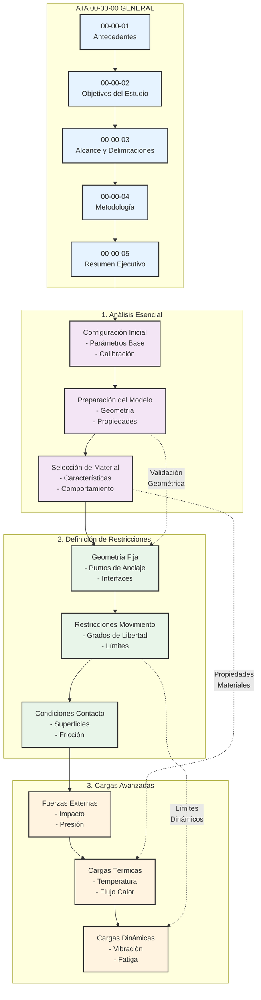
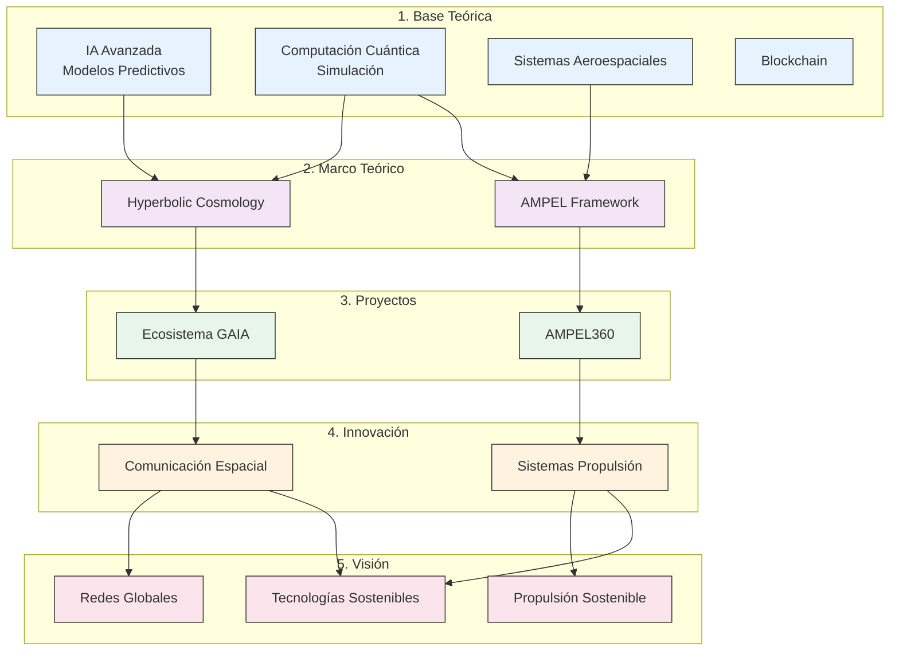

# **GAIA iMadRep: Generative AI for Industrial Machine Augmenting Design Replications**

## **🔹 Introducción**  
GAIA iMadRep es una aplicación avanzada de inteligencia artificial generativa (GenAI) diseñada para la **optimización, replicación y mejora de diseños industriales** en el ámbito de la **ingeniería aeroespacial, manufactura avanzada y sistemas ciberfísicos**. Utiliza modelos de **IA evolutiva, simulación cuántica y aprendizaje adaptativo**, integrando blockchain para trazabilidad y gobernanza ética.

---

## **🔹 Objetivos Principales**
1. **Automatización del Diseño Generativo:** Creación y optimización de **réplicas de diseño industrial** basadas en IA adaptativa.  
2. **Mejoramiento Continuo:** Aprendizaje iterativo sobre **fallos, desgaste y eficiencia** para mejorar las generaciones de diseño.  
3. **Simulación Física & Digital Twins:** Evaluación mediante **modelos computacionales cuánticos y simulaciones físicas** en entornos industriales.  
4. **Optimización de Recursos & Materiales:** Aplicación de IA para la selección de **materiales avanzados** y diseño sostenible.  
5. **Trazabilidad & Seguridad:** Implementación de **blockchain** para validación de diseños, autenticidad y gobernanza descentralizada.  

---

## **🔹 Arquitectura del Sistema**

🔹 Aplicaciones 
```mermaid 
TD
    subgraph Entrada["Captura de Datos"]
        Sensores["Sensores IoT\nDatos Industriales"]
        CAD["Modelos CAD\nDiseños Base"]
        Historia["Datos Históricos\nFallos y Eficiencia"]
    end

    subgraph IA["Núcleo IA Generativa"]
        GAN["Redes Generativas\nGANs"]
        DRL["Aprendizaje por\nRefuerzo Profundo"]
        QC["Computación\nCuántica"]
        DT["Digital Twins\nSimulación"]
    end

    subgraph Optimización["Optimización y Validación"]
        FEA["Análisis de\nElementos Finitos"]
        MAT["Selección de\nMateriales"]
        SIM["Simulación\nFísica"]
    end

    subgraph Blockchain["Gobernanza y Trazabilidad"]
        Smart["Contratos\nInteligentes"]
        Valid["Validación y\nCertificación"]
        Gov["Gobernanza\nDescentralizada"]
    end

    subgraph Aplicaciones["Aplicaciones Industriales"]
        Aero["Aeroespacial"]
        Manu["Manufactura\nAvanzada"]
        Nano["Nanotecnología"]
        Energy["Energía\nSostenible"]
    end

    %% Conexiones principales
    Sensores & CAD & Historia --> GAN
    GAN --> DRL --> QC --> DT
    DT --> FEA --> MAT --> SIM
    SIM --> Smart --> Valid --> Gov

    %% Conexiones a aplicaciones
    SIM --> Aero & Manu
    MAT --> Nano & Energy

    classDef input fill:#e6f3ff,stroke:#333
    classDef ai fill:#f3e5f5,stroke:#333
    classDef opt fill:#e8f5e9,stroke:#333
    classDef block fill:#fff3e0,stroke:#333
    classDef app fill:#fce4ec,stroke:#333

    class Sensores,CAD,Historia input
    class GAN,DRL,QC,DT ai
    class FEA,MAT,SIM opt
    class Smart,Valid,Gov block
    class Aero,Manu,Nano,Energy app
```
## Aplicaciones Clave de GAIA iMadRep

Las **aplicaciones clave** de **GAIA iMadRep** se centran en la optimización, replicación y mejora continua de diseños industriales mediante tecnologías avanzadas como IA generativa, simulación cuántica, blockchain y manufactura aditiva. A continuación se detallan las principales áreas de aplicación donde GAIA iMadRep puede tener un impacto significativo:

---

### 1. **Aeroespacial & Defensa**
   - **Optimización de Estructuras Aeroespaciales**: Utilizando IA generativa y simulación cuántica para optimizar el diseño de estructuras aeronáuticas y naves espaciales, mejorando la eficiencia estructural y reduciendo el peso sin comprometer la resistencia.
   - **Desarrollo de Componentes de Propulsión**: La aplicación de algoritmos de **aprendizaje profundo** (DRL) y simulaciones físicas puede mejorar los diseños de motores y sistemas de propulsión, optimizando la eficiencia energética y la durabilidad.
   - **Diseño de Aviones y Satélites**: Integración de **Digital Twins** y simulación cuántica para predecir el comportamiento real de aeronaves y satélites en condiciones extremas, permitiendo pruebas virtuales previas a la fabricación.

### 2. **Manufactura & Producción**
   - **Fabricación Aditiva (Impresión 3D)**: GAIA iMadRep optimiza el diseño de piezas y componentes para manufactura aditiva, creando estructuras más eficientes, ligeras y robustas mediante modelos generativos que consideran las propiedades materiales y las restricciones de fabricación.
   - **Automatización del Diseño y Producción**: A través del uso de **Redes Generativas Adversarias (GANs)**, los diseños industriales se generan y validan automáticamente, adaptándose a las especificaciones de producción y a las restricciones de tiempo y costo.
   - **Mantenimiento Predictivo**: El sistema usa **IA evolutiva** para monitorear el rendimiento y desgaste de las máquinas, creando modelos predictivos que anticipan fallos y optimizan los programas de mantenimiento.

### 3. **Energía & Sostenibilidad**
   - **Optimización de Redes Energéticas**: Aplicación de algoritmos cuánticos para la **gestión energética** y la **optimización de redes** de distribución de energía, reduciendo pérdidas y mejorando la eficiencia del sistema en su totalidad.
   - **Diseño Sostenible de Materiales**: Utilizando simulaciones cuánticas para identificar nuevos materiales con propiedades superiores y más sostenibles, que minimicen el impacto ambiental sin comprometer el rendimiento.
   - **Desarrollo de Sistemas Energéticos Inteligentes**: Integración de **Digital Twins** para simular y optimizar sistemas de energía renovable, como paneles solares y turbinas eólicas, en tiempo real, mejorando su eficiencia y reduciendo costos.

### 4. **Automotriz & Transporte**
   - **Diseño de Vehículos Eficientes**: Optimización de la aerodinámica y la estructura interna de vehículos utilizando IA generativa para reducir el consumo de energía y mejorar el rendimiento general.
   - **Simulaciones de Comportamiento...
     
# sobre el autor


# Amedeo Pelliccia

Amedeo Pelliccia es un ingeniero e investigador especializado en áreas como la inteligencia artificial, la computación cuántica y la tecnología aeroespacial. Es conocido por liderar proyectos innovadores, como el ecosistema GAIA, que integra tecnologías avanzadas de IA, blockchain, y aeroespaciales, con un enfoque en sostenibilidad y gobernanza ética. Su trabajo se extiende a la creación de sistemas complejos y la investigación en temas como la optimización de propulsión, la minería galáctica, y la comunicación cuántica en entornos espaciales.

---

## **Flujo de Conocimiento y Aplicación Tecnológica**

Este diagrama estructura la relación entre la **base teórica**, los **marcos conceptuales**, los **proyectos aplicados**, la **innovación tecnológica** y la **visión estratégica futura** dentro del ecosistema de investigación de Amedeo Pelliccia.


---

### **1️⃣ Base Teórica y Especialización**  
Representa las disciplinas fundamentales que sustentan el desarrollo tecnológico:  

- **IA Avanzada** → Modelos predictivos y optimización.  
- **Computación Cuántica** → Algoritmos, simulación y criptografía.  
- **Sistemas Aeroespaciales** → Diseño de propulsión y navegación.  
- **Blockchain** → Seguridad de datos y gobernanza descentralizada.  

Estas especializaciones alimentan el **Marco Teórico Unificado**, proporcionando fundamentos científicos y técnicos.  

---

### **2️⃣ Marco Teórico Unificado**  
Define los principios físicos y matemáticos que guían la investigación:  

- **Hyperbolic Cosmology (HC)** → Modelos gravitacionales aplicados a la expansión del universo y su impacto en la dinámica de vuelo.  
- **AMPEL Theoretical Framework (ATF)** → Diseño de motores de propulsión cuántica y optimización energética basada en superconductores.  

Estos marcos teóricos sirven de base para el desarrollo de proyectos aplicados.  

---

### **3️⃣ Proyectos de Aplicación**  
Implementan los marcos teóricos en soluciones tecnológicas concretas:  

- **Ecosistema GAIA** → Gobernanza ética, blockchain aeroespacial y redes cuánticas distribuidas.  
- **AMPEL360** → Propulsión avanzada con integración de superconductores y combustibles alternativos.  

Los proyectos aplicados generan innovaciones tecnológicas disruptivas.  

---

### **4️⃣ Innovación Tecnológica**  
Derivada de los proyectos, impulsa avances en áreas estratégicas:  

- **Sistemas de Propulsión (SP)** → Motores híbridos basados en **HydroIAgency**, que combinan hidrógeno, IA y superconductores.  
- **Comunicación Espacial (CS)** → Implementación de **redes cuánticas resistentes** a interferencias para transmisión de datos interplanetarios.  

Estos avances abren el camino a objetivos estratégicos de largo plazo.  

---

### **5️⃣ Visión Futura y Objetivos Estratégicos**  
Define el impacto esperado de las tecnologías desarrolladas:  

- **Tecnologías Sostenibles (TS)** → Minimización de residuos y optimización de recursos en la exploración espacial.  
- **Redes Globales Cuánticas (RG)** → Infraestructura de comunicación cuántica a nivel global y espacial.  
- **Propulsión Sostenible (PS)** → Desarrollo de sistemas de propulsión cero emisiones para exploración interplanetaria.  

---

### **📌 Conclusión**  
El diagrama muestra un flujo estructurado donde la **base teórica** guía el desarrollo de **proyectos aplicados**, los cuales generan **innovaciones tecnológicas** con un impacto directo en la **visión estratégica de futuro**.
```

