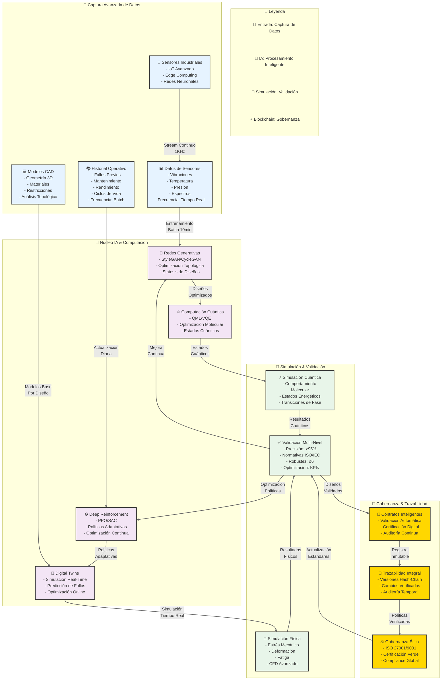

# **GAIA iMadRep: Generative AI for Industrial Machine Augmenting Design Replications**

## **🔹 Introducción**  
GAIA iMadRep es una aplicación avanzada de inteligencia artificial generativa (GenAI) diseñada para la **optimización, replicación y mejora de diseños industriales** en el ámbito de la **ingeniería aeroespacial, manufactura avanzada y sistemas ciberfísicos**. Utiliza modelos de **IA evolutiva, simulación cuántica y aprendizaje adaptativo**, integrando blockchain para trazabilidad y gobernanza ética.

---

## **🔹 Objetivos Principales**
1. **Automatización del Diseño Generativo:** Creación y optimización de **réplicas de diseño industrial** basadas en IA adaptativa.  
2. **Mejoramiento Continuo:** Aprendizaje iterativo sobre **fallos, desgaste y eficiencia** para mejorar las generaciones de diseño.  
3. **Simulación Física & Digital Twins:** Evaluación mediante **modelos computacionales cuánticos y simulaciones físicas** en entornos industriales.  
4. **Optimización de Recursos & Materiales:** Aplicación de IA para la selección de **materiales avanzados** y diseño sostenible.  
5. **Trazabilidad & Seguridad:** Implementación de **blockchain** para validación de diseños, autenticidad y gobernanza descentralizada.  

---

## **🔹 Arquitectura del Sistema**

🔹 Aplicaciones Clave

🚀 Aeroespacial & Defensa:
   •   Optimización de estructuras de aeronaves y naves espaciales.
   •   Diseño generativo de sistemas de propulsión sostenible.
   •   Simulación de materiales para entornos extremos.

🏭 Manufactura Avanzada:
   •   Creación de gemelos digitales para líneas de producción.
   •   Automatización del diseño de componentes mediante IA generativa.
   •   Predicción y prevención de fallos en maquinaria industrial.

🔬 Nanotecnología & Materiales Inteligentes:
   •   Modelado molecular con computación cuántica.
   •   Simulación de materiales autorreparables.
   •   Optimización de aleaciones avanzadas.

🌍 Energía & Sostenibilidad:
   •   Diseño de turbinas eólicas y paneles solares optimizados.
   •   Modelado de infraestructuras energéticas con IA generativa.
   •   Reducción del impacto ambiental en manufactura.

🔹 Beneficios y Diferenciadores

✅ Reducción de Costos y Tiempos de Desarrollo: Generación acelerada de diseños óptimos.
✅ Mayor Seguridad y Confiabilidad: Evaluación de riesgos basada en datos históricos.
✅ Eficiencia Energética y Optimización de Materiales: IA para selección inteligente de materiales y procesos.
✅ Interoperabilidad con Blockchain: Registro seguro de patentes, certificaciones y versiones de diseño.

🔹 Conclusión

GAIA iMadRep representa un salto disruptivo en la automatización del diseño industrial, fusionando inteligencia artificial generativa, computación cuántica y manufactura avanzada. Su aplicación en aeroespacial, energía, manufactura y nanotecnología lo convierte en un sistema clave para la próxima revolución industrial.

🚀 “Innovación generativa para una industria más eficiente, segura y sostenible.”


# sobre el autor


# Amedeo Pelliccia

Amedeo Pelliccia es un ingeniero e investigador especializado en áreas como la inteligencia artificial, la computación cuántica y la tecnología aeroespacial. Es conocido por liderar proyectos innovadores, como el ecosistema GAIA, que integra tecnologías avanzadas de IA, blockchain, y aeroespaciales, con un enfoque en sostenibilidad y gobernanza ética. Su trabajo se extiende a la creación de sistemas complejos y la investigación en temas como la optimización de propulsión, la minería galáctica, y la comunicación cuántica en entornos espaciales.

---

## **Flujo de Conocimiento y Aplicación Tecnológica**

Este diagrama estructura la relación entre la **base teórica**, los **marcos conceptuales**, los **proyectos aplicados**, la **innovación tecnológica** y la **visión estratégica futura** dentro del ecosistema de investigación de Amedeo Pelliccia.

```mermaid
flowchart TD
    subgraph Nivel1["1️⃣ Base Teórica y Especialización"]
        direction LR
        IA["IA Avanzada\nModelos Predictivos y\nOptimización"]
        CQ["Computación Cuántica\nAlgoritmos y\nSimulación"]
        SA["Sistemas Aeroespaciales\nPropulsión y\nNavegación"]
        BC["Blockchain\nGobernanza\nDescentralizada"]
    end

    subgraph Nivel2["2️⃣ Marco Teórico Unificado"]
        direction LR
        HC["Hyperbolic Cosmology\nModelos Gravitacionales y\nDinámica de Vuelo"]
        ATF["AMPEL Framework\nPropulsión Cuántica y\nOptimización Energética"]
    end

    subgraph Nivel3["3️⃣ Proyectos de Aplicación"]
        direction LR
        GAIA["Ecosistema GAIA\nGobernanza Ética y\nRedes Distribuidas"]
        AMPEL["AMPEL360\nPropulsión Avanzada y\nSuperconductores"]
    end

    subgraph Nivel4["4️⃣ Innovación Tecnológica"]
        direction LR
        SP["Sistemas Propulsión\nHydroIAgency\nMotores Híbridos"]
        CS["Comunicación Espacial\nRedes Cuánticas\nInterplanetarias"]
    end

    subgraph Nivel5["5️⃣ Visión Estratégica"]
        direction LR
        TS["Tecnologías\nSostenibles"]
        RG["Redes Globales\nCuánticas"]
        PS["Propulsión\nSostenible"]
    end

    %% Conexiones entre niveles
    IA & CQ --> HC
    SA & CQ --> ATF
    BC --> GAIA
    
    HC --> GAIA
    ATF --> AMPEL
    
    GAIA --> CS
    AMPEL --> SP
    
    SP --> PS & TS
    CS --> RG & TS

    %% Estilos
    classDef nivel1 fill:#e6f3ff,stroke:#333,stroke-width:2px
    classDef nivel2 fill:#f3e5f5,stroke:#333,stroke-width:2px
    classDef nivel3 fill:#e8f5e9,stroke:#333,stroke-width:2px
    classDef nivel4 fill:#fff3e0,stroke:#333,stroke-width:2px
    classDef nivel5 fill:#fce4ec,stroke:#333,stroke-width:2px

    class IA,CQ,SA,BC nivel1
    class HC,ATF nivel2
    class GAIA,AMPEL nivel3
    class SP,CS nivel4
    class TS,RG,PS nivel5
,stroke:#333,stroke-width:2px
    classDef nivel4 fill:#fff3e0,stroke:#333,stroke-width:2px
    classDef nivel5 fill:#fce4ec,stroke:#333,stroke-width:2px

    class IA,CQ,SA,BC nivel1
    class HC,ATF nivel2
    class GAIA,AMPEL nivel3
    class SP,CS nivel4
    class TS,RG,PS nivel5
```mermaid
flowchart TD
    subgraph ATA["ATA 00-00-00 GENERAL"]
        direction TB
        ANT["00-00-01\nAntecedentes"]
        OBJ["00-00-02\nObjetivos del Estudio"]
        ALC["00-00-03\nAlcance y Delimitaciones"]
        MET["00-00-04\nMetodología"]
        RES["00-00-05\nResumen Ejecutivo"]
    end

    subgraph Preparación["1. Análisis Esencial"]
        direction TB
        A1["Configuración Inicial\n- Parámetros Base\n- Calibración"]
        A2["Preparación del Modelo\n- Geometría\n- Propiedades"]
        A3["Selección de Material\n- Características\n- Comportamiento"]
    end

    subgraph Restricciones["2. Definición de Restricciones"]
        direction TB
        B1["Geometría Fija\n- Puntos de Anclaje\n- Interfaces"]
        B2["Restricciones Movimiento\n- Grados de Libertad\n- Límites"]
        B3["Condiciones Contacto\n- Superficies\n- Fricción"]
    end

    subgraph Cargas["3. Cargas Avanzadas"]
        direction TB
        C1["Fuerzas Externas\n- Impacto\n- Presión"]
        C2["Cargas Térmicas\n- Temperatura\n- Flujo Calor"]
        C3["Cargas Dinámicas\n- Vibración\n- Fatiga"]
    end

    %% Conexiones principales
    ANT --> OBJ --> ALC --> MET --> RES
    RES --> A1
    
    A1 --> A2 --> A3
    A3 --> B1
    B1 --> B2 --> B3
    B3 --> C1
    C1 --> C2 --> C3

    %% Conexiones cruzadas
    A2 -.->|"Validación\nGeométrica"| B1
    A3 -.->|"Propiedades\nMateriales"| C2
    B2 -.->|"Límites\nDinámicos"| C3

    %% Estilos
    classDef ata fill:#e6f3ff,stroke:#333,stroke-width:2px
    classDef prep fill:#f3e5f5,stroke:#333,stroke-width:2px
    classDef rest fill:#e8f5e9,stroke:#333,stroke-width:2px
    classDef load fill:#fff3e0,stroke:#333,stroke-width:2px

    class ANT,OBJ,ALC,MET,RES ata
    class A1,A2,A3 prep
    class B1,B2,B3 rest
    class C1,C2,C3 load
---

### **1️⃣ Base Teórica y Especialización**  
Representa las disciplinas fundamentales que sustentan el desarrollo tecnológico:  

- **IA Avanzada** → Modelos predictivos y optimización.  
- **Computación Cuántica** → Algoritmos, simulación y criptografía.  
- **Sistemas Aeroespaciales** → Diseño de propulsión y navegación.  
- **Blockchain** → Seguridad de datos y gobernanza descentralizada.  

Estas especializaciones alimentan el **Marco Teórico Unificado**, proporcionando fundamentos científicos y técnicos.  

---

### **2️⃣ Marco Teórico Unificado**  
Define los principios físicos y matemáticos que guían la investigación:  

- **Hyperbolic Cosmology (HC)** → Modelos gravitacionales aplicados a la expansión del universo y su impacto en la dinámica de vuelo.  
- **AMPEL Theoretical Framework (ATF)** → Diseño de motores de propulsión cuántica y optimización energética basada en superconductores.  

Estos marcos teóricos sirven de base para el desarrollo de proyectos aplicados.  

---

### **3️⃣ Proyectos de Aplicación**  
Implementan los marcos teóricos en soluciones tecnológicas concretas:  

- **Ecosistema GAIA** → Gobernanza ética, blockchain aeroespacial y redes cuánticas distribuidas.  
- **AMPEL360** → Propulsión avanzada con integración de superconductores y combustibles alternativos.  

Los proyectos aplicados generan innovaciones tecnológicas disruptivas.  

---

### **4️⃣ Innovación Tecnológica**  
Derivada de los proyectos, impulsa avances en áreas estratégicas:  

- **Sistemas de Propulsión (SP)** → Motores híbridos basados en **HydroIAgency**, que combinan hidrógeno, IA y superconductores.  
- **Comunicación Espacial (CS)** → Implementación de **redes cuánticas resistentes** a interferencias para transmisión de datos interplanetarios.  

Estos avances abren el camino a objetivos estratégicos de largo plazo.  

---

### **5️⃣ Visión Futura y Objetivos Estratégicos**  
Define el impacto esperado de las tecnologías desarrolladas:  

- **Tecnologías Sostenibles (TS)** → Minimización de residuos y optimización de recursos en la exploración espacial.  
- **Redes Globales Cuánticas (RG)** → Infraestructura de comunicación cuántica a nivel global y espacial.  
- **Propulsión Sostenible (PS)** → Desarrollo de sistemas de propulsión cero emisiones para exploración interplanetaria.  

---

### **📌 Conclusión**  
El diagrama muestra un flujo estructurado donde la **base teórica** guía el desarrollo de **proyectos aplicados**, los cuales generan **innovaciones tecnológicas** con un impacto directo en la **visión estratégica de futuro**.
```

