```Action required: migrate or opt-out of migration to GitHub inside Microsoft #5
```


```mermaid
flowchart TB
    root("GPAM Diagrammatic Documentation Suite")
    root --> workflow(Overall Maintenance Workflow Diagrams)
    root --> inspection(Component Inspection Diagrams)
    root --> repair(Repair Procedure Diagrams)
    root --> troubleshoot(Troubleshooting Guides)

    subgraph workflow_cluster [Overall Workflow Diagrams]
        direction TB
        workflow --> workflow_main[Main Maintenance Workflow <br/> Diagram 1]
    end

    subgraph inspection_cluster [Component Inspection Diagrams]
        direction TB
        inspection --> inspect_actuator[Actuator Inspection <br/> Diagram 3]
        inspection --> inspect_reservoir[Reservoir Inspection <br/> Diagram 4]
        inspection --> inspect_pump[Pump Inspection <br/> Implied - Section 6.3 Text]
    end

    subgraph repair_cluster [Repair Procedure Diagrams]
        direction TB
        repair --> repair_line[Line Replacement <br/> Diagram 5]
        repair --> repair_actuator_seal[Actuator Seal Replacement <br/> Diagram 6]
        repair --> repair_pump_seal[Pump Seal Replacement <br/> Diagram 7]
        repair --> repair_valve_overhaul[Valve Overhaul <br/> Diagram 8]
    end

    subgraph troubleshoot_cluster [Troubleshooting Guides]
        direction TB
        troubleshoot --> troubleshoot_hydraulic[Hydraulic System Troubleshooting <br/> Diagram 2]
    end


    style root fill:#f9f9f9,stroke:#333,stroke-width:2px
    style workflow_cluster fill:#e0f7fa,stroke:#333,stroke-width:1px
    style inspection_cluster fill:#e0f7fa,stroke:#333,stroke-width:1px
    style repair_cluster fill:#f0f4c3,stroke:#333,stroke-width:1px
    style troubleshoot_cluster fill:#ffe0b2,stroke:#333,stroke-width:1px

    linkStyle default stroke:#999,stroke-width:1px,color:#555
```

# Optimización del Flujo de Documentación S1000D

Esta guía proporciona técnicas y herramientas para mejorar el manejo y la distribución de la documentación S1000D, desde la identificación de archivos mediante expresiones regulares hasta la automatización del despliegue. A continuación, se detallan los pasos y herramientas clave para optimizar el flujo de trabajo.

---

## 1. **Expresiones Regulares (Regex) para Identificación de Archivos**
Las expresiones regulares son una herramienta poderosa para identificar y clasificar archivos en la documentación S1000D. Aquí se presentan algunos ejemplos útiles:

### 1.1 Identificación de Archivos por Tipo
- **Archivos XML**:  
  ```regex
  .*\.xml$
  ```
  Identifica todos los archivos con extensión `.xml`.

- **Archivos de Imágenes**:  
  ```regex
  .*\.(png|jpg|jpeg|gif|svg)$
  ```
  Identifica archivos de imágenes comunes.

- **Archivos de Esquemas (XSD)**:  
  ```regex
  .*\.xsd$
  ```
  Identifica archivos de esquemas XML.

### 1.2 Identificación de Archivos por Estructura de Directorios
- **Archivos en una Carpeta Específica**:  
  ```regex
  ^.*/ATA\d{2}/.*\.xml$
  ```
  Identifica archivos XML dentro de carpetas que siguen la estructura ATA (por ejemplo, `ATA21/`).

- **Archivos de Mantenimiento**:  
  ```regex
  .*maintenance.*\.xml$
  ```
  Identifica archivos XML que contienen la palabra "maintenance" en su nombre.

---

## 2. **Automatización del Procesamiento de Archivos**
La automatización es clave para manejar grandes volúmenes de documentación S1000D. Herramientas como scripts en Python o Bash pueden ser útiles.

### 2.1 Script en Python para Procesar Archivos XML
```python
import os
import re
from xml.etree import ElementTree as ET

def process_s1000d_files(directory):
    for root, _, files in os.walk(directory):
        for file in files:
            if re.match(r'.*\.xml$', file):
                file_path = os.path.join(root, file)
                try:
                    tree = ET.parse(file_path)
                    root_element = tree.getroot()
                    # Realizar operaciones con el archivo XML
                    print(f"Procesando: {file_path}")
                except ET.ParseError as e:
                    print(f"Error al procesar {file_path}: {e}")

# Ejemplo de uso
process_s1000d_files("/ruta/a/la/documentacion")
```

### 2.2 Script en Bash para Mover Archivos por Tipo
```bash
#!/bin/bash

# Mover archivos XML a una carpeta específica
for file in $(find . -type f -name "*.xml"); do
    mv "$file" ./xml_files/
done

# Mover archivos de imágenes a otra carpeta
for file in $(find . -type f -regex ".*\.\(png\|jpg\|jpeg\|gif\|svg\)$"); do
    mv "$file" ./images/
done
```

---

## 3. **Herramientas para la Validación de Archivos S1000D**
La validación de archivos S1000D es esencial para garantizar la conformidad con los estándares. Algunas herramientas útiles incluyen:

### 3.1 Validación con Esquemas XSD
- **Herramienta**: `xmllint` (disponible en sistemas Linux/macOS).
- **Comando**:  
  ```bash
  xmllint --schema esquema.xsd archivo.xml --noout
  ```
  Valida un archivo XML contra un esquema XSD.

### 3.2 Validación con Schematron
- **Herramienta**: `xsltproc` (para validar con reglas Schematron).
- **Comando**:  
  ```bash
  xsltproc esquema.sch archivo.xml
  ```
  Aplica reglas Schematron para validar el archivo XML.

---

## 4. **Automatización del Despliegue**
La automatización del despliegue asegura que la documentación esté disponible de manera rápida y consistente. Herramientas como Jenkins, GitLab CI/CD o GitHub Actions pueden ser utilizadas.

### 4.1 Ejemplo de Configuración en GitHub Actions
```yaml
name: Despliegue de Documentación S1000D

on:
  push:
    branches:
      - main

jobs:
  deploy:
    runs-on: ubuntu-latest
    steps:
      - name: Checkout del Repositorio
        uses: actions/checkout@v2

      - name: Instalar Dependencias
        run: |
          sudo apt-get install -y libxml2-utils xsltproc

      - name: Validar Archivos XML
        run: |
          for file in $(find . -name "*.xml"); do
            xmllint --schema esquema.xsd "$file" --noout
          done

      - name: Desplegar Documentación
        run: |
          scp -r ./documentacion usuario@servidor:/ruta/de/destino
```

---

## 5. **Herramientas de Gestión de Documentación**
Para gestionar grandes volúmenes de documentación S1000D, se recomiendan las siguientes herramientas:

### 5.1 Sistemas de Gestión de Contenido (CMS)
- **Herramientas**:  
  - **DocuWare**: Para gestión de documentos empresariales.
  - **Alfresco**: Plataforma de gestión de contenido de código abierto.

### 5.2 Herramientas de Colaboración
- **Herramientas**:  
  - **Confluence**: Para documentación colaborativa.
  - **GitHub/GitLab**: Para control de versiones y colaboración en código y documentación.

---

## 6. **Mejores Prácticas para la Documentación S1000D**
- **Estandarización**: Utilizar plantillas y esquemas consistentes.
- **Control de Versiones**: Implementar un sistema de control de versiones (Git, SVN).
- **Validación Automatizada**: Integrar validaciones en el flujo de trabajo.
- **Documentación Colaborativa**: Fomentar la colaboración entre equipos mediante herramientas como Confluence o SharePoint.

---

## 7. **Ejemplo de Flujo de Trabajo Optimizado**
1. **Identificación de Archivos**: Usar expresiones regulares para clasificar archivos.
2. **Procesamiento Automatizado**: Ejecutar scripts para validar y transformar archivos.
3. **Validación**: Validar archivos contra esquemas XSD y reglas Schematron.
4. **Despliegue Automatizado**: Configurar pipelines de CI/CD para el despliegue.
5. **Gestión y Colaboración**: Utilizar herramientas de gestión de contenido y colaboración.

---

Con estas técnicas y herramientas, se puede optimizar significativamente el flujo de documentación S1000D, mejorando la eficiencia y reduciendo errores en el proceso.

---

# Simulación del Flujo de Creación de un Módulo Documental Técnico Aeronáutico: **Requerimientos de Diseño Estructural (Tail Cone)**

A continuación, se simula el flujo completo de creación de un módulo documental técnico aeronáutico, utilizando el estándar S1000D. El ejemplo se centra en la creación de un documento de **Requerimientos de Diseño Estructural para el Tail Cone (Cono de Cola)** de una aeronave.

---

## **1. Definición del Alcance y Estructura del Documento**
### 1.1 Identificación del Módulo
- **Título del Documento**: Requerimientos de Diseño Estructural - Tail Cone.
- **Código ATA**: ATA 53 (Fuselaje) o ATA 55 (Estabilizadores), dependiendo de la estructura específica.
- **Número de Identificación del Módulo**: `GPAM-ATA53-TAILCONE-001-A`.

### 1.2 Estructura del Documento
El documento se divide en las siguientes secciones:
1. **Introducción**: Descripción general del Tail Cone.
2. **Requerimientos Funcionales**: Funcionalidades que el Tail Cone debe cumplir.
3. **Requerimientos Estructurales**: Especificaciones de diseño estructural.
4. **Materiales y Procesos**: Materiales permitidos y procesos de fabricación.
5. **Pruebas y Validación**: Requisitos de pruebas y validación.
6. **Referencias**: Normativas y estándares aplicables.

---

## **2. Creación del Contenido Técnico**
### 2.1 Introducción
- **Descripción General**:  
  El Tail Cone es la sección posterior del fuselaje que alberga sistemas como el APU (Unidad de Potencia Auxiliar) y proporciona aerodinámica y estabilidad estructural.
- **Propósito del Documento**:  
  Definir los requerimientos de diseño estructural para garantizar la integridad, seguridad y cumplimiento normativo del Tail Cone.

### 2.2 Requerimientos Funcionales
- **Funcionalidades Clave**:
  - Soporte estructural para el APU.
  - Integración aerodinámica con el fuselaje.
  - Resistencia a cargas dinámicas y estáticas.
  - Compatibilidad con sistemas de escape y ventilación.

### 2.3 Requerimientos Estructurales
- **Cargas de Diseño**:
  - Cargas máximas durante el despegue, vuelo y aterrizaje.
  - Resistencia a fuerzas de torsión y flexión.
- **Factores de Seguridad**:
  - Factor de seguridad mínimo de 1.5 para cargas operativas.
- **Tolerancias Dimensionales**:
  - Precisión de ±1 mm en dimensiones críticas.

### 2.4 Materiales y Procesos
- **Materiales Permitidos**:
  - Aleaciones de aluminio (e.g., 7075-T6).
  - Compuestos de fibra de carbono para reducción de peso.
- **Procesos de Fabricación**:
  - Mecanizado CNC.
  - Unión mediante remaches y adhesivos estructurales.

### 2.5 Pruebas y Validación
- **Pruebas Requeridas**:
  - Pruebas de fatiga y resistencia estática.
  - Simulación de cargas extremas.
  - Pruebas de vibración y resonancia.
- **Criterios de Aprobación**:
  - Cumplimiento con normativas FAA/EASA.

### 2.6 Referencias
- **Normativas**:
  - FAA 14 CFR Part 25.
  - EASA CS-25.
- **Estándares**:
  - S1000D (para documentación técnica).
  - ASTM E8 (para pruebas de materiales).

---

## **3. Creación del Archivo XML S1000D**
El contenido técnico se estructura en un archivo XML siguiendo el estándar S1000D.

### 3.1 Estructura XML del Módulo
```xml
<?xml version="1.0" encoding="UTF-8"?>
<dmodule xmlns="http://www.s1000d.org/S1000D_4-1" xmlns:xsi="http://www.w3.org/2001/XMLSchema-instance">
  <idstatus>
    <dmAddress>
      <dmIdent>
        <dmCode modelIdentCode="GPAM" systemDiffCode="ATA53" systemCode="TAILCONE" subSystemCode="001" subSubSystemCode="A"/>
      </dmIdent>
    </dmAddress>
  </idstatus>
  <content>
    <description>
      <para>Este módulo define los requerimientos de diseño estructural para el Tail Cone de la aeronave AMPEL360XWLRGA.</para>
    </description>
    <section>
      <title>Requerimientos Funcionales</title>
      <para>El Tail Cone debe soportar las siguientes funcionalidades:</para>
      <list>
        <item>Soporte estructural para el APU.</item>
        <item>Integración aerodinámica con el fuselaje.</item>
        <item>Resistencia a cargas dinámicas y estáticas.</item>
      </list>
    </section>
    <section>
      <title>Requerimientos Estructurales</title>
      <para>Las cargas de diseño incluyen:</para>
      <list>
        <item>Cargas máximas durante despegue, vuelo y aterrizaje.</item>
        <item>Resistencia a fuerzas de torsión y flexión.</item>
      </list>
    </section>
    <!-- Secciones adicionales -->
  </content>
</dmodule>
```

---

## **4. Validación del Archivo XML**
### 4.1 Validación con Esquema XSD
- **Herramienta**: `xmllint`.
- **Comando**:
  ```bash
  xmllint --schema S1000D_4-1.xsd GPAM-ATA53-TAILCONE-001-A.xml --noout
  ```

### 4.2 Validación con Schematron
- **Herramienta**: `xsltproc`.
- **Comando**:
  ```bash
  xsltproc validacion.sch GPAM-ATA53-TAILCONE-001-A.xml
  ```

---

## **5. Publicación y Distribución**
### 5.1 Conversión a Formatos Legibles
- **Herramienta**: Herramientas de publicación S1000D (e.g., Arbortext, Framemaker).
- **Formato de Salida**: PDF, HTML o IETM (Interactive Electronic Technical Manual).

### 5.2 Despliegue Automatizado
- **Herramienta**: Jenkins o GitHub Actions.
- **Pipeline**:
  ```yaml
  name: Despliegue de Documentación
  on:
    push:
      branches:
        - main
  jobs:
    deploy:
      runs-on: ubuntu-latest
      steps:
        - name: Checkout del Repositorio
          uses: actions/checkout@v2
        - name: Validar XML
          run: xmllint --schema S1000D_4-1.xsd GPAM-ATA53-TAILCONE-001-A.xml --noout
        - name: Publicar PDF
          run: |
            # Comandos para generar PDF
          ```

---

## **6. Gestión del Ciclo de Vida del Documento**
- **Control de Versiones**: Uso de Git para rastrear cambios.
- **Actualizaciones**: Revisión periódica del documento para cumplir con normativas actualizadas.
- **Colaboración**: Uso de herramientas como Confluence o SharePoint para la revisión y aprobación del documento.

---

## **7. Resumen del Flujo de Trabajo**
1. **Definición del Alcance**: Estructura y contenido del documento.
2. **Creación del Contenido**: Redacción de requerimientos técnicos.
3. **Estructuración en XML**: Creación del archivo XML S1000D.
4. **Validación**: Uso de XSD y Schematron para garantizar conformidad.
5. **Publicación**: Conversión a formatos legibles y despliegue automatizado.
6. **Gestión del Ciclo de Vida**: Control de versiones y actualizaciones.

---

Este flujo de trabajo garantiza la creación eficiente y estandarizada de un módulo documental técnico aeronáutico, cumpliendo con los estándares S1000D y las normativas de la industria.

## Simulación del Proceso de Revisión de Módulos de Publicación S1000D Personalizados para Diferentes Soluciones de Diseño

A continuación, se simula el proceso de revisión para un módulo de publicación S1000D, considerando **dos soluciones de diseño personalizadas** para el mismo conjunto: los **Requerimientos de Diseño Estructural del Tail Cone**.  El objetivo es mostrar cómo el proceso de revisión asegura que la documentación refleje con precisión cada solución de diseño y cumpla con los estándares.

**Escenario:**  Se proponen dos soluciones de diseño para el Tail Cone:

*   **Solución 1: Aleación de Aluminio (Diseño Base):** Utiliza aleaciones de aluminio convencionales (e.g., 7075-T6). Es una solución probada y de menor costo.
*   **Solución 2: Compuestos de Fibra de Carbono (Diseño Alternativo):**  Incorpora materiales compuestos de fibra de carbono para reducir el peso. Ofrece mejor rendimiento pero puede ser más costosa y requerir procesos de fabricación diferentes.

**Módulo Documental Base (Punto de Partida):**  El módulo de "Requerimientos de Diseño Estructural - Tail Cone" creado en la simulación anterior (GPAM-ATA53-TAILCONE-001-A) servirá como base.

**Proceso de Revisión Simulado:**

El proceso de revisión se simulará en las siguientes etapas, involucrando diferentes roles:

1.  **Draft Inicial y Revisión Técnica (Ingeniería Estructural y Materiales):**
2.  **Revisión de Cumplimiento y Normativa (Certificación y Calidad):**
3.  **Revisión de Documentación y Publicación (Equipo de Documentación Técnica):**
4.  **Aprobación Final (Gestión de Ingeniería):**

---

### **Etapa 1: Draft Inicial y Revisión Técnica**

**Responsables:** Ingenieros Estructurales y de Materiales.

**Acciones:**

1.  **Creación de Drafts Personalizados:**  Se crean dos versiones del módulo documental base, cada una **personalizada para reflejar una solución de diseño**:

    *   **Draft 1.1 (Aluminio):**  Mantiene la sección de "Materiales y Procesos" enfocada en aleaciones de aluminio y procesos de mecanizado convencionales.
    *   **Draft 1.2 (Compuestos):**  Se **modifica la sección de "Materiales y Procesos"** para especificar compuestos de fibra de carbono y procesos de fabricación asociados (moldeo, curado, etc.).

2.  **Revisión Técnica:** Los ingenieros estructurales y de materiales revisan ambos drafts.

    *   **Feedback Draft 1.1 (Aluminio):**  "El draft base es adecuado para la solución de aluminio.  Verificar la consistencia de las referencias a normativas de materiales de aluminio."
    *   **Feedback Draft 1.2 (Compuestos):**  "La sección de compuestos es un buen inicio.  **Añadir detalles sobre la clasificación específica de la fibra de carbono y la matriz polimérica.**  Asegurarse de que los procesos de unión para compuestos estén claramente definidos."

3.  **Actualización de Drafts:** El equipo de documentación técnica **actualiza los drafts** basándose en el feedback técnico.

    *   **Draft 1.1 Actualizado (Aluminio):**  Se verifican y refinan las referencias a normativas de aleaciones de aluminio.
    *   **Draft 1.2 Actualizado (Compuestos):**  Se **añaden detalles específicos** sobre los materiales compuestos (tipo de fibra, resina) y se detallan los procesos de unión (adhesivos estructurales específicos para compuestos, remachado híbrido).

---

### **Etapa 2: Revisión de Cumplimiento y Normativa**

**Responsables:**  Ingenieros de Certificación y Calidad.

**Acciones:**

1.  **Revisión de Cumplimiento:** Se revisan los drafts actualizados para asegurar el cumplimiento con normativas aeronáuticas (FAA/EASA) y estándares de la industria.

    *   **Feedback Draft 1.1 (Aluminio):** "El draft de aluminio parece cumplir con las normativas generales.  **Asegurarse de que las referencias a FAA 14 CFR Part 25 y EASA CS-25 sean específicas para materiales metálicos.**"
    *   **Feedback Draft 1.2 (Compuestos):**  "El draft de compuestos requiere una revisión más exhaustiva.  **Verificar el cumplimiento con las normativas específicas para materiales compuestos en aviación (e.g., FAA AC 20-107B).**  Asegurarse de que los criterios de aprobación para pruebas de materiales compuestos estén claramente definidos."

2.  **Actualización de Drafts:** El equipo de documentación técnica **ajusta los drafts** para reflejar el feedback de cumplimiento y normativa.

    *   **Draft 1.1 Actualizado (Aluminio):**  Se refinan las referencias normativas para materiales de aluminio, especificando secciones relevantes de FAA 14 CFR Part 25 y EASA CS-25.
    *   **Draft 1.2 Actualizado (Compuestos):**  Se **añaden referencias a FAA AC 20-107B** y otras guías específicas para compuestos. Se detallan los criterios de aprobación para pruebas de materiales compuestos, incluyendo pruebas de interlaminar y resistencia al impacto.

---

### **Etapa 3: Revisión de Documentación y Publicación**

**Responsables:** Equipo de Documentación Técnica y Publicación.

**Acciones:**

1.  **Revisión de Documentación:** El equipo de documentación revisa la **claridad, consistencia, y estructura** de ambos drafts, asegurando que cumplan con los estándares S1000D y sean fácilmente comprensibles para los usuarios finales.

    *   **Feedback Draft 1.1 y 1.2 (Aluminio y Compuestos):** "Ambos drafts están bien estructurados.  **Asegurarse de que la terminología sea consistente en ambos documentos.**  Verificar que las listas y tablas estén correctamente formateadas según S1000D."

2.  **Actualización de Drafts:** El equipo de documentación **realiza ajustes finales** para mejorar la claridad y consistencia, y asegura el formato XML S1000D correcto.

    *   **Draft 1.1 Final (Aluminio):** Se revisa la terminología y se refina el formato XML.
    *   **Draft 1.2 Final (Compuestos):**  Se asegura la consistencia terminológica con el draft de aluminio y se valida el XML.

---

### **Etapa 4: Aprobación Final**

**Responsables:** Gestión de Ingeniería.

**Acciones:**

1.  **Revisión Final y Aprobación:** La gestión de ingeniería revisa ambos módulos documentales finales, asegurando que reflejen con precisión las soluciones de diseño y que el proceso de revisión se haya completado satisfactoriamente.

    *   **Aprobación Draft 1.1 (Aluminio):**  "Aprobado.  El módulo documental para la solución de aluminio cumple con los requerimientos."
    *   **Aprobación Draft 1.2 (Compuestos):**  "Aprobado.  El módulo documental para la solución de compuestos refleja adecuadamente las especificaciones y consideraciones normativas."

2.  **Publicación:**  Ambos módulos documentales finales (para aluminio y compuestos) se **publican en el sistema de gestión de documentación S1000D** de GAIA AIR, listos para ser utilizados.

---

**Ejemplo de Customización en el XML S1000D (Sección de Materiales y Procesos):**

Para ilustrar la customización, se muestra la sección `<section>` de "Materiales y Procesos" en XML para ambos módulos finales:

**Módulo Final 1.1 (Aluminio):**

```xml
<section>
  <title>Materiales y Procesos</title>
  <para>Los materiales permitidos para el Tail Cone son aleaciones de aluminio de la serie 7000, específicamente 7075-T6, conocidas por su alta resistencia y buena maquinabilidad.</para>
  <list>
    <item>Materiales Permitidos: Aleaciones de aluminio 7075-T6.</item>
    <item>Procesos de Fabricación: Mecanizado CNC de alta precisión, unión mediante remaches de aluminio y adhesivos estructurales aeronáuticos (e.g., 3M™ Scotch-Weld™ AF 163-2).</item>
  </list>
  <para>Todos los materiales y procesos deben cumplir con las normativas FAA 14 CFR Part 25 Subparte D - Materiales y EASA CS-25 Subparte D - Materiales.</para>
</section>
```

**Módulo Final 1.2 (Compuestos):**

```xml
<section>
  <title>Materiales y Procesos</title>
  <para>Para la solución de diseño con compuestos, se utilizarán materiales compuestos de fibra de carbono preimpregnada, combinando alta resistencia con bajo peso.</para>
  <list>
    <item>Materiales Permitidos: Compuestos de fibra de carbono preimpregnada de clasificación aeronáutica (e.g., Toray T700S con resina epoxi).  Matriz polimérica termoestable de alta tenacidad.</item>
    <item>Procesos de Fabricación: Moldeo por autoclave bajo vacío, curado a alta temperatura según especificaciones del fabricante del material compuesto. Unión mediante adhesivos estructurales específicos para compuestos (e.g., Hexcel Redux 677) y técnicas de laminado secundario.</item>
  </list>
  <para>Todos los materiales y procesos deben cumplir con las normativas FAA AC 20-107B - Composite Aircraft Structure y EASA CS-25 Amdt. 23/29A - Materiales Compuestos.</para>
</section>
```

**Resultado:**

Este proceso de revisión simulado asegura que **cada módulo documental personalizado refleje con precisión la solución de diseño específica**, incorporando feedback técnico, de cumplimiento normativo y de documentación.  Se generan **módulos S1000D validados y listos para publicación**, que reflejan las diferentes opciones de diseño para el Tail Cone.  Este flujo de trabajo permite gestionar la documentación de manera eficiente incluso cuando se consideran múltiples soluciones de diseño para un mismo componente aeronáutico.

## **Part II: GAIA PULSE AIR MODULES (GPAM) - Atmospheric Operations**

**Project:** GAIA AIR – AMPEL360XWLRGA  
**Documentation Reference:** GPAM-AMPEL-0201  
**Description:** Este apartado detalla la estructura de documentación integral de la aeronave AMPEL360XWLRGA. Abarca especificaciones de diseño, procedimientos de mantenimiento, integridad estructural y documentos de certificación, organizados según los capítulos ATA (Air Transport Association). Además, integra un _Enfoque de Reparación Estructural y un Marco de Identificación_ para guiar las decisiones de mantenimiento y reparación a lo largo del ciclo de vida de la aeronave.

---

### **1. Regex S1000D más flexible**

Para detectar distintos esquemas en los nombres de archivo (con referencias S1000D), se puede emplear una expresión regular avanzada. Esta versión es capaz de capturar sufijos adicionales y adaptarse a diferentes convenciones:

```python
import re

REGEX_S1000D = re.compile(
    r"(GP-[A-Z0-9]{2,}-[A-Z0-9]+-\d{4}-\d{3}-[A-Z0-9]+(?:-[A-Z0-9]+)?)",
    re.IGNORECASE
)

sample_text = "GP-GG-GOV-0101-001-A-B2 and GP-AB-ENG-2023-999-X"
matches = REGEX_S1000D.findall(sample_text)
print(matches)
# Salida: ['GP-GG-GOV-0101-001-A-B2', 'GP-AB-ENG-2023-999-X']
```

> **Nota:** Ajusta la regex según la convención de nomenclatura real de tu organización.

---

### **2. Exportación a múltiples formatos**

#### **2.1 Conversión Markdown → HTML / PDF**

- **Con Pandoc:**
  ```bash
  pandoc INDEX.md -o DOCUMENTACION.html
  pandoc INDEX.md -o DOCUMENTACION.pdf
  ```
- **Con md-to-pdf:**
  ```bash
  npm install -g md-to-pdf
  md-to-pdf INDEX.md
  ```

#### **2.2 Exportación a JSON**

Si necesitas que tus metadatos se integren con otras herramientas o APIs, puedes exportarlos a JSON:

```python
import json

document_structure = {
    "title": "GAIA AIR Documentation",
    "sections": [
        {"name": "Overview", "id": "01"},
        {"name": "Maintenance", "id": "02"}
    ]
}

with open("documentation.json", "w", encoding="utf-8") as f:
    json.dump(document_structure, f, indent=2)
```

---

### **3. Portal Web con MkDocs o Sphinx**

#### **3.1 Ejemplo con MkDocs**

1. **Instalación:**
   ```bash
   pip install mkdocs
   ```

2. **Estructura:**
   - Archivo `mkdocs.yml`
   - Documentos `.md` en la carpeta `docs/`

3. **Configuración básica en `mkdocs.yml`:**
   ```yaml
   site_name: GAIA AIR Documentation
   nav:
     - Home: index.md
     - Part 0: part0.md
     - Part I: part1.md
   plugins:
     - search
   ```

4. **Construcción y vista previa:**
   ```bash
   mkdocs build
   mkdocs serve
   ```

#### **3.2 Ejemplo con Sphinx**

Si prefieres Sphinx para documentación técnica:
```bash
pip install sphinx
sphinx-quickstart
# Configura el archivo conf.py y luego:
make html
```

---

### **4. Conexión con un CSDB de S1000D**

Si tus datos técnicos provienen de un CSDB (XML S1000D), puedes extraer y transformar esos Data Modules a Markdown. Por ejemplo:

```python
import xml.etree.ElementTree as ET

def parse_s1000d_dm(xml_file):
    tree = ET.parse(xml_file)
    root = tree.getroot()

    dm_title = root.find(".//title").text
    dm_code = root.find(".//dmCode").text
    dm_description = root.find(".//description").text

    return {
        "Title": dm_title,
        "Code": dm_code,
        "Description": dm_description
    }

dm_data = parse_s1000d_dm("example_dm.xml")
print(dm_data)
```

---

### **5. Automatización con GitHub Actions**

Para regenerar y desplegar tu documentación automáticamente en cada _push_ a la rama principal, crea un workflow en `.github/workflows/build-deploy-docs.yml`:

```yaml
name: Build and Deploy Docs
on:
  push:
    branches: [ "main" ]

jobs:
  build_docs:
    runs-on: ubuntu-latest
    steps:
      - name: Checkout Repo
        uses: actions/checkout@v3

      - name: Setup Python
        uses: actions/setup-python@v4
        with:
          python-version: "3.x"

      - name: Install Dependencies
        run: |
          pip install mkdocs
          
      - name: Build Documentation
        run: mkdocs build

      - name: Deploy Docs to GitHub Pages
        run: mkdocs gh-deploy --force
```

---

### **6. Integración del Bucle de Retroalimentación Cuántica en Tiempo Real**

Implementa un bucle de retroalimentación que ajuste dinámicamente el modelo Q-01 basándose en datos reales, manteniendo la precisión del Digital Twin.

Este enfoque garantiza que la **simulación cuántica** se ajuste en tiempo real a la realidad experimental, manteniendo el Digital Twin siempre optimizado. El proceso incluye:
- **Ejecución en hardware real:** Comparar resultados de IBM Quantum con la simulación.
- **Cálculo de fidelidad:** Evaluar la coherencia entre ambos estados.
- **Ajuste adaptativo:** Modificar los parámetros de resonancia cuántica si la fidelidad es inferior a 0.90.
- **Mitigación de ruido:** Aplicar técnicas de mitigación de errores para mejorar la precisión.

---

## **Conclusión**

Implementando estos pasos lograrás un flujo de documentación modular, escalable y conforme a la norma S1000D, mientras integras avanzadas técnicas de optimización y simulación cuántica para mejorar el rendimiento y la seguridad de los sistemas aeronáuticos.

Si deseas profundizar en alguna de estas áreas o realizar ajustes adicionales, ¡estoy aquí para ayudarte a llevar este proyecto al siguiente nivel!


