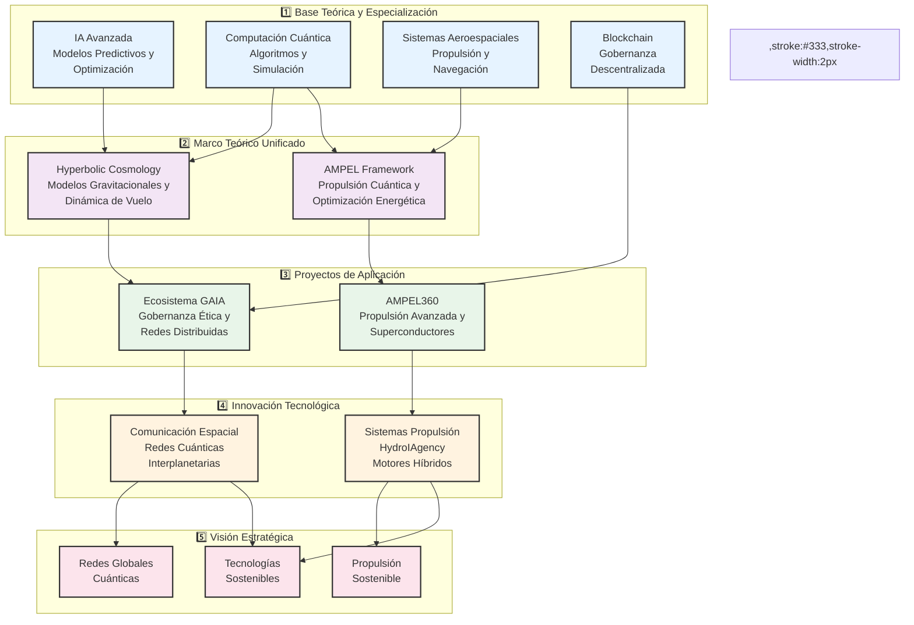

# sobre el autor


# Amedeo Pelliccia

Amedeo Pelliccia es un ingeniero e investigador especializado en áreas como la inteligencia artificial, la computación cuántica y la tecnología aeroespacial. Es conocido por liderar proyectos innovadores, como el ecosistema GAIA, que integra tecnologías avanzadas de IA, blockchain, y aeroespaciales, con un enfoque en sostenibilidad y gobernanza ética. Su trabajo se extiende a la creación de sistemas complejos y la investigación en temas como la optimización de propulsión, la minería galáctica, y la comunicación cuántica en entornos espaciales.

---

## **Flujo de Conocimiento y Aplicación Tecnológica**

Este diagrama estructura la relación entre la **base teórica**, los **marcos conceptuales**, los **proyectos aplicados**, la **innovación tecnológica** y la **visión estratégica futura** dentro del ecosistema de investigación de Amedeo Pelliccia.



---

### **1️⃣ Base Teórica y Especialización**  
Representa las disciplinas fundamentales que sustentan el desarrollo tecnológico:  

- **IA Avanzada** → Modelos predictivos y optimización.  
- **Computación Cuántica** → Algoritmos, simulación y criptografía.  
- **Sistemas Aeroespaciales** → Diseño de propulsión y navegación.  
- **Blockchain** → Seguridad de datos y gobernanza descentralizada.  

Estas especializaciones alimentan el **Marco Teórico Unificado**, proporcionando fundamentos científicos y técnicos.  

---

### **2️⃣ Marco Teórico Unificado**  
Define los principios físicos y matemáticos que guían la investigación:  

- **Hyperbolic Cosmology (HC)** → Modelos gravitacionales aplicados a la expansión del universo y su impacto en la dinámica de vuelo.  
- **AMPEL Theoretical Framework (ATF)** → Diseño de motores de propulsión cuántica y optimización energética basada en superconductores.  

Estos marcos teóricos sirven de base para el desarrollo de proyectos aplicados.  

---

### **3️⃣ Proyectos de Aplicación**  
Implementan los marcos teóricos en soluciones tecnológicas concretas:  

- **Ecosistema GAIA** → Gobernanza ética, blockchain aeroespacial y redes cuánticas distribuidas.  
- **AMPEL360** → Propulsión avanzada con integración de superconductores y combustibles alternativos.  

Los proyectos aplicados generan innovaciones tecnológicas disruptivas.  

---

### **4️⃣ Innovación Tecnológica**  
Derivada de los proyectos, impulsa avances en áreas estratégicas:  

- **Sistemas de Propulsión (SP)** → Motores híbridos basados en **HydroIAgency**, que combinan hidrógeno, IA y superconductores.  
- **Comunicación Espacial (CS)** → Implementación de **redes cuánticas resistentes** a interferencias para transmisión de datos interplanetarios.  

Estos avances abren el camino a objetivos estratégicos de largo plazo.  

---

### **5️⃣ Visión Futura y Objetivos Estratégicos**  
Define el impacto esperado de las tecnologías desarrolladas:  

- **Tecnologías Sostenibles (TS)** → Minimización de residuos y optimización de recursos en la exploración espacial.  
- **Redes Globales Cuánticas (RG)** → Infraestructura de comunicación cuántica a nivel global y espacial.  
- **Propulsión Sostenible (PS)** → Desarrollo de sistemas de propulsión cero emisiones para exploración interplanetaria.  

---

### **📌 Conclusión**  
El diagrama muestra un flujo estructurado donde la **base teórica** guía el desarrollo de **proyectos aplicados**, los cuales generan **innovaciones tecnológicas** con un impacto directo en la **visión estratégica de futuro**.
```

