```typescriptreact project="network-visualization"
...
```

# Interactive 3D Network Visualization

I've created an interactive 3D network visualization that allows you to explore network topologies, vulnerabilities, and security treatments. This visualization provides a comprehensive view of your network infrastructure and security posture.

## Features

### Network Topology Visualization

- **Interactive 3D Graph**: Nodes represent different network components (routers, servers, databases, clients, storage)
- **Color-Coded Nodes**: Different colors represent different types of network components
- **Connection Visualization**: Lines between nodes show network connections
- **Orbit Controls**: Rotate, pan, and zoom to explore the network from any angle


### Vulnerability Analysis

- **Vulnerability Highlighting**: Hover over vulnerabilities to see affected nodes
- **Visual Indicators**: Nodes with vulnerabilities are marked with alert badges
- **Animated Effects**: Vulnerable nodes pulse when their vulnerability is selected
- **Path Highlighting**: Connection paths between vulnerable nodes are highlighted


### Security Treatments

- **Treatment Details**: View recommended security treatments for each vulnerability
- **Node-Specific Information**: Select any node to see its vulnerabilities and treatments
- **Comprehensive View**: See all vulnerabilities and treatments across the network


## How to Use

1. **Explore the Network**: Use your mouse to rotate, pan, and zoom around the 3D network
2. **Select Nodes**: Click on any node to view detailed information about it
3. **View Vulnerabilities**: Switch to the "Vulnerabilities" tab and hover over specific vulnerabilities to highlight affected nodes
4. **Review Treatments**: Switch to the "Treatments" tab to see security recommendations for each vulnerability


This visualization helps security teams identify vulnerable components in their network infrastructure and understand the appropriate security treatments to mitigate risks.


https://v0.dev/chat/interactive-network-visualization-8RGuhqluVG6

1. **Image Description**  
   The image shows six simplified diagrams representing common Ethernet network topologies: **Bus, Ring, Mesh, Star, Tree,** and **Daisy Chain**. Each icon depicts a basic layout of nodes (circles) [...]

2. **Context in Our Discussion**  
   - **Bus**: A linear chain where each node taps into the same cable or bus. We noted that multipath entanglement purification (MEP) can be sensitive to signal reflections here, making correct ter [...]
   - **Ring**: Forms a loop among nodes, inherently providing redundancy if data can flow both directions. We discussed how a **circular (ring) network** can enhance fault tolerance locally.  
   - **Mesh**: Every node links directly to multiple others, enabling robust redundancy at the cost of complexity and cabling. This is often combined with quantum-safe encryption for mission-critic [...]
   - **Star**: A central hub that connects to each node individually. We emphasized star topologies for high scalability, simpler additions/removals, and ease of managing data flow—while acknowl [...]
   - **Tree**: Hierarchical structure that merges star or bus segments. Useful for subdividing large networks into branches, but can inherit some of bus or star weaknesses in certain segments.  
   - **Daisy Chain**: Nodes are connected one after another, forming a simple chain. It’s cost-effective and easy for small setups but prone to entire-chain disruptions if an intermediate node f [...]

3. **Why a Hybrid Approach Matters**  
   - **Blending Topologies**: The advanced architecture we described (a 3D star “backbone” plus local ring/mesh loops) is essentially a **hybrid** that draws on the reliability of star, the lo [...]
   - **Practical Deployment**: Real-world aerospace or industrial networks rarely fit neatly into a single topology; they often combine features—like star-based main hubs with sub-rings or parti [...]

By illustrating these basic topologies, the image provides a visual primer on how networks can be arranged. Our deeper dive into **3D star** plus **circular mesh/ring** topologies is an example of [...]

Below is a **consolidated summary** that integrates the key insights from the **ATA 23 (Communications)** and **ATA 24 (Electrical Power)** discussions. It covers advanced **network topologies**, [...]

Below is a **consolidated, up-to-date COAFI Outline** that seamlessly integrates the **Multi-Foresighted Models** section (VI) and the rest of the recent additions into the broader GAIA AIR / COAF [...]

---

## **Cosmic Omnidevelopable Aero Foresights Index (COAFI)**  
### **Complete Table of Contents**

---

### **Part 0: GAIA AIR – General and Governance (GP-GG)**

1. **About the GAIA AIR Project (IN: GP-GG-0001)**  
   - 0.1.1 Vision and Mission (IN: GP-GG-0001-01)  
   - 0.1.2 Project Objectives (IN: GP-GG-0001-02)  
   - 0.1.3 Key Technologies (IN: GP-GG-0001-03)  
     - 0.1.3.1 AMPEL360XWLRGA Aircraft (IN: GP-GG-0001-03-1)  
     - 0.1.3.2 Q-01 Quantum Propulsion System (IN: GP-GG-0001-03-2)  
     - 0.1.3.3 Atmospheric Energy Harvesting and Conversion System (AEHCS) (IN: GP-GG-0001-03-3)  
   - 0.1.4 Sustainability Goals (IN: GP-GG-0001-04)  
   - 0.1.5 Ethical Considerations (IN: GP-GG-0001-05)

2. **Governance and Organization (IN: GP-GG-0002)**  
   - 0.2.1 Project Leadership (IN: GP-GG-0002-01)  
   - 0.2.2 Organizational Structure (IN: GP-GG-0002-02)  
   - 0.2.3 Decision-Making Processes (IN: GP-GG-0002-03)  
   - 0.2.4 Risk Management Framework (IN: GP-GG-0002-04)

3. **Partnerships and Collaborations (IN: GP-GG-0003)**  
   - 0.3.1 Key Partners (IN: GP-GG-0003-01)  
   - 0.3.2 Collaboration Agreements (IN: GP-GG-0003-02)  
   - 0.3.3 Open Innovation Initiatives (IN: GP-GG-0003-03)

4. **Legal and Regulatory Compliance (IN: GP-GG-0004)**  
   - 0.4.1 Aviation Regulations (IN: GP-GG-0004-01)  
   - 0.4.2 Environmental Regulations (IN: GP-GG-0004-02)  
   - 0.4.3 Intellectual Property Rights (IN: GP-GG-0004-03)

5. **Communication and Outreach (IN: GP-GG-0005)**  
   - 0.5.1 Public Relations Strategy (IN: GP-GG-0005-01)  
   - 0.5.2 Stakeholder Engagement (IN: GP-GG-0005-02)  
   - 0.5.3 Media Relations (IN: GP-GG-0005-03)

---

### **Part I: GAIA PULSE ID (GP-ID) – Core Project Identity**

1. **Project Vision and Mission (IN: GP-ID-0101)**  
   - 1.1.1 Vision Statement (IN: GP-ID-0101-01)  
   - 1.1.2 Mission Statement (IN: GP-ID-0101-02)  
   - 1.1.3 Core Values (IN: GP-ID-0101-03)

2. **Project Goals and Objectives (IN: GP-ID-0102)**  
   - 1.2.1 Long-Term Goals (IN: GP-ID-0102-01)  
   - 1.2.2 Short-Term Objectives (IN: GP-ID-0102-02)  
   - 1.2.3 Key Performance Indicators (KPIs) (IN: GP-ID-0102-03)

3. **Project Scope and Boundaries (IN: GP-ID-0103)**  
   - 1.3.1 Included Activities (IN: GP-ID-0103-01)  
   - 1.3.2 Excluded Activities (IN: GP-ID-0103-02)  
   - 1.3.3 Geographic Scope (IN: GP-ID-0103-03)

4. **Project Timeline and Milestones (IN: GP-ID-0104)**  
   - 1.4.1 Project Phases (IN: GP-ID-0104-01)  
   - 1.4.2 Key Milestones (IN: GP-ID-0104-02)  
   - 1.4.3 Gantt Chart (IN: GP-ID-0104-03)

5. **Project Stakeholders (IN: GP-ID-0105)**  
   - 1.5.1 Internal Stakeholders (IN: GP-ID-0105-01)  
   - 1.5.2 External Stakeholders (IN: GP-ID-0105-02)  
   - 1.5.3 Stakeholder Communication Plan (IN: GP-ID-0105-03)

---

### **Part II: GAIA PULSE AIR MODULES (GPAM) – Atmospheric Operations**

**2.1 AMPEL360XWLRGA – Aircraft Documentation**  
*This part of the COAFI document contains all documentation related to the AMPEL360XWLRGA aircraft, organized primarily by ATA chapters.*

1. **ATA Chapters (P/N: GPAM-AMPEL-0201-ATA)**  
   - (A) ATA 05 – Time Limits/Maintenance Checks  
   - (B) ATA 06 – Dimensions and Areas  
   - (C) ATA 07 – Lifting and Shoring  
   - (D) ATA 08 – Leveling and Weighing  
   - (E) ATA 09 – Towing and Taxiing  
   - (F) ATA 10 – Parking, Mooring, Storage and Return to Service  
   - (G) ATA 11 – Placards and Markings  
   - (H) ATA 12 – Servicing  
   - (I) ATA 20 – Standard Practices (Airframe)  
   - (J) ATA 21 – Air Conditioning  
   - (K) ATA 22 – Auto Flight  
   - (L) ATA 23 – Communications  
   - (M) ATA 24 – Electrical Power  
   - (N) ATA 25 – Equipment / Furnishings  
   - (O) ATA 26 – Fire Protection  
   - (P) ATA 27 – Flight Controls  
   - (Q) ATA 28 – Fuel  
     - 2.1.1.Q.1 **Alternative Energy Harvesting and Control System (AEHCS)**  
       - AEHCS System Level Docs  
       - AEHCS Subcomponents Integration and Performance  
       - AEHCS Cryogenic and Battery Systems  
       - AEHCS AI Control and Monitoring  
       - AEHCS Performance and Testing  
       - AEHCS Safety and Redundancy  
       - AEHCS Maintenance and Inspection  
   - (R) ATA 29 – Hydraulic Power  
   - (S) ATA 30 – Ice and Rain Protection  
   - (T) ATA 31 – Instruments  
   - (U) ATA 32 – Landing Gear  
   - (V) ATA 33 – Lights  
   - (W) ATA 34 – Navigation  
   - (X) ATA 35 – Oxygen  
   - (Y) ATA 36 – Pneumatic  
   - (Z) ATA 38 – Water/Waste  
   - (AA) ATA 45 – Central Maintenance System  
   - (AB) ATA 46 – Information Systems  
   - (AC) ATA 49 – Airborne Auxiliary Power  
   - (AD) ATA 51 – Standard Practices (Airframe Structures)  
   - (AE) ATA 52 – Doors  
   - (AF) ATA 53 – Fuselage  
   - (AG) ATA 55 – Stabilizers  
   - (AH) ATA 56 – Windows  
   - (AI) ATA 57 – Wings  
   - (AJ) ATA 58 – Wing Anti-Icing  
   - (AK) ATA 67 – Rotors (Not Applicable for Fixed-Wing)  
   - (AL) ATA 70 – Standard Practices (Engine)  
   - (AM) ATA 71 – Powerplant (Q-01 Quantum Propulsion System)  
   - (AU) ATA 72 – Engine (Q-01)  
   - (AV) ATA 73 – Engine Fuel and Control  
   - (AW) ATA 74 – Ignition  
   - (AX) ATA 75 – Air  
   - (AY) ATA 76 – Engine Controls  
   - (AZ) ATA 77 – Engine Indicating  
   - (BA) ATA 78 – Exhaust  
   - (BB) ATA 79 – Oil  
   - (BC) ATA 80 – Starting  
   - (CA) ATA 91 – Charts  
   - (DA) ATA 92 – Electrical System Testing  
   - (DB) ATA 93 – Avionics Systems Testing  
   - (DC) ATA 94 – Propulsion System Testing  
   - (DD) ATA 95 – Structural and Mechanical Testing  
   - (DE) ATA 96 – Environmental Control and Life Support Testing  
   - (DF) ATA 97 – Fire Protection System Testing  
   - (DG) ATA 98 – Flight Test Program  
   - (DH) ATA 99 – Software and System Integration Testing  
   - (DI) ATA 100 – Certification and Documentation  

2. **AMPEL360XWLRGA General Documentation (P/N: GPAM-AMPEL-0201-DOC)**  
   - Specifications, Design and Engineering Principles, Safety/Certification Plan, Manufacturing/Production Plan

3. **AMPEL360XWLRGA Maintenance Manuals (P/N: GPAM-AMPEL-0201-MAINT)**  
   - Aircraft Maintenance Manual (AMM)  
   - Component Maintenance Manuals (CMM)  
   - Troubleshooting Manual (TSM)

4. **AMPEL360XWLRGA Illustrated Parts Catalog (P/N: GPAM-AMPEL-0201-IPD)**

5. **AMPEL360XWLRGA Wiring and Schematics (P/N: GPAM-AMPEL-0201-WIRE)**

*(Additional subsections exist for references to each S1000D data module.)*

---

### **Part III: GAIA PULSE SPACE MODULES (GPSM) – Orbital and Space Operations**

- 3.1 Spacecraft Design and Engineering (Capsules, Orbital Mechanics, Life Support)  
- 3.2 Propulsion Systems for Space Operations (Advanced Propulsion, Quantum for Space)  
- 3.3 Spacecraft Ops and Mission Control (Mission Planning, Telemetry, Navigation)  
- 3.4 Spacecraft Maintenance and Repair (On-Orbit Servicing, Robotics)  
- 3.5 Space Debris Mitigation (Tracking, Active Removal, Sustainable Design)

---

### **Part IV: ROBBBO-T Robotics Family**

- 4.1 ROBBBO-T Variants (C, P, A, S) – Use Cases, Specs, Intelligent Interfaces  
- 4.2 Robotics Integration with Aircraft & Space Modules  
- 4.3 Collaboration with Human Operators & AI Agents

---

### **Part V: Enabling Technologies and Methodologies**

- 5.1 Quantum Computing (Simulation, Optimization, Quantum-Enhanced ML)  
- 5.2 AI (Advanced Analytics, Autonomous Systems, Predictive Maintenance)  
- 5.3 Digital Twin (Virtual Representation for Design, Maintenance, Real-Time Ops)  
- 5.4 Advanced Materials (Composites, Ceramics, Alloys, Nanomaterials)  
- 5.5 Hybrid & Green Technologies (AEHCS, Hybrid Propulsion, Next-Gen Battery)

---

### **Part VI: Project Management and Operations (GP-PMO)**

- 6.1 Project Planning and Scheduling (WBS, Critical Path Analysis)  
- 6.2 Resource Management (Human, Financial, Material)  
- 6.3 Risk Management (Identification, Mitigation, Monitoring)  
- 6.4 Quality Management (QA Procedures, QC Measures, Continuous Improvement)  
- 6.5 Communication and Collaboration (Tools, Knowledge Sharing)

---

### **Part VII: Documentation and Knowledge Management**

- 7.1 Knowledge Management Framework (Capture, Organization, Dissemination)  
- 7.2 Document Control and Versioning (Procedures, Systems)  
- 7.3 User Guide and Training Materials (COAFI User Manual, Tutorials, FAQs)

---

### **Part VIII: Appendices**

- Appendix A: Glossary of Terms  
- Appendix B: Compliance Matrix  
- Appendix C: Detailed Specifications  
- Appendix D: Supporting Documents

---

### **Part IX: GAIA GALACTIC MINING OPERATIONS (GGMO)**

- 9.1 Asteroid Mining and Resource Extraction (Identification, Tech & Equipment)  
- 9.2 Spacecraft for Mining Operations (Design, Autonomous Robots, Propulsion)  
- 9.3 Resource Transportation and Logistics (Space-Based Transport, Earth Return)  
- 9.4 Environmental Considerations for Space Mining (Planetary Protection, Sustainability)  
- 9.5 Legal and Ethical Framework (Space Law, Property Rights, Ethical Resource Utilization)

---

## **Newly Expanded: Multi-Foresighted Models (Integrated into Part II, VI, or Both)**

Because **Multi-Foresighted Models** and advanced analytics apply broadly to aircraft (Part II) as well as to overall project decision-making (Part VI), the content can be referenced in **both** [...]

### **Multi-Foresighted Models**  
*(Cross-reference: Part VI for broader modeling & simulations in PM/Operations)*

1. **Model Types**  
   - **Predictive Maintenance Models**: Utilize historical/log data + real-time sensor data.  
   - **Performance Optimization Models**: Aerodynamic performance, engine thrust, AEHCS yields.  
   - **Risk Assessment Models**: Identify failure modes, hazards, reliability.  
   - **Sustainability Models**: Carbon footprint, lifecycle impact.

2. **Model Integration**  
   - **Digital Twin Environment**: All these models feed into a comprehensive digital twin for the aircraft or subsystem.  
   - **Holistic Simulation**: Each specialized model communicates with others to provide overall system readiness.

3. **Model Validation & Verification**  
   - **Rigorous Testing & Sensitivity**: Uncertainty quantification ensures accurate predictions.  
   - **Verification**: Checking model fidelity vs. real-world data and expert analyses.

4. **Quantum-Enhanced Modeling**  
   - **Quantum Simulation & Optimization**: For intricate design spaces or multi-variable constraints.  
   - **Quantum ML**: Potential leaps in predictive accuracy and computational speed.

---

## **AI-Driven & Quantum-Enhanced Central Hub: COAFI**

1. **Knowledge Graph**  
   - Efficient representation of complex relationships (aircraft parts, technologies, TRLs).  
   - Tools for intuitive data exploration and advanced queries.

2. **Interactive Simulations**  
   - Rapid prototyping in a virtual environment.  
   - Evaluate design, operational scenarios, and mission feasibility with real-time modeling.

3. **Automated Reporting & Dashboards**  
   - Performance metrics, risk indicators, progress snapshots.  
   - A single platform to manage multi-faceted program data.

4. **Collaboration Platform**  
   - Shared workspace for distributed teams.  
   - Seamless integration with external partners, labs, or agencies.

---

## **Detailed Technology & Implementation Context**

- **ATA Chapters**: Standardized classification for aircraft parts/systems.  
- **TRL (Technology Readiness Level)**: Maturity scale from 1 (basic) to 9 (proven).  
- **AMPEL360XWLRGA**: Next-gen aircraft concept integral to GAIA AIR.  
- **ROBBBO-T Robot Variants**: C, P, A, S – specialized robotics for different tasks.  
- **Quantum Computing**: Key to advanced simulation, optimization, machine learning.  
- **AI**: From flight control to predictive analytics and anomaly detection.  
- **Digital Twin**: Virtual real-time mirror for performance, maintenance, design.  
- **Advanced Materials**: Composites, alloys, and future materials for weight, strength, and sustainability.  
- **Software Tech**


---

## 1. Hydraulic System Components

### 1.1 Data and Specifications

- **Main Hydraulic Pump (AMPEL-HYD-PUMP-100):**  
  - **Description:** Provides high-pressure fluid to the flight control and actuation systems.  
  - **Operational Pressure:** 3000 PSI  
  - **Flow Rate:** 10 GPM  

- **System Control Unit (AMPEL-HSCU-200):**  
  - **Description:** Controls and monitors hydraulic system operations.  
  - **Verification:** Must be tested and monitored following protocol 19-201.

- **Additional Components:**  
  - **Reservoir (AMPEL-HYD-RES-100):** Supports system flow by supplying fluid.  
  - **Accumulator (AMPEL-ACC-100):** Provides backup pressure to maintain system integrity.

### 1.2 System Overview Diagram

```mermaid
graph TB
    %% Overview Block
    subgraph Overview
        A[AMPEL360 Hydraulic System Overview]:::central
    end

    %% Main Components
    subgraph MainComponents
        direction LR
        Pump[Main Hydraulic Pump\nAMPEL-HYD-PUMP-100]:::component
        Reservoir[Reservoir\nAMPEL-HYD-RES-100]:::component
        Accumulator[Accumulator\nAMPEL-ACC-100]:::component
        HSCU[System Control Unit\nAMPEL-HSCU-200]:::component
    end

    %% Monitoring Elements
    subgraph Monitoring
        direction TB
        M1[Pressure Sensors\n2900-3100 PSI]:::component
        M2[Temperature Sensors\n-40°C to +120°C]:::component
        M3[Fluid Level Sensors\nMIN/MAX]:::component
        M4[Filter Status\nΔP Indicators]:::component
    end

    %% Connections
    A --> HSCU
    HSCU -- "Command Signals" --> FlightControls[Flight Controls\nPrimary/Secondary]:::subsystem
    HSCU -- "Command Signals" --> LandingGear[Landing Gear\nExtension/Retraction]:::subsystem
    HSCU -- "Command Signals" --> BrakeSystem[Brake System\nNormal/Emergency]:::subsystem
    HSCU -- "Command Signals" --> NoseWheel[Nose Wheel Steering]:::subsystem

    HSCU -.-> M1 & M2 & M3 & M4
    Pump -- "Pressure Line\n(3000 PSI)" --> FlightControls & LandingGear & BrakeSystem & NoseWheel
    Reservoir -- "Supply" --> Pump
    Accumulator -- "Backup" --> FlightControls & LandingGear & BrakeSystem & NoseWheel

    %% Tooltip definitions for cross-references
    classDef control fill:#f9f,stroke:#333,stroke-width:2px;
    classDef pumpRef fill:#e0f7fa,stroke:#333,stroke-width:1px;
    classDef reservoirRef fill:#e0f7fa,stroke:#333,stroke-width:1px;
    classDef accumulatorRef fill:#e0f7fa,stroke:#333,stroke-width:1px;
    classDef sensor fill:#e0f7fa,stroke:#333,stroke-width:1px;
    classDef temperature fill:#e0f7fa,stroke:#333,stroke-width:1px;
    classDef level fill:#e0f7fa,stroke:#333,stroke-width:1px;
    classDef filter fill:#e0f7fa,stroke:#333,stroke-width:1px;

    %% Apply tooltips
    class HSCU control;
    class Pump pumpRef;
    class Reservoir reservoirRef;
    class Accumulator accumulatorRef;
    class M1 sensor;
    class M2 temperature;
    class M3 level;
    class M4 filter;

    %% Styling
    classDef central fill:#f9f,stroke:#333,stroke-width:2px;
    classDef component fill:#e0f7fa,stroke:#333,stroke-width:1px;
    classDef subsystem fill:#dfd,stroke:#333,stroke-width:2px;

```



---

### 1.3 Pre-Test Checklist

- [ ] **Aircraft Secured:** Ensure the aircraft is powered down and secured.
- [ ] **System Depressurized:** Verify the hydraulic system is fully depressurized.
- [ ] **Access Panels:** Remove all necessary access panels (Ref: AMM 52-20).
- [ ] **Equipment Check:** Confirm hydraulic pressure gauge (0–5000 PSI, ±1% accuracy) is calibrated.
- [ ] **Visual Inspection:** Check for cracks, dents, or loose fittings. *(Refer to CMM-AMPEL-HYD-PUMP-100, Section 3.2)*
- [ ] **Record Findings:** Document any deviations from standard specifications.

---

## 2. Test Protocols (HYD-100 Series)

### 2.1 Testing Steps

1. **Pressure Verification:**  
   - Use the hydraulic test stand to validate that the pump outputs between 2900–3100 PSI.  
   - **Reference:** [CMM-AMPEL-HYD-PUMP-100, Section 4.1](#cross-reference-to-CMM-AMPEL-HYD-PUMP-100).  
   - *Note:* Document any discrepancies.

2. **Functional Checks:**  
   - Verify actuator movement and control responses as per protocol.  
   - Record the test data for further analysis.

3. **Action on Failure:**  
   - If any test fails, initiate corrective procedures (e.g., replace faulty actuators).  
   - Log the corrective action for sign-off.

### 2.2 Documentation and Sign-off

- **Maintenance Log:** Record test results and any maintenance actions performed.
- **Approval:** Ensure a supervisor reviews and signs off on completed tests before reactivating the system.

---

## 3. System Procedures & Documentation

### 3.1 GPAM Hydraulic System Information

- **Function:**  
  - This document provides step-by-step tasks for inspections, leak checks, and component verification.  
  - **Reference:** GPAM-AMPEL-0201-28-001-A: Hydraulic System Leak Check and Component Inspection (ATA 29, S1000D Format).

### 3.2 Next Steps

- **Corrective Actions:**  
  - If discrepancies are found, follow the outlined repair procedures (e.g., replace components or seals).
- **Documentation:**  
  - Log all test data and corrective actions.  
  - Update the system maintenance records accordingly.

---

## 4. Structured Test Data (Example)

### YAML Example

```yaml
components:
  - name: "Main Hydraulic Pump"
    partNumber: "AMPEL-HYD-PUMP-100"
    description: "Provides high-pressure fluid to the hydraulic system."
    criticality: "High"
    maintenanceInterval: "1000 FH"
    test_procedure:
      - "Connect to test stand"
      - "Verify pressure output (2900-3100 PSI)"
      - "Record test data"
```

### TOML Example

```toml
title = "AMPEL360 Hydraulic System"
version = "1.0"

[overview]
short = "High-level overview"
long = "A detailed guide for test procedures and maintenance for the hydraulic system."

[components.pump]
name = "Main Hydraulic Pump"
part_number = "AMPEL-HYD-PUMP-100"
description = "Provides high-pressure fluid to the flight control and actuation systems."
maintenance_interval = "1000 FH"
test_procedure = ["Connect to test stand", "Verify pressure output (2900-3100 PSI)", "Record test data"]

[[checklist]]
test = "Verify power on"
result = "Power stable"

[[checklist]]
test = "Check for leaks"
result = "No leaks"
```

---

## 5. Detailed Task Cards for Common Procedures

### TC-HYD-003: Hydraulic Filter Replacement

**Applicability:** All configurations  
**Interval:** 1000 FH or 12 months  
**Skill Level:** Level 2

#### Prerequisites
- [ ] Aircraft powered down
- [ ] System depressurized
- [ ] Access panels removed (Ref: AMM 52-10)
- [ ] Maintenance stands positioned

#### Required Tools

| Tool           | Part Number   | Calibration Required |
|----------------|---------------|----------------------|
| Filter Wrench  | TOOL-HYD-101  | No                   |
| Torque Wrench  | TOOL-TQ-250   | Yes                  |
| O-ring Pick    | TOOL-ORG-001  | No                   |

#### Required Parts

| Description      | Part Number   | Quantity |
|------------------|---------------|----------|
| Filter Element   | FILT-HYD-100  | 1        |
| O-ring Set       | SEAL-HYD-100  | 1        |
| Lockwire         | LOCK-SS-032   | As required |

#### Safety Precautions
1. **WARNING:** Residual pressure may exist.
2. **CAUTION:** Maintain cleanliness to prevent contamination.
3. **NOTE:** Document filter condition.

#### Procedure Steps
1. **Preparation**
   - [ ] Verify system pressure is zero.
   - [ ] Place drain container.
   - [ ] Clean area around filter.
2. **Removal**
   - [ ] Remove safety wire.
   - [ ] Loosen filter bowl (using TOOL-HYD-101).
   - [ ] Collect fluid in container.
   - [ ] Remove filter element.
3. **Inspection**
   - [ ] Check bowl condition.
   - [ ] Inspect mounting threads.
   - [ ] Check bypass indicator.
   - [ ] Document filter condition.
4. **Installation**
   - [ ] Install new O-rings.
   - [ ] Lubricate O-rings.
   - [ ] Insert new filter element.
   - [ ] Torque bowl (25 ±2 ft-lbs).
   - [ ] Install safety wire per specification.

#### Acceptance Test
1. **System Preparation**
   - [ ] Close drain valves.
   - [ ] Connect hydraulic cart.
   - [ ] Fill system as required.
2. **Pressure Test**
   - [ ] Apply system pressure.
   - [ ] Check for leaks.
   - [ ] Verify bypass indicator.

#### Documentation
- [ ] Record part numbers.
- [ ] Log filter condition.
- [ ] Update maintenance records.

---

### TC-HYD-004: Hydraulic Accumulator Service

**Applicability:** All configurations  
**Interval:** 500 FH or 6 months  
**Skill Level:** Level 2

#### Required Tools

| Tool             | Part Number   | Calibration Required |
|------------------|---------------|----------------------|
| Nitrogen Cart    | TOOL-N2-100   | Yes                  |
| Pressure Gauge   | TOOL-PG-500   | Yes                  |
| Charging Adapter | TOOL-ACC-101  | No                   |

#### Safety Precautions
1. **WARNING:** High-pressure nitrogen.
2. **CAUTION:** Use only dry nitrogen.
3. **NOTE:** Record pre-charge pressure.

#### Procedure Steps
1. **System Depressurization**
   - [ ] Release hydraulic pressure.
   - [ ] Verify zero system pressure.
   - [ ] Isolate accumulator.
2. **Pre-charge Check**
   - [ ] Connect pressure gauge.
   - [ ] Record pressure: _____ PSI.
   - [ ] Compare to specifications.
3. **Nitrogen Charging**
   - [ ] Connect nitrogen cart.
   - [ ] Set regulator (600 ±10 PSI).
   - [ ] Charge accumulator.
   - [ ] Allow temperature stabilization.
   - [ ] Verify final pressure.

#### Acceptance Criteria

| Parameter   | Specification | Measured |
|-------------|---------------|----------|
| Pre-charge  | 600 ±10 PSI   | _______  |
| Temperature | 15-35°C       | _______  |
| Leak Rate   | 0 PSI/24hr    | _______  |

---

### TC-HYD-005: Return Line Pressure Check

**Applicability:** All configurations  
**Interval:** 300 FH  
**Skill Level:** Level 2

#### Required Equipment

| Equipment         | Part Number    | Calibration Due |
|-------------------|----------------|-----------------|
| Pressure Gauge    | TEST-HYD-002   | (Specify)       |
| Test Adapter      | TEST-HYD-003   | N/A             |
| Temperature Probe | TEST-TEMP-001  | (Specify)       |

#### Test Conditions

- **Fluid Temperature:** 40°C ±5°C  
- **System Pressure:** 3000 PSI  
- **Engine Speed:** Ground Idle

#### Procedure Steps
1. **Setup**
   - [ ] Install test equipment.
   - [ ] Warm up system.
   - [ ] Verify test conditions.
2. **Measurements**
   - [ ] Record static pressure.
   - [ ] Record dynamic pressure.
   - [ ] Monitor temperature.

#### Acceptance Criteria

| Parameter         | Limit         | Measured |
|-------------------|---------------|----------|
| Static Pressure   | <100 PSI      | _______  |
| Dynamic Pressure  | <150 PSI      | _______  |
| Temperature Rise  | <25°C         | _______  |

---

## 6. Configuration Management Templates

### 6.1 Configuration Status Record

#### Basic Information

| Field         | Value        |
|---------------|--------------|
| Aircraft S/N  | __________   |
| Config Code   | __________   |
| Last Update   | __________   |

#### Installed Components

| Component    | Part Number  | Serial Number  | Time Since New |
|--------------|--------------|----------------|----------------|
| Main Pump    | __________   | __________     | __________     |
| Aux Pump     | __________   | __________     | __________     |
| Actuator 1   | __________   | __________     | __________     |
| Actuator 2   | __________   | __________     | __________     |

#### Modification Status

| Mod Number | Description    | Compliance Date | Due Date   |
|------------|----------------|-----------------|------------|
| MOD-001    | __________     | __________      | __________ |
| MOD-002    | __________     | __________      | __________ |

---

### 6.2 Configuration Change Record

#### Change Details

| Field               | Value        |
|---------------------|--------------|
| Change Number       | __________   |
| Type                | [Major/Minor/Critical] |
| Implementation Date | __________   |

#### Affected Documentation

- [ ] AMM Chapter: __________
- [ ] IPC Section: __________
- [ ] CMM Reference: __________
- [ ] Task Cards: __________

#### Parts Affected

| Old P/N   | New P/N   | Quantity | Location   |
|-----------|-----------|----------|------------|
| ________  | ________  | _______  | ________   |
| ________  | ________  | _______  | ________   |

---

## 7. Actions & Recommendations

- **Tooltips & Cross-References:**  
  - Validate that tooltips display correctly in your Markdown renderer.  
  - Ensure each tooltip contains actionable information for quick reference.

- **Integration with S1000D:**  
  - Use the structured data (YAML/TOML) to automate or generate checklists and test reports.  
  - Link the diagrams directly to the S1000D documentation sections for seamless navigation.

- **Next Steps:**  
  - **Test Tables & Data:** Finalize structured test data to cover all modules.  
  - **Actionable Workflow:** Decide whether to further refine one component (e.g., pump) or integrate all components into one unified workflow.  
  - **Feedback Loop:** Ensure maintenance personnel test the document in their environment and provide feedback for future iterations.

---

## Final Thoughts

This document provides a comprehensive, actionable workflow for the AMPEL360 Hydraulic System. It integrates detailed system overviews, pre-test checklists, test protocols, structured test data, and component-specific task cards—all formatted in Markdown for ease of use and integration into an S1000D-compliant framework.

Below is a **consolidated, final summary** that integrates all the key points from the **Quantum Propulsion System (QPS)** analysis, documentation structure, and Technology Readiness Level (TRL) assessments. This overview should serve as a single reference point for understanding **Q-01**’s current status, its documentation approach, and the main technical and organizational details within the **GAIA AIR** / **COAFI** framework.

---

## 1. System Overview

The **Q-01 Quantum Propulsion System (QPS)** represents a groundbreaking shift in aircraft propulsion. Unlike traditional engines relying on combustion or electric drives, QPS leverages **quantum entanglement** and **other quantum phenomena** to generate thrust. 

- **Main Objectives**: 
  1. Achieve **unprecedented efficiency** and sustainability.  
  2. Reduce or eliminate conventional emissions.  
  3. Integrate seamlessly with advanced aircraft subsystems (e.g., AEHCS).  

- **Operating Principles**: The QPS manipulates entangled quantum states within the **Quantum State Modulator (QSM)** and **Quantum Entanglement Engine (QEE)** to produce thrust, all maintained at ultra-low temperatures (down to 20 mK).

---

## 2. Core Components Hierarchy

A high-level breakdown of QPS components, as reflected in **FTC-71-00** and subsequent documentation:

```
Quantum Propulsion System (QPS)
│
├── Quantum State Modulator (QSM)
│   ├── QSM Housing
│   ├── Control Circuitry
│   └── Quantum Chamber
│
├── Quantum Entanglement Engine (QEE)
│   ├── QEE Core Assembly
│   ├── Energy Extraction System
│   └── Thrust Generation Mechanism
│
├── Cryogenic Cooling System
│   ├── Cryocooler Unit
│   ├── Temperature Sensors
│   └── Control Systems
│
├── Power Supply and Conditioning
│   ├── High-Voltage DC Distribution
│   ├── Power Conversion Units
│   └── Battery Backup Systems
│
└── Control and Monitoring System
    ├── Flight Control Interface
    ├── Health Monitoring Sensors
    └── Diagnostic Software
```

### 2.1 Quantum State Modulator (QSM)

- **Generates and controls quantum states** used by the engine.  
- Operates at **~20 mK**, demanding sophisticated cryogenic and vacuum technologies.  
- Involves **Ti-6Al-4V ELI** housings, specialized superconducting qubits, and extremely tight coherence tolerances.

### 2.2 Quantum Entanglement Engine (QEE)

- **Core thrust-generating element**, converting quantum phenomena into usable thrust.  
- Efficiency >75% (far above many conventional propulsion systems).  
- Typically produces **100–1000 N** of thrust, though total capacity may expand with future developments.

### 2.3 Cryogenic Cooling System

- Maintains the extreme temperatures necessary for quantum coherence.  
- **Cooling Capacity**: >5 kW  
- Temperature stability: ±5 mK  
- Integral for sustaining QSM/QEE performance and preventing decoherence.

### 2.4 Power Supply and Conditioning

- **High-voltage DC** architecture leverages advanced superconducting tapes (HTS) rated for >10,000 A/cm² at 77K.  
- Minimizes electrical losses and ensures stable power distribution to quantum components.

### 2.5 Control and Monitoring System

- Interfaces with the aircraft’s **Flight Management System**.  
- Real-time sensor fusion and diagnostics.  
- Automated safety routines and fallback states to handle quantum-level anomalies.

---

## 3. Data Module (DM) Structure and Documentation

The **QPS** documentation is organized into **S1000D**-style modules, each focusing on a subsystem or major aspect:

1. **QPS-DM-001** – Quantum State Modulator (QSM)  
2. **QPS-DM-002** – Quantum Entanglement Engine (QEE)  
3. **QPS-DM-003** – Cryogenic Cooling System  
4. **QPS-DM-004** – QPS Integration (aircraft-level)  
5. **QPS-DM-005** – QPS Failure Modes & Effects Analysis (FMEA)  
6. **QPS-DM-006** – AEHCS Interface  
7. **QPS-DM-007** – Vacuum System  
8. **QPS-DM-008** – Shielding Module

This **Data Module** breakdown ensures clarity in design, testing, maintenance, and upgrades.

---

## 4. ATA Chapters & COAFI Placement

While QPS falls broadly under **ATA 71** (Powerplant), due to its unique nature, **supporting documentation** spans multiple ATA chapters (72–80). Within **COAFI**:

- **Primary**: Part II (GAIA PULSE AIR MODULES) → ATA 71 (Q-01 Powerplant)  
- **Cross-References**:  
  - ATA 28 for AEHCS interface  
  - ATA 24 for power distribution synergy  
  - ATA 72–80 for subsystems (cooling, ignition/activation, lubrication if needed, exhaust if relevant)  

This **hybrid approach** tailors conventional ATA structures to the revolutionary requirements of quantum propulsion.

---

## 5. Comprehensive Document List & TRL Status

A total of **22 primary documents** outline the entire Q-01 system. Key points:

- **Documents Marked ‘Existing’**: ~59% of total; typically core architecture, mounting, safety, and integration items.  
- **Documents Marked ‘Planned’**: ~41% of total; primarily address supporting or “traditional” engine subsystems reinterpreted for quantum propulsion.

### Highlights

- **GPAM-AMPEL-0201-72-002-A** (Quantum State Modulator) – Existing, TRL ~5  
- **GPAM-AMPEL-0201-72-003-A** (QEE) – Existing, TRL ~4  
- **GPAM-AMPEL-0201-71-03-001-A** (AEHCS Power Integration) – Existing, TRL ~5  
- **GPAM-AMPEL-0201-80-001-A** (Starting System for Q-01) – Planned, TRL ~3  

**Estimated Overall System TRL**: ~4–5. Core components are advanced but certain subsystems remain in early-phase or planned documentation.

---

## 6. Integration with AEHCS & Other Aircraft Systems

1. **AEHCS Interface**  
   - Voltage levels: ~400V ±5% DC  
   - Data bus: MIL-STD-1553 or similar  
   - Redundant fail-safes (load-shedding, fallback power)

2. **Physical Integration**  
   - Q-01 often mounted in **tail cone** (e.g., references from FTC-53-50)  
   - Vibration isolation, quantum-sealed joints, advanced insulation

3. **Control Systems**  
   - Ties into standard flight controls yet requires **quantum-level bond** for QEE/QSM.  
   - AI-driven diagnostics for real-time quantum coherence checks.

---

## 7. Technical Challenges & Mitigations

1. **Extreme Cryogenics**  
   - Maintained at 20 mK (±5 mK)  
   - Mitigated by advanced cryocoolers, specialized thermal insulation

2. **Quantum Coherence Management**  
   - High fidelity entanglement (>99.9%) demands minimal EMI/EMC noise  
   - Shielding modules integrated within the engine casing (QPS-DM-008)

3. **Energy/Particle Emissions**  
   - Traditional exhaust docs (ATA 78) reinterpreted for “quantum byproducts”  
   - Potential near-zero emission profile with specialized containment

4. **Supporting Subsystems**  
   - Some conventional ATA chapters (fuel, oil) remain uncertain or “planned” if QPS is truly fuel-less.  
   - Activation and initialization steps are replacing conventional ignition sequences.

---

## 8. Safety & Sustainability

- **Redundant Load Paths** & **Emergency Shutdown**: Ensures QPS transitions to safe states if quantum anomalies arise.  
- **Environmental Impact**:  
  - Potential for **zero direct emissions**.  
  - AEHCS synergy suggests the possibility of closed-loop energy usage.  
- **Material Sustainability**: High recyclability for advanced superconductors and specialized alloys.

---

## 9. Forward-Looking Roadmap

1. **Increasing Thrust Range**: Enhance QEE design to handle higher thrust demands for larger or supersonic aircraft.  
2. **Advanced AI Integration**: Deploy quantum ML for predictive maintenance, even more refined entanglement stability.  
3. **Higher TRL**: Move from TRL 4–5 to TRL 7–8 via large-scale testing, pilot programs, and regulatory demonstration flights.  
4. **Expanded AEHCS Collaboration**: Achieve near-100% synergy with atmospheric energy harvesting, offsetting external power needs.

---

## 10. Conclusion & Recommendations

**Q-01** stands at the cutting edge of aerospace propulsion. Documentation under the COAFI structure (ATA 71–80) lays out a **multi-module** approach (QSM, QEE, Cryogenics, Control, AEHCS Interface) to systematically manage design, testing, and long-term support. While many aspects are already at mid-range TRL (4–5), others remain conceptual (TRL 2–3) and demand continued R&D.

### Key Action Items

1. **Certification Pathway**: Develop robust strategies for FAA/EASA approvals, given the novel quantum mechanics.  
2. **Subsystem Finalization**: Clarify scope of “fuel,” “ignition,” and “exhaust” chapters if Q-01 is indeed fuel-less or emission-free.  
3. **Performance Validation**: Accelerate lab and flight test programs to refine quantum entanglement fidelity and cryogenic stability.  
4. **Maintenance Protocol**: Expand specialized procedures for safe handling of quantum components and cryogenic assemblies.

By following the structured data modules and addressing the remaining technical challenges, the **Quantum Propulsion System** has the potential to **redefine aviation propulsion**—yielding exceptional efficiency, reduced ecological footprint, and a pathway for future quantum-augmented aircraft designs.

---

**End of Consolidated Summary**  

This final synthesis aims to capture the **complete QPS picture**: from the hierarchical breakdown of components to the evolving documentation set, from technology readiness insights to next-step recommendations. It aligns with GAIA AIR’s broader **sustainability** and **innovation** goals, ensuring the Q-01 system remains both **revolutionary** and **feasible** within the **COAFI** project structure.
```

---

This Markdown document is now fully formatted and ready to be used as a centralized maintenance manual for the hydraulic system. Let me know if you need any further adjustments or additional details!
