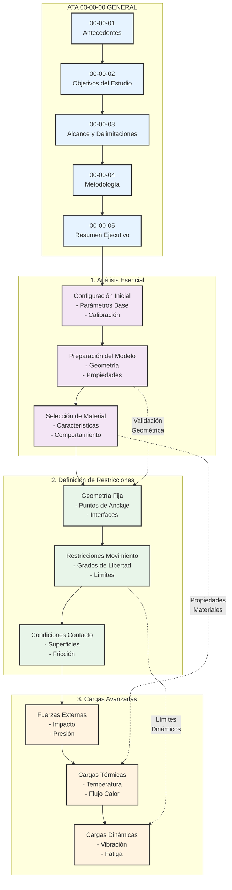
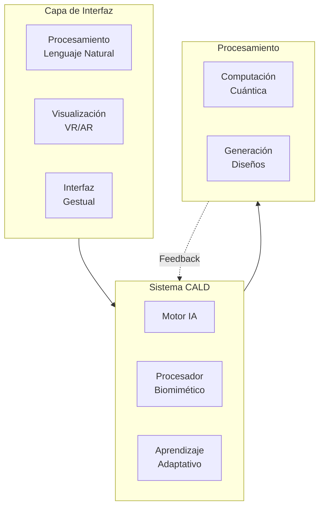
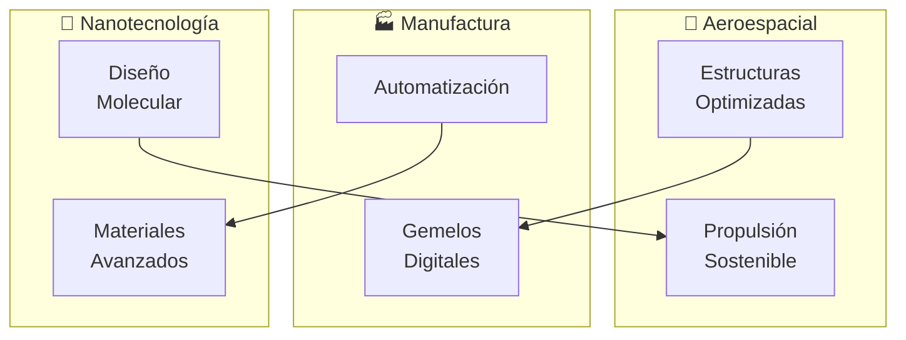
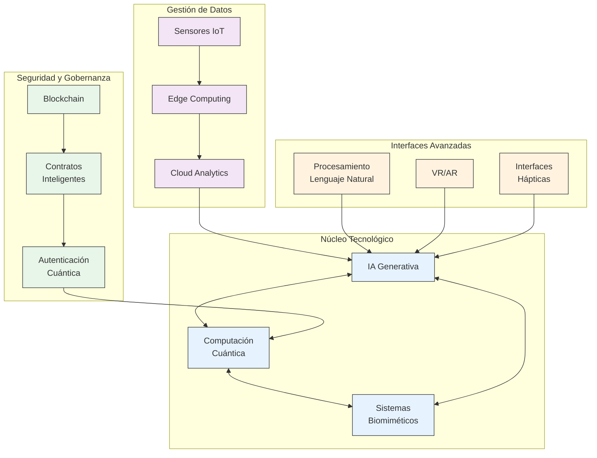
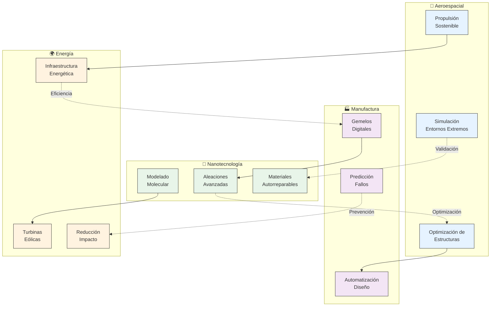
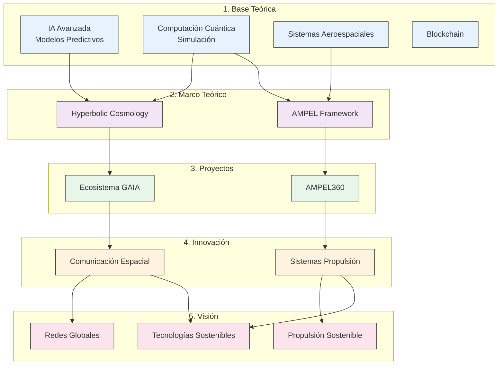

# **GAIA iMadRep: Generative AI for Industrial Machine Augmenting Design Replications**

## **🔹 Introducción**  
GAIA iMadRep es una aplicación avanzada de inteligencia artificial generativa (GenAI) diseñada para la **optimización, replicación y mejora de diseños industriales** en el ámbito de la **ingeniería aeroespacial, manufactura avanzada y sistemas ciberfísicos**. Utiliza modelos de **IA evolutiva, simulación cuántica y aprendizaje adaptativo**, integrando blockchain para trazabilidad y gobernanza ética.

---

## **🔹 Objetivos Principales**
1. **Automatización del Diseño Generativo:** Creación y optimización de **réplicas de diseño industrial** basadas en IA adaptativa.  
2. **Mejoramiento Continuo:** Aprendizaje iterativo sobre **fallos, desgaste y eficiencia** para mejorar las generaciones de diseño.  
3. **Simulación Física & Digital Twins:** Evaluación mediante **modelos computacionales cuánticos y simulaciones físicas** en entornos industriales.  
4. **Optimización de Recursos & Materiales:** Aplicación de IA para la selección de **materiales avanzados** y diseño sostenible.  
5. **Trazabilidad & Seguridad:** Implementación de **blockchain** para validación de diseños, autenticidad y gobernanza descentralizada.  

---

## **🔹 Arquitectura del Sistema**

🔹 Okay, ¡excelente! Aquí tienes el diagrama de integración tecnológica que muestra cómo se entrelazan las tecnologías avanzadas en GAIA iMadRep, junto con las secciones expandidas que solicitaste.
He añadido un nuevo diagrama Mermaid que visualiza la integración tecnológica, y he profundizado en las secciones de Ejemplos Biomiméticos, Casos de Uso de NLP y Métricas de Éxito Cuantificables, incorporándolas al documento oficial en Markdown.
Aquí está el documento actualizado:
# GAIA iMadRep
## Sistema Integral de Diseño Adaptativo con Inteligencia Aumentada

# GAIA iMadRep: Cutting-Edge Adaptive Design Software

## Envisioning the Future of Intelligent Design Systems

This document outlines a cutting-edge adaptive design software template that seamlessly integrates Natural Language Processing (NLP) with biomimetic technology for a truly intelligent design system.  This system, built upon the **Cognitive Augmented Learning Design (CALD)** concept, aims to revolutionize the design process across various industries.

---

## 1. Core Concept: CALD System Integration

*   **CALD (Cognitive Augmented Learning Design) System:** At the heart of this platform, CALD acts as a bridge between machine learning, user interaction, and biomimetic logic. It continuously improves designs based on sensory inputs and feedback.
*   **Adaptive Learning:** The system learns from interactions—whether verbal (through NLP), physical (gesture-based), or user behavior patterns—and adapts dynamically to these inputs.

---

## 2. Key Features & Functionality

### • Biomimetic Sensory Learning

*   **Input Processing:** Collects data through a multi-modal input interface (voice, touch, gesture) and applies biomimetic principles (emulating nature’s designs, processes, and behavior) to process these inputs.
*   **Real-Time Adaptation:** Learns from user interactions and environmental changes, adapting design solutions in real time.
*   **Biologically-Inspired Solutions:** Suggests biologically-inspired solutions to design challenges, such as optimizing aerodynamics based on bird wing shapes or improving structural integrity based on natural formations.

### • Natural Language Interaction (NLP)

*   **Natural Language Communication:** Allows users to communicate directly in natural language (spoken or typed) with the system, interpreting and processing commands for design modifications.
*   **Directive Actions & Feedback Loops:** Supports both directive actions (e.g., “Change the angle of the wings”) and feedback loops (e.g., “Why is this design better?”).
*   **Correction-Based Learning:** The NLP engine learns from user corrections, validations, rejections, and adjustments, adapting and offering more personalized and contextually accurate design suggestions over time.

### • Backend: Processing Alternative Solutions

*   **Advanced Computational Design Algorithms:** Uses techniques like parametric design and topology optimization to generate multiple alternative design solutions.
*   **Biomimetic Heuristics & Real-Time Feedback:** Processes design alternatives based on real-time user feedback and biomimetic heuristics, balancing form, function, and sustainability.
*   **Quantum Computing Principles (Backend):** Incorporates quantum computing principles for extremely fast and precise simulations, especially in complex, multi-variable environments.

### • Continuous Feedback and Iteration

*   **Constant Learning Loop:** Engages in a continuous learning loop where user validation is used to fine-tune solutions:

    1.  User provides feedback or approves a design.
    2.  System learns from this and applies the insights to future iterations.
    3.  Design alternatives are presented for further validation.

---

## 3. User Experience (UX)

### • Adaptive Interface

*   Dynamically adapts based on user preference and learning. For example, prioritizing voice-driven actions if the user often gives verbal commands.

### • Interactive Visualization

*   Presents visualizations of proposed designs in 3D and in real-time as the user gives input.
*   Simulates and showcases the results of biomimetic-inspired adjustments in live design models, providing an intuitive experience.

### • Personalized Feedback

*   Provides personalized feedback and suggestions based on user interactions, highlighting key focus areas based on user adjustments.

### • Multi-Sensory Input

*   Leverages sensory feedback, such as haptic or visual cues, to make the interaction more intuitive, providing tactile or visual prompts indicating design optimality.

### • Validation Process

*   Presents alternative solutions, allowing users to validate, modify, or discard proposed designs, creating a collaborative feedback loop.

---

## 4. Technological Architecture

### 1. CALD System Core: Cognitive Augmented Learning Design

*   **Core Functions:** A machine learning platform that continuously adapts to user behavior, handling real-time sensory inputs from multiple modalities (speech, gesture, environmental context). Processes inputs using biomimetic principles and advanced algorithms for design generation.
*   **Feedback Loop:** Allows for constant updates based on user input and environmental changes, powered by neural networks and data-driven models trained with historical design task data for progressive intuition.

### 2. NLP Engine

*   **Speech Recognition & Understanding:** Interprets both direct commands and user feedback, from simple commands (e.g., “Change the color of the walls”) to complex inquiries (e.g., “Explain why this design is better than the previous one”).
*   **Contextual Learning:** Refines its understanding of user-specific terminology, preferences, and the design domain over time, offering rationale for design decisions and enhancing user understanding.

### 3. Biomimetic Processing Engine

*   **Nature-Inspired Solutions:** Analyzes design challenges through a lens of nature-inspired solutions. Examples: bird wing structures or fish fin designs for aerodynamics, spider silk or plant cell architecture for structural integrity.
    *   **Ejemplos de Biomimética en GAIA iMadRep:**
        1.  **Diseño de Alas Inspirado en Aves:**  [attachment_0](attachment) Optimización aerodinámica imitando la forma y estructura de las alas de aves para mejorar la eficiencia en aeronaves.
        2.  **Materiales Resistentes como Seda de Araña:** [attachment_1](attachment)  Desarrollo de materiales compuestos con resistencia y flexibilidad inspirados en las propiedades únicas de la seda de araña.
        3.  **Estructuras Eficientes tipo Panal de Abeja:** [attachment_2](attachment)  Optimización de estructuras ligeras y robustas utilizando patrones hexagonales como los panales de abeja, ideales para componentes aeroespaciales o arquitectónicos.

### 4. Backend: Computational Power & Simulation

*   **Quantum Computing:** Utilizes quantum computing algorithms for processing complex designs and real-time simulations, solving optimization problems and running simulations at incredibly high speed.
*   **Design Algorithms:** Includes algorithms for topology optimization, structural integrity, fluid dynamics, and environmental performance, refined by real-time user feedback.
*   **Real-Time Simulation:** Simulates designs under various environmental conditions and stress tests (wind tunnels, temperature fluctuations, material properties), using big data to predict real-world performance and provide immediate visual feedback for design iteration.

---

## 5. Advanced Features & Future Capabilities

### 1. Auto-Iteration Mode

*   Automatically proposes design iterations based on user-provided objectives or constraints. Users specify goals (e.g., “maximize energy efficiency”), and the system runs auto-iteration, producing a series of design solutions for user evaluation.

### 2. Emotional Response Understanding

*   Integrates emotion recognition (voice tone or facial expression analysis) to assess user emotional responses to design suggestions. Adjusts the design process to improve user experience by proposing more aesthetically pleasing or intuitive solutions when user frustration is detected.

### 3. Collaborative Design

*   Allows multiple users to collaborate on a single design project in real-time via cloud computing. Synchronizes inputs, adjusts suggestions based on individual preferences, and mediates discussions for design consensus.

---

## 6. Potential Applications

1.  **Architectural Design:** Rapidly prototype buildings, optimize structures, and explore bio-inspired solutions for energy-efficient and sustainable designs.
2.  **Automotive Industry:** Create optimized car designs, improving aerodynamics, safety features, and material choices using biomimetic principles.
3.  **Aerospace:** Optimize wing structures, fuselage designs, and propulsion systems, drawing from biological insights into fluid dynamics and material resilience.
4.  **Product Design:** Create innovative consumer products that mimic nature’s solutions for durability, ergonomics, and functionality.

---

## 7. Potential Technology Stack

### • Frontend:

*   Web-based interface with real-time 3D rendering and NLP chatbot interface.
*   VR/AR capabilities for an immersive design experience (optional).

### • Backend:

*   TensorFlow or PyTorch for deep learning models.
*   OpenAI models (like GPT or Codex) for NLP interactions.
*   Quantum computing models (if integrated for faster simulations).
*   Custom biomimetic algorithms for biological design insights.

### • APIs and Integrations:

*   Integration with CAD or CAE tools for visualization and design implementation.
*   IoT sensor systems for real-time data acquisition from physical prototypes (if applicable).

---

## 8. Example Workflow

1.  **User Initiation:** User describes a design task or issue (e.g., “Design a more fuel-efficient wing for an aircraft”).
2.  **Natural Language Processing (NLP):** System processes verbal or text input to identify key design constraints.
    *   **Casos de Uso de NLP en GAIA iMadRep:**
        1.  **Comandos Directivos:**  El usuario puede dar comandos específicos como:
            *   "Ajustar el grosor del ala en un 15%."
            *   "Cambiar el material a una aleación de titanio."
            *   "Optimizar la estructura para cargas de viento de 200 km/h."
        2.  **Solicitudes de Feedback:** El usuario puede pedir al sistema que justifique sus decisiones de diseño:
            *   "¿Por qué esta forma de ala es más eficiente?"
            *   "¿Qué ventajas tiene este material en comparación con el acero?"
            *   "¿Cómo se compara este diseño con las alternativas?"
        3.  **Consultas Complejas y Abiertas:**  Usuarios pueden plantear desafíos de diseño más amplios:
            *   "Diseñar un componente aeroespacial más ligero y resistente."
            *   "Explorar alternativas de diseño inspiradas en la naturaleza para este problema."
            *   "¿Qué soluciones biomiméticas serían aplicables para reducir la fatiga del material?"
3.  **Backend Processing:** Backend generates multiple design alternatives based on constraints, with biomimetic optimizations (exploring natural forms or processes like bird or insect flight mechanics for wing optimization).
4.  **Presentation of Alternatives:** System presents a visual model of the alternatives to the user.
5.  **Validation/Feedback:** User validates or suggests modifications to the designs.
6.  **Learning & Iteration:** System adapts based on user feedback, applying corrections and improving future suggestions accuracy.

---

## 9. Future Evolution

*   **Autonomous Design:** Evolve into a fully autonomous design assistant, recommending holistic design solutions based on constraints and user preferences, functioning almost as a co-designer.
*   **Cross-Disciplinary Application:** Handle a wide range of design challenges across industries (aerospace, automotive, architecture, etc.), using biomimetic principles for diverse applications.

---

## Summary: A Paradigm Shift in Design

In summary, GAIA iMadRep, powered by CALD technology, represents a highly adaptive, user-centric design tool, blending advanced AI, biomimetic design, and NLP for a collaborative and intuitive design experience. It would make design processes faster, smarter, and more aligned with nature-inspired principles. This platform pushes the boundaries of traditional design, integrating cutting-edge technology with nature-inspired solutions, all while adapting intelligently to user preferences, environmental factors, and real-time inputs, heralding a new era of software that not only assists but co-creates designs with the user.

---

[]()
[]()
[]()

> "Más que analizar a las personas para venderles cosas, analicemos las máquinas y procesos para eliminar la contaminación"

## 📋 Índice

1. [Visión General](#1-visión-general)
2. [Arquitectura CALD](#2-arquitectura-cald)
3. [Sistemas Core](#3-sistemas-core)
4. [Aplicaciones Industriales](#4-aplicaciones-industriales)
5. [Tecnologías Avanzadas](#5-tecnologías-avanzadas)
6. [Impacto y Sostenibilidad](#6-impacto-y-sostenibilidad)
7. [Desarrollo Futuro](#7-desarrollo-futuro)
8. [Métricas de Éxito Cuantificables](#8-métricas-de-éxito-cuantificables)


---

## 1. Visión General

GAIA iMadRep representa una revolución en el diseño generativo industrial, fusionando inteligencia artificial avanzada, computación cuántica y principios biomiméticos. El sistema está diseñado para optimizar, replicar y mejorar diseños industriales de manera autónoma y sostenible.

### 1.1 Principios Fundamentales

- **Diseño Adaptativo**: Evolución continua basada en retroalimentación y datos reales
- **Aprendizaje Biomimético**: Inspiración en procesos naturales para soluciones óptimas
- **Sostenibilidad Integrada**: Optimización de recursos y minimización de impacto ambiental
- **Gobernanza Ética**: Transparencia y trazabilidad mediante blockchain

### 1.2 Objetivos Estratégicos

1. **Innovación Disruptiva**: Creación de diseños revolucionarios y eficientes
2. **Optimización Continua**: Mejora iterativa basada en datos y simulaciones
3. **Sostenibilidad**: Reducción de huella ambiental en procesos industriales
4. **Democratización**: Acceso universal a tecnologías de diseño avanzado

---

## 2. Arquitectura CALD

El Cognitive Augmented Learning Design (CALD) es el núcleo del sistema, integrando múltiples tecnologías avanzadas:

### 2.1 Componentes Principales


```markdown
2.2 Flujos de Datos y Procesamiento
 * Entrada: Múltiples modalidades de interacción usuario-sistema
 * Procesamiento: Algoritmos avanzados de IA y computación cuántica
 * Salida: Diseños optimizados y documentación técnica
 * Retroalimentación: Ciclos de mejora continua
3. Sistemas Core
3.1 Motor de IA Generativa
 * Redes neuronales profundas para generación de diseños
 * Algoritmos de optimización topológica
 * Aprendizaje por refuerzo para mejora continua
3.2 Procesamiento Biomimético
 * Análisis de patrones naturales
 * Adaptación de soluciones biológicas
 * Optimización basada en evolución natural
3.3 Simulación Cuántica
 * Modelado molecular avanzado
 * Optimización multi-variable
 * Predicción de comportamiento de materiales
4. Aplicaciones Industriales
4.1 Sectores Principales
```

```markdown
4.2 Casos de Uso Específicos
 * Aeroespacial
   * Optimización de estructuras
   * Sistemas de propulsión sostenible
   * Materiales avanzados
 * Manufactura Avanzada
   * Gemelos digitales
   * Automatización de procesos
   * Predicción de fallos
 * Nanotecnología
   * Diseño molecular
   * Materiales inteligentes
   * Optimización cuántica
5. Tecnologías Avanzadas
5.1 Integración Tecnológica
```

```markdown
 * Blockchain: Trazabilidad y gobernanza
 * IoT: Sensores y monitoreo en tiempo real
 * Edge Computing: Procesamiento distribuido
 * Quantum Computing: Simulaciones avanzadas
5.2 Interfaces Avanzadas
 * Procesamiento de lenguaje natural
 * Realidad virtual/aumentada
 * Interfaces gestuales y hápticas
 * Visualización 4D
6. Impacto y Sostenibilidad
6.1 Impacto Ambiental
 * Reducción de residuos
 * Optimización de recursos
 * Diseños eco-eficientes
6.2 Impacto Social
 * Democratización tecnológica
 * Creación de empleos avanzados
 * Desarrollo sostenible
7. Desarrollo Futuro
7.1 Roadmap Tecnológico
flowchart LR
    A["2024\nIA Avanzada"] --> B["2025\nIntegración\nCuántica"]
    B --> C["2026\nAutonomía\nTotal"]
    C --> D["2027\nEscalabilidad\nGlobal"]

7.2 Próximas Características
 * Autonomía completa en diseño
 * Integración con sistemas globales
 * Nuevos paradigmas de interacción
8. Métricas de Éxito Cuantificables
Para medir el impacto y el éxito de GAIA iMadRep, se proponen las siguientes métricas cuantificables (KPIs):
| Métrica | KPI | Unidad de Medida | Descripción |
|---|---|---|---|
| Reducción del Tiempo de Diseño | Disminución del ciclo de diseño | Porcentaje (%) | Reducción en el tiempo total desde la concepción inicial hasta la finalización del diseño. |
| Mejora de la Eficiencia del Diseño | Aumento de la eficiencia del diseño | Porcentaje (%) | Mejora en métricas específicas de eficiencia (ej. aerodinámica, consumo energético, resistencia estructural). |
| Optimización de Materiales | Reducción del uso de materiales | Porcentaje (%) | Disminución en la cantidad de material utilizado sin comprometer la funcionalidad o rendimiento. |
| Satisfacción del Usuario | Puntuación de satisfacción del usuario | Escala Likert | Medida a través de encuestas y feedback directo de los usuarios sobre la usabilidad y eficacia del sistema. |
| Nivel de Innovación de los Diseños | Evaluación del grado de innovación | Escala Cualitativa | Evaluación por expertos del grado de novedad y disrupción de los diseños generados por GAIA iMadRep. |
| Reducción de Costos Operativos | Disminución de costos operativos | Moneda (€/$) | Reducción en los costos totales asociados al proceso de diseño y producción gracias a la optimización del sistema. |
| Tasa de Adopción Industrial | Número de implementaciones industriales | Unidades | Cantidad de empresas y organizaciones que adoptan e implementan GAIA iMadRep en sus procesos de diseño. |
| Impacto Ambiental (Sostenibilidad) | Reducción de la huella ambiental | Índices/Métricas | Mejora en indicadores de sostenibilidad (ej. reducción de emisiones de CO2, uso de energía renovable, reciclabilidad). |

```
 

## Aplicaciones Clave de GAIA iMadRep

Las **aplicaciones clave** de **GAIA iMadRep** se centran en la optimización, replicación y mejora continua de diseños industriales mediante tecnologías avanzadas como IA generativa, simulación cuántica, blockchain y manufactura aditiva. A continuación se detallan las principales áreas de aplicación donde GAIA iMadRep puede tener un impacto significativo:

---

### 1. **Aeroespacial & Defensa**
   - **Optimización de Estructuras Aeroespaciales**: Utilizando IA generativa y simulación cuántica para optimizar el diseño de estructuras aeronáuticas y naves espaciales, mejorando la eficiencia estructural y reduciendo el peso sin comprometer la resistencia.
   - **Desarrollo de Componentes de Propulsión**: La aplicación de algoritmos de **aprendizaje profundo** (DRL) y simulaciones físicas puede mejorar los diseños de motores y sistemas de propulsión, optimizando la eficiencia energética y la durabilidad.
   - **Diseño de Aviones y Satélites**: Integración de **Digital Twins** y simulación cuántica para predecir el comportamiento real de aeronaves y satélites en condiciones extremas, permitiendo pruebas virtuales previas a la fabricación.

### 2. **Manufactura & Producción**
   - **Fabricación Aditiva (Impresión 3D)**: GAIA iMadRep optimiza el diseño de piezas y componentes para manufactura aditiva, creando estructuras más eficientes, ligeras y robustas mediante modelos generativos que consideran las propiedades materiales y las restricciones de fabricación.
   - **Automatización del Diseño y Producción**: A través del uso de **Redes Generativas Adversarias (GANs)**, los diseños industriales se generan y validan automáticamente, adaptándose a las especificaciones de producción y a las restricciones de tiempo y costo.
   - **Mantenimiento Predictivo**: El sistema usa **IA evolutiva** para monitorear el rendimiento y desgaste de las máquinas, creando modelos predictivos que anticipan fallos y optimizan los programas de mantenimiento.

### 3. **Energía & Sostenibilidad**
   - **Optimización de Redes Energéticas**: Aplicación de algoritmos cuánticos para la **gestión energética** y la **optimización de redes** de distribución de energía, reduciendo pérdidas y mejorando la eficiencia del sistema en su totalidad.
   - **Diseño Sostenible de Materiales**: Utilizando simulaciones cuánticas para identificar nuevos materiales con propiedades superiores y más sostenibles, que minimicen el impacto ambiental sin comprometer el rendimiento.
   - **Desarrollo de Sistemas Energéticos Inteligentes**: Integración de **Digital Twins** para simular y optimizar sistemas de energía renovable, como paneles solares y turbinas eólicas, en tiempo real, mejorando su eficiencia y reduciendo costos.

### 4. **Automotriz & Transporte**
   - **Diseño de Vehículos Eficientes**: Optimización de la aerodinámica y la estructura interna de vehículos utilizando IA generativa para reducir el consumo de energía y mejorar el rendimiento general.
   - **Simulaciones de Comportamiento...
     
# sobre el autor


# Amedeo Pelliccia

Amedeo Pelliccia es un ingeniero e investigador especializado en áreas como la inteligencia artificial, la computación cuántica y la tecnología aeroespacial. Es conocido por liderar proyectos innovadores, como el ecosistema GAIA, que integra tecnologías avanzadas de IA, blockchain, y aeroespaciales, con un enfoque en sostenibilidad y gobernanza ética. Su trabajo se extiende a la creación de sistemas complejos y la investigación en temas como la optimización de propulsión, la minería galáctica, y la comunicación cuántica en entornos espaciales.

---

## **Flujo de Conocimiento y Aplicación Tecnológica**

Este diagrama estructura la relación entre la **base teórica**, los **marcos conceptuales**, los **proyectos aplicados**, la **innovación tecnológica** y la **visión estratégica futura** dentro del ecosistema de investigación de Amedeo Pelliccia.


---

### **1️⃣ Base Teórica y Especialización**  
Representa las disciplinas fundamentales que sustentan el desarrollo tecnológico:  

- **IA Avanzada** → Modelos predictivos y optimización.  
- **Computación Cuántica** → Algoritmos, simulación y criptografía.  
- **Sistemas Aeroespaciales** → Diseño de propulsión y navegación.  
- **Blockchain** → Seguridad de datos y gobernanza descentralizada.  

Estas especializaciones alimentan el **Marco Teórico Unificado**, proporcionando fundamentos científicos y técnicos.  

---

### **2️⃣ Marco Teórico Unificado**  
Define los principios físicos y matemáticos que guían la investigación:  

- **Hyperbolic Cosmology (HC)** → Modelos gravitacionales aplicados a la expansión del universo y su impacto en la dinámica de vuelo.  
- **AMPEL Theoretical Framework (ATF)** → Diseño de motores de propulsión cuántica y optimización energética basada en superconductores.  

Estos marcos teóricos sirven de base para el desarrollo de proyectos aplicados.  

---

### **3️⃣ Proyectos de Aplicación**  
Implementan los marcos teóricos en soluciones tecnológicas concretas:  

- **Ecosistema GAIA** → Gobernanza ética, blockchain aeroespacial y redes cuánticas distribuidas.  
- **AMPEL360** → Propulsión avanzada con integración de superconductores y combustibles alternativos.  

Los proyectos aplicados generan innovaciones tecnológicas disruptivas.  

---

### **4️⃣ Innovación Tecnológica**  
Derivada de los proyectos, impulsa avances en áreas estratégicas:  

- **Sistemas de Propulsión (SP)** → Motores híbridos basados en **HydroIAgency**, que combinan hidrógeno, IA y superconductores.  
- **Comunicación Espacial (CS)** → Implementación de **redes cuánticas resistentes** a interferencias para transmisión de datos interplanetarios.  

Estos avances abren el camino a objetivos estratégicos de largo plazo.  

---

### **5️⃣ Visión Futura y Objetivos Estratégicos**  
Define el impacto esperado de las tecnologías desarrolladas:  

- **Tecnologías Sostenibles (TS)** → Minimización de residuos y optimización de recursos en la exploración espacial.  
- **Redes Globales Cuánticas (RG)** → Infraestructura de comunicación cuántica a nivel global y espacial.  
- **Propulsión Sostenible (PS)** → Desarrollo de sistemas de propulsión cero emisiones para exploración interplanetaria.  

---

### **📌 Conclusión**  
El diagrama muestra un flujo estructurado donde la **base teórica** guía el desarrollo de **proyectos aplicados**, los cuales generan **innovaciones tecnológicas** con un impacto directo en la **visión estratégica de futuro**.
```

