### GP-AM-EDR-37-004-TSHOOT-A: Troubleshooting Guide

## Table of Contents

- [1. Diagnostic Procedures and Error Code Interpretation](#1-diagnostic-procedures-and-error-code-interpretation)

- [1.1 System Error Codes](#11-system-error-codes)
- [1.2 Subsystem-Specific Error Codes](#12-subsystem-specific-error-codes)
- [1.3 Diagnostic Procedures](#13-diagnostic-procedures)

- [2. Decision Trees for Common Failure Scenarios](#2-decision-trees-for-common-failure-scenarios)

- [2.1 Cooling System Failures](#21-cooling-system-failures)
- [2.2 QPU Performance Issues](#22-qpu-performance-issues)
- [2.3 Radiation Sensor Malfunctions](#23-radiation-sensor-malfunctions)
- [2.4 Debris Detection System Failures](#24-debris-detection-system-failures)
- [2.5 Network and Communication Issues](#25-network-and-communication-issues)
- [2.6 Power System Failures](#26-power-system-failures)

- [3. Advanced Diagnostic Tools and Techniques](#3-advanced-diagnostic-tools-and-techniques)

- [3.1 Specialized Diagnostic Equipment](#31-specialized-diagnostic-equipment)
- [3.2 Software Diagnostic Tools](#32-software-diagnostic-tools)
- [3.3 Advanced Troubleshooting Techniques](#33-advanced-troubleshooting-techniques)
- [3.4 Remote Diagnostics](#34-remote-diagnostics)

---

## 1. Diagnostic Procedures and Error Code Interpretation

### 1.1 System Error Codes

The Space Environment Monitoring System uses a standardized error code format to facilitate rapid diagnosis and resolution of issues. Each error code follows the structure:

**[Subsystem]-[Severity]-[Component]-[Specific Error]**

#### 1.1.1 Subsystem Identifiers

| Code | Subsystem | Description
|-----|-----|-----
| SYS | System | Overall system-level errors
| QPU | Quantum Processing Unit | Errors related to the quantum processor
| RAD | Radiation Sensors | Errors from radiation detection subsystem
| DEB | Debris Detection | Errors from debris detection subsystem
| PWR | Power Systems | Power-related errors
| NET | Network | Communication and network errors
| CRY | Cryogenics | Cooling system errors
| SEC | Security | Security and access control errors
| INF | INFRANET | INFRANET interface errors

#### 1.1.2 Severity Levels

| Code | Severity | Description | Response Time
|-----|-----|-----
| CRT | Critical | System operation compromised, immediate action required | Immediate
| MAJ | Major | Significant impact on functionality, prompt action required | < 1 hour
| MIN | Minor | Limited impact, scheduled maintenance acceptable | < 24 hours
| WRN | Warning | Potential issue detected, monitoring required | Next scheduled maintenance
| INF | Informational | Status information, no action required | None

#### 1.1.3 Common System Error Codes

| Error Code | Description | Initial Response
|-----|-----|-----
| SYS-CRT-INIT-001 | System initialization failure | Verify power, check system logs, attempt restart
| SYS-CRT-COMM-001 | Critical communication failure between subsystems | Check network connections, verify subsystem power
| SYS-MAJ-SYNC-001 | Time synchronization error | Check NTP server connection, verify system time
| SYS-MAJ-STOR-001 | Storage subsystem approaching capacity | Archive data, verify backup systems
| SYS-MIN-PERF-001 | System performance degradation | Check resource utilization, verify cooling
| SYS-WRN-SEC-001 | Security certificate expiration approaching | Schedule certificate renewal
| SYS-INF-MAINT-001 | Scheduled maintenance reminder | Acknowledge and schedule maintenance

### 1.2 Subsystem-Specific Error Codes

#### 1.2.1 QPU Error Codes

| Error Code | Description | Initial Response
|-----|-----|-----
| QPU-CRT-TEMP-001 | QPU temperature out of range (high) | Verify cooling system operation, check for obstructions
| QPU-CRT-TEMP-002 | QPU temperature out of range (low) | Check cryogenic system, verify temperature sensors
| QPU-CRT-COHR-001 | Qubit coherence below threshold | Verify shielding, check for interference sources
| QPU-MAJ-GATE-001 | Gate fidelity below threshold | Run calibration procedure CAL-QPU-001
| QPU-MAJ-CTRL-001 | Control line signal integrity issue | Check connections, verify signal generator
| QPU-MIN-RDOUT-001 | Readout fidelity degradation | Run readout calibration procedure
| QPU-WRN-DRFT-001 | Frequency drift detected | Monitor drift, schedule calibration if persistent

#### 1.2.2 Radiation Sensor Error Codes

| Error Code | Description | Initial Response
|-----|-----|-----
| RAD-CRT-DET-001 | Detector failure | Check power to detector, verify connections
| RAD-CRT-HV-001 | High voltage supply failure | Verify power supply, check for shorts
| RAD-MAJ-CAL-001 | Calibration drift detected | Run calibration procedure CAL-RAD-002
| RAD-MAJ-BKGD-001 | Abnormal background levels | Verify shielding, check for contamination
| RAD-MIN-TEMP-001 | Detector temperature out of range | Check cooling, verify temperature sensors
| RAD-WRN-NOISE-001 | Increased noise levels | Check grounding, verify signal connections
| RAD-INF-STAT-001 | Detector status report | Review status information

#### 1.2.3 Debris Detection Error Codes

| Error Code | Description | Initial Response
|-----|-----|-----
| DEB-CRT-LASER-001 | Laser failure | Check power to laser, verify cooling
| DEB-CRT-OPT-001 | Optical path obstruction | Inspect and clean optical surfaces
| DEB-MAJ-ALIGN-001 | Alignment error | Run alignment procedure
| DEB-MAJ-SENS-001 | Sensor array failure | Check connections, verify power
| DEB-MIN-CAL-001 | Range calibration drift | Run calibration procedure CAL-DEB-002
| DEB-WRN-TEMP-001 | System temperature out of range | Check environmental controls
| DEB-INF-STAT-001 | Detection system status report | Review status information

#### 1.2.4 Cryogenic System Error Codes

| Error Code | Description | Initial Response
|-----|-----|-----
| CRY-CRT-COMP-001 | Compressor failure | Check power, verify cooling water
| CRY-CRT-PRESS-001 | System pressure out of range (high) | Check for blockages, verify pressure relief valve
| CRY-CRT-PRESS-002 | System pressure out of range (low) | Check for leaks, verify compressor operation
| CRY-MAJ-FLOW-001 | Coolant flow restriction | Check filters, verify valve positions
| CRY-MAJ-TEMP-001 | Heat exchanger performance degradation | Check for fouling, verify cooling water
| CRY-MIN-VIBR-001 | Excessive vibration detected | Check mounting, verify balance
| CRY-WRN-LEAK-001 | Potential leak detected | Perform leak check procedure

#### 1.2.5 Power System Error Codes

| Error Code | Description | Initial Response
|-----|-----|-----
| PWR-CRT-MAIN-001 | Main power failure | Verify external power, check transfer switch
| PWR-CRT-UPS-001 | UPS failure | Check UPS status, verify battery condition
| PWR-MAJ-DIST-001 | Power distribution unit failure | Check circuit breakers, verify connections
| PWR-MAJ-QUAL-001 | Power quality issue detected | Check for harmonics, verify grounding
| PWR-MIN-BAT-001 | UPS battery capacity degradation | Test battery, schedule replacement if needed
| PWR-WRN-LOAD-001 | High load condition | Check load distribution, verify cooling
| PWR-INF-STAT-001 | Power system status report | Review status information

#### 1.2.6 Network Error Codes

| Error Code | Description | Initial Response
|-----|-----|-----
| NET-CRT-CONN-001 | Critical network connection failure | Check physical connections, verify switch operation
| NET-CRT-SEC-001 | Security breach detected | Isolate affected systems, initiate security protocol
| NET-MAJ-BW-001 | Bandwidth saturation | Identify traffic source, implement traffic shaping
| NET-MAJ-LAT-001 | High latency detected | Check for network congestion, verify routing
| NET-MIN-PKT-001 | Packet loss detected | Check for interference, verify cable integrity
| NET-WRN-CERT-001 | Certificate expiration approaching | Schedule certificate renewal
| NET-INF-STAT-001 | Network status report | Review status information

### 1.3 Diagnostic Procedures

#### 1.3.1 General Diagnostic Approach

1. **Identify the Error**

1. Record the complete error code and any associated messages
2. Note the time and conditions when the error occurred
3. Check if multiple errors occurred simultaneously

2. **Assess Severity and Impact**

1. Determine if immediate action is required
2. Identify affected subsystems and functionality
3. Evaluate safety implications

3. **Gather Information**

1. Review system logs for related events
2. Check environmental conditions (temperature, humidity)
3. Verify recent maintenance or configuration changes

4. **Isolate the Issue**

1. Determine if the issue is hardware or software related
2. Identify specific component or subsystem
3. Test related components to narrow down the cause

5. **Implement Solution**

1. Follow appropriate decision tree (Section 2)
2. Refer to maintenance procedures if needed
3. Document all actions taken

6. **Verify Resolution**

1. Confirm error condition is cleared
2. Verify system operation is restored
3. Monitor for recurrence

#### 1.3.2 System Log Analysis

The system maintains comprehensive logs that can be accessed through the System Management Console. To access and analyze logs:

1. Log in to the System Management Console with appropriate credentials
2. Navigate to "Diagnostics" → "System Logs"
3. Select the relevant time period
4. Filter logs by subsystem, severity, or error code
5. Look for patterns or sequences of events
6. Export logs if needed for further analysis

Key log files and their contents:

| Log File | Location | Contents
|-----|-----|-----
| system.log | /var/log/sems/ | Overall system events
| qpu.log | /var/log/sems/qpu/ | QPU-specific events and performance metrics
| rad.log | /var/log/sems/rad/ | Radiation sensor events and measurements
| deb.log | /var/log/sems/deb/ | Debris detection events and measurements
| cryo.log | /var/log/sems/cryo/ | Cryogenic system performance and events
| power.log | /var/log/sems/power/ | Power system events and measurements
| network.log | /var/log/sems/network/ | Network and communication events
| security.log | /var/log/sems/security/ | Security-related events and access attempts

#### 1.3.3 Diagnostic Mode Operation

The system can be placed in Diagnostic Mode for comprehensive testing without affecting normal operations:

1. Log in to the System Management Console with administrator credentials
2. Navigate to "System Control" → "Operation Mode"
3. Select "Diagnostic Mode" and confirm
4. Select the subsystem to diagnose or "Full System"
5. Choose the diagnostic level:

1. Level 1: Basic connectivity and functionality tests
2. Level 2: Comprehensive component testing
3. Level 3: Deep diagnostic with performance analysis

6. Initiate diagnostic and monitor progress
7. Review diagnostic report upon completion
8. Return system to normal operation mode when complete

> **CAUTION**: Level 3 diagnostics may temporarily take components offline during testing. Schedule accordingly.

---

## 2. Decision Trees for Common Failure Scenarios

### 2.1 Cooling System Failures

#### 2.1.1 QPU Temperature Out of Range (High)

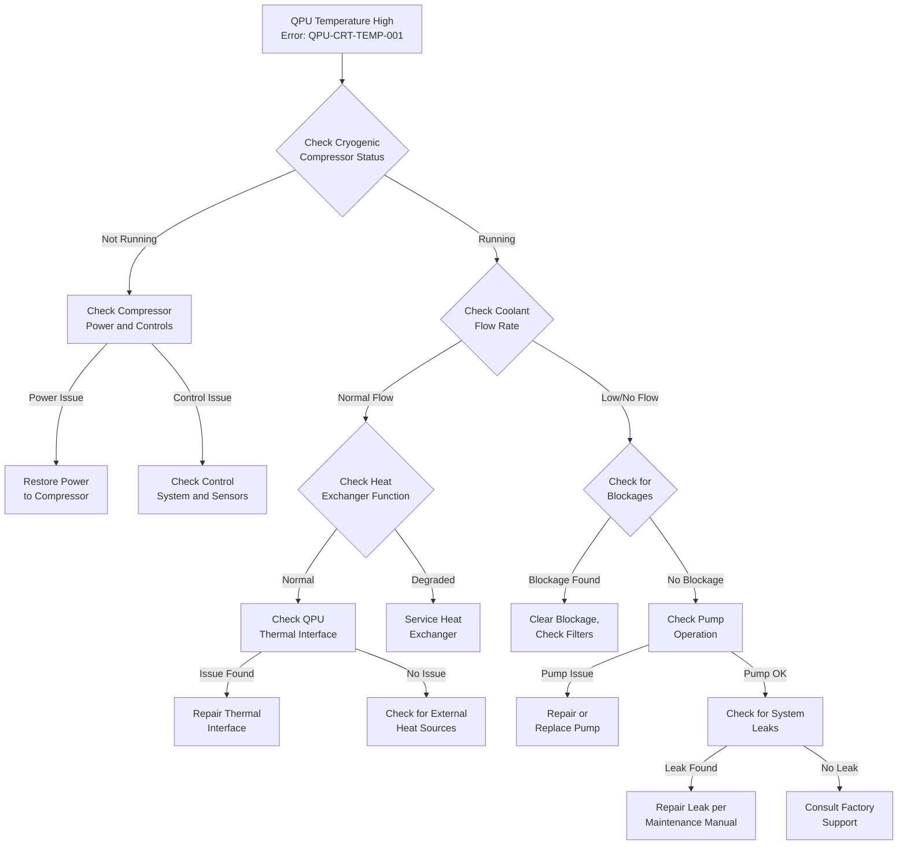

#### 2.1.2 Cryogenic System Pressure Out of Range

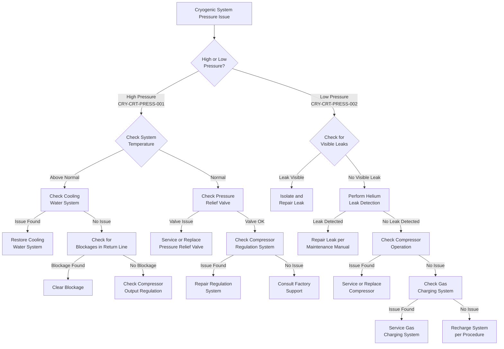

### 2.2 QPU Performance Issues

#### 2.2.1 Qubit Coherence Below Threshold

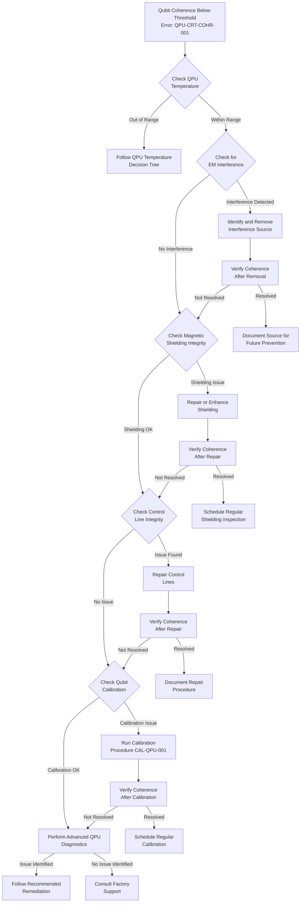

#### 2.2.2 Gate Fidelity Below Threshold

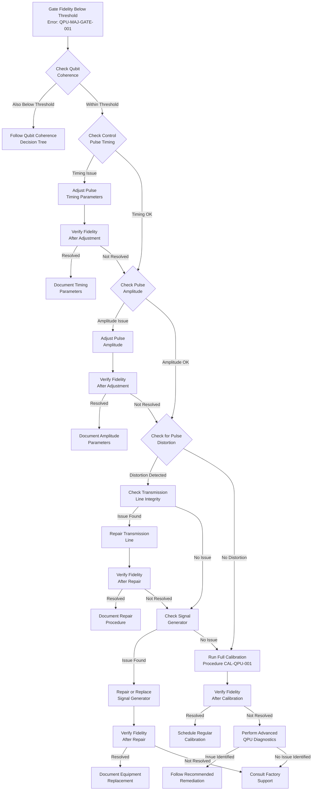

### 2.3 Radiation Sensor Malfunctions

#### 2.3.1 Detector Failure

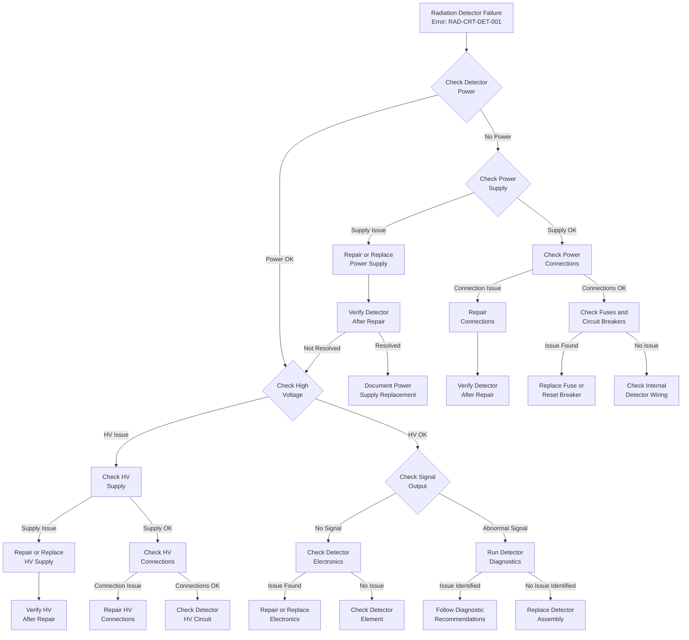

#### 2.3.2 Calibration Drift Detected

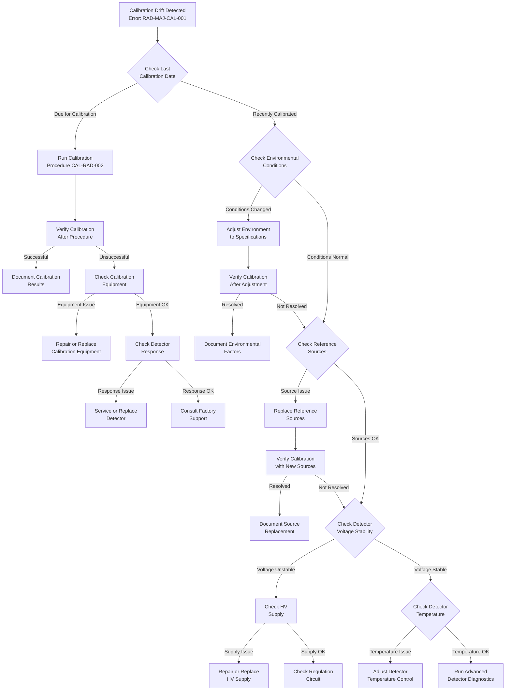

### 2.4 Debris Detection System Failures

#### 2.4.1 Laser Failure

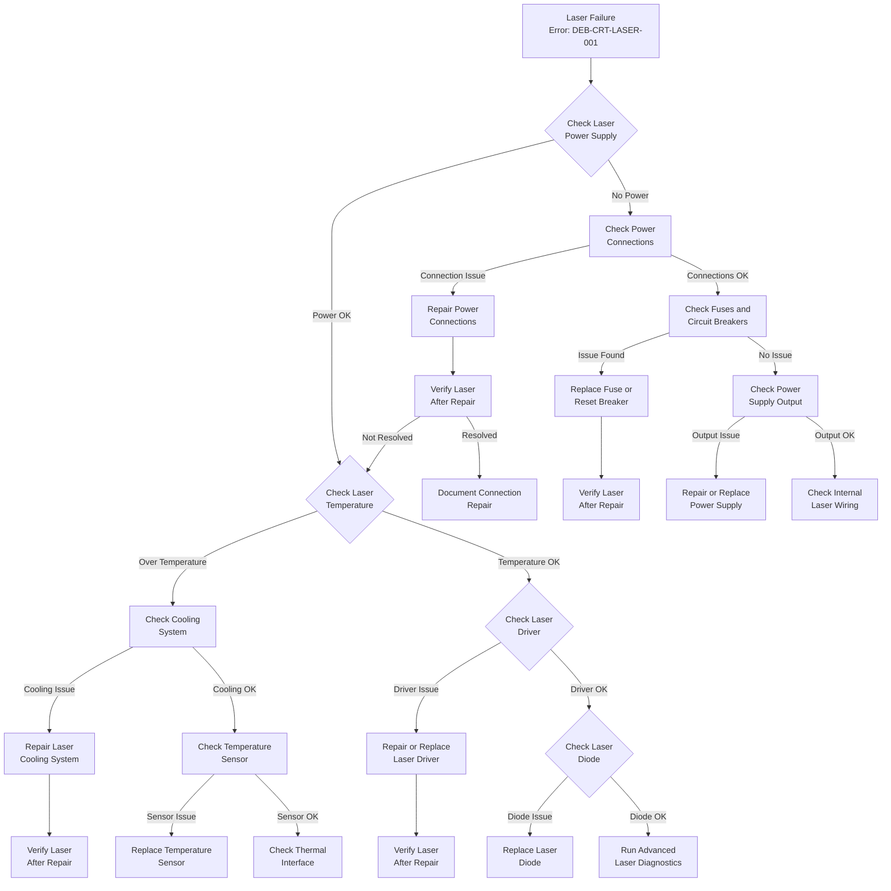

#### 2.4.2 Optical Path Obstruction

### 2.5 Network and Communication Issues

#### 2.5.1 Critical Network Connection Failure

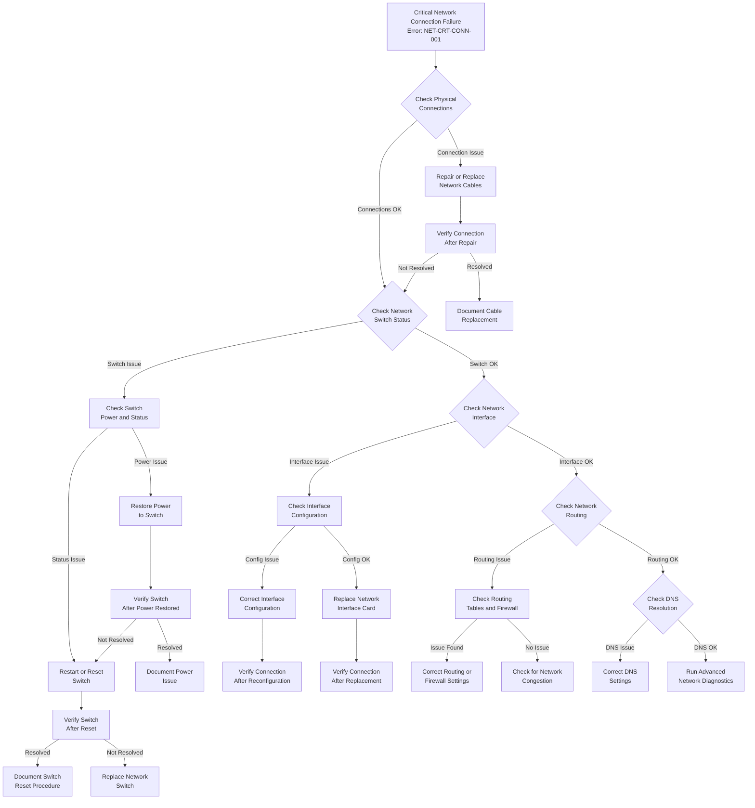

#### 2.5.2 High Latency Detected

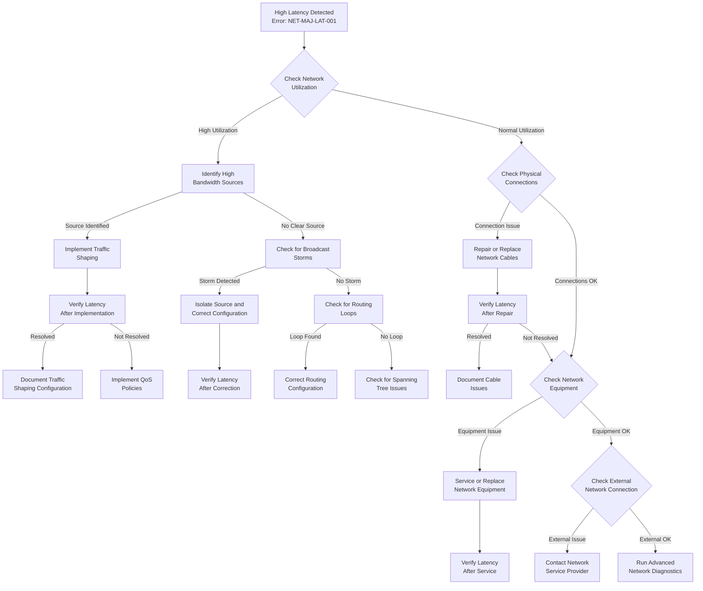

### 2.6 Power System Failures

#### 2.6.1 Main Power Failure

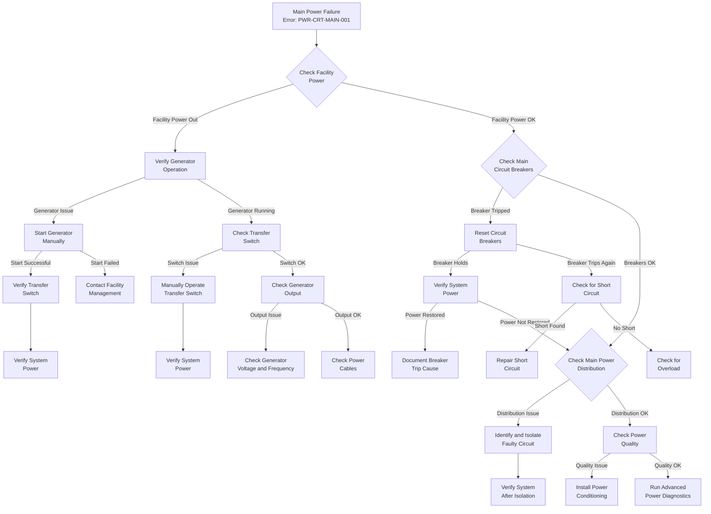

#### 2.6.2 UPS Failure

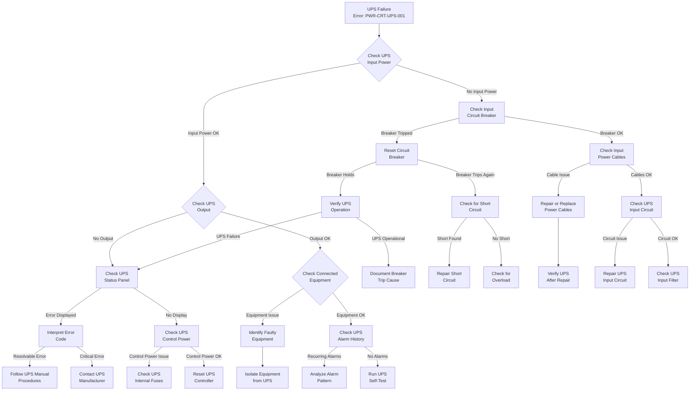

---

### 3. Advanced Diagnostic Tools and Techniques  
#### 3.1 Specialized Diagnostic Equipment

---

#### 3.1.1 Quantum System Analyzers

| Equipment                  | Model     | Application                          | Capabilities                                                                                                                                     |
|---------------------------|-----------|--------------------------------------|--------------------------------------------------------------------------------------------------------------------------------------------------|
| Quantum State Analyzer     | QSA-5000  | QPU coherence and gate fidelity testing | - Measures qubit coherence time - Analyzes gate fidelity - Performs randomized benchmarking - Quantum process tomography                |
| Microwave Network Analyzer | MNA-8200  | Control line characterization         | - 10 MHz to 20 GHz frequency range - Time and frequency domain analysis - S-parameter measurements - Pulse distortion analysis         |
| Quantum Control Validator  | QCV-3100  | Control signal verification           | - Waveform analysis - Timing jitter measurement - Cross-talk quantification - Pulse sequence validation                                |
| Cryogenic Probe Station    | CPS-420   | In-situ component testing             | - 4K to 300K temperature range - RF to DC measurements - 4-point probe capability - Magnetic field application                         |

---

#### 3.1.2 Radiation Detection Analyzers

| Equipment              | Model     | Application                | Capabilities                                                                                      |
|------------------------|-----------|----------------------------|---------------------------------------------------------------------------------------------------|
| Multi-Channel Analyzer | MCA-2048  | Radiation spectrum analysis | - 2048 channel resolution - Energy calibration - Peak identification - Isotope identification |
| Pulse Shape Analyzer   | PSA-700   | Detector signal analysis    | - Pulse height analysis - Rise time measurement - Pulse shape discrimination - Coincidence timing |
| High Voltage Analyzer  | HVA-5000  | Detector bias supply testing | - 0-5000V range - Ripple measurement - Load regulation testing - Transient response analysis |
| Radiation Source Set   | RSS-CAL-1 | Detector calibration        | - Certified calibration sources - Multiple energies - Known activities - Shielded storage container |

---

#### 3.1.3 Optical and Laser Diagnostic Equipment

| Equipment                  | Model     | Application                | Capabilities                                                                                       |
|---------------------------|-----------|----------------------------|----------------------------------------------------------------------------------------------------|
| Laser Power Meter         | LPM-500   | Laser output verification   | - 0.1 mW to 500W range - Wavelength correction - Pulsed and CW measurement - Beam profile analysis |
| Optical Spectrum Analyzer | OSA-2400  | Laser spectral analysis     | - 400–2400 nm range - 0.01 nm resolution - Wavelength stability measurement - Sidemode suppression ratio |
| Beam Profiler             | BP-1200   | Laser beam characterization | - Beam width measurement - Divergence analysis - M² determination - Pointing stability   |
| Optical Time Domain Reflectometer | OTDR-40 | Optical path analysis      | - Fault location - Attenuation measurement - Connector loss evaluation - Bend detection  |

---

#### 3.1.4 Cryogenic System Analyzers

| Equipment              | Model   | Application                  | Capabilities                                                                                       |
|------------------------|---------|------------------------------|----------------------------------------------------------------------------------------------------|
| Helium Leak Detector   | HLD-10  | Vacuum integrity verification | - 10⁻¹⁰ mbar·l/s sensitivity - Automated leak location - Pressure trending - Mass spectrometer analysis |
| Cryogenic Thermometer  | CT-4K   | Precise temperature measurement | - 1.5K to 325K range - 0.01K resolution - Multiple sensor inputs - Data logging capability |
| Flow Analyzer          | FA-200  | Coolant flow verification    | - 0–200 l/min range - Pressure drop measurement - Temperature differential - Heat load calculation |
| Vibration Analyzer     | VA-3D   | Mechanical vibration measurement | - Three-axis measurement - Frequency spectrum analysis - Resonance identification - Isolation effectiveness testing |

---

### 3.2 Software Diagnostic Tools

#### 3.2.1 System Diagnostic Suite

The System Diagnostic Suite (SDS) provides comprehensive testing and analysis capabilities for all subsystems. To access:

1. Log in to the System Management Console with appropriate credentials
2. Navigate to "Diagnostics" → "System Diagnostic Suite"
3. Select the desired diagnostic module

| Module | Function | Capabilities
|-----|-----|-----
| QPU Analyzer | Quantum processor diagnostics | - Qubit characterization` `- Gate performance analysis` `- Error rate calculation` `- Noise spectrum analysis
| Radiation Detector Test | Radiation sensor diagnostics | - Detector response verification` `- Energy calibration` `- Background measurement` `- Efficiency calculation
| Debris Detection Validator | Debris detection diagnostics | - Optical alignment verification` `- Sensitivity testing` `- Range accuracy verification` `- False positive analysis
| Cryogenic System Monitor | Cooling system diagnostics | - Temperature stability analysis` `- Pressure cycle testing` `- Flow rate verification` `- Heat load calculation
| Network Analyzer | Communication diagnostics | - Bandwidth testing` `- Latency measurement` `- Packet loss analysis` `- Protocol verification
| Power Quality Monitor | Power system diagnostics | - Voltage stability analysis` `- Harmonic distortion measurement` `- Load distribution verification` `- UPS performance testing

#### 3.2.2 Remote Diagnostic Interface

The Remote Diagnostic Interface (RDI) allows secure remote access for advanced diagnostics by authorized personnel:

1. Establish secure VPN connection to the system
2. Access the Remote Diagnostic Interface at https://[system-ip]/rdi
3. Authenticate with provided credentials
4. Select the desired diagnostic function

| Function | Capability | Access Level
|-----|-----|-----
| System Snapshot | Captures complete system state | Technician
| Performance Trending | Analyzes system performance over time | Technician
| Configuration Audit | Verifies system configuration against baseline | Engineer
| Security Scan | Performs comprehensive security assessment | Security Officer
| Firmware Verification | Validates firmware integrity | Engineer
| Remote Console | Provides direct system console access | Engineer

#### 3.2.3 Log Analysis Tools

Advanced log analysis tools help identify patterns and correlations across multiple subsystems:

| Tool | Function | Capabilities
|-----|-----|-----
| LogCorrelator | Cross-system event correlation | - Temporal pattern recognition` `- Causal chain identification` `- Anomaly detection` `- Root cause analysis
| TrendAnalyzer | Long-term trend identification | - Performance degradation detection` `- Predictive maintenance alerts` `- Seasonal variation analysis` `- Threshold violation tracking
| EventVisualizer | Graphical event representation | - Timeline visualization` `- Subsystem interaction mapping` `- Critical path analysis` `- Event clustering
| PatternMatcher | Known issue identification | - Signature-based detection` `- Historical comparison` `- Solution recommendation` `- Knowledge base integration

### 3.3 Advanced Troubleshooting Techniques

#### 3.3.1 Quantum System Troubleshooting

**Coherence Time Analysis**

To diagnose subtle coherence issues:

1. Measure T1 and T2 times for all qubits
2. Compare against baseline measurements
3. Analyze frequency dependence of coherence times
4. Measure coherence under varying conditions:

1. Different operating temperatures
2. With/without concurrent operations on other qubits
3. With/without external shielding modifications

5. Perform noise spectroscopy to identify interference sources
6. Correlate coherence fluctuations with environmental factors

**Gate Fidelity Optimization**

For improving gate performance:

1. Perform randomized benchmarking to isolate problematic gates
2. Analyze gate error by error type:

1. Coherent errors (systematic)
2. Incoherent errors (random)

3. Measure cross-talk between adjacent qubits during gate operations
4. Optimize pulse shapes to minimize gate errors
5. Implement dynamically corrected gates where appropriate
6. Verify improvements through process tomography

#### 3.3.2 Radiation Detection System Troubleshooting

**Spectrum Analysis Techniques**

For detailed detector performance evaluation:

1. Collect long-duration background spectrum
2. Analyze peak shapes for detector resolution issues:

1. Gaussian peaks indicate normal operation
2. Peak broadening suggests degradation
3. Peak asymmetry indicates charge collection issues

3. Measure peak-to-Compton ratio for efficiency assessment
4. Perform multi-source measurements to verify linearity
5. Analyze low-energy response for threshold issues
6. Compare spectrum characteristics across all detectors

**Coincidence Timing Analysis**

For multi-detector system verification:

1. Measure coincidence timing between detector pairs
2. Analyze timing resolution and stability
3. Verify coincidence efficiency versus source position
4. Test coincidence performance under high count rates
5. Measure accidental coincidence rate for background estimation
6. Verify timing alignment across the entire detector array

#### 3.3.3 Cryogenic System Troubleshooting

**Thermal Load Analysis**

To identify cooling system performance issues:

1. Measure temperature at multiple points in the cooling path
2. Calculate heat load based on flow rate and temperature differential
3. Compare measured heat load with expected values
4. Perform step-load testing to evaluate dynamic response
5. Analyze temperature stability under varying conditions
6. Measure thermal gradients to identify flow restrictions

**Vacuum System Verification**

For cryostat vacuum integrity assessment:

1. Perform rate-of-rise test to measure leak rate
2. Use residual gas analyzer to identify contaminants
3. Measure pump-down curve characteristics
4. Perform helium leak testing on all seals and feedthroughs
5. Verify cryopump regeneration effectiveness
6. Monitor vacuum levels during temperature cycling

### 3.4 Remote Diagnostics

#### 3.4.1 Secure Remote Access Protocol

To establish secure remote diagnostic access:

1. Initiate request through System Management Console
2. System generates one-time access credentials
3. Authorized personnel connect via encrypted VPN
4. Two-factor authentication required for access
5. All diagnostic sessions are logged and recorded
6. Session automatically terminates after inactivity or completion

#### 3.4.2 Remote Diagnostic Capabilities

| Capability | Description | Authorization Level
|-----|-----|-----
| System Monitoring | Real-time observation of system parameters | Technician
| Log Retrieval | Secure export of system logs | Technician
| Diagnostic Execution | Running of non-invasive diagnostics | Engineer
| Configuration Adjustment | Modification of system parameters | Engineer
| Software Updates | Installation of approved updates | Engineer
| Firmware Updates | Installation of firmware revisions | Senior Engineer
| Remote Restart | Controlled system restart | Senior Engineer

#### 3.4.3 Remote Diagnostic Limitations

The following operations cannot be performed remotely and require on-site personnel:

1. Hardware replacement or physical modifications
2. Initial system startup after complete power loss
3. Recovery from certain critical failure modes
4. Physical security override operations
5. Calibration procedures requiring physical reference sources
6. Certain firmware updates requiring physical access

---

**END OF DOCUMENT**

*This document contains proprietary information and is provided on a need-to-know basis. Unauthorized reproduction or distribution is prohibited.*
