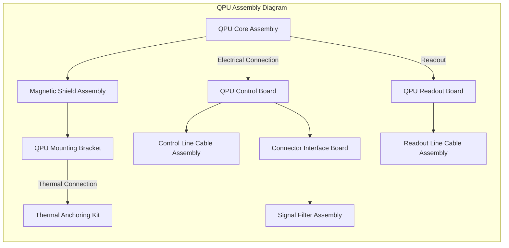

### GP-AM-EDR-37-005-IPC-A: Illustrated Parts Catalog

## Table of Contents

- [1. Introduction](#1-introduction)

- [1.1 Purpose](#11-purpose)
- [1.2 Scope](#12-scope)
- [1.3 How to Use This Catalog](#13-how-to-use-this-catalog)
- [1.4 Part Numbering System](#14-part-numbering-system)
- [1.5 Revision History](#15-revision-history)


- [2. Detailed Component Breakdowns and Part Numbers](#2-detailed-component-breakdowns-and-part-numbers)

- [2.1 Quantum Processing Unit (QPU)](#21-quantum-processing-unit-qpu)
- [2.2 Radiation Sensor Array](#22-radiation-sensor-array)
- [2.3 Debris Detection System](#23-debris-detection-system)
- [2.4 Cryogenic Cooling System](#24-cryogenic-cooling-system)
- [2.5 Power Distribution System](#25-power-distribution-system)
- [2.6 Network and Control Systems](#26-network-and-control-systems)
- [2.7 Structural and Mechanical Components](#27-structural-and-mechanical-components)


- [3. Interchangeability and Obsolescence Information](#3-interchangeability-and-obsolescence-information)

- [3.1 Interchangeability Matrix](#31-interchangeability-matrix)
- [3.2 Obsolescence Notices](#32-obsolescence-notices)
- [3.3 Recommended Spares](#33-recommended-spares)
- [3.4 Vendor Information](#34-vendor-information)


- [4. Assembly Diagrams and Reference Materials](#4-assembly-diagrams-and-reference-materials)

- [4.1 System Assembly Overview](#41-system-assembly-overview)
- [4.2 Subsystem Assembly Diagrams](#42-subsystem-assembly-diagrams)
- [4.3 Cable and Connector Diagrams](#43-cable-and-connector-diagrams)
- [4.4 Mounting and Installation References](#44-mounting-and-installation-references)


---

## 1. Introduction

### 1.1 Purpose

This Illustrated Parts Catalog (IPC) provides comprehensive information on all replaceable components of the Space Environment Monitoring System. It serves as the authoritative reference for identifying, ordering, and replacing parts during maintenance and repair operations.

### 1.2 Scope

This catalog covers all field-replaceable units (FRUs) and shop-replaceable units (SRUs) for the Space Environment Monitoring System, Model GP-AM-EDR-37. It includes mechanical components, electronic assemblies, cables, connectors, and consumable items required for system maintenance.

### 1.3 How to Use This Catalog

The catalog is organized by major subsystems, with each section containing:

1. **Exploded view diagrams** showing the relationship between components
2. **Parts tables** listing part numbers, descriptions, and quantities
3. **Reference designators** corresponding to system schematics
4. **Notes on special handling or installation requirements**


To locate a specific part:

- Use the Table of Contents to navigate to the appropriate subsystem
- Refer to the exploded view diagram to identify the component location
- Find the corresponding item number in the parts table
- Use the part number when ordering replacements


### 1.4 Part Numbering System

The Space Environment Monitoring System uses a standardized part numbering system:

**GA-[Subsystem]-[Type]-[Sequence]**

Where:

- **GA**: Manufacturer prefix (Gaia Aerospace)
- **Subsystem**: Three-letter code identifying the subsystem (e.g., QPU, RAD, DEB)
- **Type**: Three-letter code identifying component type (e.g., PCB, CAB, MEC)
- **Sequence**: Three-digit sequential number


Example: GA-QPU-PCB-001 (Quantum Processing Unit, Printed Circuit Board, sequence 001)

### 1.5 Revision History

| Revision | Date | Description of Changes | Approval
|-----|-----|-----|-----
| A | 2025-03-15 | Initial release | J. Martinez


---

## 2. Detailed Component Breakdowns and Part Numbers

### 2.1 Quantum Processing Unit (QPU)

#### 2.1.1 QPU Assembly Overview

The Quantum Processing Unit is the core computational element of the Space Environment Monitoring System, operating at cryogenic temperatures to maintain quantum coherence.



Here is the markdown formatted content for the QPU main components and control electronics:


## 2.1.2 QPU Main Components

| Item | Part Number      | Description               | Qty | Reference Designator | Notes                             |
|------|------------------|---------------------------|-----|----------------------|-----------------------------------|
| 1    | GA-QPU-ASY-001   | QPU Core Assembly         | 1   | QPU1                 | Includes qubit array and resonators |
| 2    | GA-QPU-SHD-001   | Magnetic Shield Assembly  | 1   | QPU-SH1              | Mu-metal construction             |
| 3    | GA-QPU-PCB-001   | QPU Control Board         | 1   | QPU-CB1              | Contains DACs and signal conditioning |
| 4    | GA-QPU-PCB-002   | QPU Readout Board         | 1   | QPU-RB1              | Contains ADCs and amplifiers      |
| 5    | GA-QPU-CAB-001   | Control Line Cable Assembly | 2   | QPU-CL1, QPU-CL2     | Cryogenic rated                   |
| 6    | GA-QPU-CAB-002   | Readout Line Cable Assembly | 2   | QPU-RL1, QPU-RL2     | Cryogenic rated                   |
| 7    | GA-QPU-MNT-001   | QPU Mounting Bracket      | 1   | QPU-MB1              | Titanium alloy                    |
| 8    | GA-QPU-THM-001   | Thermal Anchoring Kit     | 1   | QPU-TA1              | Includes copper straps and hardware |
| 9    | GA-QPU-CON-001   | Connector Interface Board | 1   | QPU-CI1              | Temperature-staged connections    |
| 10   | GA-QPU-FIL-001   | Signal Filter Assembly    | 2   | QPU-SF1, QPU-SF2     | EMI/RFI filtering                 |

## 2.1.3 QPU Control Electronics

| Item | Part Number      | Description               | Qty | Reference Designator | Notes                             |
|------|------------------|---------------------------|-----|----------------------|-----------------------------------|
| 1    | GA-QPU-PCB-003   | Microwave Source Board    | 2   | QPU-MS1, QPU-MS2     | Signal generation                 |
| 2    | GA-QPU-PCB-004   | Timing Control Board      | 1   | QPU-TC1              | Pulse sequencing                  |
| 3    | GA-QPU-PCB-005   | Bias Control Board        | 1   | QPU-BC1              | DC bias generation                |
| 4    | GA-QPU-PCB-006   | Amplifier Board           | 2   | QPU-AB1, QPU-AB2     | Low-noise amplification           |
| 5    | GA-QPU-PCB-007   | Data Acquisition Board    | 1   | QPU-DA1              | High-speed digitization           |
| 6    | GA-QPU-CAB-003   | Control Rack Cable Set    | 1   | QPU-CR1              | Includes 12 labeled cables        |
| 7    | GA-QPU-PSU-001   | Precision Power Supply    | 1   | QPU-PS1              | Low-noise, multi-output           |
| 8    | GA-QPU-CHS-001   | Control Electronics Chassis | 1 | QPU-CE1              | 4U rack mount                     |
| 9    | GA-QPU-FAN-001   | Cooling Fan Assembly      | 2   | QPU-CF1, QPU-CF2     | Temperature controlled            |
| 10   | GA-QPU-FIL-002   | Power Line Filter         | 1   | QPU-PF1              | EMI/RFI suppression               |
```


### 2.2 Radiation Sensor Array

#### 2.2.1 Radiation Sensor Assembly Overview

The Radiation Sensor Array monitors space radiation environment, including charged particles and gamma radiation.

![Radiation Sensor Array Diagram]

#### 2.2.2 Radiation Detector Components

| Item | Part Number | Description | Qty | Reference Designator | Notes
|-----|-----|-----|-----
| 1 | GA-RAD-DET-001 | Alpha/Beta Detector Assembly | 2 | RAD-AB1, RAD-AB2 | Silicon surface barrier
| 2 | GA-RAD-DET-002 | Gamma Detector Assembly | 2 | RAD-GD1, RAD-GD2 | CsI(Tl) scintillator with SiPM
| 3 | GA-RAD-DET-003 | Neutron Detector Assembly | 1 | RAD-ND1 | Boron-lined proportional counter
| 4 | GA-RAD-PCB-001 | Detector Preamplifier Board | 5 | RAD-PA1 to RAD-PA5 | One per detector
| 5 | GA-RAD-SHD-001 | Detector Shield Assembly | 5 | RAD-DS1 to RAD-DS5 | One per detector
| 6 | GA-RAD-MNT-001 | Detector Mounting Frame | 1 | RAD-MF1 | Aluminum alloy
| 7 | GA-RAD-CAB-001 | Detector Signal Cable | 5 | RAD-SC1 to RAD-SC5 | Low-noise coaxial
| 8 | GA-RAD-CAB-002 | Detector Power Cable | 5 | RAD-PC1 to RAD-PC5 | High-voltage rated
| 9 | GA-RAD-CON-001 | Detector Connector Kit | 5 | RAD-CK1 to RAD-CK5 | One per detector
| 10 | GA-RAD-THM-001 | Detector Thermal Control Kit | 1 | RAD-TC1 | Temperature stabilization


#### 2.2.3 Radiation Electronics Components

| Item | Part Number | Description | Qty | Reference Designator | Notes
|-----|-----|-----|-----
| 1 | GA-RAD-PCB-002 | Signal Processing Board | 1 | RAD-SP1 | Multi-channel analyzer
| 2 | GA-RAD-PCB-003 | High Voltage Supply Board | 1 | RAD-HV1 | 0-2000V programmable
| 3 | GA-RAD-PCB-004 | Data Acquisition Board | 1 | RAD-DA1 | ADC and buffer memory
| 4 | GA-RAD-PCB-005 | Control Interface Board | 1 | RAD-CI1 | System interface
| 5 | GA-RAD-PSU-001 | Radiation System Power Supply | 1 | RAD-PS1 | Multi-output
| 6 | GA-RAD-CHS-001 | Radiation Electronics Chassis | 1 | RAD-EC1 | 3U rack mount
| 7 | GA-RAD-FAN-001 | Cooling Fan Assembly | 1 | RAD-FA1 | Temperature controlled
| 8 | GA-RAD-CAB-003 | Internal Cable Set | 1 | RAD-CS1 | Includes 8 labeled cables
| 9 | GA-RAD-FIL-001 | EMI Filter Assembly | 1 | RAD-EF1 | Input/output filtering
| 10 | GA-RAD-CAL-001 | Calibration Source Kit | 1 | RAD-CK1 | Includes 3 sealed sources


### 2.3 Debris Detection System

#### 2.3.1 Debris Detection System Overview

The Debris Detection System uses laser ranging and optical detection to identify and track space debris.

![Debris Detection System Diagram]

#### 2.3.2 Optical Components

| Item | Part Number | Description | Qty | Reference Designator | Notes
|-----|-----|-----|-----
| 1 | GA-DEB-LSR-001 | Laser Transmitter Assembly | 1 | DEB-LT1 | 1064nm, pulsed
| 2 | GA-DEB-OPT-001 | Transmitter Optics Assembly | 1 | DEB-TO1 | Beam expander and steering
| 3 | GA-DEB-OPT-002 | Receiver Optics Assembly | 1 | DEB-RO1 | Collection and focusing
| 4 | GA-DEB-DET-001 | Detector Array Assembly | 1 | DEB-DA1 | APD array
| 5 | GA-DEB-FIL-001 | Optical Filter Set | 1 | DEB-OF1 | Wavelength selective
| 6 | GA-DEB-MNT-001 | Optical Bench Assembly | 1 | DEB-OB1 | Vibration isolated
| 7 | GA-DEB-ACT-001 | Beam Steering Actuator | 2 | DEB-BS1, DEB-BS2 | Precision motors
| 8 | GA-DEB-ENC-001 | Optical Enclosure | 1 | DEB-OE1 | Environmental protection
| 9 | GA-DEB-WIN-001 | Optical Window Assembly | 1 | DEB-OW1 | Anti-reflection coated
| 10 | GA-DEB-CAL-001 | Alignment Target Assembly | 1 | DEB-AT1 | Internal reference


#### 2.3.3 Debris Detection Electronics

| Item | Part Number | Description | Qty | Reference Designator | Notes
|-----|-----|-----|-----
| 1 | GA-DEB-PCB-001 | Laser Control Board | 1 | DEB-LC1 | Pulse timing and power
| 2 | GA-DEB-PCB-002 | Detector Interface Board | 1 | DEB-DI1 | Signal conditioning
| 3 | GA-DEB-PCB-003 | Timing Board | 1 | DEB-TB1 | Precision timing
| 4 | GA-DEB-PCB-004 | Motor Control Board | 1 | DEB-MC1 | Actuator control
| 5 | GA-DEB-PCB-005 | Data Processing Board | 1 | DEB-DP1 | Range calculation
| 6 | GA-DEB-PSU-001 | Laser Power Supply | 1 | DEB-LP1 | High current pulsed
| 7 | GA-DEB-PSU-002 | System Power Supply | 1 | DEB-SP1 | Multi-output
| 8 | GA-DEB-CHS-001 | Electronics Chassis | 1 | DEB-EC1 | 4U rack mount
| 9 | GA-DEB-CAB-001 | System Cable Set | 1 | DEB-CS1 | Includes 14 labeled cables
| 10 | GA-DEB-CON-001 | External Interface Panel | 1 | DEB-IP1 | Connectors and indicators


### 2.4 Cryogenic Cooling System

#### 2.4.1 Cryogenic System Overview

The Cryogenic Cooling System maintains the QPU at operating temperature (4.2K) using a closed-cycle helium refrigeration system.

![Cryogenic System Diagram]

#### 2.4.2 Cryogenic Components

| Item | Part Number | Description | Qty | Reference Designator | Notes
|-----|-----|-----|-----
| 1 | GA-CRY-CMP-001 | Helium Compressor | 1 | CRY-HC1 | 7.5kW, water-cooled
| 2 | GA-CRY-COL-001 | Cold Head Assembly | 1 | CRY-CH1 | Two-stage pulse tube
| 3 | GA-CRY-HEX-001 | Heat Exchanger Assembly | 1 | CRY-HE1 | Water-to-helium
| 4 | GA-CRY-FIL-001 | Helium Filter Assembly | 2 | CRY-HF1, CRY-HF2 | Inlet and outlet
| 5 | GA-CRY-VLV-001 | Pressure Relief Valve | 2 | CRY-PR1, CRY-PR2 | Safety rated
| 6 | GA-CRY-VLV-002 | Flow Control Valve | 2 | CRY-FC1, CRY-FC2 | Precision control
| 7 | GA-CRY-PMP-001 | Coolant Pump Assembly | 1 | CRY-CP1 | For water cooling loop
| 8 | GA-CRY-TNK-001 | Helium Buffer Tank | 1 | CRY-BT1 | 20L capacity
| 9 | GA-CRY-TNK-002 | Water Reservoir | 1 | CRY-WR1 | 30L capacity
| 10 | GA-CRY-CHG-001 | Helium Charging Kit | 1 | CRY-HK1 | For system maintenance


#### 2.4.3 Cryostat Components

| Item | Part Number | Description | Qty | Reference Designator | Notes
|-----|-----|-----|-----
| 1 | GA-CRY-VAC-001 | Vacuum Chamber Assembly | 1 | CRY-VC1 | Main cryostat
| 2 | GA-CRY-SHD-001 | Radiation Shield - 50K | 1 | CRY-RS1 | Aluminum construction
| 3 | GA-CRY-SHD-002 | Radiation Shield - 4K | 1 | CRY-RS2 | Copper construction
| 4 | GA-CRY-PLT-001 | Cold Plate Assembly | 1 | CRY-CP1 | QPU mounting surface
| 5 | GA-CRY-FTH-001 | Vacuum Feedthrough Set | 1 | CRY-VF1 | Electrical and RF
| 6 | GA-CRY-PMP-002 | Vacuum Pump Assembly | 1 | CRY-VP1 | Turbomolecular with backing
| 7 | GA-CRY-VLV-003 | Vacuum Valve Set | 1 | CRY-VV1 | Includes 3 valves
| 8 | GA-CRY-GSK-001 | Seal and Gasket Kit | 1 | CRY-SG1 | All cryostat seals
| 9 | GA-CRY-MLI-001 | Multi-Layer Insulation Kit | 1 | CRY-MI1 | 20 layers
| 10 | GA-CRY-SEN-001 | Temperature Sensor Kit | 1 | CRY-TS1 | Includes 8 sensors


#### 2.4.4 Cryogenic Control Electronics

| Item | Part Number | Description | Qty | Reference Designator | Notes
|-----|-----|-----|-----
| 1 | GA-CRY-PCB-001 | Compressor Control Board | 1 | CRY-CB1 | Main controller
| 2 | GA-CRY-PCB-002 | Temperature Monitor Board | 1 | CRY-TM1 | 8-channel
| 3 | GA-CRY-PCB-003 | Pressure Monitor Board | 1 | CRY-PM1 | 4-channel
| 4 | GA-CRY-PCB-004 | Vacuum Control Board | 1 | CRY-VB1 | Pump and gauge control
| 5 | GA-CRY-DSP-001 | Control Display Panel | 1 | CRY-DP1 | Touch screen interface
| 6 | GA-CRY-PSU-001 | Control System Power Supply | 1 | CRY-PS1 | Multi-output
| 7 | GA-CRY-CAB-001 | Sensor Cable Set | 1 | CRY-SC1 | Includes 12 labeled cables
| 8 | GA-CRY-CAB-002 | Power Cable Set | 1 | CRY-PC1 | Includes 5 labeled cables
| 9 | GA-CRY-CHS-001 | Control System Chassis | 1 | CRY-CC1 | 4U rack mount
| 10 | GA-CRY-SEN-002 | Pressure Sensor Kit | 1 | CRY-PS1 | Includes 4 sensors


### 2.5 Power Distribution System

#### 2.5.1 Power System Overview

The Power Distribution System provides conditioned power to all subsystems with redundancy and uninterruptible operation.

![Power Distribution System Diagram]

#### 2.5.2 Main Power Components

| Item | Part Number | Description | Qty | Reference Designator | Notes
|-----|-----|-----|-----
| 1 | GA-PWR-PDU-001 | Main Power Distribution Unit | 1 | PWR-MP1 | 3-phase input
| 2 | GA-PWR-UPS-001 | Uninterruptible Power Supply | 2 | PWR-UP1, PWR-UP2 | 10kVA each, redundant
| 3 | GA-PWR-SWI-001 | Automatic Transfer Switch | 1 | PWR-AT1 | Dual input
| 4 | GA-PWR-PDU-002 | Secondary PDU | 4 | PWR-SP1 to PWR-SP4 | Rack-mounted
| 5 | GA-PWR-FIL-001 | Power Line Filter | 2 | PWR-PF1, PWR-PF2 | EMI/RFI suppression
| 6 | GA-PWR-SRG-001 | Surge Protector | 2 | PWR-SP1, PWR-SP2 | High-energy capacity
| 7 | GA-PWR-BAT-001 | UPS Battery Module | 4 | PWR-BM1 to PWR-BM4 | 2 per UPS
| 8 | GA-PWR-BYP-001 | Maintenance Bypass Switch | 1 | PWR-MB1 | Make-before-break
| 9 | GA-PWR-CAB-001 | Main Power Cable Set | 1 | PWR-MC1 | Includes 8 labeled cables
| 10 | GA-PWR-CON-001 | External Power Connector | 1 | PWR-EC1 | Building interface


#### 2.5.3 Power Monitoring and Control

| Item | Part Number | Description | Qty | Reference Designator | Notes
|-----|-----|-----|-----
| 1 | GA-PWR-PCB-001 | Power Monitoring Board | 1 | PWR-MB1 | Multi-channel
| 2 | GA-PWR-PCB-002 | UPS Interface Board | 1 | PWR-UI1 | Communication interface
| 3 | GA-PWR-PCB-003 | Power Control Board | 1 | PWR-CB1 | Sequencing and control
| 4 | GA-PWR-DSP-001 | Power System Display | 1 | PWR-PD1 | Status and control
| 5 | GA-PWR-SEN-001 | Current Sensor Kit | 1 | PWR-CS1 | Includes 12 sensors
| 6 | GA-PWR-SEN-002 | Voltage Sensor Kit | 1 | PWR-VS1 | Includes 8 sensors
| 7 | GA-PWR-CHS-001 | Monitoring System Chassis | 1 | PWR-MC1 | 2U rack mount
| 8 | GA-PWR-CAB-002 | Monitoring Cable Set | 1 | PWR-MS1 | Includes 20 labeled cables
| 9 | GA-PWR-PSU-001 | Monitoring System Power Supply | 1 | PWR-MP1 | Redundant inputs
| 10 | GA-PWR-ALM-001 | Alarm Annunciator | 1 | PWR-AA1 | Visual and audible


### 2.6 Network and Control Systems

#### 2.6.1 Network System Overview

The Network and Control Systems provide secure communication, data processing, and system control capabilities.

![Network System Diagram]

#### 2.6.2 Network Hardware Components

| Item | Part Number | Description | Qty | Reference Designator | Notes
|-----|-----|-----|-----
| 1 | GA-NET-SRV-001 | Main Control Server | 2 | NET-MS1, NET-MS2 | Redundant configuration
| 2 | GA-NET-STO-001 | Storage Array | 1 | NET-SA1 | 48TB RAID configuration
| 3 | GA-NET-SWI-001 | Core Network Switch | 2 | NET-NS1, NET-NS2 | Redundant configuration
| 4 | GA-NET-RTR-001 | Security Router | 2 | NET-SR1, NET-SR2 | Redundant configuration
| 5 | GA-NET-FWL-001 | Hardware Firewall | 2 | NET-HF1, NET-HF2 | Redundant configuration
| 6 | GA-NET-KVM-001 | KVM Switch | 1 | NET-KS1 | 16-port
| 7 | GA-NET-CON-001 | Console Unit | 1 | NET-CU1 | Keyboard, video, mouse
| 8 | GA-NET-UPS-001 | Network UPS | 1 | NET-NU1 | 3kVA
| 9 | GA-NET-CAB-001 | Network Cable Set | 1 | NET-NC1 | Includes 48 labeled cables
| 10 | GA-NET-RCK-001 | Network Equipment Rack | 1 | NET-ER1 | 42U with accessories


#### 2.6.3 Control System Components

| Item | Part Number | Description | Qty | Reference Designator | Notes
|-----|-----|-----|-----
| 1 | GA-NET-PCB-001 | System Control Board | 1 | NET-CB1 | Main controller
| 2 | GA-NET-PCB-002 | Interface Expansion Board | 4 | NET-IE1 to NET-IE4 | I/O expansion
| 3 | GA-NET-PCB-003 | Analog Input Board | 2 | NET-AI1, NET-AI2 | 32-channel each
| 4 | GA-NET-PCB-004 | Analog Output Board | 2 | NET-AO1, NET-AO2 | 16-channel each
| 5 | GA-NET-PCB-005 | Digital I/O Board | 2 | NET-DI1, NET-DI2 | 64-channel each
| 6 | GA-NET-PCB-006 | Serial Interface Board | 1 | NET-SI1 | RS-232/422/485
| 7 | GA-NET-DSP-001 | Operator Control Panel | 1 | NET-OP1 | Touch screen interface
| 8 | GA-NET-PSU-001 | Control System Power Supply | 2 | NET-CP1, NET-CP2 | Redundant
| 9 | GA-NET-CHS-001 | Control System Chassis | 1 | NET-CC1 | 6U rack mount
| 10 | GA-NET-CAB-002 | Control System Cable Set | 1 | NET-CS1 | Includes 36 labeled cables


#### 2.6.4 INFRANET Interface Components

| Item | Part Number | Description | Qty | Reference Designator | Notes
|-----|-----|-----|-----
| 1 | GA-NET-PCB-007 | INFRANET Interface Board | 1 | NET-II1 | Main interface
| 2 | GA-NET-PCB-008 | Encryption Module | 1 | NET-EM1 | Hardware encryption
| 3 | GA-NET-PCB-009 | Protocol Converter | 1 | NET-PC1 | Format translation
| 4 | GA-NET-OPT-001 | Fiber Optic Transceiver | 2 | NET-OT1, NET-OT2 | Redundant
| 5 | GA-NET-CAB-003 | Fiber Optic Cable Assembly | 2 | NET-FC1, NET-FC2 | Armored, 50m each
| 6 | GA-NET-ISO-001 | Optical Isolator | 2 | NET-OI1, NET-OI2 | Galvanic isolation
| 7 | GA-NET-CHS-002 | INFRANET Interface Chassis | 1 | NET-IC1 | 2U rack mount
| 8 | GA-NET-PSU-002 | Interface Power Supply | 1 | NET-IP1 | Redundant inputs
| 9 | GA-NET-MON-001 | Link Status Monitor | 1 | NET-LM1 | Performance monitoring
| 10 | GA-NET-CAB-004 | Interface Cable Set | 1 | NET-IS1 | Includes 12 labeled cables


### 2.7 Structural and Mechanical Components

#### 2.7.1 Structural System Overview

The structural components provide mounting, protection, and environmental control for the system.

![Structural System Diagram]

#### 2.7.2 Rack and Enclosure Components

| Item | Part Number | Description | Qty | Reference Designator | Notes
|-----|-----|-----|-----
| 1 | GA-STR-RCK-001 | Main Equipment Rack | 4 | STR-MR1 to STR-MR4 | 42U, seismic rated
| 2 | GA-STR-PNL-001 | Side Panel Set | 4 | STR-SP1 to STR-SP4 | One per rack
| 3 | GA-STR-PNL-002 | Rear Door Assembly | 4 | STR-RD1 to STR-RD4 | Vented, lockable
| 4 | GA-STR-PNL-003 | Front Door Assembly | 4 | STR-FD1 to STR-FD4 | Glass, lockable
| 5 | GA-STR-BSE-001 | Leveling Base Kit | 4 | STR-LB1 to STR-LB4 | Adjustable feet
| 6 | GA-STR-BRC-001 | Seismic Bracing Kit | 1 | STR-SB1 | Floor anchoring
| 7 | GA-STR-CBL-001 | Cable Management Kit | 4 | STR-CM1 to STR-CM4 | Vertical and horizontal
| 8 | GA-STR-PDU-001 | Rack PDU | 8 | STR-RP1 to STR-RP8 | 2 per rack
| 9 | GA-STR-FAN-001 | Rack Fan Assembly | 4 | STR-RF1 to STR-RF4 | Top-mounted
| 10 | GA-STR-SHF-001 | Adjustable Shelf Kit | 8 | STR-AS1 to STR-AS8 | 2 per rack


#### 2.7.3 Environmental Control Components

| Item | Part Number | Description | Qty | Reference Designator | Notes
|-----|-----|-----|-----
| 1 | GA-ENV-ACU-001 | Precision Air Conditioning Unit | 1 | ENV-AC1 | 5-ton capacity
| 2 | GA-ENV-HUM-001 | Humidity Control System | 1 | ENV-HC1 | ±5% RH control
| 3 | GA-ENV-FLT-001 | Air Filtration System | 1 | ENV-AF1 | HEPA filtration
| 4 | GA-ENV-MON-001 | Environmental Monitoring System | 1 | ENV-EM1 | Temperature, humidity, airflow
| 5 | GA-ENV-ALM-001 | Environmental Alarm Panel | 1 | ENV-EA1 | Visual and audible
| 6 | GA-ENV-SEN-001 | Temperature Sensor Kit | 1 | ENV-TS1 | Includes 8 sensors
| 7 | GA-ENV-SEN-002 | Humidity Sensor Kit | 1 | ENV-HS1 | Includes 4 sensors
| 8 | GA-ENV-SEN-003 | Airflow Sensor Kit | 1 | ENV-AS1 | Includes 4 sensors
| 9 | GA-ENV-CAB-001 | Environmental Sensor Cable Set | 1 | ENV-SC1 | Includes 16 labeled cables
| 10 | GA-ENV-DUC-001 | Air Distribution Duct Kit | 1 | ENV-AD1 | Under-floor distribution


#### 2.7.4 Miscellaneous Mechanical Components

| Item | Part Number | Description | Qty | Reference Designator | Notes
|-----|-----|-----|-----
| 1 | GA-MEC-VIB-001 | Vibration Isolation Platform | 1 | MEC-VP1 | For QPU cryostat
| 2 | GA-MEC-LFT-001 | Equipment Lift | 1 | MEC-EL1 | 500kg capacity
| 3 | GA-MEC-TRY-001 | Keyboard Tray | 2 | MEC-KT1, MEC-KT2 | Sliding
| 4 | GA-MEC-DRW-001 | Storage Drawer Set | 2 | MEC-SD1, MEC-SD2 | Lockable
| 5 | GA-MEC-WHL-001 | Caster Kit | 4 | MEC-CK1 to MEC-CK4 | Locking, 1 per rack
| 6 | GA-MEC-GRM-001 | Grommet Kit | 4 | MEC-GK1 to MEC-GK4 | Cable pass-through
| 7 | GA-MEC-FTG-001 | Plumbing Fitting Kit | 1 | MEC-PF1 | For cooling connections
| 8 | GA-MEC-HSE-001 | Flexible Hose Kit | 1 | MEC-FH1 | For cooling connections
| 9 | GA-MEC-BRK-001 | Mounting Bracket Kit | 1 | MEC-MB1 | Assorted brackets
| 10 | GA-MEC-FST-001 | Fastener Kit | 1 | MEC-FK1 | Assorted hardware


---

## 3. Interchangeability and Obsolescence Information

### 3.1 Interchangeability Matrix

The following matrix identifies components that can be substituted for one another, either directly or with minor modifications.

#### 3.1.1 QPU Components Interchangeability

| Primary Part | Interchangeable With | Modification Required | Notes
|-----|-----|-----|-----
| GA-QPU-PCB-001 | GA-QPU-PCB-001-A | None | Revision A is fully compatible
| GA-QPU-PCB-001 | GA-QPU-PCB-001-B | Firmware update required | Revision B requires v4.2 or later firmware
| GA-QPU-CAB-001 | GA-QPU-CAB-001-S | None | Shielded variant, direct replacement
| GA-QPU-FIL-001 | GA-QPU-FIL-001-H | None | High-frequency variant, direct replacement
| GA-QPU-PCB-003 | GA-QPU-PCB-003-E | Calibration required | Enhanced version requires recalibration
| GA-QPU-PSU-001 | GA-QPU-PSU-001-R | Mounting adapter required | Use adapter kit GA-QPU-ADP-001
| GA-QPU-FAN-001 | GA-QPU-FAN-001-Q | None | Quiet version, direct replacement
| GA-QPU-PCB-007 | GA-QPU-PCB-007-H | Software update required | High-speed variant requires v5.1 software
| GA-QPU-CON-001 | GA-QPU-CON-001-G | None | Gold-plated variant, direct replacement
| GA-QPU-MNT-001 | GA-QPU-MNT-001-R | None | Reinforced version, direct replacement


#### 3.1.2 Radiation Sensor Interchangeability

| Primary Part | Interchangeable With | Modification Required | Notes
|-----|-----|-----|-----
| GA-RAD-DET-001 | GA-RAD-DET-001-H | Bias voltage adjustment | High-sensitivity variant
| GA-RAD-DET-002 | GA-RAD-DET-002-L | Gain adjustment | Low-background variant
| GA-RAD-PCB-001 | GA-RAD-PCB-001-A | None | Revision A is fully compatible
| GA-RAD-PCB-002 | GA-RAD-PCB-002-E | Software update required | Enhanced version requires v3.4 software
| GA-RAD-CAB-001 | GA-RAD-CAB-001-S | None | Shielded variant, direct replacement
| GA-RAD-PSU-001 | GA-RAD-PSU-001-H | None | High-stability variant, direct replacement
| GA-RAD-SHD-001 | GA-RAD-SHD-001-T | None | Thicker shield, direct replacement
| GA-RAD-PCB-003 | GA-RAD-PCB-003-P | Calibration required | Precision variant requires recalibration
| GA-RAD-FAN-001 | GA-RAD-FAN-001-Q | None | Quiet version, direct replacement
| GA-RAD-MNT-001 | GA-RAD-MNT-001-S | None | Stainless steel variant, direct replacement


#### 3.1.3 Cryogenic System Interchangeability

| Primary Part | Interchangeable With | Modification Required | Notes
|-----|-----|-----|-----
| GA-CRY-FIL-001 | GA-CRY-FIL-001-H | None | High-capacity variant, direct replacement
| GA-CRY-VLV-001 | GA-CRY-VLV-001-S | None | Stainless steel variant, direct replacement
| GA-CRY-SEN-001 | GA-CRY-SEN-001-P | Calibration required | Precision variant requires recalibration
| GA-CRY-PCB-001 | GA-CRY-PCB-001-A | Firmware update required | Revision A requires v2.3 or later firmware
| GA-CRY-PCB-002 | GA-CRY-PCB-002-E | None | Enhanced version, direct replacement
| GA-CRY-GSK-001 | GA-CRY-GSK-001-L | None | Low-temperature variant, direct replacement
| GA-CRY-MLI-001 | GA-CRY-MLI-001-H | None | High-performance variant, direct replacement
| GA-CRY-CAB-001 | GA-CRY-CAB-001-S | None | Shielded variant, direct replacement
| GA-CRY-FTH-001 | GA-CRY-FTH-001-G | None | Gold-plated variant, direct replacement
| GA-CRY-PMP-001 | GA-CRY-PMP-001-H | Motor mount adjustment | High-flow variant requires mount adjustment


### 3.2 Obsolescence Notices

The following components have been identified as approaching obsolescence. Replacement strategies are provided.

#### 3.2.1 Current Obsolescence Notices

| Part Number | Obsolescence Date | Replacement Part | Notes
|-----|-----|-----|-----
| GA-QPU-PCB-002 | 2026-06-30 | GA-QPU-PCB-002-R | Enhanced replacement available now
| GA-RAD-PCB-004 | 2026-03-15 | GA-RAD-PCB-004-N | New version with expanded capabilities
| GA-DEB-PCB-001 | 2025-12-31 | GA-DEB-PCB-001-A | Direct replacement available now
| GA-CRY-PCB-003 | 2026-09-30 | GA-CRY-PCB-003-E | Enhanced replacement available Q3 2025
| GA-NET-SRV-001 | 2025-12-31 | GA-NET-SRV-001-H | Higher performance replacement
| GA-PWR-UPS-001 | 2026-06-30 | GA-PWR-UPS-001-N | New model with improved efficiency
| GA-NET-SWI-001 | 2026-03-31 | GA-NET-SWI-001-G | Gigabit replacement available now
| GA-QPU-FAN-001 | 2025-09-30 | GA-QPU-FAN-001-Q | Quieter replacement available now
| GA-ENV-SEN-001 | 2026-01-31 | GA-ENV-SEN-001-D | Digital replacement available now
| GA-CRY-VLV-002 | 2025-12-31 | GA-CRY-VLV-002-P | Precision replacement available now


#### 3.2.2 Planned Obsolescence Schedule

| Part Number | Planned Obsolescence | Replacement Strategy | Notes
|-----|-----|-----|-----
| GA-QPU-ASY-001 | 2027-06-30 | GA-QPU-ASY-002 | Next-generation QPU in development
| GA-RAD-DET-001 | 2027-12-31 | GA-RAD-DET-001-N | New detector technology in development
| GA-DEB-LSR-001 | 2028-06-30 | GA-DEB-LSR-002 | Higher power, lower divergence design
| GA-CRY-CMP-001 | 2027-12-31 | GA-CRY-CMP-001-E | Energy-efficient design in development
| GA-PWR-PDU-001 | 2027-06-30 | GA-PWR-PDU-001-S | Smart PDU with monitoring capabilities
| GA-NET-PCB-007 | 2028-12-31 | GA-NET-PCB-007-H | Higher bandwidth design in development
| GA-STR-RCK-001 | 2029-06-30 | GA-STR-RCK-001-M | Modular design in development
| GA-ENV-ACU-001 | 2028-12-31 | GA-ENV-ACU-001-E | Energy-efficient design in development
| GA-CRY-VAC-001 | 2029-12-31 | GA-CRY-VAC-001-I | Improved vacuum performance design
| GA-NET-FWL-001 | 2027-06-30 | GA-NET-FWL-001-A | Advanced security features in development


### 3.3 Recommended Spares

The following spare parts are recommended to be maintained on-site for immediate replacement in case of failure.

#### 3.3.1 Critical Spares (Immediate Availability Required)

| Part Number | Description | Recommended Quantity | Storage Requirements | Notes
|-----|-----|-----|-----
| GA-QPU-PCB-001 | QPU Control Board | 1 | ESD-safe, temperature controlled | Critical for QPU operation
| GA-QPU-PCB-002 | QPU Readout Board | 1 | ESD-safe, temperature controlled | Critical for QPU operation
| GA-RAD-DET-001 | Alpha/Beta Detector Assembly | 1 | ESD-safe, temperature controlled | Long lead time item
| GA-RAD-DET-002 | Gamma Detector Assembly | 1 | ESD-safe, temperature controlled | Long lead time item
| GA-CRY-COL-001 | Cold Head Assembly | 1 | Clean, dry environment | Critical for cooling
| GA-CRY-FIL-001 | Helium Filter Assembly | 2 | Clean, dry environment | Regular replacement item
| GA-PWR-UPS-001 | Uninterruptible Power Supply | 1 | Ventilated area | Critical for system protection
| GA-PWR-BAT-001 | UPS Battery Module | 2 | Ventilated area | Limited shelf life (1 year)
| GA-NET-PCB-001 | System Control Board | 1 | ESD-safe, temperature controlled | Critical for system control
| GA-DEB-LSR-001 | Laser Transmitter Assembly | 1 | ESD-safe, temperature controlled | Long lead time item


#### 3.3.2 Maintenance Spares (72-Hour Availability)

| Part Number | Description | Recommended Quantity | Storage Requirements | Notes
|-----|-----|-----|-----
| GA-QPU-FIL-001 | Signal Filter Assembly | 2 | ESD-safe | Regular replacement item
| GA-QPU-FAN-001 | Cooling Fan Assembly | 2 | Clean environment | Regular replacement item
| GA-RAD-PCB-001 | Detector Preamplifier Board | 2 | ESD-safe | One per detector type
| GA-RAD-CAB-001 | Detector Signal Cable | 3 | Coiled, not kinked | Various lengths
| GA-CRY-VLV-001 | Pressure Relief Valve | 2 | Clean, dry environment | Safety critical item
| GA-CRY-SEN-001 | Temperature Sensor Kit | 1 | ESD-safe | Multiple sensors
| GA-PWR-FIL-001 | Power Line Filter | 2 | Clean environment | EMI protection
| GA-NET-SWI-001 | Core Network Switch | 1 | ESD-safe | Network critical
| GA-DEB-FIL-001 | Optical Filter Set | 1 | Clean, sealed container | Optical cleanliness critical
| GA-DEB-PCB-001 | Laser Control Board | 1 | ESD-safe | Control critical


#### 3.3.3 Consumable Spares (Regular Replacement)

| Part Number | Description | Recommended Quantity | Replacement Interval | Notes
|-----|-----|-----|-----
| GA-CRY-GSK-001 | Seal and Gasket Kit | 2 | Annual or as needed | Replace during maintenance
| GA-CRY-FIL-001 | Helium Filter Assembly | 4 | 6 months | Regular replacement
| GA-ENV-FLT-001 | Air Filtration System | 2 | 3 months | Regular replacement
| GA-QPU-THM-001 | Thermal Compound | 5 | As needed | Used during QPU maintenance
| GA-RAD-CAL-001 | Calibration Source Kit | 1 | 2 years | Check expiration dates
| GA-DEB-WIN-001 | Optical Window Assembly | 2 | As needed | Replace if damaged or contaminated
| GA-CRY-MLI-001 | Multi-Layer Insulation Kit | 1 | Annual | Replace during major maintenance
| GA-PWR-BAT-001 | UPS Battery Module | 4 | 2-3 years | Limited life item
| GA-MEC-FST-001 | Fastener Kit | 2 | As needed | Assorted hardware
| GA-CRY-CHG-001 | Helium Charging Kit | 1 | As needed | For system recharge


### 3.4 Vendor Information

The following vendors are approved suppliers for replacement parts and services.

#### 3.4.1 Primary Component Vendors

| Vendor Name | Vendor ID | Components Supplied | Contact Information | Notes
|-----|-----|-----|-----
| Quantum Devices Inc. | QDI-001 | QPU components | [quantumdevices@example.com](mailto:quantumdevices@example.com)`<br>`+1-555-123-4567 | Primary QPU supplier
| Radiation Detection Systems | RDS-002 | Radiation sensors | [rds-support@example.com](mailto:rds-support@example.com)`<br>`+1-555-234-5678 | Primary radiation detector supplier
| Cryogenic Solutions Ltd. | CSL-003 | Cryogenic components | [cryo-sales@example.com](mailto:cryo-sales@example.com)`<br>`+1-555-345-6789 | Primary cryogenic system supplier
| Precision Optics Corp. | POC-004 | Optical components | [sales@precisionoptics.example](mailto:sales@precisionoptics.example)`<br>`+1-555-456-7890 | Primary optical component supplier
| Advanced Power Systems | APS-005 | Power components | [aps-orders@example.com](mailto:aps-orders@example.com)`<br>`+1-555-567-8901 | Primary power system supplier
| Network Infrastructure Inc. | NII-006 | Network components | [sales@netinfra.example](mailto:sales@netinfra.example)`<br>`+1-555-678-9012 | Primary network component supplier
| Environmental Control Tech | ECT-007 | Environmental systems | [ect-sales@example.com](mailto:ect-sales@example.com)`<br>`+1-555-789-0123 | Primary environmental system supplier
| Precision Electronics Ltd. | PEL-008 | Electronic components | [orders@precisionelec.example](mailto:orders@precisionelec.example)`<br>`+1-555-890-1234 | Primary electronics supplier
| Mechanical Systems Corp. | MSC-009 | Mechanical components | [msc-orders@example.com](mailto:msc-orders@example.com)`<br>`+1-555-901-2345 | Primary mechanical component supplier
| Aerospace Structures Inc. | ASI-010 | Structural components | [sales@aerostructures.example](mailto:sales@aerostructures.example)`<br>`+1-555-012-3456 | Primary structural component supplier


#### 3.4.2 Authorized Service Providers

| Provider Name | Provider ID | Services Offered | Contact Information | Certification Level
|-----|-----|-----|-----
| Quantum Systems Service | QSS-001 | QPU maintenance and repair | [service@quantumsystems.example](mailto:service@quantumsystems.example)`<br>`+1-555-111-2222 | Level 3 - All Systems
| Cryogenic Maintenance Inc. | CMI-002 | Cryogenic system service | [service@cryomaint.example](mailto:service@cryomaint.example)`<br>`+1-555-222-3333 | Level 2 - Cryogenics
| Radiation Systems Service | RSS-003 | Radiation detector service | [support@radservice.example](mailto:support@radservice.example)`<br>`+1-555-333-4444 | Level 2 - Radiation Systems
| Optical Systems Specialists | OSS-004 | Debris detection service | [service@opticalspec.example](mailto:service@opticalspec.example)`<br>`+1-555-444-5555 | Level 2 - Optical Systems
| Power Systems Service | PSS-005 | Power system maintenance | [support@powerservice.example](mailto:support@powerservice.example)`<br>`+1-555-555-6666 | Level 2 - Power Systems
| Network Service Providers | NSP-006 | Network system service | [support@netservice.example](mailto:support@netservice.example)`<br>`+1-555-666-7777 | Level 2 - Network Systems
| Environmental Systems Service | ESS-007 | Environmental system service | [service@envservice.example](mailto:service@envservice.example)`<br>`+1-555-777-8888 | Level 2 - Environmental
| Calibration Services Inc. | CSI-008 | System calibration | [calibration@calservice.example](mailto:calibration@calservice.example)`<br>`+1-555-888-9999 | Level 3 - All Systems
| Emergency Response Team | ERT-009 | 24/7 emergency service | [emergency@ertservice.example](mailto:emergency@ertservice.example)`<br>`+1-555-999-0000 | Level 3 - All Systems
| Training and Certification | TAC-010 | Technical training | [training@tacservice.example](mailto:training@tacservice.example)`<br>`+1-555-000-1111 | Authorized Training Provider


---

## 4. Assembly Diagrams and Reference Materials

### 4.1 System Assembly Overview

The following diagram shows the overall system assembly with major subsystems identified.

![System Assembly Overview Diagram]

#### 4.1.1 System Assembly Notes

1. The system consists of four standard equipment racks arranged in a row
2. Rack 1 contains the QPU control electronics and network systems
3. Rack 2 contains the radiation sensor electronics and debris detection electronics
4. Rack 3 contains the cryogenic control system and power distribution
5. Rack 4 contains the QPU cryostat and associated equipment
6. All racks must be properly grounded and secured to the floor
7. Maintain minimum clearance of 1.2m at front and rear of racks for service access
8. Cooling water connections are located at the rear of Rack 3 and Rack 4
9. Main power connection is located at the bottom rear of Rack 3
10. Network connections are located at the top rear of Rack 1


### 4.2 Subsystem Assembly Diagrams

#### 4.2.1 QPU Subsystem Assembly

The following diagram shows the assembly of the Quantum Processing Unit subsystem.

![QPU Assembly Diagram]

**Assembly Sequence:**

1. Install QPU mounting bracket (GA-QPU-MNT-001) to cold plate
2. Attach thermal anchoring kit (GA-QPU-THM-001) to mounting bracket
3. Install magnetic shield assembly (GA-QPU-SHD-001) to mounting bracket
4. Carefully install QPU core assembly (GA-QPU-ASY-001) inside magnetic shield
5. Connect thermal straps between QPU and cold plate
6. Install connector interface board (GA-QPU-CON-001) to cold plate
7. Route and connect control line cables (GA-QPU-CAB-001) from QPU to interface board
8. Route and connect readout line cables (GA-QPU-CAB-002) from QPU to interface board
9. Install signal filter assemblies (GA-QPU-FIL-001) to interface board
10. Verify all connections and thermal anchoring before closing cryostat


#### 4.2.2 Radiation Sensor Subsystem Assembly

The following diagram shows the assembly of the Radiation Sensor subsystem.

![Radiation Sensor Assembly Diagram]

**Assembly Sequence:**

1. Install detector mounting frame (GA-RAD-MNT-001) to designated location
2. Install detector shield assemblies (GA-RAD-SHD-001) to mounting frame
3. Install alpha/beta detector assemblies (GA-RAD-DET-001) to respective shields
4. Install gamma detector assemblies (GA-RAD-DET-002) to respective shields
5. Install neutron detector assembly (GA-RAD-DET-003) to respective shield
6. Install detector preamplifier boards (GA-RAD-PCB-001) to mounting frame
7. Connect detector signal cables (GA-RAD-CAB-001) between detectors and preamplifiers
8. Connect detector power cables (GA-RAD-CAB-002) to each detector
9. Install detector thermal control kit (GA-RAD-THM-001) to mounting frame
10. Verify all connections and shielding before system power-up


#### 4.2.3 Cryogenic System Assembly

The following diagram shows the assembly of the Cryogenic Cooling subsystem.

![Cryogenic System Assembly Diagram]

**Assembly Sequence:**

1. Install helium compressor (GA-CRY-CMP-001) in designated location
2. Install cold head assembly (GA-CRY-COL-001) to cryostat
3. Install heat exchanger assembly (GA-CRY-HEX-001) near compressor
4. Install helium filter assemblies (GA-CRY-FIL-001) at compressor inlet and outlet
5. Install helium buffer tank (GA-CRY-TNK-001) near compressor
6. Install pressure relief valves (GA-CRY-VLV-001) at designated locations
7. Install flow control valves (GA-CRY-VLV-002) at designated locations
8. Connect helium lines between components according to schematic
9. Install coolant pump assembly (GA-CRY-PMP-001) for water cooling loop
10. Connect water cooling lines between components according to schematic


### 4.3 Cable and Connector Diagrams

#### 4.3.1 System Cable Interconnect Diagram

The following diagram shows the overall cable interconnections between major subsystems.

![System Cable Interconnect Diagram]

**Cable Connection Notes:**

1. All inter-rack cables must be routed through designated cable management paths
2. Maintain minimum bend radius for all cables (refer to cable specifications)
3. Secure cables at regular intervals using approved cable ties
4. Label all cables at both ends according to system documentation
5. Separate power cables from signal cables by minimum 15cm where possible
6. Use only approved cable types for each connection
7. Verify all connections with continuity test before system power-up
8. Document any deviations from standard cable routing
9. Install EMI shielding where cables cross rack boundaries
10. Verify strain relief at all connection points


#### 4.3.2 QPU Signal Cable Pinouts

The following tables show the pinout information for QPU signal cables.

**Control Line Cable (GA-QPU-CAB-001) Pinout:**

| Pin | Signal Name | Direction | Voltage Level | Notes
|-----|-----|-----|-----
| 1 | GND | - | 0V | Signal ground
| 2 | CTRL_CLK+ | Input | LVDS | Differential clock
| 3 | CTRL_CLK- | Input | LVDS | Differential clock
| 4 | CTRL_DATA+ | Input | LVDS | Differential data
| 5 | CTRL_DATA- | Input | LVDS | Differential data
| 6 | CTRL_SYNC+ | Input | LVDS | Differential sync
| 7 | CTRL_SYNC- | Input | LVDS | Differential sync
| 8 | SHIELD | - | 0V | Cable shield
| 9 | CTRL_AUX1+ | Input | LVDS | Auxiliary control
| 10 | CTRL_AUX1- | Input | LVDS | Auxiliary control
| 11 | CTRL_AUX2+ | Input | LVDS | Auxiliary control
| 12 | CTRL_AUX2- | Input | LVDS | Auxiliary control
| 13 | CTRL_TRIG+ | Input | LVDS | Trigger signal
| 14 | CTRL_TRIG- | Input | LVDS | Trigger signal
| 15 | RESERVED | - | - | Do not connect
| 16 | GND | - | 0V | Signal ground


**Readout Line Cable (GA-QPU-CAB-002) Pinout:**

| Pin | Signal Name | Direction | Voltage Level | Notes
|-----|-----|-----|-----
| 1 | GND | - | 0V | Signal ground
| 2 | READ_CLK+ | Input | LVDS | Differential clock
| 3 | READ_CLK- | Input | LVDS | Differential clock
| 4 | READ_DATA+ | Output | LVDS | Differential data
| 5 | READ_DATA- | Output | LVDS | Differential data
| 6 | READ_SYNC+ | Input | LVDS | Differential sync
| 7 | READ_SYNC- | Input | LVDS | Differential sync
| 8 | SHIELD | - | 0V | Cable shield
| 9 | READ_AUX1+ | Output | LVDS | Auxiliary readout
| 10 | READ_AUX1- | Output | LVDS | Auxiliary readout
| 11 | READ_AUX2+ | Output | LVDS | Auxiliary readout
| 12 | READ_AUX2- | Output | LVDS | Auxiliary readout
| 13 | READ_STAT+ | Output | LVDS | Status signal
| 14 | READ_STAT- | Output | LVDS | Status signal
| 15 | RESERVED | - | - | Do not connect
| 16 | GND | - | 0V | Signal ground


### 4.4 Mounting and Installation References

#### 4.4.1 Equipment Rack Layout Diagrams

The following diagrams show the layout of components within each equipment rack.

![Rack Layout Diagram]

**Rack 1 Layout (Network and QPU Control):**

- Units 1-2: Cable management
- Units 3-6: Network equipment (GA-NET-SWI-001, GA-NET-RTR-001, GA-NET-FWL-001)
- Units 7-8: KVM system (GA-NET-KVM-001, GA-NET-CON-001)
- Units 9-12: Servers (GA-NET-SRV-001 x2)
- Units 13-16: Storage array (GA-NET-STO-001)
- Units 17-20: QPU control electronics chassis (GA-QPU-CHS-001)
- Units 21-24: QPU microwave source and timing (GA-QPU-PCB-003, GA-QPU-PCB-004)
- Units 25-28: QPU data acquisition (GA-QPU-PCB-007)
- Units 29-30: QPU power supply (GA-QPU-PSU-001)
- Units 31-32: Cable management
- Units 33-36: INFRANET interface (GA-NET-CHS-002)
- Units 37-38: Network UPS (GA-NET-UPS-001)
- Units 39-42: Blank/reserved for expansion


**Rack 2 Layout (Radiation and Debris Detection):**

- Units 1-2: Cable management
- Units 3-6: Radiation electronics chassis (GA-RAD-CHS-001)
- Units 7-10: Radiation signal processing (GA-RAD-PCB-002, GA-RAD-PCB-003)
- Units 11-14: Radiation data acquisition (GA-RAD-PCB-004, GA-RAD-PCB-005)
- Units 15-18: Radiation power supply (GA-RAD-PSU-001)
- Units 19-22: Debris detection electronics chassis (GA-DEB-CHS-001)
- Units 23-26: Debris detection signal processing (GA-DEB-PCB-002, GA-DEB-PCB-003)
- Units 27-30: Debris detection data processing (GA-DEB-PCB-005)
- Units 31-34: Debris detection power supplies (GA-DEB-PSU-001, GA-DEB-PSU-002)
- Units 35-36: Cable management
- Units 37-42: Blank/reserved for expansion


**Rack 3 Layout (Cryogenic Control and Power):**

- Units 1-2: Cable management
- Units 3-6: Cryogenic control system chassis (GA-CRY-CHS-001)
- Units 7-10: Cryogenic monitoring (GA-CRY-PCB-002, GA-CRY-PCB-003)
- Units 11-14: Vacuum control system (GA-CRY-PCB-004)
- Units 15-16: Cryogenic display panel (GA-CRY-DSP-001)
- Units 17-20: Main power distribution unit (GA-PWR-PDU-001)
- Units 21-24: Automatic transfer switch (GA-PWR-SWI-001)
- Units 25-28: Power monitoring system (GA-PWR-PCB-001, GA-PWR-PCB-002)
- Units 29-30: Power system display (GA-PWR-DSP-001)
- Units 31-34: Maintenance bypass switch (GA-PWR-BYP-001)
- Units 35-38: Secondary PDUs (GA-PWR-PDU-002 x2)
- Units 39-42: Cable management


**Rack 4 Layout (QPU Cryostat and Support):**

- Units 1-24: QPU cryostat assembly (GA-CRY-VAC-001)
- Units 25-28: Vacuum pump assembly (GA-CRY-PMP-002)
- Units 29-32: Helium buffer tank (GA-CRY-TNK-001)
- Units 33-36: Water reservoir (GA-CRY-TNK-002)
- Units 37-40: UPS units (GA-PWR-UPS-001 x2)
- Units 41-42: Cable management


#### 4.4.2 Installation Clearance Requirements

The following diagram shows the required clearances for installation and maintenance.

![Installation Clearance Diagram]

**Clearance Requirements:**

- Front access: 1.2m minimum from rack front to nearest obstruction
- Rear access: 1.2m minimum from rack rear to nearest obstruction
- Side access: 0.9m minimum from rack side to nearest obstruction (service side only)
- Vertical clearance: 0.6m minimum from rack top to ceiling
- Floor loading: 1500 kg/m² minimum load capacity
- Door access: 2.2m height × 1.2m width minimum for equipment delivery
- Cooling clearance: 1.5m minimum around cryogenic compressor
- Electrical clearance: 1.0m minimum around main power connection
- Emergency access: Clear path to emergency exits and fire suppression equipment
- Seismic bracing: Install according to local building codes


---

**END OF DOCUMENT**

*This document contains proprietary information and is provided on a need-to-know basis. Unauthorized reproduction or distribution is prohibited.*
