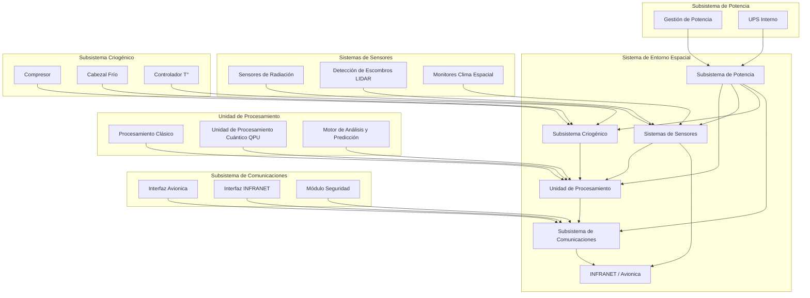
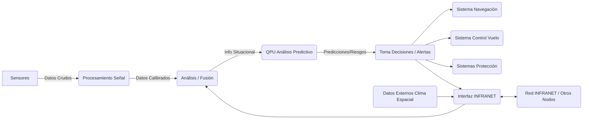

### GP-AS-AMPELPLUS-34-001-DESC-A.md

# Descripción General del Sistema de Entorno Espacial

**Número de Documento:** GP-AS-EDR-34-001-DESC-A
**Título:** Descripción General del Sistema de Entorno Espacial
**Aplicabilidad:** GAIA AIR/SPACE - Plataformas con capacidad de vuelo a gran altitud/orbital
**Estado:** Aprobado
**Fecha de Emisión:** 2025-04-05
**Revisión:** A

## Tabla de Contenidos

1.  [Introducción](#1-introducción)
    1.  [Propósito](#11-propósito)
    2.  [Alcance](#12-alcance)
    3.  [Documentos de Referencia](#13-documentos-de-referencia)
    4.  [Definiciones y Acrónimos](#14-definiciones-y-acrónimos)
2.  [Descripción General del Sistema](#2-descripción-general-del-sistema)
    1.  [Principios de Funcionamiento](#21-principios-de-funcionamiento)
    2.  [Arquitectura del Sistema](#22-arquitectura-del-sistema)
    3.  [Interfaces Principales](#23-interfaces-principales)
    4.  [Capacidades y Limitaciones](#24-capacidades-y-limitaciones)
3.  [Componentes Principales](#3-componentes-principales)
    1.  [Unidad de Procesamiento Cuántico (QPU)](#31-unidad-de-procesamiento-cuántico-qpu)
    2.  [Sistemas de Detección de Radiación](#32-sistemas-de-detección-de-radiación)
    3.  [Sistemas de Detección de Escombros Espaciales](#33-sistemas-de-detección-de-escombros-espaciales)
    4.  [Sistemas Criogénicos](#34-sistemas-criogénicos)
    5.  [Interfaces de Red y INFRANET](#35-interfaces-de-red-y-infranet)
4.  [Modos de Operación](#4-modos-de-operación)
    1.  [Modo Normal](#41-modo-normal)
    2.  [Modo de Alerta](#42-modo-de-alerta)
    3.  [Modo de Emergencia](#43-modo-de-emergencia)
    4.  [Modo de Mantenimiento](#44-modo-de-mantenimiento)
5.  [Interfaces del Sistema](#5-interfaces-del-sistema)
    1.  [Interfaces Mecánicas](#51-interfaces-mecánicas)
    2.  [Interfaces Eléctricas](#52-interfaces-eléctricas)
    3.  [Interfaces de Datos](#53-interfaces-de-datos)
    4.  [Interfaces con Otros Sistemas de la Aeronave](#54-interfaces-con-otros-sistemas-de-la-aeronave)
6.  [Especificaciones Técnicas](#6-especificaciones-técnicas)
    1.  [Parámetros de Rendimiento](#61-parámetros-de-rendimiento)
    2.  [Requisitos de Potencia](#62-requisitos-de-potencia)
    3.  [Características Físicas](#63-características-físicas)
    4.  [Condiciones Ambientales de Operación](#64-condiciones-ambientales-de-operación)
7.  [Consideraciones de Seguridad](#7-consideraciones-de-seguridad)
    1.  [Precauciones Generales](#71-precauciones-generales)
    2.  [Manejo de Componentes Criogénicos](#72-manejo-de-componentes-criogénicos)
    3.  [Consideraciones sobre Radiación](#73-consideraciones-sobre-radiación)
    4.  [Procedimientos de Emergencia](#74-procedimientos-de-emergencia)
8.  [Apéndices](#8-apéndices)
    1.  [Diagramas de Bloques](#81-diagramas-de-bloques)
    2.  [Ilustraciones del Sistema](#82-ilustraciones-del-sistema)
    3.  [Glosario de Términos](#83-glosario-de-términos)
    4.  [Acrónimos y Abreviaturas](#84-acrónimos-y-abreviaturas)

---

## 1. Introducción

### 1.1 Propósito

El Sistema de Entorno Espacial (SpaceEnvironment) está diseñado para monitorear, analizar y predecir las condiciones del entorno espacial que pueden afectar la operación segura de aeronaves y vehículos espaciales que operan a grandes altitudes o en órbita. Este documento proporciona una descripción general del sistema, sus componentes principales, modos de operación, interfaces y especificaciones técnicas.

### 1.2 Alcance

Este documento abarca la descripción general del Sistema de Entorno Espacial, incluyendo:

- Arquitectura y principios de funcionamiento
- Componentes principales y sus funciones
- Modos de operación e interfaces
- Especificaciones técnicas y consideraciones de seguridad

Este documento no incluye procedimientos detallados de instalación, mantenimiento u operación, los cuales se encuentran en sus respectivos manuales.

### 1.3 Documentos de Referencia

*(Se asume que las referencias se actualizarían para reflejar la nueva codificación GP-AS-EDR-34-XXX donde aplique)*

| Documento                    | Título                                                        | Revisión |
| :--------------------------- | :------------------------------------------------------------ | :------- |
| GP-AM-AMPEL-0100-00-001-A    | Aircraft General – System Description                         | A        |
| GP-AS-EDR-34-002-INST-A      | Procedimiento de Instalación del Sistema de Entorno Espacial | A        |
| GP-AS-EDR-34-003-MAINT-A     | Manual de Mantenimiento del Sistema de Entorno Espacial     | A        |
| GP-AS-EDR-34-006-OPER-A      | Manual de Operación del Sistema de Entorno Espacial         | A        |
| GP-AM-EDR-46-008-DESC-A      | Information Systems - Space Environment Ontology              | A        |
| GP-AM-EDR-28-010-DESC-A      | Fuel System - Hydrogen Storage and Management                 | A        |
| RTCA DO-160G                 | Environmental Conditions and Test Procedures for Airborne Equipment | G        |
| MIL-STD-461G                 | Requirements for the Control of Electromagnetic Interference | G        |
| ISO 14644-1:2015             | Cleanrooms and associated controlled environments             | 2015     |

### 1.4 Definiciones y Acrónimos

| Término  | Definición                                                             |
| :------- | :--------------------------------------------------------------------- |
| QPU      | Unidad de Procesamiento Cuántico                                       |
| INFRANET | Red de Infraestructura Federada para Navegación Avanzada y Telemetría |
| SEE      | Eventos de Efectos Espaciales (Single Event Effects)                 |
| TID      | Dosis Total de Ionización (Total Ionization Dose)                    |
| LIDAR    | Detección y Rango por Luz (Light Detection and Ranging)              |
| GCR      | Rayos Cósmicos Galácticos (Galactic Cosmic Rays)                     |
| SPE      | Eventos de Partículas Solares (Solar Particle Events)                |
| LEO      | Órbita Terrestre Baja (Low Earth Orbit)                               |
| MEO      | Órbita Terrestre Media (Medium Earth Orbit)                          |
| GEO      | Órbita Geoestacionaria (Geostationary Earth Orbit)                   |
| UPS      | Sistema de Alimentación Ininterrumpida (Uninterruptible Power Supply)|
| EMI      | Interferencia Electromagnética (Electromagnetic Interference)        |
| RFI      | Interferencia de Radiofrecuencia (Radio Frequency Interference)      |

---

## 2. Descripción General del Sistema

### 2.1 Principios de Funcionamiento

El Sistema de Entorno Espacial opera bajo los siguientes principios fundamentales:

1.  **Detección Multiespectral**: Utiliza sensores de radiación y sistemas ópticos avanzados para detectar y caracterizar radiación cósmica, partículas solares y escombros espaciales.
2.  **Procesamiento Cuántico**: Emplea computación cuántica para análisis complejos y predicciones en tiempo real de fenómenos espaciales que podrían afectar la seguridad de la aeronave.
3.  **Integración Semántica**: Utiliza la infraestructura INFRANET para compartir datos procesados con otros sistemas de la aeronave y con redes externas de monitoreo espacial.
4.  **Adaptabilidad Dinámica**: Ajusta automáticamente sus parámetros de operación basándose en la altitud, ubicación geográfica y condiciones espaciales actuales.
5.  **Redundancia Crítica**: Implementa múltiples capas de redundancia en componentes críticos para garantizar la operación continua en entornos hostiles.

### 2.2 Arquitectura del Sistema

El Sistema de Entorno Espacial está organizado en cinco subsistemas principales:

1.  **Subsistema de Detección**: Comprende los sensores de radiación y los detectores de escombros espaciales.
2.  **Subsistema de Procesamiento**: Incluye la Unidad de Procesamiento Cuántico (QPU) y los sistemas de control asociados.
3.  **Subsistema Criogénico**: Proporciona el entorno de temperatura ultra-baja necesario para la operación de la QPU.
4.  **Subsistema de Potencia**: Gestiona la distribución de energía y proporciona respaldo de emergencia.
5.  **Subsistema de Comunicaciones**: Maneja todas las interfaces de datos internas y externas, incluyendo la conexión INFRANET.

Estos subsistemas están interconectados a través de un bus de datos redundante y operan bajo el control del software de gestión del sistema.

### 2.3 Interfaces Principales

El Sistema de Entorno Espacial interactúa con su entorno a través de las siguientes interfaces principales:

1.  **Interfaces de Sensores**: Ventanas ópticas y detectores expuestos al entorno exterior para la detección de radiación y escombros.
2.  **Interfaces de Potencia**: Conexiones a los sistemas de potencia primaria y secundaria de la aeronave.
3.  **Interfaces de Datos**: Conexiones de alta velocidad al sistema de aviónica central y a la infraestructura INFRANET.
4.  **Interfaces Térmicas**: Intercambiadores de calor para la disipación térmica del sistema criogénico.
5.  **Interfaces Mecánicas**: Puntos de montaje estructural y sistemas de aislamiento de vibraciones.

### 2.4 Capacidades y Limitaciones

#### 2.4.1 Capacidades

-   Detección de radiación cósmica y solar en un amplio espectro energético (10 keV - 10 GeV)
-   Identificación y seguimiento de escombros espaciales desde 1 cm a distancias de hasta 100 km
-   Predicción de eventos solares con hasta 30 minutos de anticipación
-   Análisis en tiempo real de la densidad de partículas y su potencial impacto en los sistemas de la aeronave
-   Operación continua en altitudes de hasta 100,000 pies y en órbitas LEO
-   Integración con sistemas de navegación para recomendaciones de rutas de evasión

#### 2.4.2 Limitaciones

-   Reducción de la capacidad de detección de escombros en condiciones de alta densidad de nubes o precipitación
-   Disminución de la precisión predictiva durante períodos de alta actividad solar
-   Tiempo limitado de operación en modo de emergencia (máximo 4 horas con UPS interno)
-   Requisito de recalibración después de exposición a eventos de radiación extrema
-   Necesidad de reabastecimiento de criógenos cada 2000 horas de operación

---

## 3. Componentes Principales

### 3.1 Unidad de Procesamiento Cuántico (QPU)

La Unidad de Procesamiento Cuántico es el núcleo computacional del sistema, diseñada específicamente para modelar y predecir fenómenos espaciales complejos en tiempo real.

#### 3.1.1 Características Principales

-   Arquitectura de 128 qubits con topología de red completamente conectada
-   Tiempo de coherencia cuántica > 100 μs
-   Fidelidad de compuertas > 99.5%
-   Interfaces de control criogénicas optimizadas
-   Blindaje magnético multicapa para aislamiento de interferencias
-   Sistema de corrección de errores cuánticos en tiempo real

#### 3.1.2 Componentes Clave

*(Se asume que los P/N reflejarían ahora GP-AS-...-34-..)*

| Componente           | Número de Parte (Ejemplo) | Descripción                        |
| :------------------- | :---------------------- | :--------------------------------- |
| Núcleo QPU           | GA-AS-UP-34-001         | Matriz de qubits superconductores  |
| Blindaje Magnético   | GA-AS-SH-34-001         | Sistema de blindaje multicapa      |
| Placa de Control QPU | GA-AS-PC-34-001         | Electrónica de control de qubits |
| Placa de Lectura QPU | GA-AS-PC-34-002         | Sistema de lectura de estados cuánticos |
| Interfaz Criogénica  | GA-AS-CI-34-001         | Interfaz térmica y eléctrica criogénica |

### 3.2 Sistemas de Detección de Radiación

Los sistemas de detección de radiación monitorizan continuamente el entorno espacial para detectar y caracterizar la radiación cósmica y solar.

#### 3.2.1 Características Principales

-   Detección simultánea de partículas alfa, beta, gamma y neutrones
-   Rango energético: 10 keV - 10 GeV
-   Resolución energética < 5% a 662 keV
-   Capacidad de discriminación de partículas > 95%
-   Tiempo de respuesta < 1 ms
-   Cobertura angular de 4π estereoradianes

#### 3.2.2 Componentes Clave

*(Se asume que los P/N reflejarían ahora GP-AS-...-34-..)*

| Componente           | Número de Parte (Ejemplo) | Descripción                             |
| :------------------- | :---------------------- | :-------------------------------------- |
| Detector Alfa/Beta   | GA-AS-RD-34-001         | Detector de partículas cargadas         |
| Detector Gamma       | GA-AS-RD-34-002         | Detector de fotones de alta energía     |
| Detector de Neutrones| GA-AS-RD-34-003         | Detector moderado de neutrones          |
| Preamplificador      | GA-AS-RA-34-001         | Electrónica de acondicionamiento de señal |
| Analizador Multicanal| GA-AS-RA-34-002         | Sistema de análisis espectral           |
| Blindaje Detector    | GA-AS-RS-34-001         | Blindaje selectivo para calibración     |

### 3.3 Sistemas de Detección de Escombros Espaciales

Los sistemas de detección de escombros espaciales utilizan tecnología LIDAR avanzada y sistemas ópticos para identificar y rastrear objetos en el entorno espacial.

#### 3.3.1 Características Principales

-   Detección de objetos desde 1 cm a distancias de hasta 100 km
-   Campo de visión: 120° x 80°
-   Precisión de rango: ±2 m a 100 km
-   Precisión de velocidad: ±5 m/s
-   Tasa de actualización: 10 Hz
-   Capacidad de seguimiento simultáneo de hasta 1000 objetos

#### 3.3.2 Componentes Clave

*(Se asume que los P/N reflejarían ahora GP-AS-...-34-..)*

| Componente           | Número de Parte (Ejemplo) | Descripción                             |
| :------------------- | :---------------------- | :-------------------------------------- |
| Emisor Láser         | GA-AS-DD-34-001         | Sistema láser pulsado de alta potencia  |
| Óptica Transmisora   | GA-AS-DO-34-001         | Sistema óptico de transmisión           |
| Óptica Receptora     | GA-AS-DO-34-002         | Sistema óptico de recepción             |
| Matriz de Detectores | GA-AS-DD-34-002         | Matriz de fotodetectores de alta velocidad|
| Procesador de Señal  | GA-AS-DP-34-001         | Unidad de procesamiento de señales LIDAR|
| Sistema de Apuntamiento| GA-AS-DM-34-001       | Mecanismo de apuntamiento de precisión  |

### 3.4 Sistemas Criogénicos

Los sistemas criogénicos proporcionan y mantienen el entorno de temperatura ultra-baja necesario para la operación de la QPU.

#### 3.4.1 Características Principales

-   Temperatura de operación: 4.2K ± 0.1K
-   Capacidad de enfriamiento: 1.5W a 4.2K
-   Tiempo de enfriamiento inicial: < 8 horas
-   Estabilidad térmica: ±0.05K durante 24 horas
-   Sistema de recuperación de helio de ciclo cerrado
-   Monitorización continua de temperatura y presión

#### 3.4.2 Componentes Clave

*(Se asume que los P/N reflejarían ahora GP-AS-...-34-..)*

| Componente              | Número de Parte (Ejemplo) | Descripción                             |
| :---------------------- | :---------------------- | :-------------------------------------- |
| Compresor de Helio      | GA-AS-CC-34-001         | Compresor de helio de alta pureza       |
| Cabezal Frío            | GA-AS-CC-34-002         | Unidad de expansión criogénica          |
| Intercambiador de Calor | GA-AS-CH-34-001         | Sistema de intercambio térmico          |
| Criostato               | GA-AS-CV-34-001         | Cámara de vacío con blindaje térmico   |
| Controlador Criogénico  | GA-AS-CP-34-001         | Sistema de control de temperatura       |
| Sensores de Temperatura | GA-AS-CS-34-001         | Sensores criogénicos de precisión       |

### 3.5 Interfaces de Red y INFRANET

Las interfaces de red y INFRANET gestionan todas las comunicaciones de datos internas y externas del sistema.

#### 3.5.1 Características Principales

-   Conectividad redundante a la red de aviónica
-   Integración con la infraestructura INFRANET
-   Encriptación de datos de grado militar
-   Ancho de banda: 10 Gbps
-   Latencia: < 10 ms
-   Soporte para representación semántica federada

#### 3.5.2 Componentes Clave

*(Se asume que los P/N reflejarían ahora GP-AS-...-34-..)*

| Componente               | Número de Parte (Ejemplo) | Descripción                             |
| :----------------------- | :---------------------- | :-------------------------------------- |
| Servidor Principal       | GA-AS-NS-34-001         | Unidad de procesamiento central         |
| Switch de Red            | GA-AS-NS-34-002         | Switch de red redundante                |
| Interfaz INFRANET        | GA-AS-NI-34-001         | Módulo de conexión INFRANET             |
| Módulo de Encriptación   | GA-AS-NI-34-002         | Sistema de seguridad de datos           |
| Transceptor de Fibra     | GA-AS-NO-34-001         | Interfaz de comunicación óptica         |
| Unidad de Almacenamiento | GA-AS-NS-34-003         | Sistema de almacenamiento de datos      |

---

## 4. Modos de Operación

### 4.1 Modo Normal

El Modo Normal es el estado operativo estándar del sistema durante condiciones espaciales típicas.

#### 4.1.1 Características del Modo Normal

-   Monitorización continua del entorno espacial
-   Actualización de datos cada 1 segundo
-   Procesamiento predictivo en segundo plano
-   Consumo de energía nominal
-   Todas las redundancias en espera activa
-   Calibración automática periódica

#### 4.1.2 Condiciones de Entrada/Salida

-   **Entrada**: Inicialización del sistema completada o retorno desde otros modos
-   **Salida**: Detección de condiciones anómalas, comando manual o apagado del sistema

### 4.2 Modo de Alerta

El Modo de Alerta se activa cuando se detectan condiciones espaciales potencialmente peligrosas que requieren mayor atención.

#### 4.2.1 Características del Modo de Alerta

-   Aumento de la frecuencia de muestreo (10 Hz)
-   Activación de algoritmos predictivos avanzados
-   Incremento en la potencia de procesamiento de la QPU
-   Notificaciones automáticas a la tripulación
-   Preparación de sistemas de evasión
-   Registro detallado de eventos

#### 4.2.2 Condiciones de Entrada/Salida

-   **Entrada**: Detección de actividad solar elevada, aumento de densidad de radiación o identificación de escombros en trayectoria de riesgo
-   **Salida**: Retorno a condiciones normales durante 15 minutos, escalada a Modo de Emergencia o comando manual

### 4.3 Modo de Emergencia

El Modo de Emergencia se activa en situaciones críticas que representan un peligro inmediato para la aeronave o sus sistemas.

#### 4.3.1 Características del Modo de Emergencia

-   Máxima frecuencia de muestreo (100 Hz)
-   Dedicación completa de la QPU a cálculos de evasión
-   Comunicación prioritaria con sistemas de navegación
-   Activación de protocolos de protección de sistemas críticos
-   Operación con UPS si es necesario
-   Registro continuo de datos críticos

#### 4.3.2 Condiciones de Entrada/Salida

-   **Entrada**: Detección de tormenta solar severa, escombros en curso de colisión o fallo crítico de sistemas
-   **Salida**: Mitigación de la amenaza, agotamiento de recursos de emergencia o comando manual

### 4.4 Modo de Mantenimiento

El Modo de Mantenimiento permite realizar tareas de diagnóstico, calibración y actualización del sistema.

#### 4.4.1 Características del Modo de Mantenimiento

-   Desactivación selectiva de subsistemas
-   Ejecución de rutinas de diagnóstico
-   Acceso a parámetros de configuración avanzados
-   Calibración manual de sensores
-   Actualización de firmware y software
-   Pruebas de subsistemas aislados

#### 4.4.2 Condiciones de Entrada/Salida

-   **Entrada**: Comando manual autorizado o programación automática de mantenimiento
-   **Salida**: Finalización de tareas de mantenimiento, verificación de sistema completa o comando manual

---

## 5. Interfaces del Sistema

### 5.1 Interfaces Mecánicas

Las interfaces mecánicas definen cómo el Sistema de Entorno Espacial se integra físicamente con la estructura de la aeronave.

#### 5.1.1 Puntos de Montaje

-   **Rack Principal**: 4 puntos de montaje con aislamiento de vibraciones, compatible con estándar ARINC 600
-   **Sensores Externos**: Montajes específicos en ubicaciones optimizadas del fuselaje
-   **Unidad Criogénica**: Base reforzada con sistema de absorción de impactos
-   **Paneles de Acceso**: Diseñados según estándar de mantenimiento GAIA

#### 5.1.2 Especificaciones Dimensionales

| Componente            | Dimensiones (mm)  | Peso (kg) | Ubicación Típica            |
| :-------------------- | :---------------- | :-------- | :-------------------------- |
| Rack Principal        | 800 x 600 x 900   | 120       | Bahía de aviónica           |
| Unidad Criogénica     | 600 x 500 x 700   | 85        | Adyacente al rack principal |
| Sensores de Radiación | 300 x 200 x 150   | 12        | Parte superior del fuselaje |
| Sistema LIDAR         | 450 x 350 x 200   | 18        | Parte frontal superior      |
| Unidad de Control     | 400 x 350 x 200   | 15        | Cabina de tripulación       |

### 5.2 Interfaces Eléctricas

Las interfaces eléctricas definen las conexiones de potencia y señales eléctricas del sistema.

#### 5.2.1 Requisitos de Alimentación

-   **Alimentación Principal:** 115 VAC, 400 Hz, trifásica (MIL-STD-704F)
-   **Alimentación Secundaria:** 28 VDC (MIL-STD-704F)
-   **UPS Interno:** Proporciona 4 horas de operación para componentes críticos
-   **Protección:** Circuitos de protección contra sobretensión, subtensión y EMI

#### 5.2.2 Conectores

| Interfaz             | Tipo de Conector  | Especificación  | Función                     |
| :------------------- | :---------------- | :-------------- | :-------------------------- |
| Alimentación Principal | MS3459L22-55S     | MIL-DTL-38999   | Entrada de potencia AC      |
| Alimentación Secundaria| MS3459L20-41P     | MIL-DTL-38999   | Entrada de potencia DC      |
| Señales Discretas    | ARINC 600         | ARINC 600-17    | Señales de control          |
| Tierra               | Terminal de Tierra| MIL-STD-464     | Conexión a tierra           |
| Sensores Remotos     | MS3459L16-26P     | MIL-DTL-38999   | Conexión a sensores         |

### 5.3 Interfaces de Datos

Las interfaces de datos permiten la comunicación entre el Sistema de Entorno Espacial y otros sistemas de la aeronave.

#### 5.3.1 Protocolos de Comunicación

-   **ARINC 429:** Comunicación con sistemas de aviónica estándar
-   **ARINC 664 (AFDX):** Red de datos principal de alta velocidad
-   **MIL-STD-1553B:** Comunicación con sistemas militares
-   **Ethernet Gigabit:** Comunicación interna y diagnósticos
-   **Fibra Óptica:** Conexión INFRANET y transferencia de datos de alta velocidad

#### 5.3.2 Interfaces Específicas

| Interfaz          | Conector  | Velocidad | Protocolo   | Función                          |
| :---------------- | :-------- | :-------- | :---------- | :------------------------------- |
| Aviónica Principal| ARINC 600 | 100 Mbps  | AFDX        | Integración con sistemas de vuelo|
| INFRANET          | LC Dúplex | 10 Gbps   | Ethernet/IP | Conexión a red federada          |
| Mantenimiento     | RJ-45     | 1 Gbps    | Ethernet/IP | Diagnóstico y configuración      |
| Sensores          | Personalizado| 50 Mbps  | Propietario | Adquisición de datos             |
| Consola de Control| ARINC 600 | 100 Mbps  | AFDX        | Interfaz de usuario              |

### 5.4 Interfaces con Otros Sistemas de la Aeronave

El Sistema de Entorno Espacial interactúa con múltiples sistemas de la aeronave para proporcionar funcionalidad integrada.

#### 5.4.1 Sistemas Primarios

| Sistema                    | Tipo de Interfaz | Datos Compartidos                           | Propósito                      |
| :------------------------- | :--------------- | :------------------------------------------ | :----------------------------- |
| Sistema de Navegación      | ARINC 429/664    | Datos de amenazas, recomendaciones de ruta  | Evasión de peligros espaciales |
| Sistema de Gestión de Vuelo| ARINC 429/664    | Estado del entorno espacial, alertas        | Planificación de vuelo seguro  |
| Sistema de Alerta a la Tripulación | ARINC 429 | Alertas, advertencias, estado              | Notificación de condiciones peligrosas |
| Sistema de Protección de Radiación | Discreta/ARINC 429 | Niveles de radiación, comandos         | Activación de protecciones     |
| Sistema de Registro de Datos | Ethernet       | Datos completos del sistema                 | Registro para análisis posterior|

#### 5.4.2 Integración Funcional

-   **Navegación:** Proporciona datos para optimizar rutas evitando áreas de alta radiación o densidad de escombros
-   **Comunicaciones:** Advierte sobre posibles interrupciones debido a actividad solar
-   **Protección:** Activa blindajes o sistemas de protección adicionales cuando es necesario
-   **Planificación:** Alimenta datos al sistema de planificación de misiones para optimizar ventanas de vuelo
-   **Mantenimiento:** Comparte datos de exposición a radiación para programar inspecciones de componentes sensibles

---

## 6. Especificaciones Técnicas

### 6.1 Parámetros de Rendimiento

Los parámetros de rendimiento definen las capacidades operativas cuantificables del Sistema de Entorno Espacial.

#### 6.1.1 Detección de Radiación

| Parámetro                 | Valor           | Unidad | Condiciones            |
| :------------------------ | :-------------- | :----- | :--------------------- |
| Rango Energético (Gamma)  | 10 - 10,000     | keV    | Temperatura normal     |
| Rango Energético (Partículas) | 0.5 - 10,000 | MeV    | Temperatura normal     |
| Resolución Energética     | < 5             | %      | A 662 keV (Cs-137)     |
| Eficiencia de Detección (Gamma) | > 40      | %      | A 1 MeV                |
| Tiempo Muerto             | < 5             | μs     | Por evento             |
| Tasa Máxima de Conteo     | 1 x 10^6        | cps    | Sin saturación         |
| Discriminación de Partículas | > 95         | %      | Alfa/Beta/Gamma/Neutrón|

#### 6.1.2 Detección de Escombros

| Parámetro                | Valor  | Unidad | Condiciones            |
| :----------------------- | :----- | :----- | :--------------------- |
| Rango de Detección (1 cm)| 20     | km     | Condiciones óptimas    |
| Rango de Detección (10 cm)| 100   | km     | Condiciones óptimas    |
| Precisión de Distancia   | ± 2    | m      | A 100 km               |
| Precisión de Velocidad   | ± 5    | m/s    | Objeto en movimiento   |
| Campo de Visión          | 120 x 80 | grados | Cobertura total       |
| Tasa de Actualización    | 10     | Hz     | Modo normal            |
| Objetos Simultáneos      | 1,000  | -      | Capacidad de seguimiento|

#### 6.1.3 Procesamiento Cuántico

| Parámetro                | Valor  | Unidad | Condiciones            |
| :----------------------- | :----- | :----- | :--------------------- |
| Número de Qubits         | 128    | -      | Operacionales          |
| Tiempo de Coherencia     | > 100  | μs     | A 4.2K                 |
| Fidelidad de Compuertas  | > 99.5 | %      | Compuertas de un qubit |
| Fidelidad de Lectura     | > 98   | %      | Estados cuánticos      |
| Tiempo de Cálculo        | < 100  | ms     | Algoritmos típicos     |
| Consumo de Energía       | 1.2    | kW     | A plena capacidad      |
| Tasa de Error            | < 0.1  | %      | Post-corrección        |
| Capacidad Predictiva     | 30     | min    | Eventos solares        |

### 6.2 Requisitos de Potencia

Los requisitos de potencia definen las necesidades energéticas del Sistema de Entorno Espacial en diferentes condiciones operativas.

#### 6.2.1 Consumo por Modo de Operación

| Modo               | Consumo (kW) | Condiciones             |
| :----------------- | :----------- | :---------------------- |
| Modo Normal        | 2.5          | Operación continua      |
| Modo de Alerta     | 3.8          | Capacidad aumentada     |
| Modo de Emergencia | 4.2          | Máxima capacidad        |
| Modo de Mantenimiento | 1.8       | Diagnósticos activos    |
| Modo de Espera     | 0.8          | Sistemas críticos solamente |
| Apagado            | 0.2          | Mantenimiento de criogenia  |

#### 6.2.2 Distribución de Potencia

| Subsistema             | Consumo Normal (kW) | Consumo Máximo (kW) | Notas                        |
| :--------------------- | :------------------ | :------------------ | :----------------------------- |
| QPU y Electrónica      | 0.8                 | 1.2                 | Incluye control y lectura   |
| Sistema Criogénico     | 0.7                 | 1.0                 | Mayor durante enfriamiento inicial |
| Detección de Radiación | 0.3                 | 0.5                 | Incluye procesamiento de señal |
| Detección de Escombros | 0.4                 | 0.8                 | Mayor durante escaneo activo |
| Redes y Comunicaciones | 0.2                 | 0.4                 | Incluye encriptación        |
| UPS y Gestión de Potencia | 0.1              | 0.3                 | Pérdidas y carga de baterías|

### 6.3 Características Físicas

Las características físicas definen las propiedades dimensionales y de masa del Sistema de Entorno Espacial.

#### 6.3.1 Dimensiones y Peso

| Componente            | Dimensiones (mm)  | Peso (kg) | Volumen (L) |
| :-------------------- | :---------------- | :-------- | :---------- |
| Sistema Completo      | 1200 x 800 x 1100 | 280       | 1056        |
| Rack Principal        | 800 x 600 x 900   | 120       | 432         |
| Unidad Criogénica     | 600 x 500 x 700   | 85        | 210         |
| Sensores de Radiación (c/u) | 300 x 200 x 150 | 12    | 9           |
| Sistema LIDAR         | 450 x 350 x 200   | 18        | 31.5        |
| Unidad de Control     | 400 x 350 x 200   | 15        | 28          |
| UPS                   | 400 x 300 x 200   | 30        | 24          |

#### 6.3.2 Materiales y Acabados

| Componente            | Material Principal                | Acabado          | Propósito                           |
| :-------------------- | :-------------------------------- | :--------------- | :---------------------------------- |
| Estructura Externa    | Aleación de Aluminio 7075        | Anodizado        | Protección EMI, disipación térmica  |
| Blindaje QPU          | Mu-metal y Plomo                  | Pulido           | Aislamiento magnético y radiación   |
| Ventanas Ópticas      | Zafiro                            | Anti-reflectante | Transmisión óptica, durabilidad  |
| Conectores            | Aleación de Níquel                | Chapado en Oro   | Conductividad, resistencia a corrosión |
| Disipadores Térmicos  | Cobre                             | Niquelado        | Transferencia térmica               |
| Paneles de Acceso     | Compuesto de Fibra de Carbono     | Sellado          | Ligereza, resistencia              |

### 6.4 Condiciones Ambientales de Operación

Las condiciones ambientales de operación definen los rangos en los que el Sistema de Entorno Espacial puede funcionar correctamente.

#### 6.4.1 Rangos Operativos

| Parámetro            | Mínimo | Máximo  | Unidad | Notas                        |
| :------------------- | :----- | :------ | :----- | :--------------------------- |
| Temperatura Ambiente | -55    | +70     | °C     | Componentes externos         |
| Temperatura Interna  | +5     | +40     | °C     | Componentes en rack          |
| Altitud              | 0      | 100,000 | pies   | Operación normal             |
| Humedad Relativa     | 0      | 95      | %      | Sin condensación             |
| Presión              | 0.01   | 1.0     | atm    | Operación espacial a terrestre |
| Vibración            | -      | 8       | G      | Según DO-160G                |
| Choque               | -      | 20      | G      | 11 ms, medio seno            |
| EMI/RFI              | -      | -       | -      | Según MIL-STD-461G           |

#### 6.4.2 Condiciones Especiales

| Condición                | Especificación                    | Impacto en Rendimiento      |
| :----------------------- | :-------------------------------- | :-------------------------- |
| Radiación Acumulada      | 10 krad (Si) TID                  | < 5% degradación en 10 años |
| Evento de Radiación Única| LET hasta 40 MeV·cm²/mg           | Auto-recuperación < 1 segundo |
| Tormenta Solar Severa    | Flujo de protones 10^5 cm⁻²·s⁻¹   | Operación en modo degradado |
| Temperatura Criogénica   | 4.2K ± 0.1K                       | Requerida para QPU         |
| Descompresión Rápida     | DO-160G Cat. C                    | Operación continua         |
| Interferencia Electromagnética | MIL-STD-461G                | Operación normal           |

---

## 7. Consideraciones de Seguridad

### 7.1 Precauciones Generales

Las precauciones generales abarcan las medidas de seguridad aplicables a todo el Sistema de Entorno Espacial.

#### 7.1.1 Seguridad Eléctrica

-   Todos los componentes operan con aislamiento reforzado según IEC 60950
-   Protección contra sobretensiones en todas las entradas de alimentación
-   Sistemas de detección y supresión de arcos eléctricos
-   Conexión a tierra de seguridad en todos los componentes metálicos
-   Procedimientos de bloqueo/etiquetado para mantenimiento

#### 7.1.2 Seguridad Mecánica

-   Bordes redondeados y protecciones en todos los componentes accesibles
-   Puntos de elevación claramente marcados para componentes pesados
-   Sistemas de fijación con indicadores visuales de estado
-   Protección contra liberación accidental durante vibraciones
-   Etiquetas de advertencia en componentes móviles o calientes

#### 7.1.3 Seguridad Operativa

-   Procedimientos de arranque y apagado secuenciales
-   Monitorización continua de parámetros críticos
-   Sistemas redundantes para funciones de seguridad críticas
-   Modos de fallo seguro para todos los subsistemas
-   Capacidad de apagado de emergencia remoto

### 7.2 Manejo de Componentes Criogénicos

El manejo de componentes criogénicos requiere precauciones especiales debido a las temperaturas extremadamente bajas y los riesgos asociados.

#### 7.2.1 Riesgos Criogénicos

-   Quemaduras por frío en contacto con superficies a 4.2K
-   Fragilización de materiales a temperaturas criogénicas
-   Expansión de gases durante la evaporación rápida
-   Desplazamiento de oxígeno en espacios confinados
-   Condensación de aire en superficies criogénicas expuestas

#### 7.2.2 Medidas de Protección

| Medida                | Implementación                          | Propósito                     |
| :-------------------- | :-------------------------------------- | :---------------------------- |
| Aislamiento Térmico   | Múltiples capas de superaislante         | Prevenir contacto accidental  |
| Válvulas de Seguridad | Válvulas de alivio calibradas            | Prevenir sobrepresión         |
| Sensores de Oxígeno   | Monitores en áreas de mantenimiento      | Detectar desplazamiento de oxígeno |
| Equipos de Protección | Guantes y protección facial criogénica | Protección durante mantenimiento |
| Ventilación           | Sistemas de ventilación forzada          | Prevenir acumulación de gases |
| Procedimientos        | Protocolos detallados de manejo          | Operación segura              |

### 7.3 Consideraciones sobre Radiación

Las consideraciones sobre radiación abordan los riesgos asociados con la exposición a la radiación espacial y las fuentes de calibración.

#### 7.3.1 Fuentes de Radiación

-   Radiación cósmica natural durante vuelo a gran altitud
-   Fuentes de calibración selladas para verificación de detectores
-   Radiación secundaria generada por interacciones de partículas

#### 7.3.2 Protección Radiológica

| Medida             | Implementación                    | Propósito                     |
| :----------------- | :-------------------------------- | :---------------------------- |
| Blindaje           | Materiales de blindaje específicos | Reducir exposición            |
| Monitorización     | Dosímetros personales y de área   | Verificar niveles de exposición |
| Tiempo de Exposición | Procedimientos que minimizan tiempo | Reducir dosis acumulada       |
| Distancia          | Herramientas de manipulación remota | Aumentar distancia a fuentes  |
| Contención         | Contenedores certificados para fuentes | Prevenir liberación accidental |
| Capacitación       | Formación en protección radiológica | Operación segura              |

### 7.4 Procedimientos de Emergencia

Los procedimientos de emergencia definen las acciones a tomar en caso de situaciones anómalas o peligrosas.

#### 7.4.1 Tipos de Emergencias

-   Fallo del sistema criogénico
-   Exposición a radiación excesiva
-   Fallo de potencia crítico
-   Incendio o sobrecalentamiento
-   Fuga de helio o nitrógeno
-   Impacto de escombros espaciales

#### 7.4.2 Respuestas de Emergencia

| Emergencia         | Respuesta Inmediata                 | Acciones Secundarias               |
| :----------------- | :---------------------------------- | :--------------------------------- |
| Fallo Criogénico   | Activar ventilación de emergencia     | Iniciar apagado controlado de QPU  |
| Alerta de Radiación | Activar blindaje adicional          | Cambiar altitud o ruta si es posible |
| Fallo de Potencia  | Transición a UPS                    | Apagado secuencial de subsistemas no críticos |
| Incendio           | Activar supresión de incendios        | Aislamiento eléctrico del sistema  |
| Fuga de Gases      | Activar alarmas de oxígeno          | Ventilación de emergencia          |
| Impacto            | Evaluación rápida de daños          | Activación de sistemas redundantes |

---

## 8. Apéndices

### 8.1 Diagramas de Bloques

#### 8.1.1 Diagrama de Bloques del Sistema Completo



#### 8.1.2 Diagrama de Flujo de Datos



### 8.2 Ilustraciones del Sistema

#### 8.2.1 Vista General del Sistema


*[Insertar Figura 8.1: Ilustración 3D del sistema completo]*


#### 8.2.2 Componentes Principales


*[Insertar Figura 8.2: Despiece QPU y criogénico]*


*[Insertar Figura 8.4: Ilustración sistema LIDAR]*

#### 8.2.3 Instalación en la Aeronave

*[Insertar Figura 8.5: Diagrama ubicación componentes en GAIA AIR]*

### 8.3 Glosario de Términos

| Término                  | Definición                                                                                   |
| :----------------------- | :------------------------------------------------------------------------------------------- |
| **Entorno Espacial**     | Condiciones físicas del espacio, incluyendo radiación, vacío, microgravedad y escombros orbitales. |
| **Procesamiento Cuántico**| Uso de fenómenos cuánticos como superposición y entrelazamiento para realizar cálculos.         |
| **Radiación Cósmica**    | Partículas de alta energía originadas fuera del sistema solar que penetran la atmósfera terrestre.|
| **Escombros Espaciales** | Objetos artificiales en órbita terrestre que ya no cumplen una función útil.                   |
| **LIDAR**                | Tecnología que utiliza pulsos láser para medir distancias a objetos remotos.                   |
| **Criogenia**            | Rama de la física que estudia la producción y efectos de temperaturas muy bajas.               |
| **Qubit**                | Unidad básica de información cuántica, análoga al bit clásico pero capaz de existir en superposición. |
| **Tiempo de Coherencia** | Duración durante la cual un sistema cuántico mantiene su estado de superposición.                |
| **Tormenta Solar**       | Eyección de masa coronal del Sol que libera grandes cantidades de energía y partículas cargadas. |
| **INFRANET**             | Red de Infraestructura Federada para Navegación Avanzada y Telemetría.                      |
| **Blindaje Magnético**   | Material que desvía campos magnéticos para proteger componentes sensibles.                    |
| **Dosimetría**           | Medición y cálculo de dosis de radiación absorbida.                                           |

### 8.4 Acrónimos y Abreviaturas

| Acrónimo | Significado Completo                                 |
| :------- | :--------------------------------------------------- |
| QPU      | Quantum Processing Unit (Unidad de Procesamiento Cuántico) |
| LIDAR    | Light Detection and Ranging                          |
| UPS      | Uninterruptible Power Supply                         |
| EMI      | Electromagnetic Interference                         |
| RFI      | Radio Frequency Interference                         |
| TID      | Total Ionizing Dose                                  |
| SEE      | Single Event Effects                                 |
| LET      | Linear Energy Transfer                               |
| GCR      | Galactic Cosmic Rays                                 |
| SPE      | Solar Particle Events                                |
| LEO      | Low Earth Orbit                                      |
| MEO      | Medium Earth Orbit                                   |
| GEO      | Geostationary Earth Orbit                            |
| AFDX     | Avionics Full-Duplex Switched Ethernet               |
| ARINC    | Aeronautical Radio, Incorporated                     |
| PCB      | Printed Circuit Board                                |
| ADC      | Analog-to-Digital Converter                          |
| DAC      | Digital-to-Analog Converter                          |
| FPGA     | Field-Programmable Gate Array                        |
| PID      | Proportional-Integral-Derivative (Controller)        |
| BITE     | Built-In Test Equipment                              |
| EICAS    | Engine Indicating and Crew Alerting System           |
| PFD      | Primary Flight Display                               |
| MFD      | Multi-Function Display                               |
| ATC      | Air Traffic Control                                  |
| CCS      | Cryogenic Cooling System                             |
| Q-EMS    | Quantum Energy Management System                     |
| QE-APS   | Quantum Enhanced Air Purification System             |
| QCS      | Quantum Communication System                         |
| QRFSS    | Quantum Resonance Fire Suppression System            |
| Q-FCAS   | Quantum Flight Control Augmentation System           |
| Q-FES    | Quantum Fuel Efficiency System                       |
| QE-IDS   | Quantum-Enhanced Ice Detection System                |
| Q-DMRS   | Quantum Data Monitoring and Recording System         |
| Q-LGAS   | Quantum-Optimized Landing Gear Actuation System        |
| Q-LS     | Quantum-Optimized Lighting System                    |
| QNS      | Quantum Navigation System                            |
| Q-CMS    | Quantum-Enhanced Central Maintenance System          |
| Q-INI    | Quantum Information Network Integration              |
| Q-01     | Quantum Entanglement Engine (Designación Propulsión) |
| QSM      | Quantum State Modulator                              |
| QEE      | Quantum Entanglement Engine                          |
| QFCU     | Quantum Field Control Unit                           |

---

**Fin del Documento GP-AS-EDR-34-001-DESC-A**
```
```

