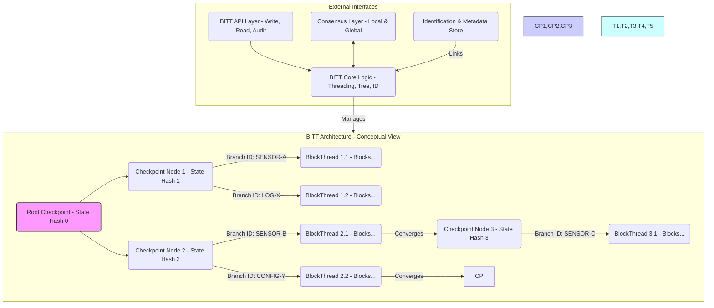

# METADATA BLOCK (S1000D Inspired) - Ejemplo Adaptado
dmc: DMC-GAIAPULSE-GPCM-BITT-ARCH-001-A-SDD-A-00_ES-ES

  dmCode: GP-CM-BITT-ARCH-001-A-SDD-A-00      # Código COAFI único
  modelIdentCode: GAIA-AIR                    # Identificador del Proyecto/Modelo
  systemDiffCode: A                           # Código de Diferencia de Sistema (Configuración A)
  systemCode: BITT                            # Código del Sistema Principal (BITT)
  subSystemCode: 00                           # Código de Subsistema (00 = N/A o General)
  subSubSystemCode: 00                        # Código de Sub-Subsistema (00 = N/A)
  assyCode: ARCH                              # Código de Ensamblaje (ARCH = Arquitectura)
  disassyCode: 001                            # Código de Desensamblaje (Primer doc de arquitectura)
  disassyCodeVariant: A                       # Variante A
  infoCode: SDD                               # Código de Información (System Description Document)
  infoCodeVariant: A                          # Variante A
  itemLocationCode: 00                        # Código de Ubicación (00 = General)
  language: ES-ES                             # Idioma
  applicability: GAIA-AIR-ALL                 # Aplicabilidad (Todos los sistemas GAIA AIR)
status: draft                                # Estado del documento
security: proprietary - GAIA AIR Internal Use Only # Clasificación de seguridad
responsiblePartnerCompany: GAIAPULSE         # Compañía/Entidad Responsable
originator: Amedeo Pelliccia & AI Collaboration # Origen
date: 2024-12-08                             # Fecha de Creación/Revisión
revision: 0.1                                # Número de Revisión
---
# Data Module: GP-CM-BITT-ARCH-001-A-SDD-A-00 - Arquitectura del Sistema BITT

**Título:** Documento de Descripción del Sistema - Arquitectura del BlockThread Identificated Tree (BITT)

**Versión:** 0.1 (Draft)

---

## Tabla de Contenidos
1. [Introducción](#1-introduccion)
   1.1. [Propósito](#11-propósito)
   1.2. [Alcance](#12-alcance)
   1.3. [Definiciones, Acrónimos y Abreviaturas](#13-definiciones-acrónimos-y-abreviaturas)
   1.4. [Referencias](#14-referencias)
2. [Visión General del Sistema BITT](#2-visión-general-del-sistema-bitt)
   2.1. [Contexto y Motivación](#21-contexto-y-motivación)
   2.2. [Principios Fundamentales de Diseño](#22-principios-fundamentales-de-diseño)
   2.3. [Diagrama de Arquitectura de Alto Nivel](#23-diagrama-de-arquitectura-de-alto-nivel)
3. [Componentes Arquitectónicos de BITT](#3-componentes-arquitectónicos-de-bitt)
   3.1. [BlockThreads (Hilos de Bloques)](#31-blockthreads-hilos-de-bloques)
       3.1.1. [Estructura y Tipos de Hilos](#311-estructura-y-tipos-de-hilos)
       3.1.2. [Paralelismo y Concurrencia](#312-paralelismo-y-concurrencia)
       3.1.3. [Estructura del Bloque BITT](#313-estructura-del-bloque-bitt)
   3.2. [Estructura de Árbol (Tree Structure)](#32-estructura-de-árbol-tree-structure)
       3.2.1. [Nodos del Árbol (Hoja, Checkpoint, Raíz)](#321-nodos-del-árbol-hoja-checkpoint-raíz)
       3.2.2. [Jerarquía y Relaciones entre Nodos](#322-jerarquía-y-relaciones-entre-nodos)
       3.2.3. [Mecanismos de Ramificación y Fusión](#323-mecanismos-de-ramificación-y-fusión)
   3.3. [Framework de Identificación (Identification Framework)](#33-framework-de-identificación-identification-framework)
       3.3.1. [Identificadores de Rama (Branch IDs)](#331-identificadores-de-rama-branch-ids)
       3.3.2. [Metadatos Asociados (Contexto, Ética, Sesgo, Retención)](#332-metadatos-asociados-contexto-ética-sesgo-retención)
       3.3.3. [Vinculación con Códigos COAFI](#333-vinculación-con-códigos-coafi)
   3.4. [Mecanismos de Consenso](#34-mecanismos-de-consenso)
       3.4.1. [Consenso Local (Nivel de Hilo/Rama)](#341-consenso-local-nivel-de-hilorama)
       3.4.2. [Consenso Global (Nivel de Checkpoint/Árbol)](#342-consenso-global-nivel-de-checkpointárbol)
       3.4.3. [Resolución de Conflictos entre Ramas](#343-resolución-de-conflictos-entre-ramas)
   3.5. [Estructuras de Datos Detalladas](#35-estructuras-de-datos-detalladas)
       3.5.1. [Esquema del Bloque BITT (Referencia a JSON Schema/ProtoBuf)](#351-esquema-del-bloque-bitt-referencia-a-json-schemaprotobuf)
       3.5.2. [Esquema del Nodo del Árbol BITT](#352-esquema-del-nodo-del-árbol-bitt)
4. [Descripción Funcional](#4-descripción-funcional)
   4.1. [Flujo de Procesamiento de Transacciones/Datos](#41-flujo-de-procesamiento-de-transaccionesdatos)
   4.2. [Proceso de Reconciliación y Checkpointing](#42-proceso-de-reconciliación-y-checkpointing)
   4.3. [Mecanismos de Consulta y Auditoría](#43-mecanismos-de-consulta-y-auditoría)
   4.4. [Implementación de Historización Selectiva y Poda del Árbol](#44-implementación-de-historización-selectiva-y-poda-del-árbol)
   4.5. [Implementación de Normalización Ética y Penalización de Sesgos](#45-implementación-de-normalización-ética-y-penalización-de-sesgos)
5. [Interfaces del Sistema BITT](#5-interfaces-del-sistema-bitt)
   5.1. [API de Escritura (Ingesta de Datos/Transacciones)](#51-api-de-escritura-ingesta-de-datostransacciones)
   5.2. [API de Lectura y Consulta (Query API)](#52-api-de-lectura-y-consulta-query-api)
   5.3. [API de Auditoría y Trazabilidad](#53-api-de-auditoría-y-trazabilidad)
   5.4. [Interfaz con i-Aher0 (Registro de Eventos de Seguridad)](#54-interfaz-con-i-aher0-registro-de-eventos-de-seguridad)
   5.5. [Interfaz con Módulos de Adquisición de Datos (DAM)](#55-interfaz-con-módulos-de-adquisición-de-datos-dam)
   5.6. [Interfaz con Quantum Adaptive Orchestration (QAO)](#56-interfaz-con-quantum-adaptive-orchestration-qao)
   5.7. [Interfaz con Digital Twins](#57-interfaz-con-digital-twins)
6. [Requisitos No Funcionales](#6-requisitos-no-funcionales)
   6.1. [Escalabilidad y Rendimiento (Throughput, Latencia)](#61-escalabilidad-y-rendimiento-throughput-latencia)
   6.2. [Seguridad](#62-seguridad)
   6.3. [Fiabilidad y Tolerancia a Fallos](#63-fiabilidad-y-tolerancia-a-fallos)
   6.4. [Mantenibilidad y Extensibilidad](#64-mantenibilidad-y-extensibilidad)
   6.5. [Auditabilidad y Cumplimiento Normativo](#65-auditabilidad-y-cumplimiento-normativo)
7. [Consideraciones de Despliegue (Alto Nivel)](#7-consideraciones-de-despliegue-alto-nivel)
   7.1. [Topología de Red Sugerida](#71-topología-de-red-sugerida)
   7.2. [Requisitos de Nodo (Hardware, Software)](#72-requisitos-de-nodo-hardware-software)
8. [Consideraciones Futuras y Líneas de Investigación](#8-consideraciones-futuras-y-líneas-de-investigación)
   8.1. [Potenciales Extensiones de BITT](#81-potenciales-extensiones-de-bitt)
   8.2. [Integración con Tecnologías Emergentes (IA Cuántica, etc.)](#82-integración-con-tecnologías-emergentes-ia-cuántica-etc)

---

## 1. Introducción

### 1.1. Propósito
Este documento describe la arquitectura conceptual y los principios de diseño del **BlockThread Identificated Tree (BITT)**, un sistema de ledger distribuido avanzado diseñado para el ecosistema GAIA AIR. BITT tiene como objetivo superar las limitaciones de las Tecnologías de Ledger Distribuido (DLT) tradicionales proporcionando mayor escalabilidad a través del paralelismo, flexibilidad estructural mediante su organización en árbol, auditabilidad granular con trazabilidad mejorada y capacidades enriquecidas de gestión de datos mediante la incorporación de metadatos contextuales, éticos y de ciclo de vida.

### 1.2. Alcance
Este documento cubre la arquitectura lógica de BITT, sus componentes principales (BlockThreads, Estructura de Árbol, Framework de Identificación, Mecanismos de Consenso), los principios operativos fundamentales, las interfaces conceptuales con otros sistemas GAIA AIR y los requisitos no funcionales clave. No incluye detalles de implementación a nivel de código fuente, especificaciones de algoritmos criptográficos detallados o topologías de despliegue físico específicas, que serán abordados en documentos de especificación (SP) y diseño detallado (DD) posteriores.

### 1.3. Definiciones, Acrónimos y Abreviaturas
*   **BITT:** BlockThread Identificated Tree - La tecnología de ledger distribuido descrita en este documento.
*   **BlockThread:** Un hilo secuencial y concurrente de bloques BITT, que representa un flujo de datos o transacciones específico. Similar a una cadena de bloques individual o una rama en un DAG.
*   **Checkpoint Node:** Un nodo especial en la estructura de árbol que sincroniza y reconcilia el estado de múltiples BlockThreads convergentes, estableciendo un punto de consenso global validado.
*   **Leaf Node:** Un bloque BITT individual dentro de un BlockThread.
*   **Branch ID:** Un identificador único asignado a un BlockThread o rama específica dentro de la estructura de árbol BITT, que incluye información contextual.
*   **Contextual Metadata:** Información asociada a bloques o hilos que describe su origen, propósito, semántica, cumplimiento ético, niveles de sesgo y políticas de retención.
*   **DLT:** Distributed Ledger Technology - Tecnología de Ledger Distribuido.
*   **DAG:** Directed Acyclic Graph - Grafo Acíclico Dirigido.
*   **COAFI:** Cosmic Omnidevelopable Aero Foresights Index - Marco de documentación de GAIA AIR.
*   **Infocode:** Código de referencia/trazabilidad COAFI.
*   **XAI:** Explainable Artificial Intelligence - Inteligencia Artificial Explicable.
*   **QAO:** Quantum Adaptive Orchestration - Orquestación Adaptativa Cuántica.
*   **i-Aher0:** intelligent-Aerospace hardened environment for resilience and optimization, 0 - Sistema de ciberseguridad y optimización de GAIA AIR.
*   **DAM:** Data Acquisition Module - Módulo de Adquisición de Datos.
*   **SDD:** System Description Document - Documento de Descripción del Sistema.
*   **API:** Application Programming Interface - Interfaz de Programación de Aplicaciones.
*   **PBFT:** Practical Byzantine Fault Tolerance - Tolerancia Práctica a Fallos Bizantinos.
*   **PoA:** Proof of Authority - Prueba de Autoridad.
*   **PoS:** Proof of Stake - Prueba de Participación (como ejemplo de consenso global).
*   **TPS:** Transactions Per Second - Transacciones Por Segundo.

### 1.4. Referencias
*   [GP-OV-COAFI-0001-A]: COAFI Structure and Guidelines *(Documento COAFI que define la estructura general)*
*   [GP-CM-IAHER-ARCH-XXX-A-SDD-A-00]: i-Aher0 Architecture Document *(Referencia al SDD de i-Aher0 - Código a determinar)*
*   [GP-OV-ETHICS-GUIDE-XXX-A-MAN-A-00]: GAIA AIR Ethics Guidelines *(Manual de directrices éticas - Código a determinar)*
*   [GP-CM-BITT-SCHEMA-BLOCK-001-A-SP-A-00]: BITT Block Data Schema Specification *(Especificación futura del esquema de bloque)*
*   [GP-CM-BITT-SCHEMA-NODE-001-A-SP-A-00]: BITT Tree Node Data Schema Specification *(Especificación futura del esquema de nodo)*
*   [GP-PM-DATA-RETENTION-PLAN-001-A-PLAN-A-00]: GAIA AIR Data Retention Policy *(Plan de retención de datos - Código a determinar)*
*   *[Añadir referencias a documentos sobre Historización Selectiva, Normalización Ética, Consenso específico, etc. cuando existan]*

---

## 2. Visión General del Sistema BITT

### 2.1. Contexto y Motivación
El ecosistema GAIA AIR genera volúmenes masivos de datos heterogéneos en tiempo real (telemetría de sensores, logs de sistemas, eventos de seguridad, datos de simulación, transacciones operacionales, documentación de ciclo de vida). Las DLT tradicionales basadas en blockchain lineal enfrentan desafíos significativos de escalabilidad (throughput limitado por el consenso global secuencial) y flexibilidad para gestionar esta diversidad de datos con el contexto necesario. Además, la simple inmutabilidad no es suficiente; se requiere una trazabilidad enriquecida con información contextual, semántica y ética para cumplir con los exigentes requisitos de seguridad, auditoría, explicabilidad (XAI) y cumplimiento normativo del sector aeroespacial. BITT se propone como una solución DLT de nueva generación que aborda estas limitaciones mediante:

*   **Paralelismo Inherente:** Procesamiento concurrente de flujos de datos a través de BlockThreads independientes.
*   **Estructura Jerárquica:** Organización lógica de los datos mediante una estructura arbórea con puntos de sincronización (Checkpoints).
*   **Identificación Contextual:** Asignación de identificadores y metadatos ricos a cada rama de datos para proporcionar significado y permitir consultas semánticas.

### 2.2. Principios Fundamentales de Diseño
BITT se basa en los siguientes principios arquitectónicos clave:

*   **Paralelismo y Escalabilidad:** Maximizar el throughput mediante la ejecución concurrente e independiente de BlockThreads entre puntos de sincronización. La escalabilidad horizontal se logra añadiendo capacidad de procesamiento a los nodos que gestionan los hilos.
*   **Jerarquía y Organización Estructural:** La estructura de árbol (Tree Structure) impone un orden lógico, permitiendo la agregación, resumen y reconciliación de estados en puntos definidos (Checkpoint Nodes).
*   **Identificación Contextual y Semántica:** Cada flujo de datos (BlockThread) es identificable de forma única (Branch ID) y está enriquecido con metadatos que definen su contexto, origen, propósito, esquema de datos, cumplimiento ético, nivel de sesgo potencial y política de retención.
*   **Auditabilidad Granular y Transparencia:** La estructura criptográficamente enlazada de bloques dentro de los hilos y la conexión jerárquica de los nodos del árbol permiten una trazabilidad completa del linaje de los datos y la validación de su integridad histórica. Los metadatos facilitan auditorías contextuales.
*   **Flexibilidad y Adaptabilidad:** La capacidad de crear nuevas ramas (branching) desde cualquier checkpoint permite adaptar la estructura de BITT dinámicamente para acomodar nuevas fuentes de datos, procesos o versiones de sistemas sin interrumpir otros flujos.
*   **Consenso Híbrido (Local/Global):** Emplear mecanismos de consenso ligeros y rápidos a nivel local (dentro de un hilo o entre hilos relacionados antes de un checkpoint) y mecanismos de consenso más robustos y seguros a nivel global (en los Checkpoint Nodes) para equilibrar velocidad y seguridad.
*   **Integración de Consideraciones Éticas y de Sesgo:** El Framework de Identificación (Sección 3.3) proporciona los ganchos necesarios para integrar la evaluación y mitigación de sesgos y el cumplimiento de normativas éticas directamente en la gestión del ledger.

### 2.3. Diagrama de Arquitectura de Alto Nivel
El siguiente diagrama ilustra conceptualmente la arquitectura de BITT:



*Diagrama Conceptual:* Muestra cómo las ramas (BlockThreads) nacen de Checkpoints, procesan bloques en paralelo y convergen en Checkpoints posteriores. La API interactúa con la lógica central, que gestiona los hilos, el árbol y la identificación. La capa de Consenso asegura la validez local y global. La capa de Identificación almacena y vincula metadatos a los hilos/bloques.

---

## 3. Componentes Arquitectónicos de BITT

### 3.1. BlockThreads (Hilos de Bloques)
Los BlockThreads son el componente fundamental para el procesamiento paralelo en BITT. Representan flujos de información lógicamente distintos y secuenciales.

#### 3.1.1. Estructura y Tipos de Hilos
*   **Estructura:** Cada BlockThread es una secuencia ordenada de Bloques BITT, donde cada bloque (excepto el inicial de la rama) está criptográficamente enlazado a su predecesor(es) dentro del mismo hilo mediante hash(es). Pueden ser conceptualizados como cadenas de bloques ligeras o ramas de un DAG restringidas.
*   **Tipos de Hilos:** Se pueden definir diferentes tipos de hilos para manejar datos específicos, cada uno potencialmente con reglas de validación o formatos de datos asociados (definidos en los metadatos):
    *   *Hilos de Sensores:* Para telemetría continua de alta frecuencia.
    *   *Hilos de Logs:* Para eventos del sistema, auditoría o seguridad (e.g., logs de i-Aher0).
    *   *Hilos de Transacciones:* Para operaciones que cambian el estado de un activo digital o físico (e.g., transferencia de propiedad de componentes, cambios de configuración).
    *   *Hilos de Documentación:* Para registrar versiones y aprobaciones de documentos COAFI.
    *   *Hilos de Simulación:* Para registrar resultados de simulaciones o ejecuciones de Digital Twins.

#### 3.1.2. Paralelismo y Concurrencia
*   La principal ventaja de los BlockThreads es permitir el procesamiento concurrente. Múltiples hilos pueden añadir bloques simultáneamente sin necesidad de un consenso global inmediato para cada bloque.
*   La independencia se mantiene entre Checkpoints. Las interdependencias se resuelven durante el proceso de reconciliación en los Checkpoint Nodes.

#### 3.1.3. Estructura del Bloque BITT
Un Bloque BITT es la unidad atómica de datos dentro de un BlockThread. Su estructura conceptual incluye (referencia a [GP-CM-BITT-SCHEMA-BLOCK-001-A-SP-A-00]):
*   **`BlockID`:** Identificador único del bloque (e.g., hash del contenido y cabecera).
*   **`PreviousBlockID(s)`:** Hash(es) del(os) bloque(s) predecesor(es) en el mismo hilo (permite micro-fusiones locales si es necesario).
*   **`BranchID`:** Identificador de la rama/hilo a la que pertenece el bloque.
*   **`Timestamp`:** Marca de tiempo de creación del bloque (idealmente sincronizada).
*   **`DataPayload`:** Los datos reales de la transacción, evento o log (puede ser un hash del payload real almacenado off-chain si es muy grande).
*   **`MetadataHash`:** Hash que enlaza criptográficamente a la entrada de metadatos asociada a este bloque o conjunto de bloques (ver Sección 3.3).
*   **`CreatorSignature`:** Firma digital del nodo/entidad que creó el bloque.
*   **`LocalConsensusProof`:** (Opcional) Prueba resultante del mecanismo de consenso local aplicado (si existe para este tipo de hilo).

### 3.2. Estructura de Árbol (Tree Structure)
La estructura de árbol organiza los BlockThreads jerárquicamente, proporcionando puntos de sincronización y un marco para el consenso global.

#### 3.2.1. Nodos del Árbol (Hoja, Checkpoint, Raíz)
*   **Nodo Hoja (Leaf Node):** Representa un bloque BITT individual dentro de un BlockThread activo que aún no ha sido incluido en un Checkpoint.
*   **Nodo Checkpoint (Checkpoint Node):** Nodos estructurales que marcan puntos de sincronización y consenso global. Un Checkpoint:
    *   Recibe la terminación de uno o más BlockThreads (ramas).
    *   Valida y reconcilia los estados resultantes de esos hilos mediante el mecanismo de Consenso Global.
    *   Contiene una representación resumida del estado validado (e.g., Merkle Root de los estados de los hilos, hash del estado global agregado).
    *   Sirve como punto de origen para nuevas ramas (BlockThreads).
    *   Está criptográficamente enlazado a su Checkpoint padre.
*   **Nodo Raíz (Root Node):** El Checkpoint inicial o génesis de toda la estructura BITT (o de una sub-estructura principal si BITT se implementa de forma federada).

#### 3.2.2. Jerarquía y Relaciones entre Nodos
*   Los bloques (Leaf Nodes) se enlazan secuencialmente dentro de un BlockThread.
*   Los BlockThreads se originan en un Checkpoint Node (su nodo padre en el árbol).
*   Los BlockThreads terminan y son reconciliados en un Checkpoint Node posterior (su nodo hijo en el árbol).
*   Los Checkpoint Nodes se enlazan jerárquicamente a su Checkpoint padre, formando la estructura de árbol principal.

#### 3.2.3. Mecanismos de Ramificación y Fusión
*   **Ramificación (Branching):** Se puede iniciar un nuevo BlockThread (rama) desde cualquier Checkpoint Node existente. Esto permite crear nuevos flujos de datos paralelos para nuevos procesos, sistemas o versiones sin afectar las ramas existentes. Se asigna un nuevo Branch ID.
*   **Fusión (Merging):** La fusión ocurre implícitamente en los Checkpoint Nodes. Cuando múltiples BlockThreads convergen en el mismo Checkpoint, sus estados se reconcilian y validan mediante el consenso global. El Checkpoint resultante representa el estado fusionado y validado. No se requiere una operación de fusión explícita a nivel de bloque entre hilos diferentes (aunque sí puede haberla dentro de un mismo hilo si el diseño lo permite).

### 3.3. Framework de Identificación (Identification Framework)
Este framework añade contexto semántico y de gobernanza a los datos almacenados en BITT.

#### 3.3.1. Identificadores de Rama (Branch IDs)
*   Cada BlockThread tiene un Branch ID único y descriptivo.
*   Los IDs pueden ser jerárquicos para reflejar la fuente o propósito (e.g., `AIRCRAFT-AMPEL360-SN123-SENSOR-WING-TEMP-L`, `SECURITY-IAHER0-ALERT-NETWORK`).
*   Permiten consultas y filtrado basados en el origen o tipo de datos.

#### 3.3.2. Metadatos Asociados (Contexto, Ética, Sesgo, Retención)
*   Los metadatos son cruciales y están vinculados criptográficamente a los bloques BITT (a través del `MetadataHash`). Pueden almacenarse on-chain (si son pequeños) o off-chain en una base de datos indexada.
*   Incluyen campos clave como:
    *   **`Context`:** Origen del dato (sensor ID, sistema, usuario), propósito, tipo de evento.
    *   **`DataSchemaID`:** Identificador del esquema (JSON Schema, ProtoBuf) que define la estructura del `DataPayload`.
    *   **`EthicsCompliance`:** Indicadores de cumplimiento con directrices éticas GAIA AIR (e.g., flag PII, estado de consentimiento, resultado de auditoría ética). ([Referencia a GP-OV-ETHICS-GUIDE-XXX-A-MAN-A-00])
    *   **`BiasIndicators`:** Métricas o flags indicando potencial sesgo (e.g., fuente de datos conocida por sesgo, puntuación de fiabilidad, indicador de normalización aplicada).
    *   **`RetentionPolicyID`:** Identificador de la política de retención de datos aplicable. ([Referencia a GP-PM-DATA-RETENTION-PLAN-001-A-PLAN-A-00])
    *   **`COAFILink`:** Infocode(s) COAFI relevante(s) (requisito, diseño, test) asociado a este dato o evento.

#### 3.3.3. Vinculación con Códigos COAFI
*   El campo `COAFILink` en los metadatos permite la trazabilidad bidireccional entre los datos del ledger BITT y la documentación técnica/operacional en COAFI.
*   Esto facilita la auditoría, la validación de requisitos y la comprensión del contexto de los datos registrados.

### 3.4. Mecanismos de Consenso
BITT emplea un enfoque de consenso híbrido para optimizar rendimiento y seguridad.

#### 3.4.1. Consenso Local (Nivel de Hilo/Rama)
*   **Propósito:** Asegurar la validez y el orden de los bloques *dentro* de un hilo o entre hilos estrechamente relacionados antes de un Checkpoint global.
*   **Mecanismos Potenciales:**
    *   *Validación por Origen Confiable:* Para datos de sensores calibrados o sistemas certificados, la firma del creador puede ser suficiente.
    *   *Prueba de Secuencia Simple:* Asegurar el orden correcto basado en timestamps y hashes previos.
    *   *Micro-Consenso (si es necesario):* Para hilos transaccionales locales, se podrían usar algoritmos ligeros como Raft simplificado o PoA entre un conjunto limitado de nodos validadores locales.
*   **Objetivo:** Alta velocidad, baja latencia para la ingesta de datos.

#### 3.4.2. Consenso Global (Nivel de Checkpoint/Árbol)
*   **Propósito:** Validar el estado agregado resultante de los hilos que convergen en un Checkpoint, asegurar la consistencia global del árbol y prevenir ataques como el doble gasto (si aplica) o la reescritura de la historia reconciliada.
*   **Mecanismos Potenciales:**
    *   *PBFT (Practical Byzantine Fault Tolerance):* Robusto contra fallos bizantinos, adecuado para redes permisionadas.
    *   *Tendermint/Cosmos SDK:* Marco modular que combina BFT con PoS o PoA.
    *   *Algoritmos Basados en DAG (adaptados):* Como los usados en Hashgraph o IOTA Tangle, adaptados para la estructura de Checkpoints.
*   **Objetivo:** Alta seguridad, consistencia final, resistencia a fallos.

#### 3.4.3. Resolución de Conflictos entre Ramas
*   Los Checkpoint Nodes son el punto donde se detectan y resuelven conflictos (e.g., dos ramas intentan actualizar el mismo estado de forma diferente).
*   El algoritmo de Consenso Global determina qué transacción/estado es válido y se incluye en el estado resumido del Checkpoint.
*   Las ramas conflictivas pueden ser invalidadas o requerir una fusión/corrección explícita en un Checkpoint posterior.

### 3.5. Estructuras de Datos Detalladas
Las especificaciones formales se encontrarán en documentos SP dedicados.

#### 3.5.1. Esquema del Bloque BITT (Referencia a [GP-CM-BITT-SCHEMA-BLOCK-001-A-SP-A-00])
*   *Campos Clave (Conceptuales):* `BlockID (hash)`, `Timestamp (int64)`, `BranchID (string/bytes)`, `PreviousBlockID (list[hash])`, `DataPayload (bytes/hash)`, `MetadataHash (hash)`, `CreatorNodeID (string/pubkey)`, `CreatorSignature (bytes)`, `LocalConsensusProof (bytes)`

#### 3.5.2. Esquema del Nodo del Árbol BITT (Referencia a [GP-CM-BITT-SCHEMA-NODE-001-A-SP-A-00])
*   *Campos Clave para Checkpoint Node (Conceptuales):* `CheckpointID (hash)`, `Timestamp (int64)`, `ParentCheckpointID (hash)`, `ConvergedThreadIDs (list[BranchID])`, `ConvergedStateSummaryHash (hash/MerkleRoot)`, `GlobalConsensusProof (bytes)`, `ValidatorSignatures (list[bytes])`, `NewBranchSpawnInfo (list[BranchID])`

---

## 4. Descripción Funcional

### 4.1. Flujo de Procesamiento de Transacciones/Datos
1.  **Ingesta:** Un dato o transacción llega a la API de Escritura de BITT.
2.  **Identificación y Enrutamiento:** La API o la lógica central de BITT asigna la entrada a un BlockThread apropiado basándose en el origen, tipo o metadatos proporcionados, asignando/recuperando el Branch ID.
3.  **Creación del Bloque:** Se crea un nuevo Bloque BITT encapsulando el dato (`DataPayload`) y los metadatos asociados (o un hash a ellos - `MetadataHash`). Se incluyen timestamp, hash(es) previo(s), Branch ID.
4.  **Validación Local (Opcional):** Si el tipo de hilo requiere consenso local, se ejecuta el mecanismo correspondiente.
5.  **Firma y Anexión:** El nodo creador firma el bloque (`CreatorSignature`) y lo anexa al final del BlockThread designado.
6.  **Propagación (Local):** El nuevo bloque se propaga a otros nodos relevantes que siguen esa rama (según la topología).

### 4.2. Proceso de Reconciliación y Checkpointing
1.  **Convergencia:** Múltiples BlockThreads llegan al final de su segmento definido y convergen hacia un Checkpoint Node designado.
2.  **Propuesta de Checkpoint:** Un nodo líder o un conjunto de validadores proponen un nuevo Checkpoint, incluyendo los hashes finales de los hilos convergentes y un hash del estado agregado/reconciliado propuesto.
3.  **Consenso Global:** Se ejecuta el algoritmo de Consenso Global (e.g., PBFT) entre los nodos validadores designados para acordar la validez del estado reconciliado y el contenido del Checkpoint.
4.  **Creación del Checkpoint:** Una vez alcanzado el consenso, se crea el Checkpoint Node final, se firma por los validadores y se enlaza al Checkpoint padre.
5.  **Finalización:** Los bloques incluidos en los hilos reconciliados se consideran finalizados globalmente.
6.  **Nueva Ramificación (Opcional):** Se pueden iniciar nuevos BlockThreads desde este Checkpoint recién creado.

### 4.3. Mecanismos de Consulta y Auditoría
*   **Consulta por ID:** Recuperar bloques, hilos o estados de checkpoints específicos usando sus IDs (BlockID, BranchID, CheckpointID).
*   **Consulta por Metadatos:** Filtrar y recuperar datos basados en los metadatos asociados (e.g., todos los eventos de un sensor específico, todos los logs con un flag ético particular, todos los datos relacionados con un Infocode COAFI).
*   **Auditoría de Linaje:** Seguir los enlaces criptográficos (`PreviousBlockID`, `ParentCheckpointID`) hacia atrás para verificar la historia y el origen de un dato específico.
*   **Validación de Integridad:** Verificar las firmas digitales y los hashes en bloques y checkpoints para asegurar que no ha habido manipulación.

### 4.4. Implementación de Historización Selectiva y Poda del Árbol
*   Basándose en el `RetentionPolicyID` de los metadatos, BITT implementará (en futuras fases) mecanismos para archivar o podar datos antiguos.
*   La poda podría eliminar los `DataPayload` de bloques antiguos en ramas ya finalizadas y reconciliadas en múltiples checkpoints, manteniendo únicamente las cabeceras de bloque y los nodos Checkpoint para la auditabilidad estructural.
*   Las políticas de retención serán configurables y auditables. ([Referencia a GP-PM-DATA-RETENTION-PLAN-001-A-PLAN-A-00])

### 4.5. Implementación de Normalización Ética y Penalización de Sesgos
*   BITT no realiza la normalización/penalización directamente, pero *habilita* este proceso a través de los metadatos (`EthicsCompliance`, `BiasIndicators`).
*   Sistemas externos (o módulos integrados en los validadores de checkpoints) pueden leer estos metadatos.
*   Basándose en las directrices GAIA AIR ([Referencia a GP-OV-ETHICS-GUIDE-XXX-A-MAN-A-00]), estos sistemas pueden:
    *   *Marcar/Alertar:* Señalar datos que no cumplen con los estándares éticos.
    *   *Aplicar Ponderación:* Reducir la confianza o el peso de datos de fuentes sesgadas en análisis posteriores.
    *   *Requerir Remediación:* Activar flujos de trabajo para corregir o anotar datos problemáticos.
    *   *Informar Auditorías:* Facilitar auditorías centradas en el cumplimiento ético y la mitigación de sesgos.

---

## 5. Interfaces del Sistema BITT
Las interfaces se definirán formalmente en documentos ICD. Conceptualmente:

### 5.1. API de Escritura (Ingesta de Datos/Transacciones)
*   *Funciones:* `submitBlock(branchID, dataPayload, metadata)`, `requestNewBranch(parentCheckpointID, metadata)`
*   *Protocolos:* Probablemente gRPC o REST sobre TLS, con autenticación basada en certificados/tokens.

### 5.2. API de Lectura y Consulta (Query API)
*   *Funciones:* `getBlock(blockID)`, `getThreadHistory(branchID, startBlock?, endBlock?)`, `getCheckpointState(checkpointID)`, `queryByMetadata(filterCriteria)`
*   *Protocolos:* GraphQL podría ser adecuado para consultas flexibles basadas en metadatos; REST para consultas simples por ID.

### 5.3. API de Auditoría y Trazabilidad
*   *Funciones:* `verifyBlockIntegrity(blockID)`, `traceDataLineage(blockID/dataHash)`, `getConsensusProof(checkpointID)`
*   *Protocolos:* REST/gRPC, con énfasis en la devolución de pruebas criptográficas.

### 5.4. Interfaz con i-Aher0 (Registro de Eventos de Seguridad)
*   i-Aher0 utilizará la API de Escritura para registrar alertas y eventos de seguridad en hilos BITT dedicados (`SECURITY-IAHER0-*`).
*   El formato de datos podría basarse en STIX/TAXII adaptado.
*   i-Aher0 podría usar la API de Consulta para obtener contexto de BITT durante investigaciones.

### 5.5. Interfaz con Módulos de Adquisición de Datos (DAM)
*   Los DAMs utilizarán la API de Escritura para registrar datos de sensores y sistemas en hilos BITT específicos (`SENSOR-*`, `SYSTEMLOG-*`).
*   Los metadatos asociados (sensor ID, timestamp preciso, unidad de medida, COAFILink al sensor) son críticos.

### 5.6. Interfaz con Quantum Adaptive Orchestration (QAO)
*   QAO podría usar la API de Escritura para registrar decisiones de orquestación, asignaciones de recursos y resultados de optimización en hilos `QAO-*`.
*   QAO podría usar la API de Consulta para obtener datos históricos de rendimiento del sistema desde BITT para informar sus algoritmos de optimización.

### 5.7. Interfaz con Digital Twins
*   Los Digital Twins utilizarán la API de Escritura para registrar cambios de estado, resultados de simulación y eventos de mantenimiento virtualizados en hilos específicos (`DTWIN-*`).
*   Utilizarán la API de Consulta para obtener el historial operativo y de mantenimiento real (registrado por DAMs e i-Aher0) desde BITT para sincronizar y validar el estado del gemelo digital.

---

## 6. Requisitos No Funcionales

*   **6.1. Escalabilidad y Rendimiento:**
    *   *Throughput Agregado:* Objetivo > 10,000 TPS (sumando todos los hilos activos).
    *   *Latencia de Confirmación Local:* Objetivo < 1 segundo para bloques dentro de un hilo.
    *   *Latencia de Finalidad Global (Checkpoint):* Objetivo < 10 segundos.
    *   *Escalabilidad Horizontal:* El sistema debe escalar añadiendo nodos para gestionar más hilos/ramas.
*   **6.2. Seguridad:**
    *   *Integridad de Datos:* Garantizada mediante hashing criptográfico y firmas digitales.
    *   *Resistencia a Ataques:* Diseño para resistir ataques DLT comunes (Sybil, 51% - mitigado por consenso global permisionado, DoS).
    *   *Confidencialidad:* Asegurada mediante cifrado (potencialmente homomórfico o ZKP en el futuro) y control de acceso basado en roles/atributos.
    *   *Resistencia Cuántica:* Plan para migrar a algoritmos criptográficos post-cuánticos (definidos en SP).
*   **6.3. Fiabilidad y Tolerancia a Fallos:**
    *   *Disponibilidad:* Objetivo de 99.999% para nodos Checkpoint críticos.
    *   *Tolerancia a Fallos:* El consenso global debe tolerar hasta f fallos bizantinos (configurable, e.g., f = (n-1)/3 para PBFT). Réplica de datos entre nodos.
    *   *Recuperación:* Mecanismos para la recuperación de nodos fallidos y resincronización con la red.
*   **6.4. Mantenibilidad y Extensibilidad:**
    *   *Modularidad:* Diseño basado en componentes y APIs claras.
    *   *Actualización:* Soporte para actualizaciones de software sin interrumpir la operación (rolling updates).
    *   *Extensibilidad:* Facilidad para añadir nuevos tipos de hilos, metadatos o mecanismos de consenso.
*   **6.5. Auditabilidad y Cumplimiento Normativo:**
    *   *Trazabilidad Completa:* Capacidad de auditar el historial completo de cualquier dato.
    *   *Cumplimiento:* Diseño para cumplir con regulaciones relevantes (e.g., GDPR si aplica a metadatos, regulaciones aeroespaciales sobre integridad de datos).

---

## 7. Consideraciones de Despliegue (Alto Nivel)

*   **7.1. Topología de Red Sugerida:**
    *   Modelo híbrido: Nodos Checkpoint y Raíz en infraestructura central segura y de alta disponibilidad (Cloud Privada GAIA AIR / On-Premise Seguro).
    *   Nodos de Hilo/Hoja pueden desplegarse de forma más distribuida, incluso en edge (vehículos, estaciones terrestres), dependiendo de los requisitos de latencia y seguridad del hilo.
    *   Red permisionada con gestión de identidades robusta.
*   **7.2. Requisitos de Nodo (Hardware, Software):**
    *   *Nodos Checkpoint:* Requisitos de cómputo y red elevados para ejecutar consenso global.
    *   *Nodos de Hilo:* Requisitos variables según el throughput del hilo; pueden ser más ligeros.
    *   *Software:* Sistema Operativo (Linux preferido), software BITT, librerías criptográficas, base de datos (para metadatos off-chain si aplica). Especificaciones detalladas en DD.

---

## 8. Consideraciones Futuras y Líneas de Investigación

*   **8.1. Potenciales Extensiones de BITT:**
    *   Integración de Pruebas de Conocimiento Cero (Zero-Knowledge Proofs) para privacidad verificable.
    *   Mecanismos de Sharding más avanzados para escalabilidad masiva.
    *   Soporte para ejecución de smart contracts complejos en Checkpoints.
    *   Interoperabilidad entre diferentes instancias BITT (Cross-BITT Communication).
*   **8.2. Integración con Tecnologías Emergentes:**
    *   Uso de IA Cuántica (QML) para optimizar consenso, detección de anomalías o análisis de datos en BITT.
    *   Integración más profunda con QAO para control en tiempo real basado en estado del ledger.
    *   Exploración de almacenamiento de datos basado en ADN u otras tecnologías emergentes para archivo a largo plazo (vinculado a historización selectiva).
    *   Formal Verification techniques applied to BITT protocols.

---

*Fin del Data Module*
```

