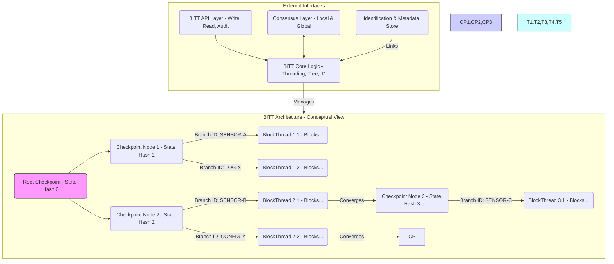
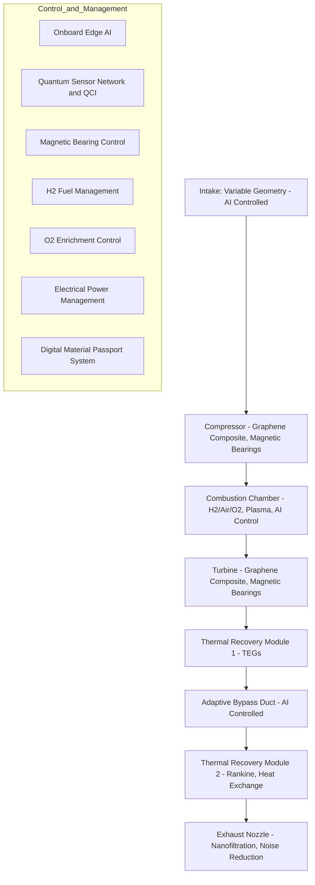

# METADATA BLOCK (S1000D Inspired) - Ejemplo Adaptado
dmc: DMC-GAIAPULSE-GPCM-BITT-ARCH-001-A-SDD-A-00_ES-ES

  dmCode: GP-CM-BITT-ARCH-001-A-SDD-A-00      # Código COAFI único
  modelIdentCode: GAIA-AIR                    # Identificador del Proyecto/Modelo
  systemDiffCode: A                           # Código de Diferencia de Sistema (Configuración A)
  systemCode: BITT                            # Código del Sistema Principal (BITT)
  subSystemCode: 00                           # Código de Subsistema (00 = N/A o General)
  subSubSystemCode: 00                        # Código de Sub-Subsistema (00 = N/A)
  assyCode: ARCH                              # Código de Ensamblaje (ARCH = Arquitectura)
  disassyCode: 001                            # Código de Desensamblaje (Primer doc de arquitectura)
  disassyCodeVariant: A                       # Variante A
  infoCode: SDD                               # Código de Información (System Description Document)
  infoCodeVariant: A                          # Variante A
  itemLocationCode: 00                        # Código de Ubicación (00 = General)
  language: ES-ES                             # Idioma
  applicability: GAIA-AIR-ALL                 # Aplicabilidad (Todos los sistemas GAIA AIR)
status: draft                                # Estado del documento
security: proprietary - GAIA AIR Internal Use Only # Clasificación de seguridad
responsiblePartnerCompany: GAIAPULSE         # Compañía/Entidad Responsable
originator: Amedeo Pelliccia & AI Collaboration # Origen
date: 2024-12-08                             # Fecha de Creación/Revisión
revision: 0.1                                # Número de Revisión
---
# Data Module: GP-COM-BITT-ARCH-001-A-SDD-A-00 - Arquitectura del Sistema BITT

**Título:** Documento de Descripción del Sistema - Arquitectura del BlockThread Identificated Tree (BITT)

**Versión:** 0.1 (Draft)

---

## Tabla de Contenidos
1. [Introducción](#1-introduccion)
   1.1. [Propósito](#11-propósito)
   1.2. [Alcance](#12-alcance)
   1.3. [Definiciones, Acrónimos y Abreviaturas](#13-definiciones-acrónimos-y-abreviaturas)
   1.4. [Referencias](#14-referencias)
2. [Visión General del Sistema BITT](#2-visión-general-del-sistema-bitt)
   2.1. [Contexto y Motivación](#21-contexto-y-motivación)
   2.2. [Principios Fundamentales de Diseño](#22-principios-fundamentales-de-diseño)
   2.3. [Diagrama de Arquitectura de Alto Nivel](#23-diagrama-de-arquitectura-de-alto-nivel)
3. [Componentes Arquitectónicos de BITT](#3-componentes-arquitectónicos-de-bitt)
   3.1. [BlockThreads (Hilos de Bloques)](#31-blockthreads-hilos-de-bloques)
       3.1.1. [Estructura y Tipos de Hilos](#311-estructura-y-tipos-de-hilos)
       3.1.2. [Paralelismo y Concurrencia](#312-paralelismo-y-concurrencia)
       3.1.3. [Estructura del Bloque BITT](#313-estructura-del-bloque-bitt)
   3.2. [Estructura de Árbol (Tree Structure)](#32-estructura-de-árbol-tree-structure)
       3.2.1. [Nodos del Árbol (Hoja, Checkpoint, Raíz)](#321-nodos-del-árbol-hoja-checkpoint-raíz)
       3.2.2. [Jerarquía y Relaciones entre Nodos](#322-jerarquía-y-relaciones-entre-nodos)
       3.2.3. [Mecanismos de Ramificación y Fusión](#323-mecanismos-de-ramificación-y-fusión)
   3.3. [Framework de Identificación (Identification Framework)](#33-framework-de-identificación-identification-framework)
       3.3.1. [Identificadores de Rama (Branch IDs)](#331-identificadores-de-rama-branch-ids)
       3.3.2. [Metadatos Asociados (Contexto, Ética, Sesgo, Retención)](#332-metadatos-asociados-contexto-ética-sesgo-retención)
       3.3.3. [Vinculación con Códigos COAFI](#333-vinculación-con-códigos-coafi)
   3.4. [Mecanismos de Consenso](#34-mecanismos-de-consenso)
       3.4.1. [Consenso Local (Nivel de Hilo/Rama)](#341-consenso-local-nivel-de-hilorama)
       3.4.2. [Consenso Global (Nivel de Checkpoint/Árbol)](#342-consenso-global-nivel-de-checkpointárbol)
       3.4.3. [Resolución de Conflictos entre Ramas](#343-resolución-de-conflictos-entre-ramas)
   3.5. [Estructuras de Datos Detalladas](#35-estructuras-de-datos-detalladas)
       3.5.1. [Esquema del Bloque BITT (Referencia a JSON Schema/ProtoBuf)](#351-esquema-del-bloque-bitt-referencia-a-json-schemaprotobuf)
       3.5.2. [Esquema del Nodo del Árbol BITT](#352-esquema-del-nodo-del-árbol-bitt)
4. [Descripción Funcional](#4-descripción-funcional)
   4.1. [Flujo de Procesamiento de Transacciones/Datos](#41-flujo-de-procesamiento-de-transaccionesdatos)
   4.2. [Proceso de Reconciliación y Checkpointing](#42-proceso-de-reconciliación-y-checkpointing)
   4.3. [Mecanismos de Consulta y Auditoría](#43-mecanismos-de-consulta-y-auditoría)
   4.4. [Implementación de Historización Selectiva y Poda del Árbol](#44-implementación-de-historización-selectiva-y-poda-del-árbol)
   4.5. [Implementación de Normalización Ética y Penalización de Sesgos](#45-implementación-de-normalización-ética-y-penalización-de-sesgos)
5. [Interfaces del Sistema BITT](#5-interfaces-del-sistema-bitt)
   5.1. [API de Escritura (Ingesta de Datos/Transacciones)](#51-api-de-escritura-ingesta-de-datostransacciones)
   5.2. [API de Lectura y Consulta (Query API)](#52-api-de-lectura-y-consulta-query-api)
   5.3. [API de Auditoría y Trazabilidad](#53-api-de-auditoría-y-trazabilidad)
   5.4. [Interfaz con i-Aher0 (Registro de Eventos de Seguridad)](#54-interfaz-con-i-aher0-registro-de-eventos-de-seguridad)
   5.5. [Interfaz con Módulos de Adquisición de Datos (DAM)](#55-interfaz-con-módulos-de-adquisición-de-datos-dam)
   5.6. [Interfaz con Quantum Adaptive Orchestration (QAO)](#56-interfaz-con-quantum-adaptive-orchestration-qao)
   5.7. [Interfaz con Digital Twins](#57-interfaz-con-digital-twins)
6. [Requisitos No Funcionales](#6-requisitos-no-funcionales)
   6.1. [Escalabilidad y Rendimiento (Throughput, Latencia)](#61-escalabilidad-y-rendimiento-throughput-latencia)
   6.2. [Seguridad](#62-seguridad)
   6.3. [Fiabilidad y Tolerancia a Fallos](#63-fiabilidad-y-tolerancia-a-fallos)
   6.4. [Mantenibilidad y Extensibilidad](#64-mantenibilidad-y-extensibilidad)
   6.5. [Auditabilidad y Cumplimiento Normativo](#65-auditabilidad-y-cumplimiento-normativo)
7. [Consideraciones de Despliegue (Alto Nivel)](#7-consideraciones-de-despliegue-alto-nivel)
   7.1. [Topología de Red Sugerida](#71-topología-de-red-sugerida)
   7.2. [Requisitos de Nodo (Hardware, Software)](#72-requisitos-de-nodo-hardware-software)
8. [Consideraciones Futuras y Líneas de Investigación](#8-consideraciones-futuras-y-líneas-de-investigación)
   8.1. [Potenciales Extensiones de BITT](#81-potenciales-extensiones-de-bitt)
   8.2. [Integración con Tecnologías Emergentes (IA Cuántica, etc.)](#82-integración-con-tecnologías-emergentes-ia-cuántica-etc)

---

## 1. Introducción

### 1.1. Propósito
Este documento describe la arquitectura conceptual y los principios de diseño del **BlockThread Identificated Tree (BITT)**, un sistema de ledger distribuido avanzado diseñado para el ecosistema GAIA AIR. BITT tiene como objetivo superar las limitaciones de las Tecnologías de Ledger Distribuido (DLT) tradicionales proporcionando mayor escalabilidad a través del paralelismo, flexibilidad estructural mediante su organización en árbol, auditabilidad granular con trazabilidad mejorada y capacidades enriquecidas de gestión de datos mediante la incorporación de metadatos contextuales, éticos y de ciclo de vida.

### 1.2. Alcance
Este documento cubre la arquitectura lógica de BITT, sus componentes principales (BlockThreads, Estructura de Árbol, Framework de Identificación, Mecanismos de Consenso), los principios operativos fundamentales, las interfaces conceptuales con otros sistemas GAIA AIR y los requisitos no funcionales clave. No incluye detalles de implementación a nivel de código fuente, especificaciones de algoritmos criptográficos detallados o topologías de despliegue físico específicas, que serán abordados en documentos de especificación (SP) y diseño detallado (DD) posteriores.

### 1.3. Definiciones, Acrónimos y Abreviaturas
*   **BITT:** BlockThread Identificated Tree - La tecnología de ledger distribuido descrita en este documento.
*   **BlockThread:** Un hilo secuencial y concurrente de bloques BITT, que representa un flujo de datos o transacciones específico. Similar a una cadena de bloques individual o una rama en un DAG.
*   **Checkpoint Node:** Un nodo especial en la estructura de árbol que sincroniza y reconcilia el estado de múltiples BlockThreads convergentes, estableciendo un punto de consenso global validado.
*   **Leaf Node:** Un bloque BITT individual dentro de un BlockThread.
*   **Branch ID:** Un identificador único asignado a un BlockThread o rama específica dentro de la estructura de árbol BITT, que incluye información contextual.
*   **Contextual Metadata:** Información asociada a bloques o hilos que describe su origen, propósito, semántica, cumplimiento ético, niveles de sesgo y políticas de retención.
*   **DLT:** Distributed Ledger Technology - Tecnología de Ledger Distribuido.
*   **DAG:** Directed Acyclic Graph - Grafo Acíclico Dirigido.
*   **COAFI:** Cosmic Omnidevelopable Aero Foresights Index - Marco de documentación de GAIA AIR.
*   **Infocode:** Código de referencia/trazabilidad COAFI.
*   **XAI:** Explainable Artificial Intelligence - Inteligencia Artificial Explicable.
*   **QAO:** Quantum Adaptive Orchestration - Orquestación Adaptativa Cuántica.
*   **i-Aher0:** intelligent-Aerospace hardened environment for resilience and optimization, 0 - Sistema de ciberseguridad y optimización de GAIA AIR.
*   **DAM:** Data Acquisition Module - Módulo de Adquisición de Datos.
*   **SDD:** System Description Document - Documento de Descripción del Sistema.
*   **API:** Application Programming Interface - Interfaz de Programación de Aplicaciones.
*   **PBFT:** Practical Byzantine Fault Tolerance - Tolerancia Práctica a Fallos Bizantinos.
*   **PoA:** Proof of Authority - Prueba de Autoridad.
*   **PoS:** Proof of Stake - Prueba de Participación (como ejemplo de consenso global).
*   **TPS:** Transactions Per Second - Transacciones Por Segundo.

### 1.4. Referencias
*   [GP-OV-COAFI-0001-A]: COAFI Structure and Guidelines *(Documento COAFI que define la estructura general)*
*   [GP-CM-IAHER-ARCH-XXX-A-SDD-A-00]: i-Aher0 Architecture Document *(Referencia al SDD de i-Aher0 - Código a determinar)*
*   [GP-OV-ETHICS-GUIDE-XXX-A-MAN-A-00]: GAIA AIR Ethics Guidelines *(Manual de directrices éticas - Código a determinar)*
*   [GP-CM-BITT-SCHEMA-BLOCK-001-A-SP-A-00]: BITT Block Data Schema Specification *(Especificación futura del esquema de bloque)*
*   [GP-CM-BITT-SCHEMA-NODE-001-A-SP-A-00]: BITT Tree Node Data Schema Specification *(Especificación futura del esquema de nodo)*
*   [GP-PM-DATA-RETENTION-PLAN-001-A-PLAN-A-00]: GAIA AIR Data Retention Policy *(Plan de retención de datos - Código a determinar)*
*   *[Añadir referencias a documentos sobre Historización Selectiva, Normalización Ética, Consenso específico, etc. cuando existan]*

---

## 2. Visión General del Sistema BITT

### 2.1. Contexto y Motivación
El ecosistema GAIA AIR genera volúmenes masivos de datos heterogéneos en tiempo real (telemetría de sensores, logs de sistemas, eventos de seguridad, datos de simulación, transacciones operacionales, documentación de ciclo de vida). Las DLT tradicionales basadas en blockchain lineal enfrentan desafíos significativos de escalabilidad (throughput limitado por el consenso global secuencial) y flexibilidad para gestionar esta diversidad de datos con el contexto necesario. Además, la simple inmutabilidad no es suficiente; se requiere una trazabilidad enriquecida con información contextual, semántica y ética para cumplir con los exigentes requisitos de seguridad, auditoría, explicabilidad (XAI) y cumplimiento normativo del sector aeroespacial. BITT se propone como una solución DLT de nueva generación que aborda estas limitaciones mediante:

*   **Paralelismo Inherente:** Procesamiento concurrente de flujos de datos a través de BlockThreads independientes.
*   **Estructura Jerárquica:** Organización lógica de los datos mediante una estructura arbórea con puntos de sincronización (Checkpoints).
*   **Identificación Contextual:** Asignación de identificadores y metadatos ricos a cada rama de datos para proporcionar significado y permitir consultas semánticas.

### 2.2. Principios Fundamentales de Diseño
BITT se basa en los siguientes principios arquitectónicos clave:

*   **Paralelismo y Escalabilidad:** Maximizar el throughput mediante la ejecución concurrente e independiente de BlockThreads entre puntos de sincronización. La escalabilidad horizontal se logra añadiendo capacidad de procesamiento a los nodos que gestionan los hilos.
*   **Jerarquía y Organización Estructural:** La estructura de árbol (Tree Structure) impone un orden lógico, permitiendo la agregación, resumen y reconciliación de estados en puntos definidos (Checkpoint Nodes).
*   **Identificación Contextual y Semántica:** Cada flujo de datos (BlockThread) es identificable de forma única (Branch ID) y está enriquecido con metadatos que definen su contexto, origen, propósito, esquema de datos, cumplimiento ético, nivel de sesgo potencial y política de retención.
*   **Auditabilidad Granular y Transparencia:** La estructura criptográficamente enlazada de bloques dentro de los hilos y la conexión jerárquica de los nodos del árbol permiten una trazabilidad completa del linaje de los datos y la validación de su integridad histórica. Los metadatos facilitan auditorías contextuales.
*   **Flexibilidad y Adaptabilidad:** La capacidad de crear nuevas ramas (branching) desde cualquier checkpoint permite adaptar la estructura de BITT dinámicamente para acomodar nuevas fuentes de datos, procesos o versiones de sistemas sin interrumpir otros flujos.
*   **Consenso Híbrido (Local/Global):** Emplear mecanismos de consenso ligeros y rápidos a nivel local (dentro de un hilo o entre hilos relacionados antes de un checkpoint) y mecanismos de consenso más robustos y seguros a nivel global (en los Checkpoint Nodes) para equilibrar velocidad y seguridad.
*   **Integración de Consideraciones Éticas y de Sesgo:** El Framework de Identificación (Sección 3.3) proporciona los ganchos necesarios para integrar la evaluación y mitigación de sesgos y el cumplimiento de normativas éticas directamente en la gestión del ledger.

### 2.3. Diagrama de Arquitectura de Alto Nivel
El siguiente diagrama ilustra conceptualmente la arquitectura de BITT:



*Diagrama Conceptual:* Muestra cómo las ramas (BlockThreads) nacen de Checkpoints, procesan bloques en paralelo y convergen en Checkpoints posteriores. La API interactúa con la lógica central, que gestiona los hilos, el árbol y la identificación. La capa de Consenso asegura la validez local y global. La capa de Identificación almacena y vincula metadatos a los hilos/bloques.

---

## 3. Componentes Arquitectónicos de BITT

### 3.1. BlockThreads (Hilos de Bloques)
Los BlockThreads son el componente fundamental para el procesamiento paralelo en BITT. Representan flujos de información lógicamente distintos y secuenciales.

#### 3.1.1. Estructura y Tipos de Hilos
*   **Estructura:** Cada BlockThread es una secuencia ordenada de Bloques BITT, donde cada bloque (excepto el inicial de la rama) está criptográficamente enlazado a su predecesor(es) dentro del mismo hilo mediante hash(es). Pueden ser conceptualizados como cadenas de bloques ligeras o ramas de un DAG restringidas.
*   **Tipos de Hilos:** Se pueden definir diferentes tipos de hilos para manejar datos específicos, cada uno potencialmente con reglas de validación o formatos de datos asociados (definidos en los metadatos):
    *   *Hilos de Sensores:* Para telemetría continua de alta frecuencia.
    *   *Hilos de Logs:* Para eventos del sistema, auditoría o seguridad (e.g., logs de i-Aher0).
    *   *Hilos de Transacciones:* Para operaciones que cambian el estado de un activo digital o físico (e.g., transferencia de propiedad de componentes, cambios de configuración).
    *   *Hilos de Documentación:* Para registrar versiones y aprobaciones de documentos COAFI.
    *   *Hilos de Simulación:* Para registrar resultados de simulaciones o ejecuciones de Digital Twins.

#### 3.1.2. Paralelismo y Concurrencia
*   La principal ventaja de los BlockThreads es permitir el procesamiento concurrente. Múltiples hilos pueden añadir bloques simultáneamente sin necesidad de un consenso global inmediato para cada bloque.
*   La independencia se mantiene entre Checkpoints. Las interdependencias se resuelven durante el proceso de reconciliación en los Checkpoint Nodes.

#### 3.1.3. Estructura del Bloque BITT
Un Bloque BITT es la unidad atómica de datos dentro de un BlockThread. Su estructura conceptual incluye (referencia a [GP-CM-BITT-SCHEMA-BLOCK-001-A-SP-A-00]):
*   **`BlockID`:** Identificador único del bloque (e.g., hash del contenido y cabecera).
*   **`PreviousBlockID(s)`:** Hash(es) del(os) bloque(s) predecesor(es) en el mismo hilo (permite micro-fusiones locales si es necesario).
*   **`BranchID`:** Identificador de la rama/hilo a la que pertenece el bloque.
*   **`Timestamp`:** Marca de tiempo de creación del bloque (idealmente sincronizada).
*   **`DataPayload`:** Los datos reales de la transacción, evento o log (puede ser un hash del payload real almacenado off-chain si es muy grande).
*   **`MetadataHash`:** Hash que enlaza criptográficamente a la entrada de metadatos asociada a este bloque o conjunto de bloques (ver Sección 3.3).
*   **`CreatorSignature`:** Firma digital del nodo/entidad que creó el bloque.
*   **`LocalConsensusProof`:** (Opcional) Prueba resultante del mecanismo de consenso local aplicado (si existe para este tipo de hilo).

### 3.2. Estructura de Árbol (Tree Structure)
La estructura de árbol organiza los BlockThreads jerárquicamente, proporcionando puntos de sincronización y un marco para el consenso global.

#### 3.2.1. Nodos del Árbol (Hoja, Checkpoint, Raíz)
*   **Nodo Hoja (Leaf Node):** Representa un bloque BITT individual dentro de un BlockThread activo que aún no ha sido incluido en un Checkpoint.
*   **Nodo Checkpoint (Checkpoint Node):** Nodos estructurales que marcan puntos de sincronización y consenso global. Un Checkpoint:
    *   Recibe la terminación de uno o más BlockThreads (ramas).
    *   Valida y reconcilia los estados resultantes de esos hilos mediante el mecanismo de Consenso Global.
    *   Contiene una representación resumida del estado validado (e.g., Merkle Root de los estados de los hilos, hash del estado global agregado).
    *   Sirve como punto de origen para nuevas ramas (BlockThreads).
    *   Está criptográficamente enlazado a su Checkpoint padre.
*   **Nodo Raíz (Root Node):** El Checkpoint inicial o génesis de toda la estructura BITT (o de una sub-estructura principal si BITT se implementa de forma federada).

#### 3.2.2. Jerarquía y Relaciones entre Nodos
*   Los bloques (Leaf Nodes) se enlazan secuencialmente dentro de un BlockThread.
*   Los BlockThreads se originan en un Checkpoint Node (su nodo padre en el árbol).
*   Los BlockThreads terminan y son reconciliados en un Checkpoint Node posterior (su nodo hijo en el árbol).
*   Los Checkpoint Nodes se enlazan jerárquicamente a su Checkpoint padre, formando la estructura de árbol principal.

#### 3.2.3. Mecanismos de Ramificación y Fusión
*   **Ramificación (Branching):** Se puede iniciar un nuevo BlockThread (rama) desde cualquier Checkpoint Node existente. Esto permite crear nuevos flujos de datos paralelos para nuevos procesos, sistemas o versiones sin afectar las ramas existentes. Se asigna un nuevo Branch ID.
*   **Fusión (Merging):** La fusión ocurre implícitamente en los Checkpoint Nodes. Cuando múltiples BlockThreads convergen en el mismo Checkpoint, sus estados se reconcilian y validan mediante el consenso global. El Checkpoint resultante representa el estado fusionado y validado. No se requiere una operación de fusión explícita a nivel de bloque entre hilos diferentes (aunque sí puede haberla dentro de un mismo hilo si el diseño lo permite).

### 3.3. Framework de Identificación (Identification Framework)
Este framework añade contexto semántico y de gobernanza a los datos almacenados en BITT.

#### 3.3.1. Identificadores de Rama (Branch IDs)
*   Cada BlockThread tiene un Branch ID único y descriptivo.
*   Los IDs pueden ser jerárquicos para reflejar la fuente o propósito (e.g., `AIRCRAFT-AMPEL360-SN123-SENSOR-WING-TEMP-L`, `SECURITY-IAHER0-ALERT-NETWORK`).
*   Permiten consultas y filtrado basados en el origen o tipo de datos.

#### 3.3.2. Metadatos Asociados (Contexto, Ética, Sesgo, Retención)
*   Los metadatos son cruciales y están vinculados criptográficamente a los bloques BITT (a través del `MetadataHash`). Pueden almacenarse on-chain (si son pequeños) o off-chain en una base de datos indexada.
*   Incluyen campos clave como:
    *   **`Context`:** Origen del dato (sensor ID, sistema, usuario), propósito, tipo de evento.
    *   **`DataSchemaID`:** Identificador del esquema (JSON Schema, ProtoBuf) que define la estructura del `DataPayload`.
    *   **`EthicsCompliance`:** Indicadores de cumplimiento con directrices éticas GAIA AIR (e.g., flag PII, estado de consentimiento, resultado de auditoría ética). ([Referencia a GP-OV-ETHICS-GUIDE-XXX-A-MAN-A-00])
    *   **`BiasIndicators`:** Métricas o flags indicando potencial sesgo (e.g., fuente de datos conocida por sesgo, puntuación de fiabilidad, indicador de normalización aplicada).
    *   **`RetentionPolicyID`:** Identificador de la política de retención de datos aplicable. ([Referencia a GP-PM-DATA-RETENTION-PLAN-001-A-PLAN-A-00])
    *   **`COAFILink`:** Infocode(s) COAFI relevante(s) (requisito, diseño, test) asociado a este dato o evento.

#### 3.3.3. Vinculación con Códigos COAFI
*   El campo `COAFILink` en los metadatos permite la trazabilidad bidireccional entre los datos del ledger BITT y la documentación técnica/operacional en COAFI.
*   Esto facilita la auditoría, la validación de requisitos y la comprensión del contexto de los datos registrados.

### 3.4. Mecanismos de Consenso
BITT emplea un enfoque de consenso híbrido para optimizar rendimiento y seguridad.

#### 3.4.1. Consenso Local (Nivel de Hilo/Rama)
*   **Propósito:** Asegurar la validez y el orden de los bloques *dentro* de un hilo o entre hilos estrechamente relacionados antes de un Checkpoint global.
*   **Mecanismos Potenciales:**
    *   *Validación por Origen Confiable:* Para datos de sensores calibrados o sistemas certificados, la firma del creador puede ser suficiente.
    *   *Prueba de Secuencia Simple:* Asegurar el orden correcto basado en timestamps y hashes previos.
    *   *Micro-Consenso (si es necesario):* Para hilos transaccionales locales, se podrían usar algoritmos ligeros como Raft simplificado o PoA entre un conjunto limitado de nodos validadores locales.
*   **Objetivo:** Alta velocidad, baja latencia para la ingesta de datos.

#### 3.4.2. Consenso Global (Nivel de Checkpoint/Árbol)
*   **Propósito:** Validar el estado agregado resultante de los hilos que convergen en un Checkpoint, asegurar la consistencia global del árbol y prevenir ataques como el doble gasto (si aplica) o la reescritura de la historia reconciliada.
*   **Mecanismos Potenciales:**
    *   *PBFT (Practical Byzantine Fault Tolerance):* Robusto contra fallos bizantinos, adecuado para redes permisionadas.
    *   *Tendermint/Cosmos SDK:* Marco modular que combina BFT con PoS o PoA.
    *   *Algoritmos Basados en DAG (adaptados):* Como los usados en Hashgraph o IOTA Tangle, adaptados para la estructura de Checkpoints.
*   **Objetivo:** Alta seguridad, consistencia final, resistencia a fallos.

#### 3.4.3. Resolución de Conflictos entre Ramas
*   Los Checkpoint Nodes son el punto donde se detectan y resuelven conflictos (e.g., dos ramas intentan actualizar el mismo estado de forma diferente).
*   El algoritmo de Consenso Global determina qué transacción/estado es válido y se incluye en el estado resumido del Checkpoint.
*   Las ramas conflictivas pueden ser invalidadas o requerir una fusión/corrección explícita en un Checkpoint posterior.

### 3.5. Estructuras de Datos Detalladas
Las especificaciones formales se encontrarán en documentos SP dedicados.

#### 3.5.1. Esquema del Bloque BITT (Referencia a [GP-CM-BITT-SCHEMA-BLOCK-001-A-SP-A-00])
*   *Campos Clave (Conceptuales):* `BlockID (hash)`, `Timestamp (int64)`, `BranchID (string/bytes)`, `PreviousBlockID (list[hash])`, `DataPayload (bytes/hash)`, `MetadataHash (hash)`, `CreatorNodeID (string/pubkey)`, `CreatorSignature (bytes)`, `LocalConsensusProof (bytes)`

#### 3.5.2. Esquema del Nodo del Árbol BITT (Referencia a [GP-CM-BITT-SCHEMA-NODE-001-A-SP-A-00])
*   *Campos Clave para Checkpoint Node (Conceptuales):* `CheckpointID (hash)`, `Timestamp (int64)`, `ParentCheckpointID (hash)`, `ConvergedThreadIDs (list[BranchID])`, `ConvergedStateSummaryHash (hash/MerkleRoot)`, `GlobalConsensusProof (bytes)`, `ValidatorSignatures (list[bytes])`, `NewBranchSpawnInfo (list[BranchID])`

---

## 4. Descripción Funcional

### 4.1. Flujo de Procesamiento de Transacciones/Datos
1.  **Ingesta:** Un dato o transacción llega a la API de Escritura de BITT.
2.  **Identificación y Enrutamiento:** La API o la lógica central de BITT asigna la entrada a un BlockThread apropiado basándose en el origen, tipo o metadatos proporcionados, asignando/recuperando el Branch ID.
3.  **Creación del Bloque:** Se crea un nuevo Bloque BITT encapsulando el dato (`DataPayload`) y los metadatos asociados (o un hash a ellos - `MetadataHash`). Se incluyen timestamp, hash(es) previo(s), Branch ID.
4.  **Validación Local (Opcional):** Si el tipo de hilo requiere consenso local, se ejecuta el mecanismo correspondiente.
5.  **Firma y Anexión:** El nodo creador firma el bloque (`CreatorSignature`) y lo anexa al final del BlockThread designado.
6.  **Propagación (Local):** El nuevo bloque se propaga a otros nodos relevantes que siguen esa rama (según la topología).

### 4.2. Proceso de Reconciliación y Checkpointing
1.  **Convergencia:** Múltiples BlockThreads llegan al final de su segmento definido y convergen hacia un Checkpoint Node designado.
2.  **Propuesta de Checkpoint:** Un nodo líder o un conjunto de validadores proponen un nuevo Checkpoint, incluyendo los hashes finales de los hilos convergentes y un hash del estado agregado/reconciliado propuesto.
3.  **Consenso Global:** Se ejecuta el algoritmo de Consenso Global (e.g., PBFT) entre los nodos validadores designados para acordar la validez del estado reconciliado y el contenido del Checkpoint.
4.  **Creación del Checkpoint:** Una vez alcanzado el consenso, se crea el Checkpoint Node final, se firma por los validadores y se enlaza al Checkpoint padre.
5.  **Finalización:** Los bloques incluidos en los hilos reconciliados se consideran finalizados globalmente.
6.  **Nueva Ramificación (Opcional):** Se pueden iniciar nuevos BlockThreads desde este Checkpoint recién creado.

### 4.3. Mecanismos de Consulta y Auditoría
*   **Consulta por ID:** Recuperar bloques, hilos o estados de checkpoints específicos usando sus IDs (BlockID, BranchID, CheckpointID).
*   **Consulta por Metadatos:** Filtrar y recuperar datos basados en los metadatos asociados (e.g., todos los eventos de un sensor específico, todos los logs con un flag ético particular, todos los datos relacionados con un Infocode COAFI).
*   **Auditoría de Linaje:** Seguir los enlaces criptográficos (`PreviousBlockID`, `ParentCheckpointID`) hacia atrás para verificar la historia y el origen de un dato específico.
*   **Validación de Integridad:** Verificar las firmas digitales y los hashes en bloques y checkpoints para asegurar que no ha habido manipulación.

### 4.4. Implementación de Historización Selectiva y Poda del Árbol
*   Basándose en el `RetentionPolicyID` de los metadatos, BITT implementará (en futuras fases) mecanismos para archivar o podar datos antiguos.
*   La poda podría eliminar los `DataPayload` de bloques antiguos en ramas ya finalizadas y reconciliadas en múltiples checkpoints, manteniendo únicamente las cabeceras de bloque y los nodos Checkpoint para la auditabilidad estructural.
*   Las políticas de retención serán configurables y auditables. ([Referencia a GP-PM-DATA-RETENTION-PLAN-001-A-PLAN-A-00])

### 4.5. Implementación de Normalización Ética y Penalización de Sesgos
*   BITT no realiza la normalización/penalización directamente, pero *habilita* este proceso a través de los metadatos (`EthicsCompliance`, `BiasIndicators`).
*   Sistemas externos (o módulos integrados en los validadores de checkpoints) pueden leer estos metadatos.
*   Basándose en las directrices GAIA AIR ([Referencia a GP-OV-ETHICS-GUIDE-XXX-A-MAN-A-00]), estos sistemas pueden:
    *   *Marcar/Alertar:* Señalar datos que no cumplen con los estándares éticos.
    *   *Aplicar Ponderación:* Reducir la confianza o el peso de datos de fuentes sesgadas en análisis posteriores.
    *   *Requerir Remediación:* Activar flujos de trabajo para corregir o anotar datos problemáticos.
    *   *Informar Auditorías:* Facilitar auditorías centradas en el cumplimiento ético y la mitigación de sesgos.

---

## 5. Interfaces del Sistema BITT
Las interfaces se definirán formalmente en documentos ICD. Conceptualmente:

### 5.1. API de Escritura (Ingesta de Datos/Transacciones)
*   *Funciones:* `submitBlock(branchID, dataPayload, metadata)`, `requestNewBranch(parentCheckpointID, metadata)`
*   *Protocolos:* Probablemente gRPC o REST sobre TLS, con autenticación basada en certificados/tokens.

### 5.2. API de Lectura y Consulta (Query API)
*   *Funciones:* `getBlock(blockID)`, `getThreadHistory(branchID, startBlock?, endBlock?)`, `getCheckpointState(checkpointID)`, `queryByMetadata(filterCriteria)`
*   *Protocolos:* GraphQL podría ser adecuado para consultas flexibles basadas en metadatos; REST para consultas simples por ID.

### 5.3. API de Auditoría y Trazabilidad
*   *Funciones:* `verifyBlockIntegrity(blockID)`, `traceDataLineage(blockID/dataHash)`, `getConsensusProof(checkpointID)`
*   *Protocolos:* REST/gRPC, con énfasis en la devolución de pruebas criptográficas.

### 5.4. Interfaz con i-Aher0 (Registro de Eventos de Seguridad)
*   i-Aher0 utilizará la API de Escritura para registrar alertas y eventos de seguridad en hilos BITT dedicados (`SECURITY-IAHER0-*`).
*   El formato de datos podría basarse en STIX/TAXII adaptado.
*   i-Aher0 podría usar la API de Consulta para obtener contexto de BITT durante investigaciones.

### 5.5. Interfaz con Módulos de Adquisición de Datos (DAM)
*   Los DAMs utilizarán la API de Escritura para registrar datos de sensores y sistemas en hilos BITT específicos (`SENSOR-*`, `SYSTEMLOG-*`).
*   Los metadatos asociados (sensor ID, timestamp preciso, unidad de medida, COAFILink al sensor) son críticos.

### 5.6. Interfaz con Quantum Adaptive Orchestration (QAO)
*   QAO podría usar la API de Escritura para registrar decisiones de orquestación, asignaciones de recursos y resultados de optimización en hilos `QAO-*`.
*   QAO podría usar la API de Consulta para obtener datos históricos de rendimiento del sistema desde BITT para informar sus algoritmos de optimización.

### 5.7. Interfaz con Digital Twins
*   Los Digital Twins utilizarán la API de Escritura para registrar cambios de estado, resultados de simulación y eventos de mantenimiento virtualizados en hilos específicos (`DTWIN-*`).
*   Utilizarán la API de Consulta para obtener el historial operativo y de mantenimiento real (registrado por DAMs e i-Aher0) desde BITT para sincronizar y validar el estado del gemelo digital.

---

## 6. Requisitos No Funcionales

*   **6.1. Escalabilidad y Rendimiento:**
    *   *Throughput Agregado:* Objetivo > 10,000 TPS (sumando todos los hilos activos).
    *   *Latencia de Confirmación Local:* Objetivo < 1 segundo para bloques dentro de un hilo.
    *   *Latencia de Finalidad Global (Checkpoint):* Objetivo < 10 segundos.
    *   *Escalabilidad Horizontal:* El sistema debe escalar añadiendo nodos para gestionar más hilos/ramas.
*   **6.2. Seguridad:**
    *   *Integridad de Datos:* Garantizada mediante hashing criptográfico y firmas digitales.
    *   *Resistencia a Ataques:* Diseño para resistir ataques DLT comunes (Sybil, 51% - mitigado por consenso global permisionado, DoS).
    *   *Confidencialidad:* Asegurada mediante cifrado (potencialmente homomórfico o ZKP en el futuro) y control de acceso basado en roles/atributos.
    *   *Resistencia Cuántica:* Plan para migrar a algoritmos criptográficos post-cuánticos (definidos en SP).
*   **6.3. Fiabilidad y Tolerancia a Fallos:**
    *   *Disponibilidad:* Objetivo de 99.999% para nodos Checkpoint críticos.
    *   *Tolerancia a Fallos:* El consenso global debe tolerar hasta f fallos bizantinos (configurable, e.g., f = (n-1)/3 para PBFT). Réplica de datos entre nodos.
    *   *Recuperación:* Mecanismos para la recuperación de nodos fallidos y resincronización con la red.
*   **6.4. Mantenibilidad y Extensibilidad:**
    *   *Modularidad:* Diseño basado en componentes y APIs claras.
    *   *Actualización:* Soporte para actualizaciones de software sin interrumpir la operación (rolling updates).
    *   *Extensibilidad:* Facilidad para añadir nuevos tipos de hilos, metadatos o mecanismos de consenso.
*   **6.5. Auditabilidad y Cumplimiento Normativo:**
    *   *Trazabilidad Completa:* Capacidad de auditar el historial completo de cualquier dato.
    *   *Cumplimiento:* Diseño para cumplir con regulaciones relevantes (e.g., GDPR si aplica a metadatos, regulaciones aeroespaciales sobre integridad de datos).

---

## 7. Consideraciones de Despliegue (Alto Nivel)

*   **7.1. Topología de Red Sugerida:**
    *   Modelo híbrido: Nodos Checkpoint y Raíz en infraestructura central segura y de alta disponibilidad (Cloud Privada GAIA AIR / On-Premise Seguro).
    *   Nodos de Hilo/Hoja pueden desplegarse de forma más distribuida, incluso en edge (vehículos, estaciones terrestres), dependiendo de los requisitos de latencia y seguridad del hilo.
    *   Red permisionada con gestión de identidades robusta.
*   **7.2. Requisitos de Nodo (Hardware, Software):**
    *   *Nodos Checkpoint:* Requisitos de cómputo y red elevados para ejecutar consenso global.
    *   *Nodos de Hilo:* Requisitos variables según el throughput del hilo; pueden ser más ligeros.
    *   *Software:* Sistema Operativo (Linux preferido), software BITT, librerías criptográficas, base de datos (para metadatos off-chain si aplica). Especificaciones detalladas en DD.

---

## 8. Consideraciones Futuras y Líneas de Investigación

*   **8.1. Potenciales Extensiones de BITT:**
    *   Integración de Pruebas de Conocimiento Cero (Zero-Knowledge Proofs) para privacidad verificable.
    *   Mecanismos de Sharding más avanzados para escalabilidad masiva.
    *   Soporte para ejecución de smart contracts complejos en Checkpoints.
    *   Interoperabilidad entre diferentes instancias BITT (Cross-BITT Communication).
*   **8.2. Integración con Tecnologías Emergentes:**
    *   Uso de IA Cuántica (QML) para optimizar consenso, detección de anomalías o análisis de datos en BITT.
    *   Integración más profunda con QAO para control en tiempo real basado en estado del ledger.
    *   Exploración de almacenamiento de datos basado en ADN u otras tecnologías emergentes para archivo a largo plazo (vinculado a historización selectiva).
    *   Formal Verification techniques applied to BITT protocols.

---

## GAIA-QAO Ontogenesis

**Quantum Aerospace Ontology Genesis**
*Beautiness Assembled by Quantum Computing Agents within Aerospace Ecosystems*

---

### ✦ What It Is

A **declarative cosmology** for the GAIA-QAO federated system:

* Encodes the **origin**, **purpose**, and **ethical trajectory** of all intelligent agents, aircraft systems, and digital twins.
* Functions as the **ontological DNA** of each system entity, enabling alignment, recovery, evolution, and proof-of-integrity.

---

### 🎯 Why It Matters

| Element                         | Description                                                                                 |
| ------------------------------- | ------------------------------------------------------------------------------------------- |
| **Institutional Gravity**       | Aerospace reframed as a planetary institutional function, not merely an industry.           |
| **Agent Ethics (AMEDEO layer)** | Agents operate under the "tending visible hands" doctrine — augmenting, not replacing.      |
| **Retrocausal Temporality**     | Agents pre-act in alignment with "the future projected starting yesterday."                 |
| **Systemic Holism**             | Every system participates in quantum-semantic loops within a closed adaptive feedback mesh. |
| **Beautiness Principle**        | Development is guided by elegant, purposeful, and regenerative aesthetics.                  |

---

### 🧠 Implications for Agent Design

* **Quantum Lifecycle Encoding**: Each GAIA agent must embed a cryptographic reference to this manifesto at AGAD Phase 0.
* **Retrocausal Policy Enforcement**: Lifecycle causality logic derives from this ontology.
* **CIPHR Seed Accessibility**: Included in all agents phase ≥ AGAD 1.0 as a symbolic genesis anchor.

---

### 🗂 Activation Metadata

```yaml
title: GAIA‑QA Ontogenesis
identifier: GAIA-QAO-ONTOGENESIS-0001
type: Ontological Genesis Manifesto
status: Active
originator: Amedeo Pelliccia (Robbbo-T)
date_activated: 2025-05-28
activation_phase: AGAD 0.0
infocode: QAO-GENESIS-CORE-SEED
references:
  - GAIA-QAO-MANIFESTO-FOUNDATIONAL-v1.0
  - GAIA-QTD-SPEC-v1.1
  - AMEDEO-TRUST-CORE
ciphr_signature: "🕊 Beautiness Assembled by Quantum Computing Agents | Tending Visible Hands in Flight Toward Co-evolution"
```

---

### 🕊 Signature

> *Beautiness Assembled by Quantum Computing Agents*
> *Tending Visible Hands in Flight Toward Co-evolution*

**Signed by:**
**Amedeo Pelliccia (Robbbo-T)**
*On behalf of the GAIA‑QAO Ontogenesis Cluster*
*Encoded into all QAO Agents as Ontological Genesis Reference*

---

```yaml
id: "GAIA-QAO-README_v1.0.0"
title: "GAIA Innovation Management Platform – README"
version: "1.0.0"
author: "Amedeo Pelliccia"
issued_by: "GAIA Quantum Aerospace Optimization"
release_date: "2025-05-28"
language: "en"
license: "GAIA-QAO Open Innovation License v1.0"
format: ["Markdown", "HTML", "PDF"]
context:
  platform: "GAIA Innovation Management Platform"
  domain: 
    - "Quantum Aerospace"
    - "Sustainable Engineering"
    - "AI Lifecycle Orchestration"
compliance_targets:
  - "EASA CS-25.1309"
  - "DO-178C"
  - "Circular Economy ≥ 95%"
  - "Quantum Readiness"
structure:
  sections:
    - "Vision Statement"
    - "Architecture Overview"
    - "Key Features"
    - "Installation & Setup"
    - "Security & Encryption"
    - "MCP Agent Integration"
    - "QAOS Interface Layer"
    - "Performance Metrics"
    - "Development Roadmap"
    - "CI/CD Integration"
    - "Contributing"
    - "License"
    - "Contact"
linked_documents:
  - ../Technical/integration_analysis.md
  - ../Technical/patent_preparation.xml
  - ../Exports/industry_summary.pdf
  - ../../META-INF/manifest.json
hash:
  sha3_512: "2f16c7a4a3e1d857c9f14e99e0d9d00e1ccf9971cd9f451f7d0b13ea1d40582e6d76bbfdfb32dbe135df09b476d50d4ae34d06a1d1c5297b627d3e3c4d507a0b"
  blake3: "9d39c91c84e7f6c2138cdb4b69e7b7f4f34d74f2f2bfae0d88841794f0a1b0e2"
notes: >
  This README.yaml serves as semantic metadata for the GAIA-QAO platform documentation home, linking to associated technical artifacts and reinforcing traceability within the .qao.dpub architecture.
```

---

# GAIA Innovation Management Platform – README

## Vision Statement
The GAIA Innovation Management Platform pioneers a quantum leap in sustainable aerospace engineering, fusing quantum optimization, AI lifecycle orchestration, and advanced materials science. Our mission: enable zero-impact, circular-economy aerospace systems with deterministic safety, regulatory compliance, and maximal performance.

## Architecture Overview
GAIA-QAO employs a modular, multi-layer architecture:
- **AI Lifecycle Orchestration**: End-to-end management of AI assets, from ideation to certification.
- **Quantum Optimization Core**: Native integration of quantum-ready solvers for mission-critical scheduling and resource allocation.
- **Sustainable Engineering Layer**: Enforces circular economy targets and full traceability of material and digital artifacts.
- **Security & Compliance**: DO-178C/EASA CS-25.1309 aligned, with cryptographic proofs-of-integrity and quantum-resilient encryption.

## Key Features
- Zero-impact, fully recyclable turbofan engine digital twin
- Quantum-accelerated design space exploration
- Integrated MCP (Mission Control Protocol) agent framework
- AI safety, explainability, and continuous compliance monitoring
- Secure, transparent CI/CD pipeline with self-healing capabilities

## Installation & Setup
1. **Clone Repository**  
   ```sh
   git clone https://github.com/Robbbo-T/Robbbo-T.git
   ```
2. **Environment Setup**  
   - Python ≥ 3.9, Node.js ≥ 18, Docker (optional for containerized deployments)
   - Install dependencies:  
     ```sh
     pip install -r requirements.txt
     npm install
     ```
3. **Configuration**  
   - Adjust platform configs in `config/` (see [integration_analysis.md](../Technical/integration_analysis.md)).
   - For quantum backends, set up provider credentials in `.env`.

## Security & Encryption
- End-to-end encryption for all data at rest and in transit (AES-256/GCM, quantum-safe post-quantum algorithms in beta)
- Multi-factor authentication, hardware-bound key stores, and runtime attestation
- Security audits aligned with [DO-178C](https://www.easa.europa.eu/en/document-library/certification-specifications/cs-251309-amendment-26) and EASA standards

## MCP Agent Integration
- Drop-in agents for mission planning, anomaly detection, and predictive maintenance
- Extend via `agents/` using provided Python and TypeScript SDKs
- See [integration_analysis.md](../Technical/integration_analysis.md) for API contracts

## QAOS Interface Layer
- Unified API for AI/ML lifecycle management, quantum solvers, and sustainability metrics
- Fully documented in [manifest.json](../../META-INF/manifest.json)

## Performance Metrics
- Deterministic latency: <1ms (critical path, edge deployment)
- Quantum optimization speedup: up to 1000x (benchmark: patent_preparation.xml)
- Circular economy compliance: ≥ 95% lifecycle recyclability

## Development Roadmap
- **Q3 2025**: Full quantum backend integration, autonomous safety certification
- **Q4 2025**: Zero-emission hardware-in-the-loop validation, expanded industry partnerships

## CI/CD Integration
- GitHub Actions workflows in `.github/workflows/`
- Automated code quality, test, and security scanning
- Continuous deployment to quantum and edge testbeds

## Contributing
We welcome contributions!  
See [CONTRIBUTING.md](CONTRIBUTING.md) for guidelines, code of conduct, and our open innovation process.

## License
GAIA-QAO Open Innovation License v1.0 (see [LICENSE](LICENSE) for details)

## Contact
- **Author**: Amedeo Pelliccia  
- **Issued By**: GAIA Quantum Aerospace Optimization  
- **Contact**: [Contact Form](https://github.com/Robbbo-T/Robbbo-T/issues/new/choose)

---

**Linked Documents:**  
- [Integration Analysis](../Technical/integration_analysis.md)  
- [Patent Preparation](../Technical/patent_preparation.xml)  
- [Industry Summary (PDF)](../Exports/industry_summary.pdf)  
- [Platform Manifest](../../META-INF/manifest.json)

---

> **Zero-Impact Sustainable Turbofan Engine**  
> *A Synergistic Integration of Advanced Materials, Intelligent Control, Quantum Sensing, and Full Lifecycle Recyclability*

---

## Document Metadata

| Field                   | Value                                                      |
|-------------------------|------------------------------------------------------------|
| **GAIA Infocode ID**    | GAIA-QENT-TECH-TURBOFAN-ZEROIMPACT-DISC-V1                |
| **Document Type**       | Invention Disclosure                                       |
| **Version**             | 1.1                                                        |
| **Status**              | Internal Review Draft                                      |
| **Submission Date**     | 2025-05-28                                                 |
| **Last Updated**        | 2025-05-28                                                 |
| **Originator Module**   | GAIA-Q-AIR & GAIA-Q-GreenTech                              |
| **Primary Author**      | Amedeo Pelliccia                                           |
| **Related AGAD Phases** | AGAD 1–3 (Concept to Analytical Modeling)                  |
| **Keywords**            | Sustainable Aviation, Zero-Emission, Quantum Sensing, AI, Circular Economy, Hydrogen Power, Graphene Composites, Magnetic Bearings, Digital Thread, Lifecycle Management |

---

## Technical Field

- **Primary**: Aerospace engineering — sustainable and intelligent turbofan engine design and operation  
- **Secondary**:  
  - Advanced materials science  
  - Quantum sensing applications  
  - Artificial intelligence in control systems  
  - Renewable energy systems for propulsion  
  - Circular economy principles in complex machinery  

---

## Background & Problem Statement

Despite progress in sustainable aviation fuels, lightweight materials, and efficient cycles, a **holistic, integrated approach** for truly net-zero propulsion is lacking. Existing solutions do not fully leverage advanced materials, quantum sensing, intelligent controls, green hydrogen combustion, comprehensive energy recovery, and complete lifecycle circularity.

---

## Technologies Leveraged

- **Graphene/Nano Composites**: Recycled graphene for superior strength-to-weight, durability, and embedded sensing.
- **Active Magnetic Bearings**: Frictionless, oil-free, dynamically controlled.
- **Quantum Sensors**: Ultra-sensitive, real-time monitoring of strain, temperature, and fatigue.
- **Hybrid Green Hydrogen Combustion**: Ultra-lean, AI-optimized, oxygen-enriched, with advanced NOx suppression.
- **Multi-Stage Heat Recovery**: Thermoelectric and Rankine systems for maximal energy capture.
- **AI Engine Process Management**: Predictive, adaptive control for efficiency and health.
- **Digital Material Passports**: Blockchain-based for traceability and recycling.

---

## Summary of the Invention

**The Zero-Impact Sustainable Turbofan Engine** integrates advanced materials, quantum sensors, adaptive AI, green hydrogen combustion, multi-stage energy recovery, and modular design with digital material passports, achieving true net-zero impact and full circularity.

### Core Innovations

#### 1. Advanced Material Composition with Embedded Quantum Sensing (KEM_001)
- Graphene/nano-composite structures with distributed quantum sensors (NV centers, quantum dots).
- Enables high-fidelity, real-time health monitoring and predictive maintenance.

#### 2. Hybrid Green Hydrogen Combustion System (KEM_002)
- Multi-mode chamber for green H₂ with air/oxygen enrichment.
- AI-optimized mixing, plasma ignition, catalytic NOx suppression.

#### 3. Self-Adjusting Active Magnetic Bearing System (KEM_003)
- Main shafts on active, vibration-damped, oil-free magnetic bearings.
- Quantum gyroscopes/accelerometers for ultra-precision.

#### 4. Multi-Stage Thermal Energy Recovery System (KEM_004)
- Thermoelectric generators and Rankine cycle for waste heat.
- Supplemental electrical/mechanical power generation.

#### 5. AI-Governed Adaptive Bypass & Variable Geometry Intake (KEM_005)
- AI adjusts bypass ratio and intake geometry in real-time for optimal performance.

#### 6. Nanofiltration Exhaust Nozzle System (KEM_006)
- Advanced filtration (nano, electrostatic, catalytic) for near-zero emissions.

#### 7. Zero-Emission Lubrication & Sealing (KEM_007)
- Solid-state/ionic lubricants or captured water; advanced seals.

#### 8. Modular Design with Digital Material Passports (KEM_008)
- Swappable modules, each tracked on a blockchain DMP for full lifecycle traceability.

#### 9. Onboard Edge Neural Network & Quantum-Classical Interface (KEM_009)
- Radiation-hardened edge AI system, fusing quantum and classical sensor data for real-time adaptive control and diagnostics.

---

## Key Features

- **Quantum-Integrated Predictive Maintenance**: Embedded quantum sensors + AI for early fault detection.
- **Full Spectrum Circularity**: Modular design, digital passports, maximized reuse/recycling.
- **Adaptive Intelligent Energy Efficiency**: AI-optimized combustion, bypass, intake, and energy recovery.
- **Frictionless, Zero-Lube Operation**: Magnetic bearings eliminate oil systems.

---

## Advantages Overview

- **Sustainability & Net-Zero**: Green H₂, full energy recovery, advanced filtration, circular material economy.
- **Reduced Maintenance**: Magnetic bearings + AI diagnostics = less downtime and longer life.
- **Complete Disassembly & Recyclability**: Modular, blockchain-tracked lifecycle for all parts.
- **Superior Efficiency**: Frictionless mechanics, hybrid combustion, AI controls.
- **Enhanced Safety**: Quantum health monitoring, AI control, advanced diagnostics.

---

## Claims

### Independent Claim

> **Claim 1**:  
A zero-impact turbofan engine for aeronautical applications, comprising:
>
> - (a) Graphene-based composite structures with embedded quantum sensors;
> - (b) AI-optimized hybrid green hydrogen combustion chamber with dynamic oxygen enrichment and NOx mitigation;
> - (c) Main shaft supported by active, oil-free magnetic bearings;
> - (d) Multi-stage thermal energy recovery;
> - (e) AI-governed adaptive bypass and variable intake;
> - (f) Nanofiltration exhaust nozzle system;
> - (g) Modular architecture with blockchain-tracked digital material passports;
> - (h) Onboard edge AI/quantum-classical interface for real-time control and predictive maintenance.

### Dependent Claims (Examples)

- **Claim 2**: Quantum sensors include NV centers and quantum dot strain sensors for advanced health monitoring.
- **Claim 3**: Multi-stage energy recovery uses TEGs and Rankine cycles.
- **Claim 4**: AI control uses reinforcement learning for multi-objective optimization.
- **Claim 5**: Digital passports are blockchain-secured, tracking provenance, recycling, and lifecycle.
- **Claim 6**: Ancillary lubrication with solid-state or magnetic fluid seals.
- **Claim 7**: Combustion with plasma-assisted ignition.
- **Claim 8**: Quantum-Classical Interface for sensor data fusion.

---

## Functional Block Diagram



---

## 1. JSON Schema (Draft 2020-12)

```json
{
  "$schema": "https://json-schema.org/draft/2020-12/schema",
  "title": "InventionDisclosureDocument",
  "type": "object",
  "properties": {
    "schema_version": { "type": "string" },
    "document_id": { "type": "string" },
    "digital_signature": { "type": "string" },
    "content_hash": { "type": "string" },
    "compliance_tags": {
      "type": "array",
      "items": { "type": "string" }
    },
    "valid_from": { "type": "string", "format": "date" },
    "valid_until": { "type": "string", "format": "date" },
    "audit_trail": {
      "type": "array",
      "items": {
        "type": "object",
        "properties": {
          "timestamp": { "type": "string", "format": "date-time" },
          "actor": { "type": "string" },
          "action": { "type": "string" },
          "details": { "type": "string" }
        },
        "required": ["timestamp", "actor", "action"]
      }
    },
    "attachments": {
      "type": "array",
      "items": {
        "type": "object",
        "properties": {
          "name": { "type": "string" },
          "url": { "type": "string", "format": "uri" },
          "type": { "type": "string" }
        },
        "required": ["name", "url", "type"]
      }
    },
    "external_references": {
      "type": "array",
      "items": {
        "type": "object",
        "properties": {
          "system": { "type": "string" },
          "ref": { "type": "string" },
          "description": { "type": "string" }
        },
        "required": ["system", "ref"]
      }
    },
    "document_metadata": {
      "type": "object",
      "properties": {
        "gaia_infocode_id": { "type": "string" },
        "document_type": { "type": "string" },
        "version": { "type": "string" },
        "status": { "type": "string" },
        "submission_date": { "type": "string", "format": "date" },
        "last_updated": { "type": "string", "format": "date" },
        "originator_module": { "type": "string" },
        "primary_author": { "type": "string" },
        "related_agad_phases": {
          "type": "array",
          "items": { "type": "string" }
        },
        "keywords_expanded": {
          "type": "array",
          "items": { "type": "string" }
        },
        "version_history": {
          "type": "array",
          "items": {
            "type": "object",
            "properties": {
              "version": { "type": "string" },
              "date": { "type": "string", "format": "date" },
              "author": { "type": "string" },
              "changes": { "type": "string" }
            },
            "required": ["version", "date", "author", "changes"]
          }
        }
      },
      "required": ["gaia_infocode_id", "document_type", "version", "status", "submission_date", "last_updated", "originator_module", "primary_author", "related_agad_phases", "keywords_expanded", "version_history"]
    },
    "table_of_contents_structure": {
      "type": "array",
      "items": {
        "type": "object",
        "properties": {
          "id": { "type": "string" },
          "title": { "type": "string" }
        },
        "required": ["id", "title"]
      }
    },
    "invention_disclosure_title": { "type": "string" },
    "abstract": { "type": "string" },
    "technical_field": {
      "type": "object",
      "properties": {
        "primary": { "type": "string" },
        "secondary": {
          "type": "array",
          "items": { "type": "string" }
        }
      },
      "required": ["primary", "secondary"]
    },
    "background_art": {
      "type": "object",
      "properties": {
        "context": { "type": "string" },
        "technologies_leveraged_with_context": {
          "type": "array",
          "items": {
            "type": "object",
            "properties": {
              "technology": { "type": "string" },
              "relevance": { "type": "string" }
            },
            "required": ["technology", "relevance"]
          }
        },
        "problem_solved_statement": { "type": "string" }
      },
      "required": ["context", "technologies_leveraged_with_context", "problem_solved_statement"]
    },
    "summary_of_invention": {
      "type": "object",
      "properties": {
        "introduction": { "type": "string" },
        "key_elements_detailed": {
          "type": "array",
          "items": {
            "type": "object",
            "properties": {
              "element_id": { "type": "string" },
              "name": { "type": "string" },
              "description": { "type": "string" },
              "principle_of_operation": { "type": "string" },
              "key_benefits_derived": {
                "type": "array",
                "items": { "type": "string" }
              },
              "relevant_gaia_application_layers": {
                "type": "array",
                "items": { "type": "string" }
              },
              "relevant_ata_chapters": {
                "type": "array",
                "items": { "type": "string" }
              }
            },
            "required": ["element_id", "name", "description", "principle_of_operation", "key_benefits_derived", "relevant_gaia_application_layers", "relevant_ata_chapters"]
          }
        }
      },
      "required": ["introduction", "key_elements_detailed"]
    },
    "claims_section": {
      "type": "object",
      "properties": {
        "claim_strategy_overview": { "type": "string" },
        "independent_claims": {
          "type": "array",
          "items": {
            "type": "object",
            "properties": {
              "claim_number": { "type": "integer" },
              "text": { "type": "string" },
              "elements": {
                "type": "array",
                "items": {
                  "type": "object",
                  "properties": {
                    "label": { "type": "string" },
                    "feature": { "type": "string" }
                  },
                  "required": ["label", "feature"]
                }
              }
            },
            "required": ["claim_number", "text", "elements"]
          }
        },
        "dependent_claims": {
          "type": "array",
          "items": {
            "type": "object",
            "properties": {
              "claim_number": { "type": "integer" },
              "depends_on": { "type": "integer" },
              "text": { "type": "string" }
            },
            "required": ["claim_number", "depends_on", "text"]
          }
        }
      },
      "required": ["claim_strategy_overview", "independent_claims", "dependent_claims"]
    },
    "functional_block_diagram_textual": {
      "type": "object",
      "properties": {
        "main_aerothermal_flow_path": {
          "type": "array",
          "items": { "type": "string" }
        },
        "control_and_management_systems": {
          "type": "array",
          "items": { "type": "string" }
        },
        "key_energy_flows": {
          "type": "array",
          "items": { "type": "string" }
        }
      },
      "required": ["main_aerothermal_flow_path", "control_and_management_systems", "key_energy_flows"]
    },
    "potential_applications": {
      "type": "array",
      "items": {
        "type": "object",
        "properties": {
          "application": { "type": "string" },
          "suitability_notes": { "type": "string" }
        },
        "required": ["application", "suitability_notes"]
      }
    }
  },
  "required": [
    "document_metadata",
    "table_of_contents_structure",
    "invention_disclosure_title",
    "abstract",
    "technical_field",
    "background_art",
    "summary_of_invention",
    "claims_section",
    "functional_block_diagram_textual",
    "potential_applications"
  ]
}
```

---

## 2. TypeScript/JavaScript Runtime Validator

For robust runtime validation, use [ajv](https://ajv.js.org/) (Another JSON Schema Validator):

```typescript
import Ajv from "ajv";
import schema from "./InventionDisclosureDocument.schema.json"; // Save the JSON schema above as this file

const ajv = new Ajv({ allErrors: true });
const validate = ajv.compile(schema);

export function validateInventionDisclosureDocument(data: unknown): boolean {
  const valid = validate(data);
  if (!valid) {
    console.error(validate.errors);
  }
  return valid as boolean;
}
```

---

## 3. C Struct Representation

For embedded or mission-critical C code:

```c
// NOTE: For arrays/strings, use fixed sizes as appropriate for your system.
// For complex nested structures, use pointers and allocate as needed.

typedef struct {
    char version[8];
    char date[20];
    char author[64];
    char changes[256];
} VersionHistory;

typedef struct {
    char gaia_infocode_id[64];
    char document_type[32];
    char version[8];
    char status[32];
    char submission_date[20];
    char last_updated[20];
    char originator_module[64];
    char primary_author[64];
    // Arrays: related_agad_phases, keywords_expanded, version_history...
} DocumentMetadata;

typedef struct {
    char id[32];
    char title[128];
} TableOfContentsEntry;

// ... define other structs as per schema

typedef struct {
    DocumentMetadata document_metadata;
    TableOfContentsEntry table_of_contents_structure[16];
    char invention_disclosure_title[256];
    char abstract[2048];
    // ... rest of the fields
} InventionDisclosureDocument;
```
*For C, use fixed-size arrays and consider memory alignment/padding for embedded.*

---

## 4. Rust Struct Representation

For high-assurance Rust codebases (with `serde` for JSON support):

```rust
use serde::{Serialize, Deserialize};

#[derive(Serialize, Deserialize)]
pub struct VersionHistory {
    pub version: String,
    pub date: String,
    pub author: String,
    pub changes: String,
}

#[derive(Serialize, Deserialize)]
pub struct DocumentMetadata {
    pub gaia_infocode_id: String,
    pub document_type: String,
    pub version: String,
    pub status: String,
    pub submission_date: String,
    pub last_updated: String,
    pub originator_module: String,
    pub primary_author: String,
    pub related_agad_phases: Vec<String>,
    pub keywords_expanded: Vec<String>,
    pub version_history: Vec<VersionHistory>,
}

// ...other nested structs...

#[derive(Serialize, Deserialize)]
pub struct InventionDisclosureDocument {
    pub schema_version: Option<String>,
    pub document_id: Option<String>,
    // ...other optional fields...
    pub document_metadata: DocumentMetadata,
    // ...rest of the fields...
}
```
*Use `Option<T>` for optional fields, `Vec<T>` for arrays. With Serde, you can derive robust JSON (de)serializers and validators.*

---

## 5. Rust JSON Schema and Validation

You can auto-generate JSON Schema and runtime validation with the [`schemars`](https://docs.rs/schemars/latest/schemars/) and [`serde_json`](https://docs.rs/serde_json/latest/serde_json/) crates:

```rust
use schemars::JsonSchema;
use serde::{Serialize, Deserialize};

#[derive(Serialize, Deserialize, JsonSchema)]
pub struct InventionDisclosureDocument { /* ...fields... */ }

// To generate JSON schema:
let schema = schemars::schema_for!(InventionDisclosureDocument);
println!("{}", serde_json::to_string_pretty(&schema).unwrap());
```

---

## 6. C++ Struct Representation

```cpp
#include <string>
#include <vector>

struct VersionHistory {
    std::string version;
    std::string date;
    std::string author;
    std::string changes;
};

struct DocumentMetadata {
    std::string gaia_infocode_id;
    std::string document_type;
    std::string version;
    std::string status;
    std::string submission_date;
    std::string last_updated;
    std::string originator_module;
    std::string primary_author;
    std::vector<std::string> related_agad_phases;
    std::vector<std::string> keywords_expanded;
    std::vector<VersionHistory> version_history;
};

// ...other structs...

struct InventionDisclosureDocument {
    std::string schema_version;
    std::string document_id;
    // ...other optional fields...
    DocumentMetadata document_metadata;
    // ...rest of the fields...
};
```
*For C++, use STL containers and modern C++ idioms for safety and clarity.*

---

### Summary Table

| Language    | Serialization         | Validation/Schema                         |
|-------------|----------------------|-------------------------------------------|
| TypeScript  | JSON Schema + AJV    | [ajv](https://ajv.js.org/)                |
| Rust        | `serde`, `schemars`  | `schemars`, `serde_json`                  |
| C           | Manual               | Use external JSON-C, or hand-written      |
| C++         | STL/Boost/Manual     | [nlohmann/json](https://github.com/nlohmann/json) + custom |

---

If you want concrete code for any single platform (full implementation, project boilerplate, or integration with a validation/build pipeline), just specify your preference!

## Potential Applications

- Next-gen sustainable commercial aircraft (e.g., GAIA BWB-Q100)
- Advanced Urban Air Mobility (UAM) requiring quiet, zero-emission propulsion
- Heavy-lift scientific/industrial drones with extended mission profiles
- Stationary power generation in remote or environmentally sensitive areas

---

## Submission, Authorship & Intellectual Property

**Submitted By**:  
_Amedeo Pelliccia_  
Aerospace Engineer | Quantum Systems Architect | Founder, GAIA-QAO

**Submission Date**: [Submission Date]

**Intellectual Property Notice**:  
All designs, concepts, algorithms, and associated IP detailed herein are the original work and property of Amedeo Pelliccia. Unauthorized use, reproduction, or distribution is prohibited.

---

_End of Invention Disclosure Document_

**design Method**

### AMPEL360 BWB Q100 – Best-in-Class Parametric Configuration Analysis

**GenAI Proposal Status:** This document compiles real aircraft performance data to establish optimal baseline parameters for quantum enhancement.

---

## Methodology: Best-of-Breed Parameter Assembly

We'll identify the **best-performing parameter** from each aircraft category and create a hybrid "super-aircraft" baseline, then apply quantum enhancement to each parameter.

## 📊 Compiled Best Performance Parameters

### Fuel Efficiency & Range

| Parameter            | Best Value      | Source Aircraft | Specification                          |
| -------------------- | --------------- | --------------- | -------------------------------------- |
| **Fuel Consumption** | 2.2 L/100km/pax | Airbus A220-100 | 108-133 passengers, PW1500G engines    |
| **Range**            | 6,390 km        | Airbus A220-100 | Maximum range with full passenger load |
| **Fuel Capacity**    | 21,805 L        | Boeing 737-800  | Extended range configuration           |

### Aerodynamic Performance

| Parameter           | Best Value           | Source Aircraft | Specification                     |
| ------------------- | -------------------- | --------------- | --------------------------------- |
| **Cruise Speed**    | Mach 0.82            | Airbus A220-100 | Maximum cruise speed              |
| **Service Ceiling** | 12,500 m (41,000 ft) | Airbus A220-100 | Maximum operational altitude      |
| **L/D Ratio**       | \~19:1               | Boeing 787-8    | Best lift-to-drag ratio in cruise |

### Environmental Performance

| Parameter         | Best Value  | Source Aircraft | Specification                      |
| ----------------- | ----------- | --------------- | ---------------------------------- |
| **CO2 Emissions** | 98 g/pax-km | Airbus A220-100 | Lowest CO2 per passenger-kilometer |
| **NOx Emissions** | 19.6 g/kN   | PW1500G Engine  | Latest-generation geared turbofan  |
| **Noise Level**   | 85.8 EPNdB  | Airbus A220-100 | Approach noise certification       |

### Structural & Weight Performance

| Parameter              | Best Value          | Source Aircraft | Specification                     |
| ---------------------- | ------------------- | --------------- | --------------------------------- |
| **Empty Weight Ratio** | 0.54                | Airbus A220-100 | OEW/MTOW ratio                    |
| **Composite Usage**    | 50%                 | Boeing 787-8    | Percentage of composite materials |
| **Cabin Pressure**     | 6,000 ft equivalent | Boeing 787-8    | Lowest cabin altitude             |

### Operational Performance

| Parameter                | Best Value | Source Aircraft | Specification                |
| ------------------------ | ---------- | --------------- | ---------------------------- |
| **Runway Length**        | 1,463 m    | Airbus A220-100 | Minimum takeoff distance     |
| **Turnaround Time**      | 25 minutes | Boeing 737-800  | Optimized ground operations  |
| **Dispatch Reliability** | 99.4%      | Airbus A220-100 | Industry-leading reliability |

---

## 🔬 Quantum Enhancement Framework

### Phase 1: Quantum-Enhanced Parameters

| Parameter           | Baseline (Best-in-Class) | Quantum Enhancement Target  | Enhancement Method                  |
| ------------------- | ------------------------ | --------------------------- | ----------------------------------- |
| **Fuel Efficiency** | 2.2 L/100km/pax          | **1.43 L/100km/pax (-35%)** | Quantum field propulsion assistance |
| **L/D Ratio**       | 19:1                     | **24:1 (+26%)**             | Quantum boundary layer control      |
| **CO2 Emissions**   | 98 g/pax-km              | **64 g/pax-km (-35%)**      | Quantum combustion optimization     |
| **NOx Emissions**   | 19.6 g/kN                | **11.4 g/kN (-42%)**        | Quantum molecular manipulation      |
| **Cruise Speed**    | Mach 0.82                | **Mach 0.95 (+16%)**        | Quantum drag reduction fields       |

### Phase 2: Novel Quantum Parameters

| Parameter                | Quantum Innovation              | Target Performance       | Agent Context      |
| ------------------------ | ------------------------------- | ------------------------ | ------------------ |
| **Quantum Coherence**    | Field stability monitoring      | **99.8% uptime**         | Q-Navigation Agent |
| **Energy Recovery**      | Quantum field energy harvesting | **15% energy recovery**  | Q-Efficiency Agent |
| **Structural Integrity** | Quantum material enhancement    | **40% weight reduction** | Q-Materials Agent  |
| **Passenger Comfort**    | Quantum noise cancellation      | **-20 dB cabin noise**   | Q-Comfort Agent    |

---

## 🤖 Agent-Contextual Enhancement Strategy

### Primary Quantum Agents

1. **Q-Propulsion Agent**

   * **Context:** Fuel efficiency
   * **Parameters:** Thrust vectoring, combustion
   * **Target:** 35% fuel reduction

2. **Q-Aerodynamics Agent**

   * **Context:** Drag reduction, lift
   * **Parameters:** Boundary control
   * **Target:** L/D 24:1

3. **Q-Materials Agent**

   * **Context:** Structural optimization
   * **Parameters:** Quantum composites
   * **Target:** 40% weight reduction

4. **Q-Environmental Agent**

   * **Context:** Emissions control
   * **Parameters:** Molecular combustion
   * **Target:** 42% NOx, 35% CO2 reduction

### Secondary Enhancement Agents

5. **Q-Navigation Agent**

   * **Context:** Route optimization
   * **Target:** 8% efficiency increase

6. **Q-Maintenance Agent**

   * **Context:** Predictive maintenance
   * **Target:** 60% cost reduction

---

## 📈 Integrated Performance Projection

| Metric               | Hybrid Baseline | AMPEL360 Q100    | Improvement |
| -------------------- | --------------- | ---------------- | ----------- |
| **Fuel Consumption** | 2.2 L/100km/pax | 1.43 L/100km/pax | **-35%**    |
| **CO2 Emissions**    | 98 g/pax-km     | 64 g/pax-km      | **-35%**    |
| **NOx Emissions**    | 19.6 g/kN       | 11.4 g/kN        | **-42%**    |
| **Cruise Speed**     | Mach 0.82       | Mach 0.95        | **+16%**    |
| **Range**            | 6,390 km        | 7,800 km         | **+22%**    |
| **Noise Level**      | 85.8 EPNdB      | 68.6 EPNdB       | **-20%**    |

---

## 🎯 Next Steps: Quantum Parameter Validation

1. **CFD Modeling** – Quantum aerodynamic validation
2. **Materials Testing** – Quantum composite prototyping
3. **Propulsion Simulation** – Quantum interaction modeling
4. **Systems Integration** – Agent coordination testing
5. **Regulatory Framework** – Quantum certification standards

---

This parametric foundation provides the baseline for quantum enhancement, ensuring traceability and credibility in AMPEL360 BWB Q100’s revolutionary performance.


  # GAIA-QAO Industry 5.0 Assurance Principle

  **No Flight Without QAO Assurance**

  **Document Code:** GAIA-QAO-INDUSTRY5-VISION-ASSURANCE-2025-001  
  **Version:** 1.0  
  **Status:** OFFICIAL DRAFT  
  **Classification:** TRUSTED / AUDITABLE / SEMANTIC  
  **Maintainer:** @Gaia-QAO-GOVERNANCE  
  **InfoCode:** GP-QAO-INDUSTRY5-ASSURANCE-001

  ---

  ## Executive Statement

  > In the GAIA-QAO vision of **Industry 5.0 for aerospace**, the boundary between physical and digital is gone. No component, subsystem, or aircraft is allowed to fly—literally or operationally—without QAO (Quantum Aerospace Organization) assurance across its lifecycle.
  >
  > **Every object, from a mechanical fastener to a complete modular station, must be digitally, semantically, and quantum-assured.** There are no “anonymous” flights. Every part’s history, compliance, and operational fitness must always be knowable, provable, and auditable.

  ---

  ## Core Principle: Zero Uncertified Flight

  No element—bolt, sensor, software module, or full system—flies without:

  - **QAO certification before integration**
  - **Continuous, real-time digital twin monitoring**
  - **Immutable, auditable compliance status**

  *If it’s not QAO-assured, it doesn’t fly. Period.*

  ---

  ## The Power of the GAIA-QAO Assurance Chain

  - **End-to-End Traceability:** From factory to decommission—every object embeds a digital identity (DIKE), quantum sensor data, and a living audit trail.
  - **Semantic & Quantum Provenance:** Every part is globally registered, quantum-logged, and mapped to its live digital twin—enabling real-time predictive analytics and anomaly detection.
  - **Active, Ethical, and Regulatory Compliance:** All compliance data is transparent and accessible. The AMEDEO trust layer guarantees ethical and legal conformance at every step.

  ---

  ## Strategic and Operational Impact

  - **No blind spots:** Full transparency in manufacturing, maintenance, and flight operations.
  - **AI-driven certification:** Automated, adaptive validation for both legacy and quantum-enhanced platforms.
  - **Accelerated audits:** Instant incident investigation, lifecycle reporting, and regulatory compliance.
  - **Federated collaboration:** Trusted, secure, and actionable data for all partners and authorities.

  ---

  ## The GAIA-QAO Industry 5.0 Mandate

  > “No part flies alone. No assembly is certified without its digital soul.
  > The journey from design to decommission is now a seamless flow of intelligence, assurance, and trust.”

  ---

  ## Implementation Foundations

  - **DIKE Object Identification:** Unique, standards-compliant identifiers.
  - **Digital Twin Integration:** Live operational twins for all parts and systems.
  - **Quantum/IoT Sensorization:** Real-time, continuous monitoring and event logging.
  - **Automated Documentation:** Dynamic generation and storage of all certification artifacts.
  - **Blockchain Audit Trails:** Immutable and federated event history (QAOChain).

  ---

  ## Visionary Outcomes

  - **Air/Spaceworthiness Reimagined:** Trust and compliance are built in, not bolted on.
  - **Aerospace as a Living System:** Every object senses, remembers, and proves its journey.
  - **Quantum-Ready:** Engineered for classical, hybrid, and future quantum operations.

  ---

  ## Closing

  The **GAIA-QAO Industry 5.0 Assurance Principle** is the cornerstone of the new aerospace era:  
  *Nothing—no matter how small or large—takes flight without the QAO assurance signature.*  
  This is how safety, transparency, and responsible innovation become absolute:
  **No flight without assurance. No future without trust.**

  ---

  > _This document is a living conceptual master index for GAIA-QAO Aerospace Documentation, integrating object identification, digital twins, compliance frameworks, and Industry 5.0 governance. See the Aerospace General Index (AGI) for the complete technical architecture, schemas, and implementation strategy._


  ---

  ## Quantum Aerospace Organization Structure

  The **Quantum Aerospace Organization (GAIA‑QAO)** comprises six federated modules (virtual teams), each operating synergistically across key aerospace and quantum domains:

  -   **GAIA-Q‑AIR:** Quantum-enhanced intelligent flight systems, avionics, and mission optimization.
  -   **GAIA‑Q-SPACE:** Orbital and vector systems, mechanics, satellite AI agents, and quantum-secure communication frameworks.
  -   **GAIA-Q-GreenTech:** Sustainable aerospace materials, energy efficiency models, and CO₂-reduction strategies.
  -   **GAIA‑Q-HPC:** High-performance computing infrastructure for quantum simulation, digital twins, and agentic orchestration.
  -   **GAIA‑SCIREF:** Scientific research team focusing on emerging technologies, ontology, ethics, and experimental models.
  -   **GAIA‑Q-Data-Governance:** Includes the GA-SToP-CO₂ Steering Committee, Sustainability Integration Board, Emissions Quantification Working Group, Resource Sustainability Working Group, Materials Science Advisory Board, Systems Integration Working Group, and Implementation Working Group.

  ---

  ## 🌐 Quick Access Links

  - [Gaia‑Q-Air](https://github.com/Gaia-Q-Air)
  - [Gaia‑Q-Space](https://github.com/Gaia-Q-Space)
  - [Gaia‑Q-GreenTech](https://github.com/Gaia-Q-GreenTech)
  - [Gaia‑Q-High‑Performance‑Computing](https://github.com/Gaia-Q-High-Performance-Computing)
  - [Gaia‑Science-Research](https://github.com/Gaia-Science-Research)
  - [Gaia‑Q-Data-Governance](https://github.com/Gaia-Q-Data-Governance)

  ---

  ## 📄 Project Status & Metadata

  [](#)
  [-blue)](./CHANGELOG.md)
  [](#)
  [](#)
  [](#)

  ---
  _The following is the GAIA-QAO Aerospace Documentation (Conceptual Master Version 0.8.1 - Condensed General). This document outlines the comprehensive framework for GAIA-QAO, encompassing Air, Space, Green Technologies, and Quantum Governance & Enhancements._
  ---

  **Author:** Amedeo Pelliccia
  © GAIA-QAO / Quantum Aerospace Organization

  ---

  <p align="center">
    <a href="https://github.com/Robbbo-T/">
      
    </a>
  </p>

  ---

  ## Quantum Aerospace Organization Structure

  The **Quantum Aerospace Organization (GAIA‑QAO)** comprises six federated modules (virtual teams), each operating synergistically across key aerospace and quantum domains, with a strong emphasis on sustainability and quantum governance:

  - **GAIA-Q‑AIR**: Quantum-enhanced intelligent flight systems, avionics, mission optimization, and green aviation technologies.
  - **GAIA‑Q-SPACE**: Orbital and vector systems, space mechanics, satellite AI agents, and quantum-secure communication frameworks, and sustainable space operations.
  - **GAIA-Q-GreenTech**: Sustainable aerospace materials, green propulsion, energy efficiency models, lifecycle carbon footprint analysis (GA-SToP-CO₂), and circular economy principles for aerospace.
  - **GAIA‑Q-HPC**: High-performance computing infrastructure for quantum simulation, complex system modeling, digital twins for air and space assets, and AI agentic orchestration.
  - **GAIA‑SCIREF**: Scientific research team focusing on emerging quantum technologies, advanced materials, novel energy systems, aerospace ontologies, ethical AI, and experimental models for air and space.
  - **GAIA‑Q-Data-Governance**: Includes the GA-SToP-CO₂ Steering Committee, Sustainability Integration Board, Emissions Quantification Working Group, Resource Sustainability Working Group, Materials Science Advisory Board, Systems Integration Working Group, Implementation Working Group, and the overarching QAO Assurance Principle enforcement.

  ---

  ## 🌐 Quick Access Links

  - [Gaia‑Q-Air](https://github.com/Gaia-Q-Air)
  - [Gaia‑Q-Space](https://github.com/Gaia-Q-Space)
  - [Gaia‑Q-GreenTech](https://github.com/Gaia-Q-GreenTech)
  - [Gaia‑Q-High‑Performance‑Computing](https://github.com/Gaia-Q-High-Performance-Computing)
  - [Gaia‑Science-Research](https://github.com/Gaia-Science-Research)
  - [Gaia‑Q-Data-Governance](https://github.com/Gaia-Q-Data-Governance)

  ---

  ## 📄 Project Status & Metadata

  [](#)
  [-blue)](./CHANGELOG.md)
  [](#)
  [](#)

  ---

