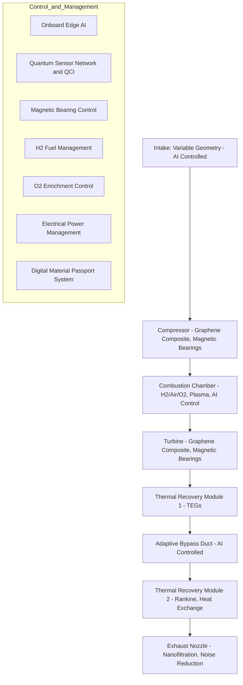

# GAIA AIR Project Charter

## Table of Contents
- [Introduction](#introduction)
- [Governance Structures](#governance-structures)
- [Project Charter](#project-charter)
- [Vision](#vision)
- [Mission](#mission)
- [Values](#values)
- [History](#history)
- [Current Status](#current-status)
- [General Project-Level Documentation](#general-project-level-documentation)
- [Ingeniería Generativa y Regenerativa (GenEng)](#ingeniería-generativa-y-regenerativa-geneng)

## Introduction
The GAIA AIR project is a groundbreaking initiative aimed at revolutionizing the aerospace industry through sustainable, innovative, and inclusive practices. This document serves as the project charter, outlining the governance structures, vision, mission, values, history, current status, and general project-level documentation applicable across all modules and initiatives.

## Governance Structures
The governance structures of GAIA AIR are designed to ensure transparency, accountability, and effective decision-making. The key components include:
- **Board of Directors**: Responsible for overall strategic direction and oversight.
- **Executive Committee**: Manages day-to-day operations and implements board decisions.
- **Advisory Panels**: Provide expert guidance on specific areas such as technology, ethics, and sustainability.

## Project Charter
The project charter defines the scope, objectives, and stakeholders of the GAIA AIR project. It includes:
- **Scope**: Development of sustainable aerospace technologies and systems.
- **Objectives**: Achieve zero-emission aviation, promote circular economy, and foster global collaboration.
- **Stakeholders**: Includes industry partners, government agencies, research institutions, and the global community.

## Vision
GAIA AIR envisions a future where aerospace operations are fully sustainable, technologically advanced, and socially inclusive. The long-term vision includes:
- **Zero-Emission Aviation**: Achieving carbon-neutral flight operations.
- **Technological Innovation**: Leading advancements in aerospace technology.
- **Global Collaboration**: Building partnerships across borders to drive collective progress.

## Mission
The mission of GAIA AIR is to pioneer sustainable aerospace solutions that benefit society and the environment. Key mission statements include:
- **Innovation**: Continuously push the boundaries of aerospace technology.
- **Sustainability**: Integrate eco-friendly practices in all aspects of operations.
- **Inclusivity**: Ensure diverse and inclusive participation in the aerospace industry.

## Values
GAIA AIR is guided by core values that shape its culture and operations:
- **Integrity**: Uphold the highest ethical standards.
- **Excellence**: Strive for superior performance and quality.
- **Collaboration**: Foster teamwork and partnerships.
- **Sustainability**: Commit to environmental stewardship.
- **Innovation**: Embrace creativity and forward-thinking.

## History
The GAIA AIR project has a rich history of innovation and progress. Key milestones include:
- **Founding Principles**: Established with a vision for sustainable aerospace.
- **Technological Breakthroughs**: Achieved significant advancements in aviation technology.
- **Collaborative Efforts**: Partnered with global entities to drive collective progress.

## Current Status
GAIA AIR is currently in an active phase of development, with several ongoing initiatives and projects. The current status includes:
- **Project Milestones**: Recent achievements and progress updates.
- **Ongoing Initiatives**: Description of active projects and their objectives.
- **Future Plans**: Outline of upcoming goals and targets.

## General Project-Level Documentation
This section provides links to general documentation applicable across all modules and initiatives of the GAIA AIR project:
- **Governance Documents**: [GAIA AIR Governance Structure and Processes](docs/GP-GG/GP-GG-GOV-0101-002-A.md)
- **Risk Management Framework**: [GAIA AIR Risk Management Framework](docs/GP-GG/GP-GG-RISK-0101-003-A.md)
- **Communication Plan**: [GAIA AIR Communication Plan](docs/GP-GG/GP-GG-COMM-0101-004-A.md)
- **Vision, Mission, Values, and Ethics**: [Core Identity Documents](docs/GP-ID/GP-ID-VIS-0101-001-A.md)
- **Project History**: [Project History & Background](docs/GP-ID/GP-ID-HIST-0102-001-A.md)
- **Current Project Status**: [Project Status & Objectives](docs/GP-ID/GP-ID-STAT-0103-001-A.md)
- **Open Skyway Initiative**: [Open Skyway Initiative Charter](docs/GP-ID/GP-ID-OPENSKY-0108-001-A.md)

## Ingeniería Generativa y Regenerativa (GenEng)

### Definición y Aplicaciones

La **Ingeniería Generativa y Regenerativa (GenEng)**, definida por **Amedeo Pelliccia**, es un enfoque avanzado dentro del campo de la ingeniería y la inteligencia artificial. Su propósito es permitir que los sistemas artificiales utilicen **algoritmos de IA y aprendizaje automático (ML)** para diseñar, optimizar y generar **soluciones nuevas de manera sostenible, respetando los derechos humanos y naturales**.

GenEng combina **inteligencia computacional, principios de sustentabilidad y metodologías regenerativas** para impulsar la innovación en múltiples disciplinas, incluyendo el **sector aeroespacial, la energía, la manufactura avanzada y la exploración espacial**.

#### Enfoques clave de GenEng:
- **Algoritmos evolutivos y optimización cuántica** para la generación de diseños aeronáuticos y estructuras sostenibles.
- **IA predictiva** para **mantenimiento autónomo y auto-regeneración** de sistemas aeroespaciales.
- **Integración de biomimética y física cuántica** en materiales regenerativos y sistemas de propulsión avanzados.
- **Diseño generativo multi-objetivo** con criterios de eficiencia, impacto ambiental y durabilidad a largo plazo.

### Aplicaciones de GenEng en GAIA AIR y la Industria Aeroespacial

Amedeo Pelliccia está implementando **GenEng** en múltiples iniciativas dentro de **GAIA AIR**, con aplicaciones específicas en **aviación sostenible, propulsión cuántica, manufactura regenerativa e inteligencia distribuida en redes aeroespaciales**.

#### Diseño Generativo para Aeronaves y Estructuras Aeroespaciales
- **Optimización estructural avanzada:** Empleando IA y modelos de simulación cuántica para desarrollar estructuras de aeronaves más ligeras, resistentes y adaptativas.
- **Modelado de materiales regenerativos (Q-MAM - Quantum-Matter Aviation Materials):** Uso de **nanomateriales auto-reparables** y **aleaciones inteligentes** con propiedades cuánticas para mejorar la durabilidad y el rendimiento de aeronaves.
- **Ingeniería aeroespacial biomimética:** Inspiración en sistemas biológicos para desarrollar estructuras aerodinámicas más eficientes y sostenibles.

#### Sistemas de Propulsión Generativa y Regenerativa
- **Q-01 Quantum Propulsion System:** Aplicación de **mecánica cuántica y dinámica de fluidos generativa** para diseñar un sistema de propulsión más eficiente y con menor impacto ambiental.
- **ProEnergyGen (QuantumAI):** Uso de **centros de datos cuánticos como plantas de energía** para alimentar aeronaves y sistemas espaciales.
- **H²-PASS (Hydrogen Hybrid Power for Aviation Sustainable Systems):** Desarrollo de propulsión híbrida de hidrógeno con optimización de flujos energéticos basada en IA.

#### Manufactura Aeroespacial y Materiales Regenerativos
- **AI-Regenerative Manufacturing (AI-RM):** Implementación de IA en fabricación aditiva con materiales reciclables y procesos de bajo impacto ambiental.
- **Generative AI for Autonomous Repair Systems:** Desarrollo de sistemas de reparación autónoma basados en IA y **nanoestructuras autoensamblables**.
- **Producción de energía regenerativa:** Implementación de **estructuras de almacenamiento energético en aeronaves** con **redes superconductoras y baterías estructurales**.

#### Redes Aeroespaciales Inteligentes y Comunicaciones Cuánticas
- **Quantum Secure Networking (QSN):** Implementación de **redes cuánticas de comunicación** con seguridad garantizada mediante entrelazamiento cuántico.
- **AI-Defined Space Routing (AIDSR):** Uso de IA para **optimizar rutas de vuelo interplanetarias** con eficiencia energética y menor impacto ambiental.
- **Federated Learning for Global Aerospace Intelligence:** Integración de aprendizaje federado para optimizar **navegación aérea y operaciones espaciales autónomas**.

### Impacto de la Ingeniería Generativa y Regenerativa

| **Impacto** | **Descripción** |
|------------|---------------|
| **🌱 Sostenibilidad** | Reducción del impacto ambiental a través de materiales regenerativos y optimización energética. |
| **🚀 Optimización Aeroespacial** | Mejora en aerodinámica, eficiencia estructural y autonomía de vuelo mediante IA generativa. |
| **🔋 Energía Autónoma** | Desarrollo de **sistemas de propulsión híbridos y almacenamiento energético inteligente**. |
| **🧠 Inteligencia Distribuida** | Integración de **redes aeroespaciales cuánticas seguras y AI colaborativa**. |
| **⚡ Reducción de Costos** | Optimización de mantenimiento, reducción de fallas y menor consumo de materiales críticos. |

### Conclusión
La **Ingeniería Generativa y Regenerativa (GenEng)** es un enfoque disruptivo que transforma la forma en que se diseñan, fabrican y operan los sistemas aeroespaciales. Su implementación en **GAIA AIR**, liderada por **Amedeo Pelliccia**, busca fusionar **tecnologías emergentes como IA, computación cuántica, materiales avanzados y sostenibilidad regenerativa**, sentando las bases para la **aviación del futuro y la exploración espacial sostenible**.

GenEng no solo optimiza los diseños actuales, sino que permite la evolución **continua y autónoma** de las soluciones aeroespaciales, asegurando un impacto positivo tanto en la eficiencia operativa como en la preservación del entorno.

### Lanzamiento de la plataforma global *open source* **geneng.dev**

**Introducción**. *Geneng.dev* es una iniciativa para crear una plataforma global de ingeniería generativa con filosofía de código abierto. Este análisis abarca los aspectos clave para su lanzamiento exitoso: desde cómo organizar una comunidad colaborativa, hasta las tecnologías a emplear, casos de éxito comparables, modelos de sostenibilidad financiera, infraestructura técnica, diseño UX/UI y estrategias de lanzamiento. Cada sección destaca mejores prácticas respaldadas por ejemplos reales y lecciones de proyectos similares.

#### 1. Modelos de desarrollo colaborativo 🚀👥

Una plataforma *open source* prospera gracias a su comunidad. Es fundamental fomentar la **contribución abierta** mediante una cultura inclusiva, roles claros y gobernanza transparente. Estudios sobre comunidades de código abierto revelan que no solo importan los desarrolladores: participantes no técnicos (por ejemplo, en documentación, diseño o soporte) juegan papeles vitales en la sostenibilidad del proyec ([¿Cómo trabajan las comunidades de código abierto? | UOC](https://www.uoc.edu/es/news/2022/014-opens-source-software#:~:text=Los%20sistemas%20de%20c%C3%B3digo%20abierto,IN3)) ([¿Cómo trabajan las comunidades de código abierto? | UOC](https://www.uoc.edu/es/news/2022/014-opens-source-software#:~:text=proyectos,la%20sostenibilidad%20de%20estas%20iniciativas))0】. Por ello, se deben crear estrategias de **incorporación** que atraigan diversos perfiles, no únicamente programador ([¿Cómo trabajan las comunidades de código abierto? | UOC](https://www.uoc.edu/es/news/2022/014-opens-source-software#:~:text=Estos%20datos%20dan%20nuevas%20claves,destacan%20los%20autores))4】. Esto incluye guías de contribución accesibles, buena documentación y un código de conducta que garantice un ambiente acogedor.

En cuanto a **gobernanza**, existen varios modelos probados en proyectos abiert ([Understanding open source governance models](https://www.redhat.com/en/blog/understanding-open-source-governance-models#:~:text=%2A%20%22Do,backed))7】: desde *do-ocracy* (quien hace el trabajo toma las decisione ([Understanding open source governance models](https://www.redhat.com/en/blog/understanding-open-source-governance-models#:~:text=%22Do))7】, pasando por liderazgo de fundador o BDFL (dictador benevolente de por vida) en etapas inicial ([Understanding open source governance models](https://www.redhat.com/en/blog/understanding-open-source-governance-models#:~:text=The%20founder,to%20merge%20code%20into%20it))7】, hasta consejos auto-gestionados o modelos electorales en comunidades más grand ([Understanding open source governance models](https://www.redhat.com/en/blog/understanding-open-source-governance-models#:~:text=Self)) ([Understanding open source governance models](https://www.redhat.com/en/blog/understanding-open-source-governance-models#:~:text=Electoral))8】. También están las opciones de tutela por organizaciones: *corporate-backed* (dirigido por una empresa, aunque el código sea abierto) y *foundation-backed* (respaldado por una fundación neutra ([Understanding open source governance models](https://www.redhat.com/en/blog/understanding-open-source-governance-models#:~:text=Corporate)) ([Understanding open source governance models](https://www.redhat.com/en/blog/understanding-open-source-governance-models#:~:text=Foundation))3】. Cada modelo tiene ventajas y retos; por ejemplo, un **do-ocracy** impulsa la iniciativa pero puede ser confuso para novatos, mientras que una fundación aporta estabilidad y confianza a largo plazo. Muchas veces se combinan enfoques – e.g., un proyecto auspiciado por una fundación pero que en el día a día funciona como do-ocra ([Understanding open source governance models](https://www.redhat.com/en/blog/understanding-open-source-governance-models#:~:text=Note%20that%20many%20projects%20feature,ocracy%22%20or%20have%20a%20board))3】. Lo importante es definir normas claras de toma de decisiones y evolución del proyecto para que la comunidad se sienta empoderada y representa ([¿Cómo trabajan las comunidades de código abierto? | UOC](https://www.uoc.edu/es/news/2022/014-opens-source-software#:~:text=Otras%20v%C3%ADas%20de%20trabajo%20en,de%20gobernanza%20de%20la%20comunidad))7】. ([Una "forja" para gobernanza, código y datos abiertos | GitHub & Government | ecosistema urbano](https://ecosistemaurbano.org/castellano/una-forja-para-gobernanza-codigo-y-datos-abiertos-github-government/#:~:text=GitHub%20es%20lo%20que%20en,versi%C3%B3n%20propia%20con%20otros%20fines%E2%80%A6))6】Una plataforma colaborativa exitosa debe proporcionar las herramientas para esta interacción distribuida. GitHub, por ejemplo, ha demostrado el poder de una “forja” colaborativa: gracias al control de versiones (*git*), cualquiera puede bifurcar el código, proponer mejoras vía *pull requests* y combinar aportes de múltiples personas de forma ordena ([Una "forja" para gobernanza, código y datos abiertos | GitHub & Government | ecosistema urbano](https://ecosistemaurbano.org/castellano/una-forja-para-gobernanza-codigo-y-datos-abiertos-github-government/#:~:text=GitHub%20es%20lo%20que%20en,versi%C3%B3n%20propia%20con%20otros%20fines%E2%80%A6))5】. Geneng.dev debería implementar mecanismos similares de gestión de código y aportaciones, así como foros o sistemas de discusión para que desarrolladores e interesados debatan nuevas ideas. La **transparencia** y apertura total del código (y del roadmap) cultivarán confianza: cualquiera puede auditar, reutilizar o mejorar el trabajo, siguiendo el modelo del “bazar” abierto descrito por Eric Raymond en *The Cathedral and the Bazaar*. En resumen, una comunidad diversa, con canales de colaboración bien definidos y gobernanza abierta, será el motor de geneng.dev.

#### 2. Tecnologías clave 🛠️🤖

En el ámbito de la **ingeniería generativa** (que abarca IA generativa y diseño generativo), ciertas tecnologías se han posicionado como estándar. En cuanto a **lenguajes de programación**, **Python** es el lenguaje *de facto* para proyectos de inteligencia artificial y aprendizaje automá ([Python and PyTorch for AI Engineers | Niklas Heidloff](https://heidloff.net/article/python-pytorch/#:~:text=Python))L67】. Su sintaxis sencilla y enorme ecosistema científico (bibliotecas como NumPy, Pandas, etc.) lo hacen ideal para prototipar y desarrollar modelos generativos. Además, Python cuenta con una comunidad masiva que comparte soluciones y facilita la colaboración. Otros lenguajes pueden aparecer en componentes específicos (por ejemplo, C++ para optimizar partes de algoritmos, o JavaScript para aplicaciones web), pero el núcleo del desarrollo de modelos suele realizarse en Python. 

Para construir y entrenar modelos generativos complejos (ya sean redes neuronales profundas, modelos de difusión, GANs, etc.), se emplean frameworks de *deep learning*. **PyTorch** y **TensorFlow** encabezan la lista como frameworks estándar ampliamente adopt ([Python and PyTorch for AI Engineers | Niklas Heidloff](https://heidloff.net/article/python-pytorch/#:~:text=PyTorch))L19】. PyTorch (iniciado por Meta/Facebook) se ha destacado por su flexibilidad y enfoque *define-by-run* que facilita la experimentación, mientras TensorFlow (de Google) popularizó la ejecución eficiente en producción y cuenta con un ecosistema maduro. Hoy PyTorch goza de enorme popularidad en la comunidad investigadora y de desarrollo – de hecho, se estima que lidera el espacio de entrenamiento de modelos con un ~63% de adopción según informes recie ([
      
        PyTorch Grows as the Dominant Open Source Framework for AI and ML: 2024 Year in Review | PyTorch
      
    ](https://pytorch.org/blog/2024-year-in-review/#:~:text=flagship%20PyTorch%20Conference,Report%20from%20the%20Linux%20Foundation))L72】. Ambas plataformas son *open source* y soportan las mismas tareas fundamentales, por lo que geneng.dev podría soportar integraciones con ambas para atraer a desarrolladores con distintas preferencias.

Además de los frameworks base, existen **bibliotecas especializadas** muy relevantes. Por ejemplo, **Hugging Face Transformers** se ha convertido en un estándar para trabajar con modelos generativos de lenguaje natural (LLMs) y otros modelos pre-entrenados, facilitando cargar y reutilizar modelos GPT, BERT, etc. Para imágenes generativas, librerías como **Diffusers** (de Hugging Face, orientada a modelos de difusión como Stable Diffusion) permiten a los desarrolladores implementar generadores de imágenes con pocas líneas de código. Otras herramientas clave incluyen **scikit-learn** (para modelos más clásicos y procesamiento de datos), **Jupyter Notebooks** (entorno interactivo ideal para experimentación y tutoriales) y frameworks para orquestación de experimentos como **Ray** o **MLflow** que ayudan a escalar entrenamientos o rastrear versiones de modelos.

En **ingeniería generativa** orientada a diseño (por ejemplo, generar estructuras o diseños mecánicos/arquitectónicos), pueden usarse también herramientas de modelado algorítmico: lenguajes como **OpenSCAD** (modelado 3D por código) o entornos visuales como **Grasshopper** para Rhino (aunque no es open source, tiene comunidad). Sin embargo, la tendencia actual es aprovechar IA generativa en esos campos, usando de nuevo Python con frameworks de optimización y generación.

En resumen, geneng.dev debería basarse en un stack centrado en Python, con soporte a los frameworks líderes (PyTorch/TensorFlow) y bibliotecas comunitarias como Transformers. Esto garantizará adoptabilidad, ya que los desarrolladores encontrarán un entorno familiar y compatible con las prácticas mode ([Python and PyTorch for AI Engineers | Niklas Heidloff](https://heidloff.net/article/python-pytorch/#:~:text=Personally%20I%20prefer%20PyTorch%20for,two%20reasons))L39】. También es importante ofrecer compatibilidad con estándares abiertos de modelos (ONNX, por ejemplo) para facilitar la interoperabilidad. Apostar por tecnologías abiertas y ampliamente usadas reduce la curva de aprendizaje y maximiza la participación de la comunidad técnica global.

#### 3. Casos de éxito 🌟💡

Para orientar la estrategia de geneng.dev, conviene analizar plataformas existentes que han logrado impacto en comunidades de **IA generativa** y proyectos abiertos similares:

- **Hugging Face**: Inicialmente un proyecto de chatbot, evolucionó hasta ser *“el GitHub de la IA”*, una plataforma open source de referencia donde la comunidad comparte modelos, datos y aplicaciones de aprendizaje auto ([La importancia de Hugging Face - Athos Capital](https://www.athos-cap.com/post-12-la-importancia-de-hugging-face/#:~:text=Hugging%20Face%20es%20m%C3%A1s%20que,como%20un%20GitHub%20para%20AI))6-L33】. Hugging Face ha prosperado abrazando la apertura: su *Model Hub* alberga más de **1 millón de modelos públicos** y ha atraído a más de 1 000 000 de usuarios semanales para finales d ([La importancia de Hugging Face - Athos Capital](https://www.athos-cap.com/post-12-la-importancia-de-hugging-face/#:~:text=A%20finales%20de%202022%20contaba,han%20publicado%20modelos%20en%20HF))1-L49】. Grandes compañías (Microsoft, Meta, Google…) publican allí modelos, pero sobre todo miles de desarrolladores independientes contribuyen continuamente. Una de sus estrategias clave ha sido facilitar la contribución: con herramientas sencillas para subir modelos y documentación (*model cards* estandarizadas), cualquiera puede aportar sus crea ([La importancia de Hugging Face - Athos Capital](https://www.athos-cap.com/post-12-la-importancia-de-hugging-face/#:~:text=Una%20de%20las%20principales%20caracter%C3%ADsticas,si%20los%20lanzar%C3%A1s%20en%20absoluto))7-L75】. Hugging Face provee infraestructura para entrenar y desplegar modelos directamente en la plataforma, eliminando fricciones técnicas para los us ([La importancia de Hugging Face - Athos Capital](https://www.athos-cap.com/post-12-la-importancia-de-hugging-face/#:~:text=Tambi%C3%A9n%20te%20permite%20crear%20discusiones,cualquier%20aplicaci%C3%B3n%20que%20est%C3%A9s%20construyendo))3-L81】. Su énfasis en la comunidad y la colaboración abierta ha sido reconocido incluso por competidores: un informe interno de Google destacó que “**Ninguna gran empresa resolverá la IA; será a través de la colaboración open source**. Y eso es justamente lo que permite Hugging ([La importancia de Hugging Face - Athos Capital](https://www.athos-cap.com/post-12-la-importancia-de-hugging-face/#:~:text=En%20los%20%C3%BAltimos%20meses%20la,de%20inteligencia%20artificial%20del%20futuro))3-L49】. Geneng.dev puede inspirarse en Hugging Face fomentando un repositorio central de recursos generativos donde la participación masiva acelere la innovación colect ([@fdaudens on Hugging Face: " 1,000,000 public models milestone achieved on Hugging Face! 

This chart…"](https://huggingface.co/posts/fdaudens/300554611911292))image】 *Crecimiento explosivo de modelos open source*: Hugging Face alcanzó en 2024 más de **1 millón de modelos** alojados, reflejando la rápida expansión de la IA generativa a ([@fdaudens on Hugging Face: " 1,000,000 public models milestone achieved on Hugging Face! 

This chart…"](https://huggingface.co/posts/fdaudens/300554611911292#:~:text=1%2C000%2C000%20public%20models%20milestone%20achieved,on%20Hugging%20Face))4-L40】. *Fuente: Huggin ([@fdaudens on Hugging Face: " 1,000,000 public models milestone achieved on Hugging Face! 

This chart…"](https://huggingface.co/posts/fdaudens/300554611911292#:~:text=1%2C000%2C000%20public%20models%20milestone%20achieved,on%20Hugging%20Face))4-L40】. 

- **PyTorch**: Si bien es un framework más que una plataforma comunitaria de intercambio, PyTorch ejemplifica un proyecto open source con enorme impacto en IA. Nacido en 2017, su adopción global fue tal que en 2022 se creó la **PyTorch Foundation** bajo la Linux Foundation para gestionar el proyecto de forma neutral y abierta. PyTorch ha triunfado gracias a combinar el apoyo corporativo inicial (Facebook) con una **comunidad abierta** de contribuidores: en 2024 contó más de *3 500 contribuidores individuales de 3 000 organizaciones*, y ha tenido un crecimiento de aportaciones del 133% inte ([
      
        PyTorch Grows as the Dominant Open Source Framework for AI and ML: 2024 Year in Review | PyTorch
      
    ](https://pytorch.org/blog/2024-year-in-review/#:~:text=This%20past%20year%20was%20a,Report%20from%20the%20Linux%20Foundation)) ([
      
        PyTorch Grows as the Dominant Open Source Framework for AI and ML: 2024 Year in Review | PyTorch
      
    ](https://pytorch.org/blog/2024-year-in-review/#:~:text=2024%20Highlights%3A%20A%20Year%20of,Growth%20and%20Impact))1-L87】. Su estrategia muestra que un modelo híbrido (empresa inicia el proyecto, luego lo dona a una fundación) puede atraer tanto a la industria como a academia y voluntarios. Además, PyTorch enfoca mucho en **ecosistema**: ha cultivado bibliotecas satélite (TorchVision, TorchText, etc.) y colaboraciones con todos los principales proveedores cloud para integraciones optim ([
      
        PyTorch Grows as the Dominant Open Source Framework for AI and ML: 2024 Year in Review | PyTorch
      
    ](https://pytorch.org/blog/2024-year-in-review/#:~:text=flagship%20PyTorch%20Conference,Report%20from%20the%20Linux%20Foundation)) ([
      
        PyTorch Grows as the Dominant Open Source Framework for AI and ML: 2024 Year in Review | PyTorch
      
    ](https://pytorch.org/blog/2024-year-in-review/#:~:text=The%20PyTorch%20Foundation%20was%20formed,growth%2C%20collaboration%2C%20innovation%2C%20and%20community))3-L80】. Para geneng.dev, PyTorch enseña la importancia de construir un ecosistema y posiblemente apoyarse en una fundación u organización reconocida para ganar credibilidad y respaldo multi-ac ([
      
        PyTorch Grows as the Dominant Open Source Framework for AI and ML: 2024 Year in Review | PyTorch
      
    ](https://pytorch.org/blog/2024-year-in-review/))image】 *Evento comunitario de PyTorch (con apoyo de Linux Foundation)*: La colaboración abierta y el apoyo de múltiples empresas han posicionado a PyTorch como framework líder con 63% de adopción en entrenamiento de m ([
      
        PyTorch Grows as the Dominant Open Source Framework for AI and ML: 2024 Year in Review | PyTorch
      
    ](https://pytorch.org/blog/2024-year-in-review/#:~:text=flagship%20PyTorch%20Conference,Report%20from%20the%20Linux%20Foundation))5-L72】. *Fuente: PyTorch blog, ([
      
        PyTorch Grows as the Dominant Open Source Framework for AI and ML: 2024 Year in Review | PyTorch
      
    ](https://pytorch.org/blog/2024-year-in-review/#:~:text=flagship%20PyTorch%20Conference,Report%20from%20the%20Linux%20Foundation))5-L72】.

- **Stable Diffusion**: En el terreno de la IA generativa de imágenes, la liberación abierta del modelo *Stable Diffusion* (2022) marcó un hito. A diferencia de modelos propietarios (como DALL-E de OpenAI), Stable Diffusion se publicó bajo licencia permisiva, permitiendo a cualquiera usarlo y adaptarlo. Esto desencadenó una explosión de innovación por parte de la comunidad: en poco tiempo aparecieron decenas de implementaciones, mejoras, *fine-tunings*, interfaces web (p. ej. la *Web UI* de Automatic1111 en GitHub) y herramientas construidas sobre el modelo. La comunidad global pudo entrenar variantes para distintos estilos, optimizarlo para funcionar en GPUs domésticas, etc., algo posible gracias a la apertura del modelo. **Stability AI**, la empresa detrás, recaudó fondos importantes para continuar el desarrollo open  ([Stable Diffusion creator Stability AI accelerates open-source AI ...](https://venturebeat.com/ai/stable-diffusion-creator-stability-ai-raises-101m-funding-to-accelerate-open-source-ai/#:~:text=Stable%20Diffusion%20creator%20Stability%20AI,people%20to%20instantly%20create%20art))9-L17】 y apostó por la colaboración pública. Un análisis de Apiumhub resume que al ser código abierto, Stable Diffusion “**fomenta la colaboración y el intercambio de conocimiento**” en la comunidad de desarrolladores, permitiendo que más gente aproveche, mejore y adapte la tecnología a sus neces ([Stable Diffusion: The Community’s AI - Apiumhub](https://apiumhub.com/tech-blog-barcelona/stable-diffusion/#:~:text=Being%20open%20source%2C%20this%20artificial,their%20own%20needs%20and%20projects))L1-L4】. En efecto, la IA generativa se democratizó: artistas y entusiastas crearon obras, desarrolladores integraron el modelo en sus aplicaciones, todo gracias al acceso libre. Este caso demuestra que liberar un proyecto generativo potente bajo código abierto puede atraer rápidamente una **masa crítica de usuarios y colaboradores** que lo llevan mucho más lejos, acelerando su evolución más allá de lo que un solo equipo podría lograr.

En resumen, los casos de éxito indican que geneng.dev debe: facilitar al máximo la participación (como Hugging Face), posicionarse con valores de apertura y neutralidad (como PyTorch con su fundación), y aprovechar la curiosidad colectiva liberando herramientas potentes que la comunidad pueda hacer suyas (como Stable Diffusion). Una estrategia multipronged que combine comunidad, ecosistema y apertura tecnológica dará mayores posibilidades de impacto.

#### 4. Monetización y sostenibilidad 💰🌱

Mantener una plataforma global open source requiere recursos a largo plazo. Aunque el software sea gratuito, se necesita financiamiento para servidores, desarrollo continuo y soporte comunitario. Existen diversos **modelos de monetización y sostenibilidad** que geneng.dev puede adoptar, frecuentemente combinándolos:

- **Donaciones y crowdfunding**: Apoyarse en la comunidad de usuarios para aportes económicos voluntarios. Plataformas como OpenCollective, Patreon o GitHub Sponsors facilitan que individuos contribuyan con dinero al proyecto. Sin embargo, las donaciones individuales, si bien valiosas, raramente sostienen por sí solas un proyecto grande de forma con ([How to talk to your company about sponsoring an open source project](https://humanwhocodes.com/blog/2021/05/talk-to-your-company-sponsoring-open-source/#:~:text=How%20to%20talk%20to%20your,companies%20who%20reap%20the))†L9-L17】. Pueden servir mejor como complemento. Otra vía es el **crowdfunding** puntual para hitos importantes (por ejemplo, lanzar una nueva funcionalidad), usando Kickstarter u otras, lo cual además genera sentido de pertenencia entre los contri ([Funding Open Source Projects: Sustainable Models & Strategies for Success](https://hakia.com/funding-and-sustaining-open-source-projects-models-and-strategies-for-sustainability/#:~:text=Crowdfunding%20and%20Community%20Support)) ([Funding Open Source Projects: Sustainable Models & Strategies for Success](https://hakia.com/funding-and-sustaining-open-source-projects-models-and-strategies-for-sustainability/#:~:text=To%20successfully%20implement%20crowdfunding%2C%20you,members%20to%20support%20your%20initiative))84-L392】. Para aprovechar esta vía, es importante comunicar bien la misión e impacto del proyecto, mostrando transparencia de cómo se utilizarán lo ([Funding Open Source Projects: Sustainable Models & Strategies for Success](https://hakia.com/funding-and-sustaining-open-source-projects-models-and-strategies-for-sustainability/#:~:text=Transparency%20regarding%20funding%20and%20partnership,guiding%20principles%20and%20ethical%20considerations)) ([Funding Open Source Projects: Sustainable Models & Strategies for Success](https://hakia.com/funding-and-sustaining-open-source-projects-models-and-strategies-for-sustainability/#:~:text=Indiegogo%2C%20or%20specialized%20crowdfunding%20platforms,your%20supporters%2C%20strengthening%20community%20ties))79-L387】. Recompensas simbólicas (menciones, merchandaising, acceso anticipado a novedades) pueden incentivar las contribuciones comu ([Funding Open Source Projects: Sustainable Models & Strategies for Success](https://hakia.com/funding-and-sustaining-open-source-projects-models-and-strategies-for-sustainability/#:~:text=To%20successfully%20implement%20crowdfunding%2C%20you,members%20to%20support%20your%20initiative))84-L392】.

- **Patrocinios corporativos y alianzas**: Las empresas que se benefician de la plataforma o que estén interesadas en la tecnología pueden brindar apoyo financiero mediante **patrocinios**. Esto puede estructurarse en niveles (patrocinador oro, plata, bronce) a cambio de reconocimiento (logos, me ([Funding Open Source Projects: Sustainable Models & Strategies for Success](https://hakia.com/funding-and-sustaining-open-source-projects-models-and-strategies-for-sustainability/#:~:text=Also%2C%20consider%20establishing%20a%20formal,range%20of%20companies%20to%20participate))57-L365】. Muchas compañías están dispuestas a invertir en open source porque les da visibilidad y les permite influir en una herramienta que usan. Un ejemplo es cómo grandes tech companies financian la Linux Foundation o cómo corporaciones apoyan proyectos específicos (Firefox recibió patrocinio de Google por años, por ejemplo). Geneng.dev podría buscar alianzas con empresas de sectores que usen ingeniería generativa (diseño asistido, arquitectura, entretenimiento, etc.), ofreciéndoles participación en el gobierno del proyecto o **acceso preferencial** a ciertas ventajas a cambio de contribuciones económicas. Es clave mantener la transparencia e independencia pese al patrocinio, comunicando claramente cómo se usan los fondos y evitando dependencia excesiva de un solo ([Understanding open source governance models](https://www.redhat.com/en/blog/understanding-open-source-governance-models#:~:text=contribution%20,create%20mismatched%20expectations%20among%20adopters)) ([Understanding open source governance models](https://www.redhat.com/en/blog/understanding-open-source-governance-models#:~:text=Under%20this%20model%2C%20the%20governing,create%20mismatched%20expectations%20among%20adopters))77-L484】.

- **Servicios premium o modelo *open-core***: Un enfoque híbrido es ofrecer la plataforma básica de manera abierta y gratuita, pero cobrar por **características avanzadas o servicios añadidos**. Esto sigue el modelo *open-core* utilizado por muchas empresas open source (ej. GitLab tiene edición *community* vs *enterprise*). En el caso de geneng.dev, podría consistir en: acceso a computación en la nube para entrenar modelos más grandes, funcionalidades de análisis avanzadas, soporte técnico prioritario, integración con herramientas privadas, o alojamiento privado de proyectos para empresas que requieran privacidad. Se trata de añadir **funcionalidades premium** que no afecten la libertad del núcleo abierto. Este modelo puede generar ingresos sostenibles manteniendo la esencia ([Funding Open Source Projects: Sustainable Models & Strategies for Success](https://hakia.com/funding-and-sustaining-open-source-projects-models-and-strategies-for-sustainability/#:~:text=business%20around%20the%20open%20source,the%20core%20project%E2%80%99s%20open%20nature)) ([Funding Open Source Projects: Sustainable Models & Strategies for Success](https://hakia.com/funding-and-sustaining-open-source-projects-models-and-strategies-for-sustainability/#:~:text=through%20premium%20features%20that%20cater,you%20build%20a%20community%20of))†L7-L15】. Por ejemplo, ofrecer **suscripciones** a organizaciones que quieran utilizar geneng.dev con soporte dedicado o garantías de SLA, mientras los individuos y proyectos abiertos lo usan gratis. Otra variante es ofrecer **consultoría o formación**: la plataforma en sí es gratuita, pero el equipo central cobra por servicios de consultoría, desarrollo a medida o capacitación en ingeniería generativa utilizando la plataforma.

- **Apoyo institucional y subvenciones**: Dado el carácter innovador de la ingeniería generativa, es posible obtener fondos de **becas, grants o subvenciones públicas** orientadas a fomentar la ciencia abierta y la tecnología. Organizaciones sin fines de lucro como la Fundación Mozilla, la UNESCO, la UE (Horizon Europe) o agencias gubernamentales de innovación pueden otorgar financiamiento para proyectos open source con impacto social/in ([Funding Open Source Projects: Sustainable Models & Strategies for Success](https://hakia.com/funding-and-sustaining-open-source-projects-models-and-strategies-for-sustainability/#:~:text=Grants%20and%20Foundation%20Funding)) ([Funding Open Source Projects: Sustainable Models & Strategies for Success](https://hakia.com/funding-and-sustaining-open-source-projects-models-and-strategies-for-sustainability/#:~:text=Research%20potential%20grant%20opportunities%20from,your%20project%20meets%20their%20requirements))21-L430】. De hecho, muchos proyectos (ej. scikit-learn, Godot engine) se sostienen en parte gracias a grants de investigación o donaciones filantrópicas. Geneng.dev debería explorar estas oportunidades preparando propuestas que destaquen su contribución al avance tecnológico y a la democratización de la IA. Contar con el respaldo de una fundación (propia o afiliándose a una) podría facilitar administrar estos fondos.

- **Marketplace o integración con industria**: Otra vía a considerar es establecer un **mercado** alrededor de la plataforma. Por ejemplo, permitir a terceros vender *plugins*, modelos especializados o soluciones verticales construidas sobre geneng.dev, donde la plataforma recibe una comisión. Asimismo, integrar la plataforma con industrias (p.ej. acuerdos con empresas de software de ingeniería para conectividad) podría traer ingresos por licencias de integración. Esto debe balancearse cuidadosamente para no cerrar el ecosistema; lo ideal es que la plataforma siga siendo abierta, y solo monetizar servicios de valor añadido.

En todos los casos, la **transparencia financiera** es fundamental para mantener la confianza de la comunidad. Publicar informes de uso de fondos, y potencialmente adoptar una estructura legal (por ej. una asociación civil o foundation 501c3) puede ayudar a canalizar ingresos de manera ordenada.

## GAIA-QAO Ontogenesis

**Quantum Aerospace Ontology Genesis**
*Beautiness Assembled by Quantum Computing Agents within Aerospace Ecosystems*

---

### ✦ What It Is

A **declarative cosmology** for the GAIA-QAO federated system:

* Encodes the **origin**, **purpose**, and **ethical trajectory** of all intelligent agents, aircraft systems, and digital twins.
* Functions as the **ontological DNA** of each system entity, enabling alignment, recovery, evolution, and proof-of-integrity.

---

### 🎯 Why It Matters

| Element                         | Description                                                                                 |
| ------------------------------- | ------------------------------------------------------------------------------------------- |
| **Institutional Gravity**       | Aerospace reframed as a planetary institutional function, not merely an industry.           |
| **Agent Ethics (AMEDEO layer)** | Agents operate under the "tending visible hands" doctrine — augmenting, not replacing.      |
| **Retrocausal Temporality**     | Agents pre-act in alignment with "the future projected starting yesterday."                 |
| **Systemic Holism**             | Every system participates in quantum-semantic loops within a closed adaptive feedback mesh. |
| **Beautiness Principle**        | Development is guided by elegant, purposeful, and regenerative aesthetics.                  |

---

### 🧠 Implications for Agent Design

* **Quantum Lifecycle Encoding**: Each GAIA agent must embed a cryptographic reference to this manifesto at AGAD Phase 0.
* **Retrocausal Policy Enforcement**: Lifecycle causality logic derives from this ontology.
* **CIPHR Seed Accessibility**: Included in all agents phase ≥ AGAD 1.0 as a symbolic genesis anchor.

---

### 🗂 Activation Metadata

```yaml
title: GAIA‑QA Ontogenesis
identifier: GAIA-QAO-ONTOGENESIS-0001
type: Ontological Genesis Manifesto
status: Active
originator: Amedeo Pelliccia (Robbbo-T)
date_activated: 2025-05-28
activation_phase: AGAD 0.0
infocode: QAO-GENESIS-CORE-SEED
references:
  - GAIA-QAO-MANIFESTO-FOUNDATIONAL-v1.0
  - GAIA-QTD-SPEC-v1.1
  - AMEDEO-TRUST-CORE
ciphr_signature: "🕊 Beautiness Assembled by Quantum Computing Agents | Tending Visible Hands in Flight Toward Co-evolution"
```

---

### 🕊 Signature

> *Beautiness Assembled by Quantum Computing Agents*
> *Tending Visible Hands in Flight Toward Co-evolution*

**Signed by:**
**Amedeo Pelliccia (Robbbo-T)**
*On behalf of the GAIA‑QAO Ontogenesis Cluster*
*Encoded into all QAO Agents as Ontological Genesis Reference*

---

```yaml
id: "GAIA-QAO-README_v1.0.0"
title: "GAIA Innovation Management Platform – README"
version: "1.0.0"
author: "Amedeo Pelliccia"
issued_by: "GAIA Quantum Aerospace Optimization"
release_date: "2025-05-28"
language: "en"
license: "GAIA-QAO Open Innovation License v1.0"
format: ["Markdown", "HTML", "PDF"]
context:
  platform: "GAIA Innovation Management Platform"
  domain: 
    - "Quantum Aerospace"
    - "Sustainable Engineering"
    - "AI Lifecycle Orchestration"
compliance_targets:
  - "EASA CS-25.1309"
  - "DO-178C"
  - "Circular Economy ≥ 95%"
  - "Quantum Readiness"
structure:
  sections:
    - "Vision Statement"
    - "Architecture Overview"
    - "Key Features"
    - "Installation & Setup"
    - "Security & Encryption"
    - "MCP Agent Integration"
    - "QAOS Interface Layer"
    - "Performance Metrics"
    - "Development Roadmap"
    - "CI/CD Integration"
    - "Contributing"
    - "License"
    - "Contact"
linked_documents:
  - ../Technical/integration_analysis.md
  - ../Technical/patent_preparation.xml
  - ../Exports/industry_summary.pdf
  - ../../META-INF/manifest.json
hash:
  sha3_512: "2f16c7a4a3e1d857c9f14e99e0d9d00e1ccf9971cd9f451f7d0b13ea1d40582e6d76bbfdfb32dbe135df09b476d50d4ae34d06a1d1c5297b627d3e3c4d507a0b"
  blake3: "9d39c91c84e7f6c2138cdb4b69e7b7f4f34d74f2f2bfae0d88841794f0a1b0e2"
notes: >
  This README.yaml serves as semantic metadata for the GAIA-QAO platform documentation home, linking to associated technical artifacts and reinforcing traceability within the .qao.dpub architecture.
```

---

# GAIA Innovation Management Platform – README

## Vision Statement
The GAIA Innovation Management Platform pioneers a quantum leap in sustainable aerospace engineering, fusing quantum optimization, AI lifecycle orchestration, and advanced materials science. Our mission: enable zero-impact, circular-economy aerospace systems with deterministic safety, regulatory compliance, and maximal performance.

## Architecture Overview
GAIA-QAO employs a modular, multi-layer architecture:
- **AI Lifecycle Orchestration**: End-to-end management of AI assets, from ideation to certification.
- **Quantum Optimization Core**: Native integration of quantum-ready solvers for mission-critical scheduling and resource allocation.
- **Sustainable Engineering Layer**: Enforces circular economy targets and full traceability of material and digital artifacts.
- **Security & Compliance**: DO-178C/EASA CS-25.1309 aligned, with cryptographic proofs-of-integrity and quantum-resilient encryption.

## Key Features
- Zero-impact, fully recyclable turbofan engine digital twin
- Quantum-accelerated design space exploration
- Integrated MCP (Mission Control Protocol) agent framework
- AI safety, explainability, and continuous compliance monitoring
- Secure, transparent CI/CD pipeline with self-healing capabilities

## Installation & Setup
1. **Clone Repository**  
   ```sh
   git clone https://github.com/Robbbo-T/Robbbo-T.git
   ```
2. **Environment Setup**  
   - Python ≥ 3.9, Node.js ≥ 18, Docker (optional for containerized deployments)
   - Install dependencies:  
     ```sh
     pip install -r requirements.txt
     npm install
     ```
3. **Configuration**  
   - Adjust platform configs in `config/` (see [integration_analysis.md](../Technical/integration_analysis.md)).
   - For quantum backends, set up provider credentials in `.env`.

## Security & Encryption
- End-to-end encryption for all data at rest and in transit (AES-256/GCM, quantum-safe post-quantum algorithms in beta)
- Multi-factor authentication, hardware-bound key stores, and runtime attestation
- Security audits aligned with [DO-178C](https://www.easa.europa.eu/en/document-library/certification-specifications/cs-251309-amendment-26) and EASA standards

## MCP Agent Integration
- Drop-in agents for mission planning, anomaly detection, and predictive maintenance
- Extend via `agents/` using provided Python and TypeScript SDKs
- See [integration_analysis.md](../Technical/integration_analysis.md) for API contracts

## QAOS Interface Layer
- Unified API for AI/ML lifecycle management, quantum solvers, and sustainability metrics
- Fully documented in [manifest.json](../../META-INF/manifest.json)

## Performance Metrics
- Deterministic latency: <1ms (critical path, edge deployment)
- Quantum optimization speedup: up to 1000x (benchmark: patent_preparation.xml)
- Circular economy compliance: ≥ 95% lifecycle recyclability

## Development Roadmap
- **Q3 2025**: Full quantum backend integration, autonomous safety certification
- **Q4 2025**: Zero-emission hardware-in-the-loop validation, expanded industry partnerships

## CI/CD Integration
- GitHub Actions workflows in `.github/workflows/`
- Automated code quality, test, and security scanning
- Continuous deployment to quantum and edge testbeds

## Contributing
We welcome contributions!  
See [CONTRIBUTING.md](CONTRIBUTING.md) for guidelines, code of conduct, and our open innovation process.

## License
GAIA-QAO Open Innovation License v1.0 (see [LICENSE](LICENSE) for details)

## Contact
- **Author**: Amedeo Pelliccia  
- **Issued By**: GAIA Quantum Aerospace Optimization  
- **Contact**: [Contact Form](https://github.com/Robbbo-T/Robbbo-T/issues/new/choose)

---

**Linked Documents:**  
- [Integration Analysis](../Technical/integration_analysis.md)  
- [Patent Preparation](../Technical/patent_preparation.xml)  
- [Industry Summary (PDF)](../Exports/industry_summary.pdf)  
- [Platform Manifest](../../META-INF/manifest.json)

---

> **Zero-Impact Sustainable Turbofan Engine**  
> *A Synergistic Integration of Advanced Materials, Intelligent Control, Quantum Sensing, and Full Lifecycle Recyclability*

---

## Document Metadata

| Field                   | Value                                                      |
|-------------------------|------------------------------------------------------------|
| **GAIA Infocode ID**    | GAIA-QENT-TECH-TURBOFAN-ZEROIMPACT-DISC-V1                |
| **Document Type**       | Invention Disclosure                                       |
| **Version**             | 1.1                                                        |
| **Status**              | Internal Review Draft                                      |
| **Submission Date**     | 2025-05-28                                                 |
| **Last Updated**        | 2025-05-28                                                 |
| **Originator Module**   | GAIA-Q-AIR & GAIA-Q-GreenTech                              |
| **Primary Author**      | Amedeo Pelliccia                                           |
| **Related AGAD Phases** | AGAD 1–3 (Concept to Analytical Modeling)                  |
| **Keywords**            | Sustainable Aviation, Zero-Emission, Quantum Sensing, AI, Circular Economy, Hydrogen Power, Graphene Composites, Magnetic Bearings, Digital Thread, Lifecycle Management |

---

## Technical Field

- **Primary**: Aerospace engineering — sustainable and intelligent turbofan engine design and operation  
- **Secondary**:  
  - Advanced materials science  
  - Quantum sensing applications  
  - Artificial intelligence in control systems  
  - Renewable energy systems for propulsion  
  - Circular economy principles in complex machinery  

---

## Background & Problem Statement

Despite progress in sustainable aviation fuels, lightweight materials, and efficient cycles, a **holistic, integrated approach** for truly net-zero propulsion is lacking. Existing solutions do not fully leverage advanced materials, quantum sensing, intelligent controls, green hydrogen combustion, comprehensive energy recovery, and complete lifecycle circularity.

---

## Technologies Leveraged

- **Graphene/Nano Composites**: Recycled graphene for superior strength-to-weight, durability, and embedded sensing.
- **Active Magnetic Bearings**: Frictionless, oil-free, dynamically controlled.
- **Quantum Sensors**: Ultra-sensitive, real-time monitoring of strain, temperature, and fatigue.
- **Hybrid Green Hydrogen Combustion**: Ultra-lean, AI-optimized, oxygen-enriched, with advanced NOx suppression.
- **Multi-Stage Heat Recovery**: Thermoelectric and Rankine systems for maximal energy capture.
- **AI Engine Process Management**: Predictive, adaptive control for efficiency and health.
- **Digital Material Passports**: Blockchain-based for traceability and recycling.

---

## Summary of the Invention

**The Zero-Impact Sustainable Turbofan Engine** integrates advanced materials, quantum sensors, adaptive AI, green hydrogen combustion, multi-stage energy recovery, and modular design with digital material passports, achieving true net-zero impact and full circularity.

### Core Innovations

#### 1. Advanced Material Composition with Embedded Quantum Sensing (KEM_001)
- Graphene/nano-composite structures with distributed quantum sensors (NV centers, quantum dots).
- Enables high-fidelity, real-time health monitoring and predictive maintenance.

#### 2. Hybrid Green Hydrogen Combustion System (KEM_002)
- Multi-mode chamber for green H₂ with air/oxygen enrichment.
- AI-optimized mixing, plasma ignition, catalytic NOx suppression.

#### 3. Self-Adjusting Active Magnetic Bearing System (KEM_003)
- Main shafts on active, vibration-damped, oil-free magnetic bearings.
- Quantum gyroscopes/accelerometers for ultra-precision.

#### 4. Multi-Stage Thermal Energy Recovery System (KEM_004)
- Thermoelectric generators and Rankine cycle for waste heat.
- Supplemental electrical/mechanical power generation.

#### 5. AI-Governed Adaptive Bypass & Variable Geometry Intake (KEM_005)
- AI adjusts bypass ratio and intake geometry in real-time for optimal performance.

#### 6. Nanofiltration Exhaust Nozzle System (KEM_006)
- Advanced filtration (nano, electrostatic, catalytic) for near-zero emissions.

#### 7. Zero-Emission Lubrication & Sealing (KEM_007)
- Solid-state/ionic lubricants or captured water; advanced seals.

#### 8. Modular Design with Digital Material Passports (KEM_008)
- Swappable modules, each tracked on a blockchain DMP for full lifecycle traceability.

#### 9. Onboard Edge Neural Network & Quantum-Classical Interface (KEM_009)
- Radiation-hardened edge AI system, fusing quantum and classical sensor data for real-time adaptive control and diagnostics.

---

## Key Features

- **Quantum-Integrated Predictive Maintenance**: Embedded quantum sensors + AI for early fault detection.
- **Full Spectrum Circularity**: Modular design, digital passports, maximized reuse/recycling.
- **Adaptive Intelligent Energy Efficiency**: AI-optimized combustion, bypass, intake, and energy recovery.
- **Frictionless, Zero-Lube Operation**: Magnetic bearings eliminate oil systems.

---

## Advantages Overview

- **Sustainability & Net-Zero**: Green H₂, full energy recovery, advanced filtration, circular material economy.
- **Reduced Maintenance**: Magnetic bearings + AI diagnostics = less downtime and longer life.
- **Complete Disassembly & Recyclability**: Modular, blockchain-tracked lifecycle for all parts.
- **Superior Efficiency**: Frictionless mechanics, hybrid combustion, AI controls.
- **Enhanced Safety**: Quantum health monitoring, AI control, advanced diagnostics.

---

## Claims

### Independent Claim

> **Claim 1**:  
A zero-impact turbofan engine for aeronautical applications, comprising:
>
> - (a) Graphene-based composite structures with embedded quantum sensors;
> - (b) AI-optimized hybrid green hydrogen combustion chamber with dynamic oxygen enrichment and NOx mitigation;
> - (c) Main shaft supported by active, oil-free magnetic bearings;
> - (d) Multi-stage thermal energy recovery;
> - (e) AI-governed adaptive bypass and variable intake;
> - (f) Nanofiltration exhaust nozzle system;
> - (g) Modular architecture with blockchain-tracked digital material passports;
> - (h) Onboard edge AI/quantum-classical interface for real-time control and predictive maintenance.

### Dependent Claims (Examples)

- **Claim 2**: Quantum sensors include NV centers and quantum dot strain sensors for advanced health monitoring.
- **Claim 3**: Multi-stage energy recovery uses TEGs and Rankine cycles.
- **Claim 4**: AI control uses reinforcement learning for multi-objective optimization.
- **Claim 5**: Digital passports are blockchain-secured, tracking provenance, recycling, and lifecycle.
- **Claim 6**: Ancillary lubrication with solid-state or magnetic fluid seals.
- **Claim 7**: Combustion with plasma-assisted ignition.
- **Claim 8**: Quantum-Classical Interface for sensor data fusion.

---

## Functional Block Diagram



---

## 1. JSON Schema (Draft 2020-12)

```json
{
  "$schema": "https://json-schema.org/draft/2020-12/schema",
  "title": "InventionDisclosureDocument",
  "type": "object",
  "properties": {
    "schema_version": { "type": "string" },
    "document_id": { "type": "string" },
    "digital_signature": { "type": "string" },
    "content_hash": { "type": "string" },
    "compliance_tags": {
      "type": "array",
      "items": { "type": "string" }
    },
    "valid_from": { "type": "string", "format": "date" },
    "valid_until": { "type": "string", "format": "date" },
    "audit_trail": {
      "type": "array",
      "items": {
        "type": "object",
        "properties": {
          "timestamp": { "type": "string", "format": "date-time" },
          "actor": { "type": "string" },
          "action": { "type": "string" },
          "details": { "type": "string" }
        },
        "required": ["timestamp", "actor", "action"]
      }
    },
    "attachments": {
      "type": "array",
      "items": {
        "type": "object",
        "properties": {
          "name": { "type": "string" },
          "url": { "type": "string", "format": "uri" },
          "type": { "type": "string" }
        },
        "required": ["name", "url", "type"]
      }
    },
    "external_references": {
      "type": "array",
      "items": {
        "type": "object",
        "properties": {
          "system": { "type": "string" },
          "ref": { "type": "string" },
          "description": { "type": "string" }
        },
        "required": ["system", "ref"]
      }
    },
    "document_metadata": {
      "type": "object",
      "properties": {
        "gaia_infocode_id": { "type": "string" },
        "document_type": { "type": "string" },
        "version": { "type": "string" },
        "status": { "type": "string" },
        "submission_date": { "type": "string", "format": "date" },
        "last_updated": { "type": "string", "format": "date" },
        "originator_module": { "type": "string" },
        "primary_author": { "type": "string" },
        "related_agad_phases": {
          "type": "array",
          "items": { "type": "string" }
        },
        "keywords_expanded": {
          "type": "array",
          "items": { "type": "string" }
        },
        "version_history": {
          "type": "array",
          "items": {
            "type": "object",
            "properties": {
              "version": { "type": "string" },
              "date": { "type": "string", "format": "date" },
              "author": { "type": "string" },
              "changes": { "type": "string" }
            },
            "required": ["version", "date", "author", "changes"]
          }
        }
      },
      "required": ["gaia_infocode_id", "document_type", "version", "status", "submission_date", "last_updated", "originator_module", "primary_author", "related_agad_phases", "keywords_expanded", "version_history"]
    },
    "table_of_contents_structure": {
      "type": "array",
      "items": {
        "type": "object",
        "properties": {
          "id": { "type": "string" },
          "title": { "type": "string" }
        },
        "required": ["id", "title"]
      }
    },
    "invention_disclosure_title": { "type": "string" },
    "abstract": { "type": "string" },
    "technical_field": {
      "type": "object",
      "properties": {
        "primary": { "type": "string" },
        "secondary": {
          "type": "array",
          "items": { "type": "string" }
        }
      },
      "required": ["primary", "secondary"]
    },
    "background_art": {
      "type": "object",
      "properties": {
        "context": { "type": "string" },
        "technologies_leveraged_with_context": {
          "type": "array",
          "items": {
            "type": "object",
            "properties": {
              "technology": { "type": "string" },
              "relevance": { "type": "string" }
            },
            "required": ["technology", "relevance"]
          }
        },
        "problem_solved_statement": { "type": "string" }
      },
      "required": ["context", "technologies_leveraged_with_context", "problem_solved_statement"]
    },
    "summary_of_invention": {
      "type": "object",
      "properties": {
        "introduction": { "type": "string" },
        "key_elements_detailed": {
          "type": "array",
          "items": {
            "type": "object",
            "properties": {
              "element_id": { "type": "string" },
              "name": { "type": "string" },
              "description": { "type": "string" },
              "principle_of_operation": { "type": "string" },
              "key_benefits_derived": {
                "type": "array",
                "items": { "type": "string" }
              },
              "relevant_gaia_application_layers": {
                "type": "array",
                "items": { "type": "string" }
              },
              "relevant_ata_chapters": {
                "type": "array",
                "items": { "type": "string" }
              }
            },
            "required": ["element_id", "name", "description", "principle_of_operation", "key_benefits_derived", "relevant_gaia_application_layers", "relevant_ata_chapters"]
          }
        }
      },
      "required": ["introduction", "key_elements_detailed"]
    },
    "claims_section": {
      "type": "object",
      "properties": {
        "claim_strategy_overview": { "type": "string" },
        "independent_claims": {
          "type": "array",
          "items": {
            "type": "object",
            "properties": {
              "claim_number": { "type": "integer" },
              "text": { "type": "string" },
              "elements": {
                "type": "array",
                "items": {
                  "type": "object",
                  "properties": {
                    "label": { "type": "string" },
                    "feature": { "type": "string" }
                  },
                  "required": ["label", "feature"]
                }
              }
            },
            "required": ["claim_number", "text", "elements"]
          }
        },
        "dependent_claims": {
          "type": "array",
          "items": {
            "type": "object",
            "properties": {
              "claim_number": { "type": "integer" },
              "depends_on": { "type": "integer" },
              "text": { "type": "string" }
            },
            "required": ["claim_number", "depends_on", "text"]
          }
        }
      },
      "required": ["claim_strategy_overview", "independent_claims", "dependent_claims"]
    },
    "functional_block_diagram_textual": {
      "type": "object",
      "properties": {
        "main_aerothermal_flow_path": {
          "type": "array",
          "items": { "type": "string" }
        },
        "control_and_management_systems": {
          "type": "array",
          "items": { "type": "string" }
        },
        "key_energy_flows": {
          "type": "array",
          "items": { "type": "string" }
        }
      },
      "required": ["main_aerothermal_flow_path", "control_and_management_systems", "key_energy_flows"]
    },
    "potential_applications": {
      "type": "array",
      "items": {
        "type": "object",
        "properties": {
          "application": { "type": "string" },
          "suitability_notes": { "type": "string" }
        },
        "required": ["application", "suitability_notes"]
      }
    }
  },
  "required": [
    "document_metadata",
    "table_of_contents_structure",
    "invention_disclosure_title",
    "abstract",
    "technical_field",
    "background_art",
    "summary_of_invention",
    "claims_section",
    "functional_block_diagram_textual",
    "potential_applications"
  ]
}
```

---

## 2. TypeScript/JavaScript Runtime Validator

For robust runtime validation, use [ajv](https://ajv.js.org/) (Another JSON Schema Validator):

```typescript
import Ajv from "ajv";
import schema from "./InventionDisclosureDocument.schema.json"; // Save the JSON schema above as this file

const ajv = new Ajv({ allErrors: true });
const validate = ajv.compile(schema);

export function validateInventionDisclosureDocument(data: unknown): boolean {
  const valid = validate(data);
  if (!valid) {
    console.error(validate.errors);
  }
  return valid as boolean;
}
```

---

## 3. C Struct Representation

For embedded or mission-critical C code:

```c
// NOTE: For arrays/strings, use fixed sizes as appropriate for your system.
// For complex nested structures, use pointers and allocate as needed.

typedef struct {
    char version[8];
    char date[20];
    char author[64];
    char changes[256];
} VersionHistory;

typedef struct {
    char gaia_infocode_id[64];
    char document_type[32];
    char version[8];
    char status[32];
    char submission_date[20];
    char last_updated[20];
    char originator_module[64];
    char primary_author[64];
    // Arrays: related_agad_phases, keywords_expanded, version_history...
} DocumentMetadata;

typedef struct {
    char id[32];
    char title[128];
} TableOfContentsEntry;

// ... define other structs as per schema

typedef struct {
    DocumentMetadata document_metadata;
    TableOfContentsEntry table_of_contents_structure[16];
    char invention_disclosure_title[256];
    char abstract[2048];
    // ... rest of the fields
} InventionDisclosureDocument;
```
*For C, use fixed-size arrays and consider memory alignment/padding for embedded.*

---

## 4. Rust Struct Representation

For high-assurance Rust codebases (with `serde` for JSON support):

```rust
use serde::{Serialize, Deserialize};

#[derive(Serialize, Deserialize)]
pub struct VersionHistory {
    pub version: String,
    pub date: String,
    pub author: String,
    pub changes: String,
}

#[derive(Serialize, Deserialize)]
pub struct DocumentMetadata {
    pub gaia_infocode_id: String,
    pub document_type: String,
    pub version: String,
    pub status: String,
    pub submission_date: String,
    pub last_updated: String,
    pub originator_module: String,
    pub primary_author: String,
    pub related_agad_phases: Vec<String>,
    pub keywords_expanded: Vec<String>,
    pub version_history: Vec<VersionHistory>,
}

// ...other nested structs...

#[derive(Serialize, Deserialize)]
pub struct InventionDisclosureDocument {
    pub schema_version: Option<String>,
    pub document_id: Option<String>,
    // ...other optional fields...
    pub document_metadata: DocumentMetadata,
    // ...rest of the fields...
}
```
*Use `Option<T>` for optional fields, `Vec<T>` for arrays. With Serde, you can derive robust JSON (de)serializers and validators.*

---

## 5. Rust JSON Schema and Validation

You can auto-generate JSON Schema and runtime validation with the [`schemars`](https://docs.rs/schemars/latest/schemars/) and [`serde_json`](https://docs.rs/serde_json/latest/serde_json/) crates:

```rust
use schemars::JsonSchema;
use serde::{Serialize, Deserialize};

#[derive(Serialize, Deserialize, JsonSchema)]
pub struct InventionDisclosureDocument { /* ...fields... */ }

// To generate JSON schema:
let schema = schemars::schema_for!(InventionDisclosureDocument);
println!("{}", serde_json::to_string_pretty(&schema).unwrap());
```

---

## 6. C++ Struct Representation

```cpp
#include <string>
#include <vector>

struct VersionHistory {
    std::string version;
    std::string date;
    std::string author;
    std::string changes;
};

struct DocumentMetadata {
    std::string gaia_infocode_id;
    std::string document_type;
    std::string version;
    std::string status;
    std::string submission_date;
    std::string last_updated;
    std::string originator_module;
    std::string primary_author;
    std::vector<std::string> related_agad_phases;
    std::vector<std::string> keywords_expanded;
    std::vector<VersionHistory> version_history;
};

// ...other structs...

struct InventionDisclosureDocument {
    std::string schema_version;
    std::string document_id;
    // ...other optional fields...
    DocumentMetadata document_metadata;
    // ...rest of the fields...
};
```
*For C++, use STL containers and modern C++ idioms for safety and clarity.*

---

### Summary Table

| Language    | Serialization         | Validation/Schema                         |
|-------------|----------------------|-------------------------------------------|
| TypeScript  | JSON Schema + AJV    | [ajv](https://ajv.js.org/)                |
| Rust        | `serde`, `schemars`  | `schemars`, `serde_json`                  |
| C           | Manual               | Use external JSON-C, or hand-written      |
| C++         | STL/Boost/Manual     | [nlohmann/json](https://github.com/nlohmann/json) + custom |

---

If you want concrete code for any single platform (full implementation, project boilerplate, or integration with a validation/build pipeline), just specify your preference!

## Potential Applications

- Next-gen sustainable commercial aircraft (e.g., GAIA BWB-Q100)
- Advanced Urban Air Mobility (UAM) requiring quiet, zero-emission propulsion
- Heavy-lift scientific/industrial drones with extended mission profiles
- Stationary power generation in remote or environmentally sensitive areas

---

## Submission, Authorship & Intellectual Property

**Submitted By**:  
_Amedeo Pelliccia_  
Aerospace Engineer | Quantum Systems Architect | Founder, GAIA-QAO

**Submission Date**: [Submission Date]

**Intellectual Property Notice**:  
All designs, concepts, algorithms, and associated IP detailed herein are the original work and property of Amedeo Pelliccia. Unauthorized use, reproduction, or distribution is prohibited.

---

_End of Invention Disclosure Document_

**design Method**

### AMPEL360 BWB Q100 – Best-in-Class Parametric Configuration Analysis

**GenAI Proposal Status:** This document compiles real aircraft performance data to establish optimal baseline parameters for quantum enhancement.

---

## Methodology: Best-of-Breed Parameter Assembly

We'll identify the **best-performing parameter** from each aircraft category and create a hybrid "super-aircraft" baseline, then apply quantum enhancement to each parameter.

## 📊 Compiled Best Performance Parameters

### Fuel Efficiency & Range

| Parameter            | Best Value      | Source Aircraft | Specification                          |
| -------------------- | --------------- | --------------- | -------------------------------------- |
| **Fuel Consumption** | 2.2 L/100km/pax | Airbus A220-100 | 108-133 passengers, PW1500G engines    |
| **Range**            | 6,390 km        | Airbus A220-100 | Maximum range with full passenger load |
| **Fuel Capacity**    | 21,805 L        | Boeing 737-800  | Extended range configuration           |

### Aerodynamic Performance

| Parameter           | Best Value           | Source Aircraft | Specification                     |
| ------------------- | -------------------- | --------------- | --------------------------------- |
| **Cruise Speed**    | Mach 0.82            | Airbus A220-100 | Maximum cruise speed              |
| **Service Ceiling** | 12,500 m (41,000 ft) | Airbus A220-100 | Maximum operational altitude      |
| **L/D Ratio**       | \~19:1               | Boeing 787-8    | Best lift-to-drag ratio in cruise |

### Environmental Performance

| Parameter         | Best Value  | Source Aircraft | Specification                      |
| ----------------- | ----------- | --------------- | ---------------------------------- |
| **CO2 Emissions** | 98 g/pax-km | Airbus A220-100 | Lowest CO2 per passenger-kilometer |
| **NOx Emissions** | 19.6 g/kN   | PW1500G Engine  | Latest-generation geared turbofan  |
| **Noise Level**   | 85.8 EPNdB  | Airbus A220-100 | Approach noise certification       |

### Structural & Weight Performance

| Parameter              | Best Value          | Source Aircraft | Specification                     |
| ---------------------- | ------------------- | --------------- | --------------------------------- |
| **Empty Weight Ratio** | 0.54                | Airbus A220-100 | OEW/MTOW ratio                    |
| **Composite Usage**    | 50%                 | Boeing 787-8    | Percentage of composite materials |
| **Cabin Pressure**     | 6,000 ft equivalent | Boeing 787-8    | Lowest cabin altitude             |

### Operational Performance

| Parameter                | Best Value | Source Aircraft | Specification                |
| ------------------------ | ---------- | --------------- | ---------------------------- |
| **Runway Length**        | 1,463 m    | Airbus A220-100 | Minimum takeoff distance     |
| **Turnaround Time**      | 25 minutes | Boeing 737-800  | Optimized ground operations  |
| **Dispatch Reliability** | 99.4%      | Airbus A220-100 | Industry-leading reliability |

---

## 🔬 Quantum Enhancement Framework

### Phase 1: Quantum-Enhanced Parameters

| Parameter           | Baseline (Best-in-Class) | Quantum Enhancement Target  | Enhancement Method                  |
| ------------------- | ------------------------ | --------------------------- | ----------------------------------- |
| **Fuel Efficiency** | 2.2 L/100km/pax          | **1.43 L/100km/pax (-35%)** | Quantum field propulsion assistance |
| **L/D Ratio**       | 19:1                     | **24:1 (+26%)**             | Quantum boundary layer control      |
| **CO2 Emissions**   | 98 g/pax-km              | **64 g/pax-km (-35%)**      | Quantum combustion optimization     |
| **NOx Emissions**   | 19.6 g/kN                | **11.4 g/kN (-42%)**        | Quantum molecular manipulation      |
| **Cruise Speed**    | Mach 0.82                | **Mach 0.95 (+16%)**        | Quantum drag reduction fields       |

### Phase 2: Novel Quantum Parameters

| Parameter                | Quantum Innovation              | Target Performance       | Agent Context      |
| ------------------------ | ------------------------------- | ------------------------ | ------------------ |
| **Quantum Coherence**    | Field stability monitoring      | **99.8% uptime**         | Q-Navigation Agent |
| **Energy Recovery**      | Quantum field energy harvesting | **15% energy recovery**  | Q-Efficiency Agent |
| **Structural Integrity** | Quantum material enhancement    | **40% weight reduction** | Q-Materials Agent  |
| **Passenger Comfort**    | Quantum noise cancellation      | **-20 dB cabin noise**   | Q-Comfort Agent    |

---

## 🤖 Agent-Contextual Enhancement Strategy

### Primary Quantum Agents

1. **Q-Propulsion Agent**

   * **Context:** Fuel efficiency
   * **Parameters:** Thrust vectoring, combustion
   * **Target:** 35% fuel reduction

2. **Q-Aerodynamics Agent**

   * **Context:** Drag reduction, lift
   * **Parameters:** Boundary control
   * **Target:** L/D 24:1

3. **Q-Materials Agent**

   * **Context:** Structural optimization
   * **Parameters:** Quantum composites
   * **Target:** 40% weight reduction

4. **Q-Environmental Agent**

   * **Context:** Emissions control
   * **Parameters:** Molecular combustion
   * **Target:** 42% NOx, 35% CO2 reduction

### Secondary Enhancement Agents

5. **Q-Navigation Agent**

   * **Context:** Route optimization
   * **Target:** 8% efficiency increase

6. **Q-Maintenance Agent**

   * **Context:** Predictive maintenance
   * **Target:** 60% cost reduction

---

## 📈 Integrated Performance Projection

| Metric               | Hybrid Baseline | AMPEL360 Q100    | Improvement |
| -------------------- | --------------- | ---------------- | ----------- |
| **Fuel Consumption** | 2.2 L/100km/pax | 1.43 L/100km/pax | **-35%**    |
| **CO2 Emissions**    | 98 g/pax-km     | 64 g/pax-km      | **-35%**    |
| **NOx Emissions**    | 19.6 g/kN       | 11.4 g/kN        | **-42%**    |
| **Cruise Speed**     | Mach 0.82       | Mach 0.95        | **+16%**    |
| **Range**            | 6,390 km        | 7,800 km         | **+22%**    |
| **Noise Level**      | 85.8 EPNdB      | 68.6 EPNdB       | **-20%**    |

---

## 🎯 Next Steps: Quantum Parameter Validation

1. **CFD Modeling** – Quantum aerodynamic validation
2. **Materials Testing** – Quantum composite prototyping
3. **Propulsion Simulation** – Quantum interaction modeling
4. **Systems Integration** – Agent coordination testing
5. **Regulatory Framework** – Quantum certification standards

---

This parametric foundation provides the baseline for quantum enhancement, ensuring traceability and credibility in AMPEL360 BWB Q100’s revolutionary performance.


# GAIA-QAO Industry 5.0 Assurance Principle

**No Flight Without QAO Assurance**

**Document Code:** GAIA-QAO-INDUSTRY5-VISION-ASSURANCE-2025-001  
**Version:** 1.0  
**Status:** OFFICIAL DRAFT  
**Classification:** TRUSTED / AUDITABLE / SEMANTIC  
**Maintainer:** @Gaia-QAO-GOVERNANCE  
**InfoCode:** GP-QAO-INDUSTRY5-ASSURANCE-001

---

## Executive Statement

> In the GAIA-QAO vision of **Industry 5.0 for aerospace**, the boundary between physical and digital is gone. No component, subsystem, or aircraft is allowed to fly—literally or operationally—without QAO (Quantum Aerospace Organization) assurance across its lifecycle.
  >
  > **Every object, from a mechanical fastener to a complete modular station, must be digitally, semantically, and quantum-assured.** There are no “anonymous” flights. Every part’s history, compliance, and operational fitness must always be knowable, provable, and auditable.

---

## Core Principle: Zero Uncertified Flight

No element—bolt, sensor, software module, or full system—flies without:

- **QAO certification before integration**
- **Continuous, real-time digital twin monitoring**
- **Immutable, auditable compliance status**

*If it’s not QAO-assured, it doesn’t fly. Period.*

---

## The Power of the GAIA-QAO Assurance Chain

- **End-to-End Traceability:** From factory to decommission—every object embeds a digital identity (DIKE), quantum sensor data, and a living audit trail.
- **Semantic & Quantum Provenance:** Every part is globally registered, quantum-logged, and mapped to its live digital twin—enabling real-time predictive analytics and anomaly detection.
- **Active, Ethical, and Regulatory Compliance:** All compliance data is transparent and accessible. The AMEDEO trust layer guarantees ethical and legal conformance at every step.

---

## Strategic and Operational Impact

- **No blind spots:** Full transparency in manufacturing, maintenance, and flight operations.
- **AI-driven certification:** Automated, adaptive validation for both legacy and quantum-enhanced platforms.
- **Accelerated audits:** Instant incident investigation, lifecycle reporting, and regulatory compliance.
- **Federated collaboration:** Trusted, secure, and actionable data for all partners and authorities.

---

## The GAIA-QAO Industry 5.0 Mandate

> “No part flies alone. No assembly is certified without its digital soul.
  > The journey from design to decommission is now a seamless flow of intelligence, assurance, and trust.”

---

## Implementation Foundations

- **DIKE Object Identification:** Unique, standards-compliant identifiers.
- **Digital Twin Integration:** Live operational twins for all parts and systems.
- **Quantum/IoT Sensorization:** Real-time, continuous monitoring and event logging.
- **Automated Documentation:** Dynamic generation and storage of all certification artifacts.
- **Blockchain Audit Trails:** Immutable and federated event history (QAOChain).

---

## Visionary Outcomes

- **Air/Spaceworthiness Reimagined:** Trust and compliance are built in, not bolted on.
- **Aerospace as a Living System:** Every object senses, remembers, and proves its journey.
- **Quantum-Ready:** Engineered for classical, hybrid, and future quantum operations.

---

## Closing

The **GAIA-QAO Industry 5.0 Assurance Principle** is the cornerstone of the new aerospace era:  
  *Nothing—no matter how small or large—takes flight without the QAO assurance signature.*  
  This is how safety, transparency, and responsible innovation become absolute:
  **No flight without assurance. No future without trust.**

---

> _This document is a living conceptual master index for GAIA-QAO Aerospace Documentation, integrating object identification, digital twins, compliance frameworks, and Industry 5.0 governance. See the Aerospace General Index (AGI) for the complete technical architecture, schemas, and implementation strategy._


---

## Quantum Aerospace Organization Structure

The **Quantum Aerospace Organization (GAIA‑QAO)** comprises six federated modules (virtual teams), each operating synergistically across key aerospace and quantum domains:

-   **GAIA-Q‑AIR:** Quantum-enhanced intelligent flight systems, avionics, and mission optimization.
-   **GAIA‑Q-SPACE:** Orbital and vector systems, mechanics, satellite AI agents, and quantum-secure communication frameworks.
-   **GAIA-Q-GreenTech:** Sustainable aerospace materials, energy efficiency models, and CO₂-reduction strategies.
-   **GAIA‑Q-HPC:** High-performance computing infrastructure for quantum simulation, digital twins, and agentic orchestration.
-   **GAIA‑SCIREF:** Scientific research team focusing on emerging technologies, ontology, ethics, and experimental models.
-   **GAIA‑Q-Data-Governance:** Includes the GA-SToP-CO₂ Steering Committee, Sustainability Integration Board, Emissions Quantification Working Group, Resource Sustainability Working Group, Materials Science Advisory Board, Systems Integration Working Group, and Implementation Working Group.

---

## 🌐 Quick Access Links

- [Gaia‑Q-Air](https://github.com/Gaia-Q-Air)
- [Gaia‑Q-Space](https://github.com/Gaia-Q-Space)
- [Gaia‑Q-GreenTech](https://github.com/Gaia-Q-GreenTech)
- [Gaia‑Q-High‑Performance‑Computing](https://github.com/Gaia-Q-High-Performance-Computing)
- [Gaia‑Science-Research](https://github.com/Gaia-Science-Research)
- [Gaia‑Q-Data-Governance](https://github.com/Gaia-Q-Data-Governance)

---

## 📄 Project Status & Metadata

[](#)
[-blue)](./CHANGELOG.md)
[](#)
[](#)
[](#)

---
  _The following is the GAIA-QAO Aerospace Documentation (Conceptual Master Version 0.8.1 - Condensed General). This document outlines the comprehensive framework for GAIA-QAO, encompassing Air, Space, Green Technologies, and Quantum Governance & Enhancements._
---

**Author:** Amedeo Pelliccia
© GAIA-QAO / Quantum Aerospace Organization

---

<p align="center">
  <a href="https://github.com/Robbbo-T/">
    
  </a>
</p>

---

## Quantum Aerospace Organization Structure

The **Quantum Aerospace Organization (GAIA‑QAO)** comprises six federated modules (virtual teams), each operating synergistically across key aerospace and quantum domains, with a strong emphasis on sustainability and quantum governance:

- **GAIA-Q‑AIR**: Quantum-enhanced intelligent flight systems, avionics, mission optimization, and green aviation technologies.
- **GAIA‑Q-SPACE**: Orbital and vector systems, space mechanics, satellite AI agents, and quantum-secure communication frameworks, and sustainable space operations.
- **GAIA-Q-GreenTech**: Sustainable aerospace materials, green propulsion, energy efficiency models, lifecycle carbon footprint analysis (GA-SToP-CO₂), and circular economy principles for aerospace.
- **GAIA‑Q-HPC**: High-performance computing infrastructure for quantum simulation, complex system modeling, digital twins for air and space assets, and AI agentic orchestration.
- **GAIA‑SCIREF**: Scientific research team focusing on emerging quantum technologies, advanced materials, novel energy systems, aerospace ontologies, ethical AI, and experimental models for air and space.
- **GAIA‑Q-Data-Governance**: Includes the GA-SToP-CO₂ Steering Committee, Sustainability Integration Board, Emissions Quantification Working Group, Resource Sustainability Working Group, Materials Science Advisory Board, Systems Integration Working Group, Implementation Working Group, and the overarching QAO Assurance Principle enforcement.

---

## 🌐 Quick Access Links

- [Gaia‑Q-Air](https://github.com/Gaia-Q-Air)
- [Gaia‑Q-Space](https://github.com/Gaia-Q-Space)
- [Gaia‑Q-GreenTech](https://github.com/Gaia-Q-GreenTech)
- [Gaia‑Q-High‑Performance‑Computing](https://github.com/Gaia-Q-High-Performance-Computing)
- [Gaia‑Science-Research](https://github.com/Gaia-Science-Research)
- [Gaia‑Q-Data-Governance](https://github.com/Gaia-Q-Data-Governance)

---

## 📄 Project Status & Metadata

[](#)
[-blue)](./CHANGELOG.md)
[](#)
[](#)
