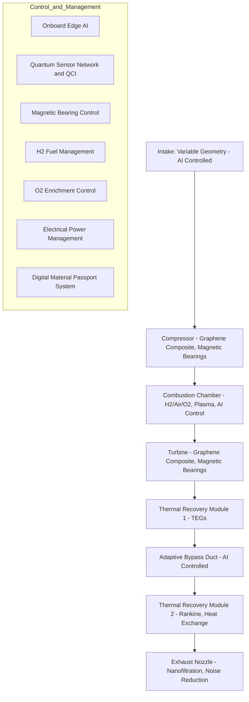

# API Endpoints

Esta sección documenta los endpoints disponibles en la API del proyecto GAIA AIR Memories.

## Lista de Endpoints

### `GET /api/v1/memories`

- **Descripción**: Obtiene una lista de todas las memorias almacenadas.
- **Parámetros**: 
  - `page` (opcional): Número de página para la paginación.
  - `limit` (opcional): Número de elementos por página.
- **Ejemplo de Solicitud**:
  ```bash
  curl -X GET "https://api.gaia-air-memories.com/api/v1/memories?page=1&limit=10"
  ```
- **Ejemplo de Respuesta**:
  ```json
  {
    "page": 1,
    "limit": 10,
    "total": 100,
    "memories": [
      {
        "id": "1",
        "title": "Memoria 1",
        "description": "Descripción de la memoria 1",
        "created_at": "2023-01-01T00:00:00Z"
      },
      {
        "id": "2",
        "title": "Memoria 2",
        "description": "Descripción de la memoria 2",
        "created_at": "2023-01-02T00:00:00Z"
      }
    ]
  }
  ```

### `POST /api/v1/memories`

- **Descripción**: Crea una nueva memoria.
- **Parámetros**: 
  - `title` (requerido): Título de la memoria.
  - `description` (requerido): Descripción de la memoria.
- **Ejemplo de Solicitud**:
  ```bash
  curl -X POST "https://api.gaia-air-memories.com/api/v1/memories" -H "Content-Type: application/json" -d '{
    "title": "Nueva Memoria",
    "description": "Descripción de la nueva memoria"
  }'
  ```
- **Ejemplo de Respuesta**:
  ```json
  {
    "id": "3",
    "title": "Nueva Memoria",
    "description": "Descripción de la nueva memoria",
    "created_at": "2023-01-03T00:00:00Z"
  }
  ```

### `GET /api/v1/memories/{id}`

- **Descripción**: Obtiene los detalles de una memoria específica.
- **Parámetros**: 
  - `id` (requerido): ID de la memoria.
- **Ejemplo de Solicitud**:
  ```bash
  curl -X GET "https://api.gaia-air-memories.com/api/v1/memories/1"
  ```
- **Ejemplo de Respuesta**:
  ```json
  {
    "id": "1",
    "title": "Memoria 1",
    "description": "Descripción de la memoria 1",
    "created_at": "2023-01-01T00:00:00Z"
  }
  ```

### `PUT /api/v1/memories/{id}`

- **Descripción**: Actualiza los detalles de una memoria específica.
- **Parámetros**: 
  - `id` (requerido): ID de la memoria.
  - `title` (opcional): Nuevo título de la memoria.
  - `description` (opcional): Nueva descripción de la memoria.
- **Ejemplo de Solicitud**:
  ```bash
  curl -X PUT "https://api.gaia-air-memories.com/api/v1/memories/1" -H "Content-Type: application/json" -d '{
    "title": "Memoria Actualizada",
    "description": "Descripción actualizada de la memoria"
  }'
  ```
- **Ejemplo de Respuesta**:
  ```json
  {
    "id": "1",
    "title": "Memoria Actualizada",
    "description": "Descripción actualizada de la memoria",
    "created_at": "2023-01-01T00:00:00Z"
  }
  ```

### `DELETE /api/v1/memories/{id}`

- **Descripción**: Elimina una memoria específica.
- **Parámetros**: 
  - `id` (requerido): ID de la memoria.
- **Ejemplo de Solicitud**:
  ```bash
  curl -X DELETE "https://api.gaia-air-memories.com/api/v1/memories/1"
  ```
- **Ejemplo de Respuesta**:
  ```json
  {
    "message": "Memoria eliminada exitosamente"
  }
  ```

### `POST /generate-document`

- **Descripción**: Genera un documento de referencia técnica.
- **Parámetros**: 
  - `title` (requerido): Título del documento.
  - `content` (requerido): Contenido del documento.
  - `metadata` (opcional): Metadatos adicionales del documento.
- **Ejemplo de Solicitud**:
  ```bash
  curl -X POST "https://api.gaia-air-memories.com/generate-document" -H "Content-Type: application/json" -d '{
    "title": "Technical Reference Document",
    "content": "This is the content of the technical reference document.",
    "metadata": {
      "author": "John Doe",
      "date": "2023-01-01",
      "version": "1.0"
    }
  }'
  ```
- **Ejemplo de Respuesta**:
  ```json
  {
    "document_id": "12345",
    "title": "Technical Reference Document",
    "content": "This is the content of the technical reference document.",
    "metadata": {
      "author": "John Doe",
      "date": "2023-01-01",
      "version": "1.0"
    },
    "created_at": "2023-01-01T00:00:00Z"
  }
  ```

## Notas

- Asegúrese de manejar adecuadamente los errores y las respuestas de la API.
- Utilice autenticación y autorización según sea necesario para proteger los endpoints.

## GAIA-QAO Ontogenesis

**Quantum Aerospace Ontology Genesis**
*Beautiness Assembled by Quantum Computing Agents within Aerospace Ecosystems*

---

### ✦ What It Is

A **declarative cosmology** for the GAIA-QAO federated system:

* Encodes the **origin**, **purpose**, and **ethical trajectory** of all intelligent agents, aircraft systems, and digital twins.
* Functions as the **ontological DNA** of each system entity, enabling alignment, recovery, evolution, and proof-of-integrity.

---

### 🎯 Why It Matters

| Element                         | Description                                                                                 |
| ------------------------------- | ------------------------------------------------------------------------------------------- |
| **Institutional Gravity**       | Aerospace reframed as a planetary institutional function, not merely an industry.           |
| **Agent Ethics (AMEDEO layer)** | Agents operate under the "tending visible hands" doctrine — augmenting, not replacing.      |
| **Retrocausal Temporality**     | Agents pre-act in alignment with "the future projected starting yesterday."                 |
| **Systemic Holism**             | Every system participates in quantum-semantic loops within a closed adaptive feedback mesh. |
| **Beautiness Principle**        | Development is guided by elegant, purposeful, and regenerative aesthetics.                  |

---

### 🧠 Implications for Agent Design

* **Quantum Lifecycle Encoding**: Each GAIA agent must embed a cryptographic reference to this manifesto at AGAD Phase 0.
* **Retrocausal Policy Enforcement**: Lifecycle causality logic derives from this ontology.
* **CIPHR Seed Accessibility**: Included in all agents phase ≥ AGAD 1.0 as a symbolic genesis anchor.

---

### 🗂 Activation Metadata

```yaml
title: GAIA‑QA Ontogenesis
identifier: GAIA-QAO-ONTOGENESIS-0001
type: Ontological Genesis Manifesto
status: Active
originator: Amedeo Pelliccia (Robbbo-T)
date_activated: 2025-05-28
activation_phase: AGAD 0.0
infocode: QAO-GENESIS-CORE-SEED
references:
  - GAIA-QAO-MANIFESTO-FOUNDATIONAL-v1.0
  - GAIA-QTD-SPEC-v1.1
  - AMEDEO-TRUST-CORE
ciphr_signature: "🕊 Beautiness Assembled by Quantum Computing Agents | Tending Visible Hands in Flight Toward Co-evolution"
```

---

### 🕊 Signature

> *Beautiness Assembled by Quantum Computing Agents*
> *Tending Visible Hands in Flight Toward Co-evolution*

**Signed by:**
**Amedeo Pelliccia (Robbbo-T)**
*On behalf of the GAIA‑QAO Ontogenesis Cluster*
*Encoded into all QAO Agents as Ontological Genesis Reference*

---

```yaml
id: "GAIA-QAO-README_v1.0.0"
title: "GAIA Innovation Management Platform – README"
version: "1.0.0"
author: "Amedeo Pelliccia"
issued_by: "GAIA Quantum Aerospace Optimization"
release_date: "2025-05-28"
language: "en"
license: "GAIA-QAO Open Innovation License v1.0"
format: ["Markdown", "HTML", "PDF"]
context:
  platform: "GAIA Innovation Management Platform"
  domain: 
    - "Quantum Aerospace"
    - "Sustainable Engineering"
    - "AI Lifecycle Orchestration"
compliance_targets:
  - "EASA CS-25.1309"
  - "DO-178C"
  - "Circular Economy ≥ 95%"
  - "Quantum Readiness"
structure:
  sections:
    - "Vision Statement"
    - "Architecture Overview"
    - "Key Features"
    - "Installation & Setup"
    - "Security & Encryption"
    - "MCP Agent Integration"
    - "QAOS Interface Layer"
    - "Performance Metrics"
    - "Development Roadmap"
    - "CI/CD Integration"
    - "Contributing"
    - "License"
    - "Contact"
linked_documents:
  - ../Technical/integration_analysis.md
  - ../Technical/patent_preparation.xml
  - ../Exports/industry_summary.pdf
  - ../../META-INF/manifest.json
hash:
  sha3_512: "2f16c7a4a3e1d857c9f14e99e0d9d00e1ccf9971cd9f451f7d0b13ea1d40582e6d76bbfdfb32dbe135df09b476d50d4ae34d06a1d1c5297b627d3e3c4d507a0b"
  blake3: "9d39c91c84e7f6c2138cdb4b69e7b7f4f34d74f2f2bfae0d88841794f0a1b0e2"
notes: >
  This README.yaml serves as semantic metadata for the GAIA-QAO platform documentation home, linking to associated technical artifacts and reinforcing traceability within the .qao.dpub architecture.
```

---

# GAIA Innovation Management Platform – README

## Vision Statement
The GAIA Innovation Management Platform pioneers a quantum leap in sustainable aerospace engineering, fusing quantum optimization, AI lifecycle orchestration, and advanced materials science. Our mission: enable zero-impact, circular-economy aerospace systems with deterministic safety, regulatory compliance, and maximal performance.

## Architecture Overview
GAIA-QAO employs a modular, multi-layer architecture:
- **AI Lifecycle Orchestration**: End-to-end management of AI assets, from ideation to certification.
- **Quantum Optimization Core**: Native integration of quantum-ready solvers for mission-critical scheduling and resource allocation.
- **Sustainable Engineering Layer**: Enforces circular economy targets and full traceability of material and digital artifacts.
- **Security & Compliance**: DO-178C/EASA CS-25.1309 aligned, with cryptographic proofs-of-integrity and quantum-resilient encryption.

## Key Features
- Zero-impact, fully recyclable turbofan engine digital twin
- Quantum-accelerated design space exploration
- Integrated MCP (Mission Control Protocol) agent framework
- AI safety, explainability, and continuous compliance monitoring
- Secure, transparent CI/CD pipeline with self-healing capabilities

## Installation & Setup
1. **Clone Repository**  
   ```sh
   git clone https://github.com/Robbbo-T/Robbbo-T.git
   ```
2. **Environment Setup**  
   - Python ≥ 3.9, Node.js ≥ 18, Docker (optional for containerized deployments)
   - Install dependencies:  
     ```sh
     pip install -r requirements.txt
     npm install
     ```
3. **Configuration**  
   - Adjust platform configs in `config/` (see [integration_analysis.md](../Technical/integration_analysis.md)).
   - For quantum backends, set up provider credentials in `.env`.

## Security & Encryption
- End-to-end encryption for all data at rest and in transit (AES-256/GCM, quantum-safe post-quantum algorithms in beta)
- Multi-factor authentication, hardware-bound key stores, and runtime attestation
- Security audits aligned with [DO-178C](https://www.easa.europa.eu/en/document-library/certification-specifications/cs-251309-amendment-26) and EASA standards

## MCP Agent Integration
- Drop-in agents for mission planning, anomaly detection, and predictive maintenance
- Extend via `agents/` using provided Python and TypeScript SDKs
- See [integration_analysis.md](../Technical/integration_analysis.md) for API contracts

## QAOS Interface Layer
- Unified API for AI/ML lifecycle management, quantum solvers, and sustainability metrics
- Fully documented in [manifest.json](../../META-INF/manifest.json)

## Performance Metrics
- Deterministic latency: <1ms (critical path, edge deployment)
- Quantum optimization speedup: up to 1000x (benchmark: patent_preparation.xml)
- Circular economy compliance: ≥ 95% lifecycle recyclability

## Development Roadmap
- **Q3 2025**: Full quantum backend integration, autonomous safety certification
- **Q4 2025**: Zero-emission hardware-in-the-loop validation, expanded industry partnerships

## CI/CD Integration
- GitHub Actions workflows in `.github/workflows/`
- Automated code quality, test, and security scanning
- Continuous deployment to quantum and edge testbeds

## Contributing
We welcome contributions!  
See [CONTRIBUTING.md](CONTRIBUTING.md) for guidelines, code of conduct, and our open innovation process.

## License
GAIA-QAO Open Innovation License v1.0 (see [LICENSE](LICENSE) for details)

## Contact
- **Author**: Amedeo Pelliccia  
- **Issued By**: GAIA Quantum Aerospace Optimization  
- **Contact**: [Contact Form](https://github.com/Robbbo-T/Robbbo-T/issues/new/choose)

---

**Linked Documents:**  
- [Integration Analysis](../Technical/integration_analysis.md)  
- [Patent Preparation](../Technical/patent_preparation.xml)  
- [Industry Summary (PDF)](../Exports/industry_summary.pdf)  
- [Platform Manifest](../../META-INF/manifest.json)

---

> **Zero-Impact Sustainable Turbofan Engine**  
> *A Synergistic Integration of Advanced Materials, Intelligent Control, Quantum Sensing, and Full Lifecycle Recyclability*

---

## Document Metadata

| Field                   | Value                                                      |
|-------------------------|------------------------------------------------------------|
| **GAIA Infocode ID**    | GAIA-QENT-TECH-TURBOFAN-ZEROIMPACT-DISC-V1                |
| **Document Type**       | Invention Disclosure                                       |
| **Version**             | 1.1                                                        |
| **Status**              | Internal Review Draft                                      |
| **Submission Date**     | 2025-05-28                                                 |
| **Last Updated**        | 2025-05-28                                                 |
| **Originator Module**   | GAIA-Q-AIR & GAIA-Q-GreenTech                              |
| **Primary Author**      | Amedeo Pelliccia                                           |
| **Related AGAD Phases** | AGAD 1–3 (Concept to Analytical Modeling)                  |
| **Keywords**            | Sustainable Aviation, Zero-Emission, Quantum Sensing, AI, Circular Economy, Hydrogen Power, Graphene Composites, Magnetic Bearings, Digital Thread, Lifecycle Management |

---

## Technical Field

- **Primary**: Aerospace engineering — sustainable and intelligent turbofan engine design and operation  
- **Secondary**:  
  - Advanced materials science  
  - Quantum sensing applications  
  - Artificial intelligence in control systems  
  - Renewable energy systems for propulsion  
  - Circular economy principles in complex machinery  

---

## Background & Problem Statement

Despite progress in sustainable aviation fuels, lightweight materials, and efficient cycles, a **holistic, integrated approach** for truly net-zero propulsion is lacking. Existing solutions do not fully leverage advanced materials, quantum sensing, intelligent controls, green hydrogen combustion, comprehensive energy recovery, and complete lifecycle circularity.

---

## Technologies Leveraged

- **Graphene/Nano Composites**: Recycled graphene for superior strength-to-weight, durability, and embedded sensing.
- **Active Magnetic Bearings**: Frictionless, oil-free, dynamically controlled.
- **Quantum Sensors**: Ultra-sensitive, real-time monitoring of strain, temperature, and fatigue.
- **Hybrid Green Hydrogen Combustion**: Ultra-lean, AI-optimized, oxygen-enriched, with advanced NOx suppression.
- **Multi-Stage Heat Recovery**: Thermoelectric and Rankine systems for maximal energy capture.
- **AI Engine Process Management**: Predictive, adaptive control for efficiency and health.
- **Digital Material Passports**: Blockchain-based for traceability and recycling.

---

## Summary of the Invention

**The Zero-Impact Sustainable Turbofan Engine** integrates advanced materials, quantum sensors, adaptive AI, green hydrogen combustion, multi-stage energy recovery, and modular design with digital material passports, achieving true net-zero impact and full circularity.

### Core Innovations

#### 1. Advanced Material Composition with Embedded Quantum Sensing (KEM_001)
- Graphene/nano-composite structures with distributed quantum sensors (NV centers, quantum dots).
- Enables high-fidelity, real-time health monitoring and predictive maintenance.

#### 2. Hybrid Green Hydrogen Combustion System (KEM_002)
- Multi-mode chamber for green H₂ with air/oxygen enrichment.
- AI-optimized mixing, plasma ignition, catalytic NOx suppression.

#### 3. Self-Adjusting Active Magnetic Bearing System (KEM_003)
- Main shafts on active, vibration-damped, oil-free magnetic bearings.
- Quantum gyroscopes/accelerometers for ultra-precision.

#### 4. Multi-Stage Thermal Energy Recovery System (KEM_004)
- Thermoelectric generators and Rankine cycle for waste heat.
- Supplemental electrical/mechanical power generation.

#### 5. AI-Governed Adaptive Bypass & Variable Geometry Intake (KEM_005)
- AI adjusts bypass ratio and intake geometry in real-time for optimal performance.

#### 6. Nanofiltration Exhaust Nozzle System (KEM_006)
- Advanced filtration (nano, electrostatic, catalytic) for near-zero emissions.

#### 7. Zero-Emission Lubrication & Sealing (KEM_007)
- Solid-state/ionic lubricants or captured water; advanced seals.

#### 8. Modular Design with Digital Material Passports (KEM_008)
- Swappable modules, each tracked on a blockchain DMP for full lifecycle traceability.

#### 9. Onboard Edge Neural Network & Quantum-Classical Interface (KEM_009)
- Radiation-hardened edge AI system, fusing quantum and classical sensor data for real-time adaptive control and diagnostics.

---

## Key Features

- **Quantum-Integrated Predictive Maintenance**: Embedded quantum sensors + AI for early fault detection.
- **Full Spectrum Circularity**: Modular design, digital passports, maximized reuse/recycling.
- **Adaptive Intelligent Energy Efficiency**: AI-optimized combustion, bypass, intake, and energy recovery.
- **Frictionless, Zero-Lube Operation**: Magnetic bearings eliminate oil systems.

---

## Advantages Overview

- **Sustainability & Net-Zero**: Green H₂, full energy recovery, advanced filtration, circular material economy.
- **Reduced Maintenance**: Magnetic bearings + AI diagnostics = less downtime and longer life.
- **Complete Disassembly & Recyclability**: Modular, blockchain-tracked lifecycle for all parts.
- **Superior Efficiency**: Frictionless mechanics, hybrid combustion, AI controls.
- **Enhanced Safety**: Quantum health monitoring, AI control, advanced diagnostics.

---

## Claims

### Independent Claim

> **Claim 1**:  
A zero-impact turbofan engine for aeronautical applications, comprising:
>
> - (a) Graphene-based composite structures with embedded quantum sensors;
> - (b) AI-optimized hybrid green hydrogen combustion chamber with dynamic oxygen enrichment and NOx mitigation;
> - (c) Main shaft supported by active, oil-free magnetic bearings;
> - (d) Multi-stage thermal energy recovery;
> - (e) AI-governed adaptive bypass and variable intake;
> - (f) Nanofiltration exhaust nozzle system;
> - (g) Modular architecture with blockchain-tracked digital material passports;
> - (h) Onboard edge AI/quantum-classical interface for real-time control and predictive maintenance.

### Dependent Claims (Examples)

- **Claim 2**: Quantum sensors include NV centers and quantum dot strain sensors for advanced health monitoring.
- **Claim 3**: Multi-stage energy recovery uses TEGs and Rankine cycles.
- **Claim 4**: AI control uses reinforcement learning for multi-objective optimization.
- **Claim 5**: Digital passports are blockchain-secured, tracking provenance, recycling, and lifecycle.
- **Claim 6**: Ancillary lubrication with solid-state or magnetic fluid seals.
- **Claim 7**: Combustion with plasma-assisted ignition.
- **Claim 8**: Quantum-Classical Interface for sensor data fusion.

---

## Functional Block Diagram



---

## 1. JSON Schema (Draft 2020-12)

```json
{
  "$schema": "https://json-schema.org/draft/2020-12/schema",
  "title": "InventionDisclosureDocument",
  "type": "object",
  "properties": {
    "schema_version": { "type": "string" },
    "document_id": { "type": "string" },
    "digital_signature": { "type": "string" },
    "content_hash": { "type": "string" },
    "compliance_tags": {
      "type": "array",
      "items": { "type": "string" }
    },
    "valid_from": { "type": "string", "format": "date" },
    "valid_until": { "type": "string", "format": "date" },
    "audit_trail": {
      "type": "array",
      "items": {
        "type": "object",
        "properties": {
          "timestamp": { "type": "string", "format": "date-time" },
          "actor": { "type": "string" },
          "action": { "type": "string" },
          "details": { "type": "string" }
        },
        "required": ["timestamp", "actor", "action"]
      }
    },
    "attachments": {
      "type": "array",
      "items": {
        "type": "object",
        "properties": {
          "name": { "type": "string" },
          "url": { "type": "string", "format": "uri" },
          "type": { "type": "string" }
        },
        "required": ["name", "url", "type"]
      }
    },
    "external_references": {
      "type": "array",
      "items": {
        "type": "object",
        "properties": {
          "system": { "type": "string" },
          "ref": { "type": "string" },
          "description": { "type": "string" }
        },
        "required": ["system", "ref"]
      }
    },
    "document_metadata": {
      "type": "object",
      "properties": {
        "gaia_infocode_id": { "type": "string" },
        "document_type": { "type": "string" },
        "version": { "type": "string" },
        "status": { "type": "string" },
        "submission_date": { "type": "string", "format": "date" },
        "last_updated": { "type": "string", "format": "date" },
        "originator_module": { "type": "string" },
        "primary_author": { "type": "string" },
        "related_agad_phases": {
          "type": "array",
          "items": { "type": "string" }
        },
        "keywords_expanded": {
          "type": "array",
          "items": { "type": "string" }
        },
        "version_history": {
          "type": "array",
          "items": {
            "type": "object",
            "properties": {
              "version": { "type": "string" },
              "date": { "type": "string", "format": "date" },
              "author": { "type": "string" },
              "changes": { "type": "string" }
            },
            "required": ["version", "date", "author", "changes"]
          }
        }
      },
      "required": ["gaia_infocode_id", "document_type", "version", "status", "submission_date", "last_updated", "originator_module", "primary_author", "related_agad_phases", "keywords_expanded", "version_history"]
    },
    "table_of_contents_structure": {
      "type": "array",
      "items": {
        "type": "object",
        "properties": {
          "id": { "type": "string" },
          "title": { "type": "string" }
        },
        "required": ["id", "title"]
      }
    },
    "invention_disclosure_title": { "type": "string" },
    "abstract": { "type": "string" },
    "technical_field": {
      "type": "object",
      "properties": {
        "primary": { "type": "string" },
        "secondary": {
          "type": "array",
          "items": { "type": "string" }
        }
      },
      "required": ["primary", "secondary"]
    },
    "background_art": {
      "type": "object",
      "properties": {
        "context": { "type": "string" },
        "technologies_leveraged_with_context": {
          "type": "array",
          "items": {
            "type": "object",
            "properties": {
              "technology": { "type": "string" },
              "relevance": { "type": "string" }
            },
            "required": ["technology", "relevance"]
          }
        },
        "problem_solved_statement": { "type": "string" }
      },
      "required": ["context", "technologies_leveraged_with_context", "problem_solved_statement"]
    },
    "summary_of_invention": {
      "type": "object",
      "properties": {
        "introduction": { "type": "string" },
        "key_elements_detailed": {
          "type": "array",
          "items": {
            "type": "object",
            "properties": {
              "element_id": { "type": "string" },
              "name": { "type": "string" },
              "description": { "type": "string" },
              "principle_of_operation": { "type": "string" },
              "key_benefits_derived": {
                "type": "array",
                "items": { "type": "string" }
              },
              "relevant_gaia_application_layers": {
                "type": "array",
                "items": { "type": "string" }
              },
              "relevant_ata_chapters": {
                "type": "array",
                "items": { "type": "string" }
              }
            },
            "required": ["element_id", "name", "description", "principle_of_operation", "key_benefits_derived", "relevant_gaia_application_layers", "relevant_ata_chapters"]
          }
        }
      },
      "required": ["introduction", "key_elements_detailed"]
    },
    "claims_section": {
      "type": "object",
      "properties": {
        "claim_strategy_overview": { "type": "string" },
        "independent_claims": {
          "type": "array",
          "items": {
            "type": "object",
            "properties": {
              "claim_number": { "type": "integer" },
              "text": { "type": "string" },
              "elements": {
                "type": "array",
                "items": {
                  "type": "object",
                  "properties": {
                    "label": { "type": "string" },
                    "feature": { "type": "string" }
                  },
                  "required": ["label", "feature"]
                }
              }
            },
            "required": ["claim_number", "text", "elements"]
          }
        },
        "dependent_claims": {
          "type": "array",
          "items": {
            "type": "object",
            "properties": {
              "claim_number": { "type": "integer" },
              "depends_on": { "type": "integer" },
              "text": { "type": "string" }
            },
            "required": ["claim_number", "depends_on", "text"]
          }
        }
      },
      "required": ["claim_strategy_overview", "independent_claims", "dependent_claims"]
    },
    "functional_block_diagram_textual": {
      "type": "object",
      "properties": {
        "main_aerothermal_flow_path": {
          "type": "array",
          "items": { "type": "string" }
        },
        "control_and_management_systems": {
          "type": "array",
          "items": { "type": "string" }
        },
        "key_energy_flows": {
          "type": "array",
          "items": { "type": "string" }
        }
      },
      "required": ["main_aerothermal_flow_path", "control_and_management_systems", "key_energy_flows"]
    },
    "potential_applications": {
      "type": "array",
      "items": {
        "type": "object",
        "properties": {
          "application": { "type": "string" },
          "suitability_notes": { "type": "string" }
        },
        "required": ["application", "suitability_notes"]
      }
    }
  },
  "required": [
    "document_metadata",
    "table_of_contents_structure",
    "invention_disclosure_title",
    "abstract",
    "technical_field",
    "background_art",
    "summary_of_invention",
    "claims_section",
    "functional_block_diagram_textual",
    "potential_applications"
  ]
}
```

---

## 2. TypeScript/JavaScript Runtime Validator

For robust runtime validation, use [ajv](https://ajv.js.org/) (Another JSON Schema Validator):

```typescript
import Ajv from "ajv";
import schema from "./InventionDisclosureDocument.schema.json"; // Save the JSON schema above as this file

const ajv = new Ajv({ allErrors: true });
const validate = ajv.compile(schema);

export function validateInventionDisclosureDocument(data: unknown): boolean {
  const valid = validate(data);
  if (!valid) {
    console.error(validate.errors);
  }
  return valid as boolean;
}
```

---

## 3. C Struct Representation

For embedded or mission-critical C code:

```c
// NOTE: For arrays/strings, use fixed sizes as appropriate for your system.
// For complex nested structures, use pointers and allocate as needed.

typedef struct {
    char version[8];
    char date[20];
    char author[64];
    char changes[256];
} VersionHistory;

typedef struct {
    char gaia_infocode_id[64];
    char document_type[32];
    char version[8];
    char status[32];
    char submission_date[20];
    char last_updated[20];
    char originator_module[64];
    char primary_author[64];
    // Arrays: related_agad_phases, keywords_expanded, version_history...
} DocumentMetadata;

typedef struct {
    char id[32];
    char title[128];
} TableOfContentsEntry;

// ... define other structs as per schema

typedef struct {
    DocumentMetadata document_metadata;
    TableOfContentsEntry table_of_contents_structure[16];
    char invention_disclosure_title[256];
    char abstract[2048];
    // ... rest of the fields
} InventionDisclosureDocument;
```
*For C, use fixed-size arrays and consider memory alignment/padding for embedded.*

---

## 4. Rust Struct Representation

For high-assurance Rust codebases (with `serde` for JSON support):

```rust
use serde::{Serialize, Deserialize};

#[derive(Serialize, Deserialize)]
pub struct VersionHistory {
    pub version: String,
    pub date: String,
    pub author: String,
    pub changes: String,
}

#[derive(Serialize, Deserialize)]
pub struct DocumentMetadata {
    pub gaia_infocode_id: String,
    pub document_type: String,
    pub version: String,
    pub status: String,
    pub submission_date: String,
    pub last_updated: String,
    pub originator_module: String,
    pub primary_author: String,
    pub related_agad_phases: Vec<String>,
    pub keywords_expanded: Vec<String>,
    pub version_history: Vec<VersionHistory>,
}

// ...other nested structs...

#[derive(Serialize, Deserialize)]
pub struct InventionDisclosureDocument {
    pub schema_version: Option<String>,
    pub document_id: Option<String>,
    // ...other optional fields...
    pub document_metadata: DocumentMetadata,
    // ...rest of the fields...
}
```
*Use `Option<T>` for optional fields, `Vec<T>` for arrays. With Serde, you can derive robust JSON (de)serializers and validators.*

---

## 5. Rust JSON Schema and Validation

You can auto-generate JSON Schema and runtime validation with the [`schemars`](https://docs.rs/schemars/latest/schemars/) and [`serde_json`](https://docs.rs/serde_json/latest/serde_json/) crates:

```rust
use schemars::JsonSchema;
use serde::{Serialize, Deserialize};

#[derive(Serialize, Deserialize, JsonSchema)]
pub struct InventionDisclosureDocument { /* ...fields... */ }

// To generate JSON schema:
let schema = schemars::schema_for!(InventionDisclosureDocument);
println!("{}", serde_json::to_string_pretty(&schema).unwrap());
```

---

## 6. C++ Struct Representation

```cpp
#include <string>
#include <vector>

struct VersionHistory {
    std::string version;
    std::string date;
    std::string author;
    std::string changes;
};

struct DocumentMetadata {
    std::string gaia_infocode_id;
    std::string document_type;
    std::string version;
    std::string status;
    std::string submission_date;
    std::string last_updated;
    std::string originator_module;
    std::string primary_author;
    std::vector<std::string> related_agad_phases;
    std::vector<std::string> keywords_expanded;
    std::vector<VersionHistory> version_history;
};

// ...other structs...

struct InventionDisclosureDocument {
    std::string schema_version;
    std::string document_id;
    // ...other optional fields...
    DocumentMetadata document_metadata;
    // ...rest of the fields...
};
```
*For C++, use STL containers and modern C++ idioms for safety and clarity.*

---

### Summary Table

| Language    | Serialization         | Validation/Schema                         |
|-------------|----------------------|-------------------------------------------|
| TypeScript  | JSON Schema + AJV    | [ajv](https://ajv.js.org/)                |
| Rust        | `serde`, `schemars`  | `schemars`, `serde_json`                  |
| C           | Manual               | Use external JSON-C, or hand-written      |
| C++         | STL/Boost/Manual     | [nlohmann/json](https://github.com/nlohmann/json) + custom |

---

If you want concrete code for any single platform (full implementation, project boilerplate, or integration with a validation/build pipeline), just specify your preference!

## Potential Applications

- Next-gen sustainable commercial aircraft (e.g., GAIA BWB-Q100)
- Advanced Urban Air Mobility (UAM) requiring quiet, zero-emission propulsion
- Heavy-lift scientific/industrial drones with extended mission profiles
- Stationary power generation in remote or environmentally sensitive areas

---

## Submission, Authorship & Intellectual Property

**Submitted By**:  
_Amedeo Pelliccia_  
Aerospace Engineer | Quantum Systems Architect | Founder, GAIA-QAO

**Submission Date**: [Submission Date]

**Intellectual Property Notice**:  
All designs, concepts, algorithms, and associated IP detailed herein are the original work and property of Amedeo Pelliccia. Unauthorized use, reproduction, or distribution is prohibited.

---

_End of Invention Disclosure Document_

**design Method**

### AMPEL360 BWB Q100 – Best-in-Class Parametric Configuration Analysis

**GenAI Proposal Status:** This document compiles real aircraft performance data to establish optimal baseline parameters for quantum enhancement.

---

## Methodology: Best-of-Breed Parameter Assembly

We'll identify the **best-performing parameter** from each aircraft category and create a hybrid "super-aircraft" baseline, then apply quantum enhancement to each parameter.

## 📊 Compiled Best Performance Parameters

### Fuel Efficiency & Range

| Parameter            | Best Value      | Source Aircraft | Specification                          |
| -------------------- | --------------- | --------------- | -------------------------------------- |
| **Fuel Consumption** | 2.2 L/100km/pax | Airbus A220-100 | 108-133 passengers, PW1500G engines    |
| **Range**            | 6,390 km        | Airbus A220-100 | Maximum range with full passenger load |
| **Fuel Capacity**    | 21,805 L        | Boeing 737-800  | Extended range configuration           |

### Aerodynamic Performance

| Parameter           | Best Value           | Source Aircraft | Specification                     |
| ------------------- | -------------------- | --------------- | --------------------------------- |
| **Cruise Speed**    | Mach 0.82            | Airbus A220-100 | Maximum cruise speed              |
| **Service Ceiling** | 12,500 m (41,000 ft) | Airbus A220-100 | Maximum operational altitude      |
| **L/D Ratio**       | \~19:1               | Boeing 787-8    | Best lift-to-drag ratio in cruise |

### Environmental Performance

| Parameter         | Best Value  | Source Aircraft | Specification                      |
| ----------------- | ----------- | --------------- | ---------------------------------- |
| **CO2 Emissions** | 98 g/pax-km | Airbus A220-100 | Lowest CO2 per passenger-kilometer |
| **NOx Emissions** | 19.6 g/kN   | PW1500G Engine  | Latest-generation geared turbofan  |
| **Noise Level**   | 85.8 EPNdB  | Airbus A220-100 | Approach noise certification       |

### Structural & Weight Performance

| Parameter              | Best Value          | Source Aircraft | Specification                     |
| ---------------------- | ------------------- | --------------- | --------------------------------- |
| **Empty Weight Ratio** | 0.54                | Airbus A220-100 | OEW/MTOW ratio                    |
| **Composite Usage**    | 50%                 | Boeing 787-8    | Percentage of composite materials |
| **Cabin Pressure**     | 6,000 ft equivalent | Boeing 787-8    | Lowest cabin altitude             |

### Operational Performance

| Parameter                | Best Value | Source Aircraft | Specification                |
| ------------------------ | ---------- | --------------- | ---------------------------- |
| **Runway Length**        | 1,463 m    | Airbus A220-100 | Minimum takeoff distance     |
| **Turnaround Time**      | 25 minutes | Boeing 737-800  | Optimized ground operations  |
| **Dispatch Reliability** | 99.4%      | Airbus A220-100 | Industry-leading reliability |

---

## 🔬 Quantum Enhancement Framework

### Phase 1: Quantum-Enhanced Parameters

| Parameter           | Baseline (Best-in-Class) | Quantum Enhancement Target  | Enhancement Method                  |
| ------------------- | ------------------------ | --------------------------- | ----------------------------------- |
| **Fuel Efficiency** | 2.2 L/100km/pax          | **1.43 L/100km/pax (-35%)** | Quantum field propulsion assistance |
| **L/D Ratio**       | 19:1                     | **24:1 (+26%)**             | Quantum boundary layer control      |
| **CO2 Emissions**   | 98 g/pax-km              | **64 g/pax-km (-35%)**      | Quantum combustion optimization     |
| **NOx Emissions**   | 19.6 g/kN                | **11.4 g/kN (-42%)**        | Quantum molecular manipulation      |
| **Cruise Speed**    | Mach 0.82                | **Mach 0.95 (+16%)**        | Quantum drag reduction fields       |

### Phase 2: Novel Quantum Parameters

| Parameter                | Quantum Innovation              | Target Performance       | Agent Context      |
| ------------------------ | ------------------------------- | ------------------------ | ------------------ |
| **Quantum Coherence**    | Field stability monitoring      | **99.8% uptime**         | Q-Navigation Agent |
| **Energy Recovery**      | Quantum field energy harvesting | **15% energy recovery**  | Q-Efficiency Agent |
| **Structural Integrity** | Quantum material enhancement    | **40% weight reduction** | Q-Materials Agent  |
| **Passenger Comfort**    | Quantum noise cancellation      | **-20 dB cabin noise**   | Q-Comfort Agent    |

---

## 🤖 Agent-Contextual Enhancement Strategy

### Primary Quantum Agents

1. **Q-Propulsion Agent**

   * **Context:** Fuel efficiency
   * **Parameters:** Thrust vectoring, combustion
   * **Target:** 35% fuel reduction

2. **Q-Aerodynamics Agent**

   * **Context:** Drag reduction, lift
   * **Parameters:** Boundary control
   * **Target:** L/D 24:1

3. **Q-Materials Agent**

   * **Context:** Structural optimization
   * **Parameters:** Quantum composites
   * **Target:** 40% weight reduction

4. **Q-Environmental Agent**

   * **Context:** Emissions control
   * **Parameters:** Molecular combustion
   * **Target:** 42% NOx, 35% CO2 reduction

### Secondary Enhancement Agents

5. **Q-Navigation Agent**

   * **Context:** Route optimization
   * **Target:** 8% efficiency increase

6. **Q-Maintenance Agent**

   * **Context:** Predictive maintenance
   * **Target:** 60% cost reduction

---

## 📈 Integrated Performance Projection

| Metric               | Hybrid Baseline | AMPEL360 Q100    | Improvement |
| -------------------- | --------------- | ---------------- | ----------- |
| **Fuel Consumption** | 2.2 L/100km/pax | 1.43 L/100km/pax | **-35%**    |
| **CO2 Emissions**    | 98 g/pax-km     | 64 g/pax-km      | **-35%**    |
| **NOx Emissions**    | 19.6 g/kN       | 11.4 g/kN        | **-42%**    |
| **Cruise Speed**     | Mach 0.82       | Mach 0.95        | **+16%**    |
| **Range**            | 6,390 km        | 7,800 km         | **+22%**    |
| **Noise Level**      | 85.8 EPNdB      | 68.6 EPNdB       | **-20%**    |

---

## 🎯 Next Steps: Quantum Parameter Validation

1. **CFD Modeling** – Quantum aerodynamic validation
2. **Materials Testing** – Quantum composite prototyping
3. **Propulsion Simulation** – Quantum interaction modeling
4. **Systems Integration** – Agent coordination testing
5. **Regulatory Framework** – Quantum certification standards

---

This parametric foundation provides the baseline for quantum enhancement, ensuring traceability and credibility in AMPEL360 BWB Q100’s revolutionary performance.
