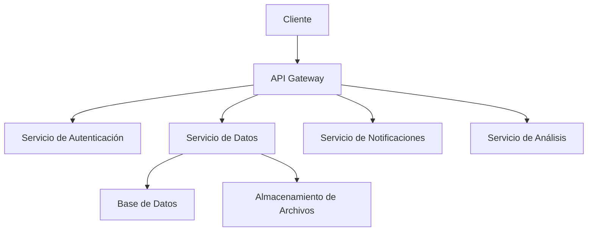
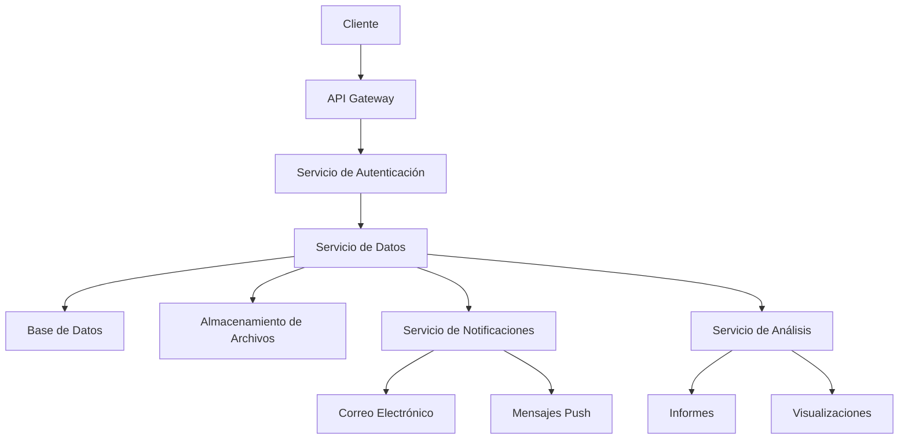

# Componentes Principales del Proyecto GAIA AIR Memories

Esta sección proporciona una descripción detallada de los componentes principales del proyecto GAIA AIR Memories, incluyendo su propósito y funcionalidad, así como diagramas que ilustran los componentes y sus interacciones.

## Descripción de los Componentes

### 1. API Gateway
El API Gateway actúa como el punto de entrada principal para todas las solicitudes externas. Se encarga de enrutar las solicitudes a los servicios correspondientes y de aplicar políticas de seguridad y control de acceso.

### 2. Servicio de Autenticación
El Servicio de Autenticación gestiona la autenticación de usuarios y la emisión de tokens de acceso. Utiliza OAuth 2.0 y JWT para asegurar las comunicaciones y garantizar que solo los usuarios autorizados puedan acceder a los recursos.

### 3. Servicio de Datos
El Servicio de Datos es responsable de la gestión y almacenamiento de datos. Utiliza una base de datos relacional para almacenar información estructurada y un sistema de almacenamiento de archivos para datos no estructurados.

### 4. Servicio de Notificaciones
El Servicio de Notificaciones se encarga de enviar notificaciones a los usuarios a través de diferentes canales, como correo electrónico y mensajes push. Utiliza un sistema de colas para gestionar la entrega de notificaciones de manera eficiente.

### 5. Servicio de Análisis
El Servicio de Análisis proporciona capacidades de análisis de datos y generación de informes. Utiliza herramientas de análisis de datos y aprendizaje automático para extraer información valiosa de los datos almacenados.

## Diagramas de Componentes

### Diagrama de Arquitectura General

### Diagrama de Flujo de Datos

## Notas sobre los Diagramas

Para evitar problemas de visualización en los diagramas Mermaid:

1. Mantenga las etiquetas cortas y descriptivas
2. Evite diagramas demasiado complejos; divídalos si es necesario
3. Utilice orientación LR (izquierda a derecha) para diagramas anchos
4. Utilice orientación TD (arriba a abajo) para diagramas altos
