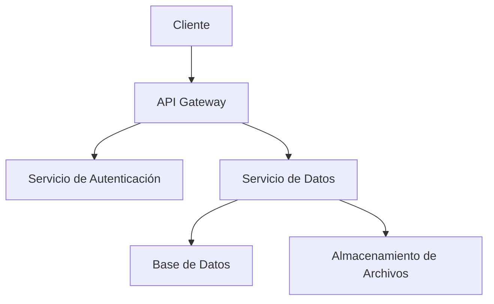
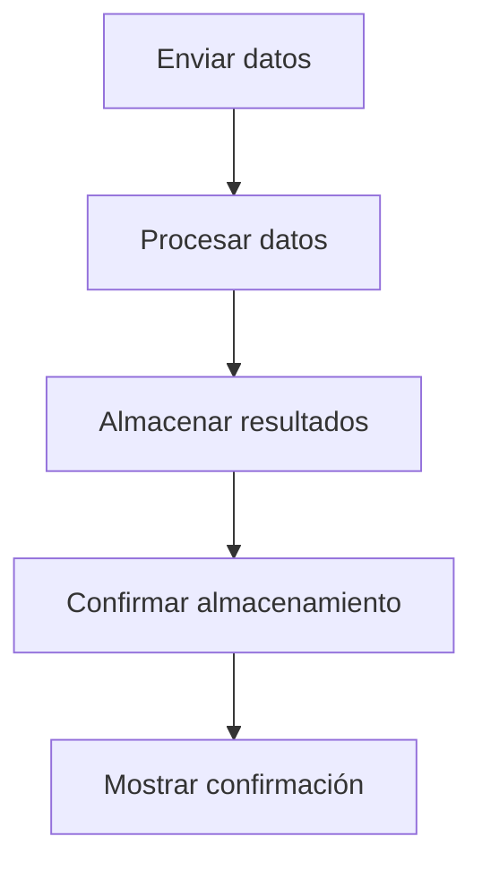
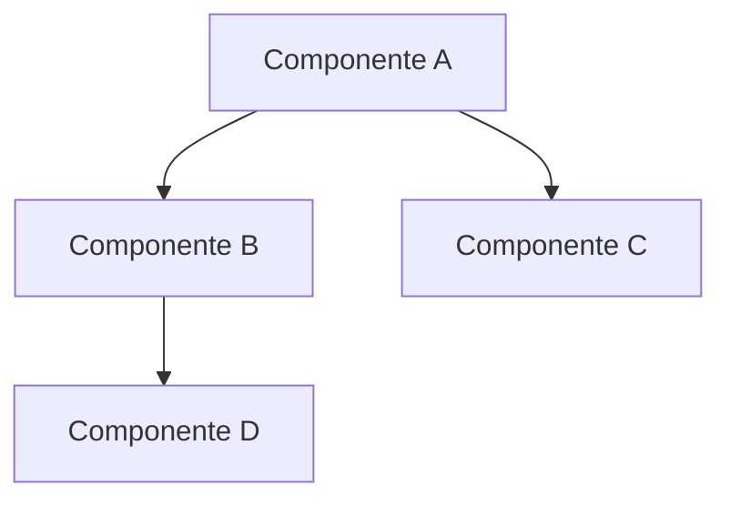

# Diagramas Técnicos

Esta sección contiene los diagramas técnicos del proyecto GAIA AIR Memories.

## Arquitectura General

## Flujo de Procesamiento de Datos

## Modelo de Componentes

## Notas sobre Diagramas

Para evitar problemas de visualización en los diagramas Mermaid:

1. Mantenga las etiquetas cortas y descriptivas
2. Evite diagramas demasiado complejos; divídalos si es necesario
3. Utilice orientación LR (izquierda a derecha) para diagramas anchos
4. Utilice orientación TD (arriba a abajo) para diagramas altos
