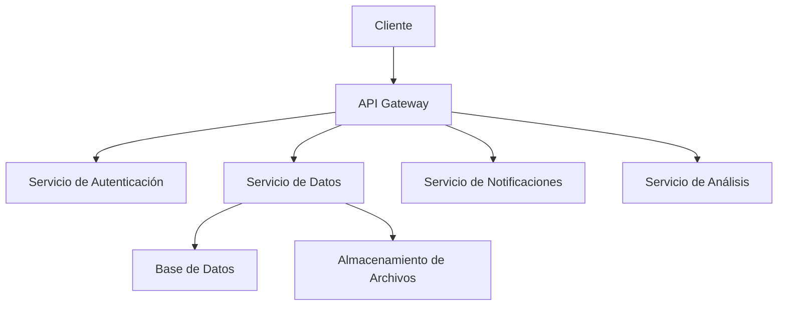

# Visión General de la Arquitectura del Proyecto GAIA AIR Memories

Esta sección proporciona una visión general de la arquitectura del proyecto GAIA AIR Memories, incluyendo la descripción de los componentes principales y un diagrama de arquitectura de alto nivel.

## Descripción de los Componentes Principales

### 1. API Gateway
El API Gateway actúa como el punto de entrada principal para todas las solicitudes externas. Se encarga de enrutar las solicitudes a los servicios correspondientes y de aplicar políticas de seguridad y control de acceso.

### 2. Servicio de Autenticación
El Servicio de Autenticación gestiona la autenticación de usuarios y la emisión de tokens de acceso. Utiliza OAuth 2.0 y JWT para asegurar las comunicaciones y garantizar que solo los usuarios autorizados puedan acceder a los recursos.

### 3. Servicio de Datos
El Servicio de Datos es responsable de la gestión y almacenamiento de datos. Utiliza una base de datos relacional para almacenar información estructurada y un sistema de almacenamiento de archivos para datos no estructurados.

### 4. Servicio de Notificaciones
El Servicio de Notificaciones se encarga de enviar notificaciones a los usuarios a través de diferentes canales, como correo electrónico y mensajes push. Utiliza un sistema de colas para gestionar la entrega de notificaciones de manera eficiente.

### 5. Servicio de Análisis
El Servicio de Análisis proporciona capacidades de análisis de datos y generación de informes. Utiliza herramientas de análisis de datos y aprendizaje automático para extraer información valiosa de los datos almacenados.

## Diagrama de Arquitectura de Alto Nivel

Este diagrama muestra la interacción entre los diferentes componentes del sistema y cómo se comunican entre sí para proporcionar las funcionalidades del proyecto GAIA AIR Memories.
