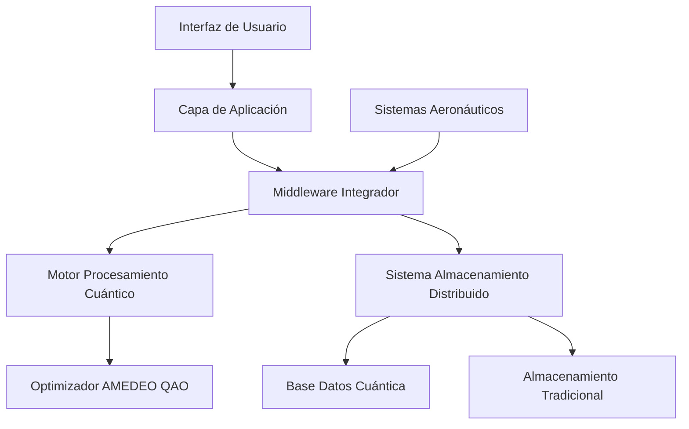

# Arquitectura del Sistema GAIA AIR Memories

## Índice

* [Introducción](#introducción)
* [Visión y Objetivos](#visión-y-objetivos)
* [Arquitectura del Sistema](#arquitectura-del-sistema)
* [Componentes Principales](#componentes-principales)
* [Tecnologías Utilizadas](#tecnologías-utilizadas)
* [Casos de Uso](#casos-de-uso)
* [Hoja de Ruta](#hoja-de-ruta)
* [Equipo y Organización](#equipo-y-organización)
* [Contribuciones y Licencia](#contribuciones-y-licencia)

## Introducción

GAIA AIR Memories (Global Aerospace Intelligent Architecture for Advanced Information Retrieval and Memory Enhancement System) es una plataforma innovadora diseñada para revolucionar la gestión de memoria y datos en sistemas aeroespaciales mediante la aplicación de computación cuántica e inteligencia artificial avanzada.

El proyecto aborda desafíos críticos de la industria aeroespacial relacionados con gestión de datos en tiempo real, optimización de recursos y seguridad en entornos altamente exigentes.

## Visión y Objetivos

### Visión

Transformar la gestión de datos aeroespaciales mediante una arquitectura de memoria cuántica para mejorar significativamente eficiencia operativa, seguridad y toma de decisiones en aeronaves.

### Objetivos Estratégicos

1. **Optimización de Recursos** – Reducir consumo energético y espacio de almacenamiento en un 40% usando algoritmos cuánticos.
2. **Fiabilidad Mejorada** – Alcanzar 99.9999% de disponibilidad en sistemas críticos.
3. **Procesamiento Acelerado** – Respuesta 10x más rápida comparado con sistemas convencionales.
4. **Integración Transparente** – Compatibilidad plena con estándares aeroespaciales existentes (ATA/AS).
5. **Seguridad Avanzada** – Protección cuántica contra amenazas emergentes.

## Arquitectura del Sistema

GAIA AIR Memories utiliza una arquitectura distribuida híbrida que combina procesamiento clásico y cuántico:

## Componentes Principales

| Componente                | Descripción                                         | Estado     |
| ------------------------- | --------------------------------------------------- | ---------- |
| **Motor AMEDEO QAO**      | Optimización cuántica para desafíos aeroespaciales  | Beta       |
| **Memoria Distribuida**   | Almacenamiento resiliente con redundancia cuántica  | Producción |
| **Middleware Integrador** | Compatibilidad con sistemas aeronáuticos existentes | Producción |
| **Interfaz Adaptativa**   | Interfaz contextual según rol y operación           | Alpha      |
| **Seguridad Cuántica**    | Protección contra amenazas clásicas y cuánticas     | Desarrollo |

## Tecnologías Utilizadas

### Computación Cuántica

* **Qiskit** – Desarrollo de algoritmos cuánticos
* **AMEDEO QAO** – Optimización adiabática cuántica propia
* **Cirq** – Simulaciones complementarias

### Backend

* **Python 3.9+**, **FastAPI**
* **PostgreSQL**, **TimescaleDB**
* **Redis**

### Frontend

* **React**, **D3.js**, **TailwindCSS**

### DevOps

* **Docker/Kubernetes**, **GitHub Actions**
* **Prometheus/Grafana**

## Casos de Uso

### 1. Optimización de Rutas de Vuelo

GAIA AIR Memories optimiza rutas considerando múltiples variables con AMEDEO QAO para minimizar consumo de combustible y tiempos operativos.

### 2. Mantenimiento Predictivo

Analiza datos en tiempo real para prever fallos, reduciendo tiempo de inactividad y costos de mantenimiento.

### 3. Gestión de Carga y Peso

Optimización continua de distribución de carga, mejorando eficiencia y seguridad operacional mediante cálculos precisos del centro de gravedad.

## Hoja de Ruta

| Fase          | Descripción                                  | Fecha Estimada |
| ------------- | -------------------------------------------- | -------------- |
| Alpha Testing | Validación inicial de interfaz y algoritmos  | Q3 2025        |
| Beta Pública  | Lanzamiento beta limitado con partners clave | Q4 2025        |
| Lanzamiento   | Implementación completa y pública            | Q2 2026        |

## Equipo y Organización

El equipo de agentes inteligentes integrado en la arquitectura del sistema está estructurado en áreas especializadas: Computación Cuántica, Ingeniería de Sistemas Aeroespaciales, Seguridad y Operaciones. Cada equipo colabora estrechamente para garantizar una integración robusta y eficiente de las soluciones propuestas.

## Contribuciones y Licencia

GAIA AIR Memories utiliza la licencia Apache 2.0. Para detalles sobre contribución, consultar `CONTRIBUTING.md`.

## Agradecimientos

* AMEDEO Quantum Research Studies

  * GAIA AIR Architecture
  * Quantum Aerospace Initiative
