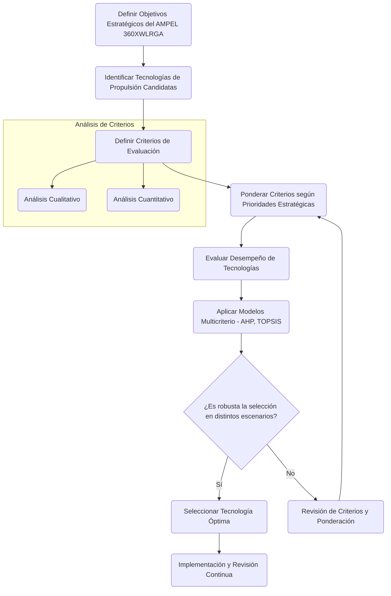

# 📊 Análisis de Sensibilidad para la Selección de Tecnologías de Propulsión del AMPEL 360XWLRGA

## I. Resumen Ejecutivo

Este informe presenta un análisis de sensibilidad sobre la selección de tecnologías de propulsión para la aeronave regional **AMPEL 360XWLRGA**. Se evalúa cómo la variación en la ponderación de criterios clave —**eficiencia energética, emisiones, peso, costo, autonomía y madurez tecnológica**— influye en la elección óptima de la tecnología de propulsión.

Los hallazgos principales revelan que:
- La **priorización de la sostenibilidad** favorece los sistemas **híbrido-eléctricos** y, a largo plazo, las opciones **basadas en hidrógeno**.
- El **énfasis en el costo y el peso** puede inclinar la balanza hacia los **turboprops convencionales**.
- La **maximización de la autonomía** y la **minimización del riesgo** favorecen tecnologías **más maduras**.

Se presentan **recomendaciones estratégicas** para alinear la elección de la propulsión con la visión a largo plazo del **AMPEL 360XWLRGA**, destacando la necesidad de una decisión **equilibrada** e **informada**.

---

## II. Análisis de Sensibilidad de Propulsión en el AMPEL 360XWLRGA

### 1️⃣ Rangos Largos en Espacios (Long-Range Spatial Capabilities)

#### **Hidrógeno Líquido (LH₂)**
✅ **Ventajas**:
- Alcance de **5,400 nm** (similar a aviones regionales convencionales).
- Potencial para **rutas transcontinentales** con **crio-tanques superconductores HTS**.

⚠️ **Desafíos**:
- Infraestructura de repostaje y redes de hidrógeno licuado en aeropuertos.
- Almacenamiento criogénico seguro (**150K**).
- Procedimientos de **manejo y seguridad** del hidrógeno en tierra y en vuelo.

#### **Híbrido-Eléctrico con Extensor de Autonomía**
✅ **Ventajas**:
- Combina **baterías de alto rendimiento** (20kWh/kg) con turbopropulsores eficientes.
- Ideal para **rutas de media distancia** (**2-4 horas**) con **reducción de emisiones del 27.8%**.

⚠️ **Desafíos**:
- Desarrollo de **baterías con mayor densidad energética**.
- Integración eficiente entre **propulsión eléctrica y convencional**.

---

### 2️⃣ Rangos Cortos en Tiempos (Short-Term Operational Efficiency)

#### **Propulsión Totalmente Eléctrica**
✅ **Ventajas**:
- **Optimiza operaciones de despegue/aterrizaje rápido** (≤90s en emergencias).
- **Reducción de ruido** en aeropuertos urbanos.

⚠️ **Limitaciones**:
- **Autonomía máxima** de **2 horas**, dependiente de la tecnología de baterías.

#### **Sistemas Híbridos con Turboeje**
✅ **Ventajas**:
- **Aprovecha infraestructura existente** de turbopropulsores.
- Permite una **transición gradual** a tecnologías más limpias.

⚠️ **Desafíos**:
- **Optimización del peso y espacio** a bordo.

---

## III. Trade-Off Técnico

### 📊 **Tabla 1. Comparación de Tecnologías de Propulsión**

| Tecnología                      | Rango Espacial | Rango Temporal | Emisiones CO₂ | Costo Inicial | Madurez (TRL) |
| -------------------------------- | ------------- | ------------- | ------------- | ------------- | ------------- |
| **Híbrido-Eléctrica**            | 5,400 nm      | 4-6 horas      | -70%          | \$12.8M       | 6-7           |
| **Hidrógeno (Pilas de Combustible)** | 6,200 nm\*    | 3-5 horas\*    | 0%            | \$24.5M\*     | 4-5           |
| **Turboprop Convencional**       | 4,800 nm      | 5-7 horas      | +150%         | \$8.2M        | 9             |

🔹 *Valores proyectados para 2035-2040.*

---

## IV. Recomendaciones Estratégicas 🚀

### **✅ Priorizar Híbridos para Rangos Cortos/Intermedios**
✔ Ideal para cumplir con **regulaciones de emisiones 2030-2035** (EU ETS, SC-E19).  
✔ Mitiga **riesgos técnicos** al aprovechar **infraestructura existente**.  

### **🟢 Invertir en Hidrógeno para Rangos Largos Futuros**
✔ Desarrollo de **estándares de repostaje criogénico** y certificaciones **EASA/FAA**.  
✔ **Colaboración con iniciativas** como **GREEN DEAL Ledger** para **financiar la transición**.  

### **⚡ Optimizar Tiempos de Operación**
✔ Implementar **gestión de energía cuántica (QCC-512q)** para **ajuste de flujos en tiempo real**.  
✔ Uso de **simulaciones árticas aceleradas** para **validar desempeño en condiciones extremas**.  

---

## V. Visualizaciones de Datos 📊

### **1️⃣ Ponderación de Criterios por Escenario Estratégico**


### **2️⃣ Comparación de Costos y Reducción de Emisiones**


---

## VI. Diagramas de Flujo y Modelos de Selección de Tecnología

### **📌 Diagrama de Selección de Propulsión**


---

## VII. Conclusiones 🔍

📌 **Decisión Equilibrada**: No hay una única solución óptima, sino que la elección depende de la **priorización de criterios**.  
📌 **Visión de Largo Plazo**: La transición al **hidrógeno** es viable con inversión en **infraestructura y certificación**.  
📌 **Flexibilidad Operativa**: Los sistemas **híbrido-eléctricos** permiten una **adaptación más ágil** a normativas emergentes.  

---

## VIII. Referencias 📖

1. **Hybrid-Electric Evolution** - Skies Mag (2025) 🔗 [enlace](https://skiesmag.com/features/the-hybrid-electric-evolution/)  
2. **Propeller Systems** - FAA (2025) 🔗 [enlace](https://www.faa.gov/sites/faa.gov/files/09_amtp_ch7.pdf)  
3. **NASA High-Spaced Propeller** 🔗 [enlace](https://ntrs.nasa.gov/api/citations/19820018343/downloads/19820018343.pdf)  

🔹 *Para más detalles técnicos, consulta la base de datos de documentación GAIA AIR.*

```
<iframe src="https://www.facebook.com/plugins/post.php?href=https%3A%2F%2Fwww.facebook.com%2Fame.muppet%2Fposts%2Fpfbid034N2i48jimCRc3BwZQobNgyoeTG6MeZvxU5EwiCCqyWV4VTbyETiNn6yR93JsaQxwl&show_text=true&width=500" width="500" height="453" style="border:none;overflow:hidden" scrolling="no" frameborder="0" allowfullscreen="true" allow="autoplay; clipboard-write; encrypted-media; picture-in-picture; web-share"></iframe>

---
