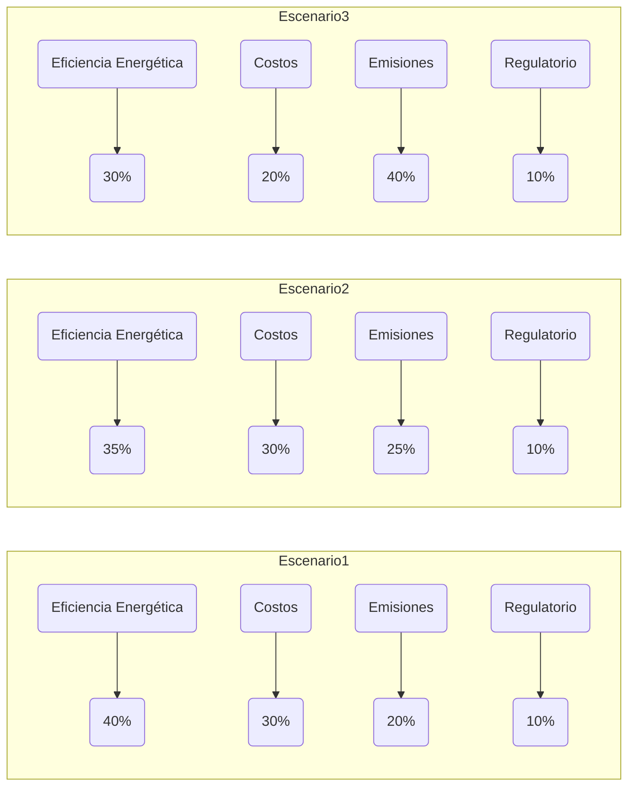
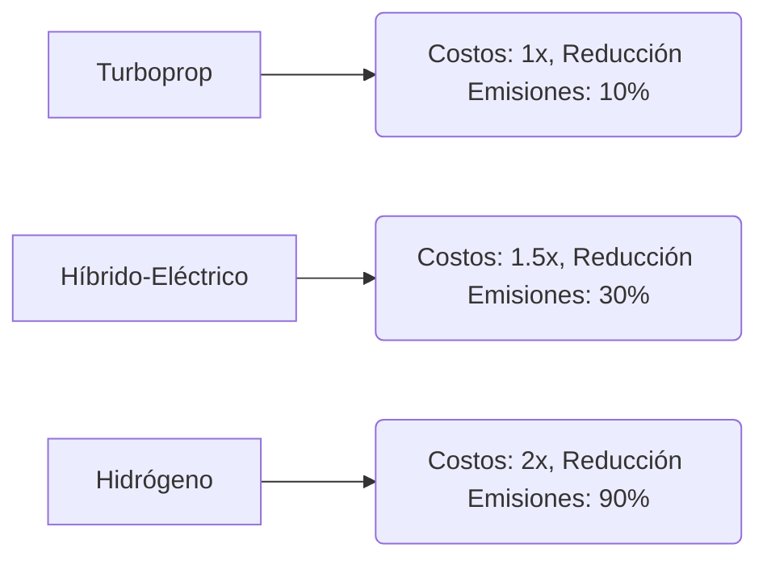
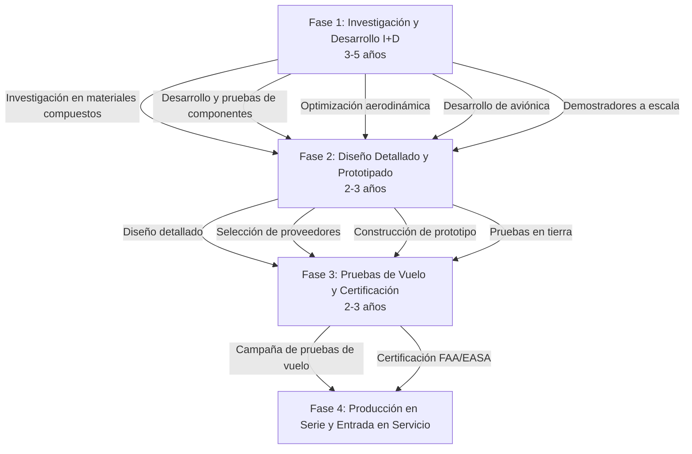

# Análisis de Sensibilidad y Diseño Conceptual: AMPEL 360XWLRGA - Una Aeronave Regional Sostenible

**Resumen Ejecutivo**

El presente estudio aborda el diseño conceptual de la aeronave regional AMPEL 360XWLRGA, enfocándose en la integración de tecnologías de propulsión avanzadas y sostenibles. Se realiza un análisis de sensibilidad exhaustivo para evaluar diferentes opciones de propulsión (turbopropulsores convencionales, híbrido-eléctrica, celdas de combustible de hidrógeno) bajo diversos escenarios estratégicos, considerando criterios técnicos, económicos, ambientales y regulatorios. El estudio culmina con un roadmap de implementación, delineando las fases clave para el desarrollo, certificación y entrada en servicio de la aeronave.

**I. Introducción**

La aviación regional enfrenta el desafío de reducir su impacto ambiental, impulsada por regulaciones más estrictas y la creciente conciencia pública sobre el cambio climático. El AMPEL 360XWLRGA (Advanced Multi-Propulsion Electric Long-Range Green Aircraft) se concibe como una plataforma para la integración de tecnologías de propulsión de vanguardia, con el objetivo de lograr una operación más eficiente, silenciosa y con emisiones reducidas o nulas.

## II. Diseño Conceptual de la Aeronave

📌 **Características generales:**

*   **Configuración:** Ala alta
*   **Capacidad:** 30-50 pasajeros
*   **Alcance:** 1500 millas náuticas
*   **Velocidad de crucero:** Mach 0.6
*   **Diseño modular:** Adaptable a diferentes sistemas de propulsión.

### II.A. Propulsión: Opciones Tecnológicas

| Tecnología                      | Descripción                                                                                                                                                                                                                                                                       |
| :------------------------------ | :------------------------------------------------------------------------------------------------------------------------------------------------------------------------------------------------------------------------------------------------------------------------------ |
| ------------------------------- | ------------------------------------------------------------------------------------------------------------------------------------------------------------------------------------------------------------------------------------------------------------------------------- |
| **Turbopropulsores Convencionales** | Motores Pratt & Whitney Canada PW150A, optimizados para eficiencia de combustible.                                                                                                                                                                                    |
| **Híbrido-Eléctrico (Serie/Paralelo)** | Combinación de turbopropulsores y motores eléctricos, alimentados por baterías y/o generadores.                                                                                                                                                                        |
| **Celdas de Combustible de Hidrógeno** | Propulsión eléctrica alimentada por celdas de combustible que utilizan hidrógeno como fuente de energía.                                                                                                                                                              |

### II.B. Aerodinámica

✅ **Optimización aerodinámica para eficiencia máxima:**

*   **Ala de alta relación de aspecto:** Minimiza la resistencia inducida.
*   **Winglets:** Dispositivos en las puntas de las alas para reducir vórtices y resistencia.
*   **Flujo laminar:** Técnicas para mantener el flujo de aire laminar sobre las superficies, reduciendo la fricción.
*   **Materiales compuestos:** Uso extensivo de materiales compuestos ligeros para reducir el peso.

### II.C. Aviónica y Controles de Vuelo

🔹 Arquitectura integrada y modular, con sistemas avanzados de gestión de vuelo (FMS), navegación, comunicación y vigilancia (CNS). Se implementa un sistema de control de vuelo *fly-by-wire* con redundancia cuádruple.

✅ **Sistemas Destacados:**

*   **Sistemas de Gestión de Vuelo (FMS):**
    Optimización de rutas, perfiles de vuelo y consumo de combustible. Interfaz con sistemas de gestión de energía en configuraciones híbridas y de hidrógeno.
*   **Navegación:**
    Sistema de navegación inercial (INS), GPS, y sistemas de aterrizaje por instrumentos (ILS) de Categoría III.
*   **Comunicación:**
    Radios VHF/HF, SATCOM, y sistemas de enlace de datos (datalink) para comunicación con control de tráfico aéreo y operaciones.
*   **Vigilancia:**
    Transpondedor ADS-B Out, TCAS II (Traffic Collision Avoidance System), y radar meteorológico.
*   **Controles de Vuelo Fly-by-Wire:**
    Sistema digital con redundancia cuádruple, que proporciona mayor precisión, protección de la envolvente de vuelo y capacidad de automatización avanzada. Incluye funciones de autotrim, autoland y auto-throttle.
*   **Pantallas de Cabina:**
    Paneles de visualización integrados (Integrated Display System - IDS) con pantallas multifunción (MFD) y pantallas primarias de vuelo (PFD), que presentan información consolidada y adaptable a las necesidades del piloto.
*   **Sistemas de Alerta y Conciencia Situacional:**
    EGPWS (Enhanced Ground Proximity Warning System), TAWS (Terrain Awareness and Warning System), y sistemas de alerta de tráfico y prevención de colisiones.

## III. Tecnologías de Propulsión: Estado del Arte

### III.A. Turbopropulsores Convencionales

Los turbopropulsores modernos, como los de la serie PW100 de Pratt & Whitney Canada, ofrecen alta eficiencia y confiabilidad. Se están desarrollando mejoras continuas en materiales, aerodinámica y combustión para reducir aún más el consumo de combustible y las emisiones.

### III.B. Sistemas Híbrido-Eléctricos

La propulsión híbrido-eléctrica combina las ventajas de los motores de combustión interna y los motores eléctricos. Los sistemas en serie utilizan el motor de combustión para generar electricidad, mientras que los sistemas en paralelo pueden usar ambos tipos de motores para propulsar la aeronave. Proyectos como el E-Fan X de Airbus y el EcoPulse de Daher/Safran/Airbus exploran estas configuraciones.

### III.C. Celdas de Combustible de Hidrógeno

Las celdas de combustible convierten el hidrógeno y el oxígeno en electricidad, agua y calor, sin emisiones contaminantes en el punto de uso. El hidrógeno puede almacenarse en forma líquida o gaseosa, o generarse a bordo a partir de otros combustibles. ZeroAvia y Universal Hydrogen están desarrollando sistemas de propulsión basados en celdas de combustible para aplicaciones de aviación regional.

## IV. Análisis de Sensibilidad

El análisis de sensibilidad evalúa el impacto de diferentes escenarios estratégicos y ponderaciones de criterios en la selección de la tecnología de propulsión óptima para el AMPEL 360XWLRGA.

### IV.A. Escenarios Estratégicos

Se definen tres escenarios estratégicos:

1.  **Conservador:** Prioriza la madurez tecnológica y la minimización de riesgos.
2.  **Equilibrado:** Busca un equilibrio entre eficiencia, emisiones y costos.
3.  **Innovador:** Prioriza la reducción de emisiones y la adopción de tecnologías disruptivas.

### IV.B. Criterios de Evaluación

Los criterios de evaluación se agrupan en cuatro categorías:

1.  **Técnicos:** Eficiencia energética, densidad de potencia, peso, confiabilidad.
2.  **Económicos:** Costos de desarrollo, producción, operación y mantenimiento.
3.  **Ambientales:** Emisiones de CO2, NOx y ruido.
4.  **Regulatorios:** Cumplimiento de normativas actuales y futuras (FAA, EASA).

### IV.C. Ponderación de Criterios

Se asignan ponderaciones a los criterios dentro de cada categoría y a las categorías mismas, reflejando la importancia relativa de cada uno en cada escenario estratégico.

*Ejemplo de ponderaciones para el Escenario 2 (Equilibrado):*

| Categoría       | Ponderación (Categoría) | Criterio               | Ponderación (Criterio) |
| :-------------- | :---------------------- | :--------------------- | :---------------------- |
| Técnicos        | 35%                     | Eficiencia Energética  | 40%                     |
|                 |                         | Densidad de Potencia   | 25%                     |
|                 |                         | Peso                   | 20%                     |
|                 |                         | Confiabilidad         | 15%                     |
| Económicos     | 30%                     | Costos de Desarrollo   | 20%                     |
|                 |                         | Costos de Producción   | 30%                     |
|                 |                         | Costos de Operación    | 30%                     |
|                 |                         | Costos de Mantenimiento | 20%                     |
| Ambientales     | 25%                     | Emisiones de CO2       | 50%                     |
|                 |                         | Emisiones de NOx       | 30%                     |
|                 |                         | Ruido                  | 20%                     |
| Regulatorios   | 10%                     | Cumplimiento Actual   | 60%                     |
|                 |                         | Adaptabilidad Futura  | 40%                     |

### IV.D. Modelos Multicriterio (AHP/TOPSIS - Breve Descripción)

Para apoyar la toma de decisiones, se pueden utilizar modelos multicriterio como AHP y TOPSIS:

*   **Analytic Hierarchy Process (AHP):** Descompone una decisión compleja en una jerarquía de criterios y subcriterios. Se asignan pesos relativos a través de comparaciones por pares. *Ejemplo:* Se estructura la decisión de propulsión con criterios principales (eficiencia, emisiones, costo), y se comparan las tecnologías en cada criterio.

*   **Technique for Order of Preference by Similarity to Ideal Solution (TOPSIS):** Clasifica alternativas según su proximidad a una solución ideal (máxima eficiencia, mínimas emisiones, etc.) y su distancia a una solución anti-ideal. *Ejemplo:* Se define una "solución ideal" y una "anti-ideal" de propulsión, y se clasifican las tecnologías según su cercanía a estos extremos.

## V. Resultados del Análisis de Sensibilidad

Los resultados del análisis de sensibilidad se presentan en forma de gráficos y tablas, comparando el desempeño de cada tecnología de propulsión en cada escenario estratégico.

*   **Gráfico 1: Ponderación de Criterios por Escenario Estratégico** (Placeholder - Diagrama de barras o radial)
*   **Gráfico 2: Comparación de Costos y Reducción de Emisiones** (Placeholder - Diagrama de dispersión)

*Ejemplo conceptual de Gráfico 1 (usando Mermaid):*

*Ejemplo conceptual de Gráfico 2 (usando Mermaid)*:

## VI. Estimación Cuantitativa (Ejemplo Simplificado)

Aplicando un enfoque de suma ponderada (para ilustrar, no son valores reales):

**Escenario 2**

| Tecnología       | Eficiencia (40%) | Costos (30%) | Emisiones (25%) | Regulatorio (10%) | Puntaje Total |
| :--------------- | :--------------- | :------------ | :-------------- | :---------------- | :------------ |
| Turboprop        | 4                | 8             | 5               | 9                 | 5.75          |
| HE               | 8                | 6             | 7               | 7                 | 7.15          |
| H2               | 9                | 4             | 9               | 6                 | 7.55          |

## VII. Tabla Comparativa de Tecnologías

| Tecnología              | Fortalezas Clave                                                                                 | Debilidades Clave                                                                                       | Riesgos/Desafíos      | Sinergias Potenciales | Ejemplos/Proyectos                |
| :---------------------- | :------------------------------------------------------------------------------------------------ | :----------------------------------------------------------------------------------------------------- | :-------------------- | :-------------------- | :-------------------------------- |
| ----------------------- | ------------------------------------------------------------------------------------------------- | ----------------------------------------------------------------------------------------------------- | --------------------- | --------------------- | --------------------------------- |
| Turbopropulsor          | Alta eficiencia, madurez tecnológica, bajo costo de adquisición.                                    | Emisiones de CO2 y NOx, ruido.                                                                         | Limitaciones ambientales | Optimización continua  | Pratt & Whitney Canada PW100 series |
| Híbrido-Eléctrico (Serie) | Reducción de emisiones y ruido, potencial de mayor eficiencia en ciertas fases del vuelo.          | Mayor peso y complejidad, menor densidad de potencia.                                                   | Baterías, gestión térmica | HE + Turboprop         | Airbus E-Fan X                    |
| Híbrido-Eléctrico (Paralelo) | Mayor flexibilidad operativa, potencial de despegue y aterrizaje eléctricos.                       | Mayor complejidad, optimización del control de la distribución de potencia.                          | Baterías, control    | HE + Turboprop       | Daher/Safran/Airbus EcoPulse      |
| Celdas de Combustible H2 | Cero emisiones en el punto de uso, potencial de alta eficiencia.                                  | Infraestructura de producción y distribución de hidrógeno, almacenamiento de hidrógeno (peso y volumen), costo. | Infraestructura, costo | Con sistemas híbridos | ZeroAvia, Universal Hydrogen     |

## VIII. Infraestructura de Hidrógeno: Desafíos Clave

La viabilidad de la propulsión a hidrógeno depende del desarrollo de una infraestructura robusta y económica:

*   **Producción:** El hidrógeno "verde" (producido a partir de energías renovables) es clave para lograr una reducción real de emisiones. Los costos de producción deben disminuir significativamente.
*   **Transporte y Almacenamiento:** El transporte y almacenamiento de hidrógeno (ya sea líquido o gaseoso) presentan desafíos técnicos y económicos. Se requieren nuevas tecnologías y materiales.
*   **Distribución en Aeropuertos:** Los aeropuertos necesitarán instalaciones para el almacenamiento y suministro de hidrógeno a las aeronaves.
*   **Regulación y Seguridad:** Es necesario desarrollar normas y regulaciones claras para el manejo seguro del hidrógeno en la aviación.

## IX. Roadmap de Implementación

El desarrollo y la implementación del AMPEL 360XWLRGA se estructuran en un roadmap con fases clave:

## X. Impacto

El AMPEL 360XWLRGA tiene el potencial de generar un impacto significativo en múltiples dimensiones:

*   **Ambiental:** Reducción drástica de las emisiones de gases de efecto invernadero (GEI) y del ruido, contribuyendo a la sostenibilidad de la aviación regional.
*   **Económico:** Mayor eficiencia operativa, menores costos de combustible y mantenimiento, creación de empleos en el sector de tecnologías limpias.
*   **Social:** Creación de empleos de alta cualificación en el desarrollo y fabricación de aeronaves y tecnologías de propulsión avanzadas. Fomento de la formación en STEM (ciencia, tecnología, ingeniería y matemáticas).
*   **Geopolítico:** Reducción de la dependencia de los combustibles fósiles importados, aumentando la seguridad energética.
*   **Innovación Tecnológica:** El AMPEL 360XWLRGA servirá como plataforma para el desarrollo y la maduración de tecnologías clave para la aviación del futuro, como la propulsión híbrido-eléctrica y las celdas de combustible de hidrógeno. Podría catalizar el desarrollo de aeronaves más grandes y de largo alcance con cero emisiones.

## **XI. Conclusiones**

📌 La elección de la tecnología de propulsión óptima dependerá de la evolución de los costos, la regulación y la disponibilidad de infraestructura.

📌 El AMPEL 360XWLRGA representa un paso importante hacia una aviación regional más sostenible. El roadmap de implementación propuesto proporciona un camino claro.

📌 El éxito del proyecto requerirá una estrecha colaboración entre fabricantes, operadores, reguladores e instituciones de investigación.

**XII. Referencias**

*   NASA:  [https://www.nasa.gov/](https://www.nasa.gov/)  (Diversos informes técnicos sobre propulsión eléctrica y aeronaves híbridas)
*   FAA:  [https://www.faa.gov/](https://www.faa.gov/)  (Regulaciones y normativas de aviación)
*   EASA: [https://www.easa.europa.eu/](https://www.easa.europa.eu/) (Regulaciones y normativas de aviación)
*   Airbus: [https://www.airbus.com/](https://www.airbus.com/) (Información sobre el proyecto E-Fan X)
*   Daher: [https://www.daher.com/](https://www.daher.com/) (Información sobre el proyecto EcoPulse)
*   ZeroAvia: [https://www.zeroavia.com/](https://www.zeroavia.com/) (Información sobre sistemas de propulsión con celdas de combustible)
*   Universal Hydrogen: [https://www.hydrogen.aero/](https://www.hydrogen.aero/) (Información sobre sistemas de propulsión con celdas de combustible)
*   Pratt & Whitney Canada: [https://www.pwc.ca/](https://www.pwc.ca/) (Información sobre motores de la serie PW100)
*   ICAO Environment: [https://www.icao.int/environmental-protection/Pages/default.aspx]
*   Clean Sky 2 Joint Undertaking: [https://www.cleansky.eu/]

---

---

