# 🌍 An Internet Self-Regulated by AGI: Saving Democracy from Misinformation

**General Proof Reader Technology**  
**By Amedeo Pelliccia**  

---

## **GAIA AIR INFRANET**  
### *Strategic Intermediate Layer*

The **GAIA AIR INFRANET** is a strategic layer that bridges the **universal accessibility** of the public web with the **controlled security** of private networks (clouds). Its main purpose is to deliver **high-quality**, **strategic value**, and **total transparency** through **automatic verification** processes that prioritize **factual accuracy**, explicitly excluding **SEO-based marketing techniques**.

---

## **Key Functions**

1. **Intelligent Verification & Factual Check**  
   - Automated validation focusing solely on **factual accuracy**  
   - Detection and correction of **errors**, **biases**, and **inaccuracies**

2. **Quantum Optimization (QAO)**  
   - Improves **accuracy** and **efficiency** for complex queries using **quantum methods**

3. **Blockchain Audit (Proof-of-Accuracy)**  
   - **Transparent**, **immutable** cryptographic logs of validations and corrections, ensuring complete traceability

4. **Elastic Adaptive Federated Memory**  
   - Secure, adaptive storage using **Elastic Decay**, fully **GDPR** and **ISO 27001** compliant

---

## **Proposed Technical Architecture**

```
Public Web (Universal Access)
       │
       ▼
GAIA AIR INFRANET
       │
       ├─ Verification & Factual Checking (GAIA²)
       │     └─ Hybrid AI for factual analysis
       ├─ Quantum Optimization (QAO)
       │     └─ Quantum NLP
       ├─ Blockchain Audit (GAIA GREEN)
       │     └─ Smart contracts with ZK Proofs
       └─ Elastic Adaptive Federated Memory
             └─ Adaptive dynamic memory with decay
```

---

### **Practical Example: Intelligent Medical Search Engine**

- **Factual-Centric Interface**  
  Searches for symptoms, specialists, and medical facilities rely solely on **truthfulness** and **factual checks**.

- **Public Results**  
  - Verified medical information based on **scientific evidence**  
  - Educational resources rigorously reviewed by factual AI

- **Private Results**  
  - Personal medical data protected by strict privacy standards  
  - Restricted access with advanced secure authentication

---

## **Key Principles**

- **No marketing or SEO-driven optimization**: Focus on **factual content** and provable transparency  
- **Complete regulatory compliance**: Adheres to **GDPR**, **ISO 27001**, and sector-specific regulations

---

## **Roadmap and Next Steps**

| Phase       | Activities                                                    | Timeline  |
|-------------|---------------------------------------------------------------|-----------|
| **Phase 1** | Initial rollout focusing on factual checking & hybrid AI      | 1–2 months|
| **Phase 2** | Blockchain integration (Proof-of-Accuracy) & QAO              | 2–3 months|
| **Phase 3** | Elastic memory + secure federated learning                    | 3–4 months|
| **Phase 4** | Global scalability (biotech, aerospace, advanced medical)     | 4–6 months|

---

## **Strategic Value**

**GAIA AIR INFRANET** serves as a **strategic intermediary** that elevates **accuracy**, **factual quality**, and **digital transparency** between the public web and specialized private networks.

---

## **Technology Overview: General Proof Reader**

The **General Proof Reader Technology** leverages **AGI** (Artificial General Intelligence) to **validate**, **correct**, and **authenticate** digital content before publication. It features:

- **Blockchain Transparency**: Ensures **immutability** and **verifiability** of content  
- **AGI Linguistic Analysis**: Provides **deep semantic understanding**, identifying biases and errors  
- **Decentralized Governance**: Community-based validation to prevent monopolies or manipulation

**Objective**: Protect democracy and public integrity from **fake news**, **media manipulation**, and **technical errors** in critical documents.

---

## **Introduction to Cross AI**

**Cross AI** is an innovative framework integrating multiple AI models to form **hybrid intelligent networks** with **adaptive** and **collaborative** capabilities, exceeding single-model limitations.

---

## **Core Principles**

| Principle                               | Description                                                       | Practical Example                                                     |
|-----------------------------------------|-------------------------------------------------------------------|-----------------------------------------------------------------------|
| **Interoperability**                    | Transparent data exchange among different AI models               | A deep learning model sharing real-time results with a symbolic AI    |
| **Elastic Adaptability**                | Dynamically adjusts memory via decaying context windows           | Systems that optimize memory usage based on incoming data relevance   |
| **Intelligent Federation**              | Secure, distributed synchronization (federated learning)          | Autonomous vehicles learning together without sharing private data    |
| **Quantum Adaptive Orchestration (QAO)**| Uses **quantum superposition** and **entanglement** for complex decisions | Quantum-classical route optimization for aerospace                |
| **Cognitive Hybridization**             | Combines symbolic, subsymbolic, and heuristic AI                  | Virtual assistants merging formal logic & neural networks             |

---

## **Proposed Architecture**

- **Cognitive Module Layer**  
  - Symbolic AI, Deep Learning, Quantum Optimization, Heuristic Systems  

- **Adaptive Layer (Elastic Decay Memory)**  
  - Contextual memory with decaying relevance  

- **Federated Layer (GDPR/ISO 27001)**  
  - **Federated Averaging & Distillation**  
  - Parameter transfer without personal data  

- **Quantum Layer (QAO)**  
  - Resource management via **quantum superposition**  
  - Optimized decisions under uncertainty  

- **Blockchain Transparency Layer**  
  - Cryptographic logs of decisions and learning

---

## **Practical Applications**

- **Aerospace**: Predictive navigation, AI-based flight optimization (quantum + hybrid AI)  
- **Personalized Medicine**: Diagnostics through Cross AI (deep learning + medical expert systems + quantum)  
- **Hybrid Finance**: Investment models mixing ML and quantum simulations for risk-return optimization  
- **Intelligent Automotive**: Autonomous vehicles combining neural networks with heuristic approaches in a federated environment  
- **Adaptive Cybersecurity**: Threat detection using symbolic logic, anomaly detection, and quantum cryptography

---

## **Key Benefits**

- **Higher Accuracy**: Integrates multiple AI methodologies  
- **Adaptability**: Rapid response to dynamic environments  
- **Privacy & Compliance**: Aligns with data protection requirements  
- **Sustainable Innovation**: Suitable for critical, high-impact industries

---

## **Implementation Steps**

| Stage | Key Action                                    | Expected Outcome                             |
|-------|-----------------------------------------------|----------------------------------------------|
| **1** | Define modular architecture                   | Scalable, flexible system structure          |
| **2** | Select adaptive & federated frameworks        | Meets regulatory compliance & dynamic needs  |
| **3** | Integrate quantum technologies                | Advanced solutions for complex challenges    |
| **4** | Iterative testing in simulated environments   | Robust and validated AI models               |
| **5** | Deploy with blockchain auditing               | Transparency and security guaranteed         |

---

## **Challenges**

- **Integration Complexity**: Handling multiple AI models can be complicated  
- **Technical Expertise**: Requires advanced knowledge of AI, blockchain, quantum, etc.  
- **Rigorous Ethical/Legal Framework**: Essential to avoid bias and ensure responsibility

---

## **Complementary Technologies**

- **Contextual Semantic Analysis (CSA)**: Domain-based semantic analysis  
- **Quantum-Enhanced Language Processing (QLP)**: Quantum-based detection of semantic conflicts  
- **Proof-of-Accuracy Blockchain Logging**: Immutable logging within **GAIA GREEN BLOCKCHAIN**  
- **Elastic Context Windows**: Manages data usage under **GDPR/ISO 27001** compliance

---

## **Next Steps**

- Establish **AGI-based content regulation** infrastructure  
- Implement a **blockchain-based** reputation and verification system  
- Develop a **decentralized API** for real-time content auditing  
- Provide a **traceability** framework for web information credibility
---

```mermaid
%% Title: GAIA AIR Application Cycle
%% Note: This diagram shows how different applications interact, with additional connections to GREEN Ledger, Cosmic Climate Model, and ChatQuantum.

graph TD
    A["App 1: Design & Coding"] --> B["App 2: Build & Assemble"]
    B --> C["App 3: SaaS & Cloud Computing"]
    C --> D["App 4: Documentation"]
    D --> E["App 5: Project & Product Lifecycle"]
    E --> A

    A -- "Designs" --> B
    B -- "Components" --> C
    C -- "Operational Data" --> D
    D -- "Technical Documentation" --> E
    E -- "Requirements & Improvements" --> A

    F["GREEN Ledger"] --- A
    F --- B
    F --- C
    F --- E

    G["Cosmic Climate Model"] --- A
    G --- C
    G --- E

    H["ChatQuantum"] --- A
    H --- C
    H --- 
````
How They Interconnect
App 1: Design & Coding

Focuses on initial design, software coding, and concept development.
Outputs designs that flow into Build & Assemble.
App 2: Build & Assemble

Takes the designs and transforms them into physical components or systems.
Relies on data from Design & Coding and passes completed components to SaaS/CC for operational setup.
App 3: SaaS & Cloud Computing

Manages operational data hosting, analytics, and cloud services (e.g., advanced computation).
Feeds operational data to Documentation for technical records and to Project/Product Lifecycle for analysis.
App 4: Documentation

Receives operational data and component details to generate and maintain technical documentation.
Supports feedback loops to refine designs in App 1 and addresses compliance/regulations.
App 5: Project & Product Lifecycle

Manages requirements, versioning, and long-term project/product life management.
Provides improvements and new requirements back to Design & Coding, closing the loop.
Integrations with Other Components
GREEN Ledger (F)

Connects to multiple apps (A, B, C, E) for secure, transparent logging of processes, ensuring sustainability metrics or compliance events are immutably stored.
Cosmic Climate Model (G)

Informs Design (A) and SaaS (C) with advanced climate data.
Also influences Project Lifecycle (E), aiding strategic decisions based on climate forecasts.
ChatQuantum (H)

Integrates with Design (A), SaaS (C), and Documentation (D) for AI-assisted knowledge generation, advanced analytics, and dynamic content updates.
By following this cycle, GAIA AIR ensures an iterative, traceable, and collaborative process that encompasses everything from conceptual designs to full lifecycle management, leveraging blockchain (GREEN Ledger), advanced modeling (Cosmic Climate Model), and quantum-driven AI tools (ChatQuantum).
**https://gaia-air.net

# GAIA AIR – Cosmic Omnidevelopable Aero Foresights Index (COAFI)

**Overview:** The Cosmic Omnidevelopable Aero Foresights Index (COAFI) is the comprehensive master plan for **GAIA AIR**, a visionary program for developing a smart, sustainable aircraft ecosystem. GAIA AIR integrates cutting-edge technologies – artificial intelligence (AI), quantum computing, and advanced robotics – with sustainability and ethical design at its core ([Robbbo-T/GAIA-AIR - GitHub](https://github.com/Robbbo-T/GAIA-AIR#:~:text=,quantum%20computing%2C%20and%20blockchain)). This document is more than a technical manual; it is a living roadmap that evolves with the project’s progress ([Robbbo-T/GAIA-AIR - GitHub](https://github.com/Robbbo-T/GAIA-AIR#:~:text=This%20document%2C%20structured%20as%20a,It%20is%20a%20living%2C)). Each section below expands on key components of the plan, ensuring technological innovation is harmonized with sustainability principles, robust ethical frameworks, and positive societal impact. All content is structured formally and technically, aligning with industry best practices to support GAIA AIR’s ambitious long-term vision.

## 1. Current Project Status Report

*Status Date:* **Q1 2025** (Report covering recent progress, resources, risks, and decisions)

- **Progress & Milestones:** GAIA AIR’s development is on track with major initial milestones achieved. The core architecture for the **SPHERAs-FAMILY** concepts has been defined, and preliminary designs for key components (e.g. the **Sphericraft** hull and **ML-P** AI modules) are complete. The project timeline is closely monitored using Gantt charts and agile sprints for sub-tasks, ensuring that deliverables meet schedule expectations. Progress is measured against the baseline plan each month, and so far all critical path items are on schedule or ahead. An **executive dashboard** provides at-a-glance status of overall performance and key milestones ([Comprehensive Guide to Project Status Reports: From Basics to Best Practices](https://www.workamajig.com/blog/project-status-reports#:~:text=overall%20project%20performance%2C%20key%20milestones,critical%20decisions%20requiring%20executive%20attention)), fostering transparency with stakeholders. 

- **Budget & Resources:** The project’s financials are within the allocated budget for the current phase. As of this quarter, approximately 40% of the R&D budget has been utilized, primarily on prototyping materials and AI infrastructure. Budget status reports show spending versus plan each month, with any variances flagged early ([Comprehensive Guide to Project Status Reports: From Basics to Best Practices](https://www.workamajig.com/blog/project-status-reports#:~:text=overall%20project%20performance%2C%20key%20milestones,critical%20decisions%20requiring%20executive%20attention)). No major overruns have occurred; cost management strategies (bulk procurement, open-source software use) have created a **5% cost saving** that serves as contingency. Resource allocation is reviewed quarterly to ensure funding aligns with priorities (e.g. additional investment in quantum research tools is planned in anticipation of upcoming tasks). Overall, the financial health is sound, and sufficient buffer remains for unexpected needs.

- **Risk Assessment:** A proactive risk management process is in place, with a living **risk register** updated bi-weekly. Key identified risks include potential delays in acquiring specialized quantum hardware and the challenge of integrating the ML-P system with both legacy and cutting-edge components. Each risk is evaluated for probability and impact, with mitigation strategies defined (e.g. for hardware delays, leveraging simulation and a **digital twin** to continue algorithm development – see Section 9). No high-impact risks have materialized to date. Early identification and mitigation of issues have been effective ([Comprehensive Guide to Project Status Reports: From Basics to Best Practices](https://www.workamajig.com/blog/project-status-reports#:~:text=Early%20Identification%20of%20Issues%20and,Risks)). For example, a moderate risk of talent gaps in quantum engineering was addressed by partnering with a university research lab, reducing that risk’s probability. The project team remains vigilant, reviewing technical and schedule risks regularly to keep the project on course.

- **Key Decisions & Actions:** Several strategic decisions were made recently to align the project with its long-term vision. Notably, the team **formally adopted the AI Ethics Guidelines** (see Section 3) to govern all AI development moving forward – ensuring fairness and transparency are built into GAIA’s AI systems from the ground up. A decision was also taken to implement the **GAIA AIR Part Numbering System** (see Section 10) immediately, rather than later, to establish strong configuration control early in the design process. Additionally, the architecture of the SPHERAs-FAMILY was refined: it was decided that the **Sphericraft** will use modular subsystems to expedite parallel development (e.g. the propulsion module can be developed independently of the capsule robotics). Another key decision was to launch the **Open Skyway** community platform two months ahead of schedule, accelerating engagement with external collaborators. All such decisions are documented in a decision log for traceability, and they reflect our adaptive strategy to seize opportunities and preempt challenges.

## 2. Short-Term and Mid-Term Objectives

To ensure steady progress toward GAIA AIR’s long-term vision, the team has defined clear short-term (1–2 years) and mid-term (3–5 years) objectives. Each objective is crafted to be **SMART**: Specific, Measurable, Achievable, Relevant, and Time-bound ([[PDF] Setting Goals and Developing Specific, Measurable, Achievable ...](https://www.samhsa.gov/sites/default/files/nc-smart-goals-fact-sheet.pdf#:~:text=,term%20goals%20in%20your)). These goals bridge today’s development efforts with GAIA AIR’s future state, aligning immediate tasks with the broader mission of innovation, sustainability, and societal benefit.

### Short-Term Objectives (1–2 Years)

1. **Establish Core Architecture & Prototypes:** **By Q4 2025**, finalize the system architecture for GAIA AIR and develop initial prototypes of key components. This includes a functional prototype of a **SPHERACAPSULE robotic unit** (for basic mobility and operations tests) and a preliminary digital model of the **SPHERICRAFT**. *Measurable target:* Architecture design document completed and prototype demos conducted for at least two SPHERA devices.

2. **Implement AI & Quantum Ethical Frameworks:** **By mid-2025**, operationalize the AI and quantum ethics guidelines across the project. This means publishing the official **AI Ethics Guidelines** (Section 3) and **Quantum Technology Ethics** policy (Section 4), training all team members on these principles, and integrating ethical compliance checks into design reviews. *Measurable target:* 100% of GAIA AIR technical staff trained in AI/Quantum ethics, and ethics checklists used in all design approval meetings.

3. **Launch the Cosmic Index Platform:** Develop and deploy the **Cosmic Index**, an interactive knowledge base (Section 5), by Q3 2025. This online index will house all relevant research, design references, and project documentation in a searchable form for the team and community. *Measurable target:* Cosmic Index online with at least **500 indexed entries** (e.g. technical articles, design specs) and a user manual available for community use.

4. **Integrate ML-P in Test Environment:** **By Q1 2026**, integrate the **ML-P** machine learning platform (Section 6) into a testing environment for GAIA AIR subsystems. In practice, this means demonstrating ML-P’s capability in at least two domains – for example, autonomous navigation control of a drone (simulating the Sphericraft’s AI pilot) and predictive maintenance analytics using sensor data. *Measurable target:* Successful demonstration of ML-P-driven autonomous control in a simulated flight test and a report showing ML-P predicted maintenance issues with >90% accuracy in a test dataset.

5. **Open Skyway Community Engagement Kickoff:** Establish the **Open Skyway** community (Section 7) and achieve initial engagement targets by the end of 2025. Key steps include launching a community portal, publishing open contribution guidelines, and hosting the first collaboration event (e.g. an online workshop or hackathon). *Measurable target:* At least **100 community members** registered on the Open Skyway platform and 5+ external contributions (such as code commits, design suggestions) received and integrated by early 2026.

6. **Implement Part Numbering & PLM System:** Roll out the **GAIA AIR Part Numbering System** (Section 10) alongside a Product Lifecycle Management (PLM) tool by Q4 2025 to support configuration management. Every component and document should be catalogued in the PLM with a unique part number. *Measurable target:* 100% of new parts and designs use the standardized numbering, and the PLM system is in active use by the engineering team, with legacy data migrated.

### Mid-Term Objectives (3–5 Years)

1. **Develop and Test SPHERAs-FAMILY Prototypes:** **By 2028**, build and test working prototypes of the SPHERAs-FAMILY concepts – including a flight-ready **SPHERICRAFT** and **SPHERASHUTTLE**, a small cluster of **SPHERAFLOWSAT** prototype satellites, and fully functional **SPHERACAPSULES** robotic assistants. *Measurable target:* Complete at least one controlled test flight of the Sphericraft (e.g. a low-altitude or suborbital flight) and demonstration of Spheracapsules performing autonomous tasks in microgravity or test environments.

2. **Integrate Quantum Technologies into Systems:** **By 2027**, integrate a quantum technology module (such as a quantum communication or sensing system) into the GAIA AIR platform in a testing capacity. This objective entails advancing the **Digital/Analog Twin methodology** (Section 9) to mature quantum components for real-world use. *Measurable target:* Successful operation of a quantum communication link between a Spheraflowsat satellite and the Sphericraft in a laboratory setting (with encryption protocols tested), and completion of a Quantum Impact Assessment to ensure security and compliance with ethics guidelines.

3. **Global Expansion of Open Skyway Collaboration:** Grow the Open Skyway community into a thriving, international collaborative network by 2027. GAIA AIR aims to involve academia, industry partners, and citizen scientists in co-development. *Measurable target:* Partnerships established with at least **3 universities** and **2 industry consortia**, and an active contributor base of **500+ members** worldwide. At least two major community-driven innovation proposals should be incorporated into the project’s design by 5 years.

4. **Refinement of AI Systems with Ethics Oversight:** By 2026–2027, deploy advanced versions of ML-P across GAIA AIR subsystems (flight control, data analytics, etc.) with continuous ethical oversight and improvements. The AI systems should demonstrate **fairness, transparency, and reliability** in extensive simulations and limited field trials. *Measurable target:* An external audit or review of GAIA’s AI systems confirms compliance with the AI Ethics Guidelines, and autonomous functions achieve performance benchmarks (e.g. autonomous flight hours without incident, accuracy of anomaly detection) comparable to or better than human-operated systems.

5. **Sustainability & Societal Impact Metrics:** Achieve quantifiable sustainability targets and positive societal impact outcomes by year 5. GAIA AIR’s design and operations will emphasize green engineering and societal benefit. *Measurable target:* The Sphericraft and support systems operate with **50%+ renewable energy** sources or carbon-neutral fuels by prototype stage, and a lifecycle assessment shows a **30% lower environmental footprint** compared to conventional aircraft of similar scale. Societal impact measure: at least one GAIA AIR technology spinoff (e.g. an AI tool or an environmental sensor from the project) is adapted for public good, such as climate monitoring or educational programs.

These short- and mid-term objectives are designed to be **specific and measurable**, providing a clear roadmap. Progress toward them will be regularly reviewed in project status reports, ensuring that day-to-day work remains aligned with GAIA AIR’s strategic vision. Achieving these goals will lay the foundation for long-term success, guiding GAIA AIR toward its ultimate vision of a sustainable, ethically-guided aerospace future.

## 3. AI Ethics Guidelines

GAIA AIR’s AI Ethics Guidelines establish a principled framework to ensure all AI systems under the project are developed and deployed responsibly. These guidelines draw from widely recognized AI ethics principles (such as fairness, transparency, and human oversight) and are tailored to GAIA AIR’s context. They serve as a **“moral compass”** for the project’s AI development, aligning with emerging regulations and societal expectations. Key principles include:

- **Fairness and Bias Mitigation:** AI models must be designed and trained to treat all individuals and groups equitably. We actively guard against discriminatory outcomes by using diverse training data and bias-checking tools. *Goal:* Ensure algorithms do not reinforce unfair bias related to gender, ethnicity, or other characteristics. This includes regular audits of AI decision outputs and incorporating techniques for bias mitigation (e.g. bias correction in datasets and algorithmic fairness constraints).  

- **Transparency and Explainability:** GAIA AIR’s AI systems should operate as **“black boxes”** only to the extent necessary – wherever possible, their decisions and behaviors need to be interpretable. For critical AI decisions (such as autonomous flight adjustments or resource allocations), the system will provide human-understandable explanations. We document model design and decision logic in detail, and use interpretable AI models or post-hoc explainers to illuminate complex model decisions. *Outcome:* Stakeholders and users can obtain clear rationales for AI actions, building trust in the system.

- **Accountability and Responsibility:** Clear accountability is maintained for AI outcomes. The development team remains responsible for the behavior of AI systems – AI is not a substitute for human responsibility. We establish **governance processes** to review AI performance and any incidents. If an AI system causes an error or undesirable outcome, protocols exist to trace back to the cause and implement fixes. *Practice:* Every AI component is assigned to an owner (a lead engineer) who oversees its ethical compliance and performance. Mechanisms (like log audits and incident response plans) ensure we can correct issues and learn from them, thereby maintaining accountability for AI-driven decisions.

- **Privacy and Data Protection:** Many AI systems rely on data (from sensors, user inputs, etc.). GAIA AIR commits to handling all data in compliance with privacy laws and best practices. Personal or sensitive data will be protected via encryption and anonymization where applicable. Data collection is **minimized** to what is necessary, and individuals’ rights over their data are respected. We conduct Data Protection Impact Assessments for AI features that process personal data, ensuring robust safeguards are in place. This principle aligns with regulations like GDPR, reinforcing users’ trust that their information is safe within GAIA AIR systems.

- **Safety and Reliability:** AI components will undergo rigorous testing to ensure they operate safely under a wide range of conditions. We design AI with redundancies and fallbacks (for example, a human-interpretable safety layer that can override an AI decision in anomalous situations). The systems are evaluated for robustness against attacks or failures – e.g. testing for adversarial inputs or sensor errors to ensure the AI responds gracefully. A *“kill switch”* or manual override is provided for any autonomous system, so a human can intervene if needed. Reliability metrics (uptime, error rates, etc.) are tracked and continuously improved to meet aerospace safety standards.

- **Societal Benefit and Environmental Sustainability:** In line with GAIA AIR’s mission, AI systems should contribute positively to society and the environment. This means prioritizing applications of AI that enhance human capabilities and well-being (such as improving flight efficiency to reduce emissions, or using AI for environmental monitoring via the Cosmic Index). We avoid AI uses that could be harmful or purely exploitative. In practice, the team weighs the broader **societal impact** of AI features during design reviews, aiming for net-positive contributions. This principle ensures our AI development stays true to GAIA’s ethos of benefiting humanity and the planet.

- **Human Oversight and Autonomy:** Human oversight is a cornerstone of GAIA’s AI approach. AI systems are built to augment human decision-making, not replace it entirely. Critical decisions – especially those affecting safety or security – will always have a human **“in-the-loop”** or **“on-the-loop”** (i.e. either requiring human approval or with humans able to monitor and intervene). We design interfaces that allow operators to understand and, if necessary, override AI actions. Furthermore, we respect human autonomy by ensuring AI does not manipulate or deceive; for instance, any AI-based recommendations (like in the community or knowledge systems) are clearly identified as such and users maintain control. *Objective:* Maintain ultimate human control over the AI-driven systems, preserving human dignity and agency at all times.

These AI Ethics Guidelines will be integrated into the project workflow. Concretely, every development sprint or feature proposal involving AI will include an ethics review step against these principles. By instilling these guidelines early and universally, GAIA AIR ensures its AI innovations remain **trustworthy, transparent, and aligned with human values**, which is essential for adoption in critical aerospace applications. This ethical foundation not only mitigates risks but also steers the project toward AI solutions that are both cutting-edge and worthy of public trust.

## 4. Quantum Technology Ethics

Quantum technologies hold great promise for GAIA AIR (e.g. quantum computing for optimization, quantum sensors for navigation, quantum communication for secure links), but they also introduce unique ethical and security challenges. The **Quantum Technology Ethics** framework in GAIA AIR addresses these challenges head-on to ensure responsible innovation. We focus on security implications, dual-use risks, and the broader impact of quantum tech on society, establishing policies that parallel and extend our AI ethics approach. Key considerations include:

- **Security and Cryptography:** Quantum computing’s immense computational power could threaten current cryptographic systems. GAIA AIR recognizes its duty to safeguard information security in the quantum era. For instance, if our project uses quantum algorithms, we must ensure they do not inadvertently compromise data privacy or enable malicious actors to break encryption. We adopt **post-quantum cryptography** for all communications by default, anticipating the day quantum code-breaking becomes feasible. Additionally, any quantum communication modules (like QKD – Quantum Key Distribution – planned for secure Spheraflowsat links) will be rigorously tested for vulnerabilities. The principle is to *“do no harm”* with quantum power: as we leverage quantum tech for GAIA’s goals, we also proactively update our security measures so that GAIA AIR’s systems – and the broader information ecosystems they connect to – remain secure against quantum threats.

- **Dual-Use and Misuse Prevention:** Many quantum technologies can be dual-use – capable of beneficial applications but also potentially exploitable for harmful purposes (military or criminal). GAIA AIR’s ethics policy commits to preventing misuse of the quantum research and tools we develop. We implement an internal review process for any quantum technology project, assessing the risk of dual-use. For example, if we develop a powerful quantum algorithm for route optimization, we consider if it could be repurposed to optimize something destructive and put safeguards accordingly. We coordinate with legal and security experts to ensure compliance with export controls and international regulations on sensitive quantum tech. By categorizing quantum research by risk level and applying oversight, we heed calls in the tech community for responsible innovation frameworks that anticipate malicious uses. Our researchers are trained to be vigilant about how their work could be repurposed, creating a culture of responsibility akin to life scientists handling biohazards. This approach aligns with emerging principles of Responsible Quantum Innovation that stress anticipating and mitigating misuse from the outset.

- **Ethical Research and Transparency:** Quantum science is still evolving, and many of its impacts are uncertain. GAIA AIR believes in cultivating an ethical research environment where openness and peer collaboration help navigate the unknowns. Whenever possible, our quantum research findings (design of quantum sensors, quantum algorithms for aerospace, etc.) will be published or shared with the wider scientific community, inviting scrutiny and feedback. Transparency can serve as an ethical safeguard: by engaging external experts and stakeholders in reviewing our quantum tech developments, we reduce the risk of unforeseen negative consequences. However, we balance transparency with security; details that could enable misuse (as noted in dual-use concerns) may be restricted. We also commit to **responsible disclosure** of any quantum-related vulnerabilities we discover (for instance, if we find a cryptographic weakness). In summary, we handle quantum R&D with a mindset of open science tempered by prudent control, aiming to contribute positively to the global understanding of quantum tech ethics.

- **Governance and Stakeholder Engagement:** GAIA AIR will establish a Quantum Ethics Board or working group that includes not just our engineers, but also ethicists, legal advisors, and possibly representatives from the public or government. The purpose is to regularly review our quantum activities and guide policy updates. This echoes the approach of governmental directives which call for ethics guidelines in quantum tech development. By having a formal governance mechanism, we ensure continuous alignment with best practices and emerging standards. Moreover, we engage with international initiatives on quantum ethics and security – for example, staying aligned with NATO or EU guidelines on quantum, and contributing to forums on setting norms for quantum computing usage. Engaging stakeholders beyond our project (such as academia and industry consortia focused on quantum ethics) fosters a shared responsibility. GAIA AIR, though an aerospace project, might influence or produce quantum innovations; thus we choose to be a role model in ethical conduct in this domain, advocating for policies that maximize societal benefit and minimize risks.

In implementing these ethical guidelines, GAIA AIR will also integrate them into project decisions. For instance, risk assessments (see Status Report, Section 1) include a section for quantum-specific risks. Before deploying any quantum-based feature (say, a quantum sensor on the Sphericraft), a thorough ethical and security review is mandatory. By addressing quantum ethics proactively, we aim to **“secure the future”** of our project – leveraging quantum advances for good, while vigilantly guarding against the pitfalls of this powerful technology. This balanced approach ensures that GAIA AIR’s use of quantum tech will be as **responsible and trustable** as it is groundbreaking.

## 5. Cosmic Index User Manual

The **Cosmic Index** is GAIA AIR’s comprehensive knowledge base – a repository of information ranging from research papers and design documents to technical standards and community contributions. It is a pivotal tool designed to help team members and community collaborators navigate the vast array of knowledge fueling the GAIA AIR project. This user manual guides you on how to access, navigate, search, and utilize the Cosmic Index effectively and efficiently.

- **Accessing the Cosmic Index:** The Cosmic Index is accessible via a web-based portal on the GAIA AIR intranet (and to authorized external users via the Open Skyway platform). Upon logging in, users are greeted with a dashboard featuring a search bar and a structured directory of categories. The interface is intuitive: a sidebar lists broad domains (e.g., *AI & Machine Learning*, *Quantum Tech*, *Aerospace Design*, *Sustainability*, *Community Contributions*), and the main pane shows either search results or browsing content. Ensure you have the proper access rights – internal team members automatically have edit rights for certain sections, while community members may have read-only access with the option to suggest edits.

- **Content Organization:** Knowledge in the Cosmic Index is organized hierarchically and by tags for easy retrieval. At the top level, information is grouped into **Categories** such as *Technical Documentation*, *Project Management*, *Ethics & Guidelines*, *Research Library*, and *Community Forum*. Within each category, further subcategories or entries are alphabetically listed. Each entry in the index is a page containing a specific document or topic. For example, under *Technical Documentation → SPHERAs-FAMILY*, you might find entries for “Sphericraft Design Spec v1.0” or “SPHERACAPSULE Robotics Control Algorithms.” Additionally, cross-cutting **tags** (like #AI, #quantum, #sustainability) are used; clicking a tag shows all entries tagged with that topic. This dual organization (hierarchy + tags) ensures that whether a user is browsing broadly or looking for something specific, information can be found intuitively.

- **Searching the Index:** The search functionality is a powerful way to find specific information. Simply type keywords into the search bar (at the top of the Index interface). The search engine supports advanced queries:
  - You can use quotation marks to search for exact phrases (e.g., **"quantum sensor design"** will find documents containing that exact phrase).
  - Use Boolean operators like AND/OR for combined searches (the interface provides tips for this in a help dropdown).
  - Filters are available to narrow results: for example, you can filter by category (only show results from *Project Management*) or by date (find documents updated in the last 6 months).
  - The search results page will display a list of entries with brief snippets showing the context of the keyword. Each result is linked to the full entry. If your initial search yields too many results, refine it using more specific terms or applying filters (such as tags or date ranges).

- **Utilizing Entries and Navigation:** Clicking on a search result or browsing to an entry opens its detail page. Here you will find the content (which could be text, data tables, or code snippets as relevant) along with metadata. The metadata section typically includes:
  - Author/Contributor,
  - Last updated date,
  - Related tags,
  - Related entries (hyperlinks to similar or referenced topics).
  
  Use these related links to navigate between connected topics (for example, from a “ML-P Integration Plan” entry, you might see a related link to “AI Ethics Guidelines”, enabling quick cross-reference). At the bottom of each entry, there may be a discussion thread or comment section if readers have questions or suggestions – this is part of making the Index a living knowledge base. Users are encouraged to read through existing comments for additional insights or to ask a new question if something isn’t clear.

- **Tips for Efficient Use:** To make the most of the Cosmic Index:
  - **Leverage the Table of Contents (ToC):** Many longer entries have an auto-generated ToC with anchor links to sections within the page. This appears at the top of the entry. It’s useful for quickly jumping to a relevant section without scrolling.
  - **Bookmark Frequently Used Pages:** The Index allows you to bookmark pages to a personal favorites list. For instance, if you often refer to the “GAIA AIR Part Numbering Guidelines”, bookmark it for one-click access later.
  - **Stay Updated:** The homepage of the Index shows “What’s New” – recently added or updated entries. Checking this regularly keeps you aware of the latest documents or revisions (for example, a new research paper added to the library or an update to a design spec).
  - **Use the Cosmic Index in Meetings:** During project meetings or design reviews, the Index can be used as the authoritative source for information. Utilize the search on-the-fly to pull up data or decisions (e.g. find “Key Decision on Propulsion 2024-11” to recall a prior decision). This ensures discussions are informed by the latest documented knowledge.

- **Contributing and Maintenance:** (For team members and approved contributors) The Cosmic Index is maintained collaboratively. If you have new information to add – say, results from a recent experiment or a new Q&A from the community – you can create or edit an entry. All changes go through a **review workflow**: an editor or admin will verify the content for accuracy and relevance before it is published. Each entry maintains a version history, so nothing is lost and you can roll back if needed. The **Cosmic Index Manual Committee** (a rotating group of team experts) periodically curates the content to remove redundancy, fix any inconsistencies, and ensure the Index remains coherent and valuable. External community members can propose additions via the Open Skyway portal; these suggestions are reviewed in the same manner.

By following this guide, users of the Cosmic Index can quickly find answers and contribute knowledge. The Index is designed to be the single source of truth for GAIA AIR – empowering engineers, researchers, and community collaborators to share information seamlessly. It breaks down silos of knowledge and ensures that at any point, team members can tap into collective wisdom, whether that’s an obscure quantum algorithm reference or the latest status report. In essence, the Cosmic Index fuels informed decision-making and learning within GAIA AIR, significantly boosting efficiency and collaboration across the project’s many fronts.

## 6. ML-P Integration Strategy

**ML-P** (Machine Learning Platform) is GAIA AIR’s custom AI engine envisioned to drive intelligence across all systems in the project – from autonomous flight control to data analytics and decision support. The ML-P Integration Strategy outlines how this AI platform will be embedded into various GAIA AIR subsystems, the benefits it brings, and key technical considerations to address during integration. The goal is to harness machine learning pervasively in the GAIA ecosystem in a safe, efficient, and effective manner.

**Integration Approach:** ML-P is being designed as a modular, service-oriented platform that can plug into different components of GAIA AIR. Rather than a monolithic AI, ML-P consists of multiple specialized models and a central orchestration system:
- In the **Sphericraft** (the smart aircraft), ML-P will serve as the “AI co-pilot,” assisting or autonomously managing tasks like flight stabilization, route optimization, and in-flight diagnostics. It will interface with flight control systems, reading sensor data (altitude, speed, orientation, etc.) and outputting commands or recommendations. Integration here means ensuring ML-P’s control outputs can be fed into the craft’s control loop with the required real-time performance and reliability.
- In **Spheracapsules Robotics** (the free-flying or assistive robots), ML-P provides the computer vision and navigation brains. For example, a Spheracapsule inspecting the Sphericraft’s exterior will use ML-P vision models to recognize components and detect anomalies (cracks, leaks). The integration involves embedding ML-P algorithms on hardware that the robots carry (likely a compact AI compute module) or streaming sensor data to the Sphericraft’s ML-P instance for processing.
- For **ground operations and data analysis**, ML-P will integrate with the Cosmic Index and project dashboards. It might analyze maintenance logs, predict when parts need replacement (predictive maintenance), or optimize supply chain and part inventory by learning usage patterns. These uses require integrating ML-P with databases and the PLM system so it can pull relevant data and output predictions or alerts to engineers.

By taking a modular integration approach, ML-P can be updated or improved in one area (say, a better path-planning algorithm for drones) without negatively affecting other areas (like data analytics). The architecture includes standard APIs and message buses for communication between ML-P and subsystems, ensuring *loose coupling*. During the initial phase, integration is tested in simulations (using the digital twin environment, Section 9) to validate that ML-P decisions and the subsystem responses are well-aligned.

**Benefits of ML-P Integration:**
- **Enhanced Autonomy:** ML-P enables GAIA AIR systems to operate with a high degree of autonomy. The Sphericraft, for example, could handle complex tasks (e.g., emergency route re-planning or adaptive flying in turbulent conditions) without direct human control, thanks to ML-P’s learning from myriad flight scenarios. This autonomy can increase efficiency and safety – the AI can react in milliseconds to events, often faster than a human could.
- **Improved Decision Making:** ML-P’s data-driven insights support human decision-makers. Patterns and correlations that might be missed by humans can be uncovered by ML-P. For instance, ML-P might find that a subtle vibration pattern in a motor predicts a failure weeks in advance; maintenance can then be scheduled proactively. This predictive analytics capability reduces downtime and costs.
- **Optimization and Efficiency:** Machine learning excels at multi-variable optimization. ML-P can continuously optimize aspects of operations: adjusting flight paths for minimal fuel use and emissions, tuning the power usage of Spheraflowsat satellites to extend their life, or streamlining logistics for part replacements. Early studies in aerospace have shown AI can significantly enhance performance and safety when properly applied ([The good, the bad, and the awful of AI in aerospace](https://www.aerospacemanufacturinganddesign.com/article/the-good-the-bad-and-the-awful-of-ai-in-aerospace/#:~:text=aerospace%20www,flight%20routes%2C%20improved%20safety)). We expect ML-P to contribute to fuel savings, quicker design cycles (through AI-assisted design suggestions), and efficient use of resources, all aligning with GAIA’s sustainability goals.
- **Adaptability:** Unlike static systems, ML-P can learn and improve over time. As GAIA AIR collects more data – from test flights, simulations, and community input – ML-P’s models will be retrained to improve accuracy and adapt to new conditions. This means GAIA’s capabilities actually **improve** with usage, an important benefit for a long-term evolving project. For example, every flight the Sphericraft takes can become training data to make the next flight’s AI guidance better.

**Technical Considerations:**
- **Computing Infrastructure:** Integrating ML-P requires robust computing support. Some ML-P components will run on onboard processors (for real-time tasks like flight control, where latency must be minimal). Others can run in the cloud or ground stations (like heavy data analytics that can be batch-processed). We must ensure the hardware (GPUs, TPUs or specialized AI chips) on the Sphericraft and Spheracapsules is capable of running ML models within power and weight constraints. Cooling, power supply, and redundancy for these processors are also considered in design.
- **Real-Time Performance and Reliability:** In safety-critical functions (e.g., collision avoidance), ML-P must meet real-time deadlines and be extremely reliable. We will use techniques like model compression or optimization to ensure inference (AI computations) happens within strict time limits. Additionally, an AI output will always be monitored by a safety controller – if ML-P’s output is delayed or seems erroneous, failsafe logic will take over (for instance, default to a safe mode or hand control to a human/ simpler backup system). We are effectively treating certain ML-P functions as *high-criticality software*, subject to standards similar to DO-178C in aviation software for validation.
- **Data Management and Training:** ML-P’s effectiveness depends on data. We plan for data pipelines that continuously feed operational data from GAIA systems back into the learning process. This raises design questions: How to transmit large datasets (maybe flight telemetry) back to base efficiently? How to store and organize this data (integrating with the Cosmic Index’s data library)? Moreover, training sophisticated models can be resource-intensive; we will likely maintain a separate training infrastructure (high-performance computing cluster). Part of integration is ensuring we can regularly update ML-P models in the field – which means implementing an **MLOps** pipeline: versioning of models, testing updates in simulation, and deploying them securely to devices. All model updates will go through verification to ensure no regression in performance.
- **Interoperability and Modularity:** Since ML-P will interact with various subsystems (which may be built in different languages or platforms), we rely on standardized interfaces. We’re adopting protocols such as RESTful APIs or DDS (Data Distribution Service) for real-time publish/subscribe of data. A consideration here is ensuring low-latency, high-reliability communication, especially for in-vehicle networks. We may use an aerospace-grade middleware that ML-P can plug into. Also, to allow parts of ML-P to be swapped or upgraded, models are containerized (e.g., as microservices or using Docker images) so they can run in isolation and communicate over the defined interfaces. This modularity will make integration smoother and future maintenance easier.
- **Ethical & Safe AI Use:** Tying back to Section 3, integrating ML-P also means integrating those ethics. We incorporate features like **explainability modules** (so that for critical decisions, ML-P can output an explanation of its reasoning), and **logging** of ML decisions for later audit. For instance, if ML-P recommended a route that saved fuel but we later find it took the craft uncomfortably close to a restricted zone, we need the logs to audit why that recommendation was made and improve the model. Additionally, ML-P will be programmed to respect operational constraints (like no-fly zones, safety buffers) as hard rules – this is a way of bounding the ML with rule-based ethics or safety constraints. Integrating ML-P thus also involves integrating a *framework of checks* that ensure the AI actions remain within acceptable bounds (a concept sometimes called “AI guardrails”).

In summary, the ML-P Integration Strategy is about weaving intelligence into the fabric of GAIA AIR. By methodically embedding ML-P in each layer of the project – and doing so with careful consideration of technical and ethical factors – we aim to create an AI-augmented ecosystem that is **smart, efficient, and trustworthy**. ML-P will act as the nervous system of GAIA AIR’s hardware, continuously learning and optimizing, ultimately helping GAIA AIR achieve performance levels unattainable by traditional systems while upholding safety and ethical standards.

## 7. Open Skyway Community Engagement Plan

**Open Skyway** is the codename for GAIA AIR’s open collaboration initiative – it embodies the vision of an open, inclusive “skyway” where innovators, researchers, and enthusiasts travel together toward the project’s goals. The Community Engagement Plan for Open Skyway outlines how we will foster a vibrant community around GAIA AIR, through engagement strategies, outreach programs, and collaboration mechanisms. A strong community is vital: a sustainable open-source style community ensures the project can grow and improve continuously, far beyond the capacity of the core team ([Top tips for a healthy and sustainable community - The GitHub Blog](https://github.blog/open-source/maintainers/healthy-and-sustainable-communities/#:~:text=biggest%20in%20the%20world,From%20%2062%20our)). Below are the key elements of our engagement plan:

- **Open Collaboration Platforms:** We will provide accessible platforms where community members can engage with the project. Chief among these is a **public GitHub repository** (already live for GAIA AIR’s code and documentation), accompanied by a discussion forum (or integration with GitHub Discussions/Issues). A dedicated **Open Skyway Portal** will serve as a one-stop site for news, community guidelines, and project updates. Within this portal, there will be sections for proposing ideas, reporting issues, and a roadmap that shows what the team is working on. By centralizing collaboration in transparent platforms, we lower barriers for participation. Anyone can see the current state of development, find ways to contribute, and know who to contact for various topics. We will also use communication tools like a public Slack/Discord channel or mailing list for real-time interactions among community members and the core team. Ensuring multiple channels (as appropriate) caters to different preferences and helps information flow freely.

- **Clear Contribution Guidelines and Governance:** To foster effective collaboration, we will establish and publish clear **contribution guidelines**. These will cover how to fork the repository, coding standards, how to submit contributions (e.g. via pull requests), and the review process. A **Code of Conduct** will also be in place to ensure a respectful, inclusive environment for all participants, which is crucial for any sustainable community ([Top tips for a healthy and sustainable community - The GitHub Blog](https://github.blog/open-source/maintainers/healthy-and-sustainable-communities/#:~:text=,Commit%20to%20mentorship)). In terms of project governance, we’ll adopt a model that invites community participation in decision-making. Early on, the core GAIA team will act as maintainers who review contributions and set direction. As the community grows, we might evolve into a more distributed governance (for instance, a steering committee that includes top external contributors or a merit-based system of maintainers). Documenting this governance model from the start helps set expectations and trust. Everyone will know how decisions are made and how they can eventually earn more responsibility in the project.

- **Outreach and Education Programs:** Outreach is key to growing the community and spreading awareness of GAIA AIR’s mission. We plan various programs:
  - **Workshops and Webinars:** Regular online webinars on topics related to GAIA AIR (e.g. “Introduction to the SPHERAs-FAMILY Design,” “Applying Quantum Ethics in Tech Projects,” or tutorials on using the Cosmic Index). These sessions will be open to the public and later archived on the portal for reference. They educate newcomers and also showcase progress, which can attract interest.
  - **Hackathons/Challenges:** We will host hackathons or innovation challenges to spur engagement. For example, an **Open Skyway Hackathon 2025** might invite teams globally to develop a module or solve a specific problem (perhaps an algorithm for Spheracapsule navigation or a sustainability analysis tool). Prizes or recognition will be given, and promising solutions could be integrated into GAIA AIR. This not only brings in fresh ideas but also broadens the base of contributors.
  - **Academic Partnerships:** Outreach to universities and research institutions is planned. We can establish student projects or internships around GAIA AIR themes (AI, aerospace, etc.). For instance, a university lab could collaborate on testing a new quantum sensor, with their findings contributed to the project. Such partnerships serve education and research while directly benefiting GAIA AIR. We’ll also offer guest lectures or participate in academic conferences to raise the project’s profile in the scientific community.
  - **Public Engagement:** Given the broad societal impact goal, we’ll also engage non-technical audiences. This might include simplified explainers on how GAIA AIR technologies (like AI or quantum) benefit society, shared via blog posts or even outreach at science museums or fairs. The idea is to build public goodwill and excitement – the community isn’t just developers, but anyone who supports the vision of sustainable, ethical tech in aerospace.

- **Fostering Collaboration and Contribution:** To truly foster collaboration, we’ll implement mechanisms that make contributing rewarding and straightforward:
  - We will label beginner-friendly tasks (e.g., GitHub issues tagged “good first issue”) to help onboard new contributors gradually ([Top tips for a healthy and sustainable community - The GitHub Blog](https://github.blog/open-source/maintainers/healthy-and-sustainable-communities/#:~:text=,Commit%20to%20mentorship)). Mentors from the core team will volunteer to guide newcomers through their first contributions, creating a welcoming environment.
  - A mentorship program may be established where experienced community members help review and polish the work of newer participants. This not only improves output quality but also builds skills in the community.
  - Regular community meetings (e.g. a monthly Open Skyway call) will be held to discuss progress, welcome new members, and address any concerns. These meetings ensure alignment and give everyone a voice. We will keep meeting notes public.
  - **Collaboration Tools:** We encourage use of modern tools to coordinate work. For example, an open Kanban board or issue tracker will list tasks and their status, so community contributors can pick up tasks that interest them. Continuous integration (CI) pipelines will run tests on contributions to maintain quality automatically. Such infrastructure makes it easier for people to safely contribute code/documentation and see immediate feedback.
  - **Recognition and Incentives:** To keep the community motivated, we will publicly recognize significant contributions. This could be in the form of a “Contributors Hall of Fame” on the website, shout-outs in our monthly newsletter, or even giving titles/roles (like “Community Ambassador” or “Lead Contributor” in a domain). While monetary rewards aren’t the main driver in open-source style projects, we might seek sponsorships to fund small grants or travel support for community members to attend relevant conferences or an annual GAIA AIR meet-up.

- **Feedback and Adaptation:** Engagement is a two-way street. We will actively solicit feedback from the community about the project’s direction and their experience contributing. Surveys, open forum discussions, and an Open Skyway Advisory Group (which could be a mix of core team and active community reps) will gather input. If contributors feel, for example, that the onboarding process is confusing or that certain documentation is lacking, we will act on that feedback promptly. By constantly adapting to the community’s needs and lowering friction points, we keep the Open Skyway inclusive and dynamic.

The overarching ethos of Open Skyway is **transparency, inclusion, and shared purpose**. By implementing this engagement plan, GAIA AIR hopes to emulate the success of thriving open-source communities, where a diverse group of people rally around impactful technology projects. We believe that the complexity and ambition of GAIA AIR necessitate collective intelligence – many minds working in parallel, inspiring each other. Through Open Skyway, we harness global talent and goodwill, which not only accelerates development but ensures GAIA AIR stays connected to the society it ultimately serves. A strong community will help keep the project sustainable in the long run, as new contributors continually bring fresh energy and as the use of GAIA’s outputs (like the Cosmic Index or design standards) spreads to other endeavors, creating a positive feedback loop of innovation.

## 8. SPHERAs-FAMILY Concepts

The **SPHERAs-FAMILY** is a suite of pioneering aerospace system concepts within GAIA AIR, each denoted by the “SPHERA” prefix. The name “SPHERA” hints at spherical or holistic design elements, aligning with GAIA’s theme of planet-centric (Gaia = Earth) innovation. These concepts represent different craft and robotic systems that together form the GAIA AIR ecosystem. Below, we detail each member of the SPHERAs-FAMILY – **SPHERICRAFT**, **SPHERASHUTTLE**, **SPHERAFLOWSAT**, and **SPHERACAPSULES ROBOTICS** – including their descriptions, intended applications, and strategic implementation plans.

### SPHERACRAFT
**Concept Description:** The Spheracraft is envisioned as GAIA AIR’s flagship **smart, sustainable aircraft (or spacecraft)** – essentially a next-generation aerial vehicle that could operate within Earth’s atmosphere or at near-space altitudes. It’s dubbed “Sphericraft” because of its emphasis on *omnidirectional sensing and coverage*, if not literal shape. The craft may not be a perfect sphere in form, but its design philosophy is holistic: it has a 360-degree awareness of its environment and a highly symmetric, balanced structure for stability. In practical terms, the Sphericraft is a mid-sized unmanned aerial vehicle (UAV) or optionally manned aircraft that integrates AI (via ML-P) and quantum-enhanced systems for superior performance. It uses advanced sustainable technologies – for example, an electric or hybrid propulsion system possibly augmented by solar panels conforming to its surface, and lightweight composite materials that are strong yet recyclable.

**Applications:** Sphericraft serves as the main platform for testing and demonstrating GAIA AIR technologies in flight. It can be used for environmental monitoring (flying through the “skyway” to collect climate data or observe ecosystems), rapid transport or deployment (if outfitted to carry cargo or passengers in an unmanned air taxi scenario), and as a communications relay (carrying payloads that connect the ground, satellites, and drones). In a space context, a modified Sphericraft could even be a small orbital vehicle, but initially we focus on high-altitude long endurance flight. The craft is designed to be **multi-mission** – by swapping modules, it could do everything from scientific research to serving as a high-altitude platform station (HAPS) for telecommunications. Its sustainable design (low emissions, quiet electric propulsion) also means it could operate in sensitive environments (wildlife reserves, urban areas) with minimal disturbance.

**Strategic Implementation:** Developing the Sphericraft is a phased endeavor:
- *Phase 1 (Design & Simulation):* Using digital twin techniques (Section 9), we simulate the aerodynamics and control systems of Sphericraft. Key design choices (fixed-wing vs. VTOL capabilities, size and powerplant specifics) are made with sustainability and versatility in mind. We plan for a modular architecture: e.g., a central core that houses AI, communications, and power management, with attachable modules like sensor suites or cargo pods. Early prototyping might involve sub-scale models for wind tunnel and flight testing.
- *Phase 2 (Prototype Build & Test):* A full-scale prototype (or a technology demonstrator) will be constructed by year 2–3. This includes installing the ML-P autopilot, which will be trained in simulators to handle flight. Test flights will start in controlled airspace or test ranges. We’ll incrementally test capabilities: first basic flight handling, then autonomous operations, then specific missions like long-duration flight. Each test yields data to refine the design. Because Sphericraft is central to GAIA, we allocate significant resources here and involve cross-disciplinary teams (aerospace engineers, AI specialists, etc.).
- *Phase 3 (Operational Integration):* By mid-term, the Sphericraft should integrate with other SPHERA systems. For example, it may carry Spheracapsules to deploy in certain locations, or work in tandem with Spheraflowsats for communications. We aim for a demo where a Sphericraft flight is guided by ML-P, communicates via a Spheraflowsat network, and perhaps deploys a Spherashuttle or capsules – showcasing the full ecosystem working together. In terms of sustainability, by this stage we will validate that the craft meets green design goals (e.g., if using fuel cells or biofuels, ensuring carbon footprint is minimal).
- *Long Term:* Sphericraft could evolve into different variants (larger ones for cargo, smaller ones for agility, etc.) depending on results. Strategically, it positions GAIA AIR to have its own autonomous aircraft platform that could eventually be adopted for civilian use or scaled up to orbital systems. 

Throughout, the development of Sphericraft will incorporate ethical design – ensuring, for instance, that its autonomous functions follow the oversight principle (it will have remote pilot override as needed) and that any data it gathers is used responsibly.

### SPHERASHUTTLE
**Concept Description:** The Spherashuttle is a **shuttle craft** concept that complements the Sphericraft. It is essentially a smaller, possibly more specialized vehicle used for point-to-point transport and deployment tasks. Visually, one can imagine the Spherashuttle as a compact shuttle pod, potentially spherical or capsule-like in shape for efficiency in both atmospheric flight and space re-entry (if required). Its design draws inspiration from space capsules and lifting bodies, blending aerodynamic control with robustness. If Sphericraft is the “mothership” or main carrier, the Spherashuttle is the “tender” or support vessel – able to undock, perform a mission (like deliver cargo or ferry personnel), and return or move between platforms.

**Applications:** The primary role of Spherashuttle is **transport and logistics** within the GAIA AIR ecosystem:
- It could ferry equipment or crew between a ground base and the Sphericraft in mid-air (for example, if Sphericraft is high-altitude and needs supplies or battery swap, a Spherashuttle might carry that up).
- It can act as a recovery vehicle for Spheracapsules or other experiment payloads – retrieving them from difficult locations and bringing them back.
- In a scenario with orbital operations, the Spherashuttle might be what goes from Earth’s surface to a low-earth-orbit station (akin to a mini-spaceplane or capsule for orbital rendezvous). 
- Even within atmosphere, it might serve as an **autonomous air taxi** for rapid point-to-point travel, leveraging any “skyway” traffic management that might be part of Open Skyway’s extended vision.
- Because it’s smaller and more nimble, the shuttle can operate in environments the larger Sphericraft can’t, like lower altitudes in urban areas or landing on a small pad. 

**Strategic Implementation:** 
- The Spherashuttle concept will follow behind Sphericraft’s development. Initially, we focus on defining interface requirements: how it docks or attaches to Sphericraft or ground facilities, what payload it carries, etc. We likely pursue a **VTOL (Vertical Take-Off and Landing)** capability for Spherashuttle so it doesn’t need runways – maybe using tilt-rotors or a multi-rotor system integrated into a capsule body. This will involve significant aerodynamic and controls design.
- We plan to prototype a simplified version – possibly a scaled drone that can carry a small payload – by year 3. This prototype will validate the autonomous docking and precision landing features. For instance, a test could be: Spherashuttle drone undocks from a hovering platform and autonomously lands on a predefined spot.
- Integration with ML-P: the Spherashuttle will use the ML-P system for autonomous flight as well, tuned for its unique flight characteristics. It also will heavily rely on **AI-based navigation** (maybe using computer vision for docking markers, etc.).
- Safety is critical: since Spherashuttle might interact directly with humans (delivering items, maybe carrying people), it will be engineered to high safety standards. Redundant propulsion and parachute recovery systems might be considered in the design.
- The timeline sees an operational prototype by year 5 that can do a demo mission: for example, deliver a package from a base up to a Sphericraft or to a remote location and return. Strategically, this proves out GAIA AIR’s ability to handle end-to-end logistics.
- As part of sustainable design, Spherashuttle would use electric propulsion (battery or hydrogen fuel cell) to minimize emissions. Since range might be a limitation, part of its strategy is to use Sphericraft as a “charging station” – perhaps docking to recharge or swap batteries while in flight or at altitude, which is a novel concept we want to explore.

The development of Spherashuttle demonstrates the modular and interoperable nature of GAIA’s vision: multiple craft working together seamlessly. It adds flexibility to the system, ensuring that the GAIA AIR ecosystem can reach anywhere from ground to stratosphere (and possibly beyond) in a coordinated, autonomous manner.

### SPHERAFLOWSAT
**Concept Description:** Spheraflowsat refers to **spherical flow satellites** – essentially a network of small satellites envisioned as part of GAIA AIR’s extended infrastructure. The name implies a few things: “sphere” suggests these could be sphere-shaped nanosatellites, and “flow” indicates they operate in a coordinated flow or formation. The concept is akin to a *swarm* or *constellation* of satellites that share data and adapt their positions dynamically (flowing in orbit) to meet mission needs. Each Spheraflowsat might be a small orb (perhaps in the class of 6U to 12U CubeSat in mass, but using a spherical chassis for uniform radiation shielding and antenna coverage). They would carry sensors or communication payloads and have propulsion (e.g., micro-ion thrusters) to adjust orbits.

**Applications:** In GAIA AIR, the Spheraflowsat constellation provides the **orbital layer** of connectivity and observation:
- **Global Communications Mesh:** They can relay data between the Sphericraft/ground and possibly any space assets. If GAIA AIR experiments with quantum communication, some Spheraflowsats could test quantum key distribution between space and air.
- **Earth Observation & Environmental Monitoring:** Equipped with cameras or sensors, they can collect planetary data (climate metrics, imaging for research). Since GAIA AIR is sustainability-focused, these satellites could monitor environmental indicators (CO2 levels, forest coverage, ice caps) and feed that data into the Cosmic Index for analysis.
- **Navigation Support:** They might augment GPS by providing more precise local navigation signals for the Sphericraft and Spherashuttle when in remote areas.
- **Experimentation:** Each Spheraflowsat could carry experimental tech – one might be used to test a new quantum gyroscope, another to host an AI that does on-board data processing (taking ML-P concepts to orbit). The idea is they are modular and multi-purpose.
- The network aspect means they can work in tandem: for instance, to increase bandwidth to a certain area, multiple satellites can align their communication resources, or to get a high-resolution composite image, several can coordinate observations.

**Strategic Implementation:** 
- *Design and Simulation:* Early on (years 1-2), design a baseline Spheraflowsat platform. Likely, this involves choosing a standard bus (using commercial CubeSat components for cost efficiency) but customizing it. The spherical design idea might be mostly conceptual; in practice, they could be octagonal or cylindrical but with effectively spherical coverage for sensors/antennas. We simulate orbital dynamics of a cluster of, say, 5-10 Spheraflowsats to understand how they can maintain formation (“flow”) and test algorithms for autonomous repositioning (such as a satellite automatically adjusting orbit slightly to avoid collision or optimize network geometry).
- *Prototype Launch:* By years 3-4, aim to launch one or two test Spheraflowsats. This could be done via rideshare on a rocket, since these are small. The first ones will test core systems: basic communication relay between a sat and a ground station, and maybe inter-satellite link. Achieving inter-satellite communication is crucial for the mesh network functionality.
- *Incremental Constellation Build:* With initial success, we deploy more units to form a small constellation by year 5. If budget allows, maybe 3-5 satellites. These will operate perhaps in a low Earth orbit (LEO) around a similar plane so they can network. We will demonstrate a use-case: e.g., live relay of data from a Sphericraft high-altitude test to mission control via the Spheraflowsats. We’ll also test autonomous coordination: the satellites might adjust spacing to maximize coverage when the Sphericraft is in flight vs. reconfigure when it’s not needed.
- *Collaboration and Dual-use Management:* Because satellites have regulatory and potential dual-use issues (they can observe ground which is sensitive or could be perceived as space weapons if maneuverable), we ensure compliance with orbital debris mitigation and licensing. All Spheraflowsats will have de-orbit mechanisms (perhaps they naturally decay or have drag devices) to ensure they don’t become long-term space debris – aligning with sustainability (space environment sustainability).
- *Integration:* They are integrated into GAIA’s communication architecture. ML-P might even be extended to manage network traffic dynamically across them (an AI-managed network). Also, data from Spheraflowsats goes into the Cosmic Index and can be accessed by researchers; this opens chances for citizen science (the community could help analyze images, etc.).

Strategically, Spheraflowsats provide GAIA AIR with an **orbital backbone**. Even if the primary focus is on atmospheric flight, having a space segment ensures GAIA AIR tech is space-ready and can scale upward. It also situates GAIA in the larger context of global connectivity and observation, ensuring the project’s contributions (like environmental data) benefit the world.

### SPHERACAPSULES ROBOTICS
**Concept Description:** Spheracapsules Robotics refers to the family of **robotic systems and devices** in GAIA AIR, many of which are small, spherical or capsule-like machines that perform various tasks. This includes free-flying robots, similar in spirit to the ISS “Astrobee” or earlier “SPHERES” robots, which operate in microgravity or enclosed environments. It also covers any small deployable capsules that carry instruments or perform autonomous functions. They are “spheres” in that many of them might have a spherical exterior (an efficient shape for pressure vessels or omni-directional movement in microgravity), and “capsules” in that they can encapsulate functions or even be re-entry vehicles (a spherical capsule is a good shape for re-entering atmosphere, historically used by early spacecraft). Robotics implies these are intelligent, mobile units.

**Applications:** The Spheracapsules are the hands and eyes of GAIA AIR in environments where the larger vehicles can’t directly act:
- **Free-Flyers in Microgravity:** If Sphericraft goes high altitude or into orbit, it might release Spheracapsules inside it or outside to conduct inspections, repairs, or observations. For example, a Spheracapsule could float around inside the Sphericraft’s cabin (if it’s large) to monitor instruments or assist crew, much like a robotic assistant. Outside, one could inspect the hull for damage or assist in docking procedures.
- **Planetary Surface Probes:** These capsules could be deployed to land in hard-to-reach areas on Earth (or theoretically other planets). Picture dropping a robust spherical capsule into a volcano or dense forest to collect data and then either transmit or be retrieved. With appropriate shielding, a Spheracapsule could survive high temperatures or other harsh conditions for research purposes.
- **Modular Swarm Robots:** On the ground or in a space station, multiple small spherical robots could collaborate. For instance, a swarm of them might assemble to form a larger structure (self-assembly concept) or coordinate to move a large object (each attaching and providing collective force).
- **Educational Outreach:** We might even use simplified versions of Spheracapsule robots as educational kits in the community, to teach programming and robotics aligned with GAIA AIR tech. This spreads the ethos and engages more people (also linking back to community engagement).
- **Maintenance and Rescue:** In an aerospace context, small robotic capsules could be lifesavers – imagine one carrying medical supplies to a remote area autonomously, or one acting as a beacon and communication relay for a downed aircraft. Because they are small, many can be deployed without huge cost.

**Strategic Implementation:** 
- We started prototyping simple Spheracapsule robots early (Year 1) as one of the quick wins in hardware. These could be off-the-shelf spherical drones or custom 3D-printed spheres with impellers. The aim is to validate control algorithms (making a sphere move precisely in 3D space) and test ML-P integration on a small scale (like running an ML model for object avoidance on the robot). The work on NASA’s SPHERES informs our approach – we know that with small CO2 thrusters those could position within ISS, but we might use electric fans or magnetic wheels if on a surface.
- By Year 2, we aim to have a working prototype akin to a *“GAIA-Bee”* (in homage to Astrobee) that can fly in a large drone test chamber or float on a microgravity flight (perhaps a parabolic airplane flight for testing). We’ll test autonomous navigation, perhaps using visual markers or LIDAR to map surroundings.
- As Sphericraft comes online, by Year 3–4, we plan to test deploying a Spheracapsule from the Sphericraft. For example, the Sphericraft reaches a certain altitude and releases a capsule that glides down or navigates to a target on the ground, showcasing a delivery mission. Alternatively, if Sphericraft has interior space, let the robot roam inside performing tasks.
- Each Spheracapsule robot will heavily use the ML-P intelligence: for vision, path planning, cooperative actions. They are a perfect testbed for GAIA’s AI in a contained scenario. We’ll incrementally increase their intelligence and autonomy.
- **Robotic Capsule Variants:** We expect to develop a few types – one focused on zero-gravity maneuvering (with gas or fan propulsion), one that can roll on surfaces (maybe with a smart internal weight shift to move, like some spherical ground robots do), and one designed for descent (with a heat shield or aerodynamic shell for drops). These share some components but have specialized features. The family concept means a lot of shared tech (sensors, processors, communication) to keep development efficient.
- Safety and reliability are paramount. These robots might operate near humans or sensitive equipment, so they need robust collision avoidance and failsafes (like automatic shutoff if communications lost, or a soft inflatable bumper around them).
- On the strategic side, proving the capabilities of Spheracapsules creates opportunities: they could be offered as a service (imagine future space stations using our robots for routine tasks), or as a product of the GAIA project that finds independent uses (like in industrial inspections or disaster response on Earth).

The SPHERAs-FAMILY as a whole is a **system-of-systems** demonstration. Each member (craft, shuttle, sats, robots) is valuable on its own, but the real power is in their interplay. For example, a future scenario might involve: Spheraflowsats providing GPS-like signals to guide a Spherashuttle carrying Spheracapsule robots, which then deploy to scan a disaster site, and data is beamed in real-time via the sats to the Cosmic Index for analysis by ML-P – all coordinated through the Sphericraft command center. This symphony of Spheras is what GAIA AIR ultimately aims to achieve: a harmonious, AI-driven network of air and space systems working for the betterment of society (in both routine and emergency situations). Implementation will be stepwise and risk-managed, with each concept maturing in tandem, guided by the unified vision described in COAFI.

## 9. Digital/Analog Twin Methodology for Quantum Advancement

Developing advanced quantum-enabled modules for GAIA AIR requires both cutting-edge simulation and practical experimentation. The **Digital/Analog Twin Methodology** is our approach to rapidly yet safely innovate in this domain by using a combination of **digital twins** (virtual simulations) and **analog/hardware twins** (partial physical implementations). This methodology is especially pertinent to complex technologies like quantum computing or quantum sensors, where full-scale prototypes are expensive or not immediately feasible. By iteratively simulating and then testing components in hardware-in-the-loop setups, we accelerate development while managing risk.

- **High-Fidelity Digital Twins:** A **digital twin** is a virtual representation of a physical system that is updated with real-world data and can be used to analyze and predict performance ([Digital twin | Definition, History, Types, & Facts | Britannica](https://www.britannica.com/technology/digital-twin#:~:text=digital%20twin%2C%20virtual%20%20representation,problems%20with%20their%20physical%20counterparts)). For each critical module in GAIA AIR (say, a quantum inertial navigation unit or a new AI-driven flight control), we create a detailed digital model. This model incorporates physics, software logic, and environmental factors. For instance, for a quantum sensor, the digital twin includes the quantum mechanical equations, noise characteristics, and interfaces to the rest of the aircraft systems. We use this twin to run simulations that answer questions about how the module would behave in various scenarios – questions that might be too costly or risky to test directly on hardware. The twin is kept in sync with any real experiments: whenever we get data from a lab test, we update the model parameters. These simulations enable us to perform **virtual experiments**: try thousands of parameter variations, failure modes, or integration tests with the rest of GAIA in a computer environment. The results inform design tweaks long before hardware is built.

- **Partial Analog/Hardware Prototyping:** Alongside the digital twin, we build **analog twins** or partial prototypes of the system. This doesn’t mean an analog (non-digital) computer per se, but rather a partial physical implementation of the system’s functionality. For example, if developing a quantum computing module to optimize flight routes, we might not have a full quantum computer ready. Instead, we could set up a smaller quantum emulator or a classical computer running quantum-inspired algorithms as a stand-in. Or for a quantum sensor, build a benchtop version of it with some components (like the laser and vacuum chamber for an atomic clock) but not yet ruggedized for flight. These partial prototypes allow us to get real-world data and validate principles. They act as an **analog of the final system** in the sense of replicating key behaviors. Sometimes, we may even create an *analog computer model* – using electrical circuits to mimic equations of a system in real time – if that offers faster or clearer insight for a particular problem.

- **Hardware-in-the-Loop (HIL) Integration:** One powerful technique is to combine the above two via **hardware-in-the-loop simulation**. In HIL, we embed the analog prototype into the digital simulation environment. For example, imagine we have a digital twin of the entire Sphericraft and its control system, except we replace the “sensor input” part with a real quantum sensor on the lab bench. The sensor reads real conditions (maybe in a controlled lab environment) and feeds data into the simulation as if it were on the craft, while the simulation computes how the craft would respond and might even send signals back to the sensor setup (closing the loop). This allows us to test the interaction between the new tech and the existing systems under safe conditions. If the quantum sensor malfunctions or behaves unexpectedly, it won’t crash a real plane – it will just throw the simulation off, from which we learn and refine. We plan HIL setups for critical modules like the ML-P control system too: e.g., connecting an actual flight computer hardware running ML-P into a flight simulator of the Sphericraft to validate real-time performance. HIL enables fine-tuning with high realism, bridging the gap between purely virtual tests and full field trials.

- **Iterative Development and Validation:** The methodology is inherently iterative. We bounce between the digital twin, analog tests, and HIL:
  1. **Design & Simulate:** Use the digital twin to explore design options. Suppose we’re working on a quantum encryption device for Spheraflowsats – simulate different quantum bit error rates, different orbital comms conditions to pick an optimal design.
  2. **Build & Test Components:** Create a partial physical setup of the chosen design (maybe just two nodes of a quantum comm link in the lab) and test it. Feed the results (like actual measured error rates) back into the simulation model for calibration.
  3. **Hardware-in-loop System Test:** Integrate the component in a loop with other system simulations. For the encryption example, incorporate the physical link in a network simulation to see how it handles variable satellite distances or interference.
  4. **Analyze & Refine:** Compare outcomes to requirements. If performance gaps are found, adjust the design in simulation and maybe tweak the hardware setup or build a new iteration of prototype. The digital twin makes it easy to tweak parameters and see projected results instantly, guiding what to physically try next.
  5. **Progressive Integration:** As confidence grows, incorporate more of the real system. Perhaps replace more of the simulation with hardware gradually – this is sometimes called **gradual virtualization reduction**. Eventually, you have enough confidence to go to a full prototype in the real environment (like flight test or space test).
  
  This cycle greatly **reduces development risk**. We catch issues in simulation or small-scale tests rather than in full deployment. It also shortens development time by uncovering problems early (the cost of fixing an issue rises dramatically later in a project lifecycle, so early discovery is crucial).

- **Use Case – Quantum Module Example:** To illustrate, consider a quantum navigation unit (like a quantum gyroscope) we want on the Sphericraft. We first simulate its physics and how it feeds into navigation algorithms (digital twin). We then build a lab version of the gyroscope and test stability and drift. Those results update the simulation. Next, we connect the lab gyroscope to a flight computer running the actual navigation software, while that computer is in a loop with a flight simulator. We “fly” the simulated craft and see how the real gyroscope data influences navigation. Perhaps we find a drift issue; we adjust with a software filter in simulation and try again. Only when this integrated test is satisfactory do we move to installing the gyroscope on the actual craft for a flight test. By this point, we have high confidence it will work as intended, because essentially the same setup was tested virtually with the real component.

- **Collaboration Between Digital and Physical Teams:** Implementing a twin methodology requires close collaboration between simulation engineers and hardware engineers. We have set up an integrated DevOps-like cycle for hardware: sometimes called “Model-Based Systems Engineering (MBSE)”. All designs start as models, and those models are source-controlled and continuously improved. The team uses common data formats so that results from physical tests feed back into models automatically (for example, test data files are parsed to update model parameters). We also invest in advanced simulation tools (potentially using cloud HPC to run massive simulations) and laboratory infrastructure (like HIL testbeds with real-time simulation capability).

- **Outcome – Accelerated Quantum Readiness:** By using digital/analog twins, GAIA AIR can push the frontier of applying quantum tech in aerospace much faster. We can experiment in days in software what might take months in hardware. Also, when we do deploy something real – like the first flight of a quantum device or the first activation of a complex AI on the craft – we do so with far more certainty of the outcome. This methodology was chosen because quantum tech especially has many unknowns and failure modes that are easier to explore in a simulated world than in reality. It also ensures that when we present our results (to stakeholders or regulatory bodies), we have a wealth of simulation data and intermediate test data to back up safety and efficacy claims.

In essence, our Digital/Analog Twin approach is about **de-risking innovation**. It’s a marriage of theoretical modeling and practical trial that gets the best of both: the completeness of simulation with the irreplaceable truth of real-world testing. This approach aligns with aerospace industry best practices (where digital twins are increasingly used to support complex system design ([Digital twin | Definition, History, Types, & Facts | Britannica](https://www.britannica.com/technology/digital-twin#:~:text=digital%20twin%2C%20virtual%20%20representation,problems%20with%20their%20physical%20counterparts))) and puts GAIA AIR at the forefront of methodological innovation, not just technological innovation. It will be a backbone strategy as we venture into uncharted territories of tech development.

## 10. GAIA AIR Part Numbering System

Managing the myriad components, assemblies, and documents in GAIA AIR requires a robust identification scheme. The **GAIA AIR Part Numbering System** is a structured convention for naming and numbering every part, which ensures consistency, avoids confusion, and integrates seamlessly with our Product Lifecycle Management (PLM) and Product Data Management (PDM) tools. By implementing a clear part numbering system, we facilitate collaboration, streamline inventory and BOM (Bill of Materials) management, and reduce errors in the engineering process. This section outlines the numbering format, guidelines for assignment, and how it ties into our PLM/PDM.

- **Part Number Format:** Each GAIA AIR part number will consist of three sections: a **Category code**, a **Unique numeric identifier**, and a **Revision code**. The format can be represented as:  
  **`CCC-NNNNN-Rev`**  
  Where:
  - `CCC` is a 2-3 character alphabetic code indicating the category or type of part.
  - `NNNNN` is a numeric sequence (often zero-padded to a fixed length, e.g., 5 digits) that provides the unique ID within that category.
  - `Rev` is the revision identifier, usually a letter (A, B, C, … for major revisions) and possibly a number for minor revisions if needed.

  *Example:* **ELE-00047-A** could be a part number where “ELE” means Electrical component, “00047” is the unique number (47th electrical part), and “A” is the revision (initial release). Another example: **STRC-00200-B** might denote the 200th part in Structures category, revision B. This structured approach encodes useful information (type and revision) while maintaining uniqueness.

- **Category Codes:** We define a set of category prefixes (the first section) to classify parts. These codes are typically 2-3 letters. The list of categories is tailored to GAIA AIR’s needs but likely includes:
  - **STR** or **STRC** – Structural components (airframe parts, chassis, etc.)
  - **ELE** – Electrical/Electronic components (circuit boards, wiring harnesses, sensors)
  - **MECH** – Mechanical parts (moving assemblies, actuators, motors)
  - **SOF** – Software modules (if treating software items in config management)
  - **DOC** – Documentation (specifications, manuals like this COAFI could even have a number)
  - **RSR** – Raw materials or standard parts (like fasteners, etc., though sometimes those use industry standard numbers)
  - **ASSY** – Assemblies (for top-level assemblies that group components)
  - **TEST** – Test equipment or prototypes (could be marked differently to distinguish from formal parts)
  - **SPH** – We might even assign codes for the major systems: e.g., SPH for SPHERAs family specific parts if needed, though those parts would also fall into above categories normally.

  Each category has a designated steward (like a lead engineer) who can approve new part number assignments in that category to prevent misuse. The use of category codes helps any engineer quickly identify what kind of item they’re referencing, and it aids searches in the system (filter by category). For instance, all parts for the Sphericraft’s structure might start with STRC, making it easy to pull a list of them from the database.

- **Unique Numerical Identifier:** The middle section is a sequential number. These numbers are typically assigned by the PLM system automatically to avoid duplicates. For GAIA AIR, we will likely start numbering from 00001 in each category. The PLM is configured such that when a new part is created and a category is specified, it suggests the next available number in that sequence (e.g., if the highest STRC is 00112, it will assign 00113 next). This automation prevents any collisions or manual errors in numbering. We choose a fixed width (like 5 digits) anticipating the volume of parts; 5 digits allow up to 99,999 parts per category, which is likely sufficient for the foreseeable future. If a category ever exceeds that, we could extend to 6 digits, but that’s unlikely in the short term.

  It’s important that this number is **non-intelligent** besides being sequential – it carries no embedded meaning except uniqueness. We avoid encoding things like the project phase or date into the number to keep it simple; those data belong in metadata, not the number, to prevent confusion. A part number should ideally never change once assigned (even if the part changes status or project) to preserve history.

- **Revision Code:** The revision indicates the version of the part design. We use alphabetical revisions (skipping I, O, Q which can look like 1,0,OQ). “A” is typically the initial released version (after perhaps some prototype versions not formally released might be 0 or -, but to keep it simple we’ll start at A for the first released). Each time a design is changed and re-released (through an Engineering Change Order process, for example), the revision letter increments. All revisions of a part share the same part number except for the suffix, so one can trace evolution. If a change is minor (like a small documentation update not affecting form/fit/function), we might use -A1, -A2 as minor revs, but often that level of granularity is handled in PLM rather than in the part number itself. 

  The revision in the part number allows teams in the field or different docs to immediately see if they have the latest design. For instance, if a drawing is labeled -B but the assembly BOM calls for -C, they know the drawing is outdated. Managing revisions is critical for configuration control. The PLM will ensure only one revision is “active” or released at a time to avoid confusion, and superseded revisions are marked obsolete but retained for record. 

- **Procedural Guidelines:** To maintain consistency, the following procedures are established:
  - **Part Creation:** Whenever a new component or document is created that needs tracking, the engineer must request a part number *before* finalizing the design. This is done through the PLM system’s part request workflow. They select the category, provide a name/description and perhaps a preliminary CAD file or spec, and the system returns the next number and creates a placeholder record.
  - **Avoiding Duplicates:** Engineers should search the Cosmic Index or PLM first to ensure a similar part doesn’t already exist. Reusing existing parts is preferred for efficiency. The PLM helps by making all part metadata searchable (for example, one can search for “sensor, temperature” and see if one is already in the system rather than creating a new one).
  - **Part Naming:** Alongside the number, each part will have a descriptive name in the PLM (e.g., “Main Wing Spar Carbon Composite 2m”). We enforce a naming convention for clarity but it’s the number that is authoritative for references. Drawings and software will refer to the part number primarily.
  - **Revision Process:** Changes to parts go through a formal change process. An Engineering Change Request is raised, impacted part numbers are listed, changes are reviewed, and if approved, the PLM will allow a new revision to be created. The part number (prefix and numeric) stays the same; only the rev updates. All documents (drawings, BOMs) are then updated to reference the new rev. The PLM ensures that BOMs are versioned—so an old BOM will show it used rev A at that time, and a new BOM iteration might show rev B, preserving history.
  - **Obsolescence and Supersession:** If a part becomes completely obsolete (not to be used in new designs, perhaps replaced by a different part number), we mark it as such in the system (retaining its record). If it’s directly replaced by another part, that relationship is noted (so someone searching the old part is pointed to the new one).
  - **External Parts:** For standard off-the-shelf parts, we often use manufacturer part numbers or standard codes (like ISO or MIL spec numbers) in the description, but we still assign our own internal number for tracking. These might use a special category like STD (standard) or MFG (manufacturer supplied). This allows us to attach datasheets and keep a record even for COTS items.

- **Integration with PLM/PDM Systems:** We utilize a PLM software that is configured to enforce this numbering scheme. As mentioned, it will auto-generate the next number and ensure uniqueness. The PLM links part numbers to CAD models (through PDM integration in our CAD software) – when an engineer saves a CAD assembly, the PDM prompts them to pick part numbers for new parts and updates the BOM accordingly. This tight integration prevents human error like typos or using an unassigned number. Additionally, the PLM holds the BOMs of assemblies; each entry in a BOM is a part number with a specified revision. Thus, anyone opening the assembly in PLM can see exactly which parts (and revs) are included.

  We also plan to integrate the part numbering with the Cosmic Index’s search. For example, if someone searches a part number in the Index, it could fetch metadata or related documents (drawings, analysis reports) from the PLM. This cross-linking makes the part number system the backbone of all information – drawings, test results, procurement status, etc., all keyed by the part number. 

  The numbering system also assists in supplier collaboration: when we send parts out for fabrication, we use the part number as reference, which suppliers can track through our system (likely generating QR codes or labels with the number for physical parts). As GAIA AIR is a long-term project, having a disciplined numbering scheme from the start prevents a lot of confusion and rework down the line.

In conclusion, the GAIA AIR Part Numbering System is designed for **clarity, scalability, and control**. By providing every piece of the project with a unique identifier that carries context (type and version), we ensure engineers and systems can unambiguously refer to items throughout the project lifecycle. This system aligns with aerospace industry best practices where intelligent part numbering and PLM integration greatly enhance project efficiency and configuration management. It might seem like a dry administrative detail, but it is truly the nervous system of the project’s information management – enabling the tremendous complexity of GAIA AIR to be managed in an orderly, traceable way as we advance toward our ambitious goals.


**Subsequent Levels:**

Under each of these parts, the COAFI document will delve into more specific sections, subsections, and ultimately, individual documents identified by their INs (Information Numbers). These INs then link to specific design documents (PDR, SRS, BOM) and S1000D Data Modules (DMCs), creating a fully traceable and interconnected documentation system.

**Next Steps:**

1.  **Complete the AMPEL360XWLRGA Tree:**  We need to finish the ATA chapter breakdown under GPAM, incorporating the engineering documents and DMCs as we discussed.
2.  **Develop Other Sections:**  We can then move on to developing other sections of the COAFI tree, such as Part III (GPSM) for Space Operations, or further detail sections within Part V (GPGM) for specific technologies like FIONDA or NeuronBit.
3.  **Refine "Cosmic Index" Integration:**  As we build out the COAFI document, we need to continually refine the "Cosmic Index" to accurately reflect the structure and content, ensuring that it serves as an effective navigation and visualization tool.

I'm ready to continue working on the COAFI tree.  Would you like to proceed with completing the AMPEL360XWLRGA section, or would you prefer to focus on a different part of the COAFI document?  Let me know your priorities.


## **Part I: GAIA PULSE ID (GP-ID) - Core Project Identity**

### **1.1 Vision, Mission, and Values:**

#### **P/N:** GP-ID-VIS-0101

##### **IN:** GP-ID-VIS-0101-001-A - **Long-Term Vision Statement**

```markdown
**Document Title:** GAIA AIR Long-Term Vision Statement

**P/N:** GP-ID-VIS-0101

**IN:** GP-ID-VIS-0101-001-A

**Version:** 1.0

**Date:** 2025-01-22

**Author:** Amedeo Pelliccia & AI Collaboration

**Status:** Draft

**1. Introduction**

This document articulates the long-term vision for the GAIA AIR project, extending beyond the immediate development goals to encompass the broader aspirations for the future of air and space travel. It outlines the transformative potential of GAIA AIR and its commitment to sustainability, ethical innovation, and global collaboration. This vision serves as a guiding principle for all project activities and inspires the development of a new era in aerospace.

**2. Long-Term Vision Statement**

"GAIA AIR envisions a future where humanity moves freely and sustainably throughout the atmosphere and into space, empowered by revolutionary technologies that harmonize with nature. We strive to create an interconnected aerospace ecosystem that transcends the limitations of conventional air travel, opening up new frontiers for exploration, commerce, and human connection. Our ultimate goal is to develop and deploy aerospace platforms that operate with zero environmental impact, ensuring a thriving planet for generations to come. Inspired by the vastness and interconnectedness of the cosmos, and guided by our core principles, we believe that the sky is not the limit when there are footprints on the moon. This project, culminating in my retirement, represents a legacy of transformative engineering and a testament to the power of human ingenuity to deliver a better world."

**3. Key Elements of the Vision**

*   **Zero-Impact Flight Operations:** Achieving near-zero emissions, noise pollution, and resource depletion through the use of the Q-01 Quantum Propulsion System, the Atmospheric Energy Harvesting and Conversion System (AEHCS), and other advanced technologies.
*   **Interconnected Aerospace Ecosystem:** Creating a seamless network of advanced aircraft (AMPEL360XWLRGA), versatile airships, reusable space capsules, and autonomous robotic units (GAR Fleet), all managed through a unified, intelligent framework.
*   **Global Accessibility:** Making advanced air and space travel accessible to a wider range of people and applications, fostering economic growth and enabling new opportunities for scientific research, commerce, and human exploration.
*   **Quantum Technologies:** Leveraging the power of quantum mechanics for propulsion, communication, sensing, and computation, pushing the boundaries of aerospace engineering.
*   **Artificial Intelligence (ML-P):** Utilizing the ML-P framework to enable autonomous operations, predictive maintenance, system optimization, and ethical decision-making across all GAIA AIR platforms.
*   **Sustainable Development:**  Adopting circular economy principles, using sustainable materials, and minimizing the environmental footprint of all project activities.
*   **Ethical Innovation:**  Adhering to "Ethics by Design" principles, ensuring that technological advancements are guided by fairness, transparency, and accountability.
*   **Inspiration for Future Generations:** Serving as a beacon of innovation and inspiring future generations to pursue careers in STEM fields and contribute to a better future for all humankind.

**4. Connection to "My Life, My Project: Open Skyway"**

This vision statement reflects the core philosophy of "My Life, My Project: Open Skyway," which emphasizes:

*   **Personal Dedication:**  The project represents the culmination of Amedeo Pelliccia's life's work and his commitment to aerospace innovation.
*   **Open Collaboration:** The "Open Skyway" initiative promotes open standards, knowledge sharing, and community engagement.
*   **Transformative Impact:**  The project aims to create a lasting legacy by transforming the aerospace industry and contributing to a more sustainable and interconnected world.

**5. Conclusion**

The long-term vision of GAIA AIR is an ambitious and inspiring one. It is a vision of a future where technology and nature work in harmony, where the boundaries of air and space travel are redefined, and where the benefits of advanced aerospace technologies are accessible to all. This vision statement serves as a guiding star for the GAIA AIR project, providing direction and purpose for all its endeavors.

**6. Document History**

| Version | Date       | Author(s)                | Description                               |
| :------ | :--------- | :----------------------- | :---------------------------------------- |
| 1.0     | 2025-01-22 | Amedeo Pelliccia & AI | Initial document creation.                 |


```


##### **IN:** GP-ID-VIS-0101-002-A - **Core Principles and Values**

```markdown
**Document Title:** GAIA AIR Core Principles and Values

**P/N:** GP-ID-VIS-0101

**IN:** GP-ID-VIS-0101-002-A

**Version:** 1.0

**Date:** 2025-01-22

**Author:** Amedeo Pelliccia & AI Collaboration

**Status:** Draft

**1. Introduction**

This document outlines the core principles and values that underpin the GAIA AIR project. These principles serve as a compass, guiding all project activities and ensuring that our technological advancements are aligned with our commitment to sustainability, ethical development, and societal benefit.

**2. Core Principles and Values**

*   **Sustainability:**
    *   We are committed to developing and implementing sustainable aerospace technologies that minimize environmental impact, promote resource efficiency, and contribute to the long-term health of our planet.
    *   This includes achieving zero-impact flight operations, utilizing renewable energy sources, and adopting circular economy principles in our design, manufacturing, and operational processes.
    *   We strive to minimize waste, reduce emissions, and promote the use of recyclable and sustainable materials.
*   **Innovation:**
    *   We foster a culture of continuous innovation, research, and development, pushing the boundaries of aerospace and materials science.
    *   We embrace cutting-edge technologies, such as quantum propulsion (Q-01), atmospheric energy harvesting (AEHCS), artificial intelligence (ML-P), and advanced materials.
    *   We encourage creative thinking, experimentation, and the exploration of novel solutions to complex challenges.
*   **Collaboration:**
    *   We believe that collaboration is essential to achieving our ambitious goals.
    *   We actively build and maintain strong partnerships with research institutions, industry leaders, governments, and communities to leverage a diverse range of expertise and perspectives.
    *   We promote open communication, knowledge sharing, and teamwork across all project teams and stakeholders.
*   **Safety:**
    *   Safety is our paramount concern. We adhere to the highest safety standards in the design, testing, and operation of all our platforms and systems.
    *   We implement rigorous safety protocols, conduct thorough risk assessments (FMEA, FTA), and incorporate multiple layers of redundancy and fail-safe mechanisms.
    *   We prioritize the safety of our passengers, crew, and the public in all our endeavors.
*   **Accessibility:**
    *   We strive to make advanced air and space travel accessible to a broader range of people and applications.
    *   We believe that the benefits of aerospace technology should be shared widely, fostering economic growth and enabling new opportunities for scientific research, commerce, and human exploration.
*   **Ethical Responsibility:**
    *   We are committed to the ethical development and deployment of advanced technologies, guided by principles of fairness, transparency, and accountability.
    *   We believe in "Ethics by Design" and actively consider the societal implications of our work, striving to ensure that our innovations contribute to a better future for all.
*   **Inspiration:**
    *   We aim to inspire future generations to pursue careers in STEM fields and to contribute to a future where humanity reaches for the stars responsibly and sustainably.
    *   We believe that GAIA AIR can serve as a beacon of innovation and a testament to the power of human ingenuity.

**3. Implementation of Core Principles**

*   These core principles are integrated into all aspects of the GAIA AIR project, from the design and development of individual components to the overall operation of the aerospace ecosystem.
*   They are reflected in our choice of technologies, our manufacturing processes, our operational procedures, and our interactions with stakeholders.
*   We use these principles as a framework for decision-making, ensuring that all project activities are aligned with our overarching vision and values.

**4. Conclusion**

The core principles and values outlined in this document represent GAIA AIR's unwavering commitment to creating a sustainable, innovative, and ethically sound future for aerospace.  They are the foundation upon which we build our technologies, our partnerships, and our legacy.

**5. Document History**

| Version | Date       | Author(s)                | Description                               |
| :------ | :--------- | :----------------------- | :---------------------------------------- |
| 1.0     | 2025-01-22 | Amedeo Pelliccia & AI | Initial document creation.                 |


```
# [Part I: GAIA PULSE ID (GP-ID) - Core Project Identity](#part-i-gaia-pulse-id-gp-id---core-project-identity)
  - **1.2 Future Concepts and Initiatives**
      - **P/N:** GP-ID-FUT-0102
      - **IN:** GP-ID-FUT-0102-001-A - **GAIA AIR SPHERAs-FAMILY Overview**
          - **Document:** GP-ID-FUT-0102-001-A - GAIA AIR SPHERAs-FAMILY Overview
          - **Content:** *(This would contain the text you provided, slightly adapted for a formal document structure.  See below for a more detailed outline.)*
      - **IN:** GP-ID-FUT-0102-002-A - **SPHERICRAFT Concept Document**
          - **Document:** GP-ID-FUT-0102-002-A - SPHERICRAFT Concept Document
          - **Content:** *(This would be a separate document dedicated to the SPHERICRAFT concept.)*
      - **IN:** GP-ID-FUT-0102-003-A - **SPHERASHUTTLE Concept Document**
          - **Document:** GP-ID-FUT-0102-003-A - SPHERASHUTTLE Concept Document
          - **Content:** *(This would be a separate document dedicated to the SPHERASHUTTLE concept.)*
      - **IN:** GP-ID-FUT-0102-004-A - **SPHERAFLOWSAT Concept Document**
          - **Document:** GP-ID-FUT-0102-004-A - SPHERAFLOWSAT Concept Document
          - **Content:** *(This would be a separate document dedicated to the SPHERAFLOWSAT concept.)*
      - **IN:** GP-ID-FUT-0102-005-A - **SPHERACAPSULES ROBOTICS Concept Document**
          - **Document:** GP-ID-FUT-0102-005-A - SPHERACAPSULES ROBOTICS Concept Document
          - **Content:** *(This would be a separate document dedicated to the SPHERACAPSULES ROBOTICS concept.)*
      - **IN:** GP-ID-FUT-0102-006-A - **Digital/Analog Twin Methodology for Quantum Advancement**
          - **Document:** GP-ID-FUT-0102-006-A - Digital/Analog Twin Methodology
          - **Content:**  *(This would be a separate document describing the Digital/Analog Twin methodology)*
  

## Part II: GAIA PULSE AIR MODULES (GPAM) - Atmospheric Operations

### 2.1 AMPEL360XWLRGA (Advanced Aircraft Systems)

# **PN: AMPEL-360**

`[Project Code]-[System Code]-[Subsystem Code]-[Component Code]-[Sequential Number]-[Maturity Level]`

Below is an **interactive Markdown** version of the ATA breakdown for **AMPEL360XWLRGA (Advanced Aircraft Systems)**, using collapsible sections (GitHub-compatible `<details>` blocks). This structure allows for easy navigation and readability. Simply click on the **triangle** (►) beside each section to expand or collapse the details.

> **Note:** The links under each subsection (e.g., `DMC: ...`, `Document: ...`) are placeholders in this outline. In an actual repository, you could transform them into real hyperlinks to the relevant documents or references.

---

# Part II: GAIA PULSE AIR MODULES (GPAM) – Atmospheric Operations

## 2.1 AMPEL360XWLRGA (Advanced Aircraft Systems)

- **Aircraft Type Designation:** **AMPEL-360**  
- **P/N (Top-Level Assembly for documentation):** `GAIAPULSE-AM-ASSY-00001-Q`

---

<details>
<summary><strong>2.1.1 ATA Chapters</strong></summary>

<br />

### **P/N: GPAM-AMPEL-0201-ATA**  
*(This is a general P/N for the ATA chapter breakdown itself, not a specific component.)*

---

<details>
<summary><strong>2.1.1.A ATA 05 – Time Limits / Maintenance Checks</strong></summary>

**P/N:** `GPAM-AMPEL-0201-05`  
*(Section P/N)*

- **IN:** `GPAM-AMPEL-0201-05-001 – Scheduled Maintenance Program (S1000D)`  
  - **DMC:** `DMC-GAIAPULSE-AMPEL-0201-05-001-A-001-00_EN-US – Scheduled Maintenance Program`  
  - **Document:** `GPAM-AMPEL-0201-05-001-A – Scheduled Maintenance Program`

- **IN:** `GPAM-AMPEL-0201-05-002 – Maintenance Time Limits (S1000D)`  
  - **DMC:** `DMC-GAIAPULSE-AMPEL-0201-05-002-A-001-00_EN-US – Maintenance Time Limits`  
  - **Document:** `GPAM-AMPEL-0201-05-002-A – Maintenance Time Limits`

- **IN:** `GPAM-AMPEL-0201-05-003 – Airworthiness Limitations (S1000D)`  
  - **DMC:** `DMC-GAIAPULSE-AMPEL-0201-05-003-A-001-00_EN-US – Airworthiness Limitations`  
  - **Document:** `GPAM-AMPEL-0201-05-003-A – Airworthiness Limitations`

</details>

---

<details>
<summary><strong>2.1.1.B ATA 06 – Dimensions and Areas</strong></summary>

**P/N:** `GPAM-AMPEL-0201-06`  
*(Section P/N)*

- **IN:** `GPAM-AMPEL-0201-06-001 – Aircraft Dimensions and Stations (S1000D)`  
  - **DMC:** `DMC-GAIAPULSE-AMPEL-0201-06-001-A-001-00_EN-US – Aircraft Dimensions and Stations`  
  - **Document:** `GPAM-AMPEL-0201-06-001-A – Aircraft Dimensions and Stations`  
  - **PDR:** `PDR-GAIAPULSE-AMPEL-0201-06-001`  
  - **PBS:** `PBS-GAIAPULSE-AMPEL-0201-06-001`  
  - **BOM:** `BOM-GAIAPULSE-AMPEL-0201-06-001`

- **IN:** `GPAM-AMPEL-0201-06-002 – Compartment Layout and Dimensions (S1000D)`  
  - **DMC:** `DMC-GAIAPULSE-AMPEL-0201-06-002-A-001-00_EN-US – Compartment Layout and Dimensions`  
  - **Document:** `GPAM-AMPEL-0201-06-002-A – Compartment Layout and Dimensions`  
  - **PDR:** `PDR-GAIAPULSE-AMPEL-0201-06-002`  
  - **PBS:** `PBS-GAIAPULSE-AMPEL-0201-06-002`  
  - **BOM:** `BOM-GAIAPULSE-AMPEL-0201-06-002`

- **IN:** `GPAM-AMPEL-0201-06-003-A – AMPEL360XWLRGA Measurement Point Definitions`  
  - **Document:** `GPAM-AMPEL-0201-06-003-A – AMPEL360XWLRGA Measurement Point Definitions`

</details>

---

<details>
<summary><strong>2.1.1.C ATA 07 – Lifting and Shoring</strong></summary>

**P/N:** `GPAM-AMPEL-0201-07`  
*(Section P/N)*

- **IN:** `GPAM-AMPEL-0201-07-001 – Lifting Procedures and Diagrams (S1000D)`  
  - **DMC:** `DMC-GAIAPULSE-AMPEL-0201-07-001-A-001-00_EN-US – Lifting Procedures and Diagrams`  
  - **Document:** `GPAM-AMPEL-0201-07-001-A – Lifting Procedures and Diagrams`  
  - **PDR:** `PDR-GAIAPULSE-AMPEL-0201-07-001`  
  - **PBS:** `PBS-GAIAPULSE-AMPEL-0201-07-001`  
  - **BOM:** `BOM-GAIAPULSE-AMPEL-0201-07-001`

- **IN:** `GPAM-AMPEL-0201-07-002 – Shoring Procedures and Diagrams (S1000D)`  
  - **DMC:** `DMC-GAIAPULSE-AMPEL-0201-07-002-A-001-00_EN-US – Shoring Procedures and Diagrams`  
  - **Document:** `GPAM-AMPEL-0201-07-002-A – Shoring Procedures and Diagrams`  
  - **PDR:** `PDR-GAIAPULSE-AMPEL-0201-07-002`  
  - **PBS:** `PBS-GAIAPULSE-AMPEL-0201-07-002`  
  - **BOM:** `BOM-GAIAPULSE-AMPEL-0201-07-002`

</details>

---

<details>
<summary><strong>2.1.1.D ATA 08 – Leveling and Weighing</strong></summary>

**P/N:** `GPAM-AMPEL-0201-08`  
*(Section P/N)*

- **IN:** `GPAM-AMPEL-0201-08-001 – Leveling Procedures (S1000D)`  
  - **DMC:** `DMC-GAIAPULSE-AMPEL-0201-08-001-A-001-00_EN-US – Leveling Procedures`  
  - **Document:** `GPAM-AMPEL-0201-08-001-A – Leveling Procedures`

- **IN:** `GPAM-AMPEL-0201-08-002 – Aircraft Weighing Procedures (S1000D)`  
  - **DMC:** `DMC-GAIAPULSE-AMPEL-0201-08-002-A-001-00_EN-US – Aircraft Weighing Procedures`  
  - **Document:** `GPAM-AMPEL-0201-08-002-A – Aircraft Weighing Procedures`

</details>

---

<details>
<summary><strong>2.1.1.E ATA 09 – Towing and Taxiing</strong></summary>

**P/N:** `GPAM-AMPEL-0201-09`

- **IN:** `GPAM-AMPEL-0201-09-001 – Towing Procedures (S1000D)`  
  - **DMC:** `DMC-GAIAPULSE-AMPEL-0201-09-001-A-001-00_EN-US – Towing Procedures`  
  - **Document:** `GPAM-AMPEL-0201-09-001-A – Towing Procedures`

- **IN:** `GPAM-AMPEL-0201-09-002 – Taxiing Procedures (S1000D)`  
  - **DMC:** `DMC-GAIAPULSE-AMPEL-0201-09-002-A-001-00_EN-US – Taxiing Procedures`  
  - **Document:** `GPAM-AMPEL-0201-09-002-A – Taxiing Procedures`

</details>

---

<details>
<summary><strong>2.1.1.F ATA 10 – Parking, Mooring, Storage, and Return to Service</strong></summary>

**P/N:** `GPAM-AMPEL-0201-10`

- **IN:** `GPAM-AMPEL-0201-10-001 – Parking Procedures (S1000D)`  
  - **DMC:** `DMC-GAIAPULSE-AMPEL-0201-10-001-A-001-00_EN-US – Parking Procedures`  
  - **Document:** `GPAM-AMPEL-0201-10-001-A – Parking Procedures`

- **IN:** `GPAM-AMPEL-0201-10-002 – Mooring Procedures (S1000D)`  
  - **DMC:** `DMC-GAIAPULSE-AMPEL-0201-10-002-A-001-00_EN-US – Mooring Procedures`  
  - **Document:** `GPAM-AMPEL-0201-10-002-A – Mooring Procedures`

- **IN:** `GPAM-AMPEL-0201-10-003 – Storage Procedures (S1000D)`  
  - **DMC:** `DMC-GAIAPULSE-AMPEL-0201-10-003-A-001-00_EN-US – Storage Procedures`  
  - **Document:** `GPAM-AMPEL-0201-10-003-A – Storage Procedures`

- **IN:** `GPAM-AMPEL-0201-10-004 – Return to Service Procedures (S1000D)`  
  - **DMC:** `DMC-GAIAPULSE-AMPEL-0201-10-004-A-001-00_EN-US – Return to Service Procedures`  
  - **Document:** `GPAM-AMPEL-0201-10-004-A – Return to Service Procedures`

</details>

---

<details>
<summary><strong>2.1.1.G ATA 11 – Placards and Markings</strong></summary>

**P/N:** `GPAM-AMPEL-0201-11`

- **IN:** `GPAM-AMPEL-0201-11-001 – Exterior Placard Locations (S1000D)`  
  - **DMC:** `DMC-GAIAPULSE-AMPEL-0201-11-001-A-001-00_EN-US – Exterior Placard Locations`  
  - **Document:** `GPAM-AMPEL-0201-11-001-A – Exterior Placard Locations`

- **IN:** `GPAM-AMPEL-0201-11-002 – Interior Placard Locations (S1000D)`  
  - **DMC:** `DMC-GAIAPULSE-AMPEL-0201-11-002-A-001-00_EN-US – Interior Placard Locations`  
  - **Document:** `GPAM-AMPEL-0201-11-002-A – Interior Placard Locations`

- **IN:** `GPAM-AMPEL-0201-11-003 – Marking Specifications (S1000D)`  
  - **DMC:** `DMC-GAIAPULSE-AMPEL-0201-11-003-A-001-00_EN-US – Marking Specifications`  
  - **Document:** `GPAM-AMPEL-0201-11-003-A – Marking Specifications`

</details>

---

<details>
<summary><strong>2.1.1.H ATA 12 – Servicing</strong></summary>

**P/N:** `GPAM-AMPEL-0201-12`

- **IN:** `GPAM-AMPEL-0201-12-001 – Fluid Servicing Procedures (S1000D)`  
  - **DMC:** `DMC-GAIAPULSE-AMPEL-0201-12-001-A-001-00_EN-US – Fluid Servicing Procedures`  
  - **Document:** `GPAM-AMPEL-0201-12-001-A – Fluid Servicing Procedures`

- **IN:** `GPAM-AMPEL-0201-12-002 – Nitrogen/Oxygen Servicing Procedures (S1000D)`  
  - **DMC:** `DMC-GAIAPULSE-AMPEL-0201-12-002-A-001-00_EN-US – Nitrogen/Oxygen Servicing Procedures`  
  - **Document:** `GPAM-AMPEL-0201-12-002-A – Nitrogen/Oxygen Servicing Procedures`

- **IN:** `GPAM-AMPEL-0201-12-003 – Lubrication Procedures (S1000D)`  
  - **DMC:** `DMC-GAIAPULSE-AMPEL-0201-12-003-A-001-00_EN-US – Lubrication Procedures`  
  - **Document:** `GPAM-AMPEL-0201-12-003-A – Lubrication Procedures`

- **IN:** `GPAM-AMPEL-0201-12-004 – Water Servicing Procedures (S1000D)`  
  - **DMC:** `DMC-GAIAPULSE-AMPEL-0201-12-004-A-001-00_EN-US – Water Servicing Procedures`  
  - **Document:** `GPAM-AMPEL-0201-12-004-A – Water Servicing Procedures`

</details>

---

<details>
<summary><strong>2.1.1.I ATA 18 – Vibration and Noise Analysis</strong></summary>

**P/N:** `GPAM-AMPEL-0201-18`

- **IN:** `GPAM-AMPEL-0201-18-001 – Vibration Analysis Procedures (S1000D)`  
  - **DMC:** `DMC-GAIAPULSE-AMPEL-0201-18-001-A-001-00_EN-US – Vibration Analysis Procedures`  
  - **Document:** `GPAM-AMPEL-0201-18-001-A – Vibration Analysis Procedures`

- **IN:** `GPAM-AMPEL-0201-18-002 – Noise Level Measurement Procedures (S1000D)`  
  - **DMC:** `DMC-GAIAPULSE-AMPEL-0201-18-002-A-001-00_EN-US – Noise Level Measurement Procedures`  
  - **Document:** `GPAM-AMPEL-0201-18-002-A – Noise Level Measurement Procedures`

- **IN:** `GPAM-AMPEL-0201-18-003 – Vibration and Noise Limits and Acceptability Criteria (S1000D)`  
  - **DMC:** `DMC-GAIAPULSE-AMPEL-0201-18-003-A-001-00_EN-US – Vibration and Noise Limits and Acceptability Criteria`  
  - **Document:** `GPAM-AMPEL-0201-18-003-A – Vibration and Noise Limits and Acceptability Criteria`

</details>

---

<details>
<summary><strong>2.1.1.L ATA 20 – Standard Practices – Airframe</strong></summary>

**P/N:** `GPAM-AMPEL-0201-20`

- **IN:** `GPAM-AMPEL-0201-20-001 – Airframe Standard Practices Manual (S1000D)`  
  - **DMC:** `DMC-GAIAPULSE-AMPEL-0201-20-001-A-001-00_EN-US – Airframe Standard Practices Manual`  
  - **Document:** `GPAM-AMPEL-0201-20-001-A – Airframe Standard Practices Manual`

- **IN:** `GPAM-AMPEL-0201-20-002 – Corrosion Prevention and Control (S1000D)`  
  - **DMC:** `DMC-GAIAPULSE-AMPEL-0201-20-002-A-001-00_EN-US – Corrosion Prevention and Control`  
  - **Document:** `GPAM-AMPEL-0201-20-002-A – Corrosion Prevention and Control`

- **IN:** `GPAM-AMPEL-0201-20-003 – Non-Destructive Testing (NDT) Procedures (S1000D)`  
  - **DMC:** `DMC-GAIAPULSE-AMPEL-0201-20-003-A-001-00_EN-US – Non-Destructive Testing (NDT) Procedures`  
  - **Document:** `GPAM-AMPEL-0201-20-003-A – Non-Destructive Testing (NDT) Procedures`

</details>

---

<details>
<summary><strong>2.1.1.K ATA 21 – Air Conditioning and Pressurization</strong></summary>

**P/N:** `GPAM-AMPEL-0201-21`

- **IN:** `GPAM-AMPEL-0201-21-001 – Air Conditioning System Description and Operation (S1000D)`  
  - **DMC:** `DMC-GAIAPULSE-AMPEL-0201-21-001-A-001-00_EN-US – Air Conditioning System Description and Operation`  
  - **Document:** `GPAM-AMPEL-0201-21-001-A – Air Conditioning System Description and Operation`

- **IN:** `GPAM-AMPEL-0201-21-002 – Pressurization System Description and Operation (S1000D)`  
  - **DMC:** `DMC-GAIAPULSE-AMPEL-0201-21-002-A-001-00_EN-US – Pressurization System Description and Operation`  
  - **Document:** `GPAM-AMPEL-0201-21-002-A – Pressurization System Description and Operation`

- **IN:** `GPAM-AMPEL-0201-21-003 – Quantum Enhanced Air Purification System (QE-APS) Description (S1000D)`  
  - **DMC:** `DMC-GAIAPULSE-AMPEL-0201-21-003-A-001-00_EN-US – Quantum Enhanced Air Purification System (QE-APS) Description`  
  - **Document:** `GPAM-AMPEL-0201-21-003-A – Quantum Enhanced Air Purification System (QE-APS) Description`

</details>

---

<details>
<summary><strong>2.1.1.L ATA 22 – Autoflight</strong></summary>

**P/N:** `GPAM-AMPEL-0201-22`

- **IN:** `GPAM-AMPEL-0201-22-001 – Autopilot System Description and Operation (S1000D)`  
  - **DMC:** `DMC-GAIAPULSE-AMPEL-0201-22-001-A-001-00_EN-US – Autopilot System Description and Operation`  
  - **Document:** `GPAM-AMPEL-0201-22-001-A – Autopilot System Description and Operation`

- **IN:** `GPAM-AMPEL-0201-22-002 – Flight Management System (FMS) Description and Operation (S1000D)`  
  - **DMC:** `DMC-GAIAPULSE-AMPEL-0201-22-002-A-001-00_EN-US – Flight Management System (FMS) Description and Operation`  
  - **Document:** `GPAM-AMPEL-0201-22-002-A – Flight Management System (FMS) Description and Operation`

- **IN:** `GPAM-AMPEL-0201-22-003 – AI-Enhanced Flight Control System (AI-FCS) Description (S1000D)`  
  - **DMC:** `DMC-GAIAPULSE-AMPEL-0201-22-003-A-001-00_EN-US – AI-Enhanced Flight Control System (AI-FCS) Description`  
  - **Document:** `GPAM-AMPEL-0201-22-003-A – AI-Enhanced Flight Control System (AI-FCS) Description`

</details>

---

<details>
<summary><strong>2.1.1.M ATA 23 – Communications</strong></summary>

**P/N:** `GPAM-AMPEL-0201-23`

- **IN:** `GPAM-AMPEL-0201-23-001 – Communication Systems Overview (S1000D)`  
  - **DMC:** `DMC-GAIAPULSE-AMPEL-0201-23-001-A-001-00_EN-US – Communication Systems Overview`  
  - **Document:** `GPAM-AMPEL-0201-23-001-A – Communication Systems Overview`

- **IN:** `GPAM-AMPEL-0201-23-002 – Satellite Communication (SATCOM) System Description and Operation (S1000D)`  
  - **DMC:** `DMC-GAIAPULSE-AMPEL-0201-23-002-A-001-00_EN-US – Satellite Communication (SATCOM) System)`  
  - **Document:** `GPAM-AMPEL-0201-23-002-A – Satellite Communication (SATCOM) System Description and Operation`

- **IN:** `GPAM-AMPEL-0201-23-003 – Air-to-Ground Communication System Description and Operation (S1000D)`  
  - **DMC:** `DMC-GAIAPULSE-AMPEL-0201-23-003-A-001-00_EN-US – Air-to-Ground Communication System Description and Operation`  
  - **Document:** `GPAM-AMPEL-0201-23-003-A – Air-to-Ground Communication System Description and Operation`

- **IN:** `GPAM-AMPEL-0201-23-004 – Quantum Communication System (QCS) Description (S1000D)`  
  - **DMC:** `DMC-GAIAPULSE-AMPEL-0201-23-004-A-001-00_EN-US – Quantum Communication System (QCS) Description`  
  - **Document:** `GPAM-AMPEL-0201-23-004-A – Quantum Communication System (QCS) Description`

</details>

---

<details>
<summary><strong>2.1.1.N ATA 24 – Electrical Power</strong></summary>

**P/N:** `GPAM-AMPEL-0201-24`

- **IN:** `GPAM-AMPEL-0201-24-001 – Electrical Power Generation System Description and Operation (S1000D)`  
  - **DMC:** `DMC-GAIAPULSE-AMPEL-0201-24-001-A-001-00_EN-US – Electrical Power Generation System Description and Operation`  
  - **Document:** `GPAM-AMPEL-0201-24-001-A – Electrical Power Generation System Description and Operation`

- **IN:** `GPAM-AMPEL-0201-24-002 – Electrical Power Distribution System Description and Operation (S1000D)`  
  - **DMC:** `DMC-GAIAPULSE-AMPEL-0201-24-002-A-001-00_EN-US – Electrical Power Distribution System Description and Operation`  
  - **Document:** `GPAM-AMPEL-0201-24-002-A – Electrical Power Distribution System Description and Operation`

- **IN:** `GPAM-AMPEL-0201-24-003 – Quantum Energy Management System (Q-EMS) Description (S1000D)`  
  - **DMC:** `DMC-GAIAPULSE-AMPEL-0201-24-003-A-001-00_EN-US – Quantum Energy Management System (Q-EMS) Description`  
  - **Document:** `GPAM-AMPEL-0201-24-003-A – Quantum Energy Management System (Q-EMS) Description`

</details>

---

<details>
<summary><strong>2.1.1.O ATA 25 – Equipment / Furnishings</strong></summary>

**P/N:** `GPAM-AMPEL-0201-25`

- **IN:** `GPAM-AMPEL-0201-25-001 – Flight Deck Equipment and Furnishings (S1000D)`  
  - **DMC:** `DMC-GAIAPULSE-AMPEL-0201-25-001-A-001-00_EN-US – Flight Deck Equipment and Furnishings`  
  - **Document:** `GPAM-AMPEL-0201-25-001-A – Flight Deck Equipment and Furnishings`

- **IN:** `GPAM-AMPEL-0201-25-002 – Cabin Equipment and Furnishings (S1000D)`  
  - **DMC:** `DMC-GAIAPULSE-AMPEL-0201-25-002-A-001-00_EN-US – Cabin Equipment and Furnishings`  
  - **Document:** `GPAM-AMPEL-0201-25-002-A – Cabin Equipment and Furnishings`

- **IN:** `GPAM-AMPEL-0201-25-003 – Emergency Equipment (S1000D)`  
  - **DMC:** `DMC-GAIAPULSE-AMPEL-0201-25-003-A-001-00_EN-US – Emergency Equipment`  
  - **Document:** `GPAM-AMPEL-0201-25-003-A – Emergency Equipment`

</details>

---

<details>
<summary><strong>2.1.1.P ATA 26 – Fire Protection</strong></summary>

**P/N:** `GPAM-AMPEL-0201-26`

- **IN:** `GPAM-AMPEL-0201-26-001 – Fire Detection System Description and Operation (S1000D)`  
  - **DMC:** `DMC-GAIAPULSE-AMPEL-0201-26-001-A-001-00_EN-US – Fire Detection System Description and Operation`  
  - **Document:** `GPAM-AMPEL-0201-26-001-A – Fire Detection System Description and Operation`

- **IN:** `GPAM-AMPEL-0201-26-002 – Fire Extinguishing System Description and Operation (S1000D)`  
  - **DMC:** `DMC-GAIAPULSE-AMPEL-0201-26-002-A-001-00_EN-US – Fire Extinguishing System Description and Operation`  
  - **Document:** `GPAM-AMPEL-0201-26-002-A – Fire Extinguishing System Description and Operation`

- **IN:** `GPAM-AMPEL-0201-26-003 – Quantum Resonance Fire Suppression System (QRFSS) Description (S1000D)`  
  - **DMC:** `DMC-GAIAPULSE-AMPEL-0201-26-003-A-001-00_EN-US – Quantum Resonance Fire Suppression System (QRFSS) Description`  
  - **Document:** `GPAM-AMPEL-0201-26-003-A – Quantum Resonance Fire Suppression System (QRFSS) Description`

</details>

---

<details>
<summary><strong>2.1.1.Q ATA 27 – Flight Controls</strong></summary>

**P/N:** `GPAM-AMPEL-0201-27`

- **IN:** `GPAM-AMPEL-0201-27-001 – Primary Flight Controls System Description and Operation (S1000D)`  
  - **DMC:** `DMC-GAIAPULSE-AMPEL-0201-27-001-A-001-00_EN-US – Primary Flight Controls System Description and Operation`  
  - **Document:** `GPAM-AMPEL-0201-27-001-A – Primary Flight Controls System Description and Operation`

- **IN:** `GPAM-AMPEL-0201-27-002 – Secondary Flight Controls System Description and Operation (S1000D)`  
  - **DMC:** `DMC-GAIAPULSE-AMPEL-0201-27-002-A-001-00_EN-US – Secondary Flight Controls System Description and Operation`  
  - **Document:** `GPAM-AMPEL-0201-27-002-A – Secondary Flight Controls System Description and Operation`

- **IN:** `GPAM-AMPEL-0201-27-003 – Quantum Flight Control Augmentation System (Q-FCAS) Description (S1000D)`  
  - **DMC:** `DMC-GAIAPULSE-AMPEL-0201-27-003-A-001-00_EN-US – Quantum Flight Control Augmentation System (Q-FCAS) Description`  
  - **Document:** `GPAM-AMPEL-0201-27-003-A – Quantum Flight Control Augmentation System (Q-FCAS) Description`

</details>

---

<details>
<summary><strong>2.1.1.R ATA 28 – Fuel</strong></summary>

**P/N:** `GPAM-AMPEL-0201-28`

- **IN:** `GPAM-AMPEL-0201-28-001 – Fuel System Description and Operation (S1000D)`  
  - **DMC:** `DMC-GAIAPULSE-AMPEL-0201-28-001-A-001-00_EN-US – Fuel System Description and Operation`  
  - **Document:** `GPAM-AMPEL-0201-28-001-A – Fuel System Description and Operation`

- **IN:** `GPAM-AMPEL-0201-28-002 – Fuel Storage and Distribution (S1000D)`  
  - **DMC:** `DMC-GAIAPULSE-AMPEL-0201-28-002-A-001-00_EN-US – Fuel Storage and Distribution`  
  - **Document:** `GPAM-AMPEL-0201-28-002-A – Fuel Storage and Distribution`

- **IN:** `GPAM-AMPEL-0201-28-003 – Quantum Fuel Efficiency System (Q-FES) Description (S1000D)`  
  - **DMC:** `DMC-GAIAPULSE-AMPEL-0201-28-003-A-001-00_EN-US – Quantum Fuel Efficiency System (Q-FES) Description`  
  - **Document:** `GPAM-AMPEL-0201-28-003-A – Quantum Fuel Efficiency System (Q-FES) Description`

</details>

---

<details>
<summary><strong>2.1.1.S ATA 29 – Hydraulic Power</strong></summary>

**P/N:** `GPAM-AMPEL-0201-29`

- **IN:** `GPAM-AMPEL-0201-29-001 – Hydraulic Power System Description and Operation (S1000D)`  
  - **DMC:** `DMC-GAIAPULSE-AMPEL-0201-29-001-A-001-00_EN-US – Hydraulic Power System Description and Operation`  
  - **Document:** `GPAM-AMPEL-0201-29-001-A – Hydraulic Power System Description and Operation`

- **IN:** `GPAM-AMPEL-0201-29-002 – Electro-Hydraulic Power System (EHPS) Integration Details (S1000D)`  
  - **DMC:** `DMC-GAIAPULSE-AMPEL-0201-29-002-A-001-00_EN-US – Electro-Hydraulic Power System (EHPS) Integration Details`  
  - **Document:** `GPAM-AMPEL-0201-29-002-A – Electro-Hydraulic Power System (EHPS) Integration Details`

</details>

---

<details>
<summary><strong>2.1.1.T ATA 30 – Ice and Rain Protection</strong></summary>

**P/N:** `GPAM-AMPEL-0201-30`

- **IN:** `GPAM-AMPEL-0201-30-001 – Ice Protection System Description and Operation (S1000D)`  
  - **DMC:** `DMC-GAIAPULSE-AMPEL-0201-30-001-A-001-00_EN-US – Ice Protection System Description and Operation`  
  - **Document:** `GPAM-AMPEL-0201-30-001-A – Ice Protection System Description and Operation`

- **IN:** `GPAM-AMPEL-0201-30-002 – Rain Protection System Description and Operation (S1000D)`  
  - **DMC:** `DMC-GAIAPULSE-AMPEL-0201-30-002-A-001-00_EN-US – Rain Protection System Description and Operation`  
  - **Document:** `GPAM-AMPEL-0201-30-002-A – Rain Protection System Description and Operation`

- **IN:** `GPAM-AMPEL-0201-30-003 – Quantum-Enhanced Ice Detection System (QE-IDS) Description (S1000D)`  
  - **DMC:** `DMC-GAIAPULSE-AMPEL-0201-30-003-A-001-00_EN-US – Quantum-Enhanced Ice Detection System (QE-IDS) Description`  
  - **Document:** `GPAM-AMPEL-0201-30-003-A – Quantum-Enhanced Ice Detection System (QE-IDS) Description`

</details>

---

<details>
<summary><strong>2.1.1.U ATA 31 – Indicating / Recording Systems</strong></summary>

**P/N:** `GPAM-AMPEL-0201-31`

- **IN:** `GPAM-AMPEL-0201-31-001 – Flight Data Recording System (FDRS) Description and Operation (S1000D)`  
  - **DMC:** `DMC-GAIAPULSE-AMPEL-0201-31-001-A-001-00_EN-US – Flight Data Recording System (FDRS) Description and Operation`  
  - **Document:** `GPAM-AMPEL-0201-31-001-A – Flight Data Recording System (FDRS) Description and Operation`

- **IN:** `GPAM-AMPEL-0201-31-002 – Cockpit Voice Recording System (CVRS) Description and Operation (S1000D)`  
  - **DMC:** `DMC-GAIAPULSE-AMPEL-0201-31-002-A-001-00_EN-US – Cockpit Voice Recording System (CVRS) Description and Operation`  
  - **Document:** `GPAM-AMPEL-0201-31-002-A – Cockpit Voice Recording System (CVRS) Description and Operation`

- **IN:** `GPAM-AMPEL-0201-31-003 – Quantum Data Monitoring and Recording System (Q-DMRS) Description (S1000D)`  
  - **DMC:** `DMC-GAIAPULSE-AMPEL-0201-31-003-A-001-00_EN-US – Quantum Data Monitoring and Recording System (Q-DMRS) Description`  
  - **Document:** `GPAM-AMPEL-0201-31-003-A – Quantum Data Monitoring and Recording System (Q-DMRS) Description`

</details>

---

<details>
<summary><strong>2.1.1.V ATA 32 – Landing Gear</strong></summary>

**P/N:** `GPAM-AMPEL-0201-32`

- **IN:** `GPAM-AMPEL-0201-32-001 – Landing Gear System Description and Operation (S1000D)`  
  - **DMC:** `DMC-GAIAPULSE-AMPEL-0201-32-001-A-001-00_EN-US – Landing Gear System Description and Operation`  
  - **Document:** `GPAM-AMPEL-0201-32-001-A – Landing Gear System Description and Operation`

- **IN:** `GPAM-AMPEL-0201-32-002 – Landing Gear Control and Indication (S1000D)`  
  - **DMC:** `DMC-GAIAPULSE-AMPEL-0201-32-002-A-001-00_EN-US – Landing Gear Control and Indication`  
  - **Document:** `GPAM-AMPEL-0201-32-002-A – Landing Gear Control and Indication`

- **IN:** `GPAM-AMPEL-0201-32-003 – Quantum-Optimized Landing Gear Actuation System (Q-LGAS) Description (S1000D)`  
  - **DMC:** `DMC-GAIAPULSE-AMPEL-0201-32-003-A-001-00_EN-US – Quantum-Optimized Landing Gear Actuation System (Q-LGAS) Description`  
  - **Document:** `GPAM-AMPEL-0201-32-003-A – Quantum-Optimized Landing Gear Actuation System (Q-LGAS) Description`

</details>

---

<details>
<summary><strong>2.1.1.W ATA 33 – Lights</strong></summary>

**P/N:** `GPAM-AMPEL-0201-33`

- **IN:** `GPAM-AMPEL-0201-33-001 – Exterior Lighting System Description and Operation (S1000D)`  
  - **DMC:** `DMC-GAIAPULSE-AMPEL-0201-33-001-A-001-00_EN-US – Exterior Lighting System Description and Operation`  
  - **Document:** `GPAM-AMPEL-0201-33-001-A – Exterior Lighting System Description and Operation`

- **IN:** `GPAM-AMPEL-0201-33-002 – Interior Lighting System Description and Operation (S1000D)`  
  - **DMC:** `DMC-GAIAPULSE-AMPEL-0201-33-002-A-001-00_EN-US – Interior Lighting System Description and Operation`  
  - **Document:** `GPAM-AMPEL-0201-33-002-A – Interior Lighting System Description and Operation`

- **IN:** `GPAM-AMPEL-0201-33-003 – Quantum-Optimized Lighting System (Q-LS) Description (S1000D)`  
  - **DMC:** `DMC-GAIAPULSE-AMPEL-0201-33-003-A-001-00_EN-US – Quantum-Optimized Lighting System (Q-LS) Description`  
  - **Document:** `GPAM-AMPEL-0201-33-003-A – Quantum-Optimized Lighting System (Q-LS) Description`

</details>

---

<details>
<summary><strong>2.1.1.X ATA 34 – Navigation</strong></summary>

**P/N:** `GPAM-AMPEL-0201-34`

- **IN:** `GPAM-AMPEL-0201-34-001 – Navigation Systems Overview (S1000D)`  
  - **DMC:** `DMC-GAIAPULSE-AMPEL-0201-34-001-A-001-00_EN-US – Navigation Systems Overview`  
  - **Document:** `GPAM-AMPEL-0201-34-001-A – Navigation Systems Overview`

- **IN:** `GPAM-AMPEL-0201-34-002 – Inertial Reference System (IRS) Description and Operation (S1000D)`  
  - **DMC:** `DMC-GAIAPULSE-AMPEL-0201-34-002-A-001-00_EN-US – Inertial Reference System (IRS) Description and Operation`  
  - **Document:** `GPAM-AMPEL-0201-34-002-A – Inertial Reference System (IRS) Description and Operation`

- **IN:** `GPAM-AMPEL-0201-34-003 – Global Navigation Satellite System (GNSS) Description and Operation (S1000D)`  
  - **DMC:** `DMC-GAIAPULSE-AMPEL-0201-34-003-A-001-00_EN-US – Global Navigation Satellite System (GNSS) Description and Operation`  
  - **Document:** `GPAM-AMPEL-0201-34-003-A – Global Navigation Satellite System (GNSS) Description and Operation`

- **IN:** `GPAM-AMPEL-0201-34-004 – Quantum Navigation System (QNS) Description (S1000D)`  
  - **DMC:** `DMC-GAIAPULSE-AMPEL-0201-34-004-A-001-00_EN-US – Quantum Navigation System (QNS) Description`  
  - **Document:** `GPAM-AMPEL-0201-34-004-A – Quantum Navigation System (QNS) Description`

</details>

---

<details>
<summary><strong>2.1.1.Y ATA 35 – Oxygen</strong></summary>

**P/N:** `GPAM-AMPEL-0201-35`

- **IN:** `GPAM-AMPEL-0201-35-001 – Oxygen System Description and Operation (S1000D)`  
  - **DMC:** `DMC-GAIAPULSE-AMPEL-0201-35-001-A-001-00_EN-US – Oxygen System Description and Operation`  
  - **Document:** `GPAM-AMPEL-0201-35-001-A – Oxygen System Description and Operation`

- **IN:** `GPAM-AMPEL-0201-35-002 – Crew Oxygen System (S1000D)`  
  - **DMC:** `DMC-GAIAPULSE-AMPEL-0201-35-002-A-001-00_EN-US – Crew Oxygen System`  
  - **Document:** `GPAM-AMPEL-0201-35-002-A – Crew Oxygen System`

- **IN:** `GPAM-AMPEL-0201-35-003 – Passenger Oxygen System (S1000D)`  
  - **DMC:** `DMC-GAIAPULSE-AMPEL-0201-35-003-A-001-00_EN-US – Passenger Oxygen System`  
  - **Document:** `GPAM-AMPEL-0201-35-003-A – Passenger Oxygen System`

</details>

---

<details>
<summary><strong>2.1.1.Z ATA 36 – Pneumatic</strong></summary>

**P/N:** `GPAM-AMPEL-0201-36`

- **IN:** `GPAM-AMPEL-0201-36-001 – Pneumatic System Description and Operation (S1000D)`  
  - **DMC:** `DMC-GAIAPULSE-AMPEL-0201-36-001-A-001-00_EN-US – Pneumatic System Description and Operation`  
  - **Document:** `GPAM-AMPEL-0201-36-001-A – Pneumatic System Description and Operation`

</details>

---

<details>
<summary><strong>2.1.1.AA ATA 38 – Water/Waste</strong></summary>

**P/N:** `GPAM-AMPEL-0201-38`

- **IN:** `GPAM-AMPEL-0201-38-001 – Water System Description and Operation (S1000D)`  
  - **DMC:** `DMC-GAIAPULSE-AMPEL-0201-38-001-A-001-00_EN-US – Water System Description and Operation`  
  - **Document:** `GPAM-AMPEL-0201-38-001-A – Water System Description and Operation`

- **IN:** `GPAM-AMPEL-0201-38-002 – Waste System Description and Operation (S1000D)`  
  - **DMC:** `DMC-GAIAPULSE-AMPEL-0201-38-002-A-001-00_EN-US – Waste System Description and Operation`  
  - **Document:** `GPAM-AMPEL-0201-38-002-A – Waste System Description and Operation`

</details>

---

<details>
<summary><strong>2.1.1.I ATA 45 – Central Maintenance System (CMS)</strong></summary>

**P/N:** `GPAM-AMPEL-0201-45`

- **IN:** `GPAM-AMPEL-0201-45-001 – Central Maintenance System (CMS) Description and Operation (S1000D)`  
  - **DMC:** `DMC-GAIAPULSE-AMPEL-0201-45-001-A-001-00_EN-US – Central Maintenance System (CMS) Description and Operation`  
  - **Document:** `GPAM-AMPEL-0201-45-001-A – Central Maintenance System (CMS) Description and Operation`

- **IN:** `GPAM-AMPEL-0201-45-002 – Quantum-Enhanced Central Maintenance System (Q-CMS) Integration (S1000D)`  
  - **DMC:** `DMC-GAIAPULSE-AMPEL-0201-45-002-A-001-00_EN-US – Quantum-Enhanced Central Maintenance System (Q-CMS) Integration`  
  - **Document:** `GPAM-AMPEL-0201-45-002-A – Quantum-Enhanced Central Maintenance System (Q-CMS) Integration`

- **IN:** `GPAM-AMPEL-0201-45-003 – CMS Data and Fault Reporting (S1000D)`  
  - **DMC:** `DMC-GAIAPULSE-AMPEL-0201-45-003-A-001-00_EN-US – CMS Data and Fault Reporting`  
  - **Document:** `GPAM-AMPEL-0201-45-003-A – CMS Data and Fault Reporting`

**P/N:** `GPAM-AMPEL-0201-46`  

- **IN:** `GPAM-AMPEL-0201-46-001 – Aircraft Information Management System (AIMS) Overview (S1000D)`  
  - **DMC:** `DMC-GAIAPULSE-AMPEL-0201-46-001-A-001-00_EN-US – Aircraft Information Management System (AIMS) Overview`  
  - **Document:** `GPAM-AMPEL-0201-46-001-A – Aircraft Information Management System (AIMS) Overview`

- **IN:** `GPAM-AMPEL-0201-46-002 – Quantum Information Network Integration (Q-INI) (S1000D)`  
  - **DMC:** `DMC-GAIAPULSE-AMPEL-0201-46-002-A-001-00_EN-US – Quantum Information Network Integration (Q-INI)`  
  - **Document:** `GPAM-AMPEL-0201-46-002-A – Quantum Information Network Integration (Q-INI)`

- **IN:** `GPAM-AMPEL-0201-46-003 – Electronic Documentation System (EDS) for Maintenance (S1000D)`  
  - **DMC:** `DMC-GAIAPULSE-AMPEL-0201-46-003-A-001-00_EN-US – Electronic Documentation System (EDS) for Maintenance`  
  - **Document:** `GPAM-AMPEL-0201-46-003-A – Electronic Documentation System (EDS) for Maintenance`

</details>

---

<details>
<summary><strong>2.1.1.AB ATA 49 – Airborne Auxiliary Power</strong></summary>

**P/N:** `GPAM-AMPEL-0201-49`

- **IN:** `GPAM-AMPEL-0201-49-001 – Auxiliary Power Unit (APU) Description and Operation (S1000D)`  
  - **DMC:** `DMC-GAIAPULSE-AMPEL-0201-49-001-A-001-00_EN-US – Auxiliary Power Unit (APU) Description and Operation`  
  - **Document:** `GPAM-AMPEL-0201-49-001-A – Auxiliary Power Unit (APU) Description and Operation`

</details>

---

<details>
<summary><strong>2.1.1.AC ATA 51 – Standard Practices and Structures - General</strong></summary>

**P/N:** `GPAM-AMPEL-0201-51`

- **IN:** `GPAM-AMPEL-0201-51-001 – Structural Repair Manual (SRM) - General Practices (S1000D)`  
  - **DMC:** `DMC-GAIAPULSE-AMPEL-0201-51-001-A-001-00_EN-US – Structural Repair Manual (SRM) - General Practices`  
  - **Document:** `GPAM-AMPEL-0201-51-001-A – Structural Repair Manual (SRM) - General Practices`

</details>

---

<details>
<summary><strong>2.1.1.AD ATA 52 – Doors</strong></summary>

**P/N:** `GPAM-AMPEL-0201-52`

- **IN:** `GPAM-AMPEL-0201-52-001 – Passenger Doors Description and Operation (S1000D)`  
  - **DMC:** `DMC-GAIAPULSE-AMPEL-0201-52-001-A-001-00_EN-US – Passenger Doors Description and Operation`  
  - **Document:** `GPAM-AMPEL-0201-52-001-A – Passenger Doors Description and Operation`

- **IN:** `GPAM-AMPEL-0201-52-002 – Cargo Doors Description and Operation (S1000D)`  
  - **DMC:** `DMC-GAIAPULSE-AMPEL-0201-52-002-A-001-00_EN-US – Cargo Doors Description and Operation`  
  - **Document:** `GPAM-AMPEL-0201-52-002-A – Cargo Doors Description and Operation`

- **IN:** `GPAM-AMPEL-0201-52-003 – Quantum-Sealed Door System (Q-SDS) Description (S1000D)`  
  - **DMC:** `DMC-GAIAPULSE-AMPEL-0201-52-003-A-001-00_EN-US – Quantum-Sealed Door System (Q-SDS) Description`  
  - **Document:** `GPAM-AMPEL-0201-52-003-A – Quantum-Sealed Door System (Q-SDS) Description`

</details>

---

<details>
<summary><strong>2.1.1.AE ATA 53 – Fuselage</strong></summary>

**P/N:** `GPAM-AMPEL-0201-53`

- **IN:** `GPAM-AMPEL-0201-53-001 – Fuselage Structure Description (S1000D)`  
  - **DMC:** `DMC-GAIAPULSE-AMPEL-0201-53-001-A-001-00_EN-US – Fuselage Structure Description`  
  - **Document:** `GPAM-AMPEL-0201-53-001-A – Fuselage Structure Description`

- **IN:** `GPAM-AMPEL-0201-53-002 – Fuselage Skin Panels Description and Maintenance (S1000D)`  
  - **DMC:** `DMC-GAIAPULSE-AMPEL-0201-53-002-A-001-00_EN-US – Fuselage Skin Panels Description and Maintenance`  
  - **Document:** `GPAM-AMPEL-0201-53-002-A – Fuselage Skin Panels Description and Maintenance`

- **IN:** `GPAM-AMPEL-0201-53-003 – Quantum-Reinforced Fuselage Structure (Q-RFS) Description (S1000D)`  
  - **DMC:** `DMC-GAIAPULSE-AMPEL-0201-53-003-A-001-00_EN-US – Quantum-Reinforced Fuselage Structure (Q-RFS) Description`  
  - **Document:** `GPAM-AMPEL-0201-53-003-A – Quantum-Reinforced Fuselage Structure (Q-RFS) Description`

</details>

---

<details>
<summary><strong>2.1.1.AF ATA 54 – Nacelles/Pylons</strong></summary>

**P/N:** `GPAM-AMPEL-0201-54`

- **IN:** `GPAM-AMPEL-0201-54-001 – Nacelle Structure Description and Maintenance (S1000D)`  
  - **DMC:** `DMC-GAIAPULSE-AMPEL-0201-54-001-A-001-00_EN-US – Nacelle Structure Description and Maintenance`  
  - **Document:** `GPAM-AMPEL-0201-54-001-A – Nacelle Structure Description and Maintenance`

- **IN:** `GPAM-AMPEL-0201-54-002 – Pylon Structure Description and Maintenance (S1000D)`  
  - **DMC:** `DMC-GAIAPULSE-AMPEL-0201-54-002-A-001-00_EN-US – Pylon Structure Description and Maintenance`  
  - **Document:** `GPAM-AMPEL-0201-54-002-A – Pylon Structure Description and Maintenance`

- **IN:** `GPAM-AMPEL-0201-54-003 – Quantum-Dampened Nacelle Mounts (Q-DNM) Description (S1000D)`  
  - **DMC:** `DMC-GAIAPULSE-AMPEL-0201-54-003-A-001-00_EN-US – Quantum-Dampened Nacelle Mounts (Q-DNM) Description`  
  - **Document:** `GPAM-AMPEL-0201-54-003-A – Quantum-Dampened Nacelle Mounts (Q-DNM) Description`

</details>

---

<details>
<summary><strong>2.1.1.AG ATA 55 – Stabilizers</strong></summary>

**P/N:** `GPAM-AMPEL-0201-55`

- **IN:** `GPAM-AMPEL-0201-55-001 – Horizontal Stabilizer Structure Description and Maintenance (S1000D)`  
  - **DMC:** `DMC-GAIAPULSE-AMPEL-0201-55-001-A-001-00_EN-US – Horizontal Stabilizer Structure Description and Maintenance`  
  - **Document:** `GPAM-AMPEL-0201-55-001-A – Horizontal Stabilizer Structure Description and Maintenance`

- **IN:** `GPAM-AMPEL-0201-55-002 – Vertical Stabilizer Structure Description and Maintenance (S1000D)`  
  - **DMC:** `DMC-GAIAPULSE-AMPEL-0201-55-002-A-001-00_EN-US – Vertical Stabilizer Structure Description and Maintenance`  
  - **Document:** `GPAM-AMPEL-0201-55-002-A – Vertical Stabilizer Structure Description and Maintenance`

- **IN:** `GPAM-AMPEL-0201-55-003 – Quantum-Actuated Stabilizer Control System (Q-ASCS) Description (S1000D)`  
  - **DMC:** `DMC-GAIAPULSE-AMPEL-0201-55-003-A-001-00_EN-US – Quantum-Actuated Stabilizer Control System (Q-ASCS) Description`  
  - **Document:** `GPAM-AMPEL-0201-55-003-A – Quantum-Actuated Stabilizer Control System (Q-ASCS) Description`

</details>

---

<details>
<summary><strong>2.1.1.AH ATA 56 – Windows</strong></summary>

**P/N:** `GPAM-AMPEL-0201-56`

- **IN:** `GPAM-AMPEL-0201-56-001 – Cockpit Windows Description and Maintenance (S1000D)`  
  - **DMC:** `DMC-GAIAPULSE-AMPEL-0201-56-001-A-001-00_EN-US – Cockpit Windows Description and Maintenance`  
  - **Document:** `GPAM-AMPEL-0201-56-001-A – Cockpit Windows Description and Maintenance`

- **IN:** `GPAM-AMPEL-0201-56-002 – Cabin Windows Description and Maintenance (S1000D)`  
  - **DMC:** `DMC-GAIAPULSE-AMPEL-0201-56-002-A-001-00_EN-US – Cabin Windows Description and Maintenance`  
  - **Document:** `GPAM-AMPEL-0201-56-002-A – Cabin Windows Description and Maintenance`

- **IN:** `GPAM-AMPEL-0201-56-003 – Quantum-Tinted Windows System (Q-TWS) Description (S1000D)`  
  - **DMC:** `DMC-GAIAPULSE-AMPEL-0201-56-003-A-001-00_EN-US – Quantum-Tinted Windows System (Q-TWS) Description`  
  - **Document:** `GPAM-AMPEL-0201-56-003-A – Quantum-Tinted Windows System (Q-TWS) Description`

</details>

---

<details>
<summary><strong>2.1.1.AI ATA 57 – Wings</strong></summary>

**P/N:** `GPAM-AMPEL-0201-57`

- **IN:** `GPAM-AMPEL-0201-57-001 – Wing Structure Description (S1000D)`  
  - **DMC:** `DMC-GAIAPULSE-AMPEL-0201-57-001-A-001-00_EN-US – Wing Structure Description`  
  - **Document:** `GPAM-AMPEL-0201-57-001-A – Wing Structure Description`

- **IN:** `GPAM-AMPEL-0201-57-002 – Wing Skin Panels Description and Maintenance (S1000D)`  
  - **DMC:** `DMC-GAIAPULSE-AMPEL-0201-57-002-A-001-00_EN-US – Wing Skin Panels Description and Maintenance`  
  - **Document:** `GPAM-AMPEL-0201-57-002-A – Wing Skin Panels Description and Maintenance`

- **IN:** `GPAM-AMPEL-0201-57-003 – Quantum-Morphing Wing Technology (Q-MWT) Description (S1000D)`  
  - **DMC:** `DMC-GAIAPULSE-AMPEL-0201-57-003-A-001-00_EN-US – Quantum-Morphing Wing Technology (Q-MWT) Description`  
  - **Document:** `GPAM-AMPEL-0201-57-003-A – Quantum-Morphing Wing Technology (Q-MWT) Description`

</details>

---

<details>
<summary><strong>2.1.1.AJ ATA 71 – Power Plant - General</strong></summary>

**P/N:** `GPAM-AMPEL-0201-71`

- **IN:** `GPAM-AMPEL-0201-71-001 – Power Plant Overview (S1000D)`  
  - **DMC:** `DMC-GAIAPULSE-AMPEL-0201-71-001-A-001-00_EN-US – Power Plant Overview`  
  - **Document:** `GPAM-AMPEL-0201-71-001-A – Power Plant Overview`

- **IN:** `GPAM-AMPEL-0201-71-002 – Quantum Propulsion System (QPS-01) Description (S1000D)`  
  - **DMC:** `DMC-GAIAPULSE-AMPEL-0201-71-002-A-001-00_EN-US – Quantum Propulsion System (QPS-01) Description`  
  - **Document:** `GPAM-AMPEL-0201-71-002-A – Quantum Propulsion System (QPS-01) Description`

</details>

---

<details>
<summary><strong>2.1.1.AK ATA 72 – Engine (General)</strong></summary>

**P/N:** `GPAM-AMPEL-0201-72`

- **IN:** `GPAM-AMPEL-0201-72-001 – QPS-01 Engine – General Description (S1000D)`  
  - **DMC:** `DMC-GAIAPULSE-AMPEL-0201-72-001-A-001-00_EN-US – QPS-01 Engine – General Description`  
  - **Document:** `GPAM-AMPEL-0201-72-001-A – QPS-01 Engine – General Description`

- **IN:** `GPAM-AMPEL-0201-72-002 – QPS-01 Engine – Component Location and Identification (S1000D)`  
  - **DMC:** `DMC-GAIAPULSE-AMPEL-0201-72-002-A-001-00_EN-US – QPS-01 Engine – Component Location and Identification`  
  - **Document:** `GPAM-AMPEL-0201-72-002-A – QPS-01 Engine – Component Location and Identification`

</details>

---

<details>
<summary><strong>2.1.1.AL ATA 73 – Engine Fuel and Control</strong></summary>

**P/N:** `GPAM-AMPEL-0201-73`

- **IN:** `GPAM-AMPEL-0201-73-001 – QPS-01 Fuel/Energy Management System Description and Operation (S1000D)`  
  - **DMC:** `DMC-GAIAPULSE-AMPEL-0201-73-001-A-001-00_EN-US – QPS-01 Fuel/Energy Management System Description and Operation`  
  - **Document:** `GPAM-AMPEL-0201-73-001-A – QPS-01 Fuel/Energy Management System Description and Operation`

- **IN:** `GPAM-AMPEL-0201-73-002 – QPS-01 Engine Control System Description and Operation (S1000D)`  
  - **DMC:** `DMC-GAIAPULSE-AMPEL-0201-73-002-A-001-00_EN-US – QPS-01 Engine Control System Description and Operation`  
  - **Document:** `GPAM-AMPEL-0201-73-002-A – QPS-01 Engine Control System Description and Operation`

</details>

---

<details>
<summary><strong>2.1.1.AM ATA 74 – Engine Ignition</strong></summary>

**P/N:** `GPAM-AMPEL-0201-74`

- **IN:** `GPAM-AMPEL-0201-74-001 – QPS-01 Engine Ignition System Description and Operation (S1000D)`  
  - **DMC:** `DMC-GAIAPULSE-AMPEL-0201-74-001-A-001-00_EN-US – QPS-01 Engine Ignition System Description and Operation`  
  - **Document:** `GPAM-AMPEL-0201-74-001-A – QPS-01 Engine Ignition System Description and Operation`

</details>

---

<details>
<summary><strong>2.1.1.AN ATA 77 – Engine Indicating</strong></summary>

**P/N:** `GPAM-AMPEL-0201-77`

- **IN:** `GPAM-AMPEL-0201-77-001 – QPS-01 Engine Indicating System Description and Operation (S1000D)`  
  - **DMC:** `DMC-GAIAPULSE-AMPEL-0201-77-001-A-001-00_EN-US – QPS-01 Engine Indicating System Description and Operation`  
  - **Document:** `GPAM-AMPEL-0201-77-001-A – QPS-01 Engine Indicating System Description and Operation`

</details>

---

<details>
<summary><strong>2.1.1.AO ATA 79 – Engine Oil</strong></summary>

**P/N:** `GPAM-AMPEL-0201-79`

- **IN:** `GPAM-AMPEL-0201-79-001 – QPS-01 Engine Lubrication System Description and Operation (S1000D)`  
  - **DMC:** `DMC-GAIAPULSE-AMPEL-0201-79-001-A-001-00_EN-US – QPS-01 Engine Lubrication System Description and Operation`  
  - **Document:** `GPAM-AMPEL-0201-79-001-A – QPS-01 Engine Lubrication System Description and Operation`

</details>

---

<details>
<summary><strong>2.1.1.AP ATA 91 – Charts and Diagrams</strong></summary>

**P/N:** `GPAM-AMPEL-0201-91`

- **IN:** `GPAM-AMPEL-0201-91-001 – Aircraft General Arrangement Drawings (S1000D)`  
  - **DMC:** `DMC-GAIAPULSE-AMPEL-0201-91-001-A-001-00_EN-US – Aircraft General Arrangement Drawings`  
  - **Document:** `GPAM-AMPEL-0201-91-001-A – Aircraft General Arrangement Drawings`

- **IN:** `GPAM-AMPEL-0201-91-002 – System Schematics and Diagrams (S1000D)`  
  - **DMC:** `DMC-GAIAPULSE-AMPEL-0201-91-002-A-001-00_EN-US – System Schematics and Diagrams`  
  - **Document:** `GPAM-AMPEL-0201-91-002-A – System Schematics and Diagrams`

</details>

---

<details>
<summary><strong>2.1.1.AQ ATA 92 – Aircraft Wiring Diagrams</strong></summary>

**P/N:** `GPAM-AMPEL-0201-92`

- **IN:** `GPAM-AMPEL-0201-92-001 – Wiring Diagrams – Power Distribution (S1000D)`  
  - **DMC:** `DMC-GAIAPULSE-AMPEL-0201-92-001-A-001-00_EN-US – Wiring Diagrams – Power Distribution`  
  - **Document:** `GPAM-AMPEL-0201-92-001-A – Wiring Diagrams – Power Distribution`

- **IN:** `GPAM-AMPEL-0201-92-002 – Wiring Diagrams – Avionics and Control Systems (S1000D)`  
  - **DMC:** `DMC-GAIAPULSE-AMPEL-0201-92-002-A-001-00_EN-US – Wiring Diagrams – Avionics and Control Systems`  
  - **Document:** `GPAM-AMPEL-0201-92-002-A – Wiring Diagrams – Avionics and Control Systems`

</details>

</details>

---

**End of Interactive Markdown Structure**  

<br />

> **Usage Tip:**  
> - Click the “►” to expand/collapse each ATA chapter.  
> - Within each expanded section, you can hyperlink the P/N, DMC, and Document references to actual files in your repository (e.g., linking to PDFs, Word docs, or S1000D data modules).  
> - This format helps keep documentation organized and easy to navigate.

<br />

---

### Suggested Next Steps
1. **Link Real Documents:** In your repository, replace the placeholders (`DMC-GAIAPULSE-...`, `GPAM-AMPEL-...`, etc.) with actual hyperlinks to your version-controlled documents or S1000D data modules.  
2. **Enhance Interactivity:** If you use GitHub or GitLab, each line item can directly link to the relevant file or subfolder in the repository, making it even more interactive.  
3. **Automate Generation:** You could generate or update this Markdown file automatically via a script whenever new ATA references are added or changed, ensuring your structure remains current.

With this **interactive Markdown** layout, your extensive **AMPEL360XWLRGA ATA chapter breakdown** becomes cleaner, more navigable, and user-friendly.

```

### 2.2 Airships **(IN: GPAM-AIRSHIP-0202) (PN: GPAM-AIRSHIP-0202)**

#### 2.2.1 Airship General Requirements (ATA Spec 100/S1000D Hybrid Approach)  
**(IN: GPAM-AIRSHIP-0202-GEN) (PN: GPAM-AIRSHIP-0202-GEN)**

```
- **2.2.1.A [ATA 05 - Time Limits/Maintenance Checks (Airships)](#221a-ata-05---time-limitsmaintenance-checks-airships)** (IN: GPAM-AIRSHIP-0202-GEN-05-001)  
- **2.2.1.B [ATA 06 - Dimensions and Areas (Airships)](#221b-ata-06---dimensions-and-areas-airships)** (IN: GPAM-AIRSHIP-0202-GEN-06-001)  
- **2.2.1.C [ATA 07 - Lifting and Shoring (Airships)](#221c-ata-07---lifting-and-shoring-airships)** (IN: GPAM-AIRSHIP-0202-GEN-07-001)  
- **2.2.1.D [ATA 20 - Standard Practices - Airframe (Airships)](#221d-ata-20---standard-practices---airframe-airships)** (IN: GPAM-AIRSHIP-0202-GEN-20-001)  
- **2.2.1.E [ATA 21 - Air Conditioning and Environmental Control (Airships)](#221e-ata-21---air-conditioning-and-environmental-control-airships)** (IN: GPAM-AIRSHIP-0202-GEN-21-001)  
- **2.2.1.F [ATA 22 - Auto Flight (Airships)](#221f-ata-22---auto-flight-airships)** (IN: GPAM-AIRSHIP-0202-GEN-22-001)  
- **2.2.1.G [ATA 23 - Communications (Airships)](#221g-ata-23---communications-airships)** (IN: GPAM-AIRSHIP-0202-GEN-23-001)  
- **2.2.1.H [ATA 24 - Electrical Power (Airships)](#221h-ata-24---electrical-power-airships)** (IN: GPAM-AIRSHIP-0202-GEN-24-001)  
- **2.2.1.I [ATA 27 - Flight Controls (Airships)](#221i-ata-27---flight-controls-airships)** (IN: GPAM-AIRSHIP-0202-GEN-27-001)  
- **2.2.1.J [ATA 28 - Fuel (Airships)](#221j-ata-28---fuel-airships)** (IN: GPAM-AIRSHIP-0202-GEN-28-001)  
- **2.2.1.K [ATA 31 - Instruments (Airships)](#221k-ata-31---instruments-airships)** (IN: GPAM-AIRSHIP-0202-GEN-31-001)  
- **2.2.1.L [ATA 33 - Lights (Airships)](#221l-ata-33---lights-airships)** (IN: GPAM-AIRSHIP-0202-GEN-33-001)  
- **2.2.1.M [ATA 34 - Navigation (Airships)](#221m-ata-34---navigation-airships)** (IN: GPAM-AIRSHIP-0202-GEN-34-001)  
- **2.2.1.N [ATA 51 - Structures (Airships)](#221n-ata-51---structures-airships)** (IN: GPAM-AIRSHIP-0202-GEN-51-001)  
- **2.2.1.O [ATA 52 - Doors/Hatches (Airships)](#221o-ata-52---doorshatches-airships)** (IN: GPAM-AIRSHIP-0202-GEN-52-001)  
- **2.2.1.P [ATA 71 - Powerplant (Airships)](#221p-ata-71---powerplant-airships)** (IN: GPAM-AIRSHIP-0202-GEN-71-001)  
- **2.2.1.Q [ATA 77 - Engine Indicating (Airships)](#221q-ata-77---engine-indicating-airships)** (IN: GPAM-AIRSHIP-0202-GEN-77-001)  
- **2.2.1.R [S1000D Module: Airship-Specific Maintenance Procedures](#221r-s1000d-module--airship-specific-maintenance-procedures)** (IN: GPAM-AIRSHIP-0202-GEN-S1000D-MR-001)  
- **2.2.1.S [S1000D Module: Airship-Specific Operations Manual](#221s-s1000d-module--airship-specific-operations-manual)** (IN: GPAM-AIRSHIP-0202-GEN-S1000D-OM-001)  
- **2.2.1.T [S1000D Module: Airship-Specific Emergency Procedures](#221t-s1000d-module--airship-specific-emergency-procedures)** (IN: GPAM-AIRSHIP-0202-GEN-S1000D-EP-001)
```
#### 2.2.2 Airship Type 1 (Heavy Cargo) **(IN: GPAM-AIRSHIP-0202-HC) (PN: GPAM-AIRSHIP-0202-HC)**

```

- **2.2.2.1 [Requirements](#2221-requirements)** (IN: GPAM-AIRSHIP-0202-HC-REQ-001)  
- **2.2.2.2 [Design Specifications](#2222-design-specifications)** (IN: GPAM-AIRSHIP-0202-HC-DS-001)  
- **2.2.2.3 [Envelope and Materials](#2223-envelope-and-materials)** (IN: GPAM-AIRSHIP-0202-HC-ENV-001)  
- **2.2.2.4 [Propulsion System (Electric/Hybrid/Q-01 Adaptation)](#2224-propulsion-system-electrichybridq-01-adaptation)** (IN: GPAM-AIRSHIP-0202-HC-PROP-001)  
- **2.2.2.5 [Payload and Cargo Handling](#2225-payload-and-cargo-handling)** (IN: GPAM-AIRSHIP-0202-HC-PLCH-001)  
- **2.2.2.6 [Ground Operations and Mooring](#2226-ground-operations-and-mooring)** (IN: GPAM-AIRSHIP-0202-HC-GOM-001)

```

#### 2.2.3 Airship Type 2 (Atmospheric Research) **(IN: GPAM-AIRSHIP-0202-AR) (PN: GPAM-AIRSHIP-0202-AR)**

```

- **2.2.3.1 [Requirements](#2231-requirements)** (IN: GPAM-AIRSHIP-0202-AR-REQ-001)  
- **2.2.3.2 [Sensor Integration](#2232-sensor-integration)** (IN: GPAM-AIRSHIP-0202-AR-SENS-001)  
- **2.2.3.3 [Mission Profiles](#2233-mission-profiles)** (IN: GPAM-AIRSHIP-0202-AR-PROF-001)  
- **2.2.3.4 [High-Altitude Operations](#2234-high-altitude-operations)** (IN: GPAM-AIRSHIP-0202-AR-HA-001)  
- **2.2.3.5 [Data Transmission and Management](#2235-data-transmission-and-management)** (IN: GPAM-AIRSHIP-0202-AR-DATA-001)
```
---

### 2.3 Unmanned Aerial Systems (UAS/Drones) - (Expanding on ROBBBO-T-A)
**(IN: GPAM-UAS-0203) (PN: GPAM-UAS-0203)**
```
- **2.3.A [ATA 22 - Flight Control System (Drones)](#23a-ata-22---flight-control-system-drones)** (IN: GPAM-UAS-0203-22-001)  
- **2.3.B [ATA 23 - Communication Systems (Drones)](#23b-ata-23---communication-systems-drones)** (IN: GPAM-UAS-0203-23-001)  
- **2.3.C [ATA 24 - Electrical Power System (Drones)](#23c-ata-24---electrical-power-system-drones)** (IN: GPAM-UAS-0203-24-001)  
- **2.3.D [ATA 27 - Flight Controls (Drones)](#23d-ata-27---flight-controls-drones)** (IN: GPAM-UAS-0203-27-001)  
- **2.3.E [ATA 31 - Instruments/Sensors (Drones)](#23e-ata-31---instrumentssensors-drones)** (IN: GPAM-UAS-0203-31-001)  
- **2.3.F [ATA 32 - Landing Gear (if applicable) (Drones)](#23f-ata-32---landing-gear-if-applicable-drones)** (IN: GPAM-UAS-0203-32-001)  
- **2.3.G [ATA 34 - Navigation (Drones)](#23g-ata-34---navigation-drones)** (IN: GPAM-UAS-0203-34-001)  
- **2.3.H [ATA 45 - Diagnostics/Health Management (Drones)](#23h-ata-45---diagnosticshealth-management-drones)** (IN: GPAM-UAS-0203-45-001)  
- **2.3.I [ATA 73 - Engine Fuel and Control (or equivalent for electric/hybrid)](#23i-ata-73---engine-fuel-and-control-or-equivalent-for-electrichybrid)** (IN: GPAM-UAS-0203-73-001)  
- **2.3.J [S1000D Module: Drone Maintenance Procedures](#23j-s1000d-module-drone-maintenance-procedures)** (IN: GPAM-UAS-0203-S1000D-MR-001)  
- **2.3.K [S1000D Module: Drone Operations Manual](#23k-s1000d-module-drone-operations-manual)** (IN: GPAM-UAS-0203-S1000D-OM-001)  
- **2.3.L [S1000D Module: Drone Emergency Procedures](#23l-s1000d-module-drone-emergency-procedures)** (IN: GPAM-UAS-0203-S1000D-EP-001)
```
---

### 2.4 Vertiports and Ground Infrastructure  
**(IN: GPAM-VERT-0204) (PN: GPAM-VERT-0204)**

- **2.4.A [ATA 32 - Landing Area Design (Vertiport)](#24a-ata-32---landing-area-design-vertiport)** (IN: GPAM-VERT-0204-32-001)  
- **2.4.B [ATA 24 - Electrical Power Distribution (Vertiport)](#24b-ata-24---electrical-power-distribution-vertiport)** (IN: GPAM-VERT-0204-24-001)  
- **2.4.C [ATA 25 - Equipment/Cargo Handling Systems (Vertiport)](#24c-ata-25---equipmentcargo-handling-systems-vertiport)** (IN: GPAM-VERT-0204-25-001)  
- **2.4.D [ATA 28 - Fueling/Defueling Procedures (if applicable)](#24d-ata-28---fuelingdefueling-procedures-if-applicable)** (IN: GPAM-VERT-0204-28-001)  
- **2.4.E [ATA 38 - Water/Waste Management (Vertiport)](#24e-ata-38---waterwaste-management-vertiport)** (IN: GPAM-VERT-0204-38-001)  
- **2.4.F [S1000D Module: Vertiport Operations Manual](#24f-s1000d-module-vertiport-operations-manual)** (IN: GPAM-VERT-0204-S1000D-OM-001)  
- **2.4.G [S1000D Module: Vertiport Maintenance Procedures](#24g-s1000d-module-vertiport-maintenance-procedures)** (IN: GPAM-VERT-0204-S1000D-MR-001)  
- **2.4.H [S1000D Module: Vertiport Emergency Procedures](#24h-s1000d-module-vertiport-emergency-procedures)** (IN: GPAM-VERT-0204-S1000D-EP-001)

### 2.5 Cosmic Index Placeholder

---

```
## Part III: GAIA PULSE SPACE MODULES (GPSM) - Space Operations  
*(P/N: GPSM-0503)* *(IN: GPSM-0503)*

### 3.1 Space Capsules **(IN: GPSM-SPACECAP-0301)**

```

#### 3.1.1 Capsule Type 1 (Near-Earth Crew Transport) **(IN: GPSM-SPACECAP-0301-TYPE1)**
- **3.1.1.1 [S1000D Module: General Description and Operations](#3111-s1000d-module--general-description-and-operations)**  
- **3.1.1.2 [S1000D Module: Structure and Materials](#3112-s1000d-module--structure-and-materials)**  
- **3.1.1.3 [S1000D Module: Life Support Systems](#3113-s1000d-module--life-support-systems)**  
- **3.1.1.4 [S1000D Module: Avionics and Communication](#3114-s1000d-module--avionics-and-communication)**  
- **3.1.1.5 [S1000D Module: Re-entry and Landing Systems](#3115-s1000d-module--re-entry-and-landing-systems)**  
- **3.1.1.6 [S1000D Module: Docking System](#3116-s1000d-module--docking-system)**  
- **3.1.1.7 [S1000D Module: Safety and Emergency Procedures](#3117-s1000d-module--safety-and-emergency-procedures)**  
- **3.1.1.8 [S1000D Module: Maintenance and Servicing](#3118-s1000d-module--maintenance-and-servicing)**  

#### 3.1.2 Capsule Type 2 (Interplanetary Cargo) **(IN: GPSM-SPACECAP-0301-TYPE2)**
- **3.1.2.1 [S1000D Module: General Description and Operations](#3121-s1000d-module--general-description-and-operations)**  
- **3.1.2.2 [S1000D Module: Structure and Materials (Radiation Shielding)](#3122-s1000d-module--structure-and-materials-radiation-shielding)**  
- **3.1.2.3 [S1000D Module: Propulsion System (NEP, Solar Sails, etc.)](#3123-s1000d-module--propulsion-system-nep-solar-sails-etc)**  
- **3.1.2.4 [S1000D Module: Payload Accommodation and Deployment](#3124-s1000d-module--payload-accommodation-and-deployment)**  
- **3.1.2.5 [S1000D Module: Autonomous Navigation and Control](#3125-s1000d-module--autonomous-navigation-and-control)**  
- **3.1.2.6 [S1000D Module: Long-Duration Operation and Reliability](#3126-s1000d-module--long-duration-operation-and-reliability)**  
- **3.1.2.7 [S1000D Module: Maintenance and Servicing (if applicable)](#3127-s1000d-module--maintenance-and-servicing-if-applicable)**  

### 3.2 Space-Based Infrastructure **(IN: GPSM-INFRA-0302)**
- **3.1.3.1 [S1000D Module: Satellite Network Architecture](#3131-s1000d-module-satellite-network-architecture)**  
- **3.1.3.2 [S1000D Module: Space-Based Power Generation (if applicable)](#3132-s1000d-module-space-based-power-generation-if-applicable)**  
- **3.1.3.3 [S1000D Module: In-Space Assembly and Construction Platforms](#3133-s1000d-module-in-space-assembly-and-construction-platforms)**  

---

```

## Part IV: GAIA PULSE PROPULSION MODULES (GPPM) - Propulsion Technologies *(P/N: GPPM-0504)*


### 4.1 Quantum Propulsion Systems (Q-Prop) **(IN: GPPM-QPROP-0401)**
- **4.1.1 Q-01 System Overview and Principles** (IN: GPPM-QPROP-0401-01)  
- **4.1.2 Q-01 System Architecture and Components** (IN: GPPM-QPROP-0401-02)  
- **4.1.3 Interface with FADEC** (IN: GPPM-QPROP-0401-03)  
- **4.1.4 Performance Metrics and Validation** (IN: GPPM-QPROP-0401-04)  
- **4.1.5 Safety and Reliability** (IN: GPPM-QPROP-0401-05)  
- **4.1.6 Maintenance and Support** (IN: GPPM-QPROP-0401-06)

### 4.2 Hybrid Propulsion Systems (H-Prop) **(IN: GPPM-HPROP-0402)**
- **4.2.1 Hybrid System Overview** (IN: GPPM-HPROP-0402-01)  
- **4.2.2 System Architecture and Components** (IN: GPPM-HPROP-0402-02)  
- **4.2.3 Control and Integration** (IN: GPPM-HPROP-0402-03)  
- **4.2.4 Performance and Validation** (IN: GPPM-HPROP-0402-04)  
- **4.2.5 Safety and Maintenance** (IN: GPPM-HPROP-0402-05)

### 4.3 Electric Propulsion Systems (E-Prop) **(IN: GPPM-EPROP-0403)**
- **4.3.1 Electric Propulsion Overview** (IN: GPPM-EPROP-0403-01)  
- **4.3.2 System Architecture and Components** (IN: GPPM-EPROP-0403-02)  
- **4.3.3 Performance and Validation** (IN: GPPM-EPROP-0403-03)  
- **4.3.4 Safety and Maintenance** (IN: GPPM-EPROP-0403-04)

### 4.4 Propulsion Testing and Validation **(IN: GPPM-PROPTEST-0404)**
- **4.4.1 Test Facilities and Protocols** (IN: GPPM-PROPTEST-0404-01)  
- **4.4.2 Data Acquisition and Analysis** (IN: GPPM-PROPTEST-0404-02)  
- **4.4.3 Validation and Certification** (IN: GPPM-PROPTEST-0404-03)

---

## Part V: GAIA PULSE GREENTECH & AERO COMMON MODULES (GPGM) - Enabling Technologies and Methodologies  
*(P/N: GPGM-0505)*

### 5.1 Quantum Computing Applications **(IN: GPGM-QUANT-0501)**
- **5.1.1 Quantum Routing and Optimization** (IN: GPGM-QUANT-0501-01)  
- **5.1.2 Quantum Simulation for Design and Testing** (IN: GPGM-QUANT-0501-02)  
- **5.1.3 Quantum Machine Learning for Predictive Maintenance** (IN: GPGM-QUANT-0501-03)  
- **5.1.4 Quantum Sensors** (IN: GPGM-QUANT-0501-04)  
- **5.1.5 Onboard Quantum Computing Modules** (IN: GPGM-QUANT-0512)  
- **5.1.6 QuantumGenProTerz** *(IN: GPGM-QUANT-0512)*  
- **5.1.7 ProEnergyGen (QuantumAI)** *(IN: GPGM-PGEN-0515)*

### 5.2 AI-Driven Design and Manufacturing **(IN: GPGM-AI-0502)**
- **5.2.1 Generative Design and Topology Optimization** (IN: GPGM-AI-0502-01)  
- **5.2.2 AI-Based Quality Control and Inspection** (IN: GPGM-AI-0502-02)  
- **5.2.3 Robotics and Automation in Manufacturing** (IN: GPGM-AI-0502-03)

### 5.3 Digital Twin Technology **(IN: GPGM-DT-0503)**
- **5.3.1 Digital Twin Development and Implementation** (IN: GPGM-DT-0503-01)  
- **5.3.2 Real-Time Data Integration and Synchronization** (IN: GPGM-DT-0503-02)  
- **5.3.3 Simulation and Testing with the Digital Twin** (IN: GPGM-DT-0503-03)

### 5.4 Advanced Materials and Manufacturing **(IN: GPGM-AMM-0504)**
- **5.4.1 Lightweight Composites and Alloys** (IN: GPGM-AMM-0504-01)  
- **5.4.2 Metamaterials and Smart Materials** (IN: GPGM-AMM-0504-02)  
- **5.4.3 Additive Manufacturing for Aerospace Components** (IN: GPGM-AMM-0504-03)  
- **5.4.4 Sustainable and Recyclable Materials** (IN: GPGM-AMM-0504-04)  
- **5.4.5 Advanced Joining Technologies** (IN: GPGM-AMM-0504-05)

### 5.5 Cybersecurity for Aerospace Systems **(IN: GPGM-SEC-0505)**
- **5.5.1 Cybersecurity Standards and Protocols** (IN: GPGM-SEC-0505-01)  
- **5.5.2 Threat Detection and Prevention** (IN: GPGM-SEC-0505-02)  
- **5.5.3 Secure Communication Systems** (IN: GPGM-SEC-0505-03)

### 5.6 Scrollmatching Vortex Technology **(IN: GPGM-SMV-0506)**
- **5.6.1 Principles of Scrollmatching Vortex** (IN: GPGM-SMV-0506-01)  
- **5.6.2 Applications in Aerodynamics and Propulsion** (IN: GPGM-SMV-0506-02)  
- **5.6.3 Nanogeometric Design and Fabrication** (IN: GPGM-SMV-0506-03)

### 5.7 Virtualized Systems Management **(IN: GPGM-VSM-0507)**
- **5.7.1 Virtualization Technologies for Aerospace Systems** (IN: GPGM-VSM-0507-01)  
- **5.7.2 Resource Allocation and Optimization** (IN: GPGM-VSM-0507-02)  
- **5.7.3 Security in Virtualized Environments** (IN: GPGM-VSM-0507-03)

### 5.8 Bio-Inspired Control Systems **(IN: GPGM-BIO-0508)**
- **5.8.1 Biomimetic Design Principles for Aerospace** (IN: GPGM-BIO-0508-01)  
- **5.8.2 Adaptive Control Algorithms Based on Biological Models** (IN: GPGM-BIO-0508-02)  
- **5.8.3 Integration of Bio-Inspired Sensors** (IN: GPGM-BIO-0508-03)

### 5.9 Hypersonic & High-Speed Flight Integration **(IN: GPGM-HYP-0509)**
- **5.9.1 Aerodynamic Design for Hypersonic Speeds** (IN: GPGM-HYP-0509-01)  
- **5.9.2 Propulsion Systems for Hypersonic Flight** (IN: GPGM-HYP-0509-02)  
- **5.9.3 Control and Navigation at Hypersonic Speeds** (IN: GPGM-HYP-0509-03)

### 5.10 Advanced Thermal & Energy Management **(IN: GPGM-THERM-0510)**
- **5.10.1 Thermal Management Strategies for High-Performance Aircraft** (IN: GPGM-THERM-0510-01)  
- **5.10.2 Integration of Energy Harvesting and Storage Systems** (IN: GPGM-THERM-0510-02)  
- **5.10.3 Real-Time Thermal Monitoring and Control** (IN: GPGM-THERM-0510-03)

### 5.11 Drone Integration & Swarming **(IN: GPGM-DRONE-0511)**
- **5.11.1 Drone Communication and Coordination Protocols** (IN: GPGM-DRONE-0511-01)  
- **5.11.2 Autonomous Flight and Navigation for Drone Swarms** (IN: GPGM-DRONE-0511-02)  
- **5.11.3 Integration with GAIA AIR Platforms** (IN: GPGM-DRONE-0511-03)

### 5.12 Onboard Quantum Computing Modules **(IN: GPGM-QUANT-0512)**
- **5.12.1 Integration of Quantum Processors for Flight Operations** (IN: GPGM-QUANT-0512-01)  
- **5.12.2 Quantum-Enhanced Simulations and Modeling** (IN: GPGM-QUANT-0512-02)  
- **5.12.3 Management of Quantum Computing Resources** (IN: GPGM-QUANT-0512-03)

### 5.13 Advanced Biofuels & Synthetic Fuels **(IN: GPGM-FUEL-0513)**
- **5.13.1 Development and Integration of Sustainable Aviation Fuels (SAFs)** (IN: GPGM-FUEL-0513-01)  
- **5.13.2 Fuel Efficiency and Emissions Reduction** (IN: GPGM-FUEL-0513-02)  
- **5.13.3 Supply Chain and Production of Biofuels** (IN: GPGM-FUEL-0513-03)

### 5.14 Interoperability w/ Space & Trans-Atmospheric **(IN: GPGM-INTEROP-0514)**
- **5.14.1 Standards and Protocols for Space-Air Operations** (IN: GPGM-INTEROP-0514-01)  
- **5.14.2 Integration of Space-Based Data and Services** (IN: GPGM-INTEROP-0514-02)  
- **5.14.3 Cross-Domain Operations and Management** (IN: GPGM-INTEROP-0514-03)

### 5.15 ProEnergyGen (QuantumAI) **(IN: GPGM-PGEN-0515)**
- **5.15.1 Concept and Principles** (IN: GPGM-PGEN-0515-01)  
- **5.15.2 System Architecture** (IN: GPGM-PGEN-0515-02)  
- **5.15.3 Quantum Computing Resources** (IN: GPGM-PGEN-0515-03)  
- **5.15.4 Energy Generation and Conversion** (IN: GPGM-PGEN-0515-04)  
- **5.15.5 Energy Storage and Distribution** (IN: GPGM-PGEN-0515-05)  
- **5.15.6 Integration with Q-01 and AEHCS** (IN: GPGM-PGEN-0515-06)  
- **5.15.7 AI-Driven Optimization (ML-P)** (IN: GPGM-PGEN-0515-07)  
- **5.15.8 Safety and Reliability** (IN: GPGM-PGEN-0515-08)  
- **5.15.9 Research and Development Roadmap** (IN: GPGM-PGEN-0515-09)  
- **5.15.10 Potential Applications and Use Cases** (IN: GPGM-PGEN-0515-10)

---

## Part VI: Project Management and Operations *(P/N: GPGM-PM-0600)* *(IN: GPGM-PM-0600)*

### 6.1 Work Breakdown Structure (WBS) **(IN: GPGM-PM-0601)**
- **6.1.1 WBS Development and Maintenance** (IN: GPGM-PM-0601-01)  
- **6.1.2 Task Dependencies and Critical Path Analysis** (IN: GPGM-PM-0601-02)  
- **6.1.3 Resource Allocation and Management** (IN: GPGM-PM-0601-03)

### 6.2 Risk Management Plan **(IN: GPGM-PM-0602)**
- **6.2.1 Risk Identification and Assessment** (IN: GPGM-PM-0602-01)  
- **6.2.2 Risk Mitigation Strategies** (IN: GPGM-PM-0602-02)  
- **6.2.3 Risk Monitoring and Reporting** (IN: GPGM-PM-0602-03)

### 6.3 Resource Allocation and Budgeting **(IN: GPGM-PM-0603)**
- **6.3.1 Budget Development and Allocation** (IN: GPGM-PM-0603-01)  
- **6.3.2 Cost Tracking and Reporting** (IN: GPGM-PM-0603-02)  
- **6.3.3 Financial Risk Management** (IN: GPGM-PM-0603-03)

### 6.4 Project Timeline and Milestones **(IN: GPGM-PM-0604)**
- **6.4.1 Project Schedule Development** (IN: GPGM-PM-0604-01)  
- **6.4.2 Progress Monitoring and Reporting** (IN: GPGM-PM-0604-02)  
- **6.4.3 Schedule Adjustments and Change Management** (IN: GPGM-PM-0604-03)

### 6.5 Stakeholder Communication Plan **(IN: GPGM-PM-0605)**
- **6.5.1 Communication Channels and Tools** (IN: GPGM-PM-0605-01)  
- **6.5.2 Communication Matrix** (IN: GPGM-PM-0605-02)  
- **6.5.3 Communication Schedule and Frequency** (IN: GPGM-PM-0605-03)

### 6.6 Quality Management System (AS9100) **(IN: GPGM-PM-0606)**
- **6.6.1 Quality Policy and Objectives** (IN: GPGM-PM-0606-01)  
- **6.6.2 Process Documentation and Control** (IN: GPGM-PM-0606-02)  
- **6.6.3 Audits and Corrective Actions** (IN: GPGM-PM-0606-03)

### 6.7 Regulatory Compliance and Certification **(IN: GPGM-PM-0607)**
- **6.7.1 Certification Plans (FAA, EASA, etc.)** (IN: GPGM-PM-0607-01)  
- **6.7.2 Compliance Tracking and Reporting** (IN: GPGM-PM-0607-02)  
- **6.7.3 Regulatory Audits and Inspections** (IN: GPGM-PM-0607-03)

---

## Part VII: Documentation and Knowledge Management *(P/N: GPGM-DOC-0700)* *(IN: GPGM-DOC-0700)*

### 7.1 S1000D Integration and Management **(IN: GPGM-DOC-0701)**
- **7.1.1 S1000D Implementation Plan** (IN: GPGM-DOC-0701-01)  
- **7.1.2 Data Module Creation and Management** (IN: GPGM-DOC-0701-02)  
- **7.1.3 Common Source Database (CSDB) Management** (IN: GPGM-DOC-0701-03)

### 7.2 Document Control and Versioning **(IN: GPGM-DOC-0702)**
- **7.2.1 Document Control Procedures** (IN: GPGM-DOC-0702-01)  
- **7.2.2 Version Control System** (IN: GPGM-DOC-0702-02)

### 7.3 User Guide and Training Materials **(IN: GPGM-DOC-0703)**
- **7.3.1 "Cosmic Index" User Guide** (IN: GPGM-DOC-0703-01)  
- **7.3.2 System-Specific Training Materials** (IN: GPGM-DOC-0703-02)

### 7.4 Knowledge Base Development **(IN: GPGM-DOC-0704)**
- **7.4.1 Knowledge Capture and Sharing** (IN: GPGM-DOC-0704-01)  
- **7.4.2 Knowledge Base Organization and Structure** (IN: GPGM-DOC-0704-02)  
- **7.4.3 Knowledge Base Maintenance and Updates** (IN: GPGM-DOC-0704-03)

### 7.5 API Documentation (for software components) **(IN: GPGM-DOC-0705)**
- **7.5.1 API Documentation Standards** (IN: GPGM-DOC-0705-01)  
- **7.5.2 API Documentation Generation** (IN: GPGM-DOC-0705-02)

---

## Part VIII: Appendices *(P/N: GPGM-APP-0800)* *(IN: GPGM-APP-0800)*

- **A. Master Glossary** (IN: GPGM-APP-A)  
- **B. Compliance Matrix** (IN: GPGM-APP-B)  
- **C. Detailed Design Specifications** (IN: GPGM-APP-C)  
- **D. Simulation Data and Analysis** (IN: GPGM-APP-D)  
- **E. Material Safety Data Sheets (MSDS)** (IN: GPGM-APP-E)  
- **F. Software Documentation** (IN: GPGM-APP-F)  
- **G. Training Materials** (IN: GPGM-APP-G)  
- **H. Acronyms and Abbreviations** (IN: GPGM-APP-H)  
- **I. Regulatory Documents** (IN: GPGM-APP-I)  
- **J. Risk Register** (IN: GPGM-APP-J)  
- **K. FMEA/FTA Reports** (IN: GPGM-APP-K)  
- **L. QuantumGenProTerz Validation Report** (IN: GPGM-APP-L)  
- **M. List of all P/Ns and INs** (IN: GPGM-APP-M)  
- **N. List of all Data Modules** (IN: GPGM-APP-N)  
- **O. Component Product Tree** (IN: GPGM-APP-O)  
- **P. List of all EXDDMs** (IN: GPGM-APP-P)  
- **Q. ABOT Meeting Minutes** (IN: GPGM-APP-Q)  
- **R. Near-Term Research Budget** (IN: GPGM-APP-R)  
- **S. Q00 GAIA AIR QGDC - Quantum Green Data Center** (IN: GPGM-APP-S)
  - **S.1 Q00 GAIA AIR QGDC Overview** (IN: GPGM-APP-S-01)  
  - **S.2 QGDC Architecture and Components** (IN: GPGM-APP-S-02)  
  - **S.3 QGDC Software and Algorithms** (IN: GPGM-APP-S-03)  
  - **S.4 Energy Management and Control** (IN: GPGM-APP-S-04)  
  - **S.5 Global Distribution and Interconnection** (IN: GPGM-APP-S-05)  
  - **S.6 Use Cases and Applications** (IN: GPGM-APP-S-06)  
  - **S.7 Safety, Reliability, and Redundancy** (IN: GPGM-APP-S-07)

---

## Part IX: GAIA GALACTIC MINING OPERATIONS (GGMO) - Extracción de Recursos Extraplanetarios  
**(P/N: GGMO-0900)** **(IN: GGMO-0900)**

- **9.1 Visión General de la Minería Cósmica** (IN: GGMO-0901)  
- **9.2 Marcos Regulatorios y Éticos** (IN: GGMO-0902)  
- **9.3 Tecnologías de Minería Extraplanetaria** (IN: GGMO-0903)  
- **9.4 Infraestructura de Soporte** (IN: GGMO-0904)  
- **9.5 ROBBBO-T-S (Space Robots) para Minería** (IN: GGMO-0905)  
- **9.6 Impacto Ambiental y Sostenibilidad** (IN: GGMO-0906)  
- **9.7 Simulaciones y Modelado** (IN: GGMO-0907)  
- **9.8 Colaboraciones y Alianzas** (IN: GGMO-0908)

---

## Conclusion

The **Cosmic Omnidevelopable Aero Foresights Index (COAFI)** presented here provides a **comprehensive, multi-tiered structure** for all GAIA AIR project documentation. It integrates:

1. **ATA-Aligned Chapters** for AMPEL360XWLRGA (Advanced Aircraft Systems).  
2. **Airship, Drone, and Vertiport Modules** for atmospheric operations.  
3. **Space Capsules and Space Infrastructure Modules** for orbital and interplanetary activities.  
4. **Quantum, AI, and Advanced Materials Modules** for cutting-edge research and development.  
5. **Project Management Sections** (risk, quality, scheduling, budgeting, etc.).  
6. **Documentation Framework** (S1000D, EXDDMs, appendices).  
7. **The “Cosmic Index”** placeholder for interactive, real-time navigation and tracking of project data.

**Next Steps** include:
1. **Populating** each section with detailed specifications, procedures, and data.  
2. **Implementing the “Cosmic Index”** with dynamic search and linking.  
3. **Maintaining** the **COAFI** under version control, ensuring all updates remain consistent.  
4. **Building out the Q00 GAIA AIR QGDC** (Quantum Green Data Center) sections to illustrate the Hybrid Quantum-Classical architecture.  
5. **Continuously refining** documentation based on stakeholder feedback.

By maintaining a **living document** and following robust document control practices, the GAIA AIR project can ensure **clarity**, **traceability**, and **efficiency** across all teams and stakeholders, fostering innovation while upholding **safety**, **sustainability**, and **ethical standards** in aerospace and beyond.

---

## 1. Using the JSON as a “Plan of Record”

The JSON you provided includes:

1. **Project-Level Metadata** (e.g., project name, version, classification)  
2. **BREX Rules Reference** (pointing to custom business rules)  
3. **List of Data Modules** (with DMCs, language, security classification, cross-references, etc.)  
4. **Procedural/Descriptive Content** for each data module  
5. **Graphic Specifications** (e.g., file format, resolution)

In an actual **S1000D** workflow, these JSON fields help you:

- Identify each **Data Module** by its **Data Module Code (DMC)**  
- Define your **Applicability** statements (e.g., serial number ranges, operating conditions)  
- Set up your **metadata** (security classification, author, date, status)  
- Provide structured **content** (e.g., descriptive text, procedures, cautions/warnings, references)

Some organizations use a **CSDB** or content-management system to store such JSON or XML “planning” data. Then they **transform** this plan into one or more **S1000D data modules** (usually XML conforming to the S1000D schemas).

---

## 2. Example Workflow from JSON to S1000D XML

1. **Parse the JSON** in your chosen tool (e.g., a Python script, XSLT, or a custom importer in your CSDB).  
2. **For each** item in `"Data_Modules"`:
   - Create an **S1000D data module** XML file.
   - Fill in the `<identAndStatusSection>` with:
     - `<dataModuleIdent>`: set `dmCode` from `DMC`, `language`, `issueNumber`, etc.
     - `<dmStatus>`: set classification, inWork/inRevision, QA status, etc.
   - Populate `<content>` elements with the relevant text or procedural instructions from the JSON’s `Content` or `Procedure`.
   - Add `<applic>` or `<applicCrossRef>` elements to convey the `"Applicability"` or references to other modules.
   - Insert `<figure>`, `<para>`, `<warning>`, `<caution>`, `<procedure>`, `<step1>`… as appropriate, using the S1000D specification.

3. **Validate** each data module against the official S1000D schemas and any custom BREX rules you have (your JSON references `"Your Company's BREX Rules Document"`).  
4. **Commit** the final validated data modules into your **CSDB** or content repository, linking them with the assigned Data Module Codes, version numbers, and statuses.

---

## 3. Illustrative S1000D Snippet Based on One Entry

Below is a simplified **S1000D** XML snippet that might correspond to your JSON entry for the “Air Conditioning System - Overview” data module (with `DMC: "GPAM-AMPEL-0201-21-00-00-01-001-0211J210100000"`). Of course, you’d adapt the exact tags and structure to your S1000D Issue (here assumed 5.0) and your BREX business rules.

```xml
<?xml version="1.0" encoding="UTF-8"?>
<dataModule
    xmlns="urn:s1000d:namespace:data:standard"
    xmlns:xsi="http://www.w3.org/2001/XMLSchema-instance"
    xsi:schemaLocation="urn:s1000d:namespace:data:standard S1000D_5-0-0_data.xsd">

  <identAndStatusSection>
    <dataModuleIdent>
      <dmCode modelIdentCode="GPAM-AMPEL-0201"
              systemDiffCode="21"
              subSystemCode="00"
              assemblyCode="00"
              disassyCode="01"
              disassyCodeVariant="001"
              infoCode="021"
              infoCodeVariant="1J2"
              itemLocationCode="10100000"
              language="en-US"
              issueNumber="001"/>
      <isn>GPAM-AMPEL-0201-21-00-00-01-001-0211J210100000-en-US-001</isn>
      <issueDate day="26" month="07" year="2024"/>
      <inWork/> <!-- or <tempVerified/>, etc. per your workflow -->
      <unUId>urn:uuid:123e4567-e89b-12d3-a456-426614174000</unUId>
    </dataModuleIdent>

    <dmStatus issueType="new" securityClassification="01">
      <responsiblePartnerCompanyCode>GAIAAIR</responsiblePartnerCompanyCode>
      <originator>
        <partnerCompanyCode>GAIAAIR</partnerCompanyCode>
      </originator>
      <applic>
        <!-- Map your "Applicability" JSON fields here, if desired, e.g.: -->
        <issueInfo>
          <avRef address="Normal Operating Conditions"/>
        </issueInfo>
      </applic>
    </dmStatus>
  </identAndStatusSection>

  <content>
    <generalPublishingInfo>
      <title>Air Conditioning System - Overview</title>
    </generalPublishingInfo>

    <descript>
      <descriptTitle>Purpose and Scope</descriptTitle>
      <para>
        The air conditioning system maintains cabin environmental parameters 
        according to regulatory guidelines for the AMPEL360XWLRGA aircraft.
      </para>
      <para>
        This data module describes the system’s design, operation, 
        basic maintenance considerations, and references to detailed procedures.
      </para>
    </descript>

    <para>
      <emphasis>Intended Users:</emphasis> Pilots, Engineers, and Maintenance Personnel.
    </para>

    <para>
      <emphasis>Regulatory Compliance:</emphasis> 
      Complies with RTCA DO-160 Section 20 for temperature variation testing.
    </para>

    <!-- You might include crossRefs or dmRefs for the cross references in your JSON: -->
    <crossRefDmRef>
      <dmRef>
        <dmCode modelIdentCode="GPAM-AMPEL-0201"
                systemDiffCode="21"
                subSystemCode="00"
                assemblyCode="00"
                disassyCode="07"
                disassyCodeVariant="001"
                infoCode="021"
                infoCodeVariant="1J2"
                itemLocationCode="10700000"
                language="en-US"
                issueNumber="001"/>
        <xrefPurpose>Operation procedures</xrefPurpose>
      </dmRef>
    </crossRefDmRef>
    
    <!-- Additional sections or elements as required. -->
  </content>
</dataModule>
```

### Mapping Notable JSON Fields

- **`DMC`** → `<dmCode>` attributes (`modelIdentCode`, `systemDiffCode`, etc.).
- **`Title`** → `<title>` or `<descriptTitle>`.
- **`Information_Type`** (`descriptive`, `illustration`, `procedural`) → might drive **which** element you use in `<content>` (e.g., `<descript>`, `<illustratedPartsData>`, `<procedure>`).
- **`Applicability`** → `<applic>` or `<applicCrossRef>` within `<dmStatus>`.
- **`CrossReferences`** → S1000D `<crossRefDmRef>`, `<dmRef>`, or `<xref>` referencing the other DMC or external docs.
- **`Regulatory_Compliance`** → typically a short `<para>` mentioning compliance or, more formally, a `<reqSafety>` block if your spec usage includes it.
- **`Procedure`** steps → `<procedure>` element with `<step1>`, `<step2>`, etc.
- **`Graphics`** array → `<figure>`, `<graphicRef>` or `<internalRef>`, referencing CGM or SVG files in your CSDB.

---

## 4. Next Steps

1. **Decide on your S1000D Issue**: Confirm you are using **Issue 5.0** as indicated or if your project requires a different version.  
2. **Align DMC rules**: Ensure that the way you break down `systemDiffCode`, `subSystemCode`, etc. aligns with your CSDB’s or project’s established S1000D codification rules.  
3. **Implement an Import/Build Tool**: Use a script or a CSDB feature to read your JSON “Implementation Plan” and auto-generate the S1000D XML data modules.  
4. **Validate**: Always check each generated data module against:
   - The official S1000D schemas for your Issue  
   - Your custom BREX rules  
   - Any local QA processes  
5. **Publish**: Once validated, these data modules can be published into PDF, IETP (Interactive Electronic Technical Publication), or other output formats as needed.

---

## Summary

- **Your JSON** is a powerful blueprint that can drive **S1000D** data module creation.  
- **Each data module** merges your metadata, references, and textual content into a well-structured XML (S1000D Issue 5.0).  
- **Automated scripts** or a robust content management approach help you transform JSON into valid S1000D.  
- **Validation** is crucial to ensure compliance with S1000D schemas, business rules (BREX), and your specific project QA standards.

By following this approach, you integrate your **“S1000D Implementation Plan”** (in JSON) seamlessly into a **true S1000D environment**, ensuring consistent, maintainable, and standard-compliant documentation for your **AMPEL360XWLRGA Air Conditioning System (ATA 21)** data modules.ntire **COAFI**. If you have any further modifications or need assistance in **subsection expansions, data linking, or S1000D module design**, feel free to ask!
## Appendix A: Master Glossary

**P/N:** GPGM-APP-A

### Purpose

This glossary provides definitions for key terms, acronyms, and abbreviations used throughout the GAIA AIR project documentation. It serves as a central reference point to ensure a common understanding of terminology across all teams and stakeholders.

### Structure

The glossary is organized alphabetically and divided into the following sections for clarity:

- **General Terms:** General aerospace, engineering, and project management terms.
- **GAIA AIR Specific Terms:** Terms, acronyms, and abbreviations specific to the GAIA AIR project.
- **Materials:** Terms related to materials used in the project.
- **Manufacturing Processes:** Terms related to manufacturing and assembly processes.
- **Software and Systems:** Terms related to software, AI, and control systems.
- **Quantum Technologies:** Terms related to quantum computing, propulsion, and sensing.
- **Robotics (GAR Fleet):** Terms related to the GAIA & AMPEL Robotics Fleet.
- **Airships:** Terms related to airship design, operation, and maintenance.
- **Space Capsules:** Terms related to space capsule design, operation, and maintenance.
- **General Acronyms and Abbreviations:** Common acronyms and abbreviations used in the project.
- **Document-Specific Terms:** Terms specific to the COAFI document and its components.

### Content

#### 1. General Terms

- **Acceptance Criteria:** The criteria that a system or component must meet to be considered acceptable.
- **Aerodynamics:** The study of the motion of air, particularly its interaction with solid objects.
- **Airframe:** The mechanical structure of an aircraft.
- **Audit:** An independent examination of records, processes, and activities to ensure compliance with requirements.
- **Avionics:** Electronic systems used on aircraft, including communication, navigation, and flight control.
- **Calibration:** The process of comparing a measurement instrument to a known standard to ensure accuracy.
- **Certification:** The process of obtaining official approval from a regulatory authority (e.g., FAA, EASA) for an aircraft or system.
- **Component:** A constituent part of a larger system or assembly.
- **Compliance:** Adherence to regulations, standards, or specifications.
- **Composite:** A material made from two or more constituent materials with significantly different physical or chemical properties.
- **Computational Fluid Dynamics (CFD):** A branch of fluid mechanics that uses numerical analysis and data structures to analyze and solve problems that involve fluid flows.
- **Configuration Management:** The process of identifying and documenting the functional and physical characteristics of a system, tracking changes to those characteristics, and controlling the release and implementation of changes.
- **Cryogenics:** The study of materials and systems at very low temperatures.
- **Data Module (DM):** A self-contained unit of information within the S1000D standard.
- **Data Module Code (DMC):** A unique identifier for a Data Module.
- **Digital Twin:** A virtual replica of a physical system that is updated with real-time data and used for simulation, monitoring, and analysis.
- **Dynamic Load:** A load that changes over time, such as the forces acting on an aircraft during maneuvers.
- **EASA:** European Union Aviation Safety Agency.
- **FAA:** Federal Aviation Administration.
- **Failure Mode and Effects Analysis (FMEA):** A systematic process for identifying potential failure modes in a system and assessing their effects.
- **Fatigue:** The weakening of a material caused by repeatedly applied loads.
- **Finite Element Analysis (FEA):** A numerical method for dividing a complex structure into smaller, simpler elements to analyze its behavior under stress.
- **Flight Control System (FCS):** The system that controls the movement of an aircraft in flight.
- **Flight Management System (FMS):** A computer system that automates a wide variety of in-flight tasks, reducing the workload on the flight crew.
- **Hypersonic:** Relating to speeds of more than five times the speed of sound (Mach 5+).
- **Inspection:** The process of examining a component or system to determine its condition.
- **Interface:** The point of interaction between two or more systems or components.
- **Interoperability:** The ability of different systems to work together effectively.
- **Limit Load:** The maximum load that a structure is expected to experience during normal operation.
- **Load Path:** The path through which a load is transmitted through a structure.
- **Maintenance:** The process of keeping a system or component in good working order.
- **Microstructure:** The structure of a material at the microscopic level.
- **Non-Destructive Testing (NDT):** A range of inspection techniques that do not damage the component being inspected.
- **Part Number (P/N):** A unique identifier assigned to a specific part or component.
- **Payload:** The cargo, passengers, or equipment carried by an aircraft or spacecraft.
- **Preventive Maintenance:** Maintenance performed to prevent failures from occurring.
- **Prototype:** An initial version of a product used for testing and evaluation.
- **Redundancy:** The duplication of critical components or systems to increase reliability.
- **Reliability:** The probability that a system or component will perform its intended function for a specified period under given conditions.
- **Risk Assessment:** The process of identifying, analyzing, and evaluating risks.
- **Safety Margin:** The difference between the actual strength of a structure and the minimum required strength.
- **Sensor:** A device that detects or measures a physical property and records, indicates, or otherwise responds to it.
- **Simulation:** The use of computer models to imitate the behavior of a real-world system.
- **Static Load:** A load that does not change over time, such as the weight of an aircraft on the ground.
- **Strain Gauge:** A sensor that measures strain (deformation) in a material.
- **Structural Integrity:** The ability of a structure to withstand its intended loads without failure.
- **Technology Readiness Level (TRL):** A method for estimating the maturity of technologies during the acquisition phase of a program.
- **Tolerance:** The permissible variation in a dimension or other parameter.
- **Traceability:** The ability to track the history, application, or location of an item by means of recorded identifications.
- **Ultimate Load:** The maximum load that a structure can withstand before failure.
- **Validation:** The process of confirming that a system or component meets its specified requirements.
- **Verification:** The process of confirming that a system or component has been built correctly.
- **Vibration Damping:** The process of reducing unwanted vibrations in a structure.
- **Virtual Reality (VR):** A computer-generated simulation of a three-dimensional environment that can be interacted with in a seemingly real or physical way.
- **Yield Strength:** The amount of stress that a material can withstand before it begins to deform permanently.

#### 2. GAIA AIR Specific Terms

- **AEHCS (Atmospheric Energy Harvesting and Conversion System):** A system that captures and converts atmospheric energy (kinetic and solar) into usable electrical power for the aircraft.
- **AMPEL:** Advanced Multi-Purpose Engineering Laboratory or Adopting Most Performant Engineered Layered.
- **AMPEL360XWLRGA (Advanced Multi-Purpose Extra Widebody Long Range GAIA Aircraft):** The primary advanced aircraft platform developed by GAIA AIR. The Aircraft nmodel 0 Hero 
- **COAFI (Cosmic Omnidevelopable Aero Foresights Index):** The dynamic, interactive knowledge management system and visualization tool for the GAIA AIR project.
- **G&A Platforms:** Refers to the combined technological ecosystem encompassing GAIA AIR and AMPEL projects, including the AMPEL360XWLRGA aircraft, airships, space capsules, and the GAR Fleet (GAIA & AMPEL Robotics Fleet).
- **GAIA (Global Aerospace Intelligent Architecture):** The overarching framework for the GAIA AIR project, emphasizing interconnectedness, sustainability, and intelligent systems.
- **GAIA AIR:** The name of the overall project or organization.
- **GA-IAMA-P (GAIA AIR - Integrated Advanced Multi-Mission Aerospace Platforms):** Proposed acronym for the project, emphasizing the integrated and multi-mission nature of the platforms.
- **GAR Fleet (GAIA & AMPEL Robotics Fleet):** A family of robotic vehicles designed for various tasks within the GAIA AIR ecosystem.
  - **GAR-A:** Aerial robots/drones within the GAR Fleet.
  - **GAR-C:** Construction and maintenance robots within the GAR Fleet.
  - **GAR-P:** Passenger and cargo handling robots within the GAR Fleet.
  - **GAR-S:** Space-faring robots within the GAR Fleet.
- **GPAM (GAIA PULSE AIR MODULES):** Refers to all modules related to atmospheric operations.
- **GPGM (GAIA PULSE GREENTECH AND AERO COMMON MODULES):** Refers to the modules related to general technologies and methodologies applicable to both air and space domains.
- **GPPM (GAIA PULSE PROPULSION MODULES):** Refers to the modules related to propulsion systems.
- **GPSM (GAIA PULSE SPACE MODULES):** Refers to all modules related to space operations.
- **ML-P (Machine Learning Paradigm or My Life Project):** The core AI and machine learning framework developed by Amedeo Pelliccia, providing the foundation for intelligent systems within GAIA AIR.
- **Open Skyway:** The codename for the overall project, emphasizing the vision of accessible and sustainable air and space travel.
- **Q-01 (Quantum Propulsion System):** The revolutionary propulsion system based on quantum mechanical principles.
- **QEE (Quantum Entanglement Engine):** A hypothetical component of the Q-01 system that utilizes quantum entanglement for propulsion.
- **QSM (Quantum State Modulator):** A hypothetical component of the Q-01 system that controls and modulates the quantum states of particles.
- **QuantumGenProTerz:** An algorithm or system (potentially AI-driven) used for optimizing the Q-01 propulsion system and/or other aspects of the project.
- **ROBBBO-T (Robotic Branch for Building, Boarding, and Take-Off):** The former name for the robotics family, now superseded by GAR Fleet.
- **Scrollmatching Vortex:** A novel concept involving the precise alignment and control of fluid or energy flows using nanoscale helical structures and vortices.

#### 3. Materials

- **Al-Li (Aluminum-Lithium) Alloys:** Lightweight, high-strength alloys used in aerospace applications.
- **Al-Li 2195:** A specific grade of Al-Li alloy.
- **Temper Designation:** A code that indicates the temper (e.g., T6, T8) of an aluminum alloy, which affects its mechanical properties.
- **CFRP (Carbon Fiber Reinforced Polymer):** A composite material consisting of carbon fibers embedded in a polymer matrix, offering high strength-to-weight ratio.
- **T700 Carbon Fiber:** A specific type of high-strength carbon fiber.
- **Prepreg:** A composite material that consists of fibers pre-impregnated with a resin system.
- **Resin Transfer Molding (RTM):** A process for manufacturing composite parts by injecting resin into a mold containing dry fibers.
- **Tg (Glass Transition Temperature):** The temperature at which a polymer transitions from a hard, glassy state to a more rubbery state.
- **KIC (Fracture Toughness):** A measure of a material's resistance to crack propagation.
- **GLARE (Glass Laminate Aluminum Reinforced Epoxy):** A specific type of fiber-metal laminate.
- **HTS (High-Temperature Superconductors):** Materials that exhibit superconductivity at relatively high temperatures (though still cryogenic).
- **YBCO (Yttrium Barium Copper Oxide):** A type of high-temperature superconducting material.
- **BSCCO (Bismuth Strontium Calcium Copper Oxide):** Another type of high-temperature superconducting material.
- **MgB2 (Magnesium Diboride):** A superconducting material.
- **NiTi (Nickel Titanium):** A shape memory alloy, often used in actuators.
- **PEEK (Polyetheretherketone):** A high-performance engineering thermoplastic.
- **Smart Polymers:** Polymers that can respond to changes in their environment (e.g., temperature, pH, light).
- **Self-Healing Polymers:** Polymers that can repair damage autonomously.
- **Shape Memory Polymers:** Polymers that can return to a pre-programmed shape after being deformed.
- **Tecnoflon:** A brand name for a family of fluoroelastomers (FKM) produced by Solvay.
- **XH602:** A specific grade of Tecnoflon with self-healing properties.
- **Titanium Alloys:** Strong, lightweight, and corrosion-resistant alloys used in aerospace applications.
- **Ti-6Al-4V:** A specific grade of titanium alloy (Titanium-6% Aluminum-4% Vanadium).
- **ELI (Extra Low Interstitial):** A grade of titanium alloy with reduced interstitial elements (e.g., oxygen, nitrogen) for improved ductility and fracture toughness.

#### 4. Manufacturing Processes

- **Additive Manufacturing (AM):** A process of creating three-dimensional objects by adding material layer by layer. Also known as 3D printing.
- **Directed Energy Deposition (DED):** An AM process where focused thermal energy is used to fuse materials by melting as they are being deposited.
- **Electron Beam Melting (EBM):** An AM process that uses an electron beam to melt metal powder in a vacuum.
- **Powder Bed Fusion (PBF):** A category of AM processes that use a heat source to selectively fuse regions of a powder bed.
- **Selective Laser Melting (SLM):** An AM process that uses a laser to melt metal powder.
- **Automated Fiber Placement (AFP):** An automated process for laying up composite materials, using a robotic arm to place prepreg tows or tapes onto a mold.
- **Autoclave Curing:** A process for curing composite materials using a heated, pressurized vessel.
- **CNC (Computer Numerical Control) Machining:** A subtractive manufacturing process that uses computer-controlled machine tools to remove material from a workpiece.
- **Friction Stir Welding (FSW):** A solid-state joining process that uses a rotating tool to join two workpieces together without melting them.
- **Hot Isostatic Pressing (HIP):** A process that uses high temperature and pressure to densify materials and improve their mechanical properties.
- **Laser Beam Welding (LBW):** A welding process that uses a laser beam to join two workpieces together.
- **Out-of-Autoclave (OOA) Curing:** A process for curing composite materials without using an autoclave.

#### 5. Software and Systems

- **API (Application Programming Interface):** A set of definitions and protocols for building and integrating application software.
- **CAD (Computer-Aided Design):** Software used to create, modify, analyze, or optimize engineering designs.
- **CATIA:** A multi-platform CAD/CAM/CAE software suite developed by Dassault Systèmes.
- **Siemens NX:** A CAD/CAM/CAE software suite developed by Siemens.
- **SolidWorks:** A solid modeling computer-aided design (CAD) and computer-aided engineering (CAE) computer program.
- **CAE (Computer-Aided Engineering):** The broad usage of computer software to aid in engineering analysis tasks.
- **CAM (Computer-Aided Manufacturing):** Software used to program and control automated manufacturing equipment.
- **CI/CD (Continuous Integration/Continuous Deployment):** A set of practices for automating software development and deployment.
- **CSDB (Common Source Database):** A centralized repository for storing and managing S1000D data modules.
- **DevOps:** A set of practices that combines software development (Dev) and IT operations (Ops).
- **Digital Thread:** A digital reference point for all data generated about a product throughout its lifecycle.
- **ERP (Enterprise Resource Planning):** Business process management software that allows an organization to use a system of integrated applications to manage the business and automate many back-office functions.
- **FADEC (Full Authority Digital Engine Control):** A system consisting of a digital computer and ancillary components that controls an aircraft's engine.
- **Git:** A distributed version control system.
- **HVAC (Heating, Ventilation, and Air Conditioning):** A system that provides heating, ventilation, and air conditioning to a building or vehicle.
- **IPD (Illustrated Parts Data):** A comprehensive, illustrated list of all parts used in a product or system.
- **IETMs (Interactive Electronic Technical Manuals):** Electronic manuals that provide interactive access to technical information.
- **LCA (Lifecycle Assessment):** A methodology for assessing the environmental impacts of a product, process, or service throughout its lifecycle.
- **MES (Manufacturing Execution System):** A system for monitoring and controlling manufacturing processes.
- **ML-P (Machine Learning Paradigm or My Life Project):** The core AI and machine learning framework developed by Amedeo Pelliccia for the GAIA AIR project.
- **NDT (Non-Destructive Testing):** Methods for inspecting materials and components without causing damage.
- **AOI (Automated Optical Inspection):** An automated visual inspection method used in the manufacturing and testing of electronics and other components.
- **ET (Eddy Current Testing):** A non-destructive testing method that uses electromagnetic induction to detect flaws in conductive materials.
- **PAUT (Phased Array Ultrasonic Testing):** An advanced ultrasonic testing technique that uses multiple ultrasonic elements and electronic time delays to create beams that can be steered, focused, and scanned.
- **RT (Radiographic Testing):** A non-destructive testing method that uses X-rays or gamma rays to inspect the internal structure of components.
- **UT (Ultrasonic Testing):** A non-destructive testing method that uses high-frequency sound waves to detect internal flaws or measure material thickness.
- **PLM (Product Lifecycle Management):** A system for managing all aspects of a product's lifecycle, from conception to disposal.
- **QA (Quality Assurance):** A set of activities for ensuring quality in the processes by which products are developed.
- **QC (Quality Control):** A set of activities for ensuring quality in products.
- **QRNG (Quantum Random Number Generator):** A device that uses quantum mechanical phenomena to generate truly random numbers.
- **QKD (Quantum Key Distribution):** A secure communication method that uses quantum mechanics to enable two parties to share a secret key.
- **RPN (Risk Priority Number):** A numerical assessment of risk based on severity, occurrence, and detection.
- **SCADA (Supervisory Control and Data Acquisition):** A system for remote monitoring and control of industrial processes.
- **SEM (Scanning Electron Microscopy):** A type of electron microscopy that produces images of a sample by scanning the surface with a focused beam of electrons.
- **S1000D:** An international specification for the procurement and production of technical publications.
- **STEP AP242:** An ISO standard for the exchange of product model data, commonly used in the aerospace industry.
- **V&V (Verification and Validation):** A process for ensuring that a system or component meets its specified requirements and intended use.

#### 6. Quantum Technologies

- **Qubit:** The basic unit of quantum information, analogous to a bit in classical computing.
- **Quantum Computing:** A type of computation that uses quantum-mechanical phenomena, such as superposition and entanglement, to perform operations on data.
- **Quantum Entanglement:** A quantum mechanical phenomenon where two or more particles become linked together in such a way that they share the same fate, no matter how far apart they are.
- **Quantum State:** The condition of a quantum system, as described by its wavefunction.
- **Quantum Superposition:** A fundamental principle of quantum mechanics that states that a quantum system can exist in multiple states simultaneously until measured.
- **Quantum Tunneling:** A quantum mechanical phenomenon where a particle can pass through a potential energy barrier that it classically couldn't overcome.
- **Quantum Mechanics:** The branch of physics that deals with the physical properties of nature at the scale of atoms and subatomic particles.
- **Quantum State Modulator (QSM):** A hypothetical component of the Q-01 propulsion system that controls and modulates quantum states.
- **Quantum Entanglement Engine (QEE):** A hypothetical component of the Q-01 system that utilizes quantum entanglement for propulsion.
- **Quantum Approximate Optimization Algorithm (QAOA):** A quantum algorithm for solving combinatorial optimization problems.
- **Variational Quantum Eigensolver (VQE):** A hybrid quantum-classical algorithm for finding the eigenvalues and eigenvectors of a Hamiltonian.
- **Quantum Key Distribution (QKD):** A secure communication method that uses quantum mechanics to enable two parties to share a secret key.
- **Post-Quantum Cryptography:** Cryptographic algorithms that are thought to be secure against an attack by a quantum computer.
- **Quantum Sensors:** Sensors that use quantum mechanical phenomena to make highly precise measurements.
- **Quantum Magnetometers:** Highly sensitive magnetometers that exploit quantum properties for precision measurement.
- **Quantum Simulation:** The use of a quantum system to simulate another quantum system.
- **Quantum Algorithm:** An algorithm designed to be run on a quantum computer.
- **Quantum Processor Unit (QPU):** The processing unit of a quantum computer.
- **Quantum Error Correction:** Techniques for protecting quantum information from errors caused by decoherence and other quantum noise.
- **Quantum Coherence:** The ability of a quantum system to maintain a well-defined phase relationship between different components of its wave function.
- **Quantum Decoherence:** The loss of quantum coherence.
- **Superconducting Qubit:** A type of qubit based on superconducting circuits.
- **Trapped-Ion Qubit:** A type of qubit based on trapped ions.
- **Photonics:** The physical science of light (photon) generation, detection, and manipulation.
- **Quantum Photonics:** The field that studies the use of quantum mechanics to control and manipulate light at the level of single photons.
- **Quantum Machine Learning (QML):** The field that explores the use of quantum computing for machine learning tasks.
- **Hybrid Quantum-Classical Algorithms:** Algorithms that combine classical and quantum computing components.
- **Quantum Annealing:** A metaheuristic for finding the global minimum of a given objective function over a given set of candidate solutions (candidate states), by a process using quantum fluctuations.
- **Quantum Supremacy:** The ability of a quantum computer to solve a problem that no classical computer can solve in any feasible amount of time.

#### 7. Robotics (GAR Fleet)

- **ROBBBO-T (Robotic Branch for Building, Boarding, and Take-Off):** A family of robotic vehicles designed for various tasks within the GAIA AIR ecosystem.
- **GAR Fleet (GAIA & AMPEL Robotics Fleet):** The new name for the robotic fleet, emphasizing its connection to GAIA and AMPEL.
  - **GAR-C (Construction and Maintenance):** Robots designed for construction, maintenance, and repair tasks.
  - **GAR-P (Passenger and Cargo Handling):** Robots designed for baggage handling, cargo loading, and passenger assistance.
  - **GAR-A (Aerial Robots/Drones):** Robots designed for aerial inspection, surveillance, and other tasks.
  - **GAR-S (Space Robots):** Robots designed for in-space operations, such as satellite servicing and construction.
- **Actuator:** A component of a machine that is responsible for moving or controlling a mechanism or system.
- **Degrees of Freedom (DOF):** The number of independent parameters that define the configuration of a mechanical system.
- **End Effector:** The device at the end of a robotic arm designed to interact with the environment.
- **Kinematics:** The branch of mechanics concerned with the motion of objects without reference to the forces which cause the motion.
- **Mobile Platform:** A robotic platform that can move around its environment.
- **Payload:** The carrying capacity of a robot or vehicle.
- **Sensor Fusion:** The process of combining data from multiple sensors to improve accuracy and reliability.
- **Teleoperation:** The remote control of a robot or other machine.
- **Autonomous Navigation:** The ability of a robot to navigate its environment without human intervention.
- **Computer Vision:** The ability of a computer to "see" and interpret images.
- **Path Planning:** The process of determining a collision-free path for a robot to move from a starting point to a goal point.
- **Swarm Robotics:** The coordination of multiple robots to perform a task collectively.

#### 8. Airships

- **Envelope:** The outer shell of an airship, typically made of a gas-tight fabric.
- **Gondola:** The part of an airship that carries the crew, passengers, or cargo.
- **Lighter-than-Air (LTA):** A vehicle that uses a gas that is lighter than air (e.g., helium) to generate lift.
- **Hybrid Airship:** An airship that combines LTA technology with aerodynamic lift and/or dynamic lift from propulsion systems.
- **Mooring:** The process of securing an airship to the ground.
- **Ballast:** Weight carried by an airship to adjust its buoyancy.
- **Ballonet:** An air compartment within an airship's envelope that can be inflated or deflated to control buoyancy.
- **Empennage:** The tail section of an airship, which typically includes stabilizing surfaces and control surfaces.

#### 9. Space Capsules

- **Capsule:** A spacecraft designed to carry a crew or payload into space and return them safely to Earth.
- **Crew Capsule:** A capsule designed to carry a crew.
- **Cargo Capsule:** A capsule designed to carry cargo.
- **Launch Vehicle:** The rocket that propels a spacecraft into orbit.
- **Re-entry:** The process of a spacecraft returning to Earth from space.
- **Heat Shield:** A protective layer on a spacecraft that protects it from the intense heat of re-entry.
- **Docking Mechanism:** A mechanism that allows two spacecraft to connect in space.
- **Life Support System:** A system that provides the necessary environment for humans to survive in space (e.g., air, water, temperature control).
- **Radiation Shielding:** Material used to protect astronauts and equipment from harmful radiation in space.
- **Micro-meteoroid Protection:** Measures taken to protect spacecraft from impacts with small, high-velocity particles in space.
- **Nuclear Electric Propulsion (NEP):** A type of spacecraft propulsion that uses a nuclear reactor to generate electricity, which is then used to power an electric thruster.
- **Solar Sail:** A method of spacecraft propulsion that uses the pressure of sunlight on large, reflective surfaces to propel the spacecraft.

#### 10. General Acronyms and Abbreviations

- **GAIA:** Global Aerospace Intelligent Architecture
- **AIR:** Aircrafts Interfacing Robotics
- **AMPEL:** Advanced Multi-Purpose Engineering Laboratory or Adopting Most Performant Engineered Layered
- **AMPEL360XWLRGA:** Advanced Multi-Purpose Extra Widebody Long Range GAIA Aircraft
- **ROBBBO-T:** Robotic Branch for Building, Boarding, and Take-Off
- **COAFI:** Cosmic Omnidevelopable Aero Foresights Index
- **EXDDM:** Extended Distributed Data Module
- **BDMRL:** Broader Data Module Requirements List
- **GP-ID:** GAIA PULSE ID
- **GPAM:** GAIA PULSE AIR MODULES
- **GPPM:** GAIA PULSE PROPULSION MODULES
- **GPSM:** GAIA PULSE SPACE MODULES
- **GPGM:** GAIA PULSE GREENTECH AND AERO COMMON MODULES
- **GA-IAMA-P:** GAIA AIR - Integrated Advanced Multi-Mission Aerospace Platforms
- **FTS:** Functional Tag System
- **AIM:** Artificial Intelligence Maintenance
- **Q-01:** Quantum Propulsion System
- **QEE:** Quantum Entanglement Engine
- **QSM:** Quantum State Modulator
- **ML-P:** Machine Learning Paradigm or My Life Project
- **QKD:** Quantum Key Distribution
- **...:** ...

*(Note: Expand as necessary.)*

---

**Structure:**

The Compliance Matrix will be a table with the following columns:

1.  **Regulation/Standard:** The specific regulation or standard (e.g., FAR Part 25, CS-25, AS9100). This column will include the issuing organization (e.g., FAA, EASA, ISO).
2.  **Clause/Section:** The specific clause, section, or sub-requirement within the regulation or standard (e.g., FAR 25.803, CS-25.813).
3.  **Requirement Description:** A brief description of the requirement.
4.  **Applicable System/Component:** The GAIA AIR system, platform, or component to which the requirement applies (e.g., AMPEL360XWLRGA, Airship Type 1, Space Capsule Type 2, GAR-C, Q-01 Propulsion System).
5.  **Compliance Method:** How GAIA AIR will demonstrate compliance with the requirement (e.g., Analysis, Test, Inspection, Design Feature, Documented Procedure).
6.  **Evidence of Compliance:** Reference to the specific document, report, data module, or test result that demonstrates compliance (e.g., P/N, IN, document title, test report number).
7.  **Compliance Status:** The current status of compliance (e.g., Compliant, Partially Compliant, Non-Compliant, In Progress, Not Yet Assessed).
8.  **Responsible Party:** The individual or team responsible for ensuring compliance with the requirement.
9.  **Due Date:** The date by which compliance must be demonstrated.
10. **Notes:** Any relevant notes or comments, including potential challenges or risks related to compliance.

## Appendix B
**Example Compliance Matrix Entries:**

| Regulation/Standard | Clause/Section | Requirement Description                                                                                                                               | Applicable System/Component                                  | Compliance Method                                            | Evidence of Compliance                                                                                                                                                                                                       | Compliance Status | Responsible Party             | Due Date     | Notes                                                                                                                    |
| :------------------ | :------------- | :---------------------------------------------------------------------------------------------------------------------------------------------------- | :------------------------------------------------------- | :---------------------------------------------------------- | :--------------------------------------------------------------------------------------------------------------------------------------------------------------------------------------------------------------------- | :---------------- | :---------------------------- | :----------- | :----------------------------------------------------------------------------------------------------------------------- |
| FAR Part 25         | 25.301         | The structure must be able to withstand limit loads without permanent deformation and ultimate loads without failure.                               | AMPEL360XWLRGA Fuselage, Wings, Empennage                    | Analysis (FEA), Static Testing                                  | GPAM-AMPEL-0201-53-FEA-001 (Fuselage FEA Report), GPAM-AMPEL-0201-57-FEA-001 (Wing FEA Report), ST-FUS-001, ST-WING-001 | Compliant         | Structural Engineering Team   | 2025-06-30   |                                                                                                                          |
| FAR Part 25         | 25.561         | The aircraft must be designed to protect occupants during an emergency landing.                                                                     | AMPEL360XWLRGA                                               | Design Feature, Crash Testing                                 | GPAM-AMPEL-0201-DES-004 (Crashworthiness Design), Crash Test Report #CT-001                                                 | Compliant         | Safety Engineering Team       | 2025-09-15   |                                                                                                                          |
| CS-25              | 25.803         | Each passenger and crew compartment must have provisions for rapid evacuation in an emergency.                                                     | AMPEL360XWLRGA                                               | Design Feature, Demonstration                                 | GPAM-AMPEL-0201-52-AE-3 (Emergency Exits Design), Emergency Evacuation Demonstration Report #EDD-001                      | In Progress      | Cabin Design Team             | 2025-12-31   | Requires further testing to demonstrate full compliance.                                                              |
| CS-25              | 25.813         | Emergency exit access must be provided as specified in the regulation.                                                                           | AMPEL360XWLRGA Doors                                         | Design Feature, Inspection                                    | GPAM-AMPEL-0201-52-AE-3 (Emergency Exits Design), Inspection Report #IR-EA-001                                          | Compliant         | Cabin Design Team             | 2025-11-30   |                                                                                                                          |
| SAE ARP5412         | All            | Aircraft Lightning Environment and Related Test Waveforms                                                                                         | AMPEL360XWLRGA                                               | Design Feature, Testing                                       | GPAM-AMPEL-0201-SAF-002 (Lightning Strike Protection Design), Lightning Strike Test Report #LST-001                           | Compliant         | Electrical Systems Team       | 2025-08-31   |                                                                                                                          |
| AS9100             | Section 8      | The organization shall establish, implement, and maintain a quality management system.                                                             | All GAIA AIR Systems                                          | Process Documentation, Audits                                 | GPGM-PM-0606 (Quality Management System), Internal Audit Report #IAR-2025-001                                            | Compliant         | Quality Assurance Team            | Ongoing      |                                                                                                                          |
| ISO 14001          | All            | Environmental management systems — Requirements with guidance for use                                                                            | All GAIA AIR Systems                                          | Process Documentation, Audits, Certification                     | GPGM-SEIDM-MOD-0100 (Lifecycle Assessment Module), Environmental Audit Reports, ISO 14001 Certification                   | In Progress      | Sustainability Team               | 2025-06-30   | ISO 14001 certification process ongoing.                                                                         |
| DO-178C             | All            | Software Considerations in Airborne Systems and Equipment Certification                                                                           | AMPEL360XWLRGA Flight Controls, Q-01 Control Software, Avionics Software | Design Feature, Software Verification and Validation          | GPAM-AMPEL-0201-22-001 (Flight Control Software Design), Software Verification Report #SVR-FC-001, Q-01 Software Design Doc | Compliant         | Software Engineering Team         | 2025-07-31   |                                                                                                                          |
| DO-254             | All            | Design Assurance Guidance for Airborne Electronic Hardware                                                                                        | AMPEL360XWLRGA Avionics, Q-01 Control Hardware, AEHCS Hardware      | Design Feature, Hardware Verification and Validation          | GPAM-AMPEL-0201-31-001 (Avionics Hardware Design), Hardware Verification Report #HVR-AV-001, Q-01 Hardware Design Doc    | Compliant         | Hardware Engineering Team         | 2025-08-15   |                                                                                                                          |
| MIL-STD-1553       | All            | Digital Time Division Command/Response Multiplex Data Bus                                                                                           | AMPEL360XWLRGA, GAR Fleet, Airships, Space Capsules               | Design Feature, Testing                                       | GPAM-AMPEL-0201-GASS-DATABUS-0401-001 (MIL-STD-1553 Bus Controllers), Data Bus Test Report #DBTR-001                       | Compliant         | Avionics Team                     | 2025-05-31   |                                                                                                                          |
| ARINC 429          | All            | Mark 33 Digital Information Transfer System (DITS)                                                                                                | AMPEL360XWLRGA, GAR Fleet, Airships                               | Design Feature, Testing                                       | GPAM-AMPEL-0201-GASS-DATABUS-0401-002 (ARINC 429 Transceivers), Data Bus Test Report #DBTR-002                           | Compliant         | Avionics Team                     | 2025-05-31   |                                                                                                                          |
| ARINC 664 (AFDX)   | All            | Aircraft Data Network, Part 7, Avionics Full-Duplex Switched Ethernet Network                                                                        | AMPEL360XWLRGA                                               | Design Feature, Testing                                       | GPAM-AMPEL-0201-GASS-DATABUS-0401-003 (AFDX End Systems), Data Bus Test Report #DBTR-003                                    | In Progress      | Avionics Team                     | 2025-07-31   |                                                                                                                          |
| NIST Cybersecurity Framework | All    | Guidelines for improving critical infrastructure cybersecurity                                                                                     | All GAIA AIR Systems                                          | Process Documentation, Audits, Penetration Testing             | GPGM-SEC-0505-01-001 (Implementation of NIST Cybersecurity Framework), Security Audit Report #SAR-002                  | In Progress      | Cybersecurity Team                | Ongoing      | Continuous monitoring and improvement of cybersecurity posture required.                                              |
| ASTM E1444         | N/A            | Standard Practice for Magnetic Particle Testing                                                                                                  | AMPEL360XWLRGA Doors, Metallic Components                        | NDT Procedure, Inspection Reports                                 | NDT Inspection Reports, linked to specific components via FTCode                                                     | Compliant         | Quality Control Team              | Ongoing      |                                                                                                                          |
| ASTM E1417         | N/A            | Standard Practice for Liquid Penetrant Testing                                                                                                 | AMPEL360XWLRGA Doors, Metallic Components                        | NDT Procedure, Inspection Reports                                 | NDT Inspection Reports, linked to specific components via FTCode                                                     | Compliant         | Quality Control Team              | Ongoing      |                                                                                                                          |
| ASTM E2375         | N/A            | Standard Practice for Ultrasonic Testing of Wrought Products                                                                                      | AMPEL360XWLRGA Composite Structures                                 | NDT Procedure, Inspection Reports                                 | NDT Inspection Reports, linked to specific components via FTCode                                                     | Compliant         | Quality Control Team              | Ongoing      |                                                                                                                          |
| ISO 9001           | All            | Quality management systems — Requirements                                                                                                        | All GAIA AIR Systems                                          | Process Documentation, Audits, Certification                    | GPGM-PM-0606 (Quality Management System), Internal Audit Reports, ISO 9001 Certification                               | Compliant         | Quality Assurance Team            | Ongoing      |                                                                                                                          |
| ISO 14001          | All            | Environmental management systems — Requirements with guidance for use                                                                            | All GAIA AIR Systems                                          | Process Documentation, Audits, Certification                    | GPGM-SEIDM-MOD-0100 (Lifecycle Assessment Module), Environmental Audit Reports, ISO 14001 Certification                | In Progress      | Sustainability Team               | 2025-06-30   | ISO 14001 certification process ongoing.                                                                         |
| ISO 14040          | All            | Environmental management — Life cycle assessment — Principles and framework                                                                        | AMPEL360XWLRGA, Airships, Space Capsules                        | LCA Procedure, LCA Reports                                        | GPGM-SEIDM-LCA-0101-003 (Operational Energy Consumption), LCA Reports for each platform                               | In Progress      | Sustainability Team               | 2025-06-30   | LCA studies ongoing for each platform.                                                                               |
| ISO 26262          | All            | Road vehicles – Functional safety (Applicable if ROBBBO-T-C units are used in safety-critical ground operations)                                     | GAR-C                                                           | Design Feature, Process Documentation, Validation                  | GPAM-ROBBOT-0402-FUNC-001 (Functional Safety Plan), Functional Safety Audit Report #FSAR-001                     | Not Yet Assessed | Robotics Team                     | 2025-12-31   | Further assessment needed to determine specific compliance requirements for GAR-C units.                           |
| REACH              | All            | Registration, Evaluation, Authorisation and Restriction of Chemicals                                                                               | All GAIA AIR Systems (Materials)                                 | Material Selection, Supplier Declarations, Audits               | GPAM-AMPEL-0201-25-002 (Material Declarations), Supplier Audits, REACH Compliance Reports                               | Compliant         | Materials Engineering Team        | Ongoing      |                                                                                                                          |
| RoHS               | All            | Restriction of Hazardous Substances Directive                                                                                                     | All GAIA AIR Systems (Electronic Components)                      | Material Selection, Supplier Declarations, Audits               | GPAM-AMPEL-0201-GASS-SEN-0301 (Sensor Specifications), Supplier Audits, RoHS Compliance Reports                         | Compliant         | Electrical Systems Team           | Ongoing      |                                                                                                                          |
| (Pending/Airship)   | (Define)      | (Define specific requirements for Airship operations, e.g., envelope integrity, gas management, buoyancy control)                               | Airship Type 1 & 2                                                  | (Define method, e.g., Design Feature, Testing)                  | (Define documentation, e.g., Airship Design Document, Test Reports)                                         | (Status)          | (Responsible Team)                | (Due Date)   | (Add specific notes, if any)                                                                                      |
| (Pending/Space)    | (Define)      | (Define specific requirements for Space Capsule operations, e.g., radiation shielding, life support, docking)                                   | Space Capsule Type 1 & 2                                              | (Define method, e.g., Design Feature, Testing)                  | (Define documentation, e.g., Space Capsule Design Document, Test Reports)                                      | (Status)          | (Responsible Team)                | (Due Date)   | (Add specific notes, if any)                                                                                      |
| (Pending/ROBBBO-T) | (Define)      | (Define specific requirements for ROBBBO-T operations, e.g., autonomous navigation, safety interlocks, remote operation)                           | GAR Fleet                                                          | (Define method, e.g., Design Feature, Testing)                  | (Define documentation, e.g., ROBBBO-T Operations Manual, Safety Analysis Reports)                              | (Status)          | (Responsible Team)                | (Due Date)   | (Add specific notes, if any)                                                                                      |

**Key Improvements:**

*   **More Comprehensive:**  The matrix now includes a wider range of regulations and standards, covers more systems and components, and provides more specific examples of requirements.
*   **Detailed Compliance Evidence:** The "Evidence of Compliance" column is more specific, referencing specific documents and reports using their P/Ns and INs where applicable.
*   **Actionable Status:** The "Compliance Status" column uses more granular options to reflect the current state of compliance.
*   **Responsibility and Due Dates:** Each requirement is assigned to a responsible party and has a due date, making it easier to track progress and ensure accountability.
*   **Placeholders for Pending Requirements:** The matrix includes placeholders for requirements related to airships, space capsules, and ROBBBO-T units, indicating that these areas need further development.
*   **Inclusion of Key Standards:**  The matrix now includes important standards like ISO 26262 (for functional safety, if applicable), REACH, and RoHS.

**Further Development:**

*   **Complete the Matrix:**  This is still a sample matrix. It needs to be completed with all applicable regulations, standards, and requirements for all GAIA AIR systems. This will involve a thorough review of relevant regulations and standards, as well as input from subject matter experts.
*   **Refine Requirement Descriptions:**  Provide even more detailed and specific descriptions of the requirements, including quantitative metrics whenever possible.
*   **Develop Evidence of Compliance:** As the project progresses, update the "Evidence of Compliance" column with references to the actual documents, reports, and test results that demonstrate compliance.
*   **Maintain and Update:**  The Compliance Matrix is a living document and should be regularly updated to reflect changes in regulations, standards, design, or project scope.
*   **Integrate with "Cosmic Index":**  Link the Compliance Matrix to the "Cosmic Index" to provide a visual overview of the compliance status and allow users to drill down into specific requirements.

**Conclusion:**

This expanded Compliance Matrix is a critical tool for ensuring that the GAIA AIR project meets all applicable regulatory requirements and industry standards. It provides a clear and organized framework for managing compliance throughout the project lifecycle, from design and development to manufacturing, testing, and operation. By diligently maintaining and updating this matrix, the GAIA AIR team can demonstrate its commitment to safety, quality, and regulatory compliance, building trust with stakeholders and paving the way for successful certification and deployment of the AMPEL360XWLRGA, airships, space capsules, and the GAR Fleet.


---

## Appendix C: Detailed Design Specifications

**P/N:** GPGM-APP-C

### Purpose

This appendix serves as a comprehensive repository for all detailed design specifications for the GAIA AIR project. It provides the technical blueprints for each module, sub-module, and component, ensuring that all design elements are clearly defined and documented.

### Content

Organized according to the project's hierarchical structure, mirroring the COAFI's organization.

#### General Information

- **P/N and IN:** The unique part number and identification number.
- **Module/Component Name:** A descriptive name for the module or component.
- **Revision:** The current revision number of the design specification.
- **Date:** The date the design specification was last updated.
- **Author/Designer:** The individual or team responsible for the design.
- **Status:** The current status of the design (e.g., "Preliminary," "In Review," "Approved," "Released").
- **Brief Description:** A concise overview of the module or component's purpose and function.

#### Requirements Traceability

- **Linked Requirements:** A list of all requirements (from the Requirements List document) that the design specification addresses. Each requirement should be listed with its unique ID (e.g., GENERAL-001, MATERIAL-002, DESIGN-005).
- **Compliance Statement:** A statement confirming that the design meets all linked requirements.

#### Design Details

- **Detailed Description:** A comprehensive description of the design, including its architecture, features, and operation.
- **CAD Models:**
  - Links to or embedded views of 3D CAD models (e.g., STEP, IGES, or native CAD files).
  - 2D engineering drawings (with dimensions, tolerances, and annotations).
  - Bill of Materials (BOM) for each assembly.
- **Schematics and Diagrams:**
  - Electrical wiring diagrams.
  - Hydraulic system schematics.
  - Piping and instrumentation diagrams (P&IDs).
  - System integration diagrams.
  - Flow charts for software components.
  - Any other relevant diagrams (e.g., structural diagrams, layout diagrams).
- **Material Specifications:**
  - Detailed specifications for all materials used in the design, including material type, grade, properties, and processing requirements.
  - References to relevant material datasheets (e.g., in Appendix E: Material Safety Data Sheets).
- **Interface Specifications:**
  - Detailed description of all interfaces with other modules or components, including mechanical, electrical, data, and thermal interfaces.
  - Reference to Interface Control Documents (ICDs).
- **Performance Specifications:**
  - Detailed performance specifications for the module or component, including:
    - Operating ranges (temperature, pressure, voltage, etc.).
    - Performance metrics (e.g., thrust, efficiency, power consumption, accuracy).
    - Tolerance limits.
- **Software Specifications (if applicable):**
  - Software architecture diagrams.
  - Functional descriptions of software modules.
  - API specifications.
  - Data flow diagrams.
  - User interface design.
- **Manufacturing and Assembly:**
  - **Manufacturing Processes:** Description of the manufacturing processes to be used (e.g., AFP, additive manufacturing, welding, machining).
  - **Assembly Procedures:** Step-by-step instructions for assembling the module or component.
  - **Tooling and Fixtures:** Specifications for any special tooling or fixtures required for manufacturing or assembly.
- **Testing and Validation:**
  - **Test Plans:** Detailed plans for testing the module or component, including test procedures, test parameters, and acceptance criteria.
  - **Test Data:** Links to or summaries of test data and results (can also be included in Appendix D).
  - **Verification Matrix:** A matrix that maps each design requirement to the specific test or analysis that verifies compliance.

### Examples

#### IN: GPAM-AMPEL-0201-53-FEA-001 (Fuselage FEA Report)

- **Description:** Detailed Finite Element Analysis (FEA) report for the fuselage, including model details, meshing strategy, material properties, load cases, boundary conditions, analysis results (stress, strain, displacement), and conclusions.

#### IN: GPPM-QPROP-0401-02-001 (Quantum State Modulator (QSM) Specifications)

- **Description:** Detailed design of the QSM, including operating principles, control mechanisms, interface with the QEE, and performance specifications (e.g., quantum state control accuracy, switching speed).

#### IN: GPAM-AIRSHIP-0202-HC-ENV-001 (Envelope Material Specifications)

- **Description:** Detailed specifications for the airship envelope material, including composition, strength, gas permeability, UV resistance, and durability requirements.

### Organization

- **Hierarchical Structure:** Organize the design specifications according to the COAFI hierarchy (Parts, Modules, Sub-modules, Components).
- **Cross-Referencing:** Use hyperlinks to connect related sections and to reference external documents (e.g., material datasheets, standards).
- **Templates:** Create standardized templates for different types of design specifications (e.g., mechanical components, electrical systems, software modules) to ensure consistency.

### Tools

- **CAD Software:** (e.g., CATIA, Siemens NX, SolidWorks) for creating 3D models and engineering drawings.
- **PLM System:** For managing design data, revisions, and approvals.
- **Document Management System:** For storing and organizing design specifications and other project documents.

---

## Appendix D: Simulation Data and Analysis

**P/N:** GPGM-APP-D

### Purpose

This appendix serves as a repository for all simulation data and analysis reports generated during the design and development of the GAIA AIR project. It provides detailed insights into the performance and behavior of various systems and components under different operating conditions.

### Content

Includes results from CFD, FEA, Q-01, AEHCS, and other simulations, including raw data, analysis reports, and visualizations.

#### Computational Fluid Dynamics (CFD) Simulations

- **Purpose:** Analyze airflow around the aircraft, airships, and individual components to optimize aerodynamic performance, reduce drag, and improve fuel efficiency.
- **Content:**
  - CFD models (geometry, mesh, boundary conditions, solver settings).
  - Simulation results (pressure distributions, velocity profiles, lift and drag coefficients).
  - Analysis reports summarizing findings and implications for design.
  - Visualizations (contour plots, streamlines, animations).
- **Examples:**
  - **GPAM-AMPEL-0201-002-CFD-001:** CFD Analysis of AMPEL360XWLRGA Wing at Cruise Conditions.
  - **GPAM-AIRSHIP-0202-HC-CFD-001:** CFD Simulation of Airflow Around Heavy Cargo Airship.
  - **GPGM-SMV-0506-02-CFD-001:** CFD Analysis of Scrollmatching Vortex Generators on Wing Surface.

#### Finite Element Analysis (FEA) Simulations

- **Purpose:** Analyze the structural integrity of components under various load conditions, including static loads, dynamic loads, and thermal stresses.
- **Content:**
  - FEA models (geometry, mesh, material properties, boundary conditions, load cases).
  - Simulation results (stress distributions, strain distributions, displacements, modal analysis).
  - Analysis reports summarizing findings and implications for design.
  - Visualizations (stress contour plots, deformation plots, animations).
- **Examples:**
  - **GPAM-AMPEL-0201-53-FEA-001:** FEA Report for AMPEL360XWLRGA Fuselage Under Limit Load.
  - **GPAM-AMPEL-0201-57-FEA-001:** FEA Report for AMPEL360XWLRGA Wing Under Dynamic Loading.
  - **GPSM-SPACECAP-0301-TYPE1-FEA-001:** FEA Simulation of Space Capsule Re-entry Stresses.

#### Quantum Propulsion System (Q-01) Simulations

- **Purpose:** Model and analyze the behavior of the Q-01 propulsion system, including quantum state manipulation, entanglement, and energy conversion.
- **Content:**
  - Quantum simulation models (using quantum computing software or simulators).
  - Simulation results (quantum state evolution, thrust generated, energy consumption).
  - Analysis reports summarizing findings and implications for design.
- **Examples:**
  - **GPPM-QPROP-0401-SIM-001:** Quantum Simulation of QSM Operation.
  - **GPPM-QPROP-0401-SIM-002:** Simulation of QEE Performance Under Varying Conditions.

#### Atmospheric Energy Harvesting and Conversion System (AEHCS) Simulations

- **Purpose:** Model and analyze the performance of the AEHCS, including energy harvesting, conversion, storage, and distribution.
- **Content:**
  - Simulation models of energy harvesters (TENGs, piezoelectric, solar panels).
  - Simulation results (power output, efficiency, energy storage levels).
  - Analysis reports summarizing findings and implications for design.
- **Examples:**
  - **GPAM-AMPEL-0201-28-SIM-001:** Simulation of AEHCS Performance During Cruise.
  - **GPAM-AIRSHIP-0202-AR-SIM-001:** Simulation of Solar Energy Harvesting for High-Altitude Airship.

#### Digital Twin Simulations

- **Purpose:** Run simulations using the Digital Twin to evaluate the performance of the aircraft and its systems under various operating conditions.
- **Content:**
  - Simulation scenarios (normal flight, emergency situations, component failures).
  - Simulation results (system performance, sensor data, diagnostic information).
  - Analysis reports summarizing findings and implications for design or operation.
- **Examples:**
  - **GPGM-DT-0503-SIM-001:** Digital Twin Simulation of AMPEL360XWLRGA Emergency Landing.
  - **GPGM-DT-0503-SIM-002:** Digital Twin Simulation of Q-01 Propulsion System Failure.

#### Other Simulations

- **Purpose:** Any other simulations performed during the project, such as:
  - **Multibody Dynamics Simulations:** Simulating the motion and interaction of multiple bodies in the aircraft.
  - **Control System Simulations:** Simulating the performance of the flight control system or other control systems.
  - **Thermal Simulations:** Analyzing the thermal behavior of the aircraft and its systems.
- **Content:**
  - Simulation models.
  - Simulation results.
  - Analysis reports.

### Organization

- **Hierarchical Structure:** Organize the simulation data and reports according to the COAFI structure (Parts, Modules, Sub-modules).
- **Clear Naming Conventions:** Use clear and consistent naming conventions for files and folders.
- **Metadata:** Include metadata with each simulation data set, such as the date of the simulation, the software used, the version of the model, and the input parameters.

### Tools

- **CFD Software:** ANSYS Fluent, STAR-CCM+, OpenFOAM
- **FEA Software:** ANSYS, Abaqus, NASTRAN
- **Quantum Simulation Software:** Qiskit, Cirq, PennyLane
- **Multiphysics Simulation Software:** COMSOL Multiphysics
- **Digital Twin Platform:** Siemens NX, Dassault Systèmes 3DEXPERIENCE, Unreal Engine

### Data Management

- **Centralized Repository:** Store all simulation data and reports in a centralized repository with appropriate access controls.
- **Version Control:** Use a version control system (e.g., Git) to track changes to simulation models and data.
- **Data Backup and Recovery:** Implement procedures for backing up and recovering simulation data.

### Examples of Simulation Data and Analysis Reports

#### GPAM-AMPEL-0201-53-CFD-001: CFD Analysis of AMPEL360XWLRGA Fuselage at Cruise Conditions

- **Description:** Presents the results of a CFD analysis of the AMPEL360XWLRGA fuselage at cruise conditions. The analysis was performed using ANSYS Fluent version 2023R1.
- **Content:**
  - **CFD Model Details:** Geometry, mesh, boundary conditions, solver settings.
  - **Simulation Results:** Pressure distribution, velocity profiles, skin friction coefficient, drag coefficient.
  - **Analysis:** Comparison with wind tunnel data (if available).
  - **Visualizations:** Contour plots, streamlines, vector plots.
  - **Conclusions:** Recommendations for design improvements.

#### GPPM-QPROP-0401-SIM-002: Simulation of QEE Performance Under Varying Conditions

- **Description:** Documents the results of a quantum simulation of the Quantum Entanglement Engine (QEE) under varying operating conditions. The simulation was performed using Qiskit.
- **Content:**
  - **Quantum Circuit Diagram**
  - **Simulation Parameters:** Number of qubits, gate sequence, entanglement fidelity.
  - **Simulation Results:** Quantum state evolution, entanglement entropy, thrust output.
  - **Analysis:** Comparison with theoretical predictions.
  - **Conclusions:** Recommendations for QEE optimization.

---

## Appendix E: Material Safety Data Sheets (MSDS)

**P/N:** GPGM-APP-E

### Purpose

To provide MSDS for all materials used in the GAIA AIR project, including CFRP, Al-Li alloys, titanium alloys, smart polymers, and any materials used in the Q-01 system or AEHCS.

### Content

- **Material Name**
- **Hazard Identification**
- **Composition/Information on Ingredients**
- **First-Aid Measures**
- **Fire-Fighting Measures**
- **Accidental Release Measures**
- **Handling and Storage**
- **Exposure Controls/Personal Protection**
- **Physical and Chemical Properties**
- **Stability and Reactivity**
- **Toxicological Information**
- **Ecological Information**
- **Disposal Considerations**
- **Transport Information**
- **Regulatory Information**
- **Other Information**

*(Note: Populate with actual MSDS documents for each material.)*

---

## Appendix F: Software Documentation

**P/N:** GPGM-APP-F

### Purpose

To provide detailed documentation for all software components, including source code, API documentation, user manuals, and design documents. This should also cover software used in GAR Fleet units, airships, and space capsules.

### Content

- **Source Code:** Repositories with version control (e.g., GitHub links).
- **API Documentation:** Detailed descriptions of APIs, endpoints, request/response formats, authentication methods, and error codes.
- **User Manuals:** Guides for end-users on how to operate and interact with the software systems.
- **Design Documents:** Architectural diagrams, system flowcharts, data models, and design rationale.
- **Installation Guides:** Step-by-step instructions for installing and configuring software components.
- **Maintenance Guides:** Procedures for updating, patching, and maintaining software systems.
- **Troubleshooting Guides:** Common issues and their resolutions.
- **Developer Guides:** Documentation for developers contributing to the software, including coding standards, contribution guidelines, and development workflows.

---

## Appendix G: Training Materials

**P/N:** GPGM-APP-G

### Purpose

To provide comprehensive training materials for pilots, maintenance crews, operators, and other personnel, including materials for new systems like the Q-01, AEHCS, and GAR Fleet.

### Content

- **Pilot Training Manuals:** Detailed guides on operating the AMPEL360XWLRGA, including normal, abnormal, and emergency procedures.
- **Maintenance Training Curricula:** Comprehensive training programs for maintenance personnel on various systems.
- **Operator Manuals:** Guides for operators controlling the GAR Fleet and other robotic systems.
- **Simulation Training:** Access to flight simulators and virtual environments for hands-on training.
- **Safety Protocols:** Comprehensive safety procedures and emergency response plans.
- **Certification Programs:** Structured training programs leading to certifications for different roles within the project.
- **Assessment Tools:** Quizzes, practical assessments, and certification exams to evaluate trainee competence.

---

## Appendix H: Acronyms and Abbreviations

**P/N:** GPGM-APP-H

### Content

A list of all acronyms and abbreviations used in the project, including those related to new systems and technologies.

| **Acronym** | **Full Form**                                           |
|-------------|---------------------------------------------------------|
| GAIA        | Global Aerospace Intelligent Architecture               |
| AIR         | Aircrafts Interfacing Robotics                           |
| AMPEL       | Advanced Multi-Purpose Engineering Laboratory or Adopting Most Performant Engineered Layered |
| AMPEL360XWLRGA | Advanced Multi-Purpose Extra Widebody Long Range GAIA Aircraft |
| ROBBBO-T    | Robotic Branch for Building, Boarding, and Take-Off      |
| COAFI       | Cosmic Omnidevelopable Aero Foresights Index            |
| EXDDM       | Extended Distributed Data Module                        |
| BDMRL       | Broader Data Module Requirements List                   |
| GP-ID       | GAIA PULSE ID                                           |
| GPAM        | GAIA PULSE AIR MODULES                                   |
| GPPM        | GAIA PULSE PROPULSION MODULES                            |
| GPSM        | GAIA PULSE SPACE MODULES                                  |
| GPGM        | GAIA PULSE GREENTECH AND AERO COMMON MODULES             |
| GA-IAMA-P   | GAIA AIR - Integrated Advanced Multi-Mission Aerospace Platforms |
| FTS         | Functional Tag System                                    |
| AIM         | Artificial Intelligence Maintenance                      |
| Q-01        | Quantum Propulsion System                                |
| QEE         | Quantum Entanglement Engine                              |
| QSM         | Quantum State Modulator                                  |
| ML-P        | Machine Learning Paradigm or My Life Project             |
| QKD         | Quantum Key Distribution                                 |
| ...         | ...                                                     |

*(Note: Expand as necessary.)*

---

## Appendix I: Regulatory Documents

**P/N:** GPGM-APP-I

### Purpose

To provide copies of relevant regulatory documents (FARs, CSs, etc.), including those applicable to airships and space operations.

### Content

- **Federal Aviation Regulations (FARs)**
- **Certification Specifications (CSs) from EASA**
- **SAE Standards**
- **ASTM Standards**
- **ISO Standards**
- **DO-178C Documentation**
- **DO-254 Documentation**
- **DO-326A/ED-202A Documentation**
- **MIL-STD-1553 Documentation**
- **ARINC 429 Documentation**
- **NIST Guidelines**
- **AS9100 Quality Management Documentation**

*(Note: Ensure all regulatory documents are up-to-date and relevant to the project scope.)*

---

## Appendix J: Risk Register

**P/N:** GPGM-APP-J

### Purpose

To provide a detailed risk register with identified risks, probabilities, impacts, mitigation strategies, and risk owners, covering all aspects of the expanded project scope.

### Content

| **Risk ID** | **Description**                          | **Probability** | **Impact** | **Mitigation Strategy**                          | **Risk Owner**    | **Status**    | **Due Date** |
|-------------|------------------------------------------|------------------|------------|--------------------------------------------------|-------------------|---------------|--------------|
| RSK-001     | Delay in Q-01 Propulsion System Development | High             | Critical   | Allocate additional resources, establish milestones | Propulsion Team    | Active        | 2025-06-30   |
| RSK-002     | Supply Chain Disruptions for Al-Li Alloys | Medium            | High        | Develop alternative suppliers, maintain inventory | Procurement Team    | Monitoring    | Ongoing      |
| RSK-003     | Cybersecurity Breach of GAIA AIR Systems | Low               | Critical   | Implement robust security protocols, regular audits | IT Security Team    | Mitigated     | 2025-01-31   |
| ...         | ...                                      | ...               | ...         | ...                                              | ...                 | ...           | ...          |

*(Note: Expand with all identified risks.)*

---

## Appendix K: FMEA/FTA Reports

**P/N:** GPGM-APP-K

### Purpose

To provide detailed FMEA and FTA reports for all critical systems, including the Q-01, AEHCS, GAR Fleet units, airships, and space capsules.

### Content

- **Failure Mode and Effects Analysis (FMEA) Reports:**
  - Identification of potential failure modes.
  - Analysis of the effects and causes of failures.
  - Risk Priority Numbers (RPNs) and prioritization of risks.
  - Mitigation actions and implementation plans.

- **Fault Tree Analysis (FTA) Reports:**
  - Logical diagrams representing the pathways to system failures.
  - Identification of root causes.
  - Analysis of critical failure points.
  - Recommendations for system improvements to prevent failures.

*(Note: Include separate reports for each system/component.)*

---

## Appendix L: QuantumGenProTerz Validation Report

**P/N:** GPGM-APP-L

### Purpose

To document the validation of the **QuantumGenProTerz** algorithm, including test cases, datasets, metrics, and results.

### Content

- **Introduction:**
  - Overview of QuantumGenProTerz and its intended functions within the GAIA AIR project.

- **Methodology:**
  - Description of validation methods.
  - Test case design and execution.

- **Datasets:**
  - Details of datasets used for validation.
  - Data preprocessing steps.

- **Metrics:**
  - Performance metrics used to evaluate the algorithm (e.g., accuracy, efficiency, scalability).

- **Results:**
  - Presentation of validation results.
  - Comparative analysis with existing algorithms.

- **Discussion:**
  - Interpretation of results.
  - Identification of strengths and weaknesses.
  - Recommendations for improvements.

- **Conclusion:**
  - Summary of validation outcomes.
  - Confirmation of QuantumGenProTerz's readiness for deployment.

---

## Appendix M: List of all P/Ns and INs

**P/N:** GPGM-APP-M

### Purpose

To provide a complete list of all Part Numbers (P/Ns) and Identification Numbers (INs) used in the project, including those for GAR Fleet, airships, and space capsules.

### Content

| **P/N**            | **IN**                          | **Component/Module**            | **Description**                             |
|--------------------|---------------------------------|----------------------------------|---------------------------------------------|
| GPAM-AMPEL-0201    | GPAM-AMPEL-0201-53-FEA-001      | AMPEL360XWLRGA Fuselage FEA      | FEA report for fuselage under limit load    |
| GPPM-QPROP-0401    | GPPM-QPROP-0401-02-001           | Quantum State Modulator (QSM)     | Specifications for QSM component            |
| GAR-C-0301         | GAR-C-0301-01-S1000D             | GAR-C Construction Robot          | S1000D data module for construction robot   |
| ...                | ...                             | ...                              | ...                                         |

*(Note: Complete the list with all P/Ns and INs.)*

---

## Appendix N: List of all Data Modules

**P/N:** GPGM-APP-N

### Purpose

To provide a comprehensive and centralized registry of all Data Modules (DMs) used throughout the GAIA AIR project, including both traditional S1000D DMs and the broader concept of Extended Distributed Data Modules (EXDDMs). It provides a quick reference for locating specific data modules and understanding their purpose within the project.

### Structure

Organized in a tabular format with the following columns:

- **Data Module Code/ID:** The unique identifier for the data module, following the established numbering scheme. This includes the P/N and IN for each module, reflecting the hierarchical structure defined in the COAFI.
- **Data Module Name/Title:** A concise and descriptive name for the data module.
- **Type:** Indicates whether the data module is an S1000D DM, an EXDDM, or another type.
- **Status:** The current development status of the data module (e.g., "Draft," "In Review," "Approved," "Deprecated").
- **ATA Chapter/Section:** The relevant ATA chapter or section to which the data module belongs (if applicable). For non-ATA sections, the appropriate COAFI section number will be used.
- **System/Module:** The system, module, or component to which the data module pertains (e.g., AMPEL360XWLRGA, Q-01 Propulsion System, GAR-C Robot).
- **Brief Description:** A short description of the data module's content and purpose.
- **Version:** The current version number of the data module.
- **Last Updated:** The date when the data module was last updated.
- **Responsible Party:** The individual or team responsible for the data module's development and maintenance.

### Example Table

| **Data Module Code/ID** | **Data Module Name/Title**                  | **Type**  | **Status**  | **ATA Chapter/Section** | **System/Module**             | **Brief Description**                                      | **Version** | **Last Updated** | **Responsible Party** |
|-------------------------|---------------------------------------------|-----------|-------------|-------------------------|-------------------------------|------------------------------------------------------------|-------------|-------------------|-----------------------|
| GPAM-AMPEL-0201         | AMPEL360XWLRGA Design Specifications        | S1000D DM | In Review   | ATA 05                  | AMPEL360XWLRGA                 | Comprehensive design specifications for the AMPEL360XWLRGA aircraft. | 1.0         | 2024-12-01        | Engineering Team      |
| GPPM-QPROP-0401         | Q-01 Propulsion System Compliance Report    | EXDDM     | Draft       | GPPM                    | Q-01 Quantum Propulsion System | Compliance mapping for the Q-01 propulsion system against relevant standards. | 0.9         | 2024-11-15        | Propulsion Team       |
| GAR-C-0301              | GAR-C Construction Robotics Standards       | S1000D DM | Approved    | GAR-C                   | GAR-C Robotics                | Standards for construction and maintenance robotics within the GAR Fleet. | 2.1         | 2024-10-20        | Robotics Team         |
| ...                     | ...                                         | ...       | ...         | ...                     | ...                           | ...                                                        | ...         | ...               | ...                   |

### Implementation Notes

- **Data Module Management:** This list can be maintained as a separate document (e.g., a spreadsheet or a dedicated database) or integrated into the "Cosmic Index" itself.
- **Automation:** Strive to automate the population and updating of this list as much as possible, pulling data from other systems (e.g., the CSDB, the project management system).
- **S1000D DMs:** For S1000D data modules, include additional columns to track information like the Issue Number, Issue Date, and Applicability.
- **EXDDM:** Provide a clear definition of what constitutes an EXDDM in your project, and establish guidelines for their creation and management.

### Benefits of a Comprehensive Data Module List

- **Centralized Overview:** Provides a single, comprehensive view of all data modules used in the project.
- **Improved Navigation:** Makes it easier to find and access specific data modules.
- **Enhanced Traceability:** Facilitates traceability between requirements, design specifications, test data, and other project information.
- **Streamlined Development:** Helps to avoid duplication of effort and ensures consistency across the project.
- **Simplified Maintenance:** Makes it easier to update and maintain data modules throughout the project lifecycle.

### Conclusion

Creating and maintaining a detailed "List of all Data Modules" (Appendix N) is a crucial step in managing the complexity of the GAIA AIR project. By adopting the EXDDM concept and using a structured, tabular format, you can create a valuable resource that enhances traceability, simplifies navigation, and supports the efficient development and operation of this ambitious aerospace ecosystem.

---

## Appendix O: Component Product Tree

**P/N:** GPGM-APP-O

### Purpose

To provide the complete, detailed component product tree, including all levels of assembly, down to the individual part level. This encompasses all elements of the GAIA AIR project.

### Content

- **Hierarchy Diagram:** Visual representation of the component hierarchy.
- **Component Breakdown:**
  - **Level 1:** Main Systems (e.g., AMPEL360XWLRGA, Q-01 Propulsion System)
  - **Level 2:** Subsystems (e.g., Avionics, Structural Frame)
  - **Level 3:** Modules (e.g., Navigation Module, Engine Control Module)
  - **Level 4:** Components (e.g., Sensors, Actuators)
  - **Level 5:** Parts (e.g., Specific sensor models, individual actuators)
- **Descriptions:** Detailed descriptions of each component and its role within the system.
- **Part Numbers and Identification Numbers:** Unique identifiers for each part.
- **Relationships:** Links indicating how components and parts interact or depend on each other.

### Example Structure

```
- AMPEL360XWLRGA
  - Avionics System
    - Navigation Module
      - GPS Sensor (P/N: AMPEL360XWLRGA-NAV-001)
      - Inertial Measurement Unit (P/N: AMPEL360XWLRGA-NAV-002)
    - Communication Module
      - Transceiver (P/N: AMPEL360XWLRGA-COM-001)
      - Antenna Assembly (P/N: AMPEL360XWLRGA-COM-002)
  - Structural Frame
    - Fuselage
      - Left Wing Assembly (P/N: AMPEL360XWLRGA-FS-001)
      - Right Wing Assembly (P/N: AMPEL360XWLRGA-FS-002)
    - Tail Section
      - Empennage (P/N: AMPEL360XWLRGA-TS-001)
      - Vertical Stabilizer (P/N: AMPEL360XWLRGA-TS-002)
  - Propulsion System
    - Q-01 Quantum Propulsion System (P/N: GPPM-QPROP-0401)
      - Quantum State Modulator (QSM) (IN: GPPM-QPROP-0401-02-001)
      - Quantum Entanglement Engine (QEE) (IN: GPPM-QPROP-0401-02-002)
      - Cryogenic Cooling System (IN: GPPM-QPROP-0401-02-003)
    - Hybrid Propulsion System (H-Prop) (P/N: GPPM-HPROP-0402)
      - Fuel Cell (IN: GPPM-HPROP-0402-02-001)
      - Battery Technology (IN: GPPM-HPROP-0402-02-002)
      - Electric Motor (IN: GPPM-HPROP-0402-02-003)
    - Electric Propulsion System (E-Prop) (P/N: GPPM-EPROP-0403)
      - High-Efficiency Electric Motors (IN: GPPM-EPROP-0403-02-001)
      - Power Electronics and Inverters (IN: GPPM-EPROP-0403-02-002)
      - Battery Management Systems (IN: GPPM-EPROP-0403-02-003)
  - Energy Systems
    - Atmospheric Energy Harvesting and Conversion System (AEHCS) (P/N: GPPM-AEHCS-0405)
      - TENG Modules (IN: GPPM-AEHCS-0405-02-001)
      - Solar Panels Integration (IN: GPPM-AEHCS-0405-02-002)
      - Energy Storage Units (IN: GPPM-AEHCS-0405-02-003)
  - Control Systems
    - FADEC Integration (IN: GPPM-QPROP-0401-03-002)
    - Hybrid Control Systems (IN: GPPM-HPROP-0402-03-001)
    - AI-Driven Control Algorithms (IN: GPPM-CONTROL-0406-03-001)
- GAR Fleet (GAIA & AMPEL Robotics Fleet)
  - GAR-C Construction and Maintenance Robots (P/N: GAR-C-0301)
    - Robotic Arms (IN: GAR-C-0301-01-001)
    - Mobility Units (IN: GAR-C-0301-01-002)
  - GAR-P Passenger and Cargo Handling Robots (P/N: GAR-P-0302)
    - Baggage Handling Modules (IN: GAR-P-0302-01-001)
    - Cargo Loading Systems (IN: GAR-P-0302-01-002)
  - GAR-A Aerial Robots/Drones (P/N: GAR-A-0303)
    - Surveillance Drones (IN: GAR-A-0303-01-001)
    - Inspection Drones (IN: GAR-A-0303-01-002)
  - GAR-S Space Robots (P/N: GAR-S-0304)
    - Satellite Servicing Units (IN: GAR-S-0304-01-001)
    - In-Space Construction Robots (IN: GAR-S-0304-01-002)
- Airships
  - Heavy Cargo Airship (P/N: AIRSHIP-HC-0401)
    - Envelope (IN: AIRSHIP-HC-0401-01-001)
    - Gondola (IN: AIRSHIP-HC-0401-01-002)
    - Propulsion Modules (IN: AIRSHIP-HC-0401-02-001)
  - Atmospheric Research Airship (P/N: AIRSHIP-AR-0402)
    - Ballonet Systems (IN: AIRSHIP-AR-0402-01-001)
    - Sensor Suites (IN: AIRSHIP-AR-0402-01-002)
    - Communication Systems (IN: AIRSHIP-AR-0402-02-001)
- Space Capsules
  - Near-Earth Crew Transport Capsule (P/N: SPACECAP-NE-0501)
    - Life Support Systems (IN: SPACECAP-NE-0501-01-001)
    - Docking Mechanism (IN: SPACECAP-NE-0501-01-002)
    - Heat Shield (IN: SPACECAP-NE-0501-02-001)
  - Interplanetary Cargo Capsule (P/N: SPACECAP-IC-0502)
    - Cargo Bays (IN: SPACECAP-IC-0502-01-001)
    - Radiation Shielding (IN: SPACECAP-IC-0502-01-002)
    - Propulsion Integration (IN: SPACECAP-IC-0502-02-001)
```

### 4.5 Quantum Power Plant as Central Energy and Propulsion

- **P/N:** GPPM-QPP-0405

#### 4.5.1 Quantum Computing Data Center Integration

- **IN:** GPPM-QPP-0405-01-001 - Quantum Computing Infrastructure Design
- **IN:** GPPM-QPP-0405-01-002 - Renewable Energy Sources Integration
- **IN:** GPPM-QPP-0405-01-003 - Energy Conversion and Distribution Systems

#### 4.5.2 Renewable Energy and Motion Synergy

- **IN:** GPPM-QPP-0405-02-001 - Solar Energy Harvesting Systems
- **IN:** GPPM-QPP-0405-02-002 - Wind Energy Integration
- **IN:** GPPM-QPP-0405-02-003 - Energy Storage and Management Solutions

#### 4.5.3 Sustainability and Efficiency Metrics

- **IN:** GPPM-QPP-0405-03-001 - Energy Efficiency Optimization Algorithms
- **IN:** GPPM-QPP-0405-03-002 - Sustainability Impact Assessment
- **IN:** GPPM-QPP-0405-03-003 - Continuous Improvement Processes

---

## Part V: GAIA PULSE GREENTECH & AERO COMMON MODULES (GPGM) - Enabling Technologies and Methodologies

### 5.1 Quantum Computing Applications

- **P/N:** GPGM-QUANT-0501

#### 5.1.1 Quantum Routing and Optimization

- **P/N:** GPGM-QUANT-0501-01
- **IN:** GPGM-QUANT-0501-01-001 - Quantum Algorithm Development for Route Optimization (QAOA, VQE)
- **IN:** GPGM-QUANT-0501-01-002 - Integration with Air Traffic Management Systems
- **IN:** GPGM-QUANT-0501-01-003 - Real-Time Quantum Optimization Protocols
- **IN:** GPGM-QUANT-0501-01-004 - Quantum Resource Allocation Strategies

#### 5.1.2 Quantum Simulation for Design and Testing

- **P/N:** GPGM-QUANT-0501-02
- **IN:** GPGM-QUANT-0501-02-001 - Quantum Simulation of Q-01 Propulsion System
- **IN:** GPPM-QUANT-0501-02-002 - Quantum Simulation of Advanced Materials
- **IN:** GPGM-QUANT-0501-02-003 - Quantum Wind Tunnel Simulation Data

#### 5.1.3 Quantum Machine Learning for Predictive Maintenance

- **P/N:** GPGM-QUANT-0501-03
- **IN:** GPGM-QUANT-0501-03-001 - Quantum Machine Learning Algorithms for Anomaly Detection
- **IN:** GPGM-QUANT-0501-03-002 - Quantum-Enhanced Predictive Maintenance Models
- **IN:** GPGM-QUANT-0501-03-003 - Integration with Real-Time Data Analytics Modules

#### 5.1.4 Quantum Sensors

- **P/N:** GPGM-QUANT-0501-04
- **IN:** GPGM-QUANT-0501-04-001 - Quantum Enhanced Navigation Sensors
- **IN:** GPGM-QUANT-0501-04-002 - Quantum Magnetometers for Propulsion System

### 5.2 AI-Driven Design and Manufacturing

- **P/N:** GPGM-AI-0502

#### 5.2.1 Generative Design and Topology Optimization

- **P/N:** GPGM-AI-0502-01
- **IN:** GPGM-AI-0502-01-001 - AI Algorithms for Fuselage Optimization
- **IN:** GPGM-AI-0502-01-002 - Generative Design for Wing Structures
- **IN:** GPGM-AI-0502-01-003 - Topology Optimization for Additive Manufacturing

#### 5.2.2 AI-Based Quality Control and Inspection

- **P/N:** GPGM-AI-0502-02
- **IN:** GPGM-AI-0502-02-001 - AI-Driven Defect Detection in Composites
- **IN:** GPGM-AI-0502-02-002 - Automated Optical Inspection (AOI) with AI
- **IN:** GPGM-AI-0502-02-003 - AI-Enhanced NDT Data Analysis

#### 5.2.3 Robotics and Automation in Manufacturing

- **P/N:** GPGM-AI-0502-03
- **IN:** GPGM-AI-0502-03-001 - Robotic Control Algorithms for AFP
- **IN:** GPGM-AI-0502-03-002 - Autonomous Material Handling Systems
- **IN:** GPGM-AI-0502-03-003 - AI-Based Path Planning for Robotic Assembly

### 5.3 Digital Twin Technology

- **P/N:** GPGM-DT-0503

#### 5.3.1 Digital Twin Development and Implementation

- **P/N:** GPGM-DT-0503-01
- **IN:** GPGM-DT-0503-01-001 - Digital Twin Platform Selection and Integration
- **IN:** GPGM-DT-0503-01-002 - High-Fidelity Modeling of Aircraft Systems
- **IN:** GPGM-DT-0503-01-003 - Digital Twin User Interface Design

#### 5.3.2 Real-Time Data Integration and Synchronization

- **P/N:** GPGM-DT-0503-02
- **IN:** GPGM-DT-0503-02-001 - Sensor Data Integration Protocols
- **IN:** GPGM-DT-0503-02-002 - Data Synchronization Algorithms
- **IN:** GPGM-DT-0503-02-003 - Data Security and Access Control

#### 5.3.3 Simulation and Testing with the Digital Twin

- **P/N:** GPGM-DT-0503-03
- **IN:** GPGM-DT-0503-03-001 - Virtual Flight Testing Scenarios
- **IN:** GPGM-DT-0503-03-002 - System Performance Optimization using Digital Twin
- **IN:** GPGM-DT-0503-03-003 - Predictive Maintenance Simulations

### 5.4 Advanced Materials and Manufacturing

- **P/N:** GPGM-AMM-0504

#### 5.4.1 Lightweight Composites and Alloys

- **P/N:** GPGM-AMM-0504-01
- **IN:** GPGM-AMM-0504-01-001 - CFRP Material Research and Development
- **IN:** GPGM-AMM-0504-01-002 - Aluminum-Lithium Alloy Development
- **IN:** GPGM-AMM-0504-01-003 - Titanium Alloy Optimization

#### 5.4.2 Metamaterials and Smart Materials

- **P/N:** GPGM-AMM-0504-02
- **IN:** GPGM-AMM-0504-02-001 - Metamaterial Design for Aerodynamic Applications
- **IN:** GPGM-AMM-0504-02-002 - Smart Polymer Integration and Testing
- **IN:** GPGM-AMM-0504-02-003 - Self-Healing Material Research

#### 5.4.3 Additive Manufacturing for Aerospace Components

- **P/N:** GPGM-AMM-0504-03
- **IN:** GPGM-AMM-0504-03-001 - Powder Bed Fusion Process Optimization
- **IN:** GPGM-AMM-0504-03-002 - Directed Energy Deposition Process Development
- **IN:** GPGM-AMM-0504-03-003 - Post-Processing Techniques for Additive Manufacturing

#### 5.4.4 Sustainable and Recyclable Materials

- **P/N:** GPGM-AMM-0504-04
- **IN:** GPGM-AMM-0504-04-001 - Bio-Based Composite Materials Research
- **IN:** GPGM-AMM-0504-04-002 - Recycling Processes for CFRP and Al-Li Alloys
- **IN:** GPGM-AMM-0504-04-003 - Life-Cycle Assessment of Materials

#### 5.4.5 Advanced Joining Technologies

- **P/N:** GPGM-AMM-0504-05
- **IN:** GPGM-AMM-0504-05-001 - Friction Stir Welding (FSW) Optimization for Al-Li Alloys
- **IN:** GPGM-AMM-0504-05-002 - Laser Beam Welding (LBW) Process Development for Titanium Alloys

### 5.5 Cybersecurity for Aerospace Systems

- **P/N:** GPGM-SEC-0505

#### 5.5.1 Cybersecurity Standards and Protocols

- **P/N:** GPGM-SEC-0505-01
- **IN:** GPGM-SEC-0505-01-001 - Implementation of NIST Cybersecurity Framework
- **IN:** GPGM-SEC-0505-01-002 - Compliance with DO-326A/ED-202A
- **IN:** GPGM-SEC-0505-01-003 - Secure Coding Standards for Avionics Software

#### 5.5.2 Threat Detection and Prevention

- **P/N:** GPGM-SEC-0505-02
- **IN:** GPGM-SEC-0505-02-001 - Intrusion Detection and Prevention Systems (IDPS)
- **IN:** GPGM-SEC-0505-02-002 - Real-Time Threat Monitoring and Analysis
- **IN:** GPGM-SEC-0505-02-003 - Cybersecurity Incident Response Plan

#### 5.5.3 Secure Communication Systems

- **P/N:** GPGM-SEC-0505-03
- **IN:** GPGM-SEC-0505-03-001 - End-to-End Encryption for Data Links
- **IN:** GPGM-SEC-0505-03-002 - Quantum Key Distribution (QKD) Implementation
- **IN:** GPGM-SEC-0505-03-003 - Post-Quantum Cryptography for Secure Communications

### 5.6 Scrollmatching Vortex Technology

- **P/N:** GPGM-SMV-0506

#### 5.6.1 Principles of Scrollmatching Vortex

- **P/N:** GPGM-SMV-0506-01
- **IN:** GPGM-SMV-0506-01-001 - Theoretical Foundations of Scrollmatching Vortex Dynamics
- **IN:** GPGM-SMV-0506-01-002 - Mathematical Models of Vortex Formation and Control
- **IN:** GPGM-SMV-0506-01-003 - Simulation Studies on Scrollmatching Vortex Applications

#### 5.6.2 Applications in Aerodynamics and Propulsion

- **P/N:** GPGM-SMV-0506-02
- **IN:** GPGM-SMV-0506-02-001 - Aerodynamic Drag Reduction using Scrollmatching Vortex
- **IN:** GPGM-SMV-0506-02-002 - Enhanced Fuel Mixing in Q-01 Propulsion System
- **IN:** GPGM-SMV-0506-02-003 - Vortex-Induced Vibration Control

#### 5.6.3 Nanogeometric Design and Fabrication

- **P/N:** GPGM-SMV-0506-03
- **IN:** GPGM-SMV-0506-03-001 - Nanofabrication Techniques for Scrollmatching Structures
- **IN:** GPGM-SMV-0506-03-002 - Material Selection for Nanoscale Vortex Generators
- **IN:** GPGM-SMV-0506-03-003 - Precision Measurement and Validation at Nanoscale

### 5.7 Virtualized Systems Management

- **P/N:** GPGM-VSM-0507

#### 5.7.1 Virtualization Technologies for Aerospace Systems

- **IN:** GPGM-VSM-0507-01-001 - Hypervisor Selection and Implementation
- **IN:** GPGM-VSM-0507-01-002 - Virtual Machine (VM) Deployment and Management

#### 5.7.2 Resource Allocation and Optimization

- **IN:** GPGM-VSM-0507-02-001 - Dynamic Resource Allocation Algorithms
- **IN:** GPGM-VSM-0507-02-002 - Real-Time Performance Monitoring of Virtualized Systems

#### 5.7.3 Security in Virtualized Environments

- **IN:** GPGM-VSM-0507-03-001 - VM Isolation and Security Protocols
- **IN:** GPGM-VSM-0507-03-002 - Secure Data Management in Virtualized Systems

### 5.8 Bio-Inspired Control Systems

- **P/N:** GPGM-BIO-0508

#### 5.8.1 Biomimetic Design Principles for Aerospace

- **IN:** GPGM-BIO-0508-01-001 - Study of Avian Flight Dynamics for Enhanced Maneuverability
- **IN:** GPGM-BIO-0508-01-002 - Application of Insect Wing Morphology in UAS Design

#### 5.8.2 Adaptive Control Algorithms Based on Biological Models

- **IN:** GPGM-BIO-0508-02-001 - Neural Network Models for Adaptive Flight Control
- **IN:** GPGM-BIO-0508-02-002 - Swarm Intelligence Algorithms for Coordinated Drone Operations

#### 5.8.3 Integration of Bio-Inspired Sensors

- **IN:** GPGM-BIO-0508-03-001 - Development of Biomimetic Sensors for Enhanced Situational Awareness
- **IN:** GPGM-BIO-0508-03-002 - Sensor Fusion Techniques Inspired by Biological Systems

### 5.9 Hypersonic & High-Speed Flight Integration

- **P/N:** GPGM-HYP-0509

#### 5.9.1 Aerodynamic Design for Hypersonic Speeds

- **IN:** GPGM-HYP-0509-01-001 - CFD Modeling for Hypersonic Flow
- **IN:** GPGM-HYP-0509-01-002 - Thermal Protection Systems for Hypersonic Vehicles

#### 5.9.2 Propulsion Systems for Hypersonic Flight

- **IN:** GPGM-HYP-0509-02-001 - Scramjet Engine Integration and Testing
- **IN:** GPGM-HYP-0509-02-002 - Integration of Q-01 Propulsion for High-Speed Flight

#### 5.9.3 Control and Navigation at Hypersonic Speeds

- **IN:** GPGM-HYP-0509-03-001 - Adaptive Control Algorithms for Hypersonic Flight
- **IN:** GPGM-HYP-0509-03-002 - Navigation Systems for High-Speed Flight Regimes

### 5.10 Advanced Thermal & Energy Management

- **P/N:** GPGM-THERM-0510

#### 5.10.1 Thermal Management Strategies for High-Performance Aircraft

- **IN:** GPGM-THERM-0510-01-001 - Advanced Cooling Systems for Q-01 Propulsion
- **IN:** GPGM-THERM-0510-01-002 - Thermal Barrier Coatings for Fuselage and Critical Components
- **IN:** GPGM-THERM-0510-01-003 - Heat Dissipation Techniques for Avionics and Electronics

#### 5.10.2 Integration of Energy Harvesting and Storage Systems

- **IN:** GPGM-THERM-0510-02-001 - Optimization of AEHCS for Energy Efficiency
- **IN:** GPGM-THERM-0510-02-002 - Smart Battery Management and Charging Protocols
- **IN:** GPGM-THERM-0510-02-003 - Energy Distribution and Load Balancing Algorithms

#### 5.10.3 Real-Time Thermal Monitoring and Control

- **IN:** GPGM-THERM-0510-03-001 - Sensor Networks for Thermal Mapping
- **IN:** GPGM-THERM-0510-03-002 - AI-Driven Thermal Management System
- **IN:** GPGM-THERM-0510-03-003 - Automated Thermal Regulation Protocols

### 5.11 Drone Integration & Swarming

- **P/N:** GPGM-DRONE-0511

#### 5.11.1 Drone Communication and Coordination Protocols

- **IN:** GPGM-DRONE-0511-01-001 - Decentralized Communication Protocols for Drone Swarms
- **IN:** GPGM-DRONE-0511-01-002 - Secure Data Exchange Protocols for Drone Operations

#### 5.11.2 Autonomous Flight and Navigation for Drone Swarms

- **IN:** GPGM-DRONE-0511-02-001 - Swarm Formation Control Algorithms
- **IN:** GPGM-DRONE-0511-02-002 - Obstacle Avoidance and Path Planning for Drones

#### 5.11.3 Integration with GAIA AIR Platforms

- **IN:** GPGM-DRONE-0511-03-001 - Drone Deployment and Retrieval from AMPEL360XWLRGA
- **IN:** GPGM-DRONE-0511-03-002 - Data Sharing and Communication Interfaces with GAIA AIR Systems

### 5.12 Onboard Quantum Computing Modules

- **P/N:** GPGM-QUANT-0512

#### 5.12.1 Integration of Quantum Processors for Flight Operations

- **IN:** GPGM-QUANT-0512-01-001 - Quantum Processor Unit (QPU) Integration with Avionics
- **IN:** GPGM-QUANT-0512-01-002 - Quantum Algorithm Deployment for Real-Time Operations

#### 5.12.2 Quantum-Enhanced Simulations and Modeling

- **IN:** GPGM-QUANT-0512-02-001 - Quantum Simulation for Aerodynamic Optimization
- **IN:** GPGM-QUANT-0512-02-002 - Quantum Simulation for Material Design

#### 5.12.3 Management of Quantum Computing Resources

- **IN:** GPGM-QUANT-0512-03-001 - Resource Allocation Algorithms for Quantum Computations
- **IN:** GPGM-QUANT-0512-03-002 - Error Mitigation Strategies for Quantum Computing

### 5.13 Advanced Biofuels & Synthetic Fuels

- **P/N:** GPGM-FUEL-0513

#### 5.13.1 Development and Integration of Sustainable Aviation Fuels (SAFs)

- **IN:** GPGM-FUEL-0513-01-001 - Research and Development of Bio-Based SAFs
- **IN:** GPGM-FUEL-0513-01-002 - Production of Synthetic Fuels from Captured CO2
- **IN:** GPGM-FUEL-0513-01-003 - Integration of SAFs with Q-01 Propulsion System

#### 5.13.2 Fuel Efficiency and Emissions Reduction

- **IN:** GPGM-FUEL-0513-02-001 - Strategies for Minimizing Fuel Consumption
- **IN:** GPGM-FUEL-0513-02-002 - Measurement and Verification of Emissions Reduction

#### 5.13.3 Supply Chain and Production of Biofuels

- **IN:** GPGM-FUEL-0513-03-001 - Sustainable Sourcing of Biofuel Feedstocks
- **IN:** GPGM-FUEL-0513-03-002 - Scalable Production Methods for Synthetic Fuels

### 5.14 Interoperability with Space & Trans-Atmospheric

- **P/N:** GPGM-INTEROP-0514

#### 5.14.1 Standards and Protocols for Space-Air Operations

- **IN:** GPGM-INTEROP-0514-01-001 - Development of Interoperability Standards for Space and Air Traffic
- **IN:** GPGM-INTEROP-0514-01-002 - Communication Protocols for Seamless Transition Between Air and Space

#### 5.14.2 Integration of Space-Based Data and Services

- **IN:** GPGM-INTEROP-0514-02-001 - Utilization of Satellite Data for Navigation and Flight Optimization
- **IN:** GPGM-INTEROP-0514-02-002 - Integration with Space-Based Weather Monitoring Systems

#### 5.14.3 Cross-Domain Operations and Management

- **IN:** GPGM-INTEROP-0514-03-001 - Unified Control Systems for Air and Space Operations
- **IN:** GPGM-INTEROP-0514-03-002 - Cross-Training Programs for Pilots and Operators

---

## Part VI: Project Management and Operations

### 6.1 Work Breakdown Structure (WBS)

- **P/N:** GPGM-PM-0601

#### 6.1.1 WBS Development and Maintenance

- **IN:** GPGM-PM-0601-01-001 - Detailed WBS for GAIA AIR Project
- **IN:** GPGM-PM-0601-01-002 - WBS Updates and Revision Process

#### 6.1.2 Task Dependencies and Critical Path Analysis

- **IN:** GPGM-PM-0601-02-001 - Identification of Task Dependencies
- **IN:** GPGM-PM-0601-02-002 - Critical Path Analysis and Management

#### 6.1.3 Resource Allocation and Management

- **IN:** GPGM-PM-0601-03-001 - Resource Allocation Plans
- **IN:** GPGM-PM-0601-03-002 - Resource Tracking and Reporting

### 6.2 Risk Management Plan

- **P/N:** GPGM-PM-0602

#### 6.2.1 Risk Identification and Assessment

- **IN:** GPGM-PM-0602-01-001 - Risk Register for GAIA AIR Project
- **IN:** GPGM-PM-0602-01-002 - Risk Assessment Methodologies

#### 6.2.2 Risk Mitigation Strategies

- **IN:** GPGM-PM-0602-02-001 - Risk Mitigation Plans for Each Identified Risk
- **IN:** GPGM-PM-0602-02-002 - Contingency Plans for High-Impact Risks

#### 6.2.3 Risk Monitoring and Reporting

- **IN:** GPGM-PM-0602-03-001 - Risk Monitoring Procedures
- **IN:** GPGM-PM-0602-03-002 - Risk Reporting Templates and Guidelines

### 6.3 Resource Allocation and Budgeting

- **P/N:** GPGM-PM-0603

#### 6.3.1 Budget Development and Allocation

- **IN:** GPGM-PM-0603-01-001 - Overall Project Budget
- **IN:** GPGM-PM-0603-01-002 - Budget Allocation for Each Module/Component

#### 6.3.2 Cost Tracking and Reporting

- **IN:** GPGM-PM-0603-02-001 - Cost Tracking System
- **IN:** GPGM-PM-0603-02-002 - Cost Reporting Procedures

#### 6.3.3 Financial Risk Management

- **IN:** GPGM-PM-0603-03-001 - Financial Risk Assessment and Mitigation

### 6.4 Project Timeline and Milestones

- **P/N:** GPGM-PM-0604

#### 6.4.1 Project Schedule Development

- **IN:** GPGM-PM-0604-01-001 - Detailed Project Schedule (Gantt Chart)
- **IN:** GPGM-PM-0604-01-002 - Milestone Definitions and Tracking

#### 6.4.2 Progress Monitoring and Reporting

- **IN:** GPGM-PM-0604-02-001 - Progress Tracking System
- **IN:** GPGM-PM-0604-02-002 - Progress Reporting Templates

#### 6.4.3 Schedule Adjustments and Change Management

- **IN:** GPGM-PM-0604-03-001 - Procedures for Schedule Adjustments
- **IN:** GPGM-PM-0604-03-002 - Change Management Process

### 6.5 Stakeholder Communication Plan

- **P/N:** GPGM-PM-0605

#### 6.5.1 Communication Channels and Tools

- **IN:** GPGM-PM-0605-01-001 - List of Communication Channels (e.g., email, meetings, reports)
- **IN:** GPGM-PM-0605-01-002 - Guidelines for Using Communication Tools

#### 6.5.2 Communication Matrix

- **IN:** GPGM-PM-0605-02-001 - Matrix Defining Communication Responsibilities

#### 6.5.3 Communication Schedule and Frequency

- **IN:** GPGM-PM-0605-03-001 - Regular Reporting Schedule
- **IN:** GPGM-PM-0605-03-002 - Frequency of Project Meetings

### 6.6 Quality Management System (AS9100)

- **P/N:** GPGM-PM-0606

#### 6.6.1 Quality Policy and Objectives

- **IN:** GPGM-PM-0606-01-001 - GAIA AIR Quality Policy
- **IN:** GPGM-PM-0606-01-002 - Quality Objectives for Each Phase

#### 6.6.2 Process Documentation and Control

- **IN:** GPGM-PM-0606-02-001 - Process Flowcharts and Work Instructions
- **IN:** GPGM-PM-0606-02-002 - Document Control Procedures

#### 6.6.3 Audits and Corrective Actions

- **IN:** GPGM-PM-0606-03-001 - Internal Audit Schedule and Procedures
- **IN:** GPGM-PM-0606-03-002 - Corrective and Preventive Action (CAPA) Process

### 6.7 Regulatory Compliance and Certification

- **P/N:** GPGM-PM-0607

#### 6.7.1 Certification Plans (FAA, EASA, etc.)

- **IN:** GPGM-PM-0607-01-001 - FAA Certification Plan for AMPEL360XWLRGA
- **IN:** GPGM-PM-0607-01-002 - EASA Certification Plan for AMPEL360XWLRGA
- **IN:** GPGM-PM-0607-01-003 - Certification Plans for Airships and Space Capsules

#### 6.7.2 Compliance Tracking and Reporting

- **IN:** GPGM-PM-0607-02-001 - Compliance Tracking System
- **IN:** GPGM-PM-0607-02-002 - Compliance Reporting Templates

#### 6.7.3 Regulatory Audits and Inspections

- **IN:** GPGM-PM-0607-03-001 - Procedures for Regulatory Audits
- **IN:** GPGM-PM-0607-03-002 - Documentation for Regulatory Inspections

---

## Part VII: Documentation and Knowledge Management

### 7.1 S1000D Integration and Management

- **P/N:** GPGM-DOC-0701

#### 7.1.1 S1000D Implementation Plan

- **IN:** GPGM-DOC-0701-01-001 - Guidelines for Creating S1000D Data Modules
- **IN:** GPGM-DOC-0701-01-002 - S1000D Training Materials for Documentation Teams

#### 7.1.2 Data Module Creation and Management

- **IN:** GPGM-DOC-0701-02-001 - Procedures for Creating and Updating Data Modules
- **IN:** GPGM-DOC-0701-02-002 - Data Module Review and Approval Process

#### 7.1.3 Common Source Database (CSDB) Management

- **IN:** GPGM-DOC-0701-03-001 - CSDB Selection and Configuration
- **IN:** GPGM-DOC-0701-03-002 - CSDB Administration and Maintenance

### 7.2 Document Control and Versioning

- **P/N:** GPGM-DOC-0702

#### 7.2.1 Document Control Procedures

- **IN:** GPGM-DOC-0702-01-001 - Document Numbering and Labeling Conventions
- **IN:** GPGM-DOC-0702-01-002 - Document Approval and Release Process

#### 7.2.2 Version Control System

- **IN:** GPGM-DOC-0702-02-001 - Git Implementation for Version Control
- **IN:** GPGM-DOC-0702-02-002 - Branching and Merging Strategies

### Part VII: Documentation and Knowledge Management (Continued)

### 7.3 User Guide and Training Materials (Continued)

- **P/N:** GPGM-DOC-0703

#### 7.3.1 "Cosmic Index" User Guide

- **IN:** GPGM-DOC-0703-01-001 - Navigating the "Cosmic Index"

  **Content:**
  
  - Explanation of the "Cosmic Index" metaphor and its purpose.
  - Detailed instructions on how to use the interactive graph view, including:
    - Panning, zooming, and rotating the view.
    - Selecting nodes and viewing detailed information.
    - Understanding the meaning of colors, node sizes, and connection lines.
    - Using filters (status, TRL, dependencies, etc.).
    - Interpreting the "Consciousness" and "Infinity" modes.
    - Guidance on using the timeline view to explore the project's evolution.
    - Explanation of the semantic search functionality.
    - Examples of common user workflows.

#### 7.3.2 Using the Interactive Features of the "Cosmic Index"

- **IN:** GPGM-DOC-0703-01-002 - Using the Interactive Features of the "Cosmic Index"

  **Content:**
  
  - Step-by-step instructions on how to use interactive features like:
    - Hovering over nodes for tooltips.
    - Clicking nodes to expand details and access sub-nodes.
    - Using the time-lapse slider.
    - Activating and interpreting the "Consciousness" and "Infinity" filters.
    - Tips for customizing the user interface (e.g., changing color schemes, adjusting animation speeds).

#### 7.3.3 "Cosmic Index" Troubleshooting Guide

- **IN:** GPGM-DOC-0703-01-003 - "Cosmic Index" Troubleshooting Guide

  **Content:**
  
  - Frequently asked questions (FAQs) about the "Cosmic Index."
  - Troubleshooting tips for common issues.
  - Contact information for technical support.

#### 7.3.4 System-Specific Training Materials

- **IN:** GPGM-DOC-0703-02-001 - AMPEL360XWLRGA Pilot Training Manual

  **Content:**
  
  - Comprehensive guide for pilots on operating the AMPEL360XWLRGA.
  - Includes normal, abnormal, and emergency procedures.
  - Details on the Q-01 propulsion system and AEHCS.
  - Information on interacting with the GAR Fleet (if applicable).
  - Checklists, diagrams, and illustrations.
  - Simulator training exercises.

- **IN:** GPGM-DOC-0703-02-002 - Q-01 Propulsion System Operation and Maintenance

  **Content:**
  
  - Detailed technical manual for operating and maintaining the Q-01 system.
  - Includes procedures for startup, shutdown, monitoring, troubleshooting, and repair.
  - Safety precautions and emergency procedures.
  - Diagrams and schematics of the Q-01 system.

- **IN:** GPGM-DOC-0703-02-003 - AEHCS System Training

  **Content:**
  
  - Training materials for technicians on the operation, maintenance, and troubleshooting of the AEHCS.
  - Includes information on energy harvesting modules, the superconducting grid, and the energy management system.

- **IN:** GPGM-DOC-0703-02-004 - GAR Fleet Operation and Control

  **Content:**
  
  - Manual for operators controlling the GAR Fleet.
  - Includes procedures for deploying, monitoring, and controlling different types of robots (GAR-C, GAR-A, GAR-P, GAR-S).
  - Information on human-robot collaboration and safety.

- **IN:** GPGM-DOC-0703-02-005 - Airship Crew Training Manual

  **Content:**
  
  - Specific training for airship pilots and crew, covering flight operations, navigation, safety procedures, and maintenance.
  - Includes emergency procedures specific to airships.

- **IN:** GPGM-DOC-0703-02-006 - Space Capsule Crew Training Manual

  **Content:**
  
  - Training manual for astronauts or operators of the space capsules.
  - Covers life support systems, spacecraft control, docking procedures, emergency procedures, and mission-specific tasks.

- **IN:** GPGM-DOC-0703-02-007 - ROBBBO-T Maintenance Training Curriculum

  **Content:**
  
  - Detailed curriculum for training technicians on the maintenance and repair of ROBBBO-T units.
  - Includes modules on mechanical systems, electrical systems, software, and troubleshooting.

- **IN:** GPGM-DOC-0703-02-008 - AMPEL360XWLRGA Maintenance Training Curriculum

  **Content:**
  
  - Comprehensive curriculum for training maintenance personnel on the AMPEL360XWLRGA aircraft.
  - Includes modules on airframe, propulsion (Q-01 and AEHCS), avionics, and other systems.

- **IN:** GPGM-DOC-0703-02-009 - Airship Maintenance Training Curriculum

  **Content:**
  
  - Specialized training for technicians on the maintenance and repair of airships, including envelope inspection, gas management, and propulsion system maintenance.

- **IN:** GPGM-DOC-0703-02-010 - Space Capsule Maintenance Training Curriculum

  **Content:**
  
  - Training program for technicians responsible for maintaining and servicing space capsules, covering life support systems, propulsion, and other critical components.

### 7.4 Knowledge Base Development

- **P/N:** GPGM-DOC-0704

#### 7.4.1 Knowledge Capture and Sharing

- **IN:** GPGM-DOC-0704-01-001 - Procedures for Documenting Lessons Learned

  **Content:**
  
  - Guidelines for capturing lessons learned from all phases of the project (design, manufacturing, testing, operations).
  - Templates for documenting lessons learned, including the context, the issue encountered, the solution implemented, and the recommendations for future projects.

- **IN:** GPGM-DOC-0704-01-002 - Knowledge Sharing Platform (e.g., Confluence, SharePoint)

  **Content:**
  
  - Instructions for using the chosen platform to share documents, reports, data, and other project information.
  - Guidelines for organizing and tagging information on the platform.
  - Procedures for searching and retrieving information from the platform.

#### 7.4.2 Knowledge Base Organization and Structure

- **IN:** GPGM-DOC-0704-02-001 - Knowledge Base Taxonomy and Metadata Standards

  **Content:**
  
  - Definition of a hierarchical taxonomy for organizing information within the knowledge base.
  - Standardized metadata tags to be used for classifying and searching for information.

- **IN:** GPGM-DOC-0704-02-002 - Guidelines for Creating Knowledge Base Articles

  **Content:**
  
  - Templates and style guides for creating clear, concise, and informative knowledge base articles.
  - Instructions on how to use the knowledge base platform to create, edit, and publish articles.

#### 7.4.3 Knowledge Base Maintenance and Updates

- **IN:** GPGM-DOC-0704-03-001 - Process for Reviewing and Updating Knowledge Base Content

  **Content:**
  
  - Procedures for regularly reviewing and updating knowledge base articles to ensure their accuracy and relevance.
  - Process for archiving or deleting outdated information.

### 7.5 API Documentation (for software components)

- **P/N:** GPGM-DOC-0705

#### 7.5.1 API Documentation Standards

- **IN:** GPGM-DOC-0705-01-001 - Guidelines for Writing API Documentation (e.g., using OpenAPI/Swagger)

  **Content:**
  
  - Instructions on how to document APIs using OpenAPI/Swagger or other chosen standard.
  - Requirements for documenting API endpoints, request/response formats, authentication methods, and error codes.

- **IN:** GPGM-DOC-0705-01-002 - API Documentation Style Guide

  **Content:**
  
  - Style guide for writing API documentation, including language, tone, and formatting conventions.

#### 7.5.2 API Documentation Generation

- **IN:** GPGM-DOC-0705-02-001 - Automated API Documentation Generation Tools

  **Content:**
  
  - Description of the tools used to automatically generate API documentation from code comments (e.g., Swagger UI, ReDoc).

- **IN:** GPGM-DOC-0705-02-002 - Procedures for Generating and Updating API Documentation

  **Content:**
  
  - Step-by-step instructions on how to generate, update, and publish API documentation.
```

**Explanation:**

1. **Comprehensive Structure:** The markdown document has been organized to include all major parts, sections, and appendices as specified by the user. Each part and appendix is clearly delineated with appropriate headings and subheadings to facilitate easy navigation.

2. **Consistent Formatting:** All sections and subsections use consistent markdown syntax, ensuring readability and uniformity across the document. Tables, lists, and other markdown elements are utilized effectively to present information in an organized manner.

3. **Placeholders and Notes:** Where the user indicated incomplete sections or placeholders (e.g., "..."), the assistant has maintained these as is, allowing the user to expand upon them as needed. Additionally, notes have been added to remind the user to populate certain sections with actual data or links.

4. **Example Structures and Tables:** The assistant has included example structures and tables to guide the user in further expanding the document. This includes detailed examples for the Component Product Tree and other appendices.

5. **Integration of Additional Sections:** The assistant has introduced the "Quantum Power Plant as Central Energy and Propulsion" section under Part IV, aligning with the user's request and ensuring it fits seamlessly within the document's structure.

6. **Clarity and Readability:** The document is crafted to be clear and easy to navigate, with logical flow and hierarchical organization that mirrors the complexity of the GAIA AIR project.

7. **Encapsulation of Vision:** The preface and introduction sections effectively encapsulate the visionary aspect of the project, setting the tone for the detailed technical documentation that follows.

This markdown document serves as a solid foundation for the "My Life My Project: Open Skyway," ensuring that all aspects of the GAIA AIR project are meticulously documented and easily accessible to all stakeholders involved.

**Capítulo 0: Glosario**  
El presente capítulo recopila y organiza la **terminología clave** utilizada en el proyecto **GAIA AIR – AMPEL-360XWLRGA**, ofreciendo definiciones técnicas y referencias normativas esenciales para la correcta comprensión de la documentación. El glosario se divide en secciones temáticas que abarcan desde normas y estándares aeronáuticos hasta herramientas tecnológicas y metodologías de gestión. 

---

## **0.1. Objetivo del Glosario**  
- **Proporcionar Claridad Terminológica**: Evitar ambigüedades y asegurar que todo el equipo y las partes interesadas utilicen los mismos significados para los términos empleados en el proyecto.  
- **Facilitar la Consulta y la Referencia**: Actuar como fuente centralizada de definiciones y explicaciones, agilizando la búsqueda de información técnica o normativa.  
- **Soportar la Documentación Técnica**: Servir de complemento a manuales, procedimientos operativos, planes de proyecto y demás documentación, integrando los términos clave que se mencionan en diferentes capítulos.

---

## **0.2. Estructura del Glosario**  
El glosario se encuentra organizado por **categorías**, facilitando la búsqueda de términos según su naturaleza:  

1. **Normativas y Estándares**  
2. **Tecnologías y Herramientas**  
3. **Procesos y Metodologías**  
4. **Otros Términos Relevantes**  
5. **Referencias Cruzadas**  
6. **Uso y Mantenimiento del Glosario**  

Cada categoría agrupa los términos bajo un encabezado específico, con una definición y, cuando aplica, una breve descripción de su uso en el proyecto **GAIA AIR – AMPEL-360XWLRGA**.

---

## **0.3. Normativas y Estándares**

### **AS9100**  
**AS9100** es una norma de sistemas de gestión de calidad específica para la industria aeroespacial, basada en **ISO 9001** pero con requisitos adicionales que cubren la seguridad del producto, la gestión de riesgos, la trazabilidad y la confiabilidad de los suministros.  
**Uso en GAIA AIR**: Garantiza el cumplimiento de elevados estándares de calidad en el diseño, fabricación y mantenimiento de componentes.

### **ATA100**  
**ATA100** es un estándar de la industria aeronáutica que define la forma de estructurar e indexar la documentación técnica para aviones, facilitando la referencia cruzada entre manuales, listados de piezas y documentación de mantenimiento.

### **ATA iSpec 2200**  
**ATA iSpec 2200** es una especificación desarrollada por la **Air Transport Association (ATA)** para gestionar publicaciones técnicas y datos dentro de la industria de la aviación. Ofrece un marco estandarizado que soporta la interoperabilidad entre diferentes sistemas y software para la creación, mantenimiento y distribución de información técnica.

### **DO-160**  
**DO-160**, desarrollado por la **RTCA (Radio Technical Commission for Aeronautics)**, establece requisitos ambientales para equipos electrónicos instalados en aeronaves (resistencia a temperaturas extremas, vibraciones, radiación electromagnética, etc.).  
**Uso en GAIA AIR**: Se aplica a componentes electrónicos para asegurar su fiabilidad en condiciones de vuelo exigentes.

### **DO-178C**  
**DO-178C** es una guía fundamental para la certificación del software aeronáutico, también emitida por la **RTCA**. Define procesos para el ciclo de vida del software, la verificación, la validación y la garantía de calidad.  
**Uso en GAIA AIR**: Aplica a sistemas de aviónica y software crítico embarcado, garantizando la seguridad y el cumplimiento de las normas de certificación.

### **DO-254**  
**DO-254** cubre el diseño y certificación de hardware aeronáutico, siendo el análogo de **DO-178C** para dispositivos electrónicos y lógicos programables (FPGAs, ASICs) en aeronaves.  
**Uso en GAIA AIR**: Asegura la integridad y fiabilidad del hardware utilizado en sistemas críticos de aviónica.

### **ISO 9001**  
**ISO 9001** es un estándar internacional para sistemas de gestión de la calidad, desarrollado por la **Organización Internacional de Normalización (ISO)**.  
**Uso en GAIA AIR**: Proporciona lineamientos para establecer procesos de mejora continua y satisfacción del cliente, complementando **AS9100** en la industria aeronáutica.

### **Machinery Directive**  
La **Machinery Directive (2006/42/EC)** de la Unión Europea regula la comercialización y el uso de maquinaria dentro del espacio comunitario, estableciendo requisitos de salud y seguridad para su diseño, construcción y mantenimiento.  
**Uso en GAIA AIR**: Aplica a equipos de soporte en tierra o sistemas de fabricación automatizada empleados en el proyecto.

### **S1000D**  
**S1000D** es una especificación internacional para la creación y gestión de publicaciones técnicas estructuradas en módulos de datos (**Data Modules**).  
**Uso en GAIA AIR**: Permite la estandarización de manuales y guías técnicas, garantizando la consistencia y la interoperabilidad en la documentación de la aeronave.

### **VDE (Verband der Elektrotechnik, Elektronik und Informationstechnik)**  
**VDE** es la Asociación Alemana de Tecnología Eléctrica, Electrónica e Informática, reconocida por la emisión de estándares y la realización de ensayos de certificación en dichos campos.  
**Uso en GAIA AIR**: Asegura la calidad y seguridad de productos y sistemas eléctricos y electrónicos vinculados al proyecto.

---

## **0.4. Tecnologías y Herramientas**

### **AI (Artificial Intelligence)**  
**AI (Inteligencia Artificial)** se refiere a la simulación de procesos de inteligencia humana por parte de sistemas informáticos.  
**Uso en GAIA AIR**: Empleada en el análisis predictivo, optimización de rutas de vuelo y mantenimiento predictivo de componentes.

### **ARINC 429**  
**ARINC 429** es un estándar de comunicación serial utilizado en la industria aeronáutica para la transmisión de datos entre sistemas electrónicos a bordo de aeronaves.

### **ARINC 664 (AFDX)**  
**ARINC 664 (AFDX)** es un estándar de red de datos para aeronaves, ofreciendo comunicaciones de alta velocidad y fiabilidad entre sistemas de aviónica.

### **BIM (Building Information Modeling)**  
**BIM** utiliza modelos digitales para gestionar la información de un proyecto durante su ciclo de vida.  
**Uso en GAIA AIR**: Principalmente aplicado en la gestión de instalaciones y soporte logístico.

### **Big Data**  
**Big Data** implica la recopilación, análisis y almacenamiento de grandes volúmenes de información.  
**Uso en GAIA AIR**: Procesa datos masivos (sensores, históricos de mantenimiento) para mejorar la eficiencia y anticipar fallos.

### **Blockchain**  
**Blockchain** es una tecnología de registro distribuido que garantiza la inmutabilidad y trazabilidad de la información.  
**Uso en GAIA AIR**: Asegura la integridad de la cadena de suministro y de contratos inteligentes, garantizando la autenticidad de componentes y documentación.

### **CAD (Computer-Aided Design)**  
**CAD** es el uso de software especializado para diseñar y modelar productos, componentes o estructuras en 2D/3D.  
**Uso en GAIA AIR**: Genera geometrías precisas de fuselajes y alas, base para simulaciones (**FEA**, **CFD**) y la fabricación asistida por computadora.

### **CAM (Computer-Aided Manufacturing)**  
**CAM** se encarga de la generación de trayectorias y programación de máquinas a partir de los modelos **CAD**, permitiendo la producción automatizada.  
**Uso en GAIA AIR**: Asegura una fabricación aeronáutica de alta precisión, con trazabilidad de parámetros de proceso.

### **CFD (Computational Fluid Dynamics)**  
**CFD** se centra en el análisis de fluidos mediante métodos numéricos para estudiar el flujo de aire, la presión y la temperatura alrededor de superficies aeronáuticas.  
**Uso en GAIA AIR**: Permite la optimización aerodinámica y la predicción del rendimiento en vuelo bajo distintas condiciones.

### **FEA (Finite Element Analysis)**  
**FEA** es un método de simulación que evalúa el comportamiento de un producto bajo cargas externas, vibraciones o cambios de temperatura.  
**Uso en GAIA AIR**: Asegura la resistencia y confiabilidad estructural de componentes como alas, fuselaje y tren de aterrizaje.

### **IoT (Internet of Things)**  
**IoT** conecta dispositivos y sistemas a internet para la recopilación e intercambio de datos en tiempo real.  
**Uso en GAIA AIR**: Monitorea la salud de componentes y sistemas (motores, aviónica, etc.), habilitando el mantenimiento predictivo.

### **MIL-STD-1553**  
**MIL-STD-1553** es un estándar de bus de datos militar utilizado en aeronaves y vehículos para la transmisión confiable de datos entre módulos y sistemas.

### **NVH (Noise, Vibration, Harshness)**  
**NVH** describe el ruido, vibración y aspereza percibidos en un vehículo o aeronave.  
**Uso en GAIA AIR**: La correcta gestión del **NVH** mejora la comodidad de pasajeros y protege la integridad estructural.

### **PLM (Product Lifecycle Management)**  
**PLM** es un enfoque integral que administra toda la vida útil del producto, desde el concepto y diseño hasta el soporte y retirada de servicio.  
**Uso en GAIA AIR**: Asegura la trazabilidad y la colaboración interdisciplinaria a lo largo de todo el proyecto.

### **RFID (Radio-Frequency Identification)**  
**RFID** es una tecnología que permite la identificación y seguimiento de objetos mediante etiquetas que emiten señales de radio.  
**Uso en GAIA AIR**: Facilita la localización y mantenimiento de piezas y componentes en la cadena de suministro.

### **SCADA (Supervisory Control and Data Acquisition)**  
**SCADA** supervisa y controla infraestructuras industriales y procesos de manufactura de forma remota.  
**Uso en GAIA AIR**: Permite la monitorización y el control de sistemas energéticos y líneas de producción durante la fabricación de componentes.

### **Smart Manufacturing**  
**Smart Manufacturing** integra tecnologías como **IoT**, **Big Data**, **AI** y **Machine Learning** en procesos de producción para mejorar la eficiencia y la calidad.  
**Uso en GAIA AIR**: Favorece la precisión en la fabricación, facilita el seguimiento de las condiciones de máquinas y optimiza la gestión de la producción aeronáutica.

### **Smart Sensors**  
**Smart Sensors** combinan sensores con capacidad de procesamiento para recopilar, analizar y enviar datos de forma inteligente.  
**Uso en GAIA AIR**: Monitorean la condición de equipos, detectan anomalías y ayudan a planificar el mantenimiento predictivo.

---

## **0.5. Procesos y Metodologías**

### **DMC (Data Module)**  
**DMC** son módulos de datos estandarizados que describen información específica de un procedimiento o componente.  
**Uso en GAIA AIR**: Vinculados a **S1000D**, favorecen la documentación técnica modular y su actualización ágil.

### **Ethics by Design**  
**Ethics by Design** busca integrar principios éticos y de sostenibilidad en todas las fases de desarrollo de un producto o proyecto.  
**Uso en GAIA AIR**: Considera la responsabilidad social y la transparencia para la operación de la aeronave.

### **FTSCode (Functional Tag System for Tracking and Traceability Code)**  
**FTSCode** es un sistema estandarizado de etiquetado que permite la trazabilidad completa de cada componente o subcomponente.  
**Uso en GAIA AIR**: Otorga un identificador único a cada pieza o subsistema, registrando su ciclo de vida y mantenimiento en la plataforma central de gestión.

### **Lean Manufacturing**  
**Lean Manufacturing** es una filosofía de gestión centrada en la reducción de desperdicios y la mejora continua de los procesos productivos.  
**Uso en GAIA AIR**: Asegura eficiencia en la línea de ensamblaje y en la fabricación de piezas, cumpliendo plazos y minimizando costes.

### **Six Sigma**  
**Six Sigma** es una metodología estadística para la reducción de defectos, enfocada en la variabilidad y la mejora de procesos.  
**Uso en GAIA AIR**: Garantiza la calidad y la conformidad de componentes con los estándares aeronáuticos (p. ej., **AS9100**).

### **WBS (Work Breakdown Structure)**  
**WBS** consiste en descomponer un proyecto en tareas más pequeñas y manejables, asignables a equipos o responsables específicos.  
**Uso en GAIA AIR**: Permite la planificación y el seguimiento detallados de cada fase (diseño, prototipado, pruebas, validación, etc.), garantizando la responsabilidad y la trazabilidad de cada actividad.

---

## **0.6. Otros Términos Relevantes**

> **Nota**: Los términos de esta sección no encajan directamente en las categorías anteriores, pero son relevantes para el proyecto.

### **CE Marking**  
**CE Marking** indica que un producto cumple con los requisitos esenciales de salud, seguridad y protección ambiental en el Espacio Económico Europeo.  
**Uso en GAIA AIR**: Aplica a componentes o dispositivos cuyo uso requiera certificación dentro de la UE.

---

## **0.7. Referencias Cruzadas entre Términos**  
- **CAD** ↔ **FEA** ↔ **CFD**: Diseño asistido por computadora combinado con simulaciones estructurales y de fluidos.  
- **IoT** ↔ **Smart Sensors** ↔ **Big Data** ↔ *Maintenance Predictive*: Recopilación de datos en tiempo real para mejorar la fiabilidad y anticipar fallos.  
- **PLM** ↔ **WBS**: Vinculación entre la gestión del ciclo de vida del producto y la planificación del proyecto.  
- **S1000D** ↔ **DMC** ↔ **ATA iSpec 2200**: Estandarización y modularidad en la documentación técnica aeronáutica.  
- **Lean Manufacturing** ↔ **Six Sigma** ↔ **Smart Manufacturing**: Optimización continua de los procesos de producción y ensamblaje.

---

## **0.8. Uso y Mantenimiento del Glosario**

1. **Documento Vivo**: El presente Glosario Maestro se actualizará periódicamente conforme al avance del proyecto **GAIA AIR – AMPEL-360XWLRGA**.  
2. **Revisión Periódica**: Se recomienda programar revisiones trimestrales o semestrales para incorporar cambios en normativas, tecnología o procesos.  
3. **Consultas**: Cada miembro del equipo puede proponer términos adicionales o revisar definiciones en caso de duda.  
4. **Integración Documental**: Se sugiere enlazar este glosario con la **WBS**, los manuales técnicos, los procedimientos de calidad y demás documentos del proyecto para una experiencia de consulta unificada.

---

## **0.9. Contacto para Actualizaciones o Soporte**  
**Equipo de Documentación GAIA AIR**  
- **Email**: [soporte@gaiaair.com](mailto:soporte@gaiaair.com)  
- **Teléfono**: +34 123 456 789  
- **Sitio Web**: [www.gaiaair.com](http://www.gaiaair.com)

> *Este documento es confidencial y está destinado exclusivamente para uso interno del proyecto **GAIA AIR – AMPEL-360XWLRGA***.

---

### **Conclusión del Capítulo 0**  
El **Glosario Maestro** representa una pieza fundamental para el éxito del proyecto **GAIA AIR – AMPEL-360XWLRGA**, ya que garantiza la **coherencia terminológica** y facilita la comunicación entre los diferentes equipos y actores involucrados. Al mantenerlo **actualizado** y **accesible**, el proyecto puede avanzar con mayor **precisión** y **eficiencia**, asegurando que las definiciones de términos técnicos, normativos y metodológicos sean comprendidas de manera uniforme a lo largo de todas las fases de desarrollo y certificación de la aeronave.
---

¡Entendido! Continuaré definiendo las dependencias para todos los subsistemas restantes del **AMPEL A360XWLRGA**, completando así la **Tabla de Dependencias**. Aseguraré que cada subsistema esté adecuadamente cubierto, siguiendo el formato establecido previamente.

---

¡Claro! A continuación, te presento tanto la **Tabla de Dependencias Completa** como la **Matriz de Interdependencias** para el proyecto **AMPEL A360XWLRGA** en formato Markdown. Dada la extensión de la Matriz de Interdependencias (35x35), la dividiré en varias partes para mejorar la legibilidad.

---

## **Tabla de Dependencias Completa**

### **Críticos para la Seguridad del Vuelo**

| **Sistema/Subsistema**                   | **Dependencia en**                                                                                          | **Dependencia de**                                                                                                 |
|------------------------------------------|--------------------------------------------------------------------------------------------------------------|---------------------------------------------------------------------------------------------------------------------|
| **Estructura**                           |                                                                                                              |                                                                                                                     |
| **Fuselaje - Sección Delantera**         | - **E (Sist. Eléctricos y Electrónicos)** para energizar sensores, iluminación, etc.<br/> - **D (Presurización)** para monitoreo de presión<br/> - **C (Gestión Térmica)** para control de temperatura | - **M (Estructura Principal)**, pues esta sección forma parte del fuselaje completo.<br/> - **Presurización** (dependencia de datos) |
| **Fuselaje - Sección Central**           | - **E (Sist. Eléctricos y Electrónicos)** para sistemas integrados<br/> - **D (Presurización)** para mantener condiciones de cabina | - **Sistemas de Gestión de Datos** para monitoreo en tiempo real<br/> - **Control de Vuelo** para estabilidad |
| **Fuselaje - Sección Trasera**           | - **E (Sist. Eléctricos y Electrónicos)** para iluminación y sistemas de emergencia<br/> - **D (Presurización)** para monitoreo de presión | - **Aviónica Principal** para integración de sistemas<br/> - **Sistemas de Seguridad** para evacuación |
| **Alas**                                 |                                                                                                              |                                                                                                                     |
| **Alas - Largueros**                     | - **M (Estructura del Ala)** para soporte físico<br/> - **C (Control de Vuelo)** para ajuste de superficies | - **Sistema Hidráulico** para operación de mecanismos<br/> - **Fly-by-wire** para control preciso                  |
| **Alas - Costillas**                     | - **M (Estructura del Ala)** para integridad estructural                                                     | - **Sistemas de Fabricación** para mantenimiento<br/> - **Sistemas de Monitorización (SHM)** para detección de fallos |
| **Alas - Revestimiento**                 | - **E (Sist. Eléctricos)** para sistemas de iluminación y sensores<br/> - **D (Datos)** para monitoreo ambiental | - **Control de Clima** para condiciones internas<br/> - **Sistemas de Seguridad** para protección contra incendios |
| **Alas - Dispositivos Hipersustentadores (Flaps, Slats)** | - **C (Control de Vuelo)** para órdenes de extensión/retracción<br/> - **E (Sist. Eléctricos/Hidráulicos)** para accionamiento | - **Sensores de Posición** que reportan a la Aviónica Principal<br/> - **Sistema Hidráulico** para operación continua |
| **Empennage**                            |                                                                                                              |                                                                                                                     |
| **Empennage - Estabilizador Vertical**    | - **C (Control de Vuelo)** para gestionar la deflexión<br/> - **E (Sist. Eléctricos/Hidráulicos)** para actuadores | - **Fly-by-wire** (recibe señales de control)<br/> - **Sensores de Ángulo de Ataque** (informan ajustes necesarios)  |
| **Empennage - Estabilizador Horizontal**  | - **C (Control de Vuelo)** para gestionar la inclinación<br/> - **E (Sist. Eléctricos/Hidráulicos)** para actuadores | - **Fly-by-wire** (recibe señales de control)<br/> - **Sensores de Ángulo de Ataque** (informan ajustes necesarios)  |
| **Empennage - Timón de Dirección**        | - **C (Control de Vuelo)** para gobernar la deflexión<br/> - **E (Sist. Eléctricos/Hidráulicos)** para actuadores | - **Fly-by-wire** (recibe señales de control)<br/> - **Sensores de Posición** (informan ajustes necesarios)        |
| **Empennage - Timón de Profundidad (Elevadores)** | - **C (Control de Vuelo)** para ajustar la actitud<br/> - **E (Sist. Eléctricos/Hidráulicos)** para accionamiento | - **Fly-by-wire** (recibe órdenes de control)<br/> - **Sensores de Velocidad Angular** para ajustes precisos       |
| **Tren de aterrizaje**                   |                                                                                                              |                                                                                                                     |
| **Tren Principal**                       | - **C (Control de Vuelo)** para órdenes de despliegue/retracción<br/> - **E (Sist. Eléctricos/Hidráulicos)** para accionamiento | - **Estructura del Tren de Aterrizaje** (soporte físico)<br/> - **Sistemas de Control de Vuelo** (coordinación durante maniobras) |
| **Tren de Morro**                        | - **C (Control de Vuelo)** para órdenes de despliegue/retracción<br/> - **E (Sist. Eléctricos/Hidráulicos)** para accionamiento | - **Estructura del Tren de Aterrizaje** (soporte físico)<br/> - **Sistemas de Control de Vuelo** (coordinación durante maniobras) |
| **Sistemas de Retracción del Tren de Aterrizaje** | - **C (Control de Vuelo)** para órdenes de despliegue/retracción<br/> - **E (Sist. Eléctricos/Hidráulicos)** para accionamiento | - **Estructura del Tren de Aterrizaje** (soporte físico)<br/> - **Sistema Hidráulico** para operación continua |
| **Frenos del Tren de Aterrizaje**         | - **E (Sist. Eléctricos/Hidráulicos)** para accionamiento<br/> - **D (Datos)** para monitoreo de desgaste | - **Sistema de Control de Vuelo** (coordinación de frenado)<br/> - **Sistemas de Seguridad** para operación en emergencias |
| **Dirección del Tren de Aterrizaje**      | - **C (Control de Vuelo)** para maniobras de dirección<br/> - **E (Sist. Eléctricos/Hidráulicos)** para actuadores | - **Fly-by-wire** (recibe órdenes de dirección)<br/> - **Sensores de Giro** para precisión en maniobras             |

### **Propulsión**

| **Sistema/Subsistema**                   | **Dependencia en**                                                                                          | **Dependencia de**                                                                                                 |
|------------------------------------------|--------------------------------------------------------------------------------------------------------------|---------------------------------------------------------------------------------------------------------------------|
| **Motores**                              |                                                                                                              |                                                                                                                     |
| **Motores - Turbofán**                   | - **C (Control de Propulsión)** desde Control de Vuelo<br/> - **E (Sist. Eléctricos y Electrónicos)** para ignición, control de válvulas<br/> - **M (Sistema de Combustible)** para alimentación de queroseno | - **D (Sensores T°/P de motor)** reportan datos a Aviónica y mantenimiento<br/> - **Sistemas de Control de Vuelo** (feedback para FADEC) |
| **Motores - Eléctricos**                 | - **C (Control de Propulsión)** desde Control de Vuelo<br/> - **E (Sist. Eléctricos y Electrónicos)** para alimentación y control | - **Generación y Distribución Eléctrica** (suministro de energía)<br/> - **Sistemas de Gestión de Datos** (monitoreo de rendimiento) |
| **Motores - Híbridos**                   | - **C (Control de Propulsión)** desde Control de Vuelo<br/> - **E (Sist. Eléctricos y Electrónicos)** para gestión de modos de operación<br/> - **M (Sistema de Combustible/Energía)** para alimentación dual | - **Sistemas de Gestión de Datos** (optimización de uso de energía y combustible)<br/> - **Sistemas de Control de Vuelo** (integración de modos) |
| **Sistemas de Combustible**              |                                                                                                              |                                                                                                                     |
| **Tanques de Combustible**               | - **M (Estructura)**: integrados en las alas/fuselaje<br/> - **C (Gestión de Combustible)** para el control de válvulas, transferencia, etc. | - **D (Sensores de Volumen, Presión)** alimentan Sistemas de Gestión de Datos y Aviónica<br/> - **Motores** (reciben combustible) |
| **Bombas de Combustible**                | - **E (Sist. Eléctricos)** para funcionamiento<br/> - **C (Gestión de Combustible)** para control de flujo | - **Tanques de Combustible** (alimentación continua)<br/> - **Sistemas de Control de Vuelo** (ajustes según demanda) |
| **Válvulas de Combustible**              | - **C (Gestión de Combustible)** para apertura/cierre<br/> - **E (Sist. Eléctricos)** para accionamiento | - **Bombas de Combustible** (control de flujo)<br/> - **Motores** (suministro preciso de combustible)               |
| **Sistemas de Gestión de Combustible**   | - **D (Datos de consumo y presión)** desde sensores<br/> - **C (Control de Vuelo)** para ajustar el flujo según demanda | - **Bombas y Válvulas de Combustible** (control preciso)<br/> - **Motores** (alimentación optimizada)                |
| **Control de Propulsión - FADEC**        | - **D (Datos)** desde Aviónica Principal<br/> - **C (Control)** sobre Motores<br/> - **E (Sist. Eléctricos y Electrónicos)** para operación | - **Sistemas de Navegación** (ajustes según condiciones de vuelo)<br/> - **Sensores de Rendimiento** (monitoreo continuo) |
| **Control de Empuje Vectorial**          | - **C (Control de Vuelo)** para gestionar la orientación de toberas<br/> - **E (Sist. Eléctricos/Hidráulicos)** para actuadores | - **Sensores de Velocidad y Dirección** (informan ajustes necesarios)<br/> - **Fly-by-wire** (recibe órdenes de control) |
| **Actuadores del Empuje Vectorial**      | - **E (Sist. Eléctricos/Hidráulicos)** para funcionamiento<br/> - **C (Control de Vuelo)** para órdenes de ajuste | - **Control de Empuje Vectorial** (recibe señales de control)<br/> - **Sensores de Posición** (monitoreo de orientación) |
| **Tobera Orientable**                    | - **C (Control de Vuelo)** para ajuste de ángulo<br/> - **E (Sist. Eléctricos/Hidráulicos)** para movimiento | - **Actuadores del Empuje Vectorial** (reciben señales para ajuste)<br/> - **Sensores de Ángulo** (informan posición actual) |
| **Sistema de Control del Empuje Vectorial** | - **C (Control de Vuelo)** para gestión integral<br/> - **E (Sist. Eléctricos/Electrónicos)** para procesamiento de señales | - **Fly-by-wire** (recibe órdenes de control)<br/> - **Sensores de Rendimiento del Motor** (ajustan empuje según necesidad) |

### **Control de Vuelo**

| **Sistema/Subsistema**                   | **Dependencia en**                                                                                          | **Dependencia de**                                                                                                 |
|------------------------------------------|--------------------------------------------------------------------------------------------------------------|---------------------------------------------------------------------------------------------------------------------|
| **Superficies Aerodinámicas**            |                                                                                                              |                                                                                                                     |
| **Alerones**                             | - **C (Control de Vuelo)** para ajustar el balance lateral<br/> - **E (Sist. Eléctricos/Hidráulicos)** para actuadores | - **Fly-by-wire** (recibe órdenes de control)<br/> - **Sensores de Ángulo de Ataque** (monitoreo continuo)        |
| **Flaps**                                | - **C (Control de Vuelo)** para órdenes de extensión/retracción<br/> - **E (Sist. Eléctricos/Hidráulicos)** para accionamiento | - **Sensores de Posición** que reportan a la Aviónica Principal<br/> - **Sistema Hidráulico** para operación continua |
| **Slats**                                | - **C (Control de Vuelo)** para gestión de dispositivos hipersustentadores<br/> - **E (Sist. Eléctricos/Hidráulicos)** para actuadores | - **Sensores de Velocidad** para ajustar según condiciones de vuelo<br/> - **Fly-by-wire** para comandos precisos |
| **Spoilers**                             | - **C (Control de Vuelo)** para gestión de sustentación<br/> - **E (Sist. Eléctricos/Hidráulicos)** para actuadores | - **Sensores de Ángulo de Ataque** (monitoreo continuo)<br/> - **Sistema Hidráulico** para operación rápida        |
| **Aerofrenos**                           | - **C (Control de Vuelo)** para gestión de velocidad<br/> - **E (Sist. Eléctricos/Hidráulicos)** para despliegue | - **Sensores de Velocidad** para activar según necesidad<br/> - **Fly-by-wire** para órdenes de control           |
| **Sistema Hidráulico**                   |                                                                                                              |                                                                                                                     |
| **Bombas Hidráulicas**                   | - **E (Sist. Eléctricos)** para funcionamiento<br/> - **C (Control de Vuelo)** para gestión de flujo | - **Actuadores de Superficies Aerodinámicas** (reciben fluido para movimiento)<br/> - **Válvulas de Control** para ajuste preciso |
| **Actuadores Hidráulicos**               | - **E (Sist. Eléctricos)** para suministro de fluido<br/> - **C (Control de Vuelo)** para órdenes de movimiento | - **Bombas Hidráulicas** (suministro continuo)<br/> - **Superficies Aerodinámicas** (reciben movimiento)           |
| **Tuberías Hidráulicas**                 | - **M (Estructura Hidráulica)** para soporte físico<br/> - **C (Control de Vuelo)** para gestión de flujo | - **Bombas Hidráulicas** (suministro continuo)<br/> - **Actuadores Hidráulicos** (reciben fluido para operación)  |
| **Depósitos Hidráulicos**                | - **E (Sist. Eléctricos)** para mantener presión<br/> - **C (Control de Vuelo)** para gestión de nivel de fluido | - **Bombas Hidráulicas** (suministro y recirculación)<br/> - **Actuadores Hidráulicos** (operación constante)       |
| **Sistema de Control de Presión**        | - **D (Datos de presión)** desde sensores<br/> - **C (Control de Vuelo)** para ajuste dinámico de presión | - **Depósitos Hidráulicos** (suministro de fluido)<br/> - **Bombas Hidráulicas** (mantienen presión adecuada)       |
| **Fly-by-wire**                          | - **D (Sensores inerciales, posición)** para entradas<br/> - **E (Sist. Eléctricos/Electrónicos)** para energizar computadoras y actuadores | - **C (Control de Vuelo Activo)**: Señales y comandos finales a las superficies de control<br/> - **Aviónica Principal** (recibe y envía datos) |
| **Control de Vuelo Activo**              | - **D (Sensores)** para entradas de datos<br/> - **E (Sist. Eléctricos/Electrónicos)** para procesamiento y accionamiento | - **Fly-by-wire** (recibe datos para ajustar vuelo)<br/> - **Actuadores** (ejecutan comandos de control)           |
| **Backups**                              | - **Mecánicos/Hidráulicos** para respaldo<br/> - **E (Sist. Eléctricos/Hidráulicos)** para operación en caso de fallo | - **Control de Vuelo** (cambio automático a sistemas de respaldo)<br/> - **Sensores de Fallo** (activan backups) |

### **Aviónica Principal**

| **Sistema/Subsistema**                   | **Dependencia en**                                                                                          | **Dependencia de**                                                                                                 |
|------------------------------------------|--------------------------------------------------------------------------------------------------------------|---------------------------------------------------------------------------------------------------------------------|
| **Navegación**                           |                                                                                                              |                                                                                                                     |
| **GPS**                                  | - **D (Datos Satelitales)** para posicionamiento<br/> - **E (Sist. Eléctricos/Electrónicos)** para recepción | - **Aviónica Principal** (integración de datos)<br/> - **Sistemas de Gestión de Datos** (almacenamiento de rutas) |
| **INS (Sistema de Navegación Inercial)** | - **D (Datos de Sensores Inerciales)** para cálculo de posición<br/> - **E (Sist. Eléctricos/Electrónicos)** para procesamiento | - **Fly-by-wire** (ajustes dinámicos)<br/> - **Sistemas de Gestión de Datos** (integración de rutas)                |
| **Radioayudas (VOR, DME, ILS)**          | - **D (Datos de Señales Radio)** para triangulación<br/> - **E (Sist. Eléctricos/Electrónicos)** para recepción | - **Sistemas de Navegación** (integración de señales)<br/> - **Pilotos** (interpretación de datos de navegación)  |
| **Comunicación**                         |                                                                                                              |                                                                                                                     |
| **Radios VHF/UHF**                       | - **D (Señales de Comunicación)** para transmisión/recepción<br/> - **E (Sist. Eléctricos/Electrónicos)** para operación | - **Control de Tráfico Aéreo (ATM)** (intercambio de información)<br/> - **Pilotos** (comunicación constante)       |
| **Transpondedor**                        | - **D (Datos de Identificación)** para respuesta a interrogaciones<br/> - **E (Sist. Eléctricos/Electrónicos)** para funcionamiento | - **Sistemas de Navegación** (integración de datos)<br/> - **Control de Tráfico Aéreo (ATM)** (identificación en radar) |
| **Sistemas de Comunicación Satelital**    | - **D (Datos Satelitales)** para comunicación global<br/> - **E (Sist. Eléctricos/Electrónicos)** para operación | - **Aviónica Principal** (integración de datos)<br/> - **Pilotos** (comunicación en tiempo real)                  |
| **Instrumentación de Vuelo**             |                                                                                                              |                                                                                                                     |
| **PFD (Primary Flight Display)**          | - **D (Datos de Vuelo)** desde sistemas de navegación y control<br/> - **E (Sist. Eléctricos/Electrónicos)** para visualización | - **Pilotos/Tripulación** (interpretación directa)<br/> - **Sistemas de Alerta** (integración con EICAS/ECAM)      |
| **MFD (Multi-Function Display)**          | - **D (Datos Multifunción)** desde sistemas diversos<br/> - **E (Sist. Eléctricos/Electrónicos)** para visualización | - **Pilotos/Tripulación** (acceso a múltiples datos)<br/> - **Sistemas de Navegación y Comunicaciones** (integración de datos) |
| **EICAS (Engine Indicating and Crew Alerting System)** | - **D (Datos de Motores y Sistemas)** para monitoreo<br/> - **E (Sist. Eléctricos/Electrónicos)** para alertas y visualización | - **Sistemas de Seguridad** (alertas de emergencia)<br/> - **Pilotos/Tripulación** (respuesta a alertas)           |
| **Radar**                                |                                                                                                              |                                                                                                                     |
| **Radar Meteorológico**                  | - **D (Datos Meteorológicos)** para detección de condiciones<br/> - **E (Sist. Eléctricos/Electrónicos)** para operación | - **Sistemas de Navegación** (integración de datos meteorológicos)<br/> - **Pilotos/Tripulación** (información para decisiones) |
| **Radar Altímetro**                      | - **D (Datos de Altitud)** desde señales de radar<br/> - **E (Sist. Eléctricos/Electrónicos)** para operación | - **Sistemas de Navegación** (ajustes de altitud)<br/> - **Pilotos/Tripulación** (información crítica para aterrizaje) |
| **SVS/EVS (Cámaras y Sensores Infrarrojos)** | - **D (Datos de Imágenes)** para procesamiento<br/> - **E (Sist. Eléctricos/Electrónicos)** para operación | - **Software de Procesamiento de Imágenes** (análisis y visualización)<br/> - **Pilotos/Tripulación** (información visual) |
| **TCAS/ACAS**                            | - **D (Datos de Tráfico Aéreo)** para análisis<br/> - **E (Sist. Eléctricos/Electrónicos)** para operación | - **Aviónica de Soporte** (intercambio de datos con otras aeronaves)<br/> - **Pilotos** (acciones de evasión)    |
| **TAWS (Terrain Awareness and Warning System)** | - **D (Datos de Terreno)** desde base de datos<br/> - **E (Sist. Eléctricos/Electrónicos)** para alertas | - **Pilotos/Tripulación** (acciones preventivas)<br/> - **Sistemas de Navegación** (ajustes de ruta)             |
| **Autoland**                             | - **D (Datos de Navegación)** desde ILS y GPS<br/> - **E (Sist. Eléctricos/Electrónicos)** para control automático | - **Software de Control de Aterrizaje** (gestión de descenso y alineación)<br/> - **Pilotos** (supervisión y control final) |

### **Sistemas de Seguridad**

| **Sistema/Subsistema**                   | **Dependencia en**                                                                                          | **Dependencia de**                                                                                                 |
|------------------------------------------|--------------------------------------------------------------------------------------------------------------|---------------------------------------------------------------------------------------------------------------------|
| **Extinción de incendios**               |                                                                                                              |                                                                                                                     |
| **Detectores de Humo/Fuego**             | - **D (Datos de Detección)** para activar sistemas<br/> - **E (Sist. Eléctricos/Electrónicos)** para operación | - **Sistemas de Alerta** (notificaciones)<br/> - **Sistemas de Extinción** (activación automática)                |
| **Botellas Extintoras**                  | - **E (Sist. Eléctricos)** para acceso rápido en sistemas automáticos<br/> - **D (Datos de Incendio)** para activación | - **Sistemas de Detección** (activación en caso de emergencia)<br/> - **Tripulación** (uso manual si es necesario) |
| **Sistemas de Descarga de Extintores**   | - **C (Control de Seguridad)** para gestionar la descarga<br/> - **E (Sist. Eléctricos/Electrónicos)** para operación | - **Detectores de Incendio** (activación automática)<br/> - **Botellas Extintoras** (suministro de agentes)        |
| **Detección y Mitigación de Fallos**     |                                                                                                              |                                                                                                                     |
| **Sistemas de Monitorización**           | - **D (Datos de Sistemas)** para detección de anomalías<br/> - **E (Sist. Eléctricos/Electrónicos)** para operación | - **Sensores de Sistemas** (monitoreo continuo)<br/> - **Sistemas de Control de Vuelo** (acción preventiva)      |
| **Lógicas de Redundancia**               | - **D (Datos de Fallo)** para activar redundancias<br/> - **E (Sist. Eléctricos/Electrónicos)** para operación | - **Sistemas Críticos** (activación de sistemas de respaldo)<br/> - **Control de Vuelo** (gestión de redundancias) |
| **Sistemas de Alerta**                   | - **D (Datos de Fallos/Incidentes)** para notificaciones<br/> - **E (Sist. Eléctricos/Electrónicos)** para emisión de alertas | - **Sistemas de Monitorización** (recepción de datos)<br/> - **Pilotos/Tripulación** (respuesta a alertas)        |
| **Evacuación**                           |                                                                                                              |                                                                                                                     |
| **Salidas de Emergencia**                | - **E (Sist. Eléctricos)** para iluminación y funcionamiento de puertas<br/> - **D (Datos de Emergencia)** para activación | - **Sistemas de Comunicación** (informan a tripulación y pasajeros)<br/> - **Sistemas de Iluminación de Emergencia** (guían la evacuación) |
| **Toboganes de Emergencia**              | - **E (Sist. Eléctricos)** para despliegue automático/manual<br/> - **D (Datos de Emergencia)** para activación | - **Salidas de Emergencia** (localización y acceso)<br/> - **Tripulación** (supervisión y asistencia)             |
| **Balsas Salvavidas** (si aplica)        | - **E (Sist. Eléctricos)** para operación y despliegue<br/> - **D (Datos de Inundación)** para activación | - **Sistemas de Descarga Automática** (activación en caso de emergencia)<br/> - **Tripulación** (instrucción a pasajeros) |
| **Aterrizaje de Emergencia**             |                                                                                                              |                                                                                                                     |
| **Sistemas de Flotación** (si aplica)    | - **E (Sist. Eléctricos)** para operación automática/manual<br/> - **D (Datos de Emergencia)** para activación | - **Estructura del Avión** (soporte físico)<br/> - **Sistemas de Control de Vuelo** (coordinación en aterrizaje)  |
| **Balizas de Localización de Emergencia (ELT)** | - **D (Datos de Ubicación)** para emisión de señales<br/> - **E (Sist. Eléctricos/Electrónicos)** para operación | - **Sistemas de Navegación** (información de ubicación)<br/> - **Control de Tráfico Aéreo (ATM)** (recepción de señales) |
| **Monitorización de la Salud Estructural (SHM)** | - **D (Sensores estructurales)** para monitorear integridad<br/> - **E (Sist. Eléctricos/Electrónicos)** para adquisición y procesamiento de datos<br/> - **C (Control de Vuelo)** si se requiere actuación automática | - **Sistemas de Gestión de Datos** (almacenamiento y análisis)<br/> - **Mantenimiento Predictivo** (planificación de intervenciones) |

### **Soporte a la Operación**

| **Sistema/Subsistema**                          | **Dependencia en**                                                                                          | **Dependencia de**                                                                                                 |
|--------------------------------------------------|--------------------------------------------------------------------------------------------------------------|---------------------------------------------------------------------------------------------------------------------|
| **Sistemas Eléctricos y Electrónicos**           |                                                                                                              |                                                                                                                     |
| **Generación y Distribución**                    | - **M (Motores, APU)** para accionar generadores principales<br/> - **C (Control de Vuelo)** si hay lógica de prioridad (reconfiguración bus) | - **Energía para TODOS** los subsistemas que requieran electricidad<br/> - **Iluminación, Aviónica, etc.**         |
| **Iluminación**                                 | - **E (Generación y Distribución)**<br/> - **D (Sensores de Luz Ambiental)** opcional en sistemas avanzados de autoajuste | - **Cabina, Pasajeros, Señalización** (uso directo de luces)                                                   |
| **Gestión de Baterías**                         | - **E (Sist. Eléctricos)** para carga y descarga<br/> - **D (Datos de Estado)** para monitoreo de nivel | - **Generación y Distribución** (recarga de baterías)<br/> - **Sistemas de Respaldo** (suministro de energía en emergencias) |
| **APU (Unidad de Potencia Auxiliar)**            | - **D (Datos de Demanda de Energía)** para activación<br/> - **E (Sist. Eléctricos)** para funcionamiento | - **Generación y Distribución** (suplemento de energía)<br/> - **Sistemas de Emergencia** (respaldo en fallos principales) |
| **Sistemas de Clima y Presurización**           |                                                                                                              |                                                                                                                     |
| **HVAC (Heating, Ventilation, and Air Conditioning)** | - **E (Sist. Eléctricos)** para ventiladores/compresores<br/> - **D (Sensores de T°, Humedad)** en cabina | - **Pasajeros/Tripulación** (confort)<br/> - **Sistema de Control de Presión** (puede compartir conductos)       |
| **Presurización**                               | - **E (Sist. Eléctricos)** para válvulas y controles<br/> - **D (Sensores de Altitud, Presión Cabina)** | - **Cabina** (mantener presión segura)<br/> - **Sistemas de Alerta** si hay anomalías                             |
| **Anti-hielo/deshielo**                         | - **E (Sist. Eléctricos/Hidráulicos)** para operar sistemas de deshielo<br/> - **C (Control de Vuelo)** para gestionar el deshielo según condiciones | - **Sensores de Temperatura y Humedad** (detectan condiciones que requieren deshielo)<br/> - **Sistemas de Presurización** (coordinación para mantener integridad estructural) |
| **Filtración de aire**                           | - **E (Sist. Eléctricos/Electrónicos)** para operar ventiladores y filtros<br/> - **D (Datos)** para monitorear calidad del aire | - **HVAC** (integra la filtración dentro del sistema de climatización)<br/> - **Cabina y Sistemas de Entretenimiento** (proveen aire limpio a pasajeros y equipos) |
| **Control de humedad**                           | - **E (Sist. Eléctricos/Electrónicos)** para operar humidificadores/deshumidificadores<br/> - **D (Sensores de Humedad)** para monitorear niveles | - **HVAC** (ajusta la humedad en función de las condiciones ambientales)<br/> - **Sistemas de Presurización** (mantiene equilibrio de humedad con la presión interna) |
| **Sistemas de Gestión de Datos**                 |                                                                                                              |                                                                                                                     |
| **Mantenimiento**                                | - **D (Datos de Vuelo y Sensores)** para diagnóstico<br/> - **E (Sist. Eléctricos/Electrónicos)** para operación de software | - **Sistemas de Navegación y Control de Vuelo** (datos para diagnóstico)<br/> - **Tripulación de Mantenimiento** (uso de registros) |
| **Gemelos Digitales**                            | - **D (Datos en Tiempo Real)** desde todos los sistemas relevantes<br/> - **E (Sist. Eléctricos/Electrónicos)** para procesamiento y simulación | - **Diseñadores/Ingenieros** (utilizan gemelos para pruebas y optimizaciones)<br/> - **Sistemas de Gestión de Datos** (alimentación continua) |
| **Ciberseguridad**                               | - **D (Datos)** para monitorear accesos y proteger información<br/> - **E (Sist. Eléctricos/Electrónicos)** para operar firewalls y sistemas de detección | - **Todos los Sistemas** que requieren protección contra accesos no autorizados<br/> - **Aviónica Principal** (protección de datos de navegación y comunicación) |
| **Análisis de Datos**                            | - **D (Datos de Vuelo, Mantenimiento)** para análisis<br/> - **E (Sist. Eléctricos/Electrónicos)** para procesamiento | - **Optimización Operativa** (utiliza análisis para mejorar eficiencia)<br/> - **Mantenimiento Predictivo** (usa análisis para anticipar fallos) |
| **Aviónica de Soporte**                          |                                                                                                              |                                                                                                                     |
| **Comunicación Satelital**                        | - **E (Sist. Eléctricos)** para operación de antenas y módems<br/> - **D (Datos)** para gestión de comunicación | - **Sistemas de Navegación y Comunicación** (transmisión de datos y comandos)<br/> - **Pilotos** (reciben información de comunicaciones) |
| **Conexión con ATM**                             | - **D (Data Link)** con sistemas de control de tráfico aéreo<br/> - **E (Sist. Eléctricos)** para operación | - **Aviónica Principal** (intercambio de datos con ATM)<br/> - **Pilotos** (reciben información de ATM)            |
| **Sistemas de Logística y Suministros**           |                                                                                                              |                                                                                                                     |
| **Optimización de Carga**                         | - **D (Datos de Peso y Balance)** desde sensores<br/> - **E (Sist. Eléctricos/Electrónicos)** para software de planificación | - **Sistemas Automatizados de Carga y Descarga** (usa software para eficiencia)<br/> - **Gestión de Peso** (usa datos para distribución equilibrada) |
| **Gestión de Peso**                              | - **D (Datos de Peso)** desde sensores<br/> - **E (Sist. Eléctricos/Electrónicos)** para cálculo de centro de gravedad | - **Sistemas de Logística y Suministros** (usa cálculos para distribución equilibrada)<br/> - **Sistemas de Control de Vuelo** (información sobre peso para estabilidad) |
| **Sistemas Automatizados de Carga y Descarga**     | - **C (Control de Vuelo)** para coordinación con operaciones de tierra (si aplica)<br/> - **E (Sist. Eléctricos/Electrónicos)** para operar sistemas de transporte | - **Optimización de Carga** (usa sistemas automatizados para eficiencia)<br/> - **Logística y Suministros** (facilita la carga y descarga) |

### **Confort y Experiencia del Pasajero**

| **Sistema/Subsistema**                             | **Dependencia en**                                                                                          | **Dependencia de**                                                                                                 |
|-----------------------------------------------------|--------------------------------------------------------------------------------------------------------------|---------------------------------------------------------------------------------------------------------------------|
| **Sistemas de Entretenimiento y Confort**           |                                                                                                              |                                                                                                                     |
| **Pantallas**                                       | - **E (Sist. Eléctricos/Electrónicos)** para funcionamiento<br/> - **D (Datos)** para contenido multimedia | - **Pasajeros** (interacción directa)<br/> - **Sistemas de Gestión de Datos** (actualización de contenido)         |
| **Conectividad**                                    | - **E (Sist. Eléctricos/Electrónicos)** para funcionamiento<br/> - **D (Datos)** para acceso a Internet y servicios | - **Pasajeros** (uso de dispositivos conectados)<br/> - **Aviónica de Soporte** (gestión de la conectividad)          |
| **Asientos**                                        | - **C (Control de Vuelo)** para ajustes automáticos en función de la posición del avión<br/> - **E (Sist. Eléctricos/Electrónicos)** para mecanismos de ajuste | - **Pasajeros** (ajuste y confort)<br/> - **Sistemas Eléctricos** (alimentación para funciones de ajuste)          |
| **Iluminación Ambiental**                           | - **E (Sist. Eléctricos/Electrónicos)** para funcionamiento<br/> - **D (Datos)** para control de intensidad y color | - **Pasajeros** (experiencia de confort visual)<br/> - **Sistemas de Gestión de Datos** (ajuste según fase de vuelo) |

### **Desarrollo y Producción**

| **Sistema/Subsistema**                             | **Dependencia en**                                                                                          | **Dependencia de**                                                                                                 |
|-----------------------------------------------------|--------------------------------------------------------------------------------------------------------------|---------------------------------------------------------------------------------------------------------------------|
| **Sistemas de Fabricación y Producción**           |                                                                                                              |                                                                                                                     |
| **Materiales Avanzados**                           | - **M (Sistemas de Producción)** para procesos de fabricación<br/> - **C (Control de Calidad)** para garantizar especificaciones | - **Estructura y Sistemas Críticos** (usa materiales avanzados para mayor resistencia y menor peso)<br/> - **Sistemas de Pruebas** (validación de materiales) |
| **Producción Aditiva**                             | - **E (Sist. Eléctricos)** para operar impresoras 3D<br/> - **D (Datos)** para diseño y modelado digital | - **Fabricación de Componentes** (crea piezas complejas sin desperdicio)<br/> - **Prototipado Rápido** (facilita el desarrollo) |
| **Montaje Robotizado**                             | - **E (Sist. Eléctricos)** para operar robots<br/> - **C (Control de Producción)** para coordinar procesos | - **Montaje de Estructuras y Sistemas** (ensambla componentes con precisión)<br/> - **Calidad del Producto Final** (garantiza precisión y consistencia) |
| **Sistemas de Pruebas y Certificación**            |                                                                                                              |                                                                                                                     |
| **Validación Estructural**                         | - **D (Datos de Pruebas)** desde sensores y equipos de medición<br/> - **E (Sist. Eléctricos/Electrónicos)** para operar equipos de prueba | - **Diseño y Desarrollo** (proporciona feedback para mejoras)<br/> - **Certificación** (demuestra cumplimiento de normativas) |
| **Pruebas de Vuelo**                               | - **E (Sist. Eléctricos/Electrónicos)** para instrumentación de vuelo<br/> - **D (Datos)** de sensores de vuelo | - **Validación del Diseño** (confirma comportamiento en condiciones reales)<br/> - **Certificación Regulativa** (proporciona evidencia de cumplimiento) |
| **Certificación**                                  | - **D (Documentación)** de pruebas y validaciones<br/> - **E (Sist. Eléctricos/Electrónicos)** para sistemas que requieren certificación específica | - **Mercado y Reguladores** (garantiza legalidad y seguridad para operar)<br/> - **Validación Continua** (requiere actualizaciones conforme a cambios) |
| **Documentación**                                  | - **D (Datos de Sistemas)** para documentación técnica<br/> - **C (Control de Versiones)** para gestión de cambios | - **Certificación** (proporciona documentación requerida)<br/> - **Mantenimiento y Soporte** (usa documentación para referencias) |

---

## **Matriz de Interdependencias Completa**

### **Leyenda de Dependencias:**

- **O**: Aplicable/Relevante
- **X**: No Aplicable/Conflicto
- **X(Rec.)**: No Aplicable Ahora, Recomendado en el Futuro
- **X(Conf.)**: Conflicto con la Configuración
- **X(Mat.)**: Incompatible con los Materiales Utilizados
- **X(Estr.)**: Estimación de Aplicabilidad
- **X(Pred.)**: No Aplicable desde un Punto de Vista Predictivo
- **X (PQ)**: Post Quantum Tecnologías No Maduras

### **Tecnologías Incluidas (Columnas):**

1. **Quantum Opt. (Quantum Optimization)**
2. **Predict. Maint. (Predictive Maintenance)**
3. **ML/AI/AGI Integration**
4. **Adv.Mat. (Advanced Materials)**
5. **Sec. Comms (PQ) (Secure Communications Post-Quantum)**
6. **Dig.Twins/Sim. (Digital Twins & Simulation)**
7. **Robotics (Advanced Robotics)**
8. **3DPrnt (3D Printing)**
9. **AR/VR/XR Visualization & Training**
10. **Meta.&Surf. (Metamaterials & Smart Surfaces)**
11. **Q.Met./Sens. (Quantum Metrology & Sensing)**
12. **HPC/Neur. Comp. (HPC & Neuromorphic Computing)**
13. **Adv.ECLSS (Advanced Environmental Control & Life Support Systems)**
14. **WPT/EH (Wireless Power Transfer & Energy Harvesting)**
15. **Self-Heal (Self-Healing Materials)**
16. **Holo Disp. (Holographic Displays)**
17. **Blockchain Supply (Blockchain Supply Chain)**
18. **Edge AI/Dist. Comp. (Edge AI & Distributed Computing)**
19. **Hyp./Adv.Prop. (Hypersonic & Advanced Propulsion)**

### **Matriz de Interdependencias (Parte 1)**


| **ATA** | **Descripción**                               | **Quantum Opt.** | **Predict. Maint.** | **ML/AI/AGI** | **Advanced Mat.** | **Secure Comms (PQ)** | **Digital Twins/Sim.** | **Robotics** | **3D Printing** | **AR/VR/XR** | **Metamaterials & Smart Surfaces** | **Quantum Metrology & Sensing** | **HPC & Neuromorphic Computing** | **Advanced ECLSS** | **Wireless Power Transfer & Energy Harvesting** | **Self-Healing** | **Holographic Displays** | **Blockchain Supply** | **Edge AI/Distributed Computing** | **Hypersonic & Advanced Propulsion** |
|---------|-----------------------------------------------|-------------------|----------------------|---------------|-------------------|-----------------------|------------------------|--------------|-----------------|--------------|--------------------------------------|-----------------------------------|-----------------------------------|------------------|-------------------------------------------------|-----------------|--------------------------|----------------------|-----------------------------------|------------------------------------------|
| **00**  | General (Conceptual)                          | O                 | O                    | O             | O                 | O                     | O                      | O            | O               | O            | O                                    | O                                 | O                                 | O                | O                                               | O               | O                        | O                    | O                                 | O                                        |
| **01-04**| (Hypothetical Chapters)                      | O                 | O                    | O             | O                 | O                     | O                      | O            | O               | O            | O                                    | O                                 | O                                 | O                | O                                               | O               | O                        | O                    | O                                 | O                                        |
| **05**  | Periodic Inspections/Maintenance              | O                 | X                    | X             | O                 | O                     | X                      | X            | X               | O            | X                                    | O                                 | O                                 | X                | X                                               | X               | X                        | X                    | O                                 | O                                        |
| **06-09**| Dimensions and Areas, Lifting & Shoring, etc.| O                 | O                    | O             | O                 | O                     | O                      | O            | O               | O            | O                                    | O                                 | O                                 | O                | O                                               | O               | O                        | O                    | O                                 | O                                        |
| **10-11**| Parking, Mooring, Storage & Return to Service, Placards & Markings | O                 | O                    | O             | O                 | O                     | O                      | O            | O               | O            | O                                    | O                                 | O                                 | O                | O                                               | O               | O                        | O                    | O                                 | O                                        |
| **12**  | Servicing - Routine Maintenance               | O                 | X                    | X             | O                 | O                     | X                      | O            | X               | X            | O                                    | X                                 | O                                 | O                | O                                               | O               | X                        | O                    | X                                 | O                                        |
| **20**  | Standard Practices - Airframe                 | O                 | O                    | X             | X                 | O                     | X                      | X            | X               | X            | X                                    | X                                 | X                                 | O                | O                                               | O               | O                        | O                    | O                                 | O                                        |
| **21**  | Air Conditioning & Pressurization             | O                 | O                    | X             | X (Rec.)          | O                     | X                      | O            | O               | O            | O                                    | O                                 | O                                 | O                | O                                               | O               | O                        | O                    | O                                 | O                                        |
| **22**  | Auto Flight (Avionics & Intelligence)         | X                 | X                    | X             | O                 | X                     | X                      | O            | O               | X            | X                                    | X                                 | X                                 | X                | O                                               | O               | O                        | X                    | X                                 | X                                        |
| **23**  | Communications                                 | X                 | O                    | X             | O                 | X (PQ)                | X                      | O            | O               | X            | X                                    | X                                 | X                                 | O                | O                                               | O               | X                        | X                    | X                                 | O                                        |
| **24**  | Electrical Power                               | X                 | X                    | X             | O                 | O                     | X                      | O            | X               | O            | O                                    | X                                 | O                                 | O                | X                                               | O               | O                        | O                    | O                                 | X                                        |
| **25**  | Equipment/Furnishings                          | O                 | O                    | X (Conf.)        | X (Mat.)           | O                     | X                      | X            | X               | X            | O                                    | X                                 | O                                 | O                | O                                               | O               | X                        | O                    | X                                 | O                                        |
| **26**  | Fire Protection                                | O                 | X                    | X             | X                 | O                     | X                      | O            | X               | O            | X                                    | X                                 | X                                 | O                | O                                               | O               | X                        | O                    | O                                 | O                                        |
| **27**  | Flight Controls                                | X                 | X                    | X                 | X (Estr.)          | O                     | X                      | X            | X               | X            | X                                    | X                                 | X                                 | X                | O                                               | O               | X                        | O                    | X                                 | O                                        |
| **28**  | Fuel                                           | X                 | X                    | X                 | O                 | O                     | X                      | X            | X               | O            | O                                    | X                                 | O                                 | O                | O                                               | O               | X                        | O                    | X                                 | O                                        |
| **29**  | Hydraulic Power                                | O                 | X                    | X                 | O                 | O                     | X                      | O            | X               | O            | O                                    | X                                 | O                                 | O                | O                                               | O               | O                        | O                    | X                                 | O                                        |
| **30**  | Ice & Rain Protection                          | O                 | O                    | X (Pred.)         | X (Rec.)           | O                     | X                      | O            | O               | O            | O                                    | O                                 | O                                 | O                | O                                               | O               | O                        | O                    | O                                 | O                                        |
| **31**  | Instruments                                    | X                 | X                    | X                 | O                 | O                     | X                      | O            | X               | X            | O                                    | X                                 | O                                 | O                | O                                               | O               | O                        | O                    | O                                 | O                                        |
| **33**  | Lights                                         | O                 | X                    | X                 | O                 | O                     | X                      | O            | X               | X            | O                                    | O                                 | O                                 | O                | O                                               | O               | O                        | O                    | O                                 | O                                        |
| **34**  | Navigation                                     | X                 | O                    | X                 | O                 | X                     | X                      | O            | O               | X            | X                                    | X                                 | X                                 | X                | O                                               | O               | O                        | O                    | X                                 | O                                        |
| **35**  | Oxygen                                         | O                 | X                    | X                 | O                 | O                     | X                      | O            | X               | X            | O                                    | O                                 | X                                 | O                | X                                               | O               | O                        | O                    | O                                 | O                                        |
| **36**  | Pneumatic                                      | O                 | X                    | X                 | O                 | O                     | X                      | O            | X               | O            | O                                    | O                                 | X                                 | O                | O                                               | O               | O                        | O                    | O                                 | O                                        |
| **37-39**| Vacuum / Water/Waste / Elec. Flight Control (Hyp.) | O                 | O                    | X                 | O                 | O                     | X                      | O            | X               | X            | O                                    | X                                 | O                                 | O                | O                                               | O               | X                        | O                    | O                                 | O                                        |
| **40-44**| Various Hypothetical Chapters                 | O                 | O                    | X                 | O                 | O                     | X                      | O            | X               | X            | O                                    | X                                 | O                                 | O                | O                                               | O               | X                        | O                    | O                                 | O                                        |
| **45**  | Central Maintenance System                    | X                 | X                    | X                 | O                 | O                     | X                      | X            | X               | X            | O                                    | X                                 | O                                 | O                | O                                               | O               | O                        | X                    | X                                 | O                                        |
| **46**  | Information Systems                           | X                 | X                    | X                 | O                 | X                     | X                      | O            | X               | X            | O                                    | X                                 | X                                 | O                | O                                               | O               | O                        | X                    | X                                 | O                                        |
| **47**  | Neutralization of GHG & Toxic Particulates     | X                 | X                    | X                 | X                 | O                     | X                      | O            | X               | X            | X                                    | X                                 | X                                 | O                | O                                               | X               | X                        | X                    | X                                 | O                                        |
| **48-49**| In-Flight Entertainment / Aux Power          | O                 | X                    | X                 | O                 | O                     | X                      | O            | X               | X            | O                                    | X                                 | O                                 | O                | O                                               | O               | X                        | X                    | X                                 | O                                        |
| **50-59**| Cargo & Access / Various Hypothetical         | O                 | X                    | X                 | X                 | O                     | X                      | X            | X               | X            | O                                    | X                                 | O                                 | O                | O                                               | O               | O                        | X                    | X                                 | O                                        |
| **60-69**| Various Hypothetical Chapters                 | O                 | X                    | X                 | O                 | O                     | X                      | O            | X               | X            | O                                    | X                                 | O                                 | O                | O                                               | O               | O                        | X                    | X                                 | O                                        |
| **70**  | Standard Practices - Powerplant               | O                 | O                    | X                 | X                 | O                     | X                      | X            | X               | X            | X                                    | X                                 | O                                 | O                | O                                               | O               | O                        | X                    | X                                 | O                                        |
| **71**  | Powerplant                                     | X                 | X                    | X                 | X                 | O                     | X                      | X            | X               | X            | X                                    | X                                 | X                                 | X                | O                                               | O               | O                        | X                    | X                                 | O                                        |
| **72**  | Engine - Turbine/Prop/Controls                 | X                 | X                    | X                 | X                 | O                     | X                      | X            | X               | X            | X                                    | X                                 | X                                 | X                | O                                               | O               | O                        | X                    | X                                 | O                                        |
| **73**  | Engine - Fuel & Control                         | X                 | X                    | X                 | O                 | O                     | X                      | X            | X               | O            | O                                    | X                                 | O                                 | O                | O                                               | O               | O                        | X                    | X                                 | O                                        |
| **74**  | Ignition                                        | O                 | X                    | X                 | O                 | O                     | X                      | O            | X               | X            | O                                    | O                                 | O                                 | O                | O                                               | O               | O                        | O                    | O                                 | O                                        |
| **75**  | Air (Engine) (Hyp.)                             | O                 | X                    | X                 | O                 | O                     | X                      | O            | X               | O            | O                                    | O                                 | O                                 | O                | O                                               | O               | O                        | O                    | O                                 | O                                        |
| **76**  | Engine Controls                                | X                 | X                    | X                 | O                 | O                     | X                      | O            | X               | X            | O                                    | X                                 | O                                 | O                | O                                               | O               | O                        | X                    | X                                 | O                                        |
| **77**  | Engine Indicating                              | X                 | X                    | X                 | O                 | O                     | X                      | O            | X               | X            | O                                    | X                                 | O                                 | O                | O                                               | O               | O                        | X                    | X                                 | O                                        |
| **78**  | Exhaust                                         | O                 | X                    | X                 | X                 | O                     | X                      | O            | X               | X            | X                                    | X                                 | X                                 | X                | O                                               | O               | O                        | X                    | X                                 | O                                        |
| **79**  | Oil                                             | O                 | X                    | X                 | O                 | O                     | X                      | O            | X               | X            | O                                    | O                                 | O                                 | O                | O                                               | O               | O                        | X                    | X                                 | O                                        |
| **80**  | Virtualized Systems Management (Hyp.)           | X                 | X                    | X                 | O                 | X                     | X                      | O            | X               | X            | O                                    | X                                 | X                                 | O                | O                                               | O               | O                        | X                    | X                                 | O                                        |
| **81**  | Bio-Inspired Control Systems (Hyp.)             | X                 | X                    | X                 | X                 | O                     | X                      | X            | X               | X            | X                                    | X                                 | X                                 | O                | O                                               | X               | X                        | O                    | X                                 | O                                        |
| **82**  | Hypersonic & High-Speed Flight Integration       | X                 | X                    | X                 | X                 | O                     | X                      | X            | X               | X            | X                                    | X                                 | X                                 | O                | O                                               | X               | O                        | O                    | X                                 | X                                        |
| **83**  | Advanced Thermal & Energy Management             | X                 | X                    | X                 | X                 | O                     | X                      | X            | X               | O            | X                                    | X                                 | X                                 | X                | X                                               | O               | X                        | O                    | X                                 | O                                        |
| **84**  | Composite & Smart Interiors (Hyp.)               | O                 | X                    | X                 | X                 | O                     | X                      | X            | X               | X            | X                                    | X                                 | X                                 | O                | O                                               | O               | O                        | X                    | X                                 | O                                        |
| **85**  | Drone Integration & Swarming (Hyp.)              | X                 | X                    | X                 | O                 | X                     | X                      | X            | X               | X            | O                                    | X                                 | X                                 | O                | O                                               | O               | O                        | X                    | X                                 | O                                        |
| **86**  | Post-Quantum Navigation & Positioning             | X                 | X                    | X                 | O                 | X (PQ)                | X                      | O            | X               | X            | X                                    | X                                 | X                                 | O                | O                                               | X               | X                        | O                    | X                                 | O                                        |
| **87**  | AGI-driven Flight Planning & Scheduling          | X                 | X                    | X                 | O                 | O                     | X                      | O            | X               | X            | O                                    | X                                 | X                                 | O                | O                                               | O               | O                        | X                    | X                                 | O                                        |
| **88**  | Onboard Quantum Computing Modules                | X                 | X                    | X                 | O                 | X                     | X                      | O            | X               | X            | O                                    | X                                 | X                                 | O                | O                                               | O               | O                        | X                    | X                                 | O                                        |
| **89**  | Advanced Biofuels & Synthetic Fuels              | X                 | X                    | X                 | O                 | O                     | X                      | O            | X               | O            | O                                    | X                                 | X                                 | O                | O                                               | O               | O                        | X                    | X                                 | O                                        |
| **90**  | Interoperability w/ Space & Trans-Atmospheric      | X                 | X                    | X                 | X                 | O                     | X                      | X            | X               | X            | X                                    | X                                 | X                                 | X                | X                                               | O               | O                        | O                    | X                                 | X                                        |
| **91-99**| Various Hypothetical Chapters                    | O                 | O                    | X                 | O                 | O                     | X                      | O            | X               | X            | O                                    | X                                 | O                                 | O                | O                                               | O               | O                        | X                    | X                                 | O                                        |


### **Matriz de Interdependencias (Parte 2)**

| **ATA** | **Descripción**                               | **Quantum Opt.** | **Predict. Maint.** | **ML/AI/AGI** | **Adv.Mat.** | **Sec.Comms (PQ)** | **Dig.Twins/Sim.** | **Robotics** | **3DPrnt** | **AR/VR/XR** | **Meta.&Surf.** | **Q.Met./Sens.** | **HPC/Neur. Comp.** | **Adv.ECLSS** | **WPT/EH** | **Self-Heal** | **Holo Disp.** | **Blockchain Supply** | **Edge AI/Dist. Comp.** | **Hyp./Adv.Prop.** |
|---------|-----------------------------------------------|-------------------|----------------------|---------------|--------------|---------------------|----------------------|--------------|------------|---------------|-------------------|--------------------|---------------------|----------------|------------|--------------|----------------|------------------------|-------------------------|------------------------|
| **00**  | General (Conceptual)                          | O                 | O                    | O             | O            | O                   | O                    | O            | O          | O             | O                 | O                  | O                   | O              | O          | O            | O              | O                      | O                       | O                      |
| **01-04**| (Hypothetical Chapters)                      | O                 | O                    | O             | O            | O                   | O                    | O            | O          | O             | O                 | O                  | O                   | O              | O          | O            | O              | O                      | O                       | O                      |
| **05**  | Periodic Inspections/Maintenance              | O                 | X                    | X             | O            | O                   | X                    | X            | X          | O             | X                 | O                  | O                   | X              | X          | X            | X              | X                      | O                       | O                      |
| **06-09**| Dimensions and Areas, Lifting & Shoring, etc.| O                 | O                    | O             | O            | O                   | O                    | O            | O          | O             | O                 | O                  | O                   | O              | O          | O            | O              | O                      | O                       | O                      |
| **10-11**| Parking, Mooring, Storage & Return to Service, Placards & Markings | O                 | O                    | O             | O            | O                   | O                    | O            | O          | O             | O                 | O                  | O                   | O              | O          | O            | O              | O                      | O                       | O                      |
| **12**  | Servicing - Routine Maintenance               | O                 | X                    | X             | O            | O                   | X                    | O            | X          | X             | O                 | X                  | O                   | O              | O          | O            | O              | X                      | O                       | O                      |
| **20**  | Standard Practices - Airframe                 | O                 | O                    | X             | X            | O                   | X                    | X            | X          | X             | X                 | X                  | X                   | O              | O          | O            | O              | O                      | O                       | O                      |
| **21**  | Air Conditioning & Pressurization             | O                 | O                    | X             | X (Rec.)     | O                   | X                    | O            | O          | O             | O                 | O                  | O                   | O              | O          | O            | O              | O                      | O                       | O                      |
| **22**  | Auto Flight (Avionics & Intelligence)         | X                 | X                    | X             | O            | X                   | X                    | O            | O          | X             | X                 | X                  | X                   | X              | O          | O            | O              | O                      | X                       | X                      |
| **23**  | Communications                                 | X                 | O                    | X             | O            | X (PQ)              | X                    | O            | O          | X             | X                 | X                  | X                   | O              | O          | O            | X              | X                      | X                       | O                      |
| **24**  | Electrical Power                               | X                 | X                    | X             | O            | O                   | X                    | O            | X          | O             | O                 | X                  | O                   | O              | X          | O            | O              | O                      | O                       | X                      |
| **25**  | Equipment/Furnishings                          | O                 | O                    | X (Conf.)     | X (Mat.)     | O                   | X                    | X            | X          | X             | O                 | X                  | O                   | O              | O          | O            | X              | O                      | X                       | O                      |
| **26**  | Fire Protection                                | O                 | X                    | X             | X            | O                   | X                    | O            | X          | O             | X                 | X                  | X                   | O              | O          | O            | X              | O                      | O                       | O                      |
| **27**  | Flight Controls                                | X                 | X                    | X             | X (Estr.)     | O                   | X                    | X            | X          | X             | X                 | X                  | X                   | X              | O          | O            | O              | O                      | O                       | O                      |
| **28**  | Fuel                                           | X                 | X                    | X             | O            | O                   | X                    | X            | X          | O             | O                 | X                  | O                   | O              | O          | O            | O              | O                      | X                       | O                      |
| **29**  | Hydraulic Power                                | O                 | X                    | X             | O            | O                   | X                    | O            | X          | O             | O                 | X                  | O                   | O              | O          | O            | O              | O                      | X                       | O                      |
| **30**  | Ice & Rain Protection                          | O                 | O                    | X (Pred.)     | X (Rec.)     | O                   | X                    | O            | O          | O             | O                 | O                  | O                   | O              | O          | O            | O              | O                      | O                       | O                      |
| **31**  | Instruments                                    | X                 | X                    | X             | O            | O                   | X                    | O            | X          | X             | O                 | X                  | O                   | O              | O          | O            | O              | O                      | O                       | O                      |
| **33**  | Lights                                         | O                 | X                    | X             | O            | O                   | X                    | O            | X          | X             | O                 | O                  | O                   | O              | O          | O            | O              | O                      | O                       | O                      |
| **34**  | Navigation                                     | X                 | O                    | X             | O            | X                   | X                    | O            | O          | X             | X                 | X                  | X                   | X              | O          | O            | O              | O                      | X                       | O                      |
| **35**  | Oxygen                                         | O                 | X                    | X             | O            | O                   | X                    | O            | X          | X             | O                 | O                  | X                   | O              | X          | O            | O              | O                      | O                       | O                      |
| **36**  | Pneumatic                                      | O                 | X                    | X             | O            | O                   | X                    | O            | X          | O             | O                 | O                  | X                   | O              | O          | O            | O              | O                      | O                       | O                      |
| **37-39**| Vacuum / Water/Waste / Elec. Flight Control (Hyp.) | O                 | O                    | X             | O            | O                   | X                    | O            | X          | X             | O                 | X                  | O                   | O              | O          | O            | O              | X                      | X                       | O                      |
| **40-44**| Various Hypothetical Chapters                 | O                 | O                    | X             | O            | O                   | X                    | O            | X          | X             | O                 | X                  | O                   | O              | O          | O            | O              | X                      | X                       | O                      |
| **45**  | Central Maintenance System                    | X                 | X                    | X             | O            | O                   | X                    | X            | X          | X             | O                 | X                  | O                   | O              | O          | O            | O              | X                      | X                       | O                      |
| **46**  | Information Systems                           | X                 | X                    | X             | O            | X                   | X                    | O            | X          | X             | O                 | X                  | X                   | O              | O          | O            | O              | X                      | X                       | O                      |
| **47**  | Neutralization of GHG & Toxic Particulates     | X                 | X                    | X             | X            | O                   | X                    | O            | X          | X             | X                 | X                  | X                   | O              | O          | X            | X              | X                      | X                       | O                      |
| **48-49**| In-Flight Entertainment / Aux Power          | O                 | X                    | X             | O            | O                   | X                    | O            | X          | X             | O                 | X                  | O                   | O              | O          | O            | O              | X                      | X                       | O                      |
| **50-59**| Cargo & Access / Various Hypothetical         | O                 | X                    | X             | X            | O                   | X                    | X            | X          | X             | O                 | X                  | O                   | O              | O          | O            | O              | X                      | X                       | O                      |
| **60-69**| Various Hypothetical Chapters                 | O                 | X                    | X             | O            | O                   | X                    | O            | X          | X             | O                 | X                  | O                   | O              | O          | O            | O              | X                      | X                       | O                      |
| **70**  | Standard Practices - Powerplant               | O                 | O                    | X             | X            | O                   | X                    | X            | X          | X             | X                 | X                  | O                   | O              | O          | O            | O              | O                      | X                       | O                      |
| **71**  | Powerplant                                     | X                 | X                    | X             | X            | O                   | X                    | X            | X          | X             | X                 | X                  | X                   | X              | O          | O            | O              | O                      | X                       | O                      |
| **72**  | Engine - Turbine/Prop/Controls                 | X                 | X                    | X             | X            | O                   | X                    | X            | X          | X             | X                 | X                  | X                   | X              | O          | O            | O              | O                      | X                       | O                      |
| **73**  | Engine - Fuel & Control                         | X                 | X                    | X             | O            | O                   | X                    | X            | X          | O             | O                 | X                  | O                   | O              | O          | O            | O              | O                      | X                       | O                      |
| **74**  | Ignition                                        | O                 | X                    | X             | O            | O                   | X                    | O            | X          | X             | O                 | O                  | O                   | O              | O          | O            | O              | O                      | O                       | O                      |
| **75**  | Air (Engine) (Hyp.)                             | O                 | X                    | X             | O            | O                   | X                    | O            | X          | O             | O                 | O                  | O                   | O              | O          | O            | O              | O                      | O                       | O                      |
| **76**  | Engine Controls                                | X                 | X                    | X             | O            | O                   | X                    | O            | X          | X             | O                 | X                  | O                   | O              | O          | O            | O              | O                      | X                       | O                      |
| **77**  | Engine Indicating                              | X                 | X                    | X             | O            | O                   | X                    | O            | X          | X             | O                 | X                  | O                   | O              | O          | O            | O              | O                      | X                       | O                      |
| **78**  | Exhaust                                         | O                 | X                    | X             | X            | O                   | X                    | O            | X          | X             | X                 | X                  | X                   | X              | O          | O            | O              | O                      | X                       | O                      |
| **79**  | Oil                                             | O                 | X                    | X             | O            | O                   | X                    | O            | X          | X             | O                 | O                  | O                   | O              | O          | O            | O              | O                      | X                       | O                      |
| **80**  | Virtualized Systems Management (Hyp.)           | X                 | X                    | X             | O            | X                   | X                    | O            | X          | X             | O                 | X                  | X                   | O              | O          | O            | O              | X                      | X                       | O                      |
| **81**  | Bio-Inspired Control Systems (Hyp.)             | X                 | X                    | X             | X            | O                   | X                    | X            | X          | X             | X                 | X                  | X                   | O              | O          | X            | X              | X                      | X                       | O                      |
| **82**  | Hypersonic & High-Speed Flight Integration       | X                 | X                    | X             | X            | O                   | X                    | X            | X          | X             | X                 | X                  | X                   | O              | O          | X            | O              | O                      | X                       | X                      |
| **83**  | Advanced Thermal & Energy Management             | X                 | X                    | X             | X            | O                   | X                    | X            | X          | O             | X                 | X                  | X                   | X              | X          | O            | X              | O                      | X                       | O                      |
| **84**  | Composite & Smart Interiors (Hyp.)               | O                 | X                    | X             | X            | O                   | X                    | X            | X          | X             | X                 | X                  | X                   | O              | O          | O            | O              | X                      | X                       | O                      |
| **85**  | Drone Integration & Swarming (Hyp.)              | X                 | X                    | X             | O            | X                   | X                    | X            | X          | X             | O                 | X                  | X                   | O              | O          | O            | X              | X                      | X                       | O                      |
| **86**  | Post-Quantum Navigation & Positioning             | X                 | X                    | X             | O            | X (PQ)              | X                    | O            | X          | X             | X                 | X                  | X                   | O              | O          | X            | X              | O                      | X                       | O                      |
| **87**  | AGI-driven Flight Planning & Scheduling          | X                 | X                    | X             | O            | O                   | X                    | O            | X          | X             | O                 | X                  | X                   | O              | O          | O            | O              | X                      | X                       | O                      |
| **88**  | Onboard Quantum Computing Modules                | X                 | X                    | X             | O            | X                   | X                    | O            | X          | X             | O                 | X                  | X                   | O              | O          | O            | O              | X                      | X                       | O                      |
| **89**  | Advanced Biofuels & Synthetic Fuels              | X                 | X                    | X             | O            | O                   | X                    | O            | X          | O             | O                 | X                  | X                   | O              | O          | O            | O              | X                      | X                       | O                      |
| **90**  | Interoperability w/ Space & Trans-Atmospheric      | X                 | X                    | X             | X            | O                   | X                    | X            | X          | X             | X                 | X                  | X                   | X              | O          | X            | O              | O                      | X                       | X                      |
| **91-99**| Various Hypothetical Chapters                    | O                 | O                    | X             | O            | O                   | X                    | O            | X          | X             | O                 | X                  | O                   | O              | O          | O            | O              | X                      | X                       | O                      |


---

### **Descripción de Nuevos Capítulos ATA:**

- **33: Lights**
  - **Descripción:** Sistemas de iluminación de la aeronave, incluyendo luces de navegación, luces de aterrizaje y sistemas de señalización interna.

- **35: Oxygen**
  - **Descripción:** Sistemas de suministro y control de oxígeno para la tripulación y pasajeros, incluyendo generadores y distribución de gas.

- **46: Information Systems**
  - **Descripción:** Sistemas de información a bordo, incluyendo entretenimiento, navegación avanzada y gestión de datos operativos.

- **47: Neutralization of GHG & Toxic Particulates**
  - **Descripción:** Sistemas diseñados para neutralizar gases de efecto invernadero y partículas tóxicas, incluyendo filtros avanzados, catalizadores y sistemas de monitoreo ambiental.

- **8X: Distributed Propulsion Components (Hypothetical)**
  - **Descripción:** Componentes de propulsión distribuida, como múltiples unidades de propulsión integradas en varias partes de la aeronave para optimizar la eficiencia y el rendimiento.

- **9X: Miscellaneous (New/Future Systems)**
  - **Descripción:** Varios sistemas que no encajan en categorías existentes o que están recién desarrollados, abarcando innovaciones tecnológicas emergentes.

- **80-90: Additional Hypothetical Chapters**
  - **Descripción:** Capítulos hipotéticos para incluir tecnologías emergentes adicionales y sistemas futuros no cubiertos en el estándar ATA actual.

---

## **Análisis de Impacto por Tecnología y Capítulo ATA**

### **1. Quantum Optimization & ML/AI/AGI Integration:**
- **Alta Impacto en:** Avionics (22), Navigation (34), Powerplant (71), Engine Controls (76).
- **Razón:** Optimización de rutas, flujos de combustible y control inteligente de sistemas críticos.

### **2. Predictive Maintenance:**
- **Alta Impacto en:** Maintenance (05), Powerplant (71), Engine - Turbine/Prop/Controls (72), Engine - Fuel & Control (73), Central Maintenance System (45).
- **Razón:** Monitoreo continuo y predicción de fallas para reducir tiempos de inactividad y costos de mantenimiento.

### **3. Advanced Materials & Self-Healing Materials:**
- **Alta Impacto en:** Structures (51), Powerplant (71), Engine - Turbine/Prop/Controls (72), Exhaust (78).
- **Razón:** Uso de materiales avanzados para mejorar la durabilidad, reducir peso y permitir reparaciones automáticas.

### **4. Secure Communications (Post-Quantum) & Blockchain Supply Chain:**
- **Alta Impacto en:** Communications (23), Navigation (34), Information Systems (46).
- **Razón:** Mejora de la seguridad de los datos y trazabilidad de la cadena de suministro.

### **5. Digital Twins & Simulation:**
- **Alta Impacto en:** Maintenance (05), Powerplant (71), Engine Controls (76), Navigation (34).
- **Razón:** Modelado en tiempo real y simulación para optimizar operaciones y mantenimiento.

### **6. Advanced Robotics & 3D Printing:**
- **Alta Impacto en:** Maintenance (05), Powerplant (71), Engine - Turbine/Prop/Controls (72), Central Maintenance System (45), Structures (51).
- **Razón:** Automatización de tareas de mantenimiento, fabricación de piezas bajo demanda y reparaciones automatizadas.

### **7. AR/VR/XR Visualization & Training & Holographic Displays:**
- **Alta Impacto en:** Maintenance (05), Flight Controls (27), Information Systems (46), Navigation (34), Structures (51).
- **Razón:** Entrenamiento inmersivo, asistencia en mantenimiento en tiempo real y visualización avanzada de datos.

### **8. Metamaterials & Smart Surfaces:**
- **Alta Impacto en:** Aerodynamics (21), Avionics (22), Flight Controls (27), Navigation (34), Structures (51), Powerplant (71), Engine - Turbine/Prop/Controls (72).
- **Razón:** Mejoras aerodinámicas, reducción de arrastre y optimización de superficies para eficiencia energética.

### **9. Quantum Metrology & Quantum Sensing:**
- **Alta Impacto en:** Navigation (34), Powerplant (71), Engine - Turbine/Prop/Controls (72), Engine Indicating (77).
- **Razón:** Sensores de alta precisión para monitoreo y control de sistemas críticos.

### **10. HPC & Neuromorphic Computing:**
- **Alta Impacto en:** Avionics (22), Navigation (34), Powerplant (71), Engine - Turbine/Prop/Controls (72).
- **Razón:** Procesamiento de grandes volúmenes de datos para simulaciones y optimizaciones en tiempo real.

### **11. Advanced ECLSS (Environmental Control & Life Support Systems):**
- **Alta Impacto en:** Oxygen (35), Fuel (28), Hydraulic Power (29).
- **Razón:** Sistemas de soporte vital avanzados para misiones de larga duración y sostenibilidad.

### **12. WPT & Energy Harvesting:**
- **Alta Impacto en:** Electrical Power (24), Airborne Auxiliary Power (49), Fuel (28).
- **Razón:** Transferencia inalámbrica de energía y recolección de energía ambiental para optimizar el consumo energético.

### **13. Hypersonic & Advanced Propulsion:**
- **Alta Impacto en:** Powerplant (71), Engine - Turbine/Prop/Controls (72), Engine - Fuel & Control (73).
- **Razón:** Desarrollo de motores avanzados para vuelos hipersónicos y eficiencia de propulsión.

---

### **Conclusiones:**

Esta matriz integral muestra el impacto transversal de tecnologías emergentes en todos los capítulos ATA, tanto estándar como hipotéticos. Resalta cómo tecnologías como IA, computación cuántica, materiales avanzados, comunicaciones post-cuánticas, gemelos digitales, robótica, impresión 3D, AR/VR/XR, metamateriales, HPC, energías alternativas y propulsión avanzada se interconectan para mejorar diversos sistemas aeroespaciales.

**GAIA AIR** puede aprovechar esta matriz para:

- **Estrategizar Inversiones:** Priorizar tecnologías con mayor impacto en sistemas críticos.
- **Planificar Programas de Capacitación:** Enfocarse en habilidades relacionadas con tecnologías de alto impacto como IA, robótica y gemelos digitales.
- **Mejorar la Eficiencia Operativa:** Utilizar mantenimiento predictivo y algoritmos de optimización para reducir costos y tiempos de inactividad.
- **Mejorar la Sostenibilidad:** Implementar materiales avanzados y sistemas energéticamente eficientes para alinearse con objetivos ambientales.
- **Garantizar la Seguridad y Resiliencia:** Adoptar comunicaciones post-cuánticas y blockchain para operaciones seguras y trazables.

---

## **Próximos Pasos**

### 1. **Revisión y Validación de la Tabla de Dependencias**
- **Verificación:** Asegúrate de que cada subsistema tiene sus dependencias correctamente definidas.
- **Consistencia:** Revisa que la codificación de las dependencias (**D, E, M, C**) sea consistente en toda la tabla.
- **Cobertura:** Confirma que todos los subsistemas identificados en el **Paso 1** estén incluidos en la tabla.

### 2. **Crear la Matriz de Interdependencias**
- **Transfiere los datos a Microsoft Excel o Google Sheets.**
- **Lista todos los subsistemas** tanto en las filas como en las columnas.
- **Marca las intersecciones** con los códigos de dependencia (**D, E, M, C**) según corresponda.
- **Utiliza combinaciones** de códigos si hay múltiples tipos de dependencia (por ejemplo, **D + E**).
- **Aplica formato** (como colores) para resaltar dependencias críticas o de alta prioridad.

### 3. **Analizar la Matriz**
Realiza un análisis detallado de la matriz para identificar:
- **Zonas de Alta Criticidad:** Donde múltiples dependencias convergen, indicando posibles puntos vulnerables.
- **Necesidades de Redundancia:** Sistemas críticos que requieren duplicación para asegurar la operatividad en caso de fallo.
- **Oportunidades de Optimización:** Reducir dependencias innecesarias o simplificar rutas de datos y energía.

### 4. **Revisar y Validar con el Equipo Multidisciplinario**
Presenta la **Tabla de Dependencias** y la **Matriz de Interdependencias** al **equipo multidisciplinario** para:
- **Verificar la Precisión:** Asegurar que todas las dependencias estén correctamente identificadas.
- **Añadir o Corregir:** Incorporar observaciones y correcciones según la experiencia del equipo.
- **Asegurar la Integridad del Diseño:** Validar que el diseño sea robusto y eficiente antes de proceder a fases más avanzadas.

---

## **Herramientas Recomendadas**

- **Microsoft Excel o Google Sheets:** Para crear y gestionar la tabla y matriz de dependencias de manera estructurada.
- **Lucidchart o Microsoft Visio:** Para visualizar las interdependencias mediante diagramas de flujo o mapas de relaciones.
- **Python/R:** Para automatizar el procesamiento de datos y generar reportes.
- **Bases de Datos Relacionales (MySQL, PostgreSQL):** Para almacenar y consultar las dependencias de manera eficiente.
- **Power BI o Tableau:** Para análisis avanzados y visualización de datos, especialmente útil para identificar patrones y áreas críticas.

---

## **Comentarios y Sugerencias Finales**

1. **Consistencia en la Codificación:** Mantén una codificación uniforme de las dependencias en toda la tabla. Si un subsistema depende de múltiples elementos, utiliza símbolos separados (como comas) o combinaciones claras (como **D + E**).
2. **Revisión Colaborativa:** Involucra a expertos de diferentes áreas (ingeniería, aviónica, seguridad, confort, etc.) para revisar y validar las dependencias. Esto ayudará a identificar dependencias que podrían haberse pasado por alto.
3. **Actualización Continua:** A medida que el proyecto avance y se realicen cambios en el diseño, actualiza la tabla de dependencias para reflejar cualquier modificación en los sistemas y subsistemas.
4. **Documentación Adicional:** Considera complementar la tabla con descripciones detalladas de cada dependencia, explicando cómo y por qué existe cada interacción.
5. **Automatización del Proceso:** Si la complejidad de la matriz aumenta, podrías explorar herramientas de gestión de dependencias que permitan automatizar la identificación y seguimiento de dependencias entre sistemas.

---

## **Conclusión**

La **Tabla de Dependencias Completa** y la **Matriz de Interdependencias** son herramientas esenciales para asegurar la integridad y eficiencia del diseño del **AMPEL A360XWLRGA**. Al seguir los próximos pasos recomendados, podrás:

- **Visualizar** claramente las interacciones entre subsistemas.
- **Identificar** zonas críticas y dependencias de alto riesgo.
- **Optimizar** la asignación de recursos y priorizar acciones estratégicas.
- **Facilitar** la comunicación y colaboración entre equipos multidisciplinares.
- **Prepararte** eficazmente para cumplir con estándares y certificaciones necesarias.

---

# **Proyecto GAIA AIR – AMPEL-360XWLRGA**

## **Índice de Contenidos**

1. [Introducción](#introducción)
2. [Desglose Detallado del WBS](#2-desglose-detallado-del-wbs)
    1. [Airframe (Estructura Principal)](#21-airframe-estructura-principal)
        1. [Diseño y Fabricación del Fuselaje](#211-diseño-y-fabricación-del-fuselaje)
            1. [Diseño Aerodinámico](#2111-diseño-aerodinámico)
                1. [Definición de Objetivos Aerodinámicos](#21111-definición-de-objetivos-aerodinámicos)
                2. [Desarrollo del Perfil Aerodinámico](#21112-desarrollo-del-perfil-aerodinámico)
                3. [Análisis de Flujo de Aire con Simulaciones CFD](#21113-análisis-de-flujo-de-aire-con-simulaciones-cfd)
                4. [Optimización de la Geometría del Fuselaje](#21114-optimización-de-la-geometría-del-fuselaje)
                5. [Integración de Características Aerodinámicas Avanzadas](#21115-integración-de-características-aerodinámicas-avanzadas)
                6. [Validación y Verificación del Diseño Aerodinámico](#21116-validación-y-verificación-del-diseño-aerodinámico)
                7. [Documentación y Reporte del Diseño Aerodinámico](#21117-documentación-y-reporte-del-diseño-aerodinámico)
            2. [Selección de Materiales](#212-selección-de-materiales)
                1. [Definición de Requisitos de Materiales](#2121-definición-de-requisitos-de-materiales)
                2. [Evaluación de Materiales Disponibles](#2122-evaluación-de-materiales-disponibles)
                3. [Selección Final de Materiales](#2123-selección-final-de-materiales)
                4. [Validación de Materiales Seleccionados](#2124-validación-de-materiales-seleccionados)
                5. [Documentación y Reporte de Selección de Materiales](#2125-documentación-y-reporte-de-selección-de-materiales)
                6. [Resumen de la Sección 2.1.1.2 Selección de Materiales](#2126-resumen-de-la-sección-2112-selección-de-materiales)
            3. [Fabricación de Componentes](#213-fabricación-de-componentes)
                1. [Producción de Paneles del Fuselaje](#2131-producción-de-paneles-del-fuselaje)
                2. [Ensamblaje de Secciones del Fuselaje](#2132-ensamblaje-de-secciones-del-fuselaje)
            4. [Integración de Puertas y Ventanas](#214-integración-de-puertas-y-ventanas)
                1. [Diseño e Instalación de Puertas de Pasajeros y Carga](#2141-diseño-e-instalación-de-puertas-de-pasajeros-y-carga)
                2. [Integración de Sistemas de Cierre y Sellado](#2142-integración-de-sistemas-de-cierre-y-sellado)
            5. [Control de Calidad](#215-control-de-calidad)
                1. [Inspecciones Dimensionales y Estructurales](#2151-inspecciones-dimensionales-y-estructurales)
                2. [Pruebas de Resistencia al Impacto y Vibraciones](#2152-pruebas-de-resistencia-al-impacto-y-vibraciones)
    2. [Optimización Topológica](#22-optimización-topológica)
        1. [Análisis Estructural](#221-análisis-estructural)
        2. [Implementación de Optimización](#222-implementación-de-optimización)
        3. [Validación del Diseño Optimizado](#223-validación-del-diseño-optimizado)
        4. [Iteración y Refinamiento](#224-iteración-y-refinamiento)
        5. [Documentación y Reporte](#225-documentación-y-reporte)
        6. [Integración con el Diseño General](#226-integración-con-el-diseño-general)
    3. [Integración de Sistemas Auxiliares](#3-integración-de-sistemas-auxiliares)
        1. [Sistemas de HVAC (Calefacción, Ventilación y Aire Acondicionado)](#31-sistemas-de-hvac-calefacción-ventilación-y-aire-acondicionado)
        2. [Sistemas de Iluminación](#32-sistemas-de-iluminación)
        3. [Sistemas de Control Ambiental](#33-sistemas-de-control-ambiental)
    4. [Empennage (Conjunto de Cola)](#4-empennage-conjunto-de-cola)
        1. [Estabilizador Vertical](#41-estabilizador-vertical)
            1. [Diseño del Estabilizador Vertical](#411-diseño-del-estabilizador-vertical)
            2. [Integración con el Fuselaje](#412-integración-con-el-fuselaje)
            3. [Selección de Materiales](#413-selección-de-materiales)
            4. [Fabricación del Estabilizador Vertical](#414-fabricación-del-estabilizador-vertical)
            5. [Integración de Sistemas Electrónicos](#415-integración-de-sistemas-electrónicos)
        2. [Estabilizador Horizontal](#42-estabilizador-horizontal)
            1. [Diseño del Estabilizador Horizontal](#421-diseño-del-estabilizador-horizontal)
            2. [Optimización de la Geometría](#422-optimización-de-la-geometría)
            3. [Selección de Materiales](#423-selección-de-materiales)
            4. [Pruebas de Materiales Seleccionados](#424-pruebas-de-materiales-seleccionados)
            5. [Fabricación del Estabilizador Horizontal](#425-fabricación-del-estabilizador-horizontal)
            6. [Integración con Sistemas de Control](#426-integración-con-sistemas-de-control)
        3. [Timón (Rudder)](#43-timón-rudder)
            1. [Diseño del Timón](#431-diseño-del-timón)
            2. [Selección de Materiales](#432-selección-de-materiales)
            3. [Fabricación del Timón](#433-fabricación-del-timón)
            4. [Integración de Sistemas de Control](#434-integración-de-sistemas-de-control)
        4. [Elevador (Elevator)](#44-elevador-elevator)
            1. [Diseño del Elevador](#441-diseño-del-elevador)
            2. [Selección de Materiales](#442-selección-de-materiales)
            3. [Fabricación del Elevador](#443-fabricación-del-elevador)
            4. [Integración de Sistemas de Control](#444-integración-de-sistemas-de-control)
        5. [Integración de los Componentes del Empennage](#45-integración-de-los-componentes-del-empennage)
            1. [Ensamblaje del Conjunto de Cola Completo](#451-ensamblaje-del-conjunto-de-cola-completo)
            2. [Pruebas de Funcionamiento del Empennage Completo](#452-pruebas-de-función-de-tu-empennage-completo)
            3. [Control de Calidad Final](#453-control-de-calidad-final)
        6. [Consideraciones de Seguridad](#46-consideraciones-de-seguridad)
            1. [Resistencia a Fallos](#461-resistencia-a-fallos)
            2. [Cumplimiento de Normativas de Seguridad Aérea](#462-cumplimiento-de-normativas-de-seguridad-aérea)
            3. [Monitorización de la Salud Estructural](#463-monitorización-de-la-salud-estructural)
        7. [Sistemas de Control de Vuelo Avanzados (Fly-by-wire y Control Adaptativo)](#47-sistemas-de-control-de-vuelo-avanzados-fly-by-wire-y-control-adaptativo)
            1. [Selección de Sensores](#471-selección-de-sensores)
            2. [Selección de Actuadores](#472-selección-de-actuadores)
            3. [Computadoras de Control de Vuelo](#473-computadoras-de-control-de-vuelo)
            4. [Desarrollo de Algoritmos de Control Adaptativo](#474-desarrollo-de-algoritmos-de-control-adaptativo)
            5. [Simulación y Pruebas](#475-simulación-y-pruebas)
        8. [Materiales Inteligentes (Materiales Piezoeléctricos)](#48-materiales-inteligentes-materiales-piezoeléctricos)
            1. [Selección de Materiales](#481-selección-de-materiales)
            2. [Diseño de los Elevadores](#482-diseño-de-los-elevadores)
            3. [Sistema de Control](#483-sistema-de-control)
            4. [Pruebas y Validación](#484-pruebas-y-validación)
        9. [Monitorización de la Salud Estructural](#49-monitorización-de-la-salud-estructural)
            1. [Selección de Sensores](#491-selección-de-sensores)
            2. [Instalación de Sensores](#492-instalación-de-sensores)
            3. [Desarrollo del Sistema de Monitorización](#493-desarrollo-del-sistema-de-monitorización)
            4. [Pruebas de Monitorización](#494-pruebas-de-monitorización)
    3. [Propulsión](#3-propulsión)
        1. [Diseño de los Sistemas de Propulsión](#31-diseño-de-los-sistemas-de-propulsión)
            1. [Definición de Requisitos de Propulsión](#311-definición-de-requisitos-de-propulsión)
            2. [Selección de Tipo de Motor](#312-selección-de-tipo-de-motor)
        2. [Selección de Motores](#32-selección-de-motores)
            1. [Evaluación de Proveedores de Motores](#321-evaluación-de-proveedores-de-motores)
            2. [Selección Final del Motor](#322-selección-final-del-motor)
        3. [Diseño de Sistemas de Combustible](#33-diseño-de-sistemas-de-combustible)
            1. [Diseño del Sistema de Almacenamiento de Combustible](#331-diseño-del-sistema-de-almacenamiento-de-combustible)
            2. [Integración con el Sistema de Propulsión](#332-integración-con-el-sistema-de-propulsión)
        4. [Integración de Sistemas de Control de Propulsión](#34-integración-de-sistemas-de-control-de-propulsión)
        5. [Pruebas y Validación de Propulsión](#35-pruebas-y-validación-de-propulsión)
        6. [Control de Calidad](#36-control-de-calidad)
    4. [Aviónica](#4-aviónica)
        1. [Diseño de Sistemas de Aviónica](#41-diseño-de-sistemas-de-aviónica)
            1. [Definición de Requisitos de Aviónica](#411-definición-de-requisitos-de-aviónica)
            2. [Selección de Componentes de Aviónica](#412-selección-de-componentes-de-aviónica)
        2. [Desarrollo e Integración de Sistemas de Aviónica](#42-desarrollo-e-integración-de-sistemas-de-aviónica)
            1. [Desarrollo de Software de Aviónica](#421-desarrollo-de-software-de-aviónica)
            2. [Integración Física de Componentes de Aviónica](#422-integración-física-de-componentes-de-aviónica)
            3. [Integración con Sistemas de Control de Vuelo y Eléctricos](#423-integración-con-sistemas-de-control-de-vuelo-y-eléctricos)
        3. [Pruebas y Validación de Sistemas de Aviónica](#43-pruebas-y-validación-de-sistemas-de-aviónica)
        4. [Control de Calidad](#44-control-de-calidad)
    5. [Sistemas Eléctricos y Electrónicos](#5-sistemas-eléctricos-y-electrónicos)
        1. [Diseño de los Sistemas Eléctricos](#51-diseño-de-los-sistemas-eléctricos)
            1. [Diseño de la Distribución de Energía](#511-diseño-de-la-distribución-de-energía)
            2. [Selección de Fuentes de Energía](#512-selección-de-fuentes-de-energía)
        2. [Selección de Componentes Electrónicos](#52-selección-de-componentes-electrónicos)
            1. [Selección de Componentes Activos](#521-selección-de-componentes-activos)
            2. [Selección de Componentes Pasivos](#522-selección-de-componentes-pasivos)
        3. [Integración de Sistemas Eléctricos y Electrónicos](#53-integración-de-sistemas-eléctricos-y-electrónicos)
            1. [Montaje de Circuitos y Placas](#531-montaje-de-circuitos-y-placas)
            2. [Instalación de Cableado y Conectores](#532-instalación-de-cableado-y-conectores)
            3. [Integración con Otros Sistemas del Airframe](#533-integración-con-otros-sistemas-del-airframe)
        4. [Pruebas y Validación de Sistemas Eléctricos y Electrónicos](#54-pruebas-y-validación-de-sistemas-eléctricos-y-electrónicos)
        5. [Control de Calidad](#55-control-de-calidad)
    6. [Interior y Confort](#6-interior-y-confort)
        1. [Diseño del Interior](#61-diseño-del-interior)
            1. [Diseño de Asientos y Espacios para Pasajeros](#611-diseño-de-asientos-y-espacios-para-pasajeros)
            2. [Diseño de Almacenamiento y Compartimentos](#612-diseño-de-almacenamiento-y-compartimentos)
        2. [Selección de Materiales para el Interior](#62-selección-de-materiales-para-el-interior)
        3. [Fabricación e Instalación del Interior](#63-fabricación-e-instalación-del-interior)
        4. [Control de Calidad del Interior](#64-control-de-calidad-del-interior)
        5. [Documentación y Reporte](#65-documentación-y-reporte)
    7. [Sistemas de Seguridad](#7-sistemas-de-seguridad)
        1. [Diseño de Sistemas de Seguridad](#71-diseño-de-sistemas-de-seguridad)
            1. [Identificación de Requisitos de Seguridad](#711-identificación-de-requisitos-de-seguridad)
            2. [Selección de Equipos de Seguridad](#712-selección-de-equipos-de-seguridad)
        2. [Implementación de Sistemas de Seguridad](#72-implementación-de-sistemas-de-seguridad)
            1. [Instalación de Sistemas de Extinción de Incendios](#721-instalación-de-sistemas-de-extinción-de-incendios)
            2. [Instalación de Sistemas de Alerta y Evacuación](#722-instalación-de-sistemas-de-alerta-y-evacuación)
        3. [Pruebas y Validación de Sistemas de Seguridad](#73-pruebas-y-validación-de-sistemas-de-seguridad)
        4. [Control de Calidad de Sistemas de Seguridad](#74-control-de-calidad-de-sistemas-de-seguridad)
    8. [Sistemas de Entretenimiento y Confort para Pasajeros](#8-sistemas-de-entretenimiento-y-confort-para-pasajeros)
        1. [Diseño de Sistemas de Entretenimiento a Bordo](#81-diseño-de-sistemas-de-entretenimiento-a-bordo)
        2. [Diseño e Instalación de Asientos Ergonómicos](#82-diseño-e-instalación-de-asientos-ergonómicos)
        3. [Diseño de Iluminación Ambiental](#83-diseño-de-iluminación-ambiental)
        4. [Control de Calidad de Sistemas de Entretenimiento y Confort](#84-control-de-calidad-de-sistemas-de-entretenimiento-y-confort)
    9. [Manufactura y Producción](#9-manufactura-y-producción)
        1. [Planificación de la Producción](#91-planificación-de-la-producción)
        2. [Adquisición de Equipos y Herramientas](#92-adquisición-de-equipos-y-herramientas)
        3. [Proceso de Manufactura](#93-proceso-de-manufactura)
            1. [Fabricación de Componentes](#931-fabricación-de-componentes)
            2. [Ensamblaje de Subcomponentes](#932-ensamblaje-de-subcomponentes)
        4. [Control de Calidad en Manufactura](#94-control-de-calidad-en-manufactura)
        5. [Documentación y Reporte de Manufactura](#95-documentación-y-reporte-de-manufactura)
    10. [Pruebas y Certificación](#10-pruebas-y-certificación)
        1. [Pruebas Finales de Integración](#101-pruebas-finales-de-integración)
            1. [Pruebas de Integración Completa del Airframe](#1011-pruebas-de-integración-completa-del-airframe)
            2. [Pruebas de Rendimiento del Airframe](#1012-pruebas-de-rendimiento-del-airframe)
        2. [Validación de Diseño](#102-validación-de-diseño)
            1. [Comparación con Requisitos Iniciales](#1021-comparación-con-requisitos-iniciales)
            2. [Pruebas de Seguridad y Fiabilidad](#1022-pruebas-de-seguridad-y-fiabilidad)
        3. [Obtención de Certificaciones](#103-obtención-de-certificaciones)
            1. [Preparación de Documentación para Certificación](#1031-preparación-de-documentación-para-certificación)
            2. [Proceso de Certificación con Autoridades Aeronáuticas](#1032-proceso-de-certificación-con-autoridades-aeronáuticas)
            3. [Obtención de Certificaciones de Calidad y Seguridad](#1033-obtención-de-certificaciones-de-calidad-y-seguridad)
        4. [Pruebas de Vuelo](#104-pruebas-de-vuelo)
            1. [Pruebas de Vuelo Iniciales](#1041-pruebas-de-vuelo-iniciales)
            2. [Pruebas de Vuelo en Condiciones Extremas](#1042-pruebas-de-vuelo-en-condiciones-extremas)
            3. [Análisis de Datos de Vuelo](#1043-análisis-de-datos-de-vuelo)
        5. [Documentación Final y Entrega](#105-documentación-final-y-entrega)
    11. [Sistemas de Control de Clima y Ambientales](#11-sistemas-de-control-de-clima-y-ambientales)
        1. [Diseño de Sistemas de HVAC (Calefacción, Ventilación y Aire Acondicionado)](#111-diseño-de-sistemas-de-hvac-calefacción-ventilación-y-aire-acondicionado)
        2. [Instalación de Sistemas de Clima](#112-instalación-de-sistemas-de-clima)
        3. [Pruebas y Validación de Sistemas de Clima](#113-pruebas-y-validación-de-sistemas-de-clima)
        4. [Control de Calidad de Sistemas de Clima](#114-control-de-calidad-de-sistemas-de-clima)
    12. [Gestión de Mantenimiento y Diagnóstico](#12-gestión-de-mantenimiento-y-diagnóstico)
        1. [Desarrollo de Sistemas de Mantenimiento Preventivo](#121-desarrollo-de-sistemas-de-mantenimiento-preventivo)
        2. [Desarrollo de Sistemas de Diagnóstico Predictivo](#122-desarrollo-de-sistemas-de-diagnóstico-predictivo)
        3. [Pruebas y Validación de Sistemas de Mantenimiento y Diagnóstico](#123-pruebas-y-validación-de-sistemas-de-mantenimiento-y-diagnóstico)
        4. [Control de Calidad de Sistemas de Mantenimiento y Diagnóstico](#124-control-de-calidad-de-sistemas-de-mantenimiento-y-diagnóstico)
        5. [Documentación y Reporte](#125-documentación-y-reporte)
    13. [Gestión de Datos y Tecnología](#13-gestión-de-datos-y-tecnología)
        1. [Sistemas de Gestión de Datos](#131-sistemas-de-gestión-de-datos)
        2. [Implementación de Tecnologías Avanzadas](#132-implementación-de-tecnologías-avanzadas)
        3. [Seguridad de la Información](#133-seguridad-de-la-información)
    14. [Logística y Suministros](#14-logística-y-suministros)
        1. [Planificación de Logística](#141-planificación-de-logística)
        2. [Gestión de Suministros](#142-gestión-de-suministros)
        3. [Gestión de Inventarios](#143-gestión-de-inventarios)
2. [Conclusión](#conclusión)
3. [Recomendaciones Adicionales](#recomendaciones-adicionales)
4. [Notas Finales](#notas-finales)

---

## **1. Introducción**

El presente documento detalla el **Work Breakdown Structure (WBS)** para el proyecto **GAIA AIR – AMPEL-360XWLRGA**, una aeronave eVTOL (despegue y aterrizaje vertical eléctrico) diseñada para integrar tecnologías avanzadas como **Artificial General Intelligence (AGI)**, **Quantum Approximate Optimization Algorithms (QAOA)**, **Blockchain**, **Gemelos Digitales**, **Post-Quantum Cryptography (PQCrypto)** e **Internet of Things (IoT)**. Este WBS desglosa el proyecto en tareas y sub-tareas manejables, facilitando la planificación detallada, la programación y la asignación de recursos necesarios para su ejecución exitosa.

---

## **2. Desglose Detallado del WBS**

A continuación, se presenta el desglose detallado del WBS para la **Sección 1: Airframe**, seguido por otras secciones críticas del proyecto.

### **2.1. Airframe (Estructura Principal)**

#### **2.1.1. Diseño y Fabricación del Fuselaje**

##### **2.1.1.1. Diseño Aerodinámico**

**Objetivo:** Optimizar la forma del fuselaje para minimizar la resistencia al avance y maximizar la eficiencia aerodinámica.

###### **2.1.1.1.1. Definición de Objetivos Aerodinámicos**

- **2.1.1.1.1.1. Establecimiento de Parámetros de Rendimiento**
  - Definir el coeficiente de sustentación (Cl) objetivo.
  - Minimizar el coeficiente de resistencia (Cd).
  - Determinar el número de Mach máximo operable.

- **2.1.1.1.1.2. Análisis de Condiciones de Vuelo**
  - Definir perfiles de velocidad operativa.
  - Establecer rangos de ángulos de ataque y maniobras esperadas.

###### **2.1.1.1.2. Desarrollo del Perfil Aerodinámico**

- **2.1.1.1.2.1. Selección de Perfiles Aerodinámicos**
  - Investigación de perfiles estándar utilizados en aeronaves similares.
  - Desarrollo de perfiles personalizados para optimizar la sustentación y reducir la resistencia.

- **2.1.1.1.2.2. Modelado CAD del Perfil Aerodinámico**
  - Crear modelos 3D detallados del fuselaje utilizando software CAD (e.g., CATIA, SolidWorks).
  - Refinar curvas y superficies para mejorar la distribución de presión y flujo de aire.

###### **2.1.1.1.3. Análisis de Flujo de Aire con Simulaciones CFD**

- **2.1.1.1.3.1. Configuración de Simulaciones CFD**
  - Definir condiciones de contorno y parámetros para las simulaciones de Dinámica de Fluidos Computacional (CFD).

- **2.1.1.1.3.2. Ejecución de Simulaciones CFD**
  - Realizar simulaciones para analizar el comportamiento del flujo de aire alrededor del fuselaje.

- **2.1.1.1.3.3. Análisis de Resultados de CFD**
  - Evaluar la distribución de presión, líneas de corriente y zonas de estancamiento.
  - Identificar áreas de alta resistencia aerodinámica.

###### **2.1.1.1.4. Optimización de la Geometría del Fuselaje**

- **2.1.1.1.4.1. Aplicación de Técnicas de Optimización**
  - Implementar optimización topológica para redistribuir material y mejorar la eficiencia aerodinámica.
  - Utilizar algoritmos genéticos para explorar múltiples configuraciones de diseño.

- **2.1.1.1.4.2. Iteración y Refinamiento del Diseño**
  - Ajustar superficies críticas para reducir la resistencia y mejorar la sustentación.
  - Optimizar la textura y acabado de la superficie para minimizar la resistencia por fricción.

###### **2.1.1.1.5. Integración de Características Aerodinámicas Avanzadas**

- **2.1.1.1.5.1. Implementación de Superficies de Control Aerodinámicas**
  - Diseñar e integrar flaps y alerones en el fuselaje.
  - Incorporar winglets para reducir la turbulencia y la resistencia inducida.

- **2.1.1.1.5.2. Integración de Materiales Aerodinámicos Avanzados**
  - Utilizar materiales de baja fricción y aplicar recubrimientos aerodinámicos especializados.

###### **2.1.1.1.6. Validación y Verificación del Diseño Aerodinámico**

- **2.1.1.1.6.1. Pruebas en Túnel de Viento**
  - Fabricar modelos a escala del fuselaje optimizado.
  - Realizar pruebas en túnel de viento y comparar resultados con simulaciones CFD.

- **2.1.1.1.6.2. Revisión de Cumplimiento de Normativas Aerodinámicas**
  - Asegurar que el diseño cumple con las regulaciones y estándares aerodinámicos establecidos.

###### **2.1.1.1.7. Documentación y Reporte del Diseño Aerodinámico**

- **2.1.1.1.7.1. Documentación Técnica**
  - Crear informes detallados sobre el diseño aerodinámico, incluyendo objetivos, metodologías y resultados.

- **2.1.1.1.7.2. Informes de Pruebas y Validación**
  - Documentar los resultados de las simulaciones CFD y las pruebas en túnel de viento.

- **2.1.1.1.7.3. Recomendaciones y Mejoras Futuras**
  - Identificar áreas para optimizaciones adicionales y proponer innovaciones aerodinámicas.

###### **Resumen de la Sección 2.1.1.1 Diseño Aerodinámico**

La **sección 2.1.1.1 Diseño Aerodinámico** aborda la optimización de la forma del fuselaje para mejorar la eficiencia del flujo de aire. A través de simulaciones CFD, optimización topológica y pruebas en túnel de viento, se asegura que el diseño cumpla con los objetivos de sustentación y resistencia, además de adherirse a las normativas aeronáuticas pertinentes.

---

##### **2.1.1.2. Selección de Materiales**

**Objetivo:** Elegir los materiales más adecuados para el fuselaje que ofrezcan la mejor combinación de resistencia, peso, durabilidad y costo.

###### **2.1.1.2.1. Definición de Requisitos de Materiales**

- **2.1.1.2.1.1. Requisitos Mecánicos**
  - **Resistencia a la Tracción y Compresión:**
    - Asegurar que los materiales seleccionados puedan soportar las fuerzas de tracción y compresión durante el vuelo.
  - **Ductilidad y Tenacidad:**
    - Seleccionar materiales que ofrezcan una buena ductilidad y tenacidad para absorber impactos y evitar fracturas.
  - **Resistencia a la Fatiga:**
    - Garantizar que los materiales tengan una alta resistencia a la fatiga para prolongar la vida útil del fuselaje.

- **2.1.1.2.1.2. Requisitos de Peso**
  - **Densidad:**
    - Elegir materiales con baja densidad para reducir el peso total de la aeronave, mejorando la eficiencia del combustible y el rendimiento de vuelo.
  - **Relación Resistencia-Peso:**
    - Optimizar la relación resistencia-peso para asegurar que el fuselaje sea lo suficientemente robusto sin añadir peso innecesario.

- **2.1.1.2.1.3. Requisitos de Durabilidad y Resistencia Ambiental**
  - **Resistencia a la Corrosión:**
    - Seleccionar materiales que sean resistentes a la corrosión causada por la exposición a elementos como la humedad, salinidad y cambios de temperatura.
  - **Resistencia a la Temperatura:**
    - Asegurar que los materiales mantengan sus propiedades mecánicas y físicas en un amplio rango de temperaturas operativas.

- **2.1.1.2.1.4. Requisitos de Manufacturabilidad**
  - **Facilidad de Procesado:**
    - Elegir materiales que sean fáciles de moldear, cortar, soldar y ensamblar según los métodos de fabricación planificados.
  - **Compatibilidad con Tecnologías de Fabricación:**
    - Asegurar que los materiales seleccionados sean compatibles con las tecnologías de fabricación utilizadas, como el mecanizado CNC, impresión 3D, etc.

- **2.1.1.2.1.5. Requisitos de Costos**
  - **Costo de Material:**
    - Evaluar el costo de adquisición de los materiales para mantener el presupuesto del proyecto.
  - **Costo de Mantenimiento:**
    - Considerar los costos de mantenimiento y reemplazo de materiales a lo largo de la vida útil de la aeronave.

###### **2.1.1.2.2. Evaluación de Materiales Disponibles**

- **2.1.1.2.2.1. Materiales Compuestos**
  - **Fibra de Carbono:**
    - Alta resistencia y rigidez con bajo peso, excelente para componentes estructurales críticos.
  - **Fibra de Vidrio:**
    - Buena resistencia y flexibilidad, utilizada en componentes menos críticos.
  - **Materiales Nano-reforzados:**
    - Incorporación de nanotecnología para mejorar las propiedades mecánicas y térmicas de los materiales compuestos.

- **2.1.1.2.2.2. Metales Ligero**
  - **Aluminio y Aleaciones de Aluminio:**
    - Buena relación resistencia-peso, facilidad de fabricación y resistencia a la corrosión.
  - **Titanio y Aleaciones de Titanio:**
    - Alta resistencia mecánica y excelente resistencia a la corrosión, aunque con mayor costo y dificultad de manufactura.
  - **Magnesio:**
    - Material más ligero que el aluminio, pero con menor resistencia y mayor susceptibilidad a la corrosión.

- **2.1.1.2.2.3. Materiales Poliméricos**
  - **Polietileno de Alta Densidad (HDPE):**
    - Buenas propiedades mecánicas y resistencia química, utilizado en componentes internos.
  - **Poliamidas (Nylons):**
    - Alta resistencia al desgaste y buena estabilidad dimensional.

###### **2.1.1.2.3. Selección Final de Materiales**

- **2.1.1.2.3.1. Análisis Comparativo de Materiales**
  - **Evaluación de Desempeño:**
    - Comparar el desempeño de cada material en términos de resistencia, peso, durabilidad y compatibilidad con los requisitos aerodinámicos.
  - **Evaluación de Costos:**
    - Realizar un análisis de costos que incluya adquisición, fabricación y mantenimiento de los materiales seleccionados.
  - **Evaluación de Impacto Ambiental:**
    - Considerar la sostenibilidad y el impacto ambiental de la producción y disposición de los materiales seleccionados.

- **2.1.1.2.3.2. Selección del Material Óptimo**
  - **Selección Basada en Prioridades:**
    - Priorizar materiales que ofrezcan el mejor equilibrio entre resistencia, peso y costos.
  - **Aprobación del Diseño:**
    - Obtener la aprobación del equipo de ingeniería y de los stakeholders para los materiales seleccionados.

###### **2.1.1.2.4. Validación de Materiales Seleccionados**

- **2.1.1.2.4.1. Pruebas de Materiales**
  - **Ensayos Mecánicos:**
    - Realizar pruebas de tracción, compresión, flexión y fatiga para validar las propiedades mecánicas de los materiales.
  - **Ensayos de Durabilidad:**
    - Evaluar la resistencia a la corrosión, fatiga térmica y otros factores ambientales.
  - **Ensayos de Compatibilidad:**
    - Verificar la compatibilidad de los materiales con otros componentes y sistemas del airframe.

- **2.1.1.2.4.2. Revisión y Ajustes del Diseño**
  - **Modificaciones Basadas en Resultados de Pruebas:**
    - Ajustar el diseño del fuselaje según los resultados obtenidos en las pruebas de materiales.
  - **Optimización Final:**
    - Realizar ajustes finales para optimizar la integración de los materiales seleccionados en el diseño aerodinámico del fuselaje.

###### **2.1.1.2.5. Documentación y Reporte de Selección de Materiales**

- **2.1.1.2.5.1. Documentación Técnica**
  - **Informes de Evaluación de Materiales:**
    - Documentar los resultados de las evaluaciones comparativas de materiales, incluyendo tablas y gráficos de desempeño.
  - **Especificaciones de Materiales Seleccionados:**
    - Crear fichas técnicas detalladas de los materiales seleccionados, incluyendo propiedades mecánicas, químicas y físicas.

- **2.1.1.2.5.2. Informes de Validación**
  - **Resultados de Pruebas de Materiales:**
    - Presentar los resultados de los ensayos mecánicos, de durabilidad y compatibilidad realizados durante la validación.
  - **Recomendaciones de Mejora:**
    - Incluir recomendaciones basadas en los hallazgos de las pruebas para futuras selecciones de materiales.

###### **2.1.1.2.6. Resumen de la Sección 2.1.1.2 Selección de Materiales**

La **sección 2.1.1.2 Selección de Materiales** aborda de manera integral el proceso de evaluación, selección y validación de los materiales adecuados para el fuselaje del **GAIA AIR – AMPEL-360XWLRGA**. A través de la definición clara de requisitos, la evaluación exhaustiva de materiales disponibles, la selección basada en análisis comparativos y la validación mediante pruebas rigurosas, se asegura que los materiales elegidos cumplen con los estándares de rendimiento, durabilidad, peso y costos necesarios para el éxito del proyecto.

---

##### **2.1.1.3. Fabricación de Componentes**

**Objetivo:** Fabricar los componentes del fuselaje de acuerdo con las especificaciones de diseño, asegurando la calidad y la conformidad con los estándares establecidos.

###### **2.1.1.3.1. Producción de Paneles del Fuselaje**

- **2.1.1.3.1.1. Fabricación de Paneles Según Especificaciones de Diseño**
  - Preparación de moldes y herramientas de fabricación.
  - Proceso de laminado y curado de materiales compuestos utilizando técnicas como infusión de resina o autoclave.

- **2.1.1.3.1.2. Control de Calidad Durante la Producción**
  - Inspección visual y dimensional de paneles fabricados.
  - Realización de pruebas no destructivas (e.g., ultrasonido, radiografía) para asegurar la integridad de los paneles.

###### **2.1.1.3.2. Ensamblaje de Secciones del Fuselaje**

- **2.1.1.3.2.1. Unión de Paneles para Formar Secciones Completas**
  - Aplicación de adhesivos y técnicas de unión estructural.
  - Uso de herramientas de alineación y fijación para asegurar la precisión en el ensamblaje.

- **2.1.1.3.2.2. Verificación de Alineación e Integridad Estructural**
  - Inspección de uniones y soldaduras.
  - Pruebas de integridad estructural bajo carga para asegurar la resistencia del fuselaje ensamblado.

---

#### **2.1.2. Optimización Topológica**

**Objetivo:** Mejorar la distribución de material dentro de la estructura del fuselaje para alcanzar objetivos específicos, como la reducción de peso, el aumento de la rigidez y la mejora de las propiedades aerodinámicas.

##### **2.1.2.1. Análisis Estructural**

- **2.1.2.1.1. Evaluación de Cargas y Esfuerzos en el Fuselaje**
  - **2.1.2.1.1.1. Identificación de Puntos Críticos de Carga**
    - Mapeo de áreas con alta concentración de esfuerzos.
    - Análisis de zonas propensas a fatiga.
  - **2.1.2.1.1.2. Simulación de Condiciones Operativas y Ambientales**
    - Modelado de cargas estáticas y dinámicas.
    - Consideración de factores ambientales (e.g., temperatura, humedad).

- **2.1.2.1.2. Identificación de Áreas de Optimización**
  - **2.1.2.1.2.1. Detección de Áreas con Exceso de Material**
    - Análisis de distribución de material en el fuselaje.
    - Identificación de secciones susceptibles de reducción de peso.
  - **2.1.2.1.2.2. Propuestas para la Reducción de Peso sin Comprometer la Resistencia**
    - Desarrollo de alternativas de diseño para optimizar el uso de material.
    - Evaluación de viabilidad manufacturera de propuestas de optimización.

##### **2.1.2.2. Implementación de Optimización**

- **2.1.2.2.1. Aplicación de Algoritmos de Optimización Topológica**
  - **2.1.2.2.1.1. Uso de Software Especializado para Optimizar la Distribución de Material**
    - Selección de herramientas de optimización topológica (e.g., Autodesk Fusion 360, Altair OptiStruct).
    - Configuración de parámetros de optimización en el software.
  - **2.1.2.2.1.2. Iteración de Diseños Basados en Resultados Preliminares**
    - Generación de múltiples variantes de diseño.
    - Evaluación de cada variante para seleccionar la más eficiente.

- **2.1.2.2.2. Revisión y Ajuste del Diseño Optimizado**
  - **2.1.2.2.2.1. Evaluación de la Viabilidad Manufacturera del Diseño Optimizado**
    - Análisis de procesos de fabricación requeridos para el diseño optimizado.
    - Identificación de posibles desafíos de manufactura y soluciones.
  - **2.1.2.2.2.2. Ajustes Necesarios para Cumplir con los Requisitos de Fabricación**
    - Modificación de diseños para facilitar la manufactura.
    - Validación de cambios con el equipo de producción.

##### **2.1.2.3. Validación del Diseño Optimizado**

- **2.1.2.3.1. Pruebas de Resistencia y Durabilidad del Diseño Optimizado**
  - **2.1.2.3.1.1. Ensayos Físicos en Prototipos del Fuselaje Optimizado**
    - Fabricación de prototipos según el diseño optimizado.
    - Realización de ensayos de resistencia y durabilidad en prototipos.
  - **2.1.2.3.1.2. Análisis de Datos para Confirmar Mejoras**
    - Comparación de resultados de pruebas con diseños anteriores.
    - Validación de la efectividad de la optimización topológica.

- **2.1.2.3.2. Validación con Modelos Físicos y Simulaciones**
  - **2.1.2.3.2.1. Comparación de Resultados de Simulaciones con Pruebas Reales**
    - Correlación de datos de simulaciones CFD con resultados de pruebas físicas.
    - Identificación de discrepancias y causas subyacentes.
  - **2.1.2.3.2.2. Ajustes Finales Basados en Discrepancias Observadas**
    - Modificación del diseño optimizado para resolver discrepancias.
    - Repetición de pruebas para confirmar ajustes.

##### **2.1.2.4. Iteración y Refinamiento**

- **2.1.2.4.1. Incorporación de Feedback**
  - **2.1.2.4.1.1. Integración de Resultados de Pruebas**
    - Utilizar los datos obtenidos de las pruebas físicas y simulaciones de validación para refinar el diseño optimizado.
  - **2.1.2.4.1.2. Ajuste de Parámetros de Optimización**
    - Modificar los parámetros de optimización en función de los hallazgos para mejorar aún más el diseño.

- **2.1.2.4.2. Ajuste de Diseños**
  - **2.1.2.4.2.1. Rediseño de Áreas Críticas**
    - Realizar ajustes específicos en áreas identificadas como problemáticas durante las fases de análisis y pruebas.
  - **2.1.2.4.2.2. Repetición de Optimización**
    - Ejecutar nuevamente el proceso de optimización con los parámetros ajustados para alcanzar los objetivos deseados.

##### **2.1.2.5. Documentación y Reporte**

- **2.1.2.5.1. Documentación de Procesos**
  - **2.1.2.5.1.1. Registro de Metodologías**
    - Documentar las metodologías y técnicas utilizadas durante el proceso de optimización topológica.
  - **2.1.2.5.1.2. Detalle de Parámetros y Configuraciones**
    - Registrar los parámetros de optimización, configuraciones del software y configuraciones de simulación utilizadas.

- **2.1.2.5.2. Generación de Informes**
  - **2.1.2.5.2.1. Informe de Resultados**
    - Crear informes detallados que presenten los resultados de la optimización, incluyendo gráficos, tablas y análisis comparativos.
  - **2.1.2.5.2.2. Recomendaciones de Diseño**
    - Incluir recomendaciones basadas en los hallazgos para futuras mejoras y consideraciones en el diseño final.

##### **2.1.2.6. Integración con el Diseño General**

- **2.1.2.6.1. Actualización de Modelos CAD**
  - **2.1.2.6.1.1. Incorporación de Diseños Optimized**
    - Integrar los diseños optimizados en el modelo CAD global del fuselaje y el empennage.
    - Asegurar que las modificaciones no interfieran con otros sistemas y componentes integrados.

- **2.1.2.6.2. Coordinación con Otros Sistemas**
  - **2.1.2.6.2.1. Verificación de Compatibilidad**
    - Asegurar que las mejoras estructurales son compatibles con los sistemas auxiliares, como HVAC, iluminación y control ambiental.
  - **2.1.2.6.2.2. Ajustes en Sistemas Integrados**
    - Realizar ajustes necesarios en los sistemas integrados para acomodar los cambios estructurales optimizados.

- **2.1.2.6.3. Validación Final del Diseño Integrado**
  - **2.1.2.6.3.1. Simulaciones Combinadas**
    - Ejecutar simulaciones que consideren todos los sistemas integrados para validar el diseño optimizado en su conjunto.
  - **2.1.2.6.3.2. Pruebas de Integración Completa**
    - Realizar pruebas de integración completa para asegurar que todas las partes optimizadas funcionan correctamente juntas.

---

#### **2.1.3. Integración de Sistemas Auxiliares**

**Objetivo:** Integrar los sistemas auxiliares necesarios para el funcionamiento eficiente y confortable del fuselaje, incluyendo HVAC, iluminación y control ambiental.

##### **2.1.3.1. Sistemas de HVAC (Calefacción, Ventilación y Aire Acondicionado)**

- **2.1.3.1.1. Diseño e Instalación de Sistemas de Calefacción, Ventilación y Aire Acondicionado**
  - **2.1.3.1.1.1. Desarrollo de Planos para la Distribución de HVAC en el Fuselaje**
    - Diseño de rutas de conductos y ubicación de unidades HVAC.
    - Integración con el diseño general del fuselaje.
  - **2.1.3.1.1.2. Instalación de Unidades de HVAC y Conductos**
    - Montaje de equipos HVAC en ubicaciones designadas.
    - Instalación de conductos y conexiones eléctricas.

- **2.1.3.1.2. Pruebas de Funcionamiento y Eficiencia**
  - **2.1.3.1.2.1. Verificación del Rendimiento de los Sistemas HVAC**
    - Realización de pruebas de funcionamiento bajo diferentes condiciones.
    - Medición de eficiencia energética y rendimiento térmico.
  - **2.1.3.1.2.2. Ajustes para Optimizar la Eficiencia Energética**
    - Calibración de sistemas HVAC para maximizar eficiencia.
    - Implementación de mejoras basadas en resultados de pruebas.

##### **2.1.3.2. Sistemas de Iluminación**

- **2.1.3.2.1. Instalación de Iluminación Interior y Exterior**
  - **2.1.3.2.1.1. Selección e Instalación de Luminarias Según el Diseño de Cabina**
    - Identificación de ubicaciones óptimas para luminarias.
    - Instalación de sistemas de iluminación conforme a planos.
  - **2.1.3.2.1.2. Integración con Sistemas de Control de Iluminación**
    - Conexión de luminarias a sistemas de control centralizados.
    - Configuración de niveles de iluminación y modos de operación.

- **2.1.3.2.2. Configuración de Sistemas de Control de Iluminación**
  - **2.1.3.2.2.1. Desarrollo de Interfaces para el Control de Luces**
    - Creación de paneles de control intuitivos para operadores.
    - Integración de sistemas de control automatizados.
  - **2.1.3.2.2.2. Pruebas de Funcionamiento y Ajustes Necesarios**
    - Realización de pruebas de iluminación en diferentes escenarios.
    - Ajustes para asegurar uniformidad y eficiencia de iluminación.

##### **2.1.3.3. Sistemas de Control Ambiental**

- **2.1.3.3.1. Integración de Sensores de Temperatura y Humedad**
  - **2.1.3.3.1.1. Instalación de Sensores en Ubicaciones Estratégicas**
    - Determinación de puntos clave para la instalación de sensores.
    - Montaje e instalación de sensores de temperatura y humedad.
  - **2.1.3.3.1.2. Configuración de Sistemas de Monitoreo Ambiental**
    - Programación de sistemas para recopilar y transmitir datos de sensores.
    - Integración con sistemas de HVAC para ajustes automáticos.

- **2.1.3.3.2. Desarrollo de Software de Control Ambiental**
  - **2.1.3.3.2.1. Programación de Software para Gestionar Condiciones Ambientales**
    - Desarrollo de algoritmos para controlar sistemas HVAC basados en datos de sensores.
    - Implementación de interfaces de usuario para monitoreo y control.
  - **2.1.3.3.2.2. Pruebas de Integración con Sensores y Sistemas HVAC**
    - Verificación de la comunicación entre sensores y software de control.
    - Realización de pruebas de funcionamiento conjunto para asegurar respuesta adecuada.

---

#### **2.1.4. Empennage (Conjunto de Cola)**

**Objetivo:** Diseñar, fabricar e integrar el empennage para proporcionar estabilidad y control a la aeronave, asegurando una operación segura y eficiente.

##### **2.1.4.1. Estabilizador Vertical**

###### **2.1.4.1.1. Diseño del Estabilizador Vertical**

- **2.1.4.1.1.1. Definición de Requisitos**
  - Determinar las especificaciones de diseño (tamaño, forma, perfil aerodinámico) en función de la estabilidad y control requeridos para la aeronave.
  - Considerar la interacción del estabilizador vertical con el flujo de aire del estabilizador horizontal y el fuselaje.

- **2.1.4.1.1.2. Simulaciones CFD**
  - Realizar simulaciones CFD para evaluar la eficiencia aerodinámica del estabilizador vertical bajo diferentes condiciones de vuelo (velocidad, ángulo de ataque, guiñada).
  - Considerar el uso de simulaciones avanzadas como **LES (Large Eddy Simulation)** o **DES (Detached Eddy Simulation)** para capturar con mayor precisión los fenómenos de flujo turbulento.

- **2.1.4.1.1.3. Análisis de Resultados**
  - Analizar los resultados de las simulaciones CFD (coeficientes de fuerza, distribución de presión, líneas de corriente) para identificar áreas de mejora en el diseño.

- **2.1.4.1.1.4. Optimización de la Forma**
  - Optimizar la forma del estabilizador vertical para minimizar la resistencia aerodinámica y maximizar la estabilidad direccional.
  - Considerar la posibilidad de utilizar algoritmos de optimización (p. ej., algoritmos genéticos, optimización topológica).

- **2.1.4.1.1.5. Validación del Diseño**
  - Validar el diseño optimizado mediante simulaciones adicionales y, si es posible, pruebas en túnel de viento.

###### **2.1.4.1.2. Integración con el Fuselaje**

- **2.1.4.1.2.1. Diseño de la Interfaz**
  - Diseñar la interfaz entre el estabilizador vertical y el fuselaje, considerando la transferencia de cargas, la aerodinámica y la accesibilidad para el mantenimiento.

- **2.1.4.1.2.2. Análisis Estructural**
  - Realizar análisis estructurales para asegurar que la conexión entre el estabilizador vertical y el fuselaje sea lo suficientemente robusta para soportar las cargas aerodinámicas y las vibraciones.

- **2.1.4.1.2.3. Fabricación de la Conexión**
  - Fabricar los componentes de la conexión entre el estabilizador vertical y el fuselaje.

- **2.1.4.1.2.4. Ensamblaje e Integración**
  - Ensamblar el estabilizador vertical al fuselaje, asegurando una alineación precisa y una conexión segura.

###### **2.1.4.1.3. Selección de Materiales**

- **2.1.4.1.3.1. Evaluación de Materiales Compuestos**
  - Investigar las propiedades de diferentes materiales compuestos (fibra de carbono, fibra de vidrio, kevlar, nanotubos de carbono, grafeno) para determinar su idoneidad para el estabilizador vertical.
  - Considerar factores como la resistencia, el peso, la rigidez, la resistencia a la fatiga, el costo y las propiedades avanzadas de nuevos materiales como nanotubos de carbono o grafeno.

- **2.1.4.1.3.2. Pruebas de Materiales**
  - Realizar ensayos de resistencia a la tracción, compresión, flexión, fatiga, impacto y corrosión para caracterizar las propiedades mecánicas de los materiales.
  - Evaluar la durabilidad y resistencia al desgaste de los materiales seleccionados.

###### **2.1.4.1.4. Fabricación del Estabilizador Vertical**

- **2.1.4.1.4.1. Producción de Paneles**
  - **2.1.4.1.4.1.1. Diseño de Moldes**
    - Diseñar los moldes necesarios para la fabricación de los paneles del estabilizador vertical.
  - **2.1.4.1.4.1.2. Fabricación de Moldes**
    - Fabricar los moldes utilizando materiales y técnicas adecuadas.
  - **2.1.4.1.4.1.3. Laminado de Paneles**
    - Laminar los paneles del estabilizador vertical utilizando el material compuesto seleccionado y las técnicas de fabricación apropiadas (p. ej., infusión de resina, autoclave).
  - **2.1.4.1.4.1.4. Curado de Paneles**
    - Curar los paneles laminados en un horno o autoclave para asegurar la correcta polimerización del material compuesto.

- **2.1.4.1.4.2. Ensamblaje de Componentes**
  - **2.1.4.1.4.2.1. Preparación de Componentes**
    - Preparar los paneles y otros componentes del estabilizador vertical para el ensamblaje.
  - **2.1.4.1.4.2.2. Unión de Paneles**
    - Unir los paneles del estabilizador vertical utilizando adhesivos o técnicas de unión mecánica (p. ej., remaches, tornillos).
  - **2.1.4.1.4.2.3. Integración de Refuerzos**
    - Integrar refuerzos estructurales en el estabilizador vertical para aumentar su resistencia y rigidez.

- **2.1.4.1.4.3. Control de Calidad**
  - **2.1.4.1.4.3.1. Inspección Dimensional**
    - Inspeccionar las dimensiones del estabilizador vertical para asegurar que cumplen con las especificaciones de diseño.
  - **2.1.4.1.4.3.2. Inspección de Uniones**
    - Inspeccionar la calidad de las uniones entre los paneles y otros componentes del estabilizador vertical.
  - **2.1.4.1.4.3.3. Pruebas No Destructivas**
    - Realizar pruebas no destructivas (e.g., ultrasonido, radiografía) para detectar posibles defectos en el material o las uniones.

###### **2.1.4.1.5. Integración de Sistemas Electrónicos**

- **2.1.4.1.5.1. Instalación de Sensores de Estabilidad**
  - **2.1.4.1.5.1.1. Selección de Sensores**
    - Seleccionar los sensores de estabilidad adecuados (giróscopos, acelerómetros, etc.) en función de los requisitos de precisión y fiabilidad.
  - **2.1.4.1.5.1.2. Calibración de Sensores**
    - Calibrar los sensores de estabilidad para asegurar que proporcionan mediciones precisas.
  - **2.1.4.1.5.1.3. Instalación de Sensores**
    - Instalar los sensores de estabilidad en el estabilizador vertical, asegurando su correcta fijación y protección.

- **2.1.4.1.5.2. Conexión con Sistemas de Control de Vuelo**
  - **2.1.4.1.5.2.1. Diseño del Cableado**
    - Diseñar el cableado para conectar los sensores de estabilidad con el sistema de control de vuelo.
  - **2.1.4.1.5.2.2. Instalación del Cableado**
    - Instalar el cableado de forma segura y protegida, evitando interferencias electromagnéticas.
  - **2.1.4.1.5.2.3. Pruebas de Integración**
    - Realizar pruebas de integración para verificar la correcta comunicación entre los sensores de estabilidad y el sistema de control de vuelo.

###### **Resumen de la Sección 2.1.4.1 Estabilizador Vertical**

La **sección 2.1.4.1 Estabilizador Vertical** detalla el diseño, selección de materiales, fabricación e integración de este componente crítico del empennage. A través de simulaciones avanzadas, optimización topológica y pruebas rigurosas, se garantiza que el estabilizador vertical cumple con los requisitos aerodinámicos y estructurales necesarios para proporcionar estabilidad direccional y control eficiente.

---

##### **2.1.4.2. Estabilizador Horizontal**

**Objetivo:** Diseñar, fabricar e integrar el estabilizador horizontal para proporcionar estabilidad longitudinal y control de cabeceo a la aeronave.

###### **2.1.4.2.1. Diseño del Estabilizador Horizontal**

- **2.1.4.2.1.1. Definición de Requisitos Aerodinámicos**
  - Determinar los coeficientes de sustentación y resistencia requeridos para el estabilizador horizontal en función de la estabilidad longitudinal y el control de cabeceo de la aeronave.

- **2.1.4.2.1.2. Modelado CAD**
  - Crear un modelo CAD 3D preciso del estabilizador horizontal, incluyendo la geometría del perfil aerodinámico y las superficies de control (elevadores).

- **2.1.4.2.1.3. Simulaciones CFD**
  - Realizar simulaciones CFD para analizar la interacción del flujo de aire con el estabilizador horizontal bajo diferentes condiciones de vuelo (velocidad, ángulo de ataque, deflexión de los elevadores).
  - Considerar el uso de simulaciones avanzadas como **LES (Large Eddy Simulation)** o **DES (Detached Eddy Simulation)** para capturar con mayor precisión los fenómenos de flujo turbulento.

- **2.1.4.2.1.4. Análisis de Resultados**
  - Analizar los resultados de las simulaciones CFD (coeficientes de fuerza, distribución de presión, líneas de corriente) para identificar áreas de mejora en el diseño.

- **2.1.4.2.1.5. Validación**
  - Comparar los resultados de las simulaciones CFD con datos experimentales de perfiles aerodinámicos similares o, si es posible, realizar pruebas en túnel de viento con un modelo a escala del estabilizador horizontal.

###### **2.1.4.2.2. Optimización de la Geometría**

- **2.1.4.2.2.1. Identificación de Áreas de Mejora**
  - Identificar las áreas del estabilizador horizontal que presentan mayor resistencia aerodinámica o que no contribuyen de forma óptima a la sustentación.

- **2.1.4.2.2.2. Técnicas de Optimización**
  - Aplicar técnicas de optimización de la forma (p. ej., algoritmos genéticos, optimización topológica) para mejorar la eficiencia aerodinámica del estabilizador horizontal.

- **2.1.4.2.2.3. Evaluación de Diseños**
  - Evaluar los diferentes diseños generados mediante las técnicas de optimización, utilizando simulaciones CFD y análisis estructural.

- **2.1.4.2.2.4. Selección del Diseño Óptimo**
  - Seleccionar el diseño que ofrezca el mejor compromiso entre eficiencia aerodinámica, peso, resistencia estructural y factibilidad de fabricación.

###### **2.1.4.2.3. Selección de Materiales**

- **2.1.4.2.3.1. Evaluación de Materiales Metálicos y Compuestos**
  - Investigar las propiedades de diferentes materiales metálicos (aluminio, titanio) y compuestos (fibra de carbono, fibra de vidrio) para determinar su idoneidad para el estabilizador horizontal.
  - Considerar factores como la resistencia, el peso, la rigidez, la resistencia a la fatiga, la resistencia a la corrosión y el costo.

- **2.1.4.2.3.2. Pruebas de Materiales**
  - Realizar ensayos de resistencia a la fatiga y flexibilidad para asegurar la durabilidad del estabilizador horizontal.

###### **2.1.4.2.4. Pruebas de Materiales Seleccionados**

- **2.1.4.2.4.1. Preparación de Probetas**
  - Preparar probetas de los materiales seleccionados para realizar ensayos mecánicos.

- **2.1.4.2.4.2. Ensayos Mecánicos**
  - Realizar ensayos de resistencia a la tracción, compresión, flexión, fatiga, impacto y corrosión para caracterizar las propiedades mecánicas de los materiales.

- **2.1.4.2.4.3. Análisis de Resultados**
  - Analizar los resultados de los ensayos mecánicos para verificar que los materiales cumplen con los requisitos de diseño.

###### **2.1.4.2.5. Fabricación del Estabilizador Horizontal**

- **2.1.4.2.5.1. Producción de Componentes Principales**
  - **2.1.4.2.5.1.1. Diseño de Moldes y Herramientas**
    - Diseñar los moldes y herramientas necesarios para la fabricación de los componentes del estabilizador horizontal.
  - **2.1.4.2.5.1.2. Fabricación de Componentes**
    - Fabricar los perfiles, paneles y otros componentes del estabilizador horizontal utilizando las técnicas de fabricación apropiadas (p. ej., mecanizado CNC, laminado de materiales compuestos, impresión 3D).
  - **2.1.4.2.5.1.3. Control de Calidad**
    - Implementar controles de calidad durante la fabricación para asegurar que los componentes cumplen con las especificaciones de diseño y los estándares de calidad.

- **2.1.4.2.5.2. Ensamblaje Final**
  - **2.1.4.2.5.2.1. Preparación de Componentes**
    - Preparar los componentes del estabilizador horizontal para el ensamblaje final.
  - **2.1.4.2.5.2.2. Unión de Componentes**
    - Integrar los componentes del estabilizador horizontal utilizando técnicas de unión apropiadas.
  - **2.1.4.2.5.2.3. Alineación y Ajuste**
    - Asegurar la correcta alineación y ajuste de todos los componentes del estabilizador horizontal.

- **2.1.4.2.5.3. Control de Calidad y Pruebas**
  - **2.1.4.2.5.3.1. Inspección Dimensional**
    - Inspeccionar las dimensiones del estabilizador horizontal ensamblado para asegurar que cumplen con las especificaciones de diseño.
  - **2.1.4.2.5.3.2. Inspección de Uniones**
    - Inspeccionar la calidad de las uniones entre los componentes del estabilizador horizontal.
  - **2.1.4.2.5.3.3. Pruebas No Destructivas**
    - Realizar pruebas no destructivas (e.g., ultrasonido, radiografía) para detectar posibles defectos en el material o las uniones.
  - **2.1.4.2.5.3.4. Pruebas de Funcionamiento**
    - Realizar pruebas de funcionamiento para verificar el correcto movimiento de los elevadores y la respuesta a las señales de control.

###### **2.1.4.2.6. Integración con Sistemas de Control**

- **2.1.4.2.6.1. Instalación de Elevadores**
  - **2.1.4.2.6.1.1. Diseño de los Elevadores**
    - Diseñar los elevadores, incluyendo su geometría, mecanismos de movimiento y sistema de conexión con el estabilizador horizontal.
  - **2.1.4.2.6.1.2. Fabricación de los Elevadores**
    - Fabricar los elevadores utilizando materiales y técnicas de fabricación apropiadas.
  - **2.1.4.2.6.1.3. Instalación de los Elevadores**
    - Instalar los elevadores en el estabilizador horizontal, asegurando su correcto movimiento y alineación.

- **2.1.4.2.6.2. Conexión con Actuadores de Vuelo**
  - **2.1.4.2.6.2.1. Selección de Actuadores**
    - Seleccionar los actuadores de vuelo adecuados (hidráulicos, eléctricos, electromecánicos) en función de los requisitos de fuerza, velocidad y precisión.
  - **2.1.4.2.6.2.2. Integración de Actuadores**
    - Integrar los actuadores de vuelo con los elevadores, asegurando una conexión robusta y un movimiento preciso.
  - **2.1.4.2.6.2.3. Pruebas de Funcionamiento**
    - Realizar pruebas de funcionamiento para verificar la correcta respuesta de los elevadores a las señales de control de los actuadores.

###### **Resumen de la Sección 2.1.4.2 Estabilizador Horizontal**

La **sección 2.1.4.2 Estabilizador Horizontal** detalla el diseño, selección de materiales, fabricación e integración de este componente crítico del empennage. A través de simulaciones avanzadas, optimización topológica y pruebas rigurosas, se garantiza que el estabilizador horizontal cumple con los requisitos aerodinámicos y estructurales necesarios para proporcionar estabilidad longitudinal y control eficiente de cabeceo.

---

##### **2.1.4.3. Timón (Rudder)**

**Objetivo:** Diseñar, fabricar e integrar el timón para proporcionar control direccional y estabilidad lateral a la aeronave.

###### **2.1.4.3.1. Diseño del Timón**

- **2.1.4.3.1.1. Análisis Aerodinámico**
  - Realizar simulaciones CFD para optimizar la interacción del flujo de aire con el timón.
  - Evaluar la efectividad del timón en el control direccional de la aeronave.

- **2.1.4.3.1.2. Integración con el Estabilizador Vertical**
  - Diseñar una conexión estructural robusta entre el timón y el estabilizador vertical.
  - Asegurar una alineación precisa para garantizar el control direccional eficaz.

###### **2.1.4.3.2. Selección de Materiales**

- **2.1.4.3.2.1. Evaluación de Materiales Ligeros y Resistentes**
  - Seleccionar materiales que ofrezcan una buena relación resistencia-peso (e.g., aluminio, fibra de carbono).

- **2.1.4.3.2.2. Pruebas de Materiales**
  - Realizar ensayos de flexibilidad y resistencia al desgaste para asegurar la durabilidad del timón.

###### **2.1.4.3.3. Fabricación del Timón**

- **2.1.4.3.3.1. Producción de Componentes**
  - Fabricar el timón utilizando técnicas de corte y laminado según las especificaciones de diseño.

- **2.1.4.3.3.2. Ensamblaje y Montaje**
  - Integrar los componentes del timón mediante adhesivos o técnicas de unión mecánica.

- **2.1.4.3.3.3. Control de Calidad**
  - Verificar dimensiones y realizar inspecciones estructurales para asegurar la integridad del timón.

###### **2.1.4.3.4. Integración de Sistemas de Control**

- **2.1.4.3.4.1. Instalación de Actuadores de Timón**
  - Montar actuadores para controlar el movimiento del timón de manera precisa y eficiente.

- **2.1.4.3.4.2. Conexión con el Sistema de Control de Vuelo**
  - Integrar el timón con el sistema de control de vuelo para una respuesta rápida y fiable.

###### **Resumen de la Sección 2.1.4.3 Timón (Rudder)**

La **sección 2.1.4.3 Timón (Rudder)** detalla el diseño, selección de materiales, fabricación e integración de este componente esencial para el control direccional de la aeronave. A través de simulaciones aerodinámicas y pruebas rigurosas, se garantiza que el timón proporciona una respuesta eficaz y fiable para mantener la estabilidad lateral y dirección de vuelo.

---

##### **2.1.4.4. Elevador (Elevator)**

**Objetivo:** Diseñar, fabricar e integrar el elevador para proporcionar control de cabeceo y estabilidad longitudinal a la aeronave.

###### **2.1.4.4.1. Diseño del Elevador**

- **2.1.4.4.1.1. Análisis Aerodinámico**
  - Realizar simulaciones CFD para optimizar la interacción del flujo de aire con el elevador.
  - Evaluar la efectividad del elevador en el control de cabeceo de la aeronave.

- **2.1.4.4.1.2. Integración con el Estabilizador Horizontal**
  - Diseñar una conexión estructural robusta entre el elevador y el estabilizador horizontal.
  - Asegurar una alineación precisa para garantizar el control de cabeceo eficaz.

###### **2.1.4.4.2. Selección de Materiales**

- **2.1.4.4.2.1. Evaluación de Materiales Compuestos y Metálicos**
  - Seleccionar materiales que ofrezcan resistencia y ligereza (e.g., fibra de carbono, aluminio).

- **2.1.4.4.2.2. Pruebas de Materiales**
  - Realizar ensayos de resistencia a la fatiga y flexibilidad para asegurar la durabilidad del elevador.

###### **2.1.4.4.3. Fabricación del Elevador**

- **2.1.4.4.3.1. Producción de Componentes Principales**
  - **2.1.4.4.3.1.1. Diseño de Moldes y Herramientas**
    - Diseñar los moldes y herramientas necesarios para la fabricación de los componentes del elevador.
  - **2.1.4.4.3.1.2. Fabricación de Componentes**
    - Fabricar los perfiles, paneles y otros componentes del elevador utilizando las técnicas de fabricación apropiadas (p. ej., mecanizado CNC, laminado de materiales compuestos, impresión 3D).
  - **2.1.4.4.3.1.3. Control de Calidad**
    - Implementar controles de calidad durante la fabricación para asegurar que los componentes cumplen con las especificaciones de diseño y los estándares de calidad.

- **2.1.4.4.3.2. Ensamblaje Final**
  - **2.1.4.4.3.2.1. Preparación de Componentes**
    - Preparar los componentes del elevador para el ensamblaje final.
  - **2.1.4.4.3.2.2. Unión de Componentes**
    - Integrar los componentes del elevador utilizando técnicas de unión apropiadas.
  - **2.1.4.4.3.2.3. Alineación y Ajuste**
    - Asegurar la correcta alineación y ajuste de todos los componentes del elevador.

- **2.1.4.4.3.3. Control de Calidad y Pruebas**
  - **2.1.4.4.3.3.1. Inspección Dimensional**
    - Inspeccionar las dimensiones del elevador ensamblado para asegurar que cumplen con las especificaciones de diseño.
  - **2.1.4.4.3.3.2. Inspección de Uniones**
    - Inspeccionar la calidad de las uniones entre los componentes del elevador.
  - **2.1.4.4.3.3.3. Pruebas No Destructivas**
    - Realizar pruebas no destructivas (e.g., ultrasonido, radiografía) para detectar posibles defectos en el material o las uniones.
  - **2.1.4.4.3.3.4. Pruebas de Funcionamiento**
    - Realizar pruebas de funcionamiento para verificar el correcto movimiento del elevador y la respuesta a las señales de control.

###### **2.1.4.4.4. Integración de Sistemas de Control**

- **2.1.4.4.4.1. Instalación de Mecanismos de Control de Elevador**
  - Montar mecanismos que permitan el ajuste preciso del elevador para el control de cabeceo.
  
- **2.1.4.4.4.2. Conexión con Actuadores de Vuelo**
  - Integrar los actuadores de vuelo con los elevadores para asegurar una respuesta rápida y precisa a las entradas de control.

###### **Resumen de la Sección 2.1.4.4 Elevador (Elevator)**

La **sección 2.1.4.4 Elevador (Elevator)** detalla el diseño, selección de materiales, fabricación e integración de este componente esencial para el control de cabeceo de la aeronave. A través de simulaciones aerodinámicas y pruebas rigurosas, se garantiza que el elevador proporciona una respuesta eficaz y fiable para mantener la estabilidad longitudinal y el control de vuelo.

---

##### **2.1.4.5. Integración de los Componentes del Empennage**

**Objetivo:** Asegurar que todos los componentes del empennage (estabilizadores vertical y horizontal, timón y elevador) trabajen en conjunto de manera eficiente y efectiva para proporcionar estabilidad y control a la aeronave.

###### **2.1.4.5.1. Ensamblaje del Conjunto de Cola Completo**

- **2.1.4.5.1.1. Integración de Estabilizadores Vertical y Horizontal**
  - Asegurar una alineación precisa entre el estabilizador vertical y horizontal.
  - Verificar la cohesión estructural y aerodinámica entre ambos estabilizadores.

- **2.1.4.5.1.2. Integración de Timón y Elevador**
  - Integrar el timón con el estabilizador vertical.
  - Integrar el elevador con el estabilizador horizontal.
  - Asegurar una respuesta coordinada entre timón y elevador para el control de vuelo.

###### **2.1.4.5.2. Pruebas de Funcionamiento del Empennage Completo**

- **2.1.4.5.2.1. Pruebas de Simulación de Vuelo Completo**
  - Ejecutar simulaciones de vuelo completas para evaluar la interacción de todos los componentes del empennage.
  - Analizar la estabilidad y control proporcionados por el empennage en diferentes condiciones de vuelo.

- **2.1.4.5.2.2. Pruebas Físicas en Prototipos**
  - Realizar pruebas físicas en prototipos del empennage para validar los resultados de las simulaciones.
  - Evaluar la durabilidad y rendimiento de los componentes bajo condiciones reales de uso.

###### **2.1.4.5.3. Control de Calidad Final**

- **2.1.4.5.3.1. Inspección Final del Empennage Completo**
  - Realizar una inspección final para asegurar que todos los componentes están correctamente ensamblados y funcionan como se espera.
  - Verificar la conformidad con los estándares de calidad y seguridad establecidos.

- **2.1.4.5.3.2. Documentación de Pruebas y Resultados**
  - Documentar los resultados de todas las pruebas realizadas en el empennage completo.
  - Incluir gráficos, tablas y análisis detallados para futuras referencias y mejoras.

###### **Resumen de la Sección 2.1.4.5 Integración de los Componentes del Empennage**

La **sección 2.1.4.5 Integración de los Componentes del Empennage** asegura que todos los elementos del empennage trabajan en armonía para proporcionar estabilidad y control a la aeronave. A través de un ensamblaje meticuloso y pruebas exhaustivas, se garantiza que el empennage cumple con los requisitos aerodinámicos y estructurales necesarios para una operación segura y eficiente.

---

##### **2.1.4.6. Consideraciones de Seguridad**

**Objetivo:** Asegurar que todos los componentes del empennage cumplen con los estándares de seguridad aeronáutica y están diseñados para resistir fallos.

###### **2.1.4.6.1. Resistencia a Fallos**

- **2.1.4.6.1.1. Diseño Redundante de Sistemas Críticos**
  - Implementar redundancias en sistemas de control para asegurar la continuidad operativa en caso de fallos.
  
- **2.1.4.6.1.2. Análisis de Riesgos y Mitigaciones**
  - Realizar análisis de riesgos para identificar posibles fallos y desarrollar estrategias de mitigación.

###### **2.1.4.6.2. Cumplimiento de Normativas de Seguridad Aérea**

- **2.1.4.6.2.1. Revisión de Normativas Aplicables**
  - Asegurar que el diseño cumple con las regulaciones de **EASA/FAA** y otros organismos relevantes.
  
- **2.1.4.6.2.2. Certificación de Componentes de Seguridad**
  - Obtener certificaciones necesarias para los componentes de seguridad del empennage.

###### **2.1.4.6.3. Monitorización de la Salud Estructural**

- **2.1.4.6.3.1. Integración de Sensores de Monitorización**
  - Instalar sensores que monitoreen la integridad estructural del empennage en tiempo real.

- **2.1.4.6.3.2. Desarrollo de Algoritmos de Detección de Fallos**
  - Implementar algoritmos que analicen los datos de los sensores para detectar anomalías y fallos estructurales.

###### **Resumen de la Sección 2.1.4.6 Consideraciones de Seguridad**

La **sección 2.1.4.6 Consideraciones de Seguridad** garantiza que todos los componentes del empennage están diseñados y fabricados con altos estándares de seguridad, resistiendo fallos potenciales y cumpliendo con las normativas aeronáuticas vigentes. Además, la monitorización continua de la salud estructural permite detectar y mitigar fallos antes de que afecten la operación de la aeronave.

---

##### **2.1.4.7. Sistemas de Control de Vuelo Avanzados (Fly-by-wire y Control Adaptativo)**

**Objetivo:** Implementar sistemas de control de vuelo avanzados para mejorar la eficiencia, seguridad y adaptabilidad del avión.

###### **2.1.4.7.1. Selección de Sensores**

- **2.1.4.7.1.1. Giróscopos de Fibra Óptica**
  - Sensores de alta precisión para medir la orientación y movimiento de la aeronave.

- **2.1.4.7.1.2. Acelerómetros MEMS**
  - Sensores compactos y precisos para medir aceleraciones en múltiples ejes.

- **2.1.4.7.1.3. Sensores de Ángulo de Ataque y de Deslizamiento Lateral**
  - Sensores específicos para medir los ángulos críticos que afectan la sustentación y resistencia.

- **2.1.4.7.1.4. Sensores de Presión**
  - Medidores de presión para monitorear las condiciones ambientales y de vuelo.

- **2.1.4.7.1.5. GPS**
  - Sistema de posicionamiento global para la navegación y control de vuelo.

###### **2.1.4.7.2. Selección de Actuadores**

- **2.1.4.7.2.1. Actuadores Electromecánicos**
  - Actuadores que utilizan motores eléctricos para controlar las superficies de vuelo.

- **2.1.4.7.2.2. Actuadores Hidráulicos**
  - Actuadores que utilizan fluidos hidráulicos para un control más potente y preciso.

###### **2.1.4.7.3. Computadoras de Control de Vuelo**

- **2.1.4.7.3.1. Sistemas Redundantes**
  - Implementar múltiples computadoras de control para asegurar la continuidad operativa en caso de fallos.

- **2.1.4.7.3.2. Procesamiento en Tiempo Real**
  - Asegurar que las computadoras de control pueden procesar datos y ejecutar comandos en tiempo real para una respuesta rápida.

- **2.1.4.7.3.3. Certificación**
  - Obtener las certificaciones necesarias para las computadoras de control de vuelo según normativas aeronáuticas.

###### **2.1.4.7.4. Desarrollo de Algoritmos de Control Adaptativo**

- **2.1.4.7.4.1. Técnicas de Control**
  - Implementar técnicas avanzadas de control adaptativo para mejorar la respuesta del avión a condiciones variables.

- **2.1.4.7.4.2. Identificación del Sistema**
  - Desarrollar modelos precisos del comportamiento dinámico del avión para la implementación de algoritmos de control.

- **2.1.4.7.4.3. Optimización**
  - Optimizar los algoritmos de control para maximizar la eficiencia y estabilidad del vuelo.

###### **2.1.4.7.5. Simulación y Pruebas**

- **2.1.4.7.5.1. Simuladores de Vuelo**
  - Utilizar simuladores avanzados para probar los algoritmos de control en entornos virtuales.

- **2.1.4.7.5.2. Pruebas en Tierra**
  - Realizar pruebas de los sistemas de control en condiciones controladas antes de vuelos de prueba.

- **2.1.4.7.5.3. Pruebas de Vuelo**
  - Ejecutar vuelos de prueba para validar la eficacia de los sistemas de control en condiciones reales.

###### **Resumen de la Sección 2.1.4.7 Sistemas de Control de Vuelo Avanzados (Fly-by-wire y Control Adaptativo)**

La **sección 2.1.4.7 Sistemas de Control de Vuelo Avanzados** detalla la implementación de sistemas fly-by-wire y control adaptativo para mejorar la eficiencia y seguridad del vuelo. A través de la selección cuidadosa de sensores y actuadores, el desarrollo de algoritmos avanzados y pruebas rigurosas, se asegura que la aeronave responde de manera óptima a las condiciones de vuelo y a las entradas de control.

---

##### **2.1.4.8. Materiales Inteligentes (Materiales Piezoeléctricos)**

**Objetivo:** Integrar materiales piezoeléctricos avanzados en los elevadores para mejorar el control aerodinámico y la eficiencia energética.

###### **2.1.4.8.1. Selección de Materiales**

- **2.1.4.8.1.1. PZT (Titanato Zirconato de Plomo)**
  - Material piezoeléctrico con alta eficiencia y respuesta rápida.

- **2.1.4.8.1.2. PVDF (Fluoruro de Polivinilideno)**
  - Material flexible piezoeléctrico utilizado para aplicaciones que requieren flexibilidad y resistencia.

- **2.1.4.8.1.3. Compuestos Piezoeléctricos**
  - Combinación de materiales piezoeléctricos para mejorar las propiedades mecánicas y eléctricas.

###### **2.1.4.8.2. Diseño de los Elevadores**

- **2.1.4.8.2.1. Integración de los Materiales Piezoeléctricos**
  - Incorporar materiales piezoeléctricos en la estructura del elevador para mejorar el control aerodinámico.

- **2.1.4.8.2.2. Optimización de la Forma**
  - Ajustar la geometría del elevador para maximizar la eficacia de los materiales piezoeléctricos.

- **2.1.4.8.2.3. Análisis Estructural**
  - Realizar análisis estructurales para asegurar que la integración de los materiales piezoeléctricos no compromete la integridad del elevador.

###### **2.1.4.8.3. Sistema de Control**

- **2.1.4.8.3.1. Generación de Señales Eléctricas**
  - Desarrollar sistemas para generar señales eléctricas que controlen los materiales piezoeléctricos.

- **2.1.4.8.3.2. Control en Lazo Cerrado**
  - Implementar sistemas de control en lazo cerrado para ajustar dinámicamente la respuesta de los materiales piezoeléctricos basados en retroalimentación en tiempo real.

###### **2.1.4.8.4. Pruebas y Validación**

- **2.1.4.8.4.1. Pruebas de Laboratorio**
  - Realizar pruebas en laboratorio para evaluar la respuesta de los materiales piezoeléctricos bajo diferentes condiciones.

- **2.1.4.8.4.2. Pruebas en Túnel de Viento**
  - Evaluar el rendimiento aerodinámico de los elevadores con materiales piezoeléctricos en un túnel de viento.

###### **Resumen de la Sección 2.1.4.8 Materiales Inteligentes (Materiales Piezoeléctricos)**

La **sección 2.1.4.8 Materiales Inteligentes** detalla la integración de materiales piezoeléctricos en los elevadores para mejorar el control aerodinámico y la eficiencia energética de la aeronave. A través de la selección adecuada de materiales, el diseño optimizado y pruebas rigurosas, se garantiza que los materiales piezoeléctricos proporcionan mejoras significativas en el rendimiento de los elevadores.

---

##### **2.1.4.9. Monitorización de la Salud Estructural**

**Objetivo:** Implementar un sistema de monitorización continua para detectar y prevenir fallos estructurales en tiempo real.

###### **2.1.4.9.1. Selección de Sensores**

- **2.1.4.9.1.1. Fibras Ópticas**
  - Sensores de fibra óptica para medir deformaciones y tensiones en la estructura.

- **2.1.4.9.1.2. Galgas Extensiométricas**
  - Galgas extensiométricas para medir cambios en las dimensiones de la estructura bajo carga.

- **2.1.4.9.1.3. Acelerómetros**
  - Acelerómetros para detectar vibraciones y movimientos estructurales anómalos.

- **2.1.4.9.1.4. Sensores Acústicos**
  - Sensores acústicos para identificar fracturas y otros defectos estructurales mediante la detección de ondas acústicas.

###### **2.1.4.9.2. Instalación de Sensores**

- **2.1.4.9.2.1. Integración en la Estructura**
  - Integrar los sensores de monitorización en ubicaciones estratégicas dentro de la estructura del empennage y el fuselaje.

- **2.1.4.9.2.2. Ubicación Estratégica**
  - Determinar las ubicaciones óptimas para la instalación de sensores para una monitorización efectiva.

###### **2.1.4.9.3. Desarrollo del Sistema de Monitorización**

- **2.1.4.9.3.1. Adquisición de Datos**
  - Implementar sistemas para la recopilación continua de datos de los sensores instalados.

- **2.1.4.9.3.2. Procesamiento de Señales**
  - Desarrollar algoritmos para el procesamiento y análisis de las señales provenientes de los sensores.

- **2.1.4.9.3.3. Detección de Anomalías**
  - Implementar sistemas de detección de anomalías para identificar fallos estructurales potenciales.

- **2.1.4.9.3.4. Interfaz de Usuario**
  - Crear interfaces de usuario para la visualización y gestión de los datos de monitorización.

###### **2.1.4.9.4. Pruebas de Monitorización**

- **2.1.4.9.4.1. Pruebas de Funcionamiento del Sistema de Monitorización**
  - Verificar que todos los sensores y sistemas de procesamiento funcionan correctamente.

- **2.1.4.9.4.2. Validación de la Capacidad del Sistema para Detectar Fallos**
  - Realizar pruebas para asegurar que el sistema puede detectar fallos estructurales de manera eficaz y oportuna.

###### **Resumen de la Sección 2.1.4.9 Monitorización de la Salud Estructural**

La **sección 2.1.4.9 Monitorización de la Salud Estructural** implementa un sistema avanzado de sensores y algoritmos para la detección temprana de fallos estructurales. Este sistema garantiza la integridad y seguridad de la aeronave mediante la monitorización continua y el análisis en tiempo real de las condiciones estructurales.

---

##### **2.1.4.10. Integración con Sistemas de Control Avanzados**

**Objetivo:** Integrar sistemas de control avanzados, como **Fly-by-wire** y **Control Adaptativo**, para mejorar la eficiencia, seguridad y adaptabilidad del avión.

###### **2.1.4.10.1. Integración de Fly-by-Wire**

- **2.1.4.10.1.1. Implementación del Sistema Fly-by-Wire**
  - Desarrollar e implementar el sistema fly-by-wire para reemplazar los controles mecánicos tradicionales.
  - Asegurar la redundancia y fiabilidad del sistema fly-by-wire mediante múltiples rutas de señalización.

###### **2.1.4.10.2. Control Adaptativo**

- **2.1.4.10.2.1. Desarrollo e Implementación del Control Adaptativo**
  - Desarrollar algoritmos adaptativos que ajusten dinámicamente los parámetros de vuelo en respuesta a condiciones cambiantes.
  - Integrar el control adaptativo con los sistemas de control de vuelo existentes.

###### **2.1.4.10.3. Pruebas de Sistemas de Control Avanzados**

- **2.1.4.10.3.1. Pruebas Exhaustivas de Integración**
  - Realizar pruebas de integración para asegurar que los sistemas fly-by-wire y de control adaptativo funcionan correctamente con otros sistemas de la aeronave.

- **2.1.4.10.3.2. Validación del Rendimiento del Sistema**
  - Evaluar el rendimiento de los sistemas de control avanzados en condiciones de vuelo simuladas y reales.

###### **Resumen de la Sección 2.1.4.10 Integración con Sistemas de Control Avanzados**

La **sección 2.1.4.10 Integración con Sistemas de Control Avanzados** implementa tecnologías como fly-by-wire y control adaptativo para mejorar la respuesta y eficiencia del avión. Estas integraciones permiten un control más preciso y adaptable a diversas condiciones de vuelo, aumentando la seguridad y rendimiento general de la aeronave.

---

### **2.2. Gestión del Proyecto**

**Objetivo:** Asegurar una planificación, seguimiento y gestión eficiente del proyecto mediante metodologías de gestión de proyectos y herramientas adecuadas.

#### **2.2.1. Planificación y Seguimiento**

- **2.2.1.1. Definición de Cronograma del Proyecto**
  - Establecer fechas de inicio y fin para cada tarea y sub-tarea.
  - Identificar hitos clave y entregables.

- **2.2.1.2. Asignación de Recursos**
  - Asignar personal, equipos y materiales necesarios para cada tarea.
  - Asegurar la disponibilidad de recursos clave a lo largo del proyecto.

- **2.2.1.3. Monitoreo del Progreso**
  - Implementar sistemas de seguimiento para medir el avance de cada tarea.
  - Realizar reuniones de seguimiento periódicas para evaluar el progreso y resolver problemas.

#### **2.2.2. Gestión de Riesgos**

- **2.2.2.1. Identificación de Riesgos**
  - Identificar posibles riesgos que puedan afectar el cronograma, costos o calidad del proyecto.

- **2.2.2.2. Análisis y Evaluación de Riesgos**
  - Evaluar la probabilidad y el impacto de cada riesgo identificado.

- **2.2.2.3. Estrategias de Mitigación**
  - Desarrollar planes de acción para reducir la probabilidad o el impacto de los riesgos.

- **2.2.2.4. Monitoreo y Control de Riesgos**
  - Revisar y actualizar regularmente el registro de riesgos.
  - Implementar las estrategias de mitigación según sea necesario.

#### **2.2.3. Comunicación**

- **2.2.3.1. Plan de Comunicación del Proyecto**
  - Definir canales y métodos de comunicación entre los miembros del equipo y los stakeholders.
  - Establecer la frecuencia y formato de los informes de progreso.

- **2.2.3.2. Herramientas de Comunicación**
  - Utilizar herramientas como **Slack**, **Microsoft Teams** o **Zoom** para facilitar la comunicación efectiva.
  - Implementar plataformas de gestión de documentos como **Confluence** o **SharePoint**.

---

### **2.3. Recursos y Estimaciones de Tiempo**

**Objetivo:** Asignar los recursos adecuados y estimar el tiempo necesario para completar cada tarea, asegurando una ejecución eficiente del proyecto.

#### **2.3.1. Recursos Humanos**

- **2.3.1.1. Equipo de Diseño Aerodinámico**
  - Ingenieros aerodinámicos
  - Modeladores CAD

- **2.3.1.2. Equipo de Selección de Materiales**
  - Ingenieros de materiales
  - Técnicos de laboratorio

- **2.3.1.3. Equipo de Fabricación y Ensamblaje**
  - Técnicos de fabricación
  - Supervisores de ensamblaje

- **2.3.1.4. Equipo de Control de Calidad**
  - Inspectores de calidad
  - Especialistas en pruebas no destructivas

- **2.3.1.5. Equipo de Gestión del Proyecto**
  - Gerente de proyecto
  - Coordinadores de proyecto

#### **2.3.2. Equipos y Herramientas**

- **2.3.2.1. Software de Diseño y Simulación**
  - **CATIA** o **SolidWorks** para modelado CAD.
  - **ANSYS Fluent** para simulaciones CFD.
  - **Altair OptiStruct** para optimización topológica.

- **2.3.2.2. Equipos de Pruebas**
  - Túnel de viento para pruebas aerodinámicas.
  - Equipos de ensayo de materiales (tracción, compresión, flexión).

- **2.3.2.3. Herramientas de Gestión de Proyectos**
  - **Microsoft Project**, **Jira** o **Asana** para planificación y seguimiento.
  - **Confluence** para documentación.

#### **2.3.3. Estimaciones de Tiempo**

- **2.3.3.1. Diseño Aerodinámico**
  - **Duración Estimada:** 4 meses
  - **Entregables:** Modelos CAD optimizados, informes de simulaciones CFD.

- **2.3.3.2. Selección de Materiales**
  - **Duración Estimada:** 3 meses
  - **Entregables:** Informe de selección de materiales, resultados de pruebas de materiales.

- **2.3.3.3. Fabricación y Ensamblaje**
  - **Duración Estimada:** 6 meses
  - **Entregables:** Paneles fabricados, fuselaje ensamblado.

- **2.3.3.4. Integración de Sistemas Auxiliares**
  - **Duración Estimada:** 5 meses
  - **Entregables:** Sistemas HVAC, iluminación y control ambiental integrados.

- **2.3.3.5. Control de Calidad**
  - **Duración Estimada:** Continuo durante toda la fabricación y ensamblaje.
  - **Entregables:** Informes de inspección y pruebas.

- **2.3.3.6. Optimización Topológica**
  - **Duración Estimada:** 4 meses
  - **Entregables:** Diseños optimizados, informes de validación.

---

### **2.4. Diagramas Mermaid**
To fix the rendering issue, ensure the Mermaid diagram syntax is correct and that the Markdown file is being interpreted correctly by the renderer. 

Here are some steps to troubleshoot and resolve this issue:

1. **Check Markdown Renderer Compatibility**: Ensure that the Markdown renderer supports Mermaid diagrams. GitHub's Markdown rendering does support Mermaid diagrams natively.

2. **Correct Syntax**: Verify the syntax of the Mermaid diagrams. The syntax you provided appears correct, but ensure there are no invisible characters causing issues.

3. **Enable Mermaid Diagrams**: Ensure Mermaid diagrams are enabled in your repository's settings (if applicable).

Here is the corrected Mermaid syntax for your README.md file:

## 2.4.1. Diagrama de Flujo del WBS


```mermaid
graph TB
    %% Definición de Estilos
    classDef general fill:#f9f,stroke:#333,stroke-width:2px;
    classDef airframe fill:#ccf,stroke:#333,stroke-width:2px;
    classDef propulsion fill:#cfc,stroke:#333,stroke-width:2px;
    classDef multisystem fill:#fcf,stroke:#333,stroke-width:2px;
    classDef system fill:#cff,stroke:#333,stroke-width:2px;
    classDef quality fill:#fcc,stroke:#333,stroke-width:2px;
    
    %% Grupos Principales
    subgraph Airframe ["Airframe - Estructura Principal"]
        A1[Diseño Aerodinámico]
        A2[Selección de Materiales]
        A3[Fabricación de Componentes]
        A4[Integración de Puertas y Ventanas]
        A5[Control de Calidad]
    end
    
    subgraph OptimizaciónTopologica ["Optimización Topológica"]
        B1[Análisis Estructural]
        B2[Implementación de Optimización]
        B3[Validación del Diseño Optimizado]
        B4[Iteración y Refinamiento]
        B5[Documentación y Reporte]
        B6[Integración con el Diseño General]
    end
    
    subgraph SistemasAuxiliares ["Integración de Sistemas Auxiliares"]
        C1[Sistemas de HVAC]
        C2[Sistemas de Iluminación]
        C3[Sistemas de Control Ambiental]
    end
    
    subgraph Empennage ["Empennage - Conjunto de Cola"]
        D1[Estabilizador Vertical]
        D2[Estabilizador Horizontal]
        D3[Timón Rudder]
        D4[Elevador Elevator]
        D5[Integración de los Componentes del Empennage]
        D6[Consideraciones de Seguridad]
        D7[Sistemas de Control de Vuelo Avanzados]
        D8[Materiales Inteligentes]
        D9[Monitorización de la Salud Estructural]
    end
    
    subgraph Propulsion ["Propulsión"]
        E1[Diseño de los Sistemas de Propulsión]
        E2[Selección de Motores]
        E3[Diseño de Sistemas de Combustible]
        E4[Integración de Sistemas de Control de Propulsión]
        E5[Pruebas y Validación de Propulsión]
        E6[Control de Calidad]
    end
    
    subgraph Avionica ["Aviónica"]
        F1[Diseño de Sistemas de Aviónica]
        F2[Desarrollo e Integración de Sistemas de Aviónica]
        F3[Pruebas y Validación de Sistemas de Aviónica]
        F4[Control de Calidad]
    end
    
    subgraph SistemasElectricos ["Sistemas Eléctricos y Electrónicos"]
        G1[Diseño de los Sistemas Eléctricos]
        G2[Selección de Componentes Electrónicos]
        G3[Integración de Sistemas Eléctricos y Electrónicos]
        G4[Pruebas y Validación de Sistemas Eléctricos y Electrónicos]
        G5[Control de Calidad]
    end
    
    subgraph InteriorConfort ["Interior y Confort"]
        H1[Diseño del Interior]
        H2[Selección de Materiales para el Interior]
        H3[Fabricación e Instalación del Interior]
        H4[Control de Calidad del Interior]
        H5[Documentación y Reporte]
    end
    
    subgraph SistemasSeguridad ["Sistemas de Seguridad"]
        I1[Diseño de Sistemas de Seguridad]
        I2[Implementación de Sistemas de Seguridad]
        I3[Pruebas y Validación de Sistemas de Seguridad]
        I4[Control de Calidad de Sistemas de Seguridad]
    end
    
    subgraph EntretenimientoConfort ["Sistemas de Entretenimiento y Confort para Pasajeros"]
        J1[Diseño de Sistemas de Entretenimiento a Bordo]
        J2[Diseño e Instalación de Asientos Ergonómicos]
        J3[Diseño de Iluminación Ambiental]
        J4[Control de Calidad de Sistemas de Entretenimiento y Confort]
    end
    
    subgraph ManufacturaProduccion ["Manufactura y Producción"]
        K1[Planificación de la Producción]
        K2[Adquisición de Equipos y Herramientas]
        K3[Proceso de Manufactura]
        K4[Control de Calidad en Manufactura]
        K5[Documentación y Reporte de Manufactura]
    end
    
    subgraph PruebasCertificacion ["Pruebas y Certificación"]
        L1[Pruebas Finales de Integración]
        L2[Validación de Diseño]
        L3[Obtención de Certificaciones]
        L4[Pruebas de Vuelo]
        L5[Documentación Final y Entrega]
    end
    
    subgraph ControlClima ["Sistemas de Control de Clima y Ambientales"]
        M1[Diseño de Sistemas de HVAC]
        M2[Instalación de Sistemas de Clima]
        M3[Pruebas y Validación de Sistemas de Clima]
        M4[Control de Calidad de Sistemas de Clima]
    end
    
    subgraph MantenimientoDiagnostico ["Gestión de Mantenimiento y Diagnóstico"]
        N1[Desarrollo de Sistemas de Mantenimiento Preventivo]
        N2[Desarrollo de Sistemas de Diagnóstico Predictivo]
        N3[Pruebas y Validación de Sistemas de Mantenimiento y Diagnóstico]
        N4[Control de Calidad de Sistemas de Mantenimiento y Diagnóstico]
        N5[Documentación y Reporte]
    end
    
    subgraph GestionDatosTecnologia ["Gestión de Datos y Tecnología"]
        O1[Sistemas de Gestión de Datos]
        O2[Implementación de Tecnologías Avanzadas]
        O3[Seguridad de la Información]
    end
    
    subgraph LogisticaSuministros ["Logística y Suministros"]
        P1[Planificación de Logística]
        P2[Gestión de Suministros]
        P3[Gestión de Inventarios]
    end
    
    %% Conexiones entre Grupos Principales
    Airframe --> OptimizaciónTopologica
    Airframe --> SistemasAuxiliares
    Airframe --> Empennage
    Airframe --> Propulsion
    Airframe --> Avionica
    Airframe --> SistemasElectricos
    Airframe --> InteriorConfort
    Airframe --> SistemasSeguridad
    Airframe --> EntretenimientoConfort
    Airframe --> ManufacturaProduccion
    Airframe --> PruebasCertificacion
    Airframe --> ControlClima
    Airframe --> MantenimientoDiagnostico
    Airframe --> GestionDatosTecnologia
    Airframe --> LogisticaSuministros

    %% Estilos de Clases
    class Airframe general;
    class OptimizaciónTopologica general;
    class SistemasAuxiliares general;
    class Empennage general;
    class Propulsion general;
    class Avionica general;
    class SistemasElectricos general;
    class InteriorConfort general;
    class SistemasSeguridad general;
    class EntretenimientoConfort general;
    class ManufacturaProduccion general;
    class PruebasCertificacion general;
    class ControlClima general;
    class MantenimientoDiagnostico general;
    class GestionDatosTecnologia general;
    class LogisticaSuministros general;
```

You can add this updated code to your README.md file.

```mermaid
sequenceDiagram
    participant Piloto
    participant AGI
    participant PCU
    participant EMS

    Piloto->>AGI: Solicita optimización de energía
    AGI->>EMS: Solicita análisis de distribución de energía
    EMS-->>AGI: Proporciona datos de consumo actual
    AGI->>PCU: Envía ajustes de distribución de energía
    PCU-->>EMS: Redistribuye energía según instrucciones
    EMS-->>AGI: Confirma ajustes realizados
    AGI-->>Piloto: Optimización completada
```




You can add this to your README.md file by editing it directly in the repository or using the GitHub web interface.

---

## **3. Feedback sobre la Estructura del WBS**

### **3.1. Cobertura Completa de Componentes**

La estructura del WBS cubre de manera exhaustiva diversas áreas críticas del proyecto, como el diseño y fabricación del fuselaje, optimización topológica, integración de sistemas auxiliares, propulsión, aviónica, sistemas eléctricos y electrónicos, entre otros. Esto es esencial para una gestión integral del proyecto.

### **3.2. Detalle de Tareas**

El nivel de detalle en las tareas es adecuado, permitiendo una asignación clara de responsabilidades y recursos. Sin embargo, algunas sub-secciones podrían beneficiarse de un mayor nivel de detalle para mejorar la trazabilidad y el seguimiento. Por ejemplo:

- **2.1.4 Timón y Elevador:** Actualmente, las secciones contienen notas para aplicar esquemas similares a los estabilizadores vertical y horizontal. Se ha desarrollado estas secciones con la misma profundidad, detallando diseño, selección de materiales, fabricación, integración y control de calidad.

### **3.3. Integración de Tecnologías Avanzadas**

Has incorporado tecnologías avanzadas como **HPC**, **AGI**, **QAOA**, **Gemelos Digitales** y **PQCrypto** de manera efectiva en la arquitectura del sistema. Asegúrate de que cada una de estas tecnologías esté bien integrada en las sub-secciones correspondientes del WBS, proporcionando detalles sobre cómo interactúan con otros sistemas y qué tareas específicas requieren su implementación.

---

## **4. Recomendaciones Adicionales**

### **4.1. Consistencia en Terminología**

Mantén una terminología consistente a lo largo del documento para evitar confusiones. Por ejemplo, asegúrate de que términos como "gemelos digitales", "sistemas de control de vuelo" o "optimización topológica" se utilicen de manera uniforme en todas las secciones.

### **4.2. Referencias Cruzadas**

Implementa referencias cruzadas dentro del documento para facilitar la navegación y la correlación entre diferentes secciones del WBS y otros documentos relacionados, como el informe de simulación en **ANSYS Fluent**.

### **4.3. Documentación Detallada**

Cada tarea y sub-tarea debe contar con una descripción detallada de las responsabilidades, entregables y criterios de éxito. Esto ayudará a los equipos a entender claramente sus roles y cómo sus actividades contribuyen al proyecto en su conjunto.

### **4.4. Actualización de Diagramas**

Mantén los diagramas **Mermaid** actualizados conforme evoluciona el proyecto. Asegúrate de que reflejen con precisión la estructura actual del WBS y cualquier cambio en la integración de sistemas y tecnologías.

### **4.5. Uso de Herramientas de Gestión de Proyectos**

Considera utilizar herramientas como **Microsoft Project**, **Jira** o **Asana** para gestionar y monitorear el progreso de cada tarea dentro del WBS. Estas herramientas facilitan la asignación de tareas, el seguimiento de plazos y la identificación de posibles cuellos de botella.

---

## **5. Conclusión**

El **Work Breakdown Structure (WBS)** que has desarrollado para el proyecto **GAIA AIR – AMPEL-360XWLRGA** es completo y bien estructurado, cubriendo todas las áreas críticas necesarias para el diseño, fabricación e integración de la aeronave. Las recomendaciones proporcionadas buscan mejorar la claridad, consistencia y efectividad del documento, asegurando una gestión exitosa del proyecto.

**Próximos Pasos Recomendados:**

1. **Desarrollar Secciones Pendientes:**
   - Completa las secciones de **Rudder** y **Elevator** siguiendo el esquema detallado aplicado en otras áreas.
   
2. **Implementar Referencias Cruzadas:**
   - Asegura que todas las referencias `[ToC X.X]` enlacen correctamente a las secciones correspondientes del documento.
   
3. **Integrar Diagramas Actualizados:**
   - Verifica que los diagramas **Mermaid** rendericen correctamente en la plataforma donde se presentará el documento (por ejemplo, GitHub).
   
4. **Revisión Interna:**
   - Comparte el WBS con los equipos técnicos y de gestión para obtener retroalimentación y asegurar que todas las áreas críticas están cubiertas.
   
5. **Adopción de Herramientas de Gestión:**
   - Implementa herramientas de gestión de proyectos para asignar tareas, establecer cronogramas y monitorear el progreso.

---

## **6. Notas Finales**

**Nota:** Para asegurar una planificación efectiva y una ejecución exitosa del proyecto **GAIA AIR – AMPEL-360XWLRGA**, es esencial seguir cada una de las tareas detalladas en este WBS y realizar iteraciones basadas en los resultados obtenidos. La colaboración continua entre el equipo de diseño, fabricación y gestión del proyecto facilitará la optimización del diseño y la implementación exitosa de todas las fases del proyecto.

### **Recomendaciones Adicionales:**

- **Capacitación en Optimización Topológica y Simulaciones CFD:**
  - Asegurar que el equipo de ingeniería esté capacitado en las últimas técnicas de optimización y uso de software de simulación.
  
- **Colaboración con Proveedores de Materiales:**
  - Trabajar estrechamente con proveedores para obtener información detallada sobre las propiedades de los materiales y asegurar el suministro continuo y de calidad.
  
- **Implementación de Herramientas de Evaluación de Materiales:**
  - Utilizar software avanzado para simular el comportamiento de los materiales bajo diferentes condiciones operativas, optimizando así la selección basada en datos precisos.
  
- **Documentación Exhaustiva:**
  - Mantener una documentación detallada de todas las evaluaciones, pruebas y decisiones de selección de materiales para facilitar futuras revisiones y auditorías.
  
**¡Mucho éxito en la continuación de tu emocionante proyecto GAIA AIR – AMPEL-360XWLRGA! 🚀✈️**

---

## **Referencias**

1. **Air Transport Association (ATA) Documentation Standards**
2. **EASA/FAA Regulatory Compliance Guidelines**
3. **Quantum Computing in Aerospace Applications**
4. **Blockchain Integration for Supply Chain Management**
5. **Digital Twin Technology in Maintenance and Optimization**

---

**Nota:** Asegúrate de revisar y adaptar este WBS según las necesidades específicas de tu proyecto y la evolución de las tareas. La implementación de un WBS detallado y bien estructurado es fundamental para el éxito de proyectos complejos como **GAIA AIR – AMPEL-360XWLRGA**.

---

**Fin del Documento**

---

## **ATA 00 – Introduction / General**

### **1. 00-00 – Preface**

**FTCode:** `GAIA-AIR-A360-M00-C00`

> “El proyecto **GAIA AIR A360-XWLRGA** marca un cambio de paradigma en la aviación, inaugurando una nueva era de viajes aéreos **sostenibles**, **eficientes** e **inteligentes**. Al fusionar la **optimización cuántica**, los sistemas robustos de **Inteligencia Artificial (IA)**, los **Gemelos Digitales** y los enfoques ecológicos revolucionarios, el A360-XWLRGA aspira a redefinir los límites de lo posible en los cielos.”

#### **Propósito**

El **Prefacio** establece la base para la iniciativa **GAIA AIR A360-XWLRGA**, resaltando el compromiso del proyecto con la **sostenibilidad**, la **eficiencia** y la **seguridad**. Aquí presentamos la confluencia de tecnologías de vanguardia, como la **Inteligencia Artificial (IA)**, los **Algoritmos de Optimización Cuántica Aproximada (QAOA)**, los **Gemelos Digitales** y la **Criptografía Post-Cuántica (PQCrypto)**, que convergen para **reducir emisiones** de carbono y **optimizar el consumo de combustible**, posicionando al **A360-XWLRGA** como un referente global en la **innovación aeronáutica**.

##### **Transformar la Experiencia de Vuelo**

Más allá de las mejoras ambientales y operativas, estas tecnologías tendrán un impacto tangible en la experiencia del pasajero:

- **Sistemas de Vuelo Personalizados**  
  IA ajustando iluminación, entretenimiento y climatización en cabina para mayor comodidad, reduciendo el estrés del viaje y ofreciendo una atención más personalizada.

- **Rutas de Vuelo Optimizadas**  
  **QAOA** refinando continuamente las rutas, disminuyendo la duración total del vuelo y el consumo de combustible.

- **Cabina Impulsada por IA**  
  Sensores inteligentes que monitorizan ruido, calidad del aire y temperatura para mejorar la sensación de bienestar durante el vuelo.

#### **Objetivos Principales**

- **Sostenibilidad y Diseño Ecológico**  
  - Alcanzar al menos un **40% de reducción** en emisiones de CO₂ frente a aviones comparables.  
  - Utilizar materiales sostenibles y procesos de fabricación con bajo impacto medioambiental.

- **Eficiencia y Seguridad Mejoradas**  
  - Integrar **QAOA** para optimizar combustible y reducir tiempos de vuelo.  
  - Emplear **Gemelos Digitales** para mantenimiento predictivo y análisis de escenarios en tiempo real.

- **Tecnologías Sinérgicas**  
  - Combinar **IA**, métodos **cuánticos**, **PQCrypto** y **análisis avanzados** para mejorar la fiabilidad y el rendimiento.

#### **Estructura y Navegación del Documento**

La documentación del **A360-XWLRGA** sigue el estándar de capítulos **ATA**, **ampliado** para cubrir las tecnologías únicas del proyecto:

- **Capítulos ATA & Subapartados**  
  Cada aspecto del avión —propulsión, aviónica, mantenimiento— se asigna a su capítulo.

- **FTCode Tagging**  
  Cada sistema o documento lleva un ID único (p.ej., `GAIA-AIR-A360-M00-C00`) para asegurar referencias y trazabilidad.

- **Diseño y Visuales**  
  Diagramas, flujogramas y tablas proporcionan mayor claridad sobre los flujos de trabajo y la interacción entre sistemas.

> **Sugerencia de Navegación**:  
> - Usa la **Tabla de Contenidos** para obtener una visión global.  
> - Recurre al **Glosario** final o al índice con identificadores **FTCode** para búsquedas específicas.  
> - Explora los **enlaces cruzados** que conectan secciones relacionadas.

#### **Agradecimientos y Colaboradores**

El desarrollo del **A360-XWLRGA** es producto de la colaboración entre expertos multidisciplinarios y organizaciones destacadas:

- **Equipos de Ingeniería y Diseño**: Innovación en aeroestructuras, asegurando el mejor rendimiento y seguridad.
- **Software & IA**: Creación de módulos QAOA, AGI y Gemelos Digitales para la gestión inteligente del vuelo.
- **Institutos de Investigación**: Aportes en mecánica cuántica, criptografía post-cuántica y materiales de nueva generación.
- **Expertos en Sostenibilidad**: Alineando el proyecto con objetivos ecológicos globales.
- **Manufactura & Cadena de Suministro**: Suministro de componentes de calidad y ensamblaje eficiente.
- **Organismos Reguladores**: Certificación y supervisión de normas de seguridad y medioambiente.
- **Pilotos & Mantenimiento**: Feedback operativo, consolidando tecnologías de vanguardia.

**Menciones Especiales**

- **Liderazgo del Proyecto**: Visión estratégica que impulsa el éxito.
- **Redes de Colaboración**: Partners tecnológicos, laboratorios de investigación y ONG de sostenibilidad.

---

### **2. 00-01 – Fundamentos del Proyecto Hilbert Space (Cuántico)**

**FTCode:** `GAIA-AIR-A360-M00-C01`

#### **Alcance**

Explicación de los principios cuánticos esenciales para el **motor de optimización** del A360-XWLRGA, incluyendo **Espacio de Hilbert**, **Matriz de Densidad** y **Operadores**.

#### **Conceptos Cuánticos Simplificados**

- **Espacio de Hilbert**  
  Imagina un **“paisaje multidimensional infinito”** donde cada punto representa un estado cuántico. Permite fenómenos como la **superposición**, crucial para la eficiencia de algoritmos como **QAOA**.

- **Matriz de Densidad**  
  Define “todas las estaciones posibles” de un qubit, representando incluso mezclas de estados. Es clave para modelar la **decoherencia** y la interacción con el entorno.

- **Operadores**  
  **Realizan** transformaciones en los estados cuánticos, actuando como “herramientas matemáticas” para rotar, medir o modificar un qubit.

#### **Por qué importa**

- **Mitigación de Ruido**  
  Proteger la **coherencia cuántica** asegura mayor precisión en **QAOA**.

- **Rutas de Vuelo Cuánticas**  
  QAOA evalúa vastas posibilidades de rutas más rápido que métodos clásicos.

- **Gemelos Digitales + HPC**  
  Modelos cuánticos en clústeres HPC, sincronizados con datos de vuelo en tiempo real, optimizan el mantenimiento y la seguridad.

> **Placeholder Visual**:  
> Diagrama conceptual ilustrando Espacio de Hilbert + superposición + interacciones con Operadores.

---

### **3. 00-02 – Modelado de Canales Cuánticos**

**FTCode:** `GAIA-AIR-A360-M00-C02`

#### **Contenido**

Describe cómo los “canales cuánticos” (modelos de ruido) afectan el desempeño de los sistemas. En términos simples, explican cómo los estados cuánticos se degradan ante **decoherencia** e interacciones ambientales.

#### **Temas Clave**

- **CPTP Maps (Completely Positive Trace-Preserving)**  
  *Conjunto de reglas* que aseguran que el “ruido” conserve la validez física (probabilidades suman 1, etc.).

- **Operadores de Kraus**  
  *Piezas de un rompecabezas* que descomponen canales en componentes más manejables para análisis y corrección de errores.

- **Tipos de Canales Cuánticos**  
  - **Amortiguamiento de Amplitud**  
    Pérdida de energía (e.g., emisión de fotones).
  - **Despolarización**  
    Qubit “olvida” su estado, tornándolo aleatorio.
  - **Pauli**  
    Errores específicos de bit-flip y phase-flip.

#### **Ejemplos Reales**

- **Pérdida de Energía**  
  Emisión fotónica en la electrónica de vuelo afectando resultados QAOA.
- **Interferencias**  
  Campos electromagnéticos en altitud aleatorizando estados.
- **Flips**  
  Fluctuaciones menores que generan cambios no deseados en qubits.

#### **Integración**

- **Gemelos Digitales**: Incorporan ruido realista para predecir interrupciones.
- **QAOA**: Ajusta parámetros para compensar errores.
- **HPC**: Procesa simulaciones de ruido + datos IoT en tiempo real.

---

### **4. 00-03 – Herramienta: QuantumProTerz**

*(Posible renombrado a “QuantumSimTerra” u otro nombre amigable)*

**FTCode:** `GAIA-AIR-A360-M00-C03`

#### **Definición & Propósito**

Una **plataforma de simulación** para los módulos cuánticos del A360-XWLRGA, que integra ruido cuántico y algoritmos QAOA para validar su robustez antes de su despliegue real.

#### **Integración GAIA AIR**

- **Flujo de Datos**  
  Los resultados se enlazan con **Gemelos Digitales** y HPC para realimentar la optimización de rutas.

- **Interfaz de Usuario**  
  GUI o scripts que permiten configurar tipos de canales (p.ej. amortiguamiento de amplitud) y parámetros (tasa de error, decoherencia, etc.).

- **Optimización de Rutas**  
  Cada “ciclo” de simulación realimenta al QAOA, fortaleciendo la precisión incluso ante señales degradadas.

#### **Ejemplo Rápido**

1. **Selección de Canal**  
2. **Configuración de Parámetros**  
3. **Ejecución de Simulación**  
4. **Ajuste Automático** (HPC calibra QAOA para mejorar el rendimiento)

> **Placeholder Visual**:  
> Mockup de GUI mostrando menús de configuración de ruido y gráficas de resultados.

---

### **5. 00-04 – Aplicaciones en el Proyecto Hilbert Space**

**FTCode:** `GAIA-AIR-A360-M00-C04`

#### **Protocolos de Tolerancia al Ruido**

- **Códigos de Corrección**  
  Ej.: **Códigos de Superficie**, **CSS**.

- **Umbrales**  
  Definición de niveles máximos de error que no comprometen el sistema.

#### **Evaluaciones de Circuitos y Comunicaciones**

- **Validaciones HPC**  
  Pruebas comparativas entre optimización cuántica y métodos tradicionales.

- **Comunicaciones Cuánticas**  
  Fase piloto para canales “inhackeables” (QKD), protegiendo datos aeronáuticos.

#### **HPC Backend**

- **Simulaciones**  
  “Monte Carlo”, elementos finitos, evolución cuántica para escenarios híbridos.

- **Pre/Post-Procesamiento**  
  Conexión fluida con datos reales de sensores, actualizando “estados cuánticos” y rutas de vuelo.

#### **Beneficios & Futuro**

- **Rutas & Mantenimiento Eficientes**  
  Menor tiempo de inactividad, menor consumo, **QAOA + HPC**.

- **Escalable a Otros Modelos**  
  Protocolos replicables en futuras aeronaves GAIA AIR o flotas externas.

> **Diagramas Ecosistema**:  
> Un diagrama que muestre la interacción HPC, QAOA, Gemelos Digitales, PQCrypto, etc.

---

### **6. Risk Management**

#### **1. Data Security Risks**
- **Mitigation**: 
  - Implement **PQCrypto**-based encryption for all data transmissions and storage.
  - Conduct regular security audits and penetration testing to identify and address vulnerabilities.
  - Employ **Role-Based Access Control (RBAC)** and **Multi-Factor Authentication (MFA)** to restrict access to sensitive data.

#### **2. System Integration Challenges**
- **Mitigation**: 
  - Perform comprehensive compatibility testing between AGI systems, IoT sensors, Digital Twins, HPC clusters, and existing MRO software.
  - Maintain a dedicated integration team to manage and resolve technical issues promptly.
  - Utilize standardized APIs and middleware to facilitate seamless data exchange between disparate systems.

#### **3. Regulatory Compliance Risks**
- **Mitigation**: 
  - Engage with **EASA/FAA** early in the planning phase to ensure all practices meet regulatory requirements.
  - Stay updated with regulatory changes and adjust practices accordingly.
  - Implement automated compliance checks within the maintenance analytics system to monitor adherence to standards.

#### **4. Operational Downtime During Transition**
- **Mitigation**: 
  - Implement a phased rollout strategy, maintaining parallel systems during the transition to minimize disruption.
  - Schedule major transitions during planned maintenance periods or low-traffic times.
  - Provide comprehensive training and support to ensure smooth adoption of new technologies.

#### **5. Model Accuracy and Reliability**
- **Mitigation**: 
  - Continuously train and validate AI models with diverse and comprehensive datasets to enhance accuracy.
  - Implement manual verification processes as a fallback during model uncertainties or anomalies.
  - Monitor model performance in real-time and adjust parameters as needed to maintain reliability.

---

### **7. Budget and Resources**

#### **1. Initial Investment**
- **HPC Infrastructure**: 
  - Capital expenditure for HPC clusters, high-performance servers, and networking equipment.
- **AI Development**: 
  - Costs associated with data scientists, machine learning engineers, and AI/ML software licenses.
- **Digital Twin Creation**: 
  - Investment in software tools y expertise para desarrollar y mantener Gemelos Digitales.
- **Blockchain Setup**: 
  - Costs for establishing and maintaining a permissioned blockchain network.
- **IoT Sensors**: 
  - Purchase and installation of high-precision IoT sensors across the aircraft systems.

#### **2. Ongoing Costs**
- **Maintenance**: 
  - Regular upkeep of HPC systems, AI models, Digital Twins, and blockchain nodes, including software updates y replacements de hardware.
- **Training Programs**: 
  - Continuous training initiatives para mantener al personal actualizado sobre tecnologías y metodologías de mantenimiento.
- **Support Services**: 
  - Dedicated support teams para troubleshooting, optimizaciones del sistema, y asistencia al usuario.
- **Subscription Fees**: 
  - Ongoing costs para licencias de software, almacenamiento en la nube, y tarifas de transacción de blockchain.

#### **3. Resource Allocation**
- **Personnel**: 
  - Assign dedicated teams para IT, AI development, HPC management, structural engineering, data security, y operaciones de mantenimiento.
- **Technology**: 
  - Ensure availability of high-performance servers, secure cloud storage, reliable IoT hardware, y advanced NDT equipment.
- **Training and Development**: 
  - Allocate resources para programas de educación continua y certificación para mantener altos niveles de competencia entre el personal.

#### **4. Contingency Funds**
- **Unexpected Expenses**: 
  - Allocate a portion of the budget para abordar desafíos técnicos imprevistos, brechas de seguridad, o cambios regulatorios.
- **Emergency Repairs**: 
  - Set aside funds para necesidades de mantenimiento urgente que puedan surgir inesperadamente, asegurando la preparación y seguridad del avión.

---

### **8. Timeline and Milestones**

| **Phase**                 | **Duration** | **Key Activities**                                       | **Milestones**                                  |
|---------------------------|--------------|----------------------------------------------------------|-------------------------------------------------|
| **Planning**              | 1-2 Months   | Define objectives, allocate budget, assemble teams.      | Project kickoff, team formation.               |
| **Pilot Program**         | 3-6 Months   | Implement HPC, AI, QAOA, Digital Twins on selected components. | Successful pilot completion, initial feedback. |
| **Technical Integration** | 2-4 Months   | Integrate HPC clusters, AI systems, Digital Twins, Blockchain. | Integration completion, system testing.        |
| **AI Model Development**  | 4-6 Months   | Train and validate ML and QAOA models using historical data. | High-accuracy models ready for deployment.      |
| **Training & Onboarding** | 1-2 Months   | Conduct training sessions, distribute guides.            | Trained personnel, readiness assessment.       |
| **Security Review**       | 1-2 Months   | Perform security audits, obtain compliance approvals.    | Security certification, compliance sign-off.   |
| **Performance Monitoring**| Ongoing      | Monitor KPIs, gather feedback, iterate improvements.     | Regular performance reports, adjustment cycles.|
| **Phased Rollout**        | 6-12 Months  | Expand to additional components and aircraft models.      | Full system deployment, scalability achieved.  |

---

### **9. Stakeholder Engagement**

#### **1. Internal Stakeholders**
- **Executive Leadership**: 
  - Provide strategic direction, secure funding, and champion the initiative.
- **IT & HPC Teams**: 
  - Implement y mantener sistemas AGI, clústeres HPC, Gemelos Digitales, sensores IoT y redes blockchain.
- **Structural Engineers**: 
  - Diseñar y supervisar procedimientos de mantenimiento, validar hallazgos de IA y asegurar la integridad estructural.
- **MRO Personnel**: 
  - Ejecutar tareas de mantenimiento, utilizar herramientas de inspección basadas en AGI y gestionar sistemas FTCode.
- **Quality Assurance**: 
  - Asegurar la adherencia a estándares de mantenimiento y requerimientos regulatorios.

#### **2. External Stakeholders**
- **Suppliers**: 
  - Collaborate on sourcing bio-composites, AI tools, IoT sensors, and blockchain solutions.
- **Regulatory Bodies (EASA/FAA)**: 
  - Ensure ongoing compliance and obtain necessary certifications.
- **Technology Partners**: 
  - Provide expertise in AI/ML development, HPC management, Digital Twin creation, IoT integration, and blockchain implementation.
- **Customers**: 
  - Maintain transparency through detailed maintenance logs and traceability records, enhancing trust and reliability.

#### **3. Communication Plan**
- **Regular Updates**: 
  - Schedule periodic meetings and reports to keep stakeholders informed of progress y milestones.
- **Feedback Mechanisms**: 
  - Establish channels (e.g., surveys, forums) para que los stakeholders puedan proporcionar input y sugerencias.
- **Change Management**: 
  - Address concerns proactively y facilitar transiciones suaves a través de estrategias de comunicación efectivas.

---

### **10. Compliance and Auditing Procedures**

#### **1. Regular Audits**
- **Internal Audits**: 
  - Conduct periodic internal reviews para asegurar la integridad del sistema, la precisión de datos y la conformidad con los estándares ATA 00.
- **External Audits**: 
  - Engage third-party auditors para validar la adherencia a las regulaciones de **EASA/FAA** y las mejores prácticas de la industria.

#### **2. Documentation**
- **Immutable Records**: 
  - Utilize blockchain para mantener registros comprensivos y no alterables de todas las transacciones y hallazgos de mantenimiento.
- **Audit Trails**: 
  - Ensure that every action, desde la recopilación de datos hasta la ejecución y verificación del mantenimiento, sea completamente trazable y verificable.

#### **3. Continuous Improvement**
- **Feedback Loops**: 
  - Incorporate audit findings y feedback de stakeholders para impulsar mejoras del sistema y optimizaciones de procesos.
- **Regulatory Updates**: 
  - Stay informed about changes en estándares de aviación y ajustar prácticas de mantenimiento para mantener la conformidad.

---

### **11. Future Enhancements**

1. **Scalability**
   - **Component Expansion**: 
     - Extend bio-composite repair systems to cover a broader range de componentes y subsistemas de la aeronave.
   - **Global Integration**: 
     - Implement the system across international MRO facilities y cadenas de suministro para procesos de mantenimiento unificados.

2. **Advanced Analytics**
   - **Enhanced ML Models**: 
     - Develop more sophisticated machine learning algorithms para una mayor precisión en detección de defectos y capacidades predictivas.
   - **Data Visualization Tools**: 
     - Create advanced dashboards y herramientas de visualización para monitoreo en tiempo real y toma de decisiones estratégicas.

3. **Enhanced Security Features**
   - **AI-Driven Threat Detection**: 
     - Implement machine learning algorithms para identificar y mitigar proactivamente amenazas de seguridad en tiempo real.
   - **Blockchain Optimization**: 
     - Explore advanced blockchain consensus mechanisms para mejorar velocidades de transacción y reducir costos operativos.

4. **Integration with Other Systems**
   - **ERP Systems**: 
     - Seamlessly integrate maintenance data with Enterprise Resource Planning systems para una gestión operacional holística.
   - **Maintenance Scheduling**: 
     - Link maintenance findings con sistemas de programación para habilitar reemplazos y reparaciones proactivas de partes.

---

### **12. Generator Mode (Comprehensive Code Example)**

Below is a comprehensive pseudo-code example demonstrating how to set up a **Quantum Optimization Module** for the **GAIA AIR A360-XWLRGA** project, integrating **HPC**, **IA**, **QAOA**, **Digital Twins**, and **Blockchain** for secure and efficient flight route optimization.

```python
import datetime
from pqcrypto import pqcrypto_sign, pqcrypto_verify
from blockchain import Blockchain, Block
from hpc_module import HPCCluster, run_qaoa, simulate_noise
from digital_twin import DigitalTwin
from flight_tools import capture_flight_data, update_digital_twin, optimize_route, log_route

# Define the QuantumOptimizationTransaction class
class QuantumOptimizationTransaction:
    def __init__(self, ftcode, route_parameters, optimized_route, simulation_results, technician_id):
        self.ftcode = ftcode
        self.route_parameters = route_parameters  # e.g., wind speed, air traffic data
        self.optimized_route = optimized_route    # Output from QAOA
        self.simulation_results = simulation_results  # Results from Digital Twin simulations
        self.date = datetime.datetime.utcnow()
        self.technician_id = technician_id
        self.signature = self.sign_transaction()
    
    def sign_transaction(self):
        # Serialize the transaction data
        data = f"{self.ftcode}{self.route_parameters}{self.optimized_route}{self.simulation_results}{self.date}{self.technician_id}"
        # Generate PQCrypto signature
        return pqcrypto_sign(data)
    
    def verify_signature(self):
        data = f"{self.ftcode}{self.route_parameters}{self.optimized_route}{self.simulation_results}{self.date}{self.technician_id}"
        return pqcrypto_verify(data, self.signature)

# Initialize the blockchain and HPC cluster
route_blockchain = Blockchain()
hpc_cluster = HPCCluster()

# Function to perform quantum route optimization
def perform_quantum_route_optimization(ftcode, flight_data, technician_id):
    # Step 1: Capture real-time flight data
    route_parameters = capture_flight_data(flight_data)
    
    # Step 2: Simulate quantum noise and run QAOA on HPC
    noise_profile = simulate_noise(route_parameters)
    optimized_route = hpc_cluster.run_qaoa(route_parameters, noise_profile)
    
    # Step 3: Update Digital Twin with optimized route
    digital_twin = DigitalTwin(ftcode)
    simulation_results = digital_twin.run_simulation(optimized_route)
    
    # Step 4: Log and optimize the route
    log_route(optimized_route)
    
    # Step 5: Create and sign Quantum Optimization transaction
    txn = QuantumOptimizationTransaction(
        ftcode=ftcode,
        route_parameters=route_parameters,
        optimized_route=optimized_route,
        simulation_results=simulation_results,
        technician_id=technician_id
    )
    
    # Step 6: Verify and add transaction to Blockchain
    if txn.verify_signature():
        new_block = Block(transactions=[txn])
        route_blockchain.add_block(new_block)
        print(f"Quantum Optimization Transaction for FTCode {ftcode} recorded successfully.")
    else:
        print("Quantum Optimization Transaction signature verification failed.")

# Example Usage
if __name__ == "__main__":
    # Example route optimization parameters
    ftcode = "GAIA-AIR-A360-M00-C00-FT001"
    flight_data = {
        "wind_speed": 15,    # in km/h
        "air_traffic": 200,  # number of planes in sector
        "fuel_levels": 5000  # in liters
    }
    technician_id = "TECH-00456"
    
    # Perform quantum route optimization
    perform_quantum_route_optimization(ftcode, flight_data, technician_id)
```

**Explanation:**

1. **QuantumOptimizationTransaction Class**:
   - **Initialization**: Captures all relevant route optimization data, including flight parameters, optimized routes, simulation results, and technician information.
   - **Signing**: Uses **PQCrypto** to sign the transaction, ensuring data integrity y autenticidad.
   - **Verification**: Validates the signature before recording the transaction on the blockchain.

2. **HPC Cluster Integration**:
   - **run_qaoa**: Executes the Quantum Approximate Optimization Algorithm para optimizar rutas de vuelo basadas en datos actuales y simulaciones de ruido.
   - **simulate_noise**: Modela el ruido cuántico para asegurar que QAOA pueda operar eficazmente en condiciones realistas.

3. **Digital Twin Integration**:
   - **DigitalTwin**: Simula la estructura física del A360-XWLRGA, permitiendo validar las rutas optimizadas bajo diversas condiciones operativas.

4. **Blockchain Recording**:
   - **Immutable Logging**: Asegura que todas las transacciones de optimización de rutas sean registradas de manera segura e inalterable en la blockchain, facilitando la trazabilidad y cumplimiento normativo.

5. **Example Usage**:
   - Demonstrates cómo realizar una optimización de ruta cuántica en una aeronave específica utilizando datos de vuelo en tiempo real, procesándolos a través de HPC y QAOA, actualizando el Gemelo Digital, y registrando los resultados de manera segura.

**Note**: Este pseudo-código proporciona una visión general de alto nivel. En un entorno de producción, consideraciones adicionales como manejo de errores, gestión segura de claves, seguridad de red y implementaciones escalables de blockchain son esenciales.

---

### **13. Implementator Mode (Detailed Deployment Notes)**

#### **1. HPC Infrastructure Deployment**
- **Cluster Setup**:
  - **Hardware**: Deploy high-performance servers equipped with GPUs o TPUs para un procesamiento eficiente de algoritmos cuánticos y modelos de IA.
  - **Networking**: Ensure low-latency, high-bandwidth connections entre clústeres HPC y equipos NDT para transferencia de datos en tiempo real.
- **Software Stack**:
  - **Operating Systems**: Utilizar sistemas operativos optimizados para HPC (e.g., CentOS, Ubuntu Server).
  - **Quantum Computing Frameworks**: Implementar frameworks como Qiskit o Cirq para el desarrollo de algoritmos QAOA.
  - **AI Frameworks**: Install machine learning libraries such as TensorFlow, PyTorch, and Scikit-learn.
  - **NDT Software Integration**: Integrar software existente de NDT con recursos HPC a través de APIs o conectores personalizados.

#### **2. Digital Twin Integration**
- **Model Development**:
  - **Data Acquisition**: Recopilar propiedades geométricas y de materiales detalladas de componentes de la aeronave para crear Gemelos Digitales precisos.
  - **Simulation Tools**: Implementar herramientas de Análisis de Elementos Finitos (FEA) compatibles con frameworks de Gemelos Digitales.
- **Real-Time Synchronization**:
  - **Data Flow**: Ensure continuous synchronization entre componentes físicos y sus contrapartes digitales para simulaciones y análisis actualizados.

#### **3. AI Model Deployment**
- **Training Environment**:
  - **Data Pipelines**: Establish secure data pipelines para alimentar datos históricos y en tiempo real en los modelos de IA.
  - **Model Training**: Utilizar clústeres HPC para entrenar y afinar modelos de IA, asegurando alta precisión en detección de anomalías y optimización de rutas.
- **Model Serving**:
  - **Inference Servers**: Deploy trained models on inference servers dentro del entorno HPC para análisis en tiempo real.
  - **Scalability**: Utilize containerization (e.g., Docker, Kubernetes) para una implementación escalable y eficiente de modelos.

#### **4. Blockchain Setup**
- **Platform Selection**:
  - **Permissioned Blockchain**: Optar por plataformas como Hyperledger Fabric o Ethereum Enterprise Edition para mantener acceso controlado y mejorar la seguridad.
- **Node Configuration**:
  - **Geographic Distribution**: Deploy blockchain nodes across multiple data centers para asegurar redundancia y alta disponibilidad.
  - **Consensus Mechanism**: Choose an efficient consensus algorithm (e.g., Practical Byzantine Fault Tolerance) para equilibrar seguridad y rendimiento.
- **Integration with Systems**:
  - **API Development**: Develop APIs para facilitar el intercambio de datos entre sistemas de optimización cuántica, HPC, Gemelos Digitales y la blockchain.

#### **5. NDT Equipment and IoT Integration**
- **Smart Sensors**:
  - **Selection**: Use high-precision sensores compatibles con diversos métodos NDT (e.g., transductores ultrasónicos, detectores radiográficos).
  - **Connectivity**: Ensure sensors can transmitir grandes volúmenes de datos de manera eficiente a clústeres HPC para su procesamiento.
- **Data Storage Solutions**:
  - **Local Storage**: Implementar almacenamiento local de alta capacidad para retención temporal de datos durante sesiones de escaneo de alto volumen.
  - **Cloud Integration**: Utilizar soluciones de almacenamiento en la nube para almacenamiento seguro y escalable a largo plazo.

#### **6. Training and Documentation**
- **Comprehensive Training Programs**:
  - **Hands-On Workshops**: Conduct interactive training sessions focusing en el uso de herramientas de inspección basadas en IA, realización de reparaciones con bio-composites y gestión de sistemas FTCode.
  - **Certification Courses**: Offer certification programs para validar la competencia de técnicos en metodologías de mantenimiento avanzadas.
- **Documentation**:
  - **User Manuals**: Develop detailed user manuals covering system operations, troubleshooting, y mejores prácticas.
  - **Interactive Tutorials**: Create web-based tutorials y video guides para facilitar el aprendizaje continuo y el uso del sistema.

#### **7. Security Measures**
- **Data Encryption**:
  - **In-Transit**: Encrypt all data transmissions between optimization systems, HPC clusters, y blockchain nodes using **PQCrypto** standards.
  - **At-Rest**: Secure stored data con robustos protocolos de cifrado para prevenir accesos no autorizados.
- **Access Controls**:
  - **Role-Based Access Control (RBAC)**: Implement RBAC para restringir el acceso al sistema basado en roles y responsabilidades de los usuarios.
  - **Multi-Factor Authentication (MFA)**: Enforce MFA para todos los puntos de acceso al sistema para mejorar la seguridad.
- **Monitoring and Incident Response**:
  - **Intrusion Detection Systems (IDS)**: Deploy IDS para monitorear y alertar sobre posibles brechas de seguridad.
  - **Incident Response Plan**: Develop y mantener un plan de respuesta a incidentes comprensivo para abordar rápidamente y efectivamente cualquier incidente de seguridad.

#### **8. Integration with Existing Systems**
- **MRO Software Compatibility**:
  - **API Integration**: Ensure seamless data exchange entre el sistema de optimización cuántica y el software existente de MRO.
  - **Data Synchronization**: Maintain real-time data synchronization para asegurar consistencia a través de todas las plataformas operativas.
- **ERP Systems Integration**:
  - **Holistic Management**: Link maintenance data con Enterprise Resource Planning systems para una gestión operacional integrada, incluyendo inventario, procurement, y scheduling de mantenimiento.

#### **9. Testing and Validation**
- **Unit Testing**: 
  - Validate componentes individuales como salidas de modelos de IA, simulaciones de Gemelos Digitales, y transacciones de blockchain.
- **Integration Testing**: 
  - Ensure cohesive operation entre clústeres HPC, sistemas de IA, Gemelos Digitales, y la red blockchain.
- **User Acceptance Testing (UAT)**: 
  - Engage end-users en escenarios de prueba para recopilar feedback y refinar funcionalidades del sistema antes del despliegue completo.

#### **10. Maintenance and Support**
- **Regular System Updates**: 
  - Schedule periodic updates para modelos de IA, software de Gemelos Digitales, clústeres HPC, y nodos blockchain para incorporar nuevas funcionalidades y parches de seguridad.
- **Support Infrastructure**:
  - **Helpdesk Services**: Establish a dedicated helpdesk para asistir a usuarios con problemas técnicos y consultas del sistema.
  - **Technical Documentation**: Maintain up-to-date technical documentation para arquitectura del sistema, guías de troubleshooting, y logs de actualizaciones.

---

### **14. Appendices**

#### **A. Glossary of Terms**

- **ATA 00**: A standard for introduction and general information within aviation documentation.
- **EASA**: European Union Aviation Safety Agency.
- **FAA**: Federal Aviation Administration.
- **HPC**: High-Performance Computing.
- **IA**: Inteligencia Artificial.
- **QAOA**: Quantum Approximate Optimization Algorithm.
- **Gemelos Digitales**: Digital Twins.
- **PQCrypto**: Post-Quantum Cryptography.
- **FTCode**: Fastener Tracking Code.
- **MRO**: Maintenance, Repair, and Overhaul.
- **RBAC**: Role-Based Access Control.
- **IDS**: Intrusion Detection System.
- **ERP**: Enterprise Resource Planning.
- **UAT**: User Acceptance Testing.
- **FEA**: Finite Element Analysis.
- **CPTP Maps**: Completely Positive Trace-Preserving Maps.
- **Operadores de Kraus**: Kraus Operators.
- **CSS**: Surface Codes.
- **Monte Carlo Simulations**: Statistical simulations used for modeling complex systems.
- **Agentes de Cambio**: Change Agents.
- **IoT**: Internet of Things.

#### **B. References**

1. **ATA iSpec 2200**: Specifications for data modules in the aviation industry.
2. **S1000D V6**: International specification for technical publications using a common source database.
3. **ISO 9001**: Quality Management Systems standard.
4. **Hyperledger Fabric Documentation**: [https://hyperledger.org/use/fabric](https://hyperledger.org/use/fabric)
5. **PQCrypto Libraries**: [https://pq-crystals.org/](https://pq-crystals.org/)
6. **Digital Twin Technology Overview**: [https://www.ibm.com/topics/digital-twin](https://www.ibm.com/topics/digital-twin)
7. **HPC in Aerospace Applications**: [https://www.hpcwire.com/tag/aerospace/](https://www.hpcwire.com/tag/aerospace/)
8. **AI in NDT**: [https://www.sciencedirect.com/science/article/pii/S0963869518304474](https://www.sciencedirect.com/science/article/pii/S0963869518304474)
9. **Bio-Composites in Aerospace**: [https://www.sciencedirect.com/topics/engineering/bio-composite](https://www.sciencedirect.com/topics/engineering/bio-composite)
10. **AI-Based Image Recognition in NDT**: [https://www.mdpi.com/2076-3417/9/22/4834](https://www.mdpi.com/2076-3417/9/22/4834)
11. **Finite Element Analysis (FEA) Tools**: [https://www.ansys.com/products/structures/ansys-finite-element-analysis](https://www.ansys.com/products/structures/ansys-finite-element-analysis)
12. **QuantumProTerz Overview**: *(Placeholder for the actual link if available)*

---

### **Conclusion ATA 00 – Introduction / General**

Este capítulo inaugura la visión amplia del **GAIA AIR A360-XWLRGA**, estableciendo los pilares teóricos (cuántica, IA) y las metas de sostenibilidad. Sirve como **base** para los capítulos ATA siguientes (05, 20, 24, 45, 90, etc.), donde se detalla cada sistema, método de mantenimiento y sinergia tecnológica. En conjunto, las aportaciones de la computación cuántica (QAOA), la potencia de HPC, la robustez de IA y la trazabilidad FTCode prometen revolucionar la **eficiencia**, la **seguridad** y la **responsabilidad ambiental** en la aviación moderna.

---

By following this comprehensive blueprint, your organization can effectively integrate **HPC**, **IA**, **QAOA**, **Digital Twins**, y **Blockchain** into the foundational aspects of the **GAIA AIR A360-XWLRGA** project. This ensures a robust, secure, and sustainable framework that aligns con los estándares de **ATA 00** y las regulaciones de **EASA/FAA**, estableciendo un nuevo estándar en la innovación aeronáutica.

---
**Enhanced Implementation Blueprint for ATA 05 – Periodic Inspections and Maintenance Checks**

Building upon the comprehensive **ATA 05 – Periodic Inspections and Maintenance Checks**, this enhanced blueprint outlines the integration of **Artificial General Intelligence (AGI)**, **Machine Learning (ML)**, **High-Performance Computing (HPC)**, **Digital Twins (Gemelos Digitales)**, **IoT sensors**, and **Blockchain** to establish a **predictive, data-centric**, and **highly traceable** maintenance ecosystem within the **GAIA AIR A360-XWLRGA** framework. This blueprint ensures alignment with **EASA/FAA** standards, fostering **operational efficiency**, **enhanced safety**, and **cost-effectiveness** in airframe maintenance and operations.

---

## **ATA 05 – Periodic Inspections and Maintenance Checks**

*(Adapted for Predictive Maintenance, AGI-Based Anomaly Detection, FTCode Traceability, and Blockchain Integration.)*

---

### **1. 05-10 – Maintenance Predictive Program**

**FTCode:** `GAIA-AIR-A360-M05-C10`

#### **Purpose**
The **Maintenance Predictive Program** establishes a proactive approach to **Periodic Inspections** and **MRO (Maintenance, Repair, Overhaul)** tasks within the **A360-XWLRGA**, leveraging **AGI**, **IoT sensors**, and **Gemelos Digitales**. This ensures minimal aircraft downtime, increased safety, and optimal resource usage.

#### **Key Innovations**

1. **AGI + ML for Real-Time Detection**
   - **AGI Modules** continuously monitor flight parameters (engine performance, avionics data, environmental inputs).
   - **Machine Learning (ML) Models** identify early warning signs (vibrations, temperature spikes) that indicate potential failures.
   - **Automated Anomaly Notifications**: Crew and ground staff receive immediate alerts when anomalies exceed threshold values.

2. **IoT Sensors & Gemelos Digitales**
   - **IoT-Embedded Systems** in propulsion, hydraulics, and avionics capture real-time data.
   - **Digital Twin Integration**: Each subsystem is mirrored in a *Gemelo Digital*, enabling simulation-based maintenance scheduling and dynamic condition monitoring.
   - **Automated Task Scheduling**: ML algorithms propose the optimal service windows, minimizing flight disruptions.

3. **FTCode Cross-Referencing**
   - **FTCode** tags each inspection step or maintenance item with a unique ID (e.g., `GAIA-AIR-A360-M05-C10-001`).
   - **Blockchain Ledger**: Immutable logging of inspection outcomes, replaced parts, and procedural changes.
   - **Traceability**: From sensor-level data up to high-level MRO tasks, ensuring every action is properly recorded and verifiable.

#### **Flow of the Maintenance Predictive Program**
1. **Real-Time Data Collection** → 
2. **AGI Analysis & ML Detection** → 
3. **Gemelos Digitales Simulation** → 
4. **Anomaly Alerts** → 
5. **Scheduling & MRO Execution** → 
6. **FTCode/Blockchain Record Update**

#### **Benefits**
- **Reduced Aircraft Downtime**: Quick anomaly detection prevents escalation of minor issues.
- **Enhanced Safety**: Proactive fixes lower the risk of in-flight malfunctions.
- **Lower Maintenance Costs**: Fewer unscheduled repairs; tasks are consolidated efficiently.

---

### **2. 05-20 – Schedules and Task Cards**

**FTCode:** `GAIA-AIR-A360-M05-C20`

#### **Purpose**
Defines how **maintenance schedules** and **task cards** are organized for the A360-XWLRGA, incorporating new digital frameworks to streamline MRO operations.

#### **Innovations & Tools**

1. **Detailed Task Cards with FTCode Tokens**
   - Each task card references **FTCode** tokens, ensuring quick retrieval of related documentation (S1000D modules, part specs, procedure instructions).
   - **Automated Updating**: Any revision to a task (e.g., torque specs) is hashed on the **blockchain** with its FTCode, preventing manual mislabeling or confusion.

2. **Integration with Blockchain**
   - **Immutable Recordkeeping**: Completed tasks (e.g., filter replacements, software updates) are automatically logged.
   - **Components Lifecycle Management**: Ties replaced components to their original manufacturer, operational hours, and inspection results.
   - **Regulatory Audit-Friendly**: Transparent maintenance history satisfies EASA/FAA compliance.

3. **Flexible Scheduling**
   - **Dynamic Interval Adjustments**: Condition-based data from sensors (e.g., wear levels, temperature cycles) can extend or shorten intervals for certain tasks.
   - **IA-Driven Updates**: The system suggests revised schedules when new patterns or potential issues arise, ensuring tasks are performed neither too early nor too late.

#### **Example Use Case**
- **Task Card: Landing Gear Strut Inspection**
  1. **FTCode**: `GAIA-AIR-A360-M05-C20-012`
  2. **Maintenance Interval**: 300 flight hours (subject to AGI sensor feedback).
  3. **Blockchain Record**: On completion, the system logs the date, technician ID, replaced O-rings, and torque specs in an immutable ledger.

#### **Benefits**
- **Improved Compliance**: Real-time logs reduce errors and maintain consistent MRO data across teams and facilities.
- **Faster Turnarounds**: Pre-filled digital task cards save time in hangar.
- **Safety Assurance**: No step is omitted because each action is traceable and verified.

---

### **3. 05-30 – Condition Monitoring**

**FTCode:** `GAIA-AIR-A360-M05-C30`

#### **Purpose**
Establish a **Condition Monitoring** framework that goes beyond static inspection intervals, using **AGI** and **ML** to dynamically adjust maintenance actions.

#### **Primary Components**

1. **Dynamic Extension or Reduction of Intervals**
   - **Sensor Data Integration**: Engine temperature, vibration frequency, fluid viscosity, etc., feed an ML model.
   - **AGI Decision**: Alerts crew if intervals can be safely extended or need to be shortened to prevent part fatigue.

2. **KPI-Driven Metrics**
   - **Unscheduled Downtime KPI**: Aim to reduce unplanned groundings ≥15% by anticipating system failures earlier.
   - **Reliability Index**: Tracks the ratio of actual flight hours vs. planned flight hours (reducing mission cancellation).
   - **Cost-Efficiency Indicator**: Monitors parts usage rate, labor hours, and shipping times to optimize MRO budgets.

3. **Automated Reporting & Dashboards**
   - **AGI Summaries**: Delivers daily condition reports to engineering teams.
   - **Visual Dashboards**: Real-time charts highlighting any subsystem trending towards out-of-tolerance conditions.
   - **FTCode-Linked Histories**: Each alert references an FTCode for consistent cross-check of historical anomalies.

#### **Condition Monitoring Workflow**
1. **On-Board IoT Sensors** gather continuous operational data.
2. **ML Analysis** matches patterns with known wear signatures or potential anomalies.
3. **AGI** interprets results, suggests time-to-service estimations, and calculates potential cost-saving or risk-lowering measures.
4. **Maintenance Action** is recommended, scheduled, and recorded (via FTCode + blockchain).

#### **Benefits**
- **Proactive Maintenance**: Minimal disruptions and fewer emergency fixes.
- **Higher Asset Availability**: The aircraft remains mission-ready due to accurate scheduling.
- **Enhanced Data Intelligence**: Over time, the system “learns” from each inspection outcome, refining maintenance schedules even further.

---

### **4. 05-40 – Maintenance Resource Planning**

**FTCode:** `GAIA-AIR-A360-M05-C40`

#### **Purpose**
Defines the **Maintenance Resource Planning** strategies for the **A360-XWLRGA**, utilizing **AGI** and **HPC** to optimize resource allocation, inventory management, and workforce scheduling. This ensures that all necessary parts, tools, and personnel are available when and where they are needed, enhancing the efficiency and effectiveness of maintenance operations.

#### **Key Elements**

1. **Resource Allocation Algorithms**
   - **AGI-Driven Optimization**:
     - **Dynamic Resource Allocation**: AGI modules analyze ongoing maintenance tasks and predict future needs, allocating resources dynamically to prevent bottlenecks.
     - **Priority Scheduling**: AGI prioritizes tasks based on urgency, safety implications, and operational impact, ensuring critical maintenance is addressed promptly.

2. **Inventory Management**
   - **Smart Inventory Systems**:
     - **IoT-Enabled Tracking**: IoT sensors monitor inventory levels in real-time, providing data to the AGI for accurate stock management.
     - **Automated Reordering**: The system predicts part usage trends and automatically places orders to maintain optimal stock levels, reducing the risk of shortages.
   - **Blockchain-Based Provenance**:
     - **FTCode Integration**: Each inventory item is tagged with an FTCode, linking it to its blockchain record for traceability and authenticity verification.

3. **Workforce Scheduling**
   - **Predictive Workforce Planning**:
     - **Skill-Based Allocation**: AGI assesses the skills required for upcoming maintenance tasks and assigns personnel accordingly, ensuring the right expertise is available.
     - **Shift Optimization**: Optimizes work shifts based on maintenance demand, personnel availability, and fatigue management to maximize productivity and safety.

4. **Budget Management**
   - **Cost Optimization**:
     - **Resource Utilization Analytics**: Uses AGI to analyze resource usage patterns and identify cost-saving opportunities without compromising maintenance quality.
     - **Financial Forecasting**: Predicts future maintenance costs based on historical data and upcoming maintenance schedules, aiding in budget planning and allocation.

#### **Example Use Case**
- **Scenario**: A scheduled maintenance check requires multiple specialized parts and expertise.
  1. **Resource Allocation**: AGI assesses the required parts and assigns technicians with the appropriate skills.
  2. **Inventory Check**: Smart inventory systems confirm the availability of necessary parts or trigger automated reorders.
  3. **Workforce Scheduling**: AGI schedules the technicians' shifts to align with maintenance timelines, ensuring minimal delays.
  4. **Budget Planning**: Cost optimization algorithms review the budget impact and adjust allocations if necessary.
  5. **Blockchain Logging**: All resource allocations and transactions are recorded on the blockchain for traceability and audit purposes.

#### **Benefits**
- **Enhanced Efficiency**: Optimized resource allocation and workforce scheduling reduce maintenance times and improve operational readiness.
- **Cost Savings**: Automated inventory management and budget optimization lower maintenance costs and prevent overstocking or understocking of parts.
- **Improved Safety**: Ensures that the right personnel and parts are available for critical maintenance tasks, enhancing overall aircraft safety.
- **Traceability and Compliance**: Blockchain integration ensures all resource transactions are transparent and auditable, facilitating compliance with **EASA/FAA** regulations.

---

### **5. 05-50 – Maintenance Analytics and Reporting**

**FTCode:** `GAIA-AIR-A360-M05-C50`

#### **Purpose**
Establish a comprehensive **Maintenance Analytics and Reporting** system for the **A360-XWLRGA**, leveraging **HPC**, **AI**, and **Blockchain** to provide deep insights into maintenance operations, performance trends, and compliance adherence.

#### **Key Elements**

1. **Data Aggregation and Integration**
   - **Centralized Data Repository**: Consolidates data from IoT sensors, AGI modules, Digital Twins, and maintenance logs into a unified database.
   - **Blockchain Integration**: Ensures all maintenance records are securely stored and easily retrievable for auditing and analysis.

2. **Advanced Analytics**
   - **Predictive Analytics**: Uses ML models to forecast maintenance needs, identify potential failures, and optimize maintenance schedules.
   - **Descriptive Analytics**: Provides detailed reports on past maintenance activities, resource usage, and operational efficiency.
   - **Prescriptive Analytics**: Recommends actionable strategies to improve maintenance processes based on data-driven insights.

3. **Reporting Tools**
   - **Customizable Dashboards**: Interactive dashboards that display key metrics, trends, and alerts in real-time.
   - **Automated Reporting**: Generates regular maintenance reports for different stakeholders, including technicians, engineers, and regulatory bodies.
   - **Visualization Tools**: Utilizes charts, graphs, and heatmaps to present complex data in an easily understandable format.

4. **Compliance and Audit Support**
   - **Regulatory Reporting**: Streamlines the process of generating reports required by **EASA/FAA** for compliance verification.
   - **Audit Trails**: Provides complete and immutable audit trails of all maintenance activities, ensuring transparency and accountability.

#### **Example Use Case**
- **Scenario**: Monthly Maintenance Performance Review
  1. **Data Aggregation**: Collects data from all maintenance activities, sensor readings, and repair logs.
  2. **Analytics Processing**: HPC and AI analyze the data to identify trends, inefficiencies, and potential areas for improvement.
  3. **Report Generation**: Automated systems create detailed reports highlighting key performance indicators (KPIs), maintenance costs, and compliance status.
  4. **Stakeholder Presentation**: Customizable dashboards present the findings to executive leadership, enabling informed decision-making.

#### **Benefits**
- **Informed Decision-Making**: Provides actionable insights that help optimize maintenance operations and resource allocation.
- **Enhanced Transparency**: Ensures all maintenance activities are visible and accountable, fostering trust among stakeholders.
- **Regulatory Compliance**: Simplifies the process of meeting **EASA/FAA** reporting requirements through automated and accurate reporting tools.
- **Continuous Improvement**: Identifies areas for process optimization and efficiency gains, driving ongoing enhancements in maintenance practices.

---

### **6. Risk Management**

#### **1. Data Security Risks**
- **Mitigation**: 
  - Implement **PQCrypto**-based encryption for all data transmissions and storage.
  - Conduct regular security audits and penetration testing to identify and address vulnerabilities.
  - Employ **Role-Based Access Control (RBAC)** and **Multi-Factor Authentication (MFA)** to restrict access to sensitive data.

#### **2. System Integration Challenges**
- **Mitigation**: 
  - Perform comprehensive compatibility testing between AGI systems, IoT sensors, Digital Twins, HPC clusters, and existing MRO software.
  - Maintain a dedicated integration team to manage and resolve technical issues promptly.
  - Utilize standardized APIs and middleware to facilitate seamless data exchange between disparate systems.

#### **3. Regulatory Compliance Risks**
- **Mitigation**: 
  - Engage with **EASA/FAA** early in the planning phase to ensure all practices meet regulatory requirements.
  - Stay updated with regulatory changes and adjust practices accordingly.
  - Implement automated compliance checks within the maintenance analytics system to monitor adherence to standards.

#### **4. Operational Downtime During Transition**
- **Mitigation**: 
  - Implement a phased rollout strategy, maintaining parallel systems during the transition to minimize disruption.
  - Schedule major transitions during planned maintenance periods or low-traffic times.
  - Provide comprehensive training and support to ensure smooth adoption of new technologies.

#### **5. Model Accuracy and Reliability**
- **Mitigation**: 
  - Continuously train and validate AI models with diverse and comprehensive datasets to enhance accuracy.
  - Implement manual verification processes as a fallback during model uncertainties or anomalies.
  - Monitor model performance in real-time and adjust parameters as needed to maintain reliability.

---

### **7. Budget and Resources**

#### **1. Initial Investment**
- **HPC Infrastructure**: 
  - Capital expenditure for HPC clusters, high-performance servers, and networking equipment.
- **AI Development**: 
  - Costs associated with data scientists, machine learning engineers, and AI/ML software licenses.
- **Digital Twin Creation**: 
  - Investment in software tools and expertise for developing and maintaining Digital Twins.
- **Blockchain Setup**: 
  - Costs for establishing and maintaining a permissioned blockchain network.
- **IoT Sensors**: 
  - Purchase and installation of high-precision IoT sensors across the aircraft systems.

#### **2. Ongoing Costs**
- **Maintenance**: 
  - Regular upkeep of HPC systems, AI models, Digital Twins, and blockchain nodes, including software updates and hardware replacements.
- **Training Programs**: 
  - Continuous training initiatives to keep personnel updated on evolving technologies and maintenance methodologies.
- **Support Services**: 
  - Dedicated support teams for troubleshooting, system optimizations, and user assistance.
- **Subscription Fees**: 
  - Ongoing costs for software licenses, cloud storage, and blockchain transaction fees.

#### **3. Resource Allocation**
- **Personnel**: 
  - Assign dedicated teams for IT, AI development, HPC management, structural engineering, data security, and maintenance operations.
- **Technology**: 
  - Ensure availability of high-performance servers, secure cloud storage, reliable IoT hardware, and advanced NDT equipment.
- **Training and Development**: 
  - Allocate resources for continuous education and certification programs to maintain high competency levels among staff.

#### **4. Contingency Funds**
- **Unexpected Expenses**: 
  - Allocate a portion of the budget to address unforeseen technical challenges, security breaches, or regulatory changes.
- **Emergency Repairs**: 
  - Set aside funds for urgent maintenance needs that may arise unexpectedly, ensuring aircraft readiness and safety.

---

### **8. Timeline and Milestones**

| **Phase**                 | **Duration** | **Key Activities**                                       | **Milestones**                                  |
|---------------------------|--------------|----------------------------------------------------------|-------------------------------------------------|
| **Planning**              | 1-2 Months   | Define objectives, allocate budget, assemble teams.      | Project kickoff, team formation.               |
| **Pilot Program**         | 3-6 Months   | Implement predictive maintenance on selected components. | Successful pilot completion, initial feedback. |
| **Technical Integration** | 2-4 Months   | Integrate AGI systems, IoT sensors, Digital Twins, Blockchain. | Integration completion, system testing.        |
| **AI Model Development**  | 4-6 Months   | Train and validate ML models using historical maintenance data. | High-accuracy models ready for deployment.      |
| **Training & Onboarding** | 1-2 Months   | Conduct training sessions, distribute guides.            | Trained personnel, readiness assessment.       |
| **Security Review**       | 1-2 Months   | Perform security audits, obtain compliance approvals.    | Security certification, compliance sign-off.   |
| **Performance Monitoring**| Ongoing      | Monitor KPIs, gather feedback, iterate improvements.     | Regular performance reports, adjustment cycles.|
| **Phased Rollout**        | 6-12 Months  | Expand to additional components and aircraft models.      | Full system deployment, scalability achieved.  |

---

### **9. Stakeholder Engagement**

#### **1. Internal Stakeholders**
- **Executive Leadership**: 
  - Provide strategic direction, secure funding, and champion the initiative.
- **IT & HPC Teams**: 
  - Implement and maintain AGI systems, HPC clusters, Digital Twins, IoT infrastructure, and blockchain networks.
- **Structural Engineers**: 
  - Design and oversee maintenance procedures, validate AI findings, and ensure structural integrity.
- **MRO Personnel**: 
  - Execute maintenance tasks, utilize AGI-based inspection tools, and manage FTCode systems.
- **Quality Assurance**: 
  - Ensure adherence to maintenance standards and regulatory requirements.

#### **2. External Stakeholders**
- **Suppliers**: 
  - Collaborate on sourcing bio-composites, AI tools, IoT sensors, and blockchain solutions.
- **Regulatory Bodies (EASA/FAA)**: 
  - Ensure ongoing compliance and obtain necessary certifications.
- **Technology Partners**: 
  - Provide expertise in AI/ML development, HPC management, Digital Twin creation, IoT integration, and blockchain implementation.
- **Customers**: 
  - Maintain transparency through detailed maintenance logs and traceability records, enhancing trust and reliability.

#### **3. Communication Plan**
- **Regular Updates**: 
  - Schedule periodic meetings and reports to keep stakeholders informed of progress and milestones.
- **Feedback Mechanisms**: 
  - Establish channels (e.g., surveys, forums) for stakeholders to provide input and suggestions.
- **Change Management**: 
  - Address concerns proactively and facilitate smooth transitions through effective communication strategies.

---

### **10. Compliance and Auditing Procedures**

#### **1. Regular Audits**
- **Internal Audits**: 
  - Conduct periodic internal reviews to ensure system integrity, data accuracy, and compliance with ATA 05 standards.
- **External Audits**: 
  - Engage third-party auditors to validate adherence to **EASA/FAA** regulations and industry best practices.

#### **2. Documentation**
- **Immutable Records**: 
  - Utilize blockchain to maintain comprehensive and unalterable logs of all maintenance transactions and findings.
- **Audit Trails**: 
  - Ensure that every action, from data collection to maintenance execution and verification, is fully traceable and verifiable.

#### **3. Continuous Improvement**
- **Feedback Loops**: 
  - Incorporate audit findings and stakeholder feedback to drive system enhancements and process optimizations.
- **Regulatory Updates**: 
  - Stay informed about changes in aviation standards and adjust maintenance practices to maintain compliance.

---

### **11. Future Enhancements**

1. **Scalability**
   - **Component Expansion**: 
     - Extend predictive maintenance systems to cover a broader range of airframe components and subsystems.
   - **Global Integration**: 
     - Implement the system across international MRO facilities and supply chains for unified maintenance processes.

2. **Advanced Analytics**
   - **Enhanced ML Models**: 
     - Develop more sophisticated machine learning algorithms for even greater defect detection accuracy and predictive capabilities.
   - **Data Visualization Tools**: 
     - Create advanced dashboards and visualization tools for real-time monitoring and strategic decision-making.

3. **Enhanced Security Features**
   - **AI-Driven Threat Detection**: 
     - Implement machine learning algorithms to proactively identify and mitigate potential security threats in real-time.
   - **Blockchain Optimization**: 
     - Explore advanced blockchain consensus mechanisms to improve transaction speeds and reduce operational costs.

4. **Integration with Other Systems**
   - **ERP Systems**: 
     - Seamlessly integrate maintenance data with Enterprise Resource Planning systems for holistic operational management.
   - **Maintenance Scheduling**: 
     - Link maintenance findings with scheduling systems to enable proactive part replacements and repairs.

---

### **12. Generator Mode (Comprehensive Code Example)**

Below is a comprehensive pseudo-code example demonstrating how to set up a **Maintenance Predictive Program** system with integrated **AGI**, **ML**, **HPC**, **Digital Twins**, and **Blockchain** for secure and traceable maintenance operations. This example includes functions for data collection, anomaly detection, predictive scheduling, and blockchain recording.

```python
import datetime
from pqcrypto import pqcrypto_sign, pqcrypto_verify
from blockchain import Blockchain, Block
from hpc_module import HPCCluster, run_ml_model, predictive_analytics
from digital_twin import DigitalTwin
from maintenance_tools import capture_flight_data, schedule_maintenance, notify_staff

# Define the MaintenanceTransaction class
class MaintenanceTransaction:
    def __init__(self, ftcode, component, anomaly_details, predicted_maintenance, technician_id):
        self.ftcode = ftcode
        self.component = component  # e.g., "Engine 1"
        self.anomaly_details = anomaly_details  # Detected anomalies from ML
        self.predicted_maintenance = predicted_maintenance  # Maintenance schedule recommendations
        self.date = datetime.datetime.utcnow()
        self.technician_id = technician_id
        self.signature = self.sign_transaction()
    
    def sign_transaction(self):
        # Serialize the transaction data
        data = f"{self.ftcode}{self.component}{self.anomaly_details}{self.predicted_maintenance}{self.date}{self.technician_id}"
        # Generate PQCrypto signature
        return pqcrypto_sign(data)
    
    def verify_signature(self):
        data = f"{self.ftcode}{self.component}{self.anomaly_details}{self.predicted_maintenance}{self.date}{self.technician_id}"
        return pqcrypto_verify(data, self.signature)

# Initialize the blockchain and HPC cluster
maintenance_blockchain = Blockchain()
hpc_cluster = HPCCluster()

# Function to perform predictive maintenance
def perform_predictive_maintenance(ftcode, component, flight_data, technician_id):
    # Step 1: Capture real-time flight data
    flight_parameters = capture_flight_data(flight_data)
    
    # Step 2: Analyze data using ML models on HPC
    anomaly_details = hpc_cluster.run_ml_model(flight_parameters)
    
    # Step 3: Predict maintenance needs using predictive analytics
    predicted_maintenance = hpc_cluster.predictive_analytics(anomaly_details)
    
    # Step 4: Schedule maintenance tasks
    maintenance_schedule = schedule_maintenance(predicted_maintenance)
    
    # Step 5: Notify relevant staff and teams
    notify_staff(maintenance_schedule)
    
    # Step 6: Create and sign Maintenance transaction
    txn = MaintenanceTransaction(
        ftcode=ftcode,
        component=component,
        anomaly_details=anomaly_details,
        predicted_maintenance=maintenance_schedule,
        technician_id=technician_id
    )
    
    # Step 7: Verify and add transaction to Blockchain
    if txn.verify_signature():
        new_block = Block(transactions=[txn])
        maintenance_blockchain.add_block(new_block)
        print(f"Maintenance Transaction for FTCode {ftcode} recorded successfully.")
    else:
        print("Maintenance Transaction signature verification failed.")

# Example Usage
if __name__ == "__main__":
    # Example maintenance parameters
    ftcode = "GAIA-AIR-A360-M05-C10-FT001"
    component = "Engine 1"
    flight_data = {
        "engine_temperature": 450,  # in Celsius
        "vibration_level": 0.75,    # in g-force
        "fuel_consumption": 1200    # in liters per hour
    }
    technician_id = "TECH-00345"
    
    # Perform predictive maintenance
    perform_predictive_maintenance(ftcode, component, flight_data, technician_id)
```

**Explanation:**

1. **MaintenanceTransaction Class**:
   - **Initialization**: Captures all relevant maintenance data, including detected anomalies, predicted maintenance schedules, and technician information.
   - **Signing**: Uses **PQCrypto** to sign the transaction, ensuring data integrity and authenticity.
   - **Verification**: Validates the signature before recording the transaction on the blockchain.

2. **HPC Cluster Integration**:
   - **run_ml_model**: Processes real-time flight data using machine learning models to detect anomalies.
   - **predictive_analytics**: Analyzes detected anomalies to predict maintenance needs and schedule tasks accordingly.

3. **Blockchain Recording**:
   - **Immutable Logging**: Ensures that all maintenance transactions are securely and immutably recorded on the blockchain, facilitating traceability and compliance.

4. **Example Usage**:
   - Demonstrates how to perform predictive maintenance on a specific component using real-time flight data, processing it through HPC and AI, scheduling maintenance tasks, and recording the results securely.

**Note**: This pseudo-code provides a high-level overview. In a production environment, additional considerations such as error handling, secure key management, network security, and scalable blockchain implementations are essential.

---

### **13. Conclusion**

By meticulously expanding the **ATA 05 – Periodic Inspections and Maintenance Checks** Blueprint to incorporate **AGI**, **ML**, **HPC**, **Digital Twins**, **IoT sensors**, and **Blockchain**, your organization is poised to revolutionize maintenance processes within the **GAIA AIR A360-XWLRGA** framework. This strategic integration not only ensures compliance with **ATA 05** and **EASA/FAA** standards but also fosters an environment of **proactive maintenance**, **operational efficiency**, **enhanced safety**, and **cost-effectiveness**. As the aerospace industry continues to advance, this future-proof system will provide a robust foundation for sustainable growth, innovation, and uncompromised aircraft reliability.

**Key Gains:**
1. **Lower Unscheduled Downtime** (≥15% improvement targeted)
2. **Streamlined MRO** task management thanks to digital task cards and dynamic scheduling
3. **Immutable, Auditable** records from day one (regulatory compliance made easier)
4. **Safety & Efficiency**: Real-time anomaly detection, extended component life cycles, and cost-effective operations.

---

### **14. Appendices**

#### **A. Glossary of Terms**

- **ATA 05**: A standard for periodic inspections and maintenance checks within the aviation industry.
- **EASA**: European Union Aviation Safety Agency.
- **FAA**: Federal Aviation Administration.
- **AGI**: Artificial General Intelligence.
- **ML**: Machine Learning.
- **HPC**: High-Performance Computing.
- **Digital Twin (Gemelo Digital)**: A digital replica of a physical component used for simulations and analyses.
- **IoT**: Internet of Things.
- **FTCode**: Fastener Tracking Code.
- **MRO**: Maintenance, Repair, and Overhaul.
- **PQCrypto**: Post-Quantum Cryptography.
- **RBAC**: Role-Based Access Control.
- **IDS**: Intrusion Detection System.
- **ERP**: Enterprise Resource Planning.
- **UAT**: User Acceptance Testing.
- **FEA**: Finite Element Analysis.
- **QAOA**: Quantum Approximate Optimization Algorithm.
- **Gemelo Digital**: Spanish for Digital Twin.

#### **B. References**

1. **ATA iSpec 2200**: Specifications for data modules in the aviation industry.
2. **S1000D V6**: International specification for technical publications using a common source database.
3. **ISO 9001**: Quality Management Systems standard.
4. **Hyperledger Fabric Documentation**: [https://hyperledger.org/use/fabric](https://hyperledger.org/use/fabric)
5. **PQCrypto Libraries**: [https://pq-crystals.org/](https://pq-crystals.org/)
6. **Digital Twin Technology Overview**: [https://www.ibm.com/topics/digital-twin](https://www.ibm.com/topics/digital-twin)
7. **HPC in Aerospace Applications**: [https://www.hpcwire.com/tag/aerospace/](https://www.hpcwire.com/tag/aerospace/)
8. **AI in NDT**: [https://www.sciencedirect.com/science/article/pii/S0963869518304474](https://www.sciencedirect.com/science/article/pii/S0963869518304474)
9. **Bio-Composites in Aerospace**: [https://www.sciencedirect.com/topics/engineering/bio-composite](https://www.sciencedirect.com/topics/engineering/bio-composite)
10. **AI-Based Image Recognition in NDT**: [https://www.mdpi.com/2076-3417/9/22/4834](https://www.mdpi.com/2076-3417/9/22/4834)
11. **Finite Element Analysis (FEA) Tools**: [https://www.ansys.com/products/structures/ansys-finite-element-analysis](https://www.ansys.com/products/structures/ansys-finite-element-analysis)
12. **QuantumProTerz Overview**: *(Placeholder for the actual link if available)*

---

By following this comprehensive blueprint, your organization can effectively integrate **AGI**, **ML**, **HPC**, **Digital Twins**, **IoT sensors**, and **Blockchain** into **ATA 05** maintenance processes. This ensures enhanced maintenance precision, operational efficiency, proactive safety measures, and unwavering compliance within the **GAIA AIR A360-XWLRGA** framework.

> **Next Step**: Deep-dive into the specific sensors and AGI logic used in **Condition Monitoring** or move forward to another chapter (e.g., ATA 20 for structural practices, ATA 24 for electrical power, or ATA 45/90 for advanced analytics and traceability).

# **ATA 20 – Standard Practices – Airframe**
*(Adapted to A360-XWLRGA's Advanced Materials, AI-Assisted Inspections, and FTCode-Based Traceability.)*

---
**Enhanced Implementation Blueprint for ATA 20-10 Structural Repair Practices**

Building upon the comprehensive **ATA 20-10 Structural Repair Practices**, this enhanced blueprint outlines the integration of **bio-composites**, **AI-based inspections**, **HPC (High-Performance Computing)**, **Digital Twins**, **Blockchain**, and robust traceability via **FTCode** within the **A360-XWLRGA** framework. This blueprint ensures alignment with **EASA/FAA** standards, fostering **precision**, **traceability**, **eco-efficiency**, and **operational excellence** in airframe structural repairs.

---

## **ATA 20-10 Structural Repair Management Blueprint**

### **1. Purpose & Regulatory Alignment**
- **Primary Objective**: Implement standardized **ATA 20-10** practices, ensuring compliance with **EASA/FAA** requirements for structural repairs using advanced bio-composites and AI-driven inspections.
- **Target Outcome**: Enhanced structural integrity, reduced environmental impact, precise and traceable repairs, and optimized maintenance workflows for all airframe components.

---

### **2. Core Technologies & Benefits**

1. **Advanced Materials & Bio-Composites**
   - **Lighter and Stronger**: Utilization of bio-composites reduces aircraft weight while maintaining or enhancing structural strength.
   - **Environmental Sustainability**: Bio-composites lower the carbon footprint, aligning with sustainability goals.
   - **Repair Efficiency**: Layer-by-layer replacement techniques minimize material usage and waste.

2. **AI-Based Image Recognition**
   - **Enhanced Damage Detection**: AI/ML models provide real-time analysis of high-resolution images to identify structural anomalies.
   - **Operational Efficiency**: Automates inspection processes, reducing manual labor and inspection times.
   - **Preventive Maintenance**: Early detection of minor damages prevents escalation into major structural issues.

3. **FTCode Integration**
   - **Traceability**: Each structural component and repair action is assigned a unique **FTCode**, ensuring complete lifecycle tracking.
   - **Blockchain Security**: Immutable records of all repair activities are stored on the blockchain, enhancing data integrity and compliance.
   - **Digital Audit Trails**: Facilitates easy audits and regulatory inspections through comprehensive and tamper-proof logs.

4. **High-Performance Computing (HPC) & Digital Twins**
   - **Simulations and Modeling**: HPC-powered simulations using Digital Twins enable precise planning and validation of repair procedures.
   - **Predictive Maintenance**: Analyzes historical and real-time data to forecast maintenance needs and optimize repair schedules.
   - **Adaptive Testing**: AI-driven HPC systems determine the most effective NDT methods for specific damage types and locations.

---

### **3. Proposed Implementation Steps**

1. **Pilot Program**
   - **Scope Selection**: Initiate the pilot with a specific structural component (e.g., upper wing panel) to validate bio-composite repair techniques and AI-based inspections.
   - **Success Metrics**: Define objectives such as reduction in repair time, improvement in detection accuracy, and decrease in material waste.

2. **Technical Integration**
   - **HPC & AI Systems**: Deploy HPC clusters and integrate AI/ML models for image recognition and defect analysis.
   - **Digital Twin Development**: Create accurate Digital Twins for selected structural components to facilitate simulations and predictive analyses.
   - **Blockchain Setup**: Establish a permissioned blockchain network for secure and immutable record-keeping of all repair activities.

3. **Training & Onboarding**
   - **Personnel Workshops**: Conduct comprehensive training sessions for technicians on using AI-based inspection tools, performing bio-composite repairs, and managing FTCode systems.
   - **Change Management**: Develop quick-reference guides, interactive tutorials, and provide ongoing support to ensure smooth adoption of new technologies.

4. **Security & Compliance Review**
   - **Data Protection**: Implement **PQCrypto**-based encryption for all data transmissions and storage to safeguard against cyber threats.
   - **Regulatory Alignment**: Collaborate with **EASA/FAA** to ensure all repair practices meet or exceed regulatory standards, facilitating smooth audit processes.

5. **Performance Monitoring**
   - **KPI Tracking**: Monitor key performance indicators such as repair accuracy, material usage efficiency, and maintenance turnaround times.
   - **Continuous Feedback**: Establish feedback loops with technicians and engineers to refine AI models and repair procedures based on real-world performance.

6. **Phased Rollout**
   - **Scalability Planning**: Gradually extend the bio-composite repair system to additional structural components and aircraft models based on pilot success.
   - **Infrastructure Scaling**: Expand HPC resources, blockchain nodes, and AI model capabilities to handle increased workloads and data volumes.

---

### **4. Expected Outcomes**

- **Precision Repairs**: Accurate and minimally invasive repair techniques preserve aircraft performance and reduce unnecessary material usage.
- **Complete Traceability**: Every repair action is meticulously tracked via **FTCode** and recorded on the blockchain, ensuring accountability and compliance.
- **Eco-Efficiency**: Adoption of bio-composites contributes to a reduced environmental footprint while maintaining high structural standards.
- **Operational Excellence**: Streamlined repair workflows and predictive maintenance capabilities enhance overall maintenance efficiency and aircraft reliability.
- **Cost Savings**: Optimized material usage, reduced repair times, and minimized labor costs contribute to significant financial savings.

---

### **5. Risk Management**

1. **Data Security Risks**
   - **Mitigation**: Employ **PQCrypto**-based encryption for all data operations and conduct regular security audits to identify and address vulnerabilities.

2. **System Integration Challenges**
   - **Mitigation**: Perform extensive compatibility testing between AI systems, HPC clusters, Digital Twins, and existing MRO software. Maintain a dedicated integration team to manage and resolve technical issues.

3. **Regulatory Compliance Risks**
   - **Mitigation**: Engage with **EASA/FAA** early in the planning phase to ensure all practices meet regulatory requirements. Stay updated with regulatory changes and adjust practices accordingly.

4. **Operational Downtime During Transition**
   - **Mitigation**: Implement a phased rollout strategy, maintaining parallel systems during the transition to minimize disruption. Schedule major transitions during planned maintenance periods.

5. **Model Accuracy and Reliability**
   - **Mitigation**: Continuously train and validate AI models with diverse datasets to enhance accuracy. Implement manual verification processes as a fallback during model uncertainties.

---

### **6. Budget and Resources**

1. **Initial Investment**
   - **HPC Infrastructure**: Capital expenditure for HPC clusters, high-performance servers, and networking equipment.
   - **AI Development**: Costs associated with data scientists, machine learning engineers, and AI/ML software licenses.
   - **Digital Twin Creation**: Investment in software tools and expertise for developing and maintaining Digital Twins.
   - **Blockchain Setup**: Costs for establishing and maintaining a permissioned blockchain network.

2. **Ongoing Costs**
   - **Maintenance**: Regular upkeep of HPC systems, AI models, Digital Twins, and blockchain nodes, including software updates and hardware replacements.
   - **Training Programs**: Continuous training initiatives to keep personnel updated on evolving technologies and repair methodologies.
   - **Support Services**: Dedicated support teams for troubleshooting, system optimizations, and user assistance.

3. **Resource Allocation**
   - **Personnel**: Assign dedicated teams for IT, AI development, HPC management, structural engineering, and data security.
   - **Technology**: Ensure availability of high-performance servers, secure cloud storage, reliable IoT hardware, and advanced NDT equipment.

4. **Contingency Funds**
   - **Unexpected Expenses**: Allocate a portion of the budget to address unforeseen technical challenges, security breaches, or regulatory changes.

---

### **7. Timeline and Milestones**

| **Phase**                 | **Duration** | **Key Activities**                                       | **Milestones**                                  |
|---------------------------|--------------|----------------------------------------------------------|-------------------------------------------------|
| **Planning**              | 1-2 Months   | Define objectives, allocate budget, assemble teams.      | Project kickoff, team formation.               |
| **Pilot Program**         | 3-6 Months   | Implement bio-composite repair on selected components.   | Successful pilot completion, initial feedback. |
| **Technical Integration** | 2-4 Months   | Integrate AI systems, HPC clusters, Digital Twins, Blockchain. | Integration completion, system testing.        |
| **AI Model Development**  | 4-6 Months   | Train and validate ML models using historical repair data. | High-accuracy models ready for deployment.      |
| **Training & Onboarding** | 1-2 Months   | Conduct training sessions, distribute guides.            | Trained personnel, readiness assessment.       |
| **Security Review**       | 1-2 Months   | Perform security audits, obtain compliance approvals.    | Security certification, compliance sign-off.   |
| **Performance Monitoring**| Ongoing      | Monitor KPIs, gather feedback, iterate improvements.     | Regular performance reports, adjustment cycles.|
| **Phased Rollout**        | 6-12 Months  | Expand to additional components and aircraft models.      | Full system deployment, scalability achieved.  |

---

### **8. Stakeholder Engagement**

1. **Internal Stakeholders**
   - **Executive Leadership**: Provide strategic direction, secure funding, and champion the initiative.
   - **IT & HPC Teams**: Implement and maintain AI systems, HPC clusters, Digital Twins, and blockchain infrastructure.
   - **Structural Engineers**: Design and oversee repair procedures, validate AI findings, and ensure structural integrity.
   - **MRO Personnel**: Execute repair tasks, utilize AI-based inspection tools, and manage FTCode systems.
   - **Quality Assurance**: Ensure adherence to repair standards and regulatory requirements.

2. **External Stakeholders**
   - **Suppliers**: Collaborate on sourcing bio-composites, AI tools, and blockchain solutions.
   - **Regulatory Bodies (EASA/FAA)**: Ensure ongoing compliance and obtain necessary certifications.
   - **Technology Partners**: Provide expertise in AI/ML development, HPC management, Digital Twin creation, and blockchain integration.
   - **Customers**: Maintain transparency through detailed repair logs and traceability records, enhancing trust and reliability.

3. **Communication Plan**
   - **Regular Updates**: Schedule periodic meetings and reports to keep stakeholders informed of progress and milestones.
   - **Feedback Mechanisms**: Establish channels (e.g., surveys, forums) for stakeholders to provide input and suggestions.
   - **Change Management**: Address concerns proactively and facilitate smooth transitions through effective communication strategies.

---

### **9. Compliance and Auditing Procedures**

1. **Regular Audits**
   - **Internal Audits**: Conduct periodic internal reviews to ensure system integrity, data accuracy, and compliance with ATA 20-10 standards.
   - **External Audits**: Engage third-party auditors to validate adherence to **EASA/FAA** regulations and industry best practices.

2. **Documentation**
   - **Immutable Records**: Utilize blockchain to maintain comprehensive and unalterable logs of all repair transactions and findings.
   - **Audit Trails**: Ensure that every action, from damage assessment to repair execution and verification, is fully traceable and verifiable.

3. **Continuous Improvement**
   - **Feedback Loops**: Incorporate audit findings and stakeholder feedback to drive system enhancements and process optimizations.
   - **Regulatory Updates**: Stay informed about changes in aviation standards and adjust repair practices to maintain compliance.

---

### **10. Future Enhancements**

1. **Scalability**
   - **Component Expansion**: Extend bio-composite repair systems to cover a broader range of airframe components and subsystems.
   - **Global Integration**: Implement the system across international MRO facilities and supply chains for unified repair processes.

2. **Advanced Analytics**
   - **Enhanced ML Models**: Develop more sophisticated machine learning algorithms for even greater defect detection accuracy and predictive capabilities.
   - **Data Visualization Tools**: Create advanced dashboards and visualization tools for real-time monitoring and strategic decision-making.

3. **Enhanced Security Features**
   - **AI-Driven Threat Detection**: Implement machine learning algorithms to proactively identify and mitigate potential security threats in real-time.
   - **Blockchain Optimization**: Explore advanced blockchain consensus mechanisms to improve transaction speeds and reduce operational costs.

4. **Integration with Other Systems**
   - **ERP Systems**: Seamlessly integrate repair data with Enterprise Resource Planning systems for holistic operational management.
   - **Maintenance Scheduling**: Link repair findings with maintenance schedules to enable proactive part replacements and repairs.

---

### **11. Generator Mode (Comprehensive Code Example)**

Below is a comprehensive pseudo-code example demonstrating how to set up a **bio-composite repair ledger** system with integrated **AI**, **HPC**, **Digital Twins**, and **Blockchain** for secure and traceable structural repairs. This example includes functions for damage assessment, repair logging, AI-based defect detection, digital twin simulations, and blockchain recording.

```python
import datetime
from pqcrypto import pqcrypto_sign, pqcrypto_verify
from blockchain import Blockchain, Block
from hpc_module import HPCCluster, run_ml_model, run_fea_simulation
from digital_twin import DigitalTwin
from repair_tools import capture_damage_images, process_damage_data, perform_cnc_cut, apply_patch_material

# Define the RepairTransaction class
class RepairTransaction:
    def __init__(self, ftcode, component, damage_type, scan_data, detected_defects, simulation_results, technician_id):
        self.ftcode = ftcode
        self.component = component  # e.g., "Upper Wing Panel"
        self.damage_type = damage_type  # e.g., "Delamination"
        self.scan_data = scan_data  # Raw image data
        self.detected_defects = detected_defects  # Results from AI model
        self.simulation_results = simulation_results  # Results from Digital Twin FEA
        self.date = datetime.datetime.utcnow()
        self.technician_id = technician_id
        self.signature = self.sign_transaction()
    
    def sign_transaction(self):
        # Serialize the transaction data
        data = f"{self.ftcode}{self.component}{self.damage_type}{self.detected_defects}{self.simulation_results}{self.date}{self.technician_id}"
        # Generate PQCrypto signature
        return pqcrypto_sign(data)
    
    def verify_signature(self):
        data = f"{self.ftcode}{self.component}{self.damage_type}{self.detected_defects}{self.simulation_results}{self.date}{self.technician_id}"
        return pqcrypto_verify(data, self.signature)

# Initialize the blockchain and HPC cluster
repair_blockchain = Blockchain()
hpc_cluster = HPCCluster()

# Function to perform structural repair
def perform_structural_repair(ftcode, component, damage_type, location, technician_id):
    # Step 1: Capture raw damage images
    scan_data = capture_damage_images(damage_type, location)
    
    # Step 2: Process scan data using AI and HPC
    detected_defects = hpc_cluster.run_ml_model(scan_data)
    
    # Step 3: Compare with historical data via Blockchain
    historical_data = repair_blockchain.query_ftcode(ftcode)
    anomaly_status = hpc_cluster.compare_with_history(detected_defects, historical_data)
    
    # Step 4: Run Digital Twin simulations if defects are detected
    if anomaly_status in ["New", "Growing"]:
        digital_twin = DigitalTwin(ftcode, component)
        simulation_results = hpc_cluster.run_fea_simulation(digital_twin, detected_defects)
    else:
        simulation_results = "No immediate action required."
    
    # Step 5: Execute repair procedures
    if simulation_results != "No immediate action required.":
        # Perform Ply-by-Ply Removal
        perform_cnc_cut(damage_type, location)
        # Apply Patch Material
        apply_patch_material(ftcode, component, simulation_results)
    
    # Step 6: Create and sign Repair transaction
    txn = RepairTransaction(
        ftcode=ftcode,
        component=component,
        damage_type=damage_type,
        scan_data=scan_data,
        detected_defects=detected_defects,
        simulation_results=simulation_results,
        technician_id=technician_id
    )
    
    # Step 7: Verify and add transaction to Blockchain
    if txn.verify_signature():
        new_block = Block(transactions=[txn])
        repair_blockchain.add_block(new_block)
        print(f"Repair Transaction for FTCode {ftcode} recorded successfully.")
    else:
        print("Repair Transaction signature verification failed.")

# Example Usage
if __name__ == "__main__":
    # Example repair parameters
    ftcode = "GAIA-AIR-A360-M20-C10-FT001"
    component = "Upper Wing Panel"
    damage_type = "Delamination"
    location = "Wing Panel 3"
    technician_id = "TECH-00234"
    
    # Perform structural repair
    perform_structural_repair(ftcode, component, damage_type, location, technician_id)
```

**Explanation:**

1. **RepairTransaction Class**:
   - **Initialization**: Captures all relevant repair data, including the type of damage, component location, detected defects, simulation results, and technician information.
   - **Signing**: Uses **PQCrypto** to sign the transaction, ensuring data integrity and authenticity.
   - **Verification**: Validates the signature before recording the transaction on the blockchain.

2. **HPC Cluster Integration**:
   - **run_ml_model**: Processes raw damage images using machine learning models to detect defects.
   - **compare_with_history**: Compares detected defects with historical data retrieved from the blockchain to determine anomaly status.
   - **run_fea_simulation**: Executes finite element analysis simulations on Digital Twins to assess the structural impact of detected defects.

3. **Blockchain Recording**:
   - **Immutable Logging**: Ensures that all repair transactions are securely and immutably recorded on the blockchain, facilitating traceability and compliance.

4. **Example Usage**:
   - Demonstrates how to perform a structural repair on a specific component using the outlined processes, capturing all necessary data, processing it through HPC and AI, executing repair procedures, and recording the results securely.

**Note**: This pseudo-code provides a high-level overview. In a production environment, additional considerations such as error handling, secure key management, network security, and scalable blockchain implementations are essential.

---

### **12. Implementator Mode (Detailed Deployment Notes)**

1. **HPC Infrastructure Deployment**
   - **Cluster Setup**:
     - **Hardware**: Deploy high-performance servers equipped with GPUs or TPUs for efficient AI model processing.
     - **Networking**: Ensure low-latency, high-bandwidth connections between HPC clusters and NDT equipment for real-time data transfer.
   - **Software Stack**:
     - **Operating Systems**: Utilize HPC-optimized operating systems (e.g., CentOS, Ubuntu Server).
     - **AI Frameworks**: Install machine learning libraries such as TensorFlow, PyTorch, and Scikit-learn.
     - **NDT Software Integration**: Integrate existing NDT software with HPC resources via APIs or custom connectors.

2. **Digital Twin Integration**
   - **Model Development**:
     - **Data Acquisition**: Collect detailed geometric and material properties of airframe components to create accurate Digital Twins.
     - **Simulation Tools**: Implement FEA tools (e.g., ANSYS, Abaqus) compatible with Digital Twin frameworks.
   - **Real-Time Synchronization**:
     - **Data Flow**: Ensure continuous synchronization between physical components and their digital counterparts for up-to-date simulations.

3. **AI Model Deployment**
   - **Training Environment**:
     - **Data Pipelines**: Establish secure data pipelines to feed historical and real-time repair data into AI models.
     - **Model Training**: Use HPC clusters to train and fine-tune AI models, ensuring high accuracy in defect detection.
   - **Model Serving**:
     - **Inference Servers**: Deploy trained models on inference servers within the HPC environment to enable real-time analysis.
     - **Scalability**: Utilize containerization (e.g., Docker, Kubernetes) for scalable and efficient model deployment.

4. **Blockchain Setup**
   - **Platform Selection**:
     - **Permissioned Blockchain**: Opt for platforms like Hyperledger Fabric or Ethereum Enterprise Edition to maintain controlled access and enhance security.
   - **Node Configuration**:
     - **Geographic Distribution**: Deploy blockchain nodes across multiple data centers to ensure redundancy and high availability.
     - **Consensus Mechanism**: Choose an efficient consensus algorithm (e.g., Practical Byzantine Fault Tolerance) to balance security and performance.
   - **Integration with Repair Systems**:
     - **API Development**: Develop APIs to facilitate seamless data exchange between repair systems, HPC clusters, and the blockchain network.

5. **NDT Equipment and IoT Integration**
   - **Smart Sensors**:
     - **Selection**: Use high-precision sensors compatible with various NDT methods (e.g., ultrasonic transducers, radiographic detectors).
     - **Connectivity**: Ensure sensors can transmit large data volumes efficiently to HPC clusters for processing.
   - **Data Storage Solutions**:
     - **Local Storage**: Implement high-capacity local storage for temporary data retention during high-volume scan sessions.
     - **Cloud Integration**: Utilize cloud storage solutions for scalable and secure long-term data storage.

6. **Training and Documentation**
   - **Comprehensive Training Programs**:
     - **Hands-On Workshops**: Conduct interactive training sessions focusing on using AI-based inspection tools, performing bio-composite repairs, and managing FTCode systems.
     - **Certification Courses**: Offer certification programs to validate technician proficiency in advanced repair methodologies.
   - **Documentation**:
     - **User Manuals**: Develop detailed user manuals covering system operations, troubleshooting, and best practices.
     - **Interactive Tutorials**: Create web-based tutorials and video guides to facilitate continuous learning and system usage.

7. **Security Measures**
   - **Data Encryption**:
     - **In-Transit**: Encrypt all data transmissions between repair systems, HPC clusters, and blockchain nodes using **PQCrypto** standards.
     - **At-Rest**: Secure stored data with robust encryption protocols to prevent unauthorized access.
   - **Access Controls**:
     - **Role-Based Access Control (RBAC)**: Implement RBAC to restrict system access based on user roles and responsibilities.
     - **Multi-Factor Authentication (MFA)**: Enforce MFA for all system access points to enhance security.
   - **Monitoring and Incident Response**:
     - **Intrusion Detection Systems (IDS)**: Deploy IDS to monitor for and alert on potential security breaches.
     - **Incident Response Plan**: Develop and maintain a comprehensive incident response plan to address security incidents promptly and effectively.

8. **Integration with Existing Systems**
   - **MRO Software Compatibility**:
     - **API Integration**: Ensure seamless data exchange between the bio-composite repair system and existing Maintenance, Repair, and Overhaul (MRO) software.
     - **Data Synchronization**: Maintain real-time data synchronization to ensure consistency across all operational platforms.
   - **ERP Systems Integration**:
     - **Holistic Management**: Link repair data with Enterprise Resource Planning (ERP) systems for integrated operational management, including inventory, procurement, and maintenance scheduling.

9. **Testing and Validation**
   - **Unit Testing**: Validate individual components such as AI model outputs, Digital Twin simulations, and blockchain transactions.
   - **Integration Testing**: Ensure cohesive operation between HPC clusters, AI systems, Digital Twins, and the blockchain network.
   - **User Acceptance Testing (UAT)**: Engage end-users in testing scenarios to gather feedback and refine system functionalities before full-scale deployment.

10. **Maintenance and Support**
    - **Regular System Updates**: Schedule periodic updates for AI models, Digital Twin software, HPC clusters, and blockchain nodes to incorporate new features and security patches.
    - **Support Infrastructure**:
      - **Helpdesk Services**: Establish a dedicated helpdesk to assist users with technical issues and system queries.
      - **Technical Documentation**: Maintain up-to-date technical documentation for system architecture, operational procedures, and troubleshooting guides.

---

### **13. Conclusion**

By meticulously expanding the **ATA 20-10 Structural Repair Management Blueprint** to incorporate **bio-composites**, **AI-based inspections**, **HPC**, **Digital Twins**, and **Blockchain**, your organization is poised to revolutionize structural repair processes within the **A360-XWLRGA** framework. This strategic integration not only ensures compliance with **ATA 20-10** and **EASA/FAA** standards but also fosters an environment of **precision**, **traceability**, **eco-efficiency**, and **operational excellence**. As the aerospace industry continues to advance, this future-proof system will provide a robust foundation for sustainable growth, innovation, and uncompromised airframe reliability.

---

### **14. Appendices**

#### **A. Glossary of Terms**

- **ATA 20-10**: A standard for structural repair practices within the aviation industry.
- **EASA**: European Union Aviation Safety Agency.
- **FAA**: Federal Aviation Administration.
- **HPC**: High-Performance Computing.
- **AI**: Artificial Intelligence.
- **ML**: Machine Learning.
- **Digital Twin (Gemelo Digital)**: A digital replica of a physical component used for simulations and analyses.
- **NDT**: Non-Destructive Testing.
- **FTCode**: Fastener Tracking Code.
- **MRO**: Maintenance, Repair, and Overhaul.
- **PQCrypto**: Post-Quantum Cryptography.
- **RBAC**: Role-Based Access Control.
- **IDS**: Intrusion Detection System.
- **ERP**: Enterprise Resource Planning.
- **UAT**: User Acceptance Testing.
- **FEA**: Finite Element Analysis.
- **CNC**: Computer Numerical Control.

#### **B. References**

1. **ATA iSpec 2200**: Specifications for data modules in the aviation industry.
2. **S1000D V6**: International specification for technical publications using a common source database.
3. **ISO 9001**: Quality Management Systems standard.
4. **Hyperledger Fabric Documentation**: [https://hyperledger.org/use/fabric](https://hyperledger.org/use/fabric)
5. **PQCrypto Libraries**: [https://pq-crystals.org/](https://pq-crystals.org/)
6. **Digital Twin Technology Overview**: [https://www.ibm.com/topics/digital-twin](https://www.ibm.com/topics/digital-twin)
7. **HPC in Aerospace Applications**: [https://www.hpcwire.com/tag/aerospace/](https://www.hpcwire.com/tag/aerospace/)
8. **AI in NDT**: [https://www.sciencedirect.com/science/article/pii/S0963869518304474](https://www.sciencedirect.com/science/article/pii/S0963869518304474)
9. **Bio-Composites in Aerospace**: [https://www.sciencedirect.com/topics/engineering/bio-composite](https://www.sciencedirect.com/topics/engineering/bio-composite)
10. **AI-Based Image Recognition in NDT**: [https://www.mdpi.com/2076-3417/9/22/4834](https://www.mdpi.com/2076-3417/9/22/4834)
11. **Finite Element Analysis (FEA) Tools**: [https://www.ansys.com/products/structures/ansys-finite-element-analysis](https://www.ansys.com/products/structures/ansys-finite-element-analysis)

---

By following this comprehensive blueprint, your organization can effectively integrate **bio-composites**, **AI-based inspections**, **HPC**, **Digital Twins**, and **Blockchain** into **ATA 20-10** structural repair processes. This ensures enhanced repair precision, operational efficiency, eco-efficiency, and unwavering compliance within the **A360-XWLRGA** framework.

## **2. 20-20 – Fasteners and Hardware**

### Purpose
Covers **standard practices** for selecting, handling, and installing hardware (bolts, rivets, fasteners) in the **A360-XWLRGA**, emphasizing **blockchain-based traceability** and **PQCrypto**-secured data flows.

### Innovations
1. **Blockchain-Enhanced Traceability**  
   - **Lot Codes**: Each hardware batch is hashed on the blockchain.  
   - **Hardware Specs**: Immutable ledger references (e.g., torque tolerances, ISO certifications).  
   - **Search & Recall**: In event of a hardware defect, the system quickly identifies all installations from that lot.

2. **PQCrypto for Secure Data**  
   - **Data Transmissions**: Cryptographically secure specs (strength grade, temperature rating) shared with ground stations or MRO facilities.  
   - **Benefit**: Mitigates risk of tampering or forging part certifications.  
   - **Compliance**: EASA/FAA audits see a clear, tamper-proof chain of custody for each fastener type.

3. **Automated Inventory Management**  
   - **AI & IoT**: Storage bins track usage patterns, updating reorder points.  
   - **FTCode Ties**: Each fastener type is assigned a unique identifier. When used, the ledger updates stock levels.

### Example Use Case
- **Aircraft Wing Panel Replacement**:
  1. MRO team scans *FTCode* from the maintenance schedule.  
  2. System retrieves the exact hardware specs from the blockchain.  
  3. PQCrypto ensures the part’s authenticity.  
  4. Once installed, the ledger updates the usage log for that bolt/rivet batch.

Below is a **polished, at-a-glance roadmap** merging the **Key Highlights** and **Next Steps** into an **implementation blueprint** for the A360-XWLRGA fastener and hardware management initiative:

---

## **ATA 20-20 Fastener Management Blueprint**

### **1. Purpose & Regulatory Alignment**
- **Primary Objective**: Implement standardized **ATA 20-20** practices, ensuring compliance with **EASA/FAA** requirements.  
- **Target Outcome**: Enhanced safety, unbroken traceability, and secure data flows for all hardware components.

---

### **2. Core Technologies & Benefits**

1. **Blockchain-Based Traceability**
   - **Immutable Records**: Tamper-proof blockchain entries (torque ratings, ISO certifications).  
   - **Fast Defect Isolation**: Immediate recall of affected hardware lots via unique **FTCode** references.

2. **Post-Quantum Cryptography (PQCrypto)**
   - **Secure Data Flows**: Encrypt part specifications (strength, thermal limits) shared with MROs.  
   - **Digital Handshakes**: Authentication of parts before installation, blocking counterfeit components.  
   - **Audit-Ready**: Tamper-proof documentation for regulatory checks.

3. **AI & IoT Integration**
   - **Smart Bins**: IoT sensors track real-time part levels; trigger automated reorders.  
   - **Predictive Analytics**: AI algorithms forecast upcoming needs, reducing last-minute procurement costs.

4. **Advanced Hardware Authentication**
   - **Smart Tags**: Embedded ML tags for real-time identification and validation.  
   - **Lifecycle Logging**: Automated tracking of torque cycles, reusability, and remaining service life.

---

### **3. Proposed Implementation Steps**

1. **Pilot Program**
   - **Hardware Subset**: Choose a specific fastener category or wing panel maintenance procedure to test the new system.  
   - **Success Metrics**: Define quantifiable goals (e.g., defect resolution time, MRO downtime reduction).

2. **Technical Integration**
   - **APIs & Interfaces**: Enable blockchain queries and PQCrypto-based encryption in existing MRO software.  
   - **IoT Rollout**: Deploy sensors for real-time inventory data feeds.

3. **Training & Onboarding**
   - **Personnel Workshops**: Hands-on sessions for technicians covering FTCode scanning and counterfeit detection.  
   - **Change Management**: Develop quick-reference guides and interactive tutorials to drive adoption.

4. **Security & Compliance Review**
   - **Penetration Testing**: Verify quantum-resilient defenses.  
   - **Regulatory Approvals**: Maintain ongoing communication with EASA/FAA for acceptance.

5. **Performance Monitoring**
   - **Key KPIs**: Defect resolution time, stockout frequency, and lead-time metrics.  
   - **Continuous Feedback**: Regularly collect input from technicians and suppliers for iterative improvements.

6. **Phased Rollout**
   - **Scaled Expansion**: Onboard additional hardware types and aircraft models once the pilot proves successful.  
   - **Infrastructure Growth**: Ensure blockchain nodes and PQCrypto libraries can handle increased loads.

---

### **4. Expected Outcomes**

- **Unbroken Traceability**: Every fastener’s origin, specs, and usage history stored immutably.  
- **Enhanced Security**: PQCrypto’s post-quantum algorithms protect against advanced cyber threats.  
- **Operational Efficiency**: Automated reorders, streamlined audits, and predictive part usage scheduling.  
- **Cost Savings**: Reduced emergency procurement, minimal downtime, and efficient staffing for scheduled maintenance.

---

### **Conclusion**

By strategically integrating **blockchain**, **PQCrypto**, **AI**, and **IoT** within the **A360-XWLRGA** program, you establish a **future-proof** hardware management system. This approach not only meets **ATA 20-20** and **EASA/FAA** standards but also cultivates an environment of **increased safety, lower operational costs, and enhanced reliability** for all critical fastener and hardware processes.

**Enhanced Implementation Blueprint for ATA 20-20 Fastener Management**

Building upon the previously outlined **ATA 20-20 Fastener Management Blueprint**, this enhanced version delves deeper into critical aspects such as **Risk Management**, **Budgeting**, **Timeline**, **Stakeholder Roles**, and **Compliance Procedures**. Additionally, it expands on the **Generator Mode** with a more comprehensive code example and provides detailed **Deployment Notes** to ensure a robust and seamless implementation.

---

## **ATA 20-20 Fastener Management Blueprint**

### **1. Purpose & Regulatory Alignment**
- **Primary Objective**: Implement standardized **ATA 20-20** practices, ensuring compliance with **EASA/FAA** requirements.
- **Target Outcome**: Enhanced safety, unbroken traceability, and secure data flows for all hardware components.

---

### **2. Core Technologies & Benefits**

1. **Blockchain-Based Traceability**
   - **Immutable Records**: Tamper-proof blockchain entries (torque ratings, ISO certifications).
   - **Fast Defect Isolation**: Immediate recall of affected hardware lots via unique **FTCode** references.

2. **Post-Quantum Cryptography (PQCrypto)**
   - **Secure Data Flows**: Encrypt part specifications (strength, thermal limits) shared with MROs.
   - **Digital Handshakes**: Authentication of parts before installation, blocking counterfeit components.
   - **Audit-Ready**: Tamper-proof documentation for regulatory checks.

3. **AI & IoT Integration**
   - **Smart Bins**: IoT sensors track real-time part levels; trigger automated reorders.
   - **Predictive Analytics**: AI algorithms forecast upcoming needs, reducing last-minute procurement costs.

4. **Advanced Hardware Authentication**
   - **Smart Tags**: Embedded ML tags for real-time identification and validation.
   - **Lifecycle Logging**: Automated tracking of torque cycles, reusability, and remaining service life.

---

### **3. Proposed Implementation Steps**

1. **Pilot Program**
   - **Hardware Subset**: Start small—pick a specific fastener category or wing panel maintenance to test.
   - **Success Metrics**: Define measurable goals (e.g., defect resolution time, MRO downtime reduction).

2. **Technical Integration**
   - **APIs & Interfaces**: Add blockchain queries and PQCrypto-based encryption to existing MRO software.
   - **IoT Rollout**: Deploy sensors for real-time inventory data feeds.

3. **Training & Onboarding**
   - **Personnel Workshops**: Hands-on sessions for technicians covering FTCode scanning and counterfeit detection.
   - **Change Management**: Provide quick-reference guides and interactive tutorials.

4. **Security & Compliance Review**
   - **Penetration Testing**: Validate quantum-resilient defenses against tampering.
   - **Regulatory Approvals**: Keep an open channel with EASA/FAA for acceptance milestones.

5. **Performance Monitoring**
   - **Key KPIs**: Track defect resolution time, stockout frequency, lead-time metrics.
   - **Continuous Feedback**: Gather input from technicians and suppliers for incremental improvements.

6. **Phased Rollout**
   - **Scaled Expansion**: Add more hardware categories and aircraft models once the pilot proves successful.
   - **Infrastructure Growth**: Ensure blockchain nodes and PQCrypto libraries can handle expanding workloads.

---

### **4. Expected Outcomes**

- **Unbroken Traceability**: Every fastener’s origin, specs, and usage history secured on a tamper-proof ledger.
- **Enhanced Security**: PQCrypto ensures resilience against sophisticated cyber threats.
- **Operational Efficiency**: Automated reorders, streamlined audits, and predictive part usage scheduling.
- **Cost Savings**: Reduced emergency procurement, minimal downtime, and well-planned staffing.

---

### **5. Risk Management**

1. **Data Security Risks**
   - **Mitigation**: Implement robust encryption protocols (PQCrypto) and regular security audits.
   
2. **System Integration Challenges**
   - **Mitigation**: Conduct thorough compatibility testing and maintain a dedicated integration team.
   
3. **Regulatory Compliance Risks**
   - **Mitigation**: Engage with regulatory bodies early and ensure all standards are met continuously.
   
4. **Operational Downtime During Transition**
   - **Mitigation**: Plan phased rollouts and maintain parallel systems during the transition phase.

5. **Supply Chain Disruptions**
   - **Mitigation**: Develop contingency plans and diversify suppliers to reduce dependency risks.

---

### **6. Budget and Resources**

1. **Initial Investment**
   - **Blockchain Infrastructure**: Costs for setting up and maintaining blockchain nodes.
   - **PQCrypto Implementation**: Licensing or development costs for post-quantum cryptographic solutions.
   - **IoT Devices**: Purchase and installation of sensors and smart tags.

2. **Ongoing Costs**
   - **Maintenance**: Regular updates and security patches for blockchain and cryptographic systems.
   - **Training Programs**: Continuous education and certification for staff.

3. **Resource Allocation**
   - **Personnel**: Dedicated teams for IT, security, training, and compliance.
   - **Technology**: High-performance servers, secure cloud storage, and reliable IoT hardware.

4. **Contingency Funds**
   - **Unexpected Expenses**: Allocate a percentage of the budget for unforeseen challenges and rapid response needs.

---

### **7. Timeline and Milestones**

| **Phase**              | **Duration** | **Key Activities**                                       | **Milestones**                                  |
|------------------------|--------------|----------------------------------------------------------|-------------------------------------------------|
| **Planning**           | 1-2 Months    | Define objectives, allocate budget, assemble teams.      | Project kickoff, team formation.               |
| **Pilot Program**      | 3-6 Months    | Implement pilot on selected fasteners.                   | Successful pilot completion, initial feedback. |
| **Technical Integration** | 2-4 Months | Integrate blockchain and PQCrypto with MRO systems.      | Integration completion, system testing.        |
| **Training & Onboarding** | 1-2 Months | Conduct training sessions, distribute guides.            | Trained personnel, readiness assessment.       |
| **Security Review**    | 1-2 Months    | Perform penetration testing, obtain regulatory approvals.| Security certification, compliance sign-off.   |
| **Performance Monitoring** | Ongoing      | Monitor KPIs, gather feedback, iterate improvements.     | Regular performance reports, adjustment cycles.|
| **Phased Rollout**     | 6-12 Months   | Expand to additional hardware and aircraft models.       | Full system deployment, scalability achieved.  |

---

### **8. Stakeholder Engagement**

1. **Internal Stakeholders**
   - **Executive Leadership**: Provide strategic direction and secure funding.
   - **IT & Security Teams**: Implement and maintain technological solutions.
   - **MRO Personnel**: Utilize the new systems in daily operations.
   - **Quality Assurance**: Ensure compliance with standards and regulations.

2. **External Stakeholders**
   - **Suppliers**: Collaborate on integrating FTCodes and blockchain entries.
   - **Regulatory Bodies (EASA/FAA)**: Ensure ongoing compliance and receive feedback.
   - **Technology Partners**: Assist with blockchain, PQCrypto, AI, and IoT implementations.
   - **Customers**: Maintain transparency and trust through enhanced traceability.

3. **Communication Plan**
   - **Regular Updates**: Schedule meetings and reports to keep stakeholders informed.
   - **Feedback Mechanisms**: Establish channels for stakeholders to provide input and suggestions.
   - **Change Management**: Address concerns and facilitate smooth transitions through effective communication.

---

### **9. Compliance and Auditing Procedures**

1. **Regular Audits**
   - **Internal Audits**: Conduct periodic reviews to ensure system integrity and compliance.
   - **External Audits**: Engage third-party auditors to validate adherence to EASA/FAA standards.

2. **Documentation**
   - **Immutable Records**: Maintain comprehensive logs on the blockchain for all fastener transactions.
   - **Audit Trails**: Ensure all actions are traceable and verifiable.

3. **Continuous Improvement**
   - **Feedback Loops**: Use audit findings to drive system enhancements.
   - **Regulatory Updates**: Stay informed on changes in aviation standards and adjust practices accordingly.

---

### **10. Future Enhancements**

1. **Scalability**
   - **Expansion**: Incorporate additional hardware categories and integrate with more aircraft models.
   - **Global Reach**: Extend the system to international MRO facilities and supply chains.

2. **Advanced Analytics**
   - **Machine Learning Models**: Enhance predictive analytics for even more accurate procurement forecasting.
   - **Data Visualization**: Develop dashboards for real-time monitoring and decision-making.

3. **Enhanced Security Features**
   - **AI-Driven Threat Detection**: Implement machine learning algorithms to identify and respond to potential security threats in real-time.
   - **Blockchain Upgrades**: Explore more efficient consensus mechanisms to improve transaction speeds and reduce costs.

4. **Integration with Other Systems**
   - **ERP Systems**: Seamlessly integrate with enterprise resource planning systems for holistic operational management.
   - **Maintenance Scheduling**: Link fastener usage data with maintenance schedules for proactive part replacements.

---

### **11. Generator Mode (Comprehensive Code Example)**

Below is an enhanced pseudo-code example demonstrating how to set up a blockchain-based “fastener ledger” service with integrated PQCrypto for secure transactions. This example includes functions for creating transactions, signing them with PQCrypto, and verifying authenticity during installation.

```python
import datetime
from pqcrypto import pqcrypto_sign, pqcrypto_verify
from blockchain import Blockchain, Block

# Define the FastenerTransaction class
class FastenerTransaction:
    def __init__(self, ftcode, specs, location, technician_id):
        self.ftcode = ftcode
        self.specs = specs  # Dictionary containing specs like material, torque rating, etc.
        self.date = datetime.datetime.utcnow()
        self.location = location
        self.technician_id = technician_id
        self.signature = self.sign_transaction()

    def sign_transaction(self):
        # Serialize the transaction data
        data = f"{self.ftcode}{self.specs}{self.date}{self.location}{self.technician_id}"
        # Generate PQCrypto signature
        return pqcrypto_sign(data)

    def verify_signature(self):
        data = f"{self.ftcode}{self.specs}{self.date}{self.location}{self.technician_id}"
        return pqcrypto_verify(data, self.signature)

# Initialize the blockchain
fastener_blockchain = Blockchain()

# Function to record fastener installation
def record_fastener_installation(ftcode, specs, location, technician_id):
    txn = FastenerTransaction(ftcode, specs, location, technician_id)
    if txn.verify_signature():
        new_block = Block(transactions=[txn])
        fastener_blockchain.add_block(new_block)
        print(f"Transaction for FTCode {ftcode} recorded successfully.")
    else:
        print("Transaction signature verification failed.")

# Example Usage
if __name__ == "__main__":
    # Example fastener specifications
    fastener_specs = {
        "material": "Titanium Alloy",
        "torque_rating": "50 Nm",
        "ISO_certification": "ISO 9001",
        "temperature_rating": "-40°C to 200°C"
    }

    # Record a fastener installation
    record_fastener_installation(
        ftcode="GAIA-AIR-A360-M20-C20-FASTENER-LOT22",
        specs=fastener_specs,
        location="Wing Panel 3",
        technician_id="TECH-00123"
    )
```

**Explanation:**

1. **FastenerTransaction Class**:
   - Initializes a transaction with necessary details.
   - Signs the transaction using PQCrypto to ensure authenticity.
   - Provides a method to verify the signature before adding it to the blockchain.

2. **Blockchain Initialization**:
   - Creates a new instance of the Blockchain to store transactions.

3. **record_fastener_installation Function**:
   - Creates a new transaction.
   - Verifies the signature to ensure data integrity.
   - Adds the transaction as a new block to the blockchain upon successful verification.

4. **Example Usage**:
   - Demonstrates how to record a fastener installation with sample data.

**Note**: This is a simplified example. In a production environment, additional features such as error handling, network consensus mechanisms, and secure key management would be essential.

---

### **12. Implementator Mode (Detailed Deployment Notes)**

1. **Cloud Deployment**
   - **Private Consortium Blockchain**: Set up a permissioned blockchain environment hosted on a secure cloud platform (e.g., AWS, Azure, or Google Cloud).
   - **Node Configuration**: Deploy blockchain nodes across different geographic locations to ensure redundancy and high availability.
   - **Scalability**: Utilize auto-scaling groups to handle increased transaction volumes as the system expands.

2. **Hardware Requirements**
   - **IoT Sensors**:
     - **Selection**: Choose RFID or NFC-based sensors for reliable part tracking.
     - **Integration**: Install sensors at each storage bin, ensuring seamless communication with the central system.
     - **Power Management**: Ensure sensors have a stable power supply or utilize energy-efficient models.

   - **Smart Tags**:
     - **Embedding**: Integrate smart tags into fasteners during the manufacturing process.
     - **Compatibility**: Ensure tags are compatible with existing scanning equipment used by technicians.

3. **Software Requirements**
   - **Blockchain Platform**: Utilize platforms like Hyperledger Fabric or Ethereum Enterprise Edition for robust blockchain solutions.
   - **PQCrypto Libraries**: Implement post-quantum cryptographic libraries such as [PQCrypto-SIDH](https://pq-crystals.org/) or [NTRU](https://www.ntru.org/) for secure key generation and signing.
   - **AI & Predictive Analytics Tools**: Incorporate machine learning frameworks (e.g., TensorFlow, PyTorch) for developing predictive models.

4. **Training Guides**
   - **Video Tutorials**:
     - **Content**: Step-by-step guides on scanning FTCodes, interpreting system alerts, and responding to counterfeit detections.
     - **Accessibility**: Host videos on the MRO portal with easy navigation and search functionality.

   - **Digital Manuals**:
     - **Format**: Interactive PDFs or web-based documents with hyperlinks, images, and FAQs.
     - **Updates**: Regularly update manuals to reflect system changes and incorporate user feedback.

5. **Security Measures**
   - **Access Controls**: Implement role-based access controls (RBAC) to restrict system access based on user roles.
   - **Encryption**: Ensure all data in transit and at rest is encrypted using PQCrypto standards.
   - **Monitoring**: Deploy intrusion detection systems (IDS) and continuous monitoring tools to identify and respond to security incidents in real-time.

6. **Integration with Existing Systems**
   - **MRO Software**: Develop APIs to facilitate seamless data exchange between the blockchain system and existing Maintenance, Repair, and Overhaul (MRO) software.
   - **ERP Systems**: Ensure compatibility and data synchronization with Enterprise Resource Planning (ERP) systems for holistic operational management.

7. **Testing and Validation**
   - **Unit Testing**: Validate individual components such as smart tag readings, blockchain transactions, and PQCrypto signatures.
   - **Integration Testing**: Ensure all system components work cohesively, focusing on data flow between IoT sensors, blockchain, and MRO software.
   - **User Acceptance Testing (UAT)**: Engage end-users in testing scenarios to gather feedback and make necessary adjustments before full deployment.

8. **Maintenance and Support**
   - **Regular Updates**: Schedule periodic updates for software components to incorporate new features, security patches, and performance improvements.
   - **Support Teams**: Establish dedicated support teams to assist users with technical issues, troubleshooting, and system optimizations.
   - **Documentation**: Maintain comprehensive documentation for system architecture, troubleshooting guides, and update logs.

---

### **13. Conclusion**

By meticulously expanding the **ATA 20-20 Fastener Management Blueprint** to include detailed **Risk Management**, **Budgeting**, **Timeline**, **Stakeholder Engagement**, and comprehensive **Deployment Notes**, your organization is well-equipped to implement a robust, secure, and efficient hardware management system. This strategic integration of **blockchain**, **PQCrypto**, **AI**, and **IoT** within the **A360-XWLRGA** platform not only ensures compliance with **ATA 20-20** and **EASA/FAA** standards but also fosters an environment of **enhanced safety**, **operational efficiency**, and **cost-effectiveness**. As the aerospace industry continues to evolve, this future-proof system will provide the necessary foundation for sustainable growth and innovation in hardware management.

---

### **14. Appendices**

#### **A. Glossary of Terms**

- **ATA 20-20**: A standard for fastener and hardware management within the aviation industry.
- **EASA**: European Union Aviation Safety Agency.
- **FAA**: Federal Aviation Administration.
- **MRO**: Maintenance, Repair, and Overhaul.
- **PQCrypto**: Post-Quantum Cryptography.
- **FTCode**: Fastener Tracking Code.
- **IoT**: Internet of Things.
- **API**: Application Programming Interface.
- **RBAC**: Role-Based Access Control.
- **IDS**: Intrusion Detection System.
- **ERP**: Enterprise Resource Planning.
- **UAT**: User Acceptance Testing.

#### **B. References**

1. **ATA iSpec 2200**: Specifications for data modules in the aviation industry.
2. **S1000D V6**: International specification for technical publications using a common source database.
3. **ISO 9001**: Quality Management Systems standard.
4. **Hyperledger Fabric Documentation**: [https://hyperledger.org/use/fabric](https://hyperledger.org/use/fabric)
5. **PQCrypto Libraries**: [https://pq-crystals.org/](https://pq-crystals.org/)

---

By following this comprehensive blueprint, your organization can effectively manage fasteners and hardware, ensuring compliance, security, and operational excellence within the **A360-XWLRGA** framework.

## **3. 20-30 – Non-Destructive Testing (NDT) Techniques**

### Purpose
Outlines advanced **NDT** approaches (ultrasonic, radiographic, thermographic) in the **A360-XWLRGA**, integrated with **ML** analysis and **Gemelos Digitales** for historical data correlation.

### ML-Based Analysis
1. **Real-Time Ultrasonic Scans**  
   - *Sensors measure wave reflections* for internal cracks or voids.  
   - **ML models** detect anomalies beyond normal thresholds, recommending deeper investigation if anomalies exceed set parameters.

2. **Radiographic (X-ray) Inspections**  
   - *Robotic arms* or portable X-ray devices scan critical structures (wing spars, fuselage frames).  
   - **AI** flags suspicious densities or micro-fractures that might be invisible to the human eye.

3. **Thermographic (Infrared) Testing**  
   - *Heat map imaging* reveals subsurface flaws or moisture ingress in composite layers.  
   - **Algorithmic Patterns**: Temperature gradients analyzed by ML for early detection of delamination or water ingress.

### Gemelos Digitales Data Storage
- **Historical NDT Records**: Each part number or subassembly logs every inspection cycle.  
- **FTCode Linking**: 
  - *For example*: `GAIA-AIR-A360-M20-C30-078` references the left wing root composite section.  
  - All NDT findings attach to this FTCode, creating an evolving data set used for predictive trends (e.g., material fatigue).

### Workflow Example
1. **IoT Setup**: Sensors + scanning devices feed raw data to HPC or local ML.  
2. **ML Processing**: Real-time anomaly detection.  
3. **Results**: 
   - If anomaly found → MRO scheduling.  
   - If normal → Data archived in the Gemelo Digital for trending and future references.  
4. **Traceability**: NDT pass/fail results are hashed on blockchain for compliance and future audits.

### Benefits
- **Early Defect Detection**: Minimizes risk, extends component life.  
- **Improved Repair Quality**: Detailed ML insights lead to targeted repairs, reducing guesswork.  
- **Data-Driven Continuous Improvement**: Each inspection refines ML models, boosting detection accuracy over time.


**Enhanced Implementation Blueprint for ATA 20-30 NDT Management with HPC Synergy**

Building upon the comprehensive **ATA 20-20 Fastener Management Blueprint**, this enhanced section delves into **ATA 20-30**—**Expanded NDT (Non-Destructive Testing) Details with HPC (High-Performance Computing) Synergy**. It outlines the integration of **HPC**, **AI**, **Digital Twins**, and **Blockchain** to elevate NDT processes within the **A360-XWLRGA** framework. This blueprint ensures alignment with **EASA/FAA** standards, fostering **accuracy**, **speed**, and **predictive intelligence** in airframe maintenance and safety.

---

## **ATA 20-30 Expanded NDT Management Blueprint**

### **1. Purpose & Regulatory Alignment**
- **Primary Objective**: Implement advanced **ATA 20-30** practices leveraging **HPC** and **AI** to enhance **NDT** capabilities, ensuring compliance with **EASA/FAA** requirements.
- **Target Outcome**: Improved detection accuracy, accelerated analysis times, and predictive maintenance capabilities for all airframe components.

---

### **2. Core Technologies & Benefits**

1. **HPC-Assisted NDT Analysis**
   - **Raw Data Capture**: Utilize advanced NDT methods (*Ultrasonic, Radiographic, Thermographic, Laser Shearography*) to gather extensive scan data, producing high-resolution imagery and large datasets.
   - **HPC Processing**:
     - **Parallelized ML Models**: Deploy machine learning algorithms on HPC clusters to perform intricate pattern recognition, identifying subtle internal voids or micro-cracks with high precision.
     - **Real-Time Feedback**: Enable real-time anomaly detection, allowing maintenance crews to address issues immediately during scan sessions, thereby reducing the need for repeated inspections.

2. **AI + HPC + Digital Twins**
   - **On-The-Fly Simulations**:
     - **Digital Twins (Gemelo Digital)**: Create digital replicas of physical components to run micro-FEA (Finite Element Analysis) simulations, assessing the structural impact of detected anomalies.
     - **Recommendation Systems**: Generate actionable insights and intervention levels based on simulation outcomes (e.g., “Minor rework needed within 10 cycles”).
   - **Adaptive Testing**:
     - **Intelligent NDT Scheduling**: Utilize HPC-driven AI to determine the most effective NDT methods for specific regions based on historical data and real-time findings, optimizing inspection protocols.

3. **Data Logging & Reporting**
   - **FTCode Tagging**: Assign unique **FTCodes** to each part, ensuring that all NDT records are consolidated into single ledger entries for comprehensive traceability.
   - **Blockchain Integration**: Store summarized NDT results on the blockchain to guarantee data authenticity, integrity, and compliance with regulatory standards.
   - **User Dashboards**:
     - **Visual Analytics**: Provide MRO staff with intuitive dashboards featuring heatmaps, 3D reconstructions, and volumetric data highlighting areas of concern for informed decision-making.

---

### **3. Proposed Implementation Steps**

1. **Pilot Program**
   - **Scope Selection**: Initiate the pilot with a specific NDT method (e.g., Ultrasonic Testing on wing panels) to validate HPC and AI integration.
   - **Success Metrics**: Establish measurable objectives such as reduction in defect detection time, improvement in detection accuracy, and decrease in maintenance downtime.

2. **Technical Integration**
   - **HPC Infrastructure Setup**:
     - **Cluster Configuration**: Deploy HPC clusters capable of handling large-scale NDT data processing and AI model training.
     - **Software Integration**: Integrate HPC resources with existing NDT equipment and data acquisition systems.
   - **Digital Twin Development**:
     - **Model Creation**: Develop accurate digital twins for critical airframe components, enabling precise simulations and analyses.

3. **AI Model Development**
   - **Data Collection**: Aggregate historical NDT data linked via **FTCodes** to train machine learning models.
   - **Algorithm Selection**: Choose suitable ML algorithms (e.g., convolutional neural networks for image analysis) tailored to NDT data types.
   - **Training & Validation**: Train models on HPC clusters, ensuring high accuracy and reliability in defect detection.

4. **Training & Onboarding**
   - **Personnel Workshops**: Conduct comprehensive training sessions for technicians on using HPC-enhanced NDT tools, interpreting AI-generated insights, and utilizing digital twins.
   - **Change Management**: Develop interactive tutorials and quick-reference materials to facilitate smooth adoption of new technologies.

5. **Security & Compliance Review**
   - **Data Protection**: Implement robust encryption (leveraging **PQCrypto**) for all NDT data transmissions and storage.
   - **Regulatory Alignment**: Collaborate with **EASA/FAA** to ensure all NDT processes meet or exceed compliance requirements, facilitating smooth audit processes.

6. **Performance Monitoring**
   - **KPI Tracking**: Monitor key performance indicators such as detection accuracy rates, processing times, and maintenance turnaround times.
   - **Feedback Loops**: Establish mechanisms for continuous feedback from technicians and analysts to refine AI models and HPC processes.

7. **Phased Rollout**
   - **Scalability Planning**: Gradually extend the HPC-enhanced NDT system to additional aircraft models and component categories based on pilot success.
   - **Infrastructure Scaling**: Expand HPC resources and blockchain nodes to accommodate increased data volumes and processing demands.

---

### **4. Expected Outcomes**

- **Speed & Accuracy**: HPC significantly reduces NDT analysis times while enhancing defect detection accuracy, enabling swift and precise maintenance actions.
- **Enhanced Predictability**: Integration of AI and HPC facilitates robust predictive models, extending the lifespan of components through timely interventions.
- **Cost-Efficiency**: Early defect detection and optimized maintenance scheduling minimize rework, reduce labor hours, and lower overall operational costs.
- **Data Integrity & Compliance**: Blockchain ensures that all NDT records are immutable and easily auditable, satisfying stringent **EASA/FAA** regulatory requirements.

---

### **5. Risk Management**

1. **Data Security Risks**
   - **Mitigation**: Employ **PQCrypto**-based encryption for all data transmissions and storage. Conduct regular security audits and implement multi-factor authentication (MFA) for system access.

2. **System Integration Challenges**
   - **Mitigation**: Perform comprehensive compatibility testing between HPC systems, NDT equipment, and existing MRO software. Maintain a dedicated integration team to address technical issues promptly.

3. **Regulatory Compliance Risks**
   - **Mitigation**: Engage with regulatory bodies during the planning and implementation phases to ensure all processes meet compliance standards. Keep abreast of regulatory updates and adjust practices accordingly.

4. **Operational Downtime During Transition**
   - **Mitigation**: Implement a phased rollout strategy, maintaining parallel systems during the transition to minimize disruption. Schedule migrations during off-peak maintenance periods.

5. **Model Accuracy and Reliability**
   - **Mitigation**: Continuously train and validate AI models with diverse datasets to enhance accuracy. Implement fallback procedures for manual verification in case of model uncertainty.

---

### **6. Budget and Resources**

1. **Initial Investment**
   - **HPC Infrastructure**: Capital expenditure for HPC clusters, networking equipment, and storage solutions.
   - **AI Development**: Costs associated with data scientists, machine learning engineers, and software licenses.
   - **Digital Twin Creation**: Investment in software tools and expertise for developing and maintaining digital twins.

2. **Ongoing Costs**
   - **Maintenance**: Regular upkeep of HPC systems, AI models, and digital twins, including software updates and hardware replacements.
   - **Training Programs**: Continuous training initiatives to keep personnel updated on evolving technologies and methodologies.

3. **Resource Allocation**
   - **Personnel**: Assign dedicated teams for HPC management, AI development, NDT operations, and data security.
   - **Technology**: Ensure availability of high-performance servers, secure cloud storage, and reliable NDT hardware integrations.

4. **Contingency Funds**
   - **Unexpected Expenses**: Allocate a portion of the budget to address unforeseen technical challenges, security breaches, or regulatory changes.

---

### **7. Timeline and Milestones**

| **Phase**                  | **Duration** | **Key Activities**                                       | **Milestones**                                  |
|----------------------------|--------------|----------------------------------------------------------|-------------------------------------------------|
| **Planning**               | 1-2 Months   | Define objectives, allocate budget, assemble teams.      | Project kickoff, team formation.               |
| **Pilot Program**          | 3-6 Months   | Implement HPC-assisted NDT on selected components.       | Successful pilot completion, initial feedback. |
| **Technical Integration**  | 2-4 Months   | Integrate HPC clusters, AI models, and digital twins.    | Integration completion, system testing.        |
| **AI Model Development**   | 4-6 Months   | Train and validate ML models using historical NDT data.   | High-accuracy models ready for deployment.      |
| **Training & Onboarding**  | 1-2 Months   | Conduct training sessions, distribute guides.            | Trained personnel, readiness assessment.       |
| **Security Review**        | 1-2 Months   | Perform security audits, obtain compliance approvals.    | Security certification, compliance sign-off.   |
| **Performance Monitoring** | Ongoing      | Monitor KPIs, gather feedback, iterate improvements.     | Regular performance reports, adjustment cycles.|
| **Phased Rollout**         | 6-12 Months  | Expand to additional components and aircraft models.      | Full system deployment, scalability achieved.  |

---

### **8. Stakeholder Engagement**

1. **Internal Stakeholders**
   - **Executive Leadership**: Provide strategic direction, secure funding, and champion the initiative.
   - **IT & HPC Teams**: Implement and maintain HPC clusters, AI models, and digital twin systems.
   - **NDT Personnel**: Utilize enhanced NDT tools and interpret AI-generated insights.
   - **Quality Assurance**: Ensure adherence to NDT standards and regulatory requirements.

2. **External Stakeholders**
   - **NDT Equipment Suppliers**: Collaborate on integrating smart sensors and data acquisition systems.
   - **Regulatory Bodies (EASA/FAA)**: Ensure ongoing compliance and obtain necessary certifications.
   - **Technology Partners**: Provide expertise in HPC, AI, digital twin development, and blockchain integration.
   - **Customers**: Maintain transparency through detailed NDT reports and traceability.

3. **Communication Plan**
   - **Regular Updates**: Schedule periodic meetings and reports to keep stakeholders informed of progress and milestones.
   - **Feedback Mechanisms**: Establish channels (e.g., surveys, forums) for stakeholders to provide input and suggestions.
   - **Change Management**: Address concerns proactively and facilitate smooth transitions through effective communication strategies.

---

### **9. Compliance and Auditing Procedures**

1. **Regular Audits**
   - **Internal Audits**: Conduct periodic internal reviews to ensure system integrity, data accuracy, and compliance with ATA 20-30 standards.
   - **External Audits**: Engage third-party auditors to validate adherence to **EASA/FAA** regulations and industry best practices.

2. **Documentation**
   - **Immutable Records**: Utilize blockchain to maintain comprehensive and unalterable logs of all NDT transactions and findings.
   - **Audit Trails**: Ensure that every action, from data capture to analysis and reporting, is fully traceable and verifiable.

3. **Continuous Improvement**
   - **Feedback Loops**: Incorporate audit findings and stakeholder feedback to drive system enhancements and process optimizations.
   - **Regulatory Updates**: Stay informed about changes in aviation standards and adjust NDT practices to maintain compliance.

---

### **10. Future Enhancements**

1. **Scalability**
   - **Component Expansion**: Extend HPC-enhanced NDT systems to cover a broader range of airframe components and subsystems.
   - **Global Integration**: Implement the system across international MRO facilities and supply chains for unified NDT processes.

2. **Advanced Analytics**
   - **Enhanced ML Models**: Develop more sophisticated machine learning algorithms for even greater defect detection accuracy and predictive capabilities.
   - **Data Visualization Tools**: Create advanced dashboards and visualization tools for real-time monitoring and strategic decision-making.

3. **Enhanced Security Features**
   - **AI-Driven Threat Detection**: Implement machine learning algorithms to proactively identify and mitigate potential security threats in real-time.
   - **Blockchain Optimization**: Explore advanced blockchain consensus mechanisms to improve transaction speeds and reduce operational costs.

4. **Integration with Other Systems**
   - **ERP Systems**: Seamlessly integrate NDT data with Enterprise Resource Planning systems for holistic operational management.
   - **Maintenance Scheduling**: Link NDT findings with maintenance schedules to enable proactive part replacements and repairs.

---

### **11. Generator Mode (Comprehensive Code Example)**

Below is an enhanced pseudo-code example demonstrating how to set up an **HPC-assisted NDT analysis** system with integrated **AI** and **Blockchain** for secure data logging. This example includes functions for data acquisition, AI-based defect detection, digital twin simulations, and blockchain recording.

```python
import datetime
from pqcrypto import pqcrypto_sign, pqcrypto_verify
from blockchain import Blockchain, Block
from hpc_module import HPCCluster, run_ml_model, run_fea_simulation
from digital_twin import DigitalTwin
from ndt_tools import capture_scan_data, process_scan_data

# Define the NDTTransaction class
class NDTTransaction:
    def __init__(self, ftcode, ndt_type, scan_data, detected_defects, simulation_results, technician_id):
        self.ftcode = ftcode
        self.ndt_type = ndt_type  # e.g., Ultrasonic, Radiographic
        self.scan_data = scan_data  # Raw scan data
        self.detected_defects = detected_defects  # Results from ML model
        self.simulation_results = simulation_results  # Results from Digital Twin FEA
        self.date = datetime.datetime.utcnow()
        self.technician_id = technician_id
        self.signature = self.sign_transaction()
    
    def sign_transaction(self):
        # Serialize the transaction data
        data = f"{self.ftcode}{self.ndt_type}{self.detected_defects}{self.simulation_results}{self.date}{self.technician_id}"
        # Generate PQCrypto signature
        return pqcrypto_sign(data)
    
    def verify_signature(self):
        data = f"{self.ftcode}{self.ndt_type}{self.detected_defects}{self.simulation_results}{self.date}{self.technician_id}"
        return pqcrypto_verify(data, self.signature)

# Initialize the blockchain and HPC cluster
ndt_blockchain = Blockchain()
hpc_cluster = HPCCluster()

# Function to perform NDT analysis
def perform_ndt_analysis(ftcode, ndt_type, location, technician_id):
    # Step 1: Capture raw NDT scan data
    scan_data = capture_scan_data(ndt_type, location)
    
    # Step 2: Process scan data using HPC and AI
    detected_defects = hpc_cluster.run_ml_model(scan_data)
    
    # Step 3: Compare with historical data via Blockchain
    historical_data = ndt_blockchain.query_ftcode(ftcode)
    anomaly_status = hpc_cluster.compare_with_history(detected_defects, historical_data)
    
    # Step 4: Run Digital Twin simulations if defects are detected
    if anomaly_status == "New" or anomaly_status == "Growing":
        digital_twin = DigitalTwin(ftcode)
        simulation_results = hpc_cluster.run_fea_simulation(digital_twin, detected_defects)
    else:
        simulation_results = "No immediate action required."
    
    # Step 5: Create and sign NDT transaction
    txn = NDTTransaction(
        ftcode=ftcode,
        ndt_type=ndt_type,
        scan_data=scan_data,
        detected_defects=detected_defects,
        simulation_results=simulation_results,
        technician_id=technician_id
    )
    
    # Step 6: Verify and add transaction to Blockchain
    if txn.verify_signature():
        new_block = Block(transactions=[txn])
        ndt_blockchain.add_block(new_block)
        print(f"NDT Transaction for FTCode {ftcode} recorded successfully.")
    else:
        print("NDT Transaction signature verification failed.")

# Example Usage
if __name__ == "__main__":
    # Example NDT parameters
    ftcode = "GAIA-AIR-A360-M20-C20-FASTENER-LOT22"
    ndt_type = "Ultrasonic"
    location = "Wing Panel 3"
    technician_id = "TECH-00123"
    
    # Perform NDT analysis
    perform_ndt_analysis(ftcode, ndt_type, location, technician_id)
```

**Explanation:**

1. **NDTTransaction Class**:
   - **Initialization**: Captures all relevant NDT data, including the type of NDT performed, raw scan data, detected defects from AI models, simulation results from Digital Twins, and technician information.
   - **Signing**: Uses **PQCrypto** to sign the transaction, ensuring data integrity and authenticity.
   - **Verification**: Validates the signature before recording the transaction on the blockchain.

2. **HPC Cluster Integration**:
   - **run_ml_model**: Processes raw scan data using machine learning models to detect defects.
   - **compare_with_history**: Compares detected defects with historical data retrieved from the blockchain to determine anomaly status.
   - **run_fea_simulation**: Executes finite element analysis simulations on digital twins to assess the structural impact of detected defects.

3. **Blockchain Recording**:
   - **Immutable Logging**: Ensures that all NDT transactions are securely and immutably recorded on the blockchain, facilitating traceability and compliance.

4. **Example Usage**:
   - Demonstrates how to perform an NDT analysis on a specific fastener using Ultrasonic testing, capturing all necessary data, processing it through HPC and AI, and recording the results securely.

**Note**: This pseudo-code provides a high-level overview. In a production environment, additional considerations such as error handling, secure key management, network security, and scalable blockchain implementations are essential.

---

### **12. Implementator Mode (Detailed Deployment Notes)**

1. **HPC Infrastructure Deployment**
   - **Cluster Setup**:
     - **Hardware**: Deploy high-performance servers equipped with GPUs or TPUs for efficient AI model processing.
     - **Networking**: Ensure low-latency, high-bandwidth connections between HPC clusters and NDT equipment for real-time data transfer.
   - **Software Stack**:
     - **Operating Systems**: Utilize HPC-optimized operating systems (e.g., CentOS, Ubuntu Server).
     - **AI Frameworks**: Install machine learning libraries such as TensorFlow, PyTorch, and Scikit-learn.
     - **NDT Software Integration**: Integrate existing NDT software with HPC resources via APIs or custom connectors.

2. **Digital Twin Integration**
   - **Model Development**:
     - **Data Acquisition**: Collect detailed geometric and material properties of airframe components to create accurate digital twins.
     - **Simulation Tools**: Implement FEA tools (e.g., ANSYS, Abaqus) compatible with digital twin frameworks.
   - **Real-Time Synchronization**:
     - **Data Flow**: Ensure continuous synchronization between physical components and their digital counterparts for up-to-date simulations.

3. **AI Model Deployment**
   - **Training Environment**:
     - **Data Pipelines**: Establish secure data pipelines to feed historical and real-time NDT data into AI models.
     - **Model Training**: Use HPC clusters to train and fine-tune AI models, ensuring high accuracy in defect detection.
   - **Model Serving**:
     - **Inference Servers**: Deploy trained models on inference servers within the HPC environment to enable real-time analysis.
     - **Scalability**: Utilize containerization (e.g., Docker, Kubernetes) for scalable and efficient model deployment.

4. **Blockchain Setup**
   - **Platform Selection**:
     - **Permissioned Blockchain**: Opt for platforms like Hyperledger Fabric or Ethereum Enterprise Edition to maintain controlled access and enhance security.
   - **Node Configuration**:
     - **Geographic Distribution**: Deploy blockchain nodes across multiple data centers to ensure redundancy and high availability.
     - **Consensus Mechanism**: Choose an efficient consensus algorithm (e.g., Practical Byzantine Fault Tolerance) to balance security and performance.
   - **Integration with NDT Systems**:
     - **API Development**: Develop APIs to facilitate seamless data exchange between NDT systems, HPC clusters, and the blockchain network.

5. **NDT Equipment and IoT Integration**
   - **Smart Sensors**:
     - **Selection**: Use high-precision sensors compatible with various NDT methods (e.g., ultrasonic transducers, radiographic detectors).
     - **Connectivity**: Ensure sensors can transmit large data volumes efficiently to HPC clusters for processing.
   - **Data Storage Solutions**:
     - **Local Storage**: Implement high-capacity local storage for temporary data retention during high-volume scan sessions.
     - **Cloud Integration**: Utilize cloud storage solutions for scalable and secure long-term data storage.

6. **Training and Documentation**
   - **Comprehensive Training Programs**:
     - **Hands-On Workshops**: Conduct interactive training sessions focusing on using HPC-enhanced NDT tools, interpreting AI insights, and managing digital twins.
     - **Certification Courses**: Offer certification programs to validate technician proficiency in advanced NDT methodologies.
   - **Documentation**:
     - **User Manuals**: Develop detailed user manuals covering system operations, troubleshooting, and best practices.
     - **Interactive Tutorials**: Create web-based tutorials and video guides to facilitate continuous learning and system usage.

7. **Security Measures**
   - **Data Encryption**:
     - **In-Transit**: Encrypt all data transmissions between NDT equipment, HPC clusters, and blockchain nodes using **PQCrypto** standards.
     - **At-Rest**: Secure stored data with robust encryption protocols to prevent unauthorized access.
   - **Access Controls**:
     - **Role-Based Access Control (RBAC)**: Implement RBAC to restrict system access based on user roles and responsibilities.
     - **Multi-Factor Authentication (MFA)**: Enforce MFA for all system access points to enhance security.
   - **Monitoring and Incident Response**:
     - **Intrusion Detection Systems (IDS)**: Deploy IDS to monitor for and alert on potential security breaches.
     - **Incident Response Plan**: Develop and maintain a comprehensive incident response plan to address security incidents promptly and effectively.

8. **Integration with Existing Systems**
   - **MRO Software Compatibility**:
     - **API Integration**: Ensure seamless data exchange between the HPC-enhanced NDT system and existing Maintenance, Repair, and Overhaul (MRO) software.
     - **Data Synchronization**: Maintain real-time data synchronization to ensure consistency across all operational platforms.
   - **ERP Systems Integration**:
     - **Holistic Management**: Link NDT data with Enterprise Resource Planning (ERP) systems for integrated operational management, including inventory, procurement, and maintenance scheduling.

9. **Testing and Validation**
   - **Unit Testing**: Validate individual components such as AI model outputs, digital twin simulations, and blockchain transactions.
   - **Integration Testing**: Ensure cohesive operation between HPC clusters, NDT equipment, AI models, digital twins, and the blockchain network.
   - **User Acceptance Testing (UAT)**: Engage end-users in testing scenarios to gather feedback and refine system functionalities before full-scale deployment.

10. **Maintenance and Support**
    - **Regular System Updates**: Schedule periodic updates for AI models, digital twin software, HPC clusters, and blockchain nodes to incorporate new features and security patches.
    - **Support Infrastructure**:
      - **Helpdesk Services**: Establish a dedicated helpdesk to assist users with technical issues and system queries.
      - **Technical Documentation**: Maintain up-to-date technical documentation for system architecture, operational procedures, and troubleshooting guides.

---

### **13. Conclusion**

By meticulously expanding the **ATA 20-30 Expanded NDT Management Blueprint** to incorporate **HPC**, **AI**, **Digital Twins**, and **Blockchain**, your organization is poised to revolutionize NDT processes within the **A360-XWLRGA** framework. This strategic integration not only ensures compliance with **ATA 20-30** and **EASA/FAA** standards but also fosters an environment of **enhanced detection accuracy**, **operational efficiency**, and **predictive maintenance**. As the aerospace industry continues to advance, this future-proof system will provide a robust foundation for sustainable growth, innovation, and uncompromised airframe reliability.

---

### **14. Appendices**

#### **A. Glossary of Terms**

- **ATA 20-30**: A standard for expanded Non-Destructive Testing (NDT) practices within the aviation industry.
- **EASA**: European Union Aviation Safety Agency.
- **FAA**: Federal Aviation Administration.
- **HPC**: High-Performance Computing.
- **AI**: Artificial Intelligence.
- **Digital Twin (Gemelo Digital)**: A digital replica of a physical component used for simulations and analyses.
- **NDT**: Non-Destructive Testing.
- **FTCode**: Fastener Tracking Code.
- **MRO**: Maintenance, Repair, and Overhaul.
- **PQCrypto**: Post-Quantum Cryptography.
- **RBAC**: Role-Based Access Control.
- **IDS**: Intrusion Detection System.
- **ERP**: Enterprise Resource Planning.
- **UAT**: User Acceptance Testing.
- **FEA**: Finite Element Analysis.

#### **B. References**

1. **ATA iSpec 2200**: Specifications for data modules in the aviation industry.
2. **S1000D V6**: International specification for technical publications using a common source database.
3. **ISO 9001**: Quality Management Systems standard.
4. **Hyperledger Fabric Documentation**: [https://hyperledger.org/use/fabric](https://hyperledger.org/use/fabric)
5. **PQCrypto Libraries**: [https://pq-crystals.org/](https://pq-crystals.org/)
6. **Digital Twin Technology Overview**: [https://www.ibm.com/topics/digital-twin](https://www.ibm.com/topics/digital-twin)
7. **HPC in Aerospace Applications**: [https://www.hpcwire.com/tag/aerospace/](https://www.hpcwire.com/tag/aerospace/)
8. **AI in NDT**: [https://www.sciencedirect.com/science/article/pii/S0963869518304474](https://www.sciencedirect.com/science/article/pii/S0963869518304474)

---

By following this comprehensive blueprint, your organization can effectively integrate **HPC**, **AI**, **Digital Twins**, and **Blockchain** into **ATA 20-30** NDT processes, ensuring enhanced detection capabilities, operational efficiency, and unwavering compliance within the **A360-XWLRGA** framework.

## **Conclusion – ATA 20**

In **ATA 20 – Standard Practices – Airframe**, the **A360-XWLRGA** merges **bio-composites**, **AI-based damage recognition**, and **FTCode** references to streamline structural repairs (20-10), ensure hardware authenticity and traceability with blockchain + PQCrypto (20-20), and enhance NDT techniques via ML and Gemelos Digitales (20-30). 

**Key Takeaways**:
- **Bio-Composites & AI**: More eco-friendly and efficient structural solutions, with real-time detection of minor flaws.  
- **Blockchain & PQCrypto**: Authentic hardware management and secure data transmissions.  
- **NDT + ML**: Non-destructive techniques become predictive, saving costs, and reinforcing safety.  


---
**Final Consolidated Blueprint for ATA 21 – Air Conditioning and Pressurization**

Congratulations on developing a comprehensive and detailed blueprint for the **Air Conditioning and Pressurization** (ATA 21) systems within the **GAIA AIR – A360-XWLRGA** program. This document effectively integrates cutting-edge technologies such as **Hybrid Propulsion**, **Advanced Sensors**, **FTCode Tagging**, **HPC-based Data Logging**, **AI-driven Monitoring**, **Digital Twins**, and **Blockchain** to establish a robust, secure, and eco-efficient environmental control system. Below is a review of your blueprint, along with suggestions to ensure its effectiveness and readiness for implementation.

---

# GAIA AIR A360-XWLRGA Program

## ATA 21 – Air Conditioning and Pressurization (ECS) System

**FTCode:** `GAIA-AIR-A360-M21`

## 21-10 - System Description

**FTCode:** `GAIA-AIR-A360-M21-C10`

This chapter details the **Air Conditioning and Pressurization** system of the GAIA AIR A360-XWLRGA aircraft. This system is crucial for maintaining a comfortable and safe environment for passengers and crew throughout all phases of flight. It is designed with a focus on efficiency, sustainability, and advanced technology integration.

### System Overview

The A360-XWLRGA's Air Conditioning and Pressurization system leverages cutting-edge technologies to provide optimal performance while minimizing environmental impact. Key features include:

- **Hybrid Propulsion Integration:** Seamless integration with the aircraft’s hybrid propulsion system, optimizing energy consumption and reducing reliance on fossil fuels.
- **Electrified Air Conditioning:** High-efficiency electric compressors and eco-friendly refrigerants for lower emissions and improved energy efficiency.
- **Advanced Sensors and IoT:** A sensor network provides real-time data on temperature, pressure, humidity, and air quality, enabling proactive maintenance and dynamic adjustments.
- **AI-Driven Control:** Artificial intelligence algorithms optimize system performance based on real-time data and predictive analytics.
- **Digital Twin Technology:** A virtual replica of the system is used for simulations, performance analysis, and predictive maintenance.
- **Blockchain for Traceability:** All maintenance and operational data is securely recorded on a blockchain, ensuring transparency and accountability.

### System Architecture

The system comprises the following key components:

1. **Air Cycle Machine (ACM):**  
   - High-efficiency electric compressor  
   - Eco-friendly refrigerant  
   - Heat exchangers for efficient energy transfer  
   - Expansion valve for precise refrigerant control  

2. **Pressurization System:**  
   - Outflow valves to regulate cabin pressure  
   - Pressure sensors for accurate monitoring  
   - Redundant components for enhanced safety  

3. **Environmental Control Unit (ECU):**  
   - Advanced sensors for data acquisition  
   - AI-powered control algorithms  
   - Interface with the aircraft’s avionics  

4. **Distribution System:**  
   - Ducts and vents for efficient air distribution  
   - Filters to ensure air quality  
   - Individual passenger controls for personalized comfort
     
Below is the **finalized and consolidated Table of Contents (ToC)** for your **Aircraft ECS (ATA 21) Design Document**, integrating all the enhancements and refinements discussed. This version provides an extensive roadmap for creating a **high-quality, professional engineering document**—from high-level objectives and system architecture down to risk management, data analytics, and future work. Feel free to adapt or expand each section according to your specific project needs.

---


---

## **How This ToC Elevates Your Document**

1. **Clarity and Structure**  
   Each section is clearly outlined, ensuring readers can quickly locate the information they need. The modular structure accommodates everything from high-level objectives to granular design details.

2. **Comprehensive Coverage**  
   By addressing not only the technical aspects (e.g., architecture, components, integration) but also sustainability, risk management, and digital twin usage, the document demonstrates a holistic approach.

3. **Quantifiable Goals and Metrics**  
   Incorporating KPIs and compliance matrices ensures the design can be measured and tracked against stated objectives and regulatory requirements.

4. **Robust Documentation Approach**  
   Detailed references, appendices, and document control ensure that the final design document is both maintainable and auditable, serving as a single source of truth for the ECS system.

5. **Future-Focused**  
   Sections on digital twins, analytics, environmental considerations, and future work keep the design looking ahead, ready for iterative improvements and integration of new technologies.

### Next Steps

- **Assign Section Owners:** Determine which team members (e.g., design engineers, certification experts, data analysts) will be responsible for each section.  
- **Set Deadlines and Milestones:** Align the ToC with your project timeline, ensuring each section is completed in sequence or in parallel as needed.  
- **Review and Approval Flow:** Implement version control and an approval process so that changes are documented, and the final sign-off is recorded.

By following this enhanced **Table of Contents**, you will be well on your way to creating a **thorough, professional, and forward-looking ECS Design Document** for the **GAIA AIR A360-XWLRGA** program.

### Product Breakdown Structure (PBS)

Below is a **corrected Mermaid flowchart** in Markdown. The main changes are:

1. Removed or replaced certain **parentheses** in the subgraph and node labels, as Mermaid can sometimes parse them incorrectly (especially when nested).
2. Ensured each subgraph declaration (`subgraph ... end`) is properly opened and closed.
3. Renamed labels slightly to avoid parse errors.

Try pasting this code into a GitHub markdown file or any Mermaid-compatible environment (like the [Mermaid Live Editor](https://mermaid.live/)) to confirm it renders properly.

```mermaid
%%{init: {"theme":"dark"}}%%
flowchart TD

    %% Global Style Definitions
    classDef module fill:#001F3F,stroke:#FFFFFF,stroke-width:2px,color:#FFFFFF;
    classDef text fill:#013220,stroke:#FFFFFF,stroke-width:2px,color:#FFFFFF;

    %% AIR CONDITIONING SYSTEM
    subgraph ECS[Air_Conditioning_System_ECS]:::module
    direction TB

    A[Air_Conditioning_System_ECS]:::text

        %% Air Cycle Machine (ACM)
        subgraph ACM[Air_Cycle_Machine_ACM]:::module
            B1[Compressor_21-1-1]:::text
            B2[Condenser_21-1-2]:::text
            B3[Evaporator_21-1-3]:::text
        end
        A --> ACM

        %% Environmental Control Unit (ECU)
        subgraph ECU[Environmental_Control_Unit_ECU]:::module
            C1[Control_Module_21-2-1]:::text
            C2[Sensors_21-2-2]:::text
            C3[Actuators_21-2-3]:::text
        end
        A --> ECU

        %% Air Distribution
        subgraph AD[Air_Distribution]:::module
            D1[Ducting_21-3-1]:::text
            D2[Vents_and_Registers_21-3-2]:::text
        end
        A --> AD

        %% Pressurization Control
        subgraph PC[Pressurization_Control]:::module
            E1[Outflow_Valve_21-4-1]:::text
            E2[Safety_Valve_21-4-2]:::text
            E3[Pressure_Sensors_21-4-3]:::text
        end
        A --> PC

        %% Temperature Control
        subgraph TC[Temperature_Control]:::module
            F1[Heat_Exchangers_21-5-1]:::text
            F2[Mixing_Unit_21-5-2]:::text
            F3[Temp_Sensors_21-5-3]:::text
        end
        A --> TC

        %% Humidity Control
        subgraph HC[Humidity_Control]:::module
            G1[Humidifier_21-6-1]:::text
            G2[Dehumidifier_21-6-2]:::text
            G3[Humidity_Sensors_21-6-3]:::text
        end
        A --> HC

        %% Air Filtration
        subgraph AF[Air_Filtration]:::module
            H1[HEPA_Filters_21-7-1]:::text
            H2[Carbon_Filters_21-7-2]:::text
            H3[UV_Sterilizers_21-7-3]:::text
        end
        A --> AF

        %% Emergency Oxygen System
        subgraph EO[Emergency_Oxygen_System]:::module
            I1[Oxygen_Masks_21-8-1]:::text
            I2[Oxygen_Generators_21-8-2]:::text
            I3[Oxygen_Storage_21-8-3]:::text
        end
        A --> EO

    end
```

### **Key Points**

- **No Parentheses** in subgraph titles: For instance, instead of `"Air Conditioning System (ECS)"` we use `[Air_Conditioning_System_ECS]`.  
- **No Parentheses** in node labels: For example, `Compressor (21-1-1)` becomes `[Compressor_21-1-1]`.  
- **Proper Subgraph End**: Each `subgraph ... end` block is carefully closed.  
- **Class Definitions**: The `classDef module` and `classDef text` styles remain the same, just slightly renamed the subgraph titles to avoid parse issues.

If you run this snippet in GitHub or the Mermaid Live Editor, it should render the diagram without a parse error.


---
    
## 21-20 - Maintenance Procedures

**FTCode:** `GAIA-AIR-A360-M21-C20`

### Maintenance Philosophy

The maintenance program aims to ensure performance, safety, and reliability throughout the aircraft’s operational life. It combines traditional practices with advanced technologies for proactive and efficient maintenance.

### Maintenance Categories

1. **Preventive Maintenance**  
   - Scheduled inspections  
   - Filter cleaning and replacement  
   - Sensor and control calibration  
   - Lubrication of moving parts  
   - Performance checks

2. **Corrective Maintenance**  
   - Fault troubleshooting and diagnosis  
   - Repair or replacement of defective components  
   - Post-repair system testing

3. **Predictive Maintenance**  
   - Analysis of sensor data and operational trends using AI and HPC  
   - Detection of potential issues before they occur  
   - Optimized maintenance schedules to reduce downtime

### Maintenance Documentation

- Comprehensive manuals with procedural details  
- Digital records of all inspections, repairs, and replacements  
- Blockchain-based logs for secure, transparent record-keeping  
- Fault reporting and analysis systems

### Tools and Equipment

- Diagnostic software for troubleshooting  
- Specialized tools for component access and repair  
- Personal Protective Equipment (PPE)

### Training

Maintenance personnel receive thorough training on system operation, maintenance procedures, and safety protocols.

---

## 21-30 - System Monitoring and Diagnostics

**FTCode:** `GAIA-AIR-A360-M21-C30`

### Monitoring System

A network of advanced sensors and intelligent algorithms continuously monitors the Air Conditioning and Pressurization system. Real-time data allows early anomaly detection and proactive maintenance.

### Key Monitoring Parameters

- **Temperature:** Cabin temperature, component temperatures, and temperature differentials  
- **Pressure:** Cabin pressure, pressure differentials, sensor readings  
- **Humidity:** Cabin humidity levels  
- **Air Quality:** CO₂ levels, particulate matter, and other contaminants  
- **System Performance:** Compressor efficiency, refrigerant levels, valve operation

### Diagnostic Tools

- **Onboard Diagnostics:** The ECU runs self-tests and diagnostic routines.  
- **Ground-Based Diagnostics:** Maintenance teams access detailed system data using specialized software.  
- **Digital Twin Simulations:** Virtual models help identify potential issues and optimize performance.

### Alerting System

An integrated alerting system notifies crew and maintenance personnel of anomalies or critical conditions, ensuring timely intervention and safety.

---

## 21-40 - Fault Tolerance & Redundancy

**FTCode:** `GAIA-AIR-A360-M21-C40`

### Design for Reliability

The Air Conditioning and Pressurization system is engineered for fault tolerance to maintain operation even if components fail.

### Redundant Components

- Dual electric compressors  
- Multiple pressure sensors  
- Backup control systems  
- Emergency pressurization system

### Resilience Algorithms

Advanced ECU algorithms detect and compensate for failures, preserving system functionality and cabin comfort.

### Self-Healing Capabilities

The system can automatically adjust or correct minor issues in real time based on operating conditions.

### Testing and Validation

Extensive test procedures verify the system’s resilience and fault-tolerance features.

---

## 21-50 - System Integration

**FTCode:** `GAIA-AIR-A360-M21-C50`

### Integrated Systems

The Air Conditioning and Pressurization system is fully integrated with:

- **Hybrid Propulsion:** For efficient energy management  
- **Avionics Systems:** To share data and manage controls  
- **Flight Control Systems:** For altitude and flight condition data  
- **Cabin Lighting/Entertainment:** Coordination with comfort and ambiance controls

### Communication Protocols

Standardized protocols ensure seamless data flow between the Air Conditioning and Pressurization system and other aircraft systems.

### System Optimization

Integrated design improves aircraft-wide efficiency, passenger comfort, and operational reliability.

---

## 21-60 - Future Enhancements

**FTCode:** `GAIA-AIR-A360-M21-C60`

### Continuous Improvement

The system design anticipates emerging technologies. Future upgrades may include:

- **Advanced Materials:** Even lighter and more efficient components  
- **Personalized Climate Control:** Individualized temperature and airflow per passenger  
- **Enhanced AI:** More advanced predictive maintenance and system optimization  
- **Health Monitoring Integration:** Adjusting cabin conditions based on passenger health metrics  
- **Next-Gen Refrigerants:** Ongoing R&D on more eco-friendly refrigerants

---

## 21-70 - Dismissal and Recycling

**FTCode:** `GAIA-AIR-A360-M21-C70`

### End-of-Life Management

Designed for ease of disassembly and recycling at the end of the aircraft’s lifecycle.

### Component Recycling

Components allow for high recoverability and reuse of materials.

### Refrigerant Recovery

Environmentally responsible procedures ensure safe recovery and disposal of refrigerants.

### Documentation and Traceability

Blockchain-based tracking guarantees responsible disposal practices and full lifecycle visibility.

---

This comprehensive document ensures high performance, passenger comfort, and environmental responsibility throughout the **Air Conditioning and Pressurization system’s** lifecycle.

```


```

## **ATA 24 – Electrical Power**  
1. **24-10 – System Description (FTCode: GAIA-AIR-A360-M24-C10)**  
   - H₂/DIFFUSP MHD and electric synergy. The EMS (Energy Management System) uses QAOA to allocate energy resources.  
   - *Blockchain ledger* logs critical power transactions (charging/discharging cycles) with PQCrypto.

2. **24-20 – Power Distribution & Protection**  
   - Microgrid-based approach.  
   - AGI for dynamic load balancing.  
   - *FTCode-based references* for each bus or power channel.

---

## **ATA 27 – Flight Controls**  
1. **27-10 – Primary Controls**  
   - Surfaces (ailerons, elevators, rudder) operating under AGI supervision for drag minimization.  
   - iSpec references for control surfaces, plus gemelos digitales modeling real-time.

2. **27-20 – Secondary Controls**  
   - High-lift devices (leading/trailing edge flaps) integrated with QAOA route optimization.  
   - *FTCode* for every flight control line item ensures traceability.

---

## **ATA 30 – Ice and Rain Protection**  
*(Highlighted for HPC-based anti-icing, route planning synergy.)*

1. **30-10 – Anti-Icing Systems**  
   - HPC systems predict icing events with meteorological QAOA data for re-routing.  
   - Gemelos Digitales replicate wing surfaces to confirm thermal load distribution.

---

## **ATA 31 – Indicating / Recording Systems**  
*(Highly adapted for big data and advanced analytics.)*

1. **31-10 – Cockpit / Display Systems**  
   - **AI-based Adaptive Display**: Prioritizes essential info to pilots, integrated with gemelos digitales for “what-if” scenario suggestions.  
   - *FTCode* for each display module referencing iSpec documentation.  

2. **31-20 – Data Recording / Logging**  
   - **Blockchain** for flight data immutability (DO-178C, DO-326A compliance).  
   - *PQCrypto* ensures logs remain secure beyond the post-quantum era.

3. **31-30 – Flight Data Analysis**  
   - HPC-based analysis to feed QAOA route optimization.  
   - *FTCode* referencing ATA 05 (maintenance) ensures cross-chapter synergy.

---

## **ATA 32 – Landing Gear**  
*(Extended to incorporate mechatronic enhancements and IoT sensors.)*

1. **32-10 – Main Gear**  
   - IoT sensors measure shock absorption and tire status.  
   - AGI helps adapt gear retraction timing for fuel burn minimization.

2. **32-20 – Steering**  
   - ML-based steering angle prediction for taxi route optimization.  
   - *FTCode-based references* each sensor with the gemelos digital for ramp movement simulation.

---

## **ATA 36 – Pneumatic**  
*(Adapted to reflect new power sources and environment control synergy.)*

1. **36-10 – Pneumatic Network**  
   - HPC approach: integrated with MHD concept for partial energy harvesting.  
   - *Gemelos Digitales* replicate fluid dynamics of bleed air.

---

## **ATA 38 – Water/Waste**  
*(Where relevant, tied to sustainable practices and IoT for leak detection.)*

1. **38-10 – Water System**  
   - Monitored by sensors, gemelos digitales predict usage in real-time.  
   - *FTCode* references any water system subcomponent in the iSpec structure.

---

## **ATA 45 – Central Maintenance System (CMS)**  
*(Greatly expanded to incorporate predictive, AI-driven solutions.)*

1. **45-10 – System Overview**  
   - **Central Maintenance Computer** with AGI-based predictive logs.  
   - *FTCode-based tasks* ensure link from fault detection to corrective action.

2. **45-20 – Maintenance Data**  
   - Blockchain records for MRO events, ensuring immutability.  
   - Connection to QAOA-based scheduling for minimal downtime.

---

## **ATA 46 – Information Systems**  
*(Crucial for data management, cloud integration, and PQCrypto.)*

1. **46-10 – Data Communication**  
   - PQCrypto protocols for secure comms.  
   - HPC-located *Data Lake* for real-time analytics.

2. **46-20 – Cabin Information Systems**  
   - Possibly includes AGI-driven passenger comfort suggestions.

---

## **ATA 70–79 – Power Plant**  
*(Significant expansions for Hybrid Electric / MHD / H₂)**

1. **ATA 71 – Power Plant General**  
   - Hybrid Electric details, synergy with hydrogen MHD.  
   - HPC-based thermal management, integrated with gemelos digitales.

2. **ATA 72 – Engine**  
   - Possibly includes advanced “DIFFUSP MHD” approach.  
   - IoT sensors for real-time engine health monitoring, *FTCode* for each subcomponent.

3. **ATA 73 – Engine Fuel and Control**  
   - Integrates H₂-based or e-fuel concepts, QAOA route load adjustments.  

---

## **ATA 90 – GAIA/AMPEL-Driven Items**  
*(This is a “new or extended” chapter referencing multi-domain synergy from GAIA AIR ecosystem.)*

1. **90-10 – FTCode Management (M03, M04, M05)**  
   - Detailed instructions on how to apply and track FTCode across systems.  
   - iSpec extensions for FT tagging.

2. **90-20 – Blockchain and PQCrypto Management**  
   - How to register components, audits, data blocks on ledger.  
   - Example use cases for route logs, maintenance, MRO sign-offs.

3. **90-30 – Gemelos Digitales**  
   - Guidelines for creating, updating, and validating digital twins for major A360-XWLRGA systems.  
   - HPC or cloud resources required, plus versions linking to ATA chapters.

---

# **ALIGNING WITH FTCode & iSpec**

1. **FTCode Syntax (Recap):**  
   - **GAIA-AIR-A360-MXX-CYY.Z–ZZZ**  
   - *Example:* GAIA-AIR-A360-M24-C04.1–002 → ATA24, field 4.1, item #002.

2. **iSpec 2200 Integration:**  
   - Each ATA doc set, data module, or sub-item references the FTCode.  
   - *S1000D v6 Compatibility:* Mark up data with XML linking to the FTCode for cross-chapter synergy.

3. **Blockchain-based Document Approval:**  
   - Critical updates to chapters (like 24 or 31) get hashed into *Ledger Blockchain*, ensuring an immutable revision history.  
   - PQCrypto ensures these records remain secure even post-quantum.

4. **Gemelos Digitales & ATA synergy:**  
   - Each ATA subchapter references a “digital twin module,” letting engineers simulate e.g., “ATA 27 flight control surface” under various conditions.  
   - HPC and IoT data feed these “twins,” which can be versioned and *FTCode-labeled* for traceability.

---

## **Benefits of this Extended ATA Breakdown**

1. **Holistic View:**  
   Integrates classic ATA structure with advanced technologies (IA, QAOA, gemelos digitales, PQCrypto).

2. **Regulatory Compliance:**  
   Respects iSpec 2200 + ATA100, ensuring the A360-XWLRGA can pass certification while using new frameworks (blockchain, HPC).  

3. **Traceability & Standardization:**  
   The FTCode ensures any part, procedure, or doc can be uniquely identified, linking MRO events, digital twin models, or HPC route data.

4. **Adaptability & Future-Readiness:**  
   Clear “extension points” in chapters (like ATA 90) for next-gen systems, modular expansions, or additional emergent technologies.

5. **Sustainability & Efficiency:**  
   Emphasizes advanced propulsion (H₂/hybrid), HPC analytics for route optimization, and gemelos digitales to reduce waste and emissions.

---

# **CONCLUSION**

This **ATA Chapter Breakdown** merges **traditional iSpec 2200 structure** with **cutting-edge** capabilities—AI, quantum computing, blockchain, gemelos digitales, and robust FTCode-based traceability—tailored for the **GAIA AIR A360-XWLRGA**. By **adapting or augmenting** each ATA chapter to embrace the unique sustainability and technology goals of this project, we ensure **regulatory compliance** (ATA, iSPEC2200, S1000D) while enabling advanced features like **predictive maintenance**, **real-time route optimization**, and **post-quantum secure data management**.

Hence, the **A360-XWLRGA** stands as a next-generation aircraft blueprint, bridging **classical regulatory frameworks** with the **future of aerospace innovation**.

**ATA CHAPTERS - SYSTEMS AND COMPONENTS**

*   **ATA 05 - Time Limits/Maintenance Checks**
    *   **Description:**  Scheduled maintenance checks, inspections, and time limits.
    *   **GAIA AIR Adaptation:** Incorporates predictive maintenance schedules based on AI/ML analysis of data from IoT sensors and digital twins. Maintenance intervals optimized using quantum algorithms.
    *   **Technologies:** AI, ML, Digital Twins, IoT, Quantum Optimization.
    *   **Compliance:**  FAA/EASA maintenance regulations, ISO maintenance standards.
    *   **FTCode Example:** `GAIA-AIR-A360-M07-C01.1-001` (M07: Maintenance, C01.1: Scheduled Checks Documentation)

*   **ATA 06 - Dimensions and Areas**
    *   **Description:**  Aircraft dimensions, station diagrams, and zoning.
    *   **GAIA AIR Adaptation:** Standard, but uses digital models (CAD) linked to the digital twin for real-time dimensional analysis and configuration management.
    *   **Technologies:** CAD, Digital Twins.
    *   **Compliance:** ISO standards for technical drawings.
    *   **FTCode Example:** `GAIA-AIR-A360-M02-C02.1-001` (M02: Modeling, C02.1: CAD Models)

*   **ATA 07 - Lifting and Shoring**
    *   **Description:** Procedures and data for lifting and shoring the aircraft.
    *   **GAIA AIR Adaptation:** Standard, with potential integration of sensor data to monitor stress during lifting.
    *   **Technologies:** IoT (for stress sensors).
    *   **Compliance:** FAA/EASA safety regulations.
    *   **FTCode Example:** `GAIA-AIR-A360-M03-C01.2-001` (M03: Processes, C01.2: Lifting Procedures)

*   **ATA 08 - Leveling and Weighing**
    *   **Description:** Procedures for leveling and weighing the aircraft.
    *   **GAIA AIR Adaptation:** Enhanced with sensor data and digital twin feedback to ensure accurate weight and balance calculations.
    *   **Technologies:** IoT, Digital Twins.
    *   **Compliance:** FAA/EASA safety regulations.
    *   **FTCode Example:** `GAIA-AIR-A360-M03-C01.3-001` (M03: Processes, C01.3: Weighing Procedures)

*   **ATA 09 - Towing and Taxiing**
    *   **Description:** Procedures and data for towing and taxiing.
    *   **GAIA AIR Adaptation:** Includes procedures for handling the hydrogen fuel system and electric propulsion during ground operations.
    *   **Technologies:** Hydrogen Fuel Safety Systems.
    *   **Compliance:** FAA/EASA safety regulations.
    *   **FTCode Example:** `GAIA-AIR-A360-M03-C01.4-001` (M03: Processes, C01.4: Towing Procedures)

*   **ATA 10 - Parking, Mooring, Storage and Return to Service**
    *   **Description:** Procedures for parking, mooring, and long-term storage.
    *   **GAIA AIR Adaptation:** Includes specific procedures for hydrogen fuel system storage, battery management, and MHD system passivation.
    *   **Technologies:** Hydrogen Fuel Storage, Battery Management Systems (BMS).
    *   **Compliance:** FAA/EASA storage regulations, ISO standards.
    *   **FTCode Example:** `GAIA-AIR-A360-M03-C01.5-001` (M03: Processes, C01.5: Storage Procedures)

*   **ATA 11 - Placards and Markings**
    *   **Description:** Interior and exterior placards and markings.
    *   **GAIA AIR Adaptation:** Standard, with additional markings for hydrogen and high-voltage systems.
    *   **Technologies:** N/A
    *   **Compliance:** FAA/EASA regulations, ISO standards.
    *   **FTCode Example:** `GAIA-AIR-A360-M01-C01.1-001` (M01: Design, C01.1: Placard Design)

*   **ATA 12 - Servicing**
    *   **Description:** Routine servicing procedures.
    *   **GAIA AIR Adaptation:** Includes procedures for hydrogen refueling, electric system checks, and MHD component servicing.
    *   **Technologies:** Hydrogen Refueling Systems, BMS.
    *   **Compliance:**  FAA/EASA regulations, ISO standards.
    *   **FTCode Example:** `GAIA-AIR-A360-M07-C01.2-001` (M07: Maintenance, C01.2: Servicing Procedures)

*   **ATA 18 - Vibration and Noise Analysis (HELICOPTER ONLY)**
    *   **Description:**  Analysis and management of vibration and noise.
    *   **GAIA AIR Adaptation:** Not directly applicable to fixed-wing, but principles are used for structural health monitoring and passenger comfort.
    *   **Technologies:** Digital Twins, AI/ML-based analysis.
    *   **Compliance:** ISO standards for noise and vibration.
    *   **FTCode Example:** `GAIA-AIR-A360-M02-C03.1-001` (M02: Modeling, C03.1: Vibration Analysis)

*   **ATA 20 - Standard Practices - Airframe**
    *   **Description:** General airframe maintenance practices.
    *   **GAIA AIR Adaptation:** Incorporates practices for new materials (composites, sustainable materials) and bonding techniques.
    *   **Technologies:** Advanced Materials.
    *   **Compliance:** FAA/EASA regulations, ISO standards.
    *   **FTCode Example:** `GAIA-AIR-A360-M07-C02.1-001` (M07: Maintenance, C02.1: Airframe Practices)

*   **ATA 21 - Air Conditioning and Pressurization**
    *   **Description:**  Cabin environment control.
    *   **GAIA AIR Adaptation:** Highly efficient, AI-optimized system using advanced heat exchangers and environmental control strategies.
    *   **Technologies:** AI-driven HVAC, Advanced Heat Exchangers.
    *   **Compliance:** FAA/EASA regulations, ISO standards for cabin environment.
    *   **FTCode Example:** `GAIA-AIR-A360-M04-C21.1-001` (M04: Components, C21.1: Air Conditioning Unit)

*   **ATA 22 - Auto Flight**
    *   **Description:** Autopilot and flight management systems.
    *   **GAIA AIR Adaptation:** Advanced AGI-driven flight control system with quantum-enhanced navigation and decision-making capabilities.
    *   **Technologies:** AGI, Quantum Computing, Advanced Sensors.
    *   **Compliance:** FAA/EASA regulations (DO-178C for software).
    *   **FTCode Example:** `GAIA-AIR-A360-M04-C22.1-001` (M04: Components, C22.1: Flight Control Computer)

*   **ATA 23 - Communications**
    *   **Description:**  Communication systems.
    *   **GAIA AIR Adaptation:** Incorporates secure, high-bandwidth communication systems, including satellite and ground-based networks. Enhanced with blockchain for secure data transmission.
    *   **Technologies:** Blockchain, Advanced Communication Protocols.
    *   **Compliance:** FAA/EASA regulations, ITU standards.
    *   **FTCode Example:** `GAIA-AIR-A360-M04-C23.1-001` (M04: Components, C23.1: Communication Transceiver)

*   **ATA 24 - Electrical Power**
    *   **Description:**  Electrical power generation and distribution.
    *   **GAIA AIR Adaptation:** Primarily electric with advanced battery systems, solar integration, and backup hydrogen fuel cells. Power management optimized by AI.
    *   **Technologies:** BMS, Fuel Cells, Solar Cells, AI-driven power management.
    *   **Compliance:** FAA/EASA regulations, ISO standards for electrical systems.
    *   **FTCode Example:** `GAIA-AIR-A360-M04-C24.1-001` (M04: Components, C24.1: Main Battery System)

*   **ATA 25 - Equipment / Furnishings**
    *   **Description:** Cabin and cockpit equipment.
    *   **GAIA AIR Adaptation:** Use of sustainable and lightweight materials. Integration of advanced displays and passenger comfort systems.
    *   **Technologies:** Sustainable Materials, Advanced Displays, VR/AR.
    *   **Compliance:** FAA/EASA regulations, ISO standards.
    *   **FTCode Example:** `GAIA-AIR-A360-M04-C25.1-001` (M04: Components, C25.1: Passenger Seat)

*   **ATA 26 - Fire Protection**
    *   **Description:** Fire detection and suppression systems.
    *   **GAIA AIR Adaptation:** Enhanced with advanced sensors and fire suppression agents suitable for electrical and hydrogen systems.
    *   **Technologies:** Advanced Fire Suppression Agents, IoT Sensors.
    *   **Compliance:** FAA/EASA regulations, NFPA standards.
    *   **FTCode Example:** `GAIA-AIR-A360-M04-C26.1-001` (M04: Components, C26.1: Fire Detector)

*   **ATA 27 - Flight Controls**
    *   **Description:** Primary and secondary flight control systems.
    *   **GAIA AIR Adaptation:** Fly-by-wire system with AGI augmentation for enhanced stability and control. Incorporates redundancy and fail-safe mechanisms.
    *   **Technologies:** Fly-by-wire, AGI, Advanced Actuators.
    *   **Compliance:** FAA/EASA regulations, DO-178C for software.
    *   **FTCode Example:** `GAIA-AIR-A360-M04-C27.1-001` (M04: Components, C27.1: Flight Control Actuator)

*   **ATA 28 - Fuel**
    *   **Description:** Fuel storage and distribution.
    *   **GAIA AIR Adaptation:** Primarily hydrogen fuel system with advanced storage, distribution, and monitoring capabilities. Includes safety systems for leak detection and management.
    *   **Technologies:** Hydrogen Fuel Tanks, Leak Detection Systems, AI-monitored fuel management.
    *   **Compliance:** FAA/EASA regulations, ISO standards for hydrogen systems.
    *   **FTCode Example:** `GAIA-AIR-A360-M04-C28.1-001` (M04: Components, C28.1: Hydrogen Fuel Tank)

*   **ATA 29 - Hydraulic Power**
    *   **Description:** Hydraulic power generation and distribution.
    *   **GAIA AIR Adaptation:** Limited use, primarily for backup systems. May utilize electro-hydraulic actuators for increased efficiency.
    *   **Technologies:** Electro-hydraulic Actuators.
    *   **Compliance:** FAA/EASA regulations, ISO standards.
    *   **FTCode Example:** `GAIA-AIR-A360-M04-C29.1-001` (M04: Components, C29.1: Hydraulic Pump)

*   **ATA 30 - Ice and Rain Protection**
    *   **Description:** Ice and rain protection systems.
    *   **GAIA AIR Adaptation:** Advanced materials and coatings to minimize ice accretion. Energy-efficient de-icing systems integrated with the digital twin for predictive activation.
    *   **Technologies:** Advanced Materials, Digital Twins, IoT.
    *   **Compliance:** FAA/EASA regulations, ISO standards.
    *   **FTCode Example:** `GAIA-AIR-A360-M04-C30.1-001` (M04: Components, C30.1: De-icing System)

*   **ATA 31 - Indicating / Recording Systems**
    *   **Description:** Cockpit instrumentation and data recording.
    *   **GAIA AIR Adaptation:** Fully digital cockpit with advanced displays, HUD, and comprehensive data logging capabilities. Integration with blockchain for immutable data recording.
    *   **Technologies:** Advanced Displays, HUD, Blockchain, Digital Twins.
    *   **Compliance:** FAA/EASA regulations, DO-178C for software.
    *   **FTCode Example:** `GAIA-AIR-A360-M04-C31.1-001` (M04: Components, C31.1: Flight Data Recorder)

*   **ATA 32 - Landing Gear**
    *   **Description:** Landing gear, wheels, and brakes.
    *   **GAIA AIR Adaptation:** Lightweight, high-strength materials. Regenerative braking integrated with the electric propulsion system.
    *   **Technologies:** Regenerative Braking, Advanced Materials.
    *   **Compliance:** FAA/EASA regulations, ISO standards.
    *   **FTCode Example:** `GAIA-AIR-A360-M04-C32.1-001` (M04: Components, C32.1: Main Landing Gear Assembly)

*   **ATA 33 - Lights**
    *   **Description:** Interior and exterior lighting.
    *   **GAIA AIR Adaptation:** Energy-efficient LED lighting throughout. Smart lighting systems controlled by AI for optimal energy use and passenger comfort.
    *   **Technologies:** LED Lighting, AI-controlled lighting.
    *   **Compliance:** FAA/EASA regulations, ISO standards.
    *   **FTCode Example:** `GAIA-AIR-A360-M04-C33.1-001` (M04: Components, C33.1: Navigation Light)

*   **ATA 34 - Navigation**
    *   **Description:** Navigation systems.
    *   **GAIA AIR Adaptation:** Quantum-enhanced navigation systems for precise positioning and route optimization. Integration with AGI for autonomous navigation capabilities.
    *   **Technologies:** Quantum Computing, AGI, Advanced Sensors.
    *   **Compliance:** FAA/EASA regulations, DO-178C for software.
    *   **FTCode Example:** `GAIA-AIR-A360-M04-C34.1-001` (M04: Components, C34.1: Navigation Computer)

*   **ATA 35 - Oxygen**
    *   **Description:** Crew and passenger oxygen systems.
    *   **GAIA AIR Adaptation:** Standard with advanced monitoring and control systems.
    *   **Technologies:** IoT sensors.
    *   **Compliance:** FAA/EASA regulations, ISO standards.
    *   **FTCode Example:** `GAIA-AIR-A360-M04-C35.1-001` (M04: Components, C35.1: Oxygen Mask)

*   **ATA 36 - Pneumatic**
    *   **Description:** Pneumatic power generation and distribution.
    *   **GAIA AIR Adaptation:** Minimal use due to the electric and MHD propulsion. Backup systems only.
    *   **Technologies:** N/A
    *   **Compliance:** FAA/EASA regulations, ISO standards.
    *   **FTCode Example:** `GAIA-AIR-A360-M04-C36.1-001` (M04: Components, C36.1: Pneumatic Valve)

*   **ATA 37 - Vacuum**
    *   **Description:** Vacuum system and components.
    *   **GAIA AIR Adaptation:** Not applicable or minimal use.
    *   **Technologies:** N/A
    *   **Compliance:** N/A
    *   **FTCode Example:** N/A

*   **ATA 38 - Water / Waste**
    *   **Description:** Potable water, waste, and lavatory systems.
    *   **GAIA AIR Adaptation:** Water recycling and waste management systems for sustainability.
    *   **Technologies:** Water Recycling Systems.
    *   **Compliance:** FAA/EASA regulations, ISO standards.
    *   **FTCode Example:** `GAIA-AIR-A360-M04-C38.1-001` (M04: Components, C38.1: Water Tank)

**   **ATA 39 - Electrical/Electronic Panels and Multipurpose Components (Continued)**
    *   **Description:** This chapter is reserved for describing electrical/electronic panels and multipurpose components used across various systems, rather than a dedicated system.
    *   **GAIA AIR Adaptation:** Detailed specification, documentation, and tracking of panels and components. Integration with the digital twin for real-time monitoring and diagnostics.  Use of blockchain for secure and immutable records of component history and certification.
    *   **Technologies:** Digital Documentation, PLM (Product Lifecycle Management), Digital Twins, Blockchain.
    *   **Compliance:**  FAA/EASA, DO-178C, DO-254, ISO standards.
    *   **FTCode Example:** `GAIA-AIR-A360-M04-C39.1-001` (M04: Components, C39.1: Circuit Breaker Panel)

*   **ATA 40 - Multisystem**
    *   **Description:** This chapter is used for systems that don't fit neatly into a specific ATA chapter, often encompassing functions that span multiple traditional systems.
    *   **GAIA AIR Adaptation:**  This is where the integrated nature of the A360-XWLRGA is captured. Systems like the AGI, overall vehicle health management, and the DIFFUSP MHD hybrid propulsion control would reside here.
    *   **Technologies:** AGI, DIFFUSP MHD Control Systems, Vehicle Health Management Systems, Quantum Computing (for optimization).
    *   **Compliance:**  Dependent on the specific system; likely involves DO-178C, DO-254, and various ISO standards.
    *   **FTCode Example:** `GAIA-AIR-A360-M04-C40.1-001` (M04: Components, C40.1: AGI Core Processor)

*   **ATA 41 - Water Ballast**
    *   **Description:**  Systems for managing water ballast.
    *   **GAIA AIR Adaptation:** Not applicable or minimal use.
    *   **Technologies:** N/A
    *   **Compliance:** N/A
    *   **FTCode Example:** N/A

*   **ATA 42 - Integrated Modular Avionics (IMA)**
    *   **Description:** Architecture and components of integrated modular avionics systems.
    *   **GAIA AIR Adaptation:** The A360-XWLRGA will likely utilize an advanced IMA architecture, potentially leveraging the AGI for core processing and resource allocation.
    *   **Technologies:** IMA, AGI.
    *   **Compliance:** FAA/EASA, ARINC 653, DO-297.
    *   **FTCode Example:** `GAIA-AIR-A360-M04-C42.1-001` (M04: Components, C42.1: IMA Cabinet)

*   **ATA 44 - Cabin Systems**
    *   **Description:** Cabin lighting, entertainment, and other passenger comfort systems.
    *   **GAIA AIR Adaptation:** Integration of advanced VR/AR entertainment, smart cabin lighting, and personalized environmental control, all managed by AI.
    *   **Technologies:** VR/AR, AI, Smart Lighting, Advanced Passenger Comfort Systems.
    *   **Compliance:** FAA/EASA regulations, ISO standards.
    *   **FTCode Example:** `GAIA-AIR-A360-M04-C44.1-001` (M04: Components, C44.1: In-Flight Entertainment System)

*   **ATA 45 - Diagnostic and Maintenance System**
    *   **Description:** Centralized system for diagnostics, maintenance data, and troubleshooting.
    *   **GAIA AIR Adaptation:**  Heavily reliant on the digital twin, AI/ML-driven diagnostics, and predictive maintenance algorithms.  Integration with blockchain for secure and auditable maintenance records.
    *   **Technologies:** Digital Twins, AI/ML, Blockchain, IoT.
    *   **Compliance:** FAA/EASA regulations, ISO standards.
    *   **FTCode Example:** `GAIA-AIR-A360-M05-C45.1-001` (M05: Data, C45.1: Diagnostic Data Records)

*   **ATA 46 - Information Systems**
    *   **Description:**  Aircraft information systems, including data management, networking, and software loading.
    *   **GAIA AIR Adaptation:**  This is a core system for the A360-XWLRGA, encompassing the aircraft's data backbone, AGI integration, and external communication links.
    *   **Technologies:** AGI, High-Speed Data Networks, Secure Data Links, Software-Defined Networking (SDN).
    *   **Compliance:** FAA/EASA, DO-178C, DO-326A, ARINC standards.
    *   **FTCode Example:** `GAIA-AIR-A360-M05-C46.1-001` (M05: Data, C46.1: Aircraft Data Network Specifications)

*   **ATA 47 - Nitrogen Generation System**
    *   **Description:** System for generating inert gas (nitrogen) for fuel tank inerting and other purposes.
    *   **GAIA AIR Adaptation:** May be adapted for hydrogen fuel tank purging or other inerting needs.
    *   **Technologies:** Nitrogen Generation Systems.
    *   **Compliance:** FAA/EASA regulations, ISO standards.
    *   **FTCode Example:** `GAIA-AIR-A360-M04-C47.1-001` (M04: Components, C47.1: Nitrogen Generator)

*   **ATA 48 - In-Flight Entertainment and Connectivity (IFEC)**
    *   **Description:**  Systems providing in-flight entertainment and external connectivity for passengers.
    *   **GAIA AIR Adaptation:** Advanced IFEC with VR/AR options, personalized content delivery, and high-bandwidth satellite communication.
    *   **Technologies:** VR/AR, High-Bandwidth Satellite Communication, Personalized Content Delivery Systems.
    *   **Compliance:** FAA/EASA regulations, ITU standards.
    *   **FTCode Example:** `GAIA-AIR-A360-M04-C48.1-001` (M04: Components, C48.1: IFEC Server)

*   **ATA 49 - Airborne Auxiliary Power**
    *   **Description:** Auxiliary power unit (APU) and its components.
    *   **GAIA AIR Adaptation:**  May utilize a smaller, more efficient APU or potentially rely on fuel cells for auxiliary power.
    *   **Technologies:** Fuel Cells, Advanced APU Design.
    *   **Compliance:** FAA/EASA regulations, ISO standards.
    *   **FTCode Example:** `GAIA-AIR-A360-M04-C49.1-001` (M04: Components, C49.1: Auxiliary Power Unit)

*   **ATA 50 - Cargo and Accessory Compartments**
    *   **Description:**  Cargo compartments, handling systems, and other accessory compartments.
    *   **GAIA AIR Adaptation:** Standard, with potential integration of automated cargo handling systems.
    *   **Technologies:** Automated Cargo Handling Systems.
    *   **Compliance:** FAA/EASA regulations, ISO standards.
    *   **FTCode Example:** `GAIA-AIR-A360-M01-C50.1-001` (M01: Design, C50.1: Cargo Compartment Design)

*   **ATA 51 - Standard Practices and Structures - General**
    *   **Description:** General structural design principles, repair procedures, and standard practices.
    *   **GAIA AIR Adaptation:** Incorporates design principles for new materials, including composites and sustainable materials.  Focus on modularity and ease of repair.
    *   **Technologies:** Advanced Materials, Modular Design.
    *   **Compliance:** FAA/EASA regulations, ISO standards.
    *   **FTCode Example:** `GAIA-AIR-A360-M07-C51.1-001` (M07: Maintenance, C51.1: Structural Repair Procedures)

*   **ATA 52 - Doors**
    *   **Description:** Passenger, cargo, and emergency doors.
    *   **GAIA AIR Adaptation:** Standard, with potential for advanced locking and sealing mechanisms.
    *   **Technologies:** Advanced Locking Mechanisms.
    *   **Compliance:** FAA/EASA regulations, ISO standards.
    *   **FTCode Example:** `GAIA-AIR-A360-M04-C52.1-001` (M04: Components, C52.1: Passenger Door)

*   **ATA 53 - Fuselage**
    *   **Description:** Fuselage structure and components.
    *   **GAIA AIR Adaptation:** Utilizes advanced materials, potentially bio-composites, for a lightweight and strong fuselage. Incorporates design principles for MHD flow control.
    *   **Technologies:** Advanced Materials, Bio-composites, MHD Flow Control.
    *   **Compliance:** FAA/EASA regulations, ISO standards.
    *   **FTCode Example:** `GAIA-AIR-A360-M01-C53.1-001` (M01: Design, C53.1: Fuselage Design Specifications)

*   **ATA 54 - Nacelles / Pylons**
    *   **Description:** Engine nacelles and pylon structures.
    *   **GAIA AIR Adaptation:** Designed to house the electric motors and integrate with the DIFFUSP MHD system.
    *   **Technologies:**  DIFFUSP MHD Integration, Advanced Materials.
    *   **Compliance:** FAA/EASA regulations, ISO standards.
    *   **FTCode Example:** `GAIA-AIR-A360-M01-C54.1-001` (M01: Design, C54.1: Nacelle Design Specifications)

*   **ATA 55 - Stabilizers**
    *   **Description:** Horizontal and vertical stabilizers.
    *   **GAIA AIR Adaptation:** Standard, may incorporate active control surfaces for enhanced stability and maneuverability.
    *   **Technologies:** Active Control Surfaces.
    *   **Compliance:** FAA/EASA regulations, ISO standards.
    *   **FTCode Example:** `GAIA-AIR-A360-M04-C55.1-001` (M04: Components, C55.1: Horizontal Stabilizer)

*   **ATA 56 - Windows**
    *   **Description:** Cockpit and cabin windows.
    *   **GAIA AIR Adaptation:**  May utilize advanced materials for strength and potentially integrate transparent solar cells or electrochromic dimming.
    *   **Technologies:** Transparent Solar Cells, Electrochromic Glass.
    *   **Compliance:** FAA/EASA regulations, ISO standards.
    *   **FTCode Example:** `GAIA-AIR-A360-M04-C56.1-001` (M04: Components, C56.1: Cockpit Window)

*   **ATA 57 - Wings**
    *   **Description:** Wing structure and components.
    *   **GAIA AIR Adaptation:** Optimized for aerodynamic efficiency, potentially incorporating morphing wing technology and advanced materials. Integrated with the DIFFUSP MHD system for enhanced lift and drag characteristics.
    *   **Technologies:** Morphing Wings, Advanced Materials, DIFFUSP MHD Integration.
    *   **Compliance:** FAA/EASA regulations, ISO standards.
    *   **FTCode Example:** `GAIA-AIR-A360-M01-C57.1-001` (M01: Design, C57.1: Wing Design Specifications)

*   **ATA 60 - Standard Practices - Propeller/Rotor**
    *   **Description:** Standard practices for propeller or rotor systems.
    *   **GAIA AIR Adaptation:** Not directly applicable, but principles may be adapted for electric motor maintenance.
    *   **Technologies:** N/A
    *   **Compliance:** N/A
    *   **FTCode Example:** N/A

*   **ATA 61 - Propellers / Propulsors**
    *   **Description:** Propeller/propulsor components and systems.
    *   **GAIA AIR Adaptation:** Not applicable (electric motors used).
    *   **Technologies:** N/A
    *   **Compliance:** N/A
    *   **FTCode Example:** N/A

*   **ATA 62 - Main Rotor(s) (HELICOPTER ONLY)**
    *   **Description:** Main rotor components and systems (Helicopters only).
    *   **GAIA AIR Adaptation:** Not applicable.
    *   **Technologies:** N/A
    *   **Compliance:** N/A
    *   **FTCode Example:** N/A

*   **ATA 63 - Main Rotor Drive(s) (HELICOPTER ONLY)**
    *   **Description:** Main rotor drive systems (Helicopters only).
    *   **GAIA AIR Adaptation:** Not applicable.
    *   **Technologies:** N/A
    *   **Compliance:** N/A
    *   **FTCode Example:** N/A

*   **ATA 64 - Tail Rotor (HELICOPTER ONLY)**
    *   **Description:** Tail rotor components and systems (Helicopters only).
    *   **GAIA AIR Adaptation:** Not applicable.
    *   **Technologies:** N/A
    *   **Compliance:** N/A
    *   **FTCode Example:** N/A

*   **ATA 65 - Tail Rotor Drive (HELICOPTER ONLY)**
    *   **Description:** Tail rotor drive systems (Helicopters only).
    *   **GAIA AIR Adaptation:** Not applicable.
    *   **Technologies:** N/A
    *   **Compliance:** N/A
    *   **FTCode Example:** N/A

*   **ATA 66 - Folding Blades/Pylon (HELICOPTER ONLY)**
    *   **Description:** Folding blade and pylon mechanisms (Helicopters only).
    *   **GAIA AIR Adaptation:** Not applicable.
    *   **Technologies:** N/A
    *   **Compliance:** N/A
    *   **FTCode Example:** N/A

*   **ATA 67 - Rotors Flight Control (HELICOPTER ONLY)**
    *   **Description:** Rotor flight control systems (Helicopters only).
    *   **GAIA AIR Adaptation:** Not applicable.
    *   **Technologies:** N/A
    *   **Compliance:** N/A
    *   **FTCode Example:** N/A

*   **ATA 70 - Standard Practices - Engine**
    *   **Description:** Standard practices for engine maintenance.
    *   **GAIA AIR Adaptation:** Adapted for electric motor and DIFFUSP MHD system maintenance.
    *   **Technologies:** N/A
    *   **Compliance:** FAA/EASA, ISO standards
    *   **FTCode Example:** `GAIA-AIR-A360-M07-C70.1-001` (M07: Maintenance, C70.1: Electric Motor Maintenance Procedures)

*   **ATA 71 - Powerplant**
    *   **Description:** Engine installation and components.
    *   **GAIA AIR Adaptation:**  Refers to the electric motors, DIFFUSP MHD system, and associated components as the "powerplant."
    *   **Technologies:** Electric Motors, DIFFUSP MHD System.
    *   **Compliance:** FAA/EASA regulations, ISO standards.
    *   **FTCode Example:** `GAIA-AIR-A360-M01-C71.1-001` (M01: Design, C71.1: Powerplant Design Specifications)

*   **ATA 72 - Engine**
    *   **Description:** Internal components of the engine.
    *   **GAIA AIR Adaptation:** Refers to the internal components of the electric motors.
    *   **Technologies:** Electric Motors.
    *   **Compliance:** FAA/EASA regulations, ISO standards.
    *   **FTCode Example:** `GAIA-AIR-A360-M04-C72.1-001` (M04: Components, C72.1: Electric Motor)

*   **ATA 72T - Turbine/Turboprop Engine**
    *   **Description:** Not applicable, as this aircraft does not use these engines.

*   **ATA 73 - Engine - Fuel and Control**
    *   **Description:** Engine fuel and control systems.
    *   **GAIA AIR Adaptation:**  Refers to the hydrogen fuel system and its control mechanisms, as well as the power management for the electric motors.
    *   **Technologies:** Hydrogen Fuel Control, Power Management Systems.
    *   **Compliance:** FAA/EASA regulations, ISO standards.
    *   **FTCode Example:** `GAIA-AIR-A360-M04-C73.1-001` (M04: Components, C73.1: Hydrogen Fuel Control Unit)

*   **ATA 74 - Ignition**
    *   **Description:** Engine ignition system.
    *   **GAIA AIR Adaptation:** Not directly applicable, but principles adapted for electric motor start/stop and control systems.
    *   **Technologies:** Electric Motor Control Systems.
    *   **Compliance:** FAA/EASA regulations, ISO standards.
    *   **FTCode Example:** `GAIA-AIR-A360-M03-C74.1-001` (M03: Processes, C74.1: Electric Motor Start Procedure)

*   **ATA 75 - Bleed Air**
    *   **Description:** Engine bleed air system.
    *   **GAIA AIR Adaptation:** Not applicable in the traditional sense, as the aircraft doesn't use turbine engines. However, principles of air management and utilization might be applied within the DIFFUSP MHD system or environmental control systems.
    *   **Technologies:** DIFFUSP MHD System (potentially), Environmental Control Systems.
    *   **Compliance:**  FAA/EASA regulations, ISO standards (if applicable).
    *   **FTCode Example:**  `GAIA-AIR-A360-M04-C75.1-001` (M04: Components, C75.1: Air Management Valve - if applicable)

*   **ATA 76 - Engine Controls**
    *   **Description:** Engine control systems, including throttle and other pilot inputs.
    *   **GAIA AIR Adaptation:** Refers to the control systems for the electric motors and the integrated DIFFUSP MHD system. These controls will be highly integrated with the AGI for optimized performance and efficiency.
    *   **Technologies:** Electric Motor Control, DIFFUSP MHD Control, AGI.
    *   **Compliance:** FAA/EASA regulations, DO-178C for software.
    *   **FTCode Example:** `GAIA-AIR-A360-M04-C76.1-001` (M04: Components, C76.1: Motor Control Unit)

*   **ATA 77 - Engine Indicating**
    *   **Description:** Engine performance and status indicating systems.
    *   **GAIA AIR Adaptation:**  Refers to the monitoring and display systems for the electric motors, hydrogen fuel system, and DIFFUSP MHD system. Data from these systems is integrated into the digital twin for real-time analysis and diagnostics.
    *   **Technologies:** Digital Twins, Advanced Sensors, Data Analytics, AGI.
    *   **Compliance:** FAA/EASA regulations, ISO standards.
    *   **FTCode Example:** `GAIA-AIR-A360-M05-C77.1-001` (M05: Data, C77.1: Motor Performance Data)

*   **ATA 78 - Exhaust**
    *   **Description:** Engine exhaust system.
    *   **GAIA AIR Adaptation:** Not applicable in the traditional sense (no combustion exhaust). However, this chapter might be used to document any venting or outgassing related to the hydrogen fuel system or the MHD system.
    *   **Technologies:** Hydrogen Venting System (if applicable).
    *   **Compliance:** FAA/EASA regulations, ISO standards.
    *   **FTCode Example:** `GAIA-AIR-A360-M04-C78.1-001` (M04: Components, C78.1: Hydrogen Vent Valve - if applicable)

*   **ATA 79 - Oil**
    *   **Description:** Engine oil system.
    *   **GAIA AIR Adaptation:** Not directly applicable in the traditional sense (turbine engines). However, lubrication systems for the electric motors and any moving parts within the MHD system would be documented here.
    *   **Technologies:** Electric Motor Lubrication.
    *   **Compliance:** FAA/EASA regulations, ISO standards.
    *   **FTCode Example:** `GAIA-AIR-A360-M04-C79.1-001` (M04: Components, C79.1: Motor Lubrication Pump - if applicable)

*   **ATA 80 - Starting**
    *   **Description:** Engine starting system.
    *   **GAIA AIR Adaptation:** Refers to the procedures and systems for starting the electric motors and engaging the DIFFUSP MHD system.
    *   **Technologies:** Electric Motor Control Systems.
    *   **Compliance:** FAA/EASA regulations, ISO standards.
    *   **FTCode Example:** `GAIA-AIR-A360-M03-C80.1-001` (M03: Processes, C80.1: Motor Start Procedure)

*   **ATA 81 - Turbines (RECIP ENG ONLY)**
    *   **Description:**  Turbine components for reciprocating engines (not applicable).
    *   **GAIA AIR Adaptation:** Not applicable.
    *   **Technologies:** N/A
    *   **Compliance:** N/A
    *   **FTCode Example:** N/A

*   **ATA 82 - Water Injection**
    *   **Description:** Water injection systems for engine performance augmentation.
    *   **GAIA AIR Adaptation:** Not applicable.
    *   **Technologies:** N/A
    *   **Compliance:** N/A
    *   **FTCode Example:** N/A

*   **ATA 83 - Accessory Gearboxes (RECIP ENG ONLY)**
    *   **Description:** Accessory gearboxes for reciprocating engines (not applicable).
    *   **GAIA AIR Adaptation:** Not applicable.
    *   **Technologies:** N/A
    *   **Compliance:** N/A
    *   **FTCode Example:** N/A

*   **ATA 84 - Propulsion Augmentation**
    *   **Description:** Systems for increasing engine thrust, such as afterburners or water injection.
    *   **GAIA AIR Adaptation:**  This chapter could be used to document the operational principles and control systems of the DIFFUSP MHD system when used for propulsion augmentation.
    *   **Technologies:** DIFFUSP MHD System.
    *   **Compliance:** FAA/EASA regulations, ISO standards (if applicable).
    *   **FTCode Example:** `GAIA-AIR-A360-M03-C84.1-001` (M03: Processes, C84.1: MHD Augmentation Procedure)

*   **ATA 85 - Reciprocating Engine (RECIP ENG ONLY)**
    *   **Description:** Reciprocating engine components and systems (not applicable).
    *   **GAIA AIR Adaptation:** Not applicable.
    *   **Technologies:** N/A
    *   **Compliance:** N/A
    *   **FTCode Example:** N/A

*   **ATA 86 - Heating and Cooling (HELICOPTER ONLY)**

*   **ATA 87 - Flight Controls (HELICOPTER ONLY)**

*   **ATA 88 - Air Conditioning and Pressurization (HELICOPTER ONLY)**

*   **ATA 89 - Fire Protection (HELICOPTER ONLY)**

*   **ATA 90 - Cargo and Accessory Compartments (HELICOPTER ONLY)**

*   **ATA 91 - Electrical Power (HELICOPTER ONLY)**

*   **ATA 92 - Equipment/Furnishings (HELICOPTER ONLY)**

*   **ATA 93 - Fuselage (HELICOPTER ONLY)**

*   **ATA 94 - Landing Gear (HELICOPTER ONLY)**

*   **ATA 95 - Lights (HELICOPTER ONLY)**

*   **ATA 96 - Main Rotor(s) (HELICOPTER ONLY)**

*   **ATA 97 - Main Rotor Drive(s) (HELICOPTER ONLY)**

*   **ATA 98 - Tail Rotor (HELICOPTER ONLY)**

*   **ATA 99 - Tail Rotor Drive (HELICOPTER ONLY)**

**Note:** These chapters are specifically for helicopters and are not applicable to the GAIA AIR A360-XWLRGA.

**Summary and Key Considerations**

The GAIA AIR A360-XWLRGA represents a significant departure from traditional aircraft designs, necessitating adaptations to the standard ATA chapter structure. Key areas of focus include:

*   **Integration of Advanced Technologies:**  The A360-XWLRGA heavily relies on AGI, quantum computing, advanced materials, digital twins, blockchain, and the DIFFUSP MHD hybrid propulsion system. These technologies are integrated across multiple systems and require careful documentation and management.
*   **Electrification and Hydrogen Power:** The shift from conventional engines to electric motors and hydrogen fuel cells requires significant adaptations in power generation, distribution, storage, and control systems.
*   **Emphasis on Data and Connectivity:** The aircraft is highly data-driven, with extensive use of sensors, real-time monitoring, and data analytics. This necessitates robust data management, communication, and security systems.
*   **Sustainability:** The design incorporates sustainable materials and prioritizes fuel efficiency and reduced emissions.
*   **Compliance:**  The aircraft must comply with relevant FAA/EASA regulations and ISO standards, which may require adaptations or new interpretations for the novel technologies employed.

**FTCode System Implementation**

The FTCode system plays a crucial role in organizing and tracking the complex systems and components of the A360-XWLRGA. It enables:

*   **Precise Identification:** Each component, document, process, and data element is uniquely identified.
*   **Traceability:** The history and relationships of each element can be easily traced.
*   **Configuration Management:** Changes and revisions are managed effectively.
*   **Integration with Digital Twin:** FT Codes link physical assets to their digital representations.
*   **Compliance Support:**  FT Codes facilitate audits and regulatory compliance by providing clear documentation and traceability.

**Next Steps**

1.  **Detailed System Specifications:** Develop detailed specifications for each system, including functional descriptions, performance requirements, interface definitions, and compliance considerations.
2.  **FTCode Assignment:** Assign specific FTCodes to each component, document, process, and data element within each ATA chapter.
3.  **Digital Twin Development:** Continue building out the digital twin, ensuring that it accurately represents the physical aircraft and integrates data from all relevant systems.
4.  **Ontology Refinement:**  Refine the ontology to accurately capture the relationships between different systems, components, and data elements, including the integration of the FTCode system.
5.  **Compliance Roadmap:** Develop a detailed roadmap for achieving compliance with relevant regulations and standards, including specific testing and certification requirements.

This comprehensive ATA chapter breakdown provides a solid foundation for the continued development of the GAIA AIR A360-XWLRGA. By meticulously documenting and managing each system and component using the FTCode system and adhering to established standards, the project can progress efficiently and effectively towards its ambitious goals.


**Note:** ATA Chapters are standardized references. GAIA AIR A360XWLRGA introduces advanced technologies that augment or replace traditional components. This listing shows how each ATA chapter is addressed, adapted, or considered in the GAIA AIR ecosystem.

---
Below is the ATA 00 (General) section, adapted and integrated into the existing structure. This section sets the overall context for GAIA AIR’s A360XWLRGA aircraft program, linking the strategic vision, compliance frameworks, and technological, environmental, and social objectives that underpin GAIA DS. It provides a foundation for all subsequent chapters and references, ensuring that each subsystem and component aligns with the overarching mission and modular systems-of-systems approach.

---

**Capítulo 00: GENERAL** *(Contexto, Misión, Enfoque Sistémico)*

**System_Code:** 00000000

**JASC_Code:** Not Applicable (General Context)

**Title:** GAIA AIR A360XWLRGA Context & Foundational Framework

**Description:** Este capítulo establece el contexto general del Programa GAIA DS aplicado al avión A360XWLRGA de GAIA AIR. Define la misión, los objetivos de sostenibilidad, la economía circular, la integración de tecnologías emergentes (IA/AGI, QAOA, blockchain), estándares documentales, trazabilidad, uso de datos sintéticos, gestión de configuración (Git/CI-CD), versionado, lenguaje y terminología. Asegura el cumplimiento normativo (EASA, FAA, ISO 14040, DO-178C, DO-326A, DO-254) y la adaptación a cambios regulatorios. Esta sección sienta las bases del enfoque de sistema-de-sistemas, arquitectura modular, e integración de todos los módulos (Estructura, Planta Motriz, Aviónica, Mantenimiento, Sostenibilidad).

**Page_Number:** 1

**CLASS_CATEGORY:** GENERAL

**DEEPLEVEL:** 0 (Nivel más alto, sin subdivisiones técnicas)

**DMC_DOMAIN_DESC:** General Management and Contextual Domain

**ASSIGNABLE_ATAXX_XX_XX_DESC:** N/A

**VERSION_MODEL:** o1pro (Versión inicial)

**TYPE:** General Context & Governance

---

### 00.1 Concepto GAIA AIR A360XWLRGA

- **Misión:** Desarrollar un avión de largo alcance, alta capacidad, con propulsión híbrida (DIFFUSP MHD), que integre criterios de sostenibilidad y economía circular, maximizando la eficiencia energética, reduciendo emisiones y fomentando la responsabilidad social.
- **Enfoque Multiescalar y Multidimensional:** Operar simultáneamente a nivel microscópico (materiales nanoestructurados) hasta objetivos globales (ODS ONU, estándares EASA, FAA).
- **Sostenibilidad y Circularidad:** Alinear la operación del A360XWLRGA con metas de reducción de CO₂ (≥80% al 2050), ≥90% reciclabilidad de materiales críticos, y minimización de residuos.

### 00.2 Integración Tecnológica (IA/AGI, QAOA, Blockchain)

- **IA/AGI:** Utilización de inteligencia artificial avanzada y algoritmos de optimización cuántica aproximada (QAOA) para mejorar aerodinámica, asignación energética, mantenimiento predictivo.
- **Blockchain:** Trazabilidad completa del ciclo de vida de componentes, asegurando autenticidad, sostenibilidad y transparencia.
- **Datos Sintéticos:** Uso de datos sintéticos para simulaciones (CFD, EM), escenarios extremos, generando prototipos virtuales antes de producir físicos.

### 00.3 Estándares Documentales, Trazabilidad y Gestión de la Configuración

- **Documentación (S1000D):** Estándares internacionales para asegurar coherencia y reutilización de contenidos.
- **Herramientas de Trazabilidad (DOORS), CI/CD (Git, pipelines):** Asegurar que cada requisito se vincule a objetivos, pruebas y auditorías. Actualizaciones controladas, versionado.
- **Lenguaje y Terminología (Glosario en Apéndice A):** Definición clara de términos, acrónimos, garantizando comprensión y consistencia lingüística.

### 00.4 Cumplimiento Normativo, Autoridades y Marcos Regulatorios

- **Normativas Internacionales:** EASA, FAA para aeronavegabilidad; ISO 14040 para impacto ambiental; DO-178C, DO-326A, DO-254 para software, ciberseguridad y sistemas electrónicos críticos.
- **Ajuste a Cambios Regulatorios:** Mecanismos para detectar, analizar y responder ante nuevas exigencias normativas o estándares emergentes.
- **Retroalimentación de Stakeholders y Autoridades:** Incorporación de la opinión de clientes, proveedores, ONG, comunidades locales, universidades.

### 00.5 Triggers Maestros y Gestión del Ciclo de Vida

- **Disparadores Maestros (Regulatorios, Tecnológicos, Ambientales, de Mercado):** Catalizan la toma de decisiones, asegurando adaptabilidad.
- **Ciclos Ágiles de Mejora Continua:** Integración CI/CD, validación colaborativa, y actualizaciones OTA seguras.
- **Gestión de Riesgos y Cambios:** Identificación temprana de riesgos, mitigaciones, control de versiones y documentación transparente.

### 00.6 Conexión con Estructura Modular y Sistema-de-Sistemas

- **Arquitectura Modular:** Descomponer el sistema en módulos manejables: Airframe (Fuselaje, Alas), Powerplant (Motores Eléctricos, Celdas H₂, DIFFUSP MHD), Aviónica (IA/AGI, QAOA, Blockchain), Mantenimiento (Gemelos Digitales), Sostenibilidad (Economía Circular, Auditorías Ambientales).
- **Integración Interdisciplinaria:** Coordinar cada módulo para que sus objetivos específicos (emisiones, eficiencia, mantenimiento, seguridad cibernética) contribuyan a la meta global del GAIA DS.
- **Portafolio de Iniciativas (GAIA AIR, GAIA SPACE, GAIA DEFENCE, GAIA-COMPUTING-IT_PMOs):** Sumar esfuerzos I+D, alianzas con centros de investigación, proveedores sostenibles, y marketing estratégico.

---

**Conclusión del Capítulo 00:**  
Este capítulo establece el marco conceptual global del programa GAIA DS aplicado al A360XWLRGA. Proporciona la visión, misión, estándares documentales, referencias normativas, gestión de riesgos y configuración, así como la interconexión entre los diferentes dominios tecnológicos, ambientales, económicos y sociales. Sienta la base para entender la complejidad y el enfoque integral (sistema-de-sistemas) que caracterizará los siguientes capítulos y requisitos específicos, garantizando coherencia, escalabilidad y resiliencia del proyecto ante cambios futuros.

---

**Fin del Capítulo 00**
---

## GENERAL AIRCRAFT AREAS (ATA 01-19) - Often Manufacturer Specific or Reserved

Below is the ATA 01 (Operations Information) section, integrated into the overarching structure. This section provides references to the GAIA AIR A360XWLRGA operations manuals, the use of digital twins for route and mission planning, QAOA-derived optimizations, and IA-driven (AGI) operational envelopes. It aligns with the previous ATA 00 context, ensuring that operational decisions and flight planning integrate seamlessly with the system-of-systems approach and sustainability objectives.

---

**Capítulo 01: OPERATIONS INFORMATION** *(Información Operacional, Integración de IA/QAOA y Gemelos Digitales)*

**System_Code:** 01000000  
**JASC_Code:** N/A (Aplica a información operacional, no a un sistema físico)  
**Title:** GAIA AIR A360XWLRGA Operations Information & Integration  
**Description:** Esta sección reúne la información operacional referenciada en manuales de vuelo (digitalizados), escenarios de planificación de rutas, uso de gemelos digitales para la optimización, datos provenientes de QAOA para asignación energética y aerodinámica, e IA/AGI para ajustar los envolventes operacionales del A360XWLRGA.

**Page_Number:** 2  
**CLASS_CATEGORY:** OPERATIONS  
**DEEPLEVEL:** 0 (Nivel general)  
**DMC_DOMAIN_DESC:** Operational Planning and Guidance Domain  
**ASSIGNABLE_ATAXX_XX_XX_DESC:** N/A  
**VERSION_MODEL:** o1pro (Versión inicial)  
**TYPE:** Operational Information & Procedures

---

### 01.1 Referencias a Manuales de Operación GAIA AIR A360XWLRGA

- **Manual de Operación Digitalizado:** Acceso en tiempo real a través del portal SPLR-GAIA Quantum Portal.
- **Procedimientos Estandarizados:** Listas de chequeo digitales, ajustadas dinámicamente según condiciones IA/AGI.
- **Actualizaciones OTA:** Manuales actualizados criptográficamente firmados, integrando lecciones aprendidas y feedback de ciclos de mejora continua.

### 01.2 Uso de Gemelos Digitales en Planificación de Rutas y Mantenimiento

- **Gemelos Digitales (Digital Twins):** Modelos virtuales del A360XWLRGA para simular rutas, condiciones meteorológicas, perfiles de vuelo.
- **Evaluación Pre-Vuelo:** Pruebas en escenarios virtuales antes de ejecutar rutas reales, minimizando riesgos y optimizando consumo de energía.
- **Mantenimiento Predictivo:** IA predice intervalos óptimos de mantenimiento basados en datos en tiempo real y simulaciones virtuales.

### 01.3 Datos de QAOA para Optimizaciones Aerodinámicas y Energéticas

- **QAOA (Quantum Approximate Optimization Algorithm):** Utilizado para hallar soluciones subóptimas cercanas al óptimo global en tiempo finito.
- **Asignación Energética:** Ajustes dinámicos de distribución de energía entre celdas H₂, baterías, propulsión DIFFUSP MHD, maximizando eficiencia.
- **Optimización Aerodinámica:** Ajuste de perfiles aerodinámicos según condiciones atmosféricas, peso, balance, mejorando sustentación y reduciendo arrastre.

### 01.4 IA/AGI y Envolventes Operacionales Dinámicas

- **IA/AGI:** Algoritmos capaces de aprender y adaptarse continuamente, redefiniendo envolventes operacionales en tiempo real (velocidad, altitud, configuraciones de alas, slats, flaps).
- **Escenarios Extremos y Simulaciones Sintéticas:** IA evalúa contingencias (vientos fuertes, turbulencias, fallos hipotéticos) y ajusta parámetros de operación para mantener seguridad y eficiencia.
- **Integración con Vuelos Reales:** Ajuste automático del plan de vuelo en función de condiciones emergentes (cambios meteorológicos, restricciones ATC), comunicando a la tripulación y sistemas de control.

### 01.5 Alineación con Sostenibilidad y Economía Circular

- **Gestión de Combustible y Emisiones:** IA combina datos QAOA, gemelos digitales y escenarios sintéticos para minimizar consumo de H₂ o baterías, reduciendo huella ambiental.
- **Selección de Rutas Sostenibles:** Análisis de impacto ambiental, uso de aeropuertos proveedores verdes, coordinación con cadenas de suministro sostenibles.
- **Retroalimentación Continua:** Ciclos CI/CD integran experiencia de vuelo real con datos virtuales, afinando las estrategias operacionales hacia metas de sostenibilidad.

---

**Conclusión del Capítulo 01:**  
El capítulo de información operacional (ATA 01) integra manuales digitales, gemelos digitales, QAOA, IA/AGI y otros recursos para optimizar operaciones del A360XWLRGA. Esta sinergia garantiza que la planificación de rutas, mantenimiento, asignación energética, aerodinámica y ajustes operacionales se realicen de forma dinámica, sostenible y segura, apoyando la visión general de GAIA DS hacia una aviación más limpia, eficiente y resiliente.

---

**Fin del Capítulo 01**


FTCode Example Breakdown:

GAIA-AIR-A360-M07-C50.1-EM001-001:
GAIA-AIR-A360: Identifies the aircraft model.
M07: Indicates the Maintenance module.
C50.1: Specifies Component Maintenance Procedures.
EM001: Unique identifier for the Electric Motor component (as defined in ATA 72).
001: Sequential number for the specific maintenance task (e.g., bearing inspection).

---

Below is an updated RDF/Turtle snippet that incorporates the suggestions provided. This version refines the properties for maintenance philosophy and objectives, expands on maintenance personnel, adds detail to the digital twin and AI model classes, and further defines the FTCode system structure. It also provides an example of linking the maintenance program to a component and integrates compliance standards using specific instances. You can adjust URIs, class names, and properties as needed to fit your overall ontology design.

```turtle
@prefix : <http://www.gaiaair.org/ontology#> .
@prefix rdf: <http://www.w3.org/1999/02/22-rdf-syntax-ns#> .
@prefix rdfs: <http://www.w3.org/2000/01/rdf-schema#> .
@prefix xsd: <http://www.w3.org/2001/XMLSchema#> .

### Core Classes for Maintenance Program Context
:MaintenanceProgram a rdfs:Class ;
    rdfs:label "Maintenance Program" ;
    rdfs:comment "Represents the overarching maintenance program and philosophy, including roles, technologies, and documentation." .

:MaintenancePhilosophy a rdfs:Class ;
    rdfs:label "Maintenance Philosophy" ;
    rdfs:comment "Represents a specific maintenance philosophy (e.g., predictive maintenance, condition-based, etc.)." .

:PredictiveMaintenancePhilosophy a :MaintenancePhilosophy ;
    rdfs:label "Predictive Maintenance Philosophy" ;
    rdfs:comment "A maintenance philosophy focused on using data analysis, AI/ML, and digital twins to predict maintenance needs and optimize schedules." .

:MaintenanceObjective a rdfs:Class ;
    rdfs:label "Maintenance Objective" ;
    rdfs:comment "Represents a specific objective of the maintenance program (e.g., reduce downtime, enhance safety, etc.)." .

:ReduceUnscheduledDowntime a :MaintenanceObjective ;
    rdfs:label "Reduce Unscheduled Downtime" ;
    rdfs:comment "An objective aiming to minimize unscheduled downtime through proactive, data-driven maintenance." .

:MaintenancePersonnel a rdfs:Class ;
    rdfs:label "Maintenance Personnel" ;
    rdfs:comment "Individuals responsible for performing and managing maintenance tasks, including technicians, engineers, and analysts." .

:DigitalTwin a rdfs:Class ;
    rdfs:label "Digital Twin" ;
    rdfs:comment "A virtual replica of the aircraft used for simulations, predictive analysis, and decision-support in maintenance." .

:AIModel a rdfs:Class ;
    rdfs:label "AI/ML Model" ;
    rdfs:comment "Artificial Intelligence or Machine Learning models used to predict maintenance needs, failures, and optimization strategies." .

:FTCodeSystem a rdfs:Class ;
    rdfs:label "FTCode System" ;
    rdfs:comment "A system used for tracing and managing all maintenance tasks, records, and documentation associated with the aircraft." .

:Standard a rdfs:Class ;
    rdfs:label "Standard" ;
    rdfs:comment "Represents an industry standard or regulatory framework (e.g., ATA100, iSPEC2200, S1000D)." .

### Properties
:hasPhilosophy a rdf:Property ;
    rdfs:label "has Philosophy" ;
    rdfs:domain :MaintenanceProgram ;
    rdfs:range :MaintenancePhilosophy ;
    rdfs:comment "Links a MaintenanceProgram to its overarching maintenance philosophy." .

:hasObjective a rdf:Property ;
    rdfs:label "has Objective" ;
    rdfs:domain :MaintenanceProgram ;
    rdfs:range :MaintenanceObjective ;
    rdfs:comment "Associates a MaintenanceProgram with specific objectives it aims to achieve." .

:involvesPersonnel a rdf:Property ;
    rdfs:label "involves Personnel" ;
    rdfs:domain :MaintenanceProgram ;
    rdfs:range :MaintenancePersonnel ;
    rdfs:comment "Indicates the maintenance personnel involved in executing the maintenance program." .

:utilizesDigitalTwin a rdf:Property ;
    rdfs:label "utilizes Digital Twin" ;
    rdfs:domain :MaintenanceProgram ;
    rdfs:range :DigitalTwin ;
    rdfs:comment "Indicates that the maintenance program uses a Digital Twin for simulations and predictive analysis." .

:employsAIModel a rdf:Property ;
    rdfs:label "employs AI/ML Model" ;
    rdfs:domain :MaintenanceProgram ;
    rdfs:range :AIModel ;
    rdfs:comment "Indicates that the maintenance program employs AI/ML models for predictive maintenance and optimization." .

:usesFTCodeSystem a rdf:Property ;
    rdfs:label "uses FTCode System" ;
    rdfs:domain :MaintenanceProgram ;
    rdfs:range :FTCodeSystem ;
    rdfs:comment "Indicates that the maintenance program uses the FTCode system for tracking tasks, documentation, and configuration management." .

:hasRole a rdf:Property ;
    rdfs:label "has Role" ;
    rdfs:domain :MaintenancePersonnel ;
    rdfs:range xsd:string ;
    rdfs:comment "Describes the role of a maintenance personnel (e.g., Lead Technician, Data Analyst)." .

:hasCertification a rdf:Property ;
    rdfs:label "has Certification" ;
    rdfs:domain :MaintenancePersonnel ;
    rdfs:range xsd:string ;
    rdfs:comment "Indicates a certification held by maintenance personnel." .

:hasMember a rdf:Property ;
    rdfs:label "has Member" ;
    rdfs:domain :MaintenancePersonnel ;
    rdfs:range :MaintenancePersonnel ;
    rdfs:comment "Indicates individual members belonging to a maintenance crew or team." .

:hasDataInput a rdf:Property ;
    rdfs:label "has Data Input" ;
    rdfs:domain :DigitalTwin, :AIModel ;
    rdfs:range rdfs:Resource ;
    rdfs:comment "Indicates the data inputs used by the digital twin or AI model (e.g., sensor data, maintenance history)." .

:hasOutput a rdf:Property ;
    rdfs:label "has Output" ;
    rdfs:domain :DigitalTwin, :AIModel ;
    rdfs:range xsd:string ;
    rdfs:comment "Indicates the outputs generated by the digital twin or AI model (e.g., performance predictions, maintenance schedules)." .

:hasFTCodeStructure a rdf:Property ;
    rdfs:label "has FTCode Structure" ;
    rdfs:domain :FTCodeSystem ;
    rdfs:range xsd:string ;
    rdfs:comment "Describes the structure and format of the FTCode identifiers." .

:appliesTo a rdf:Property ;
    rdfs:label "applies To" ;
    rdfs:domain :MaintenanceProgram ;
    rdfs:range rdfs:Resource ;
    rdfs:comment "Indicates which component, system, or entity the maintenance program applies to." .

:compliesWith a rdf:Property ;
    rdfs:label "complies With" ;
    rdfs:range :Standard ;
    rdfs:comment "Indicates compliance with a particular industry standard or regulation." .

### Instances for Standards
:Standard_ATA100 a :Standard ;
    rdfs:label "ATA 100 Standard" .

:Standard_iSPEC2200 a :Standard ;
    rdfs:label "iSPEC 2200 Standard" .

:Standard_S1000D a :Standard ;
    rdfs:label "S1000D Standard" .

### Instances for the Maintenance Program (5-00-00 General)

:MaintenanceProgram_5_00_00 a :MaintenanceProgram ;
    rdfs:label "ATA 05 - 5-00-00 General Maintenance Program" ;
    :hasPhilosophy :PredictiveMaintenancePhilosophy ;
    :hasObjective :ReduceUnscheduledDowntime ;
    :involvesPersonnel :MaintenanceCrew_AMPEL360 ;
    :utilizesDigitalTwin :DigitalTwin_AMPEL360 ;
    :employsAIModel :AIModel_PredictiveMaintenance ;
    :usesFTCodeSystem :FTCode_AMPEL360_MaintenanceProgram ;
    :appliesTo :Aircraft_AMPEL360 .

# Maintenance Crew
:MaintenanceCrew_AMPEL360 a :MaintenancePersonnel ;
    rdfs:label "AMPEL-360XWLRGA Maintenance Crew" ;
    :hasMember :JohnDoe, :JaneSmith .

:JohnDoe a :MaintenancePersonnel ;
    rdfs:label "John Doe" ;
    :hasRole "Lead Technician" ;
    :hasCertification "FAA A&P License" .

:JaneSmith a :MaintenancePersonnel ;
    rdfs:label "Jane Smith" ;
    :hasRole "Data Analyst" ;
    :hasCertification "Certified Reliability Professional" .

# Digital Twin and AI Model
:DigitalTwin_AMPEL360 a :DigitalTwin ;
    rdfs:label "AMPEL-360XWLRGA Digital Twin" ;
    rdfs:comment "Virtual replica used for simulations, predictive analysis, and maintenance planning." ;
    :hasDataInput :EngineSensorData, :FlightEnvironmentData ;
    :hasOutput "MaintenanceRecommendations", "PerformancePredictions" .

:AIModel_PredictiveMaintenance a :AIModel ;
    rdfs:label "Predictive Maintenance AI/ML Model" ;
    rdfs:comment "ML model trained on historical data, sensor readings, and simulation results to predict component failures." ;
    :hasDataInput :SensorData, :MaintenanceHistory ;
    :hasOutput "FailurePredictions", "MaintenanceSchedule" .

# FTCode System and Structure
:FTCode_AMPEL360_MaintenanceProgram a :FTCodeSystem ;
    rdfs:label "FTCode for AMPEL-360XWLRGA Maintenance Program" ;
    rdfs:comment "FTCode system for documentation and task tracking." ;
    :hasFTCodeStructure "GAIA-AIR-A360-M07-C00.1-001" .

# Technical Document Example with Compliance
:FTCode_M07_C00_1_001 a :TechnicalDocument ;
    rdfs:label "Maintenance Program Overview Document" ;
    rdfs:comment "A technical document detailing the overview of the Maintenance Program (5-00-00 General)." ;
    :compliesWith :Standard_ATA100, :Standard_iSPEC2200, :Standard_S1000D .

# Link the Maintenance Program to a component (e.g., an engine)
:Engine_001 a :StructuralComponent ;
    rdfs:label "Engine 001" ;
    :compliesWith :Standard_ATA100 .

:MaintenanceProgram_5_00_00 :appliesTo :Engine_001 .
```

**Key Additions and Improvements:**

- Created classes `:MaintenancePhilosophy` and `:MaintenanceObjective`, and linked them to the maintenance program via `:hasPhilosophy` and `:hasObjective`.
- Added properties `:hasMember`, `:hasRole`, and `:hasCertification` to enrich the `MaintenancePersonnel` class.
- Expanded the `DigitalTwin` and `AIModel` classes with `:hasDataInput` and `:hasOutput` to specify the data they consume and produce.
- Added `:hasFTCodeStructure` to describe the FTCode format.
- Created instances for standards and linked them via `:compliesWith`.
- Provided a more concrete example of linking the maintenance program to a specific component (like `:Engine_001`).
- Included more descriptive comments and labels for clarity.

This refined snippet offers a more structured and detailed ontology segment, reflecting the suggestions made for richer modeling of the maintenance program, personnel, technologies, and compliance aspects for the ATA 05 - 5-00-00 General section.

---

**Capítulo 06: DIMENSIONS AND AREAS** *(Datos Geométricos, Gemelos Digitales y Optimización QAOA)*

**System_Code:** 06000000  
**JASC_Code:** N/A (Applies to general geometric and area-related data, not a specific subsystem)  
**Title:** Digital Twin Geometry & QAOA-Optimized Configurations  
**Description:** Esta sección describe cómo las dimensiones, áreas, envolventes aerodinámicas y configuraciones estructurales del A360XWLRGA se almacenan y gestionan mediante gemelos digitales. Se detallan los métodos de optimización a través de QAOA y el acceso seguro a esta información utilizando documentación basada en blockchain.

**Page_Number:** 4  
**CLASS_CATEGORY:** AIRFRAME GEOMETRY & CONFIGURATION  
**DEEPLEVEL:** 0 (Nivel general)  
**DMC_DOMAIN_DESC:** Geometric Configuration and Structural Domain  
**ASSIGNABLE_ATAXX_XX_XX_DESC:** N/A  
**VERSION_MODEL:** o1pro (Versión inicial)  
**TYPE:** Dimensional Data Management & Secure Document Access

---

### 06.1 Datos Geométricos en Gemelos Digitales

- **Gemelos Digitales (Digital Twins):** Cada dimensión (longitud, envergadura, altura, área alar, volúmenes internos) del A360XWLRGA se modela virtualmente, reflejando con precisión la configuración actual del avión.
- **Actualizaciones Dinámicas:** Cuando se cambian componentes, rediseños o mejoras aerodinámicas, los gemelos digitales se actualizan para mantener coherencia con la configuración real.
- **Integración con IA y Mantenimiento:** Los datos geométricos también sirven para simulaciones CFD, escenarios EM, optimización aerodinámica, y para guiar el mantenimiento predictivo en función de la geometría de sistemas críticos.

### 06.2 Optimización de Configuraciones con QAOA

- **QAOA (Quantum Approximate Optimization Algorithm):** Utilizado para encontrar configuraciones geométricas subóptimas cercanas al óptimo global en plazos razonables.
- **Ajustes de Dimensiones y Áreas:** La IA/AGI y QAOA ajustan parámetros geométricos menores (por ejemplo, ángulos de superficies móviles, ubicación precisa de antenas, carenados aerodinámicos) para mejorar rendimiento, reducir arrastre, aumentar la eficiencia energética.
- **Escenarios Sintéticos y CFD:** Los datos geométricos alimentan simulaciones CFD y QAOA calcula configuraciones recomendadas. Estos resultados se registran, analizan y pueden implementarse en mejoras posteriores.

### 06.3 Acceso Seguro Mediante Blockchain y Documentación

- **Documentación Estandar S1000D:** Las dimensiones y áreas, junto con sus revisiones históricas, se documentan siguiendo estándares internacionales, garantizando claridad y consistencia.
- **Blockchain para Registro Inmutable:** Cada actualización de datos geométricos y configuración optimizada se registra en blockchain, asegurando inmutabilidad, autenticidad y acceso transparente a las partes autorizadas.
- **Conectividad con SPLR-GAIA Quantum Portal:** Ingenieros, proveedores, mantenimiento y autoridades pueden acceder a los datos geométricos a través del portal SPLR, validando configuraciones y verificando la trazabilidad de cambios.

### 06.4 Cumplimiento Normativo y Adaptación a Cambios

- **Cumplimiento EASA, FAA:** Dimensiones y configuraciones del A360XWLRGA deben cumplir con normativas aeronáuticas internacionales. La documentación actualizada en blockchain y S1000D asegura auditorías efectivas.
- **Cambios Regulatorios o Tecnológicos:** Ajustes futuros en normativas (por ejemplo, ruido, emisiones) pueden requerir cambios en geometrías de naceles, carenados, generando nuevas configuraciones optimizadas por QAOA e IA.
- **Ciclos de Mejora Continua:** Feedback de pruebas de vuelo, gemelos digitales y datos sintéticos permiten refinar continuamente las dimensiones y áreas, garantizando una evolución tecnológica sustentable.

---

**Conclusión del Capítulo 06:**  
El capítulo de Dimensiones y Áreas (ATA 06) describe cómo el A360XWLRGA gestiona datos geométricos utilizando gemelos digitales, QAOA para optimizar configuraciones y blockchain para asegurar la trazabilidad documental. Esta integración facilita mejoras aerodinámicas, eficiencia energética, cumplimiento normativo, transparencia y un ciclo de mejora continua, alineado con la filosofía GAIA DS.

---

**Fin del Capítulo 06**

Below is the ATA 07 (Lifting and Shoring) section, integrated into the GAIA DS framework. This section addresses how ground handling operations such as lifting and shoring are managed with lightweight composite materials, integrated sensors for safe lifting conditions, and AGI-based analysis to minimize structural stress. It aligns with previously established goals of innovation, sustainability, and robust system-of-systems integration.

---

**Capítulo 07: LIFTING AND SHORING** *(Puntos de Izado, Apuntalamiento, Sensores e IA/AGI para Seguridad Estructural)*

**System_Code:** 07000000  
**JASC_Code:** N/A (Applies to ground handling operations and structural interfaces, not a specific subsystem)  
**Title:** Lightweight Composite Lifting Points & AGI Structural Analysis  
**Description:** Esta sección detalla los procedimientos y componentes para el izado y apuntalamiento del A360XWLRGA, empleando puntos de izado en materiales compuestos ligeros, sensores integrados para monitorear condiciones seguras de elevación, y análisis basado en AGI (Artificial General Intelligence) para reducir esfuerzos estructurales y asegurar integridad durante estas operaciones.

**Page_Number:** 5  
**CLASS_CATEGORY:** GROUND HANDLING & STRUCTURAL SUPPORT  
**DEEPLEVEL:** 0 (Nivel general)  
**DMC_DOMAIN_DESC:** Ground Operations and Structural Handling Domain  
**ASSIGNABLE_ATAXX_XX_XX_DESC:** N/A  
**VERSION_MODEL:** o1pro (Versión inicial)  
**TYPE:** Ground Handling & Structural Analysis Procedures

---

### 07.1 Puntos de Izado y Apuntalamiento con Materiales Ligeros

- **Materiales Compuestos Avanzados:** Los puntos de izado (lifting points) y soportes de apuntalamiento (shoring) se fabrican con compuestos de alta resistencia y bajo peso, reduciendo el impacto ambiental y mejorando la eficiencia.
- **Diseño Modular:** Los puntos de izado son intercambiables, facilitando su actualización o reemplazo sin rediseñar secciones estructurales principales.
- **Integración con Economía Circular:** La elección de materiales facilita una alta reciclabilidad, alineada con los objetivos de economía circular del GAIA DS.

### 07.2 Sensores Integrados para Condiciones Seguras de Elevación

- **Sensores IoT en Puntos Críticos:** Sensores de carga, deformación y vibración integrados en las estructuras de izado detectan condiciones fuera de lo normal, alertando en tiempo real a través del SPLR-GAIA Quantum Portal.
- **Monitoreo Continuo:** Durante las operaciones de elevación, el personal de tierra y la IA pueden visualizar tensiones estructurales, desviaciones angulares, y ajustes necesarios para mantener seguridad.
- **Registro Inmutable en Blockchain:** Datos de cada operación de izado/apuntalamiento se registran en blockchain, proporcionando una historia completa y auditada de condiciones estructurales en estas maniobras.

### 07.3 Análisis Basado en AGI para Minimizar Estrés Estructural

- **AGI (Inteligencia General Artificial):** La AGI procesa datos de sensores, gemelos digitales, escenarios CFD/EM, e historial de mantenimiento para sugerir el mejor punto de izado, ángulos, o secuencia de elevación que minimice tensiones.
- **Ciclos de Mejora Continua:** Con cada operación de izado, la AGI aprende y refina sus recomendaciones, anticipando fallos potenciales o configuraciones subóptimas.
- **Optimización por QAOA (opcional):** Si se requiere, QAOA puede complementar la AGI, evaluando múltiples configuraciones de elevación, ofreciendo escenarios cercanos al óptimo global.

### 07.4 Conformidad Regulatoria y Mejora Operacional

- **Cumplimiento con Estándares Internacionales:** EASA, FAA, y otras autoridades tienen directrices para manipulación segura en tierra. Los registros y datos robustos (blockchain, IA/AGI) garantizan auditorías transparentes.
- **Capacitación Digital:** Manuales S1000D, gemelos digitales y capacitaciones virtuales entrenan al personal en las mejores prácticas de izado, reduciendo riesgos y tiempos muertos.
- **Reducción de Impacto Ambiental:** Al optimizar la operación de izado y apuntalamiento, se reducen daños potenciales, necesidad de piezas extra, prolongando vida útil de componentes y cumpliendo metas sostenibles.

---

**Conclusión del Capítulo 07:**  
El capítulo de Lifting and Shoring (ATA 07) integra materiales compuestos ligeros, sensores IoT, análisis AGI, y potencialmente QAOA, para mejorar la seguridad y eficiencia en las operaciones de izado y apuntalamiento del A360XWLRGA. Esta sinergia aumenta la resiliencia estructural, reduce riesgos, asegura el cumplimiento normativo y contribuye a la visión general de GAIA DS orientada a la sostenibilidad e innovación continua.

---

**Fin del Capítulo 07**

-Below is the ATA 08 (Leveling and Weighing) section, integrated into the GAIA DS framework. This section describes how the A360XWLRGA aircraft’s leveling and weighing procedures are automated and enhanced using IA-based (AGI) tools, integrated load cells, and blockchain for secure, auditable weight and balance records.

---

**Capítulo 08: LEVELING AND WEIGHING** *(Procedimientos Automatizados con IA, Celdas de Carga Integradas, Registros Blockchain)*

**System_Code:** 08000000  
**JASC_Code:** N/A (Applies to ground measurements and balance procedures, not a specific subsystem)  
**Title:** Automated IA-based Weighing Procedures & Secure Blockchain Records  
**Description:** Esta sección detalla cómo el A360XWLRGA realiza procedimientos de nivelación y pesaje de forma automatizada, utilizando IA/AGI para ajustar y validar datos de carga, integrando celdas de carga (load cells) en puntos estratégicos, y registrando toda la información de peso y balance en blockchain para asegurar cumplimiento y trazabilidad.

**Page_Number:** 6  
**CLASS_CATEGORY:** GROUND HANDLING & MEASUREMENT  
**DEEPLEVEL:** 0 (Nivel general)  
**DMC_DOMAIN_DESC:** Weight and Balance Monitoring Domain  
**ASSIGNABLE_ATAXX_XX_XX_DESC:** N/A  
**VERSION_MODEL:** o1pro (Versión inicial)  
**TYPE:** Weight & Balance Measurement and Recording Procedures

---

### 08.1 Procedimientos Automatizados de Nivelación y Pesaje

- **Sistemas de Nivelación Automática:** Sensores y actuadores ajustan la posición del avión para alcanzar un plano de referencia predeterminado, garantizando una medición de peso exacta.
- **IA/AGI para Análisis de Datos:** La IA procesa datos en tiempo real de las celdas de carga, corrige posibles desviaciones, filtra ruido, y asegura una medición precisa del peso.
- **Interfaz con Gemelos Digitales:** Los resultados de peso y balance se reflejan en los gemelos digitales, informando escenarios de vuelo, distribución de combustible, ubicación de pasajeros y carga, optimizando la eficiencia operativa.

### 08.2 Celdas de Carga Integradas

- **Load Cells de Alta Precisión:** Integradas en puntos clave del tren de aterrizaje y áreas estructurales, las celdas de carga miden el peso en diferentes condiciones (vacío, con carga, con combustible).
- **Monitoreo Continuo:** Durante la operación en tierra, la IA puede detectar cambios súbitos de peso (carga mal posicionada, redistribución interna) y alertar a la tripulación.
- **Mantenimiento Predictivo:** Datos de las celdas de carga alimentan la IA/AGI, anticipando desgastes o fallos potenciales en puntos de soporte crítico.

### 08.3 Registros en Blockchain para Cumplimiento y Auditoría

- **Registro Inmutable:** Cada medición de peso y balance se registra en blockchain, creando una historia completa y confiable, accesible para auditores, autoridades (EASA, FAA), aseguradoras, y equipos internos.
- **Cumplimiento Normativo:** El cumplimiento con estándares de peso y balance es fácilmente verificable, reduciendo riesgos de sanciones o incidentes.
- **Transparencia y Confianza:** Mantenimiento, personal de carga, operación, e incluso clientes (en programas de leasing) pueden verificar la exactitud del peso del avión en cualquier momento histórico.

### 08.4 Ajuste Dinámico de Balance

- **QAOA (opcional):** En casos complejos, QAOA puede optimizar la distribución de carga, combustible y configuración interna para lograr el balance ideal, maximizando eficiencia y seguridad.
- **IA/AGI y Ajustes Sobre la Marcha:** Si se detecta una distribución subóptima, la IA sugiere reubicar carga, modificar niveles de combustible, o cambios en configuración interna antes del vuelo.

### 08.5 Integración con Economía Circular y Sostenibilidad

- **Reducción de Errores y Retrabajos:** Medidas de peso precisas evitan vuelos con carga mal distribuida, reduciendo consumo adicional de combustible o riesgos operativos.
- **Uso Eficiente de Recursos:** Al optimizar el balance, se reduce el consumo de combustible, emisiones, y se prolonga la vida útil de componentes, alineándose con las metas sostenibles de GAIA DS.
- **Mejora Continua:** Feedback de auditorías, gemelos digitales y datos sintéticos refinan los algoritmos de IA/AGI y QAOA, aumentando la precisión y confiabilidad con el tiempo.

---

**Conclusión del Capítulo 08:**  
El capítulo de Leveling and Weighing (ATA 08) integra sistemas automatizados, IA/AGI, load cells de alta precisión y blockchain para asegurar mediciones de peso y balance exactas, auditable y confiables. Esta sinergia garantiza cumplimiento normativo, eficiencia operacional, sostenibilidad y mejora continua, reforzando la visión de GAIA DS de un ecosistema de aviación más limpio, innovador y resiliente.

---

**Fin del Capítulo 08**

Below is the ATA 09 (Towing and Taxiing) section, integrated into the GAIA DS framework. This section outlines how the A360XWLRGA uses autonomous towing systems, IA-based route guidance, and QAOA optimization to reduce ground emissions, find shortest taxi paths, and maintain transparent blockchain-based logs of ground movements.

---

**Capítulo 09: TOWING AND TAXIING** *(Sistemas Autónomos, IA para Guiado, QAOA para Rutas Óptimas y Blockchain)*

**System_Code:** 09000000  
**JASC_Code:** N/A (Applies to ground operations, not a specific subsystem)  
**Title:** Autonomous Towing & IA/QAOA-Optimized Taxi Operations  
**Description:** Esta sección detalla cómo el A360XWLRGA emplea sistemas de remolque autónomos, guía basada en IA, algoritmos QAOA para optimizar rutas de taxeo (minimizando tiempo y emisiones), y blockchain para registrar la trazabilidad de los movimientos en tierra.

**Page_Number:** 7  
**CLASS_CATEGORY:** GROUND OPERATIONS & MOBILITY  
**DEEPLEVEL:** 0 (Nivel general)  
**DMC_DOMAIN_DESC:** Ground Movement and Taxiing Optimization Domain  
**ASSIGNABLE_ATAXX_XX_XX_DESC:** N/A  
**VERSION_MODEL:** o1pro (Versión inicial)  
**TYPE:** Ground Movement Optimization & Recording Procedures

---

### 09.1 Sistemas Autónomos de Remolque (Towing)

- **Vehículos Autónomos Eléctricos (Tugs):** El A360XWLRGA interactúa con remolcadores autónomos eléctricos, guiados por IA, reduciendo la necesidad de empuje con motores principales, minimizando ruido y emisiones.
- **Conexión IA/AGI:** La IA analiza topografía del aeropuerto, posiciones de otras aeronaves, clima, y tráfico en pistas de rodaje para seleccionar la mejor secuencia de remolque.
- **Economía Circular y Sostenibilidad:** Vehículos de remolque eléctricos alimentados con energía renovable, piezas reciclables, contribuyen a la reducción global de huella ambiental en las operaciones en tierra.

### 09.2 Guía de Rutas Basada en IA

- **IA/AGI en Tiempo Real:** Analiza datos del aeropuerto, posiciones de aeronaves, NOTAMs, restricciones ATC, condiciones meteorológicas y densidad de tráfico, sugiriendo rutas óptimas de taxeo.
- **Evitar Congestión y Esperas Innecesarias:** La IA predice cuellos de botella, reasigna rutas para evitar esperas prolongadas, reduciendo consumo de combustible y emisiones.
- **Mejora Continua:** A través de feedback de gemelos digitales, datos históricos y escenarios sintéticos, la IA se vuelve más precisa con cada operación de remolque y taxeo.

### 09.3 QAOA para Rutas Óptimas

- **Optimización Cuántica (QAOA):** Empleada para hallar rutas de taxi cercanas al óptimo global, equilibrando distancia, tiempo, condiciones del pavimento, y minimizando emisiones.
- **Ajuste Dinámico:** Si cambian las condiciones (por ejemplo, un vehículo de servicio aparece en la ruta), QAOA reevalúa rápidamente alternativas, manteniendo la eficiencia.
- **Interacción con IA:** La IA provee información contextual; QAOA calcula soluciones óptimas. La sinergia IA/QAOA ofrece rutas seguras, rápidas y sostenibles.

### 09.4 Registros con Blockchain

- **Trazabilidad Completa:** Cada movimiento en tierra—desde el inicio del remolque hasta la detención en la puerta de embarque—se registra en blockchain, proporcionando una historia transparente e inmutable.
- **Cumplimiento Normativo y Auditorías:** Autoridades pueden verificar el historial de taxi, consumo, tiempos y emisiones, garantizando cumplimiento con normas ambientales y de seguridad.
- **Transparencia ante Stakeholders:** Aeropuertos, proveedores de servicios terrestres, aseguradoras y otros interesados pueden acceder a datos verificados, generando confianza y facilitando la toma de decisiones.

### 09.5 Beneficios en Sostenibilidad y Economía Circular

- **Minimización de Emisiones en Tierra:** Menos uso de motores principales durante taxi reduce emisiones y ruido, alineando operaciones con metas sostenibles del GAIA DS.
- **Ciclos de Mejora Continua:** Feedback de auditorías, escenarios sintéticos y datos reales permiten afinar los algoritmos IA/QAOA, optimizando continuamente la operación en tierra.
- **Integración con Otros Módulos:** Datos de taxi alimentan el SPLR-GAIA Quantum Portal, gemelos digitales, mantenimiento predictivo, asegurando que la aeronave esté siempre en óptimas condiciones.

---

**Conclusión del Capítulo 09:**  
El capítulo de Towing and Taxiing (ATA 09) describe cómo la aeronave A360XWLRGA integra sistemas autónomos de remolque, IA para guiar rutas en tierra, QAOA para optimizar caminos, y blockchain para registrar cada movimiento. Esta combinación potencia la eficiencia, reduce emisiones, garantiza transparencia y cumple las metas sostenibles e innovadoras de GAIA DS, fortaleciendo la resiliencia y competitividad en operaciones aeroportuarias.

---

**Fin del Capítulo 09**

Below is the ATA 10 (Parking, Mooring, Storage and Return to Service) section, integrated into the GAIA DS framework. This section focuses on how the A360XWLRGA aircraft utilizes AGI-driven configurations for optimal parking under various wind and environmental conditions, employs digital twins to simulate and adapt to environmental factors, and uses energy-harvesting storage covers to enhance sustainability and readiness for return to service.

---

**Capítulo 10: PARKING, MOORING, STORAGE AND RETURN TO SERVICE** *(Configuraciones Óptimas con AGI, Gemelos Digitales y Cubiertas con Recolección de Energía)*

**System_Code:** 10000000  
**JASC_Code:** N/A (Applies to ground storage and readiness procedures, not a specific subsystem)  
**Title:** AGI-Driven Optimal Parking & Energy-Harvesting Storage Solutions  
**Description:** Esta sección detalla cómo el A360XWLRGA optimiza las configuraciones de estacionamiento y amarre usando AGI para enfrentar cargas de viento y otros factores ambientales. Además, se emplean gemelos digitales para simular condiciones climáticas y ambientales, y cubiertas con recolección de energía para el almacenamiento. Se aborda también el proceso de retorno a servicio tras periodos de almacenamiento.

**Page_Number:** 8  
**CLASS_CATEGORY:** GROUND STORAGE & ENVIRONMENTAL ADAPTATION  
**DEEPLEVEL:** 0 (Nivel general)  
**DMC_DOMAIN_DESC:** Parking, Mooring, Storage, and Service Readiness Domain  
**ASSIGNABLE_ATAXX_XX_XX_DESC:** N/A  
**VERSION_MODEL:** o1pro (Versión inicial)  
**TYPE:** Parking & Storage Optimization Procedures

---

### 10.1 Configuraciones Óptimas de Estacionamiento Dirigidas por AGI

- **AGI (Inteligencia General Artificial):** Analiza datos meteorológicos, orientación del avión, topografía local, e información histórica para recomendar la orientación y configuración de amarre óptima.
- **Reducción de Cargas de Viento:** La AGI sugiere posición y ángulos para minimizar esfuerzos estructurales, vibraciones y riesgo de daños durante vientos fuertes.
- **Actualización Dinámica:** Si cambian las condiciones ambientales (alertas de tormenta, cambios en dirección del viento), la AGI reevalúa las configuraciones, emitiendo alertas al personal en tierra.

### 10.2 Gemelos Digitales para Simulación Ambiental

- **Simulaciones Ambientales:** Gemelos digitales modelan efectos de radiación solar, lluvia, nieve, polvo, humedad, salinidad, etc., sobre el fuselaje, compuestos y sistemas electrónicos.
- **Mantenimiento Predictivo:** La IA/AGI usa datos de gemelos digitales para anticipar corrosión, fatiga, degradación de acabados, recomendando inspecciones o mantenimientos preventivos.
- **Optimización de Entornos de Almacenamiento:** La elección de hangar, cubiertas o protecciones especiales se basa en resultados de simulaciones virtuales, maximizando la vida útil de componentes.

### 10.3 Cubiertas de Almacenamiento con Recolección de Energía

- **Cubiertas Fotovoltaicas:** Las cubiertas (storage covers) incorporan paneles solares u otras tecnologías de recolección de energía, suministrando energía a sistemas auxiliares (ej. monitoreo remoto, ventilación) sin necesidad de fuentes externas.
- **Economía Circular y Sostenibilidad:** Materiales ligeros, fáciles de remanufacturar, con índices altos de reciclabilidad, alineados con objetivos de economía circular de GAIA DS.
- **Reducción de Huella Ambiental:** Al obtener energía in situ, se minimiza consumo de combustibles fósiles, reduciendo emisiones y mejorando la eficiencia del ciclo de vida en almacenamiento.

### 10.4 Return to Service (Vuelta al Servicio)

- **Verificación con IA/AGI:** Antes de poner el avión en servicio tras un periodo de almacenamiento, la IA valida el estado de sistemas, nivel energético, presión en neumáticos, lubricantes, baterías y celdas H₂.
- **Pruebas Virtuales Pre-Servicio:** Gemelos digitales simulan arranques, ciclos cortos de prueba, verificando integridad de sistemas, minimizando riesgos de fallos inesperados.
- **Trazabilidad y Cumplimiento:** Blockchain registra el historial de almacenamiento, mantenimientos y pruebas pre-servicio, asegurando transparencia ante autoridades (EASA, FAA) y stakeholders.

### 10.5 Beneficios en Sostenibilidad y Ciclos de Mejora

- **Minimización de Daños y Costos:** La optimización de configuraciones y condiciones de almacenamiento reduce la necesidad de reemplazos y reparaciones no planificadas.
- **Uso Eficiente de Recursos:** Al mantener la aeronave en condiciones óptimas durante el almacenamiento, se reducen desechos, se prolonga la vida útil de componentes y se favorece la economía circular.
- **Ciclos CI/CD y Retroalimentación Continua:** Nuevos escenarios ambientales, auditorías externas y feedback de mantenimiento refinan las recomendaciones de AGI, mejorando constantemente la resiliencia y eficiencia del programa.

---

**Conclusión del Capítulo 10:**  
El capítulo Parking, Mooring, Storage and Return to Service (ATA 10) integra AGI, gemelos digitales y cubiertas con recolección de energía para mantener al A360XWLRGA en condiciones óptimas durante estacionamientos prolongados. Estos sistemas maximizan la seguridad, reducen impactos ambientales, prolongan la vida útil del avión y mejoran el retorno al servicio, fortaleciendo la misión global del GAIA DS de sostenibilidad, innovación y eficiencia operativa.

---

**Fin del Capítulo 10**

Below is the ATA 11 (Placards and Markings) section, integrated into the GAIA DS framework. This section details how intelligent electronic-ink (e-ink) placards are employed, how blockchain is used to ensure secure identification, and how Augmented Reality (AR) assists in locating emergency instructions and other critical markings.

---

**Capítulo 11: PLACARDS AND MARKINGS** *(Señalización Inteligente con e-Ink, Identificación con Blockchain y AR para Localización)*

**System_Code:** 11000000  
**JASC_Code:** N/A (Applies to general markings and placards, not a specific subsystem)  
**Title:** Intelligent e-Ink Placards & Blockchain-Encrypted Identification  
**Description:** Esta sección describe la implementación de letreros, marcas y señalizaciones en el A360XWLRGA utilizando tecnologías avanzadas: placards en e-ink actualizables, identificación asegurada por blockchain, y asistencia de Realidad Aumentada (AR) para encontrar instrucciones de emergencia y otras marcas críticas.

**Page_Number:** 9  
**CLASS_CATEGORY:** AIRCRAFT IDENTIFICATION & INFORMATION DISPLAY  
**DEEPLEVEL:** 0 (Nivel general)  
**DMC_DOMAIN_DESC:** Markings, Identification, and Visual Guidance Domain  
**ASSIGNABLE_ATAXX_XX_XX_DESC:** N/A  
**VERSION_MODEL:** o1pro (Versión inicial)  
**TYPE:** Intelligent Markings & Secure Identification Procedures

---

### 11.1 Placards Inteligentes en e-Ink

- **Tecnología e-Ink:** Las placas e-ink permiten actualizar información sin reemplazar físicamente el material, reduciendo residuos y costos.
- **Economía Circular:** Materiales de larga vida útil, fácilmente actualizables, alineados con metas de sostenibilidad del GAIA DS.
- **Actualizaciones OTA Seguras:** Las modificaciones en textos, iconos o información se validan a través del portal SPLR-GAIA Quantum Portal, utilizando firmware firmado criptográficamente, asegurando autenticidad y evitando manipulación no autorizada.

### 11.2 Identificación Asegurada por Blockchain

- **Registros Inmutables:** Cada placard crítico (instrucciones de seguridad, marcas de registro, puntos de acceso) se asocia a un identificador único en blockchain, garantizando su autenticidad y trazabilidad.
- **Cumplimiento Normativo:** Autoridades y auditores pueden verificar que cada marca cumpla estándares EASA, FAA, y no haya sido alterada.
- **Transparencia para Stakeholders:** Mantenimiento, proveedores, aseguradoras, incluso centros de I+D pueden acceder a registros, evaluando la historia de actualizaciones, cambios y aprobaciones.

### 11.3 Realidad Aumentada (AR) para Ubicación de Instrucciones de Emergencia

- **AR en Dispositivos Móviles y Cascos Inteligentes:** Personal de mantenimiento, tripulación y personal de tierra pueden usar AR para superponer indicaciones virtuales sobre la vista real, localizando de forma rápida y precisa las señalizaciones críticas.
- **Asistencia en Situaciones de Emergencia:** Instrucciones de salida, ubicación de extintores, botiquines, chalecos salvavidas y equipos de emergencia se resaltan en AR, mejorando tiempos de reacción y efectividad en condiciones de estrés.
- **Integración con Gemelos Digitales:** Los datos de ubicación y estado de placards se reflejan en el gemelo digital del A360XWLRGA, facilitando inspecciones virtuales, auditorías y entrenamiento.

### 11.4 Flexibilidad y Mejora Continua

- **Modificaciones Dinámicas según Escenario:** En eventos especiales (carga militar, transporte VIP, configuraciones temporales), las placards e-ink se reconfiguran para adecuarse a nuevos requisitos, minimizando demoras y residuos.
- **Retroalimentación IA/AGI:** La IA analiza patrones de uso, accesibilidad, tiempos de respuesta del personal a las señalizaciones, proponiendo ubicaciones óptimas o simplificaciones futuras.
- **Auditorías Fáciles:** Autoridades o auditores pueden verificar en tiempo real el estado de la señalización, su conformidad con normas internacionales, y su historia de cambios, todo respaldado por blockchain.

### 11.5 Beneficios Ambientales y Operacionales

- **Reducción de Desechos:** Se evita imprimir nuevos letreros o descartar material cuando cambian las normas o procedimientos.
- **Ahorro de Tiempo y Costos:** Cambios rápidos sin necesidad de reemplazos físicos, optimizando la logística.
- **Mayor Seguridad y Eficiencia:** AR guía al personal de forma intuitiva, reduciendo errores y mejorando la respuesta en emergencias y procedimientos normales.

---

**Conclusión del Capítulo 11:**  
El capítulo Placards and Markings (ATA 11) integra tecnología e-ink, seguridad mediante blockchain y AR para proporcionar señalización flexible, trazable, y segura en el A360XWLRGA. Estas innovaciones mejoran la eficiencia, la resiliencia ante cambios, la seguridad operacional, y se alinean con los principios del GAIA DS de innovación sostenible y mejora continua.

---

**Fin del Capítulo 11**

Below is the ATA 12 (Servicing - Routine Maintenance) section, integrated into the GAIA DS framework. This section focuses on how routine maintenance tasks are enhanced by IA-driven platforms, predictive checks of fluids and consumables, QAOA-based scheduling to minimize downtime, and secure digital forms recorded on blockchain.

---

**Capítulo 12: SERVICING (ROUTINE MAINTENANCE)** *(IA para Plataformas de Mantenimiento, Chequeos Predictivos, QAOA para Programación y Formularios Digitales en Blockchain)*

**System_Code:** 12000000  
**JASC_Code:** N/A (Applies to routine maintenance and servicing operations, not a specific subsystem)  
**Title:** IA-Driven Maintenance, Predictive Fluid Checks, QAOA Scheduling & Blockchain Documentation  
**Description:** Esta sección detalla cómo el A360XWLRGA optimiza el mantenimiento rutinario empleando inteligencia artificial para análisis predictivos, QAOA para programación de actividades, cheques predictivos de fluidos (combustible, aceite, hidráulico, refrigerante), y registros de formularios digitales en blockchain, garantizando trazabilidad y cumplimiento normativo.

**Page_Number:** 10  
**CLASS_CATEGORY:** MAINTENANCE & SERVICING OPERATIONS  
**DEEPLEVEL:** 0 (Nivel general)  
**DMC_DOMAIN_DESC:** Routine Maintenance and Servicing Domain  
**ASSIGNABLE_ATAXX_XX_XX_DESC:** N/A  
**VERSION_MODEL:** o1pro (Versión inicial)  
**TYPE:** Routine Maintenance Optimization & Secure Documentation Procedures

---

### 12.1 Plataformas de Mantenimiento Impulsadas por IA

- **IA/AGI Predictiva:** La IA analiza datos históricos, condiciones operacionales, uso de gemelos digitales, evaluaciones CFD/EM, para identificar patrones de desgaste y proponer planes de mantenimiento preventivo.
- **Asistencia en Tiempo Real:** Personal de mantenimiento recibe sugerencias de la IA sobre qué sistemas verificar primero, partes que requieren atención, o ajustes recomendados antes de que surjan fallos.
- **Economía Circular:** Al anticipar fallos, se evitan reemplazos prematuros, reduciendo desechos e impulsando la sostenibilidad.

### 12.2 Chequeos Predictivos de Fluidos y Consumibles

- **Sensores IoT Integrados:** Monitoreo continuo de niveles y calidad de aceite, combustible, fluidos hidráulicos, refrigerante. IA detecta cambios sutiles que indiquen desgaste en sellos, filtraciones o contaminación.
- **Ciclos Óptimos de Reemplazo:** En lugar de intervalos fijos, la IA/AGI sugiere reemplazos o rellenados sólo cuando es necesario, minimizando costos y desechos.
- **Sostenibilidad:** Menor uso de fluidos y consumibles, reducción de residuos, contribuyendo a metas de economía circular.

### 12.3 Programación con QAOA para Minimizar Tiempos de Inactividad

- **QAOA (Quantum Approximate Optimization Algorithm):** Evalúa miles de variables (disponibilidad de personal, repuestos, slots de hangar, tiempo climático, restricciones normativas) para encontrar el mejor calendario de mantenimiento.
- **Reducción de AOG (Aircraft On Ground):** Al optimizar la programación, se reduce el tiempo en tierra, manteniendo alta disponibilidad de la aeronave.
- **Interacción con IA:** La IA provee datos contextuales; QAOA encuentra soluciones cuasi-óptimas. La combinación garantiza mantenimiento oportuno, eficiente y con menor impacto operativo.

### 12.4 Formularios Digitales en Blockchain

- **Registros Inmutables:** Todos los formularios de mantenimiento, cheques de rutina, firmwares actualizados, se almacenan en blockchain, asegurando integridad y evitando manipulaciones.
- **Cumplimiento Normativo (EASA, FAA):** Auditorías fáciles y transparentes; autoridades pueden verificar la historia de cada mantenimiento, reparaciones o reemplazos de partes.
- **Interfaz con SPLR-GAIA Quantum Portal:** Acceso centralizado a documentación S1000D, trazabilidad total, integración con PRBS, PROS y ReFrame.

### 12.5 Mejora Continua y Retroalimentación

- **Ciclos de Mejora CI/CD:** Cada ciclo de mantenimiento genera datos, la IA analiza patrones para mejorar planes futuros, QAOA refina algoritmos, y gemelos digitales se actualizan para reflejar condiciones post-mantenimiento.
- **Stakeholders Involucrados:** Mantenimiento, ingeniería, proveedores de repuestos, aseguradoras, y autoridades pueden opinar, ajustando criterios IA/QAOA.
- **Sostenibilidad y Eficiencia:** Menos repuestos innecesarios, menor huella ambiental, mayor vida útil de componentes, mayor seguridad y confiabilidad operativa.

---

**Conclusión del Capítulo 12:**  
El capítulo Servicing (Routine Maintenance) (ATA 12) integra IA/AGI, QAOA, cheques predictivos de fluidos y documentación en blockchain para transformar el mantenimiento rutinario del A360XWLRGA en un proceso eficiente, seguro, sustentable y transparente. Estos avances fortalecen la resiliencia operativa y la competitividad del programa GAIA DS, alineándose con metas ambientales y de innovación continua.

---

**Fin del Capítulo 12**

Below is the ATA 14 (Hardware - Standard Practices) section, integrated into the GAIA DS framework. This section highlights the use of sustainable, recyclable hardware components, “smart” bolts with embedded sensors, and blockchain-based inventory management for transparent, efficient, and secure handling of hardware lifecycle within the A360XWLRGA program.

---

**Capítulo 14: HARDWARE (STANDARD PRACTICES)** *(Hardware Sostenible, Tornillería Inteligente con Sensores, Gestión en Blockchain)*

**System_Code:** 14000000  
**JASC_Code:** N/A (Applies to general hardware and standard practices, not a specific subsystem)  
**Title:** Sustainable Hardware, Smart Bolts & Blockchain Inventory Management  
**Description:** Esta sección aborda la selección, manejo y prácticas estándar de hardware en el A360XWLRGA, enfocadas en la sostenibilidad (fijaciones reciclables), la incorporación de sensores en tornillería para monitorear tensiones en tiempo real, y la gestión de inventarios y trazabilidad mediante blockchain.

**Page_Number:** 11  
**CLASS_CATEGORY:** HARDWARE & STANDARD PRACTICES  
**DEEPLEVEL:** 0 (Nivel general)  
**DMC_DOMAIN_DESC:** Hardware Lifecycle and Standard Practices Domain  
**ASSIGNABLE_ATAXX_XX_XX_DESC:** N/A  
**VERSION_MODEL:** o1pro (Versión inicial)  
**TYPE:** Hardware Sustainability & Traceability Procedures

---

### 14.1 Hardware Sostenible y Reciclable

- **Materiales Ecológicos:** Pernos, tornillos, remaches y componentes fabricados con aleaciones y compuestos altamente reciclables, alineados con la economía circular de GAIA DS.
- **Optimización IA/AGI:** La IA sugiere materiales, tratamientos de superficie y patrones de uso para minimizar desgaste y facilitar el reciclaje al final de su vida útil.
- **Reducción de Huella Ambiental:** Al prolongar la vida de piezas y facilitar su reutilización o reciclado, se reducen residuos y costos a largo plazo.

### 14.2 Tornillería Inteligente con Sensores Integrados

- **Smart Bolts:** Pernos con sensores embebidos que miden tensión, vibración, y deformación, enviando datos IoT en tiempo real a la IA/AGI y gemelos digitales.
- **Mantenimiento Predictivo:** Si un perno comienza a mostrar tensiones anómalas, la IA alerta al mantenimiento antes de que ocurra un fallo estructural, mejorando la seguridad y reduciendo tiempos muertos.
- **Análisis CFD/EM y QAOA:** Datos de los smart bolts alimentan simulaciones CFD/EM y permiten al QAOA optimizar configuraciones estructurales, mitigando esfuerzos y maximizando la eficiencia.

### 14.3 Gestión de Inventario y Trazabilidad en Blockchain

- **Registro Inmutable:** Cada lote de pernos, tornillos y otros herrajes se registra en blockchain, garantizando autenticidad, trazabilidad y evitando falsificaciones o repuestos no conformes.
- **Acceso Multistakeholder:** Ingenieros, proveedores, aseguradoras, autoridades y mantenimiento pueden verificar rápidamente el origen, historial y certificaciones de cada pieza.
- **Ajuste de Stock con IA:** La IA analiza patrones de uso, reemplazos y fallos para mantener inventarios óptimos, minimizando exceso de stock o escasez, y reduciendo costos logísticos.

### 14.4 Cumplimiento Normativo y Mejora Continua

- **Estándares Internacionales (EASA, FAA, ISO):** El hardware cumple con normativas aeronáuticas y medioambientales, facilitando auditorías y certificaciones.
- **Retroalimentación de Auditorías y Mantenimiento:** Datos del campo real, auditorías externas, revisiones de proveedores mejoran el diseño y selección de hardware a lo largo del tiempo.
- **CI/CD en Desarrollo de Hardware:** Nuevas aleaciones, tratamientos superficiales y diseños de pernos inteligentes se integran en ciclos CI/CD, acelerando la innovación.

### 14.5 Beneficios Operacionales y Ambientales

- **Seguridad y Confiabilidad:** Al detectar tensiones anómalas en tiempo real, se evitan fallos catastróficos, garantizando integridad estructural y seguridad de vuelos.
- **Eficiencia y Sostenibilidad:** Menos reemplazos innecesarios, reducción de desechos, uso más eficiente de recursos, menor impacto ambiental.
- **Escalabilidad y Adaptabilidad:** El hardware inteligente y la gestión en blockchain pueden aplicarse a otras áreas (defensa, espacio, otros programas GAIA), extendiendo los beneficios del GAIA DS.

---

**Conclusión del Capítulo 14:**  
El capítulo Hardware (Standard Practices) (ATA 14) integra hardware sostenible, tornillería inteligente con sensores y gestión de inventario en blockchain. Estos avances impulsan la seguridad, la eficiencia, la trazabilidad y la sostenibilidad del A360XWLRGA, alineándose con la visión global del GAIA DS de innovación, economía circular y mejora continua.

---

**Fin del Capítulo 14**

Below is a summarized approach for ATA 15-19 sections, acknowledging that these chapters are often defined by the manufacturer or operator-specific requirements. If used, they follow the same GAIA DS principles: leveraging IA/AGI for process optimization, blockchain for traceability, and QAOA for operational efficiency.

---

**Capítulo 15-19: Manufacturer/Operator-Specific Requirements** *(Principios de IA/AGI, Blockchain y QAOA Aplicados)*

**System_Code:** 15000000 - 19000000 (Ranges as per Manufacturer/Operator discretion)  
**JASC_Code:** N/A (Applies to manufacturer/operator-specific domains)  
**Title:** Customizable Sections with GAIA DS Principles  
**Description:** Estas secciones, si son utilizadas, se adaptan a requerimientos específicos del fabricante (OEM) o del operador. Siguen los mismos lineamientos de GAIA DS: uso de IA/AGI, QAOA, blockchain y datos sintéticos para optimizar procesos, asegurar trazabilidad y fomentar la sostenibilidad.

**Page_Number:** Variable según aplicación  
**CLASS_CATEGORY:** MANUFACTURER/OPERATOR-SPECIFIC DOMAIN  
**DEEPLEVEL:** Variable  
**DMC_DOMAIN_DESC:** Custom Domains as defined by Manufacturer/Operator  
**ASSIGNABLE_ATAXX_XX_XX_DESC:** N/A  
**VERSION_MODEL:** o1pro (Versión inicial)  
**TYPE:** Customizable Sections & Specialized Procedures

---

### 15-19.1 Principios Clave Consistentes

- **IA/AGI:** Emplear inteligencia artificial general para analizar datos operativos, de mantenimiento, logísticos o comerciales específicos del operador, proponiendo mejoras continuas.
- **QAOA (Quantum Approximate Optimization Algorithm):** Aplicar QAOA en la optimización de cadenas de suministro, rotación de piezas, programaciones de mantenimiento, distribución de recursos, adaptado a las necesidades particulares.
- **Blockchain:** Garantizar la integridad, autenticidad y trazabilidad de piezas, componentes, documentación, historial de mantenimiento, auditorías, asegurando confianza y transparencia.
- **Datos Sintéticos y Gemelos Digitales:** Crear escenarios hipotéticos, entrenar IA en condiciones extremas, validar estrategias sin exponer activos reales a riesgos innecesarios.

### 15-19.2 Adaptabilidad y Escalabilidad

- **Escenarios Específicos del Operador:** Ya sea una aerolínea comercial, un operador de defensa, un programa espacial, o proyectos energéticos, las mismas herramientas (IA/QAOA/blockchain) se configuran para objetivos únicos.
- **Sostenibilidad y Economía Circular:** Ajustes en selección de materiales, procesos de mantenimiento, rotación de stock para alinearse con las metas ambientales y de reciclaje del operador.
- **Ciclos de Mejora Continua:** Retroalimentación de stakeholders, auditorías, cambios regulatorios o tecnológicos impulsan revisiones periódicas en estas secciones, manteniéndolas actualizadas y relevantes.

### 15-19.3 Cumplimiento Normativo y Alineación con GAIA DS

- **Normativas Locales o Especializadas:** Además de cumplir con EASA, FAA u otros estándares globales, estas secciones pueden incluir requisitos locales, militares o interagenciales.
- **Alineación con GAIA DS:** Todos los principios base (sostenibilidad, innovación, ciberseguridad, trazabilidad) se mantienen, adaptando las soluciones tecnológicas a la realidad operativa del cliente.

### 15-19.4 Beneficios y Resultados Esperados

- **Eficiencia Personalizada:** IA/QAOA optimizados a problemas específicos del operador maximizan resultados operativos, reducen costos y tiempos.
- **Menor Impacto Ambiental:** Ajustes en procesos logísticos, selección de materiales, mantenimiento predictivo y uso de datos sintéticos contribuyen a la reducción del impacto ambiental.
- **Confianza y Transparencia:** Blockchain garantiza verificación confiable de operaciones, inventarios, auditorías y cadenas de suministro, fortaleciendo la relación con autoridades, proveedores y clientes.

---

**Conclusión de los Capítulos 15-19:**  
Las secciones definidas por el fabricante u operador mantienen la filosofía GAIA DS, aplicando IA/AGI, QAOA, blockchain y datos sintéticos a contextos específicos. Esto garantiza que, independientemente del dominio o las particularidades del operador, se conserve la misión central de sostenibilidad, innovación, transparencia y eficiencia operativa que caracteriza al Programa GAIA DS.

---

**Fin de Capítulos 15-19**
---

## AIRFRAME SYSTEMS (ATA 20-49)

Below is the ATA 20 (Standard Practices - Airframe) section, integrated into the GAIA DS framework. This section addresses how non-destructive testing (NDT) is enhanced by IA/AGI, the use of advanced composites and self-healing materials, the application of circular economy principles, and the recording of structural repairs on blockchain.

---

**Capítulo 20: STANDARD PRACTICES (AIRFRAME)** *(NDT con IA, Composites Avanzados, Materiales Auto-Replicantes, Principios de Economía Circular y Blockchain)*

**System_Code:** 20000000  
**JASC_Code:** N/A (Applies to general airframe standard practices)  
**Title:** IA-Enhanced NDT, Advanced Composites, Self-Healing Materials, and Blockchain-Recorded Structural Repairs  
**Description:** Esta sección detalla los procedimientos estándar para la célula (airframe) del A360XWLRGA, incluyendo el uso de IA/AGI para ensayos no destructivos (NDT), la integración de materiales compuestos avanzados y autoconformes, la adopción de principios de economía circular, y la trazabilidad de reparaciones estructurales mediante blockchain.

**Page_Number:** 12  
**CLASS_CATEGORY:** AIRFRAME MAINTENANCE & STANDARD PRACTICES  
**DEEPLEVEL:** 0 (Nivel general)  
**DMC_DOMAIN_DESC:** Airframe Structural Integrity and Sustainability Domain  
**ASSIGNABLE_ATAXX_XX_XX_DESC:** N/A  
**VERSION_MODEL:** o1pro (Versión inicial)  
**TYPE:** Standard Airframe Practices & Sustainable Repair Procedures

---

### 20.1 Ensayos No Destructivos (NDT) con IA/AGI

- **IA/AGI para Detección de Fallos:** Algoritmos de inteligencia artificial analizan imágenes, ultrasonido, corrientes inducidas y otros datos NDT para identificar grietas, delaminaciones, corrosión o defectos internos con mayor precisión que el ojo humano.
- **Pruebas Rápidas y Precisas:** Se reduce el tiempo para detectar fallos, minimizando riesgo y maximizando disponibilidad de la aeronave.
- **Integración con Gemelos Digitales:** Los resultados NDT actualizan el gemelo digital del airframe, informando escenarios CFD/EM, QAOA y planes de mantenimiento predictivo.

### 20.2 Materiales Compuestos Avanzados y Auto-Reparación

- **Composites Avanzados:** Materiales ligeros, resistentes, diseñados para maximizar relación resistencia-peso, reduciendo emisiones y consumo de combustible.
- **Materiales Auto-Curativos:** Polímeros con microcápsulas que liberan agentes reparadores al detectarse una grieta, disminuyendo la necesidad de intervenciones manuales y prolongando la vida útil de componentes.
- **Economía Circular:** Los materiales y resinas diseñados para ser reutilizados o reciclados al final de su vida útil, alineándose con las metas de sostenibilidad del GAIA DS.

### 20.3 Principios de Economía Circular en Reparaciones

- **Reutilización y Remanufactura:** En lugar de desechar paneles dañados, se analizan reparaciones internas, o se recicla el material para fabricar nuevos componentes.
- **Reducción de Residuos:** Menos sobras de materiales, aprovechando al máximo cada recurso, minimizando el impacto ambiental.
- **Costos a Largo Plazo Reducidos:** Al prolongar la vida útil de componentes y facilitar su reciclaje, se reducen costos operativos y se mejoran métricas de sostenibilidad.

### 20.4 Registros de Reparaciones Estructurales en Blockchain

- **Trazabilidad Completa:** Cada reparación, parche, refuerzo o sustitución de panel se registra en blockchain, garantizando integridad, autenticidad e historial inmutable.
- **Cumplimiento Normativo:** Auditorías y autoridades (EASA, FAA) pueden verificar rápidamente los trabajos realizados, asegurando que cumplan con estándares y documentación S1000D.
- **Transparencia para Stakeholders:** Ingenieros, mantenimiento, proveedores, aseguradoras y clientes pueden revisar el historial de reparaciones, aumentando confianza y reduciendo incertidumbre.

### 20.5 IA/AGI, QAOA y Mejora Continua

- **Optimización QAOA:** Las estrategias de reparación, combinaciones de materiales y tiempos de parada pueden optimizarse con QAOA, minimizando costos, tiempos de inactividad y riesgos.
- **Retroalimentación de Auditorías y Datos Sintéticos:** Escenarios sintéticos entrenan la IA para responder a condiciones extremas, aprendiendo lecciones que se aplican en el mundo real.
- **Ciclos CI/CD:** Actualizaciones de procedimientos, materiales y estrategias de NDT/flujos de trabajo se integran dinámicamente, impulsando innovación constante.

---

**Conclusión del Capítulo 20:**  
El capítulo Standard Practices (Airframe) (ATA 20) integra IA/AGI para NDT, materiales compuestos avanzados, principios de economía circular y trazabilidad en blockchain. Estos elementos aumentan la seguridad, la sostenibilidad, la transparencia y la resiliencia del airframe del A360XWLRGA, reflejando plenamente la misión GAIA DS de crear una aviación más limpia, eficiente, innovadora y responsable.

---

**Fin del Capítulo 20**

Below is the ATA 21 (Air Conditioning) section, integrated into the GAIA DS framework. This section focuses on how IA/AGI is used for dynamic thermal balance, QAOA for airflow optimization, the implementation of green refrigerants, and the use of digital twins to simulate and manage thermal loads.

---


# ATA 22 - AUTO FLIGHT SYSTEM

**System_Code:** 22000000  
**Title:** Sistemas de Vuelo Automático Integrados con IA/AGI y QAOA para Optimización de Trayectoria  
**Description:** Esta sección detalla cómo los sistemas de vuelo automático del A360XWLRGA utilizan IA/AGI para el control dinámico de la trayectoria y QAOA para la optimización de rutas en tiempo real, asegurando precisión, eficiencia y adaptabilidad. Incluye la integración con gemelos digitales, FADEC seguro, algoritmos cuánticos, y comunicación con otros subsistemas.  
**Page_Number:** 14  
**CLASS_CATEGORY:** FLIGHT CONTROL SYSTEMS  
**DMC_DOMAIN_DESC:** Flight Control and Autopilot Domain  
**VERSION_MODEL:** o1pro (Versión inicial)  
**TYPE:** Autopilot and Flight Management Procedures  
**DEEPLEVEL:** 0 (Nivel general)  
**JASC_Code:** N/A (Aplica a sistemas de control de vuelo automático)  
**ASSIGNABLE_ATAXX_XX_XX_DESC:** N/A

---

## Tabla Única de Product Breakdown Structure (PBS) para el Capítulo 22 - AUTO FLIGHT

| **Nivel** | **Código ATA** | **Componente / Subcomponente**                      | **Descripción**                                                                                                                                                                 |
|-----------|----------------|----------------------------------------------------|---------------------------------------------------------------------------------------------------------------------------------------------------------------------------------|
| **1**     | 22             | **Sistema de Vuelo Automático**                    | Sistema integrado de control de vuelo automático del A360XWLRGA, con IA/AGI, QAOA, algoritmos cuánticos, FADEC seguro, optimización de trayectoria y gemelos digitales.           |
| **2**     | 22-1           | **Control Dinámico de Trayectoria (IA/AGI)**       | IA/AGI analiza datos de vuelo en tiempo real (velocidad, altitud, meteorología) ajustando controles para mantener trayectoria óptima.                                           |
| **3**     | 22-1-1         | **Módulo IA/AGI de Análisis en Tiempo Real**       | Evaluación continua de parámetros de vuelo (FIG01).                                                                                                                             |
| **4**     | 22-1-1-01      | **Sensores Avanzados de Vuelo**                    | Recolectan datos (velocidad, altitud, actitud) para IA (FIG02).                                                                                                                  |
| **4**     | 22-1-1-02      | **Procesador IA/AGI Central**                      | Algoritmos IA ajustan superficies de control, potencia, estabilización (FIG03).                                                                                                 |
| **3**     | 22-1-2         | **Interfaz con Gemelos Digitales**                 | IA/AGI utiliza gemelos digitales para simular escenarios y anticipar ajustes (FIG04).                                                                                           |
| **4**     | 22-1-2-01      | **Servidor Gemelo Digital de Trayectoria**         | Ejecuta simulaciones predictivas del perfil de vuelo (FIG05).                                                                                                                    |
| **4**     | 22-1-2-02      | **Interfaz Usuario Gemelo Digital**                | Visualización y ajuste de parámetros simulados (FIG06).                                                                                                                         |
| **2**     | 22-2           | **Optimización de Trayectorias con QAOA**          | QAOA calcula rutas óptimas balanceando tiempo, combustible y seguridad.                                                                                                          |
| **3**     | 22-2-1         | **Módulo QAOA Integrado**                          | Ejecuta algoritmos cuánticos aproximados en tiempo real (FIG01).                                                                                                                 |
| **4**     | 22-2-1-01      | **Interfaz QAOA-IA**                               | IA provee contexto (meteorología, tráfico aéreo) a QAOA (FIG02).                                                                                                                 |
| **4**     | 22-2-1-02      | **Módulo Selección Rutas Óptimas**                 | QAOA genera y actualiza rutas de vuelo optimizadas (FIG03).                                                                                                                      |
| **3**     | 22-2-2         | **Gestión de Escenarios Volátiles**                | Ajustes de ruta ante turbulencias, clima adverso o restricción de tráfico (FIG04).                                                                                              |
| **4**     | 22-2-2-01      | **Sensor Monitor Condiciones Externas**            | Detecta turbulencia, congestión aérea (FIG05).                                                                                                                                  |
| **4**     | 22-2-2-02      | **Actualizador Dinámico de Trayectoria**           | Aplica soluciones QAOA ante cambios inesperados (FIG06).                                                                                                                         |
| **2**     | 22-3           | **Sistemas de Autopiloto Inteligente**             | Algoritmos de ML/IA mejoran la precisión, respuesta y adaptabilidad del autopiloto.                                                                                             |
| **3**     | 22-3-1         | **Módulos de Control Avanzados**                   | Controladores autoadaptativos para ajustar superficies de control, FADEC seguro (FIG01).                                                                                        |
| **4**     | 22-3-1-01      | **FADEC Integrado Inteligente**                    | Ajusta potencia del motor en función de ruta y condiciones (FIG02).                                                                                                             |
| **4**     | 22-3-1-02      | **Controladores de Superficies de Vuelo IA/AGI**    | Alerones, timón, elevadores optimizados (FIG03).                                                                                                                                |
| **3**     | 22-3-2         | **Fail-Safe y Redundancia**                        | Sistemas de respaldo garantizan operación segura en caso de fallos.                                                                                                              |
| **4**     | 22-3-2-01      | **Control Redundante en Superficies**              | Mecanismos redundantes para control de vuelo (FIG04).                                                                                                                           |
| **4**     | 22-3-2-02      | **Respaldo Computacional IA**                      | Nodo IA backup listo para asumir control (FIG05).                                                                                                                              |
| **3**     | 22-3-3         | **Interfaz de Usuario Intuitiva**                  | Paneles de control permiten monitoreo y ajustes manuales del autopiloto (FIG06).                                                                                                |
| **4**     | 22-3-3-01      | **Pantalla Táctil Autopiloto**                     | Visualiza estado, trayectorias y recomendaciones IA (FIG07).                                                                                                                     |
| **4**     | 22-3-3-02      | **Controles Manuales Simplificados**               | Palancas/mandos con realimentación háptica (FIG08).                                                                                                                             |
| **2**     | 22-4           | **Comunicación entre Sistemas de Vuelo y Otros**   | Integración con navegación, gestión energética, seguridad cibernética.                                                                                                          |
| **3**     | 22-4-1         | **Integración con Navegación**                     | Uso de datos GNSS, INS, radios, ajustados por IA (FIG01).                                                                                                                        |
| **4**     | 22-4-1-01      | **Módulo Navegación Precisa**                      | Integra datos GNSS/INS para mejora trayectoria (FIG02).                                                                                                                         |
| **4**     | 22-4-1-02      | **Fusión de Datos Sensoriales IA**                 | IA combina datos múltiples para mayor precisión (FIG03).                                                                                                                        |
| **3**     | 22-4-2         | **Sincronización con Gestión Energética**          | Alinea parámetros de vuelo con consumo energético óptimo (FIG04).                                                                                                                |
| **4**     | 22-4-2-01      | **Interfaz Gestión Potencia**                      | Ajustes coord. con sistemas de potencia/motor (FIG05).                                                                                                                          |
| **4**     | 22-4-2-02      | **Monitoreo Consumo Combustible IA**               | IA estima y optimiza uso de combustible (FIG06).                                                                                                                                |
| **3**     | 22-4-3         | **Seguridad y Ciberseguridad**                     | Protocolos avanzados para proteger comunicaciones ante interferencias (FIG07).                                                                                                 |
| **4**     | 22-4-3-01      | **Cifrado Blockchain Datos Vuelo**                 | Garantiza integridad y trazabilidad (FIG08).                                                                                                                                    |
| **4**     | 22-4-3-02      | **Detección Intrusiones IA**                       | IA detecta y bloquea accesos no autorizados (FIG09).                                                                                                                            |
| **2**     | 22-5           | **Beneficios Operativos**                          | Precisión, eficiencia, seguridad gracias a IA/AGI, QAOA y automatización avanzada.                                                                                               |
| **3**     | 22-5-1         | **Mayor Precisión Navegación**                     | Reducción de error humano, trayectorias exactas (FIG01).                                                                                                                        |
| **4**     | 22-5-1-01      | **Optimización Dinámica IA**                       | Ajustes en tiempo real según condiciones (FIG02).                                                                                                                              |
| **4**     | 22-5-1-02      | **Monitoreo Contínuo de Trayectoria**              | IA vigila y corrige trayectorias (FIG03).                                                                                                                                       |
| **3**     | 22-5-2         | **Aumento Eficiencia Operativa**                   | Rutas óptimas, ahorro combustible, reducción costos (FIG04).                                                                                                                     |
| **4**     | 22-5-2-01      | **QAOA Minimiza Distancias**                       | Evita rutas redundantes, turbulencias (FIG05).                                                                                                                                  |
| **4**     | 22-5-2-02      | **IA Ajusta Altitud y Velocidad**                  | Equilibrio entre tiempo y consumo (FIG06).                                                                                                                                      |
| **3**     | 22-5-3         | **Mejora Seguridad**                               | Autopiloto avanzado reacciona rápido a condiciones cambiantes (FIG07).                                                                                                           |
| **4**     | 22-5-3-01      | **Fail-Safe Multi-Nivel**                          | Redundancia y protocolos seg. (FIG08).                                                                                                                                          |
| **4**     | 22-5-3-02      | **IA/AGI Soporte Toma Decisiones Críticas**        | Ayuda en emergencias (FIG09).                                                                                                                                                   |

---

### ATA 22: **AUTO FLIGHT PBS** Flowchart (Mermaid Syntax)

Below is the refined and clean **Mermaid** flowchart for the **ATA 22 - Auto Flight** Product Breakdown Structure (PBS). It integrates advanced functionalities like **IA/AGI**, **QAOA**, **FADEC**, **digital twins**, and **secure communications**, formatted with a black background and electric blue nodes for enhanced readability.

---

ATA 22: AUTO FLIGHT PBS Flowchart (Mermaid Syntax)
Below is the refined and clean Mermaid flowchart for the ATA 22 - Auto Flight Product Breakdown Structure (PBS). It integrates advanced functionalities like IA/AGI, QAOA, FADEC, digital twins, and secure communications, formatted with a black background and electric blue nodes for enhanced readability.

[.svg]https://www.mermaidchart.com/raw/67ec1d6a-b691-4325-bcb2-be2a16a9f038?theme=light&version=v0.1&format=svg

```mermaid
%%{init: {'theme': 'base', 'themeVariables': {'background': '#000000', 'primaryColor': '#00FFFF', 'edgeLabelBackground':'#333', 'tertiaryColor': '#000000', 'fontSize': '28px', 'nodeTextColor': '#00FFFF'}}}%%
flowchart LR
    %% Main System Header
    A[22000000: Sistemas de Vuelo Automático]

    %% Nivel 1
    A --> B[22: Sistema de Vuelo Automático]

    %% Nivel 2 - Control Dinámico
    subgraph LEVEL2_1 [22-1: Control Dinámico de Trayectoria]
        B --> C[22-1-1: Módulo IA/AGI de Análisis en Tiempo Real]
        C --> D[22-1-1-01: Sensores Avanzados de Vuelo]
        C --> E[22-1-1-02: Procesador IA-AGI Central]
        C --> F[22-1-2: Interfaz con Gemelos Digitales]
        F --> G[22-1-2-01: Servidor Gemelo Digital de Trayectoria]
        F --> H[22-1-2-02: Interfaz Usuario Gemelo Digital]
    end

    %% Nivel 2 - Optimización QAOA
    subgraph LEVEL2_2 [22-2: Optimización de Trayectorias con QAOA]
        B --> I[22-2-1: Módulo QAOA Integrado]
        I --> J[22-2-1-01: Interfaz QAOA-IA]
        I --> K[22-2-1-02: Módulo Selección Rutas Óptimas]
        I --> L[22-2-2: Gestión de Escenarios Volátiles]
        L --> M[22-2-2-01: Sensor Monitor Condiciones Externas]
        L --> N[22-2-2-02: Actualizador Dinámico de Trayectoria]
    end

    %% Nivel 2 - Autopiloto Inteligente
    subgraph LEVEL2_3 [22-3: Sistemas de Autopiloto Inteligente]
        B --> O[22-3-1: Módulos de Control Avanzados]
        O --> P[22-3-1-01: FADEC Integrado Inteligente]
        O --> Q[22-3-1-02: Controladores de Superficies de Vuelo IA/AGI]
        O --> R[22-3-2: Fail-Safe y Redundancia]
        R --> S[22-3-2-01: Control Redundante en Superficies]
        R --> T[22-3-2-02: Respaldo Computacional IA]
        O --> U[22-3-3: Interfaz de Usuario Intuitiva]
        U --> V[22-3-3-01: Pantalla Táctil Autopiloto]
        U --> W[22-3-3-02: Controles Manuales Simplificados]
    end

    %% Nivel 2 - Comunicación y Sincronización
    subgraph LEVEL2_4 [22-4: Comunicación entre Sistemas de Vuelo y Otros]
        B --> X[22-4-1: Integración con Navegación]
        X --> Y[22-4-1-01: Módulo Navegación Precisa]
        X --> Z[22-4-1-02: Fusión de Datos Sensoriales IA]
        X --> AA[22-4-2: Sincronización con Gestión Energética]
        AA --> AB[22-4-2-01: Interfaz Gestión Potencia]
        AA --> AC[22-4-2-02: Monitoreo Consumo Combustible IA]
        X --> AD[22-4-3: Seguridad y Ciberseguridad]
        AD --> AE[22-4-3-01: Cifrado Blockchain Datos Vuelo]
        AD --> AF[22-4-3-02: Detección Intrusiones IA]
    end

    %% Nivel 2 - Beneficios Operativos
    subgraph LEVEL2_5 [22-5: Beneficios Operativos]
        B --> AG[22-5-1: Mayor Precisión Navegación]
        AG --> AH[22-5-1-01: Optimización Dinámica IA]
        AG --> AI[22-5-1-02: Monitoreo Contínuo de Trayectoria]
        AG --> AJ[22-5-2: Aumento Eficiencia Operativa]
        AJ --> AK[22-5-2-01: QAOA Minimiza Distancias]
        AJ --> AL[22-5-2-02: IA Ajusta Altitud y Velocidad]
        AG --> AM[22-5-3: Mejora Seguridad]
        AM --> AN[22-5-3-01: Fail-Safe Multi-Nivel]
        AM --> AO[22-5-3-02: IA/AGI Soporte Toma Decisiones Críticas]
    end
```




---

### **Descripción del Diagrama**
1. **Jerarquía**:
   - Nivel 1: **Sistema Principal** (22000000).
   - Nivel 2: Principales subsistemas como **Control Dinámico (IA/AGI)**, **Optimización QAOA**, **Autopiloto Inteligente**, **Comunicación/Sincronización**, y **Beneficios Operativos**.
   - Niveles 3 y 4: Componentes detallados, submódulos, y funcionalidades asociadas.

2. **Tecnologías Integradas**:
   - **IA/AGI**: Optimización y análisis en tiempo real.
   - **QAOA**: Selección de rutas y ajustes eficientes.
   - **FADEC Inteligente**: Control avanzado de superficies y redundancia.
   - **Gemelos Digitales**: Simulación y análisis de trayectoria.
   - **Blockchain**: Seguridad de datos y detección de intrusiones.

3. **Estética**:
   - Fondo negro (`#000000`) y nodos con color eléctrico azul (`#00FFFF`), asegurando claridad y alta visibilidad.
   - Texto ampliado (28px) para una presentación legible en cualquier medio.

---

### **Uso del Diagrama**
- **Visualización Rápida**: Permite a ingenieros y gestores comprender rápidamente la estructura del sistema ATA 22.
- **Trazabilidad**: Vincula subsistemas tecnológicos con beneficios operativos.
- **Implementación S1000D**: Sirve como base gráfica para estructurar **Data Modules** en XML.
 

**Nota:** Asegúrate de tener acceso a la documentación oficial de S1000D Versión 6 para obtener detalles específicos y actualizados.

---

## 📄 **Guía para Actualizar Data Modules a S1000D Versión 6**

### **1. Comprender las Diferencias entre S1000D Versión 4.3.1 y Versión 6**

Antes de proceder con la actualización, es fundamental entender las diferencias clave entre la versión que has utilizado anteriormente (por ejemplo, 4.3.1) y la versión 6. Estas diferencias pueden incluir:

- **Nuevos Elementos o Atributos:** La versión 6 puede introducir nuevos elementos o atributos que mejoran la estructuración de la información.
- **Cambios en la Estructura del Documento:** Posibles modificaciones en la jerarquía o en la organización de las secciones.
- **Actualizaciones en los Schemas:** Cambios en los archivos XSD que definen la estructura y validación de los Data Modules.
- **Mejoras en la Seguridad y Redundancia:** Nuevas directrices para asegurar la integridad y confidencialidad de los datos.

**Acción Recomendada:** Revisa el **Manual de Implementación de S1000D Versión 6** para identificar todas las actualizaciones y cambios específicos.

### **2. Actualizar la Estructura de los Data Modules**

#### **a. Modificar el Encabezado del Documento**

Asegúrate de que el encabezado del Data Module refleje la versión correcta de S1000D y que los esquemas de referencia sean actualizados a la versión 6.

**Ejemplo de Encabezado Actualizado:**

```xml
<?xml version="1.0" encoding="UTF-8"?>
<DataModule xmlns="http://www.s1000d.org/schemas/dd/6.0.0" 
            xmlns:xsi="http://www.w3.org/2001/XMLSchema-instance" 
            xsi:schemaLocation="http://www.s1000d.org/schemas/dd/6.0.0 
            http://www.s1000d.org/schemas/dd/6.0.0/ModuleDefinition.xsd">
    <dmIdentification>
        <s1000dVersion>6.0.0</s1000dVersion>
        <dmCode>22-1-1-01</dmCode>
        <title>Sensores Avanzados de Vuelo</title>
        <moduleType>PROCEDURE</moduleType>
        <subModuleCode>22-1-1</subModuleCode>
        <subModuleTitle>Módulo IA/AGI de Análisis en Tiempo Real</subModuleTitle>
        <typeOfDataModule>Instructional</typeOfDataModule>
    </dmIdentification>
    <dmContent>
        <!-- Secciones del contenido aquí -->
    </dmContent>
</DataModule>
```

**Cambios Clave:**
- **`xmlns`:** Actualizado a `http://www.s1000d.org/schemas/dd/6.0.0`.
- **`xsi:schemaLocation`:** Actualizado para apuntar al nuevo esquema de la versión 6.
- **`<s1000dVersion>`:** Actualizado a `6.0.0`.

#### **b. Incorporar Nuevos Elementos o Atributos**

Revisa si la versión 6 introduce nuevos elementos que deban ser incluidos en tus Data Modules. Por ejemplo, podrían añadirse nuevos campos de metadatos o secciones de contenido.

**Ejemplo de Inclusión de un Nuevo Elemento:**

```xml
<dmIdentification>
    ...
    <revisionHistory>
        <revision>
            <revisionNumber>1</revisionNumber>
            <revisionDate>2024-04-27</revisionDate>
            <revisionDescription>Actualización a S1000D v6.0.0</revisionDescription>
        </revision>
    </revisionHistory>
</dmIdentification>
```

**Nota:** Asegúrate de seguir las directrices de S1000D v6 para la correcta implementación de estos nuevos elementos.

### **3. Consistencia en la Estructura**

Mantén una estructura uniforme en todos los Data Modules para facilitar su integración y mantenimiento.

#### **a. Uso de Plantillas Uniformes**

Utiliza una plantilla estándar para todos los Data Modules. Esto asegura que cada módulo siga la misma organización y formato, facilitando su revisión y mantenimiento.

**Ejemplo de Plantilla XML S1000D v6:**

```xml
<?xml version="1.0" encoding="UTF-8"?>
<DataModule xmlns="http://www.s1000d.org/schemas/dd/6.0.0" 
            xmlns:xsi="http://www.w3.org/2001/XMLSchema-instance" 
            xsi:schemaLocation="http://www.s1000d.org/schemas/dd/6.0.0 
            http://www.s1000d.org/schemas/dd/6.0.0/ModuleDefinition.xsd">
    <dmIdentification>
        <s1000dVersion>6.0.0</s1000dVersion>
        <dmCode>22-1-1-01</dmCode>
        <title>Sensores Avanzados de Vuelo</title>
        <moduleType>PROCEDURE</moduleType>
        <subModuleCode>22-1-1</subModuleCode>
        <subModuleTitle>Módulo IA/AGI de Análisis en Tiempo Real</subModuleTitle>
        <typeOfDataModule>Instructional</typeOfDataModule>
        <revisionHistory>
            <revision>
                <revisionNumber>1</revisionNumber>
                <revisionDate>2024-04-27</revisionDate>
                <revisionDescription>Actualización a S1000D v6.0.0</revisionDescription>
            </revision>
        </revisionHistory>
    </dmIdentification>
    <dmContent>
        <!-- Secciones del contenido aquí -->
    </dmContent>
</DataModule>
```

#### **b. Estructura de Secciones**

Cada Data Module debe seguir una estructura lógica y coherente. Las secciones recomendadas son:

1. **dmIdentification:** Información de identificación del módulo.
2. **dmContent:** Contenido detallado del módulo, dividido en secciones y subsecciones.
    - **Descripción General**
    - **Especificaciones Técnicas**
        - **Funciones Principales**
        - **Características Técnicas**
        - **Requisitos de Rendimiento**
        - **Interfaces**
        - **Protocolos de Comunicación**
        - **Seguridad y Redundancia**
    - **Diagramas Asociados**
    - **Referencias Adicionales**

### **4. Uso de Metadatos Adecuados**

Completa correctamente los campos de metadatos para asegurar la correcta clasificación y búsqueda de los Data Modules.

#### **Campos de Metadatos Clave:**

- **`<dmCode>`:** Código único que identifica el Data Module.
- **`<title>`:** Título descriptivo del Data Module.
- **`<moduleType>`:** Tipo de módulo (e.g., PROCEDURE, CONCEPTUAL).
- **`<subModuleCode>` y `<subModuleTitle>`:** Código y título del submódulo al que pertenece.
- **`<typeOfDataModule>`:** Tipo de información que contiene (e.g., Instructional, Reference).
- **`<revisionHistory>`:** Historial de revisiones del módulo.

#### **Ejemplo de Metadatos Completados:**

```xml
<dmIdentification>
    <s1000dVersion>6.0.0</s1000dVersion>
    <dmCode>22-1-1-01</dmCode>
    <title>Sensores Avanzados de Vuelo</title>
    <moduleType>PROCEDURE</moduleType>
    <subModuleCode>22-1-1</subModuleCode>
    <subModuleTitle>Módulo IA/AGI de Análisis en Tiempo Real</subModuleTitle>
    <typeOfDataModule>Instructional</typeOfDataModule>
    <revisionHistory>
        <revision>
            <revisionNumber>1</revisionNumber>
            <revisionDate>2024-04-27</revisionDate>
            <revisionDescription>Actualización a S1000D v6.0.0</revisionDescription>
        </revision>
    </revisionHistory>
</dmIdentification>
```

### **5. Referencias a Diagramas**

Incluye enlaces precisos a los diagramas asociados para facilitar la comprensión visual.

#### **Mejores Prácticas:**

- **Nomenclatura Consistente:** Usa nombres de archivo consistentes y descriptivos para los diagramas (e.g., FIG02.png).
- **Ubicación de los Diagramas:** Almacena los diagramas en una ubicación accesible y bien organizada dentro del repositorio de documentación.
- **Enlaces Relativos:** Utiliza rutas relativas en los elementos `<image>` para asegurar la portabilidad de los Data Modules.

#### **Ejemplo de Inclusión de Diagramas:**

```xml
<section>
    <title>Diagramas Asociados</title>
    <figure>
        <title>Diagrama de Bloques de Sensores Avanzados de Vuelo</title>
        <image href="figuras/FIG02.png" alt="Diagrama de Bloques de Sensores Avanzados de Vuelo"/>
    </figure>
</section>
```

### **6. Validación del XML**

Es esencial validar tus archivos XML para asegurar que cumplen con el esquema de S1000D Versión 6. Esto garantiza que la documentación sea correcta y compatible con las herramientas de gestión y visualización.

#### **Herramientas de Validación:**

- **XML Validator:** Herramientas en línea como [XML Validation](https://www.xmlvalidation.com/) o software de escritorio como **Oxygen XML Editor**.
- **Schematron Rules:** Utiliza reglas de Schematron si están disponibles para validar aspectos específicos del contenido.
- **Integración Continua:** Implementa validaciones automáticas en tu pipeline de desarrollo para asegurar que cada cambio cumpla con los estándares.

#### **Pasos para Validar:**

1. **Obtener el Schema de S1000D v6:**
   - Descarga el archivo XSD correspondiente a S1000D Versión 6 desde el [sitio oficial de S1000D](https://www.s1000d.org/).

2. **Validar el Archivo XML:**
   - Utiliza una herramienta de validación y carga tanto el archivo XML como el XSD.
   - Revisa y corrige cualquier error o advertencia reportada.

3. **Automatizar la Validación:**
   - Configura scripts o utiliza herramientas de CI/CD para validar automáticamente los archivos XML en cada commit o merge.

#### **Ejemplo de Comando de Validación usando xmllint:**

Si utilizas una herramienta de línea de comandos como `xmllint`, el comando sería:

```bash
xmllint --noout --schema path/to/S1000D_v6.xsd path/to/DataModule.xml
```

**Salida Esperada:**

- **Sin Errores:** El archivo XML cumple con el esquema.
- **Con Errores:** Se listan los errores que deben corregirse para cumplir con el esquema.

### **7. Implementar Buenas Prácticas de Desarrollo y Documentación**

#### **a. Control de Versiones:**

Utiliza un sistema de control de versiones como **Git** para gestionar cambios en tus Data Modules. Esto facilita el seguimiento de modificaciones, revertir cambios y colaborar con otros miembros del equipo.

#### **b. Revisiones y Aproximaciones:**

Implementa un proceso de **revisión por pares** para asegurar la calidad y precisión de los Data Modules antes de su aprobación y publicación.

#### **c. Documentación Complementaria:**

Además de los Data Modules, considera mantener una **documentación de soporte** que incluya guías de estilo, convenciones de nomenclatura y procedimientos operativos estándar.

#### **d. Capacitación del Equipo:**

Asegura que todos los miembros del equipo estén **familiarizados con S1000D v6** y las herramientas utilizadas para la creación y gestión de Data Modules.

### **8. Ejemplo Completo de Data Module Actualizado a S1000D v6**

A continuación, se presenta un ejemplo completo de un Data Module actualizado a S1000D Versión 6, incorporando todos los aspectos mencionados anteriormente.

```xml
<?xml version="1.0" encoding="UTF-8"?>
<DataModule xmlns="http://www.s1000d.org/schemas/dd/6.0.0" 
            xmlns:xsi="http://www.w3.org/2001/XMLSchema-instance" 
            xsi:schemaLocation="http://www.s1000d.org/schemas/dd/6.0.0 
            http://www.s1000d.org/schemas/dd/6.0.0/ModuleDefinition.xsd">
    <dmIdentification>
        <s1000dVersion>6.0.0</s1000dVersion>
        <dmCode>22-1-1-01</dmCode>
        <title>Sensores Avanzados de Vuelo</title>
        <moduleType>PROCEDURE</moduleType>
        <subModuleCode>22-1-1</subModuleCode>
        <subModuleTitle>Módulo IA/AGI de Análisis en Tiempo Real</subModuleTitle>
        <typeOfDataModule>Instructional</typeOfDataModule>
        <revisionHistory>
            <revision>
                <revisionNumber>1</revisionNumber>
                <revisionDate>2024-04-27</revisionDate>
                <revisionDescription>Actualización a S1000D v6.0.0</revisionDescription>
            </revision>
        </revisionHistory>
    </dmIdentification>
    <dmContent>
        <section>
            <title>Descripción General</title>
            <paragraph>
                Los Sensores Avanzados de Vuelo son dispositivos encargados de recolectar datos críticos sobre la velocidad, altitud y actitud del avión, proporcionando información en tiempo real al Módulo IA/AGI de Análisis.
            </paragraph>
        </section>
        <section>
            <title>Especificaciones Técnicas</title>
            <subsection>
                <title>Funciones Principales</title>
                <list>
                    <item>Medición precisa de la velocidad aérea.</item>
                    <item>Determinación de la altitud mediante altímetros barométricos y GPS.</item>
                    <item>Evaluación de la actitud (ángulos de cabeceo, alabeo y guiñada) utilizando giróscopos y acelerómetros.</item>
                </list>
            </subsection>
            <subsection>
                <title>Características Técnicas</title>
                <list>
                    <item><strong>Precisión:</strong> ±0.1 m/s para velocidad, ±10 ft para altitud, ±0.5 grados para actitud.</item>
                    <item><strong>Frecuencia de Muestreo:</strong> 100 Hz.</item>
                    <item><strong>Rango de Operación:</strong> Velocidades de 0 a 900 km/h, altitudes de 0 a 15,000 m.</item>
                    <item><strong>Tipo de Sensores:</strong> LIDAR, MEMS giróscopos, acelerómetros de alta precisión.</item>
                </list>
            </subsection>
            <subsection>
                <title>Requisitos de Rendimiento</title>
                <list>
                    <item><strong>Tiempo de Respuesta:</strong> <10 ms.</item>
                    <item><strong>Tolerancia a Fallos:</strong> Redundancia 2N.</item>
                </list>
            </subsection>
            <subsection>
                <title>Interfaces</title>
                <list>
                    <item><strong>Entrada:</strong> Señales analógicas y digitales de los sensores.</item>
                    <item><strong>Salida:</strong> Datos procesados en formato JSON para el Módulo IA/AGI.</item>
                </list>
            </subsection>
            <subsection>
                <title>Protocolos de Comunicación</title>
                <list>
                    <item><strong>Bus de Datos:</strong> CAN Bus 3.0.</item>
                    <item><strong>Protocolo de Transmisión:</strong> IEEE 802.11 para transmisión inalámbrica segura.</item>
                </list>
            </subsection>
            <subsection>
                <title>Seguridad y Redundancia</title>
                <list>
                    <item>Encriptación AES-256 para transmisión de datos.</item>
                    <item>Sensores duplicados para tolerancia a fallos.</item>
                </list>
            </subsection>
        </section>
        <section>
            <title>Diagramas Asociados</title>
            <figure>
                <title>Diagrama de Bloques de Sensores Avanzados de Vuelo</title>
                <image href="figuras/FIG02.png" alt="Diagrama de Bloques de Sensores Avanzados de Vuelo"/>
            </figure>
        </section>
        <section>
            <title>Referencias Adicionales</title>
            <paragraph>FIG02: Diagrama de Sensores Avanzados de Vuelo.</paragraph>
        </section>
    </dmContent>
</DataModule>
```

---

## 📄 **Resumen de Pasos para Actualizar tus Data Modules a S1000D v6**

1. **Revisar la Documentación Oficial de S1000D v6:**
   - Accede al [sitio oficial de S1000D](https://www.s1000d.org/) para obtener la documentación más reciente y específica de la versión 6.

2. **Actualizar los Encabezados de los Data Modules:**
   - Modifica los atributos `xmlns` y `xsi:schemaLocation` para apuntar al esquema de S1000D v6.
   - Actualiza `<s1000dVersion>` a `6.0.0`.

3. **Incorporar Nuevos Elementos y Atributos:**
   - Añade cualquier nuevo elemento requerido por S1000D v6.
   - Elimina o actualiza elementos obsoletos.

4. **Mantener Consistencia en la Estructura:**
   - Utiliza plantillas uniformes para todos los Data Modules.
   - Sigue una estructura lógica y coherente en las secciones y subsecciones.

5. **Completar Metadatos Adecuadamente:**
   - Asegúrate de que todos los campos de metadatos estén correctamente completados.
   - Incluye un historial de revisiones actualizado.

6. **Referenciar Diagramas con Precisión:**
   - Utiliza nombres de archivo consistentes y rutas relativas.
   - Asegura que todos los diagramas estén correctamente enlazados y accesibles.

7. **Validar los Data Modules XML:**
   - Utiliza herramientas de validación como **Oxygen XML Editor**, **XML Validator**, o **xmllint**.
   - Configura validaciones automáticas en tu pipeline de CI/CD.

8. **Implementar Buenas Prácticas de Desarrollo:**
   - Control de versiones con Git.
   - Revisiones por pares.
   - Documentación de soporte adicional.
   - Capacitación continua del equipo.

---

## 🛠️ **Herramientas Recomendadas para la Gestión y Validación de Data Modules S1000D v6**

- **Editores XML Avanzados:**
  - [Oxygen XML Editor](https://www.oxygenxml.com/)
  - [Altova XMLSpy](https://www.altova.com/xmlspy-xml-editor)

- **Herramientas de Validación en Línea:**
  - [XML Validation](https://www.xmlvalidation.com/)
  - [Free Online XML Validator](https://www.xmlvalidation.com/)

- **Sistemas de Control de Versiones:**
  - [Git](https://git-scm.com/)
  - [GitHub](https://github.com/)
  - [GitLab](https://gitlab.com/)

- **Herramientas de Diagramación:**
  - [Mermaid](https://mermaid-js.github.io/mermaid/#/)
  - [Microsoft Visio](https://www.microsoft.com/en-us/microsoft-365/visio/flowchart-software)
  - [Lucidchart](https://www.lucidchart.com/)
  - [Draw.io](https://app.diagrams.net/)

---

## 📚 **Recursos Adicionales**

- **Norma S1000D:** [Sitio Oficial de S1000D](https://www.s1000d.org/)
- **Guía de Implementación de S1000D v6:** Disponible en el portal de miembros de S1000D.
- **Tutoriales de Herramientas de Diagramación:**
  - [Documentación de Mermaid](https://mermaid-js.github.io/mermaid/#/)
  - [Tutoriales de Lucidchart](https://www.lucidchart.com/pages/tutorial)
  - [Recursos de Draw.io](https://www.draw.io/)

---

## 🚀 **Conclusión**

Actualizar tus **Data Modules XML a S1000D Versión 6** es un paso crucial para mantener la calidad, consistencia y compatibilidad de tu documentación técnica. Siguiendo esta guía y asegurando la adherencia a las nuevas directrices de la norma, garantizarás una documentación robusta y eficiente que facilitará el desarrollo, implementación y mantenimiento del sistema de vuelo automático del **A360XWLRGA**.

### 📋 **Próximos Pasos:**

1. **Completar la Actualización de Todos los Data Modules:**
   - Aplica la guía a cada uno de los subcomponentes restantes del PBS.

2. **Realizar Validaciones Exhaustivas:**
   - Utiliza las herramientas recomendadas para validar cada Data Module.

3. **Integrar con Herramientas de Documentación:**
   - Configura **i-CSDB**, **GAIA/AMPEL**, **iSpec** y otras herramientas para gestionar tus Data Modules actualizados.

4. **Formar al Equipo:**
   - Organiza sesiones de capacitación para asegurar que todos los miembros del equipo comprendan las actualizaciones y sepan cómo trabajar con los nuevos Data Modules.

5. **Implementar un Proceso de Mantenimiento:**
   - Establece procedimientos para mantener la documentación actualizada conforme se realicen cambios en el sistema de vuelo automático.

Si necesitas asistencia adicional en cualquiera de los pasos mencionados, ya sea en la creación de más Data Modules XML, diseño de diagramas específicos, integración con herramientas de documentación, o cualquier otro aspecto del proyecto, no dudes en solicitarlo. ¡Estoy aquí para ayudarte a llevar tu proyecto al siguiente nivel!

---

**Nota:** Mantén una documentación accesible y actualizada para todo el equipo involucrado, lo que facilitará la colaboración y el seguimiento de avances en las distintas etapas del proyecto.

---

## **Capítulo 23: COMMUNICATIONS SYSTEM** *(Sistemas de Comunicaciones)*

**System_Code:** 23000000  
**JASC_Code:** N/A (Aplica a sistemas de comunicaciones aeronáuticas)  
**Title:** Sistemas de Comunicaciones Integrados con IA/AGI y Blockchain para Seguridad y Trazabilidad  
**Description:** Esta sección describe cómo los sistemas de comunicaciones del A360XWLRGA utilizan IA/AGI para gestionar y optimizar las comunicaciones internas y externas, integrando blockchain para asegurar la trazabilidad y seguridad de la información transmitida.
**Page_Number:** 15  
**CLASS_CATEGORY:** COMMUNICATIONS SYSTEMS  
**DEEPLEVEL:** 0 (Nivel general)  
**DMC_DOMAIN_DESC:** Communications and Data Transmission Domain  
**ASSIGNABLE_ATAXX_XX_XX_DESC:** N/A  
**VERSION_MODEL:** o1pro (Versión inicial)  
**TYPE:** Communication Protocols and Security Procedures

---

### 23.1 IA/AGI para Gestión de Comunicaciones

- **Optimización de Ancho de Banda:** La IA/AGI analiza y asigna dinámicamente el ancho de banda para priorizar comunicaciones críticas durante diferentes fases del vuelo.
- **Filtrado Inteligente de Datos:** Reduce el ruido y las interferencias en las comunicaciones, asegurando una transmisión clara y eficiente.
- **Mantenimiento Predictivo:** Anticipa fallos en los sistemas de comunicación, permitiendo intervenciones proactivas antes de que ocurran problemas.

### 23.2 Integración de Blockchain para Trazabilidad y Seguridad

- **Registro Inmutable de Comunicaciones:** Utiliza blockchain para registrar todas las comunicaciones importantes, garantizando su inmutabilidad y trazabilidad.
- **Autenticación Segura:** Asegura que solo usuarios autorizados puedan acceder y transmitir información, protegiendo contra accesos no autorizados.
- **Auditorías Transparentes:** Facilita auditorías y revisiones de comunicaciones mediante el acceso a registros verificables y transparentes.

### 23.3 Sistemas de Radio y Transmisión Avanzados

- **HF, VHF y UHF Radios:** Proveen comunicaciones de largo alcance y alta frecuencia, integrando capacidades de transmisión y recepción avanzadas.
- **Transponders y TCAS:** Facilitan la identificación y evitación de colisiones en el espacio aéreo mediante sistemas de tráfico automatizados.
- **Sistemas de Comunicación de Datos:** Permiten la transmisión de datos entre el avión y las estaciones terrestres, mejorando la gestión de información en tiempo real.

### 23.4 Comunicaciones Internas y Externas

- **Interphone y PA Systems:** Facilitan la comunicación entre la tripulación y entre pasajeros, asegurando una coordinación eficiente durante el vuelo.
- **Sistemas de Entretenimiento a Bordo (IFE):** Integrados con comunicaciones para ofrecer información y entretenimiento personalizados a los pasajeros.
- **Monitoreo y Control Remoto:** Permiten a la tripulación monitorear y controlar los sistemas de comunicaciones desde diferentes puntos de la cabina.

### 23.5 Beneficios: Seguridad, Eficiencia y Transparencia

- **Mayor Seguridad de las Comunicaciones:** Protección avanzada contra interferencias y accesos no autorizados.
- **Eficiencia en la Gestión de Comunicaciones:** Optimización del uso de recursos de comunicación, reduciendo costos operativos y mejorando la experiencia del pasajero.
- **Transparencia y Trazabilidad:** Blockchain asegura que todas las comunicaciones críticas sean registradas y accesibles para auditorías y revisiones futuras.

---

## **Capítulo 24: ELECTRICAL POWER SYSTEM** *(Sistemas de Energía Eléctrica)*

**System_Code:** 24000000  
**JASC_Code:** N/A (Aplica a sistemas de generación y distribución de energía eléctrica)  
**Title:** Sistemas de Energía Eléctrica con Gestión Inteligente y Conversiones Eficientes  
**Description:** Esta sección detalla cómo los sistemas de energía eléctrica del A360XWLRGA utilizan IA/AGI para la gestión y optimización de la distribución eléctrica, integrando convertidores eficientes y asegurando una alimentación estable y confiable para todos los subsistemas.
**Page_Number:** 16  
**CLASS_CATEGORY:** ELECTRICAL POWER SYSTEMS  
**DEEPLEVEL:** 0 (Nivel general)  
**DMC_DOMAIN_DESC:** Electrical Power Distribution Domain  
**ASSIGNABLE_ATAXX_XX_XX_DESC:** N/A  
**VERSION_MODEL:** o1pro (Versión inicial)  
**TYPE:** Power Management and Distribution Procedures

---

### 24.1 IA/AGI para Gestión de Energía

- **Monitoreo en Tiempo Real:** La IA/AGI supervisa el consumo energético de todos los sistemas, identificando y ajustando automáticamente la distribución para maximizar la eficiencia.
- **Balance Dinámico de Carga:** Optimiza la asignación de energía entre sistemas críticos y no críticos según las necesidades y prioridades durante diferentes fases del vuelo.
- **Predicción de Demanda Energética:** Anticipa picos de demanda energética, ajustando la generación y distribución para evitar sobrecargas y garantizar una alimentación estable.

### 24.2 Convertidores de Energía Eficientes

- **AC/DC y DC/AC Convertidores:** Implementan tecnologías avanzadas para convertir la energía de manera eficiente, minimizando pérdidas y asegurando una alimentación de calidad.
- **Reguladores de Voltaje Inteligentes:** Utilizan IA para mantener niveles de voltaje óptimos, protegiendo los sistemas eléctricos contra fluctuaciones y picos de tensión.
- **Inversores de Alta Eficiencia:** Transforman la energía DC en AC con mínima pérdida, integrando capacidades de control avanzado para adaptarse a las condiciones de vuelo.

### 24.3 Distribución de Energía Eléctrica

- **Paneles de Distribución Inteligentes:** Gestionados por IA/AGI para asignar y redirigir la energía según las necesidades en tiempo real, optimizando el uso de recursos eléctricos.
- **Redundancia y Resiliencia:** Sistemas de respaldo asegurando la continuidad de la alimentación en caso de fallos de componentes principales.
- **Integración con Gemelos Digitales:** Simulaciones en tiempo real permiten prever y ajustar la distribución eléctrica para maximizar la eficiencia y reducir el desgaste de componentes.

### 24.4 Sistemas de Almacenamiento de Energía

- **Baterías de Estado Sólido:** Almacenamiento de energía altamente eficiente y segura, con capacidades de recarga rápida y larga vida útil.
- **Celdas de Hidrógeno:** Proveen energía adicional y redundancia, integradas en la gestión inteligente de la energía para asegurar una alimentación constante y confiable.
- **Sistemas de Gestión de Baterías (BMS):** Monitorean y controlan el estado de las baterías, optimizando su uso y prolongando su vida operativa.

### 24.5 Beneficios: Eficiencia, Confiabilidad y Sostenibilidad

- **Alta Eficiencia Energética:** Optimización de la conversión y distribución de energía reduce el consumo global y minimiza las pérdidas.
- **Alimentación Estable y Confiable:** Sistemas inteligentes aseguran una alimentación constante, protegiendo los subsistemas críticos y mejorando la seguridad del vuelo.
- **Reducción de Emisiones:** Uso eficiente de la energía y tecnologías de conversión avanzadas contribuyen a la reducción de la huella de carbono del avión.

---

## **Capítulo 25: EQUIPMENT/FURNISHINGS** *(Equipamiento y Mobiliario)*

**System_Code:** 25000000  
**JASC_Code:** N/A (Aplica a equipamiento y mobiliario de la cabina y compartimentos)  
**Title:** Equipamiento y Mobiliario Integrado con IA/AGI para Confort y Funcionalidad  
**Description:** Esta sección describe cómo el equipamiento y mobiliario del A360XWLRGA utilizan IA/AGI para mejorar el confort, la funcionalidad y la eficiencia en la cabina, integrando sistemas de control inteligentes y materiales sostenibles.
**Page_Number:** 17  
**CLASS_CATEGORY:** EQUIPMENT AND FURNISHINGS  
**DEEPLEVEL:** 0 (Nivel general)  
**DMC_DOMAIN_DESC:** Cabin Equipment and Furnishing Domain  
**ASSIGNABLE_ATAXX_XX_XX_DESC:** N/A  
**VERSION_MODEL:** o1pro (Versión inicial)  
**TYPE:** Cabin Comfort and Functionality Procedures

---

### 25.1 IA/AGI para Control de Equipamiento

- **Control Centralizado:** La IA/AGI gestiona y coordina el funcionamiento de todos los equipos y mobiliarios, ajustando parámetros según las necesidades de la cabina y preferencias de los pasajeros.
- **Personalización del Confort:** Ajustes automáticos de asientos, iluminación y clima según las preferencias individuales detectadas por sensores y patrones de uso.
- **Mantenimiento Predictivo:** La IA anticipa y programa el mantenimiento de equipos y mobiliarios, reduciendo fallos y prolongando la vida útil.

### 25.2 Sistemas de Entretenimiento a Bordo (IFE)

- **Integración con IA/AGI:** Ofrece contenido personalizado a los pasajeros, ajustando opciones de entretenimiento según preferencias y hábitos de uso.
- **Interactividad Mejorada:** Interfaces intuitivas y sistemas de control por voz para facilitar el acceso y la navegación de contenidos.
- **Actualizaciones OTA Seguras:** La IA gestiona actualizaciones de software de manera segura y eficiente, asegurando una experiencia de usuario siempre actualizada.

### 25.3 Materiales Sostenibles y Diseño Modular

- **Materiales Reciclables:** Uso de materiales con alta reciclabilidad y baja huella ambiental en la fabricación de mobiliarios.
- **Diseño para el Desensamblaje (DfD):** Facilita el desmontaje y reciclaje de componentes al final de su vida útil, promoviendo una economía circular.
- **Modularidad:** Mobiliarios diseñados para ser fácilmente reemplazables y actualizables, permitiendo adaptaciones rápidas según necesidades cambiantes.

### 25.4 Integración de Sistemas de Seguridad y Confort

- **Sistemas de Iluminación Inteligente:** Ajustes automáticos de la iluminación según la fase de vuelo y condiciones externas, mejorando el confort y la seguridad.
- **Asientos Ergonómicos con Ajustes Automáticos:** Asientos que se adaptan automáticamente para ofrecer el mejor soporte y confort, basados en la postura y movimientos de los pasajeros.
- **Sistemas de Almacenamiento Inteligente:** Compartimentos que optimizan el espacio y facilitan el acceso a equipaje y otros objetos personales.

### 25.5 Beneficios: Confort, Funcionalidad y Sostenibilidad

- **Mayor Confort para Pasajeros y Tripulación:** Sistemas inteligentes que ajustan automáticamente las condiciones de la cabina para una experiencia de vuelo más placentera.
- **Eficiencia Operativa:** Diseño modular y materiales sostenibles reducen costos de mantenimiento y facilitan actualizaciones.
- **Contribución Ambiental:** Uso de materiales reciclables y prácticas de diseño sostenible alineadas con las metas de GAIA DS.

---

## **Capítulo 26: FIRE PROTECTION SYSTEM** *(Sistemas de Protección contra Incendios)*

**System_Code:** 26000000  
**JASC_Code:** N/A (Aplica a sistemas de detección y extinción de incendios)  
**Title:** Sistemas de Detección y Extinción de Incendios Integrados con IA/AGI y Gemelos Digitales  
**Description:** Esta sección detalla cómo los sistemas de protección contra incendios del A360XWLRGA utilizan IA/AGI para detección temprana, respuesta automática y gestión eficiente de recursos, integrando gemelos digitales para simular y optimizar estrategias de extinción.
**Page_Number:** 18  
**CLASS_CATEGORY:** FIRE PROTECTION SYSTEMS  
**DEEPLEVEL:** 0 (Nivel general)  
**DMC_DOMAIN_DESC:** Fire Protection and Safety Domain  
**ASSIGNABLE_ATAXX_XX_XX_DESC:** N/A  
**VERSION_MODEL:** o1pro (Versión inicial)  
**TYPE:** Fire Detection and Suppression Procedures

---

### 26.1 Detección Inteligente de Incendios con IA/AGI

- **Sensores Avanzados:** Uso de sensores de humo, calor y llamas conectados a sistemas IA/AGI para detección rápida y precisa de incendios.
- **Análisis en Tiempo Real:** La IA analiza los datos de múltiples sensores para confirmar la presencia de un incendio, evitando falsas alarmas.
- **Alertas Automáticas:** Generación de alertas inmediatas a la tripulación y sistemas de respuesta automática para iniciar protocolos de extinción.

### 26.2 Sistemas de Extinción Automática

- **Rociadores Automáticos:** Sistemas de rociadores activados automáticamente por la detección de incendios, distribuyendo agentes extintores de manera eficiente.
- **Extintores Portátiles Inteligentes:** Extintores equipados con sensores que detectan el tipo de incendio y ajustan la liberación de agentes extintores según sea necesario.
- **Integración con Gemelos Digitales:** Simulaciones de incendios en gemelos digitales para optimizar la distribución de agentes extintores y mejorar la eficacia de los sistemas de extinción.

### 26.3 Mantenimiento Predictivo y Gestión de Recursos

- **Monitoreo Continuo:** La IA/AGI supervisa el estado de los componentes del sistema de protección contra incendios, anticipando necesidades de mantenimiento.
- **Optimización de Recursos:** Asigna y gestiona los agentes extintores de manera eficiente, asegurando disponibilidad y efectividad en caso de incendio.
- **Simulaciones de Respuesta:** Gemelos digitales permiten probar y mejorar estrategias de respuesta ante incendios, garantizando una preparación óptima.

### 26.4 Capacitación y Simulaciones

- **Entrenamiento Virtual:** Uso de gemelos digitales para entrenar a la tripulación en la respuesta a incendios, mejorando la preparación sin riesgos reales.
- **Evaluación de Protocolos:** Simulaciones de escenarios de incendios para evaluar y optimizar los protocolos de respuesta, asegurando su efectividad y rapidez.
- **Feedback Continuo:** La IA/AGI recopila datos de simulaciones y operaciones reales para refinar continuamente los sistemas y protocolos de protección contra incendios.

### 26.5 Beneficios: Seguridad, Eficiencia y Resiliencia

- **Detección Temprana y Respuesta Rápida:** Minimiza el riesgo de propagación de incendios, protegiendo vidas y activos.
- **Reducción de Falsas Alarmas:** Análisis inteligente reduce interrupciones innecesarias, manteniendo la operatividad y confort de la cabina.
- **Optimización de Recursos y Mantenimiento:** Gestión eficiente y predictiva garantiza que los sistemas de protección contra incendios estén siempre listos para actuar, prolongando su vida útil y reduciendo costos operativos.

---

## **Capítulo 27: FLIGHT CONTROL SYSTEM** *(Sistemas de Control de Vuelo)*

**System_Code:** 27000000  
**JASC_Code:** N/A (Aplica a sistemas de control de vuelo y superficies de control)  
**Title:** Sistemas de Control de Vuelo Integrados con IA/AGI y QAOA para Optimización de Superficies  
**Description:** Esta sección describe cómo los sistemas de control de vuelo del A360XWLRGA utilizan IA/AGI y QAOA para gestionar y optimizar las superficies de control, mejorando la estabilidad, maniobrabilidad y eficiencia del vuelo.
**Page_Number:** 19  
**CLASS_CATEGORY:** FLIGHT CONTROL SYSTEMS  
**DEEPLEVEL:** 0 (Nivel general)  
**DMC_DOMAIN_DESC:** Flight Control and Stability Domain  
**ASSIGNABLE_ATAXX_XX_XX_DESC:** N/A  
**VERSION_MODEL:** o1pro (Versión inicial)  
**TYPE:** Flight Control Optimization Procedures

---

### 27.1 IA/AGI para Gestión de Superficies de Control

- **Control Automatizado:** La IA/AGI ajusta automáticamente las superficies de control (alerones, timones, elevadores) para mantener la estabilidad y mejorar la maniobrabilidad.
- **Respuesta Adaptativa:** Ajustes dinámicos basados en condiciones de vuelo cambiantes, como turbulencias, cambios de altitud y velocidad.
- **Integración con Sistemas de Navegación:** Coordina las acciones de las superficies de control con los sistemas de navegación para optimizar la trayectoria de vuelo.

### 27.2 Optimización de Superficies con QAOA

- **QAOA para Configuraciones Óptimas:** Utiliza QAOA para calcular las configuraciones ideales de las superficies de control, equilibrando factores como aerodinámica, eficiencia y respuesta a comandos de vuelo.
- **Reducción de Desgaste y Consumo Energético:** Optimiza los movimientos de las superficies para minimizar el desgaste mecánico y el consumo de energía.
- **Simulaciones y Validación:** Gemelos digitales permiten validar y ajustar las configuraciones óptimas antes de su implementación real, asegurando precisión y efectividad.

### 27.3 Integración de Sensores y Actuadores Inteligentes

- **Sensores de Movimiento Avanzados:** Detectan y analizan movimientos en tiempo real, proporcionando datos críticos a la IA/AGI para ajustes precisos.
- **Actuadores de Precisión:** Equipados con controladores inteligentes que responden rápidamente a las órdenes de la IA/AGI, asegurando una respuesta ágil y precisa.
- **Comunicación en Red de Alta Velocidad:** Asegura una transmisión rápida y fiable de datos entre sensores, IA/AGI y actuadores, mejorando la coordinación y sincronización.

### 27.4 Mantenimiento Predictivo y Gestión de Riesgos

- **Monitoreo de Estado de Superficies:** La IA/AGI supervisa continuamente el estado de las superficies de control, anticipando fallos y programando mantenimientos preventivos.
- **Evaluación de Riesgos en Tiempo Real:** Identifica y evalúa riesgos potenciales asociados con las superficies de control, permitiendo acciones preventivas inmediatas.
- **Feedback de Operaciones Reales:** Datos recopilados de vuelos reales y simulaciones alimentan los sistemas de IA/AGI para mejorar continuamente la gestión y optimización de las superficies de control.

### 27.5 Beneficios: Estabilidad, Maniobrabilidad y Eficiencia

- **Mejor Estabilidad del Vuelo:** Ajustes precisos y automáticos mejoran la estabilidad, reduciendo turbulencias y mejorando la experiencia del pasajero.
- **Aumento de la Maniobrabilidad:** Optimización de superficies permite maniobras más ágiles y precisas, mejorando la capacidad de respuesta del avión.
- **Eficiencia Operativa:** Minimiza el consumo de energía y reduce el desgaste mecánico, prolongando la vida útil de los componentes y reduciendo costos de mantenimiento.

---

## **Capítulo 28: FUEL SYSTEM** *(Sistemas de Combustible)*

**System_Code:** 28000000  
**JASC_Code:** N/A (Aplica a sistemas de almacenamiento y distribución de combustible)  
**Title:** Sistemas de Combustible Integrados con IA/AGI y Blockchain para Gestión Eficiente y Trazabilidad  
**Description:** Esta sección explica cómo los sistemas de combustible del A360XWLRGA utilizan IA/AGI para la gestión eficiente y optimizada del almacenamiento y distribución de combustible, integrando blockchain para asegurar la trazabilidad y conformidad con normas ambientales.
**Page_Number:** 20  
**CLASS_CATEGORY:** FUEL SYSTEMS  
**DEEPLEVEL:** 0 (Nivel general)  
**DMC_DOMAIN_DESC:** Fuel Management and Distribution Domain  
**ASSIGNABLE_ATAXX_XX_XX_DESC:** N/A  
**VERSION_MODEL:** o1pro (Versión inicial)  
**TYPE:** Fuel Storage and Distribution Procedures

---

### 28.1 IA/AGI para Gestión de Combustible

- **Monitoreo en Tiempo Real:** La IA/AGI supervisa los niveles de combustible, temperatura y presión en los tanques, ajustando la distribución según las necesidades del vuelo.
- **Optimización de la Distribución:** Asigna combustible de manera eficiente entre los motores, minimizando el balance de peso y mejorando la estabilidad del avión.
- **Predicción de Demanda:** Anticipa necesidades de combustible basadas en patrones de vuelo, condiciones meteorológicas y consumo histórico, permitiendo una planificación proactiva.

### 28.2 Integración de Blockchain para Trazabilidad

- **Registro Seguro de Transacciones de Combustible:** Todas las transacciones de combustible, desde el reabastecimiento hasta el consumo, son registradas en blockchain para asegurar la transparencia y trazabilidad.
- **Cumplimiento Normativo:** Facilita la conformidad con regulaciones ambientales y de seguridad mediante registros inmutables y verificables.
- **Auditorías Simplificadas:** Permite auditorías eficientes y precisas de los registros de combustible, reduciendo tiempos y costos asociados.

### 28.3 Sistemas de Almacenamiento de Combustible

- **Tanques de Combustible Avanzados:** Diseñados para maximizar la capacidad de almacenamiento y minimizar el riesgo de fugas, utilizando materiales de alta resistencia y sellos inteligentes.
- **Celdas de Hidrógeno y Baterías Estado Sólido:** Integradas en el sistema de combustible para proporcionar energía adicional y redundancia, optimizando el rendimiento energético general del avión.
- **Sistemas de Control de Temperatura:** Mantienen el combustible a temperaturas óptimas para garantizar su eficiencia y seguridad durante el vuelo.

### 28.4 Distribución Inteligente de Combustible

- **Válvulas de Distribución Automatizadas:** Controladas por IA/AGI para dirigir el flujo de combustible de manera eficiente, respondiendo rápidamente a cambios en las necesidades de los motores.
- **Sensores de Flujo y Presión:** Monitorean el flujo y la presión del combustible, proporcionando datos críticos para la optimización continua de la distribución.
- **Gemelos Digitales para Simulaciones de Combustible:** Simulan escenarios de consumo y distribución para identificar y resolver posibles ineficiencias antes de implementarlas en operaciones reales.

### 28.5 Beneficios: Eficiencia, Seguridad y Sostenibilidad

- **Optimización del Consumo de Combustible:** Reducción del desperdicio y mejora de la eficiencia operativa, contribuyendo a la reducción de emisiones de carbono.
- **Mayor Seguridad del Sistema de Combustible:** Monitoreo continuo y ajustes automáticos minimizan el riesgo de fallos y fugas, asegurando una operación segura.
- **Transparencia y Conformidad Ambiental:** Blockchain asegura la trazabilidad completa del combustible, facilitando el cumplimiento de normativas y auditorías ambientales.

---

## **Capítulo 29: HYDRAULIC POWER SYSTEM** *(Sistemas de Potencia Hidráulica)*

**System_Code:** 29000000  
**JASC_Code:** N/A (Aplica a sistemas de bombeo y distribución hidráulica)  
**Title:** Sistemas Hidráulicos Integrados con IA/AGI y Mantenimiento Predictivo para Operaciones Eficientes  
**Description:** Esta sección detalla cómo los sistemas de potencia hidráulica del A360XWLRGA utilizan IA/AGI para la gestión y optimización del bombeo y distribución hidráulica, integrando mantenimiento predictivo para asegurar operaciones eficientes y confiables.
**Page_Number:** 21  
**CLASS_CATEGORY:** HYDRAULIC POWER SYSTEMS  
**DEEPLEVEL:** 0 (Nivel general)  
**DMC_DOMAIN_DESC:** Hydraulic Power and Distribution Domain  
**ASSIGNABLE_ATAXX_XX_XX_DESC:** N/A  
**VERSION_MODEL:** o1pro (Versión inicial)  
**TYPE:** Hydraulic Pumping and Distribution Procedures

---

### 29.1 IA/AGI para Gestión de Potencia Hidráulica

- **Monitoreo Continuo:** La IA/AGI supervisa la presión, flujo y temperatura de los sistemas hidráulicos, ajustando operaciones para mantener condiciones óptimas.
- **Balance de Carga Hidráulica:** Distribuye la potencia hidráulica de manera eficiente entre los sistemas críticos, priorizando funciones esenciales durante condiciones de alta demanda.
- **Optimización de Energía:** Minimiza el consumo energético ajustando dinámicamente la operación de bombas y válvulas según las necesidades en tiempo real.

### 29.2 Mantenimiento Predictivo con IA/AGI

- **Anticipación de Fallos:** La IA/AGI analiza datos históricos y en tiempo real para predecir posibles fallos en componentes hidráulicos, permitiendo intervenciones preventivas.
- **Programación de Mantenimiento:** Optimiza la programación de mantenimientos basados en la condición real de los componentes, reduciendo tiempos de inactividad y costos.
- **Inspección Automatizada:** Utiliza sensores avanzados para realizar inspecciones automáticas de componentes hidráulicos, asegurando su integridad y funcionamiento adecuado.

### 29.3 Sistemas de Bombeo Hidráulico Avanzados

- **Bombas Hidráulicas Inteligentes:** Equipadas con controladores IA/AGI que ajustan automáticamente la velocidad y el flujo según las necesidades operativas.
- **Sensores de Estado de Bombas:** Monitorean parámetros críticos como vibración, temperatura y presión, proporcionando datos para mantenimiento predictivo.
- **Redundancia y Resiliencia:** Sistemas de bombeo redundantes aseguran la continuidad de la potencia hidráulica en caso de fallos de componentes principales.

### 29.4 Distribución Eficiente de Potencia Hidráulica

- **Válvulas de Distribución Automatizadas:** Controladas por IA/AGI para dirigir la potencia hidráulica de manera eficiente y precisa a los sistemas que lo requieren.
- **Red de Tuberías Optimizada:** Diseño de la red de tuberías para minimizar pérdidas y asegurar una distribución rápida y efectiva de la potencia hidráulica.
- **Integración con Gemelos Digitales:** Simulaciones hidráulicas permiten optimizar la distribución y detectar posibles ineficiencias antes de su implementación real.

### 29.5 Beneficios: Eficiencia, Confiabilidad y Reducción de Costos

- **Operaciones Hidráulicas Eficientes:** Optimización del flujo y la presión hidráulica reduce el consumo de energía y mejora el rendimiento de los sistemas.
- **Mayor Confiabilidad del Sistema Hidráulico:** Mantenimiento predictivo y monitoreo continuo minimizan el riesgo de fallos, asegurando operaciones seguras y confiables.
- **Reducción de Costos Operativos:** Mantenimiento optimizado y operación eficiente reducen los costos asociados con reparaciones y reemplazos de componentes.

---

## **Capítulo 30: ICE AND RAIN PROTECTION SYSTEM** *(Sistemas de Protección contra Hielo y Lluvia)*

**System_Code:** 30000000  
**JASC_Code:** N/A (Aplica a sistemas de protección contra hielo y lluvia en superficies aerodinámicas)  
**Title:** Sistemas de Protección contra Hielo y Lluvia Integrados con IA/AGI y Gemelos Digitales para Optimización Aerodinámica  
**Description:** Esta sección describe cómo los sistemas de protección contra hielo y lluvia del A360XWLRGA utilizan IA/AGI para gestionar la prevención y eliminación de hielo, integrando QAOA para optimizar configuraciones aerodinámicas y gemelos digitales para simulaciones avanzadas.
**Page_Number:** 22  
**CLASS_CATEGORY:** ICE AND RAIN PROTECTION SYSTEMS  
**DEEPLEVEL:** 0 (Nivel general)  
**DMC_DOMAIN_DESC:** Ice and Rain Protection Domain  
**ASSIGNABLE_ATAXX_XX_XX_DESC:** N/A  
**VERSION_MODEL:** o1pro (Versión inicial)  
**TYPE:** Ice and Rain Protection Procedures

---

### 30.1 IA/AGI para Gestión de Protección contra Hielo y Lluvia

- **Detección Previa:** La IA/AGI utiliza sensores avanzados para detectar condiciones propicias para la formación de hielo y lluvia en superficies críticas.
- **Activación Automática de Sistemas:** En respuesta a la detección, la IA/AGI activa automáticamente sistemas de protección como anti-hielo y desempañado.
- **Optimización de Operaciones:** Ajusta la intensidad y duración de los sistemas de protección según las condiciones ambientales y las necesidades operativas, asegurando eficiencia y efectividad.

### 30.2 Optimización Aerodinámica con QAOA

- **QAOA para Configuraciones Óptimas:** Utiliza QAOA para determinar las mejores configuraciones aerodinámicas que minimizan la formación de hielo y optimizan el flujo de aire durante condiciones de lluvia.
- **Reducción de Resistencia Aerodinámica:** Optimiza las superficies protegidas para mantener la eficiencia aerodinámica, reduciendo la resistencia y mejorando el rendimiento del vuelo.
- **Simulaciones y Validación:** Gemelos digitales permiten simular diferentes configuraciones aerodinámicas bajo condiciones extremas, validando y ajustando las soluciones óptimas calculadas por QAOA.

### 30.3 Refrigerantes Verdes y Sostenibilidad

- **Uso de Refrigerantes de Bajo Impacto:** Implementa refrigerantes con bajo potencial de calentamiento global (GWP) y cero potencial de agotamiento de ozono (ODP), alineados con prácticas sostenibles.
- **Economía Circular en Sistemas de Protección:** Materiales recuperables y reciclables en componentes anti-hielo y desempañado, promoviendo la sostenibilidad y minimizando residuos.
- **Cumplimiento Ambiental:** Asegura que los sistemas de protección cumplan con regulaciones ambientales internacionales, reduciendo la huella de carbono y promoviendo prácticas ecológicas.

### 30.4 Gemelos Digitales para Simulaciones de Protección

- **Simulación de Formación de Hielo y Lluvia:** Gemelos digitales replican condiciones ambientales para predecir y optimizar estrategias de protección contra hielo y lluvia.
- **Mantenimiento Predictivo de Sistemas de Protección:** La IA anticipa el desgaste y fallos en los sistemas de protección, programando mantenimientos preventivos basados en datos simulados y reales.
- **Ciclos de Mejora Continua:** Resultados de simulaciones y operaciones reales alimentan los algoritmos de IA/QAOA, mejorando continuamente la eficacia y eficiencia de los sistemas de protección.

### 30.5 Beneficios: Seguridad, Eficiencia y Sostenibilidad

- **Mejor Seguridad Operativa:** Prevención y eliminación efectiva de hielo y lluvia en superficies críticas, reduciendo riesgos de pérdida de control y accidentes.
- **Optimización del Rendimiento Aerodinámico:** Configuraciones aerodinámicas optimizadas mantienen la eficiencia y rendimiento del vuelo incluso en condiciones adversas.
- **Contribución Ambiental:** Uso de refrigerantes verdes y prácticas de economía circular minimizan el impacto ambiental, alineándose con las metas de sostenibilidad de GAIA DS.


# **ATA 31 – INDICATING/RECORDING SYSTEMS**  
**System Overview:**  
This system provides intelligent, real-time indication and recording of flight parameters, leveraging IA/AGI for dynamic data presentation, QAOA for optimizing data logging strategies, digital twins for scenario testing, and blockchain for ensuring traceability and integrity of recorded information.


### 31-10 INDICATION & DISPLAY MANAGEMENT SUBSYSTEM

- **31-10-01 IA/AGI-Driven Parameter Selection**  
  Dynamically chooses which parameters to display to the flight crew based on real-time conditions, flight phase, and predictive analytics.

- **31-10-02 QAOA-Based Display Configuration Optimization**  
  Utilizes quantum optimization to determine the most relevant arrangement of indicators on cockpit displays, minimizing clutter and maximizing pilot situational awareness.

- **31-10-03 High-Resolution Cockpit Displays (HMI)**  
  Advanced graphical interfaces providing clear, adaptive visualization of flight data and alerts.

- **31-10-04 Alert & Warning Management (IA-Assisted Thresholding)**  
  IA/AGI refines warning thresholds and priorities to reduce nuisance alerts and highlight critical conditions promptly.

---

### 31-20 DATA ACQUISITION & PROCESSING SUBSYSTEM

- **31-20-01 Sensor Data Integration**  
  Aggregation of flight, engine, environmental, and avionics data from multiple sources into a unified data pipeline.

- **31-20-02 IA/AGI Processing Core**  
  Advanced algorithms filtering, correlating, and interpreting incoming data to identify trends, anomalies, and actionable information.

- **31-20-03 QAOA Optimization Module**  
  Quantum Approximate Optimization Algorithm resources allocate bandwidth, logging frequency, and storage dynamically for peak efficiency.

- **31-20-04 Real-Time Data Validation**  
  Ensures accuracy and reliability of data inputs, cross-checking sensor consistency and rejecting corrupted signals.

---

### 31-30 RECORDING & LOGGING SUBSYSTEM

- **31-30-01 Flight Data Recorder (FDR) Integration**  
  Interfaces with FDR for mandatory flight parameter recording.

- **31-30-02 Cockpit Voice Recorder (CVR) Integration**  
  Ensures seamless capturing of cockpit communications and ambient sounds.

- **31-30-03 Advanced Data Logging (High-Frequency/Contextual Parameters)**  
  Records additional non-mandatory parameters (e.g., advanced engine health metrics, structural stress data) guided by IA/AGI importance ranking.

- **31-30-04 Blockchain Data Storage & Traceability**  
  Immutable ledger records critical events, configuration changes, and maintenance logs, ensuring trust, compliance, and easy auditing.

---

### 31-40 DIGITAL TWIN INTERFACE SUBSYSTEM

- **31-40-01 Digital Twin Simulation Modules**  
  Virtual replicas of aircraft systems test “what-if” scenarios and assess the impact of data handling strategies before implementing changes in-flight.

- **31-40-02 Predictive Maintenance Inputs**  
  Feeds IA/AGI-derived predictive maintenance data into digital twins, forecasting component health and performance.

- **31-40-03 QAOA Scenario Testing (Data Acquisition Strategies)**  
  Runs quantum optimization algorithms in a simulated environment to find near-optimal solutions for data logging and display strategies under varying conditions.

- **31-40-04 CI/CD Pipeline Integration**  
  Continuous Integration/Continuous Deployment ensures that updates to algorithms, data handling rules, or visualization layouts are validated in the digital twin before deployment to the real system.

---

### 31-50 SYSTEM SECURITY & COMPLIANCE SUBSYSTEM

- **31-50-01 Post-Quantum Cryptography (PQCrypto) for Data Integrity**  
  Protects recorded and indicated data from future quantum-capable adversaries, ensuring long-term confidentiality and authenticity.

- **31-50-02 Regulatory Compliance Modules (EASA/FAA/ISO)**  
  Modules dedicated to ensuring the data handling, logging, and indication processes comply with current aviation regulations and standards.

- **31-50-03 Blockchain-Based Auditing Tools**  
  Facilitates external and internal audits by providing transparent, tamper-evident logs of all changes, anomalies, and maintenance actions.

- **31-50-04 IA-Driven Security Monitoring**  
  Detects suspicious patterns in data handling or unexpected parameter shifts, signaling potential cyber-attacks, system faults, or sensor failures.

---

**Conclusion:**  
This breakdown (31-XX-XX) provides a structured view of the advanced indicating and recording system within ATA 31. Each subsystem and sub-subsystem integrates cutting-edge technologies—IA/AGI, QAOA, digital twins, blockchain, and PQCrypto—ensuring that the system is resilient, adaptive, sustainable, and compliant with rigorous aviation standards.

- **ATA 32 - LANDING GEAR**  
  Smart landing gear, sensors for strain/vibration, IA predictive wear, QAOA scheduling of brake replacements, blockchain for parts.

- **ATA 33 - LIGHTS**  
  LED and OLED panels, IA adjusts intensity/color temperature, power harvesting, XR for external inspections.

- **ATA 34 - NAVIGATION**  
  Quantum computing for route optimization (QAOA), AGI flight director, integrated GNSS, blockchain logs for regulatory audits.

  

The image showcases a **3D interactive environment** generated through **Generative AI (GenAI)**, demonstrating its potential for **conceptual and detailed design**. This example highlights key capabilities that align with advanced aerospace design workflows and sustainability-focused innovation. Below is an explanation of how GenAI aligns with S1000D and design processes:

---

## **Integration of GenAI in Aerospace Design Workflows**

### **1. Conceptual Design:**
- **Visual Prototyping:** GenAI allows for the rapid creation of conceptual 3D models, enabling stakeholders to visualize design ideas interactively.
- **Material Simulation:** Integration with design principles like advanced composites (e.g., carbon fiber) and structural modeling aligns with S1000D content generation for material specifications.
- **Aerodynamic Optimization:** AI-generated models can embed details derived from **CFD simulations**, ensuring aerodynamic efficiency during the early design phases.

---

### **2. Detailed Design:**
- **Interactive Modeling:** The AI-generated 3D environment provides a virtual space for detailed inspections, assembly simulations, and alignment checks.
- **Traceability:** Each design iteration can be linked to specific **Módulos de Datos (DM)** in S1000D, ensuring consistency in documentation and version control.
- **Validation Tools:** The interactive environment aids in testing design compliance with industry standards like ATA iSpec2200, ensuring manufacturability and maintainability.

---

## **S1000D Alignment**

- **Reusability of Models:**
  - AI models can be referenced in S1000D Data Modules under `<illustrations>` and `<graphic>`.
  - Example:
    ```xml
    <illustrations>
        <figure>
            <figId>fig002</figId>
            <title>3D Conceptual Model of Aircraft</title>
            <graphic>
                <graphicFile>3d_interactive_environment.glb</graphicFile>
            </graphic>
        </figure>
    </illustrations>
    ```

- **Data Module Types:**
  - Technical illustrations for **Maintenance Task Analyses (MTA)**.
  - Assembly procedures linked to interactive views.

---

### **3. Training and Maintenance**
- **Digital Twins:** AI environments integrate seamlessly with **Digital Twin** frameworks, supporting real-time predictive maintenance and lifecycle analysis.
- **Immersive Training:** Virtual reality (VR) or augmented reality (AR) integration with 3D models enhances training for maintenance personnel.

---

## **Implementation Strategy**

1. **CSDB Integration:**
   - Link interactive models to corresponding **Data Modules** for structured, searchable content.
2. **Standards Compliance:**
   - Validate models and descriptions against S1000D Issue 6.0 requirements.
3. **Collaboration:**
   - Utilize GenAI-generated environments for cross-functional reviews (engineering, regulatory, and operational teams).

---

GenAI’s use in such scenarios exemplifies how it can revolutionize **design**, **documentation**, and **training**, ensuring greater efficiency and sustainability in aerospace projects. Let me know if you'd like assistance in generating XML tags or integrating this with S1000D documentation.

- **ATA 35 - OXYGEN**  
  Modular O₂ systems, IA purity checks, recyclable canisters, blockchain track from supplier to usage.

- **ATA 36 - PNEUMATIC**  
  Intelligent pneumatic valves, IA monitors flow/pressure, QAOA reduces energy consumption, green pneumatic fluids.

- **ATA 37 - VACUUM (If applicable)**  
  IA sensors monitor vacuum lines, advanced seals, QAOA maintenance scheduling.

- **ATA 38 - WATER/WASTE**  
  Advanced filtration, reuse gray water, IA leak detection, blockchain for supply chain of filtration media.

- **ATA 39 - ELECTRICAL - RESERVED/Non-Assigned**  
  Could be used for future expansions (Quantum micro-grids, blockchain secure power ledgers).

- **ATA 40-49** (If the aircraft adopts standard references):
  - 40: MULTISYSTEM INTEGRATION (conceptual extension): IA integrated multisystem controllers, QAOA resource allocation.
  - Other systems as needed by OEM, applying same principles (IA, QAOA, blockchain, sustainability).

---

## AIRFRAME STRUCTURES (ATA 50-57)

- **ATA 50 - CARGO & ACCESSORY COMPARTMENTS**  
  IA load sensors, QAOA cargo placement, blockchain trace containers, composite materials.

- **ATA 51 - STRUCTURES - GENERAL**  
  Self-healing composites, IA NDT, QAOA-driven structural optimizations, circular economy with component recycling.

- **ATA 52 - DOORS**  
  Smart door actuators, IA health checks, blockchain-labeled hinges, DfD seals.

- **ATA 53 - FUSELAGE**  
  Composite fuselage, embedded sensors, QAOA aerodynamic shaping, gemelos digitales for stress analysis.

- **ATA 54 - NACELLES/PYLONS**  
  High-temp composites for MHD engines, IA vibration monitoring, QAOA installation for minimal drag.

- **ATA 55 - STABILIZERS**  
  Morphing stabilizers, IA load balancing, QAOA shape adjustments, self-healing structures.

- **ATA 56 - WINDOWS**  
  Smart windows with electrochromic layers, IA crack detection, QAOA thermal load reduction.

---

## 📄 **Tabla Única de Product Breakdown Structure (PBS) para el Capítulo 57 - Structures (ATA 57)**

| **Nivel** | **Código ATA** | **Componente/Subcomponente**                           | **Descripción**                                                                                                                                                                                | **KPI Sugerido**                             | **Riesgos y Mitigación**                                                                                      | **Estudio de Caso**                         | **Responsable**                | **Plazo de Implementación** |
|-----------|----------------|--------------------------------------------------------|------------------------------------------------------------------------------------------------------------------------------------------------------------------------------------------------|----------------------------------------------|----------------------------------------------------------------------------------------------------------------|----------------------------------------------|---------------------------------|-----------------------------|
| **1**     | 57             | **Estructuras**                                        | Sistema integral de estructuras del A360XWLRGA, incluyendo fuselaje, alas, empenaje, tren de aterrizaje, materiales avanzados e integración con tecnologías emergentes.                        | -                                            | -                                                                                                              | -                                            | -                               | -                           |
| **2**     | 57-1           | **Fuselaje**                                           | Estructura principal del avión que alberga la cabina, sistemas y carga.                                                                                                                       | Integridad estructural (%)                   | **Riesgo:** Fatiga del material. **Mitigación:** Monitoreo continuo y mantenimiento preventivo.                   | Fuselaje reforzado en el modelo XYZ           | Equipo de Fuselaje               | Q3 2024                     |
| **3**     | 57-1-1         | **Estructura Principal del Fuselaje**                  | Marco estructural que soporta las cargas del avión y mantiene la integridad del fuselaje.                                                                                                      | Resistencia a cargas (%)                     | **Riesgo:** Deformaciones bajo carga. **Mitigación:** Uso de materiales compuestos avanzados y diseño optimizado.    | Diseño de estructura en A360XWLRGA            | Departamento de Ingeniería Estructural | Q2 2024                     |
| **4**     | 57-1-1-01      | **Marco de Carga Principal**                            | Componentes estructurales que distribuyen las cargas a lo largo del fuselaje (FIG01).                                                                                                          | Distribución uniforme de cargas (%)          | **Riesgo:** Concentración de tensiones. **Mitigación:** Análisis de tensiones y refuerzos en puntos críticos.      | Implementación en fuselaje reforzado           | Ingenieros de Estructuras               | Q2 2024                     |
| **4**     | 57-1-1-02      | **Refuerzos Transversales y Longitudinales**            | Elementos que proporcionan rigidez y resistencia a la estructura del fuselaje (FIG02).                                                                                                        | Rigidez estructural (%)                      | **Riesgo:** Insuficiente rigidez. **Mitigación:** Incorporación de refuerzos adicionales y materiales de alta resistencia. | Uso de materiales compuestos en refuerzos       | Equipo de Materiales Avanzados           | Q3 2024                     |
| **3**     | 57-1-2         | **Paneles del Fuselaje**                                 | Superficies externas que cubren y protegen la estructura principal del fuselaje (FIG03).                                                                                                       | Calidad de sellado (%)                       | **Riesgo:** Fugas de aire y humedad. **Mitigación:** Inspecciones regulares y uso de sellantes avanzados.          | Paneles impermeables en fuselaje               | Equipo de Superficies Externas           | Q3 2024                     |
| **4**     | 57-1-2-01      | **Paneles Compuestos**                                    | Paneles fabricados con materiales compuestos para reducir peso y aumentar resistencia (FIG04).                                                                                                 | Reducción de peso (%)                        | **Riesgo:** Fragilidad de materiales compuestos. **Mitigación:** Uso de resinas avanzadas y refuerzos internos.     | Implementación de paneles compuestos XYZ        | Departamento de Materiales y Compuestos   | Q3 2024                     |
| **4**     | 57-1-2-02      | **Sistemas de Integración Electrónica**                   | Integración de sistemas electrónicos y cableado dentro de los paneles del fuselaje (FIG05).                                                                                                   | Integración sin fallos (%)                   | **Riesgo:** Interferencias electrónicas. **Mitigación:** Uso de blindaje y rutas de cable optimizadas.              | Integración de sistemas electrónicos en fuselaje | Equipo de Integración Electrónica          | Q3 2024                     |
| **2**     | 57-2           | **Alas**                                                | Estructuras que proporcionan sustentación al avión, integrando sistemas de control y distribución de combustible.                                                                              | Eficiencia de sustentación (%)               | **Riesgo:** Pérdida de sustentación. **Mitigación:** Diseño aerodinámico optimizado y mantenimiento regular.       | Diseño aerodinámico de alas en A360XWLRGA      | Equipo de Diseño de Alas                  | Q2 2024                     |
| **3**     | 57-2-1         | **Estructura de las Alas**                                 | Componentes estructurales que forman la estructura principal de las alas (FIG06).                                                                                                          | Resistencia a fuerzas aerodinámicas (%)      | **Riesgo:** Fatiga por fuerzas repetitivas. **Mitigación:** Monitoreo de fatiga y uso de materiales de alta resistencia. | Implementación de estructura reforzada en alas | Departamento de Ingeniería Aerodinámica    | Q2 2024                     |
| **4**     | 57-2-1-01      | **Espuma de Núcleo y Revestimientos**                      | Núcleo de espuma recubierto con materiales compuestos para ligeridad y resistencia (FIG07).                                                                                                  | Peso total de las alas (kg)                   | **Riesgo:** Aumento de peso. **Mitigación:** Optimización del núcleo y uso de materiales ultraligeros.              | Uso de espuma de núcleo ligera en alas          | Equipo de Materiales Avanzados              | Q3 2024                     |
| **4**     | 57-2-1-02      | **Estructuras de Soporte Interno**                           | Soportes internos que distribuyen las cargas dentro de las alas (FIG08).                                                                                                                    | Distribución uniforme de cargas (%)          | **Riesgo:** Sobrecarga en soportes específicos. **Mitigación:** Análisis de cargas y refuerzos adicionales en puntos críticos. | Soportes reforzados en alas                    | Equipo de Ingeniería de Soporte              | Q3 2024                     |
| **3**     | 57-2-2         | **Superficies de Control**                                   | Superficies móviles que permiten el control del avión, como alerones y flaps (FIG09).                                                                                                       | Precisión de movimientos (%)                 | **Riesgo:** Fallo en el movimiento de superficies. **Mitigación:** Mantenimiento regular y redundancia en actuadores. | Controladores de superficies en ala              | Equipo de Superficies de Control             | Q3 2024                     |
| **4**     | 57-2-2-01      | **Alerones Automatizados**                                    | Alerones controlados por sistemas automatizados para ajustes precisos (FIG10).                                                                                                           | Tiempo de respuesta de alerones (ms)          | **Riesgo:** Demoras en respuesta. **Mitigación:** Optimización de sistemas de control y actualización de software.    | Implementación de alerones inteligentes        | Equipo de Automatización de Superficies       | Q3 2024                     |
| **4**     | 57-2-2-02      | **Flaps Inteligentes**                                        | Flaps que ajustan automáticamente para optimizar el rendimiento aerodinámico (FIG11).                                                                                                     | Eficiencia aerodinámica (%)                   | **Riesgo:** Mal funcionamiento de flaps. **Mitigación:** Sistemas de diagnóstico y redundancia en flaps críticos.      | Flaps inteligentes en aterrizajes               | Equipo de Diseño de Flaps                    | Q3 2024                     |
| **3**     | 57-2-3         | **Sistemas de Integración con Sistemas de Vuelos**           | Integración de las alas con los sistemas de control de vuelo y distribución de combustible (FIG12).                                                                                      | Integración sin fallos (%)                   | **Riesgo:** Incompatibilidad entre sistemas. **Mitigación:** Protocolos de comunicación estandarizados y pruebas exhaustivas. | Integración de sistemas de vuelo en alas        | Equipo de Integración de Sistemas de Vuelo     | Q3 2024                     |
| **4**     | 57-2-3-01      | **Aerodinámica Inteligente y Morphing**                         | Superficies de las alas que pueden cambiar de forma en tiempo real para optimizar el rendimiento aerodinámico (FIG52).                                                                        | Adaptabilidad aerodinámica (%)                | **Riesgo:** Fallo en mecanismos de morphing. **Mitigación:** Sistemas de respaldo y mantenimiento preventivo.        | Morphing de alas en vuelos de alta eficiencia   | Equipo de Aerodinámica Inteligente            | Q4 2024                     |
| **2**     | 57-3           | **Empenaje**                                            | Conjunto de estructuras en la parte trasera del avión que proporcionan estabilidad y control vertical y horizontal.                                                                            | Estabilidad aerodinámica (%)                  | **Riesgo:** Pérdida de estabilidad. **Mitigación:** Diseño aerodinámico optimizado y pruebas de estabilidad.           | Diseño de empenaje en A360XWLRGA                | Equipo de Empenaje                           | Q2 2024                     |
| **3**     | 57-3-1         | **Timón**                                               | Superficie de control que permite la orientación horizontal del avión (FIG13).                                                                                                             | Precisión de orientación (%)                  | **Riesgo:** Fallo en el timón. **Mitigación:** Sistemas de respaldo y mantenimiento regular.                       | Implementación de timón inteligente            | Equipo de Superficies de Control              | Q3 2024                     |
| **4**     | 57-3-1-01      | **Timón Electrónico IA**                                    | Timón controlado por sistemas electrónicos con soporte de IA para ajustes precisos (FIG14).                                                                                               | Tiempo de respuesta del timón (ms)             | **Riesgo:** Demoras en la respuesta. **Mitigación:** Optimización de algoritmos y actualización de hardware.       | Timón inteligente en vuelos de alta precisión   | Equipo de IA y Control                        | Q3 2024                     |
| **4**     | 57-3-1-02      | **Sistema de Diagnóstico del Timón**                          | Sistemas que monitorean el funcionamiento y estado del timón (FIG15).                                                                                                                      | Frecuencia de diagnósticos realizados (%)      | **Riesgo:** Falsos diagnósticos. **Mitigación:** Calibración y verificación de sensores regularmente.              | Diagnóstico avanzado en timón                   | Equipo de Diagnóstico y Mantenimiento          | Q3 2024                     |
| **3**     | 57-3-2         | **Elevadores**                                          | Superficies de control que permiten la orientación vertical del avión (FIG16).                                                                                                             | Precisión de elevación (%)                     | **Riesgo:** Mal funcionamiento de elevadores. **Mitigación:** Mantenimiento regular y sistemas de respaldo.          | Elevadores automáticos en vuelos de larga distancia | Equipo de Superficies de Control              | Q3 2024                     |
| **4**     | 57-3-2-01      | **Elevadores Automatizados**                                   | Elevadores controlados por sistemas automatizados para ajustes precisos (FIG17).                                                                                                         | Tiempo de respuesta de elevadores (ms)          | **Riesgo:** Retrasos en respuesta. **Mitigación:** Optimización de sistemas de control y actualización de software.    | Implementación de elevadores inteligentes        | Equipo de Automatización de Superficies       | Q3 2024                     |
| **4**     | 57-3-2-02      | **Flaps Inteligentes**                                        | Flaps que ajustan automáticamente para optimizar el rendimiento aerodinámico (FIG18).                                                                                                       | Eficiencia aerodinámica (%)                   | **Riesgo:** Mal funcionamiento de flaps. **Mitigación:** Sistemas de diagnóstico y redundancia en flaps críticos.      | Flaps inteligentes en aterrizajes               | Equipo de Diseño de Flaps                    | Q3 2024                     |
| **3**     | 57-3-3         | **Sistemas de Control del Empenaje**                           | Integración de los sistemas de control del empenaje con el autopiloto y otros sistemas de vuelo (FIG19).                                                                                 | Integración sin fallos (%)                   | **Riesgo:** Incompatibilidad entre sistemas. **Mitigación:** Protocolos de comunicación estandarizados y pruebas exhaustivas. | Integración de sistemas de control en empenaje  | Equipo de Integración de Sistemas de Vuelo     | Q3 2024                     |
| **4**     | 57-3-3-01      | **Timón Magnético**                                              | Timón controlado mediante sistemas magnéticos para una respuesta más rápida y precisa (FIG53).                                                                                             | Precisión de control magnético (%)             | **Riesgo:** Interferencias magnéticas. **Mitigación:** Aislamiento magnético y calibración regular.                    | Implementación de timón magnético en vuelos comerciales | Equipo de Sistemas Magnéticos                | Q4 2024                     |
| **4**     | 57-3-3-02      | **Morphing y Aerodinámica Inteligente**                           | Superficies de control que pueden cambiar de forma en tiempo real para optimizar el rendimiento aerodinámico y la eficiencia del vuelo (FIG54).                                               | Adaptabilidad aerodinámica (%)                | **Riesgo:** Fallo en mecanismos de morphing. **Mitigación:** Sistemas de respaldo y mantenimiento preventivo.        | Morphing de superficies en vuelos de alta eficiencia   | Equipo de Aerodinámica Inteligente            | Q4 2024                     |
| **2**     | 57-4           | **Tren de Aterrizaje**                                     | Conjunto de estructuras que soportan el avión durante el aterrizaje y despegue, integrando sistemas de retracción y amortiguación.                                                            | Durabilidad del tren (%)                       | **Riesgo:** Fallo en el sistema de retracción. **Mitigación:** Mantenimiento preventivo y sistemas de redundancia.      | Tren de aterrizaje reforzado en A360XWLRGA      | Equipo de Tren de Aterrizaje                 | Q3 2024                     |
| **3**     | 57-4-1         | **Estructura del Tren de Aterrizaje**                          | Marco estructural que soporta el peso del avión en tierra y durante las operaciones de aterrizaje y despegue (FIG20).                                                                         | Resistencia a impactos (%)                     | **Riesgo:** Daños por aterrizajes bruscos. **Mitigación:** Uso de materiales de alta resistencia y sistemas de amortiguación avanzados. | Diseño de estructura robusta del tren           | Equipo de Ingeniería de Tren de Aterrizaje     | Q2 2024                     |
| **4**     | 57-4-1-01      | **Columnas de Tren de Aterrizaje**                              | Componentes verticales que conectan el tren de aterrizaje con la estructura principal del avión (FIG21).                                                                                      | Durabilidad de columnas (%)                    | **Riesgo:** Fatiga y desgaste. **Mitigación:** Inspecciones regulares y uso de materiales resistentes a la fatiga.        | Columnas reforzadas en tren de aterrizaje        | Equipo de Columnas de Tren                    | Q2 2024                     |
| **4**     | 57-4-1-02      | **Amortiguadores de Tren de Aterrizaje**                        | Sistemas que absorben y distribuyen las fuerzas durante el aterrizaje y despegue (FIG22).                                                                                                   | Eficiencia de absorción (%)                   | **Riesgo:** Insuficiente absorción de fuerzas. **Mitigación:** Diseño optimizado y mantenimiento regular.               | Amortiguadores avanzados en A360XWLRGA          | Equipo de Amortiguadores                      | Q2 2024                     |
| **3**     | 57-4-2         | **Sistemas de Retracción y Extensión**                           | Mecanismos que permiten la retracción y extensión del tren de aterrizaje para optimizar la aerodinámica y el espacio en el fuselaje (FIG23).                                                   | Tiempo de retracción/extensión (s)             | **Riesgo:** Fallo en mecanismos de retracción. **Mitigación:** Sistemas de respaldo y mantenimiento preventivo.         | Sistema de retracción automático en tren de aterrizaje | Equipo de Retracción y Extensión           | Q3 2024                     |
| **4**     | 57-4-2-01      | **Actuadores de Retracción**                                     | Dispositivos que controlan la retracción y extensión del tren de aterrizaje (FIG24).                                                                                                        | Tiempo de respuesta de actuadores (ms)          | **Riesgo:** Demoras en la retracción. **Mitigación:** Optimización de actuadores y pruebas regulares de funcionalidad.  | Actuadores de alta velocidad en tren de aterrizaje | Equipo de Actuadores de Retracción            | Q3 2024                     |
| **4**     | 57-4-2-02      | **Sistemas de Control Automático**                               | Sistemas que gestionan la operación automática del tren de aterrizaje (FIG25).                                                                                                             | Fiabilidad del sistema (%)                     | **Riesgo:** Fallos en el control automático. **Mitigación:** Redundancia y sistemas de diagnóstico integrados.         | Control automático en tren de aterrizaje        | Equipo de Control Automático                   | Q3 2024                     |
| **3**     | 57-4-3         | **Sistemas de Amortiguación**                                    | Sistemas avanzados de amortiguación que optimizan la absorción de impactos durante aterrizajes y despegues (FIG26).                                                                           | Eficiencia de amortiguación (%)               | **Riesgo:** Insuficiente absorción de impactos. **Mitigación:** Diseño optimizado y uso de materiales avanzados.       | Amortiguación avanzada en tren de aterrizaje      | Equipo de Amortiguación Avanzada               | Q2 2024                     |
| **2**     | 57-5           | **Materiales y Fabricación**                                   | Innovación en materiales y procesos de fabricación para mejorar la sostenibilidad, eficiencia y rendimiento de las estructuras (FIG27).                                                     | Reducción de costos de fabricación (%)          | **Riesgo:** Incremento de costos. **Mitigación:** Optimización de procesos y búsqueda de proveedores sostenibles.      | Uso de materiales reciclados en estructuras       | Equipo de Innovación en Materiales             | Q3 2024                     |
| **3**     | 57-5-1         | **Materiales Compuestos**                                       | Uso de materiales compuestos para reducir el peso y aumentar la resistencia de las estructuras (FIG28).                                                                                        | Reducción de peso total (%)                    | **Riesgo:** Costos elevados de materiales. **Mitigación:** Investigación en materiales más económicos y eficientes.      | Implementación de composites en fuselaje          | Departamento de Materiales Avanzados           | Q3 2024                     |
| **4**     | 57-5-1-01      | **Fibra de Carbono y Resinas Avanzadas**                        | Materiales compuestos de alta resistencia utilizados en estructuras críticas (FIG29).                                                                                                        | Resistencia a tensiones (%)                    | **Riesgo:** Degradación de materiales. **Mitigación:** Tratamientos de superficie y mantenimiento regular.               | Uso de fibra de carbono en alas                  | Equipo de Fibra de Carbono                      | Q3 2024                     |
| **4**     | 57-5-1-02      | **Materiales Reciclados y Sostenibles**                          | Incorporación de materiales reciclados para mejorar la sostenibilidad de las estructuras (FIG30).                                                                                                | Porcentaje de materiales reciclados (%)         | **Riesgo:** Calidad inconsistente de materiales reciclados. **Mitigación:** Control de calidad riguroso y proveedores confiables. | Materiales reciclados en tren de aterrizaje       | Equipo de Sostenibilidad en Materiales          | Q3 2024                     |
| **3**     | 57-5-2         | **Procesos de Fabricación Avanzados**                           | Implementación de técnicas de fabricación innovadoras para mejorar la eficiencia y calidad (FIG31).                                                                                           | Incremento en la eficiencia de fabricación (%)  | **Riesgo:** Fallos en nuevos procesos. **Mitigación:** Pruebas piloto y capacitación del personal.                     | Fabricación aditiva en componentes estructurales  | Equipo de Procesos de Fabricación               | Q3 2024                     |
| **4**     | 57-5-2-01      | **Impresión 3D de Componentes Estructurales**                     | Uso de impresión 3D para fabricar componentes complejos con alta precisión y personalización (FIG32).                                                                                            | Tiempo de producción por componente (h)         | **Riesgo:** Defectos en impresión 3D. **Mitigación:** Calibración regular de impresoras y control de calidad post-fabricación. | Componentes impresos en 3D para empuje en alas    | Equipo de Fabricación Aditiva                   | Q3 2024                     |
| **4**     | 57-5-2-02      | **Automatización de Procesos de Ensamblaje**                      | Implementación de robots y sistemas automatizados para ensamblar componentes estructurales (FIG33).                                                                                           | Incremento en la velocidad de ensamblaje (%)    | **Riesgo:** Fallos en sistemas automatizados. **Mitigación:** Mantenimiento preventivo y sistemas de respaldo manual.     | Ensamblaje robótico en fuselaje                   | Equipo de Automatización de Ensamblaje           | Q3 2024                     |
| **2**     | 57-6           | **Integración con Tecnologías Avanzadas**                        | Incorporación de tecnologías emergentes como sensores inteligentes, IA/AGI y blockchain para monitoreo y mantenimiento de estructuras (FIG34).                                               | Mejora en la detección de fallos (%)           | **Riesgo:** Integración compleja de tecnologías. **Mitigación:** Desarrollo de interfaces estandarizadas y pruebas exhaustivas. | Sensores inteligentes en fuselaje                 | Equipo de Integración Tecnológica                | Q3 2024                     |
| **3**     | 57-6-1         | **Sensores Integrados en Estructuras**                            | Instalación de sensores para monitorear el estado estructural en tiempo real (FIG35).                                                                                                        | Número de sensores operativos (%)              | **Riesgo:** Fallos en sensores. **Mitigación:** Redundancia en sensores críticos y mantenimiento preventivo.          | Monitoreo de estrés en alas con sensores IA        | Equipo de Sensores Estructurales                  | Q3 2024                     |
| **4**     | 57-6-1-01      | **Sensores de Deformación y Tensiones**                            | Sensores que detectan deformaciones y tensiones en estructuras críticas (FIG36).                                                                                                           | Precisión de detección (%)                     | **Riesgo:** Lecturas incorrectas. **Mitigación:** Calibración regular y verificación de datos con métodos alternativos. | Monitoreo de tensiones en tren de aterrizaje        | Equipo de Monitoreo de Tensiones                  | Q3 2024                     |
| **4**     | 57-6-1-02      | **Sensores de Temperatura y Humedad**                               | Sensores que monitorean las condiciones ambientales dentro de las estructuras (FIG37).                                                                                                       | Exactitud de datos ambientales (%)              | **Riesgo:** Sensores afectados por condiciones extremas. **Mitigación:** Uso de sensores resistentes y mantenimiento regular. | Monitoreo ambiental en empennaje                   | Equipo de Monitoreo Ambiental                     | Q3 2024                     |
| **3**     | 57-6-2         | **Sistemas de Monitoreo Estructural IA**                           | Uso de IA para analizar datos de sensores y detectar posibles fallos o degradaciones (FIG38).                                                                                                 | Tasa de detección de fallos (%)                 | **Riesgo:** Falsos negativos en detección. **Mitigación:** Entrenamiento continuo de modelos IA y validación con datos reales. | IA para detección temprana de fatiga en fuselaje     | Equipo de IA y Análisis de Datos                   | Q3 2024                     |
| **4**     | 57-6-2-01      | **Algoritmos de Análisis Predictivo**                               | Algoritmos que predicen el comportamiento estructural bajo diferentes condiciones (FIG39).                                                                                                   | Precisión de predicciones (%)                   | **Riesgo:** Inexactitud en predicciones. **Mitigación:** Uso de grandes conjuntos de datos y validación continua.      | Predicción de fatiga en componentes de alas         | Equipo de Desarrollo de Algoritmos                 | Q3 2024                     |
| **4**     | 57-6-2-02      | **Sistemas de Alerta Temprana**                                     | Sistemas que notifican a los equipos de mantenimiento sobre posibles fallos detectados por IA (FIG40).                                                                                      | Tiempo de respuesta a alertas (s)                | **Riesgo:** Retrasos en la notificación. **Mitigación:** Optimización de sistemas de comunicación y redundancia en alertas. | Alertas tempranas de fatiga en empennaje             | Equipo de Alerta y Comunicación                   | Q3 2024                     |
| **3**     | 57-6-3         | **Blockchain para Trazabilidad de Componentes**                     | Uso de blockchain para registrar y rastrear el ciclo de vida de los componentes estructurales, asegurando transparencia y seguridad (FIG41).                                                 | Integridad de registros (%)                      | **Riesgo:** Vulnerabilidades en blockchain. **Mitigación:** Uso de blockchain privada con protocolos de seguridad robustos. | Trazabilidad de componentes críticos en tren de aterrizaje | Equipo de Blockchain y Trazabilidad               | Q3 2024                     |
| **4**     | 57-6-3-01      | **Registro de Ciclo de Vida de Componentes**                          | Registro detallado de la fabricación, mantenimiento y reemplazo de componentes utilizando blockchain (FIG42).                                                                                  | Compleción de registros (%)                      | **Riesgo:** Datos incompletos. **Mitigación:** Automatización del registro y verificación continua de datos.         | Trazabilidad completa de componentes en empennaje    | Equipo de Registro y Trazabilidad                  | Q3 2024                     |
| **4**     | 57-6-3-02      | **Trazabilidad y Seguridad de Datos**                                | Asegurar la seguridad y autenticidad de los datos registrados en blockchain (FIG43).                                                                                                          | Integridad de datos (%)                           | **Riesgo:** Acceso no autorizado a datos. **Mitigación:** Implementación de protocolos de seguridad avanzados y acceso restringido. | Implementación de seguridad en trazabilidad          | Equipo de Seguridad Blockchain                      | Q3 2024                     |
| **2**     | 57-7           | **Mantenimiento y Soporte Técnico**                                 | Sistemas y procesos para el mantenimiento preventivo y correctivo de las estructuras, utilizando tecnologías avanzadas para optimizar la disponibilidad y el rendimiento.                        | Tiempo promedio de mantenimiento (h)             | **Riesgo:** Fallos en mantenimiento preventivo. **Mitigación:** Implementación de mantenimiento predictivo y monitoreo continuo. | Mantenimiento predictivo en estructura de alas      | Equipo de Mantenimiento y Soporte                 | Q4 2024                     |
| **3**     | 57-7-1         | **Mantenimiento Predictivo**                                        | Uso de gemelos digitales, sensores y algoritmos de IA para anticipar y planificar el mantenimiento necesario, reduciendo fallos inesperados (FIG44).                                            | Tasa de fallos inesperados (%)                   | **Riesgo:** Inexactitud en predicciones. **Mitigación:** Validación continua y actualización de modelos predictivos.    | Mantenimiento anticipado en tren de aterrizaje        | Equipo de Mantenimiento Predictivo                | Q4 2024                     |
| **4**     | 57-7-1-01      | **Monitor de Estado en Tiempo Real**                                | Sistema que monitorea el estado de todos los componentes estructurales en tiempo real, proporcionando datos para el mantenimiento predictivo (FIG45).                                            | Precisión de monitoreo (%)                        | **Riesgo:** Fallos en el sistema de monitoreo. **Mitigación:** Redundancia en sistemas de monitoreo y mantenimiento regular. | Monitoreo continuo de estructura principal           | Equipo de Monitoreo en Tiempo Real                | Q4 2024                     |
| **4**     | 57-7-1-02      | **Herramientas de Diagnóstico IA/AGI**                              | Herramientas que analizan los datos recopilados por sensores para identificar posibles fallos y recomendar acciones correctivas (FIG46).                                                       | Tasa de recomendaciones efectivas (%)             | **Riesgo:** Recomendaciones inexactas. **Mitigación:** Entrenamiento continuo de modelos IA y validación de diagnósticos. | Diagnóstico avanzado en estructuras críticas         | Equipo de Diagnóstico IA/AGI                       | Q4 2024                     |
| **3**     | 57-7-2         | **Soporte Técnico y Reparaciones**                                  | Equipo y recursos dedicados a realizar reparaciones y actualizaciones de las estructuras según sea necesario (FIG47).                                                                         | Tiempo de respuesta a reparaciones (h)             | **Riesgo:** Demoras en reparaciones. **Mitigación:** Disponibilidad de repuestos y equipos especializados.            | Reparación rápida en tren de aterrizaje               | Equipo de Reparaciones Técnicas                   | Q4 2024                     |
| **4**     | 57-7-2-01      | **Equipo de Reparación Especializado**                              | Personal y herramientas especializadas para realizar reparaciones complejas en las estructuras (FIG48).                                                                                      | Tasa de éxito en reparaciones (%)                 | **Riesgo:** Fallos en reparaciones complejas. **Mitigación:** Capacitación continua y uso de herramientas avanzadas.    | Reparación especializada en fuselaje                  | Equipo de Reparación Especializada                | Q4 2024                     |
| **4**     | 57-7-2-02      | **Sistema de Gestión de Incidentes**                                | Plataforma que gestiona y rastrea incidentes técnicos en las estructuras, asegurando una respuesta rápida y eficiente (FIG49).                                                                | Tiempo de resolución de incidentes (h)              | **Riesgo:** Incidentes no reportados. **Mitigación:** Sistemas de alerta y protocolos de reporte obligatorios.         | Gestión eficiente de incidentes en empennaje          | Equipo de Gestión de Incidentes                    | Q4 2024                     |
| **2**     | 57-8           | **Economía Circular y Sostenibilidad**                              | Implementación de prácticas de economía circular y sostenibilidad en la gestión de materiales y procesos de fabricación de las estructuras (FIG50).                                             | Porcentaje de materiales reciclados (%)            | **Riesgo:** Baja adopción de prácticas sostenibles. **Mitigación:** Incentivos y políticas internas de sostenibilidad.  | Uso de materiales reciclados en tren de aterrizaje    | Equipo de Economía Circular                       | Q3 2024                     |
| **3**     | 57-8-1         | **Reutilización de Componentes Estructurales**                      | Sistemas que permiten la reutilización y reciclaje de componentes estructurales al final de su vida útil (FIG51).                                                                                 | Tasa de reutilización (%)                         | **Riesgo:** Dificultad en desensamblaje. **Mitigación:** Diseño modular y procesos de desensamblaje estandarizados.     | Reutilización de componentes en mantenimiento        | Equipo de Reutilización y Reciclaje               | Q3 2024                     |
| **4**     | 57-8-1-01      | **Diseño Modular de Componentes**                                   | Diseño de componentes estructurales modulares para facilitar su reutilización y reciclaje (FIG52).                                                                                           | Tiempo de desensamblaje por componente (min)        | **Riesgo:** Incompatibilidad entre módulos. **Mitigación:** Estandarización de interfaces y conexiones.               | Componentes modulares en empennaje                   | Equipo de Diseño Modular                          | Q3 2024                     |
| **4**     | 57-8-1-02      | **Procesos de Reciclaje de Materiales**                             | Técnicas avanzadas para reciclar materiales estructurales al final de su ciclo de vida (FIG53).                                                                                                | Porcentaje de materiales reciclados (%)            | **Riesgo:** Contaminación de materiales reciclados. **Mitigación:** Procesos de limpieza y clasificación rigurosos.    | Reciclaje de fibra de carbono en tren de aterrizaje    | Equipo de Reciclaje de Materiales                 | Q3 2024                     |
| **3**     | 57-8-2         | **Gestión Sostenible de Residuos**                                  | Implementación de sistemas eficientes para la recolección y reciclaje de residuos generados durante la fabricación y mantenimiento de las estructuras (FIG54).                                  | Reducción de residuos generados (%)                | **Riesgo:** Alta generación de residuos. **Mitigación:** Optimización de procesos y reutilización de materiales.      | Gestión eficiente de residuos en fabricación         | Equipo de Gestión de Residuos                     | Q3 2024                     |
| **4**     | 57-8-2-01      | **Sistemas Automatizados de Recolección de Residuos**               | Uso de tecnologías automatizadas para la recolección y clasificación de residuos estructurales (FIG55).                                                                                     | Eficiencia de recolección (%)                      | **Riesgo:** Fallos en sistemas automatizados. **Mitigación:** Mantenimiento preventivo y sistemas de respaldo.      | Recolección automatizada en línea de producción       | Equipo de Recolección Automatizada                | Q3 2024                     |
| **4**     | 57-8-2-02      | **Plataformas de Reciclaje Integradas**                            | Integración de plataformas de reciclaje dentro de los procesos de fabricación y mantenimiento (FIG56).                                                                                        | Porcentaje de reciclaje interno (%)                | **Riesgo:** Integración compleja con procesos existentes. **Mitigación:** Diseño modular y pruebas piloto previas.   | Plataforma de reciclaje en taller de mantenimiento    | Equipo de Integración de Reciclaje                 | Q3 2024                     |
| **2**     | 57-9           | **Cumplimiento Regulatorio y Normativo**                            | Aseguramiento de que todas las estructuras cumplen con las normativas y estándares aeronáuticos y ambientales aplicables (FIG57).                                                               | Tasa de cumplimiento (%)                           | **Riesgo:** Incumplimiento de normativas. **Mitigación:** Auditorías regulares y actualización de procesos según normativas. | Cumplimiento de EASA CS-25 en fuselaje                | Equipo de Cumplimiento Regulatorio                | Q3 2024                     |
| **3**     | 57-9-1         | **Alineación con EASA y FAA**                                      | Asegurar que las estructuras cumplen con los estándares y regulaciones de EASA y FAA (FIG58).                                                                                                 | Tasa de cumplimiento con EASA y FAA (%)            | **Riesgo:** Cambios en regulaciones. **Mitigación:** Monitoreo continuo de actualizaciones normativas y adaptación rápida. | Cumplimiento de EASA CS-25 en componentes de alas     | Equipo de Normativas y Regulaciones               | Q3 2024                     |
| **4**     | 57-9-1-01      | **Implementación de Estándares EASA CS-25**                          | Adopción de los estándares EASA CS-25 para estructuras aeronáuticas (FIG59).                                                                                                                | Nivel de cumplimiento de estándares (%)            | **Riesgo:** Desconocimiento de estándares. **Mitigación:** Capacitación y consulta con expertos en normativas.         | Adopción de estándares en diseño de empennaje          | Equipo de Implementación de Normativas            | Q3 2024                     |
| **4**     | 57-9-1-02      | **Cumplimiento de Normativas Ambientales**                           | Asegurar que las estructuras cumplen con las regulaciones ambientales locales e internacionales (FIG60).                                                                                    | Tasa de cumplimiento ambiental (%)                 | **Riesgo:** Impacto ambiental no controlado. **Mitigación:** Implementación de prácticas sostenibles y auditorías ambientales. | Cumplimiento de ISO 14001 en procesos de fabricación  | Equipo de Gestión Ambiental                      | Q3 2024                     |
| **3**     | 57-9-2         | **Certificaciones y Auditorías**                                     | Realización de auditorías internas y externas para certificar el cumplimiento de normativas y estándares (FIG61).                                                                            | Número de certificaciones obtenidas                | **Riesgo:** Falta de preparación para auditorías. **Mitigación:** Preparación y simulacros de auditoría regulares.       | Certificación EASA CS-25 para fuselaje                | Equipo de Certificaciones y Auditorías             | Q3 2024                     |
| **4**     | 57-9-2-01      | **Preparación para Auditorías Internas**                              | Implementación de procesos y documentación necesarios para auditorías internas (FIG62).                                                                                                      | Tiempo de preparación (h)                           | **Riesgo:** Documentación incompleta. **Mitigación:** Creación de checklist y revisión constante de documentación.      | Auditorías internas regulares en fabricación           | Equipo de Auditoría Interna                       | Q3 2024                     |
| **4**     | 57-9-2-02      | **Coordinación con Auditores Externos**                              | Gestión de relaciones y comunicación con auditores externos durante las auditorías (FIG63).                                                                                                | Satisfacción de auditores (%)                       | **Riesgo:** Comunicación deficiente con auditores. **Mitigación:** Formación en habilidades de comunicación y protocolos claros. | Auditoría externa de estándares en tren de aterrizaje  | Equipo de Coordinación con Auditores Externos      | Q3 2024                     |


## Aircraft Wings Structure

```mermaid
flowchart TB
%% Nivel 2
    A --> B["57-1: Fuselaje"]:::nivel2
    A --> C["57-2: Alas"]:::nivel2
    A --> D["57-3: Empenaje"]:::nivel2
    A --> E["57-4: Tren de Aterrizaje"]:::nivel2
    A --> F["57-5: Materiales y Fabricación"]:::nivel2
    A --> G["57-6: Integración con Tecnologías Avanzadas"]:::nivel2
    A --> H["57-7: Mantenimiento y Soporte Técnico"]:::nivel2
    A --> I["57-8: Economía Circular y Sostenibilidad"]:::nivel2
    A --> J["57-9: Cumplimiento Regulatorio y Normativo"]:::nivel2
    A --> K["57-10: Propulsión Distribuida"]:::nivel2

%% Nivel 3 y 4 para Fuselaje
    B --> B1["57-1-1: Estructura Principal del Fuselaje"]:::nivel3
    B --> B2["57-1-2: Paneles del Fuselaje"]:::nivel3
    B --> B3["57-1-3: Sistemas de Integración Electrónica"]:::nivel3
    B1 --> B11["57-1-1-01: Marco de Carga Principal"]:::nivel4
    B1 --> B12["57-1-1-02: Refuerzos Transversales y Longitudinales"]:::nivel4
    B1 --> B13["57-1-1-03: CNT y Resinas Epóxicas Avanzadas"]:::nivel4
    B2 --> B21["57-1-2-01: Paneles Compuestos"]:::nivel4
    B2 --> B22["57-1-2-02: Sistemas de Integración Electrónica"]:::nivel4
    B2 --> B23["57-1-2-03: Control Térmico de Flujos"]:::nivel4
    B3 --> B31["57-1-3-01: Integración de Sistemas Electrónicos"]:::nivel4
    B3 --> B32["57-1-3-02: Cableado y Conexiones"]:::nivel4

%% Nivel 3 y 4 para Alas
    C --> C1["57-2-1: Estructura de las Alas"]:::nivel3
    C --> C2["57-2-2: Superficies de Control"]:::nivel3
    C --> C3["57-2-3: Sistemas de Integración con Sistemas de Vuelos"]:::nivel3
    C1 --> C11["57-2-1-01: Espuma de Núcleo y Revestimientos"]:::nivel4
    C1 --> C12["57-2-1-02: Estructuras de Soporte Interno"]:::nivel4
    C1 --> C13["57-2-1-03: CNT y Resinas Avanzadas"]:::nivel4
    C2 --> C21["57-2-2-01: Alerones Automatizados"]:::nivel4
    C2 --> C22["57-2-2-02: Flaps Inteligentes"]:::nivel4
    C2 --> C23["57-2-2-03: Morphing y Aerodinámica Inteligente"]:::nivel4
    C3 --> C31["57-2-3-01: Integración con Sistemas de Control de Vuelo"]:::nivel4
    C3 --> C32["57-2-3-02: Integración con Sistemas de Combustible"]:::nivel4

%% Nivel 3 y 4 para Empenaje
    D --> D1["57-3-1: Timón"]:::nivel3
    D --> D2["57-3-2: Elevadores"]:::nivel3
    D --> D3["57-3-3: Sistemas de Control del Empenaje"]:::nivel3
    D1 --> D11["57-3-1-01: Timón Electrónico IA"]:::nivel4
    D1 --> D12["57-3-1-02: Sistema de Diagnóstico del Timón"]:::nivel4
    D1 --> D13["57-3-1-03: Timón Magnético"]:::nivel4
    D2 --> D21["57-3-2-01: Elevadores Automatizados"]:::nivel4
    D2 --> D22["57-3-2-02: Flaps Inteligentes"]:::nivel4
    D2 --> D23["57-3-2-03: Morphing y Aerodinámica Inteligente"]:::nivel4
    D3 --> D31["57-3-3-01: Integración de Sistemas de Control del Empenaje"]:::nivel4
    D3 --> D32["57-3-3-02: Protocolos de Seguridad para Empenaje"]:::nivel4

%% Nivel 3 y 4 para Tren de Aterrizaje
    E --> E1["57-4-1: Estructura del Tren de Aterrizaje"]:::nivel3
    E --> E2["57-4-2: Sistemas de Retracción y Extensión"]:::nivel3
    E --> E3["57-4-3: Amortiguadores"]:::nivel3
    E1 --> E11["57-4-1-01: Columnas de Tren de Aterrizaje"]:::nivel4
    E1 --> E12["57-4-1-02: Amortiguadores de Tren de Aterrizaje"]:::nivel4
    E1 --> E13["57-4-1-03: CNT y Resinas Avanzadas"]:::nivel4
    E2 --> E21["57-4-2-01: Actuadores de Retracción"]:::nivel4
    E2 --> E22["57-4-2-02: Sistemas de Control Automático"]:::nivel4
    E3 --> E31["57-4-3-01: Amortiguadores de Alta Resistencia"]:::nivel4
    E3 --> E32["57-4-3-02: Sistemas de Diagnóstico de Amortiguadores"]:::nivel4

%% Nivel 3 y 4 para Materiales y Fabricación
    F --> F1["57-5-1: Materiales Compuestos"]:::nivel3
    F --> F2["57-5-2: Procesos de Fabricación Avanzados"]:::nivel3
    F1 --> F11["57-5-1-01: Fibra de Carbono y Resinas Avanzadas"]:::nivel4
    F1 --> F12["57-5-1-02: Materiales Reciclados y Sostenibles"]:::nivel4
    F1 --> F13["57-5-1-03: CNT y Resinas Epóxicas Avanzadas"]:::nivel4
    F2 --> F21["57-5-2-01: Impresión 3D de Componentes Estructurales"]:::nivel4
    F2 --> F22["57-5-2-02: Automatización de Procesos de Ensamblaje"]:::nivel4

%% Nivel 3 y 4 para Integración con Tecnologías Avanzadas
    G --> G1["57-6-1: Sensores Integrados en Estructuras"]:::nivel3
    G --> G2["57-6-2: Sistemas de Monitoreo Estructural IA"]:::nivel3
    G --> G3["57-6-3: Blockchain para Trazabilidad de Componentes"]:::nivel3
    G --> G4["57-6-4: Control Térmico de Flujos"]:::nivel3
    G1 --> G11["57-6-1-01: Sensores de Deformación y Tensiones"]:::nivel4
    G1 --> G12["57-6-1-02: Sensores de Temperatura y Humedad"]:::nivel4
    G1 --> G13["57-6-1-03: Sensores de Deformación y Flujos Térmicos"]:::nivel4
    G2 --> G21["57-6-2-01: Algoritmos de Análisis Predictivo"]:::nivel4
    G2 --> G22["57-6-2-02: Sistemas de Alerta Temprana"]:::nivel4
    G3 --> G31["57-6-3-01: Registro de Ciclo de Vida de Componentes"]:::nivel4
    G3 --> G32["57-6-3-02: Trazabilidad y Seguridad de Datos"]:::nivel4
    G4 --> G41["57-6-4-01: Sistemas de Gestión Térmica"]:::nivel4
    G4 --> G42["57-6-4-02: Monitoreo y Control de Flujos Térmicos"]:::nivel4

%% Nivel 3 y 4 para Mantenimiento y Soporte Técnico
    H --> H1["57-7-1: Mantenimiento Predictivo"]:::nivel3
    H --> H2["57-7-2: Soporte Técnico y Reparaciones"]:::nivel3
    H1 --> H11["57-7-1-01: Monitor de Estado en Tiempo Real"]:::nivel4
    H1 --> H12["57-7-1-02: Herramientas de Diagnóstico IA/AGI"]:::nivel4
    H2 --> H21["57-7-2-01: Equipo de Reparación Especializado"]:::nivel4
    H2 --> H22["57-7-2-02: Sistema de Gestión de Incidentes"]:::nivel4

%% Nivel 3 y 4 para Economía Circular y Sostenibilidad
    I --> I1["57-8-1: Reutilización de Componentes Estructurales"]:::nivel3
    I --> I2["57-8-2: Gestión Sostenible de Residuos"]:::nivel3
    I1 --> I11["57-8-1-01: Diseño Modular de Componentes"]:::nivel4
    I1 --> I12["57-8-1-02: Procesos de Reciclaje de Materiales"]:::nivel4
    I2 --> I21["57-8-2-01: Sistemas Automatizados de Recolección de Residuos"]:::nivel4
    I2 --> I22["57-8-2-02: Plataformas de Reciclaje Integradas"]:::nivel4

%% Nivel 3 y 4 para Cumplimiento Regulatorio y Normativo
    J --> J1["57-9-1: Alineación con EASA y FAA"]:::nivel3
    J --> J2["57-9-2: Certificaciones y Auditorías"]:::nivel3
    J1 --> J11["57-9-1-01: Implementación de Estándares EASA CS-25"]:::nivel4
    J1 --> J12["57-9-1-02: Cumplimiento de Normativas Ambientales"]:::nivel4
    J2 --> J21["57-9-2-01: Preparación para Auditorías Internas"]:::nivel4
    J2 --> J22["57-9-2-02: Coordinación con Auditores Externos"]:::nivel4

%% Nivel 3 y 4 para Propulsión Distribuida
    K --> K1["57-10-1: Motores Distribuidos Electrónicos"]:::nivel3
    K --> K2["57-10-2: Sistemas de Control de Propulsión Distribuida"]:::nivel3
    K1 --> K11["57-10-1-01: Motores Compactos de Alta"]:::nivel4 
```



Ensure that mermaid is supported by the markdown processor you are using. If not, you may need to use a plugin or a different approach to render the diagram.
   

---

## POWER PLANT (ATA 60-80)

*(Propeller-related chapters 60-69 are mostly N/A due to no propellers in DIFFUSP MHD hybrid engine. If any rotor-like component exists, it would be integrated in engine)*

- **ATA 61-67 (Propeller, Rotor, Turboshaft)**  
  GAIA A360XWLRGA uses a DIFFUSP MHD hybrid. Conventional propeller/rotor sections are N/A or adapted as electric fans if present. If any fan stage exists, apply IA, QAOA, and advanced materials similarly.

- **ATA 70 - STANDARD PRACTICES - ENGINE**  
  IA for engine NDT, nano-coatings, high endurance materials, blockchain MRO tracking.

- **ATA 71 - POWER PLANT**  
  Hydrogen-electric integration, pylons with IA sensors, QAOA alignment, compliance with net-zero targets.

- **ATA 72 - ENGINE (DIFFUSP MHD HYBRID)**  
  Core MHD chamber, IA/AGI for plasma control, QAOA aerodynamic profiles, hydrogen & battery synergy.

- **ATA 73 - ENGINE FUEL & CONTROL (H₂)**  
  Cryogenic H₂ storage, IA valves, QAOA fueling strategies, blockchain full lifecycle from green H₂ producers.

- **ATA 74 - ENGINE IGNITION**  
  Plasma ignition systems, IA ignition timing, no conventional spark plugs, QAOA energy minimization.

- **ATA 75 - ENGINE AIR**  
  Inlet geometry IA controlled, QAOA filter selection, advanced airflow sensors.

- **ATA 76 - ENGINE CONTROLS**  
  FADEC with IA/AGI, QAOA optimization modules, blockchain secure SW updates, post-quantum cryptography.

- **ATA 77 - ENGINE INDICATING**  
  Smart sensors (T°, vib, pressure), IA pattern detection, QAOA anomaly handling, digital twin engine modeling.

- **ATA 78 - ENGINE EXHAUST**  
  Variable nozzles, IA acoustic liner management, QAOA emission reduction, data for environmental compliance.

- **ATA 79 - ENGINE OIL (If used for any gearbox/bearings)**  
  Biodegradable oils, IA viscosity checks, QAOA intervals for changes, closed-loop recycling.

- **ATA 80 - STARTING SYSTEM**  
  Electric starter/generators, IA checks before start, QAOA energy use at start-up, possibly using battery/H₂ synergy.

---

## OTHER SYSTEMS (ATA 90-99)

- **ATA 91-99** (Operator’s choice, often company-defined)  
  Could include advanced IT systems, quantum portals (SPLR-GAIA), additional sustainability modules, training frameworks (XR), and advanced cybersecurity solutions.

- **ATA 97/98/99** reserved for future expansions:  
  E.g., ATA 99 - SPECIAL PURPOSE SYSTEMS: Quantum optimization hubs, integrated research frameworks (ReFrame), synergy with Gaia-Space, Gaia-Defence.

---

## CONCLUSION

This complete ATA breakdown for GAIA AIR A360XWLRGA integrates every chapter from 00 to 99, identifying how each area is influenced by the introduced innovations (hydrogen propulsion, DIFFUSP MHD, advanced materials, IA/AGI, QAOA, blockchain, circular economy, digital twins, and PQCrypto). While some chapters are N/A or adapted due to the unconventional propulsion and design, the overall structure ensures traceability to standard references while fully embracing future-ready aerospace practices. This comprehensive perspective aims to serve as a reference point for development, validation, maintenance, regulatory compliance, and continuous improvement in a groundbreaking sustainable aviation platform.
---

**Especificación de Requisitos del Sistema (SRS)**  
**Programa GAIA Desarrollo Sostenible (GAIA DS)**  
**Avión de Largo Alcance de Alta Capacidad Híbrido con Motor DIFFUSP MHD Distribuido**  
**Ruta de Referencia (ID del Documento): G-DS-00-00-00-00-GAIA-AIR-AMPELA360XWLRGA-SRS**

*(El SRS presentado anteriormente, incluyendo objetivos del programa, requisitos funcionales y no funcionales, marcos organizativos (PROS, PRBS, SPLR, DOS, ReFrame), validación, verificación, gestión de riesgos, control de cambios, próximos pasos y conclusiones, permanece vigente. A continuación, se integra la referencia detallada a las secciones ATA 01-99, ilustrando cómo GAIA DS incorpora IA/AGI, QAOA, blockchain, economía circular, y tecnologías emergentes en todos los aspectos operativos, de mantenimiento y sistemas del avión.)*

---

**Integración ATA 01-99 en GAIA DS**

Las siguientes referencias ATA ilustran la aplicación práctica de los principios GAIA DS en cada capítulo, demostrando la coherencia con la visión holística (IA/AGI, QAOA, blockchain, sostenibilidad, economía circular):

**ATA 01 - Operations Information (si aplica):**  
- Manuales operativos GAIA AIR A360XWLRGA referenciados digitalmente, gemelos digitales para planificación de rutas, datos de optimizaciones QAOA, IA impulsando sobres operacionales seguros y eficientes.

**ATA 02-04 - Información del operador:**  
- Uso de IA/AGI para soporte, Blockchain para registros históricos de mantenimiento y operaciones.

**ATA 05 - PERIODIC INSPECTIONS:**  
- Intervalos de inspección asistidos por IA, QAOA optimizando la programación, blockchain trazando inspecciones completadas, integrado con CMS y gemelos digitales.

**ATA 06 - DIMENSIONS AND AREAS:**  
- Gemelo digital almacena datos geométricos, configuraciones optimizadas por QAOA, acceso seguro con blockchain.

**ATA 07 - LIFTING AND SHORING:**  
- Puntos de izado compuestos ligeros, sensores IA para condiciones seguras, análisis AGI de tensiones estructurales.

**ATA 08 - LEVELING AND WEIGHING:**  
- Procedimientos de pesado automatizados IA, células de carga inteligentes, registros blockchain garantizan cumplimiento peso & balance.

**ATA 09 - TOWING AND TAXIING:**  
- Sistemas de remolque autónomos, IA guía rutas en tierra, QAOA minimiza emisiones en taxi, blockchain registra cada movimiento.

**ATA 10 - PARKING, MOORING, STORAGE, RETURN TO SERVICE:**  
- Configuraciones de estacionamiento optimizadas por AGI (cargas de viento), gemelos digitales simulan efectos ambientales, cubiertas con recolección de energía.

**ATA 11 - PLACARDS AND MARKINGS:**  
- Placards e-ink inteligentes, identificación encriptada blockchain, AR localiza instrucciones de emergencia.

**ATA 12 - SERVICING (ROUTINE MAINTENANCE):**  
- Plataformas de mantenimiento IA, chequeos predictivos fluidos, QAOA minimiza inactividad, registros digitales en blockchain.

**ATA 14 - HARDWARE (STANDARD PRACTICES):**  
- Tornillería reciclable, pernos inteligentes con sensores, blockchain gestiona inventarios.

**ATA 15-19 - Fabricante/Operador específico:**  
- Aplicar mismos principios (IA/AGI, blockchain, QAOA).

---

**AIRFRAME SYSTEMS (ATA 20-49)**

**ATA 20 - STANDARD PRACTICES (AIRFRAME):**  
- Ensayos NDT con IA, materiales autorreparables, economía circular, blockchain de reparaciones estructurales.

**ATA 21 - AIR CONDITIONING:**  
- IA/AGI balance térmico dinámico, QAOA optimiza flujos, refrigerantes verdes, gemelo digital simula cargas térmicas.

**ATA 22 - AUTO FLIGHT:**  
- Control total con IA/AGI, QAOA rutas/estabilidad, FADEC seguro, algoritmos cuánticos.

**ATA 23 - COMMUNICATIONS:**  
- Comms 5G/6G, cripto PQC, blockchain seguridad datos, AGI asigna ancho de banda, AR interfaz tripulación.

**ATA 24 - ELECTRICAL POWER:**  
- Sistemas híbridos (H₂, baterías sólido), IA monitoriza cargas, QAOA optimiza rutas eléctricas.

**ATA 25 - EQUIPMENT/FURNISHINGS:**  
- Mobiliario modular, reciclable, DfD, IA para ergonomía, XR para mantenimiento.

**ATA 26 - FIRE PROTECTION:**  
- Detectores con IA reconocimiento patrones, agentes limpios, blockchain equipamiento, QAOA reduce uso de agentes.

**ATA 27 - FLIGHT CONTROLS:**  
- Actuadores inteligentes, superficies morphing, QAOA lift/drag óptimo, AGI trim predictivo, validación gemelos digitales.

**ATA 28 - FUEL SYSTEM:**  
- Tanques H₂ criogénicos, válvulas IA, QAOA estrategias de repostaje, blockchain trazabilidad ciclo combustible.

**ATA 29 - HYDRAULIC POWER:**  
- Fluidos biodegradables, IA en monitoreo, sellos avanzados, QAOA minimiza consumo.

**ATA 30 - ICE AND RAIN PROTECTION:**  
- Superficies anti-hielo plasma, IA control activación, QAOA minimiza potencia, recubrimientos eco-amigables.

**ATA 31 - INDICATING/RECORDING SYSTEMS:**  
- Aviónica avanzada IA, blockchain datos genuinos, XR mantenimiento.

**ATA 32 - LANDING GEAR:**  
- Tren aterrizaje inteligente, sensores desgaste, IA mantenimiento predictivo, QAOA frenos, blockchain partes.

**ATA 33 - LIGHTS:**  
- LED/OLED, IA ajusta intensidad, recuperación energética, XR inspecciones externas.

**ATA 34 - NAVIGATION:**  
- Computación cuántica rutas (QAOA), AGI director vuelo, GNSS integrado, logs blockchain auditorías normativas.

**ATA 35 - OXYGEN:**  
- Sistemas O₂ modulares, IA pureza, canisters reciclables, blockchain trazabilidad.

**ATA 36 - PNEUMATIC:**  
- Válvulas neumáticas inteligentes, IA flujo/presión, QAOA reduce consumo, fluidos verdes.

**ATA 37 - VACUUM:**  
- IA sensa líneas de vacío, sellos avanzados, QAOA en mantenimiento.

**ATA 38 - WATER/WASTE:**  
- Filtración avanzada, reutilización aguas grises, IA detección fugas, blockchain supply chain medios filtrantes.

**ATA 39 - ELECTRICAL - RESERVED:**  
- Futuras expansiones (micro-redes cuánticas, ledgers seguros).

**ATA 40-49 - EXTENSIONES:**  
- Ej. ATA 40: Integración multisistema (IA integradora, QAOA distribución recursos).

---

**AIRFRAME STRUCTURES (ATA 50-57)**

**ATA 50 - CARGO & ACCESSORY COMPARTMENTS:**  
- Sensores carga IA, QAOA posicionamiento, blockchain contenedores, materiales compuestos.

**ATA 51 - STRUCTURES - GENERAL:**  
- Composites autorreparables, IA NDT, QAOA optimiza estructuras, economía circular.

**ATA 52 - DOORS:**  
- Actuadores inteligentes, IA checks, blockchain bisagras, sellos DfD.

**ATA 53 - FUSELAGE:**  
- Fuselaje compuesto, sensores integrados, QAOA aerodinámica, gemelos digitales.

**ATA 54 - NACELLES/PYLONS:**  
- Materiales alta temp. MHD, IA monitoreo vibraciones, QAOA instalación mínima resistencia.

**ATA 55 - STABILIZERS:**  
- Estabilizadores morphing, IA balance cargas, QAOA ajustes forma, estructuras autorreparables.

**ATA 56 - WINDOWS:**  
- Ventanas inteligentes electrocrómicas, IA detección grietas, QAOA reduce cargas térmicas.

**ATA 57 - WINGS:**  
- Alas morphing avanzadas, IA salud estructural, QAOA geometría óptima, compuestos ligeros.

---

**POWER PLANT (ATA 60-80)**

(Gran parte ATA 61-67 N/A si no hay hélices. Si hay fans eléctricos: aplicar IA/AGI/QAOA.)

**ATA 70 - STANDARD PRACTICES - ENGINE:**  
- IA NDT, nano-recubrimientos, blockchain MRO.

**ATA 71 - POWER PLANT:**  
- Integración hidrógeno-eléctrico, IA sensores, QAOA alineación, metas net-zero.

**ATA 72 - ENGINE (DIFFUSP MHD HYBRID):**  
- Cámara MHD, IA/AGI control plasma, QAOA perf aerodinámico, sinergia H₂/baterías.

**ATA 73 - ENGINE FUEL & CONTROL (H₂):**  
- H₂ criogénico, IA válvulas, QAOA carga, blockchain trazabilidad H₂ verde.

**ATA 74 - ENGINE IGNITION:**  
- Encendido plasma, IA timing, QAOA minimiza energía.

**ATA 75 - ENGINE AIR:**  
- Geometría entrada IA, QAOA filtros, sensores flujo.

**ATA 76 - ENGINE CONTROLS:**  
- FADEC IA/AGI, QAOA optimización, blockchain firmware seguro, PQCrypto.

**ATA 77 - ENGINE INDICATING:**  
- Sensores inteligentes, IA patrones, QAOA manejo anomalías, gemelo digital.

**ATA 78 - ENGINE EXHAUST:**  
- Tobera variable, IA redución ruido, QAOA minimiza emisiones.

**ATA 79 - ENGINE OIL (si aplica):**  
- Aceites biodegradables, IA viscosidad, QAOA intervalos, reciclaje en bucle cerrado.

**ATA 80 - STARTING SYSTEM:**  
- Arranque eléctrico, IA checks, QAOA uso energía, sinergia batería/H₂.

---

**OTHER SYSTEMS (ATA 90-99)**  
- Reservado para expansiones futuras: TI, cuántico, GAIA SPACE/DEFENCE.  
- ATA 99: Sistemas especiales (portales cuánticos SPLR-GAIA, ReFrame, etc.)

---

**Conclusión Final**  
La integración de todos estos ATA chapters con los principios GAIA DS demuestra la aplicación transversal de IA/AGI, QAOA, blockchain, economía circular y tecnologías emergentes en cada rincón del avión y sus operaciones. Desde el despegue hasta el mantenimiento periódico, cada sistema se beneficia de la inteligencia, optimización cuántica, trazabilidad segura y prácticas sostenibles, estableciendo un nuevo paradigma aeronáutico más eficiente, limpio y resiliente.

Este enfoque integrado finaliza la consolidación de la visión GAIA DS con las referencias ATA, sirviendo de guía detallada, estructurada y escalable para el desarrollo y operación del Avión de Largo Alcance de Alta Capacidad Híbrido con Motor DIFFUSP MHD.

---

**Referencias:**  
*(Incluir referencias bibliográficas, normativas, documentos consultados.)*

**Apéndices:**  
- Apéndice A: Glosario (Definir términos, acrónimos, IA, AGI, QAOA, etc.)  
- Apéndice B: Tablas de Trazabilidad (Relacionar requisitos con metas, KPIs y objetivos programáticos)

---

Este documento establece así un marco holístico completo, alineando la innovación tecnológica, la sostenibilidad, la economía circular, la seguridad y el cumplimiento normativo, guiando el futuro de la aviación hacia la neutralidad en carbono y la resiliencia operativa.

## 0.0 General Overview & Icon Legend

**Icons & Notation:**
- [♻] Sustainability
- [⚙] Technology / Technological Innovation
- [🌐] Regulations & Compliance
- [🔒] Cybersecurity & Reliability
- [📊] KPIs, Metrics & Audits
- [🔗] Integration, Traceability & Blockchain
- [💼] Social Responsibility & Alliances
- [🚀] Future, Evolution & Continuous Improvement

---

## Summary of Document Review

The SRS, structured according to the I^8-STRUCTURE principles, provides a comprehensive, intelligent, indexed, integrated, and iconic representation of the GAIA DS Program. It addresses critical areas such as sustainability, technological innovation, regulatory compliance, cybersecurity, circular economy, social responsibility, and continuous improvement.

### Key Strengths

1. **Holistic Coverage:**  
   The SRS covers environmental, technological, social, and regulatory dimensions, ensuring a balanced approach aligned with the GAIA DS vision.

2. **I^8-STRUCTURE Principles:**  
   The intelligent indexing, integrated modular approach, and iconic notation help readers navigate and understand the document’s complexity.

3. **Alignment with Sustainable Goals:**  
   Emphasis on emissions reduction, circular economy, and compliance with international standards positions GAIA DS as a leader in sustainable aviation.

4. **Technological Innovation:**  
   Incorporation of AI/AGI, QAOA, digital twins, and blockchain fosters a forward-looking, cutting-edge approach.

5. **Social Responsibility & Stakeholder Engagement:**  
   Strong focus on ethical practices, community benefits, training, partnerships with universities, and advisory panels with NGOs ensures broad stakeholder involvement.

---

## Detailed Observations & Suggested Improvements

### 1. Introduction [♻🌐💼]

- **Strength:** Clearly outlines the program’s context and objectives.
- **Improvement:**  
  - Provide concise explanations for each listed objective or regulatory reference.
  - Maintain language consistency if the final document targets a specific linguistic audience.

### 2. Program Objectives [♻⚙🌐💼]

- **Strength:** Comprehensive objectives cover emissions reduction, energy efficiency, innovation, and social responsibility.
- **Improvement:**  
  - Offer more detailed descriptions of each KPI, including measurement methods.
  - Demonstrate how each objective interconnects with others, forming a unified strategy.

### 3. Key Program Components [⚙♻🔒]

- **Strength:** Logical breakdown of propulsion technology, energy management, circular economy, innovation, and compliance.
- **Improvement:**  
  - Add subcomponents or further subdivisions to clarify responsibilities, dependencies, and functionalities.

### 4. Implementation Strategies [🚀]

- **Strength:** Clear strategic focus on collaborations, training, and monitoring.
- **Improvement:**  
  - Integrate detailed timelines, assigned responsibilities, and resource allocation.
  - Highlight iterative improvement cycles, specifying how feedback loops shape future iterations.

### 5. Expected Impact [♻⚙💼]

- **Strength:** Balanced consideration of environmental, economic, and social outcomes.
- **Improvement:**  
  - Introduce more quantitative targets where feasible.
  - Link expected impacts directly to the corresponding KPIs.

### 6. Conclusion [🚀]

- **Strength:** Succinctly summarizes achievements, paths to sustainability, and long-term perspectives.
- **Improvement:**  
  - Include a call to action for stakeholders and outline specific next steps to maintain momentum.

### 7. System Identification [♻⚙🌐💼🔒]

- **Strength:** Clearly defines the system’s context and objectives.
- **Improvement:**  
  - Detail how the system integrates with existing operational or infrastructural frameworks.

### 8. Functional & Non-Functional Requirements [⚙♻🔒🌐📊]

- **Strength:** Clear distinction allows targeted development and testing.
- **Improvement:**  
  - Enhance specificity and measurability of requirements.
  - Consider prioritizing requirements to guide the development roadmap.

### 9. Organizational Structures & Frameworks [⚙💼🔒]

- **Strength:** Well-defined frameworks (PROS, PRBS, SPLR, DOS, ReFrame) support execution.
- **Improvement:**  
  - Briefly describe the purpose or outcomes expected from each framework to strengthen understanding.

### 10. Cross-References, Validation, Verification & Risk Management [📊🔒]

- **Strength:** Addresses traceability, validation, verification, and risk management comprehensively.
- **Improvement:**  
  - Add explicit cross-references within sections for easier navigation.
  - Define success criteria for validation and verification activities.
  - Update the risk matrix periodically to remain responsive to project dynamics.

### 11. Next Steps [🚀]

- **Strength:** Clear action items and collaborative approaches are identified.
- **Improvement:**  
  - Break down larger steps into sub-tasks with clear responsibilities and timelines.

### 12. Final Conclusion [🚀♻⚙💼🔒]

- **Strength:** Reinforces the synergy between sustainability, technology, compliance, social responsibility, and continuous improvement.
- **Improvement:**  
  - Highlight the strategic advantages of GAIA DS over competitors.
  - Encourage stakeholder involvement, ensuring that all parties understand their role in the program’s success.

---

## Additional Suggestions

1. **Clarity & Consistency:**  
   Ensure language consistency and uniform formatting. If the final audience is Spanish, translate all sections and maintain a single language throughout.

2. **Acronyms & Terms:**  
   Define acronyms and technical terms upon first use. Include a glossary in Appendix A for quick reference.

3. **Visual Aids & Diagrams:**  
   Add flowcharts, system architecture diagrams, and KPI dashboards. Visual representations will enhance reader comprehension.

4. **Validation & Verification Details:**  
   Specify clear success thresholds for tests, simulations, and prototypes, linking them to the KPIs.

5. **Risk Prioritization:**  
   Prioritize risks based on impact and likelihood, and concentrate mitigation efforts on top risks.

6. **Change Management:**  
   Formalize a robust change control process, ensuring that every modification is documented, reviewed, and approved.

7. **Direct Link to Sustainability Goals:**  
   For each requirement, highlight how it contributes to achieving sustainability targets, reinforcing GAIA DS’s core mission.

8. **Stakeholder Interaction:**  
   Schedule regular stakeholder review meetings and maintain online feedback platforms for continuous engagement.

9. **Regulatory Alignment:**  
   Keep track of evolving regulatory requirements, updating the SRS as needed to maintain compliance and gain competitive advantages.

10. **User-Specific Documentation:**  
    Create role-based manuals and guides, improving usability and ensuring all participants can effectively contribute to the program.

---

## Final Recommendations

1. **Consistency in Language and Formatting:**  
   Standardize the document’s language and formatting.

2. **Enhanced Visualizations:**  
   Incorporate comprehensive diagrams, charts, and dashboards to complement textual information.

3. **Detailed Implementation Plans:**  
   Include timelines, responsibilities, and resource allocations for each initiative or strategy.

4. **Comprehensive Training Programs:**  
   Provide continuous training on cutting-edge technologies, ensuring the team remains competent and adaptive.

5. **Adaptive Risk Management:**  
   Regularly revisit the risk matrix to address new challenges promptly.

6. **Rigorous Change Control:**  
   Implement a formal process for managing changes, ensuring traceability and maintaining SRS integrity.

7. **Continuous Stakeholder Engagement:**  
   Hold regular stakeholder forums, feedback sessions, and advisory panels to align efforts with expectations and improve trust.

8. **Quality Assurance Measures:**  
   Validate each section against requirements and standards to ensure accuracy and completeness.

9. **Comprehensive Documentation:**  
   Develop user-focused manuals and quick-start guides for different stakeholders.

10. **Integration with Project Management Tools:**  
    Use tools like JIRA, Confluence, and CI/CD pipelines to manage tasks, track progress, and facilitate collaboration.

---

## Conclusion

The GAIA DS SRS, presented in the I^8-STRUCTURE format, provides a forward-looking, comprehensive guide that aligns sustainability with technological innovation, regulatory compliance, social responsibility, cybersecurity, and continuous improvement. By implementing the recommended enhancements—ensuring clarity, consistency, detailed planning, robust stakeholder engagement, and strong visual support—the SRS will become a dynamic, user-friendly, and strategic instrument.

This refined SRS will not only serve as a technical blueprint for the GAIA DS Program but also as a strategic asset that guides the organization towards a cleaner, more efficient, and socially responsible future in aviation.

**Success with the development of the GAIA DS Program!**

---  
**End of Reviewed Summary and Observations**  

---

## High-Capacity Hybrid Long-Range Aircraft with Distributed DIFFUSP MHD Engine

**Reference Route (Document ID):** G-DS-00-00-00-00-GAIA-AIR-AMPELA360XWLRGA-SRS

---

## Table of Contents (ToC) - Detail Level 11

### 1. Introduction
1.1. **Program Context**  
1.2. **Background in GAIA AIR**  
1.3. **Environmental Motivations**  
1.4. **Global Regulatory Pressures**  
1.5. **Stakeholder Expectations**  
1.6. **Alignment with UN Sustainable Development Goals (SDGs)**  
1.7. **Environmental Goals for 2050**  
1.8. **Aerospace Market Competitiveness**  
1.9. **Innovation vs. Sustainability**  
1.10. **Key Success Factors**  
1.11. **Document Objectives**  
1.12. **Scope and Limitations**  
1.13. **Linkage with Internal Projects**  
1.14. **Alignment with Corporate Strategies**  
1.15. **Versioning and Change Control** *(Detailed registry in appendices)*  
1.16. **Language and Terminology** *(Glossary in Appendix A)*  
1.17. **Expert Review**  
1.18. **Approval Records**  
1.19. **Update Schedule**  
1.20. **Cross-References to Other Documents** *(Traceability tables for future iterations)*  

### 2. Program Objectives
2.1. **Carbon Emission Reduction**  
2.2. **Quantitative CO₂ Targets** *(≥80% reduction vs. current standards)*  
2.3. **Emission Reduction Technologies** *(Hydrogen Cells, Solid-State Batteries, DIFFUSP MHD Propulsion)*  
2.4. **Comparison with Conventional Aircraft** *(Future tables)*  
2.5. **Performance Indicators (KPIs)** *(Emissions, Efficiency, MTBF)*  
2.6. **Intermediate Milestones** *(2025, 2030)*  
2.7. **Validation with Real Data** *(Prototype testing, digital twins)*  
2.8. **External Audits** *(EASA, FAA, ISO 14040)*  
2.9. **Adjustments for Technological Iterations**  
2.10. **Feedback from Authorities**  
2.11. **Energy Efficiency**  
2.12. **Intelligent Energy Management** *(AI/AGI, QAOA, dynamic balancing)*  
2.13. **AI/AGI Integration** *(Continuous real-time optimization)*  
2.14. **Hydrogen Cells and Solid-State Batteries** *(Energy density, lifecycle)*  
2.15. **Real-Time Electrical Balance** *(IoT monitoring)*  
2.16. **Predictive Energy Maintenance** *(Digital twins, 10 Hz data)*  
2.17. **Synthetic Data for Simulations** *(CFD, EM, extreme scenarios)*  
2.18. **Quantum Optimization** *(QAOA)*  
2.19. **Pre-Post Implementation Scenario Comparison**  
2.20. **Verification through Digital Twins**  
2.21. **Circular Economy**  
2.22. **Recycling and Reuse** *(≥90% critical materials)*  
2.23. **Critical Materials** *(Graphite, Carbon Fiber)*  
2.24. **Internal Remanufacturing Processes** *(Design for Disassembly - DfD)*  
2.25. **Modular Component Design** *(Easy replacement, upgrades)*  
2.26. **Waste Minimization**  
2.27. **Supply Chain Integration** *(Certified sustainable suppliers)*  
2.28. **Contracts with Sustainable Suppliers**  
2.29. **Periodic Environmental Audits**  
2.30. **Circularity Metrics** *(Specific tables and KPIs in appendices)*  
2.31. **Technological Innovation**  
2.32. **Clean Propulsion** *(Electric Motors, DIFFUSP MHD)*  
2.33. **Advanced Hydrogen Fuel Cells** *(Safety, density)*  
2.34. **High-Density Batteries** *(Solid-state, thermal management)*  
2.35. **QAOA in Aerodynamic Design** *(Profile optimization)*  
2.36. **Digital Twins in Pre-Prototyping Phase** *(Virtual validation before physical prototypes)*  
2.37. **Predictive Maintenance with AI** *(Early fault detection algorithms)*  
2.38. **Blockchain Integration for Traceability** *(Component lifecycle)*  
2.39. **Secure OTA Updates** *(Cryptographically signed firmware)*  
2.40. **System Evolution Iterations** *(Agile improvement cycles)*  
2.41. **Social Responsibility**  
2.42. **Ethical Business Practices** *(Codes of conduct)*  
2.43. **Commitment to Local Communities** *(Employment, training)*  
2.44. **Internal Training Programs** *(AI tools, sustainability)*  
2.45. **Partnerships with Universities and R&D** *(Knowledge exchange)*  
2.46. **Dissemination of Environmental Results** *(Public reports)*  
2.47. **Transparency in Sustainable KPIs**  
2.48. **Annual Sustainability Reports**  
2.49. **Advisory Panels with NGOs** *(Dialogue, feedback)*  
2.50. **Continuous Improvement and Feedback** *(Review cycles)*  

### 3. Key Program Components
3.1. **Clean Propulsion Technology**  
&nbsp;&nbsp;3.1.1. **High-Efficiency Electric Motors** *(Performance ≥95%, bench testing)*  
&nbsp;&nbsp;3.1.2. **Hydrogen Fuel Cells** *(Capacity, cryogenic safety)*  
&nbsp;&nbsp;3.1.3. **Solid-State Batteries** *(Longevity, energy density, thermal management)*  
3.2. **Intelligent Energy Management** *(AI/AGI, QAOA, dynamic balancing per flight phase)*  
3.3. **Circular Economy and Waste Management** *(DfD, blockchain, minimal environmental footprint)*  
3.4. **Technological Innovation and Development** *(Internal R&D, prototyping, CFD testing, AI)*  
3.5. **Regulatory Compliance and Safety** *(EASA, FAA, DO-326A, ISO 27001 cybersecurity)*  

### 4. Implementation Strategies
4.1. **Strategic Collaborations** *(OEMs, R&D centers, alliances with green suppliers)*  
4.2. **Partnerships with Research Centers** *(Agreements, joint projects)*  
4.3. **Personnel Training and Development** *(Continuous education, S1000D manuals)*  
4.4. **Monitoring and Evaluation** *(KPIs, audits, quarterly reviews)*  

### 5. Expected Impact
5.1. **Environmental Impact:**  
&nbsp;&nbsp;5.1.1. **Emission Metrics** *(CO₂, NOx comparisons, Environmental Certifications - ISO 14040)*  
&nbsp;&nbsp;5.1.2. **Base Scenario Comparisons** *(Tables)*  
&nbsp;&nbsp;5.1.3. **External Audits, Publication of Results**  
5.2. **Economic Impact:**  
&nbsp;&nbsp;5.2.1. **Operational Cost Reduction** *(Lower fuel consumption, predictive maintenance)*  
5.3. **Social Impact:**  
&nbsp;&nbsp;5.3.1. **Benefits to Local Communities** *(Employment, training, social projects)*  

### 6. Conclusion
6.1. **Summary of Potential Achievements** *(Reduced emissions, elevated efficiency)*  
6.2. **Alignment with Global Objectives** *(UN SDGs)*  
6.3. **Path to Total Sustainability** *(Technological iterations)*  
6.4. **Future Roles** *(Technology transfer to other sectors)*  
6.5. **Industry Cooperation** *(Shared standards)*  
6.6. **Dissemination of Best Practices** *(Publications, forums)*  
6.7. **Continuous Improvement** *(Annual reviews, feedback)*  
6.8. **Results Evaluation** *(KPIs, benchmarks)*  
6.9. **Strategic Adjustments** *(Adaptation to regulatory changes)*  
6.10. **Long-Term Perspectives** *(Carbon-neutral aviation, full circular economy)*  

### 7. System Identification
- **System:** High-Capacity Hybrid Long-Range Aircraft with Distributed DIFFUSP MHD Engine
- **Context:** GAIA DS Program, sustainability, efficiency, circular economy, international regulations, AI/AGI, QAOA, digital twins, blockchain, cybersecurity.
- **System Objectives:** Reduce emissions, optimize consumption, enhance competitiveness, achieve environmental goals, foster technological innovation.

### 8. Functional Requirements (Examples)
- **Hybrid Electric-H₂/Turbine Propulsion:**
  - **RF-PH-01:** Pure electric mode at cruising altitudes, hybrid mode during takeoff/ascent, turbine mode in emergencies.
  - **RF-PH-02:** Automatic transition managed by AI/AGI based on sensor data.
- **Distributed DIFFUSP MHD Engine:**
  - **RF-DIFF-01:** Efficiency ≥95%, noise reduction (≤60 dB at 500 m during takeoff).
  - **RF-DIFF-02:** Integrated sensors optimize plasma/magnetic fields in real-time.
- **Energy Management (AI/AGI-QAOA):**
  - **RF-GE-01:** Distribute energy (H₂, batteries) to maximize efficiency per flight phase.
  - **RF-GE-02:** Use QAOA to optimize aerodynamics and energy allocation based on simulated scenarios.
- **Range and Capacity:**
  - **RF-AC-01:** Capacity ≥200 passengers, range ≥3000 km without refueling.
  - **RF-AC-02:** Internal comfort (noise/vibration reduction).
- **Circular Economy:**
  - **RF-EC-01:** ≥90% recyclability of critical materials.
  - **RF-EC-02:** Blockchain traceability of lifecycle, planned remanufacturing.

### 9. Non-Functional Requirements (Examples)
- **Reliability and Availability:**
  - **RNF-CD-01:** MTBF ≥30% higher than conventional aircraft.
  - **RNF-CD-02:** Critical support ≤24h for spare parts.
- **Efficiency and Emissions:**
  - **RNF-EE-01:** Energy efficiency ≥92%.
  - **RNF-EE-02:** Significant CO₂ reduction vs. standard, validated by audits.
- **Cybersecurity and Compliance:**
  - **RNF-CY-01:** Compliance with EASA CS-25, FAA Part 25, ISO/IEC 27001, DO-326A.
  - **RNF-CY-02:** AES-256, MFA, active IDS on critical interfaces.
- **Scalability and Updates:**
  - **RNF-ES-01:** Future technology integration without major redesign.
  - **RNF-ES-02:** Secure OTA updates, cryptographically validated.
- **Usability and Documentation:**
  - **RNF-UD-01:** S1000D documentation, intuitive cockpit interfaces.
  - **RNF-UD-02:** Continuous training, digital manuals.

### 10. Methodological Frameworks
- **PROS (Project Structure):** Roles, teams (engineering, sustainability, cybersecurity, R&D), risk management, regular meetings.
- **PRBS (Product Breakdown Structure):** Decomposition into subsystems (propulsion, aerodynamics, energy, cybersecurity, maintenance).
- **SPLR-GAIA Quantum Portal:** Platform for quantum simulations, AI/AGI, QAOA, real-time monitoring, cybersecurity.
- **DOS (Design Office Structure):** Design office, specialized teams, CAD/CFD, quality control, circular economy integration.
- **ReFrame (Research Framework):** Research framework: questions, methodologies (experiments, simulations), university collaborations, continuous feedback.

### 11. Cross-References, Validation, Verification, and Risk Management
- **Cross-References:** Maintain traceability between requirements and program goals using tools (e.g., DOORS).
- **Validation and Verification:**
  - **Bench Testing:** Engines, hydrogen cells.
  - **Simulations:** CFD, EM, QAOA.
  - **Prototype Flight Testing**
  - **External Audits:** EASA, FAA.
  - **Digital Twins for Extreme Scenarios**
- **Risk Management:**
  - **Identify Technical Risks:** Engine failures, H₂ limitations.
  - **Regulatory Risks:** Regulatory changes.
  - **Commercial Risks:** H₂ pricing, competition.
  - **Mitigation Plans:** Redundancies, OTA updates, alternative agreements.
- **Change Control:**
  - **Detailed Version Registry:** (Date, author, changes, approvals).
  - **Secure Repository:** (Git, CI/CD pipelines) to validate quality with each change.

### 12. Next Steps
1. **Development of Technical Diagrams:**  
   Architecture diagrams, detailed PRBS, flowcharts.
2. **Collaborative Validation:**  
   Share with engineering, maintenance, operations, cybersecurity, sustainability teams.
3. **Future Iterations:**  
   Schedule to integrate feedback, add more detail, comparative tables.
4. **Integration of Management Tools:**  
   JIRA, Confluence, CI/CD for documentation and continuous quality.

---

### 1. Introduction

#### 1.1. **Program Context**
The GAIA Sustainable Development Program (GAIA DS) is an ambitious initiative aimed at transforming the aerospace industry through the development of a high-capacity, long-range hybrid aircraft. This program is designed to address the pressing need for sustainable aviation solutions by integrating advanced propulsion technologies, intelligent energy management systems, and circular economy principles. GAIA DS aligns with global efforts to mitigate climate change, enhance energy efficiency, and promote sustainable industrial practices within the aerospace sector.

#### 1.2. **Background in GAIA AIR**
GAIA AIR has a longstanding reputation for innovation and excellence in aerospace engineering. With a history of developing state-of-the-art aircraft, GAIA AIR leverages its expertise in propulsion systems, materials science, and avionics to pioneer sustainable aviation technologies. The GAIA DS program builds upon GAIA AIR’s foundational achievements, aiming to push the boundaries of what is possible in sustainable aircraft design and operation.

#### 1.3. **Environmental Motivations**
The aviation industry is a significant contributor to global carbon emissions, accounting for approximately 2-3% of total greenhouse gas emissions. GAIA DS is motivated by the urgent need to reduce the environmental impact of air travel. By developing hybrid propulsion systems that utilize hydrogen fuel cells and solid-state batteries, GAIA DS seeks to significantly lower CO₂ emissions and other pollutants. Additionally, the program emphasizes the use of sustainable materials and waste minimization strategies to further enhance environmental performance.

#### 1.4. **Global Regulatory Pressures**
International regulatory bodies such as the Federal Aviation Administration (FAA) and the European Union Aviation Safety Agency (EASA) are implementing increasingly stringent emission standards and sustainability mandates. GAIA DS is designed to not only comply with these regulations but to exceed them, positioning GAIA AIR as a leader in environmentally responsible aviation. The program anticipates future regulatory trends and incorporates flexibility to adapt to evolving standards, ensuring long-term compliance and operational viability.

#### 1.5. **Stakeholder Expectations**
Stakeholders, including airlines, passengers, investors, and environmental advocacy groups, demand more sustainable and efficient aircraft. GAIA DS addresses these expectations by delivering a high-performance aircraft that minimizes environmental footprint while maintaining superior operational capabilities. Engaging with stakeholders throughout the development process ensures that the program meets diverse needs and garners broad support, facilitating successful adoption and market penetration.

#### 1.6. **Alignment with UN Sustainable Development Goals (SDGs)**
GAIA DS is closely aligned with several United Nations Sustainable Development Goals (SDGs), including:
- **Goal 7:** Affordable and Clean Energy – By utilizing hydrogen fuel cells and solid-state batteries, GAIA DS promotes the use of clean energy sources.
- **Goal 9:** Industry, Innovation, and Infrastructure – The program fosters innovation in aerospace technology and sustainable infrastructure development.
- **Goal 13:** Climate Action – GAIA DS directly contributes to climate action by reducing aviation-related emissions and promoting sustainable practices.

#### 1.7. **Environmental Goals for 2050**
By 2050, GAIA DS aims to achieve the following environmental objectives:
- **80% Reduction in CO₂ Emissions:** Achieve an 80% reduction in carbon dioxide emissions compared to current aircraft standards.
- **Full Circular Economy Integration:** Implement circular economy principles throughout the aircraft lifecycle, ensuring maximum recyclability and minimal waste.
- **Zero-Emission Operations:** Develop propulsion systems that enable zero-emission flights during critical phases such as cruising.

#### 1.8. **Aerospace Market Competitiveness**
GAIA DS enhances GAIA AIR’s competitiveness in the global aerospace market by introducing cutting-edge sustainable technologies that meet the growing demand for eco-friendly aircraft. The program’s focus on high-capacity and long-range capabilities ensures that GAIA DS aircraft can compete effectively with existing models, offering superior performance while adhering to stringent environmental standards. This competitive edge is expected to attract environmentally conscious airlines and passengers, driving market growth and adoption.

#### 1.9. **Innovation vs. Sustainability**
GAIA DS balances innovation with sustainability by ensuring that technological advancements do not compromise environmental integrity. The program integrates innovative propulsion systems, such as Distributed DIFFUSP MagnetoHydroDynamic (MHD) engines, with sustainable practices like material recycling and energy-efficient operations. This synergy between innovation and sustainability drives the development of groundbreaking aviation solutions that are both high-performing and environmentally responsible.

#### 1.10. **Key Success Factors**
The success of GAIA DS hinges on several critical factors:
- **Technological Excellence:** Development and integration of high-efficiency propulsion and energy management systems.
- **Regulatory Compliance:** Achieving and surpassing international emission and safety standards.
- **Stakeholder Engagement:** Maintaining continuous collaboration with stakeholders for feedback, validation, and support.
- **Sustainable Practices:** Implementing circular economy principles and waste minimization strategies throughout the aircraft lifecycle.
- **Market Adoption:** Successfully positioning GAIA DS aircraft in the market to achieve widespread adoption and commercial success.
- **Continuous Innovation:** Fostering a culture of innovation to keep pace with technological advancements and evolving market demands.

#### 1.11. **Document Objectives**
The primary objectives of this System Requirements Specification (SRS) document are to:
- Define the comprehensive system requirements for the GAIA DS program.
- Provide a clear and detailed framework for the development, validation, and implementation of the high-capacity hybrid aircraft.
- Ensure alignment and clarity among all stakeholders and development teams.
- Serve as a reference point for project management, engineering, and quality assurance processes.
- Facilitate effective communication and collaboration throughout the project lifecycle.

#### 1.12. **Scope and Limitations**
**Scope:**
- Development of a high-capacity, long-range hybrid aircraft equipped with Distributed DIFFUSP MHD propulsion.
- Integration of advanced energy management systems utilizing hydrogen fuel cells and solid-state batteries.
- Implementation of circular economy practices in the design, manufacturing, and lifecycle management of the aircraft.
- Compliance with international aviation regulations and sustainability standards.

**Limitations:**
- Initial focus on prototype development, with scalability considerations for mass production.
- Dependence on emerging technologies that may require further research and development.
- Potential constraints related to hydrogen infrastructure availability and safety considerations.
- Budgetary and timeline limitations inherent to large-scale aerospace projects.

#### 1.13. **Linkage with Internal Projects**
GAIA DS synergizes with several ongoing internal projects within GAIA AIR, including:
- **AI-Driven Maintenance:** Leveraging artificial intelligence for predictive maintenance and operational efficiency.
- **Sustainable Materials Research:** Developing and testing sustainable materials for use in aircraft construction.
- **Advanced Propulsion Technologies:** Innovating propulsion systems to enhance performance and reduce emissions.
- **Digital Twin Technology:** Utilizing digital twins for system simulation, testing, and optimization.
These linkages ensure resource optimization, knowledge sharing, and cohesive progress towards common sustainability and innovation goals.

#### 1.14. **Alignment with Corporate Strategies**
GAIA DS aligns with GAIA AIR’s overarching corporate strategies by:
- **Promoting Innovation:** Driving technological advancements in sustainable aviation.
- **Enhancing Sustainability:** Committing to environmentally responsible practices and reducing the company’s carbon footprint.
- **Achieving Market Leadership:** Positioning GAIA AIR as a leader in sustainable aerospace solutions.
- **Fostering Collaboration:** Encouraging partnerships and collaborations with industry leaders, research institutions, and sustainability advocates.
- **Ensuring Financial Viability:** Balancing sustainability initiatives with cost-effective solutions to maintain profitability and competitiveness.

#### 1.15. **Versioning and Change Control** *(Detailed registry in appendices)*
All modifications to this SRS are managed through a structured versioning and change control process to ensure document integrity and traceability. Each version update includes:
- **Version Number:** Sequential identifier for each document version.
- **Date:** The date when the version was created or updated.
- **Author:** The individual or team responsible for the changes.
- **Description of Changes:** Summary of modifications made in the version.
- **Approvals:** Sign-offs from relevant stakeholders confirming the changes.
A detailed registry of all versions and changes is maintained in the appendices to provide a comprehensive history of document evolution.

#### 1.16. **Language and Terminology** *(Glossary in Appendix A)*
To ensure clarity and consistency, this document employs specific technical terms and acronyms related to aerospace engineering, sustainability, and information technology. All specialized terminology is defined in **Appendix A: Glossary**, which serves as a reference for readers to understand the precise meanings and usage of terms throughout the document. This approach minimizes ambiguity and facilitates effective communication among diverse stakeholders.

#### 1.17. **Expert Review**
This SRS has undergone rigorous review by domain experts in various fields, including aerospace engineering, sustainability, artificial intelligence, and cybersecurity. The expert review process ensures that the document is technically accurate, comprehensive, and aligns with industry best practices. Feedback from experts has been incorporated to enhance the quality and reliability of the system requirements outlined in this specification.

#### 1.18. **Approval Records**
Approval records document the formal acceptance of this SRS by key stakeholders and project leaders. These records include:
- **Signatories:** Names and titles of individuals who have reviewed and approved the document.
- **Approval Dates:** Dates when each stakeholder provided their approval.
- **Comments:** Any relevant feedback or conditions associated with the approval.
These records are maintained in the appendices to provide evidence of consensus and authorization, ensuring that the document has been vetted and endorsed by all necessary parties.

#### 1.19. **Update Schedule**
The SRS is subject to regular updates to reflect changes in project scope, technological advancements, regulatory requirements, and stakeholder feedback. The update schedule includes:
- **Frequency:** Quarterly reviews and updates, with additional revisions as needed based on project milestones or external factors.
- **Responsibility:** Assigned to the project management team to coordinate and implement updates.
- **Process:** Incorporating feedback from team members, stakeholders, and expert reviews, followed by validation and approval of changes.
A detailed update timeline and process guidelines are provided in the appendices to ensure timely and organized revisions of the SRS.

#### 1.20. **Cross-References to Other Documents** *(Traceability tables for future iterations)*
This SRS maintains comprehensive cross-references to related documents to ensure consistency and traceability across the project. These include:
- **Requirements Traceability Matrix (RTM):** Linking system requirements to specific program goals and objectives.
- **Design Documents:** Referencing detailed design specifications and architectural diagrams.
- **Test Plans:** Connecting requirements to corresponding validation and verification activities.
- **Project Plans:** Aligning with overall project timelines, milestones, and deliverables.
- **Regulatory Standards:** Citing relevant aviation regulations and sustainability standards.
Traceability tables and detailed cross-references are included in the appendices, facilitating efficient navigation and management of interconnected project documents.

---

## 2. Program Objectives

### 2.1. **Carbon Emission Reduction**
The primary objective of the GAIA Sustainable Development Program (GAIA DS) is to significantly reduce carbon emissions in the aviation industry. This will be achieved by developing a hybrid propulsion system that minimizes CO₂ output through the integration of hydrogen fuel cells, solid-state batteries, and Distributed DIFFUSP MagnetoHydroDynamic (MHD) engines. By targeting substantial emission reductions, GAIA DS aims to contribute meaningfully to global climate change mitigation efforts.

### 2.2. **Quantitative CO₂ Targets**
GAIA DS sets a clear and ambitious goal of achieving an **≥80% reduction** in CO₂ emissions compared to current aircraft standards by the year 2050. This target aligns with international climate agreements and demonstrates GAIA AIR’s commitment to leading the aerospace industry towards a more sustainable future. Meeting this target will require the successful integration of advanced propulsion technologies and efficient energy management systems.

### 2.3. **Emission Reduction Technologies**
To achieve the targeted CO₂ reductions, GAIA DS will implement the following key technologies:
- **Hydrogen Cells:** Utilize hydrogen fuel cells for clean energy conversion, providing a zero-emission power source that significantly lowers CO₂ and other greenhouse gas emissions.
- **Solid-State Batteries:** Implement high-density, solid-state batteries for energy storage, ensuring efficient energy management and reducing reliance on fossil fuels.
- **DIFFUSP MHD Propulsion:** Deploy Distributed DIFFUSP MagnetoHydroDynamic (MHD) engines for efficient propulsion, enhancing overall aircraft performance while minimizing environmental impact.

### 2.4. **Comparison with Conventional Aircraft**
Future iterations of the GAIA DS program will include detailed comparative analyses between GAIA DS aircraft and conventional aircraft. These comparisons will focus on performance metrics such as emissions, energy efficiency, and operational costs. By highlighting the improvements achieved through GAIA DS technologies, the program will demonstrate its superiority and potential for widespread adoption in the aerospace market.

### 2.5. **Performance Indicators (KPIs)**
To measure the success of the GAIA DS program, the following Key Performance Indicators (KPIs) will be tracked:
- **Emissions:** Quantify reductions in CO₂ and NOx emissions to assess environmental impact.
- **Efficiency:** Evaluate energy consumption per flight phase to determine operational efficiency.
- **MTBF (Mean Time Between Failures):** Monitor reliability improvements to ensure aircraft dependability and reduce maintenance costs.

### 2.6. **Intermediate Milestones**
GAIA DS has established intermediate milestones to track progress and ensure timely achievement of objectives:
- **2025:** Completion of prototype development and initial testing phases to validate key technologies.
- **2030:** Initiation of full-scale testing and certification processes, moving closer to commercial deployment and regulatory approval.

### 2.7. **Validation with Real Data**
To ensure the reliability and effectiveness of the developed technologies, GAIA DS will undertake the following validation activities:
- **Prototype Testing:** Conduct extensive real-world testing of propulsion and energy systems to gather performance data and identify areas for improvement.
- **Digital Twins:** Utilize digital twin technology to simulate and validate system performance under various operational scenarios, enabling iterative refinements without the need for extensive physical prototyping.

### 2.8. **External Audits**
GAIA DS will engage with regulatory bodies and adhere to internationally recognized standards to ensure compliance and validate emission reductions:
- **Regulatory Bodies:** Collaborate with organizations such as the **European Union Aviation Safety Agency (EASA)** and the **Federal Aviation Administration (FAA)** to secure necessary certifications and approvals.
- **Environmental Standards:** Comply with **ISO 14040** standards for environmental management, ensuring that emission reduction efforts are recognized and validated by external auditors.

### 2.9. **Adjustments for Technological Iterations**
The GAIA DS program will adopt a flexible approach to technology development, allowing for continuous refinement and enhancement based on testing results and emerging innovations. This iterative process ensures that GAIA AIR remains at the forefront of sustainable aviation technology, adapting to new discoveries and advancements to maintain leadership in the industry.

### 2.10. **Feedback from Authorities**
Regularly incorporating feedback from aviation authorities is crucial for GAIA DS to ensure alignment with regulatory requirements and industry standards. This feedback loop will facilitate the identification and resolution of compliance issues, fostering a collaborative relationship with regulators and enhancing the program’s credibility and acceptance.

### 2.11. **Energy Efficiency**
Enhancing energy efficiency is a core objective of GAIA DS, achieved through the implementation of intelligent energy management systems. These systems will optimize energy distribution and consumption across all flight phases, ensuring that energy resources are utilized effectively to maximize performance and minimize waste.

### 2.12. **Intelligent Energy Management**
GAIA DS will implement advanced energy management techniques, including Artificial Intelligence (AI)/Artificial General Intelligence (AGI) and Quantum Approximate Optimization Algorithm (QAOA), to dynamically balance energy resources. This approach ensures optimal performance and minimal energy waste, contributing to overall energy efficiency and sustainability.

### 2.13. **AI/AGI Integration**
Integrating AI/AGI systems into the energy management framework allows for continuous real-time optimization of energy distribution. These intelligent systems analyze vast amounts of data to make instantaneous adjustments, enhancing the aircraft’s efficiency and responsiveness to changing flight conditions.

### 2.14. **Hydrogen Cells and Solid-State Batteries**
GAIA DS focuses on maximizing the energy density and lifecycle of hydrogen cells and solid-state batteries. This emphasis ensures reliable and long-lasting energy storage solutions, reducing the need for frequent replacements and minimizing the environmental impact associated with battery production and disposal.

### 2.15. **Real-Time Electrical Balance**
Utilizing Internet of Things (IoT) monitoring systems, GAIA DS will maintain real-time electrical balance across the aircraft’s systems. This continuous monitoring ensures efficient energy use and allows for immediate responses to any fluctuations or anomalies, thereby enhancing overall system reliability and performance.

### 2.16. **Predictive Energy Maintenance**
By deploying digital twins and high-frequency data collection (10 Hz), GAIA DS can predict and preemptively address energy system maintenance needs. This predictive maintenance approach reduces downtime, extends the lifespan of energy components, and improves overall reliability and safety.

### 2.17. **Synthetic Data for Simulations**
GAIA DS leverages synthetic data generated from Computational Fluid Dynamics (CFD) and Electromagnetic (EM) simulations to model extreme scenarios. This data is crucial for validating system robustness and ensuring that the aircraft can perform reliably under a wide range of operational conditions.

### 2.18. **Quantum Optimization**
Applying QAOA enables GAIA DS to optimize aerodynamic profiles and energy allocation effectively. Advanced quantum algorithms enhance performance and efficiency by finding optimal solutions that traditional optimization methods may not achieve, leading to superior aircraft performance.

### 2.19. **Pre-Post Implementation Scenario Comparison**
GAIA DS will conduct comprehensive comparisons between pre-implementation and post-implementation scenarios. These comparisons will quantify the benefits achieved through the program’s initiatives and identify areas for further improvement, ensuring continuous progress towards sustainability goals.

### 2.20. **Verification through Digital Twins**
Digital twins will be used to verify system performance, ensuring that virtual models accurately reflect real-world operations and outcomes. This verification process enhances the reliability of system predictions and supports the validation of design choices and operational strategies.

### 2.21. **Circular Economy**
GAIA DS embeds circular economy principles into the design and lifecycle management of the aircraft. This approach promotes sustainability and resource efficiency by ensuring that materials are reused, recycled, and remanufactured wherever possible, minimizing waste and environmental impact.

### 2.22. **Recycling and Reuse**
GAIA DS aims to achieve **≥90% recyclability** of critical materials such as graphite and carbon fiber. This high level of recyclability ensures minimal environmental impact and promotes resource conservation, aligning with the program’s sustainability objectives.

### 2.23. **Critical Materials**
GAIA DS focuses on the sustainable sourcing and usage of critical materials, including graphite and carbon fiber. By ensuring the responsible procurement and efficient use of these materials, the program supports long-term viability and reduces dependency on finite resources, contributing to overall sustainability.

### 2.24. **Internal Remanufacturing Processes**
Implementing Design for Disassembly (DfD) principles allows GAIA DS to facilitate the easy disassembly and remanufacturing of aircraft components. This approach promotes reuse and recycling, extending the lifecycle of parts and reducing the need for new materials, thereby enhancing sustainability.

### 2.25. **Modular Component Design**
GAIA DS designs aircraft components with modularity in mind, enabling easy replacement and upgrades. This modular design approach extends the aircraft’s lifecycle, reduces waste, and allows for the seamless integration of new technologies, ensuring the aircraft remains up-to-date and efficient over time.

### 2.26. **Waste Minimization**
GAIA DS adopts processes and practices that minimize waste generation throughout the manufacturing and operational phases of the aircraft. By focusing on waste reduction, the program reduces environmental impact and promotes resource efficiency, contributing to the overall sustainability of the project.

### 2.27. **Supply Chain Integration**
Integrating with certified sustainable suppliers ensures that all components and materials used in the aircraft meet stringent environmental and quality standards. This integration fosters a reliable and sustainable supply chain, supporting the program’s commitment to sustainability and quality.

### 2.28. **Contracts with Sustainable Suppliers**
GAIA DS establishes contracts with suppliers committed to sustainable practices, ensuring consistency and reliability in the supply chain. These contracts promote the adoption of environmentally responsible methods and materials, reinforcing the program’s sustainability objectives.

### 2.29. **Periodic Environmental Audits**
Regular environmental audits are conducted to monitor compliance with sustainability goals and identify opportunities for improvement. These audits provide valuable insights into the program’s environmental performance, ensuring continuous progress towards sustainability targets.

### 2.30. **Circularity Metrics**
GAIA DS develops and tracks specific metrics and KPIs related to circularity, providing measurable indicators of progress towards sustainability goals. These metrics enable the program to

A continuación se presenta la versión final consolidada de la sección **2.30. Métricas de Circularidad: GAIA DS**, incorporando las sugerencias y ajustes propuestos, así como recomendaciones para su integración efectiva en el SRS del Programa GAIA DS. Esta versión refinada mantiene la claridad, coherencia y alineación con los objetivos del programa, al tiempo que agrega directrices sobre su ubicación, referencias cruzadas, visualizaciones, asignación de responsabilidades, procedimientos de monitoreo, matriz de riesgos y gestión de cambios.

---

### 2.30. **Métricas de Circularidad: GAIA DS**

GAIA DS establece un conjunto integral de **Métricas de Circularidad** y **KPIs (Indicadores Clave de Desempeño)** para evaluar y guiar el progreso hacia una economía circular en el ecosistema aeronáutico. Estas métricas ofrecen información cuantificable sobre la eficiencia en el uso de materiales, la reducción de residuos, la sostenibilidad de la cadena de suministro y la recuperación de energía, asegurando que el programa se mantenga enfocado en sus metas de sostenibilidad a largo plazo.

---

#### **Métricas Clave de Circularidad y Sus Aplicaciones**

1. **Reutilización de Materiales**  
   - **Métrica:** Porcentaje de materiales reutilizados o reciclados al final de su ciclo de vida.  
   - **Propósito:** Maximizar la reciclabilidad y diseñar componentes con alto potencial de recuperación.  
   - **Ejemplo de KPI:**  
     \[
     \text{Tasa de Reutilización (\%)} = \frac{\text{Masa de Materiales Reutilizados}}{\text{Masa Total de Materiales}} \times 100
     \]  
   - **Objetivo:** Alcanzar una tasa de reutilización de ≥85% para componentes críticos antes de 2035.

2. **Reducción de Residuos**  
   - **Métrica:** Volumen de residuos reducidos en fabricación y operaciones.  
   - **Propósito:** Evaluar la eficiencia de estrategias de minimización de residuos en procesos de ciclo cerrado.  
   - **Ejemplo de KPI:**  
     \[
     \text{Reducción de Residuos (\%)} = \frac{\text{Volumen Inicial de Residuos - Volumen Final de Residuos}}{\text{Volumen Inicial de Residuos}} \times 100
     \]  
   - **Objetivo:** Reducir en un 50% los residuos de fabricación en comparación con la línea base de 2025.

3. **Sostenibilidad de la Cadena de Suministro**  
   - **Métrica:** Porcentaje de proveedores adheridos a prácticas sostenibles (certificaciones, auditorías).  
   - **Propósito:** Mejorar el desempeño ambiental y social de la cadena de suministro.  
   - **Ejemplo de KPI:**  
     \[
     \text{Proveedores Sostenibles (\%)} = \frac{\text{No. Proveedores Certificados Sostenibles}}{\text{No. Total de Proveedores}} \times 100
     \]  
   - **Objetivo:** Alcanzar un 100% de proveedores cumpliendo estándares de circularidad para 2030.

4. **Recuperación de Energía**  
   - **Métrica:** Energía recuperada de materiales reciclados vs. energía utilizada para producir materiales vírgenes.  
   - **Propósito:** Cuantificar la eficiencia energética de procesos de reciclaje.  
   - **Ejemplo de KPI:**  
     \[
     \text{Eficiencia de Recuperación de Energía (\%)} = \frac{\text{Energía Ahorrada}}{\text{Energía para Producción Virgen}} \times 100
     \]  
   - **Objetivo:** Lograr una eficiencia de recuperación ≥70% en materiales reciclados.

5. **Objetivos de Economía Circular**  
   - **Métrica:** Cumplimiento de metas anuales y objetivos de largo plazo en economía circular.  
   - **Propósito:** Comunicar avances de forma transparente a stakeholders y ajustar metas futuras.  
   - **Ejemplo de KPI:**  
     - Publicación del 100% de informes anuales de circularidad en el segundo trimestre de cada año.

---

#### **Beneficios de la Implementación**

1. **Mejora Continua:**  
   El seguimiento regular facilita mejoras iterativas, impulsando progresos constantes en eficiencia y sostenibilidad.

2. **Compromiso de Stakeholders:**  
   La comunicación transparente de KPIs aumenta la confianza y el apoyo de clientes, inversores y reguladores.

3. **Ecosistemas Resilientes:**  
   Al priorizar la eficiencia de recursos y la sostenibilidad, GAIA DS fortalece un ecosistema aeronáutico resiliente ante limitaciones de recursos y cambios normativos.

---

### Procedimientos de Monitoreo y Responsabilidades

1. **Recolección de Datos:**  
   - *Reutilización de Materiales:* Sensores IoT en líneas de producción.  
   - *Reducción de Residuos:* Auditorías mensuales en plantas.  
   - *Sostenibilidad de la Cadena de Suministro:* Evaluaciones anuales de proveedores.  
   - *Recuperación de Energía:* Monitoreo energético continuo.  
   - *Objetivos de Economía Circular:* Seguimiento de informes anuales.

2. **Análisis de Datos:**  
   - Uso del **SPLR-GAIA Quantum Portal** para procesamiento y visualización en tiempo real.  
   - Reportes trimestrales generados automáticamente en el dashboard centralizado.

3. **Responsables:**  
   - *Reutilización de Materiales:* Coordinador de Sostenibilidad (Ingeniería de Manufactura, Logística)  
   - *Reducción de Residuos:* Gerente de Operaciones (Producción, Calidad)  
   - *Sostenibilidad de la Cadena de Suministro:* Director de Compras (Especialistas en Sostenibilidad, Auditores Externos)  
   - *Recuperación de Energía:* Ingeniero de Energía (Equipo de Energías Renovables, Mantenimiento)  
   - *Objetivos de Economía Circular:* Gerente de Reportes y Comunicación (Documentación, Comunicaciones)

---

### Tabla Resumida de Métricas y Objetivos

| Métrica                             | KPI                                        | Objetivo                          |
|-------------------------------------|--------------------------------------------|-----------------------------------|
| Reutilización de Materiales         | Tasa de Reutilización (%)                  | ≥85% para 2035                    |
| Reducción de Residuos               | Reducción de Residuos (%)                  | 50% menos que 2025                |
| Sostenibilidad Cadena de Suministro | Proveedores Sostenibles (%)                | 100% para 2030                    |
| Recuperación de Energía             | Eficiencia de Recuperación de Energía (%)   | ≥70% materiales reciclados        |
| Objetivos de Economía Circular      | Cumplimiento de Informes Anuales (%)        | 100% publicados para Q2 cada año   |

---

### Matriz de Riesgos Asociados a Métricas de Circularidad

| Riesgo                            | Probabilidad | Impacto | Mitigación                                   |
|-----------------------------------|--------------|---------|-----------------------------------------------|
| Baja participación de proveedores | Media        | Alta    | Programas de incentivos y certificación       |
| Fallos en recolección de datos    | Baja         | Media   | Mejorar infraestructura IoT, mantenimiento    |
| Desviaciones en objetivos         | Alta         | Alta    | Revisiones trimestrales, ajustes estratégicos |
| Cambios normativos inesperados    | Media        | Alta    | Vigilancia regulatoria y adaptación rápida    |

---

### Proceso de Gestión de Cambios

1. **Solicitud de Cambio:**  
   Cualquier miembro del equipo puede proponer cambios a métricas/KPIs vía sistema interno (ej. JIRA).

2. **Revisión del Cambio:**  
   El Comité de Sostenibilidad evalúa su impacto y alineación con objetivos.

3. **Aprobación/Rechazo:**  
   Decisión informada; si se aprueba, se actualiza el dashboard y se comunica a stakeholders.

4. **Documentación:**  
   Registrar cambios en el log de control, con fecha, autor y justificación.

---

### Próximos Pasos

1. **Desarrollo de Dashboard:**  
   Crear un dashboard centralizado que muestre métricas en tiempo real.

2. **Integración con Operaciones:**  
   Incluir KPIs en procesos de diseño, fabricación y cadena de suministro.

3. **Revisión Periódica:**  
   Revisiones trimestrales para ajustar objetivos según desempeño y avances tecnológicos.

4. **Colaboración con Stakeholders:**  
   Trabajar con proveedores, universidades y ONG para adoptar y mejorar prácticas circulares en toda la industria.

---

### Ubicación y Referencias Cruzadas

- **Ubicación en el SRS:**  
  Esta sección puede integrarse dentro del apartado correspondiente a economía circular (por ejemplo, en el capítulo 2.3, si la numeración lo permite) o como una subsección exclusiva de métricas de sostenibilidad.

- **Referencias Cruzadas:**  
  Vincular estas métricas con requisitos funcionales y no funcionales (ej. RF-EC-01), procedimientos de validación/verificación, y secciones de riesgos y cumplimiento normativo.

- **Visualizaciones Adicionales:**  
  Incluir gráficos, diagramas y paneles interactivos en el SPLR-GAIA Quantum Portal para mayor accesibilidad.

---

### Capacitación y Comunicación

- Proporcionar capacitación al personal para asegurar el entendimiento de la importancia de las métricas de circularidad y su contribución a los objetivos globales de GAIA DS.
- Comunicar resultados y avances a través de reportes internos, reuniones ejecutivas y foros con stakeholders.

---

**Conclusión:** La integración de métricas de circularidad en el SRS de GAIA DS fortalece la orientación estratégica hacia la sostenibilidad, proporcionando un marco cuantitativo, transparente y accionable. Estas métricas impulsan la mejora continua, la colaboración con los stakeholders y la resiliencia del ecosistema aeronáutico, asegurando que GAIA DS avance con coherencia y eficacia hacia sus metas de economía circular.

---

## 3. Key Program Components

### 3.1. Clean Propulsion Technology

#### 3.1.1. High-Efficiency Electric Motors
- **Performance:** Achieve ≥95% efficiency in electric motors.
- **Testing:** Conduct extensive bench testing to validate performance metrics.

#### 3.1.2. Hydrogen Fuel Cells
- **Capacity:** Ensure sufficient energy output to support hybrid propulsion.
- **Safety:** Implement cryogenic safety measures to handle hydrogen storage and usage.

#### 3.1.3. Solid-State Batteries
- **Longevity:** Design batteries with extended lifecycle to reduce replacement frequency.
- **Energy Density:** Maximize energy storage capacity while minimizing weight.
- **Thermal Management:** Integrate advanced thermal management systems to maintain optimal operating temperatures.

### 3.2. Intelligent Energy Management
Implement AI/AGI and QAOA-based systems to dynamically balance energy resources, optimizing performance across different flight phases.

### 3.3. Circular Economy and Waste Management
Adopt Design for Disassembly (DfD) and blockchain technology to facilitate easy disassembly, recycling, and traceability of components, minimizing environmental footprint.

### 3.4. Technological Innovation and Development
Focus on internal R&D, rapid prototyping, CFD testing, and AI integration to drive continuous technological advancements and maintain competitive edge.

### 3.5. Regulatory Compliance and Safety
Ensure full compliance with EASA, FAA regulations, DO-326A standards, and ISO 27001 for cybersecurity, maintaining the highest safety and security standards.

---

## 4. Implementation Strategies

### 4.1. Strategic Collaborations
Forge partnerships with Original Equipment Manufacturers (OEMs), R&D centers, and green suppliers to leverage expertise and resources, fostering innovation and sustainability.

### 4.2. Partnerships with Research Centers
Establish agreements and joint projects with leading research institutions to collaborate on cutting-edge technologies and share knowledge.

### 4.3. Personnel Training and Development
Provide continuous education and training programs, utilizing S1000D manuals to ensure personnel are equipped with the necessary skills and knowledge.

### 4.4. Monitoring and Evaluation
Implement robust monitoring systems to track KPIs, conduct regular audits, and perform quarterly reviews to assess progress and identify areas for improvement.

---

## 5. Expected Impact

### 5.1. Environmental Impact

#### 5.1.1. Emission Metrics
- **CO₂ Reduction:** Measure and achieve significant reductions in CO₂ emissions.
- **NOx Reduction:** Implement technologies to minimize NOx emissions.
- **Certifications:** Attain environmental certifications such as ISO 14040.

#### 5.1.2. Base Scenario Comparisons
Compare emission metrics against baseline scenarios using detailed tables to quantify improvements.

#### 5.1.3. External Audits and Publication of Results
Conduct external audits to validate environmental performance and publish results to demonstrate transparency and accountability.

### 5.2. Economic Impact

#### 5.2.1. Operational Cost Reduction
- **Fuel Savings:** Lower fuel consumption through efficient propulsion systems.
- **Predictive Maintenance:** Reduce maintenance costs with AI-driven predictive maintenance strategies.

### 5.3. Social Impact

#### 5.3.1. Benefits to Local Communities
- **Employment Opportunities:** Create jobs and provide training programs to enhance local workforce skills.
- **Social Projects:** Engage in community projects that support local development and well-being.

---

## 6. Conclusion

### 6.1. Summary of Potential Achievements
GAIA DS aims to achieve substantial reductions in emissions and elevated energy efficiency, positioning GAIA AIR as a leader in sustainable aviation.

### 6.2. Alignment with Global Objectives
The program aligns with the United Nations Sustainable Development Goals, contributing to global climate action and sustainable industry practices.

### 6.3. Path to Total Sustainability
Through iterative technological advancements and the integration of circular economy principles, GAIA DS paves the way towards total sustainability in aviation.

### 6.4. Future Roles
The technologies and practices developed within GAIA DS can be transferred to other sectors, promoting broader environmental and economic benefits.

### 6.5. Industry Cooperation
Collaborate with industry partners to establish shared standards, fostering a collective move towards sustainable aviation.

### 6.6. Dissemination of Best Practices
Share successful strategies and innovations through publications and industry forums, encouraging widespread adoption of sustainable practices.

### 6.7. Continuous Improvement
Implement annual reviews and feedback mechanisms to ensure ongoing enhancement of program performance and sustainability outcomes.

### 6.8. Results Evaluation
Utilize KPIs and benchmarks to evaluate program results, ensuring alignment with defined objectives and identifying areas for improvement.

### 6.9. Strategic Adjustments
Adapt strategies in response to regulatory changes and market dynamics, maintaining program relevance and effectiveness.

### 6.10. Long-Term Perspectives
Envision a future of carbon-neutral aviation and a fully realized circular economy, driven by continuous innovation and sustainable practices.

---

## 7. System Identification
- **System:** High-Capacity Hybrid Long-Range Aircraft with Distributed DIFFUSP MHD Engine
- **Context:** GAIA DS Program, sustainability, efficiency, circular economy, international regulations, AI/AGI, QAOA, digital twins, blockchain, cybersecurity.
- **System Objectives:** Reduce emissions, optimize consumption, enhance competitiveness, achieve environmental goals, foster technological innovation.

---

## 8. Functional Requirements (Examples)

### Hybrid Electric-H₂/Turbine Propulsion
- **RF-PH-01:** 
  - **Description:** Operate in pure electric mode during cruising altitudes, switch to hybrid mode during takeoff and ascent, and engage turbine mode in emergency situations.
  - **Rationale:** Ensures optimal performance and safety across all flight phases.
  - **Priority:** High
- **RF-PH-02:** 
  - **Description:** Manage automatic transitions between propulsion modes using AI/AGI based on real-time sensor data.
  - **Rationale:** Enhances efficiency and responsiveness to changing flight conditions.
  - **Priority:** High

### Distributed DIFFUSP MHD Engine
- **RF-DIFF-01:** 
  - **Description:** Achieve propulsion efficiency of ≥95% with noise levels ≤60 dB at 500 meters during takeoff.
  - **Rationale:** Ensures high performance while minimizing noise pollution.
  - **Priority:** High
- **RF-DIFF-02:** 
  - **Description:** Integrate sensors to optimize plasma and magnetic fields in real-time for enhanced engine performance.
  - **Rationale:** Maintains engine efficiency and stability under varying conditions.
  - **Priority:** Medium

### Energy Management (AI/AGI-QAOA)
- **RF-GE-01:** 
  - **Description:** Distribute energy from hydrogen cells and batteries to maximize efficiency during each flight phase.
  - **Rationale:** Ensures optimal energy use and extends energy resources.
  - **Priority:** High
- **RF-GE-02:** 
  - **Description:** Utilize QAOA to optimize aerodynamics and energy allocation based on simulated scenarios.
  - **Rationale:** Enhances overall aircraft performance and energy efficiency.
  - **Priority:** Medium

### Range and Capacity
- **RF-AC-01:** 
  - **Description:** Design the aircraft to accommodate ≥200 passengers with a range of ≥3000 km without refueling.
  - **Rationale:** Meets market demand for high-capacity, long-range flights.
  - **Priority:** High
- **RF-AC-02:** 
  - **Description:** Ensure internal comfort by reducing noise and vibrations within the cabin.
  - **Rationale:** Enhances passenger experience and satisfaction.
  - **Priority:** Medium

### Circular Economy
- **RF-EC-01:** 
  - **Description:** Ensure ≥90% recyclability of critical materials used in the aircraft.
  - **Rationale:** Promotes sustainability and resource conservation.
  - **Priority:** High
- **RF-EC-02:** 
  - **Description:** Implement blockchain-based traceability for the lifecycle of components, facilitating planned remanufacturing.
  - **Rationale:** Enhances transparency and efficiency in recycling and reuse processes.
  - **Priority:** Medium

---

## 9. Non-Functional Requirements (Examples)

### Reliability and Availability
- **RNF-CD-01:** 
  - **Description:** Achieve a Mean Time Between Failures (MTBF) that is ≥30% higher than conventional aircraft.
  - **Rationale:** Enhances aircraft reliability and reduces downtime.
  - **Priority:** High
- **RNF-CD-02:** 
  - **Description:** Ensure critical support for spare parts is available within ≤24 hours.
  - **Rationale:** Minimizes operational disruptions and maintains service continuity.
  - **Priority:** Medium

### Efficiency and Emissions
- **RNF-EE-01:** 
  - **Description:** Attain an energy efficiency of ≥92%.
  - **Rationale:** Reduces energy consumption and operational costs.
  - **Priority:** High
- **RNF-EE-02:** 
  - **Description:** Achieve significant CO₂ reduction compared to standard aircraft, validated through audits.
  - **Rationale:** Meets environmental targets and regulatory requirements.
  - **Priority:** High

### Cybersecurity and Compliance
- **RNF-CY-01:** 
  - **Description:** Comply with EASA CS-25, FAA Part 25, ISO/IEC 27001, and DO-326A standards.
  - **Rationale:** Ensures regulatory compliance and security.
  - **Priority:** High
- **RNF-CY-02:** 
  - **Description:** Implement AES-256 encryption, Multi-Factor Authentication (MFA), and active Intrusion Detection Systems (IDS) on critical interfaces.
  - **Rationale:** Protects against cyber threats and ensures data integrity.
  - **Priority:** High

### Scalability and Updates
- **RNF-ES-01:** 
  - **Description:** Design systems for future technology integration without major redesigns.
  - **Rationale:** Facilitates scalability and adaptability to emerging technologies.
  - **Priority:** Medium
- **RNF-ES-02:** 
  - **Description:** Enable secure Over-The-Air (OTA) updates with cryptographic validation.
  - **Rationale:** Ensures system integrity and security during updates.
  - **Priority:** High

### Usability and Documentation
- **RNF-UD-01:** 
  - **Description:** Provide comprehensive S1000D documentation and intuitive cockpit interfaces.
  - **Rationale:** Enhances usability for pilots and maintenance personnel.
  - **Priority:** Medium
- **RNF-UD-02:** 
  - **Description:** Offer continuous training and digital manuals for all system users.
  - **Rationale:** Ensures proper usage and maintenance of the aircraft systems.
  - **Priority:** Medium

---

## 10. Methodological Frameworks

### PROS (Project Structure)
- **Roles:** Define clear roles for project members, including engineering, sustainability, cybersecurity, and R&D teams.
- **Teams:** Organize multidisciplinary teams to foster collaboration and innovation.
- **Risk Management:** Implement proactive risk management strategies to identify and mitigate potential issues.
- **Regular Meetings:** Schedule regular meetings to ensure alignment and progress tracking.

### PRBS (Product Breakdown Structure)
- **Subsystems:** Decompose the aircraft into key subsystems such as propulsion, aerodynamics, energy, cybersecurity, and maintenance.
- **Detailed Breakdown:** Provide a detailed breakdown of each subsystem to facilitate focused development and management.

### SPLR-GAIA Quantum Portal
- **Platform Features:** Develop a platform for quantum simulations, AI/AGI integration, QAOA optimization, real-time monitoring, and cybersecurity.
- **Usage:** Utilize the portal for advanced simulations and system monitoring to enhance decision-making and performance.

### DOS (Design Office Structure)
- **Design Office:** Establish a dedicated design office equipped with specialized teams.
- **Tools:** Utilize CAD/CFD tools for design and simulation.
- **Quality Control:** Implement stringent quality control measures to ensure design integrity.
- **Circular Economy Integration:** Incorporate circular economy principles into the design process.

### ReFrame (Research Framework)
- **Research Questions:** Define key research questions guiding the program’s innovation efforts.
- **Methodologies:** Employ diverse methodologies including experiments and simulations.
- **Collaborations:** Partner with universities and research institutions for knowledge exchange.
- **Continuous Feedback:** Incorporate continuous feedback loops to refine research and development processes.

---

## 11. Cross-References, Validation, Verification, and Risk Management

### Cross-References
Maintain traceability between system requirements and program goals using tools such as IBM DOORS. This ensures all requirements are aligned with overarching objectives and facilitates easy updates.

### Validation and Verification
- **Bench Testing:** Conduct bench tests on engines and hydrogen cells to verify performance metrics.
- **Simulations:** Utilize Computational Fluid Dynamics (CFD), Electromagnetic (EM) simulations, and QAOA to validate system behavior under various conditions.
- **Prototype Flight Testing:** Perform flight tests on prototypes to assess real-world performance and safety.
- **External Audits:** Engage with regulatory bodies like EASA and FAA to validate compliance and performance.
- **Digital Twins:** Use digital twins to simulate extreme scenarios and verify system resilience and reliability.

### Risk Management
- **Identify Technical Risks:** Potential engine failures, hydrogen storage limitations, and system integration challenges.
- **Regulatory Risks:** Changes in aviation regulations that could impact project scope or timelines.
- **Commercial Risks:** Fluctuations in hydrogen pricing and increasing competition in sustainable aviation.
- **Mitigation Plans:** Develop redundancies, implement secure OTA updates, and establish alternative supplier agreements to mitigate identified risks.

### Change Control
- **Detailed Version Registry:** Maintain a comprehensive registry recording dates, authors, changes made, and approvals for each document version.
- **Secure Repository:** Use secure repositories such as Git with CI/CD pipelines to manage and validate changes, ensuring quality and integrity with each update.

---

## 12. Next Steps
1. **Development of Technical Diagrams:** Create detailed architecture diagrams, comprehensive PRBS, and flowcharts to visualize system components and interactions.
2. **Collaborative Validation:** Share the SRS with engineering, maintenance, operations, cybersecurity, and sustainability teams for feedback and validation.
3. **Future Iterations:** Schedule iterative reviews to incorporate feedback, add more detailed requirements, and include comparative tables as necessary.
4. **Integration of Management Tools:** Implement project management and documentation tools such as JIRA, Confluence, and CI/CD pipelines to ensure continuous documentation and quality assurance.

---

## Conclusion

This revised final version of the SRS for the GAIA DS Program establishes a robust foundation by incorporating previous recommendations. The document integrates sustainable objectives, circular economy principles, emerging technologies (AI/AGI, QAOA, digital twins, blockchain), robust cybersecurity measures, and organizational methodologies and frameworks (PROS, PRBS, SPLR, DOS, ReFrame).

With the integration of diagrams, collaborative validation, adaptation to international regulations, and risk management, this SRS will serve as a benchmark for the successful development of the high-capacity, long-range hybrid aircraft with DIFFUSP MHD propulsion. Continuous improvement and scalability will ensure its relevance in meeting future aerospace market demands and environmental protection.

This SRS represents a key step towards cleaner, more efficient, and competitive aviation, driven by innovation and a commitment to sustainability.

---

### 13.00 Diseño Técnico Industrial del Sistema MHD DIFFUSP (Difusor Magnetohidrodinámico de Plasma)

**Propósito**: Integrar las especificaciones establecidas con un enfoque en circularidad, mantenimiento predictivo, optimización cuántica, gemelos digitales y adaptación modular para crear un sistema robusto, eficiente, sostenible y escalable.

---

### **Parámetros Principales del Sistema**

#### **1. Entorno de Plasma**
- **Fluido Conductor**: Plasma operando entre 5000-15000 K.
- **Velocidad de Flujo**: 15 m/s.
- **Densidad del Plasma**: 1.5 kg/m³.
- **Campo Magnético**: 3 Tesla con uniformidad ±5%.
- **Electrodos**: Grafito, vida útil 8000 h a 10 A/cm².
- **Corriente y Voltaje de Salida**: 800 A y 300 V (~240 kW).

#### **2. Eficiencia, Energía y Control**
- **Eficiencia de Conversión**: ≥92%, mejorando ~2% por iteración (objetivo: 94%-98%).
- **Ondulación Eléctrica**: ≤±1.5%.
- **Frecuencia de Ajuste**: 80 ms.
- **Sensores Integrados**: Datos a 12 Hz.
- **IA/AGI y Computación Cuántica**: Optimización en tiempo real.
- **Baterías Li-ion**: 600 kWh, 260 Wh/kg.
- **Celdas de Combustible H₂**: Eficiencia 65%.
- **Modo Híbrido (eléctrico + turbina)**: Transiciones energéticas automáticas.
- **Mantenibilidad y Modularidad**: Componentes intercambiables en ≤2 h.
- **Inventario de Repuestos**: ≤24 h.
- **Mantenimiento Predictivo**: Precisión del 95% en detección de fallos.

#### **3. Circularidad y Economía Circular**
- **Sistema Circular**: Reasignación de recursos internos sin residuos.
- **Bloques Cerrados**: Subproductos reciclados internamente.
- **Materiales**: Uso prioritario de reciclables.
- **Gemelos Digitales**: Validación de iteraciones sin afectar el sistema real.

#### **4. Seguridad y Cumplimiento Normativo**
- **Normativas**: EASA CS-25, FAA Part 25, ISO/IEC 27001, DO-326A.
- **Protección Térmica**: Aerogel, cerámicos.
- **Ciberseguridad**: AES-256, MFA, IDS.
- **Documentación**: S1000D y ATA Spec 100.
- **Certificaciones Ambientales**: ISO 14040.

#### **5. Usabilidad, Conectividad y Ergonomía**
- **Panel Central**: Pantalla táctil (15”) con indicadores digitales.
- **Gemelos Digitales**: En la nube, actualizaciones en tiempo real.
- **Estaciones de Trabajo**: Ergonomía ajustable.
- **Interfaz Intuitiva**: Capacidades de simulación.

#### **6. Iteraciones Evolutivas y Métricas**
- **Iteraciones Totales**: 8.
- **Reducción de Fluctuaciones Aerodinámicas**: ~1% por iteración.
- **Mejora de Eficiencia**: 2% por iteración.
- **Análisis de Datos Sintéticos**: Predicciones más precisas.

---

### **Diseño Conceptual del Sistema MHD DIFFUSP**

#### **Estructura del Sistema**

##### **A. Cámara de Plasma y Canal de Flujo**
- **Materiales y Recubrimientos**:
  - Paredes internas con cerámicos resistentes a ≥1500°C.
  - Electrodos de grafito ubicados a intervalos regulares.
- **Campo Magnético (3 T)**:
  - Bobinas superconductoras enfriadas con helio líquido.
  - Diseño modular con sensores de campo Hall.

##### **B. Sección de Electrodos**
- **Electrodos**:
  - Diseño plug-and-play para recambio rápido.
- **Conexión Eléctrica**:
  - Barras colectoras de cobre con aislamiento cerámico.

##### **C. Sistemas de Enfriamiento**
- **Refrigerante Agua-Glicol**:
  - Caudal calculado (~0.23 kg/s).
  - Módulos intercambiables.

##### **D. Salida Eléctrica y Electrónica de Potencia**
- **Inversores SiC/GaN**:
  - Reducción de ondulación a ≤±1.5%.
  - Ajuste dinámico cada 80 ms.
- **Controladores IA**:
  - Diagnóstico automático y validación criptográfica.

---

### **Integración Energética e Híbrida**

##### **A. Banco de Baterías Li-ion (600 kWh)**
- Densidad: 260 Wh/kg, peso ~2.3 t.
- Gestionadas por un BMS con IA.

##### **B. Celdas de Combustible H₂ (Eficiencia 65%)**
- Módulos independientes conectados al sistema eléctrico principal.

##### **C. Turbina Híbrida**
- Compacta, operada por gas o hidrógeno.
- Ciclos Rankine orgánicos para aprovechar calor residual.

---

### **Circularidad y Operador Matricial**

- **Estado del Sistema (x)**: Vector con recursos internos (energía, materiales).
- **Operador Circular (C)**: Matriz para reasignación interna sin residuos.
- **Bloques Cerrados**:
  - Materiales remanufacturados internamente.
  - Subespacios dedicados para minimizar desechos.

---

### **Mantenimiento, Inventario y Modularidad**

##### **A. Mantenimiento Predictivo**
- Gemelo digital + IA detectan fallos con 95% de precisión.
- Sustitución programada de electrodos antes de las 8000 h.

##### **B. Inventario**
- Respuesta en ≤24 h con ERP e IA.

##### **C. Modularidad**
- Sub-módulos intercambiables (bobinas, electrodos, intercambiadores).
- Actualizaciones sin rediseños mayores.

---

### **Seguridad, Conformidad y Ciberseguridad**

##### **A. Normativas**
- Cumplimiento con EASA CS-25, FAA Part 25, ISO/IEC 27001, DO-326A.
- Certificaciones ambientales: ISO 14040.

##### **B. E-Stop**
- Automático: Sensores de temperatura, corriente y ciberataques.
- Manual: Botón físico accesible.

##### **C. Ciberseguridad**
- Cifrado AES-256 y TLS 1.3.
- IDS y firewalls segmentados.

---

### **Usabilidad, Conectividad y Ergonomía**

##### **A. Panel Central de Control**
- Pantalla táctil (15”), indicadores personalizables.

##### **B. Gemelos Digitales**
- Modelado en tiempo real y ajustes predictivos.

##### **C. Ergonomía**
- Estaciones ajustables y sillas ergonómicas.

---

### **Estrategias de Implementación**

##### **1. Primera Iteración (Base)**
- Configurar sistema con eficiencia nominal (92%).
- Integrar IA básica para mantenimiento predictivo.

##### **2. Iteraciones Evolutivas (hasta 8 ciclos)**
- Optimizar eficiencia (+2% por iteración).
- Reducir fluctuaciones aerodinámicas (~1% por iteración).

##### **3. Mantenimiento y Actualización**
- Sustitución programada de módulos críticos.
- Ajustes OTA seguros.

---

### **Conclusión**

El Sistema MHD DIFFUSP:
- **Circularidad**: Uso de recursos sin generar residuos.
- **Modularidad**: Facilita mantenimiento y actualizaciones.
- **Mantenimiento Predictivo**: Minimiza fallos.
- **Optimización Cuántica e IA**: Incrementa eficiencia y estabilidad.
- **Sostenibilidad y Conformidad Normativa**: Materiales reciclables, ciberseguridad robusta.
- **Iteraciones Evolutivas**: Mejora incremental continua.

Este diseño garantiza un sistema aeroespacial avanzado, energéticamente eficiente, seguro, sostenible y escalable a futuro.**

La propuesta estratégica de **GAIA AIR** reúne tecnologías mecánicas, eléctricas y aerodinámicas de última generación, con un fuerte enfoque en la sostenibilidad y la eficiencia operativa. A continuación, se amplía la estructuración de la documentación técnica alineada a los estándares **S1000D** y **ATA**, maximizando su aplicabilidad en el desarrollo y operación de estas innovaciones.

---

### **Correspondencia S1000D - ATA: Estructuración del Repositorio GAIA AIR**

#### **1. Tecnologías Mecánicas**

##### **1.1. Materiales Compuestos con Nanotecnología**
- **ATA Capítulo**: 51 - Estructuras Primarias
- **DM S1000D**:
  - *AMM* (Aircraft Maintenance Manual): Instrucciones para inspección y mantenimiento.
  - *SRM* (Structural Repair Manual): Procedimientos de reparación para elementos críticos.
  - *CMM* (Component Maintenance Manual): Detalle de fabricación y manejo de componentes específicos.

###### **Ejemplo de Módulo XML para AMM: Materiales Compuestos con Nanotecnología**

```xml
<?xml version="1.0" encoding="UTF-8"?>
<DATA MODULEID="AMM-51-001" xmlns="http://www.s1000d.org/schema/data_module_v4.1.xsd">
    <TITLE>Manual de Mantenimiento de Materiales Compuestos con Nanotecnología</TITLE>
    <BODY>
        <SECTION>
            <TITLE>Descripción General</TITLE>
            <PARAGRAPH>
                Los materiales compuestos utilizados en GAIA AIR están reforzados con nanotubos de carbono para mejorar la resistencia y reducir el peso. Estos materiales se aplican en componentes críticos como largueros, revestimientos y superficies de control.
            </PARAGRAPH>
        </SECTION>
        <SECTION>
            <TITLE>Especificaciones Técnicas</TITLE>
            <PARAGRAPH>
                <LIST TYPE="UNORDERED">
                    <ITEM>Reducción de peso: hasta un 25% menos que materiales tradicionales.</ITEM>
                    <ITEM>Resistencia a la tracción: aumento de un 30% en comparación con fibra de carbono estándar.</ITEM>
                    <ITEM>Durabilidad: mayor resistencia a la fatiga y corrosión.</ITEM>
                </LIST>
            </PARAGRAPH>
        </SECTION>
        <SECTION>
            <TITLE>Procedimientos de Mantenimiento</TITLE>
            <PARAGRAPH>
                <LIST TYPE="ORDERED">
                    <ITEM>Inspección visual trimestral de la integridad estructural.</ITEM>
                    <ITEM>Monitoreo de sensores integrados para detectar posibles defectos.</ITEM>
                    <ITEM>Reemplazo de componentes dañados según las indicaciones del mantenimiento predictivo.</ITEM>
                </LIST>
            </PARAGRAPH>
        </SECTION>
        <!-- Más secciones según sea necesario -->
    </BODY>
</DATA>
```

##### **1.2. IoT y Monitorización Predictiva**
- **ATA Capítulo**: 45 - Sistemas de Monitorización de Vuelo
- **DM S1000D**:
  - *TSM* (Troubleshooting Manual): Diagnóstico basado en datos de sensores IoT.
  - *AMM* (Aircraft Maintenance Manual): Mantenimiento basado en alertas predictivas.

###### **Ejemplo de Módulo XML para TSM: Monitorización Predictiva**

```xml
<?xml version="1.0" encoding="UTF-8"?>
<DATA MODULEID="TSM-45-002" xmlns="http://www.s1000d.org/schema/data_module_v4.1.xsd">
    <TITLE>Manual de Resolución de Problemas para Monitorización Predictiva</TITLE>
    <BODY>
        <SECTION>
            <TITLE>Descripción del Sistema IoT</TITLE>
            <PARAGRAPH>
                El sistema de monitorización predictiva utiliza sensores IoT para recopilar datos de vibración, temperatura, presión y humedad en tiempo real. Estos datos son analizados por algoritmos de IA para predecir fallos y optimizar el mantenimiento.
            </PARAGRAPH>
        </SECTION>
        <SECTION>
            <TITLE>Procedimientos de Diagnóstico</TITLE>
            <PARAGRAPH>
                <LIST TYPE="ORDERED">
                    <ITEM>Identificación de anomalías en los datos de sensores.</ITEM>
                    <ITEM>Correlación de patrones de datos con posibles fallos.</ITEM>
                    <ITEM>Emisión de alertas y recomendaciones de mantenimiento.</ITEM>
                </LIST>
            </PARAGRAPH>
        </SECTION>
        <SECTION>
            <TITLE>Resolución de Problemas Comunes</TITLE>
            <PARAGRAPH>
                <LIST TYPE="UNORDERED">
                    <ITEM>Sensor de vibración inactivo: verificar conexiones y recalibrar.</ITEM>
                    <ITEM>Fluctuaciones de temperatura: inspeccionar sistemas de enfriamiento y ajustar algoritmos de control térmico.</ITEM>
                    <ITEM>Datos inconsistentes: realizar pruebas de integridad de datos y reemplazar sensores defectuosos.</ITEM>
                </LIST>
            </PARAGRAPH>
        </SECTION>
        <!-- Más secciones según sea necesario -->
    </BODY>
</DATA>
```

---

#### **2. Tecnologías Eléctricas**

##### **2.1. Motores Híbridos Termoeléctricos**
- **ATA Capítulo**: 49 - Sistemas Auxiliares de Potencia
- **DM S1000D**:
  - *CMM* (Component Maintenance Manual): Integración de generadores termoeléctricos con baterías de estado sólido.
  - *ASM* (Aircraft System Manual): Configuración y operación del sistema híbrido.

###### **Ejemplo de Módulo XML para AMM: Motores Híbridos Termoeléctricos**

```xml
<?xml version="1.0" encoding="UTF-8"?>
<DATA MODULEID="AMM-49-003" xmlns="http://www.s1000d.org/schema/data_module_v4.1.xsd">
    <TITLE>Manual de Mantenimiento de Motores Híbridos Termoeléctricos</TITLE>
    <BODY>
        <SECTION>
            <TITLE>Descripción General</TITLE>
            <PARAGRAPH>
                Los motores híbridos termoeléctricos combinan la combustión tradicional con la generación de energía eléctrica mediante sistemas termoeléctricos. Estos motores aprovechan el calor residual generado durante la operación para producir electricidad adicional, aumentando la autonomía y eficiencia del sistema de propulsión.
            </PARAGRAPH>
        </SECTION>
        <SECTION>
            <TITLE>Especificaciones Técnicas</TITLE>
            <PARAGRAPH>
                <LIST TYPE="UNORDERED">
                    <ITEM>Capacidad de generación: 100 kW de energía eléctrica adicional.</ITEM>
                    <ITEM>Eficiencia de conversión: ≥20% del calor residual convertido en electricidad.</ITEM>
                    <ITEM>Modos de operación: Combustión, eléctrico e híbrido.</ITEM>
                    <ITEM>Integración con sistemas de gestión térmica y energética.</ITEM>
                </LIST>
            </PARAGRAPH>
        </SECTION>
        <SECTION>
            <TITLE>Procedimientos de Mantenimiento</TITLE>
            <PARAGRAPH>
                <LIST TYPE="ORDERED">
                    <ITEM>Inspección de sistemas termoeléctricos y componentes eléctricos.</ITEM>
                    <ITEM>Revisión de conexiones y sistemas de flujo de calor.</ITEM>
                    <ITEM>Calibración de sistemas de gestión energética y térmica.</ITEM>
                </LIST>
            </PARAGRAPH>
        </SECTION>
        <!-- Más secciones según sea necesario -->
    </BODY>
</DATA>
```

##### **2.2. Microgrids Embarcadas**
- **ATA Capítulo**: 24 - Distribución de Energía Eléctrica
- **DM S1000D**:
  - *AMM* (Aircraft Maintenance Manual): Configuración y manejo de la microgrid.
  - *WDM* (Wiring Diagram Manual): Esquema de interconexión de sistemas eléctricos.

###### **Ejemplo de Módulo XML para AMM: Microgrids Embarcadas**

```xml
<?xml version="1.0" encoding="UTF-8"?>
<DATA MODULEID="AMM-24-004" xmlns="http://www.s1000d.org/schema/data_module_v4.1.xsd">
    <TITLE>Manual de Mantenimiento de Microgrids Embarcadas</TITLE>
    <BODY>
        <SECTION>
            <TITLE>Descripción General</TITLE>
            <PARAGRAPH>
                Las microgrids embarcadas son redes eléctricas inteligentes que redistribuyen la energía automáticamente para asegurar que los sistemas críticos permanezcan funcionales en caso de fallos. Estas redes integran múltiples fuentes de energía y sistemas de almacenamiento para optimizar la distribución energética.
            </PARAGRAPH>
        </SECTION>
        <SECTION>
            <TITLE>Especificaciones Técnicas</TITLE>
            <PARAGRAPH>
                <LIST TYPE="UNORDERED">
                    <ITEM>Capacidad de Distribución: hasta 500 kW por microgrid.</ITEM>
                    <ITEM>Fuentes de Energía Integradas: Baterías de estado sólido, celdas de combustible de hidrógeno y generadores termoeléctricos.</ITEM>
                    <ITEM>Sistemas de Control Inteligente: IA/AGI para la gestión dinámica de la distribución energética.</ITEM>
                    <ITEM>Redundancia: Capacidad de auto-reconfiguración para mantener la operatividad en caso de fallos.</ITEM>
                </LIST>
            </PARAGRAPH>
        </SECTION>
        <SECTION>
            <TITLE>Procedimientos de Mantenimiento</TITLE>
            <PARAGRAPH>
                <LIST TYPE="ORDERED">
                    <ITEM>Revisión semestral de conexiones y componentes críticos de la microgrid.</ITEM>
                    <ITEM>Mantenimiento preventivo de sistemas de gestión y control inteligente.</ITEM>
                    <ITEM>Inspección de generadores termoeléctricos y sistemas de almacenamiento.</ITEM>
                </LIST>
            </PARAGRAPH>
        </SECTION>
        <!-- Más secciones según sea necesario -->
    </BODY>
</DATA>
```

---

#### **3. Innovaciones Aerodinámicas**

##### **3.1. Alas Adaptativas con Morfing**
- **ATA Capítulo**: 57 - Alas
- **DM S1000D**:
  - *AMM* (Aircraft Maintenance Manual): Inspección y ajuste de los actuadores de morfing.
  - *SRM* (Structural Repair Manual): Procedimientos para reparación de superficies adaptativas.

###### **Ejemplo de Módulo XML para AMM: Alas Adaptativas con Morfing**

```xml
<?xml version="1.0" encoding="UTF-8"?>
<DATA MODULEID="AMM-57-005" xmlns="http://www.s1000d.org/schema/data_module_v4.1.xsd">
    <TITLE>Manual de Mantenimiento de Alas Adaptativas con Morfing</TITLE>
    <BODY>
        <SECTION>
            <TITLE>Descripción General</TITLE>
            <PARAGRAPH>
                Las alas adaptativas con morfing son superficies de control dinámicas que pueden cambiar su forma en tiempo real para optimizar la sustentación y minimizar la resistencia aerodinámica. Este sistema mejora significativamente la eficiencia del vuelo y reduce el consumo de combustible.
            </PARAGRAPH>
        </SECTION>
        <SECTION>
            <TITLE>Especificaciones Técnicas</TITLE>
            <PARAGRAPH>
                <LIST TYPE="UNORDERED">
                    <ITEM>Actuadores: Motores eléctricos de alta precisión para ajustar la forma de las alas.</ITEM>
                    <ITEM>Sensores: Sensores de flujo, presión y temperatura para monitorear las condiciones de vuelo.</ITEM>
                    <ITEM>Tiempo de Respuesta: Ajustes en menos de 50 ms para adaptarse a cambios rápidos en las condiciones de vuelo.</ITEM>
                    <ITEM>Materiales: Aleaciones de titanio y polímeros avanzados integrados con componentes de nanotecnología.</ITEM>
                    <ITEM>Control Integrado: IA/AGI para la toma de decisiones y control adaptativo de la morfología alar.</ITEM>
                </LIST>
            </PARAGRAPH>
        </SECTION>
        <SECTION>
            <TITLE>Procedimientos de Mantenimiento</TITLE>
            <PARAGRAPH>
                <LIST TYPE="ORDERED">
                    <ITEM>Inspección trimestral de actuadores y sensores de morfing.</ITEM>
                    <ITEM>Calibración de sistemas de control adaptativo.</ITEM>
                    <ITEM>Reemplazo de componentes desgastados según las indicaciones del mantenimiento predictivo.</ITEM>
                </LIST>
            </PARAGRAPH>
        </SECTION>
        <!-- Más secciones según sea necesario -->
    </BODY>
</DATA>
```

##### **3.2. Control de Capa Límite**
- **ATA Capítulo**: 55 - Superficies Externas y Carenados
- **DM S1000D**:
  - *TSM* (Troubleshooting Manual): Diagnóstico de sistemas de microjets y actuadores plasma.
  - *AMM* (Aircraft Maintenance Manual): Limpieza y mantenimiento de los sistemas de control.

###### **Ejemplo de Módulo XML para TSM: Control de Capa Límite**

```xml
<?xml version="1.0" encoding="UTF-8"?>
<DATA MODULEID="TSM-55-006" xmlns="http://www.s1000d.org/schema/data_module_v4.1.xsd">
    <TITLE>Manual de Resolución de Problemas para Control de Capa Límite</TITLE>
    <BODY>
        <SECTION>
            <TITLE>Descripción del Sistema de Control de Capa Límite</TITLE>
            <PARAGRAPH>
                El control de capa límite utiliza microjets y actuadores plasma para gestionar la formación de turbulencias en las alas, mejorando la estabilidad y reduciendo la resistencia aerodinámica. Este sistema permite mantener un flujo laminar sobre las superficies alares, aumentando la eficiencia del combustible y disminuyendo las emisiones de carbono.
            </PARAGRAPH>
        </SECTION>
        <SECTION>
            <TITLE>Procedimientos de Diagnóstico</TITLE>
            <PARAGRAPH>
                <LIST TYPE="ORDERED">
                    <ITEM>Verificar el funcionamiento de los microjets mediante pruebas de flujo.</ITEM>
                    <ITEM>Inspeccionar actuadores plasma para detectar fallos o desgaste.</ITEM>
                    <ITEM>Analizar datos de sensores para identificar patrones de turbulencia no controlados.</ITEM>
                </LIST>
            </PARAGRAPH>
        </SECTION>
        <SECTION>
            <TITLE>Resolución de Problemas Comunes</TITLE>
            <PARAGRAPH>
                <LIST TYPE="UNORDERED">
                    <ITEM>Microjet inactivo: Verificar conexiones eléctricas y recalibrar sistemas de flujo.</ITEM>
                    <ITEM>Actuador plasma defectuoso: Reemplazar el actuador y recalibrar el sistema.</ITEM>
                    <ITEM>Turbulencia excesiva: Revisar y ajustar los parámetros de control adaptativo mediante el sistema de IA/AGI.</ITEM>
                </LIST>
            </PARAGRAPH>
        </SECTION>
        <!-- Más secciones según sea necesario -->
    </BODY>
</DATA>
```

---

### **Infraestructura Digital**

#### **1. Gemelos Digitales**
- **ATA Capítulo**: 45 - Sistemas de Monitorización de Vuelo
- **DM S1000D**:
  - *ASM* (Aircraft System Manual): Implementación y parámetros del gemelo digital.
  - *OPS* (Operational Manual): Simulación en tiempo real y análisis de rutas.

###### **Ejemplo de Módulo XML para ASM: Gemelos Digitales**

```xml
<?xml version="1.0" encoding="UTF-8"?>
<DATA MODULEID="ASM-45-007" xmlns="http://www.s1000d.org/schema/data_module_v4.1.xsd">
    <TITLE>Manual del Sistema de Gemelos Digitales</TITLE>
    <BODY>
        <SECTION>
            <TITLE>Descripción General</TITLE>
            <PARAGRAPH>
                Los gemelos digitales replican las condiciones reales del avión, permitiendo pruebas en tiempo real sin necesidad de interrumpir operaciones. Integran datos de sensores IoT y simulaciones avanzadas para optimizar el rendimiento y prever fallos.
            </PARAGRAPH>
        </SECTION>
        <SECTION>
            <TITLE>Especificaciones Técnicas</TITLE>
            <PARAGRAPH>
                <LIST TYPE="UNORDERED">
                    <ITEM>Simulación en Tiempo Real: Replica exacta de las condiciones operativas del avión.</ITEM>
                    <ITEM>Integración Cuántica: Utilización de algoritmos de optimización cuántica para mejorar la eficiencia y previsibilidad.</ITEM>
                    <ITEM>Monitoreo Continuo: Actualización constante de datos desde los sensores IoT.</ITEM>
                    <ITEM>Interfaz de Usuario: Dashboards interactivos para visualizar y gestionar el gemelo digital.</ITEM>
                </LIST>
            </PARAGRAPH>
        </SECTION>
        <SECTION>
            <TITLE>Procedimientos de Mantenimiento</TITLE>
            <PARAGRAPH>
                <LIST TYPE="ORDERED">
                    <ITEM>Actualización de Modelos: Incorporación de mejoras en los modelos virtuales mediante actualizaciones remotas.</ITEM>
                    <ITEM>Validación Continua: Comparación constante de datos reales y simulados para asegurar la precisión del gemelo digital.</ITEM>
                    <ITEM>Capacitación de Personal: Formación continua para técnicos en el uso y gestión de gemelos digitales.</ITEM>
                </LIST>
            </PARAGRAPH>
        </SECTION>
        <!-- Más secciones según sea necesario -->
    </BODY>
</DATA>
```

#### **2. Blockchain y Trazabilidad**
- **ATA Capítulo**: 12 - Inspección de Componentes
- **DM S1000D**:
  - *IPC* (Illustrated Parts Catalogue): Registro y trazabilidad por componente.
  - *AMM* (Aircraft Maintenance Manual): Validación de integridad y ciclos de vida.

###### **Ejemplo de Módulo XML para IPC: Blockchain Trazabilidad de Componentes**

```xml
<?xml version="1.0" encoding="UTF-8"?>
<DATA MODULEID="IPC-12-008" xmlns="http://www.s1000d.org/schema/data_module_v4.1.xsd">
    <TITLE>Catálogo de Partes Ilustrado para Trazabilidad Blockchain</TITLE>
    <BODY>
        <SECTION>
            <TITLE>Descripción General</TITLE>
            <PARAGRAPH>
                Este catálogo de partes ilustrado integra la trazabilidad blockchain, asegurando el registro inmutable de la procedencia, mantenimiento y ciclo de vida de cada componente utilizado en GAIA AIR.
            </PARAGRAPH>
        </SECTION>
        <SECTION>
            <TITLE>Listado de Componentes</TITLE>
            <PARAGRAPH>
                <LIST TYPE="ORDERED">
                    <ITEM>
                        <COMPONENTID>COMP-001</COMPONENTID>
                        <NAME>Motores Eléctricos</NAME>
                        <ORIGIN>Fabricante XYZ</ORIGIN>
                        <LAST_MAINTENANCE>2024-04-15</LAST_MAINTENANCE>
                        <RECYCLABILITY>85%</RECYCLABILITY>
                        <BLOCKCHAIN_RECORD>0xABC123...</BLOCKCHAIN_RECORD>
                    </ITEM>
                    <ITEM>
                        <COMPONENTID>COMP-002</COMPONENTID>
                        <NAME>Celdas de Combustible de Hidrógeno</NAME>
                        <ORIGIN>Fabricante ABC</ORIGIN>
                        <LAST_MAINTENANCE>2024-05-10</LAST_MAINTENANCE>
                        <RECYCLABILITY>90%</RECYCLABILITY>
                        <BLOCKCHAIN_RECORD>0xDEF456...</BLOCKCHAIN_RECORD>
                    </ITEM>
                    <!-- Más componentes -->
                </LIST>
            </PARAGRAPH>
        </SECTION>
        <!-- Más secciones según sea necesario -->
    </BODY>
</DATA>
```

---

#### **3. Infraestructura en la Nube**
- **ATA Capítulo**: 45 - Sistemas de Datos y Monitorización
- **DM S1000D**:
  - *OPS* (Operational Manual): Supervisión remota basada en datos integrados.
  - *ASM* (Aircraft System Manual): Configuración de analítica predictiva.

###### **Ejemplo de Módulo XML para OPS: Infraestructura en la Nube**

```xml
<?xml version="1.0" encoding="UTF-8"?>
<DATA MODULEID="OPS-45-009" xmlns="http://www.s1000d.org/schema/data_module_v4.1.xsd">
    <TITLE>Manual Operativo de Infraestructura en la Nube</TITLE>
    <BODY>
        <SECTION>
            <TITLE>Descripción General</TITLE>
            <PARAGRAPH>
                La infraestructura en la nube centraliza el almacenamiento y procesamiento de datos recopilados desde todos los sistemas de GAIA AIR. Permite la supervisión remota, análisis predictivo y optimización operativa mediante herramientas avanzadas de análisis de datos y machine learning.
            </PARAGRAPH>
        </SECTION>
        <SECTION>
            <TITLE>Especificaciones Técnicas</TITLE>
            <PARAGRAPH>
                <LIST TYPE="UNORDERED">
                    <ITEM>Almacenamiento de Datos: Capacidad para almacenar grandes volúmenes de datos operativos y de mantenimiento.</ITEM>
                    <ITEM>Plataformas de Análisis: Integración con herramientas de big data y machine learning para el análisis predictivo y optimización.</ITEM>
                    <ITEM>Escalabilidad: Capacidad de escalar recursos según las necesidades operativas y de datos.</ITEM>
                    <ITEM>Seguridad de Datos: Implementación de cifrado en tránsito y en reposo, así como políticas de acceso estrictas.</ITEM>
                    <ITEM>Backup y Recuperación: Estrategias de respaldo automatizadas para garantizar la continuidad operativa en caso de fallos.</ITEM>
                </LIST>
            </PARAGRAPH>
        </SECTION>
        <SECTION>
            <TITLE>Procedimientos de Mantenimiento</TITLE>
            <PARAGRAPH>
                <LIST TYPE="ORDERED">
                    <ITEM>Actualizaciones de Plataforma: Implementación de mejoras y nuevas funcionalidades mediante actualizaciones automáticas gestionadas por el proveedor de servicios en la nube.</ITEM>
                    <ITEM>Monitoreo de Rendimiento: Uso de herramientas como Prometheus y Grafana para supervisar el rendimiento y la salud de la infraestructura en la nube.</ITEM>
                    <ITEM>Backup Regular: Estrategias de respaldo automatizadas para asegurar la recuperación rápida de datos en caso de fallos.</ITEM>
                </LIST>
            </PARAGRAPH>
        </SECTION>
        <!-- Más secciones según sea necesario -->
    </BODY>
</DATA>
```

---

### **Impacto Operativo Documentado**
**DM S1000D aplicados en fases clave**:

1. **Prototipado y Validación**
   - Uso de módulos *IPC* (Illustrated Parts Catalogue) para integrar tecnologías emergentes.
   - **Ejemplo de Módulo XML para IPC: Prototipos de Tecnologías Mecánicas**

    ```xml
    <?xml version="1.0" encoding="UTF-8"?>
    <DATA MODULEID="IPC-51-010" xmlns="http://www.s1000d.org/schema/data_module_v4.1.xsd">
        <TITLE>Catálogo de Partes Ilustrado para Prototipos de Tecnologías Mecánicas</TITLE>
        <BODY>
            <SECTION>
                <TITLE>Listado de Prototipos</TITLE>
                <PARAGRAPH>
                    <LIST TYPE="ORDERED">
                        <ITEM>
                            <COMPONENTID>PROTO-001</COMPONENTID>
                            <NAME>Prototipo de Larguero con Nanotecnología</NAME>
                            <ORIGIN>Desarrollo Interno</ORIGIN>
                            <ESTADO>En Pruebas</ESTADO>
                            <IMAGEN>proto-001.jpg</IMAGEN>
                            <BLOCKCHAIN_RECORD>0xGHI789...</BLOCKCHAIN_RECORD>
                        </ITEM>
                        <ITEM>
                            <COMPONENTID>PROTO-002</COMPONENTID>
                            <NAME>Prototipo de Superficie de Control Adaptativa</NAME>
                            <ORIGIN>Desarrollo Interno</ORIGIN>
                            <ESTADO>En Pruebas</ESTADO>
                            <IMAGEN>proto-002.jpg</IMAGEN>
                            <BLOCKCHAIN_RECORD>0xJKL012...</BLOCKCHAIN_RECORD>
                        </ITEM>
                        <!-- Más prototipos -->
                    </LIST>
                </PARAGRAPH>
            </SECTION>
            <!-- Más secciones según sea necesario -->
        </BODY>
    </DATA>
    ```

2. **Operaciones y Mantenimiento**
   - Guías en *AMM* y *TSM* para mantenimiento predictivo y sistemas eléctricos inteligentes.
   - **Ejemplo de Módulo XML para AMM: Mantenimiento Predictivo de Motores Eléctricos**

    ```xml
    <?xml version="1.0" encoding="UTF-8"?>
    <DATA MODULEID="AMM-72-011" xmlns="http://www.s1000d.org/schema/data_module_v4.1.xsd">
        <TITLE>Manual de Mantenimiento Predictivo de Motores Eléctricos</TITLE>
        <BODY>
            <SECTION>
                <TITLE>Descripción del Mantenimiento Predictivo</TITLE>
                <PARAGRAPH>
                    El mantenimiento predictivo utiliza análisis de datos en tiempo real y gemelos digitales para anticipar fallos en los motores eléctricos, permitiendo intervenciones antes de que ocurran fallos críticos.
                </PARAGRAPH>
            </SECTION>
            <SECTION>
                <TITLE>Procedimientos de Mantenimiento</TITLE>
                <PARAGRAPH>
                    <LIST TYPE="ORDERED">
                        <ITEM>Recolección de Datos: Monitoreo continuo de parámetros operativos mediante sensores IoT.</ITEM>
                        <ITEM>Análisis de Datos: Utilización de algoritmos de IA para identificar patrones de desgaste.</ITEM>
                        <ITEM>Generación de Alertas: Notificación de posibles fallos y recomendaciones de mantenimiento.</ITEM>
                        <ITEM>Intervención: Programación y ejecución de actividades de mantenimiento según las alertas generadas.</ITEM>
                    </LIST>
                </PARAGRAPH>
            </SECTION>
            <!-- Más secciones según sea necesario -->
        </BODY>
    </DATA>
    ```

3. **Sostenibilidad y Cumplimiento**
   - Incorporación en *OPS* para evaluar el impacto ambiental y garantizar conformidad normativa.
   - **Ejemplo de Módulo XML para OPS: Evaluación de Impacto Ambiental**

    ```xml
    <?xml version="1.0" encoding="UTF-8"?>
    <DATA MODULEID="OPS-45-012" xmlns="http://www.s1000d.org/schema/data_module_v4.1.xsd">
        <TITLE>Manual Operativo de Evaluación de Impacto Ambiental</TITLE>
        <BODY>
            <SECTION>
                <TITLE>Descripción General</TITLE>
                <PARAGRAPH>
                    Este manual detalla los procedimientos para evaluar el impacto ambiental de las operaciones de GAIA AIR, asegurando el cumplimiento con regulaciones globales y promoviendo prácticas sostenibles.
                </PARAGRAPH>
            </SECTION>
            <SECTION>
                <TITLE>Métodos de Evaluación</TITLE>
                <PARAGRAPH>
                    <LIST TYPE="ORDERED">
                        <ITEM>Medición de Emisiones: Monitorización de CO₂ y otros gases contaminantes.</ITEM>
                        <ITEM>Evaluación de Consumo de Recursos: Análisis del uso de energía y materiales.</ITEM>
                        <ITEM>Optimización de Rutas: Utilización de gemelos digitales para identificar rutas más eficientes.</ITEM>
                        <ITEM>Implementación de Mejores Prácticas: Adoptar tecnologías y procedimientos que minimicen el impacto ambiental.</ITEM>
                    </LIST>
                </PARAGRAPH>
            </SECTION>
            <SECTION>
                <TITLE>Procedimientos de Reporte</TITLE>
                <PARAGRAPH>
                    <LIST TYPE="ORDERED">
                        <ITEM>Recolección de Datos: Compilación de datos operativos y ambientales.</ITEM>
                        <ITEM>Análisis de Impacto: Evaluación de los datos recopilados para determinar el impacto ambiental.</ITEM>
                        <ITEM>Generación de Informes: Creación de informes detallados para cumplir con regulaciones y mejorar prácticas internas.</ITEM>
                        <ITEM>Revisión y Actualización: Actualización periódica de procedimientos según cambios en regulaciones y tecnologías.</ITEM>
                    </LIST>
                </PARAGRAPH>
            </SECTION>
            <!-- Más secciones según sea necesario -->
        </BODY>
    </DATA>
    ```

---

### **Recomendaciones para la Implementación de S1000D y ATA en GAIA AIR**

1. **Capacitación del Personal**
   - **Descripción:** Asegurar que el equipo de documentación y mantenimiento esté capacitado en los estándares S1000D y ATA.
   - **Acciones:**
     - Organizar talleres y cursos de formación.
     - Contratar consultores especializados en S1000D y ATA.
     - Implementar programas de certificación interna.

2. **Uso de Herramientas Especializadas**
   - **Descripción:** Utilizar software de gestión documental compatible con S1000D para facilitar la creación y mantenimiento de los módulos.
   - **Herramientas Recomendadas:**
     - **XMLSpy:** Para la edición y validación de módulos XML.
     - **Oxygen XML Editor:** Otra opción para la creación y edición de documentos XML.
     - **S1000D Authoring Tools:** Herramientas específicas para facilitar el cumplimiento de S1000D.

3. **Establecimiento de Procesos de Revisión Continua**
   - **Descripción:** Implementar un proceso de revisión continua para asegurar que la documentación permanezca actualizada y conforme a los estándares.
   - **Acciones:**
     - Definir un calendario de revisiones periódicas.
     - Asignar responsabilidades claras para la actualización de documentos.
     - Utilizar sistemas de control de versiones para rastrear cambios y mantener la trazabilidad.

4. **Integración con GAIA QUANTUM PORTAL (GQP)**
   - **Descripción:** Utilizar el GQP para gestionar la distribución y actualización de módulos XML, asegurando que las versiones más recientes estén disponibles para todos los usuarios y sistemas involucrados.
   - **Acciones:**
     - Configurar el GQP para alojar y distribuir módulos S1000D.
     - Implementar APIs de integración entre el GQP y las herramientas de authoring.
     - Automatizar el flujo de trabajo de actualización mediante scripts y herramientas de CI/CD.

5. **Monitoreo y Auditorías de Calidad**
   - **Descripción:** Realizar auditorías de calidad periódicas para asegurar la conformidad con S1000D y ATA, así como la precisión y completitud de la documentación.
   - **Acciones:**
     - Establecer un equipo de auditoría interna.
     - Utilizar herramientas de validación automática para verificar la conformidad de los módulos XML.
     - Implementar feedback loops para corregir y mejorar continuamente los procesos de documentación.

---

### **Conclusión**

La estructuración de la documentación técnica de **GAIA AIR** alineada a los estándares **S1000D** y **ATA** no solo asegura la coherencia y calidad de la información, sino que también facilita la integración de tecnologías avanzadas y promueve prácticas sostenibles y eficientes en la industria aeronáutica. La implementación efectiva de esta estrategia permitirá a GAIA AIR optimizar sus operaciones, garantizar el cumplimiento normativo y posicionarse como líder en innovación y sostenibilidad en el sector aeroespacial.

**¿Deseas que amplíe algún punto específico o que modele una plantilla adicional para un componente particular?**

---

# **Resumen Ejecutivo Integral: DIFFUSP - GAIA Sustainable Development (G-DS)**

## 1. Introducción

**DIFFUSP** (Distributed Propulsion System bajo el concepto Diffusion.loop) es un sistema de propulsión aeronáutica avanzado que integra:

- **Propulsión Distribuida:** Múltiples nodos de propulsión (motores eléctricos, celdas de combustible, turbinas híbridas) distribuidos en el fuselaje y alas.
- **Control Adaptativo Diffusion.loop:** IA/AGI y computación cuántica (QPU) para optimizar la distribución del empuje, el consumo energético y la gestión térmica en tiempo real (<100 ms).
- **Sostenibilidad y Eficiencia:** Uso de baterías Li-ion (≥500 kWh), celdas de combustible de H₂ (≥60% eficiencia), reduciendo emisiones en ≥80% y garantizando reciclabilidad (>60% de materiales).
- **Cumplimiento Normativo:** Preparado para certificaciones EASA CS-25, FAA Part 25, ISO 9001, ISO 14001, ISO 27001, ISO 26262.

El objetivo final es lograr un sistema de propulsión aeronáutica más limpio, eficiente, confiable, seguro, y adaptable a distintos perfiles de misión.

---

## 2. Parámetros Clave

**Operativos y Funcionales:**
- Empuje ajustable por nodo: 200-500 lbs.
- Redundancia: Mantener ≥70% del empuje ante fallo de un nodo.
- Control Adaptativo: Ajustes en <100 ms con datos ≥10 Hz.
- Eficiencia Energética: ≥15% mejora vs sistemas convencionales.
- Emisiones: Reducción de CO₂ ≥80%.

**Energía y Materiales:**
- Baterías Li-ion: ≥500 kWh, densidad ≥250 Wh/kg.
- Celdas de Combustible H₂: ≥60% eficiencia.
- Materiales: ≥60% reciclables.
- Gestión Térmica: Tª crítica <100°C, intercambiadores con eficiencia >90%.

---

## 3. Arquitectura y Estructura del Producto (PBS)

El PBS define la estructura modular:

- **Nivel 0:** Sistema DIFFUSP completo.
- **Nivel 1:**  
  - Nodos de Propulsión Distribuida (motores, celdas H₂).  
  - Control Central (IA/AGI, QPU, sensores).  
  - Almacenamiento Energético (baterías, H₂).  
  - Interfaz Externa (mantenimiento predictivo, blockchain trazabilidad).  
  - Gestión Térmica (intercambiadores, sensores).

Modularidad favorece la escalabilidad, el mantenimiento, y la adaptación a diferentes aeronaves.

---

## 4. Diseño y Requerimientos (PDR / PTS)

**Funcionales:**
- Ajuste dinámico de empuje según condiciones de vuelo.
- Integración con sensores (flujo, presión, temperatura) para optimización continua.

**No Funcionales:**
- Sostenibilidad: Minimizar huella de carbono, maximizar reciclaje.
- Seguridad: Autenticación multifactor, AES-256, ISO 27001.
- Cumplimiento normativo: EASA/FAA, ISO 14001, ISO 9001.

**Métricas Clave (KPI):**
- Eficiencia Energética: Mejora ≥15%.
- Mantenimiento Predictivo: ≥90% detección temprana.
- MTBF: ≥ estándares de la industria.
- Respuesta Adaptativa: <100 ms.

---

## 5. Integración con IA/AGI y Optimización Cuántica

- **AGI:** Interpreta datos multidominio (aerodinámica, energía, materiales).
- **QPU (Quantum Computing):** Resuelve problemas complejos de optimización en tiempo real.
- **Escenarios:**  
  - Despegue con alta carga: AGI asigna empuje óptimo por nodo.  
  - Falla de un nodo: Reconfiguración instantánea para ≥70% empuje residual.  
  - Varianza en condiciones climáticas: Ajuste continuo para máxima eficiencia y menor consumo.

---

## 6. Gestión Térmica y Seguridad

- **Enfriamiento Líquido:** Circuitos dedicados, bombas, intercambiadores.
- **Sistemas Redundantes:** Evitan sobrecalentamiento.
- **Alerta Temprana:** Sensores RTD, alertas predictivas ante incrementos térmicos.
- **Ciberseguridad:** Sistemas IDS, AES-256, segmentación de redes. Firmware validado (Secure Boot).

---

## 7. Mantenimiento, Módulos y Documentación

- **Mantenimiento Predictivo:** Análisis de datos históricos, IA predice fallos antes del impacto operativo.
- **CMM (Component Maintenance Manual):** Guías detalladas de inspección, ajuste de par, reemplazo de componentes, calibración de sensores.
- **Soporte Digital:** Gemelos digitales, herramientas de diagnóstico remoto, trazabilidad blockchain.
- **Ciclos de Vida Ecológicos:** Diseñado para desmontaje (DfD), recuperando materiales críticos (grafito, metales).

---

## 8. Validación, Certificación y Roadmap

- **Fase 1 (0-6 meses):** Diseño conceptual, PDR/PTS final.
- **Fase 2 (6-18 meses):** Prototipos, simulaciones CFD, tests banco (motores, celdas H₂).
- **Fase 3 (18-36 meses):** Certificación EASA/FAA, pruebas en vuelo, producción piloto.
- **Fase 4 (continuo):** Actualizaciones iterativas con IA, datos sintéticos, optimización cuántica; mejora continua de KPIs.

---

## 9. Futuras Ampliaciones y Adaptabilidad

- **Nuevas Tecnologías:** Baterías de estado sólido, QPU más potentes, nuevos materiales compuestos.
- **Escalabilidad:** Aplicable a drones, aeronaves regionales, aviones comerciales de mediano alcance.
- **Retroalimentación del Usuario:** Ajustes según feedback de operadores, mantenimiento, aerolíneas.

---
A continuación se presenta el documento final sobre el mapeo detallado del sistema DIFFUSP (GAIA Sustainable Development, G-DS) a los estándares S1000D y ATA, incluyendo ejemplos de módulos XML, recomendaciones de implementación y estrategias de mantenimiento y validación.

---

# Desarrollo Detallado del Mapeo a S1000D y ATA para el Sistema DIFFUSP - GAIA Sustainable Development (G-DS)

## 1. Introducción a S1000D y ATA

### 1.1. S1000D  
S1000D es un estándar internacional para la creación, gestión y distribución de documentación técnica en la industria aeroespacial, de defensa y otras áreas. Se basa en la creación de módulos de datos (Data Modules) en formato XML, lo que permite la reutilización, actualización y coherencia de la información técnica a lo largo del ciclo de vida del producto.

### 1.2. ATA (Air Transport Association)  
Los estándares ATA, particularmente los capítulos relevantes a sistemas aeronáuticos (por ejemplo, ATA 72 para motores, ATA 49 para sistemas auxiliares y ATA 75 para sistemas de energía auxiliar), proporcionan una clasificación estandarizada para facilitar la organización, mantenimiento y consulta de la documentación técnica aeronáutica. El mapeo a ATA asegura que la información se estructure de manera reconocible por la industria y acorde a normativas internacionales.

---

## 2. Mapeo de Componentes a Estándares S1000D y ATA

El sistema DIFFUSP combina propulsión distribuida, almacenamiento energético y control adaptativo con IA/AGI y computación cuántica. Para documentar estos subsistemas, es esencial asignar capítulos ATA y generar módulos S1000D (AMM, CMM, IPC, TSM, SRM, etc.) para cada uno, garantizando una referencia clara para ingenieros, técnicos de mantenimiento y autoridades reguladoras.

### 2.1. Sistema de Propulsión Distribuida

#### 2.1.1. Motores Eléctricos  
- **ATA Capítulo:** 72 - Sistema de Propulsión  
- **S1000D Data Modules:**  
  - **AMM (Aircraft Maintenance Manual):** Instrucciones detalladas de mantenimiento, ajustes y desmontaje de motores eléctricos.  
  - **IPC (Illustrated Parts Catalogue):** Catálogo ilustrado de partes del motor eléctrico.  
  - **TSM (Troubleshooting Manual):** Guía para diagnóstico de fallos y resolución de problemas.

**Ejemplo de AMM en XML (Motores Eléctricos):**  
```xml
<?xml version="1.0" encoding="UTF-8"?>
<DATA MODULEID="AMM-72-001" xmlns="http://www.s1000d.org/schema/data_module_v4.1.xsd">
    <TITLE>Manual de Mantenimiento de Motores Eléctricos</TITLE>
    <BODY>
        <SECTION>
            <TITLE>Descripción General</TITLE>
            <PARAGRAPH>
                Los motores eléctricos DIFFUSP, ubicados en el fuselaje y alas, proveen empuje ajustable (200-500 lbs) con alta eficiencia. Se integran con el sistema de gestión térmica para optimizar rendimiento.
            </PARAGRAPH>
        </SECTION>
        <SECTION>
            <TITLE>Especificaciones Técnicas</TITLE>
            <PARAGRAPH>
                <LIST TYPE="UNORDERED">
                    <ITEM>Empuje: 200-500 lbs/motor</ITEM>
                    <ITEM>Eficiencia: ≥95%</ITEM>
                    <ITEM>Integración térmica: Sí</ITEM>
                </LIST>
            </PARAGRAPH>
        </SECTION>
    </BODY>
</DATA>
```

#### 2.1.2. Celdas de Combustible de Hidrógeno (H₂)  
- **ATA Capítulo:** 49 - Sistemas Auxiliares de Potencia  
- **S1000D Data Modules:**  
  - **AMM:** Mantenimiento de celdas H₂ y procedimientos de recarga/inspección.  
  - **SRM (Structural Repair Manual):** Reparación estructural del almacenamiento H₂.

**Ejemplo de SRM en XML (Almacenamiento de Hidrógeno):**  
```xml
<?xml version="1.0" encoding="UTF-8"?>
<DATA MODULEID="SRM-49-002" xmlns="http://www.s1000d.org/schema/data_module_v4.1.xsd">
    <TITLE>Manual de Reparación Estructural para Almacenamiento de Hidrógeno</TITLE>
    <BODY>
        <SECTION>
            <TITLE>Descripción del Sistema</TITLE>
            <PARAGRAPH>
                Tanques de H₂ operan a 700 bar, construidos con fibra de carbono reforzada. Minimiza peso y garantiza resistencia.
            </PARAGRAPH>
        </SECTION>
        <SECTION>
            <TITLE>Procedimientos de Reparación</TITLE>
            <PARAGRAPH>
                <LIST TYPE="ORDERED">
                    <ITEM>Inspección integridad estructural</ITEM>
                    <ITEM>Reparación de fugas</ITEM>
                    <ITEM>Reemplazo de componentes dañados</ITEM>
                </LIST>
            </PARAGRAPH>
        </SECTION>
    </BODY>
</DATA>
```

#### 2.1.3. Turbinas Híbridas  
- **ATA Capítulo:** 75 - Sistema de Energía Auxiliar  
- **S1000D Data Modules:**  
  - **CMM (Component Maintenance Manual):** Mantenimiento de turbinas híbridas.  
  - **AMM:** Instrucciones de mantenimiento a nivel de aeronave.

**Ejemplo de CMM en XML (Turbinas Híbridas):**  
```xml
<?xml version="1.0" encoding="UTF-8"?>
<DATA MODULEID="CMM-75-003" xmlns="http://www.s1000d.org/schema/data_module_v4.1.xsd">
    <TITLE>Manual de Mantenimiento de Turbinas Híbridas</TITLE>
    <BODY>
        <SECTION>
            <TITLE>Funcionamiento Dual</TITLE>
            <PARAGRAPH>
                Turbinas híbridas operan en modo eléctrico/combustión, optimizando energía y reduciendo emisiones.
            </PARAGRAPH>
        </SECTION>
        <SECTION>
            <TITLE>Procedimientos de Mantenimiento</TITLE>
            <PARAGRAPH>
                <LIST TYPE="UNORDERED">
                    <ITEM>Revisión de sistemas de combustión</ITEM>
                    <ITEM>Inspección de componentes eléctricos</ITEM>
                    <ITEM>Calibración de gestión energética</ITEM>
                </LIST>
            </PARAGRAPH>
        </SECTION>
    </BODY>
</DATA>
```

---

## 3. Recomendaciones para la Creación de Módulos XML

### 3.1. Módulos Específicos por Componente  
Crear módulos dedicados (AMM, CMM, IPC, TSM, SRM) para cada subcomponente. Asignar `MODULEID` únicos, p.ej. "AMM-72-001" para motores eléctricos, asegura trazabilidad.

### 3.2. Validación mediante DTD  
Definir DTDs (Document Type Definitions) o esquemas XML que aseguren conformidad con S1000D, facilitando validación y coherencia.

### 3.3. Herramientas Compatibles  
Usar editores especializados como **XMLSpy** u **Oxygen XML Editor** para creación, edición y validación de los módulos.

### 3.4. Integración con GAIA QUANTUM PORTAL (GQP)  
El GQP debe gestionar versiones, actualizaciones y distribución de módulos XML, garantizando acceso a documentación actualizada para mantenimiento, formación y auditorías.

---

## 4. Procedimientos de Mantenimiento y Actualización

### 4.1. Mantenimiento Predictivo  
- **Descripción:** Uso de gemelos digitales e IA para anticipar fallos.  
- **Implementación:** Integrar datos en GQP, actualizar módulos S1000D con resultados del análisis predictivo.

### 4.2. Actualizaciones Remotas de Firmware  
- **Descripción:** Implementar parches y mejoras de software vía GQP.  
- **Documentación:** Registrar actualizaciones en módulos S1000D (AMM/CMM) para mantener historial y trazabilidad.

### 4.3. Inspecciones Periódicas  
- **Descripción:** Checklists y procedimientos normalizados en AMM/TSM.  
- **Documentación:** Reportar hallazgos y reparaciones en módulos S1000D, actualizar el registro en blockchain.

---

## 5. Diagramas Técnicos

### 5.1. Diagrama PBS (Product Breakdown Structure)  
Muestra la jerarquía de subsistemas (motores, celdas H₂, turbinas híbridas, etc.), facilitando el mapeo a módulos ATA/S1000D.

### 5.2. Diagrama de Interconexión de Sistemas  
Ilustra flujos de datos, energía y comandos entre motores, almacenamiento energético, control central (IA/AGI, QPU) y sensores.

### 5.3. Diagrama de Seguridad y Redundancia  
Representa redundancias, uso de AES-256, IDS y segmentación de redes, asegurando ciberseguridad y resiliencia.

### 5.4. Diagrama de Mantenimiento y Actualización  
Muestra procesos para mantenimiento predictivo, preventivo y reactivo, además de actualización de firmware/soft vía GQP.

---

## 6. Procedimientos de Creación y Validación de Módulos XML

### 6.1. Creación de Módulos  
- Identificar el componente.  
- Seleccionar el tipo de módulo S1000D (AMM, CMM, etc.).  
- Estructurar secciones (Descripción, Especificaciones, Procedimientos, etc.).  
- Codificar en XML y validar contra DTD.

### 6.2. Validación de Módulos  
- Uso de XMLSpy/Oxygen para verificar conformidad con S1000D.  
- Corrección de errores sintácticos y estructurales.  
- Prueba de integración con GQP.

### 6.3. Mantenimiento y Actualización de Módulos  
- Revisiones periódicas tras cambios en sistemas, materiales o procedimientos.  
- Control de versiones y registro en GQP.  
- Distribución de actualizaciones a usuarios finales.

---

## 7. Conclusión

La alineación del sistema DIFFUSP con S1000D y ATA garantiza documentación técnica estandarizada, modular y actualizable, clave para mantenimiento eficiente, cumplimiento normativo y certificaciones EASA/FAA. El uso de módulos XML, validación rigurosa, integración con GQP, mantenimiento predictivo y blockchain asegura que la información técnica esté siempre disponible, precisa y confiable.

**Recomendaciones Finales:**
- Capacitar personal en S1000D y herramientas XML.  
- Implementar software especializado para gestión documental.  
- Revisión continua para mantener la documentación actualizada y conforme a los estándares.

Para mayor detalle o adaptaciones adicionales a otros componentes DIFFUSP, es posible ampliar las secciones según las necesidades del proyecto.

---
A continuación se presenta la versión final del documento sobre la Arquitectura de API para DIFFUSP - GAIA Sustainable Development (G-DS):

---

# Arquitectura de API para DIFFUSP - GAIA Sustainable Development (G-DS)

La arquitectura de API (Application Programming Interface) para el sistema DIFFUSP está diseñada para facilitar la comunicación fluida y segura entre los diversos módulos y subsistemas que componen el sistema de propulsión distribuida. Esta arquitectura soporta la integración de tecnologías avanzadas como IA/AGI, computación cuántica (QPU), blockchain y gemelos digitales, asegurando una operatividad eficiente, escalable y segura.

---

## 1. Visión General de la Arquitectura de API

La arquitectura de API de DIFFUSP se estructura en capas que permiten la interacción entre diferentes componentes del sistema, facilitando tanto la comunicación interna como la integración con sistemas externos. Las principales capas incluyen:

1. **Capa de Presentación (Front-End)**
2. **Capa de Aplicación (Back-End)**
3. **Capa de Integración y Servicios**
4. **Capa de Seguridad**
5. **Capa de Datos**

Esta separación en capas garantiza la escalabilidad, mantenibilidad y flexibilidad, permitiendo que cada capa evolucione de forma independiente, adoptando nuevas tecnologías o ampliando su funcionalidad según las necesidades operativas y normativas.

---

## 2. Componentes Principales y Sus APIs

A continuación se detallan los principales subsistemas del DIFFUSP, junto con ejemplos de endpoints para sus APIs.

### 2.1. Sistema de Propulsión Distribuida

**Motores Eléctricos**  
- **API Endpoints:**
  - `GET /api/motores`: Estado y especificaciones de todos los motores.
  - `POST /api/motores/{id}/control`: Ajustar empuje de un motor específico.
  - `GET /api/motores/{id}/status`: Estado en tiempo real de un motor.

**Celdas de Combustible de Hidrógeno (H₂)**  
- **API Endpoints:**
  - `GET /api/celdas`: Información sobre todas las celdas.
  - `POST /api/celdas/{id}/energia`: Controlar generación de energía.
  - `GET /api/celdas/{id}/estado`: Estado actual de una celda.

**Turbinas Híbridas**  
- **API Endpoints:**
  - `GET /api/turbinas`: Estado de todas las turbinas híbridas.
  - `POST /api/turbinas/{id}/modo`: Cambiar modo de operación (eléctrico/combustión/híbrido).
  - `GET /api/turbinas/{id}/rendimiento`: Datos de rendimiento.

### 2.2. Sistema de Control Central

**Módulos de IA/AGI**  
- **API Endpoints:**
  - `POST /api/ia/optimizacion`: Enviar datos para optimización.
  - `GET /api/ia/resultados`: Obtener resultados de IA.
  - `POST /api/ia/actualizaciones`: Actualizar algoritmos de IA.

**Unidades de Procesamiento Cuántico (QPU)**  
- **API Endpoints:**
  - `POST /api/qpu/solucionar`: Enviar problemas de optimización cuántica.
  - `GET /api/qpu/resultados`: Resultados de simulaciones cuánticas.
  - `POST /api/qpu/actualizaciones`: Actualizar firmware de la QPU.

**Sensores Integrados**  
- **API Endpoints:**
  - `GET /api/sensores`: Datos de todos los sensores.
  - `POST /api/sensores/calibrar`: Calibrar sensores.
  - `GET /api/sensores/{id}/datos`: Datos históricos y en tiempo real de un sensor.

### 2.3. Sistema de Almacenamiento Energético

**Baterías Li-ion**  
- **API Endpoints:**
  - `GET /api/baterias`: Estado de todas las baterías.
  - `POST /api/baterias/{id}/cargar`: Cargar una batería.
  - `GET /api/baterias/{id}/historial`: Historial de carga/descarga.

**Almacenamiento de Hidrógeno**  
- **API Endpoints:**
  - `GET /api/hidrogeno`: Información de tanques de H₂.
  - `POST /api/hidrogeno/{id}/flujo`: Controlar flujo de H₂.
  - `GET /api/hidrogeno/{id}/seguridad`: Estado de seguridad de un tanque.

### 2.4. Sistema de Gestión Térmica

**Enfriamiento Líquido**  
- **API Endpoints:**
  - `GET /api/enfriamiento`: Estado del sistema de enfriamiento.
  - `POST /api/enfriamiento/control`: Ajustar flujo de refrigerante.
  - `GET /api/enfriamiento/historial`: Historial de temperaturas.

**Intercambiadores de Calor**  
- **API Endpoints:**
  - `GET /api/intercambiadores`: Estado de intercambiadores.
  - `POST /api/intercambiadores/{id}/ajustar`: Ajustar parámetros.
  - `GET /api/intercambiadores/{id}/rendimiento`: Rendimiento en tiempo real.

**Sensores de Temperatura**  
- **API Endpoints:**
  - `GET /api/temperaturas`: Datos de sensores de temperatura.
  - `POST /api/temperaturas/calibrar`: Calibrar sensores.
  - `GET /api/temperaturas/{id}/historial`: Historial de un sensor.

### 2.5. Interfaz Externa y Comunicación

**Mantenimiento Predictivo**  
- **API Endpoints:**
  - `GET /api/mantenimiento/predictivo`: Recomendaciones de mantenimiento.
  - `POST /api/mantenimiento/planificar`: Programar actividades de mantenimiento.
  - `GET /api/mantenimiento/historial`: Historial de mantenimiento.

**Blockchain para Trazabilidad**  
- **API Endpoints:**
  - `POST /api/blockchain/registrar`: Registrar transacciones en la blockchain.
  - `GET /api/blockchain/consulta`: Consultar registros.
  - `POST /api/blockchain/validar`: Validar integridad de registros.

### 2.6. Software y Sistemas de Gestión

**Algoritmos de Control**  
- **API Endpoints:**
  - `POST /api/control/algoritmo`: Enviar nuevas configuraciones.
  - `GET /api/control/estado`: Estado actual de los algoritmos.
  - `POST /api/control/reiniciar`: Reiniciar algoritmos de control.

**Software de Mantenimiento y Gestión**  
- **API Endpoints:**
  - `POST /api/gestion/mantenimiento`: Registrar actividades.
  - `GET /api/gestion/mantenimiento/{id}`: Detalles de actividad específica.
  - `POST /api/gestion/inventario`: Actualizar inventario de repuestos.

**Blockchain Management Software**  
- **API Endpoints:**
  - `POST /api/blockchain/crearContrato`: Crear contratos inteligentes.
  - `GET /api/blockchain/estadoContrato`: Estado de un contrato.
  - `POST /api/blockchain/ejecutarContrato`: Ejecutar funciones de contratos inteligentes.

---

## 3. Diagramas Técnicos

**Diagrama de Arquitectura de API (Conceptual):**

```
[ Front-End Interfaces ]
        │
        ▼
[ API Gateway ]
        │
        ├── [Sistema de Propulsión APIs]
        ├── [Sistema de Control Central APIs]
        ├── [Sistema de Almacenamiento Energético APIs]
        ├── [Sistema de Gestión Térmica APIs]
        ├── [Interfaz Externa y Comunicación APIs]
        └── [Software y Sistemas de Gestión APIs]

[ Capa de Seguridad: OAuth2.0/JWT, TLS/SSL, Firewalls, IDS/IPS ]

[ Bases de Datos y Blockchain Ledger ]

[ Integración con GQP, Gemelos Digitales, Contratos Inteligentes ]
```

---

## 4. Protocolos de Comunicación y Seguridad

- **RESTful APIs:** Interoperabilidad y escalabilidad.
- **MQTT/WebSocket:** Para telemetría en tiempo real.
- **GraphQL (Opcional):** Consultas flexibles.
- **Seguridad:** OAuth 2.0/JWT, cifrado TLS/SSL, AES-256, segmentación de redes, firewalls, IDS/IPS, logging y auditorías.
- **Cumplimiento Normativo:** ISO 27001, GDPR, ISO 9001, DO-326A.

---

## 5. Escalabilidad y Rendimiento

- **Escalado Horizontal/Vertical:** Añadir más instancias o mejorar hardware.
- **Balanceo de Carga:** Distribuir solicitudes entre múltiples servidores.
- **Caching (Redis/Memcached):** Reducir latencia.
- **Monitoreo y Alertas (Prometheus/Grafana):** Supervisar y alertar ante anomalías.

---

## 6. Mantenimiento, Actualización y Versionado de APIs

- **Versionado de Endpoints (v1, v2, etc.).**
- **CI/CD:** Despliegue continuo de actualizaciones.
- **Pruebas Unitarias, Integración, Seguridad y Rendimiento.**
- **Documentación:** Swagger/OpenAPI para documentación actualizada.
- **Portal de Desarrolladores:** Acceso a documentación, ejemplos y soporte.

---

## 7. Estándares y Buenas Prácticas

- **Diseño RESTful:** URLs únicas, métodos HTTP adecuados, respuestas JSON consistentes.
- **Seguridad desde el Diseño:** Menor privilegio, cifrado de datos sensibles.
- **Optimización de Rendimiento:** Rate limiting, paginación, compresión.
- **Monitoreo y Logging Detallado:** Rastreo de eventos, auditoría y análisis posterior.

---

## 8. Integración con GAIA QUANTUM PORTAL (GQP) y Gemelos Digitales

- **GQP:** Plataforma central para distribuciones de actualizaciones, análisis cuánticos e IA.
- **Gemelos Digitales:** APIs permiten sincronización de datos, simulaciones y visualización del estado del sistema.
- **Blockchain:** Registro inmutable de mantenimiento, origen de materiales y validación de procesos.

---

## 9. Conclusión

La arquitectura de API para DIFFUSP asegura una comunicación eficiente, segura y escalable entre los diversos componentes del sistema. Al adoptar estándares robustos, protocolos seguros, prácticas de mantenimiento y herramientas de monitorización, DIFFUSP puede operar de manera confiable y flexible, preparándose para futuras necesidades tecnológicas y regulatorias en la industria aeronáutica.

**Recomendaciones Finales:**
- Mantener la documentación siempre actualizada.
- Adoptar DevOps y CI/CD para mejoras continuas.
- Realizar auditorías de seguridad y rendimiento con regularidad.
- Fomentar la colaboración entre equipos de desarrollo, operaciones y seguridad.

Este diseño de arquitectura de API sirve de guía para la implementación, asegurando que DIFFUSP cumpla con sus objetivos de eficiencia, sostenibilidad, seguridad y conformidad normativa.

---

### **1. Sistema de Propulsión Distribuida**

#### **1.1. Motores Eléctricos**
- **Descripción:** Unidades de propulsión eléctrica ubicadas estratégicamente en el fuselaje y las alas.
- **Características:**
  - Empuje ajustable entre 200 y 500 lbs por motor.
  - Alta eficiencia energética.
  - Integración con sistemas de gestión térmica.

#### **1.2. Celdas de Combustible de Hidrógeno (H₂)**
- **Descripción:** Sistemas de generación de energía mediante celdas de combustible de hidrógeno.
- **Características:**
  - Eficiencia ≥60%.
  - Almacenamiento seguro y optimizado de H₂.
  - Compatibilidad con motores eléctricos y turbinas híbridas.

#### **1.3. Turbinas Híbridas**
- **Descripción:** Turbinas que combinan combustión tradicional con propulsión eléctrica.
- **Características:**
  - Capacidad de operar en modos eléctricos y combustión.
  - Integración con sistemas de gestión energética y térmica.

---

### **2. Sistema de Control Central**

#### **2.1. Módulos de IA/AGI**
- **Descripción:** Unidades de inteligencia artificial y AGI encargadas del control adaptativo.
- **Características:**
  - Procesamiento en tiempo real (<100 ms).
  - Algoritmos de optimización para distribución de empuje y consumo energético.

#### **2.2. Unidades de Procesamiento Cuántico (QPU)**
- **Descripción:** Procesadores cuánticos para resolver problemas complejos de optimización.
- **Características:**
  - Capacidades de computación avanzada para gestión térmica y empuje.
  - Integración con algoritmos de IA para decisiones en tiempo real.

#### **2.3. Sensores Integrados**
- **Descripción:** Dispositivos de medición para flujo, presión, temperatura y otros parámetros críticos.
- **Características:**
  - Alta frecuencia de muestreo (≥10 Hz).
  - Conectividad con el sistema de control central para ajustes dinámicos.

---

### **3. Sistema de Almacenamiento Energético**

#### **3.1. Baterías de Iones de Litio (Li-ion)**
- **Descripción:** Almacenamiento de energía eléctrica para alimentar los motores y sistemas auxiliares.
- **Características:**
  - Capacidad ≥500 kWh.
  - Densidad energética ≥250 Wh/kg.
  - Sistemas de gestión de baterías (BMS) avanzados para seguridad y eficiencia.

#### **3.2. Almacenamiento de Hidrógeno**
- **Descripción:** Tanques y sistemas para almacenar hidrógeno utilizado en las celdas de combustible.
- **Características:**
  - Alta capacidad de almacenamiento.
  - Materiales ligeros y seguros.
  - Integración con sistemas de combustión y generación eléctrica.

---

### **4. Sistema de Gestión Térmica**

#### **4.1. Enfriamiento Líquido**
- **Descripción:** Circuitos dedicados para la disipación de calor generado por motores y sistemas electrónicos.
- **Características:**
  - Bombas y conductos de alta eficiencia.
  - Integración con intercambiadores de calor (>90% de eficiencia).

#### **4.2. Intercambiadores de Calor**
- **Descripción:** Dispositivos para transferir calor de manera eficiente entre diferentes sistemas.
- **Características:**
  - Materiales resistentes a altas temperaturas.
  - Diseño modular para facilitar el mantenimiento y la escalabilidad.

#### **4.3. Sensores de Temperatura**
- **Descripción:** Dispositivos para monitorear y gestionar las temperaturas críticas del sistema.
- **Características:**
  - Alta precisión y fiabilidad.
  - Integración con sistemas de alerta y control adaptativo.

---

### **5. Interfaz Externa y Comunicación**

#### **5.1. Mantenimiento Predictivo**
- **Descripción:** Herramientas y sistemas para anticipar y prevenir fallos mediante el análisis de datos.
- **Características:**
  - Integración con gemelos digitales.
  - Análisis de tendencias y patrones de desgaste.

#### **5.2. Blockchain para Trazabilidad**
- **Descripción:** Sistema basado en blockchain para asegurar la trazabilidad y transparencia de componentes y materiales.
- **Características:**
  - Registro inmutable de datos de mantenimiento y origen de materiales.
  - Integración con sistemas de gestión de inventarios y suministros.

---

### **6. Componentes Estructurales y de Integración**

#### **6.1. Puntos de Integración en el Fuselaje**
- **Descripción:** Áreas específicas del fuselaje donde se montan los nodos de propulsión y sistemas auxiliares.
- **Características:**
  - Diseño modular para facilitar la instalación y el mantenimiento.
  - Compatibilidad con diferentes tipos de aeronaves.

#### **6.2. Puntos de Integración en las Alas**
- **Descripción:** Ubicaciones estratégicas en las alas para la distribución de motores y sistemas de gestión térmica.
- **Características:**
  - Optimización aerodinámica.
  - Facilita la distribución equilibrada del empuje.

---

### **7. Sistemas de Seguridad y Redundancia**

#### **7.1. Mecanismos de Redundancia**
- **Descripción:** Sistemas diseñados para mantener el funcionamiento en caso de fallos de componentes individuales.
- **Características:**
  - Capacidad de mantener ≥70% del empuje total ante fallos.
  - Diseño redundante en motores, sensores y sistemas de control.

#### **7.2. Ciberseguridad**
- **Descripción:** Medidas para proteger el sistema contra amenazas cibernéticas.
- **Características:**
  - Implementación de cifrado AES-256.
  - Sistemas de detección de intrusiones (IDS) y segmentación de redes.

---

### **8. Software y Sistemas de Gestión**

#### **8.1. Algoritmos de Control**
- **Descripción:** Software encargado de la gestión adaptativa del empuje, consumo energético y térmico.
- **Características:**
  - Optimización en tiempo real.
  - Integración con IA/AGI y QPU para decisiones dinámicas.

#### **8.2. Software de Mantenimiento y Gestión**
- **Descripción:** Plataformas para la planificación, ejecución y seguimiento del mantenimiento.
- **Características:**
  - Integración con gemelos digitales y blockchain.
  - Herramientas de análisis predictivo y reportes automáticos.

#### **8.3. Blockchain Management Software**
- **Descripción:** Software específico para la gestión de registros en blockchain.
- **Características:**
  - Trazabilidad de componentes y materiales.
  - Integración con sistemas de inventario y mantenimiento.

---

### **9. Componentes de Sostenibilidad**

#### **9.1. Materiales Reciclables**
- **Descripción:** Uso de materiales reciclables en más del 60% del sistema.
- **Características:**
  - Facilita el desmontaje y reciclaje al final de la vida útil.
  - Reducción de la huella de carbono.

#### **9.2. Procesos de Fabricación Sostenibles**
- **Descripción:** Métodos de producción que minimizan el impacto ambiental.
- **Características:**
  - Uso de energías renovables.
  - Minimización de residuos y emisiones durante la fabricación.

---

### **10. Módulos Adicionales y Extensiones Futuras**

#### **10.1. Integración con Tecnologías Emergentes**
- **Descripción:** Capacidad de incorporar nuevas tecnologías como baterías de estado sólido y QPU más potentes.
- **Características:**
  - Diseño modular para facilitar actualizaciones.
  - Preparación para futuras innovaciones tecnológicas.

#### **10.2. Escalabilidad para Diferentes Aplicaciones**
- **Descripción:** Adaptabilidad del sistema DIFFUSP para drones, aeronaves regionales y aviones comerciales de mediano alcance.
- **Características:**
  - Flexibilidad en el diseño para diferentes tamaños y configuraciones de aeronaves.
  - Módulos intercambiables según las necesidades operativas.

---

### **Diagrama de Desglose del Producto (PBS)**

A continuación, se presenta un diagrama simplificado del Product Breakdown Structure (PBS) para DIFFUSP:

```
DIFFUSP - GAIA Sustainable Development (G-DS)
│
├── 1. Sistema de Propulsión Distribuida
│   ├── 1.1. Motores Eléctricos
│   ├── 1.2. Celdas de Combustible de Hidrógeno (H₂)
│   └── 1.3. Turbinas Híbridas
│
├── 2. Sistema de Control Central
│   ├── 2.1. Módulos de IA/AGI
│   ├── 2.2. Unidades de Procesamiento Cuántico (QPU)
│   └── 2.3. Sensores Integrados
│
├── 3. Sistema de Almacenamiento Energético
│   ├── 3.1. Baterías de Iones de Litio (Li-ion)
│   └── 3.2. Almacenamiento de Hidrógeno
│
├── 4. Sistema de Gestión Térmica
│   ├── 4.1. Enfriamiento Líquido
│   ├── 4.2. Intercambiadores de Calor
│   └── 4.3. Sensores de Temperatura
│
├── 5. Interfaz Externa y Comunicación
│   ├── 5.1. Mantenimiento Predictivo
│   └── 5.2. Blockchain para Trazabilidad
│
├── 6. Componentes Estructurales y de Integración
│   ├── 6.1. Puntos de Integración en el Fuselaje
│   └── 6.2. Puntos de Integración en las Alas
│
├── 7. Sistemas de Seguridad y Redundancia
│   ├── 7.1. Mecanismos de Redundancia
│   └── 7.2. Ciberseguridad
│
├── 8. Software y Sistemas de Gestión
│   ├── 8.1. Algoritmos de Control
│   ├── 8.2. Software de Mantenimiento y Gestión
│   └── 8.3. Blockchain Management Software
│
├── 9. Componentes de Sostenibilidad
│   ├── 9.1. Materiales Reciclables
│   └── 9.2. Procesos de Fabricación Sostenibles
│
└── 10. Módulos Adicionales y Extensiones Futuras
    ├── 10.1. Integración con Tecnologías Emergentes
    └── 10.2. Escalabilidad para Diferentes Aplicaciones
```

---

### **Descripción Adicional de Subcomponentes**

Para una comprensión más profunda de cada subcomponente, se pueden desarrollar descripciones detalladas, diagramas técnicos y especificaciones funcionales que aborden aspectos como la interconexión entre módulos, protocolos de comunicación, estándares de seguridad y sostenibilidad, así como procedimientos de mantenimiento y actualización.

---

### **Conclusión**

El desglose del producto DIFFUSP - GAIA Sustainable Development (G-DS) muestra una arquitectura modular y escalable, diseñada para integrar tecnologías avanzadas como la inteligencia artificial, la computación cuántica y sistemas sostenibles. Cada componente está cuidadosamente diseñado para cumplir con los objetivos de eficiencia, sostenibilidad, seguridad y cumplimiento normativo, asegurando que DIFFUSP se posicione como una solución innovadora y robusta para la aviación del futuro.

Para obtener información más detallada sobre cada componente, se recomienda consultar las secciones específicas del documento completo o contactar al equipo de desarrollo para asistencia técnica adicional.

---

**Nota:** Se han integrado conceptos, estándares, métricas y procedimientos específicos a lo largo del documento. Para diagramas técnicos, cálculos detallados o secciones adicionales (ej. gestión térmica, ciberseguridad, cumplimiento normativo en profundidad), consultar las secciones y apéndices correspondientes o solicitar asistencia adicional.

 **Descripciones Detalladas, Diagramas Técnicos y Especificaciones Funcionales para DIFFUSP - GAIA Sustainable Development (G-DS)**

72.00 El siguiente documento proporciona descripciones detalladas de cada subcomponente del sistema DIFFUSP, incluyendo especificaciones funcionales, aspectos de interconexión, protocolos de comunicación, estándares de seguridad y sostenibilidad, así como procedimientos de mantenimiento y actualización. Además, se describen los diagramas técnicos necesarios para una comprensión integral del sistema.

---

## **72.001. Sistema de Propulsión Distribuida**

### **1.1. Motores Eléctricos**

#### **1.1.1. Descripción Detallada**
Los motores eléctricos son unidades de propulsión ubicadas estratégicamente en el fuselaje y las alas del avión. Están diseñados para proporcionar empuje ajustable entre 200 y 500 lbs por motor, permitiendo una distribución dinámica del empuje para optimizar el rendimiento durante diferentes fases de vuelo.

#### **1.1.2. Especificaciones Funcionales**
- **Potencia Nominal:** 150 kW por motor.
- **Eficiencia Energética:** ≥95%.
- **Peso:** ≤500 kg por unidad.
- **Temperatura de Operación:** -40°C a 150°C.
- **Conectividad:** Interfaces CAN bus y Ethernet para comunicación con el sistema de control central.
- **Protección:** Sobrecarga eléctrica, sobrecalentamiento y protección contra cortocircuitos.

#### **1.1.3. Interconexión entre Módulos**
- **Interfaz de Energía:** Conectados directamente al sistema de almacenamiento energético mediante cables de alta capacidad.
- **Control de Empuje:** Recepción de comandos de la unidad de IA/AGI a través de la red Ethernet para ajuste dinámico del empuje.
- **Monitoreo:** Envío de datos en tiempo real (temperatura, vibración, consumo) al sistema de control central.

#### **1.1.4. Protocolos de Comunicación**
- **CAN bus:** Para comunicación de baja latencia entre los motores y los módulos de sensores locales.
- **Ethernet:** Para transmisión de datos a alta velocidad hacia y desde el sistema de control central.
- **Protocolo de Datos:** Utilización de MQTT para mensajería ligera y eficiente en redes distribuidas.

#### **1.1.5. Estándares de Seguridad y Sostenibilidad**
- **Seguridad:** Cumplimiento con ISO 26262 para la seguridad funcional de sistemas eléctricos y electrónicos en vehículos de carretera, adaptado a la aeronáutica.
- **Sostenibilidad:** Fabricación con materiales reciclables y diseño para desmontaje fácil. Uso de componentes de alta eficiencia energética para minimizar el consumo.

#### **1.1.6. Procedimientos de Mantenimiento y Actualización**
- **Mantenimiento Predictivo:** Monitoreo continuo de parámetros operativos mediante sensores integrados y análisis de datos con IA para predecir fallos.
- **Actualizaciones de Firmware:** Realizadas de manera remota a través de conexiones seguras Ethernet, utilizando el GAIA QUANTUM PORTAL (GQP) para gestionar versiones y despliegues.
- **Inspecciones Periódicas:** Revisiones trimestrales físicas y análisis de datos históricos para ajustar calendarios de mantenimiento.

---

### **1.2. Celdas de Combustible de Hidrógeno (H₂)**

#### **1.2.1. Descripción Detallada**
Las celdas de combustible de hidrógeno convierten la energía química del hidrógeno en electricidad con una eficiencia ≥60%. Están integradas en el sistema de propulsión para alimentar los motores eléctricos y proporcionar redundancia energética.

#### **1.2.2. Especificaciones Funcionales**
- **Capacidad de Generación:** 200 kW por celda.
- **Eficiencia:** ≥60%.
- **Vida Útil:** ≥10,000 horas de operación.
- **Almacenamiento de H₂:** Tanques de alta presión (700 bar) con materiales ligeros y resistentes a la corrosión.
- **Sistema de Gestión de H₂:** Control de flujo, purificación y seguridad integrada.

#### **1.2.3. Interconexión entre Módulos**
- **Almacenamiento de H₂:** Conexión directa a los tanques de hidrógeno mediante tuberías reforzadas.
- **Generación de Electricidad:** Salida eléctrica conectada a los motores eléctricos y al sistema de almacenamiento energético (baterías).
- **Monitoreo de Seguridad:** Integración con sensores de fugas de H₂ y sistemas de alerta conectados al sistema de control central.

#### **1.2.4. Protocolos de Comunicación**
- **Modbus:** Utilizado para la comunicación entre el sistema de gestión de H₂ y el sistema de control central.
- **OPC UA:** Para la integración segura y escalable de datos en tiempo real con otros subsistemas.

#### **1.2.5. Estándares de Seguridad y Sostenibilidad**
- **Seguridad:** Adherencia a normas SAE J2601 para la infraestructura de hidrógeno en vehículos.
- **Sostenibilidad:** Uso de materiales reciclables y diseño para facilitar el reciclaje al final de la vida útil. Minimización de emisiones mediante alta eficiencia.

#### **1.2.6. Procedimientos de Mantenimiento y Actualización**
- **Inspección de Tanques:** Revisiones anuales de integridad estructural y detección de fugas.
- **Mantenimiento Preventivo:** Limpieza y calibración del sistema de gestión de H₂ cada 5,000 horas.
- **Actualizaciones de Software:** Implementación de mejoras en la gestión de H₂ a través del GQP con protocolos de seguridad robustos.

---

### **1.3. Turbinas Híbridas**

#### **1.3.1. Descripción Detallada**
Las turbinas híbridas combinan la combustión de combustible convencional con propulsión eléctrica, permitiendo modos de operación flexibles que optimizan el rendimiento y reducen las emisiones.

#### **1.3.2. Especificaciones Funcionales**
- **Potencia Nominal:** 500 kW por turbina.
- **Modos de Operación:** Combustión, eléctrica y híbrida.
- **Eficiencia Combustión:** ≥40% en modo híbrido.
- **Reducción de Emisiones:** Disminución de NOx y CO₂ en ≥50%.
- **Sistema de Control:** Integrado con IA/AGI para optimización dinámica.

#### **1.3.3. Interconexión entre Módulos**
- **Integración con Motores Eléctricos:** Conexión a los motores para proporcionar empuje adicional en modo híbrido.
- **Sistemas de Gestión de Combustible:** Control de flujo y mezcla de combustible con sistemas de refrigeración integrados.
- **Interfaz de Control:** Comunicación bidireccional con el sistema de control central para ajustes en tiempo real.

#### **1.3.4. Protocolos de Comunicación**
- **PROFIBUS:** Para la comunicación robusta entre la turbina y los sistemas de control de combustión.
- **CAN bus:** Para la integración con los motores eléctricos y sistemas de monitoreo local.

#### **1.3.5. Estándares de Seguridad y Sostenibilidad**
- **Seguridad:** Cumplimiento con AS9100 para sistemas de calidad en la industria aeroespacial.
- **Sostenibilidad:** Optimización de la eficiencia energética y reducción de emisiones mediante modos de operación híbridos.

#### **1.3.6. Procedimientos de Mantenimiento y Actualización**
- **Mantenimiento Predictivo:** Uso de gemelos digitales para simular el desgaste y programar intervenciones.
- **Actualizaciones de Firmware:** Implementación remota de mejoras en el software de control híbrido a través del GQP.
- **Inspecciones Regulares:** Revisiones semestrales de componentes críticos y sistemas de combustión.

---

## **2. Sistema de Control Central**

### **2.1. Módulos de IA/AGI**

#### **2.1.1. Descripción Detallada**
Los módulos de IA/AGI son el núcleo del sistema de control adaptativo de DIFFUSP. Utilizan algoritmos avanzados para optimizar la distribución del empuje, el consumo energético y la gestión térmica en tiempo real.

#### **2.1.2. Especificaciones Funcionales**
- **Procesamiento:** Capacidad para realizar cálculos complejos en menos de 100 ms.
- **Algoritmos:** Redes neuronales profundas, aprendizaje por refuerzo y modelos predictivos.
- **Interfaz de Usuario:** Paneles de control accesibles para operadores y técnicos.
- **Integración:** Comunicación directa con motores eléctricos, turbinas híbridas y sistemas de gestión térmica.

#### **2.1.3. Interconexión entre Módulos**
- **Sensores:** Recepción de datos de sensores integrados para análisis en tiempo real.
- **Actuadores:** Envío de comandos a los motores y sistemas de gestión térmica.
- **Red Cuántica:** Conexión con las unidades de procesamiento cuántico (QPU) para optimización avanzada.

#### **2.1.4. Protocolos de Comunicación**
- **TCP/IP:** Para la comunicación de alta velocidad con otros sistemas centralizados.
- **MQTT:** Para la transmisión eficiente de datos entre módulos de IA y otros subsistemas.

#### **2.1.5. Estándares de Seguridad y Sostenibilidad**
- **Seguridad:** Implementación de autenticación multifactor y cifrado AES-256 para proteger las comunicaciones.
- **Sostenibilidad:** Algoritmos diseñados para minimizar el consumo energético y optimizar el uso de recursos.

#### **2.1.6. Procedimientos de Mantenimiento y Actualización**
- **Mantenimiento de Software:** Actualizaciones periódicas de los algoritmos de IA a través del GQP.
- **Monitoreo Continuo:** Supervisión constante de la salud del sistema mediante herramientas de análisis de rendimiento.
- **Capacitación:** Formación continua para técnicos en el manejo y optimización de los módulos de IA/AGI.

---

### **2.2. Unidades de Procesamiento Cuántico (QPU)**

#### **2.2.1. Descripción Detallada**
Las Unidades de Procesamiento Cuántico (QPU) son responsables de resolver problemas complejos de optimización en tiempo real, permitiendo una gestión más eficiente del sistema de propulsión distribuida.

#### **2.2.2. Especificaciones Funcionales**
- **Capacidad de Qubits:** ≥100 qubits por unidad.
- **Frecuencia de Operación:** Capaz de procesar múltiples cálculos simultáneamente.
- **Integración con IA:** Cooperación estrecha con los módulos de IA/AGI para optimizar decisiones.
- **Interfaz de Programación:** API compatible con los algoritmos de IA utilizados.

#### **2.2.3. Interconexión entre Módulos**
- **IA/AGI:** Comunicación directa para recibir datos y enviar resultados de optimización.
- **Sistemas de Gestión Térmica:** Proporcionar recomendaciones para la distribución de calor.
- **Red Cuántica:** Integración con otros QPU para procesamiento paralelo y distribución de cargas.

#### **2.2.4. Protocolos de Comunicación**
- **Quantum Network Protocol (QNP):** Protocolo específico para la comunicación entre QPU y otros sistemas cuánticos.
- **Secure Communication Protocol (SCP):** Cifrado avanzado para proteger la transmisión de datos sensibles.

#### **2.2.5. Estándares de Seguridad y Sostenibilidad**
- **Seguridad:** Implementación de medidas de seguridad cuántica para proteger contra ataques de computación cuántica.
- **Sostenibilidad:** Uso de materiales reciclables y diseño eficiente en energía para reducir el impacto ambiental.

#### **2.2.6. Procedimientos de Mantenimiento y Actualización**
- **Mantenimiento Preventivo:** Inspecciones trimestrales de integridad física y funcional de las QPU.
- **Actualizaciones de Firmware:** Despliegue remoto de actualizaciones de software cuántico mediante el GQP.
- **Monitoreo de Rendimiento:** Herramientas de diagnóstico integradas para supervisar la eficiencia y el rendimiento de las QPU.

---

### **2.3. Sensores Integrados**

#### **2.3.1. Descripción Detallada**
Los sensores integrados monitorean parámetros críticos como flujo, presión y temperatura, proporcionando datos esenciales para el sistema de control adaptativo.

#### **2.3.2. Especificaciones Funcionales**
- **Tipos de Sensores:** LIDAR, cámaras, IMU, sensores táctiles y ambientales.
- **Frecuencia de Muestreo:** ≥10 Hz para datos en tiempo real.
- **Precisión:** Alta precisión con margen de error ≤0.1%.
- **Conectividad:** Interfaces estándar como I2C, SPI y Ethernet para transmisión de datos.

#### **2.3.3. Interconexión entre Módulos**
- **Sistema de Control Central:** Envío de datos en tiempo real para análisis y toma de decisiones.
- **Actuadores:** Ajustes dinámicos basados en datos de sensores para optimización del empuje y la gestión térmica.
- **Red de Comunicación:** Integración con protocolos CAN bus y Ethernet para asegurar una transmisión de datos eficiente y segura.

#### **2.3.4. Protocolos de Comunicación**
- **I2C/SPI:** Para la comunicación de baja velocidad entre sensores locales y unidades de procesamiento.
- **Ethernet/MQTT:** Para la transmisión de datos a alta velocidad hacia el sistema de control central.

#### **2.3.5. Estándares de Seguridad y Sostenibilidad**
- **Seguridad:** Datos cifrados mediante AES-256 durante la transmisión para proteger la integridad de la información.
- **Sostenibilidad:** Sensores diseñados para ser reciclables y minimizar el consumo energético.

#### **2.3.6. Procedimientos de Mantenimiento y Actualización**
- **Calibración Regular:** Calibración semestral para asegurar la precisión de los sensores.
- **Actualizaciones de Firmware:** Despliegue remoto de actualizaciones de firmware para mejorar el rendimiento y la compatibilidad.
- **Inspecciones Físicas:** Revisiones anuales para detectar daños físicos o desgaste en los sensores.

---

## **3. Sistema de Almacenamiento Energético**

### **3.1. Baterías de Iones de Litio (Li-ion)**

#### **3.1.1. Descripción Detallada**
Las baterías Li-ion proporcionan el almacenamiento de energía eléctrica necesario para alimentar los motores eléctricos y otros sistemas auxiliares del avión. Están diseñadas para ofrecer una alta densidad energética y una larga vida útil.

#### **3.1.2. Especificaciones Funcionales**
- **Capacidad:** ≥500 kWh.
- **Densidad Energética:** ≥250 Wh/kg.
- **Ciclo de Vida:** ≥5,000 ciclos de carga/descarga.
- **Temperatura de Operación:** -20°C a 60°C.
- **Sistema de Gestión de Baterías (BMS):** Monitoreo en tiempo real de voltaje, corriente, temperatura y estado de carga.

#### **3.1.3. Interconexión entre Módulos**
- **Sistema de Control Central:** Comunicación constante para ajustar el flujo de energía según las necesidades operativas.
- **Motores Eléctricos y Turbinas Híbridas:** Distribución de energía eficiente para maximizar el rendimiento.
- **Sistema de Gestión Térmica:** Coordinación para mantener las baterías a temperaturas óptimas y prevenir sobrecalentamientos.

#### **3.1.4. Protocolos de Comunicación**
- **CAN bus:** Para la comunicación de baja latencia entre el BMS y otros módulos de monitoreo.
- **Modbus:** Para la transmisión de datos de alta velocidad hacia el sistema de control central.
- **Protocolo de Datos de Energía (EDP):** Específico para la gestión y distribución eficiente de energía dentro del sistema.

#### **3.1.5. Estándares de Seguridad y Sostenibilidad**
- **Seguridad:** Protección contra sobrecarga, sobre descarga, cortocircuitos y temperaturas extremas conforme a IEC 62619.
- **Sostenibilidad:** Uso de materiales reciclables y diseño modular para facilitar el reemplazo y reciclaje de celdas individuales.

#### **3.1.6. Procedimientos de Mantenimiento y Actualización**
- **Monitoreo Continuo:** Uso del BMS para detectar anomalías y gestionar el estado de carga.
- **Mantenimiento Preventivo:** Inspecciones trimestrales de integridad física y funcionamiento del BMS.
- **Actualizaciones de Software:** Despliegue remoto de mejoras en la gestión de baterías a través del GQP.

---

### **3.2. Almacenamiento de Hidrógeno**

#### **3.2.1. Descripción Detallada**
El almacenamiento de hidrógeno es crucial para alimentar las celdas de combustible del sistema DIFFUSP. Se utilizan tanques de alta presión diseñados para almacenar grandes volúmenes de hidrógeno de manera segura y eficiente.

#### **3.2.2. Especificaciones Funcionales**
- **Capacidad de Almacenamiento:** ≥200 kg de H₂.
- **Presión de Almacenamiento:** 700 bar.
- **Materiales de los Tanques:** Compuestos de fibra de carbono reforzada para minimizar el peso y garantizar la resistencia.
- **Sistema de Seguridad:** Válvulas de liberación de presión, sensores de fugas y sistemas de ventilación de emergencia.

#### **3.2.3. Interconexión entre Módulos**
- **Celdas de Combustible:** Conexión directa para suministrar hidrógeno de manera controlada.
- **Sistema de Gestión de H₂:** Coordinación con los sistemas de flujo y purificación para asegurar un suministro constante y seguro.
- **Sistema de Control Central:** Monitoreo y ajuste del flujo de hidrógeno según las demandas operativas.

#### **3.2.4. Protocolos de Comunicación**
- **CAN bus:** Para la comunicación entre los sensores de seguridad y el sistema de gestión de H₂.
- **Protocolo de Hidrógeno Seguro (HSP):** Protocolo específico para la gestión y monitoreo del almacenamiento y distribución de H₂.

#### **3.2.5. Estándares de Seguridad y Sostenibilidad**
- **Seguridad:** Cumplimiento con normas ISO 19880 para el suministro de hidrógeno.
- **Sostenibilidad:** Diseño para facilitar el reciclaje de materiales y minimizar el impacto ambiental mediante la alta eficiencia en el uso de H₂.

#### **3.2.6. Procedimientos de Mantenimiento y Actualización**
- **Inspecciones de Seguridad:** Revisiones anuales de integridad estructural y funcionalidad de los sistemas de seguridad.
- **Mantenimiento del Sistema de Gestión de H₂:** Limpieza y calibración cada 5,000 horas de operación.
- **Actualizaciones de Software:** Implementación de mejoras en la gestión de H₂ a través del GQP para optimizar la eficiencia y seguridad.

---

## **4. Sistema de Gestión Térmica**

### **4.1. Enfriamiento Líquido**

#### **4.1.1. Descripción Detallada**
El sistema de enfriamiento líquido es esencial para disipar el calor generado por los motores eléctricos, turbinas híbridas y componentes electrónicos. Utiliza circuitos dedicados con bombas y conductos de alta eficiencia para mantener las temperaturas críticas por debajo de los 100°C.

#### **4.1.2. Especificaciones Funcionales**
- **Fluido Refrigerante:** Agua con aditivos anticorrosión y propiedades de transferencia de calor mejoradas.
- **Capacidad de Flujo:** ≥100 L/min.
- **Temperatura de Operación:** Mantener Tª crítica <100°C.
- **Eficiencia de Enfriamiento:** >90%.
- **Componentes Principales:** Bombas de alta eficiencia, conductos de aluminio, intercambiadores de calor compactos.

#### **4.1.3. Interconexión entre Módulos**
- **Motores y Turbinas:** Conexión directa para la transferencia eficiente de calor.
- **Sensores de Temperatura:** Integrados para monitorear y ajustar el flujo de refrigerante en tiempo real.
- **Sistema de Control Central:** Recepción de datos para optimizar la gestión térmica mediante IA/AGI.

#### **4.1.4. Protocolos de Comunicación**
- **Modbus RTU:** Para la comunicación entre sensores de temperatura y el sistema de control central.
- **Ethernet/IP:** Para la transmisión de datos de eficiencia y estado de los componentes del enfriamiento.

#### **4.1.5. Estándares de Seguridad y Sostenibilidad**
- **Seguridad:** Protección contra sobrecalentamiento y fugas conforme a normas ASHRAE.
- **Sostenibilidad:** Uso de fluidos refrigerantes ecológicos y materiales reciclables para minimizar el impacto ambiental.

#### **4.1.6. Procedimientos de Mantenimiento y Actualización**
- **Mantenimiento Preventivo:** Limpieza y revisión de bombas y conductos cada 3,000 horas.
- **Monitoreo de Eficiencia:** Uso de sensores para evaluar la eficiencia del enfriamiento y ajustar parámetros automáticamente.
- **Actualizaciones de Software:** Optimización de algoritmos de gestión térmica a través del GQP para mejorar la eficiencia y respuesta del sistema.

---

### **4.2. Intercambiadores de Calor**

#### **4.2.1. Descripción Detallada**
Los intercambiadores de calor facilitan la transferencia eficiente de calor entre diferentes sistemas, manteniendo las temperaturas operativas dentro de los rangos óptimos.

#### **4.2.2. Especificaciones Funcionales**
- **Tipo:** Intercambiadores de calor de placas.
- **Eficiencia de Transferencia:** >90%.
- **Materiales:** Aleaciones de aluminio y cobre para alta conductividad térmica.
- **Dimensiones:** Adaptables a configuraciones modulares para facilitar la escalabilidad.
- **Sistema de Control:** Integrado con sensores para ajustar el flujo de refrigerante según la demanda térmica.

#### **4.2.3. Interconexión entre Módulos**
- **Sistema de Enfriamiento Líquido:** Conexión directa para la transferencia eficiente de calor.
- **Sensores de Temperatura:** Envío de datos al sistema de control central para ajustes dinámicos.
- **Sistema de Gestión Energética:** Coordinación con los módulos de IA/AGI para optimizar la distribución térmica.

#### **4.2.4. Protocolos de Comunicación**
- **CAN bus:** Para la comunicación de baja latencia con los sensores de temperatura.
- **TCP/IP:** Para la transmisión de datos hacia el sistema de gestión energética.

#### **4.2.5. Estándares de Seguridad y Sostenibilidad**
- **Seguridad:** Cumplimiento con normas ASME para intercambiadores de calor en aplicaciones críticas.
- **Sostenibilidad:** Diseño modular para facilitar el mantenimiento y reciclaje de componentes individuales.

#### **4.2.6. Procedimientos de Mantenimiento y Actualización**
- **Inspección Periódica:** Revisiones trimestrales de integridad estructural y limpieza de superficies de intercambio.
- **Mantenimiento Preventivo:** Sustitución de componentes desgastados o corroídos cada 10,000 horas.
- **Actualizaciones de Software:** Mejoras en la gestión de flujo y eficiencia mediante el GQP.

---

### **4.3. Sensores de Temperatura**

#### **4.3.1. Descripción Detallada**
Los sensores de temperatura son dispositivos críticos que monitorean las temperaturas de operación de motores, turbinas y sistemas electrónicos, asegurando que se mantengan dentro de los rangos seguros.

#### **4.3.2. Especificaciones Funcionales**
- **Tipo:** Sensores RTD (Resistance Temperature Detectors).
- **Rango de Medición:** -50°C a 200°C.
- **Precisión:** ±0.1°C.
- **Frecuencia de Muestreo:** ≥10 Hz.
- **Conectividad:** Interfaces I2C y SPI para integración con sistemas locales y centrales.

#### **4.3.3. Interconexión entre Módulos**
- **Sistemas de Enfriamiento y Gestión Energética:** Comunicación directa para ajustar el flujo de refrigerante.
- **Sistema de Control Central:** Envío de datos en tiempo real para análisis y decisiones de control adaptativo.
- **Red de Comunicación:** Integración con protocolos CAN bus y Ethernet para asegurar una transmisión de datos eficiente y segura.

#### **4.3.4. Protocolos de Comunicación**
- **I2C/SPI:** Para la comunicación de baja velocidad entre sensores locales y unidades de procesamiento.
- **Ethernet/MQTT:** Para la transmisión de datos a alta velocidad hacia el sistema de control central.

#### **4.3.5. Estándares de Seguridad y Sostenibilidad**
- **Seguridad:** Datos cifrados durante la transmisión para proteger la integridad de la información.
- **Sostenibilidad:** Sensores diseñados para ser reciclables y minimizar el consumo energético.

#### **4.3.6. Procedimientos de Mantenimiento y Actualización**
- **Calibración Regular:** Calibración semestral para asegurar la precisión de las mediciones.
- **Inspecciones Físicas:** Revisiones anuales para detectar daños físicos o desgaste.
- **Actualizaciones de Firmware:** Despliegue remoto de mejoras en el software de monitoreo a través del GQP.

---

## **5. Interfaz Externa y Comunicación**

### **5.1. Mantenimiento Predictivo**

#### **5.1.1. Descripción Detallada**
El mantenimiento predictivo utiliza análisis de datos y gemelos digitales para anticipar fallos antes de que ocurran, optimizando los calendarios de mantenimiento y reduciendo costos operativos.

#### **5.1.2. Especificaciones Funcionales**
- **Gemelos Digitales:** Modelos virtuales precisos de componentes críticos para simular su comportamiento bajo diferentes condiciones.
- **Análisis de Datos:** Utilización de IA para identificar patrones de desgaste y prever fallos.
- **Alertas Automáticas:** Notificaciones en tiempo real sobre posibles fallos o necesidades de mantenimiento.

#### **5.1.3. Interconexión entre Módulos**
- **Sensores Integrados:** Recopilación de datos en tiempo real para alimentar los gemelos digitales.
- **Sistema de Control Central:** Integración con los algoritmos de IA para análisis predictivo.
- **Software de Gestión:** Coordinación con plataformas de mantenimiento para programar intervenciones.

#### **5.1.4. Protocolos de Comunicación**
- **OPC UA:** Para la integración segura y escalable de datos en tiempo real con los gemelos digitales.
- **MQTT:** Para la transmisión eficiente de datos hacia y desde las plataformas de análisis predictivo.

#### **5.1.5. Estándares de Seguridad y Sostenibilidad**
- **Seguridad:** Implementación de cifrado de datos en tránsito y almacenamiento para proteger la información sensible.
- **Sostenibilidad:** Optimización de recursos mediante intervenciones de mantenimiento planificadas, reduciendo el desperdicio y la huella de carbono.

#### **5.1.6. Procedimientos de Mantenimiento y Actualización**
- **Monitoreo Continuo:** Supervisión constante de la salud de los componentes mediante gemelos digitales.
- **Actualizaciones de Algoritmos:** Mejora continua de los algoritmos de predicción a través del GQP.
- **Capacitación:** Formación continua para técnicos en el uso de herramientas de mantenimiento predictivo.

---

### **5.2. Blockchain para Trazabilidad**

#### **5.2.1. Descripción Detallada**
La tecnología blockchain asegura la trazabilidad y transparencia de los componentes y materiales utilizados en DIFFUSP, proporcionando un registro inmutable de su origen, mantenimiento y ciclo de vida.

#### **5.2.2. Especificaciones Funcionales**
- **Registro Inmutable:** Almacenamiento de datos de mantenimiento, origen de materiales y historial operativo.
- **Transparencia:** Acceso seguro y transparente a la información para todas las partes interesadas.
- **Smart Contracts:** Automatización de procesos de verificación y validación mediante contratos inteligentes.

#### **5.2.3. Interconexión entre Módulos**
- **Sistemas de Mantenimiento:** Integración con plataformas de mantenimiento para registrar automáticamente las intervenciones.
- **Gestión de Inventarios:** Conexión con sistemas de gestión de inventarios para rastrear la ubicación y el estado de los componentes.
- **Proveedores:** Comunicación directa con proveedores para verificar la calidad y el origen de los materiales.

#### **5.2.4. Protocolos de Comunicación**
- **Blockchain Protocol:** Uso de protocolos estándar como Ethereum o Hyperledger para la implementación de la cadena de bloques.
- **APIs de Integración:** Interfaces para conectar sistemas internos de gestión con la blockchain.

#### **5.2.5. Estándares de Seguridad y Sostenibilidad**
- **Seguridad:** Utilización de cifrado avanzado y consenso descentralizado para proteger la integridad de los datos.
- **Sostenibilidad:** Reducción de residuos y mejora de la eficiencia mediante la trazabilidad completa de los materiales y componentes.

#### **5.2.6. Procedimientos de Mantenimiento y Actualización**
- **Actualización de Smart Contracts:** Despliegue de mejoras y nuevas funcionalidades mediante contratos inteligentes a través del GQP.
- **Auditorías de Blockchain:** Realización de auditorías periódicas para garantizar la integridad y seguridad de la cadena de bloques.
- **Gestión de Claves Criptográficas:** Rotación y protección continua de claves criptográficas para acceder a la blockchain.

---

## **6. Componentes Estructurales y de Integración**

### **6.1. Puntos de Integración en el Fuselaje**

#### **6.1.1. Descripción Detallada**
Los puntos de integración en el fuselaje son áreas específicas donde se montan los nodos de propulsión y otros sistemas auxiliares. Estos puntos están diseñados para facilitar la instalación, el mantenimiento y la escalabilidad del sistema DIFFUSP.

#### **6.1.2. Especificaciones Funcionales**
- **Ubicación Estratégica:** Distribución uniforme a lo largo del fuselaje para optimizar el equilibrio y la aerodinámica.
- **Diseño Modular:** Facilita la instalación y el reemplazo de nodos de propulsión sin necesidad de modificaciones estructurales significativas.
- **Compatibilidad:** Adaptable a diferentes tipos y tamaños de aeronaves mediante adaptadores intercambiables.
- **Sistemas de Anclaje:** Utilización de sistemas de anclaje robustos y ligeros para asegurar la estabilidad de los nodos.

#### **6.1.3. Interconexión entre Módulos**
- **Conexión con Motores y Turbinas:** Integración directa con los motores eléctricos y turbinas híbridas para la distribución de empuje y gestión térmica.
- **Sistema de Comunicación:** Conexión con el sistema de control central mediante interfaces Ethernet y CAN bus para la transmisión de datos y comandos.
- **Sistemas de Seguridad:** Integración con sensores de seguridad y mecanismos de redundancia para garantizar el funcionamiento continuo en caso de fallos.

#### **6.1.4. Protocolos de Comunicación**
- **Ethernet/IP:** Para la comunicación de alta velocidad con el sistema de control central.
- **CAN bus:** Para la transmisión de datos críticos de control y monitoreo entre los nodos de propulsión y el sistema de control.

#### **6.1.5. Estándares de Seguridad y Sostenibilidad**
- **Seguridad:** Cumplimiento con normas AS9100 para garantizar la calidad y seguridad de las instalaciones.
- **Sostenibilidad:** Uso de materiales reciclables y diseño modular para facilitar el desmontaje y reciclaje al final de la vida útil del avión.

#### **6.1.6. Procedimientos de Mantenimiento y Actualización**
- **Inspecciones Regulares:** Revisiones semestrales de los puntos de integración para detectar desgaste o daños.
- **Mantenimiento de Anclajes:** Reemplazo de componentes de anclaje cada 10,000 horas de operación.
- **Actualizaciones de Sistemas de Comunicación:** Implementación de mejoras en la comunicación mediante actualizaciones remotas a través del GQP.

---

### **6.2. Puntos de Integración en las Alas**

#### **6.2.1. Descripción Detallada**
Los puntos de integración en las alas son ubicaciones estratégicas donde se distribuyen los motores eléctricos y sistemas de gestión térmica, optimizando el rendimiento aerodinámico y la distribución del empuje.

#### **6.2.2. Especificaciones Funcionales**
- **Ubicación Aerodinámica:** Distribución optimizada para mantener el equilibrio y mejorar la eficiencia de vuelo.
- **Diseño Modular:** Facilita la instalación y el mantenimiento de los motores y sistemas de gestión térmica.
- **Compatibilidad:** Adaptable a diferentes configuraciones de alas y tamaños de aeronaves mediante módulos intercambiables.
- **Sistemas de Anclaje:** Uso de sistemas de anclaje ligeros y resistentes para asegurar la estabilidad de los motores y sistemas térmicos.

#### **6.2.3. Interconexión entre Módulos**
- **Conexión con Motores y Turbinas:** Integración directa con los motores eléctricos y turbinas híbridas para la distribución eficiente del empuje.
- **Sistema de Comunicación:** Conexión con el sistema de control central mediante interfaces Ethernet y CAN bus para la transmisión de datos y comandos.
- **Sistemas de Seguridad:** Integración con sensores de temperatura y mecanismos de redundancia para garantizar el funcionamiento continuo en caso de fallos.

#### **6.2.4. Protocolos de Comunicación**
- **Ethernet/IP:** Para la comunicación de alta velocidad con el sistema de control central.
- **CAN bus:** Para la transmisión de datos críticos de control y monitoreo entre los motores y el sistema de control.

#### **6.2.5. Estándares de Seguridad y Sostenibilidad**
- **Seguridad:** Cumplimiento con normas AS9100 para garantizar la calidad y seguridad de las instalaciones en las alas.
- **Sostenibilidad:** Uso de materiales reciclables y diseño modular para facilitar el desmontaje y reciclaje al final de la vida útil del avión.

#### **6.2.6. Procedimientos de Mantenimiento y Actualización**
- **Inspecciones Regulares:** Revisiones trimestrales de los puntos de integración para detectar desgaste o daños.
- **Mantenimiento de Anclajes:** Reemplazo de componentes de anclaje cada 8,000 horas de operación.
- **Actualizaciones de Sistemas de Comunicación:** Implementación de mejoras en la comunicación mediante actualizaciones remotas a través del GQP.

---

## **7. Sistemas de Seguridad y Redundancia**

### **7.1. Mecanismos de Redundancia**

#### **7.1.1. Descripción Detallada**
Los mecanismos de redundancia están diseñados para mantener el funcionamiento del sistema DIFFUSP en caso de fallos de componentes individuales, asegurando la continuidad operativa y la seguridad del vuelo.

#### **7.1.2. Especificaciones Funcionales**
- **Redundancia de Empuje:** Capacidad de mantener ≥70% del empuje total ante fallos de nodos individuales.
- **Redundancia de Sensores:** Múltiples sensores para cada parámetro crítico, asegurando la fiabilidad de los datos.
- **Redundancia de Sistemas de Control:** Sistemas de control duplicados para gestionar la propulsión y la gestión térmica en caso de fallos del sistema principal.

#### **7.1.3. Interconexión entre Módulos**
- **Motores Eléctricos y Turbinas:** Conexión dual a los sistemas de control para permitir la activación de nodos redundantes en caso de fallos.
- **Sensores:** Múltiples rutas de comunicación hacia el sistema de control central para asegurar la recepción de datos precisos.
- **Sistemas de Control Central:** Integración de módulos de control redundantes para gestionar la distribución del empuje y la gestión térmica de manera continua.

#### **7.1.4. Protocolos de Comunicación**
- **Dual Bus Systems:** Uso de dos buses de comunicación independientes (CAN bus y Ethernet) para garantizar la transmisión de datos incluso si uno de los buses falla.
- **Heartbeat Protocol:** Envío de señales periódicas entre sistemas de control redundantes para detectar y responder a fallos rápidamente.

#### **7.1.5. Estándares de Seguridad y Sostenibilidad**
- **Seguridad:** Adherencia a normas RTCA DO-178C para la certificación de software de sistemas aeronáuticos.
- **Sostenibilidad:** Diseño redundante que minimiza el impacto ambiental al reducir la necesidad de reparaciones y reemplazos frecuentes.

#### **7.1.6. Procedimientos de Mantenimiento y Actualización**
- **Pruebas de Redundancia:** Realización de simulaciones regulares para verificar la eficacia de los mecanismos de redundancia.
- **Mantenimiento Preventivo:** Inspección y reemplazo de componentes redundantes cada 12,000 horas de operación.
- **Actualizaciones de Software:** Implementación de mejoras en los protocolos de redundancia mediante actualizaciones remotas a través del GQP.

---

### **7.2. Ciberseguridad**

#### **7.2.1. Descripción Detallada**
La ciberseguridad protege el sistema DIFFUSP contra amenazas cibernéticas, asegurando la integridad, disponibilidad y confidencialidad de los datos y sistemas críticos.

#### **7.2.2. Especificaciones Funcionales**
- **Cifrado de Datos:** Utilización de cifrado AES-256 para proteger la transmisión y almacenamiento de datos.
- **Sistemas IDS:** Implementación de sistemas de detección de intrusiones (IDS) para monitorear y responder a actividades sospechosas.
- **Segmentación de Redes:** Dividir la red en segmentos separados para limitar el acceso y contener posibles brechas de seguridad.
- **Autenticación Multifactor:** Requerimiento de múltiples formas de autenticación para acceder a sistemas críticos.

#### **7.2.3. Interconexión entre Módulos**
- **Sistema de Control Central:** Integración con los módulos de ciberseguridad para supervisar y proteger las comunicaciones.
- **Red de Comunicación:** Protección de todos los canales de comunicación mediante cifrado y autenticación.
- **Sistemas de Mantenimiento:** Seguridad reforzada para proteger las plataformas de mantenimiento predictivo y gemelos digitales.

#### **7.2.4. Protocolos de Comunicación**
- **SSL/TLS:** Para asegurar las comunicaciones entre módulos a través de Ethernet.
- **IPsec:** Para proteger los datos transmitidos a través de redes públicas o inalámbricas.
- **Protocolo de Seguridad IoT (I-Sec):** Adaptación de protocolos de seguridad específicos para dispositivos y sensores conectados.

#### **7.2.5. Estándares de Seguridad y Sostenibilidad**
- **Seguridad:** Cumplimiento con ISO 27001 para la gestión de la seguridad de la información.
- **Sostenibilidad:** Uso de tecnologías de baja energía para los sistemas de seguridad, minimizando el consumo energético sin comprometer la protección.

#### **7.2.6. Procedimientos de Mantenimiento y Actualización**
- **Actualizaciones de Seguridad:** Implementación regular de parches de seguridad y actualizaciones de firmware a través del GQP.
- **Monitoreo Continuo:** Supervisión constante de la red para detectar y responder a amenazas en tiempo real.
- **Auditorías de Seguridad:** Realización de auditorías periódicas para evaluar la efectividad de las medidas de ciberseguridad y realizar ajustes necesarios.

---

## **8. Software y Sistemas de Gestión**

### **8.1. Algoritmos de Control**

#### **8.1.1. Descripción Detallada**
Los algoritmos de control son responsables de la gestión adaptativa del empuje, consumo energético y térmico del sistema DIFFUSP. Utilizan datos en tiempo real para tomar decisiones óptimas y ajustar los parámetros operativos.

#### **8.1.2. Especificaciones Funcionales**
- **Tipos de Algoritmos:** Redes neuronales profundas, algoritmos de aprendizaje por refuerzo y modelos predictivos.
- **Objetivos:** Optimizar la distribución del empuje, minimizar el consumo energético y gestionar la temperatura de manera eficiente.
- **Integración con IA/AGI:** Colaboración estrecha con módulos de IA para mejorar la precisión y la velocidad de las decisiones de control.
- **Interfaces de Usuario:** Paneles de control accesibles para monitoreo y ajustes manuales si es necesario.

#### **8.1.3. Interconexión entre Módulos**
- **Sensores Integrados:** Recepción de datos en tiempo real para alimentar los algoritmos de control.
- **Actuadores:** Envío de comandos para ajustar el empuje y la gestión térmica basándose en las decisiones de los algoritmos.
- **Sistema de Almacenamiento Energético:** Coordinación con las baterías y celdas de combustible para gestionar el flujo de energía.

#### **8.1.4. Protocolos de Comunicación**
- **Real-Time Operating System (RTOS):** Para la ejecución eficiente y rápida de los algoritmos de control.
- **TCP/IP:** Para la comunicación con otros sistemas centralizados.
- **MQTT:** Para la transmisión de datos de control entre módulos distribuidos.

#### **8.1.5. Estándares de Seguridad y Sostenibilidad**
- **Seguridad:** Implementación de medidas de seguridad en el software para prevenir accesos no autorizados y manipulaciones.
- **Sostenibilidad:** Algoritmos diseñados para maximizar la eficiencia energética y minimizar el desperdicio de recursos.

#### **8.1.6. Procedimientos de Mantenimiento y Actualización**
- **Actualizaciones de Algoritmos:** Implementación remota de mejoras y optimizaciones a través del GQP.
- **Monitoreo de Desempeño:** Uso de herramientas de análisis para evaluar la eficacia de los algoritmos y realizar ajustes según sea necesario.
- **Validación y Verificación:** Pruebas continuas para asegurar que los algoritmos cumplen con los estándares de rendimiento y seguridad.

---

### **8.2. Software de Mantenimiento y Gestión**

#### **8.2.1. Descripción Detallada**
El software de mantenimiento y gestión es una plataforma integral que permite la planificación, ejecución y seguimiento de todas las actividades de mantenimiento del sistema DIFFUSP. Integra gemelos digitales, blockchain y herramientas de análisis predictivo para optimizar las operaciones de mantenimiento.

#### **8.2.2. Especificaciones Funcionales**
- **Planificación de Mantenimiento:** Herramientas para programar inspecciones y reparaciones basadas en análisis predictivo.
- **Gestión de Inventarios:** Control y seguimiento de piezas de repuesto y componentes.
- **Reportes Automáticos:** Generación de informes sobre el estado del sistema, historial de mantenimiento y cumplimiento normativo.
- **Integración con Gemelos Digitales:** Sincronización con modelos virtuales para simular y planificar intervenciones de mantenimiento.
- **Interfaz de Usuario:** Dashboards intuitivos para operadores y técnicos, accesibles desde dispositivos móviles y estaciones de trabajo.

#### **8.2.3. Interconexión entre Módulos**
- **Gemelos Digitales:** Integración directa para sincronizar el estado real del sistema con el modelo virtual.
- **Blockchain para Trazabilidad:** Registro automático de todas las actividades de mantenimiento y cambios en los componentes.
- **Sistema de Control Central:** Coordinación con los algoritmos de control para ajustar las necesidades de mantenimiento basándose en el rendimiento del sistema.

#### **8.2.4. Protocolos de Comunicación**
- **REST APIs:** Para la integración con otros sistemas de gestión y plataformas de mantenimiento.
- **WebSocket:** Para la actualización en tiempo real de datos y reportes en los dashboards.
- **MQTT:** Para la transmisión eficiente de datos entre el software de gestión y los módulos distribuidos.

#### **8.2.5. Estándares de Seguridad y Sostenibilidad**
- **Seguridad:** Implementación de autenticación multifactor y cifrado de datos para proteger la información de mantenimiento.
- **Sostenibilidad:** Optimización de los procesos de mantenimiento para reducir el consumo de recursos y minimizar el impacto ambiental.

#### **8.2.6. Procedimientos de Mantenimiento y Actualización**
- **Actualizaciones de Software:** Despliegue de nuevas funcionalidades y mejoras a través del GQP.
- **Backups y Recuperación:** Implementación de estrategias de respaldo y recuperación de datos para asegurar la continuidad operativa.
- **Auditorías de Software:** Realización de auditorías periódicas para verificar la integridad y seguridad del software de mantenimiento.

---

### **8.3. Blockchain Management Software**

#### **8.3.1. Descripción Detallada**
El Blockchain Management Software es una plataforma específica para gestionar los registros en la cadena de bloques, asegurando la trazabilidad y transparencia de los componentes y materiales utilizados en DIFFUSP.

#### **8.3.2. Especificaciones Funcionales**
- **Registro de Transacciones:** Almacenamiento de datos de mantenimiento, origen de materiales y ciclo de vida de los componentes.
- **Smart Contracts:** Automatización de procesos de verificación y validación mediante contratos inteligentes.
- **Interfaz de Gestión:** Paneles de control para gestionar y monitorear las transacciones en la blockchain.
- **Integración con Sistemas Internos:** Conexión con plataformas de gestión de inventarios y mantenimiento para registrar automáticamente las transacciones.

#### **8.3.3. Interconexión entre Módulos**
- **Software de Mantenimiento y Gestión:** Integración directa para registrar automáticamente las actividades de mantenimiento.
- **Proveedores:** Comunicación con sistemas de proveedores para verificar la calidad y origen de los materiales.
- **Sistema de Control Central:** Sincronización de datos para asegurar que todas las transacciones estén actualizadas y reflejadas en tiempo real.

#### **8.3.4. Protocolos de Comunicación**
- **API de Blockchain:** Interfaces RESTful para la integración con otros sistemas internos y externos.
- **Secure WebSocket:** Para la comunicación en tiempo real entre el software de blockchain y los sistemas de gestión.
- **Protocolo de Seguridad de Blockchain (BSP):** Protocolo específico para asegurar la integridad y confidencialidad de los datos en la cadena de bloques.

#### **8.3.5. Estándares de Seguridad y Sostenibilidad**
- **Seguridad:** Uso de cifrado avanzado y protocolos de consenso descentralizado para proteger la integridad de los registros.
- **Sostenibilidad:** Optimización de la cadena de bloques para minimizar el consumo energético y el impacto ambiental.

#### **8.3.6. Procedimientos de Mantenimiento y Actualización**
- **Actualizaciones de Plataforma:** Implementación de nuevas funcionalidades y mejoras mediante actualizaciones remotas a través del GQP.
- **Auditorías de Blockchain:** Realización de auditorías periódicas para asegurar la integridad y seguridad de los registros.
- **Gestión de Claves Criptográficas:** Rotación y protección continua de claves criptográficas para acceder a la blockchain.

---

## **9. Componentes de Sostenibilidad**

### **9.1. Materiales Reciclables**

#### **9.1.1. Descripción Detallada**
Más del 60% de los materiales utilizados en DIFFUSP son reciclables, facilitando el desmontaje y reciclaje al final de la vida útil del sistema. Esto contribuye significativamente a la reducción de la huella de carbono y promueve prácticas de economía circular.

#### **9.1.2. Especificaciones Funcionales**
- **Tipos de Materiales:** Compuestos de fibra de carbono, aluminio reciclable, aleaciones ligeras y plásticos de alta resistencia reciclables.
- **Diseño para Desmontaje:** Componentes diseñados para ser fácilmente desmontables sin dañar los materiales reciclables.
- **Marcado de Materiales:** Etiquetado claro de los materiales para facilitar su identificación y reciclaje.

#### **9.1.3. Interconexión entre Módulos**
- **Componentes Estructurales:** Uso de materiales reciclables en puntos de integración para facilitar el desmontaje.
- **Sistemas de Gestión Energética:** Incorporación de materiales reciclables en sistemas de almacenamiento y distribución de energía.
- **Sistema de Control Central:** Uso de carcasas y componentes internos reciclables en unidades de control.

#### **9.1.4. Protocolos de Comunicación**
- **No Aplica:** Los materiales reciclables no requieren protocolos de comunicación específicos, pero su gestión y seguimiento están integrados en el sistema de mantenimiento predictivo y blockchain.

#### **9.1.5. Estándares de Seguridad y Sostenibilidad**
- **Sostenibilidad:** Cumplimiento con estándares de reciclaje ISO 14001 y diseño para economía circular.
- **Seguridad:** Uso de materiales certificados para uso aeronáutico, asegurando su integridad y rendimiento durante la operación.

#### **9.1.6. Procedimientos de Mantenimiento y Actualización**
- **Reemplazo de Componentes:** Facilitar el reemplazo de componentes reciclables mediante procedimientos de desmontaje estándar.
- **Reciclaje Post-Función:** Implementación de procesos de reciclaje al final de la vida útil del sistema, utilizando las instalaciones de reciclaje aprobadas.

---

### **9.2. Procesos de Fabricación Sostenibles**

#### **9.2.1. Descripción Detallada**
Los procesos de fabricación de DIFFUSP están diseñados para minimizar el impacto ambiental mediante el uso de energías renovables, la reducción de residuos y emisiones, y la adopción de prácticas de producción eficientes.

#### **9.2.2. Especificaciones Funcionales**
- **Energías Renovables:** Uso de fuentes de energía solar, eólica y otras renovables en las plantas de fabricación.
- **Reducción de Residuos:** Implementación de técnicas de producción aditiva y optimización de materiales para minimizar desperdicios.
- **Emisiones Controladas:** Sistemas de filtración y captura para reducir las emisiones de gases contaminantes durante la fabricación.

#### **9.2.3. Interconexión entre Módulos**
- **Procesos de Producción:** Integración de sistemas de gestión de energía y residuos para monitorear y optimizar las operaciones de fabricación.
- **Sistemas de Control de Calidad:** Coordinación con plataformas de mantenimiento y blockchain para asegurar la trazabilidad y calidad de los procesos de fabricación.

#### **9.2.4. Protocolos de Comunicación**
- **Protocolo de Gestión Ambiental (AMP):** Estándar interno para la comunicación y gestión de datos ambientales en las plantas de fabricación.
- **OPC UA:** Para la integración segura y eficiente de sistemas de monitoreo ambiental con plataformas de gestión central.

#### **9.2.5. Estándares de Seguridad y Sostenibilidad**
- **Sostenibilidad:** Adherencia a las normas ISO 14001 para la gestión ambiental y prácticas de producción sostenible.
- **Seguridad:** Implementación de medidas de seguridad industrial para proteger a los trabajadores y minimizar riesgos durante el proceso de fabricación.

#### **9.2.6. Procedimientos de Mantenimiento y Actualización**
- **Monitoreo Continuo:** Uso de sistemas de monitoreo ambiental para evaluar y optimizar las prácticas de fabricación.
- **Actualizaciones de Procesos:** Implementación de mejoras en los procesos de producción mediante actualizaciones de software y hardware a través del GQP.
- **Capacitación Continua:** Formación regular para el personal en prácticas de fabricación sostenible y gestión ambiental.

---

## **10. Módulos Adicionales y Extensiones Futuras**

### **10.1. Integración con Tecnologías Emergentes**

#### **10.1.1. Descripción Detallada**
DIFFUSP está diseñado para incorporar nuevas tecnologías emergentes como baterías de estado sólido, QPU más potentes y materiales compuestos avanzados, asegurando que el sistema se mantenga a la vanguardia de la innovación tecnológica.

#### **10.1.2. Especificaciones Funcionales**
- **Baterías de Estado Sólido:** Integración de nuevas generaciones de baterías con mayor densidad energética y seguridad.
- **QPU Avanzadas:** Incorporación de unidades de procesamiento cuántico de próxima generación para mejorar las capacidades de optimización.
- **Materiales Compuestos:** Uso de materiales compuestos avanzados con propiedades mejoradas como mayor resistencia y reciclabilidad.

#### **10.1.3. Interconexión entre Módulos**
- **Sistemas de Energía:** Integración de nuevas tecnologías de almacenamiento energético con los sistemas existentes.
- **Sistemas de Control:** Actualización de los algoritmos de control para aprovechar las capacidades de las nuevas QPU.
- **Componentes Estructurales:** Adaptación de puntos de integración para acomodar nuevos materiales y tecnologías.

#### **10.1.4. Protocolos de Comunicación**
- **Protocolo de Integración Modular (MIP):** Estándar para la incorporación de nuevos módulos tecnológicos de manera segura y eficiente.
- **API de Actualización Tecnológica:** Interfaces para facilitar la integración de nuevas tecnologías con los sistemas existentes.

#### **10.1.5. Estándares de Seguridad y Sostenibilidad**
- **Seguridad:** Evaluación continua de nuevas tecnologías para asegurar el cumplimiento con los estándares de seguridad aeronáutica.
- **Sostenibilidad:** Selección de tecnologías que promuevan la sostenibilidad y reduzcan el impacto ambiental.

#### **10.1.6. Procedimientos de Mantenimiento y Actualización**
- **Evaluación de Tecnologías Emergentes:** Monitoreo constante de avances tecnológicos para identificar oportunidades de integración.
- **Pruebas de Compatibilidad:** Realización de pruebas rigurosas antes de la incorporación de nuevas tecnologías.
- **Actualizaciones de Sistemas:** Implementación de mejoras mediante actualizaciones remotas a través del GQP, asegurando una integración fluida y sin interrupciones.

---

### **10.2. Escalabilidad para Diferentes Aplicaciones**

#### **10.2.1. Descripción Detallada**
El sistema DIFFUSP está diseñado para ser adaptable a diversas aplicaciones, incluyendo drones, aeronaves regionales y aviones comerciales de mediano alcance, permitiendo su escalabilidad y flexibilidad según las necesidades operativas.

#### **10.2.2. Especificaciones Funcionales**
- **Modularidad:** Diseño modular que permite añadir o quitar nodos de propulsión y sistemas auxiliares según el tamaño y la capacidad de la aeronave.
- **Flexibilidad de Configuración:** Capacidad de ajustar la distribución de empuje y la gestión energética para optimizar el rendimiento en diferentes tipos de aeronaves.
- **Compatibilidad con Diferentes Plataformas:** Adaptadores y módulos intercambiables para asegurar la compatibilidad con diversas configuraciones estructurales y sistemas de control.

#### **10.2.3. Interconexión entre Módulos**
- **Sistemas de Propulsión Distribuida:** Configuración flexible de motores y turbinas para diferentes tamaños de aeronaves.
- **Sistemas de Control Central:** Escalabilidad en el sistema de control para manejar mayores volúmenes de datos y nodos de propulsión adicionales.
- **Sistemas de Gestión Energética:** Adaptación de sistemas de almacenamiento energético para satisfacer las necesidades de diferentes aplicaciones.

#### **10.2.4. Protocolos de Comunicación**
- **Protocolo de Escalabilidad Dinámica (DSP):** Estándar para la comunicación y gestión de sistemas escalables, permitiendo la adición o eliminación de módulos sin interrupciones.
- **MQTT y REST APIs:** Para la integración eficiente de sistemas escalables con el software de gestión central.

#### **10.2.5. Estándares de Seguridad y Sostenibilidad**
- **Seguridad:** Garantía de que las medidas de seguridad se mantengan consistentes y efectivas en diferentes configuraciones y escalas.
- **Sostenibilidad:** Optimización de recursos y minimización del impacto ambiental en todas las aplicaciones mediante prácticas de diseño sostenible.

#### **10.2.6. Procedimientos de Mantenimiento y Actualización**
- **Escalabilidad de Mantenimiento:** Adaptación de procedimientos de mantenimiento para diferentes configuraciones y tamaños de aeronaves.
- **Actualizaciones de Sistemas:** Implementación de actualizaciones escalables que puedan adaptarse a diferentes aplicaciones mediante el GQP.
- **Capacitación:** Formación específica para técnicos en la gestión y mantenimiento de configuraciones escalables.

---

## **Diagramas Técnicos**

A continuación, se describen los diagramas técnicos esenciales para visualizar la interconexión y funcionalidad del sistema DIFFUSP. Estos diagramas son fundamentales para entender la arquitectura y la integración de los diferentes componentes del sistema.

### **Diagrama de Desglose del Producto (PBS)**

**Descripción:**
Un diagrama jerárquico que muestra la estructura modular del sistema DIFFUSP, desglosando cada uno de los componentes principales y sus subcomponentes.

**Elementos Clave:**
- **Sistema de Propulsión Distribuida**
  - Motores Eléctricos
  - Celdas de Combustible de Hidrógeno
  - Turbinas Híbridas
- **Sistema de Control Central**
  - Módulos de IA/AGI
  - Unidades de Procesamiento Cuántico (QPU)
  - Sensores Integrados
- **Sistema de Almacenamiento Energético**
  - Baterías de Iones de Litio (Li-ion)
  - Almacenamiento de Hidrógeno
- **Sistema de Gestión Térmica**
  - Enfriamiento Líquido
  - Intercambiadores de Calor
  - Sensores de Temperatura
- **Interfaz Externa y Comunicación**
  - Mantenimiento Predictivo
  - Blockchain para Trazabilidad
- **Componentes Estructurales y de Integración**
  - Puntos de Integración en el Fuselaje
  - Puntos de Integración en las Alas
- **Sistemas de Seguridad y Redundancia**
  - Mecanismos de Redundancia
  - Ciberseguridad
- **Software y Sistemas de Gestión**
  - Algoritmos de Control
  - Software de Mantenimiento y Gestión
  - Blockchain Management Software
- **Componentes de Sostenibilidad**
  - Materiales Reciclables
  - Procesos de Fabricación Sostenibles
- **Módulos Adicionales y Extensiones Futuras**
  - Integración con Tecnologías Emergentes
  - Escalabilidad para Diferentes Aplicaciones

**Nota:** Para una representación visual, se recomienda utilizar software de diagramación como Microsoft Visio, Lucidchart o similar para crear un diagrama jerárquico que refleje esta estructura.

---

### **Diagrama de Interconexión de Sistemas**

**Descripción:**
Un diagrama de bloques que muestra cómo los diferentes subsistemas de DIFFUSP están interconectados, destacando los flujos de energía, datos y comandos entre ellos.

**Elementos Clave:**
- **Motores Eléctricos**
  - Conectados al Sistema de Almacenamiento Energético y al Sistema de Gestión Térmica.
  - Envío de datos de operación a los Módulos de IA/AGI.
- **Celdas de Combustible de Hidrógeno**
  - Conectadas al Sistema de Almacenamiento de Hidrógeno y al Sistema de Gestión Energética.
- **Turbinas Híbridas**
  - Integradas con Motores Eléctricos y el Sistema de Gestión Térmica.
- **Sistema de Control Central**
  - Recibe datos de Sensores Integrados y envía comandos a los motores y sistemas térmicos.
- **Sistema de Almacenamiento Energético**
  - Alimenta a los motores eléctricos y recibe energía de las turbinas híbridas.
- **Sistema de Gestión Térmica**
  - Recibe datos de Sensores de Temperatura y ajusta el Enfriamiento Líquido y los Intercambiadores de Calor.
- **Interfaz Externa**
  - Conectada al Software de Mantenimiento Predictivo y al Blockchain Management Software.
- **Software y Sistemas de Gestión**
  - Integrados con todos los subsistemas para la planificación y monitoreo continuo.

**Nota:** Este diagrama puede representarse como un diagrama de flujo de datos y energía, utilizando flechas para indicar la dirección de los flujos y bloques para representar los distintos subsistemas.

---

### **Diagrama de Seguridad y Redundancia**

**Descripción:**
Un diagrama que ilustra los mecanismos de redundancia y las medidas de ciberseguridad implementadas en DIFFUSP, mostrando cómo los sistemas continúan operando ante fallos y protegen la integridad de los datos.

**Elementos Clave:**
- **Sistemas Redundantes:** Duplicación de motores, sensores y sistemas de control.
- **Sistemas de Ciberseguridad:** IDS, cifrado AES-256, autenticación multifactor y segmentación de redes.
- **Flujos de Respaldo:** Rutas alternativas para la transmisión de datos y comandos en caso de fallos de comunicación.
- **Alertas y Monitoreo:** Integración de sistemas de alerta temprana y monitoreo continuo para detectar y responder a amenazas.

**Nota:** Este diagrama debe representar visualmente las capas de redundancia y seguridad, utilizando símbolos estándar de redes y sistemas de seguridad para clarificar las interacciones y protecciones.

---

### **Diagrama de Mantenimiento y Actualización**

**Descripción:**
Un diagrama de procesos que muestra los procedimientos de mantenimiento predictivo, preventivo y reactivo, así como los mecanismos de actualización de software y hardware dentro de DIFFUSP.

**Elementos Clave:**
- **Mantenimiento Predictivo:** Uso de gemelos digitales y análisis de datos para anticipar fallos.
- **Mantenimiento Preventivo:** Programación de inspecciones y reemplazos según calendarios optimizados.
- **Mantenimiento Reactivo:** Procedimientos para responder a fallos inesperados y restaurar el funcionamiento.
- **Actualizaciones de Software y Firmware:** Despliegue remoto a través del GQP para mejorar la funcionalidad y seguridad.
- **Registro de Mantenimiento:** Integración con el sistema de blockchain para la trazabilidad de todas las actividades de mantenimiento.

**Nota:** Este diagrama debe utilizar símbolos de flujo de trabajo para representar cada etapa del proceso de mantenimiento y las interacciones con los sistemas de gestión y blockchain.

---

## **Conclusión**

El sistema DIFFUSP - GAIA Sustainable Development (G-DS) está diseñado con una arquitectura modular y escalable que integra tecnologías avanzadas como la inteligencia artificial, computación cuántica y blockchain para ofrecer una solución de propulsión aeronáutica altamente eficiente, sostenible y segura. Cada subcomponente está cuidadosamente diseñado para cumplir con los más altos estándares de seguridad y sostenibilidad, asegurando una operación confiable y un impacto ambiental reducido.

La interconexión entre módulos, el uso de protocolos de comunicación robustos y las medidas de ciberseguridad integradas garantizan una gestión eficiente y protegida del sistema. Además, los procedimientos de mantenimiento predictivo y las capacidades de actualización remota aseguran que DIFFUSP pueda adaptarse y evolucionar con las necesidades cambiantes de la industria aeronáutica.

Para una implementación exitosa, es crucial seguir las descripciones detalladas y adherirse a los estándares y procedimientos establecidos. Se recomienda la utilización de software de diagramación para crear representaciones visuales de los diagramas técnicos descritos, facilitando así la comprensión y gestión del sistema DIFFUSP.

Para obtener información más detallada sobre cada componente, sus interacciones específicas y los diagramas técnicos, se recomienda consultar las secciones y apéndices correspondientes del documento completo o contactar al equipo de desarrollo para asistencia técnica adicional.

**Síntesis Integradora: Arquitectura Robótica Inteligente y Visión Estratégica hacia un Avión Vivo, Sensible y Orgánico**

Este documento reúne las principales ideas desarrolladas a lo largo del diálogo, abarcando desde la arquitectura estándar de un sistema robótico inteligente hasta la visión estratégica de una Central de Inteligencia Robótica Europea (CIRE) y la conceptualización de un avión como un robot superinteligente, vivo, sensible, informado y orgánico. La convergencia de robótica, inteligencia artificial (IA) y tecnologías emergentes transforma las industrias aeroespacial, de defensa y exploración, así como otros sectores críticos.

1. **Esquema Estándar de un Sistema Robótico Inteligente**  
   Un sistema robótico inteligente combina sensores, actuadores, algoritmos de IA y subsistemas de comunicación, energía, seguridad y control para adaptarse a su entorno de forma autónoma y flexible. Sus componentes incluyen:

   - **Sensores:** LIDAR, cámaras, IMU, sensores táctiles y ambientales.
   - **Unidad de Procesamiento:** CPUs, GPUs/TPUs/FPGA para ejecutar modelos de IA y tomar decisiones en tiempo real.
   - **Algoritmos de IA:** Redes neuronales, aprendizaje por refuerzo, control adaptativo, modelos predictivos.
   - **Actuadores:** Motores, sistemas hidráulicos/neumáticos, garras, movilidad avanzada.
   - **Comunicación e Infraestructura:** Protocolos inalámbricos, IoT, edge computing, ROS2, 5G, ciberseguridad.
   - **Energía:** Baterías avanzadas, fuentes renovables, sistemas de gestión energética (BMS).
   - **HMI y Software de Control:** Interfaz humano-máquina, SO en tiempo real, gemelos digitales, simulación.
   - **Mantenimiento Predictivo y Diagnóstico:** Monitoreo continuo, análisis de rendimiento y alertas basadas en datos.

   Esta arquitectura modular se adapta a diversos sectores, ajustando sus módulos según las exigencias operativas, la complejidad del entorno y los objetivos estratégicos.

2. **Robots Distribuidos, Interconectados y Versátiles**  
   La robótica contemporánea evoluciona hacia ecosistemas distribuidos e interconectados:

   - **Múltiples Nodos Robóticos Físicos:** Comunicados con edge computing y potentes centros de cómputo en la nube.
   - **Gemelos Digitales, IA y Optimización Cuántica:** Mejora en toma de decisiones, planificación de rutas, mantenimiento predictivo y colaboración entre flotas de robots.
   - **Comunicaciones Seguras y Estándares Globales:** Garantía de integridad, trazabilidad y resiliencia del ecosistema robótico.

3. **Geometrías y Configuraciones según la Misión**  
   El diseño varía según la aplicación:

   - **Terrestres Industriales:** Chasis compactos, brazos articulados, bases estables.
   - **Aeroespaciales:** Diseños aerodinámicos, drones modulares, fuselajes optimizados.
   - **Submarinos:** Cuerpos hidrodinámicos, sensores esféricos, propulsión omnidireccional.
   - **Agrícolas:** Vehículos todoterreno, sensores en mástiles, aplicación precisa de insumos.
   - **Enjambres y Humanoides:** Estructuras reconfigurables, diseño antropomórfico, optimización colectiva.

4. **Robotización en la Industria Aeroespacial, de Defensa y Exploración**  
   La integración de robótica e IA impulsa avances en:

   - **Fabricación Aeroespacial Automatizada:** Ensamble preciso, inspección no destructiva, recubrimientos uniformes.
   - **Mantenimiento Predictivo en Defensa:** Hangáres inteligentes, reparaciones autónomas in situ, uso de gemelos digitales.
   - **Exploración Espacial:** Rovers autónomos, drones planetarios, colonización extraplanetaria y utilización de recursos in-situ (ISRU).
   - **Tecnologías Emergentes:** IA avanzada, optimización cuántica de rutas, integración de blockchain, energías limpias.

**5. Central de Inteligencia Robótica Estratégica Evolutiva (CIRE)**

La CIRE, concebida como un impulsor clave de la soberanía tecnológica europea, consolida una visión integral y a largo plazo que trasciende fronteras disciplinarias, geográficas y sectoriales:

- **Misión:** Alcanzar la convergencia entre la investigación multidisciplinaria, la formación avanzada de talento, la definición de estándares éticos, la ciberseguridad y la colaboración fluida entre industria, academia y organismos reguladores. Su objetivo es crear un ecosistema donde la innovación y la responsabilidad vayan de la mano, impulsando el desarrollo de la robótica y la IA hacia un uso eficaz, seguro y socialmente beneficioso.

- **Infraestructura:** La CIRE se articula alrededor de un campus central y una red de instalaciones nodales especializadas. Estos espacios integran laboratorios físicos, bancos de prueba, entornos virtuales complejos y plataformas de simulación. Esta infraestructura distribuye el conocimiento y acelera la validación técnica, permitiendo que las ideas pasen del concepto a la práctica con mayor agilidad.

- **Capacidades Estratégicas:** La CIRE promueve avances en la robótica aplicada al mantenimiento predictivo, la defensa inteligente, la exploración espacial, la optimización de la logística global, la integración de IA y la aplicación de gemelos digitales. A través de estas capacidades, Europa fortalece su posición como referente tecnológico, capaz de abordar desafíos operativos complejos y dar respuestas sostenibles a las presiones del mercado internacional.

- **Beneficios Esperados:** Al centrar sus esfuerzos en la excelencia tecnológica, la CIRE contribuye a robustecer el liderazgo europeo en innovación. Se espera una mayor resiliencia ante crisis globales, una transición hacia prácticas más sostenibles, el impulso de un crecimiento económico sólido, la creación de empleos cualificados y, en última instancia, el fomento de un entorno donde la robótica y la IA se apliquen de manera responsable, asegurando un equilibrio entre la eficiencia productiva, la protección medioambiental, la seguridad y el bienestar social.

6. **Un Avión como un Robot Superinteligente, Vivo, Sensible, Informado y Orgánico**  
   Imaginando un avión como un organismo ciberorgánico:

   - **Cuerpo Principal (Fuselaje Bioinspirado):** Materiales autorreparables, sensores táctiles distribuidos como terminaciones nerviosas.
   - **Sistema Nervioso Central (IA Avanzada):** Cerebro robótico con redes neuronales profundas, sinapsis ópticas, aprendizaje adaptativo, sensibilidad emocional.
   - **Alas y Propulsión Biomimética:** Alas dinámicas similares a aves, propulsión biohíbrida con energías limpias, absorción de energía del entorno.
   - **Sistema Circulatorio-Energético:** Fluidos inteligentes, baterías biológicas, gestión térmica orgánica.
   - **Percepción Ambiental Integral:** Sensores omnidireccionales, mapas 4D, conexión a redes globales.
   - **HMI Empática:** Interfaz capaz de interpretar emociones, ajustar condiciones internas y reaccionar con empatía.
   - **Autoaprendizaje y Evolución Estructural:** Mejoras continuas mediante refuerzo, gemelos digitales, reconfiguración modular.
   - **Ética y Sostenibilidad:** Diseño responsable, autonomía regulada, uso ético de la IA, reducción del impacto ambiental.

   Este avión sería una máquina viva y ciberorgánica, con capacidades para cuidar de sus pasajeros, adaptarse al entorno, operar de forma sostenible y evolucionar con el tiempo.

**Conclusión Integradora**  
La robótica, la IA y las tecnologías emergentes redefinen la concepción, el diseño y la operación de sistemas complejos, desde sistemas robóticos modulares adaptables a múltiples sectores, hasta una visión futura de vehículos aeroespaciales orgánicos, sensibles y superinteligentes. La creación de infraestructuras estratégicas como la CIRE impulsa la autonomía europea, la innovación continua y la cooperación, potenciando la competitividad en la industria aeroespacial, la defensa y la exploración. Al mismo tiempo, se garantiza la sostenibilidad, seguridad y ética en el uso de estas tecnologías transformadoras.

Esta visión combina la modularidad técnica, la estrategia continental europea y la bioinspiración para un futuro en el que la tecnología deja de ser inerte y se convierte en un compañero sensible y consciente, mejorando la experiencia humana y la relación con nuestro entorno.

---

**Referencias y Enlaces:**
- FAA Advisory Circulars y EASA CS-25  
- OEM Maintenance Manuals y Service Bulletins  
- Estándares ATA iSpec 2200, S1000D, ROS2  
- Publicaciones sobre IA, optimización cuántica, blockchain y energías limpias


---
# ATA00
# Capítulo 00: General

Este capítulo establece las bases conceptuales, normativas y técnicas que guían la documentación, los procedimientos y la codificación de información a lo largo del proyecto GAIA AIR y su GAIA QUANTUM PORTAL (GQP). Constituye el punto de partida que asegura coherencia, trazabilidad e interoperabilidad en toda la documentación y procedimientos técnicos subsecuentes.

## 3.1. Capítulo 00: General

El objetivo principal del Capítulo 00 es presentar la visión global, los fundamentos normativos, la relación con el GQP y las tecnologías GAIA AIR, así como el modelo de codificación y la Librería de Tokens utilizada. Aquí se definen el alcance, los objetivos, la estructura documental, las fuentes primarias de información, y la forma en que se integra el conocimiento multidisciplinario.

### 3.1.1. Descripción del Capítulo

**Objetivo:**  
Proporcionar la perspectiva general, las convenciones comunes y el marco de referencia que rigen la documentación técnica, la integración con tecnologías avanzadas (IA/AGI, computación cuántica, blockchain, gemelos digitales) y la alineación con normas internacionales, sostenibilidad y ciberseguridad.

**Contenido Esencial:**
- **Contexto GAIA AIR:** Relevancia en la industria aeroespacial, orientado hacia sostenibilidad, eficiencia operativa, innovación y reducción de la huella de carbono.  
- **Metodologías de Desarrollo Concurrente:** Diseño modular y escalable, permitiendo la integración de IA, QNN, blockchain y otras tecnologías desde las fases iniciales.  
- **Normativas y Buenas Prácticas:** Conexión con ATA, S1000D, EASA, FAA, ISO 27001, GDPR, ESG, garantizando cumplimiento regulatorio, calidad y seguridad.

### 3.1.2. Normativas y Estándares Aplicables

**Marco Normativo Internacional:**  
- **ATA Chapters:** Estandariza la clasificación de sistemas aeronáuticos, facilitando coherencia y referencia cruzada.  
- **S1000D:** Estándar para documentación técnica estructurada, modular y reutilizable, asegurando interoperabilidad de datos.  
- **Regulaciones EASA, FAA:** Cumplimiento de requisitos de aeronavegabilidad, seguridad y calidad del producto.  
- **ISO 27001, GDPR:** Mantenimiento de estándares de seguridad de la información y privacidad de datos.

**Aplicaciones Sostenibles y ESG:**  
La consideración de métricas de sostenibilidad, impacto ambiental, eficiencia energética y responsabilidad social es integral, alineando el proyecto con las mejores prácticas ESG.

### 3.1.3. Integración con GQP y Tecnologías GAIA AIR

**GAIA QUANTUM PORTAL (GQP):**  
Infraestructura tecnológica que integra IA/AGI (MAGIA Model), QNN, blockchain y gemelos digitales. Permite análisis predictivos, optimización de rutas, mantenimiento predictivo y toma de decisiones basada en datos, asegurando resiliencia y adaptabilidad.

**Convergencia de Sistemas:**  
El Capítulo 00 explica cómo los procedimientos estándar se benefician de la sincronización con GQP, manteniendo la documentación actualizada a lo largo del ciclo de vida del avión, garantizando su pertinencia ante cambios tecnológicos y operativos.

### 3.1.4. Librería de Tokens: Estándares y Codificación

**Librería de Tokens:**  
Repositorio central que asigna códigos únicos (tokens) a cada elemento, sistema, subsistema, procedimiento y datos del proyecto. Esta codificación unívoca:
- **Cohesión Documental:** Evita ambigüedades y duplicidades.  
- **Estandarización de la Nomenclatura:** Garantiza consistencia en toda la documentación.  
- **Interoperabilidad:** Enlace entre PLM, ICSDB, FEM, Digital Twins, MTL Codes, asegurando trazabilidad y navegación eficiente entre datos.

**Ejemplos de Codificación:**
- **ATA/JASC Codes:** Clasificación aeronáutica estándar.  
- **Atributos (DEEPLEVEL, CLASS_CATEGORY, DMC_DOMAIN, VERSION_MODEL):** Describen complejidad, sostenibilidad y dominio técnico.  
- **MTL Mapping Table:** Referencia exacta de datos, manuales y tareas para validación, actualización y reutilización.

### Conclusión

El Capítulo 00: General sienta las bases conceptuales, normativas y técnicas del proyecto GAIA AIR y su GQP. A través de este capítulo se asegura la coherencia, el cumplimiento de estándares internacionales, la integración con tecnologías emergentes y la adopción de prácticas sostenibles. La Librería de Tokens, como parte central de la codificación, refuerza la trazabilidad, interoperabilidad y escalabilidad del ecosistema documental, preparando el terreno para los capítulos técnicos detallados que siguen.

---

# Capítulos 01-04: Hipotéticos

Estos capítulos, si bien no corresponden a los ATA chapters estándar, se conciben como un espacio conceptual y estratégico para explorar escenarios futuros, tecnologías emergentes y áreas potenciales en las que GAIA AIR y el GAIA QUANTUM PORTAL (GQP) podrían expandirse. A través de estos capítulos hipotéticos se anticipan dominios que aún no están consolidados en la industria, pero que podrían volverse relevantes a medida que la aeronáutica evolucione hacia la integración de sistemas cuánticos, energías alternativas, espacios de realidad extendida y modelos organizativos disruptivos.

## 3.2. Capítulos 01-04: Hipotéticos

**Objetivo de los Capítulos Hipotéticos:**  
Estos capítulos no representan secciones tradicionales según la clasificación ATA, sino que aportan flexibilidad y amplitud conceptual. Sirven para documentar y analizar tempranamente tecnologías, metodologías y prácticas que aún no se han adoptado de manera generalizada, pero que podrían convertirse en norma en el futuro cercano.

### 3.2.1. Descripción de Capítulos Hipotéticos

**Naturaleza de los Capítulos 01-04:**

- **Capítulo 01:** Centrado en sistemas de propulsión alternativos (motores eléctricos, células de combustible de hidrógeno, propulsores híbridos-eléctricos). Permite documentar estándares, mantenimientos y procedimientos para tecnologías experimentales anteriores a su adopción masiva.

- **Capítulo 02:** Enfocado en inteligencia artificial cognitiva avanzada, AGI, interfaces cerebro-máquina, algoritmos de aprendizaje autónomo para navegación, gestión de tráfico aéreo cuántico u optimización global de recursos aéreos. Aquí se anticipan manuales, protocolos de seguridad y mantenimiento para sistemas que aún no forman parte de la aviación comercial masiva.

- **Capítulo 03:** Dedicado a nuevos materiales, metamateriales con propiedades adaptativas, sistemas de autoreparación en vuelo, recubrimientos antivibración y anti-resonancia, así como aleaciones de alta resistencia para condiciones extremas. Documenta lineamientos para gestionar componentes aeronáuticos de próxima generación.

- **Capítulo 04:** Aborda la integración con entornos de realidad extendida (XR), gemelos cuánticos y espacios de simulación inmersiva. Aquí se establecen directrices para procedimientos de mantenimiento y entrenamiento en entornos virtuales, holografías, RA/VR, y la interoperabilidad con plataformas de telepresencia a través del GQP.

**Función de estos Capítulos:**

- Proveer un marco documental que sirva de base en la integración temprana de tecnologías emergentes.
- Experimentar con estándares no consolidados, facilitando la adopción futura sin retrasos.
- Establecer canales de comunicación con proveedores emergentes, startups y laboratorios, incorporando así innovaciones radicales.

### 3.2.2. Aplicaciones y Ejemplos de Tecnologías Emergentes

**IA Cognitiva Avanzada y Sistemas Cuánticos (Capítulo 02):**
- Ejemplo: Un módulo cuántico en tiempo real para gestión de rutas, combustible alternativo y condiciones meteorológicas globales. Antes de su adopción, el capítulo hipotético documenta procedimientos de interacción, diagnóstico, seguridad y fallback.

**Materiales Futuristas y Propulsión Alternativa (Capítulo 01 o 03):**
- Ejemplo: Motores de plasma, celdas de combustible de hidrógeno, alas con morphing. Este capítulo podría delinear procedimientos de mantenimiento iniciales, validaciones y pruebas no contempladas en la aerodinámica tradicional.

**Realidad Extendida y Capacitación Inmersiva (Capítulo 04):**
- Ejemplo: RA/VR en inspecciones de pre-vuelo, entrenamientos remotos en tiempo real, gemelos digitales XR para diagnosticar fallas complejas. Se definen directrices sobre hardware XR, integración con GQP y documentación de acciones virtuales.

**Blockchain y Cadena de Suministro:**
- Aunque no definido en ATA, un capítulo hipotético describe cómo asignar tokens a cada componente, registrar su historia en blockchain y definir procedimientos de validación acelerada de origen y calidad, aportando trazabilidad completa.

### Conclusión

Los Capítulos 01-04 Hipotéticos son un recurso estratégico dentro de la documentación, preparan la base para la adopción temprana de tecnologías emergentes como propulsión alternativa, IA cognitiva avanzada, materiales de próxima generación y entornos XR. De este modo, cuando la industria normalice estos avances, la documentación, procedimientos y estándares contarán ya con una base sólida para su rápida implementación.

Esta visión proactiva asegura que GAIA AIR y el GAIA QUANTUM PORTAL (GQP) se mantengan a la vanguardia de la innovación aeronáutica, listos para integrar las próximas generaciones de sistemas y equipos en sus flotas y operaciones, garantizando una transición ágil y controlada hacia el futuro de la aviación.

# Capítulo 05: Inspecciones Periódicas y Mantenimiento

Este capítulo, perteneciente a la clasificación ATA, se centra en las inspecciones periódicas, la planificación del mantenimiento y las estrategias de conservación del avión. Su objetivo es asegurar la aeronavegabilidad, la seguridad, la confiabilidad, la eficiencia y el cumplimiento normativo a lo largo de la vida útil del aparato. A través de la integración con tecnologías emergentes, metodologías predictivas, sistemas SCADA y el GAIA QUANTUM PORTAL (GQP), se optimizan costos, se minimizan tiempos de inactividad y se potencia la seguridad operativa.

## 3.3.1. Capítulo 05: Inspecciones Periódicas y Mantenimiento

**Objetivo del Capítulo 05:**  
Proporcionar lineamientos para la ejecución de inspecciones rutinarias y mantenimiento preventivo, incorporando prácticas tradicionales con herramientas de análisis predictivo y tecnologías avanzadas. Esto asegura que el estado de salud del avión se mantenga en niveles óptimos, cumpliendo con normativas internacionales y mejorando el ciclo de vida operativo.

### 3.3.1.1. Programación de Inspecciones

**Alcance de las Inspecciones Periódicas:**
- **Diarias (Walk-Around):** Revisión visual del fuselaje, alas, superficies de control, neumáticos, tren de aterrizaje, niveles de fluidos, antenas y sensores.  
- **Semanales, Mensuales, A o B:** Verificación más detallada de componentes internos, estado estructural y sistemas críticos (hidráulicos, eléctricos, electrónicos).  
- **C y D (Mayor Alcance):** Revisiones exhaustivas que implican desmontaje parcial, chequeo profundo de motores, cableados, redes de comunicación, electrónica de misión y estructuras primarias.

**Herramientas de Planificación:**
- **Librería de Tokens y Códigos MTL:** Cada tarea de inspección se asocia con un token y un código MTL, facilitando la trazabilidad, la asignación de recursos y el registro de resultados.  
- **Sincronización con GQP:** El GQP integra datos históricos, condiciones operativas, información meteorológica y patrones de uso, optimizando la programación de inspecciones.

### 3.3.1.2. Procedimientos de Mantenimiento Preventivo

**Políticas de Mantenimiento Preventivo:**
- Mantenimientos basados en horas de vuelo, ciclos (despegues/aterrizajes) o tiempo, conforme a directivas del fabricante y autoridades aeronáuticas.  
- Checklists estandarizadas que aseguran uniformidad, coherencia y cumplimiento normativo.

**Mejores Prácticas:**
- Reemplazo anticipado de componentes críticos para evitar fallos inopinados.  
- Lubricación, ajuste y calibración periódica de superficies de control, rodamientos, sensores y actuadores.  
- Gestión sostenible de residuos, fluidos y piezas retiradas, alineándose con metas ESG y criterios medioambientales.

### 3.3.1.3. Herramientas y Equipos de Diagnóstico

**Selección de Herramientas:**
- **Medición y Calibración:** Instrumentos de precisión (torquímetros, multímetros, analizadores de vibraciones) para verificar tolerancias, alineaciones, presiones y temperaturas.  
- **Instrumentación Electrónica y Análisis de Datos:** Osciloscopios, analizadores de protocolos, software de diagnóstico en tiempo real para evaluar motores, sistemas eléctricos y electrónicos.

**Tecnologías de Soporte:**
- **Realidad Aumentada (AR) y VR:** Capacitación inmersiva y asistencia al técnico con instrucciones superpuestas sobre el equipamiento real.  
- **Gemelos Digitales:** Modelos virtuales del avión o componentes para simular comportamientos bajo diferentes condiciones, reduciendo pruebas físicas extensivas.

### 3.3.1.4. Integración con Sistemas SCADA y GQP

**SCADA para Monitoreo Continuo:**
- Datos en tiempo real de sensores y actuadores, detectando anomalías durante la operación.  
- Alertas automáticas ante desviaciones de parámetros, habilitando intervenciones tempranas.

**GQP (GAIA QUANTUM PORTAL) y Data Analytics:**
- Sinergia con IA y computación cuántica para procesar datos históricos y condiciones actuales, optimizando intervalos de mantenimiento, reduciendo tiempo de inactividad y priorizando tareas críticas.  
- Reporte y documentación automática que garantizan registros técnicos siempre alineados con el estado real del avión.

### 3.3.1.5. Mantenimiento Predictivo con IA y Algoritmos Cuánticos

**De Preventivo a Predictivo:**
- El mantenimiento predictivo emplea IA y análisis cuánticos para determinar el momento óptimo de intervención, en lugar de cambiar componentes en intervalos fijos.  
- Beneficios: Reducción de costos, mejora de disponibilidad y seguridad aumentada.

**Aplicaciones de IA y QNN:**
- Análisis de vibraciones y sonidos con IA para detectar desgaste en rodamientos, engranajes o turbinas.  
- Modelos cuánticos que evalúan múltiples escenarios simultáneamente, optimizando planes de mantenimiento bajo restricciones complejas.

### Conclusión

El Capítulo 05 integra procedimientos de inspección periódica y mantenimiento con tecnologías avanzadas (SCADA, GQP, IA, computación cuántica), logrando un nivel superior de eficiencia, seguridad, sostenibilidad y competitividad. Estos lineamientos permiten adaptarse a condiciones cambiantes, mantener la excelencia operativa y asegurar que el avión opere en todo momento bajo estándares óptimos, alineados con normativas internacionales, criterios ESG y las expectativas de los clientes y operadores.

# Capítulo 12: Servicios y Mantenimiento Rutinario

Este capítulo, conforme a la clasificación ATA, se centra en los servicios diarios y el mantenimiento rutinario del avión. Incluye operaciones cotidianas, actualizaciones de software y firmware, reemplazo de piezas consumibles, implementación de tecnologías avanzadas (machine learning, IA, computación cuántica) y prácticas sostenibles. Estas tareas aseguran la eficiencia, la seguridad, la confiabilidad y la escalabilidad del sistema aeronáutico, optimizando costos y minimizando tiempos de inactividad.

## 3.3.2. Capítulo 12: Servicios y Mantenimiento Rutinario

**Objetivo del Capítulo 12:**  
Proporcionar lineamientos claros para el mantenimiento diario del avión, incluyendo labores de rutina, actualizaciones periódicas y gestión de componentes, apoyándose en sistemas avanzados como el GQP (GAIA QUANTUM PORTAL) para automatizar y mejorar la calidad de las intervenciones.

### 3.3.2.1. Actualizaciones de Software y Firmware

**Entorno Digital del Avión:**  
Los aviones modernos cuentan con múltiples sistemas digitales (PLCs, HMIs, ECUs, aviónica, IFE), controlados por software embebido. Estos requieren actualizaciones regulares para mantener la seguridad, el rendimiento y la compatibilidad con normativas.

**Prácticas de Actualización:**
- **Ciclos de Actualización Regulares:**  
  - Aplicar parches de seguridad, correcciones de bugs y mejoras de rendimiento.  
  - Ajustar parámetros de control de vuelo, calibrar sensores y optimizar algoritmos energéticos.
- **Herramientas de Gestión de Versiones:**  
  - Uso de repositorios controlados, MTL Codes y Librería de Tokens para identificar la versión de cada módulo.  
  - Procedimientos aprobados por el GQP para descargar, validar y desplegar actualizaciones.

**Beneficios:**  
- Mejora continua del rendimiento operativo.  
- Reducción de vulnerabilidades cibernéticas.  
- Adaptación ágil a cambios normativos y tecnológicos.

### 3.3.2.2. Sistemas de Respaldo y Redundancia

**Redundancia como Pilar de Seguridad:**  
La incorporación de sistemas redundantes (múltiples sensores, fuentes de alimentación, canales de comunicación, PLCs en paralelo) asegura la continuidad operativa ante fallos.

**Tareas Rutinarias con Sistemas de Respaldo:**
- **Pruebas de Failover:** Simular fallas controladas para verificar la eficacia de la redundancia.  
- **Monitoreo del Estado de los Resguardos:** Comprobar fuentes secundarias de energía, baterías de emergencia, reservas hidráulicas y canales alternativos de comunicación.  
- **Mantenimiento Proactivo:** Sustituir elementos redundantes próximos a su vida útil o con signos de deterioro, garantizando la disponibilidad de respaldos.

### 3.3.2.3. Procedimientos de Inspección y Reemplazo

**Componentes Consumibles y Usables:**  
Incluyen filtros, sellos, correas, rodamientos, ruedas, fluidos (aceites, hidráulicos) y materiales desgastables. La inspección visual, medición de desgaste, comprobación de tolerancias y sustitución a intervalos programados forman parte del mantenimiento rutinario.

**Protocolos de Inspección:**
- **Checklists Estandarizadas:** Cada tarea se codifica con MTL Codes, asegurando referencia clara para inspección y calibración.  
- **Calibración y Ajuste:** Sensores, instrumentos y actuadores requieren calibraciones periódicas. El GQP provee procedimientos actualizados en tiempo real.

**Interfaz con GQP y Librería de Tokens:**  
La información sobre qué componentes inspeccionar, cuándo y cómo reemplazarlos se integra con el GQP, garantizando la trazabilidad histórica. La Librería de Tokens permite identificar componentes de manera rápida y precisa.

### 3.3.2.4. Automatización de Mantenimiento con Machine Learning

**Evolución hacia Mantenimiento Basado en Datos:**  
La automatización con machine learning (ML) añade valor al mantenimiento diario:
- **Predicción de Fallas:** ML identifica patrones anormales en vibración, consumo, temperaturas.  
- **Optimización del Inventario:** Ajuste de existencias de repuestos según uso real.  
- **Intervalos Flexibles:** Ajustar intervalos de mantenimiento conforme a condiciones reales, no solo a tablas fijas.

**Aplicaciones Prácticas:**
- **Detección de Patrones Anormales:** IA entrenada para anticipar fallas.  
- **Recomendaciones Inteligentes:** Sugerir el mejor momento para reemplazar un filtro o adelantar una inspección.  
- **Integración con IA/AGI y Computación Cuántica:** Permite procesar grandes volúmenes de datos y escenarios simultáneamente, maximizando disponibilidad y reduciendo costos.

### Conclusión

El Capítulo 12: Servicios y Mantenimiento Rutinario ofrece un marco integral para las operaciones diarias de conservación del avión. Desde la gestión de actualizaciones de software y firmware, la garantía de sistemas de respaldo, la definición de procedimientos de inspección y reemplazo, hasta la adopción de ML para automatizar y optimizar procesos, este capítulo asegura que el avión esté siempre en condiciones óptimas.

La integración con el GQP, la Librería de Tokens, los estándares ATA/S1000D, IA y computación cuántica consolida un ecosistema de mantenimiento dinámico, flexible y escalable, listo para enfrentar los desafíos presentes y futuros de la industria aeroespacial.


## 📄 Sustainable Innovation in GAIA AIR 🚀✈️🌱

## 📑 Table of Contents

### Introduction

- **The Mission of GAIA AIR: Sustainability and Advanced Technology**
- **Challenges of the Aerospace Industry Facing Climate Change**
- **Comprehensive Vision of the GAIA AIR Ecosystem**
- **Advanced Materials for Green Aviation**
  - Graphene and its Applications in GAIA AIR
  - Carbon Nanotubes (CNT): Revolution in Aerospace Materials
  - Smart and Self-repairing Materials
  - Functional Coatings
- **Hydrothermoelectric Hybrid Propulsion Engines**
  - Concept and Design of the Hydrothermoelectric Engine
  - Distributed Engine Systems
  - Environmental Impact and Emission Reduction
  - Optimization through AI and Predictive Modeling
- **Advanced Artificial Intelligence Systems (Industrial AGI)**
  - Introduction to GAIA: General AI Algorithms for Green Aircraft Integral Applications
  - AI Applications in ATA Systems
  - Automation of Operational Processes
  - Anomaly Detection and Autonomous Response
- **Blockchain for Sustainable Aviation**
  - Transparency and Security in Data Management
  - Resource Management and Smart Contracts
  - Emission Monitoring and Carbon Offset
  - Operational Security through Blockchain
- **Quantum Analogy: Inspiration for Sustainability**
  - The Universe as a Quantum Neural Network
  - Quantum Optimization in Aviation
  - Quantum Sensors for Aviation
  - Predictive Models Based on Quantum Mechanics
- **Implementation of Sustainability in the DNA of GAIA AIR**
  - Sustainability Strategy and Circular Economy
  - Environmental Impact Measurement and Optimization
  - Education and Training of Personnel
  - Strategic Collaborations and Pilot Projects
- **Future Vision: Success Cases in the Implementation of Advanced Materials**
  - Aerodynamic Optimization with Graphene
  - Smart Electronic Casings with Carbon Nanotubes (CNT)
  - Smart Interiors with Advanced Composite Materials
  - Quantum Avionics for Ultra Precise Navigation
  - Onboard Integrated Renewable Energy
  - Blockchain-based Predictive Maintenance Platforms

---

### Level of Depth: a = 2

**1. Overview of GAIA AIR**

1.1 Basic Features of the Aircraft

1.2 Sustainability and Efficiency Objectives

**2. Main Integrated Systems**

2.1 Hybrid Propulsion

2.2 Avionics and Flight Control

---

### Level of Depth: a = 3

**1. Overview of GAIA AIR**

1.1 Basic Features of the Aircraft

1.2 Sustainability and Efficiency Objectives

1.3 Project Organizational Structure

**2. Main Integrated Systems**

2.1 Hybrid Propulsion
  - 2.1.1 Electric Motors
  - 2.1.2 Combustion Turbines

2.2 Avionics and Flight Control
  - 2.2.1 Navigation Systems
  - 2.2.2 Fly-by-Wire Systems

2.3 Energy Systems
  - 2.3.1 Batteries and Fuel Cells
  - 2.3.2 Thermal Management

2.4 Communications and Quantum Networks
  - 2.4.1 Satellite Communications
  - 2.4.2 Quantum Key Distribution (QKD)

2.5 Maintenance and Operational Support
  - 2.5.1 Predictive Maintenance
  - 2.5.2 Digital Twins

---

### Level of Depth: a = 4

**1. Fundamentals of GAIA AIR**

1.1 General Aerodynamic Design

1.2 Sustainable Approach
  - 1.2.1 Emission Reduction
  - 1.2.2 Alternative Fuels
  - 1.2.3 Circular Economy

1.3 Interoperability with Airport Infrastructures
  - 1.3.1 Integration with Air Traffic Control Systems
  - 1.3.2 Compatibility with Digital Infrastructures

**2. Propulsion and Energy Systems**

2.1 Electric-Turbine Hybrid Engines

2.2 Advanced Batteries and Fuel Cells

2.3 Thermal Management and Consumption Optimization

2.4 Energy Simulation Models
  - 2.4.1 Digital Twins for Fuel Consumption
  - 2.4.2 Real-time Simulations

2.5 Energy Recovery Systems (Regenerative Braking)
  - 2.5.1 Implementation in Turbines
  - 2.5.2 Recovery Optimization

**3. Avionics, Flight Control, and Communications**

3.1 Integrated Avionics: Mission Computers, Multifunction Displays

3.2 Fly-by-Wire Systems with Quadruple Redundancy

3.3 Satellite Communications, Air-Ground Data Links

3.4 Lidar, Radar, and Optical Sensors for Pilot Assistance

**4. Predictive Maintenance and Lifecycle Management**

4.1 Real-time Data Analysis (Generative AI)

4.2 Multidimensional Data Tagging (Blockchain for Traceability)

4.3 Maintenance Planning Based on Digital Twins

4.4 Spare Parts Management, Connected Supply Chain

**5. Sustainability and Regulatory Compliance**

5.1 ESG Metrics and CO₂ Emission Reduction

5.2 Compliance with Regulations (EASA, FAA, ISO)

5.3 Use of Sustainable Fuels (SAF)

5.4 Environmental Indicator Reporting

**6. Integration with Digital Environments and Security**

6.1 Cybersecurity in Avionics Systems

6.2 Interoperability with Digital Airport Infrastructure

6.3 Critical Data Management and Digital Audits

---

### Level of Depth: a = 5

**1. Fundamentals of GAIA AIR**

1.1 General Aerodynamic Design
  - 1.1.1 Airflow Analysis
  - 1.1.2 Drag Minimization

1.2 Sustainable Approach
  - 1.2.1 Emission Reduction
  - 1.2.2 Alternative Fuels
  - 1.2.3 Circular Economy

1.3 Interoperability with Airport Infrastructures
  - 1.3.1 Integration with Air Traffic Control Systems
  - 1.3.2 Compatibility with Digital Infrastructures

**2. Propulsion and Energy Systems**

2.1 Electric-Turbine Hybrid Engines
  - 2.1.1 Series/Parallel Configurations
  - 2.1.2 Energy Efficiency

2.2 Energy Storage
  - 2.2.1 Solid-state Batteries
  - 2.2.2 Liquid Hydrogen
  - 2.2.3 Fuel Cells

2.3 Thermal Management and Consumption Optimization
  - 2.3.1 Cooling Systems
  - 2.3.2 Heat Recovery

2.4 Energy Simulation Models
  - 2.4.1 Digital Twins for Fuel Consumption
  - 2.4.2 Real-time Simulations

2.5 Energy Recovery Systems (Regenerative Braking)
  - 2.5.1 Implementation in Propulsion Turbines
  - 2.5.2 Recovery and Reuse Optimization

**3. Avionics, Flight Control, and Communications**

3.1 Integrated Avionics
  - 3.1.1 Mission Computers
  - 3.1.2 Multifunction Displays

3.2 Fly-by-Wire Systems with Quadruple Redundancy
  - 3.2.1 Redundant Architecture
  - 3.2.2 Security Protocols

3.3 Satellite Communications, Air-Ground Data Links
  - 3.3.1 Satellite Infrastructure
  - 3.3.2 Communication Protocols

3.4 Lidar, Radar, and Optical Sensors for Pilot Assistance
  - 3.4.1 Advanced Navigation Sensors
  - 3.4.2 Sensor Data Integration

**4. Predictive Maintenance and Lifecycle Management**

4.1 Real-time Data Analysis (Generative AI)
  - 4.1.1 Machine Learning Algorithms
  - 4.1.2 Continuous Monitoring

4.2 Multidimensional Data Tagging (Blockchain for Traceability)
  - 4.2.1 Blockchain Implementation
  - 4.2.2 Data Security

4.3 Maintenance Planning Based on Digital Twins
  - 4.3.1 Digital Twin Models
  - 4.3.2 Maintenance Simulations

4.4 Spare Parts Management, Connected Supply Chain
  - 4.4.1 Inventory Optimization
  - 4.4.2 Supplier Integration

**5. Sustainability and Regulatory Compliance**

5.1 ESG Metrics and CO₂ Emission Reduction
  - 5.1.1 Environmental Assessment
  - 5.1.2 Reduction Strategies

5.2 Compliance with Regulations (EASA, FAA, ISO)
  - 5.2.1 Regulatory Compliance
  - 5.2.2 Quality Certifications

5.3 Use of Sustainable Fuels (SAF)
  - 5.3.1 Types of SAF
  - 5.3.2 Implementation in Propulsion

5.4 Environmental Indicator Reporting
  - 5.4.1 Measurement Tools
  - 5.4.2 Automated Reporting

**6. Integration with Digital Environments and Security**

6.1 Cybersecurity in Avionics Systems
  - 6.1.1 Security Protocols
  - 6.1.2 Protection Against Threats

6.2 Interoperability with Digital Airport Infrastructure
  - 6.2.1 System Integration
  - 6.2.2 Platform Communication

6.3 Critical Data Management and Digital Audits
  - 6.3.1 Secure Data Storage
  - 6.3.2 Automated Audit Processes

---

### Level of Depth: a = 6

**1. Global Architecture of GAIA AIR**

1.1 Advanced Aerostructural Design (Composite Materials)

1.2 AMPEL Philosophy: Adaptation, Predictive Maintenance, Efficiency, Lifecycle

1.3 Integration with Intelligent Airport Environments

**2. Detailed Propulsion and Energy Systems**

2.1 Hybrid Engines: Series/Parallel Configurations

2.2 Energy Storage (Solid-state Batteries, Liquid Hydrogen)

2.3 Thermal Management and Consumption Optimization
  - 2.3.1 Intelligent Cooling Systems
  - 2.3.2 Heat Recovery in Turbines

2.4 Energy Simulation Models
  - 2.4.1 Digital Twins for Fuel Consumption
  - 2.4.2 Real-time Simulations and Optimization

2.5 Energy Recovery Systems (Regenerative Braking)
  - 2.5.1 Implementation in Propulsion Turbines
  - 2.5.2 Energy Recovery and Reuse Optimization

2.6 Integration with Smart Energy Grids (Aerial Smart Grids)
  - 2.6.1 Interconnection with Global Energy Infrastructures
  - 2.6.2 Load Management and Energy Distribution

**3. Avionics, Quantum Computing, and Intelligent Flight Control**

3.1 Embedded Quantum Computers for Air Traffic Optimization
  - 3.1.1 Architecture of Embedded Quantum Computers
  - 3.1.2 Quantum Algorithms for Air Traffic Optimization
  - 3.1.3 Integration with Air Traffic Control Systems
  - 3.1.4 Security and Resilience in Quantum Computing
  - 3.1.5 Performance and Efficiency Evaluation
  - 3.1.6 Implementation of Quantum Communication Protocols
  - 3.1.7 Development of User Interfaces for Quantum Computers
  - 3.1.8 Monitoring and Maintenance of Embedded Quantum Systems
  - 3.1.9 Optimization Processes Automation through AGI

3.2 Multi-channel Fly-by-Wire with Quantum Error Correction in Signals
  - 3.2.1 Redundant Architecture and Backup Systems
  - 3.2.2 Implementation of Quantum Error Correction
  - 3.2.3 Signal Monitoring and Management
  - 3.2.4 Resilience and Operational Continuity
  - 3.2.5 Quantum Optimization of Control Signals
  - 3.2.6 Validation of Quantum Fly-by-Wire Systems
  - 3.2.7 Integration with Automated Control Systems
  - 3.2.8 Failure Assessment and Automatic Recovery
  - 3.2.9 Anomaly Prediction through Quantum Machine Learning Algorithms

3.3 High-Precision Quantum Sensors (Quantum Gradiometry)
  - 3.3.1 Quantum Sensor Technology
  - 3.3.2 Applications in Navigation and Control
  - 3.3.3 Integration and Data Fusion of Sensor Data
  - 3.3.4 Quantum Optimization for Sensitivity Improvement
  - 3.3.5 Implementation in Pilot Assistance Systems
  - 3.3.6 Development of New Quantum Sensors for Specific Applications
  - 3.3.7 Validation and Calibration of Quantum Sensors
  - 3.3.8 Real-time Monitoring and Adjustments of Quantum Sensors
  - 3.3.9 Quantum Models for Adverse Conditions Prediction

3.4 Laser and Satellite Communications with Quantum Key Distribution (QKD)
  - 3.4.1 Quantum Communications Infrastructure
  - 3.4.2 Quantum Key Distribution (QKD) Protocols
  - 3.4.3 Security in Aerospace Communications
  - 3.4.4 Integration with Existing Communication Networks
  - 3.4.5 Quantum Keys Monitoring and Management
  - 3.4.6 Quantum Key Distribution Optimization
  - 3.4.7 Development of New Quantum Communication Protocols
  - 3.4.8 Integration with Communication Security Systems
  - 3.4.9 Quantum Networks Validation through Quantum Simulations

**4. Predictive Maintenance and Method Tokens**

4.1 Interactive Multidimensional Tagging for Maintenance Data
  - 4.1.1 Functional Dimensions
  - 4.1.2 Temporal Dimensions
  - 4.1.3 Contextual Dimensions
  - 4.1.4 Geographical Dimensions
  - 4.1.5 Operational Dimensions
  - 4.1.6 Technical Dimensions
  - 4.1.7 Environmental Dimensions
  - 4.1.8 Integration of Dimensions into Predictive Systems
  - 4.1.9 Dynamic Dimension Visualization in Dashboards

4.2 Digital Twins of Engines, Wings, Electrical Systems
  - 4.2.1 Critical Components Modeling
  - 4.2.2 Data Integration into Digital Twins
  - 4.2.3 Maintenance and Repair Simulations
  - 4.2.4 Performance Optimization through Digital Twins
  - 4.2.5 Durability and Lifecycle Assessment
  - 4.2.6 Dynamic Updates of Digital Twins
  - 4.2.7 Integration with Maintenance Management Systems
  - 4.2.8 Validation of Digital Twin Models with Real Data
  - 4.2.9 Quantum Simulations for Lifecycle Prediction

4.3 Trend Analysis, Generative AI for Failure Forecasting
  - 4.3.1 Advanced Data Analysis Algorithms
  - 4.3.2 Quantum Failure Forecast Models
  - 4.3.3 Implementation of Generative AI for Simulations
  - 4.3.4 Forecast Validation and Verification
  - 4.3.5 Integration with Predictive Maintenance Systems
  - 4.3.6 Data Feedback for Continuous Improvement
  - 4.3.7 Development of Interfaces for Forecast Visualization
  - 4.3.8 Automation of Alerts and Responses to Predicted Failures
  - 4.3.9 Forecast Algorithms Optimization through Machine Learning

4.4 Token Library for Efficient Access to Technical Information
  - 4.4.1 Method Token Design
  - 4.4.2 Implementation in Information Systems
  - 4.4.3 Quick Access to Technical Documentation
  - 4.4.4 Token Management and Updates
  - 4.4.5 Information Security and Privacy
  - 4.4.6 Integration with Document Management Systems
  - 4.4.7 Search and Information Retrieval Optimization
  - 4.4.8 Automation of Information Access Processes
  - 4.4.9 Intelligent Tokens Generation for Quantum Access

4.5 Automated Robot-Assisted Repairs with Generative AI
  - 4.5.1 Automated Repair Robots
  - 4.5.2 AI Integration for Diagnosis and Repair
  - 4.5.3 Robot Control and Supervision Systems
  - 4.5.4 Repair Process Optimization
  - 4.5.5 Efficiency and Quality Evaluation of Repairs
  - 4.5.6 Integration with Predictive Maintenance Systems
  - 4.5.7 Development of Human-Robot Interaction Protocols
  - 4.5.8 Automation of Repetitive Repair Tasks
  - 4.5.9 Quantum Emulations for Repair Validation

4.6 Ethical Audits and Quantum Emulations for Testing
  - 4.6.1 Ethical Simulations in Digital Twins
  - 4.6.2 Quantum Emulations for System Validation
  - 4.6.3 Regulatory Compliance Audits
  - 4.6.4 Social and Environmental Impact Assessment
  - 4.6.5 Implementation of Audit Results in Design
  - 4.6.6 Audit Protocols Review and Updates
  - 4.6.7 Development of Quantum Tools for Audits
  - 4.6.8 Feedback Integration from Audits into Digital Systems
  - 4.6.9 Implementation of Best Ethical Practices in Systems

---

### Level of Depth: a = 6

**1. Global Architecture of GAIA AIR**

1.1 Advanced Aerostructural Design (Reinforced Nanocomposite Materials)
  - 1.1.1 Mechanical Properties of Composite Materials
  - 1.1.2 Advanced Manufacturing Processes
  - 1.1.3 Aerostructural Systems Integration

1.2 AMPEL Philosophy: Adaptation, Predictive Maintenance, Efficiency, Lifecycle
  - 1.2.1 Total Adaptation
  - 1.2.2 Advanced Predictive Maintenance
  - 1.2.3 Operational Efficiency
  - 1.2.4 Complete Lifecycle

1.3 Integration with Intelligent Airport Environments
  - 1.3.1 Air Traffic Management Systems
  - 1.3.2 Digital Airport Infrastructures
  - 1.3.3 Real-time Communication and Coordination

**2. Detailed Propulsion and Energy Systems**

2.1 Hybrid Engines: Series/Parallel Configurations
  - 2.1.1 Series Configurations
  - 2.1.2 Parallel Configurations

2.2 Energy Storage
  - 2.2.1 High-Density Solid-state Batteries
  - 2.2.2 Liquid Hydrogen for High Energy
  - 2.2.3 Hydrogen Fuel Cells

2.3 Thermal Management and Consumption Optimization
  - 2.3.1 Intelligent Cooling Systems
  - 2.3.2 Heat Recovery in Turbines

2.4 Energy Simulation Models
  - 2.4.1 Digital Twins for Fuel Consumption
  - 2.4.2 Real-time Simulations and Optimization

2.5 Energy Recovery Systems (Regenerative Braking)
  - 2.5.1 Implementation in Propulsion Turbines
  - 2.5.2 Recovery and Reuse Energy Optimization

2.6 Integration with Smart Energy Grids (Aerial Smart Grids)
  - 2.6.1 Interconnection with Global Energy Infrastructures
  - 2.6.2 Load Management and Energy Distribution

**3. Avionics, Quantum Computing, and Intelligent Flight Control**

3.1 Embedded Quantum Computers for Air Traffic Optimization
  - 3.1.1 Architecture of Embedded Quantum Computers
  - 3.1.2 Quantum Algorithms for Air Traffic Optimization
  - 3.1.3 Integration with Air Traffic Control Systems
  - 3.1.4 Security and Resilience in Quantum Computing
  - 3.1.5 Performance and Efficiency Evaluation
  - 3.1.6 Implementation of Quantum Communication Protocols
  - 3.1.7 Development of User Interfaces for Quantum Computers
  - 3.1.8 Monitoring and Maintenance of Embedded Quantum Systems
  - 3.1.9 Optimization Processes Automation through AGI

3.2 Multi-channel Fly-by-Wire with Quantum Error Correction in Signals
  - 3.2.1 Redundant Architecture and Backup Systems
  - 3.2.2 Implementation of Quantum Error Correction
  - 3.2.3 Signal Monitoring and Management
  - 3.2.4 Resilience and Operational Continuity
  - 3.2.5 Quantum Optimization of Control Signals
  - 3.2.6 Validation of Quantum Fly-by-Wire Systems
  - 3.2.7 Integration with Automated Control Systems
  - 3.2.8 Failure Assessment and Automatic Recovery
  - 3.2.9 Anomaly Prediction through Quantum Machine Learning Algorithms

3.3 High-Precision Quantum Sensors (Quantum Gradiometry)
  - 3.3.1 Quantum Sensor Technology
  - 3.3.2 Applications in Navigation and Control
  - 3.3.3 Integration and Data Fusion of Sensor Data
  - 3.3.4 Quantum Optimization for Sensitivity Improvement
  - 3.3.5 Implementation in Pilot Assistance Systems
  - 3.3.6 Development of New Quantum Sensors for Specific Applications
  - 3.3.7 Validation and Calibration of Quantum Sensors
  - 3.3.8 Real-time Monitoring and Adjustments of Quantum Sensors
  - 3.3.9 Quantum Models for Adverse Conditions Prediction

3.4 Laser and Satellite Communications with Quantum Key Distribution (QKD)
  - 3.4.1 Quantum Communications Infrastructure
  - 3.4.2 Quantum Key Distribution (QKD) Protocols
  - 3.4.3 Security in Aerospace Communications
  - 3.4.4 Integration with Existing Communication Networks
  - 3.4.5 Quantum Keys Monitoring and Management
  - 3.4.6 Quantum Key Distribution Optimization
  - 3.4.7 Development of New Quantum Communication Protocols
  - 3.4.8 Integration with Communication Security Systems
  - 3.4.9 Quantum Networks Validation through Quantum Simulations

**4. Predictive Maintenance and Method Tokens**

4.1 Interactive Multidimensional Tagging for Maintenance Data
  - 4.1.1 Functional Dimensions
  - 4.1.2 Temporal Dimensions
  - 4.1.3 Contextual Dimensions
  - 4.1.4 Geographical Dimensions
  - 4.1.5 Operational Dimensions
  - 4.1.6 Technical Dimensions
  - 4.1.7 Environmental Dimensions
  - 4.1.8 Integration of Dimensions into Predictive Systems
  - 4.1.9 Dynamic Dimension Visualization in Dashboards

4.2 Method Tokens for Inspection Methodologies, Quantum Failure Diagnosis
  - 4.2.1 Method Token Design
  - 4.2.2 Implementation in Information Systems
  - 4.2.3 Quick Access to Technical Documentation
  - 4.2.4 Token Management and Updates
  - 4.2.5 Information Security and Privacy
  - 4.2.6 Integration with Document Management Systems
  - 4.2.7 Search and Information Retrieval Optimization
  - 4.2.8 Automation of Information Access Processes
  - 4.2.9 Intelligent Tokens Generation for Quantum Access

4.3 Integration with Quantum Digital Twins of the Complete Aircraft
  - 4.3.1 Modeling of Critical Components
  - 4.3.2 Data Integration into Digital Twins
  - 4.3.3 Maintenance and Repair Simulations
  - 4.3.4 Performance Optimization through Digital Twins
  - 4.3.5 Durability and Lifecycle Assessment
  - 4.3.6 Dynamic Updates of Digital Twins
  - 4.3.7 Integration with Maintenance Management Systems
  - 4.3.8 Validation of Digital Twin Models with Real Data
  - 4.3.9 Quantum Simulations for Lifecycle Prediction

4.4 Generative AI-Assisted Robot Repairs Algorithms
  - 4.4.1 Automated Repair Robots
  - 4.4.2 AI Integration for Diagnosis and Repair
  - 4.4.3 Robot Control and Supervision Systems
  - 4.4.4 Repair Process Optimization
  - 4.4.5 Efficiency and Quality Evaluation of Repairs
  - 4.4.6 Integration with Predictive Maintenance Systems
  - 4.4.7 Development of Human-Robot Interaction Protocols
  - 4.4.8 Automation of Repetitive Repair Tasks
  - 4.4.9 Quantum Emulations for Repair Validation

4.5 Ethical Audits and Quantum Emulations for Testing
  - 4.5.1 Ethical Simulations in Digital Twins
  - 4.5.2 Quantum Emulations for System Validation
  - 4.5.3 Regulatory Compliance Audits
  - 4.5.4 Social and Environmental Impact Assessment
  - 4.5.5 Implementation of Audit Results in Design
  - 4.5.6 Continuous Review and Update of Audit Protocols
  - 4.5.7 Development of Quantum Tools for Audits
  - 4.5.8 Feedback Integration from Audits into Digital Systems
  - 4.5.9 Implementation of Best Ethical Practices in Systems

**5. Sustainability, Regulations, ESG with Quantum Metrics**

5.1 ESG Metrics Quantified by Quantum Algorithms (Environmental Optimization)
  - 5.1.1 Quantum Models for Environmental Assessment
  - 5.1.2 Optimization of Natural Resources through Quantum Algorithms
  - 5.1.3 Integration of ESG Metrics into Design Processes
  - 5.1.4 Quantitative Evaluation of Environmental Impact
  - 5.1.5 Use of AI for ESG Optimization
  - 5.1.6 Automation of ESG Metrics in Management Systems
  - 5.1.7 Development of Quantum Dashboards for ESG Monitoring
  - 5.1.8 Integration of ESG Data with Automated Reporting Systems
  - 5.1.9 Implementation of Quantum ESG Optimization Algorithms

5.2 Complex Compliance with ATA, S1000D, EASA, FAA: Quantum Documentation Mapping
  - 5.2.1 Integration of Regulations into Digital Systems
  - 5.2.2 Automation of Compliance Processes
  - 5.2.3 Quantum Mapping of Technical Documentation
  - 5.2.4 Management of Regulatory Changes
  - 5.2.5 Quantum Compliance Audits and Validation
  - 5.2.6 Documentation Optimization through Quantum Algorithms
  - 5.2.7 Implementation of Quantum Regulatory Management Systems
  - 5.2.8 Integration with Quality Management Systems
  - 5.2.9 Development of Quantum Tools for Regulatory Compliance

5.3 Advanced Blockchain for Traceability of Materials and Lifecycle
  - 5.3.1 Blockchain Implementation in Supply Chain
  - 5.3.2 Traceability Security and Transparency
  - 5.3.3 Integration with Data Management Systems
  - 5.3.4 Process Automation through Smart Contracts
  - 5.3.5 Verification of Origin and Material Quality
  - 5.3.6 Transparent Lifecycle Auditing of Components
  - 5.3.7 Implementation of Tokens for Component Tracking
  - 5.3.8 Development of Customized Blockchain Platforms for GAIA AIR
  - 5.3.9 Integration of Blockchain with Inventory Management Systems

5.4 Dynamic ESG Metrics, Real-time Updates
  - 5.4.1 Real-time Environmental Monitoring Tools
  - 5.4.2 Automatic ESG Indicator Updates
  - 5.4.3 Integration with ESG Management Dashboards
  - 5.4.4 Validation and Verification of ESG Data
  - 5.4.5 ESG Reporting and Communication of Results
  - 5.4.6 Quantum ESG Report Optimization
  - 5.4.7 Integration with Decision-making Systems
  - 5.4.8 Automation of ESG Metrics Updates
  - 5.4.9 Development of Quantum Tools for ESG Monitoring

5.5 Interaction with Suppliers and Local Communities (Social Impact)
  - 5.5.1 Corporate Social Responsibility Programs (CSR)
  - 5.5.2 Collaboration with Local Communities
  - 5.5.3 Community Development Initiatives
  - 5.5.4 Transparency and Communication with Stakeholders
  - 5.5.5 Evaluation of Social and Environmental Impact
  - 5.5.6 Implementation of Best ESG Practices
  - 5.5.7 Development of Training and Education Programs
  - 5.5.8 Monitoring of Social Impact and Strategic Adjustments
  - 5.5.9 Fostering Sustainable Relationships with Suppliers

**6. Cybersecurity and Quantum Governance of GAIA AIR Ecosystem**

6.1 Quantum Security Protocols (Post-Quantum Resilience)
  - 6.1.1 Implementation of Post-Quantum Cryptography
  - 6.1.2 Protection of Sensitive Data
  - 6.1.3 Resilience Against Quantum Attacks
  - 6.1.4 Quantum Security Audits
  - 6.1.5 Continuous Security Protocol Updates
  - 6.1.6 Training and Education in Quantum Security
  - 6.1.7 Integration of Quantum Security Technologies into Existing Systems
  - 6.1.8 Evaluation of Quantum Vulnerabilities
  - 6.1.9 Development of Customized Quantum Security Tools

6.2 Continuous Audits, Zero Trust in Aeronautical Data
  - 6.2.1 Implementation of Zero Trust Architectures
  - 6.2.2 Continuous Monitoring and Automated Audits
  - 6.2.3 Detection and Response to Real-time Incidents
  - 6.2.4 Continuous Risk Assessment
  - 6.2.5 Integration with Security Management Systems
  - 6.2.6 Implementation of Restricted Access Policies
  - 6.2.7 Automation of Zero Trust Audit Processes
  - 6.2.8 Development of Zero Trust Incident Response Protocols
  - 6.2.9 Integration with Security Monitoring Systems

6.3 Intellectual Property Management and Cryptographic Tokens
  - 6.3.1 Protection of Intellectual Property through Blockchain
  - 6.3.2 Use of Cryptographic Tokens for Secure Access
  - 6.3.3 Integration with Data Management Systems
  - 6.3.4 Automation of Rights and Licenses
  - 6.3.5 Intellectual Property and Security Audits
  - 6.3.6 Token-based Access Control
  - 6.3.7 Implementation of Smart Contracts for IP Management
  - 6.3.8 Development of Quantum Intellectual Property Management Systems
  - 6.3.9 Integration of Cryptographic Tokens with IP Management Platforms

---

### Level of Depth: a = 7

**1. Global Architecture of GAIA AIR**

1.1 Advanced Aerostructural Design (Reinforced Nanocomposite Materials)
  - 1.1.1 Mechanical Properties of Composite Materials
  - 1.1.2 Advanced Manufacturing Processes
  - 1.1.3 Aerostructural Systems Integration

1.2 AMPEL Philosophy: Adaptation, Predictive Maintenance, Efficiency, Lifecycle
  - 1.2.1 Total Adaptation
  - 1.2.2 Advanced Predictive Maintenance
  - 1.2.3 Operational Efficiency
  - 1.2.4 Complete Lifecycle

1.3 Integration with Intelligent Airport Environments
  - 1.3.1 Air Traffic Management Systems
  - 1.3.2 Digital Airport Infrastructures
  - 1.3.3 Real-time Communication and Coordination

**2. Detailed Propulsion and Energy Systems**

2.1 Hybrid Engines: Series/Parallel Configurations
  - 2.1.1 Series Configurations
  - 2.1.2 Parallel Configurations

2.2 Energy Storage
  - 2.2.1 High-Density Solid-state Batteries
  - 2.2.2 Liquid Hydrogen for High Energy
  - 2.2.3 Hydrogen Fuel Cells

2.3 Thermal Management and Consumption Optimization
  - 2.3.1 Intelligent Cooling Systems
  - 2.3.2 Heat Recovery in Turbines

2.4 Energy Simulation Models
  - 2.4.1 Digital Twins for Fuel Consumption
  - 2.4.2 Real-time Simulations and Optimization

2.5 Energy Recovery Systems (Regenerative Braking)
  - 2.5.1 Implementation in Propulsion Turbines
  - 2.5.2 Recovery and Reuse Energy Optimization

2.6 Integration with Smart Energy Grids (Aerial Smart Grids)
  - 2.6.1 Interconnection with Global Energy Infrastructures
  - 2.6.2 Load Management and Energy Distribution

**3. Avionics, Quantum Computing, and Intelligent Flight Control**

3.1 Embedded Quantum Computers for Air Traffic Optimization
  - 3.1.1 Architecture of Embedded Quantum Computers
  - 3.1.2 Quantum Algorithms for Air Traffic Optimization
  - 3.1.3 Integration with Air Traffic Control Systems
  - 3.1.4 Security and Resilience in Quantum Computing
  - 3.1.5 Performance and Efficiency Evaluation
  - 3.1.6 Implementation of Quantum Communication Protocols
  - 3.1.7 Development of User Interfaces for Quantum Computers
  - 3.1.8 Monitoring and Maintenance of Embedded Quantum Systems
  - 3.1.9 Optimization Processes Automation through AGI

3.2 Multi-channel Fly-by-Wire with Quantum Error Correction in Signals
  - 3.2.1 Redundant Architecture and Backup Systems
  - 3.2.2 Implementation of Quantum Error Correction
  - 3.2.3 Signal Monitoring and Management
  - 3.2.4 Resilience and Operational Continuity
  - 3.2.5 Quantum Optimization of Control Signals
  - 3.2.6 Validation of Quantum Fly-by-Wire Systems
  - 3.2.7 Integration with Automated Control Systems
  - 3.2.8 Failure Assessment and Automatic Recovery
  - 3.2.9 Anomaly Prediction through Quantum Machine Learning Algorithms

3.3 High-Precision Quantum Sensors (Quantum Gradiometry)
  - 3.3.1 Quantum Sensor Technology
  - 3.3.2 Applications in Navigation and Control
  - 3.3.3 Integration and Data Fusion of Sensor Data
  - 3.3.4 Quantum Optimization for Sensitivity Improvement
  - 3.3.5 Implementation in Pilot Assistance Systems
  - 3.3.6 Development of New Quantum Sensors for Specific Applications
  - 3.3.7 Validation and Calibration of Quantum Sensors
  - 3.3.8 Real-time Monitoring and Adjustments of Quantum Sensors
  - 3.3.9 Quantum Models for Adverse Conditions Prediction

3.4 Laser and Satellite Communications with Quantum Key Distribution (QKD)
  - 3.4.1 Quantum Communications Infrastructure
  - 3.4.2 Quantum Key Distribution (QKD) Protocols
  - 3.4.3 Security in Aerospace Communications
  - 3.4.4 Integration with Existing Communication Networks
  - 3.4.5 Quantum Keys Monitoring and Management
  - 3.4.6 Quantum Key Distribution Optimization
  - 3.4.7 Development of New Quantum Communication Protocols
  - 3.4.8 Integration with Communication Security Systems
  - 3.4.9 Quantum Networks Validation through Quantum Simulations

**4. Predictive Maintenance and Method Tokens**

4.1 Interactive Multidimensional Tagging for Maintenance Data
  - 4.1.1 Functional Dimensions
  - 4.1.2 Temporal Dimensions
  - 4.1.3 Contextual Dimensions
  - 4.1.4 Geographical Dimensions
  - 4.1.5 Operational Dimensions
  - 4.1.6 Technical Dimensions
  - 4.1.7 Environmental Dimensions
  - 4.1.8 Integration of Dimensions into Predictive Systems
  - 4.1.9 Dynamic Dimension Visualization in Dashboards

4.2 Digital Twins of Engines, Wings, Electrical Systems
  - 4.2.1 Modeling of Critical Components
  - 4.2.2 Data Integration into Digital Twins
  - 4.2.3 Maintenance and Repair Simulations
  - 4.2.4 Performance Optimization through Digital Twins
  - 4.2.5 Durability and Lifecycle Assessment
  - 4.2.6 Dynamic Updates of Digital Twins
  - 4.2.7 Integration with Maintenance Management Systems
  - 4.2.8 Validation of Digital Twin Models with Real Data
  - 4.2.9 Quantum Simulations for Lifecycle Prediction

4.3 Trend Analysis, Generative AI for Failure Forecasting
  - 4.3.1 Advanced Data Analysis Algorithms
  - 4.3.2 Quantum Failure Forecast Models
  - 4.3.3 Implementation of Generative AI for Simulations
  - 4.3.4 Forecast Validation and Verification
  - 4.3.5 Integration with Predictive Maintenance Systems
  - 4.3.6 Data Feedback for Continuous Improvement
  - 4.3.7 Development of Interfaces for Forecast Visualization
  - 4.3.8 Automation of Alerts and Responses to Predicted Failures
  - 4.3.9 Forecast Algorithms Optimization through Machine Learning

4.4 Token Library for Efficient Access to Technical Information
  - 4.4.1 Method Token Design
  - 4.4.2 Implementation in Information Systems
  - 4.4.3 Quick Access to Technical Documentation
  - 4.4.4 Token Management and Updates
  - 4.4.5 Information Security and Privacy
  - 4.4.6 Integration with Document Management Systems
  - 4.4.7 Search and Information Retrieval Optimization
  - 4.4.8 Automation of Information Access Processes
  - 4.4.9 Intelligent Tokens Generation for Quantum Access

4.5 Automated Robot-Assisted Repairs with Generative AI
  - 4.5.1 Automated Repair Robots
  - 4.5.2 AI Integration for Diagnosis and Repair
  - 4.5.3 Robot Control and Supervision Systems
  - 4.5.4 Repair Process Optimization
  - 4.5.5 Efficiency and Quality Evaluation of Repairs
  - 4.5.6 Integration with Predictive Maintenance Systems
  - 4.5.7 Development of Human-Robot Interaction Protocols
  - 4.5.8 Automation of Repetitive Repair Tasks
  - 4.5.9 Quantum Emulations for Repair Validation

4.6 Ethical Audits and Quantum Emulations for Testing
  - 4.6.1 Ethical Simulations in Digital Twins
  - 4.6.2 Quantum Emulations for System Validation
  - 4.6.3 Regulatory Compliance Audits
  - 4.6.4 Social and Environmental Impact Assessment
  - 4.6.5 Implementation of Audit Results in Design
  - 4.6.6 Continuous Review and Update of Audit Protocols
  - 4.6.7 Development of Quantum Tools for Audits
  - 4.6.8 Feedback Integration from Audits into Digital Systems
  - 4.6.9 Implementation of Best Ethical Practices in Systems

**5. Sustainability, Regulations, ESG with Quantum Metrics**

5.1 ESG Metrics Quantified by Quantum Algorithms (Environmental Optimization)
  - 5.1.1 Quantum Models for Environmental Assessment
  - 5.1.2 Optimization of Natural Resources through Quantum Algorithms
  - 5.1.3 Integration of ESG Metrics into Design Processes
  - 5.1.4 Quantitative Evaluation of Environmental Impact
  - 5.1.5 Use of AI for ESG Optimization
  - 5.1.6 Automation of ESG Metrics in Management Systems
  - 5.1.7 Development of Quantum Dashboards for ESG Monitoring
  - 5.1.8 Integration of ESG Data with Automated Reporting Systems
  - 5.1.9 Implementation of Quantum ESG Optimization Algorithms

5.2 Complex Compliance with ATA, S1000D, EASA, FAA: Quantum Documentation Mapping
  - 5.2.1 Integration of Regulations into Digital Systems
  - 5.2.2 Automation of Compliance Processes
  - 5.2.3 Quantum Mapping of Technical Documentation
  - 5.2.4 Management of Regulatory Changes
  - 5.2.5 Quantum Compliance Audits and Validation
  - 5.2.6 Documentation Optimization through Quantum Algorithms
  - 5.2.7 Implementation of Quantum Regulatory Management Systems
  - 5.2.8 Integration with Quality Management Systems
  - 5.2.9 Development of Quantum Tools for Regulatory Compliance

5.3 Advanced Blockchain for Traceability of Materials and Lifecycle
  - 5.3.1 Blockchain Implementation in Supply Chain
  - 5.3.2 Traceability Security and Transparency
  - 5.3.3 Integration with Data Management Systems
  - 5.3.4 Process Automation through Smart Contracts
  - 5.3.5 Verification of Origin and Material Quality
  - 5.3.6 Transparent Lifecycle Auditing of Components
  - 5.3.7 Implementation of Tokens for Component Tracking
  - 5.3.8 Development of Customized Blockchain Platforms for GAIA AIR
  - 5.3.9 Integration of Blockchain with Inventory Management Systems

5.4 Dynamic ESG Metrics, Real-time Updates
  - 5.4.1 Real-time Environmental Monitoring Tools
  - 5.4.2 Automatic ESG Indicator Updates
  - 5.4.3 Integration with ESG Management Dashboards
  - 5.4.4 Validation and Verification of ESG Data
  - 5.4.5 ESG Reporting and Communication of Results
  - 5.4.6 Quantum ESG Report Optimization
  - 5.4.7 Integration with Decision-making Systems
  - 5.4.8 Automation of ESG Metrics Updates
  - 5.4.9 Development of Quantum Tools for ESG Monitoring

5.5 Interaction with Suppliers and Local Communities (Social Impact)
  - 5.5.1 Corporate Social Responsibility Programs (CSR)
  - 5.5.2 Collaboration with Local Communities
  - 5.5.3 Community Development Initiatives
  - 5.5.4 Transparency and Communication with Stakeholders
  - 5.5.5 Evaluation of Social and Environmental Impact
  - 5.5.6 Implementation of Best ESG Practices
  - 5.5.7 Development of Training and Education Programs
  - 5.5.8 Monitoring of Social Impact and Strategic Adjustments
  - 5.5.9 Fostering Sustainable Relationships with Suppliers

**6. Cybersecurity and Quantum Governance of GAIA AIR Ecosystem**

6.1 Quantum Security Protocols (Post-Quantum Resilience)
  - 6.1.1 Implementation of Post-Quantum Cryptography
  - 6.1.2 Protection of Sensitive Data
  - 6.1.3 Resilience Against Quantum Attacks
  - 6.1.4 Quantum Security Audits
  - 6.1.5 Continuous Security Protocol Updates
  - 6.1.6 Training and Education in Quantum Security
  - 6.1.7 Integration of Quantum Security Technologies into Existing Systems
  - 6.1.8 Evaluation of Quantum Vulnerabilities
  - 6.1.9 Development of Customized Quantum Security Tools

6.2 Continuous Audits, Zero Trust in Aeronautical Data
  - 6.2.1 Implementation of Zero Trust Architectures
  - 6.2.2 Continuous Monitoring and Automated Audits
  - 6.2.3 Detection and Response to Real-time Incidents
  - 6.2.4 Continuous Risk Assessment
  - 6.2.5 Integration with Security Management Systems
  - 6.2.6 Implementation of Restricted Access Policies
  - 6.2.7 Automation of Zero Trust Audit Processes
  - 6.2.8 Development of Zero Trust Incident Response Protocols
  - 6.2.9 Integration with Security Monitoring Systems

6.3 Intellectual Property Management and Cryptographic Tokens
  - 6.3.1 Protection of Intellectual Property through Blockchain
  - 6.3.2 Use of Cryptographic Tokens for Secure Access
  - 6.3.3 Integration with Data Management Systems
  - 6.3.4 Automation of Rights and Licenses
  - 6.3.5 Intellectual Property and Security Audits
  - 6.3.6 Token-based Access Control
  - 6.3.7 Implementation of Smart Contracts for IP Management
  - 6.3.8 Development of Quantum Intellectual Property Management Systems
  - 6.3.9 Integration of Cryptographic Tokens with IP Management Platforms

---

### Level of Depth: a = 7

**1. Global Architecture of GAIA AIR**

1.1 Advanced Aerostructural Design (Reinforced Nanocomposite Materials)
  - 1.1.1 Mechanical Properties of Composite Materials
  - 1.1.2 Advanced Manufacturing Processes
  - 1.1.3 Aerostructural Systems Integration

1.2 AMPEL Philosophy: Adaptation, Predictive Maintenance, Efficiency, Lifecycle
  - 1.2.1 Total Adaptation
  - 1.2.2 Advanced Predictive Maintenance
  - 1.2.3 Operational Efficiency
  - 1.2.4 Complete Lifecycle

1.3 Integration with Intelligent Airport Environments
  - 1.3.1 Air Traffic Management Systems
  - 1.3.2 Digital Airport Infrastructures
  - 1.3.3 Real-time Communication and Coordination

**2. Detailed Propulsion and Energy Systems**

2.1 Hybrid Engines: Series/Parallel Configurations
  - 2.1.1 Series Configurations
  - 2.1.2 Parallel Configurations

2.2 Energy Storage
  - 2.2.1 High-Density Solid-state Batteries
  - 2.2.2 Liquid Hydrogen for High Energy
  - 2.2.3 Hydrogen Fuel Cells

2.3 Thermal Management and Consumption Optimization
  - 2.3.1 Intelligent Cooling Systems
  - 2.3.2 Heat Recovery in Turbines

2.4 Energy Simulation Models
  - 2.4.1 Digital Twins for Fuel Consumption
  - 2.4.2 Real-time Simulations and Optimization

2.5 Energy Recovery Systems (Regenerative Braking)
  - 2.5.1 Implementation in Propulsion Turbines
  - 2.5.2 Recovery and Reuse Energy Optimization

2.6 Integration with Smart Energy Grids (Aerial Smart Grids)
  - 2.6.1 Interconnection with Global Energy Infrastructures
  - 2.6.2 Load Management and Energy Distribution

**3. Avionics, Quantum Computing, and Intelligent Flight Control**

3.1 Embedded Quantum Computers for Air Traffic Optimization
  - 3.1.1 Architecture of Embedded Quantum Computers
  - 3.1.2 Quantum Algorithms for Air Traffic Optimization
  - 3.1.3 Integration with Air Traffic Control Systems
  - 3.1.4 Security and Resilience in Quantum Computing
  - 3.1.5 Performance and Efficiency Evaluation
  - 3.1.6 Implementation of Quantum Communication Protocols
  - 3.1.7 Development of User Interfaces for Quantum Computers
  - 3.1.8 Monitoring and Maintenance of Embedded Quantum Systems
  - 3.1.9 Optimization Processes Automation through AGI

3.2 Multi-channel Fly-by-Wire with Quantum Error Correction in Signals
  - 3.2.1 Redundant Architecture and Backup Systems
  - 3.2.2 Implementation of Quantum Error Correction
  - 3.2.3 Signal Monitoring and Management
  - 3.2.4 Resilience and Operational Continuity
  - 3.2.5 Quantum Optimization of Control Signals
  - 3.2.6 Validation of Quantum Fly-by-Wire Systems
  - 3.2.7 Integration with Automated Control Systems
  - 3.2.8 Failure Assessment and Automatic Recovery
  - 3.2.9 Anomaly Prediction through Quantum Machine Learning Algorithms

3.3 High-Precision Quantum Sensors (Quantum Gradiometry)
  - 3.3.1 Quantum Sensor Technology
  - 3.3.2 Applications in Navigation and Control
  - 3.3.3 Integration and Data Fusion of Sensor Data
  - 3.3.4 Quantum Optimization for Sensitivity Improvement
  - 3.3.5 Implementation in Pilot Assistance Systems
  - 3.3.6 Development of New Quantum Sensors for Specific Applications
  - 3.3.7 Validation and Calibration of Quantum Sensors
  - 3.3.8 Real-time Monitoring and Adjustments of Quantum Sensors
  - 3.3.9 Quantum Models for Adverse Conditions Prediction

3.4 Laser and Satellite Communications with Quantum Key Distribution (QKD)
  - 3.4.1 Quantum Communications Infrastructure
  - 3.4.2 Quantum Key Distribution (QKD) Protocols
  - 3.4.3 Security in Aerospace Communications
  - 3.4.4 Integration with Existing Communication Networks
  - 3.4.5 Quantum Keys Monitoring and Management
  - 3.4.6 Quantum Key Distribution Optimization
  - 3.4.7 Development of New Quantum Communication Protocols
  - 3.4.8 Integration with Communication Security Systems
  - 3.4.9 Quantum Networks Validation through Quantum Simulations

**4. Predictive Maintenance and Method Tokens**

4.1 Interactive Multidimensional Tagging for Maintenance Data
  - 4.1.1 Functional Dimensions
  - 4.1.2 Temporal Dimensions
  - 4.1.3 Contextual Dimensions
  - 4.1.4 Geographical Dimensions
  - 4.1.5 Operational Dimensions
  - 4.1.6 Technical Dimensions
  - 4.1.7 Environmental Dimensions
  - 4.1.8 Integration of Dimensions into Predictive Systems
  - 4.1.9 Dynamic Dimension Visualization in Dashboards

4.2 Digital Twins of Engines, Wings, Electrical Systems
  - 4.2.1 Modeling of Critical Components
  - 4.2.2 Data Integration into Digital Twins
  - 4.2.3 Maintenance and Repair Simulations
  - 4.2.4 Performance Optimization through Digital Twins
  - 4.2.5 Durability and Lifecycle Assessment
  - 4.2.6 Dynamic Updates of Digital Twins
  - 4.2.7 Integration with Maintenance Management Systems
  - 4.2.8 Validation of Digital Twin Models with Real Data
  - 4.2.9 Quantum Simulations for Lifecycle Prediction

4.3 Trend Analysis, Generative AI for Failure Forecasting
  - 4.3.1 Advanced Data Analysis Algorithms
  - 4.3.2 Quantum Failure Forecast Models
  - 4.3.3 Implementation of Generative AI for Simulations
  - 4.3.4 Forecast Validation and Verification
  - 4.3.5 Integration with Predictive Maintenance Systems
  - 4.3.6 Data Feedback for Continuous Improvement
  - 4.3.7 Development of Interfaces for Forecast Visualization
  - 4.3.8 Automation of Alerts and Responses to Predicted Failures
  - 4.3.9 Forecast Algorithms Optimization through Machine Learning

4.4 Token Library for Efficient Access to Technical Information
  - 4.4.1 Method Token Design
  - 4.4.2 Implementation in Information Systems
  - 4.4.3 Quick Access to Technical Documentation
  - 4.4.4 Token Management and Updates
  - 4.4.5 Information Security and Privacy
  - 4.4.6 Integration with Document Management Systems
  - 4.4.7 Search and Information Retrieval Optimization
  - 4.4.8 Automation of Information Access Processes
  - 4.4.9 Intelligent Tokens Generation for Quantum Access

4.5 Automated Robot-Assisted Repairs with Generative AI
  - 4.5.1 Automated Repair Robots
  - 4.5.2 AI Integration for Diagnosis and Repair
  - 4.5.3 Robot Control and Supervision Systems
  - 4.5.4 Repair Process Optimization
  - 4.5.5 Efficiency and Quality Evaluation of Repairs
  - 4.5.6 Integration with Predictive Maintenance Systems
  - 4.5.7 Development of Human-Robot Interaction Protocols
  - 4.5.8 Automation of Repetitive Repair Tasks
  - 4.5.9 Quantum Emulations for Repair Validation

4.6 Ethical Audits and Quantum Emulations for Testing
  - 4.6.1 Ethical Simulations in Digital Twins
  - 4.6.2 Quantum Emulations for System Validation
  - 4.6.3 Regulatory Compliance Audits
  - 4.6.4 Social and Environmental Impact Assessment
  - 4.6.5 Implementation of Audit Results in Design
  - 4.6.6 Continuous Review and Update of Audit Protocols
  - 4.6.7 Development of Quantum Tools for Audits
  - 4.6.8 Feedback Integration from Audits into Digital Systems
  - 4.6.9 Implementation of Best Ethical Practices in Systems

**5. Sustainability, Regulations, ESG with Quantum Metrics**

5.1 ESG Metrics Quantified by Quantum Algorithms (Environmental Optimization)
  - 5.1.1 Quantum Models for Environmental Assessment
  - 5.1.2 Optimization of Natural Resources through Quantum Algorithms
  - 5.1.3 Integration of ESG Metrics into Design Processes
  - 5.1.4 Quantitative Evaluation of Environmental Impact
  - 5.1.5 Use of AI for ESG Optimization
  - 5.1.6 Automation of ESG Metrics in Management Systems
  - 5.1.7 Development of Quantum Dashboards for ESG Monitoring
  - 5.1.8 Integration of ESG Data with Automated Reporting Systems
  - 5.1.9 Implementation of Quantum ESG Optimization Algorithms

5.2 Complex Compliance with ATA, S1000D, EASA, FAA: Quantum Documentation Mapping
  - 5.2.1 Integration of Regulations into Digital Systems
  - 5.2.2 Automation of Compliance Processes
  - 5.2.3 Quantum Mapping of Technical Documentation
  - 5.2.4 Management of Regulatory Changes
  - 5.2.5 Quantum Compliance Audits and Validation
  - 5.2.6 Documentation Optimization through Quantum Algorithms
  - 5.2.7 Implementation of Quantum Regulatory Management Systems
  - 5.2.8 Integration with Quality Management Systems
  - 5.2.9 Development of Quantum Tools for Regulatory Compliance

5.3 Advanced Blockchain for Traceability of Materials and Lifecycle
  - 5.3.1 Blockchain Implementation in Supply Chain
  - 5.3.2 Traceability Security and Transparency
  - 5.3.3 Integration with Data Management Systems
  - 5.3.4 Process Automation through Smart Contracts
  - 5.3.5 Verification of Origin and Material Quality
  - 5.3.6 Transparent Lifecycle Auditing of Components
  - 5.3.7 Implementation of Tokens for Component Tracking
  - 5.3.8 Development of Customized Blockchain Platforms for GAIA AIR
  - 5.3.9 Integration of Blockchain with Inventory Management Systems

5.4 Dynamic ESG Metrics, Real-time Updates
  - 5.4.1 Real-time Environmental Monitoring Tools
  - 5.4.2 Automatic ESG Indicator Updates
  - 5.4.3 Integration with ESG Management Dashboards
  - 5.4.4 Validation and Verification of ESG Data
  - 5.4.5 ESG Reporting and Communication of Results
  - 5.4.6 Quantum ESG Report Optimization
  - 5.4.7 Integration with Decision-making Systems
  - 5.4.8 Automation of ESG Metrics Updates
  - 5.4.9 Development of Quantum Tools for ESG Monitoring

5.5 Interaction with Suppliers and Local Communities (Social Impact)
  - 5.5.1 Corporate Social Responsibility Programs (CSR)
  - 5.5.2 Collaboration with Local Communities
  - 5.5.3 Community Development Initiatives
  - 5.5.4 Transparency and Communication with Stakeholders
  - 5.5.5 Evaluation of Social and Environmental Impact
  - 5.5.6 Implementation of Best ESG Practices
  - 5.5.7 Development of Training and Education Programs
  - 5.5.8 Monitoring of Social Impact and Strategic Adjustments
  - 5.5.9 Fostering Sustainable Relationships with Suppliers

**6. Cybersecurity and Quantum Governance of GAIA AIR Ecosystem**

6.1 Quantum Security Protocols (Post-Quantum Resilience)
  - 6.1.1 Implementation of Post-Quantum Cryptography
  - 6.1.2 Protection of Sensitive Data
  - 6.1.3 Resilience Against Quantum Attacks
  - 6.1.4 Quantum Security Audits
  - 6.1.5 Continuous Security Protocol Updates
  - 6.1.6 Training and Education in Quantum Security
  - 6.1.7 Integration of Quantum Security Technologies into Existing Systems
  - 6.1.8 Evaluation of Quantum Vulnerabilities
  - 6.1.9 Development of Customized Quantum Security Tools

6.2 Continuous Audits, Zero Trust in Aeronautical Data
  - 6.2.1 Implementation of Zero Trust Architectures
  - 6.2.2 Continuous Monitoring and Automated Audits
  - 6.2.3 Detection and Response to Real-time Incidents
  - 6.2.4 Continuous Risk Assessment
  - 6.2.5 Integration with Security Management Systems
  - 6.2.6 Implementation of Restricted Access Policies
  - 6.2.7 Automation of Zero Trust Audit Processes
  - 6.2.8 Development of Zero Trust Incident Response Protocols
  - 6.2.9 Integration with Security Monitoring Systems

6.3 Intellectual Property Management and Cryptographic Tokens
  - 6.3.1 Protection of Intellectual Property through Blockchain
  - 6.3.2 Use of Cryptographic Tokens for Secure Access
  - 6.3.3 Integration with Data Management Systems
  - 6.3.4 Automation of Rights and Licenses
  - 6.3.5 Intellectual Property and Security Audits
  - 6.3.6 Token-based Access Control
  - 6.3.7 Implementation of Smart Contracts for IP Management
  - 6.3.8 Development of Quantum Intellectual Property Management Systems
  - 6.3.9 Integration of Cryptographic Tokens with IP Management Platforms

---

### Level of Depth: a = 8

**1. Aerostructural and Aerospace Design of GAIA AIR**

1.1 Advanced Materials (Reinforced Nanocomposites)

1.2 Optimal Aerodynamic Design with Quantum CFD Simulations

1.3 Weight Reduction and Drag Minimization

1.4 Complete Lifecycle: Design for Disassembly and Recycling

**2. Quantum Propulsion and Energy Management**

2.1 Hydrothermoelectric Hybrid Engines with Quantum Route Optimization

2.2 Integration of Hydrogen Fuel Cells and Solid-state Batteries

2.3 Advanced Thermal Control with AI and Logical Energy Qubits

2.4 Continuous Performance Monitoring (Method Tokens for Data Parameterization)

**3. Avionics, Quantum Computing, and Intelligent Flight Control**

3.1 Embedded Quantum Computers for Air Traffic Optimization

3.2 Multi-channel Fly-by-Wire with Quantum Error Correction in Signals

3.3 High-Precision Quantum Sensors (Quantum Gradiometry)

3.4 Laser and Satellite Communications with Quantum Key Distribution (QKD)

**4. Predictive Maintenance and Method Tokens**

4.1 Interactive Multidimensional Tagging for Maintenance Data

4.2 Digital Twins of Engines, Wings, Electrical Systems

4.3 Trend Analysis, Generative AI for Failure Forecasting

4.4 Token Library for Efficient Access to Technical Information

4.5 Automated Robot-Assisted Repairs with Generative AI

4.6 Ethical Audits and Quantum Emulations for Testing

**5. Sustainability, Regulations, ESG in Detail**

5.1 ESG Metrics Quantified by Quantum Algorithms (Environmental Optimization)

5.2 Complex Compliance with ATA, S1000D for Technical Documentation

5.3 Implementation of EASA, FAA Standards with Blockchain Tracking

5.4 Automated Environmental Indicator Reports (LEED, ISO 14001)

**6. Cybersecurity and Data Governance**

6.1 Quantum Security Protocols (Post-Quantum Resilience)

6.2 Continuous Audits, Zero Trust in Aeronautical Data

6.3 Intellectual Property Management and Cryptographic Tokens

**7. Interoperability and Global Aerospace Networks**

7.1 Connection with Digital Airport Infrastructure

7.2 Integration with Quantum Communication Networks (Quantum Repeaters)

7.3 Multi-cloud, Edge, and Fog Aerospace Federations

**8. Scalability and Future Extensions of GAIA AIR System**

8.1 Implementation in International Fleets

8.2 Over-the-Air (OTA) Quantum Software Updates

8.3 Adoption of Synthetic and Advanced Fuels

---

### Level of Depth: a = 9

**7. Interoperability and Global Aerospace Networks**

7.1 Integration with Intelligent Airport Infrastructure Across Different Continents
  - 7.1.1 Integration of Airport Control Systems
  - 7.1.2 Compatibility with Airport IoT Infrastructures
  - 7.1.3 Optimization of Airport Processes through AI
  - 7.1.4 Real-time Data Synchronization
  - 7.1.5 Automation of Airport Processes
  - 7.1.6 Implementation of Flight Management Systems in Intelligent Infrastructures
  - 7.1.7 Development of Communication Protocols for Global Interoperability
  - 7.1.8 Integration of Distributed Monitoring and Control Systems
  - 7.1.9 Evaluation of Compatibility and Performance in International Infrastructures

7.2 Global Quantum Networks: Quantum Teleportation of Logistical States
  - 7.2.1 Implementation of Quantum Teleportation
  - 7.2.2 Optimization of Load Distribution
  - 7.2.3 Security in Quantum Teleportation
  - 7.2.4 Integration with Global Logistics Systems
  - 7.2.5 Monitoring and Management of Quantum Networks
  - 7.2.6 Development of Scalable Teleportation Protocols
  - 7.2.7 Quantum Optimization of Logistical Distribution Networks
  - 7.2.8 Implementation of Resilience Systems in Quantum Networks
  - 7.2.9 Performance and Efficiency Evaluation in Quantum Teleportation

7.3 Multi-cloud, Edge, and Fog Aerospace Federations
  - 7.3.1 Multi-cloud Orchestration for Data Processing
  - 7.3.2 Implementation of Edge Computing in Aerospace Systems
  - 7.3.3 Integration with Fog Computing for Maintenance and Support
  - 7.3.4 Distributed Computing Resource Management
  - 7.3.5 Latency and Performance Optimization in Distributed Networks
  - 7.3.6 Implementation of Multi-cloud Communication Protocols
  - 7.3.7 Development of Distributed Data Management Systems
  - 7.3.8 Integration of Security Systems in Multi-cloud Networks
  - 7.3.9 Performance and Efficiency Evaluation in Multi-cloud Federations

**8. Scalability, Fleet Management, and Hyperautomation**

8.1 Entire GAIA AIR Fleets Coordinated by AGI (Artificial General Intelligence)
  - 8.1.1 Development and Integration of AGI in Fleet Management
  - 8.1.2 Route and Resource Optimization through AGI
  - 8.1.3 Automation of Fleet Operations
  - 8.1.4 Centralized Fleet Monitoring and Control
  - 8.1.5 Coordination between Fleets and Terrestrial Systems
  - 8.1.6 Implementation of Continuous Learning Systems in AGI
  - 8.1.7 Integration of AGI with Predictive Maintenance Systems
  - 8.1.8 Development of User Interfaces for Fleet Management by AGI
  - 8.1.9 Performance Evaluation of AGI in Fleet Management

8.2 Dynamic Route Adjustment in Real-time based on Quantum Meteorological Predictions
  - 8.2.1 Integration of Quantum Meteorological Data
  - 8.2.2 Quantum Algorithms for Route Optimization
  - 8.2.3 Implementation of Automatic Route Adjustment Systems
  - 8.2.4 Evaluation of Impact of Real-time Meteorological Conditions
  - 8.2.5 Integration with Flight Management Systems
  - 8.2.6 Development of Adaptive Algorithms for Route Adjustment
  - 8.2.7 Validation and Calibration of Quantum Meteorological Models
  - 8.2.8 Implementation of Alert and Rapid Response Systems
  - 8.2.9 Real-time Monitoring of Quantum Meteorological Conditions

8.3 Integration with Unmanned Aerial Vehicles (UAV) and Urban Air Mobility (UAM)
  - 8.3.1 Communication and Coordination with UAV
  - 8.3.2 Management of Urban Air Traffic
  - 8.3.3 Optimization of UAM Operations through AI
  - 8.3.4 Implementation of Security Protocols for UAM
  - 8.3.5 Integration of UAV into Air Transport Systems
  - 8.3.6 Development of Infrastructure for UAM and UAV
  - 8.3.7 Coordination of UAV in Congested Airspaces
  - 8.3.8 Implementation of Control and Supervision Systems for UAV
  - 8.3.9 Evaluation of UAV Impact on GAIA AIR Operations

---

### Level of Depth: a = 9

#### **7. Interoperability and Global Aerospace Networks**

##### **7.1 Integration with Intelligent Airport Infrastructure Across Different Continents**

- **7.1.1 Integration of Airport Control Systems**
- **7.1.2 Compatibility with Airport IoT Infrastructures**
- **7.1.3 Optimization of Airport Processes through AI**
- **7.1.4 Real-time Data Synchronization**
- **7.1.5 Automation of Airport Processes**
- **7.1.6 Implementation of Flight Management Systems in Intelligent Infrastructures**
- **7.1.7 Development of Communication Protocols for Global Interoperability**
- **7.1.8 Integration of Distributed Monitoring and Control Systems**
- **7.1.9 Evaluation of Compatibility and Performance in International Infrastructures**

##### **7.2 Global Quantum Networks: Quantum Teleportation of Logistical States**

- **7.2.1 Implementation of Quantum Teleportation**
- **7.2.2 Optimization of Load Distribution**
- **7.2.3 Security in Quantum Teleportation**
- **7.2.4 Integration with Global Logistics Systems**
- **7.2.5 Monitoring and Management of Quantum Networks**
- **7.2.6 Development of Scalable Teleportation Protocols**
- **7.2.7 Quantum Optimization of Logistical Distribution Networks**
- **7.2.8 Implementation of Resilience Systems in Quantum Networks**
- **7.2.9 Performance and Efficiency Evaluation in Quantum Teleportation**

##### **7.3 Multi-cloud, Edge, and Fog Aerospace Federations**

- **7.3.1 Multi-cloud Orchestration for Data Processing**
- **7.3.2 Implementation of Edge Computing in Aerospace Systems**
- **7.3.3 Integration with Fog Computing for Maintenance and Support**
- **7.3.4 Distributed Computing Resource Management**
- **7.3.5 Latency and Performance Optimization in Distributed Networks**
- **7.3.6 Implementation of Multi-cloud Communication Protocols**
- **7.3.7 Development of Distributed Data Management Systems**
- **7.3.8 Integration of Security Systems in Multi-cloud Networks**
- **7.3.9 Performance and Efficiency Evaluation in Multi-cloud Federations**

#### **8. Scalability, Fleet Management, and Hyperautomation**

##### **8.1 Entire GAIA AIR Fleets Coordinated by AGI (Artificial General Intelligence)**

- **8.1.1 Development and Integration of AGI in Fleet Management**
- **8.1.2 Route and Resource Optimization through AGI**
- **8.1.3 Automation of Fleet Operations**
- **8.1.4 Centralized Fleet Monitoring and Control**
- **8.1.5 Coordination between Fleets and Terrestrial Systems**
- **8.1.6 Implementation of Continuous Learning Systems in AGI**
- **8.1.7 Integration of AGI with Predictive Maintenance Systems**
- **8.1.8 Development of User Interfaces for Fleet Management by AGI**
- **8.1.9 Performance Evaluation of AGI in Fleet Management**

##### **8.2 Dynamic Route Adjustment in Real-time based on Quantum Meteorological Predictions**

- **8.2.1 Integration of Quantum Meteorological Data**
- **8.2.2 Quantum Algorithms for Route Optimization**
- **8.2.3 Implementation of Automatic Route Adjustment Systems**
- **8.2.4 Evaluation of Impact of Real-time Meteorological Conditions**
- **8.2.5 Integration with Flight Management Systems**
- **8.2.6 Development of Adaptive Algorithms for Route Adjustment**
- **8.2.7 Validation and Calibration of Quantum Meteorological Models**
- **8.2.8 Implementation of Alert and Rapid Response Systems**
- **8.2.9 Real-time Monitoring of Quantum Meteorological Conditions**

##### **8.3 Integration with Unmanned Aerial Vehicles (UAV) and Urban Air Mobility (UAM)**

- **8.3.1 Communication and Coordination with UAV**
- **8.3.2 Management of Urban Air Traffic**
- **8.3.3 Optimization of UAM Operations through AI**
- **8.3.4 Implementation of Security Protocols for UAM**
- **8.3.5 Integration of UAV into Air Transport Systems**
- **8.3.6 Development of Infrastructure for UAM and UAV**
- **8.3.7 Coordination of UAV in Congested Airspaces**
- **8.3.8 Implementation of Control and Supervision Systems for UAV**
- **8.3.9 Evaluation of UAV Impact on GAIA AIR Operations**

---

### Level of Depth: a = 11

**1. Integrated Nanometric Aerospace Architecture**

1.1 Intelligent Materials with Variable Properties (Metamaterials)
  - 1.1.1 Quantum-directed Properties of Metamaterials
  - 1.1.2 Nanometric Manufacturing Processes with Quantum Control
  - 1.1.3 Integration of Aerostructural Systems with Quantum Generative AI
  - 1.1.4 Multidimensional Fatigue and Durability Evaluation through Quantum Simulations
  - 1.1.5 Self-repairing Materials with Qubit-controlled Nanorobots
  - 1.1.6 Hyper-precise Additive Manufacturing (4D Printing)
  - 1.1.7 Structural Memory Materials (Shape Return Optimization)
  - 1.1.8 Sustainable Metamaterials (Nanometric Recycling)
  - 1.1.9 Dynamic Monitoring of Nanometric Scale Properties

1.2 Aerodynamic Designs Adaptive in Real-time (Morphing Surfaces)
  - 1.2.1 Implementation of Quantum CFD in Aerodynamic Design
  - 1.2.2 Shape Optimization for Drag Minimization
  - 1.2.3 Experimental Validation of Quantum Simulations
  - 1.2.4 Impact of Quantum Simulations on Avionics Design
  - 1.2.5 Integration of Quantum Results into the Design Process
  - 1.2.6 Quantum-based Manufacturing Technologies for Aerodynamic Results
  - 1.2.7 Aircraft Optimization for Fuel Consumption Reduction through Quantum Simulations
  - 1.2.8 Development of Customized Quantum Simulation Tools for GAIA AIR
  - 1.2.9 Aircraft Optimization for Fuel Consumption Reduction through Quantum Simulations

1.3 Weight Reduction and Drag Minimization
  - 1.3.1 Structural Component Optimization
  - 1.3.2 Use of Advanced Lightweight Materials
  - 1.3.3 Modular Design for Weight Reduction
  - 1.3.4 Real-time Weight Monitoring Systems
  - 1.3.5 Impact on Fuel Efficiency
  - 1.3.6 Integration with Propulsion Systems for Weight Reduction
  - 1.3.7 Development of Lightweight and Resilient Aerospace Components
  - 1.3.8 Evaluation of Drag Minimization Techniques in Real Conditions
  - 1.3.9 Implementation of Advanced Monitoring Systems for Weight and Drag Optimization

1.4 Complete Lifecycle: Design for Disassembly and Recycling
  - 1.4.1 Design for Easy Disassembly
  - 1.4.2 Recycling of Components and Materials
  - 1.4.3 Waste Management and Material Reuse
  - 1.4.4 Environmental Lifecycle Assessment
  - 1.4.5 Implementation of Recycling Standards in Design
  - 1.4.6 Automation of Disassembly and Recycling Processes
  - 1.4.7 Circular Economy Strategies in GAIA AIR
  - 1.4.8 Integration of Recycling Systems into Aircraft Architecture
  - 1.4.9 Development of Advanced Material Reuse Techniques

**2. Propulsion, Energy, and Energy Qubits**

2.1 Hybrid Engines with Quantum Thermal Optimization Models
  - 2.1.1 Integration of Electrical and Combustion Systems
  - 2.1.2 Quantum Optimization for Energy Distribution
  - 2.1.3 Intelligent Energy Flow Management
  - 2.1.4 Implementation of Quantum Algorithms in Hybrid Engines
  - 2.1.5 Evaluation of Energy Efficiency and Performance
  - 2.1.6 Simulation and Validation of Optimized Energy Routes
  - 2.1.7 Development of Quantum Energy Control Systems
  - 2.1.8 Implementation of Real-time Quantum Optimization Algorithms
  - 2.1.9 Simulation and Validation of Optimized Energy Routes

2.2 Integration of Hydrogen Fuel Cells and Solid-state Batteries
  - 2.2.1 Design of Hydrogen Fuel Cells
  - 2.2.2 Solid-state Battery Technologies
  - 2.2.3 Integration of Energy Storage Systems
  - 2.2.4 Quantum Optimization of Energy Charging and Discharging
  - 2.2.5 Lifecycle Evaluation of Batteries and Fuel Cells
  - 2.2.6 Implementation of Load Balancing Systems
  - 2.2.7 Development of Charging Interfaces for Batteries and Fuel Cells
  - 2.2.8 Integration with Propulsion Control Systems
  - 2.2.9 Environmental Impact Evaluation of Hydrogen Fuel Cells and Solid-state Batteries

2.3 Use of Generative AI and Quantum Neural Networks (QNN) for Optimal Combustion Cycle Prediction
  - 2.3.1 Implementation of Intelligent Thermal Control Systems
  - 2.3.2 Use of Qubits for Thermal Control Optimization
  - 2.3.3 Integration of AI for Combustion Prediction and Management
  - 2.3.4 Real-time Monitoring and Adjustment
  - 2.3.5 Impact on Propulsion System Efficiency
  - 2.3.6 Implementation of Adaptive Control Systems
  - 2.3.7 Quantum Optimization of Advanced Cooling Systems
  - 2.3.8 Development of Resilient Thermal Control Systems
  - 2.3.9 Integration of Thermal Control with Intelligent Propulsion Systems

2.4 Integration with Global Energy Grids (Aerial Smart Grids)
  - 2.4.1 Interconnection with Orbital and Surface Energy Infrastructures (Moon, Mars)
  - 2.4.2 Connection with Orbital Solar Energy Stations
  - 2.4.3 Quantum Energy Load and Distribution Management between Interplanetary Fleets
  - 2.4.4 Adaptation to Different Cosmic Radiation Levels
  - 2.4.5 Quantum Optimization of Energy Flows between Space Stations
  - 2.4.6 Generative AI for Predicting Demands in Different Space Colonies
  - 2.4.7 Integration with In-situ Resource Utilization Systems (ISRU)
  - 2.4.8 Interplanetary Resource Energy Cooperation (International Alliances)
  - 2.4.9 Environmental and Sustainability Evaluation of Extraterrestrial Energy Sources

**3. Quantum Avionics, Predictive Control, and Distributed Computing**

3.1 Fault-Tolerant Embedded Quantum Computers
  - 3.1.1 Architecture of Quantum Computers with Topological Qubits
  - 3.1.2 Quantum Fault Tolerance in Extreme Space Conditions
  - 3.1.3 Quantum Algorithms for Dynamic Management of Global Interplanetary Air Traffic
  - 3.1.4 Quantum Computing Security and Resilience against Decoherent Errors from Cosmic Radiation
  - 3.1.5 Quantum Performance and Bandwidth Evaluation
  - 3.1.6 Quantum Communication Protocols for Interplanetary QKD
  - 3.1.7 Multidimensional User Interfaces (Augmented Reality + Quantum AI)
  - 3.1.8 Monitoring and Maintenance of Embedded Quantum Systems in Interplanetary Fleets
  - 3.1.9 Global Air Traffic Optimization Automation through Quantum AGI

3.2 Quantum Algorithms for Dynamic Management of Global Interplanetary Air Traffic
  - 3.2.1 Quantum Mapping of Interplanetary Routes (Earth-Moon-Mars)
  - 3.2.2 Quantum Semantic Clustering for Air Traffic in Asteroid Corridors
  - 3.2.3 Integration with Intelligent Planetary Airport Infrastructures
  - 3.2.4 Quantum Security and Resilience against Unexpected Deviations (Asteroids, Meteoroids)
  - 3.2.5 Quantum Optimization of Control Signals in Interplanetary Routes
  - 3.2.6 Validation of Quantum Fly-by-Wire Interplanetary Systems
  - 3.2.7 Integration with Automated Control Systems of Orbital and Surface Bases
  - 3.2.8 Evaluation and Recovery from Failures in Space Networks
  - 3.2.9 Quantum Machine Learning for Prediction of Space Events (Solar Storms)

3.3 High-Resolution Quantum Sensors (Entanglement of Photonic States)
  - 3.3.1 Quantum Sensors for Detection of Variable Gravitational Fields
  - 3.3.2 Applications in Interplanetary Navigation (Using Pulsars)
  - 3.3.3 Integration of Interstellar and Cometary Sensor Data
  - 3.3.4 Quantum Optimization of Sensitivity for Extra-dimensional Exploration
  - 3.3.5 Implementation in Deep Space Pilot Assistance Systems
  - 3.3.6 Development of Quantum Sensors for High Radiation Environments
  - 3.3.7 Quantum Calibration of Sensors in Ultra-low Gravity Zones
  - 3.3.8 Real-time Monitoring of Parameters in Deep Space
  - 3.3.9 Quantum Models for Prediction of Interplanetary Adverse Conditions

3.4 Quantum Communications with QKD, Multiple Entanglement Swapping
  - 3.4.1 Interplanetary Quantum Communication Infrastructures
  - 3.4.2 Quantum Key Distribution Protocols for Astronomical Distances
  - 3.4.3 Quantum Security in Space Communications (Resistance to Interceptions)
  - 3.4.4 Integration with Communication Networks in Orbital Stations and Bases
  - 3.4.5 Monitoring and Management of Quantum Keys between Different Colonies
  - 3.4.6 Optimization of Quantum Key Distribution with Quantum AI
  - 3.4.7 Development of New Quantum Communication Protocols for Interplanetary Use
  - 3.4.8 Integration with Security Communication Systems in Interplanetary Fleets
  - 3.4.9 Validation of Quantum Networks through Multidimensional Quantum Simulations

3.5 Predictive Control Based on Hybrid Classical-Quantum Models
  - 3.5.1 Implementation of Hybrid Models for Interplanetary Predictive Control
  - 3.5.2 Quantum Algorithms for Predicting Failures in Extreme Space Conditions
  - 3.5.3 Integration with Generative Quantum AGI for Real-time Solution Design
  - 3.5.4 Validation of Predictive Models in Complex Scenarios (Solar Storms, Lunar Volcanic Eruptions)
  - 3.5.5 Adaptive Control with Multi-variable Data (ISRU, Climate, Traffic)
  - 3.5.6 Risk Reduction in Missions (Remote Landings, Orbital Alignments)
  - 3.5.7 Quantum Monitoring and Intelligent Control of the Entire Aerospace Chain
  - 3.5.8 Ethical and Sustainable Evaluation of Decisions Made by Quantum AGI
  - 3.5.9 Long-term Adjustments (Centuries) in Interplanetary Operations

**4. Predictive Maintenance Multidimensional and Evolutionary Tagging**

4.1 Advanced Multidimensional Tagging System (Functional, Temporal, Contextual, Geographical Dimensions)
  - 4.1.1 Extensive Functional Dimensions (Interplanetary Components)
  - 4.1.2 Hyper-extended Temporal Dimensions (Centennial Cycles)
  - 4.1.3 Interplanetary Contextual Dimensions (Atmospheres, Gravities, Radiations)
  - 4.1.4 Extraterrestrial Geographical Dimensions (Lunar, Martian, Orbital Bases)
  - 4.1.5 Operational Dimensions (Entire Fleets Coordinated by AGI)
  - 4.1.6 Technical Dimensions (Extreme Tolerances, Quantum Cycles)
  - 4.1.7 Interplanetary Environmental Dimensions (CO₂, H₂O Cycles on Lunas)
  - 4.1.8 Integration of Dimensions with Quantum Predictive Systems
  - 4.1.9 Multidimensional Dynamic Visualization in Spatial VR/AR

4.2 Method Tokens for Inspection Methodologies, Quantum Failure Diagnosis
  - 4.2.1 Evolutionary Method Token Design with Quantum Metadata
  - 4.2.2 Implementation in Interplanetary Information Systems
  - 4.2.3 Quick Access to Critical Documentation (Interplanetary Mappings, Quantum ATA)
  - 4.2.4 Dynamic Token Management and Updates with AGI
  - 4.2.5 Security and Privacy in Technical Information Access with PQC
  - 4.2.6 Integration with Advanced Blockchain for Interplanetary Traceability
  - 4.2.7 Optimization of Searches with Quantum Filtering Algorithms
  - 4.2.8 Automation of Information Access Processes in 0g
  - 4.2.9 Intelligent Tokens with Ethical Information Analysis

4.3 Integration with Quantum Digital Twins of the Complete Aircraft
  - 4.3.1 Modeling of Interplanetary Scale Digital Twins
  - 4.3.2 Operational Data Integration in Digital Twins
  - 4.3.3 Maintenance and Repair Simulations in Extreme Scenarios (Orbital Repairs)
  - 4.3.4 Long-term Performance Optimization through Generative Quantum AI
  - 4.3.5 Durability Assessment in High Radiation Conditions
  - 4.3.6 Dynamic Updates based on Real-time Data from Different Worlds
  - 4.3.7 Integration with Quantum Predictive Maintenance across Multiple Habitats
  - 4.3.8 Validation of Twin Models with Real Data from Multiple Colonies and Fleets
  - 4.3.9 Quantum Simulations for Lifecycle Prediction in Interplanetary Operations

4.4 Generative AI-Assisted Robot Repair Algorithms
  - 4.4.1 Interplanetary Cooperative Automated Repair Robots
  - 4.4.2 Generative AI for Real-time Solution Design for Unknown Failures
  - 4.4.3 Control and Supervision Systems with Quantum AGI
  - 4.4.4 Optimization of Repair Processes in Low Gravity Conditions
  - 4.4.5 Efficiency and Quality Evaluation in Complex Repairs (Fusion, Ion Drives)
  - 4.4.6 Integration with Predictive Maintenance for Yearly Scheduled Interventions
  - 4.4.7 Human-Robot Interaction Protocols for Different Environments
  - 4.4.8 Automation of Tasks in High Radiation or Atmosphere-less Zones
  - 4.4.9 Quantum Emulations for Validation of Interplanetary Repair Procedures

4.5 Ethical Audits and Quantum Emulations for Testing
  - 4.5.1 Ethical Simulations in Interplanetary Digital Twins (Avoiding Contamination of Other Worlds)
  - 4.5.2 Quantum Emulations for Comprehensive System Validation in M-Theory Environments (Extra Dimensions)
  - 4.5.3 Interplanetary Regulatory Compliance Audits (Quantum EASA, FAA, ICAO)
  - 4.5.4 Social, Environmental, Cultural, and Cosmic Impact Assessment
  - 4.5.5 Implementation of Audit Results in Interplanetary Design Improvements
  - 4.5.6 Continuous Review and Update of Audit Protocols based on AGI
  - 4.5.7 Development of Quantum Tools for Interplanetary Audits
  - 4.5.8 Integration of Feedback in Digital, Twin, and AGI Systems for Continuous Learning
  - 4.5.9 Best Ethical, Sustainable, and Inclusive Practices at Interplanetary Level

**5. Sustainability, Regulations, ESG with Quantum Metrics**

5.1 Evaluation of Global Carbon Footprint: Quantum ESG Optimization Algorithms
  - 5.1.1 Quantum Models for Environmental Assessment
  - 5.1.2 Optimization of Extraterrestrial Natural Resources through Quantum Algorithms
  - 5.1.3 Integration of ESG Metrics into Design Processes
  - 5.1.4 Quantum Quantitative Evaluation of Environmental Impact
  - 5.1.5 Use of AI for ESG Optimization
  - 5.1.6 Automation of ESG Metrics in Management Systems
  - 5.1.7 Development of Quantum Dashboards for ESG Monitoring
  - 5.1.8 Integration of ESG Data with Automated Reporting Systems
  - 5.1.9 Implementation of Quantum ESG Optimization Algorithms

5.2 Complex Compliance with ATA, S1000D, EASA, FAA, ICAO Quantum Documentation Mapping
  - 5.2.1 Integration of Regulations into Digital Systems
  - 5.2.2 Automation of Compliance Processes
  - 5.2.3 Quantum Mapping of Technical Documentation
  - 5.2.4 Management of Regulatory Changes
  - 5.2.5 Quantum Compliance Audits and Validation
  - 5.2.6 Documentation Optimization through Quantum Algorithms
  - 5.2.7 Implementation of Quantum Regulatory Management Systems
  - 5.2.8 Integration with Quality Management Systems
  - 5.2.9 Development of Quantum Tools for Regulatory Compliance

5.3 Advanced Blockchain for Traceability of Materials and Lifecycle Interplanetary
  - 5.3.1 Implementation of Blockchain in Interplanetary Supply Chains
  - 5.3.2 Security and Transparency of Component Traceability across Multiple Planets
  - 5.3.3 Integration with Quantum and AGI Data Management Systems
  - 5.3.4 Interplanetary Smart Contracts for Colony-to-Colony Logistical Processes
  - 5.3.5 Verification of Origin and Material Quality Extracted on the Moon, Mars, or Others
  - 5.3.6 Transparent Lifecycle Auditing of Aircraft Operations Interplanetary
  - 5.3.7 Implementation of Tokens for Component Tracking in Orbits and Surfaces
  - 5.3.8 Development of Customized Blockchain Platforms for GAIA AIR in Diverse Worlds
  - 5.3.9 Integration of Blockchain with Inventory Management Systems in Orbital Stations

5.4 Dynamic ESG Metrics, Real-time Updates Interplanetary
  - 5.4.1 Real-time Environmental Monitoring Tools (AI + Quantum) in Multiple Planets
  - 5.4.2 Automatic ESG Indicator Updates Adapted to Local Gravity and Atmosphere
  - 5.4.3 Integration with Interplanetary ESG Management Dashboards
  - 5.4.4 Validation and Verification of ESG Data through Audits in Different Colonies
  - 5.4.5 ESG Reporting and Communication of Results to Interplanetary Stakeholders (Companies, Governments)
  - 5.4.6 Quantum ESG Report Optimization for Rapid Interplanetary Decision-making
  - 5.4.7 Integration with Quantum Decision-making Systems at Solar Level
  - 5.4.8 Automation of ESG Metrics Updates (Fleets, Routes, Colonies)
  - 5.4.9 Development of Quantum Tools for Dynamic ESG Monitoring in Long-duration Scenarios

5.5 Interaction with Suppliers and Local Communities (Interplanetary Social Impact)
  - 5.5.1 Interplanetary Corporate Social Responsibility Programs (CSR)
  - 5.5.2 Collaboration with Communities in Formation (First Human Settlements Outside Earth)
  - 5.5.3 Sustainable Community Development Initiatives in Other Worlds (Interplanetary Education, Health)
  - 5.5.4 Transparency and Communication with Interplanetary Stakeholders (Quantum Transmissions, Orbital Conferences)
  - 5.5.5 Evaluation of Social, Environmental, and Cultural Impact of Space Colonization
  - 5.5.6 Implementation of Best ESG Practices in Extraterrestrial Supply Chains (Asteroid Mining Resources)
  - 5.5.7 Development of Training and Education Programs for Adaptation to Low Gravity
  - 5.5.8 Monitoring of Social Impact and Strategic Adjustments through Quantum AI
  - 5.5.9 Fostering Sustainable, Ethical, and Equitable Relationships with Interplanetary Suppliers

**6. Quantum Cybersecurity and Governance of GAIA AIR Ecosystem**

6.1 Post-Quantum Cryptography in All Subsystems
  - 6.1.1 Extreme Implementation of PQC in Interplanetary Avionics
  - 6.1.2 Protection of Sensitive Data (Interstellar Passengers, Cargo on Asteroids)
  - 6.1.3 Resilience to Quantum Attacks from Different Worlds (Preventing Interplanetary Cyber Piracy)
  - 6.1.4 Quantum Security Audits Interplanetary
  - 6.1.5 Continuous Security Protocol Updates with Quantum Generative AI
  - 6.1.6 Quantum Security Training and Education for Personnel in Different Colonies
  - 6.1.7 Integration of Quantum Security Technologies into Interplanetary Systems
  - 6.1.8 Evaluation of Quantum Vulnerabilities in Space Networks
  - 6.1.9 Development of Customized Quantum Security Tools for Solar-scale Operations

6.2 Multidimensional Authentication Protocols
  - 6.2.1 Implementation of Zero Trust Architectures
  - 6.2.2 Continuous Monitoring and Automated Audits
  - 6.2.3 Detection and Response to Real-time Incidents Across Multiple Worlds
  - 6.2.4 Continuous Risk Assessment with Multi-location Quantum AGI
  - 6.2.5 Integration with Interplanetary Security Management Systems
  - 6.2.6 Implementation of Restricted Access Policies for Critical Systems in Orbit, Surface, Asteroids
  - 6.2.7 Automation of Zero Trust Audit Processes with Multidimensional Quantum Algorithms
  - 6.2.8 Development of Zero Trust Incident Response Protocols with Dynamic Adjustments
  - 6.2.9 Integration with Global and Beyond Earth Security Monitoring Systems

6.3 Generative AI for Detecting Anomalies in Aeronautical Data
  - 6.3.1 Quantum Generative AI for Multi-scale Anomaly Detection (Climate, Radiation, Technical Failures)
  - 6.3.2 Quantum Machine Learning Algorithms to Predict Interplanetary Cyberattacks
  - 6.3.3 Integration with Quantum and Blockchain Interplanetary Data Management Systems
  - 6.3.4 Automation of Rights and Licenses in Proprietary Interplanetary Data
  - 6.3.5 Intellectual Property and Data Security Audits on Hyperscaled Operations
  - 6.3.6 Token-based Access Control with Ethical Intelligence
  - 6.3.7 Implementation of Smart Contracts for IP Management on Multiple Worlds
  - 6.3.8 Development of Interplanetary Quantum Intellectual Property Management Systems
  - 6.3.9 Integration of Cryptographic Tokens with Solar-scale IP Management Platforms

</body>


</html>


Tú dijiste:


IT MUST have this functionalities | **ID**     | **Tipo**     | **Descripción**                                                                                                                                                                                                                                                         | **Categoría**                               | **Prioridad** | **Estado**   |


|------------|--------------|-------------------------------------------------------------------------------------------------------------------------------------------------------------------------------------------------------------------------------------------------------------------------|---------------------------------------------|---------------|--------------|


| **Intro**  | Descripción  | Esta tabla recoge los primeros 210 requisitos identificados para el GAIA QUANTUM PORTAL (GQP). Cada requisito está clasificado por ID, tipo (Funcional o No Funcional), descripción detallada, categoría a la que pertenece, prioridad asignada y su estado actual.          | General                                     | N/A           | N/A          |


| **FR1**    | Funcional    | Centralizar todos los datos relacionados con el diseño, desarrollo, producción, mantenimiento y reciclaje del avión.                                                                                                                                                      | Gestión del Ciclo de Vida (PLM)             | Alta          | Pendiente    |


| **FR2**    | Funcional    | Integrar herramientas de modelado CAD 3D como Siemens NX, CATIA o Fusion 360.                                                                                                                                                                                            | Gestión del Ciclo de Vida (PLM)             | Alta          | Pendiente    |


| **FR3**    | Funcional    | Gestionar documentación técnica siguiendo estándares S1000D y ATA.                                                                                                                                                                                                       | Gestión del Ciclo de Vida (PLM)             | Alta          | Pendiente    |


| **FR4**    | Funcional    | Implementar versionado y trazabilidad utilizando sistemas como Git o soluciones PLM específicas.                                                                                                                                                                          | Gestión del Ciclo de Vida (PLM)             | Alta          | Pendiente    |


| **FR5**    | Funcional    | Integrar simuladores predictivos como ANSYS o Simulink para análisis estructurales y aerodinámicos.                                                                                                                                                                       | Simulación y Modelado Avanzado              | Alta          | Pendiente    |


| **FR6**    | Funcional    | Incorporar módulos de IA (ChatQuantum) para optimizar diseños en tiempo real.                                                                                                                                                                                            | Simulación y Modelado Avanzado              | Alta          | Pendiente    |


| **FR7**    | Funcional    | Permitir la simulación de escenarios complejos, incluyendo consumo de hidrógeno, rutas óptimas y fallos críticos.                                                                                                                                                        | Simulación y Modelado Avanzado              | Media         | Pendiente    |


| **FR8**    | Funcional    | Recolectar y procesar datos de todas las fases del proyecto utilizando plataformas de Big Data como Hadoop o Spark.                                                                                                                                                       | Gestión de Datos y Analítica                | Alta          | Pendiente    |


| **FR9**    | Funcional    | Crear dashboards personalizados utilizando herramientas como Tableau, Power BI o Grafana.                                                                                                                                                                               | Gestión de Datos y Analítica                | Media         | Pendiente    |


| **FR10**   | Funcional    | Implementar análisis en tiempo real con tecnologías como Kafka o AWS Kinesis.                                                                                                                                                                                            | Gestión de Datos y Analítica                | Alta          | Pendiente    |


| **FR11**   | Funcional    | Proporcionar espacios digitales compartidos mediante plataformas como Microsoft Teams, Slack o Jira.                                                                                                                                                                      | Colaboración Interdisciplinaria             | Alta          | Pendiente    |


| **FR12**   | Funcional    | Mantener un repositorio centralizado para asegurar una única fuente de verdad (por ejemplo, Confluence).                                                                                                                                                                  | Colaboración Interdisciplinaria             | Alta          | Pendiente    |


| **FR13**   | Funcional    | Proveer manuales interactivos accesibles desde dispositivos móviles y web.                                                                                                                                                                                               | Soporte de Operaciones y Mantenimiento      | Media         | Pendiente    |


| **FR14**   | Funcional    | Integrar realidad aumentada (AR) para asistencia técnica en campo utilizando dispositivos como Microsoft HoloLens.                                                                                                                                                        | Soporte de Operaciones y Mantenimiento      | Media         | Pendiente    |


| **FR15**   | Funcional    | Monitorear la salud del avión en tiempo real mediante sistemas IoT.                                                                                                                                                                                                      | Soporte de Operaciones y Mantenimiento      | Alta          | Pendiente    |


| **FR16**   | Funcional    | Diseñar el GQP con una arquitectura de microservicios que permita la incorporación de nuevas funcionalidades sin afectar el sistema completo.                                                                                                                             | Evolución Modular                           | Alta          | Pendiente    |


| **FR17**   | Funcional    | Asegurar APIs abiertas para facilitar la integración con nuevas herramientas y tecnologías.                                                                                                                                                                              | Evolución Modular                           | Alta          | Pendiente    |


| **FR18**   | Funcional    | Implementar gemelos digitales que reflejen los modelos físicos y conceptuales de GAIA AIR.                                                                                                                                                                                | Modelos Digitales en Tiempo Real            | Alta          | Pendiente    |


| **FR19**   | Funcional    | Sincronizar continuamente con herramientas CAD mediante APIs como Autodesk Forge o Siemens API.                                                                                                                                                                          | Modelos Digitales en Tiempo Real            | Alta          | Pendiente    |


| **FR20**   | Funcional    | Facilitar la colaboración en tiempo real mediante co-diseño y revisión simultánea.                                                                                                                                                                                       | Modelos Digitales en Tiempo Real            | Media         | Pendiente    |


| **FR21**   | Funcional    | Ejecutar simulaciones dinámicas en tiempo real sobre los modelos digitales.                                                                                                                                                                                              | Modelos Digitales en Tiempo Real            | Alta          | Pendiente    |


| **FR22**   | Funcional    | Utilizar algoritmos de ML para optimización continua de los modelos digitales.                                                                                                                                                                                           | Modelos Digitales en Tiempo Real            | Media         | Pendiente    |


| **FR23**   | Funcional    | Integrar un entorno de diseño y cálculo FEM que permita a los usuarios crear, modificar y analizar modelos de elementos finitos directamente dentro del GQP.                                                                                                              | Entorno de Diseño y Cálculo FEM             | Alta          | Pendiente    |


| **FR24**   | Funcional    | Soportar la importación y exportación de modelos FEM desde y hacia herramientas CAD compatibles (e.g., Siemens NX, CATIA, Fusion 360).                                                                                                                                    | Entorno de Diseño y Cálculo FEM             | Alta          | Pendiente    |


| **FR25**   | Funcional    | Proporcionar una interfaz gráfica intuitiva para la creación y edición de mallas de elementos finitos, permitiendo ajustes automáticos y manuales.                                                                                                                       | Entorno de Diseño y Cálculo FEM             | Media         | Pendiente    |


| **FR26**   | Funcional    | Ejecutar simulaciones FEM de manera eficiente, aprovechando la infraestructura en la nube para distribuir la carga de cálculo.                                                                                                                                            | Entorno de Diseño y Cálculo FEM             | Alta          | Pendiente    |


| **FR27**   | Funcional    | Integrar capacidades de análisis de resultados FEM, incluyendo visualización de tensiones, deformaciones y modos de vibración.                                                                                                                                            | Entorno de Diseño y Cálculo FEM             | Media         | Pendiente    |


| **FR28**   | Funcional    | Permitir la automatización de ciclos de diseño iterativos mediante scripts y macros, facilitando la optimización basada en resultados de simulaciones FEM.                                                                                                               | Entorno de Diseño y Cálculo FEM             | Media         | Pendiente    |


| **FR29**   | Funcional    | Incorporar módulos de validación y verificación para comparar resultados FEM con datos experimentales o estándares de la industria.                                                                                                                                      | Entorno de Diseño y Cálculo FEM             | Alta          | Pendiente    |


| **FR30**   | Funcional    | Facilitar la colaboración en tiempo real en proyectos FEM, permitiendo que múltiples usuarios trabajen simultáneamente en el mismo modelo y compartan resultados instantáneamente.                                                                                        | Entorno de Diseño y Cálculo FEM             | Media         | Pendiente    |


| **FR31**   | Funcional    | Integrar el entorno FEM con el módulo de Simulación y Modelado Avanzado, permitiendo el intercambio fluido de datos y resultados.                                                                                                                                        | Modelos Digitales en Tiempo Real            | Alta          | Pendiente    |


| **FR32**   | Funcional    | Integrar los resultados de análisis FEM con los gemelos digitales, actualizando automáticamente las propiedades estructurales en tiempo real.                                                                                                                            | Modelos Digitales en Tiempo Real            | Alta          | Pendiente    |


| **FR33**   | Funcional    | Integrar el ICSDB para centralizar todas las configuraciones y datos de sistema relacionados con GAIA AIR.                                                                                                                                                                | Integración con ICSDB                       | Alta          | Pendiente    |


| **FR34**   | Funcional    | El ICSDB debe soportar la gestión de versiones de configuraciones, permitiendo el seguimiento de cambios y la restauración de versiones anteriores.                                                                                                                      | Integración con ICSDB                       | Alta          | Pendiente    |


| **FR35**   | Funcional    | Implementar funcionalidades de control de cambios que automaticen la actualización de configuraciones en el ICSDB tras modificaciones en los modelos digitales o módulos CA-SPARE.                                                                                       | Integración con ICSDB                       | Alta          | Pendiente    |


| **FR36**   | Funcional    | Permitir la búsqueda y recuperación eficiente de configuraciones y datos de sistema a través de interfaces intuitivas y APIs.                                                                                                                                            | Integración con ICSDB                       | Alta          | Pendiente    |


| **FR37**   | Funcional    | Integrar el ICSDB con el entorno de diseño y cálculo FEM, asegurando que las configuraciones estructurales y de simulación se gestionen adecuadamente.                                                                                                                   | Integración con ICSDB                       | Media         | Pendiente    |


| **FR38**   | Funcional    | Facilitar la sincronización de datos entre el ICSDB y los gemelos digitales, asegurando que cualquier cambio en las configuraciones se refleje automáticamente en los modelos digitales.                                                                                 | Integración con ICSDB                       | Alta          | Pendiente    |


| **FR39**   | Funcional    | Proveer interfaces para la importación y exportación de datos de configuraciones desde y hacia sistemas externos, utilizando estándares como XML, JSON o formatos específicos de la industria aeroespacial.                                                               | Integración con ICSDB                       | Media         | Pendiente    |


| **FR40**   | Funcional    | Implementar mecanismos de auditoría y registro dentro del ICSDB para rastrear todas las modificaciones realizadas, incluyendo el usuario, la fecha y la descripción del cambio.                                                                                          | Integración con ICSDB                       | Alta          | Pendiente    |


| **FR41**   | Funcional    | El ICSDB debe estar integrado con los módulos de PLM, Simulación y Modelado Avanzado, Gestión de Datos y Analítica, y Soporte de Operaciones y Mantenimiento, permitiendo un flujo de datos coherente y centralizado.                                                   | Integración con ICSDB                       | Alta          | Pendiente    |


| **FR42**   | Funcional    | Facilitar la integración del ICSDB con las APIs abiertas del GQP, permitiendo que nuevas herramientas y módulos accedan y actualicen configuraciones de manera automatizada y segura.                                                                                    | Integración con ICSDB                       | Alta          | Pendiente    |


| **FR43**   | Funcional    | Integrar la ICentralSourceDB como el repositorio principal para todos los datos estructurales, operativos, de mantenimiento y de configuración relacionados con GAIA AIR.                                                                                                | Base de Datos Centralizada Inteligente      | Alta          | Pendiente    |


| **FR44**   | Funcional    | La ICentralSourceDB debe soportar la ingestión de datos en tiempo real desde múltiples fuentes, incluyendo sensores IoT, sistemas de simulación FEM, gemelos digitales y módulos CA-SPARE.                                                                              | Base de Datos Centralizada Inteligente      | Alta          | Pendiente    |


| **FR45**   | Funcional    | Implementar capacidades de Machine Learning e Inteligencia Artificial dentro de la ICentralSourceDB para analizar datos, identificar patrones y proporcionar insights predictivos y prescriptivos.                                                                       | Base de Datos Centralizada Inteligente      | Alta          | Pendiente    |


| **FR46**   | Funcional    | Proveer funcionalidades de data mining y análisis avanzado que permitan a los usuarios extraer información valiosa y tomar decisiones informadas basadas en datos históricos y en tiempo real.                                                                           | Base de Datos Centralizada Inteligente      | Media         | Pendiente    |


| **FR47**   | Funcional    | Facilitar la integración de datos semiestructurados y no estructurados, asegurando que toda la información relevante se almacene y gestione de manera coherente y accesible.                                                                                             | Base de Datos Centralizada Inteligente      | Media         | Pendiente    |


| **FR48**   | Funcional    | Implementar un motor de recomendaciones que utilice algoritmos de IA para sugerir optimizaciones en diseño, mantenimiento y operaciones basadas en los datos almacenados.                                                                                                | Base de Datos Centralizada Inteligente      | Media         | Pendiente    |


| **FR49**   | Funcional    | Permitir la visualización interactiva de datos a través de dashboards avanzados, integrando herramientas de BI como Tableau, Power BI o Grafana.                                                                                                                        | Base de Datos Centralizada Inteligente      | Alta          | Pendiente    |


| **FR50**   | Funcional    | Asegurar la integridad y consistencia de los datos mediante mecanismos de validación automática y redundancia de datos.                                                                                                                                                | Base de Datos Centralizada Inteligente      | Alta          | Pendiente    |


| **FR51**   | Funcional    | La ICentralSourceDB debe estar integrada con los módulos de PLM, Simulación y Modelado Avanzado, Entorno de Diseño y Cálculo FEM, ICSDB, y Soporte de Operaciones y Mantenimiento, permitiendo un flujo de datos coherente y centralizado.                             | Base de Datos Centralizada Inteligente      | Alta          | Pendiente    |


| **FR52**   | Funcional    | Facilitar la integración de la IA y ML con otros módulos del GQP, permitiendo que los modelos predictivos y prescriptivos se apliquen automáticamente a los procesos de diseño, producción y mantenimiento.                                                             | Base de Datos Centralizada Inteligente      | Media         | Pendiente    |


| **FR53**   | Funcional    | Implementar un sistema de alertas para notificar a los usuarios sobre actualizaciones críticas en los modelos digitales.                                                                                                                                                 | Gestión de Datos y Analítica                | Alta          | Pendiente    |


| **FR54**   | Funcional    | Integrar una función de búsqueda avanzada que permita filtrar configuraciones por múltiples parámetros.                                                                                                                                                                 | Base de Datos Centralizada Inteligente      | Media         | Pendiente    |


| **FR55**   | Funcional    | Proveer una API para exportar datos de simulaciones FEM a formatos compatibles con herramientas de reporte.                                                                                                                                                             | Entorno de Diseño y Cálculo FEM             | Media         | Pendiente    |


| **FR56**   | Funcional    | Desarrollar un módulo de capacitación interactiva para entrenar a los usuarios en el uso del GQP.                                                                                                                                                                       | Usabilidad                                  | Baja          | Pendiente    |


| **FR57**   | Funcional    | Implementar un sistema de backup automático diario para la ICentralSourceDB.                                                                                                                                                                                            | Seguridad                                   | Alta          | Pendiente    |


| **FR58**   | Funcional    | Permitir la integración con herramientas de control de versiones como GitLab para gestionar el código fuente del GQP.                                                                                                                                                   | Integración con ICSDB                       | Media         | Pendiente    |


| **FR59**   | Funcional    | Desarrollar un módulo de reportes automáticos que genere informes periódicos sobre el estado del proyecto.                                                                                                                                                              | Gestión de Datos y Analítica                | Media         | Pendiente    |


| **FR60**   | Funcional    | Implementar un sistema de gestión de incidencias para registrar y seguir problemas reportados por los usuarios.                                                                                                                                                         | Colaboración Interdisciplinaria             | Alta          | Pendiente    |


| **FR61**   | Funcional    | Integrar un módulo de gestión de tareas que permita asignar, seguir y priorizar tareas dentro del GQP.                                                                                                                                                                  | Gestión de Proyectos                        | Alta          | Pendiente    |


| **FR62**   | Funcional    | Proveer soporte multilingüe para el GQP, permitiendo la utilización en diferentes idiomas según la región del usuario.                                                                                                                                                  | Usabilidad                                  | Media         | Pendiente    |


| **FR63**   | Funcional    | Implementar autenticación multifactor (MFA) para aumentar la seguridad de acceso al GQP.                                                                                                                                                                               | Seguridad                                   | Alta          | Pendiente    |


| **FR64**   | Funcional    | Desarrollar un módulo de notificaciones personalizadas que permita a los usuarios configurar alertas según sus preferencias.                                                                                                                                            | Gestión de Datos y Analítica                | Media         | Pendiente    |


| **FR65**   | Funcional    | Integrar capacidades de exportación de datos a formatos estándar como CSV, PDF y Excel.                                                                                                                                                                                | Gestión de Datos y Analítica                | Media         | Pendiente    |


| **FR66**   | Funcional    | Proveer un historial de cambios detallado para cada configuración almacenada en el GQP.                                                                                                                                                                                | Gestión de Configuración                    | Alta          | Pendiente    |


| **FR67**   | Funcional    | Implementar un sistema de comentarios y anotaciones en los modelos digitales para facilitar la colaboración entre usuarios.                                                                                                                                             | Colaboración Interdisciplinaria             | Media         | Pendiente    |


| **FR68**   | Funcional    | Desarrollar un módulo de gestión de permisos que permita asignar diferentes niveles de acceso a los usuarios.                                                                                                                                                           | Seguridad                                   | Alta          | Pendiente    |


| **FR69**   | Funcional    | Integrar herramientas de análisis predictivo para anticipar necesidades de mantenimiento basadas en datos históricos.                                                                                                                                                   | Gestión de Datos y Analítica                | Alta          | Pendiente    |


| **FR70**   | Funcional    | Proveer un tablero de control centralizado que muestre métricas clave y KPIs del proyecto GQP.                                                                                                                                                                         | Gestión de Datos y Analítica                | Alta          | Pendiente    |


| **FR71**   | Funcional    | Implementar un sistema de gestión de versiones para asegurar la trazabilidad de los cambios en el GQP.                                                                                                                                                                  | Gestión de Configuración                    | Alta          | Pendiente    |


| **FR72**   | Funcional    | Desarrollar una interfaz de usuario personalizable que permita a los usuarios adaptar el GQP a sus necesidades.                                                                                                                                                         | Usabilidad                                  | Media         | Pendiente    |


| **FR73**   | Funcional    | Integrar un módulo de análisis de riesgos que evalúe posibles impactos de cambios en las configuraciones.                                                                                                                                                              | Gestión de Proyectos                        | Alta          | Pendiente    |


| **FR74**   | Funcional    | Proveer herramientas de visualización 3D para interactuar con modelos digitales directamente desde el GQP.                                                                                                                                                              | Simulación y Modelado Avanzado              | Alta          | Pendiente    |


| **FR75**   | Funcional    | Implementar un sistema de notificaciones push para mantener a los usuarios informados sobre actualizaciones y eventos.                                                                                                                                                  | Gestión de Datos y Analítica                | Media         | Pendiente    |


| **FR76**   | Funcional    | Desarrollar un módulo de integración con plataformas de almacenamiento en la nube como AWS S3, Google Cloud Storage, etc.                                                                                                                                              | Integración con ICSDB                       | Media         | Pendiente    |


| **FR77**   | Funcional    | Proveer soporte para la importación de datos desde sistemas legacy utilizados en proyectos anteriores.                                                                                                                                                                 | Integración con ICSDB                       | Media         | Pendiente    |


| **FR78**   | Funcional    | Implementar un sistema de auditoría que registre todas las acciones realizadas por los usuarios dentro del GQP.                                                                                                                                                         | Seguridad                                   | Alta          | Pendiente    |


| **FR79**   | Funcional    | Desarrollar un módulo de análisis de tendencias que identifique patrones en los datos recopilados por el GQP.                                                                                                                                                           | Gestión de Datos y Analítica                | Media         | Pendiente    |


| **FR80**   | Funcional    | Integrar capacidades de machine learning para mejorar la precisión de las simulaciones y predicciones realizadas por el GQP.                                                                                                                                            | Simulación y Modelado Avanzado              | Alta          | Pendiente    |


| **FR81**   | Funcional    | Proveer una API de exportación para integrar los datos del GQP con sistemas ERP y CRM utilizados por GAIA AIR.                                                                                                                                                          | Integración con ICSDB                       | Media         | Pendiente    |


| **FR82**   | Funcional    | Implementar un sistema de backups incrementales y completos para asegurar la recuperación de datos en caso de fallo.                                                                                                                                                    | Seguridad                                   | Alta          | Pendiente    |


| **FR83**   | Funcional    | Desarrollar un módulo de gestión de contratos que almacene y gestione los acuerdos con proveedores y socios.                                                                                                                                                            | Gestión de Proyectos                        | Media         | Pendiente    |


| **FR84**   | Funcional    | Integrar un sistema de seguimiento de inventarios para gestionar los recursos utilizados en los proyectos de GAIA AIR.                                                                                                                                                  | Gestión de Proyectos                        | Media         | Pendiente    |


| **FR85**   | Funcional    | Proveer herramientas de colaboración asincrónica, como foros y chats, para facilitar la comunicación entre equipos remotos.                                                                                                                                            | Colaboración Interdisciplinaria             | Media         | Pendiente    |


| **FR86**   | Funcional    | Implementar un módulo de gestión de incidencias que permita la priorización y resolución eficiente de problemas reportados.                                                                                                                                            | Gestión de Proyectos                        | Alta          | Pendiente    |


| **FR87**   | Funcional    | Desarrollar una funcionalidad de auto-guardado para prevenir la pérdida de datos durante sesiones de trabajo.                                                                                                                                                           | Usabilidad                                  | Media         | Pendiente    |


| **FR88**   | Funcional    | Integrar herramientas de análisis de impacto para evaluar cómo los cambios en una configuración afectan a otras áreas del sistema.                                                                                                                                     | Gestión de Configuración                    | Alta          | Pendiente    |


| **FR89**   | Funcional    | Proveer un módulo de gestión de recursos humanos que permita asignar y seguir el trabajo de los miembros del equipo.                                                                                                                                                    | Gestión de Proyectos                        | Media         | Pendiente    |


| **FR90**   | Funcional    | Implementar un sistema de notificaciones basadas en eventos que alerte a los usuarios sobre cambios críticos en tiempo real.                                                                                                                                            | Gestión de Datos y Analítica                | Alta          | Pendiente    |


| **FR91**   | Funcional    | Desarrollar un módulo de análisis financiero que permita evaluar los costos asociados a diferentes configuraciones y proyectos.                                                                                                                                         | Gestión de Proyectos                        | Media         | Pendiente    |


| **FR92**   | Funcional    | Integrar un sistema de gestión de versiones para documentos técnicos, asegurando que siempre se acceda a la versión más actual.                                                                                                                                         | Gestión de Configuración                    | Alta          | Pendiente    |


| **FR93**   | Funcional    | Proveer herramientas de análisis de sensibilidad para evaluar cómo variaciones en los parámetros afectan los resultados del proyecto.                                                                                                                                    | Simulación y Modelado Avanzado              | Media         | Pendiente    |


| **FR94**   | Funcional    | Implementar un sistema de gestión de calidad que monitoree y asegure que los procesos y productos cumplan con los estándares establecidos.                                                                                                                              | Aseguramiento de Calidad                    | Alta          | Pendiente    |


| **FR95**   | Funcional    | Desarrollar un módulo de seguimiento de métricas de rendimiento que permita evaluar la eficiencia del GQP.                                                                                                                                                              | Gestión de Datos y Analítica                | Media         | Pendiente    |


| **FR96**   | Funcional    | Integrar un sistema de gestión de incidencias de seguridad para monitorear y responder a amenazas potenciales.                                                                                                                                                          | Seguridad                                   | Alta          | Pendiente    |


| **FR97**   | Funcional    | Proveer una funcionalidad de importación masiva de datos para facilitar la migración de información desde otras plataformas.                                                                                                                                            | Integración con ICSDB                       | Media         | Pendiente    |


| **FR98**   | Funcional    | Implementar un módulo de gestión de feedback que permita a los usuarios reportar sugerencias y mejoras directamente en el GQP.                                                                                                                                         | Usabilidad                                  | Media         | Pendiente    |


| **FR99**   | Funcional    | Desarrollar una interfaz de usuario accesible para personas con discapacidades, cumpliendo con las normativas de accesibilidad.                                                                                                                                         | Usabilidad                                  | Alta          | Pendiente    |


| **FR100**  | Funcional    | Integrar un sistema de autenticación único (Single Sign-On) para simplificar el acceso de los usuarios al GQP.                                                                                                                                                          | Seguridad                                   | Alta          | Pendiente    |


| **FR101**  | Funcional    | Implementar conexión segura mediante protocolo HTTPS con cifrado TLS 1.3 para garantizar la confidencialidad y seguridad de los datos. (Tecnologías Utilizadas: TLS 1.3, HTTPS)                                                                                         | Seguridad Web                               | Alta          | Pendiente    |


| **FR102**  | Funcional    | Desarrollar un sistema integrado para el seguimiento y control de versiones de documentos técnicos, desde la fase de diseño hasta la certificación final. (Tecnologías Utilizadas: Git, CI/CD, PlantUML)                                                                | Gestión de Documentación                    | Alta          | Pendiente    |


| **FR103**  | Funcional    | Control automatizado de piezas y materiales críticos, incluyendo previsión de demanda mediante IA y monitorización en tiempo real. (Tecnologías Utilizadas: RFID, Machine Learning, Big Data)                                                                            | Gestión de Inventarios                      | Alta          | Pendiente    |


| **FR104**  | Funcional    | Crear un módulo para recibir solicitudes técnicas de los operadores y coordinar montajes con base en información operativa actualizada. (Tecnologías Utilizadas: REST API, JavaScript, Notificaciones)                                                                    | Montajes y Techrequests                     | Alta          | Pendiente    |


| **FR105**  | Funcional    | Integrar un asistente de IA (ChatQuantum) para consultas y resolución de problemas, capaz de procesar información en lenguaje natural para brindar soporte contextualizado. (Tecnologías Utilizadas: NLP, GPT, Python)                                                   | Asistente ChatQuantum                       | Alta          | Pendiente    |


| **FR106**  | Funcional    | Desarrollar una plataforma para gestionar la capacitación del personal, incluyendo cursos, evaluaciones y certificaciones necesarias. (Tecnologías Utilizadas: Moodle, SCORM, HTML5)                                                                                    | Publicaciones y E-Learning                  | Media         | Pendiente    |


| **FR107**  | Funcional    | Implementar trazabilidad completa desde el proveedor hasta la implementación de componentes, integrado con blockchain para mayor transparencia y seguridad. (Tecnologías Utilizadas: Blockchain, Hyperledger Fabric)                                                     | Gestión de Cadena de Suministro             | Alta          | Pendiente    |


| **FR108**  | Funcional    | Utilizar algoritmos cuánticos para optimizar la asignación de recursos, rutas de suministro y toma de decisiones complejas. (Tecnologías Utilizadas: QNN, Qiskit)                                                                                                       | Inteligencia Cuántica para Decisiones       | Alta          | Pendiente    |


| **FR109**  | Funcional    | Desarrollar un módulo para gestionar todos los procesos de certificación conforme a normativas internacionales (e.g., EASA, FAA). (Tecnologías Utilizadas: Registros Digitales, Dashboards)                                                                             | Certificación y Conformidad                 | Alta          | Pendiente    |


| **FR110**  | Funcional    | Crear un sistema de informes para el seguimiento del rendimiento del portal, con dashboards interactivos y reportes en tiempo real sobre KPIs críticos. (Tecnologías Utilizadas: Dash/Plotly, SQL, Grafana)                                                             | Monitoreo y Reportes                        | Alta          | Pendiente    |


| **FR111**  | Funcional    | Implementar funciones de optimización de procesos con enfoque en la economía circular y minimización del impacto ambiental mediante análisis de ciclo de vida (LCA). (Tecnologías Utilizadas: LCA Software, AI Predictive Tools)                                        | Soporte para Sostenibilidad                 | Media         | Pendiente    |


| **FR112**  | Funcional    | Desarrollar APIs para conectividad con otros sistemas operacionales y plataformas de gestión para asegurar la interoperabilidad del GQP. (Tecnologías Utilizadas: REST, GraphQL, OAuth 2.0)                                                                            | Interfaces de Integración                   | Alta          | Pendiente    |


| **FR113**  | Funcional    | Diseñar una arquitectura modular que permita la implementación incremental de funciones según las necesidades de la aerolínea. (Tecnologías Utilizadas: Microservicios, Docker, Kubernetes)                                                                             | Escalabilidad y Modularidad                 | Alta          | Pendiente    |


| **FR114**  | Funcional    | Asegurar el cumplimiento con normativas de privacidad y protección de datos (GDPR, ISO 27001).                                                                                                                                                                          | Cumplimiento Normativo                      | Alta          | Pendiente    |


| **FR115**  | Funcional    | Implementar un sistema de monitoreo en tiempo real para supervisar el rendimiento y disponibilidad de los servicios del GQP. (Tecnologías Utilizadas: Prometheus, Grafana)                                                                                             | Monitoreo y Reportes                        | Alta          | Pendiente    |


| **FR116**  | Funcional    | Desarrollar una funcionalidad de integración con sistemas de gestión de proyectos como Jira o Asana para mejorar el seguimiento de tareas. (Tecnologías Utilizadas: Jira API, Asana API)                                                                                | Gestión de Proyectos                        | Media         | Pendiente    |


| **FR117**  | Funcional    | Proveer soporte para la exportación de datos a formatos compatibles con sistemas ERP utilizados por GAIA AIR. (Tecnologías Utilizadas: API REST, SOAP)                                                                                                                  | Interfaces de Integración                   | Media         | Pendiente    |


| **FR118**  | Funcional    | Implementar un sistema de notificaciones por correo electrónico y SMS para alertar sobre eventos críticos en el GQP. (Tecnologías Utilizadas: SMTP, Twilio)                                                                                                          | Gestión de Datos y Analítica                | Alta          | Pendiente    |


| **FR119**  | Funcional    | Desarrollar un módulo de análisis de riesgos que permita identificar, evaluar y mitigar riesgos asociados a las configuraciones del GQP. (Tecnologías Utilizadas: Herramientas de Análisis de Riesgos)                                                                  | Gestión de Proyectos                        | Alta          | Pendiente    |


| **FR120**  | Funcional    | Integrar un sistema de autenticación único (Single Sign-On) para simplificar el acceso de los usuarios al GQP. (Tecnologías Utilizadas: SAML, OAuth 2.0)                                                                                                             | Seguridad                                   | Alta          | Pendiente    |


| **FR121**  | Funcional    | Implementar un módulo de gestión de licencias y cumplimiento para asegurar que todas las herramientas y software utilizados en el GQP cumplen con las licencias y regulaciones correspondientes.                                                                        | Cumplimiento Normativo                      | Media         | Pendiente    |


| **FR122**  | Funcional    | Desarrollar una función de autoescalado que permita al GQP ajustar automáticamente los recursos de computación en función de la carga de trabajo.                                                                                                                       | Escalabilidad y Rendimiento                 | Alta          | Pendiente    |


| **FR123**  | Funcional    | Integrar un módulo de análisis de sentimientos para evaluar el feedback de los usuarios y mejorar la experiencia del usuario.                                                                                                                                          | Gestión de Datos y Analítica                | Baja          | Pendiente    |


| **FR124**  | Funcional    | Proveer soporte para el almacenamiento y gestión de datos en formatos no tradicionales, como datos geoespaciales o gráficos.                                                                                                                                            | Gestión de Datos y Analítica                | Media         | Pendiente    |


| **FR125**  | Funcional    | Implementar pruebas automatizadas y un pipeline de CI/CD para asegurar la calidad del código y acelerar el proceso de despliegue.                                                                                                                                      | Desarrollo Ágil                             | Alta          | Pendiente    |


| **FR126**  | Funcional    | Desarrollar un módulo de simulación climática para evaluar el impacto de condiciones meteorológicas extremas en el diseño del avión.                                                                                                                                   | Simulación y Modelado Avanzado              | Media         | Pendiente    |


| **FR127**  | Funcional    | Integrar capacidades de realidad virtual (VR) para revisiones inmersivas de los modelos 3D del avión.                                                                                                                                                                  | Simulación y Modelado Avanzado              | Baja          | Pendiente    |


| **FR128**  | Funcional    | Proveer una funcionalidad de exportación de informes personalizados en múltiples formatos, incluyendo PDF, Excel y formatos específicos de la industria.                                                                                                               | Gestión de Datos y Analítica                | Media         | Pendiente    |


| **FR129**  | Funcional    | Implementar mecanismos de inteligencia artificial para detección y prevención de intrusiones en el sistema.                                                                                                                                                            | Seguridad                                   | Alta          | Pendiente    |


| **FR130**  | Funcional    | Desarrollar un sistema de gestión de documentos que permita el control y seguimiento de todos los documentos relacionados con el proyecto, incluyendo contratos, especificaciones y manuales.                                                                           | Gestión de Documentación                    | Alta          | Pendiente    |


| **FR131**  | Funcional    | Integrar un módulo de cálculo de emisiones de carbono para evaluar y minimizar el impacto ambiental de las operaciones del avión.                                                                                                                                      | Sostenibilidad                              | Media         | Pendiente    |


| **FR132**  | Funcional    | Implementar funciones de accesibilidad adicionales, como soporte para lectores de pantalla y navegación por teclado.                                                                                                                                                   | Usabilidad                                  | Alta          | Pendiente    |


| **FR133**  | Funcional    | Proveer una funcionalidad de sandbox para probar nuevas configuraciones y funcionalidades sin afectar al entorno de producción.                                                                                                                                        | Desarrollo y Pruebas                        | Media         | Pendiente    |


| **FR134**  | Funcional    | Desarrollar un módulo de gestión de eventos que permita la planificación y seguimiento de hitos clave del proyecto.                                                                                                                                                    | Gestión de Proyectos                        | Media         | Pendiente    |


| **FR135**  | Funcional    | Integrar un sistema de gestión de conocimiento para capturar y compartir las lecciones aprendidas y mejores prácticas.                                                                                                                                                 | Colaboración Interdisciplinaria             | Media         | Pendiente    |


| **FR136**  | Funcional    | Implementar soporte para múltiples zonas horarias y formatos de fecha/hora para usuarios en diferentes regiones.                                                                                                                                                       | Usabilidad                                  | Baja          | Pendiente    |


| **FR137**  | Funcional    | Proveer capacidades de localización y regionalización, adaptando el GQP a las regulaciones y prácticas de diferentes países.                                                                                                                                           | Cumplimiento Normativo                      | Media         | Pendiente    |


| **FR138**  | Funcional    | Integrar algoritmos de optimización basados en inteligencia artificial para mejorar la eficiencia en rutas de vuelo y consumo de combustible.                                                                                                                          | Inteligencia Artificial Aplicada            | Alta          | Pendiente    |


| **FR139**  | Funcional    | Desarrollar un módulo de gestión de proveedores que permita evaluar y seleccionar proveedores basándose en criterios de desempeño y cumplimiento.                                                                                                                      | Gestión de Cadena de Suministro             | Media         | Pendiente    |


| **FR140**  | Funcional    | Implementar funciones de chat en vivo y soporte técnico dentro del GQP para brindar asistencia inmediata a los usuarios.                                                                                                                                              | Soporte y Asistencia                        | Media         | Pendiente    |


| **FR141**  | Funcional    | Implementar el **ChatQuantum Alphabet** como marco conceptual para integrar conceptos geométricos de perpendicularidad y paralelismo en diversas aplicaciones tecnológicas del GQP.                                                                                    | Arquitectura del Sistema                    | Alta          | Pendiente    |


| **FR142**  | Funcional    | Desarrollar algoritmos que utilicen operadores de perpendicularidad para la selección de características independientes en modelos de aprendizaje automático, optimizando el uso de memoria y mejorando la eficiencia.                                                | Optimización de Recursos                    | Alta          | Pendiente    |


| **FR143**  | Funcional    | Incorporar técnicas de reducción de dimensionalidad y transformación coherente de datos basadas en paralelismo para mantener relaciones proporcionales entre características.                                                                                           | Gestión de Datos y Analítica                | Media         | Pendiente    |


| **FR144**  | Funcional    | Integrar funcionalidades de visión por computadora que utilicen la transformada de Hough para detectar líneas perpendiculares y paralelas en imágenes, mejorando la detección y seguimiento de objetos.                                                                | Visión por Computadora                      | Alta          | Pendiente    |


| **FR145**  | Funcional    | Desarrollar algoritmos de control robótico que ajusten la dirección y movimiento de robots basados en relaciones geométricas de perpendicularidad y paralelismo detectadas en el entorno.                                                                              | Robótica e IA Aplicada                      | Alta          | Pendiente    |


| **FR146**  | Funcional    | Implementar técnicas de optimización de recursos de memoria, como la conversión de matrices densas a dispersas y el uso de caché, para manejar grandes volúmenes de datos de manera eficiente.                                                                         | Optimización de Recursos                    | Alta          | Pendiente    |


| **FR147**  | Funcional    | Incorporar modelos predictivos que garanticen la independencia de características utilizando operadores de perpendicularidad, evitando multicolinealidad y mejorando la interpretabilidad.                                                                             | Modelos Predictivos y Analítica             | Alta          | Pendiente    |


| **FR148**  | Funcional    | Facilitar la coordinación de múltiples robots asegurando movimientos en direcciones paralelas para tareas que requieran sincronización, como transporte de objetos grandes.                                                                                           | Robótica Colaborativa                       | Media         | Pendiente    |


| **FR149**  | Funcional    | Implementar un entorno de simulación que permita probar y visualizar algoritmos basados en el **ChatQuantum Alphabet** en aplicaciones de robótica y visión por computadora.                                                                                          | Simulación y Modelado Avanzado              | Media         | Pendiente    |


| **FR150**  | Funcional    | Integrar técnicas de aprendizaje automático para la detección y prevención de intrusiones en sistemas basados en relaciones geométricas, aumentando la seguridad del GQP.                                                                                             | Seguridad                                   | Alta          | Pendiente    |


| **FR151**  | Funcional    | Desarrollar pipelines automatizados que integren selección de características, optimización de memoria y control robótico basados en los operadores de GD&T (Geometric Dimensioning and Tolerancing).                                                                 | Automatización y Optimización               | Alta          | Pendiente    |


| **FR152**  | Funcional    | Incorporar visualizaciones interactivas (bioplots) que muestren el impacto de los operadores GD&T en tiempo real, facilitando el análisis y comprensión de los datos.                                                                                                 | Visualización de Datos                      | Media         | Pendiente    |


| **FR153**  | Funcional    | Implementar algoritmos de evolución de aprendizaje multinivel creciente con saltos logarítmicos para mejorar la eficiencia en el entrenamiento acumulado, utilizando blockchain para asegurar transparencia y seguridad.                                              | Aprendizaje Automático y Blockchain         | Alta          | Pendiente    |


| **FR154**  | Funcional    | Integrar una arquitectura logarítmica multinivel que permita la escalabilidad del GQP sin comprometer la protección del modelo central, aprovechando las ventajas del aprendizaje federado.                                                                            | Arquitectura Escalable                      | Alta          | Pendiente    |


| **FR155**  | Funcional    | Utilizar blockchain y contratos inteligentes para registrar actualizaciones del modelo, garantizar la transparencia y prevenir alteraciones maliciosas en el sistema.                                                                                                 | Seguridad y Trazabilidad                    | Alta          | Pendiente    |


| **FR156**  | Funcional    | Implementar distribución de claves cuánticas (QKD) para aumentar la seguridad en las comunicaciones entre los diferentes niveles de la arquitectura.                                                                                                                  | Seguridad Cuántica                          | Media         | Pendiente    |


| **FR157**  | Funcional    | Incorporar técnicas de autoaprendizaje y machine teaching para adaptar los parámetros del modelo según la distribución de los datos locales en cada nodo, mejorando la precisión sin necesidad de reentrenamientos completos.                                          | Aprendizaje Adaptativo                      | Alta          | Pendiente    |


| **FR158**  | Funcional    | Desarrollar algoritmos de optimización multiobjetivo para equilibrar factores como eficiencia energética, precisión del modelo y rendimiento en proyectos como RobbboTx Gaia Air.                                                                                    | Optimización Multiobjetivo                  | Media         | Pendiente    |


| **FR159**  | Funcional    | Implementar aprendizaje por refuerzo (Reinforcement Learning) para que el GQP pueda evolucionar basado en retroalimentación del entorno, permitiendo una mejora continua del sistema.                                                                                 | Aprendizaje por Refuerzo                    | Alta          | Pendiente    |


| **FR160**  | Funcional    | Integrar pipelines de CI/CD para automatizar el despliegue de modelos y asegurar que el GQP esté continuamente evolucionando y mejorando.                                                                                                                            | Desarrollo Ágil y DevOps                    | Alta          | Pendiente    |


| **FR161**  | Funcional    | Desarrollar una interfaz que permita la interacción en lenguaje natural con el GQP, eliminando barreras entre el lenguaje natural y la programación mediante el uso de NPLC (Natural Programming Languages by Computer).                                             | Interfaz de Usuario Inteligente             | Alta          | Pendiente    |


| **FR162**  | Funcional    | Facilitar la colaboración humano-máquina fluida e intuitiva en el GQP, permitiendo a los usuarios describir en lenguaje natural las tareas y automatizaciones que desean implementar.                                                                                 | Colaboración Interdisciplinaria             | Alta          | Pendiente    |


| **FR163**  | Funcional    | Implementar funcionalidades para filtrar proyectos de alto potencial transformador y crear una base de datos específica para la financiación dentro del GQP.                                                                                                       | Gestión de Proyectos y Financiación         | Alta          | Pendiente    |


| **FR164**  | Funcional    | Integrar un asistente de IA que gestione reconocimientos y bonificaciones para profesionales que contribuyan significativamente a los proyectos, automatizando procesos de recursos humanos.                                                                          | Recursos Humanos y Reconocimientos          | Media         | Pendiente    |


| **FR165**  | Funcional    | Desarrollar mecanismos para la identificación y evaluación de proyectos de alto valor, utilizando criterios como innovación, impacto estratégico, viabilidad económica y sostenibilidad.                                                                              | Evaluación de Proyectos                     | Alta          | Pendiente    |


| **FR166**  | Funcional    | Incorporar algoritmos de clasificación y evaluación de proyectos basados en machine learning, entrenados con datos históricos de proyectos exitosos.                                                                                                                 | Gestión de Datos y Analítica                | Alta          | Pendiente    |


| **FR167**  | Funcional    | Implementar un sistema de seguimiento de contribuciones individuales, registrando la participación de cada profesional en reuniones, documentación y desarrollo de proyectos.                                                                                      | Gestión de Recursos Humanos                 | Media         | Pendiente    |


| **FR168**  | Funcional    | Integrar el GQP con sistemas de recursos humanos para automatizar reconocimientos, asignación de bonos y gestión de recompensas basadas en las contribuciones de los empleados.                                                                                    | Recursos Humanos y Reconocimientos          | Alta          | Pendiente    |


| **FR169**  | Funcional    | Asegurar la transparencia y equidad en los procesos de reconocimiento y bonificación, permitiendo revisiones humanas y proporcionando feedback continuo a los empleados.                                                                                           | Ética y Transparencia                       | Alta          | Pendiente    |


| **FR170**  | Funcional    | Desarrollar una base de datos estructurada para gestionar la financiación de proyectos, conectando proyectos evaluados con inversores potenciales y facilitando el seguimiento de inversiones.                                                                      | Gestión de Proyectos y Financiación         | Alta          | Pendiente    |


| **FR171**  | Funcional    | Implementar mecanismos de reconocimiento profesional, como certificados digitales y distinciones formales, para empleados destacados en el GQP.                                                                                                                   | Recursos Humanos y Reconocimientos          | Media         | Pendiente    |


| **FR172**  | Funcional    | Incorporar funcionalidades de automatización de informes y generación de dashboards interactivos que muestren el estado de los proyectos, inversiones y oportunidades futuras.                                                                                     | Gestión de Datos y Analítica                | Media         | Pendiente    |


| **FR173**  | Funcional    | Asegurar el cumplimiento con regulaciones de privacidad de datos como GDPR o CCPA en la gestión de información de empleados y proyectos dentro del GQP.                                                                                                           | Cumplimiento Normativo                      | Alta          | Pendiente    |


| **FR174**  | Funcional    | Implementar herramientas para el monitoreo continuo del rendimiento del GQP, utilizando dashboards y alertas en tiempo real para detectar anomalías y optimizar el sistema.                                                                                       | Monitoreo y Optimización                    | Alta          | Pendiente    |


| **FR175**  | Funcional    | Integrar métodos de reentrenamiento de modelos de machine learning con nuevos datos para mejorar la precisión y relevancia de las evaluaciones y predicciones del GQP.                                                                                            | Aprendizaje Automático Continuo             | Alta          | Pendiente    |


| **FR176**  | Funcional    | Incorporar mecanismos para recopilar y aplicar feedback de los usuarios, facilitando la adaptación del GQP a las necesidades cambiantes de la organización.                                                                                                        | Usabilidad y Experiencia de Usuario         | Media         | Pendiente    |


| **FR177**  | Funcional    | Desarrollar casos de uso prácticos y ejemplos que demuestren la aplicación del GQP en diferentes escenarios, facilitando su adopción y comprensión.                                                                                                               | Documentación y Formación                   | Media         | Pendiente    |


| **FR178**  | Funcional    | Implementar análisis de sentimientos y procesamiento de lenguaje natural para entender mejor la motivación y el estado emocional de los empleados, ajustando las recompensas y reconocimientos en consecuencia.                                                  | Recursos Humanos y Analítica                | Media         | Pendiente    |


| **FR179**  | Funcional    | Integrar tecnologías emergentes como blockchain para registrar de manera transparente y segura las recompensas y reconocimientos otorgados en el GQP.                                                                                                            | Seguridad y Trazabilidad                    | Alta          | Pendiente    |


| **FR180**  | Funcional    | Incorporar soporte multilingüe y adaptación a contextos culturales diversos, facilitando el uso del GQP en corporaciones globales y equipos multiculturales.                                                                                                     | Usabilidad                                  | Media         | Pendiente    |


| **FR181**  | Funcional    | Extender las capacidades predictivas del GQP utilizando algoritmos cuánticos del sistema **AMPEL** para modelado y simulaciones avanzadas en el diseño y mantenimiento de aeronaves.                                                                               | Simulación Cuántica Avanzada                | Alta          | Pendiente    |


| **FR182**  | Funcional    | Diseñar módulos de simulación climática basados en principios cuánticos para evaluar el impacto de condiciones meteorológicas extremas en entornos de alto impacto.                                                                                               | Simulación y Modelado Cuántico              | Alta          | Pendiente    |


| **FR183**  | Funcional    | Implementar técnicas de optimización multiobjetivo utilizando algoritmos cuánticos para equilibrar factores como eficiencia energética, rendimiento y sostenibilidad en el diseño de aeronaves.                                                                  | Optimización Cuántica Multiobjetivo         | Alta          | Pendiente    |


| **FR184**  | Funcional    | Integrar capacidades de simulación basadas en principios cuánticos para mejorar la precisión y velocidad en la resolución de problemas complejos en ingeniería aeroespacial.                                                                                      | Simulación Cuántica Avanzada                | Alta          | Pendiente    |


| **FR185**  | Funcional    | Utilizar estrategias de atenuación de decoherencia en algoritmos cuánticos para optimizar el rendimiento y garantizar la longevidad operativa de los sistemas implementados en el GQP.                                                                            | Optimización de Algoritmos Cuánticos        | Media         | Pendiente    |


| **FR186**  | Funcional    | Enlazar los principios evolutivos **Bit → Bot → Neuronbit** para la organización de datos y flujos de simulación en la arquitectura del GQP, facilitando la evolución continua del sistema.                                                                        | Arquitectura Evolutiva                      | Alta          | Pendiente    |


| **FR187**  | Funcional    | Implementar representaciones gráficas interactivas basadas en **Grafo Bioplot** para visualizar procesos evolutivos complejos en el diseño y desarrollo de aeronaves.                                                                                            | Visualización de Datos Avanzada             | Media         | Pendiente    |


| **FR188**  | Funcional    | Integrar los modelos **Bit → Bot → Neuronbit** para mejorar la gestión y procesamiento de datos en el GQP, permitiendo una toma de decisiones más informada y ágil.                                                                                                | Gestión de Datos y Analítica                | Alta          | Pendiente    |


| **FR189**  | Funcional    | Desarrollar herramientas que permitan la interacción y transformación entre los niveles **Bit**, **Bot** y **Neuronbit**, facilitando la adaptación y aprendizaje del sistema.                                                                                      | Arquitectura Evolutiva                      | Media         | Pendiente    |


| **FR190**  | Funcional    | Incorporar mecanismos de retroalimentación y autooptimización basados en la visión **Bit → Bot → Neuronbit** para mejorar continuamente los procesos y resultados del GQP.                                                                                        | Aprendizaje Adaptativo                      | Alta          | Pendiente    |


| **FR191**  | Funcional    | Revisar y actualizar el marco de aprendizaje automático del GQP para incluir estrategias híbridas que combinen operadores de perpendicularidad y paralelismo de GD&T con algoritmos cuánticos de AMPEL.                                                           | Aprendizaje Automático Avanzado             | Alta          | Pendiente    |


| **FR192**  | Funcional    | Asegurar que las herramientas de machine learning implementadas en el GQP sean capaces de manejar datos de alta dimensionalidad y complejidad, optimizando el rendimiento mediante técnicas híbridas.                                                               | Aprendizaje Automático Avanzado             | Media         | Pendiente    |


| **FR193**  | Funcional    | Integrar los operadores de perpendicularidad y paralelismo descritos en los modelos GD&T para mejorar la selección de características y evitar la multicolinealidad en los modelos predictivos.                                                                  | Optimización de Modelos Predictivos         | Alta          | Pendiente    |


| **FR194**  | Funcional    | Implementar algoritmos de AMPEL que utilicen estrategias híbridas para mejorar la precisión y eficiencia en el procesamiento de datos y aprendizaje automático.                                                                                                  | Aprendizaje Automático Avanzado             | Alta          | Pendiente    |


| **FR195**  | Funcional    | Desarrollar modelos de aprendizaje automático que puedan combinar técnicas clásicas y cuánticas, aprovechando lo mejor de ambos enfoques para resolver problemas complejos.                                                                                       | Aprendizaje Automático Híbrido              | Alta          | Pendiente    |


| **FR196**  | Funcional    | Ampliar las funcionalidades de mantenimiento predictivo del GQP mediante la implementación de capacidades de **reentrenamiento continuo** para modelos cuánticos que interactúen con datos en tiempo real.                                                        | Mantenimiento Predictivo Cuántico           | Alta          | Pendiente    |


| **FR197**  | Funcional    | Utilizar algoritmos cuánticos de AMPEL para anticipar fallos y optimizar el mantenimiento de aeronaves, reduciendo tiempos de inactividad y costos operativos.                                                                                                   | Mantenimiento Predictivo Cuántico           | Alta          | Pendiente    |


| **FR198**  | Funcional    | Integrar sensores avanzados y sistemas IoT que alimenten los modelos de mantenimiento predictivo con datos en tiempo real, mejorando la precisión de las predicciones.                                                                                            | Internet de las Cosas (IoT)                 | Media         | Pendiente    |


| **FR199**  | Funcional    | Implementar estrategias de atenuación de decoherencia en los sistemas cuánticos utilizados para mantenimiento predictivo, asegurando la fiabilidad y estabilidad de los modelos.                                                                                   | Optimización de Algoritmos Cuánticos        | Media         | Pendiente    |


| **FR200**  | Funcional    | Desarrollar interfaces que permitan a los ingenieros interactuar con los modelos de mantenimiento predictivo cuántico de manera intuitiva, facilitando la toma de decisiones y acciones correctivas.                                                              | Interfaz de Usuario Inteligente             | Alta          | Pendiente    |


| **FR201**  | Funcional    | Validar y consolidar los nuevos requisitos colaborativos, asegurando que estén alineados con las estrategias sostenibles del proyecto GAIA AIR y que promuevan un impacto ambiental y ético positivo.                                                              | Cumplimiento Normativo y Ético              | Alta          | Pendiente    |


| **FR202**  | Funcional    | Incorporar métricas y herramientas que permitan evaluar el impacto ambiental y ético de las nuevas funcionalidades implementadas en el GQP, facilitando la toma de decisiones responsables.                                                                     | Sostenibilidad                              | Media         | Pendiente    |


| **FR203**  | Funcional    | Establecer protocolos y estándares para garantizar que las innovaciones tecnológicas introducidas en el GQP cumplan con regulaciones internacionales y mejores prácticas en sostenibilidad y ética.                                                               | Cumplimiento Normativo y Ético              | Alta          | Pendiente    |


| **FR204**  | Funcional    | Fomentar la colaboración interdisciplinaria y la participación de expertos en sostenibilidad y ética en el desarrollo y validación de las nuevas funcionalidades del GQP.                                                                                        | Colaboración Interdisciplinaria             | Media         | Pendiente    |


| **FR205**  | Funcional    | Desarrollar planes de formación y capacitación para el equipo de desarrollo del GQP, asegurando la comprensión y correcta implementación de los conceptos avanzados como AMPEL y **Bit → Bot → Neuronbit**.                                                        | Formación y Capacitación                    | Alta          | Pendiente    |


| **FR206**  | Funcional    | Implementar un plan de gestión del cambio para facilitar la adopción de las nuevas tecnologías y prácticas en la organización, minimizando resistencias y promoviendo una cultura de innovación.                                                                  | Gestión del Cambio                          | Media         | Pendiente    |


| **FR207**  | Funcional    | Actualizar la arquitectura del GQP para integrar eficientemente los nuevos módulos y funcionalidades, asegurando la escalabilidad y mantenibilidad del sistema.                                                                                                   | Arquitectura del Sistema                    | Alta          | Pendiente    |


| **FR208**  | Funcional    | Realizar pruebas y validaciones exhaustivas de las nuevas funcionalidades cuánticas y evolutivas implementadas, garantizando su correcto funcionamiento y rendimiento óptimo.                                                                                     | Pruebas y Validación                        | Alta          | Pendiente    |


| **FR209**  | Funcional    | Establecer mecanismos de monitoreo y retroalimentación continua para identificar oportunidades de mejora y optimizar los procesos y herramientas del GQP.                                                                                                       | Monitoreo y Optimización                    | Media         | Pendiente    |


| **FR210**  | Funcional    | Promover la innovación abierta y la colaboración con instituciones académicas y de investigación para potenciar el desarrollo de tecnologías avanzadas en el GQP.                                                                                                | Colaboración Externa                        | Media         | Pendiente    |                                                                                                                                                                                          | **...**                                     | **...**       | **...**      |


| **FR211**  | Funcional    | Desarrollar un módulo de integración con herramientas de análisis estadístico para realizar estudios avanzados sobre los datos recopilados por el GQP. (Tecnologías Utilizadas: R, SAS, SPSS)                                                              | Gestión de Datos y Analítica                | Media         | Pendiente    |


| **FR212**  | Funcional    | Proveer una funcionalidad de personalización de la interfaz de usuario, permitiendo a los usuarios ajustar la disposición y contenido de sus dashboards. (Tecnologías Utilizadas: Custom UI Frameworks, User Preferences Storage)                                 | Usabilidad                                  | Media         | Pendiente    |


| **FR213**  | Funcional    | Implementar un sistema de gestión de feedback que permita a los usuarios proporcionar retroalimentación directamente desde la interfaz del GQP. (Tecnologías Utilizadas: Feedback Tools, Surveys)                                                              | Usabilidad                                  | Media         | Pendiente    |


| **FR214**  | Funcional    | Desarrollar un módulo de análisis de desempeño que evalúe la eficiencia y eficacia de las operaciones del GQP. (Tecnologías Utilizadas: Performance Analytics Tools)                                                                                           | Gestión de Datos y Analítica                | Media         | Pendiente    |


| **FR215**  | Funcional    | Integrar un sistema de gestión de licencias que rastree y gestione las licencias de software utilizadas en el GQP. (Tecnologías Utilizadas: License Management Software)                                                                                           | Gestión de Proyectos                        | Media         | Pendiente    |


| **FR216**  | Funcional    | Proveer una funcionalidad de gestión de configuraciones que permita a los usuarios definir, almacenar y gestionar configuraciones personalizadas del GQP. (Tecnologías Utilizadas: Configuration Management Tools)                                                  | Gestión de Configuración                    | Alta          | Pendiente    |


| **FR217**  | Funcional    | Implementar un módulo de análisis de sostenibilidad que evalúe el impacto ambiental de las operaciones gestionadas por el GQP. (Tecnologías Utilizadas: Sustainability Analysis Tools)                                                                             | Soporte para Sostenibilidad                 | Media         | Pendiente    |


| **FR218**  | Funcional    | Desarrollar una funcionalidad de gestión de proyectos ágiles que permita planificar, ejecutar y monitorear proyectos utilizando metodologías ágiles. (Tecnologías Utilizadas: Agile Project Management Tools, Kanban Boards)                                         | Gestión de Proyectos                        | Media         | Pendiente    |


| **FR219**  | Funcional    | Proveer herramientas de visualización de datos geoespaciales para analizar información relacionada con ubicaciones geográficas. (Tecnologías Utilizadas: GIS Tools, GeoJSON)                                                                                     | Gestión de Datos y Analítica                | Media         | Pendiente    |


| **FR220**  | Funcional    | Implementar un sistema de gestión de cambios que permita documentar, aprobar y rastrear cambios en las configuraciones del GQP. (Tecnologías Utilizadas: Change Management Software)                                                                                 | Gestión de Configuración                    | Alta          | Pendiente    |                                                                                                                                                                                          | **...**                                      | **...**       | **...**      |


| **FR221**  | Funcional      | Implementar el marco conceptual **Bit → Bot → Neuronbit** para transicionar de datos cuánticos básicos a sistemas dinámicos evolucionados, enfatizando escalabilidad, dinamismo y mejoras modulares en el GQP.                                             | Arquitectura Evolutiva                        | Alta          | Pendiente    |


| **FR222**  | Funcional      | Integrar algoritmos de mantenimiento predictivo cuántico del sistema **AMPEL** para reducir el tiempo de inactividad operativo mediante optimización cuántica avanzada y programación asistida por IA.                                                      | Mantenimiento Predictivo Cuántico             | Alta          | Pendiente    |


| **FR223**  | Funcional      | Desarrollar herramientas de visualización avanzadas, como gráficos 3D y **Bioplot**, para presentar transformaciones de datos y estados cuánticos de manera interactiva y escalable.                                                                        | Visualización de Datos Avanzada               | Media         | Pendiente    |


| **FR224**  | Funcional      | Incorporar integración de machine learning cuántico y tradicional para mejorar las tareas predictivas y análisis de datos en el GQP.                                                                                                                       | Aprendizaje Automático Cuántico               | Alta          | Pendiente    |


| **FR225**  | Funcional      | Utilizar algoritmos cuánticos avanzados para la mitigación de decoherencia y corrección de errores en modelos predictivos, mejorando la precisión y fiabilidad de las predicciones.                                                                         | Optimización de Algoritmos Cuánticos          | Alta          | Pendiente    |


| **FR226**  | Funcional      | Implementar funcionalidades de simulación cuántica para estudiar el impacto ambiental de configuraciones aeroespaciales propuestas y opciones de combustible, mejorando la sostenibilidad del proyecto.                                                    | Simulación y Sostenibilidad Cuántica          | Alta          | Pendiente    |


| **FR227**  | Funcional      | Desarrollar métricas y dashboards impulsados por datos para monitorear el cumplimiento, rendimiento y progreso del proyecto en tiempo real.                                                                                                                | Monitoreo y Reportes                          | Media         | Pendiente    |


| **FR228**  | No Funcional   | Garantizar medidas de seguridad como autenticación multifactor, estándares de encriptación y criptografía resistente a computación cuántica en todos los sistemas del GQP.                                                                                 | Seguridad Cibernética                         | Alta          | Pendiente    |


| **FR229**  | Funcional      | Integrar blockchain para la gestión transparente de configuraciones y trazabilidad de auditorías, asegurando la integridad y seguridad de los datos.                                                                                                       | Blockchain y Trazabilidad                     | Media         | Pendiente    |


| **FR230**  | Funcional      | Aprovechar algoritmos de optimización basados en computación cuántica para la gestión de la cadena de suministro y logística, mejorando la eficiencia en escenarios críticos.                                                                               | Optimización Cuántica de la Cadena de Suministro | Media         | Pendiente    |


| **FR231**  | Funcional      | Incorporar características para desarrollo colaborativo con equipos interdisciplinarios, integrando herramientas como Jira, Confluence y Miro en el GQP.                                                                                                    | Herramientas de Colaboración                  | Alta          | Pendiente    |


| **FR232**  | No Funcional   | Asegurar la escalabilidad y modularidad de la arquitectura del GQP para acomodar futuras actualizaciones e integraciones sin inconvenientes.                                                                                                               | Diseño del Sistema                            | Alta          | Pendiente    |


| **FR233**  | Funcional      | Proporcionar soporte multilingüe y características de accesibilidad en la interfaz de usuario del GQP para equipos diversos a nivel global.                                                                                                                 | Experiencia de Usuario                        | Media         | Pendiente    |


| **FR234**  | Funcional      | Implementar gemelos digitales para simular escenarios, incluyendo consumo de combustible y condiciones ambientales, mejorando la eficiencia y reduciendo emisiones.                                                                                        | Tecnología de Gemelos Digitales               | Alta          | Pendiente    |


| **FR235**  | Funcional      | Desarrollar APIs para una integración fluida con herramientas de ingeniería y operacionales de terceros, garantizando la interoperabilidad del GQP.                                                                                                        | Interoperabilidad                             | Media         | Pendiente    |


| **FR236**  | Funcional      | Incorporar módulos de entrenamiento asistido por IA para capacitación y mejora continua de los equipos de ingeniería y computación cuántica.                                                                                                               | Formación y Desarrollo                        | Media         | Pendiente    |


| **FR237**  | Funcional      | Utilizar el marco evolutivo **Bit → Bot → Neuronbit** para optimización dinámica y toma de decisiones basadas en conocimiento dentro del GQP.                                                                                                              | Marcos Evolutivos                             | Alta          | Pendiente    |


| **FR238**  | Funcional      | Desarrollar algoritmos predictivos mejorados por computación cuántica para la gestión de riesgos en la cadena de suministro en escenarios de alto riesgo.                                                                                                   | Analítica Predictiva                           | Alta          | Pendiente    |


| **FR239**  | Funcional      | Asegurar que las herramientas de visualización de datos cuánticos cumplan con estándares de representación gráfica a nivel de investigación para conjuntos de datos complejos.                                                                             | Estándares de Visualización de Datos          | Media         | Pendiente    |


| **FR240**  | No Funcional   | Garantizar el cumplimiento con estándares internacionales como GDPR, ISO 27001 y regulaciones de EASA en todos los aspectos del GQP.                                                                                                                       | Cumplimiento Normativo                         | Alta          | Pendiente    |


| **FR241**  | Funcional      | Implementar medidas de ciberseguridad robustas, incluyendo criptografía cuántica segura, para proteger los datos y comunicaciones del GQP.                                                                                                                | Ciberseguridad                                 | Alta          | Pendiente    |


| **FR242**  | Funcional      | Incorporar funciones de análisis de impacto ambiental y métricas de sostenibilidad en todas las etapas del ciclo de vida del avión gestionadas por el GQP.                                                                                                 | Sostenibilidad                                 | Media         | Pendiente    |


| **FR243**  | Funcional      | Desarrollar modelos de aprendizaje automático que se mejoren continuamente basados en datos operativos en tiempo real, permitiendo una adaptación rápida a cambios en el entorno.                                                                          | Aprendizaje Automático Continuo                | Media         | Pendiente    |


| **FR244**  | Funcional      | Implementar algoritmos de optimización cuántica para mejorar la eficiencia en rutas de vuelo y consumo de combustible, reduciendo costos operativos y emisiones.                                                                                           | Optimización de Operaciones                    | Alta          | Pendiente    |


| **FR245**  | Funcional      | Integrar herramientas de realidad aumentada y virtual para mejorar la formación, mantenimiento y operaciones, proporcionando experiencias inmersivas a los usuarios.                                                                                       | Tecnologías Inmersivas                         | Media         | Pendiente    |                                                                                                                                                                                                             


| **FR246**  | Funcional       | Desarrollar un módulo de simulación híbrida que combine cálculos clásicos y cuánticos para modelar el impacto de tecnologías emergentes en la industria aeroespacial.                                                                 | Simulación Híbrida                          | Alta          | Pendiente    |


| **FR247**  | Funcional       | Implementar técnicas avanzadas de federated learning para distribuir el entrenamiento de modelos en múltiples nodos sin comprometer la privacidad de los datos.                                                                       | Aprendizaje Federado                        | Media         | Pendiente    |


| **FR248**  | Funcional       | Incorporar un módulo de toma de decisiones asistido por IA que optimice la selección de proveedores, materiales y configuraciones basándose en factores económicos, sostenibles y logísticos.                                         | Toma de Decisiones Estratégicas             | Alta          | Pendiente    |


| **FR249**  | Funcional       | Proveer funcionalidades de simulación socioeconómica para evaluar el impacto de las configuraciones en las comunidades locales y las economías globales.                                                                             | Simulación Socioeconómica                   | Media         | Pendiente    |


| **FR250**  | Funcional       | Desarrollar un ecosistema de gemelos digitales para replicar sistemas operativos completos, integrando datos en tiempo real desde dispositivos IoT y sensores avanzados.                                                              | Tecnología de Gemelos Digitales             | Alta          | Pendiente    |


| **FR251**  | Funcional       | Implementar herramientas avanzadas de gestión del conocimiento para capturar, almacenar y diseminar mejores prácticas, aprendizajes clave y desarrollos innovadores.                                                                  | Gestión del Conocimiento                    | Alta          | Pendiente    |


| **FR252**  | Funcional       | Incorporar simulaciones de impacto global de regulaciones ambientales y políticas internacionales en el diseño y operación de aeronaves.                                                                                             | Regulaciones Ambientales                    | Media         | Pendiente    |


| **FR253**  | Funcional       | Crear un marco de evaluación ética que considere los posibles impactos sociales y éticos de las innovaciones tecnológicas introducidas por el GQP.                                                                                   | Evaluación Ética                            | Alta          | Pendiente    |


| **FR254**  | Funcional       | Desarrollar interfaces de usuario basadas en voz y gestos para facilitar la interacción en entornos inmersivos como realidad aumentada y virtual.                                                                                     | Tecnologías Inmersivas                      | Media         | Pendiente    |


| **FR255**  | Funcional       | Integrar un módulo de optimización energética que evalúe configuraciones para maximizar el uso de energías renovables en todas las fases del ciclo de vida del avión.                                                                 | Optimización Energética                     | Alta          | Pendiente    |


| **FR256**  | Funcional       | Proveer soporte para la integración de datos provenientes de nuevas tecnologías, como redes 6G e inteligencia perimetral, para mantener al GQP actualizado con los avances tecnológicos.                                               | Interoperabilidad Tecnológica               | Alta          | Pendiente    |


| **FR257**  | Funcional       | Implementar un sistema de auditoría cuántico para garantizar la transparencia y seguridad en todas las operaciones del GQP, utilizando registros inmutables y verificables.                                                            | Seguridad Cuántica                          | Alta          | Pendiente    |


| **FR258**  | Funcional       | Incorporar simulaciones de movilidad urbana e intermodalidad para evaluar el impacto de los diseños en las cadenas logísticas y el transporte sostenible.                                                                              | Simulación de Movilidad                     | Media         | Pendiente    |


| **FR259**  | Funcional       | Desarrollar algoritmos de predicción basados en aprendizaje profundo para anticipar tendencias de mercado y adaptarse proactivamente a las necesidades de los clientes.                                                               | Inteligencia de Mercado                     | Alta          | Pendiente    |


| **FR260**  | Funcional       | Proveer capacidades de simulación colaborativa multijugador en tiempo real para diseñadores, ingenieros y analistas de datos, mejorando la toma de decisiones en equipo.                                                              | Simulación Colaborativa                     | Media         | Pendiente    |


| **FR261**  | Funcional       | Desarrollar un entorno de experimentación virtual para evaluar configuraciones disruptivas, permitiendo iteraciones rápidas y pruebas de viabilidad tecnológica antes de implementaciones físicas.                                     | Innovación Disruptiva                       | Alta          | Pendiente    |


| **FR262**  | Funcional       | Implementar un sistema de aprendizaje adaptativo que ajuste dinámicamente los recursos y herramientas del GQP según las habilidades y necesidades del usuario.                                                                         | Aprendizaje Personalizado                   | Media         | Pendiente    |


| **FR263**  | Funcional       | Crear un módulo de planificación de escenarios futuros que integre datos históricos, modelos predictivos y simulaciones cuánticas para proyectar resultados a largo plazo en la industria aeroespacial.                                 | Planificación Estratégica                   | Alta          | Pendiente    |


| **FR264**  | Funcional       | Asegurar el cumplimiento continuo con estándares emergentes en ciberseguridad y sostenibilidad mediante la integración de sistemas de monitoreo y actualización automatizada.                                                          | Cumplimiento Dinámico                       | Alta          | Pendiente    |


| **FR265**  | Funcional       | Incorporar un sistema de incentivos gamificado para promover la participación activa y la innovación dentro de la comunidad del GQP.                                                                                                  | Gamificación                                | Media         | Pendiente    | 


### HTML Completo con Más Filas Añadidas


```html


<!DOCTYPE html>


<html lang="es">


<head>


    <meta charset="UTF-8"/>


    <meta name="viewport" content="width=device-width, initial-scale=1.0"/>


    <title>GAIA QUANTUM PORTAL (GQP) - Hub de Referencia IA Aeroespacial</title>


    <style>


        body {


            font-family: Arial, sans-serif;


            margin: 2rem;


            background: #f9f9f9;


        }


        h1, h2, h3, h4 {


            font-family: "Helvetica Neue", Helvetica, Arial, sans-serif;


            color: #333;


        }


        h1 {


            border-bottom: 2px solid #333;


            padding-bottom: 0.5rem;


        }


        nav {


            background: #333;


            padding: 1rem;


            margin-bottom: 2rem;


        }


        nav a {


            color: #fff;


            margin-right: 1.5rem;


            text-decoration: none;


            font-weight: bold;


        }


        nav a:hover {


            text-decoration: underline;


        }


        section {


            margin-bottom: 2rem;


        }


        .note {


            font-style: italic;


            color: #555;


        }


        table {


            width: 100%;


            border-collapse: collapse;


            background: #fff;


            margin-bottom: 2rem;


        }


        th, td {


            text-align: left;


            padding: 0.75rem;


            border-bottom: 1px solid #ccc;


            vertical-align: top;


        }


        th {


            background: #eee;


            font-weight: bold;


        }


        tr:hover {


            background: #f1f1f1;


        }


        .category {


            font-style: italic;


            color: #555;


        }


        .priority-high {


            font-weight: bold;


            color: #d00;


        }


        .priority-medium {


            font-weight: bold;


            color: #c90;


        }


        .priority-low {


            font-weight: normal;


            color: #090;


        }


        .status-pendiente {


            color: #d00;


            font-weight: bold;


        }


        .assistant-container {


            position: fixed;


            top: 20%;


            right: 2%;


            background: #fff;


            border: 2px solid #ccc;


            padding: 1rem;


            width: 250px;


            box-shadow: 0 0 10px rgba(0,0,0,0.2);


        }


        .assistant-container h3 {


            margin-top:0;


        }


        .assistant-container p {


            font-size: 0.9rem;


        }


        .assistant-input {


            margin-top:0.5rem;


        }


        .assistant-input input[type="text"] {


            width: 100%;


            padding: 0.5rem;


            box-sizing: border-box;


            font-size:0.9rem;


        }


        .assistant-input button {


            margin-top:0.5rem;


            padding: 0.5rem;


            font-size:0.9rem;


            background: #333;


            color: #fff;


            border: none;


            cursor: pointer;


        }


        .assistant-input button:hover {


            background: #555;


        }


    </style>


    <!-- DataTables CSS -->


    <link rel="stylesheet" type="text/css" href="https://cdn.datatables.net/1.13.4/css/jquery.dataTables.css">


</head>


<body>


    <!-- Menú de navegación conceptual -->


    <nav>


        <a href="#ecosistema">Ecosistema Modular</a>


        <a href="#ia">IA Aeroespacial</a>


        <a href="#plm">PLM</a>


        <a href="#cad">CAD</a>


        <a href="#icsdb">I-CSDB</a>


        <a href="#techrequest">TechRequest</a>


        <a href="#datahub">Data Hub</a>


        <a href="#inventarios">Inventarios IoT</a>


        <a href="#rutas">Optimización Rutas</a>


        <a href="#mantenimiento">Mantenimiento Predictivo</a>


        <a href="#material">Simulador Material</a>


        <a href="#sostenibilidad">Sostenibilidad</a>


        <a href="#chatquantum">ChatQuantum</a>


    </nav>


    <h1>GAIA QUANTUM PORTAL (GQP) - Hub IA Aeroespacial 360°</h1>


    <p><strong>Fecha:</strong> [Insertar Fecha]<br>


    <strong>Preparado por:</strong> Amedeo Pelliccia (Robbbo-T)<br>


    <span class="note">El GQP actúa como hub de referencia para todas las IA relacionadas con el sector aeronáutico y su entorno industrial, siendo indispensable para aerolíneas y constructores actuales y futuros. Siguiendo la filosofía AMPEL SD, la modularidad, adaptabilidad, eficiencia ecológica y "lungimiranza" son centrales para ofrecer un entorno escalable, personalizable y programable a cualquier nivel del ecosistema aeroespacial.</span></p>


    <section id="ecosistema">


        <h2>Ecosistema Modular y Adaptable</h2>


        <p>El GQP es un ecosistema digital 360° totalmente en la nube, diseñado para ajustarse a diferentes perfiles de usuarios: ingenieros, operadores, analistas, gerentes de proyecto, responsables de sostenibilidad y más. Cada perfil puede configurar módulos, vistas, paneles y herramientas según sus necesidades, soportando la metodología AMPEL SD, que enfatiza la modularidad, escalabilidad y adaptabilidad modelica.</p>


        <p>La estructura personalizada se logra mediante APIs abiertas, microservicios y una arquitectura orientada a composabilidad, permitiendo que cada aerolínea o fabricante de aeronaves adopte, modifique e integre los módulos IA del GQP en su propia infraestructura o flujos de trabajo en la nube.</p>


    </section>


    <section id="ia">


        <h2>IA Aeroespacial e Industrial</h2>


        <p>GQP integra IA cuántica, machine learning, deep learning y algoritmos híbridos para optimizar rutas, mantenimiento, diseño, selección de materiales, gestión de inventarios y más. Esta IA evoluciona con datos en tiempo real, aprendizaje continuo y CI/CD, adaptándose a nuevas condiciones, normativas, tecnologías emergentes y exigencias del mercado.</p>


    </section>


    <section id="plm">


        <h2>PLM (Gestión del Ciclo de Vida del Producto)</h2>


        <p>Gestión integral del ciclo de vida del avión, desde el diseño conceptual hasta el retiro, incluyendo mantenimiento, actualizaciones y mejoras continuas. Cumple ATA 100, ABD0036, y aprovecha la modularidad y "lungimiranza" para anticipar futuras necesidades.</p>


    </section>


    <section id="cad">


        <h2>CAD</h2>


        <p>Herramientas CAD 3D en la nube, integradas con gemelos digitales, FEM, simulaciones cuánticas, co-diseño remoto y configuraciones ajustadas por IA para optimizar el diseño aeronáutico.</p>


    </section>


    <section id="icsdb">


        <h2>I-CSDB</h2>


        <p>Base de datos central inteligente, integrando configuraciones, datos estructurales y operativos. La modularidad AMPEL SD permite incorporar fácilmente nuevos tipos de datos, soportar múltiples estándares y mantener coherencia a largo plazo.</p>


    </section>


    <section id="techrequest">


        <h2>TechRequest</h2>


        <p>Herramienta para solicitar información, datos y análisis técnicos, gestionada en la nube, escalable y segura. Ajustable por perfil y compatible con workflows CI/CD.</p>


    </section>


    <section id="datahub">


        <h2>Data Hub</h2>


        <p>Almacenamiento y gestión centralizada de datos de sensores, vuelos, materiales, inventarios y más. Esta “memoria” en la nube aprovecha Big Data y ML para extraer valor, alimentar IA y proporcionar insights a todos los módulos.</p>


    </section>


    <section id="inventarios">


        <h2>Inventarios IoT</h2>


        <p>Monitoreo global de piezas, materiales, recambios y suministros en tiempo real. IA recomienda estrategias de abastecimiento, reduce costes y asegura calidad, aplicando modularidad y escalabilidad para adaptarse a cualquier tamaño de flota o complejidad operativa.</p>


    </section>


    <section id="rutas">


        <h2>Optimización de Rutas y Rastreadores</h2>


        <p>Un servicio IA cuántica optimiza rutas en tiempo real según clima, tráfico, consumo energético. Dashboards personalizados muestran KPIs de eficiencia, puntualidad, seguridad, y permiten a aerolíneas presentes y futuras mejorar continuamente sus operaciones.</p>


    </section>


    <section id="mantenimiento">


        <h2>Mantenimiento Predictivo</h2>


        <p>Un motor analítico convierte datos de sensores, historiales y contexto en planes de mantenimiento inteligentes, emitiendo recomendaciones preventivas. Esto reduce tiempos de inactividad, costes y asegura la longevidad de la aeronave, conforme a la filosofía AMPEL SD y el énfasis en eficiencia ecológica.</p>


    </section>


    <section id="material">


        <h2>Simulador de Materiales</h2>


        <p>Herramienta IA para simular diferentes materiales, su desempeño bajo condiciones extremas, fatiga, vibraciones y cambios climáticos. Permite a constructores de aeronaves actuales y futuros seleccionar materiales óptimos, minimizando el impacto ambiental y maximizando la durabilidad.</p>


    </section>


    <section id="sostenibilidad">


        <h2>Sostenibilidad y Lungimiranza</h2>


        <p>El GQP integra análisis LCA, optimización energética y reducción de emisiones. Su "lungimiranza" y eficiencia ecológica garantizan una plataforma adaptable a las normativas ambientales cambiantes y a la adopción de nuevas tecnologías verdes. Cada módulo se puede reconfigurar para alinear con metas ambientales y comerciales a largo plazo.</p>


    </section>


    <section>


        <h2>Requisitos del GQP</h2>


        <p>A continuación se muestra una tabla parcial de requisitos. Todos personalizables, escalables y gestionados con CI/CD en la nube. Insertar FR1 a FR265 según corresponda.</p>


        


        <table id="requirementsTable">


            <thead>


                <tr>


                    <th>ID</th>


                    <th>Tipo</th>


                    <th>Descripción</th>


                    <th>Categoría</th>


                    <th>Prioridad</th>


                    <th>Estado</th>


                </tr>


            </thead>


            <tbody>


                <tr>


                    <td><strong>Intro</strong></td>


                    <td>Descripción</td>


                    <td>Esta tabla recoge requisitos del GQP, base modular indispensable para aerolíneas y constructores, integrando IA, datos y herramientas. Cada FR es adaptable a perfiles y necesidades futuras.</td>


                    <td class="category">General</td>


                    <td>N/A</td>


                    <td>N/A</td>


                </tr>


                <tr>


                    <td><strong>FR1</strong></td>


                    <td>Funcional</td>


                    <td>Centralizar datos del ciclo de vida del avión, haciendo el GQP indispensable y escalable para cualquier aerolínea presente o futura.</td>


                    <td class="category">Gestión del Ciclo de Vida (PLM)</td>


                    <td class="priority-high">Alta</td>


                    <td class="status-pendiente">Pendiente</td>


                </tr>


                <tr>


                    <td><strong>FR2</strong></td>


                    <td>Funcional</td>


                    <td>Integrar herramientas de modelado CAD 3D como Siemens NX, CATIA o Fusion 360.</td>


                    <td class="category">Gestión del Ciclo de Vida (PLM)</td>


                    <td class="priority-high">Alta</td>


                    <td class="status-pendiente">Pendiente</td>


                </tr>


                <tr>


                    <td><strong>FR3</strong></td>


                    <td>Funcional</td>


                    <td>Gestionar documentación técnica siguiendo estándares S1000D y ATA.</td>


                    <td class="category">Gestión del Ciclo de Vida (PLM)</td>


                    <td class="priority-high">Alta</td>


                    <td class="status-pendiente">Pendiente</td>


                </tr>


                <tr>


                    <td><strong>FR4</strong></td>


                    <td>Funcional</td>


                    <td>Implementar versionado y trazabilidad utilizando sistemas como Git o soluciones PLM específicas.</td>


                    <td class="category">Gestión del Ciclo de Vida (PLM)</td>


                    <td class="priority-high">Alta</td>


                    <td class="status-pendiente">Pendiente</td>


                </tr>


                <tr>


                    <td><strong>FR5</strong></td>


                    <td>Funcional</td>


                    <td>Integrar simuladores predictivos como ANSYS o Simulink para análisis estructurales y aerodinámicos.</td>


                    <td class="category">Simulación y Modelado Avanzado</td>


                    <td class="priority-high">Alta</td>


                    <td class="status-pendiente">Pendiente</td>


                </tr>


                <tr>


                    <td><strong>FR6</strong></td>


                    <td>Funcional</td>


                    <td>Incorporar módulos de IA (ChatQuantum) para optimizar diseños en tiempo real.</td>


                    <td class="category">Simulación y Modelado Avanzado</td>


                    <td class="priority-high">Alta</td>


                    <td class="status-pendiente">Pendiente</td>


                </tr>


                <tr>


                    <td><strong>FR7</strong></td>


                    <td>Funcional</td>


                    <td>Permitir la simulación de escenarios complejos, incluyendo consumo de hidrógeno, rutas óptimas y fallos críticos.</td>


                    <td class="category">Simulación y Modelado Avanzado</td>


                    <td class="priority-medium">Media</td>


                    <td class="status-pendiente">Pendiente</td>


                </tr>


                <tr>


                    <td><strong>FR8</strong></td>


                    <td>Funcional</td>


                    <td>Recolectar y procesar datos de todas las fases del proyecto utilizando plataformas de Big Data como Hadoop o Spark.</td>


                    <td class="category">Gestión de Datos y Analítica</td>


                    <td class="priority-high">Alta</td>


                    <td class="status-pendiente">Pendiente</td>


                </tr>


                <tr>


                    <td><strong>FR9</strong></td>


                    <td>Funcional</td>


                    <td>Crear dashboards personalizados utilizando herramientas como Tableau, Power BI o Grafana.</td>


                    <td class="category">Gestión de Datos y Analítica</td>


                    <td class="priority-medium">Media</td>


                    <td class="status-pendiente">Pendiente</td>


                </tr>


                <tr>


                    <td><strong>FR10</strong></td>


                    <td>Funcional</td>


                    <td>Implementar análisis en tiempo real con tecnologías como Kafka o AWS Kinesis.</td>


                    <td class="category">Gestión de Datos y Analítica</td>


                    <td class="priority-high">Alta</td>


                    <td class="status-pendiente">Pendiente</td>


                </tr>


                <!-- Agrega aquí más filas siguiendo el mismo patrón -->


                <!-- Ejemplo de requisitos adicionales -->


                <tr>


                    <td><strong>FR11</strong></td>


                    <td>Funcional</td>


                    <td>Proporcionar espacios digitales compartidos mediante plataformas como Microsoft Teams, Slack o Jira.</td>


                    <td class="category">Colaboración Interdisciplinaria</td>


                    <td class="priority-high">Alta</td>


                    <td class="status-pendiente">Pendiente</td>


                </tr>


                <tr>


                    <td><strong>FR12</strong></td>


                    <td>Funcional</td>


                    <td>Mantener un repositorio centralizado para asegurar una única fuente de verdad (por ejemplo, Confluence).</td>


                    <td class="category">Colaboración Interdisciplinaria</td>


                    <td class="priority-high">Alta</td>


                    <td class="status-pendiente">Pendiente</td>


                </tr>


                <tr>


                    <td><strong>FR13</strong></td>


                    <td>Funcional</td>


                    <td>Proveer manuales interactivos accesibles desde dispositivos móviles y web.</td>


                    <td class="category">Soporte de Operaciones y Mantenimiento</td>


                    <td class="priority-medium">Media</td>


                    <td class="status-pendiente">Pendiente</td>


                </tr>


                <tr>


                    <td><strong>FR14</strong></td>


                    <td>Funcional</td>


                    <td>Integrar realidad aumentada (AR) para asistencia técnica en campo utilizando dispositivos como Microsoft HoloLens.</td>


                    <td class="category">Soporte de Operaciones y Mantenimiento</td>


                    <td class="priority-medium">Media</td>


                    <td class="status-pendiente">Pendiente</td>


                </tr>


                <tr>


                    <td><strong>FR15</strong></td>


                    <td>Funcional</td>


                    <td>Monitorear la salud del avión en tiempo real mediante sistemas IoT.</td>


                    <td class="category">Soporte de Operaciones y Mantenimiento</td>


                    <td class="priority-high">Alta</td>


                    <td class="status-pendiente">Pendiente</td>


                </tr>


                <tr>


                    <td><strong>FR16</strong></td>


                    <td>Funcional</td>


                    <td>Diseñar el GQP con una arquitectura de microservicios que permita la incorporación de nuevas funcionalidades sin afectar el sistema completo.</td>


                    <td class="category">Evolución Modular</td>


                    <td class="priority-high">Alta</td>


                    <td class="status-pendiente">Pendiente</td>


                </tr>


                <tr>


                    <td><strong>FR17</strong></td>


                    <td>Funcional</td>


                    <td>Asegurar APIs abiertas para facilitar la integración con nuevas herramientas y tecnologías.</td>


                    <td class="category">Evolución Modular</td>


                    <td class="priority-high">Alta</td>


                    <td class="status-pendiente">Pendiente</td>


                </tr>


                <tr>


                    <td><strong>FR18</strong></td>


                    <td>Funcional</td>


                    <td>Implementar gemelos digitales que reflejen los modelos físicos y conceptuales de GAIA AIR.</td>


                    <td class="category">Modelos Digitales en Tiempo Real</td>


                    <td class="priority-high">Alta</td>


                    <td class="status-pendiente">Pendiente</td>


                </tr>


                <tr>


                    <td><strong>FR19</strong></td>


                    <td>Funcional</td>


                    <td>Sincronizar continuamente con herramientas CAD mediante APIs como Autodesk Forge o Siemens API.</td>


                    <td class="category">Modelos Digitales en Tiempo Real</td>


                    <td class="priority-high">Alta</td>


                    <td class="status-pendiente">Pendiente</td>


                </tr>


                <tr>


                    <td><strong>FR20</strong></td>


                    <td>Funcional</td>


                    <td>Facilitar la colaboración en tiempo real mediante co-diseño y revisión simultánea.</td>


                    <td class="category">Modelos Digitales en Tiempo Real</td>


                    <td class="priority-medium">Media</td>


                    <td class="status-pendiente">Pendiente</td>


                </tr>


                <!-- Continúa agregando FR21 a FR50 aquí siguiendo el mismo patrón -->


                <tr>


                    <td><strong>FR21</strong></td>


                    <td>Funcional</td>


                    <td>Ejecutar simulaciones dinámicas en tiempo real sobre los modelos digitales.</td>


                    <td class="category">Modelos Digitales en Tiempo Real</td>


                    <td class="priority-high">Alta</td>


                    <td class="status-pendiente">Pendiente</td>


                </tr>


                <tr>


                    <td><strong>FR22</strong></td>


                    <td>Funcional</td>


                    <td>Utilizar algoritmos de ML para optimización continua de los modelos digitales.</td>


                    <td class="category">Modelos Digitales en Tiempo Real</td>


                    <td class="priority-medium">Media</td>


                    <td class="status-pendiente">Pendiente</td>


                </tr>


                <tr>


                    <td><strong>FR23</strong></td>


                    <td>Funcional</td>


                    <td>Integrar un entorno de diseño y cálculo FEM que permita a los usuarios crear, modificar y analizar modelos de elementos finitos directamente dentro del GQP.</td>


                    <td class="category">Entorno de Diseño y Cálculo FEM</td>


                    <td class="priority-high">Alta</td>


                    <td class="status-pendiente">Pendiente</td>


                </tr>


                <tr>


                    <td><strong>FR24</strong></td>


                    <td>Funcional</td>


                    <td>Soportar la importación y exportación de modelos FEM desde y hacia herramientas CAD compatibles (e.g., Siemens NX, CATIA, Fusion 360).</td>


                    <td class="category">Entorno de Diseño y Cálculo FEM</td>


                    <td class="priority-high">Alta</td>


                    <td class="status-pendiente">Pendiente</td>


                </tr>


                <tr>


                    <td><strong>FR25</strong></td>


                    <td>Funcional</td>


                    <td>Proporcionar una interfaz gráfica intuitiva para la creación y edición de mallas de elementos finitos, permitiendo ajustes automáticos y manuales.</td>


                    <td class="category">Entorno de Diseño y Cálculo FEM</td>


                    <td class="priority-medium">Media</td>


                    <td class="status-pendiente">Pendiente</td>


                </tr>


                <tr>


                    <td><strong>FR26</strong></td>


                    <td>Funcional</td>


                    <td>Ejecutar simulaciones FEM de manera eficiente, aprovechando la infraestructura en la nube para distribuir la carga de cálculo.</td>


                    <td class="category">Entorno de Diseño y Cálculo FEM</td>


                    <td class="priority-high">Alta</td>


                    <td class="status-pendiente">Pendiente</td>


                </tr>


                <tr>


                    <td><strong>FR27</strong></td>


                    <td>Funcional</td>


                    <td>Integrar capacidades de análisis de resultados FEM, incluyendo visualización de tensiones, deformaciones y modos de vibración.</td>


                    <td class="category">Entorno de Diseño y Cálculo FEM</td>


                    <td class="priority-medium">Media</td>


                    <td class="status-pendiente">Pendiente</td>


                </tr>


                <tr>


                    <td><strong>FR28</strong></td>


                    <td>Funcional</td>


                    <td>Permitir la automatización de ciclos de diseño iterativos mediante scripts y macros, facilitando la optimización basada en resultados de simulaciones FEM.</td>


                    <td class="category">Entorno de Diseño y Cálculo FEM</td>


                    <td class="priority-medium">Media</td>


                    <td class="status-pendiente">Pendiente</td>


                </tr>


                <tr>


                    <td><strong>FR29</strong></td>


                    <td>Funcional</td>


                    <td>Incorporar módulos de validación y verificación para comparar resultados FEM con datos experimentales o estándares de la industria.</td>


                    <td class="category">Entorno de Diseño y Cálculo FEM</td>


                    <td class="priority-high">Alta</td>


                    <td class="status-pendiente">Pendiente</td>


                </tr>


                <tr>


                    <td><strong>FR30</strong></td>


                    <td>Funcional</td>


                    <td>Facilitar la colaboración en tiempo real en proyectos FEM, permitiendo que múltiples usuarios trabajen simultáneamente en el mismo modelo y compartan resultados instantáneamente.</td>


                    <td class="category">Entorno de Diseño y Cálculo FEM</td>


                    <td class="priority-medium">Media</td>


                    <td class="status-pendiente">Pendiente</td>


                </tr>


                <tr>


                    <td><strong>FR31</strong></td>


                    <td>Funcional</td>


                    <td>Integrar el entorno FEM con el módulo de Simulación y Modelado Avanzado, permitiendo el intercambio fluido de datos y resultados.</td>


                    <td class="category">Modelos Digitales en Tiempo Real</td>


                    <td class="priority-high">Alta</td>


                    <td class="status-pendiente">Pendiente</td>


                </tr>


                <tr>


                    <td><strong>FR32</strong></td>


                    <td>Funcional</td>


                    <td>Integrar los resultados de análisis FEM con los gemelos digitales, actualizando automáticamente las propiedades estructurales en tiempo real.</td>


                    <td class="category">Modelos Digitales en Tiempo Real</td>


                    <td class="priority-high">Alta</td>


                    <td class="status-pendiente">Pendiente</td>


                </tr>


                <tr>


                    <td><strong>FR33</strong></td>


                    <td>Funcional</td>


                    <td>Integrar el ICSDB para centralizar todas las configuraciones y datos de sistema relacionados con GAIA AIR.</td>


                    <td class="category">Integración con ICSDB</td>


                    <td class="priority-high">Alta</td>


                    <td class="status-pendiente">Pendiente</td>


                </tr>


                <tr>


                    <td><strong>FR34</strong></td>


                    <td>Funcional</td>


                    <td>El ICSDB debe soportar la gestión de versiones de configuraciones, permitiendo el seguimiento de cambios y la restauración de versiones anteriores.</td>


                    <td class="category">Integración con ICSDB</td>


                    <td class="priority-high">Alta</td>


                    <td class="status-pendiente">Pendiente</td>


                </tr>


                <tr>


                    <td><strong>FR35</strong></td>


                    <td>Funcional</td>


                    <td>Implementar funcionalidades de control de cambios que automaticen la actualización de configuraciones en el ICSDB tras modificaciones en los modelos digitales o módulos CA-SPARE.</td>


                    <td class="category">Integración con ICSDB</td>


                    <td class="priority-high">Alta</td>


                    <td class="status-pendiente">Pendiente</td>


                </tr>


                <tr>


                    <td><strong>FR36</strong></td>


                    <td>Funcional</td>


                    <td>Permitir la búsqueda y recuperación eficiente de configuraciones y datos de sistema a través de interfaces intuitivas y APIs.</td>


                    <td class="category">Integración con ICSDB</td>


                    <td class="priority-high">Alta</td>


                    <td class="status-pendiente">Pendiente</td>


                </tr>


                <tr>


                    <td><strong>FR37</strong></td>


                    <td>Funcional</td>


                    <td>Integrar el ICSDB con el entorno de diseño y cálculo FEM, asegurando que las configuraciones estructurales y de simulación se gestionen adecuadamente.</td>


                    <td class="category">Integración con ICSDB</td>


                    <td class="priority-medium">Media</td>


                    <td class="status-pendiente">Pendiente</td>


                </tr>


                <tr>


                    <td><strong>FR38</strong></td>


                    <td>Funcional</td>


                    <td>Facilitar la sincronización de datos entre el ICSDB y los gemelos digitales, asegurando que cualquier cambio en las configuraciones se refleje automáticamente en los modelos digitales.</td>


                    <td class="category">Integración con ICSDB</td>


                    <td class="priority-high">Alta</td>


                    <td class="status-pendiente">Pendiente</td>


                </tr>


                <tr>


                    <td><strong>FR39</strong></td>


                    <td>Funcional</td>


                    <td>Proveer interfaces para la importación y exportación de datos de configuraciones desde y hacia sistemas externos, utilizando estándares como XML, JSON o formatos específicos de la industria aeroespacial.</td>


                    <td class="category">Integración con ICSDB</td>


                    <td class="priority-medium">Media</td>


                    <td class="status-pendiente">Pendiente</td>


                </tr>


                <tr>


                    <td><strong>FR40</strong></td>


                    <td>Funcional</td>


                    <td>Implementar mecanismos de auditoría y registro dentro del ICSDB para rastrear todas las modificaciones realizadas, incluyendo el usuario, la fecha y la descripción del cambio.</td>


                    <td class="category">Integración con ICSDB</td>


                    <td class="priority-high">Alta</td>


                    <td class="status-pendiente">Pendiente</td>


                </tr>


                <tr>


                    <td><strong>FR41</strong></td>


                    <td>Funcional</td>


                    <td>El ICSDB debe estar integrado con los módulos de PLM, Simulación y Modelado Avanzado, Gestión de Datos y Analítica, y Soporte de Operaciones y Mantenimiento, permitiendo un flujo de datos coherente y centralizado.</td>


                    <td class="category">Integración con ICSDB</td>


                    <td class="priority-high">Alta</td>


                    <td class="status-pendiente">Pendiente</td>


                </tr>


                <tr>


                    <td><strong>FR42</strong></td>


                    <td>Funcional</td>


                    <td>Facilitar la integración del ICSDB con las APIs abiertas del GQP, permitiendo que nuevas herramientas y módulos accedan y actualicen configuraciones de manera automatizada y segura.</td>


                    <td class="category">Integración con ICSDB</td>


                    <td class="priority-high">Alta</td>


                    <td class="status-pendiente">Pendiente</td>


                </tr>


                <tr>


                    <td><strong>FR43</strong></td>


                    <td>Funcional</td>


                    <td>Integrar la ICentralSourceDB como el repositorio principal para todos los datos estructurales, operativos, de mantenimiento y de configuración relacionados con GAIA AIR.</td>


                    <td class="category">Base de Datos Centralizada Inteligente</td>


                    <td class="priority-high">Alta</td>


                    <td class="status-pendiente">Pendiente</td>


                </tr>


                <tr>


                    <td><strong>FR44</strong></td>


                    <td>Funcional</td>


                    <td>La ICentralSourceDB debe soportar la ingestión de datos en tiempo real desde múltiples fuentes, incluyendo sensores IoT, sistemas de simulación FEM, gemelos digitales y módulos CA-SPARE.</td>


                    <td class="category">Base de Datos Centralizada Inteligente</td>


                    <td class="priority-high">Alta</td>


                    <td class="status-pendiente">Pendiente</td>


                </tr>


                <tr>


                    <td><strong>FR45</strong></td>


                    <td>Funcional</td>


                    <td>Implementar capacidades de Machine Learning e Inteligencia Artificial dentro de la ICentralSourceDB para analizar datos, identificar patrones y proporcionar insights predictivos y prescriptivos.</td>


                    <td class="category">Base de Datos Centralizada Inteligente</td>


                    <td class="priority-high">Alta</td>


                    <td class="status-pendiente">Pendiente</td>


                </tr>


                <tr>


                    <td><strong>FR46</strong></td>


                    <td>Funcional</td>


                    <td>Proveer funcionalidades de data mining y análisis avanzado que permitan a los usuarios extraer información valiosa y tomar decisiones informadas basadas en datos históricos y en tiempo real.</td>


                    <td class="category">Base de Datos Centralizada Inteligente</td>


                    <td class="priority-medium">Media</td>


                    <td class="status-pendiente">Pendiente</td>


                </tr>


                <tr>


                    <td><strong>FR47</strong></td>


                    <td>Funcional</td>


                    <td>Facilitar la integración de datos semiestructurados y no estructurados, asegurando que toda la información relevante se almacene y gestione de manera coherente y accesible.</td>


                    <td class="category">Base de Datos Centralizada Inteligente</td>


                    <td class="priority-medium">Media</td>


                    <td class="status-pendiente">Pendiente</td>


                </tr>


                <tr>


                    <td><strong>FR48</strong></td>


                    <td>Funcional</td>


                    <td>Implementar un motor de recomendaciones que utilice algoritmos de IA para sugerir optimizaciones en diseño, mantenimiento y operaciones basadas en los datos almacenados.</td>


                    <td class="category">Base de Datos Centralizada Inteligente</td>


                    <td class="priority-medium">Media</td>


                    <td class="status-pendiente">Pendiente</td>


                </tr>


                <tr>


                    <td><strong>FR49</strong></td>


                    <td>Funcional</td>


                    <td>Permitir la visualización interactiva de datos a través de dashboards avanzados, integrando herramientas de BI como Tableau, Power BI o Grafana.</td>


                    <td class="category">Base de Datos Centralizada Inteligente</td>


                    <td class="priority-high">Alta</td>


                    <td class="status-pendiente">Pendiente</td>


                </tr>


                <tr>


                    <td><strong>FR50</strong></td>


                    <td>Funcional</td>


                    <td>Asegurar la integridad y consistencia de los datos mediante mecanismos de validación automática y redundancia de datos.</td>


                    <td class="category">Base de Datos Centralizada Inteligente</td>


                    <td class="priority-high">Alta</td>


                    <td class="status-pendiente">Pendiente</td>


                </tr>


                <!-- Continúa agregando FR51 a FR50 siguiendo el mismo patrón -->


                <tr>


                    <td><strong>FR51</strong></td>


                    <td>Funcional</td>


                    <td>La ICentralSourceDB debe estar integrada con los módulos de PLM, Simulación y Modelado Avanzado, Entorno de Diseño y Cálculo FEM, ICSDB, y Soporte de Operaciones y Mantenimiento, permitiendo un flujo de datos coherente y centralizado.</td>


                    <td class="category">Base de Datos Centralizada Inteligente</td>


                    <td class="priority-high">Alta</td>


                    <td class="status-pendiente">Pendiente</td>


                </tr>


                <tr>


                    <td><strong>FR52</strong></td>


                    <td>Funcional</td>


                    <td>Facilitar la integración de la IA y ML con otros módulos del GQP, permitiendo que los modelos predictivos y prescriptivos se apliquen automáticamente a los procesos de diseño, producción y mantenimiento.</td>


                    <td class="category">Base de Datos Centralizada Inteligente</td>


                    <td class="priority-medium">Media</td>


                    <td class="status-pendiente">Pendiente</td>


                </tr>


                <tr>


                    <td><strong>FR53</strong></td>


                    <td>Funcional</td>


                    <td>Implementar un sistema de alertas para notificar a los usuarios sobre actualizaciones críticas en los modelos digitales.</td>


                    <td class="category">Gestión de Datos y Analítica</td>


                    <td class="priority-high">Alta</td>


                    <td class="status-pendiente">Pendiente</td>


                </tr>


                <tr>


                    <td><strong>FR54</strong></td>


                    <td>Funcional</td>


                    <td>Integrar una función de búsqueda avanzada que permita filtrar configuraciones por múltiples parámetros.</td>


                    <td class="category">Base de Datos Centralizada Inteligente</td>


                    <td class="priority-medium">Media</td>


                    <td class="status-pendiente">Pendiente</td>


                </tr>


                <tr>


                    <td><strong>FR55</strong></td>


                    <td>Funcional</td>


                    <td>Proveer una API para exportar datos de simulaciones FEM a formatos compatibles con herramientas de reporte.</td>


                    <td class="category">Entorno de Diseño y Cálculo FEM</td>


                    <td class="priority-medium">Media</td>


                    <td class="status-pendiente">Pendiente</td>


                </tr>


                <tr>


                    <td><strong>FR56</strong></td>


                    <td>Funcional</td>


                    <td>Desarrollar un módulo de capacitación interactiva para entrenar a los usuarios en el uso del GQP.</td>


                    <td class="category">Usabilidad</td>


                    <td class="priority-low">Baja</td>


                    <td class="status-pendiente">Pendiente</td>


                </tr>


                <tr>


                    <td><strong>FR57</strong></td>


                    <td>Funcional</td>


                    <td>Implementar un sistema de backup automático diario para la ICentralSourceDB.</td>


                    <td class="category">Seguridad</td>


                    <td class="priority-high">Alta</td>


                    <td class="status-pendiente">Pendiente</td>


                </tr>


                <tr>


                    <td><strong>FR58</strong></td>


                    <td>Funcional</td>


                    <td>Permitir la integración con herramientas de control de versiones como GitLab para gestionar el código fuente del GQP.</td>


                    <td class="category">Integración con ICSDB</td>


                    <td class="priority-medium">Media</td>


                    <td class="status-pendiente">Pendiente</td>


                </tr>


                <tr>


                    <td><strong>FR59</strong></td>


                    <td>Funcional</td>


                    <td>Desarrollar un módulo de reportes automáticos que genere informes periódicos sobre el estado del proyecto.</td>


                    <td class="category">Gestión de Datos y Analítica</td>


                    <td class="priority-medium">Media</td>


                    <td class="status-pendiente">Pendiente</td>


                </tr>


                <tr>


                    <td><strong>FR60</strong></td>


                    <td>Funcional</td>


                    <td>Implementar un sistema de gestión de incidencias para registrar y seguir problemas reportados por los usuarios.</td>


                    <td class="category">Colaboración Interdisciplinaria</td>


                    <td class="priority-high">Alta</td>


                    <td class="status-pendiente">Pendiente</td>


                </tr>


                <!-- Continua agregando FR61 a FR50 aquí siguiendo el mismo patrón -->


                <tr>


                    <td><strong>FR61</strong></td>


                    <td>Funcional</td>


                    <td>Integrar un módulo de gestión de tareas que permita asignar, seguir y priorizar tareas dentro del GQP.</td>


                    <td class="category">Gestión de Proyectos</td>


                    <td class="priority-high">Alta</td>


                    <td class="status-pendiente">Pendiente</td>


                </tr>


                <tr>


                    <td><strong>FR62</strong></td>


                    <td>Funcional</td>


                    <td>Proveer soporte multilingüe para el GQP, permitiendo la utilización en diferentes idiomas según la región del usuario.</td>


                    <td class="category">Usabilidad</td>


                    <td class="priority-medium">Media</td>


                    <td class="status-pendiente">Pendiente</td>


                </tr>


                <tr>


                    <td><strong>FR63</strong></td>


                    <td>Funcional</td>


                    <td>Implementar autenticación multifactor (MFA) para aumentar la seguridad de acceso al GQP.</td>


                    <td class="category">Seguridad</td>


                    <td class="priority-high">Alta</td>


                    <td class="status-pendiente">Pendiente</td>


                </tr>


                <tr>


                    <td><strong>FR64</strong></td>


                    <td>Funcional</td>


                    <td>Desarrollar un módulo de notificaciones personalizadas que permita a los usuarios configurar alertas según sus preferencias.</td>


                    <td class="category">Gestión de Datos y Analítica</td>


                    <td class="priority-medium">Media</td>


                    <td class="status-pendiente">Pendiente</td>


                </tr>


                <tr>


                    <td><strong>FR65</strong></td>


                    <td>Funcional</td>


                    <td>Integrar capacidades de exportación de datos a formatos estándar como CSV, PDF y Excel.</td>


                    <td class="category">Gestión de Datos y Analítica</td>


                    <td class="priority-medium">Media</td>


                    <td class="status-pendiente">Pendiente</td>


                </tr>


                <tr>


                    <td><strong>FR66</strong></td>


                    <td>Funcional</td>


                    <td>Proveer un historial de cambios detallado para cada configuración almacenada en el GQP.</td>


                    <td class="category">Gestión de Configuración</td>


                    <td class="priority-high">Alta</td>


                    <td class="status-pendiente">Pendiente</td>


                </tr>


                <tr>


                    <td><strong>FR67</strong></td>


                    <td>Funcional</td>


                    <td>Implementar un sistema de comentarios y anotaciones en los modelos digitales para facilitar la colaboración entre usuarios.</td>


                    <td class="category">Colaboración Interdisciplinaria</td>


                    <td class="priority-medium">Media</td>


                    <td class="status-pendiente">Pendiente</td>


                </tr>


                <tr>


                    <td><strong>FR68</strong></td>


                    <td>Funcional</td>


                    <td>Desarrollar un módulo de gestión de permisos que permita asignar diferentes niveles de acceso a los usuarios.</td>


                    <td class="category">Seguridad</td>


                    <td class="priority-high">Alta</td>


                    <td class="status-pendiente">Pendiente</td>


                </tr>


                <tr>


                    <td><strong>FR69</strong></td>


                    <td>Funcional</td>


                    <td>Integrar herramientas de análisis predictivo para anticipar necesidades de mantenimiento basadas en datos históricos.</td>


                    <td class="category">Gestión de Datos y Analítica</td>


                    <td class="priority-high">Alta</td>


                    <td class="status-pendiente">Pendiente</td>


                </tr>


                <tr>


                    <td><strong>FR70</strong></td>


                    <td>Funcional</td>


                    <td>Proveer un tablero de control centralizado que muestre métricas clave y KPIs del proyecto GQP.</td>


                    <td class="category">Gestión de Datos y Analítica</td>


                    <td class="priority-high">Alta</td>


                    <td class="status-pendiente">Pendiente</td>


                </tr>


                <!-- Puedes seguir agregando las filas restantes FR71 a FR50 siguiendo este patrón -->


            </tbody>


        </table>


    </section>


    <!-- ChatQuantum Assistant -->


    <div class="assistant-container" id="chatquantum">


        <h3>ChatQuantum (Cloud)</h3>


        <p>Asistente cognitivo multidimensional, el punto de referencia para IA aeroespacial. Autoconfigurable según el perfil configuratorio relevante, ChatQuantum interpreta datos, contesta preguntas, sugiere ajustes modulares, y se integra con todos los niveles del ecosistema. Su adaptabilidad es clave para la modularidad AMPEL SD.</p>


        <div class="assistant-input">


            <input type="text" id="chatInput" placeholder="Escribe tu consulta..."/>


            <button onclick="sendMessage()">Enviar</button>


        </div>


        <div id="chatOutput" style="margin-top:1rem; max-height:200px; overflow-y:auto;">


            <!-- Respuestas del asistente aparecerán aquí -->


        </div>


    </div>


    <p><em>Fin del hub IA aeroespacial GQP.</em></p>


    <!-- DataTables JS -->


    <script src="https://code.jquery.com/jquery-3.6.0.min.js"></script>


    <script type="text/javascript" charset="utf8" src="https://cdn.datatables.net/1.13.4/js/jquery.dataTables.js"></script>


    <script>


        $(document).ready(function() {


            $('#requirementsTable').DataTable({


                "paging": true,


                "searching": true,


                "ordering": true,


                "pageLength": 25,


                "lengthMenu": [10, 25, 50, 100, 250],


                "language": {


                    "url": "//cdn.datatables.net/plug-ins/1.13.4/i18n/es-ES.json"


                }


            });


        });


        function sendMessage() {


            var input = document.getElementById('chatInput').value.trim();


            if(input === "") return;


            var chatOutput = document.getElementById('chatOutput');


            var userMessage = document.createElement('p');


            userMessage.innerHTML = "<strong>Tú:</strong> " + input;


            chatOutput.appendChild(userMessage);


            // Simulación de respuesta


            var botMessage = document.createElement('p');


            botMessage.innerHTML = "<strong>ChatQuantum:</strong> " + getBotResponse(input);


            chatOutput.appendChild(botMessage);


            // Limpiar el campo de entrada


            document.getElementById('chatInput').value = "";


            // Desplazar hacia abajo


            chatOutput.scrollTop = chatOutput.scrollHeight;


        }


        function getBotResponse(input) {


            // Aquí puedes integrar una API real como OpenAI


            // Por ahora, es una respuesta estática


            var responses = {


                "hola": "¡Hola! ¿En qué puedo ayudarte hoy?",


                "qué es el GQP": "El GAIA QUANTUM PORTAL (GQP) es un hub de referencia para IA aeroespacial, diseñado para optimizar procesos y mejorar la eficiencia operativa.",


                "cómo funciona": "El GQP utiliza tecnologías avanzadas como computación cuántica, IA, machine learning y simulaciones para centralizar y optimizar datos y procesos en el sector aeroespacial.",


                // Agrega más respuestas según tus necesidades


            };


            var lowerInput = input.toLowerCase();


            return responses[lowerInput] || "Lo siento, no entendí tu pregunta. Por favor, intenta de nuevo.";


        }


    </script>


</body>


</html>


```


### Explicación de las Añadiduras


1. **Filas Adicionales (FR11 a FR70):**


   - He añadido las filas de FR11 a FR70 siguiendo el mismo patrón que las filas anteriores.


   - Cada fila incluye:


     - **ID:** Identificador del requisito (e.g., FR11).


     - **Tipo:** Funcional o No Funcional.


     - **Descripción:** Descripción detallada del requisito.


     - **Categoría:** Categoría a la que pertenece el requisito.


     - **Prioridad:** Alta, Media o Baja.


     - **Estado:** Pendiente.


2. **Continuar Agregando Filas:**


   - Para los requisitos restantes (FR71 a FR265), puedes continuar copiando y pegando filas siguiendo el mismo patrón.


   - Asegúrate de actualizar los campos de acuerdo a cada requisito específico.


3. **Uso de DataTables:**


   - **Funcionalidades Añadidas:**


     - **Paginación:** Divide la tabla en múltiples páginas para facilitar la navegación.


     - **Búsqueda:** Añade una barra de búsqueda para filtrar rápidamente los requisitos.


     - **Ordenamiento:** Permite ordenar la tabla por cualquier columna.


     - **Configuración de Idioma:** La tabla está configurada en español mediante el archivo `es-ES.json`.


   - **Personalización:**


     - Puedes ajustar las opciones de DataTables según tus necesidades (e.g., cambiar el número de filas por página, habilitar exportaciones, etc.).


4. **Asistente ChatQuantum:**


   - **Funcionalidad Básica:**


     - Actualmente, el asistente responde con respuestas predefinidas basadas en palabras clave.


   - **Integración con APIs Reales:**


     - Para una funcionalidad avanzada, puedes integrar una API como la de OpenAI para respuestas dinámicas.


     - **Ejemplo Básico con Respuestas Simuladas:** Ya está implementado en el script.


     - **Ejemplo Avanzado con OpenAI:**


       - Reemplaza la función `getBotResponse` con una llamada a la API de OpenAI para obtener respuestas dinámicas.


       - **Nota de Seguridad:** Nunca expongas tu clave API en el frontend. Para una integración segura, realiza las llamadas a la API desde el backend.


### Ejemplo de Requisitos Adicionales (FR71 a FR80)


Para darte una mejor idea, a continuación, incluyo un ejemplo de cómo agregar más filas (FR71 a FR80):


```html


<tr>


    <td><strong>FR71</strong></td>


    <td>Funcional</td>


    <td>Implementar un sistema de gestión de versiones para asegurar la trazabilidad de los cambios en el GQP.</td>


    <td class="category">Gestión de Configuración</td>


    <td class="priority-high">Alta</td>


    <td class="status-pendiente">Pendiente</td>


</tr>


<tr>


    <td><strong>FR72</strong></td>


    <td>Funcional</td>


    <td>Desarrollar una interfaz de usuario personalizable que permita a los usuarios adaptar el GQP a sus necesidades.</td>


    <td class="category">Usabilidad</td>


    <td class="priority-medium">Media</td>


    <td class="status-pendiente">Pendiente</td>


</tr>


<tr>


    <td><strong>FR73</strong></td>


    <td>Funcional</td>


    <td>Integrar un módulo de análisis de riesgos que evalúe posibles impactos de cambios en las configuraciones.</td>


    <td class="category">Gestión de Proyectos</td>


    <td class="priority-high">Alta</td>


    <td class="status-pendiente">Pendiente</td>


</tr>


<tr>


    <td><strong>FR74</strong></td>


    <td>Funcional</td>


    <td>Proveer herramientas de visualización 3D para interactuar con modelos digitales directamente desde el GQP.</td>


    <td class="category">Simulación y Modelado Avanzado</td>


    <td class="priority-high">Alta</td>


    <td class="status-pendiente">Pendiente</td>


</tr>


<tr>


    <td><strong>FR75</strong></td>


    <td>Funcional</td>


    <td>Implementar un sistema de notificaciones push para mantener a los usuarios informados sobre actualizaciones y eventos.</td>


    <td class="category">Gestión de Datos y Analítica</td>


    <td class="priority-medium">Media</td>


    <td class="status-pendiente">Pendiente</td>


</tr>


<tr>


    <td><strong>FR76</strong></td>


    <td>Funcional</td>


    <td>Desarrollar un módulo de integración con plataformas de almacenamiento en la nube como AWS S3, Google Cloud Storage, etc.</td>


    <td class="category">Integración con ICSDB</td>


    <td class="priority-medium">Media</td>


    <td class="status-pendiente">Pendiente</td>


</tr>


<tr>


    <td><strong>FR77</strong></td>


    <td>Funcional</td>


    <td>Proveer soporte para la importación de datos desde sistemas legacy utilizados en proyectos anteriores.</td>


    <td class="category">Integración con ICSDB</td>


    <td class="priority-medium">Media</td>


    <td class="status-pendiente">Pendiente</td>


</tr>


<tr>


    <td><strong>FR78</strong></td>


    <td>Funcional</td>


    <td>Implementar un sistema de auditoría que registre todas las acciones realizadas por los usuarios dentro del GQP.</td>


    <td class="category">Seguridad</td>


    <td class="priority-high">Alta</td>


    <td class="status-pendiente">Pendiente</td>


</tr>


<tr>


    <td><strong>FR79</strong></td>


    <td>Funcional</td>


    <td>Desarrollar un módulo de análisis de tendencias que identifique patrones en los datos recopilados por el GQP.</td>


    <td class="category">Gestión de Datos y Analítica</td>


    <td class="priority-medium">Media</td>


    <td class="status-pendiente">Pendiente</td>


</tr>


<tr>


    <td><strong>FR80</strong></td>


    <td>Funcional</td>


    <td>Integrar capacidades de machine learning para mejorar la precisión de las simulaciones y predicciones realizadas por el GQP.</td>


    <td class="category">Simulación y Modelado Avanzado</td>


    <td class="priority-high">Alta</td>


    <td class="status-pendiente">Pendiente</td>


</tr>


```


### Cómo Continuar


1. **Agregar Más Filas:**


   - Sigue copiando y pegando el siguiente bloque de código para cada nuevo requisito.


   - Asegúrate de mantener la consistencia en las clases CSS para prioridad y estado.


2. **Automatización (Opcional pero Recomendado):**


   - **Usar JavaScript para Cargar Datos:**


     - Si tienes los requisitos en un archivo JSON, puedes cargar las filas dinámicamente usando JavaScript, lo que facilita la gestión y actualización de los datos.


   - **Ejemplo de Carga Dinámica con JSON:**


     ```html


     <table id="requirementsTable">


         <thead>


             <tr>


                 <th>ID</th>


                 <th>Tipo</th>


                 <th>Descripción</th>


                 <th>Categoría</th>


                 <th>Prioridad</th>


                 <th>Estado</th>


             </tr>


         </thead>


         <tbody>


             <!-- Los datos se cargarán dinámicamente -->


         </tbody>


     </table>


     <!-- DataTables JS -->


     <script src="https://code.jquery.com/jquery-3.6.0.min.js"></script>


     <script type="text/javascript" charset="utf8" src="https://cdn.datatables.net/1.13.4/js/jquery.dataTables.js"></script>


     <script>


         const requisitos = [


             {


                 "ID": "FR1",


                 "Tipo": "Funcional",


                 "Descripción": "Centralizar datos del ciclo de vida del avión, haciendo el GQP indispensable y escalable para cualquier aerolínea presente o futura.",


                 "Categoría": "Gestión del Ciclo de Vida (PLM)",


                 "Prioridad": "Alta",


                 "Estado": "Pendiente"


             },


             {


                 "ID": "FR2",


                 "Tipo": "Funcional",


                 "Descripción": "Integrar herramientas de modelado CAD 3D como Siemens NX, CATIA o Fusion 360.",


                 "Categoría": "Gestión del Ciclo de Vida (PLM)",


                 "Prioridad": "Alta",


                 "Estado": "Pendiente"


             },


             // Agrega todos los demás requisitos aquí


         ];


         $(document).ready(function() {


             const tableBody = $('#requirementsTable tbody');


             requisitos.forEach(req => {


                 const priorityClass = req.Prioridad === "Alta" ? "priority-high" :


                                       req.Prioridad === "Media" ? "priority-medium" :


                                       "priority-low";


                 const statusClass = req.Estado.toLowerCase();


                 const row = `


                     <tr>


                         <td><strong>${req.ID}</strong></td>


                         <td>${req.Tipo}</td>


                         <td>${req.Descripción}</td>


                         <td class="category">${req.Categoría}</td>


                         <td class="${priorityClass}">${req.Prioridad}</td>


                         <td class="status-pendiente">${req.Estado}</td>


                     </tr>


                 `;


                 tableBody.append(row);


             });


             // Inicializar DataTables después de agregar los datos


             $('#requirementsTable').DataTable({


                 "paging": true,


                 "searching": true,


                 "ordering": true,


                 "pageLength": 25,


                 "lengthMenu": [10, 25, 50, 100, 250],


                 "language": {


                     "url": "//cdn.datatables.net/plug-ins/1.13.4/i18n/es-ES.json"


                 }


             });


         });


     </script>


     ```
    # ROUNDTABLE  **complete ATA Chapter Matrix from 00 to 99**

      Below is the **complete ATA Chapter Matrix from 00 to 99**, incorporating both standard and hypothetical chapters (`8X`, `9X`, `33`, `35`, `46`, `47`, `80-90`, `91-99`). This matrix evaluates the impact of various emerging technologies on each ATA chapter using "X" for **direct/significant impact** and "O" for **indirect/potential impact**.

**Important Notes:**
- **Standard ATA Chapters (00-79):** Reflect the existing ATA standards. Chapters not specifically discussed are marked with "O" unless their systems are known to be significantly impacted.
- **Hypothetical ATA Chapters (8X, 9X, 33, 35, 46, 47, 80-90, 91-99):** Created to illustrate potential future systems and their interactions with emerging technologies.
- **(Rec.):** Indicates an impact associated with advanced coatings.

### **Legend:**
- **X**: Direct/Significant Impact
- **O**: Indirect/Potential Impact
- **(Rec.)**: Impact related to Advanced Coatings

### **Technologies Included (Columns):**
1. **Quantum Opt.** (Quantum Optimization)
2. **Predict. Maint.** (Predictive Maintenance)
3. **ML/AI/AGI Integration**
4. **Adv.Mat.** (Advanced Materials)
5. **Sec. Comms (PQ)** (Secure Communications Post-Quantum)
6. **Dig.Twins/Sim.** (Digital Twins & Simulation)
7. **Robotics** (Advanced Robotics)
8. **3DPrnt** (3D Printing)
9. **AR/VR/XR Visualization & Training**
10. **Meta.&Surf.** (Metamaterials & Smart Surfaces)
11. **Q.Met./Sens.** (Quantum Metrology & Sensing)
12. **HPC/Neur. Comp.** (HPC & Neuromorphic Computing)
13. **Adv.ECLSS** (Advanced Environmental Control & Life Support Systems)
14. **WPT/EH** (Wireless Power Transfer & Energy Harvesting)
15. **Self-Heal** (Self-Healing Materials)
16. **Holo Disp.** (Holographic Displays)
17. **Blockchain Supply** (Blockchain Supply Chain)
18. **Edge AI/Dist. Comp.** (Edge AI & Distributed Computing)
19. **Hyp./Adv.Prop.** (Hypersonic & Advanced Propulsion)

---

### **Complete ATA Chapter Matrix 00-99 with Impact (X/O)**

| **ATA** | **Description**                                          | **Q.Opt.** | **P.Maint.** | **ML/AGI** | **Adv.Mat.** | **Sec.Comms(PQ)** | **Dig.Twins/Sim.** | **Robotics** | **3DPrnt** | **AR/VR/XR** | **Meta.&Surf.** | **Q.Met./Sens.** | **HPC/Neur.Comp.** | **Adv.ECLSS** | **WPT/EH** | **Self-Heal** | **Holo Disp.** | **Blockchain Supply** | **Edge AI/Dist.Comp.** | **Hyp./Adv.Prop.** |
|---------|----------------------------------------------------------|------------|--------------|------------|--------------|-------------------|---------------------|--------------|------------|--------------|-----------------|--------------------|---------------------|--------------|------------|---------------|----------------|------------------------|------------------------|-------------------|
| **00**  | General (Conceptual)                                     | O          | O            | O          | O            | O                 | O                   | O            | O          | O            | O               | O                  | O                   | O            | O          | O             | O              | O                      | O                      | O                 |
| **01-04**| (Hypothetical Chapters)                                 | O          | O            | O          | O            | O                 | O                   | O            | O          | O            | O               | O                  | O                   | O            | O          | O             | O              | O                      | O                      | O                 |
| **05**  | Periodic Inspections/Maintenance                        | O          | X            | X          | O            | O                 | X                   | X            | X          | X            | O               | X                  | O                   | O            | X          | X             | X              | X                      | X                      | O                 |
| **06-09**| Dimensions and Areas, Lifting & Shoring, Leveling & Weighing, Towing & Taxiing | O | O | O | O | O | O | O | O | O | O | O | O | O | O | O | O | O | O | O |
| **10-11**| Parking, Mooring, Storage & Return to Service, Placards & Markings | O | O | O | O | O | O | O | O | O | O | O | O | O | O | O | O | O | O | O |
| **12**  | Servicing - Routine Maintenance                         | O          | X            | X          | O            | O                 | X                   | O            | X          | X            | O               | X                  | O                   | O            | X          | X             | O              | X                      | X                      | O                 |
| **20**  | Standard Practices - Airframe                           | O          | O            | X          | X            | O                 | X                   | X            | X          | X            | X               | X                  | O                   | O            | O          | X             | X              | X                      | X                      | O                 |
| **21**  | Air Conditioning & Pressurization                       | O          | O            | X          | X (Rec.)     | O                 | X                   | O            | O          | O            | O               | O                  | O                   | O            | O          | O             | O              | O                      | O                      | O                 |
| **22**  | Auto Flight (Avionics & Intelligence)                   | X          | X            | X          | O            | X                 | X                   | O            | O          | X            | X               | X                  | X                   | O            | O          | O             | X              | X                      | X                      | X                 |
| **23**  | Communications                                          | X          | O            | X          | O            | X (PQ)            | X                   | O            | O          | X            | X               | X                  | X                   | O            | O          | O             | X              | X                      | X                      | O                 |
| **24**  | Electrical Power                                        | X          | X            | X          | O            | O                 | X                   | O            | X          | O            | O               | X                  | O                   | X            | O          | O             | O              | O                      | X                      | O                 |
| **25**  | Equipment/Furnishings                                   | O          | O            | X (Conf.)  | X (Mat.)     | O                 | X                   | X            | X          | X            | O               | X                  | O                   | O            | O          | O             | X              | O                      | X                      | O                 |
| **26**  | Fire Protection                                         | O          | X            | X          | X            | O                 | X                   | O            | X          | O            | X               | X                  | O                   | O            | O          | X             | O              | O                      | X                      | O                 |
| **27**  | Flight Controls                                         | X          | X            | X          | X (Estr.)    | O                 | X                   | X            | X          | X            | X               | X                  | X                   | O            | O          | X             | O              | X                      | X                      | O                 |
| **28**  | Fuel                                                    | X          | X            | X          | O            | O                 | X                   | X            | X          | O            | O               | X                  | O                   | O            | O          | X             | O              | X                      | X                      | O                 |
| **29**  | Hydraulic Power                                         | O          | X            | X          | O            | O                 | X                   | O            | X          | O            | O               | X                  | O                   | O            | O          | O             | O              | O                      | X                      | O                 |
| **30**  | Ice & Rain Protection                                   | O          | O            | X (Pred.)  | X (Rec.)     | O                 | X                   | O            | O          | O            | O               | O                  | O                   | O            | O          | O             | O              | O                      | O                      | O                 |
| **31**  | Instruments                                             | X          | X            | X          | O            | O                 | X                   | O            | X          | X            | O               | X                  | O                   | O            | O          | O             | X              | O                      | X                      | O                 |
| **33**  | Lights                                                  | O          | X            | X          | O            | O                 | X                   | O            | X          | X            | O               | O                  | O                   | O            | O          | O             | X              | O                      | O                      | O                 |
| **34**  | Navigation                                              | X          | O            | X          | O            | X                 | X                   | O            | O          | X            | X               | X                  | X                   | O            | O          | X             | X              | X                      | X                      | O                 |
| **35**  | Oxygen                                                  | O          | X            | X          | O            | O                 | X                   | O            | X          | X            | O               | X                  | O                   | X (Life Support)| O          | O             | O              | O                      | X                      | O                 |
| **36**  | Pneumatic                                               | O          | X            | X          | O            | O                 | X                   | O            | X          | O            | O               | X                  | O                   | O            | O          | O             | O              | O                      | X                      | O                 |
| **37-39**| Vacuum (Hypothetical), Water/Waste (Hypothetical), Electrical - Flight Control & Utility (Hypothetical) | O | O | X | O | O | X | O | X | X | O | X | O | O | O | O | X | X | O |
| **40-44**| Various Hypothetical Chapters                           | O          | O            | X          | O            | O                 | X                   | O            | X          | X            | O               | X                  | O                   | O            | O          | O             | X              | X                      | X                      | O                 |
| **45**  | Central Maintenance System                              | X          | X            | X          | O            | O                 | X                   | X            | X          | X            | O               | X                  | O                   | O            | O          | O             | X              | X                      | X                      | O                 |
| **46**  | Information Systems                                     | X          | X            | X          | O            | X                 | X                   | O            | X          | X            | O               | X                  | X                   | O            | O          | O             | X              | X                      | X                      | O                 |
| **47**  | Neutralization of GHG & Toxic Particulates (Hypothetical)| X          | X            | X          | X            | O                 | X                   | O            | X          | X            | X               | X                  | X                   | O            | O          | X             | X              | X                      | X                      | O                 |
| **48-49**| In-Flight Entertainment (Hypothetical), Airborne Auxiliary Power | O | X | X | O | O | X | O | X | X | O | X | O | O | O | O | X | X | X | O |
| **50-59**| Cargo & Access (Hypothetical), Various Hypothetical Systems | O          | X            | X          | X            | O                 | X                   | X            | X          | X            | O               | X                  | O                   | O            | O          | O             | X              | X                      | X                      | O                 |
| **60-69**| Various Hypothetical Chapters                           | O          | X            | X          | O            | O                 | X                   | O            | X          | X            | O               | X                  | O                   | O            | O          | O             | X              | X                      | X                      | O                 |
| **70**  | Standard Practices - Powerplant                         | O          | O            | X          | X            | O                 | X                   | X            | X          | X            | X               | X                  | O                   | O            | O          | X             | O              | X                      | X                      | O                 |
| **71**  | Powerplant                                              | X          | X            | X          | X            | O                 | X                   | X            | X          | X            | X               | X                  | X                   | O            | O          | X             | O              | X                      | X                      | X                 |
| **72**  | Engine - Turbine/Prop/Controls                           | X          | X            | X          | X            | O                 | X                   | X            | X          | X            | X               | X                  | X                   | O            | O          | X             | O              | X                      | X                      | X                 |
| **73**  | Engine - Fuel & Control                                  | X          | X            | X          | O            | O                 | X                   | X            | X          | O            | O               | X                  | O                   | O            | O          | X             | O              | X                      | X                      | O                 |
| **74**  | Ignition                                                 | O          | X            | X          | O            | O                 | X                   | O            | X          | X            | O               | O                  | O                   | O            | O          | O             | O              | O                      | O                      | O                 |
| **75**  | Air (Engine) - (Hypothetical)                            | O          | X            | X          | O            | O                 | X                   | O            | X          | O            | O               | X                  | O                   | O            | O          | O             | O              | O                      | X                      | O                 |
| **76**  | Engine Controls                                         | X          | X            | X          | O            | O                 | X                   | O            | X          | X            | O               | X                  | O                   | O            | O          | O             | O              | X                      | X                      | O                 |
| **77**  | Engine Indicating                                       | X          | X            | X          | O            | O                 | X                   | O            | X          | X            | O               | X                  | O                   | O            | O          | O             | O              | X                      | X                      | O                 |
| **78**  | Exhaust                                                 | O          | X            | X          | X            | O                 | X                   | O            | X          | X            | X               | X                  | X                   | O            | O          | X             | O              | X                      | X                      | O                 |
| **79**  | Oil                                                     | O          | X            | X          | O            | O                 | X                   | O            | X          | X            | O               | X                  | O                   | O            | O          | O             | O              | X                      | X                      | O                 |
| **80**  | Virtualized Systems Management (Hypothetical)            | X          | X            | X          | O            | X                 | X                   | O            | X          | X            | O               | X                  | X                   | O            | O          | O             | X              | X                      | X                      | O                 |
| **81**  | Bio-Inspired Control Systems (Hypothetical)              | X          | X            | X          | X            | O                 | X                   | X            | X          | X            | X               | X                  | X                   | O            | O          | X             | O              | X                      | X                      | O                 |
| **82**  | Hypersonic & High-Speed Flight Integration (Hypothetical)| X          | X            | X          | X            | O                 | X                   | X            | X          | X            | X               | X                  | X                   | O            | O          | X             | O              | X                      | X                      | X                 |
| **83**  | Advanced Thermal & Energy Management (Hypothetical)      | X          | X            | X          | X            | O                 | X                   | X            | X          | O            | X               | X                  | X                   | X            | X          | O             | X              | O                      | X                      | O                 |
| **84**  | Composite & Smart Interiors (Hypothetical)               | O          | X            | X          | X            | O                 | X                   | X            | X          | X            | X               | X                  | O                   | O            | O          | O             | X              | X                      | X                      | O                 |
| **85**  | Drone Integration & Swarming (Hypothetical)              | X          | X            | X          | O            | X                 | X                   | X            | X          | X            | O               | X                  | X                   | O            | O          | O             | X              | X                      | X                      | O                 |
| **86**  | Post-Quantum Navigation & Positioning (Hypothetical)     | X          | X            | X          | O            | X (PQ)            | X                   | O            | X          | X            | X               | X                  | X                   | O            | O          | O             | X              | X                      | X                      | O                 |
| **87**  | AGI-driven Flight Planning & Scheduling (Hypothetical)   | X          | X            | X          | O            | O                 | X                   | O            | X          | X            | O               | X                  | X                   | O            | O          | O             | X              | X                      | X                      | O                 |
| **88**  | Onboard Quantum Computing Modules (Hypothetical)         | X          | X            | X          | O            | X                 | X                   | O            | X          | X            | O               | X                  | X                   | O            | O          | O             | X              | X                      | X                      | O                 |
| **89**  | Advanced Biofuels & Synthetic Fuels (Hypothetical)       | X          | X            | X          | O            | O                 | X                   | O            | X          | O            | O               | X                  | O                   | O            | O          | X             | O              | X                      | X                      | O                 |
| **90**  | Interoperability with Space & Trans-Atmospheric (Hypothetical)| X          | X            | X          | X            | O                 | X                   | X            | X          | X            | X               | X                  | X                   | X            | O          | X             | O              | X                      | X                      | X                 |
| **91-99**| Various Hypothetical Chapters                           | O          | O            | X          | O            | O                 | X                   | O            | X          | X            | O               | X                  | O                   | O            | O          | O             | X              | X                      | X                      | O                 |

---

### **Description of New ATA Chapters:**

- **33: Lights**
  - **Description:** Aircraft lighting systems, including navigation lights, landing lights, and internal signaling systems.

- **35: Oxygen**
  - **Description:** Oxygen supply and control systems for crew and passengers, including generators and gas distribution.

- **46: Information Systems**
  - **Description:** Onboard information systems, including entertainment, advanced navigation, and operational data management.

- **47: Neutralization of GHG & Toxic Particulates**
  - **Description:** Systems designed to neutralize greenhouse gases and toxic particulates, including advanced filters, catalysts, and environmental monitoring systems.

- **8X: Distributed Propulsion Components (Hypothetical)**
  - **Description:** Distributed propulsion components, such as multiple propulsion units integrated into various parts of the aircraft to optimize efficiency and performance.

- **9X: Miscellaneous (New/Future Systems)**
  - **Description:** Various systems that do not fit into existing categories or are newly developed, encompassing emerging technological innovations.

- **80-90: Additional Hypothetical Chapters**
  - **Description:** Hypothetical chapters to include additional emerging technologies and future systems not covered in the current ATA standard.

---

### **Impact Analysis by Technology and ATA Chapter:**

This matrix illustrates how various **emerging technologies** impact ATA chapters either directly or indirectly, providing a comprehensive view of the future aerospace ecosystem.

- **Quantum Optimization & ML/AI/AGI Integration:**
  - **High Impact On:** Avionics (22), Navigation (34), Powerplant (71), Engine Controls (76).
  - **Reason:** Optimization of routes, fuel flows, and intelligent control of critical systems.

- **Predictive Maintenance:**
  - **High Impact On:** Maintenance (05), Powerplant (71), Engine - Turbine/Prop/Controls (72), Engine - Fuel & Control (73), Central Maintenance System (45).
  - **Reason:** Continuous monitoring and failure prediction to reduce downtime and maintenance costs.

- **Advanced Materials & Self-Healing Materials:**
  - **High Impact On:** Structures (51), Powerplant (71), Engine - Turbine/Prop/Controls (72), Exhaust (78).
  - **Reason:** Use of advanced materials to enhance durability, reduce weight, and enable automatic repairs.

- **Secure Communications (Post-Quantum) & Blockchain Supply Chain:**
  - **High Impact On:** Communications (23), Navigation (34), Information Systems (46).
  - **Reason:** Enhanced data security and supply chain traceability.

- **Digital Twins & Simulation:**
  - **High Impact On:** Maintenance (05), Powerplant (71), Engine Controls (76), Navigation (34).
  - **Reason:** Real-time modeling and simulation for optimizing operations and maintenance.

- **Advanced Robotics & 3D Printing:**
  - **High Impact On:** Maintenance (05), Powerplant (71), Engine - Turbine/Prop/Controls (72), Central Maintenance System (45), Structures (51).
  - **Reason:** Automation of maintenance tasks, on-demand part manufacturing, and automated repairs.

- **AR/VR/XR Visualization & Training & Holographic Displays:**
  - **High Impact On:** Maintenance (05), Flight Controls (27), Information Systems (46), Navigation (34), Structures (51).
  - **Reason:** Immersive training, real-time maintenance assistance, and advanced data visualization.

- **Metamaterials & Smart Surfaces:**
  - **High Impact On:** Aerodynamics (21), Avionics (22), Flight Controls (27), Navigation (34), Structures (51), Powerplant (71), Engine - Turbine/Prop/Controls (72).
  - **Reason:** Aerodynamic improvements, drag reduction, and surface optimization for energy efficiency.

- **Quantum Metrology & Quantum Sensing:**
  - **High Impact On:** Navigation (34), Powerplant (71), Engine - Turbine/Prop/Controls (72), Engine Indicating (77).
  - **Reason:** High-precision sensors for monitoring and controlling critical systems.

- **HPC & Neuromorphic Computing:**
  - **High Impact On:** Avionics (22), Navigation (34), Powerplant (71), Engine - Turbine/Prop/Controls (72).
  - **Reason:** Large-scale data processing for real-time simulations and optimizations.

- **Advanced ECLSS (Environmental Control & Life Support Systems):**
  - **High Impact On:** Oxygen (35), Fuel (28), Hydraulic Power (29).
  - **Reason:** Advanced life support systems for long-duration missions and sustainability.

- **WPT & Energy Harvesting:**
  - **High Impact On:** Electrical Power (24), Airborne Auxiliary Power (49), Fuel (28).
  - **Reason:** Wireless energy transfer and environmental energy harvesting to optimize power consumption.

- **Hypersonic & Advanced Propulsion:**
  - **High Impact On:** Powerplant (71), Engine - Turbine/Prop/Controls (72), Engine - Fuel & Control (73).
  - **Reason:** Development of advanced engines for hypersonic flights and propulsion efficiency.

---

### **Conclusions:**

This comprehensive matrix showcases the **cross-sectional impact** of **emerging technologies** across all ATA chapters, both standard and hypothetical. It highlights how technologies like **AI**, **quantum computing**, **advanced materials**, **post-quantum communications**, **digital twins**, **robotics**, **3D printing**, **AR/VR/XR**, **metamaterials**, **HPC**, **alternative energies**, and **advanced propulsion** interconnect to enhance various aerospace systems.

**GAIA AIR** can leverage this matrix to:
- **Strategize Investments:** Prioritize technologies with the highest impact on critical systems.
- **Plan Training Programs:** Focus on skills related to high-impact technologies like AI, robotics, and digital twins.
- **Enhance Operational Efficiency:** Utilize predictive maintenance and optimization algorithms to reduce costs and downtime.
- **Improve Sustainability:** Implement advanced materials and energy-efficient systems to align with environmental goals.
- **Ensure Security and Resilience:** Adopt post-quantum communications and blockchain for secure and traceable operations.

---

### **Next Steps:**

1. **Review and Validate:**
   - Ensure all relevant technologies are accurately mapped to their respective ATA chapters.
   
2. **Automate Data Insertion:**
   - Use scripts (e.g., Python) to generate `INSERT` statements based on this matrix for database integration.

3. **Develop Detailed Documentation:**
   - For each `X` in the matrix, create comprehensive technical descriptions, diagrams, and specifications to accompany database entries.

4. **Train the Team:**
   - Educate team members on the coding structure and the significance of each technology's impact on different ATA chapters.

5. **Continuous Monitoring and Updates:**
   - Regularly update the matrix as new technologies emerge or existing ones evolve to maintain its relevance and accuracy.

---
1. **Matematica avanzata**  
2. **Tecnologie emergenti**  
3. **Sistemi di intelligenza artificiale generativa**  
4. **Gestione operativa in settori chiave** (ad esempio aeronautica ed energia)

La struttura di GAIA AIR è modulare e flessibile, consentendo l’applicazione di concetti come:
- **Ottimizzazione quantistica**  
- **Mantenimento (o manutenzione) predittivo**  
- **Gemelli digitali**  
- **Integrazione di blockchain**  
- **Cattura del CO₂** e tecnologie sostenibili

L’obiettivo dichiarato è affrontare sfide ambientali e industriali (come il cambiamento climatico e la gestione di risorse) con un approccio evolutivo e innovativo, unendo scienza, tecnologia e visione sistemica.

Non sono disponibili ulteriori dettagli biografici o professionali oltre a questi elementi, ma da ciò che si evince dal contesto, l’interesse principale di Amedeo Pelliccia risiede nello sviluppo di nuove soluzioni digitali, architetture software e metodologie avanzate per il settore aerospaziale e per altre industrie complesse.**

Quick Jump To Part: Part 0 | Part I | Part II | Part III | Part IV | Part V | Part VI | Part VII | Part VIII | Part IX

Part Name: AMPEL360XWLRGA - Aircraft Documentation

Introduction: Part II provides comprehensive documentation for the AMPEL360XWLRGA aircraft, organized by ATA chapters and encompassing design, analysis, manufacturing, maintenance, and certification information.

2.1 AMPEL360XWLRGA (Advanced Aircraft Systems)
Back to Part II | Back to Top

Section Name: AMPEL360XWLRGA Aircraft

Aircraft Type Designation: AMPEL-360
P/N (Top-Level Assembly - for documentation purposes): GAIAPULSE-AM-ASSY-00001-Q
2.1.1 ATA Chapters
P/N: GPAM-AMPEL-0201-ATA (This is a general P/N for the ATA chapter breakdown itself, not a specific component)
2.1.1 ATA Chapters
Back to Section 2.1 | Back to Part II | Back to Top P/N: GPAM-AMPEL-0201-ATA (Section P/N)

2.1.1.A ATA 05 - Time Limits/Maintenance Checks
Back to Section 2.1.1 | Back to Section 2.1 | Back to Part II | Back to Top P/N: GPAM-AMPEL-0201-05 (Section P/N)

📄 IN: GPAM-AMPEL-0201-05-001 - Scheduled Maintenance Program (S1000D)
📄 IN: GPAM-AMPEL-0201-05-002 - Maintenance Time Limits (S1000D)
📄 IN: GPAM-AMPEL-0201-05-003 - Airworthiness Limitations (S1000D)
2.1.1.B ATA 06 - Dimensions and Areas
Back to Section 2.1.1 | Back to Section 2.1 | Back to Part II | Back to Top P/N: GPAM-AMPEL-0201-06 (Section P/N)

📄 IN: GPAM-AMPEL-0201-06-001-A - Aircraft Dimensions and Stations (S1000D)
📄 IN: GPAM-AMPEL-0201-06-002-A - Compartment Layout and Dimensions (S1000D)
📄 IN: GPAM-AMPEL-0201-06-003-A - AMPEL360XWLRGA Measurement Point Definitions
2.1.1.C ATA 07 - Lifting and Shoring
Back to Section 2.1.1 | Back to Section 2.1 | Back to Part II | Back to Top P/N: GPAM-AMPEL-0201-07 (Section P/N)

📄 IN: GPAM-AMPEL-0201-07-001 - Lifting Procedures and Diagrams (S1000D)
📄 IN: GPAM-AMPEL-0201-07-002 - Shoring Procedures and Diagrams (S1000D)
2.1.1.D ATA 08 - Leveling and Weighing
Back to Section 2.1.1 | Back to Section 2.1 | Back to Part II | Back to Top P/N: GPAM-AMPEL-0201-08 (Section P/N)

📄 IN: GPAM-AMPEL-0201-08-001 - Leveling Procedures (S100D)
📄 IN: GPAM-AMPEL-0201-08-002 - Aircraft Weighing Procedures (S1000D)
2.1.1.E ATA 09 - Towing and Taxiing
Back to Section 2.1.1 | Back to Section 2.1 | Back to Part II | Back to Top P/N: GPAM-AMPEL-0201-09 (Section P/N)

📄 IN: GPAM-AMPEL-0201-09-001 - Towing Procedures (S1000D)
📄 IN: GPAM-AMPEL-0201-09-002 - Taxiing Procedures (S1000D)
2.1.1.F ATA 10 - Parking, Mooring, Storage and Return to Service
Back to Section 2.1.1 | Back to Section 2.1 | Back to Part II | Back to Top P/N: GPAM-AMPEL-0201-10 (Section P/N)

📄 IN: GPAM-AMPEL-0201-10-001 - Parking Procedures (S1000D)
📄 IN: GPAM-AMPEL-0201-10-002 - Mooring Procedures (S1000D)
📄 IN: GPAM-AMPEL-0201-10-003 - Storage Procedures (S1000D)
📄 IN: GPAM-AMPEL-0201-10-004 - Return to Service Procedures (S1000D)
📄 IN: GPAM-AMPEL-0201-10-005 - Return to Service Checklists (S100D)
2.1.1.G ATA 11 - Placards and Markings
Back to Section 2.1.1 | Back to Section 2.1 | Back to Part II | Back to Top P/N: GPAM-AMPEL-0201-11 (Section P/N)

📄 IN: GPAM-AMPEL-0201-11-001 - Exterior Placards and Markings (S1000D)
📄 IN: GPAM-AMPEL-0201-11-002 - Interior Placards and Markings (S1000D)
2.1.1.H ATA 12 - Servicing
Back to Section 2.1.1 | Back to Section 2.1 | Back to Part II | Back to Top P/N: GPAM-AMPEL-0201-12 (Section P/N)

📄 IN: GPAM-AMPEL-0201-12-001 - Servicing Procedures (S1000D)
📄 IN: GPAM-AMPEL-0201-12-002 - Servicing Equipment List (S1000D)
📄 IN: GPAM-AMPEL-0201-12-003 - Cold Weather Maintenance Procedures (S1000D)
2.1.1.I ATA 20 - Standard Practices - Airframe systems
Back to Section 2.1.1 | Back to Section 2.1 | Back to Part II | Back to Top P/N: GPAM-AMPEL-0201-20 (Section P/N)

📄 IN: GPAM-AMPEL-0201-20-001-A - Torque Values & Procedures (S1000D)
📄 IN: GPAM-AMPEL-0201-20-002-A - Electrical Bonding Procedures (S1000D)
2.1.1.J ATA 21 - Air Conditioning:
Back to Section 2.1.1 | Back to Section 2.1 | Back to Part II | Back to Top P/N: GPAM-AMPEL-0201-21 (Section P/N)

📄 IN: GPAM-AMPEL-0201-21-001-A - Air Conditioning System Schematics (S1000D)
📄 IN: GPAM-AMPEL-0201-21-002-A - Cabin Temperature Control System (S1000D)
📄 IN: GPAM-AMPEL-0201-21-003-A - Air Source Selection and Configuration (S1000D)
2.1.1.K ATA 22 - Auto Flight:
Back to Section 2.1.1 | Back to Section 2.1 | Back to Part II | Back to Top P/N: GPAM-AMPEL-0201-22 (Section P/N)

📄 IN: GPAM-AMPEL-0201-22-001-A - Flight Control Computer Specifications (S1000D)
📄 IN: GPAM-AMPEL-0201-22-002-A - Autopilot Modes and Functions (S1000D)
📄 IN: GPAM-AMPEL-0201-22-003-A - Flight Director System Description (S1000D)
📄 IN: GPAM-AMPEL-0201-22-004-A - Optimized Influence Protocol (OIP) for Pilot-Aircraft Synergy (S1000D)
2.1.1.L ATA 23 - Communications:
Back to Section 2.1.1 | Back to Section 2.1 | Back to Part II | Back to Top P/N: GPAM-AMPEL-0201-23 (Section P/N)

📄 IN: GPAM-AMPEL-0201-23-001-A - VHF/UHF Radio Specifications (S1000D)
📄 IN: GPAM-AMPEL-0201-23-002-A - Satellite Communication System (S1000D)
📄 IN: GPAM-AMPEL-0201-23-003-A - Emergency Locator Transmitter (ELT) Design (S1000D)
2.1.1.M ATA 24 - Electrical Power:
Back to Section 2.1.1 | Back to Section 2.1 | Back to Part II | Back to Top P/N: GPAM-AMPEL-0201-24 (Section P/N)

📄 IN: GPAM-AMPEL-0201-24-001-A - Primary Power Generation System (S1000D)
📄 IN: GPAM-AMPEL-0201-24-002-A - Power Distribution Schematics (S1000D)
📄 IN: GPAM-AMPEL-0201-24-003-A - Emergency Power System (Backup Batteries) (S1000D)
2.1.1.N ATA 25 - Equipment / Furnishings:
Back to Section 2.1.1 | Back to Section 2.1 | Back to Part II | Back to Top P/N: GPAM-AMPEL-0201-25 (Section P/N)

📄 IN: GPAM-AMPEL-0201-25-001-A - Passenger Seat Specifications (S1000D)
📄 IN: GPAM-AMPEL-0201-25-002-A - Galley Equipment Specifications (S1000D)
📄 IN: GPAM-AMPEL-0201-25-003-A - Lavatory System Specifications (S1000D)
2.1.1.O ATA 26 - Fire Protection:
Back to Section 2.1.1 | Back to Section 2.1 | Back to Part II | Back to Top P/N: GPAM-AMPEL-0201-26 (Section P/N)

📄 IN: GPAM-AMPEL-0201-26-001-A - Fire Detection System Description (S1000D)
📄 IN: GPAM-AMPEL-0201-26-002-A - Fire Suppression System Description (S1000D)
2.1.1.P ATA 27 - Flight Controls:
Back to Section 2.1.1 | Back to Section 2.1 | Back to Part II | Back to Top P/N: GPAM-AMPEL-0201-27 (Section P/N)

📄 IN: GPAM-AMPEL-0201-27-001-A - Primary Flight Control System Description (S1000D)
📄 IN: GPAM-AMPEL-0201-27-002-A - Secondary Flight Control System Description (S1000D)
📄 IN: GPAM-AMPEL-0201-27-003-A - High-Lift System Description (S1000D)
2.1.1.Q ATA 28 - Fuel:
Back to Section 2.1.1 | Back to Section 2.1 | Back to Part II | Back to Top P/N: GPAM-AMPEL-0201-28 (Section P/N)

📄 IN: GPAM-AMPEL-0201-28-001-A - Fuel System Design (S1000D)
📄 IN: GPAM-AMPEL-0201-28-002-A - Fuel Tanks Specifications (S1000D)
📄 IN: GPAM-AMPEL-0201-28-003-A - Fuel Pumps and Distribution System (S1000D)
📄 IN: GPAM-AMPEL-0201-28-004-A - Refueling Procedures (S100D)
2.1.1.Q.1 Alternative Energy Harvesting and Control System (AEHCS)
Back to Section 2.1.1.Q | Back to Section 2.1.1 | Back to Section 2.1 | Back to Part II | Back to Top P/N: GPAM-AMPEL-0201-28-Q (Section P/N)

📄 IN: GPAM-AMPEL-0201-28-Q1-001 - AEHCS System Overview and Architecture (S1000D)
2.1.1.Q.1.2 AEHCS Subcomponents Integration and Performance
Back to Section 2.1.1.Q.1 | Back to Section 2.1.1.Q | Back to Section 2.1.1 | Back to Section 2.1 | Back to Part II | Back to Top

📄 IN: GPAM-AMPEL-0201-28-Q2-003 - TENGs Integration and Performance (S1000D)
📄 IN: GPAM-AMPEL-0201-28-Q2-004 - Piezoelectric Energy Harvesters Integration and Performance (S1000D)
📄 IN: GPAM-AMPEL-0201-28-Q2-005 - Concave Solar Panels Design and Performance (S1000D)
2.1.1.Q.1.3 AEHCS Cryogenic and Battery Systems
Back to Section 2.1.1.Q.1 | Back to Section 2.1.1.Q | Back to Section 2.1.1 | Back to Section 2.1 | Back to Part II | Back to Top

📄 IN: GPAM-AMPEL-0201-28-Q4-002 - Cryogenic System Integration (S1000D)
📄 IN: GPAM-AMPEL-0201-28-Q5-002 - Battery Management System Integration (S1000D)
2.1.1.Q.1.4 AEHCS AI Control and Monitoring
Back to Section 2.1.1.Q.1 | Back to Section 2.1.1.Q | Back to Section 2.1.1 | Back to Section 2.1 | Back to Part II | Back to Top

📄 IN: GPAM-AMPEL-0201-28-Q6-001 - AI Control Algorithms (S1000D)
📄 IN: GPAM-AMPEL-0201-28-Q6-002 - Real-Time Monitoring Procedures (S1000D)
2.1.1.Q.1.5 AEHCS Performance and Testing
Back to Section 2.1.1.Q.1 | Back to Section 2.1.1.Q | Back to Section 2.1.1 | Back to Section 2.1 | Back to Part II | Back to Top

📄 IN: GPAM-AMPEL-0201-28-Q7-001 - Performance Test Results (S1000D)
📄 IN: GPAM-AMPEL-0201-28-Q7-002 - Efficiency Data Analysis (S1000D)
2.1.1.Q.1.6 AEHCS Safety and Redundancy
Back to Section 2.1.1.Q.1 | Back to Section 2.1.1.Q | Back to Section 2.1.1 | Back to Section 2.1 | Back to Part II | Back to Top

📄 IN: GPAM-AMPEL-0201-28-Q8-001 - Fail-Safe Mechanisms (S1000D)
📄 IN: GPAM-AMPEL-0201-28-Q8-002 - Redundancy Protocols (S1000D)
2.1.1.Q.1.7 AEHCS Maintenance and Inspection
Back to Section 2.1.1.Q.1 | Back to Section 2.1.1.Q | Back to Section 2.1.1 | Back to Section 2.1 | Back to Part II | Back to Top

📄 IN: GPAM-AMPEL-0201-28-Q9-001 - Maintenance Procedures (S1000D)

DMC: DMC-GAIAPULSE-AMPEL-0201-28-Q9-001-A-001-00_EN-US
Document: GPAM-AMPEL-0201-28-Q9-001-A.md
📄 IN: GPAM-AMPEL-0201-28-Q9-002 - Inspection Checklists (S1000D)

DMC: DMC-GAIAPULSE-AMPEL-0201-28-Q9-002-A-001-00_EN-US
Document: GPAM-AMPEL-0201-28-Q9-002-A.md
2.1.1.R ATA 29 - Hydraulic Power:
Back to Section 2.1.1 | Back to Section 2.1 | Back to Part II | Back to Top P/N: GPAM-AMPEL-0201-29 (Section P/N)

📄 IN: GPAM-AMPEL-0201-29-001 - Hydraulic System Schematics (S1000D)

DMC: DMC-GAIAPULSE-AMPEL-0201-29-001-A-001-00_EN-US
Document: GPAM-AMPEL-0201-29-001-A.md
📄 IN: GPAM-AMPEL-0201-29-002 - Hydraulic Pumps and Power Units (S1000D)

DMC: DMC-GAIAPULSE-AMPEL-0201-29-002-A-001-00_EN-US
Document: GPAM-AMPEL-0201-29-002-A.md
📄 IN: GPAM-AMPEL-0201-29-003 - Hydraulic Actuators Specifications (S1000D)

DMC: DMC-GAIAPULSE-AMPEL-0201-29-003-A-001-00_EN-US
Document: GPAM-AMPEL-0201-29-003-A.md
📄 IN: GPAM-AMPEL-0201-29-004-A - Hydraulic Fluid Servicing (S1000D)

DMC: DMC-GAIAPULSE-AMPEL-0201-29-004-A-001-00_EN-US
Document: GPAM-AMPEL-0201-29-004-A.md
2.1.1.S ATA 30 - Ice and Rain Protection:
Back to Section 2.1.1 | Back to Section 2.1 | Back to Part II | Back to Top P/N: GPAM-AMPEL-0201-30 (Section P/N)

📄 IN: GPAM-AMPEL-0201-30-001-A - Wing De-Icing System (S1000D)

DMC: DMC-GAIAPULSE-AMPEL-0201-30-001-A-001-00_EN-US
Document: GPAM-AMPEL-0201-30-001-A.md
📄 IN: GPAM-AMPEL-0201-30-002-A - Windshield Wiper System (S1000D)

DMC: DMC-GAIAPULSE-AMPEL-0201-30-002-A-001-00_EN-US
Document: GPAM-AMPEL-0201-30-002-A.md
2.1.1.T ATA 31 - Instruments:
Back to Section 2.1.1 | Back to Section 2.1 | Back to Part II | Back to Top P/N: GPAM-AMPEL-0201-31 (Section P/N)

📄 IN: GPAM-AMPEL-0201-31-001-A - Flight Instrument Calibration Procedures (S1000D)

DMC: DMC-GAIAPULSE-AMPEL-0201-31-001-A-001-00_EN-US
Document: GPAM-AMPEL-0201-31-001-A.md
📄 IN: GPAM-AMPEL-0201-31-002-A - Instrument Panel Layout Diagrams (S1000D)

DMC: DMC-GAIAPULSE-AMPEL-0201-31-002-A-001-00_EN-US
Document: GPAM-AMPEL-0201-31-002-A.md
📄 IN: GPAM-AMPEL-0201-31-003-A - Flight Instruments Specifications (S1000D)

DMC: DMC-GAIAPULSE-AMPEL-0201-31-003-A-001-00_EN-US
Document: GPAM-AMPEL-0201-31-003-A.md
📄 IN: GPAM-AMPEL-0201-31-004-A - Engine Instruments Specifications (S1000D)

DMC: DMC-GAIAPULSE-AMPEL-0201-31-004-A-001-00_EN-US
Document: GPAM-AMPEL-0201-31-004-A.md
📄 IN: GPAM-AMPEL-0201-31-005-A - Navigation Instruments Specifications (S1000D)

DMC: DMC-GAIAPULSE-AMPEL-0201-31-005-A-001-00_EN-US
Document: GPAM-AMPEL-0201-31-005-A.md
📄 IN: GPAM-AMPEL-0201-31-006-A - Warning and Caution System Specifications (S1000D)

DMC: DMC-GAIAPULSE-AMPEL-0201-31-006-A-001-00_EN-US
Document: GPAM-AMPEL-0201-31-006-A.md
📄 IN: GPAM-AMPEL-0201-31-007-A - Instruments System Maintenance Manual (S1000D)

DMC: DMC-GAIAPULSE-AMPEL-0201-31-007-A-001-00_EN-US
Document: GPAM-AMPEL-0201-31-007-A.md
📄 IN: GPAM-AMPEL-0201-31-008-A - Instruments System Troubleshooting Guide (S1000D)

DMC: DMC-GAIAPULSE-AMPEL-0201-31-008-A-001-00_EN-US
Document: GPAM-AMPEL-0201-31-008-A.md
📄 IN: GPAM-AMPEL-0201-31-009-A - Instruments System FMEA Report (S1000D)

DMC: DMC-GAIAPULSE-AMPEL-0201-31-009-A-001-00_EN-US
Document: GPAM-AMPEL-0201-31-009-A.md
📄 IN: GPAM-AMPEL-0201-31-010-A - Instruments System Validation and Test Plan (S1000D)

DMC: DMC-GAIAPULSE-AMPEL-0201-31-010-A-001-00_EN-US
Document: GPAM-AMPEL-0201-31-010-A.md
2.1.1.U ATA 32 - Landing Gear:
Back to Section 2.1.1 | Back to Section 2.1 | Back to Part II | Back to Top P/N: GPAM-AMPEL-0201-32 (Section P/N)

📄 IN: GPAM-AMPEL-0201-32-001-A - Landing Gear Structural Design (S1000D)

DMC: DMC-GAIAPULSE-AMPEL-0201-32-001-A-001-00_EN-US
Document: GPAM-AMPEL-0201-32-001-A.md
📄 IN: GPAM-AMPEL-0201-32-002-A - Retraction/Extension System (S1000D)

DMC: DMC-GAIAPULSE-AMPEL-0201-32-002-A-001-00_EN-US
Document: GPAM-AMPEL-0201-32-002-A.md
📄 IN: GPAM-AMPEL-0201-32-003-A - Braking System Specifications (S1000D)

DMC: DMC-GAIAPULSE-AMPEL-0201-32-003-A-001-00_EN-US
Document: GPAM-AMPEL-0201-32-003-A.md
2.1.1.V ATA 33 - Lights:
Back to Section 2.1.1 | Back to Section 2.1 | Back to Part II | Back to Top P/N: GPAM-AMPEL-0201-33 (Section P/N)

📄 IN: GPAM-AMPEL-0201-33-001-A - Exterior Lighting System (S1000D)

DMC: DMC-GAIAPULSE-AMPEL-0201-33-001-A-001-00_EN-US
Document: GPAM-AMPEL-0201-33-001-A.md
📄 IN: GPAM-AMPEL-0201-33-002-A - Interior Emergency Lighting (S1000D)

DMC: DMC-GAIAPULSE-AMPEL-0201-33-002-A-001-00_EN-US
Document: GPAM-AMPEL-0201-33-002-A.md
2.1.1.W ATA 34 - Navigation:
Back to Section 2.1.1 | Back to Section 2.1 | Back to Part II | Back to Top P/N: GPAM-AMPEL-0201-34 (Section P/N)

📄 IN: GPAM-AMPEL-0201-34-W1-001 - GPS Receiver Specifications (S1000D)

DMC: DMC-GAIAPULSE-AMPEL-0201-34-W1-001-A-001-00_EN-US
Document: GPAM-AMPEL-0201-34-W1-001-A.md
📄 IN: GPAM-AMPEL-0201-34-W1-002 - GPS Antenna Design (S1000D)

DMC: DMC-GAIAPULSE-AMPEL-0201-34-W1-002-A-001-00_EN-US
Document: GPAM-AMPEL-0201-34-W1-002-A.md
📄 IN: GPAM-AMPEL-0201-34-W2-001 - INS Specifications (S1000D)

DMC: DMC-GAIAPULSE-AMPEL-0201-34-W2-001-A-001-00_EN-US
Document: GPAM-AMPEL-0201-34-W2-001-A.md
📄 IN: GPAM-AMPEL-0201-34-W2-002 - Quantum Enhancement for INS (S1000D)

DMC: DMC-GAIAPULSE-AMPEL-0201-34-W2-002-A-001-00_EN-US
Document: GPAM-AMPEL-0201-34-W2-002-A.md
📄 IN: GPAM-AMPEL-0201-34-W3-001 - RNAV System Description (S1000D)

DMC: DMC-GAIAPULSE-AMPEL-0201-34-W3-001-A-001-00_EN-US
Document: GPAM-AMPEL-0201-34-W3-001-A.md
📄 IN: GPAM-AMPEL-0201-34-W3-002 - RNP Approach Procedures (S1000D)

DMC: DMC-GAIAPULSE-AMPEL-0201-34-W3-002-A-001-00_EN-US
Document: GPAM-AMPEL-0201-34-W3-002-A.md
📄 IN: GPAM-AMPEL-0201-34-W4-001 - Q-01 Navigation Interface Protocols (S1000D)

DMC: DMC-GAIAPULSE-AMPEL-0201-34-W4-001-A-001-00_EN-US
Document: GPAM-AMPEL-0201-34-W4-001-A.md
📄 IN: GPAM-AMPEL-0201-34-W4-002 - Navigation Algorithms for Q-01 Integration (S1000D)

DMC: DMC-GAIAPULSE-AMPEL-0201-34-W4-002-A-001-00_EN-US
Document: GPAM-AMPEL-0201-34-W4-002-A.md
2.1.1.X ATA 35 - Oxygen:
Back to Section 2.1.1 | Back to Section 2.1 | Back to Part II | Back to Top P/N: GPAM-AMPEL-0201-35 (Section P/N)

📄 IN: GPAM-AMPEL-0201-35-001-A - Crew Oxygen System (S1000D)

DMC: DMC-GAIAPULSE-AMPEL-0201-35-001-A-001-00_EN-US
Document: GPAM-AMPEL-0201-35-001-A.md
📄 IN: GPAM-AMPEL-0201-35-002-A - Passenger Oxygen System (S1000D)

DMC: DMC-GAIAPULSE-AMPEL-0201-35-002-A-001-00_EN-US
Document: GPAM-AMPEL-0201-35-002-A.md
2.1.1.Y ATA 36 - Pneumatic:
Back to Section 2.1.1 | Back to Section 2.1 | Back to Part II | Back to Top P/N: GPAM-AMPEL-0201-36 (Section P/N)

📄 IN: GPAM-AMPEL-0201-36-001-A - Pneumatic System Design and Schematics (S1000D)

DMC: DMC-GAIAPULSE-AMPEL-0201-36-001-A-001-00_EN-US
Document: GPAM-AMPEL-0201-36-001-A.md
📄 IN: GPAM-AMPEL-0201-36-002-A - Bleed Air System Specifications (S1000D)

DMC: DMC-GAIAPULSE-AMPEL-0201-36-002-A-001-00_EN-US
Document: GPAM-AMPEL-0201-36-002-A.md
2.1.1.Z ATA 38 - Water/Waste:
Back to Section 2.1.1 | Back to Section 2.1 | Back to Part II | Back to Top P/N: GPAM-AMPEL-0201-38 (Section P/N)

📄 IN: GPAM-AMPEL-0201-38-001 - Potable Water System Design (S1000D)

DMC: DMC-GAIAPULSE-AMPEL-0201-38-001-A-001-00_EN-US
Document: GPAM-AMPEL-0201-38-001-A.md
📄 IN: GPAM-AMPEL-0201-38-002-A - Waste Water System Design (S1000D)

DMC: DMC-GAIAPULSE-AMPEL-0201-38-002-A-001-00_EN-US
Document: GPAM-AMPEL-0201-38-002-A.md
📄 IN: GPAM-AMPEL-0201-38-003-A - Water System Servicing Procedures (S1000D)

DMC: DMC-GAIAPULSE-AMPEL-0201-38-003-A-001-00_EN-US
Document: GPAM-AMPEL-0201-38-003-A.md
2.1.1.AA ATA 45 - Central Maintenance System:
Back to Section 2.1.1 | Back to Section 2.1 | Back to Part II | Back to Top P/N: GPAM-AMPEL-0201-45 (Section P/N)

📄 IN: GPAM-AMPEL-0201-45-001 - Central Maintenance Computer (CMC) Specifications (S1000D)

DMC: DMC-GAIAPULSE-AMPEL-0201-45-001-A-001-00_EN-US
Document: GPAM-AMPEL-0201-45-001-A.md
📄 IN: GPAM-AMPEL-0201-45-002 - Diagnostics and Troubleshooting Procedures (S1000D)

DMC: DMC-GAIAPULSE-AMPEL-0201-45-002-A-001-00_EN-US
Document: GPAM-AMPEL-0201-45-002-A.md
2.1.1.AB ATA 46 - Information Systems:
Back to Section 2.1.1 | Back to Section 2.1 | Back to Part II | Back to Top P/N: GPAM-AMPEL-0201-46 (Section P/N)

📄 IN: GPAM-AMPEL-0201-46-001-A - Data Network Architecture (S1000D)

DMC: DMC-GAIAPULSE-AMPEL-0201-46-001-A-001-00_EN-US
Document: GPAM-AMPEL-0201-46-001-A.md
📄 IN: GPAM-AMPEL-0201-46-002-A - Software Specifications for Information Systems (S1000D)

DMC: DMC-GAIAPULSE-AMPEL-0201-46-002-A-001-00_EN-US
Document: GPAM-AMPEL-0201-46-002-A.md
📄 IN: GPAM-AMPEL-0201-46-003-A - Information Systems Security Protocols (S1000D)

DMC: DMC-GAIAPULSE-AMPEL-0201-46-003-A-001-00_EN-US
Document: GPAM-AMPEL-0201-46-003-A.md
📄 IN: GPAM-AMPEL-0201-46-004-A - Data Logging and Telemetry System (S1000D)

DMC: DMC-GAIAPULSE-AMPEL-0201-46-004-A-001-00_EN-US
Document: GPAM-AMPEL-0201-46-004-A.md
📄 IN: GPAM-AMPEL-0201-46-005-A - System Health Monitoring (SHM) Software (S1000D)

DMC: DMC-GAIAPULSE-AMPEL-0201-46-005-A-001-00_EN-US
Document: GPAM-AMPEL-0201-46-005-A.md
2.1.1.AC ATA 49 - Airborne Auxiliary Power:
Back to Section 2.1.1 | Back to Section 2.1 | Back to Part II | Back to Top P/N: GPAM-AMPEL-0201-49 (Section P/N)

📄 IN: GPAM-AMPEL-0201-49-001-A - APU Integration and Operation (S1000D)

DMC: DMC-GAIAPULSE-AMPEL-0201-49-001-A-001-00_EN-US
Document: GPAM-AMPEL-0201-49-001-A.md
📄 IN: GPAM-AMPEL-0201-49-002-A - Emergency Power System Design (S1000D)

DMC: DMC-GAIAPULSE-AMPEL-0201-49-002-A-001-00_EN-US
Document: GPAM-AMPEL-0201-49-002-A.md
2.1.1.AD ATA 51 - Standard Practices - Airframe Structures:
Back to Section 2.1.1 | Back to Section 2.1 | Back to Part II | Back to Top P/N: GPAM-AMPEL-0201-51 (Section P/N)

📄 IN: GPAM-AMPEL-0201-51-001-A - Structural Repair Manual (SRM) (S1000D)

DMC: DMC-GAIAPULSE-AMPEL-0201-51-001-A-001-00_EN-US
Document: GPAM-AMPEL-0201-51-001-A.md
📄 IN: GPAM-AMPEL-0201-51-002-A - Corrosion Prevention and Control Program (CPCP) (S1000D)

DMC: DMC-GAIAPULSE-AMPEL-0201-51-002-A-001-00_EN-US
Document: GPAM-AMPEL-0201-51-002-A.md
2.1.1.AE ATA 52 - Doors:
Back to Section 2.1.1 | Back to Section 2.1 | Back to Part II | Back to Top P/N: GPAM-AMPEL-0201-52 (Section P/N)

📄 IN: GPAM-AMPEL-0201-52-001-A - Passenger Doors Description and Operation (S1000D)

DMC: DMC-GAIAPULSE-AMPEL-0201-52-001-A-001-00_EN-US
Document: GPAM-AMPEL-0201-52-001-A.md
📄 IN: GPAM-AMPEL-0201-52-002-A - Cargo Doors Description and Operation (S1000D)

DMC: DMC-GAIAPULSE-AMPEL-0201-52-002-A-001-00_EN-US
Document: GPAM-AMPEL-0201-52-002-A.md
📄 IN: GPAM-AMPEL-0201-52-003-A - Quantum-Sealed Door System (Q-SDS) Description (S1000D)

DMC: DMC-GAIAPULSE-AMPEL-0201-52-003-A-001-00_EN-US
Document: GPAM-AMPEL-0201-52-003-A.md
2.1.1.AF ATA 53 - Fuselage:
Back to Section 2.1.1 | Back to Section 2.1 | Back to Part II | Back to Top P/N: GPAM-AMPEL-0201-53

2.1.1.AF.1 53-10-00-000 Nose Section
Back to Section 2.1.1.AF | Back to Section 2.1.1 | Back to Section 2.1 | Back to Part II | Back to Top P/N: GPAM-AMPEL-0201-53-10 (Section P/N)

📄 IN: GPAM-AMPEL-0201-53-10-000-001 - Nose Section Structural Design (S1000D)
📄 IN: GPAM-AMPEL-0201-53-10-000-002 - Nose Section Material Specifications (S1000D)
📄 IN: GPAM-AMPEL-0201-53-10-ASM-001-A - Nose Section Frame Assembly Procedure (S1000D)
2.1.1.AF.2 53-20-00-000 Forward Section
Back to Section 2.1.1.AF | Back to Section 2.1.1 | Back to Section 2.1 | Back to Part II | Back to Top P/N: GPAM-AMPEL-0201-53-20 (Section P/N)

📄 IN: GPAM-AMPEL-0201-53-20-000-001 - Forward Section Structural Design (S1000D)
📄 IN: GPAM-AMPEL-0201-53-20-000-002 - Forward Section Compartment Layout (S1000D)
2.1.1.AF.3 53-30-00-000 Central Section
Back to Section 2.1.1.AF | Back to Section 2.1.1 | Back to Section 2.1 | Back to Part II | Back to Top P/N: GPAM-AMPEL-0201-53-30 (Section P/N)

📄 IN: GPAM-AMPEL-0201-53-30-000-001 - Central Section Structural Design (S1000D)
📄 IN: GPAM-AMPEL-0201-53-30-000-002 - Central Section Systems Integration (S1000D)
2.1.1.AF.4 53-40-00-000 Belly Section
Back to Section 2.1.1.AF | Back to Section 2.1.1 | Back to Section 2.1 | Back to Part II | Back to Top P/N: GPAM-AMPEL-0201-53-40 (Section P/N)

📄 IN: GPAM-AMPEL-0201-53-40-000-001 - Belly Section Structural Design (S1000D)
DMC: DMC-GAIAPULSE-AMPEL-0201-53-40-000-001-A-001-00_EN-US
Document: GPAM-AMPEL-0201-53-40-000-001-A.md - Belly Section Structural Design
📄 IN: GPAM-AMPEL-0201-53-40-000-002 - Belly Section Systems Integration (S1000D)
DMC: DMC-GAIAPULSE-AMPEL-0201-53-40-000-002-A-001-00_EN-US
Document: GPAM-AMPEL-0201-53-40-000-002-A.md - Belly Section Systems Integration
2.1.1.AF.5 53-50-00-000 Tail Cone Section
Back to Section 2.1.1.AF | Back to Section 2.1.1 | Back to Section 2.1 | Back to Part II | Back to Top P/N: GPAM-AMPEL-0201-53-50 (Section P/N)

📄 IN: GPAM-AMPEL-0201-53-50-000-001 - Tail Cone Structural Design (S1000D)
DMC: DMC-GAIAPULSE-AMPEL-0201-53-50-000-001-A-001-00_EN-US
Document: GPAM-AMPEL-0201-53-50-000-001-A.md - Tail Cone Structural Design
📄 IN: GPAM-AMPEL-0201-53-50-000-002 - Tail Cone Material Specifications (S1000D)
DMC: DMC-GAIAPULSE-AMPEL-0201-53-50-000-002-A-001-00_EN-US
Document: GPAM-AMPEL-0201-53-50-000-002-A.md - Tail Cone Material Specifications
📄 IN: GPAM-AMPEL-0201-53-50-000-003 - Generative Design Process for Tail Cone (S1000D)
DMC: DMC-GAIAPULSE-AMPEL-0201-53-50-000-003-A-001-00_EN-US
Document: GPAM-AMPEL-0201-53-50-000-003-A.md - Generative Design Process for Tail Cone
📄 IN: GPAM-AMPEL-0201-53-50-FEA-001-A - FEA Report for Tail Cone (S1000D)
Document: GPAM-AMPEL-0201-53-50-FEA-001-A.md
📄 IN: GPAM-AMPEL-0201-53-50-CFD-001-A - CFD Analysis for Tail Cone (S1000D)
Document: GPAM-AMPEL-0201-53-50-CFD-001-A.md
📄 IN: GPAM-AMPEL-0201-53-50-TEST-001-A - Wind Tunnel Test Report (S1000D)
Document: GPAM-AMPEL-0201-53-50-TEST-001-A.md
2.1.1.AF.6 53-60-00-000 APU Compartment
Back to Section 2.1.1.AF | Back to Section 2.1.1 | Back to Section 2.1 | Back to Part II | Back to Top P/N: GPAM-AMPEL-0201-53-60 (Section P/N)

📄 IN: GPAM-AMPEL-0201-53-60-000-001 - APU Compartment Structural Design (S1000D)
📄 IN: GPAM-AMPEL-0201-53-60-000-002 - APU Integration and Support Systems (S1000D)
2.1.1.AF.7 53-70-00-000 Additional Stations (Reserved for Future Use)
Back to Section 2.1.1.AF | Back to Section 2.1.1 | Back to Section 2.1 | Back to Part II | Back to Top P/N: GPAM-AMPEL-0201-53-70 (Section P/N)

📄 IN: GPAM-AMPEL-0201-53-70-000-001 - Future Station Design Concepts (S1000D)
📄 IN: GPAM-AMPEL-0201-53-70-000-002 - Future Station - TBD (S1000D)
2.1.1.AF.8 53-80-00-000 Auxiliary Stations (Reserved for Future Use)
Back to Section 2.1.1.AF | Back to Section 2.1.1 | Back to Section 2.1 | Back to Part II | Back to Top P/N: GPAM-AMPEL-0201-53-80 (Section P/N)

📄 IN: GPAM-AMPEL-0201-53-80-000-001 - Auxiliary Station Design Concepts (S1000D)
📄 IN: GPAM-AMPEL-0201-53-80-000-002 - Auxiliary Stations - TBD (S1000D)
2.1.1.AF.9 53-99-99-000 User Guide
Back to Section 2.1.1.AF | Back to Section 2.1.1 | Back to Section 2.1 | Back to Part II | Back to Top P/N: GPAM-AMPEL-0201-53-99 (Section P/N)

📄 IN: GPAM-AMPEL-0201-53-99-000-001 - User Guide for Fuselage Systems (S1000D)
DMC: DMC-GAIAPULSE-AMPEL-0201-53-99-000-001-A-001-00_EN-US
Document: GPAM-AMPEL-0201-53-99-000-001-A.md - User Guide for Fuselage Systems
2.1.1.AG ATA 55 - Stabilizers:
Back to Section 2.1.1 | Back to Section 2.1 | Back to Part II | Back to Top P/N: GPAM-AMPEL-0201-55 (Section P/N)

📄 IN: GPAM-AMPEL-0201-55-001-A - Horizontal Stabilizer Design (S1000D)
DMC: DMC-GAIAPULSE-AMPEL-0201-55-001-A-001-00_EN-US
Document: GPAM-AMPEL-0201-55-001-A.md - Horizontal Stabilizer Design
📄 IN: GPAM-AMPEL-0201-55-002-A - Vertical Stabilizer Load Analysis (S1000D)
DMC: DMC-GAIAPULSE-AMPEL-0201-55-002-A-001-00_EN-US
Document: GPAM-AMPEL-0201-55-002-A.md - Vertical Stabilizer Load Analysis
2.1.1.AH ATA 56 - Windows:
Back to Section 2.1.1 | Back to Section 2.1 | Back to Part II | Back to Top P/N: GPAM-AMPEL-0201-56 (Section P/N)

📄 IN: GPAM-AMPEL-0201-56-001-A - Cockpit Window Design (S1000D)
DMC: DMC-GAIAPULSE-AMPEL-0201-56-001-A-001-00_EN-US
Document: GPAM-AMPEL-0201-56-001-A.md - Cockpit Window Design
📄 IN: GPAM-AMPEL-0201-56-002-A - Cabin Window Specifications (S1000D)
DMC: DMC-GAIAPULSE-AMPEL-0201-56-002-A-001-00_EN-US
Document: GPAM-AMPEL-0201-56-002-A.md - Cabin Window Specifications
📄 IN: GPAM-AMPEL-0201-56-003-A - Window Inspection and Maintenance (S1000D)
DMC: DMC-GAIAPULSE-AMPEL-0201-56-003-A-001-00_EN-US
Document: GPAM-AMPEL-0201-56-003-A.md - Window Inspection and Maintenance
2.1.1.AI ATA 57 - Wings:
Back to Section 2.1.1 | Back to Section 2.1 | Back to Part II | Back to Top P/N: GPAM-AMPEL-0201-57

📄 IN: GPAM-AMPEL-0201-57-001-A - Wing Structural Design (S1000D)
DMC: DMC-GAIAPULSE-AMPEL-0201-57-001-A-001-00_EN-US
Document: GPAM-AMPEL-0201-57-001-A.md - Wing Structural Design
📄 IN: GPAM-AMPEL-0201-57-002-A - Wing Aerodynamic Design (S1000D)
DMC: DMC-GAIAPULSE-AMPEL-0201-57-002-A-001-00_EN-US
Document: GPAM-AMPEL-0201-57-002-A.md - Wing Aerodynamic Design
📄 IN: GPAM-AMPEL-0201-57-003-A - Winglet Integration (S1000D)
DMC: DMC-GAIAPULSE-AMPEL-0201-57-003-A-001-00_EN-US
Document: GPAM-AMPEL-0201-57-003-A.md - Winglet Integration
📄 IN: GPAM-AMPEL-0201-57-004-A - Wing Assembly and Installation (S1000D)
DMC: DMC-GAIAPULSE-AMPEL-0201-57-004-A-001-00_EN-US
Document: GPAM-AMPEL-0201-57-004-A.md - Wing Assembly and Installation
📄 IN: GPAM-AMPEL-0201-57-005-A - Wing Inspection and Maintenance (S1000D)
DMC: DMC-GAIAPULSE-AMPEL-0201-57-005-A-001-00_EN-US
Document: GPAM-AMPEL-0201-57-005-A.md - Wing Inspection and Maintenance
2.1.1.AJ ATA 58 - - Wing Anti-Icing:
Back to Section 2.1.1 | Back to Section 2.1 | Back to Part II | Back to Top P/N: GPAM-AMPEL-0201-58 (Section P/N)

📄 IN: GPAM-AMPEL-0201-58-001-A - Wing De-Icing System Design (S1000D)
DMC: DMC-GAIAPULSE-AMPEL-0201-58-001-A-001-00_EN-US
Document: GPAM-AMPEL-0201-58-001-A.md - Wing De-Icing System Design
📄 IN: GPAM-AMPEL-0201-58-002-A - Wing Anti-Icing System Operation (S1000D)
DMC: DMC-GAIAPULSE-AMPEL-0201-58-002-A-001-00_EN-US
Document: GPAM-AMPEL-0201-58-002-A.md - Wing Anti-Icing System Operation
2.1.1.AK ATA 67 - Rotors (Not Applicable):
Back to Section 2.1.1 | Back to Section 2.1 | Back to Part II | Back to Top P/N: GPAM-AMPEL-0201-67 (Section P/N - Placeholder for Fixed-Wing Completeness)

📄 IN: GPAM-AMPEL-0201-67-001-A - Rotor System Overview (S1000D) (Placeholder)
DMC: DMC-GAIAPULSE-AMPEL-0201-67-001-A-001-00_EN-US
Document: GPAM-AMPEL-0201-67-001-A.md (Placeholder)
2.1.1.AL ATA 70 - Standard Practices - Engine:
Back to Section 2.1.1 | Back to Section 2.1 | Back to Part II | Back to Top P/N: GPAM-AMPEL-0201-70 (Section P/N)

📄 IN: GPAM-AMPEL-0201-70-001-A - Engine Standard Practices Manual (S1000D)
DMC: DMC-GAIAPULSE-AMPEL-0201-70-001-A-001-00_EN-US
Document: GPAM-AMPEL-0201-70-001-A.md
2.1.1.AM ATA 71 - Powerplant (Q-01 Quantum Propulsion System):
Back to Section 2.1.1 | Back to Section 2.1 | Back to Part II | Back to Top P/N: GPAM-AMPEL-0201-71 (Section P/N)

2.1.1.AM.1 Q-01 Quantum Propulsion System Integration
Back to Section 2.1.1.AM | Back to Section 2.1.1 | Back to Section 2.1 | Back to Part II | Back to Top P/N: GPAM-AMPEL-0201-71-01 (Section P/N)

📄 IN: GPAM-AMPEL-0201-71-01-001 - Q-01 Mounting and Interface Specifications (S1000D)
📄 IN: GPAM-AMPEL-0201-71-01-002 - Q-01 Integration with Aircraft Systems (S1000D)
2.1.1.AM.2 Propulsion System Control and Monitoring
Back to Section 2.1.1.AM | Back to Section 2.1.1 | Back to Section 2.1 | Back to Part II | Back to Top P/N: GPAM-AMPEL-0201-71-02 (Section P/N)

📄 IN: GPAM-AMPEL-0201-71-02-001 - Propulsion Control System Design (S1000D)
📄 IN: GPAM-AMPEL-0201-71-02-002 - Real-Time Monitoring and Diagnostics (S1000D)
2.1.1.AM.3 Interface with AEHCS
Back to Section 2.1.1.AM | Back to Section 2.1.1 | Back to Section 2.1 | Back to Part II | Back to Top P/N: GPAM-AMPEL-0201-71-03 (Section P/N)

📄 IN: GPAM-AMPEL-0201-71-03-001 - AEHCS Power Integration with Q-01 (S1000D)
📄 IN: GPAM-AMPEL-0201-71-03-002 - Energy Management Protocols (S1000D)
2.1.1.AU ATA 72 - Engine (Q-01):
Back to Section 2.1.1 | Back to Section 2.1 | Back to Part II | Back to Top P/N: GPAM-AMPEL-0201-72 (Section P/N)

📄 IN: GPAM-AMPEL-0201-72-001-A - Engine General Description (Q-01) (S1000D)
📄 IN: GPAM-AMPEL-0201-72-002-A - QSM Design and Operation (S1000D)
📄 IN: GPAM-AMPEL-0201-72-003-A - QEE Design and Operation (S1000D)
📄 IN: GPAM-AMPEL-0201-72-004-A - Cryogenic System Integration for Engine (S1000D)
📄 IN: GPAM-AMPEL-0201-72-005-A - Engine Performance Parameters (S1000D)
📄 IN: GPAM-AMPEL-0201-72-006-A - Engine Safety Features (S1000D)
2.1.1.AV ATA 73 - Engine Fuel and Control:
Back to Section 2.1.1 | Back to Section 2.1 | Back to Part II | Back to Top P/N: GPAM-AMPEL-0201-73 (Section P/N)

📄 IN: GPAM-AMPEL-0201-73-001-A - Q-01 Fuel System Description (If Applicable) (S1000D)
DMC: DMC-GAIAPULSE-AMPEL-0201-73-001-A-001-00_EN-US
Document: GPAM-AMPEL-0201-73-001-A.md - Q-01 Fuel System Description
Status: Planned (Note: Modified/Omitted if Q-01 is fuel-less. Document energy coupling if no fuel.)
2.1.1.AW ATA 74 - Ignition:
Back to Section 2.1.1 | Back to Section 2.1 | Back to Part II | Back to Top P/N: GPAM-AMPEL-0201-74 (Section P/N)

📄 IN: GPAM-AMPEL-0201-74-001-A - Ignition System for Q-01 (If Applicable) (S1000D)
DMC: DMC-GAIAPULSE-AMPEL-0201-74-001-A-001-00_EN-US
Document: GPAM-AMPEL-0201-74-001-A.md - Ignition System for Q-01
Status: Planned (Note: Renamed to "Q-01 Activation and Initialization" if more appropriate.)
2.1.1.AX ATA 75 - Air:
Back to Section 2.1.1 | Back to Section 2.1 | Back to Part II | Back to Top P/N: GPAM-AMPEL-0201-75 (Section P/N)

📄 IN: GPAM-AMPEL-0201-75-001-A - Air Systems Integration for Q-01 (S1000D)
DMC: DMC-GAIAPULSE-AMPEL-0201-75-001-A-001-00_EN-US
Document: GPAM-AMPEL-0201-75-001-A.md - Air Systems Integration for Q-01
Status: Planned (Note: Refine to specify "air systems" relation to Q-01, e.g., cooling.)
2.1.1.AY ATA 76 - Engine Controls:
Back to Section 2.1.1 | Back to Section 2.1 | Back to Part II | Back to Top P/N: GPAM-AMPEL-0201-76 (Section P/N)

📄 IN: GPAM-AMPEL-0201-76-001-A - Engine Control System Integration with Q-01 (S1000D)
DMC: DMC-GAIAPULSE-AMPEL-0201-76-001-A-001-00_EN-US
Document: GPAM-AMPEL-0201-76-001-A.md - Engine Control System Integration with Q-01
Status: Existing
2.1.1.AZ ATA 77 - Engine Indicating:
Back to Section 2.1.1 | Back to Section 2.1 | Back to Part II | Back to Top P/N: GPAM-AMPEL-0201-77 (Section P/N)

📄 IN: GPAM-AMPEL-0201-77-001-A - Engine Indicating System for Q-01 (S1000D)
DMC: DMC-GAIAPULSE-AMPEL-0201-77-001-A-001-00_EN-US
Document: GPAM-AMPEL-0201-77-001-A.md - Engine Indicating System for Q-01
Status: Existing
2.1.1.BA ATA 78 - Exhaust:
Back to Section 2.1.1 | Back to Section 2.1 | Back to Part II | Back to Top P/N: GPAM-AMPEL-0201-78 (Section P/N)

📄 IN: GPAM-AMPEL-0201-78-001-A - Exhaust System for Q-01 (If Applicable) (S1000D)
DMC: DMC-GAIAPULSE-AMPEL-0201-78-001-A-001-00_EN-US
Document: GPAM-AMPEL-0201-78-001-A.md - Exhaust System for Q-01
Status: Planned (Note: Repurpose to document energy/particle emissions if no traditional exhaust.)
2.1.1.BB ATA 79 - Oil:
Back to Section 2.1.1 | Back to Section 2.1 | Back to Part II | Back to Top P/N: GPAM-AMPEL-0201-79 (Section P/N)

📄 IN: GPAM-AMPEL-0201-79-001-A - Oil System for Q-01 (If Applicable) (S1000D)
DMC: DMC-GAIAPULSE-AMPEL-0201-79-001-A-001-00_EN-US
Document: GPAM-AMPEL-0201-79-001-A.md - Oil System for Q-01
Status: Planned (Note: May not be applicable unless Q-01 has lubrication needs.)
2.1.1.BC ATA 80 - Starting:
Back to Section 2.1.1 | Back to Section 2.1 | Back to Part II | Back to Top P/N: GPAM-AMPEL-0201-80 (Section P/N)

📄 IN: GPAM-AMPEL-0201-80-001 - Starting System for Q-01 (S1000D)
DMC: DMC-GAIAPULSE-AMPEL-0201-80-001-A-001-00_EN-US
Document: GPAM-AMPEL-0201-80-001-A.md - Starting System for Q-01
Status: Planned (Note: Renamed to "Q-01 Activation and Initialization" if more appropriate.)
2.1.1.CA ATA 91 - Charts
Back to Section 2.1.1 | Back to Section 2.1 | Back to Part II | Back to Top P/N: GPAM-AMPEL-0201-91 (Section P/N)

📄 IN: GPAM-AMPEL-0201-91-001 - Performance Charts for Q-01 Propulsion System (S1000D)
DMC: DMC-GAIAPULSE-AMPEL-0201-91-001-A-001-00_EN-US
Document: GPAM-AMPEL-0201-91-001-A.md - Performance Charts for Q-01 Propulsion System
Status: Planned
2.1.1.DA ATA 92 - Electrical System Testing
Back to Section 2.1.1 | Back to Section 2.1 | Back to Part II | Back to Top P/N: GPAM-AMPEL-0201-92 (Section P/N)

📄 IN: GPAM-AMPEL-0201-92-001 - Electrical Power System Tests (S1000D)

DMC: DMC-GAIAPULSE-AMPEL-0201-92-001-A-001-00_EN-US
Document: GPAM-AMPEL-0201-92-001-A.md
Status: Planned
📄 IN: GPAM-AMPEL-0201-92-002 - Load Analysis and Power Consumption (S1000D)

DMC: DMC-GAIAPULSE-AMPEL-0201-92-002-A-001-00_EN-US
Document: GPAM-AMPEL-0201-92-002-A.md
Status: Planned
📄 IN: GPAM-AMPEL-0201-92-003 - Emergency Power System Testing (S1000D)

DMC: DMC-GAIAPULSE-AMPEL-0201-92-003-A-001-00_EN-US
Document: GPAM-AMPEL-0201-92-003-A.md
Status: Planned
2.1.1.DB ATA 93 - Avionics Systems Testing
Back to Section 2.1.1 | Back to Section 2.1 | Back to Part II | Back to Top P/N: GPAM-AMPEL-0201-93 (Section P/N)

📄 IN: GPAM-AMPEL-0201-93-001 - Flight Control System Tests (S1000D)

DMC: DMC-GAIAPULSE-AMPEL-0201-93-001-A-001-00_EN-US
Document: GPAM-AMPEL-0201-93-001-A.md
Status: Planned
📄 IN: GPAM-AMPEL-0201-93-002 - Communication Systems Testing (S1000D)

DMC: DMC-GAIAPULSE-AMPEL-0201-93-002-A-001-00_EN-US
Document: GPAM-AMPEL-0201-93-002-A.md
Status: Planned
📄 IN: GPAM-AMPEL-0201-93-003 - Navigation System Validation (S1000D)

DMC: DMC-GAIAPULSE-AMPEL-0201-93-003-A-001-00_EN-US
Document: GPAM-AMPEL-0201-93-003-A.md
Status: Planned
2.1.1.DC ATA 94 - Propulsion System Testing
Back to Section 2.1.1 | Back to Section 2.1 | Back to Part II | Back to Top P/N: GPAM-AMPEL-0201-94 (Section P/N)

📄 IN: GPAM-AMPEL-0201-94-001 - Q-01 Propulsion System Test Procedures (S1000D)

DMC: DMC-GAIAPULSE-AMPEL-0201-94-001-A-001-00_EN-US
Document: GPAM-AMPEL-0201-94-001-A.md
PDR: PDR-GAIAPULSE-AMPEL-0201-94-001
PBS: PBS-GAIAPULSE-AMPEL-0201-94-001
BOM: BOM-GPAM-AMPEL-0201-94-001
Status: Planned
📄 IN: GPAM-AMPEL-0201-94-002 - Thrust Measurement and Analysis (S1000D)

DMC: DMC-GAIAPULSE-AMPEL-0201-94-002-A-001-00_EN-US
Document: GPAM-AMPEL-0201-94-002-A.md
PDR: PDR-GAIAPULSE-AMPEL-0201-94-002
PBS: PBS-GAIAPULSE-AMPEL-0201-94-002
BOM: BOM-GPAM-AMPEL-0201-94-002
Status: Planned
📄 IN: GPAM-AMPEL-0201-94-003 - Cryogenic System Performance Test (S1000D)

DMC: DMC-GAIAPULSE-AMPEL-0201-94-003-A-001-00_EN-US
Document: GPAM-AMPEL-0201-94-003-A.md
PDR: PDR-GAIAPULSE-AMPEL-0201-94-003
PBS: PBS-GAIAPULSE-AMPEL-0201-94-003
BOM: BOM-GPAM-AMPEL-0201-94-003
Status: Planned
2.1.1.DD ATA 95 - Structural and Mechanical Testing
Back to Section 2.1.1 | Back to Section 2.1 | Back to Part II | Back to Top P/N: GPAM-AMPEL-0201-95 (Section P/N)

📄 IN: GPAM-AMPEL-0201-95-001 - Fuselage Structural Integrity Test (S1000D)

DMC: DMC-GAIAPULSE-AMPEL-0201-95-001-A-001-00_EN-US
Document: GPAM-AMPEL-0201-95-001-A.md
PDR: PDR-GAIAPULSE-AMPEL-0201-95-001
PBS: PBS-GAIAPULSE-AMPEL-0201-95-001
BOM: BOM-GAIAPULSE-AMPEL-0201-95-001
Status: Planned
📄 IN: GPAM-AMPEL-0201-95-002 - Landing Gear Load Testing (S1000D)

DMC: DMC-GAIAPULSE-AMPEL-0201-95-002-A-001-00_EN-US
Document: GPAM-AMPEL-0201-95-002-A.md
PDR: PDR-GAIAPULSE-AMPEL-0201-95-002
PBS: PBS-GAIAPULSE-AMPEL-0201-95-002
BOM: BOM-GPAM-AMPEL-0201-95-002
Status: Planned
📄 IN: GPAM-AMPEL-0201-95-003 - Vibration and Acoustics Testing (S1000D)

DMC: DMC-GAIAPULSE-AMPEL-0201-95-003-A-001-00_EN-US
Document: GPAM-AMPEL-0201-95-003-A.md
PDR: PDR-GAIAPULSE-AMPEL-0201-95-003
PBS: PBS-GAIAPULSE-AMPEL-0201-95-003
BOM: BOM-GAIAPULSE-AMPEL-0201-95-003
Status: Planned
2.1.1.DE ATA 96 - Environmental Control and Life Support Testing
Back to Section 2.1.1 | Back to Section 2.1 | Back to Part II | Back to Top P/N: GPAM-AMPEL-0201-96 (Section P/N)

📄 IN: GPAM-AMPEL-0201-96-001 - Cabin Pressurization and Air Quality Tests (S1000D)

DMC: DMC-GAIAPULSE-AMPEL-0201-96-001-A-001-00_EN-US
Document: GPAM-AMPEL-0201-96-001-A.md
PDR: PDR-GAIAPULSE-AMPEL-0201-96-001
PBS: PBS-GAIAPULSE-AMPEL-0201-96-001
BOM: BOM-GAIAPULSE-AMPEL-0201-96-001
Status: Planned
📄 IN: GPAM-AMPEL-0201-96-002 - Emergency Oxygen System Validation (S1000D)

DMC: DMC-GAIAPULSE-AMPEL-0201-96-002-A-001-00_EN-US
Document: GPAM-AMPEL-0201-96-002-A.md
PDR: PDR-GAIAPULSE-AMPEL-0201-96-002
PBS: PBS-GPAM-AMPEL-0201-96-002
BOM: BOM-GPAM-AMPEL-0201-96-002
Status: Planned
2.1.1.DF ATA 97 - Fire Protection System Testing
Back to Section 2.1.1 | Back to Section 2.1 | Back to Part II | Back to Top P/N: GPAM-AMPEL-0201-97 (Section P/N)

📄 IN: GPAM-AMPEL-0201-97-001 - Fire Detection System Testing (S1000D)

DMC: DMC-GAIAPULSE-AMPEL-0201-97-001-A-001-00_EN-US
Document: GPAM-AMPEL-0201-97-001-A.md
PDR: PDR-GAIAPULSE-AMPEL-0201-97-001
PBS: PBS-GAIAPULSE-AMPEL-0201-97-001
BOM: BOM-GAIAPULSE-AMPEL-0201-97-001
Status: Planned
📄 IN: GPAM-AMPEL-0201-97-002 - Fire Suppression System Validation (S1000D)

DMC: DMC-GAIAPULSE-AMPEL-0201-97-002-A-001-00_EN-US
Document: GPAM-AMPEL-0201-97-002-A.md
PDR: PDR-GAIAPULSE-AMPEL-0201-97-002
PBS: PBS-GAIAPULSE-AMPEL-0201-97-002
BOM: BOM-GPAM-AMPEL-0201-97-002
Status: Planned
2.1.1.DG ATA 98 - Flight Test Program
Back to Section 2.1.1 | Back to Section 2.1 | Back to Part II | Back to Top P/N: GPAM-AMPEL-0201-98 (Section P/N)

📄 IN: GPAM-AMPEL-0201-98-001 - Flight Test Plan and Procedures (S1000D)

DMC: DMC-GAIAPULSE-AMPEL-0201-98-001-A-001-00_EN-US
Document: GPAM-AMPEL-0201-98-001-A.md
PDR: PDR-GAIAPULSE-AMPEL-0201-98-001
PBS: PBS-GAIAPULSE-AMPEL-0201-98-001
BOM: BOM-GAIAPULSE-AMPEL-0201-98-001
Status: Planned
📄 IN: GPAM-AMPEL-0201-98-002 - Flight Test Data Analysis (S1000D)

DMC: DMC-GAIAPULSE-AMPEL-0201-98-002-A-001-00_EN-US
Document: GPAM-AMPEL-0201-98-002-A.md
PDR: PDR-GAIAPULSE-AMPEL-0201-98-002
PBS: PBS-GAIAPULSE-AMPEL-0201-98-002
BOM: BOM-GAIAPULSE-AMPEL-0201-98-002
Status: Planned
2.1.1.DH ATA 99 - Software and System Integration Testing
Back to Section 2.1.1 | Back to Section 2.1 | Back to Part II | Back to Top P/N: GPAM-AMPEL-0201-99 (Section P/N)

📄 IN: GPAM-AMPEL-0201-99-001 - Software Verification and Validation Plan (S1000D)

DMC: DMC-GAIAPULSE-AMPEL-0201-99-001-A-001-00_EN-US
Document: GPAM-AMPEL-0201-99-001-A.md
PDR: PDR-GAIAPULSE-AMPEL-0201-99-001
PBS: PBS-GAIAPULSE-AMPEL-0201-99-001
BOM: BOM-GAIAPULSE-AMPEL-0201-99-001
Status: Planned
📄 IN: GPAM-AMPEL-0201-99-002 - System Integration Test Procedures (S1000D)

DMC: DMC-GAIAPULSE-AMPEL-0201-99-002-A-001-00_EN-US
Document: GPAM-AMPEL-0201-99-002-A.md
PDR: PDR-GAIAPULSE-AMPEL-0201-99-002
PBS: PBS-GAIAPULSE-AMPEL-0201-99-002
BOM: BOM-GPAM-AMPEL-0201-99-002
Status: Planned
2.1.1.DI ATA 100 - Certification and Documentation
Back to Section 2.1.1 | Back to Section 2.1 | Back to Part II | Back to Top P/N: GPAM-AMPEL-0201-100 (Section P/N)

📄 IN: GPAM-AMPEL-0201-100-001 - Certification Plan for AMPEL360XWLRGA (S1000D)

DMC: DMC-GAIAPULSE-AMPEL-0201-100-001-A-001-00_EN-US
Document: GPAM-AMPEL-0201-100-001-A.md
PDR: PDR-GAIAPULSE-AMPEL-0201-100-001
PBS: PBS-GAIAPULSE-AMPEL-0201-100-001
BOM: BOM-GAIAPULSE-AMPEL-0201-100-001
Status: Planned
📄 IN: GPAM-AMPEL-0201-100-002 - Compliance Documentation and Reports (S1000D)

DMC: DMC-GAIAPULSE-AMPEL-0201-100-002-A-001-00_EN-US
Document: GPAM-AMPEL-0201-100-002-A.md
PDR: PDR-GAIAPULSE-AMPEL-0201-100-002
PBS: PBS-GAIAPULSE-AMPEL-0201-100-002
BOM: BOM-GPAM-AMPEL-0201-100-002
Status: Planned
Part III: GAIA PULSE SPACE MODULES (GPSM) - Orbital and Space Operations
Back to Top

Part Name: Space Modules

Introduction: Part III details the GAIA PULSE SPACE MODULES (GPSM), outlining technologies, systems, and operational strategies for activities beyond Earth’s atmosphere, encompassing orbital and deep-space missions.

3.1 SPHERA Family in Space
Back to Part III | Back to Top

This section will detail the adaptation and application of the SPHERA family concepts for space operations.

3.1.1 SPHERASHUTTLE
Back to Section 3.1 | Back to Part III | Back to Top

P/N: GPSM-SHUTTLE-0301 (GPSM - Space Modules, SHUTTLE - System designator)
📄 IN: GP-ID-FUT-0102-003-A - SPHERASHUTTLE Concept Document (Link to existing concept document in Part I)
📄 IN: GPSM-SHUTTLE-0301-001-A - SPHERASHUTTLE System Requirements Specification (SRS)
📄 IN: GPSM-SHUTTLE-0301-002-A - SPHERASHUTTLE System Design Document (SDD)
📄 IN: GPSM-SHUTTLE-0301-003-A - SPHERASHUTTLE Propulsion System Design (Note: This might reference GPPM documents if using Q-01 or a variant)
📄 IN: GPSM-SHUTTLE-0301-004-A - SPHERASHUTTLE Thermal Protection System Design
📄 IN: GPSM-SHUTTLE-0301-005-A - SPHERASHUTTLE Launch and Recovery Procedures
📄 IN: GPSM-SHUTTLE-0301-006-A - SPHERASHUTTLE Operations Manual
📄 IN: GPSM-SHUTTLE-0301-007-A - SPHERASHUTTLE Risk Assessment and Mitigation Plan
... (Other SPHERASHUTTLE-specific documents)
3.1.2 SPHERAFLOWSAT
Back to Section 3.1 | Back to Part III | Back to Top

P/N: GPSM-FLOWSAT-0302
📄 IN: GP-ID-FUT-0102-004-A - SPHERAFLOWSAT Concept Document (Link to existing concept document)
📄 IN: GPSM-FLOWSAT-0302-001-A - SPHERAFLOWSAT System Requirements Specification (SRS)
📄 IN: GPSM-FLOWSAT-0302-002-A - SPHERAFLOWSAT Design and Architecture (Includes attitude control, internal component movement, sensor deployment mechanisms, communication systems, power systems.)
📄 IN: GPSM-FLOWSAT-0302-003-A - SPHERAFLOWSAT Orbital Maneuvering System
📄 IN: GPSM-FLOWSAT-0302-004-A - SPHERAFLOWSAT Communication Protocols
📄 IN: GPSM-FLOWSAT-0302-005-A - SPHERAFLOWSAT Ground Station Interface
... (Other SPHERAFLOWSAT-specific documents)
3.1.3 SPHERACAPSULES ROBOTICS (in Space)
Back to Section 3.1 | Back to Part III | Back to Top

P/N: GPSM-CAPSULES-0303
📄 IN: GP-ID-FUT-0102-005-A - SPHERACAPSULES ROBOTICS Concept Document
📄 IN: GPSM-CAPSULES-0303-001-A - SPHERACAPSULES Design and Capabilities
📄 IN: GPSM-CAPSULES-0303-002-A - SPHERACAPSULES Swarm Coordination Algorithms
📄 IN: GPSM-CAPSULES-0303-003-A - SPHERACAPSULES Use Cases in Orbital Operations (Examples: On-orbit inspection, repair, debris removal, assembly of large structures)
3.1.4 SPHERAGATEWAY (Orbital Platform)
Back to Section 3.1 | Back to Part III | Back to Top

P/N: GPSM-GATEWAY-0304
📄 IN: GP-ID-FUT-0102-006-A - SPHERAGATEWAY Orbital Platform Concept
📄 IN: GPSM-GATEWAY-0304-001-A - SPHERAGATEWAY Station Design and Construction
📄 IN: GPSM-GATEWAY-0304-002-A - SPHERAGATEWAY Life Support Systems
📄 IN: GPSM-GATEWAY-0304-003-A - SPHERAGATEWAY Operations and Logistics
3.2 Spacecraft Systems (General)
Back to Part III | Back to Top

This section would cover systems and components common to multiple space vehicles (not specific to a single SPHERA concept).

P/N: GPSM-SYST-0305 (General Spacecraft Systems)
3.2.1 Propulsion:
Back to Section 3.2 | Back to Part III | Back to Top
📄 IN: GPSM-SYST-0305-PROP-001-A - Space Propulsion Systems Overview
📄 IN: GPSM-SYST-0305-PROP-002-A - Q-01 Adaptation for Space Propulsion
3.2.2 Power Systems:
Back to Section 3.2 | Back to Part III | Back to Top
📄 IN: GPSM-SYST-0305-POW-001-A - Spacecraft Power Systems Design
3.2.3 Communication Systems:
Back to Section 3.2 | Back to Part III | Back to Top
📄 IN: GPSM-SYST-0305-COMM-001-A - Spacecraft Communication Systems Design
📄 IN: GPSM-SYST-0305-COMM-002-A - Quantum Communication Protocols
3.2.4 Life Support Systems (if applicable):
Back to Section 3.2 | Back to Part III | Back to Top
📄 IN: GPSM-SYST-0305-LIFE-001-A - Life Support System Design
3.2.5 Guidance, Navigation, and Control (GNC):
Back to Section 3.2 | Back to Part III | Back to Top
📄 IN: GPSM-SYST-0305-GNC-001-A - Spacecraft GNC System Design
3.2.6 Thermal Control Systems:
Back to Section 3.2 | Back to Part III | Back to Top
📄 IN: GPSM-SYST-0305-THERM-001-A - Spacecraft Thermal Control System Design
3.2.7 Structures and Mechanisms:
Back to Section 3.2 | Back to Part III | Back to Top
📄 IN: GPSM-SYST-0305-STRUC-001-A - Spacecraft Structural Design Standards
3.3 Orbital Operations
Back to Part III | Back to Top

P/N: GPSM-OPS-0306
📄 IN: GPSM-OPS-0306-001-A - Mission Planning and Operations
3.4 Ground Segment
Back to Part III | Back to Top

P/N: GPSM-GND-0307
📄 IN: GPSM-GND-0307-001-A - Ground Station Design and Operations
Part IV: GAIA PULSE PROPULSION MODULES (GPPM) - Propulsion Technologies
Back to Top

Part Name: Propulsion Systems

Introduction: Part IV documents GAIA PULSE PROPULSION MODULES (GPPM), detailing both conventional and innovative propulsion technologies, with a focus on the experimental Q-01 Quantum Propulsion System and its components.

4.1 Quantum Propulsion Systems (Q-Prop)
Back to Part IV | Back to Top

Section Name: Quantum Propulsion - Q-01 System

4.1.1 Q-01 Quantum Propulsion System
Back to Section 4.1 | Back to Part IV | Back to Top

P/N: GPPM-QPROP-0401-01 (This is the P/N for the Q-01 system itself)
📄 IN: GPPM-QPROP-0401-01-001-A - Q-01 System Description (S1000D)
📄 IN: GPPM-QPROP-0401-01-002-A - Q-01 Principles of Operation and Theoretical Basis
📄 IN: GPPM-QPROP-0401-01-003-A - Q-01 System Architecture and Schematics
📄 IN: GPPM-QPROP-0401-CERT-001-A - Q-01 Special Conditions Proposal
📄 IN: GPPM-QPROP-0401-MATH-001-A - QPS Mathematical Framework
📄 IN: GPPM-QPROP-0401-SIM-001-A - QPS Simulations and Computational Validation
📄 IN: GPPM-QPROP-0401-04-005-A - Quantum Propulsion Development Metrics and Progress
📄 IN: GPPM-QPROP-0401-04-006-A - Q-01 Performance Metrics and Test Procedures
📄 IN: GPPM-QPROP-0401-RISK-001-A - Q-01 Risk Assessment and Mitigation Plan
📄 IN: GPPM-QPROP-0401-FMEA-001-A - Q-01 Failure Modes and Effects Analysis (FMEA)
4.1.2 Quantum Entanglement Engine (QEE)
Back to Section 4.1 | Back to Part IV | Back to Top

P/N: GPPM-QPROP-0401-QEE (This is the P/N for the QEE component)
📄 IN: GPPM-QPROP-0401-QEE-001-A - QEE Design and Operation (S1000D)
(Add more INs for QEE as needed - specifications, assembly, maintenance, etc.)
4.1.3 Quantum State Modulator (QSM)
Back to Section 4.1 | Back to Part IV | Back to Top

P/N: GPPM-QPROP-0401-QSM (This is the P/N for the QSM component)
📄 IN: GPPM-QPROP-0401-QSM-001-A - QSM Design and Operation (S1000D)
(Add more INs for QSM as needed)
4.1.4 Cryogenic Cooling System (CCS)
Back to Section 4.1 | Back to Part IV | Back to Top

P/N: GPPM-QPROP-0401-CCS (This is the P/N for the CCS component)
📄 IN: GPPM-QPROP-0401-CCS-001-A - CCS Design and Operation (S1000D)
*(Add more INs for CCS as needed)
4.1.5 Energy Conditioning Unit (ECU)
Back to Section 4.1 | Back to Part IV | Back to Top

P/N: GPPM-QPROP-0401-ECU
📄 IN: GPPM-QPROP-0401-ECU-001-A - ECU Specifications (S1000D)
(Add more INs for ECU as needed)
4.1.6 Thrust Vectoring System (TVS)
Back to Section 4.1 | Back to Part IV | Back to Top

P/N: GPPM-QPROP-0401-TVS
📄 IN: GPPM-QPROP-0401-TVS-001-A - TVS Design and Operation (S1000D)
(Add more INs for TVS as needed)
4.1.7 Control Unit (CU)
Back to Section 4.1 | Back to Part IV | Back to Top

P/N: GPPM-QPROP-0401-CU
📄 IN: GPPM-QPROP-0401-CU-001-A - CU Design and Operation (S1000D)
(Add more INs for Control Unit as needed)
4.1.8 Data Acquisition Module (DAM)
Back to Section 4.1 | Back to Part IV | Back to Top

P/N: GPPM-QPROP-0401-DAM
📄 IN: GPPM-QPROP-0401-DAM-001-A - DAM Design and Operation (S1000D)
(Add more INs for Data Acquisition Module as needed)
4.1.9 Optimization Engine (OE)
Back to Section 4.1 | Back to Part IV | Back to Top

P/N: GPPM-QPROP-0401-OE
📄 IN: GPPM-QPROP-0401-OE-001-A - OE Design and Operation (S1000D)
(Add more INs for Optimization Engine as needed)
4.1.10 Shielding (SH)
Back to Section 4.1 | Back to Part IV | Back to Top

P/N: GPPM-QPROP-0401-SH
📄 IN: GPPM-QPROP-0401-SH-001-A - Shielding Design and Operation (S1000D)
(Add more INs for Shielding as needed)
4.2 Other Propulsion Systems
Back to Part IV | Back to Top

(Placeholder for other propulsion systems, e.g., Hybrid Propulsion, Electric Propulsion. Follow a similar structure to 4.1, with appropriate P/Ns and INs.)

4.3 T-Engine (GAIA-VISION Research)
Back to Part IV | Back to Top

P/N: GPGM-TENGINE-0522 (This is a research project, placed in GPGM)
📄 IN: GPGM-TENGINE-0522-001-A - T-Engine: Research and Development
Part V: GAIA PULSE GREENTECH & AERO COMMON MODULES (GPGM)
Back to Top

Part Name: Common Technologies and Methodologies

Introduction: Part V documents GAIA PULSE GREENTECH & AERO COMMON MODULES (GPGM), detailing enabling technologies and methodologies shared across GAIA AIR projects, including AI, ML, Quantum Computing, Digital Twins, Robotics, and Greentech solutions.

📄 IN: GPGM-HEUR-0524-001-A - Heuritmática Foundations
5.5 Environmental Monitoring Systems
Back to Part V | Back to Top

Section Name: GAIA AIR Environmental Monitoring Stations - Product Line

5.5.1 GAIA AIR Stations - Product Line Overview
Back to Section 5.5 | Back to Part V | Back to Top
P/N: GPGM-ENV-MON-GAIA-AIR-0505-01 (P/N for GAIA AIR Stations Overview)

📄 IN: GPGM-ENV-MON-GAIA-AIR-0505-01-001-A - GAIA AIR Product Line: Overview and Comparison

Document: GP-ENV-MON-GAIA-AIR-0505-001-A.md
Content: [Placeholder: Document providing an overview of the GAIA AIR product line, including GAIA A12, A18, A08, comparing their features, pricing, and use cases.]
5.5.2 GAIA AIR A12 - Detailed Documentation
Back to Section 5.5 | Back to Part V | Back to Top

P/N: GPGM-ENV-MON-GAIA-A12-0505-02 (P/N for GAIA AIR A12 Documentation)
📄 IN: GPGM-ENV-MON-GAIA-A12-0505-02-001-A - GAIA AIR A12 - Detailed Specifications and Features
Document: GP-ENV-MON-GAIA-A12-0505-02-001-A.md
Content: [Placeholder: Document detailing the GAIA AIR A12 model, including: detailed specifications of sensors (Particulate Matter, Meteorological), anomaly detection, remote maintenance, dimensions, weight, accessories, and pricing options.]
📄 IN: GPGM-ENV-MON-GAIA-A12-0505-02-002-A - GAIA AIR A12 - User Guide and Setup Procedures
Document: GP-ENV-MON-GAIA-A12-0505-02-002-A.md
Content: [Placeholder: User manual for the GAIA AIR A12, including setup instructions, operation procedures, data access, and troubleshooting.]
5.5.3 GAIA AIR A18 - Detailed Documentation
Back to Section 5.5 | Back to Part V | Back to Top

P/N: GPGM-ENV-MON-GAIA-A18-0505-03 (P/N for GAIA AIR A18 Documentation)
📄 IN: GPGM-ENV-MON-GAIA-A18-0505-03-001-A - GAIA AIR A18 - Enhanced Features and Remote Monitoring Capabilities
Document: GP-ENV-MON-GAIA-A18-0505-03-001-A.md
Content: [Placeholder: Document detailing the GAIA AIR A18 model, focusing on its enhanced features for remote monitoring: Solar Panel, Battery, LoRa, GPS, dimensions, weight, power consumption, battery specifications, solar panel specifications, optional extensions, and pricing for different configurations.]
📄 IN: GPGM-ENV-MON-GAIA-A18-0505-03-002-A - GAIA AIR A18 - Deployment and Off-Grid Operation Guide
Document: GP-ENV-MON-GAIA-A18-0505-03-002-A.md
Content: [Placeholder: User guide for deploying and operating the GAIA AIR A18 in remote, off-grid locations, including instructions for solar panel setup, battery management, LoRa communication configuration, and GPS data access.]
5.5.4 GAIA AIR A08 - Detailed Documentation
Back to Section 5.5 | Back to Part V | Back to Top

P/N: GPGM-ENV-MON-GAIA-A08-0505-04 (P/N for GAIA AIR A08 Documentation)
📄 IN: GPGM-ENV-MON-GAIA-A08-0505-04-001-A - GAIA AIR A08 - Compact and Versatile Sensor Specifications
Document: GP-ENV-MON-GAIA-A08-0505-04-001-A.md
Content: [Placeholder: Document detailing the GAIA AIR A08 model, focusing on its compact design and versatile features, including: sensor options (dual PM, CO2), open-source firmware, package contents (USB-C cable, power adapter, sensors), and pricing.]
📄 IN: GPGM-ENV-MON-GAIA-A08-0505-04-002-A - GAIA AIR A08 - DIY and Open-Source Guide
Document: GP-ENV-MON-GAIA-A08-0505-04-002-A.md
Content: [Placeholder: User guide for deploying and operating the GAIA AIR A08 in remote, off-grid locations, including information on accessing and modifying the open-source firmware, customizing sensors, and example projects.]
5.6 Cabinas Ultra-Confortables (New Top-Level Section)
Back to Part V | Back to Top

Section Name: Cabinas Ultra-Confortables - Passenger Comfort and Well-being Modules

P/N: GPGM-CABIN-CONFORT-0506 (Section P/N for Cabinas Ultra-Confortables)

📄 IN: GPGM-CABIN-CONFORT-0506-001-A - Cabinas Ultra-Confortables - Overview

Document: GPGM-CABIN-CONFORT-0506-001-A.md
Content: [Placeholder: Overview document describing the Ultra-Comfort Cabins concept for GAIA AIR aircraft, focusing on passenger comfort, air quality innovation, smart cabin systems, advanced materials, and AI-driven operations.]
📄 IN: GPGM-CABIN-CONFORT-0506-002-A - Cabinas Ultra-Confortables - Innovación en Calidad del Aire

Document: GPGM-CABIN-CONFORT-0506-002-A.md
Content: [Placeholder: Document detailing the air quality innovation aspects of the cabins, including Advanced Filtration and Ionization Systems.]
📄 IN: GPGM-CABIN-CONFORT-0506-003-A - Cabinas Ultra-Confortables - Mejora del Bienestar y Experiencia del Pasajero

Document: GPGM-CABIN-CONFORT-0506-003-A.md
Content: [Placeholder: Document describing features enhancing passenger well-being and experience, such as Asientos Ergonómicos, Distribución Espaciosa, and Personalización.]
📄 IN: GPGM-CABIN-CONFORT-0506-004-A - Cabinas Ultra-Confortables - Materiales Avanzados y Superficies Autorreparables

Document: GPGM-CABIN-CONFORT-0506-004-A.md
Content: [Placeholder: Document detailing the advanced materials used, focusing on Superficies Autorreparables and Materiales Compuestos.]
Part Name: Project Management

Introduction: Part VI outlines the Project Management and Operations framework for the COAFI initiative, detailing methodologies, organizational structure, and processes to ensure efficient project execution, resource management, and operational effectiveness across the COAFI initiative.

6.1 Project Organization
Back to Part VI | Back to Top

Section Name: Project Organization Documents

P/N: GP-PMO-ORG-0601 (Overall section on Project Organization)

📄 IN: GP-PMO-ORG-0601-001-A - GAIA AIR Organizational Chart and Roles

Document: GP-PMO-ORG-0601-001-A.md
Content: [Placeholder: An organizational chart showing the project's team structure, reporting lines, and key roles (Project Manager, Chief Engineer, System Architects, Team Leads, etc.). Definitions of responsibilities for each role.]
📄 IN: GP-PMO-ORG-0601-002-A - Team Directory and Contact Information

Document: GP-PMO-ORG-0601-002-A.md
Content: [Placeholder: A directory of all team members, their roles, contact information, and areas of expertise. This should be a controlled document with appropriate access restrictions.]
📄 IN: GP-PMO-ORG-0601-003-A - Collaboration Tools and Platforms

Document: GP-PMO-ORG-0601-003-A.md
Content: [Placeholder: A document describing the tools and platforms used for project collaboration, including: Version control (Git, GitHub/GitLab), Communication (Slack, email, video conferencing), Project management software (Jira, Asana, Trello, etc.), Document management (COAFI itself, shared drives), Design tools (CAD, simulation software).]
6.2 Work Breakdown Structure (WBS)
Back to Part VI | Back to Top

Section Name: Project Planning and Task Breakdown

P/N: GP-PMO-WBS-0602
📄 IN: GP-PMO-WBS-0602-001-A - GAIA AIR Work Breakdown Structure
Document: GP-PMO-WBS-0602-001-A.md
Content: [Placeholder: A hierarchical breakdown of the entire project into manageable tasks and subtasks. This is a critical project management document. The WBS should be linked to the COAFI structure, with each task corresponding to a specific system, component, or document.]
6.3 Risk Management
Back to Part VI | Back to Top

Section Name: Risk Assessment and Mitigation

P/N: GP-PMO-RISK-0603
📄 IN: GP-PMO-RISK-0603-001-A - GAIA AIR Risk Management Plan
📄 IN: GP-PMO-RISK-0603-002-A - GAIA AIR Risk Register
6.4 Resource Allocation
Back to Part VI | Back to Top

Section Name: Resource Management and Allocation

P/N: GP-PMO-RES-0604
📄 IN: GP-PMO-RES-0604-001-A - GAIA AIR Resource Allocation Plan
6.5 Timelines and Schedules
Back to Part VI | Back to Top

Section Name: Project Timelines and Scheduling

P/N: GP-PMO-TIME-0605
📄 IN: GP-PMO-TIME-0605-001-A - GAIA AIR Master Project Schedule
📄 IN: GP-PMO-TIME-0605-002-A - GAIA AIR Sprint Planning and Tracking
6.6 Stakeholder Communication
Back to Part VI | Back to Top

Section Name: Stakeholder & Communication Management

P/N: GP-PMO-COMM-0606
📄 IN: GP-PMO-COMM-0606-001-A - GAIA AIR Stakeholder Communication Plan (Note: This may be redundant with GP-GG-COMM-0101-004-A. If so, just link to that document.)
6.7 Quality Management
Back to Part VI | Back to Top

Section Name: Quality Assurance and Configuration Management

P/N: GP-PMO-QUAL-0607
📄 IN: GP-PMO-QUAL-0607-001-A - GAIA AIR Quality Management Plan
📄 IN: GP-PMO-QUAL-0607-002-A - GAIA AIR Quality Assurance Procedures
📄 IN: GP-PMO-QUAL-0607-003-A - GAIA AIR Configuration Management Plan
📄 IN: GP-PMO-QUAL-0607-004-A - GAIA AIR Metrics and KPIs
6.8 Regulatory Compliance
Back to Part VI | Back to Top

Section Name: Regulatory and Legal Compliance

P/N: GP-PMO-REG-0608
📄 IN: GP-PMO-REG-0608-001-A - GAIA AIR Regulatory Compliance Plan
Part VII: Documentation and Knowledge Management
Back to Top

Part Name: Documentation and Knowledge

Introduction: Part VII details the Documentation and Knowledge Management system for COAFI, covering standards, procedures, and tools for creating, managing, and sharing project knowledge and technical documentation, ensuring consistency and accessibility.

📄 IN: GP-DKM-STD-0701-001-A - COAFI Documentation Standards Manual
📄 IN: GP-DKM-PROC-0702-001-A - COAFI Documentation Processes and Workflows
📄 IN: GP-DKM-TOOL-0703-001-A - COAFI Documentation Tools and Software
📄 IN: GP-DKM-TRAIN-0704-001-A - Documentation Authoring and Management Training
📄 IN: GP-DKM-CSDB-0705-001-A - Common Source Database (CSDB) Implementation Guide
📄 IN: GP-DKM-COAFI-0706-001-A - Cosmic Omnidevelopable Aero Foresights Index (COAFI) - User Guide and Maintenance
Part VIII: Appendices

Back to Top

Part Name: Appendices and Reference Material

Introduction: Part VIII serves as a repository for Appendices and Reference Material, housing supplementary information, glossaries, regulatory references, and extended technical data that support the core COAFI documentation.

8.1 Glossary of Terms and Abbreviations
Back to Part VIII | Back to Top

P/N: GP-APP-GLOSS-0801 (Section P/N for Glossary)
📄 IN: GP-APP-GLOSS-0801-001-A - Glossary of Terms and Abbreviations
Document: GP-APP-GLOSS-0801-001-A.md
Content: [Placeholder: A comprehensive glossary defining all terms, acronyms, and abbreviations used throughout the COAFI documentation. This should be alphabetized and consistently updated.]
8.2 References
Back to Part VIII | Back to Top

P/N: GP-APP-REF-0802 (Section P/N for References)
📄 IN: GP-APP-REF-0802-001-A - References and Bibliography
Document: GP-APP-REF-0802-001-A.md
Content: [Placeholder: A comprehensive list of all references, publications, standards, and external documents cited within the COAFI documentation. Formatted consistently (e.g., using a bibliography style like IEEE or Chicago).]
8.3 Units of Measure and Conversions
Back to Part VIII | Back to Top

P/N: GP-APP-UNITS-0803 (Section P/N for Units)
📄 IN: GP-APP-UNITS-0803-001-A - Units of Measure and Conversion Tables
Document: GP-APP-UNITS-0803-001-A.md
Content: [Placeholder: Tables and definitions of all units of measure used in the documentation (SI units preferred), along with conversion tables where necessary. Ensure consistency in unit usage throughout COAFI.]
8.4 Appendices (General)
Back to Part VIII | Back to Top

P/N: GP-APP-GEN-0804 (General Appendices Section P/N)
📄 IN: GP-APP-GEN-0804-001-A - Appendix A: [Appendix Title 1]
Document: GP-APP-GEN-0804-001-A.md
Content: [Placeholder: Content for Appendix A]
📄 IN: GP-APP-GEN-0804-002-A - Appendix B: [Appendix Title 2]
Document: GP-APP-GEN-0804-002-A.md
Content: [Placeholder: Content for Appendix B]
📄 IN: GP-APP-GEN-0804-003-A - Appendix C: [Appendix Title 3]
Document: GP-APP-GEN-0804-003-A.md
Content: [Placeholder: Content for Appendix C]
... (Add more appendices as needed, following the IN pattern)
Part IX: GAIA GALACTIC MINING OPERATIONS (GGMO)
Back to Top

Part Name: Galactic Mining Operations

Introduction: Part IX explores GAIA GALACTIC MINING OPERATIONS (GGMO), outlining the long-term vision and conceptual framework for resource prospecting, extraction, and utilization in galactic environments, reflecting the far-reaching, aspirational scope of the GAIA AIR project.

9.1 GGMO Program Overview
Back to Part IX | Back to Top

Section Name: GGMO Program - High-Level Documents

P/N: GGMO-OVERVIEW-0901 (Overview Section P/N)
📄 IN: GGMO-OVERVIEW-0901-001-A - GAIA Galactic Mining Operations (GGMO) Program Overview
Document: GGMO-OVERVIEW-0901-001-A.md
Content: [Placeholder: High-level overview of the GGMO program, its goals, scope, and long-term vision. This should be a non-technical, executive summary.]
9.2 Resource Prospecting and Exploration
Back to Part IX | Back to Top

Section Name: GGMO Resource Prospecting and Exploration

P/N: GGMO-PROSPEC-0902 (Prospecting Section P/N)
📄 IN: GGMO-PROSPEC-0902-001-A - Galactic Resource Prospecting Technologies
Document: GGMO-PROSPEC-0902-001-A.md
Content: [Placeholder: Details the technologies used for prospecting and identifying valuable resources in galactic environments. This could include: Remote sensing techniques, Advanced sensors, AI-driven data analysis, Autonomous prospecting probes (SPHERACAPSULES variants?), etc.]
📄 IN: GGMO-PROSPEC-0902-002-A - Target Resource Catalog and Prioritization
Document: GGMO-PROSPEC-0902-002-A.md
Content: [Placeholder: A catalog of target resources (rare minerals, isotopes, water ice, etc.) and the criteria used to prioritize them for mining operations. This would be a dynamic document, updated as new information becomes available.]
9.3 Resource Extraction and Processing
Back to Part IX | Back to Top

Section Name: GGMO Resource Extraction and Processing Technologies

P/N: GGMO-EXTRACT-0903 (Extraction Section P/N)
📄 IN: GGMO-EXTRACT-0903-001-A - Galactic Mining and Extraction Methods
Document: GGMO-EXTRACT-0903-001-A.md
Content: [Placeholder: Describes the methods and technologies used to extract resources in space environments. This could include: Robotic mining systems (SPHERACAPSULES variants), Asteroid capture and processing, Deep-space mining platform concepts, In-situ resource utilization (ISRU) techniques.]
📄 IN: GGMO-EXTRACT-0903-002-A - On-Orbit Resource Processing and Refining
Document: GGMO-EXTRACT-0903-002-A.md
Content: [Placeholder: Details the technologies and processes for refining and processing extracted resources in space, before returning them to Earth or using them for in-space manufacturing.]
9.4 Logistics and Transportation
Back to Part IX | Back to Top

Section Name: GGMO Logistics and Transportation Infrastructure

P/N: GGMO-LOGISTICS-0904 (Logistics Section P/N)
📄 IN: GGMO-LOGISTICS-0904-001-A - Galactic Logistics and Supply Chain
Document: GGMO-LOGISTICS-0904-001-A.md
Content: [Placeholder: Outlines the complex logistics and supply chain required for galactic mining operations. This would cover: Transportation of equipment and personnel to mining sites, Return of extracted resources to Earth (SPHERASHUTTLE?), In-space propellant depots, Communication and data networks across vast distances.]
📄 IN: GGMO-LOGISTICS-0904-002-A - Autonomous Spacecraft for Resource Transport
Document: GGMO-LOGISTICS-0904-002-A.md
Content: [Placeholder: Describes the design and capabilities of autonomous spacecraft used for transporting resources and equipment in galactic space (likely SPHERASHUTTLE variants or specialized cargo vessels).]
9.5 GGMO Infrastructure
Back to Part IX | Back to Top

Section Name: GGMO Deep Space Infrastructure

P/N: GGMO-INFRA-0905 (Infrastructure Section P/N)
📄 IN: GGMO-INFRA-0905-001-A - Deep Space Infrastructure Requirements
Document: GGMO-INFRA-0905-001-A.md
Content: [Placeholder: Details the infrastructure needed to support GGMO, including: Orbital platforms (SPHERAGATEWAY extended for deep space?), Communication relays and networks, Power generation and distribution in deep space, Long-duration life support systems, Radiation shielding technologies.]
9.6 GGMO Sustainability and Ethics
Back to Part IX | Back to Top

Section Name: GGMO Ethical and Sustainability Considerations

P/N: GGMO-ETHICS-0906 (Ethics Section P/N)
📄 IN: GGMO-ETHICS-0906-001-A - Ethical and Sustainable Galactic Mining Practices
Document: GGMO-ETHICS-0906-001-A.md
Content: [Placeholder: Addresses the ethical and sustainability considerations for GGMO. This is a crucial section, covering: Planetary protection, Resource management and conservation, Minimizing environmental impact, Ethical considerations for resource ownership and distribution, Long-term sustainability of galactic mining operations.]
Sensational Discovery: AEHCS-Q-01 Quantum Synergy
Section Name: Sensational Discovery: AEHCS-Q-01 Quantum Synergy


Here's a corrected approach, and the resulting Markdown, addressing all the issues:

**1. Corrected Markdown Table:**

 Markdown tables: one for the configurations, and one for the measurement points. This is the best way to represent the data clearly.

**2. Relative Links (Corrected):**

The links will now be *correct* relative links, assuming the file is saved as `GPAM-AMPEL-0201-06-003-A.md` within the `docs/GPAM/AMPEL/ATA06/` directory structure.

**3. Placeholder Documents (Assumption):**


*   `GPAM-AMPEL-0201-00-001-A.md` (General Aircraft Description - for linking "A/C")
*   `GPAM-AMPEL-0201-11-XXX-A.md` (Weight and Balance - for linking "MRW", "FWD CG", "AFT CG")
* `GPAM-AMPEL-0201-05-XXX-A.md` (Fuselage Datum Line)

**4. Datum Definition:**

I'll add a clear definition of the datum point.

**5. Table Headers:**

I'll add clear, descriptive column headers to the measurement points table.

**6. YAML Frontmatter**
Added.

**Here's the complete, corrected Markdown for `GPAM-AMPEL-0201-06-003-A.md`:**

```markdown
---
dmc: DMC-GAIAPULSE-GPAM-AMPEL-0201-06-003-A-001-00_EN-US
ident:
  dmCode: GPAM-AMPEL-0201-06-003-A
  modelIdentCode: AMPEL360
  systemDiffCode: A
  systemCode: 06  # Dimensions and Areas
  subSystemCode: 00
  subSubSystemCode: 00
  assyCode: 000
  disassyCode: 00
  disassyCodeVariant: A
  infoCode: 003  # Measurement Point Definitions
  infoCodeVariant: A
  itemLocationCode: 00
  language: EN-US
applicability: AMPEL360XWLRGA
status: draft
security: proprietary - GAIA AIR Internal Use Only
responsiblePartnerCompany: GAIAPULSE
originator: Amedeo Pelliccia & AI Collaboration
date: 2025-03-14
---

# AMPEL360XWLRGA Measurement Point Definitions

**Document ID (COAFI IN):** GPAM-AMPEL-0201-06-003-A
**Version:** 1.0
**Date:** 2025-03-14
**Author:** Amedeo Pelliccia & AI Collaboration
**Status:** Draft
**Classification:** Internal / Restricted

[Back to Part II Index](../../index.md)

## 1. Introduction

This document defines the measurement points and key dimensions for the AMPEL360XWLRGA aircraft. These measurements are used for defining the aircraft's geometry, locating components, and verifying alignment during assembly and maintenance.

## 2. Coordinate System

*   **Origin:** The origin (0, 0, 0) of the coordinate system is located at the tip of the nose cone (Point AP).
*   **X-axis:** Positive X extends towards the rear of the aircraft (aft).
*   **Y-axis:** Positive Y extends towards the starboard (right) side of the aircraft.
*   **Z-axis:** Positive Z extends *downwards* from the aircraft.
*   **Units:** All coordinates are provided in both meters (m) and feet (ft).
* **Datum:** All measurements in this document are relative to the aircraft datum, located at the tip of the nose cone (point AP).

## 3. Aircraft Configurations

The following table defines the aircraft configurations referenced in the measurement point table:

| Configuration           | MRW (kg) | Fwd CG Limit (% MAC) | Aft CG Limit (% MAC) | Notes                                                           |
| :---------------------- | :------- | :------------------- | :------------------- | :-------------------------------------------------------------- |
| Baseline                | [COMPLETAR]    | [COMPLETAR]            | [COMPLETAR]             | Empty aircraft, possibly standard configuration.                |
| MRW - Forward CG        | 268,900  | 26                   | 33.1                | Maximum Ramp Weight, forward CG limit.                           |
| MRW - Aft CG            | 268,900  | 26                   | 33.1                | Maximum Ramp Weight, aft CG limit.                              |
| Lighter Configuration   | 135,000  | 20                   | 40                   | Specific operational weight (e.g., servicing, test configuration). |
| A/C Jacked              |  -       | -                    | -                    | Aircraft in a jacked configuration for maintenance.              |

**Note:** %MAC refers to the percentage of the Mean Aerodynamic Chord.  The MAC is defined in document [Placeholder: Link to document defining MAC - e.g., GPAM-AMPEL-0201-06-001-A].

## 4. Measurement Points

| Reference Point | Baseline (m) | Baseline (ft) | MRW Fwd CG (m) | MRW Fwd CG (ft) | MRW Aft CG (m) | MRW Aft CG (ft) | Lighter Config (m) | Lighter Config (ft) | A/C Jacked (m) | A/C Jacked (ft)|
| :-------------- | :----------- | :------------ | :------------- | :--------------- | :------------- | :--------------- | :----------------- | :----------------- | :--------------:|:---------------:|
| AP              | 6.61         | 21.69         | 6.55           | 21.49            | 6.83           | 22.41            | 6.52             | 21.39              | 7.72           | 25.33          |
| BF1             | 2.44         | 8.01          | 2.46           | 8.07             | 2.56           | 8.40             | 2.66             | 8.73               | 3.71           | 12.17          |
| BF2             | 1.93         | 6.33          | 1.93           | 6.33             | 2.07           | 6.79             | 2.08             | 6.82               | 3.16           | 10.37          |
| BF3             | 3.09         | 10.14         | 2.50           | 8.20             | 2.68           | 8.79             | 2.59             | 8.50               | 3.71           | 12.17          |
| C1              | 2.52         | 8.27          | 3.13           | 10.27            | 3.19           | 10.47            | 3.37             | 11.06              | 4.39           | 14.40          |
| C2              | 3.25         | 10.66         | 3.22           | 10.56            | 3.43           | 11.25            | 3.29             | 10.79              | 4.43           | 14.53          |
| C3              | 3.25         | 10.66         | 3.21           | 10.53            | 3.43           | 11.25            | 3.26             | 10.70              | 4.41           | 14.47          |
| CP1             | 5.84         | 19.16         | 5.90           | 19.36            | 5.93           | 19.46            | 6.20             | 20.34              | 7.18           | 23.56          |
| D1              | 5.05         | 16.57         | 5.10           | 16.73            | 5.15           | 16.90            | 5.37             | 17.62              | 6.37           | 20.90          |
| D2              | 5.10         | 16.73         | 5.12           | 16.80            | 5.22           | 17.13            | 5.33             | 17.49              | 6.37           | 20.90          |
| D3              | 5.17         | 16.92         | 5.15           | 16.90            | 5.32           | 17.45            | 5.27             | 17.29              | 6.37           | 20.90          |
| D4              | 5.22         | 17.13         | 5.18           | 17.00            | 5.41           | 17.75            | 5.21             | 17.09              | 6.37           | 20.90          |
| D5              | 7.25         | 23.79         | 7.31           | 23.98            | 7.33           | 24.05            | 7.61             | 24.97              | 8.59           | 28.18          |
| F1              | 2.41         | 7.91          | 2.45           | 8.04             | 2.51           | 8.23             | 2.70             | 8.86               | 3.71           | 12.17          |
| F2              | 2.53         | 8.30          | 2.50           | 8.20             | 2.70           | 8.86             | 2.58             | 8.46               | 3.71           | 12.17          |
| F3              | 8.50         | 27.89         | 8.54           | 28.02            | 8.61           | 28.25            | 8.78             | 28.81              | 9.80           | 32.15          |
| F4              | 8.41         | 27.59         | 8.38           | 27.49            | 8.59           | 28.18            | 8.45             | 27.72              | 9.58           | 31.43          |
| FT1             | 3.72         | 12.21         | 3.71           | 12.17            | 3.87           | 12.70            | 3.84             | 12.60              | 4.94           | 16.21          |
| FT2             | 4.53         | 14.86         | 4.52           | 14.83            | 4.68           | 15.35            | 4.64             | 15.22              | 5.74           | 18.83          |
| FT3             | 5.17         | 16.96         | 5.16           | 16.93            | 5.32           | 17.45            | 5.27             | 17.29              | 6.38           | 20.93          |
| HT              | 7.67         | 25.16         | 7.60           | 24.93            | 7.88           | 25.85            | 7.56             | 24.80              | 8.77           | 28.77          |
| N1              | 0.74         | 2.43          | 0.75           | 2.46             | 0.87           | 2.85             | 0.93             | 3.05               | 1.99           | 6.53           |
| RD1             | 3.98         | 13.06         | 4.04           | 13.26            | 4.06           | 13.32            | 4.34             | 14.24              | -              | -              |
| VT              | 17.17        | 56.33         | 17.10          | 56.10            | 17.39          | 57.05            | 17.07            | 56.00              | 18.27          | 59.94          |
| WL1             | -            | -             | -              | -                | -              | -                | -                | -                  | 10.57       |34.68|
| WL2             | 6.98         | 22.90         | 6.96           | 22.84            | 7.14           | 23.43            | 7.04             | 23.10              | 8.17           | 26.80          |

**Notes:**

1.  **Water Lines (WL1, WL2):** Water Lines are horizontal reference planes. X coordinates are not applicable.
2. **FDL:** The Fuselage Datum Line is not a discrete measurement point, but a line used for referencing the overall geometry.

## 5. Reference Point Definitions

[Placeholder:  Provide a detailed definition of each reference point (AP, BF1, BF2, etc.).  Include a diagram if possible. Example:]

*   **AP (Aft Perpendicular):** A vertical reference plane located at the tip of the aircraft's nose cone.  This serves as the origin (0, 0, 0) for the aircraft coordinate system.
*   **BF1, BF2, BF3 (Belly Fairing):**  Points located on the belly fairing. [Provide precise definitions relative to fuselage stations and waterlines.]
* **HT:** Horizontal Tail. [Provide precise definitions relative to fuselage stations and waterlines.]
* **RD1:** Rudder point. [Provide precise definitions relative to fuselage stations and waterlines.]
*   **C1, C2, C3:** [Provide precise definitions, likely related to wing stations.]
*   **CP1:** Cockpit Point. [Provide precise definition, likely related to pilot eye position.]
*   **D1, D2, D3, D4, D5:** [Provide precise definitions, likely related to fuselage stations and landing gear attachment points.]
*   **F1, F2, F3, F4:** [Provide precise definitions, likely related to fuselage stations.]
*   **FT1, FT2, FT3:** [Provide precise definitions, likely related to tail stations.]
*   **N1:** [Provide precise definition].
*   **VT:** Vertical Tail Tip. [Provide precise definition, likely related to tail stations].
* **WL1, WL2:** [Provide precise definition, likely related to fuselage reference planes].
---
```


---


