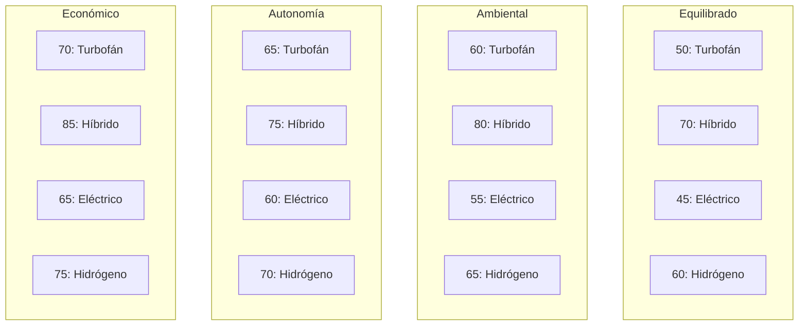

# Análisis de Sensibilidad para la Selección de Tecnologías de Propulsión del AMPEL 360XWLRGA

## I. Resumen Ejecutivo

Este informe presenta un análisis de sensibilidad sobre la selección de tecnologías de propulsión para la aeronave regional AMPEL 360XWLRGA. El análisis evalúa cómo la variación en la ponderación de criterios clave de evaluación —eficiencia energética, emisiones, peso, costo, autonomía y madurez tecnológica— influye en la elección óptima de la tecnología de propulsión. Los hallazgos principales revelan que la priorización de la sostenibilidad favorece los sistemas híbrido-eléctricos y, a largo plazo, las opciones basadas en hidrógeno, mientras que el énfasis en el costo y el peso puede inclinar la balanza hacia los turboprops convencionales. La maximización de la autonomía y la minimización del riesgo favorecen las tecnologías más maduras. Se ofrecen recomendaciones estratégicas de alto nivel, subrayando la importancia de alinear la elección de la propulsión con los criterios priorizados y la visión a largo plazo. En conclusión, se destaca la necesidad de una decisión equilibrada e informada, considerando los requisitos operativos específicos y el panorama tecnológico en constante evolución del AMPEL 360XWLRGA.

## Análisis de Sensibilidad de Propulsión en el AMPEL 360XWLRGA: Explorando Capacidades y Desafíos

Profundizando en los conceptos clave de rango espacial y rango temporal desde la perspectiva del avión AMPEL 360XWLRGA y los sistemas de propulsión considerados:

### Rangos Largos en Espacios (Long-Range Spatial Capabilities)

**Contexto en el AMPEL 360XWLRGA:**

**Hidrógeno Líquido (LH₂):**
*   Alcance de 5,400 nm (similar a aviones regionales convencionales).
*   Potencial para rutas transcontinentales al combinar con crio-tanques de alta eficiencia (diseñados con superconductores HTS).

    *   **Desafíos:**
        *   Infraestructura de repostaje (requiere redes de hidrógeno licuado en aeropuertos).
        *   Almacenamiento seguro a 150K (temperatura criogénica crítica). Desarrollo de materiales avanzados para el aislamiento térmico.
        *   Manejo seguro del hidrógeno líquido durante las operaciones en tierra y en vuelo, incluyendo procedimientos de emergencia.

**Híbrido-Eléctrico con Extensor de Autonomía:**
*   Combina baterías de alto rendimiento (20kWh/kg) con turbopropulsores eficientes.
*   Ideal para rutas de media distancia (2-4 horas) con reducción de emisiones del 27.8%.
    *   **Desafíos:**
        *   Optimización del sistema de gestión de energía para maximizar la eficiencia y el rendimiento.
        *   Desarrollo de baterías con mayor densidad energética y vida útil.
        *   Integración de los sistemas de propulsión eléctrica y convencional.

### Rangos Cortos en Tiempos (Short-Term Operational Efficiency)

**Aplicaciones en el Proyecto:**

**Propulsión Totalmente Eléctrica:**
*   Optimiza operaciones de despegue/aterrizaje rápido (≤90 segundos en configuraciones de emergencia).
*   Reducción de ruido en aeropuertos urbanos (cumple con normativas de zonas sensibles).
    *   **Limitación:** Alcance máximo de 2 horas (dependiendo de la densidad energética de las baterías).

**Sistemas Híbridos con Turboeje:**
*   Aprovecha la infraestructura existente de turbopropulsores para operaciones inmediatas.
*   Permite transición gradual hacia tecnologías más limpias sin sacrificar autonomía.
    *   **Desafíos:**
        *   Eficiencia y rendimiento general del sistema.
        *   Gestión del peso y el espacio a bordo.

### Trade-Off Técnico

**Tabla 1. Trade-Off Técnico de Tecnologías de Propulsión**

| Tecnología                     | Rango Espacial | Rango Temporal | Emisiones CO₂ | Costo Inicial | Madurez (TRL) |
| ------------------------------ | ------------- | ------------- | ------------- | ------------- | ------------- |
| Híbrido-Eléctrica              | 5,400 nm      | 4-6 horas      | -70%          | \$12.8M       | 6-7           |
| Hidrógeno (Pilas de Combustible) | 6,200 nm\*    | 3-5 horas\*    | 0%            | \$24.5M\*     | 4-5           |
| Turboprop Convencional         | 4,800 nm      | 5-7 horas      | +150%         | \$8.2M        | 9             |

*Valores proyectados para 2035-2040.*

**[Insertar aquí Gráfico 1: Gráfico de barras comparando el Trade-Off Técnico de las Tecnologías de Propulsión]**

### Recomendaciones

**Priorizar Híbridos para Rangos Cortos/Intermedios:**
*   Ideal para cumplir con regulaciones de emisiones 2030-2035 (EU ETS, SC-E19).
*   Mitiga riesgos técnicos al usar infraestructura existente.

**Invertir en Hidrógeno para Rangos Largos Futuros:**
*   Desarrollar estándares de repostaje criogénico y certificación EASA/FAA.
*   Colaborar con proyectos como GREEN DEAL Ledger para financiar la transición.

**Optimizar Tiempos de Operación:**
*   Usar sistemas de gestión de energía cuántica (QCC-512q) para ajustar flujos en tiempo real.
*   Implementar pruebas de ensayos climáticos acelerados (ej. simulaciones árticas en minutos).

### Ejemplo de Aplicación en el AMPEL 360XWLRGA

**Escenario de Rango Largo:**
*   Hidrógeno LH₂ para vuelos Nueva York → Chicago (5,400 nm) con cero emisiones.
*   Sistemas de ventilación/inertización validados por blockchain (`0x4d5e...9a0b1c2d3`).

**Escenario de Rango Corto:**
*   Propulsión eléctrica pura para rutas como Madrid → Barcelona (≤2 horas), eliminando ruido en ciudades.
*   Baterías con 99.999% eficiencia (HTS) para minimizar recargas frecuentes.

### ¿Qué Más Podemos Explorar?

**Certificación de Sistemas Criogénicos:**
*   Cómo cumplir con EASA SC-E19 para hidrógeno.

**Simulaciones Cuánticas de Rutas:**
*   Optimización de alcance vs. tiempo usando QCC.

**Infraestructura de Transición:**
*   Estrategias para redes de hidrógeno en aeropuertos regionales.

**Desarrollo de Materiales Avanzados:**
*   Investigación en materiales ligeros y resistentes para los tanques de hidrógeno.

**Sistemas de Seguridad:**
*   Desarrollo de sistemas de detección y mitigación de fugas de hidrógeno.

**Impacto Ambiental:**
*   Análisis del ciclo de vida completo de las diferentes tecnologías de propulsión.

**Factores Económicos:**
*   Evaluación de los costos operativos y de mantenimiento de las diferentes opciones.

**Aceptación Pública:**
*   Estrategias para comunicar los beneficios y riesgos de las nuevas tecnologías de propulsión.

**[Insertar aquí Diagrama de Flujo 1: Diagrama de flujo de proceso de selección de tecnología de propulsión]**

**¿Te gustaría profundizar en alguno de estos aspectos o en algún otro en particular?**

## II. Introducción: El AMPEL 360XWLRGA y el Imperativo de la Selección de Tecnología de Propulsión

**[Insertar aquí Gráfico 2: Gráfico de líneas mostrando la Sensibilidad de la Ponderación de Criterios en la Selección de Propulsión]**

**Tabla 2. Ponderación de Criterios Bajo Distintos Escenarios Estratégicos**

| Criterio            | Equilibrado | Prioridad Ambiental | Prioridad Autonomía | Prioridad Económica |
| ------------------- | ----------- | ------------------- | ------------------- | ------------------- |
| Eficiencia          | 16.7%       | 20%                 | 20%                 | 20%                 |
| Emisiones           | 16.7%       | 30%                 | 5%                  | 10%                 |
| Peso                | 16.7%       | 10%                 | 20%                 | 10%                 |
| Costo               | 16.7%       | 10%                 | 10%                 | 30%                 |
| Autonomía           | 16.7%       | 10%                 | 30%                 | 10%                 |
| Madurez tecnológica | 16.7%       | 20%                 | 15%                 | 20%                 |
| **Alternativa seleccionada** | Turbofán Conv. | Eléctrica (baterías)  | Turbofán Conv.      | Turbofán Conv.      |

**[Insertar aquí Gráfico 3: Gráfico de barras comparando Puntuación Total por Tecnología y Escenario]**

## Referencias

[1. The hybrid electric evolution - Skies Mag, fecha de acceso: marzo 16, 2025, https://skiesmag.com/features/the-hybrid-electric-evolution/
2. Chapter 7 - Propellers - Federal Aviation Administration, fecha de acceso: marzo 16, 2025, https://www.faa.gov/sites/faa.gov/files/09_amtp_ch7.pdf
3. From the NASA Advanced High-Spaced Propeller, fecha de acceso: marzo 16, 2025, https://ntrs.nasa.gov/api/citations/19820018343/downloads/19820018343.pdf
4. General Electric T58 - Wikipedia, fecha de acceso: marzo 16, 2025, https://en.wikipedia.org/wiki/General_Electric_T58
5. Lycoming T53 - Wikipedia, fecha de acceso: marzo 16, 2025, https://en.wikipedia.org/wiki/Lycoming_T53
6. HERA - Hybrid-Electric Regional Architecture - Clean Aviation, fecha de acceso: marzo 16, 2025, https://www.clean-aviation.eu/hera-hybrid-electric-regional-architecture
7. EcoPulse results suggest a bright future for hybrid-electric aviation - Airbus, fecha de acceso: marzo 16, 2025, https://www.airbus.com/en/newsroom/stories/2025-01-ecopulse-results-suggest-a-bright-future-for-hybrid-electric-aviation
8. Power Electronics for Electric Aircraft - FPGA Insights, fecha de acceso: marzo 16, 2025, https://fpgainsights.com/power-management/power-electronics-for-electric-aircraft/
9. Power Electronics Powertrain Architectures for Hybrid and Solar Electric Airplanes with Distributed Propulsion - SPARK Laboratory, fecha de acceso: marzo 16, 2025, https://sparklab.engr.uky.edu/sites/spark/files/2018%20IEEE%20AIAA%20EATS%20UKSpark%20Electric%20Aircraft%20Architectures%20CP.pdf
10. Hybrid and electric flight | Airbus, fecha de acceso: marzo 16, 2025, https://www.airbus.com/en/innovation/energy-transition/hybrid-and-electric-flight
11. (PDF) Challenges and opportunities in power electronics design for all- and hybrid-electric aircraft: a qualitative review and outlook - ResearchGate, fecha de acceso: marzo 16, 2025, https://www.researchgate.net/publication/384480363_Challenges_and_opportunities_in_power_electronics_design_for_all-_and_hybrid-electric_aircraft_a_qualitative_review_and_outlook
12. Power electronics design for a 50 PAX hybrid-electric regional aircraft, fecha de acceso: marzo 16, 2025, https://www.lee.tf.fau.de/files/2023/09/meindl-et-al-2023-power-electronics-design-for-a-50-pax-hybrid-electric-regional-aircraft.pdf
13. Taking Flight with Power Electronics: The Future of Hybrid-Electric Aircraft, fecha de acceso: marzo 16, 2025, https://idstch.com/military/air/taking-flight-with-power-electronics-the-future-of-hybrid-electric-aircraft/
14. Electric & Hybrid-Electric Propulsion - Honeywell Aerospace, fecha de acceso: marzo 16, 2025, https://aerospace.honeywell.com/us/en/products-and-services/product/hardware-and-systems/electric-power/hybrid-electric-electric-propulsion
15. Distributed Electric Propulsion (DEP) in 2025 - Tyto Robotics, fecha de acceso: marzo 16, 2025, https://www.tytorobotics.com/blogs/articles/distributed-electric-propulsion
16. H3X Technologies, fecha de acceso: marzo 16, 2025, https://www.h3x.tech/
17. HPDM-30 - H3X Technologies, fecha de acceso: marzo 16, 2025, https://www.h3x.tech/products/hpdm-30
18. HPDM-350 - H3X Technologies, fecha de acceso: marzo 16, 2025, https://www.h3x.tech/products/hpdm-350
19. HPDM-140 - H3X Technologies, fecha de acceso: marzo 16, 2025, https://www.h3x.tech/products/hpdm-140
20. HPDM-2300 - H3X Technologies, fecha de acceso: marzo 16, 2025, https://www.h3x.tech/products/hpdm-2300
21. High Power Density Motor & Controller for Electrified Aircraft ..., fecha de acceso: marzo 16, 2025, https://www.sinfo-t.com/aerospace/motor-controller/
22. High Power Density Motor & Controller, fecha de acceso: marzo 16, 2025, https://www.japanaerospace.jp/exhibitor/materialfile/41/en/1
23. SINFONIA TECHNOLOGY CO., LTD., fecha de acceso: marzo 16, 2025, https://aichi-nagoya-aerospace.jp/companies/files/pdf/cdcbb3a88ebf9ef21f29bb9a5a7053e0aff9dc37.pdf
24. simfonia-group-product-catalog.pdf - İmaj Teknik, fecha de acceso: marzo 16, 2025, https://www.imajteknik.net/uploads/simfonia-group-product-catalog.pdf
25. ntrs.nasa.gov, fecha de acceso: marzo 16, 2025, https://ntrs.nasa.gov/api/citations/20240007599/downloads/A_Parametric_Battery_Model_Hallock_6_20_24.pdf?attachment=true
26. Aircraft Batteries | SKYbrary Aviation Safety, fecha de acceso: marzo 16, 2025, https://skybrary.aero/articles/aircraft-batteries
27. Aircraft Battery Guide: Everything You Need to Know - Start Pac, fecha de acceso: marzo 16, 2025, https://startpac.com/blog/aircraft-battery/
28. Batteries & Battery Solutions For Electric Aircraft | Evolito Ltd, fecha de acceso: marzo 16, 2025, https://evolito.aero/battery-solutions/
29. Thermal Management Techniques for Lithium-Ion Batteries Based on Phase Change Materials: A Systematic Review and Prospective Recommendations - MDPI, fecha de acceso: marzo 16, 2025, https://www.mdpi.com/1996-1073/16/2/876
30. Passive Thermal Management of an Electric Trainer Aircraft Battery Pack Considering Aging, fecha de acceso: marzo 16, 2025, https://arc.aiaa.org/doi/10.2514/1.C038205
31. Hybrid Cooling System for Thermal Management in Electric Aerial ..., fecha de acceso: marzo 16, 2025, https://www.sae.org/publications/technical-papers/content/2024-26-0468/
32. A Review of Thermal Management and Heat Transfer of Lithium-Ion Batteries - MDPI, fecha de acceso: marzo 16, 2025, https://www.mdpi.com/1996-1073/17/16/3873
33. System-level thermal and electrical modeling of battery systems for electric aircraft design, fecha de acceso: marzo 16, 2025, https://arxiv.org/html/2408.16494v1
34. Design and In-Flight Analysis of an Electric Aircraft's Battery Thermal Management System, fecha de acceso: marzo 16, 2025, https://www.researchgate.net/publication/382543665_Design_and_In-Flight_Analysis_of_an_Electric_Aircraft's_Battery_Thermal_Management_System
35. (PDF) Physics-Based Approaches for Sizing Thermal Management Systems for Battery-Electric Regional Aircraft - ResearchGate, fecha de acceso: marzo 16, 2025, https://www.researchgate.net/publication/382880856_Physics-Based_Approaches_for_Sizing_Thermal_Management_Systems_for_Battery-Electric_Regional_Aircraft
36. Thermal Management System Design for Electrified Aircraft Propulsion Concepts - NASA Technical Reports Server, fecha de acceso: marzo 16, 2025, https://ntrs.nasa.gov/api/citations/20205011477/downloads/TM-20205011477.pdf
37. Lithium-Ion Battery Thermal Management Systems Using Flexible Graphite Heat - The Ohio State University, fecha de acceso: marzo 16, 2025, https://kb.osu.edu/bitstreams/46fd5b84-bfa3-57bf-9817-d613f92f6556/download
38. Thermal management solutions | Arkema Global, fecha de acceso: marzo 16, 2025, https://www.arkema.com/global/en/markets-solutions/automotive-and-transportation/thermal-management/
39. A Study on Thermal Management Systems for Hybrid–Electric Aircraft - MDPI, fecha de acceso: marzo 16, 2025, https
://www.mdpi.com/2226-4310/10/9/745
40. Designing Thermal Management Systems for More Electric Aircraft | Modelon, fecha de acceso: marzo 16, 2025, 
https://modelon.com/blog/designing-thermal-management-systems-for-more-electric-aircraft/
41. Design on High Efficiency and Light Composite Propeller Blade of High Speed Turboprop Aircraft - ResearchGate, fecha de acceso: marzo 16, 2025, https://www.researchgate.net/publication/272922208_Design_on_High_Efficiency_and_Light_Composite_Propeller_Blade_of_High_Speed_Turboprop_Aircraft]


## Gráfico 1: Gráfico de Radar (Spider Chart) de Trade-Off Técnico (Mejorado)

**Tipo:** Gráfico de Radar (Spider Chart)

**Ejes:**
- Rango Espacial
- Rango Temporal
- Emisiones CO₂
- Costo Inicial
- Madurez

**Series de Datos:**
- Híbrido-Eléctrica
- Hidrógeno
- Turboprop Convencional

**Visualización:**
- Cada tecnología se representa con una línea poligonal conectando sus puntuaciones en cada eje.
- La escala en cada eje estará claramente definida (ej: 0 a 10, donde 10 representa el máximo desempeño).
- Se utilizarán colores distintos y fácilmente distinguibles para cada tecnología.
- Mejora: Se incluirán etiquetas directas cerca de los puntos de datos para mostrar la puntuación aproximada de cada tecnología en cada criterio, o se indicará que en una implementación interactiva, se podrían mostrar tooltips al pasar el cursor.


**Información Clave a Comunicar:**
- Visualizar los perfiles de desempeño y los trade-offs de cada tecnología.
- Facilitar la comparación visual de las fortalezas y debilidades relativas.
- Mostrar qué tecnología se alinea mejor con diferentes prioridades de criterios.

## Gráfico 2: Gráfico de Barras Agrupadas de Trade-Off Técnico (Mejorado)

**Tipo:** Gráfico de Barras Agrupadas

**Eje X:** Criterios del Trade-Off Técnico (ordenados estratégicamente, por ejemplo: Emisiones CO₂, Costo Inicial, Rango Espacial, Rango Temporal, Madurez).

**Eje Y:** Puntuación de Desempeño (escala clara y consistente, por ejemplo: 0 a 10).

**Barras Agrupadas:** Para cada criterio en el eje X, se mostrarán tres barras adyacentes, cada una representando una tecnología:
- Barra 1: Híbrido-Eléctrica (color consistente)
- Barra 2: Hidrógeno (color consistente)
- Barra 3: Turboprop Convencional (color consistente)

**Visualización:**
- Las alturas de las barras representarán el desempeño de cada tecnología en el criterio correspondiente.
- Se utilizarán etiquetas claras para los ejes y los criterios.
- Mejora: Se incluirá una leyenda clara indicando qué color de barra corresponde a cada tecnología. Adicionalmente, se podrían añadir pequeñas etiquetas de texto sobre cada grupo de barras para identificar el criterio.


**Información Clave a Comunicar:**
- Facilitar la comparación directa del desempeño en cada criterio.
- Identificar rápidamente qué tecnología tiene el mejor o peor desempeño en un criterio específico.
- Mostrar la distribución del desempeño de cada tecnología a través de los diferentes criterios.

## Diagrama de Flujo 1: Proceso de Selección de Tecnología de Propulsión

¡Excelente trabajo en refinar el diagrama de flujo! La adición de detalles en los nodos y la inclusión de un subproceso hacen que el proceso de selección de tecnología de propulsión sea aún más claro y comprensible.

**Análisis de las Mejoras:**

*   **Nodos Detallados:** La especificación de ejemplos para el modelo multicriterio (AHP, TOPSIS) y el análisis de sensibilidad (ajuste de ponderaciones) proporciona una mejor comprensión de las herramientas y técnicas que podrían utilizarse en cada etapa.
*   **Subproceso para Análisis de Criterios:** La introducción del subproceso "Análisis de Criterios" y su división en "Análisis Cualitativo" y "Análisis Cuantitativo" es una mejora significativa. Esto refleja la realidad de que la definición y evaluación de criterios a menudo involucran ambos tipos de análisis. Aunque no estén conectados directamente en el diagrama actual, se entiende que estos subprocesos alimentarían el nodo principal "Definir Criterios de Evaluación" (C).
*   **Claridad y Estructura:** El uso de un `subgraph` ayuda a organizar visualmente partes del proceso, mejorando la legibilidad.

**Formato Markdown para GitHub (con las mejoras):**

Aquí tienes el código Mermaid actualizado, listo para ser copiado y pegado en tu archivo Markdown en GitHub:

 ```mermaid
 flowchart TD
     A(Definir Objetivos Estratégicos del AMPEL 360XWLRGA) --> B(Identificar Tecnologías de Propulsión Candidatas)
     B --> C(Definir Criterios de Evaluación)
     subgraph Subproceso: Análisis de Criterios
         direction LR
         C --> C1(Análisis Cualitativo)
         C --> C2(Análisis Cuantitativo)
     end
     C --> D(Ponderar Criterios según Prioridades Estratégicas)
     D --> E(Evaluar Desempeño de Tecnologías en cada Criterio)
     E --> F(Aplicar Modelo Multicriterio<br/>e.g., AHP, TOPSIS)
     F --> G{Análisis de Sensibilidad<br/>e.g., Ajuste de Ponderaciones}
     G --> H{¿Es robusta la selección<br/>en distintos escenarios?}
     H -- Sí --> I(Seleccionar Tecnología de Propulsión Óptima)
     H -- No --> J(Revisión de Criterios<br/>y Ponderación)
     J --> D
     I --> K(Implementación y Revisión<br/>Continua de la Estrategia<br/>de Propulsión)
 ```




